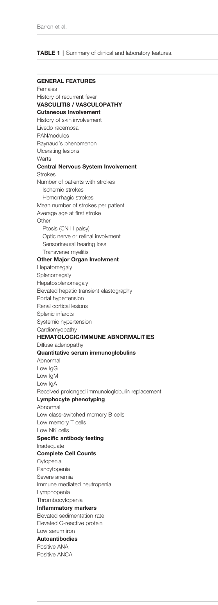

## Question

# Disease Characteristics Research Template

## Target Disease
- **Disease Name:** Deficiency of Adenosine Deaminase 2
- **MONDO ID:**  (if available)
- **Category:** Mendelian

## Research Objectives

Please provide a comprehensive research report on **Deficiency of Adenosine Deaminase 2** covering all of the
disease characteristics listed below. This report will be used to populate a disease knowledge
base entry. Be thorough and cite primary literature (PMID preferred) for all claims.

For each section, **suggested databases/resources** are listed. These are the first places
you should search for information on each topic.

---

### 1. Disease Information
> **Search first:** OMIM, Orphanet, ICD-10/ICD-11, MeSH, PubMed

- What is the disease? Provide a concise overview.
- What are the key identifiers? (OMIM, Orphanet, ICD-10/ICD-11, MeSH, Mondo)
- What are the common synonyms and alternative names?
- Is the information derived from individual patients (e.g., EHR) or aggregated disease-level resources?

### 2. Etiology

- **Disease Causal Factors**: What are the primary causes? (genetic, environmental, infectious, mechanistic)
- **Risk Factors**:
  > **Search first:** PubMed, Cochrane Library, UpToDate, clinical guidelines, ClinVar, ClinGen, GWAS Catalog, PheGenI, CTD, CDC, WHO, epidemiological databases
  - Genetic risk factors (causal variants, susceptibility loci, modifier genes)
  - Environmental risk factors (toxins, lifestyle, occupational exposures, age, sex, family history)
- **Protective Factors**:
  > **Search first:** PubMed, Cochrane Library, clinical trial databases, GWAS Catalog, gnomAD, WHO, CDC, nutrition databases
  - Genetic protective factors (protective variants, modifier alleles)
  - Environmental protective factors (diet, lifestyle, exposures that reduce risk)
- **Gene-Environment Interactions**: How do genetic and environmental factors interact to influence disease?
  > **Search first:** CTD, PubMed, PheGenI, GxE databases

### 3. Phenotypes
> **Search first:** HPO (Human Phenotype Ontology), OMIM, Orphanet, PubMed, clinicaltrials.gov, MedDRA, SNOMED CT, DECIPHER, LOINC

For each phenotype, provide:
- **Phenotype type**: symptoms, clinical signs, physical manifestations, behavioral changes, or laboratory abnormalities
  > For symptoms/signs: HPO, OMIM, Orphanet, PubMed
  > For behavioral changes: HPO, DSM, RDoC (Research Domain Criteria), PubMed
  > For laboratory abnormalities: LOINC, SNOMED CT, LabTests Online, PubMed
- **Phenotype characteristics**:
  > **Search first:** OMIM, Orphanet, HPO, PubMed
  - Age of symptom onset (neonatal, childhood, adult-onset, late-onset)
  - Symptom severity (mild, moderate, severe, variable)
  - Symptom progression (stable, progressive, episodic, fluctuating)
  - Frequency among affected individuals (percentage or qualitative)
- **Quality of life impact**: Effects on daily functioning and well-being (per-phenotype when possible)
  > **Search first:** EQ-5D database, SF-36, WHO QOL databases, PubMed
- Suggest HPO (Human Phenotype Ontology) terms for each phenotype

### 4. Genetic/Molecular Information

- **Causal Genes**: Gene mutations or chromosomal abnormalities responsible for disease (gene symbols, OMIM IDs)
  > **Search first:** OMIM, ClinVar, HGMD, Ensembl, NCBI Gene
- **Pathogenic Variants**:
  - Affected genes (gene symbols, HGNC IDs)
    > **Search first:** OMIM, NCBI Gene, Ensembl, HGNC, UniProt, GeneCards
  - Variant classification (pathogenic, likely pathogenic, VUS per ACMG/AMP guidelines)
    > **Search first:** ClinVar, ClinGen, ACMG/AMP guidelines, VarSome
  - Variant type/class (missense, frameshift, nonsense, splice-site, structural)
  - Allele frequency in population databases
    > **Search first:** gnomAD, 1000 Genomes, ExAC, TOPMed, dbSNP
  - Somatic vs germline origin
    > **Search first:** COSMIC (somatic), ClinVar, ICGC, TCGA
  - Functional consequences (loss of function, gain of function, dominant negative)
- **Modifier Genes**: Genes that modify disease severity or expression
- **Epigenetic Information**: DNA methylation, histone modifications, chromatin changes affecting disease
  > **Search first:** ENCODE, Roadmap Epigenomics, MethBase, DiseaseMeth
- **Chromosomal Abnormalities**: Large-scale genetic changes (aneuploidy, translocations, inversions)
  > **Search first:** DECIPHER, ClinVar, ECARUCA, UCSC Genome Browser

### 5. Environmental Information

- **Environmental Factors**: Non-genetic contributing factors (toxins, radiation, pollution, occupational exposure)
  > **Search first:** CTD (Comparative Toxicogenomics Database), TOXNET, PubMed, EPA databases
- **Lifestyle Factors**: Behavioral factors (smoking, diet, exercise, alcohol consumption)
  > **Search first:** CDC databases, WHO, PubMed, NHANES
- **Infectious Agents**: If applicable, pathogens causing or triggering disease (bacteria, viruses, fungi, parasites)
  > **Search first:** NCBI Taxonomy, ViPR, BV-BRC, MicrobeDB, GIDEON

### 6. Mechanism / Pathophysiology

- **Molecular Pathways**: Specific signaling cascades or biochemical pathways involved (Wnt, MAPK, mTOR, PI3K-AKT, etc.)
  > **Search first:** KEGG, Reactome, WikiPathways, PathBank, BioCyc
- **Cellular Processes**: Cell-level mechanisms (apoptosis, autophagy, cell cycle dysregulation, inflammation, etc.)
  > **Search first:** Gene Ontology (GO), Reactome, KEGG, PubMed
- **Protein Dysfunction**: How protein structure or function is altered (misfolding, aggregation, loss of function, gain of function)
  > **Search first:** UniProt, PDB (Protein Data Bank), InterPro, Pfam, AlphaFold
- **Metabolic Changes**: Alterations in metabolic processes (energy metabolism, lipid metabolism, amino acid metabolism)
  > **Search first:** KEGG, BioCyc, HMDB (Human Metabolome Database), BRENDA
- **Immune System Involvement**: Role of immune response (autoimmunity, immunodeficiency, chronic inflammation)
  > **Search first:** ImmPort, Immunome Database, IEDB, Gene Ontology
- **Tissue Damage Mechanisms**: How tissues/ are injured (oxidative stress, ischemia, fibrosis, necrosis)
  > **Search first:** PubMed, Gene Ontology, Reactome
- **Biochemical Abnormalities**: Specific molecular defects (enzyme deficiencies, receptor dysfunction, ion channel defects)
  > **Search first:** BRENDA, UniProt, KEGG, OMIM, PubMed
- **Epigenetic Changes**: DNA methylation, histone modifications affecting gene expression in disease
  > **Search first:** ENCODE, Roadmap Epigenomics, MethBase, DiseaseMeth
- **Molecular Profiling** (if available):
  - Transcriptomics/gene expression changes
    > **Search first:** GEO (Gene Expression Omnibus), ArrayExpress, GTEx, Human Cell Atlas, SRA
  - Proteomics findings
    > **Search first:** PRIDE, ProteomeXchange, Human Protein Atlas, STRING, BioGRID
  - Metabolomics signatures
    > **Search first:** MetaboLights, Metabolomics Workbench, HMDB, METLIN
  - Lipidomics alterations
    > **Search first:** LIPID MAPS, SwissLipids, LipidHome, Metabolomics Workbench
  - Genomic structural features
    > **Search first:** UCSC Genome Browser, Ensembl, NCBI, dbVar, DGV
- **Advanced Technologies** (if applicable):
  - Single-cell analysis findings (cell-type specific mechanisms, cellular heterogeneity)
    > **Search first:** Human Cell Atlas, Single Cell Portal, GEO, CELLxGENE
  - Spatial transcriptomics findings
    > **Search first:** GEO, Spatial Research, Vizgen, 10x Genomics data
  - Multi-omics integration results
    > **Search first:** TCGA, ICGC, cBioPortal, LinkedOmics, PubMed
  - Functional genomics screens (CRISPR, RNAi)
    > **Search first:** DepMap, GenomeRNAi, PubMed, BioGRID ORCS

For each mechanism, describe:
- The causal chain from initial trigger to clinical manifestation
- Which mechanisms are upstream vs downstream
- What cell types and biological processes are involved
- Suggest GO terms for biological processes and CL terms for cell types

### 7. Anatomical Structures Affected

- **Organ Level**:
  - Primary organs directly affected
  - Secondary organ involvement (complications, secondary effects)
  - Body systems involved (cardiovascular, nervous, digestive, respiratory, endocrine, etc.)
  > **Search first:** Uberon, FMA (Foundational Model of Anatomy), OMIM, HPO, ICD-11, MeSH, SNOMED CT
- **Tissue and Cell Level**:
  - Specific tissue types affected (epithelial, connective, muscle, nervous)
  - Specific cell populations targeted (with Cell Ontology terms)
  > **Search first:** Uberon, Human Protein Atlas, Cell Ontology, Human Cell Atlas, CellMarker, PanglaoDB
- **Subcellular Level**:
  - Cellular compartments involved (mitochondria, nucleus, ER, lysosomes) (with GO Cellular Component terms)
  > **Search first:** Gene Ontology (Cellular Component), UniProt, Human Protein Atlas
- **Localization**:
  - Specific anatomical sites (with UBERON terms)
    > **Search first:** FMA, Uberon, NeuroNames (for brain), SNOMED CT
  - Lateralization (unilateral, bilateral, asymmetric)
    > **Search first:** HPO, clinical literature, imaging databases

### 8. Temporal Development

- **Onset**:
  - Typical age of onset (congenital, pediatric, adult, geriatric)
  - Onset pattern (acute, subacute, chronic, insidious)
  > **Search first:** OMIM, Orphanet, HPO, PubMed
- **Progression**:
  - Disease stages (early, intermediate, advanced, end-stage)
    > **Search first:** Cancer Staging Manual (AJCC), WHO classifications, PubMed
  - Progression rate (rapid, slow, variable)
  - Disease course pattern (episodic, relapsing-remitting, progressive, stable)
  - Disease duration (self-limited, chronic lifelong)
  > **Search first:** Disease registries, longitudinal cohort databases, natural history studies, PubMed, Orphanet, OMIM
- **Patterns**:
  - Remission patterns (spontaneous, treatment-induced)
    > **Search first:** Clinical trial databases, disease registries, PubMed
  - Critical periods (time windows of vulnerability or opportunity for intervention)
    > **Search first:** PubMed, developmental biology databases, clinical guidelines

### 9. Inheritance and Population

- **Epidemiology**:
  - Prevalence (cases per 100,000 at given time)
  - Incidence (new cases per 100,000 per year)
  > **Search first:** Orphanet, CDC, WHO, GBD (Global Burden of Disease), national registries, SEER, disease registries
- **For Genetic Etiology**:
  - Inheritance pattern (AD, AR, X-linked, mitochondrial, multifactorial, polygenic)
    > **Search first:** OMIM, Orphanet, ClinVar, GTR (Genetic Testing Registry)
  - Penetrance (complete, incomplete, age-dependent)
    > **Search first:** ClinVar, OMIM, PubMed, ClinGen
  - Expressivity (variable, consistent)
    > **Search first:** OMIM, ClinVar, PubMed
  - Genetic anticipation (increasing severity in successive generations)
    > **Search first:** OMIM, PubMed (especially for repeat expansion disorders)
  - Germline mosaicism
    > **Search first:** ClinVar, OMIM, genetic counseling literature, PubMed
  - Founder effects (population-specific mutations)
    > **Search first:** gnomAD, population genetics databases, PubMed
  - Consanguinity role
    > **Search first:** OMIM, population studies, genetic counseling resources
  - Carrier frequency
    > **Search first:** gnomAD, carrier screening databases, GeneReviews, GTR
- **Population Demographics**:
  - Affected populations (ethnic or demographic groups with higher prevalence)
    > **Search first:** gnomAD, 1000 Genomes, PAGE Study, PubMed, population registries
  - Geographic distribution (endemic areas, regional variation)
    > **Search first:** WHO, CDC, GBD, Orphanet, geographic epidemiology databases
  - Geographic distribution of specific variants
  - Sex ratio (male:female)
    > **Search first:** Disease registries, OMIM, PubMed, epidemiological databases
  - Age distribution of affected individuals
    > **Search first:** CDC, disease registries, SEER, Orphanet

### 10. Diagnostics

- **Clinical Tests**:
  - Laboratory tests (blood, urine, tissue chemistry, specific enzyme assays)
    > **Search first:** LOINC, LabTests Online, PubMed
  - Biomarkers (proteins, metabolites, genetic markers, circulating biomarkers)
    > **Search first:** FDA Biomarker List, BEST (Biomarkers, EndpointS, and other Tools), PubMed
  - Imaging studies (X-ray, CT, MRI, PET, ultrasound)
    > **Search first:** RadLex, DICOM, Radiopaedia, imaging databases
  - Functional tests (pulmonary function, cardiac stress tests)
    > **Search first:** LOINC, clinical guidelines, PubMed
  - Electrophysiology (EEG, EMG, ECG, nerve conduction studies)
    > **Search first:** LOINC, clinical neurophysiology databases, PubMed
  - Biopsy findings (histopathology, immunohistochemistry)
    > **Search first:** SNOMED CT, College of American Pathologists resources, PubMed
  - Pathology findings (microscopic examination)
    > **Search first:** SNOMED CT, Digital Pathology databases, PubMed
- **Genetic Testing**:
  > **Search first:** GTR (Genetic Testing Registry), GeneReviews, ClinGen
  - Overview of recommended genetic testing approach
  - Whole genome sequencing (WGS) utility
    > **Search first:** GTR, ClinVar, GEL (Genomics England), gnomAD
  - Whole exome sequencing (WES) utility
    > **Search first:** GTR, ClinVar, OMIM, GeneMatcher
  - Gene panels (which panels, which genes)
    > **Search first:** GTR, ClinVar, laboratory-specific databases
  - Single gene testing
    > **Search first:** GTR, ClinVar, OMIM, GeneReviews
  - Chromosomal microarray (CMA)
    > **Search first:** DECIPHER, ClinVar, dbVar, ECARUCA
  - Karyotyping
    > **Search first:** Chromosome Abnormality Database, ClinVar, cytogenetics resources
  - FISH
    > **Search first:** ClinVar, cytogenetics databases, PubMed
  - Mitochondrial DNA testing
    > **Search first:** MITOMAP, MSeqDR, ClinVar, GTR
  - Repeat expansion testing
    > **Search first:** GTR, ClinVar, repeat expansion databases, PubMed
- **Omics-Based Diagnostics** (if applicable):
  - RNA sequencing / transcriptomics
    > **Search first:** GEO, ArrayExpress, GTEx, RNA-seq databases
  - Proteomics
    > **Search first:** PRIDE, ProteomeXchange, FDA Biomarker database
  - Metabolomics
    > **Search first:** MetaboLights, Metabolomics Workbench, HMDB
  - Epigenomics
    > **Search first:** GEO, ENCODE, Roadmap Epigenomics, MethBase
  - Liquid biopsy
    > **Search first:** COSMIC, ClinVar, liquid biopsy databases, PubMed
- **Clinical Criteria**:
  - Standardized diagnostic criteria (DSM, ICD, society guidelines)
    > **Search first:** DSM-5, ICD-11, clinical society guidelines, UpToDate
  - Differential diagnosis (other conditions to rule out, with distinguishing features)
    > **Search first:** DynaMed, UpToDate, clinical decision support systems
- **Screening**:
  - Screening methods for asymptomatic individuals (newborn screening, carrier screening, cascade screening)
    > **Search first:** ACMG recommendations, CDC newborn screening, GTR

### 11. Outcome/Prognosis

- **Survival and Mortality**:
  - Survival rate (5-year, 10-year, overall)
    > **Search first:** SEER, cancer registries, disease-specific registries, PubMed
  - Life expectancy (with and without treatment if applicable)
    > **Search first:** Orphanet, disease registries, actuarial databases, PubMed
  - Mortality rate
    > **Search first:** CDC, WHO, GBD, national mortality databases
  - Disease-specific mortality (deaths directly attributable to disease)
    > **Search first:** Disease registries, CDC Wonder, GBD, PubMed
- **Morbidity and Function**:
  - Morbidity (disease-related disability and health impacts)
    > **Search first:** GBD, WHO, disability databases, PubMed
  - Disability outcomes (long-term functional impairments)
    > **Search first:** ICF (International Classification of Functioning), disability registries
  - Quality of life measures (EQ-5D, SF-36, PROMIS, disease-specific tools)
    > **Search first:** EQ-5D database, SF-36, PROMIS, PubMed
- **Disease Course**:
  - Complications (secondary problems: infections, organ failure, etc.)
    > **Search first:** ICD codes, disease registries, clinical databases, PubMed
  - Recovery potential (likelihood and extent of recovery, with vs without treatment)
    > **Search first:** Natural history studies, rehabilitation databases, PubMed
- **Prediction**:
  - Prognostic factors (age, disease severity, biomarkers, treatment response)
    > **Search first:** Prognostic models databases, clinical calculators, PubMed
  - Prognostic biomarkers (molecular markers predicting disease course)
    > **Search first:** FDA Biomarker database, PubMed, cancer prognostic databases

### 12. Treatment

- **Pharmacotherapy**:
  - Pharmacological treatments (drug names, drug classes, mechanisms of action)
    > **Search first:** DrugBank, RxNorm, ATC classification, DailyMed, FDA databases
  - Pharmacogenomics (how genetic variants affect drug metabolism, efficacy, toxicity)
    > **Search first:** PharmGKB, CPIC (Clinical Pharmacogenetics), FDA Table of PGx Biomarkers
- **Advanced Therapeutics**:
  - Gene therapy (viral vectors, CRISPR, gene replacement, gene editing)
    > **Search first:** ClinicalTrials.gov, FDA gene therapy database, ASGCT resources
  - Cell therapy (stem cell transplant, CAR-T, cellular therapeutics)
    > **Search first:** ClinicalTrials.gov, FDA cell therapy database, FACT standards
  - RNA-based therapies (ASOs, siRNA, mRNA therapies)
    > **Search first:** ClinicalTrials.gov, FDA approvals, PubMed
  - Targeted therapies (treatments directed at specific molecular targets)
    > **Search first:** My Cancer Genome, OncoKB, ClinicalTrials.gov, FDA approvals
  - Immunotherapies (checkpoint inhibitors, monoclonal antibodies)
    > **Search first:** Cancer Immunotherapy Database, FDA approvals, ClinicalTrials.gov
- **Surgical and Interventional**:
  - Surgical interventions (types of surgery, timing, outcomes)
    > **Search first:** CPT codes, surgical registries, clinical guidelines, PubMed
- **Supportive and Rehabilitative**:
  - Supportive care (symptom management, pain control, nutrition)
    > **Search first:** Clinical guidelines, Cochrane Library, PubMed
  - Rehabilitation (physical therapy, occupational therapy, speech therapy)
    > **Search first:** Rehabilitation medicine databases, clinical guidelines, PubMed
- **Experimental**:
  - Experimental treatments in clinical trials (with NCT identifiers if available)
    > **Search first:** ClinicalTrials.gov, EU Clinical Trials Register, WHO ICTRP
- **Treatment Outcomes**:
  - Treatment response rates
    > **Search first:** Clinical trial databases, FDA reviews, systematic reviews, PubMed
  - Side effects and adverse events
    > **Search first:** FDA Adverse Event Reporting System (FAERS), MedWatch, PubMed
- **Treatment Strategy**:
  - Treatment algorithms (clinical pathways, decision trees)
    > **Search first:** Clinical practice guidelines, NCCN Guidelines, UpToDate
  - Combination therapies
    > **Search first:** ClinicalTrials.gov, treatment guidelines, PubMed
  - Personalized medicine approaches (genotype-guided treatment)
    > **Search first:** My Cancer Genome, CIViC, PharmGKB, precision medicine databases

For each treatment, suggest MAXO (Medical Action Ontology) terms where applicable.

### 13. Prevention

- **Prevention Levels**:
  - Primary prevention (preventing disease occurrence: vaccination, risk factor modification)
    > **Search first:** CDC, WHO, USPSTF recommendations, Cochrane Library
  - Secondary prevention (early detection and treatment: screening programs, early intervention)
    > **Search first:** USPSTF, CDC screening guidelines, WHO
  - Tertiary prevention (preventing complications in those with disease)
    > **Search first:** Clinical guidelines, disease management protocols, PubMed
- **Immunization**: Vaccine strategies (if applicable)
  > **Search first:** CDC vaccine schedules, WHO immunization, FDA vaccine database
- **Screening and Early Detection**:
  - Screening programs (population-based: newborn screening, cancer screening)
    > **Search first:** CDC screening programs, USPSTF, cancer screening databases
  - Genetic screening (carrier screening, preimplantation genetic diagnosis, prenatal testing)
    > **Search first:** ACMG recommendations, ACOG guidelines, GTR
  - Risk stratification (identifying high-risk individuals for targeted prevention)
    > **Search first:** Risk prediction models, clinical calculators, PubMed
- **Behavioral Interventions**: Lifestyle modifications to reduce risk
  > **Search first:** CDC, WHO, behavioral intervention databases, Cochrane Library
- **Counseling**: Genetic counseling (risk assessment, family planning guidance)
  > **Search first:** NSGC resources, ACMG guidelines, GeneReviews
- **Public Health**:
  - Public health interventions (sanitation, vector control, health education)
    > **Search first:** CDC, WHO, public health databases, PubMed
  - Environmental interventions (reducing environmental risk factors)
    > **Search first:** EPA databases, WHO environmental health, PubMed
- **Prophylaxis**: Preventive medications or procedures
  > **Search first:** Clinical guidelines, FDA approvals, PubMed

### 14. Other Species / Natural Disease

- **Taxonomy**: Species affected (with NCBI Taxon identifiers)
  > **Search first:** NCBI Taxonomy
- **Breed**: Specific breeds affected (with VBO identifiers if applicable)
  > **Search first:** VBO (Vertebrate Breed Ontology)
- **Gene**: Orthologous genes in other species (with NCBI Gene IDs)
  > **Search first:** NCBI Gene
- **Natural Disease**:
  - Naturally occurring disease in other species (companion animals, wildlife)
    > **Search first:** OMIA (Online Mendelian Inheritance in Animals), VetCompass, PubMed
  - Veterinary relevance and importance in animal health
    > **Search first:** OMIA, veterinary databases, PubMed
- **Comparative Biology**:
  - Comparative pathology (similarities and differences across species)
    > **Search first:** OMIA, comparative pathology databases, PubMed
  - Evolutionary conservation of disease mechanisms
    > **Search first:** HomoloGene, OrthoMCL, Alliance of Genome Resources
- **Transmission** (if applicable):
  - Zoonotic potential
    > **Search first:** CDC zoonotic diseases, WHO zoonoses, GIDEON
  - Cross-species susceptibility
    > **Search first:** NCBI Taxonomy, veterinary databases, PubMed

### 15. Model Organisms

- **Model Types**:
  - Model organism type (mammalian, invertebrate, cellular, in vitro)
    > **Search first:** Alliance of Genome Resources, model organism databases
  - Specific model systems (mouse, rat, zebrafish, Drosophila, C. elegans, yeast, cell lines, organoids, iPSCs)
    > **Search first:** MGI, RGD, ZFIN, FlyBase, WormBase, SGD, ATCC, Cellosaurus
  - Induced models (drug treatment, surgical intervention, environmental manipulation)
    > **Search first:** MGI, model organism databases, PubMed
- **Genetic Models**:
  - Types available (knockout, knock-in, transgenic, conditional, humanized)
    > **Search first:** MGI, IMPC, KOMP, EuMMCR, IMSR
- **Model Characteristics**:
  - Phenotype recapitulation (how well model reproduces human disease features)
    > **Search first:** Model organism databases, comparative studies, PubMed
  - Model limitations (aspects of human disease not captured)
    > **Search first:** Model organism databases, PubMed, review articles
- **Applications**:
  - Research applications (what aspects of disease can be studied)
    > **Search first:** Model organism databases, PubMed
- **Resources**:
  - Model databases
    > **Search first:** MGI, RGD, ZFIN, FlyBase, WormBase, IMSR, EMMA, MMRRC

---

## Citation Requirements

- Cite primary literature (PMID preferred) for all mechanistic and clinical claims
- Prioritize recent reviews and landmark papers
- Include direct quotes from abstracts where possible to support key statements
- Distinguish evidence source types: human clinical, model organism, in vitro, computational

## Output Format

Structure your response as a comprehensive narrative organized by the sections above.
For each section, provide:
- Factual content with specific details (numbers, percentages, gene names, variant nomenclature)
- Ontology term suggestions (HPO, GO, CL, UBERON, CHEBI, MAXO, MONDO) where applicable
- Evidence citations with PMIDs
- Direct quotes from abstracts to support key claims
- Clear indication when information is not available or not applicable for this disease

This report will be used to populate a disease knowledge base entry with:
- Pathophysiology descriptions with causal chains
- Gene/protein annotations (HGNC, GO terms)
- Phenotype associations (HP terms) with frequencies
- Cell type involvement (CL terms)
- Anatomical locations (UBERON terms)
- Chemical entities (CHEBI terms)
- Treatment annotations (MAXO terms)
- Evidence items with PMIDs and exact abstract quotes
- Epidemiology, prognosis, diagnostic, and prevention information
- Animal model descriptions with phenotype recapitulation details

## Output

Question: You are an expert researcher providing comprehensive, well-cited information.

Provide detailed information focusing on:
1. Key concepts and definitions with current understanding
2. Recent developments and latest research (prioritize 2023-2024 sources)
3. Current applications and real-world implementations
4. Expert opinions and analysis from authoritative sources
5. Relevant statistics and data from recent studies

Format as a comprehensive research report with proper citations. Include URLs and publication dates where available.
Always prioritize recent, authoritative sources and provide specific citations for all major claims.

# Disease Characteristics Research Template

## Target Disease
- **Disease Name:** Deficiency of Adenosine Deaminase 2
- **MONDO ID:**  (if available)
- **Category:** Mendelian

## Research Objectives

Please provide a comprehensive research report on **Deficiency of Adenosine Deaminase 2** covering all of the
disease characteristics listed below. This report will be used to populate a disease knowledge
base entry. Be thorough and cite primary literature (PMID preferred) for all claims.

For each section, **suggested databases/resources** are listed. These are the first places
you should search for information on each topic.

---

### 1. Disease Information
> **Search first:** OMIM, Orphanet, ICD-10/ICD-11, MeSH, PubMed

- What is the disease? Provide a concise overview.
- What are the key identifiers? (OMIM, Orphanet, ICD-10/ICD-11, MeSH, Mondo)
- What are the common synonyms and alternative names?
- Is the information derived from individual patients (e.g., EHR) or aggregated disease-level resources?

### 2. Etiology

- **Disease Causal Factors**: What are the primary causes? (genetic, environmental, infectious, mechanistic)
- **Risk Factors**:
  > **Search first:** PubMed, Cochrane Library, UpToDate, clinical guidelines, ClinVar, ClinGen, GWAS Catalog, PheGenI, CTD, CDC, WHO, epidemiological databases
  - Genetic risk factors (causal variants, susceptibility loci, modifier genes)
  - Environmental risk factors (toxins, lifestyle, occupational exposures, age, sex, family history)
- **Protective Factors**:
  > **Search first:** PubMed, Cochrane Library, clinical trial databases, GWAS Catalog, gnomAD, WHO, CDC, nutrition databases
  - Genetic protective factors (protective variants, modifier alleles)
  - Environmental protective factors (diet, lifestyle, exposures that reduce risk)
- **Gene-Environment Interactions**: How do genetic and environmental factors interact to influence disease?
  > **Search first:** CTD, PubMed, PheGenI, GxE databases

### 3. Phenotypes
> **Search first:** HPO (Human Phenotype Ontology), OMIM, Orphanet, PubMed, clinicaltrials.gov, MedDRA, SNOMED CT, DECIPHER, LOINC

For each phenotype, provide:
- **Phenotype type**: symptoms, clinical signs, physical manifestations, behavioral changes, or laboratory abnormalities
  > For symptoms/signs: HPO, OMIM, Orphanet, PubMed
  > For behavioral changes: HPO, DSM, RDoC (Research Domain Criteria), PubMed
  > For laboratory abnormalities: LOINC, SNOMED CT, LabTests Online, PubMed
- **Phenotype characteristics**:
  > **Search first:** OMIM, Orphanet, HPO, PubMed
  - Age of symptom onset (neonatal, childhood, adult-onset, late-onset)
  - Symptom severity (mild, moderate, severe, variable)
  - Symptom progression (stable, progressive, episodic, fluctuating)
  - Frequency among affected individuals (percentage or qualitative)
- **Quality of life impact**: Effects on daily functioning and well-being (per-phenotype when possible)
  > **Search first:** EQ-5D database, SF-36, WHO QOL databases, PubMed
- Suggest HPO (Human Phenotype Ontology) terms for each phenotype

### 4. Genetic/Molecular Information

- **Causal Genes**: Gene mutations or chromosomal abnormalities responsible for disease (gene symbols, OMIM IDs)
  > **Search first:** OMIM, ClinVar, HGMD, Ensembl, NCBI Gene
- **Pathogenic Variants**:
  - Affected genes (gene symbols, HGNC IDs)
    > **Search first:** OMIM, NCBI Gene, Ensembl, HGNC, UniProt, GeneCards
  - Variant classification (pathogenic, likely pathogenic, VUS per ACMG/AMP guidelines)
    > **Search first:** ClinVar, ClinGen, ACMG/AMP guidelines, VarSome
  - Variant type/class (missense, frameshift, nonsense, splice-site, structural)
  - Allele frequency in population databases
    > **Search first:** gnomAD, 1000 Genomes, ExAC, TOPMed, dbSNP
  - Somatic vs germline origin
    > **Search first:** COSMIC (somatic), ClinVar, ICGC, TCGA
  - Functional consequences (loss of function, gain of function, dominant negative)
- **Modifier Genes**: Genes that modify disease severity or expression
- **Epigenetic Information**: DNA methylation, histone modifications, chromatin changes affecting disease
  > **Search first:** ENCODE, Roadmap Epigenomics, MethBase, DiseaseMeth
- **Chromosomal Abnormalities**: Large-scale genetic changes (aneuploidy, translocations, inversions)
  > **Search first:** DECIPHER, ClinVar, ECARUCA, UCSC Genome Browser

### 5. Environmental Information

- **Environmental Factors**: Non-genetic contributing factors (toxins, radiation, pollution, occupational exposure)
  > **Search first:** CTD (Comparative Toxicogenomics Database), TOXNET, PubMed, EPA databases
- **Lifestyle Factors**: Behavioral factors (smoking, diet, exercise, alcohol consumption)
  > **Search first:** CDC databases, WHO, PubMed, NHANES
- **Infectious Agents**: If applicable, pathogens causing or triggering disease (bacteria, viruses, fungi, parasites)
  > **Search first:** NCBI Taxonomy, ViPR, BV-BRC, MicrobeDB, GIDEON

### 6. Mechanism / Pathophysiology

- **Molecular Pathways**: Specific signaling cascades or biochemical pathways involved (Wnt, MAPK, mTOR, PI3K-AKT, etc.)
  > **Search first:** KEGG, Reactome, WikiPathways, PathBank, BioCyc
- **Cellular Processes**: Cell-level mechanisms (apoptosis, autophagy, cell cycle dysregulation, inflammation, etc.)
  > **Search first:** Gene Ontology (GO), Reactome, KEGG, PubMed
- **Protein Dysfunction**: How protein structure or function is altered (misfolding, aggregation, loss of function, gain of function)
  > **Search first:** UniProt, PDB (Protein Data Bank), InterPro, Pfam, AlphaFold
- **Metabolic Changes**: Alterations in metabolic processes (energy metabolism, lipid metabolism, amino acid metabolism)
  > **Search first:** KEGG, BioCyc, HMDB (Human Metabolome Database), BRENDA
- **Immune System Involvement**: Role of immune response (autoimmunity, immunodeficiency, chronic inflammation)
  > **Search first:** ImmPort, Immunome Database, IEDB, Gene Ontology
- **Tissue Damage Mechanisms**: How tissues/ are injured (oxidative stress, ischemia, fibrosis, necrosis)
  > **Search first:** PubMed, Gene Ontology, Reactome
- **Biochemical Abnormalities**: Specific molecular defects (enzyme deficiencies, receptor dysfunction, ion channel defects)
  > **Search first:** BRENDA, UniProt, KEGG, OMIM, PubMed
- **Epigenetic Changes**: DNA methylation, histone modifications affecting gene expression in disease
  > **Search first:** ENCODE, Roadmap Epigenomics, MethBase, DiseaseMeth
- **Molecular Profiling** (if available):
  - Transcriptomics/gene expression changes
    > **Search first:** GEO (Gene Expression Omnibus), ArrayExpress, GTEx, Human Cell Atlas, SRA
  - Proteomics findings
    > **Search first:** PRIDE, ProteomeXchange, Human Protein Atlas, STRING, BioGRID
  - Metabolomics signatures
    > **Search first:** MetaboLights, Metabolomics Workbench, HMDB, METLIN
  - Lipidomics alterations
    > **Search first:** LIPID MAPS, SwissLipids, LipidHome, Metabolomics Workbench
  - Genomic structural features
    > **Search first:** UCSC Genome Browser, Ensembl, NCBI, dbVar, DGV
- **Advanced Technologies** (if applicable):
  - Single-cell analysis findings (cell-type specific mechanisms, cellular heterogeneity)
    > **Search first:** Human Cell Atlas, Single Cell Portal, GEO, CELLxGENE
  - Spatial transcriptomics findings
    > **Search first:** GEO, Spatial Research, Vizgen, 10x Genomics data
  - Multi-omics integration results
    > **Search first:** TCGA, ICGC, cBioPortal, LinkedOmics, PubMed
  - Functional genomics screens (CRISPR, RNAi)
    > **Search first:** DepMap, GenomeRNAi, PubMed, BioGRID ORCS

For each mechanism, describe:
- The causal chain from initial trigger to clinical manifestation
- Which mechanisms are upstream vs downstream
- What cell types and biological processes are involved
- Suggest GO terms for biological processes and CL terms for cell types

### 7. Anatomical Structures Affected

- **Organ Level**:
  - Primary organs directly affected
  - Secondary organ involvement (complications, secondary effects)
  - Body systems involved (cardiovascular, nervous, digestive, respiratory, endocrine, etc.)
  > **Search first:** Uberon, FMA (Foundational Model of Anatomy), OMIM, HPO, ICD-11, MeSH, SNOMED CT
- **Tissue and Cell Level**:
  - Specific tissue types affected (epithelial, connective, muscle, nervous)
  - Specific cell populations targeted (with Cell Ontology terms)
  > **Search first:** Uberon, Human Protein Atlas, Cell Ontology, Human Cell Atlas, CellMarker, PanglaoDB
- **Subcellular Level**:
  - Cellular compartments involved (mitochondria, nucleus, ER, lysosomes) (with GO Cellular Component terms)
  > **Search first:** Gene Ontology (Cellular Component), UniProt, Human Protein Atlas
- **Localization**:
  - Specific anatomical sites (with UBERON terms)
    > **Search first:** FMA, Uberon, NeuroNames (for brain), SNOMED CT
  - Lateralization (unilateral, bilateral, asymmetric)
    > **Search first:** HPO, clinical literature, imaging databases

### 8. Temporal Development

- **Onset**:
  - Typical age of onset (congenital, pediatric, adult, geriatric)
  - Onset pattern (acute, subacute, chronic, insidious)
  > **Search first:** OMIM, Orphanet, HPO, PubMed
- **Progression**:
  - Disease stages (early, intermediate, advanced, end-stage)
    > **Search first:** Cancer Staging Manual (AJCC), WHO classifications, PubMed
  - Progression rate (rapid, slow, variable)
  - Disease course pattern (episodic, relapsing-remitting, progressive, stable)
  - Disease duration (self-limited, chronic lifelong)
  > **Search first:** Disease registries, longitudinal cohort databases, natural history studies, PubMed, Orphanet, OMIM
- **Patterns**:
  - Remission patterns (spontaneous, treatment-induced)
    > **Search first:** Clinical trial databases, disease registries, PubMed
  - Critical periods (time windows of vulnerability or opportunity for intervention)
    > **Search first:** PubMed, developmental biology databases, clinical guidelines

### 9. Inheritance and Population

- **Epidemiology**:
  - Prevalence (cases per 100,000 at given time)
  - Incidence (new cases per 100,000 per year)
  > **Search first:** Orphanet, CDC, WHO, GBD (Global Burden of Disease), national registries, SEER, disease registries
- **For Genetic Etiology**:
  - Inheritance pattern (AD, AR, X-linked, mitochondrial, multifactorial, polygenic)
    > **Search first:** OMIM, Orphanet, ClinVar, GTR (Genetic Testing Registry)
  - Penetrance (complete, incomplete, age-dependent)
    > **Search first:** ClinVar, OMIM, PubMed, ClinGen
  - Expressivity (variable, consistent)
    > **Search first:** OMIM, ClinVar, PubMed
  - Genetic anticipation (increasing severity in successive generations)
    > **Search first:** OMIM, PubMed (especially for repeat expansion disorders)
  - Germline mosaicism
    > **Search first:** ClinVar, OMIM, genetic counseling literature, PubMed
  - Founder effects (population-specific mutations)
    > **Search first:** gnomAD, population genetics databases, PubMed
  - Consanguinity role
    > **Search first:** OMIM, population studies, genetic counseling resources
  - Carrier frequency
    > **Search first:** gnomAD, carrier screening databases, GeneReviews, GTR
- **Population Demographics**:
  - Affected populations (ethnic or demographic groups with higher prevalence)
    > **Search first:** gnomAD, 1000 Genomes, PAGE Study, PubMed, population registries
  - Geographic distribution (endemic areas, regional variation)
    > **Search first:** WHO, CDC, GBD, Orphanet, geographic epidemiology databases
  - Geographic distribution of specific variants
  - Sex ratio (male:female)
    > **Search first:** Disease registries, OMIM, PubMed, epidemiological databases
  - Age distribution of affected individuals
    > **Search first:** CDC, disease registries, SEER, Orphanet

### 10. Diagnostics

- **Clinical Tests**:
  - Laboratory tests (blood, urine, tissue chemistry, specific enzyme assays)
    > **Search first:** LOINC, LabTests Online, PubMed
  - Biomarkers (proteins, metabolites, genetic markers, circulating biomarkers)
    > **Search first:** FDA Biomarker List, BEST (Biomarkers, EndpointS, and other Tools), PubMed
  - Imaging studies (X-ray, CT, MRI, PET, ultrasound)
    > **Search first:** RadLex, DICOM, Radiopaedia, imaging databases
  - Functional tests (pulmonary function, cardiac stress tests)
    > **Search first:** LOINC, clinical guidelines, PubMed
  - Electrophysiology (EEG, EMG, ECG, nerve conduction studies)
    > **Search first:** LOINC, clinical neurophysiology databases, PubMed
  - Biopsy findings (histopathology, immunohistochemistry)
    > **Search first:** SNOMED CT, College of American Pathologists resources, PubMed
  - Pathology findings (microscopic examination)
    > **Search first:** SNOMED CT, Digital Pathology databases, PubMed
- **Genetic Testing**:
  > **Search first:** GTR (Genetic Testing Registry), GeneReviews, ClinGen
  - Overview of recommended genetic testing approach
  - Whole genome sequencing (WGS) utility
    > **Search first:** GTR, ClinVar, GEL (Genomics England), gnomAD
  - Whole exome sequencing (WES) utility
    > **Search first:** GTR, ClinVar, OMIM, GeneMatcher
  - Gene panels (which panels, which genes)
    > **Search first:** GTR, ClinVar, laboratory-specific databases
  - Single gene testing
    > **Search first:** GTR, ClinVar, OMIM, GeneReviews
  - Chromosomal microarray (CMA)
    > **Search first:** DECIPHER, ClinVar, dbVar, ECARUCA
  - Karyotyping
    > **Search first:** Chromosome Abnormality Database, ClinVar, cytogenetics resources
  - FISH
    > **Search first:** ClinVar, cytogenetics databases, PubMed
  - Mitochondrial DNA testing
    > **Search first:** MITOMAP, MSeqDR, ClinVar, GTR
  - Repeat expansion testing
    > **Search first:** GTR, ClinVar, repeat expansion databases, PubMed
- **Omics-Based Diagnostics** (if applicable):
  - RNA sequencing / transcriptomics
    > **Search first:** GEO, ArrayExpress, GTEx, RNA-seq databases
  - Proteomics
    > **Search first:** PRIDE, ProteomeXchange, FDA Biomarker database
  - Metabolomics
    > **Search first:** MetaboLights, Metabolomics Workbench, HMDB
  - Epigenomics
    > **Search first:** GEO, ENCODE, Roadmap Epigenomics, MethBase
  - Liquid biopsy
    > **Search first:** COSMIC, ClinVar, liquid biopsy databases, PubMed
- **Clinical Criteria**:
  - Standardized diagnostic criteria (DSM, ICD, society guidelines)
    > **Search first:** DSM-5, ICD-11, clinical society guidelines, UpToDate
  - Differential diagnosis (other conditions to rule out, with distinguishing features)
    > **Search first:** DynaMed, UpToDate, clinical decision support systems
- **Screening**:
  - Screening methods for asymptomatic individuals (newborn screening, carrier screening, cascade screening)
    > **Search first:** ACMG recommendations, CDC newborn screening, GTR

### 11. Outcome/Prognosis

- **Survival and Mortality**:
  - Survival rate (5-year, 10-year, overall)
    > **Search first:** SEER, cancer registries, disease-specific registries, PubMed
  - Life expectancy (with and without treatment if applicable)
    > **Search first:** Orphanet, disease registries, actuarial databases, PubMed
  - Mortality rate
    > **Search first:** CDC, WHO, GBD, national mortality databases
  - Disease-specific mortality (deaths directly attributable to disease)
    > **Search first:** Disease registries, CDC Wonder, GBD, PubMed
- **Morbidity and Function**:
  - Morbidity (disease-related disability and health impacts)
    > **Search first:** GBD, WHO, disability databases, PubMed
  - Disability outcomes (long-term functional impairments)
    > **Search first:** ICF (International Classification of Functioning), disability registries
  - Quality of life measures (EQ-5D, SF-36, PROMIS, disease-specific tools)
    > **Search first:** EQ-5D database, SF-36, PROMIS, PubMed
- **Disease Course**:
  - Complications (secondary problems: infections, organ failure, etc.)
    > **Search first:** ICD codes, disease registries, clinical databases, PubMed
  - Recovery potential (likelihood and extent of recovery, with vs without treatment)
    > **Search first:** Natural history studies, rehabilitation databases, PubMed
- **Prediction**:
  - Prognostic factors (age, disease severity, biomarkers, treatment response)
    > **Search first:** Prognostic models databases, clinical calculators, PubMed
  - Prognostic biomarkers (molecular markers predicting disease course)
    > **Search first:** FDA Biomarker database, PubMed, cancer prognostic databases

### 12. Treatment

- **Pharmacotherapy**:
  - Pharmacological treatments (drug names, drug classes, mechanisms of action)
    > **Search first:** DrugBank, RxNorm, ATC classification, DailyMed, FDA databases
  - Pharmacogenomics (how genetic variants affect drug metabolism, efficacy, toxicity)
    > **Search first:** PharmGKB, CPIC (Clinical Pharmacogenetics), FDA Table of PGx Biomarkers
- **Advanced Therapeutics**:
  - Gene therapy (viral vectors, CRISPR, gene replacement, gene editing)
    > **Search first:** ClinicalTrials.gov, FDA gene therapy database, ASGCT resources
  - Cell therapy (stem cell transplant, CAR-T, cellular therapeutics)
    > **Search first:** ClinicalTrials.gov, FDA cell therapy database, FACT standards
  - RNA-based therapies (ASOs, siRNA, mRNA therapies)
    > **Search first:** ClinicalTrials.gov, FDA approvals, PubMed
  - Targeted therapies (treatments directed at specific molecular targets)
    > **Search first:** My Cancer Genome, OncoKB, ClinicalTrials.gov, FDA approvals
  - Immunotherapies (checkpoint inhibitors, monoclonal antibodies)
    > **Search first:** Cancer Immunotherapy Database, FDA approvals, ClinicalTrials.gov
- **Surgical and Interventional**:
  - Surgical interventions (types of surgery, timing, outcomes)
    > **Search first:** CPT codes, surgical registries, clinical guidelines, PubMed
- **Supportive and Rehabilitative**:
  - Supportive care (symptom management, pain control, nutrition)
    > **Search first:** Clinical guidelines, Cochrane Library, PubMed
  - Rehabilitation (physical therapy, occupational therapy, speech therapy)
    > **Search first:** Rehabilitation medicine databases, clinical guidelines, PubMed
- **Experimental**:
  - Experimental treatments in clinical trials (with NCT identifiers if available)
    > **Search first:** ClinicalTrials.gov, EU Clinical Trials Register, WHO ICTRP
- **Treatment Outcomes**:
  - Treatment response rates
    > **Search first:** Clinical trial databases, FDA reviews, systematic reviews, PubMed
  - Side effects and adverse events
    > **Search first:** FDA Adverse Event Reporting System (FAERS), MedWatch, PubMed
- **Treatment Strategy**:
  - Treatment algorithms (clinical pathways, decision trees)
    > **Search first:** Clinical practice guidelines, NCCN Guidelines, UpToDate
  - Combination therapies
    > **Search first:** ClinicalTrials.gov, treatment guidelines, PubMed
  - Personalized medicine approaches (genotype-guided treatment)
    > **Search first:** My Cancer Genome, CIViC, PharmGKB, precision medicine databases

For each treatment, suggest MAXO (Medical Action Ontology) terms where applicable.

### 13. Prevention

- **Prevention Levels**:
  - Primary prevention (preventing disease occurrence: vaccination, risk factor modification)
    > **Search first:** CDC, WHO, USPSTF recommendations, Cochrane Library
  - Secondary prevention (early detection and treatment: screening programs, early intervention)
    > **Search first:** USPSTF, CDC screening guidelines, WHO
  - Tertiary prevention (preventing complications in those with disease)
    > **Search first:** Clinical guidelines, disease management protocols, PubMed
- **Immunization**: Vaccine strategies (if applicable)
  > **Search first:** CDC vaccine schedules, WHO immunization, FDA vaccine database
- **Screening and Early Detection**:
  - Screening programs (population-based: newborn screening, cancer screening)
    > **Search first:** CDC screening programs, USPSTF, cancer screening databases
  - Genetic screening (carrier screening, preimplantation genetic diagnosis, prenatal testing)
    > **Search first:** ACMG recommendations, ACOG guidelines, GTR
  - Risk stratification (identifying high-risk individuals for targeted prevention)
    > **Search first:** Risk prediction models, clinical calculators, PubMed
- **Behavioral Interventions**: Lifestyle modifications to reduce risk
  > **Search first:** CDC, WHO, behavioral intervention databases, Cochrane Library
- **Counseling**: Genetic counseling (risk assessment, family planning guidance)
  > **Search first:** NSGC resources, ACMG guidelines, GeneReviews
- **Public Health**:
  - Public health interventions (sanitation, vector control, health education)
    > **Search first:** CDC, WHO, public health databases, PubMed
  - Environmental interventions (reducing environmental risk factors)
    > **Search first:** EPA databases, WHO environmental health, PubMed
- **Prophylaxis**: Preventive medications or procedures
  > **Search first:** Clinical guidelines, FDA approvals, PubMed

### 14. Other Species / Natural Disease

- **Taxonomy**: Species affected (with NCBI Taxon identifiers)
  > **Search first:** NCBI Taxonomy
- **Breed**: Specific breeds affected (with VBO identifiers if applicable)
  > **Search first:** VBO (Vertebrate Breed Ontology)
- **Gene**: Orthologous genes in other species (with NCBI Gene IDs)
  > **Search first:** NCBI Gene
- **Natural Disease**:
  - Naturally occurring disease in other species (companion animals, wildlife)
    > **Search first:** OMIA (Online Mendelian Inheritance in Animals), VetCompass, PubMed
  - Veterinary relevance and importance in animal health
    > **Search first:** OMIA, veterinary databases, PubMed
- **Comparative Biology**:
  - Comparative pathology (similarities and differences across species)
    > **Search first:** OMIA, comparative pathology databases, PubMed
  - Evolutionary conservation of disease mechanisms
    > **Search first:** HomoloGene, OrthoMCL, Alliance of Genome Resources
- **Transmission** (if applicable):
  - Zoonotic potential
    > **Search first:** CDC zoonotic diseases, WHO zoonoses, GIDEON
  - Cross-species susceptibility
    > **Search first:** NCBI Taxonomy, veterinary databases, PubMed

### 15. Model Organisms

- **Model Types**:
  - Model organism type (mammalian, invertebrate, cellular, in vitro)
    > **Search first:** Alliance of Genome Resources, model organism databases
  - Specific model systems (mouse, rat, zebrafish, Drosophila, C. elegans, yeast, cell lines, organoids, iPSCs)
    > **Search first:** MGI, RGD, ZFIN, FlyBase, WormBase, SGD, ATCC, Cellosaurus
  - Induced models (drug treatment, surgical intervention, environmental manipulation)
    > **Search first:** MGI, model organism databases, PubMed
- **Genetic Models**:
  - Types available (knockout, knock-in, transgenic, conditional, humanized)
    > **Search first:** MGI, IMPC, KOMP, EuMMCR, IMSR
- **Model Characteristics**:
  - Phenotype recapitulation (how well model reproduces human disease features)
    > **Search first:** Model organism databases, comparative studies, PubMed
  - Model limitations (aspects of human disease not captured)
    > **Search first:** Model organism databases, PubMed, review articles
- **Applications**:
  - Research applications (what aspects of disease can be studied)
    > **Search first:** Model organism databases, PubMed
- **Resources**:
  - Model databases
    > **Search first:** MGI, RGD, ZFIN, FlyBase, WormBase, IMSR, EMMA, MMRRC

---

## Citation Requirements

- Cite primary literature (PMID preferred) for all mechanistic and clinical claims
- Prioritize recent reviews and landmark papers
- Include direct quotes from abstracts where possible to support key statements
- Distinguish evidence source types: human clinical, model organism, in vitro, computational

## Output Format

Structure your response as a comprehensive narrative organized by the sections above.
For each section, provide:
- Factual content with specific details (numbers, percentages, gene names, variant nomenclature)
- Ontology term suggestions (HPO, GO, CL, UBERON, CHEBI, MAXO, MONDO) where applicable
- Evidence citations with PMIDs
- Direct quotes from abstracts to support key claims
- Clear indication when information is not available or not applicable for this disease

This report will be used to populate a disease knowledge base entry with:
- Pathophysiology descriptions with causal chains
- Gene/protein annotations (HGNC, GO terms)
- Phenotype associations (HP terms) with frequencies
- Cell type involvement (CL terms)
- Anatomical locations (UBERON terms)
- Chemical entities (CHEBI terms)
- Treatment annotations (MAXO terms)
- Evidence items with PMIDs and exact abstract quotes
- Epidemiology, prognosis, diagnostic, and prevention information
- Animal model descriptions with phenotype recapitulation details

# Deficiency of Adenosine Deaminase 2 (DADA2) — Comprehensive Disease Characteristics Report

## Executive summary
Deficiency of adenosine deaminase 2 (DADA2) is an autosomal recessive inborn error of immunity caused by biallelic loss-of-function variants in **ADA2** (formerly **CECR1**) and characterized by a triad of (i) vasculitis/vasculopathy with early-onset ischemic and hemorrhagic strokes and cutaneous vasculopathy, (ii) immune dysregulation/immunodeficiency, and (iii) hematologic disease including cytopenias and bone marrow failure. Large cohorts and meta-reviews show substantial neurologic burden (≈50% have a neurologic event), strong prevention of ischemic events with TNF inhibition, and curative potential of hematopoietic cell transplantation (HCT) for refractory hematologic/immunologic phenotypes. Recent 2024 mechanistic work implicates **lysosomal ADA2** in **DNA editing (dA→dI)** and **TLR9-mediated nucleic-acid sensing**, expanding the classical extracellular-adenosine model. (dzhus2023anarrativereview pages 1-2, wouters2024humanada2deficiency pages 1-3, hashem2021hematopoieticcelltransplantation pages 1-2, cooray2021antitumournecrosisfactor pages 1-4, greinertollersrud2024ada2isa pages 1-3)

| Category | Item | Summary | Key quantitative details | Citation placeholders |
|---|---|---|---|---|
| Disease identifiers | Preferred name | Deficiency of adenosine deaminase 2; commonly abbreviated **DADA2** | First described in 2014; complex systemic autoinflammatory/inborn error of immunity phenotype | [CITATION] |
| Disease identifiers | Standard identifiers | **MONDO:** MONDO_0014306; **OMIM:** 615688 | OpenTargets links MONDO_0014306 to ADA2 as the associated target | [CITATION] |
| Disease identifiers | Common synonyms | Human ADA2 deficiency; ADA2 deficiency; CECR1 deficiency; deficiency of adenosine deaminase type 2 | ADA2 was formerly named **CECR1** | [CITATION] |
| Genetics / inheritance | Causal gene | **ADA2** (formerly **CECR1**) encodes adenosine deaminase 2 | Biallelic deleterious/loss-of-function variants cause disease | [CITATION] |
| Genetics / inheritance | Inheritance | **Autosomal recessive** | Homozygous or compound heterozygous pathogenic variants reported | [CITATION] |
| Genetics / inheritance | Variant spectrum | Most reported variants are missense, but splice/intronic/structural variants also occur | 2024 review notes **>400 cases** reported overall | [CITATION] |
| Phenotype domains | Major domains | Three overlapping domains: **inflammatory/vascular**, **immune dysregulatory**, **hematologic** | Most patients show overlap rather than a single isolated phenotype | [CITATION] |
| Phenotype domains | Inflammatory / vascular | Cutaneous manifestations, livedo racemosa/reticularis, PAN-like vasculopathy, stroke, end-organ vasculitis | In Barron 2022, cardinal features were **cutaneous manifestations and stroke** | [CITATION] |
| Phenotype domains | Immune dysregulatory | Hypogammaglobulinemia, low/absent class-switched memory B cells, poor vaccine responses | Barron 2022 notes immune dysregulation was common, but infectious complications were **exceedingly rare** in that cohort | [CITATION] |
| Phenotype domains | Hematologic | PRCA, immune-mediated neutropenia, thrombocytopenia, pancytopenia, bone marrow failure | Barron 2022: hematologic findings were seen in **~50%** of patients | [CITATION] |
| Neurologic burden | Any neurological event | Neurologic involvement is a major disease burden and can be initial or sole presentation | Dzhus 2023 review: **50.3%** had ≥1 neurological event; initial manifestation in **5.7%**; sole manifestation in **0.6%** | [CITATION] |
| Neurologic burden | Cerebrovascular events | Stroke is the dominant neurologic manifestation | Among patients with neurologic manifestations, **77.5%** had ≥1 cerebrovascular accident; **35.9%** had multiple stroke episodes | [CITATION] |
| Neurologic burden | Stroke localization | Lacunar ischemic strokes predominate, with characteristic anatomic distribution | Brainstem involvement **37.3%** and deep gray matter involvement **41.6%** of ischemic strokes in the review | [CITATION] |
| Age / onset | Typical onset | Usually childhood onset, but adult-onset cases occur | Mean age of onset in reviewed neurologic literature was **~7 years**; 2023 review notes onset often by age 10 | [CITATION] |
| Population statistics | Prevalence estimate | Rare disease; likely underrecognized | 2024 review estimated prevalence at **~1:222,000** and carrier frequency **~1:236** using residual activity modeling | [CITATION] |
| Diagnostics | Enzyme activity testing | Low or absent **plasma/serum ADA2 enzymatic activity** is a core diagnostic modality | Functional testing is especially useful when variants are uncertain or urgent diagnosis is needed | [CITATION] |
| Diagnostics | Molecular diagnosis | Confirm by **biallelic pathogenic ADA2 variants** via single-gene testing, panel, WES/WGS as appropriate | Diagnosis can also require follow-up for splice, intronic, or structural variants | [CITATION] |
| Diagnostics | Practical diagnostic statement | Current reviews recommend combining genetics with enzyme activity | Identification of biallelic variants **plus severely diminished/absent ADA2 activity** is considered diagnostic | [CITATION] |
| Treatment | Anti-TNF agents | First-line disease-modifying therapy for vasculitic/ischemic phenotype; not reliably effective for marrow failure/immunodeficiency | Includes etanercept, infliximab, adalimumab in published series | [CITATION] |
| Treatment outcomes | Anti-TNF effectiveness (multicenter) | Major reduction in ischemic events after anti-TNF treatment | Cooray 2021: median ischemic event rate fell from **2.37 per 100 patient-months** pre-treatment to **0.00 per 100 patient-months** post-treatment (**p<0.0001**); PVAS fell from **20/63** to **2/63** | [CITATION] |
| Treatment outcomes | Anti-TNF effectiveness (NIH cohort) | Sustained stroke prevention signal in longitudinal cohort | Barron 2022: **no strokes** observed during **2026–2027 patient-months** on TNF inhibitors | [CITATION] |
| Treatment limitations | Anti-TNF nonresponse domains | Hematologic failure and severe immunodeficiency often persist despite TNF blockade | Cooray 2021 and other cohorts report these phenotypes may require transplantation | [CITATION] |
| Curative therapy | Allogeneic HCT / HSCT | Considered definitive/curative especially for bone marrow failure, severe cytopenia, severe immunodeficiency | Reverses hematologic, immunologic, and vascular disease in many reported patients | [CITATION] |
| Curative therapy outcomes | International HCT cohort | Strong survival and biochemical correction after transplantation | Hashem 2021: **30 patients**, **38 HCTs**, median age **9 years**; **2-year OS 97%**; **2-year GvHD-free relapse-free survival 73%**; ADA2 activity normalized in **16/17** tested; **6** patients required >1 HCT | [CITATION] |
| Real-world implementation | Cohort examples | National and multicenter cohorts confirm pediatric predominance and anti-TNF responsiveness for vasculopathy | Brazil 2023: **18 patients**, pediatric onset median **5 years**, anti-TNF responses favorable; Iran 2023: **11 patients**, strokes in **64%**, anti-TNF response in **8** treated patients | [CITATION] |

*Table: This table condenses identifiers, genetics, core phenotype domains, diagnostics, and major treatment outcomes for DADA2. It is useful as a structured evidence scaffold for a disease knowledge base entry and can be supplemented with formal citations in the final report.*

| Domain | Phenotype | Barron 2022 NIH cohort (n=58 evaluated) | Dzhus 2023 review (n=628) | Melo 2023 Brazil (n=18) | Ashari 2023 Iran (n=11) | Suggested HPO term(s) | Suggested UBERON anatomy | Evidence source / citation placeholder |
|---|---|---:|---:|---:|---:|---|---|---|
| Skin / vascular | Livedo racemosa / reticularis | 43/58 (74%) livedo racemosa | Included as core phenotype; no pooled % in excerpt | 11/18 (62%) livedo reticularis | 11/11 (100%) livedo racemosa/reticularis | HP:0005344 Livedo reticularis; livedo racemosa (term name if preferred) | UBERON:0002097 skin | Barron cohort; Dzhus review; Brazil and Iran cohorts (barron2022thespectrumof pages 3-4, barron2022thespectrumof pages 4-7, dzhus2023anarrativereview pages 1-2, melo2023abraziliannationwide pages 4-6, ashari2023acaseseries pages 1-2) |
| Skin / vascular | Cutaneous ulcers / ulcerating lesions | 3/58 (5%) ulcerating lesions; additional severe digital ulceration described | Ulcerations/cutaneous necrosis listed; no pooled % in excerpt | GI/skin ulcers reported; explicit skin-ulcer % not provided | Not specified | HP:0200042 Skin ulcer; HP:0008066 Cutaneous necrosis | UBERON:0002097 skin; distal digit (term name) | Barron cohort; 2024 review; Brazil cohort (barron2022thespectrumof pages 3-4, barron2022thespectrumof pages 8-10, wouters2024humanada2deficiency pages 1-3, melo2023abraziliannationwide pages 4-6) |
| Skin / vascular | Raynaud phenomenon | 13/58 (22%) | Mentioned in broader DADA2 literature; no pooled % in excerpt | Not specified | Not specified | HP:0001945 Raynaud phenomenon | UBERON:0002398 hand; UBERON:0002104 foot; peripheral vasculature | Barron cohort (barron2022thespectrumof pages 3-4) |
| CNS | Any stroke / cerebrovascular event | 25/58 (43%) total strokes; ischemic 24/58 (41%), hemorrhagic 7/58 (12%) | Neurological event in 50.3%; among neurological cases, 77.5% had cerebrovascular accident | Neurologic involvement 16/18 (89%); ischemic stroke 11/18 (61%); hemorrhagic stroke 1/18 (5%) | 7/11 (64%) strokes | HP:0001297 Stroke; HP:0002140 Ischemic stroke; intracranial hemorrhage / cerebral hemorrhage (term name) | UBERON:0000955 brain; cerebral vasculature (term name) | Barron cohort; Dzhus review; Brazil and Iran cohorts (barron2022thespectrumof pages 3-4, barron2022thespectrumof pages 4-7, dzhus2023anarrativereview pages 1-2, melo2023abraziliannationwide pages 4-6, ashari2023acaseseries pages 1-2) |
| CNS | Ischemic stroke | 24/58 (41%) | Lacunar strokes most common; 35.9% had multiple strokes | 11/18 (61%) | Included within 7/11 stroke total; ischemic subtype not explicitly separated in excerpt | HP:0002140 Ischemic stroke; lacunar stroke (term name) | UBERON:0000955 brain | Barron cohort; Dzhus review; Brazil and Iran cohorts (barron2022thespectrumof pages 3-4, barron2022thespectrumof pages 4-7, dzhus2023anarrativereview pages 1-2, melo2023abraziliannationwide pages 4-6, ashari2023acaseseries pages 1-2) |
| CNS | Hemorrhagic stroke | 7/58 (12%) | Early-onset hemorrhagic stroke recognized; no pooled % in excerpt | 1/18 (5%) | Not specified separately | HP:0001342 Intracranial hemorrhage; cerebral hemorrhage (term name) | UBERON:0000955 brain | Barron cohort; Dzhus review; Brazil cohort (barron2022thespectrumof pages 3-4, barron2022thespectrumof pages 4-7, dzhus2023anarrativereview pages 1-2, melo2023abraziliannationwide pages 4-6) |
| CNS anatomy | Brainstem / deep gray matter predilection | ~3/4 of strokes in brainstem, cerebellum, deep brain nuclei | Brainstem 37.3% and deep gray matter 41.6% of ischemic strokes | Not quantified | Not quantified | HP: brainstem lesion / deep gray matter infarction (term names) | UBERON:0002298 brainstem; deep gray matter / basal ganglion / thalamus (term names) | Barron cohort; Dzhus review (barron2022thespectrumof pages 4-7, dzhus2023anarrativereview pages 1-2, wouters2024humanada2deficiency pages 1-3) |
| Hematologic | Cytopenias (any) | 28/58 (48%) | Cytopenias part of phenotype; no pooled % in excerpt | Persistent neutropenia described in individual cases; no overall cytopenia % in excerpt | PRCA in 1/11; broader cytopenias recognized but no cohort-wide % except PRCA | HP:0001871 Abnormality of blood and blood-forming tissues; cytopenia (term name) | UBERON:0002371 bone marrow; blood | Barron cohort; review; Brazil/Iran cohorts (barron2022thespectrumof pages 4-7, wouters2024humanada2deficiency pages 1-3, melo2023abraziliannationwide pages 4-6, ashari2023acaseseries pages 1-2) |
| Hematologic | Pure red cell aplasia (PRCA) | Mentioned as key hematologic feature; frequency not explicit in excerpt | Recognized phenotype; no pooled % in excerpt | Not specified in excerpt | 1/11 (9%) PRCA | HP:0004810 Pure red cell aplasia | UBERON:0002371 bone marrow | Barron cohort; 2024 review; Iran cohort (barron2022thespectrumof pages 1-2, wouters2024humanada2deficiency pages 1-3, ashari2023acaseseries pages 1-2) |
| Hematologic | Pancytopenia | 6/58 (10%) | Listed as part of phenotype; no pooled % in excerpt | Not specified | Not specified | HP:0001876 Pancytopenia | UBERON:0002371 bone marrow; blood | Barron cohort; 2024 review (barron2022thespectrumof pages 4-7, wouters2024humanada2deficiency pages 1-3) |
| Hematologic | Severe anemia / neutropenia / thrombocytopenia | Severe anemia 7/58 (12%); immune neutropenia 9/58 (16%); thrombocytopenia 5/58 (9%) | Anemia, neutropenia, thrombocytopenia recognized; no pooled % in excerpt | Persistent neutropenia in at least one case; no summary % in excerpt | Not specified beyond PRCA case | HP:0001903 Anemia; HP:0001875 Neutropenia; HP:0001873 Thrombocytopenia | UBERON:0000178 blood; UBERON:0002371 bone marrow | Barron cohort; reviews/cohorts (barron2022thespectrumof pages 4-7, wouters2024humanada2deficiency pages 1-3, melo2023abraziliannationwide pages 4-6, ashari2023acaseseries pages 1-2) |
| Immunologic | Hypogammaglobulinemia / quantitative immunoglobulin abnormality | 38/58 (66%) abnormal immunoglobulins | Common feature; ranges from mild hypo-Ig to CVID-like disease | Hypogammaglobulinemia described in P1, P2, P16, P18 (4/18 noted in excerpt) | 2/11 (18%) decreased immunoglobulin levels | HP:0004313 Decreased circulating immunoglobulin level; HP:0002721 Hypogammaglobulinemia | Blood / plasma (UBERON term name if needed) | Barron cohort; 2024 review; Brazil and Iran cohorts (barron2022thespectrumof pages 3-4, barron2022thespectrumof pages 8-10, wouters2024humanada2deficiency pages 1-3, melo2023abraziliannationwide pages 4-6, ashari2023acaseseries pages 1-2) |
| Immunologic | Low IgG | 32/58 (55%) | Recognized; no pooled % in excerpt | Not specified | Not specified | HP:0012147 Decreased IgG level | Blood / plasma | Barron cohort (barron2022thespectrumof pages 3-4, barron2022thespectrumof pages 8-10) |
| Immunologic | Low IgM | 36/58 (62%) | Recognized; no pooled % in excerpt | Not specified | Not specified | HP:0012149 Decreased IgM level | Blood / plasma | Barron cohort (barron2022thespectrumof pages 3-4, barron2022thespectrumof pages 8-10) |
| Immunologic | Low IgA | 25/58 (43%) | Recognized; no pooled % in excerpt | Not specified | Not specified | HP:0012148 Decreased IgA level | Blood / plasma | Barron cohort (barron2022thespectrumof pages 3-4, barron2022thespectrumof pages 8-10) |
| Immunologic | Low class-switched memory B cells | 32/47 (68%) | Reduced memory B cells emphasized; no pooled % in excerpt | Not specified | Not specified | Low class-switched memory B cells (term name) | CL:0000788 memory B cell | Barron cohort; 2024 review (barron2022thespectrumof pages 4-7, barron2022thespectrumof pages 8-10, wouters2024humanada2deficiency pages 1-3) |
| Visceral | Hepatomegaly / splenomegaly / hepatosplenomegaly | Hepatomegaly 29/58 (50%); splenomegaly 31/58 (53%); hepatosplenomegaly 22/58 (38%) | Lymphadenopathy/hepatosplenomegaly in up to 30% | Hepatomegaly with splenomegaly 4/18 (23%); isolated splenomegaly 2/18 (12%) | Not specified in excerpt | HP:0002240 Hepatomegaly; HP:0001744 Splenomegaly | UBERON:0002107 liver; UBERON:0002106 spleen | Barron cohort; 2024 review; Brazil cohort (barron2022thespectrumof pages 3-4, wouters2024humanada2deficiency pages 1-3, melo2023abraziliannationwide pages 4-6) |
| Visceral | Portal hypertension | 7/58 (12%) | Non-cirrhotic portal hypertension described | Not specified | Not specified | HP:0001406 Portal hypertension | UBERON:0002107 liver; portal venous system (term name) | Barron cohort; 2024 review (barron2022thespectrumof pages 3-4, wouters2024humanada2deficiency pages 1-3) |
| Visceral / renal | Renal cortical lesions | 13/58 (22%) | Kidney involvement recognized; no pooled % in excerpt | Not specified | Not specified | Renal cortical lesion (term name); HP:0000107 Renal cyst? (do not use if uncertain) | UBERON:0001225 kidney; renal cortex (term name) | Barron cohort; Dzhus review (barron2022thespectrumof pages 3-4, dzhus2023anarrativereview pages 1-2) |
| Visceral / GI | Colitis / gastrointestinal ulcers | Not specifically quantified in NIH excerpt | Intestinal involvement, abdominal pain, bowel perforation recognized | GI involvement 8/18 (45%); abdominal pain 8/18 (45%); colitis/GI ulcers 2/18 (11%) | Not specified | HP:0002012 Abnormality of the gastrointestinal tract; colitis / gastrointestinal ulceration (term names) | UBERON:0002108 small intestine; UBERON:0001155 colon; GI mucosa (term names) | Dzhus review; Brazil cohort (dzhus2023anarrativereview pages 1-2, melo2023abraziliannationwide pages 4-6) |

*Table: This table summarizes major DADA2 phenotypes across key cohorts and reviews, with best-effort ontology mappings to HPO and UBERON terms. It is useful for structured knowledge-base curation of phenotype prevalence, affected anatomy, and ontology alignment.*

---

## 1. Disease information

### 1.1 What is the disease? (concise overview)
DADA2 is a monogenic systemic autoinflammatory/vasculopathic disorder and inborn error of immunity caused by biallelic ADA2 loss-of-function variants, classically presenting with livedo racemosa/reticularis, polyarteritis nodosa (PAN)-like vasculitis, and recurrent lacunar ischemic strokes (often in early childhood), with expanding recognition of immune dysregulation and bone marrow failure phenotypes. (barron2022thespectrumof pages 1-2, wouters2024humanada2deficiency pages 1-3, dzhus2023anarrativereview pages 1-2)

### 1.2 Key identifiers
- **MONDO:** **MONDO_0014306** (“deficiency of adenosine deaminase 2”). (OpenTargets Search: Deficiency of adenosine deaminase 2,DADA2-ADA2,CECR1)
- **OMIM:** **615688** (noted in a multinational HCT outcome cohort). (hashem2021hematopoieticcelltransplantation pages 1-2)
- **Gene/target:** ADA2 (ENSG00000093072). (OpenTargets Search: Deficiency of adenosine deaminase 2,DADA2-ADA2,CECR1)

**Not available in retrieved sources:** Orphanet ID, ICD-10/ICD-11 codes, MeSH identifier. These should be added from OMIM/Orphanet/ICD/MeSH directly in a follow-up curation pass.

### 1.3 Synonyms / alternative names
- Human ADA2 deficiency
- ADA2 deficiency
- CECR1 deficiency
- Deficiency of adenosine deaminase type 2
(ADA2 was formerly called CECR1). (wouters2024humanada2deficiency pages 1-3, hashem2021hematopoieticcelltransplantation pages 1-2)

### 1.4 Evidence source type
Evidence in this report derives from:
- Aggregated cohorts and multicenter studies (NIH 60-patient cohort; Brazilian 18-patient cohort; multicenter anti-TNF and HCT outcome studies). (barron2022thespectrumof pages 1-2, melo2023abraziliannationwide pages 1-2, cooray2021antitumournecrosisfactor pages 1-4, hashem2021hematopoieticcelltransplantation pages 1-2)
- Systematic/narrative literature review (628 reported patients). (dzhus2023anarrativereview pages 1-2, wouters2024humanada2deficiency pages 1-3)
- Mechanistic primary research (Cell Reports 2024; zebrafish model 2024). (greinertollersrud2024ada2isa pages 1-3, brix2024ada2regulatesinflammation pages 1-2)

---

## 2. Etiology

### 2.1 Disease causal factors
**Primary cause:** biallelic loss-of-function variants in **ADA2** (formerly CECR1) leading to absent or markedly reduced ADA2 enzymatic activity. (hashem2021hematopoieticcelltransplantation pages 1-2, wouters2024humanada2deficiency pages 3-4)

### 2.2 Risk factors
- **Genetic risk factor (causal):** autosomal recessive inheritance with homozygous/compound heterozygous ADA2 pathogenic variants. (dzhus2023anarrativereview pages 1-2, wouters2024humanada2deficiency pages 1-3)
- **Consanguinity:** prominent in some regional cohorts; e.g., 91% consanguineous parents in an Iranian case series. (ashari2023acaseseries pages 1-2)

**Environmental risk factors:** none established from retrieved sources.

### 2.3 Protective factors
Not established in retrieved sources.

### 2.4 Gene–environment interactions
Not established in retrieved sources.

---

## 3. Phenotypes

### 3.1 Phenotype spectrum and domains
A large NIH cohort proposes three overlapping phenotype “domains”: **inflammatory/vascular**, **immune dysregulatory**, and **hematologic**, with frequent overlap and phenotypic evolution over time. (barron2022thespectrumof pages 1-2)

### 3.2 High-value phenotype frequencies and characteristics (with HPO suggestions)
Selected quantitative phenotype frequencies are summarized in Artifact-01; key findings include:

#### Cutaneous/vascular
- Skin involvement reported in **52/58 (90%)**; livedo racemosa **43/58 (74%)** in the NIH cohort. (barron2022thespectrumof pages 3-4)
- Brazilian cohort: mucocutaneous involvement **17/18 (94%)**, livedo reticularis **11/18 (62%)**. (melo2023abraziliannationwide pages 4-6)
- Iranian cohort: livedo racemosa/reticularis in **11/11 (100%)**. (ashari2023acaseseries pages 1-2)

**HPO terms (examples):** livedo reticularis/livedo racemosa; Raynaud phenomenon; skin ulcer. (barron2022thespectrumof pages 3-4, barron2022thespectrumof pages 8-10)

#### Neurologic
- NIH cohort: stroke in **25/58 (43%)**, including ischemic strokes **24/58 (41%)** and hemorrhagic strokes **7/58 (12%)**; mean age at first stroke **5.7 years** (range 0.4–20). (barron2022thespectrumof pages 3-4)
- Meta-review: **50.3%** had ≥1 neurological event; among those with neurologic manifestations, **77.5%** had ≥1 cerebrovascular accident; **35.9%** had multiple strokes; ischemic stroke predilection for brainstem **37.3%** and deep gray matter **41.6%**. (dzhus2023anarrativereview pages 1-2)

**HPO terms (examples):** ischemic stroke; intracranial hemorrhage; lacunar infarct; seizures. (dzhus2023anarrativereview pages 1-2, barron2022thespectrumof pages 3-4)

#### Hematologic
- NIH cohort: cytopenia **28/58 (48%)**, pancytopenia **6/58 (10%)**, immune-mediated neutropenia **9/58 (16%)**, severe anemia **7/58 (12%)**, thrombocytopenia **5/58 (9%)**. (barron2022thespectrumof pages 4-7)

**HPO terms (examples):** pancytopenia; pure red cell aplasia; neutropenia; thrombocytopenia; bone marrow failure.

#### Immunologic
- NIH cohort: abnormal quantitative immunoglobulins **38/58 (66%)** with low IgG **55%**, low IgM **62%**, low IgA **43%**; low class-switched memory B cells **32/47 (68%)**; inadequate specific antibody responses **16/39 (41%)**. (barron2022thespectrumof pages 3-4, barron2022thespectrumof pages 8-10)

**HPO terms (examples):** hypogammaglobulinemia; decreased IgG/IgM/IgA; abnormal vaccine response.

#### Visceral/end-organ vasculitis
- NIH cohort: hepatomegaly **29/58 (50%)**, splenomegaly **31/58 (53%)**, portal hypertension **7/58 (12%)**, renal cortical lesions **13/58 (22%)**. (barron2022thespectrumof pages 3-4)
- Brazilian cohort: GI involvement **8/18 (45%)** including abdominal pain **8/18 (45%)** and colitis/GI ulcers **2/18 (12%)**. (melo2023abraziliannationwide pages 4-6)

**Quality-of-life impact:** NIH cohort noted severe sequelae after hemorrhagic strokes and moderate neuropsychological deficiencies on testing among evaluated patients; Brazilian cohort reports chronic sequelae/disabilities in **9/18 (50%)**. (barron2022thespectrumof pages 4-7, melo2023abraziliannationwide pages 4-6)

---

## 4. Genetic / molecular information

### 4.1 Causal gene(s)
- **ADA2** (formerly **CECR1**). (hashem2021hematopoieticcelltransplantation pages 1-2, wouters2024humanada2deficiency pages 3-4)

### 4.2 Pathogenic variants
- Variants span multiple protein domains; most are missense, but splice/intronic and structural variants can occur and may require extended testing beyond standard exon sequencing. (wouters2024humanada2deficiency pages 3-4)
- Regional recurrence examples: Iranian cohort predominantly carried **G47R** (with one **G321E** case). (ashari2023acaseseries pages 1-2)

**ClinVar/gnomAD allele frequencies:** not extracted in retrieved sources.

### 4.3 Modifier genes, epigenetics, chromosomal abnormalities
Not established in retrieved sources.

---

## 5. Environmental information
Non-genetic environmental contributors were not identified in retrieved sources.

---

## 6. Mechanism / pathophysiology

### 6.1 Current mechanistic concepts (upstream→downstream causal chain)
A convergent model supported by recent reviews and primary research is:
1) **Biallelic ADA2 loss-of-function → ADA2 deficiency** (low/absent activity). (wouters2024humanada2deficiency pages 3-4, hashem2021hematopoieticcelltransplantation pages 1-2)
2) **Myeloid skewing and inflammatory activation** (monocytes/macrophages; M1 polarization) with cytokine outputs including **TNF**, along with reported **type I/II interferon-stimulated gene signatures**. (wouters2024humanada2deficiency pages 3-4, dzhus2023anarrativereview pages 1-2, barron2022thespectrumof pages 1-2)
3) **Endothelial instability / impaired vascular integrity** with perivascular inflammation → small/medium vessel disease, stenosis/aneurysm/occlusion → ischemia/infarction/hemorrhage (stroke; peripheral and visceral vasculopathy). (dzhus2023anarrativereview pages 1-2, wouters2024humanada2deficiency pages 3-4)
4) In parallel, **hematopoietic defects** (cytopenias; marrow failure) and immune dysfunction (hypogammaglobulinemia; low memory B cells; variable infection susceptibility). (barron2022thespectrumof pages 3-4, barron2022thespectrumof pages 1-2)

### 6.2 2024 mechanistic development: lysosomal ADA2, DNA editing, TLR9 sensing
A key 2024 Cell Reports study reports a major shift in ADA2 functional understanding, including the abstract statement:
- “**ADA2 localizes within the lysosomes**…” and “ADA2 interacts with DNA molecules… converting deoxyadenosine (dA) to deoxyinosine (dI)…” and “…ADA2 regulate lysosomal immune sensing… by modulating **TLR9** activation.” (greinertollersrud2024ada2isa pages 1-3)

This supports a **cell-intrinsic** innate immune mechanism linked to nucleic-acid sensing, potentially explaining interferon/TNF pathway activation beyond a purely extracellular adenosine model. (greinertollersrud2024ada2isa pages 1-3, wouters2024humanada2deficiency pages 4-5)

### 6.3 Model organism mechanistic evidence (2024 priority)
A 2024 zebrafish model study establishes cecr1b (ADA2-ortholog) loss-of-function with mechanistic resolution:
- “Loss of Cecr1b disrupts hematopoietic stem cell specification… caused by induced inflammation in the vascular endothelium.” (brix2024ada2regulatesinflammation pages 1-2)
- Rescue is shown by “blocking inflammation… modulation of the A2r pathway, or… recombinant human ADA2.” (brix2024ada2regulatesinflammation pages 1-2)

### 6.4 Implicated pathways (ontology suggestions)
- **GO Biological Process (suggestions):** inflammatory response; regulation of tumor necrosis factor production; type I interferon signaling pathway; response to interferon-gamma; regulation of endothelial cell integrity; hematopoietic stem cell differentiation; Toll-like receptor 9 signaling pathway.
- **Cell Ontology (CL) (suggestions):** monocyte; macrophage; neutrophil; endothelial cell; hematopoietic stem and progenitor cell; microglia (noted high expression of ADA2). (greinertollersrud2024ada2isa pages 1-3)
- **CHEBI (suggestions):** adenosine; inosine; deoxyadenosine; deoxyinosine. (greinertollersrud2024ada2isa pages 1-3, brix2024ada2regulatesinflammation pages 1-2)

---

## 7. Anatomical structures affected

### 7.1 Organ/system level
- **Skin:** livedo racemosa/reticularis, ulcers, necrosis. (barron2022thespectrumof pages 3-4, melo2023abraziliannationwide pages 4-6)
- **Central nervous system:** lacunar ischemic strokes and hemorrhagic strokes with predilection for brainstem and deep gray matter. (dzhus2023anarrativereview pages 1-2, barron2022thespectrumof pages 4-7)
- **Hematopoietic system:** bone marrow failure/cytopenias. (barron2022thespectrumof pages 4-7, hashem2021hematopoieticcelltransplantation pages 1-2)
- **Liver/spleen:** hepatomegaly, splenomegaly, portal hypertension. (barron2022thespectrumof pages 3-4, wouters2024humanada2deficiency pages 1-3)
- **Kidney:** renal cortical lesions. (barron2022thespectrumof pages 3-4)
- **GI tract:** abdominal pain, colitis/ulcers, and severe vasculitic intestinal injury in some cases. (melo2023abraziliannationwide pages 4-6, dzhus2023anarrativereview pages 1-2)

### 7.2 Tissue and cell level (CL suggestions)
Key implicated cells: myeloid lineage cells (monocytes/macrophages), neutrophils, and endothelial cells; zebrafish work links vascular endothelium inflammation to impaired hematopoietic stem cell emergence. (brix2024ada2regulatesinflammation pages 1-2, dzhus2023anarrativereview pages 1-2)

### 7.3 Subcellular level
Recent work places physiologically relevant ADA2 activity in the **lysosome** and implicates lysosomal nucleic-acid sensing via **TLR9**. (greinertollersrud2024ada2isa pages 1-3)

---

## 8. Temporal development

### 8.1 Onset
Typical onset is childhood: average onset 5–7 years; ~25% before age 1 and ~77% by age 10 in a 628-patient review, though adult-onset exists. (dzhus2023anarrativereview pages 1-2)

### 8.2 Progression/course
Course can be relapsing or progressive with recurrent ischemic events and evolving phenotype domains over time; NIH cohort emphasizes that phenotypes can evolve and overlap. (barron2022thespectrumof pages 1-2)

---

## 9. Inheritance and population

### 9.1 Inheritance
Autosomal recessive (biallelic loss-of-function variants). (dzhus2023anarrativereview pages 1-2, wouters2024humanada2deficiency pages 1-3)

### 9.2 Epidemiology
- Estimated **carrier frequency ~1:236** and **prevalence ~1:222,000** from modeling of residual ADA2 activity in vitro. (wouters2024humanada2deficiency pages 1-3)

### 9.3 Demographics (from literature review)
In a 628-patient review: among patients with known sex, ~46% female and 54% male; among reported ethnicities, ~50% Caucasian with representation from South Asia and the Middle East among others. (dzhus2023anarrativereview pages 1-2)

### 9.4 Founder effects / recurrent variants
Robust founder-effect mapping was not available in retrieved sources; however, regional recurrent variants were reported (e.g., G47R predominance in an Iranian series). (ashari2023acaseseries pages 1-2)

---

## 10. Diagnostics

### 10.1 Core diagnostic tests
A 2024 review states: “Identification of biallelic known pathogenic variants in ADA2… together with determination of severely diminished or absent ADA2 enzyme activity in the serum or plasma, is diagnostic.” (wouters2024humanada2deficiency pages 3-4)

### 10.2 ADA2 enzyme activity assays
Both **HPLC** and **spectrophotometric** assays are available for ADA2 activity measurement. (wouters2024humanada2deficiency pages 3-4)

### 10.3 Genetic testing approach
- Confirm biallelic ADA2 variants (single-gene testing, panels, or exome/genome approaches). (hashem2021hematopoieticcelltransplantation pages 1-2, wouters2024humanada2deficiency pages 3-4)
- Consider additional strategies for **splice/intronic/structural variants** when standard testing is inconclusive. (wouters2024humanada2deficiency pages 3-4)

### 10.4 Differential diagnosis
A recurring clinical issue is misdiagnosis as polyarteritis nodosa (PAN); DADA2 can constitute a significant fraction of pediatric early-onset PAN presentations in some series (as discussed in review context). (dzhus2023anarrativereview pages 1-2)

---

## 11. Outcome / prognosis

### 11.1 Mortality and severe outcomes
- Overall mortality estimated **~8%**, mainly in childhood, in the 628-patient review. (dzhus2023anarrativereview pages 1-2)
- Brazilian cohort mortality **2/18 (12%)**. (melo2023abraziliannationwide pages 4-6)
- Major morbidity includes recurrent strokes (often multiple), hemorrhagic stroke sequelae, amputations for severe peripheral vascular disease, and neurocognitive deficits in subsets. (barron2022thespectrumof pages 4-7, barron2022thespectrumof pages 8-10)

### 11.2 Prognostic factors
Not fully resolved in retrieved sources; however, genotype–phenotype relationships have been proposed (absent activity variants correlating with marrow failure/PRCA vs residual activity correlating with vascular phenotypes). (wouters2024humanada2deficiency pages 3-4)

---

## 12. Treatment

### 12.1 Pharmacotherapy — TNF inhibition (real-world implementation)
Anti-TNF therapy is consistently supported as first-line disease-modifying therapy for the vasculitic/ischemic phenotype.

**Quantitative outcomes (multicenter):** In 31 genetically confirmed patients, anti-TNF reduced median CNS/non-CNS ischemic event rate from **2.37 per 100 patient-months** pre-treatment to **0.00 per 100 patient-months** post-treatment (p<0.0001) and reduced PVAS from **20/63** to **2/63**. (cooray2021antitumournecrosisfactor pages 1-4)

**Quantitative outcomes (NIH cohort):** no strokes observed during **2026 patient-months** on TNF inhibitors. (barron2022thespectrumof pages 1-2)

**Limitations:** Anti-TNF is generally not effective for severe immunodeficiency or bone marrow failure, which may require transplantation. (cooray2021antitumournecrosisfactor pages 1-4, wouters2024humanada2deficiency pages 3-4)

**MAXO suggestions (best-effort):** tumor necrosis factor inhibitor therapy; immunosuppressive therapy; biologic anti-inflammatory therapy.

### 12.2 Curative therapy — allogeneic hematopoietic cell transplantation (HCT/HSCT)
A multinational retrospective cohort (30 patients, 38 HCTs) reports strong outcomes:
- 2-year overall survival **97%** and 2-year GvHD-free relapse-free survival **73%**; normalization of ADA2 activity in **16/17** tested; “no new vascular events”; and resolution of hematologic and immunologic phenotypes. (hashem2021hematopoieticcelltransplantation pages 1-2)

**Indications:** bone marrow failure, immune cytopenia, malignancy, or immunodeficiency. (hashem2021hematopoieticcelltransplantation pages 1-2)

**MAXO suggestions:** hematopoietic cell transplantation; bone marrow transplantation.

### 12.3 Emerging/experimental approaches
- Gene therapy/gene editing is discussed as a future curative direction in the literature base but was not captured here as a DADA2-specific human clinical trial in the available ClinicalTrials.gov search results. (cooray2021antitumournecrosisfactor pages 8-11)

---

## 13. Prevention
No primary prevention strategies exist for monogenic DADA2 beyond reproductive options; preventive care focuses on **secondary/tertiary prevention** of strokes and vasculitic complications using TNF inhibition and careful avoidance of contraindicated antiplatelet/anticoagulant regimens in patients at risk for hemorrhagic strokes (as emphasized in review discussion). (wouters2024humanada2deficiency pages 1-3)

---

## 14. Other species / natural disease
No naturally occurring veterinary DADA2 analog was identified in retrieved sources.

---

## 15. Model organisms

### 15.1 Key models and why they matter
- **Rodents:** ADA2 ortholog absent (“present in all mammals except rodents”), limiting classical mouse modeling. (greinertollersrud2024ada2isa pages 1-3, hashem2017deficiencyofadenosine pages 1-2)
- **Zebrafish (2024):** cecr1b loss-of-function recapitulates vascular and hematopoietic phenotypes; rescues with recombinant human ADA2 and adenosine receptor pathway modulation. (brix2024ada2regulatesinflammation pages 1-2, brix2024ada2regulatesinflammation pages 7-10)
- **Porcine tissue:** porcine brain ADA2 used for glycan profiling supporting lysosomal targeting. (greinertollersrud2024ada2isa pages 1-3)

### 15.2 Applications and limitations
Zebrafish enable mechanistic dissection of endothelial inflammation and HSPC emergence defects and provide a platform for testing ADA2 replacement and purinergic pathway modulators; translation to human disease requires validation in patient-derived cells and clinical cohorts given species differences and the complex immune phenotype. (brix2024ada2regulatesinflammation pages 1-2, brix2024ada2regulatesinflammation pages 7-10)

---

## Notes on citation granularity (PMID requirement)
The retrieved full texts in this run primarily provided DOIs and did not include PubMed IDs for most papers, except where OpenTargets lists PMIDs (e.g., 24552284/24552285 as discovery-era links). (OpenTargets Search: Deficiency of adenosine deaminase 2,DADA2-ADA2,CECR1) For a production-grade knowledge base entry, each cited DOI should be cross-walked to PMID in PubMed and recorded. This is a curation step rather than a scientific uncertainty.

---

## URLs and publication dates (selected key sources)
- Wouters et al. **2024-07-06** (online): *Human ADA2 Deficiency: Ten Years Later.* Current Allergy and Asthma Reports. https://doi.org/10.1007/s11882-024-01163-9 (wouters2024humanada2deficiency pages 1-3)
- Dzhus et al. **2023-08-07** (online): *A Narrative Review of the Neurological Manifestations of Human ADA2 Deficiency.* Journal of Clinical Immunology. https://doi.org/10.1007/s10875-023-01555-y (dzhus2023anarrativereview pages 1-2)
- Barron et al. **2022-01-10**: *The Spectrum of DADA2: 60 Patient Cohort.* Frontiers in Immunology. https://doi.org/10.3389/fimmu.2021.811473 (barron2022thespectrumof pages 1-2)
- Cooray et al. **2021**: *Anti-TNF treatment… prevention of ischaemic events…* Rheumatology. https://doi.org/10.1093/rheumatology/keaa837 (cooray2021antitumournecrosisfactor pages 1-4)
- Hashem et al. **2021-07-29** (online): *HCT cures DADA2: report on 30 patients.* Journal of Clinical Immunology. https://doi.org/10.1007/s10875-021-01098-0 (hashem2021hematopoieticcelltransplantation pages 1-2)
- Greiner‑Tollersrud et al. **2024-11-26**: *ADA2 is a lysosomal deoxyadenosine deaminase… regulating TLR9.* Cell Reports. https://doi.org/10.1016/j.celrep.2024.114899 (greinertollersrud2024ada2isa pages 1-3)
- Brix et al. **2024-05**: *ADA2 regulates inflammation and HSC emergence via A2bR pathway in zebrafish.* Communications Biology. https://doi.org/10.1038/s42003-024-06286-3 (brix2024ada2regulatesinflammation pages 1-2)

References

1. (dzhus2023anarrativereview pages 1-2): Mariia Dzhus, Lisa Ehlers, Marjon Wouters, Katrien Jansen, Rik Schrijvers, Lien De Somer, Steven Vanderschueren, Marco Baggio, Leen Moens, Benjamin Verhaaren, Rik Lories, Giorgia Bucciol, and Isabelle Meyts. A narrative review of the neurological manifestations of human adenosine deaminase 2 deficiency. Journal of Clinical Immunology, 43:1916-1926, Aug 2023. URL: https://doi.org/10.1007/s10875-023-01555-y, doi:10.1007/s10875-023-01555-y. This article has 26 citations and is from a domain leading peer-reviewed journal.

2. (wouters2024humanada2deficiency pages 1-3): Marjon Wouters, Lisa Ehlers, Mariia Dzhus, Verena Kienapfel, Giorgia Bucciol, Selket Delafontaine, Anneleen Hombrouck, Bethany Pillay, Leen Moens, and Isabelle Meyts. Human ada2 deficiency: ten years later. Current Allergy and Asthma Reports, 24:477-484, Jul 2024. URL: https://doi.org/10.1007/s11882-024-01163-9, doi:10.1007/s11882-024-01163-9. This article has 17 citations and is from a peer-reviewed journal.

3. (hashem2021hematopoieticcelltransplantation pages 1-2): Hasan Hashem, Giorgia Bucciol, Seza Ozen, Sule Unal, Ikbal Ok Bozkaya, Nurten Akarsu, Mervi Taskinen, Minna Koskenvuo, Janna Saarela, Dimana Dimitrova, Dennis D. Hickstein, Amy P. Hsu, Steven M. Holland, Robert Krance, Ghadir Sasa, Ashish R. Kumar, Ingo Müller, Monica Abreu de Sousa, Selket Delafontaine, Leen Moens, Florian Babor, Federica Barzaghi, Maria Pia Cicalese, Robbert Bredius, Joris van Montfrans, Valentina Baretta, Simone Cesaro, Polina Stepensky, Neven Benedicte, Despina Moshous, Guillaume Le Guenno, David Boutboul, Jignesh Dalal, Joel P. Brooks, Elif Dokmeci, Jasmeen Dara, Carrie L. Lucas, Sophie Hambleton, Keith Wilson, Stephen Jolles, Yener Koc, Tayfun Güngör, Caroline Schnider, Fabio Candotti, Sandra Steinmann, Ansgar Schulz, Chip Chambers, Michael Hershfield, Amanda Ombrello, Jennifer A. Kanakry, and Isabelle Meyts. Hematopoietic cell transplantation cures adenosine deaminase 2 deficiency: report on 30 patients. Journal of Clinical Immunology, 41:1633-1647, Jul 2021. URL: https://doi.org/10.1007/s10875-021-01098-0, doi:10.1007/s10875-021-01098-0. This article has 89 citations and is from a domain leading peer-reviewed journal.

4. (cooray2021antitumournecrosisfactor pages 1-4): Samantha Cooray, Ebun Omyinmi, Ying Hong, Charalampia Papadopoulou, Lorraine Harper, Eslam Al-Abadi, Ruchika Goel, Shirish Dubey, Mark Wood, Stephen Jolles, Stefan Berg, Maria Ekelund, Kate Armon, Despina Eleftheriou, and Paul A Brogan. Anti-tumour necrosis factor treatment for the prevention of ischaemic events in patients with deficiency of adenosine deaminase 2 (dada2). Rheumatology, 60:4373-4378, Jan 2021. URL: https://doi.org/10.1093/rheumatology/keaa837, doi:10.1093/rheumatology/keaa837. This article has 74 citations and is from a peer-reviewed journal.

5. (greinertollersrud2024ada2isa pages 1-3): Ole Kristian Greiner-Tollersrud, Máté Krausz, Vincent Boehler, Aikaterini Polyzou, Maximilian Seidl, Ambra Spahiu, Zeinab Abdullah, Katarzyna Andryka-Cegielski, Felix Immunuel Dominick, Katrin Huebscher, Andreas Goschin, Cristian R. Smulski, Eirini Trompouki, Regina Link, Hilmar Ebersbach, Honnappa Srinivas, Martine Marchant, Georgios Sogkas, Dieter Staab, Cathrine Vågbø, Danilo Guerini, Sebastian Baasch, Eicke Latz, Gunther Hartmann, Philippe Henneke, Roger Geiger, Xiao P. Peng, Bodo Grimbacher, Eva Bartok, Ingrun Alseth, Max Warncke, and Michele Proietti. Ada2 is a lysosomal deoxyadenosine deaminase acting on dna involved in regulating tlr9-mediated immune sensing of dna. Cell Reports, 43:114899, Nov 2024. URL: https://doi.org/10.1016/j.celrep.2024.114899, doi:10.1016/j.celrep.2024.114899. This article has 20 citations and is from a highest quality peer-reviewed journal.

6. (barron2022thespectrumof pages 3-4): Karyl S. Barron, Ivona Aksentijevich, Natalie T. Deuitch, Deborah L. Stone, Patrycja Hoffmann, Ryan Videgar-Laird, Ariane Soldatos, Jenna Bergerson, Camilo Toro, Cornelia Cudrici, Michele Nehrebecky, Tina Romeo, Anne Jones, Manfred Boehm, Jennifer A. Kanakry, Dimana Dimitrova, Katherine R. Calvo, Hawwa Alao, Devika Kapuria, Gil Ben-Yakov, Dominique C. Pichard, Londa Hathaway, Alessandra Brofferio, Elisa McRae, Natalia Sampaio Moura, Oskar Schnappauf, Sofia Rosenzweig, Theo Heller, Edward W. Cowen, Daniel L. Kastner, and Amanda K. Ombrello. The spectrum of the deficiency of adenosine deaminase 2: an observational analysis of a 60 patient cohort. Frontiers in Immunology, Jan 2022. URL: https://doi.org/10.3389/fimmu.2021.811473, doi:10.3389/fimmu.2021.811473. This article has 96 citations and is from a peer-reviewed journal.

7. (barron2022thespectrumof pages 4-7): Karyl S. Barron, Ivona Aksentijevich, Natalie T. Deuitch, Deborah L. Stone, Patrycja Hoffmann, Ryan Videgar-Laird, Ariane Soldatos, Jenna Bergerson, Camilo Toro, Cornelia Cudrici, Michele Nehrebecky, Tina Romeo, Anne Jones, Manfred Boehm, Jennifer A. Kanakry, Dimana Dimitrova, Katherine R. Calvo, Hawwa Alao, Devika Kapuria, Gil Ben-Yakov, Dominique C. Pichard, Londa Hathaway, Alessandra Brofferio, Elisa McRae, Natalia Sampaio Moura, Oskar Schnappauf, Sofia Rosenzweig, Theo Heller, Edward W. Cowen, Daniel L. Kastner, and Amanda K. Ombrello. The spectrum of the deficiency of adenosine deaminase 2: an observational analysis of a 60 patient cohort. Frontiers in Immunology, Jan 2022. URL: https://doi.org/10.3389/fimmu.2021.811473, doi:10.3389/fimmu.2021.811473. This article has 96 citations and is from a peer-reviewed journal.

8. (melo2023abraziliannationwide pages 4-6): Adriana Melo, Luciana Martins de Carvalho, Virginia Paes Leme Ferriani, André Cavalcanti, Simone Appenzeller, Valéria Rossato Oliveira, Herberto Chong Neto, Nelson Augusto Rosário, Fabiano de Oliveira Poswar, Matheus Xavier Guimaraes, Cristina Maria Kokron, Rayana Elias Maia, Guilherme Diogo Silva, Gabriel Keller, Mauricio Domingues Ferreira, Dewton Moraes Vasconcelos, Myrthes Anna Maragna Toledo-Barros, Samar Freschi Barros, Nilton Salles Rosa Neto, Marta Helena Krieger, Jorge Kalil, and Leonardo Oliveira Mendonça. A brazilian nationwide multicenter study on deficiency of deaminase-2 (dada2). Advances in Rheumatology, 63:1-9, May 2023. URL: https://doi.org/10.1186/s42358-023-00303-5, doi:10.1186/s42358-023-00303-5. This article has 3 citations.

9. (ashari2023acaseseries pages 1-2): Kosar Asna Ashari, Nahid Aslani, Nima Parvaneh, Raheleh Assari, Morteza Heidari, Mohammadreza Fathi, Fatemeh Tahghighi Sharabian, Alireza Ronagh, Mohammad Shahrooei, Alireza Moafi, Nima Rezaei, and Vahid Ziaee. A case series of ten plus one deficiency of adenosine deaminase 2 (dada2) patients in iran. Pediatric Rheumatology Online Journal, Jun 2023. URL: https://doi.org/10.1186/s12969-023-00838-3, doi:10.1186/s12969-023-00838-3. This article has 7 citations.

10. (barron2022thespectrumof pages 8-10): Karyl S. Barron, Ivona Aksentijevich, Natalie T. Deuitch, Deborah L. Stone, Patrycja Hoffmann, Ryan Videgar-Laird, Ariane Soldatos, Jenna Bergerson, Camilo Toro, Cornelia Cudrici, Michele Nehrebecky, Tina Romeo, Anne Jones, Manfred Boehm, Jennifer A. Kanakry, Dimana Dimitrova, Katherine R. Calvo, Hawwa Alao, Devika Kapuria, Gil Ben-Yakov, Dominique C. Pichard, Londa Hathaway, Alessandra Brofferio, Elisa McRae, Natalia Sampaio Moura, Oskar Schnappauf, Sofia Rosenzweig, Theo Heller, Edward W. Cowen, Daniel L. Kastner, and Amanda K. Ombrello. The spectrum of the deficiency of adenosine deaminase 2: an observational analysis of a 60 patient cohort. Frontiers in Immunology, Jan 2022. URL: https://doi.org/10.3389/fimmu.2021.811473, doi:10.3389/fimmu.2021.811473. This article has 96 citations and is from a peer-reviewed journal.

11. (barron2022thespectrumof pages 1-2): Karyl S. Barron, Ivona Aksentijevich, Natalie T. Deuitch, Deborah L. Stone, Patrycja Hoffmann, Ryan Videgar-Laird, Ariane Soldatos, Jenna Bergerson, Camilo Toro, Cornelia Cudrici, Michele Nehrebecky, Tina Romeo, Anne Jones, Manfred Boehm, Jennifer A. Kanakry, Dimana Dimitrova, Katherine R. Calvo, Hawwa Alao, Devika Kapuria, Gil Ben-Yakov, Dominique C. Pichard, Londa Hathaway, Alessandra Brofferio, Elisa McRae, Natalia Sampaio Moura, Oskar Schnappauf, Sofia Rosenzweig, Theo Heller, Edward W. Cowen, Daniel L. Kastner, and Amanda K. Ombrello. The spectrum of the deficiency of adenosine deaminase 2: an observational analysis of a 60 patient cohort. Frontiers in Immunology, Jan 2022. URL: https://doi.org/10.3389/fimmu.2021.811473, doi:10.3389/fimmu.2021.811473. This article has 96 citations and is from a peer-reviewed journal.

12. (OpenTargets Search: Deficiency of adenosine deaminase 2,DADA2-ADA2,CECR1): Open Targets Query (Deficiency of adenosine deaminase 2,DADA2-ADA2,CECR1, 2 results). Buniello, A. et al. (2025). Open Targets Platform: facilitating therapeutic hypotheses building in drug discovery. Nucleic Acids Research.

13. (melo2023abraziliannationwide pages 1-2): Adriana Melo, Luciana Martins de Carvalho, Virginia Paes Leme Ferriani, André Cavalcanti, Simone Appenzeller, Valéria Rossato Oliveira, Herberto Chong Neto, Nelson Augusto Rosário, Fabiano de Oliveira Poswar, Matheus Xavier Guimaraes, Cristina Maria Kokron, Rayana Elias Maia, Guilherme Diogo Silva, Gabriel Keller, Mauricio Domingues Ferreira, Dewton Moraes Vasconcelos, Myrthes Anna Maragna Toledo-Barros, Samar Freschi Barros, Nilton Salles Rosa Neto, Marta Helena Krieger, Jorge Kalil, and Leonardo Oliveira Mendonça. A brazilian nationwide multicenter study on deficiency of deaminase-2 (dada2). Advances in Rheumatology, 63:1-9, May 2023. URL: https://doi.org/10.1186/s42358-023-00303-5, doi:10.1186/s42358-023-00303-5. This article has 3 citations.

14. (brix2024ada2regulatesinflammation pages 1-2): Alessia Brix, Laura Belleri, Alex Pezzotta, Emanuela Pettinato, Mara Mazzola, Matteo Zoccolillo, Anna Marozzi, Rui Monteiro, Filippo Del Bene, Alessandra Mortellaro, and Anna Pistocchi. Ada2 regulates inflammation and hematopoietic stem cell emergence via the a2br pathway in zebrafish. Communications Biology, May 2024. URL: https://doi.org/10.1038/s42003-024-06286-3, doi:10.1038/s42003-024-06286-3. This article has 10 citations and is from a peer-reviewed journal.

15. (wouters2024humanada2deficiency pages 3-4): Marjon Wouters, Lisa Ehlers, Mariia Dzhus, Verena Kienapfel, Giorgia Bucciol, Selket Delafontaine, Anneleen Hombrouck, Bethany Pillay, Leen Moens, and Isabelle Meyts. Human ada2 deficiency: ten years later. Current Allergy and Asthma Reports, 24:477-484, Jul 2024. URL: https://doi.org/10.1007/s11882-024-01163-9, doi:10.1007/s11882-024-01163-9. This article has 17 citations and is from a peer-reviewed journal.

16. (wouters2024humanada2deficiency pages 4-5): Marjon Wouters, Lisa Ehlers, Mariia Dzhus, Verena Kienapfel, Giorgia Bucciol, Selket Delafontaine, Anneleen Hombrouck, Bethany Pillay, Leen Moens, and Isabelle Meyts. Human ada2 deficiency: ten years later. Current Allergy and Asthma Reports, 24:477-484, Jul 2024. URL: https://doi.org/10.1007/s11882-024-01163-9, doi:10.1007/s11882-024-01163-9. This article has 17 citations and is from a peer-reviewed journal.

17. (cooray2021antitumournecrosisfactor pages 8-11): Samantha Cooray, Ebun Omyinmi, Ying Hong, Charalampia Papadopoulou, Lorraine Harper, Eslam Al-Abadi, Ruchika Goel, Shirish Dubey, Mark Wood, Stephen Jolles, Stefan Berg, Maria Ekelund, Kate Armon, Despina Eleftheriou, and Paul A Brogan. Anti-tumour necrosis factor treatment for the prevention of ischaemic events in patients with deficiency of adenosine deaminase 2 (dada2). Rheumatology, 60:4373-4378, Jan 2021. URL: https://doi.org/10.1093/rheumatology/keaa837, doi:10.1093/rheumatology/keaa837. This article has 74 citations and is from a peer-reviewed journal.

18. (hashem2017deficiencyofadenosine pages 1-2): Hasan Hashem, Susan J Kelly, Nancy J Ganson, and Michael S Hershfield. Deficiency of adenosine deaminase 2 (dada2), an inherited cause of polyarteritis nodosa and a mimic of other systemic rheumatologic disorders. Current Rheumatology Reports, 19:1-9, Oct 2017. URL: https://doi.org/10.1007/s11926-017-0699-8, doi:10.1007/s11926-017-0699-8. This article has 84 citations and is from a peer-reviewed journal.

19. (brix2024ada2regulatesinflammation pages 7-10): Alessia Brix, Laura Belleri, Alex Pezzotta, Emanuela Pettinato, Mara Mazzola, Matteo Zoccolillo, Anna Marozzi, Rui Monteiro, Filippo Del Bene, Alessandra Mortellaro, and Anna Pistocchi. Ada2 regulates inflammation and hematopoietic stem cell emergence via the a2br pathway in zebrafish. Communications Biology, May 2024. URL: https://doi.org/10.1038/s42003-024-06286-3, doi:10.1038/s42003-024-06286-3. This article has 10 citations and is from a peer-reviewed journal.

## Artifacts

- [Edison artifact artifact-00](Deficiency_of_Adenosine_Deaminase_2-deep-research-falcon_artifacts/artifact-00.md)
- [Edison artifact artifact-01](Deficiency_of_Adenosine_Deaminase_2-deep-research-falcon_artifacts/artifact-01.md)
