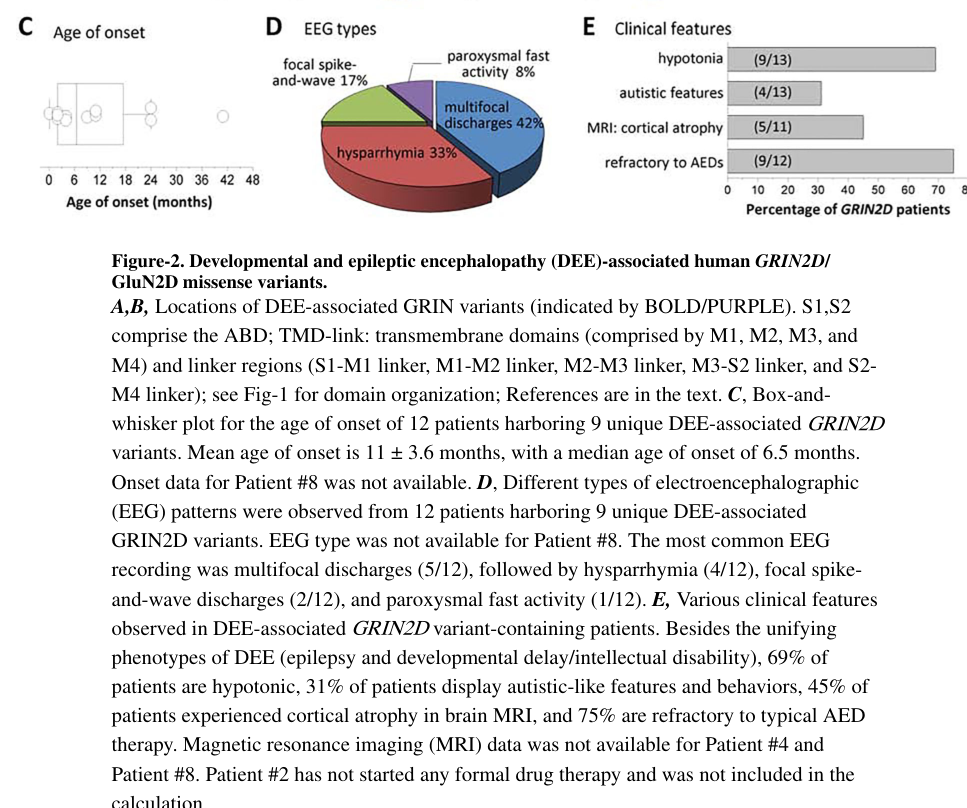

## Question

# Disease Characteristics Research Template

## Target Disease
- **Disease Name:** Developmental and Epileptic Encephalopathy 46 (DEE46), caused by GRIN2D variants encoding the GluN2D NMDA receptor subunit
- **MONDO ID:**  (if available)
- **Category:** Mendelian

## Research Objectives

Please provide a comprehensive research report on **Developmental and Epileptic Encephalopathy 46 (DEE46), caused by GRIN2D variants encoding the GluN2D NMDA receptor subunit** covering all of the
disease characteristics listed below. This report will be used to populate a disease knowledge
base entry. Be thorough and cite primary literature (PMID preferred) for all claims.

For each section, **suggested databases/resources** are listed. These are the first places
you should search for information on each topic.

---

### 1. Disease Information
> **Search first:** OMIM, Orphanet, ICD-10/ICD-11, MeSH, PubMed

- What is the disease? Provide a concise overview.
- What are the key identifiers? (OMIM, Orphanet, ICD-10/ICD-11, MeSH, Mondo)
- What are the common synonyms and alternative names?
- Is the information derived from individual patients (e.g., EHR) or aggregated disease-level resources?

### 2. Etiology

- **Disease Causal Factors**: What are the primary causes? (genetic, environmental, infectious, mechanistic)
- **Risk Factors**:
  > **Search first:** PubMed, Cochrane Library, UpToDate, clinical guidelines, ClinVar, ClinGen, GWAS Catalog, PheGenI, CTD, CDC, WHO, epidemiological databases
  - Genetic risk factors (causal variants, susceptibility loci, modifier genes)
  - Environmental risk factors (toxins, lifestyle, occupational exposures, age, sex, family history)
- **Protective Factors**:
  > **Search first:** PubMed, Cochrane Library, clinical trial databases, GWAS Catalog, gnomAD, WHO, CDC, nutrition databases
  - Genetic protective factors (protective variants, modifier alleles)
  - Environmental protective factors (diet, lifestyle, exposures that reduce risk)
- **Gene-Environment Interactions**: How do genetic and environmental factors interact to influence disease?
  > **Search first:** CTD, PubMed, PheGenI, GxE databases

### 3. Phenotypes
> **Search first:** HPO (Human Phenotype Ontology), OMIM, Orphanet, PubMed, clinicaltrials.gov, MedDRA, SNOMED CT, DECIPHER, LOINC

For each phenotype, provide:
- **Phenotype type**: symptoms, clinical signs, physical manifestations, behavioral changes, or laboratory abnormalities
  > For symptoms/signs: HPO, OMIM, Orphanet, PubMed
  > For behavioral changes: HPO, DSM, RDoC (Research Domain Criteria), PubMed
  > For laboratory abnormalities: LOINC, SNOMED CT, LabTests Online, PubMed
- **Phenotype characteristics**:
  > **Search first:** OMIM, Orphanet, HPO, PubMed
  - Age of symptom onset (neonatal, childhood, adult-onset, late-onset)
  - Symptom severity (mild, moderate, severe, variable)
  - Symptom progression (stable, progressive, episodic, fluctuating)
  - Frequency among affected individuals (percentage or qualitative)
- **Quality of life impact**: Effects on daily functioning and well-being (per-phenotype when possible)
  > **Search first:** EQ-5D database, SF-36, WHO QOL databases, PubMed
- Suggest HPO (Human Phenotype Ontology) terms for each phenotype

### 4. Genetic/Molecular Information

- **Causal Genes**: Gene mutations or chromosomal abnormalities responsible for disease (gene symbols, OMIM IDs)
  > **Search first:** OMIM, ClinVar, HGMD, Ensembl, NCBI Gene
- **Pathogenic Variants**:
  - Affected genes (gene symbols, HGNC IDs)
    > **Search first:** OMIM, NCBI Gene, Ensembl, HGNC, UniProt, GeneCards
  - Variant classification (pathogenic, likely pathogenic, VUS per ACMG/AMP guidelines)
    > **Search first:** ClinVar, ClinGen, ACMG/AMP guidelines, VarSome
  - Variant type/class (missense, frameshift, nonsense, splice-site, structural)
  - Allele frequency in population databases
    > **Search first:** gnomAD, 1000 Genomes, ExAC, TOPMed, dbSNP
  - Somatic vs germline origin
    > **Search first:** COSMIC (somatic), ClinVar, ICGC, TCGA
  - Functional consequences (loss of function, gain of function, dominant negative)
- **Modifier Genes**: Genes that modify disease severity or expression
- **Epigenetic Information**: DNA methylation, histone modifications, chromatin changes affecting disease
  > **Search first:** ENCODE, Roadmap Epigenomics, MethBase, DiseaseMeth
- **Chromosomal Abnormalities**: Large-scale genetic changes (aneuploidy, translocations, inversions)
  > **Search first:** DECIPHER, ClinVar, ECARUCA, UCSC Genome Browser

### 5. Environmental Information

- **Environmental Factors**: Non-genetic contributing factors (toxins, radiation, pollution, occupational exposure)
  > **Search first:** CTD (Comparative Toxicogenomics Database), TOXNET, PubMed, EPA databases
- **Lifestyle Factors**: Behavioral factors (smoking, diet, exercise, alcohol consumption)
  > **Search first:** CDC databases, WHO, PubMed, NHANES
- **Infectious Agents**: If applicable, pathogens causing or triggering disease (bacteria, viruses, fungi, parasites)
  > **Search first:** NCBI Taxonomy, ViPR, BV-BRC, MicrobeDB, GIDEON

### 6. Mechanism / Pathophysiology

**Present this section as an ordered causal chain first, then the detail below.**
Open with a numbered sequence of mechanistic steps running from the initiating
lesion (mutation, exposure, infection) to the clinical manifestation, one step per
line, each naming what it causes next. State the causal verb explicitly ("leads
to", "results in") and say where a step is inferred rather than demonstrated.
Where the mechanism branches, show the branch. The categories below are a
checklist of what to cover within those steps, not the organizing structure —
a step may draw on several of them, and a category may contribute to several
steps.

- **Molecular Pathways**: Specific signaling cascades or biochemical pathways involved (Wnt, MAPK, mTOR, PI3K-AKT, etc.)
  > **Search first:** KEGG, Reactome, WikiPathways, PathBank, BioCyc
- **Cellular Processes**: Cell-level mechanisms (apoptosis, autophagy, cell cycle dysregulation, inflammation, etc.)
  > **Search first:** Gene Ontology (GO), Reactome, KEGG, PubMed
- **Protein Dysfunction**: How protein structure or function is altered (misfolding, aggregation, loss of function, gain of function)
  > **Search first:** UniProt, PDB (Protein Data Bank), InterPro, Pfam, AlphaFold
- **Metabolic Changes**: Alterations in metabolic processes (energy metabolism, lipid metabolism, amino acid metabolism)
  > **Search first:** KEGG, BioCyc, HMDB (Human Metabolome Database), BRENDA
- **Immune System Involvement**: Role of immune response (autoimmunity, immunodeficiency, chronic inflammation)
  > **Search first:** ImmPort, Immunome Database, IEDB, Gene Ontology
- **Tissue Damage Mechanisms**: How tissues/ are injured (oxidative stress, ischemia, fibrosis, necrosis)
  > **Search first:** PubMed, Gene Ontology, Reactome
- **Biochemical Abnormalities**: Specific molecular defects (enzyme deficiencies, receptor dysfunction, ion channel defects)
  > **Search first:** BRENDA, UniProt, KEGG, OMIM, PubMed
- **Epigenetic Changes**: DNA methylation, histone modifications affecting gene expression in disease
  > **Search first:** ENCODE, Roadmap Epigenomics, MethBase, DiseaseMeth
- **Molecular Profiling** (if available):
  - Transcriptomics/gene expression changes
    > **Search first:** GEO (Gene Expression Omnibus), ArrayExpress, GTEx, Human Cell Atlas, SRA
  - Proteomics findings
    > **Search first:** PRIDE, ProteomeXchange, Human Protein Atlas, STRING, BioGRID
  - Metabolomics signatures
    > **Search first:** MetaboLights, Metabolomics Workbench, HMDB, METLIN
  - Lipidomics alterations
    > **Search first:** LIPID MAPS, SwissLipids, LipidHome, Metabolomics Workbench
  - Genomic structural features
    > **Search first:** UCSC Genome Browser, Ensembl, NCBI, dbVar, DGV
- **Advanced Technologies** (if applicable):
  - Single-cell analysis findings (cell-type specific mechanisms, cellular heterogeneity)
    > **Search first:** Human Cell Atlas, Single Cell Portal, GEO, CELLxGENE
  - Spatial transcriptomics findings
    > **Search first:** GEO, Spatial Research, Vizgen, 10x Genomics data
  - Multi-omics integration results
    > **Search first:** TCGA, ICGC, cBioPortal, LinkedOmics, PubMed
  - Functional genomics screens (CRISPR, RNAi)
    > **Search first:** DepMap, GenomeRNAi, PubMed, BioGRID ORCS

For each mechanism, describe:
- The causal chain from initial trigger to clinical manifestation
- Which mechanisms are upstream vs downstream
- What cell types and biological processes are involved
- Suggest GO terms for biological processes and CL terms for cell types

### 7. Anatomical Structures Affected

- **Organ Level**:
  - Primary organs directly affected
  - Secondary organ involvement (complications, secondary effects)
  - Body systems involved (cardiovascular, nervous, digestive, respiratory, endocrine, etc.)
  > **Search first:** Uberon, FMA (Foundational Model of Anatomy), OMIM, HPO, ICD-11, MeSH, SNOMED CT
- **Tissue and Cell Level**:
  - Specific tissue types affected (epithelial, connective, muscle, nervous)
  - Specific cell populations targeted (with Cell Ontology terms)
  > **Search first:** Uberon, Human Protein Atlas, Cell Ontology, Human Cell Atlas, CellMarker, PanglaoDB
- **Subcellular Level**:
  - Cellular compartments involved (mitochondria, nucleus, ER, lysosomes) (with GO Cellular Component terms)
  > **Search first:** Gene Ontology (Cellular Component), UniProt, Human Protein Atlas
- **Localization**:
  - Specific anatomical sites (with UBERON terms)
    > **Search first:** FMA, Uberon, NeuroNames (for brain), SNOMED CT
  - Lateralization (unilateral, bilateral, asymmetric)
    > **Search first:** HPO, clinical literature, imaging databases

### 8. Temporal Development

- **Onset**:
  - Typical age of onset (congenital, pediatric, adult, geriatric)
  - Onset pattern (acute, subacute, chronic, insidious)
  > **Search first:** OMIM, Orphanet, HPO, PubMed
- **Progression**:
  - Disease stages (early, intermediate, advanced, end-stage)
    > **Search first:** Cancer Staging Manual (AJCC), WHO classifications, PubMed
  - Progression rate (rapid, slow, variable)
  - Disease course pattern (episodic, relapsing-remitting, progressive, stable)
  - Disease duration (self-limited, chronic lifelong)
  > **Search first:** Disease registries, longitudinal cohort databases, natural history studies, PubMed, Orphanet, OMIM
- **Patterns**:
  - Remission patterns (spontaneous, treatment-induced)
    > **Search first:** Clinical trial databases, disease registries, PubMed
  - Critical periods (time windows of vulnerability or opportunity for intervention)
    > **Search first:** PubMed, developmental biology databases, clinical guidelines

### 9. Inheritance and Population

- **Epidemiology**:
  - Prevalence (cases per 100,000 at given time)
  - Incidence (new cases per 100,000 per year)
  > **Search first:** Orphanet, CDC, WHO, GBD (Global Burden of Disease), national registries, SEER, disease registries
- **For Genetic Etiology**:
  - Inheritance pattern (AD, AR, X-linked, mitochondrial, multifactorial, polygenic)
    > **Search first:** OMIM, Orphanet, ClinVar, GTR (Genetic Testing Registry)
  - Penetrance (complete, incomplete, age-dependent)
    > **Search first:** ClinVar, OMIM, PubMed, ClinGen
  - Expressivity (variable, consistent)
    > **Search first:** OMIM, ClinVar, PubMed
  - Genetic anticipation (increasing severity in successive generations)
    > **Search first:** OMIM, PubMed (especially for repeat expansion disorders)
  - Germline mosaicism
    > **Search first:** ClinVar, OMIM, genetic counseling literature, PubMed
  - Founder effects (population-specific mutations)
    > **Search first:** gnomAD, population genetics databases, PubMed
  - Consanguinity role
    > **Search first:** OMIM, population studies, genetic counseling resources
  - Carrier frequency
    > **Search first:** gnomAD, carrier screening databases, GeneReviews, GTR
- **Population Demographics**:
  - Affected populations (ethnic or demographic groups with higher prevalence)
    > **Search first:** gnomAD, 1000 Genomes, PAGE Study, PubMed, population registries
  - Geographic distribution (endemic areas, regional variation)
    > **Search first:** WHO, CDC, GBD, Orphanet, geographic epidemiology databases
  - Geographic distribution of specific variants
  - Sex ratio (male:female)
    > **Search first:** Disease registries, OMIM, PubMed, epidemiological databases
  - Age distribution of affected individuals
    > **Search first:** CDC, disease registries, SEER, Orphanet

### 10. Diagnostics

- **Clinical Tests**:
  - Laboratory tests (blood, urine, tissue chemistry, specific enzyme assays)
    > **Search first:** LOINC, LabTests Online, PubMed
  - Biomarkers (proteins, metabolites, genetic markers, circulating biomarkers)
    > **Search first:** FDA Biomarker List, BEST (Biomarkers, EndpointS, and other Tools), PubMed
  - Imaging studies (X-ray, CT, MRI, PET, ultrasound)
    > **Search first:** RadLex, DICOM, Radiopaedia, imaging databases
  - Functional tests (pulmonary function, cardiac stress tests)
    > **Search first:** LOINC, clinical guidelines, PubMed
  - Electrophysiology (EEG, EMG, ECG, nerve conduction studies)
    > **Search first:** LOINC, clinical neurophysiology databases, PubMed
  - Biopsy findings (histopathology, immunohistochemistry)
    > **Search first:** SNOMED CT, College of American Pathologists resources, PubMed
  - Pathology findings (microscopic examination)
    > **Search first:** SNOMED CT, Digital Pathology databases, PubMed
- **Genetic Testing**:
  > **Search first:** GTR (Genetic Testing Registry), GeneReviews, ClinGen
  - Overview of recommended genetic testing approach
  - Whole genome sequencing (WGS) utility
    > **Search first:** GTR, ClinVar, GEL (Genomics England), gnomAD
  - Whole exome sequencing (WES) utility
    > **Search first:** GTR, ClinVar, OMIM, GeneMatcher
  - Gene panels (which panels, which genes)
    > **Search first:** GTR, ClinVar, laboratory-specific databases
  - Single gene testing
    > **Search first:** GTR, ClinVar, OMIM, GeneReviews
  - Chromosomal microarray (CMA)
    > **Search first:** DECIPHER, ClinVar, dbVar, ECARUCA
  - Karyotyping
    > **Search first:** Chromosome Abnormality Database, ClinVar, cytogenetics resources
  - FISH
    > **Search first:** ClinVar, cytogenetics databases, PubMed
  - Mitochondrial DNA testing
    > **Search first:** MITOMAP, MSeqDR, ClinVar, GTR
  - Repeat expansion testing
    > **Search first:** GTR, ClinVar, repeat expansion databases, PubMed
- **Omics-Based Diagnostics** (if applicable):
  - RNA sequencing / transcriptomics
    > **Search first:** GEO, ArrayExpress, GTEx, RNA-seq databases
  - Proteomics
    > **Search first:** PRIDE, ProteomeXchange, FDA Biomarker database
  - Metabolomics
    > **Search first:** MetaboLights, Metabolomics Workbench, HMDB
  - Epigenomics
    > **Search first:** GEO, ENCODE, Roadmap Epigenomics, MethBase
  - Liquid biopsy
    > **Search first:** COSMIC, ClinVar, liquid biopsy databases, PubMed
- **Clinical Criteria**:
  - Standardized diagnostic criteria (DSM, ICD, society guidelines)
    > **Search first:** DSM-5, ICD-11, clinical society guidelines, UpToDate
  - Differential diagnosis (other conditions to rule out, with distinguishing features)
    > **Search first:** DynaMed, UpToDate, clinical decision support systems
- **Screening**:
  - Screening methods for asymptomatic individuals (newborn screening, carrier screening, cascade screening)
    > **Search first:** ACMG recommendations, CDC newborn screening, GTR

### 11. Outcome/Prognosis

- **Survival and Mortality**:
  - Survival rate (5-year, 10-year, overall)
    > **Search first:** SEER, cancer registries, disease-specific registries, PubMed
  - Life expectancy (with and without treatment if applicable)
    > **Search first:** Orphanet, disease registries, actuarial databases, PubMed
  - Mortality rate
    > **Search first:** CDC, WHO, GBD, national mortality databases
  - Disease-specific mortality (deaths directly attributable to disease)
    > **Search first:** Disease registries, CDC Wonder, GBD, PubMed
- **Morbidity and Function**:
  - Morbidity (disease-related disability and health impacts)
    > **Search first:** GBD, WHO, disability databases, PubMed
  - Disability outcomes (long-term functional impairments)
    > **Search first:** ICF (International Classification of Functioning), disability registries
  - Quality of life measures (EQ-5D, SF-36, PROMIS, disease-specific tools)
    > **Search first:** EQ-5D database, SF-36, PROMIS, PubMed
- **Disease Course**:
  - Complications (secondary problems: infections, organ failure, etc.)
    > **Search first:** ICD codes, disease registries, clinical databases, PubMed
  - Recovery potential (likelihood and extent of recovery, with vs without treatment)
    > **Search first:** Natural history studies, rehabilitation databases, PubMed
- **Prediction**:
  - Prognostic factors (age, disease severity, biomarkers, treatment response)
    > **Search first:** Prognostic models databases, clinical calculators, PubMed
  - Prognostic biomarkers (molecular markers predicting disease course)
    > **Search first:** FDA Biomarker database, PubMed, cancer prognostic databases

### 12. Treatment

- **Pharmacotherapy**:
  - Pharmacological treatments (drug names, drug classes, mechanisms of action)
    > **Search first:** DrugBank, RxNorm, ATC classification, DailyMed, FDA databases
  - Pharmacogenomics (how genetic variants affect drug metabolism, efficacy, toxicity)
    > **Search first:** PharmGKB, CPIC (Clinical Pharmacogenetics), FDA Table of PGx Biomarkers
- **Advanced Therapeutics**:
  - Gene therapy (viral vectors, CRISPR, gene replacement, gene editing)
    > **Search first:** ClinicalTrials.gov, FDA gene therapy database, ASGCT resources
  - Cell therapy (stem cell transplant, CAR-T, cellular therapeutics)
    > **Search first:** ClinicalTrials.gov, FDA cell therapy database, FACT standards
  - RNA-based therapies (ASOs, siRNA, mRNA therapies)
    > **Search first:** ClinicalTrials.gov, FDA approvals, PubMed
  - Targeted therapies (treatments directed at specific molecular targets)
    > **Search first:** My Cancer Genome, OncoKB, ClinicalTrials.gov, FDA approvals
  - Immunotherapies (checkpoint inhibitors, monoclonal antibodies)
    > **Search first:** Cancer Immunotherapy Database, FDA approvals, ClinicalTrials.gov
- **Surgical and Interventional**:
  - Surgical interventions (types of surgery, timing, outcomes)
    > **Search first:** CPT codes, surgical registries, clinical guidelines, PubMed
- **Supportive and Rehabilitative**:
  - Supportive care (symptom management, pain control, nutrition)
    > **Search first:** Clinical guidelines, Cochrane Library, PubMed
  - Rehabilitation (physical therapy, occupational therapy, speech therapy)
    > **Search first:** Rehabilitation medicine databases, clinical guidelines, PubMed
- **Experimental**:
  - Experimental treatments in clinical trials (with NCT identifiers if available)
    > **Search first:** ClinicalTrials.gov, EU Clinical Trials Register, WHO ICTRP
- **Treatment Outcomes**:
  - Treatment response rates
    > **Search first:** Clinical trial databases, FDA reviews, systematic reviews, PubMed
  - Side effects and adverse events
    > **Search first:** FDA Adverse Event Reporting System (FAERS), MedWatch, PubMed
- **Treatment Strategy**:
  - Treatment algorithms (clinical pathways, decision trees)
    > **Search first:** Clinical practice guidelines, NCCN Guidelines, UpToDate
  - Combination therapies
    > **Search first:** ClinicalTrials.gov, treatment guidelines, PubMed
  - Personalized medicine approaches (genotype-guided treatment)
    > **Search first:** My Cancer Genome, CIViC, PharmGKB, precision medicine databases

For each treatment, suggest NCIT (NCI Thesaurus) clinical-intervention terms where applicable.

### 13. Prevention

- **Prevention Levels**:
  - Primary prevention (preventing disease occurrence: vaccination, risk factor modification)
    > **Search first:** CDC, WHO, USPSTF recommendations, Cochrane Library
  - Secondary prevention (early detection and treatment: screening programs, early intervention)
    > **Search first:** USPSTF, CDC screening guidelines, WHO
  - Tertiary prevention (preventing complications in those with disease)
    > **Search first:** Clinical guidelines, disease management protocols, PubMed
- **Immunization**: Vaccine strategies (if applicable)
  > **Search first:** CDC vaccine schedules, WHO immunization, FDA vaccine database
- **Screening and Early Detection**:
  - Screening programs (population-based: newborn screening, cancer screening)
    > **Search first:** CDC screening programs, USPSTF, cancer screening databases
  - Genetic screening (carrier screening, preimplantation genetic diagnosis, prenatal testing)
    > **Search first:** ACMG recommendations, ACOG guidelines, GTR
  - Risk stratification (identifying high-risk individuals for targeted prevention)
    > **Search first:** Risk prediction models, clinical calculators, PubMed
- **Behavioral Interventions**: Lifestyle modifications to reduce risk
  > **Search first:** CDC, WHO, behavioral intervention databases, Cochrane Library
- **Counseling**: Genetic counseling (risk assessment, family planning guidance)
  > **Search first:** NSGC resources, ACMG guidelines, GeneReviews
- **Public Health**:
  - Public health interventions (sanitation, vector control, health education)
    > **Search first:** CDC, WHO, public health databases, PubMed
  - Environmental interventions (reducing environmental risk factors)
    > **Search first:** EPA databases, WHO environmental health, PubMed
- **Prophylaxis**: Preventive medications or procedures
  > **Search first:** Clinical guidelines, FDA approvals, PubMed

### 14. Other Species / Natural Disease

- **Taxonomy**: Species affected (with NCBI Taxon identifiers)
  > **Search first:** NCBI Taxonomy
- **Breed**: Specific breeds affected (with VBO identifiers if applicable)
  > **Search first:** VBO (Vertebrate Breed Ontology)
- **Gene**: Orthologous genes in other species (with NCBI Gene IDs)
  > **Search first:** NCBI Gene
- **Natural Disease**:
  - Naturally occurring disease in other species (companion animals, wildlife)
    > **Search first:** OMIA (Online Mendelian Inheritance in Animals), VetCompass, PubMed
  - Veterinary relevance and importance in animal health
    > **Search first:** OMIA, veterinary databases, PubMed
- **Comparative Biology**:
  - Comparative pathology (similarities and differences across species)
    > **Search first:** OMIA, comparative pathology databases, PubMed
  - Evolutionary conservation of disease mechanisms
    > **Search first:** HomoloGene, OrthoMCL, Alliance of Genome Resources
- **Transmission** (if applicable):
  - Zoonotic potential
    > **Search first:** CDC zoonotic diseases, WHO zoonoses, GIDEON
  - Cross-species susceptibility
    > **Search first:** NCBI Taxonomy, veterinary databases, PubMed

### 15. Model Organisms

- **Model Types**:
  - Model organism type (mammalian, invertebrate, cellular, in vitro)
    > **Search first:** Alliance of Genome Resources, model organism databases
  - Specific model systems (mouse, rat, zebrafish, Drosophila, C. elegans, yeast, cell lines, organoids, iPSCs)
    > **Search first:** MGI, RGD, ZFIN, FlyBase, WormBase, SGD, ATCC, Cellosaurus
  - Induced models (drug treatment, surgical intervention, environmental manipulation)
    > **Search first:** MGI, model organism databases, PubMed
- **Genetic Models**:
  - Types available (knockout, knock-in, transgenic, conditional, humanized)
    > **Search first:** MGI, IMPC, KOMP, EuMMCR, IMSR
- **Model Characteristics**:
  - Phenotype recapitulation (how well model reproduces human disease features)
    > **Search first:** Model organism databases, comparative studies, PubMed
  - Model limitations (aspects of human disease not captured)
    > **Search first:** Model organism databases, PubMed, review articles
- **Applications**:
  - Research applications (what aspects of disease can be studied)
    > **Search first:** Model organism databases, PubMed
- **Resources**:
  - Model databases
    > **Search first:** MGI, RGD, ZFIN, FlyBase, WormBase, IMSR, EMMA, MMRRC

---

## Citation Requirements

- Cite primary literature (PMID preferred) for all mechanistic and clinical claims
- Prioritize recent reviews and landmark papers
- Include direct quotes from abstracts where possible to support key statements
- Distinguish evidence source types: human clinical, model organism, in vitro, computational

## Output Format

Structure your response as a comprehensive narrative organized by the sections above.
For each section, provide:
- Factual content with specific details (numbers, percentages, gene names, variant nomenclature)
- Ontology term suggestions (HPO, GO, CL, UBERON, CHEBI, NCIT, MONDO) where applicable
- Evidence citations with PMIDs
- Direct quotes from abstracts to support key claims
- Clear indication when information is not available or not applicable for this disease

This report will be used to populate a disease knowledge base entry with:
- Pathophysiology descriptions with causal chains
- Gene/protein annotations (HGNC, GO terms)
- Phenotype associations (HP terms) with frequencies
- Cell type involvement (CL terms)
- Anatomical locations (UBERON terms)
- Chemical entities (CHEBI terms)
- Treatment annotations (NCIT terms)
- Evidence items with PMIDs and exact abstract quotes
- Epidemiology, prognosis, diagnostic, and prevention information
- Animal model descriptions with phenotype recapitulation details

## Output

Question: You are an expert researcher providing comprehensive, well-cited information.

Provide detailed information focusing on:
1. Key concepts and definitions with current understanding
2. Recent developments and latest research (prioritize 2023-2024 sources)
3. Current applications and real-world implementations
4. Expert opinions and analysis from authoritative sources
5. Relevant statistics and data from recent studies

Format as a comprehensive research report with proper citations. Include URLs and publication dates where available.
Always prioritize recent, authoritative sources and provide specific citations for all major claims.

# Disease Characteristics Research Template

## Target Disease
- **Disease Name:** Developmental and Epileptic Encephalopathy 46 (DEE46), caused by GRIN2D variants encoding the GluN2D NMDA receptor subunit
- **MONDO ID:**  (if available)
- **Category:** Mendelian

## Research Objectives

Please provide a comprehensive research report on **Developmental and Epileptic Encephalopathy 46 (DEE46), caused by GRIN2D variants encoding the GluN2D NMDA receptor subunit** covering all of the
disease characteristics listed below. This report will be used to populate a disease knowledge
base entry. Be thorough and cite primary literature (PMID preferred) for all claims.

For each section, **suggested databases/resources** are listed. These are the first places
you should search for information on each topic.

---

### 1. Disease Information
> **Search first:** OMIM, Orphanet, ICD-10/ICD-11, MeSH, PubMed

- What is the disease? Provide a concise overview.
- What are the key identifiers? (OMIM, Orphanet, ICD-10/ICD-11, MeSH, Mondo)
- What are the common synonyms and alternative names?
- Is the information derived from individual patients (e.g., EHR) or aggregated disease-level resources?

### 2. Etiology

- **Disease Causal Factors**: What are the primary causes? (genetic, environmental, infectious, mechanistic)
- **Risk Factors**:
  > **Search first:** PubMed, Cochrane Library, UpToDate, clinical guidelines, ClinVar, ClinGen, GWAS Catalog, PheGenI, CTD, CDC, WHO, epidemiological databases
  - Genetic risk factors (causal variants, susceptibility loci, modifier genes)
  - Environmental risk factors (toxins, lifestyle, occupational exposures, age, sex, family history)
- **Protective Factors**:
  > **Search first:** PubMed, Cochrane Library, clinical trial databases, GWAS Catalog, gnomAD, WHO, CDC, nutrition databases
  - Genetic protective factors (protective variants, modifier alleles)
  - Environmental protective factors (diet, lifestyle, exposures that reduce risk)
- **Gene-Environment Interactions**: How do genetic and environmental factors interact to influence disease?
  > **Search first:** CTD, PubMed, PheGenI, GxE databases

### 3. Phenotypes
> **Search first:** HPO (Human Phenotype Ontology), OMIM, Orphanet, PubMed, clinicaltrials.gov, MedDRA, SNOMED CT, DECIPHER, LOINC

For each phenotype, provide:
- **Phenotype type**: symptoms, clinical signs, physical manifestations, behavioral changes, or laboratory abnormalities
  > For symptoms/signs: HPO, OMIM, Orphanet, PubMed
  > For behavioral changes: HPO, DSM, RDoC (Research Domain Criteria), PubMed
  > For laboratory abnormalities: LOINC, SNOMED CT, LabTests Online, PubMed
- **Phenotype characteristics**:
  > **Search first:** OMIM, Orphanet, HPO, PubMed
  - Age of symptom onset (neonatal, childhood, adult-onset, late-onset)
  - Symptom severity (mild, moderate, severe, variable)
  - Symptom progression (stable, progressive, episodic, fluctuating)
  - Frequency among affected individuals (percentage or qualitative)
- **Quality of life impact**: Effects on daily functioning and well-being (per-phenotype when possible)
  > **Search first:** EQ-5D database, SF-36, WHO QOL databases, PubMed
- Suggest HPO (Human Phenotype Ontology) terms for each phenotype

### 4. Genetic/Molecular Information

- **Causal Genes**: Gene mutations or chromosomal abnormalities responsible for disease (gene symbols, OMIM IDs)
  > **Search first:** OMIM, ClinVar, HGMD, Ensembl, NCBI Gene
- **Pathogenic Variants**:
  - Affected genes (gene symbols, HGNC IDs)
    > **Search first:** OMIM, NCBI Gene, Ensembl, HGNC, UniProt, GeneCards
  - Variant classification (pathogenic, likely pathogenic, VUS per ACMG/AMP guidelines)
    > **Search first:** ClinVar, ClinGen, ACMG/AMP guidelines, VarSome
  - Variant type/class (missense, frameshift, nonsense, splice-site, structural)
  - Allele frequency in population databases
    > **Search first:** gnomAD, 1000 Genomes, ExAC, TOPMed, dbSNP
  - Somatic vs germline origin
    > **Search first:** COSMIC (somatic), ClinVar, ICGC, TCGA
  - Functional consequences (loss of function, gain of function, dominant negative)
- **Modifier Genes**: Genes that modify disease severity or expression
- **Epigenetic Information**: DNA methylation, histone modifications, chromatin changes affecting disease
  > **Search first:** ENCODE, Roadmap Epigenomics, MethBase, DiseaseMeth
- **Chromosomal Abnormalities**: Large-scale genetic changes (aneuploidy, translocations, inversions)
  > **Search first:** DECIPHER, ClinVar, ECARUCA, UCSC Genome Browser

### 5. Environmental Information

- **Environmental Factors**: Non-genetic contributing factors (toxins, radiation, pollution, occupational exposure)
  > **Search first:** CTD (Comparative Toxicogenomics Database), TOXNET, PubMed, EPA databases
- **Lifestyle Factors**: Behavioral factors (smoking, diet, exercise, alcohol consumption)
  > **Search first:** CDC databases, WHO, PubMed, NHANES
- **Infectious Agents**: If applicable, pathogens causing or triggering disease (bacteria, viruses, fungi, parasites)
  > **Search first:** NCBI Taxonomy, ViPR, BV-BRC, MicrobeDB, GIDEON

### 6. Mechanism / Pathophysiology

**Present this section as an ordered causal chain first, then the detail below.**
Open with a numbered sequence of mechanistic steps running from the initiating
lesion (mutation, exposure, infection) to the clinical manifestation, one step per
line, each naming what it causes next. State the causal verb explicitly ("leads
to", "results in") and say where a step is inferred rather than demonstrated.
Where the mechanism branches, show the branch. The categories below are a
checklist of what to cover within those steps, not the organizing structure —
a step may draw on several of them, and a category may contribute to several
steps.

- **Molecular Pathways**: Specific signaling cascades or biochemical pathways involved (Wnt, MAPK, mTOR, PI3K-AKT, etc.)
  > **Search first:** KEGG, Reactome, WikiPathways, PathBank, BioCyc
- **Cellular Processes**: Cell-level mechanisms (apoptosis, autophagy, cell cycle dysregulation, inflammation, etc.)
  > **Search first:** Gene Ontology (GO), Reactome, KEGG, PubMed
- **Protein Dysfunction**: How protein structure or function is altered (misfolding, aggregation, loss of function, gain of function)
  > **Search first:** UniProt, PDB (Protein Data Bank), InterPro, Pfam, AlphaFold
- **Metabolic Changes**: Alterations in metabolic processes (energy metabolism, lipid metabolism, amino acid metabolism)
  > **Search first:** KEGG, BioCyc, HMDB (Human Metabolome Database), BRENDA
- **Immune System Involvement**: Role of immune response (autoimmunity, immunodeficiency, chronic inflammation)
  > **Search first:** ImmPort, Immunome Database, IEDB, Gene Ontology
- **Tissue Damage Mechanisms**: How tissues/ are injured (oxidative stress, ischemia, fibrosis, necrosis)
  > **Search first:** PubMed, Gene Ontology, Reactome
- **Biochemical Abnormalities**: Specific molecular defects (enzyme deficiencies, receptor dysfunction, ion channel defects)
  > **Search first:** BRENDA, UniProt, KEGG, OMIM, PubMed
- **Epigenetic Changes**: DNA methylation, histone modifications affecting gene expression in disease
  > **Search first:** ENCODE, Roadmap Epigenomics, MethBase, DiseaseMeth
- **Molecular Profiling** (if available):
  - Transcriptomics/gene expression changes
    > **Search first:** GEO (Gene Expression Omnibus), ArrayExpress, GTEx, Human Cell Atlas, SRA
  - Proteomics findings
    > **Search first:** PRIDE, ProteomeXchange, Human Protein Atlas, STRING, BioGRID
  - Metabolomics signatures
    > **Search first:** MetaboLights, Metabolomics Workbench, HMDB, METLIN
  - Lipidomics alterations
    > **Search first:** LIPID MAPS, SwissLipids, LipidHome, Metabolomics Workbench
  - Genomic structural features
    > **Search first:** UCSC Genome Browser, Ensembl, NCBI, dbVar, DGV
- **Advanced Technologies** (if applicable):
  - Single-cell analysis findings (cell-type specific mechanisms, cellular heterogeneity)
    > **Search first:** Human Cell Atlas, Single Cell Portal, GEO, CELLxGENE
  - Spatial transcriptomics findings
    > **Search first:** GEO, Spatial Research, Vizgen, 10x Genomics data
  - Multi-omics integration results
    > **Search first:** TCGA, ICGC, cBioPortal, LinkedOmics, PubMed
  - Functional genomics screens (CRISPR, RNAi)
    > **Search first:** DepMap, GenomeRNAi, PubMed, BioGRID ORCS

For each mechanism, describe:
- The causal chain from initial trigger to clinical manifestation
- Which mechanisms are upstream vs downstream
- What cell types and biological processes are involved
- Suggest GO terms for biological processes and CL terms for cell types

### 7. Anatomical Structures Affected

- **Organ Level**:
  - Primary organs directly affected
  - Secondary organ involvement (complications, secondary effects)
  - Body systems involved (cardiovascular, nervous, digestive, respiratory, endocrine, etc.)
  > **Search first:** Uberon, FMA (Foundational Model of Anatomy), OMIM, HPO, ICD-11, MeSH, SNOMED CT
- **Tissue and Cell Level**:
  - Specific tissue types affected (epithelial, connective, muscle, nervous)
  - Specific cell populations targeted (with Cell Ontology terms)
  > **Search first:** Uberon, Human Protein Atlas, Cell Ontology, Human Cell Atlas, CellMarker, PanglaoDB
- **Subcellular Level**:
  - Cellular compartments involved (mitochondria, nucleus, ER, lysosomes) (with GO Cellular Component terms)
  > **Search first:** Gene Ontology (Cellular Component), UniProt, Human Protein Atlas
- **Localization**:
  - Specific anatomical sites (with UBERON terms)
    > **Search first:** FMA, Uberon, NeuroNames (for brain), SNOMED CT
  - Lateralization (unilateral, bilateral, asymmetric)
    > **Search first:** HPO, clinical literature, imaging databases

### 8. Temporal Development

- **Onset**:
  - Typical age of onset (congenital, pediatric, adult, geriatric)
  - Onset pattern (acute, subacute, chronic, insidious)
  > **Search first:** OMIM, Orphanet, HPO, PubMed
- **Progression**:
  - Disease stages (early, intermediate, advanced, end-stage)
    > **Search first:** Cancer Staging Manual (AJCC), WHO classifications, PubMed
  - Progression rate (rapid, slow, variable)
  - Disease course pattern (episodic, relapsing-remitting, progressive, stable)
  - Disease duration (self-limited, chronic lifelong)
  > **Search first:** Disease registries, longitudinal cohort databases, natural history studies, PubMed, Orphanet, OMIM
- **Patterns**:
  - Remission patterns (spontaneous, treatment-induced)
    > **Search first:** Clinical trial databases, disease registries, PubMed
  - Critical periods (time windows of vulnerability or opportunity for intervention)
    > **Search first:** PubMed, developmental biology databases, clinical guidelines

### 9. Inheritance and Population

- **Epidemiology**:
  - Prevalence (cases per 100,000 at given time)
  - Incidence (new cases per 100,000 per year)
  > **Search first:** Orphanet, CDC, WHO, GBD (Global Burden of Disease), national registries, SEER, disease registries
- **For Genetic Etiology**:
  - Inheritance pattern (AD, AR, X-linked, mitochondrial, multifactorial, polygenic)
    > **Search first:** OMIM, Orphanet, ClinVar, GTR (Genetic Testing Registry)
  - Penetrance (complete, incomplete, age-dependent)
    > **Search first:** ClinVar, OMIM, PubMed, ClinGen
  - Expressivity (variable, consistent)
    > **Search first:** OMIM, ClinVar, PubMed
  - Genetic anticipation (increasing severity in successive generations)
    > **Search first:** OMIM, PubMed (especially for repeat expansion disorders)
  - Germline mosaicism
    > **Search first:** ClinVar, OMIM, genetic counseling literature, PubMed
  - Founder effects (population-specific mutations)
    > **Search first:** gnomAD, population genetics databases, PubMed
  - Consanguinity role
    > **Search first:** OMIM, population studies, genetic counseling resources
  - Carrier frequency
    > **Search first:** gnomAD, carrier screening databases, GeneReviews, GTR
- **Population Demographics**:
  - Affected populations (ethnic or demographic groups with higher prevalence)
    > **Search first:** gnomAD, 1000 Genomes, PAGE Study, PubMed, population registries
  - Geographic distribution (endemic areas, regional variation)
    > **Search first:** WHO, CDC, GBD, Orphanet, geographic epidemiology databases
  - Geographic distribution of specific variants
  - Sex ratio (male:female)
    > **Search first:** Disease registries, OMIM, PubMed, epidemiological databases
  - Age distribution of affected individuals
    > **Search first:** CDC, disease registries, SEER, Orphanet

### 10. Diagnostics

- **Clinical Tests**:
  - Laboratory tests (blood, urine, tissue chemistry, specific enzyme assays)
    > **Search first:** LOINC, LabTests Online, PubMed
  - Biomarkers (proteins, metabolites, genetic markers, circulating biomarkers)
    > **Search first:** FDA Biomarker List, BEST (Biomarkers, EndpointS, and other Tools), PubMed
  - Imaging studies (X-ray, CT, MRI, PET, ultrasound)
    > **Search first:** RadLex, DICOM, Radiopaedia, imaging databases
  - Functional tests (pulmonary function, cardiac stress tests)
    > **Search first:** LOINC, clinical guidelines, PubMed
  - Electrophysiology (EEG, EMG, ECG, nerve conduction studies)
    > **Search first:** LOINC, clinical neurophysiology databases, PubMed
  - Biopsy findings (histopathology, immunohistochemistry)
    > **Search first:** SNOMED CT, College of American Pathologists resources, PubMed
  - Pathology findings (microscopic examination)
    > **Search first:** SNOMED CT, Digital Pathology databases, PubMed
- **Genetic Testing**:
  > **Search first:** GTR (Genetic Testing Registry), GeneReviews, ClinGen
  - Overview of recommended genetic testing approach
  - Whole genome sequencing (WGS) utility
    > **Search first:** GTR, ClinVar, GEL (Genomics England), gnomAD
  - Whole exome sequencing (WES) utility
    > **Search first:** GTR, ClinVar, OMIM, GeneMatcher
  - Gene panels (which panels, which genes)
    > **Search first:** GTR, ClinVar, laboratory-specific databases
  - Single gene testing
    > **Search first:** GTR, ClinVar, OMIM, GeneReviews
  - Chromosomal microarray (CMA)
    > **Search first:** DECIPHER, ClinVar, dbVar, ECARUCA
  - Karyotyping
    > **Search first:** Chromosome Abnormality Database, ClinVar, cytogenetics resources
  - FISH
    > **Search first:** ClinVar, cytogenetics databases, PubMed
  - Mitochondrial DNA testing
    > **Search first:** MITOMAP, MSeqDR, ClinVar, GTR
  - Repeat expansion testing
    > **Search first:** GTR, ClinVar, repeat expansion databases, PubMed
- **Omics-Based Diagnostics** (if applicable):
  - RNA sequencing / transcriptomics
    > **Search first:** GEO, ArrayExpress, GTEx, RNA-seq databases
  - Proteomics
    > **Search first:** PRIDE, ProteomeXchange, FDA Biomarker database
  - Metabolomics
    > **Search first:** MetaboLights, Metabolomics Workbench, HMDB
  - Epigenomics
    > **Search first:** GEO, ENCODE, Roadmap Epigenomics, MethBase
  - Liquid biopsy
    > **Search first:** COSMIC, ClinVar, liquid biopsy databases, PubMed
- **Clinical Criteria**:
  - Standardized diagnostic criteria (DSM, ICD, society guidelines)
    > **Search first:** DSM-5, ICD-11, clinical society guidelines, UpToDate
  - Differential diagnosis (other conditions to rule out, with distinguishing features)
    > **Search first:** DynaMed, UpToDate, clinical decision support systems
- **Screening**:
  - Screening methods for asymptomatic individuals (newborn screening, carrier screening, cascade screening)
    > **Search first:** ACMG recommendations, CDC newborn screening, GTR

### 11. Outcome/Prognosis

- **Survival and Mortality**:
  - Survival rate (5-year, 10-year, overall)
    > **Search first:** SEER, cancer registries, disease-specific registries, PubMed
  - Life expectancy (with and without treatment if applicable)
    > **Search first:** Orphanet, disease registries, actuarial databases, PubMed
  - Mortality rate
    > **Search first:** CDC, WHO, GBD, national mortality databases
  - Disease-specific mortality (deaths directly attributable to disease)
    > **Search first:** Disease registries, CDC Wonder, GBD, PubMed
- **Morbidity and Function**:
  - Morbidity (disease-related disability and health impacts)
    > **Search first:** GBD, WHO, disability databases, PubMed
  - Disability outcomes (long-term functional impairments)
    > **Search first:** ICF (International Classification of Functioning), disability registries
  - Quality of life measures (EQ-5D, SF-36, PROMIS, disease-specific tools)
    > **Search first:** EQ-5D database, SF-36, PROMIS, PubMed
- **Disease Course**:
  - Complications (secondary problems: infections, organ failure, etc.)
    > **Search first:** ICD codes, disease registries, clinical databases, PubMed
  - Recovery potential (likelihood and extent of recovery, with vs without treatment)
    > **Search first:** Natural history studies, rehabilitation databases, PubMed
- **Prediction**:
  - Prognostic factors (age, disease severity, biomarkers, treatment response)
    > **Search first:** Prognostic models databases, clinical calculators, PubMed
  - Prognostic biomarkers (molecular markers predicting disease course)
    > **Search first:** FDA Biomarker database, PubMed, cancer prognostic databases

### 12. Treatment

- **Pharmacotherapy**:
  - Pharmacological treatments (drug names, drug classes, mechanisms of action)
    > **Search first:** DrugBank, RxNorm, ATC classification, DailyMed, FDA databases
  - Pharmacogenomics (how genetic variants affect drug metabolism, efficacy, toxicity)
    > **Search first:** PharmGKB, CPIC (Clinical Pharmacogenetics), FDA Table of PGx Biomarkers
- **Advanced Therapeutics**:
  - Gene therapy (viral vectors, CRISPR, gene replacement, gene editing)
    > **Search first:** ClinicalTrials.gov, FDA gene therapy database, ASGCT resources
  - Cell therapy (stem cell transplant, CAR-T, cellular therapeutics)
    > **Search first:** ClinicalTrials.gov, FDA cell therapy database, FACT standards
  - RNA-based therapies (ASOs, siRNA, mRNA therapies)
    > **Search first:** ClinicalTrials.gov, FDA approvals, PubMed
  - Targeted therapies (treatments directed at specific molecular targets)
    > **Search first:** My Cancer Genome, OncoKB, ClinicalTrials.gov, FDA approvals
  - Immunotherapies (checkpoint inhibitors, monoclonal antibodies)
    > **Search first:** Cancer Immunotherapy Database, FDA approvals, ClinicalTrials.gov
- **Surgical and Interventional**:
  - Surgical interventions (types of surgery, timing, outcomes)
    > **Search first:** CPT codes, surgical registries, clinical guidelines, PubMed
- **Supportive and Rehabilitative**:
  - Supportive care (symptom management, pain control, nutrition)
    > **Search first:** Clinical guidelines, Cochrane Library, PubMed
  - Rehabilitation (physical therapy, occupational therapy, speech therapy)
    > **Search first:** Rehabilitation medicine databases, clinical guidelines, PubMed
- **Experimental**:
  - Experimental treatments in clinical trials (with NCT identifiers if available)
    > **Search first:** ClinicalTrials.gov, EU Clinical Trials Register, WHO ICTRP
- **Treatment Outcomes**:
  - Treatment response rates
    > **Search first:** Clinical trial databases, FDA reviews, systematic reviews, PubMed
  - Side effects and adverse events
    > **Search first:** FDA Adverse Event Reporting System (FAERS), MedWatch, PubMed
- **Treatment Strategy**:
  - Treatment algorithms (clinical pathways, decision trees)
    > **Search first:** Clinical practice guidelines, NCCN Guidelines, UpToDate
  - Combination therapies
    > **Search first:** ClinicalTrials.gov, treatment guidelines, PubMed
  - Personalized medicine approaches (genotype-guided treatment)
    > **Search first:** My Cancer Genome, CIViC, PharmGKB, precision medicine databases

For each treatment, suggest NCIT (NCI Thesaurus) clinical-intervention terms where applicable.

### 13. Prevention

- **Prevention Levels**:
  - Primary prevention (preventing disease occurrence: vaccination, risk factor modification)
    > **Search first:** CDC, WHO, USPSTF recommendations, Cochrane Library
  - Secondary prevention (early detection and treatment: screening programs, early intervention)
    > **Search first:** USPSTF, CDC screening guidelines, WHO
  - Tertiary prevention (preventing complications in those with disease)
    > **Search first:** Clinical guidelines, disease management protocols, PubMed
- **Immunization**: Vaccine strategies (if applicable)
  > **Search first:** CDC vaccine schedules, WHO immunization, FDA vaccine database
- **Screening and Early Detection**:
  - Screening programs (population-based: newborn screening, cancer screening)
    > **Search first:** CDC screening programs, USPSTF, cancer screening databases
  - Genetic screening (carrier screening, preimplantation genetic diagnosis, prenatal testing)
    > **Search first:** ACMG recommendations, ACOG guidelines, GTR
  - Risk stratification (identifying high-risk individuals for targeted prevention)
    > **Search first:** Risk prediction models, clinical calculators, PubMed
- **Behavioral Interventions**: Lifestyle modifications to reduce risk
  > **Search first:** CDC, WHO, behavioral intervention databases, Cochrane Library
- **Counseling**: Genetic counseling (risk assessment, family planning guidance)
  > **Search first:** NSGC resources, ACMG guidelines, GeneReviews
- **Public Health**:
  - Public health interventions (sanitation, vector control, health education)
    > **Search first:** CDC, WHO, public health databases, PubMed
  - Environmental interventions (reducing environmental risk factors)
    > **Search first:** EPA databases, WHO environmental health, PubMed
- **Prophylaxis**: Preventive medications or procedures
  > **Search first:** Clinical guidelines, FDA approvals, PubMed

### 14. Other Species / Natural Disease

- **Taxonomy**: Species affected (with NCBI Taxon identifiers)
  > **Search first:** NCBI Taxonomy
- **Breed**: Specific breeds affected (with VBO identifiers if applicable)
  > **Search first:** VBO (Vertebrate Breed Ontology)
- **Gene**: Orthologous genes in other species (with NCBI Gene IDs)
  > **Search first:** NCBI Gene
- **Natural Disease**:
  - Naturally occurring disease in other species (companion animals, wildlife)
    > **Search first:** OMIA (Online Mendelian Inheritance in Animals), VetCompass, PubMed
  - Veterinary relevance and importance in animal health
    > **Search first:** OMIA, veterinary databases, PubMed
- **Comparative Biology**:
  - Comparative pathology (similarities and differences across species)
    > **Search first:** OMIA, comparative pathology databases, PubMed
  - Evolutionary conservation of disease mechanisms
    > **Search first:** HomoloGene, OrthoMCL, Alliance of Genome Resources
- **Transmission** (if applicable):
  - Zoonotic potential
    > **Search first:** CDC zoonotic diseases, WHO zoonoses, GIDEON
  - Cross-species susceptibility
    > **Search first:** NCBI Taxonomy, veterinary databases, PubMed

### 15. Model Organisms

- **Model Types**:
  - Model organism type (mammalian, invertebrate, cellular, in vitro)
    > **Search first:** Alliance of Genome Resources, model organism databases
  - Specific model systems (mouse, rat, zebrafish, Drosophila, C. elegans, yeast, cell lines, organoids, iPSCs)
    > **Search first:** MGI, RGD, ZFIN, FlyBase, WormBase, SGD, ATCC, Cellosaurus
  - Induced models (drug treatment, surgical intervention, environmental manipulation)
    > **Search first:** MGI, model organism databases, PubMed
- **Genetic Models**:
  - Types available (knockout, knock-in, transgenic, conditional, humanized)
    > **Search first:** MGI, IMPC, KOMP, EuMMCR, IMSR
- **Model Characteristics**:
  - Phenotype recapitulation (how well model reproduces human disease features)
    > **Search first:** Model organism databases, comparative studies, PubMed
  - Model limitations (aspects of human disease not captured)
    > **Search first:** Model organism databases, PubMed, review articles
- **Applications**:
  - Research applications (what aspects of disease can be studied)
    > **Search first:** Model organism databases, PubMed
- **Resources**:
  - Model databases
    > **Search first:** MGI, RGD, ZFIN, FlyBase, WormBase, IMSR, EMMA, MMRRC

---

## Citation Requirements

- Cite primary literature (PMID preferred) for all mechanistic and clinical claims
- Prioritize recent reviews and landmark papers
- Include direct quotes from abstracts where possible to support key statements
- Distinguish evidence source types: human clinical, model organism, in vitro, computational

## Output Format

Structure your response as a comprehensive narrative organized by the sections above.
For each section, provide:
- Factual content with specific details (numbers, percentages, gene names, variant nomenclature)
- Ontology term suggestions (HPO, GO, CL, UBERON, CHEBI, NCIT, MONDO) where applicable
- Evidence citations with PMIDs
- Direct quotes from abstracts to support key claims
- Clear indication when information is not available or not applicable for this disease

This report will be used to populate a disease knowledge base entry with:
- Pathophysiology descriptions with causal chains
- Gene/protein annotations (HGNC, GO terms)
- Phenotype associations (HP terms) with frequencies
- Cell type involvement (CL terms)
- Anatomical locations (UBERON terms)
- Chemical entities (CHEBI terms)
- Treatment annotations (NCIT terms)
- Evidence items with PMIDs and exact abstract quotes
- Epidemiology, prognosis, diagnostic, and prevention information
- Animal model descriptions with phenotype recapitulation details

# Developmental and Epileptic Encephalopathy 46 (DEE46): GRIN2D/GluN2D

## Executive summary

DEE46 is an ultra-rare, usually de novo autosomal-dominant developmental and epileptic encephalopathy caused by pathogenic heterozygous variants in **GRIN2D**, encoding the GluN2D subunit of the NMDA-type glutamate receptor. The disorder usually begins in infancy with polymorphic, often drug-resistant seizures and severe developmental impairment. In the best-characterized early cohort, median seizure onset was 6.5 months; 9/12 patients were refractory to conventional antiseizure drugs, 9/13 had hypotonia or poor motor control, 5/11 had cortical atrophy, and 5/13 had cerebral visual impairment. These percentages come from a very small, clinically ascertained cohort and are not population estimates. (camp2020grin2dglun2dnmdareceptor pages 11-12, camp2020grin2dglun2dnmdareceptor pages 17-20, camp2020grin2dglun2dnmdareceptor media 963fe7d9)

DEE46 is mechanistically heterogeneous. Missense variants can combine impaired receptor trafficking with variant-specific gain or loss of channel function. The recurrent M3-domain **c.1999G>A, p.Val667Ile** variant is a demonstrated gain-of-function allele, whereas other variants have mixed effects on agonist potency, proton inhibition, channel opening, deactivation, current amplitude, and surface expression. Functional classification is therefore important before attempting NMDA-receptor-directed treatment. (xiangwei2019heterogeneousclinicaland pages 1-2, xiangwei2019heterogeneousclinicaland pages 13-15, li2016grin2drecurrentde pages 7-9, li2016grin2drecurrentde pages 1-2)

The evidence base remains limited to small cohorts, case reports, heterologous-expression experiments, neuronal cultures, and emerging mouse/iPSC models. No approved disease-modifying therapy or GRIN2D-specific randomized clinical trial was identified. Memantine, ketamine, and magnesium have produced benefit in selected gain-of-function cases, but responses are inconsistent and the evidence certainty is very low. (kearney2017precisionmedicinenmda pages 1-2, li2016grin2drecurrentde pages 7-9, xiangwei2019heterogeneousclinicaland pages 5-6, karnstedt2026memantinetreatmentin pages 2-3)

| Domain | Evidence-backed finding | Quantitative data | Suggested ontology terms | Evidence level |
|---|---|---:|---|---|
| Disease identity | Developmental and epileptic encephalopathy 46 (DEE46) is a rare Mendelian neurodevelopmental disorder caused by pathogenic heterozygous **GRIN2D** variants affecting the GluN2D NMDA-receptor subunit. (OpenTargets Search: developmental and epileptic encephalopathy 46-GRIN2D, li2016grin2drecurrentde pages 1-2) | Open Targets reports 5 disease–target evidence items. | **MONDO:0014947**; developmental and epileptic encephalopathy 46 | Aggregated disease-resource plus human genetic evidence |
| Gene and protein | **GRIN2D** encodes glutamate ionotropic receptor NMDA-type subunit 2D. Functional NMDA receptors contain two glycine-binding GluN1 and two glutamate-binding GluN2 subunits. (OpenTargets Search: developmental and epileptic encephalopathy 46-GRIN2D, camp2020grin2dglun2dnmdareceptor pages 1-3, song2024differentialresponsesof pages 1-3) | GluN2D is 1,336 amino acids. | **HGNC:4588**; **NCBI Gene:2906**; **GO:0004972**, NMDA-selective glutamate receptor activity | Established receptor biology and authoritative gene-resource evidence |
| Inheritance | The best-established mechanism is autosomal dominant, usually due to a **de novo heterozygous** missense variant. (li2016grin2drecurrentde pages 1-2, xiangwei2019heterogeneousclinicaland pages 5-6) | Recurrent p.Val667Ile was initially found in 2 unrelated children. | **HP:0000006**, autosomal dominant inheritance; **HP:0025352**, de novo variant | Human trio-sequencing and segregation evidence |
| Development | Developmental delay or intellectual disability accompanies epilepsy and is commonly severe or profound, affecting language, cognition, motor skills, and independence. (xiangwei2019heterogeneousclinicaland pages 5-6, camp2020grin2dglun2dnmdareceptor pages 11-12) | Developmental delay/intellectual disability occurred in all 13 individuals in the early aggregated cohort. | **HP:0001263**, global developmental delay; **HP:0001249**, intellectual disability | Small human case series |
| Epilepsy | Seizures usually begin in infancy, evolve in type, and are frequently refractory to conventional antiseizure therapy. (camp2020grin2dglun2dnmdareceptor pages 17-20, xiangwei2019heterogeneousclinicaland pages 5-6) | Mean onset **11 ± 3.6 months**; median **6.5 months**; approximately **75% (9/12)** refractory or partly responsive. | **HP:0001250**, seizure; **HP:0003593**, infantile onset; **HP:0002063**, drug-resistant epilepsy | Aggregated human cohort evidence |
| Seizure types | Epileptic spasms, focal motor/clonic, atypical absence, myoclonic, generalized tonic-clonic seizures, and status epilepticus are reported. (xiangwei2019heterogeneousclinicaland pages 5-6, camp2020grin2dglun2dnmdareceptor pages 11-12) | Five of 8 individuals in one series had infantile spasms. | **HP:0012469**, infantile spasms; **HP:0002069**, generalized tonic-clonic seizure; **HP:0002123**, generalized myoclonic seizure; **HP:0002133**, status epilepticus | Human case-series evidence |
| EEG | Multifocal epileptiform discharges and hypsarrhythmia predominate; focal spike-and-wave and paroxysmal fast activity also occur. (camp2020grin2dglun2dnmdareceptor pages 11-12, camp2020grin2dglun2dnmdareceptor pages 17-20, camp2020grin2dglun2dnmdareceptor media 963fe7d9) | Multifocal discharges **5/12**; hypsarrhythmia **4/12**; focal spike-and-wave **2/12**; paroxysmal fast activity **1/12**. | **HP:0002353**, EEG abnormality; **HP:0002521**, hypsarrhythmia | Human EEG observations with visually reviewed cohort summary |
| Motor phenotype | Hypotonia, poor motor control, dyskinesia, and choreiform movements range from mild to profound. (xiangwei2019heterogeneousclinicaland pages 5-6, camp2020grin2dglun2dnmdareceptor pages 11-12) | Hypotonia or poor motor control in **9/13 (69%)**. | **HP:0001252**, hypotonia; **HP:0100022**, abnormality of movement | Human case-series evidence |
| Behavior | Autistic behavior, stereotypies, reduced eye contact, and occasional ADHD-like symptoms are reported. (xiangwei2019heterogeneousclinicaland pages 16-17, camp2020grin2dglun2dnmdareceptor pages 11-12, xiangwei2019heterogeneousclinicaland pages 5-6) | Autism-spectrum features approximately **4/13 (31%)**. | **HP:0000729**, autistic behavior; **HP:0000733**, stereotypy | Observational evidence; standardized assessments usually unavailable |
| Vision | Cerebral/cortical visual impairment and oculomotor apraxia occur in a subset. (xiangwei2019heterogeneousclinicaland pages 5-6, camp2020grin2dglun2dnmdareceptor pages 11-12) | Cerebral visual impairment **5/13 (38%)**. | **HP:0100704**, cortical visual impairment; **HP:0000657**, oculomotor apraxia | Human case-series evidence |
| MRI and anatomy | MRI may be normal or show cerebral/cortical atrophy, microcephaly, small frontal lobes, reduced white matter, or a thin corpus callosum; consistent lateralization is not established. (xiangwei2019heterogeneousclinicaland pages 5-6, xiangwei2019heterogeneousclinicaland pages 16-17) | Cortical/cerebral atrophy approximately **5/11 (45%)** among individuals with MRI data. | **HP:0002120**, cerebral cortical atrophy; **HP:0000252**, microcephaly; **HP:0002079**, thin corpus callosum; **UBERON:0000955**, brain | Small, heterogeneous human imaging series |
| p.Val667Ile | **c.1999G>A (p.Val667Ile)** is a recurrent de novo M3-domain gain-of-function variant that increases agonist potency, channel opening, and response duration while reducing endogenous inhibition. (li2016grin2drecurrentde pages 7-9, li2016grin2drecurrentde pages 1-2) | Approximately **2-fold** greater glutamate/glycine potency, **6-fold** higher open probability; Mg²⁺ IC₅₀ shifted from **220 to 346 μM**. | Sequence variant; **GO:0006816**, calcium ion transport; **GO:0007268**, chemical synaptic transmission | Human genetics plus oocyte, HEK293, and single-channel assays |
| Other variants | Reported DEE-associated missense variants include p.Asp449Asn, p.Ser573Phe, p.Leu670Phe, p.Ala675Thr, p.Ala678Asp, p.Met681Ile, p.Ser694Arg, p.Ser1271Leu/Phe, and p.Arg1313Trp. Effects vary by variant. (xiangwei2019heterogeneousclinicaland pages 1-2, camp2020grin2dglun2dnmdareceptor pages 17-20) | Early synthesis: 12 patients with 9 unique variants across the agonist-binding, pre-M1, M3, and C-terminal regions. | Sequence variant; agonist-binding domain; protein transmembrane domain | Human genetic and in-vitro functional evidence |
| Trafficking and gating | Six tested variants reduced receptor surface expression. Some variants increase agonist potency/open probability, whereas others decrease open probability, demonstrating that missense position alone does not establish gain or loss of function. (xiangwei2019heterogeneousclinicaland pages 1-2, xiangwei2019heterogeneousclinicaland pages 12-13) | p.Leu670Phe and p.Ala678Asp open probabilities **0.36** and **0.20**, versus **0.0067** for wild type. | **GO:0005886**, plasma membrane; **GO:0098794**, postsynapse | In-vitro electrophysiology and surface-expression assays |
| Excitotoxicity | Excess mutant-receptor activity can cause dendritic swelling and neuronal death; contribution to human brain injury is biologically plausible but inferred. (xiangwei2019heterogeneousclinicaland pages 13-15, li2016grin2drecurrentde pages 7-9, li2016grin2drecurrentde pages 1-2) | p.Val667Ile caused **>50% lethality** in transfected neurons; p.Ala678Asp reduced viability to **55%**, rescued to **77%** by memantine. | **GO:0008219**, cell death; **GO:0006816**, calcium ion transport | Primary rat cortical-neuron experiments; human link inferential |
| Genetic diagnosis | Trio epilepsy/DEE panels, trio exome sequencing, or genome sequencing with parental confirmation are appropriate. ACMG/AMP classification should be supplemented by functional testing when treatment depends on gain- versus loss-of-function status. (li2016grin2drecurrentde pages 1-2, xiangwei2019heterogeneousclinicaland pages 3-4) | No validated disease-specific biochemical biomarker or functional threshold exists. | Whole-exome sequencing; whole-genome sequencing; sequence-variant interpretation | Standard molecular-diagnostic practice supported by sequencing studies |
| Ancillary diagnosis | Prolonged video EEG measures subclinical seizure burden; MRI assesses atrophy and structural differentials. Metabolic, mitochondrial, karyotype, and microarray testing may be unrevealing. (li2016grin2drecurrentde pages 7-9, xiangwei2019heterogeneousclinicaland pages 5-6) | One reported patient had negative karyotype, array-CGH, metabolic, mitochondrial-gene, respiratory-chain, and ATPase testing. | **HP:0002353**, EEG abnormality; brain MRI; chromosomal microarray | Individual-patient evidence |
| Conventional treatment | Antiseizure medicines are selected by seizure type and include valproate, levetiracetam, topiramate, benzodiazepines, vigabatrin, carbamazepine/oxcarbazepine, and lamotrigine; responses vary and polytherapy is common. (xiangwei2019heterogeneousclinicaland pages 5-6, kutluk2021preliminarystudyabout pages 4-6, kutluk2021preliminarystudyabout pages 3-4) | Approximately **75%** of the early cohort was refractory or only partly responsive. | Antiseizure therapy; polytherapy; supportive care | Retrospective case-series evidence; no comparative trials |
| Memantine | Off-label memantine has improved seizures, development, or behavior in some patients, particularly with demonstrated gain-of-function variants, but responses are inconsistent. (kearney2017precisionmedicinenmda pages 1-2, li2016grin2drecurrentde pages 7-9, kutluk2021preliminarystudyabout pages 4-6) | Original p.Val667Ile case: **2 to 20 mg/day (0.85 mg/kg/day)**; other cases used approximately **0.5 mg/kg/day**. | Memantine; NMDA-receptor antagonist; precision medicine | Human n-of-1/case-series plus in-vitro pharmacology; no randomized GRIN2D trial |
| Ketamine and magnesium | Ketamine plus magnesium produced dramatic EEG and clinical improvement in one p.Val667Ile-associated refractory status case, but evidence is insufficient for routine use and ketamine may aggravate seizures at higher doses. (li2016grin2drecurrentde pages 7-9, yam2026amousemodel pages 1-2) | ICU regimen: MgSO₄ **2 g every 4 h** plus ketamine **2 mg/kg/h**; later enteral ketamine **1 mg/kg every 6 h**. | Ketamine; magnesium sulfate; NMDA-receptor antagonist; status-epilepticus treatment | Single human case with EEG correlation; post-2024 mouse safety signal |
| Other interventions | Vagus-nerve stimulation produced partial control in one patient. Combined memantine, IV immunoglobulin, steroids, and magnesium coincided with seizure freedom in another, but the effective component is unknown. (xiangwei2019heterogeneousclinicaland pages 5-6) | Individual cases only. | Vagus nerve stimulation; immunoglobulin therapy; corticosteroid therapy | Very-low-certainty case evidence |
| Models | Cellular systems include Xenopus oocytes, HEK293 cells, cultured rat cortical neurons, and a reported patient-derived iPSC line. Grin2d-null mice show behavioral abnormalities; a p.Val667Ile-ortholog knock-in model recapitulates seizures, motor impairment, cognitive deficits, and premature mortality. (yam2026amousemodel pages 1-2, benke2021clinicalandtherapeutic pages 19-23, tumdam2024nmdareceptorsin pages 14-16) | Knock-in mice showed limited correction with memantine/phenytoin; ketamine **4–10 mg/kg** provoked seizures. | **CL:0000540**, neuron; **CL:0000120**, granule cell; **CL:0000121**, Purkinje cell | In-vitro, iPSC-resource, and animal-model evidence; knock-in results post-2024 |
| Evidence gaps | Population prevalence, incidence, penetrance, carrier frequency, founder effects, robust sex ratio, validated prognostic biomarkers, disease-specific quality-of-life measures, natural-history staging, environmental modifiers, protective factors, and controlled treatment-response rates are unavailable. | Published disease cohorts remain only in the tens of patients. | Not assigned | Explicit absence of adequate epidemiologic or controlled clinical evidence |
| Therapeutic-development gaps | No approved disease-modifying therapy, GRIN2D-specific randomized trial, validated gene/RNA therapy, or established rule for converting in-vitro receptor effects into clinical treatment selection was identified. (karnstedt2026memantinetreatmentin pages 2-3, tumdam2024nmdareceptorsin pages 14-16) | Clinical-trial search found no relevant GRIN2D-specific interventional trial. | Gene therapy; RNA therapy; precision medicine | Evidence gap; experimental concepts only |

*Table: Compact evidence table covering DEE46 identifiers, phenotypes, molecular mechanisms, diagnostic approaches, treatments, model systems, and major knowledge gaps. Quantitative findings are separated by evidence level to distinguish human observations from experimental and inferential results.*

## 1. Disease information

### Definition and identifiers

**Preferred name:** developmental and epileptic encephalopathy 46 (DEE46).

**Definition:** a monogenic neurodevelopmental disorder in which pathogenic GRIN2D variation disrupts GluN2D-containing NMDA-receptor function, producing early-onset epilepsy together with developmental delay or intellectual disability. “Developmental and epileptic encephalopathy” indicates that both the underlying genetic lesion and epileptic activity may impair development; it should not be interpreted as proof that seizure control will reverse established disability. (camp2020grin2dglun2dnmdareceptor pages 1-3)

* **MONDO:** **MONDO:0014947**.
* **OMIM phenotype:** **617162**, commonly listed as “developmental and epileptic encephalopathy 46.”
* **GRIN2D OMIM gene:** **602717**.
* **Gene:** GRIN2D; HGNC:4588; NCBI Gene 2906; Ensembl ENSG00000105464.
* **Orphanet:** no confidently verified disease-specific ORPHA identifier was recovered; DEE46 may be represented under broader genetic epilepsy/DEE groupings.
* **ICD-10/ICD-11 and MeSH:** no unique DEE46 code. Coding generally uses epilepsy/epileptic encephalopathy, developmental delay/intellectual disability, and genetic etiology codes appropriate to the jurisdiction.
* **Open Targets:** GRIN2D is the sole associated target for MONDO:0014947 in the retrieved record, supported by five evidence items including PMID **27616483** and **30280376**. (OpenTargets Search: developmental and epileptic encephalopathy 46-GRIN2D)

Common synonyms include **GRIN2D-related developmental and epileptic encephalopathy**, **GRIN2D encephalopathy**, **GluN2D-related DEE**, **GRIN2D-related neurodevelopmental disorder**, and historically **epileptic encephalopathy, early infantile, 46**.

The phenotype evidence is principally aggregated from published individual patients and small research cohorts, not longitudinal EHR-scale datasets. Database entries aggregate those reports. The foundational human study stated: “Here, we report a de novo recurrent heterozygous missense mutation—c.1999G>A (p.Val667Ile)…identified…in two unrelated children with epileptic encephalopathy.” (li2016grin2drecurrentde pages 1-2)

## 2. Etiology, risk, and protective factors

### Causal factor

The primary cause is a pathogenic **germline heterozygous GRIN2D variant**. The most firmly established cases are de novo missense variants, although additional sequence classes have been reported. Disease results from altered GluN2D-containing NMDA-receptor abundance or biophysics rather than an environmental, infectious, immune, or metabolic initiating cause. (li2016grin2drecurrentde pages 1-2, xiangwei2019heterogeneousclinicaland pages 5-6)

### Genetic risk

* A confirmed pathogenic/likely pathogenic GRIN2D allele is the principal risk factor.
* Variants in the agonist-binding/pre-M1/transmembrane gating apparatus, especially M3, are functionally important; however, location alone cannot reliably determine gain versus loss of function.
* The recurrent p.Val667Ile allele has arisen independently in unrelated patients, supporting a mutational recurrence rather than a known founder effect. (camp2020grin2dglun2dnmdareceptor pages 17-20, li2016grin2drecurrentde pages 1-2)
* No validated modifier genes, susceptibility loci, polygenic-risk contribution, or protective alleles have been established.

### Environmental and protective factors

No toxin, diet, lifestyle, occupational exposure, infectious agent, or sex-specific exposure has been shown to cause or materially modify DEE46. Fever, illness, sleep disruption, and medication changes may alter seizure threshold in an affected person, as in epilepsy generally, but they are not established etiologic interactions. No disease-specific dietary or lifestyle protective factor is proven. Ordinary vaccination does not cause DEE46; routine immunization and infection prevention remain important because systemic illness may destabilize epilepsy.

There are no demonstrated gene–environment interactions beyond the plausible interaction of a genetically altered excitatory receptor with nonspecific seizure-threshold stressors. Claims of immune causation are unsupported; isolated responses to steroids/IVIG cannot establish an autoimmune mechanism. (xiangwei2019heterogeneousclinicaland pages 5-6)

## 3. Phenotypes

The following frequencies derive mainly from 12–13 early reported patients and should be treated as provisional ascertainment estimates.

### Epilepsy and EEG

Seizures usually begin in infancy: mean **11 ± 3.6 months**, median **6.5 months**, with a reported range extending from approximately 1 month to 3 years 5 months. Seizure types include epileptic spasms, focal clonic/motor seizures, focal impaired-awareness seizures, atypical absence, myoclonic seizures, generalized tonic-clonic seizures, and status epilepticus. Five of eight patients in one expanded series had infantile spasms. Seizure types may evolve over time. (camp2020grin2dglun2dnmdareceptor pages 17-20, xiangwei2019heterogeneousclinicaland pages 5-6)

EEG patterns included multifocal discharges in **5/12 (42%)**, hypsarrhythmia in **4/12 (33%)**, focal spike-and-wave in **2/12 (17%)**, and paroxysmal fast activity in **1/12 (8%)**. Continuous or prolonged video EEG is important because subclinical seizures and sleep-potentiated abnormalities can occur. (camp2020grin2dglun2dnmdareceptor pages 17-20, camp2020grin2dglun2dnmdareceptor media 963fe7d9)

Suggested HPO terms: seizure **HP:0001250**; infantile spasms **HP:0012469**; generalized tonic-clonic seizure **HP:0002069**; myoclonic seizure **HP:0002123**; status epilepticus **HP:0002133**; hypsarrhythmia **HP:0002521**; abnormal EEG **HP:0002353**; infantile onset **HP:0003593**.

### Development and cognition

Developmental delay/intellectual disability is defining and occurred in all individuals in the early cohort. Severity ranges from substantial delay to profound disability and absent speech. Development may be abnormal before seizures, slow after seizure onset, or regress during periods of severe epileptic activity. Seizure remission does not reliably normalize development. Effects include impaired mobility, communication, learning, self-care, and lifelong dependence. (xiangwei2019heterogeneousclinicaland pages 5-6, camp2020grin2dglun2dnmdareceptor pages 11-12)

Suggested HPO: global developmental delay **HP:0001263**; intellectual disability **HP:0001249**; absent speech **HP:0001344**; developmental regression **HP:0002376**.

### Motor, movement, behavioral, and sensory features

Hypotonia or poor motor control occurred in **9/13 (69%)**. Reported manifestations range from mild dyskinesia/choreiform movements to severe hypotonia and tetraplegic impairment. Autism-like behavior occurred in approximately **4/13 (31%)**; stereotypies, poor eye contact, and occasional ADHD-like symptoms were described, generally without standardized behavioral instruments. Cerebral visual impairment occurred in **5/13 (38%)**, and oculomotor apraxia has been observed. (xiangwei2019heterogeneousclinicaland pages 5-6, camp2020grin2dglun2dnmdareceptor pages 11-12)

Suggested HPO: hypotonia **HP:0001252**; movement abnormality **HP:0100022**; autistic behavior **HP:0000729**; stereotypy **HP:0000733**; cortical visual impairment **HP:0100704**; oculomotor apraxia **HP:0000657**.

### MRI and other manifestations

MRI may be normal, especially early, or show cortical/cerebral atrophy, microcephaly, small frontal lobes, reduced white matter, or a thin corpus callosum. Cortical atrophy was reported in **5/11 (45%)** with available imaging. Feeding, sleep, breathing, and speech abnormalities have also been reported but lack robust frequencies. No characteristic laboratory chemistry abnormality is known. (xiangwei2019heterogeneousclinicaland pages 5-6, camp2020grin2dglun2dnmdareceptor pages 11-12, camp2020grin2dglun2dnmdareceptor media 963fe7d9)

Suggested HPO: cerebral cortical atrophy **HP:0002120**; microcephaly **HP:0000252**; thin corpus callosum **HP:0002079**; feeding difficulty **HP:0011968**.

No DEE46-specific EQ-5D, SF-36, PROMIS, caregiver-burden, or utility-value study was identified. Nevertheless, severe epilepsy, impaired communication/mobility, feeding problems, visual dysfunction, and dependence imply a major patient and caregiver quality-of-life burden.

## 4. Genetic and molecular information

GRIN2D encodes a 1,336-amino-acid GluN2D protein. GluN subunits contain an extracellular amino-terminal domain, bilobed agonist-binding domain, transmembrane domain with M1/M3/M4 helices and a pore-forming M2 re-entrant loop, and an intracellular C-terminal domain. Functional NMDA receptors are heterotetramers containing two GluN1 and two GluN2 subunits. (camp2020grin2dglun2dnmdareceptor pages 3-4, song2024differentialresponsesof pages 1-3)

### Representative DEE-associated variants

Reported variants include **c.1345G>A p.Asp449Asn**, **c.1718C>T p.Ser573Phe**, **c.1999G>A p.Val667Ile**, **c.2008C>T p.Leu670Phe**, **c.2023G>A p.Ala675Thr**, **c.2033C>A p.Ala678Asp**, **c.2043G>C p.Met681Ile**, **c.2080A>C p.Ser694Arg**, **c.3812C>T p.Ser1271Leu**, and **c.3937C>T p.Arg1313Trp**. The visualized source table places these across the agonist-binding domain, pre-M1, M3, and C-terminal domain. (camp2020grin2dglun2dnmdareceptor pages 17-20, camp2020grin2dglun2dnmdareceptor media 673ff80c)

The recurrent p.Val667Ile substitution lies in M3 and is a demonstrated gain-of-function variant. It increases glutamate and glycine potency approximately twofold, channel-open probability approximately sixfold, reduces proton inhibition, and prolongs deactivation after glutamate removal. Mg²⁺-block potency was modestly reduced, with IC50 shifting from 220 μM in wild type to 346 μM in mutant receptors. (li2016grin2drecurrentde pages 7-9, li2016grin2drecurrentde pages 1-2)

Other alleles are mechanistically mixed. All six variants tested in the 2019 functional series reduced surface expression. p.Leu670Phe, p.Ala675Thr, and p.Ala678Asp increased agonist potency and/or open probability, whereas p.Ser573Phe, p.Ser1271Phe/Leu, and p.Arg1313Trp showed combinations of mildly enhanced agonist potency, reduced proton sensitivity, and decreased opening. Calculated open probabilities for p.Leu670Phe and p.Ala678Asp were 0.36 and 0.20 versus 0.0067 for wild type. Thus “reduced surface expression” does not necessarily mean net receptor loss of function. (xiangwei2019heterogeneousclinicaland pages 1-2, xiangwei2019heterogeneousclinicaland pages 13-15, xiangwei2019heterogeneousclinicaland pages 12-13)

Variants should be classified under ACMG/AMP criteria using segregation, population frequency, phenotype specificity, computational/domain evidence, and well-validated functional assays. Most convincing disease alleles are absent or extremely rare in population databases; an exact current gnomAD frequency should be recorded per transcript/build at curation time rather than assumed. The causal variants are germline, not tumor-somatic. Heterozygous GRIN2D protein-truncating variants may often be tolerated, so a truncating allele should not automatically be labeled causal without transcript-aware and phenotype-specific evidence. No validated modifier genes, disease-specific epigenetic signature, recurrent pathogenic structural variant, or chromosomal abnormality has been established.

## 5. Environmental information

DEE46 is not an environmentally acquired disease. No reproducible associations with pollution, radiation, toxins, smoking, alcohol, diet, exercise, occupational exposure, or infection were found. These factors may affect general health or acute seizure control but are not primary causes. Environmental decontamination, antimicrobial therapy, or lifestyle modification cannot prevent a de novo GRIN2D mutation after conception.

## 6. Mechanism and pathophysiology

### Ordered causal chain

1. A heterozygous pathogenic **GRIN2D** variant **leads to** altered structure, trafficking, and/or gating of the GluN2D NMDA-receptor subunit.
2. Altered GluN2D **results in** reduced surface abundance and a variant-specific change in receptor activity—gain of function, loss of function, or mixed dysfunction.
3. **Gain-of-function branch:** increased agonist potency/open probability, reduced endogenous inhibition, or slower deactivation **leads to** excessive and prolonged cation/Ca²⁺ influx and excitatory charge transfer.
4. Excess receptor activity **results in** neuronal hyperexcitability and, in culture, dendritic swelling and cell death; extension to human neuronal injury is plausible but partly inferred. (xiangwei2019heterogeneousclinicaland pages 13-15, li2016grin2drecurrentde pages 7-9, li2016grin2drecurrentde pages 1-2)
5. **Loss/mixed-function branch:** impaired trafficking or opening **leads to** deficient NMDA signaling; hypofunction in GluN2D-expressing inhibitory interneurons is hypothesized to disinhibit networks, but this specific human causal step remains incompletely demonstrated. (camp2020grin2dglun2dnmdareceptor pages 9-11, camp2020grin2dglun2dnmdareceptor pages 3-4)
6. Both branches **result in** disturbed excitation–inhibition balance, synaptic maturation, plasticity, and network oscillations during an early developmental window.
7. Network dysfunction **leads to** multifocal epileptiform activity, spasms, polymorphic seizures, and status epilepticus.
8. The primary developmental receptor defect plus recurrent epileptic activity **results in** developmental delay/intellectual disability, hypotonia/movement disorder, behavioral abnormalities, visual dysfunction, and sometimes cerebral atrophy.

### Normal biology and affected processes

GluN2D-containing receptors require glutamate at GluN2, glycine/D-serine at GluN1, and postsynaptic depolarization sufficient to relieve voltage-dependent Mg²⁺ block. They are Ca²⁺ permeable and support synaptic transmission, plasticity, neurodevelopment, learning, memory, locomotion, and cognition. GluN2D receptors have high agonist potency and approximately tenfold weaker Mg²⁺ block than GluN2A/B receptors. (camp2020grin2dglun2dnmdareceptor pages 1-3, camp2020grin2dglun2dnmdareceptor pages 3-4)

Rodent Grin2d expression starts around embryonic day 15–18, peaks at postnatal day 7–10, then declines to low adult levels. Early expression is widespread in cortex, hippocampus, basal ganglia, diencephalon, midbrain, cerebellum, spinal cord, retina, olfactory bulb, and auditory/vestibular pathways. Mature expression becomes more cell-restricted, including persistent GABAergic-interneuron expression and cerebellar stellate/Golgi cells. Human developmental expression is considered broadly similar, but direct human cell-resolution evidence is less complete. (camp2020grin2dglun2dnmdareceptor pages 3-4)

In cultured rat cortical neurons, p.Val667Ile caused pronounced dendritic swelling and greater than 50% lethality, preventable by memantine; p.Ala678Asp reduced viability to 55% of control, with memantine increasing it to 77%. These experiments support excitotoxicity for selected gain-of-function alleles but do not establish that all variants cause neuronal death in patients. (xiangwei2019heterogeneousclinicaland pages 13-15, li2016grin2drecurrentde pages 7-9)

No specific Wnt, MAPK, mTOR, or PI3K-AKT pathway is established as the primary DEE46 mechanism. Likewise, no disease-specific metabolic, immune, inflammatory, lipidomic, proteomic, or methylation signature is validated. A patient-derived GRIN2D iPSC line has been reported as a disease-model resource, but mature disease-specific single-cell, spatial-transcriptomic, or multi-omic patient datasets were not identified. (tumdam2024nmdareceptorsin pages 14-16)

Suggested GO biological-process terms include chemical synaptic transmission **GO:0007268**, glutamatergic synaptic transmission **GO:0035249**, calcium-ion transmembrane transport **GO:0070588**, regulation of membrane potential **GO:0042391**, learning or memory **GO:0007611**, nervous-system development **GO:0007399**, and cell death **GO:0008219**. Suggested cellular components include plasma membrane **GO:0005886**, postsynapse **GO:0098794**, and NMDA-selective glutamate-receptor complex **GO:0017146**. Suggested cell terms include neuron **CL:0000540**, GABAergic neuron **CL:0000617**, hippocampal pyramidal neuron **CL:0000598**, Purkinje cell **CL:0000121**, stellate neuron, and Golgi neuron; ontology release-specific verification is recommended for the latter two.

## 7. Anatomical structures affected

The nervous system, particularly the developing brain, is primary. Relevant sites include cerebral cortex, hippocampus, basal ganglia, thalamic/diencephalic and midbrain circuits, cerebellum, and inhibitory interneuron networks. Clinical MRI abnormalities are usually bilateral/diffuse rather than consistently lateralized. Secondary systemic problems may include feeding/aspiration risk, respiratory compromise during seizures, immobility complications, and adverse treatment effects; these are consequences rather than primary GRIN2D pathology. (xiangwei2019heterogeneousclinicaland pages 5-6, camp2020grin2dglun2dnmdareceptor pages 3-4)

Suggested UBERON terms: brain **UBERON:0000955**, cerebral cortex **UBERON:0000956**, hippocampal formation **UBERON:0002421**, cerebellum **UBERON:0002037**, basal ganglion **UBERON:0002420**, corpus callosum **UBERON:0002336**, spinal cord **UBERON:0002240**, retina **UBERON:0000966**. At the subcellular level, the receptor is a plasma-membrane/postsynaptic ion-channel complex; trafficking through biosynthetic compartments may influence surface abundance, but no DEE46-specific organelle pathology is established.

## 8. Temporal development

DEE46 is congenital at the genetic level but usually becomes clinically apparent in infancy. Seizure onset is typically acute/episodic against a chronic neurodevelopmental disorder. The course is lifelong and variable: seizure types and EEG patterns evolve, prolonged remissions may occur with treatment, and severe status epilepticus can supervene. Developmental impairment generally persists even when seizures improve. (camp2020grin2dglun2dnmdareceptor pages 17-20, li2016grin2drecurrentde pages 7-9, xiangwei2019heterogeneousclinicaland pages 5-6)

No validated staging system exists. A practical clinical framework is: pre-seizure developmental period; early epileptic phase with spasms/focal or generalized seizures; established DEE with multifocal EEG activity and developmental impairment; and a chronic phase with variable seizure burden and enduring disability. This is a clinical framework, not a formally validated natural-history scale.

The high neonatal/infant GluN2D-expression period is a plausible critical window. Experts have emphasized that targeted therapy may need to be both variant-specific and early, because stopping seizures later may not reverse abnormal circuit development. This remains a hypothesis requiring prospective study. (camp2020grin2dglun2dnmdareceptor pages 17-20, camp2020grin2dglun2dnmdareceptor pages 1-3, camp2020grin2dglun2dnmdareceptor pages 3-4)

## 9. Inheritance and population

Inheritance is **autosomal dominant**, usually from a **de novo** heterozygous allele. Expressivity is substantial: seizure semiology, EEG, motor function, behavior, MRI, and treatment response differ even among carriers of recurrent variants. Penetrance for rigorously established pathogenic de novo missense alleles appears high in reported families, but unbiased penetrance estimates are unavailable. (camp2020grin2dglun2dnmdareceptor pages 9-11, li2016grin2drecurrentde pages 1-2)

Parental blood testing is essential. If neither parent carries the variant, sibling recurrence is low but not zero because of possible parental germline mosaicism. An affected individual has a theoretical 50% transmission risk, although reproductive fitness and penetrance/expressivity must be considered. No anticipation, founder mutation, consanguinity effect, or meaningful carrier frequency has been demonstrated.

No population prevalence or incidence per 100,000 is available. Recent literature refers only to approximately tens of recognized patients, reflecting extreme rarity and probable underdiagnosis rather than a reliable denominator. No ethnicity, geography, or sex bias is established; one early synthesis had 5 males and 7 females with one sex unreported, while another eight-patient cohort was evenly divided. (xiangwei2019heterogeneousclinicaland pages 5-6, yam2026amousemodel pages 1-2, camp2020grin2dglun2dnmdareceptor pages 9-11)

## 10. Diagnostics

### Clinical and electrophysiologic evaluation

Suspect DEE46 in an infant or child with developmental delay and early polymorphic seizures—especially spasms, multifocal epilepsy, hypsarrhythmia, or refractory status. Evaluation should include detailed developmental and three-generation family history, neurological/ophthalmological assessment, prolonged video EEG including sleep, and brain MRI. Serial EEG may be necessary because patterns evolve and subclinical seizures occur. (li2016grin2drecurrentde pages 7-9, xiangwei2019heterogeneousclinicaland pages 5-6)

Routine blood, urine, CSF, enzyme, or metabolite testing does not diagnose DEE46. Metabolic and mitochondrial testing is guided by differential diagnosis. In one reported patient, karyotype, array-CGH, blood/urine metabolic screens, mitochondrial genes, respiratory-chain complexes, and ATPase assays were unrevealing. (xiangwei2019heterogeneousclinicaland pages 5-6)

### Genetic testing strategy

1. **First line:** trio epilepsy/DEE multigene panel, trio exome sequencing, or genome sequencing with copy-number calling.
2. **Confirmation:** orthogonal confirmation and parental segregation testing; assess mosaicism if variant allele fraction is atypical.
3. **Interpretation:** use the clinically relevant GRIN2D transcript, current ClinVar/gnomAD evidence, ACMG/AMP criteria, phenotype match, and domain/functional data.
4. **Functional precision:** for a novel missense VUS, specialized electrophysiology/trafficking studies may clarify gain versus loss of function, particularly if NMDA-modulating treatment is contemplated. The original p.Val667Ile cases were identified by exome and targeted-panel sequencing. (li2016grin2drecurrentde pages 1-2, xiangwei2019heterogeneousclinicaland pages 3-4)

WGS is useful when panel/WES is negative, especially for noncoding, structural, mosaic, or poorly covered variants. CMA can identify alternative copy-number diagnoses but does not exclude a sequence-level GRIN2D disorder. Karyotype/FISH, mitochondrial DNA, and repeat-expansion tests are not routine DEE46 assays unless the phenotype suggests another condition. RNA-seq may help evaluate a suspected splice variant but is not validated as a standard diagnostic. There is no liquid-biopsy or disease-specific metabolomic/proteomic diagnostic.

### Differential diagnosis

Differentials include other GRIN-related disorders (**GRIN1, GRIN2A, GRIN2B**), other genetic DEEs such as **STXBP1, SCN2A, SCN8A, KCNQ2, KCNT1, CDKL5, HNRNPU, DNM1, GNAO1**, and structural, metabolic, mitochondrial, and immune/infectious epileptic encephalopathies. A molecular diagnosis and variant-specific functional result distinguish DEE46; seizure semiology and MRI alone are not specific.

No population newborn or carrier screening is recommended. Cascade testing is appropriate after identifying a familial or mosaic variant. Prenatal diagnosis and preimplantation genetic testing are technically possible once the familial pathogenic allele is known.

## 11. Outcome and prognosis

No 5- or 10-year survival rate, life-expectancy estimate, or disease-specific mortality rate exists. Severe epilepsy and status epilepticus plausibly increase risk of hospitalization, respiratory complications, injury, and sudden unexpected death in epilepsy, but GRIN2D-specific rates are unknown. The 34-year-old individual in an early cohort demonstrates survival into adulthood, whereas emerging knock-in mice show premature mortality; animal mortality must not be converted into a human estimate. (xiangwei2019heterogeneousclinicaland pages 5-6, yam2026amousemodel pages 1-2)

Long-term morbidity is commonly substantial: persistent intellectual disability, absent or limited speech, hypotonia/movement impairment, visual dysfunction, and dependence in daily activities. Some individuals achieve prolonged seizure control, including one patient controlled for two years on valproate/levetiracetam/clonazepam and several case-series patients becoming seizure-free after individualized treatment. Developmental recovery is typically incomplete. (xiangwei2019heterogeneousclinicaland pages 5-6, kutluk2021preliminarystudyabout pages 4-6)

Possible prognostic factors include variant functional class, early severity, status epilepticus, epileptic-spasm/hypsarrhythmia burden, MRI atrophy, and treatment response; none is validated as an independent predictor. No prognostic biomarker is established. Quantitative EEG/network oscillations are an emerging experimental response marker, not a validated clinical biomarker. (yam2026amousemodel pages 1-2)

## 12. Treatment

### General strategy

Management should occur in a specialist pediatric epilepsy/neurogenetics center. Treat urgent seizure syndromes according to established epilepsy/status protocols, provide rehabilitation and complication prevention, and then consider genotype/functional-data-guided therapy. There is no universally accepted DEE46 treatment algorithm.

### Conventional pharmacotherapy and interventions

Reported antiseizure drugs include valproate, levetiracetam, topiramate, vigabatrin, phenobarbital, carbamazepine/oxcarbazepine, lamotrigine, clonazepam/clobazam, sulthiame, rufinamide, lacosamide, primidone, zonisamide, and ethyl loflazepate. ACTH has been used for spasms. Responses vary; approximately **75% (9/12)** of the early cohort was refractory or only partly responsive. Vagus-nerve stimulation produced partial control in one patient. Evidence does not support a single preferred conventional drug for all GRIN2D variants. (camp2020grin2dglun2dnmdareceptor pages 11-12, xiangwei2019heterogeneousclinicaland pages 5-6, kutluk2021preliminarystudyabout pages 4-6, kutluk2021preliminarystudyabout pages 3-4)

Perampanel has subsequently been reported in an individual case, but no controlled response rate can be inferred. Ketogenic diet and epilepsy surgery lack sufficient GRIN2D-specific outcome data; surgery would generally require a demonstrable focal epileptogenic lesion/network and is not expected to correct a diffuse receptor disorder.

Suggested NCIT intervention concepts include anticonvulsant therapy, valproic acid, levetiracetam, topiramate, vigabatrin, ketogenic diet, vagus-nerve stimulation, physical therapy, occupational therapy, and speech-language therapy; release-specific NCIT codes should be verified during database loading.

### NMDA-receptor-directed precision treatment

**Memantine:** an uncompetitive/open-channel NMDA antagonist used off-label. In the original p.Val667Ile report, treatment began at 2 mg/day, increasing by 2 mg weekly to 20 mg/day (0.85 mg/kg/day). After two months, substantial EEG abnormalities persisted, demonstrating limited early benefit in that patient. Other reports used approximately 0.5 mg/kg/day and described reduced seizures or seizure freedom. Across cases, responses range from no clear benefit to seizure/developmental improvement. (kutluk2021preliminarystudyabout pages 2-3, li2016grin2drecurrentde pages 7-9, kutluk2021preliminarystudyabout pages 4-6, kutluk2021preliminarystudyabout pages 3-4)

**Ketamine plus magnesium:** in one p.Val667Ile-associated refractory-status case, IV magnesium sulfate 2 g every four hours rapidly improved EEG; adding ketamine 2 mg/kg/hour resolved subclinical seizures. The patient transitioned to enteral ketamine 1 mg/kg every six hours plus magnesium chelate 1.5 mEq/kg every six hours and remained clinically seizure-free during the reported follow-up. This is compelling n-of-1 electroclinical evidence, not proof of general efficacy. (li2016grin2drecurrentde pages 7-9)

**Other channel blockers:** dextromethorphan, dextrorphan, amantadine, and ketamine inhibited mutant receptors in vitro, but variant receptors showed altered potency. These laboratory results cannot be treated as clinical dosing guidance. (li2016grin2drecurrentde pages 7-9)

Functional direction matters. NMDA antagonism is mechanistically most plausible for demonstrated gain-of-function variants and could worsen hypofunction in principle. Conversely, simply prescribing an agonist for a presumed loss-of-function variant is not established or necessarily safe. Expert analyses emphasize that variant classification, receptor composition, developmental timing, brain penetration, and differential drug sensitivity limit straightforward “precision” prescribing. (karnstedt2026memantinetreatmentin pages 2-3, tumdam2024nmdareceptorsin pages 14-16, song2024differentialresponsesof pages 1-3)

### Immunotherapy and supportive treatment

One p.Val667Ile patient became seizure-free on a combination of memantine, IVIG, oral steroids, and magnesium; because four treatments were initiated together and no immune biomarker was identified, the effective component cannot be determined. Immunotherapy is not established routine therapy for genetic DEE46. (xiangwei2019heterogeneousclinicaland pages 5-6)

Supportive care includes physical, occupational, speech/augmentative-communication, feeding/swallowing, vision, behavioral, sleep, nutrition, respiratory, and orthopedic services; individualized educational support; rescue-seizure planning; and family psychosocial care.

No GRIN2D-directed gene replacement, CRISPR, ASO, siRNA, mRNA, or cell therapy has demonstrated clinical efficacy. AAV capacity, CNS delivery, developmental timing, and the need to correct rather than merely add dosage are important barriers. A 2024 review identified neuronal delivery across the blood–brain barrier as a major obstacle. (tumdam2024nmdareceptorsin pages 14-16)

No relevant GRIN2D-specific interventional trial was returned by the ClinicalTrials.gov search. Consequently, there is no NCT identifier, controlled response rate, or established pharmacogenomic guideline. All targeted use remains off-label/experimental and requires careful EEG, developmental, behavioral, and adverse-effect monitoring.

## 13. Prevention

A spontaneous de novo germline event cannot usually be prevented by lifestyle or public-health intervention. Primary prevention is therefore limited to reproductive counseling when a pathogenic familial variant or parental mosaicism is known. Options include natural conception with prenatal diagnosis, IVF with preimplantation genetic testing, donor gametes, or adoption, according to patient values and local regulation.

Secondary prevention consists of early recognition, rapid genetic diagnosis, serial EEG where clinically indicated, and prompt treatment of spasms/status to reduce potentially avoidable secondary epileptic injury. Tertiary prevention includes rescue plans, adherence support, sleep and illness management, aspiration/nutrition assessment, mobility and contracture prevention, rehabilitation, and standard epilepsy-safety/SUDEP counseling.

Routine vaccines should follow applicable schedules unless an individual contraindication exists. There is no disease-specific vaccine, prophylactic medication for asymptomatic de novo carriers, population screening program, or evidence-based behavioral intervention that prevents DEE46.

## 14. Other species and natural disease

GRIN2D orthologues are conserved across vertebrates; relevant experimental species include **Homo sapiens** (NCBI Taxon 9606), **Mus musculus** (10090), **Rattus norvegicus** (10116), and **Xenopus laevis** (8355). No well-established naturally occurring companion-animal, livestock, or wildlife syndrome equivalent to human DEE46 was identified, and no affected breed/VBO term can be assigned. The disorder is noninfectious, nontransmissible, and nonzoonotic.

Comparative biology supports conservation of NMDA-receptor structure and developmental function, but species differ in expression timing, circuit composition, pharmacokinetics, and phenotype severity. Human dosing or prognosis must not be inferred directly from animal models.

## 15. Model organisms and experimental systems

### Cellular models

* **Xenopus oocytes:** two-electrode voltage clamp for agonist potency, inhibition, and open-channel-blocker pharmacology.
* **HEK293 cells:** whole-cell/single-channel electrophysiology, deactivation kinetics, and receptor surface-expression assays.
* **Primary rat cortical neurons:** dendritic swelling, viability, excitotoxicity, and pharmacological rescue.
* **Patient-derived iPSCs:** a GRIN2D DEE line has been generated, providing a route to patient-specific neuronal models; published disease-specific organoid, mature single-cell, or spatial-omics results remain limited. (tumdam2024nmdareceptorsin pages 14-16, xiangwei2019heterogeneousclinicaland pages 3-4)

These systems isolate receptor mechanisms but lack complete human circuit development, glial interactions, pharmacokinetics, and chronic epilepsy.

### Mouse models

Grin2d-null mice are viable and fertile; homozygotes show hypolocomotion and increased anxiety-like behavior. Null mice do not model a heterozygous gain-of-function missense disorder and therefore have limited direct fidelity to p.Val667Ile DEE46. (benke2021clinicalandtherapeutic pages 19-23)

**Post-2024 development:** a Grin2d p.Val667Ile-orthologue knock-in model recapitulated spontaneous seizures, premature mortality, early motor impairment, and later cognitive deficits. Purkinje neurons showed reduced spontaneous firing in immature mice and increased NMDA-evoked responses later. ECoG revealed sustained abnormalities and theta/alpha/beta narrowband activity resembling a patient recording. Memantine 10 mg/kg and phenytoin 30 mg/kg produced small corrective effects, whereas ketamine 4–10 mg/kg provoked seizures; low-dose ketamine 0.5 mg/kg had limited effect. This model supplies a platform for biomarkers and treatment testing but also highlights dose-dependent risk and species-specific responses. (yam2026amousemodel pages 1-2)

Suggested model-resource databases include MGI, IMSR/MMRRC, Cellosaurus, and patient-iPSC repositories. Exact strain/accession identifiers should be verified against the current repository release.

## Recent developments and research priorities

The most relevant 2023–2024 advances were broader than DEE46-specific cohorts. A 2024 NMDAR review integrated developmental subunit biology, mouse models, and patient-derived iPSCs, while a 2024 functional-pharmacology study showed how pore-domain variants can respond differently to memantine, dextromethorphan, and ketamine. The latter study did not test GRIN2D variants directly and should inform methods, not be cited as GRIN2D clinical efficacy. (tumdam2024nmdareceptorsin pages 14-16, song2024differentialresponsesof pages 1-3)

The principal priorities are: prospective international natural-history cohorts; harmonized HPO/EEG/developmental outcomes; systematic ClinVar/gnomAD curation; functional testing in physiologically relevant di- and triheteromeric receptors; patient-derived neuronal/organoid studies; quantitative EEG biomarkers; genotype-stratified prospective trials; and therapies capable of correcting gain, loss, or trafficking defects without disrupting normal developmental NMDA signaling.

## Evidence limitations

Published cohorts remain extremely small and enriched for severe epilepsy. Frequencies are vulnerable to referral and publication bias. Treatment reports are uncontrolled, often combine several therapies, and use heterogeneous outcomes. Variant effects measured in oocytes or HEK cells may differ in native human receptor assemblies. No robust prevalence, penetrance, survival, quality-of-life, environmental-modifier, protective-factor, multi-omic, or controlled therapeutic dataset is currently available. These absences should be entered as **unknown/not established**, not as evidence that a feature never occurs.

References

1. (camp2020grin2dglun2dnmdareceptor pages 11-12): Chad R. Camp and Hongjie Yuan. Grin2d/glun2d nmda receptor: unique features and its contribution to pediatric developmental and epileptic encephalopathy. Jan 2020. URL: https://doi.org/10.1016/j.ejpn.2019.12.007, doi:10.1016/j.ejpn.2019.12.007. This article has 53 citations and is from a peer-reviewed journal.

2. (camp2020grin2dglun2dnmdareceptor pages 17-20): Chad R. Camp and Hongjie Yuan. Grin2d/glun2d nmda receptor: unique features and its contribution to pediatric developmental and epileptic encephalopathy. Jan 2020. URL: https://doi.org/10.1016/j.ejpn.2019.12.007, doi:10.1016/j.ejpn.2019.12.007. This article has 53 citations and is from a peer-reviewed journal.

3. (camp2020grin2dglun2dnmdareceptor media 963fe7d9): Chad R. Camp and Hongjie Yuan. Grin2d/glun2d nmda receptor: unique features and its contribution to pediatric developmental and epileptic encephalopathy. Jan 2020. URL: https://doi.org/10.1016/j.ejpn.2019.12.007, doi:10.1016/j.ejpn.2019.12.007. This article has 53 citations and is from a peer-reviewed journal.

4. (xiangwei2019heterogeneousclinicaland pages 1-2): Wenshu XiangWei, Varun Kannan, Yuchen Xu, Gabrielle J Kosobucki, Anthony J Schulien, Hirofumi Kusumoto, Christelle Moufawad El Achkar, Subhrajit Bhattacharya, Gaetan Lesca, Sylvie Nguyen, Katherine L Helbig, Jean-Marie Cuisset, Christina Dühring Fenger, Dragan Marjanovic, Elisabeth Schuler, Ye Wu, Xinhua Bao, Yuehua Zhang, Nina Dirkx, An-Sofie Schoonjans, Steffen Syrbe, Scott J Myers, Annapurna Poduri, Elias Aizenman, Stephen F Traynelis, Johannes R Lemke, Hongjie Yuan, and Yuwu Jiang. Heterogeneous clinical and functional features of grin2d-related developmental and epileptic encephalopathy. Brain : a journal of neurology, 142:3009-3027, Aug 2019. URL: https://doi.org/10.1093/brain/awz232, doi:10.1093/brain/awz232. This article has 82 citations.

5. (xiangwei2019heterogeneousclinicaland pages 13-15): Wenshu XiangWei, Varun Kannan, Yuchen Xu, Gabrielle J Kosobucki, Anthony J Schulien, Hirofumi Kusumoto, Christelle Moufawad El Achkar, Subhrajit Bhattacharya, Gaetan Lesca, Sylvie Nguyen, Katherine L Helbig, Jean-Marie Cuisset, Christina Dühring Fenger, Dragan Marjanovic, Elisabeth Schuler, Ye Wu, Xinhua Bao, Yuehua Zhang, Nina Dirkx, An-Sofie Schoonjans, Steffen Syrbe, Scott J Myers, Annapurna Poduri, Elias Aizenman, Stephen F Traynelis, Johannes R Lemke, Hongjie Yuan, and Yuwu Jiang. Heterogeneous clinical and functional features of grin2d-related developmental and epileptic encephalopathy. Brain : a journal of neurology, 142:3009-3027, Aug 2019. URL: https://doi.org/10.1093/brain/awz232, doi:10.1093/brain/awz232. This article has 82 citations.

6. (li2016grin2drecurrentde pages 7-9): Dong Li, Hongjie Yuan, Xilma R. Ortiz-Gonzalez, Eric D. Marsh, Lifeng Tian, Elizabeth M. McCormick, Gabrielle J. Kosobucki, Wenjuan Chen, Anthony J. Schulien, Rosetta Chiavacci, Anel Tankovic, Claudia Naase, Frieder Brueckner, Celina von Stülpnagel-Steinbeis, Chun Hu, Hirofumi Kusumoto, Ulrike B.S. Hedrich, Gina Elsen, Konstanze Hörtnagel, Elias Aizenman, Johannes R. Lemke, Hakon Hakonarson, Stephen F. Traynelis, and Marni J. Falk. Grin2d recurrent de novo dominant mutation causes a severe epileptic encephalopathy treatable with nmda receptor channel blockers. American journal of human genetics, 99 4:802-816, Oct 2016. URL: https://doi.org/10.1016/j.ajhg.2016.07.013, doi:10.1016/j.ajhg.2016.07.013. This article has 201 citations and is from a highest quality peer-reviewed journal.

7. (li2016grin2drecurrentde pages 1-2): Dong Li, Hongjie Yuan, Xilma R. Ortiz-Gonzalez, Eric D. Marsh, Lifeng Tian, Elizabeth M. McCormick, Gabrielle J. Kosobucki, Wenjuan Chen, Anthony J. Schulien, Rosetta Chiavacci, Anel Tankovic, Claudia Naase, Frieder Brueckner, Celina von Stülpnagel-Steinbeis, Chun Hu, Hirofumi Kusumoto, Ulrike B.S. Hedrich, Gina Elsen, Konstanze Hörtnagel, Elias Aizenman, Johannes R. Lemke, Hakon Hakonarson, Stephen F. Traynelis, and Marni J. Falk. Grin2d recurrent de novo dominant mutation causes a severe epileptic encephalopathy treatable with nmda receptor channel blockers. American journal of human genetics, 99 4:802-816, Oct 2016. URL: https://doi.org/10.1016/j.ajhg.2016.07.013, doi:10.1016/j.ajhg.2016.07.013. This article has 201 citations and is from a highest quality peer-reviewed journal.

8. (kearney2017precisionmedicinenmda pages 1-2): Jennifer A. Kearney. Precision medicine: nmda receptor–targeted therapy for grin2d encephalopathy. Epilepsy Currents, 17:112-114, Mar 2017. URL: https://doi.org/10.5698/1535-7511.17.2.112, doi:10.5698/1535-7511.17.2.112. This article has 9 citations and is from a peer-reviewed journal.

9. (xiangwei2019heterogeneousclinicaland pages 5-6): Wenshu XiangWei, Varun Kannan, Yuchen Xu, Gabrielle J Kosobucki, Anthony J Schulien, Hirofumi Kusumoto, Christelle Moufawad El Achkar, Subhrajit Bhattacharya, Gaetan Lesca, Sylvie Nguyen, Katherine L Helbig, Jean-Marie Cuisset, Christina Dühring Fenger, Dragan Marjanovic, Elisabeth Schuler, Ye Wu, Xinhua Bao, Yuehua Zhang, Nina Dirkx, An-Sofie Schoonjans, Steffen Syrbe, Scott J Myers, Annapurna Poduri, Elias Aizenman, Stephen F Traynelis, Johannes R Lemke, Hongjie Yuan, and Yuwu Jiang. Heterogeneous clinical and functional features of grin2d-related developmental and epileptic encephalopathy. Brain : a journal of neurology, 142:3009-3027, Aug 2019. URL: https://doi.org/10.1093/brain/awz232, doi:10.1093/brain/awz232. This article has 82 citations.

10. (karnstedt2026memantinetreatmentin pages 2-3): Maike Karnstedt, Riley E. Perszyk, Scott J. Myers, Ellington McDaniels, Marta Somorai, Ingo Borggraefe, Danielle C. M. Veenma, An‐Sofie Schoonjans, Pasquale Striano, Tadeu A. Fantaneanu, Steffen Syrbe, Kristen Park, Wenjuan Chen, Hongjie Yuan, Stephen F. Traynelis, Timothy A. Benke, Johannes R. Lemke, and Ilona Krey. Memantine treatment in individuals with <scp>grin</scp> gain‐of‐function variants is associated with improvements in behavior, development, and seizure frequency. Epilepsia, 67(4):1961-1974, Jan 2026. URL: https://doi.org/10.1002/epi.70090, doi:10.1002/epi.70090. This article has 1 citations and is from a domain leading peer-reviewed journal.

11. (OpenTargets Search: developmental and epileptic encephalopathy 46-GRIN2D): Open Targets Query (developmental and epileptic encephalopathy 46-GRIN2D, 2 results). Buniello, A. et al. (2025). Open Targets Platform: facilitating therapeutic hypotheses building in drug discovery. Nucleic Acids Research.

12. (camp2020grin2dglun2dnmdareceptor pages 1-3): Chad R. Camp and Hongjie Yuan. Grin2d/glun2d nmda receptor: unique features and its contribution to pediatric developmental and epileptic encephalopathy. Jan 2020. URL: https://doi.org/10.1016/j.ejpn.2019.12.007, doi:10.1016/j.ejpn.2019.12.007. This article has 53 citations and is from a peer-reviewed journal.

13. (song2024differentialresponsesof pages 1-3): Rui Song, Jin Zhang, Riley E. Perszyk, Chad R. Camp, Weiting Tang, Varun Kannan, Jia Li, Yuchen Xu, Jiahui Chen, Yinlong Li, Steven H. Liang, Stephen F. Traynelis, and Hongjie Yuan. Differential responses of disease‐related grin variants located in pore‐forming m2 domain of n‐methyl‐d‐aspartate receptor to fda‐approved inhibitors. Journal of Neurochemistry, 168:3936-3949, Aug 2024. URL: https://doi.org/10.1111/jnc.15942, doi:10.1111/jnc.15942. This article has 7 citations and is from a domain leading peer-reviewed journal.

14. (xiangwei2019heterogeneousclinicaland pages 16-17): Wenshu XiangWei, Varun Kannan, Yuchen Xu, Gabrielle J Kosobucki, Anthony J Schulien, Hirofumi Kusumoto, Christelle Moufawad El Achkar, Subhrajit Bhattacharya, Gaetan Lesca, Sylvie Nguyen, Katherine L Helbig, Jean-Marie Cuisset, Christina Dühring Fenger, Dragan Marjanovic, Elisabeth Schuler, Ye Wu, Xinhua Bao, Yuehua Zhang, Nina Dirkx, An-Sofie Schoonjans, Steffen Syrbe, Scott J Myers, Annapurna Poduri, Elias Aizenman, Stephen F Traynelis, Johannes R Lemke, Hongjie Yuan, and Yuwu Jiang. Heterogeneous clinical and functional features of grin2d-related developmental and epileptic encephalopathy. Brain : a journal of neurology, 142:3009-3027, Aug 2019. URL: https://doi.org/10.1093/brain/awz232, doi:10.1093/brain/awz232. This article has 82 citations.

15. (xiangwei2019heterogeneousclinicaland pages 12-13): Wenshu XiangWei, Varun Kannan, Yuchen Xu, Gabrielle J Kosobucki, Anthony J Schulien, Hirofumi Kusumoto, Christelle Moufawad El Achkar, Subhrajit Bhattacharya, Gaetan Lesca, Sylvie Nguyen, Katherine L Helbig, Jean-Marie Cuisset, Christina Dühring Fenger, Dragan Marjanovic, Elisabeth Schuler, Ye Wu, Xinhua Bao, Yuehua Zhang, Nina Dirkx, An-Sofie Schoonjans, Steffen Syrbe, Scott J Myers, Annapurna Poduri, Elias Aizenman, Stephen F Traynelis, Johannes R Lemke, Hongjie Yuan, and Yuwu Jiang. Heterogeneous clinical and functional features of grin2d-related developmental and epileptic encephalopathy. Brain : a journal of neurology, 142:3009-3027, Aug 2019. URL: https://doi.org/10.1093/brain/awz232, doi:10.1093/brain/awz232. This article has 82 citations.

16. (xiangwei2019heterogeneousclinicaland pages 3-4): Wenshu XiangWei, Varun Kannan, Yuchen Xu, Gabrielle J Kosobucki, Anthony J Schulien, Hirofumi Kusumoto, Christelle Moufawad El Achkar, Subhrajit Bhattacharya, Gaetan Lesca, Sylvie Nguyen, Katherine L Helbig, Jean-Marie Cuisset, Christina Dühring Fenger, Dragan Marjanovic, Elisabeth Schuler, Ye Wu, Xinhua Bao, Yuehua Zhang, Nina Dirkx, An-Sofie Schoonjans, Steffen Syrbe, Scott J Myers, Annapurna Poduri, Elias Aizenman, Stephen F Traynelis, Johannes R Lemke, Hongjie Yuan, and Yuwu Jiang. Heterogeneous clinical and functional features of grin2d-related developmental and epileptic encephalopathy. Brain : a journal of neurology, 142:3009-3027, Aug 2019. URL: https://doi.org/10.1093/brain/awz232, doi:10.1093/brain/awz232. This article has 82 citations.

17. (kutluk2021preliminarystudyabout pages 4-6): Gültekin KUTLUK and Nadide Cemre RANDA. Preliminary study about a significant and treatable cause of epileptic encephalopathy: grin2d mutation. Aug 2021. URL: https://doi.org/10.30565/medalanya.891938, doi:10.30565/medalanya.891938. This article has 2 citations.

18. (kutluk2021preliminarystudyabout pages 3-4): Gültekin KUTLUK and Nadide Cemre RANDA. Preliminary study about a significant and treatable cause of epileptic encephalopathy: grin2d mutation. Aug 2021. URL: https://doi.org/10.30565/medalanya.891938, doi:10.30565/medalanya.891938. This article has 2 citations.

19. (yam2026amousemodel pages 1-2): Mor Yam, Jolan Nassir, Danielle Galber, Shir Quinn, Roni Gal, Mor Ovadia, Mor Bordeynik-Cohen, Eden Peled, Christopher D Makinson, Moran Hausman Kedem, Aviva Fattal-Valevski, Wayne N Frankel, Karen B Avraham, and Moran Rubinstein. A mouse model of grin2d developmental and epileptic encephalopathy recapitulates the human disease. Brain : a journal of neurology, Apr 2026. URL: https://doi.org/10.1093/brain/awaf149, doi:10.1093/brain/awaf149. This article has 7 citations.

20. (benke2021clinicalandtherapeutic pages 19-23): Tim A. Benke, Kristen Park, Ilona Krey, Chad R. Camp, Rui Song, Amy J. Ramsey, Hongjie Yuan, Stephen F. Traynelis, and Johannes Lemke. Clinical and therapeutic significance of genetic variation in the grin gene family encoding nmdars. Nov 2021. URL: https://doi.org/10.1016/j.neuropharm.2021.108805, doi:10.1016/j.neuropharm.2021.108805. This article has 94 citations and is from a highest quality peer-reviewed journal.

21. (tumdam2024nmdareceptorsin pages 14-16): Roshan Tumdam, Yara Hussein, Tali Garin-Shkolnik, and Shani Stern. Nmda receptors in neurodevelopmental disorders: pathophysiology and disease models. International Journal of Molecular Sciences, Nov 2024. URL: https://doi.org/10.3390/ijms252212366, doi:10.3390/ijms252212366. This article has 43 citations.

22. (camp2020grin2dglun2dnmdareceptor pages 3-4): Chad R. Camp and Hongjie Yuan. Grin2d/glun2d nmda receptor: unique features and its contribution to pediatric developmental and epileptic encephalopathy. Jan 2020. URL: https://doi.org/10.1016/j.ejpn.2019.12.007, doi:10.1016/j.ejpn.2019.12.007. This article has 53 citations and is from a peer-reviewed journal.

23. (camp2020grin2dglun2dnmdareceptor media 673ff80c): Chad R. Camp and Hongjie Yuan. Grin2d/glun2d nmda receptor: unique features and its contribution to pediatric developmental and epileptic encephalopathy. Jan 2020. URL: https://doi.org/10.1016/j.ejpn.2019.12.007, doi:10.1016/j.ejpn.2019.12.007. This article has 53 citations and is from a peer-reviewed journal.

24. (camp2020grin2dglun2dnmdareceptor pages 9-11): Chad R. Camp and Hongjie Yuan. Grin2d/glun2d nmda receptor: unique features and its contribution to pediatric developmental and epileptic encephalopathy. Jan 2020. URL: https://doi.org/10.1016/j.ejpn.2019.12.007, doi:10.1016/j.ejpn.2019.12.007. This article has 53 citations and is from a peer-reviewed journal.

25. (kutluk2021preliminarystudyabout pages 2-3): Gültekin KUTLUK and Nadide Cemre RANDA. Preliminary study about a significant and treatable cause of epileptic encephalopathy: grin2d mutation. Aug 2021. URL: https://doi.org/10.30565/medalanya.891938, doi:10.30565/medalanya.891938. This article has 2 citations.

## Artifacts

- [Edison artifact artifact-00](Developmental_And_Epileptic_Encephalopathy_46-deep-research-falcon_artifacts/artifact-00.md)

## Reference Validation

Checked with `linkml-reference-validator` 0.2.1.

| Outcome | Count |
| --- | --- |
| References checked | 10 |
| Resolved | 10 |
| Unresolved (possible confabulation) | 0 |
| Unverifiable | 0 |
| References weighed for topical relevance | 10 |
| On topic | 6 |
| Off topic | 0 |

All extracted references resolved successfully.

## Term Validation

Checked with `linkml-term-validator` 0.4.5, through the `ols:` adapter.

| Outcome | Count |
| --- | --- |
| Terms checked | 53 |
| Resolved | 51 |
| Unresolved (possible confabulation) | 0 |
| Obsolete | 0 |
| Unverifiable | 2 |

### Prefixes with no resolver

Terms carrying these prefixes were not checked either way, because no configured ontology covers them. An unrecognised prefix may name an ontology this run could not reach as easily as one that does not exist, so nothing here is evidence of fabrication: `Gene`.

51 of 53 terms resolved to a current term; the rest could not be looked up either way.