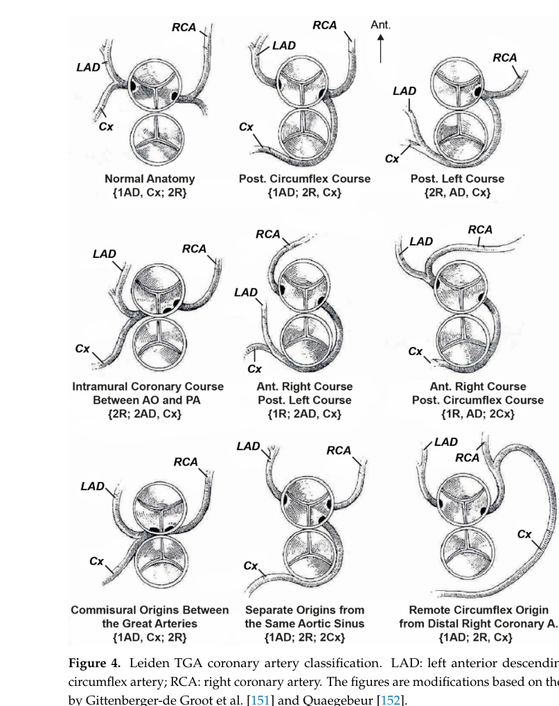

## Question

# Disease Characteristics Research Template

## Target Disease
- **Disease Name:** Dextro-Transposition of the Great Arteries
- **MONDO ID:**  (if available)
- **Category:** Complex

## Research Objectives

Please provide a comprehensive research report on **Dextro-Transposition of the Great Arteries** covering all of the
disease characteristics listed below. This report will be used to populate a disease knowledge
base entry. Be thorough and cite primary literature (PMID preferred) for all claims.

For each section, **suggested databases/resources** are listed. These are the first places
you should search for information on each topic.

---

### 1. Disease Information
> **Search first:** OMIM, Orphanet, ICD-10/ICD-11, MeSH, PubMed

- What is the disease? Provide a concise overview.
- What are the key identifiers? (OMIM, Orphanet, ICD-10/ICD-11, MeSH, Mondo)
- What are the common synonyms and alternative names?
- Is the information derived from individual patients (e.g., EHR) or aggregated disease-level resources?

### 2. Etiology

- **Disease Causal Factors**: What are the primary causes? (genetic, environmental, infectious, mechanistic)
- **Risk Factors**:
  > **Search first:** PubMed, Cochrane Library, UpToDate, clinical guidelines, ClinVar, ClinGen, GWAS Catalog, PheGenI, CTD, CDC, WHO, epidemiological databases
  - Genetic risk factors (causal variants, susceptibility loci, modifier genes)
  - Environmental risk factors (toxins, lifestyle, occupational exposures, age, sex, family history)
- **Protective Factors**:
  > **Search first:** PubMed, Cochrane Library, clinical trial databases, GWAS Catalog, gnomAD, WHO, CDC, nutrition databases
  - Genetic protective factors (protective variants, modifier alleles)
  - Environmental protective factors (diet, lifestyle, exposures that reduce risk)
- **Gene-Environment Interactions**: How do genetic and environmental factors interact to influence disease?
  > **Search first:** CTD, PubMed, PheGenI, GxE databases

### 3. Phenotypes
> **Search first:** HPO (Human Phenotype Ontology), OMIM, Orphanet, PubMed, clinicaltrials.gov, MedDRA, SNOMED CT, DECIPHER, LOINC

For each phenotype, provide:
- **Phenotype type**: symptoms, clinical signs, physical manifestations, behavioral changes, or laboratory abnormalities
  > For symptoms/signs: HPO, OMIM, Orphanet, PubMed
  > For behavioral changes: HPO, DSM, RDoC (Research Domain Criteria), PubMed
  > For laboratory abnormalities: LOINC, SNOMED CT, LabTests Online, PubMed
- **Phenotype characteristics**:
  > **Search first:** OMIM, Orphanet, HPO, PubMed
  - Age of symptom onset (neonatal, childhood, adult-onset, late-onset)
  - Symptom severity (mild, moderate, severe, variable)
  - Symptom progression (stable, progressive, episodic, fluctuating)
  - Frequency among affected individuals (percentage or qualitative)
- **Quality of life impact**: Effects on daily functioning and well-being (per-phenotype when possible)
  > **Search first:** EQ-5D database, SF-36, WHO QOL databases, PubMed
- Suggest HPO (Human Phenotype Ontology) terms for each phenotype

### 4. Genetic/Molecular Information

- **Causal Genes**: Gene mutations or chromosomal abnormalities responsible for disease (gene symbols, OMIM IDs)
  > **Search first:** OMIM, ClinVar, HGMD, Ensembl, NCBI Gene
- **Pathogenic Variants**:
  - Affected genes (gene symbols, HGNC IDs)
    > **Search first:** OMIM, NCBI Gene, Ensembl, HGNC, UniProt, GeneCards
  - Variant classification (pathogenic, likely pathogenic, VUS per ACMG/AMP guidelines)
    > **Search first:** ClinVar, ClinGen, ACMG/AMP guidelines, VarSome
  - Variant type/class (missense, frameshift, nonsense, splice-site, structural)
  - Allele frequency in population databases
    > **Search first:** gnomAD, 1000 Genomes, ExAC, TOPMed, dbSNP
  - Somatic vs germline origin
    > **Search first:** COSMIC (somatic), ClinVar, ICGC, TCGA
  - Functional consequences (loss of function, gain of function, dominant negative)
- **Modifier Genes**: Genes that modify disease severity or expression
- **Epigenetic Information**: DNA methylation, histone modifications, chromatin changes affecting disease
  > **Search first:** ENCODE, Roadmap Epigenomics, MethBase, DiseaseMeth
- **Chromosomal Abnormalities**: Large-scale genetic changes (aneuploidy, translocations, inversions)
  > **Search first:** DECIPHER, ClinVar, ECARUCA, UCSC Genome Browser

### 5. Environmental Information

- **Environmental Factors**: Non-genetic contributing factors (toxins, radiation, pollution, occupational exposure)
  > **Search first:** CTD (Comparative Toxicogenomics Database), TOXNET, PubMed, EPA databases
- **Lifestyle Factors**: Behavioral factors (smoking, diet, exercise, alcohol consumption)
  > **Search first:** CDC databases, WHO, PubMed, NHANES
- **Infectious Agents**: If applicable, pathogens causing or triggering disease (bacteria, viruses, fungi, parasites)
  > **Search first:** NCBI Taxonomy, ViPR, BV-BRC, MicrobeDB, GIDEON

### 6. Mechanism / Pathophysiology

- **Molecular Pathways**: Specific signaling cascades or biochemical pathways involved (Wnt, MAPK, mTOR, PI3K-AKT, etc.)
  > **Search first:** KEGG, Reactome, WikiPathways, PathBank, BioCyc
- **Cellular Processes**: Cell-level mechanisms (apoptosis, autophagy, cell cycle dysregulation, inflammation, etc.)
  > **Search first:** Gene Ontology (GO), Reactome, KEGG, PubMed
- **Protein Dysfunction**: How protein structure or function is altered (misfolding, aggregation, loss of function, gain of function)
  > **Search first:** UniProt, PDB (Protein Data Bank), InterPro, Pfam, AlphaFold
- **Metabolic Changes**: Alterations in metabolic processes (energy metabolism, lipid metabolism, amino acid metabolism)
  > **Search first:** KEGG, BioCyc, HMDB (Human Metabolome Database), BRENDA
- **Immune System Involvement**: Role of immune response (autoimmunity, immunodeficiency, chronic inflammation)
  > **Search first:** ImmPort, Immunome Database, IEDB, Gene Ontology
- **Tissue Damage Mechanisms**: How tissues/ are injured (oxidative stress, ischemia, fibrosis, necrosis)
  > **Search first:** PubMed, Gene Ontology, Reactome
- **Biochemical Abnormalities**: Specific molecular defects (enzyme deficiencies, receptor dysfunction, ion channel defects)
  > **Search first:** BRENDA, UniProt, KEGG, OMIM, PubMed
- **Epigenetic Changes**: DNA methylation, histone modifications affecting gene expression in disease
  > **Search first:** ENCODE, Roadmap Epigenomics, MethBase, DiseaseMeth
- **Molecular Profiling** (if available):
  - Transcriptomics/gene expression changes
    > **Search first:** GEO (Gene Expression Omnibus), ArrayExpress, GTEx, Human Cell Atlas, SRA
  - Proteomics findings
    > **Search first:** PRIDE, ProteomeXchange, Human Protein Atlas, STRING, BioGRID
  - Metabolomics signatures
    > **Search first:** MetaboLights, Metabolomics Workbench, HMDB, METLIN
  - Lipidomics alterations
    > **Search first:** LIPID MAPS, SwissLipids, LipidHome, Metabolomics Workbench
  - Genomic structural features
    > **Search first:** UCSC Genome Browser, Ensembl, NCBI, dbVar, DGV
- **Advanced Technologies** (if applicable):
  - Single-cell analysis findings (cell-type specific mechanisms, cellular heterogeneity)
    > **Search first:** Human Cell Atlas, Single Cell Portal, GEO, CELLxGENE
  - Spatial transcriptomics findings
    > **Search first:** GEO, Spatial Research, Vizgen, 10x Genomics data
  - Multi-omics integration results
    > **Search first:** TCGA, ICGC, cBioPortal, LinkedOmics, PubMed
  - Functional genomics screens (CRISPR, RNAi)
    > **Search first:** DepMap, GenomeRNAi, PubMed, BioGRID ORCS

For each mechanism, describe:
- The causal chain from initial trigger to clinical manifestation
- Which mechanisms are upstream vs downstream
- What cell types and biological processes are involved
- Suggest GO terms for biological processes and CL terms for cell types

### 7. Anatomical Structures Affected

- **Organ Level**:
  - Primary organs directly affected
  - Secondary organ involvement (complications, secondary effects)
  - Body systems involved (cardiovascular, nervous, digestive, respiratory, endocrine, etc.)
  > **Search first:** Uberon, FMA (Foundational Model of Anatomy), OMIM, HPO, ICD-11, MeSH, SNOMED CT
- **Tissue and Cell Level**:
  - Specific tissue types affected (epithelial, connective, muscle, nervous)
  - Specific cell populations targeted (with Cell Ontology terms)
  > **Search first:** Uberon, Human Protein Atlas, Cell Ontology, Human Cell Atlas, CellMarker, PanglaoDB
- **Subcellular Level**:
  - Cellular compartments involved (mitochondria, nucleus, ER, lysosomes) (with GO Cellular Component terms)
  > **Search first:** Gene Ontology (Cellular Component), UniProt, Human Protein Atlas
- **Localization**:
  - Specific anatomical sites (with UBERON terms)
    > **Search first:** FMA, Uberon, NeuroNames (for brain), SNOMED CT
  - Lateralization (unilateral, bilateral, asymmetric)
    > **Search first:** HPO, clinical literature, imaging databases

### 8. Temporal Development

- **Onset**:
  - Typical age of onset (congenital, pediatric, adult, geriatric)
  - Onset pattern (acute, subacute, chronic, insidious)
  > **Search first:** OMIM, Orphanet, HPO, PubMed
- **Progression**:
  - Disease stages (early, intermediate, advanced, end-stage)
    > **Search first:** Cancer Staging Manual (AJCC), WHO classifications, PubMed
  - Progression rate (rapid, slow, variable)
  - Disease course pattern (episodic, relapsing-remitting, progressive, stable)
  - Disease duration (self-limited, chronic lifelong)
  > **Search first:** Disease registries, longitudinal cohort databases, natural history studies, PubMed, Orphanet, OMIM
- **Patterns**:
  - Remission patterns (spontaneous, treatment-induced)
    > **Search first:** Clinical trial databases, disease registries, PubMed
  - Critical periods (time windows of vulnerability or opportunity for intervention)
    > **Search first:** PubMed, developmental biology databases, clinical guidelines

### 9. Inheritance and Population

- **Epidemiology**:
  - Prevalence (cases per 100,000 at given time)
  - Incidence (new cases per 100,000 per year)
  > **Search first:** Orphanet, CDC, WHO, GBD (Global Burden of Disease), national registries, SEER, disease registries
- **For Genetic Etiology**:
  - Inheritance pattern (AD, AR, X-linked, mitochondrial, multifactorial, polygenic)
    > **Search first:** OMIM, Orphanet, ClinVar, GTR (Genetic Testing Registry)
  - Penetrance (complete, incomplete, age-dependent)
    > **Search first:** ClinVar, OMIM, PubMed, ClinGen
  - Expressivity (variable, consistent)
    > **Search first:** OMIM, ClinVar, PubMed
  - Genetic anticipation (increasing severity in successive generations)
    > **Search first:** OMIM, PubMed (especially for repeat expansion disorders)
  - Germline mosaicism
    > **Search first:** ClinVar, OMIM, genetic counseling literature, PubMed
  - Founder effects (population-specific mutations)
    > **Search first:** gnomAD, population genetics databases, PubMed
  - Consanguinity role
    > **Search first:** OMIM, population studies, genetic counseling resources
  - Carrier frequency
    > **Search first:** gnomAD, carrier screening databases, GeneReviews, GTR
- **Population Demographics**:
  - Affected populations (ethnic or demographic groups with higher prevalence)
    > **Search first:** gnomAD, 1000 Genomes, PAGE Study, PubMed, population registries
  - Geographic distribution (endemic areas, regional variation)
    > **Search first:** WHO, CDC, GBD, Orphanet, geographic epidemiology databases
  - Geographic distribution of specific variants
  - Sex ratio (male:female)
    > **Search first:** Disease registries, OMIM, PubMed, epidemiological databases
  - Age distribution of affected individuals
    > **Search first:** CDC, disease registries, SEER, Orphanet

### 10. Diagnostics

- **Clinical Tests**:
  - Laboratory tests (blood, urine, tissue chemistry, specific enzyme assays)
    > **Search first:** LOINC, LabTests Online, PubMed
  - Biomarkers (proteins, metabolites, genetic markers, circulating biomarkers)
    > **Search first:** FDA Biomarker List, BEST (Biomarkers, EndpointS, and other Tools), PubMed
  - Imaging studies (X-ray, CT, MRI, PET, ultrasound)
    > **Search first:** RadLex, DICOM, Radiopaedia, imaging databases
  - Functional tests (pulmonary function, cardiac stress tests)
    > **Search first:** LOINC, clinical guidelines, PubMed
  - Electrophysiology (EEG, EMG, ECG, nerve conduction studies)
    > **Search first:** LOINC, clinical neurophysiology databases, PubMed
  - Biopsy findings (histopathology, immunohistochemistry)
    > **Search first:** SNOMED CT, College of American Pathologists resources, PubMed
  - Pathology findings (microscopic examination)
    > **Search first:** SNOMED CT, Digital Pathology databases, PubMed
- **Genetic Testing**:
  > **Search first:** GTR (Genetic Testing Registry), GeneReviews, ClinGen
  - Overview of recommended genetic testing approach
  - Whole genome sequencing (WGS) utility
    > **Search first:** GTR, ClinVar, GEL (Genomics England), gnomAD
  - Whole exome sequencing (WES) utility
    > **Search first:** GTR, ClinVar, OMIM, GeneMatcher
  - Gene panels (which panels, which genes)
    > **Search first:** GTR, ClinVar, laboratory-specific databases
  - Single gene testing
    > **Search first:** GTR, ClinVar, OMIM, GeneReviews
  - Chromosomal microarray (CMA)
    > **Search first:** DECIPHER, ClinVar, dbVar, ECARUCA
  - Karyotyping
    > **Search first:** Chromosome Abnormality Database, ClinVar, cytogenetics resources
  - FISH
    > **Search first:** ClinVar, cytogenetics databases, PubMed
  - Mitochondrial DNA testing
    > **Search first:** MITOMAP, MSeqDR, ClinVar, GTR
  - Repeat expansion testing
    > **Search first:** GTR, ClinVar, repeat expansion databases, PubMed
- **Omics-Based Diagnostics** (if applicable):
  - RNA sequencing / transcriptomics
    > **Search first:** GEO, ArrayExpress, GTEx, RNA-seq databases
  - Proteomics
    > **Search first:** PRIDE, ProteomeXchange, FDA Biomarker database
  - Metabolomics
    > **Search first:** MetaboLights, Metabolomics Workbench, HMDB
  - Epigenomics
    > **Search first:** GEO, ENCODE, Roadmap Epigenomics, MethBase
  - Liquid biopsy
    > **Search first:** COSMIC, ClinVar, liquid biopsy databases, PubMed
- **Clinical Criteria**:
  - Standardized diagnostic criteria (DSM, ICD, society guidelines)
    > **Search first:** DSM-5, ICD-11, clinical society guidelines, UpToDate
  - Differential diagnosis (other conditions to rule out, with distinguishing features)
    > **Search first:** DynaMed, UpToDate, clinical decision support systems
- **Screening**:
  - Screening methods for asymptomatic individuals (newborn screening, carrier screening, cascade screening)
    > **Search first:** ACMG recommendations, CDC newborn screening, GTR

### 11. Outcome/Prognosis

- **Survival and Mortality**:
  - Survival rate (5-year, 10-year, overall)
    > **Search first:** SEER, cancer registries, disease-specific registries, PubMed
  - Life expectancy (with and without treatment if applicable)
    > **Search first:** Orphanet, disease registries, actuarial databases, PubMed
  - Mortality rate
    > **Search first:** CDC, WHO, GBD, national mortality databases
  - Disease-specific mortality (deaths directly attributable to disease)
    > **Search first:** Disease registries, CDC Wonder, GBD, PubMed
- **Morbidity and Function**:
  - Morbidity (disease-related disability and health impacts)
    > **Search first:** GBD, WHO, disability databases, PubMed
  - Disability outcomes (long-term functional impairments)
    > **Search first:** ICF (International Classification of Functioning), disability registries
  - Quality of life measures (EQ-5D, SF-36, PROMIS, disease-specific tools)
    > **Search first:** EQ-5D database, SF-36, PROMIS, PubMed
- **Disease Course**:
  - Complications (secondary problems: infections, organ failure, etc.)
    > **Search first:** ICD codes, disease registries, clinical databases, PubMed
  - Recovery potential (likelihood and extent of recovery, with vs without treatment)
    > **Search first:** Natural history studies, rehabilitation databases, PubMed
- **Prediction**:
  - Prognostic factors (age, disease severity, biomarkers, treatment response)
    > **Search first:** Prognostic models databases, clinical calculators, PubMed
  - Prognostic biomarkers (molecular markers predicting disease course)
    > **Search first:** FDA Biomarker database, PubMed, cancer prognostic databases

### 12. Treatment

- **Pharmacotherapy**:
  - Pharmacological treatments (drug names, drug classes, mechanisms of action)
    > **Search first:** DrugBank, RxNorm, ATC classification, DailyMed, FDA databases
  - Pharmacogenomics (how genetic variants affect drug metabolism, efficacy, toxicity)
    > **Search first:** PharmGKB, CPIC (Clinical Pharmacogenetics), FDA Table of PGx Biomarkers
- **Advanced Therapeutics**:
  - Gene therapy (viral vectors, CRISPR, gene replacement, gene editing)
    > **Search first:** ClinicalTrials.gov, FDA gene therapy database, ASGCT resources
  - Cell therapy (stem cell transplant, CAR-T, cellular therapeutics)
    > **Search first:** ClinicalTrials.gov, FDA cell therapy database, FACT standards
  - RNA-based therapies (ASOs, siRNA, mRNA therapies)
    > **Search first:** ClinicalTrials.gov, FDA approvals, PubMed
  - Targeted therapies (treatments directed at specific molecular targets)
    > **Search first:** My Cancer Genome, OncoKB, ClinicalTrials.gov, FDA approvals
  - Immunotherapies (checkpoint inhibitors, monoclonal antibodies)
    > **Search first:** Cancer Immunotherapy Database, FDA approvals, ClinicalTrials.gov
- **Surgical and Interventional**:
  - Surgical interventions (types of surgery, timing, outcomes)
    > **Search first:** CPT codes, surgical registries, clinical guidelines, PubMed
- **Supportive and Rehabilitative**:
  - Supportive care (symptom management, pain control, nutrition)
    > **Search first:** Clinical guidelines, Cochrane Library, PubMed
  - Rehabilitation (physical therapy, occupational therapy, speech therapy)
    > **Search first:** Rehabilitation medicine databases, clinical guidelines, PubMed
- **Experimental**:
  - Experimental treatments in clinical trials (with NCT identifiers if available)
    > **Search first:** ClinicalTrials.gov, EU Clinical Trials Register, WHO ICTRP
- **Treatment Outcomes**:
  - Treatment response rates
    > **Search first:** Clinical trial databases, FDA reviews, systematic reviews, PubMed
  - Side effects and adverse events
    > **Search first:** FDA Adverse Event Reporting System (FAERS), MedWatch, PubMed
- **Treatment Strategy**:
  - Treatment algorithms (clinical pathways, decision trees)
    > **Search first:** Clinical practice guidelines, NCCN Guidelines, UpToDate
  - Combination therapies
    > **Search first:** ClinicalTrials.gov, treatment guidelines, PubMed
  - Personalized medicine approaches (genotype-guided treatment)
    > **Search first:** My Cancer Genome, CIViC, PharmGKB, precision medicine databases

For each treatment, suggest MAXO (Medical Action Ontology) terms where applicable.

### 13. Prevention

- **Prevention Levels**:
  - Primary prevention (preventing disease occurrence: vaccination, risk factor modification)
    > **Search first:** CDC, WHO, USPSTF recommendations, Cochrane Library
  - Secondary prevention (early detection and treatment: screening programs, early intervention)
    > **Search first:** USPSTF, CDC screening guidelines, WHO
  - Tertiary prevention (preventing complications in those with disease)
    > **Search first:** Clinical guidelines, disease management protocols, PubMed
- **Immunization**: Vaccine strategies (if applicable)
  > **Search first:** CDC vaccine schedules, WHO immunization, FDA vaccine database
- **Screening and Early Detection**:
  - Screening programs (population-based: newborn screening, cancer screening)
    > **Search first:** CDC screening programs, USPSTF, cancer screening databases
  - Genetic screening (carrier screening, preimplantation genetic diagnosis, prenatal testing)
    > **Search first:** ACMG recommendations, ACOG guidelines, GTR
  - Risk stratification (identifying high-risk individuals for targeted prevention)
    > **Search first:** Risk prediction models, clinical calculators, PubMed
- **Behavioral Interventions**: Lifestyle modifications to reduce risk
  > **Search first:** CDC, WHO, behavioral intervention databases, Cochrane Library
- **Counseling**: Genetic counseling (risk assessment, family planning guidance)
  > **Search first:** NSGC resources, ACMG guidelines, GeneReviews
- **Public Health**:
  - Public health interventions (sanitation, vector control, health education)
    > **Search first:** CDC, WHO, public health databases, PubMed
  - Environmental interventions (reducing environmental risk factors)
    > **Search first:** EPA databases, WHO environmental health, PubMed
- **Prophylaxis**: Preventive medications or procedures
  > **Search first:** Clinical guidelines, FDA approvals, PubMed

### 14. Other Species / Natural Disease

- **Taxonomy**: Species affected (with NCBI Taxon identifiers)
  > **Search first:** NCBI Taxonomy
- **Breed**: Specific breeds affected (with VBO identifiers if applicable)
  > **Search first:** VBO (Vertebrate Breed Ontology)
- **Gene**: Orthologous genes in other species (with NCBI Gene IDs)
  > **Search first:** NCBI Gene
- **Natural Disease**:
  - Naturally occurring disease in other species (companion animals, wildlife)
    > **Search first:** OMIA (Online Mendelian Inheritance in Animals), VetCompass, PubMed
  - Veterinary relevance and importance in animal health
    > **Search first:** OMIA, veterinary databases, PubMed
- **Comparative Biology**:
  - Comparative pathology (similarities and differences across species)
    > **Search first:** OMIA, comparative pathology databases, PubMed
  - Evolutionary conservation of disease mechanisms
    > **Search first:** HomoloGene, OrthoMCL, Alliance of Genome Resources
- **Transmission** (if applicable):
  - Zoonotic potential
    > **Search first:** CDC zoonotic diseases, WHO zoonoses, GIDEON
  - Cross-species susceptibility
    > **Search first:** NCBI Taxonomy, veterinary databases, PubMed

### 15. Model Organisms

- **Model Types**:
  - Model organism type (mammalian, invertebrate, cellular, in vitro)
    > **Search first:** Alliance of Genome Resources, model organism databases
  - Specific model systems (mouse, rat, zebrafish, Drosophila, C. elegans, yeast, cell lines, organoids, iPSCs)
    > **Search first:** MGI, RGD, ZFIN, FlyBase, WormBase, SGD, ATCC, Cellosaurus
  - Induced models (drug treatment, surgical intervention, environmental manipulation)
    > **Search first:** MGI, model organism databases, PubMed
- **Genetic Models**:
  - Types available (knockout, knock-in, transgenic, conditional, humanized)
    > **Search first:** MGI, IMPC, KOMP, EuMMCR, IMSR
- **Model Characteristics**:
  - Phenotype recapitulation (how well model reproduces human disease features)
    > **Search first:** Model organism databases, comparative studies, PubMed
  - Model limitations (aspects of human disease not captured)
    > **Search first:** Model organism databases, PubMed, review articles
- **Applications**:
  - Research applications (what aspects of disease can be studied)
    > **Search first:** Model organism databases, PubMed
- **Resources**:
  - Model databases
    > **Search first:** MGI, RGD, ZFIN, FlyBase, WormBase, IMSR, EMMA, MMRRC

---

## Citation Requirements

- Cite primary literature (PMID preferred) for all mechanistic and clinical claims
- Prioritize recent reviews and landmark papers
- Include direct quotes from abstracts where possible to support key statements
- Distinguish evidence source types: human clinical, model organism, in vitro, computational

## Output Format

Structure your response as a comprehensive narrative organized by the sections above.
For each section, provide:
- Factual content with specific details (numbers, percentages, gene names, variant nomenclature)
- Ontology term suggestions (HPO, GO, CL, UBERON, CHEBI, MAXO, MONDO) where applicable
- Evidence citations with PMIDs
- Direct quotes from abstracts to support key claims
- Clear indication when information is not available or not applicable for this disease

This report will be used to populate a disease knowledge base entry with:
- Pathophysiology descriptions with causal chains
- Gene/protein annotations (HGNC, GO terms)
- Phenotype associations (HP terms) with frequencies
- Cell type involvement (CL terms)
- Anatomical locations (UBERON terms)
- Chemical entities (CHEBI terms)
- Treatment annotations (MAXO terms)
- Evidence items with PMIDs and exact abstract quotes
- Epidemiology, prognosis, diagnostic, and prevention information
- Animal model descriptions with phenotype recapitulation details

## Output

Question: You are an expert researcher providing comprehensive, well-cited information.

Provide detailed information focusing on:
1. Key concepts and definitions with current understanding
2. Recent developments and latest research (prioritize 2023-2024 sources)
3. Current applications and real-world implementations
4. Expert opinions and analysis from authoritative sources
5. Relevant statistics and data from recent studies

Format as a comprehensive research report with proper citations. Include URLs and publication dates where available.
Always prioritize recent, authoritative sources and provide specific citations for all major claims.

# Disease Characteristics Research Template

## Target Disease
- **Disease Name:** Dextro-Transposition of the Great Arteries
- **MONDO ID:**  (if available)
- **Category:** Complex

## Research Objectives

Please provide a comprehensive research report on **Dextro-Transposition of the Great Arteries** covering all of the
disease characteristics listed below. This report will be used to populate a disease knowledge
base entry. Be thorough and cite primary literature (PMID preferred) for all claims.

For each section, **suggested databases/resources** are listed. These are the first places
you should search for information on each topic.

---

### 1. Disease Information
> **Search first:** OMIM, Orphanet, ICD-10/ICD-11, MeSH, PubMed

- What is the disease? Provide a concise overview.
- What are the key identifiers? (OMIM, Orphanet, ICD-10/ICD-11, MeSH, Mondo)
- What are the common synonyms and alternative names?
- Is the information derived from individual patients (e.g., EHR) or aggregated disease-level resources?

### 2. Etiology

- **Disease Causal Factors**: What are the primary causes? (genetic, environmental, infectious, mechanistic)
- **Risk Factors**:
  > **Search first:** PubMed, Cochrane Library, UpToDate, clinical guidelines, ClinVar, ClinGen, GWAS Catalog, PheGenI, CTD, CDC, WHO, epidemiological databases
  - Genetic risk factors (causal variants, susceptibility loci, modifier genes)
  - Environmental risk factors (toxins, lifestyle, occupational exposures, age, sex, family history)
- **Protective Factors**:
  > **Search first:** PubMed, Cochrane Library, clinical trial databases, GWAS Catalog, gnomAD, WHO, CDC, nutrition databases
  - Genetic protective factors (protective variants, modifier alleles)
  - Environmental protective factors (diet, lifestyle, exposures that reduce risk)
- **Gene-Environment Interactions**: How do genetic and environmental factors interact to influence disease?
  > **Search first:** CTD, PubMed, PheGenI, GxE databases

### 3. Phenotypes
> **Search first:** HPO (Human Phenotype Ontology), OMIM, Orphanet, PubMed, clinicaltrials.gov, MedDRA, SNOMED CT, DECIPHER, LOINC

For each phenotype, provide:
- **Phenotype type**: symptoms, clinical signs, physical manifestations, behavioral changes, or laboratory abnormalities
  > For symptoms/signs: HPO, OMIM, Orphanet, PubMed
  > For behavioral changes: HPO, DSM, RDoC (Research Domain Criteria), PubMed
  > For laboratory abnormalities: LOINC, SNOMED CT, LabTests Online, PubMed
- **Phenotype characteristics**:
  > **Search first:** OMIM, Orphanet, HPO, PubMed
  - Age of symptom onset (neonatal, childhood, adult-onset, late-onset)
  - Symptom severity (mild, moderate, severe, variable)
  - Symptom progression (stable, progressive, episodic, fluctuating)
  - Frequency among affected individuals (percentage or qualitative)
- **Quality of life impact**: Effects on daily functioning and well-being (per-phenotype when possible)
  > **Search first:** EQ-5D database, SF-36, WHO QOL databases, PubMed
- Suggest HPO (Human Phenotype Ontology) terms for each phenotype

### 4. Genetic/Molecular Information

- **Causal Genes**: Gene mutations or chromosomal abnormalities responsible for disease (gene symbols, OMIM IDs)
  > **Search first:** OMIM, ClinVar, HGMD, Ensembl, NCBI Gene
- **Pathogenic Variants**:
  - Affected genes (gene symbols, HGNC IDs)
    > **Search first:** OMIM, NCBI Gene, Ensembl, HGNC, UniProt, GeneCards
  - Variant classification (pathogenic, likely pathogenic, VUS per ACMG/AMP guidelines)
    > **Search first:** ClinVar, ClinGen, ACMG/AMP guidelines, VarSome
  - Variant type/class (missense, frameshift, nonsense, splice-site, structural)
  - Allele frequency in population databases
    > **Search first:** gnomAD, 1000 Genomes, ExAC, TOPMed, dbSNP
  - Somatic vs germline origin
    > **Search first:** COSMIC (somatic), ClinVar, ICGC, TCGA
  - Functional consequences (loss of function, gain of function, dominant negative)
- **Modifier Genes**: Genes that modify disease severity or expression
- **Epigenetic Information**: DNA methylation, histone modifications, chromatin changes affecting disease
  > **Search first:** ENCODE, Roadmap Epigenomics, MethBase, DiseaseMeth
- **Chromosomal Abnormalities**: Large-scale genetic changes (aneuploidy, translocations, inversions)
  > **Search first:** DECIPHER, ClinVar, ECARUCA, UCSC Genome Browser

### 5. Environmental Information

- **Environmental Factors**: Non-genetic contributing factors (toxins, radiation, pollution, occupational exposure)
  > **Search first:** CTD (Comparative Toxicogenomics Database), TOXNET, PubMed, EPA databases
- **Lifestyle Factors**: Behavioral factors (smoking, diet, exercise, alcohol consumption)
  > **Search first:** CDC databases, WHO, PubMed, NHANES
- **Infectious Agents**: If applicable, pathogens causing or triggering disease (bacteria, viruses, fungi, parasites)
  > **Search first:** NCBI Taxonomy, ViPR, BV-BRC, MicrobeDB, GIDEON

### 6. Mechanism / Pathophysiology

- **Molecular Pathways**: Specific signaling cascades or biochemical pathways involved (Wnt, MAPK, mTOR, PI3K-AKT, etc.)
  > **Search first:** KEGG, Reactome, WikiPathways, PathBank, BioCyc
- **Cellular Processes**: Cell-level mechanisms (apoptosis, autophagy, cell cycle dysregulation, inflammation, etc.)
  > **Search first:** Gene Ontology (GO), Reactome, KEGG, PubMed
- **Protein Dysfunction**: How protein structure or function is altered (misfolding, aggregation, loss of function, gain of function)
  > **Search first:** UniProt, PDB (Protein Data Bank), InterPro, Pfam, AlphaFold
- **Metabolic Changes**: Alterations in metabolic processes (energy metabolism, lipid metabolism, amino acid metabolism)
  > **Search first:** KEGG, BioCyc, HMDB (Human Metabolome Database), BRENDA
- **Immune System Involvement**: Role of immune response (autoimmunity, immunodeficiency, chronic inflammation)
  > **Search first:** ImmPort, Immunome Database, IEDB, Gene Ontology
- **Tissue Damage Mechanisms**: How tissues/ are injured (oxidative stress, ischemia, fibrosis, necrosis)
  > **Search first:** PubMed, Gene Ontology, Reactome
- **Biochemical Abnormalities**: Specific molecular defects (enzyme deficiencies, receptor dysfunction, ion channel defects)
  > **Search first:** BRENDA, UniProt, KEGG, OMIM, PubMed
- **Epigenetic Changes**: DNA methylation, histone modifications affecting gene expression in disease
  > **Search first:** ENCODE, Roadmap Epigenomics, MethBase, DiseaseMeth
- **Molecular Profiling** (if available):
  - Transcriptomics/gene expression changes
    > **Search first:** GEO (Gene Expression Omnibus), ArrayExpress, GTEx, Human Cell Atlas, SRA
  - Proteomics findings
    > **Search first:** PRIDE, ProteomeXchange, Human Protein Atlas, STRING, BioGRID
  - Metabolomics signatures
    > **Search first:** MetaboLights, Metabolomics Workbench, HMDB, METLIN
  - Lipidomics alterations
    > **Search first:** LIPID MAPS, SwissLipids, LipidHome, Metabolomics Workbench
  - Genomic structural features
    > **Search first:** UCSC Genome Browser, Ensembl, NCBI, dbVar, DGV
- **Advanced Technologies** (if applicable):
  - Single-cell analysis findings (cell-type specific mechanisms, cellular heterogeneity)
    > **Search first:** Human Cell Atlas, Single Cell Portal, GEO, CELLxGENE
  - Spatial transcriptomics findings
    > **Search first:** GEO, Spatial Research, Vizgen, 10x Genomics data
  - Multi-omics integration results
    > **Search first:** TCGA, ICGC, cBioPortal, LinkedOmics, PubMed
  - Functional genomics screens (CRISPR, RNAi)
    > **Search first:** DepMap, GenomeRNAi, PubMed, BioGRID ORCS

For each mechanism, describe:
- The causal chain from initial trigger to clinical manifestation
- Which mechanisms are upstream vs downstream
- What cell types and biological processes are involved
- Suggest GO terms for biological processes and CL terms for cell types

### 7. Anatomical Structures Affected

- **Organ Level**:
  - Primary organs directly affected
  - Secondary organ involvement (complications, secondary effects)
  - Body systems involved (cardiovascular, nervous, digestive, respiratory, endocrine, etc.)
  > **Search first:** Uberon, FMA (Foundational Model of Anatomy), OMIM, HPO, ICD-11, MeSH, SNOMED CT
- **Tissue and Cell Level**:
  - Specific tissue types affected (epithelial, connective, muscle, nervous)
  - Specific cell populations targeted (with Cell Ontology terms)
  > **Search first:** Uberon, Human Protein Atlas, Cell Ontology, Human Cell Atlas, CellMarker, PanglaoDB
- **Subcellular Level**:
  - Cellular compartments involved (mitochondria, nucleus, ER, lysosomes) (with GO Cellular Component terms)
  > **Search first:** Gene Ontology (Cellular Component), UniProt, Human Protein Atlas
- **Localization**:
  - Specific anatomical sites (with UBERON terms)
    > **Search first:** FMA, Uberon, NeuroNames (for brain), SNOMED CT
  - Lateralization (unilateral, bilateral, asymmetric)
    > **Search first:** HPO, clinical literature, imaging databases

### 8. Temporal Development

- **Onset**:
  - Typical age of onset (congenital, pediatric, adult, geriatric)
  - Onset pattern (acute, subacute, chronic, insidious)
  > **Search first:** OMIM, Orphanet, HPO, PubMed
- **Progression**:
  - Disease stages (early, intermediate, advanced, end-stage)
    > **Search first:** Cancer Staging Manual (AJCC), WHO classifications, PubMed
  - Progression rate (rapid, slow, variable)
  - Disease course pattern (episodic, relapsing-remitting, progressive, stable)
  - Disease duration (self-limited, chronic lifelong)
  > **Search first:** Disease registries, longitudinal cohort databases, natural history studies, PubMed, Orphanet, OMIM
- **Patterns**:
  - Remission patterns (spontaneous, treatment-induced)
    > **Search first:** Clinical trial databases, disease registries, PubMed
  - Critical periods (time windows of vulnerability or opportunity for intervention)
    > **Search first:** PubMed, developmental biology databases, clinical guidelines

### 9. Inheritance and Population

- **Epidemiology**:
  - Prevalence (cases per 100,000 at given time)
  - Incidence (new cases per 100,000 per year)
  > **Search first:** Orphanet, CDC, WHO, GBD (Global Burden of Disease), national registries, SEER, disease registries
- **For Genetic Etiology**:
  - Inheritance pattern (AD, AR, X-linked, mitochondrial, multifactorial, polygenic)
    > **Search first:** OMIM, Orphanet, ClinVar, GTR (Genetic Testing Registry)
  - Penetrance (complete, incomplete, age-dependent)
    > **Search first:** ClinVar, OMIM, PubMed, ClinGen
  - Expressivity (variable, consistent)
    > **Search first:** OMIM, ClinVar, PubMed
  - Genetic anticipation (increasing severity in successive generations)
    > **Search first:** OMIM, PubMed (especially for repeat expansion disorders)
  - Germline mosaicism
    > **Search first:** ClinVar, OMIM, genetic counseling literature, PubMed
  - Founder effects (population-specific mutations)
    > **Search first:** gnomAD, population genetics databases, PubMed
  - Consanguinity role
    > **Search first:** OMIM, population studies, genetic counseling resources
  - Carrier frequency
    > **Search first:** gnomAD, carrier screening databases, GeneReviews, GTR
- **Population Demographics**:
  - Affected populations (ethnic or demographic groups with higher prevalence)
    > **Search first:** gnomAD, 1000 Genomes, PAGE Study, PubMed, population registries
  - Geographic distribution (endemic areas, regional variation)
    > **Search first:** WHO, CDC, GBD, Orphanet, geographic epidemiology databases
  - Geographic distribution of specific variants
  - Sex ratio (male:female)
    > **Search first:** Disease registries, OMIM, PubMed, epidemiological databases
  - Age distribution of affected individuals
    > **Search first:** CDC, disease registries, SEER, Orphanet

### 10. Diagnostics

- **Clinical Tests**:
  - Laboratory tests (blood, urine, tissue chemistry, specific enzyme assays)
    > **Search first:** LOINC, LabTests Online, PubMed
  - Biomarkers (proteins, metabolites, genetic markers, circulating biomarkers)
    > **Search first:** FDA Biomarker List, BEST (Biomarkers, EndpointS, and other Tools), PubMed
  - Imaging studies (X-ray, CT, MRI, PET, ultrasound)
    > **Search first:** RadLex, DICOM, Radiopaedia, imaging databases
  - Functional tests (pulmonary function, cardiac stress tests)
    > **Search first:** LOINC, clinical guidelines, PubMed
  - Electrophysiology (EEG, EMG, ECG, nerve conduction studies)
    > **Search first:** LOINC, clinical neurophysiology databases, PubMed
  - Biopsy findings (histopathology, immunohistochemistry)
    > **Search first:** SNOMED CT, College of American Pathologists resources, PubMed
  - Pathology findings (microscopic examination)
    > **Search first:** SNOMED CT, Digital Pathology databases, PubMed
- **Genetic Testing**:
  > **Search first:** GTR (Genetic Testing Registry), GeneReviews, ClinGen
  - Overview of recommended genetic testing approach
  - Whole genome sequencing (WGS) utility
    > **Search first:** GTR, ClinVar, GEL (Genomics England), gnomAD
  - Whole exome sequencing (WES) utility
    > **Search first:** GTR, ClinVar, OMIM, GeneMatcher
  - Gene panels (which panels, which genes)
    > **Search first:** GTR, ClinVar, laboratory-specific databases
  - Single gene testing
    > **Search first:** GTR, ClinVar, OMIM, GeneReviews
  - Chromosomal microarray (CMA)
    > **Search first:** DECIPHER, ClinVar, dbVar, ECARUCA
  - Karyotyping
    > **Search first:** Chromosome Abnormality Database, ClinVar, cytogenetics resources
  - FISH
    > **Search first:** ClinVar, cytogenetics databases, PubMed
  - Mitochondrial DNA testing
    > **Search first:** MITOMAP, MSeqDR, ClinVar, GTR
  - Repeat expansion testing
    > **Search first:** GTR, ClinVar, repeat expansion databases, PubMed
- **Omics-Based Diagnostics** (if applicable):
  - RNA sequencing / transcriptomics
    > **Search first:** GEO, ArrayExpress, GTEx, RNA-seq databases
  - Proteomics
    > **Search first:** PRIDE, ProteomeXchange, FDA Biomarker database
  - Metabolomics
    > **Search first:** MetaboLights, Metabolomics Workbench, HMDB
  - Epigenomics
    > **Search first:** GEO, ENCODE, Roadmap Epigenomics, MethBase
  - Liquid biopsy
    > **Search first:** COSMIC, ClinVar, liquid biopsy databases, PubMed
- **Clinical Criteria**:
  - Standardized diagnostic criteria (DSM, ICD, society guidelines)
    > **Search first:** DSM-5, ICD-11, clinical society guidelines, UpToDate
  - Differential diagnosis (other conditions to rule out, with distinguishing features)
    > **Search first:** DynaMed, UpToDate, clinical decision support systems
- **Screening**:
  - Screening methods for asymptomatic individuals (newborn screening, carrier screening, cascade screening)
    > **Search first:** ACMG recommendations, CDC newborn screening, GTR

### 11. Outcome/Prognosis

- **Survival and Mortality**:
  - Survival rate (5-year, 10-year, overall)
    > **Search first:** SEER, cancer registries, disease-specific registries, PubMed
  - Life expectancy (with and without treatment if applicable)
    > **Search first:** Orphanet, disease registries, actuarial databases, PubMed
  - Mortality rate
    > **Search first:** CDC, WHO, GBD, national mortality databases
  - Disease-specific mortality (deaths directly attributable to disease)
    > **Search first:** Disease registries, CDC Wonder, GBD, PubMed
- **Morbidity and Function**:
  - Morbidity (disease-related disability and health impacts)
    > **Search first:** GBD, WHO, disability databases, PubMed
  - Disability outcomes (long-term functional impairments)
    > **Search first:** ICF (International Classification of Functioning), disability registries
  - Quality of life measures (EQ-5D, SF-36, PROMIS, disease-specific tools)
    > **Search first:** EQ-5D database, SF-36, PROMIS, PubMed
- **Disease Course**:
  - Complications (secondary problems: infections, organ failure, etc.)
    > **Search first:** ICD codes, disease registries, clinical databases, PubMed
  - Recovery potential (likelihood and extent of recovery, with vs without treatment)
    > **Search first:** Natural history studies, rehabilitation databases, PubMed
- **Prediction**:
  - Prognostic factors (age, disease severity, biomarkers, treatment response)
    > **Search first:** Prognostic models databases, clinical calculators, PubMed
  - Prognostic biomarkers (molecular markers predicting disease course)
    > **Search first:** FDA Biomarker database, PubMed, cancer prognostic databases

### 12. Treatment

- **Pharmacotherapy**:
  - Pharmacological treatments (drug names, drug classes, mechanisms of action)
    > **Search first:** DrugBank, RxNorm, ATC classification, DailyMed, FDA databases
  - Pharmacogenomics (how genetic variants affect drug metabolism, efficacy, toxicity)
    > **Search first:** PharmGKB, CPIC (Clinical Pharmacogenetics), FDA Table of PGx Biomarkers
- **Advanced Therapeutics**:
  - Gene therapy (viral vectors, CRISPR, gene replacement, gene editing)
    > **Search first:** ClinicalTrials.gov, FDA gene therapy database, ASGCT resources
  - Cell therapy (stem cell transplant, CAR-T, cellular therapeutics)
    > **Search first:** ClinicalTrials.gov, FDA cell therapy database, FACT standards
  - RNA-based therapies (ASOs, siRNA, mRNA therapies)
    > **Search first:** ClinicalTrials.gov, FDA approvals, PubMed
  - Targeted therapies (treatments directed at specific molecular targets)
    > **Search first:** My Cancer Genome, OncoKB, ClinicalTrials.gov, FDA approvals
  - Immunotherapies (checkpoint inhibitors, monoclonal antibodies)
    > **Search first:** Cancer Immunotherapy Database, FDA approvals, ClinicalTrials.gov
- **Surgical and Interventional**:
  - Surgical interventions (types of surgery, timing, outcomes)
    > **Search first:** CPT codes, surgical registries, clinical guidelines, PubMed
- **Supportive and Rehabilitative**:
  - Supportive care (symptom management, pain control, nutrition)
    > **Search first:** Clinical guidelines, Cochrane Library, PubMed
  - Rehabilitation (physical therapy, occupational therapy, speech therapy)
    > **Search first:** Rehabilitation medicine databases, clinical guidelines, PubMed
- **Experimental**:
  - Experimental treatments in clinical trials (with NCT identifiers if available)
    > **Search first:** ClinicalTrials.gov, EU Clinical Trials Register, WHO ICTRP
- **Treatment Outcomes**:
  - Treatment response rates
    > **Search first:** Clinical trial databases, FDA reviews, systematic reviews, PubMed
  - Side effects and adverse events
    > **Search first:** FDA Adverse Event Reporting System (FAERS), MedWatch, PubMed
- **Treatment Strategy**:
  - Treatment algorithms (clinical pathways, decision trees)
    > **Search first:** Clinical practice guidelines, NCCN Guidelines, UpToDate
  - Combination therapies
    > **Search first:** ClinicalTrials.gov, treatment guidelines, PubMed
  - Personalized medicine approaches (genotype-guided treatment)
    > **Search first:** My Cancer Genome, CIViC, PharmGKB, precision medicine databases

For each treatment, suggest MAXO (Medical Action Ontology) terms where applicable.

### 13. Prevention

- **Prevention Levels**:
  - Primary prevention (preventing disease occurrence: vaccination, risk factor modification)
    > **Search first:** CDC, WHO, USPSTF recommendations, Cochrane Library
  - Secondary prevention (early detection and treatment: screening programs, early intervention)
    > **Search first:** USPSTF, CDC screening guidelines, WHO
  - Tertiary prevention (preventing complications in those with disease)
    > **Search first:** Clinical guidelines, disease management protocols, PubMed
- **Immunization**: Vaccine strategies (if applicable)
  > **Search first:** CDC vaccine schedules, WHO immunization, FDA vaccine database
- **Screening and Early Detection**:
  - Screening programs (population-based: newborn screening, cancer screening)
    > **Search first:** CDC screening programs, USPSTF, cancer screening databases
  - Genetic screening (carrier screening, preimplantation genetic diagnosis, prenatal testing)
    > **Search first:** ACMG recommendations, ACOG guidelines, GTR
  - Risk stratification (identifying high-risk individuals for targeted prevention)
    > **Search first:** Risk prediction models, clinical calculators, PubMed
- **Behavioral Interventions**: Lifestyle modifications to reduce risk
  > **Search first:** CDC, WHO, behavioral intervention databases, Cochrane Library
- **Counseling**: Genetic counseling (risk assessment, family planning guidance)
  > **Search first:** NSGC resources, ACMG guidelines, GeneReviews
- **Public Health**:
  - Public health interventions (sanitation, vector control, health education)
    > **Search first:** CDC, WHO, public health databases, PubMed
  - Environmental interventions (reducing environmental risk factors)
    > **Search first:** EPA databases, WHO environmental health, PubMed
- **Prophylaxis**: Preventive medications or procedures
  > **Search first:** Clinical guidelines, FDA approvals, PubMed

### 14. Other Species / Natural Disease

- **Taxonomy**: Species affected (with NCBI Taxon identifiers)
  > **Search first:** NCBI Taxonomy
- **Breed**: Specific breeds affected (with VBO identifiers if applicable)
  > **Search first:** VBO (Vertebrate Breed Ontology)
- **Gene**: Orthologous genes in other species (with NCBI Gene IDs)
  > **Search first:** NCBI Gene
- **Natural Disease**:
  - Naturally occurring disease in other species (companion animals, wildlife)
    > **Search first:** OMIA (Online Mendelian Inheritance in Animals), VetCompass, PubMed
  - Veterinary relevance and importance in animal health
    > **Search first:** OMIA, veterinary databases, PubMed
- **Comparative Biology**:
  - Comparative pathology (similarities and differences across species)
    > **Search first:** OMIA, comparative pathology databases, PubMed
  - Evolutionary conservation of disease mechanisms
    > **Search first:** HomoloGene, OrthoMCL, Alliance of Genome Resources
- **Transmission** (if applicable):
  - Zoonotic potential
    > **Search first:** CDC zoonotic diseases, WHO zoonoses, GIDEON
  - Cross-species susceptibility
    > **Search first:** NCBI Taxonomy, veterinary databases, PubMed

### 15. Model Organisms

- **Model Types**:
  - Model organism type (mammalian, invertebrate, cellular, in vitro)
    > **Search first:** Alliance of Genome Resources, model organism databases
  - Specific model systems (mouse, rat, zebrafish, Drosophila, C. elegans, yeast, cell lines, organoids, iPSCs)
    > **Search first:** MGI, RGD, ZFIN, FlyBase, WormBase, SGD, ATCC, Cellosaurus
  - Induced models (drug treatment, surgical intervention, environmental manipulation)
    > **Search first:** MGI, model organism databases, PubMed
- **Genetic Models**:
  - Types available (knockout, knock-in, transgenic, conditional, humanized)
    > **Search first:** MGI, IMPC, KOMP, EuMMCR, IMSR
- **Model Characteristics**:
  - Phenotype recapitulation (how well model reproduces human disease features)
    > **Search first:** Model organism databases, comparative studies, PubMed
  - Model limitations (aspects of human disease not captured)
    > **Search first:** Model organism databases, PubMed, review articles
- **Applications**:
  - Research applications (what aspects of disease can be studied)
    > **Search first:** Model organism databases, PubMed
- **Resources**:
  - Model databases
    > **Search first:** MGI, RGD, ZFIN, FlyBase, WormBase, IMSR, EMMA, MMRRC

---

## Citation Requirements

- Cite primary literature (PMID preferred) for all mechanistic and clinical claims
- Prioritize recent reviews and landmark papers
- Include direct quotes from abstracts where possible to support key statements
- Distinguish evidence source types: human clinical, model organism, in vitro, computational

## Output Format

Structure your response as a comprehensive narrative organized by the sections above.
For each section, provide:
- Factual content with specific details (numbers, percentages, gene names, variant nomenclature)
- Ontology term suggestions (HPO, GO, CL, UBERON, CHEBI, MAXO, MONDO) where applicable
- Evidence citations with PMIDs
- Direct quotes from abstracts to support key claims
- Clear indication when information is not available or not applicable for this disease

This report will be used to populate a disease knowledge base entry with:
- Pathophysiology descriptions with causal chains
- Gene/protein annotations (HGNC, GO terms)
- Phenotype associations (HP terms) with frequencies
- Cell type involvement (CL terms)
- Anatomical locations (UBERON terms)
- Chemical entities (CHEBI terms)
- Treatment annotations (MAXO terms)
- Evidence items with PMIDs and exact abstract quotes
- Epidemiology, prognosis, diagnostic, and prevention information
- Animal model descriptions with phenotype recapitulation details

## Comprehensive Research Report: Dextro‑Transposition of the Great Arteries (d‑TGA)

### Executive summary
Dextro‑transposition of the great arteries (d‑TGA) is a critical cyanotic congenital heart defect characterized by ventriculoarterial discordance with atrioventricular concordance, producing parallel systemic and pulmonary circulations; survival after birth depends on intercirculatory mixing (e.g., ASD/PFO, VSD, PDA or catheter intervention). (zubrzycki2024pathogenesisandsurgical pages 3-5, zubrzycki2024pathogenesisandsurgical pages 1-2, zubrzycki2024pathogenesisandsurgical pages 2-3) Recent evidence supports a multifactorial etiology including rare laterality/outflow‑tract developmental gene variants, common polygenic risk (GWAS), and environmental/teratogenic factors (notably maternal diabetes and retinoid signaling perturbation). (zubrzycki2024pathogenesisandsurgical pages 5-7, ibrahim2023maternalpreexistingdiabetes pages 14-16, skoricmilosavljevic2022commongeneticvariants pages 1-2)

---

## 1. Disease information

### 1.1 Overview and current definition
d‑TGA (also referred to as complete TGA, dextro‑TGA, or d‑loop TGA) is defined by aorta arising from the morphologic right ventricle and pulmonary artery arising from the morphologic left ventricle, with atrioventricular concordance; this produces “parallel” circulations rather than “in series,” leading to systemic hypoxemia without mixing. (zubrzycki2024pathogenesisandsurgical pages 3-5, zubrzycki2024pathogenesisandsurgical pages 2-3)

### 1.2 Key identifiers and synonyms
A concise normalization table is provided below.

| Concept | Value | Notes | Source/URL (if in evidence) |
|---|---|---|---|
| Preferred name | dextro-transposition of the great arteries | Common/standard disease name in retrieved reviews; severe congenital heart defect with ventriculoarterial discordance and atrioventricular concordance (zubrzycki2024pathogenesisandsurgical pages 1-2, zubrzycki2024pathogenesisandsurgical pages 2-3) | Zubrzycki et al., 2024, *J Clin Med* — https://doi.org/10.3390/jcm13164823 |
| Abbreviation | d-TGA; D-TGA | Both lowercase and uppercase forms used in retrieved sources (zubrzycki2024pathogenesisandsurgical pages 1-2, zubrzycki2024pathogenesisandsurgical pages 28-29) | Zubrzycki et al., 2024 — https://doi.org/10.3390/jcm13164823 |
| Alternative names | complete TGA; dextro-TGA; d-loop TGA; {S,D,D} (Van Praagh notation) | Retrieved sources distinguish this from congenitally corrected TGA; {S,D,D} explicitly reported for D-TGA (zubrzycki2024pathogenesisandsurgical pages 1-2, zubrzycki2024pathogenesisandsurgical pages 8-9, zubrzycki2024pathogenesisandsurgical pages 2-3) | Zubrzycki et al., 2024 — https://doi.org/10.3390/jcm13164823 |
| Related but distinct entity | congenitally corrected transposition of the great arteries (ccTGA) | Not a synonym; distinct entity often denoted l-loop/L-TGA; ccTGA {S,L,L} mentioned in retrieved evidence (zubrzycki2024pathogenesisandsurgical pages 28-29, zubrzycki2024pathogenesisandsurgical pages 7-8, zubrzycki2024pathogenesisandsurgical pages 2-3) | Zubrzycki et al., 2024 — https://doi.org/10.3390/jcm13164823 |
| ICD-10 | Q20.3 — Discordant ventriculoarterial connection | Explicitly listed in retrieved coding table for TGA/d-TGA categorization (rodgers2020mortalityamongstadults pages 92-96, rodgers2020mortalityamongstadults pages 88-92) | Rodgers, 2020 thesis — https://doi.org/10.5525/gla.thesis.81593 |
| ICD-9 | 745.1 — Transposition of the great arteries | Explicitly listed in retrieved coding table (rodgers2020mortalityamongstadults pages 92-96, rodgers2020mortalityamongstadults pages 88-92) | Rodgers, 2020 thesis — https://doi.org/10.5525/gla.thesis.81593 |
| ICD-9 (more specific entry) | 745.10 — Complete transposition of the great arteries | Explicitly listed in retrieved coding table; spelling normalized from thesis table (rodgers2020mortalityamongstadults pages 92-96) | Rodgers, 2020 thesis — https://doi.org/10.5525/gla.thesis.81593 |
| MeSH | Not found in retrieved sources | External controlled-vocabulary lookup needed | Not available in retrieved evidence (zubrzycki2024pathogenesisandsurgical pages 3-5, gottschalk2024dtranspositionofthe pages 1-2) |
| OMIM | Not found in retrieved sources | External database lookup needed | Not available in retrieved evidence (zubrzycki2024pathogenesisandsurgical pages 3-5, zubrzycki2024pathogenesisandsurgical pages 5-7) |
| Orphanet | Not found in retrieved sources | External database lookup needed | Not available in retrieved evidence (zubrzycki2024pathogenesisandsurgical pages 3-5, zubrzycki2024pathogenesisandsurgical pages 5-7) |
| MONDO | Not found in retrieved sources | External ontology lookup needed | Not available in retrieved evidence (zubrzycki2024pathogenesisandsurgical pages 3-5, zubrzycki2024pathogenesisandsurgical pages 5-7) |

*Table: This table summarizes the core naming conventions and coding identifiers for dextro-transposition of the great arteries from the retrieved evidence. It is useful as a compact normalization artifact for mapping the disease across clinical and literature sources.*

**Note on missing ontology/database IDs:** In the retrieved full texts, MeSH/OMIM/Orphanet/MONDO IDs were not explicitly stated; external database lookup is required for those identifiers. (zubrzycki2024pathogenesisandsurgical pages 3-5, zubrzycki2024pathogenesisandsurgical pages 5-7)

### 1.3 Data provenance
The content summarized here is derived from aggregated disease‑level resources (reviews, guidelines-like summaries, and observational cohorts), with some patient-level cohort analyses. (zubrzycki2024pathogenesisandsurgical pages 3-5, lin2024integratedprenataland pages 5-7, cucerea2024effectsofprostaglandin pages 1-2)

---

## 2. Etiology

### 2.1 Disease causal factors (multifactorial model)
d‑TGA is generally considered multifactorial, involving genetic susceptibility (rare and common variants), epigenetic mechanisms, and environmental exposures influencing embryonic outflow‑tract development and left–right patterning. (zubrzycki2024pathogenesisandsurgical pages 5-7, ibrahim2023maternalpreexistingdiabetes pages 14-16)

### 2.2 Risk factors

#### Genetic risk factors (rare variants; laterality and outflow-tract pathways)
Genes repeatedly implicated in association with d‑TGA include MED13L, ZIC3, FOXH1, CFC1, GDF1, NODAL, and NKX2‑5; 22q11 deletions have also been reported in some cases. (zubrzycki2024pathogenesisandsurgical pages 5-7, zubrzycki2024pathogenesisandsurgical pages 32-33)

Familial recurrence is low but non‑zero, consistent with multifactorial/polygenic inheritance; sibling recurrence is reported at ~0.2–1.7%. (zubrzycki2024pathogenesisandsurgical pages 5-7, zubrzycki2024pathogenesisandsurgical pages 7-8)

#### Genetic susceptibility (common variants; GWAS)
A large international GWAS (Circulation Research, 2022) identified a genome‑wide significant susceptibility locus at 3p14.3 (lead SNP rs56219800; meta‑analysis P=8.6×10−10; OR=0.69 per C allele), with SNP‑based heritability estimating ~25% of variance in d‑TGA susceptibility attributable to common variation. Functional follow‑up supported WNT5A as the likely causal gene at this locus through enhancer assays and cross‑species (mouse/zebrafish) reporter activity and TBX20 binding/attenuation of Wnt5a. (skoricmilosavljevic2022commongeneticvariants pages 3-4, skoricmilosavljevic2022commongeneticvariants pages 1-2)

#### Environmental and maternal risk factors
A 2024 review summarizes epidemiologic associations including maternal diabetes (gestational diabetes in a cited population study increasing risk “at least two‑fold”), maternal pesticide exposure, first‑trimester antiepileptic/hormonal drugs, maternal respiratory infections/viral exposures, ibuprofen/ionizing radiation exposure, in vitro fertilization, and vitamin A/retinoic acid exposure. (zubrzycki2024pathogenesisandsurgical pages 5-7, zubrzycki2024pathogenesisandsurgical pages 7-8)

Maternal pregestational diabetes is a strong non‑inherited risk factor for congenital heart defects overall, with estimates in the reviewed literature ranging from ~3–5‑fold to up to ~8‑fold increased risk versus non‑diabetic pregnancies, with hyperglycemia as a key teratogen. (ibrahim2023maternalpreexistingdiabetes pages 1-2)

### 2.3 Protective factors
No specific protective genetic variants or environmental protective factors were identified in the retrieved evidence set for d‑TGA (beyond implied prevention via avoidance/control of teratogenic exposures such as hyperglycemia/retinoids). (ibrahim2023maternalpreexistingdiabetes pages 1-2, zubrzycki2024pathogenesisandsurgical pages 5-7)

### 2.4 Gene–environment interactions
Mechanistic work summarized in a 2023 review of maternal diabetes proposes “two‑hit” gene–environment interactions whereby maternal hyperglycemia may interact with susceptibility variants (e.g., NKX2‑5) to increase CHD risk; hyperglycemia‑driven metabolic shifts may alter epigenetic cofactors (e.g., NADH, α‑KG, acetyl‑CoA) and chromatin accessibility, affecting cardiogenesis and outflow‑tract development. (ibrahim2023maternalpreexistingdiabetes pages 14-16, ibrahim2023maternalpreexistingdiabetes pages 7-8)

---

## 3. Phenotypes

### 3.1 Core clinical phenotype and onset
d‑TGA typically presents in the neonatal period with central cyanosis that does not resolve with 100% oxygen; clinical deterioration can occur rapidly with physiologic ductus arteriosus closure (often within 24–48 h). (zubrzycki2024pathogenesisandsurgical pages 8-9)

Severity is strongly determined by adequacy of mixing across atrial/ventricular septal communications and the ductus; with large ASD/VSD/PDA there may be less cyanosis but signs of circulatory insufficiency (tachypnea, hepatomegaly, irritability). (zubrzycki2024pathogenesisandsurgical pages 8-9)

### 3.2 Associated cardiac lesions and frequencies (from 2024 review)
Subtypes and approximate frequencies were summarized as: TGA with intact interventricular septum (TGA/IVS) ~36%, TGA with VSD ~29%, and TGA with LV outflow obstruction/pulmonary stenosis ~26%. (zubrzycki2024pathogenesisandsurgical pages 8-9)

VSD overall frequency is reported ~20–40%; LVOTO occurs in ~5–25% (with higher rates in TGA/VSD than TGA/IVS in the review). (zubrzycki2024pathogenesisandsurgical pages 7-8)

### 3.3 Post‑repair phenotypes and long‑term complications
After arterial switch operation (ASO), reported late sequelae include (review‑level estimates): neo‑aortic root dilation nearly universal (~100%), neoaortic regurgitation ~50% (moderate–severe <10%), supravalvular pulmonary stenosis ~10%, asymptomatic coronary artery occlusion 2–7%, arrhythmias 2–10%, and sudden cardiac death <1%. (zubrzycki2024pathogenesisandsurgical pages 18-20)

A 2024 intermediate-term imaging surveillance cohort (median follow‑up ~14 months) using echo + multislice CT reported: neo‑aortic regurgitation 60%, dilated aortic annulus 80%, dilated aortic root 90%, dilated sinotubular junction 70%, RPA stenosis 50%, LPA stenosis 35%, and coronary anomalies 45% (but no coronary stenosis detected). (rakha2024pulmonaryaortaand pages 1-2)

### 3.4 Neurodevelopment and quality-of-life related outcomes
In a large observational cohort (1995–2022; published 2026 but includes modern era practice), neurological morbidity occurred in 4.6% and autism in 5.6% among prenatally diagnosed survivors after ASO (summarized as “~1 in 20” affected). (lillitos2026longtermoutcomefollowing pages 1-2)

**Evidence gap:** The retrieved set references a 2023 systematic review/meta-analysis on neurodevelopment after neonatal repair, but the pooled quantitative estimates were not available in the excerpts retrieved. (lillitos2026longtermoutcomefollowing pages 10-11)

### 3.5 Suggested phenotype ontology terms (HPO)
The following HPO terms are suggested based on the reported clinical features and associated lesions (terms not exhaustively validated in retrieved texts):
- Cyanosis (HP:0000969) (zubrzycki2024pathogenesisandsurgical pages 8-9)
- Tachypnea (HP:0002789) (zubrzycki2024pathogenesisandsurgical pages 8-9)
- Heart murmur (HP:0001635) (zubrzycki2024pathogenesisandsurgical pages 2-3)
- Ventricular septal defect (HP:0001629) (zubrzycki2024pathogenesisandsurgical pages 7-8)
- Patent ductus arteriosus (HP:0001643) (zubrzycki2024pathogenesisandsurgical pages 2-3)
- Pulmonary artery stenosis (HP:0004415) (rakha2024pulmonaryaortaand pages 1-2)
- Arrhythmia (HP:0011675) (zubrzycki2024pathogenesisandsurgical pages 18-20)
- Aortic root dilatation (HP:0002616) (zubrzycki2024pathogenesisandsurgical pages 18-20)

---

## 4. Genetic / molecular information

### 4.1 Causal genes and variant architecture
Most d‑TGA cases are sporadic and genetically “elusive,” but both rare variants in developmental/laterality genes and common variants contribute. (zubrzycki2024pathogenesisandsurgical pages 5-7, skoricmilosavljevic2022commongeneticvariants pages 1-2)

### 4.2 Common-variant genetics (GWAS)
Key 2022 GWAS findings: rs56219800 at 3p14.3 (protective C allele OR=0.69; P=8.6×10−10), ~25% SNP‑heritability, and functional evidence for a cardiac outflow‑tract enhancer contacting WNT5A and bound by TBX20, with cross-species reporter activity in mouse and zebrafish. (skoricmilosavljevic2022commongeneticvariants pages 3-4, skoricmilosavljevic2022commongeneticvariants pages 1-2)

### 4.3 Molecular pathways implicated
- **Wnt signaling:** WNT5A nominated at GWAS locus; TBX20 regulates/attenuates Wnt5a in mouse heart; Wnt5a-null mice show severe OFT phenotypes including d‑TGA. (skoricmilosavljevic2022commongeneticvariants pages 9-10, zubrzycki2024pathogenesisandsurgical pages 5-7)
- **Left–right (LR) patterning / NODAL pathway:** Rare variants and laterality gene involvement (NODAL, FOXH1, CFC1, ZIC3; PITX2 as downstream), linking isolated d‑TGA to heterotaxy spectrum. (zubrzycki2024pathogenesisandsurgical pages 5-7, zubrzycki2024pathogenesisandsurgical pages 32-33)
- **Retinoic acid signaling:** Experimental RA exposure can induce TGA in mice (~75% when trans‑retinoic acid administered at E8.5); ectopic RA signaling disrupts OFT cushion development via suppression of myocardial Tbx2–Tgf2 pathway. (zubrzycki2024pathogenesisandsurgical pages 5-7, zubrzycki2024pathogenesisandsurgical pages 31-32)

### 4.4 Epigenetic information
The maternal diabetes review links altered metabolism (hyperglycemia) and ROS to epigenetic remodeling (cofactor availability for chromatin enzymes) and altered chromatin accessibility/Notch regulation, providing plausible epigenetic mechanisms for OFT defects. (ibrahim2023maternalpreexistingdiabetes pages 7-8, ibrahim2023maternalpreexistingdiabetes pages 14-16)

---

## 5. Environmental information
Environmental associations summarized for d‑TGA include maternal diabetes, pesticide exposure, infections (respiratory/influenza/viral), drug exposures (antiepileptics/hormones; ibuprofen), IVF conception, ionizing radiation, and retinoid/vitamin A exposure; quantification is generally not provided in the retrieved text except the “≥2‑fold” statement for gestational diabetes in one population study summary. (zubrzycki2024pathogenesisandsurgical pages 5-7, zubrzycki2024pathogenesisandsurgical pages 7-8)

---

## 6. Mechanism / pathophysiology

### 6.1 Developmental mechanisms (causal chain)
At the anatomical level, d‑TGA reflects malalignment of the embryonic outflow tract such that ventriculoarterial connections are discordant (aorta from RV; PA from LV), producing parallel circulations. (zubrzycki2024pathogenesisandsurgical pages 3-5)

Two historical embryologic theories summarized in 2024 include: (i) **extracardiac theory**—failure of spiralization of the aortopulmonary septum (linear rather than spiral septation), and (ii) **infundibular (conal) theory**—abnormal conal development/rotation (lack of normal clockwise rotation with abnormal cone resorption/persistence). (zubrzycki2024pathogenesisandsurgical pages 3-5)

Molecular and cellular processes proposed upstream include disrupted spiraling migration/rotation of OFT cells and impaired LR patterning signaling; downstream consequences include coronary transfer complexity, impaired mixing physiology at birth, and long-term neo‑aortic/pulmonary/coronary complications after repair. (zubrzycki2024pathogenesisandsurgical pages 5-7, zubrzycki2024pathogenesisandsurgical pages 18-20)

### 6.2 Candidate pathways and processes (suggested GO/CL)
**Suggested GO Biological Process terms** (not exhaustively validated in retrieved text):
- Heart development (GO:0007507)
- Cardiac ventricle development (GO:0003231)
- Outflow tract morphogenesis (GO:0003282)
- Determination of left/right symmetry (GO:0007368) (mechanistically supported by NODAL/LR evidence) (zubrzycki2024pathogenesisandsurgical pages 5-7)
- Wnt signaling pathway (GO:0016055) (skoricmilosavljevic2022commongeneticvariants pages 9-10)
- Retinoic acid receptor signaling pathway (GO:0048384) (zubrzycki2024pathogenesisandsurgical pages 5-7)

**Suggested Cell Ontology (CL) terms**:
- Cardiac neural crest cell (CL:0000153) (supported as OFT contributor in mechanistic reviews of CHD/OFT) (nappi2024indepthgenomicanalysis pages 25-26)
- Second heart field progenitor cell (no CL ID provided in retrieved text; concept supported) (ibrahim2023maternalpreexistingdiabetes pages 14-16)

---

## 7. Anatomical structures affected

### 7.1 Organ/tissue structures
Primary anatomical sites include the heart outflow tract and great arteries (aorta, pulmonary artery) and coronary arteries (origin/transfer patterns). (zubrzycki2024pathogenesisandsurgical pages 3-5, zubrzycki2024pathogenesisandsurgical pages 14-16)

### 7.2 Suggested UBERON terms
- Heart (UBERON:0000948)
- Aorta (UBERON:0000947)
- Pulmonary artery (UBERON:0001644)
- Cardiac outflow tract (UBERON:0003260)
- Coronary artery (UBERON:0001621)

---

## 8. Temporal development

### 8.1 Onset
Congenital, usually symptomatic in the first days of life with cyanosis; deterioration often follows ductal closure within 24–48 h. (zubrzycki2024pathogenesisandsurgical pages 8-9)

### 8.2 Course and staging
Acute neonatal stabilization is followed by definitive repair (ASO) in the early neonatal period (typically within first week to first 3 weeks). (zubrzycki2024pathogenesisandsurgical pages 16-18)

Prenatal diagnosis is most commonly made in the second trimester in multiple cohorts, with median fetal diagnosis ~21 weeks in a large longitudinal cohort and ~27.7 weeks mean in another. (lillitos2026longtermoutcomefollowing pages 1-2, lin2024integratedprenataland pages 2-5)

---

## 9. Inheritance and population

### 9.1 Epidemiology
Key quantitative epidemiology and risk factors are summarized in the table below.

| Item | Quantitative data | Population/Study type | Notes/mechanism | Key citation (with URL and year) |
|---|---:|---|---|---|
| Incidence | 20–30 per 100,000 live births | Disease review / epidemiology summary | d-TGA is a major cyanotic congenital heart defect in newborns | Zubrzycki et al., 2024, https://doi.org/10.3390/jcm13164823 (zubrzycki2024pathogenesisandsurgical pages 3-5) |
| Share of congenital heart defects | 5–7% of CHDs | Disease review / epidemiology summary | Also described as the second most common cyanotic CHD | Zubrzycki et al., 2024, https://doi.org/10.3390/jcm13164823 (zubrzycki2024pathogenesisandsurgical pages 3-5, zubrzycki2024pathogenesisandsurgical pages 1-2) |
| Sex ratio | Male:female ≈ 1.5:1 to 3.2:1 | Disease review / epidemiology summary | Male predominance is consistently reported | Zubrzycki et al., 2024, https://doi.org/10.3390/jcm13164823 (zubrzycki2024pathogenesisandsurgical pages 3-5) |
| Untreated mortality | 30% by 1 week; 50% by 1 month; 70% by 6 months; 90% by 1 year | Natural history summary before modern surgery | Mortality reflects parallel circulations with inadequate mixing if untreated | Zubrzycki et al., 2024, https://doi.org/10.3390/jcm13164823 (zubrzycki2024pathogenesisandsurgical pages 3-5, zubrzycki2024pathogenesisandsurgical pages 2-3) |
| Sibling/familial recurrence | 0.2–1.7% | Familial recurrence literature summarized in review | Supports low but non-zero recurrence; consistent with multifactorial/polygenic inheritance | Zubrzycki et al., 2024, https://doi.org/10.3390/jcm13164823 (zubrzycki2024pathogenesisandsurgical pages 5-7, zubrzycki2024pathogenesisandsurgical pages 7-8) |
| Noncardiac malformations | ~10% | Disease review / clinical spectrum summary | Mostly renal and cerebral anomalies; d-TGA is isolated in ~90% | Zubrzycki et al., 2024, https://doi.org/10.3390/jcm13164823 (zubrzycki2024pathogenesisandsurgical pages 3-5, zubrzycki2024pathogenesisandsurgical pages 7-8) |
| Maternal diabetes as d-TGA-specific risk factor | “At least two-fold” increased risk | Saudi population study summarized in 2024 review | Also associated with family history, increasing maternal age, and parity | Zubrzycki et al., 2024, https://doi.org/10.3390/jcm13164823 (zubrzycki2024pathogenesisandsurgical pages 7-8) |
| Maternal pregestational diabetes as CHD risk factor | 3–5-fold increased risk; up to 8-fold higher risk reported | 2023 review of human and model data on CHD | Hyperglycemia is proposed as the main teratogen, acting through ROS/oxidative stress and genetic/epigenetic dysregulation | Ibrahim et al., 2023, https://doi.org/10.3390/ijms242216258 (ibrahim2023maternalpreexistingdiabetes pages 1-2) |
| Environmental association: pesticides | Qualitative association reported | Review summary | Reported among maternal environmental risk factors for d-TGA | Zubrzycki et al., 2024, https://doi.org/10.3390/jcm13164823 (zubrzycki2024pathogenesisandsurgical pages 5-7, zubrzycki2024pathogenesisandsurgical pages 1-2) |
| Environmental association: retinoic acid / vitamin A exposure | Mouse model: trans-retinoic acid at E8.5 produced TGA in ~75% of fetuses | Experimental animal model summarized in review | Supports teratogenic disruption of outflow tract alignment; implicates TBX2–TGFβ2/retinoid signaling | Zubrzycki et al., 2024, https://doi.org/10.3390/jcm13164823 (zubrzycki2024pathogenesisandsurgical pages 5-7) |
| Environmental association: first-trimester medications | Qualitative association reported | Review summary | Antiepileptic and hormonal drug exposure in first trimester listed among associations | Zubrzycki et al., 2024, https://doi.org/10.3390/jcm13164823 (zubrzycki2024pathogenesisandsurgical pages 5-7) |
| Environmental association: maternal infections | Qualitative association reported | Review summary | Respiratory infections, influenza, and viral exposure listed among associations | Zubrzycki et al., 2024, https://doi.org/10.3390/jcm13164823 (zubrzycki2024pathogenesisandsurgical pages 5-7, zubrzycki2024pathogenesisandsurgical pages 1-2) |
| Environmental association: IVF conception | Qualitative association reported | Review summary | In vitro fertilization is listed among associated non-genetic factors | Zubrzycki et al., 2024, https://doi.org/10.3390/jcm13164823 (zubrzycki2024pathogenesisandsurgical pages 5-7, zubrzycki2024pathogenesisandsurgical pages 1-2) |
| Environmental association: ionizing radiation | Qualitative association reported | Review summary | Maternal ionizing radiation exposure listed among associated risk factors | Zubrzycki et al., 2024, https://doi.org/10.3390/jcm13164823 (zubrzycki2024pathogenesisandsurgical pages 5-7, zubrzycki2024pathogenesisandsurgical pages 1-2) |

*Table: This table compiles the main quantitative epidemiology and risk-factor data for dextro-transposition of the great arteries from the retrieved evidence. It highlights baseline frequency, natural history without treatment, recurrence, and major maternal/environmental associations useful for a disease knowledge base.*

### 9.2 Inheritance
Evidence supports predominantly sporadic occurrence with low recurrence risk, consistent with polygenic/multifactorial inheritance; sibling recurrence ~0.2–1.7%. (zubrzycki2024pathogenesisandsurgical pages 5-7, zubrzycki2024pathogenesisandsurgical pages 7-8)

---

## 10. Diagnostics

### 10.1 Prenatal diagnosis
Prenatal detection remains challenging because four-chamber view may be near normal; detection is improved by targeted outflow-tract assessment and three-vessel tracheal view. (guo2024prenataltranspositionof pages 5-8)

A 2024 study reports that comprehensive scanning including four-chamber, outflow tract, and three-vessel trachea sections can achieve detection rates “as high as 77%.” (guo2024prenataltranspositionof pages 5-8)

A 2024 review summarizes specific sonographic markers: parallel great arteries; two (instead of three) vessels in the three‑vessel trachea view; and pulmonary artery bifurcation from LVOT (“baby bird’s beak image”), plus “I‑shaped aorta,” “boomerang sign,” and abnormal aortic convexity. Prenatal detection “remains under 50%” in that review-level summary. (zubrzycki2024pathogenesisandsurgical pages 8-9)

### 10.2 Postnatal diagnosis
Clinical suspicion is raised by central cyanosis unresponsive to 100% oxygen and saturation differences (pre/postductal) while ductus is patent. (zubrzycki2024pathogenesisandsurgical pages 8-9)

Transthoracic echocardiography with Doppler is the cornerstone for confirming ventriculoarterial discordance, defining associated shunts/lesions, and assessing adequacy of mixing and ventricular function. (moscatelli2024completetranspositionof pages 1-2, zubrzycki2024pathogenesisandsurgical pages 9-11)

### 10.3 Multimodality imaging
Recent pediatric imaging reviews emphasize:
- **CMR** for radiation‑free anatomic/functional assessment across lifespan and complex post‑surgical evaluation; and
- **Cardiac CT** for high‑resolution delineation of coronary anatomy and vascular structures, especially if CMR is contraindicated or non-diagnostic. (moscatelli2024completetranspositionof pages 1-2)

In intermediate-term post‑ASO surveillance, echocardiography may be incomplete for PA/coronary evaluation, motivating adjunct multislice CT angiography. (rakha2024pulmonaryaortaand pages 1-2)

### 10.4 Genetic testing
The retrieved texts support a heterogeneous genetic architecture (rare variants + common polygenic risk) but do not specify a single standardized gene panel; laterality genes and OFT/CHD genes (e.g., NODAL pathway genes, ZIC3, NKX2‑5) are highlighted as relevant candidates when genetic testing is pursued, especially with heterotaxy or extracardiac features. (zubrzycki2024pathogenesisandsurgical pages 5-7, zubrzycki2024pathogenesisandsurgical pages 32-33)

---

## 11. Outcome / prognosis

Without surgery, neonatal mortality is extremely high (30% at 1 week, 50% at 1 month, 70% at 6 months, 90% at 1 year). (zubrzycki2024pathogenesisandsurgical pages 3-5)

With modern surgical repair, review-level summaries indicate short- and mid-term survival >90%. (zubrzycki2024pathogenesisandsurgical pages 3-5)

In a large longitudinal cohort of prenatally diagnosed d‑TGA, 30‑day survival after ASO was 95.5% and overall survival was 92.5%. (lillitos2026longtermoutcomefollowing pages 1-2)

Long-term survival in large centers is high, with review-level estimates of 10‑year survival 88–97% and 25‑year conditional survival 96.7%. (zubrzycki2024pathogenesisandsurgical pages 18-20)

---

## 12. Treatment

### 12.1 Acute stabilization and preoperative management
- **Prostaglandin E1 (PGE1) infusion** is first-line to maintain ductal patency and improve mixing physiology. (zubrzycki2024pathogenesisandsurgical pages 16-18)
- **Balloon atrial septostomy (BAS; Rashkind procedure)** is used when atrial-level mixing is inadequate or restrictive. (zubrzycki2024pathogenesisandsurgical pages 16-18)

A 2024 cohort evaluating cerebral perfusion/oxygenation found that all 83 neonates with D‑TGA received PGE1 within 2 hours after birth and 55.4% underwent BAS; PGE1 increased cerebral regional oxygen saturation (crSO2) from 47% to 50%, while BAS (PGE1+BAS group) increased crSO2 from 42% to 51% at 24 h. (cucerea2024effectsofprostaglandin pages 1-2)

A 2024 single-center cohort study revisiting BAS prior to ASO reported BAS in 73% of patients, with a modest SpO2 increase from 83% to 87% (P=0.007) and no change in NIRS; BAS was associated with later ASO timing (median 8 vs 4 days). (subramanian2024revisitingtherole pages 1-2)

### 12.2 Definitive surgery
**Arterial switch operation (ASO/Jatene)** is the standard anatomical correction performed in early neonatal life (often within first week to first 3 weeks). (zubrzycki2024pathogenesisandsurgical pages 16-18)

Early operative mortality in large centers is ~3% (review-level), and early deaths are frequently related to coronary transfer complications. (zubrzycki2024pathogenesisandsurgical pages 18-20)

### 12.3 Postoperative surveillance and real-world implementations
Intermediate-term surveillance using echocardiography plus multislice CT provides detailed assessment of neo-aortic dilation, pulmonary artery stenosis, and coronary anomalies; echo alone had incomplete PA evaluation in 35% and incomplete coronary assessment in 40%, supporting multimodality follow-up. (rakha2024pulmonaryaortaand pages 1-2)

### 12.4 Suggested MAXO terms
Suggested Medical Action Ontology (MAXO) terms (labels; IDs not retrieved in evidence):
- Prostaglandin therapy (PGE1 infusion) (zubrzycki2024pathogenesisandsurgical pages 16-18)
- Balloon atrial septostomy (zubrzycki2024pathogenesisandsurgical pages 16-18)
- Arterial switch operation (zubrzycki2024pathogenesisandsurgical pages 16-18)
- Cardiac computed tomography angiography (rakha2024pulmonaryaortaand pages 1-2)
- Long-term congenital heart disease follow-up/surveillance (zubrzycki2024pathogenesisandsurgical pages 18-20)

---

## 13. Prevention
Primary prevention is limited because d‑TGA is congenital and multifactorial; however, evidence supports reducing modifiable maternal risk exposures (notably glycemic control before and early in pregnancy for pregestational diabetes, and avoidance of known teratogens such as retinoids). (ibrahim2023maternalpreexistingdiabetes pages 1-2, zubrzycki2024pathogenesisandsurgical pages 5-7)

Secondary prevention is primarily **prenatal detection** (fetal echocardiography outflow-tract screening) and planned delivery at tertiary centers for immediate stabilization and catheter/surgical capability. (gottschalk2024dtranspositionofthe pages 1-2)

---

## 14. Other species / natural disease
The retrieved evidence focuses on human disease, but multiple model-organism findings indicate conserved developmental mechanisms (mouse and zebrafish) relevant to d‑TGA risk pathways (e.g., retinoic acid perturbation; WNT5A regulatory element activity; Foxj1 models for laterality/cilia). (zubrzycki2024pathogenesisandsurgical pages 5-7, skoricmilosavljevic2022commongeneticvariants pages 9-10)

---

## 15. Model organisms
Model systems used to study mechanisms relevant to d‑TGA include:
- **Mouse retinoic acid exposure models** inducing TGA at high frequency (~75% with trans‑retinoic acid at E8.5). (zubrzycki2024pathogenesisandsurgical pages 5-7)
- **Mouse laterality gene models** (e.g., PITX2-related) producing OFT rotational anomalies including TGA/DORV. (zubrzycki2024pathogenesisandsurgical pages 5-7, nakajima2016mechanismresponsiblefor pages 1-6)
- **Cross‑species functional genomics** in mouse and zebrafish showing activity of a human enhancer at the d‑TGA GWAS locus contacting WNT5A and bound by TBX20. (skoricmilosavljevic2022commongeneticvariants pages 9-10, skoricmilosavljevic2022commongeneticvariants pages 1-2)

---

## Recent developments (2023–2024 focus)
1. **Maternal metabolic mechanisms:** 2023 review synthesized hyperglycemia→ROS/oxidative stress→signaling (Wnt/TGFβ) and epigenetic remodeling as plausible routes to OFT defects, supporting gene–environment interaction models. (ibrahim2023maternalpreexistingdiabetes pages 14-16, ibrahim2023maternalpreexistingdiabetes pages 12-13)
2. **Prenatal prediction of urgent BAS:** 2024 fetal cohort reported urgent BAS needed in 58% of isolated d‑TGA neonates, with improved predictive markers (FO diameter <7 mm and FO flap mobility) and limitation in identifying “bad mixers.” (gottschalk2024dtranspositionofthe pages 1-2)
3. **Imaging surveillance post‑ASO:** 2024 echo+MSCT cohort quantified high rates of neo‑aortic dilation and branch pulmonary stenosis and demonstrated limitations of echocardiography alone for comprehensive anatomic surveillance. (rakha2024pulmonaryaortaand pages 1-2)
4. **Reassessment of routine BAS:** 2024 cohort suggested BAS may modestly improve oxygen saturations but can delay ASO and does not guarantee prostaglandin-free status, motivating selective BAS strategies. (subramanian2024revisitingtherole pages 1-2)

---

## Expert interpretation and evidence gaps
- The convergence of developmental pathways (RA signaling, LR/NODAL, Wnt/WNT5A–TBX20) supports a view that d‑TGA can be conceptualized as an outflow-tract malalignment defect with substantial overlap with laterality biology. (zubrzycki2024pathogenesisandsurgical pages 5-7, nakajima2016mechanismresponsiblefor pages 1-6)
- Quantified neurodevelopment and quality-of-life outcomes remain heterogeneous across cohorts; the retrieved evidence references but does not provide pooled meta-analytic estimates for early childhood neurodevelopment, indicating a need for direct extraction from the 2023 systematic review/meta-analysis. (lillitos2026longtermoutcomefollowing pages 10-11)
- Controlled-vocabulary identifiers beyond ICD coding (MeSH/OMIM/Orphanet/MONDO) were not present in retrieved full texts; these should be programmatically resolved from the relevant databases for knowledge-base completeness. (zubrzycki2024pathogenesisandsurgical pages 3-5, zubrzycki2024pathogenesisandsurgical pages 5-7)

---

## Key source URLs (with publication dates)
- Zubrzycki et al. “Pathogenesis and Surgical Treatment of Dextro-Transposition of the Great Arteries (D-TGA): Part II.” *Journal of Clinical Medicine*, Aug 2024. https://doi.org/10.3390/jcm13164823 (zubrzycki2024pathogenesisandsurgical pages 3-5)
- Ibrahim et al. “Maternal Pre-Existing Diabetes: A Non-Inherited Risk Factor for Congenital Cardiopathies.” *International Journal of Molecular Sciences*, Nov 2023. https://doi.org/10.3390/ijms242216258 (ibrahim2023maternalpreexistingdiabetes pages 1-2)
- Škorić-Milosavljević et al. “Common Genetic Variants Contribute to Risk of Transposition of the Great Arteries.” *Circulation Research*, Jan 2022. https://doi.org/10.1161/CIRCRESAHA.120.317107 (skoricmilosavljevic2022commongeneticvariants pages 3-4)
- Moscatelli et al. “Complete Transposition of the Great Arteries in the Pediatric Field: A Multimodality Imaging Approach.” *Children*, May 2024. https://doi.org/10.3390/children11060626 (moscatelli2024completetranspositionof pages 1-2)
- Gottschalk et al. “D‑Transposition of the great arteries with restrictive foramen ovale in the fetus…” *Archives of Gynecology and Obstetrics*, Mar 2024. https://doi.org/10.1007/s00404-023-06997-8 (gottschalk2024dtranspositionofthe pages 1-2)
- Rakha et al. “Pulmonary, aorta, and coronary arteries post‑arterial switch…” *Italian Journal of Pediatrics*, Jun 2024. https://doi.org/10.1186/s13052-024-01686-x (rakha2024pulmonaryaortaand pages 1-2)
- Subramanian et al. “Revisiting the Role of Balloon Atrial Septostomy Prior to the Arterial Switch Operation.” *World Journal for Pediatric & Congenital Heart Surgery*, Aug 2024. https://doi.org/10.1177/21501351241252428 (subramanian2024revisitingtherole pages 1-2)
- Cucerea et al. “Effects of Prostaglandin E1 and Balloon Atrial Septostomy on Cerebral Blood Flow and Oxygenation…” *Biomedicines*, Sep 2024. https://doi.org/10.3390/biomedicines12092018 (cucerea2024effectsofprostaglandin pages 1-2)

References

1. (zubrzycki2024pathogenesisandsurgical pages 3-5): Marek Zubrzycki, Rene Schramm, Angelika Costard-Jäckle, Michiel Morshuis, Jan F. Gummert, and Maria Zubrzycka. Pathogenesis and surgical treatment of dextro-transposition of the great arteries (d-tga): part ii. Journal of Clinical Medicine, 13:4823, Aug 2024. URL: https://doi.org/10.3390/jcm13164823, doi:10.3390/jcm13164823. This article has 16 citations.

2. (zubrzycki2024pathogenesisandsurgical pages 1-2): Marek Zubrzycki, Rene Schramm, Angelika Costard-Jäckle, Michiel Morshuis, Jan F. Gummert, and Maria Zubrzycka. Pathogenesis and surgical treatment of dextro-transposition of the great arteries (d-tga): part ii. Journal of Clinical Medicine, 13:4823, Aug 2024. URL: https://doi.org/10.3390/jcm13164823, doi:10.3390/jcm13164823. This article has 16 citations.

3. (zubrzycki2024pathogenesisandsurgical pages 2-3): Marek Zubrzycki, Rene Schramm, Angelika Costard-Jäckle, Michiel Morshuis, Jan F. Gummert, and Maria Zubrzycka. Pathogenesis and surgical treatment of dextro-transposition of the great arteries (d-tga): part ii. Journal of Clinical Medicine, 13:4823, Aug 2024. URL: https://doi.org/10.3390/jcm13164823, doi:10.3390/jcm13164823. This article has 16 citations.

4. (zubrzycki2024pathogenesisandsurgical pages 5-7): Marek Zubrzycki, Rene Schramm, Angelika Costard-Jäckle, Michiel Morshuis, Jan F. Gummert, and Maria Zubrzycka. Pathogenesis and surgical treatment of dextro-transposition of the great arteries (d-tga): part ii. Journal of Clinical Medicine, 13:4823, Aug 2024. URL: https://doi.org/10.3390/jcm13164823, doi:10.3390/jcm13164823. This article has 16 citations.

5. (ibrahim2023maternalpreexistingdiabetes pages 14-16): Stéphanie Ibrahim, Bénédicte Gaborit, Marien Lenoir, Gwenaelle Collod-Beroud, and Sonia Stefanovic. Maternal pre-existing diabetes: a non-inherited risk factor for congenital cardiopathies. International Journal of Molecular Sciences, 24:16258, Nov 2023. URL: https://doi.org/10.3390/ijms242216258, doi:10.3390/ijms242216258. This article has 27 citations.

6. (skoricmilosavljevic2022commongeneticvariants pages 1-2): Doris Škorić-Milosavljević, Rafik Tadros, Fernanda M. Bosada, Federico Tessadori, Jan Hendrik van Weerd, Odilia I. Woudstra, Fleur V.Y. Tjong, Najim Lahrouchi, Fanny Bajolle, Heather J. Cordell, A.J. Agopian, Gillian M. Blue, Daniela Q.C.M. Barge-Schaapveld, Marc Gewillig, Christoph Preuss, Elisabeth M. Lodder, Phil Barnett, Aho Ilgun, Leander Beekman, Karel van Duijvenboden, Regina Bokenkamp, Martina Müller-Nurasyid, Hubert W. Vliegen, Thelma C. Konings, Joost P. van Melle, Arie P.J. van Dijk, Roland R.J. van Kimmenade, Jolien W. Roos-Hesselink, Gertjan T. Sieswerda, Folkert Meijboom, Hashim Abdul-Khaliq, Felix Berger, Sven Dittrich, Marc-Phillip Hitz, Julia Moosmann, Frank-Thomas Riede, Stephan Schubert, Pilar Galan, Mark Lathrop, Hans M. Munter, Ammar Al-Chalabi, Christopher E. Shaw, Pamela J. Shaw, Karen E. Morrison, Jan H. Veldink, Leonard H. van den Berg, Sylvia Evans, Marcelo A. Nobrega, Ivy Aneas, Milena Radivojkov-Blagojević, Thomas Meitinger, Erwin Oechslin, Tapas Mondal, Lynn Bergin, John F. Smythe, Luis Altamirano-Diaz, Jane Lougheed, Berto J. Bouma, Marie-A. Chaix, Jennie Kline, Anne S. Bassett, Gregor Andelfinger, Roel L.F. van der Palen, Patrice Bouvagnet, Sally-Ann B. Clur, Jeroen Breckpot, Wilhelmina S. Kerstjens-Frederikse, David S. Winlaw, Ulrike M.M. Bauer, Seema Mital, Elizabeth Goldmuntz, Bernard Keavney, Damien Bonnet, Barbara J. Mulder, Michael W.T. Tanck, Jeroen Bakkers, Vincent M. Christoffels, Cornelis J. Boogerd, Alex V. Postma, and Connie R. Bezzina. Common genetic variants contribute to risk of transposition of the great arteries. Circulation Research, 130:166-180, Jan 2022. URL: https://doi.org/10.1161/circresaha.120.317107, doi:10.1161/circresaha.120.317107. This article has 39 citations and is from a highest quality peer-reviewed journal.

7. (zubrzycki2024pathogenesisandsurgical pages 28-29): Marek Zubrzycki, Rene Schramm, Angelika Costard-Jäckle, Michiel Morshuis, Jan F. Gummert, and Maria Zubrzycka. Pathogenesis and surgical treatment of dextro-transposition of the great arteries (d-tga): part ii. Journal of Clinical Medicine, 13:4823, Aug 2024. URL: https://doi.org/10.3390/jcm13164823, doi:10.3390/jcm13164823. This article has 16 citations.

8. (zubrzycki2024pathogenesisandsurgical pages 8-9): Marek Zubrzycki, Rene Schramm, Angelika Costard-Jäckle, Michiel Morshuis, Jan F. Gummert, and Maria Zubrzycka. Pathogenesis and surgical treatment of dextro-transposition of the great arteries (d-tga): part ii. Journal of Clinical Medicine, 13:4823, Aug 2024. URL: https://doi.org/10.3390/jcm13164823, doi:10.3390/jcm13164823. This article has 16 citations.

9. (zubrzycki2024pathogenesisandsurgical pages 7-8): Marek Zubrzycki, Rene Schramm, Angelika Costard-Jäckle, Michiel Morshuis, Jan F. Gummert, and Maria Zubrzycka. Pathogenesis and surgical treatment of dextro-transposition of the great arteries (d-tga): part ii. Journal of Clinical Medicine, 13:4823, Aug 2024. URL: https://doi.org/10.3390/jcm13164823, doi:10.3390/jcm13164823. This article has 16 citations.

10. (rodgers2020mortalityamongstadults pages 92-96): Samuel C. Rodgers. Mortality amongst adults with congenital heart disease in scotland: a population study. Text, Jan 2020. URL: https://doi.org/10.5525/gla.thesis.81593, doi:10.5525/gla.thesis.81593. This article has 0 citations and is from a peer-reviewed journal.

11. (rodgers2020mortalityamongstadults pages 88-92): Samuel C. Rodgers. Mortality amongst adults with congenital heart disease in scotland: a population study. Text, Jan 2020. URL: https://doi.org/10.5525/gla.thesis.81593, doi:10.5525/gla.thesis.81593. This article has 0 citations and is from a peer-reviewed journal.

12. (gottschalk2024dtranspositionofthe pages 1-2): I. Gottschalk, A. Walter, T. Menzel, E. C. Weber, S. Wendt, N. Sreeram, U. Gembruch, C. Berg, and J. S. Abel. D-transposition of the great arteries with restrictive foramen ovale in the fetus: the dilemma of predicting the need for postnatal urgent balloon atrial septostomy. Archives of Gynecology and Obstetrics, 309:1353-1367, Mar 2024. URL: https://doi.org/10.1007/s00404-023-06997-8, doi:10.1007/s00404-023-06997-8. This article has 19 citations and is from a peer-reviewed journal.

13. (lin2024integratedprenataland pages 5-7): Xieyi Lin, Ying Huang, Wen Xie, Lu Chen, Yuping Huang, Yu Huang, Bingyu Ma, Shusheng Wen, and Wei Pan. Integrated prenatal and postnatal management for neonates with transposition of the great arteries: thirteen-year experience at a single center. Italian Journal of Pediatrics, Aug 2024. URL: https://doi.org/10.1186/s13052-024-01730-w, doi:10.1186/s13052-024-01730-w. This article has 5 citations and is from a peer-reviewed journal.

14. (cucerea2024effectsofprostaglandin pages 1-2): Manuela Cucerea, Maria-Livia Ognean, Alin-Constantin Pinzariu, Marta Simon, Laura Mihaela Suciu, Dana-Valentina Ghiga, Elena Moldovan, and Mihaela Moscalu. Effects of prostaglandin e1 and balloon atrial septostomy on cerebral blood flow and oxygenation in newborns diagnosed with transposition of the great arteries. Biomedicines, Sep 2024. URL: https://doi.org/10.3390/biomedicines12092018, doi:10.3390/biomedicines12092018. This article has 2 citations.

15. (zubrzycki2024pathogenesisandsurgical pages 32-33): Marek Zubrzycki, Rene Schramm, Angelika Costard-Jäckle, Michiel Morshuis, Jan F. Gummert, and Maria Zubrzycka. Pathogenesis and surgical treatment of dextro-transposition of the great arteries (d-tga): part ii. Journal of Clinical Medicine, 13:4823, Aug 2024. URL: https://doi.org/10.3390/jcm13164823, doi:10.3390/jcm13164823. This article has 16 citations.

16. (skoricmilosavljevic2022commongeneticvariants pages 3-4): Doris Škorić-Milosavljević, Rafik Tadros, Fernanda M. Bosada, Federico Tessadori, Jan Hendrik van Weerd, Odilia I. Woudstra, Fleur V.Y. Tjong, Najim Lahrouchi, Fanny Bajolle, Heather J. Cordell, A.J. Agopian, Gillian M. Blue, Daniela Q.C.M. Barge-Schaapveld, Marc Gewillig, Christoph Preuss, Elisabeth M. Lodder, Phil Barnett, Aho Ilgun, Leander Beekman, Karel van Duijvenboden, Regina Bokenkamp, Martina Müller-Nurasyid, Hubert W. Vliegen, Thelma C. Konings, Joost P. van Melle, Arie P.J. van Dijk, Roland R.J. van Kimmenade, Jolien W. Roos-Hesselink, Gertjan T. Sieswerda, Folkert Meijboom, Hashim Abdul-Khaliq, Felix Berger, Sven Dittrich, Marc-Phillip Hitz, Julia Moosmann, Frank-Thomas Riede, Stephan Schubert, Pilar Galan, Mark Lathrop, Hans M. Munter, Ammar Al-Chalabi, Christopher E. Shaw, Pamela J. Shaw, Karen E. Morrison, Jan H. Veldink, Leonard H. van den Berg, Sylvia Evans, Marcelo A. Nobrega, Ivy Aneas, Milena Radivojkov-Blagojević, Thomas Meitinger, Erwin Oechslin, Tapas Mondal, Lynn Bergin, John F. Smythe, Luis Altamirano-Diaz, Jane Lougheed, Berto J. Bouma, Marie-A. Chaix, Jennie Kline, Anne S. Bassett, Gregor Andelfinger, Roel L.F. van der Palen, Patrice Bouvagnet, Sally-Ann B. Clur, Jeroen Breckpot, Wilhelmina S. Kerstjens-Frederikse, David S. Winlaw, Ulrike M.M. Bauer, Seema Mital, Elizabeth Goldmuntz, Bernard Keavney, Damien Bonnet, Barbara J. Mulder, Michael W.T. Tanck, Jeroen Bakkers, Vincent M. Christoffels, Cornelis J. Boogerd, Alex V. Postma, and Connie R. Bezzina. Common genetic variants contribute to risk of transposition of the great arteries. Circulation Research, 130:166-180, Jan 2022. URL: https://doi.org/10.1161/circresaha.120.317107, doi:10.1161/circresaha.120.317107. This article has 39 citations and is from a highest quality peer-reviewed journal.

17. (ibrahim2023maternalpreexistingdiabetes pages 1-2): Stéphanie Ibrahim, Bénédicte Gaborit, Marien Lenoir, Gwenaelle Collod-Beroud, and Sonia Stefanovic. Maternal pre-existing diabetes: a non-inherited risk factor for congenital cardiopathies. International Journal of Molecular Sciences, 24:16258, Nov 2023. URL: https://doi.org/10.3390/ijms242216258, doi:10.3390/ijms242216258. This article has 27 citations.

18. (ibrahim2023maternalpreexistingdiabetes pages 7-8): Stéphanie Ibrahim, Bénédicte Gaborit, Marien Lenoir, Gwenaelle Collod-Beroud, and Sonia Stefanovic. Maternal pre-existing diabetes: a non-inherited risk factor for congenital cardiopathies. International Journal of Molecular Sciences, 24:16258, Nov 2023. URL: https://doi.org/10.3390/ijms242216258, doi:10.3390/ijms242216258. This article has 27 citations.

19. (zubrzycki2024pathogenesisandsurgical pages 18-20): Marek Zubrzycki, Rene Schramm, Angelika Costard-Jäckle, Michiel Morshuis, Jan F. Gummert, and Maria Zubrzycka. Pathogenesis and surgical treatment of dextro-transposition of the great arteries (d-tga): part ii. Journal of Clinical Medicine, 13:4823, Aug 2024. URL: https://doi.org/10.3390/jcm13164823, doi:10.3390/jcm13164823. This article has 16 citations.

20. (rakha2024pulmonaryaortaand pages 1-2): Shaimaa Rakha, Nihal M. Batouty, Ahmad AbdelAleem ElDerie, and Amira Hussein. Pulmonary, aorta, and coronary arteries post-arterial switch in transposition of great arteries: intermediate-term surveillance utilizing conventional echocardiography and cardiac multislice computed tomography. Italian Journal of Pediatrics, Jun 2024. URL: https://doi.org/10.1186/s13052-024-01686-x, doi:10.1186/s13052-024-01686-x. This article has 2 citations and is from a peer-reviewed journal.

21. (lillitos2026longtermoutcomefollowing pages 1-2): Peter Lillitos, Grace Moriarty, Thomas Witter, Conal Austin, Owen Miller, Gurleen K. Sharland, John M. Simpson, Vita Zidere, and Trisha V. Vigneswaran. Long-term outcome following prenatal diagnosis of transposition of the great arteries. Pediatric cardiology, Jul 2026. URL: https://doi.org/10.1007/s00246-025-03939-w, doi:10.1007/s00246-025-03939-w. This article has 1 citations and is from a peer-reviewed journal.

22. (lillitos2026longtermoutcomefollowing pages 10-11): Peter Lillitos, Grace Moriarty, Thomas Witter, Conal Austin, Owen Miller, Gurleen K. Sharland, John M. Simpson, Vita Zidere, and Trisha V. Vigneswaran. Long-term outcome following prenatal diagnosis of transposition of the great arteries. Pediatric cardiology, Jul 2026. URL: https://doi.org/10.1007/s00246-025-03939-w, doi:10.1007/s00246-025-03939-w. This article has 1 citations and is from a peer-reviewed journal.

23. (skoricmilosavljevic2022commongeneticvariants pages 9-10): Doris Škorić-Milosavljević, Rafik Tadros, Fernanda M. Bosada, Federico Tessadori, Jan Hendrik van Weerd, Odilia I. Woudstra, Fleur V.Y. Tjong, Najim Lahrouchi, Fanny Bajolle, Heather J. Cordell, A.J. Agopian, Gillian M. Blue, Daniela Q.C.M. Barge-Schaapveld, Marc Gewillig, Christoph Preuss, Elisabeth M. Lodder, Phil Barnett, Aho Ilgun, Leander Beekman, Karel van Duijvenboden, Regina Bokenkamp, Martina Müller-Nurasyid, Hubert W. Vliegen, Thelma C. Konings, Joost P. van Melle, Arie P.J. van Dijk, Roland R.J. van Kimmenade, Jolien W. Roos-Hesselink, Gertjan T. Sieswerda, Folkert Meijboom, Hashim Abdul-Khaliq, Felix Berger, Sven Dittrich, Marc-Phillip Hitz, Julia Moosmann, Frank-Thomas Riede, Stephan Schubert, Pilar Galan, Mark Lathrop, Hans M. Munter, Ammar Al-Chalabi, Christopher E. Shaw, Pamela J. Shaw, Karen E. Morrison, Jan H. Veldink, Leonard H. van den Berg, Sylvia Evans, Marcelo A. Nobrega, Ivy Aneas, Milena Radivojkov-Blagojević, Thomas Meitinger, Erwin Oechslin, Tapas Mondal, Lynn Bergin, John F. Smythe, Luis Altamirano-Diaz, Jane Lougheed, Berto J. Bouma, Marie-A. Chaix, Jennie Kline, Anne S. Bassett, Gregor Andelfinger, Roel L.F. van der Palen, Patrice Bouvagnet, Sally-Ann B. Clur, Jeroen Breckpot, Wilhelmina S. Kerstjens-Frederikse, David S. Winlaw, Ulrike M.M. Bauer, Seema Mital, Elizabeth Goldmuntz, Bernard Keavney, Damien Bonnet, Barbara J. Mulder, Michael W.T. Tanck, Jeroen Bakkers, Vincent M. Christoffels, Cornelis J. Boogerd, Alex V. Postma, and Connie R. Bezzina. Common genetic variants contribute to risk of transposition of the great arteries. Circulation Research, 130:166-180, Jan 2022. URL: https://doi.org/10.1161/circresaha.120.317107, doi:10.1161/circresaha.120.317107. This article has 39 citations and is from a highest quality peer-reviewed journal.

24. (zubrzycki2024pathogenesisandsurgical pages 31-32): Marek Zubrzycki, Rene Schramm, Angelika Costard-Jäckle, Michiel Morshuis, Jan F. Gummert, and Maria Zubrzycka. Pathogenesis and surgical treatment of dextro-transposition of the great arteries (d-tga): part ii. Journal of Clinical Medicine, 13:4823, Aug 2024. URL: https://doi.org/10.3390/jcm13164823, doi:10.3390/jcm13164823. This article has 16 citations.

25. (nappi2024indepthgenomicanalysis pages 25-26): Francesco Nappi. In-depth genomic analysis: the new challenge in congenital heart disease. International Journal of Molecular Sciences, Feb 2024. URL: https://doi.org/10.3390/ijms25031734, doi:10.3390/ijms25031734. This article has 18 citations.

26. (zubrzycki2024pathogenesisandsurgical pages 14-16): Marek Zubrzycki, Rene Schramm, Angelika Costard-Jäckle, Michiel Morshuis, Jan F. Gummert, and Maria Zubrzycka. Pathogenesis and surgical treatment of dextro-transposition of the great arteries (d-tga): part ii. Journal of Clinical Medicine, 13:4823, Aug 2024. URL: https://doi.org/10.3390/jcm13164823, doi:10.3390/jcm13164823. This article has 16 citations.

27. (zubrzycki2024pathogenesisandsurgical pages 16-18): Marek Zubrzycki, Rene Schramm, Angelika Costard-Jäckle, Michiel Morshuis, Jan F. Gummert, and Maria Zubrzycka. Pathogenesis and surgical treatment of dextro-transposition of the great arteries (d-tga): part ii. Journal of Clinical Medicine, 13:4823, Aug 2024. URL: https://doi.org/10.3390/jcm13164823, doi:10.3390/jcm13164823. This article has 16 citations.

28. (lin2024integratedprenataland pages 2-5): Xieyi Lin, Ying Huang, Wen Xie, Lu Chen, Yuping Huang, Yu Huang, Bingyu Ma, Shusheng Wen, and Wei Pan. Integrated prenatal and postnatal management for neonates with transposition of the great arteries: thirteen-year experience at a single center. Italian Journal of Pediatrics, Aug 2024. URL: https://doi.org/10.1186/s13052-024-01730-w, doi:10.1186/s13052-024-01730-w. This article has 5 citations and is from a peer-reviewed journal.

29. (guo2024prenataltranspositionof pages 5-8): Jie Guo, Wen Ling, Tingting Dang, Shan Guo, Hong Ma, Qiong Huang, Liqin Zeng, Zongjie Weng, and Qiumei Wu. Prenatal transposition of great arteries diagnosis and management: a chinese single-center study. Frontiers in Cardiovascular Medicine, Mar 2024. URL: https://doi.org/10.3389/fcvm.2024.1341005, doi:10.3389/fcvm.2024.1341005. This article has 0 citations and is from a peer-reviewed journal.

30. (moscatelli2024completetranspositionof pages 1-2): Sara Moscatelli, Martina Avesani, Nunzia Borrelli, Jolanda Sabatino, Valeria Pergola, Isabella Leo, Claudia Montanaro, Francesca Contini, Gabriella Gaudieri, Jessica Ielapi, Raffaella Motta, Marco Perrone, and Giovanni Di Salvo. Complete transposition of the great arteries in the pediatric field: a multimodality imaging approach. Children, 11:626, May 2024. URL: https://doi.org/10.3390/children11060626, doi:10.3390/children11060626. This article has 17 citations.

31. (zubrzycki2024pathogenesisandsurgical pages 9-11): Marek Zubrzycki, Rene Schramm, Angelika Costard-Jäckle, Michiel Morshuis, Jan F. Gummert, and Maria Zubrzycka. Pathogenesis and surgical treatment of dextro-transposition of the great arteries (d-tga): part ii. Journal of Clinical Medicine, 13:4823, Aug 2024. URL: https://doi.org/10.3390/jcm13164823, doi:10.3390/jcm13164823. This article has 16 citations.

32. (subramanian2024revisitingtherole pages 1-2): Sujata Subramanian, Sagar Jani, Andrew Well, Matthew F. Mikulski, Hitesh Agrawal, D Byron Holt, Neil Venardos, Carlos M. Mery, and Charles D. Fraser. Revisiting the role of balloon atrial septostomy prior to the arterial switch operation. World Journal for Pediatric & Congenital Heart Surgery, 15:746-752, Aug 2024. URL: https://doi.org/10.1177/21501351241252428, doi:10.1177/21501351241252428. This article has 4 citations.

33. (nakajima2016mechanismresponsiblefor pages 1-6): Yuji Nakajima. Mechanism responsible for d‐transposition of the great arteries: is this part of the spectrum of right isomerism? Congenital Anomalies, 56:196-202, Sep 2016. URL: https://doi.org/10.1111/cga.12176, doi:10.1111/cga.12176. This article has 18 citations and is from a peer-reviewed journal.

34. (ibrahim2023maternalpreexistingdiabetes pages 12-13): Stéphanie Ibrahim, Bénédicte Gaborit, Marien Lenoir, Gwenaelle Collod-Beroud, and Sonia Stefanovic. Maternal pre-existing diabetes: a non-inherited risk factor for congenital cardiopathies. International Journal of Molecular Sciences, 24:16258, Nov 2023. URL: https://doi.org/10.3390/ijms242216258, doi:10.3390/ijms242216258. This article has 27 citations.

## Artifacts

- [Edison artifact artifact-00](Dextro_Transposition_of_the_Great_Arteries-deep-research-falcon_artifacts/artifact-00.md)
- [Edison artifact artifact-01](Dextro_Transposition_of_the_Great_Arteries-deep-research-falcon_artifacts/artifact-01.md)
