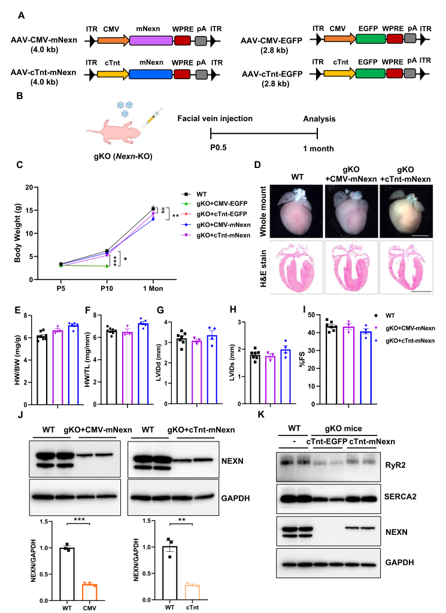

## Question

# Disease Characteristics Research Template

## Target Disease
- **Disease Name:** Dilated Cardiomyopathy 1CC
- **MONDO ID:**  (if available)
- **Category:** Cardiovascular

## Research Objectives

Please provide a comprehensive research report on **Dilated Cardiomyopathy 1CC** covering all of the
disease characteristics listed below. This report will be used to populate a disease knowledge
base entry. Be thorough and cite primary literature (PMID preferred) for all claims.

For each section, **suggested databases/resources** are listed. These are the first places
you should search for information on each topic.

---

### 1. Disease Information
> **Search first:** OMIM, Orphanet, ICD-10/ICD-11, MeSH, PubMed

- What is the disease? Provide a concise overview.
- What are the key identifiers? (OMIM, Orphanet, ICD-10/ICD-11, MeSH, Mondo)
- What are the common synonyms and alternative names?
- Is the information derived from individual patients (e.g., EHR) or aggregated disease-level resources?

### 2. Etiology

- **Disease Causal Factors**: What are the primary causes? (genetic, environmental, infectious, mechanistic)
- **Risk Factors**:
  > **Search first:** PubMed, Cochrane Library, UpToDate, clinical guidelines, ClinVar, ClinGen, GWAS Catalog, PheGenI, CTD, CDC, WHO, epidemiological databases
  - Genetic risk factors (causal variants, susceptibility loci, modifier genes)
  - Environmental risk factors (toxins, lifestyle, occupational exposures, age, sex, family history)
- **Protective Factors**:
  > **Search first:** PubMed, Cochrane Library, clinical trial databases, GWAS Catalog, gnomAD, WHO, CDC, nutrition databases
  - Genetic protective factors (protective variants, modifier alleles)
  - Environmental protective factors (diet, lifestyle, exposures that reduce risk)
- **Gene-Environment Interactions**: How do genetic and environmental factors interact to influence disease?
  > **Search first:** CTD, PubMed, PheGenI, GxE databases

### 3. Phenotypes
> **Search first:** HPO (Human Phenotype Ontology), OMIM, Orphanet, PubMed, clinicaltrials.gov, MedDRA, SNOMED CT, DECIPHER, LOINC

For each phenotype, provide:
- **Phenotype type**: symptoms, clinical signs, physical manifestations, behavioral changes, or laboratory abnormalities
  > For symptoms/signs: HPO, OMIM, Orphanet, PubMed
  > For behavioral changes: HPO, DSM, RDoC (Research Domain Criteria), PubMed
  > For laboratory abnormalities: LOINC, SNOMED CT, LabTests Online, PubMed
- **Phenotype characteristics**:
  > **Search first:** OMIM, Orphanet, HPO, PubMed
  - Age of symptom onset (neonatal, childhood, adult-onset, late-onset)
  - Symptom severity (mild, moderate, severe, variable)
  - Symptom progression (stable, progressive, episodic, fluctuating)
  - Frequency among affected individuals (percentage or qualitative)
- **Quality of life impact**: Effects on daily functioning and well-being (per-phenotype when possible)
  > **Search first:** EQ-5D database, SF-36, WHO QOL databases, PubMed
- Suggest HPO (Human Phenotype Ontology) terms for each phenotype

### 4. Genetic/Molecular Information

- **Causal Genes**: Gene mutations or chromosomal abnormalities responsible for disease (gene symbols, OMIM IDs)
  > **Search first:** OMIM, ClinVar, HGMD, Ensembl, NCBI Gene
- **Pathogenic Variants**:
  - Affected genes (gene symbols, HGNC IDs)
    > **Search first:** OMIM, NCBI Gene, Ensembl, HGNC, UniProt, GeneCards
  - Variant classification (pathogenic, likely pathogenic, VUS per ACMG/AMP guidelines)
    > **Search first:** ClinVar, ClinGen, ACMG/AMP guidelines, VarSome
  - Variant type/class (missense, frameshift, nonsense, splice-site, structural)
  - Allele frequency in population databases
    > **Search first:** gnomAD, 1000 Genomes, ExAC, TOPMed, dbSNP
  - Somatic vs germline origin
    > **Search first:** COSMIC (somatic), ClinVar, ICGC, TCGA
  - Functional consequences (loss of function, gain of function, dominant negative)
- **Modifier Genes**: Genes that modify disease severity or expression
- **Epigenetic Information**: DNA methylation, histone modifications, chromatin changes affecting disease
  > **Search first:** ENCODE, Roadmap Epigenomics, MethBase, DiseaseMeth
- **Chromosomal Abnormalities**: Large-scale genetic changes (aneuploidy, translocations, inversions)
  > **Search first:** DECIPHER, ClinVar, ECARUCA, UCSC Genome Browser

### 5. Environmental Information

- **Environmental Factors**: Non-genetic contributing factors (toxins, radiation, pollution, occupational exposure)
  > **Search first:** CTD (Comparative Toxicogenomics Database), TOXNET, PubMed, EPA databases
- **Lifestyle Factors**: Behavioral factors (smoking, diet, exercise, alcohol consumption)
  > **Search first:** CDC databases, WHO, PubMed, NHANES
- **Infectious Agents**: If applicable, pathogens causing or triggering disease (bacteria, viruses, fungi, parasites)
  > **Search first:** NCBI Taxonomy, ViPR, BV-BRC, MicrobeDB, GIDEON

### 6. Mechanism / Pathophysiology

**Present this section as an ordered causal chain first, then the detail below.**
Open with a numbered sequence of mechanistic steps running from the initiating
lesion (mutation, exposure, infection) to the clinical manifestation, one step per
line, each naming what it causes next. State the causal verb explicitly ("leads
to", "results in") and say where a step is inferred rather than demonstrated.
Where the mechanism branches, show the branch. The categories below are a
checklist of what to cover within those steps, not the organizing structure —
a step may draw on several of them, and a category may contribute to several
steps.

- **Molecular Pathways**: Specific signaling cascades or biochemical pathways involved (Wnt, MAPK, mTOR, PI3K-AKT, etc.)
  > **Search first:** KEGG, Reactome, WikiPathways, PathBank, BioCyc
- **Cellular Processes**: Cell-level mechanisms (apoptosis, autophagy, cell cycle dysregulation, inflammation, etc.)
  > **Search first:** Gene Ontology (GO), Reactome, KEGG, PubMed
- **Protein Dysfunction**: How protein structure or function is altered (misfolding, aggregation, loss of function, gain of function)
  > **Search first:** UniProt, PDB (Protein Data Bank), InterPro, Pfam, AlphaFold
- **Metabolic Changes**: Alterations in metabolic processes (energy metabolism, lipid metabolism, amino acid metabolism)
  > **Search first:** KEGG, BioCyc, HMDB (Human Metabolome Database), BRENDA
- **Immune System Involvement**: Role of immune response (autoimmunity, immunodeficiency, chronic inflammation)
  > **Search first:** ImmPort, Immunome Database, IEDB, Gene Ontology
- **Tissue Damage Mechanisms**: How tissues/ are injured (oxidative stress, ischemia, fibrosis, necrosis)
  > **Search first:** PubMed, Gene Ontology, Reactome
- **Biochemical Abnormalities**: Specific molecular defects (enzyme deficiencies, receptor dysfunction, ion channel defects)
  > **Search first:** BRENDA, UniProt, KEGG, OMIM, PubMed
- **Epigenetic Changes**: DNA methylation, histone modifications affecting gene expression in disease
  > **Search first:** ENCODE, Roadmap Epigenomics, MethBase, DiseaseMeth
- **Molecular Profiling** (if available):
  - Transcriptomics/gene expression changes
    > **Search first:** GEO (Gene Expression Omnibus), ArrayExpress, GTEx, Human Cell Atlas, SRA
  - Proteomics findings
    > **Search first:** PRIDE, ProteomeXchange, Human Protein Atlas, STRING, BioGRID
  - Metabolomics signatures
    > **Search first:** MetaboLights, Metabolomics Workbench, HMDB, METLIN
  - Lipidomics alterations
    > **Search first:** LIPID MAPS, SwissLipids, LipidHome, Metabolomics Workbench
  - Genomic structural features
    > **Search first:** UCSC Genome Browser, Ensembl, NCBI, dbVar, DGV
- **Advanced Technologies** (if applicable):
  - Single-cell analysis findings (cell-type specific mechanisms, cellular heterogeneity)
    > **Search first:** Human Cell Atlas, Single Cell Portal, GEO, CELLxGENE
  - Spatial transcriptomics findings
    > **Search first:** GEO, Spatial Research, Vizgen, 10x Genomics data
  - Multi-omics integration results
    > **Search first:** TCGA, ICGC, cBioPortal, LinkedOmics, PubMed
  - Functional genomics screens (CRISPR, RNAi)
    > **Search first:** DepMap, GenomeRNAi, PubMed, BioGRID ORCS

For each mechanism, describe:
- The causal chain from initial trigger to clinical manifestation
- Which mechanisms are upstream vs downstream
- What cell types and biological processes are involved
- Suggest GO terms for biological processes and CL terms for cell types

### 7. Anatomical Structures Affected

- **Organ Level**:
  - Primary organs directly affected
  - Secondary organ involvement (complications, secondary effects)
  - Body systems involved (cardiovascular, nervous, digestive, respiratory, endocrine, etc.)
  > **Search first:** Uberon, FMA (Foundational Model of Anatomy), OMIM, HPO, ICD-11, MeSH, SNOMED CT
- **Tissue and Cell Level**:
  - Specific tissue types affected (epithelial, connective, muscle, nervous)
  - Specific cell populations targeted (with Cell Ontology terms)
  > **Search first:** Uberon, Human Protein Atlas, Cell Ontology, Human Cell Atlas, CellMarker, PanglaoDB
- **Subcellular Level**:
  - Cellular compartments involved (mitochondria, nucleus, ER, lysosomes) (with GO Cellular Component terms)
  > **Search first:** Gene Ontology (Cellular Component), UniProt, Human Protein Atlas
- **Localization**:
  - Specific anatomical sites (with UBERON terms)
    > **Search first:** FMA, Uberon, NeuroNames (for brain), SNOMED CT
  - Lateralization (unilateral, bilateral, asymmetric)
    > **Search first:** HPO, clinical literature, imaging databases

### 8. Temporal Development

- **Onset**:
  - Typical age of onset (congenital, pediatric, adult, geriatric)
  - Onset pattern (acute, subacute, chronic, insidious)
  > **Search first:** OMIM, Orphanet, HPO, PubMed
- **Progression**:
  - Disease stages (early, intermediate, advanced, end-stage)
    > **Search first:** Cancer Staging Manual (AJCC), WHO classifications, PubMed
  - Progression rate (rapid, slow, variable)
  - Disease course pattern (episodic, relapsing-remitting, progressive, stable)
  - Disease duration (self-limited, chronic lifelong)
  > **Search first:** Disease registries, longitudinal cohort databases, natural history studies, PubMed, Orphanet, OMIM
- **Patterns**:
  - Remission patterns (spontaneous, treatment-induced)
    > **Search first:** Clinical trial databases, disease registries, PubMed
  - Critical periods (time windows of vulnerability or opportunity for intervention)
    > **Search first:** PubMed, developmental biology databases, clinical guidelines

### 9. Inheritance and Population

- **Epidemiology**:
  - Prevalence (cases per 100,000 at given time)
  - Incidence (new cases per 100,000 per year)
  > **Search first:** Orphanet, CDC, WHO, GBD (Global Burden of Disease), national registries, SEER, disease registries
- **For Genetic Etiology**:
  - Inheritance pattern (AD, AR, X-linked, mitochondrial, multifactorial, polygenic)
    > **Search first:** OMIM, Orphanet, ClinVar, GTR (Genetic Testing Registry)
  - Penetrance (complete, incomplete, age-dependent)
    > **Search first:** ClinVar, OMIM, PubMed, ClinGen
  - Expressivity (variable, consistent)
    > **Search first:** OMIM, ClinVar, PubMed
  - Genetic anticipation (increasing severity in successive generations)
    > **Search first:** OMIM, PubMed (especially for repeat expansion disorders)
  - Germline mosaicism
    > **Search first:** ClinVar, OMIM, genetic counseling literature, PubMed
  - Founder effects (population-specific mutations)
    > **Search first:** gnomAD, population genetics databases, PubMed
  - Consanguinity role
    > **Search first:** OMIM, population studies, genetic counseling resources
  - Carrier frequency
    > **Search first:** gnomAD, carrier screening databases, GeneReviews, GTR
- **Population Demographics**:
  - Affected populations (ethnic or demographic groups with higher prevalence)
    > **Search first:** gnomAD, 1000 Genomes, PAGE Study, PubMed, population registries
  - Geographic distribution (endemic areas, regional variation)
    > **Search first:** WHO, CDC, GBD, Orphanet, geographic epidemiology databases
  - Geographic distribution of specific variants
  - Sex ratio (male:female)
    > **Search first:** Disease registries, OMIM, PubMed, epidemiological databases
  - Age distribution of affected individuals
    > **Search first:** CDC, disease registries, SEER, Orphanet

### 10. Diagnostics

- **Clinical Tests**:
  - Laboratory tests (blood, urine, tissue chemistry, specific enzyme assays)
    > **Search first:** LOINC, LabTests Online, PubMed
  - Biomarkers (proteins, metabolites, genetic markers, circulating biomarkers)
    > **Search first:** FDA Biomarker List, BEST (Biomarkers, EndpointS, and other Tools), PubMed
  - Imaging studies (X-ray, CT, MRI, PET, ultrasound)
    > **Search first:** RadLex, DICOM, Radiopaedia, imaging databases
  - Functional tests (pulmonary function, cardiac stress tests)
    > **Search first:** LOINC, clinical guidelines, PubMed
  - Electrophysiology (EEG, EMG, ECG, nerve conduction studies)
    > **Search first:** LOINC, clinical neurophysiology databases, PubMed
  - Biopsy findings (histopathology, immunohistochemistry)
    > **Search first:** SNOMED CT, College of American Pathologists resources, PubMed
  - Pathology findings (microscopic examination)
    > **Search first:** SNOMED CT, Digital Pathology databases, PubMed
- **Genetic Testing**:
  > **Search first:** GTR (Genetic Testing Registry), GeneReviews, ClinGen
  - Overview of recommended genetic testing approach
  - Whole genome sequencing (WGS) utility
    > **Search first:** GTR, ClinVar, GEL (Genomics England), gnomAD
  - Whole exome sequencing (WES) utility
    > **Search first:** GTR, ClinVar, OMIM, GeneMatcher
  - Gene panels (which panels, which genes)
    > **Search first:** GTR, ClinVar, laboratory-specific databases
  - Single gene testing
    > **Search first:** GTR, ClinVar, OMIM, GeneReviews
  - Chromosomal microarray (CMA)
    > **Search first:** DECIPHER, ClinVar, dbVar, ECARUCA
  - Karyotyping
    > **Search first:** Chromosome Abnormality Database, ClinVar, cytogenetics resources
  - FISH
    > **Search first:** ClinVar, cytogenetics databases, PubMed
  - Mitochondrial DNA testing
    > **Search first:** MITOMAP, MSeqDR, ClinVar, GTR
  - Repeat expansion testing
    > **Search first:** GTR, ClinVar, repeat expansion databases, PubMed
- **Omics-Based Diagnostics** (if applicable):
  - RNA sequencing / transcriptomics
    > **Search first:** GEO, ArrayExpress, GTEx, RNA-seq databases
  - Proteomics
    > **Search first:** PRIDE, ProteomeXchange, FDA Biomarker database
  - Metabolomics
    > **Search first:** MetaboLights, Metabolomics Workbench, HMDB
  - Epigenomics
    > **Search first:** GEO, ENCODE, Roadmap Epigenomics, MethBase
  - Liquid biopsy
    > **Search first:** COSMIC, ClinVar, liquid biopsy databases, PubMed
- **Clinical Criteria**:
  - Standardized diagnostic criteria (DSM, ICD, society guidelines)
    > **Search first:** DSM-5, ICD-11, clinical society guidelines, UpToDate
  - Differential diagnosis (other conditions to rule out, with distinguishing features)
    > **Search first:** DynaMed, UpToDate, clinical decision support systems
- **Screening**:
  - Screening methods for asymptomatic individuals (newborn screening, carrier screening, cascade screening)
    > **Search first:** ACMG recommendations, CDC newborn screening, GTR

### 11. Outcome/Prognosis

- **Survival and Mortality**:
  - Survival rate (5-year, 10-year, overall)
    > **Search first:** SEER, cancer registries, disease-specific registries, PubMed
  - Life expectancy (with and without treatment if applicable)
    > **Search first:** Orphanet, disease registries, actuarial databases, PubMed
  - Mortality rate
    > **Search first:** CDC, WHO, GBD, national mortality databases
  - Disease-specific mortality (deaths directly attributable to disease)
    > **Search first:** Disease registries, CDC Wonder, GBD, PubMed
- **Morbidity and Function**:
  - Morbidity (disease-related disability and health impacts)
    > **Search first:** GBD, WHO, disability databases, PubMed
  - Disability outcomes (long-term functional impairments)
    > **Search first:** ICF (International Classification of Functioning), disability registries
  - Quality of life measures (EQ-5D, SF-36, PROMIS, disease-specific tools)
    > **Search first:** EQ-5D database, SF-36, PROMIS, PubMed
- **Disease Course**:
  - Complications (secondary problems: infections, organ failure, etc.)
    > **Search first:** ICD codes, disease registries, clinical databases, PubMed
  - Recovery potential (likelihood and extent of recovery, with vs without treatment)
    > **Search first:** Natural history studies, rehabilitation databases, PubMed
- **Prediction**:
  - Prognostic factors (age, disease severity, biomarkers, treatment response)
    > **Search first:** Prognostic models databases, clinical calculators, PubMed
  - Prognostic biomarkers (molecular markers predicting disease course)
    > **Search first:** FDA Biomarker database, PubMed, cancer prognostic databases

### 12. Treatment

- **Pharmacotherapy**:
  - Pharmacological treatments (drug names, drug classes, mechanisms of action)
    > **Search first:** DrugBank, RxNorm, ATC classification, DailyMed, FDA databases
  - Pharmacogenomics (how genetic variants affect drug metabolism, efficacy, toxicity)
    > **Search first:** PharmGKB, CPIC (Clinical Pharmacogenetics), FDA Table of PGx Biomarkers
- **Advanced Therapeutics**:
  - Gene therapy (viral vectors, CRISPR, gene replacement, gene editing)
    > **Search first:** ClinicalTrials.gov, FDA gene therapy database, ASGCT resources
  - Cell therapy (stem cell transplant, CAR-T, cellular therapeutics)
    > **Search first:** ClinicalTrials.gov, FDA cell therapy database, FACT standards
  - RNA-based therapies (ASOs, siRNA, mRNA therapies)
    > **Search first:** ClinicalTrials.gov, FDA approvals, PubMed
  - Targeted therapies (treatments directed at specific molecular targets)
    > **Search first:** My Cancer Genome, OncoKB, ClinicalTrials.gov, FDA approvals
  - Immunotherapies (checkpoint inhibitors, monoclonal antibodies)
    > **Search first:** Cancer Immunotherapy Database, FDA approvals, ClinicalTrials.gov
- **Surgical and Interventional**:
  - Surgical interventions (types of surgery, timing, outcomes)
    > **Search first:** CPT codes, surgical registries, clinical guidelines, PubMed
- **Supportive and Rehabilitative**:
  - Supportive care (symptom management, pain control, nutrition)
    > **Search first:** Clinical guidelines, Cochrane Library, PubMed
  - Rehabilitation (physical therapy, occupational therapy, speech therapy)
    > **Search first:** Rehabilitation medicine databases, clinical guidelines, PubMed
- **Experimental**:
  - Experimental treatments in clinical trials (with NCT identifiers if available)
    > **Search first:** ClinicalTrials.gov, EU Clinical Trials Register, WHO ICTRP
- **Treatment Outcomes**:
  - Treatment response rates
    > **Search first:** Clinical trial databases, FDA reviews, systematic reviews, PubMed
  - Side effects and adverse events
    > **Search first:** FDA Adverse Event Reporting System (FAERS), MedWatch, PubMed
- **Treatment Strategy**:
  - Treatment algorithms (clinical pathways, decision trees)
    > **Search first:** Clinical practice guidelines, NCCN Guidelines, UpToDate
  - Combination therapies
    > **Search first:** ClinicalTrials.gov, treatment guidelines, PubMed
  - Personalized medicine approaches (genotype-guided treatment)
    > **Search first:** My Cancer Genome, CIViC, PharmGKB, precision medicine databases

For each treatment, suggest NCIT (NCI Thesaurus) clinical-intervention terms where applicable.

### 13. Prevention

- **Prevention Levels**:
  - Primary prevention (preventing disease occurrence: vaccination, risk factor modification)
    > **Search first:** CDC, WHO, USPSTF recommendations, Cochrane Library
  - Secondary prevention (early detection and treatment: screening programs, early intervention)
    > **Search first:** USPSTF, CDC screening guidelines, WHO
  - Tertiary prevention (preventing complications in those with disease)
    > **Search first:** Clinical guidelines, disease management protocols, PubMed
- **Immunization**: Vaccine strategies (if applicable)
  > **Search first:** CDC vaccine schedules, WHO immunization, FDA vaccine database
- **Screening and Early Detection**:
  - Screening programs (population-based: newborn screening, cancer screening)
    > **Search first:** CDC screening programs, USPSTF, cancer screening databases
  - Genetic screening (carrier screening, preimplantation genetic diagnosis, prenatal testing)
    > **Search first:** ACMG recommendations, ACOG guidelines, GTR
  - Risk stratification (identifying high-risk individuals for targeted prevention)
    > **Search first:** Risk prediction models, clinical calculators, PubMed
- **Behavioral Interventions**: Lifestyle modifications to reduce risk
  > **Search first:** CDC, WHO, behavioral intervention databases, Cochrane Library
- **Counseling**: Genetic counseling (risk assessment, family planning guidance)
  > **Search first:** NSGC resources, ACMG guidelines, GeneReviews
- **Public Health**:
  - Public health interventions (sanitation, vector control, health education)
    > **Search first:** CDC, WHO, public health databases, PubMed
  - Environmental interventions (reducing environmental risk factors)
    > **Search first:** EPA databases, WHO environmental health, PubMed
- **Prophylaxis**: Preventive medications or procedures
  > **Search first:** Clinical guidelines, FDA approvals, PubMed

### 14. Other Species / Natural Disease

- **Taxonomy**: Species affected (with NCBI Taxon identifiers)
  > **Search first:** NCBI Taxonomy
- **Breed**: Specific breeds affected (with VBO identifiers if applicable)
  > **Search first:** VBO (Vertebrate Breed Ontology)
- **Gene**: Orthologous genes in other species (with NCBI Gene IDs)
  > **Search first:** NCBI Gene
- **Natural Disease**:
  - Naturally occurring disease in other species (companion animals, wildlife)
    > **Search first:** OMIA (Online Mendelian Inheritance in Animals), VetCompass, PubMed
  - Veterinary relevance and importance in animal health
    > **Search first:** OMIA, veterinary databases, PubMed
- **Comparative Biology**:
  - Comparative pathology (similarities and differences across species)
    > **Search first:** OMIA, comparative pathology databases, PubMed
  - Evolutionary conservation of disease mechanisms
    > **Search first:** HomoloGene, OrthoMCL, Alliance of Genome Resources
- **Transmission** (if applicable):
  - Zoonotic potential
    > **Search first:** CDC zoonotic diseases, WHO zoonoses, GIDEON
  - Cross-species susceptibility
    > **Search first:** NCBI Taxonomy, veterinary databases, PubMed

### 15. Model Organisms

- **Model Types**:
  - Model organism type (mammalian, invertebrate, cellular, in vitro)
    > **Search first:** Alliance of Genome Resources, model organism databases
  - Specific model systems (mouse, rat, zebrafish, Drosophila, C. elegans, yeast, cell lines, organoids, iPSCs)
    > **Search first:** MGI, RGD, ZFIN, FlyBase, WormBase, SGD, ATCC, Cellosaurus
  - Induced models (drug treatment, surgical intervention, environmental manipulation)
    > **Search first:** MGI, model organism databases, PubMed
- **Genetic Models**:
  - Types available (knockout, knock-in, transgenic, conditional, humanized)
    > **Search first:** MGI, IMPC, KOMP, EuMMCR, IMSR
- **Model Characteristics**:
  - Phenotype recapitulation (how well model reproduces human disease features)
    > **Search first:** Model organism databases, comparative studies, PubMed
  - Model limitations (aspects of human disease not captured)
    > **Search first:** Model organism databases, PubMed, review articles
- **Applications**:
  - Research applications (what aspects of disease can be studied)
    > **Search first:** Model organism databases, PubMed
- **Resources**:
  - Model databases
    > **Search first:** MGI, RGD, ZFIN, FlyBase, WormBase, IMSR, EMMA, MMRRC

---

## Citation Requirements

- Cite primary literature (PMID preferred) for all mechanistic and clinical claims
- Prioritize recent reviews and landmark papers
- Include direct quotes from abstracts where possible to support key statements
- Distinguish evidence source types: human clinical, model organism, in vitro, computational

## Output Format

Structure your response as a comprehensive narrative organized by the sections above.
For each section, provide:
- Factual content with specific details (numbers, percentages, gene names, variant nomenclature)
- Ontology term suggestions (HPO, GO, CL, UBERON, CHEBI, NCIT, MONDO) where applicable
- Evidence citations with PMIDs
- Direct quotes from abstracts to support key claims
- Clear indication when information is not available or not applicable for this disease

This report will be used to populate a disease knowledge base entry with:
- Pathophysiology descriptions with causal chains
- Gene/protein annotations (HGNC, GO terms)
- Phenotype associations (HP terms) with frequencies
- Cell type involvement (CL terms)
- Anatomical locations (UBERON terms)
- Chemical entities (CHEBI terms)
- Treatment annotations (NCIT terms)
- Evidence items with PMIDs and exact abstract quotes
- Epidemiology, prognosis, diagnostic, and prevention information
- Animal model descriptions with phenotype recapitulation details

## Output

Question: You are an expert researcher providing comprehensive, well-cited information.

Provide detailed information focusing on:
1. Key concepts and definitions with current understanding
2. Recent developments and latest research (prioritize 2023-2024 sources)
3. Current applications and real-world implementations
4. Expert opinions and analysis from authoritative sources
5. Relevant statistics and data from recent studies

Format as a comprehensive research report with proper citations. Include URLs and publication dates where available.
Always prioritize recent, authoritative sources and provide specific citations for all major claims.

# Disease Characteristics Research Template

## Target Disease
- **Disease Name:** Dilated Cardiomyopathy 1CC
- **MONDO ID:**  (if available)
- **Category:** Cardiovascular

## Research Objectives

Please provide a comprehensive research report on **Dilated Cardiomyopathy 1CC** covering all of the
disease characteristics listed below. This report will be used to populate a disease knowledge
base entry. Be thorough and cite primary literature (PMID preferred) for all claims.

For each section, **suggested databases/resources** are listed. These are the first places
you should search for information on each topic.

---

### 1. Disease Information
> **Search first:** OMIM, Orphanet, ICD-10/ICD-11, MeSH, PubMed

- What is the disease? Provide a concise overview.
- What are the key identifiers? (OMIM, Orphanet, ICD-10/ICD-11, MeSH, Mondo)
- What are the common synonyms and alternative names?
- Is the information derived from individual patients (e.g., EHR) or aggregated disease-level resources?

### 2. Etiology

- **Disease Causal Factors**: What are the primary causes? (genetic, environmental, infectious, mechanistic)
- **Risk Factors**:
  > **Search first:** PubMed, Cochrane Library, UpToDate, clinical guidelines, ClinVar, ClinGen, GWAS Catalog, PheGenI, CTD, CDC, WHO, epidemiological databases
  - Genetic risk factors (causal variants, susceptibility loci, modifier genes)
  - Environmental risk factors (toxins, lifestyle, occupational exposures, age, sex, family history)
- **Protective Factors**:
  > **Search first:** PubMed, Cochrane Library, clinical trial databases, GWAS Catalog, gnomAD, WHO, CDC, nutrition databases
  - Genetic protective factors (protective variants, modifier alleles)
  - Environmental protective factors (diet, lifestyle, exposures that reduce risk)
- **Gene-Environment Interactions**: How do genetic and environmental factors interact to influence disease?
  > **Search first:** CTD, PubMed, PheGenI, GxE databases

### 3. Phenotypes
> **Search first:** HPO (Human Phenotype Ontology), OMIM, Orphanet, PubMed, clinicaltrials.gov, MedDRA, SNOMED CT, DECIPHER, LOINC

For each phenotype, provide:
- **Phenotype type**: symptoms, clinical signs, physical manifestations, behavioral changes, or laboratory abnormalities
  > For symptoms/signs: HPO, OMIM, Orphanet, PubMed
  > For behavioral changes: HPO, DSM, RDoC (Research Domain Criteria), PubMed
  > For laboratory abnormalities: LOINC, SNOMED CT, LabTests Online, PubMed
- **Phenotype characteristics**:
  > **Search first:** OMIM, Orphanet, HPO, PubMed
  - Age of symptom onset (neonatal, childhood, adult-onset, late-onset)
  - Symptom severity (mild, moderate, severe, variable)
  - Symptom progression (stable, progressive, episodic, fluctuating)
  - Frequency among affected individuals (percentage or qualitative)
- **Quality of life impact**: Effects on daily functioning and well-being (per-phenotype when possible)
  > **Search first:** EQ-5D database, SF-36, WHO QOL databases, PubMed
- Suggest HPO (Human Phenotype Ontology) terms for each phenotype

### 4. Genetic/Molecular Information

- **Causal Genes**: Gene mutations or chromosomal abnormalities responsible for disease (gene symbols, OMIM IDs)
  > **Search first:** OMIM, ClinVar, HGMD, Ensembl, NCBI Gene
- **Pathogenic Variants**:
  - Affected genes (gene symbols, HGNC IDs)
    > **Search first:** OMIM, NCBI Gene, Ensembl, HGNC, UniProt, GeneCards
  - Variant classification (pathogenic, likely pathogenic, VUS per ACMG/AMP guidelines)
    > **Search first:** ClinVar, ClinGen, ACMG/AMP guidelines, VarSome
  - Variant type/class (missense, frameshift, nonsense, splice-site, structural)
  - Allele frequency in population databases
    > **Search first:** gnomAD, 1000 Genomes, ExAC, TOPMed, dbSNP
  - Somatic vs germline origin
    > **Search first:** COSMIC (somatic), ClinVar, ICGC, TCGA
  - Functional consequences (loss of function, gain of function, dominant negative)
- **Modifier Genes**: Genes that modify disease severity or expression
- **Epigenetic Information**: DNA methylation, histone modifications, chromatin changes affecting disease
  > **Search first:** ENCODE, Roadmap Epigenomics, MethBase, DiseaseMeth
- **Chromosomal Abnormalities**: Large-scale genetic changes (aneuploidy, translocations, inversions)
  > **Search first:** DECIPHER, ClinVar, ECARUCA, UCSC Genome Browser

### 5. Environmental Information

- **Environmental Factors**: Non-genetic contributing factors (toxins, radiation, pollution, occupational exposure)
  > **Search first:** CTD (Comparative Toxicogenomics Database), TOXNET, PubMed, EPA databases
- **Lifestyle Factors**: Behavioral factors (smoking, diet, exercise, alcohol consumption)
  > **Search first:** CDC databases, WHO, PubMed, NHANES
- **Infectious Agents**: If applicable, pathogens causing or triggering disease (bacteria, viruses, fungi, parasites)
  > **Search first:** NCBI Taxonomy, ViPR, BV-BRC, MicrobeDB, GIDEON

### 6. Mechanism / Pathophysiology

**Present this section as an ordered causal chain first, then the detail below.**
Open with a numbered sequence of mechanistic steps running from the initiating
lesion (mutation, exposure, infection) to the clinical manifestation, one step per
line, each naming what it causes next. State the causal verb explicitly ("leads
to", "results in") and say where a step is inferred rather than demonstrated.
Where the mechanism branches, show the branch. The categories below are a
checklist of what to cover within those steps, not the organizing structure —
a step may draw on several of them, and a category may contribute to several
steps.

- **Molecular Pathways**: Specific signaling cascades or biochemical pathways involved (Wnt, MAPK, mTOR, PI3K-AKT, etc.)
  > **Search first:** KEGG, Reactome, WikiPathways, PathBank, BioCyc
- **Cellular Processes**: Cell-level mechanisms (apoptosis, autophagy, cell cycle dysregulation, inflammation, etc.)
  > **Search first:** Gene Ontology (GO), Reactome, KEGG, PubMed
- **Protein Dysfunction**: How protein structure or function is altered (misfolding, aggregation, loss of function, gain of function)
  > **Search first:** UniProt, PDB (Protein Data Bank), InterPro, Pfam, AlphaFold
- **Metabolic Changes**: Alterations in metabolic processes (energy metabolism, lipid metabolism, amino acid metabolism)
  > **Search first:** KEGG, BioCyc, HMDB (Human Metabolome Database), BRENDA
- **Immune System Involvement**: Role of immune response (autoimmunity, immunodeficiency, chronic inflammation)
  > **Search first:** ImmPort, Immunome Database, IEDB, Gene Ontology
- **Tissue Damage Mechanisms**: How tissues/ are injured (oxidative stress, ischemia, fibrosis, necrosis)
  > **Search first:** PubMed, Gene Ontology, Reactome
- **Biochemical Abnormalities**: Specific molecular defects (enzyme deficiencies, receptor dysfunction, ion channel defects)
  > **Search first:** BRENDA, UniProt, KEGG, OMIM, PubMed
- **Epigenetic Changes**: DNA methylation, histone modifications affecting gene expression in disease
  > **Search first:** ENCODE, Roadmap Epigenomics, MethBase, DiseaseMeth
- **Molecular Profiling** (if available):
  - Transcriptomics/gene expression changes
    > **Search first:** GEO (Gene Expression Omnibus), ArrayExpress, GTEx, Human Cell Atlas, SRA
  - Proteomics findings
    > **Search first:** PRIDE, ProteomeXchange, Human Protein Atlas, STRING, BioGRID
  - Metabolomics signatures
    > **Search first:** MetaboLights, Metabolomics Workbench, HMDB, METLIN
  - Lipidomics alterations
    > **Search first:** LIPID MAPS, SwissLipids, LipidHome, Metabolomics Workbench
  - Genomic structural features
    > **Search first:** UCSC Genome Browser, Ensembl, NCBI, dbVar, DGV
- **Advanced Technologies** (if applicable):
  - Single-cell analysis findings (cell-type specific mechanisms, cellular heterogeneity)
    > **Search first:** Human Cell Atlas, Single Cell Portal, GEO, CELLxGENE
  - Spatial transcriptomics findings
    > **Search first:** GEO, Spatial Research, Vizgen, 10x Genomics data
  - Multi-omics integration results
    > **Search first:** TCGA, ICGC, cBioPortal, LinkedOmics, PubMed
  - Functional genomics screens (CRISPR, RNAi)
    > **Search first:** DepMap, GenomeRNAi, PubMed, BioGRID ORCS

For each mechanism, describe:
- The causal chain from initial trigger to clinical manifestation
- Which mechanisms are upstream vs downstream
- What cell types and biological processes are involved
- Suggest GO terms for biological processes and CL terms for cell types

### 7. Anatomical Structures Affected

- **Organ Level**:
  - Primary organs directly affected
  - Secondary organ involvement (complications, secondary effects)
  - Body systems involved (cardiovascular, nervous, digestive, respiratory, endocrine, etc.)
  > **Search first:** Uberon, FMA (Foundational Model of Anatomy), OMIM, HPO, ICD-11, MeSH, SNOMED CT
- **Tissue and Cell Level**:
  - Specific tissue types affected (epithelial, connective, muscle, nervous)
  - Specific cell populations targeted (with Cell Ontology terms)
  > **Search first:** Uberon, Human Protein Atlas, Cell Ontology, Human Cell Atlas, CellMarker, PanglaoDB
- **Subcellular Level**:
  - Cellular compartments involved (mitochondria, nucleus, ER, lysosomes) (with GO Cellular Component terms)
  > **Search first:** Gene Ontology (Cellular Component), UniProt, Human Protein Atlas
- **Localization**:
  - Specific anatomical sites (with UBERON terms)
    > **Search first:** FMA, Uberon, NeuroNames (for brain), SNOMED CT
  - Lateralization (unilateral, bilateral, asymmetric)
    > **Search first:** HPO, clinical literature, imaging databases

### 8. Temporal Development

- **Onset**:
  - Typical age of onset (congenital, pediatric, adult, geriatric)
  - Onset pattern (acute, subacute, chronic, insidious)
  > **Search first:** OMIM, Orphanet, HPO, PubMed
- **Progression**:
  - Disease stages (early, intermediate, advanced, end-stage)
    > **Search first:** Cancer Staging Manual (AJCC), WHO classifications, PubMed
  - Progression rate (rapid, slow, variable)
  - Disease course pattern (episodic, relapsing-remitting, progressive, stable)
  - Disease duration (self-limited, chronic lifelong)
  > **Search first:** Disease registries, longitudinal cohort databases, natural history studies, PubMed, Orphanet, OMIM
- **Patterns**:
  - Remission patterns (spontaneous, treatment-induced)
    > **Search first:** Clinical trial databases, disease registries, PubMed
  - Critical periods (time windows of vulnerability or opportunity for intervention)
    > **Search first:** PubMed, developmental biology databases, clinical guidelines

### 9. Inheritance and Population

- **Epidemiology**:
  - Prevalence (cases per 100,000 at given time)
  - Incidence (new cases per 100,000 per year)
  > **Search first:** Orphanet, CDC, WHO, GBD (Global Burden of Disease), national registries, SEER, disease registries
- **For Genetic Etiology**:
  - Inheritance pattern (AD, AR, X-linked, mitochondrial, multifactorial, polygenic)
    > **Search first:** OMIM, Orphanet, ClinVar, GTR (Genetic Testing Registry)
  - Penetrance (complete, incomplete, age-dependent)
    > **Search first:** ClinVar, OMIM, PubMed, ClinGen
  - Expressivity (variable, consistent)
    > **Search first:** OMIM, ClinVar, PubMed
  - Genetic anticipation (increasing severity in successive generations)
    > **Search first:** OMIM, PubMed (especially for repeat expansion disorders)
  - Germline mosaicism
    > **Search first:** ClinVar, OMIM, genetic counseling literature, PubMed
  - Founder effects (population-specific mutations)
    > **Search first:** gnomAD, population genetics databases, PubMed
  - Consanguinity role
    > **Search first:** OMIM, population studies, genetic counseling resources
  - Carrier frequency
    > **Search first:** gnomAD, carrier screening databases, GeneReviews, GTR
- **Population Demographics**:
  - Affected populations (ethnic or demographic groups with higher prevalence)
    > **Search first:** gnomAD, 1000 Genomes, PAGE Study, PubMed, population registries
  - Geographic distribution (endemic areas, regional variation)
    > **Search first:** WHO, CDC, GBD, Orphanet, geographic epidemiology databases
  - Geographic distribution of specific variants
  - Sex ratio (male:female)
    > **Search first:** Disease registries, OMIM, PubMed, epidemiological databases
  - Age distribution of affected individuals
    > **Search first:** CDC, disease registries, SEER, Orphanet

### 10. Diagnostics

- **Clinical Tests**:
  - Laboratory tests (blood, urine, tissue chemistry, specific enzyme assays)
    > **Search first:** LOINC, LabTests Online, PubMed
  - Biomarkers (proteins, metabolites, genetic markers, circulating biomarkers)
    > **Search first:** FDA Biomarker List, BEST (Biomarkers, EndpointS, and other Tools), PubMed
  - Imaging studies (X-ray, CT, MRI, PET, ultrasound)
    > **Search first:** RadLex, DICOM, Radiopaedia, imaging databases
  - Functional tests (pulmonary function, cardiac stress tests)
    > **Search first:** LOINC, clinical guidelines, PubMed
  - Electrophysiology (EEG, EMG, ECG, nerve conduction studies)
    > **Search first:** LOINC, clinical neurophysiology databases, PubMed
  - Biopsy findings (histopathology, immunohistochemistry)
    > **Search first:** SNOMED CT, College of American Pathologists resources, PubMed
  - Pathology findings (microscopic examination)
    > **Search first:** SNOMED CT, Digital Pathology databases, PubMed
- **Genetic Testing**:
  > **Search first:** GTR (Genetic Testing Registry), GeneReviews, ClinGen
  - Overview of recommended genetic testing approach
  - Whole genome sequencing (WGS) utility
    > **Search first:** GTR, ClinVar, GEL (Genomics England), gnomAD
  - Whole exome sequencing (WES) utility
    > **Search first:** GTR, ClinVar, OMIM, GeneMatcher
  - Gene panels (which panels, which genes)
    > **Search first:** GTR, ClinVar, laboratory-specific databases
  - Single gene testing
    > **Search first:** GTR, ClinVar, OMIM, GeneReviews
  - Chromosomal microarray (CMA)
    > **Search first:** DECIPHER, ClinVar, dbVar, ECARUCA
  - Karyotyping
    > **Search first:** Chromosome Abnormality Database, ClinVar, cytogenetics resources
  - FISH
    > **Search first:** ClinVar, cytogenetics databases, PubMed
  - Mitochondrial DNA testing
    > **Search first:** MITOMAP, MSeqDR, ClinVar, GTR
  - Repeat expansion testing
    > **Search first:** GTR, ClinVar, repeat expansion databases, PubMed
- **Omics-Based Diagnostics** (if applicable):
  - RNA sequencing / transcriptomics
    > **Search first:** GEO, ArrayExpress, GTEx, RNA-seq databases
  - Proteomics
    > **Search first:** PRIDE, ProteomeXchange, FDA Biomarker database
  - Metabolomics
    > **Search first:** MetaboLights, Metabolomics Workbench, HMDB
  - Epigenomics
    > **Search first:** GEO, ENCODE, Roadmap Epigenomics, MethBase
  - Liquid biopsy
    > **Search first:** COSMIC, ClinVar, liquid biopsy databases, PubMed
- **Clinical Criteria**:
  - Standardized diagnostic criteria (DSM, ICD, society guidelines)
    > **Search first:** DSM-5, ICD-11, clinical society guidelines, UpToDate
  - Differential diagnosis (other conditions to rule out, with distinguishing features)
    > **Search first:** DynaMed, UpToDate, clinical decision support systems
- **Screening**:
  - Screening methods for asymptomatic individuals (newborn screening, carrier screening, cascade screening)
    > **Search first:** ACMG recommendations, CDC newborn screening, GTR

### 11. Outcome/Prognosis

- **Survival and Mortality**:
  - Survival rate (5-year, 10-year, overall)
    > **Search first:** SEER, cancer registries, disease-specific registries, PubMed
  - Life expectancy (with and without treatment if applicable)
    > **Search first:** Orphanet, disease registries, actuarial databases, PubMed
  - Mortality rate
    > **Search first:** CDC, WHO, GBD, national mortality databases
  - Disease-specific mortality (deaths directly attributable to disease)
    > **Search first:** Disease registries, CDC Wonder, GBD, PubMed
- **Morbidity and Function**:
  - Morbidity (disease-related disability and health impacts)
    > **Search first:** GBD, WHO, disability databases, PubMed
  - Disability outcomes (long-term functional impairments)
    > **Search first:** ICF (International Classification of Functioning), disability registries
  - Quality of life measures (EQ-5D, SF-36, PROMIS, disease-specific tools)
    > **Search first:** EQ-5D database, SF-36, PROMIS, PubMed
- **Disease Course**:
  - Complications (secondary problems: infections, organ failure, etc.)
    > **Search first:** ICD codes, disease registries, clinical databases, PubMed
  - Recovery potential (likelihood and extent of recovery, with vs without treatment)
    > **Search first:** Natural history studies, rehabilitation databases, PubMed
- **Prediction**:
  - Prognostic factors (age, disease severity, biomarkers, treatment response)
    > **Search first:** Prognostic models databases, clinical calculators, PubMed
  - Prognostic biomarkers (molecular markers predicting disease course)
    > **Search first:** FDA Biomarker database, PubMed, cancer prognostic databases

### 12. Treatment

- **Pharmacotherapy**:
  - Pharmacological treatments (drug names, drug classes, mechanisms of action)
    > **Search first:** DrugBank, RxNorm, ATC classification, DailyMed, FDA databases
  - Pharmacogenomics (how genetic variants affect drug metabolism, efficacy, toxicity)
    > **Search first:** PharmGKB, CPIC (Clinical Pharmacogenetics), FDA Table of PGx Biomarkers
- **Advanced Therapeutics**:
  - Gene therapy (viral vectors, CRISPR, gene replacement, gene editing)
    > **Search first:** ClinicalTrials.gov, FDA gene therapy database, ASGCT resources
  - Cell therapy (stem cell transplant, CAR-T, cellular therapeutics)
    > **Search first:** ClinicalTrials.gov, FDA cell therapy database, FACT standards
  - RNA-based therapies (ASOs, siRNA, mRNA therapies)
    > **Search first:** ClinicalTrials.gov, FDA approvals, PubMed
  - Targeted therapies (treatments directed at specific molecular targets)
    > **Search first:** My Cancer Genome, OncoKB, ClinicalTrials.gov, FDA approvals
  - Immunotherapies (checkpoint inhibitors, monoclonal antibodies)
    > **Search first:** Cancer Immunotherapy Database, FDA approvals, ClinicalTrials.gov
- **Surgical and Interventional**:
  - Surgical interventions (types of surgery, timing, outcomes)
    > **Search first:** CPT codes, surgical registries, clinical guidelines, PubMed
- **Supportive and Rehabilitative**:
  - Supportive care (symptom management, pain control, nutrition)
    > **Search first:** Clinical guidelines, Cochrane Library, PubMed
  - Rehabilitation (physical therapy, occupational therapy, speech therapy)
    > **Search first:** Rehabilitation medicine databases, clinical guidelines, PubMed
- **Experimental**:
  - Experimental treatments in clinical trials (with NCT identifiers if available)
    > **Search first:** ClinicalTrials.gov, EU Clinical Trials Register, WHO ICTRP
- **Treatment Outcomes**:
  - Treatment response rates
    > **Search first:** Clinical trial databases, FDA reviews, systematic reviews, PubMed
  - Side effects and adverse events
    > **Search first:** FDA Adverse Event Reporting System (FAERS), MedWatch, PubMed
- **Treatment Strategy**:
  - Treatment algorithms (clinical pathways, decision trees)
    > **Search first:** Clinical practice guidelines, NCCN Guidelines, UpToDate
  - Combination therapies
    > **Search first:** ClinicalTrials.gov, treatment guidelines, PubMed
  - Personalized medicine approaches (genotype-guided treatment)
    > **Search first:** My Cancer Genome, CIViC, PharmGKB, precision medicine databases

For each treatment, suggest NCIT (NCI Thesaurus) clinical-intervention terms where applicable.

### 13. Prevention

- **Prevention Levels**:
  - Primary prevention (preventing disease occurrence: vaccination, risk factor modification)
    > **Search first:** CDC, WHO, USPSTF recommendations, Cochrane Library
  - Secondary prevention (early detection and treatment: screening programs, early intervention)
    > **Search first:** USPSTF, CDC screening guidelines, WHO
  - Tertiary prevention (preventing complications in those with disease)
    > **Search first:** Clinical guidelines, disease management protocols, PubMed
- **Immunization**: Vaccine strategies (if applicable)
  > **Search first:** CDC vaccine schedules, WHO immunization, FDA vaccine database
- **Screening and Early Detection**:
  - Screening programs (population-based: newborn screening, cancer screening)
    > **Search first:** CDC screening programs, USPSTF, cancer screening databases
  - Genetic screening (carrier screening, preimplantation genetic diagnosis, prenatal testing)
    > **Search first:** ACMG recommendations, ACOG guidelines, GTR
  - Risk stratification (identifying high-risk individuals for targeted prevention)
    > **Search first:** Risk prediction models, clinical calculators, PubMed
- **Behavioral Interventions**: Lifestyle modifications to reduce risk
  > **Search first:** CDC, WHO, behavioral intervention databases, Cochrane Library
- **Counseling**: Genetic counseling (risk assessment, family planning guidance)
  > **Search first:** NSGC resources, ACMG guidelines, GeneReviews
- **Public Health**:
  - Public health interventions (sanitation, vector control, health education)
    > **Search first:** CDC, WHO, public health databases, PubMed
  - Environmental interventions (reducing environmental risk factors)
    > **Search first:** EPA databases, WHO environmental health, PubMed
- **Prophylaxis**: Preventive medications or procedures
  > **Search first:** Clinical guidelines, FDA approvals, PubMed

### 14. Other Species / Natural Disease

- **Taxonomy**: Species affected (with NCBI Taxon identifiers)
  > **Search first:** NCBI Taxonomy
- **Breed**: Specific breeds affected (with VBO identifiers if applicable)
  > **Search first:** VBO (Vertebrate Breed Ontology)
- **Gene**: Orthologous genes in other species (with NCBI Gene IDs)
  > **Search first:** NCBI Gene
- **Natural Disease**:
  - Naturally occurring disease in other species (companion animals, wildlife)
    > **Search first:** OMIA (Online Mendelian Inheritance in Animals), VetCompass, PubMed
  - Veterinary relevance and importance in animal health
    > **Search first:** OMIA, veterinary databases, PubMed
- **Comparative Biology**:
  - Comparative pathology (similarities and differences across species)
    > **Search first:** OMIA, comparative pathology databases, PubMed
  - Evolutionary conservation of disease mechanisms
    > **Search first:** HomoloGene, OrthoMCL, Alliance of Genome Resources
- **Transmission** (if applicable):
  - Zoonotic potential
    > **Search first:** CDC zoonotic diseases, WHO zoonoses, GIDEON
  - Cross-species susceptibility
    > **Search first:** NCBI Taxonomy, veterinary databases, PubMed

### 15. Model Organisms

- **Model Types**:
  - Model organism type (mammalian, invertebrate, cellular, in vitro)
    > **Search first:** Alliance of Genome Resources, model organism databases
  - Specific model systems (mouse, rat, zebrafish, Drosophila, C. elegans, yeast, cell lines, organoids, iPSCs)
    > **Search first:** MGI, RGD, ZFIN, FlyBase, WormBase, SGD, ATCC, Cellosaurus
  - Induced models (drug treatment, surgical intervention, environmental manipulation)
    > **Search first:** MGI, model organism databases, PubMed
- **Genetic Models**:
  - Types available (knockout, knock-in, transgenic, conditional, humanized)
    > **Search first:** MGI, IMPC, KOMP, EuMMCR, IMSR
- **Model Characteristics**:
  - Phenotype recapitulation (how well model reproduces human disease features)
    > **Search first:** Model organism databases, comparative studies, PubMed
  - Model limitations (aspects of human disease not captured)
    > **Search first:** Model organism databases, PubMed, review articles
- **Applications**:
  - Research applications (what aspects of disease can be studied)
    > **Search first:** Model organism databases, PubMed
- **Resources**:
  - Model databases
    > **Search first:** MGI, RGD, ZFIN, FlyBase, WormBase, IMSR, EMMA, MMRRC

---

## Citation Requirements

- Cite primary literature (PMID preferred) for all mechanistic and clinical claims
- Prioritize recent reviews and landmark papers
- Include direct quotes from abstracts where possible to support key statements
- Distinguish evidence source types: human clinical, model organism, in vitro, computational

## Output Format

Structure your response as a comprehensive narrative organized by the sections above.
For each section, provide:
- Factual content with specific details (numbers, percentages, gene names, variant nomenclature)
- Ontology term suggestions (HPO, GO, CL, UBERON, CHEBI, NCIT, MONDO) where applicable
- Evidence citations with PMIDs
- Direct quotes from abstracts to support key claims
- Clear indication when information is not available or not applicable for this disease

This report will be used to populate a disease knowledge base entry with:
- Pathophysiology descriptions with causal chains
- Gene/protein annotations (HGNC, GO terms)
- Phenotype associations (HP terms) with frequencies
- Cell type involvement (CL terms)
- Anatomical locations (UBERON terms)
- Chemical entities (CHEBI terms)
- Treatment annotations (NCIT terms)
- Evidence items with PMIDs and exact abstract quotes
- Epidemiology, prognosis, diagnostic, and prevention information
- Animal model descriptions with phenotype recapitulation details

# Dilated Cardiomyopathy 1CC (NEXN-associated cardiomyopathy)

## Executive summary and evidence scope

Dilated cardiomyopathy 1CC (DCM1CC) is a rare genetic cardiomyopathy caused by disease-associated variants in **NEXN**, encoding nexilin, an F-actin-binding protein important to cardiomyocyte Z-disc and junctional-membrane-complex integrity. Monoallelic variants usually produce variably penetrant, often adult-onset autosomal-dominant DCM; biallelic loss-of-function variants produce an autosomal-recessive spectrum ranging from fetal/neonatal lethal cardiomyopathy with endomyocardial fibroelastosis to survivable childhood disease. Open Targets maps the disorder to **MONDO:0013147** and NEXN (ENSG00000162614), with the original DCM report indexed as PMID **19881492**. (OpenTargets Search: Dilated Cardiomyopathy 1CC, klauke2017highproportionof pages 17-18)

The evidence base is small: family reports, case series, selected DCM sequencing cohorts, and engineered models predominate. Consequently, subtype-specific prevalence, survival, sex ratio, penetrance, treatment-response rates, and quality-of-life estimates are unavailable. General DCM evidence is identified explicitly below and should not be mistaken for NEXN-specific evidence.

The following table provides a compact knowledge-base representation.

| Knowledge-base field | Curated summary | Ontology suggestions | Evidence type |
|---|---|---|---|
| Identity / identifiers | **Dilated cardiomyopathy 1CC (DCM1CC)**, a rare NEXN-associated genetic cardiomyopathy. **MONDO:** MONDO:0013147. Subtype-specific OMIM, Orphanet, ICD-10/11, and MeSH identifiers were not verified in the available evidence; general DCM codes should not be treated as subtype-specific. (OpenTargets Search: Dilated Cardiomyopathy 1CC) | MONDO:0013147; HP:0001644 Dilated cardiomyopathy | Aggregated disease-resource evidence |
| Causal gene / inheritance | **NEXN** (nexilin F-actin binding protein; ENSG00000162614). Heterozygous variants can cause autosomal-dominant, incompletely penetrant DCM; biallelic loss-of-function variants cause autosomal-recessive fetal, neonatal, or childhood cardiomyopathy that is often more severe. Seven heterozygotes in one family included 2 with DCM, 3 with other cardiac findings, and 2 without abnormalities. (OpenTargets Search: Dilated Cardiomyopathy 1CC, johansson2022lossofnexilin pages 1-2) | NEXN; HP:0000006 Autosomal dominant inheritance; HP:0000007 Autosomal recessive inheritance; HP:0003829 Incomplete penetrance | Human families and disease-target resource |
| Hallmark phenotype | Left-ventricular or biventricular dilation with systolic dysfunction; clinical manifestations may include heart failure, fetal hydrops, cardiomegaly, arrhythmia, mitral/atrioventricular-valve regurgitation, and endomyocardial fibroelastosis. Severity ranges from subclinical or transient DCM to fatal neonatal failure. (picciolli2024biallelicnexnvariants pages 2-4, aherrahrou2016knockoutofnexilin pages 1-2, bruyndonckx2021childhoodonsetnexilin pages 1-2) | HP:0001644 Dilated cardiomyopathy; HP:0004308 Ventricular dilatation; HP:0001677 Abnormality of cardiac contraction; HP:0001635 Congestive heart failure; HP:0001789 Hydrops fetalis; HP:0001622 Premature death | Human cases; animal models |
| Onset / course | Biallelic disease may begin prenatally in the second or third trimester and progress to neonatal failure, although survival with persistent dysfunction into childhood is documented. Heterozygous disease may present in infancy, adulthood, or remain clinically silent; published adult heterozygous cases had mean presentation near 50 years. Course may be progressive, stable, or partly reversible. (picciolli2024biallelicnexnvariants pages 2-4, nastasie2025nexilinmutationsa pages 4-6, bruyndonckx2021childhoodonsetnexilin pages 1-2) | HP:0011461 Fetal onset; HP:0003623 Neonatal onset; HP:0011463 Childhood onset; HP:0003581 Adult onset; HP:0003674 Onset in infancy | Human cases and literature synthesis |
| Key reported variants | Examples include **c.1302del, p.(Ile435Serfs*3)**, associated with nonsense-mediated decay and lethal fetal cardiomyopathy; **c.1174C>T, p.(Arg392\*)**, class 4/likely pathogenic; **c.1156dup, p.(Met386fs)**, class 4/likely pathogenic and absent from gnomAD in the report; **c.1579_1584del, p.(Glu527_Glu528del)**, class 3/VUS; and heterozygous **p.(Gly650del)**. Classification is variant-specific and should be re-evaluated using current ACMG/AMP and ClinVar evidence. (picciolli2024biallelicnexnvariants pages 2-4, bruyndonckx2021childhoodonsetnexilin pages 2-4, johansson2022lossofnexilin pages 1-2) | SO:0001589 Frameshift variant; SO:0001587 Stop-gained variant; SO:0001822 In-frame deletion; HP:0034345 Abnormal cardiovascular-system electrophysiology where applicable | Human segregation, clinical sequencing, RNA analysis |
| Mechanism | NEXN stabilizes actin-associated cardiac structures and functions in cardiomyocyte junctional membrane complexes. Loss disrupts JPH2/RyR2-associated T-tubule–sarcoplasmic-reticulum organization, reduces or prolongs Ca²⁺ transients, impairs excitation–contraction coupling, and causes contractile failure, chamber dilation, remodeling, and sometimes fibroelastosis. Z-disc destabilization is supported by human and zebrafish evidence; the relative importance of Z-discs versus junctional membrane complexes remains an evolving model. (klauke2017highproportionof pages 17-18, liu2019nexilinisa pages 9-13, liu2019nexilinisa pages 13-17) | GO:0051015 Actin filament binding; GO:0030018 Z disc; GO:0030315 T-tubule; GO:0006941 Striated muscle contraction; GO:0006874 Intracellular calcium-ion homeostasis; CL:0000746 Cardiac muscle cell | Human functional, mouse, and zebrafish evidence |
| Diagnostics | Establish the DCM phenotype using history and three-generation pedigree, examination, ECG, echocardiography, and cardiac MRI; BNP/troponin and ambulatory rhythm monitoring support severity and arrhythmic assessment. Exclude coronary, loading-condition, valvular, congenital, infectious, metabolic, toxic, and inflammatory causes. Use a curated cardiomyopathy gene panel including **NEXN**, with deletion/duplication analysis; WES/WGS is appropriate for negative, atypical, or suspected recessive cases. Confirm segregation and offer cascade testing with genetic counseling. (newman2024dilatedcardiomyopathya pages 14-17, sorella2025diagnosisandmanagement pages 2-3, grasso2024thenew2023 pages 1-2) | NCIT:C16502 Echocardiography; NCIT:C16809 Electrocardiography; NCIT:C16810 Magnetic Resonance Imaging; NCIT:C15709 Genetic Testing | Guidelines/reviews; real-world case sequencing |
| Treatment | No approved NEXN-specific therapy. Treat the expressed phenotype using guideline-directed heart-failure therapy—typically renin–angiotensin-system inhibition/ARNI, evidence-based β-blocker, mineralocorticoid-receptor antagonist, and SGLT2 inhibitor as age and clinical status permit—plus diuretics for congestion. Consider ivabradine, ICD/CRT, ventricular-assist support, or transplantation according to standard indications. Reported NEXN cases improved with conventional therapy, but responses are not genotype-specific efficacy estimates. (picciolli2024biallelicnexnvariants pages 2-4, sorella2025diagnosisandmanagement pages 12-13, nastasie2025nexilinmutationsa pages 2-4) | NCIT:C15313 Pharmacologic Substance; NCIT:C66889 Implantable Cardioverter-Defibrillator; NCIT:C804 Heart Transplantation; NCIT:C99547 Ventricular Assist Device | Guideline-based general DCM care; human case reports |
| Epidemiology | Subtype-specific incidence and prevalence are **unavailable**. NEXN disease is rare. In one Han Chinese idiopathic-DCM cohort, 41/118 patients had a pathogenic/likely pathogenic variant in any tested gene and NEXN represented 4.8% of identified variants; these figures do not establish population prevalence. (zhang2020geneticbasisand pages 2-3, zhang2020geneticbasisand pages 1-2) | MONDO:0013147; ORDO term unavailable in reviewed evidence | Single clinical cohort; no population-based NEXN estimate |
| Prognosis | Prognosis is highly variable and appears related to zygosity and variant effect. A heterozygous infant recovered systolic function and remained asymptomatic at age 11 despite mild MRI dilation; a homozygous p.Arg392\* infant died after approximately two weeks. Two 2024 biallelic fetal-onset cases survived to ages 2 and 15 years with persistent but partly improved dysfunction, showing that biallelic disease is not uniformly lethal. Robust NEXN-specific survival rates are unavailable. (picciolli2024biallelicnexnvariants pages 2-4, bruyndonckx2021childhoodonsetnexilin pages 1-2) | HP:0003680 Variable expressivity; HP:0003829 Incomplete penetrance; HP:0001622 Premature death | Human longitudinal cases and families |
| Models / experimental therapy | Constitutive or cardiomyocyte-specific **Nexn** knockout mice develop rapidly progressive DCM, T-tubule defects, fibroelastosis, and early death. CRISPR **nexn−/−** zebrafish have reduced fractional shortening and compensatory induction of sarcomeric transcripts. In 2024, one neonatal systemic AAV9-Nexn dose restored approximately 30% of protein, normalized cardiac measures, and extended knockout-mouse survival beyond 1.5 years; durability declined later. This is **preclinical**, and no relevant human NEXN interventional trial was identified. (shao2024invivorescue pages 2-5, shao2024invivorescue pages 8-10, hofeichner2023crisprcas9mediatednexilindeficiency pages 9-9, shao2024invivorescue media fef9fa33) | NCBITaxon:10090 Mus musculus; NCBITaxon:7955 Danio rerio; NCIT:C162641 Adeno-Associated Virus Vector; GO:0006351 DNA-templated transcription | Mouse, zebrafish, transcriptomics, preclinical gene replacement |

*Table: Compact curation of the identity, genetics, phenotype, mechanism, clinical management, prognosis, and experimental models of NEXN-associated dilated cardiomyopathy. Unsupported subtype-specific identifiers and epidemiologic estimates are explicitly marked unavailable.*

## 1. Disease information

**Definition.** DCM is ventricular dilatation with global or regional systolic dysfunction not sufficiently explained by coronary disease or abnormal loading conditions. DCM1CC is the NEXN-associated molecular subtype. The broader 2023 ESC definition calls cardiomyopathies myocardial disorders in which heart muscle is structurally and functionally abnormal without sufficient coronary, hypertensive, valvular, or congenital explanation. (grasso2024thenew2023 pages 1-2, sorella2025diagnosisandmanagement pages 1-2)

**Identifiers and synonyms.**

- Disease: **MONDO:0013147**, “dilated cardiomyopathy 1CC.”
- Gene: **NEXN**, nexilin F-actin binding protein; Ensembl **ENSG00000162614**; location reported as 1p31.1.
- Synonyms: *DCM1CC*, *NEXN-related dilated cardiomyopathy*, *nexilin cardiomyopathy*, and *NEXN-associated cardiomyopathy*.
- ICD-10-CM **I42.0** and MeSH “Cardiomyopathy, Dilated” describe the general phenotype, not this molecular subtype. A subtype-specific Orphanet or ICD-11 code was not verified in the retrieved evidence. OMIM should be checked directly before database ingestion rather than inferred from secondary sources.

These are aggregated disease-level data, supplemented by published individual/family observations—not EHR-derived population estimates. (OpenTargets Search: Dilated Cardiomyopathy 1CC)

## 2. Etiology, risks, protection, and gene–environment interaction

The primary cause is a **germline NEXN variant** disrupting nexilin abundance or function. Frameshift/nonsense alleles can undergo nonsense-mediated decay; missense or in-frame deletions can impair actin binding, protein localization, or junctional-membrane-complex function. A Swedish family’s c.1302del transcript underwent nonsense-mediated decay, directly supporting loss of function. (johansson2022lossofnexilin pages 1-2)

**Genetic risk.** One pathogenic/likely pathogenic allele can confer dominant susceptibility with incomplete, age-dependent penetrance. Biallelic alleles confer markedly greater risk of fetal or early-onset disease. In one family, seven heterozygotes comprised two with DCM, three with other cardiac findings, and two without detectable abnormalities—strong evidence of variable expressivity, but not a population penetrance estimate. (johansson2022lossofnexilin pages 1-2)

**Environmental risks and modifiers.** No toxin, diet, smoking exposure, infection, occupational exposure, protective allele, or epigenetic mark has been demonstrated specifically for DCM1CC. Pregnancy is a plausible physiological stressor: two sisters homozygous for p.Glu528del developed peripartum/postpartum DCM, but this observation does not establish a NEXN-specific interaction. General DCM literature supports “second-hit” effects from pregnancy, alcohol, chemotherapy, viral/inflammatory injury, exercise, ageing, and hypertension; extrapolation to NEXN remains inferential. (mansoori2023introducingandimplementing pages 9-12, gigli2025pathophysiologyofdilated pages 11-13)

No validated NEXN-specific protective factor exists. Early surveillance, avoidance of cardiotoxins/excess alcohol, treatment of hypertension, and guideline-directed therapy reduce general cardiovascular risk but have not been shown to prevent molecular disease.

## 3. Phenotypes

The principal phenotype is **left-ventricular or biventricular dilation with impaired systolic contraction**. Presentations include fetal hydrops, cardiomegaly, heart failure, atrioventricular-valve regurgitation, arrhythmia, wall thinning, myocardial fibrosis, hypertrabeculation, mural thrombus in models, and endomyocardial fibroelastosis (EFE). Suggested HPO terms are **HP:0001644** dilated cardiomyopathy, **HP:0004308** ventricular dilatation, **HP:0001677** abnormal cardiac contraction, **HP:0001635** congestive heart failure, **HP:0001789** hydrops fetalis, **HP:0001640** cardiomegaly, **HP:0011675** arrhythmia, and **HP:0001706** endocardial fibroelastosis. (picciolli2024biallelicnexnvariants pages 2-4, aherrahrou2016knockoutofnexilin pages 1-2, bruyndonckx2021childhoodonsetnexilin pages 1-2)

Phenotypic severity is exceptionally variable:

- A heterozygous infant developed DCM at 3 months, normalized clinically by 4 months, and at age 11 remained asymptomatic and played competitive soccer; MRI still showed mild biventricular dilation without evident fibrosis, and Holter monitoring showed no arrhythmia. (bruyndonckx2021childhoodonsetnexilin pages 1-2)
- A homozygous p.Arg392* infant presented with hydrops at 33 weeks, required ventilation and continuous inotropes, and died after approximately two weeks; pathology showed EFE. (bruyndonckx2021childhoodonsetnexilin pages 2-4, bruyndonckx2021childhoodonsetnexilin pages 1-2)
- Two 2024 biallelic cases broadened prognosis: p.Met386fs was associated with prenatal hydrops, birth LVEF 26%, and improvement to 35–40% by 10 months with survival at 2 years; a p.Glu527_Glu528del carrier remained stable to 15 years with LVEF about 40–45%, no Holter arrhythmia, and developmental/behavioral abnormalities of uncertain relationship to NEXN. (picciolli2024biallelicnexnvariants pages 2-4, picciolli2024biallelicnexnvariants pages 6-7)

No validated per-phenotype frequency or disease-specific EQ-5D/SF-36 dataset exists. Quality-of-life effects range from no functional limitation to intensive-care dependence, advanced heart failure, ventricular-assist support, transplantation, or death. Published heterozygous cases include both successful recovery and VAD/transplantation. (nastasie2025nexilinmutationsa pages 2-4, bruyndonckx2021childhoodonsetnexilin pages 2-4)

## 4. Genetic and molecular information

**Causal gene and protein.** NEXN encodes a highly conserved, predominantly cardiac/skeletal-muscle protein with two actin-binding domains, a coiled-coil region, and a C-terminal immunoglobulin-superfamily/IGcam domain. Functional deletion mapping indicates that the C-terminal actin-binding and IGcam domains are indispensable in mice. (shao2024invivorescue pages 2-5, shao2024invivorescue pages 5-8)

**Illustrative variants—not an exhaustive ClinVar list:**

- **NM_144573.4:c.1156dup, p.(Met386fs)**: homozygous; novel/absent from gnomAD in the report; ACMG class 4, likely pathogenic; fetal-onset DCM with survival to two years. (picciolli2024biallelicnexnvariants pages 2-4)
- **c.1174C>T, p.(Arg392*)**: homozygous nonsense; class 4; heterozygous frequency 7/280,056 alleles (0.002%) in the cited gnomAD release; lethal neonatal DCM/EFE. (bruyndonckx2021childhoodonsetnexilin pages 2-4)
- **c.1302del, p.(Ile435Serfs*3)**: homozygous frameshift in three fetuses; reduced staining, loss of striation, and mutant-transcript nonsense-mediated decay. (johansson2022lossofnexilin pages 1-2)
- **c.1579_1584del, p.(Glu527_Glu528del)**: homozygous in-frame deletion; class 3/VUS in the 2024 report; survivable fetal-onset disease. (picciolli2024biallelicnexnvariants pages 2-4)
- **c.1582_1584del, p.Glu528del**: homozygous in two sisters with peripartum DCM; absent homozygously from gnomAD v2.1.1 and absent from 343 local exomes, but reported as VUS/conflicting. (mansoori2023introducingandimplementing pages 9-12, mansoori2023introducingandimplementing pages 2-4)
- Previously reported DCM substitutions/deletions include p.E110Q, p.G157V, p.G245R, p.E332A, p.T363R, p.R392*, p.E468del, p.E470Q, p.E485K, and p.T666A. Historical assertions require present-day ClinVar/ClinGen and ACMG/AMP reassessment. (aherrahrou2016knockoutofnexilin pages 1-2)

All established disease alleles are germline; no somatic DCM1CC mechanism is known. No recurrent chromosomal rearrangement, aneuploidy, repeat expansion, mitochondrial-DNA lesion, validated modifier gene, or disease-specific epigenetic signature has been established.

## 5. Environmental information

NEXN cardiomyopathy is not an infectious or toxic disease, and it is not transmissible. Viral myocarditis, alcohol, anthracyclines, endocrine/metabolic disease, ischemia, and tachycardia are important alternative or interacting causes in the general DCM differential, but no pathogen or chemical has been causally linked to DCM1CC. Pregnancy-associated hemodynamic stress is the only repeatedly suggestive NEXN context, based on a small family and without mechanistic proof. (mansoori2023introducingandimplementing pages 9-12, ramoslopez2026epidemiologyofnonischaemic pages 10-11)

## 6. Mechanism and pathophysiology

### Ordered causal chain

1. A pathogenic **NEXN** allele **leads to** reduced nexilin abundance, defective actin binding, or abnormal protein architecture/localization.
2. Nexilin dysfunction **leads to** destabilization of actin-associated Z-disc structures and/or defective cardiomyocyte junctional membrane complexes.
3. Junctional-complex failure **leads to** reduced JPH2/RyR2 organization and impaired initiation or maintenance of T-tubules.
4. T-tubule–sarcoplasmic-reticulum uncoupling **results in** reduced/prolonged Ca²⁺ transients and abnormal excitation–contraction coupling.
5. Impaired calcium handling and sarcomere force transmission **lead to** reduced cardiomyocyte shortening and ventricular systolic dysfunction.
6. Chronic contractile failure **results in** chamber dilation, wall thinning, neurohormonal remodeling, and heart failure.
7. **Branch A:** severe developmental loss **leads to** EFE, hydrops, and fetal/neonatal failure; the exact pathway to fibroelastosis remains incompletely demonstrated.
8. **Branch B:** partial-function/heterozygous disease **results in** delayed, incompletely penetrant DCM, sometimes with fibrosis or arrhythmia.
9. **Compensatory branch, demonstrated in zebrafish:** NEXN loss **induces** sarcomeric myosin/troponin/tropomyosin transcripts, which is inferred to stabilize sarcomeres and attenuate disease. (hofeichner2023crisprcas9mediatednexilindeficiency pages 9-10, liu2019nexilinisa pages 9-13, aherrahrou2016knockoutofnexilin pages 1-2, liu2019nexilinisa pages 13-17)

NEXN colocalizes with JPH2 and interacts with JPH2, RyR2, and actin; knockout reduces JPH2 and disrupts T-tubule invagination. Acute deletion reduces and prolongs calcium transients, arguing that calcium-homeostasis failure is upstream of end-stage remodeling rather than merely secondary to heart failure. (liu2019nexilinisa pages 9-13, liu2019nexilinisa pages 13-17)

Suggested annotations include **GO:0051015** actin filament binding, **GO:0030018** Z disc, **GO:0030315** T-tubule, **GO:0006874** cellular calcium-ion homeostasis, **GO:0006941** striated muscle contraction, **GO:0003015** heart process, **GO:0006979** response to oxidative stress, and **CL:0000746** cardiac muscle cell.

**Omics.** Early Nexn-null mouse hearts had 74 significantly altered genes, enriched for extracellular-structure organization and heart development. Zebrafish RNA-seq found 2,094 upregulated and 968 downregulated genes; “muscle structure development” had normalized enrichment score 1.84 and adjusted P=1.14×10⁻⁷. A 2025 human iPSC-cardiomyocyte knockout study reported disordered junctional complexes, abnormal excitation–contraction coupling, increased oxidative stress, and reduced energy metabolism, but this post-2024 evidence is an in-vitro model rather than patient tissue. (hofeichner2023crisprcas9mediatednexilindeficiency pages 9-9, hofeichner2023crisprcas9mediatednexilindeficiency pages 9-10, liu2019nexilinisa pages 5-9, jiang2025nexndeficiencyleads pages 1-2)

No robust patient single-cell, spatial-transcriptomic, lipidomic, metabolomic, or epigenomic atlas specific to DCM1CC was identified.

## 7. Anatomical structures affected

The primary organ is the **heart**, especially left-ventricular myocardium; biventricular disease occurs. Secondary consequences can involve lungs and systemic organs through congestion, low cardiac output, thromboembolism, or terminal multiorgan failure. At tissue level, ventricular cardiac muscle and endocardium are involved; EFE comprises abnormal endocardial collagen/elastin deposition. The central cell is the cardiomyocyte (**CL:0000746**). (picciolli2024biallelicnexnvariants pages 2-4, aherrahrou2016knockoutofnexilin pages 1-2)

Suggested anatomy terms: **UBERON:0000948** heart, **UBERON:0002084** heart left ventricle, **UBERON:0002080** heart right ventricle, **UBERON:0002349** myocardium, and **UBERON:0002066** endocardium. Relevant compartments are Z-disc (**GO:0030018**), sarcomere (**GO:0030017**), T-tubule (**GO:0030315**), sarcolemma (**GO:0042383**), and sarcoplasmic reticulum (**GO:0016529**). There is no lateralization.

Skeletal muscle involvement is uncertain: stressed zebrafish developed localized myofibrillar disarray, and a 2024 post-transplant study detected a pathogenic/likely pathogenic NEXN variant in a patient with weakness, but a reproducible human NEXN myopathy has not been defined. (hofeichner2023crisprcas9mediatednexilindeficiency pages 1-2, hofeichner2023crisprcas9mediatednexilindeficiency pages 10-12)

## 8. Temporal development

Onset spans the second fetal trimester through late adulthood. Biallelic disease frequently begins prenatally or in infancy, but the 2024 surviving cases show that it is not invariably lethal. Heterozygous cases may be transient in infancy, progressive from adulthood, or phenotype-negative; published adult heterozygous presentation averaged about 50 years, with reported onset from 35 years onward. (picciolli2024biallelicnexnvariants pages 2-4, nastasie2025nexilinmutationsa pages 4-6, bruyndonckx2021childhoodonsetnexilin pages 1-2)

A practical course model is: genotype-positive/phenotype-negative → subtle ECG, strain, or CMR abnormality → ventricular dilation/hypokinesia → symptomatic heart failure/arrhythmia → advanced failure requiring device support or transplantation. Transition rates are unknown. Recovery can occur after conventional therapy, but residual MRI abnormalities may persist and therapy withdrawal cannot be assumed safe. Infancy, pregnancy, and periods of major hemodynamic stress may be vulnerable windows, although NEXN-specific proof is limited. (mansoori2023introducingandimplementing pages 9-12, bruyndonckx2021childhoodonsetnexilin pages 4-6)

## 9. Inheritance and population

Both **autosomal-dominant** monoallelic and **autosomal-recessive** biallelic inheritance occur. Dominant disease has incomplete, age-dependent penetrance and variable expressivity; recessive disease is usually earlier and more severe. Anticipation has not been demonstrated. Germline mosaicism remains theoretically possible but is not established. Consanguinity increases the probability of biallelic disease, although the Swedish c.1302del family was non-consanguineous. (johansson2022lossofnexilin pages 1-2)

Subtype-specific incidence, prevalence, carrier frequency, sex ratio, ethnicity effect, and geographic distribution are unknown. In 118 Han Chinese idiopathic-DCM patients, 41 (34.7%) had a pathogenic/likely pathogenic variant in any tested gene and NEXN represented 4.8% of identified variants; this is a selected clinical cohort and cannot estimate population prevalence. (zhang2020geneticbasisand pages 2-3, zhang2020geneticbasisand pages 1-2)

General DCM incidence has been estimated at 5–7 per 100,000 person-years, with genetic variants detected in roughly 35%, but these values are not DCM1CC-specific. (jiang2025nexndeficiencyleads pages 1-2)

## 10. Diagnostics

Diagnosis requires both a DCM phenotype and credible NEXN molecular evidence.

1. **Clinical evaluation:** symptoms, examination, medication/toxin/infection history, and a three- to four-generation pedigree.
2. **Cardiac tests:** 12-lead ECG, echocardiography with chamber dimensions/LVEF and preferably strain, ambulatory ECG, and CMR for accurate volumes, fibrosis/LGE, inflammation, and alternative phenotypes. BNP/NT-proBNP and high-sensitivity troponin support severity and follow-up. (sorella2025diagnosisandmanagement pages 2-3, gasior2024advancesincardiac pages 1-2)
3. **Exclude phenocopies/secondary DCM:** coronary disease, hypertension, valvular/congenital disease, myocarditis, tachycardia, toxins/alcohol, endocrine/metabolic or nutritional disorders, neuromuscular disease, and mitochondrial disease.
4. **Genetics:** use a curated cardiomyopathy panel containing NEXN and established DCM genes with copy-number analysis. WES/trio-WES is especially useful in fetal/pediatric, syndromic, consanguineous, or panel-negative disease; WGS or RNA studies can investigate unresolved splice/structural alleles. CMA/karyotype are appropriate for congenital anomalies but do not replace sequence testing; FISH and repeat-expansion assays have no routine NEXN role. (picciolli2024biallelicnexnvariants pages 2-4, picciolli2024biallelicnexnvariants pages 1-2)
5. **Interpretation:** apply current ACMG/AMP criteria, verify transcript, population frequency, segregation, and phenotype fit. A VUS must not be used alone for predictive testing.
6. **Family screening:** after a pathogenic/likely pathogenic variant, provide genetic counseling and cascade testing. Variant-positive first-degree relatives require longitudinal ECG/imaging surveillance; phenotype-negative relatives testing negative for the familial variant can generally be discharged from genotype-specific surveillance. (sorella2025diagnosisandmanagement pages 12-13, newman2024dilatedcardiomyopathya pages 14-17)

Endomyocardial biopsy is not routine; consider it when myocarditis/infiltrative disease remains likely and the result could change therapy. (sorella2025diagnosisandmanagement pages 2-3)

## 11. Outcome and prognosis

No reliable 5- or 10-year DCM1CC survival rate exists. Prognosis appears related to zygosity, residual protein function, age at onset, ventricular function, fibrosis, arrhythmia, and treatment response. Biallelic p.Arg392* and c.1302del can be fetal/neonatal lethal, whereas biallelic p.Met386fs and p.Glu527_Glu528del have allowed survival with persistent dysfunction. Monoallelic disease ranges from silent carriership or recovery to severe DCM, VAD, or transplantation. (picciolli2024biallelicnexnvariants pages 2-4, johansson2022lossofnexilin pages 1-2, nastasie2025nexilinmutationsa pages 2-4)

Adverse prognostic markers should be taken from general DCM practice: severe or worsening LVEF, NYHA III–IV symptoms, ventricular arrhythmia, extensive CMR fibrosis, recurrent hospitalization, high natriuretic peptides, right-ventricular dysfunction, and failure to reverse remodel. Their NEXN-specific effect sizes are unknown.

## 12. Treatment and current implementation

There is **no approved NEXN-specific treatment**. Care follows phenotype-based DCM/heart-failure guidelines:

- Guideline-directed therapy for reduced LVEF: ARNI or ACE inhibitor/ARB, evidence-based β-blocker, mineralocorticoid-receptor antagonist, and SGLT2 inhibitor where age, blood pressure, renal function, and regulatory labeling allow; loop diuretics treat congestion.
- Anticoagulation is reserved for standard indications such as atrial fibrillation, intracardiac thrombus, or embolism—not genotype alone.
- ICD, CRT, ablation, or pacing follow standard arrhythmic/conduction and resynchronization criteria because no validated NEXN-specific threshold exists.
- Advanced refractory NYHA III–IV failure warrants evaluation for mechanical circulatory support and transplantation. (sorella2025diagnosisandmanagement pages 12-13)

Case-level implementation includes captopril/other ACE inhibition, furosemide, carvedilol, spironolactone, ivabradine, inotropes, ventilation, and CRT-defibrillator support. These reports demonstrate feasibility and occasional reverse remodeling, not comparative efficacy. In one adult p.Gly650del case, modern HF therapy plus CRT-D improved LVEF from 30% to 42%. (nastasie2025nexilinmutationsa pages 4-6, picciolli2024biallelicnexnvariants pages 2-4)

Suggested NCIT concepts include echocardiography (**NCIT:C16502**), genetic testing (**NCIT:C15709**), implantable cardioverter-defibrillator (**NCIT:C66889**), ventricular-assist device (**NCIT:C99547**), and heart transplantation (**NCIT:C804**).

**Experimental therapy—major 2024 development.** Neonatal Nexn-null mice received one facial-vein dose of AAV2/9-cTnT-Nexn, 1×10¹¹ vector genomes. Approximately 30% of wild-type nexilin expression normalized ventricular dimensions and fractional shortening; treated animals survived beyond 1.5 years versus about 10 days for controls. Human NEXN also rescued a G645del mouse model and increased RyR2/SERCA2. Later functional decline, small groups (typically n=3–6), neonatal dosing, vector dilution, and absent human safety data are major limitations. (shao2024invivorescue pages 2-5, shao2024invivorescue pages 8-10, shao2024invivorescue pages 5-8)

The study’s Figure 1 visually documents normalization of weight, cardiac morphology, LV dimensions, and fractional shortening after AAV-Nexn rescue. (shao2024invivorescue media fef9fa33)

No relevant human NEXN interventional trial or NCT identifier was found; gene replacement remains preclinical.

## 13. Prevention

**Primary prevention:** the occurrence of a de novo or inherited pathogenic allele cannot presently be prevented medically. Genetic counseling can address autosomal-dominant versus recessive recurrence, reproductive partner testing where appropriate, prenatal diagnosis, and preimplantation genetic testing.

**Secondary prevention:** cascade testing and periodic ECG, ambulatory monitoring, echocardiography, and CMR permit presymptomatic detection and early therapy. A three-generation pedigree and first-degree-relative screening are guideline-supported; cascade testing is more cost-effective than repeated clinical surveillance alone when a familial pathogenic variant is known. (newman2024dilatedcardiomyopathya pages 14-17)

**Tertiary prevention:** optimize HF therapy, control blood pressure, avoid smoking, excess alcohol and cardiotoxic drugs where alternatives exist, vaccinate according to ordinary cardiac-disease recommendations, treat arrhythmias, and use ICD/CRT or advanced therapies when indicated. These measures prevent general DCM complications; none is proven NEXN-specific.

## 14. Other species and natural disease

No naturally occurring veterinary NEXN cardiomyopathy, breed predisposition, VBO term, zoonotic potential, or cross-species transmission was identified. Relevant taxa are **Homo sapiens** (NCBI Taxon 9606), **Mus musculus** (10090), and **Danio rerio** (7955). Orthologous Nexn/nexn functions are conserved sufficiently for mouse and zebrafish loss to reproduce contractile failure, but the models are engineered rather than natural disease.

## 15. Model organisms and experimental systems

**Mouse.** Constitutive and cardiomyocyte-specific Nexn knockout causes cell-autonomous, rapidly progressive DCM, T-tubule/JMC defects, EFE, mural thrombi, and death before postnatal day 8–12. Adult-inducible knockout reduced fractional shortening by 13% and the transverse tubular component by 40%, showing a maintenance role beyond development. (aherrahrou2016knockoutofnexilin pages 1-2, liu2019nexilinisa pages 13-17)

**Zebrafish.** A 2023 homozygous CRISPR line bearing a 32-nt exon-2 deletion showed reduced fractional shortening at 72 hpf (53.8% versus 65.7%, P=0.0300) and 120 hpf (67.6% versus 79.5%, P=0.0141). Gross skeletal-muscle function was preserved basally, but organization deteriorated under workload. Its milder phenotype than morpholino knockdown and strong sarcomeric-transcript compensation are both mechanistic insights and limitations. (hofeichner2024elucidatingtherole pages 56-61, hofeichner2023crisprcas9mediatednexilindeficiency pages 1-2)

**Human cellular model.** CRISPR NEXN-null hiPSC-derived cardiomyocytes reproduce abnormal JMCs, excitation–contraction coupling, oxidative stress, and reduced energy metabolism. The 2025 screen nominated levo-carnitine and a SERCA2a activator, but neither is validated clinically for DCM1CC. (jiang2025nexndeficiencyleads pages 1-2)

**Expert assessment.** The strongest mechanistic synthesis is a dual structural model: nexilin supports both actin/Z-disc force transmission and JMC/T-tubule calcium microdomains. The 2024 AAV rescue provides compelling target validation because re-expression reverses disease in two mouse genotypes, but the immediate research priorities are larger natural-history cohorts, rigorous variant curation, patient-derived heterozygous models, adult-dosing studies, vector safety/durability, and prospective genotype-specific outcomes. The current clinical standard therefore remains genetic diagnosis, family surveillance, and conventional phenotype-directed heart-failure care—not experimental gene therapy. (shao2024invivorescue pages 1-2, liu2019nexilinisa pages 9-13, shao2024invivorescue media fef9fa33)

## Key primary sources and dates

- Hassel et al., *Nature Medicine*, online 3 November 2009, “Nexilin mutations destabilize cardiac Z-disks and lead to dilated cardiomyopathy.” PMID **19881492**; DOI: https://doi.org/10.1038/nm.2037. (klauke2017highproportionof pages 17-18)
- Liu et al., *Circulation*, July 2019, “Nexilin is a new component of junctional membrane complexes required for cardiac T-tubule formation.” DOI: https://doi.org/10.1161/CIRCULATIONAHA.119.039751. The abstract conclusion states that NEXN is “required for initiation and formation of T-tubules.” (liu2019nexilinisa pages 5-9)
- Johansson et al., *American Journal of Medical Genetics Part A*, February 2022. DOI: https://doi.org/10.1002/ajmg.a.62685. (johansson2022lossofnexilin pages 1-2)
- Hofeichner et al., *Scientific Reports*, December 2023. DOI: https://doi.org/10.1038/s41598-023-50065-9. The abstract reports “significantly reduced cardiac contractility” and induction of essential sarcomeric transcripts. (hofeichner2023crisprcas9mediatednexilindeficiency pages 1-2)
- Shao et al., *Genome Biology*, May 2024. DOI: https://doi.org/10.1186/s13059-024-03283-x. Its abstract states that a single AAV-Nexn injection “restore[d] the functions of cardiomyocytes and extended the lifespan” of knockout and G645del mice. (shao2024invivorescue pages 1-2)
- Picciolli et al., *Italian Journal of Pediatrics*, August 2024. DOI: https://doi.org/10.1186/s13052-024-01678-x. The two cases show that biallelic fetal-onset disease can have a “favorable clinical course over time,” broadening the formerly lethal spectrum. (picciolli2024biallelicnexnvariants pages 2-4, picciolli2024biallelicnexnvariants pages 1-2)

**Curation caution:** all variant classifications, transcript coordinates, and population frequencies should be refreshed against current ClinVar, ClinGen, gnomAD, HGNC, and OMIM records before production deployment; the literature contains historical “mutation” assertions and conflicting/VUS classifications.

References

1. (OpenTargets Search: Dilated Cardiomyopathy 1CC): Open Targets Query (Dilated Cardiomyopathy 1CC, 1 results). Buniello, A. et al. (2025). Open Targets Platform: facilitating therapeutic hypotheses building in drug discovery. Nucleic Acids Research.

2. (klauke2017highproportionof pages 17-18): Baerbel Klauke, Anna Gaertner-Rommel, Uwe Schulz, Astrid Kassner, Edzard zu Knyphausen, Thorsten Laser, Deniz Kececioglu, Lech Paluszkiewicz, Ute Blanz, Eugen Sandica, Antoon J. van den Bogaerdt, J. Peter van Tintelen, Jan Gummert, and Hendrik Milting. High proportion of genetic cases in patients with advanced cardiomyopathy including a novel homozygous plakophilin 2-gene mutation. PLoS ONE, 12:e0189489, Dec 2017. URL: https://doi.org/10.1371/journal.pone.0189489, doi:10.1371/journal.pone.0189489. This article has 45 citations and is from a peer-reviewed journal.

3. (johansson2022lossofnexilin pages 1-2): Josefin Johansson, Carina Frykholm, Katharina Ericson, Kalliopi Kazamia, Amanda Lindberg, Nancy Mulaiese, Geir Falck, Per‐Erik Gustafsson, Sarah Lidéus, Sanna Gudmundsson, Adam Ameur, Marie‐Louise Bondeson, and Maria Wilbe. Loss of nexilin function leads to a recessive lethal fetal cardiomyopathy characterized by cardiomegaly and endocardial fibroelastosis. American Journal of Medical Genetics. Part a, 188:1676-1687, Feb 2022. URL: https://doi.org/10.1002/ajmg.a.62685, doi:10.1002/ajmg.a.62685. This article has 18 citations and is from a peer-reviewed journal.

4. (picciolli2024biallelicnexnvariants pages 2-4): Irene Picciolli, Angelo Ratti, Berardo Rinaldi, Anwar Baban, Maria Iascone, Gaia Francescato, Alessia Cappelleri, Monia Magliozzi, Antonio Novelli, Giovanni Parlapiano, Anna Maria Colli, Nicola Persico, Stefano Carugo, Fabio Mosca, and Maria Francesca Bedeschi. Biallelic nexn variants and fetal onset dilated cardiomyopathy: two independent case reports and revision of literature. Italian Journal of Pediatrics, Aug 2024. URL: https://doi.org/10.1186/s13052-024-01678-x, doi:10.1186/s13052-024-01678-x. This article has 5 citations and is from a peer-reviewed journal.

5. (aherrahrou2016knockoutofnexilin pages 1-2): Zouhair Aherrahrou, Saskia Schlossarek, Stephanie Stoelting, Matthias Klinger, Birgit Geertz, Florian Weinberger, Thorsten Kessler, Redouane Aherrahrou, Kristin Moreth, Raffi Bekeredjian, Martin Hrabě de Angelis, Steffen Just, Wolfgang Rottbauer, Thomas Eschenhagen, Heribert Schunkert, Lucie Carrier, and Jeanette Erdmann. Knock-out of nexilin in mice leads to dilated cardiomyopathy and endomyocardial fibroelastosis. Basic Research in Cardiology, 111:1-10, Dec 2016. URL: https://doi.org/10.1007/s00395-015-0522-5, doi:10.1007/s00395-015-0522-5. This article has 51 citations and is from a domain leading peer-reviewed journal.

6. (bruyndonckx2021childhoodonsetnexilin pages 1-2): Luc Bruyndonckx, Judith L. Vogelzang, Marianna Bugiani, Bart Straver, Irene M. Kuipers, Wes Onland, Eline A. Nannenberg, Sally‐Ann Clur, and Saskia N. & van der Crabben. Childhood onset nexilin dilated cardiomyopathy: a heterozygous and a homozygous case. American Journal of Medical Genetics. Part a, 185:2464-2470, May 2021. URL: https://doi.org/10.1002/ajmg.a.62231, doi:10.1002/ajmg.a.62231. This article has 24 citations and is from a peer-reviewed journal.

7. (nastasie2025nexilinmutationsa pages 4-6): Oana-Cornelia Năstasie, Dan-Andrei Radu, Sebastian Onciul, Marian-Bogdan Drăgoescu, and Nicoleta-Monica Popa-Fotea. Nexilin mutations, a cause of chronic heart failure: a state-of-the-art review starting from a clinical case. World Journal of Cardiology, Mar 2025. URL: https://doi.org/10.4330/wjc.v17.i3.100290, doi:10.4330/wjc.v17.i3.100290. This article has 6 citations.

8. (bruyndonckx2021childhoodonsetnexilin pages 2-4): Luc Bruyndonckx, Judith L. Vogelzang, Marianna Bugiani, Bart Straver, Irene M. Kuipers, Wes Onland, Eline A. Nannenberg, Sally‐Ann Clur, and Saskia N. & van der Crabben. Childhood onset nexilin dilated cardiomyopathy: a heterozygous and a homozygous case. American Journal of Medical Genetics. Part a, 185:2464-2470, May 2021. URL: https://doi.org/10.1002/ajmg.a.62231, doi:10.1002/ajmg.a.62231. This article has 24 citations and is from a peer-reviewed journal.

9. (liu2019nexilinisa pages 9-13): Canzhao Liu, Simone Spinozzi, Jia-Yu Chen, Xi Fang, Wei Feng, Guy Perkins, Paola Cattaneo, Nuno Guimarães-Camboa, Nancy D. Dalton, Kirk L. Peterson, Tongbin Wu, Kunfu Ouyang, Xiang-Dong Fu, Sylvia M. Evans, and Ju Chen. Nexilin is a new component of junctional membrane complexes required for cardiac t-tubule formation. Circulation, 140:55-66, Jul 2019. URL: https://doi.org/10.1161/circulationaha.119.039751, doi:10.1161/circulationaha.119.039751. This article has 91 citations and is from a highest quality peer-reviewed journal.

10. (liu2019nexilinisa pages 13-17): Canzhao Liu, Simone Spinozzi, Jia-Yu Chen, Xi Fang, Wei Feng, Guy Perkins, Paola Cattaneo, Nuno Guimarães-Camboa, Nancy D. Dalton, Kirk L. Peterson, Tongbin Wu, Kunfu Ouyang, Xiang-Dong Fu, Sylvia M. Evans, and Ju Chen. Nexilin is a new component of junctional membrane complexes required for cardiac t-tubule formation. Circulation, 140:55-66, Jul 2019. URL: https://doi.org/10.1161/circulationaha.119.039751, doi:10.1161/circulationaha.119.039751. This article has 91 citations and is from a highest quality peer-reviewed journal.

11. (newman2024dilatedcardiomyopathya pages 14-17): Noah A. Newman and Michael A. Burke. Dilated cardiomyopathy: a genetic journey from past to future. International Journal of Molecular Sciences, 25:11460, Oct 2024. URL: https://doi.org/10.3390/ijms252111460, doi:10.3390/ijms252111460. This article has 28 citations.

12. (sorella2025diagnosisandmanagement pages 2-3): Anna Sorella, Kristian Galanti, Lorena Iezzi, Sabina Gallina, Selma F Mohammed, Neha Sekhri, Mohammed Majid Akhtar, Sanjay K Prasad, Choudhary Anwar Ahmed Chahal, Fabrizio Ricci, and Mohammed Yunus Khanji. Diagnosis and management of dilated cardiomyopathy: a systematic review of clinical practice guidelines and recommendations. European Heart Journal. Quality of Care & Clinical Outcomes, 11:206-222, Dec 2025. URL: https://doi.org/10.1093/ehjqcco/qcae109, doi:10.1093/ehjqcco/qcae109. This article has 45 citations.

13. (grasso2024thenew2023 pages 1-2): Maurizia Grasso, Davide Bondavalli, Viviana Vilardo, Claudia Cavaliere, Ilaria Gatti, Alessandro Di Toro, Lorenzo Giuliani, Mario Urtis, Michela Ferrari, Barbara Cattadori, Alessandra Serio, Carlo Pellegrini, and Eloisa Arbustini. The new 2023 esc guidelines for the management of cardiomyopathies: a guiding path for cardiologist decisions. European Heart Journal Supplements : Journal of the European Society of Cardiology, 26:i1-i5, Apr 2024. URL: https://doi.org/10.1093/eurheartjsupp/suae002, doi:10.1093/eurheartjsupp/suae002. This article has 18 citations.

14. (sorella2025diagnosisandmanagement pages 12-13): Anna Sorella, Kristian Galanti, Lorena Iezzi, Sabina Gallina, Selma F Mohammed, Neha Sekhri, Mohammed Majid Akhtar, Sanjay K Prasad, Choudhary Anwar Ahmed Chahal, Fabrizio Ricci, and Mohammed Yunus Khanji. Diagnosis and management of dilated cardiomyopathy: a systematic review of clinical practice guidelines and recommendations. European Heart Journal. Quality of Care & Clinical Outcomes, 11:206-222, Dec 2025. URL: https://doi.org/10.1093/ehjqcco/qcae109, doi:10.1093/ehjqcco/qcae109. This article has 45 citations.

15. (nastasie2025nexilinmutationsa pages 2-4): Oana-Cornelia Năstasie, Dan-Andrei Radu, Sebastian Onciul, Marian-Bogdan Drăgoescu, and Nicoleta-Monica Popa-Fotea. Nexilin mutations, a cause of chronic heart failure: a state-of-the-art review starting from a clinical case. World Journal of Cardiology, Mar 2025. URL: https://doi.org/10.4330/wjc.v17.i3.100290, doi:10.4330/wjc.v17.i3.100290. This article has 6 citations.

16. (zhang2020geneticbasisand pages 2-3): Xin-Lin Zhang, Jun Xie, Rong-Fang Lan, Li-Na Kang, Lian Wang, Wei Xu, and Biao Xu. Genetic basis and genotype–phenotype correlations in han chinese patients with idiopathic dilated cardiomyopathy. Scientific Reports, Feb 2020. URL: https://doi.org/10.1038/s41598-020-58984-7, doi:10.1038/s41598-020-58984-7. This article has 30 citations and is from a peer-reviewed journal.

17. (zhang2020geneticbasisand pages 1-2): Xin-Lin Zhang, Jun Xie, Rong-Fang Lan, Li-Na Kang, Lian Wang, Wei Xu, and Biao Xu. Genetic basis and genotype–phenotype correlations in han chinese patients with idiopathic dilated cardiomyopathy. Scientific Reports, Feb 2020. URL: https://doi.org/10.1038/s41598-020-58984-7, doi:10.1038/s41598-020-58984-7. This article has 30 citations and is from a peer-reviewed journal.

18. (shao2024invivorescue pages 2-5): Yanjiao Shao, Canzhao Liu, Hsin-Kai Liao, Ran Zhang, Baolei Yuan, Hanyan Yang, Ronghui Li, Siting Zhu, Xi Fang, Concepcion Rodriguez Esteban, Ju Chen, and Juan Carlos Izpisua Belmonte. In vivo rescue of genetic dilated cardiomyopathy by systemic delivery of nexilin. Genome Biology, May 2024. URL: https://doi.org/10.1186/s13059-024-03283-x, doi:10.1186/s13059-024-03283-x. This article has 7 citations and is from a highest quality peer-reviewed journal.

19. (shao2024invivorescue pages 8-10): Yanjiao Shao, Canzhao Liu, Hsin-Kai Liao, Ran Zhang, Baolei Yuan, Hanyan Yang, Ronghui Li, Siting Zhu, Xi Fang, Concepcion Rodriguez Esteban, Ju Chen, and Juan Carlos Izpisua Belmonte. In vivo rescue of genetic dilated cardiomyopathy by systemic delivery of nexilin. Genome Biology, May 2024. URL: https://doi.org/10.1186/s13059-024-03283-x, doi:10.1186/s13059-024-03283-x. This article has 7 citations and is from a highest quality peer-reviewed journal.

20. (hofeichner2023crisprcas9mediatednexilindeficiency pages 9-9): Janessa Hofeichner, Bernd Martin Gahr, Magdalena Huber, Alena Boos, Wolfgang Rottbauer, and Steffen Just. Crispr/cas9-mediated nexilin deficiency interferes with cardiac contractile function in zebrafish in vivo. Scientific Reports, Dec 2023. URL: https://doi.org/10.1038/s41598-023-50065-9, doi:10.1038/s41598-023-50065-9. This article has 10 citations and is from a peer-reviewed journal.

21. (shao2024invivorescue media fef9fa33): Yanjiao Shao, Canzhao Liu, Hsin-Kai Liao, Ran Zhang, Baolei Yuan, Hanyan Yang, Ronghui Li, Siting Zhu, Xi Fang, Concepcion Rodriguez Esteban, Ju Chen, and Juan Carlos Izpisua Belmonte. In vivo rescue of genetic dilated cardiomyopathy by systemic delivery of nexilin. Genome Biology, May 2024. URL: https://doi.org/10.1186/s13059-024-03283-x, doi:10.1186/s13059-024-03283-x. This article has 7 citations and is from a highest quality peer-reviewed journal.

22. (sorella2025diagnosisandmanagement pages 1-2): Anna Sorella, Kristian Galanti, Lorena Iezzi, Sabina Gallina, Selma F Mohammed, Neha Sekhri, Mohammed Majid Akhtar, Sanjay K Prasad, Choudhary Anwar Ahmed Chahal, Fabrizio Ricci, and Mohammed Yunus Khanji. Diagnosis and management of dilated cardiomyopathy: a systematic review of clinical practice guidelines and recommendations. European Heart Journal. Quality of Care & Clinical Outcomes, 11:206-222, Dec 2025. URL: https://doi.org/10.1093/ehjqcco/qcae109, doi:10.1093/ehjqcco/qcae109. This article has 45 citations.

23. (mansoori2023introducingandimplementing pages 9-12): Ghadeera Al Mansoori, Wael Al Mahmeed, Saleema Wani, Bashir Taha Salih, Tarek El Ansari, Fathima Farook, Zenab Farooq, Howaida Khair, Kornelia Zaręba, Nahid Al Dhahouri, Anjana Raj, Roger S. Foo, Bassam R. Ali, Fatma Al Jasmi, and Nadia Akawi. Introducing and implementing genetic assessment in cardio-obstetrics clinical practice: clinical and genetic workup of patients with cardiomyopathy. International Journal of Molecular Sciences, 24:9119, May 2023. URL: https://doi.org/10.3390/ijms24119119, doi:10.3390/ijms24119119. This article has 2 citations.

24. (gigli2025pathophysiologyofdilated pages 11-13): Marta Gigli, Davide Stolfo, Marco Merlo, Gianfranco Sinagra, Matthew R. G. Taylor, and Luisa Mestroni. Pathophysiology of dilated cardiomyopathy: from mechanisms to precision medicine. Nature reviews. Cardiology, 22:183-198, Oct 2025. URL: https://doi.org/10.1038/s41569-024-01074-2, doi:10.1038/s41569-024-01074-2. This article has 98 citations.

25. (picciolli2024biallelicnexnvariants pages 6-7): Irene Picciolli, Angelo Ratti, Berardo Rinaldi, Anwar Baban, Maria Iascone, Gaia Francescato, Alessia Cappelleri, Monia Magliozzi, Antonio Novelli, Giovanni Parlapiano, Anna Maria Colli, Nicola Persico, Stefano Carugo, Fabio Mosca, and Maria Francesca Bedeschi. Biallelic nexn variants and fetal onset dilated cardiomyopathy: two independent case reports and revision of literature. Italian Journal of Pediatrics, Aug 2024. URL: https://doi.org/10.1186/s13052-024-01678-x, doi:10.1186/s13052-024-01678-x. This article has 5 citations and is from a peer-reviewed journal.

26. (shao2024invivorescue pages 5-8): Yanjiao Shao, Canzhao Liu, Hsin-Kai Liao, Ran Zhang, Baolei Yuan, Hanyan Yang, Ronghui Li, Siting Zhu, Xi Fang, Concepcion Rodriguez Esteban, Ju Chen, and Juan Carlos Izpisua Belmonte. In vivo rescue of genetic dilated cardiomyopathy by systemic delivery of nexilin. Genome Biology, May 2024. URL: https://doi.org/10.1186/s13059-024-03283-x, doi:10.1186/s13059-024-03283-x. This article has 7 citations and is from a highest quality peer-reviewed journal.

27. (mansoori2023introducingandimplementing pages 2-4): Ghadeera Al Mansoori, Wael Al Mahmeed, Saleema Wani, Bashir Taha Salih, Tarek El Ansari, Fathima Farook, Zenab Farooq, Howaida Khair, Kornelia Zaręba, Nahid Al Dhahouri, Anjana Raj, Roger S. Foo, Bassam R. Ali, Fatma Al Jasmi, and Nadia Akawi. Introducing and implementing genetic assessment in cardio-obstetrics clinical practice: clinical and genetic workup of patients with cardiomyopathy. International Journal of Molecular Sciences, 24:9119, May 2023. URL: https://doi.org/10.3390/ijms24119119, doi:10.3390/ijms24119119. This article has 2 citations.

28. (ramoslopez2026epidemiologyofnonischaemic pages 10-11): Noemí Ramos-López, Fernando Domínguez, Juan Pablo Ochoa, Enrique Lara-Pezzi, and Pablo Garcia-Pavia. Epidemiology of non-ischaemic dilated cardiomyopathy. Nature Reviews Cardiology, May 2026. URL: https://doi.org/10.1038/s41569-026-01300-z, doi:10.1038/s41569-026-01300-z. This article has 0 citations and is from a domain leading peer-reviewed journal.

29. (hofeichner2023crisprcas9mediatednexilindeficiency pages 9-10): Janessa Hofeichner, Bernd Martin Gahr, Magdalena Huber, Alena Boos, Wolfgang Rottbauer, and Steffen Just. Crispr/cas9-mediated nexilin deficiency interferes with cardiac contractile function in zebrafish in vivo. Scientific Reports, Dec 2023. URL: https://doi.org/10.1038/s41598-023-50065-9, doi:10.1038/s41598-023-50065-9. This article has 10 citations and is from a peer-reviewed journal.

30. (liu2019nexilinisa pages 5-9): Canzhao Liu, Simone Spinozzi, Jia-Yu Chen, Xi Fang, Wei Feng, Guy Perkins, Paola Cattaneo, Nuno Guimarães-Camboa, Nancy D. Dalton, Kirk L. Peterson, Tongbin Wu, Kunfu Ouyang, Xiang-Dong Fu, Sylvia M. Evans, and Ju Chen. Nexilin is a new component of junctional membrane complexes required for cardiac t-tubule formation. Circulation, 140:55-66, Jul 2019. URL: https://doi.org/10.1161/circulationaha.119.039751, doi:10.1161/circulationaha.119.039751. This article has 91 citations and is from a highest quality peer-reviewed journal.

31. (jiang2025nexndeficiencyleads pages 1-2): Mengqi Jiang, Xi Chen, Yuanxiu Song, Mingyu Wei, Jixiang Cao, Wen-jing Lu, Feng Lan, Yun Bai, and Ming Cui. Nexn deficiency leads to dilated cardiomyopathy in human pluripotent stem cell-derived cardiomyocytes. Stem Cell Research & Therapy, Jul 2025. URL: https://doi.org/10.1186/s13287-025-04484-2, doi:10.1186/s13287-025-04484-2. This article has 2 citations and is from a peer-reviewed journal.

32. (hofeichner2023crisprcas9mediatednexilindeficiency pages 1-2): Janessa Hofeichner, Bernd Martin Gahr, Magdalena Huber, Alena Boos, Wolfgang Rottbauer, and Steffen Just. Crispr/cas9-mediated nexilin deficiency interferes with cardiac contractile function in zebrafish in vivo. Scientific Reports, Dec 2023. URL: https://doi.org/10.1038/s41598-023-50065-9, doi:10.1038/s41598-023-50065-9. This article has 10 citations and is from a peer-reviewed journal.

33. (hofeichner2023crisprcas9mediatednexilindeficiency pages 10-12): Janessa Hofeichner, Bernd Martin Gahr, Magdalena Huber, Alena Boos, Wolfgang Rottbauer, and Steffen Just. Crispr/cas9-mediated nexilin deficiency interferes with cardiac contractile function in zebrafish in vivo. Scientific Reports, Dec 2023. URL: https://doi.org/10.1038/s41598-023-50065-9, doi:10.1038/s41598-023-50065-9. This article has 10 citations and is from a peer-reviewed journal.

34. (bruyndonckx2021childhoodonsetnexilin pages 4-6): Luc Bruyndonckx, Judith L. Vogelzang, Marianna Bugiani, Bart Straver, Irene M. Kuipers, Wes Onland, Eline A. Nannenberg, Sally‐Ann Clur, and Saskia N. & van der Crabben. Childhood onset nexilin dilated cardiomyopathy: a heterozygous and a homozygous case. American Journal of Medical Genetics. Part a, 185:2464-2470, May 2021. URL: https://doi.org/10.1002/ajmg.a.62231, doi:10.1002/ajmg.a.62231. This article has 24 citations and is from a peer-reviewed journal.

35. (gasior2024advancesincardiac pages 1-2): Tomasz Gasior. Advances in cardiac imaging and genetic testing for diagnosis and risk stratification in cardiomyopathies: 2024 update. Journal of Clinical Medicine, 13:7166, Nov 2024. URL: https://doi.org/10.3390/jcm13237166, doi:10.3390/jcm13237166. This article has 12 citations.

36. (picciolli2024biallelicnexnvariants pages 1-2): Irene Picciolli, Angelo Ratti, Berardo Rinaldi, Anwar Baban, Maria Iascone, Gaia Francescato, Alessia Cappelleri, Monia Magliozzi, Antonio Novelli, Giovanni Parlapiano, Anna Maria Colli, Nicola Persico, Stefano Carugo, Fabio Mosca, and Maria Francesca Bedeschi. Biallelic nexn variants and fetal onset dilated cardiomyopathy: two independent case reports and revision of literature. Italian Journal of Pediatrics, Aug 2024. URL: https://doi.org/10.1186/s13052-024-01678-x, doi:10.1186/s13052-024-01678-x. This article has 5 citations and is from a peer-reviewed journal.

37. (hofeichner2024elucidatingtherole pages 56-61): Elucidating the role of Titin mutations and the Titin-Nexilin interaction on the pathogenesis of dilated cardiomyopathy in zebrafish This article has 0 citations.

38. (shao2024invivorescue pages 1-2): Yanjiao Shao, Canzhao Liu, Hsin-Kai Liao, Ran Zhang, Baolei Yuan, Hanyan Yang, Ronghui Li, Siting Zhu, Xi Fang, Concepcion Rodriguez Esteban, Ju Chen, and Juan Carlos Izpisua Belmonte. In vivo rescue of genetic dilated cardiomyopathy by systemic delivery of nexilin. Genome Biology, May 2024. URL: https://doi.org/10.1186/s13059-024-03283-x, doi:10.1186/s13059-024-03283-x. This article has 7 citations and is from a highest quality peer-reviewed journal.

## Artifacts

- [Edison artifact artifact-00](Dilated_Cardiomyopathy_1CC-deep-research-falcon_artifacts/artifact-00.md)

## Reference Validation

Checked with `linkml-reference-validator` 0.2.1.

| Outcome | Count |
| --- | --- |
| References checked | 20 |
| Resolved | 20 |
| Unresolved (possible confabulation) | 0 |
| Unverifiable | 0 |
| References weighed for topical relevance | 20 |
| On topic | 12 |
| Off topic | 0 |

All extracted references resolved successfully.

## Term Validation

Checked with `linkml-term-validator` 0.4.5, through the `ols:` adapter.

| Outcome | Count |
| --- | --- |
| Terms checked | 51 |
| Resolved | 50 |
| Unresolved (possible confabulation) | 0 |
| Obsolete | 1 |
| Unverifiable | 0 |

### Obsolete terms

These terms are real but deprecated. Citing one is not a fabrication; it does mean the report is naming something the ontology has retired:

- `NCIT:C66889` (Internal Radiation Brachytherapy) (2 mentions)

50 of 51 terms resolved to a current term; the rest could not be looked up either way.