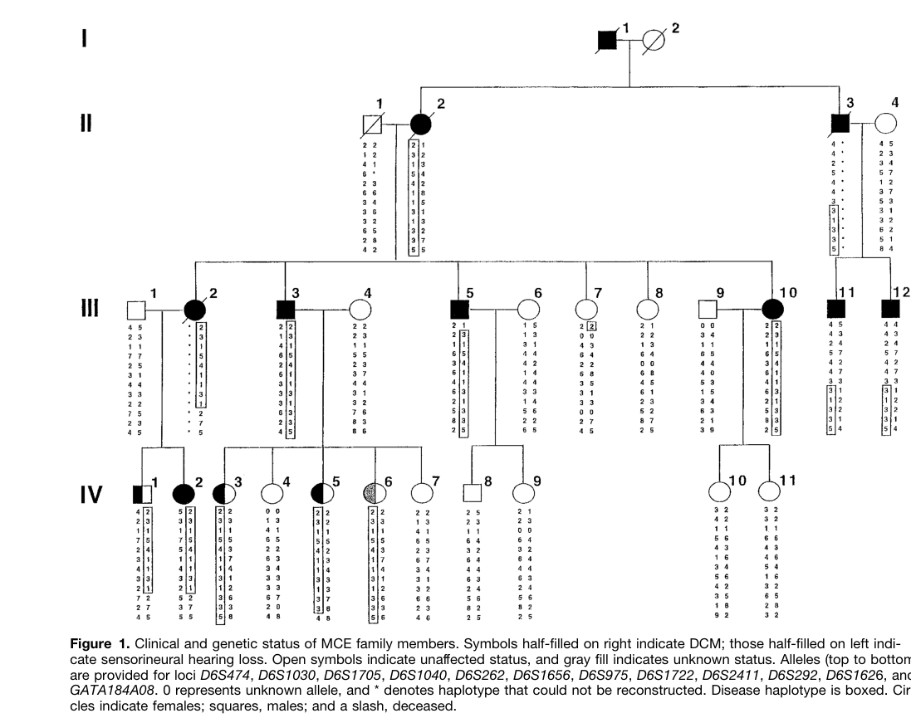

## Question

# Disease Characteristics Research Template

## Target Disease
- **Disease Name:** Dilated Cardiomyopathy 1J
- **MONDO ID:**  (if available)
- **Category:** Mendelian

## Research Objectives

Please provide a comprehensive research report on **Dilated Cardiomyopathy 1J** covering all of the
disease characteristics listed below. This report will be used to populate a disease knowledge
base entry. Be thorough and cite primary literature (PMID preferred) for all claims.

For each section, **suggested databases/resources** are listed. These are the first places
you should search for information on each topic.

---

### 1. Disease Information
> **Search first:** OMIM, Orphanet, ICD-10/ICD-11, MeSH, PubMed

- What is the disease? Provide a concise overview.
- What are the key identifiers? (OMIM, Orphanet, ICD-10/ICD-11, MeSH, Mondo)
- What are the common synonyms and alternative names?
- Is the information derived from individual patients (e.g., EHR) or aggregated disease-level resources?

### 2. Etiology

- **Disease Causal Factors**: What are the primary causes? (genetic, environmental, infectious, mechanistic)
- **Risk Factors**:
  > **Search first:** PubMed, Cochrane Library, UpToDate, clinical guidelines, ClinVar, ClinGen, GWAS Catalog, PheGenI, CTD, CDC, WHO, epidemiological databases
  - Genetic risk factors (causal variants, susceptibility loci, modifier genes)
  - Environmental risk factors (toxins, lifestyle, occupational exposures, age, sex, family history)
- **Protective Factors**:
  > **Search first:** PubMed, Cochrane Library, clinical trial databases, GWAS Catalog, gnomAD, WHO, CDC, nutrition databases
  - Genetic protective factors (protective variants, modifier alleles)
  - Environmental protective factors (diet, lifestyle, exposures that reduce risk)
- **Gene-Environment Interactions**: How do genetic and environmental factors interact to influence disease?
  > **Search first:** CTD, PubMed, PheGenI, GxE databases

### 3. Phenotypes
> **Search first:** HPO (Human Phenotype Ontology), OMIM, Orphanet, PubMed, clinicaltrials.gov, MedDRA, SNOMED CT, DECIPHER, LOINC

For each phenotype, provide:
- **Phenotype type**: symptoms, clinical signs, physical manifestations, behavioral changes, or laboratory abnormalities
  > For symptoms/signs: HPO, OMIM, Orphanet, PubMed
  > For behavioral changes: HPO, DSM, RDoC (Research Domain Criteria), PubMed
  > For laboratory abnormalities: LOINC, SNOMED CT, LabTests Online, PubMed
- **Phenotype characteristics**:
  > **Search first:** OMIM, Orphanet, HPO, PubMed
  - Age of symptom onset (neonatal, childhood, adult-onset, late-onset)
  - Symptom severity (mild, moderate, severe, variable)
  - Symptom progression (stable, progressive, episodic, fluctuating)
  - Frequency among affected individuals (percentage or qualitative)
- **Quality of life impact**: Effects on daily functioning and well-being (per-phenotype when possible)
  > **Search first:** EQ-5D database, SF-36, WHO QOL databases, PubMed
- Suggest HPO (Human Phenotype Ontology) terms for each phenotype

### 4. Genetic/Molecular Information

- **Causal Genes**: Gene mutations or chromosomal abnormalities responsible for disease (gene symbols, OMIM IDs)
  > **Search first:** OMIM, ClinVar, HGMD, Ensembl, NCBI Gene
- **Pathogenic Variants**:
  - Affected genes (gene symbols, HGNC IDs)
    > **Search first:** OMIM, NCBI Gene, Ensembl, HGNC, UniProt, GeneCards
  - Variant classification (pathogenic, likely pathogenic, VUS per ACMG/AMP guidelines)
    > **Search first:** ClinVar, ClinGen, ACMG/AMP guidelines, VarSome
  - Variant type/class (missense, frameshift, nonsense, splice-site, structural)
  - Allele frequency in population databases
    > **Search first:** gnomAD, 1000 Genomes, ExAC, TOPMed, dbSNP
  - Somatic vs germline origin
    > **Search first:** COSMIC (somatic), ClinVar, ICGC, TCGA
  - Functional consequences (loss of function, gain of function, dominant negative)
- **Modifier Genes**: Genes that modify disease severity or expression
- **Epigenetic Information**: DNA methylation, histone modifications, chromatin changes affecting disease
  > **Search first:** ENCODE, Roadmap Epigenomics, MethBase, DiseaseMeth
- **Chromosomal Abnormalities**: Large-scale genetic changes (aneuploidy, translocations, inversions)
  > **Search first:** DECIPHER, ClinVar, ECARUCA, UCSC Genome Browser

### 5. Environmental Information

- **Environmental Factors**: Non-genetic contributing factors (toxins, radiation, pollution, occupational exposure)
  > **Search first:** CTD (Comparative Toxicogenomics Database), TOXNET, PubMed, EPA databases
- **Lifestyle Factors**: Behavioral factors (smoking, diet, exercise, alcohol consumption)
  > **Search first:** CDC databases, WHO, PubMed, NHANES
- **Infectious Agents**: If applicable, pathogens causing or triggering disease (bacteria, viruses, fungi, parasites)
  > **Search first:** NCBI Taxonomy, ViPR, BV-BRC, MicrobeDB, GIDEON

### 6. Mechanism / Pathophysiology

**Present this section as an ordered causal chain first, then the detail below.**
Open with a numbered sequence of mechanistic steps running from the initiating
lesion (mutation, exposure, infection) to the clinical manifestation, one step per
line, each naming what it causes next. State the causal verb explicitly ("leads
to", "results in") and say where a step is inferred rather than demonstrated.
Where the mechanism branches, show the branch. The categories below are a
checklist of what to cover within those steps, not the organizing structure —
a step may draw on several of them, and a category may contribute to several
steps.

- **Molecular Pathways**: Specific signaling cascades or biochemical pathways involved (Wnt, MAPK, mTOR, PI3K-AKT, etc.)
  > **Search first:** KEGG, Reactome, WikiPathways, PathBank, BioCyc
- **Cellular Processes**: Cell-level mechanisms (apoptosis, autophagy, cell cycle dysregulation, inflammation, etc.)
  > **Search first:** Gene Ontology (GO), Reactome, KEGG, PubMed
- **Protein Dysfunction**: How protein structure or function is altered (misfolding, aggregation, loss of function, gain of function)
  > **Search first:** UniProt, PDB (Protein Data Bank), InterPro, Pfam, AlphaFold
- **Metabolic Changes**: Alterations in metabolic processes (energy metabolism, lipid metabolism, amino acid metabolism)
  > **Search first:** KEGG, BioCyc, HMDB (Human Metabolome Database), BRENDA
- **Immune System Involvement**: Role of immune response (autoimmunity, immunodeficiency, chronic inflammation)
  > **Search first:** ImmPort, Immunome Database, IEDB, Gene Ontology
- **Tissue Damage Mechanisms**: How tissues/ are injured (oxidative stress, ischemia, fibrosis, necrosis)
  > **Search first:** PubMed, Gene Ontology, Reactome
- **Biochemical Abnormalities**: Specific molecular defects (enzyme deficiencies, receptor dysfunction, ion channel defects)
  > **Search first:** BRENDA, UniProt, KEGG, OMIM, PubMed
- **Epigenetic Changes**: DNA methylation, histone modifications affecting gene expression in disease
  > **Search first:** ENCODE, Roadmap Epigenomics, MethBase, DiseaseMeth
- **Molecular Profiling** (if available):
  - Transcriptomics/gene expression changes
    > **Search first:** GEO (Gene Expression Omnibus), ArrayExpress, GTEx, Human Cell Atlas, SRA
  - Proteomics findings
    > **Search first:** PRIDE, ProteomeXchange, Human Protein Atlas, STRING, BioGRID
  - Metabolomics signatures
    > **Search first:** MetaboLights, Metabolomics Workbench, HMDB, METLIN
  - Lipidomics alterations
    > **Search first:** LIPID MAPS, SwissLipids, LipidHome, Metabolomics Workbench
  - Genomic structural features
    > **Search first:** UCSC Genome Browser, Ensembl, NCBI, dbVar, DGV
- **Advanced Technologies** (if applicable):
  - Single-cell analysis findings (cell-type specific mechanisms, cellular heterogeneity)
    > **Search first:** Human Cell Atlas, Single Cell Portal, GEO, CELLxGENE
  - Spatial transcriptomics findings
    > **Search first:** GEO, Spatial Research, Vizgen, 10x Genomics data
  - Multi-omics integration results
    > **Search first:** TCGA, ICGC, cBioPortal, LinkedOmics, PubMed
  - Functional genomics screens (CRISPR, RNAi)
    > **Search first:** DepMap, GenomeRNAi, PubMed, BioGRID ORCS

For each mechanism, describe:
- The causal chain from initial trigger to clinical manifestation
- Which mechanisms are upstream vs downstream
- What cell types and biological processes are involved
- Suggest GO terms for biological processes and CL terms for cell types

### 7. Anatomical Structures Affected

- **Organ Level**:
  - Primary organs directly affected
  - Secondary organ involvement (complications, secondary effects)
  - Body systems involved (cardiovascular, nervous, digestive, respiratory, endocrine, etc.)
  > **Search first:** Uberon, FMA (Foundational Model of Anatomy), OMIM, HPO, ICD-11, MeSH, SNOMED CT
- **Tissue and Cell Level**:
  - Specific tissue types affected (epithelial, connective, muscle, nervous)
  - Specific cell populations targeted (with Cell Ontology terms)
  > **Search first:** Uberon, Human Protein Atlas, Cell Ontology, Human Cell Atlas, CellMarker, PanglaoDB
- **Subcellular Level**:
  - Cellular compartments involved (mitochondria, nucleus, ER, lysosomes) (with GO Cellular Component terms)
  > **Search first:** Gene Ontology (Cellular Component), UniProt, Human Protein Atlas
- **Localization**:
  - Specific anatomical sites (with UBERON terms)
    > **Search first:** FMA, Uberon, NeuroNames (for brain), SNOMED CT
  - Lateralization (unilateral, bilateral, asymmetric)
    > **Search first:** HPO, clinical literature, imaging databases

### 8. Temporal Development

- **Onset**:
  - Typical age of onset (congenital, pediatric, adult, geriatric)
  - Onset pattern (acute, subacute, chronic, insidious)
  > **Search first:** OMIM, Orphanet, HPO, PubMed
- **Progression**:
  - Disease stages (early, intermediate, advanced, end-stage)
    > **Search first:** Cancer Staging Manual (AJCC), WHO classifications, PubMed
  - Progression rate (rapid, slow, variable)
  - Disease course pattern (episodic, relapsing-remitting, progressive, stable)
  - Disease duration (self-limited, chronic lifelong)
  > **Search first:** Disease registries, longitudinal cohort databases, natural history studies, PubMed, Orphanet, OMIM
- **Patterns**:
  - Remission patterns (spontaneous, treatment-induced)
    > **Search first:** Clinical trial databases, disease registries, PubMed
  - Critical periods (time windows of vulnerability or opportunity for intervention)
    > **Search first:** PubMed, developmental biology databases, clinical guidelines

### 9. Inheritance and Population

- **Epidemiology**:
  - Prevalence (cases per 100,000 at given time)
  - Incidence (new cases per 100,000 per year)
  > **Search first:** Orphanet, CDC, WHO, GBD (Global Burden of Disease), national registries, SEER, disease registries
- **For Genetic Etiology**:
  - Inheritance pattern (AD, AR, X-linked, mitochondrial, multifactorial, polygenic)
    > **Search first:** OMIM, Orphanet, ClinVar, GTR (Genetic Testing Registry)
  - Penetrance (complete, incomplete, age-dependent)
    > **Search first:** ClinVar, OMIM, PubMed, ClinGen
  - Expressivity (variable, consistent)
    > **Search first:** OMIM, ClinVar, PubMed
  - Genetic anticipation (increasing severity in successive generations)
    > **Search first:** OMIM, PubMed (especially for repeat expansion disorders)
  - Germline mosaicism
    > **Search first:** ClinVar, OMIM, genetic counseling literature, PubMed
  - Founder effects (population-specific mutations)
    > **Search first:** gnomAD, population genetics databases, PubMed
  - Consanguinity role
    > **Search first:** OMIM, population studies, genetic counseling resources
  - Carrier frequency
    > **Search first:** gnomAD, carrier screening databases, GeneReviews, GTR
- **Population Demographics**:
  - Affected populations (ethnic or demographic groups with higher prevalence)
    > **Search first:** gnomAD, 1000 Genomes, PAGE Study, PubMed, population registries
  - Geographic distribution (endemic areas, regional variation)
    > **Search first:** WHO, CDC, GBD, Orphanet, geographic epidemiology databases
  - Geographic distribution of specific variants
  - Sex ratio (male:female)
    > **Search first:** Disease registries, OMIM, PubMed, epidemiological databases
  - Age distribution of affected individuals
    > **Search first:** CDC, disease registries, SEER, Orphanet

### 10. Diagnostics

- **Clinical Tests**:
  - Laboratory tests (blood, urine, tissue chemistry, specific enzyme assays)
    > **Search first:** LOINC, LabTests Online, PubMed
  - Biomarkers (proteins, metabolites, genetic markers, circulating biomarkers)
    > **Search first:** FDA Biomarker List, BEST (Biomarkers, EndpointS, and other Tools), PubMed
  - Imaging studies (X-ray, CT, MRI, PET, ultrasound)
    > **Search first:** RadLex, DICOM, Radiopaedia, imaging databases
  - Functional tests (pulmonary function, cardiac stress tests)
    > **Search first:** LOINC, clinical guidelines, PubMed
  - Electrophysiology (EEG, EMG, ECG, nerve conduction studies)
    > **Search first:** LOINC, clinical neurophysiology databases, PubMed
  - Biopsy findings (histopathology, immunohistochemistry)
    > **Search first:** SNOMED CT, College of American Pathologists resources, PubMed
  - Pathology findings (microscopic examination)
    > **Search first:** SNOMED CT, Digital Pathology databases, PubMed
- **Genetic Testing**:
  > **Search first:** GTR (Genetic Testing Registry), GeneReviews, ClinGen
  - Overview of recommended genetic testing approach
  - Whole genome sequencing (WGS) utility
    > **Search first:** GTR, ClinVar, GEL (Genomics England), gnomAD
  - Whole exome sequencing (WES) utility
    > **Search first:** GTR, ClinVar, OMIM, GeneMatcher
  - Gene panels (which panels, which genes)
    > **Search first:** GTR, ClinVar, laboratory-specific databases
  - Single gene testing
    > **Search first:** GTR, ClinVar, OMIM, GeneReviews
  - Chromosomal microarray (CMA)
    > **Search first:** DECIPHER, ClinVar, dbVar, ECARUCA
  - Karyotyping
    > **Search first:** Chromosome Abnormality Database, ClinVar, cytogenetics resources
  - FISH
    > **Search first:** ClinVar, cytogenetics databases, PubMed
  - Mitochondrial DNA testing
    > **Search first:** MITOMAP, MSeqDR, ClinVar, GTR
  - Repeat expansion testing
    > **Search first:** GTR, ClinVar, repeat expansion databases, PubMed
- **Omics-Based Diagnostics** (if applicable):
  - RNA sequencing / transcriptomics
    > **Search first:** GEO, ArrayExpress, GTEx, RNA-seq databases
  - Proteomics
    > **Search first:** PRIDE, ProteomeXchange, FDA Biomarker database
  - Metabolomics
    > **Search first:** MetaboLights, Metabolomics Workbench, HMDB
  - Epigenomics
    > **Search first:** GEO, ENCODE, Roadmap Epigenomics, MethBase
  - Liquid biopsy
    > **Search first:** COSMIC, ClinVar, liquid biopsy databases, PubMed
- **Clinical Criteria**:
  - Standardized diagnostic criteria (DSM, ICD, society guidelines)
    > **Search first:** DSM-5, ICD-11, clinical society guidelines, UpToDate
  - Differential diagnosis (other conditions to rule out, with distinguishing features)
    > **Search first:** DynaMed, UpToDate, clinical decision support systems
- **Screening**:
  - Screening methods for asymptomatic individuals (newborn screening, carrier screening, cascade screening)
    > **Search first:** ACMG recommendations, CDC newborn screening, GTR

### 11. Outcome/Prognosis

- **Survival and Mortality**:
  - Survival rate (5-year, 10-year, overall)
    > **Search first:** SEER, cancer registries, disease-specific registries, PubMed
  - Life expectancy (with and without treatment if applicable)
    > **Search first:** Orphanet, disease registries, actuarial databases, PubMed
  - Mortality rate
    > **Search first:** CDC, WHO, GBD, national mortality databases
  - Disease-specific mortality (deaths directly attributable to disease)
    > **Search first:** Disease registries, CDC Wonder, GBD, PubMed
- **Morbidity and Function**:
  - Morbidity (disease-related disability and health impacts)
    > **Search first:** GBD, WHO, disability databases, PubMed
  - Disability outcomes (long-term functional impairments)
    > **Search first:** ICF (International Classification of Functioning), disability registries
  - Quality of life measures (EQ-5D, SF-36, PROMIS, disease-specific tools)
    > **Search first:** EQ-5D database, SF-36, PROMIS, PubMed
- **Disease Course**:
  - Complications (secondary problems: infections, organ failure, etc.)
    > **Search first:** ICD codes, disease registries, clinical databases, PubMed
  - Recovery potential (likelihood and extent of recovery, with vs without treatment)
    > **Search first:** Natural history studies, rehabilitation databases, PubMed
- **Prediction**:
  - Prognostic factors (age, disease severity, biomarkers, treatment response)
    > **Search first:** Prognostic models databases, clinical calculators, PubMed
  - Prognostic biomarkers (molecular markers predicting disease course)
    > **Search first:** FDA Biomarker database, PubMed, cancer prognostic databases

### 12. Treatment

- **Pharmacotherapy**:
  - Pharmacological treatments (drug names, drug classes, mechanisms of action)
    > **Search first:** DrugBank, RxNorm, ATC classification, DailyMed, FDA databases
  - Pharmacogenomics (how genetic variants affect drug metabolism, efficacy, toxicity)
    > **Search first:** PharmGKB, CPIC (Clinical Pharmacogenetics), FDA Table of PGx Biomarkers
- **Advanced Therapeutics**:
  - Gene therapy (viral vectors, CRISPR, gene replacement, gene editing)
    > **Search first:** ClinicalTrials.gov, FDA gene therapy database, ASGCT resources
  - Cell therapy (stem cell transplant, CAR-T, cellular therapeutics)
    > **Search first:** ClinicalTrials.gov, FDA cell therapy database, FACT standards
  - RNA-based therapies (ASOs, siRNA, mRNA therapies)
    > **Search first:** ClinicalTrials.gov, FDA approvals, PubMed
  - Targeted therapies (treatments directed at specific molecular targets)
    > **Search first:** My Cancer Genome, OncoKB, ClinicalTrials.gov, FDA approvals
  - Immunotherapies (checkpoint inhibitors, monoclonal antibodies)
    > **Search first:** Cancer Immunotherapy Database, FDA approvals, ClinicalTrials.gov
- **Surgical and Interventional**:
  - Surgical interventions (types of surgery, timing, outcomes)
    > **Search first:** CPT codes, surgical registries, clinical guidelines, PubMed
- **Supportive and Rehabilitative**:
  - Supportive care (symptom management, pain control, nutrition)
    > **Search first:** Clinical guidelines, Cochrane Library, PubMed
  - Rehabilitation (physical therapy, occupational therapy, speech therapy)
    > **Search first:** Rehabilitation medicine databases, clinical guidelines, PubMed
- **Experimental**:
  - Experimental treatments in clinical trials (with NCT identifiers if available)
    > **Search first:** ClinicalTrials.gov, EU Clinical Trials Register, WHO ICTRP
- **Treatment Outcomes**:
  - Treatment response rates
    > **Search first:** Clinical trial databases, FDA reviews, systematic reviews, PubMed
  - Side effects and adverse events
    > **Search first:** FDA Adverse Event Reporting System (FAERS), MedWatch, PubMed
- **Treatment Strategy**:
  - Treatment algorithms (clinical pathways, decision trees)
    > **Search first:** Clinical practice guidelines, NCCN Guidelines, UpToDate
  - Combination therapies
    > **Search first:** ClinicalTrials.gov, treatment guidelines, PubMed
  - Personalized medicine approaches (genotype-guided treatment)
    > **Search first:** My Cancer Genome, CIViC, PharmGKB, precision medicine databases

For each treatment, suggest NCIT (NCI Thesaurus) clinical-intervention terms where applicable.

### 13. Prevention

- **Prevention Levels**:
  - Primary prevention (preventing disease occurrence: vaccination, risk factor modification)
    > **Search first:** CDC, WHO, USPSTF recommendations, Cochrane Library
  - Secondary prevention (early detection and treatment: screening programs, early intervention)
    > **Search first:** USPSTF, CDC screening guidelines, WHO
  - Tertiary prevention (preventing complications in those with disease)
    > **Search first:** Clinical guidelines, disease management protocols, PubMed
- **Immunization**: Vaccine strategies (if applicable)
  > **Search first:** CDC vaccine schedules, WHO immunization, FDA vaccine database
- **Screening and Early Detection**:
  - Screening programs (population-based: newborn screening, cancer screening)
    > **Search first:** CDC screening programs, USPSTF, cancer screening databases
  - Genetic screening (carrier screening, preimplantation genetic diagnosis, prenatal testing)
    > **Search first:** ACMG recommendations, ACOG guidelines, GTR
  - Risk stratification (identifying high-risk individuals for targeted prevention)
    > **Search first:** Risk prediction models, clinical calculators, PubMed
- **Behavioral Interventions**: Lifestyle modifications to reduce risk
  > **Search first:** CDC, WHO, behavioral intervention databases, Cochrane Library
- **Counseling**: Genetic counseling (risk assessment, family planning guidance)
  > **Search first:** NSGC resources, ACMG guidelines, GeneReviews
- **Public Health**:
  - Public health interventions (sanitation, vector control, health education)
    > **Search first:** CDC, WHO, public health databases, PubMed
  - Environmental interventions (reducing environmental risk factors)
    > **Search first:** EPA databases, WHO environmental health, PubMed
- **Prophylaxis**: Preventive medications or procedures
  > **Search first:** Clinical guidelines, FDA approvals, PubMed

### 14. Other Species / Natural Disease

- **Taxonomy**: Species affected (with NCBI Taxon identifiers)
  > **Search first:** NCBI Taxonomy
- **Breed**: Specific breeds affected (with VBO identifiers if applicable)
  > **Search first:** VBO (Vertebrate Breed Ontology)
- **Gene**: Orthologous genes in other species (with NCBI Gene IDs)
  > **Search first:** NCBI Gene
- **Natural Disease**:
  - Naturally occurring disease in other species (companion animals, wildlife)
    > **Search first:** OMIA (Online Mendelian Inheritance in Animals), VetCompass, PubMed
  - Veterinary relevance and importance in animal health
    > **Search first:** OMIA, veterinary databases, PubMed
- **Comparative Biology**:
  - Comparative pathology (similarities and differences across species)
    > **Search first:** OMIA, comparative pathology databases, PubMed
  - Evolutionary conservation of disease mechanisms
    > **Search first:** HomoloGene, OrthoMCL, Alliance of Genome Resources
- **Transmission** (if applicable):
  - Zoonotic potential
    > **Search first:** CDC zoonotic diseases, WHO zoonoses, GIDEON
  - Cross-species susceptibility
    > **Search first:** NCBI Taxonomy, veterinary databases, PubMed

### 15. Model Organisms

- **Model Types**:
  - Model organism type (mammalian, invertebrate, cellular, in vitro)
    > **Search first:** Alliance of Genome Resources, model organism databases
  - Specific model systems (mouse, rat, zebrafish, Drosophila, C. elegans, yeast, cell lines, organoids, iPSCs)
    > **Search first:** MGI, RGD, ZFIN, FlyBase, WormBase, SGD, ATCC, Cellosaurus
  - Induced models (drug treatment, surgical intervention, environmental manipulation)
    > **Search first:** MGI, model organism databases, PubMed
- **Genetic Models**:
  - Types available (knockout, knock-in, transgenic, conditional, humanized)
    > **Search first:** MGI, IMPC, KOMP, EuMMCR, IMSR
- **Model Characteristics**:
  - Phenotype recapitulation (how well model reproduces human disease features)
    > **Search first:** Model organism databases, comparative studies, PubMed
  - Model limitations (aspects of human disease not captured)
    > **Search first:** Model organism databases, PubMed, review articles
- **Applications**:
  - Research applications (what aspects of disease can be studied)
    > **Search first:** Model organism databases, PubMed
- **Resources**:
  - Model databases
    > **Search first:** MGI, RGD, ZFIN, FlyBase, WormBase, IMSR, EMMA, MMRRC

---

## Citation Requirements

- Cite primary literature (PMID preferred) for all mechanistic and clinical claims
- Prioritize recent reviews and landmark papers
- Include direct quotes from abstracts where possible to support key statements
- Distinguish evidence source types: human clinical, model organism, in vitro, computational

## Output Format

Structure your response as a comprehensive narrative organized by the sections above.
For each section, provide:
- Factual content with specific details (numbers, percentages, gene names, variant nomenclature)
- Ontology term suggestions (HPO, GO, CL, UBERON, CHEBI, NCIT, MONDO) where applicable
- Evidence citations with PMIDs
- Direct quotes from abstracts to support key claims
- Clear indication when information is not available or not applicable for this disease

This report will be used to populate a disease knowledge base entry with:
- Pathophysiology descriptions with causal chains
- Gene/protein annotations (HGNC, GO terms)
- Phenotype associations (HP terms) with frequencies
- Cell type involvement (CL terms)
- Anatomical locations (UBERON terms)
- Chemical entities (CHEBI terms)
- Treatment annotations (NCIT terms)
- Evidence items with PMIDs and exact abstract quotes
- Epidemiology, prognosis, diagnostic, and prevention information
- Animal model descriptions with phenotype recapitulation details

## Output

Question: You are an expert researcher providing comprehensive, well-cited information.

Provide detailed information focusing on:
1. Key concepts and definitions with current understanding
2. Recent developments and latest research (prioritize 2023-2024 sources)
3. Current applications and real-world implementations
4. Expert opinions and analysis from authoritative sources
5. Relevant statistics and data from recent studies

Format as a comprehensive research report with proper citations. Include URLs and publication dates where available.
Always prioritize recent, authoritative sources and provide specific citations for all major claims.

# Disease Characteristics Research Template

## Target Disease
- **Disease Name:** Dilated Cardiomyopathy 1J
- **MONDO ID:**  (if available)
- **Category:** Mendelian

## Research Objectives

Please provide a comprehensive research report on **Dilated Cardiomyopathy 1J** covering all of the
disease characteristics listed below. This report will be used to populate a disease knowledge
base entry. Be thorough and cite primary literature (PMID preferred) for all claims.

For each section, **suggested databases/resources** are listed. These are the first places
you should search for information on each topic.

---

### 1. Disease Information
> **Search first:** OMIM, Orphanet, ICD-10/ICD-11, MeSH, PubMed

- What is the disease? Provide a concise overview.
- What are the key identifiers? (OMIM, Orphanet, ICD-10/ICD-11, MeSH, Mondo)
- What are the common synonyms and alternative names?
- Is the information derived from individual patients (e.g., EHR) or aggregated disease-level resources?

### 2. Etiology

- **Disease Causal Factors**: What are the primary causes? (genetic, environmental, infectious, mechanistic)
- **Risk Factors**:
  > **Search first:** PubMed, Cochrane Library, UpToDate, clinical guidelines, ClinVar, ClinGen, GWAS Catalog, PheGenI, CTD, CDC, WHO, epidemiological databases
  - Genetic risk factors (causal variants, susceptibility loci, modifier genes)
  - Environmental risk factors (toxins, lifestyle, occupational exposures, age, sex, family history)
- **Protective Factors**:
  > **Search first:** PubMed, Cochrane Library, clinical trial databases, GWAS Catalog, gnomAD, WHO, CDC, nutrition databases
  - Genetic protective factors (protective variants, modifier alleles)
  - Environmental protective factors (diet, lifestyle, exposures that reduce risk)
- **Gene-Environment Interactions**: How do genetic and environmental factors interact to influence disease?
  > **Search first:** CTD, PubMed, PheGenI, GxE databases

### 3. Phenotypes
> **Search first:** HPO (Human Phenotype Ontology), OMIM, Orphanet, PubMed, clinicaltrials.gov, MedDRA, SNOMED CT, DECIPHER, LOINC

For each phenotype, provide:
- **Phenotype type**: symptoms, clinical signs, physical manifestations, behavioral changes, or laboratory abnormalities
  > For symptoms/signs: HPO, OMIM, Orphanet, PubMed
  > For behavioral changes: HPO, DSM, RDoC (Research Domain Criteria), PubMed
  > For laboratory abnormalities: LOINC, SNOMED CT, LabTests Online, PubMed
- **Phenotype characteristics**:
  > **Search first:** OMIM, Orphanet, HPO, PubMed
  - Age of symptom onset (neonatal, childhood, adult-onset, late-onset)
  - Symptom severity (mild, moderate, severe, variable)
  - Symptom progression (stable, progressive, episodic, fluctuating)
  - Frequency among affected individuals (percentage or qualitative)
- **Quality of life impact**: Effects on daily functioning and well-being (per-phenotype when possible)
  > **Search first:** EQ-5D database, SF-36, WHO QOL databases, PubMed
- Suggest HPO (Human Phenotype Ontology) terms for each phenotype

### 4. Genetic/Molecular Information

- **Causal Genes**: Gene mutations or chromosomal abnormalities responsible for disease (gene symbols, OMIM IDs)
  > **Search first:** OMIM, ClinVar, HGMD, Ensembl, NCBI Gene
- **Pathogenic Variants**:
  - Affected genes (gene symbols, HGNC IDs)
    > **Search first:** OMIM, NCBI Gene, Ensembl, HGNC, UniProt, GeneCards
  - Variant classification (pathogenic, likely pathogenic, VUS per ACMG/AMP guidelines)
    > **Search first:** ClinVar, ClinGen, ACMG/AMP guidelines, VarSome
  - Variant type/class (missense, frameshift, nonsense, splice-site, structural)
  - Allele frequency in population databases
    > **Search first:** gnomAD, 1000 Genomes, ExAC, TOPMed, dbSNP
  - Somatic vs germline origin
    > **Search first:** COSMIC (somatic), ClinVar, ICGC, TCGA
  - Functional consequences (loss of function, gain of function, dominant negative)
- **Modifier Genes**: Genes that modify disease severity or expression
- **Epigenetic Information**: DNA methylation, histone modifications, chromatin changes affecting disease
  > **Search first:** ENCODE, Roadmap Epigenomics, MethBase, DiseaseMeth
- **Chromosomal Abnormalities**: Large-scale genetic changes (aneuploidy, translocations, inversions)
  > **Search first:** DECIPHER, ClinVar, ECARUCA, UCSC Genome Browser

### 5. Environmental Information

- **Environmental Factors**: Non-genetic contributing factors (toxins, radiation, pollution, occupational exposure)
  > **Search first:** CTD (Comparative Toxicogenomics Database), TOXNET, PubMed, EPA databases
- **Lifestyle Factors**: Behavioral factors (smoking, diet, exercise, alcohol consumption)
  > **Search first:** CDC databases, WHO, PubMed, NHANES
- **Infectious Agents**: If applicable, pathogens causing or triggering disease (bacteria, viruses, fungi, parasites)
  > **Search first:** NCBI Taxonomy, ViPR, BV-BRC, MicrobeDB, GIDEON

### 6. Mechanism / Pathophysiology

**Present this section as an ordered causal chain first, then the detail below.**
Open with a numbered sequence of mechanistic steps running from the initiating
lesion (mutation, exposure, infection) to the clinical manifestation, one step per
line, each naming what it causes next. State the causal verb explicitly ("leads
to", "results in") and say where a step is inferred rather than demonstrated.
Where the mechanism branches, show the branch. The categories below are a
checklist of what to cover within those steps, not the organizing structure —
a step may draw on several of them, and a category may contribute to several
steps.

- **Molecular Pathways**: Specific signaling cascades or biochemical pathways involved (Wnt, MAPK, mTOR, PI3K-AKT, etc.)
  > **Search first:** KEGG, Reactome, WikiPathways, PathBank, BioCyc
- **Cellular Processes**: Cell-level mechanisms (apoptosis, autophagy, cell cycle dysregulation, inflammation, etc.)
  > **Search first:** Gene Ontology (GO), Reactome, KEGG, PubMed
- **Protein Dysfunction**: How protein structure or function is altered (misfolding, aggregation, loss of function, gain of function)
  > **Search first:** UniProt, PDB (Protein Data Bank), InterPro, Pfam, AlphaFold
- **Metabolic Changes**: Alterations in metabolic processes (energy metabolism, lipid metabolism, amino acid metabolism)
  > **Search first:** KEGG, BioCyc, HMDB (Human Metabolome Database), BRENDA
- **Immune System Involvement**: Role of immune response (autoimmunity, immunodeficiency, chronic inflammation)
  > **Search first:** ImmPort, Immunome Database, IEDB, Gene Ontology
- **Tissue Damage Mechanisms**: How tissues/ are injured (oxidative stress, ischemia, fibrosis, necrosis)
  > **Search first:** PubMed, Gene Ontology, Reactome
- **Biochemical Abnormalities**: Specific molecular defects (enzyme deficiencies, receptor dysfunction, ion channel defects)
  > **Search first:** BRENDA, UniProt, KEGG, OMIM, PubMed
- **Epigenetic Changes**: DNA methylation, histone modifications affecting gene expression in disease
  > **Search first:** ENCODE, Roadmap Epigenomics, MethBase, DiseaseMeth
- **Molecular Profiling** (if available):
  - Transcriptomics/gene expression changes
    > **Search first:** GEO (Gene Expression Omnibus), ArrayExpress, GTEx, Human Cell Atlas, SRA
  - Proteomics findings
    > **Search first:** PRIDE, ProteomeXchange, Human Protein Atlas, STRING, BioGRID
  - Metabolomics signatures
    > **Search first:** MetaboLights, Metabolomics Workbench, HMDB, METLIN
  - Lipidomics alterations
    > **Search first:** LIPID MAPS, SwissLipids, LipidHome, Metabolomics Workbench
  - Genomic structural features
    > **Search first:** UCSC Genome Browser, Ensembl, NCBI, dbVar, DGV
- **Advanced Technologies** (if applicable):
  - Single-cell analysis findings (cell-type specific mechanisms, cellular heterogeneity)
    > **Search first:** Human Cell Atlas, Single Cell Portal, GEO, CELLxGENE
  - Spatial transcriptomics findings
    > **Search first:** GEO, Spatial Research, Vizgen, 10x Genomics data
  - Multi-omics integration results
    > **Search first:** TCGA, ICGC, cBioPortal, LinkedOmics, PubMed
  - Functional genomics screens (CRISPR, RNAi)
    > **Search first:** DepMap, GenomeRNAi, PubMed, BioGRID ORCS

For each mechanism, describe:
- The causal chain from initial trigger to clinical manifestation
- Which mechanisms are upstream vs downstream
- What cell types and biological processes are involved
- Suggest GO terms for biological processes and CL terms for cell types

### 7. Anatomical Structures Affected

- **Organ Level**:
  - Primary organs directly affected
  - Secondary organ involvement (complications, secondary effects)
  - Body systems involved (cardiovascular, nervous, digestive, respiratory, endocrine, etc.)
  > **Search first:** Uberon, FMA (Foundational Model of Anatomy), OMIM, HPO, ICD-11, MeSH, SNOMED CT
- **Tissue and Cell Level**:
  - Specific tissue types affected (epithelial, connective, muscle, nervous)
  - Specific cell populations targeted (with Cell Ontology terms)
  > **Search first:** Uberon, Human Protein Atlas, Cell Ontology, Human Cell Atlas, CellMarker, PanglaoDB
- **Subcellular Level**:
  - Cellular compartments involved (mitochondria, nucleus, ER, lysosomes) (with GO Cellular Component terms)
  > **Search first:** Gene Ontology (Cellular Component), UniProt, Human Protein Atlas
- **Localization**:
  - Specific anatomical sites (with UBERON terms)
    > **Search first:** FMA, Uberon, NeuroNames (for brain), SNOMED CT
  - Lateralization (unilateral, bilateral, asymmetric)
    > **Search first:** HPO, clinical literature, imaging databases

### 8. Temporal Development

- **Onset**:
  - Typical age of onset (congenital, pediatric, adult, geriatric)
  - Onset pattern (acute, subacute, chronic, insidious)
  > **Search first:** OMIM, Orphanet, HPO, PubMed
- **Progression**:
  - Disease stages (early, intermediate, advanced, end-stage)
    > **Search first:** Cancer Staging Manual (AJCC), WHO classifications, PubMed
  - Progression rate (rapid, slow, variable)
  - Disease course pattern (episodic, relapsing-remitting, progressive, stable)
  - Disease duration (self-limited, chronic lifelong)
  > **Search first:** Disease registries, longitudinal cohort databases, natural history studies, PubMed, Orphanet, OMIM
- **Patterns**:
  - Remission patterns (spontaneous, treatment-induced)
    > **Search first:** Clinical trial databases, disease registries, PubMed
  - Critical periods (time windows of vulnerability or opportunity for intervention)
    > **Search first:** PubMed, developmental biology databases, clinical guidelines

### 9. Inheritance and Population

- **Epidemiology**:
  - Prevalence (cases per 100,000 at given time)
  - Incidence (new cases per 100,000 per year)
  > **Search first:** Orphanet, CDC, WHO, GBD (Global Burden of Disease), national registries, SEER, disease registries
- **For Genetic Etiology**:
  - Inheritance pattern (AD, AR, X-linked, mitochondrial, multifactorial, polygenic)
    > **Search first:** OMIM, Orphanet, ClinVar, GTR (Genetic Testing Registry)
  - Penetrance (complete, incomplete, age-dependent)
    > **Search first:** ClinVar, OMIM, PubMed, ClinGen
  - Expressivity (variable, consistent)
    > **Search first:** OMIM, ClinVar, PubMed
  - Genetic anticipation (increasing severity in successive generations)
    > **Search first:** OMIM, PubMed (especially for repeat expansion disorders)
  - Germline mosaicism
    > **Search first:** ClinVar, OMIM, genetic counseling literature, PubMed
  - Founder effects (population-specific mutations)
    > **Search first:** gnomAD, population genetics databases, PubMed
  - Consanguinity role
    > **Search first:** OMIM, population studies, genetic counseling resources
  - Carrier frequency
    > **Search first:** gnomAD, carrier screening databases, GeneReviews, GTR
- **Population Demographics**:
  - Affected populations (ethnic or demographic groups with higher prevalence)
    > **Search first:** gnomAD, 1000 Genomes, PAGE Study, PubMed, population registries
  - Geographic distribution (endemic areas, regional variation)
    > **Search first:** WHO, CDC, GBD, Orphanet, geographic epidemiology databases
  - Geographic distribution of specific variants
  - Sex ratio (male:female)
    > **Search first:** Disease registries, OMIM, PubMed, epidemiological databases
  - Age distribution of affected individuals
    > **Search first:** CDC, disease registries, SEER, Orphanet

### 10. Diagnostics

- **Clinical Tests**:
  - Laboratory tests (blood, urine, tissue chemistry, specific enzyme assays)
    > **Search first:** LOINC, LabTests Online, PubMed
  - Biomarkers (proteins, metabolites, genetic markers, circulating biomarkers)
    > **Search first:** FDA Biomarker List, BEST (Biomarkers, EndpointS, and other Tools), PubMed
  - Imaging studies (X-ray, CT, MRI, PET, ultrasound)
    > **Search first:** RadLex, DICOM, Radiopaedia, imaging databases
  - Functional tests (pulmonary function, cardiac stress tests)
    > **Search first:** LOINC, clinical guidelines, PubMed
  - Electrophysiology (EEG, EMG, ECG, nerve conduction studies)
    > **Search first:** LOINC, clinical neurophysiology databases, PubMed
  - Biopsy findings (histopathology, immunohistochemistry)
    > **Search first:** SNOMED CT, College of American Pathologists resources, PubMed
  - Pathology findings (microscopic examination)
    > **Search first:** SNOMED CT, Digital Pathology databases, PubMed
- **Genetic Testing**:
  > **Search first:** GTR (Genetic Testing Registry), GeneReviews, ClinGen
  - Overview of recommended genetic testing approach
  - Whole genome sequencing (WGS) utility
    > **Search first:** GTR, ClinVar, GEL (Genomics England), gnomAD
  - Whole exome sequencing (WES) utility
    > **Search first:** GTR, ClinVar, OMIM, GeneMatcher
  - Gene panels (which panels, which genes)
    > **Search first:** GTR, ClinVar, laboratory-specific databases
  - Single gene testing
    > **Search first:** GTR, ClinVar, OMIM, GeneReviews
  - Chromosomal microarray (CMA)
    > **Search first:** DECIPHER, ClinVar, dbVar, ECARUCA
  - Karyotyping
    > **Search first:** Chromosome Abnormality Database, ClinVar, cytogenetics resources
  - FISH
    > **Search first:** ClinVar, cytogenetics databases, PubMed
  - Mitochondrial DNA testing
    > **Search first:** MITOMAP, MSeqDR, ClinVar, GTR
  - Repeat expansion testing
    > **Search first:** GTR, ClinVar, repeat expansion databases, PubMed
- **Omics-Based Diagnostics** (if applicable):
  - RNA sequencing / transcriptomics
    > **Search first:** GEO, ArrayExpress, GTEx, RNA-seq databases
  - Proteomics
    > **Search first:** PRIDE, ProteomeXchange, FDA Biomarker database
  - Metabolomics
    > **Search first:** MetaboLights, Metabolomics Workbench, HMDB
  - Epigenomics
    > **Search first:** GEO, ENCODE, Roadmap Epigenomics, MethBase
  - Liquid biopsy
    > **Search first:** COSMIC, ClinVar, liquid biopsy databases, PubMed
- **Clinical Criteria**:
  - Standardized diagnostic criteria (DSM, ICD, society guidelines)
    > **Search first:** DSM-5, ICD-11, clinical society guidelines, UpToDate
  - Differential diagnosis (other conditions to rule out, with distinguishing features)
    > **Search first:** DynaMed, UpToDate, clinical decision support systems
- **Screening**:
  - Screening methods for asymptomatic individuals (newborn screening, carrier screening, cascade screening)
    > **Search first:** ACMG recommendations, CDC newborn screening, GTR

### 11. Outcome/Prognosis

- **Survival and Mortality**:
  - Survival rate (5-year, 10-year, overall)
    > **Search first:** SEER, cancer registries, disease-specific registries, PubMed
  - Life expectancy (with and without treatment if applicable)
    > **Search first:** Orphanet, disease registries, actuarial databases, PubMed
  - Mortality rate
    > **Search first:** CDC, WHO, GBD, national mortality databases
  - Disease-specific mortality (deaths directly attributable to disease)
    > **Search first:** Disease registries, CDC Wonder, GBD, PubMed
- **Morbidity and Function**:
  - Morbidity (disease-related disability and health impacts)
    > **Search first:** GBD, WHO, disability databases, PubMed
  - Disability outcomes (long-term functional impairments)
    > **Search first:** ICF (International Classification of Functioning), disability registries
  - Quality of life measures (EQ-5D, SF-36, PROMIS, disease-specific tools)
    > **Search first:** EQ-5D database, SF-36, PROMIS, PubMed
- **Disease Course**:
  - Complications (secondary problems: infections, organ failure, etc.)
    > **Search first:** ICD codes, disease registries, clinical databases, PubMed
  - Recovery potential (likelihood and extent of recovery, with vs without treatment)
    > **Search first:** Natural history studies, rehabilitation databases, PubMed
- **Prediction**:
  - Prognostic factors (age, disease severity, biomarkers, treatment response)
    > **Search first:** Prognostic models databases, clinical calculators, PubMed
  - Prognostic biomarkers (molecular markers predicting disease course)
    > **Search first:** FDA Biomarker database, PubMed, cancer prognostic databases

### 12. Treatment

- **Pharmacotherapy**:
  - Pharmacological treatments (drug names, drug classes, mechanisms of action)
    > **Search first:** DrugBank, RxNorm, ATC classification, DailyMed, FDA databases
  - Pharmacogenomics (how genetic variants affect drug metabolism, efficacy, toxicity)
    > **Search first:** PharmGKB, CPIC (Clinical Pharmacogenetics), FDA Table of PGx Biomarkers
- **Advanced Therapeutics**:
  - Gene therapy (viral vectors, CRISPR, gene replacement, gene editing)
    > **Search first:** ClinicalTrials.gov, FDA gene therapy database, ASGCT resources
  - Cell therapy (stem cell transplant, CAR-T, cellular therapeutics)
    > **Search first:** ClinicalTrials.gov, FDA cell therapy database, FACT standards
  - RNA-based therapies (ASOs, siRNA, mRNA therapies)
    > **Search first:** ClinicalTrials.gov, FDA approvals, PubMed
  - Targeted therapies (treatments directed at specific molecular targets)
    > **Search first:** My Cancer Genome, OncoKB, ClinicalTrials.gov, FDA approvals
  - Immunotherapies (checkpoint inhibitors, monoclonal antibodies)
    > **Search first:** Cancer Immunotherapy Database, FDA approvals, ClinicalTrials.gov
- **Surgical and Interventional**:
  - Surgical interventions (types of surgery, timing, outcomes)
    > **Search first:** CPT codes, surgical registries, clinical guidelines, PubMed
- **Supportive and Rehabilitative**:
  - Supportive care (symptom management, pain control, nutrition)
    > **Search first:** Clinical guidelines, Cochrane Library, PubMed
  - Rehabilitation (physical therapy, occupational therapy, speech therapy)
    > **Search first:** Rehabilitation medicine databases, clinical guidelines, PubMed
- **Experimental**:
  - Experimental treatments in clinical trials (with NCT identifiers if available)
    > **Search first:** ClinicalTrials.gov, EU Clinical Trials Register, WHO ICTRP
- **Treatment Outcomes**:
  - Treatment response rates
    > **Search first:** Clinical trial databases, FDA reviews, systematic reviews, PubMed
  - Side effects and adverse events
    > **Search first:** FDA Adverse Event Reporting System (FAERS), MedWatch, PubMed
- **Treatment Strategy**:
  - Treatment algorithms (clinical pathways, decision trees)
    > **Search first:** Clinical practice guidelines, NCCN Guidelines, UpToDate
  - Combination therapies
    > **Search first:** ClinicalTrials.gov, treatment guidelines, PubMed
  - Personalized medicine approaches (genotype-guided treatment)
    > **Search first:** My Cancer Genome, CIViC, PharmGKB, precision medicine databases

For each treatment, suggest NCIT (NCI Thesaurus) clinical-intervention terms where applicable.

### 13. Prevention

- **Prevention Levels**:
  - Primary prevention (preventing disease occurrence: vaccination, risk factor modification)
    > **Search first:** CDC, WHO, USPSTF recommendations, Cochrane Library
  - Secondary prevention (early detection and treatment: screening programs, early intervention)
    > **Search first:** USPSTF, CDC screening guidelines, WHO
  - Tertiary prevention (preventing complications in those with disease)
    > **Search first:** Clinical guidelines, disease management protocols, PubMed
- **Immunization**: Vaccine strategies (if applicable)
  > **Search first:** CDC vaccine schedules, WHO immunization, FDA vaccine database
- **Screening and Early Detection**:
  - Screening programs (population-based: newborn screening, cancer screening)
    > **Search first:** CDC screening programs, USPSTF, cancer screening databases
  - Genetic screening (carrier screening, preimplantation genetic diagnosis, prenatal testing)
    > **Search first:** ACMG recommendations, ACOG guidelines, GTR
  - Risk stratification (identifying high-risk individuals for targeted prevention)
    > **Search first:** Risk prediction models, clinical calculators, PubMed
- **Behavioral Interventions**: Lifestyle modifications to reduce risk
  > **Search first:** CDC, WHO, behavioral intervention databases, Cochrane Library
- **Counseling**: Genetic counseling (risk assessment, family planning guidance)
  > **Search first:** NSGC resources, ACMG guidelines, GeneReviews
- **Public Health**:
  - Public health interventions (sanitation, vector control, health education)
    > **Search first:** CDC, WHO, public health databases, PubMed
  - Environmental interventions (reducing environmental risk factors)
    > **Search first:** EPA databases, WHO environmental health, PubMed
- **Prophylaxis**: Preventive medications or procedures
  > **Search first:** Clinical guidelines, FDA approvals, PubMed

### 14. Other Species / Natural Disease

- **Taxonomy**: Species affected (with NCBI Taxon identifiers)
  > **Search first:** NCBI Taxonomy
- **Breed**: Specific breeds affected (with VBO identifiers if applicable)
  > **Search first:** VBO (Vertebrate Breed Ontology)
- **Gene**: Orthologous genes in other species (with NCBI Gene IDs)
  > **Search first:** NCBI Gene
- **Natural Disease**:
  - Naturally occurring disease in other species (companion animals, wildlife)
    > **Search first:** OMIA (Online Mendelian Inheritance in Animals), VetCompass, PubMed
  - Veterinary relevance and importance in animal health
    > **Search first:** OMIA, veterinary databases, PubMed
- **Comparative Biology**:
  - Comparative pathology (similarities and differences across species)
    > **Search first:** OMIA, comparative pathology databases, PubMed
  - Evolutionary conservation of disease mechanisms
    > **Search first:** HomoloGene, OrthoMCL, Alliance of Genome Resources
- **Transmission** (if applicable):
  - Zoonotic potential
    > **Search first:** CDC zoonotic diseases, WHO zoonoses, GIDEON
  - Cross-species susceptibility
    > **Search first:** NCBI Taxonomy, veterinary databases, PubMed

### 15. Model Organisms

- **Model Types**:
  - Model organism type (mammalian, invertebrate, cellular, in vitro)
    > **Search first:** Alliance of Genome Resources, model organism databases
  - Specific model systems (mouse, rat, zebrafish, Drosophila, C. elegans, yeast, cell lines, organoids, iPSCs)
    > **Search first:** MGI, RGD, ZFIN, FlyBase, WormBase, SGD, ATCC, Cellosaurus
  - Induced models (drug treatment, surgical intervention, environmental manipulation)
    > **Search first:** MGI, model organism databases, PubMed
- **Genetic Models**:
  - Types available (knockout, knock-in, transgenic, conditional, humanized)
    > **Search first:** MGI, IMPC, KOMP, EuMMCR, IMSR
- **Model Characteristics**:
  - Phenotype recapitulation (how well model reproduces human disease features)
    > **Search first:** Model organism databases, comparative studies, PubMed
  - Model limitations (aspects of human disease not captured)
    > **Search first:** Model organism databases, PubMed, review articles
- **Applications**:
  - Research applications (what aspects of disease can be studied)
    > **Search first:** Model organism databases, PubMed
- **Resources**:
  - Model databases
    > **Search first:** MGI, RGD, ZFIN, FlyBase, WormBase, IMSR, EMMA, MMRRC

---

## Citation Requirements

- Cite primary literature (PMID preferred) for all mechanistic and clinical claims
- Prioritize recent reviews and landmark papers
- Include direct quotes from abstracts where possible to support key statements
- Distinguish evidence source types: human clinical, model organism, in vitro, computational

## Output Format

Structure your response as a comprehensive narrative organized by the sections above.
For each section, provide:
- Factual content with specific details (numbers, percentages, gene names, variant nomenclature)
- Ontology term suggestions (HPO, GO, CL, UBERON, CHEBI, NCIT, MONDO) where applicable
- Evidence citations with PMIDs
- Direct quotes from abstracts to support key claims
- Clear indication when information is not available or not applicable for this disease

This report will be used to populate a disease knowledge base entry with:
- Pathophysiology descriptions with causal chains
- Gene/protein annotations (HGNC, GO terms)
- Phenotype associations (HP terms) with frequencies
- Cell type involvement (CL terms)
- Anatomical locations (UBERON terms)
- Chemical entities (CHEBI terms)
- Treatment annotations (NCIT terms)
- Evidence items with PMIDs and exact abstract quotes
- Epidemiology, prognosis, diagnostic, and prevention information
- Animal model descriptions with phenotype recapitulation details

# Dilated Cardiomyopathy 1J (DCM1J): comprehensive disease-characteristics report

## Executive summary and evidence boundary

Dilated cardiomyopathy 1J (DCM1J; historical locus symbol **CMD1J**) is an exceptionally rare, autosomal-dominant cardio-auditory disorder caused by particular heterozygous disruptions of **EYA4** at chromosome 6q23–q24. Its characteristic sequence is postlingual, progressive sensorineural hearing loss (SNHL), usually evident by adolescence or early adulthood, followed by adult-onset ventricular dilation, systolic dysfunction, and potentially progressive heart failure. The original linkage study involved only two kindreds; subsequent molecular and experimental evidence remains sparse. Therefore, most precise phenotype statements are family-level—not population-level—estimates. Importantly, many pathogenic EYA4 variants cause isolated DFNA10 hearing loss without cardiomyopathy; an EYA4 result does not by itself establish DCM1J. (mi2021earlytruncationof pages 8-9, abe2018sensorineuralhearingloss pages 2-4, liu2015exomesequencingidentifies pages 11-11, schonberger2000dilatedcardiomyopathyand pages 1-3)

The most important recent conclusion is negative: searches through 2024 found expansion of the EYA4 hearing-loss variant spectrum and better general cardiomyopathy diagnostics, but little new DCM1J-specific natural-history or therapeutic evidence. Contemporary care must consequently combine variant-level interpretation, cardiac/audiological surveillance, and general DCM/heart-failure guidelines. (sorella2025diagnosisandmanagement pages 12-13, sorella2025diagnosisandmanagement pages 1-2, jordan2026anupdatedevidence pages 1-5, jordan2026anupdatedevidence pages 18-21)

| Domain | DCM1J-specific finding | Evidence type/strength | Key ontology suggestions |
|---|---|---|---|
| Identity and identifiers | **Dilated cardiomyopathy 1J (DCM1J; historical CMD1J)** is a Mendelian cardio-auditory disorder mapped to **6q23–q24** and caused by heterozygous **EYA4** disruption. **OMIM 605362** is commonly mapped to DCM1J but should be verified against the live OMIM record before database ingestion. The disease-specific MONDO identifier was not established from the retrieved evidence. (liu2015exomesequencingidentifies pages 11-11, schonberger2000dilatedcardiomyopathyand pages 1-3) | **Strong human genetic evidence:** linkage in two kindreds followed by causal-gene identification; nomenclature and database identifiers require live-database verification. | MONDO: dilated cardiomyopathy; MeSH: *Cardiomyopathy, Dilated*; gene: **EYA4** |
| Cardinal cardiac phenotype | Left-ventricular dilation and systolic dysfunction progress to congestive heart failure; severe reported outcomes included sudden death, transplantation, and transplant listing. Explanted/autopsy hearts showed cardiomegaly, hypertrophic myocytes, enlarged hyperchromatic nuclei, and interstitial fibrosis. (schonberger2000dilatedcardiomyopathyand pages 3-4) | **Human disease-specific evidence:** small, deeply phenotyped pedigrees; frequencies are not population estimates. | HP:0001644 Dilated cardiomyopathy; HP:0001635 Congestive heart failure; HP:0001712 Left ventricular hypertrophy; HP:0001707 Abnormality of the myocardium; HP:0001645 Sudden cardiac death |
| Cardinal auditory phenotype | Bilateral, symmetric, postlingual sensorineural hearing loss generally precedes cardiac disease and was moderate to severe by late adolescence in the original families. (schonberger2000dilatedcardiomyopathyand pages 1-3, schonberger2000dilatedcardiomyopathyand pages 3-4) | **Human disease-specific evidence:** consistent cosegregation and temporal precedence in the founding families. | HP:0000407 Sensorineural hearing impairment; HP:0008619 Bilateral sensorineural hearing impairment |
| Temporal development | Typical reported sequence: juvenile or late-adolescent hearing loss followed by clinically evident ventricular dysfunction and progressive heart failure after the fourth decade. Penetrance is age-related, so a young carrier may have hearing loss without echocardiographic DCM. (schonberger2000dilatedcardiomyopathyand pages 1-3) | **Human disease-specific evidence:** two pedigrees; onset and progression remain imprecisely quantified outside these families. | HP:0003621 Juvenile onset; HP:0003581 Adult onset; HP:0003676 Progressive |
| Inheritance | Autosomal dominant transmission with age-dependent penetrance and variable expressivity. The original linkage analysis assumed 95% penetrance for modeling, but this is not an empirically established lifetime penetrance estimate. (schonberger2000dilatedcardiomyopathyand pages 1-3, schonberger2000dilatedcardiomyopathyand pages 3-4, schonberger2000dilatedcardiomyopathyand media 23a55263) | **Strong segregation/linkage evidence:** maximum LOD **4.88** at D6S2411 in a 29-member kindred; causal interval was 2.8 cM. | HP:0000006 Autosomal dominant inheritance; HP:0003829 Incomplete penetrance; GENO: heterozygous genotype |
| Causal gene and protein | **EYA4** encodes a 638-amino-acid transcriptional cofactor with an N-terminal variable/transactivation region and a conserved C-terminal Eya domain possessing tyrosine-phosphatase and protein-interaction functions. EYA4 cooperates with SIX-family transcription factors. (williams2015eya4induceshypertrophy pages 1-3) | **Human genetics plus molecular-functional evidence.** EYA4 also causes hearing-loss-only DFNA10, making variant-level phenotype interpretation essential. | HGNC:3518 **EYA4**; GO:0003712 transcription coregulator activity; GO:0004725 protein tyrosine phosphatase activity; GO:0005634 nucleus; GO:0005737 cytoplasm |
| E193 variant | The founding **E193** allele is a heterozygous approximately **4,846-bp deletion** causing a frameshift after residue 193, 29 novel residues, and premature termination; it is associated with hearing impairment followed by late-onset DCM. (williams2015eya4induceshypertrophy pages 1-3) | **Disease-specific human and transgenic-model evidence.** Historical protein-level shorthand is reported; current HGVS genomic/cDNA notation requires transcript/build reconciliation. | Sequence Ontology: frameshift_variant; SO:0001587 stop_gained; GENO: heterozygous |
| E215 variant | A second heterozygous truncating allele, termed **E215**, produced similar cardio-auditory features, and mutant protein was detectable in myocardium. (williams2015eya4induceshypertrophy pages 1-3) | **Disease-specific but limited evidence:** very few affected individuals; contemporary ClinVar/ACMG classification and complete HGVS description should be verified. | Sequence Ontology: frameshift_variant or stop_gained, subject to HGVS verification |
| Genotype–phenotype caution | Many EYA4 truncating or splice variants cause isolated DFNA10 hearing loss without DCM. A p.Gln393Ter carrier had only minor ECG/mitral findings without LV dilation or impaired contractility, and early N-terminal truncation has also been reported without cardiac disease. Mutation position alone therefore does not reliably predict DCM1J. (mi2021earlytruncationof pages 8-9, abe2018sensorineuralhearingloss pages 2-4, liu2015exomesequencingidentifies pages 11-11) | **Moderate evidence against a simple domain rule:** multiple hearing-loss families and patient-level cardiac assessments; long-term cardiac follow-up is incomplete in some reports. | MONDO: DFNA10; HP:0000407 Sensorineural hearing impairment; ClinGen/ACMG variant-level assessment |
| Proposed molecular mechanism | Wild-type EYA4–SIX1 represses **CDKN1B/p27Kip1** transcription. E193 behaves experimentally as a dominant-negative perturbation, increasing p27, reducing CK2α activity and HDAC2 phosphorylation, and disrupting the hypertrophic stress-response program; chronic imbalance is proposed to cause maladaptive remodeling and DCM. (williams2015eya4induceshypertrophy pages 3-6, williams2015eya4induceshypertrophy pages 1-3, williams2015eya4induceshypertrophy pages 6-9) | **Mechanistically suggestive, not fully proven in patients:** demonstrated in cultured cardiomyocytes and transgenic mice; dominant-negative action remains partly inferential. | GO:0045892 negative regulation of DNA-templated transcription; GO:0008285 negative regulation of cell population proliferation; GO:0006338 chromatin remodeling; GO:0003300 cardiac muscle hypertrophy |
| Tissue and cell targets | Principal targets are ventricular myocardium/cardiomyocytes and cochlear sensory structures. Secondary systemic manifestations arise from low cardiac output and congestion rather than established primary EYA4 injury in other organs. (schonberger2000dilatedcardiomyopathyand pages 1-3, williams2015eya4induceshypertrophy pages 1-3) | **Human phenotyping plus expression/model evidence.** The exact cochlear cell subtype responsible for human disease is not fully resolved. | CL:0000746 cardiac muscle cell; CL:0000202 auditory hair cell; UBERON:0000948 heart; UBERON:0002084 heart left ventricle; UBERON:0001844 cochlea |
| Diagnostic approach | Diagnose DCM by echocardiographic/CMR evidence of ventricular dilation and systolic dysfunction after excluding coronary disease, abnormal loading, and secondary causes. Obtain ECG, rhythm monitoring, BNP/NT-proBNP, troponin, audiometry, and a three-to-four-generation pedigree. Confirm with sequencing and deletion/duplication analysis that includes **EYA4**; test relatives for a familial pathogenic/likely pathogenic variant. (schonberger2000dilatedcardiomyopathyand pages 3-4, sorella2025diagnosisandmanagement pages 12-13, sorella2025diagnosisandmanagement pages 2-3) | **Mixed:** DCM1J-specific support for cardiac/audiologic surveillance; testing workflow largely extrapolated from contemporary general-DCM guidelines. | LOINC: echocardiography, cardiac MRI, ECG, BNP/NT-proBNP, troponin and pure-tone audiometry; NCIT:C15709 Genetic Testing |
| Treatment | No EYA4-specific disease-modifying therapy exists. Treat symptomatic reduced-EF DCM with guideline-directed heart-failure therapy, diuretics for congestion, and individualized arrhythmia/thromboembolism management; consider ICD/CRT according to standard criteria and transplantation or mechanical circulatory support for refractory advanced disease. Hearing aids or cochlear implantation may address auditory disability. (sorella2025diagnosisandmanagement pages 12-13, sorella2025diagnosisandmanagement pages 1-2) | **General-DCM/hearing-loss extrapolation:** not tested specifically in DCM1J; genotype-specific response rates are unavailable. | NCIT:C15291 Pharmacologic Therapy; NCIT:C804 Implantable Cardioverter-Defibrillator; NCIT:C122929 Cardiac Resynchronization Therapy; NCIT:C15288 Organ Transplantation; NCIT:C66897 Hearing Aid; NCIT:C15717 Cochlear Implantation |
| Prevention and surveillance | Primary prevention of the germline disorder is unavailable. Secondary prevention consists of genetic counseling, cascade testing, serial ECG/echo or CMR and audiometry in carriers, and early heart-failure treatment. Non-carriers of a well-established familial pathogenic variant generally do not require lifelong cardiomyopathy surveillance. (schonberger2000dilatedcardiomyopathyand pages 1-3, sorella2025diagnosisandmanagement pages 12-13) | **Guideline-supported extrapolation** reinforced by the presymptomatic auditory marker in the founding families. Optimal EYA4-specific surveillance intervals are unknown. | NCIT:C15241 Genetic Counseling; NCIT:C17173 Screening; HP:0003829 Incomplete penetrance |
| Epidemiology | DCM1J prevalence, incidence, carrier frequency, sex ratio, founder effects, and population distribution are unknown. Historical general-DCM prevalence of **36.5 per 100,000** and familial proportions of 25–30% must not be assigned to DCM1J. (schonberger2000dilatedcardiomyopathyand pages 1-3) | **Insufficient disease-specific epidemiologic evidence:** only a few families/cases; ascertainment is enriched through hearing-loss and cardiomyopathy clinics. | Orphanet rare-disease designation to verify; epidemiology fields should be recorded as “unknown” |
| Mouse and cellular models | Cardiac-specific Eya4 overexpression caused age-dependent hypertrophy without obvious baseline functional impairment; E193-overexpressing mice developed a DCM-like phenotype, and pressure overload worsened both. Neonatal rat and adult mouse cardiomyocytes reproduced opposing EYA4/E193 effects on p27, CK2α, HDAC2, protein synthesis, and cell size. (williams2015eya4induceshypertrophy pages 3-6, williams2015eya4induceshypertrophy pages 1-3, williams2015eya4induceshypertrophy pages 6-9) | **Strong experimental support for pathway direction, moderate support for human mechanism:** transgenic overexpression may not reproduce endogenous heterozygous dosage or temporal expression. | NCBI Taxon:10090 *Mus musculus*; NCBI Taxon:10116 *Rattus norvegicus*; CL:0000746 cardiac muscle cell; GO:0003300 cardiac muscle hypertrophy |
| Zebrafish and other-species evidence | Zebrafish Eya4 studies support conserved roles in sensory-system development and regulation of Na⁺/K⁺-ATPase, but they do not establish a faithful DCM1J cardiac phenotype. No validated naturally occurring veterinary DCM1J counterpart was identified. (mi2021earlytruncationof pages 8-9, liu2015exomesequencingidentifies pages 11-11) | **Indirect comparative evidence:** useful for conserved EYA4 biology, weak for DCM1J cardiac recapitulation. | NCBI Taxon:7955 *Danio rerio*; GO:0007605 sensory perception of sound; GO:0005890 sodium:potassium-exchanging ATPase complex |

*Table: Evidence-calibrated summary of Dilated Cardiomyopathy 1J identity, phenotypes, genetics, mechanism, clinical management, epidemiologic limitations, and experimental models. Disease-specific findings are distinguished from general-DCM extrapolations.*

## 1. Disease information

### Definition and identifiers

- **Preferred name:** Dilated cardiomyopathy 1J.
- **Synonyms:** DCM1J, CMD1J, dilated cardiomyopathy with sensorineural hearing loss, EYA4-related cardio-auditory syndrome.
- **Category:** Mendelian cardiomyopathy; syndromic cardio-auditory disease.
- **Causal locus/gene:** 6q23–q24; **EYA4** (EYA transcriptional coactivator and phosphatase 4).
- **OMIM:** commonly represented as **#605362, Cardiomyopathy, dilated, 1J**; this identifier should be checked against the live licensed OMIM record before ingestion.
- **MONDO:** no DCM1J-specific MONDO identifier was established from the retrieved material; map provisionally to the current MONDO entry for dilated cardiomyopathy and retain OMIM as the disease-level cross-reference.
- **MeSH:** *Cardiomyopathy, Dilated*; *Hearing Loss, Sensorineural*.
- **ICD-10-CM:** I42.0, dilated cardiomyopathy; H90.x codes may encode SNHL. These are phenotype codes, not genotype-specific DCM1J codes.
- **ICD-11:** use the current dilated-cardiomyopathy and sensorineural-hearing-loss entities; no dedicated EYA4/DCM1J code was demonstrated.
- **Orphanet:** no dedicated identifier was established in the retrieved evidence.

The 2000 study described “autosomal-dominant transmission and age-related penetrance,” obtained a maximum LOD score of **4.88** at D6S2411, and delimited a **2.8-cM** interval. Its conclusion stated: **“A syndrome of juvenile-onset SNHL and adult-onset DCM is caused by a mutation at 6q23 to 24 (locus designated CMD1J).”** (Published April 18, 2000; DOI: https://doi.org/10.1161/01.CIR.101.15.1812.) (schonberger2000dilatedcardiomyopathyand pages 1-3)

The causal EYA4 association was reported in *Nature Genetics* in 2005: Schönberger et al., “Mutation in the transcriptional coactivator EYA4 causes dilated cardiomyopathy and sensorineural hearing loss,” PMID **15735644**, DOI: https://doi.org/10.1038/ng1527. (liu2015exomesequencingidentifies pages 11-11)

**Data provenance:** evidence is primarily aggregated from pedigrees, research examinations, variant reports, animal experiments, and guidelines—not routine EHR-derived individual-patient data. The 2018 Japanese report is patient-level clinical evidence. (abe2018sensorineuralhearingloss pages 2-4, schonberger2000dilatedcardiomyopathyand pages 1-3)

## 2. Etiology, risk, protective factors, and gene–environment interaction

The primary cause is a **germline heterozygous pathogenic EYA4 variant** with a cardio-auditory effect. The best-characterized founding allele, “E193,” is an approximately **4,846-bp deletion** producing a frameshift after amino acid 193, 29 novel residues, and premature termination. A second truncating allele, “E215,” was associated with similar manifestations. Contemporary genomic/cDNA HGVS descriptions require reconciliation to a specified EYA4 transcript and genome build before database loading. (williams2015eya4induceshypertrophy pages 1-3)

### Risk factors

- **Genetic:** carriage of a disease-causing familial EYA4 allele; affected first-degree relatives; advancing age because penetrance is age-dependent.
- **Variant-specific uncertainty:** pathogenic EYA4 variants frequently cause DFNA10 alone. Neither “truncating” nor location in a particular domain is sufficient to predict DCM. Early N-terminal truncation and other truncating/splice variants have been observed without cardiac disease. (mi2021earlytruncationof pages 8-9, abe2018sensorineuralhearingloss pages 2-4)
- **Environmental/physiological stress:** no DCM1J-specific epidemiologic risk estimates exist. In the E193 mouse model, pressure overload worsened the cardiac phenotype, supporting—but not proving in humans—a gene-by-hemodynamic-stress interaction. General DCM modifiers include alcohol, cardiotoxic drugs, pregnancy, viral inflammation, metabolic disease, and other acquired cardiac stressors. (williams2015eya4induceshypertrophy pages 3-6, bondue2018complexroadsfrom pages 1-5)
- **Auditory exposure:** occupational noise and fireworks preceded perceived deterioration in one EYA4 p.Gln393Ter carrier, but that patient did not have DCM; this is anecdotal evidence for hearing modification, not proof of a DCM1J interaction. (abe2018sensorineuralhearingloss pages 2-4)

### Protective factors

No EYA4-specific protective allele, diet, medication, or exposure has been validated. Avoidance of excessive alcohol, cardiotoxic substances, uncontrolled hypertension, and harmful noise is prudent but represents general cardiovascular/audiological prevention rather than demonstrated DCM1J protection. Early surveillance is protective against complications, not against inheritance.

## 3. Phenotypes

| Phenotype | Type and characteristics | Suggested HPO term |
|---|---|---|
| Dilated cardiomyopathy | Clinical/imaging sign; adult-onset, progressive, severity variable | HP:0001644 |
| LV dilation and systolic dysfunction | Imaging/functional abnormality; may be absent in young carriers | HP:0005132 / HP:0005162 |
| Congestive heart failure | Symptom/sign complex; typically after the fourth decade in founding families; potentially severe | HP:0001635 |
| Progressive SNHL | Symptom/sign; postlingual, bilateral and approximately symmetric; usually precedes DCM | HP:0000407; HP:0008619 |
| Cardiomegaly | Imaging/pathology sign; one reported heart weighed 620 g | HP:0001640 |
| Myocyte hypertrophy/interstitial fibrosis | Histopathology | HP:0001712; HP:0001685 |
| Sudden death/ventricular arrhythmic risk | Complication; observed in founding pedigrees, but frequency unknown | HP:0001645 |

Moderate-to-severe hearing loss was evident by late adolescence, whereas ventricular dysfunction produced progressive heart failure after the fourth decade in the original report. Among surviving members of the larger family, six adults had LV dilation and/or dysfunction and all six also had hearing loss; three younger individuals had SNHL without echocardiographic DCM. These counts demonstrate age dependence but cannot be converted into unbiased penetrance estimates. (schonberger2000dilatedcardiomyopathyand pages 1-3, schonberger2000dilatedcardiomyopathyand pages 3-4)

Reported quality-of-life burdens include impaired communication/hearing-aid dependence, exercise intolerance, heart-failure symptoms, hospitalization, transplant evaluation, and transplantation. No DCM1J-specific EQ-5D, SF-36, PROMIS, or phenotype-frequency study exists.

## 4. Genetic and molecular information

**EYA4** encodes a 638-amino-acid transcriptional cofactor. Its divergent N-terminal region has transactivation and serine/threonine-phosphatase activities; the conserved C-terminal Eya domain contains tyrosine-phosphatase and protein-interaction functions. SIX-family factors recruit EYA proteins to the nucleus and target promoters. Suggested annotations include GO:0003712 transcription coregulator activity, GO:0004725 protein tyrosine phosphatase activity, GO:0005634 nucleus, and GO:0005737 cytoplasm. (williams2015eya4induceshypertrophy pages 1-3)

### Variant interpretation

- **E193:** heterozygous large deletion/frameshift/truncation; disease-specific human segregation plus functional mouse evidence. Experimental work proposes a dominant-negative effect. (williams2015eya4induceshypertrophy pages 3-6, williams2015eya4induceshypertrophy pages 1-3)
- **E215:** heterozygous truncating variant with a similar cardio-auditory phenotype and stable mutant protein in myocardium; evidence is limited by very small numbers. (williams2015eya4induceshypertrophy pages 1-3)
- **NM_004100.4:c.1177C>T, p.Gln393Ter:** classified pathogenic in a Japanese patient, absent from several population datasets, but associated with SNHL and only minor ECG/mitral abnormalities—not LV dilation or impaired contractility. It should not automatically be annotated as DCM1J-causal. (abe2018sensorineuralhearingloss pages 2-4)

All reported disease-causing variants are germline; no somatic mechanism is implicated. Population allele frequencies for E193/E215 were not recovered and should be obtained directly from current gnomAD/ClinVar records. No validated modifier gene, germline-mosaicism rate, anticipation, founder effect, or DCM1J-specific epigenetic signature is known. Large 6q deletions disrupting EYA4 can produce broader phenotypes, including cardiac malformation and neurodevelopmental abnormalities; these contiguous-gene disorders should not be collapsed into isolated DCM1J. (morin2020insightsintothe pages 15-15)

## 5. Environmental information

DCM1J is not infectious, toxic, occupational, or lifestyle-caused. Viruses, alcohol, anthracyclines, nutritional disease, pregnancy, and metabolic disorders remain important alternative or superimposed causes of DCM and must be assessed. No pathogen has a specific causal relationship with DCM1J. Pressure overload is the clearest experimental interaction: it aggravated both EYA4-overexpression hypertrophy and E193-associated DCM in mice. (williams2015eya4induceshypertrophy pages 3-6, bondue2018complexroadsfrom pages 1-5)

## 6. Mechanism/pathophysiology

### Ordered causal chain

1. A heterozygous truncating **EYA4** lesion **leads to** production or dosage imbalance of an abnormal EYA4 transcriptional cofactor.
2. Abnormal EYA4 **leads to** disturbed EYA4–SIX1 transcriptional-complex function and subcellular behavior; dominant-negative action of E193 is **inferred experimentally**, not proven directly in patients. (williams2015eya4induceshypertrophy pages 3-6)
3. Disturbed EYA4–SIX1 activity **results in** reduced repression of **CDKN1B/p27Kip1**, increasing p27 expression in E193-expressing cardiomyocytes. (williams2015eya4induceshypertrophy pages 1-3, williams2015eya4induceshypertrophy pages 6-9)
4. Increased p27 **leads to** reduced CK2α activity and reduced HDAC2 phosphorylation/activation, disrupting the normal hypertrophic stress-response program. (williams2015eya4induceshypertrophy pages 3-6, williams2015eya4induceshypertrophy pages 6-9)
5. This signaling imbalance **results in** altered cardiomyocyte protein synthesis, growth, and remodeling; E193 mice develop a DCM-like phenotype, while wild-type EYA4 overexpression produces hypertrophy. (williams2015eya4induceshypertrophy pages 1-3, williams2015eya4induceshypertrophy pages 6-9)
6. Chronic cardiomyocyte dysfunction and remodeling **lead to** ventricular dilation and impaired systolic performance.
7. Ventricular dysfunction **results in** progressive congestive heart failure, arrhythmic/sudden-death risk, and occasionally transplantation. Human myocardial pathology shows hypertrophied myocytes and interstitial fibrosis. (schonberger2000dilatedcardiomyopathyand pages 3-4)
8. **Parallel branch:** EYA4 dysfunction in cochlear sensory biology **leads to** progressive postlingual SNHL; the exact human cochlear cell-level mechanism remains incompletely demonstrated. Zebrafish studies implicate Eya4-dependent regulation of Na⁺/K⁺-ATPase in sensory-system development. (mi2021earlytruncationof pages 8-9, liu2015exomesequencingidentifies pages 11-11)

Relevant biological-process terms include GO:0045892 negative regulation of DNA-templated transcription, GO:0003300 cardiac muscle hypertrophy, GO:0007507 heart development, GO:0007605 sensory perception of sound, and GO:0006338 chromatin remodeling. Principal cell terms are CL:0000746 cardiac muscle cell and CL:0000202 auditory hair cell. The p27/CK2α/HDAC2 pathway is supported by cultured neonatal rat cardiomyocytes and transgenic mice, but there are no DCM1J-specific single-cell, spatial-transcriptomic, patient-myocardial multi-omic, proteomic, metabolomic, lipidomic, or CRISPR-screen datasets in the retrieved literature. (williams2015eya4induceshypertrophy pages 3-6, williams2015eya4induceshypertrophy pages 6-9)

## 7. Anatomical structures affected

- **Primary organs:** heart (UBERON:0000948), particularly ventricular myocardium and left ventricle (UBERON:0002084); cochlea/inner ear (UBERON:0001844).
- **Tissues/cells:** cardiac muscle tissue and cardiomyocytes (CL:0000746); cochlear sensory epithelium/auditory hair cells (CL:0000202), with the latter assignment biologically plausible but not definitively localized in human DCM1J.
- **Subcellular compartments:** nucleus (GO:0005634) and cytoplasm (GO:0005737); EYA4/SIX1 promoter complexes; downstream chromatin-regulatory machinery.
- **Secondary organs:** kidneys, liver, lungs, and peripheral tissues may be affected by congestion or low output in advanced heart failure, but are not established primary EYA4 targets.
- **Lateralization:** cardiac disease is not lateralized; hearing loss is bilateral and approximately symmetric. (schonberger2000dilatedcardiomyopathyand pages 3-4, williams2015eya4induceshypertrophy pages 3-6)

## 8. Temporal development

The typical founding-family course was insidious juvenile/late-adolescent SNHL, followed by a clinically silent cardiac interval and adult DCM after approximately age 40. Progression is chronic and variable. Severe stages comprise symptomatic HFrEF, recurrent decompensation, arrhythmia, transplant listing, transplantation, or death. Young genotype-positive relatives may be phenotype-negative or hearing-positive/cardiac-negative; therefore one normal echocardiogram does not exclude later disease. (schonberger2000dilatedcardiomyopathyand pages 1-3, schonberger2000dilatedcardiomyopathyand pages 3-4)

Remission rates and myocardial-recovery probabilities are unknown. General DCM may show treatment-associated reverse remodeling, but there is no DCM1J-specific estimate. The presymptomatic interval after hearing-loss onset is the most plausible intervention window for cardiac surveillance.

## 9. Inheritance and population

Inheritance is **autosomal dominant**, with age-dependent/incomplete penetrance and variable expressivity. The pedigree and boxed disease haplotype visually support vertical transmission and cardio-auditory cosegregation. (schonberger2000dilatedcardiomyopathyand media 23a55263)

The original linkage calculation assumed **95% penetrance**, but this was a statistical-model parameter, not an observed lifetime penetrance estimate. No anticipation or sex-linked transmission is expected. Sex ratio, carrier frequency, incidence, prevalence, ethnic enrichment, geographic distribution, consanguinity effect, and founder variants remain unknown.

The often-cited historical DCM prevalence of **36.5 per 100,000** and estimate that **25–30%** of DCM was familial describe all-cause DCM, not DCM1J. Recent guideline synthesis places familial DCM at approximately **30–50%**, with identifiable genetic causes in approximately **30–40% of familial cases**; these figures likewise must not be assigned to EYA4 disease. (schonberger2000dilatedcardiomyopathyand pages 1-3, sorella2025diagnosisandmanagement pages 1-2)

## 10. Diagnostics

### Clinical workflow

1. Record symptoms, examination, medication/toxin/infection history, and a three-to-four-generation cardiac and hearing pedigree.
2. Perform 12-lead ECG, transthoracic echocardiography, and pure-tone/speech audiometry. Holter monitoring is appropriate for palpitations, syncope, conduction abnormalities, or risk assessment.
3. Use cardiac MRI for ventricular function, tissue characterization, edema/scar, and alternative diagnoses. Contemporary guidelines regard TTE as first-line and CMR as central to phenotyping. (sorella2025diagnosisandmanagement pages 2-3)
4. Measure BNP or NT-proBNP and high-sensitivity troponin for heart-failure diagnosis, severity, prognosis, and treatment response; CBC, electrolytes, renal/liver/thyroid studies, iron indices, and CK help identify complications or phenocopies. (sorella2025diagnosisandmanagement pages 1-2, sorella2025diagnosisandmanagement pages 2-3)
5. Exclude coronary disease, hypertension/loading abnormalities, valvular/congenital disease, myocarditis, alcohol/toxin exposure, tachycardia-mediated disease, endocrine/metabolic causes, mitochondrial disease, and other syndromic cardiomyopathies.
6. Reserve endomyocardial biopsy for cases in which noninvasive testing is nondiagnostic and histology could enable targeted therapy. (sorella2025diagnosisandmanagement pages 2-3)

### Genetic testing

Use a curated cardiomyopathy panel that includes deletion/duplication analysis and **EYA4**, ideally paired with hearing-loss genes when the phenotype is cardio-auditory. WES/WGS is useful when panel testing is negative, the phenotype is atypical, or a structural/noncoding variant is suspected. Confirm reportable variants orthogonally when required and interpret under ACMG/AMP criteria with segregation and phenotype data. RNA studies may clarify suspected splice variants; routine CMA, karyotype, FISH, mitochondrial sequencing, or repeat-expansion analysis is not first-line unless the phenotype suggests those mechanisms.

After identifying a pathogenic/likely pathogenic familial variant, offer targeted cascade testing and genetic counseling. Variant-positive relatives need longitudinal cardiac and hearing evaluation; variant-negative relatives can generally be discharged from genotype-driven surveillance when the familial variant fully explains disease. A VUS must not direct predictive testing or irreversible management. (sorella2025diagnosisandmanagement pages 12-13)

## 11. Outcomes and prognosis

DCM1J-specific 5- or 10-year survival, life expectancy, mortality rates, transplant-free survival, and validated prognostic biomarkers are unavailable. Nevertheless, the founding families demonstrate potentially severe disease: three deceased members of one family died from heart failure and one suddenly; two brothers required transplantation. In the second family, two individuals died with progressive congestive cardiomyopathy, one suddenly, and another was transplant-listed. These are ascertainment-enriched pedigree observations, not rates. (schonberger2000dilatedcardiomyopathyand pages 3-4)

Adverse general-DCM prognostic features include severe or worsening LV dysfunction, fibrosis on CMR, ventricular arrhythmia, syncope, conduction disease, elevated natriuretic peptides/troponin, recurrent hospitalization, and failure to reverse-remodel. Their precise effect in EYA4 disease is unknown. Hearing impairment adds communication, employment, and psychosocial morbidity; no disease-specific QOL instrument has been studied.

## 12. Treatment

No approved EYA4-specific, gene, RNA, cell, or targeted therapy exists, and the trial search identified no DCM1J/EYA4-specific interventional trial.

### Cardiac treatment

Treat reduced-EF disease with contemporary guideline-directed therapy: an ARNI (or ACE inhibitor/ARB where appropriate), evidence-based beta blocker, mineralocorticoid-receptor antagonist, and SGLT2 inhibitor, with loop diuretics for congestion. Additional therapy—ivabradine, hydralazine/isosorbide dinitrate, digoxin, anticoagulation, or antiarrhythmics—depends on rhythm, heart rate, blood pressure, thromboembolic risk, renal function, and symptoms. These recommendations are extrapolated from general HFrEF evidence, not EYA4-specific trials. (sorella2025diagnosisandmanagement pages 12-13, sorella2025diagnosisandmanagement pages 1-2)

Consider ICD therapy for standard primary/secondary-prevention indications after optimized therapy and individualized arrhythmic-risk assessment; CRT depends on EF, QRS duration/morphology, rhythm, and symptoms. Advanced refractory NYHA III–IV disease warrants transplant evaluation; temporary or durable mechanical circulatory support may bridge to transplant or serve as destination therapy in selected patients. (sorella2025diagnosisandmanagement pages 12-13)

Suggested NCIT mappings include Pharmacologic Therapy, Implantable Cardioverter-Defibrillator, Cardiac Resynchronization Therapy, Ventricular Assist Device, and Heart Transplantation.

### Hearing and supportive care

Use audiology follow-up, appropriately fitted hearing aids, assistive communication technology, and cochlear implantation for severe/profound loss meeting standard criteria. Cardiac rehabilitation and individualized aerobic activity are reasonable when clinically stable; competitive/high-intensity exercise requires cardiomyopathy-specialist risk assessment. Suggested NCIT terms include Hearing Aid and Cochlear Implantation.

No established EYA4 pharmacogenomic rule exists.

## 13. Prevention

- **Primary:** the inherited lesion cannot presently be prevented. Genetic counseling should cover 50% transmission risk for a heterozygous affected parent, reproductive options, prenatal diagnosis, and preimplantation genetic testing when a familial pathogenic variant is established.
- **Secondary:** cascade testing, serial ECG/echo or CMR, ambulatory rhythm assessment when indicated, audiometry, and prompt treatment of subclinical dysfunction. Hearing loss may function as an early clinical marker in a known DCM1J family. (schonberger2000dilatedcardiomyopathyand pages 1-3, sorella2025diagnosisandmanagement pages 12-13)
- **Tertiary:** optimize heart-failure therapy, vaccination and infection prevention appropriate to heart-failure patients, sodium/fluid advice when indicated, avoidance of tobacco/excess alcohol/cardiotoxins, rhythm and thromboembolism management, rehabilitation, and device/transplant referral.

There is no newborn screening, population screening, vaccine, chemoprophylaxis, or public-health environmental program specific to DCM1J. Optimal EYA4-specific surveillance intervals are unknown.

## 14. Other species and natural disease

- **Human:** *Homo sapiens*, NCBI Taxon 9606.
- **Mouse:** *Mus musculus*, Taxon 10090; Eya4 ortholog used experimentally.
- **Rat:** *Rattus norvegicus*, Taxon 10116; neonatal cardiomyocytes used in vitro.
- **Zebrafish:** *Danio rerio*, Taxon 7955; eya4 sensory-development studies.

No naturally occurring EYA4-equivalent cardio-auditory syndrome, breed predisposition, VBO term, veterinary burden, zoonotic transmission, or cross-species infectious susceptibility was identified. The disorder is genetic and noncommunicable.

## 15. Model organisms and experimental systems

**Transgenic mice:** cardiac-specific α-MHC–Eya4 mice developed age-dependent hypertrophy without obvious baseline functional impairment; α-MHC–E193 mice developed a DCM-like phenotype, and transaortic-constriction pressure overload aggravated both. This supports pathway direction and stress sensitivity. Limitations include nonphysiologic overexpression, cardiac-restricted promoters, and failure to reproduce endogenous heterozygous dosage or the auditory phenotype fully. (williams2015eya4induceshypertrophy pages 3-6, williams2015eya4induceshypertrophy pages 1-3, williams2015eya4induceshypertrophy pages 6-9)

**Cell models:** adenoviral EYA4, E193, and Eya4 knockdown in neonatal rat cardiomyocytes demonstrated opposing effects on p27 expression, CK2α activity, HDAC2 phosphorylation, protein synthesis, and cardiomyocyte size. These are mechanistic assays rather than patient-specific disease models. (williams2015eya4induceshypertrophy pages 6-9)

**Zebrafish:** Eya4-dependent Na⁺/K⁺-ATPase regulation is required for sensory-system development, providing comparative support for conserved auditory biology but not a validated adult DCM1J cardiac model. (mi2021earlytruncationof pages 8-9, liu2015exomesequencingidentifies pages 11-11)

No published DCM1J-specific patient-derived iPSC-cardiomyocyte, cardiac organoid, CRISPR knock-in, single-cell, or spatial model was identified. These are priority systems for testing whether E193 acts through haploinsufficiency, stable dominant-negative protein, or both.

## Recent developments and expert assessment

Recent 2023–2024 work mainly strengthens the surrounding clinical framework: NGS is increasingly integrated with deep phenotyping and genetic counseling; CMR, strain imaging, and cascade testing improve diagnosis and risk assessment; and reviews stress that many purported DCM genes have limited evidence. A 2024 EYA4 study reported that **52 pathogenic EYA4 variants** had been described, mostly in Asian hearing-loss reports, but its family had nonsyndromic hearing loss, not DCM1J. Consequently, variant counts from DFNA10 should not be interpreted as numbers of DCM1J alleles. (jordan2026anupdatedevidence pages 1-5, jordan2026anupdatedevidence pages 18-21)

The key expert interpretation is that **EYA4 is phenotype- and variant-dependent**. The earlier hypothesis that N-terminal truncations predict DCM while C-terminal truncations predict isolated deafness is contradicted by families with early truncations and normal cardiac evaluations. Longitudinal cardiac surveillance remains appropriate for pathogenic EYA4 carriers, but assertions of DCM causality require segregation, serial cardiac phenotyping, population rarity, molecular consequence, and exclusion of competing cardiomyopathy genes. (mi2021earlytruncationof pages 8-9, abe2018sensorineuralhearingloss pages 2-4, liu2015exomesequencingidentifies pages 11-11)

## Knowledge gaps for database curation

Record as **unknown/not established**: DCM1J prevalence and incidence; unbiased penetrance; sex ratio; carrier frequency; founder effects; variant-specific cardiac risk; protective factors; standardized surveillance interval; treatment-response and survival statistics; EYA4-specific biomarkers; patient-derived omics; naturally occurring animal disease; and gene-targeted trials. Do not import general DCM epidemiology, prognosis, or treatment response as DCM1J-specific facts. The available evidence strongly establishes the original cardio-auditory syndrome but remains insufficient for broad genotype–phenotype prediction across all EYA4 variants.

References

1. (mi2021earlytruncationof pages 8-9): Yanfang Mi, Danhua Liu, Beiping Zeng, Yongan Tian, Hui Zhang, Bei Chen, Juanli Zhang, Hong Xue, Wenxue Tang, Yulin Zhao, and Hongen Xu. Early truncation of the n‐terminal variable region of eya4 gene causes dominant hearing loss without cardiac phenotype. Molecular Genetics & Genomic Medicine, Dec 2021. URL: https://doi.org/10.1002/mgg3.1569, doi:10.1002/mgg3.1569. This article has 10 citations and is from a peer-reviewed journal.

2. (abe2018sensorineuralhearingloss pages 2-4): Satoko Abe, Hidehiko Takeda, Shin-ya Nishio, and Shin-ichi Usami. Sensorineural hearing loss and mild cardiac phenotype caused by an eya4 mutation. Human Genome Variation, Aug 2018. URL: https://doi.org/10.1038/s41439-018-0023-9, doi:10.1038/s41439-018-0023-9. This article has 27 citations.

3. (liu2015exomesequencingidentifies pages 11-11): Fei Liu, Jiongjiong Hu, Wenjun Xia, Lili Hao, Jing Ma, Duan Ma, and Zhaoxin Ma. Exome sequencing identifies a mutation in eya4 as a novel cause of autosomal dominant non-syndromic hearing loss. PLoS ONE, 10:e0126602, May 2015. URL: https://doi.org/10.1371/journal.pone.0126602, doi:10.1371/journal.pone.0126602. This article has 33 citations and is from a peer-reviewed journal.

4. (schonberger2000dilatedcardiomyopathyand pages 1-3): Jost Schönberger, Hara Levy, Hara Levy, E. Grünig, S. Sangwatanaroj, Diane Fatkin, C. Macrae, Hinrich Stäcker, Christopher Halpin, Roland D. Eavey, Edward F. Philbin, Hugo A. Katus, J. G. Seidman, Christine E. Seidman, and Christine E. Seidman. Dilated cardiomyopathy and sensorineural hearing loss: a heritable syndrome that maps to 6q23-24. Circulation, 101 15:1812-8, Apr 2000. URL: https://doi.org/10.1161/01.cir.101.15.1812, doi:10.1161/01.cir.101.15.1812. This article has 137 citations and is from a highest quality peer-reviewed journal.

5. (sorella2025diagnosisandmanagement pages 12-13): Anna Sorella, Kristian Galanti, Lorena Iezzi, Sabina Gallina, Selma F Mohammed, Neha Sekhri, Mohammed Majid Akhtar, Sanjay K Prasad, Choudhary Anwar Ahmed Chahal, Fabrizio Ricci, and Mohammed Yunus Khanji. Diagnosis and management of dilated cardiomyopathy: a systematic review of clinical practice guidelines and recommendations. European Heart Journal. Quality of Care & Clinical Outcomes, 11:206-222, Dec 2025. URL: https://doi.org/10.1093/ehjqcco/qcae109, doi:10.1093/ehjqcco/qcae109. This article has 45 citations.

6. (sorella2025diagnosisandmanagement pages 1-2): Anna Sorella, Kristian Galanti, Lorena Iezzi, Sabina Gallina, Selma F Mohammed, Neha Sekhri, Mohammed Majid Akhtar, Sanjay K Prasad, Choudhary Anwar Ahmed Chahal, Fabrizio Ricci, and Mohammed Yunus Khanji. Diagnosis and management of dilated cardiomyopathy: a systematic review of clinical practice guidelines and recommendations. European Heart Journal. Quality of Care & Clinical Outcomes, 11:206-222, Dec 2025. URL: https://doi.org/10.1093/ehjqcco/qcae109, doi:10.1093/ehjqcco/qcae109. This article has 45 citations.

7. (jordan2026anupdatedevidence pages 1-5): Elizabeth Jordan, Phoenix Grover, Patricia K Parker, Jason Richard Cowan, Babken Asatryan, Tomohiko Ai, Akos Berthold, Lucas Bronicki, Emily Brown, Rudy Celeghin, Mathew Edwards, Judy Fan, Cynthia A. James, Renee Johnson, Daniel Judge, Sean J Jurgens, Najim Lahrouchi, R. Thomas Lumbers, Francesco Mazzarotto, Argelia Medeiros Domingo, Brittney Murray, Stacey Peters, Kalliopi Pilichou, Alexandros Protonotarios, Karin van Spaendonck-Zwarts, Petros Syrris, Jessica Wang, Roddy Walsh, James Ware, and Ray E Hershberger. An updated evidence assessment of the genetic causes of dilated cardiomyopathy. Unknown journal, Mar 2026. URL: https://doi.org/10.64898/2026.03.09.26347990, doi:10.64898/2026.03.09.26347990.

8. (jordan2026anupdatedevidence pages 18-21): Elizabeth Jordan, Phoenix Grover, Patricia K Parker, Jason Richard Cowan, Babken Asatryan, Tomohiko Ai, Akos Berthold, Lucas Bronicki, Emily Brown, Rudy Celeghin, Mathew Edwards, Judy Fan, Cynthia A. James, Renee Johnson, Daniel Judge, Sean J Jurgens, Najim Lahrouchi, R. Thomas Lumbers, Francesco Mazzarotto, Argelia Medeiros Domingo, Brittney Murray, Stacey Peters, Kalliopi Pilichou, Alexandros Protonotarios, Karin van Spaendonck-Zwarts, Petros Syrris, Jessica Wang, Roddy Walsh, James Ware, and Ray E Hershberger. An updated evidence assessment of the genetic causes of dilated cardiomyopathy. Unknown journal, Mar 2026. URL: https://doi.org/10.64898/2026.03.09.26347990, doi:10.64898/2026.03.09.26347990.

9. (schonberger2000dilatedcardiomyopathyand pages 3-4): Jost Schönberger, Hara Levy, Hara Levy, E. Grünig, S. Sangwatanaroj, Diane Fatkin, C. Macrae, Hinrich Stäcker, Christopher Halpin, Roland D. Eavey, Edward F. Philbin, Hugo A. Katus, J. G. Seidman, Christine E. Seidman, and Christine E. Seidman. Dilated cardiomyopathy and sensorineural hearing loss: a heritable syndrome that maps to 6q23-24. Circulation, 101 15:1812-8, Apr 2000. URL: https://doi.org/10.1161/01.cir.101.15.1812, doi:10.1161/01.cir.101.15.1812. This article has 137 citations and is from a highest quality peer-reviewed journal.

10. (schonberger2000dilatedcardiomyopathyand media 23a55263): Jost Schönberger, Hara Levy, Hara Levy, E. Grünig, S. Sangwatanaroj, Diane Fatkin, C. Macrae, Hinrich Stäcker, Christopher Halpin, Roland D. Eavey, Edward F. Philbin, Hugo A. Katus, J. G. Seidman, Christine E. Seidman, and Christine E. Seidman. Dilated cardiomyopathy and sensorineural hearing loss: a heritable syndrome that maps to 6q23-24. Circulation, 101 15:1812-8, Apr 2000. URL: https://doi.org/10.1161/01.cir.101.15.1812, doi:10.1161/01.cir.101.15.1812. This article has 137 citations and is from a highest quality peer-reviewed journal.

11. (williams2015eya4induceshypertrophy pages 1-3): Tatjana Williams, Moritz Hundertmark, Peter Nordbeck, Sabine Voll, Paula Anahi Arias-Loza, Daniel Oppelt, Melanie Mühlfelder, Susanna Schraut, Ines Elsner, Martin Czolbe, Lea Seidlmayer, Britta Heinze, Stefanie Hahner, Katrin Heinze, Jost Schönberger, Peter Jakob, and Oliver Ritter. Eya4 induces hypertrophy via regulation of p27kip1. Circulation: Cardiovascular Genetics, 8:752–764, Dec 2015. URL: https://doi.org/10.1161/circgenetics.115.001134, doi:10.1161/circgenetics.115.001134. This article has 18 citations.

12. (williams2015eya4induceshypertrophy pages 3-6): Tatjana Williams, Moritz Hundertmark, Peter Nordbeck, Sabine Voll, Paula Anahi Arias-Loza, Daniel Oppelt, Melanie Mühlfelder, Susanna Schraut, Ines Elsner, Martin Czolbe, Lea Seidlmayer, Britta Heinze, Stefanie Hahner, Katrin Heinze, Jost Schönberger, Peter Jakob, and Oliver Ritter. Eya4 induces hypertrophy via regulation of p27kip1. Circulation: Cardiovascular Genetics, 8:752–764, Dec 2015. URL: https://doi.org/10.1161/circgenetics.115.001134, doi:10.1161/circgenetics.115.001134. This article has 18 citations.

13. (williams2015eya4induceshypertrophy pages 6-9): Tatjana Williams, Moritz Hundertmark, Peter Nordbeck, Sabine Voll, Paula Anahi Arias-Loza, Daniel Oppelt, Melanie Mühlfelder, Susanna Schraut, Ines Elsner, Martin Czolbe, Lea Seidlmayer, Britta Heinze, Stefanie Hahner, Katrin Heinze, Jost Schönberger, Peter Jakob, and Oliver Ritter. Eya4 induces hypertrophy via regulation of p27kip1. Circulation: Cardiovascular Genetics, 8:752–764, Dec 2015. URL: https://doi.org/10.1161/circgenetics.115.001134, doi:10.1161/circgenetics.115.001134. This article has 18 citations.

14. (sorella2025diagnosisandmanagement pages 2-3): Anna Sorella, Kristian Galanti, Lorena Iezzi, Sabina Gallina, Selma F Mohammed, Neha Sekhri, Mohammed Majid Akhtar, Sanjay K Prasad, Choudhary Anwar Ahmed Chahal, Fabrizio Ricci, and Mohammed Yunus Khanji. Diagnosis and management of dilated cardiomyopathy: a systematic review of clinical practice guidelines and recommendations. European Heart Journal. Quality of Care & Clinical Outcomes, 11:206-222, Dec 2025. URL: https://doi.org/10.1093/ehjqcco/qcae109, doi:10.1093/ehjqcco/qcae109. This article has 45 citations.

15. (bondue2018complexroadsfrom pages 1-5): Antoine Bondue, Eloisa Arbustini, Anna Bianco, Michele Ciccarelli, Dana Dawson, Matteo De Rosa, Nazha Hamdani, Denise Hilfiker-Kleiner, Benjamin Meder, Adelino F Leite-Moreira, Thomas Thum, Carlo G Tocchetti, Gilda Varricchi, Jolanda Van der Velden, Roddy Walsh, and Stephane Heymans. Complex roads from genotype to phenotype in dilated cardiomyopathy: scientific update from the working group of myocardial function of the european society of cardiology. Cardiovascular Research, 114:1287–1303, Aug 2018. URL: https://doi.org/10.1093/cvr/cvy122, doi:10.1093/cvr/cvy122. This article has 140 citations and is from a domain leading peer-reviewed journal.

16. (morin2020insightsintothe pages 15-15): Matias Morín, Lucía Borreguero, Kevin T Booth, María Lachgar, Patrick Huygen, Manuela Villamar, Fernando Mayo, Luis Carlos Barrio, Luciana Santos Serrão de Castro, Carmelo Morales, Ignacio del Castillo, Beatriz Arellano, Dolores Tellería, Richard J. H. Smith, Hela Azaiez, and M. A. Moreno Pelayo. Insights into the pathophysiology of dfna10 hearing loss associated with novel eya4 variants. Scientific Reports, Apr 2020. URL: https://doi.org/10.1038/s41598-020-63256-5, doi:10.1038/s41598-020-63256-5. This article has 26 citations and is from a peer-reviewed journal.

## Artifacts

- [Edison artifact artifact-00](Dilated_Cardiomyopathy_1J-deep-research-falcon_artifacts/artifact-00.md)

## Reference Validation

Checked with `linkml-reference-validator` 0.2.1.

| Outcome | Count |
| --- | --- |
| References checked | 11 |
| Resolved | 11 |
| Unresolved (possible confabulation) | 0 |
| Unverifiable | 0 |
| References weighed for topical relevance | 11 |
| On topic | 7 |
| Off topic | 0 |

All extracted references resolved successfully.

## Term Validation

Checked with `linkml-term-validator` 0.4.5, through the `ols:` adapter.

| Outcome | Count |
| --- | --- |
| Terms checked | 46 |
| Resolved | 42 |
| Unresolved (possible confabulation) | 0 |
| Obsolete | 0 |
| Unverifiable | 4 |
| Terms whose name was checked | 7 |
| Terms named correctly | 0 |
| Terms named as a **different** term | 4 |
| Terms whose name is worth a second look | 3 |

### Terms the report names something else

These identifiers resolve, so nothing about them looks wrong, and the ontology calls them something unrelated to what the report calls them. That usually means the identifier is not the one the sentence needs:

- `HP:0001644` (2 mentions) - the report calls it "Clinical/imaging sign; adult-onset, progressive, severity variable"; HP calls it **Dilated cardiomyopathy**
- `HP:0001635` (2 mentions) - the report calls it "Symptom/sign complex; typically after the fourth decade in founding families; potentially severe"; HP calls it **Congestive heart failure**
- `HP:0001645` (2 mentions) - the report calls it "Complication; observed in founding pedigrees, but frequency unknown"; HP calls it **Sudden cardiac death**
- `HP:0001640` (1 mention) - the report calls it "Imaging/pathology sign; one reported heart weighed 620 g"; HP calls it **Cardiomegaly**

### Terms whose name is worth a second look

The report's name for these is recognisably related to the term's own name without being one of them. A loose paraphrase reads the same way as a citation of the wrong sibling term - and so does a *related* synonym, which the ontology records precisely because it names something adjacent rather than the same thing - so these are listed rather than judged:

- `GO:0005634` (3 mentions) - the report calls it "Subcellular compartments:** nucleus"; GO calls it **nucleus**, and lists "cell nucleus" among its other names
- `CL:0000746` (4 mentions) - the report calls it "Tissues/cells:** cardiac muscle tissue and cardiomyocytes"; CL calls it **cardiac muscle cell**
- `UBERON:0000948` (2 mentions) - the report calls it "Primary organs:** heart"; UBERON calls it **heart**, and lists "branchial heart" among its other names

### Prefixes with no resolver

Terms carrying these prefixes were not checked either way, because no configured ontology covers them. An unrecognised prefix may name an ontology this run could not reach as easily as one that does not exist, so nothing here is evidence of fabrication: `Taxon`.