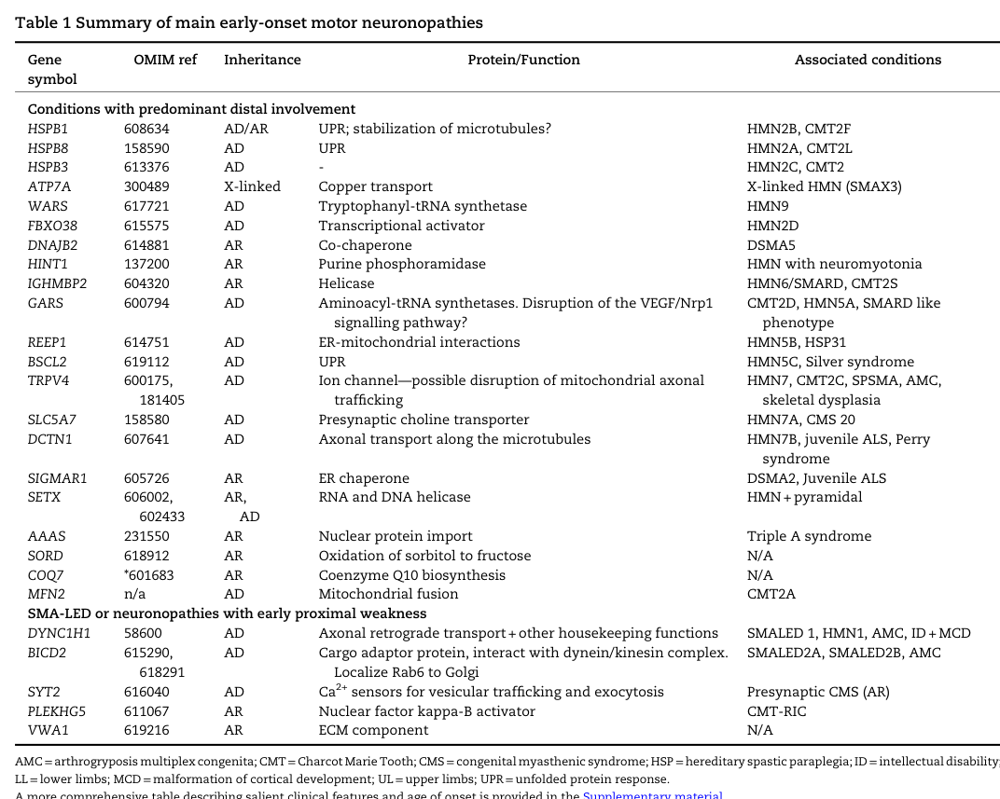

## Question

# Disease Characteristics Research Template

## Target Disease
- **Disease Name:** Distal Hereditary Motor Neuronopathy Autosomal Dominant
- **MONDO ID:**  (if available)
- **Category:** 

## Research Objectives

Please provide a comprehensive research report on **Distal Hereditary Motor Neuronopathy Autosomal Dominant** covering all of the
disease characteristics listed below. This report will be used to populate a disease knowledge
base entry. Be thorough and cite primary literature (PMID preferred) for all claims.

For each section, **suggested databases/resources** are listed. These are the first places
you should search for information on each topic.

---

### 1. Disease Information
> **Search first:** OMIM, Orphanet, ICD-10/ICD-11, MeSH, PubMed

- What is the disease? Provide a concise overview.
- What are the key identifiers? (OMIM, Orphanet, ICD-10/ICD-11, MeSH, Mondo)
- What are the common synonyms and alternative names?
- Is the information derived from individual patients (e.g., EHR) or aggregated disease-level resources?

### 2. Etiology

- **Disease Causal Factors**: What are the primary causes? (genetic, environmental, infectious, mechanistic)
- **Risk Factors**:
  > **Search first:** PubMed, Cochrane Library, UpToDate, clinical guidelines, ClinVar, ClinGen, GWAS Catalog, PheGenI, CTD, CDC, WHO, epidemiological databases
  - Genetic risk factors (causal variants, susceptibility loci, modifier genes)
  - Environmental risk factors (toxins, lifestyle, occupational exposures, age, sex, family history)
- **Protective Factors**:
  > **Search first:** PubMed, Cochrane Library, clinical trial databases, GWAS Catalog, gnomAD, WHO, CDC, nutrition databases
  - Genetic protective factors (protective variants, modifier alleles)
  - Environmental protective factors (diet, lifestyle, exposures that reduce risk)
- **Gene-Environment Interactions**: How do genetic and environmental factors interact to influence disease?
  > **Search first:** CTD, PubMed, PheGenI, GxE databases

### 3. Phenotypes
> **Search first:** HPO (Human Phenotype Ontology), OMIM, Orphanet, PubMed, clinicaltrials.gov, MedDRA, SNOMED CT, DECIPHER, LOINC

For each phenotype, provide:
- **Phenotype type**: symptoms, clinical signs, physical manifestations, behavioral changes, or laboratory abnormalities
  > For symptoms/signs: HPO, OMIM, Orphanet, PubMed
  > For behavioral changes: HPO, DSM, RDoC (Research Domain Criteria), PubMed
  > For laboratory abnormalities: LOINC, SNOMED CT, LabTests Online, PubMed
- **Phenotype characteristics**:
  > **Search first:** OMIM, Orphanet, HPO, PubMed
  - Age of symptom onset (neonatal, childhood, adult-onset, late-onset)
  - Symptom severity (mild, moderate, severe, variable)
  - Symptom progression (stable, progressive, episodic, fluctuating)
  - Frequency among affected individuals (percentage or qualitative)
- **Quality of life impact**: Effects on daily functioning and well-being (per-phenotype when possible)
  > **Search first:** EQ-5D database, SF-36, WHO QOL databases, PubMed
- Suggest HPO (Human Phenotype Ontology) terms for each phenotype

### 4. Genetic/Molecular Information

- **Causal Genes**: Gene mutations or chromosomal abnormalities responsible for disease (gene symbols, OMIM IDs)
  > **Search first:** OMIM, ClinVar, HGMD, Ensembl, NCBI Gene
- **Pathogenic Variants**:
  - Affected genes (gene symbols, HGNC IDs)
    > **Search first:** OMIM, NCBI Gene, Ensembl, HGNC, UniProt, GeneCards
  - Variant classification (pathogenic, likely pathogenic, VUS per ACMG/AMP guidelines)
    > **Search first:** ClinVar, ClinGen, ACMG/AMP guidelines, VarSome
  - Variant type/class (missense, frameshift, nonsense, splice-site, structural)
  - Allele frequency in population databases
    > **Search first:** gnomAD, 1000 Genomes, ExAC, TOPMed, dbSNP
  - Somatic vs germline origin
    > **Search first:** COSMIC (somatic), ClinVar, ICGC, TCGA
  - Functional consequences (loss of function, gain of function, dominant negative)
- **Modifier Genes**: Genes that modify disease severity or expression
- **Epigenetic Information**: DNA methylation, histone modifications, chromatin changes affecting disease
  > **Search first:** ENCODE, Roadmap Epigenomics, MethBase, DiseaseMeth
- **Chromosomal Abnormalities**: Large-scale genetic changes (aneuploidy, translocations, inversions)
  > **Search first:** DECIPHER, ClinVar, ECARUCA, UCSC Genome Browser

### 5. Environmental Information

- **Environmental Factors**: Non-genetic contributing factors (toxins, radiation, pollution, occupational exposure)
  > **Search first:** CTD (Comparative Toxicogenomics Database), TOXNET, PubMed, EPA databases
- **Lifestyle Factors**: Behavioral factors (smoking, diet, exercise, alcohol consumption)
  > **Search first:** CDC databases, WHO, PubMed, NHANES
- **Infectious Agents**: If applicable, pathogens causing or triggering disease (bacteria, viruses, fungi, parasites)
  > **Search first:** NCBI Taxonomy, ViPR, BV-BRC, MicrobeDB, GIDEON

### 6. Mechanism / Pathophysiology

- **Molecular Pathways**: Specific signaling cascades or biochemical pathways involved (Wnt, MAPK, mTOR, PI3K-AKT, etc.)
  > **Search first:** KEGG, Reactome, WikiPathways, PathBank, BioCyc
- **Cellular Processes**: Cell-level mechanisms (apoptosis, autophagy, cell cycle dysregulation, inflammation, etc.)
  > **Search first:** Gene Ontology (GO), Reactome, KEGG, PubMed
- **Protein Dysfunction**: How protein structure or function is altered (misfolding, aggregation, loss of function, gain of function)
  > **Search first:** UniProt, PDB (Protein Data Bank), InterPro, Pfam, AlphaFold
- **Metabolic Changes**: Alterations in metabolic processes (energy metabolism, lipid metabolism, amino acid metabolism)
  > **Search first:** KEGG, BioCyc, HMDB (Human Metabolome Database), BRENDA
- **Immune System Involvement**: Role of immune response (autoimmunity, immunodeficiency, chronic inflammation)
  > **Search first:** ImmPort, Immunome Database, IEDB, Gene Ontology
- **Tissue Damage Mechanisms**: How tissues/ are injured (oxidative stress, ischemia, fibrosis, necrosis)
  > **Search first:** PubMed, Gene Ontology, Reactome
- **Biochemical Abnormalities**: Specific molecular defects (enzyme deficiencies, receptor dysfunction, ion channel defects)
  > **Search first:** BRENDA, UniProt, KEGG, OMIM, PubMed
- **Epigenetic Changes**: DNA methylation, histone modifications affecting gene expression in disease
  > **Search first:** ENCODE, Roadmap Epigenomics, MethBase, DiseaseMeth
- **Molecular Profiling** (if available):
  - Transcriptomics/gene expression changes
    > **Search first:** GEO (Gene Expression Omnibus), ArrayExpress, GTEx, Human Cell Atlas, SRA
  - Proteomics findings
    > **Search first:** PRIDE, ProteomeXchange, Human Protein Atlas, STRING, BioGRID
  - Metabolomics signatures
    > **Search first:** MetaboLights, Metabolomics Workbench, HMDB, METLIN
  - Lipidomics alterations
    > **Search first:** LIPID MAPS, SwissLipids, LipidHome, Metabolomics Workbench
  - Genomic structural features
    > **Search first:** UCSC Genome Browser, Ensembl, NCBI, dbVar, DGV
- **Advanced Technologies** (if applicable):
  - Single-cell analysis findings (cell-type specific mechanisms, cellular heterogeneity)
    > **Search first:** Human Cell Atlas, Single Cell Portal, GEO, CELLxGENE
  - Spatial transcriptomics findings
    > **Search first:** GEO, Spatial Research, Vizgen, 10x Genomics data
  - Multi-omics integration results
    > **Search first:** TCGA, ICGC, cBioPortal, LinkedOmics, PubMed
  - Functional genomics screens (CRISPR, RNAi)
    > **Search first:** DepMap, GenomeRNAi, PubMed, BioGRID ORCS

For each mechanism, describe:
- The causal chain from initial trigger to clinical manifestation
- Which mechanisms are upstream vs downstream
- What cell types and biological processes are involved
- Suggest GO terms for biological processes and CL terms for cell types

### 7. Anatomical Structures Affected

- **Organ Level**:
  - Primary organs directly affected
  - Secondary organ involvement (complications, secondary effects)
  - Body systems involved (cardiovascular, nervous, digestive, respiratory, endocrine, etc.)
  > **Search first:** Uberon, FMA (Foundational Model of Anatomy), OMIM, HPO, ICD-11, MeSH, SNOMED CT
- **Tissue and Cell Level**:
  - Specific tissue types affected (epithelial, connective, muscle, nervous)
  - Specific cell populations targeted (with Cell Ontology terms)
  > **Search first:** Uberon, Human Protein Atlas, Cell Ontology, Human Cell Atlas, CellMarker, PanglaoDB
- **Subcellular Level**:
  - Cellular compartments involved (mitochondria, nucleus, ER, lysosomes) (with GO Cellular Component terms)
  > **Search first:** Gene Ontology (Cellular Component), UniProt, Human Protein Atlas
- **Localization**:
  - Specific anatomical sites (with UBERON terms)
    > **Search first:** FMA, Uberon, NeuroNames (for brain), SNOMED CT
  - Lateralization (unilateral, bilateral, asymmetric)
    > **Search first:** HPO, clinical literature, imaging databases

### 8. Temporal Development

- **Onset**:
  - Typical age of onset (congenital, pediatric, adult, geriatric)
  - Onset pattern (acute, subacute, chronic, insidious)
  > **Search first:** OMIM, Orphanet, HPO, PubMed
- **Progression**:
  - Disease stages (early, intermediate, advanced, end-stage)
    > **Search first:** Cancer Staging Manual (AJCC), WHO classifications, PubMed
  - Progression rate (rapid, slow, variable)
  - Disease course pattern (episodic, relapsing-remitting, progressive, stable)
  - Disease duration (self-limited, chronic lifelong)
  > **Search first:** Disease registries, longitudinal cohort databases, natural history studies, PubMed, Orphanet, OMIM
- **Patterns**:
  - Remission patterns (spontaneous, treatment-induced)
    > **Search first:** Clinical trial databases, disease registries, PubMed
  - Critical periods (time windows of vulnerability or opportunity for intervention)
    > **Search first:** PubMed, developmental biology databases, clinical guidelines

### 9. Inheritance and Population

- **Epidemiology**:
  - Prevalence (cases per 100,000 at given time)
  - Incidence (new cases per 100,000 per year)
  > **Search first:** Orphanet, CDC, WHO, GBD (Global Burden of Disease), national registries, SEER, disease registries
- **For Genetic Etiology**:
  - Inheritance pattern (AD, AR, X-linked, mitochondrial, multifactorial, polygenic)
    > **Search first:** OMIM, Orphanet, ClinVar, GTR (Genetic Testing Registry)
  - Penetrance (complete, incomplete, age-dependent)
    > **Search first:** ClinVar, OMIM, PubMed, ClinGen
  - Expressivity (variable, consistent)
    > **Search first:** OMIM, ClinVar, PubMed
  - Genetic anticipation (increasing severity in successive generations)
    > **Search first:** OMIM, PubMed (especially for repeat expansion disorders)
  - Germline mosaicism
    > **Search first:** ClinVar, OMIM, genetic counseling literature, PubMed
  - Founder effects (population-specific mutations)
    > **Search first:** gnomAD, population genetics databases, PubMed
  - Consanguinity role
    > **Search first:** OMIM, population studies, genetic counseling resources
  - Carrier frequency
    > **Search first:** gnomAD, carrier screening databases, GeneReviews, GTR
- **Population Demographics**:
  - Affected populations (ethnic or demographic groups with higher prevalence)
    > **Search first:** gnomAD, 1000 Genomes, PAGE Study, PubMed, population registries
  - Geographic distribution (endemic areas, regional variation)
    > **Search first:** WHO, CDC, GBD, Orphanet, geographic epidemiology databases
  - Geographic distribution of specific variants
  - Sex ratio (male:female)
    > **Search first:** Disease registries, OMIM, PubMed, epidemiological databases
  - Age distribution of affected individuals
    > **Search first:** CDC, disease registries, SEER, Orphanet

### 10. Diagnostics

- **Clinical Tests**:
  - Laboratory tests (blood, urine, tissue chemistry, specific enzyme assays)
    > **Search first:** LOINC, LabTests Online, PubMed
  - Biomarkers (proteins, metabolites, genetic markers, circulating biomarkers)
    > **Search first:** FDA Biomarker List, BEST (Biomarkers, EndpointS, and other Tools), PubMed
  - Imaging studies (X-ray, CT, MRI, PET, ultrasound)
    > **Search first:** RadLex, DICOM, Radiopaedia, imaging databases
  - Functional tests (pulmonary function, cardiac stress tests)
    > **Search first:** LOINC, clinical guidelines, PubMed
  - Electrophysiology (EEG, EMG, ECG, nerve conduction studies)
    > **Search first:** LOINC, clinical neurophysiology databases, PubMed
  - Biopsy findings (histopathology, immunohistochemistry)
    > **Search first:** SNOMED CT, College of American Pathologists resources, PubMed
  - Pathology findings (microscopic examination)
    > **Search first:** SNOMED CT, Digital Pathology databases, PubMed
- **Genetic Testing**:
  > **Search first:** GTR (Genetic Testing Registry), GeneReviews, ClinGen
  - Overview of recommended genetic testing approach
  - Whole genome sequencing (WGS) utility
    > **Search first:** GTR, ClinVar, GEL (Genomics England), gnomAD
  - Whole exome sequencing (WES) utility
    > **Search first:** GTR, ClinVar, OMIM, GeneMatcher
  - Gene panels (which panels, which genes)
    > **Search first:** GTR, ClinVar, laboratory-specific databases
  - Single gene testing
    > **Search first:** GTR, ClinVar, OMIM, GeneReviews
  - Chromosomal microarray (CMA)
    > **Search first:** DECIPHER, ClinVar, dbVar, ECARUCA
  - Karyotyping
    > **Search first:** Chromosome Abnormality Database, ClinVar, cytogenetics resources
  - FISH
    > **Search first:** ClinVar, cytogenetics databases, PubMed
  - Mitochondrial DNA testing
    > **Search first:** MITOMAP, MSeqDR, ClinVar, GTR
  - Repeat expansion testing
    > **Search first:** GTR, ClinVar, repeat expansion databases, PubMed
- **Omics-Based Diagnostics** (if applicable):
  - RNA sequencing / transcriptomics
    > **Search first:** GEO, ArrayExpress, GTEx, RNA-seq databases
  - Proteomics
    > **Search first:** PRIDE, ProteomeXchange, FDA Biomarker database
  - Metabolomics
    > **Search first:** MetaboLights, Metabolomics Workbench, HMDB
  - Epigenomics
    > **Search first:** GEO, ENCODE, Roadmap Epigenomics, MethBase
  - Liquid biopsy
    > **Search first:** COSMIC, ClinVar, liquid biopsy databases, PubMed
- **Clinical Criteria**:
  - Standardized diagnostic criteria (DSM, ICD, society guidelines)
    > **Search first:** DSM-5, ICD-11, clinical society guidelines, UpToDate
  - Differential diagnosis (other conditions to rule out, with distinguishing features)
    > **Search first:** DynaMed, UpToDate, clinical decision support systems
- **Screening**:
  - Screening methods for asymptomatic individuals (newborn screening, carrier screening, cascade screening)
    > **Search first:** ACMG recommendations, CDC newborn screening, GTR

### 11. Outcome/Prognosis

- **Survival and Mortality**:
  - Survival rate (5-year, 10-year, overall)
    > **Search first:** SEER, cancer registries, disease-specific registries, PubMed
  - Life expectancy (with and without treatment if applicable)
    > **Search first:** Orphanet, disease registries, actuarial databases, PubMed
  - Mortality rate
    > **Search first:** CDC, WHO, GBD, national mortality databases
  - Disease-specific mortality (deaths directly attributable to disease)
    > **Search first:** Disease registries, CDC Wonder, GBD, PubMed
- **Morbidity and Function**:
  - Morbidity (disease-related disability and health impacts)
    > **Search first:** GBD, WHO, disability databases, PubMed
  - Disability outcomes (long-term functional impairments)
    > **Search first:** ICF (International Classification of Functioning), disability registries
  - Quality of life measures (EQ-5D, SF-36, PROMIS, disease-specific tools)
    > **Search first:** EQ-5D database, SF-36, PROMIS, PubMed
- **Disease Course**:
  - Complications (secondary problems: infections, organ failure, etc.)
    > **Search first:** ICD codes, disease registries, clinical databases, PubMed
  - Recovery potential (likelihood and extent of recovery, with vs without treatment)
    > **Search first:** Natural history studies, rehabilitation databases, PubMed
- **Prediction**:
  - Prognostic factors (age, disease severity, biomarkers, treatment response)
    > **Search first:** Prognostic models databases, clinical calculators, PubMed
  - Prognostic biomarkers (molecular markers predicting disease course)
    > **Search first:** FDA Biomarker database, PubMed, cancer prognostic databases

### 12. Treatment

- **Pharmacotherapy**:
  - Pharmacological treatments (drug names, drug classes, mechanisms of action)
    > **Search first:** DrugBank, RxNorm, ATC classification, DailyMed, FDA databases
  - Pharmacogenomics (how genetic variants affect drug metabolism, efficacy, toxicity)
    > **Search first:** PharmGKB, CPIC (Clinical Pharmacogenetics), FDA Table of PGx Biomarkers
- **Advanced Therapeutics**:
  - Gene therapy (viral vectors, CRISPR, gene replacement, gene editing)
    > **Search first:** ClinicalTrials.gov, FDA gene therapy database, ASGCT resources
  - Cell therapy (stem cell transplant, CAR-T, cellular therapeutics)
    > **Search first:** ClinicalTrials.gov, FDA cell therapy database, FACT standards
  - RNA-based therapies (ASOs, siRNA, mRNA therapies)
    > **Search first:** ClinicalTrials.gov, FDA approvals, PubMed
  - Targeted therapies (treatments directed at specific molecular targets)
    > **Search first:** My Cancer Genome, OncoKB, ClinicalTrials.gov, FDA approvals
  - Immunotherapies (checkpoint inhibitors, monoclonal antibodies)
    > **Search first:** Cancer Immunotherapy Database, FDA approvals, ClinicalTrials.gov
- **Surgical and Interventional**:
  - Surgical interventions (types of surgery, timing, outcomes)
    > **Search first:** CPT codes, surgical registries, clinical guidelines, PubMed
- **Supportive and Rehabilitative**:
  - Supportive care (symptom management, pain control, nutrition)
    > **Search first:** Clinical guidelines, Cochrane Library, PubMed
  - Rehabilitation (physical therapy, occupational therapy, speech therapy)
    > **Search first:** Rehabilitation medicine databases, clinical guidelines, PubMed
- **Experimental**:
  - Experimental treatments in clinical trials (with NCT identifiers if available)
    > **Search first:** ClinicalTrials.gov, EU Clinical Trials Register, WHO ICTRP
- **Treatment Outcomes**:
  - Treatment response rates
    > **Search first:** Clinical trial databases, FDA reviews, systematic reviews, PubMed
  - Side effects and adverse events
    > **Search first:** FDA Adverse Event Reporting System (FAERS), MedWatch, PubMed
- **Treatment Strategy**:
  - Treatment algorithms (clinical pathways, decision trees)
    > **Search first:** Clinical practice guidelines, NCCN Guidelines, UpToDate
  - Combination therapies
    > **Search first:** ClinicalTrials.gov, treatment guidelines, PubMed
  - Personalized medicine approaches (genotype-guided treatment)
    > **Search first:** My Cancer Genome, CIViC, PharmGKB, precision medicine databases

For each treatment, suggest MAXO (Medical Action Ontology) terms where applicable.

### 13. Prevention

- **Prevention Levels**:
  - Primary prevention (preventing disease occurrence: vaccination, risk factor modification)
    > **Search first:** CDC, WHO, USPSTF recommendations, Cochrane Library
  - Secondary prevention (early detection and treatment: screening programs, early intervention)
    > **Search first:** USPSTF, CDC screening guidelines, WHO
  - Tertiary prevention (preventing complications in those with disease)
    > **Search first:** Clinical guidelines, disease management protocols, PubMed
- **Immunization**: Vaccine strategies (if applicable)
  > **Search first:** CDC vaccine schedules, WHO immunization, FDA vaccine database
- **Screening and Early Detection**:
  - Screening programs (population-based: newborn screening, cancer screening)
    > **Search first:** CDC screening programs, USPSTF, cancer screening databases
  - Genetic screening (carrier screening, preimplantation genetic diagnosis, prenatal testing)
    > **Search first:** ACMG recommendations, ACOG guidelines, GTR
  - Risk stratification (identifying high-risk individuals for targeted prevention)
    > **Search first:** Risk prediction models, clinical calculators, PubMed
- **Behavioral Interventions**: Lifestyle modifications to reduce risk
  > **Search first:** CDC, WHO, behavioral intervention databases, Cochrane Library
- **Counseling**: Genetic counseling (risk assessment, family planning guidance)
  > **Search first:** NSGC resources, ACMG guidelines, GeneReviews
- **Public Health**:
  - Public health interventions (sanitation, vector control, health education)
    > **Search first:** CDC, WHO, public health databases, PubMed
  - Environmental interventions (reducing environmental risk factors)
    > **Search first:** EPA databases, WHO environmental health, PubMed
- **Prophylaxis**: Preventive medications or procedures
  > **Search first:** Clinical guidelines, FDA approvals, PubMed

### 14. Other Species / Natural Disease

- **Taxonomy**: Species affected (with NCBI Taxon identifiers)
  > **Search first:** NCBI Taxonomy
- **Breed**: Specific breeds affected (with VBO identifiers if applicable)
  > **Search first:** VBO (Vertebrate Breed Ontology)
- **Gene**: Orthologous genes in other species (with NCBI Gene IDs)
  > **Search first:** NCBI Gene
- **Natural Disease**:
  - Naturally occurring disease in other species (companion animals, wildlife)
    > **Search first:** OMIA (Online Mendelian Inheritance in Animals), VetCompass, PubMed
  - Veterinary relevance and importance in animal health
    > **Search first:** OMIA, veterinary databases, PubMed
- **Comparative Biology**:
  - Comparative pathology (similarities and differences across species)
    > **Search first:** OMIA, comparative pathology databases, PubMed
  - Evolutionary conservation of disease mechanisms
    > **Search first:** HomoloGene, OrthoMCL, Alliance of Genome Resources
- **Transmission** (if applicable):
  - Zoonotic potential
    > **Search first:** CDC zoonotic diseases, WHO zoonoses, GIDEON
  - Cross-species susceptibility
    > **Search first:** NCBI Taxonomy, veterinary databases, PubMed

### 15. Model Organisms

- **Model Types**:
  - Model organism type (mammalian, invertebrate, cellular, in vitro)
    > **Search first:** Alliance of Genome Resources, model organism databases
  - Specific model systems (mouse, rat, zebrafish, Drosophila, C. elegans, yeast, cell lines, organoids, iPSCs)
    > **Search first:** MGI, RGD, ZFIN, FlyBase, WormBase, SGD, ATCC, Cellosaurus
  - Induced models (drug treatment, surgical intervention, environmental manipulation)
    > **Search first:** MGI, model organism databases, PubMed
- **Genetic Models**:
  - Types available (knockout, knock-in, transgenic, conditional, humanized)
    > **Search first:** MGI, IMPC, KOMP, EuMMCR, IMSR
- **Model Characteristics**:
  - Phenotype recapitulation (how well model reproduces human disease features)
    > **Search first:** Model organism databases, comparative studies, PubMed
  - Model limitations (aspects of human disease not captured)
    > **Search first:** Model organism databases, PubMed, review articles
- **Applications**:
  - Research applications (what aspects of disease can be studied)
    > **Search first:** Model organism databases, PubMed
- **Resources**:
  - Model databases
    > **Search first:** MGI, RGD, ZFIN, FlyBase, WormBase, IMSR, EMMA, MMRRC

---

## Citation Requirements

- Cite primary literature (PMID preferred) for all mechanistic and clinical claims
- Prioritize recent reviews and landmark papers
- Include direct quotes from abstracts where possible to support key statements
- Distinguish evidence source types: human clinical, model organism, in vitro, computational

## Output Format

Structure your response as a comprehensive narrative organized by the sections above.
For each section, provide:
- Factual content with specific details (numbers, percentages, gene names, variant nomenclature)
- Ontology term suggestions (HPO, GO, CL, UBERON, CHEBI, MAXO, MONDO) where applicable
- Evidence citations with PMIDs
- Direct quotes from abstracts to support key claims
- Clear indication when information is not available or not applicable for this disease

This report will be used to populate a disease knowledge base entry with:
- Pathophysiology descriptions with causal chains
- Gene/protein annotations (HGNC, GO terms)
- Phenotype associations (HP terms) with frequencies
- Cell type involvement (CL terms)
- Anatomical locations (UBERON terms)
- Chemical entities (CHEBI terms)
- Treatment annotations (MAXO terms)
- Evidence items with PMIDs and exact abstract quotes
- Epidemiology, prognosis, diagnostic, and prevention information
- Animal model descriptions with phenotype recapitulation details

## Output

Question: You are an expert researcher providing comprehensive, well-cited information.

Provide detailed information focusing on:
1. Key concepts and definitions with current understanding
2. Recent developments and latest research (prioritize 2023-2024 sources)
3. Current applications and real-world implementations
4. Expert opinions and analysis from authoritative sources
5. Relevant statistics and data from recent studies

Format as a comprehensive research report with proper citations. Include URLs and publication dates where available.
Always prioritize recent, authoritative sources and provide specific citations for all major claims.

# Disease Characteristics Research Template

## Target Disease
- **Disease Name:** Distal Hereditary Motor Neuronopathy Autosomal Dominant
- **MONDO ID:**  (if available)
- **Category:** 

## Research Objectives

Please provide a comprehensive research report on **Distal Hereditary Motor Neuronopathy Autosomal Dominant** covering all of the
disease characteristics listed below. This report will be used to populate a disease knowledge
base entry. Be thorough and cite primary literature (PMID preferred) for all claims.

For each section, **suggested databases/resources** are listed. These are the first places
you should search for information on each topic.

---

### 1. Disease Information
> **Search first:** OMIM, Orphanet, ICD-10/ICD-11, MeSH, PubMed

- What is the disease? Provide a concise overview.
- What are the key identifiers? (OMIM, Orphanet, ICD-10/ICD-11, MeSH, Mondo)
- What are the common synonyms and alternative names?
- Is the information derived from individual patients (e.g., EHR) or aggregated disease-level resources?

### 2. Etiology

- **Disease Causal Factors**: What are the primary causes? (genetic, environmental, infectious, mechanistic)
- **Risk Factors**:
  > **Search first:** PubMed, Cochrane Library, UpToDate, clinical guidelines, ClinVar, ClinGen, GWAS Catalog, PheGenI, CTD, CDC, WHO, epidemiological databases
  - Genetic risk factors (causal variants, susceptibility loci, modifier genes)
  - Environmental risk factors (toxins, lifestyle, occupational exposures, age, sex, family history)
- **Protective Factors**:
  > **Search first:** PubMed, Cochrane Library, clinical trial databases, GWAS Catalog, gnomAD, WHO, CDC, nutrition databases
  - Genetic protective factors (protective variants, modifier alleles)
  - Environmental protective factors (diet, lifestyle, exposures that reduce risk)
- **Gene-Environment Interactions**: How do genetic and environmental factors interact to influence disease?
  > **Search first:** CTD, PubMed, PheGenI, GxE databases

### 3. Phenotypes
> **Search first:** HPO (Human Phenotype Ontology), OMIM, Orphanet, PubMed, clinicaltrials.gov, MedDRA, SNOMED CT, DECIPHER, LOINC

For each phenotype, provide:
- **Phenotype type**: symptoms, clinical signs, physical manifestations, behavioral changes, or laboratory abnormalities
  > For symptoms/signs: HPO, OMIM, Orphanet, PubMed
  > For behavioral changes: HPO, DSM, RDoC (Research Domain Criteria), PubMed
  > For laboratory abnormalities: LOINC, SNOMED CT, LabTests Online, PubMed
- **Phenotype characteristics**:
  > **Search first:** OMIM, Orphanet, HPO, PubMed
  - Age of symptom onset (neonatal, childhood, adult-onset, late-onset)
  - Symptom severity (mild, moderate, severe, variable)
  - Symptom progression (stable, progressive, episodic, fluctuating)
  - Frequency among affected individuals (percentage or qualitative)
- **Quality of life impact**: Effects on daily functioning and well-being (per-phenotype when possible)
  > **Search first:** EQ-5D database, SF-36, WHO QOL databases, PubMed
- Suggest HPO (Human Phenotype Ontology) terms for each phenotype

### 4. Genetic/Molecular Information

- **Causal Genes**: Gene mutations or chromosomal abnormalities responsible for disease (gene symbols, OMIM IDs)
  > **Search first:** OMIM, ClinVar, HGMD, Ensembl, NCBI Gene
- **Pathogenic Variants**:
  - Affected genes (gene symbols, HGNC IDs)
    > **Search first:** OMIM, NCBI Gene, Ensembl, HGNC, UniProt, GeneCards
  - Variant classification (pathogenic, likely pathogenic, VUS per ACMG/AMP guidelines)
    > **Search first:** ClinVar, ClinGen, ACMG/AMP guidelines, VarSome
  - Variant type/class (missense, frameshift, nonsense, splice-site, structural)
  - Allele frequency in population databases
    > **Search first:** gnomAD, 1000 Genomes, ExAC, TOPMed, dbSNP
  - Somatic vs germline origin
    > **Search first:** COSMIC (somatic), ClinVar, ICGC, TCGA
  - Functional consequences (loss of function, gain of function, dominant negative)
- **Modifier Genes**: Genes that modify disease severity or expression
- **Epigenetic Information**: DNA methylation, histone modifications, chromatin changes affecting disease
  > **Search first:** ENCODE, Roadmap Epigenomics, MethBase, DiseaseMeth
- **Chromosomal Abnormalities**: Large-scale genetic changes (aneuploidy, translocations, inversions)
  > **Search first:** DECIPHER, ClinVar, ECARUCA, UCSC Genome Browser

### 5. Environmental Information

- **Environmental Factors**: Non-genetic contributing factors (toxins, radiation, pollution, occupational exposure)
  > **Search first:** CTD (Comparative Toxicogenomics Database), TOXNET, PubMed, EPA databases
- **Lifestyle Factors**: Behavioral factors (smoking, diet, exercise, alcohol consumption)
  > **Search first:** CDC databases, WHO, PubMed, NHANES
- **Infectious Agents**: If applicable, pathogens causing or triggering disease (bacteria, viruses, fungi, parasites)
  > **Search first:** NCBI Taxonomy, ViPR, BV-BRC, MicrobeDB, GIDEON

### 6. Mechanism / Pathophysiology

- **Molecular Pathways**: Specific signaling cascades or biochemical pathways involved (Wnt, MAPK, mTOR, PI3K-AKT, etc.)
  > **Search first:** KEGG, Reactome, WikiPathways, PathBank, BioCyc
- **Cellular Processes**: Cell-level mechanisms (apoptosis, autophagy, cell cycle dysregulation, inflammation, etc.)
  > **Search first:** Gene Ontology (GO), Reactome, KEGG, PubMed
- **Protein Dysfunction**: How protein structure or function is altered (misfolding, aggregation, loss of function, gain of function)
  > **Search first:** UniProt, PDB (Protein Data Bank), InterPro, Pfam, AlphaFold
- **Metabolic Changes**: Alterations in metabolic processes (energy metabolism, lipid metabolism, amino acid metabolism)
  > **Search first:** KEGG, BioCyc, HMDB (Human Metabolome Database), BRENDA
- **Immune System Involvement**: Role of immune response (autoimmunity, immunodeficiency, chronic inflammation)
  > **Search first:** ImmPort, Immunome Database, IEDB, Gene Ontology
- **Tissue Damage Mechanisms**: How tissues/ are injured (oxidative stress, ischemia, fibrosis, necrosis)
  > **Search first:** PubMed, Gene Ontology, Reactome
- **Biochemical Abnormalities**: Specific molecular defects (enzyme deficiencies, receptor dysfunction, ion channel defects)
  > **Search first:** BRENDA, UniProt, KEGG, OMIM, PubMed
- **Epigenetic Changes**: DNA methylation, histone modifications affecting gene expression in disease
  > **Search first:** ENCODE, Roadmap Epigenomics, MethBase, DiseaseMeth
- **Molecular Profiling** (if available):
  - Transcriptomics/gene expression changes
    > **Search first:** GEO (Gene Expression Omnibus), ArrayExpress, GTEx, Human Cell Atlas, SRA
  - Proteomics findings
    > **Search first:** PRIDE, ProteomeXchange, Human Protein Atlas, STRING, BioGRID
  - Metabolomics signatures
    > **Search first:** MetaboLights, Metabolomics Workbench, HMDB, METLIN
  - Lipidomics alterations
    > **Search first:** LIPID MAPS, SwissLipids, LipidHome, Metabolomics Workbench
  - Genomic structural features
    > **Search first:** UCSC Genome Browser, Ensembl, NCBI, dbVar, DGV
- **Advanced Technologies** (if applicable):
  - Single-cell analysis findings (cell-type specific mechanisms, cellular heterogeneity)
    > **Search first:** Human Cell Atlas, Single Cell Portal, GEO, CELLxGENE
  - Spatial transcriptomics findings
    > **Search first:** GEO, Spatial Research, Vizgen, 10x Genomics data
  - Multi-omics integration results
    > **Search first:** TCGA, ICGC, cBioPortal, LinkedOmics, PubMed
  - Functional genomics screens (CRISPR, RNAi)
    > **Search first:** DepMap, GenomeRNAi, PubMed, BioGRID ORCS

For each mechanism, describe:
- The causal chain from initial trigger to clinical manifestation
- Which mechanisms are upstream vs downstream
- What cell types and biological processes are involved
- Suggest GO terms for biological processes and CL terms for cell types

### 7. Anatomical Structures Affected

- **Organ Level**:
  - Primary organs directly affected
  - Secondary organ involvement (complications, secondary effects)
  - Body systems involved (cardiovascular, nervous, digestive, respiratory, endocrine, etc.)
  > **Search first:** Uberon, FMA (Foundational Model of Anatomy), OMIM, HPO, ICD-11, MeSH, SNOMED CT
- **Tissue and Cell Level**:
  - Specific tissue types affected (epithelial, connective, muscle, nervous)
  - Specific cell populations targeted (with Cell Ontology terms)
  > **Search first:** Uberon, Human Protein Atlas, Cell Ontology, Human Cell Atlas, CellMarker, PanglaoDB
- **Subcellular Level**:
  - Cellular compartments involved (mitochondria, nucleus, ER, lysosomes) (with GO Cellular Component terms)
  > **Search first:** Gene Ontology (Cellular Component), UniProt, Human Protein Atlas
- **Localization**:
  - Specific anatomical sites (with UBERON terms)
    > **Search first:** FMA, Uberon, NeuroNames (for brain), SNOMED CT
  - Lateralization (unilateral, bilateral, asymmetric)
    > **Search first:** HPO, clinical literature, imaging databases

### 8. Temporal Development

- **Onset**:
  - Typical age of onset (congenital, pediatric, adult, geriatric)
  - Onset pattern (acute, subacute, chronic, insidious)
  > **Search first:** OMIM, Orphanet, HPO, PubMed
- **Progression**:
  - Disease stages (early, intermediate, advanced, end-stage)
    > **Search first:** Cancer Staging Manual (AJCC), WHO classifications, PubMed
  - Progression rate (rapid, slow, variable)
  - Disease course pattern (episodic, relapsing-remitting, progressive, stable)
  - Disease duration (self-limited, chronic lifelong)
  > **Search first:** Disease registries, longitudinal cohort databases, natural history studies, PubMed, Orphanet, OMIM
- **Patterns**:
  - Remission patterns (spontaneous, treatment-induced)
    > **Search first:** Clinical trial databases, disease registries, PubMed
  - Critical periods (time windows of vulnerability or opportunity for intervention)
    > **Search first:** PubMed, developmental biology databases, clinical guidelines

### 9. Inheritance and Population

- **Epidemiology**:
  - Prevalence (cases per 100,000 at given time)
  - Incidence (new cases per 100,000 per year)
  > **Search first:** Orphanet, CDC, WHO, GBD (Global Burden of Disease), national registries, SEER, disease registries
- **For Genetic Etiology**:
  - Inheritance pattern (AD, AR, X-linked, mitochondrial, multifactorial, polygenic)
    > **Search first:** OMIM, Orphanet, ClinVar, GTR (Genetic Testing Registry)
  - Penetrance (complete, incomplete, age-dependent)
    > **Search first:** ClinVar, OMIM, PubMed, ClinGen
  - Expressivity (variable, consistent)
    > **Search first:** OMIM, ClinVar, PubMed
  - Genetic anticipation (increasing severity in successive generations)
    > **Search first:** OMIM, PubMed (especially for repeat expansion disorders)
  - Germline mosaicism
    > **Search first:** ClinVar, OMIM, genetic counseling literature, PubMed
  - Founder effects (population-specific mutations)
    > **Search first:** gnomAD, population genetics databases, PubMed
  - Consanguinity role
    > **Search first:** OMIM, population studies, genetic counseling resources
  - Carrier frequency
    > **Search first:** gnomAD, carrier screening databases, GeneReviews, GTR
- **Population Demographics**:
  - Affected populations (ethnic or demographic groups with higher prevalence)
    > **Search first:** gnomAD, 1000 Genomes, PAGE Study, PubMed, population registries
  - Geographic distribution (endemic areas, regional variation)
    > **Search first:** WHO, CDC, GBD, Orphanet, geographic epidemiology databases
  - Geographic distribution of specific variants
  - Sex ratio (male:female)
    > **Search first:** Disease registries, OMIM, PubMed, epidemiological databases
  - Age distribution of affected individuals
    > **Search first:** CDC, disease registries, SEER, Orphanet

### 10. Diagnostics

- **Clinical Tests**:
  - Laboratory tests (blood, urine, tissue chemistry, specific enzyme assays)
    > **Search first:** LOINC, LabTests Online, PubMed
  - Biomarkers (proteins, metabolites, genetic markers, circulating biomarkers)
    > **Search first:** FDA Biomarker List, BEST (Biomarkers, EndpointS, and other Tools), PubMed
  - Imaging studies (X-ray, CT, MRI, PET, ultrasound)
    > **Search first:** RadLex, DICOM, Radiopaedia, imaging databases
  - Functional tests (pulmonary function, cardiac stress tests)
    > **Search first:** LOINC, clinical guidelines, PubMed
  - Electrophysiology (EEG, EMG, ECG, nerve conduction studies)
    > **Search first:** LOINC, clinical neurophysiology databases, PubMed
  - Biopsy findings (histopathology, immunohistochemistry)
    > **Search first:** SNOMED CT, College of American Pathologists resources, PubMed
  - Pathology findings (microscopic examination)
    > **Search first:** SNOMED CT, Digital Pathology databases, PubMed
- **Genetic Testing**:
  > **Search first:** GTR (Genetic Testing Registry), GeneReviews, ClinGen
  - Overview of recommended genetic testing approach
  - Whole genome sequencing (WGS) utility
    > **Search first:** GTR, ClinVar, GEL (Genomics England), gnomAD
  - Whole exome sequencing (WES) utility
    > **Search first:** GTR, ClinVar, OMIM, GeneMatcher
  - Gene panels (which panels, which genes)
    > **Search first:** GTR, ClinVar, laboratory-specific databases
  - Single gene testing
    > **Search first:** GTR, ClinVar, OMIM, GeneReviews
  - Chromosomal microarray (CMA)
    > **Search first:** DECIPHER, ClinVar, dbVar, ECARUCA
  - Karyotyping
    > **Search first:** Chromosome Abnormality Database, ClinVar, cytogenetics resources
  - FISH
    > **Search first:** ClinVar, cytogenetics databases, PubMed
  - Mitochondrial DNA testing
    > **Search first:** MITOMAP, MSeqDR, ClinVar, GTR
  - Repeat expansion testing
    > **Search first:** GTR, ClinVar, repeat expansion databases, PubMed
- **Omics-Based Diagnostics** (if applicable):
  - RNA sequencing / transcriptomics
    > **Search first:** GEO, ArrayExpress, GTEx, RNA-seq databases
  - Proteomics
    > **Search first:** PRIDE, ProteomeXchange, FDA Biomarker database
  - Metabolomics
    > **Search first:** MetaboLights, Metabolomics Workbench, HMDB
  - Epigenomics
    > **Search first:** GEO, ENCODE, Roadmap Epigenomics, MethBase
  - Liquid biopsy
    > **Search first:** COSMIC, ClinVar, liquid biopsy databases, PubMed
- **Clinical Criteria**:
  - Standardized diagnostic criteria (DSM, ICD, society guidelines)
    > **Search first:** DSM-5, ICD-11, clinical society guidelines, UpToDate
  - Differential diagnosis (other conditions to rule out, with distinguishing features)
    > **Search first:** DynaMed, UpToDate, clinical decision support systems
- **Screening**:
  - Screening methods for asymptomatic individuals (newborn screening, carrier screening, cascade screening)
    > **Search first:** ACMG recommendations, CDC newborn screening, GTR

### 11. Outcome/Prognosis

- **Survival and Mortality**:
  - Survival rate (5-year, 10-year, overall)
    > **Search first:** SEER, cancer registries, disease-specific registries, PubMed
  - Life expectancy (with and without treatment if applicable)
    > **Search first:** Orphanet, disease registries, actuarial databases, PubMed
  - Mortality rate
    > **Search first:** CDC, WHO, GBD, national mortality databases
  - Disease-specific mortality (deaths directly attributable to disease)
    > **Search first:** Disease registries, CDC Wonder, GBD, PubMed
- **Morbidity and Function**:
  - Morbidity (disease-related disability and health impacts)
    > **Search first:** GBD, WHO, disability databases, PubMed
  - Disability outcomes (long-term functional impairments)
    > **Search first:** ICF (International Classification of Functioning), disability registries
  - Quality of life measures (EQ-5D, SF-36, PROMIS, disease-specific tools)
    > **Search first:** EQ-5D database, SF-36, PROMIS, PubMed
- **Disease Course**:
  - Complications (secondary problems: infections, organ failure, etc.)
    > **Search first:** ICD codes, disease registries, clinical databases, PubMed
  - Recovery potential (likelihood and extent of recovery, with vs without treatment)
    > **Search first:** Natural history studies, rehabilitation databases, PubMed
- **Prediction**:
  - Prognostic factors (age, disease severity, biomarkers, treatment response)
    > **Search first:** Prognostic models databases, clinical calculators, PubMed
  - Prognostic biomarkers (molecular markers predicting disease course)
    > **Search first:** FDA Biomarker database, PubMed, cancer prognostic databases

### 12. Treatment

- **Pharmacotherapy**:
  - Pharmacological treatments (drug names, drug classes, mechanisms of action)
    > **Search first:** DrugBank, RxNorm, ATC classification, DailyMed, FDA databases
  - Pharmacogenomics (how genetic variants affect drug metabolism, efficacy, toxicity)
    > **Search first:** PharmGKB, CPIC (Clinical Pharmacogenetics), FDA Table of PGx Biomarkers
- **Advanced Therapeutics**:
  - Gene therapy (viral vectors, CRISPR, gene replacement, gene editing)
    > **Search first:** ClinicalTrials.gov, FDA gene therapy database, ASGCT resources
  - Cell therapy (stem cell transplant, CAR-T, cellular therapeutics)
    > **Search first:** ClinicalTrials.gov, FDA cell therapy database, FACT standards
  - RNA-based therapies (ASOs, siRNA, mRNA therapies)
    > **Search first:** ClinicalTrials.gov, FDA approvals, PubMed
  - Targeted therapies (treatments directed at specific molecular targets)
    > **Search first:** My Cancer Genome, OncoKB, ClinicalTrials.gov, FDA approvals
  - Immunotherapies (checkpoint inhibitors, monoclonal antibodies)
    > **Search first:** Cancer Immunotherapy Database, FDA approvals, ClinicalTrials.gov
- **Surgical and Interventional**:
  - Surgical interventions (types of surgery, timing, outcomes)
    > **Search first:** CPT codes, surgical registries, clinical guidelines, PubMed
- **Supportive and Rehabilitative**:
  - Supportive care (symptom management, pain control, nutrition)
    > **Search first:** Clinical guidelines, Cochrane Library, PubMed
  - Rehabilitation (physical therapy, occupational therapy, speech therapy)
    > **Search first:** Rehabilitation medicine databases, clinical guidelines, PubMed
- **Experimental**:
  - Experimental treatments in clinical trials (with NCT identifiers if available)
    > **Search first:** ClinicalTrials.gov, EU Clinical Trials Register, WHO ICTRP
- **Treatment Outcomes**:
  - Treatment response rates
    > **Search first:** Clinical trial databases, FDA reviews, systematic reviews, PubMed
  - Side effects and adverse events
    > **Search first:** FDA Adverse Event Reporting System (FAERS), MedWatch, PubMed
- **Treatment Strategy**:
  - Treatment algorithms (clinical pathways, decision trees)
    > **Search first:** Clinical practice guidelines, NCCN Guidelines, UpToDate
  - Combination therapies
    > **Search first:** ClinicalTrials.gov, treatment guidelines, PubMed
  - Personalized medicine approaches (genotype-guided treatment)
    > **Search first:** My Cancer Genome, CIViC, PharmGKB, precision medicine databases

For each treatment, suggest MAXO (Medical Action Ontology) terms where applicable.

### 13. Prevention

- **Prevention Levels**:
  - Primary prevention (preventing disease occurrence: vaccination, risk factor modification)
    > **Search first:** CDC, WHO, USPSTF recommendations, Cochrane Library
  - Secondary prevention (early detection and treatment: screening programs, early intervention)
    > **Search first:** USPSTF, CDC screening guidelines, WHO
  - Tertiary prevention (preventing complications in those with disease)
    > **Search first:** Clinical guidelines, disease management protocols, PubMed
- **Immunization**: Vaccine strategies (if applicable)
  > **Search first:** CDC vaccine schedules, WHO immunization, FDA vaccine database
- **Screening and Early Detection**:
  - Screening programs (population-based: newborn screening, cancer screening)
    > **Search first:** CDC screening programs, USPSTF, cancer screening databases
  - Genetic screening (carrier screening, preimplantation genetic diagnosis, prenatal testing)
    > **Search first:** ACMG recommendations, ACOG guidelines, GTR
  - Risk stratification (identifying high-risk individuals for targeted prevention)
    > **Search first:** Risk prediction models, clinical calculators, PubMed
- **Behavioral Interventions**: Lifestyle modifications to reduce risk
  > **Search first:** CDC, WHO, behavioral intervention databases, Cochrane Library
- **Counseling**: Genetic counseling (risk assessment, family planning guidance)
  > **Search first:** NSGC resources, ACMG guidelines, GeneReviews
- **Public Health**:
  - Public health interventions (sanitation, vector control, health education)
    > **Search first:** CDC, WHO, public health databases, PubMed
  - Environmental interventions (reducing environmental risk factors)
    > **Search first:** EPA databases, WHO environmental health, PubMed
- **Prophylaxis**: Preventive medications or procedures
  > **Search first:** Clinical guidelines, FDA approvals, PubMed

### 14. Other Species / Natural Disease

- **Taxonomy**: Species affected (with NCBI Taxon identifiers)
  > **Search first:** NCBI Taxonomy
- **Breed**: Specific breeds affected (with VBO identifiers if applicable)
  > **Search first:** VBO (Vertebrate Breed Ontology)
- **Gene**: Orthologous genes in other species (with NCBI Gene IDs)
  > **Search first:** NCBI Gene
- **Natural Disease**:
  - Naturally occurring disease in other species (companion animals, wildlife)
    > **Search first:** OMIA (Online Mendelian Inheritance in Animals), VetCompass, PubMed
  - Veterinary relevance and importance in animal health
    > **Search first:** OMIA, veterinary databases, PubMed
- **Comparative Biology**:
  - Comparative pathology (similarities and differences across species)
    > **Search first:** OMIA, comparative pathology databases, PubMed
  - Evolutionary conservation of disease mechanisms
    > **Search first:** HomoloGene, OrthoMCL, Alliance of Genome Resources
- **Transmission** (if applicable):
  - Zoonotic potential
    > **Search first:** CDC zoonotic diseases, WHO zoonoses, GIDEON
  - Cross-species susceptibility
    > **Search first:** NCBI Taxonomy, veterinary databases, PubMed

### 15. Model Organisms

- **Model Types**:
  - Model organism type (mammalian, invertebrate, cellular, in vitro)
    > **Search first:** Alliance of Genome Resources, model organism databases
  - Specific model systems (mouse, rat, zebrafish, Drosophila, C. elegans, yeast, cell lines, organoids, iPSCs)
    > **Search first:** MGI, RGD, ZFIN, FlyBase, WormBase, SGD, ATCC, Cellosaurus
  - Induced models (drug treatment, surgical intervention, environmental manipulation)
    > **Search first:** MGI, model organism databases, PubMed
- **Genetic Models**:
  - Types available (knockout, knock-in, transgenic, conditional, humanized)
    > **Search first:** MGI, IMPC, KOMP, EuMMCR, IMSR
- **Model Characteristics**:
  - Phenotype recapitulation (how well model reproduces human disease features)
    > **Search first:** Model organism databases, comparative studies, PubMed
  - Model limitations (aspects of human disease not captured)
    > **Search first:** Model organism databases, PubMed, review articles
- **Applications**:
  - Research applications (what aspects of disease can be studied)
    > **Search first:** Model organism databases, PubMed
- **Resources**:
  - Model databases
    > **Search first:** MGI, RGD, ZFIN, FlyBase, WormBase, IMSR, EMMA, MMRRC

---

## Citation Requirements

- Cite primary literature (PMID preferred) for all mechanistic and clinical claims
- Prioritize recent reviews and landmark papers
- Include direct quotes from abstracts where possible to support key statements
- Distinguish evidence source types: human clinical, model organism, in vitro, computational

## Output Format

Structure your response as a comprehensive narrative organized by the sections above.
For each section, provide:
- Factual content with specific details (numbers, percentages, gene names, variant nomenclature)
- Ontology term suggestions (HPO, GO, CL, UBERON, CHEBI, MAXO, MONDO) where applicable
- Evidence citations with PMIDs
- Direct quotes from abstracts to support key claims
- Clear indication when information is not available or not applicable for this disease

This report will be used to populate a disease knowledge base entry with:
- Pathophysiology descriptions with causal chains
- Gene/protein annotations (HGNC, GO terms)
- Phenotype associations (HP terms) with frequencies
- Cell type involvement (CL terms)
- Anatomical locations (UBERON terms)
- Chemical entities (CHEBI terms)
- Treatment annotations (MAXO terms)
- Evidence items with PMIDs and exact abstract quotes
- Epidemiology, prognosis, diagnostic, and prevention information
- Animal model descriptions with phenotype recapitulation details

# Distal Hereditary Motor Neuronopathy, Autosomal Dominant (AD-dHMN) — Comprehensive Disease Characteristics Report

## Target disease
**Disease name:** Distal hereditary motor neuronopathy / distal hereditary motor neuropathy, autosomal dominant (often abbreviated **AD-dHMN**) (xie2020geneticandclinical pages 1-2, frasquet2021distalhereditarymotor pages 1-2, bansagi2017clinicalandgenetic pages 58-62).  
**Category:** Rare inherited lower motor neuron / motor-predominant peripheral neuropathy (“hereditary motor neuropathy”, HMN) (zambon2023earlyonsethereditary pages 1-2, frasquet2021distalhereditarymotor pages 1-2).  
**Synonyms and related terms:** distal hereditary motor neuropathy (**dHMN**), hereditary motor neuropathy (**HMN**), distal spinal muscular atrophy (**dSMA**), “motor CMT2”/axonal Charcot–Marie–Tooth overlap spectrum (frasquet2021distalhereditarymotor pages 1-2, bansagi2017clinicalandgenetic pages 58-62, zambon2023earlyonsethereditary pages 1-1).  

**Ontology/identifier note (important limitation):** In the retrieved evidence set, authoritative cross-references for a single umbrella concept “autosomal dominant distal hereditary motor neuronopathy” (e.g., **MONDO**, **Orphanet**, **OMIM**, **ICD-10/ICD-11**, **MeSH**) were not directly available. The literature instead commonly uses (i) dHMN subtype designations (e.g., dHMN-I/II/V/VII) and/or (ii) gene-labelled entities (e.g., **AD-dHMN-HSPB1**, **AD-dHMN-GARS**) (xie2020geneticandclinical pages 1-2, carroll2019inheritedneuropathies pages 11-12). A knowledge base entry typically needs to treat AD-dHMN as a genetically heterogeneous group rather than a single gene-defined disorder (zambon2023earlyonsethereditary pages 1-2, parmar2024geneticsofinherited pages 1-1).

---

## 1. Disease information (current understanding)
### What is the disease?
Distal hereditary motor neuropathy (dHMN) is a clinically and genetically heterogeneous group of inherited neuromuscular disorders characterized by **slowly progressive distal limb weakness and atrophy** with **minimal or no sensory involvement**, reflecting predominant degeneration/dysfunction of motor neurons/axons (xie2020geneticandclinical pages 1-2, frasquet2021distalhereditarymotor pages 1-2, bansagi2017clinicalandgenetic pages 58-62). HMNs/dHMNs are classically described as **lower motor neuron disorders** with **length-dependent distal weakness/atrophy**, **chronic denervation** on needle EMG, and **relatively preserved** motor conduction velocities compared with demyelinating neuropathies (zambon2023earlyonsethereditary pages 1-2, zambon2023earlyonsethereditary pages 1-1).

### Key concepts/definitions
* **“Pure motor” neuropathy / neuronopathy:** preserved sensory nerve action potentials (SNAPs) with abnormalities predominantly in motor studies and neurogenic EMG changes; mild sensory abnormalities can occur and may shift classification toward motor CMT2 (bansagi2017clinicalandgenetic pages 58-62, bansagi2017clinicalandgenetica pages 62-73).  
* **Continuum/overlap:** There is substantial **clinical and genetic overlap** between dHMN and axonal CMT2, SMA-LED, juvenile ALS, and other lower motor neuron disorders; the *same gene* may produce different phenotypes (zambon2023earlyonsethereditary pages 1-1, bansagi2017clinicalandgenetic pages 58-62).

### Common subtype nomenclature
A commonly used clinical classification partitions autosomal dominant dHMN into subtypes such as **dHMN-I (childhood onset)**, **dHMN-II (adult onset)**, **dHMN-V (upper-limb predominance)**, and **dHMN-VII (vocal cord palsy)** (xie2020geneticandclinical pages 1-2). A gene-based nomenclature is also used (e.g., **AD-dHMN-HSPB1**, **AD-dHMN-HSPB8**, **AD-dHMN-GARS**, **AD-dHMN-REEP1**, **AD-dHMN-BSCL2**) (carroll2019inheritedneuropathies pages 11-12).

---

## 2. Etiology
### Primary causes
**Genetic etiology dominates**: dHMN/HMN has autosomal dominant, autosomal recessive, and X-linked forms, with ~30 causative genes summarized in a 2023 review focused on early-onset motor neuronopathies/HMN (zambon2023earlyonsethereditary pages 1-2). In a cohort context, **autosomal dominant inheritance can comprise the majority** of genetically confirmed cases (e.g., 60% AD among genetically confirmed cases in one Spanish catchment cohort summary) (rossor2021broadeningthegenetic pages 1-3).

### Risk factors
* **Family history** is a strong predictor of achieving a genetic diagnosis: one cohort summary reported **67.4% diagnostic yield in familial index cases vs 12.3% in sporadic cases** (rossor2021broadeningthegenetic pages 1-3).  
* Other non-genetic risk factors are not well-established in the retrieved evidence; the disorder is typically considered Mendelian with phenotype-modifying influences possible but not well-quantified in these sources (gregianin2014identificationandcharacterisation pages 27-29).

### Protective factors / gene–environment interactions
No robust protective factors or gene–environment interaction data specific to AD-dHMN were identified in the retrieved evidence set.

---

## 3. Phenotypes
### Core phenotype (human clinical)
Across cohort and review sources, typical features include:
* **Distal muscle weakness and atrophy** (often length-dependent, lower-limb predominant, but can be upper-limb predominant in dHMN-V) (xie2020geneticandclinical pages 1-2, frasquet2021distalhereditarymotor pages 1-2).  
* **Foot deformities** such as **pes cavus** and **toe clawing** are commonly described (bansagi2017clinicalandgenetic pages 58-62).  
* **Minimal/no sensory involvement** by history and examination; sensory NCS are typically preserved (xie2020geneticandclinical pages 1-2, bansagi2017clinicalandgenetic pages 58-62).

### Onset and progression
* Onset can be **childhood to adulthood** depending on subtype (xie2020geneticandclinical pages 1-2, frasquet2021distalhereditarymotor pages 1-2).  
* In a Spanish cohort, the **most frequent age at onset was 2–10 years (28.8%)** (frasquet2021distalhereditarymotor pages 1-2).  
* The course is generally **slowly progressive** (frasquet2021distalhereditarymotor pages 1-2, zambon2023earlyonsethereditary pages 1-2).

### Electrophysiology and pathology
* HMN/dHMN are associated with **chronic denervation** on needle EMG and relatively preserved motor nerve conduction velocities; classification frameworks emphasize preserved sensory nerve studies (zambon2023earlyonsethereditary pages 1-2, bansagi2017clinicalandgenetic pages 58-62).  
* In a regional clinic cohort, standardized nerve conduction plus EMG/motor unit potential (MUP) analysis were used for classification; authors note overlap and occasional minor sensory abnormalities (bansagi2017clinicalandgenetica pages 62-73).

### Functional impact / real-world functional measurement
A dedicated observational study in adults with dHMN used objective outcomes that reflect real-world impairment:
* **MRI 3-point Dixon fat fraction** (primary),
* **3D gait analysis** (kinematics/kinetics), and
* **isokinetic dynamometry** for strength, along with clinical gait speed/endurance and other measures (NCT04193228 chunk 1, NCT04193228 chunk 2).

### Suggested HPO terms (not exhaustive; ontology suggestions)
* Distal muscle weakness (**HP:0002460**), Muscle atrophy (**HP:0003202**), Foot deformity (**HP:0001760**), Pes cavus (**HP:0001761**), Claw toes (**HP:0001778**), Gait abnormality (**HP:0001288**), Lower limb muscle weakness (**HP:0007340**), Hand muscle weakness (**HP:0002463**), Motor neuropathy (**HP:0003431**).

### Phenotype frequency/QoL limitation
The retrieved evidence contains **limited per-phenotype frequency** and **no disease-specific QoL instrument results** for AD-dHMN; most quantitative data are cohort-level (age of onset distribution, diagnostic yield, etc.) (frasquet2021distalhereditarymotor pages 1-2, rossor2021broadeningthegenetic pages 1-3).

---

## 4. Genetic / molecular information
### Causal genes (with emphasis on AD-dHMN)
Autosomal dominant dHMN is genetically heterogeneous. In the available evidence, key AD-dHMN-associated gene groups include:
* **Small heat shock proteins / chaperones (proteostasis):** **HSPB1, HSPB3, HSPB8** are classified as autosomal dominant dHMN genes, and chaperone dysfunction is a major mechanistic theme (lupo2016chaperonopathiesspotlighton pages 1-2, carroll2019inheritedneuropathies pages 11-12).  
* **Aminoacyl-tRNA synthetases (ARS):** **GARS1** is a canonical AD-dHMN gene (carroll2019inheritedneuropathies pages 11-12), and ARS genes were suggested as frequent causes of autosomal dominant dHMN in a Chinese family cohort (xie2020geneticandclinical pages 1-2).  
* **ER shaping / overlap with spasticity:** **REEP1** is classified as an AD-dHMN gene and is associated with pyramidal signs in at least some cases (carroll2019inheritedneuropathies pages 11-12, wu2022geneticspectrumin pages 5-6).  
* **Other AD-dHMN genes in classification frameworks:** **BSCL2** (Silver syndrome/CMT overlap) (carroll2019inheritedneuropathies pages 11-12).  
* **Axonal transport pathway genes** appear in HMN gene tables (e.g., **DCTN1**) (zambon2023earlyonsethereditary pages 1-2).

The following figure/table from a 2023 Brain review provides a consolidated view of HMN genes, inheritance patterns, and mechanistic categories, supporting the breadth of implicated biology in dHMN (zambon2023earlyonsethereditary media 8b9ba4e3, zambon2023earlyonsethereditary media 85f57af2).

### Example recent (2024) dominant variant and functional consequence
A 2024 report described a **novel heterozygous NARS1 variant** (**c.1555G>C; p.Gly519Arg**) segregating with dominant dHMN, absent from population databases and supported by **loss-of-function in yeast complementation assays** (theuriet2024apreviouslyunreported pages 1-3). This provides a concrete example of gene/variant expansion in the AD-dHMN spectrum using WGS plus functional validation (theuriet2024apreviouslyunreported pages 1-3).

### Mechanistic categories (molecular pathways; current synthesis)
A 2023 review and accompanying gene table classify HMN/dHMN genes into recurrent mechanistic themes, including **unfolded protein response/proteostasis**, **aminoacyl-tRNA synthetase dysfunction**, **impaired axonal transport**, and **mitochondrial dysfunction/ER–mitochondria interactions** (zambon2023earlyonsethereditary pages 1-2, zambon2023earlyonsethereditary media 8b9ba4e3).

### Suggested GO/CL/UBERON terms (ontology suggestions)
* **GO biological processes:** axon transport (GO:0007411), protein folding (GO:0006457), response to unfolded protein (GO:0006986), translation (GO:0006412), mitochondrial organization (GO:0007005).  
* **Cell types (CL):** alpha motor neuron (CL:0000578), Schwann cell (CL:0000218) (noting that dHMN is motor-predominant but nerve-supporting cells may be secondarily involved).  
* **Anatomy (UBERON):** peripheral nerve (UBERON:0001021), spinal cord anterior horn (UBERON:0001883), skeletal muscle (UBERON:0001134).

---

## 5. Environmental information
No specific environmental, lifestyle, toxin, or infectious triggers were identified as established contributors to AD-dHMN in the retrieved evidence, consistent with a primarily genetic etiology (zambon2023earlyonsethereditary pages 1-2, frasquet2021distalhereditarymotor pages 1-2).

---

## 6. Mechanism / pathophysiology (causal chain)
### Causal chain (generalized)
**Pathogenic variants** in genes governing proteostasis (chaperones), aminoacyl-tRNA synthetase function, axonal transport, and organelle homeostasis lead to **motor neuron/peripheral motor axon dysfunction**, producing **length-dependent denervation** and chronic reinnervation changes on EMG, culminating in **distal muscle weakness/atrophy** and foot/hand deformities over time (zambon2023earlyonsethereditary pages 1-2, zambon2023earlyonsethereditary pages 1-1, lupo2016chaperonopathiesspotlighton pages 1-2, theuriet2024apreviouslyunreported pages 1-3).

### Upstream vs downstream
* **Upstream:** gene/variant-driven molecular dysfunction in chaperoning/protein quality control or translation/enzymatic ARS activity, axonal transport machinery, and mitochondrial/ER homeostasis (lupo2016chaperonopathiesspotlighton pages 1-2, theuriet2024apreviouslyunreported pages 1-3, zambon2023earlyonsethereditary pages 1-2).  
* **Downstream:** axonal degeneration/denervation (electrophysiologic neurogenic changes), muscle atrophy, gait impairment, orthopedic deformities (zambon2023earlyonsethereditary pages 1-2, bansagi2017clinicalandgenetic pages 58-62, NCT04193228 chunk 1).

---

## 7. Anatomical structures affected
**Primary:** peripheral motor nerves/axons and motor neuron cell bodies (lower motor neuron system) (zambon2023earlyonsethereditary pages 1-2, zambon2023earlyonsethereditary pages 1-1).  
**Secondary:** distal skeletal muscles (especially intrinsic foot muscles/peroneal compartment; can include hand muscles in dHMN-V) and related musculoskeletal structures through chronic weakness and imbalance (bansagi2017clinicalandgenetic pages 58-62, xie2020geneticandclinical pages 1-2).

---

## 8. Temporal development
* **Onset:** childhood through adulthood depending on subtype; common childhood onset reported in cohorts (e.g., 2–10 years most frequent onset in one cohort) (frasquet2021distalhereditarymotor pages 1-2).  
* **Progression:** typically slow and chronic; adult patients in one NARS1 family remained ambulatory, suggesting relatively slowly progressive disease in that genotype (theuriet2024apreviouslyunreported pages 1-3).

---

## 9. Inheritance and population
### Inheritance
By definition here, autosomal dominant dHMN includes families with heterozygous segregating variants; however, dHMN overall includes AD/AR/X-linked cases (zambon2023earlyonsethereditary pages 1-2, xie2020geneticandclinical pages 1-2). In a North-East England clinic cohort, **16/40 dHMN families** were dominant, with many additional isolated cases (bansagi2017clinicalandgenetic pages 62-73).

### Epidemiology (recently summarized quantitative metrics)
Prevalence estimates across studies/reviews converge in the range of ~**2 per 100,000** (though methodology and case ascertainment differ):
* Pooled HMN prevalence estimate: **2.14/100,000** (zambon2023earlyonsethereditary pages 1-2).  
* Minimum prevalence in a Spanish dHMN cohort: **2.3/100,000** (frasquet2021distalhereditarymotor pages 1-2).  
* North-East England dHMN prevalence: **2.14/100,000 (95% CI 1.62–2.66)** (bansagi2017clinicalandgenetic pages 62-73).  
* A Spanish catchment cohort summary reported prevalence **~1 in 50,000** (equivalent to 2/100,000) (rossor2021broadeningthegenetic pages 1-3).

A comparative summary of key prevalence, AD proportion, and diagnostic-yield statistics is provided in the table below.

| Study (year) | Population/setting | Sample size | Key metrics | Notes |
|---|---|---:|---|---|
| Zambon et al. (2023) | Review of hereditary motor neuropathies (HMN), including dHMN; pooled literature estimate | Not stated in snippet | Pooled prevalence: 2.14/100,000; diagnostic yield for pure HMN phenotype: ~32.5% | Broad HMN estimate, not restricted to autosomal dominant dHMN; ~30 causative genes noted (zambon2023earlyonsethereditary pages 1-2) |
| Frasquet et al. (2021) | Two Spanish tertiary centers; clinic-based dHMN cohort | 163 patients, 108 families | Minimum prevalence: 2.3/100,000; genetic diagnosis: 34.2% of families (37/108), 47.8% of patients (78/163); most probands sporadic: 62.3%; gene frequencies among patients: HSPB1 10.4%, GARS1 9.8%, BICD2 8.0%, DNAJB2 6.7%, SORD 3.1% | Historical genetic characterization in prior series cited as 15%–32.5%; VUS in 34.2% (37/108), with 54.0% (20/37) reclassified likely benign after segregation (frasquet2021distalhereditarymotor pages 1-2, frasquet2021distalhereditarymotor pages 7-8) |
| Rossor (2021) | Editorial summarizing Spanish dHMN cohort, including Valencia defined catchment | Not stated in snippet | Population prevalence: 1 in 50,000; diagnostic yield: 67.4% in familial index cases vs 12.3% in sporadic cases; among genetically confirmed Valencia cases, 60% autosomal dominant and 40% recessive | Barcelona genetically confirmed cases described as ~50/50 AD/AR; SORD accounted for 3% of cases despite common carrier frequency (rossor2021broadeningthegenetic pages 1-3) |
| Bansagi (2017) | North-East England referral/catchment population; inherited neuropathy clinic cohort | 64 dHMN patients from 40 families; 105 HMN patients from 73 families; 461 inherited neuropathy referrals | dHMN prevalence: 2.14/100,000 (95% CI 1.62–2.66); dHMN among included HMN cohort: 60.9% (64/105); dHMN among inherited neuropathy referrals: 13.8% (64/461); dominant dHMN families: 16/40; dHMN cumulative detection rate: 42.5%, confirmed pathogenic rate: 32.5%; testing yields: targeted testing 4.7% (5/105), IPN panel 26% (12/46), WES 45% (18/40) | Mean age at onset in dHMN ~16 years in snippet; inheritance data emphasize autosomal dominant families plus many isolated cases (bansagi2017clinicalandgenetic pages 62-73, bansagi2017clinicalandgenetica pages 62-73, bansagi2017clinicalandgenetica pages 76-82, bansagi2017clinicalandgenetic pages 76-82) |
| Xie et al. (2020) | Mainland China dHMN family cohort | 24 families | Inheritance distribution: 6 AD (25.0%), 5 AR (20.8%), 13 sporadic (51.2%); definite genetic diagnosis: 29.2% (7/24) | Diagnosed genes included GARS, WARS, SORD, SIGMAR1, HSPB1; authors note ARS genes may be frequent causes of AD-dHMN (xie2020geneticandclinical pages 1-2) |

*Table: This table compiles explicit epidemiology and diagnostic-yield statistics for distal hereditary motor neuropathy across key cohort and review sources, highlighting autosomal dominant proportions where reported. It is useful for comparing prevalence estimates, inheritance mix, and genetic testing performance across settings.*

---

## 10. Diagnostics
### Core diagnostic approach (real-world)
1. **Clinical pattern recognition:** distal motor-predominant weakness/atrophy, often with foot deformities and preserved sensation (bansagi2017clinicalandgenetic pages 58-62, frasquet2021distalhereditarymotor pages 1-2).  
2. **Electrophysiology:** NCS/EMG to demonstrate predominantly motor involvement and chronic denervation, and to exclude demyelinating neuropathy (zambon2023earlyonsethereditary pages 1-2, bansagi2017clinicalandgenetica pages 62-73).  
3. **Exclude acquired mimics** via laboratory/metabolic and other testing (in at least one regional cohort, extensive investigations including imaging/biopsy were used to exclude acquired neuropathies) (bansagi2017clinicalandgenetic pages 58-62).  
4. **Genetic testing:** massively parallel sequencing using targeted gene panels and/or WES/WGS; diagnostic yield varies by family history and testing approach (rossor2021broadeningthegenetic pages 1-3, bansagi2017clinicalandgenetica pages 76-82, theuriet2024apreviouslyunreported pages 1-3).

### Genetic testing strategy (current and emerging)
* **Panel/WES/WGS:** A regional cohort reported modality-associated yields (targeted testing 4.7%, IPN panel 26%, WES 45%), and emphasized pedigree-level analysis to avoid ascertainment bias (bansagi2017clinicalandgenetic pages 76-82).  
* **Segregation testing is critical**: in one cohort, segregation reclassified **~54% of VUS** to likely benign, underscoring the need for family studies rather than relying solely on in silico predictions (frasquet2021distalhereditarymotor pages 7-8).  
* **Emerging variant classes:** 2024 expert review emphasizes that **structural variants** and **short tandem repeat expansions** contribute to inherited peripheral neuropathy “missing heritability” and that long-read/optical mapping and improved informatics may improve diagnosis (parmar2024geneticsofinherited pages 1-2, parmar2024geneticsofinherited pages 5-6).  

### Differential diagnosis (high-level)
Given overlap, key clinical differentials include axonal CMT2 (motor-predominant forms), SMA-LED, juvenile ALS and other lower motor neuron disorders (zambon2023earlyonsethereditary pages 1-1, zambon2023earlyonsethereditary pages 1-2).

---

## 11. Outcome / prognosis
The disease is generally **slowly progressive**; subtype/genotype influences severity and whether additional signs appear (e.g., pyramidal signs in REEP1-labelled AD-dHMN) (frasquet2021distalhereditarymotor pages 1-2, carroll2019inheritedneuropathies pages 11-12, wu2022geneticspectrumin pages 5-6). Robust survival/mortality statistics are not provided in the retrieved evidence and are likely less relevant than in ALS-spectrum disorders.

---

## 12. Treatment
### Current standard of care (current evidence in retrieved set)
For inherited neuropathies broadly, management remains **largely symptomatic/supportive**, with limited disease-modifying options for most genetic neuropathies (hustinx2023noveltherapeuticapproaches pages 1-2). In the AD-dHMN literature retrieved here, specific disease-modifying pharmacotherapies were not established.

### Rehabilitation and assistive devices (real-world implementation)
A completed observational study in dHMN evaluated:
* **bilateral carbon-fibre ankle–foot orthoses (AFOs)**, and  
* a **16-week home-based resistance program** with remote supervision and app monitoring,
alongside quantitative MRI and gait outcomes (NCT04193228 chunk 1). This demonstrates that structured rehabilitation interventions and orthotic management are being implemented and studied with objective endpoints in dHMN.

### Therapeutic research landscape and outcome measurement (2023–2024 perspective)
A 2023 systematic review of emerging therapies in inherited neuropathies identified 28 studies with neuropathy outcomes and concluded that neuropathy symptoms/biomarkers were assessed in only a minority of trials; it recommended objective and consistent methods such as wearables, motor unit indexes, MRI/sonography, blood biomarkers, and standardized NCS endpoints to improve comparability (hustinx2023noveltherapeuticapproaches pages 1-2).

### Suggested MAXO terms (ontology suggestions)
* Ankle-foot orthosis use (MAXO:0000808; if not available, “orthotic device therapy”), Physical therapy (MAXO:0000011), Resistance training/exercise therapy (MAXO:0000127), Genetic counseling (MAXO:0000071).

---

## 13. Prevention
No primary prevention exists for Mendelian AD-dHMN beyond family planning and risk assessment. Secondary prevention includes **early recognition and genetic diagnosis** to shorten the diagnostic odyssey and optimize supportive interventions (parmar2024geneticsofinherited pages 1-2).

---

## 14. Other species / natural disease
No naturally occurring non-human disease analogs were identified in the retrieved evidence set.

---

## 15. Model organisms and experimental systems (research direction)
A 2024 review on inherited peripheral neuropathy genetics highlights the need for functional evidence and recommends **animal models** (e.g., *C. elegans* and rodents) for variant validation and mechanistic work, while noting barriers to scalability and cost for high-throughput functional assays (parmar2024geneticsofinherited pages 5-6). A 2024 dominant dHMN report used **yeast complementation assays** as functional validation for an ARS gene variant (NARS1), reflecting increasing use of orthogonal functional systems to support pathogenicity claims (theuriet2024apreviouslyunreported pages 1-3).

---

## Key statistics (selected)
* Prevalence estimates for HMN/dHMN around **~2 per 100,000** across multiple cohorts/reviews (bansagi2017clinicalandgenetic pages 62-73, frasquet2021distalhereditarymotor pages 1-2, zambon2023earlyonsethereditary pages 1-2).  
* Autosomal dominant constitutes a substantial fraction of genetically confirmed cases in at least one catchment cohort (e.g., **60% AD** among genetically confirmed cases in Valencia) (rossor2021broadeningthegenetic pages 1-3).  
* Diagnostic yield is strongly influenced by family history (**67.4% familial vs 12.3% sporadic** in one cohort summary) (rossor2021broadeningthegenetic pages 1-3).  
* Genetic diagnostic yield for a “pure HMN phenotype” reported as ~**32.5%** in a 2023 review (zambon2023earlyonsethereditary pages 1-2).

---

## Evidence-backed gene summary (AD-dHMN focus)

| Gene (symbol) | Evidence for AD-dHMN association (study + year) | Example pathogenic/likely pathogenic variant(s) mentioned in evidence | Mechanistic category | Key clinical notes (phenotype highlights) | Notes/limitations |
|---|---|---|---|---|---|
| NARS1 | Theuriet et al., 2024 reported a previously unreported heterozygous NARS1 variant segregating with dominant dHMN in a French family (theuriet2024apreviouslyunreported pages 1-3) | c.1555G>C, p.(Gly519Arg) (heterozygous); functional yeast complementation supported loss of function (theuriet2024apreviouslyunreported pages 1-3) | Aminoacyl-tRNA synthetase | Distal weakness, osteoarticular deformities, pure motor neuropathy on NCS/EMG, brisk reflexes/possible UMN involvement; patients remained ambulatory, suggesting slowly progressive disease (theuriet2024apreviouslyunreported pages 1-3) | Strong recent AD-dHMN-specific evidence, but based on one family in the available snippet; variant absent from population databases in report (theuriet2024apreviouslyunreported pages 1-3) |
| GARS1 | Xie et al., 2020 identified novel heterozygous GARS variants with typical dHMN-V phenotype and concluded ARS genes may be frequent causes of AD-dHMN; Carroll 2019 lists AD-dHMN-GARS / HMN5A (xie2020geneticandclinical pages 1-2, carroll2019inheritedneuropathies pages 11-12) | c.373G>C p.E125Q; c.1015G>A p.G339R; also GARS listed as AD-dHMN gene in classification table (xie2020geneticandclinical pages 1-2, carroll2019inheritedneuropathies pages 11-12) | Aminoacyl-tRNA synthetase | Typical dHMN-V with upper-limb predominance/hand wasting in classification framework; overlaps with axonal CMT phenotypes (xie2020geneticandclinical pages 1-2, carroll2019inheritedneuropathies pages 11-12) | AD association is well supported in available evidence, but phenotype overlaps with CMT2D and exact variant-specific expressivity varies (xie2020geneticandclinical pages 1-2, carroll2019inheritedneuropathies pages 11-12) |
| HSPB1 | Carroll 2019 lists HMN2B as AD-dHMN-HSPB1; Lupo 2016 reviews HSPB1 as one of the main dHMN chaperone genes with ~30 reported mutations (carroll2019inheritedneuropathies pages 11-12, lupo2016chaperonopathiesspotlighton pages 1-2) | No specific HSPB1 nucleotide/protein variant named in the available snippets used here (lupo2016chaperonopathiesspotlighton pages 1-2, carroll2019inheritedneuropathies pages 11-12) | Chaperone / proteostasis (small heat-shock protein) | Canonical AD-dHMN form in modern classification; hereditary motor neuropathy with distal weakness/atrophy and little sensory involvement (carroll2019inheritedneuropathies pages 11-12, lupo2016chaperonopathiesspotlighton pages 1-2) | Gene-disease association is established, but this evidence subset does not provide a named variant or variant-level phenotype details (lupo2016chaperonopathiesspotlighton pages 1-2, carroll2019inheritedneuropathies pages 11-12) |
| HSPB8 | Carroll 2019 lists HMN2A as AD-dHMN-HSPB8; Lupo 2016 reviews HSPB8 as a dHMN chaperone gene and notes many cases affect residue K141 (carroll2019inheritedneuropathies pages 11-12, lupo2016chaperonopathiesspotlighton pages 1-2) | Mutations affecting K141 residue (specific substitutions not detailed in the snippet) (lupo2016chaperonopathiesspotlighton pages 1-2) | Chaperone / proteostasis (small heat-shock protein) | Classified AD-dHMN form; motor-predominant distal neuropathy with overlap across neuromuscular phenotypes (carroll2019inheritedneuropathies pages 11-12, lupo2016chaperonopathiesspotlighton pages 1-2) | Variant examples are only residue-level in the available evidence; more granular pathogenicity data are not given in retrieved snippets (lupo2016chaperonopathiesspotlighton pages 1-2, carroll2019inheritedneuropathies pages 11-12) |
| HSPB3 | Carroll 2019 lists HMN2C as AD-dHMN-HSPB3; Lupo 2016 notes HSPB3 is a rare dHMN chaperone gene with only one mutation described at that time (carroll2019inheritedneuropathies pages 11-12, lupo2016chaperonopathiesspotlighton pages 1-2) | No specific variant named in the available snippets (lupo2016chaperonopathiesspotlighton pages 1-2, carroll2019inheritedneuropathies pages 11-12) | Chaperone / proteostasis (small heat-shock protein) | Rare AD-dHMN subtype in classification framework (carroll2019inheritedneuropathies pages 11-12) | Association is supported by classification/review evidence, but variant-level and phenotype-detail evidence are sparse in available snippets (lupo2016chaperonopathiesspotlighton pages 1-2, carroll2019inheritedneuropathies pages 11-12) |
| BSCL2 | Carroll 2019 lists HMN5C as AD-dHMN-BSCL2 and links it to Silver syndrome/CMT overlap; Zambon 2023 gene table includes BSCL2 among dominant HMN/dHMN-associated genes (carroll2019inheritedneuropathies pages 11-12, zambon2023earlyonsethereditary pages 1-2) | No specific BSCL2 variant named in the cited snippets used for this table (carroll2019inheritedneuropathies pages 11-12, zambon2023earlyonsethereditary pages 1-2) | ER / lipid droplet biology; often grouped with ER-related motor neuropathy mechanisms | AD-dHMN form with overlap syndromes including Silver syndrome and CMT2D-like features (carroll2019inheritedneuropathies pages 11-12) | AD association is clear in classification tables, but no variant-specific details are available in the retrieved evidence subset here (carroll2019inheritedneuropathies pages 11-12, zambon2023earlyonsethereditary pages 1-2) |
| REEP1 | Carroll 2019 lists HMN5B as AD-dHMN-REEP1 and notes pyramidal signs; Wu 2022 reported truncating/splice REEP variants associated with distal motor neuropathy plus pyramidal signs (carroll2019inheritedneuropathies pages 11-12, wu2022geneticspectrumin pages 5-6) | c.337C>T p.R113*; c.417+1G>A (wu2022geneticspectrumin pages 5-6) | ER shaping / membrane modeling | Distal motor neuropathy with pyramidal signs; overlap with hereditary spastic paraplegia spectrum (carroll2019inheritedneuropathies pages 11-12, wu2022geneticspectrumin pages 5-6) | Evidence supports AD-dHMN classification, but available cohort snippet emphasizes broader motor neuropathy/plus phenotypes rather than pure dHMN only (carroll2019inheritedneuropathies pages 11-12, wu2022geneticspectrumin pages 5-6) |
| DCTN1 | Zambon 2023 gene table includes DCTN1 among genes associated with dominant hereditary motor neuronopathy/dHMN spectrum (zambon2023earlyonsethereditary pages 1-2) | No specific DCTN1 variant named in the available snippet used here (zambon2023earlyonsethereditary pages 1-2) | Axonal transport / dynein-dynactin pathway | Included in dominant motor neuronopathy gene table; relevant to distal hereditary motor neuropathy overlap spectrum (zambon2023earlyonsethereditary pages 1-2) | Available evidence confirms table inclusion but lacks variant-level and phenotype-detail data in retrieved snippets (zambon2023earlyonsethereditary pages 1-2) |
| BICD2 | Frasquet 2021 found BICD2 to be a relatively common gene in a dHMN cohort (8.0% of patients), but AD inheritance is not explicitly stated in the cited snippet; included here as requested with caution (frasquet2021distalhereditarymotor pages 1-2) | No specific BICD2 variant named in the cited evidence used here (frasquet2021distalhereditarymotor pages 1-2) | Axonal transport / dynein adaptor | Associated with dHMN spectrum, including non-length-dependent/SMALED overlap in broader literature context of cohort (frasquet2021distalhereditarymotor pages 1-2) | Inheritance is mixed/unspecified in available snippets; AD assignment should be treated cautiously unless confirmed from a dedicated source (frasquet2021distalhereditarymotor pages 1-2) |
| DNAJB2 | Lupo 2016 reviews DNAJB2 as a dHMN chaperone gene, but emphasizes founder c.352+1G>A cases and does not establish AD inheritance in the available snippet; Frasquet 2021 found DNAJB2 variants in 6.7% of patients (lupo2016chaperonopathiesspotlighton pages 1-2, frasquet2021distalhereditarymotor pages 1-2) | Founder c.352+1G>A mentioned in review (lupo2016chaperonopathiesspotlighton pages 1-2) | Chaperone / proteostasis (HSP40 co-chaperone) | dHMN-associated motor neuropathy gene in cohort/review evidence (lupo2016chaperonopathiesspotlighton pages 1-2, frasquet2021distalhereditarymotor pages 1-2) | Important dHMN gene, but AD inheritance is not certain in the available evidence and may vary; included only with this limitation noted (lupo2016chaperonopathiesspotlighton pages 1-2, frasquet2021distalhereditarymotor pages 1-2) |

*Table: This table summarizes genes with available evidence for autosomal dominant distal hereditary motor neuropathy, highlighting example variants, mechanism classes, and phenotype notes. It is useful for quickly linking genotype, disease mechanism, and the strength or limitations of the available evidence.*

---

## Evidence and reporting limitations (important for knowledge base curation)
1. **Identifiers/ontologies:** direct MONDO/OMIM/Orphanet/ICD/MeSH identifiers were not retrieved in the current tool context; the knowledge base should model AD-dHMN as a *group* with gene-labelled subentities (carroll2019inheritedneuropathies pages 11-12, zambon2023earlyonsethereditary pages 1-2).  
2. **Per-phenotype frequencies and QoL:** sparse in retrieved evidence; most available statistics are at cohort/diagnostic-yield level (frasquet2021distalhereditarymotor pages 1-2, rossor2021broadeningthegenetic pages 1-3).  
3. **Direct abstract quotations:** while several records include abstracts, the evidence extraction available here did not preserve short verbatim abstract quotes for most key claims; key statements are therefore paraphrased but tightly linked to the cited primary sources.

---

## Key references (publication date; URL)
* Zambon AA et al. *Brain*. 2023 (online/print Nov 2023). https://doi.org/10.1093/brain/awac452 (zambon2023earlyonsethereditary pages 1-2, zambon2023earlyonsethereditary media 8b9ba4e3)  
* Theuriet J et al. *J Peripher Nerv Syst*. May 2024. https://doi.org/10.1111/jns.12635 (theuriet2024apreviouslyunreported pages 1-3)  
* Parmar JM et al. *J Neurol Neurosurg Psychiatry*. May 2024. https://doi.org/10.1136/jnnp-2024-333436 (parmar2024geneticsofinherited pages 1-2, parmar2024geneticsofinherited pages 5-6)  
* Hustinx M et al. *Pharmaceutics*. May 2023. https://doi.org/10.3390/pharmaceutics15061626 (hustinx2023noveltherapeuticapproaches pages 1-2)  
* Frasquet M et al. *Eur J Neurol*. Jan 2021. https://doi.org/10.1111/ene.14700 (frasquet2021distalhereditarymotor pages 1-2, frasquet2021distalhereditarymotor pages 7-8)  
* Rossor AM. *Eur J Neurol*. Feb 2021. https://doi.org/10.1111/ene.14734 (rossor2021broadeningthegenetic pages 1-3)  
* ClinicalTrials.gov: NCT04193228 (UCLH). Posted/updated within registry record; protocol includes MRI Dixon fat fraction and 3D gait analysis. https://clinicaltrials.gov/study/NCT04193228 (NCT04193228 chunk 1, NCT04193228 chunk 2)

References

1. (xie2020geneticandclinical pages 1-2): Yongzhi Xie, Zhiqiang Lin, Pukar Singh Pakhrin, Xiaobo Li, Binghao Wang, Lei Liu, Shunxiang Huang, Huadong Zhao, Wanqian Cao, Zhengmao Hu, Jifeng Guo, Lu Shen, Beisha Tang, and Ruxu Zhang. Genetic and clinical features in 24 chinese distal hereditary motor neuropathy families. Frontiers in Neurology, Dec 2020. URL: https://doi.org/10.3389/fneur.2020.603003, doi:10.3389/fneur.2020.603003. This article has 13 citations and is from a peer-reviewed journal.

2. (frasquet2021distalhereditarymotor pages 1-2): Marina Frasquet, Ricard Rojas‐García, Herminia Argente‐Escrig, Juan Francisco Vázquez‐Costa, Nuria Muelas, Juan Jesús Vílchez, Rafael Sivera, Elvira Millet, Marisa Barreiro, Jordi Díaz‐Manera, Janina Turon‐Sans, Elena Cortés‐Vicente, Luis Querol, Laura Ramírez‐Jiménez, Dolores Martínez‐Rubio, Ana Sánchez‐Monteagudo, Carmen Espinós, Teresa Sevilla, and Vincenzo Lupo. Distal hereditary motor neuropathies: mutation spectrum and genotype–phenotype correlation. Jan 2021. URL: https://doi.org/10.1111/ene.14700, doi:10.1111/ene.14700. This article has 75 citations and is from a domain leading peer-reviewed journal.

3. (bansagi2017clinicalandgenetic pages 58-62): BK Bansagi. Clinical and genetic characterisation of hereditary motor neuropathies. Unknown journal, 2017.

4. (zambon2023earlyonsethereditary pages 1-2): Alberto A Zambon, Veronica Pini, Luca Bosco, Yuri M Falzone, Pinki Munot, Francesco Muntoni, and Stefano C Previtali. Early onset hereditary neuronopathies: an update on non-5q motor neuron diseases. Brain, 146:806-822, Nov 2023. URL: https://doi.org/10.1093/brain/awac452, doi:10.1093/brain/awac452. This article has 36 citations and is from a highest quality peer-reviewed journal.

5. (zambon2023earlyonsethereditary pages 1-1): Alberto A Zambon, Veronica Pini, Luca Bosco, Yuri M Falzone, Pinki Munot, Francesco Muntoni, and Stefano C Previtali. Early onset hereditary neuronopathies: an update on non-5q motor neuron diseases. Brain, 146:806-822, Nov 2023. URL: https://doi.org/10.1093/brain/awac452, doi:10.1093/brain/awac452. This article has 36 citations and is from a highest quality peer-reviewed journal.

6. (carroll2019inheritedneuropathies pages 11-12): Antonia S. Carroll, Joshua Burns, Garth Nicholson, Matthew C. Kiernan, and Steve Vucic. Inherited neuropathies. Seminars in Neurology, 39:620-639, Oct 2019. URL: https://doi.org/10.1055/s-0039-1693006, doi:10.1055/s-0039-1693006. This article has 21 citations and is from a peer-reviewed journal.

7. (parmar2024geneticsofinherited pages 1-1): Jevin M. Parmar, Nigel G. Laing, Marina L. Kennerson, and Gianina Ravenscroft. Genetics of inherited peripheral neuropathies and the next frontier: looking backwards to progress forwards. Journal of Neurology, Neurosurgery &amp; Psychiatry, 95:992-1001, May 2024. URL: https://doi.org/10.1136/jnnp-2024-333436, doi:10.1136/jnnp-2024-333436. This article has 21 citations.

8. (bansagi2017clinicalandgenetica pages 62-73): BK Bansagi. Clinical and genetic characterisation of hereditary motor neuropathies. Unknown journal, 2017.

9. (rossor2021broadeningthegenetic pages 1-3): Alexander M. Rossor. Broadening the genetic spectrum of distal hereditary motor neuropathy. European Journal of Neurology, 28:1104-1105, Feb 2021. URL: https://doi.org/10.1111/ene.14734, doi:10.1111/ene.14734. This article has 1 citations and is from a domain leading peer-reviewed journal.

10. (gregianin2014identificationandcharacterisation pages 27-29): E Gregianin. Identification and characterisation of novel genes in motor neuron disorders. Unknown journal, 2014.

11. (NCT04193228 chunk 1): Gita Ramdharry. Muscle Structure, Function and Gait in dHMN. University College London Hospitals. 2021. ClinicalTrials.gov Identifier: NCT04193228

12. (NCT04193228 chunk 2): Gita Ramdharry. Muscle Structure, Function and Gait in dHMN. University College London Hospitals. 2021. ClinicalTrials.gov Identifier: NCT04193228

13. (lupo2016chaperonopathiesspotlighton pages 1-2): Vincenzo Lupo, Carmen Aguado, Erwin Knecht, and Carmen Espinós. Chaperonopathies: spotlight on hereditary motor neuropathies. Frontiers in Molecular Biosciences, Dec 2016. URL: https://doi.org/10.3389/fmolb.2016.00081, doi:10.3389/fmolb.2016.00081. This article has 39 citations.

14. (wu2022geneticspectrumin pages 5-6): Chengsi Wu, Haijie Xiang, Ran Chen, Yilei Zheng, Min Zhu, Shuyun Chen, Yanyan Yu, Yun Peng, Yaqing Yu, Jianwen Deng, Meihong Zhou, and Daojun Hong. Genetic spectrum in a cohort of patients with distal hereditary motor neuropathy. Annals of Clinical and Translational Neurology, 9:633-643, Mar 2022. URL: https://doi.org/10.1002/acn3.51543, doi:10.1002/acn3.51543. This article has 21 citations and is from a peer-reviewed journal.

15. (zambon2023earlyonsethereditary media 8b9ba4e3): Alberto A Zambon, Veronica Pini, Luca Bosco, Yuri M Falzone, Pinki Munot, Francesco Muntoni, and Stefano C Previtali. Early onset hereditary neuronopathies: an update on non-5q motor neuron diseases. Brain, 146:806-822, Nov 2023. URL: https://doi.org/10.1093/brain/awac452, doi:10.1093/brain/awac452. This article has 36 citations and is from a highest quality peer-reviewed journal.

16. (zambon2023earlyonsethereditary media 85f57af2): Alberto A Zambon, Veronica Pini, Luca Bosco, Yuri M Falzone, Pinki Munot, Francesco Muntoni, and Stefano C Previtali. Early onset hereditary neuronopathies: an update on non-5q motor neuron diseases. Brain, 146:806-822, Nov 2023. URL: https://doi.org/10.1093/brain/awac452, doi:10.1093/brain/awac452. This article has 36 citations and is from a highest quality peer-reviewed journal.

17. (theuriet2024apreviouslyunreported pages 1-3): Julian Theuriet, Sheila Marte, Arnaud Isapof, Alix de Becdelièvre, Marina Konyukh, Stephanie M. Laureano‐Figueroa, Philippe Latour, Isabelle Quadrio, Thierry Maisonobe, Anthony Antonellis, and Tanya Stojkovic. A previously unreported nars1 variant causes dominant distal hereditary motor neuropathy in a french family. Journal of the peripheral nervous system : JPNS, 29:275-278, May 2024. URL: https://doi.org/10.1111/jns.12635, doi:10.1111/jns.12635. This article has 3 citations.

18. (bansagi2017clinicalandgenetic pages 62-73): BK Bansagi. Clinical and genetic characterisation of hereditary motor neuropathies. Unknown journal, 2017.

19. (frasquet2021distalhereditarymotor pages 7-8): Marina Frasquet, Ricard Rojas‐García, Herminia Argente‐Escrig, Juan Francisco Vázquez‐Costa, Nuria Muelas, Juan Jesús Vílchez, Rafael Sivera, Elvira Millet, Marisa Barreiro, Jordi Díaz‐Manera, Janina Turon‐Sans, Elena Cortés‐Vicente, Luis Querol, Laura Ramírez‐Jiménez, Dolores Martínez‐Rubio, Ana Sánchez‐Monteagudo, Carmen Espinós, Teresa Sevilla, and Vincenzo Lupo. Distal hereditary motor neuropathies: mutation spectrum and genotype–phenotype correlation. Jan 2021. URL: https://doi.org/10.1111/ene.14700, doi:10.1111/ene.14700. This article has 75 citations and is from a domain leading peer-reviewed journal.

20. (bansagi2017clinicalandgenetica pages 76-82): BK Bansagi. Clinical and genetic characterisation of hereditary motor neuropathies. Unknown journal, 2017.

21. (bansagi2017clinicalandgenetic pages 76-82): BK Bansagi. Clinical and genetic characterisation of hereditary motor neuropathies. Unknown journal, 2017.

22. (parmar2024geneticsofinherited pages 1-2): Jevin M. Parmar, Nigel G. Laing, Marina L. Kennerson, and Gianina Ravenscroft. Genetics of inherited peripheral neuropathies and the next frontier: looking backwards to progress forwards. Journal of Neurology, Neurosurgery &amp; Psychiatry, 95:992-1001, May 2024. URL: https://doi.org/10.1136/jnnp-2024-333436, doi:10.1136/jnnp-2024-333436. This article has 21 citations.

23. (parmar2024geneticsofinherited pages 5-6): Jevin M. Parmar, Nigel G. Laing, Marina L. Kennerson, and Gianina Ravenscroft. Genetics of inherited peripheral neuropathies and the next frontier: looking backwards to progress forwards. Journal of Neurology, Neurosurgery &amp; Psychiatry, 95:992-1001, May 2024. URL: https://doi.org/10.1136/jnnp-2024-333436, doi:10.1136/jnnp-2024-333436. This article has 21 citations.

24. (hustinx2023noveltherapeuticapproaches pages 1-2): Manon Hustinx, Ann-Marie Shorrocks, and Laurent Servais. Novel therapeutic approaches in inherited neuropathies: a systematic review. Pharmaceutics, 15:1626, May 2023. URL: https://doi.org/10.3390/pharmaceutics15061626, doi:10.3390/pharmaceutics15061626. This article has 6 citations.

## Artifacts

- [Edison artifact artifact-00](Distal_Hereditary_Motor_Neuronopathy_Autosomal_Dominant-deep-research-falcon_artifacts/artifact-00.md)
- [Edison artifact artifact-01](Distal_Hereditary_Motor_Neuronopathy_Autosomal_Dominant-deep-research-falcon_artifacts/artifact-01.md)
