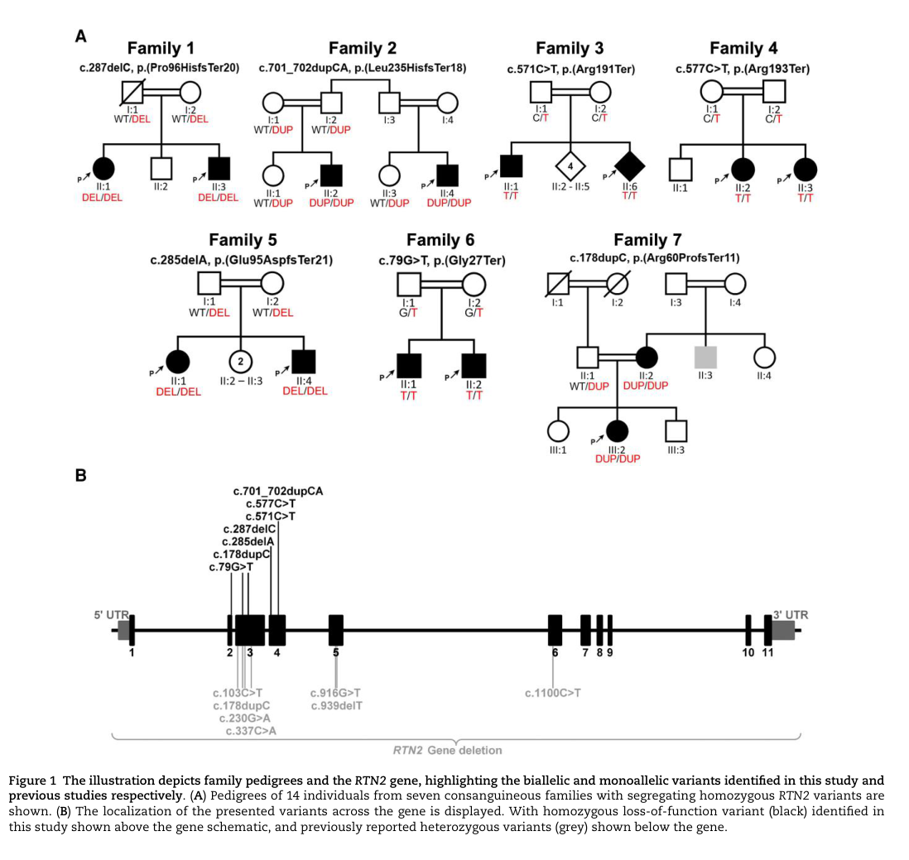

## Question

# Disease Characteristics Research Template

## Target Disease
- **Disease Name:** Distal Hereditary Motor Neuronopathy, Autosomal Recessive
- **MONDO ID:**  (if available)
- **Category:** Genetic

## Research Objectives

Please provide a comprehensive research report on **Distal Hereditary Motor Neuronopathy, Autosomal Recessive** covering all of the
disease characteristics listed below. This report will be used to populate a disease knowledge
base entry. Be thorough and cite primary literature (PMID preferred) for all claims.

For each section, **suggested databases/resources** are listed. These are the first places
you should search for information on each topic.

---

### 1. Disease Information
> **Search first:** OMIM, Orphanet, ICD-10/ICD-11, MeSH, PubMed

- What is the disease? Provide a concise overview.
- What are the key identifiers? (OMIM, Orphanet, ICD-10/ICD-11, MeSH, Mondo)
- What are the common synonyms and alternative names?
- Is the information derived from individual patients (e.g., EHR) or aggregated disease-level resources?

### 2. Etiology

- **Disease Causal Factors**: What are the primary causes? (genetic, environmental, infectious, mechanistic)
- **Risk Factors**:
  > **Search first:** PubMed, Cochrane Library, UpToDate, clinical guidelines, ClinVar, ClinGen, GWAS Catalog, PheGenI, CTD, CDC, WHO, epidemiological databases
  - Genetic risk factors (causal variants, susceptibility loci, modifier genes)
  - Environmental risk factors (toxins, lifestyle, occupational exposures, age, sex, family history)
- **Protective Factors**:
  > **Search first:** PubMed, Cochrane Library, clinical trial databases, GWAS Catalog, gnomAD, WHO, CDC, nutrition databases
  - Genetic protective factors (protective variants, modifier alleles)
  - Environmental protective factors (diet, lifestyle, exposures that reduce risk)
- **Gene-Environment Interactions**: How do genetic and environmental factors interact to influence disease?
  > **Search first:** CTD, PubMed, PheGenI, GxE databases

### 3. Phenotypes
> **Search first:** HPO (Human Phenotype Ontology), OMIM, Orphanet, PubMed, clinicaltrials.gov, MedDRA, SNOMED CT, DECIPHER, LOINC

For each phenotype, provide:
- **Phenotype type**: symptoms, clinical signs, physical manifestations, behavioral changes, or laboratory abnormalities
  > For symptoms/signs: HPO, OMIM, Orphanet, PubMed
  > For behavioral changes: HPO, DSM, RDoC (Research Domain Criteria), PubMed
  > For laboratory abnormalities: LOINC, SNOMED CT, LabTests Online, PubMed
- **Phenotype characteristics**:
  > **Search first:** OMIM, Orphanet, HPO, PubMed
  - Age of symptom onset (neonatal, childhood, adult-onset, late-onset)
  - Symptom severity (mild, moderate, severe, variable)
  - Symptom progression (stable, progressive, episodic, fluctuating)
  - Frequency among affected individuals (percentage or qualitative)
- **Quality of life impact**: Effects on daily functioning and well-being (per-phenotype when possible)
  > **Search first:** EQ-5D database, SF-36, WHO QOL databases, PubMed
- Suggest HPO (Human Phenotype Ontology) terms for each phenotype

### 4. Genetic/Molecular Information

- **Causal Genes**: Gene mutations or chromosomal abnormalities responsible for disease (gene symbols, OMIM IDs)
  > **Search first:** OMIM, ClinVar, HGMD, Ensembl, NCBI Gene
- **Pathogenic Variants**:
  - Affected genes (gene symbols, HGNC IDs)
    > **Search first:** OMIM, NCBI Gene, Ensembl, HGNC, UniProt, GeneCards
  - Variant classification (pathogenic, likely pathogenic, VUS per ACMG/AMP guidelines)
    > **Search first:** ClinVar, ClinGen, ACMG/AMP guidelines, VarSome
  - Variant type/class (missense, frameshift, nonsense, splice-site, structural)
  - Allele frequency in population databases
    > **Search first:** gnomAD, 1000 Genomes, ExAC, TOPMed, dbSNP
  - Somatic vs germline origin
    > **Search first:** COSMIC (somatic), ClinVar, ICGC, TCGA
  - Functional consequences (loss of function, gain of function, dominant negative)
- **Modifier Genes**: Genes that modify disease severity or expression
- **Epigenetic Information**: DNA methylation, histone modifications, chromatin changes affecting disease
  > **Search first:** ENCODE, Roadmap Epigenomics, MethBase, DiseaseMeth
- **Chromosomal Abnormalities**: Large-scale genetic changes (aneuploidy, translocations, inversions)
  > **Search first:** DECIPHER, ClinVar, ECARUCA, UCSC Genome Browser

### 5. Environmental Information

- **Environmental Factors**: Non-genetic contributing factors (toxins, radiation, pollution, occupational exposure)
  > **Search first:** CTD (Comparative Toxicogenomics Database), TOXNET, PubMed, EPA databases
- **Lifestyle Factors**: Behavioral factors (smoking, diet, exercise, alcohol consumption)
  > **Search first:** CDC databases, WHO, PubMed, NHANES
- **Infectious Agents**: If applicable, pathogens causing or triggering disease (bacteria, viruses, fungi, parasites)
  > **Search first:** NCBI Taxonomy, ViPR, BV-BRC, MicrobeDB, GIDEON

### 6. Mechanism / Pathophysiology

- **Molecular Pathways**: Specific signaling cascades or biochemical pathways involved (Wnt, MAPK, mTOR, PI3K-AKT, etc.)
  > **Search first:** KEGG, Reactome, WikiPathways, PathBank, BioCyc
- **Cellular Processes**: Cell-level mechanisms (apoptosis, autophagy, cell cycle dysregulation, inflammation, etc.)
  > **Search first:** Gene Ontology (GO), Reactome, KEGG, PubMed
- **Protein Dysfunction**: How protein structure or function is altered (misfolding, aggregation, loss of function, gain of function)
  > **Search first:** UniProt, PDB (Protein Data Bank), InterPro, Pfam, AlphaFold
- **Metabolic Changes**: Alterations in metabolic processes (energy metabolism, lipid metabolism, amino acid metabolism)
  > **Search first:** KEGG, BioCyc, HMDB (Human Metabolome Database), BRENDA
- **Immune System Involvement**: Role of immune response (autoimmunity, immunodeficiency, chronic inflammation)
  > **Search first:** ImmPort, Immunome Database, IEDB, Gene Ontology
- **Tissue Damage Mechanisms**: How tissues/ are injured (oxidative stress, ischemia, fibrosis, necrosis)
  > **Search first:** PubMed, Gene Ontology, Reactome
- **Biochemical Abnormalities**: Specific molecular defects (enzyme deficiencies, receptor dysfunction, ion channel defects)
  > **Search first:** BRENDA, UniProt, KEGG, OMIM, PubMed
- **Epigenetic Changes**: DNA methylation, histone modifications affecting gene expression in disease
  > **Search first:** ENCODE, Roadmap Epigenomics, MethBase, DiseaseMeth
- **Molecular Profiling** (if available):
  - Transcriptomics/gene expression changes
    > **Search first:** GEO (Gene Expression Omnibus), ArrayExpress, GTEx, Human Cell Atlas, SRA
  - Proteomics findings
    > **Search first:** PRIDE, ProteomeXchange, Human Protein Atlas, STRING, BioGRID
  - Metabolomics signatures
    > **Search first:** MetaboLights, Metabolomics Workbench, HMDB, METLIN
  - Lipidomics alterations
    > **Search first:** LIPID MAPS, SwissLipids, LipidHome, Metabolomics Workbench
  - Genomic structural features
    > **Search first:** UCSC Genome Browser, Ensembl, NCBI, dbVar, DGV
- **Advanced Technologies** (if applicable):
  - Single-cell analysis findings (cell-type specific mechanisms, cellular heterogeneity)
    > **Search first:** Human Cell Atlas, Single Cell Portal, GEO, CELLxGENE
  - Spatial transcriptomics findings
    > **Search first:** GEO, Spatial Research, Vizgen, 10x Genomics data
  - Multi-omics integration results
    > **Search first:** TCGA, ICGC, cBioPortal, LinkedOmics, PubMed
  - Functional genomics screens (CRISPR, RNAi)
    > **Search first:** DepMap, GenomeRNAi, PubMed, BioGRID ORCS

For each mechanism, describe:
- The causal chain from initial trigger to clinical manifestation
- Which mechanisms are upstream vs downstream
- What cell types and biological processes are involved
- Suggest GO terms for biological processes and CL terms for cell types

### 7. Anatomical Structures Affected

- **Organ Level**:
  - Primary organs directly affected
  - Secondary organ involvement (complications, secondary effects)
  - Body systems involved (cardiovascular, nervous, digestive, respiratory, endocrine, etc.)
  > **Search first:** Uberon, FMA (Foundational Model of Anatomy), OMIM, HPO, ICD-11, MeSH, SNOMED CT
- **Tissue and Cell Level**:
  - Specific tissue types affected (epithelial, connective, muscle, nervous)
  - Specific cell populations targeted (with Cell Ontology terms)
  > **Search first:** Uberon, Human Protein Atlas, Cell Ontology, Human Cell Atlas, CellMarker, PanglaoDB
- **Subcellular Level**:
  - Cellular compartments involved (mitochondria, nucleus, ER, lysosomes) (with GO Cellular Component terms)
  > **Search first:** Gene Ontology (Cellular Component), UniProt, Human Protein Atlas
- **Localization**:
  - Specific anatomical sites (with UBERON terms)
    > **Search first:** FMA, Uberon, NeuroNames (for brain), SNOMED CT
  - Lateralization (unilateral, bilateral, asymmetric)
    > **Search first:** HPO, clinical literature, imaging databases

### 8. Temporal Development

- **Onset**:
  - Typical age of onset (congenital, pediatric, adult, geriatric)
  - Onset pattern (acute, subacute, chronic, insidious)
  > **Search first:** OMIM, Orphanet, HPO, PubMed
- **Progression**:
  - Disease stages (early, intermediate, advanced, end-stage)
    > **Search first:** Cancer Staging Manual (AJCC), WHO classifications, PubMed
  - Progression rate (rapid, slow, variable)
  - Disease course pattern (episodic, relapsing-remitting, progressive, stable)
  - Disease duration (self-limited, chronic lifelong)
  > **Search first:** Disease registries, longitudinal cohort databases, natural history studies, PubMed, Orphanet, OMIM
- **Patterns**:
  - Remission patterns (spontaneous, treatment-induced)
    > **Search first:** Clinical trial databases, disease registries, PubMed
  - Critical periods (time windows of vulnerability or opportunity for intervention)
    > **Search first:** PubMed, developmental biology databases, clinical guidelines

### 9. Inheritance and Population

- **Epidemiology**:
  - Prevalence (cases per 100,000 at given time)
  - Incidence (new cases per 100,000 per year)
  > **Search first:** Orphanet, CDC, WHO, GBD (Global Burden of Disease), national registries, SEER, disease registries
- **For Genetic Etiology**:
  - Inheritance pattern (AD, AR, X-linked, mitochondrial, multifactorial, polygenic)
    > **Search first:** OMIM, Orphanet, ClinVar, GTR (Genetic Testing Registry)
  - Penetrance (complete, incomplete, age-dependent)
    > **Search first:** ClinVar, OMIM, PubMed, ClinGen
  - Expressivity (variable, consistent)
    > **Search first:** OMIM, ClinVar, PubMed
  - Genetic anticipation (increasing severity in successive generations)
    > **Search first:** OMIM, PubMed (especially for repeat expansion disorders)
  - Germline mosaicism
    > **Search first:** ClinVar, OMIM, genetic counseling literature, PubMed
  - Founder effects (population-specific mutations)
    > **Search first:** gnomAD, population genetics databases, PubMed
  - Consanguinity role
    > **Search first:** OMIM, population studies, genetic counseling resources
  - Carrier frequency
    > **Search first:** gnomAD, carrier screening databases, GeneReviews, GTR
- **Population Demographics**:
  - Affected populations (ethnic or demographic groups with higher prevalence)
    > **Search first:** gnomAD, 1000 Genomes, PAGE Study, PubMed, population registries
  - Geographic distribution (endemic areas, regional variation)
    > **Search first:** WHO, CDC, GBD, Orphanet, geographic epidemiology databases
  - Geographic distribution of specific variants
  - Sex ratio (male:female)
    > **Search first:** Disease registries, OMIM, PubMed, epidemiological databases
  - Age distribution of affected individuals
    > **Search first:** CDC, disease registries, SEER, Orphanet

### 10. Diagnostics

- **Clinical Tests**:
  - Laboratory tests (blood, urine, tissue chemistry, specific enzyme assays)
    > **Search first:** LOINC, LabTests Online, PubMed
  - Biomarkers (proteins, metabolites, genetic markers, circulating biomarkers)
    > **Search first:** FDA Biomarker List, BEST (Biomarkers, EndpointS, and other Tools), PubMed
  - Imaging studies (X-ray, CT, MRI, PET, ultrasound)
    > **Search first:** RadLex, DICOM, Radiopaedia, imaging databases
  - Functional tests (pulmonary function, cardiac stress tests)
    > **Search first:** LOINC, clinical guidelines, PubMed
  - Electrophysiology (EEG, EMG, ECG, nerve conduction studies)
    > **Search first:** LOINC, clinical neurophysiology databases, PubMed
  - Biopsy findings (histopathology, immunohistochemistry)
    > **Search first:** SNOMED CT, College of American Pathologists resources, PubMed
  - Pathology findings (microscopic examination)
    > **Search first:** SNOMED CT, Digital Pathology databases, PubMed
- **Genetic Testing**:
  > **Search first:** GTR (Genetic Testing Registry), GeneReviews, ClinGen
  - Overview of recommended genetic testing approach
  - Whole genome sequencing (WGS) utility
    > **Search first:** GTR, ClinVar, GEL (Genomics England), gnomAD
  - Whole exome sequencing (WES) utility
    > **Search first:** GTR, ClinVar, OMIM, GeneMatcher
  - Gene panels (which panels, which genes)
    > **Search first:** GTR, ClinVar, laboratory-specific databases
  - Single gene testing
    > **Search first:** GTR, ClinVar, OMIM, GeneReviews
  - Chromosomal microarray (CMA)
    > **Search first:** DECIPHER, ClinVar, dbVar, ECARUCA
  - Karyotyping
    > **Search first:** Chromosome Abnormality Database, ClinVar, cytogenetics resources
  - FISH
    > **Search first:** ClinVar, cytogenetics databases, PubMed
  - Mitochondrial DNA testing
    > **Search first:** MITOMAP, MSeqDR, ClinVar, GTR
  - Repeat expansion testing
    > **Search first:** GTR, ClinVar, repeat expansion databases, PubMed
- **Omics-Based Diagnostics** (if applicable):
  - RNA sequencing / transcriptomics
    > **Search first:** GEO, ArrayExpress, GTEx, RNA-seq databases
  - Proteomics
    > **Search first:** PRIDE, ProteomeXchange, FDA Biomarker database
  - Metabolomics
    > **Search first:** MetaboLights, Metabolomics Workbench, HMDB
  - Epigenomics
    > **Search first:** GEO, ENCODE, Roadmap Epigenomics, MethBase
  - Liquid biopsy
    > **Search first:** COSMIC, ClinVar, liquid biopsy databases, PubMed
- **Clinical Criteria**:
  - Standardized diagnostic criteria (DSM, ICD, society guidelines)
    > **Search first:** DSM-5, ICD-11, clinical society guidelines, UpToDate
  - Differential diagnosis (other conditions to rule out, with distinguishing features)
    > **Search first:** DynaMed, UpToDate, clinical decision support systems
- **Screening**:
  - Screening methods for asymptomatic individuals (newborn screening, carrier screening, cascade screening)
    > **Search first:** ACMG recommendations, CDC newborn screening, GTR

### 11. Outcome/Prognosis

- **Survival and Mortality**:
  - Survival rate (5-year, 10-year, overall)
    > **Search first:** SEER, cancer registries, disease-specific registries, PubMed
  - Life expectancy (with and without treatment if applicable)
    > **Search first:** Orphanet, disease registries, actuarial databases, PubMed
  - Mortality rate
    > **Search first:** CDC, WHO, GBD, national mortality databases
  - Disease-specific mortality (deaths directly attributable to disease)
    > **Search first:** Disease registries, CDC Wonder, GBD, PubMed
- **Morbidity and Function**:
  - Morbidity (disease-related disability and health impacts)
    > **Search first:** GBD, WHO, disability databases, PubMed
  - Disability outcomes (long-term functional impairments)
    > **Search first:** ICF (International Classification of Functioning), disability registries
  - Quality of life measures (EQ-5D, SF-36, PROMIS, disease-specific tools)
    > **Search first:** EQ-5D database, SF-36, PROMIS, PubMed
- **Disease Course**:
  - Complications (secondary problems: infections, organ failure, etc.)
    > **Search first:** ICD codes, disease registries, clinical databases, PubMed
  - Recovery potential (likelihood and extent of recovery, with vs without treatment)
    > **Search first:** Natural history studies, rehabilitation databases, PubMed
- **Prediction**:
  - Prognostic factors (age, disease severity, biomarkers, treatment response)
    > **Search first:** Prognostic models databases, clinical calculators, PubMed
  - Prognostic biomarkers (molecular markers predicting disease course)
    > **Search first:** FDA Biomarker database, PubMed, cancer prognostic databases

### 12. Treatment

- **Pharmacotherapy**:
  - Pharmacological treatments (drug names, drug classes, mechanisms of action)
    > **Search first:** DrugBank, RxNorm, ATC classification, DailyMed, FDA databases
  - Pharmacogenomics (how genetic variants affect drug metabolism, efficacy, toxicity)
    > **Search first:** PharmGKB, CPIC (Clinical Pharmacogenetics), FDA Table of PGx Biomarkers
- **Advanced Therapeutics**:
  - Gene therapy (viral vectors, CRISPR, gene replacement, gene editing)
    > **Search first:** ClinicalTrials.gov, FDA gene therapy database, ASGCT resources
  - Cell therapy (stem cell transplant, CAR-T, cellular therapeutics)
    > **Search first:** ClinicalTrials.gov, FDA cell therapy database, FACT standards
  - RNA-based therapies (ASOs, siRNA, mRNA therapies)
    > **Search first:** ClinicalTrials.gov, FDA approvals, PubMed
  - Targeted therapies (treatments directed at specific molecular targets)
    > **Search first:** My Cancer Genome, OncoKB, ClinicalTrials.gov, FDA approvals
  - Immunotherapies (checkpoint inhibitors, monoclonal antibodies)
    > **Search first:** Cancer Immunotherapy Database, FDA approvals, ClinicalTrials.gov
- **Surgical and Interventional**:
  - Surgical interventions (types of surgery, timing, outcomes)
    > **Search first:** CPT codes, surgical registries, clinical guidelines, PubMed
- **Supportive and Rehabilitative**:
  - Supportive care (symptom management, pain control, nutrition)
    > **Search first:** Clinical guidelines, Cochrane Library, PubMed
  - Rehabilitation (physical therapy, occupational therapy, speech therapy)
    > **Search first:** Rehabilitation medicine databases, clinical guidelines, PubMed
- **Experimental**:
  - Experimental treatments in clinical trials (with NCT identifiers if available)
    > **Search first:** ClinicalTrials.gov, EU Clinical Trials Register, WHO ICTRP
- **Treatment Outcomes**:
  - Treatment response rates
    > **Search first:** Clinical trial databases, FDA reviews, systematic reviews, PubMed
  - Side effects and adverse events
    > **Search first:** FDA Adverse Event Reporting System (FAERS), MedWatch, PubMed
- **Treatment Strategy**:
  - Treatment algorithms (clinical pathways, decision trees)
    > **Search first:** Clinical practice guidelines, NCCN Guidelines, UpToDate
  - Combination therapies
    > **Search first:** ClinicalTrials.gov, treatment guidelines, PubMed
  - Personalized medicine approaches (genotype-guided treatment)
    > **Search first:** My Cancer Genome, CIViC, PharmGKB, precision medicine databases

For each treatment, suggest MAXO (Medical Action Ontology) terms where applicable.

### 13. Prevention

- **Prevention Levels**:
  - Primary prevention (preventing disease occurrence: vaccination, risk factor modification)
    > **Search first:** CDC, WHO, USPSTF recommendations, Cochrane Library
  - Secondary prevention (early detection and treatment: screening programs, early intervention)
    > **Search first:** USPSTF, CDC screening guidelines, WHO
  - Tertiary prevention (preventing complications in those with disease)
    > **Search first:** Clinical guidelines, disease management protocols, PubMed
- **Immunization**: Vaccine strategies (if applicable)
  > **Search first:** CDC vaccine schedules, WHO immunization, FDA vaccine database
- **Screening and Early Detection**:
  - Screening programs (population-based: newborn screening, cancer screening)
    > **Search first:** CDC screening programs, USPSTF, cancer screening databases
  - Genetic screening (carrier screening, preimplantation genetic diagnosis, prenatal testing)
    > **Search first:** ACMG recommendations, ACOG guidelines, GTR
  - Risk stratification (identifying high-risk individuals for targeted prevention)
    > **Search first:** Risk prediction models, clinical calculators, PubMed
- **Behavioral Interventions**: Lifestyle modifications to reduce risk
  > **Search first:** CDC, WHO, behavioral intervention databases, Cochrane Library
- **Counseling**: Genetic counseling (risk assessment, family planning guidance)
  > **Search first:** NSGC resources, ACMG guidelines, GeneReviews
- **Public Health**:
  - Public health interventions (sanitation, vector control, health education)
    > **Search first:** CDC, WHO, public health databases, PubMed
  - Environmental interventions (reducing environmental risk factors)
    > **Search first:** EPA databases, WHO environmental health, PubMed
- **Prophylaxis**: Preventive medications or procedures
  > **Search first:** Clinical guidelines, FDA approvals, PubMed

### 14. Other Species / Natural Disease

- **Taxonomy**: Species affected (with NCBI Taxon identifiers)
  > **Search first:** NCBI Taxonomy
- **Breed**: Specific breeds affected (with VBO identifiers if applicable)
  > **Search first:** VBO (Vertebrate Breed Ontology)
- **Gene**: Orthologous genes in other species (with NCBI Gene IDs)
  > **Search first:** NCBI Gene
- **Natural Disease**:
  - Naturally occurring disease in other species (companion animals, wildlife)
    > **Search first:** OMIA (Online Mendelian Inheritance in Animals), VetCompass, PubMed
  - Veterinary relevance and importance in animal health
    > **Search first:** OMIA, veterinary databases, PubMed
- **Comparative Biology**:
  - Comparative pathology (similarities and differences across species)
    > **Search first:** OMIA, comparative pathology databases, PubMed
  - Evolutionary conservation of disease mechanisms
    > **Search first:** HomoloGene, OrthoMCL, Alliance of Genome Resources
- **Transmission** (if applicable):
  - Zoonotic potential
    > **Search first:** CDC zoonotic diseases, WHO zoonoses, GIDEON
  - Cross-species susceptibility
    > **Search first:** NCBI Taxonomy, veterinary databases, PubMed

### 15. Model Organisms

- **Model Types**:
  - Model organism type (mammalian, invertebrate, cellular, in vitro)
    > **Search first:** Alliance of Genome Resources, model organism databases
  - Specific model systems (mouse, rat, zebrafish, Drosophila, C. elegans, yeast, cell lines, organoids, iPSCs)
    > **Search first:** MGI, RGD, ZFIN, FlyBase, WormBase, SGD, ATCC, Cellosaurus
  - Induced models (drug treatment, surgical intervention, environmental manipulation)
    > **Search first:** MGI, model organism databases, PubMed
- **Genetic Models**:
  - Types available (knockout, knock-in, transgenic, conditional, humanized)
    > **Search first:** MGI, IMPC, KOMP, EuMMCR, IMSR
- **Model Characteristics**:
  - Phenotype recapitulation (how well model reproduces human disease features)
    > **Search first:** Model organism databases, comparative studies, PubMed
  - Model limitations (aspects of human disease not captured)
    > **Search first:** Model organism databases, PubMed, review articles
- **Applications**:
  - Research applications (what aspects of disease can be studied)
    > **Search first:** Model organism databases, PubMed
- **Resources**:
  - Model databases
    > **Search first:** MGI, RGD, ZFIN, FlyBase, WormBase, IMSR, EMMA, MMRRC

---

## Citation Requirements

- Cite primary literature (PMID preferred) for all mechanistic and clinical claims
- Prioritize recent reviews and landmark papers
- Include direct quotes from abstracts where possible to support key statements
- Distinguish evidence source types: human clinical, model organism, in vitro, computational

## Output Format

Structure your response as a comprehensive narrative organized by the sections above.
For each section, provide:
- Factual content with specific details (numbers, percentages, gene names, variant nomenclature)
- Ontology term suggestions (HPO, GO, CL, UBERON, CHEBI, MAXO, MONDO) where applicable
- Evidence citations with PMIDs
- Direct quotes from abstracts to support key claims
- Clear indication when information is not available or not applicable for this disease

This report will be used to populate a disease knowledge base entry with:
- Pathophysiology descriptions with causal chains
- Gene/protein annotations (HGNC, GO terms)
- Phenotype associations (HP terms) with frequencies
- Cell type involvement (CL terms)
- Anatomical locations (UBERON terms)
- Chemical entities (CHEBI terms)
- Treatment annotations (MAXO terms)
- Evidence items with PMIDs and exact abstract quotes
- Epidemiology, prognosis, diagnostic, and prevention information
- Animal model descriptions with phenotype recapitulation details

## Output

Question: You are an expert researcher providing comprehensive, well-cited information.

Provide detailed information focusing on:
1. Key concepts and definitions with current understanding
2. Recent developments and latest research (prioritize 2023-2024 sources)
3. Current applications and real-world implementations
4. Expert opinions and analysis from authoritative sources
5. Relevant statistics and data from recent studies

Format as a comprehensive research report with proper citations. Include URLs and publication dates where available.
Always prioritize recent, authoritative sources and provide specific citations for all major claims.

# Disease Characteristics Research Template

## Target Disease
- **Disease Name:** Distal Hereditary Motor Neuronopathy, Autosomal Recessive
- **MONDO ID:**  (if available)
- **Category:** Genetic

## Research Objectives

Please provide a comprehensive research report on **Distal Hereditary Motor Neuronopathy, Autosomal Recessive** covering all of the
disease characteristics listed below. This report will be used to populate a disease knowledge
base entry. Be thorough and cite primary literature (PMID preferred) for all claims.

For each section, **suggested databases/resources** are listed. These are the first places
you should search for information on each topic.

---

### 1. Disease Information
> **Search first:** OMIM, Orphanet, ICD-10/ICD-11, MeSH, PubMed

- What is the disease? Provide a concise overview.
- What are the key identifiers? (OMIM, Orphanet, ICD-10/ICD-11, MeSH, Mondo)
- What are the common synonyms and alternative names?
- Is the information derived from individual patients (e.g., EHR) or aggregated disease-level resources?

### 2. Etiology

- **Disease Causal Factors**: What are the primary causes? (genetic, environmental, infectious, mechanistic)
- **Risk Factors**:
  > **Search first:** PubMed, Cochrane Library, UpToDate, clinical guidelines, ClinVar, ClinGen, GWAS Catalog, PheGenI, CTD, CDC, WHO, epidemiological databases
  - Genetic risk factors (causal variants, susceptibility loci, modifier genes)
  - Environmental risk factors (toxins, lifestyle, occupational exposures, age, sex, family history)
- **Protective Factors**:
  > **Search first:** PubMed, Cochrane Library, clinical trial databases, GWAS Catalog, gnomAD, WHO, CDC, nutrition databases
  - Genetic protective factors (protective variants, modifier alleles)
  - Environmental protective factors (diet, lifestyle, exposures that reduce risk)
- **Gene-Environment Interactions**: How do genetic and environmental factors interact to influence disease?
  > **Search first:** CTD, PubMed, PheGenI, GxE databases

### 3. Phenotypes
> **Search first:** HPO (Human Phenotype Ontology), OMIM, Orphanet, PubMed, clinicaltrials.gov, MedDRA, SNOMED CT, DECIPHER, LOINC

For each phenotype, provide:
- **Phenotype type**: symptoms, clinical signs, physical manifestations, behavioral changes, or laboratory abnormalities
  > For symptoms/signs: HPO, OMIM, Orphanet, PubMed
  > For behavioral changes: HPO, DSM, RDoC (Research Domain Criteria), PubMed
  > For laboratory abnormalities: LOINC, SNOMED CT, LabTests Online, PubMed
- **Phenotype characteristics**:
  > **Search first:** OMIM, Orphanet, HPO, PubMed
  - Age of symptom onset (neonatal, childhood, adult-onset, late-onset)
  - Symptom severity (mild, moderate, severe, variable)
  - Symptom progression (stable, progressive, episodic, fluctuating)
  - Frequency among affected individuals (percentage or qualitative)
- **Quality of life impact**: Effects on daily functioning and well-being (per-phenotype when possible)
  > **Search first:** EQ-5D database, SF-36, WHO QOL databases, PubMed
- Suggest HPO (Human Phenotype Ontology) terms for each phenotype

### 4. Genetic/Molecular Information

- **Causal Genes**: Gene mutations or chromosomal abnormalities responsible for disease (gene symbols, OMIM IDs)
  > **Search first:** OMIM, ClinVar, HGMD, Ensembl, NCBI Gene
- **Pathogenic Variants**:
  - Affected genes (gene symbols, HGNC IDs)
    > **Search first:** OMIM, NCBI Gene, Ensembl, HGNC, UniProt, GeneCards
  - Variant classification (pathogenic, likely pathogenic, VUS per ACMG/AMP guidelines)
    > **Search first:** ClinVar, ClinGen, ACMG/AMP guidelines, VarSome
  - Variant type/class (missense, frameshift, nonsense, splice-site, structural)
  - Allele frequency in population databases
    > **Search first:** gnomAD, 1000 Genomes, ExAC, TOPMed, dbSNP
  - Somatic vs germline origin
    > **Search first:** COSMIC (somatic), ClinVar, ICGC, TCGA
  - Functional consequences (loss of function, gain of function, dominant negative)
- **Modifier Genes**: Genes that modify disease severity or expression
- **Epigenetic Information**: DNA methylation, histone modifications, chromatin changes affecting disease
  > **Search first:** ENCODE, Roadmap Epigenomics, MethBase, DiseaseMeth
- **Chromosomal Abnormalities**: Large-scale genetic changes (aneuploidy, translocations, inversions)
  > **Search first:** DECIPHER, ClinVar, ECARUCA, UCSC Genome Browser

### 5. Environmental Information

- **Environmental Factors**: Non-genetic contributing factors (toxins, radiation, pollution, occupational exposure)
  > **Search first:** CTD (Comparative Toxicogenomics Database), TOXNET, PubMed, EPA databases
- **Lifestyle Factors**: Behavioral factors (smoking, diet, exercise, alcohol consumption)
  > **Search first:** CDC databases, WHO, PubMed, NHANES
- **Infectious Agents**: If applicable, pathogens causing or triggering disease (bacteria, viruses, fungi, parasites)
  > **Search first:** NCBI Taxonomy, ViPR, BV-BRC, MicrobeDB, GIDEON

### 6. Mechanism / Pathophysiology

- **Molecular Pathways**: Specific signaling cascades or biochemical pathways involved (Wnt, MAPK, mTOR, PI3K-AKT, etc.)
  > **Search first:** KEGG, Reactome, WikiPathways, PathBank, BioCyc
- **Cellular Processes**: Cell-level mechanisms (apoptosis, autophagy, cell cycle dysregulation, inflammation, etc.)
  > **Search first:** Gene Ontology (GO), Reactome, KEGG, PubMed
- **Protein Dysfunction**: How protein structure or function is altered (misfolding, aggregation, loss of function, gain of function)
  > **Search first:** UniProt, PDB (Protein Data Bank), InterPro, Pfam, AlphaFold
- **Metabolic Changes**: Alterations in metabolic processes (energy metabolism, lipid metabolism, amino acid metabolism)
  > **Search first:** KEGG, BioCyc, HMDB (Human Metabolome Database), BRENDA
- **Immune System Involvement**: Role of immune response (autoimmunity, immunodeficiency, chronic inflammation)
  > **Search first:** ImmPort, Immunome Database, IEDB, Gene Ontology
- **Tissue Damage Mechanisms**: How tissues/ are injured (oxidative stress, ischemia, fibrosis, necrosis)
  > **Search first:** PubMed, Gene Ontology, Reactome
- **Biochemical Abnormalities**: Specific molecular defects (enzyme deficiencies, receptor dysfunction, ion channel defects)
  > **Search first:** BRENDA, UniProt, KEGG, OMIM, PubMed
- **Epigenetic Changes**: DNA methylation, histone modifications affecting gene expression in disease
  > **Search first:** ENCODE, Roadmap Epigenomics, MethBase, DiseaseMeth
- **Molecular Profiling** (if available):
  - Transcriptomics/gene expression changes
    > **Search first:** GEO (Gene Expression Omnibus), ArrayExpress, GTEx, Human Cell Atlas, SRA
  - Proteomics findings
    > **Search first:** PRIDE, ProteomeXchange, Human Protein Atlas, STRING, BioGRID
  - Metabolomics signatures
    > **Search first:** MetaboLights, Metabolomics Workbench, HMDB, METLIN
  - Lipidomics alterations
    > **Search first:** LIPID MAPS, SwissLipids, LipidHome, Metabolomics Workbench
  - Genomic structural features
    > **Search first:** UCSC Genome Browser, Ensembl, NCBI, dbVar, DGV
- **Advanced Technologies** (if applicable):
  - Single-cell analysis findings (cell-type specific mechanisms, cellular heterogeneity)
    > **Search first:** Human Cell Atlas, Single Cell Portal, GEO, CELLxGENE
  - Spatial transcriptomics findings
    > **Search first:** GEO, Spatial Research, Vizgen, 10x Genomics data
  - Multi-omics integration results
    > **Search first:** TCGA, ICGC, cBioPortal, LinkedOmics, PubMed
  - Functional genomics screens (CRISPR, RNAi)
    > **Search first:** DepMap, GenomeRNAi, PubMed, BioGRID ORCS

For each mechanism, describe:
- The causal chain from initial trigger to clinical manifestation
- Which mechanisms are upstream vs downstream
- What cell types and biological processes are involved
- Suggest GO terms for biological processes and CL terms for cell types

### 7. Anatomical Structures Affected

- **Organ Level**:
  - Primary organs directly affected
  - Secondary organ involvement (complications, secondary effects)
  - Body systems involved (cardiovascular, nervous, digestive, respiratory, endocrine, etc.)
  > **Search first:** Uberon, FMA (Foundational Model of Anatomy), OMIM, HPO, ICD-11, MeSH, SNOMED CT
- **Tissue and Cell Level**:
  - Specific tissue types affected (epithelial, connective, muscle, nervous)
  - Specific cell populations targeted (with Cell Ontology terms)
  > **Search first:** Uberon, Human Protein Atlas, Cell Ontology, Human Cell Atlas, CellMarker, PanglaoDB
- **Subcellular Level**:
  - Cellular compartments involved (mitochondria, nucleus, ER, lysosomes) (with GO Cellular Component terms)
  > **Search first:** Gene Ontology (Cellular Component), UniProt, Human Protein Atlas
- **Localization**:
  - Specific anatomical sites (with UBERON terms)
    > **Search first:** FMA, Uberon, NeuroNames (for brain), SNOMED CT
  - Lateralization (unilateral, bilateral, asymmetric)
    > **Search first:** HPO, clinical literature, imaging databases

### 8. Temporal Development

- **Onset**:
  - Typical age of onset (congenital, pediatric, adult, geriatric)
  - Onset pattern (acute, subacute, chronic, insidious)
  > **Search first:** OMIM, Orphanet, HPO, PubMed
- **Progression**:
  - Disease stages (early, intermediate, advanced, end-stage)
    > **Search first:** Cancer Staging Manual (AJCC), WHO classifications, PubMed
  - Progression rate (rapid, slow, variable)
  - Disease course pattern (episodic, relapsing-remitting, progressive, stable)
  - Disease duration (self-limited, chronic lifelong)
  > **Search first:** Disease registries, longitudinal cohort databases, natural history studies, PubMed, Orphanet, OMIM
- **Patterns**:
  - Remission patterns (spontaneous, treatment-induced)
    > **Search first:** Clinical trial databases, disease registries, PubMed
  - Critical periods (time windows of vulnerability or opportunity for intervention)
    > **Search first:** PubMed, developmental biology databases, clinical guidelines

### 9. Inheritance and Population

- **Epidemiology**:
  - Prevalence (cases per 100,000 at given time)
  - Incidence (new cases per 100,000 per year)
  > **Search first:** Orphanet, CDC, WHO, GBD (Global Burden of Disease), national registries, SEER, disease registries
- **For Genetic Etiology**:
  - Inheritance pattern (AD, AR, X-linked, mitochondrial, multifactorial, polygenic)
    > **Search first:** OMIM, Orphanet, ClinVar, GTR (Genetic Testing Registry)
  - Penetrance (complete, incomplete, age-dependent)
    > **Search first:** ClinVar, OMIM, PubMed, ClinGen
  - Expressivity (variable, consistent)
    > **Search first:** OMIM, ClinVar, PubMed
  - Genetic anticipation (increasing severity in successive generations)
    > **Search first:** OMIM, PubMed (especially for repeat expansion disorders)
  - Germline mosaicism
    > **Search first:** ClinVar, OMIM, genetic counseling literature, PubMed
  - Founder effects (population-specific mutations)
    > **Search first:** gnomAD, population genetics databases, PubMed
  - Consanguinity role
    > **Search first:** OMIM, population studies, genetic counseling resources
  - Carrier frequency
    > **Search first:** gnomAD, carrier screening databases, GeneReviews, GTR
- **Population Demographics**:
  - Affected populations (ethnic or demographic groups with higher prevalence)
    > **Search first:** gnomAD, 1000 Genomes, PAGE Study, PubMed, population registries
  - Geographic distribution (endemic areas, regional variation)
    > **Search first:** WHO, CDC, GBD, Orphanet, geographic epidemiology databases
  - Geographic distribution of specific variants
  - Sex ratio (male:female)
    > **Search first:** Disease registries, OMIM, PubMed, epidemiological databases
  - Age distribution of affected individuals
    > **Search first:** CDC, disease registries, SEER, Orphanet

### 10. Diagnostics

- **Clinical Tests**:
  - Laboratory tests (blood, urine, tissue chemistry, specific enzyme assays)
    > **Search first:** LOINC, LabTests Online, PubMed
  - Biomarkers (proteins, metabolites, genetic markers, circulating biomarkers)
    > **Search first:** FDA Biomarker List, BEST (Biomarkers, EndpointS, and other Tools), PubMed
  - Imaging studies (X-ray, CT, MRI, PET, ultrasound)
    > **Search first:** RadLex, DICOM, Radiopaedia, imaging databases
  - Functional tests (pulmonary function, cardiac stress tests)
    > **Search first:** LOINC, clinical guidelines, PubMed
  - Electrophysiology (EEG, EMG, ECG, nerve conduction studies)
    > **Search first:** LOINC, clinical neurophysiology databases, PubMed
  - Biopsy findings (histopathology, immunohistochemistry)
    > **Search first:** SNOMED CT, College of American Pathologists resources, PubMed
  - Pathology findings (microscopic examination)
    > **Search first:** SNOMED CT, Digital Pathology databases, PubMed
- **Genetic Testing**:
  > **Search first:** GTR (Genetic Testing Registry), GeneReviews, ClinGen
  - Overview of recommended genetic testing approach
  - Whole genome sequencing (WGS) utility
    > **Search first:** GTR, ClinVar, GEL (Genomics England), gnomAD
  - Whole exome sequencing (WES) utility
    > **Search first:** GTR, ClinVar, OMIM, GeneMatcher
  - Gene panels (which panels, which genes)
    > **Search first:** GTR, ClinVar, laboratory-specific databases
  - Single gene testing
    > **Search first:** GTR, ClinVar, OMIM, GeneReviews
  - Chromosomal microarray (CMA)
    > **Search first:** DECIPHER, ClinVar, dbVar, ECARUCA
  - Karyotyping
    > **Search first:** Chromosome Abnormality Database, ClinVar, cytogenetics resources
  - FISH
    > **Search first:** ClinVar, cytogenetics databases, PubMed
  - Mitochondrial DNA testing
    > **Search first:** MITOMAP, MSeqDR, ClinVar, GTR
  - Repeat expansion testing
    > **Search first:** GTR, ClinVar, repeat expansion databases, PubMed
- **Omics-Based Diagnostics** (if applicable):
  - RNA sequencing / transcriptomics
    > **Search first:** GEO, ArrayExpress, GTEx, RNA-seq databases
  - Proteomics
    > **Search first:** PRIDE, ProteomeXchange, FDA Biomarker database
  - Metabolomics
    > **Search first:** MetaboLights, Metabolomics Workbench, HMDB
  - Epigenomics
    > **Search first:** GEO, ENCODE, Roadmap Epigenomics, MethBase
  - Liquid biopsy
    > **Search first:** COSMIC, ClinVar, liquid biopsy databases, PubMed
- **Clinical Criteria**:
  - Standardized diagnostic criteria (DSM, ICD, society guidelines)
    > **Search first:** DSM-5, ICD-11, clinical society guidelines, UpToDate
  - Differential diagnosis (other conditions to rule out, with distinguishing features)
    > **Search first:** DynaMed, UpToDate, clinical decision support systems
- **Screening**:
  - Screening methods for asymptomatic individuals (newborn screening, carrier screening, cascade screening)
    > **Search first:** ACMG recommendations, CDC newborn screening, GTR

### 11. Outcome/Prognosis

- **Survival and Mortality**:
  - Survival rate (5-year, 10-year, overall)
    > **Search first:** SEER, cancer registries, disease-specific registries, PubMed
  - Life expectancy (with and without treatment if applicable)
    > **Search first:** Orphanet, disease registries, actuarial databases, PubMed
  - Mortality rate
    > **Search first:** CDC, WHO, GBD, national mortality databases
  - Disease-specific mortality (deaths directly attributable to disease)
    > **Search first:** Disease registries, CDC Wonder, GBD, PubMed
- **Morbidity and Function**:
  - Morbidity (disease-related disability and health impacts)
    > **Search first:** GBD, WHO, disability databases, PubMed
  - Disability outcomes (long-term functional impairments)
    > **Search first:** ICF (International Classification of Functioning), disability registries
  - Quality of life measures (EQ-5D, SF-36, PROMIS, disease-specific tools)
    > **Search first:** EQ-5D database, SF-36, PROMIS, PubMed
- **Disease Course**:
  - Complications (secondary problems: infections, organ failure, etc.)
    > **Search first:** ICD codes, disease registries, clinical databases, PubMed
  - Recovery potential (likelihood and extent of recovery, with vs without treatment)
    > **Search first:** Natural history studies, rehabilitation databases, PubMed
- **Prediction**:
  - Prognostic factors (age, disease severity, biomarkers, treatment response)
    > **Search first:** Prognostic models databases, clinical calculators, PubMed
  - Prognostic biomarkers (molecular markers predicting disease course)
    > **Search first:** FDA Biomarker database, PubMed, cancer prognostic databases

### 12. Treatment

- **Pharmacotherapy**:
  - Pharmacological treatments (drug names, drug classes, mechanisms of action)
    > **Search first:** DrugBank, RxNorm, ATC classification, DailyMed, FDA databases
  - Pharmacogenomics (how genetic variants affect drug metabolism, efficacy, toxicity)
    > **Search first:** PharmGKB, CPIC (Clinical Pharmacogenetics), FDA Table of PGx Biomarkers
- **Advanced Therapeutics**:
  - Gene therapy (viral vectors, CRISPR, gene replacement, gene editing)
    > **Search first:** ClinicalTrials.gov, FDA gene therapy database, ASGCT resources
  - Cell therapy (stem cell transplant, CAR-T, cellular therapeutics)
    > **Search first:** ClinicalTrials.gov, FDA cell therapy database, FACT standards
  - RNA-based therapies (ASOs, siRNA, mRNA therapies)
    > **Search first:** ClinicalTrials.gov, FDA approvals, PubMed
  - Targeted therapies (treatments directed at specific molecular targets)
    > **Search first:** My Cancer Genome, OncoKB, ClinicalTrials.gov, FDA approvals
  - Immunotherapies (checkpoint inhibitors, monoclonal antibodies)
    > **Search first:** Cancer Immunotherapy Database, FDA approvals, ClinicalTrials.gov
- **Surgical and Interventional**:
  - Surgical interventions (types of surgery, timing, outcomes)
    > **Search first:** CPT codes, surgical registries, clinical guidelines, PubMed
- **Supportive and Rehabilitative**:
  - Supportive care (symptom management, pain control, nutrition)
    > **Search first:** Clinical guidelines, Cochrane Library, PubMed
  - Rehabilitation (physical therapy, occupational therapy, speech therapy)
    > **Search first:** Rehabilitation medicine databases, clinical guidelines, PubMed
- **Experimental**:
  - Experimental treatments in clinical trials (with NCT identifiers if available)
    > **Search first:** ClinicalTrials.gov, EU Clinical Trials Register, WHO ICTRP
- **Treatment Outcomes**:
  - Treatment response rates
    > **Search first:** Clinical trial databases, FDA reviews, systematic reviews, PubMed
  - Side effects and adverse events
    > **Search first:** FDA Adverse Event Reporting System (FAERS), MedWatch, PubMed
- **Treatment Strategy**:
  - Treatment algorithms (clinical pathways, decision trees)
    > **Search first:** Clinical practice guidelines, NCCN Guidelines, UpToDate
  - Combination therapies
    > **Search first:** ClinicalTrials.gov, treatment guidelines, PubMed
  - Personalized medicine approaches (genotype-guided treatment)
    > **Search first:** My Cancer Genome, CIViC, PharmGKB, precision medicine databases

For each treatment, suggest MAXO (Medical Action Ontology) terms where applicable.

### 13. Prevention

- **Prevention Levels**:
  - Primary prevention (preventing disease occurrence: vaccination, risk factor modification)
    > **Search first:** CDC, WHO, USPSTF recommendations, Cochrane Library
  - Secondary prevention (early detection and treatment: screening programs, early intervention)
    > **Search first:** USPSTF, CDC screening guidelines, WHO
  - Tertiary prevention (preventing complications in those with disease)
    > **Search first:** Clinical guidelines, disease management protocols, PubMed
- **Immunization**: Vaccine strategies (if applicable)
  > **Search first:** CDC vaccine schedules, WHO immunization, FDA vaccine database
- **Screening and Early Detection**:
  - Screening programs (population-based: newborn screening, cancer screening)
    > **Search first:** CDC screening programs, USPSTF, cancer screening databases
  - Genetic screening (carrier screening, preimplantation genetic diagnosis, prenatal testing)
    > **Search first:** ACMG recommendations, ACOG guidelines, GTR
  - Risk stratification (identifying high-risk individuals for targeted prevention)
    > **Search first:** Risk prediction models, clinical calculators, PubMed
- **Behavioral Interventions**: Lifestyle modifications to reduce risk
  > **Search first:** CDC, WHO, behavioral intervention databases, Cochrane Library
- **Counseling**: Genetic counseling (risk assessment, family planning guidance)
  > **Search first:** NSGC resources, ACMG guidelines, GeneReviews
- **Public Health**:
  - Public health interventions (sanitation, vector control, health education)
    > **Search first:** CDC, WHO, public health databases, PubMed
  - Environmental interventions (reducing environmental risk factors)
    > **Search first:** EPA databases, WHO environmental health, PubMed
- **Prophylaxis**: Preventive medications or procedures
  > **Search first:** Clinical guidelines, FDA approvals, PubMed

### 14. Other Species / Natural Disease

- **Taxonomy**: Species affected (with NCBI Taxon identifiers)
  > **Search first:** NCBI Taxonomy
- **Breed**: Specific breeds affected (with VBO identifiers if applicable)
  > **Search first:** VBO (Vertebrate Breed Ontology)
- **Gene**: Orthologous genes in other species (with NCBI Gene IDs)
  > **Search first:** NCBI Gene
- **Natural Disease**:
  - Naturally occurring disease in other species (companion animals, wildlife)
    > **Search first:** OMIA (Online Mendelian Inheritance in Animals), VetCompass, PubMed
  - Veterinary relevance and importance in animal health
    > **Search first:** OMIA, veterinary databases, PubMed
- **Comparative Biology**:
  - Comparative pathology (similarities and differences across species)
    > **Search first:** OMIA, comparative pathology databases, PubMed
  - Evolutionary conservation of disease mechanisms
    > **Search first:** HomoloGene, OrthoMCL, Alliance of Genome Resources
- **Transmission** (if applicable):
  - Zoonotic potential
    > **Search first:** CDC zoonotic diseases, WHO zoonoses, GIDEON
  - Cross-species susceptibility
    > **Search first:** NCBI Taxonomy, veterinary databases, PubMed

### 15. Model Organisms

- **Model Types**:
  - Model organism type (mammalian, invertebrate, cellular, in vitro)
    > **Search first:** Alliance of Genome Resources, model organism databases
  - Specific model systems (mouse, rat, zebrafish, Drosophila, C. elegans, yeast, cell lines, organoids, iPSCs)
    > **Search first:** MGI, RGD, ZFIN, FlyBase, WormBase, SGD, ATCC, Cellosaurus
  - Induced models (drug treatment, surgical intervention, environmental manipulation)
    > **Search first:** MGI, model organism databases, PubMed
- **Genetic Models**:
  - Types available (knockout, knock-in, transgenic, conditional, humanized)
    > **Search first:** MGI, IMPC, KOMP, EuMMCR, IMSR
- **Model Characteristics**:
  - Phenotype recapitulation (how well model reproduces human disease features)
    > **Search first:** Model organism databases, comparative studies, PubMed
  - Model limitations (aspects of human disease not captured)
    > **Search first:** Model organism databases, PubMed, review articles
- **Applications**:
  - Research applications (what aspects of disease can be studied)
    > **Search first:** Model organism databases, PubMed
- **Resources**:
  - Model databases
    > **Search first:** MGI, RGD, ZFIN, FlyBase, WormBase, IMSR, EMMA, MMRRC

---

## Citation Requirements

- Cite primary literature (PMID preferred) for all mechanistic and clinical claims
- Prioritize recent reviews and landmark papers
- Include direct quotes from abstracts where possible to support key statements
- Distinguish evidence source types: human clinical, model organism, in vitro, computational

## Output Format

Structure your response as a comprehensive narrative organized by the sections above.
For each section, provide:
- Factual content with specific details (numbers, percentages, gene names, variant nomenclature)
- Ontology term suggestions (HPO, GO, CL, UBERON, CHEBI, MAXO, MONDO) where applicable
- Evidence citations with PMIDs
- Direct quotes from abstracts to support key claims
- Clear indication when information is not available or not applicable for this disease

This report will be used to populate a disease knowledge base entry with:
- Pathophysiology descriptions with causal chains
- Gene/protein annotations (HGNC, GO terms)
- Phenotype associations (HP terms) with frequencies
- Cell type involvement (CL terms)
- Anatomical locations (UBERON terms)
- Chemical entities (CHEBI terms)
- Treatment annotations (MAXO terms)
- Evidence items with PMIDs and exact abstract quotes
- Epidemiology, prognosis, diagnostic, and prevention information
- Animal model descriptions with phenotype recapitulation details

## Comprehensive Research Report: Distal Hereditary Motor Neuronopathy, Autosomal Recessive (AR dHMN / HMNR)

### Executive summary
Autosomal recessive distal hereditary motor neuronopathy (often termed **hereditary motor neuropathy, HMN**, or **distal hereditary motor neuropathy, dHMN**) is a **genetically heterogeneous** group of inherited motor neuron/peripheral motor axon disorders characterized by **length-dependent distal muscle weakness and atrophy** with **minimal/absent sensory involvement** and typically **slow progression**. Recent work (2023–2024) continues to expand the gene list (e.g., **RTN2 deficiency**, 2024) and emphasizes that **non-coding/structural variants and repeat expansions** can underlie “genetically unsolved” cases, motivating broader genomic testing strategies. (zambon2023earlyonsethereditary pages 1-2, maroofian2024rtn2deficiencyresults pages 1-2, parmar2024geneticsofinherited pages 3-3)

---

## 1. Disease Information

### 1.1 What is the disease?
**Hereditary motor neuropathies (HMN)**—including distal forms often termed **dHMN**—are defined clinically by **lower motor neuron dysfunction** with **slowly progressive, length-dependent distal muscle weakness and atrophy** and **absence of sensory involvement**. Neurophysiology typically shows **chronic denervation on needle EMG** with **normal or mildly reduced motor nerve conduction velocity** and **preserved sensory responses**, helping distinguish dHMN from classic axonal CMT2. (zambon2023earlyonsethereditary pages 1-1, zambon2023earlyonsethereditary pages 1-2)

### 1.2 Key identifiers and controlled vocabularies
Because “autosomal recessive dHMN” is a **category** that includes multiple gene-defined subtypes, the most robust identifiers in the retrieved evidence are gene-table (“nosology”) identifiers:

- **Gene-table subtype labels (Neuromuscular Disorders gene table, 2024):**
  - **HMNR1 (AR)** — **IGHMBP2** (11q13.3)
  - **HMNR2 (AR)** — **SIGMAR1** (9p13.3)
  - **HMNR3 (AR)** — locus with **unknown gene** (“?”)
  - **HMNR4 (AR)** — **PLEKHG5** (1p36.31)
  (benarroch2024the2024version pages 28-29)

- **Synonyms and related terms used across sources:**
  - *Hereditary motor neuropathy* (HMN)
  - *Distal hereditary motor neuropathy* (dHMN)
  - *Distal spinal muscular atrophy* (distal SMA)
  - Overlap terms in differential diagnosis: *axonal CMT2*, *SMA-LED*, *juvenile ALS* (zambon2023earlyonsethereditary pages 1-1, zambon2023earlyonsethereditary pages 3-4)

**MONDO / Orphanet / ICD-10/ICD-11 / MeSH / OMIM disease IDs:** these were **not directly retrievable from the current tool evidence** for the broad category “autosomal recessive distal hereditary motor neuronopathy,” and would need to be curated per **gene-defined subtype** (e.g., IGHMBP2-related HMNR/SMARD1/CMT2S; SIGMAR1-related HMNR/ALS16). (benarroch2024the2024version pages 28-29, benarroch2024the2024version pages 37-38)

### 1.3 Evidence source type
The retrieved information comes from:
- **Aggregated disease-level resources:** curated **gene tables** for neuromuscular disorders (Benarroch et al., 2024/2023). (benarroch2024the2024version pages 28-29, benarroch2023the2023version pages 27-28)
- **Human clinical cohorts/case series:** dHMN genetic-spectrum cohorts and case series (e.g., Wu 2022; Frasquet 2021). (wu2022geneticspectrumin pages 1-2, frasquet2021distalhereditarymotor pages 2-3)
- **Primary gene discovery/phenotyping studies:** RTN2 deficiency (Brain 2024). (maroofian2024rtn2deficiencyresults pages 1-2)
- **Case reports:** e.g., HINT1 (2023), MME (2024). (jiang2023casereporta pages 1-2, zhang2024anovelvariant pages 1-2)

---

## 2. Etiology

### 2.1 Disease causal factors
**Primary cause:** germline genetic variants affecting motor neuron biology and/or peripheral motor axon integrity, with **autosomal recessive** inheritance in this category. (zambon2023earlyonsethereditary pages 1-2, benarroch2024the2024version pages 28-29)

Examples of AR dHMN mechanisms supported by recent primary studies:
- **Loss-of-function (LoF) variants in RTN2** cause a recessive dHMN with pyramidal features; RTN2 encodes an ER-resident membrane-shaping protein. (maroofian2024rtn2deficiencyresults pages 1-2)
- **Biallelic SORD LoF** causes motor-predominant axonal neuropathy with sorbitol pathway disruption (sorbitol accumulation described in patient fibroblasts in referenced functional work). (liu2021clinicalandgenetic pages 6-8)
- **Biallelic HINT1 variants** cause axonal motor-predominant neuropathy often with neuromyotonia; phenotypic variability includes cases without neuromyotonia and possible myopathy overlap. (zambon2023earlyonsethereditary pages 4-5, jiang2023casereporta pages 1-2)
- **Biallelic MME variants** can cause late-onset motor-predominant distal neuropathy (dHMN phenotype). (zhang2024anovelvariant pages 2-4)

### 2.2 Risk factors
- **Genetic:** parental carrier status; consanguinity increases risk for homozygous LoF variants (evident in RTN2 study families described as consanguineous). (maroofian2024rtn2deficiencyresults pages 1-2)
- **Non-genetic/environmental:** no specific exposures were identified in the retrieved evidence as causal or modifying for AR dHMN; disease is primarily genetic. 

### 2.3 Protective factors
No protective genetic or environmental factors were identified in the retrieved evidence.

### 2.4 Gene–environment interactions
No gene–environment interaction evidence was identified in the retrieved evidence.

---

## 3. Phenotypes

### 3.1 Core phenotype pattern (motor-predominant distal neuropathy)
Common features across HMN/dHMN definitions and cohorts include:
- Distal limb weakness and atrophy (often lower limbs first) (zambon2023earlyonsethereditary pages 1-1, zambon2023earlyonsethereditary pages 4-5)
- Reduced/absent deep tendon reflexes (zambon2023earlyonsethereditary pages 4-5, liu2021clinicalandgenetic pages 3-4)
- Foot deformities (e.g., pes cavus), gait disturbance/foot drop (liu2021clinicalandgenetic pages 3-4, maroofian2024rtn2deficiencyresults pages 4-5)
- EMG: chronic neurogenic changes/denervation; NCS: motor axonal involvement with preserved/near-normal sensory responses (zambon2023earlyonsethereditary pages 1-2, maroofian2024rtn2deficiencyresults pages 4-5)

### 3.2 Examples of subtype-specific phenotypes (AR)

**RTN2-related AR dHMN with spasticity (2024):**
- Distal weakness in upper and lower limbs; **lower-limb spasticity and hyperreflexia**; onset in first decade; slowly progressive.
- Cohort-level statistic: all remained ambulatory over **mean disease duration 19.71 ± 13.70 years**. (maroofian2024rtn2deficiencyresults pages 1-2)

**SORD-related AR dHMN/CMT2 overlap (2021):**
- Childhood/adolescent onset (mean **14 years**, range **6–17**); motor-predominant distal lower-limb weakness/atrophy; universal foot drop; pes cavus; reflex loss.
- Electrophysiology: pure motor axonal neuropathy with markedly reduced CMAPs and preserved sensory responses; small fiber findings can occur. (liu2021clinicalandgenetic pages 3-4)

**HINT1-related AR motor-predominant axonal neuropathy (2023):**
- Often neuromyotonia, but variable: the case report states “**He had no evidence of neuromyotonia in electrodiagnostic studies**.” (jiang2023casereporta pages 3-5)
- Case report adds muscle pathology detail: muscle biopsy showed fibers “**harboring rimmed vacuoles without inflammation**,” suggesting neuropathy–myopathy overlap in some individuals. (jiang2023casereporta pages 1-2)

**MME-related AR late-onset dHMN (2024):**
- Late onset (reported onsets **51** and **58** years); motor-predominant distal lower-limb weakness/wasting; electrophysiology with severe motor axonal impairment and mild sensory abnormalities. (zhang2024anovelvariant pages 2-4)

### 3.3 Suggested HPO terms (non-exhaustive)
Core dHMN/HMN phenotype mapping:
- Distal muscle weakness: **HP:0002460** (Distal muscle weakness)
- Muscle atrophy: **HP:0003202** (Muscle atrophy)
- Foot drop: **HP:0001761** (Foot drop)
- Pes cavus: **HP:0001760** (Pes cavus)
- Areflexia / hyporeflexia: **HP:0001284** (Areflexia) / **HP:0001265** (Hyporeflexia)
- Neurogenic EMG changes: **HP:0030004** (Neurogenic changes on electromyography) [term naming may vary by HPO version]
- Spasticity (for RTN2-like pyramidal forms): **HP:0001257** (Spasticity), **HP:0001347** (Hyperreflexia)
- Neuromyotonia (subset; HINT1 classic): **HP:0003393** (Neuromyotonia)

### 3.4 Quality-of-life impact
The retrieved evidence documents substantial functional impairment (gait disturbance, progressive weakness), but **no standardized QoL instruments (SF-36/EQ-5D/PROMIS)** were available in the tool-retrieved texts.

---

## 4. Genetic / Molecular Information

### 4.1 Causal genes (AR examples with strong evidence in retrieved sources)
Authoritative, curated AR HMNR subtype mapping (gene-table): **IGHMBP2 (HMNR1), SIGMAR1 (HMNR2), PLEKHG5 (HMNR4)**. (benarroch2024the2024version pages 28-29)

Primary-study and cohort-supported AR causes relevant to distal motor neuropathy phenotypes:
- **RTN2** (biallelic LoF; Brain 2024) (maroofian2024rtn2deficiencyresults pages 1-2)
- **SORD** (biallelic pathogenic variants; common recurrent c.757delG) (liu2021clinicalandgenetic pages 1-3)
- **HINT1** (biallelic variants; often neuromyotonia) (zambon2023earlyonsethereditary pages 4-5)
- **MME** (biallelic variants can produce late-onset dHMN) (zhang2024anovelvariant pages 2-4)

### 4.2 Pathogenic variants (examples with variant nomenclature)
- **SORD:** recurrent **c.757delG (p.A253Qfs*27)**; plus compound heterozygous combinations including **p.P244L, p.A259V, p.L284P** in one cohort. (liu2021clinicalandgenetic pages 1-3)
- **HINT1:** novel homozygous **c.188T>A (p.I63N)** in two affected brothers (case report). (jiang2023casereporta pages 1-2)
- **RTN2:** multiple homozygous LoF variants reported across consanguineous families (variant list is in the paper’s figure/table; see visual evidence). (maroofian2024rtn2deficiencyresults pages 1-2, maroofian2024rtn2deficiencyresults media d5aef6a5)
- **MME (2024 dHMN families):** **c.2122A>T (p.K708*)**; **c.1342C>T (p.R448*)**; **c.2071_2072delinsTT (p.A691L)**. (zhang2024anovelvariant pages 2-4)

### 4.3 Population frequency / carrier frequency (available examples)
- For **SORD c.757delG**, the Chinese study reports control allele frequency **0.0046 (3/650)** and notes gnomAD counts and population-specific frequencies (e.g., ~0.002 in Asian populations). (liu2021clinicalandgenetic pages 4-6)

### 4.4 Functional consequences
Across these AR dHMN examples, the dominant theme is **loss-of-function (LoF)**:
- RTN2: homozygous LoF variants; mechanistic link to ER biology and calcium handling (see Pathophysiology). (maroofian2024rtn2deficiencyresults pages 1-2)
- SORD: frameshift/splice variants consistent with LoF; functional consequence includes sorbitol accumulation (in referenced fibroblast studies). (liu2021clinicalandgenetic pages 6-8)
- MME: nonsense variants predict truncated neprilysin; motor-predominant neuropathy phenotype in biallelic individuals. (zhang2024anovelvariant pages 2-4, senderek2020thegeneticlandscape pages 36-38)

### 4.5 Modifier genes / epigenetics
The retrieved evidence does not provide validated modifier genes or epigenetic signatures for AR dHMN specifically.

---

## 5. Environmental Information
No consistent toxin, lifestyle, or infectious triggers were identified in the retrieved evidence; AR dHMN is primarily genetic.

---

## 6. Mechanism / Pathophysiology

### 6.1 Current mechanistic understanding (gene-anchored)
**Endoplasmic reticulum (ER) homeostasis and Ca2+ handling (RTN2):**
- RTN2 is described as an **ER-resident membrane-shaping protein**, and C. elegans ret-1 (RTN2 orthologue) LoF shows behavioral/morphological phenotypes.
- Importantly, treatment of the C. elegans mutant with an **ER/SR Ca2+ reuptake inhibitor (2,5-di-tert-butylhydroquinone)** rescued key phenotypic differences, supporting a mechanistic link to ER/SR calcium dynamics and suggesting a therapeutic direction. (maroofian2024rtn2deficiencyresults pages 1-2, maroofian2024rtn2deficiencyresults pages 5-6)

**Polyol pathway / sorbitol metabolism (SORD):**
- Biallelic SORD LoF is associated with motor-predominant neuropathy; functional consequence described includes **sorbitol accumulation** (patient fibroblast evidence referenced in the cohort paper) and rescue in models by **aldose reductase inhibitors** (mechanistically targeting upstream sorbitol production). (liu2021clinicalandgenetic pages 6-8)

**Protein interaction / neuromyotonia-associated motor neuropathy (HINT1):**
- HINT1-related motor neuropathy often features neuromyotonia; however, a notable minority lacks neuromyotonia. (zambon2023earlyonsethereditary pages 4-5)
- The 2023 case report suggests possible combined neuropathic and myopathic involvement with rimmed vacuoles in muscle, broadening the phenotype. (jiang2023casereporta pages 1-2)

**Neuropeptide processing / neprilysin biology (MME):**
- Biallelic MME variants are associated with a motor-predominant distal neuropathy phenotype in some families; broader axonal neuropathy cohorts support biallelic disease and heterozygous reduced-penetrance risk alleles. (zhang2024anovelvariant pages 2-4, senderek2020thegeneticlandscape pages 36-38)

### 6.2 Causal chain (example: RTN2)
Genetic LoF in RTN2 → altered ER-associated neuronal homeostasis (candidate: Ca2+ signaling) → distal motor axon dysfunction (axonal motor neuropathy on NCS/EMG) → progressive distal weakness/atrophy + pyramidal signs (spasticity/hyperreflexia) → long-term disability with preserved ambulation in many. (maroofian2024rtn2deficiencyresults pages 1-2, maroofian2024rtn2deficiencyresults pages 4-5)

### 6.3 Suggested GO biological process terms (examples)
- ER organization: **GO:0007029**
- Calcium ion homeostasis: **GO:0055074**
- Axon development / maintenance: **GO:0061564** (axon development), **GO:0007409** (axonogenesis)
- Protein deSUMOylation (candidate for HINT1 literature): **GO:0016926** (protein deSUMOylation)

### 6.4 Suggested Cell Ontology (CL) terms (key affected cell types)
- **Alpha motor neuron:** CL:0000578
- **Schwann cell** (often spared in “pure axonal motor neuropathy,” but relevant in peripheral nerve biology): CL:0000218

---

## 7. Anatomical Structures Affected

### 7.1 Organ/system level
- Primary system: **Peripheral nervous system** (motor axons) and **lower motor neuron** pathway (spinal motor neuron–peripheral nerve–neuromuscular junction axis). (zambon2023earlyonsethereditary pages 1-1, zambon2023earlyonsethereditary pages 1-2)

### 7.2 Tissue/cell level (UBERON/CL suggestions)
- Peripheral nerve (motor): **UBERON:0001021** (peripheral nerve)
- Spinal cord anterior horn (motor neuron region): **UBERON:0002240** (spinal cord)
- Skeletal muscle (denervation atrophy is secondary; in some genotypes may be mixed neuropathy–myopathy): **UBERON:0001134** (skeletal muscle tissue) (jiang2023casereporta pages 1-2)

### 7.3 Subcellular level
- ER involvement (RTN2): **GO:0005783** (endoplasmic reticulum) (maroofian2024rtn2deficiencyresults pages 1-2)

---

## 8. Temporal Development

### 8.1 Onset patterns
- Many HMN/dHMN forms begin in **childhood**; Zambon et al. emphasize pediatric-onset forms and distal lower-limb presentation. (zambon2023earlyonsethereditary pages 1-1)
- Gene-specific variability is large:
  - **RTN2 AR dHMN:** onset in first decade; cases include onset 1–6 years in the paper’s clinical table. (maroofian2024rtn2deficiencyresults pages 4-5, maroofian2024rtn2deficiencyresults media d5aef6a5)
  - **SORD AR dHMN:** mean onset ~14 years (6–17). (liu2021clinicalandgenetic pages 3-4)
  - **MME AR dHMN:** late adult onset (51–58 years). (zhang2024anovelvariant pages 2-4)

### 8.2 Progression
Slow progression is common:
- RTN2 cohort: slowly progressive; ambulatory over long disease durations (mean ~19.7 years). (maroofian2024rtn2deficiencyresults pages 1-2)
- SORD cohort: generally mild progression with preserved ambulation reported in the Chinese series. (liu2021clinicalandgenetic pages 6-8)

---

## 9. Inheritance and Population

### 9.1 Inheritance pattern
Autosomal recessive inheritance is a key mode for many HMN genes, alongside autosomal dominant and X-linked forms across the broader HMN/dHMN umbrella. (zambon2023earlyonsethereditary pages 1-2)

### 9.2 Epidemiology
Reliable epidemiology is limited and varies by case ascertainment:
- **HMN pooled prevalence estimate:** **2.14 per 100,000**. (zambon2023earlyonsethereditary pages 1-1)
- A dHMN cohort study calculated a minimum prevalence of **2.3 per 100,000** for dHMN (population-specific estimate). (frasquet2021distalhereditarymotor pages 1-2)

### 9.3 Diagnostic yield (genetic solve rate)
dHMN remains frequently unsolved genetically:
- Zambon 2023 review: “more than 60%” remain genetically uncharacterized in HMN. (zambon2023earlyonsethereditary pages 1-1)
- Wu 2022 cohort (90 families): pathogenic/likely pathogenic yield **36.7% (33/90)**; including VUS **46.7% (42/90)**. (wu2022geneticspectrumin pages 1-2)
- Frasquet 2021: yields differ by subgroup; ~40–45% reported in their referral cohort strata. (frasquet2021distalhereditarymotor pages 2-3)

---

## 10. Diagnostics

### 10.1 Clinical and electrophysiologic testing
- **EMG/NCS:** central to diagnosis; HMN/dHMN shows neurogenic denervation on EMG and motor axonal involvement on NCS with relative sensory sparing. (zambon2023earlyonsethereditary pages 1-2, maroofian2024rtn2deficiencyresults pages 4-5)
- **CMT vs dHMN electrophysiologic cutoff:** median/ulnar motor conduction velocity cutoff around **38 m/s** to separate demyelinating CMT1 (<38) from axonal CMT2 (≥38); this helps contextualize dHMN differentials. (rudnikschoneborn2020charcotmarietoothdiseaseand pages 2-3)
- **Nerve biopsy:** largely obsolete for hereditary neuropathy suspicion (“generally considered obsolete”) but can help exclude inflammatory/treatable mimics. (rudnikschoneborn2020charcotmarietoothdiseaseand pages 2-3)

### 10.2 Genetic testing strategies (real-world implementation)
**Gene panels and WES/WGS:**
- Real-world diagnostic pathways increasingly begin with common-gene testing for CMT, then broaden to multigene panels/NGS. A review notes that testing four genes (PMP22, GJB1, MPZ, MFN2) detects ~80–90% of detectable CMT mutations, while broader NGS is used for remaining cases. (rudnikschoneborn2020charcotmarietoothdiseaseand pages 1-2)
- Wu 2022 used a large targeted gene panel (445 genes) and WES, illustrating standard clinical genomics workflows in dHMN. (wu2022geneticspectrumin pages 1-2)

**Need to test beyond SNVs (2022–2024):**
- Repeat expansions: Wu 2022 states, “**Abnormal expansion of GGC repeats were identified in the 5‘UTR of the NOTCH2NLC gene**,” and recommends STR testing in genetically unsolved dHMN. (wu2022geneticspectrumin pages 6-8, wu2022geneticspectrumin pages 1-2)
- 2024 expert analysis emphasizes that short-read sequencing can miss difficult regions (e.g., pseudogene mapping for SORD; GC-rich/dark regions) and highlights structural variation and STR expansions as important contributors; the authors note that “**over 50%** of patients in some IPN cohorts remain genetically unsolved,” motivating long-read/WGS strategies and improved SV/STR pipelines. (parmar2024geneticsofinherited pages 1-2, parmar2024geneticsofinherited pages 3-3)

### 10.3 Differential diagnosis
- Axonal CMT2, SMA-LED, juvenile ALS, and distal myopathies can overlap phenotypically; electrophysiology and genetics are required to resolve. (zambon2023earlyonsethereditary pages 1-1, rudnikschoneborn2020charcotmarietoothdiseaseand pages 2-3)

---

## 11. Outcome / Prognosis

- Many AR dHMN forms are **slowly progressive** with long-term ambulation, though severity varies by gene and variant class.
- RTN2 AR dHMN: no premature deaths reported in cohort; no respiratory involvement; all ambulatory despite long disease durations. (maroofian2024rtn2deficiencyresults pages 2-4, maroofian2024rtn2deficiencyresults pages 1-2)
- SORD AR dHMN: typically mild progression with preserved ambulation in reported series. (liu2021clinicalandgenetic pages 6-8)

Quantitative survival/life expectancy statistics were not available in the retrieved evidence.

---

## 12. Treatment

### 12.1 Disease-modifying therapies
No established disease-modifying therapy for AR dHMN as a category was identified in the retrieved evidence.

### 12.2 Mechanism-informed experimental directions
- **RTN2:** C. elegans ret-1 LoF phenotypes were partially rescued by **2,5-di-tert-butylhydroquinone (DTBHQ)**, an ER/SR Ca2+ reuptake inhibitor, suggesting calcium-handling modulation as a candidate therapeutic strategy for RTN2-related disease (preclinical). (maroofian2024rtn2deficiencyresults pages 1-2, maroofian2024rtn2deficiencyresults pages 5-6)
- **SORD:** functional evidence described in the clinical genetics paper indicates loss of SORD leads to **sorbitol accumulation** and can be rescued in models by **aldose reductase inhibitors** (preclinical/translation-directed). (liu2021clinicalandgenetic pages 6-8)

### 12.3 Supportive and rehabilitative care (current practice)
The retrieved sources did not provide detailed rehabilitation protocols; however, given the distal weakness/foot drop phenotype, real-world management typically includes mobility aids/orthotics and physical therapy (not specifically evidenced in the retrieved texts).

**MAXO suggestions (supportive care concepts):**
- Physical therapy: **MAXO:0000011**
- Orthotic device use (e.g., ankle-foot orthosis): **MAXO:0000758** (orthosis) [term naming may vary]
- Genetic counseling: **MAXO:0000072**

### 12.4 Clinical trials
No disease-specific interventional clinical trials for AR dHMN were retrieved via the available tools in this run.

---

## 13. Prevention

Because AR dHMN is genetic, prevention is primarily **reproductive/genetic risk management**:
- **Carrier testing and cascade testing** in families once a pathogenic variant is identified.
- **Genetic counseling** for recurrence risk and reproductive options.

No population screening/newborn screening recommendations were identified in the retrieved evidence.

---

## 14. Other Species / Natural Disease
No naturally occurring non-human disease analogs were identified in the retrieved evidence.

---

## 15. Model Organisms

**C. elegans model (RTN2 orthologue ret-1):**
- RTN2 paper reports characterization of **C. elegans ret-1 loss-of-function** with behavioral/morphological differences and pharmacologic rescue of features with DTBHQ, supporting a tractable model for mechanistic and therapeutic exploration. (maroofian2024rtn2deficiencyresults pages 1-2, maroofian2024rtn2deficiencyresults pages 5-6)

---

## 2023–2024 “latest research” highlights (curated)
1. **New AR gene–phenotype expansion (RTN2):** RTN2 deficiency defined as a distinct AR dHMN with pyramidal signs and long-term ambulation; provides a mechanistic foothold in ER/Ca2+ biology and a preclinical rescue signal. (maroofian2024rtn2deficiencyresults pages 1-2, maroofian2024rtn2deficiencyresults pages 5-6)
2. **Practical genomics frontier:** 2024 expert review emphasizes **SVs, STR expansions, dark regions, and mapping issues (pseudogenes/GC-rich)** as major reasons for missing heritability and supports moving beyond standard short-read exome analysis when dHMN remains unsolved. (parmar2024geneticsofinherited pages 3-3, parmar2024geneticsofinherited pages 1-2)
3. **Repeat expansion relevance for motor neuropathy phenotypes:** Wu 2022 demonstrates that dHMN can be driven by **NOTCH2NLC GGC expansions** and explicitly reports: “**Abnormal expansion of GGC repeats were identified in the 5‘UTR of the NOTCH2NLC gene**,” underscoring the need for STR testing in dHMN workups. (wu2022geneticspectrumin pages 6-8)
4. **Expansion of AR late-onset dHMN allelic spectrum (MME, 2024):** novel biallelic variants expand the motor-predominant phenotype range and illustrate late-onset presentations. (zhang2024anovelvariant pages 2-4)

---

## Visual evidence (figures/tables)
The RTN2 discovery paper includes pedigrees/variant schematics and a detailed clinical table summarizing the 14 affected individuals. (maroofian2024rtn2deficiencyresults media d5aef6a5, maroofian2024rtn2deficiencyresults media ce36ef66, maroofian2024rtn2deficiencyresults media ff422701)

---

## Summary table of key AR dHMN genes
| Gene (HGNC symbol) | Disease label / subtype | Inheritance | Key clinical hallmarks | Typical onset | Key statistics (diagnostic yield / frequency where available) | Key references with year + URL |
|---|---|---|---|---|---|---|
| **RTN2** | AR dHMN with lower-limb spasticity; distinct recessive dHMN subtype | AR | Distal upper and lower limb weakness, lower-limb spasticity, hyperreflexia, finger extensor weakness, foot deformities; axonal motor neuropathy on NCS/EMG; slowly progressive with preserved ambulation in reported cohort | First decade; table/image summary indicates **1–6 years** in many cases | 14 affected individuals from 7 consanguineous families; all ambulatory over mean disease duration **19.71 ± 13.70 years**; ages **9–50 years** in cohort (maroofian2024rtn2deficiencyresults pages 1-2, maroofian2024rtn2deficiencyresults media d5aef6a5) | Maroofian et al., **2024**, *Brain*, https://doi.org/10.1093/brain/awae091 (maroofian2024rtn2deficiencyresults pages 1-2, maroofian2024rtn2deficiencyresults pages 4-5, maroofian2024rtn2deficiencyresults pages 6-8) |
| **SORD** | AR dHMN / axonal CMT2 overlap; common recessive cause | AR | Motor-predominant distal lower-limb weakness/atrophy, foot drop, pes cavus, decreased/absent reflexes; mostly preserved sensory NCS though small-fiber abnormalities can occur | Childhood/adolescence; mean onset about **14 years** in Chinese series | **5/78 (6.4%)** of unresolved CMT2/dHMN in one Chinese cohort; **1% (5/485)** across hereditary neuropathy cohort; estimated up to **~10%** of previously undiagnosed dHMN/CMT2; **3.1%** in Spanish dHMN series; recurrent variant **c.757delG (p.A253Qfs*27)** (liu2021clinicalandgenetic pages 1-3, liu2021clinicalandgenetic pages 3-4, frasquet2021distalhereditarymotor pages 1-2, frasquet2021distalhereditarymotor pages 2-3) | Liu et al., **2021**, *Front Neurol*, https://doi.org/10.3389/fneur.2021.733926; Frasquet et al., **2021**, *Eur J Neurol*, https://doi.org/10.1111/ene.14700 (liu2021clinicalandgenetic pages 1-3, liu2021clinicalandgenetic pages 3-4, frasquet2021distalhereditarymotor pages 1-2) |
| **HINT1** | HMN with neuromyotonia; recessive motor-predominant axonal neuropathy | AR | Severe distal weakness/atrophy, axonal motor-predominant neuropathy, CK elevation; neuromyotonia/myokymia common but not universal; some muscle biopsies show chronic denervation and, in a 2023 case, rimmed vacuoles suggesting neuropathy–myopathy overlap | Usually first decade in review cohorts, but adult-onset cases also reported | Neuromyotonia in about **70–80%** of patients; **20–30%** may lack neuromyotonia; 2023 case report described novel homozygous **p.I63N (c.188T>A)** in two brothers without neuromyotonia (jiang2023casereporta pages 3-5, zambon2023earlyonsethereditary pages 4-5) | Jiang et al., **2023**, *Front Neurol*, https://doi.org/10.3389/fneur.2023.1007051; Zambon et al., **2023**, *Brain*, https://doi.org/10.1093/brain/awac452 (jiang2023casereporta pages 1-2, zambon2023earlyonsethereditary pages 4-5, zambon2023earlyonsethereditary pages 5-5) |
| **IGHMBP2** | **HMNR1**; allelic to **CMT2S** | AR | Distal hereditary motor neuropathy / distal SMA spectrum; can overlap with SMARD1 and CMT2S; distal weakness and motor neuronopathy phenotype in aggregated tables | Often early childhood / infantile for severe spectrum; variable | Listed as **HMNR1** in the 2024 gene table; authoritative aggregated disease mapping rather than cohort frequency in retrieved evidence | Benarroch et al., **2024**, *Neuromuscular Disorders*, https://doi.org/10.1016/j.nmd.2023.12.007 (benarroch2024the2024version pages 28-29, benarroch2024the2024version pages 37-38) |
| **SIGMAR1** | **HMNR2**; allelic to **ALS16** | AR | Distal hereditary motor neuropathy that can mimic juvenile ALS; distal weakness/atrophy, possible pyramidal signs, slow progression, axonal motor neuropathy on EMG/NCS | Often childhood / juvenile onset in reported cases | Listed as **HMNR2** in 2024 gene table; overlap with ALS-like phenotype emphasized in case literature and review evidence | Benarroch et al., **2024**, *Neuromuscular Disorders*, https://doi.org/10.1016/j.nmd.2023.12.007; Ma et al., **2020**, *Neuromuscular Disorders*, https://doi.org/10.1016/j.nmd.2020.05.005 (benarroch2024the2024version pages 28-29) |
| **PLEKHG5** | **HMNR4**; allelic to CMTRIC | AR | Distal hereditary motor neuropathy / lower motor neuron disease spectrum; aggregated source indicates established recessive subtype with overlap to recessive intermediate CMT | Variable; not specified in retrieved excerpt | Listed as **HMNR4** in 2024 gene table; no frequency statistics in retrieved excerpt | Benarroch et al., **2024**, *Neuromuscular Disorders*, https://doi.org/10.1016/j.nmd.2023.12.007 (benarroch2024the2024version pages 28-29) |
| **MME** | AR late-onset dHMN (overlaps with axonal CMT2) | AR (biallelic disease; heterozygous risk/reduced penetrance also described in broader neuropathy literature) | Late-onset distal lower-limb weakness/wasting, steppage gait, distal > proximal weakness, motor-predominant axonal neuropathy with mild sensory involvement on studies despite minimal sensory symptoms | Late adult onset; reported probands onset **51** and **58** years in 2024 Chinese families | 2024 report identified novel homozygous **c.2122A>T (p.K708*)** and compound heterozygous **c.1342C>T / c.2071_2072delinsTT (p.R448* / p.A691L)**; in broader 2020 axonal neuropathy cohort, MME accounted for **34.8%** of genetically solved cases and biallelic cases had median onset **45 years** (zhang2024anovelvariant pages 2-4, senderek2020thegeneticlandscape pages 36-38) | Zhang et al., **2024**, *BMC Med Genomics*, https://doi.org/10.1186/s12920-024-01996-3; Senderek et al., **2020**, *Neurology*, https://doi.org/10.1212/WNL.0000000000011132 (zhang2024anovelvariant pages 2-4, senderek2020thegeneticlandscape pages 36-38) |
| **NOTCH2NLC** (GGC repeat expansion; non-classic mechanism) | Repeat-expansion–associated dHMN phenotype / lower motor neuron syndrome; not classic AR HMNR | Usually AD / repeat-expansion mechanism | dHMN phenotype in a subset, with distal weakness and intranuclear inclusions; important in genetically unsolved patients because standard exon-focused NGS may miss repeat expansions | Variable; often adult onset in reported families | In a 90-family dHMN cohort, **2 dominant families** had 5'UTR **GGC repeat expansion** in **NOTCH2NLC**; overall molecular yield **36.7% (33/90)**, rising to **46.7%** including VUS, and authors recommended STR screening in unsolved dHMN (wu2022geneticspectrumin pages 1-2, wu2022geneticspectrumin pages 2-4, wu2022geneticspectrumin pages 6-8) | Wu et al., **2022**, *Ann Clin Transl Neurol*, https://doi.org/10.1002/acn3.51543; Parmar et al., **2024**, *JNNP*, https://doi.org/10.1136/jnnp-2024-333436 (wu2022geneticspectrumin pages 1-2, wu2022geneticspectrumin pages 2-4, parmar2024geneticsofinherited pages 3-4) |

*Table: This table summarizes the principal autosomal recessive distal hereditary motor neuropathy genes and subtypes supported by the retrieved evidence, with phenotype, onset, frequency, and key references. It also includes NOTCH2NLC as an important non-classic repeat-expansion mechanism relevant to genetically unsolved dHMN cases.*

References

1. (zambon2023earlyonsethereditary pages 1-2): Alberto A Zambon, Veronica Pini, Luca Bosco, Yuri M Falzone, Pinki Munot, Francesco Muntoni, and Stefano C Previtali. Early onset hereditary neuronopathies: an update on non-5q motor neuron diseases. Brain, 146:806-822, Nov 2023. URL: https://doi.org/10.1093/brain/awac452, doi:10.1093/brain/awac452. This article has 36 citations and is from a highest quality peer-reviewed journal.

2. (maroofian2024rtn2deficiencyresults pages 1-2): Reza Maroofian, Payam Sarraf, Thomas J O’Brien, Mona Kamel, Arman Cakar, Nour Elkhateeb, Tracy Lau, Siddaramappa Jagdish Patil, Christopher J Record, Alejandro Horga, Miriam Essid, Laila Selim, Hanene Benrhouma, Thouraya Ben Younes, Giovanni Zifarelli, Alistair T Pagnamenta, Peter Bauer, Mukhran Khundadze, Andrea Mirecki, Sara Mahmoud Kamel, Mohamed A Elmonem, Ehsan Ghayoor Karimiani, Yalda Jamshidi, Amaka C Offiah, Alexander M Rossor, Ilhem Ben Youssef-Turki, Christian A Hübner, Pinki Munot, Mary M Reilly, André E X Brown, Sara Nagy, and Henry Houlden. Rtn2 deficiency results in an autosomal recessive distal motor neuropathy with lower limb spasticity. Brain, 147:2334-2343, Mar 2024. URL: https://doi.org/10.1093/brain/awae091, doi:10.1093/brain/awae091. This article has 9 citations and is from a highest quality peer-reviewed journal.

3. (parmar2024geneticsofinherited pages 3-3): Jevin M. Parmar, Nigel G. Laing, Marina L. Kennerson, and Gianina Ravenscroft. Genetics of inherited peripheral neuropathies and the next frontier: looking backwards to progress forwards. Journal of Neurology, Neurosurgery &amp; Psychiatry, 95:992-1001, May 2024. URL: https://doi.org/10.1136/jnnp-2024-333436, doi:10.1136/jnnp-2024-333436. This article has 21 citations.

4. (zambon2023earlyonsethereditary pages 1-1): Alberto A Zambon, Veronica Pini, Luca Bosco, Yuri M Falzone, Pinki Munot, Francesco Muntoni, and Stefano C Previtali. Early onset hereditary neuronopathies: an update on non-5q motor neuron diseases. Brain, 146:806-822, Nov 2023. URL: https://doi.org/10.1093/brain/awac452, doi:10.1093/brain/awac452. This article has 36 citations and is from a highest quality peer-reviewed journal.

5. (benarroch2024the2024version pages 28-29): Louise Benarroch, Gisèle Bonne, François Rivier, and Dalil Hamroun. The 2024 version of the gene table of neuromuscular disorders (nuclear genome). Jan 2024. URL: https://doi.org/10.1016/j.nmd.2023.12.007, doi:10.1016/j.nmd.2023.12.007. This article has 34 citations and is from a peer-reviewed journal.

6. (zambon2023earlyonsethereditary pages 3-4): Alberto A Zambon, Veronica Pini, Luca Bosco, Yuri M Falzone, Pinki Munot, Francesco Muntoni, and Stefano C Previtali. Early onset hereditary neuronopathies: an update on non-5q motor neuron diseases. Brain, 146:806-822, Nov 2023. URL: https://doi.org/10.1093/brain/awac452, doi:10.1093/brain/awac452. This article has 36 citations and is from a highest quality peer-reviewed journal.

7. (benarroch2024the2024version pages 37-38): Louise Benarroch, Gisèle Bonne, François Rivier, and Dalil Hamroun. The 2024 version of the gene table of neuromuscular disorders (nuclear genome). Jan 2024. URL: https://doi.org/10.1016/j.nmd.2023.12.007, doi:10.1016/j.nmd.2023.12.007. This article has 34 citations and is from a peer-reviewed journal.

8. (benarroch2023the2023version pages 27-28): Louise Benarroch, Gisèle Bonne, François Rivier, and Dalil Hamroun. The 2023 version of the gene table of neuromuscular disorders (nuclear genome). Neuromuscular Disorders, 33:76-117, Jan 2023. URL: https://doi.org/10.1016/j.nmd.2022.12.002, doi:10.1016/j.nmd.2022.12.002. This article has 43 citations and is from a peer-reviewed journal.

9. (wu2022geneticspectrumin pages 1-2): Chengsi Wu, Haijie Xiang, Ran Chen, Yilei Zheng, Min Zhu, Shuyun Chen, Yanyan Yu, Yun Peng, Yaqing Yu, Jianwen Deng, Meihong Zhou, and Daojun Hong. Genetic spectrum in a cohort of patients with distal hereditary motor neuropathy. Annals of Clinical and Translational Neurology, 9:633-643, Mar 2022. URL: https://doi.org/10.1002/acn3.51543, doi:10.1002/acn3.51543. This article has 21 citations and is from a peer-reviewed journal.

10. (frasquet2021distalhereditarymotor pages 2-3): Marina Frasquet, Ricard Rojas‐García, Herminia Argente‐Escrig, Juan Francisco Vázquez‐Costa, Nuria Muelas, Juan Jesús Vílchez, Rafael Sivera, Elvira Millet, Marisa Barreiro, Jordi Díaz‐Manera, Janina Turon‐Sans, Elena Cortés‐Vicente, Luis Querol, Laura Ramírez‐Jiménez, Dolores Martínez‐Rubio, Ana Sánchez‐Monteagudo, Carmen Espinós, Teresa Sevilla, and Vincenzo Lupo. Distal hereditary motor neuropathies: mutation spectrum and genotype–phenotype correlation. Jan 2021. URL: https://doi.org/10.1111/ene.14700, doi:10.1111/ene.14700. This article has 75 citations and is from a domain leading peer-reviewed journal.

11. (jiang2023casereporta pages 1-2): Nan Jiang, Rocio Vazquez Do Campo, and Mohamed Kazamel. Case report: a novel homozygous histidine triad nucleotide-binding protein 1 mutation featuring distal hereditary motor-predominant neuropathy with rimmed vacuoles. Frontiers in Neurology, Feb 2023. URL: https://doi.org/10.3389/fneur.2023.1007051, doi:10.3389/fneur.2023.1007051. This article has 3 citations and is from a peer-reviewed journal.

12. (zhang2024anovelvariant pages 1-2): Bentuo Zhang, Qiang Gang, Lingchao Meng, Zhenyu Li, Xujun Chu, Haohao Wu, Junsu Yang, Baogang Huang, and Kang Du. A novel variant of biallelic mme gene associated with autosomal recessive late-onset distal hereditary motor neuropathy in chinese families. BMC Medical Genomics, Sep 2024. URL: https://doi.org/10.1186/s12920-024-01996-3, doi:10.1186/s12920-024-01996-3. This article has 0 citations and is from a peer-reviewed journal.

13. (liu2021clinicalandgenetic pages 6-8): Xiaoxuan Liu, Ji He, Mubalake Yilihamu, Xiaohui Duan, and Dongsheng Fan. Clinical and genetic features of biallelic mutations in sord in a series of chinese patients with charcot-marie-tooth and distal hereditary motor neuropathy. Frontiers in Neurology, Nov 2021. URL: https://doi.org/10.3389/fneur.2021.733926, doi:10.3389/fneur.2021.733926. This article has 25 citations and is from a peer-reviewed journal.

14. (zambon2023earlyonsethereditary pages 4-5): Alberto A Zambon, Veronica Pini, Luca Bosco, Yuri M Falzone, Pinki Munot, Francesco Muntoni, and Stefano C Previtali. Early onset hereditary neuronopathies: an update on non-5q motor neuron diseases. Brain, 146:806-822, Nov 2023. URL: https://doi.org/10.1093/brain/awac452, doi:10.1093/brain/awac452. This article has 36 citations and is from a highest quality peer-reviewed journal.

15. (zhang2024anovelvariant pages 2-4): Bentuo Zhang, Qiang Gang, Lingchao Meng, Zhenyu Li, Xujun Chu, Haohao Wu, Junsu Yang, Baogang Huang, and Kang Du. A novel variant of biallelic mme gene associated with autosomal recessive late-onset distal hereditary motor neuropathy in chinese families. BMC Medical Genomics, Sep 2024. URL: https://doi.org/10.1186/s12920-024-01996-3, doi:10.1186/s12920-024-01996-3. This article has 0 citations and is from a peer-reviewed journal.

16. (liu2021clinicalandgenetic pages 3-4): Xiaoxuan Liu, Ji He, Mubalake Yilihamu, Xiaohui Duan, and Dongsheng Fan. Clinical and genetic features of biallelic mutations in sord in a series of chinese patients with charcot-marie-tooth and distal hereditary motor neuropathy. Frontiers in Neurology, Nov 2021. URL: https://doi.org/10.3389/fneur.2021.733926, doi:10.3389/fneur.2021.733926. This article has 25 citations and is from a peer-reviewed journal.

17. (maroofian2024rtn2deficiencyresults pages 4-5): Reza Maroofian, Payam Sarraf, Thomas J O’Brien, Mona Kamel, Arman Cakar, Nour Elkhateeb, Tracy Lau, Siddaramappa Jagdish Patil, Christopher J Record, Alejandro Horga, Miriam Essid, Laila Selim, Hanene Benrhouma, Thouraya Ben Younes, Giovanni Zifarelli, Alistair T Pagnamenta, Peter Bauer, Mukhran Khundadze, Andrea Mirecki, Sara Mahmoud Kamel, Mohamed A Elmonem, Ehsan Ghayoor Karimiani, Yalda Jamshidi, Amaka C Offiah, Alexander M Rossor, Ilhem Ben Youssef-Turki, Christian A Hübner, Pinki Munot, Mary M Reilly, André E X Brown, Sara Nagy, and Henry Houlden. Rtn2 deficiency results in an autosomal recessive distal motor neuropathy with lower limb spasticity. Brain, 147:2334-2343, Mar 2024. URL: https://doi.org/10.1093/brain/awae091, doi:10.1093/brain/awae091. This article has 9 citations and is from a highest quality peer-reviewed journal.

18. (jiang2023casereporta pages 3-5): Nan Jiang, Rocio Vazquez Do Campo, and Mohamed Kazamel. Case report: a novel homozygous histidine triad nucleotide-binding protein 1 mutation featuring distal hereditary motor-predominant neuropathy with rimmed vacuoles. Frontiers in Neurology, Feb 2023. URL: https://doi.org/10.3389/fneur.2023.1007051, doi:10.3389/fneur.2023.1007051. This article has 3 citations and is from a peer-reviewed journal.

19. (liu2021clinicalandgenetic pages 1-3): Xiaoxuan Liu, Ji He, Mubalake Yilihamu, Xiaohui Duan, and Dongsheng Fan. Clinical and genetic features of biallelic mutations in sord in a series of chinese patients with charcot-marie-tooth and distal hereditary motor neuropathy. Frontiers in Neurology, Nov 2021. URL: https://doi.org/10.3389/fneur.2021.733926, doi:10.3389/fneur.2021.733926. This article has 25 citations and is from a peer-reviewed journal.

20. (maroofian2024rtn2deficiencyresults media d5aef6a5): Reza Maroofian, Payam Sarraf, Thomas J O’Brien, Mona Kamel, Arman Cakar, Nour Elkhateeb, Tracy Lau, Siddaramappa Jagdish Patil, Christopher J Record, Alejandro Horga, Miriam Essid, Laila Selim, Hanene Benrhouma, Thouraya Ben Younes, Giovanni Zifarelli, Alistair T Pagnamenta, Peter Bauer, Mukhran Khundadze, Andrea Mirecki, Sara Mahmoud Kamel, Mohamed A Elmonem, Ehsan Ghayoor Karimiani, Yalda Jamshidi, Amaka C Offiah, Alexander M Rossor, Ilhem Ben Youssef-Turki, Christian A Hübner, Pinki Munot, Mary M Reilly, André E X Brown, Sara Nagy, and Henry Houlden. Rtn2 deficiency results in an autosomal recessive distal motor neuropathy with lower limb spasticity. Brain, 147:2334-2343, Mar 2024. URL: https://doi.org/10.1093/brain/awae091, doi:10.1093/brain/awae091. This article has 9 citations and is from a highest quality peer-reviewed journal.

21. (liu2021clinicalandgenetic pages 4-6): Xiaoxuan Liu, Ji He, Mubalake Yilihamu, Xiaohui Duan, and Dongsheng Fan. Clinical and genetic features of biallelic mutations in sord in a series of chinese patients with charcot-marie-tooth and distal hereditary motor neuropathy. Frontiers in Neurology, Nov 2021. URL: https://doi.org/10.3389/fneur.2021.733926, doi:10.3389/fneur.2021.733926. This article has 25 citations and is from a peer-reviewed journal.

22. (senderek2020thegeneticlandscape pages 36-38): Jan Senderek, Petra Lassuthova, Dagmara Kabzińska, Lisa Abreu, Jonathan Baets, Christian Beetz, Geir J. Braathen, David Brenner, Joline Dalton, Lois Dankwa, Tine Deconinck, Peter De Jonghe, Bianca Dräger, Katja Eggermann, Melina Ellis, Carina Fischer, Tanya Stojkovic, David N. Herrmann, Rita Horvath, Helle Høyer, Stephan Iglseder, Marina Kennerson, Katharina Kinslechner, Jennefer N. Kohler, Ingo Kurth, Nigel G. Laing, Phillipa J. Lamont, Löscher Wolfgang N., Albert Ludolph, Wilson Marques, Garth Nicholson, Royston Ong, Susanne Petri, Gianina Ravenscroft, Adriana Rebelo, Giulia Ricci, Sabine Rudnik-Schöneborn, Anja Schirmacher, Beate Schlotter-Weigel, Ludger Schoels, Rebecca Schüle, Matthis Synofzik, Bruno Francou, Tim M. Strom, Johannes Wagner, David Walk, Julia Wanschitz, Daniela Weinmann, Jochen Weishaupt, Manuela Wiessner, Reinhard Windhager, Peter Young, Stephan Züchner, Stefan Toegel, Pavel Seeman, Andrzej Kochański, and Michaela Auer-Grumbach. The genetic landscape of axonal neuropathies in the middle-aged and elderly. Neurology, Dec 2020. URL: https://doi.org/10.1212/wnl.0000000000011132, doi:10.1212/wnl.0000000000011132. This article has 36 citations and is from a highest quality peer-reviewed journal.

23. (maroofian2024rtn2deficiencyresults pages 5-6): Reza Maroofian, Payam Sarraf, Thomas J O’Brien, Mona Kamel, Arman Cakar, Nour Elkhateeb, Tracy Lau, Siddaramappa Jagdish Patil, Christopher J Record, Alejandro Horga, Miriam Essid, Laila Selim, Hanene Benrhouma, Thouraya Ben Younes, Giovanni Zifarelli, Alistair T Pagnamenta, Peter Bauer, Mukhran Khundadze, Andrea Mirecki, Sara Mahmoud Kamel, Mohamed A Elmonem, Ehsan Ghayoor Karimiani, Yalda Jamshidi, Amaka C Offiah, Alexander M Rossor, Ilhem Ben Youssef-Turki, Christian A Hübner, Pinki Munot, Mary M Reilly, André E X Brown, Sara Nagy, and Henry Houlden. Rtn2 deficiency results in an autosomal recessive distal motor neuropathy with lower limb spasticity. Brain, 147:2334-2343, Mar 2024. URL: https://doi.org/10.1093/brain/awae091, doi:10.1093/brain/awae091. This article has 9 citations and is from a highest quality peer-reviewed journal.

24. (frasquet2021distalhereditarymotor pages 1-2): Marina Frasquet, Ricard Rojas‐García, Herminia Argente‐Escrig, Juan Francisco Vázquez‐Costa, Nuria Muelas, Juan Jesús Vílchez, Rafael Sivera, Elvira Millet, Marisa Barreiro, Jordi Díaz‐Manera, Janina Turon‐Sans, Elena Cortés‐Vicente, Luis Querol, Laura Ramírez‐Jiménez, Dolores Martínez‐Rubio, Ana Sánchez‐Monteagudo, Carmen Espinós, Teresa Sevilla, and Vincenzo Lupo. Distal hereditary motor neuropathies: mutation spectrum and genotype–phenotype correlation. Jan 2021. URL: https://doi.org/10.1111/ene.14700, doi:10.1111/ene.14700. This article has 75 citations and is from a domain leading peer-reviewed journal.

25. (rudnikschoneborn2020charcotmarietoothdiseaseand pages 2-3): Sabine Rudnik-Schöneborn, Michaela Auer-Grumbach, and Jan Senderek. Charcot-marie-tooth disease and hereditary motor neuropathies – update 2020. Medizinische Genetik, 32:207-219, Sep 2020. URL: https://doi.org/10.1515/medgen-2020-2038, doi:10.1515/medgen-2020-2038. This article has 39 citations.

26. (rudnikschoneborn2020charcotmarietoothdiseaseand pages 1-2): Sabine Rudnik-Schöneborn, Michaela Auer-Grumbach, and Jan Senderek. Charcot-marie-tooth disease and hereditary motor neuropathies – update 2020. Medizinische Genetik, 32:207-219, Sep 2020. URL: https://doi.org/10.1515/medgen-2020-2038, doi:10.1515/medgen-2020-2038. This article has 39 citations.

27. (wu2022geneticspectrumin pages 6-8): Chengsi Wu, Haijie Xiang, Ran Chen, Yilei Zheng, Min Zhu, Shuyun Chen, Yanyan Yu, Yun Peng, Yaqing Yu, Jianwen Deng, Meihong Zhou, and Daojun Hong. Genetic spectrum in a cohort of patients with distal hereditary motor neuropathy. Annals of Clinical and Translational Neurology, 9:633-643, Mar 2022. URL: https://doi.org/10.1002/acn3.51543, doi:10.1002/acn3.51543. This article has 21 citations and is from a peer-reviewed journal.

28. (parmar2024geneticsofinherited pages 1-2): Jevin M. Parmar, Nigel G. Laing, Marina L. Kennerson, and Gianina Ravenscroft. Genetics of inherited peripheral neuropathies and the next frontier: looking backwards to progress forwards. Journal of Neurology, Neurosurgery &amp; Psychiatry, 95:992-1001, May 2024. URL: https://doi.org/10.1136/jnnp-2024-333436, doi:10.1136/jnnp-2024-333436. This article has 21 citations.

29. (maroofian2024rtn2deficiencyresults pages 2-4): Reza Maroofian, Payam Sarraf, Thomas J O’Brien, Mona Kamel, Arman Cakar, Nour Elkhateeb, Tracy Lau, Siddaramappa Jagdish Patil, Christopher J Record, Alejandro Horga, Miriam Essid, Laila Selim, Hanene Benrhouma, Thouraya Ben Younes, Giovanni Zifarelli, Alistair T Pagnamenta, Peter Bauer, Mukhran Khundadze, Andrea Mirecki, Sara Mahmoud Kamel, Mohamed A Elmonem, Ehsan Ghayoor Karimiani, Yalda Jamshidi, Amaka C Offiah, Alexander M Rossor, Ilhem Ben Youssef-Turki, Christian A Hübner, Pinki Munot, Mary M Reilly, André E X Brown, Sara Nagy, and Henry Houlden. Rtn2 deficiency results in an autosomal recessive distal motor neuropathy with lower limb spasticity. Brain, 147:2334-2343, Mar 2024. URL: https://doi.org/10.1093/brain/awae091, doi:10.1093/brain/awae091. This article has 9 citations and is from a highest quality peer-reviewed journal.

30. (maroofian2024rtn2deficiencyresults media ce36ef66): Reza Maroofian, Payam Sarraf, Thomas J O’Brien, Mona Kamel, Arman Cakar, Nour Elkhateeb, Tracy Lau, Siddaramappa Jagdish Patil, Christopher J Record, Alejandro Horga, Miriam Essid, Laila Selim, Hanene Benrhouma, Thouraya Ben Younes, Giovanni Zifarelli, Alistair T Pagnamenta, Peter Bauer, Mukhran Khundadze, Andrea Mirecki, Sara Mahmoud Kamel, Mohamed A Elmonem, Ehsan Ghayoor Karimiani, Yalda Jamshidi, Amaka C Offiah, Alexander M Rossor, Ilhem Ben Youssef-Turki, Christian A Hübner, Pinki Munot, Mary M Reilly, André E X Brown, Sara Nagy, and Henry Houlden. Rtn2 deficiency results in an autosomal recessive distal motor neuropathy with lower limb spasticity. Brain, 147:2334-2343, Mar 2024. URL: https://doi.org/10.1093/brain/awae091, doi:10.1093/brain/awae091. This article has 9 citations and is from a highest quality peer-reviewed journal.

31. (maroofian2024rtn2deficiencyresults media ff422701): Reza Maroofian, Payam Sarraf, Thomas J O’Brien, Mona Kamel, Arman Cakar, Nour Elkhateeb, Tracy Lau, Siddaramappa Jagdish Patil, Christopher J Record, Alejandro Horga, Miriam Essid, Laila Selim, Hanene Benrhouma, Thouraya Ben Younes, Giovanni Zifarelli, Alistair T Pagnamenta, Peter Bauer, Mukhran Khundadze, Andrea Mirecki, Sara Mahmoud Kamel, Mohamed A Elmonem, Ehsan Ghayoor Karimiani, Yalda Jamshidi, Amaka C Offiah, Alexander M Rossor, Ilhem Ben Youssef-Turki, Christian A Hübner, Pinki Munot, Mary M Reilly, André E X Brown, Sara Nagy, and Henry Houlden. Rtn2 deficiency results in an autosomal recessive distal motor neuropathy with lower limb spasticity. Brain, 147:2334-2343, Mar 2024. URL: https://doi.org/10.1093/brain/awae091, doi:10.1093/brain/awae091. This article has 9 citations and is from a highest quality peer-reviewed journal.

32. (maroofian2024rtn2deficiencyresults pages 6-8): Reza Maroofian, Payam Sarraf, Thomas J O’Brien, Mona Kamel, Arman Cakar, Nour Elkhateeb, Tracy Lau, Siddaramappa Jagdish Patil, Christopher J Record, Alejandro Horga, Miriam Essid, Laila Selim, Hanene Benrhouma, Thouraya Ben Younes, Giovanni Zifarelli, Alistair T Pagnamenta, Peter Bauer, Mukhran Khundadze, Andrea Mirecki, Sara Mahmoud Kamel, Mohamed A Elmonem, Ehsan Ghayoor Karimiani, Yalda Jamshidi, Amaka C Offiah, Alexander M Rossor, Ilhem Ben Youssef-Turki, Christian A Hübner, Pinki Munot, Mary M Reilly, André E X Brown, Sara Nagy, and Henry Houlden. Rtn2 deficiency results in an autosomal recessive distal motor neuropathy with lower limb spasticity. Brain, 147:2334-2343, Mar 2024. URL: https://doi.org/10.1093/brain/awae091, doi:10.1093/brain/awae091. This article has 9 citations and is from a highest quality peer-reviewed journal.

33. (zambon2023earlyonsethereditary pages 5-5): Alberto A Zambon, Veronica Pini, Luca Bosco, Yuri M Falzone, Pinki Munot, Francesco Muntoni, and Stefano C Previtali. Early onset hereditary neuronopathies: an update on non-5q motor neuron diseases. Brain, 146:806-822, Nov 2023. URL: https://doi.org/10.1093/brain/awac452, doi:10.1093/brain/awac452. This article has 36 citations and is from a highest quality peer-reviewed journal.

34. (wu2022geneticspectrumin pages 2-4): Chengsi Wu, Haijie Xiang, Ran Chen, Yilei Zheng, Min Zhu, Shuyun Chen, Yanyan Yu, Yun Peng, Yaqing Yu, Jianwen Deng, Meihong Zhou, and Daojun Hong. Genetic spectrum in a cohort of patients with distal hereditary motor neuropathy. Annals of Clinical and Translational Neurology, 9:633-643, Mar 2022. URL: https://doi.org/10.1002/acn3.51543, doi:10.1002/acn3.51543. This article has 21 citations and is from a peer-reviewed journal.

35. (parmar2024geneticsofinherited pages 3-4): Jevin M. Parmar, Nigel G. Laing, Marina L. Kennerson, and Gianina Ravenscroft. Genetics of inherited peripheral neuropathies and the next frontier: looking backwards to progress forwards. Journal of Neurology, Neurosurgery &amp; Psychiatry, 95:992-1001, May 2024. URL: https://doi.org/10.1136/jnnp-2024-333436, doi:10.1136/jnnp-2024-333436. This article has 21 citations.

## Artifacts

- [Edison artifact artifact-00](Distal_Hereditary_Motor_Neuronopathy_Autosomal_Recessive-deep-research-falcon_artifacts/artifact-00.md)
