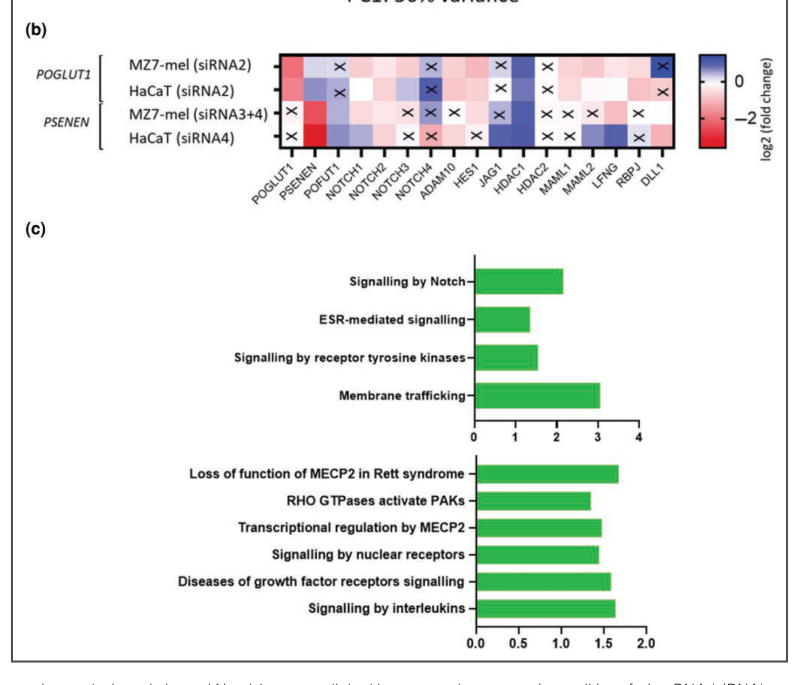

## Question

# Disease Characteristics Research Template

## Target Disease
- **Disease Name:** Dowling-Degos Disease
- **MONDO ID:**  (if available)
- **Category:** Mendelian

## Research Objectives

Please provide a comprehensive research report on **Dowling-Degos Disease** covering all of the
disease characteristics listed below. This report will be used to populate a disease knowledge
base entry. Be thorough and cite primary literature (PMID preferred) for all claims.

For each section, **suggested databases/resources** are listed. These are the first places
you should search for information on each topic.

---

### 1. Disease Information
> **Search first:** OMIM, Orphanet, ICD-10/ICD-11, MeSH, PubMed

- What is the disease? Provide a concise overview.
- What are the key identifiers? (OMIM, Orphanet, ICD-10/ICD-11, MeSH, Mondo)
- What are the common synonyms and alternative names?
- Is the information derived from individual patients (e.g., EHR) or aggregated disease-level resources?

### 2. Etiology

- **Disease Causal Factors**: What are the primary causes? (genetic, environmental, infectious, mechanistic)
- **Risk Factors**:
  > **Search first:** PubMed, Cochrane Library, UpToDate, clinical guidelines, ClinVar, ClinGen, GWAS Catalog, PheGenI, CTD, CDC, WHO, epidemiological databases
  - Genetic risk factors (causal variants, susceptibility loci, modifier genes)
  - Environmental risk factors (toxins, lifestyle, occupational exposures, age, sex, family history)
- **Protective Factors**:
  > **Search first:** PubMed, Cochrane Library, clinical trial databases, GWAS Catalog, gnomAD, WHO, CDC, nutrition databases
  - Genetic protective factors (protective variants, modifier alleles)
  - Environmental protective factors (diet, lifestyle, exposures that reduce risk)
- **Gene-Environment Interactions**: How do genetic and environmental factors interact to influence disease?
  > **Search first:** CTD, PubMed, PheGenI, GxE databases

### 3. Phenotypes
> **Search first:** HPO (Human Phenotype Ontology), OMIM, Orphanet, PubMed, clinicaltrials.gov, MedDRA, SNOMED CT, DECIPHER, LOINC

For each phenotype, provide:
- **Phenotype type**: symptoms, clinical signs, physical manifestations, behavioral changes, or laboratory abnormalities
  > For symptoms/signs: HPO, OMIM, Orphanet, PubMed
  > For behavioral changes: HPO, DSM, RDoC (Research Domain Criteria), PubMed
  > For laboratory abnormalities: LOINC, SNOMED CT, LabTests Online, PubMed
- **Phenotype characteristics**:
  > **Search first:** OMIM, Orphanet, HPO, PubMed
  - Age of symptom onset (neonatal, childhood, adult-onset, late-onset)
  - Symptom severity (mild, moderate, severe, variable)
  - Symptom progression (stable, progressive, episodic, fluctuating)
  - Frequency among affected individuals (percentage or qualitative)
- **Quality of life impact**: Effects on daily functioning and well-being (per-phenotype when possible)
  > **Search first:** EQ-5D database, SF-36, WHO QOL databases, PubMed
- Suggest HPO (Human Phenotype Ontology) terms for each phenotype

### 4. Genetic/Molecular Information

- **Causal Genes**: Gene mutations or chromosomal abnormalities responsible for disease (gene symbols, OMIM IDs)
  > **Search first:** OMIM, ClinVar, HGMD, Ensembl, NCBI Gene
- **Pathogenic Variants**:
  - Affected genes (gene symbols, HGNC IDs)
    > **Search first:** OMIM, NCBI Gene, Ensembl, HGNC, UniProt, GeneCards
  - Variant classification (pathogenic, likely pathogenic, VUS per ACMG/AMP guidelines)
    > **Search first:** ClinVar, ClinGen, ACMG/AMP guidelines, VarSome
  - Variant type/class (missense, frameshift, nonsense, splice-site, structural)
  - Allele frequency in population databases
    > **Search first:** gnomAD, 1000 Genomes, ExAC, TOPMed, dbSNP
  - Somatic vs germline origin
    > **Search first:** COSMIC (somatic), ClinVar, ICGC, TCGA
  - Functional consequences (loss of function, gain of function, dominant negative)
- **Modifier Genes**: Genes that modify disease severity or expression
- **Epigenetic Information**: DNA methylation, histone modifications, chromatin changes affecting disease
  > **Search first:** ENCODE, Roadmap Epigenomics, MethBase, DiseaseMeth
- **Chromosomal Abnormalities**: Large-scale genetic changes (aneuploidy, translocations, inversions)
  > **Search first:** DECIPHER, ClinVar, ECARUCA, UCSC Genome Browser

### 5. Environmental Information

- **Environmental Factors**: Non-genetic contributing factors (toxins, radiation, pollution, occupational exposure)
  > **Search first:** CTD (Comparative Toxicogenomics Database), TOXNET, PubMed, EPA databases
- **Lifestyle Factors**: Behavioral factors (smoking, diet, exercise, alcohol consumption)
  > **Search first:** CDC databases, WHO, PubMed, NHANES
- **Infectious Agents**: If applicable, pathogens causing or triggering disease (bacteria, viruses, fungi, parasites)
  > **Search first:** NCBI Taxonomy, ViPR, BV-BRC, MicrobeDB, GIDEON

### 6. Mechanism / Pathophysiology

- **Molecular Pathways**: Specific signaling cascades or biochemical pathways involved (Wnt, MAPK, mTOR, PI3K-AKT, etc.)
  > **Search first:** KEGG, Reactome, WikiPathways, PathBank, BioCyc
- **Cellular Processes**: Cell-level mechanisms (apoptosis, autophagy, cell cycle dysregulation, inflammation, etc.)
  > **Search first:** Gene Ontology (GO), Reactome, KEGG, PubMed
- **Protein Dysfunction**: How protein structure or function is altered (misfolding, aggregation, loss of function, gain of function)
  > **Search first:** UniProt, PDB (Protein Data Bank), InterPro, Pfam, AlphaFold
- **Metabolic Changes**: Alterations in metabolic processes (energy metabolism, lipid metabolism, amino acid metabolism)
  > **Search first:** KEGG, BioCyc, HMDB (Human Metabolome Database), BRENDA
- **Immune System Involvement**: Role of immune response (autoimmunity, immunodeficiency, chronic inflammation)
  > **Search first:** ImmPort, Immunome Database, IEDB, Gene Ontology
- **Tissue Damage Mechanisms**: How tissues/ are injured (oxidative stress, ischemia, fibrosis, necrosis)
  > **Search first:** PubMed, Gene Ontology, Reactome
- **Biochemical Abnormalities**: Specific molecular defects (enzyme deficiencies, receptor dysfunction, ion channel defects)
  > **Search first:** BRENDA, UniProt, KEGG, OMIM, PubMed
- **Epigenetic Changes**: DNA methylation, histone modifications affecting gene expression in disease
  > **Search first:** ENCODE, Roadmap Epigenomics, MethBase, DiseaseMeth
- **Molecular Profiling** (if available):
  - Transcriptomics/gene expression changes
    > **Search first:** GEO (Gene Expression Omnibus), ArrayExpress, GTEx, Human Cell Atlas, SRA
  - Proteomics findings
    > **Search first:** PRIDE, ProteomeXchange, Human Protein Atlas, STRING, BioGRID
  - Metabolomics signatures
    > **Search first:** MetaboLights, Metabolomics Workbench, HMDB, METLIN
  - Lipidomics alterations
    > **Search first:** LIPID MAPS, SwissLipids, LipidHome, Metabolomics Workbench
  - Genomic structural features
    > **Search first:** UCSC Genome Browser, Ensembl, NCBI, dbVar, DGV
- **Advanced Technologies** (if applicable):
  - Single-cell analysis findings (cell-type specific mechanisms, cellular heterogeneity)
    > **Search first:** Human Cell Atlas, Single Cell Portal, GEO, CELLxGENE
  - Spatial transcriptomics findings
    > **Search first:** GEO, Spatial Research, Vizgen, 10x Genomics data
  - Multi-omics integration results
    > **Search first:** TCGA, ICGC, cBioPortal, LinkedOmics, PubMed
  - Functional genomics screens (CRISPR, RNAi)
    > **Search first:** DepMap, GenomeRNAi, PubMed, BioGRID ORCS

For each mechanism, describe:
- The causal chain from initial trigger to clinical manifestation
- Which mechanisms are upstream vs downstream
- What cell types and biological processes are involved
- Suggest GO terms for biological processes and CL terms for cell types

### 7. Anatomical Structures Affected

- **Organ Level**:
  - Primary organs directly affected
  - Secondary organ involvement (complications, secondary effects)
  - Body systems involved (cardiovascular, nervous, digestive, respiratory, endocrine, etc.)
  > **Search first:** Uberon, FMA (Foundational Model of Anatomy), OMIM, HPO, ICD-11, MeSH, SNOMED CT
- **Tissue and Cell Level**:
  - Specific tissue types affected (epithelial, connective, muscle, nervous)
  - Specific cell populations targeted (with Cell Ontology terms)
  > **Search first:** Uberon, Human Protein Atlas, Cell Ontology, Human Cell Atlas, CellMarker, PanglaoDB
- **Subcellular Level**:
  - Cellular compartments involved (mitochondria, nucleus, ER, lysosomes) (with GO Cellular Component terms)
  > **Search first:** Gene Ontology (Cellular Component), UniProt, Human Protein Atlas
- **Localization**:
  - Specific anatomical sites (with UBERON terms)
    > **Search first:** FMA, Uberon, NeuroNames (for brain), SNOMED CT
  - Lateralization (unilateral, bilateral, asymmetric)
    > **Search first:** HPO, clinical literature, imaging databases

### 8. Temporal Development

- **Onset**:
  - Typical age of onset (congenital, pediatric, adult, geriatric)
  - Onset pattern (acute, subacute, chronic, insidious)
  > **Search first:** OMIM, Orphanet, HPO, PubMed
- **Progression**:
  - Disease stages (early, intermediate, advanced, end-stage)
    > **Search first:** Cancer Staging Manual (AJCC), WHO classifications, PubMed
  - Progression rate (rapid, slow, variable)
  - Disease course pattern (episodic, relapsing-remitting, progressive, stable)
  - Disease duration (self-limited, chronic lifelong)
  > **Search first:** Disease registries, longitudinal cohort databases, natural history studies, PubMed, Orphanet, OMIM
- **Patterns**:
  - Remission patterns (spontaneous, treatment-induced)
    > **Search first:** Clinical trial databases, disease registries, PubMed
  - Critical periods (time windows of vulnerability or opportunity for intervention)
    > **Search first:** PubMed, developmental biology databases, clinical guidelines

### 9. Inheritance and Population

- **Epidemiology**:
  - Prevalence (cases per 100,000 at given time)
  - Incidence (new cases per 100,000 per year)
  > **Search first:** Orphanet, CDC, WHO, GBD (Global Burden of Disease), national registries, SEER, disease registries
- **For Genetic Etiology**:
  - Inheritance pattern (AD, AR, X-linked, mitochondrial, multifactorial, polygenic)
    > **Search first:** OMIM, Orphanet, ClinVar, GTR (Genetic Testing Registry)
  - Penetrance (complete, incomplete, age-dependent)
    > **Search first:** ClinVar, OMIM, PubMed, ClinGen
  - Expressivity (variable, consistent)
    > **Search first:** OMIM, ClinVar, PubMed
  - Genetic anticipation (increasing severity in successive generations)
    > **Search first:** OMIM, PubMed (especially for repeat expansion disorders)
  - Germline mosaicism
    > **Search first:** ClinVar, OMIM, genetic counseling literature, PubMed
  - Founder effects (population-specific mutations)
    > **Search first:** gnomAD, population genetics databases, PubMed
  - Consanguinity role
    > **Search first:** OMIM, population studies, genetic counseling resources
  - Carrier frequency
    > **Search first:** gnomAD, carrier screening databases, GeneReviews, GTR
- **Population Demographics**:
  - Affected populations (ethnic or demographic groups with higher prevalence)
    > **Search first:** gnomAD, 1000 Genomes, PAGE Study, PubMed, population registries
  - Geographic distribution (endemic areas, regional variation)
    > **Search first:** WHO, CDC, GBD, Orphanet, geographic epidemiology databases
  - Geographic distribution of specific variants
  - Sex ratio (male:female)
    > **Search first:** Disease registries, OMIM, PubMed, epidemiological databases
  - Age distribution of affected individuals
    > **Search first:** CDC, disease registries, SEER, Orphanet

### 10. Diagnostics

- **Clinical Tests**:
  - Laboratory tests (blood, urine, tissue chemistry, specific enzyme assays)
    > **Search first:** LOINC, LabTests Online, PubMed
  - Biomarkers (proteins, metabolites, genetic markers, circulating biomarkers)
    > **Search first:** FDA Biomarker List, BEST (Biomarkers, EndpointS, and other Tools), PubMed
  - Imaging studies (X-ray, CT, MRI, PET, ultrasound)
    > **Search first:** RadLex, DICOM, Radiopaedia, imaging databases
  - Functional tests (pulmonary function, cardiac stress tests)
    > **Search first:** LOINC, clinical guidelines, PubMed
  - Electrophysiology (EEG, EMG, ECG, nerve conduction studies)
    > **Search first:** LOINC, clinical neurophysiology databases, PubMed
  - Biopsy findings (histopathology, immunohistochemistry)
    > **Search first:** SNOMED CT, College of American Pathologists resources, PubMed
  - Pathology findings (microscopic examination)
    > **Search first:** SNOMED CT, Digital Pathology databases, PubMed
- **Genetic Testing**:
  > **Search first:** GTR (Genetic Testing Registry), GeneReviews, ClinGen
  - Overview of recommended genetic testing approach
  - Whole genome sequencing (WGS) utility
    > **Search first:** GTR, ClinVar, GEL (Genomics England), gnomAD
  - Whole exome sequencing (WES) utility
    > **Search first:** GTR, ClinVar, OMIM, GeneMatcher
  - Gene panels (which panels, which genes)
    > **Search first:** GTR, ClinVar, laboratory-specific databases
  - Single gene testing
    > **Search first:** GTR, ClinVar, OMIM, GeneReviews
  - Chromosomal microarray (CMA)
    > **Search first:** DECIPHER, ClinVar, dbVar, ECARUCA
  - Karyotyping
    > **Search first:** Chromosome Abnormality Database, ClinVar, cytogenetics resources
  - FISH
    > **Search first:** ClinVar, cytogenetics databases, PubMed
  - Mitochondrial DNA testing
    > **Search first:** MITOMAP, MSeqDR, ClinVar, GTR
  - Repeat expansion testing
    > **Search first:** GTR, ClinVar, repeat expansion databases, PubMed
- **Omics-Based Diagnostics** (if applicable):
  - RNA sequencing / transcriptomics
    > **Search first:** GEO, ArrayExpress, GTEx, RNA-seq databases
  - Proteomics
    > **Search first:** PRIDE, ProteomeXchange, FDA Biomarker database
  - Metabolomics
    > **Search first:** MetaboLights, Metabolomics Workbench, HMDB
  - Epigenomics
    > **Search first:** GEO, ENCODE, Roadmap Epigenomics, MethBase
  - Liquid biopsy
    > **Search first:** COSMIC, ClinVar, liquid biopsy databases, PubMed
- **Clinical Criteria**:
  - Standardized diagnostic criteria (DSM, ICD, society guidelines)
    > **Search first:** DSM-5, ICD-11, clinical society guidelines, UpToDate
  - Differential diagnosis (other conditions to rule out, with distinguishing features)
    > **Search first:** DynaMed, UpToDate, clinical decision support systems
- **Screening**:
  - Screening methods for asymptomatic individuals (newborn screening, carrier screening, cascade screening)
    > **Search first:** ACMG recommendations, CDC newborn screening, GTR

### 11. Outcome/Prognosis

- **Survival and Mortality**:
  - Survival rate (5-year, 10-year, overall)
    > **Search first:** SEER, cancer registries, disease-specific registries, PubMed
  - Life expectancy (with and without treatment if applicable)
    > **Search first:** Orphanet, disease registries, actuarial databases, PubMed
  - Mortality rate
    > **Search first:** CDC, WHO, GBD, national mortality databases
  - Disease-specific mortality (deaths directly attributable to disease)
    > **Search first:** Disease registries, CDC Wonder, GBD, PubMed
- **Morbidity and Function**:
  - Morbidity (disease-related disability and health impacts)
    > **Search first:** GBD, WHO, disability databases, PubMed
  - Disability outcomes (long-term functional impairments)
    > **Search first:** ICF (International Classification of Functioning), disability registries
  - Quality of life measures (EQ-5D, SF-36, PROMIS, disease-specific tools)
    > **Search first:** EQ-5D database, SF-36, PROMIS, PubMed
- **Disease Course**:
  - Complications (secondary problems: infections, organ failure, etc.)
    > **Search first:** ICD codes, disease registries, clinical databases, PubMed
  - Recovery potential (likelihood and extent of recovery, with vs without treatment)
    > **Search first:** Natural history studies, rehabilitation databases, PubMed
- **Prediction**:
  - Prognostic factors (age, disease severity, biomarkers, treatment response)
    > **Search first:** Prognostic models databases, clinical calculators, PubMed
  - Prognostic biomarkers (molecular markers predicting disease course)
    > **Search first:** FDA Biomarker database, PubMed, cancer prognostic databases

### 12. Treatment

- **Pharmacotherapy**:
  - Pharmacological treatments (drug names, drug classes, mechanisms of action)
    > **Search first:** DrugBank, RxNorm, ATC classification, DailyMed, FDA databases
  - Pharmacogenomics (how genetic variants affect drug metabolism, efficacy, toxicity)
    > **Search first:** PharmGKB, CPIC (Clinical Pharmacogenetics), FDA Table of PGx Biomarkers
- **Advanced Therapeutics**:
  - Gene therapy (viral vectors, CRISPR, gene replacement, gene editing)
    > **Search first:** ClinicalTrials.gov, FDA gene therapy database, ASGCT resources
  - Cell therapy (stem cell transplant, CAR-T, cellular therapeutics)
    > **Search first:** ClinicalTrials.gov, FDA cell therapy database, FACT standards
  - RNA-based therapies (ASOs, siRNA, mRNA therapies)
    > **Search first:** ClinicalTrials.gov, FDA approvals, PubMed
  - Targeted therapies (treatments directed at specific molecular targets)
    > **Search first:** My Cancer Genome, OncoKB, ClinicalTrials.gov, FDA approvals
  - Immunotherapies (checkpoint inhibitors, monoclonal antibodies)
    > **Search first:** Cancer Immunotherapy Database, FDA approvals, ClinicalTrials.gov
- **Surgical and Interventional**:
  - Surgical interventions (types of surgery, timing, outcomes)
    > **Search first:** CPT codes, surgical registries, clinical guidelines, PubMed
- **Supportive and Rehabilitative**:
  - Supportive care (symptom management, pain control, nutrition)
    > **Search first:** Clinical guidelines, Cochrane Library, PubMed
  - Rehabilitation (physical therapy, occupational therapy, speech therapy)
    > **Search first:** Rehabilitation medicine databases, clinical guidelines, PubMed
- **Experimental**:
  - Experimental treatments in clinical trials (with NCT identifiers if available)
    > **Search first:** ClinicalTrials.gov, EU Clinical Trials Register, WHO ICTRP
- **Treatment Outcomes**:
  - Treatment response rates
    > **Search first:** Clinical trial databases, FDA reviews, systematic reviews, PubMed
  - Side effects and adverse events
    > **Search first:** FDA Adverse Event Reporting System (FAERS), MedWatch, PubMed
- **Treatment Strategy**:
  - Treatment algorithms (clinical pathways, decision trees)
    > **Search first:** Clinical practice guidelines, NCCN Guidelines, UpToDate
  - Combination therapies
    > **Search first:** ClinicalTrials.gov, treatment guidelines, PubMed
  - Personalized medicine approaches (genotype-guided treatment)
    > **Search first:** My Cancer Genome, CIViC, PharmGKB, precision medicine databases

For each treatment, suggest MAXO (Medical Action Ontology) terms where applicable.

### 13. Prevention

- **Prevention Levels**:
  - Primary prevention (preventing disease occurrence: vaccination, risk factor modification)
    > **Search first:** CDC, WHO, USPSTF recommendations, Cochrane Library
  - Secondary prevention (early detection and treatment: screening programs, early intervention)
    > **Search first:** USPSTF, CDC screening guidelines, WHO
  - Tertiary prevention (preventing complications in those with disease)
    > **Search first:** Clinical guidelines, disease management protocols, PubMed
- **Immunization**: Vaccine strategies (if applicable)
  > **Search first:** CDC vaccine schedules, WHO immunization, FDA vaccine database
- **Screening and Early Detection**:
  - Screening programs (population-based: newborn screening, cancer screening)
    > **Search first:** CDC screening programs, USPSTF, cancer screening databases
  - Genetic screening (carrier screening, preimplantation genetic diagnosis, prenatal testing)
    > **Search first:** ACMG recommendations, ACOG guidelines, GTR
  - Risk stratification (identifying high-risk individuals for targeted prevention)
    > **Search first:** Risk prediction models, clinical calculators, PubMed
- **Behavioral Interventions**: Lifestyle modifications to reduce risk
  > **Search first:** CDC, WHO, behavioral intervention databases, Cochrane Library
- **Counseling**: Genetic counseling (risk assessment, family planning guidance)
  > **Search first:** NSGC resources, ACMG guidelines, GeneReviews
- **Public Health**:
  - Public health interventions (sanitation, vector control, health education)
    > **Search first:** CDC, WHO, public health databases, PubMed
  - Environmental interventions (reducing environmental risk factors)
    > **Search first:** EPA databases, WHO environmental health, PubMed
- **Prophylaxis**: Preventive medications or procedures
  > **Search first:** Clinical guidelines, FDA approvals, PubMed

### 14. Other Species / Natural Disease

- **Taxonomy**: Species affected (with NCBI Taxon identifiers)
  > **Search first:** NCBI Taxonomy
- **Breed**: Specific breeds affected (with VBO identifiers if applicable)
  > **Search first:** VBO (Vertebrate Breed Ontology)
- **Gene**: Orthologous genes in other species (with NCBI Gene IDs)
  > **Search first:** NCBI Gene
- **Natural Disease**:
  - Naturally occurring disease in other species (companion animals, wildlife)
    > **Search first:** OMIA (Online Mendelian Inheritance in Animals), VetCompass, PubMed
  - Veterinary relevance and importance in animal health
    > **Search first:** OMIA, veterinary databases, PubMed
- **Comparative Biology**:
  - Comparative pathology (similarities and differences across species)
    > **Search first:** OMIA, comparative pathology databases, PubMed
  - Evolutionary conservation of disease mechanisms
    > **Search first:** HomoloGene, OrthoMCL, Alliance of Genome Resources
- **Transmission** (if applicable):
  - Zoonotic potential
    > **Search first:** CDC zoonotic diseases, WHO zoonoses, GIDEON
  - Cross-species susceptibility
    > **Search first:** NCBI Taxonomy, veterinary databases, PubMed

### 15. Model Organisms

- **Model Types**:
  - Model organism type (mammalian, invertebrate, cellular, in vitro)
    > **Search first:** Alliance of Genome Resources, model organism databases
  - Specific model systems (mouse, rat, zebrafish, Drosophila, C. elegans, yeast, cell lines, organoids, iPSCs)
    > **Search first:** MGI, RGD, ZFIN, FlyBase, WormBase, SGD, ATCC, Cellosaurus
  - Induced models (drug treatment, surgical intervention, environmental manipulation)
    > **Search first:** MGI, model organism databases, PubMed
- **Genetic Models**:
  - Types available (knockout, knock-in, transgenic, conditional, humanized)
    > **Search first:** MGI, IMPC, KOMP, EuMMCR, IMSR
- **Model Characteristics**:
  - Phenotype recapitulation (how well model reproduces human disease features)
    > **Search first:** Model organism databases, comparative studies, PubMed
  - Model limitations (aspects of human disease not captured)
    > **Search first:** Model organism databases, PubMed, review articles
- **Applications**:
  - Research applications (what aspects of disease can be studied)
    > **Search first:** Model organism databases, PubMed
- **Resources**:
  - Model databases
    > **Search first:** MGI, RGD, ZFIN, FlyBase, WormBase, IMSR, EMMA, MMRRC

---

## Citation Requirements

- Cite primary literature (PMID preferred) for all mechanistic and clinical claims
- Prioritize recent reviews and landmark papers
- Include direct quotes from abstracts where possible to support key statements
- Distinguish evidence source types: human clinical, model organism, in vitro, computational

## Output Format

Structure your response as a comprehensive narrative organized by the sections above.
For each section, provide:
- Factual content with specific details (numbers, percentages, gene names, variant nomenclature)
- Ontology term suggestions (HPO, GO, CL, UBERON, CHEBI, MAXO, MONDO) where applicable
- Evidence citations with PMIDs
- Direct quotes from abstracts to support key claims
- Clear indication when information is not available or not applicable for this disease

This report will be used to populate a disease knowledge base entry with:
- Pathophysiology descriptions with causal chains
- Gene/protein annotations (HGNC, GO terms)
- Phenotype associations (HP terms) with frequencies
- Cell type involvement (CL terms)
- Anatomical locations (UBERON terms)
- Chemical entities (CHEBI terms)
- Treatment annotations (MAXO terms)
- Evidence items with PMIDs and exact abstract quotes
- Epidemiology, prognosis, diagnostic, and prevention information
- Animal model descriptions with phenotype recapitulation details

## Output

Question: You are an expert researcher providing comprehensive, well-cited information.

Provide detailed information focusing on:
1. Key concepts and definitions with current understanding
2. Recent developments and latest research (prioritize 2023-2024 sources)
3. Current applications and real-world implementations
4. Expert opinions and analysis from authoritative sources
5. Relevant statistics and data from recent studies

Format as a comprehensive research report with proper citations. Include URLs and publication dates where available.
Always prioritize recent, authoritative sources and provide specific citations for all major claims.

# Disease Characteristics Research Template

## Target Disease
- **Disease Name:** Dowling-Degos Disease
- **MONDO ID:**  (if available)
- **Category:** Mendelian

## Research Objectives

Please provide a comprehensive research report on **Dowling-Degos Disease** covering all of the
disease characteristics listed below. This report will be used to populate a disease knowledge
base entry. Be thorough and cite primary literature (PMID preferred) for all claims.

For each section, **suggested databases/resources** are listed. These are the first places
you should search for information on each topic.

---

### 1. Disease Information
> **Search first:** OMIM, Orphanet, ICD-10/ICD-11, MeSH, PubMed

- What is the disease? Provide a concise overview.
- What are the key identifiers? (OMIM, Orphanet, ICD-10/ICD-11, MeSH, Mondo)
- What are the common synonyms and alternative names?
- Is the information derived from individual patients (e.g., EHR) or aggregated disease-level resources?

### 2. Etiology

- **Disease Causal Factors**: What are the primary causes? (genetic, environmental, infectious, mechanistic)
- **Risk Factors**:
  > **Search first:** PubMed, Cochrane Library, UpToDate, clinical guidelines, ClinVar, ClinGen, GWAS Catalog, PheGenI, CTD, CDC, WHO, epidemiological databases
  - Genetic risk factors (causal variants, susceptibility loci, modifier genes)
  - Environmental risk factors (toxins, lifestyle, occupational exposures, age, sex, family history)
- **Protective Factors**:
  > **Search first:** PubMed, Cochrane Library, clinical trial databases, GWAS Catalog, gnomAD, WHO, CDC, nutrition databases
  - Genetic protective factors (protective variants, modifier alleles)
  - Environmental protective factors (diet, lifestyle, exposures that reduce risk)
- **Gene-Environment Interactions**: How do genetic and environmental factors interact to influence disease?
  > **Search first:** CTD, PubMed, PheGenI, GxE databases

### 3. Phenotypes
> **Search first:** HPO (Human Phenotype Ontology), OMIM, Orphanet, PubMed, clinicaltrials.gov, MedDRA, SNOMED CT, DECIPHER, LOINC

For each phenotype, provide:
- **Phenotype type**: symptoms, clinical signs, physical manifestations, behavioral changes, or laboratory abnormalities
  > For symptoms/signs: HPO, OMIM, Orphanet, PubMed
  > For behavioral changes: HPO, DSM, RDoC (Research Domain Criteria), PubMed
  > For laboratory abnormalities: LOINC, SNOMED CT, LabTests Online, PubMed
- **Phenotype characteristics**:
  > **Search first:** OMIM, Orphanet, HPO, PubMed
  - Age of symptom onset (neonatal, childhood, adult-onset, late-onset)
  - Symptom severity (mild, moderate, severe, variable)
  - Symptom progression (stable, progressive, episodic, fluctuating)
  - Frequency among affected individuals (percentage or qualitative)
- **Quality of life impact**: Effects on daily functioning and well-being (per-phenotype when possible)
  > **Search first:** EQ-5D database, SF-36, WHO QOL databases, PubMed
- Suggest HPO (Human Phenotype Ontology) terms for each phenotype

### 4. Genetic/Molecular Information

- **Causal Genes**: Gene mutations or chromosomal abnormalities responsible for disease (gene symbols, OMIM IDs)
  > **Search first:** OMIM, ClinVar, HGMD, Ensembl, NCBI Gene
- **Pathogenic Variants**:
  - Affected genes (gene symbols, HGNC IDs)
    > **Search first:** OMIM, NCBI Gene, Ensembl, HGNC, UniProt, GeneCards
  - Variant classification (pathogenic, likely pathogenic, VUS per ACMG/AMP guidelines)
    > **Search first:** ClinVar, ClinGen, ACMG/AMP guidelines, VarSome
  - Variant type/class (missense, frameshift, nonsense, splice-site, structural)
  - Allele frequency in population databases
    > **Search first:** gnomAD, 1000 Genomes, ExAC, TOPMed, dbSNP
  - Somatic vs germline origin
    > **Search first:** COSMIC (somatic), ClinVar, ICGC, TCGA
  - Functional consequences (loss of function, gain of function, dominant negative)
- **Modifier Genes**: Genes that modify disease severity or expression
- **Epigenetic Information**: DNA methylation, histone modifications, chromatin changes affecting disease
  > **Search first:** ENCODE, Roadmap Epigenomics, MethBase, DiseaseMeth
- **Chromosomal Abnormalities**: Large-scale genetic changes (aneuploidy, translocations, inversions)
  > **Search first:** DECIPHER, ClinVar, ECARUCA, UCSC Genome Browser

### 5. Environmental Information

- **Environmental Factors**: Non-genetic contributing factors (toxins, radiation, pollution, occupational exposure)
  > **Search first:** CTD (Comparative Toxicogenomics Database), TOXNET, PubMed, EPA databases
- **Lifestyle Factors**: Behavioral factors (smoking, diet, exercise, alcohol consumption)
  > **Search first:** CDC databases, WHO, PubMed, NHANES
- **Infectious Agents**: If applicable, pathogens causing or triggering disease (bacteria, viruses, fungi, parasites)
  > **Search first:** NCBI Taxonomy, ViPR, BV-BRC, MicrobeDB, GIDEON

### 6. Mechanism / Pathophysiology

- **Molecular Pathways**: Specific signaling cascades or biochemical pathways involved (Wnt, MAPK, mTOR, PI3K-AKT, etc.)
  > **Search first:** KEGG, Reactome, WikiPathways, PathBank, BioCyc
- **Cellular Processes**: Cell-level mechanisms (apoptosis, autophagy, cell cycle dysregulation, inflammation, etc.)
  > **Search first:** Gene Ontology (GO), Reactome, KEGG, PubMed
- **Protein Dysfunction**: How protein structure or function is altered (misfolding, aggregation, loss of function, gain of function)
  > **Search first:** UniProt, PDB (Protein Data Bank), InterPro, Pfam, AlphaFold
- **Metabolic Changes**: Alterations in metabolic processes (energy metabolism, lipid metabolism, amino acid metabolism)
  > **Search first:** KEGG, BioCyc, HMDB (Human Metabolome Database), BRENDA
- **Immune System Involvement**: Role of immune response (autoimmunity, immunodeficiency, chronic inflammation)
  > **Search first:** ImmPort, Immunome Database, IEDB, Gene Ontology
- **Tissue Damage Mechanisms**: How tissues/ are injured (oxidative stress, ischemia, fibrosis, necrosis)
  > **Search first:** PubMed, Gene Ontology, Reactome
- **Biochemical Abnormalities**: Specific molecular defects (enzyme deficiencies, receptor dysfunction, ion channel defects)
  > **Search first:** BRENDA, UniProt, KEGG, OMIM, PubMed
- **Epigenetic Changes**: DNA methylation, histone modifications affecting gene expression in disease
  > **Search first:** ENCODE, Roadmap Epigenomics, MethBase, DiseaseMeth
- **Molecular Profiling** (if available):
  - Transcriptomics/gene expression changes
    > **Search first:** GEO (Gene Expression Omnibus), ArrayExpress, GTEx, Human Cell Atlas, SRA
  - Proteomics findings
    > **Search first:** PRIDE, ProteomeXchange, Human Protein Atlas, STRING, BioGRID
  - Metabolomics signatures
    > **Search first:** MetaboLights, Metabolomics Workbench, HMDB, METLIN
  - Lipidomics alterations
    > **Search first:** LIPID MAPS, SwissLipids, LipidHome, Metabolomics Workbench
  - Genomic structural features
    > **Search first:** UCSC Genome Browser, Ensembl, NCBI, dbVar, DGV
- **Advanced Technologies** (if applicable):
  - Single-cell analysis findings (cell-type specific mechanisms, cellular heterogeneity)
    > **Search first:** Human Cell Atlas, Single Cell Portal, GEO, CELLxGENE
  - Spatial transcriptomics findings
    > **Search first:** GEO, Spatial Research, Vizgen, 10x Genomics data
  - Multi-omics integration results
    > **Search first:** TCGA, ICGC, cBioPortal, LinkedOmics, PubMed
  - Functional genomics screens (CRISPR, RNAi)
    > **Search first:** DepMap, GenomeRNAi, PubMed, BioGRID ORCS

For each mechanism, describe:
- The causal chain from initial trigger to clinical manifestation
- Which mechanisms are upstream vs downstream
- What cell types and biological processes are involved
- Suggest GO terms for biological processes and CL terms for cell types

### 7. Anatomical Structures Affected

- **Organ Level**:
  - Primary organs directly affected
  - Secondary organ involvement (complications, secondary effects)
  - Body systems involved (cardiovascular, nervous, digestive, respiratory, endocrine, etc.)
  > **Search first:** Uberon, FMA (Foundational Model of Anatomy), OMIM, HPO, ICD-11, MeSH, SNOMED CT
- **Tissue and Cell Level**:
  - Specific tissue types affected (epithelial, connective, muscle, nervous)
  - Specific cell populations targeted (with Cell Ontology terms)
  > **Search first:** Uberon, Human Protein Atlas, Cell Ontology, Human Cell Atlas, CellMarker, PanglaoDB
- **Subcellular Level**:
  - Cellular compartments involved (mitochondria, nucleus, ER, lysosomes) (with GO Cellular Component terms)
  > **Search first:** Gene Ontology (Cellular Component), UniProt, Human Protein Atlas
- **Localization**:
  - Specific anatomical sites (with UBERON terms)
    > **Search first:** FMA, Uberon, NeuroNames (for brain), SNOMED CT
  - Lateralization (unilateral, bilateral, asymmetric)
    > **Search first:** HPO, clinical literature, imaging databases

### 8. Temporal Development

- **Onset**:
  - Typical age of onset (congenital, pediatric, adult, geriatric)
  - Onset pattern (acute, subacute, chronic, insidious)
  > **Search first:** OMIM, Orphanet, HPO, PubMed
- **Progression**:
  - Disease stages (early, intermediate, advanced, end-stage)
    > **Search first:** Cancer Staging Manual (AJCC), WHO classifications, PubMed
  - Progression rate (rapid, slow, variable)
  - Disease course pattern (episodic, relapsing-remitting, progressive, stable)
  - Disease duration (self-limited, chronic lifelong)
  > **Search first:** Disease registries, longitudinal cohort databases, natural history studies, PubMed, Orphanet, OMIM
- **Patterns**:
  - Remission patterns (spontaneous, treatment-induced)
    > **Search first:** Clinical trial databases, disease registries, PubMed
  - Critical periods (time windows of vulnerability or opportunity for intervention)
    > **Search first:** PubMed, developmental biology databases, clinical guidelines

### 9. Inheritance and Population

- **Epidemiology**:
  - Prevalence (cases per 100,000 at given time)
  - Incidence (new cases per 100,000 per year)
  > **Search first:** Orphanet, CDC, WHO, GBD (Global Burden of Disease), national registries, SEER, disease registries
- **For Genetic Etiology**:
  - Inheritance pattern (AD, AR, X-linked, mitochondrial, multifactorial, polygenic)
    > **Search first:** OMIM, Orphanet, ClinVar, GTR (Genetic Testing Registry)
  - Penetrance (complete, incomplete, age-dependent)
    > **Search first:** ClinVar, OMIM, PubMed, ClinGen
  - Expressivity (variable, consistent)
    > **Search first:** OMIM, ClinVar, PubMed
  - Genetic anticipation (increasing severity in successive generations)
    > **Search first:** OMIM, PubMed (especially for repeat expansion disorders)
  - Germline mosaicism
    > **Search first:** ClinVar, OMIM, genetic counseling literature, PubMed
  - Founder effects (population-specific mutations)
    > **Search first:** gnomAD, population genetics databases, PubMed
  - Consanguinity role
    > **Search first:** OMIM, population studies, genetic counseling resources
  - Carrier frequency
    > **Search first:** gnomAD, carrier screening databases, GeneReviews, GTR
- **Population Demographics**:
  - Affected populations (ethnic or demographic groups with higher prevalence)
    > **Search first:** gnomAD, 1000 Genomes, PAGE Study, PubMed, population registries
  - Geographic distribution (endemic areas, regional variation)
    > **Search first:** WHO, CDC, GBD, Orphanet, geographic epidemiology databases
  - Geographic distribution of specific variants
  - Sex ratio (male:female)
    > **Search first:** Disease registries, OMIM, PubMed, epidemiological databases
  - Age distribution of affected individuals
    > **Search first:** CDC, disease registries, SEER, Orphanet

### 10. Diagnostics

- **Clinical Tests**:
  - Laboratory tests (blood, urine, tissue chemistry, specific enzyme assays)
    > **Search first:** LOINC, LabTests Online, PubMed
  - Biomarkers (proteins, metabolites, genetic markers, circulating biomarkers)
    > **Search first:** FDA Biomarker List, BEST (Biomarkers, EndpointS, and other Tools), PubMed
  - Imaging studies (X-ray, CT, MRI, PET, ultrasound)
    > **Search first:** RadLex, DICOM, Radiopaedia, imaging databases
  - Functional tests (pulmonary function, cardiac stress tests)
    > **Search first:** LOINC, clinical guidelines, PubMed
  - Electrophysiology (EEG, EMG, ECG, nerve conduction studies)
    > **Search first:** LOINC, clinical neurophysiology databases, PubMed
  - Biopsy findings (histopathology, immunohistochemistry)
    > **Search first:** SNOMED CT, College of American Pathologists resources, PubMed
  - Pathology findings (microscopic examination)
    > **Search first:** SNOMED CT, Digital Pathology databases, PubMed
- **Genetic Testing**:
  > **Search first:** GTR (Genetic Testing Registry), GeneReviews, ClinGen
  - Overview of recommended genetic testing approach
  - Whole genome sequencing (WGS) utility
    > **Search first:** GTR, ClinVar, GEL (Genomics England), gnomAD
  - Whole exome sequencing (WES) utility
    > **Search first:** GTR, ClinVar, OMIM, GeneMatcher
  - Gene panels (which panels, which genes)
    > **Search first:** GTR, ClinVar, laboratory-specific databases
  - Single gene testing
    > **Search first:** GTR, ClinVar, OMIM, GeneReviews
  - Chromosomal microarray (CMA)
    > **Search first:** DECIPHER, ClinVar, dbVar, ECARUCA
  - Karyotyping
    > **Search first:** Chromosome Abnormality Database, ClinVar, cytogenetics resources
  - FISH
    > **Search first:** ClinVar, cytogenetics databases, PubMed
  - Mitochondrial DNA testing
    > **Search first:** MITOMAP, MSeqDR, ClinVar, GTR
  - Repeat expansion testing
    > **Search first:** GTR, ClinVar, repeat expansion databases, PubMed
- **Omics-Based Diagnostics** (if applicable):
  - RNA sequencing / transcriptomics
    > **Search first:** GEO, ArrayExpress, GTEx, RNA-seq databases
  - Proteomics
    > **Search first:** PRIDE, ProteomeXchange, FDA Biomarker database
  - Metabolomics
    > **Search first:** MetaboLights, Metabolomics Workbench, HMDB
  - Epigenomics
    > **Search first:** GEO, ENCODE, Roadmap Epigenomics, MethBase
  - Liquid biopsy
    > **Search first:** COSMIC, ClinVar, liquid biopsy databases, PubMed
- **Clinical Criteria**:
  - Standardized diagnostic criteria (DSM, ICD, society guidelines)
    > **Search first:** DSM-5, ICD-11, clinical society guidelines, UpToDate
  - Differential diagnosis (other conditions to rule out, with distinguishing features)
    > **Search first:** DynaMed, UpToDate, clinical decision support systems
- **Screening**:
  - Screening methods for asymptomatic individuals (newborn screening, carrier screening, cascade screening)
    > **Search first:** ACMG recommendations, CDC newborn screening, GTR

### 11. Outcome/Prognosis

- **Survival and Mortality**:
  - Survival rate (5-year, 10-year, overall)
    > **Search first:** SEER, cancer registries, disease-specific registries, PubMed
  - Life expectancy (with and without treatment if applicable)
    > **Search first:** Orphanet, disease registries, actuarial databases, PubMed
  - Mortality rate
    > **Search first:** CDC, WHO, GBD, national mortality databases
  - Disease-specific mortality (deaths directly attributable to disease)
    > **Search first:** Disease registries, CDC Wonder, GBD, PubMed
- **Morbidity and Function**:
  - Morbidity (disease-related disability and health impacts)
    > **Search first:** GBD, WHO, disability databases, PubMed
  - Disability outcomes (long-term functional impairments)
    > **Search first:** ICF (International Classification of Functioning), disability registries
  - Quality of life measures (EQ-5D, SF-36, PROMIS, disease-specific tools)
    > **Search first:** EQ-5D database, SF-36, PROMIS, PubMed
- **Disease Course**:
  - Complications (secondary problems: infections, organ failure, etc.)
    > **Search first:** ICD codes, disease registries, clinical databases, PubMed
  - Recovery potential (likelihood and extent of recovery, with vs without treatment)
    > **Search first:** Natural history studies, rehabilitation databases, PubMed
- **Prediction**:
  - Prognostic factors (age, disease severity, biomarkers, treatment response)
    > **Search first:** Prognostic models databases, clinical calculators, PubMed
  - Prognostic biomarkers (molecular markers predicting disease course)
    > **Search first:** FDA Biomarker database, PubMed, cancer prognostic databases

### 12. Treatment

- **Pharmacotherapy**:
  - Pharmacological treatments (drug names, drug classes, mechanisms of action)
    > **Search first:** DrugBank, RxNorm, ATC classification, DailyMed, FDA databases
  - Pharmacogenomics (how genetic variants affect drug metabolism, efficacy, toxicity)
    > **Search first:** PharmGKB, CPIC (Clinical Pharmacogenetics), FDA Table of PGx Biomarkers
- **Advanced Therapeutics**:
  - Gene therapy (viral vectors, CRISPR, gene replacement, gene editing)
    > **Search first:** ClinicalTrials.gov, FDA gene therapy database, ASGCT resources
  - Cell therapy (stem cell transplant, CAR-T, cellular therapeutics)
    > **Search first:** ClinicalTrials.gov, FDA cell therapy database, FACT standards
  - RNA-based therapies (ASOs, siRNA, mRNA therapies)
    > **Search first:** ClinicalTrials.gov, FDA approvals, PubMed
  - Targeted therapies (treatments directed at specific molecular targets)
    > **Search first:** My Cancer Genome, OncoKB, ClinicalTrials.gov, FDA approvals
  - Immunotherapies (checkpoint inhibitors, monoclonal antibodies)
    > **Search first:** Cancer Immunotherapy Database, FDA approvals, ClinicalTrials.gov
- **Surgical and Interventional**:
  - Surgical interventions (types of surgery, timing, outcomes)
    > **Search first:** CPT codes, surgical registries, clinical guidelines, PubMed
- **Supportive and Rehabilitative**:
  - Supportive care (symptom management, pain control, nutrition)
    > **Search first:** Clinical guidelines, Cochrane Library, PubMed
  - Rehabilitation (physical therapy, occupational therapy, speech therapy)
    > **Search first:** Rehabilitation medicine databases, clinical guidelines, PubMed
- **Experimental**:
  - Experimental treatments in clinical trials (with NCT identifiers if available)
    > **Search first:** ClinicalTrials.gov, EU Clinical Trials Register, WHO ICTRP
- **Treatment Outcomes**:
  - Treatment response rates
    > **Search first:** Clinical trial databases, FDA reviews, systematic reviews, PubMed
  - Side effects and adverse events
    > **Search first:** FDA Adverse Event Reporting System (FAERS), MedWatch, PubMed
- **Treatment Strategy**:
  - Treatment algorithms (clinical pathways, decision trees)
    > **Search first:** Clinical practice guidelines, NCCN Guidelines, UpToDate
  - Combination therapies
    > **Search first:** ClinicalTrials.gov, treatment guidelines, PubMed
  - Personalized medicine approaches (genotype-guided treatment)
    > **Search first:** My Cancer Genome, CIViC, PharmGKB, precision medicine databases

For each treatment, suggest MAXO (Medical Action Ontology) terms where applicable.

### 13. Prevention

- **Prevention Levels**:
  - Primary prevention (preventing disease occurrence: vaccination, risk factor modification)
    > **Search first:** CDC, WHO, USPSTF recommendations, Cochrane Library
  - Secondary prevention (early detection and treatment: screening programs, early intervention)
    > **Search first:** USPSTF, CDC screening guidelines, WHO
  - Tertiary prevention (preventing complications in those with disease)
    > **Search first:** Clinical guidelines, disease management protocols, PubMed
- **Immunization**: Vaccine strategies (if applicable)
  > **Search first:** CDC vaccine schedules, WHO immunization, FDA vaccine database
- **Screening and Early Detection**:
  - Screening programs (population-based: newborn screening, cancer screening)
    > **Search first:** CDC screening programs, USPSTF, cancer screening databases
  - Genetic screening (carrier screening, preimplantation genetic diagnosis, prenatal testing)
    > **Search first:** ACMG recommendations, ACOG guidelines, GTR
  - Risk stratification (identifying high-risk individuals for targeted prevention)
    > **Search first:** Risk prediction models, clinical calculators, PubMed
- **Behavioral Interventions**: Lifestyle modifications to reduce risk
  > **Search first:** CDC, WHO, behavioral intervention databases, Cochrane Library
- **Counseling**: Genetic counseling (risk assessment, family planning guidance)
  > **Search first:** NSGC resources, ACMG guidelines, GeneReviews
- **Public Health**:
  - Public health interventions (sanitation, vector control, health education)
    > **Search first:** CDC, WHO, public health databases, PubMed
  - Environmental interventions (reducing environmental risk factors)
    > **Search first:** EPA databases, WHO environmental health, PubMed
- **Prophylaxis**: Preventive medications or procedures
  > **Search first:** Clinical guidelines, FDA approvals, PubMed

### 14. Other Species / Natural Disease

- **Taxonomy**: Species affected (with NCBI Taxon identifiers)
  > **Search first:** NCBI Taxonomy
- **Breed**: Specific breeds affected (with VBO identifiers if applicable)
  > **Search first:** VBO (Vertebrate Breed Ontology)
- **Gene**: Orthologous genes in other species (with NCBI Gene IDs)
  > **Search first:** NCBI Gene
- **Natural Disease**:
  - Naturally occurring disease in other species (companion animals, wildlife)
    > **Search first:** OMIA (Online Mendelian Inheritance in Animals), VetCompass, PubMed
  - Veterinary relevance and importance in animal health
    > **Search first:** OMIA, veterinary databases, PubMed
- **Comparative Biology**:
  - Comparative pathology (similarities and differences across species)
    > **Search first:** OMIA, comparative pathology databases, PubMed
  - Evolutionary conservation of disease mechanisms
    > **Search first:** HomoloGene, OrthoMCL, Alliance of Genome Resources
- **Transmission** (if applicable):
  - Zoonotic potential
    > **Search first:** CDC zoonotic diseases, WHO zoonoses, GIDEON
  - Cross-species susceptibility
    > **Search first:** NCBI Taxonomy, veterinary databases, PubMed

### 15. Model Organisms

- **Model Types**:
  - Model organism type (mammalian, invertebrate, cellular, in vitro)
    > **Search first:** Alliance of Genome Resources, model organism databases
  - Specific model systems (mouse, rat, zebrafish, Drosophila, C. elegans, yeast, cell lines, organoids, iPSCs)
    > **Search first:** MGI, RGD, ZFIN, FlyBase, WormBase, SGD, ATCC, Cellosaurus
  - Induced models (drug treatment, surgical intervention, environmental manipulation)
    > **Search first:** MGI, model organism databases, PubMed
- **Genetic Models**:
  - Types available (knockout, knock-in, transgenic, conditional, humanized)
    > **Search first:** MGI, IMPC, KOMP, EuMMCR, IMSR
- **Model Characteristics**:
  - Phenotype recapitulation (how well model reproduces human disease features)
    > **Search first:** Model organism databases, comparative studies, PubMed
  - Model limitations (aspects of human disease not captured)
    > **Search first:** Model organism databases, PubMed, review articles
- **Applications**:
  - Research applications (what aspects of disease can be studied)
    > **Search first:** Model organism databases, PubMed
- **Resources**:
  - Model databases
    > **Search first:** MGI, RGD, ZFIN, FlyBase, WormBase, IMSR, EMMA, MMRRC

---

## Citation Requirements

- Cite primary literature (PMID preferred) for all mechanistic and clinical claims
- Prioritize recent reviews and landmark papers
- Include direct quotes from abstracts where possible to support key statements
- Distinguish evidence source types: human clinical, model organism, in vitro, computational

## Output Format

Structure your response as a comprehensive narrative organized by the sections above.
For each section, provide:
- Factual content with specific details (numbers, percentages, gene names, variant nomenclature)
- Ontology term suggestions (HPO, GO, CL, UBERON, CHEBI, MAXO, MONDO) where applicable
- Evidence citations with PMIDs
- Direct quotes from abstracts to support key claims
- Clear indication when information is not available or not applicable for this disease

This report will be used to populate a disease knowledge base entry with:
- Pathophysiology descriptions with causal chains
- Gene/protein annotations (HGNC, GO terms)
- Phenotype associations (HP terms) with frequencies
- Cell type involvement (CL terms)
- Anatomical locations (UBERON terms)
- Chemical entities (CHEBI terms)
- Treatment annotations (MAXO terms)
- Evidence items with PMIDs and exact abstract quotes
- Epidemiology, prognosis, diagnostic, and prevention information
- Animal model descriptions with phenotype recapitulation details

# Dowling–Degos Disease: Comprehensive Disease-Characteristics Report

## Executive summary

Dowling–Degos disease (DDD) is a rare, chronic, autosomal-dominant reticulate pigmentary genodermatosis. It usually begins after puberty and slowly progresses with small brown-to-black macules and hyperkeratotic papules, particularly in flexures; comedone-like lesions, follicular plugging, perioral pitted scars, pruritus, and burning may accompany the pigmentation. Four genes are firmly associated with DDD—**KRT5, POFUT1, POGLUT1, and PSENEN**—and available evidence supports loss of function/haploinsufficiency. Recent 2023–2024 work strengthens a unifying model in which disturbed keratin organization or defective Notch-receptor glycosylation/cleavage reduces melanocyte Notch signaling and alters pigment handling. There is no curative or approved DDD-specific treatment; management is symptomatic and cosmetic, with evidence largely limited to case reports. DDD is not known to shorten life, but itch, inflammation, visible pigmentation, hidradenitis suppurativa (HS), and stigmatization can impair quality of life. (kumar2024morbusdowlingdegos pages 37-39, kumar2024morbusdowlingdegos pages 1-9, kumar2024morbusdowlingdegos pages 25-29)

## 1. Disease information

### Definition and identifiers

DDD is a genetically and clinically heterogeneous disorder of epidermal pigmentation and keratinization. The most current retrieved disease-level identifier is **MONDO:0008371**. Reported Mendelian subtype entries are **OMIM/MIM 179850, 615327, 615696, and 613736**. Open Targets independently associates MONDO:0008371 with KRT5, POFUT1, POGLUT1, and PSENEN. (OpenTargets Search: Dowling-Degos disease-KRT5,POFUT1,POGLUT1,PSENEN, kumar2024morbusdowlingdegos pages 1-9)

**Synonyms:** Dowling–Degos disease; Dowling-Degos disease; Morbus Dowling-Degos; reticulate pigmented anomaly of the flexures; reticulate pigmentary disorder of the flexures; “dermatose pigmentaire réticulée des plis.” The term **Galli–Galli disease** denotes an acantholytic histopathologic variant within the DDD spectrum rather than a clearly separate disorder. The name DDD was introduced in 1978, following the descriptions by Dowling and Freudenthal in 1938 and Degos and Ossipowski in 1954. (kumar2024morbusdowlingdegos pages 1-9, batyckabaran2010dowlingdegosdiseasecase pages 4-5)

No uniquely specific ICD-10, ICD-11, or MeSH code was established in the retrieved evidence; implementation should therefore use the closest local hereditary pigmentation/genodermatosis code while retaining MONDO and OMIM identifiers. The report is based on **aggregated disease resources, published pedigrees, cohorts, biopsies, and experimental studies**, not individual EHR-derived data.

## 2. Etiology, risk, and protective factors

### Primary cause

DDD is principally a **germline monogenic disorder** caused by heterozygous loss-of-function variants in **KRT5, POFUT1, POGLUT1, or PSENEN**. Haploinsufficiency is the favored mechanism. KRT5 encodes basal-keratinocyte keratin 5; POFUT1 and POGLUT1 glycosylate extracellular EGF-like repeats of Notch receptors; PSENEN encodes PEN-2, a γ-secretase component required for Notch intracellular-domain release. (betz2006lossoffunctionmutationsin pages 2-5, kumar2024morbusdowlingdegos pages 1-9, kumar2024morbusdowlingdegos pages 9-12)

### Risk and modifier factors

* **Family history:** the major risk factor; an affected heterozygous parent ordinarily confers a 50% transmission probability per pregnancy.
* **Age:** manifestations are commonly postpubertal and age dependent.
* **Sex:** males and females are genetically affected equally, although clinical ascertainment may differ.
* **Smoking and obesity:** not established causes of DDD pigmentation. They are plausible modifiers of **HS penetrance/severity**, particularly in PSENEN-associated DDD–HS overlap. The 2024 synthesis specifically describes increased HS susceptibility with nicotine exposure and/or obesity, but HS literature acknowledges that formal genotype–environment interaction data remain incomplete. In HS generally, smoking is reported in up to 90% of patients, while obesity increases friction and inflammatory signaling; these statistics must not be interpreted as DDD-specific prevalence. (kumar2024morbusdowlingdegos pages 1-9, pace2022thegenomicarchitecture pages 13-14, satoh2024geneticmutationsin pages 5-7)
* No infectious agent, toxin, occupational exposure, diet, alcohol exposure, or ultraviolet exposure has been demonstrated to cause DDD.

No validated genetic or environmental **protective factor** has been identified. Smoking avoidance and healthy weight are reasonable for reducing general and HS-related risk, but are not proven to prevent DDD pigmentation.

## 3. Phenotypes

| Phenotype | Type and characteristics | Frequency/evidence | Suggested HPO term |
|---|---|---|---|
| Reticulate hyperpigmentation | Primary physical sign; brown/black macules in a net-like arrangement; usually postpubertal, slowly progressive, variable severity | Defining/very frequent | Hyperpigmentation of the skin (**HP:0000953**); reticulate pigmentation |
| Flexural/intertriginous involvement | Axillae, groin, inframammary and other large folds; often bilateral but not necessarily symmetric | Classic KRT5-associated pattern | Abnormality of skin pigmentation; flexural hyperpigmentation |
| Hyperkeratotic dark papules | Small, dark-brown papules accompanying macules | Common/characteristic | Hyperkeratosis (**HP:0000962**); papule |
| Follicular plugging/comedone-like lesions | Plugged follicles and pseudocysts, sometimes “dark-dot” lesions | Characteristic but variably expressed | Comedones; follicular hyperkeratosis |
| Pitted perioral scars | Atrophic pits around the mouth; may occur without preceding acne | Variable | Atrophic scars; abnormal facial skin morphology |
| Pruritus/burning | Symptomatic in a subset; can be marked | Variable; percentages unavailable | Pruritus (**HP:0000989**); burning sensation |
| Acantholysis | Histologic feature defining Galli–Galli variant | Subset | Acantholysis |
| Hidradenitis suppurativa | Painful nodules, abscesses, sinus tracts, and scars; enriched in PSENEN/γ-secretase overlap phenotypes | Genotype-dependent subset; frequency unknown | Hidradenitis suppurativa |

A 44-year-old human case had 2–4-mm dark-brown reticulate macules in axillary and anogenital regions, with insidious onset and enlargement over three months. Histology showed heavily pigmented, lacy finger-like epidermal extensions and dilated follicles without increased melanocyte number. (batyckabaran2010dowlingdegosdiseasecase pages 1-1)

**Quality of life:** no DDD-specific EQ-5D, SF-36, PROMIS, or validated disease-specific score was found. Nevertheless, itch, burning, inflammatory lesions, visible dyspigmentation, and stigmatization can produce substantial individual distress. DDD does not generally impair cognition, behavior, internal-organ function, or routine laboratory values. (kumar2024morbusdowlingdegos pages 1-9)

## 4. Genetic and molecular information

| Gene / protein | DDD subtype / MIM (if supported) | Variant / mechanism | Typical phenotype distribution | Evidence / model | Key source / date / PMID or DOI |
|---|---|---|---|---|---|
| **KRT5 / keratin 5** | Established causal gene; classic DDD included under **MIM 179850** | Loss-of-function / haploinsufficiency; landmark variants **c.418dupA (p.Ile140Asnfs*39)** and **c.14C>A (p.Ser5*)**. 2024 founder study showed recurrent **c.418dup** on a shared haplotype in multiple apparently unrelated families. Mechanistically linked to epithelial remodeling, melanosome mistargeting, and altered perinuclear keratin organization. | Typically **large body folds / flexures**, plus **trunk, neck, face**; postpubertal progressive reticulate hyperpigmentation with hyperkeratotic papules, sometimes pruritus. | Human pedigrees + histopathology + electron microscopy + transfected cell studies; founder haplotype analysis in >120 unrelated DDD cases/families. | Betz **2006**, *Am J Hum Genet*; DOI: https://doi.org/10.1086/500850; PMID **16465624** (betz2006lossoffunctionmutationsin pages 2-5, betz2006lossoffunctionmutationsin pages 1-2, betz2006lossoffunctionmutationsin pages 5-9). Kumar et al. **2024**, *J Invest Dermatol*; DOI: https://doi.org/10.1016/j.jid.2023.04.036 (kumar2024morbusdowlingdegos pages 39-41, kumar2024morbusdowlingdegos pages 41-42) |
| **POFUT1 / protein O-fucosyltransferase 1** | Established causal gene; DDD subtype listed in 2024 synthesis among **MIM 615327 / 615696 / 613736** disease spectrum, but exact subtype-to-gene mapping not fully resolved in available context | Loss-of-function / presumed haploinsufficiency affecting **O-fucosylation of Notch receptors** and downstream Notch signaling. Referenced prior knockdown studies in **zebrafish larvae** and **keratinocyte-origin cells** showing differential expression of Notch-pathway genes. | Often reported with **acro-genital involvement**; generalized reticulate hyperpigmentation may occur. | Human genetic association from prior primary studies summarized in 2024 dissertation; comparative functional evidence from zebrafish and keratinocyte knockdown literature. | Kumar **2024** dissertation summary; DOI: https://doi.org/10.48565/bonndoc-397 (kumar2024morbusdowlingdegos pages 1-9, kumar2024morbusdowlingdegos pages 9-12). Open Targets disease-target evidence citing PMIDs **23684010**, **25229252**, **25639155** (OpenTargets Search: Dowling-Degos disease-KRT5,POFUT1,POGLUT1,PSENEN) |
| **POGLUT1 / protein O-glucosyltransferase 1** | Established causal gene; DDD subtype listed in 2024 synthesis within **MIM 179850 / 615327 / 615696 / 613736** spectrum; exact mapping not fully explicit in available context | Loss-of-function / presumed haploinsufficiency affecting **O-glucosylation of Notch receptors**. Representative founder / recurrent variants from 2024 haplotype study: **c.652C>T (p.Arg218*)**, **c.798-2A>C**, **c.835C>T (p.Arg279Trp)**, **c.1051C>T (p.Gln351*)**, **c.205C>T (p.Arg69*)**, **c.1080_1081insG (p.Asn361Glufs*5)**, **c.11G>A (p.Trp4*)**. 2023 transcriptomic mechanism: POGLUT1 knockdown in melanocyte-derived cells altered Notch-pathway gene expression and reduced cleaved Notch1 activity. | Often reported with **extremity-predominant hyperpigmentation**; face/trunk may also be involved. | Human founder haplotype analysis; **MZ7-mel melanocyte** and **HaCaT keratinocyte** siRNA knockdown with RNA-seq / pathway analysis / cleaved Notch1 ELISA. | Kumar et al. **2024**, *J Invest Dermatol*; DOI: https://doi.org/10.1016/j.jid.2023.04.036 (kumar2024morbusdowlingdegos pages 39-41, kumar2024morbusdowlingdegos pages 41-42). Kumar et al. **2023** transcriptomic study summarized in 2024 dissertation; DOI: https://doi.org/10.48565/bonndoc-397 (kumar2024morbusdowlingdegos pages 37-39, kumar2024morbusdowlingdegos pages 25-29, kumar2024morbusdowlingdegos pages 39-41, kumar2024morbusdowlingdegos pages 9-12, kumar2024morbusdowlingdegos pages 16-19) |
| **PSENEN / PEN-2, gamma-secretase subunit** | Established causal gene; DDD subtype listed in 2024 synthesis within **MIM 179850 / 615327 / 615696 / 613736** spectrum; exact subtype mapping not explicit in available context | Loss-of-function / presumed haploinsufficiency impairing **gamma-secretase-mediated Notch receptor cleavage**. Also linked to **DDD with hidradenitis suppurativa (acne inversa)** in susceptible individuals. 2023 transcriptomic mechanism: PSENEN knockdown in melanocyte-derived cells reduced Notch signaling, with enrichment of **Notch**, **ESR**, **RTK signaling**, and **membrane trafficking** pathways. | DDD pigmentation phenotype with potential **HS overlap**, especially in intertriginous sites; classic DDD may involve face, trunk, flexures. | Human clinical genetics + overlap phenotype reports; melanocyte / keratinocyte siRNA knockdown transcriptomics and functional Notch assay. | Ralser et al. / summarized in Kumar **2024** dissertation; DOI: https://doi.org/10.48565/bonndoc-397 (kumar2024morbusdowlingdegos pages 1-9, kumar2024morbusdowlingdegos pages 25-29, kumar2024morbusdowlingdegos pages 9-12, kumar2024morbusdowlingdegos pages 16-19). Open Targets cites PMID **28287404** for PSENEN-DDD association (OpenTargets Search: Dowling-Degos disease-KRT5,POFUT1,POGLUT1,PSENEN) |
| **NCSTN / nicastrin** | **Not established** as canonical DDD gene in available disease-level resources; **emerging HS-DDD overlap report** | Reported **loss-of-function NCSTN mutation** in a familial phenotype combining **hidradenitis suppurativa and DDD**, supporting shared **Notch/gamma-secretase pathway** biology rather than established isolated DDD causation. | Overlap phenotype with **HS in intertriginous regions** plus clinical / histologic DDD features; not enough evidence in current context to define a standalone DDD distribution pattern. | Case-report / familial overlap evidence only; should be interpreted as **emerging** and not equivalent to the four established DDD genes. | Garcovich et al. **2020**, *Br J Dermatol*; DOI: https://doi.org/10.1111/bjd.19121 (batyckabaran2010dowlingdegosdiseasecase pages 2-3). Additional 2023 NCSTN-HS-DDD overlap paper listed in search results but unobtainable in full context (kumar2024morbusdowlingdegos pages 37-39) |
| **Shared 2023 molecular mechanism across Notch-pathway DDD genes** | Not a subtype entry; cross-gene mechanism most directly tested for **POGLUT1** and **PSENEN** | In **melanocyte-derived MZ7-mel cells**, siRNA knockdown caused differential expression of multiple **Notch signaling** genes, significant pathway enrichment, and **reduced cleaved Notch1**; downstream candidate pathways: **estrogen receptor signaling**, **receptor tyrosine kinase signaling**, and **membrane trafficking**. HaCaT keratinocytes showed altered expression but no clear Notch pathway enrichment. | Provides a mechanistic explanation for **hyperpigmentation**, pointing to melanocyte-centered dysregulation rather than a purely keratinocyte-intrinsic pigment defect. | In vitro transcriptomics / pathway analysis / ELISA; not yet a validated clinical biomarker or therapy target. | Kumar et al. **2023** research letter summarized in dissertation **2024**; DOI: https://doi.org/10.48565/bonndoc-397 (kumar2024morbusdowlingdegos pages 37-39, kumar2024morbusdowlingdegos pages 25-29, kumar2024morbusdowlingdegos pages 39-41, kumar2024morbusdowlingdegos pages 9-12, kumar2024morbusdowlingdegos pages 16-19, kumar2024morbusdowlingdegos media 1c50c4b0) |

*Table: This compact table summarizes the core gene-level knowledge base for Dowling-Degos disease, including established causal genes, representative variants, phenotype patterns, and the recent Notch-centered mechanistic evidence. It also separates NCSTN as an emerging hidradenitis suppurativa–DDD overlap finding rather than a fully established canonical DDD gene.*

### Pathogenic variants and classification

The landmark KRT5 study identified **c.418dupA (p.Ile140Asnfs*39)** and **c.14C>A (p.Ser5*)**. In two German families containing 24 people, nine were affected; linkage mapped the locus to 12q13.11–q15 with LOD 4.42. The authors modeled 95% penetrance and a 1% phenocopy rate. Their central abstract-level conclusion was: **“Loss-of-function mutations in the keratin 5 gene lead to Dowling-Degos disease.”** (PMID **16465624**; published March 2006; DOI/URL: https://doi.org/10.1086/500850). (betz2006lossoffunctionmutationsin pages 2-5, betz2006lossoffunctionmutationsin pages 1-2)

The 2024 founder analysis examined a resource of more than 120 unrelated cases/families from Germany, Denmark, and Switzerland. KRT5 c.418dup occurred in 18 apparently unrelated individuals and shared a common haplotype. Seven recurrent POGLUT1 variants occurred in 21 individuals: **c.652C>T (p.Arg218*)**, **c.798-2A>C**, **c.835C>T (p.Arg279Trp)**, **c.1051C>T (p.Gln351*)**, **c.205C>T (p.Arg69*)**, **c.1080_1081insG (p.Asn361Glufs*5)**, and **c.11G>A (p.Trp4*)**. Shared 60-kb–6.1-Mb haplotypes supported founder effects rather than recurrent mutational hotspots. The authors state that these are the first data demonstrating KRT5 and POGLUT1 founder effects in DDD. (Published January 2024; DOI/URL: https://doi.org/10.1016/j.jid.2023.04.036). (kumar2024morbusdowlingdegos pages 25-29, kumar2024morbusdowlingdegos pages 39-41, kumar2024morbusdowlingdegos pages 41-42)

Most disease-causing alleles are nonsense, frameshift, canonical splice, initiation-loss, or other loss-of-function variants; missense alleles such as POGLUT1 p.Arg279Trp also occur. They are germline, not somatic. Segmental DDD/Galli–Galli presentations may reflect postzygotic mosaicism, but the retrieved evidence does not quantify mosaic frequency. Exact ClinVar ACMG classifications and gnomAD allele frequencies must be checked variant-by-variant; no defensible universal frequency was available. Pathogenic alleles are expected to be rare, consistent with a rare dominant disorder.

**NCSTN** should be treated cautiously. Familial NCSTN loss of function has been reported in combined HS–DDD phenotypes, supporting shared γ-secretase/Notch biology, but evidence is insufficient to rank NCSTN alongside the four established isolated-DDD genes. (batyckabaran2010dowlingdegosdiseasecase pages 2-3)

No reproducible modifier gene, epigenetic signature, chromosomal rearrangement, aneuploidy, repeat expansion, mitochondrial defect, or large recurrent copy-number abnormality is established.

## 5. Environmental information

DDD is not infectious, transmissible, or toxin induced. No causal role is established for smoking, diet, exercise, alcohol, radiation, pollution, or occupational exposure. Friction, heat, sweating, smoking, and obesity may worsen intertriginous inflammation or HS in susceptible patients, but this is extrapolated partly from HS and should not be represented as proven DDD causation. The best recent expert assessment is that obesity/smoking–genotype interactions remain unresolved because phenotype reporting has been inconsistent. (pace2022thegenomicarchitecture pages 13-14, satoh2024geneticmutationsin pages 5-7)

## 6. Mechanism and pathophysiology

### Causal chain

1. **Upstream germline loss of function:** heterozygous KRT5, POFUT1, POGLUT1, or PSENEN deficiency.
2. **Protein/cellular defect:**
   * KRT5 deficiency disrupts basal-keratinocyte intermediate-filament dosage, epithelial architecture, organelle positioning, and melanosome uptake/turnover.
   * POFUT1/POGLUT1 deficiency impairs Notch extracellular-domain O-fucosylation/O-glucosylation, affecting folding and ligand-dependent signaling.
   * PSENEN deficiency impairs γ-secretase S3 cleavage and release of the transcriptionally active Notch intracellular domain.
3. **Shared signaling consequence:** reduced Notch signaling, particularly in melanocytes, with altered membrane trafficking, receptor-tyrosine-kinase, and estrogen-receptor-associated programs.
4. **Tissue consequence:** abnormal epidermal rete-ridge growth and irregular melanosome distribution/persistence in keratinocytes, without necessarily increasing melanocyte number.
5. **Clinical consequence:** reticulate hyperpigmentation, hyperkeratotic papules, follicular abnormalities, and—in some γ-secretase genotypes—HS susceptibility. (kumar2024morbusdowlingdegos pages 25-29, kumar2024morbusdowlingdegos pages 9-12, betz2006lossoffunctionmutationsin pages 5-9)

### Human and in-vitro evidence

KRT5-mutant skin exhibited epithelial downgrowth, irregular melanosomes, persistent suprabasal melanosomes, and altered perinuclear filaments. The p.Ile140fs protein remained soluble and did not enter the intermediate-filament network, supporting haploinsufficiency rather than a classic dominant-negative keratin mechanism. The authors concluded that K5 haploinsufficiency causes **“epithelial remodeling, melanosome mistargeting, and altered perinuclear organization.”** (betz2006lossoffunctionmutationsin pages 2-5, betz2006lossoffunctionmutationsin pages 5-9)

In the 2023 transcriptomic study, POGLUT1 and PSENEN siRNA reduced target expression by approximately 82–98% in HaCaT keratinocytes and 59–94% in MZ7-mel melanocyte-derived cells. Notch was the strongest enriched pathway in MZ7-mel cells; cleaved Notch1 decreased after either knockdown. HaCaT cells showed altered individual transcripts but no Notch pathway enrichment. This makes melanocyte Notch deficiency the leading recent unifying hypothesis, not yet a clinically validated biomarker. (Publication August 2023; DOI/URL: https://doi.org/10.1093/bjd/ljad306). (kumar2024morbusdowlingdegos pages 25-29, kumar2024morbusdowlingdegos pages 39-41, kumar2024morbusdowlingdegos pages 16-19, kumar2024morbusdowlingdegos media 1c50c4b0)

**Suggested GO biological processes:** Notch signaling pathway; epidermal-cell differentiation; keratinocyte differentiation; melanocyte differentiation; melanosome organization; melanosome transport; protein O-linked glycosylation; γ-secretase-mediated intramembrane proteolysis; intermediate-filament organization; cell–cell adhesion; regulation of pigmentation.

**Suggested cell types:** epidermal keratinocyte (**CL:0000312**), melanocyte (**CL:0000148**), basal epithelial cell, hair-follicle keratinocyte, epidermal stem cell.

**Suggested GO cellular components:** keratin filament, intermediate filament cytoskeleton, melanosome, endoplasmic reticulum, Golgi apparatus, plasma membrane, γ-secretase complex, nucleus.

No validated DDD metabolomic, lipidomic, proteomic, methylomic, spatial-transcriptomic, single-cell, or multi-omic clinical signature was identified.

## 7. Anatomical structures affected

DDD is primarily a **cutaneous epithelial disorder**. Principal sites are axillae, groin/anogenital skin, inframammary folds and other large flexures, neck, trunk, face/perioral skin, wrists, hands, and extremities. Distribution varies by gene: KRT5 commonly affects large folds; POFUT1 often produces acral/genital involvement; POGLUT1 often affects extremities; PSENEN may add HS in pilosebaceous/intertriginous units. (kumar2024morbusdowlingdegos pages 1-9, kumar2024morbusdowlingdegos pages 39-41)

At tissue level, the epidermis, rete ridges, follicular infundibulum/pilosebaceous unit, and dermoepidermal junction are involved. Relevant cells are basal keratinocytes and melanocytes. Relevant subcellular structures include keratin intermediate filaments, melanosomes, ER/Golgi glycosylation machinery, plasma-membrane Notch receptors, and γ-secretase. Suggested anatomy terms include **UBERON:0002097 skin of body**, epidermis, hair follicle, axilla, inguinal region, external genital skin, and face. Lesions are commonly multifocal/bilateral; fixed lateralization is not characteristic.

## 8. Temporal development

Onset is usually **postpubertal**, insidious, and chronic. Pigmentation and papules generally spread or darken slowly through adult life and may progress into old age. Expressivity can vary markedly even among relatives carrying the same allele. No validated early/intermediate/advanced staging system exists. Spontaneous durable remission is not characteristic; localized treatment may improve selected lesions, but the inherited predisposition is lifelong. (betz2006lossoffunctionmutationsin pages 1-2, kumar2024morbusdowlingdegos pages 1-9)

## 9. Inheritance and population

Inheritance is predominantly **autosomal dominant**, with both familial and apparently sporadic cases. Penetrance is age dependent and likely high but not uniformly complete; the original KRT5 linkage study used 95% penetrance. Expressivity is markedly variable. Genetic anticipation is not established. Germline mosaicism, carrier frequency, and consanguinity effects are not quantified. (betz2006lossoffunctionmutationsin pages 1-2, kumar2024morbusdowlingdegos pages 1-9)

Reliable prevalence and incidence estimates are unavailable. The 2024 founder study suggests underdiagnosis—DDD may be mistaken for lentiginosis or harmless nonspecific pigmentation—and identified geographic founder clustering in Germany. The KRT5 c.418dup founder carriers occupied a relatively restricted German region; POGLUT1 founder alleles were found in Germany, Denmark, and Switzerland. No robust ethnicity-specific prevalence, sex ratio beyond expected 1:1 transmission, or population carrier frequency exists. (kumar2024morbusdowlingdegos pages 42-43, kumar2024morbusdowlingdegos pages 25-29, kumar2024morbusdowlingdegos pages 41-42)

## 10. Diagnostics

### Clinical and pathology assessment

Diagnosis begins with dermatologic examination documenting postpubertal reticulate flexural pigmentation, papules, comedones/follicular plugging, and perioral scars, followed by family history and biopsy when uncertain. Dermoscopy may assist but is not standardized.

Characteristic histopathology includes:

* elongated, branching, antler-like or filiform rete ridges;
* basal-tip hyperpigmentation;
* thinned suprapapillary epidermis;
* follicular plugging, dilated follicles, and horn/pseudocysts;
* normal melanocyte number despite increased/abnormally distributed melanin;
* acantholysis in Galli–Galli disease. (batyckabaran2010dowlingdegosdiseasecase pages 1-1, batyckabaran2010dowlingdegosdiseasecase pages 2-3, kumar2024morbusdowlingdegos pages 1-9)

Routine blood, urine, imaging, electrophysiology, and functional testing are not diagnostic. There is no circulating biomarker.

### Genetic testing strategy

1. Use a **targeted reticulate-pigmentation/genodermatosis panel** containing at least KRT5, POFUT1, POGLUT1, and PSENEN; add NCSTN and other HS genes when HS is prominent.
2. Sequence plus deletion/duplication analysis is appropriate because truncating, splice, missense, and potentially exon-level variants occur.
3. If negative, use exome or genome sequencing with phenotype-driven reanalysis; WGS may detect regulatory, structural, or mosaic variants missed by panels/WES.
4. Test the familial variant in relatives for cascade screening.
5. CMA, karyotype, FISH, mitochondrial sequencing, and repeat-expansion testing are not routine unless another phenotype indicates them.

### Differential diagnosis

Important alternatives include reticulate acropigmentation of Kitamura, dyschromatosis universalis hereditaria, dermatopathia pigmentosa reticularis, Naegeli–Franceschetti–Jadassohn syndrome, acanthosis nigricans, Darier disease, Hailey–Hailey disease, confluent and reticulated papillomatosis, lentiginosis syndromes, neurofibromatosis type 1, Laugier–Hunziker syndrome, and mucosal melanotic macules. Clinicopathologic correlation and molecular testing resolve difficult cases. (kumar2024morbusdowlingdegos pages 1-9, batyckabaran2010dowlingdegosdiseasecase pages 3-4)

No newborn or population screening program is indicated. Testing is best targeted to symptomatic individuals and at-risk relatives.

## 11. Outcome and prognosis

DDD is benign with respect to survival: no evidence indicates shortened life expectancy or disease-specific mortality. It is nevertheless lifelong and generally progressive. Morbidity consists of pruritus, burning, inflammation, cosmetic disfigurement, stigmatization, and HS-associated pain, drainage, infection, sinus tracts, or scarring when present. No 5- or 10-year survival statistics, disability weights, validated prognostic score, or prognostic biomarker exists. Genotype and HS comorbidity may influence distribution and morbidity, but individual prognosis remains difficult because expressivity varies substantially. (kumar2024morbusdowlingdegos pages 1-9)

## 12. Treatment and real-world implementation

There is **no causal, FDA/EMA-approved, or guideline-supported DDD-specific therapy**. Evidence is predominantly case reports and small series, so numerical response rates cannot be estimated.

* **Education, reassurance, emollients, and itch control:** first-line supportive care. Treat secondary inflammation or infection when present. Suggested MAXO: patient education, dermatologic surveillance, pruritus management.
* **Topical agents:** retinoids, corticosteroids, tacrolimus, hydroquinone/other depigmenting agents, and keratolytics have been tried with inconsistent or temporary benefit; none has high-quality DDD evidence. MAXO: topical pharmacotherapy.
* **Systemic retinoids:** occasionally attempted for extensive hyperkeratotic disease; responses are inconsistent and toxicity/teratogenicity limits use. MAXO: systemic retinoid therapy.
* **Ablative lasers:** Er:YAG, fractional Er:YAG, CO₂, and combined Q-switched Nd:YAG/fractional CO₂ have produced improvement in individual reports. Recurrence and post-inflammatory hyperpigmentation are concerns, especially in darker skin. The 2024 synthesis states that Er:YAG yielded good case-level results but warns of post-inflammatory pigmentation. MAXO: laser skin resurfacing/laser therapy. (kumar2024morbusdowlingdegos pages 1-9)
* **Excision:** rarely appropriate for very localized, refractory lesions; not a systemic cure. MAXO: surgical excision.
* **HS overlap:** manage according to HS severity using smoking cessation/weight management, topical or systemic antimicrobials, anti-inflammatory therapy, biologics, deroofing, or excision; these treat HS rather than the DDD genotype. Recent HS expert review identifies TNF, IL-1, IL-12/23, IL-17, IL-23, IL-36, and JAK pathways as therapeutic targets, but this is not evidence for treating isolated DDD pigmentation. (satoh2024geneticmutationsin pages 5-7)

**Clinical trials:** NCT06324552, first posted **22 March 2024**, is a prospective observational study of keratinocyte dysfunction in Notch-pathway skin disease. It aims to generate HaCaT knockout and patient hair-follicle epithelial models and test photobiomodulation in vitro. The registered enrollment is 50, but eligibility specifies HS; it is not evidence of clinical efficacy in DDD and its registry status was unknown at retrieval. URL: https://clinicaltrials.gov/study/NCT06324552. (NCT06324552 chunk 1)

No gene therapy, CRISPR therapy, ASO/siRNA therapy, cell therapy, immunotherapy, or validated pharmacogenomic strategy is clinically available.

## 13. Prevention

Primary prevention of the inherited genotype is not possible after conception. Recommended measures are:

* **Genetic counseling** about autosomal-dominant transmission, variable/age-dependent expression, and the approximately 50% recurrence risk when a parent is heterozygous.
* **Cascade testing** for a known familial pathogenic variant, with consent and attention to testing minors for a usually adult-onset, medically nonurgent disorder.
* **Reproductive options:** prenatal diagnosis and preimplantation genetic testing are technically possible after the familial variant is established; decisions require nondirective counseling.
* **Secondary prevention:** early dermatologic recognition avoids unnecessary investigations and permits monitoring for HS, itch, inflammation, and psychosocial distress.
* **Tertiary prevention:** minimize friction and promptly treat inflammatory lesions; smoking cessation and weight optimization are especially reasonable in PSENEN/HS-prone families, although DDD-specific preventive efficacy is unproven.

Vaccination, antimicrobial prophylaxis, and public-health/environmental interventions are not disease-specific measures.

## 14. Other species and natural disease

No convincing naturally occurring veterinary equivalent of human DDD, breed predisposition, zoonotic transmission, or cross-species infectious susceptibility was identified. Orthologs of KRT5, POFUT1, POGLUT1, and PSENEN are evolutionarily conserved across vertebrates, and Notch signaling is conserved from invertebrates to mammals. **Danio rerio** (NCBI Taxon **7955**) POFUT1 knockdown has been used experimentally, but this is an induced mechanism model rather than naturally occurring DDD. Drosophila Notch biology supplies pathway context, not a validated DDD phenotype. (kumar2024morbusdowlingdegos pages 9-12, kumar2024morbusdowlingdegos pages 37-39)

## 15. Model organisms and experimental systems

* **Human KRT5 cell models:** EYFP-p.Ile140fs was expressed in MCF-7 and HaCaT cells. Mutant protein remained soluble, failed to integrate into keratin filaments, and did not destabilize endogenous keratins—strong evidence for haploinsufficiency, but these cultures do not reproduce chronic patterned pigmentation. (betz2006lossoffunctionmutationsin pages 5-9)
* **HaCaT keratinocytes and MZ7-mel melanocyte-derived cells:** POGLUT1/PSENEN siRNA plus RNA-seq, pathway analysis, and cleaved-Notch1 ELISA established cell-type-specific signaling effects. Strength: mechanistic and quantitative. Limitations: immortalized cells, acute knockdown, incomplete skin architecture, and MZ7-mel’s nonprimary origin. (kumar2024morbusdowlingdegos pages 25-29, kumar2024morbusdowlingdegos pages 16-19, kumar2024morbusdowlingdegos media 1c50c4b0)
* **Zebrafish POFUT1 knockdown:** supports altered Notch-pathway transcription in vivo. Limitations include transient knockdown, developmental effects, and incomplete correspondence to adult human flexural skin. (kumar2024morbusdowlingdegos pages 9-12)
* **Patient-derived follicular epithelial cells:** NCT06324552 seeks to establish such models and compare them with engineered HaCaT knockout cells; this is a current real-world translational implementation but has no posted efficacy result. (NCT06324552 chunk 1)

No validated mouse knock-in/knockout model that reproduces the full adult human DDD pigment pattern, no organoid model, and no published DDD-focused genome-wide CRISPR screen were identified.

## Evidence quality and key gaps

Evidence is strongest for the four-gene causal architecture, KRT5 haploinsufficiency, characteristic clinicopathology, founder variants, and Notch-pathway disruption. It is moderate for genotype–distribution correlations and PSENEN-associated HS. It is weak for treatment, epidemiology, quality-of-life measurement, environmental modifiers, penetrance by gene, and prognosis beyond the benign nonlethal course. Recent 2023–2024 transcriptomic and founder studies are important advances, but they do not yet provide a biomarker, targeted therapy, population prevalence, or prospective natural-history estimates. Exact ontology identifiers, ClinVar classifications, and population frequencies should be verified at the individual-variant level before database ingestion.

References

1. (kumar2024morbusdowlingdegos pages 37-39): Sheetal Kumar. Morbus dowling-degos. Text, Sep 2024. URL: https://doi.org/10.48565/bonndoc-397, doi:10.48565/bonndoc-397. This article has 0 citations and is from a peer-reviewed journal.

2. (kumar2024morbusdowlingdegos pages 1-9): Sheetal Kumar. Morbus dowling-degos. Text, Sep 2024. URL: https://doi.org/10.48565/bonndoc-397, doi:10.48565/bonndoc-397. This article has 0 citations and is from a peer-reviewed journal.

3. (kumar2024morbusdowlingdegos pages 25-29): Sheetal Kumar. Morbus dowling-degos. Text, Sep 2024. URL: https://doi.org/10.48565/bonndoc-397, doi:10.48565/bonndoc-397. This article has 0 citations and is from a peer-reviewed journal.

4. (OpenTargets Search: Dowling-Degos disease-KRT5,POFUT1,POGLUT1,PSENEN): Open Targets Query (Dowling-Degos disease-KRT5,POFUT1,POGLUT1,PSENEN, 4 results). Buniello, A. et al. (2025). Open Targets Platform: facilitating therapeutic hypotheses building in drug discovery. Nucleic Acids Research.

5. (batyckabaran2010dowlingdegosdiseasecase pages 4-5): Aleksandra Batycka-Baran, Wojciech Baran, Anita Hryncewicz-Gwozdz, and Walter Burgdorf. Dowling-degos disease: case report and review of the literature. Dermatology, 220:254-258, Mar 2010. URL: https://doi.org/10.1159/000278349, doi:10.1159/000278349. This article has 37 citations and is from a peer-reviewed journal.

6. (betz2006lossoffunctionmutationsin pages 2-5): Regina C. Betz, Laura Planko, Sibylle Eigelshoven, Sandra Hanneken, Sandra M. Pasternack, Heinrich Büssow, Kris Van Den Bogaert, Joerg Wenzel, Markus Braun-Falco, Arno Rütten, Michael A. Rogers, Thomas Ruzicka, Markus M. Nöthen, Thomas M. Magin, and Roland Kruse. Loss-of-function mutations in the keratin 5 gene lead to dowling-degos disease. American journal of human genetics, 78 3:510-9, Mar 2006. URL: https://doi.org/10.1086/500850, doi:10.1086/500850. This article has 347 citations and is from a highest quality peer-reviewed journal.

7. (kumar2024morbusdowlingdegos pages 9-12): Sheetal Kumar. Morbus dowling-degos. Text, Sep 2024. URL: https://doi.org/10.48565/bonndoc-397, doi:10.48565/bonndoc-397. This article has 0 citations and is from a peer-reviewed journal.

8. (pace2022thegenomicarchitecture pages 13-14): Nikolai Paul Pace, Dillon Mintoff, and Isabella Borg. The genomic architecture of hidradenitis suppurativa—a systematic review. Frontiers in Genetics, Mar 2022. URL: https://doi.org/10.3389/fgene.2022.861241, doi:10.3389/fgene.2022.861241. This article has 43 citations and is from a peer-reviewed journal.

9. (satoh2024geneticmutationsin pages 5-7): Takashi K. Satoh. Genetic mutations in pyoderma gangrenosum, hidradenitis suppurativa, and associated autoinflammatory syndromes: insights into pathogenic mechanisms and shared pathways. The Journal of Dermatology, 51:160-171, Nov 2024. URL: https://doi.org/10.1111/1346-8138.17028, doi:10.1111/1346-8138.17028. This article has 23 citations.

10. (batyckabaran2010dowlingdegosdiseasecase pages 1-1): Aleksandra Batycka-Baran, Wojciech Baran, Anita Hryncewicz-Gwozdz, and Walter Burgdorf. Dowling-degos disease: case report and review of the literature. Dermatology, 220:254-258, Mar 2010. URL: https://doi.org/10.1159/000278349, doi:10.1159/000278349. This article has 37 citations and is from a peer-reviewed journal.

11. (betz2006lossoffunctionmutationsin pages 1-2): Regina C. Betz, Laura Planko, Sibylle Eigelshoven, Sandra Hanneken, Sandra M. Pasternack, Heinrich Büssow, Kris Van Den Bogaert, Joerg Wenzel, Markus Braun-Falco, Arno Rütten, Michael A. Rogers, Thomas Ruzicka, Markus M. Nöthen, Thomas M. Magin, and Roland Kruse. Loss-of-function mutations in the keratin 5 gene lead to dowling-degos disease. American journal of human genetics, 78 3:510-9, Mar 2006. URL: https://doi.org/10.1086/500850, doi:10.1086/500850. This article has 347 citations and is from a highest quality peer-reviewed journal.

12. (betz2006lossoffunctionmutationsin pages 5-9): Regina C. Betz, Laura Planko, Sibylle Eigelshoven, Sandra Hanneken, Sandra M. Pasternack, Heinrich Büssow, Kris Van Den Bogaert, Joerg Wenzel, Markus Braun-Falco, Arno Rütten, Michael A. Rogers, Thomas Ruzicka, Markus M. Nöthen, Thomas M. Magin, and Roland Kruse. Loss-of-function mutations in the keratin 5 gene lead to dowling-degos disease. American journal of human genetics, 78 3:510-9, Mar 2006. URL: https://doi.org/10.1086/500850, doi:10.1086/500850. This article has 347 citations and is from a highest quality peer-reviewed journal.

13. (kumar2024morbusdowlingdegos pages 39-41): Sheetal Kumar. Morbus dowling-degos. Text, Sep 2024. URL: https://doi.org/10.48565/bonndoc-397, doi:10.48565/bonndoc-397. This article has 0 citations and is from a peer-reviewed journal.

14. (kumar2024morbusdowlingdegos pages 41-42): Sheetal Kumar. Morbus dowling-degos. Text, Sep 2024. URL: https://doi.org/10.48565/bonndoc-397, doi:10.48565/bonndoc-397. This article has 0 citations and is from a peer-reviewed journal.

15. (kumar2024morbusdowlingdegos pages 16-19): Sheetal Kumar. Morbus dowling-degos. Text, Sep 2024. URL: https://doi.org/10.48565/bonndoc-397, doi:10.48565/bonndoc-397. This article has 0 citations and is from a peer-reviewed journal.

16. (batyckabaran2010dowlingdegosdiseasecase pages 2-3): Aleksandra Batycka-Baran, Wojciech Baran, Anita Hryncewicz-Gwozdz, and Walter Burgdorf. Dowling-degos disease: case report and review of the literature. Dermatology, 220:254-258, Mar 2010. URL: https://doi.org/10.1159/000278349, doi:10.1159/000278349. This article has 37 citations and is from a peer-reviewed journal.

17. (kumar2024morbusdowlingdegos media 1c50c4b0): Sheetal Kumar. Morbus dowling-degos. Text, Sep 2024. URL: https://doi.org/10.48565/bonndoc-397, doi:10.48565/bonndoc-397. This article has 0 citations and is from a peer-reviewed journal.

18. (kumar2024morbusdowlingdegos pages 42-43): Sheetal Kumar. Morbus dowling-degos. Text, Sep 2024. URL: https://doi.org/10.48565/bonndoc-397, doi:10.48565/bonndoc-397. This article has 0 citations and is from a peer-reviewed journal.

19. (batyckabaran2010dowlingdegosdiseasecase pages 3-4): Aleksandra Batycka-Baran, Wojciech Baran, Anita Hryncewicz-Gwozdz, and Walter Burgdorf. Dowling-degos disease: case report and review of the literature. Dermatology, 220:254-258, Mar 2010. URL: https://doi.org/10.1159/000278349, doi:10.1159/000278349. This article has 37 citations and is from a peer-reviewed journal.

20. (NCT06324552 chunk 1):  Defects of Keratinocytes Function in Dermatologic Patients. IRCCS Burlo Garofolo. 2020. ClinicalTrials.gov Identifier: NCT06324552

## Artifacts

- [Edison artifact artifact-00](Dowling-Degos_Disease-deep-research-falcon_artifacts/artifact-00.md)
