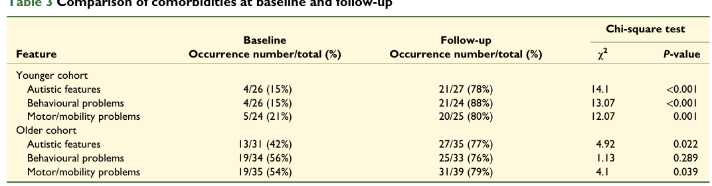

## Question

# Disease Characteristics Research Template

## Target Disease
- **Disease Name:** Dravet syndrome
- **MONDO ID:**  (if available)
- **Category:** Genetic

## Research Objectives

Please provide a comprehensive research report on **Dravet syndrome** covering all of the
disease characteristics listed below. This report will be used to populate a disease knowledge
base entry. Be thorough and cite primary literature (PMID preferred) for all claims.

For each section, **suggested databases/resources** are listed. These are the first places
you should search for information on each topic.

---

### 1. Disease Information
> **Search first:** OMIM, Orphanet, ICD-10/ICD-11, MeSH, PubMed

- What is the disease? Provide a concise overview.
- What are the key identifiers? (OMIM, Orphanet, ICD-10/ICD-11, MeSH, Mondo)
- What are the common synonyms and alternative names?
- Is the information derived from individual patients (e.g., EHR) or aggregated disease-level resources?

### 2. Etiology

- **Disease Causal Factors**: What are the primary causes? (genetic, environmental, infectious, mechanistic)
- **Risk Factors**:
  > **Search first:** PubMed, Cochrane Library, UpToDate, clinical guidelines, ClinVar, ClinGen, GWAS Catalog, PheGenI, CTD, CDC, WHO, epidemiological databases
  - Genetic risk factors (causal variants, susceptibility loci, modifier genes)
  - Environmental risk factors (toxins, lifestyle, occupational exposures, age, sex, family history)
- **Protective Factors**:
  > **Search first:** PubMed, Cochrane Library, clinical trial databases, GWAS Catalog, gnomAD, WHO, CDC, nutrition databases
  - Genetic protective factors (protective variants, modifier alleles)
  - Environmental protective factors (diet, lifestyle, exposures that reduce risk)
- **Gene-Environment Interactions**: How do genetic and environmental factors interact to influence disease?
  > **Search first:** CTD, PubMed, PheGenI, GxE databases

### 3. Phenotypes
> **Search first:** HPO (Human Phenotype Ontology), OMIM, Orphanet, PubMed, clinicaltrials.gov, MedDRA, SNOMED CT, DECIPHER, LOINC

For each phenotype, provide:
- **Phenotype type**: symptoms, clinical signs, physical manifestations, behavioral changes, or laboratory abnormalities
  > For symptoms/signs: HPO, OMIM, Orphanet, PubMed
  > For behavioral changes: HPO, DSM, RDoC (Research Domain Criteria), PubMed
  > For laboratory abnormalities: LOINC, SNOMED CT, LabTests Online, PubMed
- **Phenotype characteristics**:
  > **Search first:** OMIM, Orphanet, HPO, PubMed
  - Age of symptom onset (neonatal, childhood, adult-onset, late-onset)
  - Symptom severity (mild, moderate, severe, variable)
  - Symptom progression (stable, progressive, episodic, fluctuating)
  - Frequency among affected individuals (percentage or qualitative)
- **Quality of life impact**: Effects on daily functioning and well-being (per-phenotype when possible)
  > **Search first:** EQ-5D database, SF-36, WHO QOL databases, PubMed
- Suggest HPO (Human Phenotype Ontology) terms for each phenotype

### 4. Genetic/Molecular Information

- **Causal Genes**: Gene mutations or chromosomal abnormalities responsible for disease (gene symbols, OMIM IDs)
  > **Search first:** OMIM, ClinVar, HGMD, Ensembl, NCBI Gene
- **Pathogenic Variants**:
  - Affected genes (gene symbols, HGNC IDs)
    > **Search first:** OMIM, NCBI Gene, Ensembl, HGNC, UniProt, GeneCards
  - Variant classification (pathogenic, likely pathogenic, VUS per ACMG/AMP guidelines)
    > **Search first:** ClinVar, ClinGen, ACMG/AMP guidelines, VarSome
  - Variant type/class (missense, frameshift, nonsense, splice-site, structural)
  - Allele frequency in population databases
    > **Search first:** gnomAD, 1000 Genomes, ExAC, TOPMed, dbSNP
  - Somatic vs germline origin
    > **Search first:** COSMIC (somatic), ClinVar, ICGC, TCGA
  - Functional consequences (loss of function, gain of function, dominant negative)
- **Modifier Genes**: Genes that modify disease severity or expression
- **Epigenetic Information**: DNA methylation, histone modifications, chromatin changes affecting disease
  > **Search first:** ENCODE, Roadmap Epigenomics, MethBase, DiseaseMeth
- **Chromosomal Abnormalities**: Large-scale genetic changes (aneuploidy, translocations, inversions)
  > **Search first:** DECIPHER, ClinVar, ECARUCA, UCSC Genome Browser

### 5. Environmental Information

- **Environmental Factors**: Non-genetic contributing factors (toxins, radiation, pollution, occupational exposure)
  > **Search first:** CTD (Comparative Toxicogenomics Database), TOXNET, PubMed, EPA databases
- **Lifestyle Factors**: Behavioral factors (smoking, diet, exercise, alcohol consumption)
  > **Search first:** CDC databases, WHO, PubMed, NHANES
- **Infectious Agents**: If applicable, pathogens causing or triggering disease (bacteria, viruses, fungi, parasites)
  > **Search first:** NCBI Taxonomy, ViPR, BV-BRC, MicrobeDB, GIDEON

### 6. Mechanism / Pathophysiology

- **Molecular Pathways**: Specific signaling cascades or biochemical pathways involved (Wnt, MAPK, mTOR, PI3K-AKT, etc.)
  > **Search first:** KEGG, Reactome, WikiPathways, PathBank, BioCyc
- **Cellular Processes**: Cell-level mechanisms (apoptosis, autophagy, cell cycle dysregulation, inflammation, etc.)
  > **Search first:** Gene Ontology (GO), Reactome, KEGG, PubMed
- **Protein Dysfunction**: How protein structure or function is altered (misfolding, aggregation, loss of function, gain of function)
  > **Search first:** UniProt, PDB (Protein Data Bank), InterPro, Pfam, AlphaFold
- **Metabolic Changes**: Alterations in metabolic processes (energy metabolism, lipid metabolism, amino acid metabolism)
  > **Search first:** KEGG, BioCyc, HMDB (Human Metabolome Database), BRENDA
- **Immune System Involvement**: Role of immune response (autoimmunity, immunodeficiency, chronic inflammation)
  > **Search first:** ImmPort, Immunome Database, IEDB, Gene Ontology
- **Tissue Damage Mechanisms**: How tissues/ are injured (oxidative stress, ischemia, fibrosis, necrosis)
  > **Search first:** PubMed, Gene Ontology, Reactome
- **Biochemical Abnormalities**: Specific molecular defects (enzyme deficiencies, receptor dysfunction, ion channel defects)
  > **Search first:** BRENDA, UniProt, KEGG, OMIM, PubMed
- **Epigenetic Changes**: DNA methylation, histone modifications affecting gene expression in disease
  > **Search first:** ENCODE, Roadmap Epigenomics, MethBase, DiseaseMeth
- **Molecular Profiling** (if available):
  - Transcriptomics/gene expression changes
    > **Search first:** GEO (Gene Expression Omnibus), ArrayExpress, GTEx, Human Cell Atlas, SRA
  - Proteomics findings
    > **Search first:** PRIDE, ProteomeXchange, Human Protein Atlas, STRING, BioGRID
  - Metabolomics signatures
    > **Search first:** MetaboLights, Metabolomics Workbench, HMDB, METLIN
  - Lipidomics alterations
    > **Search first:** LIPID MAPS, SwissLipids, LipidHome, Metabolomics Workbench
  - Genomic structural features
    > **Search first:** UCSC Genome Browser, Ensembl, NCBI, dbVar, DGV
- **Advanced Technologies** (if applicable):
  - Single-cell analysis findings (cell-type specific mechanisms, cellular heterogeneity)
    > **Search first:** Human Cell Atlas, Single Cell Portal, GEO, CELLxGENE
  - Spatial transcriptomics findings
    > **Search first:** GEO, Spatial Research, Vizgen, 10x Genomics data
  - Multi-omics integration results
    > **Search first:** TCGA, ICGC, cBioPortal, LinkedOmics, PubMed
  - Functional genomics screens (CRISPR, RNAi)
    > **Search first:** DepMap, GenomeRNAi, PubMed, BioGRID ORCS

For each mechanism, describe:
- The causal chain from initial trigger to clinical manifestation
- Which mechanisms are upstream vs downstream
- What cell types and biological processes are involved
- Suggest GO terms for biological processes and CL terms for cell types

### 7. Anatomical Structures Affected

- **Organ Level**:
  - Primary organs directly affected
  - Secondary organ involvement (complications, secondary effects)
  - Body systems involved (cardiovascular, nervous, digestive, respiratory, endocrine, etc.)
  > **Search first:** Uberon, FMA (Foundational Model of Anatomy), OMIM, HPO, ICD-11, MeSH, SNOMED CT
- **Tissue and Cell Level**:
  - Specific tissue types affected (epithelial, connective, muscle, nervous)
  - Specific cell populations targeted (with Cell Ontology terms)
  > **Search first:** Uberon, Human Protein Atlas, Cell Ontology, Human Cell Atlas, CellMarker, PanglaoDB
- **Subcellular Level**:
  - Cellular compartments involved (mitochondria, nucleus, ER, lysosomes) (with GO Cellular Component terms)
  > **Search first:** Gene Ontology (Cellular Component), UniProt, Human Protein Atlas
- **Localization**:
  - Specific anatomical sites (with UBERON terms)
    > **Search first:** FMA, Uberon, NeuroNames (for brain), SNOMED CT
  - Lateralization (unilateral, bilateral, asymmetric)
    > **Search first:** HPO, clinical literature, imaging databases

### 8. Temporal Development

- **Onset**:
  - Typical age of onset (congenital, pediatric, adult, geriatric)
  - Onset pattern (acute, subacute, chronic, insidious)
  > **Search first:** OMIM, Orphanet, HPO, PubMed
- **Progression**:
  - Disease stages (early, intermediate, advanced, end-stage)
    > **Search first:** Cancer Staging Manual (AJCC), WHO classifications, PubMed
  - Progression rate (rapid, slow, variable)
  - Disease course pattern (episodic, relapsing-remitting, progressive, stable)
  - Disease duration (self-limited, chronic lifelong)
  > **Search first:** Disease registries, longitudinal cohort databases, natural history studies, PubMed, Orphanet, OMIM
- **Patterns**:
  - Remission patterns (spontaneous, treatment-induced)
    > **Search first:** Clinical trial databases, disease registries, PubMed
  - Critical periods (time windows of vulnerability or opportunity for intervention)
    > **Search first:** PubMed, developmental biology databases, clinical guidelines

### 9. Inheritance and Population

- **Epidemiology**:
  - Prevalence (cases per 100,000 at given time)
  - Incidence (new cases per 100,000 per year)
  > **Search first:** Orphanet, CDC, WHO, GBD (Global Burden of Disease), national registries, SEER, disease registries
- **For Genetic Etiology**:
  - Inheritance pattern (AD, AR, X-linked, mitochondrial, multifactorial, polygenic)
    > **Search first:** OMIM, Orphanet, ClinVar, GTR (Genetic Testing Registry)
  - Penetrance (complete, incomplete, age-dependent)
    > **Search first:** ClinVar, OMIM, PubMed, ClinGen
  - Expressivity (variable, consistent)
    > **Search first:** OMIM, ClinVar, PubMed
  - Genetic anticipation (increasing severity in successive generations)
    > **Search first:** OMIM, PubMed (especially for repeat expansion disorders)
  - Germline mosaicism
    > **Search first:** ClinVar, OMIM, genetic counseling literature, PubMed
  - Founder effects (population-specific mutations)
    > **Search first:** gnomAD, population genetics databases, PubMed
  - Consanguinity role
    > **Search first:** OMIM, population studies, genetic counseling resources
  - Carrier frequency
    > **Search first:** gnomAD, carrier screening databases, GeneReviews, GTR
- **Population Demographics**:
  - Affected populations (ethnic or demographic groups with higher prevalence)
    > **Search first:** gnomAD, 1000 Genomes, PAGE Study, PubMed, population registries
  - Geographic distribution (endemic areas, regional variation)
    > **Search first:** WHO, CDC, GBD, Orphanet, geographic epidemiology databases
  - Geographic distribution of specific variants
  - Sex ratio (male:female)
    > **Search first:** Disease registries, OMIM, PubMed, epidemiological databases
  - Age distribution of affected individuals
    > **Search first:** CDC, disease registries, SEER, Orphanet

### 10. Diagnostics

- **Clinical Tests**:
  - Laboratory tests (blood, urine, tissue chemistry, specific enzyme assays)
    > **Search first:** LOINC, LabTests Online, PubMed
  - Biomarkers (proteins, metabolites, genetic markers, circulating biomarkers)
    > **Search first:** FDA Biomarker List, BEST (Biomarkers, EndpointS, and other Tools), PubMed
  - Imaging studies (X-ray, CT, MRI, PET, ultrasound)
    > **Search first:** RadLex, DICOM, Radiopaedia, imaging databases
  - Functional tests (pulmonary function, cardiac stress tests)
    > **Search first:** LOINC, clinical guidelines, PubMed
  - Electrophysiology (EEG, EMG, ECG, nerve conduction studies)
    > **Search first:** LOINC, clinical neurophysiology databases, PubMed
  - Biopsy findings (histopathology, immunohistochemistry)
    > **Search first:** SNOMED CT, College of American Pathologists resources, PubMed
  - Pathology findings (microscopic examination)
    > **Search first:** SNOMED CT, Digital Pathology databases, PubMed
- **Genetic Testing**:
  > **Search first:** GTR (Genetic Testing Registry), GeneReviews, ClinGen
  - Overview of recommended genetic testing approach
  - Whole genome sequencing (WGS) utility
    > **Search first:** GTR, ClinVar, GEL (Genomics England), gnomAD
  - Whole exome sequencing (WES) utility
    > **Search first:** GTR, ClinVar, OMIM, GeneMatcher
  - Gene panels (which panels, which genes)
    > **Search first:** GTR, ClinVar, laboratory-specific databases
  - Single gene testing
    > **Search first:** GTR, ClinVar, OMIM, GeneReviews
  - Chromosomal microarray (CMA)
    > **Search first:** DECIPHER, ClinVar, dbVar, ECARUCA
  - Karyotyping
    > **Search first:** Chromosome Abnormality Database, ClinVar, cytogenetics resources
  - FISH
    > **Search first:** ClinVar, cytogenetics databases, PubMed
  - Mitochondrial DNA testing
    > **Search first:** MITOMAP, MSeqDR, ClinVar, GTR
  - Repeat expansion testing
    > **Search first:** GTR, ClinVar, repeat expansion databases, PubMed
- **Omics-Based Diagnostics** (if applicable):
  - RNA sequencing / transcriptomics
    > **Search first:** GEO, ArrayExpress, GTEx, RNA-seq databases
  - Proteomics
    > **Search first:** PRIDE, ProteomeXchange, FDA Biomarker database
  - Metabolomics
    > **Search first:** MetaboLights, Metabolomics Workbench, HMDB
  - Epigenomics
    > **Search first:** GEO, ENCODE, Roadmap Epigenomics, MethBase
  - Liquid biopsy
    > **Search first:** COSMIC, ClinVar, liquid biopsy databases, PubMed
- **Clinical Criteria**:
  - Standardized diagnostic criteria (DSM, ICD, society guidelines)
    > **Search first:** DSM-5, ICD-11, clinical society guidelines, UpToDate
  - Differential diagnosis (other conditions to rule out, with distinguishing features)
    > **Search first:** DynaMed, UpToDate, clinical decision support systems
- **Screening**:
  - Screening methods for asymptomatic individuals (newborn screening, carrier screening, cascade screening)
    > **Search first:** ACMG recommendations, CDC newborn screening, GTR

### 11. Outcome/Prognosis

- **Survival and Mortality**:
  - Survival rate (5-year, 10-year, overall)
    > **Search first:** SEER, cancer registries, disease-specific registries, PubMed
  - Life expectancy (with and without treatment if applicable)
    > **Search first:** Orphanet, disease registries, actuarial databases, PubMed
  - Mortality rate
    > **Search first:** CDC, WHO, GBD, national mortality databases
  - Disease-specific mortality (deaths directly attributable to disease)
    > **Search first:** Disease registries, CDC Wonder, GBD, PubMed
- **Morbidity and Function**:
  - Morbidity (disease-related disability and health impacts)
    > **Search first:** GBD, WHO, disability databases, PubMed
  - Disability outcomes (long-term functional impairments)
    > **Search first:** ICF (International Classification of Functioning), disability registries
  - Quality of life measures (EQ-5D, SF-36, PROMIS, disease-specific tools)
    > **Search first:** EQ-5D database, SF-36, PROMIS, PubMed
- **Disease Course**:
  - Complications (secondary problems: infections, organ failure, etc.)
    > **Search first:** ICD codes, disease registries, clinical databases, PubMed
  - Recovery potential (likelihood and extent of recovery, with vs without treatment)
    > **Search first:** Natural history studies, rehabilitation databases, PubMed
- **Prediction**:
  - Prognostic factors (age, disease severity, biomarkers, treatment response)
    > **Search first:** Prognostic models databases, clinical calculators, PubMed
  - Prognostic biomarkers (molecular markers predicting disease course)
    > **Search first:** FDA Biomarker database, PubMed, cancer prognostic databases

### 12. Treatment

- **Pharmacotherapy**:
  - Pharmacological treatments (drug names, drug classes, mechanisms of action)
    > **Search first:** DrugBank, RxNorm, ATC classification, DailyMed, FDA databases
  - Pharmacogenomics (how genetic variants affect drug metabolism, efficacy, toxicity)
    > **Search first:** PharmGKB, CPIC (Clinical Pharmacogenetics), FDA Table of PGx Biomarkers
- **Advanced Therapeutics**:
  - Gene therapy (viral vectors, CRISPR, gene replacement, gene editing)
    > **Search first:** ClinicalTrials.gov, FDA gene therapy database, ASGCT resources
  - Cell therapy (stem cell transplant, CAR-T, cellular therapeutics)
    > **Search first:** ClinicalTrials.gov, FDA cell therapy database, FACT standards
  - RNA-based therapies (ASOs, siRNA, mRNA therapies)
    > **Search first:** ClinicalTrials.gov, FDA approvals, PubMed
  - Targeted therapies (treatments directed at specific molecular targets)
    > **Search first:** My Cancer Genome, OncoKB, ClinicalTrials.gov, FDA approvals
  - Immunotherapies (checkpoint inhibitors, monoclonal antibodies)
    > **Search first:** Cancer Immunotherapy Database, FDA approvals, ClinicalTrials.gov
- **Surgical and Interventional**:
  - Surgical interventions (types of surgery, timing, outcomes)
    > **Search first:** CPT codes, surgical registries, clinical guidelines, PubMed
- **Supportive and Rehabilitative**:
  - Supportive care (symptom management, pain control, nutrition)
    > **Search first:** Clinical guidelines, Cochrane Library, PubMed
  - Rehabilitation (physical therapy, occupational therapy, speech therapy)
    > **Search first:** Rehabilitation medicine databases, clinical guidelines, PubMed
- **Experimental**:
  - Experimental treatments in clinical trials (with NCT identifiers if available)
    > **Search first:** ClinicalTrials.gov, EU Clinical Trials Register, WHO ICTRP
- **Treatment Outcomes**:
  - Treatment response rates
    > **Search first:** Clinical trial databases, FDA reviews, systematic reviews, PubMed
  - Side effects and adverse events
    > **Search first:** FDA Adverse Event Reporting System (FAERS), MedWatch, PubMed
- **Treatment Strategy**:
  - Treatment algorithms (clinical pathways, decision trees)
    > **Search first:** Clinical practice guidelines, NCCN Guidelines, UpToDate
  - Combination therapies
    > **Search first:** ClinicalTrials.gov, treatment guidelines, PubMed
  - Personalized medicine approaches (genotype-guided treatment)
    > **Search first:** My Cancer Genome, CIViC, PharmGKB, precision medicine databases

For each treatment, suggest MAXO (Medical Action Ontology) terms where applicable.

### 13. Prevention

- **Prevention Levels**:
  - Primary prevention (preventing disease occurrence: vaccination, risk factor modification)
    > **Search first:** CDC, WHO, USPSTF recommendations, Cochrane Library
  - Secondary prevention (early detection and treatment: screening programs, early intervention)
    > **Search first:** USPSTF, CDC screening guidelines, WHO
  - Tertiary prevention (preventing complications in those with disease)
    > **Search first:** Clinical guidelines, disease management protocols, PubMed
- **Immunization**: Vaccine strategies (if applicable)
  > **Search first:** CDC vaccine schedules, WHO immunization, FDA vaccine database
- **Screening and Early Detection**:
  - Screening programs (population-based: newborn screening, cancer screening)
    > **Search first:** CDC screening programs, USPSTF, cancer screening databases
  - Genetic screening (carrier screening, preimplantation genetic diagnosis, prenatal testing)
    > **Search first:** ACMG recommendations, ACOG guidelines, GTR
  - Risk stratification (identifying high-risk individuals for targeted prevention)
    > **Search first:** Risk prediction models, clinical calculators, PubMed
- **Behavioral Interventions**: Lifestyle modifications to reduce risk
  > **Search first:** CDC, WHO, behavioral intervention databases, Cochrane Library
- **Counseling**: Genetic counseling (risk assessment, family planning guidance)
  > **Search first:** NSGC resources, ACMG guidelines, GeneReviews
- **Public Health**:
  - Public health interventions (sanitation, vector control, health education)
    > **Search first:** CDC, WHO, public health databases, PubMed
  - Environmental interventions (reducing environmental risk factors)
    > **Search first:** EPA databases, WHO environmental health, PubMed
- **Prophylaxis**: Preventive medications or procedures
  > **Search first:** Clinical guidelines, FDA approvals, PubMed

### 14. Other Species / Natural Disease

- **Taxonomy**: Species affected (with NCBI Taxon identifiers)
  > **Search first:** NCBI Taxonomy
- **Breed**: Specific breeds affected (with VBO identifiers if applicable)
  > **Search first:** VBO (Vertebrate Breed Ontology)
- **Gene**: Orthologous genes in other species (with NCBI Gene IDs)
  > **Search first:** NCBI Gene
- **Natural Disease**:
  - Naturally occurring disease in other species (companion animals, wildlife)
    > **Search first:** OMIA (Online Mendelian Inheritance in Animals), VetCompass, PubMed
  - Veterinary relevance and importance in animal health
    > **Search first:** OMIA, veterinary databases, PubMed
- **Comparative Biology**:
  - Comparative pathology (similarities and differences across species)
    > **Search first:** OMIA, comparative pathology databases, PubMed
  - Evolutionary conservation of disease mechanisms
    > **Search first:** HomoloGene, OrthoMCL, Alliance of Genome Resources
- **Transmission** (if applicable):
  - Zoonotic potential
    > **Search first:** CDC zoonotic diseases, WHO zoonoses, GIDEON
  - Cross-species susceptibility
    > **Search first:** NCBI Taxonomy, veterinary databases, PubMed

### 15. Model Organisms

- **Model Types**:
  - Model organism type (mammalian, invertebrate, cellular, in vitro)
    > **Search first:** Alliance of Genome Resources, model organism databases
  - Specific model systems (mouse, rat, zebrafish, Drosophila, C. elegans, yeast, cell lines, organoids, iPSCs)
    > **Search first:** MGI, RGD, ZFIN, FlyBase, WormBase, SGD, ATCC, Cellosaurus
  - Induced models (drug treatment, surgical intervention, environmental manipulation)
    > **Search first:** MGI, model organism databases, PubMed
- **Genetic Models**:
  - Types available (knockout, knock-in, transgenic, conditional, humanized)
    > **Search first:** MGI, IMPC, KOMP, EuMMCR, IMSR
- **Model Characteristics**:
  - Phenotype recapitulation (how well model reproduces human disease features)
    > **Search first:** Model organism databases, comparative studies, PubMed
  - Model limitations (aspects of human disease not captured)
    > **Search first:** Model organism databases, PubMed, review articles
- **Applications**:
  - Research applications (what aspects of disease can be studied)
    > **Search first:** Model organism databases, PubMed
- **Resources**:
  - Model databases
    > **Search first:** MGI, RGD, ZFIN, FlyBase, WormBase, IMSR, EMMA, MMRRC

---

## Citation Requirements

- Cite primary literature (PMID preferred) for all mechanistic and clinical claims
- Prioritize recent reviews and landmark papers
- Include direct quotes from abstracts where possible to support key statements
- Distinguish evidence source types: human clinical, model organism, in vitro, computational

## Output Format

Structure your response as a comprehensive narrative organized by the sections above.
For each section, provide:
- Factual content with specific details (numbers, percentages, gene names, variant nomenclature)
- Ontology term suggestions (HPO, GO, CL, UBERON, CHEBI, MAXO, MONDO) where applicable
- Evidence citations with PMIDs
- Direct quotes from abstracts to support key claims
- Clear indication when information is not available or not applicable for this disease

This report will be used to populate a disease knowledge base entry with:
- Pathophysiology descriptions with causal chains
- Gene/protein annotations (HGNC, GO terms)
- Phenotype associations (HP terms) with frequencies
- Cell type involvement (CL terms)
- Anatomical locations (UBERON terms)
- Chemical entities (CHEBI terms)
- Treatment annotations (MAXO terms)
- Evidence items with PMIDs and exact abstract quotes
- Epidemiology, prognosis, diagnostic, and prevention information
- Animal model descriptions with phenotype recapitulation details

## Output

Question: You are an expert researcher providing comprehensive, well-cited information.

Provide detailed information focusing on:
1. Key concepts and definitions with current understanding
2. Recent developments and latest research (prioritize 2023-2024 sources)
3. Current applications and real-world implementations
4. Expert opinions and analysis from authoritative sources
5. Relevant statistics and data from recent studies

Format as a comprehensive research report with proper citations. Include URLs and publication dates where available.
Always prioritize recent, authoritative sources and provide specific citations for all major claims.

# Disease Characteristics Research Template

## Target Disease
- **Disease Name:** Dravet syndrome
- **MONDO ID:**  (if available)
- **Category:** Genetic

## Research Objectives

Please provide a comprehensive research report on **Dravet syndrome** covering all of the
disease characteristics listed below. This report will be used to populate a disease knowledge
base entry. Be thorough and cite primary literature (PMID preferred) for all claims.

For each section, **suggested databases/resources** are listed. These are the first places
you should search for information on each topic.

---

### 1. Disease Information
> **Search first:** OMIM, Orphanet, ICD-10/ICD-11, MeSH, PubMed

- What is the disease? Provide a concise overview.
- What are the key identifiers? (OMIM, Orphanet, ICD-10/ICD-11, MeSH, Mondo)
- What are the common synonyms and alternative names?
- Is the information derived from individual patients (e.g., EHR) or aggregated disease-level resources?

### 2. Etiology

- **Disease Causal Factors**: What are the primary causes? (genetic, environmental, infectious, mechanistic)
- **Risk Factors**:
  > **Search first:** PubMed, Cochrane Library, UpToDate, clinical guidelines, ClinVar, ClinGen, GWAS Catalog, PheGenI, CTD, CDC, WHO, epidemiological databases
  - Genetic risk factors (causal variants, susceptibility loci, modifier genes)
  - Environmental risk factors (toxins, lifestyle, occupational exposures, age, sex, family history)
- **Protective Factors**:
  > **Search first:** PubMed, Cochrane Library, clinical trial databases, GWAS Catalog, gnomAD, WHO, CDC, nutrition databases
  - Genetic protective factors (protective variants, modifier alleles)
  - Environmental protective factors (diet, lifestyle, exposures that reduce risk)
- **Gene-Environment Interactions**: How do genetic and environmental factors interact to influence disease?
  > **Search first:** CTD, PubMed, PheGenI, GxE databases

### 3. Phenotypes
> **Search first:** HPO (Human Phenotype Ontology), OMIM, Orphanet, PubMed, clinicaltrials.gov, MedDRA, SNOMED CT, DECIPHER, LOINC

For each phenotype, provide:
- **Phenotype type**: symptoms, clinical signs, physical manifestations, behavioral changes, or laboratory abnormalities
  > For symptoms/signs: HPO, OMIM, Orphanet, PubMed
  > For behavioral changes: HPO, DSM, RDoC (Research Domain Criteria), PubMed
  > For laboratory abnormalities: LOINC, SNOMED CT, LabTests Online, PubMed
- **Phenotype characteristics**:
  > **Search first:** OMIM, Orphanet, HPO, PubMed
  - Age of symptom onset (neonatal, childhood, adult-onset, late-onset)
  - Symptom severity (mild, moderate, severe, variable)
  - Symptom progression (stable, progressive, episodic, fluctuating)
  - Frequency among affected individuals (percentage or qualitative)
- **Quality of life impact**: Effects on daily functioning and well-being (per-phenotype when possible)
  > **Search first:** EQ-5D database, SF-36, WHO QOL databases, PubMed
- Suggest HPO (Human Phenotype Ontology) terms for each phenotype

### 4. Genetic/Molecular Information

- **Causal Genes**: Gene mutations or chromosomal abnormalities responsible for disease (gene symbols, OMIM IDs)
  > **Search first:** OMIM, ClinVar, HGMD, Ensembl, NCBI Gene
- **Pathogenic Variants**:
  - Affected genes (gene symbols, HGNC IDs)
    > **Search first:** OMIM, NCBI Gene, Ensembl, HGNC, UniProt, GeneCards
  - Variant classification (pathogenic, likely pathogenic, VUS per ACMG/AMP guidelines)
    > **Search first:** ClinVar, ClinGen, ACMG/AMP guidelines, VarSome
  - Variant type/class (missense, frameshift, nonsense, splice-site, structural)
  - Allele frequency in population databases
    > **Search first:** gnomAD, 1000 Genomes, ExAC, TOPMed, dbSNP
  - Somatic vs germline origin
    > **Search first:** COSMIC (somatic), ClinVar, ICGC, TCGA
  - Functional consequences (loss of function, gain of function, dominant negative)
- **Modifier Genes**: Genes that modify disease severity or expression
- **Epigenetic Information**: DNA methylation, histone modifications, chromatin changes affecting disease
  > **Search first:** ENCODE, Roadmap Epigenomics, MethBase, DiseaseMeth
- **Chromosomal Abnormalities**: Large-scale genetic changes (aneuploidy, translocations, inversions)
  > **Search first:** DECIPHER, ClinVar, ECARUCA, UCSC Genome Browser

### 5. Environmental Information

- **Environmental Factors**: Non-genetic contributing factors (toxins, radiation, pollution, occupational exposure)
  > **Search first:** CTD (Comparative Toxicogenomics Database), TOXNET, PubMed, EPA databases
- **Lifestyle Factors**: Behavioral factors (smoking, diet, exercise, alcohol consumption)
  > **Search first:** CDC databases, WHO, PubMed, NHANES
- **Infectious Agents**: If applicable, pathogens causing or triggering disease (bacteria, viruses, fungi, parasites)
  > **Search first:** NCBI Taxonomy, ViPR, BV-BRC, MicrobeDB, GIDEON

### 6. Mechanism / Pathophysiology

- **Molecular Pathways**: Specific signaling cascades or biochemical pathways involved (Wnt, MAPK, mTOR, PI3K-AKT, etc.)
  > **Search first:** KEGG, Reactome, WikiPathways, PathBank, BioCyc
- **Cellular Processes**: Cell-level mechanisms (apoptosis, autophagy, cell cycle dysregulation, inflammation, etc.)
  > **Search first:** Gene Ontology (GO), Reactome, KEGG, PubMed
- **Protein Dysfunction**: How protein structure or function is altered (misfolding, aggregation, loss of function, gain of function)
  > **Search first:** UniProt, PDB (Protein Data Bank), InterPro, Pfam, AlphaFold
- **Metabolic Changes**: Alterations in metabolic processes (energy metabolism, lipid metabolism, amino acid metabolism)
  > **Search first:** KEGG, BioCyc, HMDB (Human Metabolome Database), BRENDA
- **Immune System Involvement**: Role of immune response (autoimmunity, immunodeficiency, chronic inflammation)
  > **Search first:** ImmPort, Immunome Database, IEDB, Gene Ontology
- **Tissue Damage Mechanisms**: How tissues/ are injured (oxidative stress, ischemia, fibrosis, necrosis)
  > **Search first:** PubMed, Gene Ontology, Reactome
- **Biochemical Abnormalities**: Specific molecular defects (enzyme deficiencies, receptor dysfunction, ion channel defects)
  > **Search first:** BRENDA, UniProt, KEGG, OMIM, PubMed
- **Epigenetic Changes**: DNA methylation, histone modifications affecting gene expression in disease
  > **Search first:** ENCODE, Roadmap Epigenomics, MethBase, DiseaseMeth
- **Molecular Profiling** (if available):
  - Transcriptomics/gene expression changes
    > **Search first:** GEO (Gene Expression Omnibus), ArrayExpress, GTEx, Human Cell Atlas, SRA
  - Proteomics findings
    > **Search first:** PRIDE, ProteomeXchange, Human Protein Atlas, STRING, BioGRID
  - Metabolomics signatures
    > **Search first:** MetaboLights, Metabolomics Workbench, HMDB, METLIN
  - Lipidomics alterations
    > **Search first:** LIPID MAPS, SwissLipids, LipidHome, Metabolomics Workbench
  - Genomic structural features
    > **Search first:** UCSC Genome Browser, Ensembl, NCBI, dbVar, DGV
- **Advanced Technologies** (if applicable):
  - Single-cell analysis findings (cell-type specific mechanisms, cellular heterogeneity)
    > **Search first:** Human Cell Atlas, Single Cell Portal, GEO, CELLxGENE
  - Spatial transcriptomics findings
    > **Search first:** GEO, Spatial Research, Vizgen, 10x Genomics data
  - Multi-omics integration results
    > **Search first:** TCGA, ICGC, cBioPortal, LinkedOmics, PubMed
  - Functional genomics screens (CRISPR, RNAi)
    > **Search first:** DepMap, GenomeRNAi, PubMed, BioGRID ORCS

For each mechanism, describe:
- The causal chain from initial trigger to clinical manifestation
- Which mechanisms are upstream vs downstream
- What cell types and biological processes are involved
- Suggest GO terms for biological processes and CL terms for cell types

### 7. Anatomical Structures Affected

- **Organ Level**:
  - Primary organs directly affected
  - Secondary organ involvement (complications, secondary effects)
  - Body systems involved (cardiovascular, nervous, digestive, respiratory, endocrine, etc.)
  > **Search first:** Uberon, FMA (Foundational Model of Anatomy), OMIM, HPO, ICD-11, MeSH, SNOMED CT
- **Tissue and Cell Level**:
  - Specific tissue types affected (epithelial, connective, muscle, nervous)
  - Specific cell populations targeted (with Cell Ontology terms)
  > **Search first:** Uberon, Human Protein Atlas, Cell Ontology, Human Cell Atlas, CellMarker, PanglaoDB
- **Subcellular Level**:
  - Cellular compartments involved (mitochondria, nucleus, ER, lysosomes) (with GO Cellular Component terms)
  > **Search first:** Gene Ontology (Cellular Component), UniProt, Human Protein Atlas
- **Localization**:
  - Specific anatomical sites (with UBERON terms)
    > **Search first:** FMA, Uberon, NeuroNames (for brain), SNOMED CT
  - Lateralization (unilateral, bilateral, asymmetric)
    > **Search first:** HPO, clinical literature, imaging databases

### 8. Temporal Development

- **Onset**:
  - Typical age of onset (congenital, pediatric, adult, geriatric)
  - Onset pattern (acute, subacute, chronic, insidious)
  > **Search first:** OMIM, Orphanet, HPO, PubMed
- **Progression**:
  - Disease stages (early, intermediate, advanced, end-stage)
    > **Search first:** Cancer Staging Manual (AJCC), WHO classifications, PubMed
  - Progression rate (rapid, slow, variable)
  - Disease course pattern (episodic, relapsing-remitting, progressive, stable)
  - Disease duration (self-limited, chronic lifelong)
  > **Search first:** Disease registries, longitudinal cohort databases, natural history studies, PubMed, Orphanet, OMIM
- **Patterns**:
  - Remission patterns (spontaneous, treatment-induced)
    > **Search first:** Clinical trial databases, disease registries, PubMed
  - Critical periods (time windows of vulnerability or opportunity for intervention)
    > **Search first:** PubMed, developmental biology databases, clinical guidelines

### 9. Inheritance and Population

- **Epidemiology**:
  - Prevalence (cases per 100,000 at given time)
  - Incidence (new cases per 100,000 per year)
  > **Search first:** Orphanet, CDC, WHO, GBD (Global Burden of Disease), national registries, SEER, disease registries
- **For Genetic Etiology**:
  - Inheritance pattern (AD, AR, X-linked, mitochondrial, multifactorial, polygenic)
    > **Search first:** OMIM, Orphanet, ClinVar, GTR (Genetic Testing Registry)
  - Penetrance (complete, incomplete, age-dependent)
    > **Search first:** ClinVar, OMIM, PubMed, ClinGen
  - Expressivity (variable, consistent)
    > **Search first:** OMIM, ClinVar, PubMed
  - Genetic anticipation (increasing severity in successive generations)
    > **Search first:** OMIM, PubMed (especially for repeat expansion disorders)
  - Germline mosaicism
    > **Search first:** ClinVar, OMIM, genetic counseling literature, PubMed
  - Founder effects (population-specific mutations)
    > **Search first:** gnomAD, population genetics databases, PubMed
  - Consanguinity role
    > **Search first:** OMIM, population studies, genetic counseling resources
  - Carrier frequency
    > **Search first:** gnomAD, carrier screening databases, GeneReviews, GTR
- **Population Demographics**:
  - Affected populations (ethnic or demographic groups with higher prevalence)
    > **Search first:** gnomAD, 1000 Genomes, PAGE Study, PubMed, population registries
  - Geographic distribution (endemic areas, regional variation)
    > **Search first:** WHO, CDC, GBD, Orphanet, geographic epidemiology databases
  - Geographic distribution of specific variants
  - Sex ratio (male:female)
    > **Search first:** Disease registries, OMIM, PubMed, epidemiological databases
  - Age distribution of affected individuals
    > **Search first:** CDC, disease registries, SEER, Orphanet

### 10. Diagnostics

- **Clinical Tests**:
  - Laboratory tests (blood, urine, tissue chemistry, specific enzyme assays)
    > **Search first:** LOINC, LabTests Online, PubMed
  - Biomarkers (proteins, metabolites, genetic markers, circulating biomarkers)
    > **Search first:** FDA Biomarker List, BEST (Biomarkers, EndpointS, and other Tools), PubMed
  - Imaging studies (X-ray, CT, MRI, PET, ultrasound)
    > **Search first:** RadLex, DICOM, Radiopaedia, imaging databases
  - Functional tests (pulmonary function, cardiac stress tests)
    > **Search first:** LOINC, clinical guidelines, PubMed
  - Electrophysiology (EEG, EMG, ECG, nerve conduction studies)
    > **Search first:** LOINC, clinical neurophysiology databases, PubMed
  - Biopsy findings (histopathology, immunohistochemistry)
    > **Search first:** SNOMED CT, College of American Pathologists resources, PubMed
  - Pathology findings (microscopic examination)
    > **Search first:** SNOMED CT, Digital Pathology databases, PubMed
- **Genetic Testing**:
  > **Search first:** GTR (Genetic Testing Registry), GeneReviews, ClinGen
  - Overview of recommended genetic testing approach
  - Whole genome sequencing (WGS) utility
    > **Search first:** GTR, ClinVar, GEL (Genomics England), gnomAD
  - Whole exome sequencing (WES) utility
    > **Search first:** GTR, ClinVar, OMIM, GeneMatcher
  - Gene panels (which panels, which genes)
    > **Search first:** GTR, ClinVar, laboratory-specific databases
  - Single gene testing
    > **Search first:** GTR, ClinVar, OMIM, GeneReviews
  - Chromosomal microarray (CMA)
    > **Search first:** DECIPHER, ClinVar, dbVar, ECARUCA
  - Karyotyping
    > **Search first:** Chromosome Abnormality Database, ClinVar, cytogenetics resources
  - FISH
    > **Search first:** ClinVar, cytogenetics databases, PubMed
  - Mitochondrial DNA testing
    > **Search first:** MITOMAP, MSeqDR, ClinVar, GTR
  - Repeat expansion testing
    > **Search first:** GTR, ClinVar, repeat expansion databases, PubMed
- **Omics-Based Diagnostics** (if applicable):
  - RNA sequencing / transcriptomics
    > **Search first:** GEO, ArrayExpress, GTEx, RNA-seq databases
  - Proteomics
    > **Search first:** PRIDE, ProteomeXchange, FDA Biomarker database
  - Metabolomics
    > **Search first:** MetaboLights, Metabolomics Workbench, HMDB
  - Epigenomics
    > **Search first:** GEO, ENCODE, Roadmap Epigenomics, MethBase
  - Liquid biopsy
    > **Search first:** COSMIC, ClinVar, liquid biopsy databases, PubMed
- **Clinical Criteria**:
  - Standardized diagnostic criteria (DSM, ICD, society guidelines)
    > **Search first:** DSM-5, ICD-11, clinical society guidelines, UpToDate
  - Differential diagnosis (other conditions to rule out, with distinguishing features)
    > **Search first:** DynaMed, UpToDate, clinical decision support systems
- **Screening**:
  - Screening methods for asymptomatic individuals (newborn screening, carrier screening, cascade screening)
    > **Search first:** ACMG recommendations, CDC newborn screening, GTR

### 11. Outcome/Prognosis

- **Survival and Mortality**:
  - Survival rate (5-year, 10-year, overall)
    > **Search first:** SEER, cancer registries, disease-specific registries, PubMed
  - Life expectancy (with and without treatment if applicable)
    > **Search first:** Orphanet, disease registries, actuarial databases, PubMed
  - Mortality rate
    > **Search first:** CDC, WHO, GBD, national mortality databases
  - Disease-specific mortality (deaths directly attributable to disease)
    > **Search first:** Disease registries, CDC Wonder, GBD, PubMed
- **Morbidity and Function**:
  - Morbidity (disease-related disability and health impacts)
    > **Search first:** GBD, WHO, disability databases, PubMed
  - Disability outcomes (long-term functional impairments)
    > **Search first:** ICF (International Classification of Functioning), disability registries
  - Quality of life measures (EQ-5D, SF-36, PROMIS, disease-specific tools)
    > **Search first:** EQ-5D database, SF-36, PROMIS, PubMed
- **Disease Course**:
  - Complications (secondary problems: infections, organ failure, etc.)
    > **Search first:** ICD codes, disease registries, clinical databases, PubMed
  - Recovery potential (likelihood and extent of recovery, with vs without treatment)
    > **Search first:** Natural history studies, rehabilitation databases, PubMed
- **Prediction**:
  - Prognostic factors (age, disease severity, biomarkers, treatment response)
    > **Search first:** Prognostic models databases, clinical calculators, PubMed
  - Prognostic biomarkers (molecular markers predicting disease course)
    > **Search first:** FDA Biomarker database, PubMed, cancer prognostic databases

### 12. Treatment

- **Pharmacotherapy**:
  - Pharmacological treatments (drug names, drug classes, mechanisms of action)
    > **Search first:** DrugBank, RxNorm, ATC classification, DailyMed, FDA databases
  - Pharmacogenomics (how genetic variants affect drug metabolism, efficacy, toxicity)
    > **Search first:** PharmGKB, CPIC (Clinical Pharmacogenetics), FDA Table of PGx Biomarkers
- **Advanced Therapeutics**:
  - Gene therapy (viral vectors, CRISPR, gene replacement, gene editing)
    > **Search first:** ClinicalTrials.gov, FDA gene therapy database, ASGCT resources
  - Cell therapy (stem cell transplant, CAR-T, cellular therapeutics)
    > **Search first:** ClinicalTrials.gov, FDA cell therapy database, FACT standards
  - RNA-based therapies (ASOs, siRNA, mRNA therapies)
    > **Search first:** ClinicalTrials.gov, FDA approvals, PubMed
  - Targeted therapies (treatments directed at specific molecular targets)
    > **Search first:** My Cancer Genome, OncoKB, ClinicalTrials.gov, FDA approvals
  - Immunotherapies (checkpoint inhibitors, monoclonal antibodies)
    > **Search first:** Cancer Immunotherapy Database, FDA approvals, ClinicalTrials.gov
- **Surgical and Interventional**:
  - Surgical interventions (types of surgery, timing, outcomes)
    > **Search first:** CPT codes, surgical registries, clinical guidelines, PubMed
- **Supportive and Rehabilitative**:
  - Supportive care (symptom management, pain control, nutrition)
    > **Search first:** Clinical guidelines, Cochrane Library, PubMed
  - Rehabilitation (physical therapy, occupational therapy, speech therapy)
    > **Search first:** Rehabilitation medicine databases, clinical guidelines, PubMed
- **Experimental**:
  - Experimental treatments in clinical trials (with NCT identifiers if available)
    > **Search first:** ClinicalTrials.gov, EU Clinical Trials Register, WHO ICTRP
- **Treatment Outcomes**:
  - Treatment response rates
    > **Search first:** Clinical trial databases, FDA reviews, systematic reviews, PubMed
  - Side effects and adverse events
    > **Search first:** FDA Adverse Event Reporting System (FAERS), MedWatch, PubMed
- **Treatment Strategy**:
  - Treatment algorithms (clinical pathways, decision trees)
    > **Search first:** Clinical practice guidelines, NCCN Guidelines, UpToDate
  - Combination therapies
    > **Search first:** ClinicalTrials.gov, treatment guidelines, PubMed
  - Personalized medicine approaches (genotype-guided treatment)
    > **Search first:** My Cancer Genome, CIViC, PharmGKB, precision medicine databases

For each treatment, suggest MAXO (Medical Action Ontology) terms where applicable.

### 13. Prevention

- **Prevention Levels**:
  - Primary prevention (preventing disease occurrence: vaccination, risk factor modification)
    > **Search first:** CDC, WHO, USPSTF recommendations, Cochrane Library
  - Secondary prevention (early detection and treatment: screening programs, early intervention)
    > **Search first:** USPSTF, CDC screening guidelines, WHO
  - Tertiary prevention (preventing complications in those with disease)
    > **Search first:** Clinical guidelines, disease management protocols, PubMed
- **Immunization**: Vaccine strategies (if applicable)
  > **Search first:** CDC vaccine schedules, WHO immunization, FDA vaccine database
- **Screening and Early Detection**:
  - Screening programs (population-based: newborn screening, cancer screening)
    > **Search first:** CDC screening programs, USPSTF, cancer screening databases
  - Genetic screening (carrier screening, preimplantation genetic diagnosis, prenatal testing)
    > **Search first:** ACMG recommendations, ACOG guidelines, GTR
  - Risk stratification (identifying high-risk individuals for targeted prevention)
    > **Search first:** Risk prediction models, clinical calculators, PubMed
- **Behavioral Interventions**: Lifestyle modifications to reduce risk
  > **Search first:** CDC, WHO, behavioral intervention databases, Cochrane Library
- **Counseling**: Genetic counseling (risk assessment, family planning guidance)
  > **Search first:** NSGC resources, ACMG guidelines, GeneReviews
- **Public Health**:
  - Public health interventions (sanitation, vector control, health education)
    > **Search first:** CDC, WHO, public health databases, PubMed
  - Environmental interventions (reducing environmental risk factors)
    > **Search first:** EPA databases, WHO environmental health, PubMed
- **Prophylaxis**: Preventive medications or procedures
  > **Search first:** Clinical guidelines, FDA approvals, PubMed

### 14. Other Species / Natural Disease

- **Taxonomy**: Species affected (with NCBI Taxon identifiers)
  > **Search first:** NCBI Taxonomy
- **Breed**: Specific breeds affected (with VBO identifiers if applicable)
  > **Search first:** VBO (Vertebrate Breed Ontology)
- **Gene**: Orthologous genes in other species (with NCBI Gene IDs)
  > **Search first:** NCBI Gene
- **Natural Disease**:
  - Naturally occurring disease in other species (companion animals, wildlife)
    > **Search first:** OMIA (Online Mendelian Inheritance in Animals), VetCompass, PubMed
  - Veterinary relevance and importance in animal health
    > **Search first:** OMIA, veterinary databases, PubMed
- **Comparative Biology**:
  - Comparative pathology (similarities and differences across species)
    > **Search first:** OMIA, comparative pathology databases, PubMed
  - Evolutionary conservation of disease mechanisms
    > **Search first:** HomoloGene, OrthoMCL, Alliance of Genome Resources
- **Transmission** (if applicable):
  - Zoonotic potential
    > **Search first:** CDC zoonotic diseases, WHO zoonoses, GIDEON
  - Cross-species susceptibility
    > **Search first:** NCBI Taxonomy, veterinary databases, PubMed

### 15. Model Organisms

- **Model Types**:
  - Model organism type (mammalian, invertebrate, cellular, in vitro)
    > **Search first:** Alliance of Genome Resources, model organism databases
  - Specific model systems (mouse, rat, zebrafish, Drosophila, C. elegans, yeast, cell lines, organoids, iPSCs)
    > **Search first:** MGI, RGD, ZFIN, FlyBase, WormBase, SGD, ATCC, Cellosaurus
  - Induced models (drug treatment, surgical intervention, environmental manipulation)
    > **Search first:** MGI, model organism databases, PubMed
- **Genetic Models**:
  - Types available (knockout, knock-in, transgenic, conditional, humanized)
    > **Search first:** MGI, IMPC, KOMP, EuMMCR, IMSR
- **Model Characteristics**:
  - Phenotype recapitulation (how well model reproduces human disease features)
    > **Search first:** Model organism databases, comparative studies, PubMed
  - Model limitations (aspects of human disease not captured)
    > **Search first:** Model organism databases, PubMed, review articles
- **Applications**:
  - Research applications (what aspects of disease can be studied)
    > **Search first:** Model organism databases, PubMed
- **Resources**:
  - Model databases
    > **Search first:** MGI, RGD, ZFIN, FlyBase, WormBase, IMSR, EMMA, MMRRC

---

## Citation Requirements

- Cite primary literature (PMID preferred) for all mechanistic and clinical claims
- Prioritize recent reviews and landmark papers
- Include direct quotes from abstracts where possible to support key statements
- Distinguish evidence source types: human clinical, model organism, in vitro, computational

## Output Format

Structure your response as a comprehensive narrative organized by the sections above.
For each section, provide:
- Factual content with specific details (numbers, percentages, gene names, variant nomenclature)
- Ontology term suggestions (HPO, GO, CL, UBERON, CHEBI, MAXO, MONDO) where applicable
- Evidence citations with PMIDs
- Direct quotes from abstracts to support key claims
- Clear indication when information is not available or not applicable for this disease

This report will be used to populate a disease knowledge base entry with:
- Pathophysiology descriptions with causal chains
- Gene/protein annotations (HGNC, GO terms)
- Phenotype associations (HP terms) with frequencies
- Cell type involvement (CL terms)
- Anatomical locations (UBERON terms)
- Chemical entities (CHEBI terms)
- Treatment annotations (MAXO terms)
- Evidence items with PMIDs and exact abstract quotes
- Epidemiology, prognosis, diagnostic, and prevention information
- Animal model descriptions with phenotype recapitulation details

# Dravet syndrome — Disease characteristics research report (Genetic)

## Executive summary
Dravet syndrome (DS) is a prototypic developmental and epileptic encephalopathy (DEE) with infantile onset seizures—often prolonged and fever-triggered—followed by emergence of neurodevelopmental impairment, multiple seizure types, and substantial lifelong morbidity and premature mortality risk (notably SUDEP and status epilepticus). DS is predominantly caused by heterozygous pathogenic variants in **SCN1A** (Nav1.1) and is a paradigm condition for precision-medicine approaches, ranging from syndrome-specific antiseizure medications (ASMs) to emerging gene/RNA-based therapies. Key recent (2023–2024) data include prospective natural history evidence that early communication delay can be largely independent of seizure burden (ENVISION) and 10-year follow-up showing comorbidities (autistic traits, behavioral problems, motor/mobility impairment) rise substantially over time despite some reduction in epilepsy severity. (fine2024envisioningacritical pages 1-2, feng2024longtermpredictorsof pages 1-3, strzelczyk2023dravetsyndromea pages 1-2)

## 1. Disease information

### 1.1 Definition / overview
A systematic review of the illness burden describes DS as a DEE “presenting with seizure onset in an otherwise normal infant before 20 months” with “neurodevelopmental impairments emerging from the second year of life,” and notes typical multiple seizure types (e.g., tonic–clonic, hemiclonic, myoclonic, focal impaired awareness), with seizure burden often declining in adolescence/adulthood and a shift toward nocturnal convulsive seizures. (strzelczyk2023dravetsyndromea pages 1-2)

An evidence-based definition paper summarizes the “classical description” as “a normal 6-month-old infant presenting with a prolonged, febrile, hemiclonic seizure and showing developmental slowing after age 1 year,” while emphasizing broader phenotypic variability and the need for genotype–phenotype correlation for SCN1A-related disorders. (li2021definingdravetsyndrome pages 1-2)

### 1.2 Key identifiers (OMIM, Orphanet, ICD, MeSH, MONDO)
The retrieved evidence explicitly contains OMIM identifiers but did **not** provide explicit Orphanet/ORPHA, ICD-10/ICD-11, MeSH (Dravet-specific), or MONDO identifiers within the accessible excerpts. (fan2023clinicalandgenetic pages 5-7, li2021definingdravetsyndrome pages 1-2, NCT04740476 chunk 2)

| Identifier type | Value | Evidence/notes | Source (with URL and publication date if available) |
|---|---|---|---|
| OMIM | 308350 | Reported in a 2023 review as an OMIM reference URL for Dravet syndrome; same source also lists key synonyms. Note: this OMIM value differs from another evidence source, so identifier confirmation against OMIM directly is advisable. (fan2023clinicalandgenetic pages 5-7) | Fan et al., *Int J Mol Sci* (Dec 2023). https://doi.org/10.3390/ijms25010031 |
| OMIM | 607208 | Explicitly reported in an evidence-based definition paper as the OMIM entry for Dravet syndrome. Conflicts with the 308350 reference reported elsewhere in the current evidence set. (li2021definingdravetsyndrome pages 1-2) | Li et al., *Epilepsia* (Aug 2021). https://doi.org/10.1111/epi.17015 |
| Synonym | SMEI | Supported as an abbreviation for “severe myoclonic epilepsy of infancy.” (fan2023clinicalandgenetic pages 5-7) | Fan et al., *Int J Mol Sci* (Dec 2023). https://doi.org/10.3390/ijms25010031 |
| Synonym | severe myoclonic epilepsy of infancy | Explicitly listed as a synonym/older name for Dravet syndrome. (fan2023clinicalandgenetic pages 5-7) | Fan et al., *Int J Mol Sci* (Dec 2023). https://doi.org/10.3390/ijms25010031 |
| Synonym | epilepsy with polymorphic seizures | Explicitly listed as a synonym in the current evidence set. (fan2023clinicalandgenetic pages 5-7) | Fan et al., *Int J Mol Sci* (Dec 2023). https://doi.org/10.3390/ijms25010031 |
| Synonym | polymorphic epilepsy of infancy | Explicitly listed as a synonym in the current evidence set. (fan2023clinicalandgenetic pages 5-7) | Fan et al., *Int J Mol Sci* (Dec 2023). https://doi.org/10.3390/ijms25010031 |
| Synonym / disease label | SCN1A-Dravet syndrome | Used in the precision-medicine definition paper to describe the genetically defined form; more a gene-linked subtype label than a classic synonym. (li2021definingdravetsyndrome pages 1-2) | Li et al., *Epilepsia* (Aug 2021). https://doi.org/10.1111/epi.17015 |
| MONDO | Not found in current evidence set | Available evidence discusses MONDO classification context for epilepsy/Dravet, but no explicit Dravet MONDO identifier string is provided in the gathered evidence. (fan2023clinicalandgenetic pages 5-7, NCT04740476 chunk 2, NCT06371794 chunk 2, NCT07251673 chunk 2) | No explicit identifier captured in current evidence set |
| Orphanet / ORPHA | Not found in current evidence set | No explicit ORPHA code for Dravet syndrome was present in the gathered evidence excerpts. (fan2023clinicalandgenetic pages 5-7, NCT04740476 chunk 2, NCT06371794 chunk 2, NCT07251673 chunk 2) | No explicit identifier captured in current evidence set |
| MeSH (Dravet-specific descriptor/ID) | Not found in current evidence set | Some evidence includes broader epilepsy MeSH terms (e.g., *Epilepsies, Myoclonic*), but no MeSH descriptor/ID explicitly named “Dravet Syndrome” was captured. (NCT04740476 chunk 2, NCT06371794 chunk 2, NCT07251673 chunk 2) | No explicit Dravet-specific MeSH identifier captured in current evidence set |
| ICD-10 | Not found in current evidence set | Current evidence notes Dravet syndrome became ICD-10 recognizable, but no exact code string is provided in the gathered excerpts. (fan2023clinicalandgenetic pages 5-7) | No explicit identifier captured in current evidence set |
| ICD-11 | Not found in current evidence set | No ICD-11 code for Dravet syndrome was present in the gathered evidence excerpts. (fan2023clinicalandgenetic pages 5-7, NCT04740476 chunk 2, NCT06371794 chunk 2, NCT07251673 chunk 2) | No explicit identifier captured in current evidence set |

*Table: This table summarizes the disease identifiers and alternative names for Dravet syndrome that were directly supported by the gathered evidence. It also flags requested ontology/coding identifiers that were not explicitly present in the current evidence set, helping separate confirmed from still-unverified metadata.*

**Evidence note:** Conflicting OMIM identifiers (308350 vs 607208) appear across sources, so direct confirmation against OMIM is recommended before knowledge-base ingestion. (fan2023clinicalandgenetic pages 5-7, li2021definingdravetsyndrome pages 1-2)

### 1.3 Synonyms / alternative names
Synonyms explicitly listed in a 2023 review include:
- **Severe myoclonic epilepsy of infancy (SMEI)**
- **Epilepsy with polymorphic seizures**
- **Polymorphic epilepsy of infancy** (fan2023clinicalandgenetic pages 5-7)

### 1.4 Evidence source type
The information summarized here is derived from **aggregated disease-level resources** (systematic reviews, consensus/definition papers), **prospective observational cohorts**, and **clinical trials/meta-analyses**, not individual EHR-derived case narratives (except where explicitly noted in real-world/registry/claims contexts). (strzelczyk2023dravetsyndromea pages 1-2, fine2024envisioningacritical pages 1-2, feng2024longtermpredictorsof pages 1-3)

## 2. Etiology

### 2.1 Disease causal factors
**Primary cause:** DS is predominantly genetic and most commonly due to pathogenic variants in **SCN1A** (Nav1.1). Multiple sources in the retrieved evidence place SCN1A causation at **>80%** to **~90%** of cases. (fan2023clinicalandgenetic pages 5-7, mouhi2024thegeneticfacets pages 1-2, li2021definingdravetsyndrome pages 1-2)

**Direct abstract quote (definition paper):** “SCN1A pathogenic variants are found in >80% of patients.” (li2021definingdravetsyndrome pages 1-2)

### 2.2 Risk factors

#### Genetic risk factors
- **Causal gene:** **SCN1A** (loss-of-function most typical). (lersch2023targetedmolecularstrategies pages 4-6, ricobaraza2023preferentialexpressionof pages 1-2)
- **Additional genes with DS-like phenotypes:** Reviews identify **PCDH19**, **GABRG2**, and **SCN2A** as additional genetic contributors to DS-like presentations. (mouhi2024thegeneticfacets pages 1-2)
- **Familial inheritance:** A clinical overview notes familial SCN1A mutations in roughly **5–10%** (usually missense) in one summary (non-primary). (pisati2022trattamentodicombinazionea pages 7-11)

#### Environmental/physiologic triggers
Seizures are often triggered by **fever**, **infection**, and sometimes **vaccination**; hyperthermia is a prominent precipitant. (fan2023clinicalandgenetic pages 5-7, gao2023epilepsyindravet pages 2-4)

### 2.3 Protective factors
No explicit protective genetic variants or environmental protective factors were identified in the retrieved evidence excerpts.

### 2.4 Gene–environment interactions
The current evidence set supports a clinically important interaction between **genetic susceptibility (SCN1A-related DS)** and **physiologic stressors** (fever/hyperthermia) that precipitate seizures early in life. (gao2023epilepsyindravet pages 2-4, fan2023clinicalandgenetic pages 5-7)

## 3. Phenotypes

### 3.1 Core seizure phenotypes (with HPO suggestions)
**Typical onset:** infancy, often ~6 months; onset range can extend into later infancy (up to ~19–20 months). (li2021definingdravetsyndrome pages 1-2, strzelczyk2023dravetsyndromea pages 1-2)

**Seizure features:** prolonged febrile seizures/status epilepticus, hemiclonic or generalized tonic–clonic seizures, later polymorphic seizure types (myoclonic, focal impaired awareness, atypical absence). (strzelczyk2023dravetsyndromea pages 1-2, li2021definingdravetsyndrome pages 1-2)

**HPO term suggestions (non-exhaustive):**
- Febrile seizures (HP:0002373)
- Status epilepticus (HP:0002133)
- Hemiclonic seizures (HP:0006801)
- Generalized tonic-clonic seizures (HP:0002069)
- Myoclonic seizures (HP:0002123)
- Focal impaired awareness seizure (HP:0020219)

### 3.2 Neurodevelopmental / cognitive / communication phenotypes

#### Early communication delay may be independent of seizure burden (2023–2024 development)
ENVISION (prospective observational natural history) enrolled 58 children ≤5 years with SCN1A+ DS (Dec 2020–Mar 2023). Language/communication delays were observed early and developmental stagnation occurred after age 2 years; in modeling, seizure burden and status epilepticus variables were **not** predictors of language/communication raw scores. (fine2024envisioningacritical pages 1-2)

**Direct abstract quote (ENVISION paper as reproduced in the commentary):** “language/communication delay and stagnation were independent of seizure burden.” (fine2024envisioningacritical pages 1-2)

**HPO suggestions:**
- Global developmental delay (HP:0001263)
- Delayed speech and language development (HP:0000750)
- Intellectual disability (HP:0001249)

### 3.3 Behavioral, autism-related, and motor phenotypes (with longitudinal statistics)
A UK prospective 10-year follow-up study of SCN1A-positive DS found worsening developmental outcome and rising comorbidities:
- Autistic features increased from **30%** to **77%** (48/62 vs 17/57; P<0.001)
- Behavioral problems increased from **38%** to **81%** (46/57 vs 23/60; P<0.001)
- Motor/mobility problems increased from **41%** to **80%** (51/64 vs 24/59; P<0.001) (feng2024longtermpredictorsof pages 1-3)

These changes are also shown in the study tables. (feng2024longtermpredictorsof media 5e014e4f)

**HPO suggestions:**
- Autistic behavior (HP:0000729)
- Behavioral abnormality (HP:0000708)
- Ataxia / gait abnormality (HP:0001251 / HP:0001288) (general DS phenotype support in reviews)
- Hypotonia (HP:0001252) (commonly reported in DS literature; not quantified in retrieved excerpts)

### 3.4 Quality-of-life impact and caregiver burden (statistics)
The 2023 systematic review of illness burden reported substantial caregiver impact and health-economic burden, including caregiver depression symptoms **47%–70%**, and direct costs of **$11,048 to $77,914 per patient per year** in included studies. (strzelczyk2023dravetsyndromea pages 1-2)

In the UK 10-year cohort, >90% of caregivers reported negative impacts on their own health and career opportunities; SUDEP had not been discussed with a clinician in 35%. (feng2024longtermpredictorsof pages 1-3)

## 4. Genetic / molecular information

### 4.1 Causal genes
- **SCN1A** is the predominant causal gene in DS. (li2021definingdravetsyndrome pages 1-2, lersch2023targetedmolecularstrategies pages 4-6)

### 4.2 Pathogenic variants (classes and consequences)
Mechanistic reviews and preclinical studies support a dominant **loss-of-function / haploinsufficiency** model for many DS-causing SCN1A variants, especially truncating variants, leading to reduced Nav1.1 function in inhibitory interneurons. (lersch2023targetedmolecularstrategies pages 4-6, ricobaraza2023preferentialexpressionof pages 1-2)

Variant class overview is summarized in a mechanistic review: truncating variants are common (roughly half of DS mutations in one review) and typically support a haploinsufficiency mechanism without dominant negative effect (supporting allele upregulation strategies). (lersch2023targetedmolecularstrategies pages 4-6)

### 4.3 Modifier genes / polygenic effects
The accessible evidence included mention of modifier concepts (e.g., SCN9A as a modifier in one summary) but did not provide robust quantitative modifier effect sizes in retrieved excerpts. (pisati2022trattamentodicombinazionea pages 7-11)

### 4.4 Epigenetic information
Not explicitly supported by the retrieved excerpts.

### 4.5 Chromosomal abnormalities
Not explicitly supported by the retrieved excerpts.

## 5. Environmental information

DS is not primarily environmentally caused, but seizures are **precipitated** by physiologic/environmental triggers, especially fever/hyperthermia. Trigger management recommendations are summarized in recent clinical reviews. (gao2023epilepsyindravet pages 2-4)

## 6. Mechanism / pathophysiology

### 6.1 Causal chain (gene → cell → circuit → clinical)
A consistent mechanistic model across reviews and preclinical studies is:
1) **SCN1A loss-of-function** reduces Nav1.1 sodium currents
2) Nav1.1 is critical for **GABAergic inhibitory interneuron excitability** (particularly PV and SST interneurons)
3) Reduced inhibitory output produces **excitation–inhibition imbalance** in cortical/hippocampal circuits
4) This drives seizures (often hyperthermia/febrile-triggered early) and contributes to developmental, behavioral, and motor comorbidities and SUDEP risk. (ricobaraza2023preferentialexpressionof pages 1-2, lersch2023targetedmolecularstrategies pages 4-6)

### 6.2 Cell types and ontology suggestions
**Cell Ontology (CL) suggestions:**
- GABAergic interneuron (CL:0000099)
- Parvalbumin-positive interneuron (CL:0002608)
- Somatostatin-positive interneuron (no single CL term universally used; can be annotated via marker + interneuron)

**GO Biological Process suggestions:**
- Regulation of membrane potential (GO:0042391)
- Synaptic transmission, GABAergic (GO:0051932)
- Action potential (GO:0001508)
- Regulation of neuronal excitability (GO:0042399)

**GO Cellular Component suggestions:**
- Axon initial segment (GO:0043194)
- Synapse (GO:0045202)

### 6.3 Molecular profiling / multi-omics
A 2022 mouse gene-reactivation study reported “dramatic gene expression alterations, including those associated with astrogliosis,” which were rescued by restoring Scn1a expression, supporting a downstream glial/inflammatory remodeling component. (valassina2022scn1agenereactivation pages 1-2)

## 7. Anatomical structures affected

**Primary system:** central nervous system (brain networks mediating seizure generation and neurodevelopment). (lersch2023targetedmolecularstrategies pages 4-6)

**Key regions supported by preclinical/therapy biodistribution:** cortex and hippocampus (highlighted in AAV biodistribution and mechanistic discussions). (tanenhaus2022cellselectiveadenoassociatedvirusmediated pages 1-2, valassina2022scn1agenereactivation pages 1-2)

**UBERON suggestions:**
- Brain (UBERON:0000955)
- Cerebral cortex (UBERON:0001851)
- Hippocampus (UBERON:0001954)

## 8. Temporal development

### 8.1 Onset
Typical seizure onset in infancy (~5–8 months in multiple descriptions), though refined evidence shows a broader onset range up to ~19–20 months and febrile seizures are not universal at onset. (li2021definingdravetsyndrome pages 1-2, strzelczyk2023dravetsyndromea pages 1-2)

### 8.2 Progression
Natural history often includes early febrile/prolonged seizures with progression to multiple seizure types and increasing prominence of neurodevelopmental comorbidities. Longitudinal data show comorbidities increase substantially over 10 years even when epilepsy severity appears less severe at follow-up. (feng2024longtermpredictorsof pages 1-3)

## 9. Inheritance and population

### 9.1 Epidemiology (statistics)
A 2023 systematic review reports:
- **Incidence**: ~1:15,400–1:40,900
- **Prevalence**: 1.5–6.5 per 100,000
- **Mortality**: 3.7%–20.8% across cohorts; deaths commonly due to SUDEP and status epilepticus. (strzelczyk2023dravetsyndromea pages 1-2)

### 9.2 Inheritance
Predominantly de novo heterozygous SCN1A pathogenic variants, with some familial cases. (li2021definingdravetsyndrome pages 1-2, pisati2022trattamentodicombinazionea pages 7-11)

## 10. Diagnostics

### 10.1 Clinical suspicion and early recognition
A 2024 DEE primer advises considering DS in infants from ~6 months presenting with febrile status epilepticus, particularly hemiclonic or generalized tonic–clonic seizures, even when development and EEG are initially normal. (scheffer2024developmentalandepileptic pages 9-11)

### 10.2 Genetic testing
Evidence supports prompt molecular testing when DS is suspected:
- Rapid genome sequencing can return results in weeks (median ~37 days in one cited study) and DS is relatively genetically homogeneous (>90% due to SCN1A in one review), supporting early genetic confirmation. (scheffer2024developmentalandepileptic pages 9-11)
- Next-generation sequencing enables earlier molecular diagnosis; careful genotype–phenotype correlation is required because SCN1A spans a spectrum. (li2021definingdravetsyndrome pages 1-2)

### 10.3 EEG/imaging
Normal MRI does not exclude genetic DEEs such as DS; EEG can be normal early and abnormalities may evolve with age. (scheffer2024developmentalandepileptic pages 9-11, mouhi2024thegeneticfacets pages 1-2)

### 10.4 Emerging biomarkers (SUDEP risk)
A 2023 study linked quantitative EEG features to SUDEP-7 risk strata in DS (e.g., higher theta power and lower alpha power in high-risk groups), proposing EEG as a potential SUDEP biomarker and recommending high-level supervision for patients with high theta power. (kim2023electroencephalographycharacteristicsrelated pages 1-2)

## 11. Outcome / prognosis

### 11.1 Mortality and SUDEP
In a genetic DEE cohort (including SCN1A/Dravet), mortality was 6.1 per 1,000 person-years and SUDEP accounted for 48% of deaths, with an estimated SUDEP rate of 2.8 per 1,000 person-years. (donnan2023ratesofstatus pages 1-2)

The DS-focused illness-burden review reports mortality 3.7%–20.8% across cohorts, most commonly due to SUDEP and status epilepticus. (strzelczyk2023dravetsyndromea pages 1-2)

### 11.2 Prognostic factors
In the UK 10-year follow-up cohort, worse long-term developmental outcome was predicted by poorer baseline language, more severe baseline epilepsy severity, and a worse SCN1A genetic score. (feng2024longtermpredictorsof pages 1-3)

## 12. Treatment

### 12.1 Pharmacotherapy (approved/commonly used)

#### Comparative RCT evidence (systematic review / network meta-analysis)
A 2023 network meta-analysis of placebo-controlled RCTs (680 participants) evaluated add-on stiripentol, pharmaceutical-grade cannabidiol, fenfluramine hydrochloride, and soticlestat. Cannabidiol showed lower ≥50% responder rates than fenfluramine (OR 0.20, 95% CI 0.07–0.54) and stiripentol showed higher responder rate than cannabidiol (OR 14.07, 95% CI 2.57–76.87). (lattanzi2023pharmacotherapyfordravet pages 1-2)

A 2024 network meta-analysis comparing stiripentol, fenfluramine, and cannabidiol reported stiripentol and fenfluramine were statistically superior to cannabidiol for clinically meaningful seizure reduction, and found stiripentol superior in achieving seizure-free intervals versus fenfluramine (RD 26% [8%–44%], p<0.01). (guerrini2024comparativeefficacyand pages 1-2)

#### Cannabidiol (Epidiolex) dosing and seizure reduction
A 2024 focused review summarizes recommended cannabidiol dosing as starting 5 mg/kg/day (divided doses), titrating weekly by 5 mg/kg/day to max 20 mg/kg/day; a cited trial reported median seizure reduction 43.9% with cannabidiol vs 21.8% placebo, with common AEs including somnolence and gastrointestinal effects. (mahesan2024advancementsindravet pages 1-2)

#### Contraindicated / avoid
Sodium-channel blockers (e.g., carbamazepine, oxcarbazepine) can exacerbate seizures in DS and should be avoided; this is emphasized as a key reason for early diagnosis. (scheffer2024developmentalandepileptic pages 9-11, strzelczyk2023dravetsyndromea pages 1-2)

**MAXO suggestions:**
- Anticonvulsant therapy (MAXO:0000068)
- Ketogenic diet therapy (MAXO:0000121)
- Vagus nerve stimulation (MAXO:0000128)
- Genetic therapy (MAXO:0001001) (for gene/ASO/AAV approaches)

### 12.2 Non-pharmacologic therapies

#### Vagus nerve stimulation (VNS)
A 2024 systematic review/meta-analysis (16 studies; 173 patients in one pooled analysis) reported pooled ≥50% seizure reduction (“responder”) rate **0.54** (95% CI 0.43–0.65), with timepoint pooled responder rates of 0.42 (3 months), 0.54 (6 months), 0.51 (12 months), and 0.49 (24 months). (chen2024vagusnervestimulation pages 1-2, chen2024vagusnervestimulation pages 3-5)

#### Ketogenic diet
A clinical overview reported that a ketogenic diet maintained for one year produced ≥75% reduction in seizure frequency and severity in nearly 80% of children with DS. (fan2023clinicalandgenetic pages 17-18)

### 12.3 Advanced therapeutics / disease-modifying pipeline

#### Antisense oligonucleotide (ASO) approaches (SCN1A upregulation)
A 2024 gene-therapy review describes IND-enabling target engagement for STK-001 (zorevunersen) in nonhuman primates after intrathecal administration, with significant target engagement at Day 29 in multiple cortical/limbic regions. (berardino2024genetherapyfor pages 1-1)

ClinicalTrials.gov includes an open-label extension study of STK-001 for DS (NCT04740476). (NCT04740476 chunk 2)

#### AAV gene-regulation therapy (ETX101 preclinical basis)
A 2022 gene-therapy study (preclinical) reports a cell-selective AAV9 therapy designed to upregulate SCN1A in GABAergic inhibitory interneurons reduced spontaneous and hyperthermia-induced seizures and prolonged survival in Scn1a+/- mice, and was well tolerated in nonhuman primates. (tanenhaus2022cellselectiveadenoassociatedvirusmediated pages 1-2)

## 13. Prevention

DS is genetic, so **primary prevention** is not generally feasible, but secondary/tertiary prevention focuses on avoiding triggers and preventing complications.

### Trigger management and rescue planning
A 2023 clinical review recommends avoiding high ambient temperatures, early use of antipyretics and physical cooling for fever/hyperthermia, and reducing exposure to sick contacts; exhaustion/overexcitement and photosensitivity are also triggers. (gao2023epilepsyindravet pages 2-4)

Rescue medication: benzodiazepines are first-line for prolonged seizures/status epilepticus, with intranasal/buccal/intramuscular routes used outside hospital. (gao2023epilepsyindravet pages 2-4)

### Vaccination considerations
The same review notes some vaccines can precipitate seizures with or without fever, but reports two surveys suggesting SARS-CoV-2 vaccines are well tolerated in DS. (gao2023epilepsyindravet pages 2-4)

### SUDEP counseling
A UK follow-up study found SUDEP had not been discussed with a medical professional in 35% of participants, underscoring the need for proactive counseling and risk mitigation plans. (feng2024longtermpredictorsof pages 1-3)

## 14. Other species / natural disease
Not addressed in the retrieved evidence.

## 15. Model organisms

### Mouse models
Multiple mouse models (e.g., Scn1a+/- and conditional/reactivation models) recapitulate seizures (including hyperthermia-induced), premature death/SUDEP risk, and behavioral/cognitive abnormalities. (tanenhaus2022cellselectiveadenoassociatedvirusmediated pages 1-2, valassina2022scn1agenereactivation pages 1-2)

A 2022 study demonstrated that **reactivating Scn1a after symptom onset (P30)** could “completely rescue” spontaneous and thermally induced seizures and normalize hippocampal fast-spiking interneuron firing, supporting reversibility and informing therapeutic windows. (valassina2022scn1agenereactivation pages 1-2)

### Zebrafish models
A zebrafish Scn1Lab model showed altered glycolysis and mitochondrial respiration; a ketogenic diet formulation rescued metabolism to control levels, suggesting metabolic contributions and a platform for screening. (fan2023clinicalandgenetic pages 27-28)

### Nonhuman primates
AAV9 gene-regulation therapy biodistribution/safety was assessed in nonhuman primates with favorable tolerability in one study supporting translation. (tanenhaus2022cellselectiveadenoassociatedvirusmediated pages 1-2)

## Evidence gaps and limitations of this tool-based review
1) **Standard ontology identifiers** (MONDO, Orphanet/ORPHA, MeSH Dravet descriptor, ICD-10/ICD-11 codes) were not explicitly available in the retrieved excerpts, so they are not asserted here. (NCT04740476 chunk 2, fan2023clinicalandgenetic pages 5-7)
2) Several key claims commonly present in GeneReviews/OMIM/Orphanet (e.g., penetrance, mosaicism rates, specific ICD-10 codes) could not be verified using only the retrieved tool evidence.
3) Some advanced therapy updates most heavily emphasized in 2024–2026 sources; 2023–2024 pipeline details in peer-reviewed primary clinical trial publications were limited within available full-text excerpts.

## Key recent sources (URLs and dates)
- Strzelczyk et al. *Epilepsia Open* (Oct 2023): illness-burden systematic review. https://doi.org/10.1002/epi4.12832 (strzelczyk2023dravetsyndromea pages 1-2)
- Feng et al. *Brain Communications* (Jan 2024): UK 10-year outcomes and predictors. https://doi.org/10.1093/braincomms/fcae004 (feng2024longtermpredictorsof pages 1-3)
- Chen et al. *Frontiers in Neurology* (Jul 2024): VNS meta-analysis. https://doi.org/10.3389/fneur.2024.1402989 (chen2024vagusnervestimulation pages 1-2)
- Scheffer et al. *Nat Rev Dis Primers* (Sep 2024): DEE primer with diagnostic approach. https://doi.org/10.1038/s41572-024-00546-6 (scheffer2024developmentalandepileptic pages 9-11)
- Fine (Epilepsy Currents commentary on ENVISION; Oct 2024): early communication delay findings. https://doi.org/10.1177/15357597241280687 (fine2024envisioningacritical pages 1-2)

## Image-based evidence used
The report cites cropped table images showing longitudinal comorbidity changes and developmental outcomes from the UK 10-year follow-up study. (feng2024longtermpredictorsof media 748ed348, feng2024longtermpredictorsof media 5e014e4f)

References

1. (fine2024envisioningacritical pages 1-2): Anthony L. Fine. Envisioning a critical period to preserve development: communication delays in scn1a+ dravet syndrome. Epilepsy Currents, 24:342-344, Oct 2024. URL: https://doi.org/10.1177/15357597241280687, doi:10.1177/15357597241280687. This article has 3 citations and is from a peer-reviewed journal.

2. (feng2024longtermpredictorsof pages 1-3): Tony Feng, Phoebe Makiello, Benjamin Dunwoody, Felix Steckler, Joseph D Symonds, Sameer M Zuberi, Liam Dorris, and Andreas Brunklaus. Long-term predictors of developmental outcome and disease burden in scn1a-positive dravet syndrome. Brain Communications, Jan 2024. URL: https://doi.org/10.1093/braincomms/fcae004, doi:10.1093/braincomms/fcae004. This article has 23 citations and is from a peer-reviewed journal.

3. (strzelczyk2023dravetsyndromea pages 1-2): Adam Strzelczyk, Lieven Lagae, Jo M Wilmshurst, Andreas Brunklaus, Pasquale Striano, Felix Rosenow, and Susanne Schubert‐Bast. Dravet syndrome: a systematic literature review of the illness burden. Epilepsia Open, 8:1256-1270, Oct 2023. URL: https://doi.org/10.1002/epi4.12832, doi:10.1002/epi4.12832. This article has 67 citations and is from a peer-reviewed journal.

4. (li2021definingdravetsyndrome pages 1-2): Wenhui Li, Amy L. Schneider, and Ingrid E. Scheffer. Defining dravet syndrome: an essential pre‐requisite for precision medicine trials. Epilepsia, 62:2205-2217, Aug 2021. URL: https://doi.org/10.1111/epi.17015, doi:10.1111/epi.17015. This article has 127 citations and is from a domain leading peer-reviewed journal.

5. (fan2023clinicalandgenetic pages 5-7): Hueng-Chuen Fan, Ming-Tao Yang, Lung-Chang Lin, Kuo-Liang Chiang, and Chuan-Mu Chen. Clinical and genetic features of dravet syndrome: a prime example of the role of precision medicine in genetic epilepsy. International Journal of Molecular Sciences, 25:31, Dec 2023. URL: https://doi.org/10.3390/ijms25010031, doi:10.3390/ijms25010031. This article has 29 citations.

6. (NCT04740476 chunk 2):  An Open-Label Extension Study of STK-001 for Patients With Dravet Syndrome. Stoke Therapeutics, Inc. 2021. ClinicalTrials.gov Identifier: NCT04740476

7. (NCT06371794 chunk 2):  EXploring novEl Molecular Determinants of DRAvet Syndrome Phenotype Heterogeneity. Fondazione Policlinico Universitario Agostino Gemelli IRCCS. 2023. ClinicalTrials.gov Identifier: NCT06371794

8. (NCT07251673 chunk 2):  Longitudinal Study of Phenotypic and Developmental Severity in Patients With Dravet Syndrome With SCN1A Gene Mutation. Assistance Publique - Hôpitaux de Paris. 2025. ClinicalTrials.gov Identifier: NCT07251673

9. (mouhi2024thegeneticfacets pages 1-2): Hinde El Mouhi, Meriame Abbassi, Meryem Jalte, Abdelhafid Natiq, Laila Bouguenouch, and Sana Chaouki. The genetic facets of dravet syndrome: recent insights. Annals of Child Neurology, 32:67-82, Apr 2024. URL: https://doi.org/10.26815/acn.2023.00367, doi:10.26815/acn.2023.00367. This article has 6 citations.

10. (lersch2023targetedmolecularstrategies pages 4-6): Robert Lersch, Rawan Jannadi, Leonie Grosse, Matias Wagner, Marius Frederik Schneider, Celina von Stülpnagel, Florian Heinen, Heidrun Potschka, and Ingo Borggraefe. Targeted molecular strategies for genetic neurodevelopmental disorders: emerging lessons from dravet syndrome. The Neuroscientist, 29:732-750, Apr 2023. URL: https://doi.org/10.1177/10738584221088244, doi:10.1177/10738584221088244. This article has 21 citations.

11. (ricobaraza2023preferentialexpressionof pages 1-2): Ana Ricobaraza, Maria Bunuales, Manuela Gonzalez-Aparicio, Saja Fadila, Moran Rubinstein, Irene Vides-Urrestarazu, Julliana Banderas, Noemi Sola-Sevilla, Rocio Sanchez-Carpintero, Jose Luis Lanciego, Elvira Roda, Adriana Honrubia, Patricia Arnaiz, and Ruben Hernandez-Alcoceba. Preferential expression of scn1a in gabaergic neurons improves survival and epileptic phenotype in a mouse model of dravet syndrome. Journal of Molecular Medicine (Berlin, Germany), 101:1587-1601, Oct 2023. URL: https://doi.org/10.1007/s00109-023-02383-8, doi:10.1007/s00109-023-02383-8. This article has 14 citations.

12. (pisati2022trattamentodicombinazionea pages 7-11): A Pisati. Trattamento di combinazione con cannabidiolo e fenfluramina nella sindrome di dravet: risultati di uno studio clinico internazionale. Unknown journal, 2022.

13. (gao2023epilepsyindravet pages 2-4): Chao Gao, Mikolaj Pielas, Fuyong Jiao, Daoqi Mei, Xiaona Wang, Katarzyna Kotulska, and Sergiusz Jozwiak. Epilepsy in dravet syndrome—current and future therapeutic opportunities. Journal of Clinical Medicine, 12:2532, Mar 2023. URL: https://doi.org/10.3390/jcm12072532, doi:10.3390/jcm12072532. This article has 46 citations.

14. (feng2024longtermpredictorsof media 5e014e4f): Tony Feng, Phoebe Makiello, Benjamin Dunwoody, Felix Steckler, Joseph D Symonds, Sameer M Zuberi, Liam Dorris, and Andreas Brunklaus. Long-term predictors of developmental outcome and disease burden in scn1a-positive dravet syndrome. Brain Communications, Jan 2024. URL: https://doi.org/10.1093/braincomms/fcae004, doi:10.1093/braincomms/fcae004. This article has 23 citations and is from a peer-reviewed journal.

15. (valassina2022scn1agenereactivation pages 1-2): Nicholas Valassina, Simone Brusco, Alessia Salamone, Linda Serra, Mirko Luoni, Serena Giannelli, Simone Bido, Luca Massimino, Federica Ungaro, Pietro Giuseppe Mazzara, Patrizia D’Adamo, Gabriele Lignani, Vania Broccoli, and Gaia Colasante. Scn1a gene reactivation after symptom onset rescues pathological phenotypes in a mouse model of dravet syndrome. Nature Communications, Jan 2022. URL: https://doi.org/10.1038/s41467-021-27837-w, doi:10.1038/s41467-021-27837-w. This article has 89 citations and is from a highest quality peer-reviewed journal.

16. (tanenhaus2022cellselectiveadenoassociatedvirusmediated pages 1-2): Annie Tanenhaus, Timothy Stowe, Andrew Young, John McLaughlin, Rangoli Aeran, I. Winnie Lin, Jianmin Li, Raghavendra Hosur, Ming Chen, Jennifer Leedy, Tiffany Chou, Sirika Pillay, Maria Candida Vila, Jennifer A. Kearney, Martin Moorhead, Archana Belle, and Stephanie Tagliatela. Cell-selective adeno-associated virus-mediated <i>scn1a</i> gene regulation therapy rescues mortality and seizure phenotypes in a dravet syndrome mouse model and is well tolerated in nonhuman primates. Human Gene Therapy, 33:579-597, Jun 2022. URL: https://doi.org/10.1089/hum.2022.037, doi:10.1089/hum.2022.037. This article has 139 citations and is from a peer-reviewed journal.

17. (scheffer2024developmentalandepileptic pages 9-11): Ingrid E. Scheffer, Sameer Zuberi, Heather C. Mefford, Renzo Guerrini, and Amy McTague. Developmental and epileptic encephalopathies. Nature reviews. Disease primers, 10 1:61, Sep 2024. URL: https://doi.org/10.1038/s41572-024-00546-6, doi:10.1038/s41572-024-00546-6. This article has 144 citations.

18. (kim2023electroencephalographycharacteristicsrelated pages 1-2): Jeong-Youn Kim, Jeongyoon Shin, Laehyun Kim, and Se Hee Kim. Electroencephalography characteristics related to risk of sudden unexpected death in epilepsy in patients with dravet syndrome. Frontiers in Neurology, Sep 2023. URL: https://doi.org/10.3389/fneur.2023.1222721, doi:10.3389/fneur.2023.1222721. This article has 2 citations and is from a peer-reviewed journal.

19. (donnan2023ratesofstatus pages 1-2): Alice M. Donnan, Amy L. Schneider, Sophie Russ-Hall, Leonid Churilov, and Ingrid E. Scheffer. Rates of status epilepticus and sudden unexplained death in epilepsy in people with genetic developmental and epileptic encephalopathies. Neurology, Apr 2023. URL: https://doi.org/10.1212/wnl.0000000000207080, doi:10.1212/wnl.0000000000207080. This article has 98 citations and is from a highest quality peer-reviewed journal.

20. (lattanzi2023pharmacotherapyfordravet pages 1-2): Simona Lattanzi, Eugen Trinka, Emilio Russo, Cinzia Del Giovane, Sara Matricardi, Stefano Meletti, Pasquale Striano, Payam Tabaee Damavandi, Mauro Silvestrini, and Francesco Brigo. Pharmacotherapy for dravet syndrome: a systematic review and network meta-analysis of randomized controlled trials. Drugs, 83:1409-1424, Sep 2023. URL: https://doi.org/10.1007/s40265-023-01936-y, doi:10.1007/s40265-023-01936-y. This article has 39 citations and is from a domain leading peer-reviewed journal.

21. (guerrini2024comparativeefficacyand pages 1-2): Renzo Guerrini, Catherine Chiron, Delphine Vandame, Warren Linley, and Toby Toward. Comparative efficacy and safety of stiripentol, cannabidiol and fenfluramine as first‐line add‐on therapies for seizures in dravet syndrome: a network meta‐analysis. Epilepsia Open, 9:689-703, Mar 2024. URL: https://doi.org/10.1002/epi4.12923, doi:10.1002/epi4.12923. This article has 28 citations and is from a peer-reviewed journal.

22. (mahesan2024advancementsindravet pages 1-2): Aakash Mahesan, Gautam Kamila, and Sheffali Gulati. Advancements in dravet syndrome therapeutics: a comprehensive look at present and future treatment horizons: a focused review. Aug 2024. URL: https://doi.org/10.4103/aian.aian\_49\_24, doi:10.4103/aian.aian\_49\_24. This article has 6 citations and is from a peer-reviewed journal.

23. (chen2024vagusnervestimulation pages 1-2): Shuang Chen, Man Li, and Ming Huang. Vagus nerve stimulation for the therapy of dravet syndrome: a systematic review and meta-analysis. Frontiers in Neurology, Jul 2024. URL: https://doi.org/10.3389/fneur.2024.1402989, doi:10.3389/fneur.2024.1402989. This article has 8 citations and is from a peer-reviewed journal.

24. (chen2024vagusnervestimulation pages 3-5): Shuang Chen, Man Li, and Ming Huang. Vagus nerve stimulation for the therapy of dravet syndrome: a systematic review and meta-analysis. Frontiers in Neurology, Jul 2024. URL: https://doi.org/10.3389/fneur.2024.1402989, doi:10.3389/fneur.2024.1402989. This article has 8 citations and is from a peer-reviewed journal.

25. (fan2023clinicalandgenetic pages 17-18): Hueng-Chuen Fan, Ming-Tao Yang, Lung-Chang Lin, Kuo-Liang Chiang, and Chuan-Mu Chen. Clinical and genetic features of dravet syndrome: a prime example of the role of precision medicine in genetic epilepsy. International Journal of Molecular Sciences, 25:31, Dec 2023. URL: https://doi.org/10.3390/ijms25010031, doi:10.3390/ijms25010031. This article has 29 citations.

26. (berardino2024genetherapyfor pages 1-1): Claudia Di Berardino, Luca Massimino, Federica Ungaro, and Gaia Colasante. Gene therapy for dravet syndrome: promises and impact on disease trigger and secondary modifications. Rare Disease and Orphan Drugs Journal, Jul 2024. URL: https://doi.org/10.20517/rdodj.2024.07, doi:10.20517/rdodj.2024.07. This article has 5 citations.

27. (fan2023clinicalandgenetic pages 27-28): Hueng-Chuen Fan, Ming-Tao Yang, Lung-Chang Lin, Kuo-Liang Chiang, and Chuan-Mu Chen. Clinical and genetic features of dravet syndrome: a prime example of the role of precision medicine in genetic epilepsy. International Journal of Molecular Sciences, 25:31, Dec 2023. URL: https://doi.org/10.3390/ijms25010031, doi:10.3390/ijms25010031. This article has 29 citations.

28. (feng2024longtermpredictorsof media 748ed348): Tony Feng, Phoebe Makiello, Benjamin Dunwoody, Felix Steckler, Joseph D Symonds, Sameer M Zuberi, Liam Dorris, and Andreas Brunklaus. Long-term predictors of developmental outcome and disease burden in scn1a-positive dravet syndrome. Brain Communications, Jan 2024. URL: https://doi.org/10.1093/braincomms/fcae004, doi:10.1093/braincomms/fcae004. This article has 23 citations and is from a peer-reviewed journal.

## Artifacts

- [Edison artifact artifact-00](Dravet_syndrome-deep-research-falcon_artifacts/artifact-00.md)
