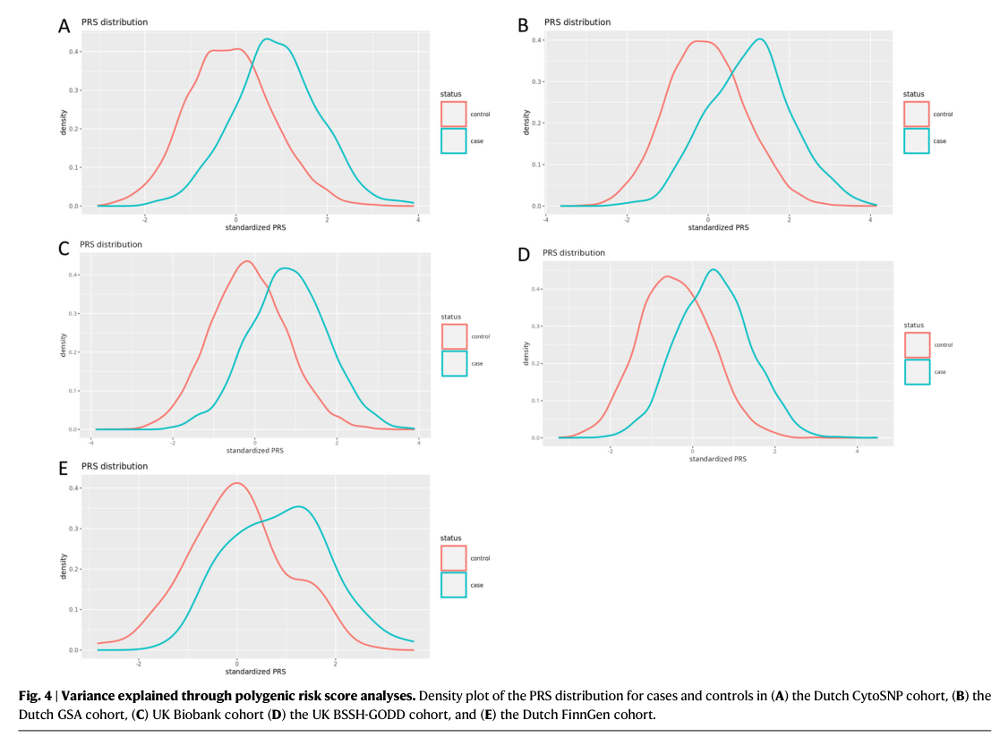

## Question

# Disease Characteristics Research Template

## Target Disease
- **Disease Name:** Dupuytren Contracture
- **MONDO ID:**  (if available)
- **Category:** Complex

## Research Objectives

Please provide a comprehensive research report on **Dupuytren Contracture** covering all of the
disease characteristics listed below. This report will be used to populate a disease knowledge
base entry. Be thorough and cite primary literature (PMID preferred) for all claims.

For each section, **suggested databases/resources** are listed. These are the first places
you should search for information on each topic.

---

### 1. Disease Information
> **Search first:** OMIM, Orphanet, ICD-10/ICD-11, MeSH, PubMed

- What is the disease? Provide a concise overview.
- What are the key identifiers? (OMIM, Orphanet, ICD-10/ICD-11, MeSH, Mondo)
- What are the common synonyms and alternative names?
- Is the information derived from individual patients (e.g., EHR) or aggregated disease-level resources?

### 2. Etiology

- **Disease Causal Factors**: What are the primary causes? (genetic, environmental, infectious, mechanistic)
- **Risk Factors**:
  > **Search first:** PubMed, Cochrane Library, UpToDate, clinical guidelines, ClinVar, ClinGen, GWAS Catalog, PheGenI, CTD, CDC, WHO, epidemiological databases
  - Genetic risk factors (causal variants, susceptibility loci, modifier genes)
  - Environmental risk factors (toxins, lifestyle, occupational exposures, age, sex, family history)
- **Protective Factors**:
  > **Search first:** PubMed, Cochrane Library, clinical trial databases, GWAS Catalog, gnomAD, WHO, CDC, nutrition databases
  - Genetic protective factors (protective variants, modifier alleles)
  - Environmental protective factors (diet, lifestyle, exposures that reduce risk)
- **Gene-Environment Interactions**: How do genetic and environmental factors interact to influence disease?
  > **Search first:** CTD, PubMed, PheGenI, GxE databases

### 3. Phenotypes
> **Search first:** HPO (Human Phenotype Ontology), OMIM, Orphanet, PubMed, clinicaltrials.gov, MedDRA, SNOMED CT, DECIPHER, LOINC

For each phenotype, provide:
- **Phenotype type**: symptoms, clinical signs, physical manifestations, behavioral changes, or laboratory abnormalities
  > For symptoms/signs: HPO, OMIM, Orphanet, PubMed
  > For behavioral changes: HPO, DSM, RDoC (Research Domain Criteria), PubMed
  > For laboratory abnormalities: LOINC, SNOMED CT, LabTests Online, PubMed
- **Phenotype characteristics**:
  > **Search first:** OMIM, Orphanet, HPO, PubMed
  - Age of symptom onset (neonatal, childhood, adult-onset, late-onset)
  - Symptom severity (mild, moderate, severe, variable)
  - Symptom progression (stable, progressive, episodic, fluctuating)
  - Frequency among affected individuals (percentage or qualitative)
- **Quality of life impact**: Effects on daily functioning and well-being (per-phenotype when possible)
  > **Search first:** EQ-5D database, SF-36, WHO QOL databases, PubMed
- Suggest HPO (Human Phenotype Ontology) terms for each phenotype

### 4. Genetic/Molecular Information

- **Causal Genes**: Gene mutations or chromosomal abnormalities responsible for disease (gene symbols, OMIM IDs)
  > **Search first:** OMIM, ClinVar, HGMD, Ensembl, NCBI Gene
- **Pathogenic Variants**:
  - Affected genes (gene symbols, HGNC IDs)
    > **Search first:** OMIM, NCBI Gene, Ensembl, HGNC, UniProt, GeneCards
  - Variant classification (pathogenic, likely pathogenic, VUS per ACMG/AMP guidelines)
    > **Search first:** ClinVar, ClinGen, ACMG/AMP guidelines, VarSome
  - Variant type/class (missense, frameshift, nonsense, splice-site, structural)
  - Allele frequency in population databases
    > **Search first:** gnomAD, 1000 Genomes, ExAC, TOPMed, dbSNP
  - Somatic vs germline origin
    > **Search first:** COSMIC (somatic), ClinVar, ICGC, TCGA
  - Functional consequences (loss of function, gain of function, dominant negative)
- **Modifier Genes**: Genes that modify disease severity or expression
- **Epigenetic Information**: DNA methylation, histone modifications, chromatin changes affecting disease
  > **Search first:** ENCODE, Roadmap Epigenomics, MethBase, DiseaseMeth
- **Chromosomal Abnormalities**: Large-scale genetic changes (aneuploidy, translocations, inversions)
  > **Search first:** DECIPHER, ClinVar, ECARUCA, UCSC Genome Browser

### 5. Environmental Information

- **Environmental Factors**: Non-genetic contributing factors (toxins, radiation, pollution, occupational exposure)
  > **Search first:** CTD (Comparative Toxicogenomics Database), TOXNET, PubMed, EPA databases
- **Lifestyle Factors**: Behavioral factors (smoking, diet, exercise, alcohol consumption)
  > **Search first:** CDC databases, WHO, PubMed, NHANES
- **Infectious Agents**: If applicable, pathogens causing or triggering disease (bacteria, viruses, fungi, parasites)
  > **Search first:** NCBI Taxonomy, ViPR, BV-BRC, MicrobeDB, GIDEON

### 6. Mechanism / Pathophysiology

- **Molecular Pathways**: Specific signaling cascades or biochemical pathways involved (Wnt, MAPK, mTOR, PI3K-AKT, etc.)
  > **Search first:** KEGG, Reactome, WikiPathways, PathBank, BioCyc
- **Cellular Processes**: Cell-level mechanisms (apoptosis, autophagy, cell cycle dysregulation, inflammation, etc.)
  > **Search first:** Gene Ontology (GO), Reactome, KEGG, PubMed
- **Protein Dysfunction**: How protein structure or function is altered (misfolding, aggregation, loss of function, gain of function)
  > **Search first:** UniProt, PDB (Protein Data Bank), InterPro, Pfam, AlphaFold
- **Metabolic Changes**: Alterations in metabolic processes (energy metabolism, lipid metabolism, amino acid metabolism)
  > **Search first:** KEGG, BioCyc, HMDB (Human Metabolome Database), BRENDA
- **Immune System Involvement**: Role of immune response (autoimmunity, immunodeficiency, chronic inflammation)
  > **Search first:** ImmPort, Immunome Database, IEDB, Gene Ontology
- **Tissue Damage Mechanisms**: How tissues/ are injured (oxidative stress, ischemia, fibrosis, necrosis)
  > **Search first:** PubMed, Gene Ontology, Reactome
- **Biochemical Abnormalities**: Specific molecular defects (enzyme deficiencies, receptor dysfunction, ion channel defects)
  > **Search first:** BRENDA, UniProt, KEGG, OMIM, PubMed
- **Epigenetic Changes**: DNA methylation, histone modifications affecting gene expression in disease
  > **Search first:** ENCODE, Roadmap Epigenomics, MethBase, DiseaseMeth
- **Molecular Profiling** (if available):
  - Transcriptomics/gene expression changes
    > **Search first:** GEO (Gene Expression Omnibus), ArrayExpress, GTEx, Human Cell Atlas, SRA
  - Proteomics findings
    > **Search first:** PRIDE, ProteomeXchange, Human Protein Atlas, STRING, BioGRID
  - Metabolomics signatures
    > **Search first:** MetaboLights, Metabolomics Workbench, HMDB, METLIN
  - Lipidomics alterations
    > **Search first:** LIPID MAPS, SwissLipids, LipidHome, Metabolomics Workbench
  - Genomic structural features
    > **Search first:** UCSC Genome Browser, Ensembl, NCBI, dbVar, DGV
- **Advanced Technologies** (if applicable):
  - Single-cell analysis findings (cell-type specific mechanisms, cellular heterogeneity)
    > **Search first:** Human Cell Atlas, Single Cell Portal, GEO, CELLxGENE
  - Spatial transcriptomics findings
    > **Search first:** GEO, Spatial Research, Vizgen, 10x Genomics data
  - Multi-omics integration results
    > **Search first:** TCGA, ICGC, cBioPortal, LinkedOmics, PubMed
  - Functional genomics screens (CRISPR, RNAi)
    > **Search first:** DepMap, GenomeRNAi, PubMed, BioGRID ORCS

For each mechanism, describe:
- The causal chain from initial trigger to clinical manifestation
- Which mechanisms are upstream vs downstream
- What cell types and biological processes are involved
- Suggest GO terms for biological processes and CL terms for cell types

### 7. Anatomical Structures Affected

- **Organ Level**:
  - Primary organs directly affected
  - Secondary organ involvement (complications, secondary effects)
  - Body systems involved (cardiovascular, nervous, digestive, respiratory, endocrine, etc.)
  > **Search first:** Uberon, FMA (Foundational Model of Anatomy), OMIM, HPO, ICD-11, MeSH, SNOMED CT
- **Tissue and Cell Level**:
  - Specific tissue types affected (epithelial, connective, muscle, nervous)
  - Specific cell populations targeted (with Cell Ontology terms)
  > **Search first:** Uberon, Human Protein Atlas, Cell Ontology, Human Cell Atlas, CellMarker, PanglaoDB
- **Subcellular Level**:
  - Cellular compartments involved (mitochondria, nucleus, ER, lysosomes) (with GO Cellular Component terms)
  > **Search first:** Gene Ontology (Cellular Component), UniProt, Human Protein Atlas
- **Localization**:
  - Specific anatomical sites (with UBERON terms)
    > **Search first:** FMA, Uberon, NeuroNames (for brain), SNOMED CT
  - Lateralization (unilateral, bilateral, asymmetric)
    > **Search first:** HPO, clinical literature, imaging databases

### 8. Temporal Development

- **Onset**:
  - Typical age of onset (congenital, pediatric, adult, geriatric)
  - Onset pattern (acute, subacute, chronic, insidious)
  > **Search first:** OMIM, Orphanet, HPO, PubMed
- **Progression**:
  - Disease stages (early, intermediate, advanced, end-stage)
    > **Search first:** Cancer Staging Manual (AJCC), WHO classifications, PubMed
  - Progression rate (rapid, slow, variable)
  - Disease course pattern (episodic, relapsing-remitting, progressive, stable)
  - Disease duration (self-limited, chronic lifelong)
  > **Search first:** Disease registries, longitudinal cohort databases, natural history studies, PubMed, Orphanet, OMIM
- **Patterns**:
  - Remission patterns (spontaneous, treatment-induced)
    > **Search first:** Clinical trial databases, disease registries, PubMed
  - Critical periods (time windows of vulnerability or opportunity for intervention)
    > **Search first:** PubMed, developmental biology databases, clinical guidelines

### 9. Inheritance and Population

- **Epidemiology**:
  - Prevalence (cases per 100,000 at given time)
  - Incidence (new cases per 100,000 per year)
  > **Search first:** Orphanet, CDC, WHO, GBD (Global Burden of Disease), national registries, SEER, disease registries
- **For Genetic Etiology**:
  - Inheritance pattern (AD, AR, X-linked, mitochondrial, multifactorial, polygenic)
    > **Search first:** OMIM, Orphanet, ClinVar, GTR (Genetic Testing Registry)
  - Penetrance (complete, incomplete, age-dependent)
    > **Search first:** ClinVar, OMIM, PubMed, ClinGen
  - Expressivity (variable, consistent)
    > **Search first:** OMIM, ClinVar, PubMed
  - Genetic anticipation (increasing severity in successive generations)
    > **Search first:** OMIM, PubMed (especially for repeat expansion disorders)
  - Germline mosaicism
    > **Search first:** ClinVar, OMIM, genetic counseling literature, PubMed
  - Founder effects (population-specific mutations)
    > **Search first:** gnomAD, population genetics databases, PubMed
  - Consanguinity role
    > **Search first:** OMIM, population studies, genetic counseling resources
  - Carrier frequency
    > **Search first:** gnomAD, carrier screening databases, GeneReviews, GTR
- **Population Demographics**:
  - Affected populations (ethnic or demographic groups with higher prevalence)
    > **Search first:** gnomAD, 1000 Genomes, PAGE Study, PubMed, population registries
  - Geographic distribution (endemic areas, regional variation)
    > **Search first:** WHO, CDC, GBD, Orphanet, geographic epidemiology databases
  - Geographic distribution of specific variants
  - Sex ratio (male:female)
    > **Search first:** Disease registries, OMIM, PubMed, epidemiological databases
  - Age distribution of affected individuals
    > **Search first:** CDC, disease registries, SEER, Orphanet

### 10. Diagnostics

- **Clinical Tests**:
  - Laboratory tests (blood, urine, tissue chemistry, specific enzyme assays)
    > **Search first:** LOINC, LabTests Online, PubMed
  - Biomarkers (proteins, metabolites, genetic markers, circulating biomarkers)
    > **Search first:** FDA Biomarker List, BEST (Biomarkers, EndpointS, and other Tools), PubMed
  - Imaging studies (X-ray, CT, MRI, PET, ultrasound)
    > **Search first:** RadLex, DICOM, Radiopaedia, imaging databases
  - Functional tests (pulmonary function, cardiac stress tests)
    > **Search first:** LOINC, clinical guidelines, PubMed
  - Electrophysiology (EEG, EMG, ECG, nerve conduction studies)
    > **Search first:** LOINC, clinical neurophysiology databases, PubMed
  - Biopsy findings (histopathology, immunohistochemistry)
    > **Search first:** SNOMED CT, College of American Pathologists resources, PubMed
  - Pathology findings (microscopic examination)
    > **Search first:** SNOMED CT, Digital Pathology databases, PubMed
- **Genetic Testing**:
  > **Search first:** GTR (Genetic Testing Registry), GeneReviews, ClinGen
  - Overview of recommended genetic testing approach
  - Whole genome sequencing (WGS) utility
    > **Search first:** GTR, ClinVar, GEL (Genomics England), gnomAD
  - Whole exome sequencing (WES) utility
    > **Search first:** GTR, ClinVar, OMIM, GeneMatcher
  - Gene panels (which panels, which genes)
    > **Search first:** GTR, ClinVar, laboratory-specific databases
  - Single gene testing
    > **Search first:** GTR, ClinVar, OMIM, GeneReviews
  - Chromosomal microarray (CMA)
    > **Search first:** DECIPHER, ClinVar, dbVar, ECARUCA
  - Karyotyping
    > **Search first:** Chromosome Abnormality Database, ClinVar, cytogenetics resources
  - FISH
    > **Search first:** ClinVar, cytogenetics databases, PubMed
  - Mitochondrial DNA testing
    > **Search first:** MITOMAP, MSeqDR, ClinVar, GTR
  - Repeat expansion testing
    > **Search first:** GTR, ClinVar, repeat expansion databases, PubMed
- **Omics-Based Diagnostics** (if applicable):
  - RNA sequencing / transcriptomics
    > **Search first:** GEO, ArrayExpress, GTEx, RNA-seq databases
  - Proteomics
    > **Search first:** PRIDE, ProteomeXchange, FDA Biomarker database
  - Metabolomics
    > **Search first:** MetaboLights, Metabolomics Workbench, HMDB
  - Epigenomics
    > **Search first:** GEO, ENCODE, Roadmap Epigenomics, MethBase
  - Liquid biopsy
    > **Search first:** COSMIC, ClinVar, liquid biopsy databases, PubMed
- **Clinical Criteria**:
  - Standardized diagnostic criteria (DSM, ICD, society guidelines)
    > **Search first:** DSM-5, ICD-11, clinical society guidelines, UpToDate
  - Differential diagnosis (other conditions to rule out, with distinguishing features)
    > **Search first:** DynaMed, UpToDate, clinical decision support systems
- **Screening**:
  - Screening methods for asymptomatic individuals (newborn screening, carrier screening, cascade screening)
    > **Search first:** ACMG recommendations, CDC newborn screening, GTR

### 11. Outcome/Prognosis

- **Survival and Mortality**:
  - Survival rate (5-year, 10-year, overall)
    > **Search first:** SEER, cancer registries, disease-specific registries, PubMed
  - Life expectancy (with and without treatment if applicable)
    > **Search first:** Orphanet, disease registries, actuarial databases, PubMed
  - Mortality rate
    > **Search first:** CDC, WHO, GBD, national mortality databases
  - Disease-specific mortality (deaths directly attributable to disease)
    > **Search first:** Disease registries, CDC Wonder, GBD, PubMed
- **Morbidity and Function**:
  - Morbidity (disease-related disability and health impacts)
    > **Search first:** GBD, WHO, disability databases, PubMed
  - Disability outcomes (long-term functional impairments)
    > **Search first:** ICF (International Classification of Functioning), disability registries
  - Quality of life measures (EQ-5D, SF-36, PROMIS, disease-specific tools)
    > **Search first:** EQ-5D database, SF-36, PROMIS, PubMed
- **Disease Course**:
  - Complications (secondary problems: infections, organ failure, etc.)
    > **Search first:** ICD codes, disease registries, clinical databases, PubMed
  - Recovery potential (likelihood and extent of recovery, with vs without treatment)
    > **Search first:** Natural history studies, rehabilitation databases, PubMed
- **Prediction**:
  - Prognostic factors (age, disease severity, biomarkers, treatment response)
    > **Search first:** Prognostic models databases, clinical calculators, PubMed
  - Prognostic biomarkers (molecular markers predicting disease course)
    > **Search first:** FDA Biomarker database, PubMed, cancer prognostic databases

### 12. Treatment

- **Pharmacotherapy**:
  - Pharmacological treatments (drug names, drug classes, mechanisms of action)
    > **Search first:** DrugBank, RxNorm, ATC classification, DailyMed, FDA databases
  - Pharmacogenomics (how genetic variants affect drug metabolism, efficacy, toxicity)
    > **Search first:** PharmGKB, CPIC (Clinical Pharmacogenetics), FDA Table of PGx Biomarkers
- **Advanced Therapeutics**:
  - Gene therapy (viral vectors, CRISPR, gene replacement, gene editing)
    > **Search first:** ClinicalTrials.gov, FDA gene therapy database, ASGCT resources
  - Cell therapy (stem cell transplant, CAR-T, cellular therapeutics)
    > **Search first:** ClinicalTrials.gov, FDA cell therapy database, FACT standards
  - RNA-based therapies (ASOs, siRNA, mRNA therapies)
    > **Search first:** ClinicalTrials.gov, FDA approvals, PubMed
  - Targeted therapies (treatments directed at specific molecular targets)
    > **Search first:** My Cancer Genome, OncoKB, ClinicalTrials.gov, FDA approvals
  - Immunotherapies (checkpoint inhibitors, monoclonal antibodies)
    > **Search first:** Cancer Immunotherapy Database, FDA approvals, ClinicalTrials.gov
- **Surgical and Interventional**:
  - Surgical interventions (types of surgery, timing, outcomes)
    > **Search first:** CPT codes, surgical registries, clinical guidelines, PubMed
- **Supportive and Rehabilitative**:
  - Supportive care (symptom management, pain control, nutrition)
    > **Search first:** Clinical guidelines, Cochrane Library, PubMed
  - Rehabilitation (physical therapy, occupational therapy, speech therapy)
    > **Search first:** Rehabilitation medicine databases, clinical guidelines, PubMed
- **Experimental**:
  - Experimental treatments in clinical trials (with NCT identifiers if available)
    > **Search first:** ClinicalTrials.gov, EU Clinical Trials Register, WHO ICTRP
- **Treatment Outcomes**:
  - Treatment response rates
    > **Search first:** Clinical trial databases, FDA reviews, systematic reviews, PubMed
  - Side effects and adverse events
    > **Search first:** FDA Adverse Event Reporting System (FAERS), MedWatch, PubMed
- **Treatment Strategy**:
  - Treatment algorithms (clinical pathways, decision trees)
    > **Search first:** Clinical practice guidelines, NCCN Guidelines, UpToDate
  - Combination therapies
    > **Search first:** ClinicalTrials.gov, treatment guidelines, PubMed
  - Personalized medicine approaches (genotype-guided treatment)
    > **Search first:** My Cancer Genome, CIViC, PharmGKB, precision medicine databases

For each treatment, suggest MAXO (Medical Action Ontology) terms where applicable.

### 13. Prevention

- **Prevention Levels**:
  - Primary prevention (preventing disease occurrence: vaccination, risk factor modification)
    > **Search first:** CDC, WHO, USPSTF recommendations, Cochrane Library
  - Secondary prevention (early detection and treatment: screening programs, early intervention)
    > **Search first:** USPSTF, CDC screening guidelines, WHO
  - Tertiary prevention (preventing complications in those with disease)
    > **Search first:** Clinical guidelines, disease management protocols, PubMed
- **Immunization**: Vaccine strategies (if applicable)
  > **Search first:** CDC vaccine schedules, WHO immunization, FDA vaccine database
- **Screening and Early Detection**:
  - Screening programs (population-based: newborn screening, cancer screening)
    > **Search first:** CDC screening programs, USPSTF, cancer screening databases
  - Genetic screening (carrier screening, preimplantation genetic diagnosis, prenatal testing)
    > **Search first:** ACMG recommendations, ACOG guidelines, GTR
  - Risk stratification (identifying high-risk individuals for targeted prevention)
    > **Search first:** Risk prediction models, clinical calculators, PubMed
- **Behavioral Interventions**: Lifestyle modifications to reduce risk
  > **Search first:** CDC, WHO, behavioral intervention databases, Cochrane Library
- **Counseling**: Genetic counseling (risk assessment, family planning guidance)
  > **Search first:** NSGC resources, ACMG guidelines, GeneReviews
- **Public Health**:
  - Public health interventions (sanitation, vector control, health education)
    > **Search first:** CDC, WHO, public health databases, PubMed
  - Environmental interventions (reducing environmental risk factors)
    > **Search first:** EPA databases, WHO environmental health, PubMed
- **Prophylaxis**: Preventive medications or procedures
  > **Search first:** Clinical guidelines, FDA approvals, PubMed

### 14. Other Species / Natural Disease

- **Taxonomy**: Species affected (with NCBI Taxon identifiers)
  > **Search first:** NCBI Taxonomy
- **Breed**: Specific breeds affected (with VBO identifiers if applicable)
  > **Search first:** VBO (Vertebrate Breed Ontology)
- **Gene**: Orthologous genes in other species (with NCBI Gene IDs)
  > **Search first:** NCBI Gene
- **Natural Disease**:
  - Naturally occurring disease in other species (companion animals, wildlife)
    > **Search first:** OMIA (Online Mendelian Inheritance in Animals), VetCompass, PubMed
  - Veterinary relevance and importance in animal health
    > **Search first:** OMIA, veterinary databases, PubMed
- **Comparative Biology**:
  - Comparative pathology (similarities and differences across species)
    > **Search first:** OMIA, comparative pathology databases, PubMed
  - Evolutionary conservation of disease mechanisms
    > **Search first:** HomoloGene, OrthoMCL, Alliance of Genome Resources
- **Transmission** (if applicable):
  - Zoonotic potential
    > **Search first:** CDC zoonotic diseases, WHO zoonoses, GIDEON
  - Cross-species susceptibility
    > **Search first:** NCBI Taxonomy, veterinary databases, PubMed

### 15. Model Organisms

- **Model Types**:
  - Model organism type (mammalian, invertebrate, cellular, in vitro)
    > **Search first:** Alliance of Genome Resources, model organism databases
  - Specific model systems (mouse, rat, zebrafish, Drosophila, C. elegans, yeast, cell lines, organoids, iPSCs)
    > **Search first:** MGI, RGD, ZFIN, FlyBase, WormBase, SGD, ATCC, Cellosaurus
  - Induced models (drug treatment, surgical intervention, environmental manipulation)
    > **Search first:** MGI, model organism databases, PubMed
- **Genetic Models**:
  - Types available (knockout, knock-in, transgenic, conditional, humanized)
    > **Search first:** MGI, IMPC, KOMP, EuMMCR, IMSR
- **Model Characteristics**:
  - Phenotype recapitulation (how well model reproduces human disease features)
    > **Search first:** Model organism databases, comparative studies, PubMed
  - Model limitations (aspects of human disease not captured)
    > **Search first:** Model organism databases, PubMed, review articles
- **Applications**:
  - Research applications (what aspects of disease can be studied)
    > **Search first:** Model organism databases, PubMed
- **Resources**:
  - Model databases
    > **Search first:** MGI, RGD, ZFIN, FlyBase, WormBase, IMSR, EMMA, MMRRC

---

## Citation Requirements

- Cite primary literature (PMID preferred) for all mechanistic and clinical claims
- Prioritize recent reviews and landmark papers
- Include direct quotes from abstracts where possible to support key statements
- Distinguish evidence source types: human clinical, model organism, in vitro, computational

## Output Format

Structure your response as a comprehensive narrative organized by the sections above.
For each section, provide:
- Factual content with specific details (numbers, percentages, gene names, variant nomenclature)
- Ontology term suggestions (HPO, GO, CL, UBERON, CHEBI, MAXO, MONDO) where applicable
- Evidence citations with PMIDs
- Direct quotes from abstracts to support key claims
- Clear indication when information is not available or not applicable for this disease

This report will be used to populate a disease knowledge base entry with:
- Pathophysiology descriptions with causal chains
- Gene/protein annotations (HGNC, GO terms)
- Phenotype associations (HP terms) with frequencies
- Cell type involvement (CL terms)
- Anatomical locations (UBERON terms)
- Chemical entities (CHEBI terms)
- Treatment annotations (MAXO terms)
- Evidence items with PMIDs and exact abstract quotes
- Epidemiology, prognosis, diagnostic, and prevention information
- Animal model descriptions with phenotype recapitulation details

## Output

Question: You are an expert researcher providing comprehensive, well-cited information.

Provide detailed information focusing on:
1. Key concepts and definitions with current understanding
2. Recent developments and latest research (prioritize 2023-2024 sources)
3. Current applications and real-world implementations
4. Expert opinions and analysis from authoritative sources
5. Relevant statistics and data from recent studies

Format as a comprehensive research report with proper citations. Include URLs and publication dates where available.
Always prioritize recent, authoritative sources and provide specific citations for all major claims.

# Disease Characteristics Research Template

## Target Disease
- **Disease Name:** Dupuytren Contracture
- **MONDO ID:**  (if available)
- **Category:** Complex

## Research Objectives

Please provide a comprehensive research report on **Dupuytren Contracture** covering all of the
disease characteristics listed below. This report will be used to populate a disease knowledge
base entry. Be thorough and cite primary literature (PMID preferred) for all claims.

For each section, **suggested databases/resources** are listed. These are the first places
you should search for information on each topic.

---

### 1. Disease Information
> **Search first:** OMIM, Orphanet, ICD-10/ICD-11, MeSH, PubMed

- What is the disease? Provide a concise overview.
- What are the key identifiers? (OMIM, Orphanet, ICD-10/ICD-11, MeSH, Mondo)
- What are the common synonyms and alternative names?
- Is the information derived from individual patients (e.g., EHR) or aggregated disease-level resources?

### 2. Etiology

- **Disease Causal Factors**: What are the primary causes? (genetic, environmental, infectious, mechanistic)
- **Risk Factors**:
  > **Search first:** PubMed, Cochrane Library, UpToDate, clinical guidelines, ClinVar, ClinGen, GWAS Catalog, PheGenI, CTD, CDC, WHO, epidemiological databases
  - Genetic risk factors (causal variants, susceptibility loci, modifier genes)
  - Environmental risk factors (toxins, lifestyle, occupational exposures, age, sex, family history)
- **Protective Factors**:
  > **Search first:** PubMed, Cochrane Library, clinical trial databases, GWAS Catalog, gnomAD, WHO, CDC, nutrition databases
  - Genetic protective factors (protective variants, modifier alleles)
  - Environmental protective factors (diet, lifestyle, exposures that reduce risk)
- **Gene-Environment Interactions**: How do genetic and environmental factors interact to influence disease?
  > **Search first:** CTD, PubMed, PheGenI, GxE databases

### 3. Phenotypes
> **Search first:** HPO (Human Phenotype Ontology), OMIM, Orphanet, PubMed, clinicaltrials.gov, MedDRA, SNOMED CT, DECIPHER, LOINC

For each phenotype, provide:
- **Phenotype type**: symptoms, clinical signs, physical manifestations, behavioral changes, or laboratory abnormalities
  > For symptoms/signs: HPO, OMIM, Orphanet, PubMed
  > For behavioral changes: HPO, DSM, RDoC (Research Domain Criteria), PubMed
  > For laboratory abnormalities: LOINC, SNOMED CT, LabTests Online, PubMed
- **Phenotype characteristics**:
  > **Search first:** OMIM, Orphanet, HPO, PubMed
  - Age of symptom onset (neonatal, childhood, adult-onset, late-onset)
  - Symptom severity (mild, moderate, severe, variable)
  - Symptom progression (stable, progressive, episodic, fluctuating)
  - Frequency among affected individuals (percentage or qualitative)
- **Quality of life impact**: Effects on daily functioning and well-being (per-phenotype when possible)
  > **Search first:** EQ-5D database, SF-36, WHO QOL databases, PubMed
- Suggest HPO (Human Phenotype Ontology) terms for each phenotype

### 4. Genetic/Molecular Information

- **Causal Genes**: Gene mutations or chromosomal abnormalities responsible for disease (gene symbols, OMIM IDs)
  > **Search first:** OMIM, ClinVar, HGMD, Ensembl, NCBI Gene
- **Pathogenic Variants**:
  - Affected genes (gene symbols, HGNC IDs)
    > **Search first:** OMIM, NCBI Gene, Ensembl, HGNC, UniProt, GeneCards
  - Variant classification (pathogenic, likely pathogenic, VUS per ACMG/AMP guidelines)
    > **Search first:** ClinVar, ClinGen, ACMG/AMP guidelines, VarSome
  - Variant type/class (missense, frameshift, nonsense, splice-site, structural)
  - Allele frequency in population databases
    > **Search first:** gnomAD, 1000 Genomes, ExAC, TOPMed, dbSNP
  - Somatic vs germline origin
    > **Search first:** COSMIC (somatic), ClinVar, ICGC, TCGA
  - Functional consequences (loss of function, gain of function, dominant negative)
- **Modifier Genes**: Genes that modify disease severity or expression
- **Epigenetic Information**: DNA methylation, histone modifications, chromatin changes affecting disease
  > **Search first:** ENCODE, Roadmap Epigenomics, MethBase, DiseaseMeth
- **Chromosomal Abnormalities**: Large-scale genetic changes (aneuploidy, translocations, inversions)
  > **Search first:** DECIPHER, ClinVar, ECARUCA, UCSC Genome Browser

### 5. Environmental Information

- **Environmental Factors**: Non-genetic contributing factors (toxins, radiation, pollution, occupational exposure)
  > **Search first:** CTD (Comparative Toxicogenomics Database), TOXNET, PubMed, EPA databases
- **Lifestyle Factors**: Behavioral factors (smoking, diet, exercise, alcohol consumption)
  > **Search first:** CDC databases, WHO, PubMed, NHANES
- **Infectious Agents**: If applicable, pathogens causing or triggering disease (bacteria, viruses, fungi, parasites)
  > **Search first:** NCBI Taxonomy, ViPR, BV-BRC, MicrobeDB, GIDEON

### 6. Mechanism / Pathophysiology

- **Molecular Pathways**: Specific signaling cascades or biochemical pathways involved (Wnt, MAPK, mTOR, PI3K-AKT, etc.)
  > **Search first:** KEGG, Reactome, WikiPathways, PathBank, BioCyc
- **Cellular Processes**: Cell-level mechanisms (apoptosis, autophagy, cell cycle dysregulation, inflammation, etc.)
  > **Search first:** Gene Ontology (GO), Reactome, KEGG, PubMed
- **Protein Dysfunction**: How protein structure or function is altered (misfolding, aggregation, loss of function, gain of function)
  > **Search first:** UniProt, PDB (Protein Data Bank), InterPro, Pfam, AlphaFold
- **Metabolic Changes**: Alterations in metabolic processes (energy metabolism, lipid metabolism, amino acid metabolism)
  > **Search first:** KEGG, BioCyc, HMDB (Human Metabolome Database), BRENDA
- **Immune System Involvement**: Role of immune response (autoimmunity, immunodeficiency, chronic inflammation)
  > **Search first:** ImmPort, Immunome Database, IEDB, Gene Ontology
- **Tissue Damage Mechanisms**: How tissues/ are injured (oxidative stress, ischemia, fibrosis, necrosis)
  > **Search first:** PubMed, Gene Ontology, Reactome
- **Biochemical Abnormalities**: Specific molecular defects (enzyme deficiencies, receptor dysfunction, ion channel defects)
  > **Search first:** BRENDA, UniProt, KEGG, OMIM, PubMed
- **Epigenetic Changes**: DNA methylation, histone modifications affecting gene expression in disease
  > **Search first:** ENCODE, Roadmap Epigenomics, MethBase, DiseaseMeth
- **Molecular Profiling** (if available):
  - Transcriptomics/gene expression changes
    > **Search first:** GEO (Gene Expression Omnibus), ArrayExpress, GTEx, Human Cell Atlas, SRA
  - Proteomics findings
    > **Search first:** PRIDE, ProteomeXchange, Human Protein Atlas, STRING, BioGRID
  - Metabolomics signatures
    > **Search first:** MetaboLights, Metabolomics Workbench, HMDB, METLIN
  - Lipidomics alterations
    > **Search first:** LIPID MAPS, SwissLipids, LipidHome, Metabolomics Workbench
  - Genomic structural features
    > **Search first:** UCSC Genome Browser, Ensembl, NCBI, dbVar, DGV
- **Advanced Technologies** (if applicable):
  - Single-cell analysis findings (cell-type specific mechanisms, cellular heterogeneity)
    > **Search first:** Human Cell Atlas, Single Cell Portal, GEO, CELLxGENE
  - Spatial transcriptomics findings
    > **Search first:** GEO, Spatial Research, Vizgen, 10x Genomics data
  - Multi-omics integration results
    > **Search first:** TCGA, ICGC, cBioPortal, LinkedOmics, PubMed
  - Functional genomics screens (CRISPR, RNAi)
    > **Search first:** DepMap, GenomeRNAi, PubMed, BioGRID ORCS

For each mechanism, describe:
- The causal chain from initial trigger to clinical manifestation
- Which mechanisms are upstream vs downstream
- What cell types and biological processes are involved
- Suggest GO terms for biological processes and CL terms for cell types

### 7. Anatomical Structures Affected

- **Organ Level**:
  - Primary organs directly affected
  - Secondary organ involvement (complications, secondary effects)
  - Body systems involved (cardiovascular, nervous, digestive, respiratory, endocrine, etc.)
  > **Search first:** Uberon, FMA (Foundational Model of Anatomy), OMIM, HPO, ICD-11, MeSH, SNOMED CT
- **Tissue and Cell Level**:
  - Specific tissue types affected (epithelial, connective, muscle, nervous)
  - Specific cell populations targeted (with Cell Ontology terms)
  > **Search first:** Uberon, Human Protein Atlas, Cell Ontology, Human Cell Atlas, CellMarker, PanglaoDB
- **Subcellular Level**:
  - Cellular compartments involved (mitochondria, nucleus, ER, lysosomes) (with GO Cellular Component terms)
  > **Search first:** Gene Ontology (Cellular Component), UniProt, Human Protein Atlas
- **Localization**:
  - Specific anatomical sites (with UBERON terms)
    > **Search first:** FMA, Uberon, NeuroNames (for brain), SNOMED CT
  - Lateralization (unilateral, bilateral, asymmetric)
    > **Search first:** HPO, clinical literature, imaging databases

### 8. Temporal Development

- **Onset**:
  - Typical age of onset (congenital, pediatric, adult, geriatric)
  - Onset pattern (acute, subacute, chronic, insidious)
  > **Search first:** OMIM, Orphanet, HPO, PubMed
- **Progression**:
  - Disease stages (early, intermediate, advanced, end-stage)
    > **Search first:** Cancer Staging Manual (AJCC), WHO classifications, PubMed
  - Progression rate (rapid, slow, variable)
  - Disease course pattern (episodic, relapsing-remitting, progressive, stable)
  - Disease duration (self-limited, chronic lifelong)
  > **Search first:** Disease registries, longitudinal cohort databases, natural history studies, PubMed, Orphanet, OMIM
- **Patterns**:
  - Remission patterns (spontaneous, treatment-induced)
    > **Search first:** Clinical trial databases, disease registries, PubMed
  - Critical periods (time windows of vulnerability or opportunity for intervention)
    > **Search first:** PubMed, developmental biology databases, clinical guidelines

### 9. Inheritance and Population

- **Epidemiology**:
  - Prevalence (cases per 100,000 at given time)
  - Incidence (new cases per 100,000 per year)
  > **Search first:** Orphanet, CDC, WHO, GBD (Global Burden of Disease), national registries, SEER, disease registries
- **For Genetic Etiology**:
  - Inheritance pattern (AD, AR, X-linked, mitochondrial, multifactorial, polygenic)
    > **Search first:** OMIM, Orphanet, ClinVar, GTR (Genetic Testing Registry)
  - Penetrance (complete, incomplete, age-dependent)
    > **Search first:** ClinVar, OMIM, PubMed, ClinGen
  - Expressivity (variable, consistent)
    > **Search first:** OMIM, ClinVar, PubMed
  - Genetic anticipation (increasing severity in successive generations)
    > **Search first:** OMIM, PubMed (especially for repeat expansion disorders)
  - Germline mosaicism
    > **Search first:** ClinVar, OMIM, genetic counseling literature, PubMed
  - Founder effects (population-specific mutations)
    > **Search first:** gnomAD, population genetics databases, PubMed
  - Consanguinity role
    > **Search first:** OMIM, population studies, genetic counseling resources
  - Carrier frequency
    > **Search first:** gnomAD, carrier screening databases, GeneReviews, GTR
- **Population Demographics**:
  - Affected populations (ethnic or demographic groups with higher prevalence)
    > **Search first:** gnomAD, 1000 Genomes, PAGE Study, PubMed, population registries
  - Geographic distribution (endemic areas, regional variation)
    > **Search first:** WHO, CDC, GBD, Orphanet, geographic epidemiology databases
  - Geographic distribution of specific variants
  - Sex ratio (male:female)
    > **Search first:** Disease registries, OMIM, PubMed, epidemiological databases
  - Age distribution of affected individuals
    > **Search first:** CDC, disease registries, SEER, Orphanet

### 10. Diagnostics

- **Clinical Tests**:
  - Laboratory tests (blood, urine, tissue chemistry, specific enzyme assays)
    > **Search first:** LOINC, LabTests Online, PubMed
  - Biomarkers (proteins, metabolites, genetic markers, circulating biomarkers)
    > **Search first:** FDA Biomarker List, BEST (Biomarkers, EndpointS, and other Tools), PubMed
  - Imaging studies (X-ray, CT, MRI, PET, ultrasound)
    > **Search first:** RadLex, DICOM, Radiopaedia, imaging databases
  - Functional tests (pulmonary function, cardiac stress tests)
    > **Search first:** LOINC, clinical guidelines, PubMed
  - Electrophysiology (EEG, EMG, ECG, nerve conduction studies)
    > **Search first:** LOINC, clinical neurophysiology databases, PubMed
  - Biopsy findings (histopathology, immunohistochemistry)
    > **Search first:** SNOMED CT, College of American Pathologists resources, PubMed
  - Pathology findings (microscopic examination)
    > **Search first:** SNOMED CT, Digital Pathology databases, PubMed
- **Genetic Testing**:
  > **Search first:** GTR (Genetic Testing Registry), GeneReviews, ClinGen
  - Overview of recommended genetic testing approach
  - Whole genome sequencing (WGS) utility
    > **Search first:** GTR, ClinVar, GEL (Genomics England), gnomAD
  - Whole exome sequencing (WES) utility
    > **Search first:** GTR, ClinVar, OMIM, GeneMatcher
  - Gene panels (which panels, which genes)
    > **Search first:** GTR, ClinVar, laboratory-specific databases
  - Single gene testing
    > **Search first:** GTR, ClinVar, OMIM, GeneReviews
  - Chromosomal microarray (CMA)
    > **Search first:** DECIPHER, ClinVar, dbVar, ECARUCA
  - Karyotyping
    > **Search first:** Chromosome Abnormality Database, ClinVar, cytogenetics resources
  - FISH
    > **Search first:** ClinVar, cytogenetics databases, PubMed
  - Mitochondrial DNA testing
    > **Search first:** MITOMAP, MSeqDR, ClinVar, GTR
  - Repeat expansion testing
    > **Search first:** GTR, ClinVar, repeat expansion databases, PubMed
- **Omics-Based Diagnostics** (if applicable):
  - RNA sequencing / transcriptomics
    > **Search first:** GEO, ArrayExpress, GTEx, RNA-seq databases
  - Proteomics
    > **Search first:** PRIDE, ProteomeXchange, FDA Biomarker database
  - Metabolomics
    > **Search first:** MetaboLights, Metabolomics Workbench, HMDB
  - Epigenomics
    > **Search first:** GEO, ENCODE, Roadmap Epigenomics, MethBase
  - Liquid biopsy
    > **Search first:** COSMIC, ClinVar, liquid biopsy databases, PubMed
- **Clinical Criteria**:
  - Standardized diagnostic criteria (DSM, ICD, society guidelines)
    > **Search first:** DSM-5, ICD-11, clinical society guidelines, UpToDate
  - Differential diagnosis (other conditions to rule out, with distinguishing features)
    > **Search first:** DynaMed, UpToDate, clinical decision support systems
- **Screening**:
  - Screening methods for asymptomatic individuals (newborn screening, carrier screening, cascade screening)
    > **Search first:** ACMG recommendations, CDC newborn screening, GTR

### 11. Outcome/Prognosis

- **Survival and Mortality**:
  - Survival rate (5-year, 10-year, overall)
    > **Search first:** SEER, cancer registries, disease-specific registries, PubMed
  - Life expectancy (with and without treatment if applicable)
    > **Search first:** Orphanet, disease registries, actuarial databases, PubMed
  - Mortality rate
    > **Search first:** CDC, WHO, GBD, national mortality databases
  - Disease-specific mortality (deaths directly attributable to disease)
    > **Search first:** Disease registries, CDC Wonder, GBD, PubMed
- **Morbidity and Function**:
  - Morbidity (disease-related disability and health impacts)
    > **Search first:** GBD, WHO, disability databases, PubMed
  - Disability outcomes (long-term functional impairments)
    > **Search first:** ICF (International Classification of Functioning), disability registries
  - Quality of life measures (EQ-5D, SF-36, PROMIS, disease-specific tools)
    > **Search first:** EQ-5D database, SF-36, PROMIS, PubMed
- **Disease Course**:
  - Complications (secondary problems: infections, organ failure, etc.)
    > **Search first:** ICD codes, disease registries, clinical databases, PubMed
  - Recovery potential (likelihood and extent of recovery, with vs without treatment)
    > **Search first:** Natural history studies, rehabilitation databases, PubMed
- **Prediction**:
  - Prognostic factors (age, disease severity, biomarkers, treatment response)
    > **Search first:** Prognostic models databases, clinical calculators, PubMed
  - Prognostic biomarkers (molecular markers predicting disease course)
    > **Search first:** FDA Biomarker database, PubMed, cancer prognostic databases

### 12. Treatment

- **Pharmacotherapy**:
  - Pharmacological treatments (drug names, drug classes, mechanisms of action)
    > **Search first:** DrugBank, RxNorm, ATC classification, DailyMed, FDA databases
  - Pharmacogenomics (how genetic variants affect drug metabolism, efficacy, toxicity)
    > **Search first:** PharmGKB, CPIC (Clinical Pharmacogenetics), FDA Table of PGx Biomarkers
- **Advanced Therapeutics**:
  - Gene therapy (viral vectors, CRISPR, gene replacement, gene editing)
    > **Search first:** ClinicalTrials.gov, FDA gene therapy database, ASGCT resources
  - Cell therapy (stem cell transplant, CAR-T, cellular therapeutics)
    > **Search first:** ClinicalTrials.gov, FDA cell therapy database, FACT standards
  - RNA-based therapies (ASOs, siRNA, mRNA therapies)
    > **Search first:** ClinicalTrials.gov, FDA approvals, PubMed
  - Targeted therapies (treatments directed at specific molecular targets)
    > **Search first:** My Cancer Genome, OncoKB, ClinicalTrials.gov, FDA approvals
  - Immunotherapies (checkpoint inhibitors, monoclonal antibodies)
    > **Search first:** Cancer Immunotherapy Database, FDA approvals, ClinicalTrials.gov
- **Surgical and Interventional**:
  - Surgical interventions (types of surgery, timing, outcomes)
    > **Search first:** CPT codes, surgical registries, clinical guidelines, PubMed
- **Supportive and Rehabilitative**:
  - Supportive care (symptom management, pain control, nutrition)
    > **Search first:** Clinical guidelines, Cochrane Library, PubMed
  - Rehabilitation (physical therapy, occupational therapy, speech therapy)
    > **Search first:** Rehabilitation medicine databases, clinical guidelines, PubMed
- **Experimental**:
  - Experimental treatments in clinical trials (with NCT identifiers if available)
    > **Search first:** ClinicalTrials.gov, EU Clinical Trials Register, WHO ICTRP
- **Treatment Outcomes**:
  - Treatment response rates
    > **Search first:** Clinical trial databases, FDA reviews, systematic reviews, PubMed
  - Side effects and adverse events
    > **Search first:** FDA Adverse Event Reporting System (FAERS), MedWatch, PubMed
- **Treatment Strategy**:
  - Treatment algorithms (clinical pathways, decision trees)
    > **Search first:** Clinical practice guidelines, NCCN Guidelines, UpToDate
  - Combination therapies
    > **Search first:** ClinicalTrials.gov, treatment guidelines, PubMed
  - Personalized medicine approaches (genotype-guided treatment)
    > **Search first:** My Cancer Genome, CIViC, PharmGKB, precision medicine databases

For each treatment, suggest MAXO (Medical Action Ontology) terms where applicable.

### 13. Prevention

- **Prevention Levels**:
  - Primary prevention (preventing disease occurrence: vaccination, risk factor modification)
    > **Search first:** CDC, WHO, USPSTF recommendations, Cochrane Library
  - Secondary prevention (early detection and treatment: screening programs, early intervention)
    > **Search first:** USPSTF, CDC screening guidelines, WHO
  - Tertiary prevention (preventing complications in those with disease)
    > **Search first:** Clinical guidelines, disease management protocols, PubMed
- **Immunization**: Vaccine strategies (if applicable)
  > **Search first:** CDC vaccine schedules, WHO immunization, FDA vaccine database
- **Screening and Early Detection**:
  - Screening programs (population-based: newborn screening, cancer screening)
    > **Search first:** CDC screening programs, USPSTF, cancer screening databases
  - Genetic screening (carrier screening, preimplantation genetic diagnosis, prenatal testing)
    > **Search first:** ACMG recommendations, ACOG guidelines, GTR
  - Risk stratification (identifying high-risk individuals for targeted prevention)
    > **Search first:** Risk prediction models, clinical calculators, PubMed
- **Behavioral Interventions**: Lifestyle modifications to reduce risk
  > **Search first:** CDC, WHO, behavioral intervention databases, Cochrane Library
- **Counseling**: Genetic counseling (risk assessment, family planning guidance)
  > **Search first:** NSGC resources, ACMG guidelines, GeneReviews
- **Public Health**:
  - Public health interventions (sanitation, vector control, health education)
    > **Search first:** CDC, WHO, public health databases, PubMed
  - Environmental interventions (reducing environmental risk factors)
    > **Search first:** EPA databases, WHO environmental health, PubMed
- **Prophylaxis**: Preventive medications or procedures
  > **Search first:** Clinical guidelines, FDA approvals, PubMed

### 14. Other Species / Natural Disease

- **Taxonomy**: Species affected (with NCBI Taxon identifiers)
  > **Search first:** NCBI Taxonomy
- **Breed**: Specific breeds affected (with VBO identifiers if applicable)
  > **Search first:** VBO (Vertebrate Breed Ontology)
- **Gene**: Orthologous genes in other species (with NCBI Gene IDs)
  > **Search first:** NCBI Gene
- **Natural Disease**:
  - Naturally occurring disease in other species (companion animals, wildlife)
    > **Search first:** OMIA (Online Mendelian Inheritance in Animals), VetCompass, PubMed
  - Veterinary relevance and importance in animal health
    > **Search first:** OMIA, veterinary databases, PubMed
- **Comparative Biology**:
  - Comparative pathology (similarities and differences across species)
    > **Search first:** OMIA, comparative pathology databases, PubMed
  - Evolutionary conservation of disease mechanisms
    > **Search first:** HomoloGene, OrthoMCL, Alliance of Genome Resources
- **Transmission** (if applicable):
  - Zoonotic potential
    > **Search first:** CDC zoonotic diseases, WHO zoonoses, GIDEON
  - Cross-species susceptibility
    > **Search first:** NCBI Taxonomy, veterinary databases, PubMed

### 15. Model Organisms

- **Model Types**:
  - Model organism type (mammalian, invertebrate, cellular, in vitro)
    > **Search first:** Alliance of Genome Resources, model organism databases
  - Specific model systems (mouse, rat, zebrafish, Drosophila, C. elegans, yeast, cell lines, organoids, iPSCs)
    > **Search first:** MGI, RGD, ZFIN, FlyBase, WormBase, SGD, ATCC, Cellosaurus
  - Induced models (drug treatment, surgical intervention, environmental manipulation)
    > **Search first:** MGI, model organism databases, PubMed
- **Genetic Models**:
  - Types available (knockout, knock-in, transgenic, conditional, humanized)
    > **Search first:** MGI, IMPC, KOMP, EuMMCR, IMSR
- **Model Characteristics**:
  - Phenotype recapitulation (how well model reproduces human disease features)
    > **Search first:** Model organism databases, comparative studies, PubMed
  - Model limitations (aspects of human disease not captured)
    > **Search first:** Model organism databases, PubMed, review articles
- **Applications**:
  - Research applications (what aspects of disease can be studied)
    > **Search first:** Model organism databases, PubMed
- **Resources**:
  - Model databases
    > **Search first:** MGI, RGD, ZFIN, FlyBase, WormBase, IMSR, EMMA, MMRRC

---

## Citation Requirements

- Cite primary literature (PMID preferred) for all mechanistic and clinical claims
- Prioritize recent reviews and landmark papers
- Include direct quotes from abstracts where possible to support key statements
- Distinguish evidence source types: human clinical, model organism, in vitro, computational

## Output Format

Structure your response as a comprehensive narrative organized by the sections above.
For each section, provide:
- Factual content with specific details (numbers, percentages, gene names, variant nomenclature)
- Ontology term suggestions (HPO, GO, CL, UBERON, CHEBI, MAXO, MONDO) where applicable
- Evidence citations with PMIDs
- Direct quotes from abstracts to support key claims
- Clear indication when information is not available or not applicable for this disease

This report will be used to populate a disease knowledge base entry with:
- Pathophysiology descriptions with causal chains
- Gene/protein annotations (HGNC, GO terms)
- Phenotype associations (HP terms) with frequencies
- Cell type involvement (CL terms)
- Anatomical locations (UBERON terms)
- Chemical entities (CHEBI terms)
- Treatment annotations (MAXO terms)
- Evidence items with PMIDs and exact abstract quotes
- Epidemiology, prognosis, diagnostic, and prevention information
- Animal model descriptions with phenotype recapitulation details

# Dupuytren Contracture (Dupuytren disease) — Disease Characteristics Research Report

## Executive overview
Dupuytren contracture is a chronic fibroproliferative/fibrotic disorder of the palmar fascia (palmar aponeurosis) that forms palmar nodules and cords and can progress to fixed flexion contractures, classically affecting the ring and little fingers and impairing hand function. (khaliq2024dupuytrenscontracturea pages 1-2)

Recent high-impact genetic studies (2023–2024) reinforce that Dupuytren disease is highly heritable and polygenic, with risk loci converging on fibroblast/myofibroblast biology and pro-fibrotic signaling (e.g., TGF-β; developmental pathways Hedgehog/Notch; cell–matrix adhesion). (riesmeijer2024agenomewideassociation pages 1-2, riesmeijer2024agenomewideassociation pages 2-4)

Clinically, minimally invasive treatments (collagenase clostridium histolyticum injection and percutaneous needle aponeurotomy/fasciotomy) are widely used, especially for earlier disease, but recurrence is common; surgery (limited fasciectomy/dermofasciectomy) remains standard for advanced contracture. (khaliq2024dupuytrenscontracturea pages 4-5, khaliq2024dupuytrenscontracturea pages 5-6)

---

## 1. Disease information

### Definition and current understanding
Dupuytren’s contracture is described as a “chronic fibroproliferative disease of the palmar fascia” causing progressive flexion deformities via development of fibrotic cords. (khaliq2024dupuytrenscontracturea pages 1-2)

### Key identifiers and nomenclature
| Item | Value | URL / year | Evidence |
|---|---|---|---|
| Preferred disease name | Dupuytren contracture | Cureus review, 2024: https://doi.org/10.7759/cureus.74945 | (khaliq2024dupuytrenscontracturea pages 1-2) |
| Alternate disease name | Dupuytren disease | ClinicalTrials.gov records, 2024: https://clinicaltrials.gov/study/NCT06321991 ; 2024: https://clinicaltrials.gov/study/NCT07470684 | (NCT06321991 chunk 2, NCT07470684 chunk 2) |
| Other name variants / synonyms in available evidence | Dupuytren's contracture; Dupuytren's disease; DD; M. Dupuytren; Morbus Dupuytren | ClinicalTrials.gov records, 2013-2024: https://clinicaltrials.gov/study/NCT01876498 ; https://clinicaltrials.gov/study/NCT06321991 | (NCT06321991 chunk 2, NCT01876498 chunk 1) |
| ICD-10 code | M72.0 (Palmar fascial fibromatosis / Dupuytren contracture in hospital coding context) | BMC Musculoskelet Disord, 2011: https://doi.org/10.1186/1471-2474-12-73 | (khaliq2024dupuytrenscontracturea pages 6-7) |
| MeSH term | Dupuytren Contracture | ClinicalTrials.gov MeSH mapping, 2021-2025: https://clinicaltrials.gov/study/NCT04874870 ; https://clinicaltrials.gov/study/NCT06956027 | (NCT04874870 chunk 2, NCT06956027 chunk 2) |
| MeSH ID | D004387 | ClinicalTrials.gov MeSH mapping, 2017-2024: https://clinicaltrials.gov/study/NCT03192020 ; https://clinicaltrials.gov/study/NCT06321991 | (NCT03192020 chunk 3, NCT06321991 chunk 2) |
| Typical affected anatomy | Palmar fascia / palmar aponeurosis of the hand; progressive flexion contractures, especially ring and little fingers; MCP and PIP joints commonly involved | Cureus review, 2024: https://doi.org/10.7759/cureus.74945 ; Cureus meta-analysis, 2024: https://doi.org/10.7759/cureus.53147 | (khaliq2024dupuytrenscontracturea pages 1-2, alhebshi2024comparingcomplicationsand pages 1-2) |
| Disease classification note | Chronic fibroproliferative / fibrotic disorder of the palmar fascia | Cureus review, 2024: https://doi.org/10.7759/cureus.74945 | (khaliq2024dupuytrenscontracturea pages 1-2) |
| MONDO / Orphanet / OMIM in available evidence | Not reported in the retrieved evidence/context provided for this task; would require external ontology lookup beyond available context | Based on available retrieved papers/trial records only, 2013-2025 | (NCT06321991 chunk 2, khaliq2024dupuytrenscontracturea pages 4-5, NCT06142929 chunk 2) |

*Table: This table summarizes the core identifiers and naming conventions for Dupuytren contracture/disease from the retrieved evidence. It also flags that MONDO, Orphanet, and OMIM identifiers were not present in the available context and would need dedicated ontology lookup.*

**Notes/limitations:** MONDO, Orphanet, and OMIM identifiers were not present in the retrieved full-text evidence for this run; adding these would require dedicated ontology lookup beyond the current context. (NCT06321991 chunk 2, khaliq2024dupuytrenscontracturea pages 4-5)

### Disease information source type
Evidence in this report comes from aggregated resources: peer-reviewed reviews/meta-analyses and large biobank GWAS/meta-analyses; administrative coding studies (England HES) are also used for utilization/costs. (gerber2011dupuytrenscontracturea pages 1-2, riesmeijer2024agenomewideassociation pages 1-2)

---

## 2. Etiology

### Disease causal factors (multifactorial)
Dupuytren disease is multifactorial with strong genetic predisposition plus environmental/occupational and lifestyle contributions. A 2024 meta-GWAS frames the disorder as heritable and fibrotic, and also cites established non-genetic risk factors (age, male sex, smoking, alcohol, manual work). (riesmeijer2024agenomewideassociation pages 1-2)

### Risk factors (genetic)

**2024 large meta-GWAS (primary):**
- **Design:** 11,320 cases, 47,023 controls; 8,123,121 variants. (riesmeijer2024agenomewideassociation pages 1-2)
- **Findings:** 85 genome-wide significant SNPs in 56 loci (11 novel); 24 additional secondary signals in 12 known loci; loci/PRS explain **13.3–38.1%** of disease variance (cohort-dependent). (riesmeijer2024agenomewideassociation pages 1-2, riesmeijer2024agenomewideassociation pages 2-4)
- **Genetic correlations:** frozen shoulder r=0.30 (p=1.9×10−6); BMI r=−0.14 (p=1.2×10−8); HDL r=0.12 (p=3.6×10−5). (riesmeijer2024agenomewideassociation pages 2-4)

**2023 biobank meta-analysis (Neandertal-derived risk factors):**
- **Design:** 7,871 cases, 645,880 controls. (agren2023majorgeneticrisk pages 1-2)
- **Findings:** 61 genome-wide significant loci; 3 loci harbor Neandertal-derived risk alleles; carrying all 3 Neandertal risk alleles OR=2.83 (95% CI 2.62–3.05). (agren2023majorgeneticrisk pages 2-3)

**ECM gene polymorphisms (case-control, Lithuania):**
- CHST6 rs977987 minor T allele associated with risk (~1.404-fold per minor allele; TT genotype ~1.7× more likely). (samulenas2022theroleof pages 7-8)
- MMP14 rs1042704 AA genotype associated with earlier onset and ~2.16-fold increased odds. (samulenas2022theroleof pages 7-8)

### Risk factors (environmental/lifestyle/occupational)
- Smoking and manual labor are repeatedly cited as risk factors, and quantified effects were reported in Samulėnas et al.: smoking ~2.084× risk; manual labor ~2.6× risk. (samulenas2022theroleof pages 7-8, samulenas2022theroleof pages 1-2)
- A gene–environment interaction signal was reported: smoking + manual labor increased incidence 13.2-fold vs neither exposure; adding the MMP14 minor A allele increased likelihood to ~14-fold. (samulenas2022theroleof pages 7-8, samulenas2022theroleof pages 1-2)

### Protective factors
Genetic analyses suggest adiposity is “causally protective” and show negative genetic correlation with BMI. (riesmeijer2024agenomewideassociation pages 1-2, riesmeijer2024agenomewideassociation pages 2-4)

### Gene–environment interactions
A specific GxE interaction was quantified with **MMP14 rs1042704** and smoking/manual labor exposures (above), providing direct evidence that inherited susceptibility can amplify occupational/lifestyle risks. (samulenas2022theroleof pages 7-8, samulenas2022theroleof pages 1-2)

---

## 3. Phenotypes

### Core phenotypes and characteristics
- **Palmar nodules** and **palmar cords** in palmar fascia/aponeurosis progressing to **finger flexion contracture** / reduced extension (often painless but function-limiting). (khaliq2024dupuytrenscontracturea pages 1-2, khaliq2024dupuytrenscontracturea pages 4-5)
- Predominant involvement of **ring (4th)** and **small (5th)** digits; MCP and PIP joints are frequently involved. (khaliq2024dupuytrenscontracturea pages 1-2, alhebshi2024comparingcomplicationsand pages 1-2)
- Spiral cords can cause **PIP contractures** and can displace the neurovascular bundle; natatory cords can affect web spaces. (khaliq2024dupuytrenscontracturea pages 2-4, khaliq2024dupuytrenscontracturea pages 1-2)

### Staging / severity
**Tubiana / TPED staging** (total extension deficit across MCP+PIP+DIP):
- Stage I: 0–45°
- Stage II: 45–90°
- Stage III: 90–135°
- Stage IV: >135°
Also includes Stage N (nodule without contracture). (khaliq2024dupuytrenscontracturea pages 4-5)

### Quality of life impact
PROMs used to quantify patient-perceived function/impact include DASH, Michigan Hand Outcomes Questionnaire, and Patient Evaluation Measure; advanced-disease percutaneous treatment series used quickDASH and URAM. (khaliq2024dupuytrenscontracturea pages 4-5, basile2024challengesandinnovations pages 1-2)

### Suggested HPO terms (examples)
(Provided as ontology suggestions; exact IDs not retrieved in current context)
- Palmar nodule
- Palmar fibromatosis / palmar cord
- Finger flexion contracture
- Decreased range of motion of finger joints (MCP/PIP/DIP)
- Hand function impairment
- Skin dimpling of palm (as described clinically) (khaliq2024dupuytrenscontracturea pages 2-4, khaliq2024dupuytrenscontracturea pages 4-5)

---

## 4. Genetic / molecular information

### Causal genes vs susceptibility architecture
Dupuytren disease is best supported as a **polygenic complex trait** rather than a single-gene Mendelian disorder, with dozens of loci and substantial variance explained by common variants in large GWAS. (riesmeijer2024agenomewideassociation pages 1-2, riesmeijer2024agenomewideassociation pages 2-4)

### Notable genes/variants highlighted in recent studies
- **EPDR1** implicated as a causal gene for a strong Neandertal-derived risk factor, with splicing association in muscle/adipose/fibroblasts. (agren2023majorgeneticrisk pages 2-3)
- Meta-GWAS coding variants included nonsynonymous SNPs mapping to TMEM81, DSTYK, SUMO4, CFTR, TNC, MMP14, and LDHAL6B; multiple analyses highlighted TNC, AFAP1, CHSY1, NEDD4, CFDP1. (riesmeijer2024agenomewideassociation pages 1-2, riesmeijer2024agenomewideassociation pages 2-4)

### Epigenetics / chromosomal abnormalities
The available evidence did not provide extractable epigenetic profiling or population-scale chromosomal abnormality rates. A 2024 genetics review excerpt referenced cytogenetic findings (e.g., trisomy 7/8, loss of Y) but without study-level quantitative support in the retrieved chunk. (aissvarya2024moleculargeneticsof pages 1-2)

---

## 5. Environmental information

### Environmental and occupational factors
Manual work exposures and hand-transmitted vibration are discussed in occupational-health oriented sources; the extracted evidence supports risk elevation for vibration-exposed workers (approximately doubled risk in summarized meta-analytic statements), though this run did not retrieve the underlying primary study effect estimates. (nilssonUnknownyeardupuytrenssjukdomi pages 35-38)

### Lifestyle factors
Smoking and alcohol are repeatedly cited as associated factors; smoking has quantified effect sizes in Samulėnas et al. (samulenas2022theroleof pages 7-8, riesmeijer2024agenomewideassociation pages 1-2)

### Infectious agents
No infectious etiology evidence was found; Dupuytren disease is not presented as an infectious disorder in the retrieved sources. (khaliq2024dupuytrenscontracturea pages 1-2)

---

## 6. Mechanism / pathophysiology

### Mechanistic causal chain (current understanding)
A consistent chain across recent reviews:
1) **Proliferative phase:** fibroblast proliferation and nodule formation. (khaliq2024dupuytrenscontracturea pages 2-4)
2) **Myofibroblast differentiation** with production of extracellular matrix, “particularly type III collagen,” leading to cord formation. (khaliq2024dupuytrenscontracturea pages 2-4)
3) **Involutional phase:** myofibroblasts align along stress lines, contract, and shorten cords, producing progressive flexion deformity. (khaliq2024dupuytrenscontracturea pages 2-4, alhebshi2024comparingcomplicationsand pages 1-2)
4) **Residual phase:** cords become relatively acellular but remain thickened/contracted, yielding fixed contracture. (khaliq2024dupuytrenscontracturea pages 2-4, alhebshi2024comparingcomplicationsand pages 1-2)

### Key pathways and mediators
- **TGF-β** is highlighted as a central profibrotic mediator stimulating fibroblast proliferation, myofibroblast differentiation, and collagen production. (khaliq2024dupuytrenscontracturea pages 2-4)
- Inflammatory cytokines (TNF, IL-6) and immune cells (macrophages) are implicated; immune cells secrete profibrotic cytokines and TNF can increase contraction of Dupuytren fibroblasts. (gelbard2021fibroproliferativedisordersand pages 5-6)
- **WNT/β-catenin** dysregulation is supported by transcriptomic/biochemical evidence in nodules (e.g., WNT7b up, nuclear β-catenin staining); cross-talk between inflammatory mediators and WNT signaling is suggested. (gelbard2021fibroproliferativedisordersand pages 4-5)
- **Hedgehog and Notch** signaling were implicated by 2024 meta-GWAS gene prioritization; enrichment also implicated **TGF-β signaling**, epithelial cell migration, and cell–matrix adhesion. (riesmeijer2024agenomewideassociation pages 1-2, riesmeijer2024agenomewideassociation pages 2-4)

### Cell types (with CL suggestions)
Evidence consistently highlights **fibroblasts** and **myofibroblasts** as central effector populations, with cell-type prioritization/association in genetics and mechanistic reviews. (riesmeijer2024agenomewideassociation pages 2-4, alhebshi2024comparingcomplicationsand pages 1-2)
- Suggested Cell Ontology terms: fibroblast; myofibroblast; macrophage (as implicated immune correlate). (gelbard2021fibroproliferativedisordersand pages 5-6, riesmeijer2024agenomewideassociation pages 2-4)

### GO biological process suggestions (examples)
- Extracellular matrix organization
- Collagen fibril organization
- Fibroblast proliferation
- Myofibroblast differentiation
- Wnt signaling pathway
- Response to transforming growth factor beta
- Cell–matrix adhesion
- Epithelial cell migration (as GWAS-enriched pathway) (khaliq2024dupuytrenscontracturea pages 2-4, riesmeijer2024agenomewideassociation pages 2-4)

---

## 7. Anatomical structures affected

### Primary anatomical sites
- Palmar fascia/palmar aponeurosis (hand), with cord formation from fascial structures such as pretendinous bands; spiral cords can affect PIP joints and neurovascular bundle position. (khaliq2024dupuytrenscontracturea pages 1-2, khaliq2024dupuytrenscontracturea pages 2-4)

**UBERON suggestions (examples; IDs not retrieved in current context):** palmar fascia; hand; finger; metacarpophalangeal joint; proximal interphalangeal joint; distal interphalangeal joint. (khaliq2024dupuytrenscontracturea pages 4-5, khaliq2024dupuytrenscontracturea pages 1-2)

---

## 8. Temporal development

### Onset
Typical onset is after age 40; prevalence increases with age and may reach ~20% in men over 60 in high-prevalence populations. (khaliq2024dupuytrenscontracturea pages 1-2)

### Progression
Progression is often insidious and variable; young age at onset and strong family history are associated with more aggressive disease and higher recurrence after treatment. (khaliq2024dupuytrenscontracturea pages 1-2)

---

## 9. Inheritance and population

### Epidemiology and demographics
| Domain | Finding (with numbers) | Population/study design | Publication date | URL | PMID | Evidence IDs |
|---|---|---|---|---|---|---|
| Epidemiology / demographics | Prevalence reported at ~3%–6% in people of European ancestry; men are 2–7 times more likely to be affected; onset usually after age 40; up to 20% of men >60 years may be affected | Narrative review of current literature | 2024-12 | https://doi.org/10.7759/cureus.74945 |  | (khaliq2024dupuytrenscontracturea pages 1-2) |
| Epidemiology / ancestry | Prevalence estimates in a 2023 meta-analysis of 3 biobanks: 0.73% (95% CI 0.72–0.75%) in primarily European ancestry vs 0.13% (95% CI 0.12–0.14%) in primarily African ancestry; authors note up to ~30% of men over 60 in northern Europe | Meta-analysis of 3 biobanks; 7,871 cases, 645,880 controls | 2023-06 | https://doi.org/10.1093/molbev/msad130 |  | (agren2023majorgeneticrisk pages 1-2, agren2023majorgeneticrisk pages 2-3) |
| Epidemiology / range in literature | Reported prevalence ranges widely from 2% to 42%, increasing with age and higher in males and Northern European populations | Systematic review/meta-analysis of treatment studies | 2024-01 | https://doi.org/10.7759/cureus.53147 |  | (alhebshi2024comparingcomplicationsand pages 1-2) |
| Healthcare burden | In England Hospital Episode Statistics, 75,157 admissions were recorded over 5 years (64,506 analyzed), averaging 12,901 admissions/year | Retrospective administrative database analysis (England NHS HES) | 2011-04 | https://doi.org/10.1186/1471-2474-12-73 |  | (gerber2011dupuytrenscontracturea pages 1-2, gerber2011dupuytrenscontracturea pages 2-4) |
| Healthcare burden / utilization | Day-case management increased from 42% to 62% between 2003–2004 and 2007–2008; mean inpatient stay fell from 1.48±1.4 to 1.03±1.2 days; repeat admissions rose from 5.5% to 26.1% | Retrospective administrative database analysis (England NHS HES) | 2011-04 | https://doi.org/10.1186/1471-2474-12-73 |  | (gerber2011dupuytrenscontracturea pages 1-2, gerber2011dupuytrenscontracturea pages 2-4) |
| Healthcare burden / costs | Estimated NHS costs for 2010–2011 were £41,576,141; mean per-patient costs £2,885 (day case) and £3,534 (inpatient); procedure-specific costs ranged £2,736–£9,210 | Retrospective administrative database analysis (England NHS HES) | 2011-04 | https://doi.org/10.1186/1471-2474-12-73 |  | (gerber2011dupuytrenscontracturea pages 1-2, gerber2011dupuytrenscontracturea pages 2-4) |
| Genetic architecture | Largest recent DD meta-GWAS analyzed 11,320 cases and 47,023 controls across 8,123,121 variants; identified 85 genome-wide significant SNPs in 56 loci, including 11 novel loci and 24 secondary hits in 12 known loci | GWAS meta-analysis | 2024-01 | https://doi.org/10.1038/s41467-023-44451-0 |  | (riesmeijer2024agenomewideassociation pages 1-2, riesmeijer2024agenomewideassociation pages 2-4) |
| Genetic architecture | Polygenic risk scores/loci explained 13.3%–38.1% of disease variance across cohorts; prior known variants explained ~11.3%; broad-sense heritability estimated at ~80%, with ~67% attributable to common variants | GWAS meta-analysis with PRS; background synthesis from prior genetic studies | 2024-01 | https://doi.org/10.1038/s41467-023-44451-0 |  | (riesmeijer2024agenomewideassociation pages 1-2, riesmeijer2024agenomewideassociation pages 2-4) |
| Genetic architecture / pathways | Gene prioritization implicated Hedgehog and Notch signaling; enrichment also highlighted TGF-β signaling, epithelial cell migration, and cell–matrix adhesion; fibroblasts and myofibroblasts were the most implicated cell populations | GWAS meta-analysis with bioinformatic follow-up | 2024-01 | https://doi.org/10.1038/s41467-023-44451-0 |  | (riesmeijer2024agenomewideassociation pages 1-2, riesmeijer2024agenomewideassociation pages 2-4, riesmeijer2024agenomewideassociation media 9c685f33) |
| Genetic architecture / genes | Prioritized genes included TNC, AFAP1, CHSY1, NEDD4, CFDP1; deleterious nonsynonymous variants were highlighted in TMEM81, DSTYK, MMP14, and LDHAL6B | GWAS meta-analysis with fine-mapping and annotation | 2024-01 | https://doi.org/10.1038/s41467-023-44451-0 |  | (riesmeijer2024agenomewideassociation pages 1-2, riesmeijer2024agenomewideassociation pages 2-4) |
| Genetic architecture / Neandertal loci | Meta-analysis identified 61 genome-wide significant loci; 3 loci harbor Neandertal-derived alleles. Carrying all 3 Neandertal risk alleles gave combined OR 2.83 (95% CI 2.62–3.05), explaining ~8.4% of heritability attributable to the 61 hits | Meta-analysis of 3 biobanks | 2023-06 | https://doi.org/10.1093/molbev/msad130 |  | (agren2023majorgeneticrisk pages 2-3, agren2023majorgeneticrisk pages 1-2) |
| Genetic architecture / specific variants | Key Neandertal-tagged variants included rs17171240 (P=6.4×10^-132), rs652483 (P=9.2×10^-69), rs34017855 (P=1.1×10^-8); strongest Neandertal signal implicated EPDR1 with altered splicing in muscle, adipose, and fibroblasts | Meta-analysis of 3 biobanks with functional follow-up | 2023-06 | https://doi.org/10.1093/molbev/msad130 |  | (agren2023majorgeneticrisk pages 2-3, agren2023majorgeneticrisk pages 1-2) |
| Genetic architecture / earlier integrative genomics | Integrative TWAS based on 3,871 cases and 4,686 controls identified 43 tissue-specific gene associations and confirmed significant genetic correlations with BMI, type 2 diabetes, triglycerides, and HDL; strongest earlier GWAS hit was rs16879765 in EPDR1 (P=7.2×10^-41) | GWAS/TWAS integrative analysis | 2019-05 | https://doi.org/10.1002/gepi.22209 |  | (major2019integrativeanalysisof pages 1-2) |
| Environmental / lifestyle risk factors | Established non-genetic risks repeatedly cited include advanced age, male sex, cigarette smoking, heavy alcohol consumption, diabetes, and manual work exposure | Review and GWAS background synthesis | 2024-01 to 2024-12 | https://doi.org/10.1038/s41467-023-44451-0 ; https://doi.org/10.7759/cureus.74945 |  | (riesmeijer2024agenomewideassociation pages 1-2, khaliq2024dupuytrenscontracturea pages 1-2) |
| Environmental / occupational quantified effects | Smoking increased risk ~2.084-fold; manual labor ~2.6-fold; hard manual labor may require ~10 years to produce disease manifestation | Case-control genetic association study | 2022-04 | https://doi.org/10.3390/genes13050743 |  | (samulenas2022theroleof pages 7-8, samulenas2022theroleof pages 1-2) |
| Gene–environment interaction | Smoking plus manual labor yielded a 13.2-fold higher incidence versus neither exposure; adding the MMP14 rs1042704 minor A allele increased likelihood to ~14-fold | Case-control genetic association study with risk-factor analysis | 2022-04 | https://doi.org/10.3390/genes13050743 |  | (samulenas2022theroleof pages 7-8, samulenas2022theroleof pages 1-2) |
| Genetic susceptibility polymorphisms | CHST6 rs977987 minor T allele associated with risk (~1.404-fold per minor allele; TT genotype ~1.7× more likely); MMP14 rs1042704 AA genotype associated with earlier onset and ~2.16-fold increased odds; MMP8 rs11225395 not significant | Case-control genetic association study | 2022-04 | https://doi.org/10.3390/genes13050743 |  | (samulenas2022theroleof pages 7-8, samulenas2022theroleof pages 1-2) |
| Family history / heredity | Positive family history increased risk ~2.5-fold and was associated with earlier onset; genetic factors were estimated to account for ~80% of causation in cited background literature | Case-control study with literature context | 2022-04 | https://doi.org/10.3390/genes13050743 |  | (samulenas2022theroleof pages 7-8, samulenas2022theroleof pages 1-2) |
| Correlated metabolic traits | DD showed significant genetic correlation with frozen shoulder (r=0.30, p=1.9×10^-6), BMI (r=-0.14, p=1.2×10^-8), and HDL (r=0.12, p=3.6×10^-5); lower BMI appears associated with higher DD risk | GWAS meta-analysis | 2024-01 | https://doi.org/10.1038/s41467-023-44451-0 |  | (riesmeijer2024agenomewideassociation pages 2-4, riesmeijer2024agenomewideassociation pages 1-2) |
| Prognosis / recurrence tendency | Younger age and strong family history are associated with more aggressive progression and higher recurrence after treatment | Narrative review | 2024-12 | https://doi.org/10.7759/cureus.74945 |  | (khaliq2024dupuytrenscontracturea pages 1-2) |
| Prognosis / mortality | In the retrieved evidence set used for this artifact, robust mortality statistics were not directly extractable from full-text evidence; administrative HES data reported 67 deaths (<1%) during admissions but no long-term disease-specific mortality estimate | Administrative database analysis | 2011-04 | https://doi.org/10.1186/1471-2474-12-73 |  | (gerber2011dupuytrenscontracturea pages 2-4) |

*Table: This table summarizes high-value evidence on Dupuytren disease epidemiology, healthcare burden, genetic architecture, environmental risk factors, and prognosis. It is useful as a compact evidence map with quantitative findings, study design context, and citation-ready source links.*

Key statistics:
- European ancestry prevalence ~3–6% overall; up to ~20% in men >60 in some reports. (khaliq2024dupuytrenscontracturea pages 1-2)
- Biobank meta-analysis found higher prevalence in European vs African ancestry (e.g., MVP 0.73% vs 0.13%). (agren2023majorgeneticrisk pages 1-2)

### Inheritance pattern
The evidence supports a **complex/polygenic** inheritance pattern with high heritability estimates (broad-sense heritability ~80% cited in genetic literature background), not a single-gene Mendelian pattern. (riesmeijer2024agenomewideassociation pages 1-2, agren2023majorgeneticrisk pages 1-2)

---

## 10. Diagnostics

### Clinical diagnosis and assessment
Diagnosis is largely clinical (nodules/cords with extension deficit). Severity is quantified via goniometry and Tubiana/TPED staging (see above). (khaliq2024dupuytrenscontracturea pages 4-5, khaliq2024dupuytrenscontracturea pages 6-7)

### Imaging
- **Ultrasound:** used to identify nodules/cords and is increasingly studied as a biomarker tool (e.g., echogenicity, microvascularization) though not standard care. (khaliq2024dupuytrenscontracturea pages 4-5, NCT06956027 chunk 1)
- **MRI:** noted as possible adjunct for complex cases; a 2024 stage-0 nodule trial protocol reports ultrasound and MRI are being performed for quantification. (khaliq2024dupuytrenscontracturea pages 4-5, NCT06321991 chunk 1)

### PROMs / functional measures
DASH, MHQ, PEM are reported; URAM and quickDASH appear prominently in trials and recent percutaneous series. (khaliq2024dupuytrenscontracturea pages 4-5, basile2024challengesandinnovations pages 2-4)

### Differential diagnosis
Not extractable from the retrieved evidence in this run; would require clinical guideline or comprehensive review sources beyond the current context.

---

## 11. Outcome / prognosis

### Recurrence and clinical course
High recurrence after intervention is repeatedly emphasized, and definitions vary widely; one cited recurrence definition requires >20° passive extension deficit in a treated joint plus a palpable cord compared to 6–12 week post-op baseline. (khaliq2024dupuytrenscontracturea pages 6-7, khaliq2024dupuytrenscontracturea pages 5-6)

### Mortality
Robust disease-associated mortality statistics were not extractable from full-text evidence in this run. An administrative dataset reports 67 deaths (<1%) during DC admissions, which does not establish disease-specific mortality. (gerber2011dupuytrenscontracturea pages 2-4)

---

## 12. Treatment

### Minimally invasive interventions (real-world use)

**Collagenase clostridium histolyticum (CCH) injection** (e.g., Xiaflex/Xiapex; enzymatic fasciotomy) (MAXO suggestion: enzymatic fasciotomy / intralesional enzyme injection):
- Review-level ranges: success ~65–85%; recurrence ~35–40% within 5 years. (khaliq2024dupuytrenscontracturea pages 4-5)
- Systematic review (quantitative): among 2675 patients, 94% had ≥1 AE; common AEs: edema 64%, extremity pain 53%, contusion 51%; recurrence in 23% of successfully treated joints (20% MCP, 28% PIP) with ≥12 months follow-up. (sandler2022treatmentofdupuytren’s pages 1-2)
- 5-year cohort outcomes: no re-treatment estimate 79% (MCP) vs 49% (PIP); suggests durability is substantially worse for PIP joints. (werlinrud2018fiveyearresultsafter pages 1-2)

**Percutaneous needle aponeurotomy/fasciotomy (PNA/PNF)** (MAXO: percutaneous needle fasciotomy):
- Advanced-disease (Tubiana 3–4) multicentre series (n=480): baseline PED 113° improved to PED 9° at 12 months; quickDASH improved from 24 to 8; URAM from 37 to 6; recurrence 30% at 12 months; minor complications 18.7% (mostly skin lacerations), no major complications. (basile2024challengesandinnovations pages 2-4, basile2024challengesandinnovations pages 1-2)
- Separate retrospective PNA series (41 patients; mean follow-up 45 months) reported recurrence 58.5%, with lower recurrence when performed at early stage 1. (koroglu2024recurrenceandfactors pages 1-2)

**Comparative complications and satisfaction (CCH vs limited fasciectomy)**
A 2024 systematic review/meta-analysis (967 patients; 1344 joints; mean follow-up ~19 months) reported more complications per patient with CCH (~2.15/patient) vs limited fasciectomy (~0.25/patient), with differing complication profiles (bruising/edema common for CCH; paraesthesia/scar sequelae/neuropraxia more common for surgery). (alhebshi2024comparingcomplicationsand pages 1-2)

### Surgical interventions
Surgical options include limited fasciectomy, radical fasciectomy, and dermofasciectomy. Limited fasciectomy is described as preferred standard surgery but may have recurrence up to ~50% within 5–10 years; radical fasciectomy reduces recurrence but increases complication risk; dermofasciectomy lowers recurrence likelihood but is more complex (e.g., graft failure/infection risks). (khaliq2024dupuytrenscontracturea pages 5-6)

### Early-stage and emerging therapies

**Corticosteroid injections for nodules** (MAXO: intralesional corticosteroid injection)
- Used early to reduce inflammation and temporarily reduce nodule size/pain, but do not prevent contracture; effects are temporary and may require repeat injections. (khaliq2024dupuytrenscontracturea pages 5-6)

**Radiotherapy** (MAXO: radiotherapy)
- Low-dose radiotherapy is used mainly in Europe for early disease; a cited 2016 study reported prevention of advancement in ~70% with minimal side effects, but long-term efficacy remains under study. (khaliq2024dupuytrenscontracturea pages 5-6)

**Anti-TNF (adalimumab) intranodular injection (repurposing strategy)**
- RIDD trial-based economic evaluation: adalimumab reduced nodule hardness and size and nodules continued to decrease up to 18 months; within-trial ICER was £503,410/QALY at 12 months (not cost-effective short-term), but lifetime modelling suggested repeated courses could be cost-effective (£14,593/QALY; 77% probability at £20,000/QALY threshold). (dakin2022costeffectivenessofadalimumab pages 1-2, dakin2022costeffectivenessofadalimumab pages 5-6)

---

## 13. Prevention

No established primary prevention is demonstrated in the retrieved evidence. Practical prevention-like strategies include reducing modifiable risks (smoking, heavy alcohol, occupational exposures) and early surveillance in higher-risk populations; occupational-health sources suggest surveillance among vibration-exposed workers. (nilssonUnknownyeardupuytrenssjukdomi pages 35-38, samulenas2022theroleof pages 7-8)

Early-stage “secondary prevention” (delaying progression) remains an active research area, with radiotherapy, steroids, and biologic repurposing (adalimumab) studied primarily via surrogate outcomes (nodule size/hardness). (khaliq2024dupuytrenscontracturea pages 5-6, dakin2022costeffectivenessofadalimumab pages 6-8)

---

## 14. Other species / natural disease
Not addressed in the retrieved evidence for this run.

---

## 15. Model organisms
Not addressed in the retrieved evidence for this run.

---

## Recent developments (2023–2024 emphasis) and expert analysis

### Genetics and pathway discovery
The 2024 Nature Communications meta-GWAS represents a major advance in locus discovery, variance explained, and pathway/cell-type prioritization (Hedgehog/Notch; fibroblast/myofibroblast involvement), supporting target discovery directions. (riesmeijer2024agenomewideassociation pages 1-2, riesmeijer2024agenomewideassociation pages 2-4)

A retrieved figure set from this study (e.g., Manhattan plot, gene/cell prioritization, PRS separation) can be cited for visual support of genome-wide association strength and PRS discrimination. (riesmeijer2024agenomewideassociation media 9c685f33, riesmeijer2024agenomewideassociation media 069361fc)

### Clinical research emphasis
2024 clinical work continues to focus on minimizing morbidity while improving durability (e.g., advanced-stage PNF outcomes and complications; collagenase vs fasciectomy comparative synthesis), while emphasizing the need for standardized recurrence definitions and outcome measures. (basile2024challengesandinnovations pages 2-4, khaliq2024dupuytrenscontracturea pages 6-7)

---

## Key data gaps / limitations of this report
1) MONDO/Orphanet/OMIM identifiers, HPO/GO/CL/UBERON IDs, and PMIDs were not consistently present in the retrieved evidence chunks; terms are suggested but IDs should be added via dedicated ontology queries. (NCT06321991 chunk 2, khaliq2024dupuytrenscontracturea pages 4-5)
2) Disease-specific mortality/prognosis beyond recurrence was not extractable from available full-text evidence in this run. (gerber2011dupuytrenscontracturea pages 2-4)
3) Several high-priority 2023–2024 comparative effectiveness studies and guidelines were listed as “unobtainable” in tool output and could not be extracted for this report.

---

## URLs and publication dates (selected high-value sources)
- Riesmeijer et al., *Nature Communications* (2024-01): https://doi.org/10.1038/s41467-023-44451-0 (riesmeijer2024agenomewideassociation pages 1-2)
- Ågren et al., *Molecular Biology and Evolution* (2023-06): https://doi.org/10.1093/molbev/msad130 (agren2023majorgeneticrisk pages 1-2)
- Khaliq & Orji, *Cureus* (2024-12): https://doi.org/10.7759/cureus.74945 (khaliq2024dupuytrenscontracturea pages 1-2)
- Alhebshi et al., *Cureus* (2024-01): https://doi.org/10.7759/cureus.53147 (alhebshi2024comparingcomplicationsand pages 1-2)
- Basile et al., *J Orthop Surg Res* (2024-07): https://doi.org/10.1186/s13018-024-04844-3 (basile2024challengesandinnovations pages 2-4)
- Sandler et al., *HAND* (2022-01): https://doi.org/10.1177/1558944720974119 (sandler2022treatmentofdupuytren’s pages 1-2)
- Dakin et al., *Bone & Joint Open* (2022-11): https://doi.org/10.1302/2633-1462.311.bjo-2022-0103.r2 (dakin2022costeffectivenessofadalimumab pages 1-2)

References

1. (khaliq2024dupuytrenscontracturea pages 1-2): Farihah Khaliq and Chijioke Orji. Dupuytren's contracture: a review of the literature. Cureus, Dec 2024. URL: https://doi.org/10.7759/cureus.74945, doi:10.7759/cureus.74945. This article has 13 citations.

2. (riesmeijer2024agenomewideassociation pages 1-2): Sophie A. Riesmeijer, Zoha Kamali, Michael Ng, Dmitriy Drichel, Bram Piersma, Kerstin Becker, Thomas B. Layton, Jagdeep Nanchahal, Michael Nothnagel, Ahmad Vaez, Hans Christian Hennies, Paul M. N. Werker, Dominic Furniss, and Ilja M. Nolte. A genome-wide association meta-analysis implicates hedgehog and notch signaling in dupuytren’s disease. Nature Communications, Jan 2024. URL: https://doi.org/10.1038/s41467-023-44451-0, doi:10.1038/s41467-023-44451-0. This article has 21 citations and is from a highest quality peer-reviewed journal.

3. (riesmeijer2024agenomewideassociation pages 2-4): Sophie A. Riesmeijer, Zoha Kamali, Michael Ng, Dmitriy Drichel, Bram Piersma, Kerstin Becker, Thomas B. Layton, Jagdeep Nanchahal, Michael Nothnagel, Ahmad Vaez, Hans Christian Hennies, Paul M. N. Werker, Dominic Furniss, and Ilja M. Nolte. A genome-wide association meta-analysis implicates hedgehog and notch signaling in dupuytren’s disease. Nature Communications, Jan 2024. URL: https://doi.org/10.1038/s41467-023-44451-0, doi:10.1038/s41467-023-44451-0. This article has 21 citations and is from a highest quality peer-reviewed journal.

4. (khaliq2024dupuytrenscontracturea pages 4-5): Farihah Khaliq and Chijioke Orji. Dupuytren's contracture: a review of the literature. Cureus, Dec 2024. URL: https://doi.org/10.7759/cureus.74945, doi:10.7759/cureus.74945. This article has 13 citations.

5. (khaliq2024dupuytrenscontracturea pages 5-6): Farihah Khaliq and Chijioke Orji. Dupuytren's contracture: a review of the literature. Cureus, Dec 2024. URL: https://doi.org/10.7759/cureus.74945, doi:10.7759/cureus.74945. This article has 13 citations.

6. (NCT06321991 chunk 2):  Nodular Shrinking in Dupuytren Disease. Universitaire Ziekenhuizen KU Leuven. 2024. ClinicalTrials.gov Identifier: NCT06321991

7. (NCT07470684 chunk 2):  Skin Involvement in Dupuytren Surgical Treatment Outcome. Universitaire Ziekenhuizen KU Leuven. 2024. ClinicalTrials.gov Identifier: NCT07470684

8. (NCT01876498 chunk 1): Daniel Herren. Registry of Patient With M. Dupuytren and Validation of the Brief MHQ. Schulthess Klinik. 2013. ClinicalTrials.gov Identifier: NCT01876498

9. (khaliq2024dupuytrenscontracturea pages 6-7): Farihah Khaliq and Chijioke Orji. Dupuytren's contracture: a review of the literature. Cureus, Dec 2024. URL: https://doi.org/10.7759/cureus.74945, doi:10.7759/cureus.74945. This article has 13 citations.

10. (NCT04874870 chunk 2): Jason Nydick DO. Effectiveness of Splinting After Collagenase Injection. Foundation for Orthopaedic Research and Education. 2021. ClinicalTrials.gov Identifier: NCT04874870

11. (NCT06956027 chunk 2):  Ultrasound Features of Dupuytren's Disease. Universitaire Ziekenhuizen KU Leuven. 2025. ClinicalTrials.gov Identifier: NCT06956027

12. (NCT03192020 chunk 3): Olli Leppänen. Trial Comparing Treatment Strategies in Dupuytren's Contracture. Tampere University. 2017. ClinicalTrials.gov Identifier: NCT03192020

13. (alhebshi2024comparingcomplicationsand pages 1-2): Zainah A Alhebshi, Aya O Bamuqabel, Zainab Alqurain, Dana Dahlan, Hanan I Wasaya, Ziyad S Al Saedi, Gutaybah S Alqarni, Danah Alqarni, and Bayan Ghalimah. Comparing complications and patient satisfaction following injectable collagenase versus limited fasciectomy for dupuytren’s disease: a systematic review and meta-analysis. Cureus, Jan 2024. URL: https://doi.org/10.7759/cureus.53147, doi:10.7759/cureus.53147. This article has 9 citations.

14. (NCT06142929 chunk 2):  Micronerves in Dupuytren and the Impact of Its Dissection on Recurrence. Universitaire Ziekenhuizen KU Leuven. 2024. ClinicalTrials.gov Identifier: NCT06142929

15. (gerber2011dupuytrenscontracturea pages 1-2): Robert A Gerber, Richard Perry, Robin Thompson, and Christopher Bainbridge. Dupuytren's contracture: a retrospective database analysis to assess clinical management and costs in england. BMC Musculoskeletal Disorders, 12:73-73, Apr 2011. URL: https://doi.org/10.1186/1471-2474-12-73, doi:10.1186/1471-2474-12-73. This article has 66 citations and is from a peer-reviewed journal.

16. (agren2023majorgeneticrisk pages 1-2): Richard Ågren, Snehal Patil, Xiang Zhou, Aarno Palotie, Mark Daly, Bridget Riley-Gills, Howard Jacob, Dirk Paul, Athena Matakidou, Adam Platt, Heiko Runz, Sally John, George Okafo, Nathan Lawless, Robert Plenge, Joseph Maranville, Mark McCarthy, Julie Hunkapiller, Margaret G Ehm, Kirsi Auro, Simonne Longerich, Caroline Fox, Anders Mälarstig, Katherine Klinger, Deepak Raipal, Eric Green, Robert Graham, Robert Yang, Chris ÓDonnell, Tomi Mäkelä, Jaakko Kaprio, Petri Virolainen, Antti Hakanen, Terhi Kilpi, Markus Perola, Jukka Partanen, Anne Pitkäranta, Juhani Junttila, Raisa Serpi, Tarja Laitinen, Veli-Matti Kosma, Jari Laukkanen, Marco Hautalahti, Outi Tuovila, Raimo Pakkanen, Jeffrey Waring, Bridget Riley-Gillis, Fedik Rahimov, Ioanna Tachmazidou, Chia-Yen Chen, Heiko Runz, Zhihao Ding, Marc Jung, Shameek Biswas, Rion Pendergrass, Julie Hunkapiller, Margaret G Ehm, David Pulford, Neha Raghavan, Adriana Huertas-Vazquez, Jae-Hoon Sul, Anders Mälarstig, Xinli Hu, Katherine Klinger, Robert Graham, Eric Green, Sahar Mozaffari, Dawn Waterworth, Nicole Renaud, Máen Obeidat, Samuli Ripatti, Johanna Schleutker, Markus Perola, Mikko Arvas, Olli Carpén, Reetta Hinttala, Johannes Kettunen, Arto Mannermaa, Katriina Aalto-Setälä, Mika Kähönen, Jari Laukkanen, Johanna Mäkelä, Reetta Kälviäinen, Valtteri Julkunen, Hilkka Soininen, Anne Remes, Mikko Hiltunen, Jukka Peltola, Minna Raivio, Pentti Tienari, Juha Rinne, Roosa Kallionpää, Juulia Partanen, Ali Abbasi, Adam Ziemann, Nizar Smaoui, Anne Lehtonen, Susan Eaton, Heiko Runz, Sanni Lahdenperä, Shameek Biswas, Julie Hunkapiller, Natalie Bowers, Edmond Teng, Rion Pendergrass, Fanli Xu, David Pulford, Kirsi Auro, Laura Addis, John Eicher, Qingqin S Li, Karen He, Ekaterina Khramtsova, Neha Raghavan, Martti Färkkilä, Jukka Koskela, Sampsa Pikkarainen, Airi Jussila, Katri Kaukinen, Timo Blomster, Mikko Kiviniemi, Markku Voutilainen, Mark Daly, Ali Abbasi, Jeffrey Waring, Nizar Smaoui, Fedik Rahimov, Anne Lehtonen, Tim Lu, Natalie Bowers, Rion Pendergrass, Linda McCarthy, Amy Hart, Meijian Guan, Jason Miller, Kirsi Kalpala, Melissa Miller, Xinli Hu, Kari Eklund, Antti Palomäki, Pia Isomäki, Laura Pirilä, Oili Kaipiainen-Seppänen, Johanna Huhtakangas, Nina Mars, Ali Abbasi, Jeffrey Waring, Fedik Rahimov, Apinya Lertratanakul, Nizar Smaoui, Anne Lehtonen, David Close, Marla Hochfeld, Natalie Bowers, Rion Pendergrass, Jorge Esparza Gordillo, Kirsi Auro, Dawn Waterworth, Fabiana Farias, Kirsi Kalpala, Nan Bing, Xinli Hu, Tarja Laitinen, Margit Pelkonen, Paula Kauppi, Hannu Kankaanranta, Terttu Harju, Riitta Lahesmaa, Nizar Smaoui, Alex Mackay, Glenda Lassi, Susan Eaton, Hubert Chen, Rion Pendergrass, Natalie Bowers, Joanna Betts, Kirsi Auro, Rajashree Mishra, Majd Mouded, Debby Ngo, Teemu Niiranen, Felix Vaura, Veikko Salomaa, Kaj Metsärinne, Jenni Aittokallio, Mika Kähönen, Jussi Hernesniemi, Daniel Gordin, Juha Sinisalo, Marja-Riitta Taskinen, Tiinamaija Tuomi, Timo Hiltunen, Jari Laukkanen, Amanda Elliott, Mary Pat Reeve, Sanni Ruotsalainen, Benjamin Challis, Dirk Paul, Julie Hunkapiller, Natalie Bowers, Rion Pendergrass, Audrey Chu, Kirsi Auro, Dermot Reilly, Mike Mendelson, Jaakko Parkkinen, Melissa Miller, Tuomo Meretoja, Heikki Joensuu, Olli Carpén, Johanna Mattson, Eveliina Salminen, Annika Auranen, Peeter Karihtala, Päivi Auvinen, Klaus Elenius, Johanna Schleutker, Esa Pitkänen, Nina Mars, Mark Daly, Relja Popovic, Jeffrey Waring, Bridget Riley-Gillis, Anne Lehtonen, Jennifer Schutzman, Julie Hunkapiller, Natalie Bowers, Rion Pendergrass, Diptee Kulkarni, Kirsi Auro, Alessandro Porello, Andrey Loboda, Heli Lehtonen, Stefan McDonough, Sauli Vuoti, Kai Kaarniranta, Joni A Turunen, Terhi Ollila, Hannu Uusitalo, Juha Karjalainen, Esa Pitkänen, Mengzhen Liu, Heiko Runz, Stephanie Loomis, Erich Strauss, Natalie Bowers, Hao Chen, Rion Pendergrass, Kaisa Tasanen, Laura Huilaja, Katariina Hannula-Jouppi, Teea Salmi, Sirkku Peltonen, Leena Koulu, Nizar Smaoui, Fedik Rahimov, Anne Lehtonen, David Choy, Rion Pendergrass, Dawn Waterworth, Kirsi Kalpala, Ying Wu, Pirkko Pussinen, Aino Salminen, Tuula Salo, David Rice, Pekka Nieminen, Ulla Palotie, Maria Siponen, Liisa Suominen, Päivi Mäntylä, Ulvi Gursoy, Vuokko Anttonen, Kirsi Sipilä, Rion Pendergrass, Hannele Laivuori, Venla Kurra, Laura Kotaniemi-Talonen, Oskari Heikinheimo, Ilkka Kalliala, Lauri Aaltonen, Varpu Jokimaa, Johannes Kettunen, Marja Vääräsmäki, Outi Uimari, Laure Morin-Papunen, Maarit Niinimäki, Terhi Piltonen, Katja Kivinen, Elisabeth Widen, Taru Tukiainen, Mary Pat Reeve, Mark Daly, Niko Välimäki, Eija Laakkonen, Jaakko Tyrmi, Heidi Silven, Eeva Sliz, Riikka Arffman, Susanna Savukoski, Triin Laisk, Natalia Pujol, Mengzhen Liu, Bridget Riley-Gillis, Rion Pendergrass, Janet Kumar, Kirsi Auro, Iiris Hovatta, Chia-Yen Chen, Erkki Isometsä, Kumar Veerapen, Hanna Ollila, Jaana Suvisaari, Thomas Damm Als, Antti Mäkitie, Argyro Bizaki-Vallaskangas, Sanna Toppila-Salmi, Tytti Willberg, Elmo Saarentaus, Antti Aarnisalo, Eveliina Salminen, Elisa Rahikkala, Johannes Kettunen, Kristiina Aittomäki, Fredrik Åberg, Mitja Kurki, Samuli Ripatti, Mark Daly, Juha Karjalainen, Aki Havulinna, Juha Mehtonen, Priit Palta, Shabbeer Hassan, Pietro Della Briotta Parolo, Wei Zhou, Mutaamba Maasha, Kumar Veerapen, Shabbeer Hassan, Susanna Lemmelä, Manuel Rivas, Mari E Niemi, Aarno Palotie, Aoxing Liu, Arto Lehisto, Andrea Ganna, Vincent Llorens, Hannele Laivuori, Taru Tukiainen, Mary Pat Reeve, Henrike Heyne, Nina Mars, Joel Rämö, Elmo Saarentaus, Hanna Ollila, Rodos Rodosthenous, Satu Strausz, Tuula Palotie, Kimmo Palin, Javier Garcia-Tabuenca, Harri Siirtola, Tuomo Kiiskinen, Jiwoo Lee, Kristin Tsuo, Amanda Elliott, Kati Kristiansson, Mikko Arvas, Kati Hyvärinen, Jarmo Ritari, Olli Carpén, Johannes Kettunen, Katri Pylkäs, Eeva Sliz, Minna Karjalainen, Tuomo Mantere, Eeva Kangasniemi, Sami Heikkinen, Arto Mannermaa, Eija Laakkonen, Nina Pitkänen, Samuel Lessard, Clément Chatelain, Perttu Terho, Sirpa Soini, Jukka Partanen, Eero Punkka, Raisa Serpi, Sanna Siltanen, Veli-Matti Kosma, Teijo Kuopio, Anu Jalanko, Huei-Yi Shen, Risto Kajanne, Mervi Aavikko, Mitja Kurki, Juha Karjalainen, Pietro Della Briotta Parolo, Arto Lehisto, Juha Mehtonen, Wei Zhou, Masahiro Kanai, Mutaamba Maasha, Kumar Veerapen, Hannele Laivuori, Aki Havulinna, Susanna Lemmelä, Tuomo Kiiskinen, L Elisa Lahtela, Mari Kaunisto, Elina Kilpeläinen, Timo P Sipilä, Oluwaseun Alexander Dada, Awaisa Ghazal, Anastasia Kytölä, Rigbe Weldatsadik, Kati Donner, Timo P Sipilä, Anu Loukola, Päivi Laiho, Tuuli Sistonen, Essi Kaiharju, Markku Laukkanen, Elina Järvensivu, Sini Lähteenmäki, Lotta Männikkö, Regis Wong, Auli Toivola, Minna Brunfeldt, Hannele Mattsson, Kati Kristiansson, Susanna Lemmelä, Sami Koskelainen, Tero Hiekkalinna, Teemu Paajanen, Priit Palta, Kalle Pärn, Mart Kals, Shuang Luo, Vishal Sinha, Tarja Laitinen, Mary Pat Reeve, Marianna Niemi, Kumar Veerapen, Harri Siirtola, Javier Gracia-Tabuenca, Mika Helminen, Tiina Luukkaala, Iida Vähätalo, Jyrki Pitkänen, Marco Hautalahti, Johanna Mäkelä, Sarah Smith, Tom Southerington, Kristoffer Sahlholm, Svante Pääbo, and Hugo Zeberg. Major genetic risk factors for dupuytren's disease are inherited from neandertals. Molecular Biology and Evolution, Jun 2023. URL: https://doi.org/10.1093/molbev/msad130, doi:10.1093/molbev/msad130. This article has 18 citations and is from a highest quality peer-reviewed journal.

17. (agren2023majorgeneticrisk pages 2-3): Richard Ågren, Snehal Patil, Xiang Zhou, Aarno Palotie, Mark Daly, Bridget Riley-Gills, Howard Jacob, Dirk Paul, Athena Matakidou, Adam Platt, Heiko Runz, Sally John, George Okafo, Nathan Lawless, Robert Plenge, Joseph Maranville, Mark McCarthy, Julie Hunkapiller, Margaret G Ehm, Kirsi Auro, Simonne Longerich, Caroline Fox, Anders Mälarstig, Katherine Klinger, Deepak Raipal, Eric Green, Robert Graham, Robert Yang, Chris ÓDonnell, Tomi Mäkelä, Jaakko Kaprio, Petri Virolainen, Antti Hakanen, Terhi Kilpi, Markus Perola, Jukka Partanen, Anne Pitkäranta, Juhani Junttila, Raisa Serpi, Tarja Laitinen, Veli-Matti Kosma, Jari Laukkanen, Marco Hautalahti, Outi Tuovila, Raimo Pakkanen, Jeffrey Waring, Bridget Riley-Gillis, Fedik Rahimov, Ioanna Tachmazidou, Chia-Yen Chen, Heiko Runz, Zhihao Ding, Marc Jung, Shameek Biswas, Rion Pendergrass, Julie Hunkapiller, Margaret G Ehm, David Pulford, Neha Raghavan, Adriana Huertas-Vazquez, Jae-Hoon Sul, Anders Mälarstig, Xinli Hu, Katherine Klinger, Robert Graham, Eric Green, Sahar Mozaffari, Dawn Waterworth, Nicole Renaud, Máen Obeidat, Samuli Ripatti, Johanna Schleutker, Markus Perola, Mikko Arvas, Olli Carpén, Reetta Hinttala, Johannes Kettunen, Arto Mannermaa, Katriina Aalto-Setälä, Mika Kähönen, Jari Laukkanen, Johanna Mäkelä, Reetta Kälviäinen, Valtteri Julkunen, Hilkka Soininen, Anne Remes, Mikko Hiltunen, Jukka Peltola, Minna Raivio, Pentti Tienari, Juha Rinne, Roosa Kallionpää, Juulia Partanen, Ali Abbasi, Adam Ziemann, Nizar Smaoui, Anne Lehtonen, Susan Eaton, Heiko Runz, Sanni Lahdenperä, Shameek Biswas, Julie Hunkapiller, Natalie Bowers, Edmond Teng, Rion Pendergrass, Fanli Xu, David Pulford, Kirsi Auro, Laura Addis, John Eicher, Qingqin S Li, Karen He, Ekaterina Khramtsova, Neha Raghavan, Martti Färkkilä, Jukka Koskela, Sampsa Pikkarainen, Airi Jussila, Katri Kaukinen, Timo Blomster, Mikko Kiviniemi, Markku Voutilainen, Mark Daly, Ali Abbasi, Jeffrey Waring, Nizar Smaoui, Fedik Rahimov, Anne Lehtonen, Tim Lu, Natalie Bowers, Rion Pendergrass, Linda McCarthy, Amy Hart, Meijian Guan, Jason Miller, Kirsi Kalpala, Melissa Miller, Xinli Hu, Kari Eklund, Antti Palomäki, Pia Isomäki, Laura Pirilä, Oili Kaipiainen-Seppänen, Johanna Huhtakangas, Nina Mars, Ali Abbasi, Jeffrey Waring, Fedik Rahimov, Apinya Lertratanakul, Nizar Smaoui, Anne Lehtonen, David Close, Marla Hochfeld, Natalie Bowers, Rion Pendergrass, Jorge Esparza Gordillo, Kirsi Auro, Dawn Waterworth, Fabiana Farias, Kirsi Kalpala, Nan Bing, Xinli Hu, Tarja Laitinen, Margit Pelkonen, Paula Kauppi, Hannu Kankaanranta, Terttu Harju, Riitta Lahesmaa, Nizar Smaoui, Alex Mackay, Glenda Lassi, Susan Eaton, Hubert Chen, Rion Pendergrass, Natalie Bowers, Joanna Betts, Kirsi Auro, Rajashree Mishra, Majd Mouded, Debby Ngo, Teemu Niiranen, Felix Vaura, Veikko Salomaa, Kaj Metsärinne, Jenni Aittokallio, Mika Kähönen, Jussi Hernesniemi, Daniel Gordin, Juha Sinisalo, Marja-Riitta Taskinen, Tiinamaija Tuomi, Timo Hiltunen, Jari Laukkanen, Amanda Elliott, Mary Pat Reeve, Sanni Ruotsalainen, Benjamin Challis, Dirk Paul, Julie Hunkapiller, Natalie Bowers, Rion Pendergrass, Audrey Chu, Kirsi Auro, Dermot Reilly, Mike Mendelson, Jaakko Parkkinen, Melissa Miller, Tuomo Meretoja, Heikki Joensuu, Olli Carpén, Johanna Mattson, Eveliina Salminen, Annika Auranen, Peeter Karihtala, Päivi Auvinen, Klaus Elenius, Johanna Schleutker, Esa Pitkänen, Nina Mars, Mark Daly, Relja Popovic, Jeffrey Waring, Bridget Riley-Gillis, Anne Lehtonen, Jennifer Schutzman, Julie Hunkapiller, Natalie Bowers, Rion Pendergrass, Diptee Kulkarni, Kirsi Auro, Alessandro Porello, Andrey Loboda, Heli Lehtonen, Stefan McDonough, Sauli Vuoti, Kai Kaarniranta, Joni A Turunen, Terhi Ollila, Hannu Uusitalo, Juha Karjalainen, Esa Pitkänen, Mengzhen Liu, Heiko Runz, Stephanie Loomis, Erich Strauss, Natalie Bowers, Hao Chen, Rion Pendergrass, Kaisa Tasanen, Laura Huilaja, Katariina Hannula-Jouppi, Teea Salmi, Sirkku Peltonen, Leena Koulu, Nizar Smaoui, Fedik Rahimov, Anne Lehtonen, David Choy, Rion Pendergrass, Dawn Waterworth, Kirsi Kalpala, Ying Wu, Pirkko Pussinen, Aino Salminen, Tuula Salo, David Rice, Pekka Nieminen, Ulla Palotie, Maria Siponen, Liisa Suominen, Päivi Mäntylä, Ulvi Gursoy, Vuokko Anttonen, Kirsi Sipilä, Rion Pendergrass, Hannele Laivuori, Venla Kurra, Laura Kotaniemi-Talonen, Oskari Heikinheimo, Ilkka Kalliala, Lauri Aaltonen, Varpu Jokimaa, Johannes Kettunen, Marja Vääräsmäki, Outi Uimari, Laure Morin-Papunen, Maarit Niinimäki, Terhi Piltonen, Katja Kivinen, Elisabeth Widen, Taru Tukiainen, Mary Pat Reeve, Mark Daly, Niko Välimäki, Eija Laakkonen, Jaakko Tyrmi, Heidi Silven, Eeva Sliz, Riikka Arffman, Susanna Savukoski, Triin Laisk, Natalia Pujol, Mengzhen Liu, Bridget Riley-Gillis, Rion Pendergrass, Janet Kumar, Kirsi Auro, Iiris Hovatta, Chia-Yen Chen, Erkki Isometsä, Kumar Veerapen, Hanna Ollila, Jaana Suvisaari, Thomas Damm Als, Antti Mäkitie, Argyro Bizaki-Vallaskangas, Sanna Toppila-Salmi, Tytti Willberg, Elmo Saarentaus, Antti Aarnisalo, Eveliina Salminen, Elisa Rahikkala, Johannes Kettunen, Kristiina Aittomäki, Fredrik Åberg, Mitja Kurki, Samuli Ripatti, Mark Daly, Juha Karjalainen, Aki Havulinna, Juha Mehtonen, Priit Palta, Shabbeer Hassan, Pietro Della Briotta Parolo, Wei Zhou, Mutaamba Maasha, Kumar Veerapen, Shabbeer Hassan, Susanna Lemmelä, Manuel Rivas, Mari E Niemi, Aarno Palotie, Aoxing Liu, Arto Lehisto, Andrea Ganna, Vincent Llorens, Hannele Laivuori, Taru Tukiainen, Mary Pat Reeve, Henrike Heyne, Nina Mars, Joel Rämö, Elmo Saarentaus, Hanna Ollila, Rodos Rodosthenous, Satu Strausz, Tuula Palotie, Kimmo Palin, Javier Garcia-Tabuenca, Harri Siirtola, Tuomo Kiiskinen, Jiwoo Lee, Kristin Tsuo, Amanda Elliott, Kati Kristiansson, Mikko Arvas, Kati Hyvärinen, Jarmo Ritari, Olli Carpén, Johannes Kettunen, Katri Pylkäs, Eeva Sliz, Minna Karjalainen, Tuomo Mantere, Eeva Kangasniemi, Sami Heikkinen, Arto Mannermaa, Eija Laakkonen, Nina Pitkänen, Samuel Lessard, Clément Chatelain, Perttu Terho, Sirpa Soini, Jukka Partanen, Eero Punkka, Raisa Serpi, Sanna Siltanen, Veli-Matti Kosma, Teijo Kuopio, Anu Jalanko, Huei-Yi Shen, Risto Kajanne, Mervi Aavikko, Mitja Kurki, Juha Karjalainen, Pietro Della Briotta Parolo, Arto Lehisto, Juha Mehtonen, Wei Zhou, Masahiro Kanai, Mutaamba Maasha, Kumar Veerapen, Hannele Laivuori, Aki Havulinna, Susanna Lemmelä, Tuomo Kiiskinen, L Elisa Lahtela, Mari Kaunisto, Elina Kilpeläinen, Timo P Sipilä, Oluwaseun Alexander Dada, Awaisa Ghazal, Anastasia Kytölä, Rigbe Weldatsadik, Kati Donner, Timo P Sipilä, Anu Loukola, Päivi Laiho, Tuuli Sistonen, Essi Kaiharju, Markku Laukkanen, Elina Järvensivu, Sini Lähteenmäki, Lotta Männikkö, Regis Wong, Auli Toivola, Minna Brunfeldt, Hannele Mattsson, Kati Kristiansson, Susanna Lemmelä, Sami Koskelainen, Tero Hiekkalinna, Teemu Paajanen, Priit Palta, Kalle Pärn, Mart Kals, Shuang Luo, Vishal Sinha, Tarja Laitinen, Mary Pat Reeve, Marianna Niemi, Kumar Veerapen, Harri Siirtola, Javier Gracia-Tabuenca, Mika Helminen, Tiina Luukkaala, Iida Vähätalo, Jyrki Pitkänen, Marco Hautalahti, Johanna Mäkelä, Sarah Smith, Tom Southerington, Kristoffer Sahlholm, Svante Pääbo, and Hugo Zeberg. Major genetic risk factors for dupuytren's disease are inherited from neandertals. Molecular Biology and Evolution, Jun 2023. URL: https://doi.org/10.1093/molbev/msad130, doi:10.1093/molbev/msad130. This article has 18 citations and is from a highest quality peer-reviewed journal.

18. (samulenas2022theroleof pages 7-8): Gediminas Samulenas, Ruta Insodaite, Edita Kunceviciene, Roberta Poceviciute, Lorena Masionyte, Urte Zitkeviciute, Loreta Pilipaityte, and Alina Smalinskiene. The role of functional polymorphisms in the extracellular matrix modulation-related genes on dupuytren’s contracture. Genes, 13:743, Apr 2022. URL: https://doi.org/10.3390/genes13050743, doi:10.3390/genes13050743. This article has 6 citations.

19. (samulenas2022theroleof pages 1-2): Gediminas Samulenas, Ruta Insodaite, Edita Kunceviciene, Roberta Poceviciute, Lorena Masionyte, Urte Zitkeviciute, Loreta Pilipaityte, and Alina Smalinskiene. The role of functional polymorphisms in the extracellular matrix modulation-related genes on dupuytren’s contracture. Genes, 13:743, Apr 2022. URL: https://doi.org/10.3390/genes13050743, doi:10.3390/genes13050743. This article has 6 citations.

20. (khaliq2024dupuytrenscontracturea pages 2-4): Farihah Khaliq and Chijioke Orji. Dupuytren's contracture: a review of the literature. Cureus, Dec 2024. URL: https://doi.org/10.7759/cureus.74945, doi:10.7759/cureus.74945. This article has 13 citations.

21. (basile2024challengesandinnovations pages 1-2): Giuseppe Basile, Federico Amadei, Luca Bianco Prevot, Livio Pietro Tronconi, Antonello Ciccarelli, Vittorio Bolcato, and Simona Zaami. Challenges and innovations in the surgical treatment of advanced dupuytren disease by percutaneous needle fasciotomy: indications, limitations, and medico-legal implications. Journal of Orthopaedic Surgery and Research, Jul 2024. URL: https://doi.org/10.1186/s13018-024-04844-3, doi:10.1186/s13018-024-04844-3. This article has 2 citations and is from a peer-reviewed journal.

22. (aissvarya2024moleculargeneticsof pages 1-2): S Aissvarya, KH Ling, and M Arumugam. Molecular genetics of dupuytren's contracture. Unknown journal, 2024.

23. (nilssonUnknownyeardupuytrenssjukdomi pages 35-38): T Nilsson, J Wahlström, E Reierth, and L Burström. Dupuytrens sjukdom i relation till exponering för handöverförda vibrationer. Unknown journal, Unknown year.

24. (gelbard2021fibroproliferativedisordersand pages 5-6): Martin K. Gelbard and Joel Rosenbloom. Fibroproliferative disorders and diabetes: understanding the pathophysiologic relationship between peyronie’s disease, dupuytren disease and diabetes. Endocrinology, Diabetes & Metabolism, Oct 2021. URL: https://doi.org/10.1002/edm2.195, doi:10.1002/edm2.195. This article has 29 citations and is from a peer-reviewed journal.

25. (gelbard2021fibroproliferativedisordersand pages 4-5): Martin K. Gelbard and Joel Rosenbloom. Fibroproliferative disorders and diabetes: understanding the pathophysiologic relationship between peyronie’s disease, dupuytren disease and diabetes. Endocrinology, Diabetes & Metabolism, Oct 2021. URL: https://doi.org/10.1002/edm2.195, doi:10.1002/edm2.195. This article has 29 citations and is from a peer-reviewed journal.

26. (gerber2011dupuytrenscontracturea pages 2-4): Robert A Gerber, Richard Perry, Robin Thompson, and Christopher Bainbridge. Dupuytren's contracture: a retrospective database analysis to assess clinical management and costs in england. BMC Musculoskeletal Disorders, 12:73-73, Apr 2011. URL: https://doi.org/10.1186/1471-2474-12-73, doi:10.1186/1471-2474-12-73. This article has 66 citations and is from a peer-reviewed journal.

27. (riesmeijer2024agenomewideassociation media 9c685f33): Sophie A. Riesmeijer, Zoha Kamali, Michael Ng, Dmitriy Drichel, Bram Piersma, Kerstin Becker, Thomas B. Layton, Jagdeep Nanchahal, Michael Nothnagel, Ahmad Vaez, Hans Christian Hennies, Paul M. N. Werker, Dominic Furniss, and Ilja M. Nolte. A genome-wide association meta-analysis implicates hedgehog and notch signaling in dupuytren’s disease. Nature Communications, Jan 2024. URL: https://doi.org/10.1038/s41467-023-44451-0, doi:10.1038/s41467-023-44451-0. This article has 21 citations and is from a highest quality peer-reviewed journal.

28. (major2019integrativeanalysisof pages 1-2): Megan Major, Malika K. Freund, Kathryn S. Burch, Nicholas Mancuso, Michael Ng, Dominic Furniss, Bogdan Pasaniuc, and Roel A. Ophoff. Integrative analysis of dupuytren's disease identifies novel risk locus and reveals a shared genetic etiology with bmi. Genetic Epidemiology, 43:629-645, May 2019. URL: https://doi.org/10.1002/gepi.22209, doi:10.1002/gepi.22209. This article has 33 citations and is from a peer-reviewed journal.

29. (NCT06956027 chunk 1):  Ultrasound Features of Dupuytren's Disease. Universitaire Ziekenhuizen KU Leuven. 2025. ClinicalTrials.gov Identifier: NCT06956027

30. (NCT06321991 chunk 1):  Nodular Shrinking in Dupuytren Disease. Universitaire Ziekenhuizen KU Leuven. 2024. ClinicalTrials.gov Identifier: NCT06321991

31. (basile2024challengesandinnovations pages 2-4): Giuseppe Basile, Federico Amadei, Luca Bianco Prevot, Livio Pietro Tronconi, Antonello Ciccarelli, Vittorio Bolcato, and Simona Zaami. Challenges and innovations in the surgical treatment of advanced dupuytren disease by percutaneous needle fasciotomy: indications, limitations, and medico-legal implications. Journal of Orthopaedic Surgery and Research, Jul 2024. URL: https://doi.org/10.1186/s13018-024-04844-3, doi:10.1186/s13018-024-04844-3. This article has 2 citations and is from a peer-reviewed journal.

32. (sandler2022treatmentofdupuytren’s pages 1-2): Alexis B. Sandler, John P. Scanaliato, Thomas Dennis, Gilberto A. Gonzalez Trevizo, Sorana Raiciulescu, Leon Nesti, and John C. Dunn. Treatment of dupuytren’s contracture with collagenase: a systematic review. HAND, 17:815-824, Jan 2022. URL: https://doi.org/10.1177/1558944720974119, doi:10.1177/1558944720974119. This article has 15 citations and is from a peer-reviewed journal.

33. (werlinrud2018fiveyearresultsafter pages 1-2): Jens C. Werlinrud, Karina L. Hansen, Søren Larsen, and Jens Lauritsen. Five-year results after collagenase treatment of dupuytren disease. Journal of Hand Surgery (European Volume), 43:841-847, Aug 2018. URL: https://doi.org/10.1177/1753193418790157, doi:10.1177/1753193418790157. This article has 38 citations.

34. (koroglu2024recurrenceandfactors pages 1-2): Muhammed Köroğlu, Kadir Ertem, Ekrem Özdemir, Gültekin Taşkıran, Mustafa Karakaplan, Emre Ergen, İpek Balıkçı Çiçek, Hüseyin Utku Özdeş, and Okan Aslantürk. Recurrence and factors associated with recurrence in dupuytren's disease patients treated with percutaneous needle aponeurotomy. European Journal of Therapeutics, 30:823-832, Dec 2024. URL: https://doi.org/10.58600/eurjther2500, doi:10.58600/eurjther2500. This article has 0 citations.

35. (dakin2022costeffectivenessofadalimumab pages 1-2): Helen Dakin, Ines Rombach, Melina Dritsaki, Alastair Gray, Catherine Ball, Sarah E. Lamb, and Jagdeep Nanchahal. Cost-effectiveness of adalimumab for early-stage dupuytren’s disease. Bone & Joint Open, 3:898-906, Nov 2022. URL: https://doi.org/10.1302/2633-1462.311.bjo-2022-0103.r2, doi:10.1302/2633-1462.311.bjo-2022-0103.r2. This article has 7 citations and is from a peer-reviewed journal.

36. (dakin2022costeffectivenessofadalimumab pages 5-6): Helen Dakin, Ines Rombach, Melina Dritsaki, Alastair Gray, Catherine Ball, Sarah E. Lamb, and Jagdeep Nanchahal. Cost-effectiveness of adalimumab for early-stage dupuytren’s disease. Bone & Joint Open, 3:898-906, Nov 2022. URL: https://doi.org/10.1302/2633-1462.311.bjo-2022-0103.r2, doi:10.1302/2633-1462.311.bjo-2022-0103.r2. This article has 7 citations and is from a peer-reviewed journal.

37. (dakin2022costeffectivenessofadalimumab pages 6-8): Helen Dakin, Ines Rombach, Melina Dritsaki, Alastair Gray, Catherine Ball, Sarah E. Lamb, and Jagdeep Nanchahal. Cost-effectiveness of adalimumab for early-stage dupuytren’s disease. Bone & Joint Open, 3:898-906, Nov 2022. URL: https://doi.org/10.1302/2633-1462.311.bjo-2022-0103.r2, doi:10.1302/2633-1462.311.bjo-2022-0103.r2. This article has 7 citations and is from a peer-reviewed journal.

38. (riesmeijer2024agenomewideassociation media 069361fc): Sophie A. Riesmeijer, Zoha Kamali, Michael Ng, Dmitriy Drichel, Bram Piersma, Kerstin Becker, Thomas B. Layton, Jagdeep Nanchahal, Michael Nothnagel, Ahmad Vaez, Hans Christian Hennies, Paul M. N. Werker, Dominic Furniss, and Ilja M. Nolte. A genome-wide association meta-analysis implicates hedgehog and notch signaling in dupuytren’s disease. Nature Communications, Jan 2024. URL: https://doi.org/10.1038/s41467-023-44451-0, doi:10.1038/s41467-023-44451-0. This article has 21 citations and is from a highest quality peer-reviewed journal.

## Artifacts

- [Edison artifact artifact-00](Dupuytrens_Contracture-deep-research-falcon_artifacts/artifact-00.md)
- [Edison artifact artifact-01](Dupuytrens_Contracture-deep-research-falcon_artifacts/artifact-01.md)
