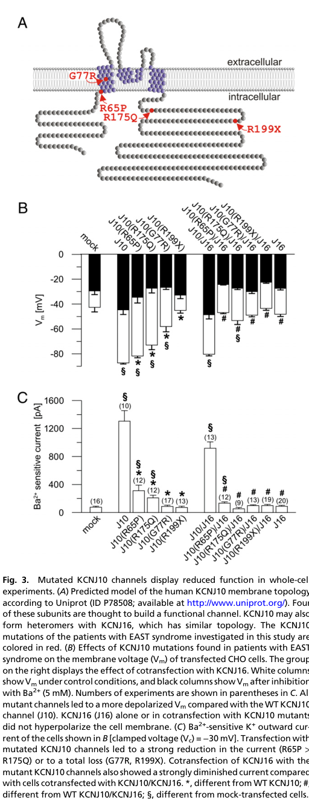

## Question

# Disease Characteristics Research Template

## Target Disease
- **Disease Name:** EAST Syndrome
- **MONDO ID:**  (if available)
- **Category:** Genetic

## Research Objectives

Please provide a comprehensive research report on **EAST Syndrome** covering all of the
disease characteristics listed below. This report will be used to populate a disease knowledge
base entry. Be thorough and cite primary literature (PMID preferred) for all claims.

For each section, **suggested databases/resources** are listed. These are the first places
you should search for information on each topic.

---

### 1. Disease Information
> **Search first:** OMIM, Orphanet, ICD-10/ICD-11, MeSH, PubMed

- What is the disease? Provide a concise overview.
- What are the key identifiers? (OMIM, Orphanet, ICD-10/ICD-11, MeSH, Mondo)
- What are the common synonyms and alternative names?
- Is the information derived from individual patients (e.g., EHR) or aggregated disease-level resources?

### 2. Etiology

- **Disease Causal Factors**: What are the primary causes? (genetic, environmental, infectious, mechanistic)
- **Risk Factors**:
  > **Search first:** PubMed, Cochrane Library, UpToDate, clinical guidelines, ClinVar, ClinGen, GWAS Catalog, PheGenI, CTD, CDC, WHO, epidemiological databases
  - Genetic risk factors (causal variants, susceptibility loci, modifier genes)
  - Environmental risk factors (toxins, lifestyle, occupational exposures, age, sex, family history)
- **Protective Factors**:
  > **Search first:** PubMed, Cochrane Library, clinical trial databases, GWAS Catalog, gnomAD, WHO, CDC, nutrition databases
  - Genetic protective factors (protective variants, modifier alleles)
  - Environmental protective factors (diet, lifestyle, exposures that reduce risk)
- **Gene-Environment Interactions**: How do genetic and environmental factors interact to influence disease?
  > **Search first:** CTD, PubMed, PheGenI, GxE databases

### 3. Phenotypes
> **Search first:** HPO (Human Phenotype Ontology), OMIM, Orphanet, PubMed, clinicaltrials.gov, MedDRA, SNOMED CT, DECIPHER, LOINC

For each phenotype, provide:
- **Phenotype type**: symptoms, clinical signs, physical manifestations, behavioral changes, or laboratory abnormalities
  > For symptoms/signs: HPO, OMIM, Orphanet, PubMed
  > For behavioral changes: HPO, DSM, RDoC (Research Domain Criteria), PubMed
  > For laboratory abnormalities: LOINC, SNOMED CT, LabTests Online, PubMed
- **Phenotype characteristics**:
  > **Search first:** OMIM, Orphanet, HPO, PubMed
  - Age of symptom onset (neonatal, childhood, adult-onset, late-onset)
  - Symptom severity (mild, moderate, severe, variable)
  - Symptom progression (stable, progressive, episodic, fluctuating)
  - Frequency among affected individuals (percentage or qualitative)
- **Quality of life impact**: Effects on daily functioning and well-being (per-phenotype when possible)
  > **Search first:** EQ-5D database, SF-36, WHO QOL databases, PubMed
- Suggest HPO (Human Phenotype Ontology) terms for each phenotype

### 4. Genetic/Molecular Information

- **Causal Genes**: Gene mutations or chromosomal abnormalities responsible for disease (gene symbols, OMIM IDs)
  > **Search first:** OMIM, ClinVar, HGMD, Ensembl, NCBI Gene
- **Pathogenic Variants**:
  - Affected genes (gene symbols, HGNC IDs)
    > **Search first:** OMIM, NCBI Gene, Ensembl, HGNC, UniProt, GeneCards
  - Variant classification (pathogenic, likely pathogenic, VUS per ACMG/AMP guidelines)
    > **Search first:** ClinVar, ClinGen, ACMG/AMP guidelines, VarSome
  - Variant type/class (missense, frameshift, nonsense, splice-site, structural)
  - Allele frequency in population databases
    > **Search first:** gnomAD, 1000 Genomes, ExAC, TOPMed, dbSNP
  - Somatic vs germline origin
    > **Search first:** COSMIC (somatic), ClinVar, ICGC, TCGA
  - Functional consequences (loss of function, gain of function, dominant negative)
- **Modifier Genes**: Genes that modify disease severity or expression
- **Epigenetic Information**: DNA methylation, histone modifications, chromatin changes affecting disease
  > **Search first:** ENCODE, Roadmap Epigenomics, MethBase, DiseaseMeth
- **Chromosomal Abnormalities**: Large-scale genetic changes (aneuploidy, translocations, inversions)
  > **Search first:** DECIPHER, ClinVar, ECARUCA, UCSC Genome Browser

### 5. Environmental Information

- **Environmental Factors**: Non-genetic contributing factors (toxins, radiation, pollution, occupational exposure)
  > **Search first:** CTD (Comparative Toxicogenomics Database), TOXNET, PubMed, EPA databases
- **Lifestyle Factors**: Behavioral factors (smoking, diet, exercise, alcohol consumption)
  > **Search first:** CDC databases, WHO, PubMed, NHANES
- **Infectious Agents**: If applicable, pathogens causing or triggering disease (bacteria, viruses, fungi, parasites)
  > **Search first:** NCBI Taxonomy, ViPR, BV-BRC, MicrobeDB, GIDEON

### 6. Mechanism / Pathophysiology

- **Molecular Pathways**: Specific signaling cascades or biochemical pathways involved (Wnt, MAPK, mTOR, PI3K-AKT, etc.)
  > **Search first:** KEGG, Reactome, WikiPathways, PathBank, BioCyc
- **Cellular Processes**: Cell-level mechanisms (apoptosis, autophagy, cell cycle dysregulation, inflammation, etc.)
  > **Search first:** Gene Ontology (GO), Reactome, KEGG, PubMed
- **Protein Dysfunction**: How protein structure or function is altered (misfolding, aggregation, loss of function, gain of function)
  > **Search first:** UniProt, PDB (Protein Data Bank), InterPro, Pfam, AlphaFold
- **Metabolic Changes**: Alterations in metabolic processes (energy metabolism, lipid metabolism, amino acid metabolism)
  > **Search first:** KEGG, BioCyc, HMDB (Human Metabolome Database), BRENDA
- **Immune System Involvement**: Role of immune response (autoimmunity, immunodeficiency, chronic inflammation)
  > **Search first:** ImmPort, Immunome Database, IEDB, Gene Ontology
- **Tissue Damage Mechanisms**: How tissues/ are injured (oxidative stress, ischemia, fibrosis, necrosis)
  > **Search first:** PubMed, Gene Ontology, Reactome
- **Biochemical Abnormalities**: Specific molecular defects (enzyme deficiencies, receptor dysfunction, ion channel defects)
  > **Search first:** BRENDA, UniProt, KEGG, OMIM, PubMed
- **Epigenetic Changes**: DNA methylation, histone modifications affecting gene expression in disease
  > **Search first:** ENCODE, Roadmap Epigenomics, MethBase, DiseaseMeth
- **Molecular Profiling** (if available):
  - Transcriptomics/gene expression changes
    > **Search first:** GEO (Gene Expression Omnibus), ArrayExpress, GTEx, Human Cell Atlas, SRA
  - Proteomics findings
    > **Search first:** PRIDE, ProteomeXchange, Human Protein Atlas, STRING, BioGRID
  - Metabolomics signatures
    > **Search first:** MetaboLights, Metabolomics Workbench, HMDB, METLIN
  - Lipidomics alterations
    > **Search first:** LIPID MAPS, SwissLipids, LipidHome, Metabolomics Workbench
  - Genomic structural features
    > **Search first:** UCSC Genome Browser, Ensembl, NCBI, dbVar, DGV
- **Advanced Technologies** (if applicable):
  - Single-cell analysis findings (cell-type specific mechanisms, cellular heterogeneity)
    > **Search first:** Human Cell Atlas, Single Cell Portal, GEO, CELLxGENE
  - Spatial transcriptomics findings
    > **Search first:** GEO, Spatial Research, Vizgen, 10x Genomics data
  - Multi-omics integration results
    > **Search first:** TCGA, ICGC, cBioPortal, LinkedOmics, PubMed
  - Functional genomics screens (CRISPR, RNAi)
    > **Search first:** DepMap, GenomeRNAi, PubMed, BioGRID ORCS

For each mechanism, describe:
- The causal chain from initial trigger to clinical manifestation
- Which mechanisms are upstream vs downstream
- What cell types and biological processes are involved
- Suggest GO terms for biological processes and CL terms for cell types

### 7. Anatomical Structures Affected

- **Organ Level**:
  - Primary organs directly affected
  - Secondary organ involvement (complications, secondary effects)
  - Body systems involved (cardiovascular, nervous, digestive, respiratory, endocrine, etc.)
  > **Search first:** Uberon, FMA (Foundational Model of Anatomy), OMIM, HPO, ICD-11, MeSH, SNOMED CT
- **Tissue and Cell Level**:
  - Specific tissue types affected (epithelial, connective, muscle, nervous)
  - Specific cell populations targeted (with Cell Ontology terms)
  > **Search first:** Uberon, Human Protein Atlas, Cell Ontology, Human Cell Atlas, CellMarker, PanglaoDB
- **Subcellular Level**:
  - Cellular compartments involved (mitochondria, nucleus, ER, lysosomes) (with GO Cellular Component terms)
  > **Search first:** Gene Ontology (Cellular Component), UniProt, Human Protein Atlas
- **Localization**:
  - Specific anatomical sites (with UBERON terms)
    > **Search first:** FMA, Uberon, NeuroNames (for brain), SNOMED CT
  - Lateralization (unilateral, bilateral, asymmetric)
    > **Search first:** HPO, clinical literature, imaging databases

### 8. Temporal Development

- **Onset**:
  - Typical age of onset (congenital, pediatric, adult, geriatric)
  - Onset pattern (acute, subacute, chronic, insidious)
  > **Search first:** OMIM, Orphanet, HPO, PubMed
- **Progression**:
  - Disease stages (early, intermediate, advanced, end-stage)
    > **Search first:** Cancer Staging Manual (AJCC), WHO classifications, PubMed
  - Progression rate (rapid, slow, variable)
  - Disease course pattern (episodic, relapsing-remitting, progressive, stable)
  - Disease duration (self-limited, chronic lifelong)
  > **Search first:** Disease registries, longitudinal cohort databases, natural history studies, PubMed, Orphanet, OMIM
- **Patterns**:
  - Remission patterns (spontaneous, treatment-induced)
    > **Search first:** Clinical trial databases, disease registries, PubMed
  - Critical periods (time windows of vulnerability or opportunity for intervention)
    > **Search first:** PubMed, developmental biology databases, clinical guidelines

### 9. Inheritance and Population

- **Epidemiology**:
  - Prevalence (cases per 100,000 at given time)
  - Incidence (new cases per 100,000 per year)
  > **Search first:** Orphanet, CDC, WHO, GBD (Global Burden of Disease), national registries, SEER, disease registries
- **For Genetic Etiology**:
  - Inheritance pattern (AD, AR, X-linked, mitochondrial, multifactorial, polygenic)
    > **Search first:** OMIM, Orphanet, ClinVar, GTR (Genetic Testing Registry)
  - Penetrance (complete, incomplete, age-dependent)
    > **Search first:** ClinVar, OMIM, PubMed, ClinGen
  - Expressivity (variable, consistent)
    > **Search first:** OMIM, ClinVar, PubMed
  - Genetic anticipation (increasing severity in successive generations)
    > **Search first:** OMIM, PubMed (especially for repeat expansion disorders)
  - Germline mosaicism
    > **Search first:** ClinVar, OMIM, genetic counseling literature, PubMed
  - Founder effects (population-specific mutations)
    > **Search first:** gnomAD, population genetics databases, PubMed
  - Consanguinity role
    > **Search first:** OMIM, population studies, genetic counseling resources
  - Carrier frequency
    > **Search first:** gnomAD, carrier screening databases, GeneReviews, GTR
- **Population Demographics**:
  - Affected populations (ethnic or demographic groups with higher prevalence)
    > **Search first:** gnomAD, 1000 Genomes, PAGE Study, PubMed, population registries
  - Geographic distribution (endemic areas, regional variation)
    > **Search first:** WHO, CDC, GBD, Orphanet, geographic epidemiology databases
  - Geographic distribution of specific variants
  - Sex ratio (male:female)
    > **Search first:** Disease registries, OMIM, PubMed, epidemiological databases
  - Age distribution of affected individuals
    > **Search first:** CDC, disease registries, SEER, Orphanet

### 10. Diagnostics

- **Clinical Tests**:
  - Laboratory tests (blood, urine, tissue chemistry, specific enzyme assays)
    > **Search first:** LOINC, LabTests Online, PubMed
  - Biomarkers (proteins, metabolites, genetic markers, circulating biomarkers)
    > **Search first:** FDA Biomarker List, BEST (Biomarkers, EndpointS, and other Tools), PubMed
  - Imaging studies (X-ray, CT, MRI, PET, ultrasound)
    > **Search first:** RadLex, DICOM, Radiopaedia, imaging databases
  - Functional tests (pulmonary function, cardiac stress tests)
    > **Search first:** LOINC, clinical guidelines, PubMed
  - Electrophysiology (EEG, EMG, ECG, nerve conduction studies)
    > **Search first:** LOINC, clinical neurophysiology databases, PubMed
  - Biopsy findings (histopathology, immunohistochemistry)
    > **Search first:** SNOMED CT, College of American Pathologists resources, PubMed
  - Pathology findings (microscopic examination)
    > **Search first:** SNOMED CT, Digital Pathology databases, PubMed
- **Genetic Testing**:
  > **Search first:** GTR (Genetic Testing Registry), GeneReviews, ClinGen
  - Overview of recommended genetic testing approach
  - Whole genome sequencing (WGS) utility
    > **Search first:** GTR, ClinVar, GEL (Genomics England), gnomAD
  - Whole exome sequencing (WES) utility
    > **Search first:** GTR, ClinVar, OMIM, GeneMatcher
  - Gene panels (which panels, which genes)
    > **Search first:** GTR, ClinVar, laboratory-specific databases
  - Single gene testing
    > **Search first:** GTR, ClinVar, OMIM, GeneReviews
  - Chromosomal microarray (CMA)
    > **Search first:** DECIPHER, ClinVar, dbVar, ECARUCA
  - Karyotyping
    > **Search first:** Chromosome Abnormality Database, ClinVar, cytogenetics resources
  - FISH
    > **Search first:** ClinVar, cytogenetics databases, PubMed
  - Mitochondrial DNA testing
    > **Search first:** MITOMAP, MSeqDR, ClinVar, GTR
  - Repeat expansion testing
    > **Search first:** GTR, ClinVar, repeat expansion databases, PubMed
- **Omics-Based Diagnostics** (if applicable):
  - RNA sequencing / transcriptomics
    > **Search first:** GEO, ArrayExpress, GTEx, RNA-seq databases
  - Proteomics
    > **Search first:** PRIDE, ProteomeXchange, FDA Biomarker database
  - Metabolomics
    > **Search first:** MetaboLights, Metabolomics Workbench, HMDB
  - Epigenomics
    > **Search first:** GEO, ENCODE, Roadmap Epigenomics, MethBase
  - Liquid biopsy
    > **Search first:** COSMIC, ClinVar, liquid biopsy databases, PubMed
- **Clinical Criteria**:
  - Standardized diagnostic criteria (DSM, ICD, society guidelines)
    > **Search first:** DSM-5, ICD-11, clinical society guidelines, UpToDate
  - Differential diagnosis (other conditions to rule out, with distinguishing features)
    > **Search first:** DynaMed, UpToDate, clinical decision support systems
- **Screening**:
  - Screening methods for asymptomatic individuals (newborn screening, carrier screening, cascade screening)
    > **Search first:** ACMG recommendations, CDC newborn screening, GTR

### 11. Outcome/Prognosis

- **Survival and Mortality**:
  - Survival rate (5-year, 10-year, overall)
    > **Search first:** SEER, cancer registries, disease-specific registries, PubMed
  - Life expectancy (with and without treatment if applicable)
    > **Search first:** Orphanet, disease registries, actuarial databases, PubMed
  - Mortality rate
    > **Search first:** CDC, WHO, GBD, national mortality databases
  - Disease-specific mortality (deaths directly attributable to disease)
    > **Search first:** Disease registries, CDC Wonder, GBD, PubMed
- **Morbidity and Function**:
  - Morbidity (disease-related disability and health impacts)
    > **Search first:** GBD, WHO, disability databases, PubMed
  - Disability outcomes (long-term functional impairments)
    > **Search first:** ICF (International Classification of Functioning), disability registries
  - Quality of life measures (EQ-5D, SF-36, PROMIS, disease-specific tools)
    > **Search first:** EQ-5D database, SF-36, PROMIS, PubMed
- **Disease Course**:
  - Complications (secondary problems: infections, organ failure, etc.)
    > **Search first:** ICD codes, disease registries, clinical databases, PubMed
  - Recovery potential (likelihood and extent of recovery, with vs without treatment)
    > **Search first:** Natural history studies, rehabilitation databases, PubMed
- **Prediction**:
  - Prognostic factors (age, disease severity, biomarkers, treatment response)
    > **Search first:** Prognostic models databases, clinical calculators, PubMed
  - Prognostic biomarkers (molecular markers predicting disease course)
    > **Search first:** FDA Biomarker database, PubMed, cancer prognostic databases

### 12. Treatment

- **Pharmacotherapy**:
  - Pharmacological treatments (drug names, drug classes, mechanisms of action)
    > **Search first:** DrugBank, RxNorm, ATC classification, DailyMed, FDA databases
  - Pharmacogenomics (how genetic variants affect drug metabolism, efficacy, toxicity)
    > **Search first:** PharmGKB, CPIC (Clinical Pharmacogenetics), FDA Table of PGx Biomarkers
- **Advanced Therapeutics**:
  - Gene therapy (viral vectors, CRISPR, gene replacement, gene editing)
    > **Search first:** ClinicalTrials.gov, FDA gene therapy database, ASGCT resources
  - Cell therapy (stem cell transplant, CAR-T, cellular therapeutics)
    > **Search first:** ClinicalTrials.gov, FDA cell therapy database, FACT standards
  - RNA-based therapies (ASOs, siRNA, mRNA therapies)
    > **Search first:** ClinicalTrials.gov, FDA approvals, PubMed
  - Targeted therapies (treatments directed at specific molecular targets)
    > **Search first:** My Cancer Genome, OncoKB, ClinicalTrials.gov, FDA approvals
  - Immunotherapies (checkpoint inhibitors, monoclonal antibodies)
    > **Search first:** Cancer Immunotherapy Database, FDA approvals, ClinicalTrials.gov
- **Surgical and Interventional**:
  - Surgical interventions (types of surgery, timing, outcomes)
    > **Search first:** CPT codes, surgical registries, clinical guidelines, PubMed
- **Supportive and Rehabilitative**:
  - Supportive care (symptom management, pain control, nutrition)
    > **Search first:** Clinical guidelines, Cochrane Library, PubMed
  - Rehabilitation (physical therapy, occupational therapy, speech therapy)
    > **Search first:** Rehabilitation medicine databases, clinical guidelines, PubMed
- **Experimental**:
  - Experimental treatments in clinical trials (with NCT identifiers if available)
    > **Search first:** ClinicalTrials.gov, EU Clinical Trials Register, WHO ICTRP
- **Treatment Outcomes**:
  - Treatment response rates
    > **Search first:** Clinical trial databases, FDA reviews, systematic reviews, PubMed
  - Side effects and adverse events
    > **Search first:** FDA Adverse Event Reporting System (FAERS), MedWatch, PubMed
- **Treatment Strategy**:
  - Treatment algorithms (clinical pathways, decision trees)
    > **Search first:** Clinical practice guidelines, NCCN Guidelines, UpToDate
  - Combination therapies
    > **Search first:** ClinicalTrials.gov, treatment guidelines, PubMed
  - Personalized medicine approaches (genotype-guided treatment)
    > **Search first:** My Cancer Genome, CIViC, PharmGKB, precision medicine databases

For each treatment, suggest MAXO (Medical Action Ontology) terms where applicable.

### 13. Prevention

- **Prevention Levels**:
  - Primary prevention (preventing disease occurrence: vaccination, risk factor modification)
    > **Search first:** CDC, WHO, USPSTF recommendations, Cochrane Library
  - Secondary prevention (early detection and treatment: screening programs, early intervention)
    > **Search first:** USPSTF, CDC screening guidelines, WHO
  - Tertiary prevention (preventing complications in those with disease)
    > **Search first:** Clinical guidelines, disease management protocols, PubMed
- **Immunization**: Vaccine strategies (if applicable)
  > **Search first:** CDC vaccine schedules, WHO immunization, FDA vaccine database
- **Screening and Early Detection**:
  - Screening programs (population-based: newborn screening, cancer screening)
    > **Search first:** CDC screening programs, USPSTF, cancer screening databases
  - Genetic screening (carrier screening, preimplantation genetic diagnosis, prenatal testing)
    > **Search first:** ACMG recommendations, ACOG guidelines, GTR
  - Risk stratification (identifying high-risk individuals for targeted prevention)
    > **Search first:** Risk prediction models, clinical calculators, PubMed
- **Behavioral Interventions**: Lifestyle modifications to reduce risk
  > **Search first:** CDC, WHO, behavioral intervention databases, Cochrane Library
- **Counseling**: Genetic counseling (risk assessment, family planning guidance)
  > **Search first:** NSGC resources, ACMG guidelines, GeneReviews
- **Public Health**:
  - Public health interventions (sanitation, vector control, health education)
    > **Search first:** CDC, WHO, public health databases, PubMed
  - Environmental interventions (reducing environmental risk factors)
    > **Search first:** EPA databases, WHO environmental health, PubMed
- **Prophylaxis**: Preventive medications or procedures
  > **Search first:** Clinical guidelines, FDA approvals, PubMed

### 14. Other Species / Natural Disease

- **Taxonomy**: Species affected (with NCBI Taxon identifiers)
  > **Search first:** NCBI Taxonomy
- **Breed**: Specific breeds affected (with VBO identifiers if applicable)
  > **Search first:** VBO (Vertebrate Breed Ontology)
- **Gene**: Orthologous genes in other species (with NCBI Gene IDs)
  > **Search first:** NCBI Gene
- **Natural Disease**:
  - Naturally occurring disease in other species (companion animals, wildlife)
    > **Search first:** OMIA (Online Mendelian Inheritance in Animals), VetCompass, PubMed
  - Veterinary relevance and importance in animal health
    > **Search first:** OMIA, veterinary databases, PubMed
- **Comparative Biology**:
  - Comparative pathology (similarities and differences across species)
    > **Search first:** OMIA, comparative pathology databases, PubMed
  - Evolutionary conservation of disease mechanisms
    > **Search first:** HomoloGene, OrthoMCL, Alliance of Genome Resources
- **Transmission** (if applicable):
  - Zoonotic potential
    > **Search first:** CDC zoonotic diseases, WHO zoonoses, GIDEON
  - Cross-species susceptibility
    > **Search first:** NCBI Taxonomy, veterinary databases, PubMed

### 15. Model Organisms

- **Model Types**:
  - Model organism type (mammalian, invertebrate, cellular, in vitro)
    > **Search first:** Alliance of Genome Resources, model organism databases
  - Specific model systems (mouse, rat, zebrafish, Drosophila, C. elegans, yeast, cell lines, organoids, iPSCs)
    > **Search first:** MGI, RGD, ZFIN, FlyBase, WormBase, SGD, ATCC, Cellosaurus
  - Induced models (drug treatment, surgical intervention, environmental manipulation)
    > **Search first:** MGI, model organism databases, PubMed
- **Genetic Models**:
  - Types available (knockout, knock-in, transgenic, conditional, humanized)
    > **Search first:** MGI, IMPC, KOMP, EuMMCR, IMSR
- **Model Characteristics**:
  - Phenotype recapitulation (how well model reproduces human disease features)
    > **Search first:** Model organism databases, comparative studies, PubMed
  - Model limitations (aspects of human disease not captured)
    > **Search first:** Model organism databases, PubMed, review articles
- **Applications**:
  - Research applications (what aspects of disease can be studied)
    > **Search first:** Model organism databases, PubMed
- **Resources**:
  - Model databases
    > **Search first:** MGI, RGD, ZFIN, FlyBase, WormBase, IMSR, EMMA, MMRRC

---

## Citation Requirements

- Cite primary literature (PMID preferred) for all mechanistic and clinical claims
- Prioritize recent reviews and landmark papers
- Include direct quotes from abstracts where possible to support key statements
- Distinguish evidence source types: human clinical, model organism, in vitro, computational

## Output Format

Structure your response as a comprehensive narrative organized by the sections above.
For each section, provide:
- Factual content with specific details (numbers, percentages, gene names, variant nomenclature)
- Ontology term suggestions (HPO, GO, CL, UBERON, CHEBI, MAXO, MONDO) where applicable
- Evidence citations with PMIDs
- Direct quotes from abstracts to support key claims
- Clear indication when information is not available or not applicable for this disease

This report will be used to populate a disease knowledge base entry with:
- Pathophysiology descriptions with causal chains
- Gene/protein annotations (HGNC, GO terms)
- Phenotype associations (HP terms) with frequencies
- Cell type involvement (CL terms)
- Anatomical locations (UBERON terms)
- Chemical entities (CHEBI terms)
- Treatment annotations (MAXO terms)
- Evidence items with PMIDs and exact abstract quotes
- Epidemiology, prognosis, diagnostic, and prevention information
- Animal model descriptions with phenotype recapitulation details

## Output

Question: You are an expert researcher providing comprehensive, well-cited information.

Provide detailed information focusing on:
1. Key concepts and definitions with current understanding
2. Recent developments and latest research (prioritize 2023-2024 sources)
3. Current applications and real-world implementations
4. Expert opinions and analysis from authoritative sources
5. Relevant statistics and data from recent studies

Format as a comprehensive research report with proper citations. Include URLs and publication dates where available.
Always prioritize recent, authoritative sources and provide specific citations for all major claims.

# Disease Characteristics Research Template

## Target Disease
- **Disease Name:** EAST Syndrome
- **MONDO ID:**  (if available)
- **Category:** Genetic

## Research Objectives

Please provide a comprehensive research report on **EAST Syndrome** covering all of the
disease characteristics listed below. This report will be used to populate a disease knowledge
base entry. Be thorough and cite primary literature (PMID preferred) for all claims.

For each section, **suggested databases/resources** are listed. These are the first places
you should search for information on each topic.

---

### 1. Disease Information
> **Search first:** OMIM, Orphanet, ICD-10/ICD-11, MeSH, PubMed

- What is the disease? Provide a concise overview.
- What are the key identifiers? (OMIM, Orphanet, ICD-10/ICD-11, MeSH, Mondo)
- What are the common synonyms and alternative names?
- Is the information derived from individual patients (e.g., EHR) or aggregated disease-level resources?

### 2. Etiology

- **Disease Causal Factors**: What are the primary causes? (genetic, environmental, infectious, mechanistic)
- **Risk Factors**:
  > **Search first:** PubMed, Cochrane Library, UpToDate, clinical guidelines, ClinVar, ClinGen, GWAS Catalog, PheGenI, CTD, CDC, WHO, epidemiological databases
  - Genetic risk factors (causal variants, susceptibility loci, modifier genes)
  - Environmental risk factors (toxins, lifestyle, occupational exposures, age, sex, family history)
- **Protective Factors**:
  > **Search first:** PubMed, Cochrane Library, clinical trial databases, GWAS Catalog, gnomAD, WHO, CDC, nutrition databases
  - Genetic protective factors (protective variants, modifier alleles)
  - Environmental protective factors (diet, lifestyle, exposures that reduce risk)
- **Gene-Environment Interactions**: How do genetic and environmental factors interact to influence disease?
  > **Search first:** CTD, PubMed, PheGenI, GxE databases

### 3. Phenotypes
> **Search first:** HPO (Human Phenotype Ontology), OMIM, Orphanet, PubMed, clinicaltrials.gov, MedDRA, SNOMED CT, DECIPHER, LOINC

For each phenotype, provide:
- **Phenotype type**: symptoms, clinical signs, physical manifestations, behavioral changes, or laboratory abnormalities
  > For symptoms/signs: HPO, OMIM, Orphanet, PubMed
  > For behavioral changes: HPO, DSM, RDoC (Research Domain Criteria), PubMed
  > For laboratory abnormalities: LOINC, SNOMED CT, LabTests Online, PubMed
- **Phenotype characteristics**:
  > **Search first:** OMIM, Orphanet, HPO, PubMed
  - Age of symptom onset (neonatal, childhood, adult-onset, late-onset)
  - Symptom severity (mild, moderate, severe, variable)
  - Symptom progression (stable, progressive, episodic, fluctuating)
  - Frequency among affected individuals (percentage or qualitative)
- **Quality of life impact**: Effects on daily functioning and well-being (per-phenotype when possible)
  > **Search first:** EQ-5D database, SF-36, WHO QOL databases, PubMed
- Suggest HPO (Human Phenotype Ontology) terms for each phenotype

### 4. Genetic/Molecular Information

- **Causal Genes**: Gene mutations or chromosomal abnormalities responsible for disease (gene symbols, OMIM IDs)
  > **Search first:** OMIM, ClinVar, HGMD, Ensembl, NCBI Gene
- **Pathogenic Variants**:
  - Affected genes (gene symbols, HGNC IDs)
    > **Search first:** OMIM, NCBI Gene, Ensembl, HGNC, UniProt, GeneCards
  - Variant classification (pathogenic, likely pathogenic, VUS per ACMG/AMP guidelines)
    > **Search first:** ClinVar, ClinGen, ACMG/AMP guidelines, VarSome
  - Variant type/class (missense, frameshift, nonsense, splice-site, structural)
  - Allele frequency in population databases
    > **Search first:** gnomAD, 1000 Genomes, ExAC, TOPMed, dbSNP
  - Somatic vs germline origin
    > **Search first:** COSMIC (somatic), ClinVar, ICGC, TCGA
  - Functional consequences (loss of function, gain of function, dominant negative)
- **Modifier Genes**: Genes that modify disease severity or expression
- **Epigenetic Information**: DNA methylation, histone modifications, chromatin changes affecting disease
  > **Search first:** ENCODE, Roadmap Epigenomics, MethBase, DiseaseMeth
- **Chromosomal Abnormalities**: Large-scale genetic changes (aneuploidy, translocations, inversions)
  > **Search first:** DECIPHER, ClinVar, ECARUCA, UCSC Genome Browser

### 5. Environmental Information

- **Environmental Factors**: Non-genetic contributing factors (toxins, radiation, pollution, occupational exposure)
  > **Search first:** CTD (Comparative Toxicogenomics Database), TOXNET, PubMed, EPA databases
- **Lifestyle Factors**: Behavioral factors (smoking, diet, exercise, alcohol consumption)
  > **Search first:** CDC databases, WHO, PubMed, NHANES
- **Infectious Agents**: If applicable, pathogens causing or triggering disease (bacteria, viruses, fungi, parasites)
  > **Search first:** NCBI Taxonomy, ViPR, BV-BRC, MicrobeDB, GIDEON

### 6. Mechanism / Pathophysiology

- **Molecular Pathways**: Specific signaling cascades or biochemical pathways involved (Wnt, MAPK, mTOR, PI3K-AKT, etc.)
  > **Search first:** KEGG, Reactome, WikiPathways, PathBank, BioCyc
- **Cellular Processes**: Cell-level mechanisms (apoptosis, autophagy, cell cycle dysregulation, inflammation, etc.)
  > **Search first:** Gene Ontology (GO), Reactome, KEGG, PubMed
- **Protein Dysfunction**: How protein structure or function is altered (misfolding, aggregation, loss of function, gain of function)
  > **Search first:** UniProt, PDB (Protein Data Bank), InterPro, Pfam, AlphaFold
- **Metabolic Changes**: Alterations in metabolic processes (energy metabolism, lipid metabolism, amino acid metabolism)
  > **Search first:** KEGG, BioCyc, HMDB (Human Metabolome Database), BRENDA
- **Immune System Involvement**: Role of immune response (autoimmunity, immunodeficiency, chronic inflammation)
  > **Search first:** ImmPort, Immunome Database, IEDB, Gene Ontology
- **Tissue Damage Mechanisms**: How tissues/ are injured (oxidative stress, ischemia, fibrosis, necrosis)
  > **Search first:** PubMed, Gene Ontology, Reactome
- **Biochemical Abnormalities**: Specific molecular defects (enzyme deficiencies, receptor dysfunction, ion channel defects)
  > **Search first:** BRENDA, UniProt, KEGG, OMIM, PubMed
- **Epigenetic Changes**: DNA methylation, histone modifications affecting gene expression in disease
  > **Search first:** ENCODE, Roadmap Epigenomics, MethBase, DiseaseMeth
- **Molecular Profiling** (if available):
  - Transcriptomics/gene expression changes
    > **Search first:** GEO (Gene Expression Omnibus), ArrayExpress, GTEx, Human Cell Atlas, SRA
  - Proteomics findings
    > **Search first:** PRIDE, ProteomeXchange, Human Protein Atlas, STRING, BioGRID
  - Metabolomics signatures
    > **Search first:** MetaboLights, Metabolomics Workbench, HMDB, METLIN
  - Lipidomics alterations
    > **Search first:** LIPID MAPS, SwissLipids, LipidHome, Metabolomics Workbench
  - Genomic structural features
    > **Search first:** UCSC Genome Browser, Ensembl, NCBI, dbVar, DGV
- **Advanced Technologies** (if applicable):
  - Single-cell analysis findings (cell-type specific mechanisms, cellular heterogeneity)
    > **Search first:** Human Cell Atlas, Single Cell Portal, GEO, CELLxGENE
  - Spatial transcriptomics findings
    > **Search first:** GEO, Spatial Research, Vizgen, 10x Genomics data
  - Multi-omics integration results
    > **Search first:** TCGA, ICGC, cBioPortal, LinkedOmics, PubMed
  - Functional genomics screens (CRISPR, RNAi)
    > **Search first:** DepMap, GenomeRNAi, PubMed, BioGRID ORCS

For each mechanism, describe:
- The causal chain from initial trigger to clinical manifestation
- Which mechanisms are upstream vs downstream
- What cell types and biological processes are involved
- Suggest GO terms for biological processes and CL terms for cell types

### 7. Anatomical Structures Affected

- **Organ Level**:
  - Primary organs directly affected
  - Secondary organ involvement (complications, secondary effects)
  - Body systems involved (cardiovascular, nervous, digestive, respiratory, endocrine, etc.)
  > **Search first:** Uberon, FMA (Foundational Model of Anatomy), OMIM, HPO, ICD-11, MeSH, SNOMED CT
- **Tissue and Cell Level**:
  - Specific tissue types affected (epithelial, connective, muscle, nervous)
  - Specific cell populations targeted (with Cell Ontology terms)
  > **Search first:** Uberon, Human Protein Atlas, Cell Ontology, Human Cell Atlas, CellMarker, PanglaoDB
- **Subcellular Level**:
  - Cellular compartments involved (mitochondria, nucleus, ER, lysosomes) (with GO Cellular Component terms)
  > **Search first:** Gene Ontology (Cellular Component), UniProt, Human Protein Atlas
- **Localization**:
  - Specific anatomical sites (with UBERON terms)
    > **Search first:** FMA, Uberon, NeuroNames (for brain), SNOMED CT
  - Lateralization (unilateral, bilateral, asymmetric)
    > **Search first:** HPO, clinical literature, imaging databases

### 8. Temporal Development

- **Onset**:
  - Typical age of onset (congenital, pediatric, adult, geriatric)
  - Onset pattern (acute, subacute, chronic, insidious)
  > **Search first:** OMIM, Orphanet, HPO, PubMed
- **Progression**:
  - Disease stages (early, intermediate, advanced, end-stage)
    > **Search first:** Cancer Staging Manual (AJCC), WHO classifications, PubMed
  - Progression rate (rapid, slow, variable)
  - Disease course pattern (episodic, relapsing-remitting, progressive, stable)
  - Disease duration (self-limited, chronic lifelong)
  > **Search first:** Disease registries, longitudinal cohort databases, natural history studies, PubMed, Orphanet, OMIM
- **Patterns**:
  - Remission patterns (spontaneous, treatment-induced)
    > **Search first:** Clinical trial databases, disease registries, PubMed
  - Critical periods (time windows of vulnerability or opportunity for intervention)
    > **Search first:** PubMed, developmental biology databases, clinical guidelines

### 9. Inheritance and Population

- **Epidemiology**:
  - Prevalence (cases per 100,000 at given time)
  - Incidence (new cases per 100,000 per year)
  > **Search first:** Orphanet, CDC, WHO, GBD (Global Burden of Disease), national registries, SEER, disease registries
- **For Genetic Etiology**:
  - Inheritance pattern (AD, AR, X-linked, mitochondrial, multifactorial, polygenic)
    > **Search first:** OMIM, Orphanet, ClinVar, GTR (Genetic Testing Registry)
  - Penetrance (complete, incomplete, age-dependent)
    > **Search first:** ClinVar, OMIM, PubMed, ClinGen
  - Expressivity (variable, consistent)
    > **Search first:** OMIM, ClinVar, PubMed
  - Genetic anticipation (increasing severity in successive generations)
    > **Search first:** OMIM, PubMed (especially for repeat expansion disorders)
  - Germline mosaicism
    > **Search first:** ClinVar, OMIM, genetic counseling literature, PubMed
  - Founder effects (population-specific mutations)
    > **Search first:** gnomAD, population genetics databases, PubMed
  - Consanguinity role
    > **Search first:** OMIM, population studies, genetic counseling resources
  - Carrier frequency
    > **Search first:** gnomAD, carrier screening databases, GeneReviews, GTR
- **Population Demographics**:
  - Affected populations (ethnic or demographic groups with higher prevalence)
    > **Search first:** gnomAD, 1000 Genomes, PAGE Study, PubMed, population registries
  - Geographic distribution (endemic areas, regional variation)
    > **Search first:** WHO, CDC, GBD, Orphanet, geographic epidemiology databases
  - Geographic distribution of specific variants
  - Sex ratio (male:female)
    > **Search first:** Disease registries, OMIM, PubMed, epidemiological databases
  - Age distribution of affected individuals
    > **Search first:** CDC, disease registries, SEER, Orphanet

### 10. Diagnostics

- **Clinical Tests**:
  - Laboratory tests (blood, urine, tissue chemistry, specific enzyme assays)
    > **Search first:** LOINC, LabTests Online, PubMed
  - Biomarkers (proteins, metabolites, genetic markers, circulating biomarkers)
    > **Search first:** FDA Biomarker List, BEST (Biomarkers, EndpointS, and other Tools), PubMed
  - Imaging studies (X-ray, CT, MRI, PET, ultrasound)
    > **Search first:** RadLex, DICOM, Radiopaedia, imaging databases
  - Functional tests (pulmonary function, cardiac stress tests)
    > **Search first:** LOINC, clinical guidelines, PubMed
  - Electrophysiology (EEG, EMG, ECG, nerve conduction studies)
    > **Search first:** LOINC, clinical neurophysiology databases, PubMed
  - Biopsy findings (histopathology, immunohistochemistry)
    > **Search first:** SNOMED CT, College of American Pathologists resources, PubMed
  - Pathology findings (microscopic examination)
    > **Search first:** SNOMED CT, Digital Pathology databases, PubMed
- **Genetic Testing**:
  > **Search first:** GTR (Genetic Testing Registry), GeneReviews, ClinGen
  - Overview of recommended genetic testing approach
  - Whole genome sequencing (WGS) utility
    > **Search first:** GTR, ClinVar, GEL (Genomics England), gnomAD
  - Whole exome sequencing (WES) utility
    > **Search first:** GTR, ClinVar, OMIM, GeneMatcher
  - Gene panels (which panels, which genes)
    > **Search first:** GTR, ClinVar, laboratory-specific databases
  - Single gene testing
    > **Search first:** GTR, ClinVar, OMIM, GeneReviews
  - Chromosomal microarray (CMA)
    > **Search first:** DECIPHER, ClinVar, dbVar, ECARUCA
  - Karyotyping
    > **Search first:** Chromosome Abnormality Database, ClinVar, cytogenetics resources
  - FISH
    > **Search first:** ClinVar, cytogenetics databases, PubMed
  - Mitochondrial DNA testing
    > **Search first:** MITOMAP, MSeqDR, ClinVar, GTR
  - Repeat expansion testing
    > **Search first:** GTR, ClinVar, repeat expansion databases, PubMed
- **Omics-Based Diagnostics** (if applicable):
  - RNA sequencing / transcriptomics
    > **Search first:** GEO, ArrayExpress, GTEx, RNA-seq databases
  - Proteomics
    > **Search first:** PRIDE, ProteomeXchange, FDA Biomarker database
  - Metabolomics
    > **Search first:** MetaboLights, Metabolomics Workbench, HMDB
  - Epigenomics
    > **Search first:** GEO, ENCODE, Roadmap Epigenomics, MethBase
  - Liquid biopsy
    > **Search first:** COSMIC, ClinVar, liquid biopsy databases, PubMed
- **Clinical Criteria**:
  - Standardized diagnostic criteria (DSM, ICD, society guidelines)
    > **Search first:** DSM-5, ICD-11, clinical society guidelines, UpToDate
  - Differential diagnosis (other conditions to rule out, with distinguishing features)
    > **Search first:** DynaMed, UpToDate, clinical decision support systems
- **Screening**:
  - Screening methods for asymptomatic individuals (newborn screening, carrier screening, cascade screening)
    > **Search first:** ACMG recommendations, CDC newborn screening, GTR

### 11. Outcome/Prognosis

- **Survival and Mortality**:
  - Survival rate (5-year, 10-year, overall)
    > **Search first:** SEER, cancer registries, disease-specific registries, PubMed
  - Life expectancy (with and without treatment if applicable)
    > **Search first:** Orphanet, disease registries, actuarial databases, PubMed
  - Mortality rate
    > **Search first:** CDC, WHO, GBD, national mortality databases
  - Disease-specific mortality (deaths directly attributable to disease)
    > **Search first:** Disease registries, CDC Wonder, GBD, PubMed
- **Morbidity and Function**:
  - Morbidity (disease-related disability and health impacts)
    > **Search first:** GBD, WHO, disability databases, PubMed
  - Disability outcomes (long-term functional impairments)
    > **Search first:** ICF (International Classification of Functioning), disability registries
  - Quality of life measures (EQ-5D, SF-36, PROMIS, disease-specific tools)
    > **Search first:** EQ-5D database, SF-36, PROMIS, PubMed
- **Disease Course**:
  - Complications (secondary problems: infections, organ failure, etc.)
    > **Search first:** ICD codes, disease registries, clinical databases, PubMed
  - Recovery potential (likelihood and extent of recovery, with vs without treatment)
    > **Search first:** Natural history studies, rehabilitation databases, PubMed
- **Prediction**:
  - Prognostic factors (age, disease severity, biomarkers, treatment response)
    > **Search first:** Prognostic models databases, clinical calculators, PubMed
  - Prognostic biomarkers (molecular markers predicting disease course)
    > **Search first:** FDA Biomarker database, PubMed, cancer prognostic databases

### 12. Treatment

- **Pharmacotherapy**:
  - Pharmacological treatments (drug names, drug classes, mechanisms of action)
    > **Search first:** DrugBank, RxNorm, ATC classification, DailyMed, FDA databases
  - Pharmacogenomics (how genetic variants affect drug metabolism, efficacy, toxicity)
    > **Search first:** PharmGKB, CPIC (Clinical Pharmacogenetics), FDA Table of PGx Biomarkers
- **Advanced Therapeutics**:
  - Gene therapy (viral vectors, CRISPR, gene replacement, gene editing)
    > **Search first:** ClinicalTrials.gov, FDA gene therapy database, ASGCT resources
  - Cell therapy (stem cell transplant, CAR-T, cellular therapeutics)
    > **Search first:** ClinicalTrials.gov, FDA cell therapy database, FACT standards
  - RNA-based therapies (ASOs, siRNA, mRNA therapies)
    > **Search first:** ClinicalTrials.gov, FDA approvals, PubMed
  - Targeted therapies (treatments directed at specific molecular targets)
    > **Search first:** My Cancer Genome, OncoKB, ClinicalTrials.gov, FDA approvals
  - Immunotherapies (checkpoint inhibitors, monoclonal antibodies)
    > **Search first:** Cancer Immunotherapy Database, FDA approvals, ClinicalTrials.gov
- **Surgical and Interventional**:
  - Surgical interventions (types of surgery, timing, outcomes)
    > **Search first:** CPT codes, surgical registries, clinical guidelines, PubMed
- **Supportive and Rehabilitative**:
  - Supportive care (symptom management, pain control, nutrition)
    > **Search first:** Clinical guidelines, Cochrane Library, PubMed
  - Rehabilitation (physical therapy, occupational therapy, speech therapy)
    > **Search first:** Rehabilitation medicine databases, clinical guidelines, PubMed
- **Experimental**:
  - Experimental treatments in clinical trials (with NCT identifiers if available)
    > **Search first:** ClinicalTrials.gov, EU Clinical Trials Register, WHO ICTRP
- **Treatment Outcomes**:
  - Treatment response rates
    > **Search first:** Clinical trial databases, FDA reviews, systematic reviews, PubMed
  - Side effects and adverse events
    > **Search first:** FDA Adverse Event Reporting System (FAERS), MedWatch, PubMed
- **Treatment Strategy**:
  - Treatment algorithms (clinical pathways, decision trees)
    > **Search first:** Clinical practice guidelines, NCCN Guidelines, UpToDate
  - Combination therapies
    > **Search first:** ClinicalTrials.gov, treatment guidelines, PubMed
  - Personalized medicine approaches (genotype-guided treatment)
    > **Search first:** My Cancer Genome, CIViC, PharmGKB, precision medicine databases

For each treatment, suggest MAXO (Medical Action Ontology) terms where applicable.

### 13. Prevention

- **Prevention Levels**:
  - Primary prevention (preventing disease occurrence: vaccination, risk factor modification)
    > **Search first:** CDC, WHO, USPSTF recommendations, Cochrane Library
  - Secondary prevention (early detection and treatment: screening programs, early intervention)
    > **Search first:** USPSTF, CDC screening guidelines, WHO
  - Tertiary prevention (preventing complications in those with disease)
    > **Search first:** Clinical guidelines, disease management protocols, PubMed
- **Immunization**: Vaccine strategies (if applicable)
  > **Search first:** CDC vaccine schedules, WHO immunization, FDA vaccine database
- **Screening and Early Detection**:
  - Screening programs (population-based: newborn screening, cancer screening)
    > **Search first:** CDC screening programs, USPSTF, cancer screening databases
  - Genetic screening (carrier screening, preimplantation genetic diagnosis, prenatal testing)
    > **Search first:** ACMG recommendations, ACOG guidelines, GTR
  - Risk stratification (identifying high-risk individuals for targeted prevention)
    > **Search first:** Risk prediction models, clinical calculators, PubMed
- **Behavioral Interventions**: Lifestyle modifications to reduce risk
  > **Search first:** CDC, WHO, behavioral intervention databases, Cochrane Library
- **Counseling**: Genetic counseling (risk assessment, family planning guidance)
  > **Search first:** NSGC resources, ACMG guidelines, GeneReviews
- **Public Health**:
  - Public health interventions (sanitation, vector control, health education)
    > **Search first:** CDC, WHO, public health databases, PubMed
  - Environmental interventions (reducing environmental risk factors)
    > **Search first:** EPA databases, WHO environmental health, PubMed
- **Prophylaxis**: Preventive medications or procedures
  > **Search first:** Clinical guidelines, FDA approvals, PubMed

### 14. Other Species / Natural Disease

- **Taxonomy**: Species affected (with NCBI Taxon identifiers)
  > **Search first:** NCBI Taxonomy
- **Breed**: Specific breeds affected (with VBO identifiers if applicable)
  > **Search first:** VBO (Vertebrate Breed Ontology)
- **Gene**: Orthologous genes in other species (with NCBI Gene IDs)
  > **Search first:** NCBI Gene
- **Natural Disease**:
  - Naturally occurring disease in other species (companion animals, wildlife)
    > **Search first:** OMIA (Online Mendelian Inheritance in Animals), VetCompass, PubMed
  - Veterinary relevance and importance in animal health
    > **Search first:** OMIA, veterinary databases, PubMed
- **Comparative Biology**:
  - Comparative pathology (similarities and differences across species)
    > **Search first:** OMIA, comparative pathology databases, PubMed
  - Evolutionary conservation of disease mechanisms
    > **Search first:** HomoloGene, OrthoMCL, Alliance of Genome Resources
- **Transmission** (if applicable):
  - Zoonotic potential
    > **Search first:** CDC zoonotic diseases, WHO zoonoses, GIDEON
  - Cross-species susceptibility
    > **Search first:** NCBI Taxonomy, veterinary databases, PubMed

### 15. Model Organisms

- **Model Types**:
  - Model organism type (mammalian, invertebrate, cellular, in vitro)
    > **Search first:** Alliance of Genome Resources, model organism databases
  - Specific model systems (mouse, rat, zebrafish, Drosophila, C. elegans, yeast, cell lines, organoids, iPSCs)
    > **Search first:** MGI, RGD, ZFIN, FlyBase, WormBase, SGD, ATCC, Cellosaurus
  - Induced models (drug treatment, surgical intervention, environmental manipulation)
    > **Search first:** MGI, model organism databases, PubMed
- **Genetic Models**:
  - Types available (knockout, knock-in, transgenic, conditional, humanized)
    > **Search first:** MGI, IMPC, KOMP, EuMMCR, IMSR
- **Model Characteristics**:
  - Phenotype recapitulation (how well model reproduces human disease features)
    > **Search first:** Model organism databases, comparative studies, PubMed
  - Model limitations (aspects of human disease not captured)
    > **Search first:** Model organism databases, PubMed, review articles
- **Applications**:
  - Research applications (what aspects of disease can be studied)
    > **Search first:** Model organism databases, PubMed
- **Resources**:
  - Model databases
    > **Search first:** MGI, RGD, ZFIN, FlyBase, WormBase, IMSR, EMMA, MMRRC

---

## Citation Requirements

- Cite primary literature (PMID preferred) for all mechanistic and clinical claims
- Prioritize recent reviews and landmark papers
- Include direct quotes from abstracts where possible to support key statements
- Distinguish evidence source types: human clinical, model organism, in vitro, computational

## Output Format

Structure your response as a comprehensive narrative organized by the sections above.
For each section, provide:
- Factual content with specific details (numbers, percentages, gene names, variant nomenclature)
- Ontology term suggestions (HPO, GO, CL, UBERON, CHEBI, MAXO, MONDO) where applicable
- Evidence citations with PMIDs
- Direct quotes from abstracts to support key claims
- Clear indication when information is not available or not applicable for this disease

This report will be used to populate a disease knowledge base entry with:
- Pathophysiology descriptions with causal chains
- Gene/protein annotations (HGNC, GO terms)
- Phenotype associations (HP terms) with frequencies
- Cell type involvement (CL terms)
- Anatomical locations (UBERON terms)
- Chemical entities (CHEBI terms)
- Treatment annotations (MAXO terms)
- Evidence items with PMIDs and exact abstract quotes
- Epidemiology, prognosis, diagnostic, and prevention information
- Animal model descriptions with phenotype recapitulation details

## Comprehensive Research Report: EAST Syndrome (EAST/SeSAME)

### Target disease
- **Disease name:** EAST syndrome
- **Synonyms/alternative names:** **SeSAME syndrome**; “Epilepsy–ataxia–sensorineural deafness–tubulopathy syndrome” (EAST); “Seizures–sensorineural deafness–ataxia–(intellectual disability/mental retardation)–electrolyte imbalance syndrome” (SeSAME) (fracaro2024roleofkir4.1 pages 11-12, nadella2019identificationandfunctional pages 11-12)
- **Category:** Genetic, ion channelopathy (K+ channel)
- **MONDO ID:** Not retrieved from available full-text sources in this tool run (requires dedicated ontology lookup).

### 1. Disease information (overview and identifiers)
**Definition and current understanding.** EAST syndrome is a rare multisystem disorder caused by biallelic loss-of-function variants in **KCNJ10**, encoding the inwardly rectifying potassium channel **Kir4.1**. It is clinically defined by a characteristic tetrad: **epilepsy/seizures, ataxia, sensorineural deafness, and renal salt-wasting tubulopathy** (reichold2010kcnj10genemutations pages 1-2). The term SeSAME emphasizes frequent additional neurodevelopmental impairment and electrolyte imbalance (fracaro2024roleofkir4.1 pages 11-12, nadella2019identificationandfunctional pages 11-12).

**Key identifiers (available from retrieved sources).**
- **OMIM (disease):** **#612780** (EAST syndrome / SeSAME) (thimm2024untanglingtheuncertain pages 6-6, roesch2021geneticdeterminantsof pages 9-10)
- **OMIM (gene):** **KCNJ10 = *602208** (roesch2021geneticdeterminantsof pages 9-10)
- **ICD-10/ICD-11, MeSH, Orphanet:** Not present in the retrieved full texts; would require explicit database querying.

**Evidence source type.** Most clinical characterization is derived from **case reports/series and small family studies** plus **mechanistic/functional electrophysiology** in heterologous systems and animal models (e.g., channel function testing in Reichold et al.) (reichold2010kcnj10genemutations pages 1-2, reichold2010kcnj10genemutations pages 3-4).

### 2. Etiology
#### 2.1 Disease causal factors
**Primary cause:** biallelic pathogenic variants in **KCNJ10 (Kir4.1)** leading to **loss of Kir4.1 channel function** across relevant tissues (brain glia, distal nephron, cochlea) (fracaro2024roleofkir4.1 pages 11-12, reichold2010kcnj10genemutations pages 1-2).

**Direct abstract quote (primary literature):**
- Reichold et al. (PNAS, 2010) states: “**Mutations of the KCNJ10 (Kir4.1) K+ channel underlie autosomal recessive epilepsy, ataxia, sensorineural deafness, and (a salt-wasting) renal tubulopathy (EAST) syndrome**.” (reichold2010kcnj10genemutations pages 1-2)

#### 2.2 Risk factors
- **Genetic risk factor:** autosomal recessive inheritance implies increased risk in families with **carrier parents** and in settings of **consanguinity** (reported in some families) (fracaro2024roleofkir4.1 pages 12-14, reichold2010kcnj10genemutations pages 1-2).
- **Environmental risk factors:** no robust disease-triggering environmental factors were identified in the retrieved evidence; phenotype is primarily genetically determined.

#### 2.3 Protective factors / gene–environment interactions
- No specific protective variants or environmental protective factors were identified in the retrieved evidence.
- A mechanistically plausible modifier is **systemic/renal pH**: certain Kir4.1 variants show **alkaline-shifted pH sensitivity**, implying that the biochemical milieu (metabolic alkalosis typical of the tubulopathy) may modulate residual channel function (reichold2010kcnj10genemutations pages 1-2, reichold2010kcnj10genemutations pages 3-4).

### 3. Phenotypes (clinical spectrum)
#### 3.1 Core phenotype domains
1) **Neurologic:** seizures/epilepsy; ataxia; variable neurodevelopmental impairment/intellectual disability (fracaro2024roleofkir4.1 pages 11-12, reichold2010kcnj10genemutations pages 1-2).
2) **Renal tubulopathy:** salt wasting resembling Gitelman syndrome with characteristic electrolyte/acid–base pattern (below) (reichold2010kcnj10genemutations pages 1-2).
3) **Auditory:** sensorineural hearing loss (variable severity) (fracaro2024roleofkir4.1 pages 11-12).
4) **Ophthalmic physiology (functional):** altered electroretinogram findings have been demonstrated in affected patients (thompson2011alteredelectroretinogramsin pages 1-2).

#### 3.2 Renal biochemical abnormalities (disease-defining)
Reichold et al. (2010) describes the renal phenotype as Gitelman-like and comprising:
- **urinary Na+ loss**
- **RAAS activation**
- **hypokalemic metabolic alkalosis**
- **hypomagnesemia**
- **hypocalciuria** (reichold2010kcnj10genemutations pages 1-2)

#### 3.3 Age of onset, severity, progression
Recent review-level summary (2024) indicates:
- “**Seizures generally occur at the beginning of childhood**” and “**degree of hearing impairment ranges from mild to severe**” with variable intrafamilial expressivity (fracaro2024roleofkir4.1 pages 11-12).

#### 3.4 Suggested HPO terms (examples; not exhaustive)
- Seizures: **HP:0001250**
- Epilepsy: **HP:0001250** (often used interchangeably in HPO annotations)
- Ataxia: **HP:0001251**
- Sensorineural hearing impairment: **HP:0000407**
- Hypokalemia: **HP:0002900**
- Metabolic alkalosis: **HP:0001943**
- Hypomagnesemia: **HP:0002917**
- Hypocalciuria: **HP:0003106**
- Renal salt wasting: **HP:0000128** (broader; often “abnormality of renal tubular function”)
- Intellectual disability / developmental delay (subset): **HP:0001249**, **HP:0001263**

#### 3.5 Quality-of-life impact
Not quantified in retrieved studies; expected burdens include refractory seizures, balance/gait impairment, hearing loss requiring assistive technology, and lifelong electrolyte management (inferred from phenotype definition and supportive treatment approaches used in salt-wasting disorders) (thimm2024untanglingtheuncertain pages 6-6, reichold2010kcnj10genemutations pages 1-2).

### 4. Genetic / molecular information
#### 4.1 Causal gene
- **KCNJ10 (Kir4.1)** is the causal gene; it encodes an inwardly rectifying K+ channel expressed in kidney distal segments, brain glia, and the cochlea (reichold2010kcnj10genemutations pages 1-2, fracaro2024roleofkir4.1 pages 11-12).

#### 4.2 Pathogenic variants and functional consequences
**Landmark functional testing (Reichold et al., PNAS 2010).** Variants tested included **R65P, G77R, R175Q, R199X**, all showing partial or complete loss-of-function in electrophysiology assays (reichold2010kcnj10genemutations pages 3-4, reichold2010kcnj10genemutations pages 1-2).
- **Open probability (single channel):** WT ~70–80%; R65P ~20–30%; R175Q ~10–15%; G77R ~0.5% (nearly inactive) (reichold2010kcnj10genemutations pages 3-4).
- **pH sensitivity:** WT IC50 ~pH 6.3; R65P shifted to ~7.8; R175Q shifted to ~9.35 (strong alkaline shift) (reichold2010kcnj10genemutations pages 3-4).
- **PIP2 affinity:** R175Q showed markedly reduced PIP2 affinity (poly-Lys inhibition time constant 0.47 ± 0.1 s vs WT 17.89 ± 3.1 s) (reichold2010kcnj10genemutations pages 4-5).

**Additional variants mentioned in later summaries.** Reviews and variant-focused analyses cite additional missense and truncating variants (e.g., **A167V, R297C, T164I, G83V, L166Q**, and truncating frameshifts such as **Asn232Glnfs*14** and **Gly275Valfs*7**) and interpret many as loss-of-function with variable severity (fracaro2024roleofkir4.1 pages 12-14, gur2025bioinformaticanalysisof pages 2-4).

**Variant type classes (from evidence base):** missense and nonsense/truncating variants are reported (fracaro2024roleofkir4.1 pages 11-12, fracaro2024roleofkir4.1 pages 12-14).

**Allele frequency (gnomAD etc.):** not available from retrieved evidence; requires database access.

#### 4.3 Modifier genes / oligogenic context
No validated modifier genes for EAST syndrome were identified in the retrieved evidence. However, mechanistic overlap is highlighted with other Kir subunits (e.g., Kir5.1/KCNJ16 forming heteromers with Kir4.1), relevant to renal transport physiology and differential diagnosis (gondra2026typelocationand pages 1-2, gondra2026typelocationand pages 8-9).

### 5. Environmental information
No specific environmental toxins, pathogens, or lifestyle factors were identified as causal or modifying factors in the retrieved EAST-specific evidence. The disorder is primarily a genetic ion-channel disorder (reichold2010kcnj10genemutations pages 1-2, fracaro2024roleofkir4.1 pages 11-12).

### 6. Mechanism / pathophysiology
#### 6.1 Unifying causal chain (multi-organ)
**Trigger:** biallelic KCNJ10 loss-of-function → reduced Kir4.1 channel-mediated K+ conductance.

**Kidney (distal convoluted tubule and related segments):** Kir4.1 (often with Kir5.1) is localized to basolateral membranes where it supports a hyperpolarized membrane potential and “pump–leak coupling,” enabling Na+/K+-ATPase-dependent transport and linked electrolyte handling. Loss-of-function leads to impaired salt reabsorption and a Gitelman-like tubulopathy with RAAS activation and characteristic electrolyte pattern (reichold2010kcnj10genemutations pages 1-2, gondra2026typelocationand pages 1-2).

**Cochlea/inner ear:** Kir4.1 is required for endolymph K+ homeostasis and generation of the endocochlear potential; loss disrupts cochlear ionic homeostasis and contributes to sensorineural hearing loss (fracaro2024roleofkir4.1 pages 11-12).

**Brain (glia/astrocytes):** Kir4.1 in glia supports extracellular K+ buffering; loss-of-function is mechanistically linked to neuronal hyperexcitability and seizures, and contributes to broader neurologic phenotype (fracaro2024roleofkir4.1 pages 11-12, reichold2010kcnj10genemutations pages 1-2).

#### 6.2 Mechanistic statistics/data points (functional electrophysiology)
Quantitative channel dysfunction measures (open probability changes; pH IC50 shifts; PIP2 affinity differences) are provided above from the PNAS 2010 functional study (reichold2010kcnj10genemutations pages 3-4, reichold2010kcnj10genemutations pages 4-5).

#### 6.3 Suggested pathway / ontology mappings
**GO Biological Process (examples):**
- potassium ion transport; potassium ion homeostasis
- regulation of membrane potential
- renal sodium ion transport / salt reabsorption

**CL Cell types (examples):**
- **CL:0000127** astrocyte
- cochlear stria vascularis intermediate cells (cell ontology term availability varies; often annotated via tissue/cell-type strings)
- distal convoluted tubule epithelial cell (kidney epithelial cell subtypes)

**UBERON anatomy (examples):**
- kidney distal convoluted tubule
- cochlea; stria vascularis
- brain (astroglial compartment)

### 7. Anatomical structures affected
- **Primary organ systems:** nervous system (brain); kidney distal nephron; inner ear/cochlea (reichold2010kcnj10genemutations pages 1-2, fracaro2024roleofkir4.1 pages 11-12).
- **Tissue/cell-level:** renal tubular epithelium in distal segments (basolateral membrane localization); cochlear supporting/strial cells; retinal Müller glia are implicated in functional phenotype (ERG) (reichold2010kcnj10genemutations pages 1-2, thompson2011alteredelectroretinogramsin pages 1-2).

### 8. Temporal development
- Typical seizure onset described as **early childhood** in review-level summary (fracaro2024roleofkir4.1 pages 11-12).
- Disease course is lifelong; severity is variable and can differ even among family members (fracaro2024roleofkir4.1 pages 11-12).

### 9. Inheritance and population
- **Inheritance:** **autosomal recessive** (reichold2010kcnj10genemutations pages 1-2, fracaro2024roleofkir4.1 pages 11-12).
- **Epidemiology (prevalence/incidence):** not quantified in retrieved evidence; the syndrome is repeatedly described as “rare,” and literature largely comprises case reports/series (fracaro2024roleofkir4.1 pages 11-12).
- **Founder effects/carrier frequency:** not available from retrieved evidence.

### 10. Diagnostics
#### 10.1 Clinical and laboratory evaluation
- Identify the tetrad (seizures/epilepsy, ataxia, sensorineural deafness, renal tubulopathy) (reichold2010kcnj10genemutations pages 1-2).
- Laboratory evaluation consistent with a salt-wasting tubulopathy: serum electrolytes (K+, Mg2+, Cl−), acid–base status, urine electrolytes, and evidence of RAAS activation (reichold2010kcnj10genemutations pages 1-2).

#### 10.2 Genetic testing
- **Confirmatory testing:** “**identified by sequencing the KCNJ10 gene**” (fracaro2024roleofkir4.1 pages 11-12).
- Molecular diagnosis is particularly important because the renal phenotype resembles other tubulopathies (e.g., Gitelman/Bartter spectrum), and overlapping hearing-loss syndromes exist (reichold2010kcnj10genemutations pages 1-2, roesch2021geneticdeterminantsof pages 9-10).

#### 10.3 Functional/adjunct tests (real-world implementations)
- **Electroretinography (ERG):** Thompson et al. (2011) studied **four unrelated EAST patients** and demonstrated measurable ERG alterations. Abstract quote: “**We have studied the impact of KCNJ10 mutations on the human electroretinogram (ERG) in four unrelated patients with EAST syndrome**.” (thompson2011alteredelectroretinogramsin pages 1-2)
- The study reports reduced photopic negative response amplitudes and reduced retinal sensitivity in some patients, supporting ERG as a functional assessment of Kir4.1-related retinal physiology in humans (thompson2011alteredelectroretinogramsin pages 1-2).

### 11. Outcome / prognosis
No robust survival/life expectancy data were identified in retrieved sources. Prognosis is expected to depend on seizure control, neurodevelopmental impairment, and chronic electrolyte disturbances. Phenotypic variability is documented (fracaro2024roleofkir4.1 pages 11-12).

### 12. Treatment
**Evidence base limitation:** A 2024 review on sodium-wasting disorders notes that for rare syndromes, “there is only limited clinical information on treatment,” and management is largely supportive (thimm2024untanglingtheuncertain pages 6-6).

#### 12.1 Supportive renal/electrolyte management (current practice patterns)
Supportive approaches used for salt-wasting tubulopathies (applied in related contexts and plausibly relevant to EAST’s Gitelman-like phenotype) include:
- **Fluid and electrolyte replacement**, with careful volume management in newborns to prevent pre-renal injury (thimm2024untanglingtheuncertain pages 6-6).
- **Potassium supplementation** (e.g., potassium chloride) as initial symptomatic therapy for hypokalemia (thimm2024untanglingtheuncertain pages 6-6).
- **Potassium-sparing agents** (spironolactone, eplerenone, amiloride) to increase serum potassium and counteract metabolic alkalosis (thimm2024untanglingtheuncertain pages 6-6).
- **NSAIDs/prostaglandin inhibitors** (e.g., indomethacin) in selected salt-wasting disorders (thimm2024untanglingtheuncertain pages 6-6).
- **ACE inhibitors** may be used in some contexts to correct low K+ levels or counteract proteinuria (thimm2024untanglingtheuncertain pages 6-6).

**Mechanism-linked therapeutic hypothesis (not established as standard of care):** Because certain Kir4.1 variants show alkaline-shifted pH sensitivity, the PNAS 2010 study notes that altered pH sensitivity “may therefore have implications for the treatment” of mutation carriers, though no protocol is provided (reichold2010kcnj10genemutations pages 1-2, reichold2010kcnj10genemutations pages 3-4).

#### 12.2 Seizure, ataxia, hearing interventions
Specific anti-seizure medication regimens, rehabilitation approaches, and hearing interventions (hearing aids/cochlear implant outcomes) were not detailed in the retrieved EAST-focused evidence and would require additional clinical guideline retrieval.

#### 12.3 Suggested MAXO terms (examples)
- Potassium supplementation: **MAXO:0000647** (electrolyte supplementation; exact term may vary)
- Magnesium supplementation (if used): electrolyte supplementation term
- Genetic testing: **MAXO:0000057** (genetic test)
- Hearing aid/cochlear implant: assistive device / cochlear implantation terms

### 13. Prevention
- **Primary prevention:** not applicable (genetic disorder).
- **Secondary prevention:** early recognition + genetic diagnosis enables early hearing and neurodevelopmental interventions and proactive electrolyte monitoring (fracaro2024roleofkir4.1 pages 11-12, reichold2010kcnj10genemutations pages 1-2).
- **Genetic counseling:** recommended by implication due to autosomal recessive inheritance and the value of molecular diagnosis (reichold2010kcnj10genemutations pages 1-2).

### 14. Other species / natural disease
Cross-species Kir4.1 biology and disease modeling has been leveraged in research (e.g., Drosophila irk2 modeling of Kir4.1-associated neurobehavioral phenotypes has been reported in preprint literature) (nadella2018novelkcnj10mutation pages 13-15).

### 15. Model organisms / experimental systems
- **Heterologous expression systems:** CHO/HEK293 and Xenopus oocytes for Kir4.1 (KCNJ10) functional studies (reichold2010kcnj10genemutations pages 3-4, reichold2010kcnj10genemutations pages 2-3).
- **Mouse models:** renal localization studies and mechanistic inference from Kir4.1 biology are supported by murine kidney segment expression and functional physiology framing (reichold2010kcnj10genemutations pages 1-2).

### Recent developments and latest research (prioritizing 2023–2024)
1) **Updated physiologic integration (2024):** Review discussions continue to place EAST/SeSAME within the spectrum of salt-wasting tubulopathies and emphasize supportive electrolyte/volume management strategies used in these syndromes (thimm2024untanglingtheuncertain pages 6-6).
2) **Auditory pathophysiology synthesis (2024):** A 2024 review highlights Kir4.1’s cochlear expression (e.g., stria vascularis intermediate cells, root cells, supporting/glial cells) and its role in endocochlear potential maintenance, and summarizes EAST/SeSAME as a key Kir4.1-associated syndrome with variable hearing loss severity and early-childhood seizure onset (fracaro2024roleofkir4.1 pages 11-12).

### Current applications / real-world implementations
- **Clinical diagnosis is increasingly genotype-driven:** sequencing of **KCNJ10** is emphasized as the key confirmatory diagnostic step in clinically suspected cases (fracaro2024roleofkir4.1 pages 11-12).
- **Functional testing in humans:** ERG is a demonstrated clinical physiology tool showing measurable abnormalities in KCNJ10-mutated patients, providing a real-world functional correlate to Kir4.1 Müller glial function (thompson2011alteredelectroretinogramsin pages 1-2).

### Clinical trials and registries
No EAST syndrome–specific interventional trials were identified in the retrieved ClinicalTrials.gov searches; the only directly relevant entry retrieved was a broad **rare kidney disease registry**:
- **National Registry of Rare Kidney Diseases** (NCT06065852; recruiting; observational; target enrollment 35,000) (clinical trial metadata retrieved in this run; no EAST-specific outcome data available).

### Key visual evidence (mutation/function mapping)
Reichold et al. (2010) includes figures mapping Kir4.1 mutations and showing electrophysiology effects (channel schematics and functional traces), supporting variant-to-function conclusions (reichold2010kcnj10genemutations media 4e065939, reichold2010kcnj10genemutations media 5b951dbe, reichold2010kcnj10genemutations media 0b7ee06e).

## Evidence summary table
| Topic | Key facts | Source (year) | DOI / URL | Evidence citation |
|---|---|---|---|---|
| Definition / core phenotype | EAST syndrome = **Epilepsy, Ataxia, Sensorineural deafness, Tubulopathy**; SeSAME = **Seizures, Sensorineural deafness, Ataxia, Mental/Intellectual disability, Electrolyte imbalance**. Rare multisystem disorder with neurologic, renal, and auditory involvement. | Reichold et al. 2010; Fracaro et al. 2024 | https://doi.org/10.1073/pnas.1003072107 ; https://doi.org/10.3390/app14124985 | (reichold2010kcnj10genemutations pages 1-2, fracaro2024roleofkir4.1 pages 11-12) |
| Causative gene / protein | Caused by **biallelic loss-of-function variants in KCNJ10**, encoding the inwardly rectifying potassium channel **Kir4.1**; gene located on **chromosome 1q22-23**. | Reichold et al. 2010; Fracaro et al. 2024 | https://doi.org/10.1073/pnas.1003072107 ; https://doi.org/10.3390/app14124985 | (reichold2010kcnj10genemutations pages 1-2, fracaro2024roleofkir4.1 pages 11-12) |
| Inheritance | **Autosomal recessive** disorder; several reported families are consanguineous. | Reichold et al. 2010; Fracaro et al. 2024 | https://doi.org/10.1073/pnas.1003072107 ; https://doi.org/10.3390/app14124985 | (reichold2010kcnj10genemutations pages 1-2, fracaro2024roleofkir4.1 pages 12-14, fracaro2024roleofkir4.1 pages 11-12) |
| Key renal electrolyte abnormalities | Gitelman-like salt-wasting tubulopathy with **urinary Na+ loss, RAAS activation, hypokalemic metabolic alkalosis, hypomagnesemia, and hypocalciuria**. | Reichold et al. 2010 | https://doi.org/10.1073/pnas.1003072107 | (reichold2010kcnj10genemutations pages 1-2) |
| Renal mechanism | Kir4.1/KCNJ10 is expressed in the **basolateral membrane of distal convoluted tubule (DCT), connecting tubule, and cortical collecting duct**; with KCNJ16/Kir5.1 it supports **K+ recycling / pump-leak coupling**, sustaining Na+/K+-ATPase activity and distal transport. Loss reduces reabsorptive capacity and causes salt wasting. | Reichold et al. 2010; Gondra et al. 2026 preprint | https://doi.org/10.1073/pnas.1003072107 ; https://doi.org/10.64898/2026.01.07.25343066 | (reichold2010kcnj10genemutations pages 1-2, reichold2010kcnj10genemutations pages 2-3, gondra2026typelocationand pages 1-2) |
| Renal structural correlate | Patient renal biopsy EM showed **reduced basolateral infoldings** (and decreased mitochondria in DCT cells in summarized evidence), consistent with impaired salt reabsorption. | Reichold et al. 2010 | https://doi.org/10.1073/pnas.1003072107 | (reichold2010kcnj10genemutations pages 2-3, reichold2010kcnj10genemutations pages 1-2) |
| Auditory mechanism | Kir4.1 is critical for **cochlear K+ recycling** and **generation/maintenance of the endocochlear potential**; loss in strial intermediate cells disrupts endolymph homeostasis and contributes to **sensorineural hearing loss**. Hearing loss severity ranges from mild to severe. | Fracaro et al. 2024 | https://doi.org/10.3390/app14124985 | (fracaro2024roleofkir4.1 pages 11-12, fracaro2024roleofkir4.1 pages 12-14) |
| Neurologic mechanism | Kir4.1 dysfunction in **brain glia/astrocytes** impairs extracellular **K+ spatial buffering**, promoting neuronal hyperexcitability and epilepsy/ataxia. | Fracaro et al. 2024; contextual mechanistic evidence | https://doi.org/10.3390/app14124985 | (fracaro2024roleofkir4.1 pages 11-12) |
| Ophthalmic / physiologic implementation | Human ERG studies in **4 unrelated EAST patients** showed reduced **photopic negative response** and reduced retinal sensitivity, confirming Kir4.1 contribution to human retinal physiology. | Thompson et al. 2011 | https://doi.org/10.1113/jphysiol.2010.198531 | (thompson2011alteredelectroretinogramsin pages 1-2) |
| Variant set studied functionally in landmark paper | **R65P, G77R, R175Q, R199X** were tested in heterologous systems; all caused partial or complete channel dysfunction, with **R199X complete loss-of-function**. | Reichold et al. 2010 | https://doi.org/10.1073/pnas.1003072107 | (reichold2010kcnj10genemutations pages 2-3, reichold2010kcnj10genemutations pages 1-2, reichold2010kcnj10genemutations pages 3-4) |
| Single-channel functional results | WT open probability ~**70–80%**; **R65P ~20–30%**, **R175Q ~10–15%**, **G77R ~0.5% / nearly inactive**. Mutants showed flickering and reduced mean open time; whole-cell Ba2+-sensitive currents were markedly reduced. | Reichold et al. 2010 | https://doi.org/10.1073/pnas.1003072107 | (reichold2010kcnj10genemutations pages 3-4, reichold2010kcnj10genemutations pages 4-5) |
| pH sensitivity shift | WT KCNJ10 pH IC50 ~**6.3**; **R65P shifted to ~7.8** and **R175Q to ~9.35**, indicating a marked **alkaline shift** in pH sensitivity. Authors note metabolic alkalosis in R65P patients might partially improve residual function. | Reichold et al. 2010 | https://doi.org/10.1073/pnas.1003072107 | (reichold2010kcnj10genemutations pages 1-2, reichold2010kcnj10genemutations pages 3-4) |
| PIP2 affinity defect | **R175Q** showed markedly reduced **PIP2 affinity**, with poly-Lys inhibition time constant **0.47 ± 0.1 s** vs WT **17.89 ± 3.1 s**. | Reichold et al. 2010 | https://doi.org/10.1073/pnas.1003072107 | (reichold2010kcnj10genemutations pages 4-5) |
| Additional notable variants in later reviews / summaries | Additional EAST/SeSAME-associated variants discussed include **A167V**, **R297C**, **T164I**, **G83V**, **L166Q**, and frameshifts **Asn232Glnfs*14** and **Gly275Valfs*7**. | Fracaro et al. 2024; Gür et al. 2025 | https://doi.org/10.3390/app14124985 ; https://doi.org/10.1186/s43042-025-00800-w | (fracaro2024roleofkir4.1 pages 12-14, gur2025bioinformaticanalysisof pages 2-4) |
| Functional notes for additional variants | **R65P, T164I, R297C** alter pH sensing/pore gating; **G77R** likely alters channel structure/gating; **A167V** may reduce surface expression (especially with R297C); **G83V** and **L166Q** are reported to reduce or abolish channel activity in cited functional work. Truncating variants **Asn232Glnfs*14** and **Gly275Valfs*7** are predicted to cause more severe consequences, including severe epilepsy/tubulopathy. | Fracaro et al. 2024; Gür et al. 2025 | https://doi.org/10.3390/app14124985 ; https://doi.org/10.1186/s43042-025-00800-w | (fracaro2024roleofkir4.1 pages 12-14, gur2025bioinformaticanalysisof pages 2-4) |
| Mutation burden / phenotypic variability | Review summary notes **16 KCNJ10 mutations** reported, with **variable intrafamilial phenotypes**; seizures typically begin in **early childhood**, hearing loss ranges **mild to severe**. | Fracaro et al. 2024 | https://doi.org/10.3390/app14124985 | (fracaro2024roleofkir4.1 pages 11-12) |
| Diagnostic implication | **KCNJ10 sequencing** is central for diagnosis in individuals with the EAST/SeSAME phenotype; real-world differential diagnosis often overlaps with **Gitelman/Bartter-like tubulopathies** and syndromic deafness. | Fracaro et al. 2024; Reichold et al. 2010 | https://doi.org/10.3390/app14124985 ; https://doi.org/10.1073/pnas.1003072107 | (fracaro2024roleofkir4.1 pages 11-12, reichold2010kcnj10genemutations pages 1-2) |

*Table: This table condenses the core clinical, genetic, mechanistic, and variant-function evidence for EAST/SeSAME syndrome from the retrieved literature. It is designed as a quick reference for disease definition, Kir4.1 biology, hallmark electrolyte abnormalities, and mutation-specific functional effects.*

## Notes on evidence gaps and limitations
- This tool run retrieved strong mechanistic and functional genetics evidence (especially PNAS 2010) and 2024 review-level synthesis for hearing and tubulopathy, but did not retrieve comprehensive epidemiology, standardized ICD/MeSH/MONDO mappings, or detailed treatment outcomes for seizures/hearing interventions.
- For a knowledge base entry requiring those fields, dedicated queries to OMIM/Orphanet/MeSH/MONDO and clinical guideline resources are needed.

References

1. (fracaro2024roleofkir4.1 pages 11-12): Silvia Fracaro, Filippo Hellies, Gino Marioni, Davide Brotto, Sebastiano Franchella, Elisabetta Zanoletti, Giovanna Albertin, and Laura Astolfi. Role of kir4.1 channel in auditory function: impact on endocochlear potential and hearing loss. Applied Sciences, 14:4985, Jun 2024. URL: https://doi.org/10.3390/app14124985, doi:10.3390/app14124985. This article has 6 citations.

2. (nadella2019identificationandfunctional pages 11-12): Ravi K. Nadella, Anirudh Chellappa, Anand G. Subramaniam, Ravi Prabhakar More, Srividya Shetty, Suriya Prakash, Nikhil Ratna, V. P. Vandana, Meera Purushottam, Jitender Saini, Biju Viswanath, P. S. Bindu, Madhu Nagappa, Bhupesh Mehta, Sanjeev Jain, and Ramakrishnan Kannan. Identification and functional characterization of two novel mutations in kcnj10 and pi4kb in sesame syndrome without electrolyte imbalance. Human Genomics, Oct 2019. URL: https://doi.org/10.1186/s40246-019-0236-0, doi:10.1186/s40246-019-0236-0. This article has 10 citations and is from a peer-reviewed journal.

3. (reichold2010kcnj10genemutations pages 1-2): Markus Reichold, Anselm A. Zdebik, Evelyn Lieberer, Markus Rapedius, Katharina Schmidt, Sascha Bandulik, Christina Sterner, Ines Tegtmeier, David Penton, Thomas Baukrowitz, Sally-Anne Hulton, Ralph Witzgall, Bruria Ben-Zeev, Alexander J. Howie, Robert Kleta, Detlef Bockenhauer, and Richard Warth. Kcnj10 gene mutations causing east syndrome (epilepsy, ataxia, sensorineural deafness, and tubulopathy) disrupt channel function. Proceedings of the National Academy of Sciences, 107:14490-14495, Jul 2010. URL: https://doi.org/10.1073/pnas.1003072107, doi:10.1073/pnas.1003072107. This article has 256 citations and is from a highest quality peer-reviewed journal.

4. (thimm2024untanglingtheuncertain pages 6-6): Chantelle Thimm and James Adjaye. Untangling the uncertain role of overactivation of the renin–angiotensin–aldosterone system with the aging process based on sodium wasting human models. International Journal of Molecular Sciences, 25:9332, Aug 2024. URL: https://doi.org/10.3390/ijms25179332, doi:10.3390/ijms25179332. This article has 6 citations.

5. (roesch2021geneticdeterminantsof pages 9-10): Sebastian Roesch, Gerd Rasp, Antonio Sarikas, and Silvia Dossena. Genetic determinants of non-syndromic enlarged vestibular aqueduct: a review. Audiology Research, 11:423-442, Aug 2021. URL: https://doi.org/10.3390/audiolres11030040, doi:10.3390/audiolres11030040. This article has 52 citations.

6. (reichold2010kcnj10genemutations pages 3-4): Markus Reichold, Anselm A. Zdebik, Evelyn Lieberer, Markus Rapedius, Katharina Schmidt, Sascha Bandulik, Christina Sterner, Ines Tegtmeier, David Penton, Thomas Baukrowitz, Sally-Anne Hulton, Ralph Witzgall, Bruria Ben-Zeev, Alexander J. Howie, Robert Kleta, Detlef Bockenhauer, and Richard Warth. Kcnj10 gene mutations causing east syndrome (epilepsy, ataxia, sensorineural deafness, and tubulopathy) disrupt channel function. Proceedings of the National Academy of Sciences, 107:14490-14495, Jul 2010. URL: https://doi.org/10.1073/pnas.1003072107, doi:10.1073/pnas.1003072107. This article has 256 citations and is from a highest quality peer-reviewed journal.

7. (fracaro2024roleofkir4.1 pages 12-14): Silvia Fracaro, Filippo Hellies, Gino Marioni, Davide Brotto, Sebastiano Franchella, Elisabetta Zanoletti, Giovanna Albertin, and Laura Astolfi. Role of kir4.1 channel in auditory function: impact on endocochlear potential and hearing loss. Applied Sciences, 14:4985, Jun 2024. URL: https://doi.org/10.3390/app14124985, doi:10.3390/app14124985. This article has 6 citations.

8. (thompson2011alteredelectroretinogramsin pages 1-2): Dorothy A. Thompson, Sally Feather, Horia C. Stanescu, Bernard Freudenthal, Anselm A. Zdebik, Richard Warth, Milos Ognjanovic, Sally A. Hulton, Evangeline Wassmer, William van't Hoff, Isabelle Russell‐Eggitt, Angus Dobbie, Eamonn Sheridan, Robert Kleta, and Detlef Bockenhauer. Altered electroretinograms in patients with kcnj10 mutations and east syndrome. The Journal of Physiology, 589:1681-1689, Apr 2011. URL: https://doi.org/10.1113/jphysiol.2010.198531, doi:10.1113/jphysiol.2010.198531. This article has 90 citations.

9. (reichold2010kcnj10genemutations pages 4-5): Markus Reichold, Anselm A. Zdebik, Evelyn Lieberer, Markus Rapedius, Katharina Schmidt, Sascha Bandulik, Christina Sterner, Ines Tegtmeier, David Penton, Thomas Baukrowitz, Sally-Anne Hulton, Ralph Witzgall, Bruria Ben-Zeev, Alexander J. Howie, Robert Kleta, Detlef Bockenhauer, and Richard Warth. Kcnj10 gene mutations causing east syndrome (epilepsy, ataxia, sensorineural deafness, and tubulopathy) disrupt channel function. Proceedings of the National Academy of Sciences, 107:14490-14495, Jul 2010. URL: https://doi.org/10.1073/pnas.1003072107, doi:10.1073/pnas.1003072107. This article has 256 citations and is from a highest quality peer-reviewed journal.

10. (gur2025bioinformaticanalysisof pages 2-4): Tamer Gür, Ömer Faruk Karasakal, and Mesut Karahan. Bioinformatic analysis of missense snps in the kcnj10 gene associated with neurological disorders. Egyptian Journal of Medical Human Genetics, Oct 2025. URL: https://doi.org/10.1186/s43042-025-00800-w, doi:10.1186/s43042-025-00800-w. This article has 0 citations and is from a peer-reviewed journal.

11. (gondra2026typelocationand pages 1-2): Leire Gondra, Shivani Mora, Imran G Shaikh, Alejandro Garcia-Castaño, Franziska Schilling, Gema Ariceta, Leire García-Suarez, Patricia Tejera-Carreño, Gema Fernández-Juarez, Alfredo Santana Rodríguez, Jonai Pujol-Giménez, Marta García-Alonso, Sara Gómez-Conde, Ainhoa Camille Aranaga-Decori, Martin Koemhoff, Vijay Renigunta, Stefanie Weber, Leire Madariaga, and Aparna Renigunta. Type, location and zygosity of <i>kcnj16</i> mutations may determine the clinical severity of hypokalemic tubulopathy and deafness (hktd). Unknown journal, Jan 2026. URL: https://doi.org/10.64898/2026.01.07.25343066, doi:10.64898/2026.01.07.25343066.

12. (gondra2026typelocationand pages 8-9): Leire Gondra, Shivani Mora, Imran G Shaikh, Alejandro Garcia-Castaño, Franziska Schilling, Gema Ariceta, Leire García-Suarez, Patricia Tejera-Carreño, Gema Fernández-Juarez, Alfredo Santana Rodríguez, Jonai Pujol-Giménez, Marta García-Alonso, Sara Gómez-Conde, Ainhoa Camille Aranaga-Decori, Martin Koemhoff, Vijay Renigunta, Stefanie Weber, Leire Madariaga, and Aparna Renigunta. Type, location and zygosity of <i>kcnj16</i> mutations may determine the clinical severity of hypokalemic tubulopathy and deafness (hktd). Unknown journal, Jan 2026. URL: https://doi.org/10.64898/2026.01.07.25343066, doi:10.64898/2026.01.07.25343066.

13. (nadella2018novelkcnj10mutation pages 13-15): Ravi K Nadella, Anirudh Chellappa, Anand G Subramaniam, Ravi Prabhakar More, Srividya Shetty, Suriya Prakash, Nikhil Ratna, VP Vandana, Meera Purushottam, Jitender Saini, Biju Viswanath, PS Bindu, Madhu Nagappa, Bhupesh Mehta, Sanjeev Jain, and Ramakrishnan Kannan. Novel kcnj10 mutation identified in a sesame family compromise channel function and impairs drosophila locomotor behavior. bioRxiv, pages 506949, Dec 2018. URL: https://doi.org/10.1101/506949, doi:10.1101/506949. This article has 0 citations.

14. (reichold2010kcnj10genemutations pages 2-3): Markus Reichold, Anselm A. Zdebik, Evelyn Lieberer, Markus Rapedius, Katharina Schmidt, Sascha Bandulik, Christina Sterner, Ines Tegtmeier, David Penton, Thomas Baukrowitz, Sally-Anne Hulton, Ralph Witzgall, Bruria Ben-Zeev, Alexander J. Howie, Robert Kleta, Detlef Bockenhauer, and Richard Warth. Kcnj10 gene mutations causing east syndrome (epilepsy, ataxia, sensorineural deafness, and tubulopathy) disrupt channel function. Proceedings of the National Academy of Sciences, 107:14490-14495, Jul 2010. URL: https://doi.org/10.1073/pnas.1003072107, doi:10.1073/pnas.1003072107. This article has 256 citations and is from a highest quality peer-reviewed journal.

15. (reichold2010kcnj10genemutations media 4e065939): Markus Reichold, Anselm A. Zdebik, Evelyn Lieberer, Markus Rapedius, Katharina Schmidt, Sascha Bandulik, Christina Sterner, Ines Tegtmeier, David Penton, Thomas Baukrowitz, Sally-Anne Hulton, Ralph Witzgall, Bruria Ben-Zeev, Alexander J. Howie, Robert Kleta, Detlef Bockenhauer, and Richard Warth. Kcnj10 gene mutations causing east syndrome (epilepsy, ataxia, sensorineural deafness, and tubulopathy) disrupt channel function. Proceedings of the National Academy of Sciences, 107:14490-14495, Jul 2010. URL: https://doi.org/10.1073/pnas.1003072107, doi:10.1073/pnas.1003072107. This article has 256 citations and is from a highest quality peer-reviewed journal.

16. (reichold2010kcnj10genemutations media 5b951dbe): Markus Reichold, Anselm A. Zdebik, Evelyn Lieberer, Markus Rapedius, Katharina Schmidt, Sascha Bandulik, Christina Sterner, Ines Tegtmeier, David Penton, Thomas Baukrowitz, Sally-Anne Hulton, Ralph Witzgall, Bruria Ben-Zeev, Alexander J. Howie, Robert Kleta, Detlef Bockenhauer, and Richard Warth. Kcnj10 gene mutations causing east syndrome (epilepsy, ataxia, sensorineural deafness, and tubulopathy) disrupt channel function. Proceedings of the National Academy of Sciences, 107:14490-14495, Jul 2010. URL: https://doi.org/10.1073/pnas.1003072107, doi:10.1073/pnas.1003072107. This article has 256 citations and is from a highest quality peer-reviewed journal.

17. (reichold2010kcnj10genemutations media 0b7ee06e): Markus Reichold, Anselm A. Zdebik, Evelyn Lieberer, Markus Rapedius, Katharina Schmidt, Sascha Bandulik, Christina Sterner, Ines Tegtmeier, David Penton, Thomas Baukrowitz, Sally-Anne Hulton, Ralph Witzgall, Bruria Ben-Zeev, Alexander J. Howie, Robert Kleta, Detlef Bockenhauer, and Richard Warth. Kcnj10 gene mutations causing east syndrome (epilepsy, ataxia, sensorineural deafness, and tubulopathy) disrupt channel function. Proceedings of the National Academy of Sciences, 107:14490-14495, Jul 2010. URL: https://doi.org/10.1073/pnas.1003072107, doi:10.1073/pnas.1003072107. This article has 256 citations and is from a highest quality peer-reviewed journal.

## Artifacts

- [Edison artifact artifact-00](EAST_Syndrome-deep-research-falcon_artifacts/artifact-00.md)
