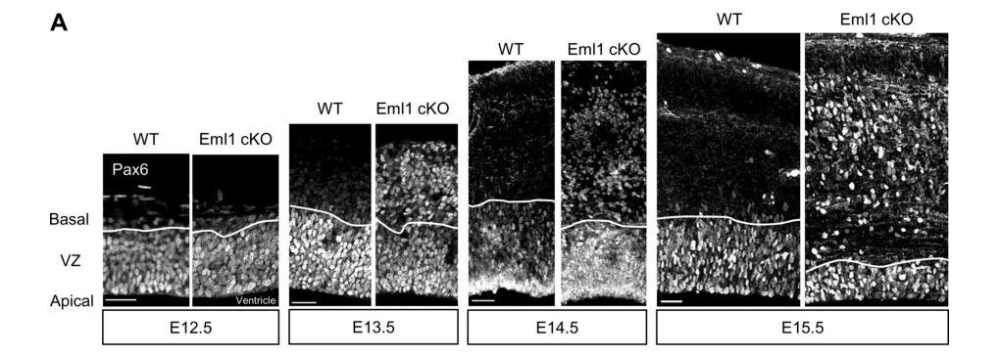

## Question

# Disease Characteristics Research Template

## Target Disease
- **Disease Name:** EML1-related Ribbon-like Subcortical Heterotopia
- **MONDO ID:**  (if available)
- **Category:** Mendelian

## Research Objectives

Please provide a comprehensive research report on **EML1-related Ribbon-like Subcortical Heterotopia** covering all of the
disease characteristics listed below. This report will be used to populate a disease knowledge
base entry. Be thorough and cite primary literature (PMID preferred) for all claims.

For each section, **suggested databases/resources** are listed. These are the first places
you should search for information on each topic.

---

### 1. Disease Information
> **Search first:** OMIM, Orphanet, ICD-10/ICD-11, MeSH, PubMed

- What is the disease? Provide a concise overview.
- What are the key identifiers? (OMIM, Orphanet, ICD-10/ICD-11, MeSH, Mondo)
- What are the common synonyms and alternative names?
- Is the information derived from individual patients (e.g., EHR) or aggregated disease-level resources?

### 2. Etiology

- **Disease Causal Factors**: What are the primary causes? (genetic, environmental, infectious, mechanistic)
- **Risk Factors**:
  > **Search first:** PubMed, Cochrane Library, UpToDate, clinical guidelines, ClinVar, ClinGen, GWAS Catalog, PheGenI, CTD, CDC, WHO, epidemiological databases
  - Genetic risk factors (causal variants, susceptibility loci, modifier genes)
  - Environmental risk factors (toxins, lifestyle, occupational exposures, age, sex, family history)
- **Protective Factors**:
  > **Search first:** PubMed, Cochrane Library, clinical trial databases, GWAS Catalog, gnomAD, WHO, CDC, nutrition databases
  - Genetic protective factors (protective variants, modifier alleles)
  - Environmental protective factors (diet, lifestyle, exposures that reduce risk)
- **Gene-Environment Interactions**: How do genetic and environmental factors interact to influence disease?
  > **Search first:** CTD, PubMed, PheGenI, GxE databases

### 3. Phenotypes
> **Search first:** HPO (Human Phenotype Ontology), OMIM, Orphanet, PubMed, clinicaltrials.gov, MedDRA, SNOMED CT, DECIPHER, LOINC

For each phenotype, provide:
- **Phenotype type**: symptoms, clinical signs, physical manifestations, behavioral changes, or laboratory abnormalities
  > For symptoms/signs: HPO, OMIM, Orphanet, PubMed
  > For behavioral changes: HPO, DSM, RDoC (Research Domain Criteria), PubMed
  > For laboratory abnormalities: LOINC, SNOMED CT, LabTests Online, PubMed
- **Phenotype characteristics**:
  > **Search first:** OMIM, Orphanet, HPO, PubMed
  - Age of symptom onset (neonatal, childhood, adult-onset, late-onset)
  - Symptom severity (mild, moderate, severe, variable)
  - Symptom progression (stable, progressive, episodic, fluctuating)
  - Frequency among affected individuals (percentage or qualitative)
- **Quality of life impact**: Effects on daily functioning and well-being (per-phenotype when possible)
  > **Search first:** EQ-5D database, SF-36, WHO QOL databases, PubMed
- Suggest HPO (Human Phenotype Ontology) terms for each phenotype

### 4. Genetic/Molecular Information

- **Causal Genes**: Gene mutations or chromosomal abnormalities responsible for disease (gene symbols, OMIM IDs)
  > **Search first:** OMIM, ClinVar, HGMD, Ensembl, NCBI Gene
- **Pathogenic Variants**:
  - Affected genes (gene symbols, HGNC IDs)
    > **Search first:** OMIM, NCBI Gene, Ensembl, HGNC, UniProt, GeneCards
  - Variant classification (pathogenic, likely pathogenic, VUS per ACMG/AMP guidelines)
    > **Search first:** ClinVar, ClinGen, ACMG/AMP guidelines, VarSome
  - Variant type/class (missense, frameshift, nonsense, splice-site, structural)
  - Allele frequency in population databases
    > **Search first:** gnomAD, 1000 Genomes, ExAC, TOPMed, dbSNP
  - Somatic vs germline origin
    > **Search first:** COSMIC (somatic), ClinVar, ICGC, TCGA
  - Functional consequences (loss of function, gain of function, dominant negative)
- **Modifier Genes**: Genes that modify disease severity or expression
- **Epigenetic Information**: DNA methylation, histone modifications, chromatin changes affecting disease
  > **Search first:** ENCODE, Roadmap Epigenomics, MethBase, DiseaseMeth
- **Chromosomal Abnormalities**: Large-scale genetic changes (aneuploidy, translocations, inversions)
  > **Search first:** DECIPHER, ClinVar, ECARUCA, UCSC Genome Browser

### 5. Environmental Information

- **Environmental Factors**: Non-genetic contributing factors (toxins, radiation, pollution, occupational exposure)
  > **Search first:** CTD (Comparative Toxicogenomics Database), TOXNET, PubMed, EPA databases
- **Lifestyle Factors**: Behavioral factors (smoking, diet, exercise, alcohol consumption)
  > **Search first:** CDC databases, WHO, PubMed, NHANES
- **Infectious Agents**: If applicable, pathogens causing or triggering disease (bacteria, viruses, fungi, parasites)
  > **Search first:** NCBI Taxonomy, ViPR, BV-BRC, MicrobeDB, GIDEON

### 6. Mechanism / Pathophysiology

- **Molecular Pathways**: Specific signaling cascades or biochemical pathways involved (Wnt, MAPK, mTOR, PI3K-AKT, etc.)
  > **Search first:** KEGG, Reactome, WikiPathways, PathBank, BioCyc
- **Cellular Processes**: Cell-level mechanisms (apoptosis, autophagy, cell cycle dysregulation, inflammation, etc.)
  > **Search first:** Gene Ontology (GO), Reactome, KEGG, PubMed
- **Protein Dysfunction**: How protein structure or function is altered (misfolding, aggregation, loss of function, gain of function)
  > **Search first:** UniProt, PDB (Protein Data Bank), InterPro, Pfam, AlphaFold
- **Metabolic Changes**: Alterations in metabolic processes (energy metabolism, lipid metabolism, amino acid metabolism)
  > **Search first:** KEGG, BioCyc, HMDB (Human Metabolome Database), BRENDA
- **Immune System Involvement**: Role of immune response (autoimmunity, immunodeficiency, chronic inflammation)
  > **Search first:** ImmPort, Immunome Database, IEDB, Gene Ontology
- **Tissue Damage Mechanisms**: How tissues/ are injured (oxidative stress, ischemia, fibrosis, necrosis)
  > **Search first:** PubMed, Gene Ontology, Reactome
- **Biochemical Abnormalities**: Specific molecular defects (enzyme deficiencies, receptor dysfunction, ion channel defects)
  > **Search first:** BRENDA, UniProt, KEGG, OMIM, PubMed
- **Epigenetic Changes**: DNA methylation, histone modifications affecting gene expression in disease
  > **Search first:** ENCODE, Roadmap Epigenomics, MethBase, DiseaseMeth
- **Molecular Profiling** (if available):
  - Transcriptomics/gene expression changes
    > **Search first:** GEO (Gene Expression Omnibus), ArrayExpress, GTEx, Human Cell Atlas, SRA
  - Proteomics findings
    > **Search first:** PRIDE, ProteomeXchange, Human Protein Atlas, STRING, BioGRID
  - Metabolomics signatures
    > **Search first:** MetaboLights, Metabolomics Workbench, HMDB, METLIN
  - Lipidomics alterations
    > **Search first:** LIPID MAPS, SwissLipids, LipidHome, Metabolomics Workbench
  - Genomic structural features
    > **Search first:** UCSC Genome Browser, Ensembl, NCBI, dbVar, DGV
- **Advanced Technologies** (if applicable):
  - Single-cell analysis findings (cell-type specific mechanisms, cellular heterogeneity)
    > **Search first:** Human Cell Atlas, Single Cell Portal, GEO, CELLxGENE
  - Spatial transcriptomics findings
    > **Search first:** GEO, Spatial Research, Vizgen, 10x Genomics data
  - Multi-omics integration results
    > **Search first:** TCGA, ICGC, cBioPortal, LinkedOmics, PubMed
  - Functional genomics screens (CRISPR, RNAi)
    > **Search first:** DepMap, GenomeRNAi, PubMed, BioGRID ORCS

For each mechanism, describe:
- The causal chain from initial trigger to clinical manifestation
- Which mechanisms are upstream vs downstream
- What cell types and biological processes are involved
- Suggest GO terms for biological processes and CL terms for cell types

### 7. Anatomical Structures Affected

- **Organ Level**:
  - Primary organs directly affected
  - Secondary organ involvement (complications, secondary effects)
  - Body systems involved (cardiovascular, nervous, digestive, respiratory, endocrine, etc.)
  > **Search first:** Uberon, FMA (Foundational Model of Anatomy), OMIM, HPO, ICD-11, MeSH, SNOMED CT
- **Tissue and Cell Level**:
  - Specific tissue types affected (epithelial, connective, muscle, nervous)
  - Specific cell populations targeted (with Cell Ontology terms)
  > **Search first:** Uberon, Human Protein Atlas, Cell Ontology, Human Cell Atlas, CellMarker, PanglaoDB
- **Subcellular Level**:
  - Cellular compartments involved (mitochondria, nucleus, ER, lysosomes) (with GO Cellular Component terms)
  > **Search first:** Gene Ontology (Cellular Component), UniProt, Human Protein Atlas
- **Localization**:
  - Specific anatomical sites (with UBERON terms)
    > **Search first:** FMA, Uberon, NeuroNames (for brain), SNOMED CT
  - Lateralization (unilateral, bilateral, asymmetric)
    > **Search first:** HPO, clinical literature, imaging databases

### 8. Temporal Development

- **Onset**:
  - Typical age of onset (congenital, pediatric, adult, geriatric)
  - Onset pattern (acute, subacute, chronic, insidious)
  > **Search first:** OMIM, Orphanet, HPO, PubMed
- **Progression**:
  - Disease stages (early, intermediate, advanced, end-stage)
    > **Search first:** Cancer Staging Manual (AJCC), WHO classifications, PubMed
  - Progression rate (rapid, slow, variable)
  - Disease course pattern (episodic, relapsing-remitting, progressive, stable)
  - Disease duration (self-limited, chronic lifelong)
  > **Search first:** Disease registries, longitudinal cohort databases, natural history studies, PubMed, Orphanet, OMIM
- **Patterns**:
  - Remission patterns (spontaneous, treatment-induced)
    > **Search first:** Clinical trial databases, disease registries, PubMed
  - Critical periods (time windows of vulnerability or opportunity for intervention)
    > **Search first:** PubMed, developmental biology databases, clinical guidelines

### 9. Inheritance and Population

- **Epidemiology**:
  - Prevalence (cases per 100,000 at given time)
  - Incidence (new cases per 100,000 per year)
  > **Search first:** Orphanet, CDC, WHO, GBD (Global Burden of Disease), national registries, SEER, disease registries
- **For Genetic Etiology**:
  - Inheritance pattern (AD, AR, X-linked, mitochondrial, multifactorial, polygenic)
    > **Search first:** OMIM, Orphanet, ClinVar, GTR (Genetic Testing Registry)
  - Penetrance (complete, incomplete, age-dependent)
    > **Search first:** ClinVar, OMIM, PubMed, ClinGen
  - Expressivity (variable, consistent)
    > **Search first:** OMIM, ClinVar, PubMed
  - Genetic anticipation (increasing severity in successive generations)
    > **Search first:** OMIM, PubMed (especially for repeat expansion disorders)
  - Germline mosaicism
    > **Search first:** ClinVar, OMIM, genetic counseling literature, PubMed
  - Founder effects (population-specific mutations)
    > **Search first:** gnomAD, population genetics databases, PubMed
  - Consanguinity role
    > **Search first:** OMIM, population studies, genetic counseling resources
  - Carrier frequency
    > **Search first:** gnomAD, carrier screening databases, GeneReviews, GTR
- **Population Demographics**:
  - Affected populations (ethnic or demographic groups with higher prevalence)
    > **Search first:** gnomAD, 1000 Genomes, PAGE Study, PubMed, population registries
  - Geographic distribution (endemic areas, regional variation)
    > **Search first:** WHO, CDC, GBD, Orphanet, geographic epidemiology databases
  - Geographic distribution of specific variants
  - Sex ratio (male:female)
    > **Search first:** Disease registries, OMIM, PubMed, epidemiological databases
  - Age distribution of affected individuals
    > **Search first:** CDC, disease registries, SEER, Orphanet

### 10. Diagnostics

- **Clinical Tests**:
  - Laboratory tests (blood, urine, tissue chemistry, specific enzyme assays)
    > **Search first:** LOINC, LabTests Online, PubMed
  - Biomarkers (proteins, metabolites, genetic markers, circulating biomarkers)
    > **Search first:** FDA Biomarker List, BEST (Biomarkers, EndpointS, and other Tools), PubMed
  - Imaging studies (X-ray, CT, MRI, PET, ultrasound)
    > **Search first:** RadLex, DICOM, Radiopaedia, imaging databases
  - Functional tests (pulmonary function, cardiac stress tests)
    > **Search first:** LOINC, clinical guidelines, PubMed
  - Electrophysiology (EEG, EMG, ECG, nerve conduction studies)
    > **Search first:** LOINC, clinical neurophysiology databases, PubMed
  - Biopsy findings (histopathology, immunohistochemistry)
    > **Search first:** SNOMED CT, College of American Pathologists resources, PubMed
  - Pathology findings (microscopic examination)
    > **Search first:** SNOMED CT, Digital Pathology databases, PubMed
- **Genetic Testing**:
  > **Search first:** GTR (Genetic Testing Registry), GeneReviews, ClinGen
  - Overview of recommended genetic testing approach
  - Whole genome sequencing (WGS) utility
    > **Search first:** GTR, ClinVar, GEL (Genomics England), gnomAD
  - Whole exome sequencing (WES) utility
    > **Search first:** GTR, ClinVar, OMIM, GeneMatcher
  - Gene panels (which panels, which genes)
    > **Search first:** GTR, ClinVar, laboratory-specific databases
  - Single gene testing
    > **Search first:** GTR, ClinVar, OMIM, GeneReviews
  - Chromosomal microarray (CMA)
    > **Search first:** DECIPHER, ClinVar, dbVar, ECARUCA
  - Karyotyping
    > **Search first:** Chromosome Abnormality Database, ClinVar, cytogenetics resources
  - FISH
    > **Search first:** ClinVar, cytogenetics databases, PubMed
  - Mitochondrial DNA testing
    > **Search first:** MITOMAP, MSeqDR, ClinVar, GTR
  - Repeat expansion testing
    > **Search first:** GTR, ClinVar, repeat expansion databases, PubMed
- **Omics-Based Diagnostics** (if applicable):
  - RNA sequencing / transcriptomics
    > **Search first:** GEO, ArrayExpress, GTEx, RNA-seq databases
  - Proteomics
    > **Search first:** PRIDE, ProteomeXchange, FDA Biomarker database
  - Metabolomics
    > **Search first:** MetaboLights, Metabolomics Workbench, HMDB
  - Epigenomics
    > **Search first:** GEO, ENCODE, Roadmap Epigenomics, MethBase
  - Liquid biopsy
    > **Search first:** COSMIC, ClinVar, liquid biopsy databases, PubMed
- **Clinical Criteria**:
  - Standardized diagnostic criteria (DSM, ICD, society guidelines)
    > **Search first:** DSM-5, ICD-11, clinical society guidelines, UpToDate
  - Differential diagnosis (other conditions to rule out, with distinguishing features)
    > **Search first:** DynaMed, UpToDate, clinical decision support systems
- **Screening**:
  - Screening methods for asymptomatic individuals (newborn screening, carrier screening, cascade screening)
    > **Search first:** ACMG recommendations, CDC newborn screening, GTR

### 11. Outcome/Prognosis

- **Survival and Mortality**:
  - Survival rate (5-year, 10-year, overall)
    > **Search first:** SEER, cancer registries, disease-specific registries, PubMed
  - Life expectancy (with and without treatment if applicable)
    > **Search first:** Orphanet, disease registries, actuarial databases, PubMed
  - Mortality rate
    > **Search first:** CDC, WHO, GBD, national mortality databases
  - Disease-specific mortality (deaths directly attributable to disease)
    > **Search first:** Disease registries, CDC Wonder, GBD, PubMed
- **Morbidity and Function**:
  - Morbidity (disease-related disability and health impacts)
    > **Search first:** GBD, WHO, disability databases, PubMed
  - Disability outcomes (long-term functional impairments)
    > **Search first:** ICF (International Classification of Functioning), disability registries
  - Quality of life measures (EQ-5D, SF-36, PROMIS, disease-specific tools)
    > **Search first:** EQ-5D database, SF-36, PROMIS, PubMed
- **Disease Course**:
  - Complications (secondary problems: infections, organ failure, etc.)
    > **Search first:** ICD codes, disease registries, clinical databases, PubMed
  - Recovery potential (likelihood and extent of recovery, with vs without treatment)
    > **Search first:** Natural history studies, rehabilitation databases, PubMed
- **Prediction**:
  - Prognostic factors (age, disease severity, biomarkers, treatment response)
    > **Search first:** Prognostic models databases, clinical calculators, PubMed
  - Prognostic biomarkers (molecular markers predicting disease course)
    > **Search first:** FDA Biomarker database, PubMed, cancer prognostic databases

### 12. Treatment

- **Pharmacotherapy**:
  - Pharmacological treatments (drug names, drug classes, mechanisms of action)
    > **Search first:** DrugBank, RxNorm, ATC classification, DailyMed, FDA databases
  - Pharmacogenomics (how genetic variants affect drug metabolism, efficacy, toxicity)
    > **Search first:** PharmGKB, CPIC (Clinical Pharmacogenetics), FDA Table of PGx Biomarkers
- **Advanced Therapeutics**:
  - Gene therapy (viral vectors, CRISPR, gene replacement, gene editing)
    > **Search first:** ClinicalTrials.gov, FDA gene therapy database, ASGCT resources
  - Cell therapy (stem cell transplant, CAR-T, cellular therapeutics)
    > **Search first:** ClinicalTrials.gov, FDA cell therapy database, FACT standards
  - RNA-based therapies (ASOs, siRNA, mRNA therapies)
    > **Search first:** ClinicalTrials.gov, FDA approvals, PubMed
  - Targeted therapies (treatments directed at specific molecular targets)
    > **Search first:** My Cancer Genome, OncoKB, ClinicalTrials.gov, FDA approvals
  - Immunotherapies (checkpoint inhibitors, monoclonal antibodies)
    > **Search first:** Cancer Immunotherapy Database, FDA approvals, ClinicalTrials.gov
- **Surgical and Interventional**:
  - Surgical interventions (types of surgery, timing, outcomes)
    > **Search first:** CPT codes, surgical registries, clinical guidelines, PubMed
- **Supportive and Rehabilitative**:
  - Supportive care (symptom management, pain control, nutrition)
    > **Search first:** Clinical guidelines, Cochrane Library, PubMed
  - Rehabilitation (physical therapy, occupational therapy, speech therapy)
    > **Search first:** Rehabilitation medicine databases, clinical guidelines, PubMed
- **Experimental**:
  - Experimental treatments in clinical trials (with NCT identifiers if available)
    > **Search first:** ClinicalTrials.gov, EU Clinical Trials Register, WHO ICTRP
- **Treatment Outcomes**:
  - Treatment response rates
    > **Search first:** Clinical trial databases, FDA reviews, systematic reviews, PubMed
  - Side effects and adverse events
    > **Search first:** FDA Adverse Event Reporting System (FAERS), MedWatch, PubMed
- **Treatment Strategy**:
  - Treatment algorithms (clinical pathways, decision trees)
    > **Search first:** Clinical practice guidelines, NCCN Guidelines, UpToDate
  - Combination therapies
    > **Search first:** ClinicalTrials.gov, treatment guidelines, PubMed
  - Personalized medicine approaches (genotype-guided treatment)
    > **Search first:** My Cancer Genome, CIViC, PharmGKB, precision medicine databases

For each treatment, suggest MAXO (Medical Action Ontology) terms where applicable.

### 13. Prevention

- **Prevention Levels**:
  - Primary prevention (preventing disease occurrence: vaccination, risk factor modification)
    > **Search first:** CDC, WHO, USPSTF recommendations, Cochrane Library
  - Secondary prevention (early detection and treatment: screening programs, early intervention)
    > **Search first:** USPSTF, CDC screening guidelines, WHO
  - Tertiary prevention (preventing complications in those with disease)
    > **Search first:** Clinical guidelines, disease management protocols, PubMed
- **Immunization**: Vaccine strategies (if applicable)
  > **Search first:** CDC vaccine schedules, WHO immunization, FDA vaccine database
- **Screening and Early Detection**:
  - Screening programs (population-based: newborn screening, cancer screening)
    > **Search first:** CDC screening programs, USPSTF, cancer screening databases
  - Genetic screening (carrier screening, preimplantation genetic diagnosis, prenatal testing)
    > **Search first:** ACMG recommendations, ACOG guidelines, GTR
  - Risk stratification (identifying high-risk individuals for targeted prevention)
    > **Search first:** Risk prediction models, clinical calculators, PubMed
- **Behavioral Interventions**: Lifestyle modifications to reduce risk
  > **Search first:** CDC, WHO, behavioral intervention databases, Cochrane Library
- **Counseling**: Genetic counseling (risk assessment, family planning guidance)
  > **Search first:** NSGC resources, ACMG guidelines, GeneReviews
- **Public Health**:
  - Public health interventions (sanitation, vector control, health education)
    > **Search first:** CDC, WHO, public health databases, PubMed
  - Environmental interventions (reducing environmental risk factors)
    > **Search first:** EPA databases, WHO environmental health, PubMed
- **Prophylaxis**: Preventive medications or procedures
  > **Search first:** Clinical guidelines, FDA approvals, PubMed

### 14. Other Species / Natural Disease

- **Taxonomy**: Species affected (with NCBI Taxon identifiers)
  > **Search first:** NCBI Taxonomy
- **Breed**: Specific breeds affected (with VBO identifiers if applicable)
  > **Search first:** VBO (Vertebrate Breed Ontology)
- **Gene**: Orthologous genes in other species (with NCBI Gene IDs)
  > **Search first:** NCBI Gene
- **Natural Disease**:
  - Naturally occurring disease in other species (companion animals, wildlife)
    > **Search first:** OMIA (Online Mendelian Inheritance in Animals), VetCompass, PubMed
  - Veterinary relevance and importance in animal health
    > **Search first:** OMIA, veterinary databases, PubMed
- **Comparative Biology**:
  - Comparative pathology (similarities and differences across species)
    > **Search first:** OMIA, comparative pathology databases, PubMed
  - Evolutionary conservation of disease mechanisms
    > **Search first:** HomoloGene, OrthoMCL, Alliance of Genome Resources
- **Transmission** (if applicable):
  - Zoonotic potential
    > **Search first:** CDC zoonotic diseases, WHO zoonoses, GIDEON
  - Cross-species susceptibility
    > **Search first:** NCBI Taxonomy, veterinary databases, PubMed

### 15. Model Organisms

- **Model Types**:
  - Model organism type (mammalian, invertebrate, cellular, in vitro)
    > **Search first:** Alliance of Genome Resources, model organism databases
  - Specific model systems (mouse, rat, zebrafish, Drosophila, C. elegans, yeast, cell lines, organoids, iPSCs)
    > **Search first:** MGI, RGD, ZFIN, FlyBase, WormBase, SGD, ATCC, Cellosaurus
  - Induced models (drug treatment, surgical intervention, environmental manipulation)
    > **Search first:** MGI, model organism databases, PubMed
- **Genetic Models**:
  - Types available (knockout, knock-in, transgenic, conditional, humanized)
    > **Search first:** MGI, IMPC, KOMP, EuMMCR, IMSR
- **Model Characteristics**:
  - Phenotype recapitulation (how well model reproduces human disease features)
    > **Search first:** Model organism databases, comparative studies, PubMed
  - Model limitations (aspects of human disease not captured)
    > **Search first:** Model organism databases, PubMed, review articles
- **Applications**:
  - Research applications (what aspects of disease can be studied)
    > **Search first:** Model organism databases, PubMed
- **Resources**:
  - Model databases
    > **Search first:** MGI, RGD, ZFIN, FlyBase, WormBase, IMSR, EMMA, MMRRC

---

## Citation Requirements

- Cite primary literature (PMID preferred) for all mechanistic and clinical claims
- Prioritize recent reviews and landmark papers
- Include direct quotes from abstracts where possible to support key statements
- Distinguish evidence source types: human clinical, model organism, in vitro, computational

## Output Format

Structure your response as a comprehensive narrative organized by the sections above.
For each section, provide:
- Factual content with specific details (numbers, percentages, gene names, variant nomenclature)
- Ontology term suggestions (HPO, GO, CL, UBERON, CHEBI, MAXO, MONDO) where applicable
- Evidence citations with PMIDs
- Direct quotes from abstracts to support key claims
- Clear indication when information is not available or not applicable for this disease

This report will be used to populate a disease knowledge base entry with:
- Pathophysiology descriptions with causal chains
- Gene/protein annotations (HGNC, GO terms)
- Phenotype associations (HP terms) with frequencies
- Cell type involvement (CL terms)
- Anatomical locations (UBERON terms)
- Chemical entities (CHEBI terms)
- Treatment annotations (MAXO terms)
- Evidence items with PMIDs and exact abstract quotes
- Epidemiology, prognosis, diagnostic, and prevention information
- Animal model descriptions with phenotype recapitulation details

## Output

Question: You are an expert researcher providing comprehensive, well-cited information.

Provide detailed information focusing on:
1. Key concepts and definitions with current understanding
2. Recent developments and latest research (prioritize 2023-2024 sources)
3. Current applications and real-world implementations
4. Expert opinions and analysis from authoritative sources
5. Relevant statistics and data from recent studies

Format as a comprehensive research report with proper citations. Include URLs and publication dates where available.
Always prioritize recent, authoritative sources and provide specific citations for all major claims.

# Disease Characteristics Research Template

## Target Disease
- **Disease Name:** EML1-related Ribbon-like Subcortical Heterotopia
- **MONDO ID:**  (if available)
- **Category:** Mendelian

## Research Objectives

Please provide a comprehensive research report on **EML1-related Ribbon-like Subcortical Heterotopia** covering all of the
disease characteristics listed below. This report will be used to populate a disease knowledge
base entry. Be thorough and cite primary literature (PMID preferred) for all claims.

For each section, **suggested databases/resources** are listed. These are the first places
you should search for information on each topic.

---

### 1. Disease Information
> **Search first:** OMIM, Orphanet, ICD-10/ICD-11, MeSH, PubMed

- What is the disease? Provide a concise overview.
- What are the key identifiers? (OMIM, Orphanet, ICD-10/ICD-11, MeSH, Mondo)
- What are the common synonyms and alternative names?
- Is the information derived from individual patients (e.g., EHR) or aggregated disease-level resources?

### 2. Etiology

- **Disease Causal Factors**: What are the primary causes? (genetic, environmental, infectious, mechanistic)
- **Risk Factors**:
  > **Search first:** PubMed, Cochrane Library, UpToDate, clinical guidelines, ClinVar, ClinGen, GWAS Catalog, PheGenI, CTD, CDC, WHO, epidemiological databases
  - Genetic risk factors (causal variants, susceptibility loci, modifier genes)
  - Environmental risk factors (toxins, lifestyle, occupational exposures, age, sex, family history)
- **Protective Factors**:
  > **Search first:** PubMed, Cochrane Library, clinical trial databases, GWAS Catalog, gnomAD, WHO, CDC, nutrition databases
  - Genetic protective factors (protective variants, modifier alleles)
  - Environmental protective factors (diet, lifestyle, exposures that reduce risk)
- **Gene-Environment Interactions**: How do genetic and environmental factors interact to influence disease?
  > **Search first:** CTD, PubMed, PheGenI, GxE databases

### 3. Phenotypes
> **Search first:** HPO (Human Phenotype Ontology), OMIM, Orphanet, PubMed, clinicaltrials.gov, MedDRA, SNOMED CT, DECIPHER, LOINC

For each phenotype, provide:
- **Phenotype type**: symptoms, clinical signs, physical manifestations, behavioral changes, or laboratory abnormalities
  > For symptoms/signs: HPO, OMIM, Orphanet, PubMed
  > For behavioral changes: HPO, DSM, RDoC (Research Domain Criteria), PubMed
  > For laboratory abnormalities: LOINC, SNOMED CT, LabTests Online, PubMed
- **Phenotype characteristics**:
  > **Search first:** OMIM, Orphanet, HPO, PubMed
  - Age of symptom onset (neonatal, childhood, adult-onset, late-onset)
  - Symptom severity (mild, moderate, severe, variable)
  - Symptom progression (stable, progressive, episodic, fluctuating)
  - Frequency among affected individuals (percentage or qualitative)
- **Quality of life impact**: Effects on daily functioning and well-being (per-phenotype when possible)
  > **Search first:** EQ-5D database, SF-36, WHO QOL databases, PubMed
- Suggest HPO (Human Phenotype Ontology) terms for each phenotype

### 4. Genetic/Molecular Information

- **Causal Genes**: Gene mutations or chromosomal abnormalities responsible for disease (gene symbols, OMIM IDs)
  > **Search first:** OMIM, ClinVar, HGMD, Ensembl, NCBI Gene
- **Pathogenic Variants**:
  - Affected genes (gene symbols, HGNC IDs)
    > **Search first:** OMIM, NCBI Gene, Ensembl, HGNC, UniProt, GeneCards
  - Variant classification (pathogenic, likely pathogenic, VUS per ACMG/AMP guidelines)
    > **Search first:** ClinVar, ClinGen, ACMG/AMP guidelines, VarSome
  - Variant type/class (missense, frameshift, nonsense, splice-site, structural)
  - Allele frequency in population databases
    > **Search first:** gnomAD, 1000 Genomes, ExAC, TOPMed, dbSNP
  - Somatic vs germline origin
    > **Search first:** COSMIC (somatic), ClinVar, ICGC, TCGA
  - Functional consequences (loss of function, gain of function, dominant negative)
- **Modifier Genes**: Genes that modify disease severity or expression
- **Epigenetic Information**: DNA methylation, histone modifications, chromatin changes affecting disease
  > **Search first:** ENCODE, Roadmap Epigenomics, MethBase, DiseaseMeth
- **Chromosomal Abnormalities**: Large-scale genetic changes (aneuploidy, translocations, inversions)
  > **Search first:** DECIPHER, ClinVar, ECARUCA, UCSC Genome Browser

### 5. Environmental Information

- **Environmental Factors**: Non-genetic contributing factors (toxins, radiation, pollution, occupational exposure)
  > **Search first:** CTD (Comparative Toxicogenomics Database), TOXNET, PubMed, EPA databases
- **Lifestyle Factors**: Behavioral factors (smoking, diet, exercise, alcohol consumption)
  > **Search first:** CDC databases, WHO, PubMed, NHANES
- **Infectious Agents**: If applicable, pathogens causing or triggering disease (bacteria, viruses, fungi, parasites)
  > **Search first:** NCBI Taxonomy, ViPR, BV-BRC, MicrobeDB, GIDEON

### 6. Mechanism / Pathophysiology

- **Molecular Pathways**: Specific signaling cascades or biochemical pathways involved (Wnt, MAPK, mTOR, PI3K-AKT, etc.)
  > **Search first:** KEGG, Reactome, WikiPathways, PathBank, BioCyc
- **Cellular Processes**: Cell-level mechanisms (apoptosis, autophagy, cell cycle dysregulation, inflammation, etc.)
  > **Search first:** Gene Ontology (GO), Reactome, KEGG, PubMed
- **Protein Dysfunction**: How protein structure or function is altered (misfolding, aggregation, loss of function, gain of function)
  > **Search first:** UniProt, PDB (Protein Data Bank), InterPro, Pfam, AlphaFold
- **Metabolic Changes**: Alterations in metabolic processes (energy metabolism, lipid metabolism, amino acid metabolism)
  > **Search first:** KEGG, BioCyc, HMDB (Human Metabolome Database), BRENDA
- **Immune System Involvement**: Role of immune response (autoimmunity, immunodeficiency, chronic inflammation)
  > **Search first:** ImmPort, Immunome Database, IEDB, Gene Ontology
- **Tissue Damage Mechanisms**: How tissues/ are injured (oxidative stress, ischemia, fibrosis, necrosis)
  > **Search first:** PubMed, Gene Ontology, Reactome
- **Biochemical Abnormalities**: Specific molecular defects (enzyme deficiencies, receptor dysfunction, ion channel defects)
  > **Search first:** BRENDA, UniProt, KEGG, OMIM, PubMed
- **Epigenetic Changes**: DNA methylation, histone modifications affecting gene expression in disease
  > **Search first:** ENCODE, Roadmap Epigenomics, MethBase, DiseaseMeth
- **Molecular Profiling** (if available):
  - Transcriptomics/gene expression changes
    > **Search first:** GEO (Gene Expression Omnibus), ArrayExpress, GTEx, Human Cell Atlas, SRA
  - Proteomics findings
    > **Search first:** PRIDE, ProteomeXchange, Human Protein Atlas, STRING, BioGRID
  - Metabolomics signatures
    > **Search first:** MetaboLights, Metabolomics Workbench, HMDB, METLIN
  - Lipidomics alterations
    > **Search first:** LIPID MAPS, SwissLipids, LipidHome, Metabolomics Workbench
  - Genomic structural features
    > **Search first:** UCSC Genome Browser, Ensembl, NCBI, dbVar, DGV
- **Advanced Technologies** (if applicable):
  - Single-cell analysis findings (cell-type specific mechanisms, cellular heterogeneity)
    > **Search first:** Human Cell Atlas, Single Cell Portal, GEO, CELLxGENE
  - Spatial transcriptomics findings
    > **Search first:** GEO, Spatial Research, Vizgen, 10x Genomics data
  - Multi-omics integration results
    > **Search first:** TCGA, ICGC, cBioPortal, LinkedOmics, PubMed
  - Functional genomics screens (CRISPR, RNAi)
    > **Search first:** DepMap, GenomeRNAi, PubMed, BioGRID ORCS

For each mechanism, describe:
- The causal chain from initial trigger to clinical manifestation
- Which mechanisms are upstream vs downstream
- What cell types and biological processes are involved
- Suggest GO terms for biological processes and CL terms for cell types

### 7. Anatomical Structures Affected

- **Organ Level**:
  - Primary organs directly affected
  - Secondary organ involvement (complications, secondary effects)
  - Body systems involved (cardiovascular, nervous, digestive, respiratory, endocrine, etc.)
  > **Search first:** Uberon, FMA (Foundational Model of Anatomy), OMIM, HPO, ICD-11, MeSH, SNOMED CT
- **Tissue and Cell Level**:
  - Specific tissue types affected (epithelial, connective, muscle, nervous)
  - Specific cell populations targeted (with Cell Ontology terms)
  > **Search first:** Uberon, Human Protein Atlas, Cell Ontology, Human Cell Atlas, CellMarker, PanglaoDB
- **Subcellular Level**:
  - Cellular compartments involved (mitochondria, nucleus, ER, lysosomes) (with GO Cellular Component terms)
  > **Search first:** Gene Ontology (Cellular Component), UniProt, Human Protein Atlas
- **Localization**:
  - Specific anatomical sites (with UBERON terms)
    > **Search first:** FMA, Uberon, NeuroNames (for brain), SNOMED CT
  - Lateralization (unilateral, bilateral, asymmetric)
    > **Search first:** HPO, clinical literature, imaging databases

### 8. Temporal Development

- **Onset**:
  - Typical age of onset (congenital, pediatric, adult, geriatric)
  - Onset pattern (acute, subacute, chronic, insidious)
  > **Search first:** OMIM, Orphanet, HPO, PubMed
- **Progression**:
  - Disease stages (early, intermediate, advanced, end-stage)
    > **Search first:** Cancer Staging Manual (AJCC), WHO classifications, PubMed
  - Progression rate (rapid, slow, variable)
  - Disease course pattern (episodic, relapsing-remitting, progressive, stable)
  - Disease duration (self-limited, chronic lifelong)
  > **Search first:** Disease registries, longitudinal cohort databases, natural history studies, PubMed, Orphanet, OMIM
- **Patterns**:
  - Remission patterns (spontaneous, treatment-induced)
    > **Search first:** Clinical trial databases, disease registries, PubMed
  - Critical periods (time windows of vulnerability or opportunity for intervention)
    > **Search first:** PubMed, developmental biology databases, clinical guidelines

### 9. Inheritance and Population

- **Epidemiology**:
  - Prevalence (cases per 100,000 at given time)
  - Incidence (new cases per 100,000 per year)
  > **Search first:** Orphanet, CDC, WHO, GBD (Global Burden of Disease), national registries, SEER, disease registries
- **For Genetic Etiology**:
  - Inheritance pattern (AD, AR, X-linked, mitochondrial, multifactorial, polygenic)
    > **Search first:** OMIM, Orphanet, ClinVar, GTR (Genetic Testing Registry)
  - Penetrance (complete, incomplete, age-dependent)
    > **Search first:** ClinVar, OMIM, PubMed, ClinGen
  - Expressivity (variable, consistent)
    > **Search first:** OMIM, ClinVar, PubMed
  - Genetic anticipation (increasing severity in successive generations)
    > **Search first:** OMIM, PubMed (especially for repeat expansion disorders)
  - Germline mosaicism
    > **Search first:** ClinVar, OMIM, genetic counseling literature, PubMed
  - Founder effects (population-specific mutations)
    > **Search first:** gnomAD, population genetics databases, PubMed
  - Consanguinity role
    > **Search first:** OMIM, population studies, genetic counseling resources
  - Carrier frequency
    > **Search first:** gnomAD, carrier screening databases, GeneReviews, GTR
- **Population Demographics**:
  - Affected populations (ethnic or demographic groups with higher prevalence)
    > **Search first:** gnomAD, 1000 Genomes, PAGE Study, PubMed, population registries
  - Geographic distribution (endemic areas, regional variation)
    > **Search first:** WHO, CDC, GBD, Orphanet, geographic epidemiology databases
  - Geographic distribution of specific variants
  - Sex ratio (male:female)
    > **Search first:** Disease registries, OMIM, PubMed, epidemiological databases
  - Age distribution of affected individuals
    > **Search first:** CDC, disease registries, SEER, Orphanet

### 10. Diagnostics

- **Clinical Tests**:
  - Laboratory tests (blood, urine, tissue chemistry, specific enzyme assays)
    > **Search first:** LOINC, LabTests Online, PubMed
  - Biomarkers (proteins, metabolites, genetic markers, circulating biomarkers)
    > **Search first:** FDA Biomarker List, BEST (Biomarkers, EndpointS, and other Tools), PubMed
  - Imaging studies (X-ray, CT, MRI, PET, ultrasound)
    > **Search first:** RadLex, DICOM, Radiopaedia, imaging databases
  - Functional tests (pulmonary function, cardiac stress tests)
    > **Search first:** LOINC, clinical guidelines, PubMed
  - Electrophysiology (EEG, EMG, ECG, nerve conduction studies)
    > **Search first:** LOINC, clinical neurophysiology databases, PubMed
  - Biopsy findings (histopathology, immunohistochemistry)
    > **Search first:** SNOMED CT, College of American Pathologists resources, PubMed
  - Pathology findings (microscopic examination)
    > **Search first:** SNOMED CT, Digital Pathology databases, PubMed
- **Genetic Testing**:
  > **Search first:** GTR (Genetic Testing Registry), GeneReviews, ClinGen
  - Overview of recommended genetic testing approach
  - Whole genome sequencing (WGS) utility
    > **Search first:** GTR, ClinVar, GEL (Genomics England), gnomAD
  - Whole exome sequencing (WES) utility
    > **Search first:** GTR, ClinVar, OMIM, GeneMatcher
  - Gene panels (which panels, which genes)
    > **Search first:** GTR, ClinVar, laboratory-specific databases
  - Single gene testing
    > **Search first:** GTR, ClinVar, OMIM, GeneReviews
  - Chromosomal microarray (CMA)
    > **Search first:** DECIPHER, ClinVar, dbVar, ECARUCA
  - Karyotyping
    > **Search first:** Chromosome Abnormality Database, ClinVar, cytogenetics resources
  - FISH
    > **Search first:** ClinVar, cytogenetics databases, PubMed
  - Mitochondrial DNA testing
    > **Search first:** MITOMAP, MSeqDR, ClinVar, GTR
  - Repeat expansion testing
    > **Search first:** GTR, ClinVar, repeat expansion databases, PubMed
- **Omics-Based Diagnostics** (if applicable):
  - RNA sequencing / transcriptomics
    > **Search first:** GEO, ArrayExpress, GTEx, RNA-seq databases
  - Proteomics
    > **Search first:** PRIDE, ProteomeXchange, FDA Biomarker database
  - Metabolomics
    > **Search first:** MetaboLights, Metabolomics Workbench, HMDB
  - Epigenomics
    > **Search first:** GEO, ENCODE, Roadmap Epigenomics, MethBase
  - Liquid biopsy
    > **Search first:** COSMIC, ClinVar, liquid biopsy databases, PubMed
- **Clinical Criteria**:
  - Standardized diagnostic criteria (DSM, ICD, society guidelines)
    > **Search first:** DSM-5, ICD-11, clinical society guidelines, UpToDate
  - Differential diagnosis (other conditions to rule out, with distinguishing features)
    > **Search first:** DynaMed, UpToDate, clinical decision support systems
- **Screening**:
  - Screening methods for asymptomatic individuals (newborn screening, carrier screening, cascade screening)
    > **Search first:** ACMG recommendations, CDC newborn screening, GTR

### 11. Outcome/Prognosis

- **Survival and Mortality**:
  - Survival rate (5-year, 10-year, overall)
    > **Search first:** SEER, cancer registries, disease-specific registries, PubMed
  - Life expectancy (with and without treatment if applicable)
    > **Search first:** Orphanet, disease registries, actuarial databases, PubMed
  - Mortality rate
    > **Search first:** CDC, WHO, GBD, national mortality databases
  - Disease-specific mortality (deaths directly attributable to disease)
    > **Search first:** Disease registries, CDC Wonder, GBD, PubMed
- **Morbidity and Function**:
  - Morbidity (disease-related disability and health impacts)
    > **Search first:** GBD, WHO, disability databases, PubMed
  - Disability outcomes (long-term functional impairments)
    > **Search first:** ICF (International Classification of Functioning), disability registries
  - Quality of life measures (EQ-5D, SF-36, PROMIS, disease-specific tools)
    > **Search first:** EQ-5D database, SF-36, PROMIS, PubMed
- **Disease Course**:
  - Complications (secondary problems: infections, organ failure, etc.)
    > **Search first:** ICD codes, disease registries, clinical databases, PubMed
  - Recovery potential (likelihood and extent of recovery, with vs without treatment)
    > **Search first:** Natural history studies, rehabilitation databases, PubMed
- **Prediction**:
  - Prognostic factors (age, disease severity, biomarkers, treatment response)
    > **Search first:** Prognostic models databases, clinical calculators, PubMed
  - Prognostic biomarkers (molecular markers predicting disease course)
    > **Search first:** FDA Biomarker database, PubMed, cancer prognostic databases

### 12. Treatment

- **Pharmacotherapy**:
  - Pharmacological treatments (drug names, drug classes, mechanisms of action)
    > **Search first:** DrugBank, RxNorm, ATC classification, DailyMed, FDA databases
  - Pharmacogenomics (how genetic variants affect drug metabolism, efficacy, toxicity)
    > **Search first:** PharmGKB, CPIC (Clinical Pharmacogenetics), FDA Table of PGx Biomarkers
- **Advanced Therapeutics**:
  - Gene therapy (viral vectors, CRISPR, gene replacement, gene editing)
    > **Search first:** ClinicalTrials.gov, FDA gene therapy database, ASGCT resources
  - Cell therapy (stem cell transplant, CAR-T, cellular therapeutics)
    > **Search first:** ClinicalTrials.gov, FDA cell therapy database, FACT standards
  - RNA-based therapies (ASOs, siRNA, mRNA therapies)
    > **Search first:** ClinicalTrials.gov, FDA approvals, PubMed
  - Targeted therapies (treatments directed at specific molecular targets)
    > **Search first:** My Cancer Genome, OncoKB, ClinicalTrials.gov, FDA approvals
  - Immunotherapies (checkpoint inhibitors, monoclonal antibodies)
    > **Search first:** Cancer Immunotherapy Database, FDA approvals, ClinicalTrials.gov
- **Surgical and Interventional**:
  - Surgical interventions (types of surgery, timing, outcomes)
    > **Search first:** CPT codes, surgical registries, clinical guidelines, PubMed
- **Supportive and Rehabilitative**:
  - Supportive care (symptom management, pain control, nutrition)
    > **Search first:** Clinical guidelines, Cochrane Library, PubMed
  - Rehabilitation (physical therapy, occupational therapy, speech therapy)
    > **Search first:** Rehabilitation medicine databases, clinical guidelines, PubMed
- **Experimental**:
  - Experimental treatments in clinical trials (with NCT identifiers if available)
    > **Search first:** ClinicalTrials.gov, EU Clinical Trials Register, WHO ICTRP
- **Treatment Outcomes**:
  - Treatment response rates
    > **Search first:** Clinical trial databases, FDA reviews, systematic reviews, PubMed
  - Side effects and adverse events
    > **Search first:** FDA Adverse Event Reporting System (FAERS), MedWatch, PubMed
- **Treatment Strategy**:
  - Treatment algorithms (clinical pathways, decision trees)
    > **Search first:** Clinical practice guidelines, NCCN Guidelines, UpToDate
  - Combination therapies
    > **Search first:** ClinicalTrials.gov, treatment guidelines, PubMed
  - Personalized medicine approaches (genotype-guided treatment)
    > **Search first:** My Cancer Genome, CIViC, PharmGKB, precision medicine databases

For each treatment, suggest MAXO (Medical Action Ontology) terms where applicable.

### 13. Prevention

- **Prevention Levels**:
  - Primary prevention (preventing disease occurrence: vaccination, risk factor modification)
    > **Search first:** CDC, WHO, USPSTF recommendations, Cochrane Library
  - Secondary prevention (early detection and treatment: screening programs, early intervention)
    > **Search first:** USPSTF, CDC screening guidelines, WHO
  - Tertiary prevention (preventing complications in those with disease)
    > **Search first:** Clinical guidelines, disease management protocols, PubMed
- **Immunization**: Vaccine strategies (if applicable)
  > **Search first:** CDC vaccine schedules, WHO immunization, FDA vaccine database
- **Screening and Early Detection**:
  - Screening programs (population-based: newborn screening, cancer screening)
    > **Search first:** CDC screening programs, USPSTF, cancer screening databases
  - Genetic screening (carrier screening, preimplantation genetic diagnosis, prenatal testing)
    > **Search first:** ACMG recommendations, ACOG guidelines, GTR
  - Risk stratification (identifying high-risk individuals for targeted prevention)
    > **Search first:** Risk prediction models, clinical calculators, PubMed
- **Behavioral Interventions**: Lifestyle modifications to reduce risk
  > **Search first:** CDC, WHO, behavioral intervention databases, Cochrane Library
- **Counseling**: Genetic counseling (risk assessment, family planning guidance)
  > **Search first:** NSGC resources, ACMG guidelines, GeneReviews
- **Public Health**:
  - Public health interventions (sanitation, vector control, health education)
    > **Search first:** CDC, WHO, public health databases, PubMed
  - Environmental interventions (reducing environmental risk factors)
    > **Search first:** EPA databases, WHO environmental health, PubMed
- **Prophylaxis**: Preventive medications or procedures
  > **Search first:** Clinical guidelines, FDA approvals, PubMed

### 14. Other Species / Natural Disease

- **Taxonomy**: Species affected (with NCBI Taxon identifiers)
  > **Search first:** NCBI Taxonomy
- **Breed**: Specific breeds affected (with VBO identifiers if applicable)
  > **Search first:** VBO (Vertebrate Breed Ontology)
- **Gene**: Orthologous genes in other species (with NCBI Gene IDs)
  > **Search first:** NCBI Gene
- **Natural Disease**:
  - Naturally occurring disease in other species (companion animals, wildlife)
    > **Search first:** OMIA (Online Mendelian Inheritance in Animals), VetCompass, PubMed
  - Veterinary relevance and importance in animal health
    > **Search first:** OMIA, veterinary databases, PubMed
- **Comparative Biology**:
  - Comparative pathology (similarities and differences across species)
    > **Search first:** OMIA, comparative pathology databases, PubMed
  - Evolutionary conservation of disease mechanisms
    > **Search first:** HomoloGene, OrthoMCL, Alliance of Genome Resources
- **Transmission** (if applicable):
  - Zoonotic potential
    > **Search first:** CDC zoonotic diseases, WHO zoonoses, GIDEON
  - Cross-species susceptibility
    > **Search first:** NCBI Taxonomy, veterinary databases, PubMed

### 15. Model Organisms

- **Model Types**:
  - Model organism type (mammalian, invertebrate, cellular, in vitro)
    > **Search first:** Alliance of Genome Resources, model organism databases
  - Specific model systems (mouse, rat, zebrafish, Drosophila, C. elegans, yeast, cell lines, organoids, iPSCs)
    > **Search first:** MGI, RGD, ZFIN, FlyBase, WormBase, SGD, ATCC, Cellosaurus
  - Induced models (drug treatment, surgical intervention, environmental manipulation)
    > **Search first:** MGI, model organism databases, PubMed
- **Genetic Models**:
  - Types available (knockout, knock-in, transgenic, conditional, humanized)
    > **Search first:** MGI, IMPC, KOMP, EuMMCR, IMSR
- **Model Characteristics**:
  - Phenotype recapitulation (how well model reproduces human disease features)
    > **Search first:** Model organism databases, comparative studies, PubMed
  - Model limitations (aspects of human disease not captured)
    > **Search first:** Model organism databases, PubMed, review articles
- **Applications**:
  - Research applications (what aspects of disease can be studied)
    > **Search first:** Model organism databases, PubMed
- **Resources**:
  - Model databases
    > **Search first:** MGI, RGD, ZFIN, FlyBase, WormBase, IMSR, EMMA, MMRRC

---

## Citation Requirements

- Cite primary literature (PMID preferred) for all mechanistic and clinical claims
- Prioritize recent reviews and landmark papers
- Include direct quotes from abstracts where possible to support key statements
- Distinguish evidence source types: human clinical, model organism, in vitro, computational

## Output Format

Structure your response as a comprehensive narrative organized by the sections above.
For each section, provide:
- Factual content with specific details (numbers, percentages, gene names, variant nomenclature)
- Ontology term suggestions (HPO, GO, CL, UBERON, CHEBI, MAXO, MONDO) where applicable
- Evidence citations with PMIDs
- Direct quotes from abstracts to support key claims
- Clear indication when information is not available or not applicable for this disease

This report will be used to populate a disease knowledge base entry with:
- Pathophysiology descriptions with causal chains
- Gene/protein annotations (HGNC, GO terms)
- Phenotype associations (HP terms) with frequencies
- Cell type involvement (CL terms)
- Anatomical locations (UBERON terms)
- Chemical entities (CHEBI terms)
- Treatment annotations (MAXO terms)
- Evidence items with PMIDs and exact abstract quotes
- Epidemiology, prognosis, diagnostic, and prevention information
- Animal model descriptions with phenotype recapitulation details

## Comprehensive Research Report: EML1-related Ribbon-like Subcortical Heterotopia (RSH)

### Executive summary
EML1-related ribbon-like subcortical heterotopia (RSH; also described as “diffuse ribbon-like heterotopia”) is a rare, autosomal recessive malformation of cortical development characterized by a bilateral, symmetric, continuous ribbon-like band of heterotopic gray matter in the cerebral white matter, typically accompanied by a polymicrogyria-like (thin/dysplastic) cortex and frequent corpus callosum agenesis; megalencephaly and hydrocephalus/ventriculomegaly are common accompanying imaging findings. Clinical manifestations include global developmental delay/intellectual disability and epilepsy that may be drug-resistant. Recent work (2024) provides causal mechanistic evidence that EML1 loss disrupts microtubule dynamics and centrosome/primary cilium integrity in radial glia, driving radial glia delamination and heterotopia formation, with partial rescue by restoring microtubule formation in vivo. (zaidi2024forebraineml1depletion pages 1-2, oegema2019subcorticalheterotopicgray pages 3-5, markus2021anovelmissense pages 1-2, jabali2022humancerebralorganoids pages 1-2)

| Topic | Key findings | Evidence type | Publication (authors, journal) | Year/month | Identifier (DOI; PMID if present else 'PMID not in excerpt') | URL |
|---|---|---|---|---|---|---|
| Definition / clinical overview | Defines EML1-related subcortical heterotopia as a cortical malformation with excessive cortical neurons in white matter; patients may have hydrocephalus, polymicrogyria, megalencephaly, corpus callosum pathology, severe epilepsy, intellectual disability, and psychomotor delay. Also notes EML1/EML1 is the only known gene reported mutated in both human patients and rodent SH models in this context. (zaidi2024forebraineml1depletion pages 1-2) | Human clinical + mechanistic study | Zaidi et al., *Journal of Cell Biology* | 2024/Sep | DOI: 10.1083/jcb.202310157; PMID not in excerpt | https://doi.org/10.1083/jcb.202310157 |
| Definition / inheritance / rarity | Reviews ribbon-like subcortical heterotopia (RSH) as a special subcortical heterotopia characterized by huge, tortuous ribbons of gray matter, usually bilateral and associated with corpus callosum agenesis and diffuse polymicrogyria. States EML1 mutations are inherited in an autosomal recessive manner and that only six unrelated affected families had been reported at that time. (markus2021anovelmissense pages 1-2) | Human clinical | Markus et al., *Journal of Human Genetics* | 2021/Jul | DOI: 10.1038/s10038-021-00947-5; PMID not in excerpt | https://doi.org/10.1038/s10038-021-00947-5 |
| Imaging / human genetics | First major human genetic report linking EML1 mutations to ribbon-like heterotopia. Affected children from two families had giant bilateral periventricular and ribbon-like subcortical heterotopia with polymicrogyria and agenesis of the corpus callosum; the study also linked the disorder to ectopic progenitors and abnormal spindle orientation. (kielar2014mutationsineml1 pages 1-2, kielar2014mutationsineml1 pages 7-8) | Human clinical + mouse model | Kielar et al., *Nature Neuroscience* | 2014/May | DOI: 10.1038/nn.3729; PMID not in excerpt | https://doi.org/10.1038/nn.3729 |
| Cohort statistics / subtype classification | In a 107-person subcortical heterotopia cohort, 81% had delayed development or intellectual disability, 69% had epilepsy, and 64% had corpus callosum abnormalities. The paper classifies EML1 disease as rare Group 2a “diffuse ribbon-like HET,” described as megalencephaly with a bilateral symmetric continuous undulating ribbon-like gray matter layer; only 2 such cases were in the table and 3 families had been reported. (oegema2019subcorticalheterotopicgray pages 3-5, oegema2019subcorticalheterotopicgray pages 1-2) | Human clinical cohort / review-classification | Oegema et al., *Neurology* | 2019/Oct | DOI: 10.1212/WNL.0000000000008200; PMID not in excerpt | https://doi.org/10.1212/WNL.0000000000008200 |
| EML1-specific imaging hallmarks | Details the EML1-associated imaging pattern as complete agenesis of the corpus callosum, bilateral undulating ribbon-like heterotopia throughout the white matter, polymicrogyria-like cortex, megalencephaly, and sometimes enlarged ventricles/hydrocephalus requiring shunting. (oegema2019subcorticalheterotopicgray pages 5-7, oegema2019subcorticalheterotopicgray pages 7-9) | Human clinical imaging | Oegema et al., *Neurology* | 2019/Oct | DOI: 10.1212/WNL.0000000000008200; PMID not in excerpt | https://doi.org/10.1212/WNL.0000000000008200 |
| Human disease mechanism in organoids | Patient-derived and CRISPR-edited cerebral organoids showed ectopic neural rosettes and heterotopic neuron clusters. Single-cell RNA-seq indicated upregulation of basal radial glia markers and human-specific ECM components, supporting a progenitor-origin mechanism involving perturbed apical radial glia behavior and YAP1-triggered expansion. (jabali2022humancerebralorganoids pages 1-2, jabali2022humancerebralorganoids pages 2-4) | Organoid/iPSC | Jabali et al., *EMBO Reports* | 2022/Mar | DOI: 10.15252/embr.202154027; PMID not in excerpt | https://doi.org/10.15252/embr.202154027 |
| Mechanism / rescue experiment | In forebrain conditional Eml1 mutants and human patient cells, primary cilia and centrosomes were altered, while mutant radial glia had abnormal microtubule dynamics and cell-cycle kinetics. Rescue of microtubule formation in embryonic brains significantly reduced radial glia delamination and heterotopia volume, providing causal evidence from microtubule dysregulation to malformation. (zaidi2024forebraineml1depletion pages 1-2, zaidi2024forebraineml1depletion media 74f3b38a, zaidi2024forebraineml1depletion media 4de352ef) | Mouse model + human patient cells | Zaidi et al., *Journal of Cell Biology* | 2024/Sep | DOI: 10.1083/jcb.202310157; PMID not in excerpt | https://doi.org/10.1083/jcb.202310157 |
| Cellular mechanism / cilia | Reports a novel homozygous missense variant p.Gly231Asp in EML1 in an affected male and shows significantly reduced primary cilia length in patient-derived fibroblasts. Supports a ciliary component to pathogenesis while confirming the established genotype-phenotype association of EML1 mutations with bilateral RSH. (markus2021anovelmissense pages 1-2, markus2021anovelmissense pages 8-8) | Human clinical + patient-cell study | Markus et al., *Journal of Human Genetics* | 2021/Jul | DOI: 10.1038/s10038-021-00947-5; PMID not in excerpt | https://doi.org/10.1038/s10038-021-00947-5 |
| Mouse model neuroanatomy | Eml1 knockout mice recapitulate severe cortical heterotopia and show abnormal progenitor cells early in corticogenesis; on a C57BL/6N background they also show a wider phenotype including corpus callosum abnormalities. This supports translational relevance for studying tissue architecture and developmental mechanisms. (collins2019theneuroanatomyof pages 1-2, collins2019theneuroanatomyof pages 2-3) | Mouse model | Collins et al., *Journal of Anatomy* | 2019/Sep | DOI: 10.1111/joa.13013; PMID not in excerpt | https://doi.org/10.1111/joa.13013 |
| Mouse mechanism / spindle and microtubules | In HeCo mice, Eml1 loss perturbed microtubule plus-end growth, altered centrosomes and primary cilia, lengthened metaphase spindles, and changed progenitor soma shape and cleavage-plane orientation. These ventricular zone abnormalities likely promote progenitor delamination and ectopic progenitor formation. (bizzotto2017eml1lossimpairs pages 1-2, bizzotto2017eml1lossimpairs pages 2-3) | Mouse model | Bizzotto et al., *Scientific Reports* | 2017/Dec | DOI: 10.1038/s41598-017-15253-4; PMID not in excerpt | https://doi.org/10.1038/s41598-017-15253-4 |

*Table: This table summarizes the principal human, organoid, and animal-model sources for EML1-related ribbon-like subcortical heterotopia. It highlights what each source contributes on definition, imaging, mechanisms, models, and cohort statistics for rapid evidence review.*

---

## 1. Disease information

### 1.1 What is the disease?
**Ribbon-like subcortical heterotopia (RSH)** is a subtype of subcortical heterotopia in which neurons fail to reach the cortical plate and instead form a **huge, tortuous, ribbon-like layer of heterotopic gray matter** within subcortical white matter; it is usually **bilateral and symmetric**. (markus2021anovelmissense pages 1-2)

In the context of **biallelic pathogenic variants in EML1 (echinoderm microtubule-associated protein-like 1)**, this disorder is described neuroradiologically as **megalencephaly with a bilateral, symmetric, single continuous undulating ribbon-like heterotopia**, typically with a thin/dysplastic (polymicrogyria-like) cortex and associated ventriculomegaly/hydrocephalus and agenesis of the corpus callosum. (oegema2019subcorticalheterotopicgray pages 3-5)

### 1.2 Key identifiers
* **Causal gene:** **EML1** (literature notes: OMIM gene entry **EML1 #602033**). (markus2021anovelmissense pages 1-2)
* **Disease ontology IDs (MONDO/OMIM phenotype/Orphanet/MeSH/ICD-10/ICD-11):** Not retrievable from the available tool outputs in this run; classification and synonyms are supported by primary literature and a Neurology classification framework. (oegema2019subcorticalheterotopicgray pages 3-5, markus2021anovelmissense pages 1-2)

### 1.3 Synonyms / alternative names
* Ribbon-like subcortical heterotopia (RSH) (markus2021anovelmissense pages 1-2)
* Diffuse ribbon-like heterotopia / diffuse ribbon-like HET (Group 2a in an imaging-based classification) (oegema2019subcorticalheterotopicgray pages 3-5)
* Giant-ribbon heterotopia / bilateral giant-ribbon heterotopia (as described in discovery-era literature summaries) (lyman2015corticalcompasseml1 pages 2-2, kielar2014mutationsineml1 pages 7-8)

### 1.4 Evidence source types
Evidence in this report derives from:
* **Human genetic case/family studies** (EML1 variants with MRI and clinical phenotypes) (kielar2014mutationsineml1 pages 1-2, markus2021anovelmissense pages 1-2)
* **Aggregated cohort-level classification/statistics** for subcortical heterotopia with an EML1-defined subgroup (oegema2019subcorticalheterotopicgray pages 3-5)
* **Mechanistic animal models** (HeCo spontaneous mutant; KO/cKO mice) (bizzotto2017eml1lossimpairs pages 1-2, collins2019theneuroanatomyof pages 1-2)
* **Human iPSC/organoid models** (patient-derived and genome-edited organoids) (jabali2022humancerebralorganoids pages 1-2, jabali2022humancerebralorganoids pages 2-4)

---

## 2. Etiology

### 2.1 Disease causal factors
**Primary cause:** **Biallelic (homozygous or compound heterozygous) pathogenic variants in EML1** causing neurodevelopmental defects in radial glia/progenitors and neuronal migration, leading to subcortical heterotopia. (oegema2019subcorticalheterotopicgray pages 3-5, kielar2014mutationsineml1 pages 1-2, zaidi2024forebraineml1depletion pages 1-2)

**Direct abstract-supported quote (human case report):** “**EML1 mutations are inherited in an autosomal recessive manner. Only six unrelated EML1-associated heterotopia-affected families were reported so far.**” (Markus et al., *Journal of Human Genetics*, published online 1 Jul 2021; https://doi.org/10.1038/s10038-021-00947-5) (markus2021anovelmissense pages 1-2)

### 2.2 Risk factors
**Genetic:** Biallelic EML1 variants are causal; consanguinity can increase likelihood of homozygosity and has been reported in some families (e.g., case literature describing homozygous variants from consanguineous parents). (markus2021anovelmissense pages 8-8, kielar2014mutationsineml1 pages 7-8)

**Environmental:** No specific environmental risk factors were identified in the retrieved evidence; the disorder is treated as a Mendelian malformation of cortical development due to genetic defects. (kielar2014mutationsineml1 pages 1-2, markus2021anovelmissense pages 1-2)

### 2.3 Protective factors
No genetic or environmental protective factors were identified in the retrieved evidence.

### 2.4 Gene–environment interactions
No gene–environment interaction evidence was identified in the retrieved sources.

---

## 3. Phenotypes (clinical manifestations)

### 3.1 Core neurodevelopmental phenotypes
Across subcortical heterotopia broadly (107-person cohort), **developmental delay/intellectual disability** is common: **55/68 (81%)** had delayed development or intellectual disability, while **13/68 (19%)** had normal development. (oegema2019subcorticalheterotopicgray pages 3-5)

EML1-related RSH is generally described as severe, including **severe developmental delay**, **intellectual disability**, and **psychomotor developmental delay**. (zaidi2024forebraineml1depletion pages 1-2, jabali2022humancerebralorganoids pages 1-2)

**Direct abstract-supported quote (mechanistic 2024 paper):** “**Subcortical heterotopia is a cortical malformation associated with epilepsy, intellectual disability, and an excessive number of cortical neurons in the white matter.**” (Zaidi et al., *J Cell Biol*, Sep 2024; https://doi.org/10.1083/jcb.202310157) (zaidi2024forebraineml1depletion pages 1-2)

Suggested HPO terms (examples; not exhaustive):
* Intellectual disability — **HP:0001249**
* Global developmental delay — **HP:0001263**
* Psychomotor developmental delay — **HP:0001863**

### 3.2 Epilepsy / seizures
In the subcortical heterotopia cohort, **epilepsy was documented in 50/72 (69%)**, with onset skewed to infancy/early childhood (mean 7.3 years; median 4.5 years). (oegema2019subcorticalheterotopicgray pages 2-3, oegema2019subcorticalheterotopicgray pages 3-5)

In EML1-related disease, epilepsy can be severe and **drug-resistant** in reported patients. (jabali2022humancerebralorganoids pages 1-2)

Suggested HPO terms:
* Seizures — **HP:0001250**
* Epilepsy — **HP:0001250** (commonly used parent term)
* Drug-resistant epilepsy — **HP:0002349**

### 3.3 Structural brain phenotypes (imaging-defined)
**EML1 subgroup (“Diffuse ribbon-like heterotopia”, Group 2a):**
* **Megalencephaly** with a **bilateral and symmetric single continuous undulating ribbon-like heterotopia** (oegema2019subcorticalheterotopicgray pages 3-5)
* **Thin/dysplastic cortex** with **shallow sulci** (polymicrogyria-like) (oegema2019subcorticalheterotopicgray pages 3-5, oegema2019subcorticalheterotopicgray pages 7-9)
* **Agenesis of the corpus callosum (ACC)** (oegema2019subcorticalheterotopicgray pages 3-5, oegema2019subcorticalheterotopicgray pages 7-9)
* **Prenatal-onset ventriculomegaly or hydrocephalus**; some require shunting (oegema2019subcorticalheterotopicgray pages 3-5, oegema2019subcorticalheterotopicgray pages 7-9)

Suggested HPO terms:
* Subcortical heterotopia — **HP:0010637** (or related heterotopia terms)
* Polymicrogyria — **HP:0002126**
* Agenesis of corpus callosum — **HP:0001274**
* Megalencephaly — **HP:0001355**
* Hydrocephalus — **HP:0000238**

Quality-of-life impact: not quantified in retrieved studies; inferred high burden via severe neurodevelopmental disability and epilepsy. (jabali2022humancerebralorganoids pages 1-2, zaidi2024forebraineml1depletion pages 1-2)

---

## 4. Genetic / molecular information

### 4.1 Causal gene
**EML1** encodes a microtubule-associated protein. (markus2021anovelmissense pages 1-2, kielar2014mutationsineml1 pages 1-2)

### 4.2 Pathogenic variants (examples from retrieved evidence)
Human cases include **homozygous and compound heterozygous variants**, consistent with biallelic loss-of-function or damaging missense alleles:
* **c.481C>T (R138X)** and **c.796A>G (T243A)** (compound heterozygous in an affected family) (kielar2014mutationsineml1 pages 7-8, jabali2022humancerebralorganoids pages 1-2)
* **c.692G>A (p.Gly231Asp)** (homozygous missense) (markus2021anovelmissense pages 1-2)
* The organoid study references a **homozygous W225R** case and the compound heterozygous R138X/T243A case. (jabali2022humancerebralorganoids pages 1-2)

Variant types represented include **nonsense/truncating** and **missense** variants. (kielar2014mutationsineml1 pages 7-8, markus2021anovelmissense pages 1-2)

Population frequency: the 2014 discovery paper excerpt indicates variants were absent from common population databases, supporting pathogenicity, but no allele frequencies are provided in retrieved excerpts. (kielar2014mutationsineml1 pages 7-8)

### 4.3 Functional consequence
Evidence supports disruption of **microtubule regulation**, **centrosome/primary cilium biology**, and **mitotic spindle orientation/behavior** in neural progenitors/radial glia. (zaidi2024forebraineml1depletion pages 1-2, bizzotto2017eml1lossimpairs pages 1-2, jabali2022humancerebralorganoids pages 2-4)

### 4.4 Modifier genes / epigenetics / chromosomal abnormalities
No EML1-specific modifier genes or epigenetic signatures were identified in the retrieved evidence.

---

## 5. Environmental information
No non-genetic environmental contributors (toxins, infections, lifestyle) were identified in the retrieved evidence; this condition is treated as a genetic malformation of cortical development. (markus2021anovelmissense pages 1-2, kielar2014mutationsineml1 pages 1-2)

---

## 6. Mechanism / pathophysiology (causal chain)

### 6.1 Current mechanistic understanding
**Upstream:** Loss of EML1 function in apical radial glia/neural progenitors perturbs the **microtubule cytoskeleton** and **microtubule-organized structures** (centrosomes, primary cilia). (zaidi2024forebraineml1depletion pages 1-2, bizzotto2017eml1lossimpairs pages 1-2)

**Intermediate cellular events:**
* Abnormal **radial glia positioning** and **detachment/delamination** from the ventricular zone (VZ), with proliferative cells appearing ectopically in basal regions (intermediate zone/cortical plate). (zaidi2024forebraineml1depletion pages 1-2)
* Altered **mitotic spindle/cleavage-plane orientation** and **cell-cycle kinetics** in progenitors, consistent with progenitor misplacement and altered fate/division patterns. (kielar2014mutationsineml1 pages 7-8, zaidi2024forebraineml1depletion pages 1-2, jabali2022humancerebralorganoids pages 2-4)

**Downstream:** Ectopic progenitors produce ectopic/heterotopic neurons, forming the **ribbon-like heterotopic gray matter** band; abnormal cortical architecture (polymicrogyria-like cortex) and associated callosal/hydrocephalus features contribute to clinical epilepsy and neurodevelopmental impairment. (jabali2022humancerebralorganoids pages 1-2, oegema2019subcorticalheterotopicgray pages 3-5)

### 6.2 Key recent development (2024): causal rescue experiment
Zaidi et al. (Sep 2024) report a **causal link between Eml1 microtubule regulation and heterotopia**, showing that “**By rescuing microtubule formation in Eml1 mutant embryonic brains, abnormal radial glia delamination and heterotopia volume were significantly reduced.**” (https://doi.org/10.1083/jcb.202310157) (zaidi2024forebraineml1depletion pages 1-2)

The associated figures retrieved in this run show Pax6+ radial glia detachment patterns and heterotopia volume quantification/3D visualization in the mouse model. (zaidi2024forebraineml1depletion media 74f3b38a, zaidi2024forebraineml1depletion media 4de352ef)

### 6.3 Human-specific modeling (organoids)
Patient-derived and CRISPR-edited cerebral organoids show **ectopic rosettes** and **heterotopic neuron clusters**; single-cell RNA-seq indicates **upregulation of basal radial glia markers** and ECM components, with analyses suggesting a progenitor origin and **YAP1-triggered expansion**. (jabali2022humancerebralorganoids pages 1-2)

Suggested GO biological process terms (examples):
* Microtubule cytoskeleton organization — **GO:0000226**
* Cell division — **GO:0051301**
* Neurogenesis — **GO:0022008**
* Neuron migration — **GO:0001764**

Suggested Cell Ontology (CL) terms (examples):
* Radial glial cell — **CL:0000681** (broadly used)
* Neural progenitor cell — **CL:0011020** (or related)

---

## 7. Anatomical structures affected

### Organ/system level
Primary system: **central nervous system**, specifically cerebral cortex development. (zaidi2024forebraineml1depletion pages 1-2)

### Tissue/cell level
* **Developing cortical ventricular zone (VZ) radial glia / apical progenitors** are implicated upstream, with ectopic proliferative cells in basal compartments contributing to malformation. (zaidi2024forebraineml1depletion pages 1-2, jabali2022humancerebralorganoids pages 2-4)

### Localization (UBERON suggestions)
* Cerebral cortex — **UBERON:0000956**
* Corpus callosum — **UBERON:0002070**
* Lateral ventricle — **UBERON:0002081**

---

## 8. Temporal development

### Onset
This is a **congenital/neurodevelopmental** disorder with embryonic onset of pathogenic processes (radial glia detachment reported across embryonic stages in mouse). (zaidi2024forebraineml1depletion pages 1-2, zaidi2024forebraineml1depletion media 74f3b38a)

### Progression
The malformation is developmental (formation during corticogenesis), while clinical course includes ongoing epilepsy and persistent neurodevelopmental disability. Detailed longitudinal staging and remission patterns were not provided in retrieved evidence. (jabali2022humancerebralorganoids pages 1-2, oegema2019subcorticalheterotopicgray pages 2-3)

---

## 9. Inheritance and population

### Inheritance
Evidence supports **autosomal recessive, biallelic (homozygous or compound heterozygous) EML1 mutations** causing the disorder. (markus2021anovelmissense pages 1-2, kielar2014mutationsineml1 pages 7-8, oegema2019subcorticalheterotopicgray pages 3-5)

### Epidemiology
Precise prevalence/incidence is not available in retrieved evidence. Available rarity statements include:
* “Only six unrelated EML1-associated heterotopia-affected families were reported so far” (as of Jul 2021). (markus2021anovelmissense pages 1-2)
* The EML1 subtype is described as **rare** with “only 3 families previously published” in the Neurology classification framework. (oegema2019subcorticalheterotopicgray pages 3-5)

---

## 10. Diagnostics

### 10.1 Imaging
Characteristic MRI phenotype for EML1 subgroup is **diffuse ribbon-like subcortical heterotopia**: **bilateral, symmetric, continuous undulating ribbon-like gray matter layer**, thin/dysplastic cortex with shallow sulci, ACC, and prenatal ventriculomegaly/hydrocephalus; megalencephaly is part of the syndrome pattern. (oegema2019subcorticalheterotopicgray pages 3-5, oegema2019subcorticalheterotopicgray pages 7-9)

A cohort paper specifies standardized MRI review elements: at least one **T1** and one **T2** sequence in ≥2 planes. (oegema2019subcorticalheterotopicgray pages 2-3, oegema2019subcorticalheterotopicgray pages 1-2)

### 10.2 Genetic testing
Case literature demonstrates diagnosis via **whole-exome sequencing (WES)** with explicit consideration of **autosomal recessive models** (homozygous and compound heterozygous filtering), followed by variant interpretation/confirmation. (markus2021anovelmissense pages 1-2, markus2021anovelmissense pages 8-8)

### 10.3 Differential diagnosis
The differential includes other genetic causes of heterotopia and malformations of cortical development (e.g., DCX, PAFAH1B1, TUBA1A), as noted in clinical literature discussing heterotopia genetics and WES filtering. (markus2021anovelmissense pages 1-2)

EEG details and formal diagnostic criteria/guidelines were not retrieved.

---

## 11. Outcomes / prognosis

Natural history and prognosis are incompletely characterized due to rarity. Evidence supports:
* High burden of neurodevelopmental disability in subcortical heterotopia broadly (81% DD/ID), and frequent epilepsy (69%). (oegema2019subcorticalheterotopicgray pages 3-5)
* In EML1-related disease, reports include severe developmental delay/ID and epilepsy that can be drug-resistant/refractory. (jabali2022humancerebralorganoids pages 1-2, kielar2013cellularandmolecular pages 141-144)

No survival or life expectancy data were found in retrieved evidence.

---

## 12. Treatment

No EML1-specific disease-modifying therapy is established in retrieved evidence. Management is therefore expected to be supportive and symptom-directed, but **specific antiseizure medication regimens, surgical outcomes, and rehabilitation protocols were not provided** in the retrieved excerpts.

Evidence relevant to clinical management burden:
* Drug-resistant epilepsy is noted in EML1 patients in organoid-linked clinical descriptions. (jabali2022humancerebralorganoids pages 1-2)
* Refractory epilepsy is described in a family report excerpt (generalized-onset seizures including atypical absences/atonic falls/tonic seizures). (kielar2013cellularandmolecular pages 141-144)

Potential MAXO terms (suggestions):
* Antiseizure therapy — **MAXO:0000470** (or closest available in MAXO)
* Genetic counseling — **MAXO:0000934** (or closest available)
* Ventriculoperitoneal shunt placement (for hydrocephalus) — map to appropriate MAXO procedure term (hydrocephalus shunting is referenced as performed in some cases). (oegema2019subcorticalheterotopicgray pages 7-9)

Clinical trials: A clinical trials search did not yield EML1-targeted interventional trials in the retrieved tool output. (clinical_trials_search output; no relevant trials returned)

---

## 13. Prevention

Primary prevention is not currently available beyond **genetic counseling** and reproductive options in families with known pathogenic variants. No screening programs or newborn screening evidence was identified.

---

## 14. Other species / natural disease
No naturally occurring EML1-related RSH in non-human species was identified in retrieved evidence. (Note: rodent models exist, but are experimental models rather than naturally occurring veterinary syndromes.)

---

## 15. Model organisms and experimental systems

### 15.1 Mouse models
* **Eml1 knockout mice** show **severe cortical heterotopia** and early corticogenesis progenitor abnormalities; additional anomalies include **corpus callosum abnormalities** on certain backgrounds. (Collins et al., *J Anatomy*, Sep 2019; https://doi.org/10.1111/joa.13013) (collins2019theneuroanatomyof pages 1-2)
* **HeCo spontaneous mutant** and mechanistic work demonstrate disrupted microtubule dynamics, altered centrosome/cilia features, spindle defects, and progenitor delamination signatures. (bizzotto2017eml1lossimpairs pages 1-2, bizzotto2017eml1lossimpairs pages 2-3)
* **Forebrain conditional Eml1 mutant (Emx1-Cre)** provides developmental timing and rescue evidence; figures retrieved show Pax6+ detachment and heterotopia volume reductions under rescue conditions. (zaidi2024forebraineml1depletion pages 1-2, zaidi2024forebraineml1depletion media 74f3b38a, zaidi2024forebraineml1depletion media 4de352ef)

### 15.2 Human iPSC / organoids
Human cerebral organoids (patient-derived and genome-edited) reproduce **ectopic rosettes** and **heterotopic neuron clusters** and identify basal RG expansion programs. (Jabali et al., *EMBO Reports*, Mar 2022; https://doi.org/10.15252/embr.202154027) (jabali2022humancerebralorganoids pages 1-2, jabali2022humancerebralorganoids pages 2-4)

---

## Limitations of this evidence compilation
1. **PMIDs** were not present in the retrieved excerpts/metadata; therefore, DOI-based citations and URLs are provided where available.
2. **MONDO/Orphanet/OMIM phenotype IDs, ICD codes, MeSH** were not retrievable with the available tools in this run.
3. Disease-specific **treatment algorithms** and **EEG details** were not available in retrieved evidence; epilepsy drug resistance is mentioned, but medication-level evidence was not found.

---

## Key references (URLs; publication dates where available)
* Zaidi et al. *Journal of Cell Biology* (Sep 2024). “Forebrain Eml1 depletion reveals early centrosomal dysfunction causing subcortical heterotopia.” https://doi.org/10.1083/jcb.202310157 (zaidi2024forebraineml1depletion pages 1-2)
* Jabali et al. *EMBO Reports* (published online 15 Mar 2022). “Human cerebral organoids reveal progenitor pathology in EML1-linked cortical malformation.” https://doi.org/10.15252/embr.202154027 (jabali2022humancerebralorganoids pages 1-2)
* Markus et al. *Journal of Human Genetics* (published online 1 Jul 2021). “A novel missense variant in the EML1 gene associated with bilateral ribbon-like subcortical heterotopia leads to ciliary defects.” https://doi.org/10.1038/s10038-021-00947-5 (markus2021anovelmissense pages 1-2)
* Oegema et al. *Neurology* (Oct 2019). “Subcortical heterotopic gray matter brain malformations.” https://doi.org/10.1212/WNL.0000000000008200 (oegema2019subcorticalheterotopicgray pages 3-5)
* Collins et al. *Journal of Anatomy* (Sep 2019). “The neuroanatomy of Eml1 knockout mice, a model of subcortical heterotopia.” https://doi.org/10.1111/joa.13013 (collins2019theneuroanatomyof pages 1-2)
* Kielar et al. *Nature Neuroscience* (published online 25 May 2014). “Mutations in Eml1 lead to ectopic progenitors and neuronal heterotopia in mouse and human.” https://doi.org/10.1038/nn.3729 (kielar2014mutationsineml1 pages 1-2)

References

1. (zaidi2024forebraineml1depletion pages 1-2): Donia Zaidi, Kaviya Chinnappa, Berfu Nur Yigit, Valeria Viola, Carmen Cifuentes-Diaz, Ammar Jabali, Ana Uzquiano, Emilie Lemesre, Franck Perez, Julia Ladewig, Julien Ferent, Nurhan Ozlu, and Fiona Francis. Forebrain eml1 depletion reveals early centrosomal dysfunction causing subcortical heterotopia. The Journal of Cell Biology, Sep 2024. URL: https://doi.org/10.1083/jcb.202310157, doi:10.1083/jcb.202310157. This article has 6 citations.

2. (oegema2019subcorticalheterotopicgray pages 3-5): Renske Oegema, A. James Barkovich, Grazia M.S. Mancini, Renzo Guerrini, and William B. Dobyns. Subcortical heterotopic gray matter brain malformations. Neurology, Oct 2019. URL: https://doi.org/10.1212/wnl.0000000000008200, doi:10.1212/wnl.0000000000008200. This article has 60 citations and is from a highest quality peer-reviewed journal.

3. (markus2021anovelmissense pages 1-2): Fenja Markus, Annika Kannengießer, Patricia Näder, Paul Atigbire, Alexander Scholten, Christine Vössing, Eva Bültmann, G. Christoph Korenke, Marta Owczarek-Lipska, and John Neidhardt. A novel missense variant in the eml1 gene associated with bilateral ribbon-like subcortical heterotopia leads to ciliary defects. Journal of Human Genetics, 66:1159-1167, Jul 2021. URL: https://doi.org/10.1038/s10038-021-00947-5, doi:10.1038/s10038-021-00947-5. This article has 9 citations and is from a peer-reviewed journal.

4. (jabali2022humancerebralorganoids pages 1-2): Ammar Jabali, Anne Hoffrichter, Ana Uzquiano, Fabio Marsoner, Ruven Wilkens, Marco Siekmann, Bettina Bohl, Andrea C Rossetti, Sandra Horschitz, Philipp Koch, Fiona Francis, and Julia Ladewig. Human cerebral organoids reveal progenitor pathology in eml1‐linked cortical malformation. EMBO Reports, Mar 2022. URL: https://doi.org/10.15252/embr.202154027, doi:10.15252/embr.202154027. This article has 41 citations and is from a highest quality peer-reviewed journal.

5. (kielar2014mutationsineml1 pages 1-2): Michel Kielar, Françoise Phan Dinh Tuy, Sara Bizzotto, Cécile Lebrand, Camino de Juan Romero, Karine Poirier, Renske Oegema, Grazia Maria Mancini, Nadia Bahi-Buisson, Robert Olaso, Anne-Gaëlle Le Moing, Katia Boutourlinsky, Dominique Boucher, Wassila Carpentier, Patrick Berquin, Jean-François Deleuze, Richard Belvindrah, Victor Borrell, Egbert Welker, Jamel Chelly, Alexandre Croquelois, and Fiona Francis. Mutations in eml1 lead to ectopic progenitors and neuronal heterotopia in mouse and human. Nature Neuroscience, 17:923-933, May 2014. URL: https://doi.org/10.1038/nn.3729, doi:10.1038/nn.3729. This article has 148 citations and is from a highest quality peer-reviewed journal.

6. (kielar2014mutationsineml1 pages 7-8): Michel Kielar, Françoise Phan Dinh Tuy, Sara Bizzotto, Cécile Lebrand, Camino de Juan Romero, Karine Poirier, Renske Oegema, Grazia Maria Mancini, Nadia Bahi-Buisson, Robert Olaso, Anne-Gaëlle Le Moing, Katia Boutourlinsky, Dominique Boucher, Wassila Carpentier, Patrick Berquin, Jean-François Deleuze, Richard Belvindrah, Victor Borrell, Egbert Welker, Jamel Chelly, Alexandre Croquelois, and Fiona Francis. Mutations in eml1 lead to ectopic progenitors and neuronal heterotopia in mouse and human. Nature Neuroscience, 17:923-933, May 2014. URL: https://doi.org/10.1038/nn.3729, doi:10.1038/nn.3729. This article has 148 citations and is from a highest quality peer-reviewed journal.

7. (oegema2019subcorticalheterotopicgray pages 1-2): Renske Oegema, A. James Barkovich, Grazia M.S. Mancini, Renzo Guerrini, and William B. Dobyns. Subcortical heterotopic gray matter brain malformations. Neurology, Oct 2019. URL: https://doi.org/10.1212/wnl.0000000000008200, doi:10.1212/wnl.0000000000008200. This article has 60 citations and is from a highest quality peer-reviewed journal.

8. (oegema2019subcorticalheterotopicgray pages 5-7): Renske Oegema, A. James Barkovich, Grazia M.S. Mancini, Renzo Guerrini, and William B. Dobyns. Subcortical heterotopic gray matter brain malformations. Neurology, Oct 2019. URL: https://doi.org/10.1212/wnl.0000000000008200, doi:10.1212/wnl.0000000000008200. This article has 60 citations and is from a highest quality peer-reviewed journal.

9. (oegema2019subcorticalheterotopicgray pages 7-9): Renske Oegema, A. James Barkovich, Grazia M.S. Mancini, Renzo Guerrini, and William B. Dobyns. Subcortical heterotopic gray matter brain malformations. Neurology, Oct 2019. URL: https://doi.org/10.1212/wnl.0000000000008200, doi:10.1212/wnl.0000000000008200. This article has 60 citations and is from a highest quality peer-reviewed journal.

10. (jabali2022humancerebralorganoids pages 2-4): Ammar Jabali, Anne Hoffrichter, Ana Uzquiano, Fabio Marsoner, Ruven Wilkens, Marco Siekmann, Bettina Bohl, Andrea C Rossetti, Sandra Horschitz, Philipp Koch, Fiona Francis, and Julia Ladewig. Human cerebral organoids reveal progenitor pathology in eml1‐linked cortical malformation. EMBO Reports, Mar 2022. URL: https://doi.org/10.15252/embr.202154027, doi:10.15252/embr.202154027. This article has 41 citations and is from a highest quality peer-reviewed journal.

11. (zaidi2024forebraineml1depletion media 74f3b38a): Donia Zaidi, Kaviya Chinnappa, Berfu Nur Yigit, Valeria Viola, Carmen Cifuentes-Diaz, Ammar Jabali, Ana Uzquiano, Emilie Lemesre, Franck Perez, Julia Ladewig, Julien Ferent, Nurhan Ozlu, and Fiona Francis. Forebrain eml1 depletion reveals early centrosomal dysfunction causing subcortical heterotopia. The Journal of Cell Biology, Sep 2024. URL: https://doi.org/10.1083/jcb.202310157, doi:10.1083/jcb.202310157. This article has 6 citations.

12. (zaidi2024forebraineml1depletion media 4de352ef): Donia Zaidi, Kaviya Chinnappa, Berfu Nur Yigit, Valeria Viola, Carmen Cifuentes-Diaz, Ammar Jabali, Ana Uzquiano, Emilie Lemesre, Franck Perez, Julia Ladewig, Julien Ferent, Nurhan Ozlu, and Fiona Francis. Forebrain eml1 depletion reveals early centrosomal dysfunction causing subcortical heterotopia. The Journal of Cell Biology, Sep 2024. URL: https://doi.org/10.1083/jcb.202310157, doi:10.1083/jcb.202310157. This article has 6 citations.

13. (markus2021anovelmissense pages 8-8): Fenja Markus, Annika Kannengießer, Patricia Näder, Paul Atigbire, Alexander Scholten, Christine Vössing, Eva Bültmann, G. Christoph Korenke, Marta Owczarek-Lipska, and John Neidhardt. A novel missense variant in the eml1 gene associated with bilateral ribbon-like subcortical heterotopia leads to ciliary defects. Journal of Human Genetics, 66:1159-1167, Jul 2021. URL: https://doi.org/10.1038/s10038-021-00947-5, doi:10.1038/s10038-021-00947-5. This article has 9 citations and is from a peer-reviewed journal.

14. (collins2019theneuroanatomyof pages 1-2): Stephan C. Collins, Ana Uzquiano, Mohammed Selloum, Olivia Wendling, Marion Gaborit, Maria Osipenko, Marie‐Christine Birling, Binnaz Yalcin, and Fiona Francis. The neuroanatomy of eml1 knockout mice, a model of subcortical heterotopia. Journal of Anatomy, 235:637-650, Sep 2019. URL: https://doi.org/10.1111/joa.13013, doi:10.1111/joa.13013. This article has 27 citations and is from a domain leading peer-reviewed journal.

15. (collins2019theneuroanatomyof pages 2-3): Stephan C. Collins, Ana Uzquiano, Mohammed Selloum, Olivia Wendling, Marion Gaborit, Maria Osipenko, Marie‐Christine Birling, Binnaz Yalcin, and Fiona Francis. The neuroanatomy of eml1 knockout mice, a model of subcortical heterotopia. Journal of Anatomy, 235:637-650, Sep 2019. URL: https://doi.org/10.1111/joa.13013, doi:10.1111/joa.13013. This article has 27 citations and is from a domain leading peer-reviewed journal.

16. (bizzotto2017eml1lossimpairs pages 1-2): Sara Bizzotto, Ana Uzquiano, Florent Dingli, Dmitry Ershov, Anne Houllier, Guillaume Arras, Mark Richards, Damarys Loew, Nicolas Minc, Alexandre Croquelois, Anne Houdusse, and Fiona Francis. Eml1 loss impairs apical progenitor spindle length and soma shape in the developing cerebral cortex. Scientific Reports, Dec 2017. URL: https://doi.org/10.1038/s41598-017-15253-4, doi:10.1038/s41598-017-15253-4. This article has 45 citations and is from a peer-reviewed journal.

17. (bizzotto2017eml1lossimpairs pages 2-3): Sara Bizzotto, Ana Uzquiano, Florent Dingli, Dmitry Ershov, Anne Houllier, Guillaume Arras, Mark Richards, Damarys Loew, Nicolas Minc, Alexandre Croquelois, Anne Houdusse, and Fiona Francis. Eml1 loss impairs apical progenitor spindle length and soma shape in the developing cerebral cortex. Scientific Reports, Dec 2017. URL: https://doi.org/10.1038/s41598-017-15253-4, doi:10.1038/s41598-017-15253-4. This article has 45 citations and is from a peer-reviewed journal.

18. (lyman2015corticalcompasseml1 pages 2-2): Kyle A. Lyman and Dane M. Chetkovich. Cortical compass: eml1 helps point the way in neuronal migration. Epilepsy Currents, 15:43-44, Jan 2015. URL: https://doi.org/10.5698/1535-7597-15.1.43, doi:10.5698/1535-7597-15.1.43. This article has 6 citations and is from a peer-reviewed journal.

19. (oegema2019subcorticalheterotopicgray pages 2-3): Renske Oegema, A. James Barkovich, Grazia M.S. Mancini, Renzo Guerrini, and William B. Dobyns. Subcortical heterotopic gray matter brain malformations. Neurology, Oct 2019. URL: https://doi.org/10.1212/wnl.0000000000008200, doi:10.1212/wnl.0000000000008200. This article has 60 citations and is from a highest quality peer-reviewed journal.

20. (kielar2013cellularandmolecular pages 141-144): M Kielar. Cellular and molecular study of subcortical band heterotopia in the mouse mutant heco. Unknown journal, 2013.

## Artifacts

- [Edison artifact artifact-00](EML1_Ribbon_Heterotopia-deep-research-falcon_artifacts/artifact-00.md)

