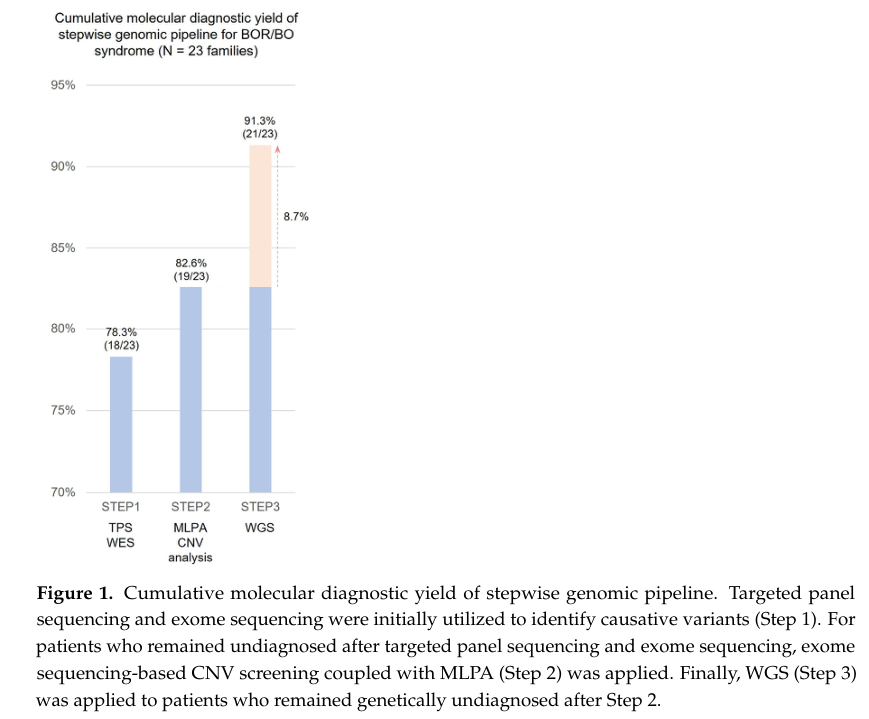

## Question

# Disease Characteristics Research Template

## Target Disease
- **Disease Name:** EYA1-Related Branchiootorenal Spectrum Disorder
- **MONDO ID:**  (if available)
- **Category:** Genetic

## Research Objectives

Please provide a comprehensive research report on **EYA1-Related Branchiootorenal Spectrum Disorder** covering all of the
disease characteristics listed below. This report will be used to populate a disease knowledge
base entry. Be thorough and cite primary literature (PMID preferred) for all claims.

For each section, **suggested databases/resources** are listed. These are the first places
you should search for information on each topic.

---

### 1. Disease Information
> **Search first:** OMIM, Orphanet, ICD-10/ICD-11, MeSH, PubMed

- What is the disease? Provide a concise overview.
- What are the key identifiers? (OMIM, Orphanet, ICD-10/ICD-11, MeSH, Mondo)
- What are the common synonyms and alternative names?
- Is the information derived from individual patients (e.g., EHR) or aggregated disease-level resources?

### 2. Etiology

- **Disease Causal Factors**: What are the primary causes? (genetic, environmental, infectious, mechanistic)
- **Risk Factors**:
  > **Search first:** PubMed, Cochrane Library, UpToDate, clinical guidelines, ClinVar, ClinGen, GWAS Catalog, PheGenI, CTD, CDC, WHO, epidemiological databases
  - Genetic risk factors (causal variants, susceptibility loci, modifier genes)
  - Environmental risk factors (toxins, lifestyle, occupational exposures, age, sex, family history)
- **Protective Factors**:
  > **Search first:** PubMed, Cochrane Library, clinical trial databases, GWAS Catalog, gnomAD, WHO, CDC, nutrition databases
  - Genetic protective factors (protective variants, modifier alleles)
  - Environmental protective factors (diet, lifestyle, exposures that reduce risk)
- **Gene-Environment Interactions**: How do genetic and environmental factors interact to influence disease?
  > **Search first:** CTD, PubMed, PheGenI, GxE databases

### 3. Phenotypes
> **Search first:** HPO (Human Phenotype Ontology), OMIM, Orphanet, PubMed, clinicaltrials.gov, MedDRA, SNOMED CT, DECIPHER, LOINC

For each phenotype, provide:
- **Phenotype type**: symptoms, clinical signs, physical manifestations, behavioral changes, or laboratory abnormalities
  > For symptoms/signs: HPO, OMIM, Orphanet, PubMed
  > For behavioral changes: HPO, DSM, RDoC (Research Domain Criteria), PubMed
  > For laboratory abnormalities: LOINC, SNOMED CT, LabTests Online, PubMed
- **Phenotype characteristics**:
  > **Search first:** OMIM, Orphanet, HPO, PubMed
  - Age of symptom onset (neonatal, childhood, adult-onset, late-onset)
  - Symptom severity (mild, moderate, severe, variable)
  - Symptom progression (stable, progressive, episodic, fluctuating)
  - Frequency among affected individuals (percentage or qualitative)
- **Quality of life impact**: Effects on daily functioning and well-being (per-phenotype when possible)
  > **Search first:** EQ-5D database, SF-36, WHO QOL databases, PubMed
- Suggest HPO (Human Phenotype Ontology) terms for each phenotype

### 4. Genetic/Molecular Information

- **Causal Genes**: Gene mutations or chromosomal abnormalities responsible for disease (gene symbols, OMIM IDs)
  > **Search first:** OMIM, ClinVar, HGMD, Ensembl, NCBI Gene
- **Pathogenic Variants**:
  - Affected genes (gene symbols, HGNC IDs)
    > **Search first:** OMIM, NCBI Gene, Ensembl, HGNC, UniProt, GeneCards
  - Variant classification (pathogenic, likely pathogenic, VUS per ACMG/AMP guidelines)
    > **Search first:** ClinVar, ClinGen, ACMG/AMP guidelines, VarSome
  - Variant type/class (missense, frameshift, nonsense, splice-site, structural)
  - Allele frequency in population databases
    > **Search first:** gnomAD, 1000 Genomes, ExAC, TOPMed, dbSNP
  - Somatic vs germline origin
    > **Search first:** COSMIC (somatic), ClinVar, ICGC, TCGA
  - Functional consequences (loss of function, gain of function, dominant negative)
- **Modifier Genes**: Genes that modify disease severity or expression
- **Epigenetic Information**: DNA methylation, histone modifications, chromatin changes affecting disease
  > **Search first:** ENCODE, Roadmap Epigenomics, MethBase, DiseaseMeth
- **Chromosomal Abnormalities**: Large-scale genetic changes (aneuploidy, translocations, inversions)
  > **Search first:** DECIPHER, ClinVar, ECARUCA, UCSC Genome Browser

### 5. Environmental Information

- **Environmental Factors**: Non-genetic contributing factors (toxins, radiation, pollution, occupational exposure)
  > **Search first:** CTD (Comparative Toxicogenomics Database), TOXNET, PubMed, EPA databases
- **Lifestyle Factors**: Behavioral factors (smoking, diet, exercise, alcohol consumption)
  > **Search first:** CDC databases, WHO, PubMed, NHANES
- **Infectious Agents**: If applicable, pathogens causing or triggering disease (bacteria, viruses, fungi, parasites)
  > **Search first:** NCBI Taxonomy, ViPR, BV-BRC, MicrobeDB, GIDEON

### 6. Mechanism / Pathophysiology

- **Molecular Pathways**: Specific signaling cascades or biochemical pathways involved (Wnt, MAPK, mTOR, PI3K-AKT, etc.)
  > **Search first:** KEGG, Reactome, WikiPathways, PathBank, BioCyc
- **Cellular Processes**: Cell-level mechanisms (apoptosis, autophagy, cell cycle dysregulation, inflammation, etc.)
  > **Search first:** Gene Ontology (GO), Reactome, KEGG, PubMed
- **Protein Dysfunction**: How protein structure or function is altered (misfolding, aggregation, loss of function, gain of function)
  > **Search first:** UniProt, PDB (Protein Data Bank), InterPro, Pfam, AlphaFold
- **Metabolic Changes**: Alterations in metabolic processes (energy metabolism, lipid metabolism, amino acid metabolism)
  > **Search first:** KEGG, BioCyc, HMDB (Human Metabolome Database), BRENDA
- **Immune System Involvement**: Role of immune response (autoimmunity, immunodeficiency, chronic inflammation)
  > **Search first:** ImmPort, Immunome Database, IEDB, Gene Ontology
- **Tissue Damage Mechanisms**: How tissues/ are injured (oxidative stress, ischemia, fibrosis, necrosis)
  > **Search first:** PubMed, Gene Ontology, Reactome
- **Biochemical Abnormalities**: Specific molecular defects (enzyme deficiencies, receptor dysfunction, ion channel defects)
  > **Search first:** BRENDA, UniProt, KEGG, OMIM, PubMed
- **Epigenetic Changes**: DNA methylation, histone modifications affecting gene expression in disease
  > **Search first:** ENCODE, Roadmap Epigenomics, MethBase, DiseaseMeth
- **Molecular Profiling** (if available):
  - Transcriptomics/gene expression changes
    > **Search first:** GEO (Gene Expression Omnibus), ArrayExpress, GTEx, Human Cell Atlas, SRA
  - Proteomics findings
    > **Search first:** PRIDE, ProteomeXchange, Human Protein Atlas, STRING, BioGRID
  - Metabolomics signatures
    > **Search first:** MetaboLights, Metabolomics Workbench, HMDB, METLIN
  - Lipidomics alterations
    > **Search first:** LIPID MAPS, SwissLipids, LipidHome, Metabolomics Workbench
  - Genomic structural features
    > **Search first:** UCSC Genome Browser, Ensembl, NCBI, dbVar, DGV
- **Advanced Technologies** (if applicable):
  - Single-cell analysis findings (cell-type specific mechanisms, cellular heterogeneity)
    > **Search first:** Human Cell Atlas, Single Cell Portal, GEO, CELLxGENE
  - Spatial transcriptomics findings
    > **Search first:** GEO, Spatial Research, Vizgen, 10x Genomics data
  - Multi-omics integration results
    > **Search first:** TCGA, ICGC, cBioPortal, LinkedOmics, PubMed
  - Functional genomics screens (CRISPR, RNAi)
    > **Search first:** DepMap, GenomeRNAi, PubMed, BioGRID ORCS

For each mechanism, describe:
- The causal chain from initial trigger to clinical manifestation
- Which mechanisms are upstream vs downstream
- What cell types and biological processes are involved
- Suggest GO terms for biological processes and CL terms for cell types

### 7. Anatomical Structures Affected

- **Organ Level**:
  - Primary organs directly affected
  - Secondary organ involvement (complications, secondary effects)
  - Body systems involved (cardiovascular, nervous, digestive, respiratory, endocrine, etc.)
  > **Search first:** Uberon, FMA (Foundational Model of Anatomy), OMIM, HPO, ICD-11, MeSH, SNOMED CT
- **Tissue and Cell Level**:
  - Specific tissue types affected (epithelial, connective, muscle, nervous)
  - Specific cell populations targeted (with Cell Ontology terms)
  > **Search first:** Uberon, Human Protein Atlas, Cell Ontology, Human Cell Atlas, CellMarker, PanglaoDB
- **Subcellular Level**:
  - Cellular compartments involved (mitochondria, nucleus, ER, lysosomes) (with GO Cellular Component terms)
  > **Search first:** Gene Ontology (Cellular Component), UniProt, Human Protein Atlas
- **Localization**:
  - Specific anatomical sites (with UBERON terms)
    > **Search first:** FMA, Uberon, NeuroNames (for brain), SNOMED CT
  - Lateralization (unilateral, bilateral, asymmetric)
    > **Search first:** HPO, clinical literature, imaging databases

### 8. Temporal Development

- **Onset**:
  - Typical age of onset (congenital, pediatric, adult, geriatric)
  - Onset pattern (acute, subacute, chronic, insidious)
  > **Search first:** OMIM, Orphanet, HPO, PubMed
- **Progression**:
  - Disease stages (early, intermediate, advanced, end-stage)
    > **Search first:** Cancer Staging Manual (AJCC), WHO classifications, PubMed
  - Progression rate (rapid, slow, variable)
  - Disease course pattern (episodic, relapsing-remitting, progressive, stable)
  - Disease duration (self-limited, chronic lifelong)
  > **Search first:** Disease registries, longitudinal cohort databases, natural history studies, PubMed, Orphanet, OMIM
- **Patterns**:
  - Remission patterns (spontaneous, treatment-induced)
    > **Search first:** Clinical trial databases, disease registries, PubMed
  - Critical periods (time windows of vulnerability or opportunity for intervention)
    > **Search first:** PubMed, developmental biology databases, clinical guidelines

### 9. Inheritance and Population

- **Epidemiology**:
  - Prevalence (cases per 100,000 at given time)
  - Incidence (new cases per 100,000 per year)
  > **Search first:** Orphanet, CDC, WHO, GBD (Global Burden of Disease), national registries, SEER, disease registries
- **For Genetic Etiology**:
  - Inheritance pattern (AD, AR, X-linked, mitochondrial, multifactorial, polygenic)
    > **Search first:** OMIM, Orphanet, ClinVar, GTR (Genetic Testing Registry)
  - Penetrance (complete, incomplete, age-dependent)
    > **Search first:** ClinVar, OMIM, PubMed, ClinGen
  - Expressivity (variable, consistent)
    > **Search first:** OMIM, ClinVar, PubMed
  - Genetic anticipation (increasing severity in successive generations)
    > **Search first:** OMIM, PubMed (especially for repeat expansion disorders)
  - Germline mosaicism
    > **Search first:** ClinVar, OMIM, genetic counseling literature, PubMed
  - Founder effects (population-specific mutations)
    > **Search first:** gnomAD, population genetics databases, PubMed
  - Consanguinity role
    > **Search first:** OMIM, population studies, genetic counseling resources
  - Carrier frequency
    > **Search first:** gnomAD, carrier screening databases, GeneReviews, GTR
- **Population Demographics**:
  - Affected populations (ethnic or demographic groups with higher prevalence)
    > **Search first:** gnomAD, 1000 Genomes, PAGE Study, PubMed, population registries
  - Geographic distribution (endemic areas, regional variation)
    > **Search first:** WHO, CDC, GBD, Orphanet, geographic epidemiology databases
  - Geographic distribution of specific variants
  - Sex ratio (male:female)
    > **Search first:** Disease registries, OMIM, PubMed, epidemiological databases
  - Age distribution of affected individuals
    > **Search first:** CDC, disease registries, SEER, Orphanet

### 10. Diagnostics

- **Clinical Tests**:
  - Laboratory tests (blood, urine, tissue chemistry, specific enzyme assays)
    > **Search first:** LOINC, LabTests Online, PubMed
  - Biomarkers (proteins, metabolites, genetic markers, circulating biomarkers)
    > **Search first:** FDA Biomarker List, BEST (Biomarkers, EndpointS, and other Tools), PubMed
  - Imaging studies (X-ray, CT, MRI, PET, ultrasound)
    > **Search first:** RadLex, DICOM, Radiopaedia, imaging databases
  - Functional tests (pulmonary function, cardiac stress tests)
    > **Search first:** LOINC, clinical guidelines, PubMed
  - Electrophysiology (EEG, EMG, ECG, nerve conduction studies)
    > **Search first:** LOINC, clinical neurophysiology databases, PubMed
  - Biopsy findings (histopathology, immunohistochemistry)
    > **Search first:** SNOMED CT, College of American Pathologists resources, PubMed
  - Pathology findings (microscopic examination)
    > **Search first:** SNOMED CT, Digital Pathology databases, PubMed
- **Genetic Testing**:
  > **Search first:** GTR (Genetic Testing Registry), GeneReviews, ClinGen
  - Overview of recommended genetic testing approach
  - Whole genome sequencing (WGS) utility
    > **Search first:** GTR, ClinVar, GEL (Genomics England), gnomAD
  - Whole exome sequencing (WES) utility
    > **Search first:** GTR, ClinVar, OMIM, GeneMatcher
  - Gene panels (which panels, which genes)
    > **Search first:** GTR, ClinVar, laboratory-specific databases
  - Single gene testing
    > **Search first:** GTR, ClinVar, OMIM, GeneReviews
  - Chromosomal microarray (CMA)
    > **Search first:** DECIPHER, ClinVar, dbVar, ECARUCA
  - Karyotyping
    > **Search first:** Chromosome Abnormality Database, ClinVar, cytogenetics resources
  - FISH
    > **Search first:** ClinVar, cytogenetics databases, PubMed
  - Mitochondrial DNA testing
    > **Search first:** MITOMAP, MSeqDR, ClinVar, GTR
  - Repeat expansion testing
    > **Search first:** GTR, ClinVar, repeat expansion databases, PubMed
- **Omics-Based Diagnostics** (if applicable):
  - RNA sequencing / transcriptomics
    > **Search first:** GEO, ArrayExpress, GTEx, RNA-seq databases
  - Proteomics
    > **Search first:** PRIDE, ProteomeXchange, FDA Biomarker database
  - Metabolomics
    > **Search first:** MetaboLights, Metabolomics Workbench, HMDB
  - Epigenomics
    > **Search first:** GEO, ENCODE, Roadmap Epigenomics, MethBase
  - Liquid biopsy
    > **Search first:** COSMIC, ClinVar, liquid biopsy databases, PubMed
- **Clinical Criteria**:
  - Standardized diagnostic criteria (DSM, ICD, society guidelines)
    > **Search first:** DSM-5, ICD-11, clinical society guidelines, UpToDate
  - Differential diagnosis (other conditions to rule out, with distinguishing features)
    > **Search first:** DynaMed, UpToDate, clinical decision support systems
- **Screening**:
  - Screening methods for asymptomatic individuals (newborn screening, carrier screening, cascade screening)
    > **Search first:** ACMG recommendations, CDC newborn screening, GTR

### 11. Outcome/Prognosis

- **Survival and Mortality**:
  - Survival rate (5-year, 10-year, overall)
    > **Search first:** SEER, cancer registries, disease-specific registries, PubMed
  - Life expectancy (with and without treatment if applicable)
    > **Search first:** Orphanet, disease registries, actuarial databases, PubMed
  - Mortality rate
    > **Search first:** CDC, WHO, GBD, national mortality databases
  - Disease-specific mortality (deaths directly attributable to disease)
    > **Search first:** Disease registries, CDC Wonder, GBD, PubMed
- **Morbidity and Function**:
  - Morbidity (disease-related disability and health impacts)
    > **Search first:** GBD, WHO, disability databases, PubMed
  - Disability outcomes (long-term functional impairments)
    > **Search first:** ICF (International Classification of Functioning), disability registries
  - Quality of life measures (EQ-5D, SF-36, PROMIS, disease-specific tools)
    > **Search first:** EQ-5D database, SF-36, PROMIS, PubMed
- **Disease Course**:
  - Complications (secondary problems: infections, organ failure, etc.)
    > **Search first:** ICD codes, disease registries, clinical databases, PubMed
  - Recovery potential (likelihood and extent of recovery, with vs without treatment)
    > **Search first:** Natural history studies, rehabilitation databases, PubMed
- **Prediction**:
  - Prognostic factors (age, disease severity, biomarkers, treatment response)
    > **Search first:** Prognostic models databases, clinical calculators, PubMed
  - Prognostic biomarkers (molecular markers predicting disease course)
    > **Search first:** FDA Biomarker database, PubMed, cancer prognostic databases

### 12. Treatment

- **Pharmacotherapy**:
  - Pharmacological treatments (drug names, drug classes, mechanisms of action)
    > **Search first:** DrugBank, RxNorm, ATC classification, DailyMed, FDA databases
  - Pharmacogenomics (how genetic variants affect drug metabolism, efficacy, toxicity)
    > **Search first:** PharmGKB, CPIC (Clinical Pharmacogenetics), FDA Table of PGx Biomarkers
- **Advanced Therapeutics**:
  - Gene therapy (viral vectors, CRISPR, gene replacement, gene editing)
    > **Search first:** ClinicalTrials.gov, FDA gene therapy database, ASGCT resources
  - Cell therapy (stem cell transplant, CAR-T, cellular therapeutics)
    > **Search first:** ClinicalTrials.gov, FDA cell therapy database, FACT standards
  - RNA-based therapies (ASOs, siRNA, mRNA therapies)
    > **Search first:** ClinicalTrials.gov, FDA approvals, PubMed
  - Targeted therapies (treatments directed at specific molecular targets)
    > **Search first:** My Cancer Genome, OncoKB, ClinicalTrials.gov, FDA approvals
  - Immunotherapies (checkpoint inhibitors, monoclonal antibodies)
    > **Search first:** Cancer Immunotherapy Database, FDA approvals, ClinicalTrials.gov
- **Surgical and Interventional**:
  - Surgical interventions (types of surgery, timing, outcomes)
    > **Search first:** CPT codes, surgical registries, clinical guidelines, PubMed
- **Supportive and Rehabilitative**:
  - Supportive care (symptom management, pain control, nutrition)
    > **Search first:** Clinical guidelines, Cochrane Library, PubMed
  - Rehabilitation (physical therapy, occupational therapy, speech therapy)
    > **Search first:** Rehabilitation medicine databases, clinical guidelines, PubMed
- **Experimental**:
  - Experimental treatments in clinical trials (with NCT identifiers if available)
    > **Search first:** ClinicalTrials.gov, EU Clinical Trials Register, WHO ICTRP
- **Treatment Outcomes**:
  - Treatment response rates
    > **Search first:** Clinical trial databases, FDA reviews, systematic reviews, PubMed
  - Side effects and adverse events
    > **Search first:** FDA Adverse Event Reporting System (FAERS), MedWatch, PubMed
- **Treatment Strategy**:
  - Treatment algorithms (clinical pathways, decision trees)
    > **Search first:** Clinical practice guidelines, NCCN Guidelines, UpToDate
  - Combination therapies
    > **Search first:** ClinicalTrials.gov, treatment guidelines, PubMed
  - Personalized medicine approaches (genotype-guided treatment)
    > **Search first:** My Cancer Genome, CIViC, PharmGKB, precision medicine databases

For each treatment, suggest NCIT (NCI Thesaurus) clinical-intervention terms where applicable.

### 13. Prevention

- **Prevention Levels**:
  - Primary prevention (preventing disease occurrence: vaccination, risk factor modification)
    > **Search first:** CDC, WHO, USPSTF recommendations, Cochrane Library
  - Secondary prevention (early detection and treatment: screening programs, early intervention)
    > **Search first:** USPSTF, CDC screening guidelines, WHO
  - Tertiary prevention (preventing complications in those with disease)
    > **Search first:** Clinical guidelines, disease management protocols, PubMed
- **Immunization**: Vaccine strategies (if applicable)
  > **Search first:** CDC vaccine schedules, WHO immunization, FDA vaccine database
- **Screening and Early Detection**:
  - Screening programs (population-based: newborn screening, cancer screening)
    > **Search first:** CDC screening programs, USPSTF, cancer screening databases
  - Genetic screening (carrier screening, preimplantation genetic diagnosis, prenatal testing)
    > **Search first:** ACMG recommendations, ACOG guidelines, GTR
  - Risk stratification (identifying high-risk individuals for targeted prevention)
    > **Search first:** Risk prediction models, clinical calculators, PubMed
- **Behavioral Interventions**: Lifestyle modifications to reduce risk
  > **Search first:** CDC, WHO, behavioral intervention databases, Cochrane Library
- **Counseling**: Genetic counseling (risk assessment, family planning guidance)
  > **Search first:** NSGC resources, ACMG guidelines, GeneReviews
- **Public Health**:
  - Public health interventions (sanitation, vector control, health education)
    > **Search first:** CDC, WHO, public health databases, PubMed
  - Environmental interventions (reducing environmental risk factors)
    > **Search first:** EPA databases, WHO environmental health, PubMed
- **Prophylaxis**: Preventive medications or procedures
  > **Search first:** Clinical guidelines, FDA approvals, PubMed

### 14. Other Species / Natural Disease

- **Taxonomy**: Species affected (with NCBI Taxon identifiers)
  > **Search first:** NCBI Taxonomy
- **Breed**: Specific breeds affected (with VBO identifiers if applicable)
  > **Search first:** VBO (Vertebrate Breed Ontology)
- **Gene**: Orthologous genes in other species (with NCBI Gene IDs)
  > **Search first:** NCBI Gene
- **Natural Disease**:
  - Naturally occurring disease in other species (companion animals, wildlife)
    > **Search first:** OMIA (Online Mendelian Inheritance in Animals), VetCompass, PubMed
  - Veterinary relevance and importance in animal health
    > **Search first:** OMIA, veterinary databases, PubMed
- **Comparative Biology**:
  - Comparative pathology (similarities and differences across species)
    > **Search first:** OMIA, comparative pathology databases, PubMed
  - Evolutionary conservation of disease mechanisms
    > **Search first:** HomoloGene, OrthoMCL, Alliance of Genome Resources
- **Transmission** (if applicable):
  - Zoonotic potential
    > **Search first:** CDC zoonotic diseases, WHO zoonoses, GIDEON
  - Cross-species susceptibility
    > **Search first:** NCBI Taxonomy, veterinary databases, PubMed

### 15. Model Organisms

- **Model Types**:
  - Model organism type (mammalian, invertebrate, cellular, in vitro)
    > **Search first:** Alliance of Genome Resources, model organism databases
  - Specific model systems (mouse, rat, zebrafish, Drosophila, C. elegans, yeast, cell lines, organoids, iPSCs)
    > **Search first:** MGI, RGD, ZFIN, FlyBase, WormBase, SGD, ATCC, Cellosaurus
  - Induced models (drug treatment, surgical intervention, environmental manipulation)
    > **Search first:** MGI, model organism databases, PubMed
- **Genetic Models**:
  - Types available (knockout, knock-in, transgenic, conditional, humanized)
    > **Search first:** MGI, IMPC, KOMP, EuMMCR, IMSR
- **Model Characteristics**:
  - Phenotype recapitulation (how well model reproduces human disease features)
    > **Search first:** Model organism databases, comparative studies, PubMed
  - Model limitations (aspects of human disease not captured)
    > **Search first:** Model organism databases, PubMed, review articles
- **Applications**:
  - Research applications (what aspects of disease can be studied)
    > **Search first:** Model organism databases, PubMed
- **Resources**:
  - Model databases
    > **Search first:** MGI, RGD, ZFIN, FlyBase, WormBase, IMSR, EMMA, MMRRC

---

## Citation Requirements

- Cite primary literature (PMID preferred) for all mechanistic and clinical claims
- Prioritize recent reviews and landmark papers
- Include direct quotes from abstracts where possible to support key statements
- Distinguish evidence source types: human clinical, model organism, in vitro, computational

## Output Format

Structure your response as a comprehensive narrative organized by the sections above.
For each section, provide:
- Factual content with specific details (numbers, percentages, gene names, variant nomenclature)
- Ontology term suggestions (HPO, GO, CL, UBERON, CHEBI, NCIT, MONDO) where applicable
- Evidence citations with PMIDs
- Direct quotes from abstracts to support key claims
- Clear indication when information is not available or not applicable for this disease

This report will be used to populate a disease knowledge base entry with:
- Pathophysiology descriptions with causal chains
- Gene/protein annotations (HGNC, GO terms)
- Phenotype associations (HP terms) with frequencies
- Cell type involvement (CL terms)
- Anatomical locations (UBERON terms)
- Chemical entities (CHEBI terms)
- Treatment annotations (NCIT terms)
- Evidence items with PMIDs and exact abstract quotes
- Epidemiology, prognosis, diagnostic, and prevention information
- Animal model descriptions with phenotype recapitulation details

## Output

Question: You are an expert researcher providing comprehensive, well-cited information.

Provide detailed information focusing on:
1. Key concepts and definitions with current understanding
2. Recent developments and latest research (prioritize 2023-2024 sources)
3. Current applications and real-world implementations
4. Expert opinions and analysis from authoritative sources
5. Relevant statistics and data from recent studies

Format as a comprehensive research report with proper citations. Include URLs and publication dates where available.
Always prioritize recent, authoritative sources and provide specific citations for all major claims.

# Disease Characteristics Research Template

## Target Disease
- **Disease Name:** EYA1-Related Branchiootorenal Spectrum Disorder
- **MONDO ID:**  (if available)
- **Category:** Genetic

## Research Objectives

Please provide a comprehensive research report on **EYA1-Related Branchiootorenal Spectrum Disorder** covering all of the
disease characteristics listed below. This report will be used to populate a disease knowledge
base entry. Be thorough and cite primary literature (PMID preferred) for all claims.

For each section, **suggested databases/resources** are listed. These are the first places
you should search for information on each topic.

---

### 1. Disease Information
> **Search first:** OMIM, Orphanet, ICD-10/ICD-11, MeSH, PubMed

- What is the disease? Provide a concise overview.
- What are the key identifiers? (OMIM, Orphanet, ICD-10/ICD-11, MeSH, Mondo)
- What are the common synonyms and alternative names?
- Is the information derived from individual patients (e.g., EHR) or aggregated disease-level resources?

### 2. Etiology

- **Disease Causal Factors**: What are the primary causes? (genetic, environmental, infectious, mechanistic)
- **Risk Factors**:
  > **Search first:** PubMed, Cochrane Library, UpToDate, clinical guidelines, ClinVar, ClinGen, GWAS Catalog, PheGenI, CTD, CDC, WHO, epidemiological databases
  - Genetic risk factors (causal variants, susceptibility loci, modifier genes)
  - Environmental risk factors (toxins, lifestyle, occupational exposures, age, sex, family history)
- **Protective Factors**:
  > **Search first:** PubMed, Cochrane Library, clinical trial databases, GWAS Catalog, gnomAD, WHO, CDC, nutrition databases
  - Genetic protective factors (protective variants, modifier alleles)
  - Environmental protective factors (diet, lifestyle, exposures that reduce risk)
- **Gene-Environment Interactions**: How do genetic and environmental factors interact to influence disease?
  > **Search first:** CTD, PubMed, PheGenI, GxE databases

### 3. Phenotypes
> **Search first:** HPO (Human Phenotype Ontology), OMIM, Orphanet, PubMed, clinicaltrials.gov, MedDRA, SNOMED CT, DECIPHER, LOINC

For each phenotype, provide:
- **Phenotype type**: symptoms, clinical signs, physical manifestations, behavioral changes, or laboratory abnormalities
  > For symptoms/signs: HPO, OMIM, Orphanet, PubMed
  > For behavioral changes: HPO, DSM, RDoC (Research Domain Criteria), PubMed
  > For laboratory abnormalities: LOINC, SNOMED CT, LabTests Online, PubMed
- **Phenotype characteristics**:
  > **Search first:** OMIM, Orphanet, HPO, PubMed
  - Age of symptom onset (neonatal, childhood, adult-onset, late-onset)
  - Symptom severity (mild, moderate, severe, variable)
  - Symptom progression (stable, progressive, episodic, fluctuating)
  - Frequency among affected individuals (percentage or qualitative)
- **Quality of life impact**: Effects on daily functioning and well-being (per-phenotype when possible)
  > **Search first:** EQ-5D database, SF-36, WHO QOL databases, PubMed
- Suggest HPO (Human Phenotype Ontology) terms for each phenotype

### 4. Genetic/Molecular Information

- **Causal Genes**: Gene mutations or chromosomal abnormalities responsible for disease (gene symbols, OMIM IDs)
  > **Search first:** OMIM, ClinVar, HGMD, Ensembl, NCBI Gene
- **Pathogenic Variants**:
  - Affected genes (gene symbols, HGNC IDs)
    > **Search first:** OMIM, NCBI Gene, Ensembl, HGNC, UniProt, GeneCards
  - Variant classification (pathogenic, likely pathogenic, VUS per ACMG/AMP guidelines)
    > **Search first:** ClinVar, ClinGen, ACMG/AMP guidelines, VarSome
  - Variant type/class (missense, frameshift, nonsense, splice-site, structural)
  - Allele frequency in population databases
    > **Search first:** gnomAD, 1000 Genomes, ExAC, TOPMed, dbSNP
  - Somatic vs germline origin
    > **Search first:** COSMIC (somatic), ClinVar, ICGC, TCGA
  - Functional consequences (loss of function, gain of function, dominant negative)
- **Modifier Genes**: Genes that modify disease severity or expression
- **Epigenetic Information**: DNA methylation, histone modifications, chromatin changes affecting disease
  > **Search first:** ENCODE, Roadmap Epigenomics, MethBase, DiseaseMeth
- **Chromosomal Abnormalities**: Large-scale genetic changes (aneuploidy, translocations, inversions)
  > **Search first:** DECIPHER, ClinVar, ECARUCA, UCSC Genome Browser

### 5. Environmental Information

- **Environmental Factors**: Non-genetic contributing factors (toxins, radiation, pollution, occupational exposure)
  > **Search first:** CTD (Comparative Toxicogenomics Database), TOXNET, PubMed, EPA databases
- **Lifestyle Factors**: Behavioral factors (smoking, diet, exercise, alcohol consumption)
  > **Search first:** CDC databases, WHO, PubMed, NHANES
- **Infectious Agents**: If applicable, pathogens causing or triggering disease (bacteria, viruses, fungi, parasites)
  > **Search first:** NCBI Taxonomy, ViPR, BV-BRC, MicrobeDB, GIDEON

### 6. Mechanism / Pathophysiology

- **Molecular Pathways**: Specific signaling cascades or biochemical pathways involved (Wnt, MAPK, mTOR, PI3K-AKT, etc.)
  > **Search first:** KEGG, Reactome, WikiPathways, PathBank, BioCyc
- **Cellular Processes**: Cell-level mechanisms (apoptosis, autophagy, cell cycle dysregulation, inflammation, etc.)
  > **Search first:** Gene Ontology (GO), Reactome, KEGG, PubMed
- **Protein Dysfunction**: How protein structure or function is altered (misfolding, aggregation, loss of function, gain of function)
  > **Search first:** UniProt, PDB (Protein Data Bank), InterPro, Pfam, AlphaFold
- **Metabolic Changes**: Alterations in metabolic processes (energy metabolism, lipid metabolism, amino acid metabolism)
  > **Search first:** KEGG, BioCyc, HMDB (Human Metabolome Database), BRENDA
- **Immune System Involvement**: Role of immune response (autoimmunity, immunodeficiency, chronic inflammation)
  > **Search first:** ImmPort, Immunome Database, IEDB, Gene Ontology
- **Tissue Damage Mechanisms**: How tissues/ are injured (oxidative stress, ischemia, fibrosis, necrosis)
  > **Search first:** PubMed, Gene Ontology, Reactome
- **Biochemical Abnormalities**: Specific molecular defects (enzyme deficiencies, receptor dysfunction, ion channel defects)
  > **Search first:** BRENDA, UniProt, KEGG, OMIM, PubMed
- **Epigenetic Changes**: DNA methylation, histone modifications affecting gene expression in disease
  > **Search first:** ENCODE, Roadmap Epigenomics, MethBase, DiseaseMeth
- **Molecular Profiling** (if available):
  - Transcriptomics/gene expression changes
    > **Search first:** GEO (Gene Expression Omnibus), ArrayExpress, GTEx, Human Cell Atlas, SRA
  - Proteomics findings
    > **Search first:** PRIDE, ProteomeXchange, Human Protein Atlas, STRING, BioGRID
  - Metabolomics signatures
    > **Search first:** MetaboLights, Metabolomics Workbench, HMDB, METLIN
  - Lipidomics alterations
    > **Search first:** LIPID MAPS, SwissLipids, LipidHome, Metabolomics Workbench
  - Genomic structural features
    > **Search first:** UCSC Genome Browser, Ensembl, NCBI, dbVar, DGV
- **Advanced Technologies** (if applicable):
  - Single-cell analysis findings (cell-type specific mechanisms, cellular heterogeneity)
    > **Search first:** Human Cell Atlas, Single Cell Portal, GEO, CELLxGENE
  - Spatial transcriptomics findings
    > **Search first:** GEO, Spatial Research, Vizgen, 10x Genomics data
  - Multi-omics integration results
    > **Search first:** TCGA, ICGC, cBioPortal, LinkedOmics, PubMed
  - Functional genomics screens (CRISPR, RNAi)
    > **Search first:** DepMap, GenomeRNAi, PubMed, BioGRID ORCS

For each mechanism, describe:
- The causal chain from initial trigger to clinical manifestation
- Which mechanisms are upstream vs downstream
- What cell types and biological processes are involved
- Suggest GO terms for biological processes and CL terms for cell types

### 7. Anatomical Structures Affected

- **Organ Level**:
  - Primary organs directly affected
  - Secondary organ involvement (complications, secondary effects)
  - Body systems involved (cardiovascular, nervous, digestive, respiratory, endocrine, etc.)
  > **Search first:** Uberon, FMA (Foundational Model of Anatomy), OMIM, HPO, ICD-11, MeSH, SNOMED CT
- **Tissue and Cell Level**:
  - Specific tissue types affected (epithelial, connective, muscle, nervous)
  - Specific cell populations targeted (with Cell Ontology terms)
  > **Search first:** Uberon, Human Protein Atlas, Cell Ontology, Human Cell Atlas, CellMarker, PanglaoDB
- **Subcellular Level**:
  - Cellular compartments involved (mitochondria, nucleus, ER, lysosomes) (with GO Cellular Component terms)
  > **Search first:** Gene Ontology (Cellular Component), UniProt, Human Protein Atlas
- **Localization**:
  - Specific anatomical sites (with UBERON terms)
    > **Search first:** FMA, Uberon, NeuroNames (for brain), SNOMED CT
  - Lateralization (unilateral, bilateral, asymmetric)
    > **Search first:** HPO, clinical literature, imaging databases

### 8. Temporal Development

- **Onset**:
  - Typical age of onset (congenital, pediatric, adult, geriatric)
  - Onset pattern (acute, subacute, chronic, insidious)
  > **Search first:** OMIM, Orphanet, HPO, PubMed
- **Progression**:
  - Disease stages (early, intermediate, advanced, end-stage)
    > **Search first:** Cancer Staging Manual (AJCC), WHO classifications, PubMed
  - Progression rate (rapid, slow, variable)
  - Disease course pattern (episodic, relapsing-remitting, progressive, stable)
  - Disease duration (self-limited, chronic lifelong)
  > **Search first:** Disease registries, longitudinal cohort databases, natural history studies, PubMed, Orphanet, OMIM
- **Patterns**:
  - Remission patterns (spontaneous, treatment-induced)
    > **Search first:** Clinical trial databases, disease registries, PubMed
  - Critical periods (time windows of vulnerability or opportunity for intervention)
    > **Search first:** PubMed, developmental biology databases, clinical guidelines

### 9. Inheritance and Population

- **Epidemiology**:
  - Prevalence (cases per 100,000 at given time)
  - Incidence (new cases per 100,000 per year)
  > **Search first:** Orphanet, CDC, WHO, GBD (Global Burden of Disease), national registries, SEER, disease registries
- **For Genetic Etiology**:
  - Inheritance pattern (AD, AR, X-linked, mitochondrial, multifactorial, polygenic)
    > **Search first:** OMIM, Orphanet, ClinVar, GTR (Genetic Testing Registry)
  - Penetrance (complete, incomplete, age-dependent)
    > **Search first:** ClinVar, OMIM, PubMed, ClinGen
  - Expressivity (variable, consistent)
    > **Search first:** OMIM, ClinVar, PubMed
  - Genetic anticipation (increasing severity in successive generations)
    > **Search first:** OMIM, PubMed (especially for repeat expansion disorders)
  - Germline mosaicism
    > **Search first:** ClinVar, OMIM, genetic counseling literature, PubMed
  - Founder effects (population-specific mutations)
    > **Search first:** gnomAD, population genetics databases, PubMed
  - Consanguinity role
    > **Search first:** OMIM, population studies, genetic counseling resources
  - Carrier frequency
    > **Search first:** gnomAD, carrier screening databases, GeneReviews, GTR
- **Population Demographics**:
  - Affected populations (ethnic or demographic groups with higher prevalence)
    > **Search first:** gnomAD, 1000 Genomes, PAGE Study, PubMed, population registries
  - Geographic distribution (endemic areas, regional variation)
    > **Search first:** WHO, CDC, GBD, Orphanet, geographic epidemiology databases
  - Geographic distribution of specific variants
  - Sex ratio (male:female)
    > **Search first:** Disease registries, OMIM, PubMed, epidemiological databases
  - Age distribution of affected individuals
    > **Search first:** CDC, disease registries, SEER, Orphanet

### 10. Diagnostics

- **Clinical Tests**:
  - Laboratory tests (blood, urine, tissue chemistry, specific enzyme assays)
    > **Search first:** LOINC, LabTests Online, PubMed
  - Biomarkers (proteins, metabolites, genetic markers, circulating biomarkers)
    > **Search first:** FDA Biomarker List, BEST (Biomarkers, EndpointS, and other Tools), PubMed
  - Imaging studies (X-ray, CT, MRI, PET, ultrasound)
    > **Search first:** RadLex, DICOM, Radiopaedia, imaging databases
  - Functional tests (pulmonary function, cardiac stress tests)
    > **Search first:** LOINC, clinical guidelines, PubMed
  - Electrophysiology (EEG, EMG, ECG, nerve conduction studies)
    > **Search first:** LOINC, clinical neurophysiology databases, PubMed
  - Biopsy findings (histopathology, immunohistochemistry)
    > **Search first:** SNOMED CT, College of American Pathologists resources, PubMed
  - Pathology findings (microscopic examination)
    > **Search first:** SNOMED CT, Digital Pathology databases, PubMed
- **Genetic Testing**:
  > **Search first:** GTR (Genetic Testing Registry), GeneReviews, ClinGen
  - Overview of recommended genetic testing approach
  - Whole genome sequencing (WGS) utility
    > **Search first:** GTR, ClinVar, GEL (Genomics England), gnomAD
  - Whole exome sequencing (WES) utility
    > **Search first:** GTR, ClinVar, OMIM, GeneMatcher
  - Gene panels (which panels, which genes)
    > **Search first:** GTR, ClinVar, laboratory-specific databases
  - Single gene testing
    > **Search first:** GTR, ClinVar, OMIM, GeneReviews
  - Chromosomal microarray (CMA)
    > **Search first:** DECIPHER, ClinVar, dbVar, ECARUCA
  - Karyotyping
    > **Search first:** Chromosome Abnormality Database, ClinVar, cytogenetics resources
  - FISH
    > **Search first:** ClinVar, cytogenetics databases, PubMed
  - Mitochondrial DNA testing
    > **Search first:** MITOMAP, MSeqDR, ClinVar, GTR
  - Repeat expansion testing
    > **Search first:** GTR, ClinVar, repeat expansion databases, PubMed
- **Omics-Based Diagnostics** (if applicable):
  - RNA sequencing / transcriptomics
    > **Search first:** GEO, ArrayExpress, GTEx, RNA-seq databases
  - Proteomics
    > **Search first:** PRIDE, ProteomeXchange, FDA Biomarker database
  - Metabolomics
    > **Search first:** MetaboLights, Metabolomics Workbench, HMDB
  - Epigenomics
    > **Search first:** GEO, ENCODE, Roadmap Epigenomics, MethBase
  - Liquid biopsy
    > **Search first:** COSMIC, ClinVar, liquid biopsy databases, PubMed
- **Clinical Criteria**:
  - Standardized diagnostic criteria (DSM, ICD, society guidelines)
    > **Search first:** DSM-5, ICD-11, clinical society guidelines, UpToDate
  - Differential diagnosis (other conditions to rule out, with distinguishing features)
    > **Search first:** DynaMed, UpToDate, clinical decision support systems
- **Screening**:
  - Screening methods for asymptomatic individuals (newborn screening, carrier screening, cascade screening)
    > **Search first:** ACMG recommendations, CDC newborn screening, GTR

### 11. Outcome/Prognosis

- **Survival and Mortality**:
  - Survival rate (5-year, 10-year, overall)
    > **Search first:** SEER, cancer registries, disease-specific registries, PubMed
  - Life expectancy (with and without treatment if applicable)
    > **Search first:** Orphanet, disease registries, actuarial databases, PubMed
  - Mortality rate
    > **Search first:** CDC, WHO, GBD, national mortality databases
  - Disease-specific mortality (deaths directly attributable to disease)
    > **Search first:** Disease registries, CDC Wonder, GBD, PubMed
- **Morbidity and Function**:
  - Morbidity (disease-related disability and health impacts)
    > **Search first:** GBD, WHO, disability databases, PubMed
  - Disability outcomes (long-term functional impairments)
    > **Search first:** ICF (International Classification of Functioning), disability registries
  - Quality of life measures (EQ-5D, SF-36, PROMIS, disease-specific tools)
    > **Search first:** EQ-5D database, SF-36, PROMIS, PubMed
- **Disease Course**:
  - Complications (secondary problems: infections, organ failure, etc.)
    > **Search first:** ICD codes, disease registries, clinical databases, PubMed
  - Recovery potential (likelihood and extent of recovery, with vs without treatment)
    > **Search first:** Natural history studies, rehabilitation databases, PubMed
- **Prediction**:
  - Prognostic factors (age, disease severity, biomarkers, treatment response)
    > **Search first:** Prognostic models databases, clinical calculators, PubMed
  - Prognostic biomarkers (molecular markers predicting disease course)
    > **Search first:** FDA Biomarker database, PubMed, cancer prognostic databases

### 12. Treatment

- **Pharmacotherapy**:
  - Pharmacological treatments (drug names, drug classes, mechanisms of action)
    > **Search first:** DrugBank, RxNorm, ATC classification, DailyMed, FDA databases
  - Pharmacogenomics (how genetic variants affect drug metabolism, efficacy, toxicity)
    > **Search first:** PharmGKB, CPIC (Clinical Pharmacogenetics), FDA Table of PGx Biomarkers
- **Advanced Therapeutics**:
  - Gene therapy (viral vectors, CRISPR, gene replacement, gene editing)
    > **Search first:** ClinicalTrials.gov, FDA gene therapy database, ASGCT resources
  - Cell therapy (stem cell transplant, CAR-T, cellular therapeutics)
    > **Search first:** ClinicalTrials.gov, FDA cell therapy database, FACT standards
  - RNA-based therapies (ASOs, siRNA, mRNA therapies)
    > **Search first:** ClinicalTrials.gov, FDA approvals, PubMed
  - Targeted therapies (treatments directed at specific molecular targets)
    > **Search first:** My Cancer Genome, OncoKB, ClinicalTrials.gov, FDA approvals
  - Immunotherapies (checkpoint inhibitors, monoclonal antibodies)
    > **Search first:** Cancer Immunotherapy Database, FDA approvals, ClinicalTrials.gov
- **Surgical and Interventional**:
  - Surgical interventions (types of surgery, timing, outcomes)
    > **Search first:** CPT codes, surgical registries, clinical guidelines, PubMed
- **Supportive and Rehabilitative**:
  - Supportive care (symptom management, pain control, nutrition)
    > **Search first:** Clinical guidelines, Cochrane Library, PubMed
  - Rehabilitation (physical therapy, occupational therapy, speech therapy)
    > **Search first:** Rehabilitation medicine databases, clinical guidelines, PubMed
- **Experimental**:
  - Experimental treatments in clinical trials (with NCT identifiers if available)
    > **Search first:** ClinicalTrials.gov, EU Clinical Trials Register, WHO ICTRP
- **Treatment Outcomes**:
  - Treatment response rates
    > **Search first:** Clinical trial databases, FDA reviews, systematic reviews, PubMed
  - Side effects and adverse events
    > **Search first:** FDA Adverse Event Reporting System (FAERS), MedWatch, PubMed
- **Treatment Strategy**:
  - Treatment algorithms (clinical pathways, decision trees)
    > **Search first:** Clinical practice guidelines, NCCN Guidelines, UpToDate
  - Combination therapies
    > **Search first:** ClinicalTrials.gov, treatment guidelines, PubMed
  - Personalized medicine approaches (genotype-guided treatment)
    > **Search first:** My Cancer Genome, CIViC, PharmGKB, precision medicine databases

For each treatment, suggest NCIT (NCI Thesaurus) clinical-intervention terms where applicable.

### 13. Prevention

- **Prevention Levels**:
  - Primary prevention (preventing disease occurrence: vaccination, risk factor modification)
    > **Search first:** CDC, WHO, USPSTF recommendations, Cochrane Library
  - Secondary prevention (early detection and treatment: screening programs, early intervention)
    > **Search first:** USPSTF, CDC screening guidelines, WHO
  - Tertiary prevention (preventing complications in those with disease)
    > **Search first:** Clinical guidelines, disease management protocols, PubMed
- **Immunization**: Vaccine strategies (if applicable)
  > **Search first:** CDC vaccine schedules, WHO immunization, FDA vaccine database
- **Screening and Early Detection**:
  - Screening programs (population-based: newborn screening, cancer screening)
    > **Search first:** CDC screening programs, USPSTF, cancer screening databases
  - Genetic screening (carrier screening, preimplantation genetic diagnosis, prenatal testing)
    > **Search first:** ACMG recommendations, ACOG guidelines, GTR
  - Risk stratification (identifying high-risk individuals for targeted prevention)
    > **Search first:** Risk prediction models, clinical calculators, PubMed
- **Behavioral Interventions**: Lifestyle modifications to reduce risk
  > **Search first:** CDC, WHO, behavioral intervention databases, Cochrane Library
- **Counseling**: Genetic counseling (risk assessment, family planning guidance)
  > **Search first:** NSGC resources, ACMG guidelines, GeneReviews
- **Public Health**:
  - Public health interventions (sanitation, vector control, health education)
    > **Search first:** CDC, WHO, public health databases, PubMed
  - Environmental interventions (reducing environmental risk factors)
    > **Search first:** EPA databases, WHO environmental health, PubMed
- **Prophylaxis**: Preventive medications or procedures
  > **Search first:** Clinical guidelines, FDA approvals, PubMed

### 14. Other Species / Natural Disease

- **Taxonomy**: Species affected (with NCBI Taxon identifiers)
  > **Search first:** NCBI Taxonomy
- **Breed**: Specific breeds affected (with VBO identifiers if applicable)
  > **Search first:** VBO (Vertebrate Breed Ontology)
- **Gene**: Orthologous genes in other species (with NCBI Gene IDs)
  > **Search first:** NCBI Gene
- **Natural Disease**:
  - Naturally occurring disease in other species (companion animals, wildlife)
    > **Search first:** OMIA (Online Mendelian Inheritance in Animals), VetCompass, PubMed
  - Veterinary relevance and importance in animal health
    > **Search first:** OMIA, veterinary databases, PubMed
- **Comparative Biology**:
  - Comparative pathology (similarities and differences across species)
    > **Search first:** OMIA, comparative pathology databases, PubMed
  - Evolutionary conservation of disease mechanisms
    > **Search first:** HomoloGene, OrthoMCL, Alliance of Genome Resources
- **Transmission** (if applicable):
  - Zoonotic potential
    > **Search first:** CDC zoonotic diseases, WHO zoonoses, GIDEON
  - Cross-species susceptibility
    > **Search first:** NCBI Taxonomy, veterinary databases, PubMed

### 15. Model Organisms

- **Model Types**:
  - Model organism type (mammalian, invertebrate, cellular, in vitro)
    > **Search first:** Alliance of Genome Resources, model organism databases
  - Specific model systems (mouse, rat, zebrafish, Drosophila, C. elegans, yeast, cell lines, organoids, iPSCs)
    > **Search first:** MGI, RGD, ZFIN, FlyBase, WormBase, SGD, ATCC, Cellosaurus
  - Induced models (drug treatment, surgical intervention, environmental manipulation)
    > **Search first:** MGI, model organism databases, PubMed
- **Genetic Models**:
  - Types available (knockout, knock-in, transgenic, conditional, humanized)
    > **Search first:** MGI, IMPC, KOMP, EuMMCR, IMSR
- **Model Characteristics**:
  - Phenotype recapitulation (how well model reproduces human disease features)
    > **Search first:** Model organism databases, comparative studies, PubMed
  - Model limitations (aspects of human disease not captured)
    > **Search first:** Model organism databases, PubMed, review articles
- **Applications**:
  - Research applications (what aspects of disease can be studied)
    > **Search first:** Model organism databases, PubMed
- **Resources**:
  - Model databases
    > **Search first:** MGI, RGD, ZFIN, FlyBase, WormBase, IMSR, EMMA, MMRRC

---

## Citation Requirements

- Cite primary literature (PMID preferred) for all mechanistic and clinical claims
- Prioritize recent reviews and landmark papers
- Include direct quotes from abstracts where possible to support key statements
- Distinguish evidence source types: human clinical, model organism, in vitro, computational

## Output Format

Structure your response as a comprehensive narrative organized by the sections above.
For each section, provide:
- Factual content with specific details (numbers, percentages, gene names, variant nomenclature)
- Ontology term suggestions (HPO, GO, CL, UBERON, CHEBI, NCIT, MONDO) where applicable
- Evidence citations with PMIDs
- Direct quotes from abstracts to support key claims
- Clear indication when information is not available or not applicable for this disease

This report will be used to populate a disease knowledge base entry with:
- Pathophysiology descriptions with causal chains
- Gene/protein annotations (HGNC, GO terms)
- Phenotype associations (HP terms) with frequencies
- Cell type involvement (CL terms)
- Anatomical locations (UBERON terms)
- Chemical entities (CHEBI terms)
- Treatment annotations (NCIT terms)
- Evidence items with PMIDs and exact abstract quotes
- Epidemiology, prognosis, diagnostic, and prevention information
- Animal model descriptions with phenotype recapitulation details

# EYA1-Related Branchiootorenal Spectrum Disorder: Disease-Characteristics Report

## Executive summary

EYA1-related branchiootorenal spectrum disorder (EYA1-BOSD) is an autosomal-dominant congenital developmental disorder affecting derivatives of the pharyngeal/branchial apparatus, external–middle–inner ear, and kidney/urinary tract. “Branchio-oto-renal syndrome” (BOR) denotes renal involvement; “branchio-otic syndrome” (BO/BOS) denotes an allelic presentation without recognized renal anomalies. Because renal findings can be absent, subtle, unilateral, or detected later, these are best treated as a spectrum rather than completely separate diseases. EYA1 loss of function and haploinsufficiency are the principal mechanisms. Expressivity is strikingly variable, including among relatives with the same variant. (zhang2024novellikelypathogenic pages 1-2, zhang2024novellikelypathogenic pages 4-7, ruf2004six1mutationscause pages 1-2, kochhar2007branchio‐oto‐renalsyndrome pages 1-2)

The most important recent development is improved detection of EYA1 structural variants. In a July 2024 Korean cohort of 41 people from 23 families, panel/exome sequencing diagnosed 78.3% of families, CNV analysis plus MLPA increased yield to 82.6%, and WGS—which detected a complex rearrangement and cryptic inversion—increased it to 91.3%. This unusually high yield reflects a selected rare-disease-center cohort and should not be generalized to all patients. (cho2024genomiclandscapeof pages 2-4, cho2024genomiclandscapeof pages 5-7, cho2024genomiclandscapeof media c28a0da1)

| Domain | Key evidence/statistic | Evidence type/year | Suggested ontology terms |
|---|---|---|---|
| Disease definition / identifiers | EYA1-related branchiootorenal spectrum disorder is the EYA1-associated subset of BOR/BO syndrome, an autosomal-dominant developmental disorder with hearing loss, branchial anomalies, preauricular pits/auricular malformations, and variable renal involvement; BOR OMIM 113650, BO OMIM 602588, EYA1 gene OMIM 601653; classic prevalence estimate ~1:40,000 and ~2% of profound childhood deafness (ruf2004six1mutationscause pages 1-2, kochhar2007branchio‐oto‐renalsyndrome pages 2-3, kochhar2007branchio‐oto‐renalsyndrome pages 1-2) | Review 2007; primary genetics 2004 | branchiootorenal syndrome; branchio-otic syndrome; hereditary hearing impairment; preauricular pit; branchial fistula; renal anomaly |
| Synonyms / scope | Common synonyms include branchio-oto-renal syndrome, BOR syndrome, branchio-otic syndrome, BO syndrome, branchiootorenal spectrum disorder; BO is generally used when renal anomalies are absent (zhang2024novellikelypathogenic pages 1-2, kochhar2007branchio‐oto‐renalsyndrome pages 1-2) | Review 2007; case report 2024 | branchiootorenal spectrum disorder; branchio-otic syndrome |
| Inheritance / expressivity | Inheritance is autosomal dominant with reduced penetrance and marked intra- and interfamilial variable expressivity; age of hearing-loss onset may range from early childhood to young adulthood (ruf2004six1mutationscause pages 1-2, kochhar2007branchio‐oto‐renalsyndrome pages 1-2) | Primary genetics 2004; review 2007 | autosomal dominant inheritance; variable expressivity; reduced penetrance |
| Clinical diagnostic criteria | Typical BOR/BO can be diagnosed by 3 major criteria, or 2 major + 2 minor criteria, or 1 major criterion plus an affected first-degree relative; major features include hearing loss, preauricular pits, branchial anomalies, renal anomalies, auricular deformities; minor features include external auditory canal, middle ear, inner ear anomalies, preauricular tags, facial asymmetry, palatal anomalies (cho2024genomiclandscapeof pages 2-4, kochhar2007branchio‐oto‐renalsyndrome pages 2-3, cacciatori2022fromclinicalto pages 1-2) | Cohort 2024; review 2007; case report 2022 | hearing loss; preauricular pit; branchial anomaly; renal anomaly; auricular malformation; external auditory canal anomaly; middle ear anomaly; inner ear anomaly; facial asymmetry; palate abnormality |
| Major phenotype frequencies (2024 Korean cohort) | Among 41 patients from 23 families: hearing loss 98% (40/41), preauricular pits 83% (34/41), branchial anomalies 66% (27/41), renal anomalies 15% (6/41); minor criteria frequencies: middle ear anomalies 54%, inner ear anomalies 39%, EAC anomalies 20% (cho2024genomiclandscapeof pages 2-4) | Human cohort 2024 | hearing loss; preauricular pit; branchial anomaly; renal anomaly; middle ear anomaly; inner ear anomaly; external auditory canal anomaly |
| Historical phenotype frequencies (genotyped BOR families) | In the EYA1-genotyped BOR review based on Chang et al., common phenotypes were deafness 98.5%, preauricular pits 83.6%, branchial anomalies 68.5%, renal anomalies 38.2%, external ear abnormalities 31.5% (kochhar2007branchio‐oto‐renalsyndrome pages 2-3) | Review of genotyped families 2007 | deafness; preauricular pit; branchial anomaly; renal anomaly; external ear anomaly |
| Causal gene / molecular role | EYA1 is the principal causal gene in this disease subset; EYA1 encodes a transcriptional co-activator/phosphatase that lacks intrinsic DNA-binding specificity and functions with SIX proteins, especially SIX1, in the EYA-SIX-PAX developmental network controlling ear and kidney organogenesis (zhang2024novellikelypathogenic pages 1-2, ruf2004six1mutationscause pages 1-2, kochhar2007branchio‐oto‐renalsyndrome pages 1-2) | Case report + in vitro 2024; primary mechanism 2004; review 2007 | EYA1; transcriptional coactivator activity; phosphatase activity; organogenesis; ear development; kidney development |
| EYA1 variant mechanism | Over 200 EYA1 pathogenic variants have been reported; disease mechanism is predominantly loss of function/haploinsufficiency, including nonsense, frameshift, canonical splice, exon-skipping, deletions, complex rearrangements, and cryptic inversions (zhang2024novellikelypathogenic pages 1-2, zhang2024novellikelypathogenic pages 4-7, cho2024genomiclandscapeof pages 5-7) | Case report + minigene 2024; cohort/mechanistic 2024 | haploinsufficiency; loss of function variant; nonsense-mediated mRNA decay; abnormal RNA splicing; exon skipping; structural variant |
| Example functional splice evidence | A novel EYA1 c.639+3A>C variant caused exon 8 skipping in a minigene assay, predicted premature termination and nonsense-mediated decay; another splice variant c.1050+4A>C/G showed exon 11 skipping, impaired EYA1-SIX1 interaction, cellular mislocalization, and reduced protein expression (zhang2024novellikelypathogenic pages 4-7, chen2023anovel&lt;i&gt;eya1&lt;i&gt; pages 1-1) | In vitro family report 2024; in vitro family report 2023 | abnormal RNA splicing; exon skipping; protein mislocalization; reduced protein expression; nonsense-mediated decay |
| Structural variant burden / recent genomics | In the 2024 Korean cohort, ~52% of families had EYA1 variants; 13% had structural variants involving EYA1. Across reviewed cohorts, most BOR structural variants affect EYA1 and are mainly deletions (~89% of SVs) (cho2024genomiclandscapeof pages 5-7, cho2024genomiclandscapeof pages 8-9) | Human cohort/review 2024 | EYA1 deletion; inversion; complex genomic rearrangement; copy number variant |
| Diagnostic pipeline yields | Stepwise testing in 23 Korean families achieved 78.3% yield after panel/WES (18/23), 82.6% after CNV screening + MLPA, and 91.3% after WGS; WGS added 8.7% by resolving difficult structural variants (cho2024genomiclandscapeof pages 2-4, cho2024genomiclandscapeof media c28a0da1) | Human cohort 2024 + figure extraction | whole exome sequencing; whole genome sequencing; CNV analysis; MLPA; molecular diagnosis |
| Legacy mutation-detection data | In a cohort of 140 patients from 124 families, 36 EYA1 mutations were found in 42 unrelated patients and SIX1 mutations in 3 unrelated patients; the study questioned the pathogenic role of SIX5 (krug2011mutationscreeningof pages 1-4) | Large mutation cohort 2011 | EYA1; SIX1; SIX5; mutation screening |
| Hearing phenotype / management | Hearing loss may be conductive, sensorineural, or mixed, with severity from mild to profound; cochlear implantation can provide hearing gains in selected BOR/BOS patients, whereas middle-ear surgery has shown mixed results across reports, including unsuccessful outcomes in one Chinese series but improvement in a 2023 BOS family case (kochhar2007branchio‐oto‐renalsyndrome pages 1-2, feng2021geneticandphenotypic pages 1-2, chen2023anovel&lt;i&gt;eya1&lt;i&gt; pages 1-1) | Review 2007; cohort 2021; case/in vitro 2023 | conductive hearing loss; sensorineural hearing loss; mixed hearing loss; cochlear implantation; otologic surgery; audiologic rehabilitation |
| Renal phenotype / management | Renal involvement is highly variable, from absent to hypoplasia/small kidneys, hydronephrosis, proteinuria, focal glomerulosclerosis, or end-stage renal disease; practical management is surveillance with renal ultrasound and nephrology follow-up because BO/BOR distinction may not be evident initially (zhang2024novellikelypathogenic pages 4-7, cacciatori2022fromclinicalto pages 1-2, kochhar2007branchio‐oto‐renalsyndrome pages 1-2) | Family case 2024; case report 2022; review 2007 | renal hypoplasia; hydronephrosis; chronic kidney disease; focal segmental glomerulosclerosis; renal ultrasound; nephrology follow-up |
| Developmental mechanism / model organisms | Eya1-deficient mice lack ears and kidneys and show abnormal apoptosis of organ primordia; SIX1 BOR mutations disrupt EYA1-SIX1-DNA complexes; Xenopus, zebrafish, and mouse models support roles in otic placode/vesicle patterning and kidney morphogenesis (ruf2004six1mutationscause pages 1-2, neal2024usingxenopusto pages 1-3, zhang2024novellikelypathogenic pages 8-9) | Primary model/mechanistic 2004; review/model 2024 | apoptosis; organ morphogenesis; otic vesicle development; kidney morphogenesis; craniofacial development |
| Prevention / counseling | No primary environmental prevention is established for this monogenic congenital disorder; most actionable prevention is genetic counseling, family testing/cascade testing, reproductive counseling, and early surveillance for hearing and renal complications (feng2021geneticandphenotypic pages 1-2, cho2024genomiclandscapeof pages 2-4) | Cohort/review 2021; cohort 2024 | genetic counseling; cascade testing; family screening; prenatal diagnosis; hearing surveillance; renal surveillance |
| Evidence gaps / not established | No disease-specific pharmacotherapy, gene therapy, RNA therapy, cell therapy, or validated circulating biomarker was identified in the searched evidence; no relevant interventional clinical trials were retrieved; environmental/infectious risk factors are not established beyond the monogenic cause (neal2024usingxenopusto pages 1-3, cho2024genomiclandscapeof pages 2-4) | Review 2024; cohort 2024 | evidence gap; no established targeted therapy; no validated biomarker; no relevant clinical trial identified |

*Table: This table condenses the most useful knowledge-base fields for EYA1-related branchiootorenal spectrum disorder, emphasizing recent cohort statistics, molecular mechanisms, diagnostic yield, and practical management. It also flags important areas where evidence is limited or not established.*

## 1. Disease information

### Definition and scope

BOR is defined by variable combinations of hearing loss, preauricular pits, auricular and auditory-canal malformations, second branchial-arch cysts/fistulae, and congenital kidney/urinary-tract anomalies. BO is the corresponding phenotype without identified renal disease. The historical review describes the core phenotype as “hearing loss, auricular malformations, branchial arch remnants, and renal anomalies.” (kochhar2007branchio‐oto‐renalsyndrome pages 1-2)

This report is restricted to **EYA1-related** disease. SIX1-related BOR/BO is phenotypically overlapping but molecularly distinct; the pathogenic role historically assigned to SIX5 remains disputed. In a 2011 series of 140 patients from 124 families, investigators found 36 EYA1 mutations in 42 unrelated patients and SIX1 findings in three, but no convincing SIX5 mutation; more recent cohort summaries likewise found no SIX5 variants. (krug2011mutationscreeningof pages 1-4, cho2024genomiclandscapeof pages 8-9)

### Identifiers and synonyms

- **OMIM phenotype:** BOR syndrome, **113650**; BO syndrome, **602588**.
- **Gene:** **EYA1**, OMIM **601653**, chromosome 8q13.3; HGNC-approved symbol EYA1.
- **MONDO:** Use the current MONDO entry for *branchiootorenal syndrome* and qualify it with the causal gene EYA1. The exact MONDO accession was not present in the retrieved primary texts and should be verified against the current MONDO release rather than inferred.
- **Orphanet:** Branchio-oto-renal syndrome is represented in Orphanet; verify the live ORPHA accession during ingestion.
- **ICD-10/ICD-11:** There is no sufficiently specific disease code established in the retrieved literature; coding generally uses congenital ear, branchial-cleft, hearing-loss, and renal-malformation codes.
- **MeSH:** No uniquely disease-specific MeSH identifier was established from the retrieved sources.
- **Synonyms:** branchio-oto-renal syndrome; BOR syndrome; branchiootorenal syndrome; branchio-oto-renal dysplasia; branchio-otic syndrome; BO/BOS; ear pits–deafness syndrome; preauricular pits–cervical fistulae–hearing-loss syndrome. (ruf2004six1mutationscause pages 1-2, kochhar2007branchio‐oto‐renalsyndrome pages 1-2)

The evidence summarized here is predominantly **aggregated disease-level literature**—cohorts, family series, and reviews—not EHR-derived individual-level data. The 2022–2024 variant reports are individual families/cases with functional follow-up. (zhang2024novellikelypathogenic pages 1-2, zhang2024novellikelypathogenic pages 4-7, cacciatori2022fromclinicalto pages 1-2)

## 2. Etiology, risk, protection, and gene–environment interaction

### Causal factor

The primary cause is a **heterozygous germline pathogenic or likely pathogenic EYA1 variant**, most often producing loss of function and haploinsufficiency. Variant classes include nonsense, frameshift, splice-altering, intragenic or whole-gene deletions, and more cryptic structural rearrangements or inversions. Missense variants, especially in the conserved EYA domain, can impair protein interactions, localization, stability, or transcriptional function. More than 200 EYA1 pathogenic variants had been reported by 2024. (zhang2024novellikelypathogenic pages 1-2, zhang2024novellikelypathogenic pages 4-7, cho2024genomiclandscapeof pages 5-7)

### Risk factors

- **Genetic:** An affected parent or heterozygous pathogenic EYA1 allele is the dominant risk factor. Each child of a heterozygous individual has a 50% transmission probability, although phenotype severity cannot be predicted reliably because of variable expressivity and reduced penetrance. De novo variants also occur. (cho2024genomiclandscapeof pages 5-7, ruf2004six1mutationscause pages 1-2, kochhar2007branchio‐oto‐renalsyndrome pages 1-2)
- **Family history:** Highly informative but not required because de novo disease and clinically subtle parental disease are possible.
- **Modifier genes:** No reproducible human modifier gene currently explains renal versus nonrenal presentation or hearing severity. Candidate modifiers within the PAX–SIX–EYA–DACH network remain biologically plausible but unvalidated clinically.
- **Environment, lifestyle, infection, sex, age:** No environmental toxin, infection, diet, smoking, alcohol, occupation, or sex-specific exposure is established as a cause of EYA1-BOSD. Age affects ascertainment and complications, not the congenital genetic cause.

### Protective factors and gene–environment interaction

No validated protective allele or environmental protective factor is known. Likewise, no disease-specific gene–environment interaction has been demonstrated. Avoiding nephrotoxins and excessive noise may protect residual renal and auditory function but does not prevent the congenital malformations; this is prudent clinical risk reduction rather than demonstrated etiologic modification.

## 3. Phenotypes

### Frequency and variability

In the 2024 Korean BOR/BO cohort, hearing loss occurred in 40/41 patients (98%), preauricular pits in 34/41 (83%), branchial anomalies in 27/41 (66%), and renal anomalies in 6/41 (15%). Middle-ear, inner-ear, and external auditory-canal anomalies occurred in 54%, 39%, and 20%, respectively. These are mixed EYA1/SIX1/other cases, not EYA1-only frequencies. (cho2024genomiclandscapeof pages 2-4, cho2024genomiclandscapeof media e0acb455)

A historical synthesis of genotyped EYA1 families reported deafness in 98.5%, preauricular pits in 83.6%, branchial anomalies in 68.5%, renal anomalies in 38.2%, and external-ear abnormalities in 31.5%. An older clinically defined 45-patient series reported hearing loss in 93%, pits/tags in 82%, renal anomalies in 67%, branchial fistulae in 49%, pinna deformity in 36%, and auditory-canal stenosis in 29%. Differences reflect ascertainment, genotype composition, imaging, and diagnostic criteria. (kochhar2007branchio‐oto‐renalsyndrome pages 2-3, kochhar2007branchio‐oto‐renalsyndrome pages 1-2)

Suggested phenotypic annotations include:

- **Hearing loss:** congenital or childhood-to-young-adult onset; conductive, sensorineural, or mixed; mild to profound; may be stable or progressive. Suggested HPO: Hearing impairment; Conductive hearing impairment; Sensorineural hearing impairment; Mixed hearing impairment; Profound hearing impairment. Hearing disability affects spoken-language acquisition, education, employment, and social participation; early detection is therefore a critical quality-of-life intervention. (neal2024usingxenopusto pages 1-3, ruf2004six1mutationscause pages 1-2, kochhar2007branchio‐oto‐renalsyndrome pages 1-2)
- **Preauricular pits/sinuses and tags:** congenital, usually stable; may become recurrently infected. Suggested HPO: Preauricular pit; Preauricular skin tag.
- **Branchial cyst, sinus, or fistula:** congenital, sometimes recognized after recurrent drainage or infection; commonly related to second branchial-arch derivatives. Suggested HPO: Branchial fistula; Branchial cyst. (neal2024usingxenopusto pages 1-3, kochhar2007branchio‐oto‐renalsyndrome pages 1-2)
- **Auricular/external auditory-canal malformations:** cup-shaped or malformed pinnae, canal stenosis/atresia; congenital and usually nonprogressive structurally. Suggested HPO: Abnormal pinna morphology; External auditory canal stenosis.
- **Middle-ear abnormalities:** malformed or fixed ossicles and other structural anomalies causing a conductive component. Suggested HPO: Abnormal middle-ear morphology; Abnormality of the ossicles.
- **Inner-ear abnormalities:** cochlear and vestibular malformations, including reduced cochlear turns in some patients; may contribute to sensorineural loss. Suggested HPO: Abnormal cochlear morphology; Abnormal vestibular system morphology.
- **Renal/urinary anomalies:** renal agenesis/aplasia, hypoplasia or dysplasia, collecting-system anomalies, hydronephrosis, and occasionally progressive proteinuria, focal glomerulosclerosis, chronic kidney disease, or kidney failure. Suggested HPO: Renal agenesis; Renal hypoplasia; Renal dysplasia; Hydronephrosis; Proteinuria; Chronic kidney disease. Severity ranges from clinically silent unilateral disease to end-stage kidney disease. (zhang2024novellikelypathogenic pages 4-7, ruf2004six1mutationscause pages 1-2, kochhar2007branchio‐oto‐renalsyndrome pages 1-2)
- **Less-established associated findings:** facial asymmetry, palatal abnormalities, lacrimal-duct anomalies, shoulder abnormalities, thyroid/parathyroid or pituitary findings, and developmental delay have been reported, but some may reflect larger 8q deletions, blended diagnoses, or case-level associations rather than core EYA1-BOSD. (zhang2024novellikelypathogenic pages 8-9, cho2024genomiclandscapeof pages 5-7, kochhar2007branchio‐oto‐renalsyndrome pages 1-2)

No robust BOR-specific EQ-5D, SF-36, PROMIS, or disease-specific quality-of-life dataset was identified. Quality-of-life burden is inferred primarily from hearing/language disability, recurrent branchial or pit infection, surgery, and chronic kidney disease.

## 4. Genetic and molecular information

### Causal gene and variants

**EYA1** encodes a transcriptional coactivator with a conserved C-terminal EYA domain. It lacks sequence-specific DNA-binding capacity and works with DNA-binding SIX proteins. The EYA1–SIX1 complex participates in the PAX–SIX–EYA developmental regulatory network. (zhang2024novellikelypathogenic pages 1-2, ruf2004six1mutationscause pages 1-2, kochhar2007branchio‐oto‐renalsyndrome pages 1-2)

EYA1 pathogenic variation is constitutionally **germline and heterozygous**, not a somatic cancer mechanism. Pathogenic alleles are expected to be absent or exceptionally rare in population databases. For example, the functionally tested c.1050+4 splice-region variant was absent from 1000 Genomes, ESP6500, gnomAD, and ExAC. Variant-level frequency should nevertheless be checked against the current gnomAD release during curation. (chen2023anovel&lt;i&gt;eya1&lt;i&gt; pages 1-1)

Representative recent variants include:

- **NM_000503.6:c.639+3A>C**, likely pathogenic: exon 8 skipping in a minigene assay, predicted premature termination/nonsense-mediated decay and haploinsufficiency. (zhang2024novellikelypathogenic pages 1-2, zhang2024novellikelypathogenic pages 4-7)
- **c.1050+4A>C/G**, pathogenic in a 2023 family: exon 11 skipping, reduced expression, cellular mislocalization, and impaired EYA1–SIX1 interaction. (chen2023anovel&lt;i&gt;eya1&lt;i&gt; pages 1-1)
- **c.1425delC p.(Asp476Thrfs*4), c.889C>T p.(Arg297*), c.1050+1G>T, and c.1140+1G>A**, reported in a 2021 Chinese cohort. (feng2021geneticandphenotypic pages 1-2)
- Recurrent **8q13.2–q13.3 deletions** can remove EYA1 and neighboring genes; larger deletions may produce additional phenotypes. (cacciatori2022fromclinicalto pages 1-2)

In the 2024 Korean cohort, 12/23 families (52%) had EYA1 variants: coding SNVs, canonical splice variants, and structural variants. Across reviewed cohort studies, structural variants constituted 8.7% of reported mutations; approximately 89% of those SVs were EYA1 deletions, with smaller numbers of inversions and complex rearrangements. (cho2024genomiclandscapeof pages 5-7)

### Classification and consequences

Classification should follow ACMG/AMP criteria with segregation, phenotype specificity, population frequency, predicted loss of function, RNA studies, and structural-variant evidence. Deep intronic or noncanonical splice variants should not be upgraded solely from prediction; RNA/minigene evidence can be decisive, as illustrated by c.639+3A>C. (zhang2024novellikelypathogenic pages 4-7, chen2023anovel&lt;i&gt;eya1&lt;i&gt; pages 1-1)

Haploinsufficiency is the dominant model. Some missense alleles may exert severe loss-of-function or interaction defects, but a general dominant-negative mechanism has not been established for all EYA1 missense variants. No clinically validated EYA1 epigenetic signature, disease-specific methylation assay, or recurrent acquired chromatin alteration was identified.

## 5. Environmental information

EYA1-BOSD is not an infectious, toxic, radiation-induced, occupational, nutritional, or lifestyle-mediated disorder. No causative pathogen or actionable environmental exposure was identified. General measures—avoiding nephrotoxic medication when alternatives exist, controlling blood pressure in kidney disease, preventing recurrent skin-pit/branchial infections, and protecting residual hearing—are complication-reduction measures, not etiologic therapy.

## 6. Mechanism and pathophysiology

### Causal chain

1. **Upstream trigger:** a heterozygous EYA1 loss-of-function, splice, deletion, or function-disrupting missense/SV allele.
2. **Molecular defect:** reduced EYA1 dosage or abnormal localization/stability and impaired interaction with SIX1.
3. **Regulatory failure:** deficient EYA1–SIX1 transcriptional complexes and altered developmental target-gene expression in preplacodal/otic ectoderm, pharyngeal apparatus, cranial mesenchyme, and metanephric progenitor/ureteric-bud signaling compartments.
4. **Cellular-developmental consequences:** abnormal survival, proliferation, differentiation, induction, and branching morphogenesis of ear and kidney primordia.
5. **Anatomical outcome:** malformed auditory structures, persistent branchial remnants, and congenital renal/urinary anomalies.
6. **Clinical outcome:** conductive/sensorineural/mixed hearing loss, pits/fistulae/cysts, and a variable risk of chronic kidney disease. (zhang2024novellikelypathogenic pages 1-2, zhang2024novellikelypathogenic pages 4-7, ruf2004six1mutationscause pages 1-2)

The landmark biochemical study states that SIX1 mutations cause disease “by disruption of EYA1–SIX1–DNA complexes”; all three tested mutations affected EYA1–SIX1 interaction, while homeodomain mutations impaired specific DNA binding. Although that experiment tested SIX1 alleles, it establishes the functional complex in which EYA1 operates. (ruf2004six1mutationscause pages 1-2)

Mouse evidence indicates that Eya1 deficiency produces absent ears and kidneys with abnormal apoptosis of organ primordia. Zebrafish eya1 models impair cell survival and differentiation in the inner ear and lateral line. Xenopus experiments show that BOR-associated perturbation of the network changes neural-border, neural-crest, preplacodal, and otic gene-expression domains and reduces otic-capsule, otolith, lumen, and sensory-patch structures. These are model-organism findings, not direct measurements from patient fetal tissues. (zhang2024novellikelypathogenic pages 8-9, neal2024usingxenopusto pages 1-3, ruf2004six1mutationscause pages 1-2)

Suggested ontology annotations:

- **GO biological processes:** ear morphogenesis; inner ear development; sensory-organ development; kidney development; metanephros development; branching morphogenesis; regulation of transcription by RNA polymerase II; apoptotic process; cell differentiation.
- **GO molecular functions:** transcription coactivator activity; protein binding; phosphatase activity.
- **GO cellular component:** nucleus; transcription-regulator complex.
- **Cell Ontology labels:** otic epithelial cell/otic placode cell; inner-ear sensory hair cell; cranial neural-crest cell; metanephric mesenchymal cell; ureteric-bud epithelial cell. Exact current CL accessions should be ontology-validated during ingestion.

No validated patient metabolomic, lipidomic, proteomic, single-cell, spatial-transcriptomic, or integrated multi-omic disease signature exists. Recent Xenopus work combined transcriptomic, yeast-two-hybrid, and proteomic approaches to nominate Six1 targets and cofactors, but these remain developmental candidates rather than clinical biomarkers. (neal2024usingxenopusto pages 1-3)

## 7. Anatomical structures affected

Primary structures are the **second pharyngeal/branchial apparatus**, pinna and preauricular region, external auditory canal, middle-ear ossicles/cavity, cochlea and vestibular labyrinth, and kidney/urinary collecting system. Secondary consequences include auditory neural-development effects and chronic renal parenchymal damage. (neal2024usingxenopusto pages 1-3, kochhar2007branchio‐oto‐renalsyndrome pages 2-3, kochhar2007branchio‐oto‐renalsyndrome pages 1-2)

Suggested UBERON labels include pharyngeal arch, external ear, pinna, external acoustic meatus, middle ear, auditory ossicle, inner ear, cochlea, vestibular apparatus, kidney, metanephros, ureteric bud, and urinary collecting system. At the subcellular level, the principal compartment is the **nucleus**, where the EYA1–SIX1 transcriptional complex acts.

Findings may be unilateral, bilateral, or asymmetric. Hearing loss and pits are frequently bilateral but need not be; renal disease may range from unilateral hypoplasia/agenesis to bilateral dysplasia, and severity on one side does not reliably predict the other.

## 8. Temporal development and natural history

The anatomical disorder originates **prenatally during organogenesis**. Pits, branchial remnants, ear malformations, and renal anomalies are congenital, although ascertainment can occur later. Hearing loss may be evident on newborn screening or emerge from early childhood through young adulthood; severity ranges from mild to profound. (ruf2004six1mutationscause pages 1-2, kochhar2007branchio‐oto‐renalsyndrome pages 1-2)

There is no formal staging system. The course is lifelong and component-specific:

- Structural malformations are generally stable.
- Hearing may remain stable or progress; otitis media can add a fluctuating conductive component.
- Branchial cysts/fistulae and preauricular sinuses can have episodic drainage or infection.
- Renal function may remain normal with unilateral disease or progress through proteinuria/CKD to kidney failure in severe cases. A 2024 family included small kidneys through end-stage disease, emphasizing intrafamilial variability. (zhang2024novellikelypathogenic pages 4-7)

There is no spontaneous molecular remission. Critical intervention windows include newborn/early-childhood hearing detection and language habilitation, early baseline renal imaging/function assessment, and timely treatment of recurrent branchial or pit infection.

## 9. Inheritance and population

Inheritance is **autosomal dominant**. Penetrance is high but incomplete, and expressivity is markedly variable within and between families. Anticipation and parent-of-origin effects were proposed historically but subsequently discounted; no repeat-expansion mechanism is known. Germline mosaicism is biologically possible but its frequency is unquantified. Consanguinity is not a characteristic risk factor for this dominant condition. (ruf2004six1mutationscause pages 1-2, kochhar2007branchio‐oto‐renalsyndrome pages 1-2)

The often-cited incidence/prevalence is approximately **1:40,000**, with BOR/BO historically estimated to account for about **2% of profound childhood deafness**. These estimates are old and not population-registry-quality contemporary statistics. (feng2021geneticandphenotypic pages 1-2, ruf2004six1mutationscause pages 1-2, kochhar2007branchio‐oto‐renalsyndrome pages 1-2)

No consistent sex bias is established. Disease occurs across ancestries. Reported renal-anomaly frequencies differed among East Asian literature sets—14% in Chinese, 39% in Japanese, and 41% in Korean cases—but ascertainment and cohort composition make a true ancestry effect uncertain. (feng2021geneticandphenotypic pages 7-8)

No robust carrier frequency, founder effect, or geographic hotspot for EYA1-BOSD was identified. Because pathogenic variants are generally private and rare, population carrier frequency cannot be inferred safely from the 1:40,000 clinical estimate.

## 10. Diagnostics

### Clinical criteria

Typical BOR/BO is diagnosed clinically by any of the following:

1. three major criteria;
2. two major plus two minor criteria; or
3. one major criterion plus an affected first-degree relative meeting criteria.

Major criteria are branchial anomalies, hearing loss, preauricular pits, renal anomalies, and—in some contemporary formulations—auricular deformity. Minor criteria include external-, middle-, or inner-ear anomalies, preauricular tags, facial asymmetry, and palatal abnormalities. A molecularly confirmed person who does not meet these combinations may be labeled atypical BOR/BO. (cacciatori2022fromclinicalto pages 1-2, cho2024genomiclandscapeof pages 2-4, kochhar2007branchio‐oto‐renalsyndrome pages 2-3, cho2024genomiclandscapeof media e0acb455)

### Clinical evaluation

Recommended baseline characterization includes:

- otoscopic and dysmorphology examination;
- age-appropriate pure-tone/behavioral audiometry, tympanometry, otoacoustic emissions, and/or auditory brainstem response;
- temporal-bone CT when anatomy will influence surgery or implant planning; MRI when cochlear nerve/soft-tissue assessment is needed;
- renal and urinary-tract ultrasound;
- urinalysis/protein quantification, serum creatinine/eGFR, electrolytes, and blood pressure;
- nephrology review for structural disease, reduced function, hypertension, or proteinuria.

There is no diagnostic enzyme assay, circulating protein/metabolite biomarker, characteristic biopsy requirement, or validated liquid biopsy.

### Genetic-testing strategy

1. Use a hearing-loss/BOR/CAKUT panel or sequencing of **EYA1 and SIX1**, with EYA1 deletion/duplication analysis built in. For an explicitly EYA1-focused phenotype, single-gene sequencing plus dosage analysis is reasonable.
2. If sequencing is negative, perform exon-level and whole-gene CNV testing by MLPA or equivalent validated methods and consider chromosomal microarray for a larger 8q13 deletion, particularly if developmental or additional congenital features are present.
3. If suspicion remains high, use **WGS** with structural-variant calling; WGS can detect inversions and complex or balanced rearrangements missed by exome/CNV methods.
4. RNA or minigene analysis is useful for noncanonical splice-region VUSs.
5. Karyotyping/FISH is not routine but may clarify a cytogenetically visible rearrangement. Mitochondrial and repeat-expansion testing are not disease-specific. (cacciatori2022fromclinicalto pages 1-2, zhang2024novellikelypathogenic pages 4-7, cho2024genomiclandscapeof pages 2-4, cho2024genomiclandscapeof pages 5-7)

The 2024 stepwise data—78.3%, 82.6%, and 91.3% cumulative yield after sequencing, MLPA/CNV, and WGS—visually demonstrate why negative exome sequencing does not exclude EYA1-BOSD. (cho2024genomiclandscapeof media c28a0da1)

### Differential diagnosis

Important alternatives include SIX1-related BOR/BO, isolated preauricular pits or branchial-cleft anomalies, nonsyndromic hearing loss, PAX2-related renal-coloboma syndrome, SALL1-related Townes–Brocks syndrome, 22q11.2 deletion syndrome, CHARGE syndrome, Alport syndrome, branchio-oculo-facial syndrome, otofaciocervical spectrum, and broader CAKUT syndromes. Distinguishing clues are the combination of branchial remnants, pits, ear architecture, hearing phenotype, renal imaging, ocular/anal/limb/palatal findings, and molecular testing.

Cascade testing is appropriate for relatives after a familial variant is found. Population newborn screening tests hearing, not EYA1 specifically. Prenatal diagnosis and preimplantation genetic testing are technically possible for a known familial variant, but phenotype severity remains unpredictable.

## 11. Outcome and prognosis

No reliable five- or ten-year survival statistic or disease-specific mortality rate exists. Life expectancy is likely near normal for many individuals with preserved renal function, but severe bilateral renal dysplasia or progressive CKD can cause substantial morbidity and mortality. Prognosis is therefore driven chiefly by renal reserve and hearing severity rather than by the presence of pits or branchial remnants.

Long-term morbidity includes communication and educational disability, recurrent infections, repeated otologic or branchial surgery, chronic kidney disease, hypertension, proteinuria, and kidney failure. Hearing rehabilitation can substantially improve function, but response depends on conductive versus sensorineural components and detailed anatomy. No validated molecular prognostic biomarker or reliable EYA1 genotype–phenotype model predicts renal outcome. Marked intrafamilial variability is itself an important counseling point. (feng2021geneticandphenotypic pages 7-8, zhang2024novellikelypathogenic pages 4-7, zhang2024novellikelypathogenic pages 1-2)

## 12. Treatment

There is no disease-modifying pharmacotherapy for EYA1 haploinsufficiency and no approved gene, cell, RNA, or targeted therapy.

- **Hearing:** conventional air-conduction or bone-conduction hearing aids as anatomically appropriate; speech/language therapy and educational support; cochlear implantation for suitable severe–profound sensorineural loss; selected canal/ossicular surgery after careful imaging and counseling. Outcomes from middle-ear surgery are inconsistent: a 2021 cohort reported unsuccessful procedures but hearing gains with cochlear implantation, whereas a 2023 family report documented postoperative improvement. This supports individualized rather than routine reconstructive surgery. (feng2021geneticandphenotypic pages 1-2, chen2023anovel&lt;i&gt;eya1&lt;i&gt; pages 1-1)
- **Renal:** standard CAKUT/CKD care—blood-pressure and proteinuria control, avoidance of nephrotoxins, treatment of urinary infection or obstruction, nephrology surveillance, dialysis, and transplantation when indicated.
- **Branchial and preauricular lesions:** antibiotics for acute bacterial infection and complete surgical excision for recurrently infected or persistently draining cysts, sinuses, or fistulae.
- **Rehabilitation/support:** audiology, otolaryngology, nephrology, clinical genetics, speech-language therapy, school accommodations, and psychosocial support.

Suggested NCIT intervention labels include Genetic Counseling; Genetic Testing; Audiometry; Hearing Aid; Cochlear Implantation; Speech Therapy; Surgical Resection/Excision; Renal Ultrasound; Hemodialysis; Peritoneal Dialysis; and Kidney Transplantation. Exact NCIT accessions should be validated in the current release.

No relevant disease-specific interventional trial or NCT identifier was retrieved. Pharmacogenomic guidance is not EYA1-specific.

## 13. Prevention

Primary prevention by vaccination, diet, lifestyle, or exposure avoidance is not available. Before pregnancy, genetic counseling can explain the 50% transmission risk, variable expression, prenatal diagnosis, and preimplantation genetic testing. Secondary prevention consists of cascade testing, newborn hearing screening, early molecular diagnosis, renal ultrasound/function assessment, and testing of apparently mildly affected relatives. Tertiary prevention includes early auditory habilitation, renal surveillance, blood-pressure/proteinuria management, avoidance of nephrotoxins, and treatment of recurrent branchial/pit infection.

Because phenotype severity cannot be predicted from the familial allele, reproductive counseling must avoid implying that prenatal genotype predicts whether a child will have BO, mild BOR, or severe renal disease.

## 14. Other species and natural disease

No well-established naturally occurring veterinary EYA1 branchiootorenal syndrome was identified. There is no infectious transmission or zoonotic potential. Comparative value instead comes from experimentally studied orthologs in:

- *Mus musculus*—NCBI Taxonomy 10090, **Eya1**;
- *Danio rerio*—Taxonomy 7955, **eya1**;
- *Xenopus laevis*—Taxonomy 8355, eya1 orthologs;
- *Drosophila melanogaster*—Taxonomy 7227, **eyes absent (eya)**.

The conserved EYA–SIX developmental network explains why these species are informative despite differences in ear and kidney anatomy. NCBI Gene IDs and VBO breed terms should be resolved directly from current organism databases; breed-specific natural disease is not established.

## 15. Model organisms

- **Mouse Eya1 loss-of-function:** absent or severely abnormal ears and kidneys, abnormal apoptosis of organ primordia, and broader craniofacial/endocrine-organ defects. It strongly models severe developmental consequences but is often more extreme than heterozygous human disease. (zhang2024novellikelypathogenic pages 8-9, ruf2004six1mutationscause pages 1-2)
- **Zebrafish dog-eared/eya1:** defective survival and differentiation in the inner ear and lateral-line sensory system. It is valuable for live developmental imaging and sensory-cell biology but does not reproduce mammalian middle-ear or metanephric anatomy directly.
- **Xenopus:** microinjection, mutant-expression, transcriptomic, protein-interaction, and proteomic approaches permit rapid study of preplacodal, cranial, and otic development. BOR-associated network variants alter craniofacial/otic expression domains and reduce otic structures. Limitations include overexpression artifacts and amphibian anatomical differences. (neal2024usingxenopusto pages 1-3)
- **Cellular/minigene systems:** patient-variant splice assays, immunoprecipitation, localization, and expression studies directly test RNA and protein consequences. They are strong for ACMG functional evidence but do not reproduce multicellular kidney/ear morphogenesis. (zhang2024novellikelypathogenic pages 1-2, zhang2024novellikelypathogenic pages 4-7, chen2023anovel&lt;i&gt;eya1&lt;i&gt; pages 1-1)

## Recent developments and expert interpretation

Three 2023–2024 developments are most actionable. First, functional RNA assays can convert plausible noncanonical splice VUSs into clinically interpretable findings; the 2024 c.639+3A>C study demonstrated exon skipping and a loss-of-function mechanism. Its abstract concludes that the report “enriches the mutational spectrum of pathogenic variants in the EYA1 gene.” (zhang2024novellikelypathogenic pages 1-2, zhang2024novellikelypathogenic pages 4-7)

Second, WGS is increasingly important after negative sequencing and dosage testing. The 2024 Korean study reported that integrating WGS detected “cryptic inversion and complex genomic rearrangement,” ultimately reaching a 91% diagnostic yield. This supports explicit structural-variant analysis rather than merely broader SNV panels. (cho2024genomiclandscapeof pages 2-4, cho2024genomiclandscapeof pages 5-7)

Third, developmental multi-omics is expanding candidate networks: the 2024 Xenopus review reports transcriptomic, yeast-two-hybrid, and proteomic approaches that “revealed a large number of new candidates.” These results improve biological understanding but have not yet produced validated human modifiers, biomarkers, or therapies. (neal2024usingxenopusto pages 1-3)

## Evidence limitations

BOR literature combines clinically diagnosed BOR/BO, EYA1-positive disease, SIX1-positive disease, and genetically unresolved cases. Consequently, mixed-cohort frequencies must not be represented as EYA1-specific penetrance. Prevalence estimates are historical; modern population-based incidence, sex ratio, survival, quality-of-life, and renal natural-history data are sparse. Case reports establish possibility—not frequency—of kidney failure, developmental delay, pituitary findings, or unusual glomerular lesions. Finally, database accessions and ontology IDs not printed in the retrieved literature should be validated against live MONDO, Orphanet, HPO, GO, CL, UBERON, NCIT, ClinVar, and gnomAD releases before production ingestion.

References

1. (zhang2024novellikelypathogenic pages 1-2): Hui Zhang, Jian Gao, Hanjun Wang, Mengli Liu, Shuangshuang Lu, Hongen Xu, Wenxue Tang, and Guoxi Zheng. Novel likely pathogenic variant in the eya1 gene causing branchio oto renal syndrome and the exploration of pathogenic mechanisms. BMC Medical Genomics, Apr 2024. URL: https://doi.org/10.1186/s12920-024-01858-y, doi:10.1186/s12920-024-01858-y. This article has 6 citations and is from a peer-reviewed journal.

2. (zhang2024novellikelypathogenic pages 4-7): Hui Zhang, Jian Gao, Hanjun Wang, Mengli Liu, Shuangshuang Lu, Hongen Xu, Wenxue Tang, and Guoxi Zheng. Novel likely pathogenic variant in the eya1 gene causing branchio oto renal syndrome and the exploration of pathogenic mechanisms. BMC Medical Genomics, Apr 2024. URL: https://doi.org/10.1186/s12920-024-01858-y, doi:10.1186/s12920-024-01858-y. This article has 6 citations and is from a peer-reviewed journal.

3. (ruf2004six1mutationscause pages 1-2): Rainer G. Ruf, Pin-Xian Xu, Derek Silvius, Edgar A. Otto, Frank Beekmann, Ulla T. Muerb, Shrawan Kumar, Thomas J. Neuhaus, Markus J. Kemper, Richard M. Raymond, Patrick D. Brophy, Jennifer Berkman, Michael Gattas, Valentine Hyland, Eva-Maria Ruf, Charles Schwartz, Eugene H. Chang, Richard J. H. Smith, Constantine A. Stratakis, Dominique Weil, Christine Petit, and Friedhelm Hildebrandt. Six1 mutations cause branchio-oto-renal syndrome by disruption of eya1-six1-dna complexes. Proceedings of the National Academy of Sciences of the United States of America, 101 21:8090-5, May 2004. URL: https://doi.org/10.1073/pnas.0308475101, doi:10.1073/pnas.0308475101. This article has 541 citations and is from a highest quality peer-reviewed journal.

4. (kochhar2007branchio‐oto‐renalsyndrome pages 1-2): Amit Kochhar, Stephanie M. Fischer, William J. Kimberling, and Richard J.H. Smith. Branchio‐oto‐renal syndrome. American Journal of Medical Genetics Part A, 143A:1671-1678, Jul 2007. URL: https://doi.org/10.1002/ajmg.a.31561, doi:10.1002/ajmg.a.31561. This article has 176 citations.

5. (cho2024genomiclandscapeof pages 2-4): Sung Ho Cho, Sung Ho Jeong, Won Hoon Choi, and Sang-Yeon Lee. Genomic landscape of branchio-oto-renal syndrome through whole-genome sequencing: a single rare disease center experience in south korea. International Journal of Molecular Sciences, 25:8149, Jul 2024. URL: https://doi.org/10.3390/ijms25158149, doi:10.3390/ijms25158149. This article has 11 citations.

6. (cho2024genomiclandscapeof pages 5-7): Sung Ho Cho, Sung Ho Jeong, Won Hoon Choi, and Sang-Yeon Lee. Genomic landscape of branchio-oto-renal syndrome through whole-genome sequencing: a single rare disease center experience in south korea. International Journal of Molecular Sciences, 25:8149, Jul 2024. URL: https://doi.org/10.3390/ijms25158149, doi:10.3390/ijms25158149. This article has 11 citations.

7. (cho2024genomiclandscapeof media c28a0da1): Sung Ho Cho, Sung Ho Jeong, Won Hoon Choi, and Sang-Yeon Lee. Genomic landscape of branchio-oto-renal syndrome through whole-genome sequencing: a single rare disease center experience in south korea. International Journal of Molecular Sciences, 25:8149, Jul 2024. URL: https://doi.org/10.3390/ijms25158149, doi:10.3390/ijms25158149. This article has 11 citations.

8. (kochhar2007branchio‐oto‐renalsyndrome pages 2-3): Amit Kochhar, Stephanie M. Fischer, William J. Kimberling, and Richard J.H. Smith. Branchio‐oto‐renal syndrome. American Journal of Medical Genetics Part A, 143A:1671-1678, Jul 2007. URL: https://doi.org/10.1002/ajmg.a.31561, doi:10.1002/ajmg.a.31561. This article has 176 citations.

9. (cacciatori2022fromclinicalto pages 1-2): Elena Cacciatori, Sebastiano Aleo, Giulietta Scuvera, Chiara Rigon, Paola Giovanna Marchisio, Matteo Cassina, and Donatella Milani. From clinical to molecular diagnosis: relevance of diagnostic strategy in two cases of branchio-oto-renal syndrome – case report. Italian Journal of Pediatrics, Oct 2022. URL: https://doi.org/10.1186/s13052-022-01369-5, doi:10.1186/s13052-022-01369-5. This article has 6 citations and is from a peer-reviewed journal.

10. (chen2023anovel&lt;i&gt;eya1&lt;i&gt; pages 1-1): Anhai Chen, Jie Ling, Xin Peng, Xianlin Liu, Shuang Mao, Yongjia Chen, Mengyao Qin, Shuai Zhang, Yijiang Bai, Jian Song, Zhili Feng, Lu Ma, Dinghua He, Lingyun Mei, Chufeng He, and Yong Feng. A novel &lt;i&gt;eya1&lt;/i&gt; mutation causing alternative rna splicing in a chinese family with branchio-oto syndrome: implications for molecular diagnosis and clinical application. Nov 2023. URL: https://doi.org/10.21053/ceo.2023.00668, doi:10.21053/ceo.2023.00668. This article has 10 citations and is from a peer-reviewed journal.

11. (cho2024genomiclandscapeof pages 8-9): Sung Ho Cho, Sung Ho Jeong, Won Hoon Choi, and Sang-Yeon Lee. Genomic landscape of branchio-oto-renal syndrome through whole-genome sequencing: a single rare disease center experience in south korea. International Journal of Molecular Sciences, 25:8149, Jul 2024. URL: https://doi.org/10.3390/ijms25158149, doi:10.3390/ijms25158149. This article has 11 citations.

12. (krug2011mutationscreeningof pages 1-4): Pauline Krug, Vincent Morinière, Sandrine Marlin, Valérie Koubi, Heinz D. Gabriel, Estelle Colin, Dominique Bonneau, Rémi Salomon, Corinne Antignac, and Laurence Heidet. Mutation screening of the eya1, six1, and six5 genes in a large cohort of patients harboring branchio‐oto‐renal syndrome calls into question the pathogenic role of six5 mutations. Human Mutation, 32:183-190, Feb 2011. URL: https://doi.org/10.1002/humu.21402, doi:10.1002/humu.21402. This article has 160 citations and is from a domain leading peer-reviewed journal.

13. (feng2021geneticandphenotypic pages 1-2): Haifeng Feng, Hongen Xu, Bei Chen, Shuping Sun, Rongqun Zhai, Beiping Zeng, Wenxue Tang, and Wei Lu. Genetic and phenotypic variability in chinese patients with branchio-oto-renal or branchio-oto syndrome. Frontiers in Genetics, Nov 2021. URL: https://doi.org/10.3389/fgene.2021.765433, doi:10.3389/fgene.2021.765433. This article has 24 citations and is from a peer-reviewed journal.

14. (neal2024usingxenopusto pages 1-3): Scott J. Neal, Anindita Rajasekaran, Nisveta Jusić, Louis Taylor, Mai Read, Dominique Alfandari, Francesca Pignoni, and Sally A. Moody. Using xenopus to discover new candidate genes involved in bor and other congenital hearing loss syndromes. Journal of experimental zoology. Part B, Molecular and developmental evolution, 342:212-240, Oct 2024. URL: https://doi.org/10.1002/jez.b.23222, doi:10.1002/jez.b.23222. This article has 8 citations.

15. (zhang2024novellikelypathogenic pages 8-9): Hui Zhang, Jian Gao, Hanjun Wang, Mengli Liu, Shuangshuang Lu, Hongen Xu, Wenxue Tang, and Guoxi Zheng. Novel likely pathogenic variant in the eya1 gene causing branchio oto renal syndrome and the exploration of pathogenic mechanisms. BMC Medical Genomics, Apr 2024. URL: https://doi.org/10.1186/s12920-024-01858-y, doi:10.1186/s12920-024-01858-y. This article has 6 citations and is from a peer-reviewed journal.

16. (cho2024genomiclandscapeof media e0acb455): Sung Ho Cho, Sung Ho Jeong, Won Hoon Choi, and Sang-Yeon Lee. Genomic landscape of branchio-oto-renal syndrome through whole-genome sequencing: a single rare disease center experience in south korea. International Journal of Molecular Sciences, 25:8149, Jul 2024. URL: https://doi.org/10.3390/ijms25158149, doi:10.3390/ijms25158149. This article has 11 citations.

17. (feng2021geneticandphenotypic pages 7-8): Haifeng Feng, Hongen Xu, Bei Chen, Shuping Sun, Rongqun Zhai, Beiping Zeng, Wenxue Tang, and Wei Lu. Genetic and phenotypic variability in chinese patients with branchio-oto-renal or branchio-oto syndrome. Frontiers in Genetics, Nov 2021. URL: https://doi.org/10.3389/fgene.2021.765433, doi:10.3389/fgene.2021.765433. This article has 24 citations and is from a peer-reviewed journal.

## Artifacts

- [Edison artifact artifact-00](EYA1-Related_Branchiootorenal_Spectrum-deep-research-falcon_artifacts/artifact-00.md)

## Reference Validation

Checked with `linkml-reference-validator` 0.2.1.

| Outcome | Count |
| --- | --- |
| References checked | 9 |
| Resolved | 9 |
| Unresolved (possible confabulation) | 0 |
| Unverifiable | 0 |
| References weighed for topical relevance | 9 |
| On topic | 8 |
| Off topic | 0 |

All extracted references resolved successfully.