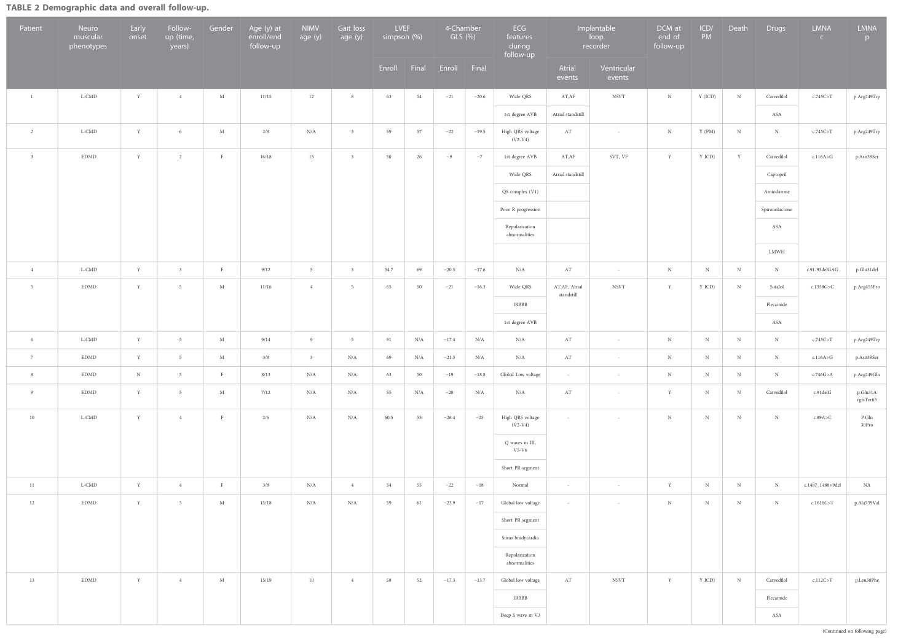

## Question

# Disease Characteristics Research Template

## Target Disease
- **Disease Name:** Emery-Dreifuss Muscular Dystrophy
- **MONDO ID:**  (if available)
- **Category:** Mendelian

## Research Objectives

Please provide a comprehensive research report on **Emery-Dreifuss Muscular Dystrophy** covering all of the
disease characteristics listed below. This report will be used to populate a disease knowledge
base entry. Be thorough and cite primary literature (PMID preferred) for all claims.

For each section, **suggested databases/resources** are listed. These are the first places
you should search for information on each topic.

---

### 1. Disease Information
> **Search first:** OMIM, Orphanet, ICD-10/ICD-11, MeSH, PubMed

- What is the disease? Provide a concise overview.
- What are the key identifiers? (OMIM, Orphanet, ICD-10/ICD-11, MeSH, Mondo)
- What are the common synonyms and alternative names?
- Is the information derived from individual patients (e.g., EHR) or aggregated disease-level resources?

### 2. Etiology

- **Disease Causal Factors**: What are the primary causes? (genetic, environmental, infectious, mechanistic)
- **Risk Factors**:
  > **Search first:** PubMed, Cochrane Library, UpToDate, clinical guidelines, ClinVar, ClinGen, GWAS Catalog, PheGenI, CTD, CDC, WHO, epidemiological databases
  - Genetic risk factors (causal variants, susceptibility loci, modifier genes)
  - Environmental risk factors (toxins, lifestyle, occupational exposures, age, sex, family history)
- **Protective Factors**:
  > **Search first:** PubMed, Cochrane Library, clinical trial databases, GWAS Catalog, gnomAD, WHO, CDC, nutrition databases
  - Genetic protective factors (protective variants, modifier alleles)
  - Environmental protective factors (diet, lifestyle, exposures that reduce risk)
- **Gene-Environment Interactions**: How do genetic and environmental factors interact to influence disease?
  > **Search first:** CTD, PubMed, PheGenI, GxE databases

### 3. Phenotypes
> **Search first:** HPO (Human Phenotype Ontology), OMIM, Orphanet, PubMed, clinicaltrials.gov, MedDRA, SNOMED CT, DECIPHER, LOINC

For each phenotype, provide:
- **Phenotype type**: symptoms, clinical signs, physical manifestations, behavioral changes, or laboratory abnormalities
  > For symptoms/signs: HPO, OMIM, Orphanet, PubMed
  > For behavioral changes: HPO, DSM, RDoC (Research Domain Criteria), PubMed
  > For laboratory abnormalities: LOINC, SNOMED CT, LabTests Online, PubMed
- **Phenotype characteristics**:
  > **Search first:** OMIM, Orphanet, HPO, PubMed
  - Age of symptom onset (neonatal, childhood, adult-onset, late-onset)
  - Symptom severity (mild, moderate, severe, variable)
  - Symptom progression (stable, progressive, episodic, fluctuating)
  - Frequency among affected individuals (percentage or qualitative)
- **Quality of life impact**: Effects on daily functioning and well-being (per-phenotype when possible)
  > **Search first:** EQ-5D database, SF-36, WHO QOL databases, PubMed
- Suggest HPO (Human Phenotype Ontology) terms for each phenotype

### 4. Genetic/Molecular Information

- **Causal Genes**: Gene mutations or chromosomal abnormalities responsible for disease (gene symbols, OMIM IDs)
  > **Search first:** OMIM, ClinVar, HGMD, Ensembl, NCBI Gene
- **Pathogenic Variants**:
  - Affected genes (gene symbols, HGNC IDs)
    > **Search first:** OMIM, NCBI Gene, Ensembl, HGNC, UniProt, GeneCards
  - Variant classification (pathogenic, likely pathogenic, VUS per ACMG/AMP guidelines)
    > **Search first:** ClinVar, ClinGen, ACMG/AMP guidelines, VarSome
  - Variant type/class (missense, frameshift, nonsense, splice-site, structural)
  - Allele frequency in population databases
    > **Search first:** gnomAD, 1000 Genomes, ExAC, TOPMed, dbSNP
  - Somatic vs germline origin
    > **Search first:** COSMIC (somatic), ClinVar, ICGC, TCGA
  - Functional consequences (loss of function, gain of function, dominant negative)
- **Modifier Genes**: Genes that modify disease severity or expression
- **Epigenetic Information**: DNA methylation, histone modifications, chromatin changes affecting disease
  > **Search first:** ENCODE, Roadmap Epigenomics, MethBase, DiseaseMeth
- **Chromosomal Abnormalities**: Large-scale genetic changes (aneuploidy, translocations, inversions)
  > **Search first:** DECIPHER, ClinVar, ECARUCA, UCSC Genome Browser

### 5. Environmental Information

- **Environmental Factors**: Non-genetic contributing factors (toxins, radiation, pollution, occupational exposure)
  > **Search first:** CTD (Comparative Toxicogenomics Database), TOXNET, PubMed, EPA databases
- **Lifestyle Factors**: Behavioral factors (smoking, diet, exercise, alcohol consumption)
  > **Search first:** CDC databases, WHO, PubMed, NHANES
- **Infectious Agents**: If applicable, pathogens causing or triggering disease (bacteria, viruses, fungi, parasites)
  > **Search first:** NCBI Taxonomy, ViPR, BV-BRC, MicrobeDB, GIDEON

### 6. Mechanism / Pathophysiology

- **Molecular Pathways**: Specific signaling cascades or biochemical pathways involved (Wnt, MAPK, mTOR, PI3K-AKT, etc.)
  > **Search first:** KEGG, Reactome, WikiPathways, PathBank, BioCyc
- **Cellular Processes**: Cell-level mechanisms (apoptosis, autophagy, cell cycle dysregulation, inflammation, etc.)
  > **Search first:** Gene Ontology (GO), Reactome, KEGG, PubMed
- **Protein Dysfunction**: How protein structure or function is altered (misfolding, aggregation, loss of function, gain of function)
  > **Search first:** UniProt, PDB (Protein Data Bank), InterPro, Pfam, AlphaFold
- **Metabolic Changes**: Alterations in metabolic processes (energy metabolism, lipid metabolism, amino acid metabolism)
  > **Search first:** KEGG, BioCyc, HMDB (Human Metabolome Database), BRENDA
- **Immune System Involvement**: Role of immune response (autoimmunity, immunodeficiency, chronic inflammation)
  > **Search first:** ImmPort, Immunome Database, IEDB, Gene Ontology
- **Tissue Damage Mechanisms**: How tissues/ are injured (oxidative stress, ischemia, fibrosis, necrosis)
  > **Search first:** PubMed, Gene Ontology, Reactome
- **Biochemical Abnormalities**: Specific molecular defects (enzyme deficiencies, receptor dysfunction, ion channel defects)
  > **Search first:** BRENDA, UniProt, KEGG, OMIM, PubMed
- **Epigenetic Changes**: DNA methylation, histone modifications affecting gene expression in disease
  > **Search first:** ENCODE, Roadmap Epigenomics, MethBase, DiseaseMeth
- **Molecular Profiling** (if available):
  - Transcriptomics/gene expression changes
    > **Search first:** GEO (Gene Expression Omnibus), ArrayExpress, GTEx, Human Cell Atlas, SRA
  - Proteomics findings
    > **Search first:** PRIDE, ProteomeXchange, Human Protein Atlas, STRING, BioGRID
  - Metabolomics signatures
    > **Search first:** MetaboLights, Metabolomics Workbench, HMDB, METLIN
  - Lipidomics alterations
    > **Search first:** LIPID MAPS, SwissLipids, LipidHome, Metabolomics Workbench
  - Genomic structural features
    > **Search first:** UCSC Genome Browser, Ensembl, NCBI, dbVar, DGV
- **Advanced Technologies** (if applicable):
  - Single-cell analysis findings (cell-type specific mechanisms, cellular heterogeneity)
    > **Search first:** Human Cell Atlas, Single Cell Portal, GEO, CELLxGENE
  - Spatial transcriptomics findings
    > **Search first:** GEO, Spatial Research, Vizgen, 10x Genomics data
  - Multi-omics integration results
    > **Search first:** TCGA, ICGC, cBioPortal, LinkedOmics, PubMed
  - Functional genomics screens (CRISPR, RNAi)
    > **Search first:** DepMap, GenomeRNAi, PubMed, BioGRID ORCS

For each mechanism, describe:
- The causal chain from initial trigger to clinical manifestation
- Which mechanisms are upstream vs downstream
- What cell types and biological processes are involved
- Suggest GO terms for biological processes and CL terms for cell types

### 7. Anatomical Structures Affected

- **Organ Level**:
  - Primary organs directly affected
  - Secondary organ involvement (complications, secondary effects)
  - Body systems involved (cardiovascular, nervous, digestive, respiratory, endocrine, etc.)
  > **Search first:** Uberon, FMA (Foundational Model of Anatomy), OMIM, HPO, ICD-11, MeSH, SNOMED CT
- **Tissue and Cell Level**:
  - Specific tissue types affected (epithelial, connective, muscle, nervous)
  - Specific cell populations targeted (with Cell Ontology terms)
  > **Search first:** Uberon, Human Protein Atlas, Cell Ontology, Human Cell Atlas, CellMarker, PanglaoDB
- **Subcellular Level**:
  - Cellular compartments involved (mitochondria, nucleus, ER, lysosomes) (with GO Cellular Component terms)
  > **Search first:** Gene Ontology (Cellular Component), UniProt, Human Protein Atlas
- **Localization**:
  - Specific anatomical sites (with UBERON terms)
    > **Search first:** FMA, Uberon, NeuroNames (for brain), SNOMED CT
  - Lateralization (unilateral, bilateral, asymmetric)
    > **Search first:** HPO, clinical literature, imaging databases

### 8. Temporal Development

- **Onset**:
  - Typical age of onset (congenital, pediatric, adult, geriatric)
  - Onset pattern (acute, subacute, chronic, insidious)
  > **Search first:** OMIM, Orphanet, HPO, PubMed
- **Progression**:
  - Disease stages (early, intermediate, advanced, end-stage)
    > **Search first:** Cancer Staging Manual (AJCC), WHO classifications, PubMed
  - Progression rate (rapid, slow, variable)
  - Disease course pattern (episodic, relapsing-remitting, progressive, stable)
  - Disease duration (self-limited, chronic lifelong)
  > **Search first:** Disease registries, longitudinal cohort databases, natural history studies, PubMed, Orphanet, OMIM
- **Patterns**:
  - Remission patterns (spontaneous, treatment-induced)
    > **Search first:** Clinical trial databases, disease registries, PubMed
  - Critical periods (time windows of vulnerability or opportunity for intervention)
    > **Search first:** PubMed, developmental biology databases, clinical guidelines

### 9. Inheritance and Population

- **Epidemiology**:
  - Prevalence (cases per 100,000 at given time)
  - Incidence (new cases per 100,000 per year)
  > **Search first:** Orphanet, CDC, WHO, GBD (Global Burden of Disease), national registries, SEER, disease registries
- **For Genetic Etiology**:
  - Inheritance pattern (AD, AR, X-linked, mitochondrial, multifactorial, polygenic)
    > **Search first:** OMIM, Orphanet, ClinVar, GTR (Genetic Testing Registry)
  - Penetrance (complete, incomplete, age-dependent)
    > **Search first:** ClinVar, OMIM, PubMed, ClinGen
  - Expressivity (variable, consistent)
    > **Search first:** OMIM, ClinVar, PubMed
  - Genetic anticipation (increasing severity in successive generations)
    > **Search first:** OMIM, PubMed (especially for repeat expansion disorders)
  - Germline mosaicism
    > **Search first:** ClinVar, OMIM, genetic counseling literature, PubMed
  - Founder effects (population-specific mutations)
    > **Search first:** gnomAD, population genetics databases, PubMed
  - Consanguinity role
    > **Search first:** OMIM, population studies, genetic counseling resources
  - Carrier frequency
    > **Search first:** gnomAD, carrier screening databases, GeneReviews, GTR
- **Population Demographics**:
  - Affected populations (ethnic or demographic groups with higher prevalence)
    > **Search first:** gnomAD, 1000 Genomes, PAGE Study, PubMed, population registries
  - Geographic distribution (endemic areas, regional variation)
    > **Search first:** WHO, CDC, GBD, Orphanet, geographic epidemiology databases
  - Geographic distribution of specific variants
  - Sex ratio (male:female)
    > **Search first:** Disease registries, OMIM, PubMed, epidemiological databases
  - Age distribution of affected individuals
    > **Search first:** CDC, disease registries, SEER, Orphanet

### 10. Diagnostics

- **Clinical Tests**:
  - Laboratory tests (blood, urine, tissue chemistry, specific enzyme assays)
    > **Search first:** LOINC, LabTests Online, PubMed
  - Biomarkers (proteins, metabolites, genetic markers, circulating biomarkers)
    > **Search first:** FDA Biomarker List, BEST (Biomarkers, EndpointS, and other Tools), PubMed
  - Imaging studies (X-ray, CT, MRI, PET, ultrasound)
    > **Search first:** RadLex, DICOM, Radiopaedia, imaging databases
  - Functional tests (pulmonary function, cardiac stress tests)
    > **Search first:** LOINC, clinical guidelines, PubMed
  - Electrophysiology (EEG, EMG, ECG, nerve conduction studies)
    > **Search first:** LOINC, clinical neurophysiology databases, PubMed
  - Biopsy findings (histopathology, immunohistochemistry)
    > **Search first:** SNOMED CT, College of American Pathologists resources, PubMed
  - Pathology findings (microscopic examination)
    > **Search first:** SNOMED CT, Digital Pathology databases, PubMed
- **Genetic Testing**:
  > **Search first:** GTR (Genetic Testing Registry), GeneReviews, ClinGen
  - Overview of recommended genetic testing approach
  - Whole genome sequencing (WGS) utility
    > **Search first:** GTR, ClinVar, GEL (Genomics England), gnomAD
  - Whole exome sequencing (WES) utility
    > **Search first:** GTR, ClinVar, OMIM, GeneMatcher
  - Gene panels (which panels, which genes)
    > **Search first:** GTR, ClinVar, laboratory-specific databases
  - Single gene testing
    > **Search first:** GTR, ClinVar, OMIM, GeneReviews
  - Chromosomal microarray (CMA)
    > **Search first:** DECIPHER, ClinVar, dbVar, ECARUCA
  - Karyotyping
    > **Search first:** Chromosome Abnormality Database, ClinVar, cytogenetics resources
  - FISH
    > **Search first:** ClinVar, cytogenetics databases, PubMed
  - Mitochondrial DNA testing
    > **Search first:** MITOMAP, MSeqDR, ClinVar, GTR
  - Repeat expansion testing
    > **Search first:** GTR, ClinVar, repeat expansion databases, PubMed
- **Omics-Based Diagnostics** (if applicable):
  - RNA sequencing / transcriptomics
    > **Search first:** GEO, ArrayExpress, GTEx, RNA-seq databases
  - Proteomics
    > **Search first:** PRIDE, ProteomeXchange, FDA Biomarker database
  - Metabolomics
    > **Search first:** MetaboLights, Metabolomics Workbench, HMDB
  - Epigenomics
    > **Search first:** GEO, ENCODE, Roadmap Epigenomics, MethBase
  - Liquid biopsy
    > **Search first:** COSMIC, ClinVar, liquid biopsy databases, PubMed
- **Clinical Criteria**:
  - Standardized diagnostic criteria (DSM, ICD, society guidelines)
    > **Search first:** DSM-5, ICD-11, clinical society guidelines, UpToDate
  - Differential diagnosis (other conditions to rule out, with distinguishing features)
    > **Search first:** DynaMed, UpToDate, clinical decision support systems
- **Screening**:
  - Screening methods for asymptomatic individuals (newborn screening, carrier screening, cascade screening)
    > **Search first:** ACMG recommendations, CDC newborn screening, GTR

### 11. Outcome/Prognosis

- **Survival and Mortality**:
  - Survival rate (5-year, 10-year, overall)
    > **Search first:** SEER, cancer registries, disease-specific registries, PubMed
  - Life expectancy (with and without treatment if applicable)
    > **Search first:** Orphanet, disease registries, actuarial databases, PubMed
  - Mortality rate
    > **Search first:** CDC, WHO, GBD, national mortality databases
  - Disease-specific mortality (deaths directly attributable to disease)
    > **Search first:** Disease registries, CDC Wonder, GBD, PubMed
- **Morbidity and Function**:
  - Morbidity (disease-related disability and health impacts)
    > **Search first:** GBD, WHO, disability databases, PubMed
  - Disability outcomes (long-term functional impairments)
    > **Search first:** ICF (International Classification of Functioning), disability registries
  - Quality of life measures (EQ-5D, SF-36, PROMIS, disease-specific tools)
    > **Search first:** EQ-5D database, SF-36, PROMIS, PubMed
- **Disease Course**:
  - Complications (secondary problems: infections, organ failure, etc.)
    > **Search first:** ICD codes, disease registries, clinical databases, PubMed
  - Recovery potential (likelihood and extent of recovery, with vs without treatment)
    > **Search first:** Natural history studies, rehabilitation databases, PubMed
- **Prediction**:
  - Prognostic factors (age, disease severity, biomarkers, treatment response)
    > **Search first:** Prognostic models databases, clinical calculators, PubMed
  - Prognostic biomarkers (molecular markers predicting disease course)
    > **Search first:** FDA Biomarker database, PubMed, cancer prognostic databases

### 12. Treatment

- **Pharmacotherapy**:
  - Pharmacological treatments (drug names, drug classes, mechanisms of action)
    > **Search first:** DrugBank, RxNorm, ATC classification, DailyMed, FDA databases
  - Pharmacogenomics (how genetic variants affect drug metabolism, efficacy, toxicity)
    > **Search first:** PharmGKB, CPIC (Clinical Pharmacogenetics), FDA Table of PGx Biomarkers
- **Advanced Therapeutics**:
  - Gene therapy (viral vectors, CRISPR, gene replacement, gene editing)
    > **Search first:** ClinicalTrials.gov, FDA gene therapy database, ASGCT resources
  - Cell therapy (stem cell transplant, CAR-T, cellular therapeutics)
    > **Search first:** ClinicalTrials.gov, FDA cell therapy database, FACT standards
  - RNA-based therapies (ASOs, siRNA, mRNA therapies)
    > **Search first:** ClinicalTrials.gov, FDA approvals, PubMed
  - Targeted therapies (treatments directed at specific molecular targets)
    > **Search first:** My Cancer Genome, OncoKB, ClinicalTrials.gov, FDA approvals
  - Immunotherapies (checkpoint inhibitors, monoclonal antibodies)
    > **Search first:** Cancer Immunotherapy Database, FDA approvals, ClinicalTrials.gov
- **Surgical and Interventional**:
  - Surgical interventions (types of surgery, timing, outcomes)
    > **Search first:** CPT codes, surgical registries, clinical guidelines, PubMed
- **Supportive and Rehabilitative**:
  - Supportive care (symptom management, pain control, nutrition)
    > **Search first:** Clinical guidelines, Cochrane Library, PubMed
  - Rehabilitation (physical therapy, occupational therapy, speech therapy)
    > **Search first:** Rehabilitation medicine databases, clinical guidelines, PubMed
- **Experimental**:
  - Experimental treatments in clinical trials (with NCT identifiers if available)
    > **Search first:** ClinicalTrials.gov, EU Clinical Trials Register, WHO ICTRP
- **Treatment Outcomes**:
  - Treatment response rates
    > **Search first:** Clinical trial databases, FDA reviews, systematic reviews, PubMed
  - Side effects and adverse events
    > **Search first:** FDA Adverse Event Reporting System (FAERS), MedWatch, PubMed
- **Treatment Strategy**:
  - Treatment algorithms (clinical pathways, decision trees)
    > **Search first:** Clinical practice guidelines, NCCN Guidelines, UpToDate
  - Combination therapies
    > **Search first:** ClinicalTrials.gov, treatment guidelines, PubMed
  - Personalized medicine approaches (genotype-guided treatment)
    > **Search first:** My Cancer Genome, CIViC, PharmGKB, precision medicine databases

For each treatment, suggest MAXO (Medical Action Ontology) terms where applicable.

### 13. Prevention

- **Prevention Levels**:
  - Primary prevention (preventing disease occurrence: vaccination, risk factor modification)
    > **Search first:** CDC, WHO, USPSTF recommendations, Cochrane Library
  - Secondary prevention (early detection and treatment: screening programs, early intervention)
    > **Search first:** USPSTF, CDC screening guidelines, WHO
  - Tertiary prevention (preventing complications in those with disease)
    > **Search first:** Clinical guidelines, disease management protocols, PubMed
- **Immunization**: Vaccine strategies (if applicable)
  > **Search first:** CDC vaccine schedules, WHO immunization, FDA vaccine database
- **Screening and Early Detection**:
  - Screening programs (population-based: newborn screening, cancer screening)
    > **Search first:** CDC screening programs, USPSTF, cancer screening databases
  - Genetic screening (carrier screening, preimplantation genetic diagnosis, prenatal testing)
    > **Search first:** ACMG recommendations, ACOG guidelines, GTR
  - Risk stratification (identifying high-risk individuals for targeted prevention)
    > **Search first:** Risk prediction models, clinical calculators, PubMed
- **Behavioral Interventions**: Lifestyle modifications to reduce risk
  > **Search first:** CDC, WHO, behavioral intervention databases, Cochrane Library
- **Counseling**: Genetic counseling (risk assessment, family planning guidance)
  > **Search first:** NSGC resources, ACMG guidelines, GeneReviews
- **Public Health**:
  - Public health interventions (sanitation, vector control, health education)
    > **Search first:** CDC, WHO, public health databases, PubMed
  - Environmental interventions (reducing environmental risk factors)
    > **Search first:** EPA databases, WHO environmental health, PubMed
- **Prophylaxis**: Preventive medications or procedures
  > **Search first:** Clinical guidelines, FDA approvals, PubMed

### 14. Other Species / Natural Disease

- **Taxonomy**: Species affected (with NCBI Taxon identifiers)
  > **Search first:** NCBI Taxonomy
- **Breed**: Specific breeds affected (with VBO identifiers if applicable)
  > **Search first:** VBO (Vertebrate Breed Ontology)
- **Gene**: Orthologous genes in other species (with NCBI Gene IDs)
  > **Search first:** NCBI Gene
- **Natural Disease**:
  - Naturally occurring disease in other species (companion animals, wildlife)
    > **Search first:** OMIA (Online Mendelian Inheritance in Animals), VetCompass, PubMed
  - Veterinary relevance and importance in animal health
    > **Search first:** OMIA, veterinary databases, PubMed
- **Comparative Biology**:
  - Comparative pathology (similarities and differences across species)
    > **Search first:** OMIA, comparative pathology databases, PubMed
  - Evolutionary conservation of disease mechanisms
    > **Search first:** HomoloGene, OrthoMCL, Alliance of Genome Resources
- **Transmission** (if applicable):
  - Zoonotic potential
    > **Search first:** CDC zoonotic diseases, WHO zoonoses, GIDEON
  - Cross-species susceptibility
    > **Search first:** NCBI Taxonomy, veterinary databases, PubMed

### 15. Model Organisms

- **Model Types**:
  - Model organism type (mammalian, invertebrate, cellular, in vitro)
    > **Search first:** Alliance of Genome Resources, model organism databases
  - Specific model systems (mouse, rat, zebrafish, Drosophila, C. elegans, yeast, cell lines, organoids, iPSCs)
    > **Search first:** MGI, RGD, ZFIN, FlyBase, WormBase, SGD, ATCC, Cellosaurus
  - Induced models (drug treatment, surgical intervention, environmental manipulation)
    > **Search first:** MGI, model organism databases, PubMed
- **Genetic Models**:
  - Types available (knockout, knock-in, transgenic, conditional, humanized)
    > **Search first:** MGI, IMPC, KOMP, EuMMCR, IMSR
- **Model Characteristics**:
  - Phenotype recapitulation (how well model reproduces human disease features)
    > **Search first:** Model organism databases, comparative studies, PubMed
  - Model limitations (aspects of human disease not captured)
    > **Search first:** Model organism databases, PubMed, review articles
- **Applications**:
  - Research applications (what aspects of disease can be studied)
    > **Search first:** Model organism databases, PubMed
- **Resources**:
  - Model databases
    > **Search first:** MGI, RGD, ZFIN, FlyBase, WormBase, IMSR, EMMA, MMRRC

---

## Citation Requirements

- Cite primary literature (PMID preferred) for all mechanistic and clinical claims
- Prioritize recent reviews and landmark papers
- Include direct quotes from abstracts where possible to support key statements
- Distinguish evidence source types: human clinical, model organism, in vitro, computational

## Output Format

Structure your response as a comprehensive narrative organized by the sections above.
For each section, provide:
- Factual content with specific details (numbers, percentages, gene names, variant nomenclature)
- Ontology term suggestions (HPO, GO, CL, UBERON, CHEBI, MAXO, MONDO) where applicable
- Evidence citations with PMIDs
- Direct quotes from abstracts to support key claims
- Clear indication when information is not available or not applicable for this disease

This report will be used to populate a disease knowledge base entry with:
- Pathophysiology descriptions with causal chains
- Gene/protein annotations (HGNC, GO terms)
- Phenotype associations (HP terms) with frequencies
- Cell type involvement (CL terms)
- Anatomical locations (UBERON terms)
- Chemical entities (CHEBI terms)
- Treatment annotations (MAXO terms)
- Evidence items with PMIDs and exact abstract quotes
- Epidemiology, prognosis, diagnostic, and prevention information
- Animal model descriptions with phenotype recapitulation details

## Output

Question: You are an expert researcher providing comprehensive, well-cited information.

Provide detailed information focusing on:
1. Key concepts and definitions with current understanding
2. Recent developments and latest research (prioritize 2023-2024 sources)
3. Current applications and real-world implementations
4. Expert opinions and analysis from authoritative sources
5. Relevant statistics and data from recent studies

Format as a comprehensive research report with proper citations. Include URLs and publication dates where available.
Always prioritize recent, authoritative sources and provide specific citations for all major claims.

# Disease Characteristics Research Template

## Target Disease
- **Disease Name:** Emery-Dreifuss Muscular Dystrophy
- **MONDO ID:**  (if available)
- **Category:** Mendelian

## Research Objectives

Please provide a comprehensive research report on **Emery-Dreifuss Muscular Dystrophy** covering all of the
disease characteristics listed below. This report will be used to populate a disease knowledge
base entry. Be thorough and cite primary literature (PMID preferred) for all claims.

For each section, **suggested databases/resources** are listed. These are the first places
you should search for information on each topic.

---

### 1. Disease Information
> **Search first:** OMIM, Orphanet, ICD-10/ICD-11, MeSH, PubMed

- What is the disease? Provide a concise overview.
- What are the key identifiers? (OMIM, Orphanet, ICD-10/ICD-11, MeSH, Mondo)
- What are the common synonyms and alternative names?
- Is the information derived from individual patients (e.g., EHR) or aggregated disease-level resources?

### 2. Etiology

- **Disease Causal Factors**: What are the primary causes? (genetic, environmental, infectious, mechanistic)
- **Risk Factors**:
  > **Search first:** PubMed, Cochrane Library, UpToDate, clinical guidelines, ClinVar, ClinGen, GWAS Catalog, PheGenI, CTD, CDC, WHO, epidemiological databases
  - Genetic risk factors (causal variants, susceptibility loci, modifier genes)
  - Environmental risk factors (toxins, lifestyle, occupational exposures, age, sex, family history)
- **Protective Factors**:
  > **Search first:** PubMed, Cochrane Library, clinical trial databases, GWAS Catalog, gnomAD, WHO, CDC, nutrition databases
  - Genetic protective factors (protective variants, modifier alleles)
  - Environmental protective factors (diet, lifestyle, exposures that reduce risk)
- **Gene-Environment Interactions**: How do genetic and environmental factors interact to influence disease?
  > **Search first:** CTD, PubMed, PheGenI, GxE databases

### 3. Phenotypes
> **Search first:** HPO (Human Phenotype Ontology), OMIM, Orphanet, PubMed, clinicaltrials.gov, MedDRA, SNOMED CT, DECIPHER, LOINC

For each phenotype, provide:
- **Phenotype type**: symptoms, clinical signs, physical manifestations, behavioral changes, or laboratory abnormalities
  > For symptoms/signs: HPO, OMIM, Orphanet, PubMed
  > For behavioral changes: HPO, DSM, RDoC (Research Domain Criteria), PubMed
  > For laboratory abnormalities: LOINC, SNOMED CT, LabTests Online, PubMed
- **Phenotype characteristics**:
  > **Search first:** OMIM, Orphanet, HPO, PubMed
  - Age of symptom onset (neonatal, childhood, adult-onset, late-onset)
  - Symptom severity (mild, moderate, severe, variable)
  - Symptom progression (stable, progressive, episodic, fluctuating)
  - Frequency among affected individuals (percentage or qualitative)
- **Quality of life impact**: Effects on daily functioning and well-being (per-phenotype when possible)
  > **Search first:** EQ-5D database, SF-36, WHO QOL databases, PubMed
- Suggest HPO (Human Phenotype Ontology) terms for each phenotype

### 4. Genetic/Molecular Information

- **Causal Genes**: Gene mutations or chromosomal abnormalities responsible for disease (gene symbols, OMIM IDs)
  > **Search first:** OMIM, ClinVar, HGMD, Ensembl, NCBI Gene
- **Pathogenic Variants**:
  - Affected genes (gene symbols, HGNC IDs)
    > **Search first:** OMIM, NCBI Gene, Ensembl, HGNC, UniProt, GeneCards
  - Variant classification (pathogenic, likely pathogenic, VUS per ACMG/AMP guidelines)
    > **Search first:** ClinVar, ClinGen, ACMG/AMP guidelines, VarSome
  - Variant type/class (missense, frameshift, nonsense, splice-site, structural)
  - Allele frequency in population databases
    > **Search first:** gnomAD, 1000 Genomes, ExAC, TOPMed, dbSNP
  - Somatic vs germline origin
    > **Search first:** COSMIC (somatic), ClinVar, ICGC, TCGA
  - Functional consequences (loss of function, gain of function, dominant negative)
- **Modifier Genes**: Genes that modify disease severity or expression
- **Epigenetic Information**: DNA methylation, histone modifications, chromatin changes affecting disease
  > **Search first:** ENCODE, Roadmap Epigenomics, MethBase, DiseaseMeth
- **Chromosomal Abnormalities**: Large-scale genetic changes (aneuploidy, translocations, inversions)
  > **Search first:** DECIPHER, ClinVar, ECARUCA, UCSC Genome Browser

### 5. Environmental Information

- **Environmental Factors**: Non-genetic contributing factors (toxins, radiation, pollution, occupational exposure)
  > **Search first:** CTD (Comparative Toxicogenomics Database), TOXNET, PubMed, EPA databases
- **Lifestyle Factors**: Behavioral factors (smoking, diet, exercise, alcohol consumption)
  > **Search first:** CDC databases, WHO, PubMed, NHANES
- **Infectious Agents**: If applicable, pathogens causing or triggering disease (bacteria, viruses, fungi, parasites)
  > **Search first:** NCBI Taxonomy, ViPR, BV-BRC, MicrobeDB, GIDEON

### 6. Mechanism / Pathophysiology

- **Molecular Pathways**: Specific signaling cascades or biochemical pathways involved (Wnt, MAPK, mTOR, PI3K-AKT, etc.)
  > **Search first:** KEGG, Reactome, WikiPathways, PathBank, BioCyc
- **Cellular Processes**: Cell-level mechanisms (apoptosis, autophagy, cell cycle dysregulation, inflammation, etc.)
  > **Search first:** Gene Ontology (GO), Reactome, KEGG, PubMed
- **Protein Dysfunction**: How protein structure or function is altered (misfolding, aggregation, loss of function, gain of function)
  > **Search first:** UniProt, PDB (Protein Data Bank), InterPro, Pfam, AlphaFold
- **Metabolic Changes**: Alterations in metabolic processes (energy metabolism, lipid metabolism, amino acid metabolism)
  > **Search first:** KEGG, BioCyc, HMDB (Human Metabolome Database), BRENDA
- **Immune System Involvement**: Role of immune response (autoimmunity, immunodeficiency, chronic inflammation)
  > **Search first:** ImmPort, Immunome Database, IEDB, Gene Ontology
- **Tissue Damage Mechanisms**: How tissues/ are injured (oxidative stress, ischemia, fibrosis, necrosis)
  > **Search first:** PubMed, Gene Ontology, Reactome
- **Biochemical Abnormalities**: Specific molecular defects (enzyme deficiencies, receptor dysfunction, ion channel defects)
  > **Search first:** BRENDA, UniProt, KEGG, OMIM, PubMed
- **Epigenetic Changes**: DNA methylation, histone modifications affecting gene expression in disease
  > **Search first:** ENCODE, Roadmap Epigenomics, MethBase, DiseaseMeth
- **Molecular Profiling** (if available):
  - Transcriptomics/gene expression changes
    > **Search first:** GEO (Gene Expression Omnibus), ArrayExpress, GTEx, Human Cell Atlas, SRA
  - Proteomics findings
    > **Search first:** PRIDE, ProteomeXchange, Human Protein Atlas, STRING, BioGRID
  - Metabolomics signatures
    > **Search first:** MetaboLights, Metabolomics Workbench, HMDB, METLIN
  - Lipidomics alterations
    > **Search first:** LIPID MAPS, SwissLipids, LipidHome, Metabolomics Workbench
  - Genomic structural features
    > **Search first:** UCSC Genome Browser, Ensembl, NCBI, dbVar, DGV
- **Advanced Technologies** (if applicable):
  - Single-cell analysis findings (cell-type specific mechanisms, cellular heterogeneity)
    > **Search first:** Human Cell Atlas, Single Cell Portal, GEO, CELLxGENE
  - Spatial transcriptomics findings
    > **Search first:** GEO, Spatial Research, Vizgen, 10x Genomics data
  - Multi-omics integration results
    > **Search first:** TCGA, ICGC, cBioPortal, LinkedOmics, PubMed
  - Functional genomics screens (CRISPR, RNAi)
    > **Search first:** DepMap, GenomeRNAi, PubMed, BioGRID ORCS

For each mechanism, describe:
- The causal chain from initial trigger to clinical manifestation
- Which mechanisms are upstream vs downstream
- What cell types and biological processes are involved
- Suggest GO terms for biological processes and CL terms for cell types

### 7. Anatomical Structures Affected

- **Organ Level**:
  - Primary organs directly affected
  - Secondary organ involvement (complications, secondary effects)
  - Body systems involved (cardiovascular, nervous, digestive, respiratory, endocrine, etc.)
  > **Search first:** Uberon, FMA (Foundational Model of Anatomy), OMIM, HPO, ICD-11, MeSH, SNOMED CT
- **Tissue and Cell Level**:
  - Specific tissue types affected (epithelial, connective, muscle, nervous)
  - Specific cell populations targeted (with Cell Ontology terms)
  > **Search first:** Uberon, Human Protein Atlas, Cell Ontology, Human Cell Atlas, CellMarker, PanglaoDB
- **Subcellular Level**:
  - Cellular compartments involved (mitochondria, nucleus, ER, lysosomes) (with GO Cellular Component terms)
  > **Search first:** Gene Ontology (Cellular Component), UniProt, Human Protein Atlas
- **Localization**:
  - Specific anatomical sites (with UBERON terms)
    > **Search first:** FMA, Uberon, NeuroNames (for brain), SNOMED CT
  - Lateralization (unilateral, bilateral, asymmetric)
    > **Search first:** HPO, clinical literature, imaging databases

### 8. Temporal Development

- **Onset**:
  - Typical age of onset (congenital, pediatric, adult, geriatric)
  - Onset pattern (acute, subacute, chronic, insidious)
  > **Search first:** OMIM, Orphanet, HPO, PubMed
- **Progression**:
  - Disease stages (early, intermediate, advanced, end-stage)
    > **Search first:** Cancer Staging Manual (AJCC), WHO classifications, PubMed
  - Progression rate (rapid, slow, variable)
  - Disease course pattern (episodic, relapsing-remitting, progressive, stable)
  - Disease duration (self-limited, chronic lifelong)
  > **Search first:** Disease registries, longitudinal cohort databases, natural history studies, PubMed, Orphanet, OMIM
- **Patterns**:
  - Remission patterns (spontaneous, treatment-induced)
    > **Search first:** Clinical trial databases, disease registries, PubMed
  - Critical periods (time windows of vulnerability or opportunity for intervention)
    > **Search first:** PubMed, developmental biology databases, clinical guidelines

### 9. Inheritance and Population

- **Epidemiology**:
  - Prevalence (cases per 100,000 at given time)
  - Incidence (new cases per 100,000 per year)
  > **Search first:** Orphanet, CDC, WHO, GBD (Global Burden of Disease), national registries, SEER, disease registries
- **For Genetic Etiology**:
  - Inheritance pattern (AD, AR, X-linked, mitochondrial, multifactorial, polygenic)
    > **Search first:** OMIM, Orphanet, ClinVar, GTR (Genetic Testing Registry)
  - Penetrance (complete, incomplete, age-dependent)
    > **Search first:** ClinVar, OMIM, PubMed, ClinGen
  - Expressivity (variable, consistent)
    > **Search first:** OMIM, ClinVar, PubMed
  - Genetic anticipation (increasing severity in successive generations)
    > **Search first:** OMIM, PubMed (especially for repeat expansion disorders)
  - Germline mosaicism
    > **Search first:** ClinVar, OMIM, genetic counseling literature, PubMed
  - Founder effects (population-specific mutations)
    > **Search first:** gnomAD, population genetics databases, PubMed
  - Consanguinity role
    > **Search first:** OMIM, population studies, genetic counseling resources
  - Carrier frequency
    > **Search first:** gnomAD, carrier screening databases, GeneReviews, GTR
- **Population Demographics**:
  - Affected populations (ethnic or demographic groups with higher prevalence)
    > **Search first:** gnomAD, 1000 Genomes, PAGE Study, PubMed, population registries
  - Geographic distribution (endemic areas, regional variation)
    > **Search first:** WHO, CDC, GBD, Orphanet, geographic epidemiology databases
  - Geographic distribution of specific variants
  - Sex ratio (male:female)
    > **Search first:** Disease registries, OMIM, PubMed, epidemiological databases
  - Age distribution of affected individuals
    > **Search first:** CDC, disease registries, SEER, Orphanet

### 10. Diagnostics

- **Clinical Tests**:
  - Laboratory tests (blood, urine, tissue chemistry, specific enzyme assays)
    > **Search first:** LOINC, LabTests Online, PubMed
  - Biomarkers (proteins, metabolites, genetic markers, circulating biomarkers)
    > **Search first:** FDA Biomarker List, BEST (Biomarkers, EndpointS, and other Tools), PubMed
  - Imaging studies (X-ray, CT, MRI, PET, ultrasound)
    > **Search first:** RadLex, DICOM, Radiopaedia, imaging databases
  - Functional tests (pulmonary function, cardiac stress tests)
    > **Search first:** LOINC, clinical guidelines, PubMed
  - Electrophysiology (EEG, EMG, ECG, nerve conduction studies)
    > **Search first:** LOINC, clinical neurophysiology databases, PubMed
  - Biopsy findings (histopathology, immunohistochemistry)
    > **Search first:** SNOMED CT, College of American Pathologists resources, PubMed
  - Pathology findings (microscopic examination)
    > **Search first:** SNOMED CT, Digital Pathology databases, PubMed
- **Genetic Testing**:
  > **Search first:** GTR (Genetic Testing Registry), GeneReviews, ClinGen
  - Overview of recommended genetic testing approach
  - Whole genome sequencing (WGS) utility
    > **Search first:** GTR, ClinVar, GEL (Genomics England), gnomAD
  - Whole exome sequencing (WES) utility
    > **Search first:** GTR, ClinVar, OMIM, GeneMatcher
  - Gene panels (which panels, which genes)
    > **Search first:** GTR, ClinVar, laboratory-specific databases
  - Single gene testing
    > **Search first:** GTR, ClinVar, OMIM, GeneReviews
  - Chromosomal microarray (CMA)
    > **Search first:** DECIPHER, ClinVar, dbVar, ECARUCA
  - Karyotyping
    > **Search first:** Chromosome Abnormality Database, ClinVar, cytogenetics resources
  - FISH
    > **Search first:** ClinVar, cytogenetics databases, PubMed
  - Mitochondrial DNA testing
    > **Search first:** MITOMAP, MSeqDR, ClinVar, GTR
  - Repeat expansion testing
    > **Search first:** GTR, ClinVar, repeat expansion databases, PubMed
- **Omics-Based Diagnostics** (if applicable):
  - RNA sequencing / transcriptomics
    > **Search first:** GEO, ArrayExpress, GTEx, RNA-seq databases
  - Proteomics
    > **Search first:** PRIDE, ProteomeXchange, FDA Biomarker database
  - Metabolomics
    > **Search first:** MetaboLights, Metabolomics Workbench, HMDB
  - Epigenomics
    > **Search first:** GEO, ENCODE, Roadmap Epigenomics, MethBase
  - Liquid biopsy
    > **Search first:** COSMIC, ClinVar, liquid biopsy databases, PubMed
- **Clinical Criteria**:
  - Standardized diagnostic criteria (DSM, ICD, society guidelines)
    > **Search first:** DSM-5, ICD-11, clinical society guidelines, UpToDate
  - Differential diagnosis (other conditions to rule out, with distinguishing features)
    > **Search first:** DynaMed, UpToDate, clinical decision support systems
- **Screening**:
  - Screening methods for asymptomatic individuals (newborn screening, carrier screening, cascade screening)
    > **Search first:** ACMG recommendations, CDC newborn screening, GTR

### 11. Outcome/Prognosis

- **Survival and Mortality**:
  - Survival rate (5-year, 10-year, overall)
    > **Search first:** SEER, cancer registries, disease-specific registries, PubMed
  - Life expectancy (with and without treatment if applicable)
    > **Search first:** Orphanet, disease registries, actuarial databases, PubMed
  - Mortality rate
    > **Search first:** CDC, WHO, GBD, national mortality databases
  - Disease-specific mortality (deaths directly attributable to disease)
    > **Search first:** Disease registries, CDC Wonder, GBD, PubMed
- **Morbidity and Function**:
  - Morbidity (disease-related disability and health impacts)
    > **Search first:** GBD, WHO, disability databases, PubMed
  - Disability outcomes (long-term functional impairments)
    > **Search first:** ICF (International Classification of Functioning), disability registries
  - Quality of life measures (EQ-5D, SF-36, PROMIS, disease-specific tools)
    > **Search first:** EQ-5D database, SF-36, PROMIS, PubMed
- **Disease Course**:
  - Complications (secondary problems: infections, organ failure, etc.)
    > **Search first:** ICD codes, disease registries, clinical databases, PubMed
  - Recovery potential (likelihood and extent of recovery, with vs without treatment)
    > **Search first:** Natural history studies, rehabilitation databases, PubMed
- **Prediction**:
  - Prognostic factors (age, disease severity, biomarkers, treatment response)
    > **Search first:** Prognostic models databases, clinical calculators, PubMed
  - Prognostic biomarkers (molecular markers predicting disease course)
    > **Search first:** FDA Biomarker database, PubMed, cancer prognostic databases

### 12. Treatment

- **Pharmacotherapy**:
  - Pharmacological treatments (drug names, drug classes, mechanisms of action)
    > **Search first:** DrugBank, RxNorm, ATC classification, DailyMed, FDA databases
  - Pharmacogenomics (how genetic variants affect drug metabolism, efficacy, toxicity)
    > **Search first:** PharmGKB, CPIC (Clinical Pharmacogenetics), FDA Table of PGx Biomarkers
- **Advanced Therapeutics**:
  - Gene therapy (viral vectors, CRISPR, gene replacement, gene editing)
    > **Search first:** ClinicalTrials.gov, FDA gene therapy database, ASGCT resources
  - Cell therapy (stem cell transplant, CAR-T, cellular therapeutics)
    > **Search first:** ClinicalTrials.gov, FDA cell therapy database, FACT standards
  - RNA-based therapies (ASOs, siRNA, mRNA therapies)
    > **Search first:** ClinicalTrials.gov, FDA approvals, PubMed
  - Targeted therapies (treatments directed at specific molecular targets)
    > **Search first:** My Cancer Genome, OncoKB, ClinicalTrials.gov, FDA approvals
  - Immunotherapies (checkpoint inhibitors, monoclonal antibodies)
    > **Search first:** Cancer Immunotherapy Database, FDA approvals, ClinicalTrials.gov
- **Surgical and Interventional**:
  - Surgical interventions (types of surgery, timing, outcomes)
    > **Search first:** CPT codes, surgical registries, clinical guidelines, PubMed
- **Supportive and Rehabilitative**:
  - Supportive care (symptom management, pain control, nutrition)
    > **Search first:** Clinical guidelines, Cochrane Library, PubMed
  - Rehabilitation (physical therapy, occupational therapy, speech therapy)
    > **Search first:** Rehabilitation medicine databases, clinical guidelines, PubMed
- **Experimental**:
  - Experimental treatments in clinical trials (with NCT identifiers if available)
    > **Search first:** ClinicalTrials.gov, EU Clinical Trials Register, WHO ICTRP
- **Treatment Outcomes**:
  - Treatment response rates
    > **Search first:** Clinical trial databases, FDA reviews, systematic reviews, PubMed
  - Side effects and adverse events
    > **Search first:** FDA Adverse Event Reporting System (FAERS), MedWatch, PubMed
- **Treatment Strategy**:
  - Treatment algorithms (clinical pathways, decision trees)
    > **Search first:** Clinical practice guidelines, NCCN Guidelines, UpToDate
  - Combination therapies
    > **Search first:** ClinicalTrials.gov, treatment guidelines, PubMed
  - Personalized medicine approaches (genotype-guided treatment)
    > **Search first:** My Cancer Genome, CIViC, PharmGKB, precision medicine databases

For each treatment, suggest MAXO (Medical Action Ontology) terms where applicable.

### 13. Prevention

- **Prevention Levels**:
  - Primary prevention (preventing disease occurrence: vaccination, risk factor modification)
    > **Search first:** CDC, WHO, USPSTF recommendations, Cochrane Library
  - Secondary prevention (early detection and treatment: screening programs, early intervention)
    > **Search first:** USPSTF, CDC screening guidelines, WHO
  - Tertiary prevention (preventing complications in those with disease)
    > **Search first:** Clinical guidelines, disease management protocols, PubMed
- **Immunization**: Vaccine strategies (if applicable)
  > **Search first:** CDC vaccine schedules, WHO immunization, FDA vaccine database
- **Screening and Early Detection**:
  - Screening programs (population-based: newborn screening, cancer screening)
    > **Search first:** CDC screening programs, USPSTF, cancer screening databases
  - Genetic screening (carrier screening, preimplantation genetic diagnosis, prenatal testing)
    > **Search first:** ACMG recommendations, ACOG guidelines, GTR
  - Risk stratification (identifying high-risk individuals for targeted prevention)
    > **Search first:** Risk prediction models, clinical calculators, PubMed
- **Behavioral Interventions**: Lifestyle modifications to reduce risk
  > **Search first:** CDC, WHO, behavioral intervention databases, Cochrane Library
- **Counseling**: Genetic counseling (risk assessment, family planning guidance)
  > **Search first:** NSGC resources, ACMG guidelines, GeneReviews
- **Public Health**:
  - Public health interventions (sanitation, vector control, health education)
    > **Search first:** CDC, WHO, public health databases, PubMed
  - Environmental interventions (reducing environmental risk factors)
    > **Search first:** EPA databases, WHO environmental health, PubMed
- **Prophylaxis**: Preventive medications or procedures
  > **Search first:** Clinical guidelines, FDA approvals, PubMed

### 14. Other Species / Natural Disease

- **Taxonomy**: Species affected (with NCBI Taxon identifiers)
  > **Search first:** NCBI Taxonomy
- **Breed**: Specific breeds affected (with VBO identifiers if applicable)
  > **Search first:** VBO (Vertebrate Breed Ontology)
- **Gene**: Orthologous genes in other species (with NCBI Gene IDs)
  > **Search first:** NCBI Gene
- **Natural Disease**:
  - Naturally occurring disease in other species (companion animals, wildlife)
    > **Search first:** OMIA (Online Mendelian Inheritance in Animals), VetCompass, PubMed
  - Veterinary relevance and importance in animal health
    > **Search first:** OMIA, veterinary databases, PubMed
- **Comparative Biology**:
  - Comparative pathology (similarities and differences across species)
    > **Search first:** OMIA, comparative pathology databases, PubMed
  - Evolutionary conservation of disease mechanisms
    > **Search first:** HomoloGene, OrthoMCL, Alliance of Genome Resources
- **Transmission** (if applicable):
  - Zoonotic potential
    > **Search first:** CDC zoonotic diseases, WHO zoonoses, GIDEON
  - Cross-species susceptibility
    > **Search first:** NCBI Taxonomy, veterinary databases, PubMed

### 15. Model Organisms

- **Model Types**:
  - Model organism type (mammalian, invertebrate, cellular, in vitro)
    > **Search first:** Alliance of Genome Resources, model organism databases
  - Specific model systems (mouse, rat, zebrafish, Drosophila, C. elegans, yeast, cell lines, organoids, iPSCs)
    > **Search first:** MGI, RGD, ZFIN, FlyBase, WormBase, SGD, ATCC, Cellosaurus
  - Induced models (drug treatment, surgical intervention, environmental manipulation)
    > **Search first:** MGI, model organism databases, PubMed
- **Genetic Models**:
  - Types available (knockout, knock-in, transgenic, conditional, humanized)
    > **Search first:** MGI, IMPC, KOMP, EuMMCR, IMSR
- **Model Characteristics**:
  - Phenotype recapitulation (how well model reproduces human disease features)
    > **Search first:** Model organism databases, comparative studies, PubMed
  - Model limitations (aspects of human disease not captured)
    > **Search first:** Model organism databases, PubMed, review articles
- **Applications**:
  - Research applications (what aspects of disease can be studied)
    > **Search first:** Model organism databases, PubMed
- **Resources**:
  - Model databases
    > **Search first:** MGI, RGD, ZFIN, FlyBase, WormBase, IMSR, EMMA, MMRRC

---

## Citation Requirements

- Cite primary literature (PMID preferred) for all mechanistic and clinical claims
- Prioritize recent reviews and landmark papers
- Include direct quotes from abstracts where possible to support key statements
- Distinguish evidence source types: human clinical, model organism, in vitro, computational

## Output Format

Structure your response as a comprehensive narrative organized by the sections above.
For each section, provide:
- Factual content with specific details (numbers, percentages, gene names, variant nomenclature)
- Ontology term suggestions (HPO, GO, CL, UBERON, CHEBI, MAXO, MONDO) where applicable
- Evidence citations with PMIDs
- Direct quotes from abstracts to support key claims
- Clear indication when information is not available or not applicable for this disease

This report will be used to populate a disease knowledge base entry with:
- Pathophysiology descriptions with causal chains
- Gene/protein annotations (HGNC, GO terms)
- Phenotype associations (HP terms) with frequencies
- Cell type involvement (CL terms)
- Anatomical locations (UBERON terms)
- Chemical entities (CHEBI terms)
- Treatment annotations (MAXO terms)
- Evidence items with PMIDs and exact abstract quotes
- Epidemiology, prognosis, diagnostic, and prevention information
- Animal model descriptions with phenotype recapitulation details

# Emery–Dreifuss Muscular Dystrophy (EDMD): Comprehensive Disease Characteristics Report

## Executive summary
Emery–Dreifuss muscular dystrophy (EDMD) is a genetically heterogeneous, primarily Mendelian neuromuscular disorder within the spectrum of nuclear-envelope diseases (laminopathies/nuclear envelopathies), classically defined by a triad of (i) early musculo‑tendinous contractures, (ii) slowly progressive skeletal myopathy (often humero‑peroneal or scapulo‑humeroperoneal distribution), and (iii) cardiac involvement dominated by atrial disease, conduction system disease, arrhythmias, thromboembolism, and variable progression to cardiomyopathy/heart failure and sudden death. (granata2026cardiacinvolvementin pages 2-4, granata2026cardiacinvolvementin pages 4-6, cannie2023emery–dreifussmusculardystrophy pages 2-3)

Recent (2023–2024) literature underscores: (1) a substantial risk of malignant ventricular arrhythmias and end-stage heart failure even in X‑linked EDMD1 (EMD) male carriers, prompting earlier implantable cardioverter‑defibrillator (ICD) consideration; (2) high pediatric risk in early-onset LMNA-related phenotypes with frequent malignant arrhythmias detected by implantable loop recorders; (3) convergent pathophysiology across EDMD genes involving nucleo‑cytoskeletal coupling and mechanotransduction failure, mechanical-stress–induced nuclear damage/DNA damage responses, and transcriptional programs involving fibrosis, metabolism, and splicing; and (4) expanding registry infrastructure and multi‑omics studies aimed at modifier genes and molecular stratification to enable precision medicine. (cannie2023emery–dreifussmusculardystrophy pages 2-3, cesar2023characterizationofcardiac pages 1-2, heras2023metabolicfibroticand pages 1-2, NCT05394506 chunk 1)

## 1. Disease information
### 1.1 Concise overview
EDMD is a rare inherited muscular dystrophy characterized by early contractures, progressive muscle weakness/atrophy, and cardiac conduction/arrhythmia complications that may be life‑threatening and can precede prominent skeletal muscle symptoms. (granata2026cardiacinvolvementin pages 2-4, granata2026cardiacinvolvementin pages 9-10)

### 1.2 Key identifiers
A normalized identifier set extractable from the retrieved sources is provided in the table below.

| Identifier system | Identifier | Entity (disease/subtype/gene) | Notes (inheritance/causal gene) |
|---|---|---|---|
| MONDO | MONDO:0016830 | Emery-Dreifuss muscular dystrophy | Overall EDMD disease entity in OpenTargets/Monarch disease mapping; associated targets include LMNA, EMD, FHL1, SYNE1/2, TMEM43. URL: https://platform.opentargets.org/disease/MONDO_0016830 (OpenTargets Search: Emery-Dreifuss muscular dystrophy) |
| MONDO | MONDO:0010680 | X-linked Emery-Dreifuss muscular dystrophy | X-linked EDMD; OpenTargets links this entity to EMD and FHL1. URL: https://platform.opentargets.org/disease/MONDO_0010680 (OpenTargets Search: Emery-Dreifuss muscular dystrophy) |
| MONDO | MONDO:0021569 | Emery-Dreifuss muscular dystrophy 2, autosomal dominant | Autosomal dominant EDMD2; linked to LMNA. URL: https://platform.opentargets.org/disease/MONDO_0021569 (OpenTargets Search: Emery-Dreifuss muscular dystrophy) |
| MONDO | MONDO:0013071 | Emery-Dreifuss muscular dystrophy 4, autosomal dominant | Autosomal dominant EDMD4; linked to SYNE1. URL: https://platform.opentargets.org/disease/MONDO_0013071 (OpenTargets Search: Emery-Dreifuss muscular dystrophy) |
| MONDO | MONDO:0013677 | Emery-Dreifuss muscular dystrophy 7, autosomal dominant | Autosomal dominant EDMD7; linked to TMEM43. URL: https://platform.opentargets.org/disease/MONDO_0013677 (OpenTargets Search: Emery-Dreifuss muscular dystrophy) |
| OMIM phenotype | OMIM #310300 | EDMD1 / classical X-linked EDMD | X-linked EDMD caused by EMD variants; explicitly reported in review text as classical X-linked EDMD. DOI source: https://doi.org/10.3390/jcm15093286 (granata2026cardiacinvolvementin pages 1-2) |
| OMIM phenotype | OMIM #181350 | EDMD2 / autosomal dominant EDMD | Autosomal dominant EDMD caused by LMNA variants; explicitly reported in review text. DOI source: https://doi.org/10.3390/jcm15093286 (granata2026cardiacinvolvementin pages 1-2) |
| OMIM phenotype | OMIM #616516 | EDMD3 / autosomal recessive EDMD | Rare autosomal recessive EDMD; reported by Rahmuni et al. 2024. DOI source: https://doi.org/10.1159/000538917 (rahmuni2024twomoroccanfamilies pages 1-2) |
| OMIM gene | OMIM #300384 | EMD | Encodes emerin; major causal gene for EDMD1/X-linked EDMD. DOI source: https://doi.org/10.3390/jcm15093286 (granata2026cardiacinvolvementin pages 1-2) |
| OMIM gene | OMIM #150330 | LMNA | Encodes lamin A/C; major causal gene for EDMD2/autosomal dominant EDMD. DOI source: https://doi.org/10.3390/jcm15093286 (granata2026cardiacinvolvementin pages 1-2) |
| OMIM gene | OMIM #612048 | TMEM43 | Gene linked to EDMD7/autosomal dominant EDMD in retrieved review text. DOI source: https://doi.org/10.3390/jcm15093286 (granata2026cardiacinvolvementin pages 4-6) |
| OMIM gene | OMIM #125660 | DES | Desmin; referenced as related nuclear-cytoskeletal/cardiac phenotype gene in EDMD spectrum review. DOI source: https://doi.org/10.3390/jcm15093286 (granata2026cardiacinvolvementin pages 4-6) |
| Not extracted from retrieved full text | — | Orphanet / MeSH / ICD | Orphanet ORPHAcode, MeSH descriptor, and ICD-10/ICD-11 codes were not extracted from the retrieved full-text evidence used here. (granata2026cardiacinvolvementin pages 1-2, rahmuni2024twomoroccanfamilies pages 1-2, heller2020emery‐dreifussmusculardystrophy pages 1-2) |

*Table: This table summarizes the core disease and gene identifiers for Emery-Dreifuss muscular dystrophy and key genetic subtypes, integrating MONDO/OpenTargets and OMIM evidence. It is useful for disease knowledge-base normalization and subtype-to-gene mapping.*

**Notes on missing identifiers:** Orphanet ORPHAcode, MeSH descriptor ID, and ICD‑10/ICD‑11 codes were not extractable from the retrieved full texts in this run; this report therefore flags them as “not extracted” rather than guessing. (heller2020emery‐dreifussmusculardystrophy pages 1-2)

### 1.3 Synonyms / alternative names
Commonly used descriptors include “Emery–Dreifuss muscular dystrophy,” “EDMD,” “X‑linked EDMD / EDMD1 (emerinopathy),” “autosomal dominant EDMD / EDMD2 (laminopathy),” and “cardiac emerinopathy” for predominantly cardiac EMD phenotypes. (granata2026cardiacinvolvementin pages 10-10, granata2026cardiacinvolvementin pages 4-6)

### 1.4 Evidence source type
Information synthesized here is derived from aggregated disease-level reviews and systematic reviews, plus human cohorts/case reports, mechanistic in vitro studies in patient cells, and animal models. (cesar2023characterizationofcardiac pages 1-2, heras2023metabolicfibroticand pages 1-2, zhang2023net39protectsmuscle pages 1-2)

## 2. Etiology
### 2.1 Disease causal factors
EDMD is primarily genetic, caused by pathogenic variants in nuclear envelope / nuclear lamina / LINC complex and related proteins, with major forms due to **EMD** (emerin; X‑linked EDMD1) and **LMNA** (lamin A/C; autosomal dominant EDMD2). (cannie2023emery–dreifussmusculardystrophy pages 2-3, granata2026cardiacinvolvementin pages 1-2)

Additional genes implicated in EDMD spectrum include **FHL1**, **SYNE1/SYNE2**, **TMEM43**, and other nuclear-envelope genes. (granata2026cardiacinvolvementin pages 4-6, heller2020emery‐dreifussmusculardystrophy pages 1-2)

### 2.2 Risk factors
**Primary risk factor:** carrying a pathogenic/likely pathogenic variant in a causal gene (e.g., EMD or LMNA). (cannie2023emery–dreifussmusculardystrophy pages 2-3, granata2026cardiacinvolvementin pages 1-2)

**Sex as a risk modifier in X‑linked EDMD1:** males are predominantly affected for skeletal muscle phenotype; female carriers can develop later-onset cardiac disease. (cannie2023emery–dreifussmusculardystrophy pages 2-3, granata2026cardiacinvolvementin pages 10-10)

### 2.3 Protective factors
No validated protective genetic variants or environmental protective factors were identified in the retrieved evidence.

### 2.4 Gene–environment interactions
Not clearly established in the retrieved evidence; mechanistic work supports that **mechanical load/stress** (an environmental/physiologic exposure in muscle) interacts with nuclear-envelope fragility and LINC complex dysfunction to drive nuclear damage and myopathy. (zhang2023net39protectsmuscle pages 1-2, cenni2024desminandplectin pages 2-4)

## 3. Phenotypes
### 3.1 Core clinical phenotype spectrum
**Classic triad** (definitional):
1) Early joint/tendon contractures (commonly elbows, Achilles, posterior cervical/paraspinal musculature/rigid spine). (granata2026cardiacinvolvementin pages 2-4, granata2026cardiacinvolvementin pages 6-7)
2) Slowly progressive skeletal muscle weakness/atrophy (often humero‑peroneal distribution). (granata2026cardiacinvolvementin pages 2-4, cannie2023emery–dreifussmusculardystrophy pages 2-3)
3) Cardiac involvement: conduction disease, atrial arrhythmias (AF/AFL/AT), atrial standstill, ventricular arrhythmias, thromboembolism, cardiomyopathy/heart failure, sudden death. (granata2026cardiacinvolvementin pages 4-6, granata2026cardiacinvolvementin pages 9-10)

**Phenotype heterogeneity:** EDMD may present with cardiac-predominant disease or skeletal-predominant disease; skeletal findings can be subtle even when cardiac disease is advanced, especially in LMNA-related disease. (granata2026cardiacinvolvementin pages 9-10, granata2026cardiacinvolvementin pages 10-10)

### 3.2 Age of onset, severity, progression
- EDMD spans childhood through adulthood depending on genotype and subtype; early-onset LMNA phenotypes (e.g., early-onset EDMD and L‑CMD) are associated with worse cardiac prognosis in pediatric cohorts. (cesar2023characterizationofcardiac pages 2-3)
- Disease course is typically slowly progressive for skeletal muscle but may show progressive atrial disease leading to conduction disease and thromboembolism, with risk of malignant ventricular arrhythmias sometimes disproportionate to LVEF impairment. (granata2026cardiacinvolvementin pages 22-24, granata2026cardiacinvolvementin pages 18-20)

### 3.3 Frequencies / statistics (selected recent data)
- In an EMD-variant carrier cohort, **male carriers** had MVA in **23.7%** and end-stage HF in **13.2%** over a median ~65 months follow-up; **female carriers** had ~**42.8%** developing a cardiac phenotype later (median age ~58.6 years). (cannie2023emery–dreifussmusculardystrophy pages 2-3)
- In pediatric LMNA-related muscular dystrophy (including EDMD), malignant arrhythmias were detected in **~20%** (5/28), and DCM developed in 6/28. (cesar2023characterizationofcardiac pages 1-2)

### 3.4 Quality of life impact
QoL impacts are primarily mediated through progressive contractures, weakness (mobility limitations), and cardiac morbidity (arrhythmias, device implantation, thromboembolism risk) and, in advanced cases, respiratory failure/dysphagia. A supportive-care case report suggests that severe dysphagia/malnutrition can be profound (BMI 8.36 kg/m2) and that nutritional intervention can improve perceived well-being. (valoriani2024effectofnutritional pages 2-3, valoriani2024effectofnutritional pages 3-4)

### 3.5 Suggested HPO terms (non-exhaustive)
- Joint contracture (HP:0001371); Elbow contracture (HP:0002996); Achilles tendon contracture (HP:0001771); Rigid spine (HP:0003307) (supported conceptually by classic triad descriptions). (granata2026cardiacinvolvementin pages 2-4, granata2026cardiacinvolvementin pages 6-7)
- Muscle weakness (HP:0001324); Muscle atrophy (HP:0003202); Scapular winging (HP:0003697) (distribution-dependent). (granata2026cardiacinvolvementin pages 2-4)
- Cardiac conduction defect (HP:0001678); Atrial fibrillation (HP:0005110); Ventricular tachycardia (HP:0004756); Dilated cardiomyopathy (HP:0001644); Sudden cardiac death (HP:0001645); Stroke (HP:0001297). (granata2026cardiacinvolvementin pages 4-6, granata2026cardiacinvolvementin pages 17-18)

## 4. Genetic / molecular information
### 4.1 Causal genes (core)
- **EMD (emerin)**: causes X‑linked EDMD1 (OMIM #310300; EMD gene OMIM #300384). (granata2026cardiacinvolvementin pages 1-2)
- **LMNA (lamin A/C)**: causes autosomal dominant EDMD2 (OMIM #181350; LMNA gene OMIM #150330); autosomal recessive EDMD3 is also described in OMIM #616516. (granata2026cardiacinvolvementin pages 1-2, rahmuni2024twomoroccanfamilies pages 1-2)

### 4.2 Additional genes in EDMD spectrum
OMIM-recognized and review-supported genes include SYNE1, SYNE2, FHL1, TMEM43, SUN1, SUN2, TTN, among others; EDMD4/5 are linked to SYNE1/SYNE2 and EDMD7 to TMEM43 (OMIM #612048). (heller2020emery‐dreifussmusculardystrophy pages 1-2, granata2026cardiacinvolvementin pages 4-6)

### 4.3 Pathogenic variant examples from recent reports
- **EMD** frameshift in EDMD1 case: c.153dupC / p.Ser52Glufs*9 with absent emerin on biopsy. (panicucci2023earlymusclemri pages 1-2)
- **LMNA** deletion in EDMD supportive-care case: LMNA c.523_537del. (valoriani2024effectofnutritional pages 2-3)

Variant-level population allele frequencies and ClinVar classifications were not extracted in this run.

### 4.4 Modifier genes
A dedicated interventional multi‑omics study is recruiting to identify genetic modifiers of LMNA striated muscle laminopathies using WGS, RNA‑seq, chromatin assays, and proteomics with composite severity endpoints. (NCT05394506 chunk 1)

### 4.5 Epigenetics
In mechanically stretched LMNA-mutant (EDMD2) myoblasts, reduced H3K9 acetylation was reported alongside mechanotransduction defects, consistent with altered chromatin regulation downstream of nuclear-lamina dysfunction. (cenni2024desminandplectin pages 10-11)

## 5. Environmental information
No consistent exogenous environmental toxin/infectious triggers were identified in the retrieved evidence. Mechanical strain/load is the key physiologic “environmental” input interacting with nuclear-envelope fragility in mechanistic models. (zhang2023net39protectsmuscle pages 1-2, cenni2024desminandplectin pages 2-4)

## 6. Mechanism / pathophysiology
### 6.1 Current understanding: nuclear envelope disease model
EDMD mechanisms converge on **disrupted nucleo‑cytoskeletal coupling** (LINC complex dysfunction), **impaired mechanotransduction**, nuclear fragility, altered gene expression programs, fibrosis, and electrical instability in cardiomyocytes—manifesting clinically as atrial myopathy, conduction disease, ventricular arrhythmias, and cardiomyopathy/heart failure. (granata2026cardiacinvolvementin pages 4-6, granata2026cardiacinvolvementin pages 9-10)

### 6.2 Mechanistic causal chain (illustrative)
**Genetic variant (EMD/LMNA/etc.) → nuclear lamina/inner nuclear membrane/LINC complex dysfunction → impaired force transmission & nuclear mechanics → mechanically induced nuclear deformation/rupture and DNA damage responses → maladaptive transcriptional reprogramming (fibrosis/metabolism/splicing; myogenic signaling) → muscle fiber degeneration and fibro‑fatty remodeling → progressive weakness/contractures; and in the heart, atrial disease/conduction block/arrhythmias → thromboembolism, HF, sudden death.** (granata2026cardiacinvolvementin pages 4-6, heras2023metabolicfibroticand pages 1-2, zhang2023net39protectsmuscle pages 9-11)

### 6.3 Recent developments (2023–2024)
**Mechanical stress → DNA damage axis (NET39):** Muscle-specific Net39 knockout mice recapitulated EDMD-like muscle wasting and abnormal nuclei, with stretch-induced DNA damage in Net39-deficient myoblasts; in a laminopathy model (Lmna ΔK32), AAV-mediated Net39 delivery (1×10^14 vg/kg) reduced γH2A.X-positive nuclei and improved survival metrics, supporting a therapeutically tractable mechanotransduction/DNA-damage mechanism. (zhang2023net39protectsmuscle pages 1-2, zhang2023net39protectsmuscle pages 11-14)

**Perinuclear cytoskeletal anchoring defects (desmin/plectin):** Under cyclic stretch, control myoblasts recruit desmin and plectin to the nuclear envelope via lamin A/C; EDMD2 myoblasts show marked loss of recruitment (15–19% vs 55% controls) and ~60% failure of proper nuclear reorientation, linking LMNA mutations to defective mechanosignaling. (cenni2024desminandplectin pages 7-10, cenni2024desminandplectin pages 10-11)

**Transcriptomic pathway convergence across EDMD genes:** RNA-seq of EDMD-spectrum patient myotubes across 7 causal genes identified 1,127 DE genes (894 up, 233 down) when grouped, with pathway-level convergence on fibrosis/ECM, metabolism, myogenic signaling, and splicing; patients segregated into three molecular subgroups potentially correlating with clinical presentation. (heras2023metabolicfibroticand pages 1-2, heras2023metabolicfibroticand pages 14-15)

### 6.4 Suggested GO biological process terms (examples)
- Mechanotransduction (GO:0009612 conceptually), response to mechanical stimulus (GO:0009612), DNA damage response (GO:0006974), regulation of transcription (GO:0006355), extracellular matrix organization (GO:0030198), muscle cell differentiation (GO:0042692), RNA splicing (GO:0008380). (heras2023metabolicfibroticand pages 1-2, zhang2023net39protectsmuscle pages 9-11)

### 6.5 Suggested Cell Ontology (CL) cell types
- Skeletal muscle myoblast (CL:0000056), skeletal muscle fiber/myocyte (CL:0000746), cardiomyocyte (CL:0000746 conceptually for muscle; cardiomyocyte CL:0000746 is generic; more specific could be CL:0002494 ventricular cardiomyocyte, CL:0002497 atrial cardiomyocyte), cardiac conduction system cell (conceptual). (granata2026cardiacinvolvementin pages 4-6, cenni2024desminandplectin pages 2-4)

## 7. Anatomical structures affected
### 7.1 Organ and system level
- Primary: skeletal muscle system; heart (atria/conduction system; ventricles variably). (granata2026cardiacinvolvementin pages 2-4, granata2026cardiacinvolvementin pages 9-10)
- Secondary: thromboembolic cerebrovascular complications (stroke), respiratory system involvement in severe/early-onset phenotypes. (granata2026cardiacinvolvementin pages 17-18, panicucci2023earlymusclemri pages 2-3)

### 7.2 Tissue/cell level
- Striated muscle (skeletal and cardiac) and associated connective tissue remodeling/fibrosis. (granata2026cardiacinvolvementin pages 4-6, heras2023metabolicfibroticand pages 1-2)

### 7.3 Subcellular localization (GO cellular component suggestions)
- Nuclear envelope (GO:0005635), nuclear lamina (GO:0005652), inner nuclear membrane (GO:0005642), LINC complex (GO:0030864). (granata2026cardiacinvolvementin pages 4-6, cenni2024desminandplectin pages 2-4)

### 7.4 UBERON anatomical structure suggestions
- Skeletal muscle tissue (UBERON:0001134), heart (UBERON:0000948), atrium (UBERON:0002088), ventricle (UBERON:0002084), tendon (UBERON:000 tendon), cervical spine/paraspinal region (conceptual) supported by rigid spine and contractures. (granata2026cardiacinvolvementin pages 6-7, granata2026cardiacinvolvementin pages 9-10)

## 8. Temporal development
- **Onset:** variable; childhood to adult. Early-onset neurologic symptoms may correlate with worse cardiac prognosis in LMNA-related phenotypes. (cesar2023characterizationofcardiac pages 2-3)
- **Progression:** progressive atrial disease and conduction system involvement can evolve to atrial standstill and bradyarrhythmias; ventricular arrhythmias and HF progression vary by genotype (LMNA often more malignant ventricular/HF trajectory). (granata2026cardiacinvolvementin pages 9-10, granata2026cardiacinvolvementin pages 10-10)

## 9. Inheritance and population
### 9.1 Inheritance patterns
- X‑linked recessive (EMD/EDMD1). (granata2026cardiacinvolvementin pages 1-2)
- Autosomal dominant (LMNA/EDMD2; other genes). (granata2026cardiacinvolvementin pages 1-2, heller2020emery‐dreifussmusculardystrophy pages 1-2)
- Autosomal recessive is rare (EDMD3 reported; OMIM #616516). (rahmuni2024twomoroccanfamilies pages 1-2)

### 9.2 Epidemiology
Prevalence estimates are variable across sources and regions. Granata 2026 summarizes ranges from ~1:400,000 to 1.3–2 per 100,000 (≈1:50,000–1:77,000), with other estimates around 0.39 per 100,000 and ~1:250,000 births; X-linked EDMD reported ~1:100,000 male births in some data. (granata2026cardiacinvolvementin pages 6-7)

## 10. Diagnostics
### 10.1 Clinical and cardiologic testing
A contemporary diagnostic approach integrates neuromuscular findings (contractures, humeroperoneal weakness/rigid spine) with structured cardiac assessment and genetic confirmation. (granata2026cardiacinvolvementin pages 9-10)

**Cardiac tests:** serial 12‑lead ECG, prolonged rhythm monitoring (Holter; device diagnostics; ILR), echocardiography, and cardiac MRI with tissue characterization when available. (granata2026cardiacinvolvementin pages 9-10, granata2026cardiacinvolvementin pages 21-22)

A pediatric LMNA cohort used systematic baseline assessment including echocardiography, ECG, EPS, and long-term ILR implantation with home monitoring, enabling detection of malignant arrhythmias requiring ICD implantation. (cesar2023characterizationofcardiac pages 3-4, cesar2023characterizationofcardiac pages 1-2)

**Muscle biopsy:** can demonstrate emerin deficiency by immunofluorescence in EDMD1; a pediatric EDMD1 case showed absence of nuclear emerin staining with mild dystrophic changes. (panicucci2023earlymusclemri pages 3-4, panicucci2023earlymusclemri pages 1-2)

**Imaging (skeletal muscle MRI):** muscle MRI can show selective patterns (e.g., lower-leg anterolateral compartment and medial gastrocnemius involvement) but patterns are heterogeneous and require cohort-level validation. (panicucci2023earlymusclemri pages 1-2, panicucci2023earlymusclemri pages 4-4)

### 10.2 Genetic testing strategy
Genetic testing is central for diagnosis, family screening, and risk stratification; targeted panels and Sanger sequencing for cascade screening are used in cohort studies, and multi-gene NGS is emphasized due to intra-/inter-familial heterogeneity. (cannie2023emery–dreifussmusculardystrophy pages 2-3, rahmuni2024twomoroccanfamilies pages 1-2)

### 10.3 Differential diagnosis
Not systematically extracted in this run; however, LMNA phenotypes overlap EDMD, limb-girdle muscular dystrophy 1B, and congenital muscular dystrophy presentations, requiring careful phenotyping and genetics. (cesar2023characterizationofcardiac pages 1-2)

## 11. Outcomes / prognosis
Cardiac disease is a major determinant of morbidity and mortality, including thromboembolism, heart failure, and sudden cardiac death. (granata2026cardiacinvolvementin pages 9-10, granata2026cardiacinvolvementin pages 17-18)

**Systematic-review incidence rates (LMNA/EMD cardiolaminopathies):** AF/AFL/AT 6.1–13.9 events/100 patient‑years; malignant ventricular arrhythmias up to 10.2/100 pt‑yrs; advanced conduction disturbances 3.2–7.7/100 pt‑yrs; thromboembolism up to 8.9/100 pt‑yrs; and all-cause mortality IR 0.6–4.8/100 pt‑yrs in LMNA cohorts, with many deaths due to SCD or HF. (valenti2022clinicalprofilearrhythmias pages 1-2, valenti2022clinicalprofilearrhythmias pages 12-14)

## 12. Treatment
### 12.1 Current applications / real-world implementation
**Cardiac management (core):**
- Lifelong structured surveillance with ECG + prolonged rhythm monitoring, echocardiography, and CMR when available. (granata2026cardiacinvolvementin pages 22-24, granata2026cardiacinvolvementin pages 21-22)
- Anticoagulation when AF/AFL occurs; consider anticoagulation in atrial standstill given high thromboembolic risk and reports of stroke even without documented atrial arrhythmia in LMNA cohorts. (valenti2022clinicalprofilearrhythmias pages 14-15, granata2026cardiacinvolvementin pages 17-18)
- Device therapy: pacemaker for conduction disease when indicated, but pacemaker alone does not prevent sudden death from ventricular arrhythmias; ICD should be considered, particularly when pacing is needed and in LMNA-related disease based on risk models and additional markers beyond LVEF thresholds. (granata2026cardiacinvolvementin pages 18-20, valenti2022clinicalprofilearrhythmias pages 14-15)

**Supportive neuromuscular care:** contracture management (stretching/rehabilitation; orthopedic interventions in selected cases) and monitoring for respiratory/dysphagia complications. (panicucci2023earlymusclemri pages 2-3, valoriani2024effectofnutritional pages 2-3)

**Nutrition as supportive care:** in severe dysphagia/malnutrition, long-term home parenteral nutrition (TPN) was feasible in a case report, increasing weight by 8.5 kg at one year and maintaining it for 6 years. (valoriani2024effectofnutritional pages 1-2, valoriani2024effectofnutritional pages 4-5)

### 12.2 MAXO term suggestions (examples)
- Implantable cardioverter-defibrillator implantation (MAXO: device implantation concept), pacemaker implantation, anticoagulant therapy, heart failure pharmacotherapy (ACE inhibitor/ARNI/beta blocker/mineralocorticoid receptor antagonist conceptually), physical therapy/rehabilitation, nutritional support/parenteral nutrition. (valenti2022clinicalprofilearrhythmias pages 14-15, valoriani2024effectofnutritional pages 1-2)

### 12.3 Experimental / clinical trials
Key EDMD/laminopathy trial/registry infrastructure identified:
- **NCT03058185 (OPALE)**: French observational registry of laminopathies/emerinopathies (LMNA and/or EMD pathogenic mutations), target enrollment 800, yearly comprehensive evaluations up to 10 years to define natural history, complications, and prognostic factors. URL: https://clinicaltrials.gov/study/NCT03058185 (NCT03058185 chunk 1)
- **NCT05394506**: interventional study collecting muscle/skin biopsies for multi‑omics to identify modifier genes in LMNA striated muscle laminopathies; endpoints include composite skeletal and cardiac severity. URL: https://clinicaltrials.gov/study/NCT05394506 (NCT05394506 chunk 1)
- **NCT03439514**: ARRY‑371797 (PF‑07265803) phase 3 program for LMNA dilated cardiomyopathy; registry record indicates published phase 3 REALM‑DCM results exist and provides data-sharing statement (consult linked publications for numeric outcomes). URL: https://clinicaltrials.gov/study/NCT03439514 (NCT03439514 chunk 5)

## 13. Prevention
Primary prevention (preventing occurrence) is not applicable for germline Mendelian EDMD except via reproductive options.

**Secondary prevention:** cascade genetic screening of relatives and early cardiac surveillance to prevent sudden death and thromboembolism via early device/anticoagulation decisions. (granata2026cardiacinvolvementin pages 9-10, NCT03058185 chunk 1)

**Tertiary prevention:** management of arrhythmias/conduction disease (ICD/PM), anticoagulation for AF/AFL/atrial standstill, contracture management, respiratory/nutrition support. (granata2026cardiacinvolvementin pages 17-18, valoriani2024effectofnutritional pages 1-2)

## 14. Other species / natural disease
Not identified in retrieved evidence.

## 15. Model organisms
Mechanistic and preclinical models include:
- **Mouse Net39 conditional knockout** with EDMD-like skeletal muscle pathology and mechanical-stress–induced DNA damage; and AAV rescue experiments in Lmna ΔK32 mice, supporting the feasibility of gene delivery approaches targeting nuclear-envelope protective pathways. (zhang2023net39protectsmuscle pages 1-2, zhang2023net39protectsmuscle pages 11-14)

## Recent quantitative highlights (2023–2024)

| Study (year; journal) | Population/model (human/animal/in vitro) | N | Key findings (with quantitative stats) | Relevance (diagnosis/prognosis/mechanism/treatment) | URL/DOI |
|---|---|---:|---|---|---|
| Cesar 2023; *Frontiers in Cell and Developmental Biology* | Human pediatric LMNA-related muscular dystrophy cohort (EDMD, L-CMD, LGMD1B, mild weakness) | 28 patients from 27 families | Median age 8.5 years (IQR 4–12.5); 13 EDMD, 11 L-CMD, 2 LGMD1B, 2 mild weakness. DCM developed in 6 patients; malignant arrhythmias in 5 patients (20%), 4 with concomitant DCM; arrhythmias detected by implantable loop recorder (ILR) and triggered ICD implantation. Baseline work-up included echo, 12-lead ECG, electrophysiology study, and ILR home monitoring. Early-onset EDMD had worse cardiac prognosis. (cesar2023characterizationofcardiac pages 1-2, cesar2023characterizationofcardiac pages 2-3, cesar2023characterizationofcardiac pages 3-4) | Prognosis; cardiac surveillance; pediatric diagnosis | https://doi.org/10.3389/fcell.2023.1142937 |
| Cannie 2023; *European Heart Journal* | Human EMD variant carriers (EDMD1) with longitudinal cardiac follow-up | 38 male, 21 female carriers | Among males, 9/38 (23.7%) developed malignant ventricular arrhythmia (MVA) and 5/38 (13.2%) developed end-stage heart failure (ESHF) during median follow-up 65.0 months (IQR 24.3–109.5). No female carrier developed MVA/ESHF, but 9/21 (42.8%) developed a cardiac phenotype at median age 58.6 years (IQR 53.2–60.4). Incidence rates in male carriers with cardiac phenotype: MVA 4.8 per 100 person-years; ESHF 2.4 per 100 person-years; MVA risk similar to LMNA cardiac cohort (6.6 per 100 person-years). (cannie2023emery–dreifussmusculardystrophy pages 2-3) | Prognosis; risk stratification; ICD/HF therapy implications | https://doi.org/10.1093/eurheartj/ehad561 |
| de las Heras 2023; *Human Molecular Genetics* | Human EDMD-spectrum patient myotubes; RNA-seq/pathway analysis | 10 patients, 7 genes; 2 controls | RNA-seq across 10 unrelated EDMD-spectrum patients with mutations in LMNA, EMD, FHL1, SUN1, SYNE1, PLPP7, TMEM214. Grouping all patients identified 1,127 differentially expressed genes (894 upregulated, 233 downregulated). Individual patients had 310–2651 upregulated and 429–2384 downregulated genes; all samples had 56–94 million paired-end reads. Pathways converged on fibrosis/ECM, metabolism, myogenesis/alternate differentiation, and splicing; patient signatures segregated into 3 subgroups. (heras2023metabolicfibroticand pages 2-3, heras2023metabolicfibroticand pages 1-2) | Mechanism; biomarker discovery; molecular stratification | https://doi.org/10.1093/hmg/ddac264 |
| Zhang 2023; *Journal of Clinical Investigation* | Mouse Net39 conditional knockout, human EDMD biopsies, stretched myoblasts | Multiple cohorts; e.g., muscle weight n=9–13/group, RNA-seq n=3/group, rescue n=3–4/group | Net39 cKO recapitulated EDMD-like muscle wasting, impaired contractility, abnormal myonuclei, and DNA damage. Bulk RNA-seq in cKO muscle showed 318 upregulated and 112 downregulated genes, with p53 signaling prominent. Human EDMD biopsies showed ~80% of small angular fibers positive for γH2A.X. AAV-Net39 rescue at 1×10^14 vg/kg (P2 facial vein) restored Net39 levels, reduced centralized nuclei and γH2A.X-positive nuclei, improved myofiber area, and extended survival in Lmna ΔK32 mice. (zhang2023net39protectsmuscle pages 11-14, zhang2023net39protectsmuscle pages 1-2, zhang2023net39protectsmuscle pages 9-11, zhang2023net39protectsmuscle pages 6-8) | Mechanism; preclinical gene therapy | https://doi.org/10.1172/JCI163333 |
| Cenni 2024; *Cells* | Human control and EDMD2 (LMNA-mutant) myoblasts under cyclic stretch | In vitro; multiple cell-line comparisons | Under 10% sinusoidal strain at 1 Hz for 4 h, desmin recruitment to the nuclear rim after stretch was 15%, 16%, and 19% in EDMD2 lines versus 55% in controls; ~35% of EDMD2 cells showed cytoplasmic desmin disorganization. About 60% of EDMD2 nuclei failed normal anisotropic reorientation and instead aligned parallel to stretch. Lamin A/C knockdown reduced desmin recruitment from ~65% to ~30%; plectin-1 recruitment and lamin A/C–SUN1 interaction were also reduced. (cenni2024desminandplectin pages 7-10, cenni2024desminandplectin pages 5-7, cenni2024desminandplectin pages 10-11, cenni2024desminandplectin pages 2-4) | Mechanotransduction; nuclear-cytoskeletal coupling | https://doi.org/10.3390/cells13020162 |
| Panicucci 2023; *Neuropediatrics* | Human pediatric EDMD1 case report | 1 | 13-year-old boy with EMD c.153dupC/p.Ser52Glufs*9, absent emerin on biopsy. Functional metrics: 6-minute walk test 409 m; North Star 28/34; pulmonary function FVC 2.7 L (76%) and FEV1 2.4 L (83%). MRI showed mild diffuse thigh involvement with preferential lower-leg involvement of tibialis anterior, extensor digitorum longus, peroneus longus, and medial gastrocnemius; 24-h Holter found rhythm abnormalities requiring β-blocker therapy. (panicucci2023earlymusclemri pages 3-4, panicucci2023earlymusclemri pages 2-3, panicucci2023earlymusclemri pages 1-2) | Diagnosis; imaging phenotype; early natural history | https://doi.org/10.1055/s-0043-1768989 |
| Valoriani 2024; *Frontiers in Nutrition* | Human EDMD supportive-care case report | 1 | 26-year-old male with LMNA c.523_537del and severe malnutrition: weight 22.5 kg, height 1.64 m, BMI 8.36 kg/m², oral intake ~500–600 kcal/day. TPN (Smofkabiven® 986 mL/day = 900 kcal non-protein + 50 g amino acids) led to +8.5 kg at 1 year with stable weight over 6 years; no PICC-related infections and no heart failure during follow-up. (valoriani2024effectofnutritional pages 1-2, valoriani2024effectofnutritional pages 4-5, valoriani2024effectofnutritional pages 2-3, valoriani2024effectofnutritional pages 3-4) | Treatment; nutrition; quality-of-life support | https://doi.org/10.3389/fnut.2024.1343548 |

*Table: This table compiles the main quantitative results from key 2023-2024 EDMD and LMNA-related studies, spanning human cohorts, mechanistic cell studies, animal models, imaging, and supportive care. It is useful for quickly locating concrete statistics relevant to diagnosis, prognosis, pathophysiology, and emerging treatment strategies.*

In addition, Cesar et al. Table 2 (pediatric cohort) provides patient-level LVEF/GLS, arrhythmias, and device therapy; cropped table images are available from the source document. (cesar2023characterizationofcardiac media 75cf862c, cesar2023characterizationofcardiac media f6833c29)

## Limitations of this tool-based report
- **ICD/ICD-11, MeSH descriptor IDs, and Orphanet ORPHAcode** could not be extracted from the retrieved full texts in this run; these should be added by direct database lookup (Orphanet, NLM MeSH Browser, WHO ICD) for a production knowledge base. (heller2020emery‐dreifussmusculardystrophy pages 1-2)
- Many sections (variant allele frequencies in gnomAD, ClinVar classifications, systematic phenotype frequencies beyond cardiac outcomes, detailed differential diagnosis tables) require additional targeted retrieval.

References

1. (granata2026cardiacinvolvementin pages 2-4): Lucio Giuseppe Granata, Maria Claudia Lo Nigro, Fabiana Cipolla, Nicola Ferrara, Anna Rosa Napoli, Marcello Marchetta, Simona Giubilato, Pasquale Crea, Giuseppe Dattilo, Olimpia Trio, Giuseppe Andò, Cesare de Gregorio, and Giuseppina Maura Francese. Cardiac involvement in emery–dreifuss muscular dystrophy, from arrhythmias to heart failure and sudden death: a contemporary review. Journal of Clinical Medicine, 15:3286, Apr 2026. URL: https://doi.org/10.3390/jcm15093286, doi:10.3390/jcm15093286. This article has 0 citations.

2. (granata2026cardiacinvolvementin pages 4-6): Lucio Giuseppe Granata, Maria Claudia Lo Nigro, Fabiana Cipolla, Nicola Ferrara, Anna Rosa Napoli, Marcello Marchetta, Simona Giubilato, Pasquale Crea, Giuseppe Dattilo, Olimpia Trio, Giuseppe Andò, Cesare de Gregorio, and Giuseppina Maura Francese. Cardiac involvement in emery–dreifuss muscular dystrophy, from arrhythmias to heart failure and sudden death: a contemporary review. Journal of Clinical Medicine, 15:3286, Apr 2026. URL: https://doi.org/10.3390/jcm15093286, doi:10.3390/jcm15093286. This article has 0 citations.

3. (cannie2023emery–dreifussmusculardystrophy pages 2-3): Douglas E Cannie, Petros Syrris, Alexandros Protonotarios, Athanasios Bakalakos, Jean-François Pruny, Raffaello Ditaranto, Cristina Martinez-Veira, Jose M Larrañaga-Moreira, Kristen Medo, Francisco José Bermúdez-Jiménez, Rabah Ben Yaou, France Leturcq, Ainhoa Robles Mezcua, Chiara Marini-Bettolo, Eva Cabrera, Chloe Reuter, Javier Limeres Freire, José F Rodríguez-Palomares, Luisa Mestroni, Matthew R G Taylor, Victoria N Parikh, Euan A Ashley, Roberto Barriales-Villa, Juan Jiménez-Jáimez, Pablo Garcia-Pavia, Philippe Charron, Elena Biagini, José M García Pinilla, John Bourke, Konstantinos Savvatis, Karim Wahbi, and Perry M Elliott. Emery–dreifuss muscular dystrophy type 1 is associated with a high risk of malignant ventricular arrhythmias and end-stage heart failure. European Heart Journal, 44:5064-5073, Aug 2023. URL: https://doi.org/10.1093/eurheartj/ehad561, doi:10.1093/eurheartj/ehad561. This article has 21 citations and is from a highest quality peer-reviewed journal.

4. (cesar2023characterizationofcardiac pages 1-2): Sergi Cesar, Oscar Campuzano, Jose Cruzalegui, Victori Fiol, Isaac Moll, Estefania Martínez-Barrios, Irene Zschaeck, Daniel Natera-de Benito, Carlos Ortez, Laura Carrera, Jessica Expósito, Rubén Berrueco, Carles Bautista-Rodriguez, Ivana Dabaj, Marta Gómez García-de-la-Banda, Susana Quijano-Roy, Josep Brugada, Andrés Nascimento, and Georgia Sarquella-Brugada. Characterization of cardiac involvement in children with lmna-related muscular dystrophy. Frontiers in Cell and Developmental Biology, Mar 2023. URL: https://doi.org/10.3389/fcell.2023.1142937, doi:10.3389/fcell.2023.1142937. This article has 18 citations.

5. (heras2023metabolicfibroticand pages 1-2): Jose I de las Heras, Vanessa Todorow, Lejla Krečinić-Balić, Stefan Hintze, Rafal Czapiewski, Shaun Webb, Benedikt Schoser, Peter Meinke, and Eric C Schirmer. Metabolic, fibrotic and splicing pathways are all altered in emery-dreifuss muscular dystrophy spectrum patients to differing degrees. Human Molecular Genetics, 32:1010-1031, Oct 2023. URL: https://doi.org/10.1093/hmg/ddac264, doi:10.1093/hmg/ddac264. This article has 14 citations and is from a domain leading peer-reviewed journal.

6. (NCT05394506 chunk 1):  Modifying Factors in Striated Muscle Laminopathies. Institut National de la Santé Et de la Recherche Médicale, France. 2022. ClinicalTrials.gov Identifier: NCT05394506

7. (granata2026cardiacinvolvementin pages 9-10): Lucio Giuseppe Granata, Maria Claudia Lo Nigro, Fabiana Cipolla, Nicola Ferrara, Anna Rosa Napoli, Marcello Marchetta, Simona Giubilato, Pasquale Crea, Giuseppe Dattilo, Olimpia Trio, Giuseppe Andò, Cesare de Gregorio, and Giuseppina Maura Francese. Cardiac involvement in emery–dreifuss muscular dystrophy, from arrhythmias to heart failure and sudden death: a contemporary review. Journal of Clinical Medicine, 15:3286, Apr 2026. URL: https://doi.org/10.3390/jcm15093286, doi:10.3390/jcm15093286. This article has 0 citations.

8. (OpenTargets Search: Emery-Dreifuss muscular dystrophy): Open Targets Query (Emery-Dreifuss muscular dystrophy, 14 results). Buniello, A. et al. (2025). Open Targets Platform: facilitating therapeutic hypotheses building in drug discovery. Nucleic Acids Research.

9. (granata2026cardiacinvolvementin pages 1-2): Lucio Giuseppe Granata, Maria Claudia Lo Nigro, Fabiana Cipolla, Nicola Ferrara, Anna Rosa Napoli, Marcello Marchetta, Simona Giubilato, Pasquale Crea, Giuseppe Dattilo, Olimpia Trio, Giuseppe Andò, Cesare de Gregorio, and Giuseppina Maura Francese. Cardiac involvement in emery–dreifuss muscular dystrophy, from arrhythmias to heart failure and sudden death: a contemporary review. Journal of Clinical Medicine, 15:3286, Apr 2026. URL: https://doi.org/10.3390/jcm15093286, doi:10.3390/jcm15093286. This article has 0 citations.

10. (rahmuni2024twomoroccanfamilies pages 1-2): Yasmina Rahmuni, Youssef El Kadiri, Jaber Lyahyai, Nezha Birouk, Mounir Nesnassi, Abdelaziz Sefiani, and Ilham Ratbi. Two moroccan families with emery-dreifuss muscular dystrophy and report of a novel lmna pathogenic variant. Molecular Syndromology, 15:517-522, Jun 2024. URL: https://doi.org/10.1159/000538917, doi:10.1159/000538917. This article has 0 citations and is from a peer-reviewed journal.

11. (heller2020emery‐dreifussmusculardystrophy pages 1-2): Scott A. Heller, Renata Shih, Raghav Kalra, and Peter B. Kang. Emery‐dreifuss muscular dystrophy. Muscle &amp; Nerve, 61:436-448, Dec 2020. URL: https://doi.org/10.1002/mus.26782, doi:10.1002/mus.26782. This article has 205 citations and is from a peer-reviewed journal.

12. (granata2026cardiacinvolvementin pages 10-10): Lucio Giuseppe Granata, Maria Claudia Lo Nigro, Fabiana Cipolla, Nicola Ferrara, Anna Rosa Napoli, Marcello Marchetta, Simona Giubilato, Pasquale Crea, Giuseppe Dattilo, Olimpia Trio, Giuseppe Andò, Cesare de Gregorio, and Giuseppina Maura Francese. Cardiac involvement in emery–dreifuss muscular dystrophy, from arrhythmias to heart failure and sudden death: a contemporary review. Journal of Clinical Medicine, 15:3286, Apr 2026. URL: https://doi.org/10.3390/jcm15093286, doi:10.3390/jcm15093286. This article has 0 citations.

13. (zhang2023net39protectsmuscle pages 1-2): Yichi Zhang, Andres Ramirez-Martinez, Kenian Chen, John R. McAnally, Chunyu Cai, Mateusz Z. Durbacz, Francesco Chemello, Zhaoning Wang, Lin Xu, Rhonda Bassel-Duby, Ning Liu, and Eric N. Olson. Net39 protects muscle nuclei from mechanical stress during the pathogenesis of emery-dreifuss muscular dystrophy. The Journal of Clinical Investigation, Jul 2023. URL: https://doi.org/10.1172/jci163333, doi:10.1172/jci163333. This article has 11 citations.

14. (cenni2024desminandplectin pages 2-4): Vittoria Cenni, Camilla Evangelisti, Spartaco Santi, Patrizia Sabatelli, Simona Neri, Marco Cavallo, Giovanna Lattanzi, and Elisabetta Mattioli. Desmin and plectin recruitment to the nucleus and nuclei orientation are lost in emery-dreifuss muscular dystrophy myoblasts subjected to mechanical stimulation. Cells, 13:162, Jan 2024. URL: https://doi.org/10.3390/cells13020162, doi:10.3390/cells13020162. This article has 9 citations.

15. (granata2026cardiacinvolvementin pages 6-7): Lucio Giuseppe Granata, Maria Claudia Lo Nigro, Fabiana Cipolla, Nicola Ferrara, Anna Rosa Napoli, Marcello Marchetta, Simona Giubilato, Pasquale Crea, Giuseppe Dattilo, Olimpia Trio, Giuseppe Andò, Cesare de Gregorio, and Giuseppina Maura Francese. Cardiac involvement in emery–dreifuss muscular dystrophy, from arrhythmias to heart failure and sudden death: a contemporary review. Journal of Clinical Medicine, 15:3286, Apr 2026. URL: https://doi.org/10.3390/jcm15093286, doi:10.3390/jcm15093286. This article has 0 citations.

16. (cesar2023characterizationofcardiac pages 2-3): Sergi Cesar, Oscar Campuzano, Jose Cruzalegui, Victori Fiol, Isaac Moll, Estefania Martínez-Barrios, Irene Zschaeck, Daniel Natera-de Benito, Carlos Ortez, Laura Carrera, Jessica Expósito, Rubén Berrueco, Carles Bautista-Rodriguez, Ivana Dabaj, Marta Gómez García-de-la-Banda, Susana Quijano-Roy, Josep Brugada, Andrés Nascimento, and Georgia Sarquella-Brugada. Characterization of cardiac involvement in children with lmna-related muscular dystrophy. Frontiers in Cell and Developmental Biology, Mar 2023. URL: https://doi.org/10.3389/fcell.2023.1142937, doi:10.3389/fcell.2023.1142937. This article has 18 citations.

17. (granata2026cardiacinvolvementin pages 22-24): Lucio Giuseppe Granata, Maria Claudia Lo Nigro, Fabiana Cipolla, Nicola Ferrara, Anna Rosa Napoli, Marcello Marchetta, Simona Giubilato, Pasquale Crea, Giuseppe Dattilo, Olimpia Trio, Giuseppe Andò, Cesare de Gregorio, and Giuseppina Maura Francese. Cardiac involvement in emery–dreifuss muscular dystrophy, from arrhythmias to heart failure and sudden death: a contemporary review. Journal of Clinical Medicine, 15:3286, Apr 2026. URL: https://doi.org/10.3390/jcm15093286, doi:10.3390/jcm15093286. This article has 0 citations.

18. (granata2026cardiacinvolvementin pages 18-20): Lucio Giuseppe Granata, Maria Claudia Lo Nigro, Fabiana Cipolla, Nicola Ferrara, Anna Rosa Napoli, Marcello Marchetta, Simona Giubilato, Pasquale Crea, Giuseppe Dattilo, Olimpia Trio, Giuseppe Andò, Cesare de Gregorio, and Giuseppina Maura Francese. Cardiac involvement in emery–dreifuss muscular dystrophy, from arrhythmias to heart failure and sudden death: a contemporary review. Journal of Clinical Medicine, 15:3286, Apr 2026. URL: https://doi.org/10.3390/jcm15093286, doi:10.3390/jcm15093286. This article has 0 citations.

19. (valoriani2024effectofnutritional pages 2-3): Filippo Valoriani, Giovanni Pinelli, Silvia Gabriele, and Renata Menozzi. Effect of nutritional therapy in emery–dreifuss muscular dystrophy: a case report. Frontiers in Nutrition, Apr 2024. URL: https://doi.org/10.3389/fnut.2024.1343548, doi:10.3389/fnut.2024.1343548. This article has 1 citations.

20. (valoriani2024effectofnutritional pages 3-4): Filippo Valoriani, Giovanni Pinelli, Silvia Gabriele, and Renata Menozzi. Effect of nutritional therapy in emery–dreifuss muscular dystrophy: a case report. Frontiers in Nutrition, Apr 2024. URL: https://doi.org/10.3389/fnut.2024.1343548, doi:10.3389/fnut.2024.1343548. This article has 1 citations.

21. (granata2026cardiacinvolvementin pages 17-18): Lucio Giuseppe Granata, Maria Claudia Lo Nigro, Fabiana Cipolla, Nicola Ferrara, Anna Rosa Napoli, Marcello Marchetta, Simona Giubilato, Pasquale Crea, Giuseppe Dattilo, Olimpia Trio, Giuseppe Andò, Cesare de Gregorio, and Giuseppina Maura Francese. Cardiac involvement in emery–dreifuss muscular dystrophy, from arrhythmias to heart failure and sudden death: a contemporary review. Journal of Clinical Medicine, 15:3286, Apr 2026. URL: https://doi.org/10.3390/jcm15093286, doi:10.3390/jcm15093286. This article has 0 citations.

22. (panicucci2023earlymusclemri pages 1-2): Chiara Panicucci, Sara Casalini, Monica Traverso, Noemi Brolatti, Serena Baratto, Lizzia Raffaghello, Marina Pedemonte, Luca Doglio, Maria Derchi, Giorgio Tasca, Beatrice M. Damasio, Chiara Fiorillo, and Claudio Bruno. Early muscle mri findings in a pediatric case of emery-dreifuss muscular dystrophy type 1. Neuropediatrics, 54:426-429, May 2023. URL: https://doi.org/10.1055/s-0043-1768989, doi:10.1055/s-0043-1768989. This article has 3 citations and is from a peer-reviewed journal.

23. (cenni2024desminandplectin pages 10-11): Vittoria Cenni, Camilla Evangelisti, Spartaco Santi, Patrizia Sabatelli, Simona Neri, Marco Cavallo, Giovanna Lattanzi, and Elisabetta Mattioli. Desmin and plectin recruitment to the nucleus and nuclei orientation are lost in emery-dreifuss muscular dystrophy myoblasts subjected to mechanical stimulation. Cells, 13:162, Jan 2024. URL: https://doi.org/10.3390/cells13020162, doi:10.3390/cells13020162. This article has 9 citations.

24. (zhang2023net39protectsmuscle pages 9-11): Yichi Zhang, Andres Ramirez-Martinez, Kenian Chen, John R. McAnally, Chunyu Cai, Mateusz Z. Durbacz, Francesco Chemello, Zhaoning Wang, Lin Xu, Rhonda Bassel-Duby, Ning Liu, and Eric N. Olson. Net39 protects muscle nuclei from mechanical stress during the pathogenesis of emery-dreifuss muscular dystrophy. The Journal of Clinical Investigation, Jul 2023. URL: https://doi.org/10.1172/jci163333, doi:10.1172/jci163333. This article has 11 citations.

25. (zhang2023net39protectsmuscle pages 11-14): Yichi Zhang, Andres Ramirez-Martinez, Kenian Chen, John R. McAnally, Chunyu Cai, Mateusz Z. Durbacz, Francesco Chemello, Zhaoning Wang, Lin Xu, Rhonda Bassel-Duby, Ning Liu, and Eric N. Olson. Net39 protects muscle nuclei from mechanical stress during the pathogenesis of emery-dreifuss muscular dystrophy. The Journal of Clinical Investigation, Jul 2023. URL: https://doi.org/10.1172/jci163333, doi:10.1172/jci163333. This article has 11 citations.

26. (cenni2024desminandplectin pages 7-10): Vittoria Cenni, Camilla Evangelisti, Spartaco Santi, Patrizia Sabatelli, Simona Neri, Marco Cavallo, Giovanna Lattanzi, and Elisabetta Mattioli. Desmin and plectin recruitment to the nucleus and nuclei orientation are lost in emery-dreifuss muscular dystrophy myoblasts subjected to mechanical stimulation. Cells, 13:162, Jan 2024. URL: https://doi.org/10.3390/cells13020162, doi:10.3390/cells13020162. This article has 9 citations.

27. (heras2023metabolicfibroticand pages 14-15): Jose I de las Heras, Vanessa Todorow, Lejla Krečinić-Balić, Stefan Hintze, Rafal Czapiewski, Shaun Webb, Benedikt Schoser, Peter Meinke, and Eric C Schirmer. Metabolic, fibrotic and splicing pathways are all altered in emery-dreifuss muscular dystrophy spectrum patients to differing degrees. Human Molecular Genetics, 32:1010-1031, Oct 2023. URL: https://doi.org/10.1093/hmg/ddac264, doi:10.1093/hmg/ddac264. This article has 14 citations and is from a domain leading peer-reviewed journal.

28. (panicucci2023earlymusclemri pages 2-3): Chiara Panicucci, Sara Casalini, Monica Traverso, Noemi Brolatti, Serena Baratto, Lizzia Raffaghello, Marina Pedemonte, Luca Doglio, Maria Derchi, Giorgio Tasca, Beatrice M. Damasio, Chiara Fiorillo, and Claudio Bruno. Early muscle mri findings in a pediatric case of emery-dreifuss muscular dystrophy type 1. Neuropediatrics, 54:426-429, May 2023. URL: https://doi.org/10.1055/s-0043-1768989, doi:10.1055/s-0043-1768989. This article has 3 citations and is from a peer-reviewed journal.

29. (granata2026cardiacinvolvementin pages 21-22): Lucio Giuseppe Granata, Maria Claudia Lo Nigro, Fabiana Cipolla, Nicola Ferrara, Anna Rosa Napoli, Marcello Marchetta, Simona Giubilato, Pasquale Crea, Giuseppe Dattilo, Olimpia Trio, Giuseppe Andò, Cesare de Gregorio, and Giuseppina Maura Francese. Cardiac involvement in emery–dreifuss muscular dystrophy, from arrhythmias to heart failure and sudden death: a contemporary review. Journal of Clinical Medicine, 15:3286, Apr 2026. URL: https://doi.org/10.3390/jcm15093286, doi:10.3390/jcm15093286. This article has 0 citations.

30. (cesar2023characterizationofcardiac pages 3-4): Sergi Cesar, Oscar Campuzano, Jose Cruzalegui, Victori Fiol, Isaac Moll, Estefania Martínez-Barrios, Irene Zschaeck, Daniel Natera-de Benito, Carlos Ortez, Laura Carrera, Jessica Expósito, Rubén Berrueco, Carles Bautista-Rodriguez, Ivana Dabaj, Marta Gómez García-de-la-Banda, Susana Quijano-Roy, Josep Brugada, Andrés Nascimento, and Georgia Sarquella-Brugada. Characterization of cardiac involvement in children with lmna-related muscular dystrophy. Frontiers in Cell and Developmental Biology, Mar 2023. URL: https://doi.org/10.3389/fcell.2023.1142937, doi:10.3389/fcell.2023.1142937. This article has 18 citations.

31. (panicucci2023earlymusclemri pages 3-4): Chiara Panicucci, Sara Casalini, Monica Traverso, Noemi Brolatti, Serena Baratto, Lizzia Raffaghello, Marina Pedemonte, Luca Doglio, Maria Derchi, Giorgio Tasca, Beatrice M. Damasio, Chiara Fiorillo, and Claudio Bruno. Early muscle mri findings in a pediatric case of emery-dreifuss muscular dystrophy type 1. Neuropediatrics, 54:426-429, May 2023. URL: https://doi.org/10.1055/s-0043-1768989, doi:10.1055/s-0043-1768989. This article has 3 citations and is from a peer-reviewed journal.

32. (panicucci2023earlymusclemri pages 4-4): Chiara Panicucci, Sara Casalini, Monica Traverso, Noemi Brolatti, Serena Baratto, Lizzia Raffaghello, Marina Pedemonte, Luca Doglio, Maria Derchi, Giorgio Tasca, Beatrice M. Damasio, Chiara Fiorillo, and Claudio Bruno. Early muscle mri findings in a pediatric case of emery-dreifuss muscular dystrophy type 1. Neuropediatrics, 54:426-429, May 2023. URL: https://doi.org/10.1055/s-0043-1768989, doi:10.1055/s-0043-1768989. This article has 3 citations and is from a peer-reviewed journal.

33. (valenti2022clinicalprofilearrhythmias pages 1-2): Anna Chiara Valenti, Alessandro Albini, Jacopo Francesco Imberti, Marco Vitolo, Niccolò Bonini, Giovanna Lattanzi, Renate B. Schnabel, and Giuseppe Boriani. Clinical profile, arrhythmias, and adverse cardiac outcomes in emery–dreifuss muscular dystrophies: a systematic review of the literature. Biology, 11:530, Mar 2022. URL: https://doi.org/10.3390/biology11040530, doi:10.3390/biology11040530. This article has 16 citations.

34. (valenti2022clinicalprofilearrhythmias pages 12-14): Anna Chiara Valenti, Alessandro Albini, Jacopo Francesco Imberti, Marco Vitolo, Niccolò Bonini, Giovanna Lattanzi, Renate B. Schnabel, and Giuseppe Boriani. Clinical profile, arrhythmias, and adverse cardiac outcomes in emery–dreifuss muscular dystrophies: a systematic review of the literature. Biology, 11:530, Mar 2022. URL: https://doi.org/10.3390/biology11040530, doi:10.3390/biology11040530. This article has 16 citations.

35. (valenti2022clinicalprofilearrhythmias pages 14-15): Anna Chiara Valenti, Alessandro Albini, Jacopo Francesco Imberti, Marco Vitolo, Niccolò Bonini, Giovanna Lattanzi, Renate B. Schnabel, and Giuseppe Boriani. Clinical profile, arrhythmias, and adverse cardiac outcomes in emery–dreifuss muscular dystrophies: a systematic review of the literature. Biology, 11:530, Mar 2022. URL: https://doi.org/10.3390/biology11040530, doi:10.3390/biology11040530. This article has 16 citations.

36. (valoriani2024effectofnutritional pages 1-2): Filippo Valoriani, Giovanni Pinelli, Silvia Gabriele, and Renata Menozzi. Effect of nutritional therapy in emery–dreifuss muscular dystrophy: a case report. Frontiers in Nutrition, Apr 2024. URL: https://doi.org/10.3389/fnut.2024.1343548, doi:10.3389/fnut.2024.1343548. This article has 1 citations.

37. (valoriani2024effectofnutritional pages 4-5): Filippo Valoriani, Giovanni Pinelli, Silvia Gabriele, and Renata Menozzi. Effect of nutritional therapy in emery–dreifuss muscular dystrophy: a case report. Frontiers in Nutrition, Apr 2024. URL: https://doi.org/10.3389/fnut.2024.1343548, doi:10.3389/fnut.2024.1343548. This article has 1 citations.

38. (NCT03058185 chunk 1): Bruno Eymard. Observatoire Des Patients Atteints de Laminopathies et Emerinopathies (Observatory for PAtients With Laminopathies and Emerinopathies). Pitié-Salpêtrière Hospital. 2013. ClinicalTrials.gov Identifier: NCT03058185

39. (NCT03439514 chunk 5):  A Study of ARRY-371797 (PF-07265803) in Patients With Symptomatic Dilated Cardiomyopathy Due to a Lamin A/C Gene Mutation. Pfizer. 2018. ClinicalTrials.gov Identifier: NCT03439514

40. (heras2023metabolicfibroticand pages 2-3): Jose I de las Heras, Vanessa Todorow, Lejla Krečinić-Balić, Stefan Hintze, Rafal Czapiewski, Shaun Webb, Benedikt Schoser, Peter Meinke, and Eric C Schirmer. Metabolic, fibrotic and splicing pathways are all altered in emery-dreifuss muscular dystrophy spectrum patients to differing degrees. Human Molecular Genetics, 32:1010-1031, Oct 2023. URL: https://doi.org/10.1093/hmg/ddac264, doi:10.1093/hmg/ddac264. This article has 14 citations and is from a domain leading peer-reviewed journal.

41. (zhang2023net39protectsmuscle pages 6-8): Yichi Zhang, Andres Ramirez-Martinez, Kenian Chen, John R. McAnally, Chunyu Cai, Mateusz Z. Durbacz, Francesco Chemello, Zhaoning Wang, Lin Xu, Rhonda Bassel-Duby, Ning Liu, and Eric N. Olson. Net39 protects muscle nuclei from mechanical stress during the pathogenesis of emery-dreifuss muscular dystrophy. The Journal of Clinical Investigation, Jul 2023. URL: https://doi.org/10.1172/jci163333, doi:10.1172/jci163333. This article has 11 citations.

42. (cenni2024desminandplectin pages 5-7): Vittoria Cenni, Camilla Evangelisti, Spartaco Santi, Patrizia Sabatelli, Simona Neri, Marco Cavallo, Giovanna Lattanzi, and Elisabetta Mattioli. Desmin and plectin recruitment to the nucleus and nuclei orientation are lost in emery-dreifuss muscular dystrophy myoblasts subjected to mechanical stimulation. Cells, 13:162, Jan 2024. URL: https://doi.org/10.3390/cells13020162, doi:10.3390/cells13020162. This article has 9 citations.

43. (cesar2023characterizationofcardiac media 75cf862c): Sergi Cesar, Oscar Campuzano, Jose Cruzalegui, Victori Fiol, Isaac Moll, Estefania Martínez-Barrios, Irene Zschaeck, Daniel Natera-de Benito, Carlos Ortez, Laura Carrera, Jessica Expósito, Rubén Berrueco, Carles Bautista-Rodriguez, Ivana Dabaj, Marta Gómez García-de-la-Banda, Susana Quijano-Roy, Josep Brugada, Andrés Nascimento, and Georgia Sarquella-Brugada. Characterization of cardiac involvement in children with lmna-related muscular dystrophy. Frontiers in Cell and Developmental Biology, Mar 2023. URL: https://doi.org/10.3389/fcell.2023.1142937, doi:10.3389/fcell.2023.1142937. This article has 18 citations.

44. (cesar2023characterizationofcardiac media f6833c29): Sergi Cesar, Oscar Campuzano, Jose Cruzalegui, Victori Fiol, Isaac Moll, Estefania Martínez-Barrios, Irene Zschaeck, Daniel Natera-de Benito, Carlos Ortez, Laura Carrera, Jessica Expósito, Rubén Berrueco, Carles Bautista-Rodriguez, Ivana Dabaj, Marta Gómez García-de-la-Banda, Susana Quijano-Roy, Josep Brugada, Andrés Nascimento, and Georgia Sarquella-Brugada. Characterization of cardiac involvement in children with lmna-related muscular dystrophy. Frontiers in Cell and Developmental Biology, Mar 2023. URL: https://doi.org/10.3389/fcell.2023.1142937, doi:10.3389/fcell.2023.1142937. This article has 18 citations.

## Artifacts

- [Edison artifact artifact-00](Emery_Dreifuss_Muscular_Dystrophy-deep-research-falcon_artifacts/artifact-00.md)
- [Edison artifact artifact-01](Emery_Dreifuss_Muscular_Dystrophy-deep-research-falcon_artifacts/artifact-01.md)
