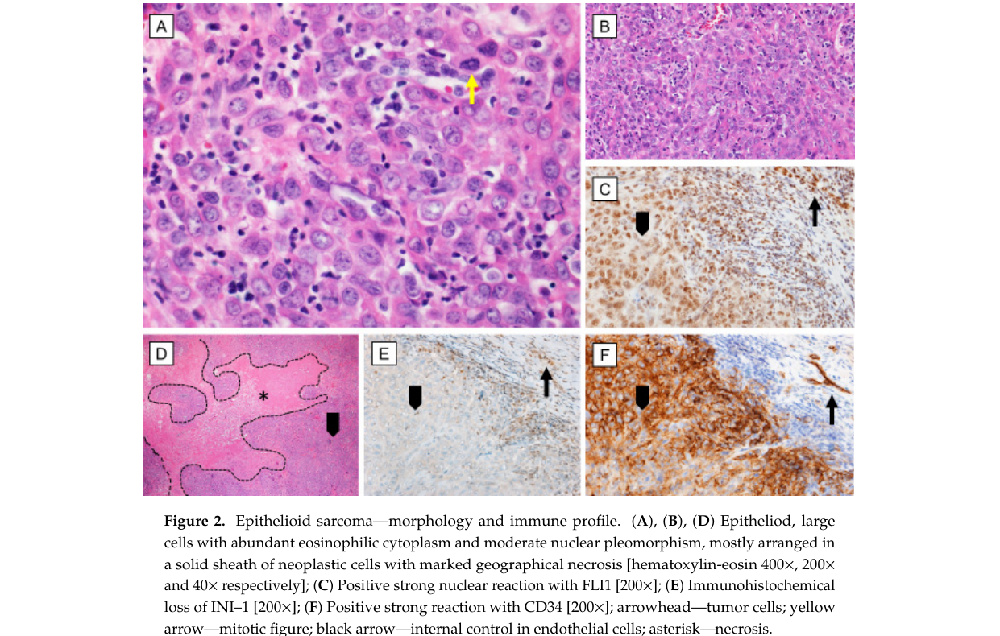

## Question

# Disease Characteristics Research Template

## Target Disease
- **Disease Name:** Epithelioid Sarcoma
- **MONDO ID:**  (if available)
- **Category:** 

## Research Objectives

Please provide a comprehensive research report on **Epithelioid Sarcoma** covering all of the
disease characteristics listed below. This report will be used to populate a disease knowledge
base entry. Be thorough and cite primary literature (PMID preferred) for all claims.

For each section, **suggested databases/resources** are listed. These are the first places
you should search for information on each topic.

---

### 1. Disease Information
> **Search first:** OMIM, Orphanet, ICD-10/ICD-11, MeSH, PubMed

- What is the disease? Provide a concise overview.
- What are the key identifiers? (OMIM, Orphanet, ICD-10/ICD-11, MeSH, Mondo)
- What are the common synonyms and alternative names?
- Is the information derived from individual patients (e.g., EHR) or aggregated disease-level resources?

### 2. Etiology

- **Disease Causal Factors**: What are the primary causes? (genetic, environmental, infectious, mechanistic)
- **Risk Factors**:
  > **Search first:** PubMed, Cochrane Library, UpToDate, clinical guidelines, ClinVar, ClinGen, GWAS Catalog, PheGenI, CTD, CDC, WHO, epidemiological databases
  - Genetic risk factors (causal variants, susceptibility loci, modifier genes)
  - Environmental risk factors (toxins, lifestyle, occupational exposures, age, sex, family history)
- **Protective Factors**:
  > **Search first:** PubMed, Cochrane Library, clinical trial databases, GWAS Catalog, gnomAD, WHO, CDC, nutrition databases
  - Genetic protective factors (protective variants, modifier alleles)
  - Environmental protective factors (diet, lifestyle, exposures that reduce risk)
- **Gene-Environment Interactions**: How do genetic and environmental factors interact to influence disease?
  > **Search first:** CTD, PubMed, PheGenI, GxE databases

### 3. Phenotypes
> **Search first:** HPO (Human Phenotype Ontology), OMIM, Orphanet, PubMed, clinicaltrials.gov, MedDRA, SNOMED CT, DECIPHER, LOINC

For each phenotype, provide:
- **Phenotype type**: symptoms, clinical signs, physical manifestations, behavioral changes, or laboratory abnormalities
  > For symptoms/signs: HPO, OMIM, Orphanet, PubMed
  > For behavioral changes: HPO, DSM, RDoC (Research Domain Criteria), PubMed
  > For laboratory abnormalities: LOINC, SNOMED CT, LabTests Online, PubMed
- **Phenotype characteristics**:
  > **Search first:** OMIM, Orphanet, HPO, PubMed
  - Age of symptom onset (neonatal, childhood, adult-onset, late-onset)
  - Symptom severity (mild, moderate, severe, variable)
  - Symptom progression (stable, progressive, episodic, fluctuating)
  - Frequency among affected individuals (percentage or qualitative)
- **Quality of life impact**: Effects on daily functioning and well-being (per-phenotype when possible)
  > **Search first:** EQ-5D database, SF-36, WHO QOL databases, PubMed
- Suggest HPO (Human Phenotype Ontology) terms for each phenotype

### 4. Genetic/Molecular Information

- **Causal Genes**: Gene mutations or chromosomal abnormalities responsible for disease (gene symbols, OMIM IDs)
  > **Search first:** OMIM, ClinVar, HGMD, Ensembl, NCBI Gene
- **Pathogenic Variants**:
  - Affected genes (gene symbols, HGNC IDs)
    > **Search first:** OMIM, NCBI Gene, Ensembl, HGNC, UniProt, GeneCards
  - Variant classification (pathogenic, likely pathogenic, VUS per ACMG/AMP guidelines)
    > **Search first:** ClinVar, ClinGen, ACMG/AMP guidelines, VarSome
  - Variant type/class (missense, frameshift, nonsense, splice-site, structural)
  - Allele frequency in population databases
    > **Search first:** gnomAD, 1000 Genomes, ExAC, TOPMed, dbSNP
  - Somatic vs germline origin
    > **Search first:** COSMIC (somatic), ClinVar, ICGC, TCGA
  - Functional consequences (loss of function, gain of function, dominant negative)
- **Modifier Genes**: Genes that modify disease severity or expression
- **Epigenetic Information**: DNA methylation, histone modifications, chromatin changes affecting disease
  > **Search first:** ENCODE, Roadmap Epigenomics, MethBase, DiseaseMeth
- **Chromosomal Abnormalities**: Large-scale genetic changes (aneuploidy, translocations, inversions)
  > **Search first:** DECIPHER, ClinVar, ECARUCA, UCSC Genome Browser

### 5. Environmental Information

- **Environmental Factors**: Non-genetic contributing factors (toxins, radiation, pollution, occupational exposure)
  > **Search first:** CTD (Comparative Toxicogenomics Database), TOXNET, PubMed, EPA databases
- **Lifestyle Factors**: Behavioral factors (smoking, diet, exercise, alcohol consumption)
  > **Search first:** CDC databases, WHO, PubMed, NHANES
- **Infectious Agents**: If applicable, pathogens causing or triggering disease (bacteria, viruses, fungi, parasites)
  > **Search first:** NCBI Taxonomy, ViPR, BV-BRC, MicrobeDB, GIDEON

### 6. Mechanism / Pathophysiology

- **Molecular Pathways**: Specific signaling cascades or biochemical pathways involved (Wnt, MAPK, mTOR, PI3K-AKT, etc.)
  > **Search first:** KEGG, Reactome, WikiPathways, PathBank, BioCyc
- **Cellular Processes**: Cell-level mechanisms (apoptosis, autophagy, cell cycle dysregulation, inflammation, etc.)
  > **Search first:** Gene Ontology (GO), Reactome, KEGG, PubMed
- **Protein Dysfunction**: How protein structure or function is altered (misfolding, aggregation, loss of function, gain of function)
  > **Search first:** UniProt, PDB (Protein Data Bank), InterPro, Pfam, AlphaFold
- **Metabolic Changes**: Alterations in metabolic processes (energy metabolism, lipid metabolism, amino acid metabolism)
  > **Search first:** KEGG, BioCyc, HMDB (Human Metabolome Database), BRENDA
- **Immune System Involvement**: Role of immune response (autoimmunity, immunodeficiency, chronic inflammation)
  > **Search first:** ImmPort, Immunome Database, IEDB, Gene Ontology
- **Tissue Damage Mechanisms**: How tissues/ are injured (oxidative stress, ischemia, fibrosis, necrosis)
  > **Search first:** PubMed, Gene Ontology, Reactome
- **Biochemical Abnormalities**: Specific molecular defects (enzyme deficiencies, receptor dysfunction, ion channel defects)
  > **Search first:** BRENDA, UniProt, KEGG, OMIM, PubMed
- **Epigenetic Changes**: DNA methylation, histone modifications affecting gene expression in disease
  > **Search first:** ENCODE, Roadmap Epigenomics, MethBase, DiseaseMeth
- **Molecular Profiling** (if available):
  - Transcriptomics/gene expression changes
    > **Search first:** GEO (Gene Expression Omnibus), ArrayExpress, GTEx, Human Cell Atlas, SRA
  - Proteomics findings
    > **Search first:** PRIDE, ProteomeXchange, Human Protein Atlas, STRING, BioGRID
  - Metabolomics signatures
    > **Search first:** MetaboLights, Metabolomics Workbench, HMDB, METLIN
  - Lipidomics alterations
    > **Search first:** LIPID MAPS, SwissLipids, LipidHome, Metabolomics Workbench
  - Genomic structural features
    > **Search first:** UCSC Genome Browser, Ensembl, NCBI, dbVar, DGV
- **Advanced Technologies** (if applicable):
  - Single-cell analysis findings (cell-type specific mechanisms, cellular heterogeneity)
    > **Search first:** Human Cell Atlas, Single Cell Portal, GEO, CELLxGENE
  - Spatial transcriptomics findings
    > **Search first:** GEO, Spatial Research, Vizgen, 10x Genomics data
  - Multi-omics integration results
    > **Search first:** TCGA, ICGC, cBioPortal, LinkedOmics, PubMed
  - Functional genomics screens (CRISPR, RNAi)
    > **Search first:** DepMap, GenomeRNAi, PubMed, BioGRID ORCS

For each mechanism, describe:
- The causal chain from initial trigger to clinical manifestation
- Which mechanisms are upstream vs downstream
- What cell types and biological processes are involved
- Suggest GO terms for biological processes and CL terms for cell types

### 7. Anatomical Structures Affected

- **Organ Level**:
  - Primary organs directly affected
  - Secondary organ involvement (complications, secondary effects)
  - Body systems involved (cardiovascular, nervous, digestive, respiratory, endocrine, etc.)
  > **Search first:** Uberon, FMA (Foundational Model of Anatomy), OMIM, HPO, ICD-11, MeSH, SNOMED CT
- **Tissue and Cell Level**:
  - Specific tissue types affected (epithelial, connective, muscle, nervous)
  - Specific cell populations targeted (with Cell Ontology terms)
  > **Search first:** Uberon, Human Protein Atlas, Cell Ontology, Human Cell Atlas, CellMarker, PanglaoDB
- **Subcellular Level**:
  - Cellular compartments involved (mitochondria, nucleus, ER, lysosomes) (with GO Cellular Component terms)
  > **Search first:** Gene Ontology (Cellular Component), UniProt, Human Protein Atlas
- **Localization**:
  - Specific anatomical sites (with UBERON terms)
    > **Search first:** FMA, Uberon, NeuroNames (for brain), SNOMED CT
  - Lateralization (unilateral, bilateral, asymmetric)
    > **Search first:** HPO, clinical literature, imaging databases

### 8. Temporal Development

- **Onset**:
  - Typical age of onset (congenital, pediatric, adult, geriatric)
  - Onset pattern (acute, subacute, chronic, insidious)
  > **Search first:** OMIM, Orphanet, HPO, PubMed
- **Progression**:
  - Disease stages (early, intermediate, advanced, end-stage)
    > **Search first:** Cancer Staging Manual (AJCC), WHO classifications, PubMed
  - Progression rate (rapid, slow, variable)
  - Disease course pattern (episodic, relapsing-remitting, progressive, stable)
  - Disease duration (self-limited, chronic lifelong)
  > **Search first:** Disease registries, longitudinal cohort databases, natural history studies, PubMed, Orphanet, OMIM
- **Patterns**:
  - Remission patterns (spontaneous, treatment-induced)
    > **Search first:** Clinical trial databases, disease registries, PubMed
  - Critical periods (time windows of vulnerability or opportunity for intervention)
    > **Search first:** PubMed, developmental biology databases, clinical guidelines

### 9. Inheritance and Population

- **Epidemiology**:
  - Prevalence (cases per 100,000 at given time)
  - Incidence (new cases per 100,000 per year)
  > **Search first:** Orphanet, CDC, WHO, GBD (Global Burden of Disease), national registries, SEER, disease registries
- **For Genetic Etiology**:
  - Inheritance pattern (AD, AR, X-linked, mitochondrial, multifactorial, polygenic)
    > **Search first:** OMIM, Orphanet, ClinVar, GTR (Genetic Testing Registry)
  - Penetrance (complete, incomplete, age-dependent)
    > **Search first:** ClinVar, OMIM, PubMed, ClinGen
  - Expressivity (variable, consistent)
    > **Search first:** OMIM, ClinVar, PubMed
  - Genetic anticipation (increasing severity in successive generations)
    > **Search first:** OMIM, PubMed (especially for repeat expansion disorders)
  - Germline mosaicism
    > **Search first:** ClinVar, OMIM, genetic counseling literature, PubMed
  - Founder effects (population-specific mutations)
    > **Search first:** gnomAD, population genetics databases, PubMed
  - Consanguinity role
    > **Search first:** OMIM, population studies, genetic counseling resources
  - Carrier frequency
    > **Search first:** gnomAD, carrier screening databases, GeneReviews, GTR
- **Population Demographics**:
  - Affected populations (ethnic or demographic groups with higher prevalence)
    > **Search first:** gnomAD, 1000 Genomes, PAGE Study, PubMed, population registries
  - Geographic distribution (endemic areas, regional variation)
    > **Search first:** WHO, CDC, GBD, Orphanet, geographic epidemiology databases
  - Geographic distribution of specific variants
  - Sex ratio (male:female)
    > **Search first:** Disease registries, OMIM, PubMed, epidemiological databases
  - Age distribution of affected individuals
    > **Search first:** CDC, disease registries, SEER, Orphanet

### 10. Diagnostics

- **Clinical Tests**:
  - Laboratory tests (blood, urine, tissue chemistry, specific enzyme assays)
    > **Search first:** LOINC, LabTests Online, PubMed
  - Biomarkers (proteins, metabolites, genetic markers, circulating biomarkers)
    > **Search first:** FDA Biomarker List, BEST (Biomarkers, EndpointS, and other Tools), PubMed
  - Imaging studies (X-ray, CT, MRI, PET, ultrasound)
    > **Search first:** RadLex, DICOM, Radiopaedia, imaging databases
  - Functional tests (pulmonary function, cardiac stress tests)
    > **Search first:** LOINC, clinical guidelines, PubMed
  - Electrophysiology (EEG, EMG, ECG, nerve conduction studies)
    > **Search first:** LOINC, clinical neurophysiology databases, PubMed
  - Biopsy findings (histopathology, immunohistochemistry)
    > **Search first:** SNOMED CT, College of American Pathologists resources, PubMed
  - Pathology findings (microscopic examination)
    > **Search first:** SNOMED CT, Digital Pathology databases, PubMed
- **Genetic Testing**:
  > **Search first:** GTR (Genetic Testing Registry), GeneReviews, ClinGen
  - Overview of recommended genetic testing approach
  - Whole genome sequencing (WGS) utility
    > **Search first:** GTR, ClinVar, GEL (Genomics England), gnomAD
  - Whole exome sequencing (WES) utility
    > **Search first:** GTR, ClinVar, OMIM, GeneMatcher
  - Gene panels (which panels, which genes)
    > **Search first:** GTR, ClinVar, laboratory-specific databases
  - Single gene testing
    > **Search first:** GTR, ClinVar, OMIM, GeneReviews
  - Chromosomal microarray (CMA)
    > **Search first:** DECIPHER, ClinVar, dbVar, ECARUCA
  - Karyotyping
    > **Search first:** Chromosome Abnormality Database, ClinVar, cytogenetics resources
  - FISH
    > **Search first:** ClinVar, cytogenetics databases, PubMed
  - Mitochondrial DNA testing
    > **Search first:** MITOMAP, MSeqDR, ClinVar, GTR
  - Repeat expansion testing
    > **Search first:** GTR, ClinVar, repeat expansion databases, PubMed
- **Omics-Based Diagnostics** (if applicable):
  - RNA sequencing / transcriptomics
    > **Search first:** GEO, ArrayExpress, GTEx, RNA-seq databases
  - Proteomics
    > **Search first:** PRIDE, ProteomeXchange, FDA Biomarker database
  - Metabolomics
    > **Search first:** MetaboLights, Metabolomics Workbench, HMDB
  - Epigenomics
    > **Search first:** GEO, ENCODE, Roadmap Epigenomics, MethBase
  - Liquid biopsy
    > **Search first:** COSMIC, ClinVar, liquid biopsy databases, PubMed
- **Clinical Criteria**:
  - Standardized diagnostic criteria (DSM, ICD, society guidelines)
    > **Search first:** DSM-5, ICD-11, clinical society guidelines, UpToDate
  - Differential diagnosis (other conditions to rule out, with distinguishing features)
    > **Search first:** DynaMed, UpToDate, clinical decision support systems
- **Screening**:
  - Screening methods for asymptomatic individuals (newborn screening, carrier screening, cascade screening)
    > **Search first:** ACMG recommendations, CDC newborn screening, GTR

### 11. Outcome/Prognosis

- **Survival and Mortality**:
  - Survival rate (5-year, 10-year, overall)
    > **Search first:** SEER, cancer registries, disease-specific registries, PubMed
  - Life expectancy (with and without treatment if applicable)
    > **Search first:** Orphanet, disease registries, actuarial databases, PubMed
  - Mortality rate
    > **Search first:** CDC, WHO, GBD, national mortality databases
  - Disease-specific mortality (deaths directly attributable to disease)
    > **Search first:** Disease registries, CDC Wonder, GBD, PubMed
- **Morbidity and Function**:
  - Morbidity (disease-related disability and health impacts)
    > **Search first:** GBD, WHO, disability databases, PubMed
  - Disability outcomes (long-term functional impairments)
    > **Search first:** ICF (International Classification of Functioning), disability registries
  - Quality of life measures (EQ-5D, SF-36, PROMIS, disease-specific tools)
    > **Search first:** EQ-5D database, SF-36, PROMIS, PubMed
- **Disease Course**:
  - Complications (secondary problems: infections, organ failure, etc.)
    > **Search first:** ICD codes, disease registries, clinical databases, PubMed
  - Recovery potential (likelihood and extent of recovery, with vs without treatment)
    > **Search first:** Natural history studies, rehabilitation databases, PubMed
- **Prediction**:
  - Prognostic factors (age, disease severity, biomarkers, treatment response)
    > **Search first:** Prognostic models databases, clinical calculators, PubMed
  - Prognostic biomarkers (molecular markers predicting disease course)
    > **Search first:** FDA Biomarker database, PubMed, cancer prognostic databases

### 12. Treatment

- **Pharmacotherapy**:
  - Pharmacological treatments (drug names, drug classes, mechanisms of action)
    > **Search first:** DrugBank, RxNorm, ATC classification, DailyMed, FDA databases
  - Pharmacogenomics (how genetic variants affect drug metabolism, efficacy, toxicity)
    > **Search first:** PharmGKB, CPIC (Clinical Pharmacogenetics), FDA Table of PGx Biomarkers
- **Advanced Therapeutics**:
  - Gene therapy (viral vectors, CRISPR, gene replacement, gene editing)
    > **Search first:** ClinicalTrials.gov, FDA gene therapy database, ASGCT resources
  - Cell therapy (stem cell transplant, CAR-T, cellular therapeutics)
    > **Search first:** ClinicalTrials.gov, FDA cell therapy database, FACT standards
  - RNA-based therapies (ASOs, siRNA, mRNA therapies)
    > **Search first:** ClinicalTrials.gov, FDA approvals, PubMed
  - Targeted therapies (treatments directed at specific molecular targets)
    > **Search first:** My Cancer Genome, OncoKB, ClinicalTrials.gov, FDA approvals
  - Immunotherapies (checkpoint inhibitors, monoclonal antibodies)
    > **Search first:** Cancer Immunotherapy Database, FDA approvals, ClinicalTrials.gov
- **Surgical and Interventional**:
  - Surgical interventions (types of surgery, timing, outcomes)
    > **Search first:** CPT codes, surgical registries, clinical guidelines, PubMed
- **Supportive and Rehabilitative**:
  - Supportive care (symptom management, pain control, nutrition)
    > **Search first:** Clinical guidelines, Cochrane Library, PubMed
  - Rehabilitation (physical therapy, occupational therapy, speech therapy)
    > **Search first:** Rehabilitation medicine databases, clinical guidelines, PubMed
- **Experimental**:
  - Experimental treatments in clinical trials (with NCT identifiers if available)
    > **Search first:** ClinicalTrials.gov, EU Clinical Trials Register, WHO ICTRP
- **Treatment Outcomes**:
  - Treatment response rates
    > **Search first:** Clinical trial databases, FDA reviews, systematic reviews, PubMed
  - Side effects and adverse events
    > **Search first:** FDA Adverse Event Reporting System (FAERS), MedWatch, PubMed
- **Treatment Strategy**:
  - Treatment algorithms (clinical pathways, decision trees)
    > **Search first:** Clinical practice guidelines, NCCN Guidelines, UpToDate
  - Combination therapies
    > **Search first:** ClinicalTrials.gov, treatment guidelines, PubMed
  - Personalized medicine approaches (genotype-guided treatment)
    > **Search first:** My Cancer Genome, CIViC, PharmGKB, precision medicine databases

For each treatment, suggest MAXO (Medical Action Ontology) terms where applicable.

### 13. Prevention

- **Prevention Levels**:
  - Primary prevention (preventing disease occurrence: vaccination, risk factor modification)
    > **Search first:** CDC, WHO, USPSTF recommendations, Cochrane Library
  - Secondary prevention (early detection and treatment: screening programs, early intervention)
    > **Search first:** USPSTF, CDC screening guidelines, WHO
  - Tertiary prevention (preventing complications in those with disease)
    > **Search first:** Clinical guidelines, disease management protocols, PubMed
- **Immunization**: Vaccine strategies (if applicable)
  > **Search first:** CDC vaccine schedules, WHO immunization, FDA vaccine database
- **Screening and Early Detection**:
  - Screening programs (population-based: newborn screening, cancer screening)
    > **Search first:** CDC screening programs, USPSTF, cancer screening databases
  - Genetic screening (carrier screening, preimplantation genetic diagnosis, prenatal testing)
    > **Search first:** ACMG recommendations, ACOG guidelines, GTR
  - Risk stratification (identifying high-risk individuals for targeted prevention)
    > **Search first:** Risk prediction models, clinical calculators, PubMed
- **Behavioral Interventions**: Lifestyle modifications to reduce risk
  > **Search first:** CDC, WHO, behavioral intervention databases, Cochrane Library
- **Counseling**: Genetic counseling (risk assessment, family planning guidance)
  > **Search first:** NSGC resources, ACMG guidelines, GeneReviews
- **Public Health**:
  - Public health interventions (sanitation, vector control, health education)
    > **Search first:** CDC, WHO, public health databases, PubMed
  - Environmental interventions (reducing environmental risk factors)
    > **Search first:** EPA databases, WHO environmental health, PubMed
- **Prophylaxis**: Preventive medications or procedures
  > **Search first:** Clinical guidelines, FDA approvals, PubMed

### 14. Other Species / Natural Disease

- **Taxonomy**: Species affected (with NCBI Taxon identifiers)
  > **Search first:** NCBI Taxonomy
- **Breed**: Specific breeds affected (with VBO identifiers if applicable)
  > **Search first:** VBO (Vertebrate Breed Ontology)
- **Gene**: Orthologous genes in other species (with NCBI Gene IDs)
  > **Search first:** NCBI Gene
- **Natural Disease**:
  - Naturally occurring disease in other species (companion animals, wildlife)
    > **Search first:** OMIA (Online Mendelian Inheritance in Animals), VetCompass, PubMed
  - Veterinary relevance and importance in animal health
    > **Search first:** OMIA, veterinary databases, PubMed
- **Comparative Biology**:
  - Comparative pathology (similarities and differences across species)
    > **Search first:** OMIA, comparative pathology databases, PubMed
  - Evolutionary conservation of disease mechanisms
    > **Search first:** HomoloGene, OrthoMCL, Alliance of Genome Resources
- **Transmission** (if applicable):
  - Zoonotic potential
    > **Search first:** CDC zoonotic diseases, WHO zoonoses, GIDEON
  - Cross-species susceptibility
    > **Search first:** NCBI Taxonomy, veterinary databases, PubMed

### 15. Model Organisms

- **Model Types**:
  - Model organism type (mammalian, invertebrate, cellular, in vitro)
    > **Search first:** Alliance of Genome Resources, model organism databases
  - Specific model systems (mouse, rat, zebrafish, Drosophila, C. elegans, yeast, cell lines, organoids, iPSCs)
    > **Search first:** MGI, RGD, ZFIN, FlyBase, WormBase, SGD, ATCC, Cellosaurus
  - Induced models (drug treatment, surgical intervention, environmental manipulation)
    > **Search first:** MGI, model organism databases, PubMed
- **Genetic Models**:
  - Types available (knockout, knock-in, transgenic, conditional, humanized)
    > **Search first:** MGI, IMPC, KOMP, EuMMCR, IMSR
- **Model Characteristics**:
  - Phenotype recapitulation (how well model reproduces human disease features)
    > **Search first:** Model organism databases, comparative studies, PubMed
  - Model limitations (aspects of human disease not captured)
    > **Search first:** Model organism databases, PubMed, review articles
- **Applications**:
  - Research applications (what aspects of disease can be studied)
    > **Search first:** Model organism databases, PubMed
- **Resources**:
  - Model databases
    > **Search first:** MGI, RGD, ZFIN, FlyBase, WormBase, IMSR, EMMA, MMRRC

---

## Citation Requirements

- Cite primary literature (PMID preferred) for all mechanistic and clinical claims
- Prioritize recent reviews and landmark papers
- Include direct quotes from abstracts where possible to support key statements
- Distinguish evidence source types: human clinical, model organism, in vitro, computational

## Output Format

Structure your response as a comprehensive narrative organized by the sections above.
For each section, provide:
- Factual content with specific details (numbers, percentages, gene names, variant nomenclature)
- Ontology term suggestions (HPO, GO, CL, UBERON, CHEBI, MAXO, MONDO) where applicable
- Evidence citations with PMIDs
- Direct quotes from abstracts to support key claims
- Clear indication when information is not available or not applicable for this disease

This report will be used to populate a disease knowledge base entry with:
- Pathophysiology descriptions with causal chains
- Gene/protein annotations (HGNC, GO terms)
- Phenotype associations (HP terms) with frequencies
- Cell type involvement (CL terms)
- Anatomical locations (UBERON terms)
- Chemical entities (CHEBI terms)
- Treatment annotations (MAXO terms)
- Evidence items with PMIDs and exact abstract quotes
- Epidemiology, prognosis, diagnostic, and prevention information
- Animal model descriptions with phenotype recapitulation details

## Output

Question: You are an expert researcher providing comprehensive, well-cited information.

Provide detailed information focusing on:
1. Key concepts and definitions with current understanding
2. Recent developments and latest research (prioritize 2023-2024 sources)
3. Current applications and real-world implementations
4. Expert opinions and analysis from authoritative sources
5. Relevant statistics and data from recent studies

Format as a comprehensive research report with proper citations. Include URLs and publication dates where available.
Always prioritize recent, authoritative sources and provide specific citations for all major claims.

# Disease Characteristics Research Template

## Target Disease
- **Disease Name:** Epithelioid Sarcoma
- **MONDO ID:**  (if available)
- **Category:** 

## Research Objectives

Please provide a comprehensive research report on **Epithelioid Sarcoma** covering all of the
disease characteristics listed below. This report will be used to populate a disease knowledge
base entry. Be thorough and cite primary literature (PMID preferred) for all claims.

For each section, **suggested databases/resources** are listed. These are the first places
you should search for information on each topic.

---

### 1. Disease Information
> **Search first:** OMIM, Orphanet, ICD-10/ICD-11, MeSH, PubMed

- What is the disease? Provide a concise overview.
- What are the key identifiers? (OMIM, Orphanet, ICD-10/ICD-11, MeSH, Mondo)
- What are the common synonyms and alternative names?
- Is the information derived from individual patients (e.g., EHR) or aggregated disease-level resources?

### 2. Etiology

- **Disease Causal Factors**: What are the primary causes? (genetic, environmental, infectious, mechanistic)
- **Risk Factors**:
  > **Search first:** PubMed, Cochrane Library, UpToDate, clinical guidelines, ClinVar, ClinGen, GWAS Catalog, PheGenI, CTD, CDC, WHO, epidemiological databases
  - Genetic risk factors (causal variants, susceptibility loci, modifier genes)
  - Environmental risk factors (toxins, lifestyle, occupational exposures, age, sex, family history)
- **Protective Factors**:
  > **Search first:** PubMed, Cochrane Library, clinical trial databases, GWAS Catalog, gnomAD, WHO, CDC, nutrition databases
  - Genetic protective factors (protective variants, modifier alleles)
  - Environmental protective factors (diet, lifestyle, exposures that reduce risk)
- **Gene-Environment Interactions**: How do genetic and environmental factors interact to influence disease?
  > **Search first:** CTD, PubMed, PheGenI, GxE databases

### 3. Phenotypes
> **Search first:** HPO (Human Phenotype Ontology), OMIM, Orphanet, PubMed, clinicaltrials.gov, MedDRA, SNOMED CT, DECIPHER, LOINC

For each phenotype, provide:
- **Phenotype type**: symptoms, clinical signs, physical manifestations, behavioral changes, or laboratory abnormalities
  > For symptoms/signs: HPO, OMIM, Orphanet, PubMed
  > For behavioral changes: HPO, DSM, RDoC (Research Domain Criteria), PubMed
  > For laboratory abnormalities: LOINC, SNOMED CT, LabTests Online, PubMed
- **Phenotype characteristics**:
  > **Search first:** OMIM, Orphanet, HPO, PubMed
  - Age of symptom onset (neonatal, childhood, adult-onset, late-onset)
  - Symptom severity (mild, moderate, severe, variable)
  - Symptom progression (stable, progressive, episodic, fluctuating)
  - Frequency among affected individuals (percentage or qualitative)
- **Quality of life impact**: Effects on daily functioning and well-being (per-phenotype when possible)
  > **Search first:** EQ-5D database, SF-36, WHO QOL databases, PubMed
- Suggest HPO (Human Phenotype Ontology) terms for each phenotype

### 4. Genetic/Molecular Information

- **Causal Genes**: Gene mutations or chromosomal abnormalities responsible for disease (gene symbols, OMIM IDs)
  > **Search first:** OMIM, ClinVar, HGMD, Ensembl, NCBI Gene
- **Pathogenic Variants**:
  - Affected genes (gene symbols, HGNC IDs)
    > **Search first:** OMIM, NCBI Gene, Ensembl, HGNC, UniProt, GeneCards
  - Variant classification (pathogenic, likely pathogenic, VUS per ACMG/AMP guidelines)
    > **Search first:** ClinVar, ClinGen, ACMG/AMP guidelines, VarSome
  - Variant type/class (missense, frameshift, nonsense, splice-site, structural)
  - Allele frequency in population databases
    > **Search first:** gnomAD, 1000 Genomes, ExAC, TOPMed, dbSNP
  - Somatic vs germline origin
    > **Search first:** COSMIC (somatic), ClinVar, ICGC, TCGA
  - Functional consequences (loss of function, gain of function, dominant negative)
- **Modifier Genes**: Genes that modify disease severity or expression
- **Epigenetic Information**: DNA methylation, histone modifications, chromatin changes affecting disease
  > **Search first:** ENCODE, Roadmap Epigenomics, MethBase, DiseaseMeth
- **Chromosomal Abnormalities**: Large-scale genetic changes (aneuploidy, translocations, inversions)
  > **Search first:** DECIPHER, ClinVar, ECARUCA, UCSC Genome Browser

### 5. Environmental Information

- **Environmental Factors**: Non-genetic contributing factors (toxins, radiation, pollution, occupational exposure)
  > **Search first:** CTD (Comparative Toxicogenomics Database), TOXNET, PubMed, EPA databases
- **Lifestyle Factors**: Behavioral factors (smoking, diet, exercise, alcohol consumption)
  > **Search first:** CDC databases, WHO, PubMed, NHANES
- **Infectious Agents**: If applicable, pathogens causing or triggering disease (bacteria, viruses, fungi, parasites)
  > **Search first:** NCBI Taxonomy, ViPR, BV-BRC, MicrobeDB, GIDEON

### 6. Mechanism / Pathophysiology

- **Molecular Pathways**: Specific signaling cascades or biochemical pathways involved (Wnt, MAPK, mTOR, PI3K-AKT, etc.)
  > **Search first:** KEGG, Reactome, WikiPathways, PathBank, BioCyc
- **Cellular Processes**: Cell-level mechanisms (apoptosis, autophagy, cell cycle dysregulation, inflammation, etc.)
  > **Search first:** Gene Ontology (GO), Reactome, KEGG, PubMed
- **Protein Dysfunction**: How protein structure or function is altered (misfolding, aggregation, loss of function, gain of function)
  > **Search first:** UniProt, PDB (Protein Data Bank), InterPro, Pfam, AlphaFold
- **Metabolic Changes**: Alterations in metabolic processes (energy metabolism, lipid metabolism, amino acid metabolism)
  > **Search first:** KEGG, BioCyc, HMDB (Human Metabolome Database), BRENDA
- **Immune System Involvement**: Role of immune response (autoimmunity, immunodeficiency, chronic inflammation)
  > **Search first:** ImmPort, Immunome Database, IEDB, Gene Ontology
- **Tissue Damage Mechanisms**: How tissues/ are injured (oxidative stress, ischemia, fibrosis, necrosis)
  > **Search first:** PubMed, Gene Ontology, Reactome
- **Biochemical Abnormalities**: Specific molecular defects (enzyme deficiencies, receptor dysfunction, ion channel defects)
  > **Search first:** BRENDA, UniProt, KEGG, OMIM, PubMed
- **Epigenetic Changes**: DNA methylation, histone modifications affecting gene expression in disease
  > **Search first:** ENCODE, Roadmap Epigenomics, MethBase, DiseaseMeth
- **Molecular Profiling** (if available):
  - Transcriptomics/gene expression changes
    > **Search first:** GEO (Gene Expression Omnibus), ArrayExpress, GTEx, Human Cell Atlas, SRA
  - Proteomics findings
    > **Search first:** PRIDE, ProteomeXchange, Human Protein Atlas, STRING, BioGRID
  - Metabolomics signatures
    > **Search first:** MetaboLights, Metabolomics Workbench, HMDB, METLIN
  - Lipidomics alterations
    > **Search first:** LIPID MAPS, SwissLipids, LipidHome, Metabolomics Workbench
  - Genomic structural features
    > **Search first:** UCSC Genome Browser, Ensembl, NCBI, dbVar, DGV
- **Advanced Technologies** (if applicable):
  - Single-cell analysis findings (cell-type specific mechanisms, cellular heterogeneity)
    > **Search first:** Human Cell Atlas, Single Cell Portal, GEO, CELLxGENE
  - Spatial transcriptomics findings
    > **Search first:** GEO, Spatial Research, Vizgen, 10x Genomics data
  - Multi-omics integration results
    > **Search first:** TCGA, ICGC, cBioPortal, LinkedOmics, PubMed
  - Functional genomics screens (CRISPR, RNAi)
    > **Search first:** DepMap, GenomeRNAi, PubMed, BioGRID ORCS

For each mechanism, describe:
- The causal chain from initial trigger to clinical manifestation
- Which mechanisms are upstream vs downstream
- What cell types and biological processes are involved
- Suggest GO terms for biological processes and CL terms for cell types

### 7. Anatomical Structures Affected

- **Organ Level**:
  - Primary organs directly affected
  - Secondary organ involvement (complications, secondary effects)
  - Body systems involved (cardiovascular, nervous, digestive, respiratory, endocrine, etc.)
  > **Search first:** Uberon, FMA (Foundational Model of Anatomy), OMIM, HPO, ICD-11, MeSH, SNOMED CT
- **Tissue and Cell Level**:
  - Specific tissue types affected (epithelial, connective, muscle, nervous)
  - Specific cell populations targeted (with Cell Ontology terms)
  > **Search first:** Uberon, Human Protein Atlas, Cell Ontology, Human Cell Atlas, CellMarker, PanglaoDB
- **Subcellular Level**:
  - Cellular compartments involved (mitochondria, nucleus, ER, lysosomes) (with GO Cellular Component terms)
  > **Search first:** Gene Ontology (Cellular Component), UniProt, Human Protein Atlas
- **Localization**:
  - Specific anatomical sites (with UBERON terms)
    > **Search first:** FMA, Uberon, NeuroNames (for brain), SNOMED CT
  - Lateralization (unilateral, bilateral, asymmetric)
    > **Search first:** HPO, clinical literature, imaging databases

### 8. Temporal Development

- **Onset**:
  - Typical age of onset (congenital, pediatric, adult, geriatric)
  - Onset pattern (acute, subacute, chronic, insidious)
  > **Search first:** OMIM, Orphanet, HPO, PubMed
- **Progression**:
  - Disease stages (early, intermediate, advanced, end-stage)
    > **Search first:** Cancer Staging Manual (AJCC), WHO classifications, PubMed
  - Progression rate (rapid, slow, variable)
  - Disease course pattern (episodic, relapsing-remitting, progressive, stable)
  - Disease duration (self-limited, chronic lifelong)
  > **Search first:** Disease registries, longitudinal cohort databases, natural history studies, PubMed, Orphanet, OMIM
- **Patterns**:
  - Remission patterns (spontaneous, treatment-induced)
    > **Search first:** Clinical trial databases, disease registries, PubMed
  - Critical periods (time windows of vulnerability or opportunity for intervention)
    > **Search first:** PubMed, developmental biology databases, clinical guidelines

### 9. Inheritance and Population

- **Epidemiology**:
  - Prevalence (cases per 100,000 at given time)
  - Incidence (new cases per 100,000 per year)
  > **Search first:** Orphanet, CDC, WHO, GBD (Global Burden of Disease), national registries, SEER, disease registries
- **For Genetic Etiology**:
  - Inheritance pattern (AD, AR, X-linked, mitochondrial, multifactorial, polygenic)
    > **Search first:** OMIM, Orphanet, ClinVar, GTR (Genetic Testing Registry)
  - Penetrance (complete, incomplete, age-dependent)
    > **Search first:** ClinVar, OMIM, PubMed, ClinGen
  - Expressivity (variable, consistent)
    > **Search first:** OMIM, ClinVar, PubMed
  - Genetic anticipation (increasing severity in successive generations)
    > **Search first:** OMIM, PubMed (especially for repeat expansion disorders)
  - Germline mosaicism
    > **Search first:** ClinVar, OMIM, genetic counseling literature, PubMed
  - Founder effects (population-specific mutations)
    > **Search first:** gnomAD, population genetics databases, PubMed
  - Consanguinity role
    > **Search first:** OMIM, population studies, genetic counseling resources
  - Carrier frequency
    > **Search first:** gnomAD, carrier screening databases, GeneReviews, GTR
- **Population Demographics**:
  - Affected populations (ethnic or demographic groups with higher prevalence)
    > **Search first:** gnomAD, 1000 Genomes, PAGE Study, PubMed, population registries
  - Geographic distribution (endemic areas, regional variation)
    > **Search first:** WHO, CDC, GBD, Orphanet, geographic epidemiology databases
  - Geographic distribution of specific variants
  - Sex ratio (male:female)
    > **Search first:** Disease registries, OMIM, PubMed, epidemiological databases
  - Age distribution of affected individuals
    > **Search first:** CDC, disease registries, SEER, Orphanet

### 10. Diagnostics

- **Clinical Tests**:
  - Laboratory tests (blood, urine, tissue chemistry, specific enzyme assays)
    > **Search first:** LOINC, LabTests Online, PubMed
  - Biomarkers (proteins, metabolites, genetic markers, circulating biomarkers)
    > **Search first:** FDA Biomarker List, BEST (Biomarkers, EndpointS, and other Tools), PubMed
  - Imaging studies (X-ray, CT, MRI, PET, ultrasound)
    > **Search first:** RadLex, DICOM, Radiopaedia, imaging databases
  - Functional tests (pulmonary function, cardiac stress tests)
    > **Search first:** LOINC, clinical guidelines, PubMed
  - Electrophysiology (EEG, EMG, ECG, nerve conduction studies)
    > **Search first:** LOINC, clinical neurophysiology databases, PubMed
  - Biopsy findings (histopathology, immunohistochemistry)
    > **Search first:** SNOMED CT, College of American Pathologists resources, PubMed
  - Pathology findings (microscopic examination)
    > **Search first:** SNOMED CT, Digital Pathology databases, PubMed
- **Genetic Testing**:
  > **Search first:** GTR (Genetic Testing Registry), GeneReviews, ClinGen
  - Overview of recommended genetic testing approach
  - Whole genome sequencing (WGS) utility
    > **Search first:** GTR, ClinVar, GEL (Genomics England), gnomAD
  - Whole exome sequencing (WES) utility
    > **Search first:** GTR, ClinVar, OMIM, GeneMatcher
  - Gene panels (which panels, which genes)
    > **Search first:** GTR, ClinVar, laboratory-specific databases
  - Single gene testing
    > **Search first:** GTR, ClinVar, OMIM, GeneReviews
  - Chromosomal microarray (CMA)
    > **Search first:** DECIPHER, ClinVar, dbVar, ECARUCA
  - Karyotyping
    > **Search first:** Chromosome Abnormality Database, ClinVar, cytogenetics resources
  - FISH
    > **Search first:** ClinVar, cytogenetics databases, PubMed
  - Mitochondrial DNA testing
    > **Search first:** MITOMAP, MSeqDR, ClinVar, GTR
  - Repeat expansion testing
    > **Search first:** GTR, ClinVar, repeat expansion databases, PubMed
- **Omics-Based Diagnostics** (if applicable):
  - RNA sequencing / transcriptomics
    > **Search first:** GEO, ArrayExpress, GTEx, RNA-seq databases
  - Proteomics
    > **Search first:** PRIDE, ProteomeXchange, FDA Biomarker database
  - Metabolomics
    > **Search first:** MetaboLights, Metabolomics Workbench, HMDB
  - Epigenomics
    > **Search first:** GEO, ENCODE, Roadmap Epigenomics, MethBase
  - Liquid biopsy
    > **Search first:** COSMIC, ClinVar, liquid biopsy databases, PubMed
- **Clinical Criteria**:
  - Standardized diagnostic criteria (DSM, ICD, society guidelines)
    > **Search first:** DSM-5, ICD-11, clinical society guidelines, UpToDate
  - Differential diagnosis (other conditions to rule out, with distinguishing features)
    > **Search first:** DynaMed, UpToDate, clinical decision support systems
- **Screening**:
  - Screening methods for asymptomatic individuals (newborn screening, carrier screening, cascade screening)
    > **Search first:** ACMG recommendations, CDC newborn screening, GTR

### 11. Outcome/Prognosis

- **Survival and Mortality**:
  - Survival rate (5-year, 10-year, overall)
    > **Search first:** SEER, cancer registries, disease-specific registries, PubMed
  - Life expectancy (with and without treatment if applicable)
    > **Search first:** Orphanet, disease registries, actuarial databases, PubMed
  - Mortality rate
    > **Search first:** CDC, WHO, GBD, national mortality databases
  - Disease-specific mortality (deaths directly attributable to disease)
    > **Search first:** Disease registries, CDC Wonder, GBD, PubMed
- **Morbidity and Function**:
  - Morbidity (disease-related disability and health impacts)
    > **Search first:** GBD, WHO, disability databases, PubMed
  - Disability outcomes (long-term functional impairments)
    > **Search first:** ICF (International Classification of Functioning), disability registries
  - Quality of life measures (EQ-5D, SF-36, PROMIS, disease-specific tools)
    > **Search first:** EQ-5D database, SF-36, PROMIS, PubMed
- **Disease Course**:
  - Complications (secondary problems: infections, organ failure, etc.)
    > **Search first:** ICD codes, disease registries, clinical databases, PubMed
  - Recovery potential (likelihood and extent of recovery, with vs without treatment)
    > **Search first:** Natural history studies, rehabilitation databases, PubMed
- **Prediction**:
  - Prognostic factors (age, disease severity, biomarkers, treatment response)
    > **Search first:** Prognostic models databases, clinical calculators, PubMed
  - Prognostic biomarkers (molecular markers predicting disease course)
    > **Search first:** FDA Biomarker database, PubMed, cancer prognostic databases

### 12. Treatment

- **Pharmacotherapy**:
  - Pharmacological treatments (drug names, drug classes, mechanisms of action)
    > **Search first:** DrugBank, RxNorm, ATC classification, DailyMed, FDA databases
  - Pharmacogenomics (how genetic variants affect drug metabolism, efficacy, toxicity)
    > **Search first:** PharmGKB, CPIC (Clinical Pharmacogenetics), FDA Table of PGx Biomarkers
- **Advanced Therapeutics**:
  - Gene therapy (viral vectors, CRISPR, gene replacement, gene editing)
    > **Search first:** ClinicalTrials.gov, FDA gene therapy database, ASGCT resources
  - Cell therapy (stem cell transplant, CAR-T, cellular therapeutics)
    > **Search first:** ClinicalTrials.gov, FDA cell therapy database, FACT standards
  - RNA-based therapies (ASOs, siRNA, mRNA therapies)
    > **Search first:** ClinicalTrials.gov, FDA approvals, PubMed
  - Targeted therapies (treatments directed at specific molecular targets)
    > **Search first:** My Cancer Genome, OncoKB, ClinicalTrials.gov, FDA approvals
  - Immunotherapies (checkpoint inhibitors, monoclonal antibodies)
    > **Search first:** Cancer Immunotherapy Database, FDA approvals, ClinicalTrials.gov
- **Surgical and Interventional**:
  - Surgical interventions (types of surgery, timing, outcomes)
    > **Search first:** CPT codes, surgical registries, clinical guidelines, PubMed
- **Supportive and Rehabilitative**:
  - Supportive care (symptom management, pain control, nutrition)
    > **Search first:** Clinical guidelines, Cochrane Library, PubMed
  - Rehabilitation (physical therapy, occupational therapy, speech therapy)
    > **Search first:** Rehabilitation medicine databases, clinical guidelines, PubMed
- **Experimental**:
  - Experimental treatments in clinical trials (with NCT identifiers if available)
    > **Search first:** ClinicalTrials.gov, EU Clinical Trials Register, WHO ICTRP
- **Treatment Outcomes**:
  - Treatment response rates
    > **Search first:** Clinical trial databases, FDA reviews, systematic reviews, PubMed
  - Side effects and adverse events
    > **Search first:** FDA Adverse Event Reporting System (FAERS), MedWatch, PubMed
- **Treatment Strategy**:
  - Treatment algorithms (clinical pathways, decision trees)
    > **Search first:** Clinical practice guidelines, NCCN Guidelines, UpToDate
  - Combination therapies
    > **Search first:** ClinicalTrials.gov, treatment guidelines, PubMed
  - Personalized medicine approaches (genotype-guided treatment)
    > **Search first:** My Cancer Genome, CIViC, PharmGKB, precision medicine databases

For each treatment, suggest MAXO (Medical Action Ontology) terms where applicable.

### 13. Prevention

- **Prevention Levels**:
  - Primary prevention (preventing disease occurrence: vaccination, risk factor modification)
    > **Search first:** CDC, WHO, USPSTF recommendations, Cochrane Library
  - Secondary prevention (early detection and treatment: screening programs, early intervention)
    > **Search first:** USPSTF, CDC screening guidelines, WHO
  - Tertiary prevention (preventing complications in those with disease)
    > **Search first:** Clinical guidelines, disease management protocols, PubMed
- **Immunization**: Vaccine strategies (if applicable)
  > **Search first:** CDC vaccine schedules, WHO immunization, FDA vaccine database
- **Screening and Early Detection**:
  - Screening programs (population-based: newborn screening, cancer screening)
    > **Search first:** CDC screening programs, USPSTF, cancer screening databases
  - Genetic screening (carrier screening, preimplantation genetic diagnosis, prenatal testing)
    > **Search first:** ACMG recommendations, ACOG guidelines, GTR
  - Risk stratification (identifying high-risk individuals for targeted prevention)
    > **Search first:** Risk prediction models, clinical calculators, PubMed
- **Behavioral Interventions**: Lifestyle modifications to reduce risk
  > **Search first:** CDC, WHO, behavioral intervention databases, Cochrane Library
- **Counseling**: Genetic counseling (risk assessment, family planning guidance)
  > **Search first:** NSGC resources, ACMG guidelines, GeneReviews
- **Public Health**:
  - Public health interventions (sanitation, vector control, health education)
    > **Search first:** CDC, WHO, public health databases, PubMed
  - Environmental interventions (reducing environmental risk factors)
    > **Search first:** EPA databases, WHO environmental health, PubMed
- **Prophylaxis**: Preventive medications or procedures
  > **Search first:** Clinical guidelines, FDA approvals, PubMed

### 14. Other Species / Natural Disease

- **Taxonomy**: Species affected (with NCBI Taxon identifiers)
  > **Search first:** NCBI Taxonomy
- **Breed**: Specific breeds affected (with VBO identifiers if applicable)
  > **Search first:** VBO (Vertebrate Breed Ontology)
- **Gene**: Orthologous genes in other species (with NCBI Gene IDs)
  > **Search first:** NCBI Gene
- **Natural Disease**:
  - Naturally occurring disease in other species (companion animals, wildlife)
    > **Search first:** OMIA (Online Mendelian Inheritance in Animals), VetCompass, PubMed
  - Veterinary relevance and importance in animal health
    > **Search first:** OMIA, veterinary databases, PubMed
- **Comparative Biology**:
  - Comparative pathology (similarities and differences across species)
    > **Search first:** OMIA, comparative pathology databases, PubMed
  - Evolutionary conservation of disease mechanisms
    > **Search first:** HomoloGene, OrthoMCL, Alliance of Genome Resources
- **Transmission** (if applicable):
  - Zoonotic potential
    > **Search first:** CDC zoonotic diseases, WHO zoonoses, GIDEON
  - Cross-species susceptibility
    > **Search first:** NCBI Taxonomy, veterinary databases, PubMed

### 15. Model Organisms

- **Model Types**:
  - Model organism type (mammalian, invertebrate, cellular, in vitro)
    > **Search first:** Alliance of Genome Resources, model organism databases
  - Specific model systems (mouse, rat, zebrafish, Drosophila, C. elegans, yeast, cell lines, organoids, iPSCs)
    > **Search first:** MGI, RGD, ZFIN, FlyBase, WormBase, SGD, ATCC, Cellosaurus
  - Induced models (drug treatment, surgical intervention, environmental manipulation)
    > **Search first:** MGI, model organism databases, PubMed
- **Genetic Models**:
  - Types available (knockout, knock-in, transgenic, conditional, humanized)
    > **Search first:** MGI, IMPC, KOMP, EuMMCR, IMSR
- **Model Characteristics**:
  - Phenotype recapitulation (how well model reproduces human disease features)
    > **Search first:** Model organism databases, comparative studies, PubMed
  - Model limitations (aspects of human disease not captured)
    > **Search first:** Model organism databases, PubMed, review articles
- **Applications**:
  - Research applications (what aspects of disease can be studied)
    > **Search first:** Model organism databases, PubMed
- **Resources**:
  - Model databases
    > **Search first:** MGI, RGD, ZFIN, FlyBase, WormBase, IMSR, EMMA, MMRRC

---

## Citation Requirements

- Cite primary literature (PMID preferred) for all mechanistic and clinical claims
- Prioritize recent reviews and landmark papers
- Include direct quotes from abstracts where possible to support key statements
- Distinguish evidence source types: human clinical, model organism, in vitro, computational

## Output Format

Structure your response as a comprehensive narrative organized by the sections above.
For each section, provide:
- Factual content with specific details (numbers, percentages, gene names, variant nomenclature)
- Ontology term suggestions (HPO, GO, CL, UBERON, CHEBI, MAXO, MONDO) where applicable
- Evidence citations with PMIDs
- Direct quotes from abstracts to support key claims
- Clear indication when information is not available or not applicable for this disease

This report will be used to populate a disease knowledge base entry with:
- Pathophysiology descriptions with causal chains
- Gene/protein annotations (HGNC, GO terms)
- Phenotype associations (HP terms) with frequencies
- Cell type involvement (CL terms)
- Anatomical locations (UBERON terms)
- Chemical entities (CHEBI terms)
- Treatment annotations (MAXO terms)
- Evidence items with PMIDs and exact abstract quotes
- Epidemiology, prognosis, diagnostic, and prevention information
- Animal model descriptions with phenotype recapitulation details

## Comprehensive Disease Characteristics Report: Epithelioid Sarcoma (EpS)

### Executive summary
Epithelioid sarcoma (EpS) is an ultra-rare, aggressive soft-tissue sarcoma defined by loss of SMARCB1/INI1 (BAF47) expression, usually from biallelic SMARCB1 inactivation. Two clinicopathologic subtypes are recognized (distal/classic and proximal), and both share the SMARCB1/INI1-deficient biology. Local recurrence and metastatic spread (including lymph node metastasis) are common, and overall survival remains poor in many series. Targeted epigenetic therapy with the EZH2 inhibitor tazemetostat (FDA accelerated approval in 2020) represents a key real-world implementation, though durable benefit occurs in a minority of patients. (grunewald2024translationalaspectsof pages 1-3, grunewald2024translationalaspectsof pages 3-5, czarnecka2020epithelioidsarcoma—fromgenetics pages 3-6)

| Domain | Key finding | Value / summary | Best supporting citation IDs |
|---|---|---|---|
| Ontology identifier | MONDO ID | MONDO:0017387 (epithelioid sarcoma) | (OpenTargets Search: Epithelioid sarcoma) |
| Disease category | Classification | Ultra-rare malignant soft-tissue sarcoma; <1% of all soft-tissue sarcomas; classic/distal and proximal subtypes recognized | (czarnecka2023epithelioidsarcoma pages 1-2, grunewald2024translationalaspectsof pages 3-5) |
| Rarity / prevalence | Prevalence | <2 per 100,000 | (grunewald2024translationalaspectsof pages 3-5) |
| Incidence | Population incidence | ~0.03–0.05 per 100,000 overall; alternatively reported as <0.2 and <0.5 new cases per million/year in EU and US, respectively | (grunewald2024translationalaspectsof pages 3-5, czarnecka2023epithelioidsarcoma pages 1-2) |
| Age distribution | Typical age | Mostly adolescents/young adults in classic descriptions; registry mean age ~46 years with peak in 5th decade in recent consensus | (grunewald2024translationalaspectsof pages 1-3, grunewald2024translationalaspectsof pages 3-5) |
| Sex distribution | Male predominance | Male:female ratio ~1.6 overall; some series report up to 2:1 in distal/classic disease | (grunewald2024translationalaspectsof pages 3-5, tan2023epithelioidsarcomaof pages 1-2) |
| Recurrence | Local recurrence / recurrence risk | 5-year risk of recurrence up to 70%; recurrence rate 63.4% in one large review/SEER-derived summary | (czarnecka2023epithelioidsarcoma pages 2-3, czarnecka2020epithelioidsarcoma—fromgenetics pages 11-13) |
| Nodal metastasis | Regional lymph node involvement | >20% overall in reviews; ~30% in a 2023 review; 12.4% in SEER head/neck/extremity STS analysis; 18% in pediatric/young adult NRSTS cohort | (czarnecka2023epithelioidsarcoma pages 2-3, czarnecka2023epithelioidsarcoma pages 1-2, czarnecka2020epithelioidsarcoma—fromgenetics pages 11-13) |
| Distant metastasis | Hematogenous metastasis | >40% in 2023 review; historical reviews cite 30–75% by 5 years; common sites include lung and liver | (czarnecka2023epithelioidsarcoma pages 1-2, czarnecka2020epithelioidsarcoma—fromgenetics pages 11-13, czarnecka2023epithelioidsarcoma pages 2-3) |
| Survival | Overall prognosis | 5-year relative survival ~50%; 5-year disease-specific survival 55.7% in SEER-derived review; reported 5-year OS ranges ~25–70%; 10-year OS ~60.4% in one review | (grunewald2024translationalaspectsof pages 3-5, czarnecka2020epithelioidsarcoma—fromgenetics pages 11-13) |
| Prognostic factors | Worse outcome associated with | Proximal subtype, tumor >5 cm, multifocality, nodal involvement, vascular invasion, necrosis, high mitotic index/grade, deep axial location, older age, distant metastasis | (czarnecka2023epithelioidsarcoma pages 2-3, czarnecka2020epithelioidsarcoma—fromgenetics pages 11-13, spunt2019clinicalfeaturesand pages 1-3) |
| Hallmark molecular biomarker | SMARCB1 / INI1 loss | Loss of nuclear INI1/SMARCB1 in >90% of cases; biallelic SMARCB1 inactivation drives ~95% of cases in recent consensus | (grunewald2024translationalaspectsof pages 3-5, czarnecka2020epithelioidsarcoma—fromgenetics pages 3-6) |
| Core IHC profile | Positive markers | Cytokeratins, EMA, vimentin; CD34 positive in >50% / about half; ERG positive in ~50% (mostly distal type) | (grunewald2024translationalaspectsof pages 3-5, czarnecka2020epithelioidsarcoma—fromgenetics pages 3-6, czarnecka2023epithelioidsarcoma pages 1-2) |
| Core IHC profile | Typically negative markers | S-100 and CD31 typically negative; desmin/factor VIII usually negative in differential workup | (czarnecka2023epithelioidsarcoma pages 1-2, czarnecka2020epithelioidsarcoma—fromgenetics pages 3-6) |

*Table: This table condenses high-yield identifiers, epidemiology, prognosis, and hallmark diagnostic biomarkers for epithelioid sarcoma. It is useful as a quick-reference summary for knowledge base curation and evidence-backed clinical context.*

---

## 1. Disease information

### What is the disease?
EpS is a malignant mesenchymal soft-tissue tumor with epithelioid morphology and epithelial immunophenotype, classically presenting as a slowly growing nodule/mass, but with high risks of recurrence and metastasis. A 2024 expert consensus review describes EpS as an “ultra-rare malignant soft-tissue cancer” and highlights an unfavorable course with fatal outcome in ~50% of cases despite multimodal therapy. (grunewald2024translationalaspectsof pages 1-3, grunewald2024translationalaspectsof pages 3-5)

**Direct abstract quote (2024 consensus):** “Epithelioid sarcoma (EpS) is an ultra-rare malignant soft-tissue cancer…” (grunewald2024translationalaspectsof pages 1-3)

### Key identifiers / ontologies
- **MONDO:** **MONDO:0017387** (via OpenTargets disease mapping) (OpenTargets Search: Epithelioid sarcoma)
- **MeSH / ICD-10 / ICD-11 / Orphanet:** Not reliably retrievable with the available tool context in this run; these should be filled from authoritative terminologies (Orphanet, ICD-11, MeSH browser) outside the currently retrieved evidence.

### Common synonyms / alternative names
- Epithelioid sarcoma (EpS / ES)
- Distal-type (classic/conventional) epithelioid sarcoma
- Proximal-type epithelioid sarcoma (also referred to as “large cell” variant in some pathology literature) (czarnecka2023epithelioidsarcoma pages 1-2, tan2023epithelioidsarcomaof pages 1-2)

### Evidence source type
The report integrates **aggregated disease-level resources** (expert consensus review, reviews) and **primary clinical evidence** from registries and clinical trials (e.g., ClinicalTrials.gov entries), rather than individual EHR-derived signals. (grunewald2024translationalaspectsof pages 1-3, NCT02601950 chunk 1)

---

## 2. Etiology

### Disease causal factors
EpS is primarily driven by **loss of function of SMARCB1/INI1**, a core SWI/SNF chromatin remodeling complex subunit.
- 2024 consensus: “biallelic inactivation of the SMARCB1 gene… drives the pathogenesis of 95% EpS.” (grunewald2024translationalaspectsof pages 3-5)
- Mechanistically, this defines EpS as a SWI/SNF-deficient cancer with downstream epigenetic dysregulation and dependency on Polycomb/PRC2/EZH2 activity (providing the rationale for EZH2 inhibition). (czarnecka2020epithelioidsarcoma—fromgenetics pages 3-6, kohashi2017oncogenicrolesof pages 1-2)

### Risk factors
#### Genetic risk factors
- **Somatic SMARCB1 alterations** predominate; most cases show homozygous deletion or other biallelic inactivation. (grunewald2024translationalaspectsof pages 3-5, czarnecka2020epithelioidsarcoma—fromgenetics pages 3-6)
- Germline/constitutional SMARCB1 predisposition appears **rare** in EpS; 2024 consensus notes only a “rare case with presumed… constitutive heterozygous alteration.” (grunewald2024translationalaspectsof pages 3-5)

#### Environmental / lifestyle risk factors
No EpS-specific environmental/lifestyle risk factors were identified in the retrieved EpS-focused literature. Available evidence is largely about sarcomas in general and is not subtype-specific.

### Protective factors
No established genetic or environmental protective factors are described in the retrieved EpS literature.

### Gene–environment interactions
No EpS-specific gene–environment interaction evidence was found in the retrieved corpus.

---

## 3. Phenotypes (clinical presentation)

### Core clinical phenotype spectrum
EpS often presents as a slowly growing painless mass; symptoms depend on location. Distal/classic EpS often involves distal upper extremities (hands/fingers), while proximal EpS tends to occur in proximal limb girdles, trunk, pelvis, perineum, and genital regions and is more aggressive. (czarnecka2023epithelioidsarcoma pages 1-2, tan2023epithelioidsarcomaof pages 1-2)

### Frequency and progression
- High local recurrence risk: **5-year recurrence up to 70%** reported in review literature. (czarnecka2023epithelioidsarcoma pages 2-3)
- Metastatic propensity including nodal spread and distant metastases (lung/liver commonly mentioned). (czarnecka2023epithelioidsarcoma pages 2-3)

### Suggested HPO terms (examples; mapping requires curation)
Because EpS is a cancer entity, many “phenotypes” are tumor-behavioral and location-specific. Suggested HPO concepts for structured capture include:
- **HP:0002664** Neoplasm (general)
- **HP:0002668** Metastasis
- **HP:0002027** Abdominal pain (for pelvic/peritoneal disease; when present)
- **HP:0012833** Pain (if painful lesion)
- **HP:0001250** Seizures / neurologic deficits (only for rare CNS/spinal presentations; case-based) (tan2023epithelioidsarcomaof pages 1-2)

**Note:** The retrieved evidence does not provide robust phenotype frequency tables with HPO mappings; this would require dedicated HPO/Orphanet extraction.

---

## 4. Genetic / molecular information

### Causal gene(s)
- **SMARCB1** (INI1; BAF47): core SWI/SNF subunit; loss defines EpS. (grunewald2024translationalaspectsof pages 3-5, czarnecka2020epithelioidsarcoma—fromgenetics pages 3-6)

### Pathogenic variant classes (tumor / somatic)
- Commonly **biallelic inactivation**, frequently via **homozygous deletion**; heterozygous LOF alterations also occur with an uncharacterized second hit in some cases. (grunewald2024translationalaspectsof pages 3-5, czarnecka2020epithelioidsarcoma—fromgenetics pages 3-6)

### Epigenetic regulation
INI1 loss is linked to **PRC2/EZH2 overactivity and increased H3K27me3**, supporting EZH2-targeted therapy.
- Quote from mechanistic review: SMARCB1/INI1-deficient tumors show higher EZH2 levels and “elevated levels of H3K27me3…” at polycomb targets. (kohashi2017oncogenicrolesof pages 1-2)

### Chromosomal abnormalities
- Extended loss on **chromosome 22q** around SMARCB1 occurs in about one-third of cases (consensus review). (grunewald2024translationalaspectsof pages 3-5)

### Relevant ontology suggestions
- **GO (biological process):** chromatin remodeling; regulation of transcription; cell cycle control (p16-RB axis)
- **GO (molecular function):** ATP-dependent chromatin remodeling
- **CL (cell types):** malignant mesenchymal tumor cell; tumor-associated macrophage (M2); CD8+ T cell (as TME components) (grunewald2024translationalaspectsof pages 11-13)

---

## 5. Environmental information
No EpS-specific non-genetic causal exposures were identified in EpS-focused sources retrieved for this report. General sarcoma-level occupational associations exist but cannot be attributed specifically to EpS without subtype-specific studies.

---

## 6. Mechanism / pathophysiology

### Core causal chain (high-level)
1. **SMARCB1/INI1 loss** → dysfunctional SWI/SNF chromatin remodeling and reduced chromatin occupancy. (grunewald2024translationalaspectsof pages 8-10)
2. Downstream **epigenetic repression** of differentiation/tumor suppressor programs and altered enhancer/promoter activity. (grunewald2024translationalaspectsof pages 8-10)
3. **PRC2/EZH2 dependency** with elevated H3K27me3 at Polycomb targets → rationale for EZH2 inhibition (tazemetostat). (czarnecka2020epithelioidsarcoma—fromgenetics pages 3-6, kohashi2017oncogenicrolesof pages 1-2)
4. Additional cooperating alterations (e.g., CDKN2A/B deletions; RB/E2F-axis changes) can affect proliferation and may contribute to drug resistance. (grunewald2024translationalaspectsof pages 3-5, grunewald2024translationalaspectsof pages 10-11)

### Key pathways and processes (supported)
- **p16–RB–E2F axis:** SMARCB1/INI1 impacts cell-cycle control via p16INK4a-RB; loss contributes to proliferation, and CDKN2A/B deletions recur in EpS. (kohashi2017oncogenicrolesof pages 1-2, grunewald2024translationalaspectsof pages 3-5)
- **Polycomb/PRC2/EZH2:** dependency is a therapeutic vulnerability; EZH2 inhibition may induce apoptosis in INI1-negative tumors and is clinically translated in EpS. (czarnecka2020epithelioidsarcoma—fromgenetics pages 3-6, kohashi2017oncogenicrolesof pages 1-2)

### Immune microenvironment
EpS can show immune infiltration despite low TMB; consensus notes PD-L1 expression and cytotoxic T-cell infiltration and suggests potential benefit from immune checkpoint blockade in subsets. (grunewald2024translationalaspectsof pages 8-10, grunewald2024translationalaspectsof pages 11-13)

### Suggested GO terms (examples)
- **GO:0006338** chromatin remodeling
- **GO:0000122** negative regulation of transcription by RNA polymerase II
- **GO:0045893** positive regulation of transcription, DNA-templated
- **GO:0007049** cell cycle

### Suggested CL terms (examples)
- **CL:0000084** T cell
- **CL:0000625** CD8-positive, alpha-beta T cell
- **CL:0000235** macrophage

---

## 7. Anatomical structures affected

### Organ / site distribution
- **Distal/classic EpS:** commonly distal extremities (hand/fingers). (czarnecka2023epithelioidsarcoma pages 1-2)
- **Proximal EpS:** deep soft tissue of proximal limbs, pelvis/perineum, trunk midline, inguinal/genital region. (czarnecka2023epithelioidsarcoma pages 1-2, tan2023epithelioidsarcomaof pages 1-2)

### UBERON suggestions (examples)
- Upper limb / hand (UBERON:0002398 / UBERON:0002387)
- Pelvis (UBERON:0001270)
- Trunk (UBERON:0002100)

---

## 8. Temporal development

### Onset
Often diagnosed in adolescents/young adults, though registry-based data show a peak in the fifth decade (mean ~46 years), reflecting that EpS spans a broad age range. (grunewald2024translationalaspectsof pages 1-3, grunewald2024translationalaspectsof pages 3-5)

### Progression
Often indolent initially with diagnostic delays (reported up to 36 months), but with aggressive potential including recurrence and metastasis. (grunewald2024translationalaspectsof pages 1-3, czarnecka2023epithelioidsarcoma pages 1-2)

---

## 9. Inheritance and population

### Epidemiology
- **Prevalence:** <2 per 100,000 (2024 consensus). (grunewald2024translationalaspectsof pages 3-5)
- **Incidence:** 0.03–0.05 per 100,000 (2024 consensus); alternative representation <0.2–0.5 new cases per million/year in EU/US in 2023 review. (grunewald2024translationalaspectsof pages 3-5, czarnecka2023epithelioidsarcoma pages 1-2)

### Demographics
- Male predominance (SEER-based summary ~55% male; M:F ~1.6). (grunewald2024translationalaspectsof pages 3-5)

### Inheritance
EpS is usually sporadic with somatic SMARCB1 loss; germline predisposition appears rare. (grunewald2024translationalaspectsof pages 3-5)

---

## 10. Diagnostics

### Pathology and immunohistochemistry
Diagnosis relies on histopathology plus IHC.
- Typical IHC: cytokeratins and EMA positivity; vimentin positivity; CD34 positive in many cases; negative for S-100 and CD31. (czarnecka2023epithelioidsarcoma pages 1-2, grunewald2024translationalaspectsof pages 3-5)
- Hallmark: **loss of nuclear INI1/SMARCB1** in >90%. (grunewald2024translationalaspectsof pages 3-5)

**Image evidence:** Figure showing immunohistochemical loss of INI-1 (SMARCB1) in EpS. (czarnecka2020epithelioidsarcoma—fromgenetics media 68051618)

### Differential diagnosis
Broad differential includes benign granulomatous/inflammatory mimics and malignant mimics including synovial sarcoma, melanoma, malignant rhabdoid tumor, and epithelioid MPNST; INI1 loss is helpful but not fully specific because it occurs in other entities. (tan2023epithelioidsarcomaof pages 2-3, czarnecka2020epithelioidsarcoma—fromgenetics pages 3-6)

### Molecular testing
Routine molecular testing is often unnecessary if clinicopathologic context + INI1 loss by IHC is convincing; molecular testing is helpful in difficult differentials (e.g., distinguishing from other SMARCB1-deficient tumors). (grunewald2024translationalaspectsof pages 3-5)

---

## 11. Outcome / prognosis

### Survival
- 5-year relative survival ~50% (consensus). (grunewald2024translationalaspectsof pages 3-5)
- SEER-derived summary: 5-year disease-specific survival 55.7%; 10-year OS 60.4% (review summary). (czarnecka2020epithelioidsarcoma—fromgenetics pages 11-13)

### Metastasis and recurrence
- Recurrence: 5-year recurrence up to 70% in review. (czarnecka2023epithelioidsarcoma pages 2-3)
- Distant metastases: >40% in 2023 review; lung/liver common. (czarnecka2023epithelioidsarcoma pages 2-3)
- Nodal involvement: >20% in review sources; EpS is among sarcoma subtypes with notable nodal spread. (czarnecka2023epithelioidsarcoma pages 2-3)

### Prognostic factors
Adverse factors: proximal subtype, size >5 cm, multifocality, nodal disease, necrosis, vascular invasion, high mitotic index/grade, deep axial location, older age, distant metastasis. (czarnecka2023epithelioidsarcoma pages 2-3, czarnecka2020epithelioidsarcoma—fromgenetics pages 11-13)

---

## 12. Treatment

### Local therapy (standard of care)
- **Surgery** is primary curative treatment: wide excision with clear margins; sometimes amputation; lymph node dissection for nodal disease; sentinel node biopsy considered. (czarnecka2023epithelioidsarcoma pages 2-3, czarnecka2023epithelioidsarcoma pages 1-2)
- **Radiotherapy** commonly used perioperatively to reduce local recurrence (OS benefit not clearly shown in reviewed summaries). (czarnecka2023epithelioidsarcoma pages 2-3)

**MAXO suggestions (examples):** surgical excision; radiotherapy; lymph node dissection; sentinel lymph node biopsy.

### Systemic therapy
#### Cytotoxic chemotherapy
Anthracycline-based regimens have modest activity in advanced EpS with ORR around ~22% and median PFS around ~6 months in retrospective series summarized in reviews. (czarnecka2020epithelioidsarcoma—fromgenetics pages 8-10, czarnecka2023epithelioidsarcoma pages 3-5)

#### Targeted epigenetic therapy: tazemetostat (EZH2 inhibitor)
- FDA accelerated approval for metastatic or locally advanced EpS not eligible for complete resection is noted, with evidence based on ORR and duration of response. (orleni2024pharmacologyandpharmacokinetics pages 1-3)
- In the pivotal phase 2 EpS cohort (NCT02601950), reviewed data report ORR ~15% and DCR ~26% in Cohort 5 with higher ORR in first line vs pretreated; pooled post-hoc median PFS ~3.7 months and median OS ~18 months. (czarnecka2020epithelioidsarcoma—fromgenetics pages 10-11)

**ClinicalTrials.gov implementation:**
- **NCT02601950** (completed; open-label phase II, multiple cohorts including EpS): ORR primary endpoint in EpS cohorts; 267 enrolled; dosing 800 mg BID/1600 mg QD across cohorts. (NCT02601950 chunk 1)

**Direct abstract quote (2024 consensus):** “In 2020, the EZH2 inhibitor tazemetostat was the first targeted therapy approved for EpS…” (grunewald2024translationalaspectsof pages 1-3)

#### Immunotherapy
EpS may show PD-L1 expression and cytotoxic T cell infiltration, and responses to PD-1/PD-L1 inhibitors have been reported in subsets, but efficacy is inconsistent; immunotherapy remains investigational/selected-use. (grunewald2024translationalaspectsof pages 8-10)

**Ongoing/Recent trials:**
- **NCT05407441** (Phase I/II; active not recruiting): tazemetostat + nivolumab + ipilimumab in pediatric INI1-negative/SMARCA4-deficient tumors including EpS. (NCT05407441 chunk 1)
- **NCT04204941** (tazemetostat + doxorubicin; terminated): termination due to infeasibility/enrollment targets; “No safety concerns.” (NCT04204941 chunk 1)

---

## 13. Prevention
No established primary prevention or population screening programs exist for EpS, primarily due to its extreme rarity and predominantly somatic genetic etiology. (grunewald2024translationalaspectsof pages 3-5, grunewald2024translationalaspectsof pages 1-3)

---

## 14. Other species / natural disease
No naturally occurring EpS analogs in non-human species were identified in the retrieved evidence.

---

## 15. Model organisms / experimental models
Recent consensus emphasizes a developing but still limited model ecosystem.
- Many 2D/3D cell lines exist; newer models include PDX and organoid-derived systems (PDO/ODX). Key limitations include over-representation of proximal-type models and lack of immune-competent models. (grunewald2024translationalaspectsof pages 11-13, grunewald2024translationalaspectsof pages 10-11)
- Named models include cell lines (e.g., ESX, YCUS-5) and PDX systems used for drug testing and resistance studies. (grunewald2024translationalaspectsof pages 19-20)

---

## Recent developments (2023–2024 emphasis)

### 2024 translational consensus as a key authoritative synthesis
The 2024 Clinical Cancer Research consensus review is a high-authority, up-to-date synthesis emphasizing: (i) SMARCB1/INI1 loss as defining hallmark; (ii) limits of tazemetostat and immunotherapy efficacy in most patients; (iii) need for new biomarkers, models, and combination strategies. (grunewald2024translationalaspectsof pages 1-3, grunewald2024translationalaspectsof pages 8-10)

### 2023 clinical and pathology updates
The 2023 ES review reiterates incidence estimates (<0.2–0.5 per million/year) and summarizes recurrence/metastasis patterns and therapeutic approaches, highlighting ongoing reliance on radical surgery and need for referral to sarcoma centers. (czarnecka2023epithelioidsarcoma pages 1-2)

---

## Data gaps and limitations in this run
- Several requested identifiers (Orphanet, ICD-10/11, MeSH) were not directly recoverable from the retrieved evidence corpus.
- Detailed, phenotype-by-phenotype frequencies with HPO terms and validated QoL metrics were not available in the retrieved texts.
- EpS-specific environmental/lifestyle risk factor evidence was not found; the literature appears largely nonspecific to EpS subtype.

---

## Key URLs (publication landing pages)
- Grünewald et al., *Clin Cancer Res* (2024): https://doi.org/10.1158/1078-0432.ccr-23-2174 (Nov 2024) (grunewald2024translationalaspectsof pages 1-3)
- Czarnecka, *Nowotwory J Oncol* (2023): https://doi.org/10.5603/njo.a2023.0021 (Jun 2023) (czarnecka2023epithelioidsarcoma pages 1-2)
- Czarnecka et al., *Cancers* (2020): https://doi.org/10.3390/cancers12082112 (Jul 2020) (czarnecka2020epithelioidsarcoma—fromgenetics pages 1-3)
- Chi et al., *JNCI* (2023): https://doi.org/10.1093/jnci/djad085 (May 2023) (chi2023tazemetostatfortumors pages 1-2)
- ClinicalTrials.gov NCT02601950: https://clinicaltrials.gov/study/NCT02601950 (NCT02601950 chunk 1)
- ClinicalTrials.gov NCT04204941: https://clinicaltrials.gov/study/NCT04204941 (NCT04204941 chunk 1)
- ClinicalTrials.gov NCT05407441: https://clinicaltrials.gov/study/NCT05407441 (NCT05407441 chunk 1)

References

1. (grunewald2024translationalaspectsof pages 1-3): Thomas G.P. Grünewald, Sophie Postel-Vinay, Robert T. Nakayama, Noah E. Berlow, Andrea Bolzicco, Vincenzo Cerullo, Josephine K. Dermawan, Anna Maria Frezza, Antoine Italiano, Jia Xiang Jin, Francois Le Loarer, Javier Martin-Broto, Andrew Pecora, Antonio Perez-Martinez, Yuen Bun Tam, Franck Tirode, Annalisa Trama, Sandro Pasquali, Mariagrazia Vescia, Lukas Wortmann, Michael Wortmann, Akihiko Yoshida, Kim Webb, Paul H. Huang, Charles Keller, and Cristina R. Antonescu. Translational aspects of epithelioid sarcoma - current consensus. Clinical cancer research : an official journal of the American Association for Cancer Research, 30:1079-1092, Nov 2024. URL: https://doi.org/10.1158/1078-0432.ccr-23-2174, doi:10.1158/1078-0432.ccr-23-2174. This article has 18 citations.

2. (grunewald2024translationalaspectsof pages 3-5): Thomas G.P. Grünewald, Sophie Postel-Vinay, Robert T. Nakayama, Noah E. Berlow, Andrea Bolzicco, Vincenzo Cerullo, Josephine K. Dermawan, Anna Maria Frezza, Antoine Italiano, Jia Xiang Jin, Francois Le Loarer, Javier Martin-Broto, Andrew Pecora, Antonio Perez-Martinez, Yuen Bun Tam, Franck Tirode, Annalisa Trama, Sandro Pasquali, Mariagrazia Vescia, Lukas Wortmann, Michael Wortmann, Akihiko Yoshida, Kim Webb, Paul H. Huang, Charles Keller, and Cristina R. Antonescu. Translational aspects of epithelioid sarcoma - current consensus. Clinical cancer research : an official journal of the American Association for Cancer Research, 30:1079-1092, Nov 2024. URL: https://doi.org/10.1158/1078-0432.ccr-23-2174, doi:10.1158/1078-0432.ccr-23-2174. This article has 18 citations.

3. (czarnecka2020epithelioidsarcoma—fromgenetics pages 3-6): Anna M. Czarnecka, Pawel Sobczuk, Michal Kostrzanowski, Mateusz Spalek, Marzanna Chojnacka, Anna Szumera-Cieckiewicz, and Piotr Rutkowski. Epithelioid sarcoma—from genetics to clinical practice. Cancers, 12:2112, Jul 2020. URL: https://doi.org/10.3390/cancers12082112, doi:10.3390/cancers12082112. This article has 70 citations.

4. (OpenTargets Search: Epithelioid sarcoma): Open Targets Query (Epithelioid sarcoma, 15 results). Buniello, A. et al. (2025). Open Targets Platform: facilitating therapeutic hypotheses building in drug discovery. Nucleic Acids Research.

5. (czarnecka2023epithelioidsarcoma pages 1-2): Anna M. Czarnecka. Epithelioid sarcoma. Nowotwory. Journal of Oncology, 73:154-161, Jun 2023. URL: https://doi.org/10.5603/njo.a2023.0021, doi:10.5603/njo.a2023.0021. This article has 4 citations.

6. (tan2023epithelioidsarcomaof pages 1-2): Yi Liang Tan, Wilson Ong, Jiong Hao Tan, Naresh Kumar, and James Thomas Patrick Decourcy Hallinan. Epithelioid sarcoma of the spine: a review of literature and case report. Journal of Clinical Medicine, 12:5632, Aug 2023. URL: https://doi.org/10.3390/jcm12175632, doi:10.3390/jcm12175632. This article has 5 citations.

7. (czarnecka2023epithelioidsarcoma pages 2-3): Anna M. Czarnecka. Epithelioid sarcoma. Nowotwory. Journal of Oncology, 73:154-161, Jun 2023. URL: https://doi.org/10.5603/njo.a2023.0021, doi:10.5603/njo.a2023.0021. This article has 4 citations.

8. (czarnecka2020epithelioidsarcoma—fromgenetics pages 11-13): Anna M. Czarnecka, Pawel Sobczuk, Michal Kostrzanowski, Mateusz Spalek, Marzanna Chojnacka, Anna Szumera-Cieckiewicz, and Piotr Rutkowski. Epithelioid sarcoma—from genetics to clinical practice. Cancers, 12:2112, Jul 2020. URL: https://doi.org/10.3390/cancers12082112, doi:10.3390/cancers12082112. This article has 70 citations.

9. (spunt2019clinicalfeaturesand pages 1-3): Sheri L. Spunt, Nadine Francotte, Gian Luca De Salvo, Yueh-Yun Chi, Ilaria Zanetti, Andrea Hayes–Jordan, Simon C. Kao, Daniel Orbach, Bernadette Brennan, Aaron R. Weiss, Max M. van Noesel, Lynn Million, Rita Alaggio, David M. Parham, Anna Kelsey, R. Lor Randall, M. Beth McCarville, Gianni Bisogno, Douglas S. Hawkins, and Andrea Ferrari. Clinical features and outcomes of young patients with epithelioid sarcoma: an analysis from the children's oncology group and the european paediatric soft tissue sarcoma study group prospective clinical trials. European Journal of Cancer, 112:98-106, May 2019. URL: https://doi.org/10.1016/j.ejca.2019.02.001, doi:10.1016/j.ejca.2019.02.001. This article has 29 citations and is from a domain leading peer-reviewed journal.

10. (NCT02601950 chunk 1):  A Study of Tazemetostat in Adult Participants With Soft Tissue Sarcoma. Epizyme, Inc.. 2015. ClinicalTrials.gov Identifier: NCT02601950

11. (kohashi2017oncogenicrolesof pages 1-2): Kenichi Kohashi and Yoshinao Oda. Oncogenic roles of smarcb1/ini1 and its deficient tumors. Cancer Science, 108:547-552, Apr 2017. URL: https://doi.org/10.1111/cas.13173, doi:10.1111/cas.13173. This article has 250 citations and is from a peer-reviewed journal.

12. (grunewald2024translationalaspectsof pages 11-13): Thomas G.P. Grünewald, Sophie Postel-Vinay, Robert T. Nakayama, Noah E. Berlow, Andrea Bolzicco, Vincenzo Cerullo, Josephine K. Dermawan, Anna Maria Frezza, Antoine Italiano, Jia Xiang Jin, Francois Le Loarer, Javier Martin-Broto, Andrew Pecora, Antonio Perez-Martinez, Yuen Bun Tam, Franck Tirode, Annalisa Trama, Sandro Pasquali, Mariagrazia Vescia, Lukas Wortmann, Michael Wortmann, Akihiko Yoshida, Kim Webb, Paul H. Huang, Charles Keller, and Cristina R. Antonescu. Translational aspects of epithelioid sarcoma - current consensus. Clinical cancer research : an official journal of the American Association for Cancer Research, 30:1079-1092, Nov 2024. URL: https://doi.org/10.1158/1078-0432.ccr-23-2174, doi:10.1158/1078-0432.ccr-23-2174. This article has 18 citations.

13. (grunewald2024translationalaspectsof pages 8-10): Thomas G.P. Grünewald, Sophie Postel-Vinay, Robert T. Nakayama, Noah E. Berlow, Andrea Bolzicco, Vincenzo Cerullo, Josephine K. Dermawan, Anna Maria Frezza, Antoine Italiano, Jia Xiang Jin, Francois Le Loarer, Javier Martin-Broto, Andrew Pecora, Antonio Perez-Martinez, Yuen Bun Tam, Franck Tirode, Annalisa Trama, Sandro Pasquali, Mariagrazia Vescia, Lukas Wortmann, Michael Wortmann, Akihiko Yoshida, Kim Webb, Paul H. Huang, Charles Keller, and Cristina R. Antonescu. Translational aspects of epithelioid sarcoma - current consensus. Clinical cancer research : an official journal of the American Association for Cancer Research, 30:1079-1092, Nov 2024. URL: https://doi.org/10.1158/1078-0432.ccr-23-2174, doi:10.1158/1078-0432.ccr-23-2174. This article has 18 citations.

14. (grunewald2024translationalaspectsof pages 10-11): Thomas G.P. Grünewald, Sophie Postel-Vinay, Robert T. Nakayama, Noah E. Berlow, Andrea Bolzicco, Vincenzo Cerullo, Josephine K. Dermawan, Anna Maria Frezza, Antoine Italiano, Jia Xiang Jin, Francois Le Loarer, Javier Martin-Broto, Andrew Pecora, Antonio Perez-Martinez, Yuen Bun Tam, Franck Tirode, Annalisa Trama, Sandro Pasquali, Mariagrazia Vescia, Lukas Wortmann, Michael Wortmann, Akihiko Yoshida, Kim Webb, Paul H. Huang, Charles Keller, and Cristina R. Antonescu. Translational aspects of epithelioid sarcoma - current consensus. Clinical cancer research : an official journal of the American Association for Cancer Research, 30:1079-1092, Nov 2024. URL: https://doi.org/10.1158/1078-0432.ccr-23-2174, doi:10.1158/1078-0432.ccr-23-2174. This article has 18 citations.

15. (czarnecka2020epithelioidsarcoma—fromgenetics media 68051618): Anna M. Czarnecka, Pawel Sobczuk, Michal Kostrzanowski, Mateusz Spalek, Marzanna Chojnacka, Anna Szumera-Cieckiewicz, and Piotr Rutkowski. Epithelioid sarcoma—from genetics to clinical practice. Cancers, 12:2112, Jul 2020. URL: https://doi.org/10.3390/cancers12082112, doi:10.3390/cancers12082112. This article has 70 citations.

16. (tan2023epithelioidsarcomaof pages 2-3): Yi Liang Tan, Wilson Ong, Jiong Hao Tan, Naresh Kumar, and James Thomas Patrick Decourcy Hallinan. Epithelioid sarcoma of the spine: a review of literature and case report. Journal of Clinical Medicine, 12:5632, Aug 2023. URL: https://doi.org/10.3390/jcm12175632, doi:10.3390/jcm12175632. This article has 5 citations.

17. (czarnecka2020epithelioidsarcoma—fromgenetics pages 8-10): Anna M. Czarnecka, Pawel Sobczuk, Michal Kostrzanowski, Mateusz Spalek, Marzanna Chojnacka, Anna Szumera-Cieckiewicz, and Piotr Rutkowski. Epithelioid sarcoma—from genetics to clinical practice. Cancers, 12:2112, Jul 2020. URL: https://doi.org/10.3390/cancers12082112, doi:10.3390/cancers12082112. This article has 70 citations.

18. (czarnecka2023epithelioidsarcoma pages 3-5): Anna M. Czarnecka. Epithelioid sarcoma. Nowotwory. Journal of Oncology, 73:154-161, Jun 2023. URL: https://doi.org/10.5603/njo.a2023.0021, doi:10.5603/njo.a2023.0021. This article has 4 citations.

19. (orleni2024pharmacologyandpharmacokinetics pages 1-3): Marco Orleni and Jan H. Beumer. Pharmacology and pharmacokinetics of tazemetostat. Cancer chemotherapy and pharmacology, 93:509-517, Mar 2024. URL: https://doi.org/10.1007/s00280-024-04658-4, doi:10.1007/s00280-024-04658-4. This article has 19 citations and is from a peer-reviewed journal.

20. (czarnecka2020epithelioidsarcoma—fromgenetics pages 10-11): Anna M. Czarnecka, Pawel Sobczuk, Michal Kostrzanowski, Mateusz Spalek, Marzanna Chojnacka, Anna Szumera-Cieckiewicz, and Piotr Rutkowski. Epithelioid sarcoma—from genetics to clinical practice. Cancers, 12:2112, Jul 2020. URL: https://doi.org/10.3390/cancers12082112, doi:10.3390/cancers12082112. This article has 70 citations.

21. (NCT05407441 chunk 1): Susan Chi, MD. Tazemetostat+Nivo/Ipi in INI1-Neg/SMARCA4-Def Tumors. Susan Chi, MD. 2023. ClinicalTrials.gov Identifier: NCT05407441

22. (NCT04204941 chunk 1):  Tazemetostat in Combination With Doxorubicin as Frontline Therapy for Advanced Epithelioid Sarcoma. Epizyme, Inc.. 2019. ClinicalTrials.gov Identifier: NCT04204941

23. (grunewald2024translationalaspectsof pages 19-20): Thomas G.P. Grünewald, Sophie Postel-Vinay, Robert T. Nakayama, Noah E. Berlow, Andrea Bolzicco, Vincenzo Cerullo, Josephine K. Dermawan, Anna Maria Frezza, Antoine Italiano, Jia Xiang Jin, Francois Le Loarer, Javier Martin-Broto, Andrew Pecora, Antonio Perez-Martinez, Yuen Bun Tam, Franck Tirode, Annalisa Trama, Sandro Pasquali, Mariagrazia Vescia, Lukas Wortmann, Michael Wortmann, Akihiko Yoshida, Kim Webb, Paul H. Huang, Charles Keller, and Cristina R. Antonescu. Translational aspects of epithelioid sarcoma - current consensus. Clinical cancer research : an official journal of the American Association for Cancer Research, 30:1079-1092, Nov 2024. URL: https://doi.org/10.1158/1078-0432.ccr-23-2174, doi:10.1158/1078-0432.ccr-23-2174. This article has 18 citations.

24. (czarnecka2020epithelioidsarcoma—fromgenetics pages 1-3): Anna M. Czarnecka, Pawel Sobczuk, Michal Kostrzanowski, Mateusz Spalek, Marzanna Chojnacka, Anna Szumera-Cieckiewicz, and Piotr Rutkowski. Epithelioid sarcoma—from genetics to clinical practice. Cancers, 12:2112, Jul 2020. URL: https://doi.org/10.3390/cancers12082112, doi:10.3390/cancers12082112. This article has 70 citations.

25. (chi2023tazemetostatfortumors pages 1-2): Susan N Chi, Joanna S Yi, P Mickey Williams, Sinchita Roy-Chowdhuri, David R Patton, Brent D Coffey, Joel M Reid, Jin Piao, Lauren Saguilig, Todd A Alonzo, Stacey L Berg, Nilsa C Ramirez, Alok Jaju, Joyce C Mhlanga, Elizabeth Fox, Douglas S Hawkins, Margaret M Mooney, Naoko Takebe, James V Tricoli, Katherine A Janeway, Nita L Seibel, and D Williams Parsons. Tazemetostat for tumors harboring smarcb1/smarca4 or ezh2 alterations: results from nci-cog pediatric match apec1621c. Journal of the National Cancer Institute, 115:1355-1363, May 2023. URL: https://doi.org/10.1093/jnci/djad085, doi:10.1093/jnci/djad085. This article has 111 citations and is from a highest quality peer-reviewed journal.

## Artifacts

- [Edison artifact artifact-00](Epithelioid_Sarcoma-deep-research-falcon_artifacts/artifact-00.md)
