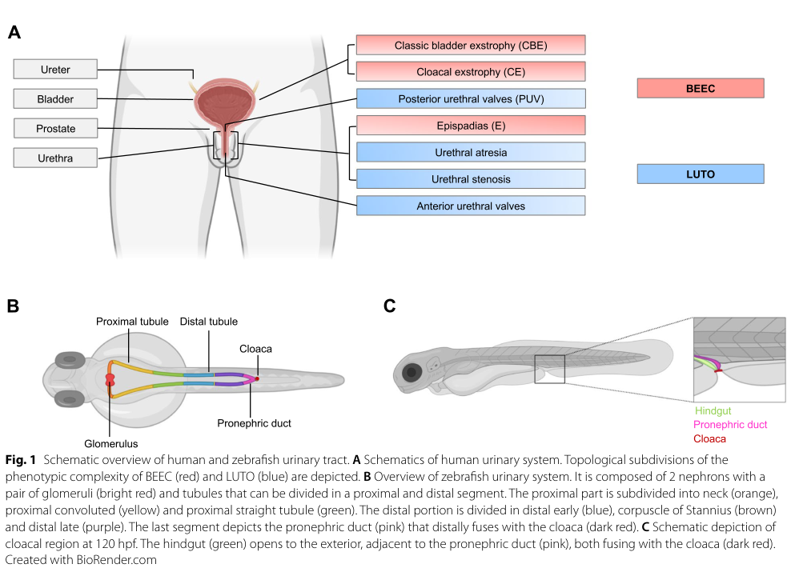

## Question

# Disease Characteristics Research Template

## Target Disease
- **Disease Name:** Exstrophy-Epispadias Complex
- **MONDO ID:**  (if available)
- **Category:** Congenital

## Research Objectives

Please provide a comprehensive research report on **Exstrophy-Epispadias Complex** covering all of the
disease characteristics listed below. This report will be used to populate a disease knowledge
base entry. Be thorough and cite primary literature (PMID preferred) for all claims.

For each section, **suggested databases/resources** are listed. These are the first places
you should search for information on each topic.

---

### 1. Disease Information
> **Search first:** OMIM, Orphanet, ICD-10/ICD-11, MeSH, PubMed

- What is the disease? Provide a concise overview.
- What are the key identifiers? (OMIM, Orphanet, ICD-10/ICD-11, MeSH, Mondo)
- What are the common synonyms and alternative names?
- Is the information derived from individual patients (e.g., EHR) or aggregated disease-level resources?

### 2. Etiology

- **Disease Causal Factors**: What are the primary causes? (genetic, environmental, infectious, mechanistic)
- **Risk Factors**:
  > **Search first:** PubMed, Cochrane Library, UpToDate, clinical guidelines, ClinVar, ClinGen, GWAS Catalog, PheGenI, CTD, CDC, WHO, epidemiological databases
  - Genetic risk factors (causal variants, susceptibility loci, modifier genes)
  - Environmental risk factors (toxins, lifestyle, occupational exposures, age, sex, family history)
- **Protective Factors**:
  > **Search first:** PubMed, Cochrane Library, clinical trial databases, GWAS Catalog, gnomAD, WHO, CDC, nutrition databases
  - Genetic protective factors (protective variants, modifier alleles)
  - Environmental protective factors (diet, lifestyle, exposures that reduce risk)
- **Gene-Environment Interactions**: How do genetic and environmental factors interact to influence disease?
  > **Search first:** CTD, PubMed, PheGenI, GxE databases

### 3. Phenotypes
> **Search first:** HPO (Human Phenotype Ontology), OMIM, Orphanet, PubMed, clinicaltrials.gov, MedDRA, SNOMED CT, DECIPHER, LOINC

For each phenotype, provide:
- **Phenotype type**: symptoms, clinical signs, physical manifestations, behavioral changes, or laboratory abnormalities
  > For symptoms/signs: HPO, OMIM, Orphanet, PubMed
  > For behavioral changes: HPO, DSM, RDoC (Research Domain Criteria), PubMed
  > For laboratory abnormalities: LOINC, SNOMED CT, LabTests Online, PubMed
- **Phenotype characteristics**:
  > **Search first:** OMIM, Orphanet, HPO, PubMed
  - Age of symptom onset (neonatal, childhood, adult-onset, late-onset)
  - Symptom severity (mild, moderate, severe, variable)
  - Symptom progression (stable, progressive, episodic, fluctuating)
  - Frequency among affected individuals (percentage or qualitative)
- **Quality of life impact**: Effects on daily functioning and well-being (per-phenotype when possible)
  > **Search first:** EQ-5D database, SF-36, WHO QOL databases, PubMed
- Suggest HPO (Human Phenotype Ontology) terms for each phenotype

### 4. Genetic/Molecular Information

- **Causal Genes**: Gene mutations or chromosomal abnormalities responsible for disease (gene symbols, OMIM IDs)
  > **Search first:** OMIM, ClinVar, HGMD, Ensembl, NCBI Gene
- **Pathogenic Variants**:
  - Affected genes (gene symbols, HGNC IDs)
    > **Search first:** OMIM, NCBI Gene, Ensembl, HGNC, UniProt, GeneCards
  - Variant classification (pathogenic, likely pathogenic, VUS per ACMG/AMP guidelines)
    > **Search first:** ClinVar, ClinGen, ACMG/AMP guidelines, VarSome
  - Variant type/class (missense, frameshift, nonsense, splice-site, structural)
  - Allele frequency in population databases
    > **Search first:** gnomAD, 1000 Genomes, ExAC, TOPMed, dbSNP
  - Somatic vs germline origin
    > **Search first:** COSMIC (somatic), ClinVar, ICGC, TCGA
  - Functional consequences (loss of function, gain of function, dominant negative)
- **Modifier Genes**: Genes that modify disease severity or expression
- **Epigenetic Information**: DNA methylation, histone modifications, chromatin changes affecting disease
  > **Search first:** ENCODE, Roadmap Epigenomics, MethBase, DiseaseMeth
- **Chromosomal Abnormalities**: Large-scale genetic changes (aneuploidy, translocations, inversions)
  > **Search first:** DECIPHER, ClinVar, ECARUCA, UCSC Genome Browser

### 5. Environmental Information

- **Environmental Factors**: Non-genetic contributing factors (toxins, radiation, pollution, occupational exposure)
  > **Search first:** CTD (Comparative Toxicogenomics Database), TOXNET, PubMed, EPA databases
- **Lifestyle Factors**: Behavioral factors (smoking, diet, exercise, alcohol consumption)
  > **Search first:** CDC databases, WHO, PubMed, NHANES
- **Infectious Agents**: If applicable, pathogens causing or triggering disease (bacteria, viruses, fungi, parasites)
  > **Search first:** NCBI Taxonomy, ViPR, BV-BRC, MicrobeDB, GIDEON

### 6. Mechanism / Pathophysiology

- **Molecular Pathways**: Specific signaling cascades or biochemical pathways involved (Wnt, MAPK, mTOR, PI3K-AKT, etc.)
  > **Search first:** KEGG, Reactome, WikiPathways, PathBank, BioCyc
- **Cellular Processes**: Cell-level mechanisms (apoptosis, autophagy, cell cycle dysregulation, inflammation, etc.)
  > **Search first:** Gene Ontology (GO), Reactome, KEGG, PubMed
- **Protein Dysfunction**: How protein structure or function is altered (misfolding, aggregation, loss of function, gain of function)
  > **Search first:** UniProt, PDB (Protein Data Bank), InterPro, Pfam, AlphaFold
- **Metabolic Changes**: Alterations in metabolic processes (energy metabolism, lipid metabolism, amino acid metabolism)
  > **Search first:** KEGG, BioCyc, HMDB (Human Metabolome Database), BRENDA
- **Immune System Involvement**: Role of immune response (autoimmunity, immunodeficiency, chronic inflammation)
  > **Search first:** ImmPort, Immunome Database, IEDB, Gene Ontology
- **Tissue Damage Mechanisms**: How tissues/ are injured (oxidative stress, ischemia, fibrosis, necrosis)
  > **Search first:** PubMed, Gene Ontology, Reactome
- **Biochemical Abnormalities**: Specific molecular defects (enzyme deficiencies, receptor dysfunction, ion channel defects)
  > **Search first:** BRENDA, UniProt, KEGG, OMIM, PubMed
- **Epigenetic Changes**: DNA methylation, histone modifications affecting gene expression in disease
  > **Search first:** ENCODE, Roadmap Epigenomics, MethBase, DiseaseMeth
- **Molecular Profiling** (if available):
  - Transcriptomics/gene expression changes
    > **Search first:** GEO (Gene Expression Omnibus), ArrayExpress, GTEx, Human Cell Atlas, SRA
  - Proteomics findings
    > **Search first:** PRIDE, ProteomeXchange, Human Protein Atlas, STRING, BioGRID
  - Metabolomics signatures
    > **Search first:** MetaboLights, Metabolomics Workbench, HMDB, METLIN
  - Lipidomics alterations
    > **Search first:** LIPID MAPS, SwissLipids, LipidHome, Metabolomics Workbench
  - Genomic structural features
    > **Search first:** UCSC Genome Browser, Ensembl, NCBI, dbVar, DGV
- **Advanced Technologies** (if applicable):
  - Single-cell analysis findings (cell-type specific mechanisms, cellular heterogeneity)
    > **Search first:** Human Cell Atlas, Single Cell Portal, GEO, CELLxGENE
  - Spatial transcriptomics findings
    > **Search first:** GEO, Spatial Research, Vizgen, 10x Genomics data
  - Multi-omics integration results
    > **Search first:** TCGA, ICGC, cBioPortal, LinkedOmics, PubMed
  - Functional genomics screens (CRISPR, RNAi)
    > **Search first:** DepMap, GenomeRNAi, PubMed, BioGRID ORCS

For each mechanism, describe:
- The causal chain from initial trigger to clinical manifestation
- Which mechanisms are upstream vs downstream
- What cell types and biological processes are involved
- Suggest GO terms for biological processes and CL terms for cell types

### 7. Anatomical Structures Affected

- **Organ Level**:
  - Primary organs directly affected
  - Secondary organ involvement (complications, secondary effects)
  - Body systems involved (cardiovascular, nervous, digestive, respiratory, endocrine, etc.)
  > **Search first:** Uberon, FMA (Foundational Model of Anatomy), OMIM, HPO, ICD-11, MeSH, SNOMED CT
- **Tissue and Cell Level**:
  - Specific tissue types affected (epithelial, connective, muscle, nervous)
  - Specific cell populations targeted (with Cell Ontology terms)
  > **Search first:** Uberon, Human Protein Atlas, Cell Ontology, Human Cell Atlas, CellMarker, PanglaoDB
- **Subcellular Level**:
  - Cellular compartments involved (mitochondria, nucleus, ER, lysosomes) (with GO Cellular Component terms)
  > **Search first:** Gene Ontology (Cellular Component), UniProt, Human Protein Atlas
- **Localization**:
  - Specific anatomical sites (with UBERON terms)
    > **Search first:** FMA, Uberon, NeuroNames (for brain), SNOMED CT
  - Lateralization (unilateral, bilateral, asymmetric)
    > **Search first:** HPO, clinical literature, imaging databases

### 8. Temporal Development

- **Onset**:
  - Typical age of onset (congenital, pediatric, adult, geriatric)
  - Onset pattern (acute, subacute, chronic, insidious)
  > **Search first:** OMIM, Orphanet, HPO, PubMed
- **Progression**:
  - Disease stages (early, intermediate, advanced, end-stage)
    > **Search first:** Cancer Staging Manual (AJCC), WHO classifications, PubMed
  - Progression rate (rapid, slow, variable)
  - Disease course pattern (episodic, relapsing-remitting, progressive, stable)
  - Disease duration (self-limited, chronic lifelong)
  > **Search first:** Disease registries, longitudinal cohort databases, natural history studies, PubMed, Orphanet, OMIM
- **Patterns**:
  - Remission patterns (spontaneous, treatment-induced)
    > **Search first:** Clinical trial databases, disease registries, PubMed
  - Critical periods (time windows of vulnerability or opportunity for intervention)
    > **Search first:** PubMed, developmental biology databases, clinical guidelines

### 9. Inheritance and Population

- **Epidemiology**:
  - Prevalence (cases per 100,000 at given time)
  - Incidence (new cases per 100,000 per year)
  > **Search first:** Orphanet, CDC, WHO, GBD (Global Burden of Disease), national registries, SEER, disease registries
- **For Genetic Etiology**:
  - Inheritance pattern (AD, AR, X-linked, mitochondrial, multifactorial, polygenic)
    > **Search first:** OMIM, Orphanet, ClinVar, GTR (Genetic Testing Registry)
  - Penetrance (complete, incomplete, age-dependent)
    > **Search first:** ClinVar, OMIM, PubMed, ClinGen
  - Expressivity (variable, consistent)
    > **Search first:** OMIM, ClinVar, PubMed
  - Genetic anticipation (increasing severity in successive generations)
    > **Search first:** OMIM, PubMed (especially for repeat expansion disorders)
  - Germline mosaicism
    > **Search first:** ClinVar, OMIM, genetic counseling literature, PubMed
  - Founder effects (population-specific mutations)
    > **Search first:** gnomAD, population genetics databases, PubMed
  - Consanguinity role
    > **Search first:** OMIM, population studies, genetic counseling resources
  - Carrier frequency
    > **Search first:** gnomAD, carrier screening databases, GeneReviews, GTR
- **Population Demographics**:
  - Affected populations (ethnic or demographic groups with higher prevalence)
    > **Search first:** gnomAD, 1000 Genomes, PAGE Study, PubMed, population registries
  - Geographic distribution (endemic areas, regional variation)
    > **Search first:** WHO, CDC, GBD, Orphanet, geographic epidemiology databases
  - Geographic distribution of specific variants
  - Sex ratio (male:female)
    > **Search first:** Disease registries, OMIM, PubMed, epidemiological databases
  - Age distribution of affected individuals
    > **Search first:** CDC, disease registries, SEER, Orphanet

### 10. Diagnostics

- **Clinical Tests**:
  - Laboratory tests (blood, urine, tissue chemistry, specific enzyme assays)
    > **Search first:** LOINC, LabTests Online, PubMed
  - Biomarkers (proteins, metabolites, genetic markers, circulating biomarkers)
    > **Search first:** FDA Biomarker List, BEST (Biomarkers, EndpointS, and other Tools), PubMed
  - Imaging studies (X-ray, CT, MRI, PET, ultrasound)
    > **Search first:** RadLex, DICOM, Radiopaedia, imaging databases
  - Functional tests (pulmonary function, cardiac stress tests)
    > **Search first:** LOINC, clinical guidelines, PubMed
  - Electrophysiology (EEG, EMG, ECG, nerve conduction studies)
    > **Search first:** LOINC, clinical neurophysiology databases, PubMed
  - Biopsy findings (histopathology, immunohistochemistry)
    > **Search first:** SNOMED CT, College of American Pathologists resources, PubMed
  - Pathology findings (microscopic examination)
    > **Search first:** SNOMED CT, Digital Pathology databases, PubMed
- **Genetic Testing**:
  > **Search first:** GTR (Genetic Testing Registry), GeneReviews, ClinGen
  - Overview of recommended genetic testing approach
  - Whole genome sequencing (WGS) utility
    > **Search first:** GTR, ClinVar, GEL (Genomics England), gnomAD
  - Whole exome sequencing (WES) utility
    > **Search first:** GTR, ClinVar, OMIM, GeneMatcher
  - Gene panels (which panels, which genes)
    > **Search first:** GTR, ClinVar, laboratory-specific databases
  - Single gene testing
    > **Search first:** GTR, ClinVar, OMIM, GeneReviews
  - Chromosomal microarray (CMA)
    > **Search first:** DECIPHER, ClinVar, dbVar, ECARUCA
  - Karyotyping
    > **Search first:** Chromosome Abnormality Database, ClinVar, cytogenetics resources
  - FISH
    > **Search first:** ClinVar, cytogenetics databases, PubMed
  - Mitochondrial DNA testing
    > **Search first:** MITOMAP, MSeqDR, ClinVar, GTR
  - Repeat expansion testing
    > **Search first:** GTR, ClinVar, repeat expansion databases, PubMed
- **Omics-Based Diagnostics** (if applicable):
  - RNA sequencing / transcriptomics
    > **Search first:** GEO, ArrayExpress, GTEx, RNA-seq databases
  - Proteomics
    > **Search first:** PRIDE, ProteomeXchange, FDA Biomarker database
  - Metabolomics
    > **Search first:** MetaboLights, Metabolomics Workbench, HMDB
  - Epigenomics
    > **Search first:** GEO, ENCODE, Roadmap Epigenomics, MethBase
  - Liquid biopsy
    > **Search first:** COSMIC, ClinVar, liquid biopsy databases, PubMed
- **Clinical Criteria**:
  - Standardized diagnostic criteria (DSM, ICD, society guidelines)
    > **Search first:** DSM-5, ICD-11, clinical society guidelines, UpToDate
  - Differential diagnosis (other conditions to rule out, with distinguishing features)
    > **Search first:** DynaMed, UpToDate, clinical decision support systems
- **Screening**:
  - Screening methods for asymptomatic individuals (newborn screening, carrier screening, cascade screening)
    > **Search first:** ACMG recommendations, CDC newborn screening, GTR

### 11. Outcome/Prognosis

- **Survival and Mortality**:
  - Survival rate (5-year, 10-year, overall)
    > **Search first:** SEER, cancer registries, disease-specific registries, PubMed
  - Life expectancy (with and without treatment if applicable)
    > **Search first:** Orphanet, disease registries, actuarial databases, PubMed
  - Mortality rate
    > **Search first:** CDC, WHO, GBD, national mortality databases
  - Disease-specific mortality (deaths directly attributable to disease)
    > **Search first:** Disease registries, CDC Wonder, GBD, PubMed
- **Morbidity and Function**:
  - Morbidity (disease-related disability and health impacts)
    > **Search first:** GBD, WHO, disability databases, PubMed
  - Disability outcomes (long-term functional impairments)
    > **Search first:** ICF (International Classification of Functioning), disability registries
  - Quality of life measures (EQ-5D, SF-36, PROMIS, disease-specific tools)
    > **Search first:** EQ-5D database, SF-36, PROMIS, PubMed
- **Disease Course**:
  - Complications (secondary problems: infections, organ failure, etc.)
    > **Search first:** ICD codes, disease registries, clinical databases, PubMed
  - Recovery potential (likelihood and extent of recovery, with vs without treatment)
    > **Search first:** Natural history studies, rehabilitation databases, PubMed
- **Prediction**:
  - Prognostic factors (age, disease severity, biomarkers, treatment response)
    > **Search first:** Prognostic models databases, clinical calculators, PubMed
  - Prognostic biomarkers (molecular markers predicting disease course)
    > **Search first:** FDA Biomarker database, PubMed, cancer prognostic databases

### 12. Treatment

- **Pharmacotherapy**:
  - Pharmacological treatments (drug names, drug classes, mechanisms of action)
    > **Search first:** DrugBank, RxNorm, ATC classification, DailyMed, FDA databases
  - Pharmacogenomics (how genetic variants affect drug metabolism, efficacy, toxicity)
    > **Search first:** PharmGKB, CPIC (Clinical Pharmacogenetics), FDA Table of PGx Biomarkers
- **Advanced Therapeutics**:
  - Gene therapy (viral vectors, CRISPR, gene replacement, gene editing)
    > **Search first:** ClinicalTrials.gov, FDA gene therapy database, ASGCT resources
  - Cell therapy (stem cell transplant, CAR-T, cellular therapeutics)
    > **Search first:** ClinicalTrials.gov, FDA cell therapy database, FACT standards
  - RNA-based therapies (ASOs, siRNA, mRNA therapies)
    > **Search first:** ClinicalTrials.gov, FDA approvals, PubMed
  - Targeted therapies (treatments directed at specific molecular targets)
    > **Search first:** My Cancer Genome, OncoKB, ClinicalTrials.gov, FDA approvals
  - Immunotherapies (checkpoint inhibitors, monoclonal antibodies)
    > **Search first:** Cancer Immunotherapy Database, FDA approvals, ClinicalTrials.gov
- **Surgical and Interventional**:
  - Surgical interventions (types of surgery, timing, outcomes)
    > **Search first:** CPT codes, surgical registries, clinical guidelines, PubMed
- **Supportive and Rehabilitative**:
  - Supportive care (symptom management, pain control, nutrition)
    > **Search first:** Clinical guidelines, Cochrane Library, PubMed
  - Rehabilitation (physical therapy, occupational therapy, speech therapy)
    > **Search first:** Rehabilitation medicine databases, clinical guidelines, PubMed
- **Experimental**:
  - Experimental treatments in clinical trials (with NCT identifiers if available)
    > **Search first:** ClinicalTrials.gov, EU Clinical Trials Register, WHO ICTRP
- **Treatment Outcomes**:
  - Treatment response rates
    > **Search first:** Clinical trial databases, FDA reviews, systematic reviews, PubMed
  - Side effects and adverse events
    > **Search first:** FDA Adverse Event Reporting System (FAERS), MedWatch, PubMed
- **Treatment Strategy**:
  - Treatment algorithms (clinical pathways, decision trees)
    > **Search first:** Clinical practice guidelines, NCCN Guidelines, UpToDate
  - Combination therapies
    > **Search first:** ClinicalTrials.gov, treatment guidelines, PubMed
  - Personalized medicine approaches (genotype-guided treatment)
    > **Search first:** My Cancer Genome, CIViC, PharmGKB, precision medicine databases

For each treatment, suggest MAXO (Medical Action Ontology) terms where applicable.

### 13. Prevention

- **Prevention Levels**:
  - Primary prevention (preventing disease occurrence: vaccination, risk factor modification)
    > **Search first:** CDC, WHO, USPSTF recommendations, Cochrane Library
  - Secondary prevention (early detection and treatment: screening programs, early intervention)
    > **Search first:** USPSTF, CDC screening guidelines, WHO
  - Tertiary prevention (preventing complications in those with disease)
    > **Search first:** Clinical guidelines, disease management protocols, PubMed
- **Immunization**: Vaccine strategies (if applicable)
  > **Search first:** CDC vaccine schedules, WHO immunization, FDA vaccine database
- **Screening and Early Detection**:
  - Screening programs (population-based: newborn screening, cancer screening)
    > **Search first:** CDC screening programs, USPSTF, cancer screening databases
  - Genetic screening (carrier screening, preimplantation genetic diagnosis, prenatal testing)
    > **Search first:** ACMG recommendations, ACOG guidelines, GTR
  - Risk stratification (identifying high-risk individuals for targeted prevention)
    > **Search first:** Risk prediction models, clinical calculators, PubMed
- **Behavioral Interventions**: Lifestyle modifications to reduce risk
  > **Search first:** CDC, WHO, behavioral intervention databases, Cochrane Library
- **Counseling**: Genetic counseling (risk assessment, family planning guidance)
  > **Search first:** NSGC resources, ACMG guidelines, GeneReviews
- **Public Health**:
  - Public health interventions (sanitation, vector control, health education)
    > **Search first:** CDC, WHO, public health databases, PubMed
  - Environmental interventions (reducing environmental risk factors)
    > **Search first:** EPA databases, WHO environmental health, PubMed
- **Prophylaxis**: Preventive medications or procedures
  > **Search first:** Clinical guidelines, FDA approvals, PubMed

### 14. Other Species / Natural Disease

- **Taxonomy**: Species affected (with NCBI Taxon identifiers)
  > **Search first:** NCBI Taxonomy
- **Breed**: Specific breeds affected (with VBO identifiers if applicable)
  > **Search first:** VBO (Vertebrate Breed Ontology)
- **Gene**: Orthologous genes in other species (with NCBI Gene IDs)
  > **Search first:** NCBI Gene
- **Natural Disease**:
  - Naturally occurring disease in other species (companion animals, wildlife)
    > **Search first:** OMIA (Online Mendelian Inheritance in Animals), VetCompass, PubMed
  - Veterinary relevance and importance in animal health
    > **Search first:** OMIA, veterinary databases, PubMed
- **Comparative Biology**:
  - Comparative pathology (similarities and differences across species)
    > **Search first:** OMIA, comparative pathology databases, PubMed
  - Evolutionary conservation of disease mechanisms
    > **Search first:** HomoloGene, OrthoMCL, Alliance of Genome Resources
- **Transmission** (if applicable):
  - Zoonotic potential
    > **Search first:** CDC zoonotic diseases, WHO zoonoses, GIDEON
  - Cross-species susceptibility
    > **Search first:** NCBI Taxonomy, veterinary databases, PubMed

### 15. Model Organisms

- **Model Types**:
  - Model organism type (mammalian, invertebrate, cellular, in vitro)
    > **Search first:** Alliance of Genome Resources, model organism databases
  - Specific model systems (mouse, rat, zebrafish, Drosophila, C. elegans, yeast, cell lines, organoids, iPSCs)
    > **Search first:** MGI, RGD, ZFIN, FlyBase, WormBase, SGD, ATCC, Cellosaurus
  - Induced models (drug treatment, surgical intervention, environmental manipulation)
    > **Search first:** MGI, model organism databases, PubMed
- **Genetic Models**:
  - Types available (knockout, knock-in, transgenic, conditional, humanized)
    > **Search first:** MGI, IMPC, KOMP, EuMMCR, IMSR
- **Model Characteristics**:
  - Phenotype recapitulation (how well model reproduces human disease features)
    > **Search first:** Model organism databases, comparative studies, PubMed
  - Model limitations (aspects of human disease not captured)
    > **Search first:** Model organism databases, PubMed, review articles
- **Applications**:
  - Research applications (what aspects of disease can be studied)
    > **Search first:** Model organism databases, PubMed
- **Resources**:
  - Model databases
    > **Search first:** MGI, RGD, ZFIN, FlyBase, WormBase, IMSR, EMMA, MMRRC

---

## Citation Requirements

- Cite primary literature (PMID preferred) for all mechanistic and clinical claims
- Prioritize recent reviews and landmark papers
- Include direct quotes from abstracts where possible to support key statements
- Distinguish evidence source types: human clinical, model organism, in vitro, computational

## Output Format

Structure your response as a comprehensive narrative organized by the sections above.
For each section, provide:
- Factual content with specific details (numbers, percentages, gene names, variant nomenclature)
- Ontology term suggestions (HPO, GO, CL, UBERON, CHEBI, MAXO, MONDO) where applicable
- Evidence citations with PMIDs
- Direct quotes from abstracts to support key claims
- Clear indication when information is not available or not applicable for this disease

This report will be used to populate a disease knowledge base entry with:
- Pathophysiology descriptions with causal chains
- Gene/protein annotations (HGNC, GO terms)
- Phenotype associations (HP terms) with frequencies
- Cell type involvement (CL terms)
- Anatomical locations (UBERON terms)
- Chemical entities (CHEBI terms)
- Treatment annotations (MAXO terms)
- Evidence items with PMIDs and exact abstract quotes
- Epidemiology, prognosis, diagnostic, and prevention information
- Animal model descriptions with phenotype recapitulation details

## Output

Question: You are an expert researcher providing comprehensive, well-cited information.

Provide detailed information focusing on:
1. Key concepts and definitions with current understanding
2. Recent developments and latest research (prioritize 2023-2024 sources)
3. Current applications and real-world implementations
4. Expert opinions and analysis from authoritative sources
5. Relevant statistics and data from recent studies

Format as a comprehensive research report with proper citations. Include URLs and publication dates where available.
Always prioritize recent, authoritative sources and provide specific citations for all major claims.

# Disease Characteristics Research Template

## Target Disease
- **Disease Name:** Exstrophy-Epispadias Complex
- **MONDO ID:**  (if available)
- **Category:** Congenital

## Research Objectives

Please provide a comprehensive research report on **Exstrophy-Epispadias Complex** covering all of the
disease characteristics listed below. This report will be used to populate a disease knowledge
base entry. Be thorough and cite primary literature (PMID preferred) for all claims.

For each section, **suggested databases/resources** are listed. These are the first places
you should search for information on each topic.

---

### 1. Disease Information
> **Search first:** OMIM, Orphanet, ICD-10/ICD-11, MeSH, PubMed

- What is the disease? Provide a concise overview.
- What are the key identifiers? (OMIM, Orphanet, ICD-10/ICD-11, MeSH, Mondo)
- What are the common synonyms and alternative names?
- Is the information derived from individual patients (e.g., EHR) or aggregated disease-level resources?

### 2. Etiology

- **Disease Causal Factors**: What are the primary causes? (genetic, environmental, infectious, mechanistic)
- **Risk Factors**:
  > **Search first:** PubMed, Cochrane Library, UpToDate, clinical guidelines, ClinVar, ClinGen, GWAS Catalog, PheGenI, CTD, CDC, WHO, epidemiological databases
  - Genetic risk factors (causal variants, susceptibility loci, modifier genes)
  - Environmental risk factors (toxins, lifestyle, occupational exposures, age, sex, family history)
- **Protective Factors**:
  > **Search first:** PubMed, Cochrane Library, clinical trial databases, GWAS Catalog, gnomAD, WHO, CDC, nutrition databases
  - Genetic protective factors (protective variants, modifier alleles)
  - Environmental protective factors (diet, lifestyle, exposures that reduce risk)
- **Gene-Environment Interactions**: How do genetic and environmental factors interact to influence disease?
  > **Search first:** CTD, PubMed, PheGenI, GxE databases

### 3. Phenotypes
> **Search first:** HPO (Human Phenotype Ontology), OMIM, Orphanet, PubMed, clinicaltrials.gov, MedDRA, SNOMED CT, DECIPHER, LOINC

For each phenotype, provide:
- **Phenotype type**: symptoms, clinical signs, physical manifestations, behavioral changes, or laboratory abnormalities
  > For symptoms/signs: HPO, OMIM, Orphanet, PubMed
  > For behavioral changes: HPO, DSM, RDoC (Research Domain Criteria), PubMed
  > For laboratory abnormalities: LOINC, SNOMED CT, LabTests Online, PubMed
- **Phenotype characteristics**:
  > **Search first:** OMIM, Orphanet, HPO, PubMed
  - Age of symptom onset (neonatal, childhood, adult-onset, late-onset)
  - Symptom severity (mild, moderate, severe, variable)
  - Symptom progression (stable, progressive, episodic, fluctuating)
  - Frequency among affected individuals (percentage or qualitative)
- **Quality of life impact**: Effects on daily functioning and well-being (per-phenotype when possible)
  > **Search first:** EQ-5D database, SF-36, WHO QOL databases, PubMed
- Suggest HPO (Human Phenotype Ontology) terms for each phenotype

### 4. Genetic/Molecular Information

- **Causal Genes**: Gene mutations or chromosomal abnormalities responsible for disease (gene symbols, OMIM IDs)
  > **Search first:** OMIM, ClinVar, HGMD, Ensembl, NCBI Gene
- **Pathogenic Variants**:
  - Affected genes (gene symbols, HGNC IDs)
    > **Search first:** OMIM, NCBI Gene, Ensembl, HGNC, UniProt, GeneCards
  - Variant classification (pathogenic, likely pathogenic, VUS per ACMG/AMP guidelines)
    > **Search first:** ClinVar, ClinGen, ACMG/AMP guidelines, VarSome
  - Variant type/class (missense, frameshift, nonsense, splice-site, structural)
  - Allele frequency in population databases
    > **Search first:** gnomAD, 1000 Genomes, ExAC, TOPMed, dbSNP
  - Somatic vs germline origin
    > **Search first:** COSMIC (somatic), ClinVar, ICGC, TCGA
  - Functional consequences (loss of function, gain of function, dominant negative)
- **Modifier Genes**: Genes that modify disease severity or expression
- **Epigenetic Information**: DNA methylation, histone modifications, chromatin changes affecting disease
  > **Search first:** ENCODE, Roadmap Epigenomics, MethBase, DiseaseMeth
- **Chromosomal Abnormalities**: Large-scale genetic changes (aneuploidy, translocations, inversions)
  > **Search first:** DECIPHER, ClinVar, ECARUCA, UCSC Genome Browser

### 5. Environmental Information

- **Environmental Factors**: Non-genetic contributing factors (toxins, radiation, pollution, occupational exposure)
  > **Search first:** CTD (Comparative Toxicogenomics Database), TOXNET, PubMed, EPA databases
- **Lifestyle Factors**: Behavioral factors (smoking, diet, exercise, alcohol consumption)
  > **Search first:** CDC databases, WHO, PubMed, NHANES
- **Infectious Agents**: If applicable, pathogens causing or triggering disease (bacteria, viruses, fungi, parasites)
  > **Search first:** NCBI Taxonomy, ViPR, BV-BRC, MicrobeDB, GIDEON

### 6. Mechanism / Pathophysiology

- **Molecular Pathways**: Specific signaling cascades or biochemical pathways involved (Wnt, MAPK, mTOR, PI3K-AKT, etc.)
  > **Search first:** KEGG, Reactome, WikiPathways, PathBank, BioCyc
- **Cellular Processes**: Cell-level mechanisms (apoptosis, autophagy, cell cycle dysregulation, inflammation, etc.)
  > **Search first:** Gene Ontology (GO), Reactome, KEGG, PubMed
- **Protein Dysfunction**: How protein structure or function is altered (misfolding, aggregation, loss of function, gain of function)
  > **Search first:** UniProt, PDB (Protein Data Bank), InterPro, Pfam, AlphaFold
- **Metabolic Changes**: Alterations in metabolic processes (energy metabolism, lipid metabolism, amino acid metabolism)
  > **Search first:** KEGG, BioCyc, HMDB (Human Metabolome Database), BRENDA
- **Immune System Involvement**: Role of immune response (autoimmunity, immunodeficiency, chronic inflammation)
  > **Search first:** ImmPort, Immunome Database, IEDB, Gene Ontology
- **Tissue Damage Mechanisms**: How tissues/ are injured (oxidative stress, ischemia, fibrosis, necrosis)
  > **Search first:** PubMed, Gene Ontology, Reactome
- **Biochemical Abnormalities**: Specific molecular defects (enzyme deficiencies, receptor dysfunction, ion channel defects)
  > **Search first:** BRENDA, UniProt, KEGG, OMIM, PubMed
- **Epigenetic Changes**: DNA methylation, histone modifications affecting gene expression in disease
  > **Search first:** ENCODE, Roadmap Epigenomics, MethBase, DiseaseMeth
- **Molecular Profiling** (if available):
  - Transcriptomics/gene expression changes
    > **Search first:** GEO (Gene Expression Omnibus), ArrayExpress, GTEx, Human Cell Atlas, SRA
  - Proteomics findings
    > **Search first:** PRIDE, ProteomeXchange, Human Protein Atlas, STRING, BioGRID
  - Metabolomics signatures
    > **Search first:** MetaboLights, Metabolomics Workbench, HMDB, METLIN
  - Lipidomics alterations
    > **Search first:** LIPID MAPS, SwissLipids, LipidHome, Metabolomics Workbench
  - Genomic structural features
    > **Search first:** UCSC Genome Browser, Ensembl, NCBI, dbVar, DGV
- **Advanced Technologies** (if applicable):
  - Single-cell analysis findings (cell-type specific mechanisms, cellular heterogeneity)
    > **Search first:** Human Cell Atlas, Single Cell Portal, GEO, CELLxGENE
  - Spatial transcriptomics findings
    > **Search first:** GEO, Spatial Research, Vizgen, 10x Genomics data
  - Multi-omics integration results
    > **Search first:** TCGA, ICGC, cBioPortal, LinkedOmics, PubMed
  - Functional genomics screens (CRISPR, RNAi)
    > **Search first:** DepMap, GenomeRNAi, PubMed, BioGRID ORCS

For each mechanism, describe:
- The causal chain from initial trigger to clinical manifestation
- Which mechanisms are upstream vs downstream
- What cell types and biological processes are involved
- Suggest GO terms for biological processes and CL terms for cell types

### 7. Anatomical Structures Affected

- **Organ Level**:
  - Primary organs directly affected
  - Secondary organ involvement (complications, secondary effects)
  - Body systems involved (cardiovascular, nervous, digestive, respiratory, endocrine, etc.)
  > **Search first:** Uberon, FMA (Foundational Model of Anatomy), OMIM, HPO, ICD-11, MeSH, SNOMED CT
- **Tissue and Cell Level**:
  - Specific tissue types affected (epithelial, connective, muscle, nervous)
  - Specific cell populations targeted (with Cell Ontology terms)
  > **Search first:** Uberon, Human Protein Atlas, Cell Ontology, Human Cell Atlas, CellMarker, PanglaoDB
- **Subcellular Level**:
  - Cellular compartments involved (mitochondria, nucleus, ER, lysosomes) (with GO Cellular Component terms)
  > **Search first:** Gene Ontology (Cellular Component), UniProt, Human Protein Atlas
- **Localization**:
  - Specific anatomical sites (with UBERON terms)
    > **Search first:** FMA, Uberon, NeuroNames (for brain), SNOMED CT
  - Lateralization (unilateral, bilateral, asymmetric)
    > **Search first:** HPO, clinical literature, imaging databases

### 8. Temporal Development

- **Onset**:
  - Typical age of onset (congenital, pediatric, adult, geriatric)
  - Onset pattern (acute, subacute, chronic, insidious)
  > **Search first:** OMIM, Orphanet, HPO, PubMed
- **Progression**:
  - Disease stages (early, intermediate, advanced, end-stage)
    > **Search first:** Cancer Staging Manual (AJCC), WHO classifications, PubMed
  - Progression rate (rapid, slow, variable)
  - Disease course pattern (episodic, relapsing-remitting, progressive, stable)
  - Disease duration (self-limited, chronic lifelong)
  > **Search first:** Disease registries, longitudinal cohort databases, natural history studies, PubMed, Orphanet, OMIM
- **Patterns**:
  - Remission patterns (spontaneous, treatment-induced)
    > **Search first:** Clinical trial databases, disease registries, PubMed
  - Critical periods (time windows of vulnerability or opportunity for intervention)
    > **Search first:** PubMed, developmental biology databases, clinical guidelines

### 9. Inheritance and Population

- **Epidemiology**:
  - Prevalence (cases per 100,000 at given time)
  - Incidence (new cases per 100,000 per year)
  > **Search first:** Orphanet, CDC, WHO, GBD (Global Burden of Disease), national registries, SEER, disease registries
- **For Genetic Etiology**:
  - Inheritance pattern (AD, AR, X-linked, mitochondrial, multifactorial, polygenic)
    > **Search first:** OMIM, Orphanet, ClinVar, GTR (Genetic Testing Registry)
  - Penetrance (complete, incomplete, age-dependent)
    > **Search first:** ClinVar, OMIM, PubMed, ClinGen
  - Expressivity (variable, consistent)
    > **Search first:** OMIM, ClinVar, PubMed
  - Genetic anticipation (increasing severity in successive generations)
    > **Search first:** OMIM, PubMed (especially for repeat expansion disorders)
  - Germline mosaicism
    > **Search first:** ClinVar, OMIM, genetic counseling literature, PubMed
  - Founder effects (population-specific mutations)
    > **Search first:** gnomAD, population genetics databases, PubMed
  - Consanguinity role
    > **Search first:** OMIM, population studies, genetic counseling resources
  - Carrier frequency
    > **Search first:** gnomAD, carrier screening databases, GeneReviews, GTR
- **Population Demographics**:
  - Affected populations (ethnic or demographic groups with higher prevalence)
    > **Search first:** gnomAD, 1000 Genomes, PAGE Study, PubMed, population registries
  - Geographic distribution (endemic areas, regional variation)
    > **Search first:** WHO, CDC, GBD, Orphanet, geographic epidemiology databases
  - Geographic distribution of specific variants
  - Sex ratio (male:female)
    > **Search first:** Disease registries, OMIM, PubMed, epidemiological databases
  - Age distribution of affected individuals
    > **Search first:** CDC, disease registries, SEER, Orphanet

### 10. Diagnostics

- **Clinical Tests**:
  - Laboratory tests (blood, urine, tissue chemistry, specific enzyme assays)
    > **Search first:** LOINC, LabTests Online, PubMed
  - Biomarkers (proteins, metabolites, genetic markers, circulating biomarkers)
    > **Search first:** FDA Biomarker List, BEST (Biomarkers, EndpointS, and other Tools), PubMed
  - Imaging studies (X-ray, CT, MRI, PET, ultrasound)
    > **Search first:** RadLex, DICOM, Radiopaedia, imaging databases
  - Functional tests (pulmonary function, cardiac stress tests)
    > **Search first:** LOINC, clinical guidelines, PubMed
  - Electrophysiology (EEG, EMG, ECG, nerve conduction studies)
    > **Search first:** LOINC, clinical neurophysiology databases, PubMed
  - Biopsy findings (histopathology, immunohistochemistry)
    > **Search first:** SNOMED CT, College of American Pathologists resources, PubMed
  - Pathology findings (microscopic examination)
    > **Search first:** SNOMED CT, Digital Pathology databases, PubMed
- **Genetic Testing**:
  > **Search first:** GTR (Genetic Testing Registry), GeneReviews, ClinGen
  - Overview of recommended genetic testing approach
  - Whole genome sequencing (WGS) utility
    > **Search first:** GTR, ClinVar, GEL (Genomics England), gnomAD
  - Whole exome sequencing (WES) utility
    > **Search first:** GTR, ClinVar, OMIM, GeneMatcher
  - Gene panels (which panels, which genes)
    > **Search first:** GTR, ClinVar, laboratory-specific databases
  - Single gene testing
    > **Search first:** GTR, ClinVar, OMIM, GeneReviews
  - Chromosomal microarray (CMA)
    > **Search first:** DECIPHER, ClinVar, dbVar, ECARUCA
  - Karyotyping
    > **Search first:** Chromosome Abnormality Database, ClinVar, cytogenetics resources
  - FISH
    > **Search first:** ClinVar, cytogenetics databases, PubMed
  - Mitochondrial DNA testing
    > **Search first:** MITOMAP, MSeqDR, ClinVar, GTR
  - Repeat expansion testing
    > **Search first:** GTR, ClinVar, repeat expansion databases, PubMed
- **Omics-Based Diagnostics** (if applicable):
  - RNA sequencing / transcriptomics
    > **Search first:** GEO, ArrayExpress, GTEx, RNA-seq databases
  - Proteomics
    > **Search first:** PRIDE, ProteomeXchange, FDA Biomarker database
  - Metabolomics
    > **Search first:** MetaboLights, Metabolomics Workbench, HMDB
  - Epigenomics
    > **Search first:** GEO, ENCODE, Roadmap Epigenomics, MethBase
  - Liquid biopsy
    > **Search first:** COSMIC, ClinVar, liquid biopsy databases, PubMed
- **Clinical Criteria**:
  - Standardized diagnostic criteria (DSM, ICD, society guidelines)
    > **Search first:** DSM-5, ICD-11, clinical society guidelines, UpToDate
  - Differential diagnosis (other conditions to rule out, with distinguishing features)
    > **Search first:** DynaMed, UpToDate, clinical decision support systems
- **Screening**:
  - Screening methods for asymptomatic individuals (newborn screening, carrier screening, cascade screening)
    > **Search first:** ACMG recommendations, CDC newborn screening, GTR

### 11. Outcome/Prognosis

- **Survival and Mortality**:
  - Survival rate (5-year, 10-year, overall)
    > **Search first:** SEER, cancer registries, disease-specific registries, PubMed
  - Life expectancy (with and without treatment if applicable)
    > **Search first:** Orphanet, disease registries, actuarial databases, PubMed
  - Mortality rate
    > **Search first:** CDC, WHO, GBD, national mortality databases
  - Disease-specific mortality (deaths directly attributable to disease)
    > **Search first:** Disease registries, CDC Wonder, GBD, PubMed
- **Morbidity and Function**:
  - Morbidity (disease-related disability and health impacts)
    > **Search first:** GBD, WHO, disability databases, PubMed
  - Disability outcomes (long-term functional impairments)
    > **Search first:** ICF (International Classification of Functioning), disability registries
  - Quality of life measures (EQ-5D, SF-36, PROMIS, disease-specific tools)
    > **Search first:** EQ-5D database, SF-36, PROMIS, PubMed
- **Disease Course**:
  - Complications (secondary problems: infections, organ failure, etc.)
    > **Search first:** ICD codes, disease registries, clinical databases, PubMed
  - Recovery potential (likelihood and extent of recovery, with vs without treatment)
    > **Search first:** Natural history studies, rehabilitation databases, PubMed
- **Prediction**:
  - Prognostic factors (age, disease severity, biomarkers, treatment response)
    > **Search first:** Prognostic models databases, clinical calculators, PubMed
  - Prognostic biomarkers (molecular markers predicting disease course)
    > **Search first:** FDA Biomarker database, PubMed, cancer prognostic databases

### 12. Treatment

- **Pharmacotherapy**:
  - Pharmacological treatments (drug names, drug classes, mechanisms of action)
    > **Search first:** DrugBank, RxNorm, ATC classification, DailyMed, FDA databases
  - Pharmacogenomics (how genetic variants affect drug metabolism, efficacy, toxicity)
    > **Search first:** PharmGKB, CPIC (Clinical Pharmacogenetics), FDA Table of PGx Biomarkers
- **Advanced Therapeutics**:
  - Gene therapy (viral vectors, CRISPR, gene replacement, gene editing)
    > **Search first:** ClinicalTrials.gov, FDA gene therapy database, ASGCT resources
  - Cell therapy (stem cell transplant, CAR-T, cellular therapeutics)
    > **Search first:** ClinicalTrials.gov, FDA cell therapy database, FACT standards
  - RNA-based therapies (ASOs, siRNA, mRNA therapies)
    > **Search first:** ClinicalTrials.gov, FDA approvals, PubMed
  - Targeted therapies (treatments directed at specific molecular targets)
    > **Search first:** My Cancer Genome, OncoKB, ClinicalTrials.gov, FDA approvals
  - Immunotherapies (checkpoint inhibitors, monoclonal antibodies)
    > **Search first:** Cancer Immunotherapy Database, FDA approvals, ClinicalTrials.gov
- **Surgical and Interventional**:
  - Surgical interventions (types of surgery, timing, outcomes)
    > **Search first:** CPT codes, surgical registries, clinical guidelines, PubMed
- **Supportive and Rehabilitative**:
  - Supportive care (symptom management, pain control, nutrition)
    > **Search first:** Clinical guidelines, Cochrane Library, PubMed
  - Rehabilitation (physical therapy, occupational therapy, speech therapy)
    > **Search first:** Rehabilitation medicine databases, clinical guidelines, PubMed
- **Experimental**:
  - Experimental treatments in clinical trials (with NCT identifiers if available)
    > **Search first:** ClinicalTrials.gov, EU Clinical Trials Register, WHO ICTRP
- **Treatment Outcomes**:
  - Treatment response rates
    > **Search first:** Clinical trial databases, FDA reviews, systematic reviews, PubMed
  - Side effects and adverse events
    > **Search first:** FDA Adverse Event Reporting System (FAERS), MedWatch, PubMed
- **Treatment Strategy**:
  - Treatment algorithms (clinical pathways, decision trees)
    > **Search first:** Clinical practice guidelines, NCCN Guidelines, UpToDate
  - Combination therapies
    > **Search first:** ClinicalTrials.gov, treatment guidelines, PubMed
  - Personalized medicine approaches (genotype-guided treatment)
    > **Search first:** My Cancer Genome, CIViC, PharmGKB, precision medicine databases

For each treatment, suggest MAXO (Medical Action Ontology) terms where applicable.

### 13. Prevention

- **Prevention Levels**:
  - Primary prevention (preventing disease occurrence: vaccination, risk factor modification)
    > **Search first:** CDC, WHO, USPSTF recommendations, Cochrane Library
  - Secondary prevention (early detection and treatment: screening programs, early intervention)
    > **Search first:** USPSTF, CDC screening guidelines, WHO
  - Tertiary prevention (preventing complications in those with disease)
    > **Search first:** Clinical guidelines, disease management protocols, PubMed
- **Immunization**: Vaccine strategies (if applicable)
  > **Search first:** CDC vaccine schedules, WHO immunization, FDA vaccine database
- **Screening and Early Detection**:
  - Screening programs (population-based: newborn screening, cancer screening)
    > **Search first:** CDC screening programs, USPSTF, cancer screening databases
  - Genetic screening (carrier screening, preimplantation genetic diagnosis, prenatal testing)
    > **Search first:** ACMG recommendations, ACOG guidelines, GTR
  - Risk stratification (identifying high-risk individuals for targeted prevention)
    > **Search first:** Risk prediction models, clinical calculators, PubMed
- **Behavioral Interventions**: Lifestyle modifications to reduce risk
  > **Search first:** CDC, WHO, behavioral intervention databases, Cochrane Library
- **Counseling**: Genetic counseling (risk assessment, family planning guidance)
  > **Search first:** NSGC resources, ACMG guidelines, GeneReviews
- **Public Health**:
  - Public health interventions (sanitation, vector control, health education)
    > **Search first:** CDC, WHO, public health databases, PubMed
  - Environmental interventions (reducing environmental risk factors)
    > **Search first:** EPA databases, WHO environmental health, PubMed
- **Prophylaxis**: Preventive medications or procedures
  > **Search first:** Clinical guidelines, FDA approvals, PubMed

### 14. Other Species / Natural Disease

- **Taxonomy**: Species affected (with NCBI Taxon identifiers)
  > **Search first:** NCBI Taxonomy
- **Breed**: Specific breeds affected (with VBO identifiers if applicable)
  > **Search first:** VBO (Vertebrate Breed Ontology)
- **Gene**: Orthologous genes in other species (with NCBI Gene IDs)
  > **Search first:** NCBI Gene
- **Natural Disease**:
  - Naturally occurring disease in other species (companion animals, wildlife)
    > **Search first:** OMIA (Online Mendelian Inheritance in Animals), VetCompass, PubMed
  - Veterinary relevance and importance in animal health
    > **Search first:** OMIA, veterinary databases, PubMed
- **Comparative Biology**:
  - Comparative pathology (similarities and differences across species)
    > **Search first:** OMIA, comparative pathology databases, PubMed
  - Evolutionary conservation of disease mechanisms
    > **Search first:** HomoloGene, OrthoMCL, Alliance of Genome Resources
- **Transmission** (if applicable):
  - Zoonotic potential
    > **Search first:** CDC zoonotic diseases, WHO zoonoses, GIDEON
  - Cross-species susceptibility
    > **Search first:** NCBI Taxonomy, veterinary databases, PubMed

### 15. Model Organisms

- **Model Types**:
  - Model organism type (mammalian, invertebrate, cellular, in vitro)
    > **Search first:** Alliance of Genome Resources, model organism databases
  - Specific model systems (mouse, rat, zebrafish, Drosophila, C. elegans, yeast, cell lines, organoids, iPSCs)
    > **Search first:** MGI, RGD, ZFIN, FlyBase, WormBase, SGD, ATCC, Cellosaurus
  - Induced models (drug treatment, surgical intervention, environmental manipulation)
    > **Search first:** MGI, model organism databases, PubMed
- **Genetic Models**:
  - Types available (knockout, knock-in, transgenic, conditional, humanized)
    > **Search first:** MGI, IMPC, KOMP, EuMMCR, IMSR
- **Model Characteristics**:
  - Phenotype recapitulation (how well model reproduces human disease features)
    > **Search first:** Model organism databases, comparative studies, PubMed
  - Model limitations (aspects of human disease not captured)
    > **Search first:** Model organism databases, PubMed, review articles
- **Applications**:
  - Research applications (what aspects of disease can be studied)
    > **Search first:** Model organism databases, PubMed
- **Resources**:
  - Model databases
    > **Search first:** MGI, RGD, ZFIN, FlyBase, WormBase, IMSR, EMMA, MMRRC

---

## Citation Requirements

- Cite primary literature (PMID preferred) for all mechanistic and clinical claims
- Prioritize recent reviews and landmark papers
- Include direct quotes from abstracts where possible to support key statements
- Distinguish evidence source types: human clinical, model organism, in vitro, computational

## Output Format

Structure your response as a comprehensive narrative organized by the sections above.
For each section, provide:
- Factual content with specific details (numbers, percentages, gene names, variant nomenclature)
- Ontology term suggestions (HPO, GO, CL, UBERON, CHEBI, MAXO, MONDO) where applicable
- Evidence citations with PMIDs
- Direct quotes from abstracts to support key claims
- Clear indication when information is not available or not applicable for this disease

This report will be used to populate a disease knowledge base entry with:
- Pathophysiology descriptions with causal chains
- Gene/protein annotations (HGNC, GO terms)
- Phenotype associations (HP terms) with frequencies
- Cell type involvement (CL terms)
- Anatomical locations (UBERON terms)
- Chemical entities (CHEBI terms)
- Treatment annotations (MAXO terms)
- Evidence items with PMIDs and exact abstract quotes
- Epidemiology, prognosis, diagnostic, and prevention information
- Animal model descriptions with phenotype recapitulation details

## Comprehensive Research Report: Exstrophy–Epispadias Complex (EEC / BEEC)

### Scope and evidence note
This report is based on peer‑reviewed primary/review literature and ClinicalTrials.gov records retrieved via the provided tools. Some requested controlled-vocabulary identifiers (MONDO, Orphanet, ICD‑10/ICD‑11, MeSH) were not retrievable with the current toolchain in this run; therefore, only identifiers explicitly present in the retrieved full text are reported, and missing fields are labeled **not available in retrieved sources**.

A compact evidence map is provided in the table artifact below.

| Topic | Key points | Best recent source(s) with publication year and URL | Evidence citation IDs |
|---|---|---|---|
| Definition and spectrum | EEC/BEEC is a congenital malformation spectrum involving the abdominal wall, bony pelvis, urinary tract, external genitalia, and in severe cases the gastrointestinal tract. Severity runs from epispadias (mildest) to classic bladder exstrophy/CBE (intermediate, most common) to cloacal exstrophy/CE (most severe). | Köllges et al., 2023, *Biomolecules*, https://doi.org/10.3390/biom13071117; Kolvenbach et al., 2023, *Molecular and Cellular Pediatrics*, https://doi.org/10.1186/s40348-023-00156-4 | (kollges2023exomesurveyand pages 1-2, kolvenbach2023modellinghumanlower pages 1-3, kolvenbach2023modellinghumanlower media da323983) |
| Epidemiology | Reported incidences: epispadias ~2 per 100,000; bladder exstrophy ~4 per 100,000; cloacal exstrophy ~0.5–1 per 100,000. Other reports give E ~2.4:100,000, CBE ~1–2:50,000, CE ~0.5–1:200,000; overall European birth prevalence ~1:10,000. Epispadias and bladder exstrophy are more common in males, whereas cloacal exstrophy is more common in females. | Brockwell et al., 2024, *Cells*, https://doi.org/10.3390/cells13221866; Köllges et al., 2023, *Biomolecules*, https://doi.org/10.3390/biom13071117 | (brockwell2024pathophysiologyofcongenital pages 8-10, kollges2023exomesurveyand pages 1-2) |
| Embryology and pathophysiology | Leading developmental model: overdevelopment/persistence of the cloacal membrane impairs mesenchymal migration, predisposing to rupture; rupture timing relative to urorectal septation may influence phenotype (CE if earlier, epispadias if later). Additional embryologic mechanisms include abnormal pelvic ring formation, disrupted cloacal patterning, apoptosis gradients, and SHH→BMP4→SMAD epithelial–mesenchymal signaling relevant to bladder smooth-muscle differentiation. | Brockwell et al., 2024, *Cells*, https://doi.org/10.3390/cells13221866; Mingardo GWAS/thesis text, URL not available in retrieved metadata | (brockwell2024pathophysiologyofcongenital pages 8-10, mingardoUnknownyearclassicbladderexstrophy pages 17-22) |
| Core genetic architecture | Genetics is heterogeneous and incompletely resolved. Recurrent 22q11.2/22q11.21 microduplication is the most established recurrent CNV risk factor (~2–3% of cases in prior literature). Candidate/susceptibility genes implicated across studies include ISL1, LZTR1, WNT3, WNT9B, TP63, SLC20A1, and possibly SLC7A4; rare/common variation both contribute. | Nordenskjöld et al., 2023, *Am J Med Genet A*, https://doi.org/10.1002/ajmg.a.63031; Brockwell et al., 2024, *Cells*, https://doi.org/10.3390/cells13221866; Chan et al., 2024, medRxiv, https://doi.org/10.1101/2024.10.10.24315242 | (nordenskjold2023copynumbervariants pages 11-11, nordenskjold2023copynumbervariants pages 11-12, brockwell2024pathophysiologyofcongenital pages 8-10, chan2024wholegenomesequencingreveals pages 9-11) |
| 2023 exome/resequencing findings | In CE trios, exome analysis identified de novo candidate genes NR1H2 and GKAP1, biallelic candidates AKR1B10, CLSTN3, NDST4, PLEKHB1, and suggestive UPD involving SVEP1; follow-up resequencing did not find additional carriers. In the 22q11.2 phenocritical region, two independent CBE males carried frameshift variants in LZTR1 (c.978_985del, p.Ser327fs*6) and SLC7A4 (c.1087delC, p.Arg363fs*68), further implicating LZTR1. | Köllges et al., 2023, *Biomolecules*, https://doi.org/10.3390/biom13071117 | (kollges2023exomesurveyand pages 1-2, kollges2023exomesurveyand pages 9-10, kollges2023exomesurveyand pages 7-9, kollges2023exomesurveyand pages 2-3) |
| CNV burden and pathways | In a cohort of 140 bladder exstrophy patients, pathogenic/possibly pathogenic CNVs were found in 16 (11.4%), with 9 additional VUS. Data support involvement of WNT signaling, the chromosome 22q11 region, RIT2/POU-family networks, and Golgi/vesicle trafficking pathways. | Nordenskjöld et al., 2023, *Am J Med Genet A*, https://doi.org/10.1002/ajmg.a.63031 | (nordenskjold2023copynumbervariants pages 11-11, nordenskjold2023copynumbervariants pages 7-8) |
| GWAS and common-variant evidence | Prior large European GWAS identified ISL1 as a replicated susceptibility locus. A later sequencing-based GWAS/meta-analysis in 97 CBE cases vs 22,037 controls found no new robust loci after replication/meta-analysis, but replicated the ISL1 locus (rs9291768, P=1.48×10^-3, OR 1.62) and identified a rare intergenic indel rs550737686 (P=2.35×10^-5, OR 6.11). Mingardo’s larger GWAS resource summarized 628 cases and 7,352 controls and reported eight genome-wide significant loci. | Chan et al., 2024, medRxiv, https://doi.org/10.1101/2024.10.10.24315242; Mingardo GWAS/thesis text, URL not available in retrieved metadata | (chan2024wholegenomesequencingreveals pages 9-11, mingardoUnknownyearclassicbladderexstrophy pages 96-101, mingardoUnknownyearclassicbladderexstrophy pages 89-90) |
| Functional/model-organism evidence | Zebrafish studies support developmental roles for candidate genes: wnt3 knockdown causes cloacal defects, and slc20a1a knockdown impairs cloacal excretory function with hindgut distension. Zebrafish are useful because of rapid development, transparent larvae, and CRISPR/Morpholino tractability, though they lack a true human bladder/genital anatomy. | Kolvenbach et al., 2023, *Molecular and Cellular Pediatrics*, https://doi.org/10.1186/s40348-023-00156-4 | (kolvenbach2023modellinghumanlower pages 1-3, kolvenbach2023modellinghumanlower pages 4-6, kolvenbach2023modellinghumanlower pages 3-4) |
| Diagnostics | Diagnosis is primarily clinical postnatally and by prenatal imaging antenatally. Recent case literature supports targeted prenatal ultrasound with confirmation by fetal MRI in suspected fetal bladder exstrophy; multidisciplinary prenatal counseling/referral is emphasized. Genetic testing can include chromosomal microarray/CNV analysis and research-grade exome/genome approaches given heterogeneous etiology. | Zhan et al., 2024, *BMC Pregnancy and Childbirth*, https://doi.org/10.1186/s12884-024-06318-0; Nordenskjöld et al., 2023, *Am J Med Genet A*, https://doi.org/10.1002/ajmg.a.63031; Köllges et al., 2023, *Biomolecules*, https://doi.org/10.3390/biom13071117 | (NCT07294612 chunk 1, nordenskjold2023copynumbervariants pages 11-11, kollges2023exomesurveyand pages 2-3) |
| Standard treatment strategy | Management is surgical and often staged. Common primary paradigms are modern staged repair of exstrophy (MSRE) and complete primary repair of exstrophy (CPRE). Additional continence operations are frequently needed, including bladder neck reconstruction (BNR), augmentation cystoplasty (AC), continent catheterizable stoma, or bladder neck closure (BNC) with continent diversion. | Song et al., 2025, *American Journal of Translational Research*, https://doi.org/10.62347/uyra1911 | (song2025neonatalbladderexstrophy pages 3-4) |
| Outcomes and prognosis | Functional outcomes remain variable. Only ~23% may achieve volitional voiding with dry interval ≥3 h after initial repairs alone, while continence can rise to ~93% after combined continence procedures over long-term follow-up. Around 40% may still require catheterization after CPRE; adulthood renal morbidity is important, with one cited cohort showing 44% stage II+ CKD. Long-term sexual/fertility challenges are also common. | Song et al., 2025, *American Journal of Translational Research*, https://doi.org/10.62347/uyra1911 | (song2025neonatalbladderexstrophy pages 3-4) |
| Current interventional research | Two illustrative ongoing/modern interventional directions are: ACT balloons for sphincteric incontinence in bladder exstrophy/epispadias (primary endpoint: ≥50% reduction in 24-h pad weight at 6–24 months; NCT04935918), and autologous platelet-rich fibrin adjunct at primary repair to reduce penopubic fistula/wound dehiscence (20-patient randomized study; NCT07294612). | ClinicalTrials.gov NCT04935918, https://clinicaltrials.gov/study/NCT04935918; ClinicalTrials.gov NCT07294612, https://clinicaltrials.gov/study/NCT07294612 | (NCT04935918 chunk 1, NCT07294612 chunk 1, NCT07294612 chunk 2) |

*Table: This table compacts the most decision-relevant facts on Exstrophy–Epispadias Complex, including spectrum definition, epidemiology, genetics, diagnostics, treatment, and outcomes. It is useful as a quick-reference evidence map tied to recent primary and review sources plus trial records.*

---

## 1. Disease Information

### 1.1 Overview (current understanding)
Exstrophy–Epispadias Complex (EEC), often termed **bladder exstrophy–epispadias complex (BEEC)**, is a **congenital spectrum** of malformations involving the **lower abdominal wall and urinary bladder**, with variable involvement of the **bony pelvis, external genitalia**, and in more severe phenotypes the **gastrointestinal tract, anus, spine, and other organs**. (brockwell2024pathophysiologyofcongenital pages 8-10, kollges2023exomesurveyand pages 1-2)

The clinical spectrum is commonly ordered by severity as:
- **Epispadias (E)** (mild)
- **Classic bladder exstrophy (CBE)** (intermediate/most common)
- **Cloacal exstrophy (CE)** (most severe; overlaps the OEIS complex concept) (kollges2023exomesurveyand pages 1-2, brockwell2024pathophysiologyofcongenital pages 8-10)

A recent schematic figure shows the BEEC spectrum alongside related lower urinary tract obstruction phenotypes (PUV/atresia/stenosis). (kolvenbach2023modellinghumanlower media da323983)

### 1.2 Key identifiers
- **OMIM / MIM:** **BEEC; OMIM %600057** (explicitly stated). (kollges2023exomesurveyand pages 1-2)
- **MONDO ID:** not available in retrieved sources.
- **Orphanet ID:** not available in retrieved sources.
- **ICD‑10/ICD‑11:** not available in retrieved sources.
- **MeSH:** not available in retrieved sources.

### 1.3 Common synonyms / alternative names
- Exstrophy–epispadias complex (EEC)
- Bladder exstrophy–epispadias complex (BEEC) (brockwell2024pathophysiologyofcongenital pages 8-10, kollges2023exomesurveyand pages 1-2)
- Bladder exstrophy (often used for the CBE phenotype) (brockwell2024pathophysiologyofcongenital pages 8-10)
- Cloacal exstrophy; **OEIS complex** (omphalocele–exstrophy–imperforate anus–spinal defects) (kollges2023exomesurveyand pages 1-2)

### 1.4 Evidence source type
The information summarized here is derived from **aggregated disease-level resources** (reviews, cohort genetics studies, and clinical trials) as well as some **case‑based clinical literature**. (brockwell2024pathophysiologyofcongenital pages 8-10, kollges2023exomesurveyand pages 1-2, NCT07294612 chunk 1, NCT04935918 chunk 1)

---

## 2. Etiology

### 2.1 Disease causal factors (genetic/developmental)
EEC is primarily a **developmental malformation** with evidence for a **hereditary/genetic component**, but no single causal gene explains most cases. The CAKUT review notes a hereditary basis from familial/twin studies while stating that the exact mode of inheritance remains uncertain. (brockwell2024pathophysiologyofcongenital pages 8-10)

A 2023 genetics study summarizes multiple lines of evidence supporting genetic contribution including increased recurrence risk for siblings and offspring and higher concordance in monozygotic twins. (kollges2023exomesurveyand pages 1-2)

**Direct abstract quote (2023 genetics, BEEC definition and involvement):**
- “The bladder exstrophy-epispadias complex (BEEC) is a spectrum of congenital abnormalities that involves the abdominal wall, the bony pelvis, the urinary tract, the external genitalia, and, in severe cases, the gastrointestinal tract as well.” (Köllges et al., 2023, Biomolecules; URL https://doi.org/10.3390/biom13071117; published 2023‑07‑13) (kollges2023exomesurveyand pages 1-2)

### 2.2 Risk factors
#### Genetic risk factors (strongest evidence)
- **22q11.21 microduplication**: reported as the “strongest associated chromosomal abnormality,” accounting for ~3% of BEEC cases in a 2024 review. (brockwell2024pathophysiologyofcongenital pages 8-10)
- **CNV burden**: in a cohort of 140 individuals with bladder exstrophy, pathogenic/possibly pathogenic CNVs were found in **16/140 (11.4%)**, suggesting a meaningful contribution of structural variation for a subset of cases. (nordenskjold2023copynumbervariants pages 11-11)
- **Common variant susceptibility**: GWAS/meta-analyses implicate loci including **ISL1**, and review literature highlights significant associations for **WNT3, WNT9B, TP63**. (brockwell2024pathophysiologyofcongenital pages 8-10, chan2024wholegenomesequencingreveals pages 9-11)

#### Environmental risk factors
No specific environmental exposures were identified as risk factors in the retrieved sources; thus **environmental risk factors are not established** in this evidence set.

### 2.3 Protective factors
No protective genetic or environmental factors were identified in the retrieved sources.

### 2.4 Gene–environment interactions
No gene–environment interaction evidence was identified in the retrieved sources.

---

## 3. Phenotypes

### 3.1 Phenotypic spectrum and key manifestations
A 2024 review describes BEEC as affecting “the lower urinary tract and surrounding structures, including the abdominal wall, pelvis, genitalia, anus, and spine.” (brockwell2024pathophysiologyofcongenital pages 8-10)

- **Epispadias (E)**: failed closure of urethra with dorsal urethral meatus displacement; often surgically managed early; incontinence can be a long‑term complication. (brockwell2024pathophysiologyofcongenital pages 8-10)
- **Bladder exstrophy / CBE**: exposed bladder plate through ventral abdominal wall, usually with epispadias; long‑term issues include incontinence and upper tract complications (e.g., hydronephrosis, renal scarring, CKD). (brockwell2024pathophysiologyofcongenital pages 8-10)
- **Cloacal exstrophy (CE)**: abdominal wall defect with exposed bladder and bowel plus pelvic/genital anomalies; associated defects include omphalocele, vertebral defects, imperforate anus, intestinal malrotation/duplication and CAKUT phenotypes such as renal agenesis/ectopia/hydronephrosis. (brockwell2024pathophysiologyofcongenital pages 8-10)

A 2023 genetics paper reports that **additional urinary tract anomalies** such as ectopic kidney, horseshoe kidney, renal hypoplasia/agenesis, and UPJ obstruction occur in **~1/3 of cases**, “mainly in the form of the CE phenotype.” (kollges2023exomesurveyand pages 1-2)

### 3.2 Suggested HPO terms (examples; not exhaustive)
Because ontology databases were not directly queried in this run, the following are suggested mappings based on clinical descriptions:
- **Abnormality of the abdominal wall** (e.g., abdominal wall defect) (brockwell2024pathophysiologyofcongenital pages 8-10)
- **Bladder exstrophy** (open bladder plate) (brockwell2024pathophysiologyofcongenital pages 8-10)
- **Epispadias** (dorsal urethral meatus) (brockwell2024pathophysiologyofcongenital pages 8-10)
- **Urinary incontinence** (common long‑term issue) (brockwell2024pathophysiologyofcongenital pages 8-10)
- **Vesicoureteral reflux** (post‑surgical risk described) (brockwell2024pathophysiologyofcongenital pages 8-10)
- **Hydronephrosis**, **renal scarring**, **chronic kidney disease** (complications) (brockwell2024pathophysiologyofcongenital pages 8-10)
- **Omphalocele**, **imperforate anus**, **vertebral defects / spinal defects** (CE/OEIS) (brockwell2024pathophysiologyofcongenital pages 8-10, kollges2023exomesurveyand pages 1-2)
- **Genital anomalies / impaired sexual function**, **fertility issues** (kollges2023exomesurveyand pages 1-2, song2025neonatalbladderexstrophy pages 3-4)

### 3.3 Quality-of-life impact
Long‑term quality of life is influenced by repeated surgeries and complications; continence is highlighted as a dominant issue in long‑term management discussions. (song2025neonatalbladderexstrophy pages 3-4)

---

## 4. Genetic / Molecular Information

### 4.1 Genes and loci implicated (human evidence)
#### Recurrent CNVs and cytogenetic regions
- **22q11.21 / 22q11.2 microduplication**: repeatedly associated; review estimate ~3% of cases. (brockwell2024pathophysiologyofcongenital pages 8-10)
- Additional terminal deletions (e.g., 1q, 1p36, 9q34.1) are mentioned as associated chromosomal abnormalities in a review. (brockwell2024pathophysiologyofcongenital pages 8-10)

#### Candidate genes from exome/CNV and association studies
- **LZTR1**: 2023 exome survey and resequencing identified a frameshift variant in **LZTR1 c.978_985del (p.Ser327fs*6)** in an independent CBE male and concluded it further implicates LZTR1. (kollges2023exomesurveyand pages 1-2)
- **SLC7A4**: frameshift variant **c.1087delC (p.Arg363fs*68)** reported in an independent CBE male (interpretation varies; VUS discussed in detailed excerpt). (kollges2023exomesurveyand pages 1-2, kollges2023exomesurveyand pages 9-10)
- **WNT3 / WNT9B / TP63**: highlighted as significantly associated genes in a 2024 CAKUT review (GWAS evidence). (brockwell2024pathophysiologyofcongenital pages 8-10)
- **ISL1**: replicated susceptibility locus; mechanistic role in genital tubercle development via downstream effects on Fgf10/Wnt5a/Bmp4 is discussed in review; sequencing-based GWAS replication reported OR ~1.62 for a common variant at ISL1 locus. (brockwell2024pathophysiologyofcongenital pages 8-10, chan2024wholegenomesequencingreveals pages 9-11)
- **SLC20A1**: implicated in urinary tract/urorectal development; zebrafish functional assays show excretory/cloacal phenotypes upon ortholog knockdown. (nordenskjold2023copynumbervariants pages 11-12, kolvenbach2023modellinghumanlower pages 4-6)

### 4.2 2023–2024 genetic study statistics and findings
- **CNV yield (2023 AJMG)**: In 140 patients with bladder exstrophy, pathogenic/possibly pathogenic CNVs were found in **11.4%** (16/140). (nordenskjold2023copynumbervariants pages 11-11)
- **Exome survey (2023 Biomolecules)**: Exome analysis in CE trios reported de novo candidate genes **NR1H2, GKAP1**, recessive candidates **AKR1B10, CLSTN3, NDST4, PLEKHB1**, and suggestive UPD involving **SVEP1**; resequencing in 480 BEEC individuals did not find additional carriers for these genes. (kollges2023exomesurveyand pages 1-2)
- **Sequencing-based GWAS (2024 preprint)**: 97 CBE cases vs 22,037 controls; replication of ISL1 locus and limited evidence for additional loci; authors emphasize contribution of rare and common variants. (chan2024wholegenomesequencingreveals pages 9-11)

### 4.3 Variant types and functional consequences
- Reported variants include **frameshifts/early termination** (LZTR1, SLC7A4), and **copy number variants** (duplications/deletions) impacting multiple developmental pathways (e.g., WNT signaling, Golgi/vesicle trafficking). (kollges2023exomesurveyand pages 1-2, nordenskjold2023copynumbervariants pages 7-8)

### 4.4 Modifier genes / epigenetics
No modifier‑gene or epigenetic signatures were identified in the retrieved sources.

---

## 5. Environment (non-genetic factors)
The retrieved evidence set is largely genetic/developmental and does not identify validated environmental exposures contributing to EEC risk.

---

## 6. Mechanism / Pathophysiology

### 6.1 Embryologic causal chain (upstream → downstream)
A 2024 CAKUT review outlines leading developmental hypotheses:
- **Upstream developmental defect**: abnormal development of the **cloacal membrane** with **failed mesenchymal migration** (or insufficient support) (brockwell2024pathophysiologyofcongenital pages 8-10)
- **Trigger**: membrane becomes “prone to rupture” (brockwell2024pathophysiologyofcongenital pages 8-10)
- **Timing effect**: rupture **before urorectal septum formation** leads to **cloacal exstrophy** (bowel + bladder herniation), while rupture **after abdominal mesenchyme migration** but before urethral mesenchyme migration may result in **epispadias** (brockwell2024pathophysiologyofcongenital pages 8-10)
- Alternative upstream model: **defect in pelvic ring formation** enabling exstrophy (brockwell2024pathophysiologyofcongenital pages 8-10)

### 6.2 Pathway-level hypotheses and gene links
Evidence supports multiple developmental programs:
- **Wnt signaling** (WNT3/WNT9B) in bladder development; candidate susceptibility loci and functional zebrafish phenotypes for wnt3 knockdown suggest relevance to cloacal/lower outflow structures. (brockwell2024pathophysiologyofcongenital pages 8-10, kolvenbach2023modellinghumanlower pages 4-6)
- **ISL1 developmental regulation** affecting genital tubercle via **Fgf10/Wnt5a/Bmp4** (downstream developmental signaling). (brockwell2024pathophysiologyofcongenital pages 8-10)
- CNV pathway analyses suggest contributions from **WNT signaling**, **RIT2/POU-family networks**, and **Golgi/vesicle trafficking** (SNARE/Golgi-related genes). (nordenskjold2023copynumbervariants pages 7-8, nordenskjold2023copynumbervariants pages 5-7)

### 6.3 Suggested GO biological process terms (examples)
- Urogenital system development; urinary bladder development; urethra development
- Mesenchymal cell migration
- Epithelial morphogenesis
- Wnt signaling pathway
- Regulation of apoptosis (developmental tissue remodeling)
(Conceptual mapping supported by developmental theories and pathway discussions in the retrieved reviews and CNV network analyses.) (brockwell2024pathophysiologyofcongenital pages 8-10, nordenskjold2023copynumbervariants pages 7-8)

### 6.4 Suggested cell types (Cell Ontology; examples)
- Mesenchymal cells (migrating mesenchyme supporting cloacal membrane)
- Urothelial cells (bladder plate epithelium)
- Smooth muscle cells (bladder wall differentiation)
(Conceptual mapping based on described embryologic processes and bladder development context.) (brockwell2024pathophysiologyofcongenital pages 8-10)

---

## 7. Anatomical Structures Affected

### 7.1 Organ/system level (UBERON examples)
- **Urinary bladder**, **urethra**, **kidney**, **ureter** (urinary tract) (brockwell2024pathophysiologyofcongenital pages 8-10)
- **Abdominal wall** (ventral wall defect) (brockwell2024pathophysiologyofcongenital pages 8-10)
- **Pelvis / pelvic ring** (pubic diastasis concept; pelvic anomalies) (brockwell2024pathophysiologyofcongenital pages 8-10)
- **External genitalia** (male/female) (brockwell2024pathophysiologyofcongenital pages 8-10, kollges2023exomesurveyand pages 1-2)
- **Anus / hindgut / bowel** (especially CE) (brockwell2024pathophysiologyofcongenital pages 8-10)
- **Spine** (CE/OEIS) (brockwell2024pathophysiologyofcongenital pages 8-10, kollges2023exomesurveyand pages 1-2)

### 7.2 Tissue/cell level and subcellular
The retrieved sources emphasize developmental tissue interactions (mesenchyme support, epithelial closure). No subcellular pathology hallmark is established; however, CNV network interpretation suggests possible involvement of **Golgi/vesicle trafficking** processes. (nordenskjold2023copynumbervariants pages 7-8, nordenskjold2023copynumbervariants pages 5-7)

---

## 8. Temporal Development

### 8.1 Onset
EEC is **congenital**, present at birth, and can be suspected prenatally via imaging. (brockwell2024pathophysiologyofcongenital pages 8-10)

### 8.2 Course / progression
Clinical course is dominated by **surgical reconstruction over infancy/childhood** and by **long‑term functional outcomes** (continence, renal health, sexual function) into adolescence/adulthood. (song2025neonatalbladderexstrophy pages 3-4)

---

## 9. Inheritance and Population

### 9.1 Epidemiology (recent summaries)
A 2024 CAKUT review reports these incidence estimates:
- Epispadias: **2 per 100,000 births**
- Bladder exstrophy: **4 per 100,000 births**
- Cloacal exstrophy: **0.5–1 per 100,000 births** (brockwell2024pathophysiologyofcongenital pages 8-10)

A 2023 genetics paper reports:
- Epispadias: **~2.4:100,000 births**
- CBE: **1–2:50,000 births**
- CE: **0.5–1:200,000 births**
- Overall birth prevalence in European descent: **~1:10,000** (kollges2023exomesurveyand pages 1-2)

### 9.2 Sex distribution
- Epispadias and bladder exstrophy: more common in males
- Cloacal exstrophy: more common in females (brockwell2024pathophysiologyofcongenital pages 8-10, kollges2023exomesurveyand pages 1-2)

### 9.3 Inheritance pattern
The mode is **heterogeneous**, with evidence supporting a genetic contribution but no single Mendelian pattern for most cases. The 2024 review notes uncertain inheritance mode. (brockwell2024pathophysiologyofcongenital pages 8-10)

---

## 10. Diagnostics

### 10.1 Prenatal imaging
A 2024 case report supports prenatal pathways including targeted **prenatal ultrasound** and **fetal MRI confirmation** in suspected fetal bladder exstrophy, used for diagnosis confirmation and multidisciplinary planning. (arlandis2025thinktank2 pages 4-4)

### 10.2 Postnatal diagnosis
Diagnosis is typically clinical at birth based on the characteristic anatomic presentation (e.g., exposed bladder plate/urethral anomaly). (brockwell2024pathophysiologyofcongenital pages 8-10)

### 10.3 Genetic testing utility
Given heterogeneity:
- **Chromosomal microarray / CNV analysis** can identify recurrent CNVs and pathogenic/likely pathogenic CNVs in a minority of patients (e.g., 11.4% yield in one cohort). (nordenskjold2023copynumbervariants pages 11-11)
- **Exome sequencing** is used in research/selected clinical contexts (e.g., CE trios), but yields are currently limited and candidate genes often require further functional validation. (kollges2023exomesurveyand pages 1-2)

### 10.4 Differential diagnosis
Not systematically enumerated in retrieved sources. Practically, differential considerations in prenatal imaging may include other ventral wall defects and urinary tract malformations; BEEC should be considered in the context of cloacal development anomalies. (brockwell2024pathophysiologyofcongenital pages 8-10)

---

## 11. Outcome / Prognosis

### 11.1 Continence outcomes (statistics)
A 2025 case report/review summarizes a large study of **432 CBE patients** (median age 14.8 years) reporting:
- **23%** able to void volitionally through the urethra without catheter/diversion with **dry interval ≥3 h** (song2025neonatalbladderexstrophy pages 3-4)
- Continence rates varied by procedure: **BNR alone 64%**, and **BNC with continent catheterizable stoma 93%** (song2025neonatalbladderexstrophy pages 3-4)

In a CPRE cohort example: 33/40 voided but only 5/40 (13%) had volitional continence >2 h; 3/40 (8%) >3 h. (song2025neonatalbladderexstrophy pages 3-4)

### 11.2 Renal outcomes (statistics)
The same 2025 review reports an adult follow-up cohort (median age 30.1 years) where:
- **44% (7/16)** had stage II or higher chronic kidney disease
- **31% (5/16)** had hydronephrosis
- **44% (7/16)** had bladder calculi
- **56% (9/16)** had history of pyelonephritis (song2025neonatalbladderexstrophy pages 3-4)

A 2024 review notes that more recent data suggest long-term renal function “may not be as impaired as previously believed,” highlighting ongoing uncertainty and cohort dependence. (brockwell2024pathophysiologyofcongenital pages 8-10)

### 11.3 Sexual function and fertility
A 2023 genetics paper states both sexes may have impaired sexual function and fertility issues; male fertility may be decreased due to low ejaculate volume and sperm quality. (kollges2023exomesurveyand pages 1-2)
A 2025 review summarizes multiple cohorts reporting substantial sexual activity and satisfaction in adulthood after reconstruction, but persistent fertility challenges. (song2025neonatalbladderexstrophy pages 3-4)

---

## 12. Treatment

### 12.1 Standard of care (real-world implementation)
Management is predominantly **surgical**, typically initiated in infancy and extending across childhood.

A 2025 review states the primary surgical approaches are **modern staged repair of exstrophy (MSRE)** and **complete primary repair of exstrophy (CPRE)**, with the staged approach including bladder closure within ~72 hours and later staged repairs. (song2025neonatalbladderexstrophy pages 3-4)

Because continence is often not achieved by primary repair alone, additional operations are frequently needed:
- **Bladder neck reconstruction (BNR)**
- **Augmentation cystoplasty (AC)**
- **Continent catheterizable stoma**
- **Bladder neck closure (BNC) with continent catheterizable stoma** (song2025neonatalbladderexstrophy pages 3-4)

### 12.2 Interventional/experimental therapies (clinical trials)
Two representative contemporary trials:
- **Adjustable Continence Therapy (ACT) balloons** for incontinence in bladder exstrophy/epispadias: primary endpoint is ≥50% reduction in 24‑h pad weight at 6–24 months; includes QoL (PIN‑Q) and safety endpoints. (ClinicalTrials.gov **NCT04935918**, posted 2021; https://clinicaltrials.gov/study/NCT04935918) (NCT04935918 chunk 1)
- **Platelet-rich fibrin (PRF) adjunct** during primary repair: 20 male children randomized; outcome includes penopubic fistula and wound dehiscence within 6 months. (ClinicalTrials.gov **NCT07294612**, 2022; https://clinicaltrials.gov/study/NCT07294612) (NCT07294612 chunk 1)

### 12.3 Suggested MAXO terms (examples)
- Surgical repair of bladder exstrophy / abdominal wall closure
- Bladder neck reconstruction
- Augmentation cystoplasty
- Creation of continent catheterizable urinary stoma
- Continence device implantation (periurethral balloon therapy)
- Use of platelet-rich fibrin as surgical adjunct

---

## 13. Prevention
No primary prevention strategies are established in the retrieved sources given congenital/developmental etiology. Secondary prevention focuses on **prenatal detection** (ultrasound ± fetal MRI) and **early specialized referral** to optimize postnatal surgical planning. (arlandis2025thinktank2 pages 4-4)

---

## 14. Other Species / Natural Disease
No naturally occurring veterinary analogs were identified in the retrieved sources.

---

## 15. Model Organisms
### 15.1 Zebrafish (Danio rerio)
A 2023 mini‑review highlights zebrafish as a practical vertebrate model for testing candidate genes in lower urinary tract malformations, citing advantages such as rapid reproduction and genetic manipulability (Morpholino, CRISPR). (kolvenbach2023modellinghumanlower pages 1-3)

**Direct abstract quote (2023 zebrafish review):**
- “This has recently led to the identification of … WNT3 and SLC20A1 as genes implicated in the pathogenesis of the group of conditions called bladder-exstrophy-epispadias complex (BEEC).” (Kolvenbach et al., 2023, *Molecular and Cellular Pediatrics*; URL https://doi.org/10.1186/s40348-023-00156-4; published 2023‑03) (kolvenbach2023modellinghumanlower pages 1-3)

Functional phenotypes include:
- wnt3 knockdown leading to cloacal defects
- slc20a1a knockdown impairing cloacal excretory function and hindgut distension (kolvenbach2023modellinghumanlower pages 4-6)

Limitations: zebrafish lack human genitalia and urinary bladder anatomy, so mammalian models may be needed for some phenotype aspects. (kolvenbach2023modellinghumanlower pages 4-6)

---

## Expert synthesis / analysis (authoritative perspective)
Collectively, the 2023–2024 literature supports that EEC/BEEC is best understood as a **multifactorial developmental field defect** with contributions from **rare structural variation (CNVs), specific recurrent cytogenetic risk (22q11.21 duplication), and polygenic susceptibility loci** (e.g., ISL1/WNT pathway genes). (brockwell2024pathophysiologyofcongenital pages 8-10, nordenskjold2023copynumbervariants pages 11-11, chan2024wholegenomesequencingreveals pages 9-11)

Clinically, the field is moving toward (i) better **genomic stratification** (CMA/exome/genome studies and pathway interpretation), and (ii) improved long‑term functional outcomes through iterative surgical refinements and continence-directed devices/adjuncts that can be evaluated in trials with standardized endpoints (pad weight, PIN‑Q; fistula/dehiscence). (nordenskjold2023copynumbervariants pages 11-11, NCT04935918 chunk 1, NCT07294612 chunk 1)

---

## Key URLs (from retrieved sources)
- Köllges et al. 2023 (Biomolecules): https://doi.org/10.3390/biom13071117 (published 2023‑07‑13) (kollges2023exomesurveyand pages 1-2)
- Nordenskjöld et al. 2023 (Am J Med Genet A): https://doi.org/10.1002/ajmg.a.63031 (published 2023‑11) (nordenskjold2023copynumbervariants pages 11-11)
- Brockwell et al. 2024 (Cells): https://doi.org/10.3390/cells13221866 (published 2024‑11) (brockwell2024pathophysiologyofcongenital pages 8-10)
- Kolvenbach et al. 2023 (Molecular and Cellular Pediatrics): https://doi.org/10.1186/s40348-023-00156-4 (published 2023‑03) (kolvenbach2023modellinghumanlower pages 1-3)
- Chan et al. 2024 (medRxiv preprint): https://doi.org/10.1101/2024.10.10.24315242 (posted 2024‑10) (chan2024wholegenomesequencingreveals pages 9-11)
- Clinical trial NCT04935918: https://clinicaltrials.gov/study/NCT04935918 (NCT04935918 chunk 1)
- Clinical trial NCT07294612: https://clinicaltrials.gov/study/NCT07294612 (NCT07294612 chunk 1)

---

## Evidence gaps / not found in retrieved sources
- MONDO/Orphanet/ICD‑10/ICD‑11/MeSH identifiers for EEC/BEEC
- Robust, population-based global prevalence estimates beyond summarized incidence
- Validated environmental risk/protective factors and gene–environment interactions
- Systematic differential diagnosis criteria and formal diagnostic guidelines
- Comprehensive epigenetic or multi‑omics signatures specific to EEC

(These gaps reflect limitations of the retrieved corpus/tools during this run rather than definitive absence in the broader literature.)

References

1. (kollges2023exomesurveyand pages 1-2): Ricarda Köllges, Jil Stegmann, Sophia Schneider, Lea Waffenschmidt, Julia Fazaal, Katinka Breuer, Alina C. Hilger, Gabriel C. Dworschak, Enrico Mingardo, Wolfgang Rösch, Aybike Hofmann, Claudia Neissner, Anne-Karolin Ebert, Raimund Stein, Nina Younsi, Karin Hirsch-Koch, Eberhard Schmiedeke, Nadine Zwink, Ekkehart Jenetzky, Holger Thiele, Kerstin U. Ludwig, and Heiko Reutter. Exome survey and candidate gene re-sequencing identifies novel exstrophy candidate genes and implicates lztr1 in disease formation. Biomolecules, 13:1117, Jul 2023. URL: https://doi.org/10.3390/biom13071117, doi:10.3390/biom13071117. This article has 2 citations.

2. (kolvenbach2023modellinghumanlower pages 1-3): Caroline M. Kolvenbach, Gabriel C. Dworschak, Johanna M. Rieke, Adrian S. Woolf, Heiko Reutter, Benjamin Odermatt, and Alina C. Hilger. Modelling human lower urinary tract malformations in zebrafish. Molecular and Cellular Pediatrics, Mar 2023. URL: https://doi.org/10.1186/s40348-023-00156-4, doi:10.1186/s40348-023-00156-4. This article has 7 citations.

3. (kolvenbach2023modellinghumanlower media da323983): Caroline M. Kolvenbach, Gabriel C. Dworschak, Johanna M. Rieke, Adrian S. Woolf, Heiko Reutter, Benjamin Odermatt, and Alina C. Hilger. Modelling human lower urinary tract malformations in zebrafish. Molecular and Cellular Pediatrics, Mar 2023. URL: https://doi.org/10.1186/s40348-023-00156-4, doi:10.1186/s40348-023-00156-4. This article has 7 citations.

4. (brockwell2024pathophysiologyofcongenital pages 8-10): Maximilian Brockwell, Sean Hergenrother, Matthew Satariano, Raghav Shah, and Rupesh Raina. Pathophysiology of congenital anomalies of the kidney and urinary tract: a comprehensive review. Cells, 13:1866, Nov 2024. URL: https://doi.org/10.3390/cells13221866, doi:10.3390/cells13221866. This article has 16 citations.

5. (mingardoUnknownyearclassicbladderexstrophy pages 17-22): E Mingardo. Classic bladder exstrophy: identification of genetic markers and characterization of its associated isl1 gene. Unknown journal, Unknown year.

6. (nordenskjold2023copynumbervariants pages 11-11): Agneta Nordenskjöld, Samara Arkani, Maria Pettersson, Johanna Winberg, Jia Cao, Magdalena Fossum, Magnus Anderberg, Gillian Barker, Gundela Holmdahl, and Johanna Lundin. Copy number variants suggest different molecular pathways for the pathogenesis of bladder exstrophy. American Journal of Medical Genetics. Part a, 191:378-390, Nov 2023. URL: https://doi.org/10.1002/ajmg.a.63031, doi:10.1002/ajmg.a.63031. This article has 7 citations and is from a peer-reviewed journal.

7. (nordenskjold2023copynumbervariants pages 11-12): Agneta Nordenskjöld, Samara Arkani, Maria Pettersson, Johanna Winberg, Jia Cao, Magdalena Fossum, Magnus Anderberg, Gillian Barker, Gundela Holmdahl, and Johanna Lundin. Copy number variants suggest different molecular pathways for the pathogenesis of bladder exstrophy. American Journal of Medical Genetics. Part a, 191:378-390, Nov 2023. URL: https://doi.org/10.1002/ajmg.a.63031, doi:10.1002/ajmg.a.63031. This article has 7 citations and is from a peer-reviewed journal.

8. (chan2024wholegenomesequencingreveals pages 9-11): Melanie MY Chan, Omid Sadeghi-Alavijeh, Catalin D Voinescu, Loes FM van der Zanden, Sander Groen in ’t Woud, Michiel F Schreuder, Wout Feitz, Enrico Mingardo, Alina C Hilger, Heiko Reutter, Lisanne M Vendrig, Rik Westland, Horia C Stanescu, Adam P Levine, Detlef Böckenhauer, and Daniel P Gale. Whole-genome sequencing reveals contribution of rare and common variation to structural kidney and urinary tract malformations. MedRxiv, Oct 2024. URL: https://doi.org/10.1101/2024.10.10.24315242, doi:10.1101/2024.10.10.24315242. This article has 0 citations.

9. (kollges2023exomesurveyand pages 9-10): Ricarda Köllges, Jil Stegmann, Sophia Schneider, Lea Waffenschmidt, Julia Fazaal, Katinka Breuer, Alina C. Hilger, Gabriel C. Dworschak, Enrico Mingardo, Wolfgang Rösch, Aybike Hofmann, Claudia Neissner, Anne-Karolin Ebert, Raimund Stein, Nina Younsi, Karin Hirsch-Koch, Eberhard Schmiedeke, Nadine Zwink, Ekkehart Jenetzky, Holger Thiele, Kerstin U. Ludwig, and Heiko Reutter. Exome survey and candidate gene re-sequencing identifies novel exstrophy candidate genes and implicates lztr1 in disease formation. Biomolecules, 13:1117, Jul 2023. URL: https://doi.org/10.3390/biom13071117, doi:10.3390/biom13071117. This article has 2 citations.

10. (kollges2023exomesurveyand pages 7-9): Ricarda Köllges, Jil Stegmann, Sophia Schneider, Lea Waffenschmidt, Julia Fazaal, Katinka Breuer, Alina C. Hilger, Gabriel C. Dworschak, Enrico Mingardo, Wolfgang Rösch, Aybike Hofmann, Claudia Neissner, Anne-Karolin Ebert, Raimund Stein, Nina Younsi, Karin Hirsch-Koch, Eberhard Schmiedeke, Nadine Zwink, Ekkehart Jenetzky, Holger Thiele, Kerstin U. Ludwig, and Heiko Reutter. Exome survey and candidate gene re-sequencing identifies novel exstrophy candidate genes and implicates lztr1 in disease formation. Biomolecules, 13:1117, Jul 2023. URL: https://doi.org/10.3390/biom13071117, doi:10.3390/biom13071117. This article has 2 citations.

11. (kollges2023exomesurveyand pages 2-3): Ricarda Köllges, Jil Stegmann, Sophia Schneider, Lea Waffenschmidt, Julia Fazaal, Katinka Breuer, Alina C. Hilger, Gabriel C. Dworschak, Enrico Mingardo, Wolfgang Rösch, Aybike Hofmann, Claudia Neissner, Anne-Karolin Ebert, Raimund Stein, Nina Younsi, Karin Hirsch-Koch, Eberhard Schmiedeke, Nadine Zwink, Ekkehart Jenetzky, Holger Thiele, Kerstin U. Ludwig, and Heiko Reutter. Exome survey and candidate gene re-sequencing identifies novel exstrophy candidate genes and implicates lztr1 in disease formation. Biomolecules, 13:1117, Jul 2023. URL: https://doi.org/10.3390/biom13071117, doi:10.3390/biom13071117. This article has 2 citations.

12. (nordenskjold2023copynumbervariants pages 7-8): Agneta Nordenskjöld, Samara Arkani, Maria Pettersson, Johanna Winberg, Jia Cao, Magdalena Fossum, Magnus Anderberg, Gillian Barker, Gundela Holmdahl, and Johanna Lundin. Copy number variants suggest different molecular pathways for the pathogenesis of bladder exstrophy. American Journal of Medical Genetics. Part a, 191:378-390, Nov 2023. URL: https://doi.org/10.1002/ajmg.a.63031, doi:10.1002/ajmg.a.63031. This article has 7 citations and is from a peer-reviewed journal.

13. (mingardoUnknownyearclassicbladderexstrophy pages 96-101): E Mingardo. Classic bladder exstrophy: identification of genetic markers and characterization of its associated isl1 gene. Unknown journal, Unknown year.

14. (mingardoUnknownyearclassicbladderexstrophy pages 89-90): E Mingardo. Classic bladder exstrophy: identification of genetic markers and characterization of its associated isl1 gene. Unknown journal, Unknown year.

15. (kolvenbach2023modellinghumanlower pages 4-6): Caroline M. Kolvenbach, Gabriel C. Dworschak, Johanna M. Rieke, Adrian S. Woolf, Heiko Reutter, Benjamin Odermatt, and Alina C. Hilger. Modelling human lower urinary tract malformations in zebrafish. Molecular and Cellular Pediatrics, Mar 2023. URL: https://doi.org/10.1186/s40348-023-00156-4, doi:10.1186/s40348-023-00156-4. This article has 7 citations.

16. (kolvenbach2023modellinghumanlower pages 3-4): Caroline M. Kolvenbach, Gabriel C. Dworschak, Johanna M. Rieke, Adrian S. Woolf, Heiko Reutter, Benjamin Odermatt, and Alina C. Hilger. Modelling human lower urinary tract malformations in zebrafish. Molecular and Cellular Pediatrics, Mar 2023. URL: https://doi.org/10.1186/s40348-023-00156-4, doi:10.1186/s40348-023-00156-4. This article has 7 citations.

17. (NCT07294612 chunk 1): Zafar Abdullaev. Use of Platelet-Rich Fibrin in Bladder Exstrophy Repair. National Children's Medical Center, Uzbekistan. 2022. ClinicalTrials.gov Identifier: NCT07294612

18. (song2025neonatalbladderexstrophy pages 3-4): Yan Song, Ru Yang, and Xiaowen Li. Neonatal bladder exstrophy: a case report and literature review of long-term outcomes. American Journal of Translational Research, 17:6481-6487, Jan 2025. URL: https://doi.org/10.62347/uyra1911, doi:10.62347/uyra1911. This article has 0 citations and is from a peer-reviewed journal.

19. (NCT04935918 chunk 1):  EVALUATION OF THE SAFETY AND EFFICACY OF ADJUSTABLE CONTINENCE THERAPY BALLOONS IN BLADDER EXSTROPHY AND INCONTINENT EPISPADIAS PATIENTS. Assistance Publique Hopitaux De Marseille. 2021. ClinicalTrials.gov Identifier: NCT04935918

20. (NCT07294612 chunk 2): Zafar Abdullaev. Use of Platelet-Rich Fibrin in Bladder Exstrophy Repair. National Children's Medical Center, Uzbekistan. 2022. ClinicalTrials.gov Identifier: NCT07294612

21. (nordenskjold2023copynumbervariants pages 5-7): Agneta Nordenskjöld, Samara Arkani, Maria Pettersson, Johanna Winberg, Jia Cao, Magdalena Fossum, Magnus Anderberg, Gillian Barker, Gundela Holmdahl, and Johanna Lundin. Copy number variants suggest different molecular pathways for the pathogenesis of bladder exstrophy. American Journal of Medical Genetics. Part a, 191:378-390, Nov 2023. URL: https://doi.org/10.1002/ajmg.a.63031, doi:10.1002/ajmg.a.63031. This article has 7 citations and is from a peer-reviewed journal.

22. (arlandis2025thinktank2 pages 4-4): S Arlandis, C Fry, M Wyndaele, and A Apostolidis. Think tank 2: how do we precisely define the" high risk bladder" and what. Unknown journal, 2025.

## Artifacts

- [Edison artifact artifact-00](Exstrophy-Epispadias_Complex-deep-research-falcon_artifacts/artifact-00.md)
