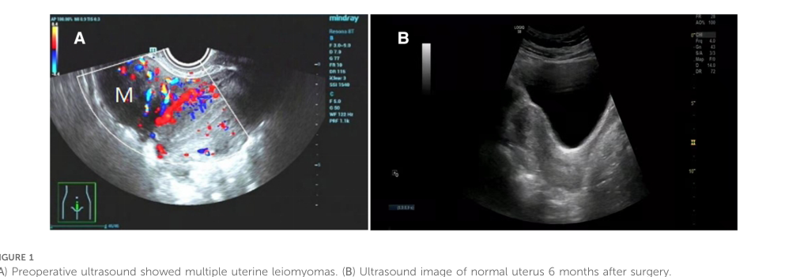

## Question

# Disease Characteristics Research Template

## Target Disease
- **Disease Name:** Fallopian tube benign neoplasm
- **MONDO ID:**  (if available)
- **Category:** Gynecologic Neoplasm

## Research Objectives

Please provide a comprehensive research report on **Fallopian tube benign neoplasm** covering all of the
disease characteristics listed below. This report will be used to populate a disease knowledge
base entry. Be thorough and cite primary literature (PMID preferred) for all claims.

For each section, **suggested databases/resources** are listed. These are the first places
you should search for information on each topic.

---

### 1. Disease Information
> **Search first:** OMIM, Orphanet, ICD-10/ICD-11, MeSH, PubMed

- What is the disease? Provide a concise overview.
- What are the key identifiers? (OMIM, Orphanet, ICD-10/ICD-11, MeSH, Mondo)
- What are the common synonyms and alternative names?
- Is the information derived from individual patients (e.g., EHR) or aggregated disease-level resources?

### 2. Etiology

- **Disease Causal Factors**: What are the primary causes? (genetic, environmental, infectious, mechanistic)
- **Risk Factors**:
  > **Search first:** PubMed, Cochrane Library, UpToDate, clinical guidelines, ClinVar, ClinGen, GWAS Catalog, PheGenI, CTD, CDC, WHO, epidemiological databases
  - Genetic risk factors (causal variants, susceptibility loci, modifier genes)
  - Environmental risk factors (toxins, lifestyle, occupational exposures, age, sex, family history)
- **Protective Factors**:
  > **Search first:** PubMed, Cochrane Library, clinical trial databases, GWAS Catalog, gnomAD, WHO, CDC, nutrition databases
  - Genetic protective factors (protective variants, modifier alleles)
  - Environmental protective factors (diet, lifestyle, exposures that reduce risk)
- **Gene-Environment Interactions**: How do genetic and environmental factors interact to influence disease?
  > **Search first:** CTD, PubMed, PheGenI, GxE databases

### 3. Phenotypes
> **Search first:** HPO (Human Phenotype Ontology), OMIM, Orphanet, PubMed, clinicaltrials.gov, MedDRA, SNOMED CT, DECIPHER, LOINC

For each phenotype, provide:
- **Phenotype type**: symptoms, clinical signs, physical manifestations, behavioral changes, or laboratory abnormalities
  > For symptoms/signs: HPO, OMIM, Orphanet, PubMed
  > For behavioral changes: HPO, DSM, RDoC (Research Domain Criteria), PubMed
  > For laboratory abnormalities: LOINC, SNOMED CT, LabTests Online, PubMed
- **Phenotype characteristics**:
  > **Search first:** OMIM, Orphanet, HPO, PubMed
  - Age of symptom onset (neonatal, childhood, adult-onset, late-onset)
  - Symptom severity (mild, moderate, severe, variable)
  - Symptom progression (stable, progressive, episodic, fluctuating)
  - Frequency among affected individuals (percentage or qualitative)
- **Quality of life impact**: Effects on daily functioning and well-being (per-phenotype when possible)
  > **Search first:** EQ-5D database, SF-36, WHO QOL databases, PubMed
- Suggest HPO (Human Phenotype Ontology) terms for each phenotype

### 4. Genetic/Molecular Information

- **Causal Genes**: Gene mutations or chromosomal abnormalities responsible for disease (gene symbols, OMIM IDs)
  > **Search first:** OMIM, ClinVar, HGMD, Ensembl, NCBI Gene
- **Pathogenic Variants**:
  - Affected genes (gene symbols, HGNC IDs)
    > **Search first:** OMIM, NCBI Gene, Ensembl, HGNC, UniProt, GeneCards
  - Variant classification (pathogenic, likely pathogenic, VUS per ACMG/AMP guidelines)
    > **Search first:** ClinVar, ClinGen, ACMG/AMP guidelines, VarSome
  - Variant type/class (missense, frameshift, nonsense, splice-site, structural)
  - Allele frequency in population databases
    > **Search first:** gnomAD, 1000 Genomes, ExAC, TOPMed, dbSNP
  - Somatic vs germline origin
    > **Search first:** COSMIC (somatic), ClinVar, ICGC, TCGA
  - Functional consequences (loss of function, gain of function, dominant negative)
- **Modifier Genes**: Genes that modify disease severity or expression
- **Epigenetic Information**: DNA methylation, histone modifications, chromatin changes affecting disease
  > **Search first:** ENCODE, Roadmap Epigenomics, MethBase, DiseaseMeth
- **Chromosomal Abnormalities**: Large-scale genetic changes (aneuploidy, translocations, inversions)
  > **Search first:** DECIPHER, ClinVar, ECARUCA, UCSC Genome Browser

### 5. Environmental Information

- **Environmental Factors**: Non-genetic contributing factors (toxins, radiation, pollution, occupational exposure)
  > **Search first:** CTD (Comparative Toxicogenomics Database), TOXNET, PubMed, EPA databases
- **Lifestyle Factors**: Behavioral factors (smoking, diet, exercise, alcohol consumption)
  > **Search first:** CDC databases, WHO, PubMed, NHANES
- **Infectious Agents**: If applicable, pathogens causing or triggering disease (bacteria, viruses, fungi, parasites)
  > **Search first:** NCBI Taxonomy, ViPR, BV-BRC, MicrobeDB, GIDEON

### 6. Mechanism / Pathophysiology

- **Molecular Pathways**: Specific signaling cascades or biochemical pathways involved (Wnt, MAPK, mTOR, PI3K-AKT, etc.)
  > **Search first:** KEGG, Reactome, WikiPathways, PathBank, BioCyc
- **Cellular Processes**: Cell-level mechanisms (apoptosis, autophagy, cell cycle dysregulation, inflammation, etc.)
  > **Search first:** Gene Ontology (GO), Reactome, KEGG, PubMed
- **Protein Dysfunction**: How protein structure or function is altered (misfolding, aggregation, loss of function, gain of function)
  > **Search first:** UniProt, PDB (Protein Data Bank), InterPro, Pfam, AlphaFold
- **Metabolic Changes**: Alterations in metabolic processes (energy metabolism, lipid metabolism, amino acid metabolism)
  > **Search first:** KEGG, BioCyc, HMDB (Human Metabolome Database), BRENDA
- **Immune System Involvement**: Role of immune response (autoimmunity, immunodeficiency, chronic inflammation)
  > **Search first:** ImmPort, Immunome Database, IEDB, Gene Ontology
- **Tissue Damage Mechanisms**: How tissues/ are injured (oxidative stress, ischemia, fibrosis, necrosis)
  > **Search first:** PubMed, Gene Ontology, Reactome
- **Biochemical Abnormalities**: Specific molecular defects (enzyme deficiencies, receptor dysfunction, ion channel defects)
  > **Search first:** BRENDA, UniProt, KEGG, OMIM, PubMed
- **Epigenetic Changes**: DNA methylation, histone modifications affecting gene expression in disease
  > **Search first:** ENCODE, Roadmap Epigenomics, MethBase, DiseaseMeth
- **Molecular Profiling** (if available):
  - Transcriptomics/gene expression changes
    > **Search first:** GEO (Gene Expression Omnibus), ArrayExpress, GTEx, Human Cell Atlas, SRA
  - Proteomics findings
    > **Search first:** PRIDE, ProteomeXchange, Human Protein Atlas, STRING, BioGRID
  - Metabolomics signatures
    > **Search first:** MetaboLights, Metabolomics Workbench, HMDB, METLIN
  - Lipidomics alterations
    > **Search first:** LIPID MAPS, SwissLipids, LipidHome, Metabolomics Workbench
  - Genomic structural features
    > **Search first:** UCSC Genome Browser, Ensembl, NCBI, dbVar, DGV
- **Advanced Technologies** (if applicable):
  - Single-cell analysis findings (cell-type specific mechanisms, cellular heterogeneity)
    > **Search first:** Human Cell Atlas, Single Cell Portal, GEO, CELLxGENE
  - Spatial transcriptomics findings
    > **Search first:** GEO, Spatial Research, Vizgen, 10x Genomics data
  - Multi-omics integration results
    > **Search first:** TCGA, ICGC, cBioPortal, LinkedOmics, PubMed
  - Functional genomics screens (CRISPR, RNAi)
    > **Search first:** DepMap, GenomeRNAi, PubMed, BioGRID ORCS

For each mechanism, describe:
- The causal chain from initial trigger to clinical manifestation
- Which mechanisms are upstream vs downstream
- What cell types and biological processes are involved
- Suggest GO terms for biological processes and CL terms for cell types

### 7. Anatomical Structures Affected

- **Organ Level**:
  - Primary organs directly affected
  - Secondary organ involvement (complications, secondary effects)
  - Body systems involved (cardiovascular, nervous, digestive, respiratory, endocrine, etc.)
  > **Search first:** Uberon, FMA (Foundational Model of Anatomy), OMIM, HPO, ICD-11, MeSH, SNOMED CT
- **Tissue and Cell Level**:
  - Specific tissue types affected (epithelial, connective, muscle, nervous)
  - Specific cell populations targeted (with Cell Ontology terms)
  > **Search first:** Uberon, Human Protein Atlas, Cell Ontology, Human Cell Atlas, CellMarker, PanglaoDB
- **Subcellular Level**:
  - Cellular compartments involved (mitochondria, nucleus, ER, lysosomes) (with GO Cellular Component terms)
  > **Search first:** Gene Ontology (Cellular Component), UniProt, Human Protein Atlas
- **Localization**:
  - Specific anatomical sites (with UBERON terms)
    > **Search first:** FMA, Uberon, NeuroNames (for brain), SNOMED CT
  - Lateralization (unilateral, bilateral, asymmetric)
    > **Search first:** HPO, clinical literature, imaging databases

### 8. Temporal Development

- **Onset**:
  - Typical age of onset (congenital, pediatric, adult, geriatric)
  - Onset pattern (acute, subacute, chronic, insidious)
  > **Search first:** OMIM, Orphanet, HPO, PubMed
- **Progression**:
  - Disease stages (early, intermediate, advanced, end-stage)
    > **Search first:** Cancer Staging Manual (AJCC), WHO classifications, PubMed
  - Progression rate (rapid, slow, variable)
  - Disease course pattern (episodic, relapsing-remitting, progressive, stable)
  - Disease duration (self-limited, chronic lifelong)
  > **Search first:** Disease registries, longitudinal cohort databases, natural history studies, PubMed, Orphanet, OMIM
- **Patterns**:
  - Remission patterns (spontaneous, treatment-induced)
    > **Search first:** Clinical trial databases, disease registries, PubMed
  - Critical periods (time windows of vulnerability or opportunity for intervention)
    > **Search first:** PubMed, developmental biology databases, clinical guidelines

### 9. Inheritance and Population

- **Epidemiology**:
  - Prevalence (cases per 100,000 at given time)
  - Incidence (new cases per 100,000 per year)
  > **Search first:** Orphanet, CDC, WHO, GBD (Global Burden of Disease), national registries, SEER, disease registries
- **For Genetic Etiology**:
  - Inheritance pattern (AD, AR, X-linked, mitochondrial, multifactorial, polygenic)
    > **Search first:** OMIM, Orphanet, ClinVar, GTR (Genetic Testing Registry)
  - Penetrance (complete, incomplete, age-dependent)
    > **Search first:** ClinVar, OMIM, PubMed, ClinGen
  - Expressivity (variable, consistent)
    > **Search first:** OMIM, ClinVar, PubMed
  - Genetic anticipation (increasing severity in successive generations)
    > **Search first:** OMIM, PubMed (especially for repeat expansion disorders)
  - Germline mosaicism
    > **Search first:** ClinVar, OMIM, genetic counseling literature, PubMed
  - Founder effects (population-specific mutations)
    > **Search first:** gnomAD, population genetics databases, PubMed
  - Consanguinity role
    > **Search first:** OMIM, population studies, genetic counseling resources
  - Carrier frequency
    > **Search first:** gnomAD, carrier screening databases, GeneReviews, GTR
- **Population Demographics**:
  - Affected populations (ethnic or demographic groups with higher prevalence)
    > **Search first:** gnomAD, 1000 Genomes, PAGE Study, PubMed, population registries
  - Geographic distribution (endemic areas, regional variation)
    > **Search first:** WHO, CDC, GBD, Orphanet, geographic epidemiology databases
  - Geographic distribution of specific variants
  - Sex ratio (male:female)
    > **Search first:** Disease registries, OMIM, PubMed, epidemiological databases
  - Age distribution of affected individuals
    > **Search first:** CDC, disease registries, SEER, Orphanet

### 10. Diagnostics

- **Clinical Tests**:
  - Laboratory tests (blood, urine, tissue chemistry, specific enzyme assays)
    > **Search first:** LOINC, LabTests Online, PubMed
  - Biomarkers (proteins, metabolites, genetic markers, circulating biomarkers)
    > **Search first:** FDA Biomarker List, BEST (Biomarkers, EndpointS, and other Tools), PubMed
  - Imaging studies (X-ray, CT, MRI, PET, ultrasound)
    > **Search first:** RadLex, DICOM, Radiopaedia, imaging databases
  - Functional tests (pulmonary function, cardiac stress tests)
    > **Search first:** LOINC, clinical guidelines, PubMed
  - Electrophysiology (EEG, EMG, ECG, nerve conduction studies)
    > **Search first:** LOINC, clinical neurophysiology databases, PubMed
  - Biopsy findings (histopathology, immunohistochemistry)
    > **Search first:** SNOMED CT, College of American Pathologists resources, PubMed
  - Pathology findings (microscopic examination)
    > **Search first:** SNOMED CT, Digital Pathology databases, PubMed
- **Genetic Testing**:
  > **Search first:** GTR (Genetic Testing Registry), GeneReviews, ClinGen
  - Overview of recommended genetic testing approach
  - Whole genome sequencing (WGS) utility
    > **Search first:** GTR, ClinVar, GEL (Genomics England), gnomAD
  - Whole exome sequencing (WES) utility
    > **Search first:** GTR, ClinVar, OMIM, GeneMatcher
  - Gene panels (which panels, which genes)
    > **Search first:** GTR, ClinVar, laboratory-specific databases
  - Single gene testing
    > **Search first:** GTR, ClinVar, OMIM, GeneReviews
  - Chromosomal microarray (CMA)
    > **Search first:** DECIPHER, ClinVar, dbVar, ECARUCA
  - Karyotyping
    > **Search first:** Chromosome Abnormality Database, ClinVar, cytogenetics resources
  - FISH
    > **Search first:** ClinVar, cytogenetics databases, PubMed
  - Mitochondrial DNA testing
    > **Search first:** MITOMAP, MSeqDR, ClinVar, GTR
  - Repeat expansion testing
    > **Search first:** GTR, ClinVar, repeat expansion databases, PubMed
- **Omics-Based Diagnostics** (if applicable):
  - RNA sequencing / transcriptomics
    > **Search first:** GEO, ArrayExpress, GTEx, RNA-seq databases
  - Proteomics
    > **Search first:** PRIDE, ProteomeXchange, FDA Biomarker database
  - Metabolomics
    > **Search first:** MetaboLights, Metabolomics Workbench, HMDB
  - Epigenomics
    > **Search first:** GEO, ENCODE, Roadmap Epigenomics, MethBase
  - Liquid biopsy
    > **Search first:** COSMIC, ClinVar, liquid biopsy databases, PubMed
- **Clinical Criteria**:
  - Standardized diagnostic criteria (DSM, ICD, society guidelines)
    > **Search first:** DSM-5, ICD-11, clinical society guidelines, UpToDate
  - Differential diagnosis (other conditions to rule out, with distinguishing features)
    > **Search first:** DynaMed, UpToDate, clinical decision support systems
- **Screening**:
  - Screening methods for asymptomatic individuals (newborn screening, carrier screening, cascade screening)
    > **Search first:** ACMG recommendations, CDC newborn screening, GTR

### 11. Outcome/Prognosis

- **Survival and Mortality**:
  - Survival rate (5-year, 10-year, overall)
    > **Search first:** SEER, cancer registries, disease-specific registries, PubMed
  - Life expectancy (with and without treatment if applicable)
    > **Search first:** Orphanet, disease registries, actuarial databases, PubMed
  - Mortality rate
    > **Search first:** CDC, WHO, GBD, national mortality databases
  - Disease-specific mortality (deaths directly attributable to disease)
    > **Search first:** Disease registries, CDC Wonder, GBD, PubMed
- **Morbidity and Function**:
  - Morbidity (disease-related disability and health impacts)
    > **Search first:** GBD, WHO, disability databases, PubMed
  - Disability outcomes (long-term functional impairments)
    > **Search first:** ICF (International Classification of Functioning), disability registries
  - Quality of life measures (EQ-5D, SF-36, PROMIS, disease-specific tools)
    > **Search first:** EQ-5D database, SF-36, PROMIS, PubMed
- **Disease Course**:
  - Complications (secondary problems: infections, organ failure, etc.)
    > **Search first:** ICD codes, disease registries, clinical databases, PubMed
  - Recovery potential (likelihood and extent of recovery, with vs without treatment)
    > **Search first:** Natural history studies, rehabilitation databases, PubMed
- **Prediction**:
  - Prognostic factors (age, disease severity, biomarkers, treatment response)
    > **Search first:** Prognostic models databases, clinical calculators, PubMed
  - Prognostic biomarkers (molecular markers predicting disease course)
    > **Search first:** FDA Biomarker database, PubMed, cancer prognostic databases

### 12. Treatment

- **Pharmacotherapy**:
  - Pharmacological treatments (drug names, drug classes, mechanisms of action)
    > **Search first:** DrugBank, RxNorm, ATC classification, DailyMed, FDA databases
  - Pharmacogenomics (how genetic variants affect drug metabolism, efficacy, toxicity)
    > **Search first:** PharmGKB, CPIC (Clinical Pharmacogenetics), FDA Table of PGx Biomarkers
- **Advanced Therapeutics**:
  - Gene therapy (viral vectors, CRISPR, gene replacement, gene editing)
    > **Search first:** ClinicalTrials.gov, FDA gene therapy database, ASGCT resources
  - Cell therapy (stem cell transplant, CAR-T, cellular therapeutics)
    > **Search first:** ClinicalTrials.gov, FDA cell therapy database, FACT standards
  - RNA-based therapies (ASOs, siRNA, mRNA therapies)
    > **Search first:** ClinicalTrials.gov, FDA approvals, PubMed
  - Targeted therapies (treatments directed at specific molecular targets)
    > **Search first:** My Cancer Genome, OncoKB, ClinicalTrials.gov, FDA approvals
  - Immunotherapies (checkpoint inhibitors, monoclonal antibodies)
    > **Search first:** Cancer Immunotherapy Database, FDA approvals, ClinicalTrials.gov
- **Surgical and Interventional**:
  - Surgical interventions (types of surgery, timing, outcomes)
    > **Search first:** CPT codes, surgical registries, clinical guidelines, PubMed
- **Supportive and Rehabilitative**:
  - Supportive care (symptom management, pain control, nutrition)
    > **Search first:** Clinical guidelines, Cochrane Library, PubMed
  - Rehabilitation (physical therapy, occupational therapy, speech therapy)
    > **Search first:** Rehabilitation medicine databases, clinical guidelines, PubMed
- **Experimental**:
  - Experimental treatments in clinical trials (with NCT identifiers if available)
    > **Search first:** ClinicalTrials.gov, EU Clinical Trials Register, WHO ICTRP
- **Treatment Outcomes**:
  - Treatment response rates
    > **Search first:** Clinical trial databases, FDA reviews, systematic reviews, PubMed
  - Side effects and adverse events
    > **Search first:** FDA Adverse Event Reporting System (FAERS), MedWatch, PubMed
- **Treatment Strategy**:
  - Treatment algorithms (clinical pathways, decision trees)
    > **Search first:** Clinical practice guidelines, NCCN Guidelines, UpToDate
  - Combination therapies
    > **Search first:** ClinicalTrials.gov, treatment guidelines, PubMed
  - Personalized medicine approaches (genotype-guided treatment)
    > **Search first:** My Cancer Genome, CIViC, PharmGKB, precision medicine databases

For each treatment, suggest MAXO (Medical Action Ontology) terms where applicable.

### 13. Prevention

- **Prevention Levels**:
  - Primary prevention (preventing disease occurrence: vaccination, risk factor modification)
    > **Search first:** CDC, WHO, USPSTF recommendations, Cochrane Library
  - Secondary prevention (early detection and treatment: screening programs, early intervention)
    > **Search first:** USPSTF, CDC screening guidelines, WHO
  - Tertiary prevention (preventing complications in those with disease)
    > **Search first:** Clinical guidelines, disease management protocols, PubMed
- **Immunization**: Vaccine strategies (if applicable)
  > **Search first:** CDC vaccine schedules, WHO immunization, FDA vaccine database
- **Screening and Early Detection**:
  - Screening programs (population-based: newborn screening, cancer screening)
    > **Search first:** CDC screening programs, USPSTF, cancer screening databases
  - Genetic screening (carrier screening, preimplantation genetic diagnosis, prenatal testing)
    > **Search first:** ACMG recommendations, ACOG guidelines, GTR
  - Risk stratification (identifying high-risk individuals for targeted prevention)
    > **Search first:** Risk prediction models, clinical calculators, PubMed
- **Behavioral Interventions**: Lifestyle modifications to reduce risk
  > **Search first:** CDC, WHO, behavioral intervention databases, Cochrane Library
- **Counseling**: Genetic counseling (risk assessment, family planning guidance)
  > **Search first:** NSGC resources, ACMG guidelines, GeneReviews
- **Public Health**:
  - Public health interventions (sanitation, vector control, health education)
    > **Search first:** CDC, WHO, public health databases, PubMed
  - Environmental interventions (reducing environmental risk factors)
    > **Search first:** EPA databases, WHO environmental health, PubMed
- **Prophylaxis**: Preventive medications or procedures
  > **Search first:** Clinical guidelines, FDA approvals, PubMed

### 14. Other Species / Natural Disease

- **Taxonomy**: Species affected (with NCBI Taxon identifiers)
  > **Search first:** NCBI Taxonomy
- **Breed**: Specific breeds affected (with VBO identifiers if applicable)
  > **Search first:** VBO (Vertebrate Breed Ontology)
- **Gene**: Orthologous genes in other species (with NCBI Gene IDs)
  > **Search first:** NCBI Gene
- **Natural Disease**:
  - Naturally occurring disease in other species (companion animals, wildlife)
    > **Search first:** OMIA (Online Mendelian Inheritance in Animals), VetCompass, PubMed
  - Veterinary relevance and importance in animal health
    > **Search first:** OMIA, veterinary databases, PubMed
- **Comparative Biology**:
  - Comparative pathology (similarities and differences across species)
    > **Search first:** OMIA, comparative pathology databases, PubMed
  - Evolutionary conservation of disease mechanisms
    > **Search first:** HomoloGene, OrthoMCL, Alliance of Genome Resources
- **Transmission** (if applicable):
  - Zoonotic potential
    > **Search first:** CDC zoonotic diseases, WHO zoonoses, GIDEON
  - Cross-species susceptibility
    > **Search first:** NCBI Taxonomy, veterinary databases, PubMed

### 15. Model Organisms

- **Model Types**:
  - Model organism type (mammalian, invertebrate, cellular, in vitro)
    > **Search first:** Alliance of Genome Resources, model organism databases
  - Specific model systems (mouse, rat, zebrafish, Drosophila, C. elegans, yeast, cell lines, organoids, iPSCs)
    > **Search first:** MGI, RGD, ZFIN, FlyBase, WormBase, SGD, ATCC, Cellosaurus
  - Induced models (drug treatment, surgical intervention, environmental manipulation)
    > **Search first:** MGI, model organism databases, PubMed
- **Genetic Models**:
  - Types available (knockout, knock-in, transgenic, conditional, humanized)
    > **Search first:** MGI, IMPC, KOMP, EuMMCR, IMSR
- **Model Characteristics**:
  - Phenotype recapitulation (how well model reproduces human disease features)
    > **Search first:** Model organism databases, comparative studies, PubMed
  - Model limitations (aspects of human disease not captured)
    > **Search first:** Model organism databases, PubMed, review articles
- **Applications**:
  - Research applications (what aspects of disease can be studied)
    > **Search first:** Model organism databases, PubMed
- **Resources**:
  - Model databases
    > **Search first:** MGI, RGD, ZFIN, FlyBase, WormBase, IMSR, EMMA, MMRRC

---

## Citation Requirements

- Cite primary literature (PMID preferred) for all mechanistic and clinical claims
- Prioritize recent reviews and landmark papers
- Include direct quotes from abstracts where possible to support key statements
- Distinguish evidence source types: human clinical, model organism, in vitro, computational

## Output Format

Structure your response as a comprehensive narrative organized by the sections above.
For each section, provide:
- Factual content with specific details (numbers, percentages, gene names, variant nomenclature)
- Ontology term suggestions (HPO, GO, CL, UBERON, CHEBI, MAXO, MONDO) where applicable
- Evidence citations with PMIDs
- Direct quotes from abstracts to support key claims
- Clear indication when information is not available or not applicable for this disease

This report will be used to populate a disease knowledge base entry with:
- Pathophysiology descriptions with causal chains
- Gene/protein annotations (HGNC, GO terms)
- Phenotype associations (HP terms) with frequencies
- Cell type involvement (CL terms)
- Anatomical locations (UBERON terms)
- Chemical entities (CHEBI terms)
- Treatment annotations (MAXO terms)
- Evidence items with PMIDs and exact abstract quotes
- Epidemiology, prognosis, diagnostic, and prevention information
- Animal model descriptions with phenotype recapitulation details

## Output

Question: You are an expert researcher providing comprehensive, well-cited information.

Provide detailed information focusing on:
1. Key concepts and definitions with current understanding
2. Recent developments and latest research (prioritize 2023-2024 sources)
3. Current applications and real-world implementations
4. Expert opinions and analysis from authoritative sources
5. Relevant statistics and data from recent studies

Format as a comprehensive research report with proper citations. Include URLs and publication dates where available.
Always prioritize recent, authoritative sources and provide specific citations for all major claims.

# Disease Characteristics Research Template

## Target Disease
- **Disease Name:** Fallopian tube benign neoplasm
- **MONDO ID:**  (if available)
- **Category:** Gynecologic Neoplasm

## Research Objectives

Please provide a comprehensive research report on **Fallopian tube benign neoplasm** covering all of the
disease characteristics listed below. This report will be used to populate a disease knowledge
base entry. Be thorough and cite primary literature (PMID preferred) for all claims.

For each section, **suggested databases/resources** are listed. These are the first places
you should search for information on each topic.

---

### 1. Disease Information
> **Search first:** OMIM, Orphanet, ICD-10/ICD-11, MeSH, PubMed

- What is the disease? Provide a concise overview.
- What are the key identifiers? (OMIM, Orphanet, ICD-10/ICD-11, MeSH, Mondo)
- What are the common synonyms and alternative names?
- Is the information derived from individual patients (e.g., EHR) or aggregated disease-level resources?

### 2. Etiology

- **Disease Causal Factors**: What are the primary causes? (genetic, environmental, infectious, mechanistic)
- **Risk Factors**:
  > **Search first:** PubMed, Cochrane Library, UpToDate, clinical guidelines, ClinVar, ClinGen, GWAS Catalog, PheGenI, CTD, CDC, WHO, epidemiological databases
  - Genetic risk factors (causal variants, susceptibility loci, modifier genes)
  - Environmental risk factors (toxins, lifestyle, occupational exposures, age, sex, family history)
- **Protective Factors**:
  > **Search first:** PubMed, Cochrane Library, clinical trial databases, GWAS Catalog, gnomAD, WHO, CDC, nutrition databases
  - Genetic protective factors (protective variants, modifier alleles)
  - Environmental protective factors (diet, lifestyle, exposures that reduce risk)
- **Gene-Environment Interactions**: How do genetic and environmental factors interact to influence disease?
  > **Search first:** CTD, PubMed, PheGenI, GxE databases

### 3. Phenotypes
> **Search first:** HPO (Human Phenotype Ontology), OMIM, Orphanet, PubMed, clinicaltrials.gov, MedDRA, SNOMED CT, DECIPHER, LOINC

For each phenotype, provide:
- **Phenotype type**: symptoms, clinical signs, physical manifestations, behavioral changes, or laboratory abnormalities
  > For symptoms/signs: HPO, OMIM, Orphanet, PubMed
  > For behavioral changes: HPO, DSM, RDoC (Research Domain Criteria), PubMed
  > For laboratory abnormalities: LOINC, SNOMED CT, LabTests Online, PubMed
- **Phenotype characteristics**:
  > **Search first:** OMIM, Orphanet, HPO, PubMed
  - Age of symptom onset (neonatal, childhood, adult-onset, late-onset)
  - Symptom severity (mild, moderate, severe, variable)
  - Symptom progression (stable, progressive, episodic, fluctuating)
  - Frequency among affected individuals (percentage or qualitative)
- **Quality of life impact**: Effects on daily functioning and well-being (per-phenotype when possible)
  > **Search first:** EQ-5D database, SF-36, WHO QOL databases, PubMed
- Suggest HPO (Human Phenotype Ontology) terms for each phenotype

### 4. Genetic/Molecular Information

- **Causal Genes**: Gene mutations or chromosomal abnormalities responsible for disease (gene symbols, OMIM IDs)
  > **Search first:** OMIM, ClinVar, HGMD, Ensembl, NCBI Gene
- **Pathogenic Variants**:
  - Affected genes (gene symbols, HGNC IDs)
    > **Search first:** OMIM, NCBI Gene, Ensembl, HGNC, UniProt, GeneCards
  - Variant classification (pathogenic, likely pathogenic, VUS per ACMG/AMP guidelines)
    > **Search first:** ClinVar, ClinGen, ACMG/AMP guidelines, VarSome
  - Variant type/class (missense, frameshift, nonsense, splice-site, structural)
  - Allele frequency in population databases
    > **Search first:** gnomAD, 1000 Genomes, ExAC, TOPMed, dbSNP
  - Somatic vs germline origin
    > **Search first:** COSMIC (somatic), ClinVar, ICGC, TCGA
  - Functional consequences (loss of function, gain of function, dominant negative)
- **Modifier Genes**: Genes that modify disease severity or expression
- **Epigenetic Information**: DNA methylation, histone modifications, chromatin changes affecting disease
  > **Search first:** ENCODE, Roadmap Epigenomics, MethBase, DiseaseMeth
- **Chromosomal Abnormalities**: Large-scale genetic changes (aneuploidy, translocations, inversions)
  > **Search first:** DECIPHER, ClinVar, ECARUCA, UCSC Genome Browser

### 5. Environmental Information

- **Environmental Factors**: Non-genetic contributing factors (toxins, radiation, pollution, occupational exposure)
  > **Search first:** CTD (Comparative Toxicogenomics Database), TOXNET, PubMed, EPA databases
- **Lifestyle Factors**: Behavioral factors (smoking, diet, exercise, alcohol consumption)
  > **Search first:** CDC databases, WHO, PubMed, NHANES
- **Infectious Agents**: If applicable, pathogens causing or triggering disease (bacteria, viruses, fungi, parasites)
  > **Search first:** NCBI Taxonomy, ViPR, BV-BRC, MicrobeDB, GIDEON

### 6. Mechanism / Pathophysiology

- **Molecular Pathways**: Specific signaling cascades or biochemical pathways involved (Wnt, MAPK, mTOR, PI3K-AKT, etc.)
  > **Search first:** KEGG, Reactome, WikiPathways, PathBank, BioCyc
- **Cellular Processes**: Cell-level mechanisms (apoptosis, autophagy, cell cycle dysregulation, inflammation, etc.)
  > **Search first:** Gene Ontology (GO), Reactome, KEGG, PubMed
- **Protein Dysfunction**: How protein structure or function is altered (misfolding, aggregation, loss of function, gain of function)
  > **Search first:** UniProt, PDB (Protein Data Bank), InterPro, Pfam, AlphaFold
- **Metabolic Changes**: Alterations in metabolic processes (energy metabolism, lipid metabolism, amino acid metabolism)
  > **Search first:** KEGG, BioCyc, HMDB (Human Metabolome Database), BRENDA
- **Immune System Involvement**: Role of immune response (autoimmunity, immunodeficiency, chronic inflammation)
  > **Search first:** ImmPort, Immunome Database, IEDB, Gene Ontology
- **Tissue Damage Mechanisms**: How tissues/ are injured (oxidative stress, ischemia, fibrosis, necrosis)
  > **Search first:** PubMed, Gene Ontology, Reactome
- **Biochemical Abnormalities**: Specific molecular defects (enzyme deficiencies, receptor dysfunction, ion channel defects)
  > **Search first:** BRENDA, UniProt, KEGG, OMIM, PubMed
- **Epigenetic Changes**: DNA methylation, histone modifications affecting gene expression in disease
  > **Search first:** ENCODE, Roadmap Epigenomics, MethBase, DiseaseMeth
- **Molecular Profiling** (if available):
  - Transcriptomics/gene expression changes
    > **Search first:** GEO (Gene Expression Omnibus), ArrayExpress, GTEx, Human Cell Atlas, SRA
  - Proteomics findings
    > **Search first:** PRIDE, ProteomeXchange, Human Protein Atlas, STRING, BioGRID
  - Metabolomics signatures
    > **Search first:** MetaboLights, Metabolomics Workbench, HMDB, METLIN
  - Lipidomics alterations
    > **Search first:** LIPID MAPS, SwissLipids, LipidHome, Metabolomics Workbench
  - Genomic structural features
    > **Search first:** UCSC Genome Browser, Ensembl, NCBI, dbVar, DGV
- **Advanced Technologies** (if applicable):
  - Single-cell analysis findings (cell-type specific mechanisms, cellular heterogeneity)
    > **Search first:** Human Cell Atlas, Single Cell Portal, GEO, CELLxGENE
  - Spatial transcriptomics findings
    > **Search first:** GEO, Spatial Research, Vizgen, 10x Genomics data
  - Multi-omics integration results
    > **Search first:** TCGA, ICGC, cBioPortal, LinkedOmics, PubMed
  - Functional genomics screens (CRISPR, RNAi)
    > **Search first:** DepMap, GenomeRNAi, PubMed, BioGRID ORCS

For each mechanism, describe:
- The causal chain from initial trigger to clinical manifestation
- Which mechanisms are upstream vs downstream
- What cell types and biological processes are involved
- Suggest GO terms for biological processes and CL terms for cell types

### 7. Anatomical Structures Affected

- **Organ Level**:
  - Primary organs directly affected
  - Secondary organ involvement (complications, secondary effects)
  - Body systems involved (cardiovascular, nervous, digestive, respiratory, endocrine, etc.)
  > **Search first:** Uberon, FMA (Foundational Model of Anatomy), OMIM, HPO, ICD-11, MeSH, SNOMED CT
- **Tissue and Cell Level**:
  - Specific tissue types affected (epithelial, connective, muscle, nervous)
  - Specific cell populations targeted (with Cell Ontology terms)
  > **Search first:** Uberon, Human Protein Atlas, Cell Ontology, Human Cell Atlas, CellMarker, PanglaoDB
- **Subcellular Level**:
  - Cellular compartments involved (mitochondria, nucleus, ER, lysosomes) (with GO Cellular Component terms)
  > **Search first:** Gene Ontology (Cellular Component), UniProt, Human Protein Atlas
- **Localization**:
  - Specific anatomical sites (with UBERON terms)
    > **Search first:** FMA, Uberon, NeuroNames (for brain), SNOMED CT
  - Lateralization (unilateral, bilateral, asymmetric)
    > **Search first:** HPO, clinical literature, imaging databases

### 8. Temporal Development

- **Onset**:
  - Typical age of onset (congenital, pediatric, adult, geriatric)
  - Onset pattern (acute, subacute, chronic, insidious)
  > **Search first:** OMIM, Orphanet, HPO, PubMed
- **Progression**:
  - Disease stages (early, intermediate, advanced, end-stage)
    > **Search first:** Cancer Staging Manual (AJCC), WHO classifications, PubMed
  - Progression rate (rapid, slow, variable)
  - Disease course pattern (episodic, relapsing-remitting, progressive, stable)
  - Disease duration (self-limited, chronic lifelong)
  > **Search first:** Disease registries, longitudinal cohort databases, natural history studies, PubMed, Orphanet, OMIM
- **Patterns**:
  - Remission patterns (spontaneous, treatment-induced)
    > **Search first:** Clinical trial databases, disease registries, PubMed
  - Critical periods (time windows of vulnerability or opportunity for intervention)
    > **Search first:** PubMed, developmental biology databases, clinical guidelines

### 9. Inheritance and Population

- **Epidemiology**:
  - Prevalence (cases per 100,000 at given time)
  - Incidence (new cases per 100,000 per year)
  > **Search first:** Orphanet, CDC, WHO, GBD (Global Burden of Disease), national registries, SEER, disease registries
- **For Genetic Etiology**:
  - Inheritance pattern (AD, AR, X-linked, mitochondrial, multifactorial, polygenic)
    > **Search first:** OMIM, Orphanet, ClinVar, GTR (Genetic Testing Registry)
  - Penetrance (complete, incomplete, age-dependent)
    > **Search first:** ClinVar, OMIM, PubMed, ClinGen
  - Expressivity (variable, consistent)
    > **Search first:** OMIM, ClinVar, PubMed
  - Genetic anticipation (increasing severity in successive generations)
    > **Search first:** OMIM, PubMed (especially for repeat expansion disorders)
  - Germline mosaicism
    > **Search first:** ClinVar, OMIM, genetic counseling literature, PubMed
  - Founder effects (population-specific mutations)
    > **Search first:** gnomAD, population genetics databases, PubMed
  - Consanguinity role
    > **Search first:** OMIM, population studies, genetic counseling resources
  - Carrier frequency
    > **Search first:** gnomAD, carrier screening databases, GeneReviews, GTR
- **Population Demographics**:
  - Affected populations (ethnic or demographic groups with higher prevalence)
    > **Search first:** gnomAD, 1000 Genomes, PAGE Study, PubMed, population registries
  - Geographic distribution (endemic areas, regional variation)
    > **Search first:** WHO, CDC, GBD, Orphanet, geographic epidemiology databases
  - Geographic distribution of specific variants
  - Sex ratio (male:female)
    > **Search first:** Disease registries, OMIM, PubMed, epidemiological databases
  - Age distribution of affected individuals
    > **Search first:** CDC, disease registries, SEER, Orphanet

### 10. Diagnostics

- **Clinical Tests**:
  - Laboratory tests (blood, urine, tissue chemistry, specific enzyme assays)
    > **Search first:** LOINC, LabTests Online, PubMed
  - Biomarkers (proteins, metabolites, genetic markers, circulating biomarkers)
    > **Search first:** FDA Biomarker List, BEST (Biomarkers, EndpointS, and other Tools), PubMed
  - Imaging studies (X-ray, CT, MRI, PET, ultrasound)
    > **Search first:** RadLex, DICOM, Radiopaedia, imaging databases
  - Functional tests (pulmonary function, cardiac stress tests)
    > **Search first:** LOINC, clinical guidelines, PubMed
  - Electrophysiology (EEG, EMG, ECG, nerve conduction studies)
    > **Search first:** LOINC, clinical neurophysiology databases, PubMed
  - Biopsy findings (histopathology, immunohistochemistry)
    > **Search first:** SNOMED CT, College of American Pathologists resources, PubMed
  - Pathology findings (microscopic examination)
    > **Search first:** SNOMED CT, Digital Pathology databases, PubMed
- **Genetic Testing**:
  > **Search first:** GTR (Genetic Testing Registry), GeneReviews, ClinGen
  - Overview of recommended genetic testing approach
  - Whole genome sequencing (WGS) utility
    > **Search first:** GTR, ClinVar, GEL (Genomics England), gnomAD
  - Whole exome sequencing (WES) utility
    > **Search first:** GTR, ClinVar, OMIM, GeneMatcher
  - Gene panels (which panels, which genes)
    > **Search first:** GTR, ClinVar, laboratory-specific databases
  - Single gene testing
    > **Search first:** GTR, ClinVar, OMIM, GeneReviews
  - Chromosomal microarray (CMA)
    > **Search first:** DECIPHER, ClinVar, dbVar, ECARUCA
  - Karyotyping
    > **Search first:** Chromosome Abnormality Database, ClinVar, cytogenetics resources
  - FISH
    > **Search first:** ClinVar, cytogenetics databases, PubMed
  - Mitochondrial DNA testing
    > **Search first:** MITOMAP, MSeqDR, ClinVar, GTR
  - Repeat expansion testing
    > **Search first:** GTR, ClinVar, repeat expansion databases, PubMed
- **Omics-Based Diagnostics** (if applicable):
  - RNA sequencing / transcriptomics
    > **Search first:** GEO, ArrayExpress, GTEx, RNA-seq databases
  - Proteomics
    > **Search first:** PRIDE, ProteomeXchange, FDA Biomarker database
  - Metabolomics
    > **Search first:** MetaboLights, Metabolomics Workbench, HMDB
  - Epigenomics
    > **Search first:** GEO, ENCODE, Roadmap Epigenomics, MethBase
  - Liquid biopsy
    > **Search first:** COSMIC, ClinVar, liquid biopsy databases, PubMed
- **Clinical Criteria**:
  - Standardized diagnostic criteria (DSM, ICD, society guidelines)
    > **Search first:** DSM-5, ICD-11, clinical society guidelines, UpToDate
  - Differential diagnosis (other conditions to rule out, with distinguishing features)
    > **Search first:** DynaMed, UpToDate, clinical decision support systems
- **Screening**:
  - Screening methods for asymptomatic individuals (newborn screening, carrier screening, cascade screening)
    > **Search first:** ACMG recommendations, CDC newborn screening, GTR

### 11. Outcome/Prognosis

- **Survival and Mortality**:
  - Survival rate (5-year, 10-year, overall)
    > **Search first:** SEER, cancer registries, disease-specific registries, PubMed
  - Life expectancy (with and without treatment if applicable)
    > **Search first:** Orphanet, disease registries, actuarial databases, PubMed
  - Mortality rate
    > **Search first:** CDC, WHO, GBD, national mortality databases
  - Disease-specific mortality (deaths directly attributable to disease)
    > **Search first:** Disease registries, CDC Wonder, GBD, PubMed
- **Morbidity and Function**:
  - Morbidity (disease-related disability and health impacts)
    > **Search first:** GBD, WHO, disability databases, PubMed
  - Disability outcomes (long-term functional impairments)
    > **Search first:** ICF (International Classification of Functioning), disability registries
  - Quality of life measures (EQ-5D, SF-36, PROMIS, disease-specific tools)
    > **Search first:** EQ-5D database, SF-36, PROMIS, PubMed
- **Disease Course**:
  - Complications (secondary problems: infections, organ failure, etc.)
    > **Search first:** ICD codes, disease registries, clinical databases, PubMed
  - Recovery potential (likelihood and extent of recovery, with vs without treatment)
    > **Search first:** Natural history studies, rehabilitation databases, PubMed
- **Prediction**:
  - Prognostic factors (age, disease severity, biomarkers, treatment response)
    > **Search first:** Prognostic models databases, clinical calculators, PubMed
  - Prognostic biomarkers (molecular markers predicting disease course)
    > **Search first:** FDA Biomarker database, PubMed, cancer prognostic databases

### 12. Treatment

- **Pharmacotherapy**:
  - Pharmacological treatments (drug names, drug classes, mechanisms of action)
    > **Search first:** DrugBank, RxNorm, ATC classification, DailyMed, FDA databases
  - Pharmacogenomics (how genetic variants affect drug metabolism, efficacy, toxicity)
    > **Search first:** PharmGKB, CPIC (Clinical Pharmacogenetics), FDA Table of PGx Biomarkers
- **Advanced Therapeutics**:
  - Gene therapy (viral vectors, CRISPR, gene replacement, gene editing)
    > **Search first:** ClinicalTrials.gov, FDA gene therapy database, ASGCT resources
  - Cell therapy (stem cell transplant, CAR-T, cellular therapeutics)
    > **Search first:** ClinicalTrials.gov, FDA cell therapy database, FACT standards
  - RNA-based therapies (ASOs, siRNA, mRNA therapies)
    > **Search first:** ClinicalTrials.gov, FDA approvals, PubMed
  - Targeted therapies (treatments directed at specific molecular targets)
    > **Search first:** My Cancer Genome, OncoKB, ClinicalTrials.gov, FDA approvals
  - Immunotherapies (checkpoint inhibitors, monoclonal antibodies)
    > **Search first:** Cancer Immunotherapy Database, FDA approvals, ClinicalTrials.gov
- **Surgical and Interventional**:
  - Surgical interventions (types of surgery, timing, outcomes)
    > **Search first:** CPT codes, surgical registries, clinical guidelines, PubMed
- **Supportive and Rehabilitative**:
  - Supportive care (symptom management, pain control, nutrition)
    > **Search first:** Clinical guidelines, Cochrane Library, PubMed
  - Rehabilitation (physical therapy, occupational therapy, speech therapy)
    > **Search first:** Rehabilitation medicine databases, clinical guidelines, PubMed
- **Experimental**:
  - Experimental treatments in clinical trials (with NCT identifiers if available)
    > **Search first:** ClinicalTrials.gov, EU Clinical Trials Register, WHO ICTRP
- **Treatment Outcomes**:
  - Treatment response rates
    > **Search first:** Clinical trial databases, FDA reviews, systematic reviews, PubMed
  - Side effects and adverse events
    > **Search first:** FDA Adverse Event Reporting System (FAERS), MedWatch, PubMed
- **Treatment Strategy**:
  - Treatment algorithms (clinical pathways, decision trees)
    > **Search first:** Clinical practice guidelines, NCCN Guidelines, UpToDate
  - Combination therapies
    > **Search first:** ClinicalTrials.gov, treatment guidelines, PubMed
  - Personalized medicine approaches (genotype-guided treatment)
    > **Search first:** My Cancer Genome, CIViC, PharmGKB, precision medicine databases

For each treatment, suggest MAXO (Medical Action Ontology) terms where applicable.

### 13. Prevention

- **Prevention Levels**:
  - Primary prevention (preventing disease occurrence: vaccination, risk factor modification)
    > **Search first:** CDC, WHO, USPSTF recommendations, Cochrane Library
  - Secondary prevention (early detection and treatment: screening programs, early intervention)
    > **Search first:** USPSTF, CDC screening guidelines, WHO
  - Tertiary prevention (preventing complications in those with disease)
    > **Search first:** Clinical guidelines, disease management protocols, PubMed
- **Immunization**: Vaccine strategies (if applicable)
  > **Search first:** CDC vaccine schedules, WHO immunization, FDA vaccine database
- **Screening and Early Detection**:
  - Screening programs (population-based: newborn screening, cancer screening)
    > **Search first:** CDC screening programs, USPSTF, cancer screening databases
  - Genetic screening (carrier screening, preimplantation genetic diagnosis, prenatal testing)
    > **Search first:** ACMG recommendations, ACOG guidelines, GTR
  - Risk stratification (identifying high-risk individuals for targeted prevention)
    > **Search first:** Risk prediction models, clinical calculators, PubMed
- **Behavioral Interventions**: Lifestyle modifications to reduce risk
  > **Search first:** CDC, WHO, behavioral intervention databases, Cochrane Library
- **Counseling**: Genetic counseling (risk assessment, family planning guidance)
  > **Search first:** NSGC resources, ACMG guidelines, GeneReviews
- **Public Health**:
  - Public health interventions (sanitation, vector control, health education)
    > **Search first:** CDC, WHO, public health databases, PubMed
  - Environmental interventions (reducing environmental risk factors)
    > **Search first:** EPA databases, WHO environmental health, PubMed
- **Prophylaxis**: Preventive medications or procedures
  > **Search first:** Clinical guidelines, FDA approvals, PubMed

### 14. Other Species / Natural Disease

- **Taxonomy**: Species affected (with NCBI Taxon identifiers)
  > **Search first:** NCBI Taxonomy
- **Breed**: Specific breeds affected (with VBO identifiers if applicable)
  > **Search first:** VBO (Vertebrate Breed Ontology)
- **Gene**: Orthologous genes in other species (with NCBI Gene IDs)
  > **Search first:** NCBI Gene
- **Natural Disease**:
  - Naturally occurring disease in other species (companion animals, wildlife)
    > **Search first:** OMIA (Online Mendelian Inheritance in Animals), VetCompass, PubMed
  - Veterinary relevance and importance in animal health
    > **Search first:** OMIA, veterinary databases, PubMed
- **Comparative Biology**:
  - Comparative pathology (similarities and differences across species)
    > **Search first:** OMIA, comparative pathology databases, PubMed
  - Evolutionary conservation of disease mechanisms
    > **Search first:** HomoloGene, OrthoMCL, Alliance of Genome Resources
- **Transmission** (if applicable):
  - Zoonotic potential
    > **Search first:** CDC zoonotic diseases, WHO zoonoses, GIDEON
  - Cross-species susceptibility
    > **Search first:** NCBI Taxonomy, veterinary databases, PubMed

### 15. Model Organisms

- **Model Types**:
  - Model organism type (mammalian, invertebrate, cellular, in vitro)
    > **Search first:** Alliance of Genome Resources, model organism databases
  - Specific model systems (mouse, rat, zebrafish, Drosophila, C. elegans, yeast, cell lines, organoids, iPSCs)
    > **Search first:** MGI, RGD, ZFIN, FlyBase, WormBase, SGD, ATCC, Cellosaurus
  - Induced models (drug treatment, surgical intervention, environmental manipulation)
    > **Search first:** MGI, model organism databases, PubMed
- **Genetic Models**:
  - Types available (knockout, knock-in, transgenic, conditional, humanized)
    > **Search first:** MGI, IMPC, KOMP, EuMMCR, IMSR
- **Model Characteristics**:
  - Phenotype recapitulation (how well model reproduces human disease features)
    > **Search first:** Model organism databases, comparative studies, PubMed
  - Model limitations (aspects of human disease not captured)
    > **Search first:** Model organism databases, PubMed, review articles
- **Applications**:
  - Research applications (what aspects of disease can be studied)
    > **Search first:** Model organism databases, PubMed
- **Resources**:
  - Model databases
    > **Search first:** MGI, RGD, ZFIN, FlyBase, WormBase, IMSR, EMMA, MMRRC

---

## Citation Requirements

- Cite primary literature (PMID preferred) for all mechanistic and clinical claims
- Prioritize recent reviews and landmark papers
- Include direct quotes from abstracts where possible to support key statements
- Distinguish evidence source types: human clinical, model organism, in vitro, computational

## Output Format

Structure your response as a comprehensive narrative organized by the sections above.
For each section, provide:
- Factual content with specific details (numbers, percentages, gene names, variant nomenclature)
- Ontology term suggestions (HPO, GO, CL, UBERON, CHEBI, MAXO, MONDO) where applicable
- Evidence citations with PMIDs
- Direct quotes from abstracts to support key claims
- Clear indication when information is not available or not applicable for this disease

This report will be used to populate a disease knowledge base entry with:
- Pathophysiology descriptions with causal chains
- Gene/protein annotations (HGNC, GO terms)
- Phenotype associations (HP terms) with frequencies
- Cell type involvement (CL terms)
- Anatomical locations (UBERON terms)
- Chemical entities (CHEBI terms)
- Treatment annotations (MAXO terms)
- Evidence items with PMIDs and exact abstract quotes
- Epidemiology, prognosis, diagnostic, and prevention information
- Animal model descriptions with phenotype recapitulation details

# Fallopian tube benign neoplasm — comprehensive disease characteristics report

## Scope and evidence base
“Fallopian tube benign neoplasm” is best treated as an umbrella term for **rare benign tumors arising in the uterine (fallopian) tube**, spanning epithelial and mesenchymal histologies. The evidence base is limited and is dominated by **case reports** plus a few pathology series; therefore, many statements (especially risk factors and incidence) must be reported as *unknown/insufficient evidence*.

A recurring real-world issue is that benign tubal tumors are frequently discovered **incidentally** at surgery for other gynecologic conditions or while evaluating an adnexal mass, and they can mimic malignancy on imaging or gross inspection, leading to potentially avoidable radical surgery in young patients. (silva2010acutepresentationof pages 1-2, narayanrao2021benignpapillarycystadenofibroma pages 1-3)

---

## 1. Disease information

### 1.1 Definition / overview
A **benign fallopian tube neoplasm** is a non-metastasizing neoplastic proliferation arising from the fallopian tube epithelium or mesenchyme. The major benign entities supported by the retrieved literature include:
- **Fallopian tube papilloma** (benign epithelial papillary neoplasm). (kolin2019fallopiantube pages 6-7)
- **Serous adenofibroma / cystadenofibroma / papillary cystadenofibroma** (benign biphasic Müllerian-type tumors). (narayanrao2021benignpapillarycystadenofibroma pages 1-3, silva2010acutepresentationof pages 1-2)
- **Leiomyoma of the fallopian tube** (benign smooth muscle tumor). (cheng2023leiomyomaofthe pages 1-2, kwon2015imagingfindingsof pages 1-3)

### 1.2 Key identifiers (ontology/coding)
- **MeSH (broad site descriptor):** *Fallopian Tube Neoplasms* — **D005185**. (NCT02530606 chunk 1)
- **Clinical diagnosis code (ICD-style, broad benign genital organs):** **D28.2** “Benign neoplasm of uterine tubes and ligaments.” (metsker2021gynecologicalsurgeryand pages 1-4)
- **WHO-style pathology classification context:** benign epithelial tubal entities listed include *papilloma* and *serous adenofibroma*; leiomyoma is listed under mesenchymal tumors. (kolin2019fallopiantube pages 4-6)

**MONDO ID:** Not identified in the retrieved context (tooling returned no MONDO mapping for this entity), so MONDO should be left as **not available from current evidence**.

### 1.3 Synonyms / alternative names (common in the literature)
- Benign neoplasm of uterine tube / fallopian tube (clinical coding umbrella). (metsker2021gynecologicalsurgeryand pages 1-4)
- Tubal papilloma / papilloma of the fallopian tube. (kolin2019fallopiantube pages 6-7)
- Tubal serous adenofibroma; serous cystadenofibroma; benign papillary cystadenofibroma; serous papillary cystadenofibroma. (narayanrao2021benignpapillarycystadenofibroma pages 1-3, silva2010acutepresentationof pages 1-2)
- Tubal leiomyoma / leiomyoma of the fallopian tube. (cheng2023leiomyomaofthe pages 1-2)

### 1.4 Evidence source type
- **Aggregated disease-level resources:** MeSH hierarchy and clinical trial condition indexing (MeSH D005185). (NCT02530606 chunk 1)
- **EHR/claims-like coded diagnosis evidence:** D28.2 appears in a large gynecologic surgery dataset used for machine-learning model development. (metsker2021gynecologicalsurgeryand pages 1-4)
- **Primary clinical evidence:** case reports and a pathology series quantifying incidental tubal findings. (silva2010acutepresentationof pages 1-2, cheng2023leiomyomaofthe pages 1-2, karpathiou2020pathologyofthe pages 1-3)

**Identifiers/synonyms artifact**
| Concept/Entity | Synonyms | Ontology/Code (MeSH/ICD/WHO) | Notes | Key supporting citation IDs |
|---|---|---|---|---|
| Benign fallopian tube neoplasm | Benign neoplasm of uterine tube; benign neoplasm of fallopian tube; benign neoplasm of uterine tubes and ligaments | ICD-style diagnosis code: **D28.2** | Clinical coding term explicitly recorded as “Benign neoplasm of uterine tubes and ligaments”; useful as the closest broad benign-tubal diagnosis code. Evidence comes from an ICD-coded gynecologic surgery dataset rather than a disease ontology entry. | (metsker2021gynecologicalsurgeryand pages 1-4) |
| Fallopian tube neoplasms (broad site term) | Uterine tube neoplasms; tubal neoplasms | MeSH: **D005185** | Broad anatomic neoplasm term, not restricted to benign lesions; placed in hierarchy under female genital/urogenital neoplasms and useful for literature retrieval when benign-specific indexing is absent. | (NCT02343510 chunk 1, NCT02530606 chunk 2, NCT02530606 chunk 1) |
| Benign epithelial tumors of the fallopian tube | Benign epithelial tubal tumors | WHO-style fallopian tube tumor classification | Pathology classification includes benign epithelial entities such as hydatid cyst, papilloma, and serous adenofibroma. This is a classification framework rather than a single ontology identifier. | (kolin2019fallopiantube pages 4-6) |
| Fallopian tube papilloma | Tubal papilloma; papilloma of the fallopian tube | WHO-style benign epithelial tumor | Rare benign epithelial neoplasm composed of branching papillary cores lined by bland, non-ciliated, non-metaplastic epithelium; may represent a localized mass-forming variant of papillary tubal hyperplasia. Can obstruct the tube and contribute to hydrosalpinx/infertility. | (kolin2019fallopiantube pages 6-7, kolin2019fallopiantube pages 4-6) |
| Serous adenofibroma of the fallopian tube | Tubal adenofibroma; fallopian tube adenofibroma | WHO-style benign epithelial tumor | Listed in WHO-style classification as a benign epithelial tumor. Reported as very rare, often fimbrial, usually incidental, and generally benign in course. | (narayanrao2021benignpapillarycystadenofibroma pages 1-3, hsu2023disorderedhypothalamuspituitaryovaryaxis pages 2-4, kolin2019fallopiantube pages 4-6, erra2012serouscystadenofibromaof pages 3-3) |
| Serous cystadenofibroma / papillary cystadenofibroma of the fallopian tube | Benign papillary cystadenofibroma; serous papillary cystadenofibroma; tubal cystadenofibroma | WHO-related literature terminology; often grouped with adenofibroma | Literature uses adenofibroma/cystadenofibroma terminology variably for rare benign biphasic Müllerian-type tumors of the tube; worldwide case counts in reviews are very low. Often treated conservatively. | (narayanrao2021benignpapillarycystadenofibroma pages 1-3, silva2010acutepresentationof pages 1-2) |
| Leiomyoma of the fallopian tube | Tubal leiomyoma; leiomyoma of uterine tube | WHO-style mesenchymal tumor | Listed in WHO-style classification under mesenchymal tumors of the fallopian tube. Extremely rare benign smooth-muscle tumor; incidence unknown because of very few reported cases. | (cheng2023leiomyomaofthe pages 1-2, cheng2023leiomyomaofthe pages 2-4, kolin2019fallopiantube pages 4-6) |
| Related disease hierarchy context | Female genital neoplasms; urogenital neoplasms; fallopian tube diseases | MeSH hierarchy linked to **D005185** | Useful for mapping/search expansion: Fallopian Tube Neoplasms is nested under broader female genital and urogenital neoplasm categories; benign lesions are commonly retrieved through this broader indexing plus histology terms. | (NCT02343510 chunk 1, NCT04794322 chunk 3, NCT02530606 chunk 2) |

*Table: This table summarizes the main terminology used for benign fallopian tube neoplasms, including broad coding/indexing terms and the principal benign histologies reported in pathology literature. It is useful for mapping disease names across ICD-style coding, MeSH indexing, and WHO-style pathologic classification.*

---

## 2. Etiology

### 2.1 Disease causal factors (mechanistic / developmental origins)
Because “benign fallopian tube neoplasm” covers multiple histologies, etiology is entity-specific and often speculative.

**Papilloma**
- Papilloma is described as a rare neoplasm that “may represent a localized, mass-forming variant of papillary tubal hyperplasia.” (kolin2019fallopiantube pages 6-7)

**Serous adenofibroma/cystadenofibroma (including papillary cystadenofibroma)**
Two main hypotheses appear in the retrieved literature:
1) **Embryologic Müllerian remnant hypothesis**: immunophenotype (vimentin–cytokeratin co-expression; diffuse apical EMA) has been interpreted as supporting an origin from a Müllerian duct embryologic remnant. (erra2012serouscystadenofibromaof pages 3-3, narayanrao2021benignpapillarycystadenofibroma pages 4-4)
2) **Heterotopic extraovarian sex cord–stromal proliferation hypothesis**: in a 2023 case report, ovarian stroma with corpora lutea was identified within a tubal serous adenofibroma, supporting a heterotopic origin. (hsu2023disorderedhypothalamuspituitaryovaryaxis pages 2-4, hsu2023disorderedhypothalamuspituitaryovaryaxis pages 1-2)

**Leiomyoma**
- Tubal leiomyoma likely arises from **smooth muscle of the tubal wall** or vascular smooth muscle cells, as summarized in a 2023 case report/review. (cheng2023leiomyomaofthe pages 1-2, cheng2023leiomyomaofthe pages 2-4)

### 2.2 Risk factors
- **Genetic risk factors:** No validated germline predisposition genes were identified in the retrieved evidence.
- **Environmental/infectious risk factors:** No specific, reproducible environmental or infectious risk factors were identified for benign tubal tumors in the retrieved primary literature.

### 2.3 Protective factors
No protective factors were identified in the retrieved evidence.

### 2.4 Gene–environment interactions
No gene–environment interaction data were identified.

---

## 3. Phenotypes (clinical presentation)

### 3.1 Common phenotypes (cross-entity)
Benign tubal neoplasms are frequently **asymptomatic** and found incidentally. When symptomatic, presentations reflect mass effect, obstruction, or torsion.

**Symptoms/signs (with HPO suggestions)**
- Pelvic/abdominal pain — *Abdominal pain* (HP:0002027), *Pelvic pain* (HP:0000233). (silva2010acutepresentationof pages 1-2, cheng2023leiomyomaofthe pages 1-2)
- Adnexal/pelvic mass — *Abdominal mass* (HP:0003276). (cheng2023leiomyomaofthe pages 1-2)
- Infertility — *Female infertility* (HP:0000135). (kolin2019fallopiantube pages 6-7)
- Hydrosalpinx / tubal obstruction — *Hydrosalpinx* (HP:0100768) (supported indirectly via obstruction/hydrosalpinx statement for papilloma). (kolin2019fallopiantube pages 6-7)
- Vaginal bleeding (less common) — *Abnormal uterine bleeding* (HP:0000858). (narayanrao2021benignpapillarycystadenofibroma pages 3-4)
- Urinary/bowel complaints due to mass effect — *Urinary frequency* (HP:0000010) / *Constipation* (HP:0002019) (reported as urinary/bowel complaints in adenofibroma/cystadenofibroma case review). (narayanrao2021benignpapillarycystadenofibroma pages 3-4)
- Acute abdomen / torsion presentations — *Acute abdomen* (HP:0002029). (silva2010acutepresentationof pages 1-2)

**Laboratory abnormality phenotype (rare, entity-specific)**
- Endocrine axis disturbance (adenofibroma with heterotopic ovarian tissue), including discrepant AMH/FSH/LH mimicking gonadotropin-resistant ovary syndrome — map to *Abnormal gonadotropin level* (HP:0000853) and *Abnormal anti-Müllerian hormone level* (no single canonical HPO term; may require custom phenotype mapping). (hsu2023disorderedhypothalamuspituitaryovaryaxis pages 1-2)

### 3.2 Phenotype frequency
Quantitative frequencies are largely unavailable due to case-report dominance. The best available frequency-like evidence is from pathology series and high-risk surgical series:
- Incidental **adenofibroma** was observed in **2.2%** of tubes in a nontumoral/control series using SEE-FIM. (karpathiou2020pathologyofthe pages 1-3)
- Fimbrial adenofibromas were reported in **9.9%** in one high-risk surgical series cited within a 2023 case report. (hsu2023disorderedhypothalamuspituitaryovaryaxis pages 2-4)

---

## 4. Genetic / molecular information

### 4.1 Causal genes
No causal genes for “benign fallopian tube neoplasm” were identified.

### 4.2 Pathogenic variants
No recurrent pathogenic or likely pathogenic variants were identified in the retrieved evidence.

### 4.3 Immunohistochemistry / molecular markers (available evidence)
- **Serous cystadenofibroma/adenofibroma:** reported immunophenotype supporting Müllerian remnant origin includes **vimentin–cytokeratin co-expression** and **diffuse apical EMA** immunoreactivity. (erra2012serouscystadenofibromaof pages 3-3, narayanrao2021benignpapillarycystadenofibroma pages 4-4)
- **Leiomyoma:** pathology consistent with smooth muscle tumor includes spindle cells with **actin positivity** and typical leiomyoma histology. (kwon2015imagingfindingsof pages 1-3)

### 4.4 Epigenetics / chromosomal abnormalities
No epigenetic or chromosomal abnormalities were identified.

---

## 5. Environmental information
No robust, lesion-specific environmental exposures were identified for benign fallopian tube tumors in the retrieved evidence.

---

## 6. Mechanism / pathophysiology

### 6.1 Causal chains (examples)
**Papilloma → obstruction → hydrosalpinx/infertility**
- Papilloma can obstruct the tube, leading to **hydrosalpinx or infertility**. (kolin2019fallopiantube pages 6-7)

**Leiomyoma (mass lesion) → luminal compression / torsion → pain, ectopic pregnancy risk**
- Leiomyoma can cause symptoms “by torsion or obstruction,” and ectopic pregnancy has been associated with mass/obstruction in the literature summary. (kwon2015imagingfindingsof pages 1-3, cheng2023leiomyomaofthe pages 2-4)

**Adenofibroma/cystadenofibroma → mass effect / diagnostic confusion; occasionally endocrine effects**
- Cystadenofibromas can appear malignant on imaging/gross inspection, creating risk of unnecessary radical surgery. (silva2010acutepresentationof pages 1-2)
- A 2023 case suggested heterotopic ovarian tissue within the tubal lesion with systemic endocrine disturbance that normalized after excision. (hsu2023disorderedhypothalamuspituitaryovaryaxis pages 1-2)

### 6.2 Pathway/GO term suggestions (computable placeholders)
Given limited mechanistic genomics, suggested GO biological processes focus on generic tumor biology and obstruction/torsion:
- GO:0001525 *angiogenesis* (mass vascular supply considerations in surgical decision-making; generic)
- GO:0006810 *transport* (ciliary transport/altered tubal function is discussed as a mechanism of ectopic risk in tubal masses; qualitative) (cheng2023leiomyomaofthe pages 2-4)
- GO:0002224 *toll-like receptor signaling pathway* etc. — **not supported** for these benign tumors in retrieved evidence.

### 6.3 Cell types (CL term suggestions)
- Tubal epithelial cells (secretory/ciliated): *epithelial cell* (CL:0000066) (entity-level precision limited in retrieved sources)
- Smooth muscle cells (leiomyoma): *smooth muscle cell* (CL:0000192)
- Stromal fibroblasts: *fibroblast* (CL:0000057)

---

## 7. Anatomical structures affected

### 7.1 Organ/tissue level (UBERON suggestions)
- Primary organ: **uterine tube / fallopian tube** — UBERON:0003889 (suggested; ontology ID not provided in retrieved sources).
- Common sub-sites described in case literature:
  - **Fimbrial end** (adenofibroma/cystadenofibroma). (narayanrao2021benignpapillarycystadenofibroma pages 3-4, hsu2023disorderedhypothalamuspituitaryovaryaxis pages 2-4)
  - **Isthmus/ampulla** (leiomyoma cases). (cheng2023leiomyomaofthe pages 1-2, ahmad2026fallopiantubeleiomyoma pages 1-2)

### 7.2 Subcellular level
No subcellular localization mechanisms were identified.

---

## 8. Temporal development

### 8.1 Onset
- Most benign tubal tumors are detected in **reproductive-age to midlife** women; adenofibroma/cystadenofibroma often in 4th–5th decades per case reviews, but can occur in younger patients. (silva2010acutepresentationof pages 1-2, narayanrao2021benignpapillarycystadenofibroma pages 3-4)
- Leiomyoma cases summarized as most common in ages **25–45**, with reports up to age 70. (cheng2023leiomyomaofthe pages 1-2)

### 8.2 Progression/course
- Generally **benign course** with limited recurrence reports; e.g., no recurrence at 12 months in tubal cystadenofibroma case follow-up. (silva2010acutepresentationof pages 1-2, narayanrao2021benignpapillarycystadenofibroma pages 3-4)

---

## 9. Inheritance and population

### 9.1 Epidemiology
Population-level **incidence/prevalence** is not well characterized due to rarity.

**Quantified rarity statements (case-count level)**
- Tubal cystadenofibroma: described as “only **15 reported cases worldwide**” in one review, and “Worldwide literature only **18 cases** were found” in another report. (silva2010acutepresentationof pages 1-2, narayanrao2021benignpapillarycystadenofibroma pages 1-3)
- Tubal leiomyoma: “Approximately **84 cases** have been reported till this date” (2015 imaging report), and later reviews note **<100 cases**. (kwon2015imagingfindingsof pages 1-3, ahmad2026fallopiantubeleiomyoma pages 1-2)

**Pathology-series frequency estimates (contextual, not population incidence)**
- Adenofibroma incidental finding in **2.2%** of non-tumoral/control tubes in a pathology study. (karpathiou2020pathologyofthe pages 1-3)
- Fimbrial adenofibromas reported in **9.9%** in a high-risk surgical series cited by a 2023 case report. (hsu2023disorderedhypothalamuspituitaryovaryaxis pages 2-4)

### 9.2 Sex ratio
- Nearly exclusively affects individuals with female reproductive anatomy; no male cases expected.

### 9.3 Inheritance pattern
- Not applicable/unknown: no inherited pattern established.

---

## 10. Diagnostics

### 10.1 Imaging
- **Ultrasound/CT/MRI** typically detect an adnexal mass but are often non-specific.
- Leiomyoma may resemble uterine leiomyoma on imaging; MRI features in reports include T1 isointensity, T2 hypointensity when non-degenerated, and heterogeneous T2/enhancement when degenerated. (cheng2023leiomyomaofthe pages 2-4)

### 10.2 Histopathology (definitive)
- Papilloma: branching papillary cores lined by bland, non-ciliated, non-metaplastic epithelium. (kolin2019fallopiantube pages 6-7)
- Cystadenofibroma/adenofibroma: broad papillary/leaf-like projections with fibrotic stroma and bland ciliated epithelium; typically no atypia/mitoses. (silva2010acutepresentationof pages 1-2, narayanrao2021benignpapillarycystadenofibroma pages 4-4)
- Leiomyoma: smooth muscle spindle cell tumor with actin positivity. (kwon2015imagingfindingsof pages 1-3)

### 10.3 Differential diagnosis
- Differential includes other benign tubal tumors and malignant/borderline neoplasms.
- Leiomyoma differential in a recent review includes teratoma, fibroma, adenomatoid tumor, lipoma, hemangioma, papilloma and solitary fibrous tumor. (cheng2023leiomyomaofthe pages 1-2)
- Adenofibroma/cystadenofibroma differential includes tubal carcinoma and borderline serous tumors. (narayanrao2021benignpapillarycystadenofibroma pages 3-4)

---

## 11. Outcome / prognosis

- Prognosis is generally **excellent** after complete excision for benign lesions.
- Case follow-up examples:
  - Tubal cystadenofibroma: no recurrence at **12 months** follow-up in a case report. (silva2010acutepresentationof pages 1-2)
  - Tubal leiomyoma: no abnormality on ultrasound at **6 months**, and bilateral tubal patency documented at **15 months** with HyCoSy in a fertility-preserving case. (cheng2023leiomyomaofthe pages 1-2)

No survival statistics are applicable (benign tumors).

---

## 12. Treatment

### 12.1 Surgical management (standard of care)
- Treatment is primarily **surgical**, tailored to suspicion for malignancy and fertility goals.

**Fertility-sparing approaches (when appropriate)**
- Tubal leiomyoma: fertility-preserving laparoscopic excision/myomectomy aiming to preserve tubal integrity and function is described; one case used a combined cold/heat technique and documented postoperative tubal patency. (cheng2023leiomyomaofthe pages 1-2, cheng2023leiomyomaofthe pages 2-4)

**Conservative management emphasis for adenofibroma/cystadenofibroma**
- Cystadenofibromas can mimic malignancy; authors recommend considering this diagnosis “prior to performing radical surgery that may affect the fecundity,” and note that lesions confined to the tube can be treated curatively with unilateral salpingo-oophorectomy in some cases. (silva2010acutepresentationof pages 1-2)
- Another case review concludes “only cystectomy is required for treatment” for benign papillary cystadenofibroma. (narayanrao2021benignpapillarycystadenofibroma pages 1-3)

### 12.2 MAXO (Medical Action Ontology) suggestions
- Surgical excision — MAXO:0000004 (generic)
- Salpingectomy — MAXO term not provided in retrieved sources; map as *surgical removal of fallopian tube*.
- Laparoscopy — MAXO:0000503 (generic; confirm in ontology).

### 12.3 Pharmacotherapy
No specific pharmacotherapy is indicated for benign lesions; treatment is procedural.

---

## 13. Prevention

No primary prevention strategies exist for benign tubal tumors given unknown etiology.

**Secondary/tertiary prevention (pragmatic)**
- Prevention of overtreatment: careful intraoperative assessment and (when available) frozen section may reduce unnecessary radical surgery for benign adnexal masses; this principle is reflected in broader adnexal mass management trials rather than benign-tubal-specific trials. (NCT06638593 chunk 1)

---

## 14. Other species / natural disease
No veterinary/natural disease evidence was retrieved in the current corpus.

---

## 15. Model organisms
No model-organism systems specific to benign fallopian tube neoplasms were identified in the retrieved evidence.

---

## Recent developments (2023–2024 emphasis)

### 2023–2024 primary literature highlights
- **Fertility-sparing surgical technique and follow-up for tubal leiomyoma (2023):** A case report/review describes laparoscopic removal of a 3×3 cm leiomyoma at the isthmus with documentation of **tubal patency at 15 months** by HyCoSy, emphasizing preservation of tubal integrity for patients with fertility requirements. (cheng2023leiomyomaofthe pages 1-2, cheng2023leiomyomaofthe pages 2-4)
- **Reframing tubal serous adenofibroma pathogenesis (2023):** A case report proposes that tubal adenofibromas may be better viewed as **heterotopic extraovarian sex cord–stromal proliferations**, supported by ovarian stroma/corpora lutea within the lesion and endocrine abnormalities normalizing after excision. (hsu2023disorderedhypothalamuspituitaryovaryaxis pages 2-4, hsu2023disorderedhypothalamuspituitaryovaryaxis pages 1-2)
- **2024 surgical/clinical presentation novelty:** A 2024 case report documents serous adenofibroma complicated by isolated tubal torsion (supporting that benign tubal tumors can present acutely), though detailed extraction was limited in the retrieved text segments. (hsu2023disorderedhypothalamuspituitaryovaryaxis pages 2-4)

### Visual clinical evidence (real-world implementation)
Intraoperative photographs and ultrasound panels from the 2023 leiomyoma case illustrate detection and minimally invasive excision. (cheng2023leiomyomaofthe media ebe7ac6e, cheng2023leiomyomaofthe media 06d5c5f8, cheng2023leiomyomaofthe media 6c9203d1)

---

## Current applications and real-world implementations

### 1) Surgical management in routine gynecology
- Benign fallopian tube neoplasms are managed primarily via **laparoscopy/laparotomy**, often discovered incidentally or during evaluation of complex adnexal masses. (silva2010acutepresentationof pages 1-2, cheng2023leiomyomaofthe pages 1-2)

### 2) Diagnostic pathways for complex adnexal masses
- Trials in 2024 are testing whether **robotic surgery** vs **open surgery** for complex adnexal masses ≤8 cm can reduce laparotomy while maintaining oncologic safety when malignancy is suspected; this is relevant because benign/borderline lesions are common among such masses. (NCT06638593 chunk 1)

### 3) Biomarker/early cancer detection work that uses benign disease as comparator
Clinical trials indexed under fallopian tube neoplasms largely target **cancer detection**, but they routinely include benign masses as comparators:
- Uterine lavage tumor DNA + serum biomarkers to distinguish cancer from benign disease (recruiting; started 2020-04-13). (NCT04794322 chunk 1, NCT04794322 chunk 2)
- ctDNA assay development distinguishing malignant from benign adnexal masses (terminated for poor accrual). (NCT03485651 chunk 1)
- Photoacoustic imaging for ovarian/fallopian tube cancer detection (withdrawn). (NCT02530606 chunk 1)

---

## Expert opinion / authoritative synthesis
Across pathology and case-based clinical literature, recurring expert themes are:
1) **Extreme rarity** and limited epidemiologic certainty (incidence often “unknown” due to small numbers). (cheng2023leiomyomaofthe pages 1-2)
2) **High potential for diagnostic confusion** with malignant disease, especially for adenofibroma/cystadenofibroma that may appear malignant on imaging or gross exam. (silva2010acutepresentationof pages 1-2)
3) **Preference for conservative, fertility-preserving surgery** whenever malignancy is excluded. (silva2010acutepresentationof pages 1-2, cheng2023leiomyomaofthe pages 2-4)

---

## Relevant statistics & data (best available)
- Tubal cystadenofibroma: case-count rarity estimates **15 worldwide** and **18 worldwide** across two publications. (silva2010acutepresentationof pages 1-2, narayanrao2021benignpapillarycystadenofibroma pages 1-3)
- Tubal leiomyoma: **~84 cases** reported (2015 imaging report) and **<100 cases** reported (later literature). (kwon2015imagingfindingsof pages 1-3, ahmad2026fallopiantubeleiomyoma pages 1-2)
- Incidental adenofibroma in non-tumoral tube pathology series: **2.2%**. (karpathiou2020pathologyofthe pages 1-3)
- Fimbrial adenofibromas in a high-risk surgical series (cited in 2023 report): **9.9%**. (hsu2023disorderedhypothalamuspituitaryovaryaxis pages 2-4)

---

## Summary table: key benign tubal entities
| Tumor type | Typical location | Size range / numeric examples | Typical presentation | Diagnostic pitfalls | Pathology highlights | Management / outcomes | Rarity / epidemiology | Key citations |
|---|---|---|---|---|---|---|---|---|
| Papilloma of the fallopian tube | Not well quantified in available evidence; intratubal lesion capable of causing luminal obstruction | No reliable size series found in available context | Often incidental; may present through tubal obstruction with hydrosalpinx or infertility | Can overlap conceptually with papillary tubal hyperplasia; distinction from diffuse papillary tubal hyperplasia and from borderline/malignant papillary tubal lesions is important | Rare benign epithelial neoplasm composed of branching papillary cores lined by bland, non-ciliated, non-metaplastic epithelium; may represent a localized mass-forming variant of papillary tubal hyperplasia | No tumor-specific modern management series identified in available context; treatment is generally surgical when symptomatic/obstructive | Described as rare; no incidence or case-count estimate found in available context | (kolin2019fallopiantube pages 6-7) |
| Serous adenofibroma / cystadenofibroma (including papillary cystadenofibroma) | Most often fimbrial end; may arise from intraluminal or serosal surface near the fimbria; small fimbrial lesions also reported in high-risk surgical series | Commonly small, often 1–7 mm in incidental fimbrial lesions; reported larger examples include 0.3×0.2 cm, 2 cm, 3.5 cm, 2.5×2×2 cm, 5×4 cm, 5×6 cm, 5×6×7 cm, and a giant cystic case 10.4×7.87×6.7 cm | Usually asymptomatic and incidental; abdominal/pelvic pain, palpable mass, posterior fornix cyst, vaginal bleeding, urinary or bowel complaints; can mimic ectopic pregnancy or acute abdomen | Frequently mistaken for ectopic pregnancy, appendicitis, adnexal malignancy, tubal carcinoma, or borderline serous tumor; preoperative diagnosis is rare and imaging can look malignant | Benign biphasic Müllerian-type lesion with papillary folds/excrescences and dense fibrous stroma; lining by low cuboidal to tall columnar/ciliated epithelium without atypia, mitoses, or invasion; reported vimentin-cytokeratin coexpression and diffuse apical EMA; focal ovarian stroma in some cases supports heterotopic/extraovarian sex-cord stromal proliferation hypothesis | Conservative surgery favored when feasible: cystectomy, fimbrial cystectomy, salpingectomy, or unilateral salpingo-oophorectomy depending on anatomy and suspicion; reported benign course, no recurrence at 12 months in several case reports; hormone normalization after excision reported in one 2023 case | Extremely rare: literature summaries report 15 reported cases worldwide, only 5 English-language cases in one review, and 18 worldwide cases in another review; incidental adenofibroma found in 2.2% of non-tumoral tubes in one pathology series; fimbrial adenofibromas reported in 9.9% in one high-risk series | (narayanrao2021benignpapillarycystadenofibroma pages 1-3, hsu2023disorderedhypothalamuspituitaryovaryaxis pages 2-4, silva2010acutepresentationof pages 1-2, narayanrao2021benignpapillarycystadenofibroma pages 3-4, karpathiou2020pathologyofthe pages 1-3) |
| Leiomyoma of the fallopian tube | Often isthmic and more often left-sided in available reviews; may also occur in ampulla; arises from tubal smooth muscle or vascular smooth muscle | Usually small; examples include 3×3 cm at left isthmus, 3.8 cm on US, 4.0×2.5 cm on PET/CT, 4.7×4.0×2.7 cm on MRI; larger masses with degeneration/torsion also reported in literature reviews | Often asymptomatic/incidental; pelvic or abdominal pain, adnexal mass, torsion, degenerative change, ectopic pregnancy, delayed menses, and infertility are reported | Often misidentified as uterine leiomyoma, ovarian/adnexal mass, or other benign tubal tumors; imaging overlap is substantial and diagnostic laparoscopy may be needed | Benign smooth-muscle tumor with spindle cells, collagen/fibrovascular stroma, actin positivity; MRI may resemble uterine leiomyoma (isointense T1, hypointense T2 when non-degenerated) but myxoid degeneration can produce heterogeneous T2 hyperintensity and enhancement | Surgical excision is standard; salpingectomy for those without fertility goals, fertility-preserving myomectomy/laparoscopic resection for those desiring fertility; one case preserved tubal integrity with bilateral tubal patency on HyCoSy at 15 months; no abnormality on US at 6 months in another case | Extremely rare; incidence unknown because of small numbers; one imaging review states ~84 cases reported to date, while later literature notes <100 cases reported; typical age mostly 25–45 years, highest reported age 70 | (cheng2023leiomyomaofthe pages 1-2, kwon2015imagingfindingsof pages 1-3, ahmad2026fallopiantubeleiomyoma pages 1-2, cheng2023leiomyomaofthe pages 2-4) |

*Table: This table summarizes the main benign fallopian tube tumor types discussed in the literature, including their usual location, presentation, pathology, diagnostic pitfalls, rarity, and management. It is useful as a compact knowledge-base artifact because evidence is sparse and largely derived from case reports and small series.*

---

## Notes on missing data / limitations
- **MONDO, Orphanet, and OMIM identifiers** were not found in the retrieved evidence; these likely exist for some categories (broad benign genital organ neoplasm), but mapping could not be confirmed with the available tool context.
- **Population incidence/prevalence** is not estimable from the available case-report-centric evidence.
- **Genomics/omics** evidence is sparse; current literature in this corpus is primarily morphologic and immunophenotypic.

References

1. (silva2010acutepresentationof pages 1-2): Tania S de Silva, Abhijeet Patil, and Roy N Lawrence. Acute presentation of a benign cystadenofibroma of the fallopian tube: a case report. Journal of Medical Case Reports, 4:181-181, Jun 2010. URL: https://doi.org/10.1186/1752-1947-4-181, doi:10.1186/1752-1947-4-181. This article has 16 citations and is from a peer-reviewed journal.

2. (narayanrao2021benignpapillarycystadenofibroma pages 1-3): Gude Prajakta Narayanrao, P. V. Srinivasan, and R. Kala. Benign papillary cystadenofibroma of fallopian tube presenting as posterior fornix cyst: case report. International Journal of Reproduction, Contraception, Obstetrics and Gynecology, 10:364, Dec 2021. URL: https://doi.org/10.18203/2320-1770.ijrcog20205800, doi:10.18203/2320-1770.ijrcog20205800. This article has 1 citations.

3. (kolin2019fallopiantube pages 6-7): David L. Kolin and Brooke E. Howitt. Fallopian tube. Gynecologic and Obstetric Pathology, Volume 2, pages 53-77, Jan 2019. URL: https://doi.org/10.1007/978-981-13-3019-3\_2, doi:10.1007/978-981-13-3019-3\_2. This article has 0 citations.

4. (cheng2023leiomyomaofthe pages 1-2): Bing Cheng, Rui Wang, Yaoqun Fu, and Xiuling Fu. Leiomyoma of the fallopian tube found during laparoscopic myomectomy: a case report and review of the literature. Frontiers in Surgery, Mar 2023. URL: https://doi.org/10.3389/fsurg.2023.997338, doi:10.3389/fsurg.2023.997338. This article has 5 citations.

5. (kwon2015imagingfindingsof pages 1-3): Gene Hyuk Kwon, Sung Eun Rha, Eun Young Ki, Seok Nyeon Bae, and Ahwon Lee. Imaging findings of fallopian tube leiomyoma with myxoid degeneration: a case report. Clinical imaging, 39 6:1119-22, Nov 2015. URL: https://doi.org/10.1016/j.clinimag.2015.07.003, doi:10.1016/j.clinimag.2015.07.003. This article has 9 citations and is from a peer-reviewed journal.

6. (NCT02530606 chunk 1):  Photoacoustic Imaging in Detecting Ovarian or Fallopian Tube Cancer. Stanford University. 2016. ClinicalTrials.gov Identifier: NCT02530606

7. (metsker2021gynecologicalsurgeryand pages 1-4): Oleg Metsker, Georgy Kopanitsa, Anton Malushko, Eduard Komlichenko, Katerina Bolgova, and David Paskoshev. Gynecological surgery and machine learning: complications and length of stay prediction. Studies in health technology and informatics, 281:575-579, May 2021. URL: https://doi.org/10.3233/shti210236, doi:10.3233/shti210236. This article has 11 citations and is from a peer-reviewed journal.

8. (kolin2019fallopiantube pages 4-6): David L. Kolin and Brooke E. Howitt. Fallopian tube. Gynecologic and Obstetric Pathology, Volume 2, pages 53-77, Jan 2019. URL: https://doi.org/10.1007/978-981-13-3019-3\_2, doi:10.1007/978-981-13-3019-3\_2. This article has 0 citations.

9. (karpathiou2020pathologyofthe pages 1-3): Georgia Karpathiou, Celine Chauleur, Melany Venet, Alix Clemenson, and Michel Peoc’h. Pathology of the fallopian tube: tubal involvement by ovarian tumors and incidental findings in the nontumoral setting. Pathobiology, 87:37-44, Jan 2020. URL: https://doi.org/10.1159/000505406, doi:10.1159/000505406. This article has 10 citations and is from a peer-reviewed journal.

10. (NCT02343510 chunk 1): dr mohamed laban. Detection of Chlamydia DNA by Polymerase Chain Reaction in Primary Tubal and Ovarian Cancers Tissues : a Pilot Study. Ain Shams University. 2015. ClinicalTrials.gov Identifier: NCT02343510

11. (NCT02530606 chunk 2):  Photoacoustic Imaging in Detecting Ovarian or Fallopian Tube Cancer. Stanford University. 2016. ClinicalTrials.gov Identifier: NCT02530606

12. (hsu2023disorderedhypothalamuspituitaryovaryaxis pages 2-4): Isabel Hsu, Li-Hsuan Lee, Leonard Hsu, Shee-Uan Chen, and Chao-Chin Hsu. Disordered hypothalamus-pituitary-ovary axis in heterotopic extraovarian sex cord-stromal proliferation: a case report of fallopian tube serous adenofibroma. BMC Women's Health, May 2023. URL: https://doi.org/10.1186/s12905-023-02407-y, doi:10.1186/s12905-023-02407-y. This article has 2 citations.

13. (erra2012serouscystadenofibromaof pages 3-3): S Erra and D Costamagna. Serous cystadenofibroma of the fallopian tube. case report and literature review. Unknown journal, 2012.

14. (cheng2023leiomyomaofthe pages 2-4): Bing Cheng, Rui Wang, Yaoqun Fu, and Xiuling Fu. Leiomyoma of the fallopian tube found during laparoscopic myomectomy: a case report and review of the literature. Frontiers in Surgery, Mar 2023. URL: https://doi.org/10.3389/fsurg.2023.997338, doi:10.3389/fsurg.2023.997338. This article has 5 citations.

15. (NCT04794322 chunk 3): Steven Skates. Developing a Test of Uterine Lavage for the Detection of Ovarian Cancer. Massachusetts General Hospital. 2020. ClinicalTrials.gov Identifier: NCT04794322

16. (narayanrao2021benignpapillarycystadenofibroma pages 4-4): Gude Prajakta Narayanrao, P. V. Srinivasan, and R. Kala. Benign papillary cystadenofibroma of fallopian tube presenting as posterior fornix cyst: case report. International Journal of Reproduction, Contraception, Obstetrics and Gynecology, 10:364, Dec 2021. URL: https://doi.org/10.18203/2320-1770.ijrcog20205800, doi:10.18203/2320-1770.ijrcog20205800. This article has 1 citations.

17. (hsu2023disorderedhypothalamuspituitaryovaryaxis pages 1-2): Isabel Hsu, Li-Hsuan Lee, Leonard Hsu, Shee-Uan Chen, and Chao-Chin Hsu. Disordered hypothalamus-pituitary-ovary axis in heterotopic extraovarian sex cord-stromal proliferation: a case report of fallopian tube serous adenofibroma. BMC Women's Health, May 2023. URL: https://doi.org/10.1186/s12905-023-02407-y, doi:10.1186/s12905-023-02407-y. This article has 2 citations.

18. (narayanrao2021benignpapillarycystadenofibroma pages 3-4): Gude Prajakta Narayanrao, P. V. Srinivasan, and R. Kala. Benign papillary cystadenofibroma of fallopian tube presenting as posterior fornix cyst: case report. International Journal of Reproduction, Contraception, Obstetrics and Gynecology, 10:364, Dec 2021. URL: https://doi.org/10.18203/2320-1770.ijrcog20205800, doi:10.18203/2320-1770.ijrcog20205800. This article has 1 citations.

19. (ahmad2026fallopiantubeleiomyoma pages 1-2): Hassan Abdulla Ahmad, Poila Habeeb Rashid, and Dahen Diyar Mohammed. Fallopian tube leiomyoma, pcos, and infertility: a case report and literature review. Middle East Fertility Society Journal, Feb 2026. URL: https://doi.org/10.1186/s43043-026-00303-7, doi:10.1186/s43043-026-00303-7. This article has 0 citations.

20. (NCT06638593 chunk 1): Radwa Hablase. MIRRORS-FROZEN - Comparing Open Vs Robotic Surgery in the Management of Women with Complex Pelvic Adnexal Masses ≤ 8cm.. Royal Surrey County Hospital NHS Foundation Trust. 2024. ClinicalTrials.gov Identifier: NCT06638593

21. (cheng2023leiomyomaofthe media ebe7ac6e): Bing Cheng, Rui Wang, Yaoqun Fu, and Xiuling Fu. Leiomyoma of the fallopian tube found during laparoscopic myomectomy: a case report and review of the literature. Frontiers in Surgery, Mar 2023. URL: https://doi.org/10.3389/fsurg.2023.997338, doi:10.3389/fsurg.2023.997338. This article has 5 citations.

22. (cheng2023leiomyomaofthe media 06d5c5f8): Bing Cheng, Rui Wang, Yaoqun Fu, and Xiuling Fu. Leiomyoma of the fallopian tube found during laparoscopic myomectomy: a case report and review of the literature. Frontiers in Surgery, Mar 2023. URL: https://doi.org/10.3389/fsurg.2023.997338, doi:10.3389/fsurg.2023.997338. This article has 5 citations.

23. (cheng2023leiomyomaofthe media 6c9203d1): Bing Cheng, Rui Wang, Yaoqun Fu, and Xiuling Fu. Leiomyoma of the fallopian tube found during laparoscopic myomectomy: a case report and review of the literature. Frontiers in Surgery, Mar 2023. URL: https://doi.org/10.3389/fsurg.2023.997338, doi:10.3389/fsurg.2023.997338. This article has 5 citations.

24. (NCT04794322 chunk 1): Steven Skates. Developing a Test of Uterine Lavage for the Detection of Ovarian Cancer. Massachusetts General Hospital. 2020. ClinicalTrials.gov Identifier: NCT04794322

25. (NCT04794322 chunk 2): Steven Skates. Developing a Test of Uterine Lavage for the Detection of Ovarian Cancer. Massachusetts General Hospital. 2020. ClinicalTrials.gov Identifier: NCT04794322

26. (NCT03485651 chunk 1):  Natera Ovarian Cancer Detection Assay. Natera, Inc.. 2017. ClinicalTrials.gov Identifier: NCT03485651

## Artifacts

- [Edison artifact artifact-00](Fallopian_Tube_Benign_Neoplasm-deep-research-falcon_artifacts/artifact-00.md)
- [Edison artifact artifact-01](Fallopian_Tube_Benign_Neoplasm-deep-research-falcon_artifacts/artifact-01.md)
