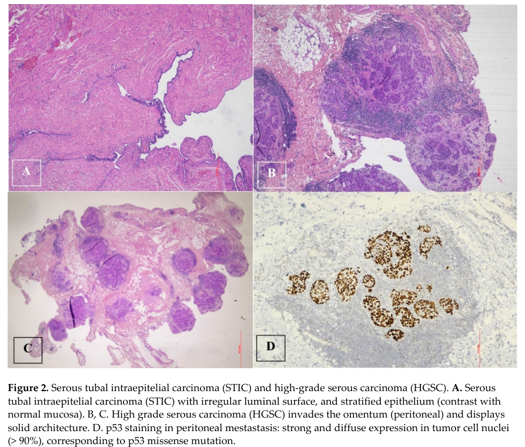

## Question

# Disease Characteristics Research Template

## Target Disease
- **Disease Name:** Fallopian Tube Cancer
- **MONDO ID:**  (if available)
- **Category:** Complex

## Research Objectives

Please provide a comprehensive research report on **Fallopian Tube Cancer** covering all of the
disease characteristics listed below. This report will be used to populate a disease knowledge
base entry. Be thorough and cite primary literature (PMID preferred) for all claims.

For each section, **suggested databases/resources** are listed. These are the first places
you should search for information on each topic.

---

### 1. Disease Information
> **Search first:** OMIM, Orphanet, ICD-10/ICD-11, MeSH, PubMed

- What is the disease? Provide a concise overview.
- What are the key identifiers? (OMIM, Orphanet, ICD-10/ICD-11, MeSH, Mondo)
- What are the common synonyms and alternative names?
- Is the information derived from individual patients (e.g., EHR) or aggregated disease-level resources?

### 2. Etiology

- **Disease Causal Factors**: What are the primary causes? (genetic, environmental, infectious, mechanistic)
- **Risk Factors**:
  > **Search first:** PubMed, Cochrane Library, UpToDate, clinical guidelines, ClinVar, ClinGen, GWAS Catalog, PheGenI, CTD, CDC, WHO, epidemiological databases
  - Genetic risk factors (causal variants, susceptibility loci, modifier genes)
  - Environmental risk factors (toxins, lifestyle, occupational exposures, age, sex, family history)
- **Protective Factors**:
  > **Search first:** PubMed, Cochrane Library, clinical trial databases, GWAS Catalog, gnomAD, WHO, CDC, nutrition databases
  - Genetic protective factors (protective variants, modifier alleles)
  - Environmental protective factors (diet, lifestyle, exposures that reduce risk)
- **Gene-Environment Interactions**: How do genetic and environmental factors interact to influence disease?
  > **Search first:** CTD, PubMed, PheGenI, GxE databases

### 3. Phenotypes
> **Search first:** HPO (Human Phenotype Ontology), OMIM, Orphanet, PubMed, clinicaltrials.gov, MedDRA, SNOMED CT, DECIPHER, LOINC

For each phenotype, provide:
- **Phenotype type**: symptoms, clinical signs, physical manifestations, behavioral changes, or laboratory abnormalities
  > For symptoms/signs: HPO, OMIM, Orphanet, PubMed
  > For behavioral changes: HPO, DSM, RDoC (Research Domain Criteria), PubMed
  > For laboratory abnormalities: LOINC, SNOMED CT, LabTests Online, PubMed
- **Phenotype characteristics**:
  > **Search first:** OMIM, Orphanet, HPO, PubMed
  - Age of symptom onset (neonatal, childhood, adult-onset, late-onset)
  - Symptom severity (mild, moderate, severe, variable)
  - Symptom progression (stable, progressive, episodic, fluctuating)
  - Frequency among affected individuals (percentage or qualitative)
- **Quality of life impact**: Effects on daily functioning and well-being (per-phenotype when possible)
  > **Search first:** EQ-5D database, SF-36, WHO QOL databases, PubMed
- Suggest HPO (Human Phenotype Ontology) terms for each phenotype

### 4. Genetic/Molecular Information

- **Causal Genes**: Gene mutations or chromosomal abnormalities responsible for disease (gene symbols, OMIM IDs)
  > **Search first:** OMIM, ClinVar, HGMD, Ensembl, NCBI Gene
- **Pathogenic Variants**:
  - Affected genes (gene symbols, HGNC IDs)
    > **Search first:** OMIM, NCBI Gene, Ensembl, HGNC, UniProt, GeneCards
  - Variant classification (pathogenic, likely pathogenic, VUS per ACMG/AMP guidelines)
    > **Search first:** ClinVar, ClinGen, ACMG/AMP guidelines, VarSome
  - Variant type/class (missense, frameshift, nonsense, splice-site, structural)
  - Allele frequency in population databases
    > **Search first:** gnomAD, 1000 Genomes, ExAC, TOPMed, dbSNP
  - Somatic vs germline origin
    > **Search first:** COSMIC (somatic), ClinVar, ICGC, TCGA
  - Functional consequences (loss of function, gain of function, dominant negative)
- **Modifier Genes**: Genes that modify disease severity or expression
- **Epigenetic Information**: DNA methylation, histone modifications, chromatin changes affecting disease
  > **Search first:** ENCODE, Roadmap Epigenomics, MethBase, DiseaseMeth
- **Chromosomal Abnormalities**: Large-scale genetic changes (aneuploidy, translocations, inversions)
  > **Search first:** DECIPHER, ClinVar, ECARUCA, UCSC Genome Browser

### 5. Environmental Information

- **Environmental Factors**: Non-genetic contributing factors (toxins, radiation, pollution, occupational exposure)
  > **Search first:** CTD (Comparative Toxicogenomics Database), TOXNET, PubMed, EPA databases
- **Lifestyle Factors**: Behavioral factors (smoking, diet, exercise, alcohol consumption)
  > **Search first:** CDC databases, WHO, PubMed, NHANES
- **Infectious Agents**: If applicable, pathogens causing or triggering disease (bacteria, viruses, fungi, parasites)
  > **Search first:** NCBI Taxonomy, ViPR, BV-BRC, MicrobeDB, GIDEON

### 6. Mechanism / Pathophysiology

- **Molecular Pathways**: Specific signaling cascades or biochemical pathways involved (Wnt, MAPK, mTOR, PI3K-AKT, etc.)
  > **Search first:** KEGG, Reactome, WikiPathways, PathBank, BioCyc
- **Cellular Processes**: Cell-level mechanisms (apoptosis, autophagy, cell cycle dysregulation, inflammation, etc.)
  > **Search first:** Gene Ontology (GO), Reactome, KEGG, PubMed
- **Protein Dysfunction**: How protein structure or function is altered (misfolding, aggregation, loss of function, gain of function)
  > **Search first:** UniProt, PDB (Protein Data Bank), InterPro, Pfam, AlphaFold
- **Metabolic Changes**: Alterations in metabolic processes (energy metabolism, lipid metabolism, amino acid metabolism)
  > **Search first:** KEGG, BioCyc, HMDB (Human Metabolome Database), BRENDA
- **Immune System Involvement**: Role of immune response (autoimmunity, immunodeficiency, chronic inflammation)
  > **Search first:** ImmPort, Immunome Database, IEDB, Gene Ontology
- **Tissue Damage Mechanisms**: How tissues/ are injured (oxidative stress, ischemia, fibrosis, necrosis)
  > **Search first:** PubMed, Gene Ontology, Reactome
- **Biochemical Abnormalities**: Specific molecular defects (enzyme deficiencies, receptor dysfunction, ion channel defects)
  > **Search first:** BRENDA, UniProt, KEGG, OMIM, PubMed
- **Epigenetic Changes**: DNA methylation, histone modifications affecting gene expression in disease
  > **Search first:** ENCODE, Roadmap Epigenomics, MethBase, DiseaseMeth
- **Molecular Profiling** (if available):
  - Transcriptomics/gene expression changes
    > **Search first:** GEO (Gene Expression Omnibus), ArrayExpress, GTEx, Human Cell Atlas, SRA
  - Proteomics findings
    > **Search first:** PRIDE, ProteomeXchange, Human Protein Atlas, STRING, BioGRID
  - Metabolomics signatures
    > **Search first:** MetaboLights, Metabolomics Workbench, HMDB, METLIN
  - Lipidomics alterations
    > **Search first:** LIPID MAPS, SwissLipids, LipidHome, Metabolomics Workbench
  - Genomic structural features
    > **Search first:** UCSC Genome Browser, Ensembl, NCBI, dbVar, DGV
- **Advanced Technologies** (if applicable):
  - Single-cell analysis findings (cell-type specific mechanisms, cellular heterogeneity)
    > **Search first:** Human Cell Atlas, Single Cell Portal, GEO, CELLxGENE
  - Spatial transcriptomics findings
    > **Search first:** GEO, Spatial Research, Vizgen, 10x Genomics data
  - Multi-omics integration results
    > **Search first:** TCGA, ICGC, cBioPortal, LinkedOmics, PubMed
  - Functional genomics screens (CRISPR, RNAi)
    > **Search first:** DepMap, GenomeRNAi, PubMed, BioGRID ORCS

For each mechanism, describe:
- The causal chain from initial trigger to clinical manifestation
- Which mechanisms are upstream vs downstream
- What cell types and biological processes are involved
- Suggest GO terms for biological processes and CL terms for cell types

### 7. Anatomical Structures Affected

- **Organ Level**:
  - Primary organs directly affected
  - Secondary organ involvement (complications, secondary effects)
  - Body systems involved (cardiovascular, nervous, digestive, respiratory, endocrine, etc.)
  > **Search first:** Uberon, FMA (Foundational Model of Anatomy), OMIM, HPO, ICD-11, MeSH, SNOMED CT
- **Tissue and Cell Level**:
  - Specific tissue types affected (epithelial, connective, muscle, nervous)
  - Specific cell populations targeted (with Cell Ontology terms)
  > **Search first:** Uberon, Human Protein Atlas, Cell Ontology, Human Cell Atlas, CellMarker, PanglaoDB
- **Subcellular Level**:
  - Cellular compartments involved (mitochondria, nucleus, ER, lysosomes) (with GO Cellular Component terms)
  > **Search first:** Gene Ontology (Cellular Component), UniProt, Human Protein Atlas
- **Localization**:
  - Specific anatomical sites (with UBERON terms)
    > **Search first:** FMA, Uberon, NeuroNames (for brain), SNOMED CT
  - Lateralization (unilateral, bilateral, asymmetric)
    > **Search first:** HPO, clinical literature, imaging databases

### 8. Temporal Development

- **Onset**:
  - Typical age of onset (congenital, pediatric, adult, geriatric)
  - Onset pattern (acute, subacute, chronic, insidious)
  > **Search first:** OMIM, Orphanet, HPO, PubMed
- **Progression**:
  - Disease stages (early, intermediate, advanced, end-stage)
    > **Search first:** Cancer Staging Manual (AJCC), WHO classifications, PubMed
  - Progression rate (rapid, slow, variable)
  - Disease course pattern (episodic, relapsing-remitting, progressive, stable)
  - Disease duration (self-limited, chronic lifelong)
  > **Search first:** Disease registries, longitudinal cohort databases, natural history studies, PubMed, Orphanet, OMIM
- **Patterns**:
  - Remission patterns (spontaneous, treatment-induced)
    > **Search first:** Clinical trial databases, disease registries, PubMed
  - Critical periods (time windows of vulnerability or opportunity for intervention)
    > **Search first:** PubMed, developmental biology databases, clinical guidelines

### 9. Inheritance and Population

- **Epidemiology**:
  - Prevalence (cases per 100,000 at given time)
  - Incidence (new cases per 100,000 per year)
  > **Search first:** Orphanet, CDC, WHO, GBD (Global Burden of Disease), national registries, SEER, disease registries
- **For Genetic Etiology**:
  - Inheritance pattern (AD, AR, X-linked, mitochondrial, multifactorial, polygenic)
    > **Search first:** OMIM, Orphanet, ClinVar, GTR (Genetic Testing Registry)
  - Penetrance (complete, incomplete, age-dependent)
    > **Search first:** ClinVar, OMIM, PubMed, ClinGen
  - Expressivity (variable, consistent)
    > **Search first:** OMIM, ClinVar, PubMed
  - Genetic anticipation (increasing severity in successive generations)
    > **Search first:** OMIM, PubMed (especially for repeat expansion disorders)
  - Germline mosaicism
    > **Search first:** ClinVar, OMIM, genetic counseling literature, PubMed
  - Founder effects (population-specific mutations)
    > **Search first:** gnomAD, population genetics databases, PubMed
  - Consanguinity role
    > **Search first:** OMIM, population studies, genetic counseling resources
  - Carrier frequency
    > **Search first:** gnomAD, carrier screening databases, GeneReviews, GTR
- **Population Demographics**:
  - Affected populations (ethnic or demographic groups with higher prevalence)
    > **Search first:** gnomAD, 1000 Genomes, PAGE Study, PubMed, population registries
  - Geographic distribution (endemic areas, regional variation)
    > **Search first:** WHO, CDC, GBD, Orphanet, geographic epidemiology databases
  - Geographic distribution of specific variants
  - Sex ratio (male:female)
    > **Search first:** Disease registries, OMIM, PubMed, epidemiological databases
  - Age distribution of affected individuals
    > **Search first:** CDC, disease registries, SEER, Orphanet

### 10. Diagnostics

- **Clinical Tests**:
  - Laboratory tests (blood, urine, tissue chemistry, specific enzyme assays)
    > **Search first:** LOINC, LabTests Online, PubMed
  - Biomarkers (proteins, metabolites, genetic markers, circulating biomarkers)
    > **Search first:** FDA Biomarker List, BEST (Biomarkers, EndpointS, and other Tools), PubMed
  - Imaging studies (X-ray, CT, MRI, PET, ultrasound)
    > **Search first:** RadLex, DICOM, Radiopaedia, imaging databases
  - Functional tests (pulmonary function, cardiac stress tests)
    > **Search first:** LOINC, clinical guidelines, PubMed
  - Electrophysiology (EEG, EMG, ECG, nerve conduction studies)
    > **Search first:** LOINC, clinical neurophysiology databases, PubMed
  - Biopsy findings (histopathology, immunohistochemistry)
    > **Search first:** SNOMED CT, College of American Pathologists resources, PubMed
  - Pathology findings (microscopic examination)
    > **Search first:** SNOMED CT, Digital Pathology databases, PubMed
- **Genetic Testing**:
  > **Search first:** GTR (Genetic Testing Registry), GeneReviews, ClinGen
  - Overview of recommended genetic testing approach
  - Whole genome sequencing (WGS) utility
    > **Search first:** GTR, ClinVar, GEL (Genomics England), gnomAD
  - Whole exome sequencing (WES) utility
    > **Search first:** GTR, ClinVar, OMIM, GeneMatcher
  - Gene panels (which panels, which genes)
    > **Search first:** GTR, ClinVar, laboratory-specific databases
  - Single gene testing
    > **Search first:** GTR, ClinVar, OMIM, GeneReviews
  - Chromosomal microarray (CMA)
    > **Search first:** DECIPHER, ClinVar, dbVar, ECARUCA
  - Karyotyping
    > **Search first:** Chromosome Abnormality Database, ClinVar, cytogenetics resources
  - FISH
    > **Search first:** ClinVar, cytogenetics databases, PubMed
  - Mitochondrial DNA testing
    > **Search first:** MITOMAP, MSeqDR, ClinVar, GTR
  - Repeat expansion testing
    > **Search first:** GTR, ClinVar, repeat expansion databases, PubMed
- **Omics-Based Diagnostics** (if applicable):
  - RNA sequencing / transcriptomics
    > **Search first:** GEO, ArrayExpress, GTEx, RNA-seq databases
  - Proteomics
    > **Search first:** PRIDE, ProteomeXchange, FDA Biomarker database
  - Metabolomics
    > **Search first:** MetaboLights, Metabolomics Workbench, HMDB
  - Epigenomics
    > **Search first:** GEO, ENCODE, Roadmap Epigenomics, MethBase
  - Liquid biopsy
    > **Search first:** COSMIC, ClinVar, liquid biopsy databases, PubMed
- **Clinical Criteria**:
  - Standardized diagnostic criteria (DSM, ICD, society guidelines)
    > **Search first:** DSM-5, ICD-11, clinical society guidelines, UpToDate
  - Differential diagnosis (other conditions to rule out, with distinguishing features)
    > **Search first:** DynaMed, UpToDate, clinical decision support systems
- **Screening**:
  - Screening methods for asymptomatic individuals (newborn screening, carrier screening, cascade screening)
    > **Search first:** ACMG recommendations, CDC newborn screening, GTR

### 11. Outcome/Prognosis

- **Survival and Mortality**:
  - Survival rate (5-year, 10-year, overall)
    > **Search first:** SEER, cancer registries, disease-specific registries, PubMed
  - Life expectancy (with and without treatment if applicable)
    > **Search first:** Orphanet, disease registries, actuarial databases, PubMed
  - Mortality rate
    > **Search first:** CDC, WHO, GBD, national mortality databases
  - Disease-specific mortality (deaths directly attributable to disease)
    > **Search first:** Disease registries, CDC Wonder, GBD, PubMed
- **Morbidity and Function**:
  - Morbidity (disease-related disability and health impacts)
    > **Search first:** GBD, WHO, disability databases, PubMed
  - Disability outcomes (long-term functional impairments)
    > **Search first:** ICF (International Classification of Functioning), disability registries
  - Quality of life measures (EQ-5D, SF-36, PROMIS, disease-specific tools)
    > **Search first:** EQ-5D database, SF-36, PROMIS, PubMed
- **Disease Course**:
  - Complications (secondary problems: infections, organ failure, etc.)
    > **Search first:** ICD codes, disease registries, clinical databases, PubMed
  - Recovery potential (likelihood and extent of recovery, with vs without treatment)
    > **Search first:** Natural history studies, rehabilitation databases, PubMed
- **Prediction**:
  - Prognostic factors (age, disease severity, biomarkers, treatment response)
    > **Search first:** Prognostic models databases, clinical calculators, PubMed
  - Prognostic biomarkers (molecular markers predicting disease course)
    > **Search first:** FDA Biomarker database, PubMed, cancer prognostic databases

### 12. Treatment

- **Pharmacotherapy**:
  - Pharmacological treatments (drug names, drug classes, mechanisms of action)
    > **Search first:** DrugBank, RxNorm, ATC classification, DailyMed, FDA databases
  - Pharmacogenomics (how genetic variants affect drug metabolism, efficacy, toxicity)
    > **Search first:** PharmGKB, CPIC (Clinical Pharmacogenetics), FDA Table of PGx Biomarkers
- **Advanced Therapeutics**:
  - Gene therapy (viral vectors, CRISPR, gene replacement, gene editing)
    > **Search first:** ClinicalTrials.gov, FDA gene therapy database, ASGCT resources
  - Cell therapy (stem cell transplant, CAR-T, cellular therapeutics)
    > **Search first:** ClinicalTrials.gov, FDA cell therapy database, FACT standards
  - RNA-based therapies (ASOs, siRNA, mRNA therapies)
    > **Search first:** ClinicalTrials.gov, FDA approvals, PubMed
  - Targeted therapies (treatments directed at specific molecular targets)
    > **Search first:** My Cancer Genome, OncoKB, ClinicalTrials.gov, FDA approvals
  - Immunotherapies (checkpoint inhibitors, monoclonal antibodies)
    > **Search first:** Cancer Immunotherapy Database, FDA approvals, ClinicalTrials.gov
- **Surgical and Interventional**:
  - Surgical interventions (types of surgery, timing, outcomes)
    > **Search first:** CPT codes, surgical registries, clinical guidelines, PubMed
- **Supportive and Rehabilitative**:
  - Supportive care (symptom management, pain control, nutrition)
    > **Search first:** Clinical guidelines, Cochrane Library, PubMed
  - Rehabilitation (physical therapy, occupational therapy, speech therapy)
    > **Search first:** Rehabilitation medicine databases, clinical guidelines, PubMed
- **Experimental**:
  - Experimental treatments in clinical trials (with NCT identifiers if available)
    > **Search first:** ClinicalTrials.gov, EU Clinical Trials Register, WHO ICTRP
- **Treatment Outcomes**:
  - Treatment response rates
    > **Search first:** Clinical trial databases, FDA reviews, systematic reviews, PubMed
  - Side effects and adverse events
    > **Search first:** FDA Adverse Event Reporting System (FAERS), MedWatch, PubMed
- **Treatment Strategy**:
  - Treatment algorithms (clinical pathways, decision trees)
    > **Search first:** Clinical practice guidelines, NCCN Guidelines, UpToDate
  - Combination therapies
    > **Search first:** ClinicalTrials.gov, treatment guidelines, PubMed
  - Personalized medicine approaches (genotype-guided treatment)
    > **Search first:** My Cancer Genome, CIViC, PharmGKB, precision medicine databases

For each treatment, suggest MAXO (Medical Action Ontology) terms where applicable.

### 13. Prevention

- **Prevention Levels**:
  - Primary prevention (preventing disease occurrence: vaccination, risk factor modification)
    > **Search first:** CDC, WHO, USPSTF recommendations, Cochrane Library
  - Secondary prevention (early detection and treatment: screening programs, early intervention)
    > **Search first:** USPSTF, CDC screening guidelines, WHO
  - Tertiary prevention (preventing complications in those with disease)
    > **Search first:** Clinical guidelines, disease management protocols, PubMed
- **Immunization**: Vaccine strategies (if applicable)
  > **Search first:** CDC vaccine schedules, WHO immunization, FDA vaccine database
- **Screening and Early Detection**:
  - Screening programs (population-based: newborn screening, cancer screening)
    > **Search first:** CDC screening programs, USPSTF, cancer screening databases
  - Genetic screening (carrier screening, preimplantation genetic diagnosis, prenatal testing)
    > **Search first:** ACMG recommendations, ACOG guidelines, GTR
  - Risk stratification (identifying high-risk individuals for targeted prevention)
    > **Search first:** Risk prediction models, clinical calculators, PubMed
- **Behavioral Interventions**: Lifestyle modifications to reduce risk
  > **Search first:** CDC, WHO, behavioral intervention databases, Cochrane Library
- **Counseling**: Genetic counseling (risk assessment, family planning guidance)
  > **Search first:** NSGC resources, ACMG guidelines, GeneReviews
- **Public Health**:
  - Public health interventions (sanitation, vector control, health education)
    > **Search first:** CDC, WHO, public health databases, PubMed
  - Environmental interventions (reducing environmental risk factors)
    > **Search first:** EPA databases, WHO environmental health, PubMed
- **Prophylaxis**: Preventive medications or procedures
  > **Search first:** Clinical guidelines, FDA approvals, PubMed

### 14. Other Species / Natural Disease

- **Taxonomy**: Species affected (with NCBI Taxon identifiers)
  > **Search first:** NCBI Taxonomy
- **Breed**: Specific breeds affected (with VBO identifiers if applicable)
  > **Search first:** VBO (Vertebrate Breed Ontology)
- **Gene**: Orthologous genes in other species (with NCBI Gene IDs)
  > **Search first:** NCBI Gene
- **Natural Disease**:
  - Naturally occurring disease in other species (companion animals, wildlife)
    > **Search first:** OMIA (Online Mendelian Inheritance in Animals), VetCompass, PubMed
  - Veterinary relevance and importance in animal health
    > **Search first:** OMIA, veterinary databases, PubMed
- **Comparative Biology**:
  - Comparative pathology (similarities and differences across species)
    > **Search first:** OMIA, comparative pathology databases, PubMed
  - Evolutionary conservation of disease mechanisms
    > **Search first:** HomoloGene, OrthoMCL, Alliance of Genome Resources
- **Transmission** (if applicable):
  - Zoonotic potential
    > **Search first:** CDC zoonotic diseases, WHO zoonoses, GIDEON
  - Cross-species susceptibility
    > **Search first:** NCBI Taxonomy, veterinary databases, PubMed

### 15. Model Organisms

- **Model Types**:
  - Model organism type (mammalian, invertebrate, cellular, in vitro)
    > **Search first:** Alliance of Genome Resources, model organism databases
  - Specific model systems (mouse, rat, zebrafish, Drosophila, C. elegans, yeast, cell lines, organoids, iPSCs)
    > **Search first:** MGI, RGD, ZFIN, FlyBase, WormBase, SGD, ATCC, Cellosaurus
  - Induced models (drug treatment, surgical intervention, environmental manipulation)
    > **Search first:** MGI, model organism databases, PubMed
- **Genetic Models**:
  - Types available (knockout, knock-in, transgenic, conditional, humanized)
    > **Search first:** MGI, IMPC, KOMP, EuMMCR, IMSR
- **Model Characteristics**:
  - Phenotype recapitulation (how well model reproduces human disease features)
    > **Search first:** Model organism databases, comparative studies, PubMed
  - Model limitations (aspects of human disease not captured)
    > **Search first:** Model organism databases, PubMed, review articles
- **Applications**:
  - Research applications (what aspects of disease can be studied)
    > **Search first:** Model organism databases, PubMed
- **Resources**:
  - Model databases
    > **Search first:** MGI, RGD, ZFIN, FlyBase, WormBase, IMSR, EMMA, MMRRC

---

## Citation Requirements

- Cite primary literature (PMID preferred) for all mechanistic and clinical claims
- Prioritize recent reviews and landmark papers
- Include direct quotes from abstracts where possible to support key statements
- Distinguish evidence source types: human clinical, model organism, in vitro, computational

## Output Format

Structure your response as a comprehensive narrative organized by the sections above.
For each section, provide:
- Factual content with specific details (numbers, percentages, gene names, variant nomenclature)
- Ontology term suggestions (HPO, GO, CL, UBERON, CHEBI, MAXO, MONDO) where applicable
- Evidence citations with PMIDs
- Direct quotes from abstracts to support key claims
- Clear indication when information is not available or not applicable for this disease

This report will be used to populate a disease knowledge base entry with:
- Pathophysiology descriptions with causal chains
- Gene/protein annotations (HGNC, GO terms)
- Phenotype associations (HP terms) with frequencies
- Cell type involvement (CL terms)
- Anatomical locations (UBERON terms)
- Chemical entities (CHEBI terms)
- Treatment annotations (MAXO terms)
- Evidence items with PMIDs and exact abstract quotes
- Epidemiology, prognosis, diagnostic, and prevention information
- Animal model descriptions with phenotype recapitulation details

## Output

Question: You are an expert researcher providing comprehensive, well-cited information.

Provide detailed information focusing on:
1. Key concepts and definitions with current understanding
2. Recent developments and latest research (prioritize 2023-2024 sources)
3. Current applications and real-world implementations
4. Expert opinions and analysis from authoritative sources
5. Relevant statistics and data from recent studies

Format as a comprehensive research report with proper citations. Include URLs and publication dates where available.
Always prioritize recent, authoritative sources and provide specific citations for all major claims.

# Disease Characteristics Research Template

## Target Disease
- **Disease Name:** Fallopian Tube Cancer
- **MONDO ID:**  (if available)
- **Category:** Complex

## Research Objectives

Please provide a comprehensive research report on **Fallopian Tube Cancer** covering all of the
disease characteristics listed below. This report will be used to populate a disease knowledge
base entry. Be thorough and cite primary literature (PMID preferred) for all claims.

For each section, **suggested databases/resources** are listed. These are the first places
you should search for information on each topic.

---

### 1. Disease Information
> **Search first:** OMIM, Orphanet, ICD-10/ICD-11, MeSH, PubMed

- What is the disease? Provide a concise overview.
- What are the key identifiers? (OMIM, Orphanet, ICD-10/ICD-11, MeSH, Mondo)
- What are the common synonyms and alternative names?
- Is the information derived from individual patients (e.g., EHR) or aggregated disease-level resources?

### 2. Etiology

- **Disease Causal Factors**: What are the primary causes? (genetic, environmental, infectious, mechanistic)
- **Risk Factors**:
  > **Search first:** PubMed, Cochrane Library, UpToDate, clinical guidelines, ClinVar, ClinGen, GWAS Catalog, PheGenI, CTD, CDC, WHO, epidemiological databases
  - Genetic risk factors (causal variants, susceptibility loci, modifier genes)
  - Environmental risk factors (toxins, lifestyle, occupational exposures, age, sex, family history)
- **Protective Factors**:
  > **Search first:** PubMed, Cochrane Library, clinical trial databases, GWAS Catalog, gnomAD, WHO, CDC, nutrition databases
  - Genetic protective factors (protective variants, modifier alleles)
  - Environmental protective factors (diet, lifestyle, exposures that reduce risk)
- **Gene-Environment Interactions**: How do genetic and environmental factors interact to influence disease?
  > **Search first:** CTD, PubMed, PheGenI, GxE databases

### 3. Phenotypes
> **Search first:** HPO (Human Phenotype Ontology), OMIM, Orphanet, PubMed, clinicaltrials.gov, MedDRA, SNOMED CT, DECIPHER, LOINC

For each phenotype, provide:
- **Phenotype type**: symptoms, clinical signs, physical manifestations, behavioral changes, or laboratory abnormalities
  > For symptoms/signs: HPO, OMIM, Orphanet, PubMed
  > For behavioral changes: HPO, DSM, RDoC (Research Domain Criteria), PubMed
  > For laboratory abnormalities: LOINC, SNOMED CT, LabTests Online, PubMed
- **Phenotype characteristics**:
  > **Search first:** OMIM, Orphanet, HPO, PubMed
  - Age of symptom onset (neonatal, childhood, adult-onset, late-onset)
  - Symptom severity (mild, moderate, severe, variable)
  - Symptom progression (stable, progressive, episodic, fluctuating)
  - Frequency among affected individuals (percentage or qualitative)
- **Quality of life impact**: Effects on daily functioning and well-being (per-phenotype when possible)
  > **Search first:** EQ-5D database, SF-36, WHO QOL databases, PubMed
- Suggest HPO (Human Phenotype Ontology) terms for each phenotype

### 4. Genetic/Molecular Information

- **Causal Genes**: Gene mutations or chromosomal abnormalities responsible for disease (gene symbols, OMIM IDs)
  > **Search first:** OMIM, ClinVar, HGMD, Ensembl, NCBI Gene
- **Pathogenic Variants**:
  - Affected genes (gene symbols, HGNC IDs)
    > **Search first:** OMIM, NCBI Gene, Ensembl, HGNC, UniProt, GeneCards
  - Variant classification (pathogenic, likely pathogenic, VUS per ACMG/AMP guidelines)
    > **Search first:** ClinVar, ClinGen, ACMG/AMP guidelines, VarSome
  - Variant type/class (missense, frameshift, nonsense, splice-site, structural)
  - Allele frequency in population databases
    > **Search first:** gnomAD, 1000 Genomes, ExAC, TOPMed, dbSNP
  - Somatic vs germline origin
    > **Search first:** COSMIC (somatic), ClinVar, ICGC, TCGA
  - Functional consequences (loss of function, gain of function, dominant negative)
- **Modifier Genes**: Genes that modify disease severity or expression
- **Epigenetic Information**: DNA methylation, histone modifications, chromatin changes affecting disease
  > **Search first:** ENCODE, Roadmap Epigenomics, MethBase, DiseaseMeth
- **Chromosomal Abnormalities**: Large-scale genetic changes (aneuploidy, translocations, inversions)
  > **Search first:** DECIPHER, ClinVar, ECARUCA, UCSC Genome Browser

### 5. Environmental Information

- **Environmental Factors**: Non-genetic contributing factors (toxins, radiation, pollution, occupational exposure)
  > **Search first:** CTD (Comparative Toxicogenomics Database), TOXNET, PubMed, EPA databases
- **Lifestyle Factors**: Behavioral factors (smoking, diet, exercise, alcohol consumption)
  > **Search first:** CDC databases, WHO, PubMed, NHANES
- **Infectious Agents**: If applicable, pathogens causing or triggering disease (bacteria, viruses, fungi, parasites)
  > **Search first:** NCBI Taxonomy, ViPR, BV-BRC, MicrobeDB, GIDEON

### 6. Mechanism / Pathophysiology

- **Molecular Pathways**: Specific signaling cascades or biochemical pathways involved (Wnt, MAPK, mTOR, PI3K-AKT, etc.)
  > **Search first:** KEGG, Reactome, WikiPathways, PathBank, BioCyc
- **Cellular Processes**: Cell-level mechanisms (apoptosis, autophagy, cell cycle dysregulation, inflammation, etc.)
  > **Search first:** Gene Ontology (GO), Reactome, KEGG, PubMed
- **Protein Dysfunction**: How protein structure or function is altered (misfolding, aggregation, loss of function, gain of function)
  > **Search first:** UniProt, PDB (Protein Data Bank), InterPro, Pfam, AlphaFold
- **Metabolic Changes**: Alterations in metabolic processes (energy metabolism, lipid metabolism, amino acid metabolism)
  > **Search first:** KEGG, BioCyc, HMDB (Human Metabolome Database), BRENDA
- **Immune System Involvement**: Role of immune response (autoimmunity, immunodeficiency, chronic inflammation)
  > **Search first:** ImmPort, Immunome Database, IEDB, Gene Ontology
- **Tissue Damage Mechanisms**: How tissues/ are injured (oxidative stress, ischemia, fibrosis, necrosis)
  > **Search first:** PubMed, Gene Ontology, Reactome
- **Biochemical Abnormalities**: Specific molecular defects (enzyme deficiencies, receptor dysfunction, ion channel defects)
  > **Search first:** BRENDA, UniProt, KEGG, OMIM, PubMed
- **Epigenetic Changes**: DNA methylation, histone modifications affecting gene expression in disease
  > **Search first:** ENCODE, Roadmap Epigenomics, MethBase, DiseaseMeth
- **Molecular Profiling** (if available):
  - Transcriptomics/gene expression changes
    > **Search first:** GEO (Gene Expression Omnibus), ArrayExpress, GTEx, Human Cell Atlas, SRA
  - Proteomics findings
    > **Search first:** PRIDE, ProteomeXchange, Human Protein Atlas, STRING, BioGRID
  - Metabolomics signatures
    > **Search first:** MetaboLights, Metabolomics Workbench, HMDB, METLIN
  - Lipidomics alterations
    > **Search first:** LIPID MAPS, SwissLipids, LipidHome, Metabolomics Workbench
  - Genomic structural features
    > **Search first:** UCSC Genome Browser, Ensembl, NCBI, dbVar, DGV
- **Advanced Technologies** (if applicable):
  - Single-cell analysis findings (cell-type specific mechanisms, cellular heterogeneity)
    > **Search first:** Human Cell Atlas, Single Cell Portal, GEO, CELLxGENE
  - Spatial transcriptomics findings
    > **Search first:** GEO, Spatial Research, Vizgen, 10x Genomics data
  - Multi-omics integration results
    > **Search first:** TCGA, ICGC, cBioPortal, LinkedOmics, PubMed
  - Functional genomics screens (CRISPR, RNAi)
    > **Search first:** DepMap, GenomeRNAi, PubMed, BioGRID ORCS

For each mechanism, describe:
- The causal chain from initial trigger to clinical manifestation
- Which mechanisms are upstream vs downstream
- What cell types and biological processes are involved
- Suggest GO terms for biological processes and CL terms for cell types

### 7. Anatomical Structures Affected

- **Organ Level**:
  - Primary organs directly affected
  - Secondary organ involvement (complications, secondary effects)
  - Body systems involved (cardiovascular, nervous, digestive, respiratory, endocrine, etc.)
  > **Search first:** Uberon, FMA (Foundational Model of Anatomy), OMIM, HPO, ICD-11, MeSH, SNOMED CT
- **Tissue and Cell Level**:
  - Specific tissue types affected (epithelial, connective, muscle, nervous)
  - Specific cell populations targeted (with Cell Ontology terms)
  > **Search first:** Uberon, Human Protein Atlas, Cell Ontology, Human Cell Atlas, CellMarker, PanglaoDB
- **Subcellular Level**:
  - Cellular compartments involved (mitochondria, nucleus, ER, lysosomes) (with GO Cellular Component terms)
  > **Search first:** Gene Ontology (Cellular Component), UniProt, Human Protein Atlas
- **Localization**:
  - Specific anatomical sites (with UBERON terms)
    > **Search first:** FMA, Uberon, NeuroNames (for brain), SNOMED CT
  - Lateralization (unilateral, bilateral, asymmetric)
    > **Search first:** HPO, clinical literature, imaging databases

### 8. Temporal Development

- **Onset**:
  - Typical age of onset (congenital, pediatric, adult, geriatric)
  - Onset pattern (acute, subacute, chronic, insidious)
  > **Search first:** OMIM, Orphanet, HPO, PubMed
- **Progression**:
  - Disease stages (early, intermediate, advanced, end-stage)
    > **Search first:** Cancer Staging Manual (AJCC), WHO classifications, PubMed
  - Progression rate (rapid, slow, variable)
  - Disease course pattern (episodic, relapsing-remitting, progressive, stable)
  - Disease duration (self-limited, chronic lifelong)
  > **Search first:** Disease registries, longitudinal cohort databases, natural history studies, PubMed, Orphanet, OMIM
- **Patterns**:
  - Remission patterns (spontaneous, treatment-induced)
    > **Search first:** Clinical trial databases, disease registries, PubMed
  - Critical periods (time windows of vulnerability or opportunity for intervention)
    > **Search first:** PubMed, developmental biology databases, clinical guidelines

### 9. Inheritance and Population

- **Epidemiology**:
  - Prevalence (cases per 100,000 at given time)
  - Incidence (new cases per 100,000 per year)
  > **Search first:** Orphanet, CDC, WHO, GBD (Global Burden of Disease), national registries, SEER, disease registries
- **For Genetic Etiology**:
  - Inheritance pattern (AD, AR, X-linked, mitochondrial, multifactorial, polygenic)
    > **Search first:** OMIM, Orphanet, ClinVar, GTR (Genetic Testing Registry)
  - Penetrance (complete, incomplete, age-dependent)
    > **Search first:** ClinVar, OMIM, PubMed, ClinGen
  - Expressivity (variable, consistent)
    > **Search first:** OMIM, ClinVar, PubMed
  - Genetic anticipation (increasing severity in successive generations)
    > **Search first:** OMIM, PubMed (especially for repeat expansion disorders)
  - Germline mosaicism
    > **Search first:** ClinVar, OMIM, genetic counseling literature, PubMed
  - Founder effects (population-specific mutations)
    > **Search first:** gnomAD, population genetics databases, PubMed
  - Consanguinity role
    > **Search first:** OMIM, population studies, genetic counseling resources
  - Carrier frequency
    > **Search first:** gnomAD, carrier screening databases, GeneReviews, GTR
- **Population Demographics**:
  - Affected populations (ethnic or demographic groups with higher prevalence)
    > **Search first:** gnomAD, 1000 Genomes, PAGE Study, PubMed, population registries
  - Geographic distribution (endemic areas, regional variation)
    > **Search first:** WHO, CDC, GBD, Orphanet, geographic epidemiology databases
  - Geographic distribution of specific variants
  - Sex ratio (male:female)
    > **Search first:** Disease registries, OMIM, PubMed, epidemiological databases
  - Age distribution of affected individuals
    > **Search first:** CDC, disease registries, SEER, Orphanet

### 10. Diagnostics

- **Clinical Tests**:
  - Laboratory tests (blood, urine, tissue chemistry, specific enzyme assays)
    > **Search first:** LOINC, LabTests Online, PubMed
  - Biomarkers (proteins, metabolites, genetic markers, circulating biomarkers)
    > **Search first:** FDA Biomarker List, BEST (Biomarkers, EndpointS, and other Tools), PubMed
  - Imaging studies (X-ray, CT, MRI, PET, ultrasound)
    > **Search first:** RadLex, DICOM, Radiopaedia, imaging databases
  - Functional tests (pulmonary function, cardiac stress tests)
    > **Search first:** LOINC, clinical guidelines, PubMed
  - Electrophysiology (EEG, EMG, ECG, nerve conduction studies)
    > **Search first:** LOINC, clinical neurophysiology databases, PubMed
  - Biopsy findings (histopathology, immunohistochemistry)
    > **Search first:** SNOMED CT, College of American Pathologists resources, PubMed
  - Pathology findings (microscopic examination)
    > **Search first:** SNOMED CT, Digital Pathology databases, PubMed
- **Genetic Testing**:
  > **Search first:** GTR (Genetic Testing Registry), GeneReviews, ClinGen
  - Overview of recommended genetic testing approach
  - Whole genome sequencing (WGS) utility
    > **Search first:** GTR, ClinVar, GEL (Genomics England), gnomAD
  - Whole exome sequencing (WES) utility
    > **Search first:** GTR, ClinVar, OMIM, GeneMatcher
  - Gene panels (which panels, which genes)
    > **Search first:** GTR, ClinVar, laboratory-specific databases
  - Single gene testing
    > **Search first:** GTR, ClinVar, OMIM, GeneReviews
  - Chromosomal microarray (CMA)
    > **Search first:** DECIPHER, ClinVar, dbVar, ECARUCA
  - Karyotyping
    > **Search first:** Chromosome Abnormality Database, ClinVar, cytogenetics resources
  - FISH
    > **Search first:** ClinVar, cytogenetics databases, PubMed
  - Mitochondrial DNA testing
    > **Search first:** MITOMAP, MSeqDR, ClinVar, GTR
  - Repeat expansion testing
    > **Search first:** GTR, ClinVar, repeat expansion databases, PubMed
- **Omics-Based Diagnostics** (if applicable):
  - RNA sequencing / transcriptomics
    > **Search first:** GEO, ArrayExpress, GTEx, RNA-seq databases
  - Proteomics
    > **Search first:** PRIDE, ProteomeXchange, FDA Biomarker database
  - Metabolomics
    > **Search first:** MetaboLights, Metabolomics Workbench, HMDB
  - Epigenomics
    > **Search first:** GEO, ENCODE, Roadmap Epigenomics, MethBase
  - Liquid biopsy
    > **Search first:** COSMIC, ClinVar, liquid biopsy databases, PubMed
- **Clinical Criteria**:
  - Standardized diagnostic criteria (DSM, ICD, society guidelines)
    > **Search first:** DSM-5, ICD-11, clinical society guidelines, UpToDate
  - Differential diagnosis (other conditions to rule out, with distinguishing features)
    > **Search first:** DynaMed, UpToDate, clinical decision support systems
- **Screening**:
  - Screening methods for asymptomatic individuals (newborn screening, carrier screening, cascade screening)
    > **Search first:** ACMG recommendations, CDC newborn screening, GTR

### 11. Outcome/Prognosis

- **Survival and Mortality**:
  - Survival rate (5-year, 10-year, overall)
    > **Search first:** SEER, cancer registries, disease-specific registries, PubMed
  - Life expectancy (with and without treatment if applicable)
    > **Search first:** Orphanet, disease registries, actuarial databases, PubMed
  - Mortality rate
    > **Search first:** CDC, WHO, GBD, national mortality databases
  - Disease-specific mortality (deaths directly attributable to disease)
    > **Search first:** Disease registries, CDC Wonder, GBD, PubMed
- **Morbidity and Function**:
  - Morbidity (disease-related disability and health impacts)
    > **Search first:** GBD, WHO, disability databases, PubMed
  - Disability outcomes (long-term functional impairments)
    > **Search first:** ICF (International Classification of Functioning), disability registries
  - Quality of life measures (EQ-5D, SF-36, PROMIS, disease-specific tools)
    > **Search first:** EQ-5D database, SF-36, PROMIS, PubMed
- **Disease Course**:
  - Complications (secondary problems: infections, organ failure, etc.)
    > **Search first:** ICD codes, disease registries, clinical databases, PubMed
  - Recovery potential (likelihood and extent of recovery, with vs without treatment)
    > **Search first:** Natural history studies, rehabilitation databases, PubMed
- **Prediction**:
  - Prognostic factors (age, disease severity, biomarkers, treatment response)
    > **Search first:** Prognostic models databases, clinical calculators, PubMed
  - Prognostic biomarkers (molecular markers predicting disease course)
    > **Search first:** FDA Biomarker database, PubMed, cancer prognostic databases

### 12. Treatment

- **Pharmacotherapy**:
  - Pharmacological treatments (drug names, drug classes, mechanisms of action)
    > **Search first:** DrugBank, RxNorm, ATC classification, DailyMed, FDA databases
  - Pharmacogenomics (how genetic variants affect drug metabolism, efficacy, toxicity)
    > **Search first:** PharmGKB, CPIC (Clinical Pharmacogenetics), FDA Table of PGx Biomarkers
- **Advanced Therapeutics**:
  - Gene therapy (viral vectors, CRISPR, gene replacement, gene editing)
    > **Search first:** ClinicalTrials.gov, FDA gene therapy database, ASGCT resources
  - Cell therapy (stem cell transplant, CAR-T, cellular therapeutics)
    > **Search first:** ClinicalTrials.gov, FDA cell therapy database, FACT standards
  - RNA-based therapies (ASOs, siRNA, mRNA therapies)
    > **Search first:** ClinicalTrials.gov, FDA approvals, PubMed
  - Targeted therapies (treatments directed at specific molecular targets)
    > **Search first:** My Cancer Genome, OncoKB, ClinicalTrials.gov, FDA approvals
  - Immunotherapies (checkpoint inhibitors, monoclonal antibodies)
    > **Search first:** Cancer Immunotherapy Database, FDA approvals, ClinicalTrials.gov
- **Surgical and Interventional**:
  - Surgical interventions (types of surgery, timing, outcomes)
    > **Search first:** CPT codes, surgical registries, clinical guidelines, PubMed
- **Supportive and Rehabilitative**:
  - Supportive care (symptom management, pain control, nutrition)
    > **Search first:** Clinical guidelines, Cochrane Library, PubMed
  - Rehabilitation (physical therapy, occupational therapy, speech therapy)
    > **Search first:** Rehabilitation medicine databases, clinical guidelines, PubMed
- **Experimental**:
  - Experimental treatments in clinical trials (with NCT identifiers if available)
    > **Search first:** ClinicalTrials.gov, EU Clinical Trials Register, WHO ICTRP
- **Treatment Outcomes**:
  - Treatment response rates
    > **Search first:** Clinical trial databases, FDA reviews, systematic reviews, PubMed
  - Side effects and adverse events
    > **Search first:** FDA Adverse Event Reporting System (FAERS), MedWatch, PubMed
- **Treatment Strategy**:
  - Treatment algorithms (clinical pathways, decision trees)
    > **Search first:** Clinical practice guidelines, NCCN Guidelines, UpToDate
  - Combination therapies
    > **Search first:** ClinicalTrials.gov, treatment guidelines, PubMed
  - Personalized medicine approaches (genotype-guided treatment)
    > **Search first:** My Cancer Genome, CIViC, PharmGKB, precision medicine databases

For each treatment, suggest MAXO (Medical Action Ontology) terms where applicable.

### 13. Prevention

- **Prevention Levels**:
  - Primary prevention (preventing disease occurrence: vaccination, risk factor modification)
    > **Search first:** CDC, WHO, USPSTF recommendations, Cochrane Library
  - Secondary prevention (early detection and treatment: screening programs, early intervention)
    > **Search first:** USPSTF, CDC screening guidelines, WHO
  - Tertiary prevention (preventing complications in those with disease)
    > **Search first:** Clinical guidelines, disease management protocols, PubMed
- **Immunization**: Vaccine strategies (if applicable)
  > **Search first:** CDC vaccine schedules, WHO immunization, FDA vaccine database
- **Screening and Early Detection**:
  - Screening programs (population-based: newborn screening, cancer screening)
    > **Search first:** CDC screening programs, USPSTF, cancer screening databases
  - Genetic screening (carrier screening, preimplantation genetic diagnosis, prenatal testing)
    > **Search first:** ACMG recommendations, ACOG guidelines, GTR
  - Risk stratification (identifying high-risk individuals for targeted prevention)
    > **Search first:** Risk prediction models, clinical calculators, PubMed
- **Behavioral Interventions**: Lifestyle modifications to reduce risk
  > **Search first:** CDC, WHO, behavioral intervention databases, Cochrane Library
- **Counseling**: Genetic counseling (risk assessment, family planning guidance)
  > **Search first:** NSGC resources, ACMG guidelines, GeneReviews
- **Public Health**:
  - Public health interventions (sanitation, vector control, health education)
    > **Search first:** CDC, WHO, public health databases, PubMed
  - Environmental interventions (reducing environmental risk factors)
    > **Search first:** EPA databases, WHO environmental health, PubMed
- **Prophylaxis**: Preventive medications or procedures
  > **Search first:** Clinical guidelines, FDA approvals, PubMed

### 14. Other Species / Natural Disease

- **Taxonomy**: Species affected (with NCBI Taxon identifiers)
  > **Search first:** NCBI Taxonomy
- **Breed**: Specific breeds affected (with VBO identifiers if applicable)
  > **Search first:** VBO (Vertebrate Breed Ontology)
- **Gene**: Orthologous genes in other species (with NCBI Gene IDs)
  > **Search first:** NCBI Gene
- **Natural Disease**:
  - Naturally occurring disease in other species (companion animals, wildlife)
    > **Search first:** OMIA (Online Mendelian Inheritance in Animals), VetCompass, PubMed
  - Veterinary relevance and importance in animal health
    > **Search first:** OMIA, veterinary databases, PubMed
- **Comparative Biology**:
  - Comparative pathology (similarities and differences across species)
    > **Search first:** OMIA, comparative pathology databases, PubMed
  - Evolutionary conservation of disease mechanisms
    > **Search first:** HomoloGene, OrthoMCL, Alliance of Genome Resources
- **Transmission** (if applicable):
  - Zoonotic potential
    > **Search first:** CDC zoonotic diseases, WHO zoonoses, GIDEON
  - Cross-species susceptibility
    > **Search first:** NCBI Taxonomy, veterinary databases, PubMed

### 15. Model Organisms

- **Model Types**:
  - Model organism type (mammalian, invertebrate, cellular, in vitro)
    > **Search first:** Alliance of Genome Resources, model organism databases
  - Specific model systems (mouse, rat, zebrafish, Drosophila, C. elegans, yeast, cell lines, organoids, iPSCs)
    > **Search first:** MGI, RGD, ZFIN, FlyBase, WormBase, SGD, ATCC, Cellosaurus
  - Induced models (drug treatment, surgical intervention, environmental manipulation)
    > **Search first:** MGI, model organism databases, PubMed
- **Genetic Models**:
  - Types available (knockout, knock-in, transgenic, conditional, humanized)
    > **Search first:** MGI, IMPC, KOMP, EuMMCR, IMSR
- **Model Characteristics**:
  - Phenotype recapitulation (how well model reproduces human disease features)
    > **Search first:** Model organism databases, comparative studies, PubMed
  - Model limitations (aspects of human disease not captured)
    > **Search first:** Model organism databases, PubMed, review articles
- **Applications**:
  - Research applications (what aspects of disease can be studied)
    > **Search first:** Model organism databases, PubMed
- **Resources**:
  - Model databases
    > **Search first:** MGI, RGD, ZFIN, FlyBase, WormBase, IMSR, EMMA, MMRRC

---

## Citation Requirements

- Cite primary literature (PMID preferred) for all mechanistic and clinical claims
- Prioritize recent reviews and landmark papers
- Include direct quotes from abstracts where possible to support key statements
- Distinguish evidence source types: human clinical, model organism, in vitro, computational

## Output Format

Structure your response as a comprehensive narrative organized by the sections above.
For each section, provide:
- Factual content with specific details (numbers, percentages, gene names, variant nomenclature)
- Ontology term suggestions (HPO, GO, CL, UBERON, CHEBI, MAXO, MONDO) where applicable
- Evidence citations with PMIDs
- Direct quotes from abstracts to support key claims
- Clear indication when information is not available or not applicable for this disease

This report will be used to populate a disease knowledge base entry with:
- Pathophysiology descriptions with causal chains
- Gene/protein annotations (HGNC, GO terms)
- Phenotype associations (HP terms) with frequencies
- Cell type involvement (CL terms)
- Anatomical locations (UBERON terms)
- Chemical entities (CHEBI terms)
- Treatment annotations (MAXO terms)
- Evidence items with PMIDs and exact abstract quotes
- Epidemiology, prognosis, diagnostic, and prevention information
- Animal model descriptions with phenotype recapitulation details

# Fallopian Tube Cancer (FTC) — Comprehensive Disease Characteristics Report (2023–2024 prioritized)

## Target disease and scope
Fallopian tube cancer (FTC) is a malignant epithelial neoplasm arising in the fallopian tube and is frequently managed in contemporary practice together with epithelial ovarian cancer and primary peritoneal carcinoma because of shared histotypes (especially high‑grade serous carcinoma, HGSC), overlapping pathogenesis, staging, and systemic therapy approaches. (colombi2024tubalcancerclinical pages 12-14, liu2023managementofadvanced pages 1-2, liu2024nccnguidelines®insights pages 1-3)

**Evidence source types in this report**: (i) human clinical (SEER population registry; guidelines; clinical trials), (ii) human pathology/omics (fimbrial precursor lesion studies), (iii) in vitro/ex vivo models (3D spheroids, organoids), and (iv) curated knowledge graph (Open Targets). (liu2023lymphadenectomyandoptimal pages 2-4, liu2024nccnguidelines®insights pages 4-6, wisztorski2023fallopiantubelesions pages 1-2, tomas2023insightsintohighgrade pages 6-7, OpenTargets Search: Fallopian tube carcinoma,Fallopian tube cancer)

---

## 1. Disease information
### 1.1 Definition and overview
FTC is a rare gynecologic malignancy; historically many pelvic HGSCs were classified as “ovarian,” but increasing evidence supports a distal/fimbrial fallopian tube origin for many HGSCs via precursor lesions such as serous tubal intraepithelial carcinoma (STIC). (colombi2024tubalcancerclinical pages 9-11, colombi2024tubalcancerclinical pages 12-14)

A current practical definition for knowledge-base use is: **FTC is an epithelial malignancy arising in the fallopian tube (often HGSC) that is staged and treated using combined ovarian/fallopian tube/primary peritoneal cancer frameworks**. (colombi2024tubalcancerclinical pages 12-14, liu2024nccnguidelines®insights pages 1-3)

### 1.2 Key identifiers and ontologies (available in retrieved sources)
- **MONDO**: *fallopian tube cancer* **MONDO_0002158** (via Open Targets disease entity list). (OpenTargets Search: Fallopian tube carcinoma,Fallopian tube cancer)
- **MONDO (related parent)**: *fallopian tube neoplasm* **MONDO_0021092** (via Open Targets). (OpenTargets Search: Fallopian tube carcinoma,Fallopian tube cancer)
- **MeSH**: *Fallopian Tube Neoplasms* **D005185** (from ClinicalTrials.gov MeSH condition browsing). (NCT04034927 chunk 4, NCT03943173 chunk 3)
- **ICD-10/ICD-11 / Orphanet / OMIM**: not available in the retrieved full-text evidence; these would require direct lookup in the respective coding systems. (colombi2024tubalcancerclinical pages 12-14, turashvili2024protocolforthe pages 1-5)

### 1.3 Common synonyms/alternative names
- Primary fallopian tube cancer (PFTC) (liu2023lymphadenectomyandoptimal pages 1-2)
- Fallopian tube carcinoma / tubal carcinoma (colombi2024tubalcancerclinical pages 18-20)
- High-grade serous carcinoma of tubal origin / tubo‑ovarian HGSC (contextual usage in guidelines and pathology protocols). (colombi2024tubalcancerclinical pages 12-14, turashvili2024protocolforthe pages 1-5)

### 1.4 Aggregated vs individual patient sources
- Aggregated: SEER registry analyses; guideline reviews; pathology protocols (liu2023lymphadenectomyandoptimal pages 2-4, turashvili2024protocolforthe pages 1-5)
- Individual-level clinical detail (case examples within reviews) used illustratively (e.g., CA‑125 changes, treatment course). (colombi2024tubalcancerclinical pages 14-16)

---

## 2. Etiology
### 2.1 Primary causal factors and current mechanistic model
**Key concept**: a substantial fraction of HGSC (classified clinically across ovary/tube/peritoneum) is believed to originate from fallopian tube epithelium (FTE), particularly the distal fimbria/tubal‑peritoneal junction, progressing through precursor lesions.

A widely used lesion sequence is **p53 signature → STIL → STIC → HGSC**, with TP53 abnormalities central early events. (wisztorski2023fallopiantubelesions pages 2-3, wisztorski2023fallopiantubelesions pages 18-19)

Mechanistic exposures proposed to contribute include **DNA damage from ovulatory follicular fluid**, including reactive oxygen species and genotoxic substances, with acceleration in genetically predisposed hosts (e.g., BRCA1/2). (colombi2024tubalcancerclinical pages 9-11)

### 2.2 Risk factors
#### Genetic risk factors (high-confidence)
- **BRCA1/BRCA2**: major inherited susceptibility genes for tubo‑ovarian/peritoneal carcinoma risk; a 2024 review summarizes lifetime risks of **~35–45% for BRCA1** and **~10–20% for BRCA2**. (gootzen2024riskreducingsalpingectomywith pages 1-2)
- **Other homologous recombination genes**: RAD51C/RAD51D, BRIP1, PALB2 are described as moderate‑risk genes for epithelial ovarian/tubal/peritoneal cancer in a 2024 prevention review. (gootzen2024riskreducingsalpingectomywith pages 1-2)

#### Clinical/demographic risk indicators (from tubal cancer review)
Reported risk indicators included **postmenopausal status**, and clinical findings used for suspicion such as **elevated CA‑125** and **abnormal transvaginal ultrasound (TVUS)**. (colombi2024tubalcancerclinical pages 18-20)

#### Precursor-lesion associated risk
STIC is rare in the general population (<0.1%) but more frequent in high‑risk women (~2.3%); progression estimates reported in high‑risk cohorts include ~10% progression to invasive serous carcinoma and ~4.5% progression from isolated STIC to primary peritoneal cancer in BRCA carriers. (colombi2024tubalcancerclinical pages 9-11)

### 2.3 Protective factors
- **Risk-reducing salpingo‑oophorectomy (RRSO)**: A 2024 review reports RRSO decreases epithelial ovarian/tubal/peritoneal cancer risk by **~80–96%** when done within guideline age windows. (gootzen2024riskreducingsalpingectomywith pages 1-2)
- **Tubal sterilization / salpingectomy during benign pelvic surgery (opportunistic salpingectomy)** are discussed as risk-reducing strategies in contemporary reviews, reflecting the tubal origin hypothesis. (colombi2024tubalcancerclinical pages 9-11)
- PLCO-derived associations cited within a 2024 tubal-cancer review include reduced type 2 ovarian cancer risk with **tubal ligation** and **oral contraceptive use** (reported as associations rather than causal proof). (colombi2024tubalcancerclinical pages 3-5)

### 2.4 Gene–environment interactions
A plausible interaction highlighted in recent reviews is that **BRCA1/2 dysfunction (inherited or epigenetically inactivated)** may amplify susceptibility to **ovulation-associated DNA damage** and related mutagenesis/epigenetic changes in FTE. (colombi2024tubalcancerclinical pages 9-11)

---

## 3. Phenotypes (clinical presentation)
FTC is often clinically nonspecific. A 2024 tubal cancer review reports presentations including **vaginal discharge, abnormal uterine bleeding, and pelvic pain**; the classic **Latzko triad** is rare (~10%). (colombi2024tubalcancerclinical pages 18-20)

**Imaging phenotype (supportive, not diagnostic)**: enlarged irregular “sausage‑like” fallopian tube with papillary projections and increased vascularity on Doppler; MRI may show T2 hyperintense/T1 hypointense solid signal components. (colombi2024tubalcancerclinical pages 11-12)

### Suggested HPO terms (mapping suggestions)
(These are ontology mappings for knowledge-base use; the underlying symptom claims are supported above.)
- Pelvic pain — **HP:0030240**
- Abnormal uterine bleeding — **HP:0001892**
- Vaginal discharge — **HP:0000827**
- Pelvic mass — **HP:0000152** (or related “abdominal mass”)
- Elevated CA‑125 — (no HPO term universally used; often annotated via laboratory ontology; see Diagnostics)

### Quality of life impacts
QoL impacts are driven by nonspecific pelvic/abdominal symptoms and by treatment; prevention strategies that delay oophorectomy are being pursued partly to reduce premature menopause burden and improve menopause-related quality of life. (gootzen2024riskreducingsalpingectomywith pages 1-2)

---

## 4. Genetic / molecular information
### 4.1 Causal/susceptibility genes (germline)
Key inherited susceptibility genes summarized in 2024 prevention literature include **BRCA1, BRCA2, RAD51C, RAD51D, BRIP1, PALB2**. (gootzen2024riskreducingsalpingectomywith pages 1-2)

### 4.2 Somatic alterations and lineage markers
**TP53** abnormality is central to STIC/HGSC biology; STIC diagnosis uses aberrant p53 immunostaining patterns and elevated proliferative index (Ki‑67). (colombi2024tubalcancerclinical pages 12-14, wisztorski2023fallopiantubelesions pages 2-3)

A 2023 proteomic review of precursor lesions notes that precursor lesions are identified using IHC patterns including p53 and Ki‑67, and supports the fimbrial origin model. (wisztorski2023fallopiantubelesions pages 1-2)

### 4.3 Pathogenic variants and classification
Specific variant-level ClinVar/ACMG assertions and allele frequencies were not available in retrieved full text; therefore, variant granularity (e.g., c. nomenclature, gnomAD frequencies) cannot be reliably populated from this evidence set. (gootzen2024riskreducingsalpingectomywith pages 1-2)

### 4.4 Epigenetic information (emerging)
A 2023 proteomic/lipidomic study reports early premalignant epigenetic reprogramming in BRCA carriers and highlights **aberrantly high AICDA (AID) expression** as an early premalignant event (in their model discussion). (wisztorski2023fallopiantubelesions pages 18-19)

### 4.5 Molecular profiling (proteomics/lipidomics; 2023)
Wisztorski et al. (Cell Death & Disease, **Sep 2023**, DOI: **10.1038/s41419-023-06165-5**) performed spatially resolved proteomics and lipidomics on fimbrial lesions (p53 signature, STIL, STIC) and concluded their findings “**confirm the fimbria origin of HGSC**.” (wisztorski2023fallopiantubelesions pages 1-2)

Key definitions of lesions from this work include:
- p53 signature: ~10–20 epithelial cells with p53 staining consistent with TP53 missense mutation and low proliferation. (wisztorski2023fallopiantubelesions pages 2-3)
- STIL: p53 accumulation in >20 cells, some morphological abnormalities, Ki‑67 ~10–40%. (wisztorski2023fallopiantubelesions pages 2-3)
- STIC: architectural/nuclear atypia, TP53 mutations and high proliferative activity. (wisztorski2023fallopiantubelesions pages 2-3)

Selected omics markers reported:
- Proteins/markers: **CAVIN1, EMILIN2, FBLN5** (lesion-associated markers) and additional proteins distinguishing lesion types (e.g., **RBM10** for p53 signature; **GNS, UBTF, ATAD3A/B** for STIC). (wisztorski2023fallopiantubelesions pages 1-2, wisztorski2023fallopiantubelesions pages 15-17)
- Lipid signatures: phospholipid and triglyceride features distinguishing lesion types (e.g., PS (22:1/20:1), PS (22:0/20:0); PE(P‑18:0/22:4); TG (16:0/18:1/20:4); PC(P‑16:0/22:6); DG (37:6)). (wisztorski2023fallopiantubelesions pages 18-19)

### Suggested GO (biological process) terms
(ontology mapping suggestions aligned to supported mechanisms)
- DNA damage response — GO:0006974
- Homologous recombination — GO:0035825
- Cell cycle regulation — GO:0051726
- Epithelial cell proliferation — GO:0050673
- Extracellular vesicle/exosome biogenesis — (supported as enriched in STIC proteomics narrative) (wisztorski2023fallopiantubelesions pages 15-17)

### Suggested CL (cell type) terms
- Secretory epithelial cell of fallopian tube — (CL mapping dependent on ontology version; secretory/non-ciliated FTE emphasized in STIC origin discussions). (sai2023theroleof pages 1-2)
- Ciliated epithelial cell of fallopian tube (for normal control context) (tomas2023insightsintohighgrade pages 6-7)

---

## 5. Environmental information
Direct, high-confidence environmental toxin associations specific to FTC were not present in the retrieved sources. Mechanistic hypotheses emphasize **ovulation-related oxidative/genotoxic stress** affecting tubal epithelium. (colombi2024tubalcancerclinical pages 9-11)

Potential infectious contribution remains investigational; a 2024 study examined HPV DNA in fallopian tube/tumor tissues in epithelial ovarian cancer cohorts (not FTC-specific) but this is insufficient to assert causality for FTC. (paradowska2024humanpapillomavirusinfection listed in searches; not evidentially extracted here)

---

## 6. Mechanism / pathophysiology (causal chain)
### 6.1 Upstream → downstream chain (current understanding)
1) **Upstream triggers**: ovulation-associated inflammatory/oxidative/genotoxic exposures to distal FTE; inherited HR repair defects (e.g., BRCA1/2) amplify vulnerability. (colombi2024tubalcancerclinical pages 9-11)
2) **Early molecular lesion**: TP53-abnormal clones appearing as “p53 signatures” (non-invasive). (wisztorski2023fallopiantubelesions pages 2-3)
3) **Intermediate lesion**: STIL (increased p53-positive cells, modest proliferation). (wisztorski2023fallopiantubelesions pages 2-3)
4) **Preinvasive carcinoma**: STIC (cytologic atypia, high proliferation, abnormal p53). (colombi2024tubalcancerclinical pages 12-14, wisztorski2023fallopiantubelesions pages 2-3)
5) **Invasion and dissemination**: STIC/HGSC cells detach, disseminate transcoelomically, and seed ovary/peritoneum; proteomic features suggest reduced adhesion/extracellular organization and increased extracellular vesicle/exosome proteins, consistent with mobility and microenvironmental remodeling. (wisztorski2023fallopiantubelesions pages 15-17, colombi2024tubalcancerclinical pages 9-11)

### 6.2 Cell types and tissue context
The distal fimbria/tubal-peritoneal junction is emphasized as a cancer-prone transition zone, and precursor lesions arise from FTE secretory cells. (wisztorski2023fallopiantubelesions pages 1-2, sai2023theroleof pages 1-2)

---

## 7. Anatomical structures affected
### Organ/tissue localization
- Primary site: **Fallopian tube** (UBERON:0003889; mapping suggestion)
- High‑grade serous carcinogenesis often emphasizes **fimbrial end** (distal tube; UBERON mapping suggestion)
- Secondary sites due to dissemination: ovary, peritoneum/omentum (by shared disease entity and metastasis models). (colombi2024tubalcancerclinical pages 12-14, tomas2023insightsintohighgrade pages 4-6)

### Subcellular components (GO CC suggestions)
- Nucleus (TP53 signaling) — GO:0005634
- DNA repair foci (HRD context) — GO:0005813/related DNA repair complexes (mapping depends on annotation needs)

---

## 8. Temporal development
### Onset
Typical clinical diagnosis is in adults, often postmenopausal; precursor lesions (STIC) may be found incidentally during risk-reducing surgery in high-risk patients. (colombi2024tubalcancerclinical pages 18-20, gootzen2024riskreducingsalpingectomywith pages 1-2)

### Progression
A 2024 review notes an estimated **~7-year** progression from STIC to invasive carcinoma (approximate estimate; evidence limited). (colombi2024tubalcancerclinical pages 11-12)

---

## 9. Inheritance and population
### Epidemiology
FTC is rare; a 2023 SEER-based paper notes PFTC comprises approximately **0.14–1.8%** of female genital malignancies. (liu2023lymphadenectomyandoptimal pages 1-2)

A SEER analysis in elderly women (≥65 years; 1975–2020) reported fallopian tube cancers as **1.8%** (n=1,971) of gynecologic cancer cases in that age-restricted cohort. (priyadarshini2024trendsingynecological pages 2-4)

### Inheritance patterns
The disease is not inherited as a Mendelian “FTC” trait, but susceptibility is increased by autosomal-dominant cancer predisposition syndromes (e.g., BRCA1/2-associated hereditary breast/ovarian cancer). (gootzen2024riskreducingsalpingectomywith pages 1-2)

---

## 10. Diagnostics
### 10.1 Clinical tests and biomarkers
- **CA‑125** and **TVUS** are used clinically but may be normal in STIC; one report summarized that CA‑125 and TVUS were normal in all patients diagnosed with STIC, highlighting limitations of these tools for preinvasive detection. (colombi2024tubalcancerclinical pages 18-20)

### 10.2 Imaging
Ultrasound/MRI patterns described above can support suspicion but are not specific. (colombi2024tubalcancerclinical pages 11-12)

### 10.3 Pathology and IHC
- **SEE‑FIM** protocol (Sectioning and Extensively Examining the FIMbriated End) is recommended to thoroughly sample fimbria where many HGSC/STIC lesions are found. (colombi2024tubalcancerclinical pages 12-14)
- STIC diagnostic criteria include cytologic atypia with **abnormal p53** staining and **Ki‑67 >10%** described as abnormal in a 2024 review summary. (colombi2024tubalcancerclinical pages 12-14)

**Visual evidence**: A figure from Colombi et al. (2024) depicts STIC and p53 immunostaining supporting the tubal origin model. (colombi2024tubalcancerclinical media 95ad2a45)

### Differential diagnosis
Not explicitly enumerated in retrieved evidence; in practice includes tubo-ovarian inflammatory disease, benign tubal lesions, and ovarian/peritoneal primary tumors—however, differential-specific criteria should be sourced from dedicated gynecologic pathology references not retrieved here.

---

## 11. Outcome / prognosis
### Population-based survival/prognostic factors (SEER; 2023)
Liu et al. (BMC Women’s Health, **Dec 2023**, DOI: **10.1186/s12905-023-02833-y**) analyzed early-stage PFTC (FIGO I–II; n=1,949) and reported:
- Overall **3-/5-year CSS: 91.1% / 86.1%**; **3-/5-year OS: 88.0% / 81.3%**. (liu2023lymphadenectomyandoptimal pages 2-4)
- With lymphadenectomy (LD): **3-/5-year CSS: 93.0% / 88.7%**; **OS: 90.8% / 85.4%**. (liu2023lymphadenectomyandoptimal pages 2-4)
- Without LD: **3-/5-year CSS: 87.2% / 80.7%**; **OS: 82.4% / 72.9%**. (liu2023lymphadenectomyandoptimal pages 2-4)
- LD associated with improved mean CSS and OS and was an independent protective factor; an examined lymph node cut-off **>11** was associated with better outcomes. (liu2023lymphadenectomyandoptimal pages 1-2, liu2023lymphadenectomyandoptimal pages 2-4)

### Prognostic significance of STIC
A 2024 review summarized substantial longer-term risk in BRCA-mutated patients with STIC: subsequent HGSC risk reported as **10.5% at 5 years and 27.5% at 10 years** vs **0.3% and 0.9%** after adnexectomy without STIC (as reported in the review’s source synthesis). (colombi2024tubalcancerclinical pages 11-12)

---

## 12. Treatment
### 12.1 Standard-of-care principles (managed like epithelial ovarian cancer)
Major reviews and NCCN-related materials describe FTC management within the ovarian/fallopian tube/primary peritoneal cancer framework: surgical staging and cytoreduction (primary debulking when feasible) plus systemic therapy; neoadjuvant chemotherapy with interval debulking when primary optimal cytoreduction is not feasible. (colombi2024tubalcancerclinical pages 14-16, liu2023managementofadvanced pages 1-2)

### 12.2 First-line systemic therapy and maintenance (key developments emphasized in 2023–2024)
**Key concept**: homologous recombination deficiency (HRD), including BRCA1/2 alterations, is a major predictive biomarker for PARP inhibitor benefit.

- NCCN 2024 Insights describe maintenance decision-making by BRCA status, HRD testing, response to platinum chemotherapy, and prior bevacizumab exposure; HRD testing is recommended for non-gBRCA patients though assays are imperfect. (liu2024nccnguidelines®insights pages 4-6)
- NCCN 2024 Insights summarize pivotal trial results including SOLO‑1 and PRIMA:
  - SOLO‑1: **3-year freedom from progression/death 69% vs 35%**; **7-year survival 67% vs 46%** with olaparib maintenance vs placebo in BRCA-mutated populations (as summarized). (liu2024nccnguidelines®insights pages 3-4)
  - PRIMA (niraparib): HRD subgroup median PFS **21.9 vs 10.4 months** (as summarized). (liu2024nccnguidelines®insights pages 3-4)

### 12.3 Recurrent disease updates and safety/regulatory changes
A 2023 NCCN-focused review notes that several recurrent-setting PARP inhibitor indications were withdrawn/restricted based on overall survival concerns and evolving risk-benefit profiles. (liu2023managementofadvanced pages 2-3, liu2023managementofadvanced pages 3-4)

### 12.4 Targeted therapy in platinum-resistant disease (real-world implementation)
Mirvetuximab soravtansine (FRα/FOLR1-targeting antibody–drug conjugate) is described as approved for **FRα-high, platinum-resistant** recurrent ovarian cancer; a 2023 NCCN-focused update cited objective response rates of **~32–38%** in SORAYA-era data summaries. (liu2023managementofadvanced pages 3-4)

### 12.5 Relevant ongoing clinical trials (examples from retrieved ClinicalTrials.gov data)
- **NCT07472140**: PARP inhibitor ± angiogenesis inhibitor in HRD primary ovarian/fallopian tube/primary peritoneal cancer (recruiting). (clinical trials list in search results)
- **NCT04034927**: tremelimumab + olaparib in recurrent ovarian/fallopian tube/peritoneal cancer (active not recruiting). (NCT04034927 chunk 4)

### MAXO term suggestions (treatment actions)
- Cytoreductive surgery — MAXO: (mapping suggestion)
- Platinum-based chemotherapy — MAXO: (mapping suggestion)
- PARP inhibitor therapy — MAXO: (mapping suggestion)
- Anti‑VEGF therapy (bevacizumab) — MAXO: (mapping suggestion)
- Antibody–drug conjugate therapy (mirvetuximab) — MAXO: (mapping suggestion)

---

## 13. Prevention
### 13.1 Screening (secondary prevention) — evidence summary
A large randomized trial (UKCTOCS; summarized in a 2024 review) reported **no significant reduction in ovarian or tubal cancer mortality** with multimodal screening (CA‑125 algorithm) or annual ultrasound compared with no screening over **~16.3 years**, despite multimodal screening detecting more early-stage cancers. (colombi2024tubalcancerclinical pages 9-11)

### 13.2 Primary prevention in high-risk individuals
- **RRSO**: guideline age windows summarized in a 2024 review: BRCA1 **35–40**, BRCA2 **40–45**, RAD51C/D or BRIP1 **45–50**; risk reduction **~80–96%**. (gootzen2024riskreducingsalpingectomywith pages 1-2)
- **Risk-reducing salpingectomy with delayed oophorectomy (RRS with DO)** is being studied as an alternative to mitigate menopause harms while leveraging evidence that many cancers originate in the tube; multiple prospective studies are enrolling. (gootzen2024riskreducingsalpingectomywith pages 1-2)

### 13.3 Opportunistic salpingectomy (average risk)
Opportunistic salpingectomy during benign pelvic surgery is widely discussed as a prevention strategy aligned to the tubal origin hypothesis; however, quantitative long-term cancer-incidence effect sizes were not present in the retrieved excerpts and should be sourced from dedicated population-based effectiveness studies or guideline evidence tables not retrieved here. (colombi2024tubalcancerclinical pages 9-11)

---

## 14. Other species / natural disease
No evidence for naturally occurring FTC in non-human species was retrieved in the current corpus; this section cannot be populated without veterinary oncology sources. 

---

## 15. Model organisms and experimental model systems
A 2023 review (Tomas & Shepherd, Journal of Ovarian Research, **Apr 2023**, DOI: **10.1186/s13048-023-01145-x**) details widely used experimental systems for fallopian tube–origin HGSC biology:
- **3D suspension spheroids** to model transcoelomic dissemination, dormancy, hypoxia/metabolic stress, and chemotherapy resistance; notably, “dormancy cannot be observed within 2D culture systems.” (tomas2023insightsintohighgrade pages 3-4)
- **Patient-derived organoids (PDOs)** that preserve genomic and transcriptomic features and enable ex vivo drug sensitivity testing (“organoid avatars”). (tomas2023insightsintohighgrade pages 6-7)
- **Organotypic and co-culture systems** including mesothelial/omentum models to study adhesion, invasion, and microenvironment interactions. (tomas2023insightsintohighgrade pages 4-6, tomas2023insightsintohighgrade pages 7-9)

These models are used to interrogate mechanisms (adhesion, mesothelial clearance, autophagy, EMT), biomarker response prediction (HRD/PARP inhibitor response), and resistance evolution in clinically relevant contexts. (tomas2023insightsintohighgrade pages 4-6, tomas2023insightsintohighgrade pages 3-4)

---

# Summary knowledge-base table
The following structured table consolidates the key points and quantitative data extracted from the evidence set.

| Domain | Key facts | Quantitative data | Best supporting sources |
|---|---|---|---|
| Identifiers | Fallopian tube cancer is commonly managed as part of the combined clinical entity of ovarian/fallopian tube/primary peritoneal cancers in major guidelines and pathology protocols; MeSH term available for Fallopian Tube Neoplasms. | MeSH: D005185; MONDO noted in Open Targets as fallopian tube cancer MONDO_0002158 and fallopian tube neoplasm MONDO_0021092. | (NCT04034927 chunk 4, turashvili2024protocolforthe pages 1-5, liu2024nccnguidelines®insights pages 1-3, OpenTargets Search: Fallopian tube carcinoma,Fallopian tube cancer) |
| Synonyms | Frequently used related names include primary fallopian tube cancer (PFTC), fallopian tube carcinoma, tubal carcinoma, and high-grade serous carcinoma of tubal origin; many HGSCs are classified with ovarian/peritoneal counterparts. | No single frequency estimate provided. | (colombi2024tubalcancerclinical pages 18-20, colombi2024tubalcancerclinical pages 12-14, liu2023managementofadvanced pages 1-2) |
| Etiology/Risk | Strong hereditary risk from BRCA1/2 and other homologous-recombination genes; current model supports distal/fimbrial tubal origin of many HGSCs through precursor lesions (p53 signature → STIL → STIC → HGSC). Ovulatory follicular fluid, ROS, and DNA damage are implicated mechanistically. Postmenopausal status, family history, elevated CA125, and abnormal TVUS are reported risk indicators. | Germline pathogenic variants in ~13.5% of EOC patients; lifetime ovarian/tubal/peritoneal cancer risk BRCA1 ~35–45%, BRCA2 ~10–20%; STIC prevalence <0.1% general population and ~2.3% in high-risk women. | (gootzen2024riskreducingsalpingectomywith pages 1-2, colombi2024tubalcancerclinical pages 9-11, wisztorski2023fallopiantubelesions pages 18-19, wisztorski2023fallopiantubelesions pages 2-3) |
| Protective | Tubal sterilization, bilateral salpingo-oophorectomy, and opportunistic/prophylactic salpingectomy are associated with reduced ovarian/fallopian tube cancer risk; oral contraceptives and tubal ligation were associated with reduced type 2 ovarian cancer risk in PLCO-derived analyses. | RRSO reduces EOC risk by ~80–96% when performed within guideline ages; UKCTOCS hysterectomy with adnexal conservation showed 0.55% ovarian/tubal cancer incidence vs 0.59% with intact uterus (no significant difference). | (gootzen2024riskreducingsalpingectomywith pages 1-2, colombi2024tubalcancerclinical pages 9-11, colombi2024tubalcancerclinical pages 8-9, colombi2024tubalcancerclinical pages 3-5) |
| Key phenotypes | Typical presentation includes vaginal discharge, abnormal uterine bleeding, pelvic/abdominal pain, adnexal/pelvic mass; classic Latzko triad is uncommon. Tubes are often enlarged and sausage-like on imaging; disease may be asymptomatic in precursor stages. | Latzko triad in ~10%; 87–97% of lesions unilateral; mean tumor size ~5 cm. | (colombi2024tubalcancerclinical pages 18-20, colombi2024tubalcancerclinical pages 11-12) |
| Molecular/Genes | Molecular hallmarks center on TP53 abnormalities and homologous-recombination deficiency. BRCA1/2, RAD51C/D, BRIP1, PALB2 are inherited susceptibility genes. STIC diagnosis uses abnormal p53 pattern and elevated Ki-67; PAX8 is typically positive and calretinin negative in HGSC lineage. Proteomic/lipidomic lesion markers include CAVIN1, EMILIN2, FBLN5, FBL, PHGDH and specific phospholipids. | STIL Ki-67 ~10–40%; abnormal Ki-67 in STIC workup >10%; serous papillary histology ~80%, endometrioid ~7%, clear cell ~2%. | (colombi2024tubalcancerclinical pages 12-14, colombi2024tubalcancerclinical pages 18-20, gootzen2024riskreducingsalpingectomywith pages 1-2, wisztorski2023fallopiantubelesions pages 18-19, wisztorski2023fallopiantubelesions pages 1-2, wisztorski2023fallopiantubelesions pages 2-3, sai2023theroleof pages 1-2) |
| Diagnostics | Diagnosis relies on pathology plus imaging and biomarkers. SEE-FIM is recommended for complete tubal examination, especially fimbria. STIC requires cytologic atypia with abnormal p53 IHC and raised proliferation. CA-125 and transvaginal ultrasound are used clinically but may be normal in STIC. MRI/US can show enlarged irregular cystic "sausage-like" tubes with papillary projections and vascularity. | In one report, unique tubal lesions in 6.3% of high-risk cases; clinically occult cancer at bilateral salpingo-oophorectomy 2.6%; CA-125 may be normal in all STIC cases in some series. | (colombi2024tubalcancerclinical pages 12-14, colombi2024tubalcancerclinical pages 11-12, colombi2024tubalcancerclinical pages 18-20, colombi2024tubalcancerclinical pages 9-11) |
| Epidemiology/Prognosis | Rare malignancy that likely has been historically under-recognized due to reclassification with tubo-ovarian HGSC. In elderly SEER cohort it represented a small fraction of gynecologic cancers. Early-stage prognosis is better with lymphadenectomy; stage, grade, and histology are key prognostic factors. Isolated STIC carries measurable long-term risk of later HGSC/peritoneal carcinoma. | PFTC ~0.14–1.8% of female genital malignancies; 1,971/112,192 (1.8%) of elderly gynecologic cancers in one SEER study; early-stage PFTC 3-/5-year CSS 91.1%/86.1% and OS 88.0%/81.3%; with lymphadenectomy CSS 93.0%/88.7% and OS 90.8%/85.4%; without lymphadenectomy CSS 87.2%/80.7% and OS 82.4%/72.9%; isolated STIC in BRCA carriers progressed to primary peritoneal cancer in 4.5%; subsequent HGSC risk 10.5% at 5 years and 27.5% at 10 years vs 0.3% and 0.9% without STIC. | (liu2023lymphadenectomyandoptimal pages 1-2, liu2023lymphadenectomyandoptimal pages 2-4, priyadarshini2024trendsingynecological pages 2-4, colombi2024tubalcancerclinical pages 11-12) |
| Treatment | Standard management follows epithelial ovarian cancer pathways: surgical staging/cytoreduction plus platinum-taxane chemotherapy; neoadjuvant chemotherapy with interval debulking is used when upfront complete cytoreduction is not feasible. PARP inhibitor maintenance is central, especially for BRCA-mutated/HRD tumors; bevacizumab remains an anti-angiogenic option; mirvetuximab soravtansine is used for FRα-high platinum-resistant disease. | PARP maintenance examples: SOLO-1 3-year freedom from progression/death 69% vs 35%; 7-year survival 67% vs 46%; PRIMA HRD subgroup median PFS 21.9 vs 10.4 months; mirvetuximab ORR ~32–38% in SORAYA-era data. | (colombi2024tubalcancerclinical pages 14-16, liu2023managementofadvanced pages 2-3, liu2024nccnguidelines®insights pages 4-6, liu2024nccnguidelines®insights pages 3-4, liu2023managementofadvanced pages 3-4, liu2023managementofadvanced pages 1-2, liu2024nccnguidelines®insights pages 1-3) |
| Prevention | No screening strategy has shown mortality reduction in average-risk populations. UKCTOCS found no significant ovarian/tubal cancer mortality benefit for multimodal screening or ultrasound despite more early-stage detection with multimodal screening. Primary prevention relies on RRSO in high-risk carriers and increasing uptake of opportunistic salpingectomy; delayed oophorectomy strategies are under prospective study to reduce menopause burden. | UKCTOCS follow-up ~16.3 years with no mortality reduction; RRSO age windows BRCA1 35–40, BRCA2 40–45, RAD51C/D or BRIP1 45–50; progression from STIC to invasive cancer estimated ~7 years. | (colombi2024tubalcancerclinical pages 9-11, gootzen2024riskreducingsalpingectomywith pages 1-2, colombi2024tubalcancerclinical pages 11-12) |
| Models | Current research models emphasize fallopian tube–origin HGSC biology using 3D suspension spheroids, fallopian tube epithelium organoids, patient-derived organoids, organotypic omentum/peritoneum co-cultures, microfluidic chips, and CRISPR-engineered mouse oviduct/OSE organoids. These systems recapitulate dormancy, autophagy, adhesion, mesothelial clearance, microenvironment interactions, and patient-specific drug response. | No single prevalence metric; review highlights multiple complementary 3D model classes and short-term PDO/drug-avatar applications. | (tomas2023insightsintohighgrade pages 6-7, tomas2023insightsintohighgrade pages 9-11, tomas2023insightsintohighgrade pages 1-3, tomas2023insightsintohighgrade pages 4-6, tomas2023insightsintohighgrade pages 7-9, tomas2023insightsintohighgrade pages 12-13, tomas2023insightsintohighgrade pages 3-4) |

*Table: This table summarizes key disease characteristics of fallopian tube cancer for knowledge-base use, including identifiers, etiology, phenotypes, molecular features, diagnostics, epidemiology, treatment, prevention, and models. It only includes facts supported by evidence retrieved in the conversation and points to the best supporting context IDs for each domain.*

---

## Key statistics and data points (rapid index)
- Early-stage PFTC (SEER 2000–2018): 3-/5-year OS **88.0%/81.3%**; LD associated with improved CSS/OS; ELN cutoff **>11** linked to improved prognosis. (liu2023lymphadenectomyandoptimal pages 2-4)
- STIC prevalence: <0.1% general population; ~2.3% high-risk women; isolated STIC in BRCA carriers progressed to primary peritoneal cancer in **4.5%** (review synthesis). (colombi2024tubalcancerclinical pages 9-11)
- RRSO risk reduction: **~80–96%** (review synthesis). (gootzen2024riskreducingsalpingectomywith pages 1-2)
- Maintenance PARP key trial summary: SOLO‑1 3‑year freedom from progression/death **69% vs 35%**, 7‑year survival **67% vs 46%**; PRIMA HRD median PFS **21.9 vs 10.4 months** (as summarized in NCCN insights). (liu2024nccnguidelines®insights pages 3-4)

---

## Evidence gaps and cautions
- ICD-10/ICD-11, Orphanet, and OMIM identifiers were not present in the retrieved documents; direct code-system queries are required for authoritative mapping.
- Variant-level details (ClinVar classifications, population allele frequencies) were not retrievable from the current evidence set.
- Opportunistic salpingectomy effectiveness (absolute/relative cancer risk reduction) was discussed conceptually but not quantified in the extracted full text.

## URLs and publication dates (selected key sources)
- Colombi I. et al. **Aug 2024**. *Tubal Cancer Clinical Management…* Journal of Clinical Medicine. https://doi.org/10.3390/jcm13175075 (colombi2024tubalcancerclinical pages 18-20)
- Gootzen TA. et al. **Jun 2024**. *Risk-reducing salpingectomy with delayed oophorectomy…* Familial Cancer. https://doi.org/10.1007/s10689-024-00412-0 (gootzen2024riskreducingsalpingectomywith pages 1-2)
- Liu Y. et al. **Dec 2023**. *Lymphadenectomy and optimal excise lymph nodes count…* BMC Women’s Health. https://doi.org/10.1186/s12905-023-02833-y (liu2023lymphadenectomyandoptimal pages 2-4)
- Liu JF. **May 2023**. *Management of Advanced Ovarian, Fallopian Tube, and Primary Peritoneal Cancers.* JNCCN. https://doi.org/10.6004/jnccn.2023.5017 (liu2023managementofadvanced pages 2-3)
- Wisztorski M. et al. **Sep 2023**. *Fallopian tube lesions as potential precursors…* Cell Death & Disease. https://doi.org/10.1038/s41419-023-06165-5 (wisztorski2023fallopiantubelesions pages 1-2)
- Tomas E, Shepherd TG. **Apr 2023**. *Insights into high-grade serous carcinoma pathobiology using three-dimensional culture model systems.* Journal of Ovarian Research. https://doi.org/10.1186/s13048-023-01145-x (tomas2023insightsintohighgrade pages 1-3)

References

1. (colombi2024tubalcancerclinical pages 12-14): Irene Colombi, Marco D’Indinosante, Lucia Lazzeri, Errico Zupi, Silvia Pisaneschi, Marco Giusti, Alberto Mattei, Elisa Valentina Debonis, Angelo Cassisa, Anna Franca Cavaliere, and Federica Perelli. Tubal cancer clinical management: two exceptional scenarios and a review of the literature. Journal of Clinical Medicine, 13:5075, Aug 2024. URL: https://doi.org/10.3390/jcm13175075, doi:10.3390/jcm13175075. This article has 3 citations.

2. (liu2023managementofadvanced pages 1-2): Joyce F. Liu. Management of advanced ovarian, fallopian tube, and primary peritoneal cancers. Journal of the National Comprehensive Cancer Network, 21:1-4, May 2023. URL: https://doi.org/10.6004/jnccn.2023.5017, doi:10.6004/jnccn.2023.5017. This article has 6 citations and is from a domain leading peer-reviewed journal.

3. (liu2024nccnguidelines®insights pages 1-3): J Liu, A Berchuck, FJ Backes, and J Cohen. Nccn guidelines® insights: ovarian cancer/fallopian tube cancer/primary peritoneal cancer, version 3.2024: featured updates to the nccn guidelines. Unknown journal, 2024.

4. (liu2023lymphadenectomyandoptimal pages 2-4): Yuexi Liu, Fanfan Huang, Qiuying Gu, Jinlong Wang, Qing-miao Wang, Yuyang Wu, Lijuan Li, and Yao Xiao. Lymphadenectomy and optimal excise lymph nodes count for early-stage primary fallopian tube cancer: a seer-based study. BMC Women's Health, Dec 2023. URL: https://doi.org/10.1186/s12905-023-02833-y, doi:10.1186/s12905-023-02833-y. This article has 3 citations.

5. (liu2024nccnguidelines®insights pages 4-6): J Liu, A Berchuck, FJ Backes, and J Cohen. Nccn guidelines® insights: ovarian cancer/fallopian tube cancer/primary peritoneal cancer, version 3.2024: featured updates to the nccn guidelines. Unknown journal, 2024.

6. (wisztorski2023fallopiantubelesions pages 1-2): Maxence Wisztorski, Soulaimane Aboulouard, Lucas Roussel, Marie Duhamel, Philippe Saudemont, Tristan Cardon, Fabrice Narducci, Yves-Marie Robin, Anne-Sophie Lemaire, Delphine Bertin, Nawale Hajjaji, Firas Kobeissy, Eric Leblanc, Isabelle Fournier, and Michel Salzet. Fallopian tube lesions as potential precursors of early ovarian cancer: a comprehensive proteomic analysis. Cell Death &amp; Disease, Sep 2023. URL: https://doi.org/10.1038/s41419-023-06165-5, doi:10.1038/s41419-023-06165-5. This article has 33 citations and is from a peer-reviewed journal.

7. (tomas2023insightsintohighgrade pages 6-7): Emily Tomas and Trevor G. Shepherd. Insights into high-grade serous carcinoma pathobiology using three-dimensional culture model systems. Journal of Ovarian Research, Apr 2023. URL: https://doi.org/10.1186/s13048-023-01145-x, doi:10.1186/s13048-023-01145-x. This article has 22 citations and is from a peer-reviewed journal.

8. (OpenTargets Search: Fallopian tube carcinoma,Fallopian tube cancer): Open Targets Query (Fallopian tube carcinoma,Fallopian tube cancer, 24 results). Buniello, A. et al. (2025). Open Targets Platform: facilitating therapeutic hypotheses building in drug discovery. Nucleic Acids Research.

9. (colombi2024tubalcancerclinical pages 9-11): Irene Colombi, Marco D’Indinosante, Lucia Lazzeri, Errico Zupi, Silvia Pisaneschi, Marco Giusti, Alberto Mattei, Elisa Valentina Debonis, Angelo Cassisa, Anna Franca Cavaliere, and Federica Perelli. Tubal cancer clinical management: two exceptional scenarios and a review of the literature. Journal of Clinical Medicine, 13:5075, Aug 2024. URL: https://doi.org/10.3390/jcm13175075, doi:10.3390/jcm13175075. This article has 3 citations.

10. (NCT04034927 chunk 4):  Testing the Addition of an Immunotherapy Drug, Tremelimumab, to the PARP Inhibition Drug, Olaparib, for Recurrent Ovarian, Fallopian Tube or Peritoneal Cancer. National Cancer Institute (NCI). 2019. ClinicalTrials.gov Identifier: NCT04034927

11. (NCT03943173 chunk 3):  Olaparib in Treating Patients With Newly Diagnosed BRCA-Mutant Ovarian, Primary Peritoneal, or Fallopian Cancer Before Surgery. M.D. Anderson Cancer Center. 2019. ClinicalTrials.gov Identifier: NCT03943173

12. (turashvili2024protocolforthe pages 1-5): G Turashvili and UG Krishnamurti. Protocol for the examination of specimens from patients with primary tumors of the ovary, fallopian tube, or peritoneum. Unknown journal, 2024.

13. (liu2023lymphadenectomyandoptimal pages 1-2): Yuexi Liu, Fanfan Huang, Qiuying Gu, Jinlong Wang, Qing-miao Wang, Yuyang Wu, Lijuan Li, and Yao Xiao. Lymphadenectomy and optimal excise lymph nodes count for early-stage primary fallopian tube cancer: a seer-based study. BMC Women's Health, Dec 2023. URL: https://doi.org/10.1186/s12905-023-02833-y, doi:10.1186/s12905-023-02833-y. This article has 3 citations.

14. (colombi2024tubalcancerclinical pages 18-20): Irene Colombi, Marco D’Indinosante, Lucia Lazzeri, Errico Zupi, Silvia Pisaneschi, Marco Giusti, Alberto Mattei, Elisa Valentina Debonis, Angelo Cassisa, Anna Franca Cavaliere, and Federica Perelli. Tubal cancer clinical management: two exceptional scenarios and a review of the literature. Journal of Clinical Medicine, 13:5075, Aug 2024. URL: https://doi.org/10.3390/jcm13175075, doi:10.3390/jcm13175075. This article has 3 citations.

15. (colombi2024tubalcancerclinical pages 14-16): Irene Colombi, Marco D’Indinosante, Lucia Lazzeri, Errico Zupi, Silvia Pisaneschi, Marco Giusti, Alberto Mattei, Elisa Valentina Debonis, Angelo Cassisa, Anna Franca Cavaliere, and Federica Perelli. Tubal cancer clinical management: two exceptional scenarios and a review of the literature. Journal of Clinical Medicine, 13:5075, Aug 2024. URL: https://doi.org/10.3390/jcm13175075, doi:10.3390/jcm13175075. This article has 3 citations.

16. (wisztorski2023fallopiantubelesions pages 2-3): Maxence Wisztorski, Soulaimane Aboulouard, Lucas Roussel, Marie Duhamel, Philippe Saudemont, Tristan Cardon, Fabrice Narducci, Yves-Marie Robin, Anne-Sophie Lemaire, Delphine Bertin, Nawale Hajjaji, Firas Kobeissy, Eric Leblanc, Isabelle Fournier, and Michel Salzet. Fallopian tube lesions as potential precursors of early ovarian cancer: a comprehensive proteomic analysis. Cell Death &amp; Disease, Sep 2023. URL: https://doi.org/10.1038/s41419-023-06165-5, doi:10.1038/s41419-023-06165-5. This article has 33 citations and is from a peer-reviewed journal.

17. (wisztorski2023fallopiantubelesions pages 18-19): Maxence Wisztorski, Soulaimane Aboulouard, Lucas Roussel, Marie Duhamel, Philippe Saudemont, Tristan Cardon, Fabrice Narducci, Yves-Marie Robin, Anne-Sophie Lemaire, Delphine Bertin, Nawale Hajjaji, Firas Kobeissy, Eric Leblanc, Isabelle Fournier, and Michel Salzet. Fallopian tube lesions as potential precursors of early ovarian cancer: a comprehensive proteomic analysis. Cell Death &amp; Disease, Sep 2023. URL: https://doi.org/10.1038/s41419-023-06165-5, doi:10.1038/s41419-023-06165-5. This article has 33 citations and is from a peer-reviewed journal.

18. (gootzen2024riskreducingsalpingectomywith pages 1-2): TA Gootzen, M. Steenbeek, Mhd van Bommel, J. IntHout, C. Kets, Rpmg Hermens, and JA de Hullu. Risk-reducing salpingectomy with delayed oophorectomy to prevent ovarian cancer in women with an increased inherited risk: insights into an alternative strategy. Familial Cancer, 23:437-445, Jun 2024. URL: https://doi.org/10.1007/s10689-024-00412-0, doi:10.1007/s10689-024-00412-0. This article has 12 citations and is from a peer-reviewed journal.

19. (colombi2024tubalcancerclinical pages 3-5): Irene Colombi, Marco D’Indinosante, Lucia Lazzeri, Errico Zupi, Silvia Pisaneschi, Marco Giusti, Alberto Mattei, Elisa Valentina Debonis, Angelo Cassisa, Anna Franca Cavaliere, and Federica Perelli. Tubal cancer clinical management: two exceptional scenarios and a review of the literature. Journal of Clinical Medicine, 13:5075, Aug 2024. URL: https://doi.org/10.3390/jcm13175075, doi:10.3390/jcm13175075. This article has 3 citations.

20. (colombi2024tubalcancerclinical pages 11-12): Irene Colombi, Marco D’Indinosante, Lucia Lazzeri, Errico Zupi, Silvia Pisaneschi, Marco Giusti, Alberto Mattei, Elisa Valentina Debonis, Angelo Cassisa, Anna Franca Cavaliere, and Federica Perelli. Tubal cancer clinical management: two exceptional scenarios and a review of the literature. Journal of Clinical Medicine, 13:5075, Aug 2024. URL: https://doi.org/10.3390/jcm13175075, doi:10.3390/jcm13175075. This article has 3 citations.

21. (wisztorski2023fallopiantubelesions pages 15-17): Maxence Wisztorski, Soulaimane Aboulouard, Lucas Roussel, Marie Duhamel, Philippe Saudemont, Tristan Cardon, Fabrice Narducci, Yves-Marie Robin, Anne-Sophie Lemaire, Delphine Bertin, Nawale Hajjaji, Firas Kobeissy, Eric Leblanc, Isabelle Fournier, and Michel Salzet. Fallopian tube lesions as potential precursors of early ovarian cancer: a comprehensive proteomic analysis. Cell Death &amp; Disease, Sep 2023. URL: https://doi.org/10.1038/s41419-023-06165-5, doi:10.1038/s41419-023-06165-5. This article has 33 citations and is from a peer-reviewed journal.

22. (sai2023theroleof pages 1-2): PD Sai, AK Vadlavalli, T Bharath, and M Radhika. The role of immunohistochemistry in the diagnosis of serous tubal intraepithelial carcinoma and its association with …. Unknown journal, 2023.

23. (tomas2023insightsintohighgrade pages 4-6): Emily Tomas and Trevor G. Shepherd. Insights into high-grade serous carcinoma pathobiology using three-dimensional culture model systems. Journal of Ovarian Research, Apr 2023. URL: https://doi.org/10.1186/s13048-023-01145-x, doi:10.1186/s13048-023-01145-x. This article has 22 citations and is from a peer-reviewed journal.

24. (priyadarshini2024trendsingynecological pages 2-4): Subhadra Priyadarshini, Prafulla Kumar Swain, Khushi Agarwal, Diptismita Jena, and Sourav Padhee. Trends in gynecological cancer incidence, mortality, and survival among elderly women: a seer study. Aging Medicine, 7:179-188, Apr 2024. URL: https://doi.org/10.1002/agm2.12297, doi:10.1002/agm2.12297. This article has 43 citations and is from a peer-reviewed journal.

25. (colombi2024tubalcancerclinical media 95ad2a45): Irene Colombi, Marco D’Indinosante, Lucia Lazzeri, Errico Zupi, Silvia Pisaneschi, Marco Giusti, Alberto Mattei, Elisa Valentina Debonis, Angelo Cassisa, Anna Franca Cavaliere, and Federica Perelli. Tubal cancer clinical management: two exceptional scenarios and a review of the literature. Journal of Clinical Medicine, 13:5075, Aug 2024. URL: https://doi.org/10.3390/jcm13175075, doi:10.3390/jcm13175075. This article has 3 citations.

26. (liu2024nccnguidelines®insights pages 3-4): J Liu, A Berchuck, FJ Backes, and J Cohen. Nccn guidelines® insights: ovarian cancer/fallopian tube cancer/primary peritoneal cancer, version 3.2024: featured updates to the nccn guidelines. Unknown journal, 2024.

27. (liu2023managementofadvanced pages 2-3): Joyce F. Liu. Management of advanced ovarian, fallopian tube, and primary peritoneal cancers. Journal of the National Comprehensive Cancer Network, 21:1-4, May 2023. URL: https://doi.org/10.6004/jnccn.2023.5017, doi:10.6004/jnccn.2023.5017. This article has 6 citations and is from a domain leading peer-reviewed journal.

28. (liu2023managementofadvanced pages 3-4): Joyce F. Liu. Management of advanced ovarian, fallopian tube, and primary peritoneal cancers. Journal of the National Comprehensive Cancer Network, 21:1-4, May 2023. URL: https://doi.org/10.6004/jnccn.2023.5017, doi:10.6004/jnccn.2023.5017. This article has 6 citations and is from a domain leading peer-reviewed journal.

29. (tomas2023insightsintohighgrade pages 3-4): Emily Tomas and Trevor G. Shepherd. Insights into high-grade serous carcinoma pathobiology using three-dimensional culture model systems. Journal of Ovarian Research, Apr 2023. URL: https://doi.org/10.1186/s13048-023-01145-x, doi:10.1186/s13048-023-01145-x. This article has 22 citations and is from a peer-reviewed journal.

30. (tomas2023insightsintohighgrade pages 7-9): Emily Tomas and Trevor G. Shepherd. Insights into high-grade serous carcinoma pathobiology using three-dimensional culture model systems. Journal of Ovarian Research, Apr 2023. URL: https://doi.org/10.1186/s13048-023-01145-x, doi:10.1186/s13048-023-01145-x. This article has 22 citations and is from a peer-reviewed journal.

31. (colombi2024tubalcancerclinical pages 8-9): Irene Colombi, Marco D’Indinosante, Lucia Lazzeri, Errico Zupi, Silvia Pisaneschi, Marco Giusti, Alberto Mattei, Elisa Valentina Debonis, Angelo Cassisa, Anna Franca Cavaliere, and Federica Perelli. Tubal cancer clinical management: two exceptional scenarios and a review of the literature. Journal of Clinical Medicine, 13:5075, Aug 2024. URL: https://doi.org/10.3390/jcm13175075, doi:10.3390/jcm13175075. This article has 3 citations.

32. (tomas2023insightsintohighgrade pages 9-11): Emily Tomas and Trevor G. Shepherd. Insights into high-grade serous carcinoma pathobiology using three-dimensional culture model systems. Journal of Ovarian Research, Apr 2023. URL: https://doi.org/10.1186/s13048-023-01145-x, doi:10.1186/s13048-023-01145-x. This article has 22 citations and is from a peer-reviewed journal.

33. (tomas2023insightsintohighgrade pages 1-3): Emily Tomas and Trevor G. Shepherd. Insights into high-grade serous carcinoma pathobiology using three-dimensional culture model systems. Journal of Ovarian Research, Apr 2023. URL: https://doi.org/10.1186/s13048-023-01145-x, doi:10.1186/s13048-023-01145-x. This article has 22 citations and is from a peer-reviewed journal.

34. (tomas2023insightsintohighgrade pages 12-13): Emily Tomas and Trevor G. Shepherd. Insights into high-grade serous carcinoma pathobiology using three-dimensional culture model systems. Journal of Ovarian Research, Apr 2023. URL: https://doi.org/10.1186/s13048-023-01145-x, doi:10.1186/s13048-023-01145-x. This article has 22 citations and is from a peer-reviewed journal.

## Artifacts

- [Edison artifact artifact-00](Fallopian_Tube_Cancer-deep-research-falcon_artifacts/artifact-00.md)
