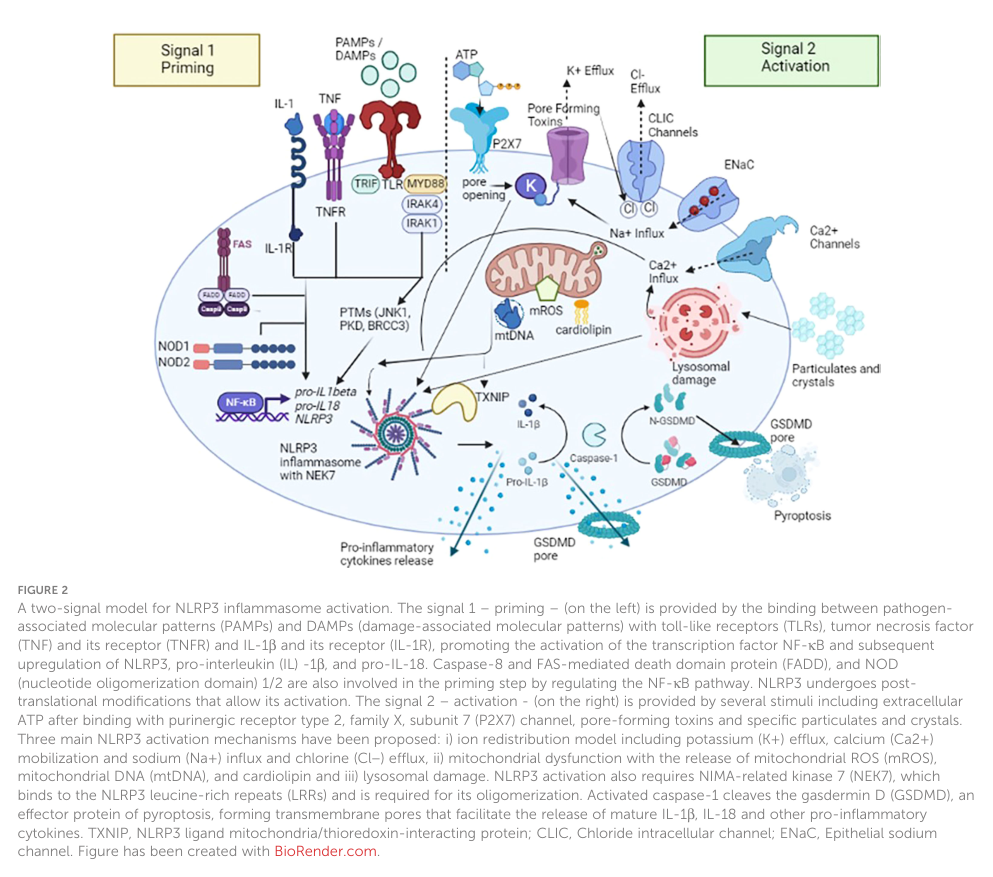

## Question

# Disease Characteristics Research Template

## Target Disease
- **Disease Name:** Familial Cold Autoinflammatory Syndrome
- **MONDO ID:**  (if available)
- **Category:** Mendelian

## Research Objectives

Please provide a comprehensive research report on **Familial Cold Autoinflammatory Syndrome** covering all of the
disease characteristics listed below. This report will be used to populate a disease knowledge
base entry. Be thorough and cite primary literature (PMID preferred) for all claims.

For each section, **suggested databases/resources** are listed. These are the first places
you should search for information on each topic.

---

### 1. Disease Information
> **Search first:** OMIM, Orphanet, ICD-10/ICD-11, MeSH, PubMed

- What is the disease? Provide a concise overview.
- What are the key identifiers? (OMIM, Orphanet, ICD-10/ICD-11, MeSH, Mondo)
- What are the common synonyms and alternative names?
- Is the information derived from individual patients (e.g., EHR) or aggregated disease-level resources?

### 2. Etiology

- **Disease Causal Factors**: What are the primary causes? (genetic, environmental, infectious, mechanistic)
- **Risk Factors**:
  > **Search first:** PubMed, Cochrane Library, UpToDate, clinical guidelines, ClinVar, ClinGen, GWAS Catalog, PheGenI, CTD, CDC, WHO, epidemiological databases
  - Genetic risk factors (causal variants, susceptibility loci, modifier genes)
  - Environmental risk factors (toxins, lifestyle, occupational exposures, age, sex, family history)
- **Protective Factors**:
  > **Search first:** PubMed, Cochrane Library, clinical trial databases, GWAS Catalog, gnomAD, WHO, CDC, nutrition databases
  - Genetic protective factors (protective variants, modifier alleles)
  - Environmental protective factors (diet, lifestyle, exposures that reduce risk)
- **Gene-Environment Interactions**: How do genetic and environmental factors interact to influence disease?
  > **Search first:** CTD, PubMed, PheGenI, GxE databases

### 3. Phenotypes
> **Search first:** HPO (Human Phenotype Ontology), OMIM, Orphanet, PubMed, clinicaltrials.gov, MedDRA, SNOMED CT, DECIPHER, LOINC

For each phenotype, provide:
- **Phenotype type**: symptoms, clinical signs, physical manifestations, behavioral changes, or laboratory abnormalities
  > For symptoms/signs: HPO, OMIM, Orphanet, PubMed
  > For behavioral changes: HPO, DSM, RDoC (Research Domain Criteria), PubMed
  > For laboratory abnormalities: LOINC, SNOMED CT, LabTests Online, PubMed
- **Phenotype characteristics**:
  > **Search first:** OMIM, Orphanet, HPO, PubMed
  - Age of symptom onset (neonatal, childhood, adult-onset, late-onset)
  - Symptom severity (mild, moderate, severe, variable)
  - Symptom progression (stable, progressive, episodic, fluctuating)
  - Frequency among affected individuals (percentage or qualitative)
- **Quality of life impact**: Effects on daily functioning and well-being (per-phenotype when possible)
  > **Search first:** EQ-5D database, SF-36, WHO QOL databases, PubMed
- Suggest HPO (Human Phenotype Ontology) terms for each phenotype

### 4. Genetic/Molecular Information

- **Causal Genes**: Gene mutations or chromosomal abnormalities responsible for disease (gene symbols, OMIM IDs)
  > **Search first:** OMIM, ClinVar, HGMD, Ensembl, NCBI Gene
- **Pathogenic Variants**:
  - Affected genes (gene symbols, HGNC IDs)
    > **Search first:** OMIM, NCBI Gene, Ensembl, HGNC, UniProt, GeneCards
  - Variant classification (pathogenic, likely pathogenic, VUS per ACMG/AMP guidelines)
    > **Search first:** ClinVar, ClinGen, ACMG/AMP guidelines, VarSome
  - Variant type/class (missense, frameshift, nonsense, splice-site, structural)
  - Allele frequency in population databases
    > **Search first:** gnomAD, 1000 Genomes, ExAC, TOPMed, dbSNP
  - Somatic vs germline origin
    > **Search first:** COSMIC (somatic), ClinVar, ICGC, TCGA
  - Functional consequences (loss of function, gain of function, dominant negative)
- **Modifier Genes**: Genes that modify disease severity or expression
- **Epigenetic Information**: DNA methylation, histone modifications, chromatin changes affecting disease
  > **Search first:** ENCODE, Roadmap Epigenomics, MethBase, DiseaseMeth
- **Chromosomal Abnormalities**: Large-scale genetic changes (aneuploidy, translocations, inversions)
  > **Search first:** DECIPHER, ClinVar, ECARUCA, UCSC Genome Browser

### 5. Environmental Information

- **Environmental Factors**: Non-genetic contributing factors (toxins, radiation, pollution, occupational exposure)
  > **Search first:** CTD (Comparative Toxicogenomics Database), TOXNET, PubMed, EPA databases
- **Lifestyle Factors**: Behavioral factors (smoking, diet, exercise, alcohol consumption)
  > **Search first:** CDC databases, WHO, PubMed, NHANES
- **Infectious Agents**: If applicable, pathogens causing or triggering disease (bacteria, viruses, fungi, parasites)
  > **Search first:** NCBI Taxonomy, ViPR, BV-BRC, MicrobeDB, GIDEON

### 6. Mechanism / Pathophysiology

- **Molecular Pathways**: Specific signaling cascades or biochemical pathways involved (Wnt, MAPK, mTOR, PI3K-AKT, etc.)
  > **Search first:** KEGG, Reactome, WikiPathways, PathBank, BioCyc
- **Cellular Processes**: Cell-level mechanisms (apoptosis, autophagy, cell cycle dysregulation, inflammation, etc.)
  > **Search first:** Gene Ontology (GO), Reactome, KEGG, PubMed
- **Protein Dysfunction**: How protein structure or function is altered (misfolding, aggregation, loss of function, gain of function)
  > **Search first:** UniProt, PDB (Protein Data Bank), InterPro, Pfam, AlphaFold
- **Metabolic Changes**: Alterations in metabolic processes (energy metabolism, lipid metabolism, amino acid metabolism)
  > **Search first:** KEGG, BioCyc, HMDB (Human Metabolome Database), BRENDA
- **Immune System Involvement**: Role of immune response (autoimmunity, immunodeficiency, chronic inflammation)
  > **Search first:** ImmPort, Immunome Database, IEDB, Gene Ontology
- **Tissue Damage Mechanisms**: How tissues/ are injured (oxidative stress, ischemia, fibrosis, necrosis)
  > **Search first:** PubMed, Gene Ontology, Reactome
- **Biochemical Abnormalities**: Specific molecular defects (enzyme deficiencies, receptor dysfunction, ion channel defects)
  > **Search first:** BRENDA, UniProt, KEGG, OMIM, PubMed
- **Epigenetic Changes**: DNA methylation, histone modifications affecting gene expression in disease
  > **Search first:** ENCODE, Roadmap Epigenomics, MethBase, DiseaseMeth
- **Molecular Profiling** (if available):
  - Transcriptomics/gene expression changes
    > **Search first:** GEO (Gene Expression Omnibus), ArrayExpress, GTEx, Human Cell Atlas, SRA
  - Proteomics findings
    > **Search first:** PRIDE, ProteomeXchange, Human Protein Atlas, STRING, BioGRID
  - Metabolomics signatures
    > **Search first:** MetaboLights, Metabolomics Workbench, HMDB, METLIN
  - Lipidomics alterations
    > **Search first:** LIPID MAPS, SwissLipids, LipidHome, Metabolomics Workbench
  - Genomic structural features
    > **Search first:** UCSC Genome Browser, Ensembl, NCBI, dbVar, DGV
- **Advanced Technologies** (if applicable):
  - Single-cell analysis findings (cell-type specific mechanisms, cellular heterogeneity)
    > **Search first:** Human Cell Atlas, Single Cell Portal, GEO, CELLxGENE
  - Spatial transcriptomics findings
    > **Search first:** GEO, Spatial Research, Vizgen, 10x Genomics data
  - Multi-omics integration results
    > **Search first:** TCGA, ICGC, cBioPortal, LinkedOmics, PubMed
  - Functional genomics screens (CRISPR, RNAi)
    > **Search first:** DepMap, GenomeRNAi, PubMed, BioGRID ORCS

For each mechanism, describe:
- The causal chain from initial trigger to clinical manifestation
- Which mechanisms are upstream vs downstream
- What cell types and biological processes are involved
- Suggest GO terms for biological processes and CL terms for cell types

### 7. Anatomical Structures Affected

- **Organ Level**:
  - Primary organs directly affected
  - Secondary organ involvement (complications, secondary effects)
  - Body systems involved (cardiovascular, nervous, digestive, respiratory, endocrine, etc.)
  > **Search first:** Uberon, FMA (Foundational Model of Anatomy), OMIM, HPO, ICD-11, MeSH, SNOMED CT
- **Tissue and Cell Level**:
  - Specific tissue types affected (epithelial, connective, muscle, nervous)
  - Specific cell populations targeted (with Cell Ontology terms)
  > **Search first:** Uberon, Human Protein Atlas, Cell Ontology, Human Cell Atlas, CellMarker, PanglaoDB
- **Subcellular Level**:
  - Cellular compartments involved (mitochondria, nucleus, ER, lysosomes) (with GO Cellular Component terms)
  > **Search first:** Gene Ontology (Cellular Component), UniProt, Human Protein Atlas
- **Localization**:
  - Specific anatomical sites (with UBERON terms)
    > **Search first:** FMA, Uberon, NeuroNames (for brain), SNOMED CT
  - Lateralization (unilateral, bilateral, asymmetric)
    > **Search first:** HPO, clinical literature, imaging databases

### 8. Temporal Development

- **Onset**:
  - Typical age of onset (congenital, pediatric, adult, geriatric)
  - Onset pattern (acute, subacute, chronic, insidious)
  > **Search first:** OMIM, Orphanet, HPO, PubMed
- **Progression**:
  - Disease stages (early, intermediate, advanced, end-stage)
    > **Search first:** Cancer Staging Manual (AJCC), WHO classifications, PubMed
  - Progression rate (rapid, slow, variable)
  - Disease course pattern (episodic, relapsing-remitting, progressive, stable)
  - Disease duration (self-limited, chronic lifelong)
  > **Search first:** Disease registries, longitudinal cohort databases, natural history studies, PubMed, Orphanet, OMIM
- **Patterns**:
  - Remission patterns (spontaneous, treatment-induced)
    > **Search first:** Clinical trial databases, disease registries, PubMed
  - Critical periods (time windows of vulnerability or opportunity for intervention)
    > **Search first:** PubMed, developmental biology databases, clinical guidelines

### 9. Inheritance and Population

- **Epidemiology**:
  - Prevalence (cases per 100,000 at given time)
  - Incidence (new cases per 100,000 per year)
  > **Search first:** Orphanet, CDC, WHO, GBD (Global Burden of Disease), national registries, SEER, disease registries
- **For Genetic Etiology**:
  - Inheritance pattern (AD, AR, X-linked, mitochondrial, multifactorial, polygenic)
    > **Search first:** OMIM, Orphanet, ClinVar, GTR (Genetic Testing Registry)
  - Penetrance (complete, incomplete, age-dependent)
    > **Search first:** ClinVar, OMIM, PubMed, ClinGen
  - Expressivity (variable, consistent)
    > **Search first:** OMIM, ClinVar, PubMed
  - Genetic anticipation (increasing severity in successive generations)
    > **Search first:** OMIM, PubMed (especially for repeat expansion disorders)
  - Germline mosaicism
    > **Search first:** ClinVar, OMIM, genetic counseling literature, PubMed
  - Founder effects (population-specific mutations)
    > **Search first:** gnomAD, population genetics databases, PubMed
  - Consanguinity role
    > **Search first:** OMIM, population studies, genetic counseling resources
  - Carrier frequency
    > **Search first:** gnomAD, carrier screening databases, GeneReviews, GTR
- **Population Demographics**:
  - Affected populations (ethnic or demographic groups with higher prevalence)
    > **Search first:** gnomAD, 1000 Genomes, PAGE Study, PubMed, population registries
  - Geographic distribution (endemic areas, regional variation)
    > **Search first:** WHO, CDC, GBD, Orphanet, geographic epidemiology databases
  - Geographic distribution of specific variants
  - Sex ratio (male:female)
    > **Search first:** Disease registries, OMIM, PubMed, epidemiological databases
  - Age distribution of affected individuals
    > **Search first:** CDC, disease registries, SEER, Orphanet

### 10. Diagnostics

- **Clinical Tests**:
  - Laboratory tests (blood, urine, tissue chemistry, specific enzyme assays)
    > **Search first:** LOINC, LabTests Online, PubMed
  - Biomarkers (proteins, metabolites, genetic markers, circulating biomarkers)
    > **Search first:** FDA Biomarker List, BEST (Biomarkers, EndpointS, and other Tools), PubMed
  - Imaging studies (X-ray, CT, MRI, PET, ultrasound)
    > **Search first:** RadLex, DICOM, Radiopaedia, imaging databases
  - Functional tests (pulmonary function, cardiac stress tests)
    > **Search first:** LOINC, clinical guidelines, PubMed
  - Electrophysiology (EEG, EMG, ECG, nerve conduction studies)
    > **Search first:** LOINC, clinical neurophysiology databases, PubMed
  - Biopsy findings (histopathology, immunohistochemistry)
    > **Search first:** SNOMED CT, College of American Pathologists resources, PubMed
  - Pathology findings (microscopic examination)
    > **Search first:** SNOMED CT, Digital Pathology databases, PubMed
- **Genetic Testing**:
  > **Search first:** GTR (Genetic Testing Registry), GeneReviews, ClinGen
  - Overview of recommended genetic testing approach
  - Whole genome sequencing (WGS) utility
    > **Search first:** GTR, ClinVar, GEL (Genomics England), gnomAD
  - Whole exome sequencing (WES) utility
    > **Search first:** GTR, ClinVar, OMIM, GeneMatcher
  - Gene panels (which panels, which genes)
    > **Search first:** GTR, ClinVar, laboratory-specific databases
  - Single gene testing
    > **Search first:** GTR, ClinVar, OMIM, GeneReviews
  - Chromosomal microarray (CMA)
    > **Search first:** DECIPHER, ClinVar, dbVar, ECARUCA
  - Karyotyping
    > **Search first:** Chromosome Abnormality Database, ClinVar, cytogenetics resources
  - FISH
    > **Search first:** ClinVar, cytogenetics databases, PubMed
  - Mitochondrial DNA testing
    > **Search first:** MITOMAP, MSeqDR, ClinVar, GTR
  - Repeat expansion testing
    > **Search first:** GTR, ClinVar, repeat expansion databases, PubMed
- **Omics-Based Diagnostics** (if applicable):
  - RNA sequencing / transcriptomics
    > **Search first:** GEO, ArrayExpress, GTEx, RNA-seq databases
  - Proteomics
    > **Search first:** PRIDE, ProteomeXchange, FDA Biomarker database
  - Metabolomics
    > **Search first:** MetaboLights, Metabolomics Workbench, HMDB
  - Epigenomics
    > **Search first:** GEO, ENCODE, Roadmap Epigenomics, MethBase
  - Liquid biopsy
    > **Search first:** COSMIC, ClinVar, liquid biopsy databases, PubMed
- **Clinical Criteria**:
  - Standardized diagnostic criteria (DSM, ICD, society guidelines)
    > **Search first:** DSM-5, ICD-11, clinical society guidelines, UpToDate
  - Differential diagnosis (other conditions to rule out, with distinguishing features)
    > **Search first:** DynaMed, UpToDate, clinical decision support systems
- **Screening**:
  - Screening methods for asymptomatic individuals (newborn screening, carrier screening, cascade screening)
    > **Search first:** ACMG recommendations, CDC newborn screening, GTR

### 11. Outcome/Prognosis

- **Survival and Mortality**:
  - Survival rate (5-year, 10-year, overall)
    > **Search first:** SEER, cancer registries, disease-specific registries, PubMed
  - Life expectancy (with and without treatment if applicable)
    > **Search first:** Orphanet, disease registries, actuarial databases, PubMed
  - Mortality rate
    > **Search first:** CDC, WHO, GBD, national mortality databases
  - Disease-specific mortality (deaths directly attributable to disease)
    > **Search first:** Disease registries, CDC Wonder, GBD, PubMed
- **Morbidity and Function**:
  - Morbidity (disease-related disability and health impacts)
    > **Search first:** GBD, WHO, disability databases, PubMed
  - Disability outcomes (long-term functional impairments)
    > **Search first:** ICF (International Classification of Functioning), disability registries
  - Quality of life measures (EQ-5D, SF-36, PROMIS, disease-specific tools)
    > **Search first:** EQ-5D database, SF-36, PROMIS, PubMed
- **Disease Course**:
  - Complications (secondary problems: infections, organ failure, etc.)
    > **Search first:** ICD codes, disease registries, clinical databases, PubMed
  - Recovery potential (likelihood and extent of recovery, with vs without treatment)
    > **Search first:** Natural history studies, rehabilitation databases, PubMed
- **Prediction**:
  - Prognostic factors (age, disease severity, biomarkers, treatment response)
    > **Search first:** Prognostic models databases, clinical calculators, PubMed
  - Prognostic biomarkers (molecular markers predicting disease course)
    > **Search first:** FDA Biomarker database, PubMed, cancer prognostic databases

### 12. Treatment

- **Pharmacotherapy**:
  - Pharmacological treatments (drug names, drug classes, mechanisms of action)
    > **Search first:** DrugBank, RxNorm, ATC classification, DailyMed, FDA databases
  - Pharmacogenomics (how genetic variants affect drug metabolism, efficacy, toxicity)
    > **Search first:** PharmGKB, CPIC (Clinical Pharmacogenetics), FDA Table of PGx Biomarkers
- **Advanced Therapeutics**:
  - Gene therapy (viral vectors, CRISPR, gene replacement, gene editing)
    > **Search first:** ClinicalTrials.gov, FDA gene therapy database, ASGCT resources
  - Cell therapy (stem cell transplant, CAR-T, cellular therapeutics)
    > **Search first:** ClinicalTrials.gov, FDA cell therapy database, FACT standards
  - RNA-based therapies (ASOs, siRNA, mRNA therapies)
    > **Search first:** ClinicalTrials.gov, FDA approvals, PubMed
  - Targeted therapies (treatments directed at specific molecular targets)
    > **Search first:** My Cancer Genome, OncoKB, ClinicalTrials.gov, FDA approvals
  - Immunotherapies (checkpoint inhibitors, monoclonal antibodies)
    > **Search first:** Cancer Immunotherapy Database, FDA approvals, ClinicalTrials.gov
- **Surgical and Interventional**:
  - Surgical interventions (types of surgery, timing, outcomes)
    > **Search first:** CPT codes, surgical registries, clinical guidelines, PubMed
- **Supportive and Rehabilitative**:
  - Supportive care (symptom management, pain control, nutrition)
    > **Search first:** Clinical guidelines, Cochrane Library, PubMed
  - Rehabilitation (physical therapy, occupational therapy, speech therapy)
    > **Search first:** Rehabilitation medicine databases, clinical guidelines, PubMed
- **Experimental**:
  - Experimental treatments in clinical trials (with NCT identifiers if available)
    > **Search first:** ClinicalTrials.gov, EU Clinical Trials Register, WHO ICTRP
- **Treatment Outcomes**:
  - Treatment response rates
    > **Search first:** Clinical trial databases, FDA reviews, systematic reviews, PubMed
  - Side effects and adverse events
    > **Search first:** FDA Adverse Event Reporting System (FAERS), MedWatch, PubMed
- **Treatment Strategy**:
  - Treatment algorithms (clinical pathways, decision trees)
    > **Search first:** Clinical practice guidelines, NCCN Guidelines, UpToDate
  - Combination therapies
    > **Search first:** ClinicalTrials.gov, treatment guidelines, PubMed
  - Personalized medicine approaches (genotype-guided treatment)
    > **Search first:** My Cancer Genome, CIViC, PharmGKB, precision medicine databases

For each treatment, suggest MAXO (Medical Action Ontology) terms where applicable.

### 13. Prevention

- **Prevention Levels**:
  - Primary prevention (preventing disease occurrence: vaccination, risk factor modification)
    > **Search first:** CDC, WHO, USPSTF recommendations, Cochrane Library
  - Secondary prevention (early detection and treatment: screening programs, early intervention)
    > **Search first:** USPSTF, CDC screening guidelines, WHO
  - Tertiary prevention (preventing complications in those with disease)
    > **Search first:** Clinical guidelines, disease management protocols, PubMed
- **Immunization**: Vaccine strategies (if applicable)
  > **Search first:** CDC vaccine schedules, WHO immunization, FDA vaccine database
- **Screening and Early Detection**:
  - Screening programs (population-based: newborn screening, cancer screening)
    > **Search first:** CDC screening programs, USPSTF, cancer screening databases
  - Genetic screening (carrier screening, preimplantation genetic diagnosis, prenatal testing)
    > **Search first:** ACMG recommendations, ACOG guidelines, GTR
  - Risk stratification (identifying high-risk individuals for targeted prevention)
    > **Search first:** Risk prediction models, clinical calculators, PubMed
- **Behavioral Interventions**: Lifestyle modifications to reduce risk
  > **Search first:** CDC, WHO, behavioral intervention databases, Cochrane Library
- **Counseling**: Genetic counseling (risk assessment, family planning guidance)
  > **Search first:** NSGC resources, ACMG guidelines, GeneReviews
- **Public Health**:
  - Public health interventions (sanitation, vector control, health education)
    > **Search first:** CDC, WHO, public health databases, PubMed
  - Environmental interventions (reducing environmental risk factors)
    > **Search first:** EPA databases, WHO environmental health, PubMed
- **Prophylaxis**: Preventive medications or procedures
  > **Search first:** Clinical guidelines, FDA approvals, PubMed

### 14. Other Species / Natural Disease

- **Taxonomy**: Species affected (with NCBI Taxon identifiers)
  > **Search first:** NCBI Taxonomy
- **Breed**: Specific breeds affected (with VBO identifiers if applicable)
  > **Search first:** VBO (Vertebrate Breed Ontology)
- **Gene**: Orthologous genes in other species (with NCBI Gene IDs)
  > **Search first:** NCBI Gene
- **Natural Disease**:
  - Naturally occurring disease in other species (companion animals, wildlife)
    > **Search first:** OMIA (Online Mendelian Inheritance in Animals), VetCompass, PubMed
  - Veterinary relevance and importance in animal health
    > **Search first:** OMIA, veterinary databases, PubMed
- **Comparative Biology**:
  - Comparative pathology (similarities and differences across species)
    > **Search first:** OMIA, comparative pathology databases, PubMed
  - Evolutionary conservation of disease mechanisms
    > **Search first:** HomoloGene, OrthoMCL, Alliance of Genome Resources
- **Transmission** (if applicable):
  - Zoonotic potential
    > **Search first:** CDC zoonotic diseases, WHO zoonoses, GIDEON
  - Cross-species susceptibility
    > **Search first:** NCBI Taxonomy, veterinary databases, PubMed

### 15. Model Organisms

- **Model Types**:
  - Model organism type (mammalian, invertebrate, cellular, in vitro)
    > **Search first:** Alliance of Genome Resources, model organism databases
  - Specific model systems (mouse, rat, zebrafish, Drosophila, C. elegans, yeast, cell lines, organoids, iPSCs)
    > **Search first:** MGI, RGD, ZFIN, FlyBase, WormBase, SGD, ATCC, Cellosaurus
  - Induced models (drug treatment, surgical intervention, environmental manipulation)
    > **Search first:** MGI, model organism databases, PubMed
- **Genetic Models**:
  - Types available (knockout, knock-in, transgenic, conditional, humanized)
    > **Search first:** MGI, IMPC, KOMP, EuMMCR, IMSR
- **Model Characteristics**:
  - Phenotype recapitulation (how well model reproduces human disease features)
    > **Search first:** Model organism databases, comparative studies, PubMed
  - Model limitations (aspects of human disease not captured)
    > **Search first:** Model organism databases, PubMed, review articles
- **Applications**:
  - Research applications (what aspects of disease can be studied)
    > **Search first:** Model organism databases, PubMed
- **Resources**:
  - Model databases
    > **Search first:** MGI, RGD, ZFIN, FlyBase, WormBase, IMSR, EMMA, MMRRC

---

## Citation Requirements

- Cite primary literature (PMID preferred) for all mechanistic and clinical claims
- Prioritize recent reviews and landmark papers
- Include direct quotes from abstracts where possible to support key statements
- Distinguish evidence source types: human clinical, model organism, in vitro, computational

## Output Format

Structure your response as a comprehensive narrative organized by the sections above.
For each section, provide:
- Factual content with specific details (numbers, percentages, gene names, variant nomenclature)
- Ontology term suggestions (HPO, GO, CL, UBERON, CHEBI, MAXO, MONDO) where applicable
- Evidence citations with PMIDs
- Direct quotes from abstracts to support key claims
- Clear indication when information is not available or not applicable for this disease

This report will be used to populate a disease knowledge base entry with:
- Pathophysiology descriptions with causal chains
- Gene/protein annotations (HGNC, GO terms)
- Phenotype associations (HP terms) with frequencies
- Cell type involvement (CL terms)
- Anatomical locations (UBERON terms)
- Chemical entities (CHEBI terms)
- Treatment annotations (MAXO terms)
- Evidence items with PMIDs and exact abstract quotes
- Epidemiology, prognosis, diagnostic, and prevention information
- Animal model descriptions with phenotype recapitulation details

## Output

Question: You are an expert researcher providing comprehensive, well-cited information.

Provide detailed information focusing on:
1. Key concepts and definitions with current understanding
2. Recent developments and latest research (prioritize 2023-2024 sources)
3. Current applications and real-world implementations
4. Expert opinions and analysis from authoritative sources
5. Relevant statistics and data from recent studies

Format as a comprehensive research report with proper citations. Include URLs and publication dates where available.
Always prioritize recent, authoritative sources and provide specific citations for all major claims.

# Disease Characteristics Research Template

## Target Disease
- **Disease Name:** Familial Cold Autoinflammatory Syndrome
- **MONDO ID:**  (if available)
- **Category:** Mendelian

## Research Objectives

Please provide a comprehensive research report on **Familial Cold Autoinflammatory Syndrome** covering all of the
disease characteristics listed below. This report will be used to populate a disease knowledge
base entry. Be thorough and cite primary literature (PMID preferred) for all claims.

For each section, **suggested databases/resources** are listed. These are the first places
you should search for information on each topic.

---

### 1. Disease Information
> **Search first:** OMIM, Orphanet, ICD-10/ICD-11, MeSH, PubMed

- What is the disease? Provide a concise overview.
- What are the key identifiers? (OMIM, Orphanet, ICD-10/ICD-11, MeSH, Mondo)
- What are the common synonyms and alternative names?
- Is the information derived from individual patients (e.g., EHR) or aggregated disease-level resources?

### 2. Etiology

- **Disease Causal Factors**: What are the primary causes? (genetic, environmental, infectious, mechanistic)
- **Risk Factors**:
  > **Search first:** PubMed, Cochrane Library, UpToDate, clinical guidelines, ClinVar, ClinGen, GWAS Catalog, PheGenI, CTD, CDC, WHO, epidemiological databases
  - Genetic risk factors (causal variants, susceptibility loci, modifier genes)
  - Environmental risk factors (toxins, lifestyle, occupational exposures, age, sex, family history)
- **Protective Factors**:
  > **Search first:** PubMed, Cochrane Library, clinical trial databases, GWAS Catalog, gnomAD, WHO, CDC, nutrition databases
  - Genetic protective factors (protective variants, modifier alleles)
  - Environmental protective factors (diet, lifestyle, exposures that reduce risk)
- **Gene-Environment Interactions**: How do genetic and environmental factors interact to influence disease?
  > **Search first:** CTD, PubMed, PheGenI, GxE databases

### 3. Phenotypes
> **Search first:** HPO (Human Phenotype Ontology), OMIM, Orphanet, PubMed, clinicaltrials.gov, MedDRA, SNOMED CT, DECIPHER, LOINC

For each phenotype, provide:
- **Phenotype type**: symptoms, clinical signs, physical manifestations, behavioral changes, or laboratory abnormalities
  > For symptoms/signs: HPO, OMIM, Orphanet, PubMed
  > For behavioral changes: HPO, DSM, RDoC (Research Domain Criteria), PubMed
  > For laboratory abnormalities: LOINC, SNOMED CT, LabTests Online, PubMed
- **Phenotype characteristics**:
  > **Search first:** OMIM, Orphanet, HPO, PubMed
  - Age of symptom onset (neonatal, childhood, adult-onset, late-onset)
  - Symptom severity (mild, moderate, severe, variable)
  - Symptom progression (stable, progressive, episodic, fluctuating)
  - Frequency among affected individuals (percentage or qualitative)
- **Quality of life impact**: Effects on daily functioning and well-being (per-phenotype when possible)
  > **Search first:** EQ-5D database, SF-36, WHO QOL databases, PubMed
- Suggest HPO (Human Phenotype Ontology) terms for each phenotype

### 4. Genetic/Molecular Information

- **Causal Genes**: Gene mutations or chromosomal abnormalities responsible for disease (gene symbols, OMIM IDs)
  > **Search first:** OMIM, ClinVar, HGMD, Ensembl, NCBI Gene
- **Pathogenic Variants**:
  - Affected genes (gene symbols, HGNC IDs)
    > **Search first:** OMIM, NCBI Gene, Ensembl, HGNC, UniProt, GeneCards
  - Variant classification (pathogenic, likely pathogenic, VUS per ACMG/AMP guidelines)
    > **Search first:** ClinVar, ClinGen, ACMG/AMP guidelines, VarSome
  - Variant type/class (missense, frameshift, nonsense, splice-site, structural)
  - Allele frequency in population databases
    > **Search first:** gnomAD, 1000 Genomes, ExAC, TOPMed, dbSNP
  - Somatic vs germline origin
    > **Search first:** COSMIC (somatic), ClinVar, ICGC, TCGA
  - Functional consequences (loss of function, gain of function, dominant negative)
- **Modifier Genes**: Genes that modify disease severity or expression
- **Epigenetic Information**: DNA methylation, histone modifications, chromatin changes affecting disease
  > **Search first:** ENCODE, Roadmap Epigenomics, MethBase, DiseaseMeth
- **Chromosomal Abnormalities**: Large-scale genetic changes (aneuploidy, translocations, inversions)
  > **Search first:** DECIPHER, ClinVar, ECARUCA, UCSC Genome Browser

### 5. Environmental Information

- **Environmental Factors**: Non-genetic contributing factors (toxins, radiation, pollution, occupational exposure)
  > **Search first:** CTD (Comparative Toxicogenomics Database), TOXNET, PubMed, EPA databases
- **Lifestyle Factors**: Behavioral factors (smoking, diet, exercise, alcohol consumption)
  > **Search first:** CDC databases, WHO, PubMed, NHANES
- **Infectious Agents**: If applicable, pathogens causing or triggering disease (bacteria, viruses, fungi, parasites)
  > **Search first:** NCBI Taxonomy, ViPR, BV-BRC, MicrobeDB, GIDEON

### 6. Mechanism / Pathophysiology

- **Molecular Pathways**: Specific signaling cascades or biochemical pathways involved (Wnt, MAPK, mTOR, PI3K-AKT, etc.)
  > **Search first:** KEGG, Reactome, WikiPathways, PathBank, BioCyc
- **Cellular Processes**: Cell-level mechanisms (apoptosis, autophagy, cell cycle dysregulation, inflammation, etc.)
  > **Search first:** Gene Ontology (GO), Reactome, KEGG, PubMed
- **Protein Dysfunction**: How protein structure or function is altered (misfolding, aggregation, loss of function, gain of function)
  > **Search first:** UniProt, PDB (Protein Data Bank), InterPro, Pfam, AlphaFold
- **Metabolic Changes**: Alterations in metabolic processes (energy metabolism, lipid metabolism, amino acid metabolism)
  > **Search first:** KEGG, BioCyc, HMDB (Human Metabolome Database), BRENDA
- **Immune System Involvement**: Role of immune response (autoimmunity, immunodeficiency, chronic inflammation)
  > **Search first:** ImmPort, Immunome Database, IEDB, Gene Ontology
- **Tissue Damage Mechanisms**: How tissues/ are injured (oxidative stress, ischemia, fibrosis, necrosis)
  > **Search first:** PubMed, Gene Ontology, Reactome
- **Biochemical Abnormalities**: Specific molecular defects (enzyme deficiencies, receptor dysfunction, ion channel defects)
  > **Search first:** BRENDA, UniProt, KEGG, OMIM, PubMed
- **Epigenetic Changes**: DNA methylation, histone modifications affecting gene expression in disease
  > **Search first:** ENCODE, Roadmap Epigenomics, MethBase, DiseaseMeth
- **Molecular Profiling** (if available):
  - Transcriptomics/gene expression changes
    > **Search first:** GEO (Gene Expression Omnibus), ArrayExpress, GTEx, Human Cell Atlas, SRA
  - Proteomics findings
    > **Search first:** PRIDE, ProteomeXchange, Human Protein Atlas, STRING, BioGRID
  - Metabolomics signatures
    > **Search first:** MetaboLights, Metabolomics Workbench, HMDB, METLIN
  - Lipidomics alterations
    > **Search first:** LIPID MAPS, SwissLipids, LipidHome, Metabolomics Workbench
  - Genomic structural features
    > **Search first:** UCSC Genome Browser, Ensembl, NCBI, dbVar, DGV
- **Advanced Technologies** (if applicable):
  - Single-cell analysis findings (cell-type specific mechanisms, cellular heterogeneity)
    > **Search first:** Human Cell Atlas, Single Cell Portal, GEO, CELLxGENE
  - Spatial transcriptomics findings
    > **Search first:** GEO, Spatial Research, Vizgen, 10x Genomics data
  - Multi-omics integration results
    > **Search first:** TCGA, ICGC, cBioPortal, LinkedOmics, PubMed
  - Functional genomics screens (CRISPR, RNAi)
    > **Search first:** DepMap, GenomeRNAi, PubMed, BioGRID ORCS

For each mechanism, describe:
- The causal chain from initial trigger to clinical manifestation
- Which mechanisms are upstream vs downstream
- What cell types and biological processes are involved
- Suggest GO terms for biological processes and CL terms for cell types

### 7. Anatomical Structures Affected

- **Organ Level**:
  - Primary organs directly affected
  - Secondary organ involvement (complications, secondary effects)
  - Body systems involved (cardiovascular, nervous, digestive, respiratory, endocrine, etc.)
  > **Search first:** Uberon, FMA (Foundational Model of Anatomy), OMIM, HPO, ICD-11, MeSH, SNOMED CT
- **Tissue and Cell Level**:
  - Specific tissue types affected (epithelial, connective, muscle, nervous)
  - Specific cell populations targeted (with Cell Ontology terms)
  > **Search first:** Uberon, Human Protein Atlas, Cell Ontology, Human Cell Atlas, CellMarker, PanglaoDB
- **Subcellular Level**:
  - Cellular compartments involved (mitochondria, nucleus, ER, lysosomes) (with GO Cellular Component terms)
  > **Search first:** Gene Ontology (Cellular Component), UniProt, Human Protein Atlas
- **Localization**:
  - Specific anatomical sites (with UBERON terms)
    > **Search first:** FMA, Uberon, NeuroNames (for brain), SNOMED CT
  - Lateralization (unilateral, bilateral, asymmetric)
    > **Search first:** HPO, clinical literature, imaging databases

### 8. Temporal Development

- **Onset**:
  - Typical age of onset (congenital, pediatric, adult, geriatric)
  - Onset pattern (acute, subacute, chronic, insidious)
  > **Search first:** OMIM, Orphanet, HPO, PubMed
- **Progression**:
  - Disease stages (early, intermediate, advanced, end-stage)
    > **Search first:** Cancer Staging Manual (AJCC), WHO classifications, PubMed
  - Progression rate (rapid, slow, variable)
  - Disease course pattern (episodic, relapsing-remitting, progressive, stable)
  - Disease duration (self-limited, chronic lifelong)
  > **Search first:** Disease registries, longitudinal cohort databases, natural history studies, PubMed, Orphanet, OMIM
- **Patterns**:
  - Remission patterns (spontaneous, treatment-induced)
    > **Search first:** Clinical trial databases, disease registries, PubMed
  - Critical periods (time windows of vulnerability or opportunity for intervention)
    > **Search first:** PubMed, developmental biology databases, clinical guidelines

### 9. Inheritance and Population

- **Epidemiology**:
  - Prevalence (cases per 100,000 at given time)
  - Incidence (new cases per 100,000 per year)
  > **Search first:** Orphanet, CDC, WHO, GBD (Global Burden of Disease), national registries, SEER, disease registries
- **For Genetic Etiology**:
  - Inheritance pattern (AD, AR, X-linked, mitochondrial, multifactorial, polygenic)
    > **Search first:** OMIM, Orphanet, ClinVar, GTR (Genetic Testing Registry)
  - Penetrance (complete, incomplete, age-dependent)
    > **Search first:** ClinVar, OMIM, PubMed, ClinGen
  - Expressivity (variable, consistent)
    > **Search first:** OMIM, ClinVar, PubMed
  - Genetic anticipation (increasing severity in successive generations)
    > **Search first:** OMIM, PubMed (especially for repeat expansion disorders)
  - Germline mosaicism
    > **Search first:** ClinVar, OMIM, genetic counseling literature, PubMed
  - Founder effects (population-specific mutations)
    > **Search first:** gnomAD, population genetics databases, PubMed
  - Consanguinity role
    > **Search first:** OMIM, population studies, genetic counseling resources
  - Carrier frequency
    > **Search first:** gnomAD, carrier screening databases, GeneReviews, GTR
- **Population Demographics**:
  - Affected populations (ethnic or demographic groups with higher prevalence)
    > **Search first:** gnomAD, 1000 Genomes, PAGE Study, PubMed, population registries
  - Geographic distribution (endemic areas, regional variation)
    > **Search first:** WHO, CDC, GBD, Orphanet, geographic epidemiology databases
  - Geographic distribution of specific variants
  - Sex ratio (male:female)
    > **Search first:** Disease registries, OMIM, PubMed, epidemiological databases
  - Age distribution of affected individuals
    > **Search first:** CDC, disease registries, SEER, Orphanet

### 10. Diagnostics

- **Clinical Tests**:
  - Laboratory tests (blood, urine, tissue chemistry, specific enzyme assays)
    > **Search first:** LOINC, LabTests Online, PubMed
  - Biomarkers (proteins, metabolites, genetic markers, circulating biomarkers)
    > **Search first:** FDA Biomarker List, BEST (Biomarkers, EndpointS, and other Tools), PubMed
  - Imaging studies (X-ray, CT, MRI, PET, ultrasound)
    > **Search first:** RadLex, DICOM, Radiopaedia, imaging databases
  - Functional tests (pulmonary function, cardiac stress tests)
    > **Search first:** LOINC, clinical guidelines, PubMed
  - Electrophysiology (EEG, EMG, ECG, nerve conduction studies)
    > **Search first:** LOINC, clinical neurophysiology databases, PubMed
  - Biopsy findings (histopathology, immunohistochemistry)
    > **Search first:** SNOMED CT, College of American Pathologists resources, PubMed
  - Pathology findings (microscopic examination)
    > **Search first:** SNOMED CT, Digital Pathology databases, PubMed
- **Genetic Testing**:
  > **Search first:** GTR (Genetic Testing Registry), GeneReviews, ClinGen
  - Overview of recommended genetic testing approach
  - Whole genome sequencing (WGS) utility
    > **Search first:** GTR, ClinVar, GEL (Genomics England), gnomAD
  - Whole exome sequencing (WES) utility
    > **Search first:** GTR, ClinVar, OMIM, GeneMatcher
  - Gene panels (which panels, which genes)
    > **Search first:** GTR, ClinVar, laboratory-specific databases
  - Single gene testing
    > **Search first:** GTR, ClinVar, OMIM, GeneReviews
  - Chromosomal microarray (CMA)
    > **Search first:** DECIPHER, ClinVar, dbVar, ECARUCA
  - Karyotyping
    > **Search first:** Chromosome Abnormality Database, ClinVar, cytogenetics resources
  - FISH
    > **Search first:** ClinVar, cytogenetics databases, PubMed
  - Mitochondrial DNA testing
    > **Search first:** MITOMAP, MSeqDR, ClinVar, GTR
  - Repeat expansion testing
    > **Search first:** GTR, ClinVar, repeat expansion databases, PubMed
- **Omics-Based Diagnostics** (if applicable):
  - RNA sequencing / transcriptomics
    > **Search first:** GEO, ArrayExpress, GTEx, RNA-seq databases
  - Proteomics
    > **Search first:** PRIDE, ProteomeXchange, FDA Biomarker database
  - Metabolomics
    > **Search first:** MetaboLights, Metabolomics Workbench, HMDB
  - Epigenomics
    > **Search first:** GEO, ENCODE, Roadmap Epigenomics, MethBase
  - Liquid biopsy
    > **Search first:** COSMIC, ClinVar, liquid biopsy databases, PubMed
- **Clinical Criteria**:
  - Standardized diagnostic criteria (DSM, ICD, society guidelines)
    > **Search first:** DSM-5, ICD-11, clinical society guidelines, UpToDate
  - Differential diagnosis (other conditions to rule out, with distinguishing features)
    > **Search first:** DynaMed, UpToDate, clinical decision support systems
- **Screening**:
  - Screening methods for asymptomatic individuals (newborn screening, carrier screening, cascade screening)
    > **Search first:** ACMG recommendations, CDC newborn screening, GTR

### 11. Outcome/Prognosis

- **Survival and Mortality**:
  - Survival rate (5-year, 10-year, overall)
    > **Search first:** SEER, cancer registries, disease-specific registries, PubMed
  - Life expectancy (with and without treatment if applicable)
    > **Search first:** Orphanet, disease registries, actuarial databases, PubMed
  - Mortality rate
    > **Search first:** CDC, WHO, GBD, national mortality databases
  - Disease-specific mortality (deaths directly attributable to disease)
    > **Search first:** Disease registries, CDC Wonder, GBD, PubMed
- **Morbidity and Function**:
  - Morbidity (disease-related disability and health impacts)
    > **Search first:** GBD, WHO, disability databases, PubMed
  - Disability outcomes (long-term functional impairments)
    > **Search first:** ICF (International Classification of Functioning), disability registries
  - Quality of life measures (EQ-5D, SF-36, PROMIS, disease-specific tools)
    > **Search first:** EQ-5D database, SF-36, PROMIS, PubMed
- **Disease Course**:
  - Complications (secondary problems: infections, organ failure, etc.)
    > **Search first:** ICD codes, disease registries, clinical databases, PubMed
  - Recovery potential (likelihood and extent of recovery, with vs without treatment)
    > **Search first:** Natural history studies, rehabilitation databases, PubMed
- **Prediction**:
  - Prognostic factors (age, disease severity, biomarkers, treatment response)
    > **Search first:** Prognostic models databases, clinical calculators, PubMed
  - Prognostic biomarkers (molecular markers predicting disease course)
    > **Search first:** FDA Biomarker database, PubMed, cancer prognostic databases

### 12. Treatment

- **Pharmacotherapy**:
  - Pharmacological treatments (drug names, drug classes, mechanisms of action)
    > **Search first:** DrugBank, RxNorm, ATC classification, DailyMed, FDA databases
  - Pharmacogenomics (how genetic variants affect drug metabolism, efficacy, toxicity)
    > **Search first:** PharmGKB, CPIC (Clinical Pharmacogenetics), FDA Table of PGx Biomarkers
- **Advanced Therapeutics**:
  - Gene therapy (viral vectors, CRISPR, gene replacement, gene editing)
    > **Search first:** ClinicalTrials.gov, FDA gene therapy database, ASGCT resources
  - Cell therapy (stem cell transplant, CAR-T, cellular therapeutics)
    > **Search first:** ClinicalTrials.gov, FDA cell therapy database, FACT standards
  - RNA-based therapies (ASOs, siRNA, mRNA therapies)
    > **Search first:** ClinicalTrials.gov, FDA approvals, PubMed
  - Targeted therapies (treatments directed at specific molecular targets)
    > **Search first:** My Cancer Genome, OncoKB, ClinicalTrials.gov, FDA approvals
  - Immunotherapies (checkpoint inhibitors, monoclonal antibodies)
    > **Search first:** Cancer Immunotherapy Database, FDA approvals, ClinicalTrials.gov
- **Surgical and Interventional**:
  - Surgical interventions (types of surgery, timing, outcomes)
    > **Search first:** CPT codes, surgical registries, clinical guidelines, PubMed
- **Supportive and Rehabilitative**:
  - Supportive care (symptom management, pain control, nutrition)
    > **Search first:** Clinical guidelines, Cochrane Library, PubMed
  - Rehabilitation (physical therapy, occupational therapy, speech therapy)
    > **Search first:** Rehabilitation medicine databases, clinical guidelines, PubMed
- **Experimental**:
  - Experimental treatments in clinical trials (with NCT identifiers if available)
    > **Search first:** ClinicalTrials.gov, EU Clinical Trials Register, WHO ICTRP
- **Treatment Outcomes**:
  - Treatment response rates
    > **Search first:** Clinical trial databases, FDA reviews, systematic reviews, PubMed
  - Side effects and adverse events
    > **Search first:** FDA Adverse Event Reporting System (FAERS), MedWatch, PubMed
- **Treatment Strategy**:
  - Treatment algorithms (clinical pathways, decision trees)
    > **Search first:** Clinical practice guidelines, NCCN Guidelines, UpToDate
  - Combination therapies
    > **Search first:** ClinicalTrials.gov, treatment guidelines, PubMed
  - Personalized medicine approaches (genotype-guided treatment)
    > **Search first:** My Cancer Genome, CIViC, PharmGKB, precision medicine databases

For each treatment, suggest MAXO (Medical Action Ontology) terms where applicable.

### 13. Prevention

- **Prevention Levels**:
  - Primary prevention (preventing disease occurrence: vaccination, risk factor modification)
    > **Search first:** CDC, WHO, USPSTF recommendations, Cochrane Library
  - Secondary prevention (early detection and treatment: screening programs, early intervention)
    > **Search first:** USPSTF, CDC screening guidelines, WHO
  - Tertiary prevention (preventing complications in those with disease)
    > **Search first:** Clinical guidelines, disease management protocols, PubMed
- **Immunization**: Vaccine strategies (if applicable)
  > **Search first:** CDC vaccine schedules, WHO immunization, FDA vaccine database
- **Screening and Early Detection**:
  - Screening programs (population-based: newborn screening, cancer screening)
    > **Search first:** CDC screening programs, USPSTF, cancer screening databases
  - Genetic screening (carrier screening, preimplantation genetic diagnosis, prenatal testing)
    > **Search first:** ACMG recommendations, ACOG guidelines, GTR
  - Risk stratification (identifying high-risk individuals for targeted prevention)
    > **Search first:** Risk prediction models, clinical calculators, PubMed
- **Behavioral Interventions**: Lifestyle modifications to reduce risk
  > **Search first:** CDC, WHO, behavioral intervention databases, Cochrane Library
- **Counseling**: Genetic counseling (risk assessment, family planning guidance)
  > **Search first:** NSGC resources, ACMG guidelines, GeneReviews
- **Public Health**:
  - Public health interventions (sanitation, vector control, health education)
    > **Search first:** CDC, WHO, public health databases, PubMed
  - Environmental interventions (reducing environmental risk factors)
    > **Search first:** EPA databases, WHO environmental health, PubMed
- **Prophylaxis**: Preventive medications or procedures
  > **Search first:** Clinical guidelines, FDA approvals, PubMed

### 14. Other Species / Natural Disease

- **Taxonomy**: Species affected (with NCBI Taxon identifiers)
  > **Search first:** NCBI Taxonomy
- **Breed**: Specific breeds affected (with VBO identifiers if applicable)
  > **Search first:** VBO (Vertebrate Breed Ontology)
- **Gene**: Orthologous genes in other species (with NCBI Gene IDs)
  > **Search first:** NCBI Gene
- **Natural Disease**:
  - Naturally occurring disease in other species (companion animals, wildlife)
    > **Search first:** OMIA (Online Mendelian Inheritance in Animals), VetCompass, PubMed
  - Veterinary relevance and importance in animal health
    > **Search first:** OMIA, veterinary databases, PubMed
- **Comparative Biology**:
  - Comparative pathology (similarities and differences across species)
    > **Search first:** OMIA, comparative pathology databases, PubMed
  - Evolutionary conservation of disease mechanisms
    > **Search first:** HomoloGene, OrthoMCL, Alliance of Genome Resources
- **Transmission** (if applicable):
  - Zoonotic potential
    > **Search first:** CDC zoonotic diseases, WHO zoonoses, GIDEON
  - Cross-species susceptibility
    > **Search first:** NCBI Taxonomy, veterinary databases, PubMed

### 15. Model Organisms

- **Model Types**:
  - Model organism type (mammalian, invertebrate, cellular, in vitro)
    > **Search first:** Alliance of Genome Resources, model organism databases
  - Specific model systems (mouse, rat, zebrafish, Drosophila, C. elegans, yeast, cell lines, organoids, iPSCs)
    > **Search first:** MGI, RGD, ZFIN, FlyBase, WormBase, SGD, ATCC, Cellosaurus
  - Induced models (drug treatment, surgical intervention, environmental manipulation)
    > **Search first:** MGI, model organism databases, PubMed
- **Genetic Models**:
  - Types available (knockout, knock-in, transgenic, conditional, humanized)
    > **Search first:** MGI, IMPC, KOMP, EuMMCR, IMSR
- **Model Characteristics**:
  - Phenotype recapitulation (how well model reproduces human disease features)
    > **Search first:** Model organism databases, comparative studies, PubMed
  - Model limitations (aspects of human disease not captured)
    > **Search first:** Model organism databases, PubMed, review articles
- **Applications**:
  - Research applications (what aspects of disease can be studied)
    > **Search first:** Model organism databases, PubMed
- **Resources**:
  - Model databases
    > **Search first:** MGI, RGD, ZFIN, FlyBase, WormBase, IMSR, EMMA, MMRRC

---

## Citation Requirements

- Cite primary literature (PMID preferred) for all mechanistic and clinical claims
- Prioritize recent reviews and landmark papers
- Include direct quotes from abstracts where possible to support key statements
- Distinguish evidence source types: human clinical, model organism, in vitro, computational

## Output Format

Structure your response as a comprehensive narrative organized by the sections above.
For each section, provide:
- Factual content with specific details (numbers, percentages, gene names, variant nomenclature)
- Ontology term suggestions (HPO, GO, CL, UBERON, CHEBI, MAXO, MONDO) where applicable
- Evidence citations with PMIDs
- Direct quotes from abstracts to support key claims
- Clear indication when information is not available or not applicable for this disease

This report will be used to populate a disease knowledge base entry with:
- Pathophysiology descriptions with causal chains
- Gene/protein annotations (HGNC, GO terms)
- Phenotype associations (HP terms) with frequencies
- Cell type involvement (CL terms)
- Anatomical locations (UBERON terms)
- Chemical entities (CHEBI terms)
- Treatment annotations (MAXO terms)
- Evidence items with PMIDs and exact abstract quotes
- Epidemiology, prognosis, diagnostic, and prevention information
- Animal model descriptions with phenotype recapitulation details

## Comprehensive Disease Characteristics Report: Familial Cold Autoinflammatory Syndrome (FCAS)

### Executive summary
Familial Cold Autoinflammatory Syndrome (FCAS) is the mildest phenotype in the cryopyrin-associated periodic syndromes (CAPS) spectrum (also termed **NLRP3-associated autoinflammatory disease, NLRP3-AID**) caused most commonly by heterozygous gain-of-function variants in **NLRP3** that drive inappropriate inflammasome activation and excess **IL-1β/IL-18** signaling, leading to cold-triggered episodic systemic inflammation characterized by urticarial-like rash, fever, arthralgia/myalgia, and ocular inflammation (e.g., conjunctivitis). (meertens2024theriddleof pages 7-8, putnam2024thediscoveryof pages 1-3, moltrasio2022nlrp3inflammasomeand pages 1-2)

A compact knowledge-base–oriented facts table is provided below.

| Domain | Key facts |
|---|---|
| Disease / classification | Familial Cold Autoinflammatory Syndrome (FCAS) is the mildest phenotype within cryopyrin-associated periodic syndromes (CAPS), now often grouped under NLRP3-associated autoinflammatory disease (NLRP3-AID); spectrum also includes Muckle-Wells syndrome (MWS) and CINCA/NOMID (meertens2024theriddleof pages 7-8, putnam2024thediscoveryof pages 1-3, moltrasio2022nlrp3inflammasomeand pages 1-2) |
| Identifiers | MONDO: familial cold autoinflammatory syndrome = MONDO:0018768; subtype concept familial cold autoinflammatory syndrome 1 = MONDO:0007349; core disease gene: **NLRP3**; additional FCAS-like subtype associations reported for **PLCG2** and **NLRC4** in MONDO/Open Targets disease mapping (OpenTargets Search: Familial cold autoinflammatory syndrome,Cryopyrin-associated periodic syndrome) |
| Common synonyms | FCAS; familial cold urticaria; familial cold-induced autoinflammatory syndrome; CAPS; cryopyrinopathy; NLRP3-associated autoinflammatory disease / NLRP3-AID (meertens2024theriddleof pages 7-8, putnam2024thediscoveryof pages 1-3, putnam2024thediscoveryof pages 3-4) |
| Inheritance / etiology | Usually **autosomal dominant**; typically caused by **heterozygous gain-of-function NLRP3 variants** causing constitutive inflammasome activation. Somatic mosaicism can occur and may explain mutation-negative or atypical cases (donato2021monogenicautoinflammatorydiseases pages 13-14, alehashemi2020humanautoinflammatorydiseases pages 3-5, delplanque2023diagnosticandtherapeutic pages 5-9) |
| Core clinical features | Recurrent **cold-triggered** inflammatory episodes with **urticarial-like rash**, low-grade fever, limb pain, transient joint stiffness, **arthralgia/myalgia**, and **conjunctivitis/red eye**; symptoms often worsen later in the day after generalized cold exposure (meertens2024theriddleof pages 7-8, putnam2024thediscoveryof pages 1-3, donato2021monogenicautoinflammatorydiseases pages 13-14) |
| Trigger pattern | Generalized cold exposure is the classic pathognomonic trigger for FCAS; attacks are typically brief and self-limited compared with more severe CAPS phenotypes (meertens2024theriddleof pages 7-8, ontario2022…ofthe pages 15-18, fonollosa2024updateonocular pages 4-6) |
| Key complications / organ involvement | Across CAPS spectrum: **sensorineural hearing loss**, ocular inflammation, chronic aseptic meningitis/CNS inflammation, skeletal abnormalities in severe disease, and **AA amyloidosis**; MWS has reported amyloidosis risk of ~25% if untreated (donato2021monogenicautoinflammatorydiseases pages 13-14, meertens2024theriddleof pages 7-8, putnam2024thediscoveryof pages 3-4) |
| Ocular involvement | Eye involvement reported in **71%** of CAPS cases in Eurofever registry; conjunctivitis most common (~62%), uveitis ~28%, papilledema/papillitis ~27%, keratitis ~10.6% (fonollosa2024updateonocular pages 4-6, fonollosa2024updateonocular pages 6-7) |
| Diagnostic markers / workup | Diagnosis relies on compatible phenotype plus elevated **CRP** and **serum amyloid A (SAA)** / other acute-phase reactants; classification can be made with raised CRP/SAA plus key signs even without molecular confirmation, while a pathogenic NLRP3 variant lowers the clinical threshold required. Deep/NGS testing is preferred because Sanger may miss mosaicism (meertens2024theriddleof pages 7-8, ontario2022…ofthe pages 18-20, delplanque2023diagnosticandtherapeutic pages 5-9) |
| Differential diagnosis clues | Distinguish from acquired cold urticaria (FCAS often has negative ice-cube test), and consider other monogenic AIDs such as **NLRP12-AID**, **TRAPS**, **MKD**, **DIRA**, plus autoimmune, infectious, and neoplastic mimics (ontario2022…ofthe pages 15-18, ontario2022…ofthe pages 13-15, delplanque2023diagnosticandtherapeutic pages 1-5) |
| Pathophysiology | NLRP3 gain-of-function drives spontaneous inflammasome assembly with increased **caspase-1**, excess **IL-1β** and **IL-18**, and **gasdermin-D-dependent pyroptosis**, producing systemic sterile inflammation (putnam2024thediscoveryof pages 1-3, moltrasio2022nlrp3inflammasomeand pages 1-2) |
| Epidemiology | Combined CAPS prevalence is reported as approximately **1/360,000**; FCAS is rare and usually begins in infancy/childhood (meertens2024theriddleof pages 7-8) |
| Targeted treatment classes | Standard targeted therapy is **IL-1 blockade**: **anakinra** (IL-1 receptor antagonist, daily), **rilonacept** (IL-1 trap, weekly), **canakinumab** (anti-IL-1β monoclonal antibody, every 4–8 weeks). Early long-term IL-1 inhibition is recommended across CAPS spectrum (alehashemi2020humanautoinflammatorydiseases pages 3-5, moltrasio2022nlrp3inflammasomeand pages 11-13, cinar2022hereditarysystemicautoinflammatory pages 5-7) |
| Canakinumab key trial / cohort outcomes | Placebo-controlled trial: at **week 24, all canakinumab-treated patients remained in remission vs 25% on placebo**; large 166-patient cohort: **78% persistent clinical remission** with no organ-damage progression; early RCT: **34/35** CAPS patients achieved remission (moltrasio2022nlrp3inflammasomeand pages 11-13, cinar2022hereditarysystemicautoinflammatory pages 5-7) |
| Rilonacept key outcomes | In FCAS/MWS studies, rilonacept reduced flares/symptoms in **84%** of treated patients vs placebo and responses were sustained up to 2 years (moltrasio2022nlrp3inflammasomeand pages 11-13) |
| Anakinra key outcomes | Observational CAPS cohorts report **complete/partial remission 40–100%**; sustained remission over 3–5 years reported in NOMID/CINCA cohorts; useful when broader IL-1α/IL-1β blockade is desired (moltrasio2022nlrp3inflammasomeand pages 11-13, ontario2022…ofthe pages 23-26) |
| 2024 real-world canakinumab data (China) | Single-center retrospective cohort, **10 CAPS patients** (including **1 FCAS**): median follow-up **22.5 months**; **60% (6/10)** complete remission without relapse; remainder minimal disease activity; fever/rash improved in **~80%**; **30% (3/10)** required dose escalation; prednisone use fell from **60% to 10%**; infections in **40%**; **no serious adverse events** (zhu2024effectivenessandsafety pages 2-4, zhu2024effectivenessandsafety pages 1-2) |
| Practical management note | Treat-to-target monitoring uses symptoms plus normalization of inflammatory markers; very mild/episodic FCAS may sometimes be managed with individualized/on-demand IL-1 blockade, but continuous therapy is typical for sustained control and complication prevention (ontario2022…ofthe pages 23-26, ontario2022…ofthe pages 18-20) |

*Table: This table condenses disease-definition, genetics, phenotype, diagnostics, epidemiology, and treatment evidence for Familial Cold Autoinflammatory Syndrome within the CAPS spectrum. It is designed for rapid knowledge-base population with recent cohort and established trial outcome data.*

---

## 1. Disease information

### 1.1. Definition and overview
CAPS is historically described as a clinical spectrum comprising **FCAS**, **Muckle–Wells syndrome (MWS)**, and **CINCA/NOMID**, and is now frequently grouped as **NLRP3-associated autoinflammatory disease (NLRP3-AID)**. The shared mechanism is heterozygous gain-of-function NLRP3 variants causing overactivation of the cryopyrin inflammasome and downstream IL-1–mediated inflammation. (meertens2024theriddleof pages 7-8, moltrasio2022nlrp3inflammasomeand pages 1-2)

A foundational historical description highlighted multigenerational families with **recurrent, cold-triggered episodes** including “urticarial-like rash, limb pain, fever, and transient joint stiffness,” resistant to standard allergic urticaria therapies. (putnam2024thediscoveryof pages 1-3)

### 1.2. Key identifiers (with availability caveat)
* **MONDO**: familial cold autoinflammatory syndrome = **MONDO_0018768** (Open Targets disease mapping). (OpenTargets Search: Familial cold autoinflammatory syndrome,Cryopyrin-associated periodic syndrome)
* **MONDO subtype concept**: familial cold autoinflammatory syndrome 1 = **MONDO_0007349**. (OpenTargets Search: Familial cold autoinflammatory syndrome,Cryopyrin-associated periodic syndrome)

Evidence for OMIM/Orphanet/ICD/MeSH numeric identifiers was not captured in the retrieved full-text corpus; therefore those identifiers are **not asserted here**.

### 1.3. Synonyms / alternative names
Common names used in recent literature include:
* Familial Cold Autoinflammatory Syndrome (FCAS) (meertens2024theriddleof pages 7-8)
* Familial cold urticaria / familial cold-induced autoinflammatory syndrome (terminology used variably in the CAPS literature) (OpenTargets Search: Familial cold autoinflammatory syndrome,Cryopyrin-associated periodic syndrome, putnam2024thediscoveryof pages 1-3)
* Cryopyrin-associated periodic syndromes (CAPS) / cryopyrinopathy (putnam2024thediscoveryof pages 1-3, moltrasio2022nlrp3inflammasomeand pages 1-2)
* NLRP3-associated autoinflammatory disease (NLRP3-AID) (meertens2024theriddleof pages 7-8, yun2024geneticvariationsin pages 1-2)

### 1.4. Evidence sources (aggregated vs individual)
The understanding summarized here comes from: (i) aggregated disease reviews and registry-based analyses (e.g., Eurofever registry ocular statistics), (ii) clinical cohort studies including a 2024 real-world canakinumab cohort, and (iii) clinical trials registered on ClinicalTrials.gov. (zhu2024effectivenessandsafety pages 1-2, fonollosa2024updateonocular pages 4-6, NCT00685373 chunk 1, NCT00288704 chunk 2)

---

## 2. Etiology

### 2.1. Disease causal factors
**Primary causal factor (most common FCAS/CAPS form):**
* **Genetic**—heterozygous **gain-of-function (GOF) variants in NLRP3** cause constitutive inflammasome hyperactivation, increasing caspase-1 activity and overproduction of IL-1β (and IL-18), producing systemic sterile inflammation. (donato2021monogenicautoinflammatorydiseases pages 13-14, putnam2024thediscoveryof pages 1-3, moltrasio2022nlrp3inflammasomeand pages 1-2)

**Other genetic contributors and diagnostic pitfalls:**
* **Somatic mosaic NLRP3 mutations** can cause CAPS phenotypes and may be missed by standard sequencing; deep sequencing may be required. (alehashemi2020humanautoinflammatorydiseases pages 3-5, delplanque2023diagnosticandtherapeutic pages 5-9)
* CAPS-like phenotypes can arise from other genes (e.g., NLRP12, NLRC4, PLCG2 in FCAS-like entities), motivating broader gene panel testing in mutation-negative cases. (donato2021monogenicautoinflammatorydiseases pages 13-14, OpenTargets Search: Familial cold autoinflammatory syndrome,Cryopyrin-associated periodic syndrome)

**Abstract quote (mechanistic framing):** A 2024 Immunological Reviews article summarizes current understanding as: “the NLRP3 inflammasome is now recognized to be a key regulator of innate immunity…[driving] downstream inflammation mediated by IL-1 and IL-18.” (Putnam et al., 2024-12, https://doi.org/10.1111/imr.13292) (putnam2024thediscoveryof pages 1-3)

### 2.2. Risk factors
* **Cold exposure** is a characteristic trigger for FCAS attacks (“generalized cold exposure” described as pathognomonic in FCAS-focused pediatric review material). (meertens2024theriddleof pages 7-8, ontario2022…ofthe pages 15-18)
* **Family history** consistent with autosomal dominant inheritance is a key clinical risk indicator for NLRP3-AID (CAPS). (delplanque2023diagnosticandtherapeutic pages 1-5)

### 2.3. Protective factors
No protective genetic variants or protective environmental factors were identified in the retrieved evidence corpus.

### 2.4. Gene–environment interaction
The dominant gene–environment interaction in FCAS is **NLRP3 pathway dysregulation + cold exposure**, where cold acts as an environmental trigger of inflammatory flares in genetically predisposed individuals. (meertens2024theriddleof pages 7-8)

---

## 3. Phenotypes

### 3.1. Core FCAS/CAPS phenotype set
Across CAPS and specifically in FCAS, commonly reported manifestations include:
* **Urticarial-like rash** (often neutrophilic) (meertens2024theriddleof pages 7-8, putnam2024thediscoveryof pages 1-3)
* **Low-grade fever** during attacks (meertens2024theriddleof pages 7-8)
* **Arthralgia / myalgia**; transient joint stiffness (meertens2024theriddleof pages 7-8, putnam2024thediscoveryof pages 1-3)
* **Ocular inflammation** including conjunctivitis/red eye (can include episcleritis/uveitis in broader CAPS) (meertens2024theriddleof pages 7-8, fonollosa2024updateonocular pages 6-7)

**Trigger and timing:** FCAS is “classically triggered by generalized cold exposure,” with symptoms described as potentially worse later in the day after exposure. (meertens2024theriddleof pages 7-8)

### 3.2. Severe-spectrum CAPS features (contextual for differential / progression)
More severe CAPS phenotypes (MWS, NOMID/CINCA) can include:
* **Sensorineural hearing loss** (notably in MWS and severe phenotypes) (meertens2024theriddleof pages 7-8, putnam2024thediscoveryof pages 3-4)
* **AA amyloidosis**, including renal involvement/end-stage renal disease in adult life (putnam2024thediscoveryof pages 3-4)
* **CNS involvement** (chronic sterile meningitis, raised intracranial pressure, developmental delay, seizures) (meertens2024theriddleof pages 7-8, putnam2024thediscoveryof pages 3-4)

### 3.3. Phenotype frequencies / statistics (recent aggregated data)
**Ocular involvement:**
* Eye involvement reported in **71%** of CAPS cases in the Eurofever registry. (fonollosa2024updateonocular pages 4-6)
* Specific ocular lesion frequencies reported in a 2024 ophthalmology review: conjunctivitis **~62%**, uveitis **~28%** (mainly anterior), papillitis/papilledema **~27%**, keratitis **~10.6%**. (Fonollosa et al., 2024-02, https://doi.org/10.3389/fopht.2024.1337329) (fonollosa2024updateonocular pages 6-7)

**Long-term complication risk:**
* A 2021 review reports AA amyloidosis risk in MWS of ~**25%** (noting historical/untreated risk). (donato2021monogenicautoinflammatorydiseases pages 13-14)

### 3.4. Suggested HPO terms (examples)
(Exact HPO IDs were not retrieved in the evidence corpus; suggested terms are provided as names.)
* Urticarial rash (HP: Urticaria/urticarial eruption)
* Fever (HP: Fever)
* Arthralgia (HP: Arthralgia)
* Myalgia (HP: Myalgia)
* Conjunctivitis / Red eye (HP: Conjunctivitis)
* Sensorineural hearing impairment (HP: Sensorineural hearing impairment)
* AA amyloidosis / renal amyloidosis (HP: Amyloidosis; HP: Proteinuria)
* Aseptic meningitis (HP: Aseptic meningitis)

### 3.5. Quality of life impact
A 2022 review notes that targeted biologics for hereditary systemic autoinflammatory diseases “improves health-related quality of lives and support patients to pursue almost a normal life” in the era of cytokine-targeted therapies. (cinar2022hereditarysystemicautoinflammatory pages 5-7)

---

## 4. Genetic / molecular information

### 4.1. Causal genes
* **NLRP3** (cryopyrin) is the principal causal gene for FCAS/CAPS, with GOF variants leading to constitutive inflammasome activation. (meertens2024theriddleof pages 7-8, moltrasio2022nlrp3inflammasomeand pages 1-2)

### 4.2. Pathogenic variants and variant characteristics
* Reviews report **>200** to **>250** NLRP3 variants with genotype–phenotype correlations; most pathogenic changes are autosomal dominant missense variants and many cluster in exon 3 in classic descriptions. (donato2021monogenicautoinflammatorydiseases pages 13-14, putnam2024thediscoveryof pages 3-4)
* Variant examples linked to milder neurologic involvement vs more severe early onset/hearing loss are described in a 2021 review (e.g., A439V/V198M/E311K; T348M associated with early onset and hearing loss). (donato2021monogenicautoinflammatorydiseases pages 13-14)
* Somatic mosaicism: reported to occur in a minority (reviewed range **0.5–19%**) and can explain mutation-negative patients. (donato2021monogenicautoinflammatorydiseases pages 13-14)

**Allele frequency / population frequency:** specific gnomAD-like frequencies were not extracted from the retrieved corpus; however, adult cohort comparison work supports that variants seen in symptomatic cohorts are absent or lower frequency in large controls. (yun2024geneticvariationsin pages 1-2)

### 4.3. Inheritance
* **Autosomal dominant** inheritance is emphasized for NLRP3-AID (CAPS) and NLRP12-AID. (yun2024geneticvariationsin pages 1-2)

### 4.4. Modifier genes / protective variants
Not identified in the retrieved evidence.

### 4.5. Epigenetic information
Epigenetic regulation of NLRP3 is discussed broadly in inflammasome literature, but FCAS-specific epigenetic findings were not extracted in the retrieved evidence corpus.

---

## 5. Mechanism / pathophysiology

### 5.1. Causal chain (trigger → molecular events → clinical manifestations)
**Upstream:** NLRP3 GOF variants lower the activation threshold and/or cause spontaneous inflammasome assembly. (moltrasio2022nlrp3inflammasomeand pages 1-2)

**Inflammasome activation:** NLRP3 functions as an intracellular sensor that assembles an inflammasome complex, leading to caspase-1 activation, maturation of IL-1β and IL-18, and inflammatory cell-death pathways (pyroptosis). (putnam2024thediscoveryof pages 1-3, moltrasio2022nlrp3inflammasomeand pages 1-2)

**Downstream:** Excess IL-1 signaling drives systemic sterile inflammation that manifests clinically as rash, fever, musculoskeletal pain, and organ-specific inflammation (eye, cochlea, CNS) depending on phenotype severity. (meertens2024theriddleof pages 7-8, putnam2024thediscoveryof pages 3-4)

### 5.2. Visual evidence (pathway and spectrum)
A schematic of the two-signal NLRP3 activation model and a CAPS spectrum comparison table were retrieved from Moltrasio et al. (2022). (moltrasio2022nlrp3inflammasomeand media 827f1c62, moltrasio2022nlrp3inflammasomeand media 6ae99acf)

### 5.3. Immune system involvement and cell types
The disease is characterized as an **innate immune dysregulation** disorder (autoinflammatory), with NLRP3 inflammasome signaling as a central regulator. (putnam2024thediscoveryof pages 1-3, delplanque2023diagnosticandtherapeutic pages 1-5)

**Suggested Cell Ontology (CL) terms (examples; IDs not retrieved in evidence corpus):**
* Monocyte
* Macrophage
* Neutrophil
* Dendritic cell

### 5.4. Suggested GO biological process terms (examples)
* Inflammasome complex assembly
* Interleukin-1 beta production
* Interleukin-18 production
* Pyroptosis
* Regulation of innate immune response

### 5.5. Model systems and translational evidence
Concordant results across “clinical studies in CAPS patients,” “ex vivo studies of human cells,” and “in vivo murine models” are highlighted in the 2024 Immunological Reviews synthesis of NLRP3/CAPS discovery and function. (putnam2024thediscoveryof pages 1-3)

---

## 6. Anatomical structures affected

### 6.1. Primary organs and systems
* **Skin** (urticarial-like rash) (meertens2024theriddleof pages 7-8)
* **Eyes** (conjunctivitis, uveitis, papilledema/papillitis, keratitis) (fonollosa2024updateonocular pages 6-7)
* **Joints / musculoskeletal system** (arthralgia, myalgia; more severe: deforming arthropathy) (meertens2024theriddleof pages 7-8, putnam2024thediscoveryof pages 3-4)

### 6.2. Secondary organ involvement / complications (spectrum-dependent)
* **Inner ear/cochlea** (sensorineural hearing loss) (putnam2024thediscoveryof pages 3-4)
* **Kidney** via AA amyloidosis (especially in MWS; can progress to end-stage renal disease) (putnam2024thediscoveryof pages 3-4)
* **Central nervous system** (aseptic meningitis, seizures, developmental issues in severe phenotypes) (meertens2024theriddleof pages 7-8)

### 6.3. Suggested UBERON terms (examples)
* Skin
* Eye
* Cochlea / inner ear
* Kidney
* Brain / meninges

---

## 7. Temporal development

### 7.1. Onset
In a recent CAPS cohort treated with canakinumab, median age at disease onset was reported in **days** (median 2.5 days), reflecting that CAPS can present extremely early; however, this reflects mixed CAPS phenotypes (predominantly CINCA/NOMID) rather than isolated FCAS. (zhu2024effectivenessandsafety pages 1-2)

### 7.2. Disease course
FCAS is described as cold-triggered with self-limited episodes compared to more severe CAPS phenotypes; MWS flares are described as lasting 1–2 days in an ocular-focused review. (fonollosa2024updateonocular pages 4-6)

---

## 8. Inheritance and population

### 8.1. Epidemiology
A pediatric autoinflammatory review reports combined CAPS prevalence of approximately **1/360,000**. (meertens2024theriddleof pages 7-8)

### 8.2. Adult-onset/late recognition (real-world diagnostic delay)
An adult cohort study (retrospective; largely Caucasian; 82% women) reports median age at diagnosis **41 ± 23 years** and disease duration at diagnosis **14 ± 13 years** in adults with NLRP3-AID and/or NLRP12-AID variants after extensive negative autoimmune workups, highlighting that adult recognition may be delayed. (Yun et al., 2024-01, https://doi.org/10.3389/fimmu.2023.1321370) (yun2024geneticvariationsin pages 1-2)

### 8.3. Penetrance/expressivity
Variable expressivity and genotype–phenotype correlations across NLRP3 variants are emphasized in reviews; explicit penetrance estimates were not extracted from the retrieved evidence corpus. (donato2021monogenicautoinflammatorydiseases pages 13-14, putnam2024thediscoveryof pages 3-4)

---

## 9. Diagnostics

### 9.1. Clinical criteria and diagnostic approach
Diagnosis/classification is based on:
1) compatible clinical phenotype, 2) systemic inflammation markers, and 3) genetic testing where possible.

**Inflammation markers:** Raised acute phase reactants—especially **CRP** and **SAA**—are emphasized as supporting diagnosis and monitoring. (meertens2024theriddleof pages 7-8, ontario2022…ofthe pages 18-20)

**Classification thresholds (example):** A pediatric review summarizes criteria such that elevated CRP/SAA plus ≥2 clinical features can classify NLRP3-AID even without genetic confirmation; if a pathogenic/likely pathogenic NLRP3 variant is present, only one key sign (urticarial rash, red eye, or neurosensorial hearing loss) may suffice for classification. (meertens2024theriddleof pages 7-8)

**Genetic testing strategy:** In adults, reviews stress that somatic mosaic NLRP3 mutations (notably in CINCA/NOMID) can be missed by Sanger; massive-parallel sequencing (panels/WES/WGS) is recommended. (delplanque2023diagnosticandtherapeutic pages 5-9)

### 9.2. Differential diagnosis
Mimics and nearby entities include other monogenic autoinflammatory diseases (e.g., TRAPS, MKD, DIRA; NLRP12-AID) and non-genetic conditions (systemic JIA/Still’s disease, infections, neoplasms, autoimmune diseases). (ontario2022…ofthe pages 13-15, delplanque2023diagnosticandtherapeutic pages 1-5)

A practical clue highlighted in an IL-1-mediated disease review is that FCAS often has a **negative ice-cube test**, helping distinguish it from acquired cold urticaria. (ontario2022…ofthe pages 15-18)

---

## 10. Outcome / prognosis

### 10.1. Major complications (untreated or undertreated)
* **AA amyloidosis** and renal failure can occur (especially MWS) (putnam2024thediscoveryof pages 3-4)
* **Sensorineural hearing loss** (putnam2024thediscoveryof pages 3-4)
* **Irreversible ocular and neurologic sequelae** risk in NOMID/CINCA (fonollosa2024updateonocular pages 4-6)

### 10.2. Prognostic impact of modern therapy
Targeted IL-1 blockade is linked to sustained remission, normalization of inflammatory markers (including SAA), and presumed reduction in long-term complications such as amyloidosis by controlling chronic inflammation. (cinar2022hereditarysystemicautoinflammatory pages 5-7)

---

## 11. Treatment

### 11.1. Standard pharmacotherapy (real-world implementation)
**IL-1 pathway blockade is the cornerstone of CAPS/FCAS therapy**, using:
* **Anakinra** (IL-1 receptor antagonist; blocks IL-1α and IL-1β; daily) (moltrasio2022nlrp3inflammasomeand pages 11-13)
* **Rilonacept** (IL-1 trap; weekly) (moltrasio2022nlrp3inflammasomeand pages 11-13)
* **Canakinumab** (anti–IL-1β monoclonal antibody; every 4–8 weeks) (moltrasio2022nlrp3inflammasomeand pages 11-13, cinar2022hereditarysystemicautoinflammatory pages 5-7)

A treat-to-target approach is described: symptom control plus normalization of inflammatory markers; dosing may require individualization (e.g., more frequent dosing in severe disease/children). (ontario2022…ofthe pages 23-26)

### 11.2. Evidence of effectiveness (key statistics)
**Canakinumab**
* Trial evidence summarized in a pediatric therapeutics review: at **week 24, all canakinumab-treated patients remained in remission vs 25% in placebo**. (cinar2022hereditarysystemicautoinflammatory pages 5-7)
* Larger cohort evidence summarized in a mechanistic review: **78% persistent clinical remission** in a cohort of 166 CAPS patients with no organ-damage progression. (moltrasio2022nlrp3inflammasomeand pages 11-13)
* 2024 real-world cohort (China, 10 CAPS patients including 1 FCAS) treated March 2021–Feb 2024: **60% (6/10)** complete remission without relapse; **~80%** improved fever/rash; **30%** required dose escalation; steroid-sparing effect (prednisone use decreased); most common adverse event infection **40%**; **no serious adverse events**. (Zhu et al., 2024-09, https://doi.org/10.1186/s12969-024-01023-w) (zhu2024effectivenessandsafety pages 1-2)

**Rilonacept**
* A review summarizes a randomized trial where rilonacept reduced flares/symptoms in **84%** of treated FCAS/MWS patients versus placebo, with sustained response up to two years. (moltrasio2022nlrp3inflammasomeand pages 11-13)
* ClinicalTrials.gov details for the phase 3 rilonacept trial define the Key Symptom Score and flare days (e.g., flare day mean KSS >3) and include inflammatory biomarkers CRP and SAA. (NCT00288704, ClinicalTrials.gov) (NCT00288704 chunk 2)

**Anakinra**
* Observational cohorts summarized report complete/partial remission in the range **40–100%**, with sustained remission described over multi-year follow-up in severe CAPS cohorts; anakinra is also used when broader IL-1α/β blockade is desired. (moltrasio2022nlrp3inflammasomeand pages 11-13, ontario2022…ofthe pages 23-26)

### 11.3. Adverse events and safety
An IL-1 inhibitor safety profile in CAPS is generally described as favorable in reviews, with infections and injection-site reactions commonly monitored; the 2024 Chinese cohort reported infection as the most common adverse event (40%) without serious adverse events. (zhu2024effectivenessandsafety pages 1-2, NCT00685373 chunk 1)

### 11.4. Clinical trials (selected; real-world linkage)
**Canakinumab (ACZ885)**
* NCT00685373 (Novartis): open-label long-term safety/efficacy study in CAPS (FCAS/MWS/NOMID), **n=166**, age ≥3; primary endpoints include AEs/SAEs/infections/injection-site reactions; secondary includes % without relapse defined using CRP/SAA thresholds and clinical assessments; dosing every 8 weeks with uptitration allowed. (ClinicalTrials.gov; https://clinicaltrials.gov/study/NCT00685373) (NCT00685373 chunk 1)
* NCT00991146 (Japan): 24-week canakinumab study with extension; registry cites results publication (PMID 23380020). (ClinicalTrials.gov; https://clinicaltrials.gov/study/NCT00991146) (NCT00991146 chunk 2)

**Rilonacept**
* NCT00288704: phase 3 trial in FCAS/MWS with defined symptom scoring and biomarkers CRP/SAA; includes adult and pediatric extension elements. (ClinicalTrials.gov; https://clinicaltrials.gov/study/NCT00288704) (NCT00288704 chunk 2)

### 11.5. Suggested MAXO terms (examples)
(Exact MAXO IDs were not retrieved in the evidence corpus; suggested action terms are provided as names.)
* Interleukin-1 inhibition therapy
* Monoclonal antibody therapy (anti–IL-1β)
* Cytokine receptor antagonist therapy
* Anti-inflammatory therapy
* Long-term disease monitoring (treat-to-target using inflammatory markers)

---

## 12. Prevention
Primary prevention is not currently established for a Mendelian autosomal dominant disorder. The most actionable prevention in practice is **tertiary prevention** (preventing complications) via early recognition, genetic confirmation when possible, and sustained inflammation suppression (e.g., IL-1 blockade) to reduce risks such as AA amyloidosis and organ damage. (cinar2022hereditarysystemicautoinflammatory pages 5-7, putnam2024thediscoveryof pages 3-4)

---

## 13. Other species / natural disease
No naturally occurring non-human FCAS model evidence was extracted from the retrieved corpus.

---

## 14. Model organisms
Murine model work is referenced as part of the translational evidence base supporting NLRP3/CAPS biology, but specific engineered lines and phenotype details were not extracted from the retrieved corpus. (putnam2024thediscoveryof pages 1-3)

---

## Expert synthesis / interpretation (2023–2024 emphasis)
Recent (2023–2024) clinical literature emphasizes two practical shifts: (i) **diagnostic strategy now explicitly anticipates somatic mosaicism** and thus favors deep next-generation sequencing approaches for NLRP3, especially in severe/atypical cases, and (ii) IL-1–targeted biologics remain standard-of-care with growing real-world datasets supporting sustained control and steroid sparing. (delplanque2023diagnosticandtherapeutic pages 5-9, zhu2024effectivenessandsafety pages 1-2)

A 2024 pediatric review also underscores that clinical classification can proceed even when genetic testing is inconclusive by combining **elevated CRP/SAA** with a small number of high-specificity clinical features, reflecting current pragmatic practice. (meertens2024theriddleof pages 7-8)

---

## URLs and publication dates (key sources cited)
* Putnam CD, Broderick L, Hoffman HM. **Immunological Reviews**. 2024-12. https://doi.org/10.1111/imr.13292 (putnam2024thediscoveryof pages 1-3)
* Meertens B et al. **Frontiers in Pediatrics**. 2024-11. https://doi.org/10.3389/fped.2024.1448176 (meertens2024theriddleof pages 7-8)
* Delplanque M et al. **Rheumatology**. 2023-12. https://doi.org/10.1093/rheumatology/keac712 (delplanque2023diagnosticandtherapeutic pages 1-5)
* Fonollosa A et al. **Frontiers in Ophthalmology**. 2024-02. https://doi.org/10.3389/fopht.2024.1337329 (fonollosa2024updateonocular pages 6-7)
* Zhu X et al. **Pediatric Rheumatology**. 2024-09. https://doi.org/10.1186/s12969-024-01023-w (zhu2024effectivenessandsafety pages 1-2)
* ClinicalTrials.gov: NCT00685373 https://clinicaltrials.gov/study/NCT00685373 (NCT00685373 chunk 1)
* ClinicalTrials.gov: NCT00288704 https://clinicaltrials.gov/study/NCT00288704 (NCT00288704 chunk 2)

References

1. (meertens2024theriddleof pages 7-8): B. Meertens, L. Hoste, S. J. Tavernier, and F. Haerynck. The riddle of recurrent fever: a clinical approach to pediatric autoinflammatory diseases. Frontiers in Pediatrics, Nov 2024. URL: https://doi.org/10.3389/fped.2024.1448176, doi:10.3389/fped.2024.1448176. This article has 9 citations.

2. (putnam2024thediscoveryof pages 1-3): Christopher D. Putnam, Lori Broderick, and Hal M. Hoffman. The discovery of nlrp3 and its function in cryopyrin-associated periodic syndromes and innate immunity. Immunological reviews, 322:259-282, Dec 2024. URL: https://doi.org/10.1111/imr.13292, doi:10.1111/imr.13292. This article has 38 citations and is from a domain leading peer-reviewed journal.

3. (moltrasio2022nlrp3inflammasomeand pages 1-2): Chiara Moltrasio, Maurizio Romagnuolo, and Angelo Valerio Marzano. Nlrp3 inflammasome and nlrp3-related autoinflammatory diseases: from cryopyrin function to targeted therapies. Frontiers in Immunology, Oct 2022. URL: https://doi.org/10.3389/fimmu.2022.1007705, doi:10.3389/fimmu.2022.1007705. This article has 77 citations and is from a peer-reviewed journal.

4. (OpenTargets Search: Familial cold autoinflammatory syndrome,Cryopyrin-associated periodic syndrome): Open Targets Query (Familial cold autoinflammatory syndrome,Cryopyrin-associated periodic syndrome, 9 results). Buniello, A. et al. (2025). Open Targets Platform: facilitating therapeutic hypotheses building in drug discovery. Nucleic Acids Research.

5. (putnam2024thediscoveryof pages 3-4): Christopher D. Putnam, Lori Broderick, and Hal M. Hoffman. The discovery of nlrp3 and its function in cryopyrin-associated periodic syndromes and innate immunity. Immunological reviews, 322:259-282, Dec 2024. URL: https://doi.org/10.1111/imr.13292, doi:10.1111/imr.13292. This article has 38 citations and is from a domain leading peer-reviewed journal.

6. (donato2021monogenicautoinflammatorydiseases pages 13-14): Giulia Di Donato, Debora Mariarita d’Angelo, Luciana Breda, and Francesco Chiarelli. Monogenic autoinflammatory diseases: state of the art and future perspectives. International Journal of Molecular Sciences, 22:6360, Jun 2021. URL: https://doi.org/10.3390/ijms22126360, doi:10.3390/ijms22126360. This article has 61 citations.

7. (alehashemi2020humanautoinflammatorydiseases pages 3-5): Sara Alehashemi and Raphaela Goldbach-Mansky. Human autoinflammatory diseases mediated by nlrp3-, pyrin-, nlrp1-, and nlrc4-inflammasome dysregulation updates on diagnosis, treatment, and the respective roles of il-1 and il-18. Frontiers in Immunology, Aug 2020. URL: https://doi.org/10.3389/fimmu.2020.01840, doi:10.3389/fimmu.2020.01840. This article has 122 citations and is from a peer-reviewed journal.

8. (delplanque2023diagnosticandtherapeutic pages 5-9): Marion Delplanque, Antoine Fayand, Guilaine Boursier, Gilles Grateau, Léa Savey, and Sophie Georgin-Lavialle. Diagnostic and therapeutic algorithms for monogenic autoinflammatory diseases presenting with recurrent fevers among adults. Rheumatology, 62:2665-2672, Dec 2023. URL: https://doi.org/10.1093/rheumatology/keac712, doi:10.1093/rheumatology/keac712. This article has 26 citations and is from a peer-reviewed journal.

9. (ontario2022…ofthe pages 15-18): W Ontario. … of the il 1 mediated autoinflammatory diseases: cryopyrin-associated periodic syndromes (caps), tumor necrosis factor receptor-associated periodic syndrome (traps …. Unknown journal, 2022.

10. (fonollosa2024updateonocular pages 4-6): Alex Fonollosa, Ester Carreño, Antonio Vitale, Ankur K. Jindal, Athimalaipet V. Ramanan, Laura Pelegrín, Borja Santos-Zorrozua, Verónica Gómez-Caverzaschi, Luca Cantarini, Claudia Fabiani, and José Hernández-Rodríguez. Update on ocular manifestations of the main monogenic and polygenic autoinflammatory diseases. Frontiers in Ophthalmology, Feb 2024. URL: https://doi.org/10.3389/fopht.2024.1337329, doi:10.3389/fopht.2024.1337329. This article has 18 citations.

11. (fonollosa2024updateonocular pages 6-7): Alex Fonollosa, Ester Carreño, Antonio Vitale, Ankur K. Jindal, Athimalaipet V. Ramanan, Laura Pelegrín, Borja Santos-Zorrozua, Verónica Gómez-Caverzaschi, Luca Cantarini, Claudia Fabiani, and José Hernández-Rodríguez. Update on ocular manifestations of the main monogenic and polygenic autoinflammatory diseases. Frontiers in Ophthalmology, Feb 2024. URL: https://doi.org/10.3389/fopht.2024.1337329, doi:10.3389/fopht.2024.1337329. This article has 18 citations.

12. (ontario2022…ofthe pages 18-20): W Ontario. … of the il 1 mediated autoinflammatory diseases: cryopyrin-associated periodic syndromes (caps), tumor necrosis factor receptor-associated periodic syndrome (traps …. Unknown journal, 2022.

13. (ontario2022…ofthe pages 13-15): W Ontario. … of the il 1 mediated autoinflammatory diseases: cryopyrin-associated periodic syndromes (caps), tumor necrosis factor receptor-associated periodic syndrome (traps …. Unknown journal, 2022.

14. (delplanque2023diagnosticandtherapeutic pages 1-5): Marion Delplanque, Antoine Fayand, Guilaine Boursier, Gilles Grateau, Léa Savey, and Sophie Georgin-Lavialle. Diagnostic and therapeutic algorithms for monogenic autoinflammatory diseases presenting with recurrent fevers among adults. Rheumatology, 62:2665-2672, Dec 2023. URL: https://doi.org/10.1093/rheumatology/keac712, doi:10.1093/rheumatology/keac712. This article has 26 citations and is from a peer-reviewed journal.

15. (moltrasio2022nlrp3inflammasomeand pages 11-13): Chiara Moltrasio, Maurizio Romagnuolo, and Angelo Valerio Marzano. Nlrp3 inflammasome and nlrp3-related autoinflammatory diseases: from cryopyrin function to targeted therapies. Frontiers in Immunology, Oct 2022. URL: https://doi.org/10.3389/fimmu.2022.1007705, doi:10.3389/fimmu.2022.1007705. This article has 77 citations and is from a peer-reviewed journal.

16. (cinar2022hereditarysystemicautoinflammatory pages 5-7): Ovgu Kul Cinar, Amber Putland, Karen Wynne, Despina Eleftheriou, and Paul A. Brogan. Hereditary systemic autoinflammatory diseases: therapeutic stratification. Frontiers in Pediatrics, Apr 2022. URL: https://doi.org/10.3389/fped.2022.867679, doi:10.3389/fped.2022.867679. This article has 21 citations.

17. (ontario2022…ofthe pages 23-26): W Ontario. … of the il 1 mediated autoinflammatory diseases: cryopyrin-associated periodic syndromes (caps), tumor necrosis factor receptor-associated periodic syndrome (traps …. Unknown journal, 2022.

18. (zhu2024effectivenessandsafety pages 2-4): Xiaona Zhu, Jiaqi Fan, Yanyan Huang, Yongbin Xu, Zhi Yang, Ruohang Weng, Ying Luo, Jun Yang, and Tingyan He. Effectiveness and safety of canakinumab in cryopyrin-associated periodic syndrome: a retrospective study in china. Pediatric Rheumatology, Sep 2024. URL: https://doi.org/10.1186/s12969-024-01023-w, doi:10.1186/s12969-024-01023-w. This article has 5 citations and is from a peer-reviewed journal.

19. (zhu2024effectivenessandsafety pages 1-2): Xiaona Zhu, Jiaqi Fan, Yanyan Huang, Yongbin Xu, Zhi Yang, Ruohang Weng, Ying Luo, Jun Yang, and Tingyan He. Effectiveness and safety of canakinumab in cryopyrin-associated periodic syndrome: a retrospective study in china. Pediatric Rheumatology, Sep 2024. URL: https://doi.org/10.1186/s12969-024-01023-w, doi:10.1186/s12969-024-01023-w. This article has 5 citations and is from a peer-reviewed journal.

20. (yun2024geneticvariationsin pages 1-2): Mark Yun, Zuoming Deng, Brianne Navetta-Modrov, Baozhong Xin, Jie Yang, Hafsa Nomani, Olga Aroniadis, Peter D. Gorevic, and Qingping Yao. Genetic variations in nlrp3 and nlrp12 genes in adult-onset patients with autoinflammatory diseases: a comparative study. Frontiers in Immunology, Jan 2024. URL: https://doi.org/10.3389/fimmu.2023.1321370, doi:10.3389/fimmu.2023.1321370. This article has 11 citations and is from a peer-reviewed journal.

21. (NCT00685373 chunk 1):  Efficacy and Safety of ACZ885 in Patients With the Following Cryopyrin-associated Periodic Syndromes: Familial Cold Autoinflammatory Syndrome, Muckle-Wells Syndrome, or Neonatal Onset Multisystem Inflammatory Disease. Novartis. 2008. ClinicalTrials.gov Identifier: NCT00685373

22. (NCT00288704 chunk 2):  Rilonacept for Treatment of Cryopyrin-Associated Periodic Syndromes (CAPS). Regeneron Pharmaceuticals. 2005. ClinicalTrials.gov Identifier: NCT00288704

23. (moltrasio2022nlrp3inflammasomeand media 827f1c62): Chiara Moltrasio, Maurizio Romagnuolo, and Angelo Valerio Marzano. Nlrp3 inflammasome and nlrp3-related autoinflammatory diseases: from cryopyrin function to targeted therapies. Frontiers in Immunology, Oct 2022. URL: https://doi.org/10.3389/fimmu.2022.1007705, doi:10.3389/fimmu.2022.1007705. This article has 77 citations and is from a peer-reviewed journal.

24. (moltrasio2022nlrp3inflammasomeand media 6ae99acf): Chiara Moltrasio, Maurizio Romagnuolo, and Angelo Valerio Marzano. Nlrp3 inflammasome and nlrp3-related autoinflammatory diseases: from cryopyrin function to targeted therapies. Frontiers in Immunology, Oct 2022. URL: https://doi.org/10.3389/fimmu.2022.1007705, doi:10.3389/fimmu.2022.1007705. This article has 77 citations and is from a peer-reviewed journal.

25. (NCT00991146 chunk 2):  Efficacy and Safety Study of Canakinumab Administered for 6 Months (24 Weeks) in Japanese Patients With Cryopyrin-associated Periodic Syndromes Followed by an Extension Phase. Novartis Pharmaceuticals. 2009. ClinicalTrials.gov Identifier: NCT00991146

## Artifacts

- [Edison artifact artifact-00](Familial_Cold_Autoinflammatory_Syndrome-deep-research-falcon_artifacts/artifact-00.md)
