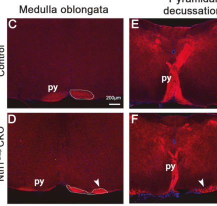

## Question

# Disease Characteristics Research Template

## Target Disease
- **Disease Name:** Familial Congenital Mirror Movements
- **MONDO ID:**  (if available)
- **Category:** Mendelian

## Research Objectives

Please provide a comprehensive research report on **Familial Congenital Mirror Movements** covering all of the
disease characteristics listed below. This report will be used to populate a disease knowledge
base entry. Be thorough and cite primary literature (PMID preferred) for all claims.

For each section, **suggested databases/resources** are listed. These are the first places
you should search for information on each topic.

---

### 1. Disease Information
> **Search first:** OMIM, Orphanet, ICD-10/ICD-11, MeSH, PubMed

- What is the disease? Provide a concise overview.
- What are the key identifiers? (OMIM, Orphanet, ICD-10/ICD-11, MeSH, Mondo)
- What are the common synonyms and alternative names?
- Is the information derived from individual patients (e.g., EHR) or aggregated disease-level resources?

### 2. Etiology

- **Disease Causal Factors**: What are the primary causes? (genetic, environmental, infectious, mechanistic)
- **Risk Factors**:
  > **Search first:** PubMed, Cochrane Library, UpToDate, clinical guidelines, ClinVar, ClinGen, GWAS Catalog, PheGenI, CTD, CDC, WHO, epidemiological databases
  - Genetic risk factors (causal variants, susceptibility loci, modifier genes)
  - Environmental risk factors (toxins, lifestyle, occupational exposures, age, sex, family history)
- **Protective Factors**:
  > **Search first:** PubMed, Cochrane Library, clinical trial databases, GWAS Catalog, gnomAD, WHO, CDC, nutrition databases
  - Genetic protective factors (protective variants, modifier alleles)
  - Environmental protective factors (diet, lifestyle, exposures that reduce risk)
- **Gene-Environment Interactions**: How do genetic and environmental factors interact to influence disease?
  > **Search first:** CTD, PubMed, PheGenI, GxE databases

### 3. Phenotypes
> **Search first:** HPO (Human Phenotype Ontology), OMIM, Orphanet, PubMed, clinicaltrials.gov, MedDRA, SNOMED CT, DECIPHER, LOINC

For each phenotype, provide:
- **Phenotype type**: symptoms, clinical signs, physical manifestations, behavioral changes, or laboratory abnormalities
  > For symptoms/signs: HPO, OMIM, Orphanet, PubMed
  > For behavioral changes: HPO, DSM, RDoC (Research Domain Criteria), PubMed
  > For laboratory abnormalities: LOINC, SNOMED CT, LabTests Online, PubMed
- **Phenotype characteristics**:
  > **Search first:** OMIM, Orphanet, HPO, PubMed
  - Age of symptom onset (neonatal, childhood, adult-onset, late-onset)
  - Symptom severity (mild, moderate, severe, variable)
  - Symptom progression (stable, progressive, episodic, fluctuating)
  - Frequency among affected individuals (percentage or qualitative)
- **Quality of life impact**: Effects on daily functioning and well-being (per-phenotype when possible)
  > **Search first:** EQ-5D database, SF-36, WHO QOL databases, PubMed
- Suggest HPO (Human Phenotype Ontology) terms for each phenotype

### 4. Genetic/Molecular Information

- **Causal Genes**: Gene mutations or chromosomal abnormalities responsible for disease (gene symbols, OMIM IDs)
  > **Search first:** OMIM, ClinVar, HGMD, Ensembl, NCBI Gene
- **Pathogenic Variants**:
  - Affected genes (gene symbols, HGNC IDs)
    > **Search first:** OMIM, NCBI Gene, Ensembl, HGNC, UniProt, GeneCards
  - Variant classification (pathogenic, likely pathogenic, VUS per ACMG/AMP guidelines)
    > **Search first:** ClinVar, ClinGen, ACMG/AMP guidelines, VarSome
  - Variant type/class (missense, frameshift, nonsense, splice-site, structural)
  - Allele frequency in population databases
    > **Search first:** gnomAD, 1000 Genomes, ExAC, TOPMed, dbSNP
  - Somatic vs germline origin
    > **Search first:** COSMIC (somatic), ClinVar, ICGC, TCGA
  - Functional consequences (loss of function, gain of function, dominant negative)
- **Modifier Genes**: Genes that modify disease severity or expression
- **Epigenetic Information**: DNA methylation, histone modifications, chromatin changes affecting disease
  > **Search first:** ENCODE, Roadmap Epigenomics, MethBase, DiseaseMeth
- **Chromosomal Abnormalities**: Large-scale genetic changes (aneuploidy, translocations, inversions)
  > **Search first:** DECIPHER, ClinVar, ECARUCA, UCSC Genome Browser

### 5. Environmental Information

- **Environmental Factors**: Non-genetic contributing factors (toxins, radiation, pollution, occupational exposure)
  > **Search first:** CTD (Comparative Toxicogenomics Database), TOXNET, PubMed, EPA databases
- **Lifestyle Factors**: Behavioral factors (smoking, diet, exercise, alcohol consumption)
  > **Search first:** CDC databases, WHO, PubMed, NHANES
- **Infectious Agents**: If applicable, pathogens causing or triggering disease (bacteria, viruses, fungi, parasites)
  > **Search first:** NCBI Taxonomy, ViPR, BV-BRC, MicrobeDB, GIDEON

### 6. Mechanism / Pathophysiology

- **Molecular Pathways**: Specific signaling cascades or biochemical pathways involved (Wnt, MAPK, mTOR, PI3K-AKT, etc.)
  > **Search first:** KEGG, Reactome, WikiPathways, PathBank, BioCyc
- **Cellular Processes**: Cell-level mechanisms (apoptosis, autophagy, cell cycle dysregulation, inflammation, etc.)
  > **Search first:** Gene Ontology (GO), Reactome, KEGG, PubMed
- **Protein Dysfunction**: How protein structure or function is altered (misfolding, aggregation, loss of function, gain of function)
  > **Search first:** UniProt, PDB (Protein Data Bank), InterPro, Pfam, AlphaFold
- **Metabolic Changes**: Alterations in metabolic processes (energy metabolism, lipid metabolism, amino acid metabolism)
  > **Search first:** KEGG, BioCyc, HMDB (Human Metabolome Database), BRENDA
- **Immune System Involvement**: Role of immune response (autoimmunity, immunodeficiency, chronic inflammation)
  > **Search first:** ImmPort, Immunome Database, IEDB, Gene Ontology
- **Tissue Damage Mechanisms**: How tissues/ are injured (oxidative stress, ischemia, fibrosis, necrosis)
  > **Search first:** PubMed, Gene Ontology, Reactome
- **Biochemical Abnormalities**: Specific molecular defects (enzyme deficiencies, receptor dysfunction, ion channel defects)
  > **Search first:** BRENDA, UniProt, KEGG, OMIM, PubMed
- **Epigenetic Changes**: DNA methylation, histone modifications affecting gene expression in disease
  > **Search first:** ENCODE, Roadmap Epigenomics, MethBase, DiseaseMeth
- **Molecular Profiling** (if available):
  - Transcriptomics/gene expression changes
    > **Search first:** GEO (Gene Expression Omnibus), ArrayExpress, GTEx, Human Cell Atlas, SRA
  - Proteomics findings
    > **Search first:** PRIDE, ProteomeXchange, Human Protein Atlas, STRING, BioGRID
  - Metabolomics signatures
    > **Search first:** MetaboLights, Metabolomics Workbench, HMDB, METLIN
  - Lipidomics alterations
    > **Search first:** LIPID MAPS, SwissLipids, LipidHome, Metabolomics Workbench
  - Genomic structural features
    > **Search first:** UCSC Genome Browser, Ensembl, NCBI, dbVar, DGV
- **Advanced Technologies** (if applicable):
  - Single-cell analysis findings (cell-type specific mechanisms, cellular heterogeneity)
    > **Search first:** Human Cell Atlas, Single Cell Portal, GEO, CELLxGENE
  - Spatial transcriptomics findings
    > **Search first:** GEO, Spatial Research, Vizgen, 10x Genomics data
  - Multi-omics integration results
    > **Search first:** TCGA, ICGC, cBioPortal, LinkedOmics, PubMed
  - Functional genomics screens (CRISPR, RNAi)
    > **Search first:** DepMap, GenomeRNAi, PubMed, BioGRID ORCS

For each mechanism, describe:
- The causal chain from initial trigger to clinical manifestation
- Which mechanisms are upstream vs downstream
- What cell types and biological processes are involved
- Suggest GO terms for biological processes and CL terms for cell types

### 7. Anatomical Structures Affected

- **Organ Level**:
  - Primary organs directly affected
  - Secondary organ involvement (complications, secondary effects)
  - Body systems involved (cardiovascular, nervous, digestive, respiratory, endocrine, etc.)
  > **Search first:** Uberon, FMA (Foundational Model of Anatomy), OMIM, HPO, ICD-11, MeSH, SNOMED CT
- **Tissue and Cell Level**:
  - Specific tissue types affected (epithelial, connective, muscle, nervous)
  - Specific cell populations targeted (with Cell Ontology terms)
  > **Search first:** Uberon, Human Protein Atlas, Cell Ontology, Human Cell Atlas, CellMarker, PanglaoDB
- **Subcellular Level**:
  - Cellular compartments involved (mitochondria, nucleus, ER, lysosomes) (with GO Cellular Component terms)
  > **Search first:** Gene Ontology (Cellular Component), UniProt, Human Protein Atlas
- **Localization**:
  - Specific anatomical sites (with UBERON terms)
    > **Search first:** FMA, Uberon, NeuroNames (for brain), SNOMED CT
  - Lateralization (unilateral, bilateral, asymmetric)
    > **Search first:** HPO, clinical literature, imaging databases

### 8. Temporal Development

- **Onset**:
  - Typical age of onset (congenital, pediatric, adult, geriatric)
  - Onset pattern (acute, subacute, chronic, insidious)
  > **Search first:** OMIM, Orphanet, HPO, PubMed
- **Progression**:
  - Disease stages (early, intermediate, advanced, end-stage)
    > **Search first:** Cancer Staging Manual (AJCC), WHO classifications, PubMed
  - Progression rate (rapid, slow, variable)
  - Disease course pattern (episodic, relapsing-remitting, progressive, stable)
  - Disease duration (self-limited, chronic lifelong)
  > **Search first:** Disease registries, longitudinal cohort databases, natural history studies, PubMed, Orphanet, OMIM
- **Patterns**:
  - Remission patterns (spontaneous, treatment-induced)
    > **Search first:** Clinical trial databases, disease registries, PubMed
  - Critical periods (time windows of vulnerability or opportunity for intervention)
    > **Search first:** PubMed, developmental biology databases, clinical guidelines

### 9. Inheritance and Population

- **Epidemiology**:
  - Prevalence (cases per 100,000 at given time)
  - Incidence (new cases per 100,000 per year)
  > **Search first:** Orphanet, CDC, WHO, GBD (Global Burden of Disease), national registries, SEER, disease registries
- **For Genetic Etiology**:
  - Inheritance pattern (AD, AR, X-linked, mitochondrial, multifactorial, polygenic)
    > **Search first:** OMIM, Orphanet, ClinVar, GTR (Genetic Testing Registry)
  - Penetrance (complete, incomplete, age-dependent)
    > **Search first:** ClinVar, OMIM, PubMed, ClinGen
  - Expressivity (variable, consistent)
    > **Search first:** OMIM, ClinVar, PubMed
  - Genetic anticipation (increasing severity in successive generations)
    > **Search first:** OMIM, PubMed (especially for repeat expansion disorders)
  - Germline mosaicism
    > **Search first:** ClinVar, OMIM, genetic counseling literature, PubMed
  - Founder effects (population-specific mutations)
    > **Search first:** gnomAD, population genetics databases, PubMed
  - Consanguinity role
    > **Search first:** OMIM, population studies, genetic counseling resources
  - Carrier frequency
    > **Search first:** gnomAD, carrier screening databases, GeneReviews, GTR
- **Population Demographics**:
  - Affected populations (ethnic or demographic groups with higher prevalence)
    > **Search first:** gnomAD, 1000 Genomes, PAGE Study, PubMed, population registries
  - Geographic distribution (endemic areas, regional variation)
    > **Search first:** WHO, CDC, GBD, Orphanet, geographic epidemiology databases
  - Geographic distribution of specific variants
  - Sex ratio (male:female)
    > **Search first:** Disease registries, OMIM, PubMed, epidemiological databases
  - Age distribution of affected individuals
    > **Search first:** CDC, disease registries, SEER, Orphanet

### 10. Diagnostics

- **Clinical Tests**:
  - Laboratory tests (blood, urine, tissue chemistry, specific enzyme assays)
    > **Search first:** LOINC, LabTests Online, PubMed
  - Biomarkers (proteins, metabolites, genetic markers, circulating biomarkers)
    > **Search first:** FDA Biomarker List, BEST (Biomarkers, EndpointS, and other Tools), PubMed
  - Imaging studies (X-ray, CT, MRI, PET, ultrasound)
    > **Search first:** RadLex, DICOM, Radiopaedia, imaging databases
  - Functional tests (pulmonary function, cardiac stress tests)
    > **Search first:** LOINC, clinical guidelines, PubMed
  - Electrophysiology (EEG, EMG, ECG, nerve conduction studies)
    > **Search first:** LOINC, clinical neurophysiology databases, PubMed
  - Biopsy findings (histopathology, immunohistochemistry)
    > **Search first:** SNOMED CT, College of American Pathologists resources, PubMed
  - Pathology findings (microscopic examination)
    > **Search first:** SNOMED CT, Digital Pathology databases, PubMed
- **Genetic Testing**:
  > **Search first:** GTR (Genetic Testing Registry), GeneReviews, ClinGen
  - Overview of recommended genetic testing approach
  - Whole genome sequencing (WGS) utility
    > **Search first:** GTR, ClinVar, GEL (Genomics England), gnomAD
  - Whole exome sequencing (WES) utility
    > **Search first:** GTR, ClinVar, OMIM, GeneMatcher
  - Gene panels (which panels, which genes)
    > **Search first:** GTR, ClinVar, laboratory-specific databases
  - Single gene testing
    > **Search first:** GTR, ClinVar, OMIM, GeneReviews
  - Chromosomal microarray (CMA)
    > **Search first:** DECIPHER, ClinVar, dbVar, ECARUCA
  - Karyotyping
    > **Search first:** Chromosome Abnormality Database, ClinVar, cytogenetics resources
  - FISH
    > **Search first:** ClinVar, cytogenetics databases, PubMed
  - Mitochondrial DNA testing
    > **Search first:** MITOMAP, MSeqDR, ClinVar, GTR
  - Repeat expansion testing
    > **Search first:** GTR, ClinVar, repeat expansion databases, PubMed
- **Omics-Based Diagnostics** (if applicable):
  - RNA sequencing / transcriptomics
    > **Search first:** GEO, ArrayExpress, GTEx, RNA-seq databases
  - Proteomics
    > **Search first:** PRIDE, ProteomeXchange, FDA Biomarker database
  - Metabolomics
    > **Search first:** MetaboLights, Metabolomics Workbench, HMDB
  - Epigenomics
    > **Search first:** GEO, ENCODE, Roadmap Epigenomics, MethBase
  - Liquid biopsy
    > **Search first:** COSMIC, ClinVar, liquid biopsy databases, PubMed
- **Clinical Criteria**:
  - Standardized diagnostic criteria (DSM, ICD, society guidelines)
    > **Search first:** DSM-5, ICD-11, clinical society guidelines, UpToDate
  - Differential diagnosis (other conditions to rule out, with distinguishing features)
    > **Search first:** DynaMed, UpToDate, clinical decision support systems
- **Screening**:
  - Screening methods for asymptomatic individuals (newborn screening, carrier screening, cascade screening)
    > **Search first:** ACMG recommendations, CDC newborn screening, GTR

### 11. Outcome/Prognosis

- **Survival and Mortality**:
  - Survival rate (5-year, 10-year, overall)
    > **Search first:** SEER, cancer registries, disease-specific registries, PubMed
  - Life expectancy (with and without treatment if applicable)
    > **Search first:** Orphanet, disease registries, actuarial databases, PubMed
  - Mortality rate
    > **Search first:** CDC, WHO, GBD, national mortality databases
  - Disease-specific mortality (deaths directly attributable to disease)
    > **Search first:** Disease registries, CDC Wonder, GBD, PubMed
- **Morbidity and Function**:
  - Morbidity (disease-related disability and health impacts)
    > **Search first:** GBD, WHO, disability databases, PubMed
  - Disability outcomes (long-term functional impairments)
    > **Search first:** ICF (International Classification of Functioning), disability registries
  - Quality of life measures (EQ-5D, SF-36, PROMIS, disease-specific tools)
    > **Search first:** EQ-5D database, SF-36, PROMIS, PubMed
- **Disease Course**:
  - Complications (secondary problems: infections, organ failure, etc.)
    > **Search first:** ICD codes, disease registries, clinical databases, PubMed
  - Recovery potential (likelihood and extent of recovery, with vs without treatment)
    > **Search first:** Natural history studies, rehabilitation databases, PubMed
- **Prediction**:
  - Prognostic factors (age, disease severity, biomarkers, treatment response)
    > **Search first:** Prognostic models databases, clinical calculators, PubMed
  - Prognostic biomarkers (molecular markers predicting disease course)
    > **Search first:** FDA Biomarker database, PubMed, cancer prognostic databases

### 12. Treatment

- **Pharmacotherapy**:
  - Pharmacological treatments (drug names, drug classes, mechanisms of action)
    > **Search first:** DrugBank, RxNorm, ATC classification, DailyMed, FDA databases
  - Pharmacogenomics (how genetic variants affect drug metabolism, efficacy, toxicity)
    > **Search first:** PharmGKB, CPIC (Clinical Pharmacogenetics), FDA Table of PGx Biomarkers
- **Advanced Therapeutics**:
  - Gene therapy (viral vectors, CRISPR, gene replacement, gene editing)
    > **Search first:** ClinicalTrials.gov, FDA gene therapy database, ASGCT resources
  - Cell therapy (stem cell transplant, CAR-T, cellular therapeutics)
    > **Search first:** ClinicalTrials.gov, FDA cell therapy database, FACT standards
  - RNA-based therapies (ASOs, siRNA, mRNA therapies)
    > **Search first:** ClinicalTrials.gov, FDA approvals, PubMed
  - Targeted therapies (treatments directed at specific molecular targets)
    > **Search first:** My Cancer Genome, OncoKB, ClinicalTrials.gov, FDA approvals
  - Immunotherapies (checkpoint inhibitors, monoclonal antibodies)
    > **Search first:** Cancer Immunotherapy Database, FDA approvals, ClinicalTrials.gov
- **Surgical and Interventional**:
  - Surgical interventions (types of surgery, timing, outcomes)
    > **Search first:** CPT codes, surgical registries, clinical guidelines, PubMed
- **Supportive and Rehabilitative**:
  - Supportive care (symptom management, pain control, nutrition)
    > **Search first:** Clinical guidelines, Cochrane Library, PubMed
  - Rehabilitation (physical therapy, occupational therapy, speech therapy)
    > **Search first:** Rehabilitation medicine databases, clinical guidelines, PubMed
- **Experimental**:
  - Experimental treatments in clinical trials (with NCT identifiers if available)
    > **Search first:** ClinicalTrials.gov, EU Clinical Trials Register, WHO ICTRP
- **Treatment Outcomes**:
  - Treatment response rates
    > **Search first:** Clinical trial databases, FDA reviews, systematic reviews, PubMed
  - Side effects and adverse events
    > **Search first:** FDA Adverse Event Reporting System (FAERS), MedWatch, PubMed
- **Treatment Strategy**:
  - Treatment algorithms (clinical pathways, decision trees)
    > **Search first:** Clinical practice guidelines, NCCN Guidelines, UpToDate
  - Combination therapies
    > **Search first:** ClinicalTrials.gov, treatment guidelines, PubMed
  - Personalized medicine approaches (genotype-guided treatment)
    > **Search first:** My Cancer Genome, CIViC, PharmGKB, precision medicine databases

For each treatment, suggest MAXO (Medical Action Ontology) terms where applicable.

### 13. Prevention

- **Prevention Levels**:
  - Primary prevention (preventing disease occurrence: vaccination, risk factor modification)
    > **Search first:** CDC, WHO, USPSTF recommendations, Cochrane Library
  - Secondary prevention (early detection and treatment: screening programs, early intervention)
    > **Search first:** USPSTF, CDC screening guidelines, WHO
  - Tertiary prevention (preventing complications in those with disease)
    > **Search first:** Clinical guidelines, disease management protocols, PubMed
- **Immunization**: Vaccine strategies (if applicable)
  > **Search first:** CDC vaccine schedules, WHO immunization, FDA vaccine database
- **Screening and Early Detection**:
  - Screening programs (population-based: newborn screening, cancer screening)
    > **Search first:** CDC screening programs, USPSTF, cancer screening databases
  - Genetic screening (carrier screening, preimplantation genetic diagnosis, prenatal testing)
    > **Search first:** ACMG recommendations, ACOG guidelines, GTR
  - Risk stratification (identifying high-risk individuals for targeted prevention)
    > **Search first:** Risk prediction models, clinical calculators, PubMed
- **Behavioral Interventions**: Lifestyle modifications to reduce risk
  > **Search first:** CDC, WHO, behavioral intervention databases, Cochrane Library
- **Counseling**: Genetic counseling (risk assessment, family planning guidance)
  > **Search first:** NSGC resources, ACMG guidelines, GeneReviews
- **Public Health**:
  - Public health interventions (sanitation, vector control, health education)
    > **Search first:** CDC, WHO, public health databases, PubMed
  - Environmental interventions (reducing environmental risk factors)
    > **Search first:** EPA databases, WHO environmental health, PubMed
- **Prophylaxis**: Preventive medications or procedures
  > **Search first:** Clinical guidelines, FDA approvals, PubMed

### 14. Other Species / Natural Disease

- **Taxonomy**: Species affected (with NCBI Taxon identifiers)
  > **Search first:** NCBI Taxonomy
- **Breed**: Specific breeds affected (with VBO identifiers if applicable)
  > **Search first:** VBO (Vertebrate Breed Ontology)
- **Gene**: Orthologous genes in other species (with NCBI Gene IDs)
  > **Search first:** NCBI Gene
- **Natural Disease**:
  - Naturally occurring disease in other species (companion animals, wildlife)
    > **Search first:** OMIA (Online Mendelian Inheritance in Animals), VetCompass, PubMed
  - Veterinary relevance and importance in animal health
    > **Search first:** OMIA, veterinary databases, PubMed
- **Comparative Biology**:
  - Comparative pathology (similarities and differences across species)
    > **Search first:** OMIA, comparative pathology databases, PubMed
  - Evolutionary conservation of disease mechanisms
    > **Search first:** HomoloGene, OrthoMCL, Alliance of Genome Resources
- **Transmission** (if applicable):
  - Zoonotic potential
    > **Search first:** CDC zoonotic diseases, WHO zoonoses, GIDEON
  - Cross-species susceptibility
    > **Search first:** NCBI Taxonomy, veterinary databases, PubMed

### 15. Model Organisms

- **Model Types**:
  - Model organism type (mammalian, invertebrate, cellular, in vitro)
    > **Search first:** Alliance of Genome Resources, model organism databases
  - Specific model systems (mouse, rat, zebrafish, Drosophila, C. elegans, yeast, cell lines, organoids, iPSCs)
    > **Search first:** MGI, RGD, ZFIN, FlyBase, WormBase, SGD, ATCC, Cellosaurus
  - Induced models (drug treatment, surgical intervention, environmental manipulation)
    > **Search first:** MGI, model organism databases, PubMed
- **Genetic Models**:
  - Types available (knockout, knock-in, transgenic, conditional, humanized)
    > **Search first:** MGI, IMPC, KOMP, EuMMCR, IMSR
- **Model Characteristics**:
  - Phenotype recapitulation (how well model reproduces human disease features)
    > **Search first:** Model organism databases, comparative studies, PubMed
  - Model limitations (aspects of human disease not captured)
    > **Search first:** Model organism databases, PubMed, review articles
- **Applications**:
  - Research applications (what aspects of disease can be studied)
    > **Search first:** Model organism databases, PubMed
- **Resources**:
  - Model databases
    > **Search first:** MGI, RGD, ZFIN, FlyBase, WormBase, IMSR, EMMA, MMRRC

---

## Citation Requirements

- Cite primary literature (PMID preferred) for all mechanistic and clinical claims
- Prioritize recent reviews and landmark papers
- Include direct quotes from abstracts where possible to support key statements
- Distinguish evidence source types: human clinical, model organism, in vitro, computational

## Output Format

Structure your response as a comprehensive narrative organized by the sections above.
For each section, provide:
- Factual content with specific details (numbers, percentages, gene names, variant nomenclature)
- Ontology term suggestions (HPO, GO, CL, UBERON, CHEBI, MAXO, MONDO) where applicable
- Evidence citations with PMIDs
- Direct quotes from abstracts to support key claims
- Clear indication when information is not available or not applicable for this disease

This report will be used to populate a disease knowledge base entry with:
- Pathophysiology descriptions with causal chains
- Gene/protein annotations (HGNC, GO terms)
- Phenotype associations (HP terms) with frequencies
- Cell type involvement (CL terms)
- Anatomical locations (UBERON terms)
- Chemical entities (CHEBI terms)
- Treatment annotations (MAXO terms)
- Evidence items with PMIDs and exact abstract quotes
- Epidemiology, prognosis, diagnostic, and prevention information
- Animal model descriptions with phenotype recapitulation details

## Output

Question: You are an expert researcher providing comprehensive, well-cited information.

Provide detailed information focusing on:
1. Key concepts and definitions with current understanding
2. Recent developments and latest research (prioritize 2023-2024 sources)
3. Current applications and real-world implementations
4. Expert opinions and analysis from authoritative sources
5. Relevant statistics and data from recent studies

Format as a comprehensive research report with proper citations. Include URLs and publication dates where available.
Always prioritize recent, authoritative sources and provide specific citations for all major claims.

# Disease Characteristics Research Template

## Target Disease
- **Disease Name:** Familial Congenital Mirror Movements
- **MONDO ID:**  (if available)
- **Category:** Mendelian

## Research Objectives

Please provide a comprehensive research report on **Familial Congenital Mirror Movements** covering all of the
disease characteristics listed below. This report will be used to populate a disease knowledge
base entry. Be thorough and cite primary literature (PMID preferred) for all claims.

For each section, **suggested databases/resources** are listed. These are the first places
you should search for information on each topic.

---

### 1. Disease Information
> **Search first:** OMIM, Orphanet, ICD-10/ICD-11, MeSH, PubMed

- What is the disease? Provide a concise overview.
- What are the key identifiers? (OMIM, Orphanet, ICD-10/ICD-11, MeSH, Mondo)
- What are the common synonyms and alternative names?
- Is the information derived from individual patients (e.g., EHR) or aggregated disease-level resources?

### 2. Etiology

- **Disease Causal Factors**: What are the primary causes? (genetic, environmental, infectious, mechanistic)
- **Risk Factors**:
  > **Search first:** PubMed, Cochrane Library, UpToDate, clinical guidelines, ClinVar, ClinGen, GWAS Catalog, PheGenI, CTD, CDC, WHO, epidemiological databases
  - Genetic risk factors (causal variants, susceptibility loci, modifier genes)
  - Environmental risk factors (toxins, lifestyle, occupational exposures, age, sex, family history)
- **Protective Factors**:
  > **Search first:** PubMed, Cochrane Library, clinical trial databases, GWAS Catalog, gnomAD, WHO, CDC, nutrition databases
  - Genetic protective factors (protective variants, modifier alleles)
  - Environmental protective factors (diet, lifestyle, exposures that reduce risk)
- **Gene-Environment Interactions**: How do genetic and environmental factors interact to influence disease?
  > **Search first:** CTD, PubMed, PheGenI, GxE databases

### 3. Phenotypes
> **Search first:** HPO (Human Phenotype Ontology), OMIM, Orphanet, PubMed, clinicaltrials.gov, MedDRA, SNOMED CT, DECIPHER, LOINC

For each phenotype, provide:
- **Phenotype type**: symptoms, clinical signs, physical manifestations, behavioral changes, or laboratory abnormalities
  > For symptoms/signs: HPO, OMIM, Orphanet, PubMed
  > For behavioral changes: HPO, DSM, RDoC (Research Domain Criteria), PubMed
  > For laboratory abnormalities: LOINC, SNOMED CT, LabTests Online, PubMed
- **Phenotype characteristics**:
  > **Search first:** OMIM, Orphanet, HPO, PubMed
  - Age of symptom onset (neonatal, childhood, adult-onset, late-onset)
  - Symptom severity (mild, moderate, severe, variable)
  - Symptom progression (stable, progressive, episodic, fluctuating)
  - Frequency among affected individuals (percentage or qualitative)
- **Quality of life impact**: Effects on daily functioning and well-being (per-phenotype when possible)
  > **Search first:** EQ-5D database, SF-36, WHO QOL databases, PubMed
- Suggest HPO (Human Phenotype Ontology) terms for each phenotype

### 4. Genetic/Molecular Information

- **Causal Genes**: Gene mutations or chromosomal abnormalities responsible for disease (gene symbols, OMIM IDs)
  > **Search first:** OMIM, ClinVar, HGMD, Ensembl, NCBI Gene
- **Pathogenic Variants**:
  - Affected genes (gene symbols, HGNC IDs)
    > **Search first:** OMIM, NCBI Gene, Ensembl, HGNC, UniProt, GeneCards
  - Variant classification (pathogenic, likely pathogenic, VUS per ACMG/AMP guidelines)
    > **Search first:** ClinVar, ClinGen, ACMG/AMP guidelines, VarSome
  - Variant type/class (missense, frameshift, nonsense, splice-site, structural)
  - Allele frequency in population databases
    > **Search first:** gnomAD, 1000 Genomes, ExAC, TOPMed, dbSNP
  - Somatic vs germline origin
    > **Search first:** COSMIC (somatic), ClinVar, ICGC, TCGA
  - Functional consequences (loss of function, gain of function, dominant negative)
- **Modifier Genes**: Genes that modify disease severity or expression
- **Epigenetic Information**: DNA methylation, histone modifications, chromatin changes affecting disease
  > **Search first:** ENCODE, Roadmap Epigenomics, MethBase, DiseaseMeth
- **Chromosomal Abnormalities**: Large-scale genetic changes (aneuploidy, translocations, inversions)
  > **Search first:** DECIPHER, ClinVar, ECARUCA, UCSC Genome Browser

### 5. Environmental Information

- **Environmental Factors**: Non-genetic contributing factors (toxins, radiation, pollution, occupational exposure)
  > **Search first:** CTD (Comparative Toxicogenomics Database), TOXNET, PubMed, EPA databases
- **Lifestyle Factors**: Behavioral factors (smoking, diet, exercise, alcohol consumption)
  > **Search first:** CDC databases, WHO, PubMed, NHANES
- **Infectious Agents**: If applicable, pathogens causing or triggering disease (bacteria, viruses, fungi, parasites)
  > **Search first:** NCBI Taxonomy, ViPR, BV-BRC, MicrobeDB, GIDEON

### 6. Mechanism / Pathophysiology

- **Molecular Pathways**: Specific signaling cascades or biochemical pathways involved (Wnt, MAPK, mTOR, PI3K-AKT, etc.)
  > **Search first:** KEGG, Reactome, WikiPathways, PathBank, BioCyc
- **Cellular Processes**: Cell-level mechanisms (apoptosis, autophagy, cell cycle dysregulation, inflammation, etc.)
  > **Search first:** Gene Ontology (GO), Reactome, KEGG, PubMed
- **Protein Dysfunction**: How protein structure or function is altered (misfolding, aggregation, loss of function, gain of function)
  > **Search first:** UniProt, PDB (Protein Data Bank), InterPro, Pfam, AlphaFold
- **Metabolic Changes**: Alterations in metabolic processes (energy metabolism, lipid metabolism, amino acid metabolism)
  > **Search first:** KEGG, BioCyc, HMDB (Human Metabolome Database), BRENDA
- **Immune System Involvement**: Role of immune response (autoimmunity, immunodeficiency, chronic inflammation)
  > **Search first:** ImmPort, Immunome Database, IEDB, Gene Ontology
- **Tissue Damage Mechanisms**: How tissues/ are injured (oxidative stress, ischemia, fibrosis, necrosis)
  > **Search first:** PubMed, Gene Ontology, Reactome
- **Biochemical Abnormalities**: Specific molecular defects (enzyme deficiencies, receptor dysfunction, ion channel defects)
  > **Search first:** BRENDA, UniProt, KEGG, OMIM, PubMed
- **Epigenetic Changes**: DNA methylation, histone modifications affecting gene expression in disease
  > **Search first:** ENCODE, Roadmap Epigenomics, MethBase, DiseaseMeth
- **Molecular Profiling** (if available):
  - Transcriptomics/gene expression changes
    > **Search first:** GEO (Gene Expression Omnibus), ArrayExpress, GTEx, Human Cell Atlas, SRA
  - Proteomics findings
    > **Search first:** PRIDE, ProteomeXchange, Human Protein Atlas, STRING, BioGRID
  - Metabolomics signatures
    > **Search first:** MetaboLights, Metabolomics Workbench, HMDB, METLIN
  - Lipidomics alterations
    > **Search first:** LIPID MAPS, SwissLipids, LipidHome, Metabolomics Workbench
  - Genomic structural features
    > **Search first:** UCSC Genome Browser, Ensembl, NCBI, dbVar, DGV
- **Advanced Technologies** (if applicable):
  - Single-cell analysis findings (cell-type specific mechanisms, cellular heterogeneity)
    > **Search first:** Human Cell Atlas, Single Cell Portal, GEO, CELLxGENE
  - Spatial transcriptomics findings
    > **Search first:** GEO, Spatial Research, Vizgen, 10x Genomics data
  - Multi-omics integration results
    > **Search first:** TCGA, ICGC, cBioPortal, LinkedOmics, PubMed
  - Functional genomics screens (CRISPR, RNAi)
    > **Search first:** DepMap, GenomeRNAi, PubMed, BioGRID ORCS

For each mechanism, describe:
- The causal chain from initial trigger to clinical manifestation
- Which mechanisms are upstream vs downstream
- What cell types and biological processes are involved
- Suggest GO terms for biological processes and CL terms for cell types

### 7. Anatomical Structures Affected

- **Organ Level**:
  - Primary organs directly affected
  - Secondary organ involvement (complications, secondary effects)
  - Body systems involved (cardiovascular, nervous, digestive, respiratory, endocrine, etc.)
  > **Search first:** Uberon, FMA (Foundational Model of Anatomy), OMIM, HPO, ICD-11, MeSH, SNOMED CT
- **Tissue and Cell Level**:
  - Specific tissue types affected (epithelial, connective, muscle, nervous)
  - Specific cell populations targeted (with Cell Ontology terms)
  > **Search first:** Uberon, Human Protein Atlas, Cell Ontology, Human Cell Atlas, CellMarker, PanglaoDB
- **Subcellular Level**:
  - Cellular compartments involved (mitochondria, nucleus, ER, lysosomes) (with GO Cellular Component terms)
  > **Search first:** Gene Ontology (Cellular Component), UniProt, Human Protein Atlas
- **Localization**:
  - Specific anatomical sites (with UBERON terms)
    > **Search first:** FMA, Uberon, NeuroNames (for brain), SNOMED CT
  - Lateralization (unilateral, bilateral, asymmetric)
    > **Search first:** HPO, clinical literature, imaging databases

### 8. Temporal Development

- **Onset**:
  - Typical age of onset (congenital, pediatric, adult, geriatric)
  - Onset pattern (acute, subacute, chronic, insidious)
  > **Search first:** OMIM, Orphanet, HPO, PubMed
- **Progression**:
  - Disease stages (early, intermediate, advanced, end-stage)
    > **Search first:** Cancer Staging Manual (AJCC), WHO classifications, PubMed
  - Progression rate (rapid, slow, variable)
  - Disease course pattern (episodic, relapsing-remitting, progressive, stable)
  - Disease duration (self-limited, chronic lifelong)
  > **Search first:** Disease registries, longitudinal cohort databases, natural history studies, PubMed, Orphanet, OMIM
- **Patterns**:
  - Remission patterns (spontaneous, treatment-induced)
    > **Search first:** Clinical trial databases, disease registries, PubMed
  - Critical periods (time windows of vulnerability or opportunity for intervention)
    > **Search first:** PubMed, developmental biology databases, clinical guidelines

### 9. Inheritance and Population

- **Epidemiology**:
  - Prevalence (cases per 100,000 at given time)
  - Incidence (new cases per 100,000 per year)
  > **Search first:** Orphanet, CDC, WHO, GBD (Global Burden of Disease), national registries, SEER, disease registries
- **For Genetic Etiology**:
  - Inheritance pattern (AD, AR, X-linked, mitochondrial, multifactorial, polygenic)
    > **Search first:** OMIM, Orphanet, ClinVar, GTR (Genetic Testing Registry)
  - Penetrance (complete, incomplete, age-dependent)
    > **Search first:** ClinVar, OMIM, PubMed, ClinGen
  - Expressivity (variable, consistent)
    > **Search first:** OMIM, ClinVar, PubMed
  - Genetic anticipation (increasing severity in successive generations)
    > **Search first:** OMIM, PubMed (especially for repeat expansion disorders)
  - Germline mosaicism
    > **Search first:** ClinVar, OMIM, genetic counseling literature, PubMed
  - Founder effects (population-specific mutations)
    > **Search first:** gnomAD, population genetics databases, PubMed
  - Consanguinity role
    > **Search first:** OMIM, population studies, genetic counseling resources
  - Carrier frequency
    > **Search first:** gnomAD, carrier screening databases, GeneReviews, GTR
- **Population Demographics**:
  - Affected populations (ethnic or demographic groups with higher prevalence)
    > **Search first:** gnomAD, 1000 Genomes, PAGE Study, PubMed, population registries
  - Geographic distribution (endemic areas, regional variation)
    > **Search first:** WHO, CDC, GBD, Orphanet, geographic epidemiology databases
  - Geographic distribution of specific variants
  - Sex ratio (male:female)
    > **Search first:** Disease registries, OMIM, PubMed, epidemiological databases
  - Age distribution of affected individuals
    > **Search first:** CDC, disease registries, SEER, Orphanet

### 10. Diagnostics

- **Clinical Tests**:
  - Laboratory tests (blood, urine, tissue chemistry, specific enzyme assays)
    > **Search first:** LOINC, LabTests Online, PubMed
  - Biomarkers (proteins, metabolites, genetic markers, circulating biomarkers)
    > **Search first:** FDA Biomarker List, BEST (Biomarkers, EndpointS, and other Tools), PubMed
  - Imaging studies (X-ray, CT, MRI, PET, ultrasound)
    > **Search first:** RadLex, DICOM, Radiopaedia, imaging databases
  - Functional tests (pulmonary function, cardiac stress tests)
    > **Search first:** LOINC, clinical guidelines, PubMed
  - Electrophysiology (EEG, EMG, ECG, nerve conduction studies)
    > **Search first:** LOINC, clinical neurophysiology databases, PubMed
  - Biopsy findings (histopathology, immunohistochemistry)
    > **Search first:** SNOMED CT, College of American Pathologists resources, PubMed
  - Pathology findings (microscopic examination)
    > **Search first:** SNOMED CT, Digital Pathology databases, PubMed
- **Genetic Testing**:
  > **Search first:** GTR (Genetic Testing Registry), GeneReviews, ClinGen
  - Overview of recommended genetic testing approach
  - Whole genome sequencing (WGS) utility
    > **Search first:** GTR, ClinVar, GEL (Genomics England), gnomAD
  - Whole exome sequencing (WES) utility
    > **Search first:** GTR, ClinVar, OMIM, GeneMatcher
  - Gene panels (which panels, which genes)
    > **Search first:** GTR, ClinVar, laboratory-specific databases
  - Single gene testing
    > **Search first:** GTR, ClinVar, OMIM, GeneReviews
  - Chromosomal microarray (CMA)
    > **Search first:** DECIPHER, ClinVar, dbVar, ECARUCA
  - Karyotyping
    > **Search first:** Chromosome Abnormality Database, ClinVar, cytogenetics resources
  - FISH
    > **Search first:** ClinVar, cytogenetics databases, PubMed
  - Mitochondrial DNA testing
    > **Search first:** MITOMAP, MSeqDR, ClinVar, GTR
  - Repeat expansion testing
    > **Search first:** GTR, ClinVar, repeat expansion databases, PubMed
- **Omics-Based Diagnostics** (if applicable):
  - RNA sequencing / transcriptomics
    > **Search first:** GEO, ArrayExpress, GTEx, RNA-seq databases
  - Proteomics
    > **Search first:** PRIDE, ProteomeXchange, FDA Biomarker database
  - Metabolomics
    > **Search first:** MetaboLights, Metabolomics Workbench, HMDB
  - Epigenomics
    > **Search first:** GEO, ENCODE, Roadmap Epigenomics, MethBase
  - Liquid biopsy
    > **Search first:** COSMIC, ClinVar, liquid biopsy databases, PubMed
- **Clinical Criteria**:
  - Standardized diagnostic criteria (DSM, ICD, society guidelines)
    > **Search first:** DSM-5, ICD-11, clinical society guidelines, UpToDate
  - Differential diagnosis (other conditions to rule out, with distinguishing features)
    > **Search first:** DynaMed, UpToDate, clinical decision support systems
- **Screening**:
  - Screening methods for asymptomatic individuals (newborn screening, carrier screening, cascade screening)
    > **Search first:** ACMG recommendations, CDC newborn screening, GTR

### 11. Outcome/Prognosis

- **Survival and Mortality**:
  - Survival rate (5-year, 10-year, overall)
    > **Search first:** SEER, cancer registries, disease-specific registries, PubMed
  - Life expectancy (with and without treatment if applicable)
    > **Search first:** Orphanet, disease registries, actuarial databases, PubMed
  - Mortality rate
    > **Search first:** CDC, WHO, GBD, national mortality databases
  - Disease-specific mortality (deaths directly attributable to disease)
    > **Search first:** Disease registries, CDC Wonder, GBD, PubMed
- **Morbidity and Function**:
  - Morbidity (disease-related disability and health impacts)
    > **Search first:** GBD, WHO, disability databases, PubMed
  - Disability outcomes (long-term functional impairments)
    > **Search first:** ICF (International Classification of Functioning), disability registries
  - Quality of life measures (EQ-5D, SF-36, PROMIS, disease-specific tools)
    > **Search first:** EQ-5D database, SF-36, PROMIS, PubMed
- **Disease Course**:
  - Complications (secondary problems: infections, organ failure, etc.)
    > **Search first:** ICD codes, disease registries, clinical databases, PubMed
  - Recovery potential (likelihood and extent of recovery, with vs without treatment)
    > **Search first:** Natural history studies, rehabilitation databases, PubMed
- **Prediction**:
  - Prognostic factors (age, disease severity, biomarkers, treatment response)
    > **Search first:** Prognostic models databases, clinical calculators, PubMed
  - Prognostic biomarkers (molecular markers predicting disease course)
    > **Search first:** FDA Biomarker database, PubMed, cancer prognostic databases

### 12. Treatment

- **Pharmacotherapy**:
  - Pharmacological treatments (drug names, drug classes, mechanisms of action)
    > **Search first:** DrugBank, RxNorm, ATC classification, DailyMed, FDA databases
  - Pharmacogenomics (how genetic variants affect drug metabolism, efficacy, toxicity)
    > **Search first:** PharmGKB, CPIC (Clinical Pharmacogenetics), FDA Table of PGx Biomarkers
- **Advanced Therapeutics**:
  - Gene therapy (viral vectors, CRISPR, gene replacement, gene editing)
    > **Search first:** ClinicalTrials.gov, FDA gene therapy database, ASGCT resources
  - Cell therapy (stem cell transplant, CAR-T, cellular therapeutics)
    > **Search first:** ClinicalTrials.gov, FDA cell therapy database, FACT standards
  - RNA-based therapies (ASOs, siRNA, mRNA therapies)
    > **Search first:** ClinicalTrials.gov, FDA approvals, PubMed
  - Targeted therapies (treatments directed at specific molecular targets)
    > **Search first:** My Cancer Genome, OncoKB, ClinicalTrials.gov, FDA approvals
  - Immunotherapies (checkpoint inhibitors, monoclonal antibodies)
    > **Search first:** Cancer Immunotherapy Database, FDA approvals, ClinicalTrials.gov
- **Surgical and Interventional**:
  - Surgical interventions (types of surgery, timing, outcomes)
    > **Search first:** CPT codes, surgical registries, clinical guidelines, PubMed
- **Supportive and Rehabilitative**:
  - Supportive care (symptom management, pain control, nutrition)
    > **Search first:** Clinical guidelines, Cochrane Library, PubMed
  - Rehabilitation (physical therapy, occupational therapy, speech therapy)
    > **Search first:** Rehabilitation medicine databases, clinical guidelines, PubMed
- **Experimental**:
  - Experimental treatments in clinical trials (with NCT identifiers if available)
    > **Search first:** ClinicalTrials.gov, EU Clinical Trials Register, WHO ICTRP
- **Treatment Outcomes**:
  - Treatment response rates
    > **Search first:** Clinical trial databases, FDA reviews, systematic reviews, PubMed
  - Side effects and adverse events
    > **Search first:** FDA Adverse Event Reporting System (FAERS), MedWatch, PubMed
- **Treatment Strategy**:
  - Treatment algorithms (clinical pathways, decision trees)
    > **Search first:** Clinical practice guidelines, NCCN Guidelines, UpToDate
  - Combination therapies
    > **Search first:** ClinicalTrials.gov, treatment guidelines, PubMed
  - Personalized medicine approaches (genotype-guided treatment)
    > **Search first:** My Cancer Genome, CIViC, PharmGKB, precision medicine databases

For each treatment, suggest MAXO (Medical Action Ontology) terms where applicable.

### 13. Prevention

- **Prevention Levels**:
  - Primary prevention (preventing disease occurrence: vaccination, risk factor modification)
    > **Search first:** CDC, WHO, USPSTF recommendations, Cochrane Library
  - Secondary prevention (early detection and treatment: screening programs, early intervention)
    > **Search first:** USPSTF, CDC screening guidelines, WHO
  - Tertiary prevention (preventing complications in those with disease)
    > **Search first:** Clinical guidelines, disease management protocols, PubMed
- **Immunization**: Vaccine strategies (if applicable)
  > **Search first:** CDC vaccine schedules, WHO immunization, FDA vaccine database
- **Screening and Early Detection**:
  - Screening programs (population-based: newborn screening, cancer screening)
    > **Search first:** CDC screening programs, USPSTF, cancer screening databases
  - Genetic screening (carrier screening, preimplantation genetic diagnosis, prenatal testing)
    > **Search first:** ACMG recommendations, ACOG guidelines, GTR
  - Risk stratification (identifying high-risk individuals for targeted prevention)
    > **Search first:** Risk prediction models, clinical calculators, PubMed
- **Behavioral Interventions**: Lifestyle modifications to reduce risk
  > **Search first:** CDC, WHO, behavioral intervention databases, Cochrane Library
- **Counseling**: Genetic counseling (risk assessment, family planning guidance)
  > **Search first:** NSGC resources, ACMG guidelines, GeneReviews
- **Public Health**:
  - Public health interventions (sanitation, vector control, health education)
    > **Search first:** CDC, WHO, public health databases, PubMed
  - Environmental interventions (reducing environmental risk factors)
    > **Search first:** EPA databases, WHO environmental health, PubMed
- **Prophylaxis**: Preventive medications or procedures
  > **Search first:** Clinical guidelines, FDA approvals, PubMed

### 14. Other Species / Natural Disease

- **Taxonomy**: Species affected (with NCBI Taxon identifiers)
  > **Search first:** NCBI Taxonomy
- **Breed**: Specific breeds affected (with VBO identifiers if applicable)
  > **Search first:** VBO (Vertebrate Breed Ontology)
- **Gene**: Orthologous genes in other species (with NCBI Gene IDs)
  > **Search first:** NCBI Gene
- **Natural Disease**:
  - Naturally occurring disease in other species (companion animals, wildlife)
    > **Search first:** OMIA (Online Mendelian Inheritance in Animals), VetCompass, PubMed
  - Veterinary relevance and importance in animal health
    > **Search first:** OMIA, veterinary databases, PubMed
- **Comparative Biology**:
  - Comparative pathology (similarities and differences across species)
    > **Search first:** OMIA, comparative pathology databases, PubMed
  - Evolutionary conservation of disease mechanisms
    > **Search first:** HomoloGene, OrthoMCL, Alliance of Genome Resources
- **Transmission** (if applicable):
  - Zoonotic potential
    > **Search first:** CDC zoonotic diseases, WHO zoonoses, GIDEON
  - Cross-species susceptibility
    > **Search first:** NCBI Taxonomy, veterinary databases, PubMed

### 15. Model Organisms

- **Model Types**:
  - Model organism type (mammalian, invertebrate, cellular, in vitro)
    > **Search first:** Alliance of Genome Resources, model organism databases
  - Specific model systems (mouse, rat, zebrafish, Drosophila, C. elegans, yeast, cell lines, organoids, iPSCs)
    > **Search first:** MGI, RGD, ZFIN, FlyBase, WormBase, SGD, ATCC, Cellosaurus
  - Induced models (drug treatment, surgical intervention, environmental manipulation)
    > **Search first:** MGI, model organism databases, PubMed
- **Genetic Models**:
  - Types available (knockout, knock-in, transgenic, conditional, humanized)
    > **Search first:** MGI, IMPC, KOMP, EuMMCR, IMSR
- **Model Characteristics**:
  - Phenotype recapitulation (how well model reproduces human disease features)
    > **Search first:** Model organism databases, comparative studies, PubMed
  - Model limitations (aspects of human disease not captured)
    > **Search first:** Model organism databases, PubMed, review articles
- **Applications**:
  - Research applications (what aspects of disease can be studied)
    > **Search first:** Model organism databases, PubMed
- **Resources**:
  - Model databases
    > **Search first:** MGI, RGD, ZFIN, FlyBase, WormBase, IMSR, EMMA, MMRRC

---

## Citation Requirements

- Cite primary literature (PMID preferred) for all mechanistic and clinical claims
- Prioritize recent reviews and landmark papers
- Include direct quotes from abstracts where possible to support key statements
- Distinguish evidence source types: human clinical, model organism, in vitro, computational

## Output Format

Structure your response as a comprehensive narrative organized by the sections above.
For each section, provide:
- Factual content with specific details (numbers, percentages, gene names, variant nomenclature)
- Ontology term suggestions (HPO, GO, CL, UBERON, CHEBI, MAXO, MONDO) where applicable
- Evidence citations with PMIDs
- Direct quotes from abstracts to support key claims
- Clear indication when information is not available or not applicable for this disease

This report will be used to populate a disease knowledge base entry with:
- Pathophysiology descriptions with causal chains
- Gene/protein annotations (HGNC, GO terms)
- Phenotype associations (HP terms) with frequencies
- Cell type involvement (CL terms)
- Anatomical locations (UBERON terms)
- Chemical entities (CHEBI terms)
- Treatment annotations (MAXO terms)
- Evidence items with PMIDs and exact abstract quotes
- Epidemiology, prognosis, diagnostic, and prevention information
- Animal model descriptions with phenotype recapitulation details

# Familial Congenital Mirror Movements (CMM): Disease Characteristics Research Report

## Target disease
- **Disease name:** Familial Congenital Mirror Movements (CMM)
- **Category:** Mendelian neurodevelopmental motor disorder

---

## 1. Disease information

### Overview (current understanding)
Congenital mirror movements (CMM) are involuntary movements of one side of the body that occur simultaneously with intentional movements of the opposite side, classically involving the hands/fingers. The condition is typically apparent in infancy or early childhood and persists lifelong in the congenital/familial form, in contrast to physiologic mirroring in young children which declines with maturation. (meneret2017mutationsinthe pages 1-2, legboUnknownyearmirrormovementsa pages 4-5)

### Key identifiers
- **OMIM:** **Congenital mirror movements** **#157600** (explicitly cited in primary literature) (meneret2017mutationsinthe pages 1-2)
- **OMIM:** **Developmental split-brain syndrome (DSBS)** **#617542** (related allelic disorder due to biallelic **DCC** variants, often with corpus callosum agenesis and more severe neurodevelopmental features) (accogli2024arecurrentmcf2 pages 13-16, prato2024paroxysmaldystonicposturing pages 1-2)

**Not found in retrieved sources:** Orphanet ORPHA code, MONDO ID, MeSH descriptor, and ICD-10/ICD-11 code were not present in the available retrieved texts; therefore they cannot be stated with evidence here. (meneret2017mutationsinthe pages 1-2, accogli2024arecurrentmcf2 pages 13-16)

### Synonyms / alternative names
- Congenital mirror movements
- Mirror movement disorder
- Familial mirror movements
(These naming variants are used across the clinical and genetics literature discussing “mirror movements disorder” and “congenital mirror movements.”) (meneret2017mutationsinthe pages 1-2, chaudhari2024ahumandcc pages 1-3)

### Evidence provenance
Evidence in this report derives from:
- **Aggregated disease-level resources/reviews** (narrative review emphasizing recognition, diagnostics, and management) (legboUnknownyearmirrormovementsaa pages 4-5)
- **Primary human genetics and mechanistic studies** (NTN1, DCC pathway effectors; cohort/family studies) (meneret2017mutationsinthe pages 1-2, schlienger2023geneticsofmirror pages 1-2, chaudhari2024ahumandcc pages 1-3)
- **Model-organism functional validation studies** (mouse, zebrafish, Drosophila) (hu2024ventricularnetrin1deficiency pages 5-6, jain2014mirrormovementlikedefects pages 6-8, chaudhari2024ahumandcc pages 1-3)

---

## 2. Etiology

### Primary causal factors (genetic)
Familial CMM is genetically heterogeneous but converges strongly on **axon guidance and midline-crossing biology** involving the **netrin-1/DCC pathway**, with additional downstream effectors identified recently.

Key genetic causes supported by primary literature in this corpus:
- **DCC** variants are frequently associated with CMM (chaudhari2024ahumandcc pages 1-3, prato2024paroxysmaldystonicposturing pages 1-2)
- **NTN1** (netrin-1) mutations cause CMM and are associated with abnormal corticospinal tract (CST) anatomy/decussation (meneret2017mutationsinthe pages 1-2)
- **RAD51** haploinsufficiency causes CMM (referenced in mechanistic genetics context) (accogli2024arecurrentmcf2 pages 13-16)

**Recent developments (2023–2024):**
- **ARHGEF7** identified in an autosomal dominant MM pedigree; mechanistic linkage to DCC signaling via a multifunctional ARHGEF7/GIT1 complex (Science Advances, 2023-05; URL in paper metadata) (schlienger2023geneticsofmirror pages 1-2)
- A CMM-associated **DCC** cytoplasmic-tail variant reveals requirement of the **WAVE regulatory complex (WRC)** via a conserved **WIRS** motif for netrin-1–DCC axon guidance (Science Signaling, 2024-10; URL in paper metadata) (chaudhari2024ahumandcc pages 1-3)
- **MCF2** recurrent hemizygous X-linked variant **c.31C>T p.(R11W)** reported in two unrelated males with CMM/CCA; biochemical evidence shows disrupted MCF2–DCC interaction and decreased GEF activity (preprint, 2024-12; URL in paper metadata) (accogli2024arecurrentmcf2 pages 1-5)

### Risk factors
- **Genetic:** family history consistent with Mendelian inheritance (often autosomal dominant in familial CMM) (legboUnknownyearmirrormovementsac pages 2-4)
- **Non-genetic/environmental:** No validated environmental risk factors were identified in the retrieved evidence. CMM is typically framed as a neurodevelopmental wiring disorder. (legboUnknownyearmirrormovementsa pages 4-5)

### Protective factors / gene–environment interactions
No protective variants or gene–environment interactions were identified in the retrieved evidence. (legboUnknownyearmirrormovementsa pages 4-5)

---

## 3. Phenotypes

### Core phenotype
The defining phenotype is involuntary, synchronous “mirrored” activation during voluntary movement, most prominently affecting **distal upper limbs (hands/fingers)**, with variable severity. (prato2024paroxysmaldystonicposturing pages 1-2, legboUnknownyearmirrormovementsaa pages 4-5)

### Age of onset, severity, progression
- **Onset:** infancy/early childhood for congenital/familial cases (legboUnknownyearmirrormovementsa pages 4-5, prato2024paroxysmaldystonicposturing pages 1-2)
- **Course:** typically **lifelong** and **non-progressive** (legboUnknownyearmirrormovementsa pages 4-5)
- **Severity:** variable within and across families; intrafamilial variability described with DCC variants (prato2024paroxysmaldystonicposturing pages 2-4)

### Syndromic/associated findings
- **Corpus callosum agenesis/dysgenesis (ACC):** may co-occur with mirror movements, especially in DCC-related disease spectra (prato2024paroxysmaldystonicposturing pages 1-2)
- Other syndromic associations are discussed in review-level literature (e.g., Klippel–Feil, Kallmann, Joubert, Moebius) (legboUnknownyearmirrormovementsaa pages 4-5)

### Quantitative phenotype statistics from recent/primary sources
- Narrative epidemiology estimates (see Epidemiology) indicate extreme rarity and ascertainment variability. (legboUnknownyearmirrormovementsaa pages 2-4)
- In a 2024 family report that also summarizes prior pediatric cases with DCC variants, among **26** reported children: **25/26 (96%)** had mirror movements; **9/26 (35%)** had partial/complete ACC; **8/26 (31%)** had both mirror movements and ACC. (prato2024paroxysmaldystonicposturing pages 4-6)

### Quality-of-life and functional impact
Persistent mirror movements can impair bimanual coordination and fine motor tasks (e.g., writing, manipulating objects) and can carry psychosocial burden (teasing/embarrassment). (legboUnknownyearmirrormovementsaa pages 4-5)

### Suggested HPO terms (non-exhaustive; based on phenotypes explicitly described)
- Mirror movements (core concept; HPO term exists but identifier not provided in retrieved sources)
- Abnormality of voluntary movement / involuntary movements
- Abnormality of fine motor coordination
- Agenesis of corpus callosum (ACC) (prato2024paroxysmaldystonicposturing pages 1-2)
- Global developmental delay / developmental delay (prato2024paroxysmaldystonicposturing pages 4-6)
- Hyperreflexia; clonus; hypertonia (prato2024paroxysmaldystonicposturing pages 4-6)
- Dystonia / paroxysmal dystonic posturing (prato2024paroxysmaldystonicposturing pages 4-6)

---

## 4. Genetic / molecular information

| Gene (HGNC symbol) | Evidence type | Inheritance pattern as reported | Key variant(s)/mechanism | Phenotypic associations | Key citation |
|---|---|---|---|---|---|
| **DCC** | Human families/cases; cohort of 80 CMM individuals; in vitro commissural-neuron assays; Drosophila functional model (chaudhari2024ahumandcc pages 1-3, prato2024paroxysmaldystonicposturing pages 1-2) | Usually **heterozygous/monoallelic** for isolated CMM; **biallelic** loss-of-function causes developmental split-brain syndrome (DSBS) (accogli2024arecurrentmcf2 pages 13-16, prato2024paroxysmaldystonicposturing pages 1-2) | **R1343H** in cytoplasmic **WIRS** motif disrupts DCC–WAVE regulatory complex interaction, impairing netrin-1–DCC axon guidance; many other CMM-associated DCC variants localize to extracellular domain and can disrupt netrin-1 binding or cause truncation/haploinsufficiency (chaudhari2024ahumandcc pages 1-3) | Isolated CMM; agenesis/dysgenesis of corpus callosum; corticospinal/spinal commissural axon crossing defects; DSBS with more severe neurodevelopmental phenotype when biallelic (chaudhari2024ahumandcc pages 1-3, accogli2024arecurrentmcf2 pages 13-16, prato2024paroxysmaldystonicposturing pages 1-2) | Chaudhari et al., *Sci Signal* 2024, DOI: 10.1126/scisignal.adk2345, https://doi.org/10.1126/scisignal.adk2345 (chaudhari2024ahumandcc pages 1-3); Prato et al., *J Clin Med* 2024, DOI: 10.3390/jcm13041109, https://doi.org/10.3390/jcm13041109 (prato2024paroxysmaldystonicposturing pages 1-2) |
| **NTN1** | Human families and sporadic case; functional cell studies; human tract-anatomy studies; mouse model support (meneret2017mutationsinthe pages 1-2, hu2024ventricularnetrin1deficiency pages 5-6) | Familial/sporadic **heterozygous** CMM reported; exact mode not always explicitly stated in excerpt (meneret2017mutationsinthe pages 1-2) | **3 exon 7 mutations**; mutant netrin-1 proteins are retained **intracellularly** rather than secreted, implying loss of extracellular guidance cue function and abnormal CST decussation (meneret2017mutationsinthe pages 1-2) | Isolated CMM; abnormal corticospinal tract anatomy/decussation; mirror-like symmetric movement in mouse Ntn1 deficiency model (meneret2017mutationsinthe pages 1-2, hu2024ventricularnetrin1deficiency pages 5-6) | Méneret et al., *J Clin Invest* 2017, DOI: 10.1172/JCI95442, https://doi.org/10.1172/jci95442 (meneret2017mutationsinthe pages 1-2); Hu et al., *Cell Death Dis* 2024, DOI: 10.1038/s41419-024-06719-1, https://doi.org/10.1038/s41419-024-06719-1 (hu2024ventricularnetrin1deficiency pages 5-6) |
| **RAD51** | Human family/case genetics; review synthesis (prato2024paroxysmaldystonicposturing pages 1-2, accogli2024arecurrentmcf2 pages 13-16) | **Haploinsufficiency** reported in humans; familial disease often described as autosomal dominant in review-level summaries (accogli2024arecurrentmcf2 pages 13-16, legboUnknownyearmirrormovementsac pages 2-4) | **RAD51 haploinsufficiency** causes CMM; newer 2023 review highlights an unexpected noncanonical developmental role for RAD51 in brain development rather than classical cancer predisposition pathways (accogli2024arecurrentmcf2 pages 13-16) | Isolated/familial CMM; overlaps mechanistically with axon-guidance pathway disorders, though detailed callosal/CST phenotypes are less elaborated in provided excerpts (accogli2024arecurrentmcf2 pages 13-16, legboUnknownyearmirrormovementsac pages 2-4) | Depienne et al., *Am J Hum Genet* 2012, DOI: 10.1016/j.ajhg.2011.12.002, https://doi.org/10.1016/j.ajhg.2011.12.002 (accogli2024arecurrentmcf2 pages 13-16); Thomas et al., *Cells* 2023, DOI: 10.3390/cells12081169, https://doi.org/10.3390/cells12081169 (from prior retrieval context) |
| **ARHGEF7** | Human autosomal-dominant family; biochemical/cellular studies; heterozygous mouse model (schlienger2023geneticsofmirror pages 1-2) | **Autosomal dominant** MM pedigree reported (schlienger2023geneticsofmirror pages 1-2) | Candidate MM gene encoding a **RhoGEF**; ARHGEF7 and partner **GIT1** bind directly to DCC, activate **Rac1/Cdc42**, inhibit **Arf1**, and mediate netrin-1–induced increase in cell-surface DCC (schlienger2023geneticsofmirror pages 1-2) | Familial CMM/MM; commissural axon trajectory defects; MM-like increased symmetric paw placement in heterozygous mice (schlienger2023geneticsofmirror pages 1-2) | Schlienger et al., *Sci Adv* 2023, DOI: 10.1126/sciadv.add5501, https://doi.org/10.1126/sciadv.add5501 (schlienger2023geneticsofmirror pages 1-2) |
| **MCF2** | Two unrelated human male cases (adult and fetus); exome/genome sequencing; biochemical and cellular functional studies (accogli2024arecurrentmcf2 pages 1-5) | **X-linked/hemizygous** in affected males (accogli2024arecurrentmcf2 pages 1-5) | Recurrent **c.31C>T p.(R11W)**; MCF2 physically interacts with DCC, relocalizes DCC, and the R11W variant **disrupts DCC binding**, reduces DCC relocalization, and lowers GEF activity (accogli2024arecurrentmcf2 pages 1-5) | Adult male with CMM; fetal case with corpus callosum agenesis and abnormal corticospinal decussation; broader axon-guidance/commissural defect spectrum including arhinencephaly in excerpted discussion (accogli2024arecurrentmcf2 pages 1-5, accogli2024arecurrentmcf2 pages 13-16) | Accogli et al., preprint 2024, DOI: 10.21203/rs.3.rs-5227743/v1, https://doi.org/10.21203/rs.3.rs-5227743/v1 (accogli2024arecurrentmcf2 pages 1-5) |
| **DCC pathway support from models** | Mouse conditional knockout and zebrafish mutant models (hu2024ventricularnetrin1deficiency pages 5-6, jain2014mirrormovementlikedefects pages 1-2, jain2014mirrormovementlikedefects pages 6-8, jain2014mirrormovementlikedefects pages 8-8) | Not applicable | **Ntn1** ventricular-zone deletion in mouse causes CST defasciculation and failed pyramidal decussation with increased symmetric forelimb movements; zebrafish **dcc** mutants show ipsilateral misprojection of identified reticulospinal neurons sufficient to drive mirror movement-like behavior (hu2024ventricularnetrin1deficiency pages 5-6, jain2014mirrormovementlikedefects pages 1-2, jain2014mirrormovementlikedefects pages 6-8, jain2014mirrormovementlikedefects pages 8-8) | Confirms mechanistic link between defective midline crossing and mirror/symmetric motor output across vertebrate systems (hu2024ventricularnetrin1deficiency pages 5-6, jain2014mirrormovementlikedefects pages 1-2, jain2014mirrormovementlikedefects pages 6-8, jain2014mirrormovementlikedefects pages 8-8) | Hu et al., *Cell Death Dis* 2024, DOI: 10.1038/s41419-024-06719-1, https://doi.org/10.1038/s41419-024-06719-1 (hu2024ventricularnetrin1deficiency pages 5-6); Jain et al., *J Neurosci* 2014, DOI: 10.1523/JNEUROSCI.2420-13.2014, https://doi.org/10.1523/jneurosci.2420-13.2014 (jain2014mirrormovementlikedefects pages 1-2, jain2014mirrormovementlikedefects pages 6-8, jain2014mirrormovementlikedefects pages 8-8) |

*Table: This table summarizes the main genes implicated in familial congenital mirror movements and the mechanistic evidence linking them to defective axon guidance and corticospinal midline crossing. It highlights inheritance, representative variants, associated phenotypes, and key citations from the provided context.*

### Key molecular concepts (definitions)
- **Axon guidance:** developmentally regulated process directing axons to targets; disruption can cause commissural/corticospinal miswiring that manifests as abnormal bilateral motor output. (accogli2024arecurrentmcf2 pages 1-5)
- **Netrin-1/DCC signaling:** Netrin-1 (ligand) binds DCC (receptor) to attract commissural axons to the midline; defects impair midline crossing and contribute to lateralization failures. (chaudhari2024ahumandcc pages 1-3, hu2024ventricularnetrin1deficiency pages 5-6)
- **GEFs and Rho-family GTPases:** ARHGEF7 and MCF2 encode GEFs affecting Rac1/Cdc42 activity and cytoskeletal dynamics downstream of DCC signaling. (schlienger2023geneticsofmirror pages 1-2, accogli2024arecurrentmcf2 pages 1-5)

### Pathogenic variant types and functional consequences (examples from 2023–2024)
- **DCC R1343H**: missense in cytoplasmic **WIRS** motif; disrupts DCC–WRC binding → impaired netrin-1–DCC axon guidance (chaudhari2024ahumandcc pages 1-3)
- **MCF2 p.R11W**: missense; disrupts DCC interaction and reduces GEF activity (accogli2024arecurrentmcf2 pages 1-5)

### Diagnostic yield / heterogeneity
Even with known genes, substantial genetic heterogeneity remains; early gene sets explain only a minority of families (reported as ~35% in a primary genetics paper context). (meneret2017mutationsinthe pages 1-2, accogli2024arecurrentmcf2 pages 1-5)

---

## 5. Environmental information
No consistent non-genetic environmental contributors were identified in the retrieved evidence; CMM is primarily presented as a genetically driven developmental connectivity disorder. (legboUnknownyearmirrormovementsa pages 4-5)

---

## 6. Mechanism / pathophysiology

### High-level causal chain (current synthesis)
1. **Pathogenic variants** in netrin-1/DCC pathway genes (DCC, NTN1) or downstream effectors (ARHGEF7, MCF2) impair attractive signaling and cytoskeletal remodeling required for commissural and corticospinal axons to cross the midline. (chaudhari2024ahumandcc pages 1-3, schlienger2023geneticsofmirror pages 1-2, accogli2024arecurrentmcf2 pages 1-5)
2. This yields **abnormal corticospinal tract decussation** (pyramidal decussation) and/or ectopic ipsilateral projections and impaired bilateral inhibitory control. (hu2024ventricularnetrin1deficiency pages 5-6, legboUnknownyearmirrormovementsa pages 4-5)
3. The result is **bilateral activation of homologous muscles** during unilateral voluntary movement, producing mirror movements. (legboUnknownyearmirrormovementsac pages 2-4)

### Recent mechanistic advances (2023–2024)
- **ARHGEF7/GIT1 effector complex**: binds DCC; activates Rac1/Cdc42 and inhibits Arf1; via Arf1 mediates netrin-1–induced increase in cell-surface DCC, connecting receptor signaling to membrane trafficking and actin control. (schlienger2023geneticsofmirror pages 1-2)
- **DCC–WAVE regulatory complex linkage**: a conserved DCC **WIRS** motif mediates DCC–WRC interaction; the CMM-associated DCC variant disrupts this, implicating WRC-dependent actin dynamics in netrin-1–DCC guidance. (chaudhari2024ahumandcc pages 1-3)
- **MCF2–DCC interaction**: MCF2 physically interacts with DCC and influences DCC subcellular localization; R11W disrupts binding and reduces GEF activity, supporting a pathogenic mechanism through weakened DCC signaling. (accogli2024arecurrentmcf2 pages 1-5)

### Model-organism evidence and quantitative data
**Mouse (Ntn1Gfap conditional knockout; 2024):**
- CST splits into bundles with a lateral portion failing to decussate and descending ipsilaterally.
- Behavioral phenotype includes increased symmetric forelimb movements in an exploratory reaching assay (**p < 0.001**) and increased homologous LF-RF coupling on gait analysis (**p < 0.05**). (hu2024ventricularnetrin1deficiency pages 5-6, hu2024ventricularnetrin1deficiency pages 6-7)

**Zebrafish dcc mutants (2014):**
- Mirror-like startle/turning errors arise from a small subset of misprojecting identified reticulospinal neurons; midline-crossing failure produces ipsilateral projections.
- Quantitative anatomy/behavior examples: misprojecting axons counted (e.g., 54/138 and 28/66 in two alleles; p = 0.0001 vs wild type); touch-evoked counterbend errors frequent (e.g., 9/12 and 7/7 animals with same-side counterbends). (jain2014mirrormovementlikedefects pages 6-8)

### Suggested ontology terms (mechanisms)
- **GO Biological Process (examples):** axon guidance; commissural neuron axon guidance; actin cytoskeleton organization; regulation of small GTPase mediated signal transduction (schlienger2023geneticsofmirror pages 1-2, chaudhari2024ahumandcc pages 1-3)
- **UBERON (examples):** corticospinal tract; medulla oblongata; spinal cord; corpus callosum (hu2024ventricularnetrin1deficiency pages 5-6, prato2024paroxysmaldystonicposturing pages 1-2)
- **CL (examples):** corticospinal neuron; radial glial cell; commissural neuron/commissural interneuron (hu2024ventricularnetrin1deficiency pages 5-6, schlienger2023geneticsofmirror pages 1-2)

---

## 7. Anatomical structures affected

### Primary structures
- **Corticospinal tract (CST)** and **pyramidal decussation** at the ventral medulla (legboUnknownyearmirrormovementsac pages 2-4, hu2024ventricularnetrin1deficiency pages 5-6)

### Additional/associated structures
- **Corpus callosum** (agenesis/dysgenesis in some genetic subtypes, especially DCC-related) (prato2024paroxysmaldystonicposturing pages 1-2, prato2024paroxysmaldystonicposturing pages 4-6)

### Lateralization
Mirror movements by definition reflect abnormal bilateral activation during unilateral intended movement; mechanisms include abnormal bilateral corticospinal projections and reduced interhemispheric inhibition. (legboUnknownyearmirrormovementsac pages 2-4, legboUnknownyearmirrormovementsa pages 4-5)

---

## 8. Temporal development

- **Typical onset:** congenital/infancy or early childhood (legboUnknownyearmirrormovementsa pages 4-5)
- **Course:** generally **stable/non-progressive**, lifelong persistence in congenital forms; physiological mirroring in young children typically resolves with maturation. (legboUnknownyearmirrormovementsa pages 4-5)

---

## 9. Inheritance and population

### Inheritance
- Familial cases are often described as **autosomal dominant** in review-level synthesis, consistent with many DCC/ARHGEF7 families. (legboUnknownyearmirrormovementsac pages 2-4, schlienger2023geneticsofmirror pages 1-2)
- **X-linked hemizygous** inheritance is implicated for the recurrent **MCF2** variant reported in males. (accogli2024arecurrentmcf2 pages 1-5)

### Epidemiology (statistics)
Reported prevalence estimates vary, likely due to ascertainment and under-recognition:
- **< 1 per 1,000,000 individuals** (review-level estimate) (legboUnknownyearmirrormovementsaa pages 2-4)
- Older estimates cited: **~1 in 8,000 men** and **~1 in 40,000 women** (legboUnknownyearmirrormovementsaa pages 2-4)

### Prognosis
Congenital/familial CMM is typically non-progressive and does not shorten life expectancy; many individuals have preserved neurological function and cognition in isolated forms, though syndromic/genetic subtypes may include callosal anomalies and neurodevelopmental issues. (legboUnknownyearmirrormovementsac pages 2-4, prato2024paroxysmaldystonicposturing pages 4-6)

---

## 10. Diagnostics

### Clinical criteria / recognition
- Identify involuntary mirrored movements during unilateral voluntary actions, especially of hands/fingers; document age of onset and family history; evaluate functional impairment. (legboUnknownyearmirrormovementsa pages 4-5)

### Severity scales
- **Woods & Teuber classification** (used in a 2024 DCC family case report) (prato2024paroxysmaldystonicposturing pages 2-4)
- **Cohen Mirror Movement Scale** (discussed in review) (legboUnknownyearmirrormovementsa pages 4-5)

### Neurophysiology
- **TMS/EMG** can show bilateral motor-evoked potentials and reduced transcallosal inhibition; review notes symmetric latency of bilateral MEPs as typical. (legboUnknownyearmirrormovementsac pages 2-4, legboUnknownyearmirrormovementsaa pages 4-5)

### Imaging
- **Brain MRI** to detect corpus callosum agenesis/dysgenesis and other malformations in syndromic cases. (prato2024paroxysmaldystonicposturing pages 1-2)
- **DTI tractography** to assess CST crossing and quantify laterality; one genetics paper describes quantitative tractography and laterality coefficients and extensive sampling (“1 million draws”). (meneret2017mutationsinthe pages 11-12)

### Genetic testing approach
- Targeted sequencing/panels including **DCC, NTN1, RAD51**, and newer genes **ARHGEF7** and candidate **MCF2**; or WES/WGS with segregation analysis in families. (schlienger2023geneticsofmirror pages 1-2, accogli2024arecurrentmcf2 pages 1-5, prato2024paroxysmaldystonicposturing pages 4-6)
- Variant interpretation using ACMG/AMP principles is referenced in clinical genetics reporting. (prato2024paroxysmaldystonicposturing pages 4-6)

### Differential diagnosis
- Physiological mirror movements in young children (resolve with maturation) vs congenital persistent CMM. (legboUnknownyearmirrormovementsa pages 4-5)
- Acquired mirror movements in neurological disease (e.g., post-stroke; movement disorders) are discussed as a separate category in review-level synthesis. (legboUnknownyearmirrormovementsa pages 4-5)

---

## 11. Outcome / prognosis

- **Survival:** typically normal life expectancy in isolated familial CMM (legboUnknownyearmirrormovementsac pages 2-4)
- **Morbidity:** functional impairment in fine bimanual tasks; psychosocial distress possible (legboUnknownyearmirrormovementsaa pages 4-5)
- **Complications:** primarily functional; syndromic subtypes may have neurodevelopmental impairments (e.g., developmental delay, cognitive impairment in a DCC family with ACC). (prato2024paroxysmaldystonicposturing pages 4-6)

---

## 12. Treatment

### Current clinical management (real-world implementations)
There is no disease-modifying therapy established in the retrieved evidence; management is supportive and function-oriented:
- **Rehabilitation / occupational therapy / physical therapy** to improve function and compensate for bimanual limitations (legboUnknownyearmirrormovementsa pages 4-5, legboUnknownyearmirrormovementsa pages 5-6)
- **Patient education and psychosocial support** (legboUnknownyearmirrormovementsa pages 4-5)
- Surgical approaches (e.g., corpus callosotomy) have been largely abandoned historically. (legboUnknownyearmirrormovementsa pages 4-5)

### MAXO term suggestions (examples)
- Occupational therapy; Physical therapy; Rehabilitation therapy
- Genetic counseling; Cascade genetic testing
- Magnetic resonance imaging; Diffusion tensor imaging
- Transcranial magnetic stimulation; Electromyography
(Intervention names are supported as management/diagnostic categories in the review/case literature.) (legboUnknownyearmirrormovementsa pages 4-5, legboUnknownyearmirrormovementsac pages 2-4)

---

## 13. Prevention

No primary prevention is established; prevention centers on genetic risk management:
- **Genetic counseling** for affected families and at-risk relatives
- **Cascade testing** once a familial pathogenic variant is identified
(legboUnknownyearmirrormovementsa pages 4-5, prato2024paroxysmaldystonicposturing pages 4-6)

---

## 14. Other species / natural disease
No naturally occurring non-human disease epidemiology was identified in the retrieved evidence. Mechanistic conservation is supported by vertebrate models (mouse, zebrafish) showing analogous midline-crossing defects producing mirror/symmetric motor output. (hu2024ventricularnetrin1deficiency pages 5-6, jain2014mirrormovementlikedefects pages 6-8)

---

## 15. Model organisms

### Zebrafish
Zebrafish **dcc** mutants show mirror movement–like startle/turning phenotypes due to ipsilateral misprojection of specific descending hindbrain neurons; quantitative axon misprojection rates and behavioral misdirection were reported, and targeted ablation rescues directional control. (jain2014mirrormovementlikedefects pages 6-8, jain2014mirrormovementlikedefects pages 8-8)

### Mouse
Conditional deletion of ventricular-zone netrin-1 (Ntn1Gfap CKO) causes defective pyramidal decussation and increased symmetric forelimb movements with preserved general locomotion, consistent with a selective lateralization defect. (hu2024ventricularnetrin1deficiency pages 5-6)

### Drosophila
A conserved mechanism for attractive midline signaling is supported by the requirement of the Drosophila DCC ortholog (Fra) WIRS motif for in vivo midline attraction, paralleling the 2024 DCC–WRC findings. (chaudhari2024ahumandcc pages 1-3)

---

## Key recent sources prioritized (2023–2024)
- Schlienger et al., **Science Advances**, 2023-05. “Genetics of mirror movements identifies a multifunctional complex required for Netrin-1 guidance and lateralization of motor control.” https://doi.org/10.1126/sciadv.add5501 (schlienger2023geneticsofmirror pages 1-2)
- Prato et al., **Journal of Clinical Medicine**, 2024-02. “Paroxysmal dystonic posturing… with DCC mutation, callosal agenesis and mirror movements.” https://doi.org/10.3390/jcm13041109 (prato2024paroxysmaldystonicposturing pages 1-2, prato2024paroxysmaldystonicposturing pages 4-6)
- Hu et al., **Cell Death & Disease**, 2024-05. “Ventricular Netrin-1 deficiency leads to defective pyramidal decussation and mirror movement in mice.” https://doi.org/10.1038/s41419-024-06719-1 (hu2024ventricularnetrin1deficiency pages 5-6)
- Chaudhari et al., **Science Signaling**, 2024-10. “A human DCC variant… reveals that the WAVE regulatory complex mediates axon guidance by netrin-1–DCC.” https://doi.org/10.1126/scisignal.adk2345 (chaudhari2024ahumandcc pages 1-3)
- Accogli et al., **preprint**, 2024-12. “A recurrent MCF2 variant… disrupts DCC binding…” https://doi.org/10.21203/rs.3.rs-5227743/v1 (accogli2024arecurrentmcf2 pages 1-5)

---

## Evidence-supported figure note
Cropped figure panels from Hu et al. (2024) directly visualize CST decussation failure and quantify increased symmetric movements/homologous limb coupling in the Ntn1 conditional knockout model, supporting the mechanistic link between midline crossing defects and mirror-like motor output. (hu2024ventricularnetrin1deficiency media 43ad5fdf, hu2024ventricularnetrin1deficiency media 169a53b2)

---

## Limitations of this report
- Orphanet, MONDO, MeSH, and ICD codes were not present in the retrieved texts, so they cannot be cited here.
- Some mechanistic and genetic claims (e.g., RAD51 primary data) are referenced but not fully extracted from their original primary papers within the current retrieved evidence set.
- Quantitative epidemiology is limited to narrative estimates; robust population-based incidence/prevalence data for genetically confirmed familial CMM remains sparse in the retrieved corpus.

References

1. (meneret2017mutationsinthe pages 1-2): Aurélie Méneret, Elizabeth A. Franz, Oriane Trouillard, Thomas C. Oliver, Yvrick Zagar, Stephen P. Robertson, Quentin Welniarz, R.J. MacKinlay Gardner, Cécile Gallea, Myriam Srour, Christel Depienne, Christine L. Jasoni, Caroline Dubacq, Florence Riant, Jean-Charles Lamy, Marie-Pierre Morel, Raphael Guérois, Jessica Andreani, Coralie Fouquet, Mohamed Doulazmi, Marie Vidailhet, Guy A. Rouleau, Alexis Brice, Alain Chédotal, Isabelle Dusart, Emmanuel Roze, and David Markie. Mutations in the netrin-1 gene cause congenital mirror movements. Journal of Clinical Investigation, 127:3923–3936, Sep 2017. URL: https://doi.org/10.1172/jci95442, doi:10.1172/jci95442. This article has 79 citations and is from a highest quality peer-reviewed journal.

2. (legboUnknownyearmirrormovementsa pages 4-5): J Legbo. Mirror movements: a narrative review of an under-recognized pediatric disorder in sub-saharan africa. Unknown journal, Unknown year.

3. (accogli2024arecurrentmcf2 pages 13-16): Andrea Accogli, Victoria Veas Roy, Patricia Yam, Nassima Addour-Boudrahem, Jean-Francois Michaud, Sabrina Schlienger, Judith St-Onge, Oriane Trouillard, Caroline Dubacq, Emmanuel Roze, Catherine Fallet-Bianco, Joke Verheij, Mirthe Schoots, Evan McNabb, Veronique Fortier, Alex Wong, Jesse Klostranec, Dorothy Barthelemy, Frederic Charron, and Myriam Sr. A recurrent mcf2 variant which disrupts dcc binding leads to congenital mirror movements and corpus callosum agenesis. Dec 2024. URL: https://doi.org/10.21203/rs.3.rs-5227743/v1, doi:10.21203/rs.3.rs-5227743/v1.

4. (prato2024paroxysmaldystonicposturing pages 1-2): Adriana Prato, Lara Cirnigliaro, Federica Maugeri, Antonina Luca, Loretta Giuliano, Giuseppina Vitiello, Edoardo Errichiello, Enza Maria Valente, Ennio Del Giudice, Giovanni Mostile, Renata Rizzo, and Rita Barone. Paroxysmal dystonic posturing mimicking nocturnal leg cramps as a presenting sign in an infant with dcc mutation, callosal agenesis and mirror movements. Journal of Clinical Medicine, 13:1109, Feb 2024. URL: https://doi.org/10.3390/jcm13041109, doi:10.3390/jcm13041109. This article has 2 citations.

5. (chaudhari2024ahumandcc pages 1-3): Karina Chaudhari, Kaiyue Zhang, Patricia T. Yam, Yixin Zang, Daniel A. Kramer, Sarah Gagnon, Sabrina Schlienger, Sara Calabretta, Jean-Francois Michaud, Meagan Collins, Junmei Wang, Myriam Srour, Baoyu Chen, Frédéric Charron, and Greg J. Bashaw. A human dcc variant causing mirror movement disorder reveals that the wave regulatory complex mediates axon guidance by netrin-1–dcc. Science Signaling, Oct 2024. URL: https://doi.org/10.1126/scisignal.adk2345, doi:10.1126/scisignal.adk2345. This article has 4 citations and is from a domain leading peer-reviewed journal.

6. (legboUnknownyearmirrormovementsaa pages 4-5): J Legbo. Mirror movements: a narrative review of an under-recognized pediatric disorder in sub-saharan africa. Unknown journal, Unknown year.

7. (schlienger2023geneticsofmirror pages 1-2): Sabrina Schlienger, Patricia T. Yam, Nursen Balekoglu, Hugo Ducuing, Jean-Francois Michaud, Shirin Makihara, Daniel K. Kramer, Baoyu Chen, Alfonso Fasano, Alfredo Berardelli, Fadi F. Hamdan, Guy A. Rouleau, Myriam Srour, and Frederic Charron. Genetics of mirror movements identifies a multifunctional complex required for netrin-1 guidance and lateralization of motor control. Science Advances, May 2023. URL: https://doi.org/10.1126/sciadv.add5501, doi:10.1126/sciadv.add5501. This article has 21 citations and is from a highest quality peer-reviewed journal.

8. (hu2024ventricularnetrin1deficiency pages 5-6): Ling Hu, Xi-Yue Liu, Li Zhao, Zhi-Bin Hu, Ze-Xuan Li, Wei-Tang Liu, Ning-Ning Song, Yun-Qing Hu, Luo-Peng Jiang, Lei Zhang, Yun-Chao Tao, Qiong Zhang, Jia-Yin Chen, Bing Lang, Yu-Bing Wang, Lei Yue, and Yu-Qiang Ding. Ventricular netrin-1 deficiency leads to defective pyramidal decussation and mirror movement in mice. Cell Death &amp; Disease, May 2024. URL: https://doi.org/10.1038/s41419-024-06719-1, doi:10.1038/s41419-024-06719-1. This article has 5 citations and is from a peer-reviewed journal.

9. (jain2014mirrormovementlikedefects pages 6-8): Roshan A. Jain, Hannah Bell, Amy Lim, Chi-Bin Chien, and Michael Granato. Mirror movement-like defects in startle behavior of zebrafish dcc mutants are caused by aberrant midline guidance of identified descending hindbrain neurons. The Journal of Neuroscience, 34:2898-2909, Feb 2014. URL: https://doi.org/10.1523/jneurosci.2420-13.2014, doi:10.1523/jneurosci.2420-13.2014. This article has 32 citations.

10. (accogli2024arecurrentmcf2 pages 1-5): Andrea Accogli, Victoria Veas Roy, Patricia Yam, Nassima Addour-Boudrahem, Jean-Francois Michaud, Sabrina Schlienger, Judith St-Onge, Oriane Trouillard, Caroline Dubacq, Emmanuel Roze, Catherine Fallet-Bianco, Joke Verheij, Mirthe Schoots, Evan McNabb, Veronique Fortier, Alex Wong, Jesse Klostranec, Dorothy Barthelemy, Frederic Charron, and Myriam Sr. A recurrent mcf2 variant which disrupts dcc binding leads to congenital mirror movements and corpus callosum agenesis. Dec 2024. URL: https://doi.org/10.21203/rs.3.rs-5227743/v1, doi:10.21203/rs.3.rs-5227743/v1.

11. (legboUnknownyearmirrormovementsac pages 2-4): J Legbo. Mirror movements: a narrative review of an under-recognized pediatric disorder in sub-saharan africa. Unknown journal, Unknown year.

12. (prato2024paroxysmaldystonicposturing pages 2-4): Adriana Prato, Lara Cirnigliaro, Federica Maugeri, Antonina Luca, Loretta Giuliano, Giuseppina Vitiello, Edoardo Errichiello, Enza Maria Valente, Ennio Del Giudice, Giovanni Mostile, Renata Rizzo, and Rita Barone. Paroxysmal dystonic posturing mimicking nocturnal leg cramps as a presenting sign in an infant with dcc mutation, callosal agenesis and mirror movements. Journal of Clinical Medicine, 13:1109, Feb 2024. URL: https://doi.org/10.3390/jcm13041109, doi:10.3390/jcm13041109. This article has 2 citations.

13. (legboUnknownyearmirrormovementsaa pages 2-4): J Legbo. Mirror movements: a narrative review of an under-recognized pediatric disorder in sub-saharan africa. Unknown journal, Unknown year.

14. (prato2024paroxysmaldystonicposturing pages 4-6): Adriana Prato, Lara Cirnigliaro, Federica Maugeri, Antonina Luca, Loretta Giuliano, Giuseppina Vitiello, Edoardo Errichiello, Enza Maria Valente, Ennio Del Giudice, Giovanni Mostile, Renata Rizzo, and Rita Barone. Paroxysmal dystonic posturing mimicking nocturnal leg cramps as a presenting sign in an infant with dcc mutation, callosal agenesis and mirror movements. Journal of Clinical Medicine, 13:1109, Feb 2024. URL: https://doi.org/10.3390/jcm13041109, doi:10.3390/jcm13041109. This article has 2 citations.

15. (jain2014mirrormovementlikedefects pages 1-2): Roshan A. Jain, Hannah Bell, Amy Lim, Chi-Bin Chien, and Michael Granato. Mirror movement-like defects in startle behavior of zebrafish dcc mutants are caused by aberrant midline guidance of identified descending hindbrain neurons. The Journal of Neuroscience, 34:2898-2909, Feb 2014. URL: https://doi.org/10.1523/jneurosci.2420-13.2014, doi:10.1523/jneurosci.2420-13.2014. This article has 32 citations.

16. (jain2014mirrormovementlikedefects pages 8-8): Roshan A. Jain, Hannah Bell, Amy Lim, Chi-Bin Chien, and Michael Granato. Mirror movement-like defects in startle behavior of zebrafish dcc mutants are caused by aberrant midline guidance of identified descending hindbrain neurons. The Journal of Neuroscience, 34:2898-2909, Feb 2014. URL: https://doi.org/10.1523/jneurosci.2420-13.2014, doi:10.1523/jneurosci.2420-13.2014. This article has 32 citations.

17. (hu2024ventricularnetrin1deficiency pages 6-7): Ling Hu, Xi-Yue Liu, Li Zhao, Zhi-Bin Hu, Ze-Xuan Li, Wei-Tang Liu, Ning-Ning Song, Yun-Qing Hu, Luo-Peng Jiang, Lei Zhang, Yun-Chao Tao, Qiong Zhang, Jia-Yin Chen, Bing Lang, Yu-Bing Wang, Lei Yue, and Yu-Qiang Ding. Ventricular netrin-1 deficiency leads to defective pyramidal decussation and mirror movement in mice. Cell Death &amp; Disease, May 2024. URL: https://doi.org/10.1038/s41419-024-06719-1, doi:10.1038/s41419-024-06719-1. This article has 5 citations and is from a peer-reviewed journal.

18. (meneret2017mutationsinthe pages 11-12): Aurélie Méneret, Elizabeth A. Franz, Oriane Trouillard, Thomas C. Oliver, Yvrick Zagar, Stephen P. Robertson, Quentin Welniarz, R.J. MacKinlay Gardner, Cécile Gallea, Myriam Srour, Christel Depienne, Christine L. Jasoni, Caroline Dubacq, Florence Riant, Jean-Charles Lamy, Marie-Pierre Morel, Raphael Guérois, Jessica Andreani, Coralie Fouquet, Mohamed Doulazmi, Marie Vidailhet, Guy A. Rouleau, Alexis Brice, Alain Chédotal, Isabelle Dusart, Emmanuel Roze, and David Markie. Mutations in the netrin-1 gene cause congenital mirror movements. Journal of Clinical Investigation, 127:3923–3936, Sep 2017. URL: https://doi.org/10.1172/jci95442, doi:10.1172/jci95442. This article has 79 citations and is from a highest quality peer-reviewed journal.

19. (legboUnknownyearmirrormovementsa pages 5-6): J Legbo. Mirror movements: a narrative review of an under-recognized pediatric disorder in sub-saharan africa. Unknown journal, Unknown year.

20. (hu2024ventricularnetrin1deficiency media 43ad5fdf): Ling Hu, Xi-Yue Liu, Li Zhao, Zhi-Bin Hu, Ze-Xuan Li, Wei-Tang Liu, Ning-Ning Song, Yun-Qing Hu, Luo-Peng Jiang, Lei Zhang, Yun-Chao Tao, Qiong Zhang, Jia-Yin Chen, Bing Lang, Yu-Bing Wang, Lei Yue, and Yu-Qiang Ding. Ventricular netrin-1 deficiency leads to defective pyramidal decussation and mirror movement in mice. Cell Death &amp; Disease, May 2024. URL: https://doi.org/10.1038/s41419-024-06719-1, doi:10.1038/s41419-024-06719-1. This article has 5 citations and is from a peer-reviewed journal.

21. (hu2024ventricularnetrin1deficiency media 169a53b2): Ling Hu, Xi-Yue Liu, Li Zhao, Zhi-Bin Hu, Ze-Xuan Li, Wei-Tang Liu, Ning-Ning Song, Yun-Qing Hu, Luo-Peng Jiang, Lei Zhang, Yun-Chao Tao, Qiong Zhang, Jia-Yin Chen, Bing Lang, Yu-Bing Wang, Lei Yue, and Yu-Qiang Ding. Ventricular netrin-1 deficiency leads to defective pyramidal decussation and mirror movement in mice. Cell Death &amp; Disease, May 2024. URL: https://doi.org/10.1038/s41419-024-06719-1, doi:10.1038/s41419-024-06719-1. This article has 5 citations and is from a peer-reviewed journal.

## Artifacts

- [Edison artifact artifact-00](Familial_Congenital_Mirror_Movements-deep-research-falcon_artifacts/artifact-00.md)
