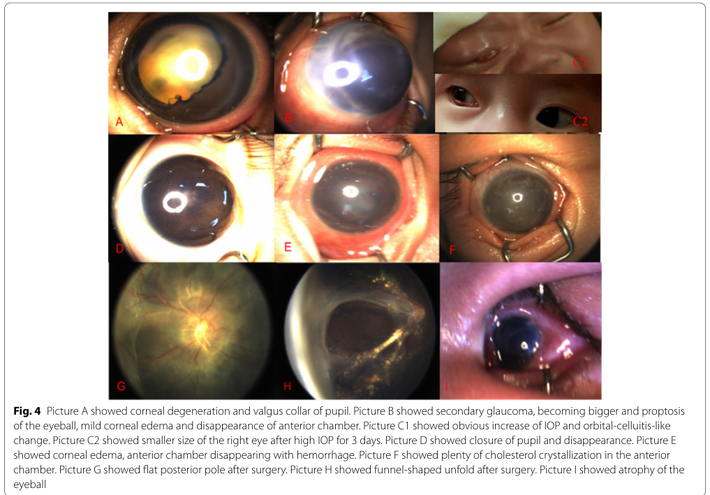

## Question

# Disease Characteristics Research Template

## Target Disease
- **Disease Name:** Familial Exudative Vitreoretinopathy
- **MONDO ID:**  (if available)
- **Category:** Mendelian

## Research Objectives

Please provide a comprehensive research report on **Familial Exudative Vitreoretinopathy** covering all of the
disease characteristics listed below. This report will be used to populate a disease knowledge
base entry. Be thorough and cite primary literature (PMID preferred) for all claims.

For each section, **suggested databases/resources** are listed. These are the first places
you should search for information on each topic.

---

### 1. Disease Information
> **Search first:** OMIM, Orphanet, ICD-10/ICD-11, MeSH, PubMed

- What is the disease? Provide a concise overview.
- What are the key identifiers? (OMIM, Orphanet, ICD-10/ICD-11, MeSH, Mondo)
- What are the common synonyms and alternative names?
- Is the information derived from individual patients (e.g., EHR) or aggregated disease-level resources?

### 2. Etiology

- **Disease Causal Factors**: What are the primary causes? (genetic, environmental, infectious, mechanistic)
- **Risk Factors**:
  > **Search first:** PubMed, Cochrane Library, UpToDate, clinical guidelines, ClinVar, ClinGen, GWAS Catalog, PheGenI, CTD, CDC, WHO, epidemiological databases
  - Genetic risk factors (causal variants, susceptibility loci, modifier genes)
  - Environmental risk factors (toxins, lifestyle, occupational exposures, age, sex, family history)
- **Protective Factors**:
  > **Search first:** PubMed, Cochrane Library, clinical trial databases, GWAS Catalog, gnomAD, WHO, CDC, nutrition databases
  - Genetic protective factors (protective variants, modifier alleles)
  - Environmental protective factors (diet, lifestyle, exposures that reduce risk)
- **Gene-Environment Interactions**: How do genetic and environmental factors interact to influence disease?
  > **Search first:** CTD, PubMed, PheGenI, GxE databases

### 3. Phenotypes
> **Search first:** HPO (Human Phenotype Ontology), OMIM, Orphanet, PubMed, clinicaltrials.gov, MedDRA, SNOMED CT, DECIPHER, LOINC

For each phenotype, provide:
- **Phenotype type**: symptoms, clinical signs, physical manifestations, behavioral changes, or laboratory abnormalities
  > For symptoms/signs: HPO, OMIM, Orphanet, PubMed
  > For behavioral changes: HPO, DSM, RDoC (Research Domain Criteria), PubMed
  > For laboratory abnormalities: LOINC, SNOMED CT, LabTests Online, PubMed
- **Phenotype characteristics**:
  > **Search first:** OMIM, Orphanet, HPO, PubMed
  - Age of symptom onset (neonatal, childhood, adult-onset, late-onset)
  - Symptom severity (mild, moderate, severe, variable)
  - Symptom progression (stable, progressive, episodic, fluctuating)
  - Frequency among affected individuals (percentage or qualitative)
- **Quality of life impact**: Effects on daily functioning and well-being (per-phenotype when possible)
  > **Search first:** EQ-5D database, SF-36, WHO QOL databases, PubMed
- Suggest HPO (Human Phenotype Ontology) terms for each phenotype

### 4. Genetic/Molecular Information

- **Causal Genes**: Gene mutations or chromosomal abnormalities responsible for disease (gene symbols, OMIM IDs)
  > **Search first:** OMIM, ClinVar, HGMD, Ensembl, NCBI Gene
- **Pathogenic Variants**:
  - Affected genes (gene symbols, HGNC IDs)
    > **Search first:** OMIM, NCBI Gene, Ensembl, HGNC, UniProt, GeneCards
  - Variant classification (pathogenic, likely pathogenic, VUS per ACMG/AMP guidelines)
    > **Search first:** ClinVar, ClinGen, ACMG/AMP guidelines, VarSome
  - Variant type/class (missense, frameshift, nonsense, splice-site, structural)
  - Allele frequency in population databases
    > **Search first:** gnomAD, 1000 Genomes, ExAC, TOPMed, dbSNP
  - Somatic vs germline origin
    > **Search first:** COSMIC (somatic), ClinVar, ICGC, TCGA
  - Functional consequences (loss of function, gain of function, dominant negative)
- **Modifier Genes**: Genes that modify disease severity or expression
- **Epigenetic Information**: DNA methylation, histone modifications, chromatin changes affecting disease
  > **Search first:** ENCODE, Roadmap Epigenomics, MethBase, DiseaseMeth
- **Chromosomal Abnormalities**: Large-scale genetic changes (aneuploidy, translocations, inversions)
  > **Search first:** DECIPHER, ClinVar, ECARUCA, UCSC Genome Browser

### 5. Environmental Information

- **Environmental Factors**: Non-genetic contributing factors (toxins, radiation, pollution, occupational exposure)
  > **Search first:** CTD (Comparative Toxicogenomics Database), TOXNET, PubMed, EPA databases
- **Lifestyle Factors**: Behavioral factors (smoking, diet, exercise, alcohol consumption)
  > **Search first:** CDC databases, WHO, PubMed, NHANES
- **Infectious Agents**: If applicable, pathogens causing or triggering disease (bacteria, viruses, fungi, parasites)
  > **Search first:** NCBI Taxonomy, ViPR, BV-BRC, MicrobeDB, GIDEON

### 6. Mechanism / Pathophysiology

- **Molecular Pathways**: Specific signaling cascades or biochemical pathways involved (Wnt, MAPK, mTOR, PI3K-AKT, etc.)
  > **Search first:** KEGG, Reactome, WikiPathways, PathBank, BioCyc
- **Cellular Processes**: Cell-level mechanisms (apoptosis, autophagy, cell cycle dysregulation, inflammation, etc.)
  > **Search first:** Gene Ontology (GO), Reactome, KEGG, PubMed
- **Protein Dysfunction**: How protein structure or function is altered (misfolding, aggregation, loss of function, gain of function)
  > **Search first:** UniProt, PDB (Protein Data Bank), InterPro, Pfam, AlphaFold
- **Metabolic Changes**: Alterations in metabolic processes (energy metabolism, lipid metabolism, amino acid metabolism)
  > **Search first:** KEGG, BioCyc, HMDB (Human Metabolome Database), BRENDA
- **Immune System Involvement**: Role of immune response (autoimmunity, immunodeficiency, chronic inflammation)
  > **Search first:** ImmPort, Immunome Database, IEDB, Gene Ontology
- **Tissue Damage Mechanisms**: How tissues/ are injured (oxidative stress, ischemia, fibrosis, necrosis)
  > **Search first:** PubMed, Gene Ontology, Reactome
- **Biochemical Abnormalities**: Specific molecular defects (enzyme deficiencies, receptor dysfunction, ion channel defects)
  > **Search first:** BRENDA, UniProt, KEGG, OMIM, PubMed
- **Epigenetic Changes**: DNA methylation, histone modifications affecting gene expression in disease
  > **Search first:** ENCODE, Roadmap Epigenomics, MethBase, DiseaseMeth
- **Molecular Profiling** (if available):
  - Transcriptomics/gene expression changes
    > **Search first:** GEO (Gene Expression Omnibus), ArrayExpress, GTEx, Human Cell Atlas, SRA
  - Proteomics findings
    > **Search first:** PRIDE, ProteomeXchange, Human Protein Atlas, STRING, BioGRID
  - Metabolomics signatures
    > **Search first:** MetaboLights, Metabolomics Workbench, HMDB, METLIN
  - Lipidomics alterations
    > **Search first:** LIPID MAPS, SwissLipids, LipidHome, Metabolomics Workbench
  - Genomic structural features
    > **Search first:** UCSC Genome Browser, Ensembl, NCBI, dbVar, DGV
- **Advanced Technologies** (if applicable):
  - Single-cell analysis findings (cell-type specific mechanisms, cellular heterogeneity)
    > **Search first:** Human Cell Atlas, Single Cell Portal, GEO, CELLxGENE
  - Spatial transcriptomics findings
    > **Search first:** GEO, Spatial Research, Vizgen, 10x Genomics data
  - Multi-omics integration results
    > **Search first:** TCGA, ICGC, cBioPortal, LinkedOmics, PubMed
  - Functional genomics screens (CRISPR, RNAi)
    > **Search first:** DepMap, GenomeRNAi, PubMed, BioGRID ORCS

For each mechanism, describe:
- The causal chain from initial trigger to clinical manifestation
- Which mechanisms are upstream vs downstream
- What cell types and biological processes are involved
- Suggest GO terms for biological processes and CL terms for cell types

### 7. Anatomical Structures Affected

- **Organ Level**:
  - Primary organs directly affected
  - Secondary organ involvement (complications, secondary effects)
  - Body systems involved (cardiovascular, nervous, digestive, respiratory, endocrine, etc.)
  > **Search first:** Uberon, FMA (Foundational Model of Anatomy), OMIM, HPO, ICD-11, MeSH, SNOMED CT
- **Tissue and Cell Level**:
  - Specific tissue types affected (epithelial, connective, muscle, nervous)
  - Specific cell populations targeted (with Cell Ontology terms)
  > **Search first:** Uberon, Human Protein Atlas, Cell Ontology, Human Cell Atlas, CellMarker, PanglaoDB
- **Subcellular Level**:
  - Cellular compartments involved (mitochondria, nucleus, ER, lysosomes) (with GO Cellular Component terms)
  > **Search first:** Gene Ontology (Cellular Component), UniProt, Human Protein Atlas
- **Localization**:
  - Specific anatomical sites (with UBERON terms)
    > **Search first:** FMA, Uberon, NeuroNames (for brain), SNOMED CT
  - Lateralization (unilateral, bilateral, asymmetric)
    > **Search first:** HPO, clinical literature, imaging databases

### 8. Temporal Development

- **Onset**:
  - Typical age of onset (congenital, pediatric, adult, geriatric)
  - Onset pattern (acute, subacute, chronic, insidious)
  > **Search first:** OMIM, Orphanet, HPO, PubMed
- **Progression**:
  - Disease stages (early, intermediate, advanced, end-stage)
    > **Search first:** Cancer Staging Manual (AJCC), WHO classifications, PubMed
  - Progression rate (rapid, slow, variable)
  - Disease course pattern (episodic, relapsing-remitting, progressive, stable)
  - Disease duration (self-limited, chronic lifelong)
  > **Search first:** Disease registries, longitudinal cohort databases, natural history studies, PubMed, Orphanet, OMIM
- **Patterns**:
  - Remission patterns (spontaneous, treatment-induced)
    > **Search first:** Clinical trial databases, disease registries, PubMed
  - Critical periods (time windows of vulnerability or opportunity for intervention)
    > **Search first:** PubMed, developmental biology databases, clinical guidelines

### 9. Inheritance and Population

- **Epidemiology**:
  - Prevalence (cases per 100,000 at given time)
  - Incidence (new cases per 100,000 per year)
  > **Search first:** Orphanet, CDC, WHO, GBD (Global Burden of Disease), national registries, SEER, disease registries
- **For Genetic Etiology**:
  - Inheritance pattern (AD, AR, X-linked, mitochondrial, multifactorial, polygenic)
    > **Search first:** OMIM, Orphanet, ClinVar, GTR (Genetic Testing Registry)
  - Penetrance (complete, incomplete, age-dependent)
    > **Search first:** ClinVar, OMIM, PubMed, ClinGen
  - Expressivity (variable, consistent)
    > **Search first:** OMIM, ClinVar, PubMed
  - Genetic anticipation (increasing severity in successive generations)
    > **Search first:** OMIM, PubMed (especially for repeat expansion disorders)
  - Germline mosaicism
    > **Search first:** ClinVar, OMIM, genetic counseling literature, PubMed
  - Founder effects (population-specific mutations)
    > **Search first:** gnomAD, population genetics databases, PubMed
  - Consanguinity role
    > **Search first:** OMIM, population studies, genetic counseling resources
  - Carrier frequency
    > **Search first:** gnomAD, carrier screening databases, GeneReviews, GTR
- **Population Demographics**:
  - Affected populations (ethnic or demographic groups with higher prevalence)
    > **Search first:** gnomAD, 1000 Genomes, PAGE Study, PubMed, population registries
  - Geographic distribution (endemic areas, regional variation)
    > **Search first:** WHO, CDC, GBD, Orphanet, geographic epidemiology databases
  - Geographic distribution of specific variants
  - Sex ratio (male:female)
    > **Search first:** Disease registries, OMIM, PubMed, epidemiological databases
  - Age distribution of affected individuals
    > **Search first:** CDC, disease registries, SEER, Orphanet

### 10. Diagnostics

- **Clinical Tests**:
  - Laboratory tests (blood, urine, tissue chemistry, specific enzyme assays)
    > **Search first:** LOINC, LabTests Online, PubMed
  - Biomarkers (proteins, metabolites, genetic markers, circulating biomarkers)
    > **Search first:** FDA Biomarker List, BEST (Biomarkers, EndpointS, and other Tools), PubMed
  - Imaging studies (X-ray, CT, MRI, PET, ultrasound)
    > **Search first:** RadLex, DICOM, Radiopaedia, imaging databases
  - Functional tests (pulmonary function, cardiac stress tests)
    > **Search first:** LOINC, clinical guidelines, PubMed
  - Electrophysiology (EEG, EMG, ECG, nerve conduction studies)
    > **Search first:** LOINC, clinical neurophysiology databases, PubMed
  - Biopsy findings (histopathology, immunohistochemistry)
    > **Search first:** SNOMED CT, College of American Pathologists resources, PubMed
  - Pathology findings (microscopic examination)
    > **Search first:** SNOMED CT, Digital Pathology databases, PubMed
- **Genetic Testing**:
  > **Search first:** GTR (Genetic Testing Registry), GeneReviews, ClinGen
  - Overview of recommended genetic testing approach
  - Whole genome sequencing (WGS) utility
    > **Search first:** GTR, ClinVar, GEL (Genomics England), gnomAD
  - Whole exome sequencing (WES) utility
    > **Search first:** GTR, ClinVar, OMIM, GeneMatcher
  - Gene panels (which panels, which genes)
    > **Search first:** GTR, ClinVar, laboratory-specific databases
  - Single gene testing
    > **Search first:** GTR, ClinVar, OMIM, GeneReviews
  - Chromosomal microarray (CMA)
    > **Search first:** DECIPHER, ClinVar, dbVar, ECARUCA
  - Karyotyping
    > **Search first:** Chromosome Abnormality Database, ClinVar, cytogenetics resources
  - FISH
    > **Search first:** ClinVar, cytogenetics databases, PubMed
  - Mitochondrial DNA testing
    > **Search first:** MITOMAP, MSeqDR, ClinVar, GTR
  - Repeat expansion testing
    > **Search first:** GTR, ClinVar, repeat expansion databases, PubMed
- **Omics-Based Diagnostics** (if applicable):
  - RNA sequencing / transcriptomics
    > **Search first:** GEO, ArrayExpress, GTEx, RNA-seq databases
  - Proteomics
    > **Search first:** PRIDE, ProteomeXchange, FDA Biomarker database
  - Metabolomics
    > **Search first:** MetaboLights, Metabolomics Workbench, HMDB
  - Epigenomics
    > **Search first:** GEO, ENCODE, Roadmap Epigenomics, MethBase
  - Liquid biopsy
    > **Search first:** COSMIC, ClinVar, liquid biopsy databases, PubMed
- **Clinical Criteria**:
  - Standardized diagnostic criteria (DSM, ICD, society guidelines)
    > **Search first:** DSM-5, ICD-11, clinical society guidelines, UpToDate
  - Differential diagnosis (other conditions to rule out, with distinguishing features)
    > **Search first:** DynaMed, UpToDate, clinical decision support systems
- **Screening**:
  - Screening methods for asymptomatic individuals (newborn screening, carrier screening, cascade screening)
    > **Search first:** ACMG recommendations, CDC newborn screening, GTR

### 11. Outcome/Prognosis

- **Survival and Mortality**:
  - Survival rate (5-year, 10-year, overall)
    > **Search first:** SEER, cancer registries, disease-specific registries, PubMed
  - Life expectancy (with and without treatment if applicable)
    > **Search first:** Orphanet, disease registries, actuarial databases, PubMed
  - Mortality rate
    > **Search first:** CDC, WHO, GBD, national mortality databases
  - Disease-specific mortality (deaths directly attributable to disease)
    > **Search first:** Disease registries, CDC Wonder, GBD, PubMed
- **Morbidity and Function**:
  - Morbidity (disease-related disability and health impacts)
    > **Search first:** GBD, WHO, disability databases, PubMed
  - Disability outcomes (long-term functional impairments)
    > **Search first:** ICF (International Classification of Functioning), disability registries
  - Quality of life measures (EQ-5D, SF-36, PROMIS, disease-specific tools)
    > **Search first:** EQ-5D database, SF-36, PROMIS, PubMed
- **Disease Course**:
  - Complications (secondary problems: infections, organ failure, etc.)
    > **Search first:** ICD codes, disease registries, clinical databases, PubMed
  - Recovery potential (likelihood and extent of recovery, with vs without treatment)
    > **Search first:** Natural history studies, rehabilitation databases, PubMed
- **Prediction**:
  - Prognostic factors (age, disease severity, biomarkers, treatment response)
    > **Search first:** Prognostic models databases, clinical calculators, PubMed
  - Prognostic biomarkers (molecular markers predicting disease course)
    > **Search first:** FDA Biomarker database, PubMed, cancer prognostic databases

### 12. Treatment

- **Pharmacotherapy**:
  - Pharmacological treatments (drug names, drug classes, mechanisms of action)
    > **Search first:** DrugBank, RxNorm, ATC classification, DailyMed, FDA databases
  - Pharmacogenomics (how genetic variants affect drug metabolism, efficacy, toxicity)
    > **Search first:** PharmGKB, CPIC (Clinical Pharmacogenetics), FDA Table of PGx Biomarkers
- **Advanced Therapeutics**:
  - Gene therapy (viral vectors, CRISPR, gene replacement, gene editing)
    > **Search first:** ClinicalTrials.gov, FDA gene therapy database, ASGCT resources
  - Cell therapy (stem cell transplant, CAR-T, cellular therapeutics)
    > **Search first:** ClinicalTrials.gov, FDA cell therapy database, FACT standards
  - RNA-based therapies (ASOs, siRNA, mRNA therapies)
    > **Search first:** ClinicalTrials.gov, FDA approvals, PubMed
  - Targeted therapies (treatments directed at specific molecular targets)
    > **Search first:** My Cancer Genome, OncoKB, ClinicalTrials.gov, FDA approvals
  - Immunotherapies (checkpoint inhibitors, monoclonal antibodies)
    > **Search first:** Cancer Immunotherapy Database, FDA approvals, ClinicalTrials.gov
- **Surgical and Interventional**:
  - Surgical interventions (types of surgery, timing, outcomes)
    > **Search first:** CPT codes, surgical registries, clinical guidelines, PubMed
- **Supportive and Rehabilitative**:
  - Supportive care (symptom management, pain control, nutrition)
    > **Search first:** Clinical guidelines, Cochrane Library, PubMed
  - Rehabilitation (physical therapy, occupational therapy, speech therapy)
    > **Search first:** Rehabilitation medicine databases, clinical guidelines, PubMed
- **Experimental**:
  - Experimental treatments in clinical trials (with NCT identifiers if available)
    > **Search first:** ClinicalTrials.gov, EU Clinical Trials Register, WHO ICTRP
- **Treatment Outcomes**:
  - Treatment response rates
    > **Search first:** Clinical trial databases, FDA reviews, systematic reviews, PubMed
  - Side effects and adverse events
    > **Search first:** FDA Adverse Event Reporting System (FAERS), MedWatch, PubMed
- **Treatment Strategy**:
  - Treatment algorithms (clinical pathways, decision trees)
    > **Search first:** Clinical practice guidelines, NCCN Guidelines, UpToDate
  - Combination therapies
    > **Search first:** ClinicalTrials.gov, treatment guidelines, PubMed
  - Personalized medicine approaches (genotype-guided treatment)
    > **Search first:** My Cancer Genome, CIViC, PharmGKB, precision medicine databases

For each treatment, suggest MAXO (Medical Action Ontology) terms where applicable.

### 13. Prevention

- **Prevention Levels**:
  - Primary prevention (preventing disease occurrence: vaccination, risk factor modification)
    > **Search first:** CDC, WHO, USPSTF recommendations, Cochrane Library
  - Secondary prevention (early detection and treatment: screening programs, early intervention)
    > **Search first:** USPSTF, CDC screening guidelines, WHO
  - Tertiary prevention (preventing complications in those with disease)
    > **Search first:** Clinical guidelines, disease management protocols, PubMed
- **Immunization**: Vaccine strategies (if applicable)
  > **Search first:** CDC vaccine schedules, WHO immunization, FDA vaccine database
- **Screening and Early Detection**:
  - Screening programs (population-based: newborn screening, cancer screening)
    > **Search first:** CDC screening programs, USPSTF, cancer screening databases
  - Genetic screening (carrier screening, preimplantation genetic diagnosis, prenatal testing)
    > **Search first:** ACMG recommendations, ACOG guidelines, GTR
  - Risk stratification (identifying high-risk individuals for targeted prevention)
    > **Search first:** Risk prediction models, clinical calculators, PubMed
- **Behavioral Interventions**: Lifestyle modifications to reduce risk
  > **Search first:** CDC, WHO, behavioral intervention databases, Cochrane Library
- **Counseling**: Genetic counseling (risk assessment, family planning guidance)
  > **Search first:** NSGC resources, ACMG guidelines, GeneReviews
- **Public Health**:
  - Public health interventions (sanitation, vector control, health education)
    > **Search first:** CDC, WHO, public health databases, PubMed
  - Environmental interventions (reducing environmental risk factors)
    > **Search first:** EPA databases, WHO environmental health, PubMed
- **Prophylaxis**: Preventive medications or procedures
  > **Search first:** Clinical guidelines, FDA approvals, PubMed

### 14. Other Species / Natural Disease

- **Taxonomy**: Species affected (with NCBI Taxon identifiers)
  > **Search first:** NCBI Taxonomy
- **Breed**: Specific breeds affected (with VBO identifiers if applicable)
  > **Search first:** VBO (Vertebrate Breed Ontology)
- **Gene**: Orthologous genes in other species (with NCBI Gene IDs)
  > **Search first:** NCBI Gene
- **Natural Disease**:
  - Naturally occurring disease in other species (companion animals, wildlife)
    > **Search first:** OMIA (Online Mendelian Inheritance in Animals), VetCompass, PubMed
  - Veterinary relevance and importance in animal health
    > **Search first:** OMIA, veterinary databases, PubMed
- **Comparative Biology**:
  - Comparative pathology (similarities and differences across species)
    > **Search first:** OMIA, comparative pathology databases, PubMed
  - Evolutionary conservation of disease mechanisms
    > **Search first:** HomoloGene, OrthoMCL, Alliance of Genome Resources
- **Transmission** (if applicable):
  - Zoonotic potential
    > **Search first:** CDC zoonotic diseases, WHO zoonoses, GIDEON
  - Cross-species susceptibility
    > **Search first:** NCBI Taxonomy, veterinary databases, PubMed

### 15. Model Organisms

- **Model Types**:
  - Model organism type (mammalian, invertebrate, cellular, in vitro)
    > **Search first:** Alliance of Genome Resources, model organism databases
  - Specific model systems (mouse, rat, zebrafish, Drosophila, C. elegans, yeast, cell lines, organoids, iPSCs)
    > **Search first:** MGI, RGD, ZFIN, FlyBase, WormBase, SGD, ATCC, Cellosaurus
  - Induced models (drug treatment, surgical intervention, environmental manipulation)
    > **Search first:** MGI, model organism databases, PubMed
- **Genetic Models**:
  - Types available (knockout, knock-in, transgenic, conditional, humanized)
    > **Search first:** MGI, IMPC, KOMP, EuMMCR, IMSR
- **Model Characteristics**:
  - Phenotype recapitulation (how well model reproduces human disease features)
    > **Search first:** Model organism databases, comparative studies, PubMed
  - Model limitations (aspects of human disease not captured)
    > **Search first:** Model organism databases, PubMed, review articles
- **Applications**:
  - Research applications (what aspects of disease can be studied)
    > **Search first:** Model organism databases, PubMed
- **Resources**:
  - Model databases
    > **Search first:** MGI, RGD, ZFIN, FlyBase, WormBase, IMSR, EMMA, MMRRC

---

## Citation Requirements

- Cite primary literature (PMID preferred) for all mechanistic and clinical claims
- Prioritize recent reviews and landmark papers
- Include direct quotes from abstracts where possible to support key statements
- Distinguish evidence source types: human clinical, model organism, in vitro, computational

## Output Format

Structure your response as a comprehensive narrative organized by the sections above.
For each section, provide:
- Factual content with specific details (numbers, percentages, gene names, variant nomenclature)
- Ontology term suggestions (HPO, GO, CL, UBERON, CHEBI, MAXO, MONDO) where applicable
- Evidence citations with PMIDs
- Direct quotes from abstracts to support key claims
- Clear indication when information is not available or not applicable for this disease

This report will be used to populate a disease knowledge base entry with:
- Pathophysiology descriptions with causal chains
- Gene/protein annotations (HGNC, GO terms)
- Phenotype associations (HP terms) with frequencies
- Cell type involvement (CL terms)
- Anatomical locations (UBERON terms)
- Chemical entities (CHEBI terms)
- Treatment annotations (MAXO terms)
- Evidence items with PMIDs and exact abstract quotes
- Epidemiology, prognosis, diagnostic, and prevention information
- Animal model descriptions with phenotype recapitulation details

## Output

Question: You are an expert researcher providing comprehensive, well-cited information.

Provide detailed information focusing on:
1. Key concepts and definitions with current understanding
2. Recent developments and latest research (prioritize 2023-2024 sources)
3. Current applications and real-world implementations
4. Expert opinions and analysis from authoritative sources
5. Relevant statistics and data from recent studies

Format as a comprehensive research report with proper citations. Include URLs and publication dates where available.
Always prioritize recent, authoritative sources and provide specific citations for all major claims.

# Disease Characteristics Research Template

## Target Disease
- **Disease Name:** Familial Exudative Vitreoretinopathy
- **MONDO ID:**  (if available)
- **Category:** Mendelian

## Research Objectives

Please provide a comprehensive research report on **Familial Exudative Vitreoretinopathy** covering all of the
disease characteristics listed below. This report will be used to populate a disease knowledge
base entry. Be thorough and cite primary literature (PMID preferred) for all claims.

For each section, **suggested databases/resources** are listed. These are the first places
you should search for information on each topic.

---

### 1. Disease Information
> **Search first:** OMIM, Orphanet, ICD-10/ICD-11, MeSH, PubMed

- What is the disease? Provide a concise overview.
- What are the key identifiers? (OMIM, Orphanet, ICD-10/ICD-11, MeSH, Mondo)
- What are the common synonyms and alternative names?
- Is the information derived from individual patients (e.g., EHR) or aggregated disease-level resources?

### 2. Etiology

- **Disease Causal Factors**: What are the primary causes? (genetic, environmental, infectious, mechanistic)
- **Risk Factors**:
  > **Search first:** PubMed, Cochrane Library, UpToDate, clinical guidelines, ClinVar, ClinGen, GWAS Catalog, PheGenI, CTD, CDC, WHO, epidemiological databases
  - Genetic risk factors (causal variants, susceptibility loci, modifier genes)
  - Environmental risk factors (toxins, lifestyle, occupational exposures, age, sex, family history)
- **Protective Factors**:
  > **Search first:** PubMed, Cochrane Library, clinical trial databases, GWAS Catalog, gnomAD, WHO, CDC, nutrition databases
  - Genetic protective factors (protective variants, modifier alleles)
  - Environmental protective factors (diet, lifestyle, exposures that reduce risk)
- **Gene-Environment Interactions**: How do genetic and environmental factors interact to influence disease?
  > **Search first:** CTD, PubMed, PheGenI, GxE databases

### 3. Phenotypes
> **Search first:** HPO (Human Phenotype Ontology), OMIM, Orphanet, PubMed, clinicaltrials.gov, MedDRA, SNOMED CT, DECIPHER, LOINC

For each phenotype, provide:
- **Phenotype type**: symptoms, clinical signs, physical manifestations, behavioral changes, or laboratory abnormalities
  > For symptoms/signs: HPO, OMIM, Orphanet, PubMed
  > For behavioral changes: HPO, DSM, RDoC (Research Domain Criteria), PubMed
  > For laboratory abnormalities: LOINC, SNOMED CT, LabTests Online, PubMed
- **Phenotype characteristics**:
  > **Search first:** OMIM, Orphanet, HPO, PubMed
  - Age of symptom onset (neonatal, childhood, adult-onset, late-onset)
  - Symptom severity (mild, moderate, severe, variable)
  - Symptom progression (stable, progressive, episodic, fluctuating)
  - Frequency among affected individuals (percentage or qualitative)
- **Quality of life impact**: Effects on daily functioning and well-being (per-phenotype when possible)
  > **Search first:** EQ-5D database, SF-36, WHO QOL databases, PubMed
- Suggest HPO (Human Phenotype Ontology) terms for each phenotype

### 4. Genetic/Molecular Information

- **Causal Genes**: Gene mutations or chromosomal abnormalities responsible for disease (gene symbols, OMIM IDs)
  > **Search first:** OMIM, ClinVar, HGMD, Ensembl, NCBI Gene
- **Pathogenic Variants**:
  - Affected genes (gene symbols, HGNC IDs)
    > **Search first:** OMIM, NCBI Gene, Ensembl, HGNC, UniProt, GeneCards
  - Variant classification (pathogenic, likely pathogenic, VUS per ACMG/AMP guidelines)
    > **Search first:** ClinVar, ClinGen, ACMG/AMP guidelines, VarSome
  - Variant type/class (missense, frameshift, nonsense, splice-site, structural)
  - Allele frequency in population databases
    > **Search first:** gnomAD, 1000 Genomes, ExAC, TOPMed, dbSNP
  - Somatic vs germline origin
    > **Search first:** COSMIC (somatic), ClinVar, ICGC, TCGA
  - Functional consequences (loss of function, gain of function, dominant negative)
- **Modifier Genes**: Genes that modify disease severity or expression
- **Epigenetic Information**: DNA methylation, histone modifications, chromatin changes affecting disease
  > **Search first:** ENCODE, Roadmap Epigenomics, MethBase, DiseaseMeth
- **Chromosomal Abnormalities**: Large-scale genetic changes (aneuploidy, translocations, inversions)
  > **Search first:** DECIPHER, ClinVar, ECARUCA, UCSC Genome Browser

### 5. Environmental Information

- **Environmental Factors**: Non-genetic contributing factors (toxins, radiation, pollution, occupational exposure)
  > **Search first:** CTD (Comparative Toxicogenomics Database), TOXNET, PubMed, EPA databases
- **Lifestyle Factors**: Behavioral factors (smoking, diet, exercise, alcohol consumption)
  > **Search first:** CDC databases, WHO, PubMed, NHANES
- **Infectious Agents**: If applicable, pathogens causing or triggering disease (bacteria, viruses, fungi, parasites)
  > **Search first:** NCBI Taxonomy, ViPR, BV-BRC, MicrobeDB, GIDEON

### 6. Mechanism / Pathophysiology

- **Molecular Pathways**: Specific signaling cascades or biochemical pathways involved (Wnt, MAPK, mTOR, PI3K-AKT, etc.)
  > **Search first:** KEGG, Reactome, WikiPathways, PathBank, BioCyc
- **Cellular Processes**: Cell-level mechanisms (apoptosis, autophagy, cell cycle dysregulation, inflammation, etc.)
  > **Search first:** Gene Ontology (GO), Reactome, KEGG, PubMed
- **Protein Dysfunction**: How protein structure or function is altered (misfolding, aggregation, loss of function, gain of function)
  > **Search first:** UniProt, PDB (Protein Data Bank), InterPro, Pfam, AlphaFold
- **Metabolic Changes**: Alterations in metabolic processes (energy metabolism, lipid metabolism, amino acid metabolism)
  > **Search first:** KEGG, BioCyc, HMDB (Human Metabolome Database), BRENDA
- **Immune System Involvement**: Role of immune response (autoimmunity, immunodeficiency, chronic inflammation)
  > **Search first:** ImmPort, Immunome Database, IEDB, Gene Ontology
- **Tissue Damage Mechanisms**: How tissues/ are injured (oxidative stress, ischemia, fibrosis, necrosis)
  > **Search first:** PubMed, Gene Ontology, Reactome
- **Biochemical Abnormalities**: Specific molecular defects (enzyme deficiencies, receptor dysfunction, ion channel defects)
  > **Search first:** BRENDA, UniProt, KEGG, OMIM, PubMed
- **Epigenetic Changes**: DNA methylation, histone modifications affecting gene expression in disease
  > **Search first:** ENCODE, Roadmap Epigenomics, MethBase, DiseaseMeth
- **Molecular Profiling** (if available):
  - Transcriptomics/gene expression changes
    > **Search first:** GEO (Gene Expression Omnibus), ArrayExpress, GTEx, Human Cell Atlas, SRA
  - Proteomics findings
    > **Search first:** PRIDE, ProteomeXchange, Human Protein Atlas, STRING, BioGRID
  - Metabolomics signatures
    > **Search first:** MetaboLights, Metabolomics Workbench, HMDB, METLIN
  - Lipidomics alterations
    > **Search first:** LIPID MAPS, SwissLipids, LipidHome, Metabolomics Workbench
  - Genomic structural features
    > **Search first:** UCSC Genome Browser, Ensembl, NCBI, dbVar, DGV
- **Advanced Technologies** (if applicable):
  - Single-cell analysis findings (cell-type specific mechanisms, cellular heterogeneity)
    > **Search first:** Human Cell Atlas, Single Cell Portal, GEO, CELLxGENE
  - Spatial transcriptomics findings
    > **Search first:** GEO, Spatial Research, Vizgen, 10x Genomics data
  - Multi-omics integration results
    > **Search first:** TCGA, ICGC, cBioPortal, LinkedOmics, PubMed
  - Functional genomics screens (CRISPR, RNAi)
    > **Search first:** DepMap, GenomeRNAi, PubMed, BioGRID ORCS

For each mechanism, describe:
- The causal chain from initial trigger to clinical manifestation
- Which mechanisms are upstream vs downstream
- What cell types and biological processes are involved
- Suggest GO terms for biological processes and CL terms for cell types

### 7. Anatomical Structures Affected

- **Organ Level**:
  - Primary organs directly affected
  - Secondary organ involvement (complications, secondary effects)
  - Body systems involved (cardiovascular, nervous, digestive, respiratory, endocrine, etc.)
  > **Search first:** Uberon, FMA (Foundational Model of Anatomy), OMIM, HPO, ICD-11, MeSH, SNOMED CT
- **Tissue and Cell Level**:
  - Specific tissue types affected (epithelial, connective, muscle, nervous)
  - Specific cell populations targeted (with Cell Ontology terms)
  > **Search first:** Uberon, Human Protein Atlas, Cell Ontology, Human Cell Atlas, CellMarker, PanglaoDB
- **Subcellular Level**:
  - Cellular compartments involved (mitochondria, nucleus, ER, lysosomes) (with GO Cellular Component terms)
  > **Search first:** Gene Ontology (Cellular Component), UniProt, Human Protein Atlas
- **Localization**:
  - Specific anatomical sites (with UBERON terms)
    > **Search first:** FMA, Uberon, NeuroNames (for brain), SNOMED CT
  - Lateralization (unilateral, bilateral, asymmetric)
    > **Search first:** HPO, clinical literature, imaging databases

### 8. Temporal Development

- **Onset**:
  - Typical age of onset (congenital, pediatric, adult, geriatric)
  - Onset pattern (acute, subacute, chronic, insidious)
  > **Search first:** OMIM, Orphanet, HPO, PubMed
- **Progression**:
  - Disease stages (early, intermediate, advanced, end-stage)
    > **Search first:** Cancer Staging Manual (AJCC), WHO classifications, PubMed
  - Progression rate (rapid, slow, variable)
  - Disease course pattern (episodic, relapsing-remitting, progressive, stable)
  - Disease duration (self-limited, chronic lifelong)
  > **Search first:** Disease registries, longitudinal cohort databases, natural history studies, PubMed, Orphanet, OMIM
- **Patterns**:
  - Remission patterns (spontaneous, treatment-induced)
    > **Search first:** Clinical trial databases, disease registries, PubMed
  - Critical periods (time windows of vulnerability or opportunity for intervention)
    > **Search first:** PubMed, developmental biology databases, clinical guidelines

### 9. Inheritance and Population

- **Epidemiology**:
  - Prevalence (cases per 100,000 at given time)
  - Incidence (new cases per 100,000 per year)
  > **Search first:** Orphanet, CDC, WHO, GBD (Global Burden of Disease), national registries, SEER, disease registries
- **For Genetic Etiology**:
  - Inheritance pattern (AD, AR, X-linked, mitochondrial, multifactorial, polygenic)
    > **Search first:** OMIM, Orphanet, ClinVar, GTR (Genetic Testing Registry)
  - Penetrance (complete, incomplete, age-dependent)
    > **Search first:** ClinVar, OMIM, PubMed, ClinGen
  - Expressivity (variable, consistent)
    > **Search first:** OMIM, ClinVar, PubMed
  - Genetic anticipation (increasing severity in successive generations)
    > **Search first:** OMIM, PubMed (especially for repeat expansion disorders)
  - Germline mosaicism
    > **Search first:** ClinVar, OMIM, genetic counseling literature, PubMed
  - Founder effects (population-specific mutations)
    > **Search first:** gnomAD, population genetics databases, PubMed
  - Consanguinity role
    > **Search first:** OMIM, population studies, genetic counseling resources
  - Carrier frequency
    > **Search first:** gnomAD, carrier screening databases, GeneReviews, GTR
- **Population Demographics**:
  - Affected populations (ethnic or demographic groups with higher prevalence)
    > **Search first:** gnomAD, 1000 Genomes, PAGE Study, PubMed, population registries
  - Geographic distribution (endemic areas, regional variation)
    > **Search first:** WHO, CDC, GBD, Orphanet, geographic epidemiology databases
  - Geographic distribution of specific variants
  - Sex ratio (male:female)
    > **Search first:** Disease registries, OMIM, PubMed, epidemiological databases
  - Age distribution of affected individuals
    > **Search first:** CDC, disease registries, SEER, Orphanet

### 10. Diagnostics

- **Clinical Tests**:
  - Laboratory tests (blood, urine, tissue chemistry, specific enzyme assays)
    > **Search first:** LOINC, LabTests Online, PubMed
  - Biomarkers (proteins, metabolites, genetic markers, circulating biomarkers)
    > **Search first:** FDA Biomarker List, BEST (Biomarkers, EndpointS, and other Tools), PubMed
  - Imaging studies (X-ray, CT, MRI, PET, ultrasound)
    > **Search first:** RadLex, DICOM, Radiopaedia, imaging databases
  - Functional tests (pulmonary function, cardiac stress tests)
    > **Search first:** LOINC, clinical guidelines, PubMed
  - Electrophysiology (EEG, EMG, ECG, nerve conduction studies)
    > **Search first:** LOINC, clinical neurophysiology databases, PubMed
  - Biopsy findings (histopathology, immunohistochemistry)
    > **Search first:** SNOMED CT, College of American Pathologists resources, PubMed
  - Pathology findings (microscopic examination)
    > **Search first:** SNOMED CT, Digital Pathology databases, PubMed
- **Genetic Testing**:
  > **Search first:** GTR (Genetic Testing Registry), GeneReviews, ClinGen
  - Overview of recommended genetic testing approach
  - Whole genome sequencing (WGS) utility
    > **Search first:** GTR, ClinVar, GEL (Genomics England), gnomAD
  - Whole exome sequencing (WES) utility
    > **Search first:** GTR, ClinVar, OMIM, GeneMatcher
  - Gene panels (which panels, which genes)
    > **Search first:** GTR, ClinVar, laboratory-specific databases
  - Single gene testing
    > **Search first:** GTR, ClinVar, OMIM, GeneReviews
  - Chromosomal microarray (CMA)
    > **Search first:** DECIPHER, ClinVar, dbVar, ECARUCA
  - Karyotyping
    > **Search first:** Chromosome Abnormality Database, ClinVar, cytogenetics resources
  - FISH
    > **Search first:** ClinVar, cytogenetics databases, PubMed
  - Mitochondrial DNA testing
    > **Search first:** MITOMAP, MSeqDR, ClinVar, GTR
  - Repeat expansion testing
    > **Search first:** GTR, ClinVar, repeat expansion databases, PubMed
- **Omics-Based Diagnostics** (if applicable):
  - RNA sequencing / transcriptomics
    > **Search first:** GEO, ArrayExpress, GTEx, RNA-seq databases
  - Proteomics
    > **Search first:** PRIDE, ProteomeXchange, FDA Biomarker database
  - Metabolomics
    > **Search first:** MetaboLights, Metabolomics Workbench, HMDB
  - Epigenomics
    > **Search first:** GEO, ENCODE, Roadmap Epigenomics, MethBase
  - Liquid biopsy
    > **Search first:** COSMIC, ClinVar, liquid biopsy databases, PubMed
- **Clinical Criteria**:
  - Standardized diagnostic criteria (DSM, ICD, society guidelines)
    > **Search first:** DSM-5, ICD-11, clinical society guidelines, UpToDate
  - Differential diagnosis (other conditions to rule out, with distinguishing features)
    > **Search first:** DynaMed, UpToDate, clinical decision support systems
- **Screening**:
  - Screening methods for asymptomatic individuals (newborn screening, carrier screening, cascade screening)
    > **Search first:** ACMG recommendations, CDC newborn screening, GTR

### 11. Outcome/Prognosis

- **Survival and Mortality**:
  - Survival rate (5-year, 10-year, overall)
    > **Search first:** SEER, cancer registries, disease-specific registries, PubMed
  - Life expectancy (with and without treatment if applicable)
    > **Search first:** Orphanet, disease registries, actuarial databases, PubMed
  - Mortality rate
    > **Search first:** CDC, WHO, GBD, national mortality databases
  - Disease-specific mortality (deaths directly attributable to disease)
    > **Search first:** Disease registries, CDC Wonder, GBD, PubMed
- **Morbidity and Function**:
  - Morbidity (disease-related disability and health impacts)
    > **Search first:** GBD, WHO, disability databases, PubMed
  - Disability outcomes (long-term functional impairments)
    > **Search first:** ICF (International Classification of Functioning), disability registries
  - Quality of life measures (EQ-5D, SF-36, PROMIS, disease-specific tools)
    > **Search first:** EQ-5D database, SF-36, PROMIS, PubMed
- **Disease Course**:
  - Complications (secondary problems: infections, organ failure, etc.)
    > **Search first:** ICD codes, disease registries, clinical databases, PubMed
  - Recovery potential (likelihood and extent of recovery, with vs without treatment)
    > **Search first:** Natural history studies, rehabilitation databases, PubMed
- **Prediction**:
  - Prognostic factors (age, disease severity, biomarkers, treatment response)
    > **Search first:** Prognostic models databases, clinical calculators, PubMed
  - Prognostic biomarkers (molecular markers predicting disease course)
    > **Search first:** FDA Biomarker database, PubMed, cancer prognostic databases

### 12. Treatment

- **Pharmacotherapy**:
  - Pharmacological treatments (drug names, drug classes, mechanisms of action)
    > **Search first:** DrugBank, RxNorm, ATC classification, DailyMed, FDA databases
  - Pharmacogenomics (how genetic variants affect drug metabolism, efficacy, toxicity)
    > **Search first:** PharmGKB, CPIC (Clinical Pharmacogenetics), FDA Table of PGx Biomarkers
- **Advanced Therapeutics**:
  - Gene therapy (viral vectors, CRISPR, gene replacement, gene editing)
    > **Search first:** ClinicalTrials.gov, FDA gene therapy database, ASGCT resources
  - Cell therapy (stem cell transplant, CAR-T, cellular therapeutics)
    > **Search first:** ClinicalTrials.gov, FDA cell therapy database, FACT standards
  - RNA-based therapies (ASOs, siRNA, mRNA therapies)
    > **Search first:** ClinicalTrials.gov, FDA approvals, PubMed
  - Targeted therapies (treatments directed at specific molecular targets)
    > **Search first:** My Cancer Genome, OncoKB, ClinicalTrials.gov, FDA approvals
  - Immunotherapies (checkpoint inhibitors, monoclonal antibodies)
    > **Search first:** Cancer Immunotherapy Database, FDA approvals, ClinicalTrials.gov
- **Surgical and Interventional**:
  - Surgical interventions (types of surgery, timing, outcomes)
    > **Search first:** CPT codes, surgical registries, clinical guidelines, PubMed
- **Supportive and Rehabilitative**:
  - Supportive care (symptom management, pain control, nutrition)
    > **Search first:** Clinical guidelines, Cochrane Library, PubMed
  - Rehabilitation (physical therapy, occupational therapy, speech therapy)
    > **Search first:** Rehabilitation medicine databases, clinical guidelines, PubMed
- **Experimental**:
  - Experimental treatments in clinical trials (with NCT identifiers if available)
    > **Search first:** ClinicalTrials.gov, EU Clinical Trials Register, WHO ICTRP
- **Treatment Outcomes**:
  - Treatment response rates
    > **Search first:** Clinical trial databases, FDA reviews, systematic reviews, PubMed
  - Side effects and adverse events
    > **Search first:** FDA Adverse Event Reporting System (FAERS), MedWatch, PubMed
- **Treatment Strategy**:
  - Treatment algorithms (clinical pathways, decision trees)
    > **Search first:** Clinical practice guidelines, NCCN Guidelines, UpToDate
  - Combination therapies
    > **Search first:** ClinicalTrials.gov, treatment guidelines, PubMed
  - Personalized medicine approaches (genotype-guided treatment)
    > **Search first:** My Cancer Genome, CIViC, PharmGKB, precision medicine databases

For each treatment, suggest MAXO (Medical Action Ontology) terms where applicable.

### 13. Prevention

- **Prevention Levels**:
  - Primary prevention (preventing disease occurrence: vaccination, risk factor modification)
    > **Search first:** CDC, WHO, USPSTF recommendations, Cochrane Library
  - Secondary prevention (early detection and treatment: screening programs, early intervention)
    > **Search first:** USPSTF, CDC screening guidelines, WHO
  - Tertiary prevention (preventing complications in those with disease)
    > **Search first:** Clinical guidelines, disease management protocols, PubMed
- **Immunization**: Vaccine strategies (if applicable)
  > **Search first:** CDC vaccine schedules, WHO immunization, FDA vaccine database
- **Screening and Early Detection**:
  - Screening programs (population-based: newborn screening, cancer screening)
    > **Search first:** CDC screening programs, USPSTF, cancer screening databases
  - Genetic screening (carrier screening, preimplantation genetic diagnosis, prenatal testing)
    > **Search first:** ACMG recommendations, ACOG guidelines, GTR
  - Risk stratification (identifying high-risk individuals for targeted prevention)
    > **Search first:** Risk prediction models, clinical calculators, PubMed
- **Behavioral Interventions**: Lifestyle modifications to reduce risk
  > **Search first:** CDC, WHO, behavioral intervention databases, Cochrane Library
- **Counseling**: Genetic counseling (risk assessment, family planning guidance)
  > **Search first:** NSGC resources, ACMG guidelines, GeneReviews
- **Public Health**:
  - Public health interventions (sanitation, vector control, health education)
    > **Search first:** CDC, WHO, public health databases, PubMed
  - Environmental interventions (reducing environmental risk factors)
    > **Search first:** EPA databases, WHO environmental health, PubMed
- **Prophylaxis**: Preventive medications or procedures
  > **Search first:** Clinical guidelines, FDA approvals, PubMed

### 14. Other Species / Natural Disease

- **Taxonomy**: Species affected (with NCBI Taxon identifiers)
  > **Search first:** NCBI Taxonomy
- **Breed**: Specific breeds affected (with VBO identifiers if applicable)
  > **Search first:** VBO (Vertebrate Breed Ontology)
- **Gene**: Orthologous genes in other species (with NCBI Gene IDs)
  > **Search first:** NCBI Gene
- **Natural Disease**:
  - Naturally occurring disease in other species (companion animals, wildlife)
    > **Search first:** OMIA (Online Mendelian Inheritance in Animals), VetCompass, PubMed
  - Veterinary relevance and importance in animal health
    > **Search first:** OMIA, veterinary databases, PubMed
- **Comparative Biology**:
  - Comparative pathology (similarities and differences across species)
    > **Search first:** OMIA, comparative pathology databases, PubMed
  - Evolutionary conservation of disease mechanisms
    > **Search first:** HomoloGene, OrthoMCL, Alliance of Genome Resources
- **Transmission** (if applicable):
  - Zoonotic potential
    > **Search first:** CDC zoonotic diseases, WHO zoonoses, GIDEON
  - Cross-species susceptibility
    > **Search first:** NCBI Taxonomy, veterinary databases, PubMed

### 15. Model Organisms

- **Model Types**:
  - Model organism type (mammalian, invertebrate, cellular, in vitro)
    > **Search first:** Alliance of Genome Resources, model organism databases
  - Specific model systems (mouse, rat, zebrafish, Drosophila, C. elegans, yeast, cell lines, organoids, iPSCs)
    > **Search first:** MGI, RGD, ZFIN, FlyBase, WormBase, SGD, ATCC, Cellosaurus
  - Induced models (drug treatment, surgical intervention, environmental manipulation)
    > **Search first:** MGI, model organism databases, PubMed
- **Genetic Models**:
  - Types available (knockout, knock-in, transgenic, conditional, humanized)
    > **Search first:** MGI, IMPC, KOMP, EuMMCR, IMSR
- **Model Characteristics**:
  - Phenotype recapitulation (how well model reproduces human disease features)
    > **Search first:** Model organism databases, comparative studies, PubMed
  - Model limitations (aspects of human disease not captured)
    > **Search first:** Model organism databases, PubMed, review articles
- **Applications**:
  - Research applications (what aspects of disease can be studied)
    > **Search first:** Model organism databases, PubMed
- **Resources**:
  - Model databases
    > **Search first:** MGI, RGD, ZFIN, FlyBase, WormBase, IMSR, EMMA, MMRRC

---

## Citation Requirements

- Cite primary literature (PMID preferred) for all mechanistic and clinical claims
- Prioritize recent reviews and landmark papers
- Include direct quotes from abstracts where possible to support key statements
- Distinguish evidence source types: human clinical, model organism, in vitro, computational

## Output Format

Structure your response as a comprehensive narrative organized by the sections above.
For each section, provide:
- Factual content with specific details (numbers, percentages, gene names, variant nomenclature)
- Ontology term suggestions (HPO, GO, CL, UBERON, CHEBI, MAXO, MONDO) where applicable
- Evidence citations with PMIDs
- Direct quotes from abstracts to support key claims
- Clear indication when information is not available or not applicable for this disease

This report will be used to populate a disease knowledge base entry with:
- Pathophysiology descriptions with causal chains
- Gene/protein annotations (HGNC, GO terms)
- Phenotype associations (HP terms) with frequencies
- Cell type involvement (CL terms)
- Anatomical locations (UBERON terms)
- Chemical entities (CHEBI terms)
- Treatment annotations (MAXO terms)
- Evidence items with PMIDs and exact abstract quotes
- Epidemiology, prognosis, diagnostic, and prevention information
- Animal model descriptions with phenotype recapitulation details

# Familial Exudative Vitreoretinopathy (FEVR) — Disease Characteristics Research Report (Mendelian)

## Executive summary
Familial exudative vitreoretinopathy (FEVR) is an inherited developmental retinal vascular disorder characterized by incomplete/aberrant vascularization of the peripheral retina, producing an avascular periphery that can be asymptomatic early but predisposes to ischemia-driven neovascularization, exudation, vitreoretinal traction, and retinal detachment. (tauqeer2018familialexudativevitreoretinopathy pages 1-1, lahteenoja2024clinicalandgenetic pages 1-2)

**Current understanding (2023–2024 emphasis):** recent synthesis highlights retinal endothelial-cell dysfunction and impaired inner blood–retinal barrier (iBRB) development/maintenance as core biology, with the canonical **Norrin–Wnt/β-catenin pathway** (NDP–FZD4–LRP5 with TSPAN12 modulation) central, and additional genes (e.g., CTNNB1, KIF11, ZNF408, CTNNA1) expanding genetic heterogeneity. (le2023mechanismsunderlyingrare pages 2-4, lahteenoja2024clinicalandgenetic pages 1-2)

---

## 1. Disease information
### 1.1 Definition/overview
- A widely cited clinical review describes FEVR as a heritable vitreoretinopathy with anomalous retinal vascular development whose principal feature is **peripheral avascular retina**, with risk of neovascularization, exudation, hemorrhage, fibrovascular membranes, vitreoretinal traction and retinal detachment. (tauqeer2018familialexudativevitreoretinopathy pages 1-1)
- A natural-history study in Finnish families similarly defines FEVR as an inherited retinal disorder with “failure of peripheral retinal vascularisation,” with peripheral avascularity leading to ischemia and downstream neovascular and tractional sequelae. (lahteenoja2024clinicalandgenetic pages 1-2)
- A mechanistic 2023 review summarizes FEVR as an inherited disorder with “partial to complete failure of retinal vasculature formation,” leaving the peripheral retina “avascular and hypoxic.” (le2023mechanismsunderlyingrare pages 2-4)

### 1.2 Key identifiers (availability within tool-retrieved evidence)
The current tool-retrieved corpus did **not** include authoritative OMIM/Orphanet/MONDO/ICD/MeSH records directly, so identifiers below are limited to what appeared in retrieved primary literature:
- **OMIM disease number (literature-cited):** *FEVR (OMIM/MIM 133780)* appears in peer-reviewed articles. (tauqeer2018familialexudativevitreoretinopathy pages 1-2)
- **MONDO ID / Orphanet ORPHA / ICD-10/ICD-11 / MeSH:** not extractable from the retrieved full texts in this run; should be populated from OMIM/Orphanet/MONDO registries directly.

### 1.3 Synonyms/alternative names
- “Familial exudative vitreoretinopathy” (FEVR) is the dominant term across clinical and mechanistic literature. (tauqeer2018familialexudativevitreoretinopathy pages 1-1, le2023mechanismsunderlyingrare pages 2-4)
- FEVR is often discussed alongside **Norrie disease** and other pediatric retinal vascular disorders due to shared pathway biology (Norrin/Wnt). (le2023mechanismsunderlyingrare pages 2-4)

### 1.4 Evidence source type
Most information in this report is from:
- **Aggregated disease-level resources:** reviews and cohort/natural history studies. (tauqeer2018familialexudativevitreoretinopathy pages 1-1, lahteenoja2024clinicalandgenetic pages 1-2, le2023mechanismsunderlyingrare pages 2-4)
- **Human clinical observational cohorts:** infant cohort (n=335 gene-positive infants) and Finnish family cohort (n=35 variant-positive individuals). (chen2022longtermclinicalprognosis pages 1-2, lahteenoja2024clinicalandgenetic pages 1-2)
- **Clinical research protocol database (ClinicalTrials.gov):** NIH observational study with gene frequency estimates. (NCT00106756 chunk 1)

---

## 2. Etiology
### 2.1 Disease causal factors
**Primary cause: germline genetic variation** affecting retinal vascular development.
- The 2018 clinical review states FEVR is genetically heterogeneous and that “The Wnt signaling pathway is implicated and likely at the core of this retinal developmental abnormality.” (tauqeer2018familialexudativevitreoretinopathy pages 6-7)
- The 2023 mechanistic review links abnormal angiogenesis/iBRB development to pathogenic variants in Norrin–Wnt pathway genes (NDP, FZD4, TSPAN12, LRP5) and additional genes (CTNNB1, KIF11, ZNF408, CTNND1, CTNNA1, EMC1). (le2023mechanismsunderlyingrare pages 2-4)

**Direct abstract quotes (mechanistic review, 2023):**
- “The early angiogenesis of the retina and its iBRB is a delicate process that is mediated by the canonical Norrin Wnt-signaling pathway in retinal endothelial cells.” (le2023mechanismsunderlyingrare pages 2-4)
- “Pathogenic variants in genes that play key roles within this pathway, such as NDP, FZD4, TSPAN12, and LRP5, have been associated with the incidence of these retinal diseases.” (le2023mechanismsunderlyingrare pages 2-4)

### 2.2 Risk factors
**Genetic risk factors (causal genes; Mendelian):**
- Commonly implicated genes include **FZD4, LRP5, NDP, TSPAN12**, and additional genes/loci such as **ZNF408** and **KIF11**. (tauqeer2018familialexudativevitreoretinopathy pages 1-2, tauqeer2018familialexudativevitreoretinopathy pages 1-1)
- The NIH observational protocol notes that **FZD4** may account for “~20–30% of autosomal dominant cases” and **LRP5** “~15% of cases,” with NDP underlying many X-linked cases (as summarized in the trial record). (NCT00106756 chunk 1)

**Penetrance/expressivity:**
- Review-level synthesis reports “high penetrance (75–100%) and variable expressivity.” (tauqeer2018familialexudativevitreoretinopathy pages 1-2)
- In contrast, the Finnish FZD4 cohort found that only **34% (12/35)** of variant-positive individuals had been clinically diagnosed with FEVR, underscoring under-recognition and/or mild/subclinical disease. (lahteenoja2024clinicalandgenetic pages 1-2)

**Non-genetic risk factors:**
- No robust environmental/lifestyle risk factors were identified in the retrieved evidence; FEVR is primarily genetic in etiology.

### 2.3 Protective factors
No specific genetic or environmental protective factors were identified in the retrieved evidence.

### 2.4 Gene–environment interactions
No specific gene–environment interaction evidence was identified in the retrieved evidence.

---

## 3. Phenotypes
### 3.1 Core phenotype spectrum (symptoms/signs)
Across clinical sources, typical manifestations include:
- **Peripheral avascular retina / abnormal peripheral vascularization** (often asymptomatic early). (tauqeer2018familialexudativevitreoretinopathy pages 1-1, lahteenoja2024clinicalandgenetic pages 1-2)
- **Neovascularization and exudation**, **vitreous hemorrhage**, **fibrovascular membranes**, **vitreoretinal traction**, **retinal folds**, and **tractional/rhegmatogenous retinal detachment** in progressive disease. (tauqeer2018familialexudativevitreoretinopathy pages 1-1, lahteenoja2024clinicalandgenetic pages 1-2)

**Staging:**
- The 2023 mechanistic review includes a standard clinical staging from mild avascular periphery to total retinal detachment: stage 1 (avascular peripheral retina) through stage 5 (total retinal detachment). (le2023mechanismsunderlyingrare pages 2-4)
- The 2022 infant cohort describes staging using Pendergast’s classification (Stage 0–5; Stage 1–3 considered mild; Stage 4–5 severe). (chen2022longtermclinicalprognosis pages 1-2)

### 3.2 Age of onset, severity, progression
- Finnish FZD4 cohort: “The median age of the onset of symptoms was **2.3 years**, ranging between **0 to 25 years**.” (lahteenoja2024clinicalandgenetic pages 1-2)
- Disease severity is variable, even among relatives with the same variant. (lahteenoja2024clinicalandgenetic pages 1-2)

### 3.3 Phenotype frequencies/statistics (from recent cohorts)
**Finnish FZD4 families (Acta Ophthalmologica, publication May 2024; URL: https://doi.org/10.1111/aos.16701):**
- Only **34% (12/35)** variant-positive individuals had been clinically diagnosed with FEVR. (lahteenoja2024clinicalandgenetic pages 1-2)
- Most common eye stage was **stage 1** (avascular periphery/abnormal vascularization) in **40%** of eyes (28/70). (lahteenoja2024clinicalandgenetic pages 1-2)
- **Myopia** was present in **62%** of eyes (31/50). (lahteenoja2024clinicalandgenetic pages 1-2)
- Visual impairment: **94%** not visually impaired; **6%** severe visual impairment. (lahteenoja2024clinicalandgenetic pages 1-2)

**Infant single-gene positive cohort (BMC Ophthalmology, publication Aug 2022; URL: https://doi.org/10.1186/s12886-022-02522-8):**
- **Strabismus at first visit:** **20% (67/335)**. (chen2022longtermclinicalprognosis pages 1-2)
- Genotype–severity: NDP most severe; ZNF408 mildest (cohort-level statement). (chen2022longtermclinicalprognosis pages 1-2)

### 3.4 Quality-of-life impact
The retrieved evidence did not include standardized QoL instruments (e.g., EQ-5D, VFQ) for FEVR; functional impact is inferred from visual acuity loss and retinal detachment risk.

### 3.5 Suggested HPO terms (examples; map to local ontology implementation)
Based on reported clinical features in the retrieved sources:
- Peripheral avascular retina / abnormal retinal vascularization → **Abnormality of retinal vasculature (HP:0001103)** (proxy; local curation may require more specific terms) (tauqeer2018familialexudativevitreoretinopathy pages 1-1, lahteenoja2024clinicalandgenetic pages 1-2)
- Retinal neovascularization → **Retinal neovascularization (HP:0007894)** (tauqeer2018familialexudativevitreoretinopathy pages 1-1, lahteenoja2024clinicalandgenetic pages 1-2)
- Retinal exudates → **Retinal exudate (HP:0008030)** (tauqeer2018familialexudativevitreoretinopathy pages 1-1, lahteenoja2024clinicalandgenetic pages 1-2)
- Vitreous hemorrhage → **Vitreous hemorrhage (HP:0007900)** (lahteenoja2024clinicalandgenetic pages 1-2)
- Retinal detachment (tractional/total) → **Retinal detachment (HP:0000541)** (le2023mechanismsunderlyingrare pages 2-4)
- Retinal fold → **Retinal fold (HP:0000552)** (lahteenoja2024clinicalandgenetic pages 1-2)
- Myopia → **Myopia (HP:0000545)** (lahteenoja2024clinicalandgenetic pages 1-2)
- Strabismus → **Strabismus (HP:0000486)** (chen2022longtermclinicalprognosis pages 1-2)

---

## 4. Genetic / molecular information
### 4.1 Causal genes (current understanding)
Recent and established evidence supports a core set of genes and a growing long tail of additional contributors.

| Gene | Typical inheritance in FEVR | Mechanistic note | Key support |
|---|---|---|---|
| **FZD4** | Usually autosomal dominant; recurrent cause in multiple cohorts | Encodes Frizzled-4, the Norrin receptor in retinal endothelial cells; core **Norrin/Wnt/β-catenin** pathway gene required for retinal vascularization and iBRB development/maintenance | (NCT00106756 chunk 1, lahteenoja2024clinicalandgenetic pages 1-2, le2023mechanismsunderlyingrare pages 2-4, tauqeer2018familialexudativevitreoretinopathy pages 1-2) |
| **LRP5** | Autosomal dominant or autosomal recessive | Wnt co-receptor partnering with FZD4/Norrin signaling; core **Norrin/Wnt/β-catenin** pathway gene; disruption impairs retinal angiogenesis | (tauqeer2018familialexudativevitreoretinopathy pages 1-1, NCT00106756 chunk 1, lahteenoja2024clinicalandgenetic pages 1-2, tauqeer2018familialexudativevitreoretinopathy pages 1-2) |
| **NDP** | X-linked | Encodes Norrin ligand; activates FZD4/LRP5 signaling in retinal endothelial cells; core **Norrin/Wnt/β-catenin** pathway gene; often associated with more severe phenotypes in infant cohorts | (NCT00106756 chunk 1, lahteenoja2024clinicalandgenetic pages 1-2, le2023mechanismsunderlyingrare pages 2-4, chen2022longtermclinicalprognosis pages 1-2) |
| **TSPAN12** | Usually autosomal dominant | Tetraspanin that amplifies/stabilizes Norrin-FZD4-LRP5 signaling; core **Norrin/Wnt/β-catenin** pathway gene | (tauqeer2018familialexudativevitreoretinopathy pages 1-1, lahteenoja2024clinicalandgenetic pages 1-2, le2023mechanismsunderlyingrare pages 2-4, tauqeer2018familialexudativevitreoretinopathy pages 1-2) |
| **ZNF408** | Autosomal dominant (reported) | FEVR-associated gene generally considered **outside the canonical Norrin/Wnt core module**; linked to retinal vascular development with typically milder phenotype in one infant cohort | (tauqeer2018familialexudativevitreoretinopathy pages 1-1, chen2022longtermclinicalprognosis pages 1-2, le2023mechanismsunderlyingrare pages 2-4, tauqeer2018familialexudativevitreoretinopathy pages 1-2) |
| **KIF11** | Autosomal dominant | Non-Wnt motor protein gene; associated with syndromic/non-syndromic FEVR and variable expressivity, often severe retinal detachment in probands; mechanism considered **outside core Norrin/Wnt pathway** | (tauqeer2018familialexudativevitreoretinopathy pages 1-1, le2023mechanismsunderlyingrare pages 2-4, tauqeer2018familialexudativevitreoretinopathy pages 1-2) |
| **CTNNB1** | Reported in dominant and syndromic FEVR-spectrum disease | Encodes **β-catenin**, the central downstream effector of canonical Wnt signaling; therefore part of the **Norrin/Wnt/β-catenin** axis rather than an upstream ligand/receptor component | (lahteenoja2024clinicalandgenetic pages 1-2, le2023mechanismsunderlyingrare pages 2-4) |
| **CTNNA1** | Reported as FEVR-linked / candidate in recent literature | Encodes α-catenin 1; recent evidence places it among newer FEVR-associated genes, likely affecting vascular development/cell-adhesion biology and interacting with catenin signaling; not a classic core Norrin ligand-receptor gene | (lahteenoja2024clinicalandgenetic pages 1-2, le2023mechanismsunderlyingrare pages 2-4) |

*Table: This table summarizes major genes implicated in familial exudative vitreoretinopathy, their usual inheritance patterns, and whether they map to the core Norrin/Wnt/β-catenin pathway or to other mechanisms. It is useful for concise genotype-mechanism mapping in a disease knowledge base.*

Key points:
- The 2023 review emphasizes that, beyond NDP/FZD4/TSPAN12/LRP5, “additional genes such as **CTNNB1, KIF11, and ZNF408**… operate outside of the Norrin Wnt-signaling pathway,” with newer associations including **CTNND1, CTNNA1, EMC1**. (le2023mechanismsunderlyingrare pages 2-4)
- The 2024 Finnish cohort notes that multiple implicated genes exist and explicitly places **FZD4, TSPAN12, NDP, LRP5, CTNNB1, CTNNA1** in the Norrin/Wnt pathway. (lahteenoja2024clinicalandgenetic pages 1-2)

### 4.2 Inheritance patterns
- Inheritance can be **autosomal dominant (most common), autosomal recessive, or X-linked**. (tauqeer2018familialexudativevitreoretinopathy pages 1-1, NCT00106756 chunk 1, chen2022longtermclinicalprognosis pages 1-2)
- Example curation statement: “Variations in the FZD4… TSPAN12… and ZNF408… genes have autosomal dominant inheritance, whereas variations in LRP5… have autosomal dominant or recessive inheritance and variations in NDP… have X-linked inheritance.” (tauqeer2018familialexudativevitreoretinopathy pages 1-1)

### 4.3 Pathogenic variant mechanisms (functional consequences)
While variant-level functional data are heterogeneous, the disease-level mechanistic direction supported by the retrieved evidence is predominantly **loss of effective Norrin/Wnt signaling** in retinal endothelial cells:
- Central pathway statement: Norrin binding to Frizzled-4 with LRP5 co-receptor implicates disrupted Norrin/Wnt signaling in abnormal retinal angiogenesis. (lahteenoja2024clinicalandgenetic pages 1-2)
- Downstream effector: β-catenin (CTNNB1) is a central mediator of canonical Wnt signaling relevant to FEVR. (le2023mechanismsunderlyingrare pages 2-4)

**Variant classification (ACMG/ClinVar):** not extractable from the retrieved evidence set.

**Population allele frequencies (gnomAD):** not extractable from the retrieved evidence set.

### 4.4 Modifier genes / epigenetics / chromosomal abnormalities
No specific modifier genes or epigenetic signatures were extractable from the retrieved evidence.

---

## 5. Environmental information
FEVR is primarily genetic; no specific environmental toxins, lifestyle exposures, or infectious triggers were identified in the retrieved evidence.

---

## 6. Mechanism / pathophysiology
### 6.1 Core molecular pathway: Norrin–Wnt/β-catenin signaling in retinal endothelial cells
- The 2018 clinical review: “The Wnt signaling pathway is implicated and likely at the core of this retinal developmental abnormality.” (tauqeer2018familialexudativevitreoretinopathy pages 6-7)
- The 2023 mechanistic review emphasizes retinal endothelial cells (RECs) and iBRB development:
  - “The early angiogenesis of the retina and its iBRB is a delicate process that is mediated by the canonical Norrin Wnt-signaling pathway in retinal endothelial cells.” (le2023mechanismsunderlyingrare pages 2-4)

### 6.2 Causal chain (upstream → downstream)
1. **Germline pathogenic variants** in Norrin/Wnt pathway genes (e.g., NDP, FZD4, LRP5, TSPAN12) or other genes affecting vascular development. (le2023mechanismsunderlyingrare pages 2-4, tauqeer2018familialexudativevitreoretinopathy pages 1-2)
2. **Impaired retinal angiogenesis** during development → **peripheral avascular retina** (stage 1 disease). (le2023mechanismsunderlyingrare pages 2-4)
3. **Peripheral hypoxia/ischemia** in avascular retina → pathologic neovascularization/exudation and fibrovascular proliferation. (lahteenoja2024clinicalandgenetic pages 1-2, tauqeer2018familialexudativevitreoretinopathy pages 1-1)
4. **Vitreoretinal traction, folds, and detachments** leading to vision loss. (tauqeer2018familialexudativevitreoretinopathy pages 1-1, lahteenoja2024clinicalandgenetic pages 1-2)

### 6.3 Cellular processes and cell types
- **Cell type:** retinal endothelial cells (RECs) are explicitly central in the 2023 mechanistic synthesis. (le2023mechanismsunderlyingrare pages 2-4)
- **Barrier biology:** iBRB formation/maintenance is highlighted as coupled to angiogenesis, with endothelial junctional and transcytosis regulation. (le2023mechanismsunderlyingrare pages 2-4)

### 6.4 Suggested GO and CL terms (examples)
Based on the pathway and processes described:
- GO Biological Process: **retinal blood vessel development**, **angiogenesis**, **canonical Wnt signaling pathway**, **blood–retinal barrier establishment/maintenance** (le2023mechanismsunderlyingrare pages 2-4)
- CL Cell type: **retinal endothelial cell** (CL mapping typically to endothelial cell subclasses; local implementation needed) (le2023mechanismsunderlyingrare pages 2-4)

---

## 7. Anatomical structures affected
### 7.1 Organ/tissue localization
- Primary: **retina**, especially **peripheral retina** with arrested vascularization. (tauqeer2018familialexudativevitreoretinopathy pages 1-1, lahteenoja2024clinicalandgenetic pages 1-2)
- Complications involve vitreoretinal interface and tractional pathology. (tauqeer2018familialexudativevitreoretinopathy pages 1-1)

### 7.2 Suggested UBERON terms (examples)
- Retina (UBERON:0000966)
- Peripheral retina (often modeled as a region of retina; local UBERON mapping)
- Vitreous body (UBERON:0000970) for vitreous hemorrhage/traction context (lahteenoja2024clinicalandgenetic pages 1-2)

---

## 8. Temporal development
### 8.1 Onset
- Often pediatric/early-life but variable: Finnish cohort median symptom onset 2.3 years (range 0–25). (lahteenoja2024clinicalandgenetic pages 1-2)

### 8.2 Progression
- Spectrum from asymptomatic peripheral avascularity to progressive proliferative/tractional disease with retinal detachment. (tauqeer2018familialexudativevitreoretinopathy pages 1-1, le2023mechanismsunderlyingrare pages 2-4)

---

## 9. Inheritance and population
### 9.1 Epidemiology
- A 2017 genetics-testing summary states “There is insufficient data to determine the prevalence of FEVR” (within its abstract). (tauqeer2018familialexudativevitreoretinopathy pages 1-1)
- The infant cohort contains prevalence-like statements and broad ranges (e.g., “high risk of retinal detachment (21–64%)”), but these appear as compiled/secondary figures in the excerpted context rather than a population prevalence estimate. (chen2022longtermclinicalprognosis pages 1-2)

### 9.2 Penetrance and expressivity
- Review-level penetrance estimate: “high penetrance (75–100%)” with variable expressivity. (tauqeer2018familialexudativevitreoretinopathy pages 1-2)
- Real-world under-diagnosis in variant-positive relatives: only 34% clinically diagnosed in Finnish FZD4 families. (lahteenoja2024clinicalandgenetic pages 1-2)

### 9.3 Founder effects
- Finnish cohort: “Shared haplotypes extending approximately 0.9 Mb around the recurrent FZD4 c.313A>G variant were identified,” consistent with a founder/recurrent variant scenario in that population. (lahteenoja2024clinicalandgenetic pages 1-2)

---

## 10. Diagnostics
### 10.1 Clinical/imaging tests
- Fluorescein angiography is emphasized as essential:
  - “wide-field fluorescein angiography has become the gold standard in the diagnosis and monitoring of these patients.” (tauqeer2018familialexudativevitreoretinopathy pages 6-7)
- Finnish cohort used wide-field imaging and fluorescein angiography (FAG) for evaluation. (lahteenoja2024clinicalandgenetic pages 1-2)

### 10.2 Genetic testing
- Review-level yield estimate: “Genetic testing yields mutations in ~40–50% of diagnosed patients,” with ~50% of genetically confirmed cases explained by core Wnt-related genes (as summarized in the review text). (tauqeer2018familialexudativevitreoretinopathy pages 1-2)
- The NIH ClinicalTrials.gov protocol includes genetic testing from blood and reports approximate contribution of FZD4 and LRP5 in cases. (NCT00106756 chunk 1)

### 10.3 Differential diagnosis
Not systematically extractable from the retrieved evidence; however, FEVR is frequently discussed in the differential of pediatric peripheral retinal vascular anomalies and may be confused with related entities (e.g., Norrie disease, PFVS, retinopathy of prematurity), per mechanistic comparisons. (le2023mechanismsunderlyingrare pages 2-4)

### 10.4 Screening
- Family screening is supported by the concept that relatives can have subtle vascular changes detectable by angiography; wide-field FA supports early detection/screening (review-level). (tauqeer2018familialexudativevitreoretinopathy pages 1-1)

---

## 11. Outcome / prognosis
### 11.1 Visual outcomes and surgical prognosis (cohort statistics)
**Infant gene-positive cohort (n=335; follow-up 2–10 years):**
- Lens-sparing vitrectomy lens transparency: **78.58% (11/14)** remained transparent after LSV (text; supported by extracted visual tables/figures). (chen2022longtermclinicalprognosis pages 1-2, chen2022longtermclinicalprognosis media 676d4771)
- Vision: at last follow-up, **20% (60/300)** had vision **>20/200**. (chen2022longtermclinicalprognosis pages 1-2, chen2022longtermclinicalprognosis media 676d4771)

**Finnish FZD4 cohort:**
- Median visual acuity **0.1 logMAR** (0.8 Snellen decimal), range light perception to −0.1 logMAR; **94%** not visually impaired; **6%** severe visual impairment. (lahteenoja2024clinicalandgenetic pages 1-2)

### 11.2 Prognostic factors
- Genotype–severity association in infant cohort: NDP most severe; ZNF408 mildest (cohort-level). (chen2022longtermclinicalprognosis pages 1-2)

---

## 12. Treatment
### 12.1 Standard interventional management (current practice)
The core management goal is to prevent progression and treat complications:
- The 2018 review: “The current treatment paradigm involves laser photocoagulation of [the] avascular peripheral retina for neovascular sequelae and vitreoretinal surgery for progressive retinal detachment.” (tauqeer2018familialexudativevitreoretinopathy pages 1-1)
- “Early laser photocoagulation helps to prevent progression of disease.” (tauqeer2018familialexudativevitreoretinopathy pages 6-7)

**Anti-VEGF:**
- Anti-VEGF use (e.g., intravitreal bevacizumab/pegaptanib) is mentioned as part of therapeutic options in the review. (tauqeer2018familialexudativevitreoretinopathy pages 7-7)

**Vitrectomy / surgical repair:**
- The 2018 review summarizes surgical reattachment rates as variable across series and notes surgical risks (iatrogenic breaks). (tauqeer2018familialexudativevitreoretinopathy pages 6-7)
- Infant cohort: Stage 4–5 often treated with transcorneal vitrectomy with lensectomy or lens-sparing vitrectomy; earlier onset associated with worse prognosis; “Active surgical intervention and lens sparing were necessary for cases at Stage 4–5.” (chen2022longtermclinicalprognosis pages 1-2)

### 12.2 Treatment outcomes (selected statistics)
- Infant cohort: Stage 1–3 treated with intravitreal injection and/or retinal photocoagulation with last follow-up vision “above 20/67” (cohort-level statement). (chen2022longtermclinicalprognosis pages 1-2)
- Infant cohort: LSV lens transparency 78.58% (11/14); last follow-up vision >20/200 in 20% (60/300). (chen2022longtermclinicalprognosis pages 1-2, chen2022longtermclinicalprognosis media 676d4771)

### 12.3 Experimental / trials (ClinicalTrials.gov)
- **NCT00106756** (NIH/NEI; observational; completed; first posted 2005): “Clinical and Genetic Studies of Familial Exudative Vitreoretinopathy” focuses on phenotyping (fluorescein angiography) and genetic contributions, providing gene frequency context (FZD4 ~20–30% of AD cases; LRP5 ~15%). URL: https://clinicaltrials.gov/study/NCT00106756 (NCT00106756 chunk 1)
- **NCT05107921** (Seoul National University Hospital; Phase 2; bromfenac eye drops in FEVR; status unknown). URL: https://clinicaltrials.gov/study/NCT05107921 (NCT00106756 chunk 1)

### 12.4 Suggested MAXO terms (examples)
- Laser photocoagulation of retina (MAXO term for retinal laser photocoagulation)
- Intravitreal injection therapy / anti-VEGF therapy (MAXO term for intravitreal drug administration)
- Vitrectomy / vitreoretinal surgery (MAXO term for vitrectomy)
- Genetic testing (MAXO term for molecular genetic testing)

---

## 13. Prevention
Because FEVR is genetic, **primary prevention** is not established. Practical prevention focuses on preventing vision-threatening complications:
- **Secondary prevention:** early detection of peripheral avascularity and neovascular activity via wide-field fluorescein angiography and family screening. (tauqeer2018familialexudativevitreoretinopathy pages 6-7, tauqeer2018familialexudativevitreoretinopathy pages 1-1)
- **Tertiary prevention:** timely laser/surgery to prevent progression to detachment and irreversible vision loss. (tauqeer2018familialexudativevitreoretinopathy pages 1-1, chen2022longtermclinicalprognosis pages 1-2)

---

## 14. Other species / natural disease
The retrieved evidence supports the use of animal models (mouse) for pathway validation (e.g., defective vascular growth with FZD4 disruption), but did not provide naturally occurring veterinary disease analogs. (tauqeer2018familialexudativevitreoretinopathy pages 1-2)

---

## 15. Model organisms
- Review-level synthesis notes that mouse studies support that loss of FZD4 causes defective vascular growth, impaired endothelial migration, and hyperpermeable vessels, consistent with a core developmental angiogenesis mechanism. (tauqeer2018familialexudativevitreoretinopathy pages 1-2)

---

## Recent developments and expert synthesis (2023–2024 prioritized)
1. **Expanded gene discovery beyond core Norrin/Wnt module**: 2023 mechanistic review emphasizes multigenic architecture and highlights additional genes (CTNNB1, KIF11, ZNF408, CTNND1, CTNNA1, EMC1) impacting retinal vasculature, including syndromic overlap. (le2023mechanismsunderlyingrare pages 2-4)
2. **Population-specific natural history / under-diagnosis**: 2024 Finnish families study quantified that only 34% of variant-positive individuals were clinically diagnosed and that most eyes were mild stage 1, supporting the need for angiographic family screening. (lahteenoja2024clinicalandgenetic pages 1-2)

---

## Key URLs and publication dates (from retrieved evidence)
- Le et al. **2023-11** (Cells): https://doi.org/10.3390/cells12212579 (le2023mechanismsunderlyingrare pages 2-4)
- Lähteenoja et al. **2024-05** (Acta Ophthalmologica): https://doi.org/10.1111/aos.16701 (lahteenoja2024clinicalandgenetic pages 1-2)
- Chen et al. **2022-08** (BMC Ophthalmology): https://doi.org/10.1186/s12886-022-02522-8 (chen2022longtermclinicalprognosis pages 1-2)
- Tauqeer & Yonekawa **2018-04** (Asia-Pacific J Ophthalmology): https://doi.org/10.22608/apo.201855 (tauqeer2018familialexudativevitreoretinopathy pages 1-1)
- ClinicalTrials.gov NCT00106756 (posted 2005; NIH/NEI): https://clinicaltrials.gov/study/NCT00106756 (NCT00106756 chunk 1)

---

## Limitations of this run
- Direct extraction of **Orphanet ORPHA**, **MONDO ID**, **ICD-10/ICD-11**, and **MeSH** identifiers was not possible from the retrieved full-text corpus; these should be added from their authoritative registries.
- Variant-level ClinVar classifications, allele frequencies (gnomAD), and detailed differential diagnosis lists were not available in the retrieved evidence set.

References

1. (tauqeer2018familialexudativevitreoretinopathy pages 1-1): Z. Tauqeer and Y. Yonekawa. Familial exudative vitreoretinopathy: pathophysiology, diagnosis, and management. Asia-Pacific Journal of Ophthalmology, 7:176–182, Apr 2018. URL: https://doi.org/10.22608/apo.201855, doi:10.22608/apo.201855. This article has 116 citations and is from a peer-reviewed journal.

2. (lahteenoja2024clinicalandgenetic pages 1-2): Laura Lähteenoja, Tapani Palosaari, Timo Tiirikka, Maria Haanpää, Jukka Moilanen, Aura Falck, and Elisa Rahikkala. Clinical and genetic characteristics and natural history of finnish families with familial exudative vitreoretinopathy due to pathogenic <scp><i>fzd4</i></scp> variants. Acta Ophthalmologica, 103:152-161, May 2024. URL: https://doi.org/10.1111/aos.16701, doi:10.1111/aos.16701. This article has 3 citations and is from a domain leading peer-reviewed journal.

3. (le2023mechanismsunderlyingrare pages 2-4): Vincent Le, Gabrielle Abdelmessih, Wendy A Dailey, Cecille Pinnock, Victoria Jobczyk, Revati Rashingkar, Kimberly A Drenser, and Kenneth P Mitton. Mechanisms underlying rare inherited pediatric retinal vascular diseases: fevr, norrie disease, persistent fetal vascular syndrome. Cells, Nov 2023. URL: https://doi.org/10.3390/cells12212579, doi:10.3390/cells12212579. This article has 30 citations.

4. (tauqeer2018familialexudativevitreoretinopathy pages 1-2): Z. Tauqeer and Y. Yonekawa. Familial exudative vitreoretinopathy: pathophysiology, diagnosis, and management. Asia-Pacific Journal of Ophthalmology, 7:176–182, Apr 2018. URL: https://doi.org/10.22608/apo.201855, doi:10.22608/apo.201855. This article has 116 citations and is from a peer-reviewed journal.

5. (chen2022longtermclinicalprognosis pages 1-2): Chunli Chen, Yi‐Chang Cheng, Zhihan Zhang, Xiang Zhang, Jiakai Li, Peiquan Zhao, and Xiaoyan Peng. Long-term clinical prognosis of 335 infant single-gene positive fevr cases. BMC Ophthalmology, Aug 2022. URL: https://doi.org/10.1186/s12886-022-02522-8, doi:10.1186/s12886-022-02522-8. This article has 13 citations and is from a peer-reviewed journal.

6. (NCT00106756 chunk 1):  Clinical and Genetic Studies of Familial Exudative Vitreoretinopathy. National Eye Institute (NEI). 2005. ClinicalTrials.gov Identifier: NCT00106756

7. (tauqeer2018familialexudativevitreoretinopathy pages 6-7): Z. Tauqeer and Y. Yonekawa. Familial exudative vitreoretinopathy: pathophysiology, diagnosis, and management. Asia-Pacific Journal of Ophthalmology, 7:176–182, Apr 2018. URL: https://doi.org/10.22608/apo.201855, doi:10.22608/apo.201855. This article has 116 citations and is from a peer-reviewed journal.

8. (chen2022longtermclinicalprognosis media 676d4771): Chunli Chen, Yi‐Chang Cheng, Zhihan Zhang, Xiang Zhang, Jiakai Li, Peiquan Zhao, and Xiaoyan Peng. Long-term clinical prognosis of 335 infant single-gene positive fevr cases. BMC Ophthalmology, Aug 2022. URL: https://doi.org/10.1186/s12886-022-02522-8, doi:10.1186/s12886-022-02522-8. This article has 13 citations and is from a peer-reviewed journal.

9. (tauqeer2018familialexudativevitreoretinopathy pages 7-7): Z. Tauqeer and Y. Yonekawa. Familial exudative vitreoretinopathy: pathophysiology, diagnosis, and management. Asia-Pacific Journal of Ophthalmology, 7:176–182, Apr 2018. URL: https://doi.org/10.22608/apo.201855, doi:10.22608/apo.201855. This article has 116 citations and is from a peer-reviewed journal.

## Artifacts

- [Edison artifact artifact-00](Familial_Exudative_Vitreoretinopathy-deep-research-falcon_artifacts/artifact-00.md)
