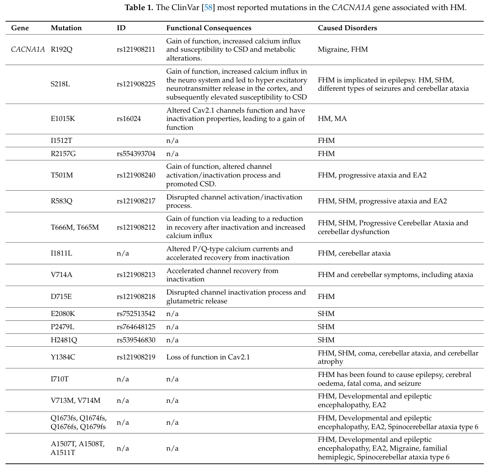

## Question

# Disease Characteristics Research Template

## Target Disease
- **Disease Name:** Familial Hemiplegic Migraine
- **MONDO ID:**  (if available)
- **Category:** Mendelian

## Research Objectives

Please provide a comprehensive research report on **Familial Hemiplegic Migraine** covering all of the
disease characteristics listed below. This report will be used to populate a disease knowledge
base entry. Be thorough and cite primary literature (PMID preferred) for all claims.

For each section, **suggested databases/resources** are listed. These are the first places
you should search for information on each topic.

---

### 1. Disease Information
> **Search first:** OMIM, Orphanet, ICD-10/ICD-11, MeSH, PubMed

- What is the disease? Provide a concise overview.
- What are the key identifiers? (OMIM, Orphanet, ICD-10/ICD-11, MeSH, Mondo)
- What are the common synonyms and alternative names?
- Is the information derived from individual patients (e.g., EHR) or aggregated disease-level resources?

### 2. Etiology

- **Disease Causal Factors**: What are the primary causes? (genetic, environmental, infectious, mechanistic)
- **Risk Factors**:
  > **Search first:** PubMed, Cochrane Library, UpToDate, clinical guidelines, ClinVar, ClinGen, GWAS Catalog, PheGenI, CTD, CDC, WHO, epidemiological databases
  - Genetic risk factors (causal variants, susceptibility loci, modifier genes)
  - Environmental risk factors (toxins, lifestyle, occupational exposures, age, sex, family history)
- **Protective Factors**:
  > **Search first:** PubMed, Cochrane Library, clinical trial databases, GWAS Catalog, gnomAD, WHO, CDC, nutrition databases
  - Genetic protective factors (protective variants, modifier alleles)
  - Environmental protective factors (diet, lifestyle, exposures that reduce risk)
- **Gene-Environment Interactions**: How do genetic and environmental factors interact to influence disease?
  > **Search first:** CTD, PubMed, PheGenI, GxE databases

### 3. Phenotypes
> **Search first:** HPO (Human Phenotype Ontology), OMIM, Orphanet, PubMed, clinicaltrials.gov, MedDRA, SNOMED CT, DECIPHER, LOINC

For each phenotype, provide:
- **Phenotype type**: symptoms, clinical signs, physical manifestations, behavioral changes, or laboratory abnormalities
  > For symptoms/signs: HPO, OMIM, Orphanet, PubMed
  > For behavioral changes: HPO, DSM, RDoC (Research Domain Criteria), PubMed
  > For laboratory abnormalities: LOINC, SNOMED CT, LabTests Online, PubMed
- **Phenotype characteristics**:
  > **Search first:** OMIM, Orphanet, HPO, PubMed
  - Age of symptom onset (neonatal, childhood, adult-onset, late-onset)
  - Symptom severity (mild, moderate, severe, variable)
  - Symptom progression (stable, progressive, episodic, fluctuating)
  - Frequency among affected individuals (percentage or qualitative)
- **Quality of life impact**: Effects on daily functioning and well-being (per-phenotype when possible)
  > **Search first:** EQ-5D database, SF-36, WHO QOL databases, PubMed
- Suggest HPO (Human Phenotype Ontology) terms for each phenotype

### 4. Genetic/Molecular Information

- **Causal Genes**: Gene mutations or chromosomal abnormalities responsible for disease (gene symbols, OMIM IDs)
  > **Search first:** OMIM, ClinVar, HGMD, Ensembl, NCBI Gene
- **Pathogenic Variants**:
  - Affected genes (gene symbols, HGNC IDs)
    > **Search first:** OMIM, NCBI Gene, Ensembl, HGNC, UniProt, GeneCards
  - Variant classification (pathogenic, likely pathogenic, VUS per ACMG/AMP guidelines)
    > **Search first:** ClinVar, ClinGen, ACMG/AMP guidelines, VarSome
  - Variant type/class (missense, frameshift, nonsense, splice-site, structural)
  - Allele frequency in population databases
    > **Search first:** gnomAD, 1000 Genomes, ExAC, TOPMed, dbSNP
  - Somatic vs germline origin
    > **Search first:** COSMIC (somatic), ClinVar, ICGC, TCGA
  - Functional consequences (loss of function, gain of function, dominant negative)
- **Modifier Genes**: Genes that modify disease severity or expression
- **Epigenetic Information**: DNA methylation, histone modifications, chromatin changes affecting disease
  > **Search first:** ENCODE, Roadmap Epigenomics, MethBase, DiseaseMeth
- **Chromosomal Abnormalities**: Large-scale genetic changes (aneuploidy, translocations, inversions)
  > **Search first:** DECIPHER, ClinVar, ECARUCA, UCSC Genome Browser

### 5. Environmental Information

- **Environmental Factors**: Non-genetic contributing factors (toxins, radiation, pollution, occupational exposure)
  > **Search first:** CTD (Comparative Toxicogenomics Database), TOXNET, PubMed, EPA databases
- **Lifestyle Factors**: Behavioral factors (smoking, diet, exercise, alcohol consumption)
  > **Search first:** CDC databases, WHO, PubMed, NHANES
- **Infectious Agents**: If applicable, pathogens causing or triggering disease (bacteria, viruses, fungi, parasites)
  > **Search first:** NCBI Taxonomy, ViPR, BV-BRC, MicrobeDB, GIDEON

### 6. Mechanism / Pathophysiology

- **Molecular Pathways**: Specific signaling cascades or biochemical pathways involved (Wnt, MAPK, mTOR, PI3K-AKT, etc.)
  > **Search first:** KEGG, Reactome, WikiPathways, PathBank, BioCyc
- **Cellular Processes**: Cell-level mechanisms (apoptosis, autophagy, cell cycle dysregulation, inflammation, etc.)
  > **Search first:** Gene Ontology (GO), Reactome, KEGG, PubMed
- **Protein Dysfunction**: How protein structure or function is altered (misfolding, aggregation, loss of function, gain of function)
  > **Search first:** UniProt, PDB (Protein Data Bank), InterPro, Pfam, AlphaFold
- **Metabolic Changes**: Alterations in metabolic processes (energy metabolism, lipid metabolism, amino acid metabolism)
  > **Search first:** KEGG, BioCyc, HMDB (Human Metabolome Database), BRENDA
- **Immune System Involvement**: Role of immune response (autoimmunity, immunodeficiency, chronic inflammation)
  > **Search first:** ImmPort, Immunome Database, IEDB, Gene Ontology
- **Tissue Damage Mechanisms**: How tissues/ are injured (oxidative stress, ischemia, fibrosis, necrosis)
  > **Search first:** PubMed, Gene Ontology, Reactome
- **Biochemical Abnormalities**: Specific molecular defects (enzyme deficiencies, receptor dysfunction, ion channel defects)
  > **Search first:** BRENDA, UniProt, KEGG, OMIM, PubMed
- **Epigenetic Changes**: DNA methylation, histone modifications affecting gene expression in disease
  > **Search first:** ENCODE, Roadmap Epigenomics, MethBase, DiseaseMeth
- **Molecular Profiling** (if available):
  - Transcriptomics/gene expression changes
    > **Search first:** GEO (Gene Expression Omnibus), ArrayExpress, GTEx, Human Cell Atlas, SRA
  - Proteomics findings
    > **Search first:** PRIDE, ProteomeXchange, Human Protein Atlas, STRING, BioGRID
  - Metabolomics signatures
    > **Search first:** MetaboLights, Metabolomics Workbench, HMDB, METLIN
  - Lipidomics alterations
    > **Search first:** LIPID MAPS, SwissLipids, LipidHome, Metabolomics Workbench
  - Genomic structural features
    > **Search first:** UCSC Genome Browser, Ensembl, NCBI, dbVar, DGV
- **Advanced Technologies** (if applicable):
  - Single-cell analysis findings (cell-type specific mechanisms, cellular heterogeneity)
    > **Search first:** Human Cell Atlas, Single Cell Portal, GEO, CELLxGENE
  - Spatial transcriptomics findings
    > **Search first:** GEO, Spatial Research, Vizgen, 10x Genomics data
  - Multi-omics integration results
    > **Search first:** TCGA, ICGC, cBioPortal, LinkedOmics, PubMed
  - Functional genomics screens (CRISPR, RNAi)
    > **Search first:** DepMap, GenomeRNAi, PubMed, BioGRID ORCS

For each mechanism, describe:
- The causal chain from initial trigger to clinical manifestation
- Which mechanisms are upstream vs downstream
- What cell types and biological processes are involved
- Suggest GO terms for biological processes and CL terms for cell types

### 7. Anatomical Structures Affected

- **Organ Level**:
  - Primary organs directly affected
  - Secondary organ involvement (complications, secondary effects)
  - Body systems involved (cardiovascular, nervous, digestive, respiratory, endocrine, etc.)
  > **Search first:** Uberon, FMA (Foundational Model of Anatomy), OMIM, HPO, ICD-11, MeSH, SNOMED CT
- **Tissue and Cell Level**:
  - Specific tissue types affected (epithelial, connective, muscle, nervous)
  - Specific cell populations targeted (with Cell Ontology terms)
  > **Search first:** Uberon, Human Protein Atlas, Cell Ontology, Human Cell Atlas, CellMarker, PanglaoDB
- **Subcellular Level**:
  - Cellular compartments involved (mitochondria, nucleus, ER, lysosomes) (with GO Cellular Component terms)
  > **Search first:** Gene Ontology (Cellular Component), UniProt, Human Protein Atlas
- **Localization**:
  - Specific anatomical sites (with UBERON terms)
    > **Search first:** FMA, Uberon, NeuroNames (for brain), SNOMED CT
  - Lateralization (unilateral, bilateral, asymmetric)
    > **Search first:** HPO, clinical literature, imaging databases

### 8. Temporal Development

- **Onset**:
  - Typical age of onset (congenital, pediatric, adult, geriatric)
  - Onset pattern (acute, subacute, chronic, insidious)
  > **Search first:** OMIM, Orphanet, HPO, PubMed
- **Progression**:
  - Disease stages (early, intermediate, advanced, end-stage)
    > **Search first:** Cancer Staging Manual (AJCC), WHO classifications, PubMed
  - Progression rate (rapid, slow, variable)
  - Disease course pattern (episodic, relapsing-remitting, progressive, stable)
  - Disease duration (self-limited, chronic lifelong)
  > **Search first:** Disease registries, longitudinal cohort databases, natural history studies, PubMed, Orphanet, OMIM
- **Patterns**:
  - Remission patterns (spontaneous, treatment-induced)
    > **Search first:** Clinical trial databases, disease registries, PubMed
  - Critical periods (time windows of vulnerability or opportunity for intervention)
    > **Search first:** PubMed, developmental biology databases, clinical guidelines

### 9. Inheritance and Population

- **Epidemiology**:
  - Prevalence (cases per 100,000 at given time)
  - Incidence (new cases per 100,000 per year)
  > **Search first:** Orphanet, CDC, WHO, GBD (Global Burden of Disease), national registries, SEER, disease registries
- **For Genetic Etiology**:
  - Inheritance pattern (AD, AR, X-linked, mitochondrial, multifactorial, polygenic)
    > **Search first:** OMIM, Orphanet, ClinVar, GTR (Genetic Testing Registry)
  - Penetrance (complete, incomplete, age-dependent)
    > **Search first:** ClinVar, OMIM, PubMed, ClinGen
  - Expressivity (variable, consistent)
    > **Search first:** OMIM, ClinVar, PubMed
  - Genetic anticipation (increasing severity in successive generations)
    > **Search first:** OMIM, PubMed (especially for repeat expansion disorders)
  - Germline mosaicism
    > **Search first:** ClinVar, OMIM, genetic counseling literature, PubMed
  - Founder effects (population-specific mutations)
    > **Search first:** gnomAD, population genetics databases, PubMed
  - Consanguinity role
    > **Search first:** OMIM, population studies, genetic counseling resources
  - Carrier frequency
    > **Search first:** gnomAD, carrier screening databases, GeneReviews, GTR
- **Population Demographics**:
  - Affected populations (ethnic or demographic groups with higher prevalence)
    > **Search first:** gnomAD, 1000 Genomes, PAGE Study, PubMed, population registries
  - Geographic distribution (endemic areas, regional variation)
    > **Search first:** WHO, CDC, GBD, Orphanet, geographic epidemiology databases
  - Geographic distribution of specific variants
  - Sex ratio (male:female)
    > **Search first:** Disease registries, OMIM, PubMed, epidemiological databases
  - Age distribution of affected individuals
    > **Search first:** CDC, disease registries, SEER, Orphanet

### 10. Diagnostics

- **Clinical Tests**:
  - Laboratory tests (blood, urine, tissue chemistry, specific enzyme assays)
    > **Search first:** LOINC, LabTests Online, PubMed
  - Biomarkers (proteins, metabolites, genetic markers, circulating biomarkers)
    > **Search first:** FDA Biomarker List, BEST (Biomarkers, EndpointS, and other Tools), PubMed
  - Imaging studies (X-ray, CT, MRI, PET, ultrasound)
    > **Search first:** RadLex, DICOM, Radiopaedia, imaging databases
  - Functional tests (pulmonary function, cardiac stress tests)
    > **Search first:** LOINC, clinical guidelines, PubMed
  - Electrophysiology (EEG, EMG, ECG, nerve conduction studies)
    > **Search first:** LOINC, clinical neurophysiology databases, PubMed
  - Biopsy findings (histopathology, immunohistochemistry)
    > **Search first:** SNOMED CT, College of American Pathologists resources, PubMed
  - Pathology findings (microscopic examination)
    > **Search first:** SNOMED CT, Digital Pathology databases, PubMed
- **Genetic Testing**:
  > **Search first:** GTR (Genetic Testing Registry), GeneReviews, ClinGen
  - Overview of recommended genetic testing approach
  - Whole genome sequencing (WGS) utility
    > **Search first:** GTR, ClinVar, GEL (Genomics England), gnomAD
  - Whole exome sequencing (WES) utility
    > **Search first:** GTR, ClinVar, OMIM, GeneMatcher
  - Gene panels (which panels, which genes)
    > **Search first:** GTR, ClinVar, laboratory-specific databases
  - Single gene testing
    > **Search first:** GTR, ClinVar, OMIM, GeneReviews
  - Chromosomal microarray (CMA)
    > **Search first:** DECIPHER, ClinVar, dbVar, ECARUCA
  - Karyotyping
    > **Search first:** Chromosome Abnormality Database, ClinVar, cytogenetics resources
  - FISH
    > **Search first:** ClinVar, cytogenetics databases, PubMed
  - Mitochondrial DNA testing
    > **Search first:** MITOMAP, MSeqDR, ClinVar, GTR
  - Repeat expansion testing
    > **Search first:** GTR, ClinVar, repeat expansion databases, PubMed
- **Omics-Based Diagnostics** (if applicable):
  - RNA sequencing / transcriptomics
    > **Search first:** GEO, ArrayExpress, GTEx, RNA-seq databases
  - Proteomics
    > **Search first:** PRIDE, ProteomeXchange, FDA Biomarker database
  - Metabolomics
    > **Search first:** MetaboLights, Metabolomics Workbench, HMDB
  - Epigenomics
    > **Search first:** GEO, ENCODE, Roadmap Epigenomics, MethBase
  - Liquid biopsy
    > **Search first:** COSMIC, ClinVar, liquid biopsy databases, PubMed
- **Clinical Criteria**:
  - Standardized diagnostic criteria (DSM, ICD, society guidelines)
    > **Search first:** DSM-5, ICD-11, clinical society guidelines, UpToDate
  - Differential diagnosis (other conditions to rule out, with distinguishing features)
    > **Search first:** DynaMed, UpToDate, clinical decision support systems
- **Screening**:
  - Screening methods for asymptomatic individuals (newborn screening, carrier screening, cascade screening)
    > **Search first:** ACMG recommendations, CDC newborn screening, GTR

### 11. Outcome/Prognosis

- **Survival and Mortality**:
  - Survival rate (5-year, 10-year, overall)
    > **Search first:** SEER, cancer registries, disease-specific registries, PubMed
  - Life expectancy (with and without treatment if applicable)
    > **Search first:** Orphanet, disease registries, actuarial databases, PubMed
  - Mortality rate
    > **Search first:** CDC, WHO, GBD, national mortality databases
  - Disease-specific mortality (deaths directly attributable to disease)
    > **Search first:** Disease registries, CDC Wonder, GBD, PubMed
- **Morbidity and Function**:
  - Morbidity (disease-related disability and health impacts)
    > **Search first:** GBD, WHO, disability databases, PubMed
  - Disability outcomes (long-term functional impairments)
    > **Search first:** ICF (International Classification of Functioning), disability registries
  - Quality of life measures (EQ-5D, SF-36, PROMIS, disease-specific tools)
    > **Search first:** EQ-5D database, SF-36, PROMIS, PubMed
- **Disease Course**:
  - Complications (secondary problems: infections, organ failure, etc.)
    > **Search first:** ICD codes, disease registries, clinical databases, PubMed
  - Recovery potential (likelihood and extent of recovery, with vs without treatment)
    > **Search first:** Natural history studies, rehabilitation databases, PubMed
- **Prediction**:
  - Prognostic factors (age, disease severity, biomarkers, treatment response)
    > **Search first:** Prognostic models databases, clinical calculators, PubMed
  - Prognostic biomarkers (molecular markers predicting disease course)
    > **Search first:** FDA Biomarker database, PubMed, cancer prognostic databases

### 12. Treatment

- **Pharmacotherapy**:
  - Pharmacological treatments (drug names, drug classes, mechanisms of action)
    > **Search first:** DrugBank, RxNorm, ATC classification, DailyMed, FDA databases
  - Pharmacogenomics (how genetic variants affect drug metabolism, efficacy, toxicity)
    > **Search first:** PharmGKB, CPIC (Clinical Pharmacogenetics), FDA Table of PGx Biomarkers
- **Advanced Therapeutics**:
  - Gene therapy (viral vectors, CRISPR, gene replacement, gene editing)
    > **Search first:** ClinicalTrials.gov, FDA gene therapy database, ASGCT resources
  - Cell therapy (stem cell transplant, CAR-T, cellular therapeutics)
    > **Search first:** ClinicalTrials.gov, FDA cell therapy database, FACT standards
  - RNA-based therapies (ASOs, siRNA, mRNA therapies)
    > **Search first:** ClinicalTrials.gov, FDA approvals, PubMed
  - Targeted therapies (treatments directed at specific molecular targets)
    > **Search first:** My Cancer Genome, OncoKB, ClinicalTrials.gov, FDA approvals
  - Immunotherapies (checkpoint inhibitors, monoclonal antibodies)
    > **Search first:** Cancer Immunotherapy Database, FDA approvals, ClinicalTrials.gov
- **Surgical and Interventional**:
  - Surgical interventions (types of surgery, timing, outcomes)
    > **Search first:** CPT codes, surgical registries, clinical guidelines, PubMed
- **Supportive and Rehabilitative**:
  - Supportive care (symptom management, pain control, nutrition)
    > **Search first:** Clinical guidelines, Cochrane Library, PubMed
  - Rehabilitation (physical therapy, occupational therapy, speech therapy)
    > **Search first:** Rehabilitation medicine databases, clinical guidelines, PubMed
- **Experimental**:
  - Experimental treatments in clinical trials (with NCT identifiers if available)
    > **Search first:** ClinicalTrials.gov, EU Clinical Trials Register, WHO ICTRP
- **Treatment Outcomes**:
  - Treatment response rates
    > **Search first:** Clinical trial databases, FDA reviews, systematic reviews, PubMed
  - Side effects and adverse events
    > **Search first:** FDA Adverse Event Reporting System (FAERS), MedWatch, PubMed
- **Treatment Strategy**:
  - Treatment algorithms (clinical pathways, decision trees)
    > **Search first:** Clinical practice guidelines, NCCN Guidelines, UpToDate
  - Combination therapies
    > **Search first:** ClinicalTrials.gov, treatment guidelines, PubMed
  - Personalized medicine approaches (genotype-guided treatment)
    > **Search first:** My Cancer Genome, CIViC, PharmGKB, precision medicine databases

For each treatment, suggest NCIT (NCI Thesaurus) clinical-intervention terms where applicable.

### 13. Prevention

- **Prevention Levels**:
  - Primary prevention (preventing disease occurrence: vaccination, risk factor modification)
    > **Search first:** CDC, WHO, USPSTF recommendations, Cochrane Library
  - Secondary prevention (early detection and treatment: screening programs, early intervention)
    > **Search first:** USPSTF, CDC screening guidelines, WHO
  - Tertiary prevention (preventing complications in those with disease)
    > **Search first:** Clinical guidelines, disease management protocols, PubMed
- **Immunization**: Vaccine strategies (if applicable)
  > **Search first:** CDC vaccine schedules, WHO immunization, FDA vaccine database
- **Screening and Early Detection**:
  - Screening programs (population-based: newborn screening, cancer screening)
    > **Search first:** CDC screening programs, USPSTF, cancer screening databases
  - Genetic screening (carrier screening, preimplantation genetic diagnosis, prenatal testing)
    > **Search first:** ACMG recommendations, ACOG guidelines, GTR
  - Risk stratification (identifying high-risk individuals for targeted prevention)
    > **Search first:** Risk prediction models, clinical calculators, PubMed
- **Behavioral Interventions**: Lifestyle modifications to reduce risk
  > **Search first:** CDC, WHO, behavioral intervention databases, Cochrane Library
- **Counseling**: Genetic counseling (risk assessment, family planning guidance)
  > **Search first:** NSGC resources, ACMG guidelines, GeneReviews
- **Public Health**:
  - Public health interventions (sanitation, vector control, health education)
    > **Search first:** CDC, WHO, public health databases, PubMed
  - Environmental interventions (reducing environmental risk factors)
    > **Search first:** EPA databases, WHO environmental health, PubMed
- **Prophylaxis**: Preventive medications or procedures
  > **Search first:** Clinical guidelines, FDA approvals, PubMed

### 14. Other Species / Natural Disease

- **Taxonomy**: Species affected (with NCBI Taxon identifiers)
  > **Search first:** NCBI Taxonomy
- **Breed**: Specific breeds affected (with VBO identifiers if applicable)
  > **Search first:** VBO (Vertebrate Breed Ontology)
- **Gene**: Orthologous genes in other species (with NCBI Gene IDs)
  > **Search first:** NCBI Gene
- **Natural Disease**:
  - Naturally occurring disease in other species (companion animals, wildlife)
    > **Search first:** OMIA (Online Mendelian Inheritance in Animals), VetCompass, PubMed
  - Veterinary relevance and importance in animal health
    > **Search first:** OMIA, veterinary databases, PubMed
- **Comparative Biology**:
  - Comparative pathology (similarities and differences across species)
    > **Search first:** OMIA, comparative pathology databases, PubMed
  - Evolutionary conservation of disease mechanisms
    > **Search first:** HomoloGene, OrthoMCL, Alliance of Genome Resources
- **Transmission** (if applicable):
  - Zoonotic potential
    > **Search first:** CDC zoonotic diseases, WHO zoonoses, GIDEON
  - Cross-species susceptibility
    > **Search first:** NCBI Taxonomy, veterinary databases, PubMed

### 15. Model Organisms

- **Model Types**:
  - Model organism type (mammalian, invertebrate, cellular, in vitro)
    > **Search first:** Alliance of Genome Resources, model organism databases
  - Specific model systems (mouse, rat, zebrafish, Drosophila, C. elegans, yeast, cell lines, organoids, iPSCs)
    > **Search first:** MGI, RGD, ZFIN, FlyBase, WormBase, SGD, ATCC, Cellosaurus
  - Induced models (drug treatment, surgical intervention, environmental manipulation)
    > **Search first:** MGI, model organism databases, PubMed
- **Genetic Models**:
  - Types available (knockout, knock-in, transgenic, conditional, humanized)
    > **Search first:** MGI, IMPC, KOMP, EuMMCR, IMSR
- **Model Characteristics**:
  - Phenotype recapitulation (how well model reproduces human disease features)
    > **Search first:** Model organism databases, comparative studies, PubMed
  - Model limitations (aspects of human disease not captured)
    > **Search first:** Model organism databases, PubMed, review articles
- **Applications**:
  - Research applications (what aspects of disease can be studied)
    > **Search first:** Model organism databases, PubMed
- **Resources**:
  - Model databases
    > **Search first:** MGI, RGD, ZFIN, FlyBase, WormBase, IMSR, EMMA, MMRRC

---

## Citation Requirements

- Cite primary literature (PMID preferred) for all mechanistic and clinical claims
- Prioritize recent reviews and landmark papers
- Include direct quotes from abstracts where possible to support key statements
- Distinguish evidence source types: human clinical, model organism, in vitro, computational

## Output Format

Structure your response as a comprehensive narrative organized by the sections above.
For each section, provide:
- Factual content with specific details (numbers, percentages, gene names, variant nomenclature)
- Ontology term suggestions (HPO, GO, CL, UBERON, CHEBI, NCIT, MONDO) where applicable
- Evidence citations with PMIDs
- Direct quotes from abstracts to support key claims
- Clear indication when information is not available or not applicable for this disease

This report will be used to populate a disease knowledge base entry with:
- Pathophysiology descriptions with causal chains
- Gene/protein annotations (HGNC, GO terms)
- Phenotype associations (HP terms) with frequencies
- Cell type involvement (CL terms)
- Anatomical locations (UBERON terms)
- Chemical entities (CHEBI terms)
- Treatment annotations (NCIT terms)
- Evidence items with PMIDs and exact abstract quotes
- Epidemiology, prognosis, diagnostic, and prevention information
- Animal model descriptions with phenotype recapitulation details

## Output

Question: You are an expert researcher providing comprehensive, well-cited information.

Provide detailed information focusing on:
1. Key concepts and definitions with current understanding
2. Recent developments and latest research (prioritize 2023-2024 sources)
3. Current applications and real-world implementations
4. Expert opinions and analysis from authoritative sources
5. Relevant statistics and data from recent studies

Format as a comprehensive research report with proper citations. Include URLs and publication dates where available.
Always prioritize recent, authoritative sources and provide specific citations for all major claims.

# Disease Characteristics Research Template

## Target Disease
- **Disease Name:** Familial Hemiplegic Migraine
- **MONDO ID:**  (if available)
- **Category:** Mendelian

## Research Objectives

Please provide a comprehensive research report on **Familial Hemiplegic Migraine** covering all of the
disease characteristics listed below. This report will be used to populate a disease knowledge
base entry. Be thorough and cite primary literature (PMID preferred) for all claims.

For each section, **suggested databases/resources** are listed. These are the first places
you should search for information on each topic.

---

### 1. Disease Information
> **Search first:** OMIM, Orphanet, ICD-10/ICD-11, MeSH, PubMed

- What is the disease? Provide a concise overview.
- What are the key identifiers? (OMIM, Orphanet, ICD-10/ICD-11, MeSH, Mondo)
- What are the common synonyms and alternative names?
- Is the information derived from individual patients (e.g., EHR) or aggregated disease-level resources?

### 2. Etiology

- **Disease Causal Factors**: What are the primary causes? (genetic, environmental, infectious, mechanistic)
- **Risk Factors**:
  > **Search first:** PubMed, Cochrane Library, UpToDate, clinical guidelines, ClinVar, ClinGen, GWAS Catalog, PheGenI, CTD, CDC, WHO, epidemiological databases
  - Genetic risk factors (causal variants, susceptibility loci, modifier genes)
  - Environmental risk factors (toxins, lifestyle, occupational exposures, age, sex, family history)
- **Protective Factors**:
  > **Search first:** PubMed, Cochrane Library, clinical trial databases, GWAS Catalog, gnomAD, WHO, CDC, nutrition databases
  - Genetic protective factors (protective variants, modifier alleles)
  - Environmental protective factors (diet, lifestyle, exposures that reduce risk)
- **Gene-Environment Interactions**: How do genetic and environmental factors interact to influence disease?
  > **Search first:** CTD, PubMed, PheGenI, GxE databases

### 3. Phenotypes
> **Search first:** HPO (Human Phenotype Ontology), OMIM, Orphanet, PubMed, clinicaltrials.gov, MedDRA, SNOMED CT, DECIPHER, LOINC

For each phenotype, provide:
- **Phenotype type**: symptoms, clinical signs, physical manifestations, behavioral changes, or laboratory abnormalities
  > For symptoms/signs: HPO, OMIM, Orphanet, PubMed
  > For behavioral changes: HPO, DSM, RDoC (Research Domain Criteria), PubMed
  > For laboratory abnormalities: LOINC, SNOMED CT, LabTests Online, PubMed
- **Phenotype characteristics**:
  > **Search first:** OMIM, Orphanet, HPO, PubMed
  - Age of symptom onset (neonatal, childhood, adult-onset, late-onset)
  - Symptom severity (mild, moderate, severe, variable)
  - Symptom progression (stable, progressive, episodic, fluctuating)
  - Frequency among affected individuals (percentage or qualitative)
- **Quality of life impact**: Effects on daily functioning and well-being (per-phenotype when possible)
  > **Search first:** EQ-5D database, SF-36, WHO QOL databases, PubMed
- Suggest HPO (Human Phenotype Ontology) terms for each phenotype

### 4. Genetic/Molecular Information

- **Causal Genes**: Gene mutations or chromosomal abnormalities responsible for disease (gene symbols, OMIM IDs)
  > **Search first:** OMIM, ClinVar, HGMD, Ensembl, NCBI Gene
- **Pathogenic Variants**:
  - Affected genes (gene symbols, HGNC IDs)
    > **Search first:** OMIM, NCBI Gene, Ensembl, HGNC, UniProt, GeneCards
  - Variant classification (pathogenic, likely pathogenic, VUS per ACMG/AMP guidelines)
    > **Search first:** ClinVar, ClinGen, ACMG/AMP guidelines, VarSome
  - Variant type/class (missense, frameshift, nonsense, splice-site, structural)
  - Allele frequency in population databases
    > **Search first:** gnomAD, 1000 Genomes, ExAC, TOPMed, dbSNP
  - Somatic vs germline origin
    > **Search first:** COSMIC (somatic), ClinVar, ICGC, TCGA
  - Functional consequences (loss of function, gain of function, dominant negative)
- **Modifier Genes**: Genes that modify disease severity or expression
- **Epigenetic Information**: DNA methylation, histone modifications, chromatin changes affecting disease
  > **Search first:** ENCODE, Roadmap Epigenomics, MethBase, DiseaseMeth
- **Chromosomal Abnormalities**: Large-scale genetic changes (aneuploidy, translocations, inversions)
  > **Search first:** DECIPHER, ClinVar, ECARUCA, UCSC Genome Browser

### 5. Environmental Information

- **Environmental Factors**: Non-genetic contributing factors (toxins, radiation, pollution, occupational exposure)
  > **Search first:** CTD (Comparative Toxicogenomics Database), TOXNET, PubMed, EPA databases
- **Lifestyle Factors**: Behavioral factors (smoking, diet, exercise, alcohol consumption)
  > **Search first:** CDC databases, WHO, PubMed, NHANES
- **Infectious Agents**: If applicable, pathogens causing or triggering disease (bacteria, viruses, fungi, parasites)
  > **Search first:** NCBI Taxonomy, ViPR, BV-BRC, MicrobeDB, GIDEON

### 6. Mechanism / Pathophysiology

- **Molecular Pathways**: Specific signaling cascades or biochemical pathways involved (Wnt, MAPK, mTOR, PI3K-AKT, etc.)
  > **Search first:** KEGG, Reactome, WikiPathways, PathBank, BioCyc
- **Cellular Processes**: Cell-level mechanisms (apoptosis, autophagy, cell cycle dysregulation, inflammation, etc.)
  > **Search first:** Gene Ontology (GO), Reactome, KEGG, PubMed
- **Protein Dysfunction**: How protein structure or function is altered (misfolding, aggregation, loss of function, gain of function)
  > **Search first:** UniProt, PDB (Protein Data Bank), InterPro, Pfam, AlphaFold
- **Metabolic Changes**: Alterations in metabolic processes (energy metabolism, lipid metabolism, amino acid metabolism)
  > **Search first:** KEGG, BioCyc, HMDB (Human Metabolome Database), BRENDA
- **Immune System Involvement**: Role of immune response (autoimmunity, immunodeficiency, chronic inflammation)
  > **Search first:** ImmPort, Immunome Database, IEDB, Gene Ontology
- **Tissue Damage Mechanisms**: How tissues/ are injured (oxidative stress, ischemia, fibrosis, necrosis)
  > **Search first:** PubMed, Gene Ontology, Reactome
- **Biochemical Abnormalities**: Specific molecular defects (enzyme deficiencies, receptor dysfunction, ion channel defects)
  > **Search first:** BRENDA, UniProt, KEGG, OMIM, PubMed
- **Epigenetic Changes**: DNA methylation, histone modifications affecting gene expression in disease
  > **Search first:** ENCODE, Roadmap Epigenomics, MethBase, DiseaseMeth
- **Molecular Profiling** (if available):
  - Transcriptomics/gene expression changes
    > **Search first:** GEO (Gene Expression Omnibus), ArrayExpress, GTEx, Human Cell Atlas, SRA
  - Proteomics findings
    > **Search first:** PRIDE, ProteomeXchange, Human Protein Atlas, STRING, BioGRID
  - Metabolomics signatures
    > **Search first:** MetaboLights, Metabolomics Workbench, HMDB, METLIN
  - Lipidomics alterations
    > **Search first:** LIPID MAPS, SwissLipids, LipidHome, Metabolomics Workbench
  - Genomic structural features
    > **Search first:** UCSC Genome Browser, Ensembl, NCBI, dbVar, DGV
- **Advanced Technologies** (if applicable):
  - Single-cell analysis findings (cell-type specific mechanisms, cellular heterogeneity)
    > **Search first:** Human Cell Atlas, Single Cell Portal, GEO, CELLxGENE
  - Spatial transcriptomics findings
    > **Search first:** GEO, Spatial Research, Vizgen, 10x Genomics data
  - Multi-omics integration results
    > **Search first:** TCGA, ICGC, cBioPortal, LinkedOmics, PubMed
  - Functional genomics screens (CRISPR, RNAi)
    > **Search first:** DepMap, GenomeRNAi, PubMed, BioGRID ORCS

For each mechanism, describe:
- The causal chain from initial trigger to clinical manifestation
- Which mechanisms are upstream vs downstream
- What cell types and biological processes are involved
- Suggest GO terms for biological processes and CL terms for cell types

### 7. Anatomical Structures Affected

- **Organ Level**:
  - Primary organs directly affected
  - Secondary organ involvement (complications, secondary effects)
  - Body systems involved (cardiovascular, nervous, digestive, respiratory, endocrine, etc.)
  > **Search first:** Uberon, FMA (Foundational Model of Anatomy), OMIM, HPO, ICD-11, MeSH, SNOMED CT
- **Tissue and Cell Level**:
  - Specific tissue types affected (epithelial, connective, muscle, nervous)
  - Specific cell populations targeted (with Cell Ontology terms)
  > **Search first:** Uberon, Human Protein Atlas, Cell Ontology, Human Cell Atlas, CellMarker, PanglaoDB
- **Subcellular Level**:
  - Cellular compartments involved (mitochondria, nucleus, ER, lysosomes) (with GO Cellular Component terms)
  > **Search first:** Gene Ontology (Cellular Component), UniProt, Human Protein Atlas
- **Localization**:
  - Specific anatomical sites (with UBERON terms)
    > **Search first:** FMA, Uberon, NeuroNames (for brain), SNOMED CT
  - Lateralization (unilateral, bilateral, asymmetric)
    > **Search first:** HPO, clinical literature, imaging databases

### 8. Temporal Development

- **Onset**:
  - Typical age of onset (congenital, pediatric, adult, geriatric)
  - Onset pattern (acute, subacute, chronic, insidious)
  > **Search first:** OMIM, Orphanet, HPO, PubMed
- **Progression**:
  - Disease stages (early, intermediate, advanced, end-stage)
    > **Search first:** Cancer Staging Manual (AJCC), WHO classifications, PubMed
  - Progression rate (rapid, slow, variable)
  - Disease course pattern (episodic, relapsing-remitting, progressive, stable)
  - Disease duration (self-limited, chronic lifelong)
  > **Search first:** Disease registries, longitudinal cohort databases, natural history studies, PubMed, Orphanet, OMIM
- **Patterns**:
  - Remission patterns (spontaneous, treatment-induced)
    > **Search first:** Clinical trial databases, disease registries, PubMed
  - Critical periods (time windows of vulnerability or opportunity for intervention)
    > **Search first:** PubMed, developmental biology databases, clinical guidelines

### 9. Inheritance and Population

- **Epidemiology**:
  - Prevalence (cases per 100,000 at given time)
  - Incidence (new cases per 100,000 per year)
  > **Search first:** Orphanet, CDC, WHO, GBD (Global Burden of Disease), national registries, SEER, disease registries
- **For Genetic Etiology**:
  - Inheritance pattern (AD, AR, X-linked, mitochondrial, multifactorial, polygenic)
    > **Search first:** OMIM, Orphanet, ClinVar, GTR (Genetic Testing Registry)
  - Penetrance (complete, incomplete, age-dependent)
    > **Search first:** ClinVar, OMIM, PubMed, ClinGen
  - Expressivity (variable, consistent)
    > **Search first:** OMIM, ClinVar, PubMed
  - Genetic anticipation (increasing severity in successive generations)
    > **Search first:** OMIM, PubMed (especially for repeat expansion disorders)
  - Germline mosaicism
    > **Search first:** ClinVar, OMIM, genetic counseling literature, PubMed
  - Founder effects (population-specific mutations)
    > **Search first:** gnomAD, population genetics databases, PubMed
  - Consanguinity role
    > **Search first:** OMIM, population studies, genetic counseling resources
  - Carrier frequency
    > **Search first:** gnomAD, carrier screening databases, GeneReviews, GTR
- **Population Demographics**:
  - Affected populations (ethnic or demographic groups with higher prevalence)
    > **Search first:** gnomAD, 1000 Genomes, PAGE Study, PubMed, population registries
  - Geographic distribution (endemic areas, regional variation)
    > **Search first:** WHO, CDC, GBD, Orphanet, geographic epidemiology databases
  - Geographic distribution of specific variants
  - Sex ratio (male:female)
    > **Search first:** Disease registries, OMIM, PubMed, epidemiological databases
  - Age distribution of affected individuals
    > **Search first:** CDC, disease registries, SEER, Orphanet

### 10. Diagnostics

- **Clinical Tests**:
  - Laboratory tests (blood, urine, tissue chemistry, specific enzyme assays)
    > **Search first:** LOINC, LabTests Online, PubMed
  - Biomarkers (proteins, metabolites, genetic markers, circulating biomarkers)
    > **Search first:** FDA Biomarker List, BEST (Biomarkers, EndpointS, and other Tools), PubMed
  - Imaging studies (X-ray, CT, MRI, PET, ultrasound)
    > **Search first:** RadLex, DICOM, Radiopaedia, imaging databases
  - Functional tests (pulmonary function, cardiac stress tests)
    > **Search first:** LOINC, clinical guidelines, PubMed
  - Electrophysiology (EEG, EMG, ECG, nerve conduction studies)
    > **Search first:** LOINC, clinical neurophysiology databases, PubMed
  - Biopsy findings (histopathology, immunohistochemistry)
    > **Search first:** SNOMED CT, College of American Pathologists resources, PubMed
  - Pathology findings (microscopic examination)
    > **Search first:** SNOMED CT, Digital Pathology databases, PubMed
- **Genetic Testing**:
  > **Search first:** GTR (Genetic Testing Registry), GeneReviews, ClinGen
  - Overview of recommended genetic testing approach
  - Whole genome sequencing (WGS) utility
    > **Search first:** GTR, ClinVar, GEL (Genomics England), gnomAD
  - Whole exome sequencing (WES) utility
    > **Search first:** GTR, ClinVar, OMIM, GeneMatcher
  - Gene panels (which panels, which genes)
    > **Search first:** GTR, ClinVar, laboratory-specific databases
  - Single gene testing
    > **Search first:** GTR, ClinVar, OMIM, GeneReviews
  - Chromosomal microarray (CMA)
    > **Search first:** DECIPHER, ClinVar, dbVar, ECARUCA
  - Karyotyping
    > **Search first:** Chromosome Abnormality Database, ClinVar, cytogenetics resources
  - FISH
    > **Search first:** ClinVar, cytogenetics databases, PubMed
  - Mitochondrial DNA testing
    > **Search first:** MITOMAP, MSeqDR, ClinVar, GTR
  - Repeat expansion testing
    > **Search first:** GTR, ClinVar, repeat expansion databases, PubMed
- **Omics-Based Diagnostics** (if applicable):
  - RNA sequencing / transcriptomics
    > **Search first:** GEO, ArrayExpress, GTEx, RNA-seq databases
  - Proteomics
    > **Search first:** PRIDE, ProteomeXchange, FDA Biomarker database
  - Metabolomics
    > **Search first:** MetaboLights, Metabolomics Workbench, HMDB
  - Epigenomics
    > **Search first:** GEO, ENCODE, Roadmap Epigenomics, MethBase
  - Liquid biopsy
    > **Search first:** COSMIC, ClinVar, liquid biopsy databases, PubMed
- **Clinical Criteria**:
  - Standardized diagnostic criteria (DSM, ICD, society guidelines)
    > **Search first:** DSM-5, ICD-11, clinical society guidelines, UpToDate
  - Differential diagnosis (other conditions to rule out, with distinguishing features)
    > **Search first:** DynaMed, UpToDate, clinical decision support systems
- **Screening**:
  - Screening methods for asymptomatic individuals (newborn screening, carrier screening, cascade screening)
    > **Search first:** ACMG recommendations, CDC newborn screening, GTR

### 11. Outcome/Prognosis

- **Survival and Mortality**:
  - Survival rate (5-year, 10-year, overall)
    > **Search first:** SEER, cancer registries, disease-specific registries, PubMed
  - Life expectancy (with and without treatment if applicable)
    > **Search first:** Orphanet, disease registries, actuarial databases, PubMed
  - Mortality rate
    > **Search first:** CDC, WHO, GBD, national mortality databases
  - Disease-specific mortality (deaths directly attributable to disease)
    > **Search first:** Disease registries, CDC Wonder, GBD, PubMed
- **Morbidity and Function**:
  - Morbidity (disease-related disability and health impacts)
    > **Search first:** GBD, WHO, disability databases, PubMed
  - Disability outcomes (long-term functional impairments)
    > **Search first:** ICF (International Classification of Functioning), disability registries
  - Quality of life measures (EQ-5D, SF-36, PROMIS, disease-specific tools)
    > **Search first:** EQ-5D database, SF-36, PROMIS, PubMed
- **Disease Course**:
  - Complications (secondary problems: infections, organ failure, etc.)
    > **Search first:** ICD codes, disease registries, clinical databases, PubMed
  - Recovery potential (likelihood and extent of recovery, with vs without treatment)
    > **Search first:** Natural history studies, rehabilitation databases, PubMed
- **Prediction**:
  - Prognostic factors (age, disease severity, biomarkers, treatment response)
    > **Search first:** Prognostic models databases, clinical calculators, PubMed
  - Prognostic biomarkers (molecular markers predicting disease course)
    > **Search first:** FDA Biomarker database, PubMed, cancer prognostic databases

### 12. Treatment

- **Pharmacotherapy**:
  - Pharmacological treatments (drug names, drug classes, mechanisms of action)
    > **Search first:** DrugBank, RxNorm, ATC classification, DailyMed, FDA databases
  - Pharmacogenomics (how genetic variants affect drug metabolism, efficacy, toxicity)
    > **Search first:** PharmGKB, CPIC (Clinical Pharmacogenetics), FDA Table of PGx Biomarkers
- **Advanced Therapeutics**:
  - Gene therapy (viral vectors, CRISPR, gene replacement, gene editing)
    > **Search first:** ClinicalTrials.gov, FDA gene therapy database, ASGCT resources
  - Cell therapy (stem cell transplant, CAR-T, cellular therapeutics)
    > **Search first:** ClinicalTrials.gov, FDA cell therapy database, FACT standards
  - RNA-based therapies (ASOs, siRNA, mRNA therapies)
    > **Search first:** ClinicalTrials.gov, FDA approvals, PubMed
  - Targeted therapies (treatments directed at specific molecular targets)
    > **Search first:** My Cancer Genome, OncoKB, ClinicalTrials.gov, FDA approvals
  - Immunotherapies (checkpoint inhibitors, monoclonal antibodies)
    > **Search first:** Cancer Immunotherapy Database, FDA approvals, ClinicalTrials.gov
- **Surgical and Interventional**:
  - Surgical interventions (types of surgery, timing, outcomes)
    > **Search first:** CPT codes, surgical registries, clinical guidelines, PubMed
- **Supportive and Rehabilitative**:
  - Supportive care (symptom management, pain control, nutrition)
    > **Search first:** Clinical guidelines, Cochrane Library, PubMed
  - Rehabilitation (physical therapy, occupational therapy, speech therapy)
    > **Search first:** Rehabilitation medicine databases, clinical guidelines, PubMed
- **Experimental**:
  - Experimental treatments in clinical trials (with NCT identifiers if available)
    > **Search first:** ClinicalTrials.gov, EU Clinical Trials Register, WHO ICTRP
- **Treatment Outcomes**:
  - Treatment response rates
    > **Search first:** Clinical trial databases, FDA reviews, systematic reviews, PubMed
  - Side effects and adverse events
    > **Search first:** FDA Adverse Event Reporting System (FAERS), MedWatch, PubMed
- **Treatment Strategy**:
  - Treatment algorithms (clinical pathways, decision trees)
    > **Search first:** Clinical practice guidelines, NCCN Guidelines, UpToDate
  - Combination therapies
    > **Search first:** ClinicalTrials.gov, treatment guidelines, PubMed
  - Personalized medicine approaches (genotype-guided treatment)
    > **Search first:** My Cancer Genome, CIViC, PharmGKB, precision medicine databases

For each treatment, suggest NCIT (NCI Thesaurus) clinical-intervention terms where applicable.

### 13. Prevention

- **Prevention Levels**:
  - Primary prevention (preventing disease occurrence: vaccination, risk factor modification)
    > **Search first:** CDC, WHO, USPSTF recommendations, Cochrane Library
  - Secondary prevention (early detection and treatment: screening programs, early intervention)
    > **Search first:** USPSTF, CDC screening guidelines, WHO
  - Tertiary prevention (preventing complications in those with disease)
    > **Search first:** Clinical guidelines, disease management protocols, PubMed
- **Immunization**: Vaccine strategies (if applicable)
  > **Search first:** CDC vaccine schedules, WHO immunization, FDA vaccine database
- **Screening and Early Detection**:
  - Screening programs (population-based: newborn screening, cancer screening)
    > **Search first:** CDC screening programs, USPSTF, cancer screening databases
  - Genetic screening (carrier screening, preimplantation genetic diagnosis, prenatal testing)
    > **Search first:** ACMG recommendations, ACOG guidelines, GTR
  - Risk stratification (identifying high-risk individuals for targeted prevention)
    > **Search first:** Risk prediction models, clinical calculators, PubMed
- **Behavioral Interventions**: Lifestyle modifications to reduce risk
  > **Search first:** CDC, WHO, behavioral intervention databases, Cochrane Library
- **Counseling**: Genetic counseling (risk assessment, family planning guidance)
  > **Search first:** NSGC resources, ACMG guidelines, GeneReviews
- **Public Health**:
  - Public health interventions (sanitation, vector control, health education)
    > **Search first:** CDC, WHO, public health databases, PubMed
  - Environmental interventions (reducing environmental risk factors)
    > **Search first:** EPA databases, WHO environmental health, PubMed
- **Prophylaxis**: Preventive medications or procedures
  > **Search first:** Clinical guidelines, FDA approvals, PubMed

### 14. Other Species / Natural Disease

- **Taxonomy**: Species affected (with NCBI Taxon identifiers)
  > **Search first:** NCBI Taxonomy
- **Breed**: Specific breeds affected (with VBO identifiers if applicable)
  > **Search first:** VBO (Vertebrate Breed Ontology)
- **Gene**: Orthologous genes in other species (with NCBI Gene IDs)
  > **Search first:** NCBI Gene
- **Natural Disease**:
  - Naturally occurring disease in other species (companion animals, wildlife)
    > **Search first:** OMIA (Online Mendelian Inheritance in Animals), VetCompass, PubMed
  - Veterinary relevance and importance in animal health
    > **Search first:** OMIA, veterinary databases, PubMed
- **Comparative Biology**:
  - Comparative pathology (similarities and differences across species)
    > **Search first:** OMIA, comparative pathology databases, PubMed
  - Evolutionary conservation of disease mechanisms
    > **Search first:** HomoloGene, OrthoMCL, Alliance of Genome Resources
- **Transmission** (if applicable):
  - Zoonotic potential
    > **Search first:** CDC zoonotic diseases, WHO zoonoses, GIDEON
  - Cross-species susceptibility
    > **Search first:** NCBI Taxonomy, veterinary databases, PubMed

### 15. Model Organisms

- **Model Types**:
  - Model organism type (mammalian, invertebrate, cellular, in vitro)
    > **Search first:** Alliance of Genome Resources, model organism databases
  - Specific model systems (mouse, rat, zebrafish, Drosophila, C. elegans, yeast, cell lines, organoids, iPSCs)
    > **Search first:** MGI, RGD, ZFIN, FlyBase, WormBase, SGD, ATCC, Cellosaurus
  - Induced models (drug treatment, surgical intervention, environmental manipulation)
    > **Search first:** MGI, model organism databases, PubMed
- **Genetic Models**:
  - Types available (knockout, knock-in, transgenic, conditional, humanized)
    > **Search first:** MGI, IMPC, KOMP, EuMMCR, IMSR
- **Model Characteristics**:
  - Phenotype recapitulation (how well model reproduces human disease features)
    > **Search first:** Model organism databases, comparative studies, PubMed
  - Model limitations (aspects of human disease not captured)
    > **Search first:** Model organism databases, PubMed, review articles
- **Applications**:
  - Research applications (what aspects of disease can be studied)
    > **Search first:** Model organism databases, PubMed
- **Resources**:
  - Model databases
    > **Search first:** MGI, RGD, ZFIN, FlyBase, WormBase, IMSR, EMMA, MMRRC

---

## Citation Requirements

- Cite primary literature (PMID preferred) for all mechanistic and clinical claims
- Prioritize recent reviews and landmark papers
- Include direct quotes from abstracts where possible to support key statements
- Distinguish evidence source types: human clinical, model organism, in vitro, computational

## Output Format

Structure your response as a comprehensive narrative organized by the sections above.
For each section, provide:
- Factual content with specific details (numbers, percentages, gene names, variant nomenclature)
- Ontology term suggestions (HPO, GO, CL, UBERON, CHEBI, NCIT, MONDO) where applicable
- Evidence citations with PMIDs
- Direct quotes from abstracts to support key claims
- Clear indication when information is not available or not applicable for this disease

This report will be used to populate a disease knowledge base entry with:
- Pathophysiology descriptions with causal chains
- Gene/protein annotations (HGNC, GO terms)
- Phenotype associations (HP terms) with frequencies
- Cell type involvement (CL terms)
- Anatomical locations (UBERON terms)
- Chemical entities (CHEBI terms)
- Treatment annotations (NCIT terms)
- Evidence items with PMIDs and exact abstract quotes
- Epidemiology, prognosis, diagnostic, and prevention information
- Animal model descriptions with phenotype recapitulation details

# Familial Hemiplegic Migraine: Disease-Characteristics Research Report

**Scope.** This report prioritizes literature published in 2023–2024, supplemented by established diagnostic guidance and landmark mechanistic evidence. Evidence types are identified explicitly. Familial hemiplegic migraine (FHM) is rare, and many management recommendations rest on observational studies, small series, or extrapolation from ordinary migraine rather than randomized FHM trials.

## Executive summary

FHM is a usually autosomal-dominant subtype of migraine with aura in which attacks include fully reversible motor weakness and at least one first- or second-degree relative has hemiplegic migraine. Estimated prevalence is approximately **0.003% (3 per 100,000)**. Onset is usually pediatric or adolescent (mean reported onset 12–17 years), attacks average approximately 3–4 per year but vary from weekly to only a few lifetime events, and frequency commonly decreases with age. Besides hemiparesis, attacks may include visual, sensory, language, and brainstem aura; severe episodes can cause seizures, fever, encephalopathy, coma, and reversible cerebral edema. (alfayyadh2024unravellingthegenetic pages 1-2, alfayyadh2024unravellingthegenetic pages 2-4, grangeon2023geneticsofmigraine pages 1-2)

Three genes have definitive causal status: **CACNA1A (FHM1), ATP1A2 (FHM2), and SCN1A (FHM3)**. Their dysfunction converges on disturbed neuronal–glial ion and glutamate homeostasis, lowering the threshold for cortical spreading depolarization/depression (CSD), the accepted physiological substrate of aura. Nevertheless, approximately 75% of clinically diagnosed HM is negative for pathogenic variants in these genes, and some unsolved disease may be oligogenic or polygenic. (alfayyadh2024unravellingthegenetic pages 1-2, maksemous2023wholeexomesequencing pages 1-3, sutherland2024geneticsofmigraine pages 1-2)

There is no validated blood, CSF, imaging, electrophysiological, or omics biomarker and no FHM-specific approved therapy. Diagnosis is clinical and genetic testing can confirm a molecular subtype. First or atypical attacks require urgent exclusion of stroke, seizure/Todd paresis, infection or inflammation, and metabolic disease. Treatment is individualized; evidence for verapamil, flunarizine, acetazolamide, lamotrigine, valproate, or topiramate is low quality. Gene, RNA, cell, and surgical therapies are not established.

A compact knowledge-base scaffold follows.

| Domain | Key finding | Suggested ontology terms | Evidence level/limitations |
|---|---|---|---|
| Definition / epidemiology | Familial hemiplegic migraine (FHM) is a rare, severe subtype of migraine with aura defined by reversible motor weakness and at least one first- or second-degree relative with hemiplegic migraine; usually autosomal dominant. Reported prevalence is ~0.003% for FHM, within overall HM prevalence around 0.01% in European populations. Onset is typically in youth, often first or second decade; mean onset 12–17 years; females are affected more often; attack severity/frequency often decrease with age. (alfayyadh2024unravellingthegenetic pages 1-2, grangeon2023geneticsofmigraine pages 1-2) | Hemiplegic migraine; Migraine with aura [MeSH D020325]; hemiparesis; autosomal dominant inheritance | Recent review-level evidence synthesizing older epidemiology; prevalence estimates derive from limited rare-disease cohorts and may vary by ascertainment. (alfayyadh2024unravellingthegenetic pages 1-2, grangeon2023geneticsofmigraine pages 1-2) |
| Core phenotypes | Core attack phenotype is unilateral motor weakness/hemiparesis during aura, often with visual, sensory, speech/language, and brainstem symptoms. Brainstem aura symptoms occur in ~70% of cases; average attack frequency ~3–4/year but ranges widely; aura may last days to weeks in some patients. Severe attacks can include confusion, fever, seizures, coma, encephalopathy, and reversible cerebral edema; mild head trauma can trigger severe episodes. (alfayyadh2024unravellingthegenetic pages 2-4, grangeon2023geneticsofmigraine pages 1-2, xiang2023twopediatricpatients pages 1-3) | HP:0001269 Hemiplegia; hemiparesis; visual aura; paresthesia; aphasia; ataxia; dysarthria; vertigo; seizure; coma; fever; cerebral edema | Mixed evidence: narrative reviews plus pediatric case-based literature summary; exact phenotype frequencies beyond brainstem symptoms are incompletely standardized. (alfayyadh2024unravellingthegenetic pages 2-4, grangeon2023geneticsofmigraine pages 1-2, xiang2023twopediatricpatients pages 1-3) |
| CACNA1A / FHM1 | CACNA1A is the best-established FHM gene and accounts for ~50–75% of genetically solved FHM. Variants are mostly missense, with some deletions/other classes. Functional effect is usually gain of function of Cav2.1 (P/Q-type) calcium channels, increasing calcium influx, glutamate release, neuronal hyperexcitability, and susceptibility to cortical spreading depression (CSD). Chronic progressive ataxia and nystagmus are especially associated with FHM1; some variants are linked to developmental/epileptic encephalopathy, cerebellar atrophy, coma, or seizures. Example recurrent variants summarized in a 2024 table include R192Q, S218L, T501M, R583Q, T666M/T665M, V714A, D715E, and Y1384C. (alfayyadh2024unravellingthegenetic pages 4-5, alfayyadh2024unravellingthegenetic pages 2-4) | CACNA1A; Cav2.1 / P/Q-type voltage-gated calcium channel; glutamatergic synapse; cortical spreading depression; cerebellar ataxia | Strong gene-disease validity from longstanding familial, functional, and animal-model data; many variant-specific assertions are compiled from prior studies rather than re-tested in 2024. (alfayyadh2024unravellingthegenetic pages 4-5, alfayyadh2024unravellingthegenetic pages 2-4) |
| ATP1A2 / FHM2 | ATP1A2 is an established causal FHM gene encoding the Na+/K+-ATPase alpha-2 subunit, with astrocytic potassium and glutamate homeostasis central to mechanism. FHM2 converges mechanistically on elevated extracellular glutamate and increased CSD susceptibility; ATP1A2-related severe pediatric attacks can present with encephalopathy, seizures, and stroke-like episodes. (sutherland2024geneticsofmigraine pages 1-2, xiang2023twopediatricpatients pages 1-3, alfayyadh2024unravellingthegenetic pages 24-26) | ATP1A2; sodium-potassium ATPase; astrocyte; potassium ion homeostasis; glutamate clearance | Strong gene-level evidence, but the provided contexts contain fewer variant-by-variant details than for CACNA1A. Much of the mechanistic detail is review-synthesized. (sutherland2024geneticsofmigraine pages 1-2, xiang2023twopediatricpatients pages 1-3, alfayyadh2024unravellingthegenetic pages 24-26) |
| SCN1A / FHM3 | SCN1A is the third established FHM gene, encoding a neuronal voltage-gated sodium channel. FHM3 overlaps clinically with epilepsy; SCN1A variants can produce hemiplegic migraine with seizures and, in some cases, prolonged or severe neurological sequelae. A recent case report highlighted late-onset type 3 HM with permanent neurologic sequelae after attacks. (alfayyadh2024unravellingthegenetic pages 2-4, boer2019advanceingenetics pages 5-8, grangeon2023geneticsofmigraine pages 1-2) | SCN1A; voltage-gated sodium channel; epilepsy; neuronal excitability | Established causal gene, but rarer than CACNA1A/ATP1A2 and less comprehensively represented in the retrieved 2023–2024 primary data. (alfayyadh2024unravellingthegenetic pages 2-4, boer2019advanceingenetics pages 5-8, grangeon2023geneticsofmigraine pages 1-2) |
| Emerging genes / modifiers | A substantial proportion of HM/FHM remains genetically unexplained: recent reviews state ~75% of HM cases are negative for CACNA1A, ATP1A2, and SCN1A. Danish and Finnish studies found only 14% and 9% of FHM families, respectively, with variants in the 3 known genes. PRRT2 is described as more likely a modifier than a primary causal FHM gene. WES burden testing in 184 Australian HM cases found significant excess missense variation in CACNA1E, CACNA1H, and CACNA1I, with replication for CACNA1H and partial replication for CACNA1I in 32 Dutch cases, supporting a more complex architecture in some unsolved HM. (alfayyadh2024unravellingthegenetic pages 1-2, alfayyadh2024unravellingthegenetic pages 2-4, maksemous2023wholeexomesequencing pages 1-3) | PRRT2; CACNA1E; CACNA1H; CACNA1I; modifier gene; complex trait | Emerging/disputed evidence. Burden studies indicate association, not monogenic causality; unsolved cases likely reflect locus heterogeneity and polygenic/background effects. (alfayyadh2024unravellingthegenetic pages 2-4, maksemous2023wholeexomesequencing pages 1-3) |
| Mechanism / CSD | Current model: pathogenic ion-transport defects in neurons and astrocytes disturb excitatory-inhibitory balance and glutamatergic signaling, increase extracellular glutamate and/or impair ion homeostasis, thereby lowering the threshold for CSD initiation and propagation; CSD then drives aura and can activate downstream migraine pain pathways. The neurovascular unit is emphasized, involving neurons, glial cells, and vessels. Female sex hormones may further enhance CSD susceptibility. (sutherland2024geneticsofmigraine pages 1-2, grangeon2023geneticsofmigraine pages 1-2, alfayyadh2024unravellingthegenetic pages 4-5) | cortical spreading depression; glutamatergic neurotransmission; excitatory-inhibitory balance; neuron; astrocyte; neurovascular unit; GO:0007268 synaptic transmission | Mechanism is strongly supported by convergent human genetics and animal models, but the direct step from CSD to individual clinical features remains partly inferential. (sutherland2024geneticsofmigraine pages 1-2, grangeon2023geneticsofmigraine pages 1-2, alfayyadh2024unravellingthegenetic pages 4-5) |
| Diagnosis | Diagnosis is clinical using ICHD-3 criteria for migraine with aura; if aura includes motor weakness it is classified as hemiplegic migraine. FHM is distinguished from sporadic HM by family history. Because presentation overlaps with stroke and other acute neurologic disorders, diagnosis often requires exclusion of structural, vascular, infectious, epileptic, and inflammatory causes; genetic testing is particularly useful in atypical or pediatric severe cases. (schytz2021referenceprogrammediagnosis pages 3-7, alfayyadh2024unravellingthegenetic pages 1-2, xiang2023twopediatricpatients pages 1-3) | ICHD-3; Migraine with aura [MeSH D020325]; hemiplegic migraine; family history | Guideline and review support are strong for clinical diagnosis, but no single biomarker or pathognomonic ancillary test exists. (schytz2021referenceprogrammediagnosis pages 3-7, alfayyadh2024unravellingthegenetic pages 1-2) |
| Treatment | No FHM-specific approved therapy was identified in the retrieved evidence. Management is largely extrapolated from migraine care and case-based experience. Human provocation studies show FHM has been used experimentally in GTN and CGRP infusion paradigms (NCT00541736, n=30; NCT00358839, n=20) to probe mechanism. Pediatric longitudinal EMR data in CACNA1A-related HM (15 individuals, 163 patient-years) found no clear efficacy for levetiracetam or acetazolamide, while verapamil and valproate were associated with modest prevention but not reduced severity. (NCT00541736 chunk 1, NCT00358839 chunk 1, xiang2023twopediatricpatients pages 1-3) | verapamil; valproate; acetazolamide; levetiracetam; migraine prophylaxis; supportive care | Evidence is weak to moderate and mostly non-randomized/case-based; HM patients are commonly excluded from migraine RCTs. Provocation trials are mechanistic, not therapeutic. (NCT00541736 chunk 1, NCT00358839 chunk 1, xiang2023twopediatricpatients pages 1-3) |
| Prognosis | Many patients improve over time with decreasing attack frequency/severity, but prognosis is highly variable. Severe attacks can be prolonged and life-threatening; permanent neurologic sequelae, cognitive impairment, cerebellar atrophy, or developmental issues occur in some genetic subgroups, especially severe CACNA1A- or SCN1A-related disease. Early recognition in children may improve prognosis by avoiding misdiagnosis and delayed care. (alfayyadh2024unravellingthegenetic pages 1-2, alfayyadh2024unravellingthegenetic pages 2-4, xiang2023twopediatricpatients pages 1-3) | cognitive impairment; cerebellar atrophy; developmental delay; permanent neurologic deficit | Mostly derived from reviews, longitudinal pediatric series, and case reports; mortality/life expectancy statistics are not well defined in retrieved evidence. (alfayyadh2024unravellingthegenetic pages 1-2, xiang2023twopediatricpatients pages 1-3) |
| Models | Knock-in mouse models carrying human FHM mutations, especially CACNA1A R192Q and S218L, show increased CSD susceptibility and enhanced excitatory/glutamatergic transmission; ATP1A2-related models show extracellular glutamate abnormalities ("glutamate plumes") and increased CSD propensity. These models are useful for studying synaptic signaling, neuroinflammation, metabolite changes, and sex-hormone modulation, but cannot fully recapitulate subjective human aura/headache experience. (sutherland2024geneticsofmigraine pages 1-2, alfayyadh2024unravellingthegenetic pages 23-24, alfayyadh2024unravellingthegenetic pages 24-26) | mouse model; knock-in model; Cacna1a; Atp1a2; cortical spreading depression; glutamate | Strong translational value for mechanism; limited face validity for subjective pain and heterogeneous human attack phenomenology. (sutherland2024geneticsofmigraine pages 1-2, alfayyadh2024unravellingthegenetic pages 23-24, alfayyadh2024unravellingthegenetic pages 24-26) |

*Table: This table compacts the main disease, genetic, mechanistic, diagnostic, treatment, prognosis, and model-organism findings for familial hemiplegic migraine. It is useful as a structured scaffold for populating a disease knowledge base while preserving evidence strength and key limitations.*

## 1. Disease information

### Definition and classification

Hemiplegic migraine (HM) is a rare, severe form of migraine with aura characterized by reversible motor weakness, usually unilateral. **FHM** is diagnosed when at least one first- or second-degree relative has HM; without such a family history, the classification is sporadic hemiplegic migraine (SHM). FHM constitutes approximately two-thirds and SHM one-third of HM in a recent review. (alfayyadh2024unravellingthegenetic pages 1-2, grangeon2023geneticsofmigraine pages 1-2)

The current diagnostic construct is disease-level and aggregated from ICHD, curated genetic resources, cohorts, and literature—not principally an EHR-derived phenotype. Individual case reports and recent electronic-record cohorts supply natural-history details but should not be treated as population estimates.

### Identifiers and synonyms

- **MONDO:** familial hemiplegic migraine is represented in MONDO as a hereditary hemiplegic-migraine concept; database releases should be checked before ingestion because parent/child mappings can change.
- **OMIM phenotypes:** FHM1 **#141500**; FHM2 **#602481**; FHM3 **#609634**.
- **Orphanet:** familial hemiplegic migraine, **ORPHA:569**.
- **MeSH:** *Migraine with Aura*, **D020325**; the clinical-trial registry also maps FHM1 to MeSH supplementary concept **C536890**. (NCT00541736 chunk 1, NCT00358839 chunk 1)
- **ICD-10-CM:** **G43.4-** (hemiplegic migraine; extensions specify intractability/status migrainosus). ICD systems generally do not reliably encode molecular FHM subtype.
- **ICD-11:** classified under migraine with aura/hemiplegic migraine; verify the current browser code at implementation time.
- **Synonyms:** familial hemiplegic migraine; familial hemiplegic migraine with aura; FHM; familial hemiplegic migraine type 1/FHM1, type 2/FHM2, and type 3/FHM3; historically, familial hemiplegic migraine with progressive cerebellar ataxia for some CACNA1A families.

## 2. Etiology, risk, protection, and gene–environment interaction

### Primary causal factors

FHM is primarily a **germline genetic channelopathy/ion-transport disorder**. Heterozygous pathogenic variants in CACNA1A, ATP1A2, or SCN1A alter presynaptic calcium entry, astrocytic Na+/K+ transport, or neuronal sodium-channel excitability. These defects converge on excessive extracellular glutamate or defective ionic homeostasis and heightened CSD susceptibility. (alfayyadh2024unravellingthegenetic pages 4-5, sutherland2024geneticsofmigraine pages 1-2)

### Genetic risk and modifiers

The three established genes account for only a minority of all clinically diagnosed families in population-based series: a Danish study found variants in 14%, and a Finnish study in 9% of 45 families. Conversely, among *genetically solved* FHM, CACNA1A has been reported to account for 50–75%. These denominators are different and should not be conflated. (alfayyadh2024unravellingthegenetic pages 4-5, alfayyadh2024unravellingthegenetic pages 2-4)

**PRRT2** loss-of-function variation has been reported in HM, especially in overlapping paroxysmal phenotypes, but current evidence favors a modifier or susceptibility role rather than definitive primary FHM causation. A 2023 WES study found excess missense variation in CACNA1E, CACNA1H, and CACNA1I among 184 Australian HM cases; CACNA1H replicated in 32 Dutch cases, while CACNA1I did not survive correction in the replication analysis. These are association/burden findings, not established Mendelian genes. (maksemous2023wholeexomesequencing pages 1-3)

### Environmental and lifestyle triggers

Reported attack triggers include minor head trauma, physical or emotional stress, viral illness/fever, disrupted sleep, and other homeostatic stresses. Hormonal state is relevant: experimental FHM1 evidence indicates female sex hormones can increase CSD susceptibility. These exposures precipitate attacks in a genetically susceptible brain; they do not cause the inherited disorder. (alfayyadh2024unravellingthegenetic pages 4-5, alfayyadh2024unravellingthegenetic pages 1-2, alfayyadh2024unravellingthegenetic pages 2-4)

No toxin, pollution, occupational exposure, diet, smoking pattern, alcohol exposure, or infectious organism is established as an FHM cause. Viral infection may trigger an attack but is not etiologic. No replicated **genetic protective allele** is established. Environmental protection is therefore pragmatic—regular sleep and meals, hydration, stress management, and avoidance of individually documented triggers, particularly head trauma—not evidence of disease prevention.

## 3. Phenotypes

| Phenotype | Characteristics and frequency | Suggested HPO annotation |
|---|---|---|
| Motor aura/hemiparesis | Defining feature; usually unilateral, reversible, may switch sides, rarely bilateral; episodic and variable in severity | Hemiplegia **HP:0002301**; hemiparesis; migraine with aura |
| Headache | Often unilateral and severe but may be bilateral, ipsilateral, or contralateral to weakness; headache is not required after every aura | Migraine; headache **HP:0002315**; nausea/vomiting; photophobia; phonophobia |
| Visual aura | Scintillating scotoma, hemianopia, or other positive/negative visual symptoms; commonly accompanies motor aura | Visual aura; hemianopia **HP:0012377** |
| Sensory aura | Numbness, tingling, and paresthesia; generally spreads gradually | Paresthesia **HP:0003401**; hypoesthesia |
| Language aura | Dysphasia/aphasia or dysarthria | Aphasia **HP:0002381**; dysarthria **HP:0001260** |
| Brainstem manifestations | Vertigo, tinnitus, hyperacusis, ataxia, dysarthria, or impaired consciousness; collectively reported in approximately 70% | Vertigo **HP:0002321**; tinnitus **HP:0000360**; ataxia **HP:0001251** |
| Severe encephalopathic attack | Confusion, somnolence, fever, seizure/status epilepticus, coma, and reversible edema; uncommon but clinically critical; may last days–weeks | Encephalopathy **HP:0001298**; seizure **HP:0001250**; coma **HP:0001259**; cerebral edema **HP:0002181** |
| Chronic cerebellar syndrome | Progressive or interictal ataxia and gaze-evoked nystagmus, particularly CACNA1A-related disease; reported in up to 60% of FHM1 in the cited review but rare in FHM2 | Cerebellar ataxia **HP:0001251**; nystagmus **HP:0000639**; cerebellar atrophy **HP:0001272** |
| Neurodevelopmental/cognitive phenotype | Learning disability, intellectual disability, or cognitive impairment in severe CACNA1A/ATP1A2 disease; may precede or follow HM | Intellectual disability **HP:0001249**; developmental delay **HP:0001263** |

The frequency, duration, and sequence of symptoms vary substantially even among relatives carrying the same variant. Typical individual aura symptoms often evolve over minutes; motor weakness commonly resolves within hours, but severe attacks can persist for weeks. (alfayyadh2024unravellingthegenetic pages 2-4, grangeon2023geneticsofmigraine pages 1-2, schytz2021referenceprogrammediagnosis pages 3-7)

A 2023 pediatric analysis assembled 160 mutation-positive patients—73 CACNA1A and 87 ATP1A2—and emphasized that severe childhood attacks may present principally as acute encephalopathy. Its abstract states: **“Physicians should consider HM in the differential diagnosis of patients presenting with somnolence, coma, or convulsion without structural, epileptic, infectious, or inflammatory explanation.”** This is case-based literature evidence, not a frequency estimate for all FHM. (xiang2023twopediatricpatients pages 1-3)

### Quality of life

Motor deficits, pain, vomiting, sensory/language impairment, fear of recurrence, emergency assessment for stroke, school/work absence, and prolonged post-attack recovery can markedly impair function. Severe chronic cerebellar or developmental phenotypes add interictal disability. However, no robust FHM-specific EQ-5D, SF-36, PROMIS, or MIDAS population dataset was identified; general migraine burden statistics should not be assigned directly to FHM.

## 4. Genetic and molecular information

### Definitive causal genes

| Subtype | Gene/protein | Locus/function | Typical functional consequence |
|---|---|---|---|
| FHM1 | **CACNA1A**; CaV2.1 α1A subunit | 19p13; presynaptic P/Q-type voltage-gated Ca²⁺ channel | Usually gain of function: activation at lower voltage, increased Ca²⁺ influx and glutamate release, cortical hyperexcitability |
| FHM2 | **ATP1A2**; Na⁺/K⁺-ATPase α2 | 1q23; enriched in astrocytes in adult brain | Usually loss of pump function, impaired extracellular K⁺ and glutamate clearance |
| FHM3 | **SCN1A**; NaV1.1 | 2q24; neuronal voltage-gated Na⁺ channel, especially inhibitory interneurons | Variant-dependent altered excitability; many HM variants produce gain-of-function or impaired inactivation, disturbing excitation–inhibition balance |

All are ordinarily **heterozygous germline** variants. Somatic mutation is not a recognized usual mechanism. Large recurrent chromosomal rearrangements, aneuploidy, repeat expansions, and mitochondrial inheritance are not established causes.

### Variant classes and examples

Most classic FHM1 alleles are missense variants in channel pore/voltage-sensor or regulatory regions, although splice, deletion, frameshift, and other loss-of-function alleles occur across the broader CACNA1A disorder spectrum. Recurrent examples include **p.Arg192Gln (R192Q; rs121908211), p.Ser218Leu (S218L; rs121908225), p.Thr501Met, p.Arg583Gln, p.Thr666Met, p.Val714Ala, and p.Asp715Glu**. R192Q and S218L increase calcium influx and CSD susceptibility; S218L is associated with a particularly severe epilepsy/ataxia/encephalopathy spectrum. Variant-specific effects are not uniform: for example, p.Tyr1384Cys is reported as CaV2.1 loss of function. (alfayyadh2024unravellingthegenetic pages 4-5, alfayyadh2024unravellingthegenetic media 3fe8f9b6, alfayyadh2024unravellingthegenetic media bf5d2d35)

Population frequency must be evaluated per exact HGVS allele and transcript in **gnomAD**. A credible highly penetrant FHM allele is generally absent or extremely rare in reference populations. Pathogenicity must be assigned under ACMG/AMP criteria using segregation, de novo status, population rarity, functional evidence, phenotype specificity, and validated database assertions; a rare missense variant or in-silico score alone is insufficient.

### Penetrance and expressivity

Inheritance is usually autosomal dominant with high but not universally complete penetrance. Expressivity is markedly variable—including within a pedigree—from infrequent pure HM to epilepsy, ataxia, intellectual disability, edema, or coma. Mutation-positive patients in a comparison of 208 carriers versus 73 mutation-negative HM patients had earlier onset and more extensive motor, brainstem, confusion, edema, and head-trauma-triggered phenotypes; intellectual disability and progressive ataxia occurred only among mutation-positive individuals in that dataset. (boer2019advanceingenetics pages 5-8)

No consistent anticipation mechanism is established. De novo variants are well documented, especially in severe sporadic presentations. Parental germline mosaicism is biologically possible and relevant to counseling after an apparently de novo result, but its frequency is unknown. Founder variants exist in individual populations/families, but there is no universal founder allele. Consanguinity is not a principal risk factor for this dominant disorder.

### Epigenetics and structural variation

No validated FHM-specific DNA-methylation, histone, or chromatin signature is used clinically. Copy-number and structural variants are plausible and occasionally reported, particularly in CACNA1A/PRRT2 regions, but sequence-level variants predominate. A negative exome or panel does not exclude deep-intronic, regulatory, repeat-complex, mosaic, or structural variation.

## 5. Environmental information

FHM is not caused by toxins, radiation, pollution, occupational exposure, or infection. The relevant environmental layer is **attack provocation**. Minor head trauma is particularly important because severe edema, encephalopathy, seizure, or coma may follow otherwise mild injury in susceptible children. Physical/emotional stress and febrile or viral illness are also reported triggers. (alfayyadh2024unravellingthegenetic pages 1-2, grangeon2023geneticsofmigraine pages 1-2, xiang2023twopediatricpatients pages 1-3)

Regular sleep, meals, hydration, graded exercise as tolerated, and trigger diaries are reasonable implementations of general migraine care. Evidence for avoiding particular foods is weak; a guideline notes no clear evidence for commonly implicated foods such as red wine, chocolate, or cheese. (schytz2021referenceprogrammediagnosis pages 3-7)

## 6. Mechanism and pathophysiology

### Causal chain

1. **Upstream germline lesion:** altered CACNA1A, ATP1A2, or SCN1A protein function.
2. **Cellular ion-homeostasis defect:** excessive presynaptic Ca²⁺-dependent glutamate release (FHM1), impaired astrocytic K⁺/glutamate clearance (FHM2), or altered interneuron/network excitability (FHM3).
3. **Network consequence:** increased extracellular glutamate/K⁺ and impaired cortical excitation–inhibition balance.
4. **Threshold event:** easier initiation and propagation of CSD—a slowly advancing wave of neuronal/glial depolarization followed by suppression of activity.
5. **Clinical aura:** propagation through visual, somatosensory, language, and motor cortex produces corresponding positive and negative neurological symptoms, including hemiparesis.
6. **Downstream pain:** CSD and associated neurovascular signaling can activate meningeal/trigeminovascular afferents and release vasoactive neuropeptides, producing migraine headache and associated symptoms. Severe depolarization and homeostatic failure can produce seizures, edema, or prolonged encephalopathy. (alfayyadh2024unravellingthegenetic pages 4-5, sutherland2024geneticsofmigraine pages 1-2, grangeon2023geneticsofmigraine pages 1-2)

A 2024 Lancet Neurology review summarizes the convergence directly: FHM1 and FHM2 mutations increase extracellular glutamate, dysregulate cortical excitatory–inhibitory balance, and increase CSD initiation and propagation. (sutherland2024geneticsofmigraine pages 1-2)

### Cells, tissues, pathways, and ontology suggestions

- **Cells:** excitatory cortical neuron (CL:0000679), GABAergic neuron (CL:0000617), astrocyte (CL:0000127), trigeminal sensory neuron, vascular endothelial cell (CL:0000115), vascular smooth-muscle cell.
- **Anatomy:** cerebral cortex (UBERON:0000956), motor cortex, visual cortex, somatosensory cortex, brainstem (UBERON:0002298), cerebellum (UBERON:0002037), meninges (UBERON:0002360), trigeminal ganglion.
- **GO biological processes:** synaptic transmission (GO:0007268), glutamatergic synaptic transmission (GO:0035249), calcium-ion transmembrane transport (GO:0070588), potassium-ion homeostasis, regulation of membrane potential (GO:0042391), neurotransmitter secretion (GO:0007269), spreading depolarization/CSD (use the current GO term if available).
- **GO cellular components:** voltage-gated calcium-channel complex (GO:0005891), sodium-channel complex (GO:0034706), sodium:potassium-exchanging ATPase complex (GO:0005890), presynaptic membrane (GO:0042734), astrocyte projection.

### Metabolism, immunity, and tissue injury

Metabolic abnormalities observed in FHM models are chiefly downstream of abnormal ion flux and the energetic demand of repolarization. Neuroinflammatory and vascular responses can accompany CSD, but FHM is neither a primary autoimmune disease nor an immunodeficiency. Cerebral edema, rare infarction, neuronal stress, and cerebellar degeneration are complications rather than universal progressive tissue injury.

### Molecular profiling and advanced technologies

No reproducible FHM-specific clinical transcriptomic, proteomic, metabolomic, lipidomic, single-cell, spatial-transcriptomic, or multi-omic diagnostic signature is established. Current high-value technologies are family-based WES/WGS, structural-variant analysis, electrophysiology, knock-in models, and patient-derived neuronal systems. The 2023 burden study supports pathway-level analysis of rare variants rather than assuming every unsolved patient has a fourth high-penetrance gene. (maksemous2023wholeexomesequencing pages 1-3)

## 7. Anatomical structures affected

The primary system is the **central nervous system**, especially cerebral cortical networks. Symptoms lateralize according to the cortical hemisphere involved; weakness is usually unilateral, may alternate between attacks, and rarely becomes bilateral. Visual, sensory, language, and motor cortices account for aura topography. Brainstem networks account for vertigo, dysarthria, tinnitus, ataxia, and impaired consciousness; cerebellar tissue is chronically affected in some CACNA1A genotypes. Meningeal vessels and trigeminal afferents mediate downstream headache. (alfayyadh2024unravellingthegenetic pages 2-4, grangeon2023geneticsofmigraine pages 1-2)

At the subcellular level, relevant compartments are presynaptic membranes/active zones, voltage-gated ion-channel complexes, astrocytic plasma membranes, and synaptic extracellular space. FHM is not primarily a muscle disorder despite the clinical weakness.

## 8. Temporal development

- **Onset:** usually childhood/adolescence; mean 12–17 years, although infancy and adult-onset cases occur. (alfayyadh2024unravellingthegenetic pages 1-2, grangeon2023geneticsofmigraine pages 1-2)
- **Attack onset:** aura generally develops acutely and often spreads over minutes; stroke-like abrupt onset can occur.
- **Duration:** typical aura components often last 5–60 minutes, but motor or encephalopathic deficits may last days to weeks. (alfayyadh2024unravellingthegenetic pages 2-4, schytz2021referenceprogrammediagnosis pages 3-7)
- **Course:** lifelong episodic/relapsing disorder rather than staged neurodegeneration. Mean attack frequency is approximately 3–4/year but ranges from more than weekly to a few lifetime attacks. Frequency and severity often decline with age. (alfayyadh2024unravellingthegenetic pages 1-2, grangeon2023geneticsofmigraine pages 1-2)
- **Interictal state:** many patients recover fully; some genotypes produce persistent ataxia, nystagmus, epilepsy, cognitive disability, or cerebellar atrophy.
- **Critical periods:** childhood severe attacks, attacks after minor head trauma, and prolonged altered consciousness are high-risk windows requiring urgent assessment and supportive treatment.

## 9. Inheritance and population

FHM is usually **autosomal dominant**, with each child of a heterozygous affected person having a 50% chance of inheriting the variant. Clinical penetrance is high but incomplete and age-dependent in some families; molecular inheritance does not guarantee identical severity. The 2023 genetics review describes monogenic FHM as having “almost complete penetrance,” while other families demonstrate incomplete penetrance—an important counseling distinction. (alfayyadh2024unravellingthegenetic pages 22-23, grangeon2023geneticsofmigraine pages 1-2)

Estimated prevalence is **0.003%**, equivalent to roughly **3 per 100,000**; overall HM is approximately 0.01%. Reliable incidence, carrier frequency, mortality rate, ethnic stratification, and geographic variation are unavailable. Females are affected more often, but a robust FHM-specific sex ratio is not established. (alfayyadh2024unravellingthegenetic pages 1-2)

No ethnicity is intrinsically exempt or consistently at uniquely high risk. Apparent geographic clusters usually reflect founder alleles, family ascertainment, access to specialty diagnosis, or sequencing practices.

## 10. Diagnostics

### Clinical criteria

ICHD-3 requires attacks meeting hemiplegic-migraine criteria: migraine with aura including **fully reversible motor weakness** plus fully reversible visual, sensory, and/or speech/language symptoms. FHM additionally requires at least one first- or second-degree relative meeting HM criteria. The gradual spread and sequential appearance of aura favor migraine, but abrupt deficits occur and do not safely exclude stroke. (alfayyadh2024unravellingthegenetic pages 1-2, schytz2021referenceprogrammediagnosis pages 3-7)

### Acute assessment and ancillary tests

There is no confirmatory routine laboratory biomarker. In a first, abrupt, prolonged, febrile, encephalopathic, or otherwise atypical attack, evaluation commonly includes:

- CT/CTA or MRI with diffusion and vascular imaging to exclude hemorrhage, infarction, dissection, venous thrombosis, or other lesions;
- glucose, electrolytes, calcium, renal/hepatic indices, toxicology and metabolic testing as clinically indicated;
- CSF studies when infection/inflammation is plausible;
- EEG for seizure or unexplained altered consciousness.

MRI may be normal or show transient cortical swelling, diffusion/perfusion changes, meningeal enhancement, or edema. EEG can show nonspecific slowing. These findings are neither necessary nor specific. In one pediatric CACNA1A case, prior MRI/MRA/MRV and routine metabolic testing were normal, while a later attack produced right frontotemporal cortical DWI hyperintensities. (xiang2023twopediatricpatients pages 1-3)

### Genetic testing strategy

1. Begin with a **multigene episodic-neurology/HM panel** including CACNA1A, ATP1A2, and SCN1A, with deletion/duplication analysis.
2. Add phenotype-overlap genes where appropriate—PRRT2, SLC2A1, ATP1A3, NOTCH3 and other epilepsy, ataxia, small-vessel, or metabolic genes—noting that these may cause mimics rather than classic FHM.
3. Use trio WES or WGS when panel-negative, syndromic, very early onset, or severe; WGS is preferable for noncoding and structural variants.
4. Confirm reportable variants and perform segregation/cascade testing.

CMA is reasonable for syndromic developmental disease but has low expected yield in isolated FHM. Karyotyping, FISH, mitochondrial sequencing, and repeat-expansion testing are not routine unless the phenotype suggests another disorder. RNA-seq may clarify a suspected splice variant but is not a standard diagnostic assay.

### Differential diagnosis

Urgent differentials are ischemic/hemorrhagic stroke, TIA, cerebral venous thrombosis, arterial dissection, focal seizure with Todd paresis, encephalitis/meningitis, inflammatory demyelination, metabolic derangement, and toxic exposure. Genetic mimics include CADASIL (NOTCH3), MELAS/mitochondrial disease, GLUT1 deficiency (SLC2A1), ATP1A3 disorders, alternating hemiplegia of childhood, epilepsy syndromes, and other CACNA1A phenotypes. Severe pediatric HM is frequently mistaken for epilepsy, viral encephalitis, or postictal confusion. (xiang2023twopediatricpatients pages 1-3)

### Screening

There is no population or newborn screening. Once a pathogenic familial variant is known, **cascade testing** of at-risk relatives is appropriate after genetic counseling. Prenatal diagnosis and preimplantation genetic testing are technically possible for a known pathogenic variant, subject to local law and informed reproductive counseling.

## 11. Outcome and prognosis

Most attacks resolve completely, and attack frequency commonly declines with age. Life expectancy is generally presumed near normal in uncomplicated FHM, but population-level survival estimates are unavailable. Severe attacks can be life-threatening through coma, status epilepticus, edema, or rare infarction; permanent ataxia, cognitive impairment, epilepsy, and cerebellar atrophy occur in severe molecular subtypes. (alfayyadh2024unravellingthegenetic pages 4-5, alfayyadh2024unravellingthegenetic pages 1-2, xiang2023twopediatricpatients pages 1-3)

Important adverse prognostic indicators include very early onset, recurrent encephalopathy, prolonged weakness, seizures, cerebral edema, developmental impairment, progressive ataxia, and severe CACNA1A alleles such as S218L. Mutation-positive cases tend to have earlier and more extensive neurological manifestations than mutation-negative HM. (boer2019advanceingenetics pages 5-8, alfayyadh2024unravellingthegenetic media 3fe8f9b6)

No validated prognostic blood or imaging biomarker exists. Recovery potential is usually high after ordinary attacks, but prolonged attacks require rehabilitation assessment for residual motor, cognitive, speech, or school-function deficits.

## 12. Treatment

### General strategy

Because HM patients are usually excluded from migraine randomized trials, management should be specialist-led and individualized. A practical algorithm is:

1. **New or atypical deficit:** treat as possible stroke/encephalitis/seizure until excluded.
2. **Supportive acute care:** quiet/dark environment, hydration, antiemetic, acetaminophen or NSAID when safe; control fever, seizures, vomiting, and intracranial complications.
3. **Prevention:** consider frequent, prolonged, disabling, or encephalopathic attacks; select an agent based on aura, headache, epilepsy, ataxia, blood pressure, weight, pregnancy potential, and genotype.
4. **Monitor:** headache/aura diary, attack duration, weakness, consciousness, adverse effects, school/work function, and interictal neurological signs.

### Pharmacotherapy

| Intervention | Role/evidence | Suggested NCIt concept |
|---|---|---|
| NSAID or acetaminophen | Acute headache; extrapolated from migraine | Analgesic therapy; nonsteroidal anti-inflammatory agent |
| Antiemetic | Nausea/vomiting and hydration support | Antiemetic therapy |
| Verapamil | Often used preventively; occasional acute reports; low-quality HM evidence | Verapamil **NCIt:C928** |
| Flunarizine | Common pediatric/HM preventive where available; observational evidence | Flunarizine |
| Acetazolamide | Consider particularly with CACNA1A/ataxia overlap; case-based evidence | Acetazolamide **NCIt:C225** |
| Lamotrigine | May reduce aura; useful where epilepsy coexists; limited HM data | Lamotrigine **NCIt:C38703** |
| Valproate | Preventive option with seizure comorbidity; teratogenic and metabolically adverse | Valproic acid **NCIt:C29536** |
| Topiramate | General migraine preventive; HM-specific evidence sparse and occasional worsening reported | Topiramate **NCIt:C47752** |
| CGRP-pathway agents | Emerging case-series use, but no robust FHM RCT evidence through 2024 | CGRP inhibitor therapy |

Triptans and ergots were historically avoided because of theoretical vasoconstrictive risk and trial exclusions. Retrospective experience has challenged an absolute contraindication, but evidence remains limited; their use should be decided by a headache specialist after vascular disease is excluded. Intravenous vasodilators or experimental provocation agents are not treatments.

### Trials and real-world implementation

Completed Danish mechanistic studies include:

- **NCT00541736**, GTN/nitroglycerin infusion, 30 participants, nonrandomized open-label basic-science study, completed May 2008; outcomes were migraine symptoms and aura over 14 hours. The registry notes that GTN induces migraine in approximately 80% of ordinary migraine sufferers and tested whether FHM pathways differ. (NCT00541736 chunk 1)
- **NCT00358839**, CGRP infusion in genetically confirmed FHM1/FHM2 and controls, enrollment 20, single-masked nonrandomized study, completed October 2006; outcomes included headache, cerebral blood-flow velocity, and superficial temporal-artery diameter. (NCT00358839 chunk 1)
- Pediatric topiramate studies **NCT00131443** and **NCT00158002** included basilar/hemiplegic migraine, but small mixed populations and limited accessible results prevent a reliable FHM response estimate.

These are largely mechanistic or mixed-phenotype studies, not evidence for a standard FHM drug. No approved gene therapy, CRISPR treatment, ASO/siRNA therapy, cell therapy, immunotherapy, or surgery exists. Physical, occupational, speech, cognitive, and school rehabilitation are appropriate after prolonged deficits.

## 13. Prevention

**Primary prevention of the genotype is not possible.** Genetic counseling can clarify the 50% transmission risk in a heterozygous parent and discuss reproductive options.

**Secondary prevention** consists of recognizing at-risk relatives, cascade testing for a known familial variant, early diagnosis, individualized trigger management, and preventive medication for clinically significant attacks. Avoidance of contact sports or situations with repetitive head injury is reasonable in patients whose severe attacks are trauma-triggered.

**Tertiary prevention** includes an emergency action plan, prompt evaluation of stroke-like deficits, seizure management, prevention of dehydration and hyperthermia, and rehabilitation after prolonged attacks. Vaccination follows ordinary schedules; no FHM-specific vaccine exists. Population screening, environmental remediation, or infectious-disease control is not applicable.

## 14. Other species and natural disease

No well-established naturally occurring veterinary disease precisely equivalent to human FHM was identified. Therefore breed-specific VBO terms, veterinary incidence, zoonotic transmission, and cross-species contagion are not applicable. The responsible ion-transport proteins are deeply conserved across vertebrates, enabling engineered models. Relevant taxa include **Homo sapiens (NCBI Taxon 9606)** and **Mus musculus (10090)**.

## 15. Model organisms and experimental systems

The principal models are knock-in mice carrying human FHM alleles, especially **Cacna1a R192Q and S218L**, and Atp1a2 mutant models. They reproduce lowered CSD threshold, faster propagation, enhanced cortical excitatory transmission, abnormal extracellular glutamate, photophobia-like behavior, and interactions with sex hormones or stress. S218L models generally have the more severe seizure/ataxia phenotype. (alfayyadh2024unravellingthegenetic pages 24-26, alfayyadh2024unravellingthegenetic pages 23-24, sutherland2024geneticsofmigraine pages 1-2)

Applications include electrophysiology, in-vivo CSD imaging, synaptic physiology, neurovascular coupling, trigeminovascular activation, metabolite analysis, and preclinical drug testing. Cell systems include heterologous channel-expression assays, cultured neurons/astrocytes, and increasingly patient-derived iPSC neurons or brain organoid-like systems.

**Limitations:** mice cannot report aura or headache; experimentally induced CSD is not identical to a spontaneous human attack; homozygous or high-expression models may exaggerate severity; and one allele cannot represent the broad human allelic spectrum. Models have strong mechanistic validity but incomplete face and predictive validity.

## Evidence gaps and expert interpretation

1. **Genetic architecture:** “Approximately 75% of HM patients are negative” for the three canonical genes in the 2024 review; unsolved disease should not automatically be labeled a novel monogenic syndrome. Burden, structural-variant, and polygenic analyses are priorities. (alfayyadh2024unravellingthegenetic pages 1-2)
2. **Treatment:** adequately powered prospective multicenter registries and genotype-stratified trials are the largest unmet need. Current prescribing is largely empirical.
3. **Biomarkers:** no molecular or imaging marker reliably distinguishes HM from stroke during an acute presentation.
4. **Natural history:** incidence, penetrance by variant, FHM-specific quality-of-life scores, permanent-deficit rates, pregnancy outcomes, and mortality remain poorly quantified.
5. **Precision medicine:** molecular diagnosis is already useful for counseling and anticipating epilepsy/ataxia/encephalopathy, but genotype-guided drug selection remains investigational.

## Key recent sources and access information

- **Alfayyadh MM et al.** “Unravelling the Genetic Landscape of Hemiplegic Migraine.” *Genes*. Published **31 March 2024**. DOI/URL: https://doi.org/10.3390/genes15040443. The abstract states: **“approximately 75% of HM patients are negative for these mutations.”** (alfayyadh2024unravellingthegenetic pages 1-2)
- **Sutherland HG et al.** “Genetics of migraine: complexity, implications, and potential clinical applications.” *Lancet Neurology*. **April 2024**;23:429–446. DOI/URL: https://doi.org/10.1016/S1474-4422(24)00026-7. (sutherland2024geneticsofmigraine pages 1-2)
- **Grangeon L et al.** “Genetics of migraine: where are we now?” *Journal of Headache and Pain*. Published **February 2023**. DOI/URL: https://doi.org/10.1186/s10194-023-01547-8. (grangeon2023geneticsofmigraine pages 1-2)
- **Maksemous N et al.** “Whole Exome Sequencing of Hemiplegic Migraine Patients Shows an Increased Burden of Missense Variants in CACNA1H and CACNA1I Genes.” *Molecular Neurobiology*. Published online **14 February 2023**;60:3034–3043. DOI/URL: https://doi.org/10.1007/s12035-023-03255-5. The authors conclude that unsolved HM may be **“a complex trait”** involving increased missense-variant burden. (maksemous2023wholeexomesequencing pages 1-3)
- **Xiang Y et al.** “Two pediatric patients with hemiplegic migraine presenting as acute encephalopathy.” *Frontiers in Pediatrics*. Published **28 July 2023**. DOI/URL: https://doi.org/10.3389/fped.2023.1214837. (xiang2023twopediatricpatients pages 1-3)
- **Schytz HW et al.** Danish Headache Society reference programme. *Journal of Headache and Pain*. Published **2021**. DOI/URL: https://doi.org/10.1186/s10194-021-01228-4. (schytz2021referenceprogrammediagnosis pages 3-7)

**Curation caution:** database identifiers, HGVS nomenclature, ClinVar classification, and ontology accessions should be validated against current releases at ingestion. Variant assertions in review tables are useful for candidate extraction but should be linked to their original case/functional study and independently reconciled with current ClinVar/ClinGen evidence before being labeled pathogenic.

References

1. (alfayyadh2024unravellingthegenetic pages 1-2): Mohammed M. Alfayyadh, Neven Maksemous, Heidi G. Sutherland, Rod A. Lea, and Lyn R. Griffiths. Unravelling the genetic landscape of hemiplegic migraine: exploring innovative strategies and emerging approaches. Genes, 15:443, Mar 2024. URL: https://doi.org/10.3390/genes15040443, doi:10.3390/genes15040443. This article has 11 citations.

2. (alfayyadh2024unravellingthegenetic pages 2-4): Mohammed M. Alfayyadh, Neven Maksemous, Heidi G. Sutherland, Rod A. Lea, and Lyn R. Griffiths. Unravelling the genetic landscape of hemiplegic migraine: exploring innovative strategies and emerging approaches. Genes, 15:443, Mar 2024. URL: https://doi.org/10.3390/genes15040443, doi:10.3390/genes15040443. This article has 11 citations.

3. (grangeon2023geneticsofmigraine pages 1-2): Lou Grangeon, Kristin Sophie Lange, Marta Waliszewska-Prosół, Dilara Onan, Karol Marschollek, Wietse Wiels, Petr Mikulenka, Fatemeh Farham, Cédric Gollion, and Anne Ducros. Genetics of migraine: where are we now? The Journal of Headache and Pain, Feb 2023. URL: https://doi.org/10.1186/s10194-023-01547-8, doi:10.1186/s10194-023-01547-8. This article has 202 citations.

4. (maksemous2023wholeexomesequencing pages 1-3): Neven Maksemous, Aster V. E. Harder, Omar Ibrahim, Lisanne S. Vijfhuizen, Heidi Sutherland, Nadine Pelzer, Irene de Boer, Gisela M. Terwindt, Rodney A. Lea, Arn M. J. M. van den Maagdenberg, and Lyn R. Griffiths. Whole exome sequencing of hemiplegic migraine patients shows an increased burden of missense variants in cacna1h and cacna1i genes. Molecular Neurobiology, 60:3034-3043, Feb 2023. URL: https://doi.org/10.1007/s12035-023-03255-5, doi:10.1007/s12035-023-03255-5. This article has 17 citations and is from a peer-reviewed journal.

5. (sutherland2024geneticsofmigraine pages 1-2): Heidi G Sutherland, Bronwyn Jenkins, and Lyn R Griffiths. Genetics of migraine: complexity, implications, and potential clinical applications. The Lancet Neurology, 23:429-446, Apr 2024. URL: https://doi.org/10.1016/s1474-4422(24)00026-7, doi:10.1016/s1474-4422(24)00026-7. This article has 43 citations and is from a highest quality peer-reviewed journal.

6. (xiang2023twopediatricpatients pages 1-3): Yu Xiang, Fei Li, Zhenfeng Song, Zhi Yi, Chengqing Yang, Jiao Xue, and Ying Zhang. Two pediatric patients with hemiplegic migraine presenting as acute encephalopathy: case reports and a literature review. Frontiers in Pediatrics, Jul 2023. URL: https://doi.org/10.3389/fped.2023.1214837, doi:10.3389/fped.2023.1214837. This article has 7 citations.

7. (alfayyadh2024unravellingthegenetic pages 4-5): Mohammed M. Alfayyadh, Neven Maksemous, Heidi G. Sutherland, Rod A. Lea, and Lyn R. Griffiths. Unravelling the genetic landscape of hemiplegic migraine: exploring innovative strategies and emerging approaches. Genes, 15:443, Mar 2024. URL: https://doi.org/10.3390/genes15040443, doi:10.3390/genes15040443. This article has 11 citations.

8. (alfayyadh2024unravellingthegenetic pages 24-26): Mohammed M. Alfayyadh, Neven Maksemous, Heidi G. Sutherland, Rod A. Lea, and Lyn R. Griffiths. Unravelling the genetic landscape of hemiplegic migraine: exploring innovative strategies and emerging approaches. Genes, 15:443, Mar 2024. URL: https://doi.org/10.3390/genes15040443, doi:10.3390/genes15040443. This article has 11 citations.

9. (boer2019advanceingenetics pages 5-8): Irene de Boer, Arn M.J.M. van den Maagdenberg, and Gisela M. Terwindt. Advance in genetics of migraine. Jun 2019. URL: https://doi.org/10.1097/wco.0000000000000687, doi:10.1097/wco.0000000000000687. This article has 121 citations and is from a peer-reviewed journal.

10. (schytz2021referenceprogrammediagnosis pages 3-7): Henrik W. Schytz, Faisal M. Amin, Rigmor H. Jensen, Louise Carlsen, Stine Maarbjerg, Nunu Lund, Karen Aegidius, Lise L. Thomsen, Flemming W. Bach, Dagmar Beier, Hanne Johansen, Jakob M. Hansen, Helge Kasch, Signe B. Munksgaard, Lars Poulsen, Per Schmidt Sørensen, Peter T. Schmidt-Hansen, Vlasta V. Cvetkovic, Messoud Ashina, and Lars Bendtsen. Reference programme: diagnosis and treatment of headache disorders and facial pain. danish headache society, 3rd edition, 2020. The Journal of Headache and Pain, Apr 2021. URL: https://doi.org/10.1186/s10194-021-01228-4, doi:10.1186/s10194-021-01228-4. This article has 74 citations.

11. (NCT00541736 chunk 1):  Glyceryl-Trinitrate-Induced Headache in Patients With Familial Hemiplegic Migraine. Danish Headache Center. 2007. ClinicalTrials.gov Identifier: NCT00541736

12. (NCT00358839 chunk 1):  Calcitonin Gene Related Peptide-Induced Headache in Patients With Familial Hemiplegic Migraine Type 1 and 2.. Danish Headache Center. 2006. ClinicalTrials.gov Identifier: NCT00358839

13. (alfayyadh2024unravellingthegenetic pages 23-24): Mohammed M. Alfayyadh, Neven Maksemous, Heidi G. Sutherland, Rod A. Lea, and Lyn R. Griffiths. Unravelling the genetic landscape of hemiplegic migraine: exploring innovative strategies and emerging approaches. Genes, 15:443, Mar 2024. URL: https://doi.org/10.3390/genes15040443, doi:10.3390/genes15040443. This article has 11 citations.

14. (alfayyadh2024unravellingthegenetic media 3fe8f9b6): Mohammed M. Alfayyadh, Neven Maksemous, Heidi G. Sutherland, Rod A. Lea, and Lyn R. Griffiths. Unravelling the genetic landscape of hemiplegic migraine: exploring innovative strategies and emerging approaches. Genes, 15:443, Mar 2024. URL: https://doi.org/10.3390/genes15040443, doi:10.3390/genes15040443. This article has 11 citations.

15. (alfayyadh2024unravellingthegenetic media bf5d2d35): Mohammed M. Alfayyadh, Neven Maksemous, Heidi G. Sutherland, Rod A. Lea, and Lyn R. Griffiths. Unravelling the genetic landscape of hemiplegic migraine: exploring innovative strategies and emerging approaches. Genes, 15:443, Mar 2024. URL: https://doi.org/10.3390/genes15040443, doi:10.3390/genes15040443. This article has 11 citations.

16. (alfayyadh2024unravellingthegenetic pages 22-23): Mohammed M. Alfayyadh, Neven Maksemous, Heidi G. Sutherland, Rod A. Lea, and Lyn R. Griffiths. Unravelling the genetic landscape of hemiplegic migraine: exploring innovative strategies and emerging approaches. Genes, 15:443, Mar 2024. URL: https://doi.org/10.3390/genes15040443, doi:10.3390/genes15040443. This article has 11 citations.

## Artifacts

- [Edison artifact artifact-00](Familial_Hemiplegic_Migraine-deep-research-falcon_artifacts/artifact-00.md)

## Reference Validation

Checked with `linkml-reference-validator` 0.2.1.

| Outcome | Count |
| --- | --- |
| References checked | 10 |
| Resolved | 8 |
| Unresolved (possible confabulation) | 0 |
| Unverifiable | 2 |
| References weighed for topical relevance | 8 |
| On topic | 5 |
| Off topic | 0 |

8 of 10 references resolved; the rest could not be looked up either way.