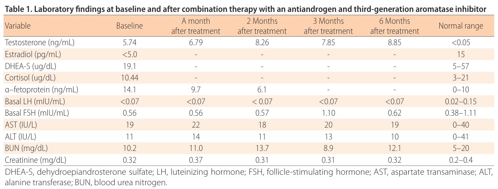

## Question

# Disease Characteristics Research Template

## Target Disease
- **Disease Name:** Familial Male-limited Precocious Puberty
- **MONDO ID:** MONDO:0008303 (if available)
- **Category:** Mendelian

## Research Objectives

Please provide a comprehensive research report on **Familial Male-limited Precocious Puberty** covering all of the
disease characteristics listed below. This report will be used to populate a disease knowledge
base entry. Be thorough and cite primary literature (PMID preferred) for all claims.

For each section, **suggested databases/resources** are listed. These are the first places
you should search for information on each topic.

---

### 1. Disease Information
> **Search first:** OMIM, Orphanet, ICD-10/ICD-11, MeSH, PubMed

- What is the disease? Provide a concise overview.
- What are the key identifiers? (OMIM, Orphanet, ICD-10/ICD-11, MeSH, Mondo)
- What are the common synonyms and alternative names?
- Is the information derived from individual patients (e.g., EHR) or aggregated disease-level resources?

### 2. Etiology

- **Disease Causal Factors**: What are the primary causes? (genetic, environmental, infectious, mechanistic)
- **Risk Factors**:
  > **Search first:** PubMed, Cochrane Library, UpToDate, clinical guidelines, ClinVar, ClinGen, GWAS Catalog, PheGenI, CTD, CDC, WHO, epidemiological databases
  - Genetic risk factors (causal variants, susceptibility loci, modifier genes)
  - Environmental risk factors (toxins, lifestyle, occupational exposures, age, sex, family history)
- **Protective Factors**:
  > **Search first:** PubMed, Cochrane Library, clinical trial databases, GWAS Catalog, gnomAD, WHO, CDC, nutrition databases
  - Genetic protective factors (protective variants, modifier alleles)
  - Environmental protective factors (diet, lifestyle, exposures that reduce risk)
- **Gene-Environment Interactions**: How do genetic and environmental factors interact to influence disease?
  > **Search first:** CTD, PubMed, PheGenI, GxE databases

### 3. Phenotypes
> **Search first:** HPO (Human Phenotype Ontology), OMIM, Orphanet, PubMed, clinicaltrials.gov, MedDRA, SNOMED CT, DECIPHER, LOINC

For each phenotype, provide:
- **Phenotype type**: symptoms, clinical signs, physical manifestations, behavioral changes, or laboratory abnormalities
  > For symptoms/signs: HPO, OMIM, Orphanet, PubMed
  > For behavioral changes: HPO, DSM, RDoC (Research Domain Criteria), PubMed
  > For laboratory abnormalities: LOINC, SNOMED CT, LabTests Online, PubMed
- **Phenotype characteristics**:
  > **Search first:** OMIM, Orphanet, HPO, PubMed
  - Age of symptom onset (neonatal, childhood, adult-onset, late-onset)
  - Symptom severity (mild, moderate, severe, variable)
  - Symptom progression (stable, progressive, episodic, fluctuating)
  - Frequency among affected individuals (percentage or qualitative)
- **Quality of life impact**: Effects on daily functioning and well-being (per-phenotype when possible)
  > **Search first:** EQ-5D database, SF-36, WHO QOL databases, PubMed
- Suggest HPO (Human Phenotype Ontology) terms for each phenotype

### 4. Genetic/Molecular Information

- **Causal Genes**: Gene mutations or chromosomal abnormalities responsible for disease (gene symbols, OMIM IDs)
  > **Search first:** OMIM, ClinVar, HGMD, Ensembl, NCBI Gene
- **Pathogenic Variants**:
  - Affected genes (gene symbols, HGNC IDs)
    > **Search first:** OMIM, NCBI Gene, Ensembl, HGNC, UniProt, GeneCards
  - Variant classification (pathogenic, likely pathogenic, VUS per ACMG/AMP guidelines)
    > **Search first:** ClinVar, ClinGen, ACMG/AMP guidelines, VarSome
  - Variant type/class (missense, frameshift, nonsense, splice-site, structural)
  - Allele frequency in population databases
    > **Search first:** gnomAD, 1000 Genomes, ExAC, TOPMed, dbSNP
  - Somatic vs germline origin
    > **Search first:** COSMIC (somatic), ClinVar, ICGC, TCGA
  - Functional consequences (loss of function, gain of function, dominant negative)
- **Modifier Genes**: Genes that modify disease severity or expression
- **Epigenetic Information**: DNA methylation, histone modifications, chromatin changes affecting disease
  > **Search first:** ENCODE, Roadmap Epigenomics, MethBase, DiseaseMeth
- **Chromosomal Abnormalities**: Large-scale genetic changes (aneuploidy, translocations, inversions)
  > **Search first:** DECIPHER, ClinVar, ECARUCA, UCSC Genome Browser

### 5. Environmental Information

- **Environmental Factors**: Non-genetic contributing factors (toxins, radiation, pollution, occupational exposure)
  > **Search first:** CTD (Comparative Toxicogenomics Database), TOXNET, PubMed, EPA databases
- **Lifestyle Factors**: Behavioral factors (smoking, diet, exercise, alcohol consumption)
  > **Search first:** CDC databases, WHO, PubMed, NHANES
- **Infectious Agents**: If applicable, pathogens causing or triggering disease (bacteria, viruses, fungi, parasites)
  > **Search first:** NCBI Taxonomy, ViPR, BV-BRC, MicrobeDB, GIDEON

### 6. Mechanism / Pathophysiology

**Present this section as an ordered causal chain first, then the detail below.**
Open with a numbered sequence of mechanistic steps running from the initiating
lesion (mutation, exposure, infection) to the clinical manifestation, one step per
line, each naming what it causes next. State the causal verb explicitly ("leads
to", "results in") and say where a step is inferred rather than demonstrated.
Where the mechanism branches, show the branch. The categories below are a
checklist of what to cover within those steps, not the organizing structure —
a step may draw on several of them, and a category may contribute to several
steps.

- **Molecular Pathways**: Specific signaling cascades or biochemical pathways involved (Wnt, MAPK, mTOR, PI3K-AKT, etc.)
  > **Search first:** KEGG, Reactome, WikiPathways, PathBank, BioCyc
- **Cellular Processes**: Cell-level mechanisms (apoptosis, autophagy, cell cycle dysregulation, inflammation, etc.)
  > **Search first:** Gene Ontology (GO), Reactome, KEGG, PubMed
- **Protein Dysfunction**: How protein structure or function is altered (misfolding, aggregation, loss of function, gain of function)
  > **Search first:** UniProt, PDB (Protein Data Bank), InterPro, Pfam, AlphaFold
- **Metabolic Changes**: Alterations in metabolic processes (energy metabolism, lipid metabolism, amino acid metabolism)
  > **Search first:** KEGG, BioCyc, HMDB (Human Metabolome Database), BRENDA
- **Immune System Involvement**: Role of immune response (autoimmunity, immunodeficiency, chronic inflammation)
  > **Search first:** ImmPort, Immunome Database, IEDB, Gene Ontology
- **Tissue Damage Mechanisms**: How tissues/ are injured (oxidative stress, ischemia, fibrosis, necrosis)
  > **Search first:** PubMed, Gene Ontology, Reactome
- **Biochemical Abnormalities**: Specific molecular defects (enzyme deficiencies, receptor dysfunction, ion channel defects)
  > **Search first:** BRENDA, UniProt, KEGG, OMIM, PubMed
- **Epigenetic Changes**: DNA methylation, histone modifications affecting gene expression in disease
  > **Search first:** ENCODE, Roadmap Epigenomics, MethBase, DiseaseMeth
- **Molecular Profiling** (if available):
  - Transcriptomics/gene expression changes
    > **Search first:** GEO (Gene Expression Omnibus), ArrayExpress, GTEx, Human Cell Atlas, SRA
  - Proteomics findings
    > **Search first:** PRIDE, ProteomeXchange, Human Protein Atlas, STRING, BioGRID
  - Metabolomics signatures
    > **Search first:** MetaboLights, Metabolomics Workbench, HMDB, METLIN
  - Lipidomics alterations
    > **Search first:** LIPID MAPS, SwissLipids, LipidHome, Metabolomics Workbench
  - Genomic structural features
    > **Search first:** UCSC Genome Browser, Ensembl, NCBI, dbVar, DGV
- **Advanced Technologies** (if applicable):
  - Single-cell analysis findings (cell-type specific mechanisms, cellular heterogeneity)
    > **Search first:** Human Cell Atlas, Single Cell Portal, GEO, CELLxGENE
  - Spatial transcriptomics findings
    > **Search first:** GEO, Spatial Research, Vizgen, 10x Genomics data
  - Multi-omics integration results
    > **Search first:** TCGA, ICGC, cBioPortal, LinkedOmics, PubMed
  - Functional genomics screens (CRISPR, RNAi)
    > **Search first:** DepMap, GenomeRNAi, PubMed, BioGRID ORCS

For each mechanism, describe:
- The causal chain from initial trigger to clinical manifestation
- Which mechanisms are upstream vs downstream
- What cell types and biological processes are involved
- Suggest GO terms for biological processes and CL terms for cell types

### 7. Anatomical Structures Affected

- **Organ Level**:
  - Primary organs directly affected
  - Secondary organ involvement (complications, secondary effects)
  - Body systems involved (cardiovascular, nervous, digestive, respiratory, endocrine, etc.)
  > **Search first:** Uberon, FMA (Foundational Model of Anatomy), OMIM, HPO, ICD-11, MeSH, SNOMED CT
- **Tissue and Cell Level**:
  - Specific tissue types affected (epithelial, connective, muscle, nervous)
  - Specific cell populations targeted (with Cell Ontology terms)
  > **Search first:** Uberon, Human Protein Atlas, Cell Ontology, Human Cell Atlas, CellMarker, PanglaoDB
- **Subcellular Level**:
  - Cellular compartments involved (mitochondria, nucleus, ER, lysosomes) (with GO Cellular Component terms)
  > **Search first:** Gene Ontology (Cellular Component), UniProt, Human Protein Atlas
- **Localization**:
  - Specific anatomical sites (with UBERON terms)
    > **Search first:** FMA, Uberon, NeuroNames (for brain), SNOMED CT
  - Lateralization (unilateral, bilateral, asymmetric)
    > **Search first:** HPO, clinical literature, imaging databases

### 8. Temporal Development

- **Onset**:
  - Typical age of onset (congenital, pediatric, adult, geriatric)
  - Onset pattern (acute, subacute, chronic, insidious)
  > **Search first:** OMIM, Orphanet, HPO, PubMed
- **Progression**:
  - Disease stages (early, intermediate, advanced, end-stage)
    > **Search first:** Cancer Staging Manual (AJCC), WHO classifications, PubMed
  - Progression rate (rapid, slow, variable)
  - Disease course pattern (episodic, relapsing-remitting, progressive, stable)
  - Disease duration (self-limited, chronic lifelong)
  > **Search first:** Disease registries, longitudinal cohort databases, natural history studies, PubMed, Orphanet, OMIM
- **Patterns**:
  - Remission patterns (spontaneous, treatment-induced)
    > **Search first:** Clinical trial databases, disease registries, PubMed
  - Critical periods (time windows of vulnerability or opportunity for intervention)
    > **Search first:** PubMed, developmental biology databases, clinical guidelines

### 9. Inheritance and Population

- **Epidemiology**:
  - Prevalence (cases per 100,000 at given time)
  - Incidence (new cases per 100,000 per year)
  > **Search first:** Orphanet, CDC, WHO, GBD (Global Burden of Disease), national registries, SEER, disease registries
- **For Genetic Etiology**:
  - Inheritance pattern (AD, AR, X-linked, mitochondrial, multifactorial, polygenic)
    > **Search first:** OMIM, Orphanet, ClinVar, GTR (Genetic Testing Registry)
  - Penetrance (complete, incomplete, age-dependent)
    > **Search first:** ClinVar, OMIM, PubMed, ClinGen
  - Expressivity (variable, consistent)
    > **Search first:** OMIM, ClinVar, PubMed
  - Genetic anticipation (increasing severity in successive generations)
    > **Search first:** OMIM, PubMed (especially for repeat expansion disorders)
  - Germline mosaicism
    > **Search first:** ClinVar, OMIM, genetic counseling literature, PubMed
  - Founder effects (population-specific mutations)
    > **Search first:** gnomAD, population genetics databases, PubMed
  - Consanguinity role
    > **Search first:** OMIM, population studies, genetic counseling resources
  - Carrier frequency
    > **Search first:** gnomAD, carrier screening databases, GeneReviews, GTR
- **Population Demographics**:
  - Affected populations (ethnic or demographic groups with higher prevalence)
    > **Search first:** gnomAD, 1000 Genomes, PAGE Study, PubMed, population registries
  - Geographic distribution (endemic areas, regional variation)
    > **Search first:** WHO, CDC, GBD, Orphanet, geographic epidemiology databases
  - Geographic distribution of specific variants
  - Sex ratio (male:female)
    > **Search first:** Disease registries, OMIM, PubMed, epidemiological databases
  - Age distribution of affected individuals
    > **Search first:** CDC, disease registries, SEER, Orphanet

### 10. Diagnostics

- **Clinical Tests**:
  - Laboratory tests (blood, urine, tissue chemistry, specific enzyme assays)
    > **Search first:** LOINC, LabTests Online, PubMed
  - Biomarkers (proteins, metabolites, genetic markers, circulating biomarkers)
    > **Search first:** FDA Biomarker List, BEST (Biomarkers, EndpointS, and other Tools), PubMed
  - Imaging studies (X-ray, CT, MRI, PET, ultrasound)
    > **Search first:** RadLex, DICOM, Radiopaedia, imaging databases
  - Functional tests (pulmonary function, cardiac stress tests)
    > **Search first:** LOINC, clinical guidelines, PubMed
  - Electrophysiology (EEG, EMG, ECG, nerve conduction studies)
    > **Search first:** LOINC, clinical neurophysiology databases, PubMed
  - Biopsy findings (histopathology, immunohistochemistry)
    > **Search first:** SNOMED CT, College of American Pathologists resources, PubMed
  - Pathology findings (microscopic examination)
    > **Search first:** SNOMED CT, Digital Pathology databases, PubMed
- **Genetic Testing**:
  > **Search first:** GTR (Genetic Testing Registry), GeneReviews, ClinGen
  - Overview of recommended genetic testing approach
  - Whole genome sequencing (WGS) utility
    > **Search first:** GTR, ClinVar, GEL (Genomics England), gnomAD
  - Whole exome sequencing (WES) utility
    > **Search first:** GTR, ClinVar, OMIM, GeneMatcher
  - Gene panels (which panels, which genes)
    > **Search first:** GTR, ClinVar, laboratory-specific databases
  - Single gene testing
    > **Search first:** GTR, ClinVar, OMIM, GeneReviews
  - Chromosomal microarray (CMA)
    > **Search first:** DECIPHER, ClinVar, dbVar, ECARUCA
  - Karyotyping
    > **Search first:** Chromosome Abnormality Database, ClinVar, cytogenetics resources
  - FISH
    > **Search first:** ClinVar, cytogenetics databases, PubMed
  - Mitochondrial DNA testing
    > **Search first:** MITOMAP, MSeqDR, ClinVar, GTR
  - Repeat expansion testing
    > **Search first:** GTR, ClinVar, repeat expansion databases, PubMed
- **Omics-Based Diagnostics** (if applicable):
  - RNA sequencing / transcriptomics
    > **Search first:** GEO, ArrayExpress, GTEx, RNA-seq databases
  - Proteomics
    > **Search first:** PRIDE, ProteomeXchange, FDA Biomarker database
  - Metabolomics
    > **Search first:** MetaboLights, Metabolomics Workbench, HMDB
  - Epigenomics
    > **Search first:** GEO, ENCODE, Roadmap Epigenomics, MethBase
  - Liquid biopsy
    > **Search first:** COSMIC, ClinVar, liquid biopsy databases, PubMed
- **Clinical Criteria**:
  - Standardized diagnostic criteria (DSM, ICD, society guidelines)
    > **Search first:** DSM-5, ICD-11, clinical society guidelines, UpToDate
  - Differential diagnosis (other conditions to rule out, with distinguishing features)
    > **Search first:** DynaMed, UpToDate, clinical decision support systems
- **Screening**:
  - Screening methods for asymptomatic individuals (newborn screening, carrier screening, cascade screening)
    > **Search first:** ACMG recommendations, CDC newborn screening, GTR

### 11. Outcome/Prognosis

- **Survival and Mortality**:
  - Survival rate (5-year, 10-year, overall)
    > **Search first:** SEER, cancer registries, disease-specific registries, PubMed
  - Life expectancy (with and without treatment if applicable)
    > **Search first:** Orphanet, disease registries, actuarial databases, PubMed
  - Mortality rate
    > **Search first:** CDC, WHO, GBD, national mortality databases
  - Disease-specific mortality (deaths directly attributable to disease)
    > **Search first:** Disease registries, CDC Wonder, GBD, PubMed
- **Morbidity and Function**:
  - Morbidity (disease-related disability and health impacts)
    > **Search first:** GBD, WHO, disability databases, PubMed
  - Disability outcomes (long-term functional impairments)
    > **Search first:** ICF (International Classification of Functioning), disability registries
  - Quality of life measures (EQ-5D, SF-36, PROMIS, disease-specific tools)
    > **Search first:** EQ-5D database, SF-36, PROMIS, PubMed
- **Disease Course**:
  - Complications (secondary problems: infections, organ failure, etc.)
    > **Search first:** ICD codes, disease registries, clinical databases, PubMed
  - Recovery potential (likelihood and extent of recovery, with vs without treatment)
    > **Search first:** Natural history studies, rehabilitation databases, PubMed
- **Prediction**:
  - Prognostic factors (age, disease severity, biomarkers, treatment response)
    > **Search first:** Prognostic models databases, clinical calculators, PubMed
  - Prognostic biomarkers (molecular markers predicting disease course)
    > **Search first:** FDA Biomarker database, PubMed, cancer prognostic databases

### 12. Treatment

- **Pharmacotherapy**:
  - Pharmacological treatments (drug names, drug classes, mechanisms of action)
    > **Search first:** DrugBank, RxNorm, ATC classification, DailyMed, FDA databases
  - Pharmacogenomics (how genetic variants affect drug metabolism, efficacy, toxicity)
    > **Search first:** PharmGKB, CPIC (Clinical Pharmacogenetics), FDA Table of PGx Biomarkers
- **Advanced Therapeutics**:
  - Gene therapy (viral vectors, CRISPR, gene replacement, gene editing)
    > **Search first:** ClinicalTrials.gov, FDA gene therapy database, ASGCT resources
  - Cell therapy (stem cell transplant, CAR-T, cellular therapeutics)
    > **Search first:** ClinicalTrials.gov, FDA cell therapy database, FACT standards
  - RNA-based therapies (ASOs, siRNA, mRNA therapies)
    > **Search first:** ClinicalTrials.gov, FDA approvals, PubMed
  - Targeted therapies (treatments directed at specific molecular targets)
    > **Search first:** My Cancer Genome, OncoKB, ClinicalTrials.gov, FDA approvals
  - Immunotherapies (checkpoint inhibitors, monoclonal antibodies)
    > **Search first:** Cancer Immunotherapy Database, FDA approvals, ClinicalTrials.gov
- **Surgical and Interventional**:
  - Surgical interventions (types of surgery, timing, outcomes)
    > **Search first:** CPT codes, surgical registries, clinical guidelines, PubMed
- **Supportive and Rehabilitative**:
  - Supportive care (symptom management, pain control, nutrition)
    > **Search first:** Clinical guidelines, Cochrane Library, PubMed
  - Rehabilitation (physical therapy, occupational therapy, speech therapy)
    > **Search first:** Rehabilitation medicine databases, clinical guidelines, PubMed
- **Experimental**:
  - Experimental treatments in clinical trials (with NCT identifiers if available)
    > **Search first:** ClinicalTrials.gov, EU Clinical Trials Register, WHO ICTRP
- **Treatment Outcomes**:
  - Treatment response rates
    > **Search first:** Clinical trial databases, FDA reviews, systematic reviews, PubMed
  - Side effects and adverse events
    > **Search first:** FDA Adverse Event Reporting System (FAERS), MedWatch, PubMed
- **Treatment Strategy**:
  - Treatment algorithms (clinical pathways, decision trees)
    > **Search first:** Clinical practice guidelines, NCCN Guidelines, UpToDate
  - Combination therapies
    > **Search first:** ClinicalTrials.gov, treatment guidelines, PubMed
  - Personalized medicine approaches (genotype-guided treatment)
    > **Search first:** My Cancer Genome, CIViC, PharmGKB, precision medicine databases

For each treatment, suggest NCIT (NCI Thesaurus) clinical-intervention terms where applicable.

### 13. Prevention

- **Prevention Levels**:
  - Primary prevention (preventing disease occurrence: vaccination, risk factor modification)
    > **Search first:** CDC, WHO, USPSTF recommendations, Cochrane Library
  - Secondary prevention (early detection and treatment: screening programs, early intervention)
    > **Search first:** USPSTF, CDC screening guidelines, WHO
  - Tertiary prevention (preventing complications in those with disease)
    > **Search first:** Clinical guidelines, disease management protocols, PubMed
- **Immunization**: Vaccine strategies (if applicable)
  > **Search first:** CDC vaccine schedules, WHO immunization, FDA vaccine database
- **Screening and Early Detection**:
  - Screening programs (population-based: newborn screening, cancer screening)
    > **Search first:** CDC screening programs, USPSTF, cancer screening databases
  - Genetic screening (carrier screening, preimplantation genetic diagnosis, prenatal testing)
    > **Search first:** ACMG recommendations, ACOG guidelines, GTR
  - Risk stratification (identifying high-risk individuals for targeted prevention)
    > **Search first:** Risk prediction models, clinical calculators, PubMed
- **Behavioral Interventions**: Lifestyle modifications to reduce risk
  > **Search first:** CDC, WHO, behavioral intervention databases, Cochrane Library
- **Counseling**: Genetic counseling (risk assessment, family planning guidance)
  > **Search first:** NSGC resources, ACMG guidelines, GeneReviews
- **Public Health**:
  - Public health interventions (sanitation, vector control, health education)
    > **Search first:** CDC, WHO, public health databases, PubMed
  - Environmental interventions (reducing environmental risk factors)
    > **Search first:** EPA databases, WHO environmental health, PubMed
- **Prophylaxis**: Preventive medications or procedures
  > **Search first:** Clinical guidelines, FDA approvals, PubMed

### 14. Other Species / Natural Disease

- **Taxonomy**: Species affected (with NCBI Taxon identifiers)
  > **Search first:** NCBI Taxonomy
- **Breed**: Specific breeds affected (with VBO identifiers if applicable)
  > **Search first:** VBO (Vertebrate Breed Ontology)
- **Gene**: Orthologous genes in other species (with NCBI Gene IDs)
  > **Search first:** NCBI Gene
- **Natural Disease**:
  - Naturally occurring disease in other species (companion animals, wildlife)
    > **Search first:** OMIA (Online Mendelian Inheritance in Animals), VetCompass, PubMed
  - Veterinary relevance and importance in animal health
    > **Search first:** OMIA, veterinary databases, PubMed
- **Comparative Biology**:
  - Comparative pathology (similarities and differences across species)
    > **Search first:** OMIA, comparative pathology databases, PubMed
  - Evolutionary conservation of disease mechanisms
    > **Search first:** HomoloGene, OrthoMCL, Alliance of Genome Resources
- **Transmission** (if applicable):
  - Zoonotic potential
    > **Search first:** CDC zoonotic diseases, WHO zoonoses, GIDEON
  - Cross-species susceptibility
    > **Search first:** NCBI Taxonomy, veterinary databases, PubMed

### 15. Model Organisms

- **Model Types**:
  - Model organism type (mammalian, invertebrate, cellular, in vitro)
    > **Search first:** Alliance of Genome Resources, model organism databases
  - Specific model systems (mouse, rat, zebrafish, Drosophila, C. elegans, yeast, cell lines, organoids, iPSCs)
    > **Search first:** MGI, RGD, ZFIN, FlyBase, WormBase, SGD, ATCC, Cellosaurus
  - Induced models (drug treatment, surgical intervention, environmental manipulation)
    > **Search first:** MGI, model organism databases, PubMed
- **Genetic Models**:
  - Types available (knockout, knock-in, transgenic, conditional, humanized)
    > **Search first:** MGI, IMPC, KOMP, EuMMCR, IMSR
- **Model Characteristics**:
  - Phenotype recapitulation (how well model reproduces human disease features)
    > **Search first:** Model organism databases, comparative studies, PubMed
  - Model limitations (aspects of human disease not captured)
    > **Search first:** Model organism databases, PubMed, review articles
- **Applications**:
  - Research applications (what aspects of disease can be studied)
    > **Search first:** Model organism databases, PubMed
- **Resources**:
  - Model databases
    > **Search first:** MGI, RGD, ZFIN, FlyBase, WormBase, IMSR, EMMA, MMRRC

---

## Citation Requirements

- Cite primary literature (PMID preferred) for all mechanistic and clinical claims
- Prioritize recent reviews and landmark papers
- Include direct quotes from abstracts where possible to support key statements
- Distinguish evidence source types: human clinical, model organism, in vitro, computational

## Output Format

Structure your response as a comprehensive narrative organized by the sections above.
For each section, provide:
- Factual content with specific details (numbers, percentages, gene names, variant nomenclature)
- Ontology term suggestions (HPO, GO, CL, UBERON, CHEBI, NCIT, MONDO) where applicable
- Evidence citations with PMIDs
- Direct quotes from abstracts to support key claims
- Clear indication when information is not available or not applicable for this disease

This report will be used to populate a disease knowledge base entry with:
- Pathophysiology descriptions with causal chains
- Gene/protein annotations (HGNC, GO terms)
- Phenotype associations (HP terms) with frequencies
- Cell type involvement (CL terms)
- Anatomical locations (UBERON terms)
- Chemical entities (CHEBI terms)
- Treatment annotations (NCIT terms)
- Evidence items with PMIDs and exact abstract quotes
- Epidemiology, prognosis, diagnostic, and prevention information
- Animal model descriptions with phenotype recapitulation details

## Output

Question: You are an expert researcher providing comprehensive, well-cited information.

Provide detailed information focusing on:
1. Key concepts and definitions with current understanding
2. Recent developments and latest research (prioritize 2023-2024 sources)
3. Current applications and real-world implementations
4. Expert opinions and analysis from authoritative sources
5. Relevant statistics and data from recent studies

Format as a comprehensive research report with proper citations. Include URLs and publication dates where available.
Always prioritize recent, authoritative sources and provide specific citations for all major claims.

# Disease Characteristics Research Template

## Target Disease
- **Disease Name:** Familial Male-limited Precocious Puberty
- **MONDO ID:** MONDO:0008303 (if available)
- **Category:** Mendelian

## Research Objectives

Please provide a comprehensive research report on **Familial Male-limited Precocious Puberty** covering all of the
disease characteristics listed below. This report will be used to populate a disease knowledge
base entry. Be thorough and cite primary literature (PMID preferred) for all claims.

For each section, **suggested databases/resources** are listed. These are the first places
you should search for information on each topic.

---

### 1. Disease Information
> **Search first:** OMIM, Orphanet, ICD-10/ICD-11, MeSH, PubMed

- What is the disease? Provide a concise overview.
- What are the key identifiers? (OMIM, Orphanet, ICD-10/ICD-11, MeSH, Mondo)
- What are the common synonyms and alternative names?
- Is the information derived from individual patients (e.g., EHR) or aggregated disease-level resources?

### 2. Etiology

- **Disease Causal Factors**: What are the primary causes? (genetic, environmental, infectious, mechanistic)
- **Risk Factors**:
  > **Search first:** PubMed, Cochrane Library, UpToDate, clinical guidelines, ClinVar, ClinGen, GWAS Catalog, PheGenI, CTD, CDC, WHO, epidemiological databases
  - Genetic risk factors (causal variants, susceptibility loci, modifier genes)
  - Environmental risk factors (toxins, lifestyle, occupational exposures, age, sex, family history)
- **Protective Factors**:
  > **Search first:** PubMed, Cochrane Library, clinical trial databases, GWAS Catalog, gnomAD, WHO, CDC, nutrition databases
  - Genetic protective factors (protective variants, modifier alleles)
  - Environmental protective factors (diet, lifestyle, exposures that reduce risk)
- **Gene-Environment Interactions**: How do genetic and environmental factors interact to influence disease?
  > **Search first:** CTD, PubMed, PheGenI, GxE databases

### 3. Phenotypes
> **Search first:** HPO (Human Phenotype Ontology), OMIM, Orphanet, PubMed, clinicaltrials.gov, MedDRA, SNOMED CT, DECIPHER, LOINC

For each phenotype, provide:
- **Phenotype type**: symptoms, clinical signs, physical manifestations, behavioral changes, or laboratory abnormalities
  > For symptoms/signs: HPO, OMIM, Orphanet, PubMed
  > For behavioral changes: HPO, DSM, RDoC (Research Domain Criteria), PubMed
  > For laboratory abnormalities: LOINC, SNOMED CT, LabTests Online, PubMed
- **Phenotype characteristics**:
  > **Search first:** OMIM, Orphanet, HPO, PubMed
  - Age of symptom onset (neonatal, childhood, adult-onset, late-onset)
  - Symptom severity (mild, moderate, severe, variable)
  - Symptom progression (stable, progressive, episodic, fluctuating)
  - Frequency among affected individuals (percentage or qualitative)
- **Quality of life impact**: Effects on daily functioning and well-being (per-phenotype when possible)
  > **Search first:** EQ-5D database, SF-36, WHO QOL databases, PubMed
- Suggest HPO (Human Phenotype Ontology) terms for each phenotype

### 4. Genetic/Molecular Information

- **Causal Genes**: Gene mutations or chromosomal abnormalities responsible for disease (gene symbols, OMIM IDs)
  > **Search first:** OMIM, ClinVar, HGMD, Ensembl, NCBI Gene
- **Pathogenic Variants**:
  - Affected genes (gene symbols, HGNC IDs)
    > **Search first:** OMIM, NCBI Gene, Ensembl, HGNC, UniProt, GeneCards
  - Variant classification (pathogenic, likely pathogenic, VUS per ACMG/AMP guidelines)
    > **Search first:** ClinVar, ClinGen, ACMG/AMP guidelines, VarSome
  - Variant type/class (missense, frameshift, nonsense, splice-site, structural)
  - Allele frequency in population databases
    > **Search first:** gnomAD, 1000 Genomes, ExAC, TOPMed, dbSNP
  - Somatic vs germline origin
    > **Search first:** COSMIC (somatic), ClinVar, ICGC, TCGA
  - Functional consequences (loss of function, gain of function, dominant negative)
- **Modifier Genes**: Genes that modify disease severity or expression
- **Epigenetic Information**: DNA methylation, histone modifications, chromatin changes affecting disease
  > **Search first:** ENCODE, Roadmap Epigenomics, MethBase, DiseaseMeth
- **Chromosomal Abnormalities**: Large-scale genetic changes (aneuploidy, translocations, inversions)
  > **Search first:** DECIPHER, ClinVar, ECARUCA, UCSC Genome Browser

### 5. Environmental Information

- **Environmental Factors**: Non-genetic contributing factors (toxins, radiation, pollution, occupational exposure)
  > **Search first:** CTD (Comparative Toxicogenomics Database), TOXNET, PubMed, EPA databases
- **Lifestyle Factors**: Behavioral factors (smoking, diet, exercise, alcohol consumption)
  > **Search first:** CDC databases, WHO, PubMed, NHANES
- **Infectious Agents**: If applicable, pathogens causing or triggering disease (bacteria, viruses, fungi, parasites)
  > **Search first:** NCBI Taxonomy, ViPR, BV-BRC, MicrobeDB, GIDEON

### 6. Mechanism / Pathophysiology

**Present this section as an ordered causal chain first, then the detail below.**
Open with a numbered sequence of mechanistic steps running from the initiating
lesion (mutation, exposure, infection) to the clinical manifestation, one step per
line, each naming what it causes next. State the causal verb explicitly ("leads
to", "results in") and say where a step is inferred rather than demonstrated.
Where the mechanism branches, show the branch. The categories below are a
checklist of what to cover within those steps, not the organizing structure —
a step may draw on several of them, and a category may contribute to several
steps.

- **Molecular Pathways**: Specific signaling cascades or biochemical pathways involved (Wnt, MAPK, mTOR, PI3K-AKT, etc.)
  > **Search first:** KEGG, Reactome, WikiPathways, PathBank, BioCyc
- **Cellular Processes**: Cell-level mechanisms (apoptosis, autophagy, cell cycle dysregulation, inflammation, etc.)
  > **Search first:** Gene Ontology (GO), Reactome, KEGG, PubMed
- **Protein Dysfunction**: How protein structure or function is altered (misfolding, aggregation, loss of function, gain of function)
  > **Search first:** UniProt, PDB (Protein Data Bank), InterPro, Pfam, AlphaFold
- **Metabolic Changes**: Alterations in metabolic processes (energy metabolism, lipid metabolism, amino acid metabolism)
  > **Search first:** KEGG, BioCyc, HMDB (Human Metabolome Database), BRENDA
- **Immune System Involvement**: Role of immune response (autoimmunity, immunodeficiency, chronic inflammation)
  > **Search first:** ImmPort, Immunome Database, IEDB, Gene Ontology
- **Tissue Damage Mechanisms**: How tissues/ are injured (oxidative stress, ischemia, fibrosis, necrosis)
  > **Search first:** PubMed, Gene Ontology, Reactome
- **Biochemical Abnormalities**: Specific molecular defects (enzyme deficiencies, receptor dysfunction, ion channel defects)
  > **Search first:** BRENDA, UniProt, KEGG, OMIM, PubMed
- **Epigenetic Changes**: DNA methylation, histone modifications affecting gene expression in disease
  > **Search first:** ENCODE, Roadmap Epigenomics, MethBase, DiseaseMeth
- **Molecular Profiling** (if available):
  - Transcriptomics/gene expression changes
    > **Search first:** GEO (Gene Expression Omnibus), ArrayExpress, GTEx, Human Cell Atlas, SRA
  - Proteomics findings
    > **Search first:** PRIDE, ProteomeXchange, Human Protein Atlas, STRING, BioGRID
  - Metabolomics signatures
    > **Search first:** MetaboLights, Metabolomics Workbench, HMDB, METLIN
  - Lipidomics alterations
    > **Search first:** LIPID MAPS, SwissLipids, LipidHome, Metabolomics Workbench
  - Genomic structural features
    > **Search first:** UCSC Genome Browser, Ensembl, NCBI, dbVar, DGV
- **Advanced Technologies** (if applicable):
  - Single-cell analysis findings (cell-type specific mechanisms, cellular heterogeneity)
    > **Search first:** Human Cell Atlas, Single Cell Portal, GEO, CELLxGENE
  - Spatial transcriptomics findings
    > **Search first:** GEO, Spatial Research, Vizgen, 10x Genomics data
  - Multi-omics integration results
    > **Search first:** TCGA, ICGC, cBioPortal, LinkedOmics, PubMed
  - Functional genomics screens (CRISPR, RNAi)
    > **Search first:** DepMap, GenomeRNAi, PubMed, BioGRID ORCS

For each mechanism, describe:
- The causal chain from initial trigger to clinical manifestation
- Which mechanisms are upstream vs downstream
- What cell types and biological processes are involved
- Suggest GO terms for biological processes and CL terms for cell types

### 7. Anatomical Structures Affected

- **Organ Level**:
  - Primary organs directly affected
  - Secondary organ involvement (complications, secondary effects)
  - Body systems involved (cardiovascular, nervous, digestive, respiratory, endocrine, etc.)
  > **Search first:** Uberon, FMA (Foundational Model of Anatomy), OMIM, HPO, ICD-11, MeSH, SNOMED CT
- **Tissue and Cell Level**:
  - Specific tissue types affected (epithelial, connective, muscle, nervous)
  - Specific cell populations targeted (with Cell Ontology terms)
  > **Search first:** Uberon, Human Protein Atlas, Cell Ontology, Human Cell Atlas, CellMarker, PanglaoDB
- **Subcellular Level**:
  - Cellular compartments involved (mitochondria, nucleus, ER, lysosomes) (with GO Cellular Component terms)
  > **Search first:** Gene Ontology (Cellular Component), UniProt, Human Protein Atlas
- **Localization**:
  - Specific anatomical sites (with UBERON terms)
    > **Search first:** FMA, Uberon, NeuroNames (for brain), SNOMED CT
  - Lateralization (unilateral, bilateral, asymmetric)
    > **Search first:** HPO, clinical literature, imaging databases

### 8. Temporal Development

- **Onset**:
  - Typical age of onset (congenital, pediatric, adult, geriatric)
  - Onset pattern (acute, subacute, chronic, insidious)
  > **Search first:** OMIM, Orphanet, HPO, PubMed
- **Progression**:
  - Disease stages (early, intermediate, advanced, end-stage)
    > **Search first:** Cancer Staging Manual (AJCC), WHO classifications, PubMed
  - Progression rate (rapid, slow, variable)
  - Disease course pattern (episodic, relapsing-remitting, progressive, stable)
  - Disease duration (self-limited, chronic lifelong)
  > **Search first:** Disease registries, longitudinal cohort databases, natural history studies, PubMed, Orphanet, OMIM
- **Patterns**:
  - Remission patterns (spontaneous, treatment-induced)
    > **Search first:** Clinical trial databases, disease registries, PubMed
  - Critical periods (time windows of vulnerability or opportunity for intervention)
    > **Search first:** PubMed, developmental biology databases, clinical guidelines

### 9. Inheritance and Population

- **Epidemiology**:
  - Prevalence (cases per 100,000 at given time)
  - Incidence (new cases per 100,000 per year)
  > **Search first:** Orphanet, CDC, WHO, GBD (Global Burden of Disease), national registries, SEER, disease registries
- **For Genetic Etiology**:
  - Inheritance pattern (AD, AR, X-linked, mitochondrial, multifactorial, polygenic)
    > **Search first:** OMIM, Orphanet, ClinVar, GTR (Genetic Testing Registry)
  - Penetrance (complete, incomplete, age-dependent)
    > **Search first:** ClinVar, OMIM, PubMed, ClinGen
  - Expressivity (variable, consistent)
    > **Search first:** OMIM, ClinVar, PubMed
  - Genetic anticipation (increasing severity in successive generations)
    > **Search first:** OMIM, PubMed (especially for repeat expansion disorders)
  - Germline mosaicism
    > **Search first:** ClinVar, OMIM, genetic counseling literature, PubMed
  - Founder effects (population-specific mutations)
    > **Search first:** gnomAD, population genetics databases, PubMed
  - Consanguinity role
    > **Search first:** OMIM, population studies, genetic counseling resources
  - Carrier frequency
    > **Search first:** gnomAD, carrier screening databases, GeneReviews, GTR
- **Population Demographics**:
  - Affected populations (ethnic or demographic groups with higher prevalence)
    > **Search first:** gnomAD, 1000 Genomes, PAGE Study, PubMed, population registries
  - Geographic distribution (endemic areas, regional variation)
    > **Search first:** WHO, CDC, GBD, Orphanet, geographic epidemiology databases
  - Geographic distribution of specific variants
  - Sex ratio (male:female)
    > **Search first:** Disease registries, OMIM, PubMed, epidemiological databases
  - Age distribution of affected individuals
    > **Search first:** CDC, disease registries, SEER, Orphanet

### 10. Diagnostics

- **Clinical Tests**:
  - Laboratory tests (blood, urine, tissue chemistry, specific enzyme assays)
    > **Search first:** LOINC, LabTests Online, PubMed
  - Biomarkers (proteins, metabolites, genetic markers, circulating biomarkers)
    > **Search first:** FDA Biomarker List, BEST (Biomarkers, EndpointS, and other Tools), PubMed
  - Imaging studies (X-ray, CT, MRI, PET, ultrasound)
    > **Search first:** RadLex, DICOM, Radiopaedia, imaging databases
  - Functional tests (pulmonary function, cardiac stress tests)
    > **Search first:** LOINC, clinical guidelines, PubMed
  - Electrophysiology (EEG, EMG, ECG, nerve conduction studies)
    > **Search first:** LOINC, clinical neurophysiology databases, PubMed
  - Biopsy findings (histopathology, immunohistochemistry)
    > **Search first:** SNOMED CT, College of American Pathologists resources, PubMed
  - Pathology findings (microscopic examination)
    > **Search first:** SNOMED CT, Digital Pathology databases, PubMed
- **Genetic Testing**:
  > **Search first:** GTR (Genetic Testing Registry), GeneReviews, ClinGen
  - Overview of recommended genetic testing approach
  - Whole genome sequencing (WGS) utility
    > **Search first:** GTR, ClinVar, GEL (Genomics England), gnomAD
  - Whole exome sequencing (WES) utility
    > **Search first:** GTR, ClinVar, OMIM, GeneMatcher
  - Gene panels (which panels, which genes)
    > **Search first:** GTR, ClinVar, laboratory-specific databases
  - Single gene testing
    > **Search first:** GTR, ClinVar, OMIM, GeneReviews
  - Chromosomal microarray (CMA)
    > **Search first:** DECIPHER, ClinVar, dbVar, ECARUCA
  - Karyotyping
    > **Search first:** Chromosome Abnormality Database, ClinVar, cytogenetics resources
  - FISH
    > **Search first:** ClinVar, cytogenetics databases, PubMed
  - Mitochondrial DNA testing
    > **Search first:** MITOMAP, MSeqDR, ClinVar, GTR
  - Repeat expansion testing
    > **Search first:** GTR, ClinVar, repeat expansion databases, PubMed
- **Omics-Based Diagnostics** (if applicable):
  - RNA sequencing / transcriptomics
    > **Search first:** GEO, ArrayExpress, GTEx, RNA-seq databases
  - Proteomics
    > **Search first:** PRIDE, ProteomeXchange, FDA Biomarker database
  - Metabolomics
    > **Search first:** MetaboLights, Metabolomics Workbench, HMDB
  - Epigenomics
    > **Search first:** GEO, ENCODE, Roadmap Epigenomics, MethBase
  - Liquid biopsy
    > **Search first:** COSMIC, ClinVar, liquid biopsy databases, PubMed
- **Clinical Criteria**:
  - Standardized diagnostic criteria (DSM, ICD, society guidelines)
    > **Search first:** DSM-5, ICD-11, clinical society guidelines, UpToDate
  - Differential diagnosis (other conditions to rule out, with distinguishing features)
    > **Search first:** DynaMed, UpToDate, clinical decision support systems
- **Screening**:
  - Screening methods for asymptomatic individuals (newborn screening, carrier screening, cascade screening)
    > **Search first:** ACMG recommendations, CDC newborn screening, GTR

### 11. Outcome/Prognosis

- **Survival and Mortality**:
  - Survival rate (5-year, 10-year, overall)
    > **Search first:** SEER, cancer registries, disease-specific registries, PubMed
  - Life expectancy (with and without treatment if applicable)
    > **Search first:** Orphanet, disease registries, actuarial databases, PubMed
  - Mortality rate
    > **Search first:** CDC, WHO, GBD, national mortality databases
  - Disease-specific mortality (deaths directly attributable to disease)
    > **Search first:** Disease registries, CDC Wonder, GBD, PubMed
- **Morbidity and Function**:
  - Morbidity (disease-related disability and health impacts)
    > **Search first:** GBD, WHO, disability databases, PubMed
  - Disability outcomes (long-term functional impairments)
    > **Search first:** ICF (International Classification of Functioning), disability registries
  - Quality of life measures (EQ-5D, SF-36, PROMIS, disease-specific tools)
    > **Search first:** EQ-5D database, SF-36, PROMIS, PubMed
- **Disease Course**:
  - Complications (secondary problems: infections, organ failure, etc.)
    > **Search first:** ICD codes, disease registries, clinical databases, PubMed
  - Recovery potential (likelihood and extent of recovery, with vs without treatment)
    > **Search first:** Natural history studies, rehabilitation databases, PubMed
- **Prediction**:
  - Prognostic factors (age, disease severity, biomarkers, treatment response)
    > **Search first:** Prognostic models databases, clinical calculators, PubMed
  - Prognostic biomarkers (molecular markers predicting disease course)
    > **Search first:** FDA Biomarker database, PubMed, cancer prognostic databases

### 12. Treatment

- **Pharmacotherapy**:
  - Pharmacological treatments (drug names, drug classes, mechanisms of action)
    > **Search first:** DrugBank, RxNorm, ATC classification, DailyMed, FDA databases
  - Pharmacogenomics (how genetic variants affect drug metabolism, efficacy, toxicity)
    > **Search first:** PharmGKB, CPIC (Clinical Pharmacogenetics), FDA Table of PGx Biomarkers
- **Advanced Therapeutics**:
  - Gene therapy (viral vectors, CRISPR, gene replacement, gene editing)
    > **Search first:** ClinicalTrials.gov, FDA gene therapy database, ASGCT resources
  - Cell therapy (stem cell transplant, CAR-T, cellular therapeutics)
    > **Search first:** ClinicalTrials.gov, FDA cell therapy database, FACT standards
  - RNA-based therapies (ASOs, siRNA, mRNA therapies)
    > **Search first:** ClinicalTrials.gov, FDA approvals, PubMed
  - Targeted therapies (treatments directed at specific molecular targets)
    > **Search first:** My Cancer Genome, OncoKB, ClinicalTrials.gov, FDA approvals
  - Immunotherapies (checkpoint inhibitors, monoclonal antibodies)
    > **Search first:** Cancer Immunotherapy Database, FDA approvals, ClinicalTrials.gov
- **Surgical and Interventional**:
  - Surgical interventions (types of surgery, timing, outcomes)
    > **Search first:** CPT codes, surgical registries, clinical guidelines, PubMed
- **Supportive and Rehabilitative**:
  - Supportive care (symptom management, pain control, nutrition)
    > **Search first:** Clinical guidelines, Cochrane Library, PubMed
  - Rehabilitation (physical therapy, occupational therapy, speech therapy)
    > **Search first:** Rehabilitation medicine databases, clinical guidelines, PubMed
- **Experimental**:
  - Experimental treatments in clinical trials (with NCT identifiers if available)
    > **Search first:** ClinicalTrials.gov, EU Clinical Trials Register, WHO ICTRP
- **Treatment Outcomes**:
  - Treatment response rates
    > **Search first:** Clinical trial databases, FDA reviews, systematic reviews, PubMed
  - Side effects and adverse events
    > **Search first:** FDA Adverse Event Reporting System (FAERS), MedWatch, PubMed
- **Treatment Strategy**:
  - Treatment algorithms (clinical pathways, decision trees)
    > **Search first:** Clinical practice guidelines, NCCN Guidelines, UpToDate
  - Combination therapies
    > **Search first:** ClinicalTrials.gov, treatment guidelines, PubMed
  - Personalized medicine approaches (genotype-guided treatment)
    > **Search first:** My Cancer Genome, CIViC, PharmGKB, precision medicine databases

For each treatment, suggest NCIT (NCI Thesaurus) clinical-intervention terms where applicable.

### 13. Prevention

- **Prevention Levels**:
  - Primary prevention (preventing disease occurrence: vaccination, risk factor modification)
    > **Search first:** CDC, WHO, USPSTF recommendations, Cochrane Library
  - Secondary prevention (early detection and treatment: screening programs, early intervention)
    > **Search first:** USPSTF, CDC screening guidelines, WHO
  - Tertiary prevention (preventing complications in those with disease)
    > **Search first:** Clinical guidelines, disease management protocols, PubMed
- **Immunization**: Vaccine strategies (if applicable)
  > **Search first:** CDC vaccine schedules, WHO immunization, FDA vaccine database
- **Screening and Early Detection**:
  - Screening programs (population-based: newborn screening, cancer screening)
    > **Search first:** CDC screening programs, USPSTF, cancer screening databases
  - Genetic screening (carrier screening, preimplantation genetic diagnosis, prenatal testing)
    > **Search first:** ACMG recommendations, ACOG guidelines, GTR
  - Risk stratification (identifying high-risk individuals for targeted prevention)
    > **Search first:** Risk prediction models, clinical calculators, PubMed
- **Behavioral Interventions**: Lifestyle modifications to reduce risk
  > **Search first:** CDC, WHO, behavioral intervention databases, Cochrane Library
- **Counseling**: Genetic counseling (risk assessment, family planning guidance)
  > **Search first:** NSGC resources, ACMG guidelines, GeneReviews
- **Public Health**:
  - Public health interventions (sanitation, vector control, health education)
    > **Search first:** CDC, WHO, public health databases, PubMed
  - Environmental interventions (reducing environmental risk factors)
    > **Search first:** EPA databases, WHO environmental health, PubMed
- **Prophylaxis**: Preventive medications or procedures
  > **Search first:** Clinical guidelines, FDA approvals, PubMed

### 14. Other Species / Natural Disease

- **Taxonomy**: Species affected (with NCBI Taxon identifiers)
  > **Search first:** NCBI Taxonomy
- **Breed**: Specific breeds affected (with VBO identifiers if applicable)
  > **Search first:** VBO (Vertebrate Breed Ontology)
- **Gene**: Orthologous genes in other species (with NCBI Gene IDs)
  > **Search first:** NCBI Gene
- **Natural Disease**:
  - Naturally occurring disease in other species (companion animals, wildlife)
    > **Search first:** OMIA (Online Mendelian Inheritance in Animals), VetCompass, PubMed
  - Veterinary relevance and importance in animal health
    > **Search first:** OMIA, veterinary databases, PubMed
- **Comparative Biology**:
  - Comparative pathology (similarities and differences across species)
    > **Search first:** OMIA, comparative pathology databases, PubMed
  - Evolutionary conservation of disease mechanisms
    > **Search first:** HomoloGene, OrthoMCL, Alliance of Genome Resources
- **Transmission** (if applicable):
  - Zoonotic potential
    > **Search first:** CDC zoonotic diseases, WHO zoonoses, GIDEON
  - Cross-species susceptibility
    > **Search first:** NCBI Taxonomy, veterinary databases, PubMed

### 15. Model Organisms

- **Model Types**:
  - Model organism type (mammalian, invertebrate, cellular, in vitro)
    > **Search first:** Alliance of Genome Resources, model organism databases
  - Specific model systems (mouse, rat, zebrafish, Drosophila, C. elegans, yeast, cell lines, organoids, iPSCs)
    > **Search first:** MGI, RGD, ZFIN, FlyBase, WormBase, SGD, ATCC, Cellosaurus
  - Induced models (drug treatment, surgical intervention, environmental manipulation)
    > **Search first:** MGI, model organism databases, PubMed
- **Genetic Models**:
  - Types available (knockout, knock-in, transgenic, conditional, humanized)
    > **Search first:** MGI, IMPC, KOMP, EuMMCR, IMSR
- **Model Characteristics**:
  - Phenotype recapitulation (how well model reproduces human disease features)
    > **Search first:** Model organism databases, comparative studies, PubMed
  - Model limitations (aspects of human disease not captured)
    > **Search first:** Model organism databases, PubMed, review articles
- **Applications**:
  - Research applications (what aspects of disease can be studied)
    > **Search first:** Model organism databases, PubMed
- **Resources**:
  - Model databases
    > **Search first:** MGI, RGD, ZFIN, FlyBase, WormBase, IMSR, EMMA, MMRRC

---

## Citation Requirements

- Cite primary literature (PMID preferred) for all mechanistic and clinical claims
- Prioritize recent reviews and landmark papers
- Include direct quotes from abstracts where possible to support key statements
- Distinguish evidence source types: human clinical, model organism, in vitro, computational

## Output Format

Structure your response as a comprehensive narrative organized by the sections above.
For each section, provide:
- Factual content with specific details (numbers, percentages, gene names, variant nomenclature)
- Ontology term suggestions (HPO, GO, CL, UBERON, CHEBI, NCIT, MONDO) where applicable
- Evidence citations with PMIDs
- Direct quotes from abstracts to support key claims
- Clear indication when information is not available or not applicable for this disease

This report will be used to populate a disease knowledge base entry with:
- Pathophysiology descriptions with causal chains
- Gene/protein annotations (HGNC, GO terms)
- Phenotype associations (HP terms) with frequencies
- Cell type involvement (CL terms)
- Anatomical locations (UBERON terms)
- Chemical entities (CHEBI terms)
- Treatment annotations (NCIT terms)
- Evidence items with PMIDs and exact abstract quotes
- Epidemiology, prognosis, diagnostic, and prevention information
- Animal model descriptions with phenotype recapitulation details

# Familial male-limited precocious puberty: disease-characteristics report

**Scope and evidence standard.** Familial male-limited precocious puberty (FMPP), or *testotoxicosis*, is a rare Mendelian cause of **gonadotropin-independent (“peripheral”) precocious puberty**. This report distinguishes observations in affected people from receptor experiments, animal models, reviews, and a trial registry. Frequencies from case reports are **not** population frequencies. The retrieved primary articles did not reliably provide PMIDs; DOI links are supplied instead of guessed PMIDs. Ontology labels below are **mapping suggestions**, not verified cross-references, except where an identifier is explicitly supported. (ha2024familialmalelimitedprecocious pages 1-2, leschek2017effectofantiandrogen pages 1-2, mcgee2013precociouspubertyand pages 1-2)

## 1. Disease information

FMPP results from constitutive activation of the luteinizing hormone/choriogonadotropin receptor in testicular Leydig cells. Testosterone production begins prematurely despite prepubertal pituitary gonadotropin activity, producing early virilization, accelerated growth and skeletal maturation, and potentially short adult stature. It is genetically autosomal dominant but clinically predominantly male-limited. The verified disease identifiers are **MONDO:0008303** and **OMIM #176410**; a trial-record terminology mapping gives **MeSH C536961, “Familial Testotoxicosis,”** and the broader heading **D011629, “Puberty, Precocious.”** The 2024 case report gives LHCGR as OMIM *152790. No specific Orphanet, ICD-10, or ICD-11 disease code was verified in the retrieved evidence; a generic precocious-puberty code should not be presented as FMPP-specific. Synonyms include *familial testotoxicosis*, *familial male precocious puberty*, and *male-limited gonadotropin-independent precocious puberty*. (OpenTargets Search: familial male-limited precocious puberty-LHCGR, ha2024familialmalelimitedprecocious pages 1-2, ha2024familialmalelimitedprecocious pages 2-4, NCT00094328 chunk 2, yuan2022longtermtreatmentwith pages 1-2)

**Data provenance:** The measurements below come from published, consented individual cases or an aggregated **28-boy clinical follow-up**, not an accessible patient-level EHR database. MONDO/Open Targets and the clinical-trial record are aggregated disease/registry resources. (ha2024familialmalelimitedprecocious pages 1-2, leschek2017effectofantiandrogen pages 1-2, NCT00094328 chunk 1, OpenTargets Search: familial male-limited precocious puberty-LHCGR)

## 2. Etiology and risk or protective factors

The established initiating cause is a **heterozygous activating LHCGR variant**, inherited or arising de novo. Affected family history raises suspicion but is not required: among seven unrelated cases summarized with parental genotyping in the 2024 paper, three inherited a variant from an affected father, three from an asymptomatic carrier mother, and one was de novo. This is a selected literature sample, **not** a penetrance or inheritance-frequency estimate. An unaffected male carrying p.Met398Thr was documented in a Japanese family, indicating variable male expression. The principal demonstrated risk determinant is therefore genotype in the context of male gonadal development, not an environmental exposure. (ha2024familialmalelimitedprecocious pages 2-4, shinagawa2000japanesefamilialpatients pages 1-3)

**Environmental, lifestyle, infection, and protection:** No FMPP-specific causal toxin, diet, infection, behavioral exposure, protective environmental factor, or protective LHCGR allele was established by the retrieved studies. Exogenous androgen exposure is an important *alternative diagnosis*, not an established FMPP gene–environment interaction. Male versus female gonadal physiology is a strong biological context for expression, but a quantitative environmental interaction has not been demonstrated. The low-scoring Open Targets association with **LHB** should not be promoted to an established second FMPP causal gene without variant- and phenotype-specific validation; its stronger disease association is **LHCGR**. (coco2023acaseof pages 1-3, ha2024familialmalelimitedprecocious pages 1-2, OpenTargets Search: familial male-limited precocious puberty-LHCGR)

## 3. Phenotypes and impact

Onset is usually described around **2–4 years**, but the 2024 review of reported cases identified a range of **6 months–6.6 years**. The following HPO *labels* are suggested for curator lookup; no exact HP identifier or unbiased per-phenotype percentage was verified. “Typical” denotes recurrent case-report findings, not measured prevalence. (ha2024familialmalelimitedprecocious pages 1-2, ha2024familialmalelimitedprecocious pages 2-4)

| Manifestation; suggested HPO label | Type, onset and course | Evidence and functional implications |
|---|---|---|
| Precocious puberty; **Precocious puberty** | Clinical syndrome; infant/early-childhood onset; often progressive without treatment | Pubertal signs appeared by 12 months in the 2024 boy, evaluated at 16 months; early sexual development can be socially disruptive, but FMPP-specific quality-of-life scores are unavailable. (ha2024familialmalelimitedprecocious pages 1-2) |
| Pubic or facial hair, acne/oily skin, penile enlargement, erections or muscularity; **Premature pubarche**, **Acne**, **Increased penile length** | Androgen-dependent clinical signs; variable between boys | In the 2024 case: Tanner-II pubic hair, acne and **7-cm** stretched penile length; another case reported erections. Aggressive behavior was reported in a 2015 case, but is not established as a universal feature. (ha2024familialmalelimitedprecocious pages 1-2, coco2023acaseof pages 1-3, ozcabı2015testotoxicosisreportof pages 1-2) |
| Accelerated linear growth; **Accelerated linear growth** | Early progressive physical sign | The 2024 boy’s growth rate decreased from **2.1 cm/month** to **14 cm/10 months** on treatment; early tall stature can precede short final height. (ha2024familialmalelimitedprecocious pages 1-2, ha2024familialmalelimitedprecocious pages 2-4) |
| Advanced skeletal maturation, early epiphyseal closure, eventual short stature; **Advanced bone age**, **Short stature** | Radiographic sign and downstream complication; severity varies | At chronological **16 months**, bone age was **4 years** in the 2024 case. His affected father and grandfather were **158 cm** and **148 cm**, respectively; these family heights must not be used as untreated population averages. (ha2024familialmalelimitedprecocious pages 1-2, ha2024familialmalelimitedprecocious pages 2-4) |
| High testosterone with suppressed/prepubertal LH and usually prepubertal FSH; **Increased circulating testosterone level**, **Decreased circulating luteinizing hormone level** | Defining biochemical pattern, before secondary central puberty | Testosterone **5.74 ng/mL**, LH **<0.07 mIU/mL** and FSH **0.56 mIU/mL** in the 2024 boy; a later central-puberty component can change this pattern. (ha2024familialmalelimitedprecocious pages 1-2, coco2023acaseof pages 1-3) |
| Testicular size small relative to virilization; **Small testis** only if objectively appropriate | Exam finding; **not invariably absolute testicular smallness** | Bilateral **2-mL** testes in the 2024 toddler, but **6–8-mL** testes in the 2023 case. Testicular enlargement or Leydig-cell hyperplasia occurs in some individuals; do not assign a single universal testicular-volume phenotype. (ha2024familialmalelimitedprecocious pages 1-2, coco2023acaseof pages 1-3, ozcabı2015testotoxicosisreportof pages 1-2) |

No validated FMPP-specific EQ-5D, SF-36, PROMIS, cognitive, psychiatric, or disability frequency estimates were found. Height compromise, conspicuously early sexual development, repeated assessments and long-term medication plausibly affect well-being, but **per-phenotype patient-reported effect sizes remain unknown**. (ha2024familialmalelimitedprecocious pages 6-7, gurnurkar2021acaseof pages 2-4)

## 4. Genetic and molecular information

**Causal gene:** **LHCGR** (*luteinizing hormone/choriogonadotropin receptor*), on chromosome **2p16.3**, contains 11 exons; many activating FMPP alleles affect receptor transmembrane/intracellular regions encoded by exon 11. The inheritance-relevant variants are **germline**, generally heterozygous, **missense gain-of-function** alleles. By contrast, LHCGR loss of function produces a different clinical spectrum, including Leydig-cell hypoplasia; a somatic activating LHCGR variant confined to a testicular lesion should not automatically be entered as familial germline FMPP. The exact HGNC identifier, transcript version, ClinVar accession/classification, and gnomAD frequencies were not independently verified here. (ha2024familialmalelimitedprecocious pages 2-4, mcgee2013precociouspubertyand pages 1-2, ozcabı2015testotoxicosisreportof pages 1-2)

**Variant-level human observations:**

- **c.1730C>T, p.Thr577Ile**: called *pathogenic* by the 2024 case authors; present in the affected boy and father. This is the **paper’s** classification, not an independently checked current ClinVar/ACMG assertion. (ha2024familialmalelimitedprecocious pages 1-2)
- **c.1703C>T, p.Ala568Val**: reported in a boy and father in a 2022 Chinese clinical case. (yuan2022longtermtreatmentwith pages 1-2)
- **c.1733A>C, p.Asp578Ala**: heterozygous in a 2021 case; reported as a **variant of uncertain significance**, despite supportive phenotype/in-silico predictions. **Do not relabel as pathogenic on prediction alone.** (gurnurkar2021acaseof pages 1-2, gurnurkar2021acaseof pages 2-4)
- **p.Asp578Gly**: commonly described activating receptor substitution; mouse p.Asp582Gly models its homologous site. **p.Met398Thr** displayed marked variable expression in one Japanese family. A further novel **c.830G>T** was reported in one of two 2015 cases, without a population-frequency estimate in the extracted material. (mcgee2013precociouspubertyand pages 1-2, shinagawa2000japanesefamilialpatients pages 1-3, ozcabı2015testotoxicosisreportof pages 1-2)

No verified FMPP-specific allele frequencies in gnomAD/TOPMed, founder effect, modifier gene, protective genotype, repeat expansion, characteristic structural chromosome abnormality, DNA-methylation signature, or validated epigenetic mechanism was obtained. A coincidental cytogenetic finding, if present, would require independent causal evidence. (ha2024familialmalelimitedprecocious pages 2-4)

## 5. Environmental information

The **etiology is receptor gain of function**, rather than toxic, infectious, occupational, radiation, nutritional, or lifestyle exposure. Ask about inadvertent testosterone preparations during diagnostic evaluation because exposure can imitate androgen excess; the 2023 case explicitly recorded that parents denied exposure to testosterone-containing creams or medication. There is no disease-specific evidence for vaccination, antimicrobial therapy, dietary prevention, or a pathogen. (coco2023acaseof pages 1-3, ha2024familialmalelimitedprecocious pages 1-2)

## 6. Mechanism and pathophysiology

**Ordered causal chain**—“inferred” identifies links not directly measured in an FMPP patient:

1. A **heterozygous activating LHCGR missense variant** **leads to** a receptor biased toward its active state without the usual LH stimulus. Human pedigrees establish the variant–phenotype association; functional confirmation depends on the specific allele tested. (ha2024familialmalelimitedprecocious pages 2-4, shinagawa2000japanesefamilialpatients pages 1-3)
2. Active LHCGR at the **Leydig-cell plasma membrane** **leads to** increased Gαs–adenylyl-cyclase–cAMP–PKA signaling. **Directly demonstrated for the homologous mouse p.Asp582Gly receptor in transfected cells:** normalized basal cAMP was **23-fold** wild type; generalization to every patient allele is inferred. (mcgee2013precociouspubertyand pages 1-2, hai2015infertilityinfemale pages 1-1, mcgee2013precociouspubertyand pages 3-4)
3. Steroidogenic signaling **leads to** greater Leydig-cell testosterone synthesis; the usual downstream framework involves cholesterol transport by **STAR**, mitochondrial **CYP11A1**, and subsequent steroidogenic enzymes. The knock-in mouse showed increased steroidogenic-gene expression and early testosterone excess; the **entire enzyme-by-enzyme sequence was not individually proven for the 2024 patient**. A possible **ERK1/2 branch** contributes to Leydig-cell steroidogenesis/proliferation, but its quantitative contribution in human FMPP is unestablished. (mcgee2013precociouspubertyand pages 1-2, wieczorek2024elevatedluteinizinghormone pages 1-2)
4. Excess testosterone **leads to** androgen-receptor–mediated penile growth, pubic hair, acne and early growth; **in parallel**, aromatization of testosterone to estradiol **leads to** accelerated skeletal maturation and ultimately premature growth-plate fusion. The receptor-to-androgen association and clinical changes are observed; the precise growth-plate signaling cascade is inferred from established sex-steroid physiology and treatment response. (ha2024familialmalelimitedprecocious pages 1-2, ha2024familialmalelimitedprecocious pages 2-4, ha2024familialmalelimitedprecocious pages 6-7)
5. Elevated sex steroids **result in**, by expected endocrine negative feedback (**inferred for the individual case**), suppressed/prepubertal LH despite high testosterone, explaining initial resistance to GnRH-agonist monotherapy. **Branch over time:** sustained peripheral puberty can **lead to** superimposed activation of central puberty, when GnRH agonism becomes useful. (ha2024familialmalelimitedprecocious pages 1-2, coco2023acaseof pages 1-3, leschek2017effectofantiandrogen pages 4-6)
6. In a parallel tissue branch, excessive LHCGR signaling **leads to** premature differentiation/proliferation of mouse adult Leydig cells and **results in** Leydig-cell hyperplasia; equivalent histology occurs in selected human cases but is **not required for diagnosis**. (mcgee2013precociouspubertyand pages 1-2, ozcabı2015testotoxicosisreportof pages 1-2)

**Mechanistic annotations for curator verification:** proposed GO biological-process labels: *G protein-coupled receptor signaling pathway*, *cAMP-mediated signaling*, *steroid biosynthetic process*, *testosterone biosynthetic process*, *response to luteinizing hormone*, *Leydig cell differentiation*, and *regulation of bone development*. Proposed GO cellular-component labels: *plasma membrane* for LHCGR and *mitochondrion* for the first steroidogenic steps. Proposed Cell Ontology labels: **Leydig cell** (primary), **Sertoli cell** and **granulosa/theca cell** (physiological contrasts); growth-plate chondrocytes mediate a downstream skeletal effect, not the primary receptor defect. These exact GO/CL identifiers were not validated against ontology records. No established FMPP-specific immune, inflammatory, oxidative-damage, apoptosis, fibrosis, single-cell, spatial-transcriptomic, proteomic, metabolomic, lipidomic, CRISPR-screen, or multi-omics disease signature was identified. (mcgee2013precociouspubertyand pages 1-2, hai2015infertilityinfemale pages 1-1, ha2024familialmalelimitedprecocious pages 2-4)

## 7. Anatomical structures

The **testis—particularly interstitial Leydig cells—is primary**. Secondary effect sites are androgen-responsive skin and external genitalia, skeletal growth plates, and, through feedback or later central activation, the hypothalamic–pituitary–gonadal axis. Suggested **UBERON labels** are *testis*, *Leydig cell-containing testicular interstitium*, *penis*, *skin*, *epiphyseal growth plate*, *pituitary gland* and *hypothalamus*; verify exact term identifiers before database insertion. The relevant primary subcellular compartment is **plasma membrane**, with cytosolic cAMP signaling and mitochondrial steroidogenesis downstream. Clinical findings are usually bilateral/systemic; a unilateral nodule warrants evaluation for focal pathology, not a blanket assertion of disease lateralization. (ha2024familialmalelimitedprecocious pages 1-2, mcgee2013precociouspubertyand pages 1-2, ozcabı2015testotoxicosisreportof pages 1-2, suzuki2023geneticvariantsof pages 2-4)

## 8. Temporal development

The allele is present constitutionally, but symptoms typically emerge in infancy or early childhood rather than necessarily at birth; **age 2–4 years** is common in reports, with earlier and later exceptions. Untreated virilization and bone-age advancement are usually progressive, and the critical therapeutic window is **before irreversible epiphyseal fusion**. Subsequent gonadotropin-dependent puberty can complicate the initial peripheral process: the 2023 patient developed central puberty around **6.6 years**; the 2022 case needed triptorelin after central activation. Clinical regression with treatment is possible even when circulating testosterone stays high. An episodic course has been reported but is not the defining pattern. Long-term relapse, spontaneous-remission probability and standardized disease stages remain undefined. (ha2024familialmalelimitedprecocious pages 1-2, ha2024familialmalelimitedprecocious pages 2-4, coco2023acaseof pages 1-3, yuan2022longtermtreatmentwith pages 1-2, ha2024familialmalelimitedprecocious pages 6-7)

## 9. Inheritance and population

Inheritance is **autosomal dominant with male-limited clinical expression**, sometimes de novo. Female carriers can transmit the allele without the characteristic early-virilization phenotype; an affected father can transmit it to sons or daughters. **Do not assume complete male penetrance:** the p.Met398Thr family included a carrier father without documented precocious puberty, and affected boys with that allele developed signs at approximately **2 versus 6 years**. There is no demonstrated genetic anticipation. The available reports do not substantiate quantitative penetrance, germline-mosaicism rates, consanguinity effect, carrier frequency, founder alleles, ethnicity-specific susceptibility, a population-wide sex ratio, or reliable prevalence/incidence per 100,000. Reports from Korea, Japan, China and elsewhere establish occurrence, **not geographic risk differences**. (shinagawa2000japanesefamilialpatients pages 1-3, ha2024familialmalelimitedprecocious pages 2-4, yuan2022longtermtreatmentwith pages 1-2)

## 10. Diagnostics

Suspect FMPP in a boy with rapid virilization **disproportionate to testicular size**, accelerated growth and advanced bone age, particularly with affected male relatives. Measure **morning testosterone, sensitive basal LH and FSH**, and consider a **GnRH-stimulation test** to distinguish peripheral from central activation; assess **17-hydroxyprogesterone, adrenal androgens and β-hCG** to exclude mimics. Obtain a left-hand/wrist **bone-age radiograph** and examine both testes; use **testicular ultrasound** when a mass/asymmetry is possible, and directed adrenal or brain imaging when clinical or hormonal findings warrant it. The 2024 patient had testosterone **5.74 ng/mL**, LH **<0.07 mIU/mL**, GnRH-stimulated peak LH **0.52 mIU/mL**, normal β-hCG, and normal brain MRI and scrotal/adrenal ultrasound. Trial entry criteria similarly specified pubertal testosterone, prepubertal gonadotropins and no pubertal LH response to stimulation. Testosterone alone does **not** measure success of androgen-receptor blockade. (ha2024familialmalelimitedprecocious pages 1-2, ha2024familialmalelimitedprecocious pages 2-4, NCT00094328 chunk 1, ha2024familialmalelimitedprecocious pages 6-7)

**Genetic confirmation:** Sequence **LHCGR** with variant interpretation and segregation testing; targeted single-gene testing is efficient when the presentation is classic or a familial variant is known. A broader precocious-puberty/DSD panel, exome or genome sequencing is reasonable when the presentation is atypical or targeted testing is negative; interpret a VUS with clinical, familial and, where available, functional evidence. Routine chromosomal microarray, karyotype, FISH, mitochondrial testing, repeat-expansion testing, RNA-seq, epigenomic assays and liquid biopsy are **not established FMPP diagnostic tests**. The 2022 case used amplification/sequencing of LHCGR exons and parental testing; the 2024 case demonstrated father–son segregation. (yuan2022longtermtreatmentwith pages 1-2, ha2024familialmalelimitedprecocious pages 1-2, gurnurkar2021acaseof pages 2-4)

**Differential diagnosis:** Central precocious puberty features a pubertal LH response; congenital adrenal hyperplasia suggests adrenal-steroid abnormalities; β-hCG-producing or Leydig-cell tumors require hormone testing and targeted imaging; McCune–Albright syndrome and external androgen exposure require clinical assessment. Secondary central activation can eventually coexist with confirmed FMPP, so repeat gonadotropin assessment when growth or testicular development accelerates. Biopsy or surgery is appropriate for a suspicious lesion, **not routine FMPP diagnosis**. There is no established universal newborn-screening programme; test at-risk relatives through genetic counseling and a known family variant where appropriate. (coco2023acaseof pages 1-3, ozcabı2015testotoxicosisreportof pages 1-2, ha2024familialmalelimitedprecocious pages 2-4)

## 11. Outcome and prognosis

The principal documented untreated morbidity is **compromised adult height** after accelerated skeletal maturation; reproductive and psychosocial outcomes are less well quantified. In the most informative long-term treated follow-up, **28 boys** began antiandrogen/aromatase-inhibitor treatment at **4.9 ± 1.5 years**, with GnRH agonist added at **6.9 ± 1.5 years** after central puberty. Mean achieved adult height was **173.6 ± 6.8 cm** (approximately **−0.4 ± 1.0 SD** versus adult US men). For **25** with pretreatment predictions, achieved height **173.8 ± 6.9 cm** exceeded the **164.9 ± 10.7 cm** predicted at treatment start (**P < .001**), but the uncontrolled design cannot establish a drug-specific causal height gain. The authors noted that height predicted at therapy cessation overestimated actual height. A 2022 single case reported height **168.7 cm** at age 10 as *approaching*, **not already proven to be**, final adult height. (leschek2017effectofantiandrogen pages 1-2, leschek2017effectofantiandrogen pages 4-6, yuan2022longtermtreatmentwith pages 1-2)

No FMPP-specific five-/ten-year survival, life-expectancy, cause-specific mortality or quantitative disability estimate was retrieved. Testicular nodular Leydig hyperplasia and occasional germ-cell pathology have been described, but the **absolute tumor risk and an evidence-based screening interval are unknown**; do not infer malignancy risk from individual cases or from testicular microlithiasis alone. Adult fertility ranges in reports, and long-term fertility after childhood therapy remains uncertain. Formal disease-specific quality-of-life measures and validated prognostic molecular biomarkers have not been established. (ozcabı2015testotoxicosisreportof pages 1-2, gurnurkarUnknownyearacaseof pages 3-4, gurnurkar2021acaseof pages 2-4, ha2024familialmalelimitedprecocious pages 6-7)

## 12. Treatment and real-world implementation

**Endocrinology-directed strategy:** Treat confirmed progressive peripheral disease with **androgen-action blockade plus aromatase inhibition**, monitor virilization, growth velocity, bone age and safety, and add **GnRH agonist only if secondary central puberty appears**. No universally accepted optimal regimen or validated FMPP-specific genotype-directed dosing algorithm was identified. These clinical-intervention **NCIT label suggestions**—*androgen receptor antagonist therapy*, *aromatase inhibitor therapy*, *gonadotropin-releasing hormone agonist therapy*, *genetic counseling* and *testicular ultrasonography*—require code-level curation; the actual NCIT identifiers were not verified. Suggested chemical **ChEBI labels** are *testosterone*, *estradiol*, *bicalutamide*, *anastrozole*, *letrozole*, *spironolactone* and *ketoconazole*, likewise without asserted ChEBI accession numbers. (ha2024familialmalelimitedprecocious pages 6-7, leschek2017effectofantiandrogen pages 4-6, NCT00094328 chunk 1)

- **Bicalutamide** blocks androgen-receptor effects; **anastrozole** or **letrozole** inhibits conversion of androgens to estrogens and aims to slow bone maturation. The 2024 boy received **bicalutamide 25 mg/day plus anastrozole 1 mg/day**, with regression of pubic hair and acne and slowing of growth. Testosterone nevertheless rose from **5.74 ng/mL at baseline** to **8.85 ng/mL at six months** while LH stayed **<0.07 mIU/mL**: a useful illustration of why clinical and skeletal outcomes, not normalization of testosterone, guide response. The source’s cropped **Table 1** directly supports these serial values and reports normal AST/ALT over the short observed interval. **This is one child, not a population response rate.** (ha2024familialmalelimitedprecocious pages 1-2, ha2024familialmalelimitedprecocious media d91f3d10, ha2024familialmalelimitedprecocious pages 6-7)
- **Evidence limitations and adverse effects:** The open-label, noncomparative Phase 2 **BATT trial, NCT00094328**, enrolled **14 boys** to examine bicalutamide plus anastrozole; its retrieved registry excerpt specifies outcomes but **does not supply numerical efficacy or adverse-event results**. Another 2021 child receiving this combination developed **mild gynecomastia after approximately 14 months**. The 2015 two-patient report found bicalutamide/anastrozole **ineffective** for pubertal/bone-age progression in its cases, emphasizing variable response. Potential liver, bone-mineral, lipid and fertility effects require follow-up rather than being assumed absent. [Trial registry](https://clinicaltrials.gov/study/NCT00094328). (NCT00094328 chunk 1, gurnurkar2021acaseof pages 2-4, ozcabı2015testotoxicosisreportof pages 1-2, ha2024familialmalelimitedprecocious pages 6-7)
- **Older or alternative regimens:** **Spironolactone plus testolactone/anastrozole**, followed when needed by **deslorelin or leuprolide**, formed the 28-boy height-outcome series; **ketoconazole** suppresses steroid synthesis but can cause liver toxicity/adrenal suppression. In the 2023 case, ketoconazole lowered testosterone but did not halt bone-age progression; addition of **cyproterone acetate** was followed by **iatrogenic adrenal insufficiency after two months**, prompting a switch to spironolactone/letrozole and later **triptorelin** for central puberty. In the 2017 series, no treatment-related severe adverse event or attributed hepatic/renal/lipid abnormality occurred, although one child developed hyponatremia while spironolactone was continued during an intercurrent illness with poor intake. These outcomes are regimen- and patient-specific. (leschek2017effectofantiandrogen pages 1-2, leschek2017effectofantiandrogen pages 4-6, coco2023acaseof pages 1-3)
- **Surgery** is reserved for a demonstrated focal lesion rather than inherited receptor activation itself. No established FMPP-specific gene, RNA, cell, immune or corrective receptor-targeted therapy, nor validated pharmacogenomic treatment rule, was found. (ozcabı2015testotoxicosisreportof pages 1-2, ha2024familialmalelimitedprecocious pages 6-7)

The following compact table distinguishes measured human effects, model findings and protocol-only data. (ha2024familialmalelimitedprecocious pages 1-2, leschek2017effectofantiandrogen pages 1-2, mcgee2013precociouspubertyand pages 1-2, NCT00094328 chunk 1)

| Study/date and URL/DOI | Evidence type and n | LHCGR variant or model | Measured quantitative findings | Interpretation / limitation |
|---|---|---|---|---|
| Ha et al., 2024 — [DOI](https://doi.org/10.6065/apem.2346042.021) | Human case report; n=1; presentation at 16 months | Germline heterozygous c.1730C>T (p.Thr577Ile), inherited from affected father | Testosterone 5.74 ng/mL; basal LH <0.07 mIU/mL; treated with bicalutamide 25 mg/day plus anastrozole 1 mg/day (ha2024familialmalelimitedprecocious pages 1-2) | Clinical progression was suppressed despite persistently high testosterone; short follow-up precludes conclusions about adult height, fertility, bone health, or long-term safety (ha2024familialmalelimitedprecocious pages 6-7, ha2024familialmalelimitedprecocious pages 1-2) |
| Coco et al., 2023 — [DOI](https://doi.org/10.13129/1828-6550/apmb.111.2.2023.ccs2) | Human case report; n=1; presentation at 4 years 6 months | Activating LHCGR mutation reported, but the patient’s exact variant was not established in the extracted text | Initial testosterone 355 ng/dL; cyproterone acetate caused iatrogenic adrenal insufficiency after 2 months (coco2023acaseof pages 1-3) | Demonstrates treatment complexity and toxicity; predicted adult height had not improved at last follow-up, and a single case cannot establish comparative efficacy |
| Leschek et al., 2017 — [DOI](https://doi.org/10.1016/j.jpeds.2017.07.047) | Long-term human clinical follow-up; n=28 boys | FMPP due to activating LH-receptor variants; individual variants not specified in extracted evidence | Adult height 173.6 ± 6.8 cm (−0.4 ± 1.0 SD); treatment began at 4.9 ± 1.5 years (leschek2017effectofantiandrogen pages 1-2) | Combined antiandrogen, aromatase inhibitor, and later GnRH-agonist therapy achieved near-normal mean height; uncontrolled design and changing regimens prevent attribution to any single component (leschek2017effectofantiandrogen pages 4-6) |
| McGee & Narayan, 2013 — [DOI](https://doi.org/10.1210/en.2012-2179) | Transfected-cell and knock-in mouse study; n not stated in extracted evidence | Mouse Lhcgr p.Asp582Gly (D582G), corresponding to human p.Asp578Gly | Mutant receptor produced 23-fold higher receptor-density-normalized basal cAMP than wild type; male mice had testosterone elevation from day 7 and Leydig-cell hyperplasia (mcgee2013precociouspubertyand pages 1-2, mcgee2013precociouspubertyand pages 3-4) | Strong functional evidence for constitutive Gs/cAMP signaling and a useful male FMPP model; species differences limit direct clinical extrapolation |
| Hai et al., 2015 — [DOI](https://doi.org/10.1095/biolreprod.115.129072) | Female knock-in mouse study; n not stated in extracted evidence | KiLHRD582G gain-of-function model | Female mice developed precocious puberty, irregular cycles, anovulation, infertility, elevated sex steroids, and ovarian pathology (hai2015infertilityinfemale pages 1-1) | The female phenotype is incompatible with clinically unaffected human female carriers, demonstrating major species-specific limitations in ovarian LHCGR expression or regulation (hai2015infertilityinfemale pages 1-1) |
| NCT00094328; completed Phase 2 registry — [ClinicalTrials.gov](https://clinicaltrials.gov/study/NCT00094328) | Open-label, single-group interventional study; n=14 boys | Clinical testotoxicosis; variant-level eligibility not specified | Planned 12-month bicalutamide-plus-anastrozole treatment with growth rate, bone maturation, predicted adult height, and testicular volume outcomes (NCT00094328 chunk 1) | The extracted registry record contains protocol definitions but no numerical efficacy or adverse-event results; it must not be treated as evidence of observed benefit (NCT00094328 chunk 1) |

*Table: Key human, experimental, and trial-registry evidence for FMPP, emphasizing measured findings and major interpretive limitations. The table separates observed outcomes from protocol-only information.*

## 13. Prevention and counseling

There is **no proven primary lifestyle, immunization, exposure-control or drug intervention that prevents a constitutive germline LHCGR variant**. Primary reproductive options are counseling and, where suitable and desired, discussion of known-variant prenatal or preimplantation testing. **Secondary prevention** is recognition and targeted family testing before substantial bone-age advancement; **tertiary prevention** is therapy and monitoring to preserve height potential, manage treatment toxicity and detect superimposed central puberty. For an inherited heterozygous autosomal-dominant variant, each child of a carrier has an expected **1-in-2 transmission probability**; transmission is distinct from the probability of manifest disease, especially in females and variably expressing males. Population newborn screening and prophylactic medication for clinically unaffected carriers are not established. (ha2024familialmalelimitedprecocious pages 2-4, shinagawa2000japanesefamilialpatients pages 1-3, leschek2017effectofantiandrogen pages 1-2, ha2024familialmalelimitedprecocious pages 6-7)

## 14. Other species and naturally occurring disease

The confirmed naturally occurring **FMPP patient disease is human** (**NCBI Taxon 9606**). Orthologous LH-receptor signaling occurs in mammals; the experimental mouse below is **Mus musculus, Taxon 10090**, and the cited ovarian comparison emphasizes important species differences. The retrieved evidence did **not** establish a naturally occurring veterinary FMPP syndrome, specific affected breed/VBO term, verified nonhuman ortholog NCBI Gene identifier, or cross-species transmission. As a Mendelian endocrinopathy rather than an infection, **zoonosis is not applicable**. (mcgee2013precociouspubertyand pages 1-2, hai2015infertilityinfemale pages 1-1)

## 15. Experimental models and applications

**Validated disease-relevant model:** heterozygous **KiLHR-D582G** knock-in mice carry a mouse-receptor substitution homologous to human **p.Asp578Gly**. In transfected cells, receptor-density-adjusted basal cAMP was **23-fold** wild type. Male mice showed elevated testosterone as early as **postnatal day 7**, precocious puberty, steroidogenic-gene upregulation and Leydig-cell hyperplasia; the investigators attributed hyperplasia to prematurely proliferating/differentiating **adult** Leydig cells. These models permit receptor-function testing and investigation of steroidogenesis, Leydig differentiation and potential therapies. Resource suggestions: **MGI/IMSR**, conditional on verifying the exact strain accession. (mcgee2013precociouspubertyand pages 1-2, mcgee2013precociouspubertyand pages 3-4)

**Critical limitation:** female knock-in mice developed precocious puberty, anovulation, ovarian cysts and infertility, whereas women carrying activating human LHCGR variants generally lack this corresponding clinical syndrome. Thus, the male mouse is useful for core FMPP mechanisms but **not a faithful model of human female-carrier outcomes**. A 2024-volume study, **published online 6 December 2023**, found adrenal cortical hypertrophy and altered AR/ZIP9 expression in KiLHR-D582G mice; these are **experimental mouse findings, not validated human FMPP adrenal phenotypes**. The original mouse study did not detect the full-length mutant transcript in adrenal tissue using its assay, underscoring the need to resolve tissue and experimental-context differences rather than assert human adrenal involvement. No validated FMPP-specific human organoid, iPSC, single-cell atlas or CRISPR-screen result was identified. (hai2015infertilityinfemale pages 1-1, wieczorek2024elevatedluteinizinghormone pages 1-2, mcgee2013precociouspubertyand pages 3-4)

### Selected primary sources and exact abstract excerpts

- **Ha et al., February 2024**, *Annals of Pediatric Endocrinology & Metabolism* 29:60–66, [doi:10.6065/apem.2346042.021](https://doi.org/10.6065/apem.2346042.021): “Familial male-limited precocious puberty (FMPP) is a rare form of gonadotropin-independent precocious puberty that is caused by an activating mutation of the LHCGR gene.” **Human case, n=1.** (ha2024familialmalelimitedprecocious pages 1-2)
- **Coco et al., November 2023**, *Atti della Accademia Peloritana dei Pericolanti* 111(2), [doi:10.13129/1828-6550/apmb.111.2.2023.ccs2](https://doi.org/10.13129/1828-6550/apmb.111.2.2023.ccs2): “Little is known about the long-term effects of treatment because the disorder is so rare.” **Human case, n=1.** (coco2023acaseof pages 1-3)
- **Leschek et al., November 2017**, *Journal of Pediatrics* 190:229–235, [doi:10.1016/j.jpeds.2017.07.047](https://doi.org/10.1016/j.jpeds.2017.07.047): “AH (mean ± SD) for all treated subjects was 173.6 ± 6.8 cm.” **Human longitudinal follow-up, n=28; no randomized comparator.** (leschek2017effectofantiandrogen pages 1-2)
- **McGee and Narayan, October 2013**, *Endocrinology* 154:3900–3913, [doi:10.1210/en.2012-2179](https://doi.org/10.1210/en.2012-2179): “In transfected cells, mouse D582G mLHR exhibited constitutive activity with a 23-fold increase in basal cAMP levels compared with the wild-type receptor.” **In-vitro and mouse-model evidence, not a measured effect for every human variant.** (mcgee2013precociouspubertyand pages 1-2)
- **Shinagawa et al., December 2000**, *Endocrine Journal* 47:777–782, [doi:10.1507/endocrj.47.777](https://doi.org/10.1507/endocrj.47.777): “The father of the latter patient carried the M398T mutation, but lacked history of precocious puberty.” **Human family evidence for variable expression.** (shinagawa2000japanesefamilialpatients pages 1-3)

**Knowledge-base curation warning:** PMID, HGNC numerical accession, precise HPO/GO/CL/UBERON/ChEBI/NCIT codes, Orphanet/ICD disease codes, ClinVar status and population allele frequencies should remain **unfilled pending authoritative identifier-level validation**, rather than inferred from a related disease or a plausible ontology label. (ha2024familialmalelimitedprecocious pages 1-2, ha2024familialmalelimitedprecocious pages 2-4)

References

1. (ha2024familialmalelimitedprecocious pages 1-2): Jihyun Ha, Yunha Choi, Mo Kyung Jung, Eun-Gyong Yoo, and Han-Wook Yoo. Familial male-limited precocious puberty due to an activating mutation of the lhcgr: a case report and literature review. Annals of Pediatric Endocrinology &amp; Metabolism, 29:60-66, Feb 2024. URL: https://doi.org/10.6065/apem.2346042.021, doi:10.6065/apem.2346042.021. This article has 2 citations.

2. (leschek2017effectofantiandrogen pages 1-2): Ellen Werber Leschek, Armando C. Flor, Joy C. Bryant, Janet V. Jones, Kevin M. Barnes, and Gordon B. Cutler. Effect of antiandrogen, aromatase inhibitor, and gonadotropin‐releasing hormone analog on adult height in familial male precocious puberty. The Journal of Pediatrics, 190:229–235, Nov 2017. URL: https://doi.org/10.1016/j.jpeds.2017.07.047, doi:10.1016/j.jpeds.2017.07.047. This article has 49 citations.

3. (mcgee2013precociouspubertyand pages 1-2): Stacey R. McGee and Prema Narayan. Precocious puberty and leydig cell hyperplasia in male mice with a gain of function mutation in the lh receptor gene. Endocrinology, 154:3900-3913, Oct 2013. URL: https://doi.org/10.1210/en.2012-2179, doi:10.1210/en.2012-2179. This article has 67 citations and is from a domain leading peer-reviewed journal.

4. (OpenTargets Search: familial male-limited precocious puberty-LHCGR): Open Targets Query (familial male-limited precocious puberty-LHCGR, 2 results). Buniello, A. et al. (2025). Open Targets Platform: facilitating therapeutic hypotheses building in drug discovery. Nucleic Acids Research.

5. (ha2024familialmalelimitedprecocious pages 2-4): Jihyun Ha, Yunha Choi, Mo Kyung Jung, Eun-Gyong Yoo, and Han-Wook Yoo. Familial male-limited precocious puberty due to an activating mutation of the lhcgr: a case report and literature review. Annals of Pediatric Endocrinology &amp; Metabolism, 29:60-66, Feb 2024. URL: https://doi.org/10.6065/apem.2346042.021, doi:10.6065/apem.2346042.021. This article has 2 citations.

6. (NCT00094328 chunk 2):  Pediatrics Testotoxicosis Study [Bicalutamide Anastrozole Treatment for Testotoxicosis]. AstraZeneca. 2004. ClinicalTrials.gov Identifier: NCT00094328

7. (yuan2022longtermtreatmentwith pages 1-2): Xin Yuan, Ruimin Chen, Ying Zhang, Xiao-hong Yang, and Xiang-quan Lin. Long-term treatment with letrozole in a boy with familial male-limited precocious puberty. Frontiers in Endocrinology, Jul 2022. URL: https://doi.org/10.3389/fendo.2022.906852, doi:10.3389/fendo.2022.906852. This article has 7 citations.

8. (NCT00094328 chunk 1):  Pediatrics Testotoxicosis Study [Bicalutamide Anastrozole Treatment for Testotoxicosis]. AstraZeneca. 2004. ClinicalTrials.gov Identifier: NCT00094328

9. (shinagawa2000japanesefamilialpatients pages 1-3): TAKASHI SHINAGAWA, NORIYUKI KATSUMATA, NAOKO SATO, REIKO HORIKAWA, AYAKO TANAE, and TOSHIAKI TANAKA. Japanese familial patients with male-limited precocious puberty. Endocrine journal, 47 6:777-82, Dec 2000. URL: https://doi.org/10.1507/endocrj.47.777, doi:10.1507/endocrj.47.777. This article has 14 citations and is from a peer-reviewed journal.

10. (coco2023acaseof pages 1-3): Roberto Coco, Giorgia Pepe, Giovanni Luppino, Mariella Valenzise, Malgorzata Wasniewska, and Tommaso Aversa. A case of familial male-limited precocious puberty in a 4-year-old boy. Atti della Accademia Peloritana dei Pericolanti - Classe di Scienze Medico-Biologiche, Nov 2023. URL: https://doi.org/10.13129/1828-6550/apmb.111.2.2023.ccs2, doi:10.13129/1828-6550/apmb.111.2.2023.ccs2. This article has 0 citations.

11. (ozcabı2015testotoxicosisreportof pages 1-2): Bahar Özcabı, Feride Tahmiscioğlu Bucak, Serdar Ceylaner, Rahşan Özcan, Cenk Büyükünal, Oya Ercan, Beyhan Tüysüz, and Olcay Evliyaoğlu. Testotoxicosis: report of two cases, one with a novel mutation in lhcgr gene. Journal of Clinical Research in Pediatric Endocrinology, 7:242-248, Sep 2015. URL: https://doi.org/10.4274/jcrpe.2067, doi:10.4274/jcrpe.2067. This article has 33 citations.

12. (ha2024familialmalelimitedprecocious pages 6-7): Jihyun Ha, Yunha Choi, Mo Kyung Jung, Eun-Gyong Yoo, and Han-Wook Yoo. Familial male-limited precocious puberty due to an activating mutation of the lhcgr: a case report and literature review. Annals of Pediatric Endocrinology &amp; Metabolism, 29:60-66, Feb 2024. URL: https://doi.org/10.6065/apem.2346042.021, doi:10.6065/apem.2346042.021. This article has 2 citations.

13. (gurnurkar2021acaseof pages 2-4): Shilpa Gurnurkar, Emily DiLillo, and Mauri Carakushansky. A case of familial male-limited precocious puberty with a novel mutation. Journal of Clinical Research in Pediatric Endocrinology, 13:239-244, Jun 2021. URL: https://doi.org/10.4274/jcrpe.galenos.2020.2020.0067, doi:10.4274/jcrpe.galenos.2020.2020.0067. This article has 18 citations.

14. (gurnurkar2021acaseof pages 1-2): Shilpa Gurnurkar, Emily DiLillo, and Mauri Carakushansky. A case of familial male-limited precocious puberty with a novel mutation. Journal of Clinical Research in Pediatric Endocrinology, 13:239-244, Jun 2021. URL: https://doi.org/10.4274/jcrpe.galenos.2020.2020.0067, doi:10.4274/jcrpe.galenos.2020.2020.0067. This article has 18 citations.

15. (hai2015infertilityinfemale pages 1-1): Lan Hai, Stacey R. McGee, Amanda C. Rabideau, Marilène Paquet, and Prema Narayan. Infertility in female mice with a gain-of-function mutation in the luteinizing hormone receptor is due to irregular estrous cyclicity, anovulation, hormonal alterations, and polycystic ovaries1. Biology of Reproduction, Jul 2015. URL: https://doi.org/10.1095/biolreprod.115.129072, doi:10.1095/biolreprod.115.129072. This article has 29 citations and is from a peer-reviewed journal.

16. (mcgee2013precociouspubertyand pages 3-4): Stacey R. McGee and Prema Narayan. Precocious puberty and leydig cell hyperplasia in male mice with a gain of function mutation in the lh receptor gene. Endocrinology, 154:3900-3913, Oct 2013. URL: https://doi.org/10.1210/en.2012-2179, doi:10.1210/en.2012-2179. This article has 67 citations and is from a domain leading peer-reviewed journal.

17. (wieczorek2024elevatedluteinizinghormone pages 1-2): Jaroslaw Wieczorek, Piotr Pawlicki, Marta Zarzycka, Laura Pardyak, Piotr Niedbala, Michal Duliban, Begum Yurdakok-Dikmen, and Malgorzata Kotula-Balak. Elevated luteinizing hormone receptor signaling or selenium treatment leads to comparable changes in adrenal cortex histology and androgen-ar/zip9 signaling. Protoplasma, 261:487-496, Dec 2024. URL: https://doi.org/10.1007/s00709-023-01910-1, doi:10.1007/s00709-023-01910-1. This article has 2 citations and is from a peer-reviewed journal.

18. (leschek2017effectofantiandrogen pages 4-6): Ellen Werber Leschek, Armando C. Flor, Joy C. Bryant, Janet V. Jones, Kevin M. Barnes, and Gordon B. Cutler. Effect of antiandrogen, aromatase inhibitor, and gonadotropin‐releasing hormone analog on adult height in familial male precocious puberty. The Journal of Pediatrics, 190:229–235, Nov 2017. URL: https://doi.org/10.1016/j.jpeds.2017.07.047, doi:10.1016/j.jpeds.2017.07.047. This article has 49 citations.

19. (suzuki2023geneticvariantsof pages 2-4): Erina Suzuki, Mami Miyado, Yoko Kuroki, and Maki Fukami. Genetic variants of g‐protein coupled receptors associated with pubertal disorders. Reproductive Medicine and Biology, Jan 2023. URL: https://doi.org/10.1002/rmb2.12515, doi:10.1002/rmb2.12515. This article has 9 citations and is from a peer-reviewed journal.

20. (gurnurkarUnknownyearacaseof pages 3-4): S Gurnurkar, E DiLillo, and M Carakushansky. A case of familial male-limited precocious puberty with a novel mutation short title: novel mutation causing fmpp. Unknown journal, Unknown year.

21. (ha2024familialmalelimitedprecocious media d91f3d10): Jihyun Ha, Yunha Choi, Mo Kyung Jung, Eun-Gyong Yoo, and Han-Wook Yoo. Familial male-limited precocious puberty due to an activating mutation of the lhcgr: a case report and literature review. Annals of Pediatric Endocrinology &amp; Metabolism, 29:60-66, Feb 2024. URL: https://doi.org/10.6065/apem.2346042.021, doi:10.6065/apem.2346042.021. This article has 2 citations.

## Artifacts

- [Edison artifact artifact-00](Familial_Male-limited_Precocious_Puberty-deep-research-falcon_artifacts/artifact-00.md)

## Reference Validation

Checked with `linkml-reference-validator` 0.3.0.

| Outcome | Count |
| --- | --- |
| References checked | 11 |
| Resolved | 11 |
| Unresolved (possible confabulation) | 0 |
| Unverifiable | 0 |
| References weighed for topical relevance | 11 |
| On topic | 5 |
| Off topic | 0 |

All extracted references resolved successfully.

## Term Validation

Checked with `linkml-term-validator` 0.4.5, through the `ols:` adapter.

| Outcome | Count |
| --- | --- |
| Terms checked | 1 |
| Resolved | 1 |
| Unresolved (possible confabulation) | 0 |
| Obsolete | 0 |
| Unverifiable | 0 |
| Terms whose name was checked | 1 |
| Terms named correctly | 0 |
| Terms named as a **different** term | 1 |

### Terms the report names something else

These identifiers resolve, so nothing about them looks wrong, and the ontology calls them something unrelated to what the report calls them. That usually means the identifier is not the one the sentence needs:

- `MONDO:0008303` (2 mentions) - the report calls it "if available"; MONDO calls it **familial male-limited precocious puberty**