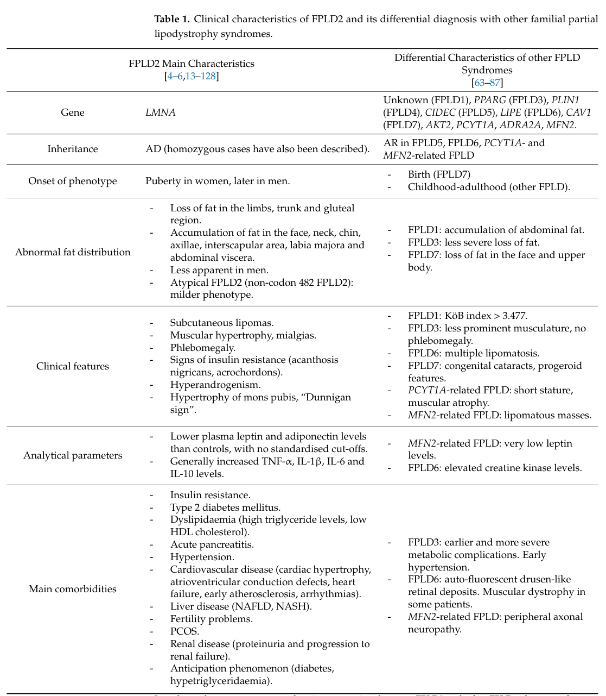

## Question

# Disease Characteristics Research Template

## Target Disease
- **Disease Name:** Familial Partial Lipodystrophy
- **MONDO ID:**  (if available)
- **Category:** Mendelian

## Research Objectives

Please provide a comprehensive research report on **Familial Partial Lipodystrophy** covering all of the
disease characteristics listed below. This report will be used to populate a disease knowledge
base entry. Be thorough and cite primary literature (PMID preferred) for all claims.

For each section, **suggested databases/resources** are listed. These are the first places
you should search for information on each topic.

---

### 1. Disease Information
> **Search first:** OMIM, Orphanet, ICD-10/ICD-11, MeSH, PubMed

- What is the disease? Provide a concise overview.
- What are the key identifiers? (OMIM, Orphanet, ICD-10/ICD-11, MeSH, Mondo)
- What are the common synonyms and alternative names?
- Is the information derived from individual patients (e.g., EHR) or aggregated disease-level resources?

### 2. Etiology

- **Disease Causal Factors**: What are the primary causes? (genetic, environmental, infectious, mechanistic)
- **Risk Factors**:
  > **Search first:** PubMed, Cochrane Library, UpToDate, clinical guidelines, ClinVar, ClinGen, GWAS Catalog, PheGenI, CTD, CDC, WHO, epidemiological databases
  - Genetic risk factors (causal variants, susceptibility loci, modifier genes)
  - Environmental risk factors (toxins, lifestyle, occupational exposures, age, sex, family history)
- **Protective Factors**:
  > **Search first:** PubMed, Cochrane Library, clinical trial databases, GWAS Catalog, gnomAD, WHO, CDC, nutrition databases
  - Genetic protective factors (protective variants, modifier alleles)
  - Environmental protective factors (diet, lifestyle, exposures that reduce risk)
- **Gene-Environment Interactions**: How do genetic and environmental factors interact to influence disease?
  > **Search first:** CTD, PubMed, PheGenI, GxE databases

### 3. Phenotypes
> **Search first:** HPO (Human Phenotype Ontology), OMIM, Orphanet, PubMed, clinicaltrials.gov, MedDRA, SNOMED CT, DECIPHER, LOINC

For each phenotype, provide:
- **Phenotype type**: symptoms, clinical signs, physical manifestations, behavioral changes, or laboratory abnormalities
  > For symptoms/signs: HPO, OMIM, Orphanet, PubMed
  > For behavioral changes: HPO, DSM, RDoC (Research Domain Criteria), PubMed
  > For laboratory abnormalities: LOINC, SNOMED CT, LabTests Online, PubMed
- **Phenotype characteristics**:
  > **Search first:** OMIM, Orphanet, HPO, PubMed
  - Age of symptom onset (neonatal, childhood, adult-onset, late-onset)
  - Symptom severity (mild, moderate, severe, variable)
  - Symptom progression (stable, progressive, episodic, fluctuating)
  - Frequency among affected individuals (percentage or qualitative)
- **Quality of life impact**: Effects on daily functioning and well-being (per-phenotype when possible)
  > **Search first:** EQ-5D database, SF-36, WHO QOL databases, PubMed
- Suggest HPO (Human Phenotype Ontology) terms for each phenotype

### 4. Genetic/Molecular Information

- **Causal Genes**: Gene mutations or chromosomal abnormalities responsible for disease (gene symbols, OMIM IDs)
  > **Search first:** OMIM, ClinVar, HGMD, Ensembl, NCBI Gene
- **Pathogenic Variants**:
  - Affected genes (gene symbols, HGNC IDs)
    > **Search first:** OMIM, NCBI Gene, Ensembl, HGNC, UniProt, GeneCards
  - Variant classification (pathogenic, likely pathogenic, VUS per ACMG/AMP guidelines)
    > **Search first:** ClinVar, ClinGen, ACMG/AMP guidelines, VarSome
  - Variant type/class (missense, frameshift, nonsense, splice-site, structural)
  - Allele frequency in population databases
    > **Search first:** gnomAD, 1000 Genomes, ExAC, TOPMed, dbSNP
  - Somatic vs germline origin
    > **Search first:** COSMIC (somatic), ClinVar, ICGC, TCGA
  - Functional consequences (loss of function, gain of function, dominant negative)
- **Modifier Genes**: Genes that modify disease severity or expression
- **Epigenetic Information**: DNA methylation, histone modifications, chromatin changes affecting disease
  > **Search first:** ENCODE, Roadmap Epigenomics, MethBase, DiseaseMeth
- **Chromosomal Abnormalities**: Large-scale genetic changes (aneuploidy, translocations, inversions)
  > **Search first:** DECIPHER, ClinVar, ECARUCA, UCSC Genome Browser

### 5. Environmental Information

- **Environmental Factors**: Non-genetic contributing factors (toxins, radiation, pollution, occupational exposure)
  > **Search first:** CTD (Comparative Toxicogenomics Database), TOXNET, PubMed, EPA databases
- **Lifestyle Factors**: Behavioral factors (smoking, diet, exercise, alcohol consumption)
  > **Search first:** CDC databases, WHO, PubMed, NHANES
- **Infectious Agents**: If applicable, pathogens causing or triggering disease (bacteria, viruses, fungi, parasites)
  > **Search first:** NCBI Taxonomy, ViPR, BV-BRC, MicrobeDB, GIDEON

### 6. Mechanism / Pathophysiology

- **Molecular Pathways**: Specific signaling cascades or biochemical pathways involved (Wnt, MAPK, mTOR, PI3K-AKT, etc.)
  > **Search first:** KEGG, Reactome, WikiPathways, PathBank, BioCyc
- **Cellular Processes**: Cell-level mechanisms (apoptosis, autophagy, cell cycle dysregulation, inflammation, etc.)
  > **Search first:** Gene Ontology (GO), Reactome, KEGG, PubMed
- **Protein Dysfunction**: How protein structure or function is altered (misfolding, aggregation, loss of function, gain of function)
  > **Search first:** UniProt, PDB (Protein Data Bank), InterPro, Pfam, AlphaFold
- **Metabolic Changes**: Alterations in metabolic processes (energy metabolism, lipid metabolism, amino acid metabolism)
  > **Search first:** KEGG, BioCyc, HMDB (Human Metabolome Database), BRENDA
- **Immune System Involvement**: Role of immune response (autoimmunity, immunodeficiency, chronic inflammation)
  > **Search first:** ImmPort, Immunome Database, IEDB, Gene Ontology
- **Tissue Damage Mechanisms**: How tissues/ are injured (oxidative stress, ischemia, fibrosis, necrosis)
  > **Search first:** PubMed, Gene Ontology, Reactome
- **Biochemical Abnormalities**: Specific molecular defects (enzyme deficiencies, receptor dysfunction, ion channel defects)
  > **Search first:** BRENDA, UniProt, KEGG, OMIM, PubMed
- **Epigenetic Changes**: DNA methylation, histone modifications affecting gene expression in disease
  > **Search first:** ENCODE, Roadmap Epigenomics, MethBase, DiseaseMeth
- **Molecular Profiling** (if available):
  - Transcriptomics/gene expression changes
    > **Search first:** GEO (Gene Expression Omnibus), ArrayExpress, GTEx, Human Cell Atlas, SRA
  - Proteomics findings
    > **Search first:** PRIDE, ProteomeXchange, Human Protein Atlas, STRING, BioGRID
  - Metabolomics signatures
    > **Search first:** MetaboLights, Metabolomics Workbench, HMDB, METLIN
  - Lipidomics alterations
    > **Search first:** LIPID MAPS, SwissLipids, LipidHome, Metabolomics Workbench
  - Genomic structural features
    > **Search first:** UCSC Genome Browser, Ensembl, NCBI, dbVar, DGV
- **Advanced Technologies** (if applicable):
  - Single-cell analysis findings (cell-type specific mechanisms, cellular heterogeneity)
    > **Search first:** Human Cell Atlas, Single Cell Portal, GEO, CELLxGENE
  - Spatial transcriptomics findings
    > **Search first:** GEO, Spatial Research, Vizgen, 10x Genomics data
  - Multi-omics integration results
    > **Search first:** TCGA, ICGC, cBioPortal, LinkedOmics, PubMed
  - Functional genomics screens (CRISPR, RNAi)
    > **Search first:** DepMap, GenomeRNAi, PubMed, BioGRID ORCS

For each mechanism, describe:
- The causal chain from initial trigger to clinical manifestation
- Which mechanisms are upstream vs downstream
- What cell types and biological processes are involved
- Suggest GO terms for biological processes and CL terms for cell types

### 7. Anatomical Structures Affected

- **Organ Level**:
  - Primary organs directly affected
  - Secondary organ involvement (complications, secondary effects)
  - Body systems involved (cardiovascular, nervous, digestive, respiratory, endocrine, etc.)
  > **Search first:** Uberon, FMA (Foundational Model of Anatomy), OMIM, HPO, ICD-11, MeSH, SNOMED CT
- **Tissue and Cell Level**:
  - Specific tissue types affected (epithelial, connective, muscle, nervous)
  - Specific cell populations targeted (with Cell Ontology terms)
  > **Search first:** Uberon, Human Protein Atlas, Cell Ontology, Human Cell Atlas, CellMarker, PanglaoDB
- **Subcellular Level**:
  - Cellular compartments involved (mitochondria, nucleus, ER, lysosomes) (with GO Cellular Component terms)
  > **Search first:** Gene Ontology (Cellular Component), UniProt, Human Protein Atlas
- **Localization**:
  - Specific anatomical sites (with UBERON terms)
    > **Search first:** FMA, Uberon, NeuroNames (for brain), SNOMED CT
  - Lateralization (unilateral, bilateral, asymmetric)
    > **Search first:** HPO, clinical literature, imaging databases

### 8. Temporal Development

- **Onset**:
  - Typical age of onset (congenital, pediatric, adult, geriatric)
  - Onset pattern (acute, subacute, chronic, insidious)
  > **Search first:** OMIM, Orphanet, HPO, PubMed
- **Progression**:
  - Disease stages (early, intermediate, advanced, end-stage)
    > **Search first:** Cancer Staging Manual (AJCC), WHO classifications, PubMed
  - Progression rate (rapid, slow, variable)
  - Disease course pattern (episodic, relapsing-remitting, progressive, stable)
  - Disease duration (self-limited, chronic lifelong)
  > **Search first:** Disease registries, longitudinal cohort databases, natural history studies, PubMed, Orphanet, OMIM
- **Patterns**:
  - Remission patterns (spontaneous, treatment-induced)
    > **Search first:** Clinical trial databases, disease registries, PubMed
  - Critical periods (time windows of vulnerability or opportunity for intervention)
    > **Search first:** PubMed, developmental biology databases, clinical guidelines

### 9. Inheritance and Population

- **Epidemiology**:
  - Prevalence (cases per 100,000 at given time)
  - Incidence (new cases per 100,000 per year)
  > **Search first:** Orphanet, CDC, WHO, GBD (Global Burden of Disease), national registries, SEER, disease registries
- **For Genetic Etiology**:
  - Inheritance pattern (AD, AR, X-linked, mitochondrial, multifactorial, polygenic)
    > **Search first:** OMIM, Orphanet, ClinVar, GTR (Genetic Testing Registry)
  - Penetrance (complete, incomplete, age-dependent)
    > **Search first:** ClinVar, OMIM, PubMed, ClinGen
  - Expressivity (variable, consistent)
    > **Search first:** OMIM, ClinVar, PubMed
  - Genetic anticipation (increasing severity in successive generations)
    > **Search first:** OMIM, PubMed (especially for repeat expansion disorders)
  - Germline mosaicism
    > **Search first:** ClinVar, OMIM, genetic counseling literature, PubMed
  - Founder effects (population-specific mutations)
    > **Search first:** gnomAD, population genetics databases, PubMed
  - Consanguinity role
    > **Search first:** OMIM, population studies, genetic counseling resources
  - Carrier frequency
    > **Search first:** gnomAD, carrier screening databases, GeneReviews, GTR
- **Population Demographics**:
  - Affected populations (ethnic or demographic groups with higher prevalence)
    > **Search first:** gnomAD, 1000 Genomes, PAGE Study, PubMed, population registries
  - Geographic distribution (endemic areas, regional variation)
    > **Search first:** WHO, CDC, GBD, Orphanet, geographic epidemiology databases
  - Geographic distribution of specific variants
  - Sex ratio (male:female)
    > **Search first:** Disease registries, OMIM, PubMed, epidemiological databases
  - Age distribution of affected individuals
    > **Search first:** CDC, disease registries, SEER, Orphanet

### 10. Diagnostics

- **Clinical Tests**:
  - Laboratory tests (blood, urine, tissue chemistry, specific enzyme assays)
    > **Search first:** LOINC, LabTests Online, PubMed
  - Biomarkers (proteins, metabolites, genetic markers, circulating biomarkers)
    > **Search first:** FDA Biomarker List, BEST (Biomarkers, EndpointS, and other Tools), PubMed
  - Imaging studies (X-ray, CT, MRI, PET, ultrasound)
    > **Search first:** RadLex, DICOM, Radiopaedia, imaging databases
  - Functional tests (pulmonary function, cardiac stress tests)
    > **Search first:** LOINC, clinical guidelines, PubMed
  - Electrophysiology (EEG, EMG, ECG, nerve conduction studies)
    > **Search first:** LOINC, clinical neurophysiology databases, PubMed
  - Biopsy findings (histopathology, immunohistochemistry)
    > **Search first:** SNOMED CT, College of American Pathologists resources, PubMed
  - Pathology findings (microscopic examination)
    > **Search first:** SNOMED CT, Digital Pathology databases, PubMed
- **Genetic Testing**:
  > **Search first:** GTR (Genetic Testing Registry), GeneReviews, ClinGen
  - Overview of recommended genetic testing approach
  - Whole genome sequencing (WGS) utility
    > **Search first:** GTR, ClinVar, GEL (Genomics England), gnomAD
  - Whole exome sequencing (WES) utility
    > **Search first:** GTR, ClinVar, OMIM, GeneMatcher
  - Gene panels (which panels, which genes)
    > **Search first:** GTR, ClinVar, laboratory-specific databases
  - Single gene testing
    > **Search first:** GTR, ClinVar, OMIM, GeneReviews
  - Chromosomal microarray (CMA)
    > **Search first:** DECIPHER, ClinVar, dbVar, ECARUCA
  - Karyotyping
    > **Search first:** Chromosome Abnormality Database, ClinVar, cytogenetics resources
  - FISH
    > **Search first:** ClinVar, cytogenetics databases, PubMed
  - Mitochondrial DNA testing
    > **Search first:** MITOMAP, MSeqDR, ClinVar, GTR
  - Repeat expansion testing
    > **Search first:** GTR, ClinVar, repeat expansion databases, PubMed
- **Omics-Based Diagnostics** (if applicable):
  - RNA sequencing / transcriptomics
    > **Search first:** GEO, ArrayExpress, GTEx, RNA-seq databases
  - Proteomics
    > **Search first:** PRIDE, ProteomeXchange, FDA Biomarker database
  - Metabolomics
    > **Search first:** MetaboLights, Metabolomics Workbench, HMDB
  - Epigenomics
    > **Search first:** GEO, ENCODE, Roadmap Epigenomics, MethBase
  - Liquid biopsy
    > **Search first:** COSMIC, ClinVar, liquid biopsy databases, PubMed
- **Clinical Criteria**:
  - Standardized diagnostic criteria (DSM, ICD, society guidelines)
    > **Search first:** DSM-5, ICD-11, clinical society guidelines, UpToDate
  - Differential diagnosis (other conditions to rule out, with distinguishing features)
    > **Search first:** DynaMed, UpToDate, clinical decision support systems
- **Screening**:
  - Screening methods for asymptomatic individuals (newborn screening, carrier screening, cascade screening)
    > **Search first:** ACMG recommendations, CDC newborn screening, GTR

### 11. Outcome/Prognosis

- **Survival and Mortality**:
  - Survival rate (5-year, 10-year, overall)
    > **Search first:** SEER, cancer registries, disease-specific registries, PubMed
  - Life expectancy (with and without treatment if applicable)
    > **Search first:** Orphanet, disease registries, actuarial databases, PubMed
  - Mortality rate
    > **Search first:** CDC, WHO, GBD, national mortality databases
  - Disease-specific mortality (deaths directly attributable to disease)
    > **Search first:** Disease registries, CDC Wonder, GBD, PubMed
- **Morbidity and Function**:
  - Morbidity (disease-related disability and health impacts)
    > **Search first:** GBD, WHO, disability databases, PubMed
  - Disability outcomes (long-term functional impairments)
    > **Search first:** ICF (International Classification of Functioning), disability registries
  - Quality of life measures (EQ-5D, SF-36, PROMIS, disease-specific tools)
    > **Search first:** EQ-5D database, SF-36, PROMIS, PubMed
- **Disease Course**:
  - Complications (secondary problems: infections, organ failure, etc.)
    > **Search first:** ICD codes, disease registries, clinical databases, PubMed
  - Recovery potential (likelihood and extent of recovery, with vs without treatment)
    > **Search first:** Natural history studies, rehabilitation databases, PubMed
- **Prediction**:
  - Prognostic factors (age, disease severity, biomarkers, treatment response)
    > **Search first:** Prognostic models databases, clinical calculators, PubMed
  - Prognostic biomarkers (molecular markers predicting disease course)
    > **Search first:** FDA Biomarker database, PubMed, cancer prognostic databases

### 12. Treatment

- **Pharmacotherapy**:
  - Pharmacological treatments (drug names, drug classes, mechanisms of action)
    > **Search first:** DrugBank, RxNorm, ATC classification, DailyMed, FDA databases
  - Pharmacogenomics (how genetic variants affect drug metabolism, efficacy, toxicity)
    > **Search first:** PharmGKB, CPIC (Clinical Pharmacogenetics), FDA Table of PGx Biomarkers
- **Advanced Therapeutics**:
  - Gene therapy (viral vectors, CRISPR, gene replacement, gene editing)
    > **Search first:** ClinicalTrials.gov, FDA gene therapy database, ASGCT resources
  - Cell therapy (stem cell transplant, CAR-T, cellular therapeutics)
    > **Search first:** ClinicalTrials.gov, FDA cell therapy database, FACT standards
  - RNA-based therapies (ASOs, siRNA, mRNA therapies)
    > **Search first:** ClinicalTrials.gov, FDA approvals, PubMed
  - Targeted therapies (treatments directed at specific molecular targets)
    > **Search first:** My Cancer Genome, OncoKB, ClinicalTrials.gov, FDA approvals
  - Immunotherapies (checkpoint inhibitors, monoclonal antibodies)
    > **Search first:** Cancer Immunotherapy Database, FDA approvals, ClinicalTrials.gov
- **Surgical and Interventional**:
  - Surgical interventions (types of surgery, timing, outcomes)
    > **Search first:** CPT codes, surgical registries, clinical guidelines, PubMed
- **Supportive and Rehabilitative**:
  - Supportive care (symptom management, pain control, nutrition)
    > **Search first:** Clinical guidelines, Cochrane Library, PubMed
  - Rehabilitation (physical therapy, occupational therapy, speech therapy)
    > **Search first:** Rehabilitation medicine databases, clinical guidelines, PubMed
- **Experimental**:
  - Experimental treatments in clinical trials (with NCT identifiers if available)
    > **Search first:** ClinicalTrials.gov, EU Clinical Trials Register, WHO ICTRP
- **Treatment Outcomes**:
  - Treatment response rates
    > **Search first:** Clinical trial databases, FDA reviews, systematic reviews, PubMed
  - Side effects and adverse events
    > **Search first:** FDA Adverse Event Reporting System (FAERS), MedWatch, PubMed
- **Treatment Strategy**:
  - Treatment algorithms (clinical pathways, decision trees)
    > **Search first:** Clinical practice guidelines, NCCN Guidelines, UpToDate
  - Combination therapies
    > **Search first:** ClinicalTrials.gov, treatment guidelines, PubMed
  - Personalized medicine approaches (genotype-guided treatment)
    > **Search first:** My Cancer Genome, CIViC, PharmGKB, precision medicine databases

For each treatment, suggest MAXO (Medical Action Ontology) terms where applicable.

### 13. Prevention

- **Prevention Levels**:
  - Primary prevention (preventing disease occurrence: vaccination, risk factor modification)
    > **Search first:** CDC, WHO, USPSTF recommendations, Cochrane Library
  - Secondary prevention (early detection and treatment: screening programs, early intervention)
    > **Search first:** USPSTF, CDC screening guidelines, WHO
  - Tertiary prevention (preventing complications in those with disease)
    > **Search first:** Clinical guidelines, disease management protocols, PubMed
- **Immunization**: Vaccine strategies (if applicable)
  > **Search first:** CDC vaccine schedules, WHO immunization, FDA vaccine database
- **Screening and Early Detection**:
  - Screening programs (population-based: newborn screening, cancer screening)
    > **Search first:** CDC screening programs, USPSTF, cancer screening databases
  - Genetic screening (carrier screening, preimplantation genetic diagnosis, prenatal testing)
    > **Search first:** ACMG recommendations, ACOG guidelines, GTR
  - Risk stratification (identifying high-risk individuals for targeted prevention)
    > **Search first:** Risk prediction models, clinical calculators, PubMed
- **Behavioral Interventions**: Lifestyle modifications to reduce risk
  > **Search first:** CDC, WHO, behavioral intervention databases, Cochrane Library
- **Counseling**: Genetic counseling (risk assessment, family planning guidance)
  > **Search first:** NSGC resources, ACMG guidelines, GeneReviews
- **Public Health**:
  - Public health interventions (sanitation, vector control, health education)
    > **Search first:** CDC, WHO, public health databases, PubMed
  - Environmental interventions (reducing environmental risk factors)
    > **Search first:** EPA databases, WHO environmental health, PubMed
- **Prophylaxis**: Preventive medications or procedures
  > **Search first:** Clinical guidelines, FDA approvals, PubMed

### 14. Other Species / Natural Disease

- **Taxonomy**: Species affected (with NCBI Taxon identifiers)
  > **Search first:** NCBI Taxonomy
- **Breed**: Specific breeds affected (with VBO identifiers if applicable)
  > **Search first:** VBO (Vertebrate Breed Ontology)
- **Gene**: Orthologous genes in other species (with NCBI Gene IDs)
  > **Search first:** NCBI Gene
- **Natural Disease**:
  - Naturally occurring disease in other species (companion animals, wildlife)
    > **Search first:** OMIA (Online Mendelian Inheritance in Animals), VetCompass, PubMed
  - Veterinary relevance and importance in animal health
    > **Search first:** OMIA, veterinary databases, PubMed
- **Comparative Biology**:
  - Comparative pathology (similarities and differences across species)
    > **Search first:** OMIA, comparative pathology databases, PubMed
  - Evolutionary conservation of disease mechanisms
    > **Search first:** HomoloGene, OrthoMCL, Alliance of Genome Resources
- **Transmission** (if applicable):
  - Zoonotic potential
    > **Search first:** CDC zoonotic diseases, WHO zoonoses, GIDEON
  - Cross-species susceptibility
    > **Search first:** NCBI Taxonomy, veterinary databases, PubMed

### 15. Model Organisms

- **Model Types**:
  - Model organism type (mammalian, invertebrate, cellular, in vitro)
    > **Search first:** Alliance of Genome Resources, model organism databases
  - Specific model systems (mouse, rat, zebrafish, Drosophila, C. elegans, yeast, cell lines, organoids, iPSCs)
    > **Search first:** MGI, RGD, ZFIN, FlyBase, WormBase, SGD, ATCC, Cellosaurus
  - Induced models (drug treatment, surgical intervention, environmental manipulation)
    > **Search first:** MGI, model organism databases, PubMed
- **Genetic Models**:
  - Types available (knockout, knock-in, transgenic, conditional, humanized)
    > **Search first:** MGI, IMPC, KOMP, EuMMCR, IMSR
- **Model Characteristics**:
  - Phenotype recapitulation (how well model reproduces human disease features)
    > **Search first:** Model organism databases, comparative studies, PubMed
  - Model limitations (aspects of human disease not captured)
    > **Search first:** Model organism databases, PubMed, review articles
- **Applications**:
  - Research applications (what aspects of disease can be studied)
    > **Search first:** Model organism databases, PubMed
- **Resources**:
  - Model databases
    > **Search first:** MGI, RGD, ZFIN, FlyBase, WormBase, IMSR, EMMA, MMRRC

---

## Citation Requirements

- Cite primary literature (PMID preferred) for all mechanistic and clinical claims
- Prioritize recent reviews and landmark papers
- Include direct quotes from abstracts where possible to support key statements
- Distinguish evidence source types: human clinical, model organism, in vitro, computational

## Output Format

Structure your response as a comprehensive narrative organized by the sections above.
For each section, provide:
- Factual content with specific details (numbers, percentages, gene names, variant nomenclature)
- Ontology term suggestions (HPO, GO, CL, UBERON, CHEBI, MAXO, MONDO) where applicable
- Evidence citations with PMIDs
- Direct quotes from abstracts to support key claims
- Clear indication when information is not available or not applicable for this disease

This report will be used to populate a disease knowledge base entry with:
- Pathophysiology descriptions with causal chains
- Gene/protein annotations (HGNC, GO terms)
- Phenotype associations (HP terms) with frequencies
- Cell type involvement (CL terms)
- Anatomical locations (UBERON terms)
- Chemical entities (CHEBI terms)
- Treatment annotations (MAXO terms)
- Evidence items with PMIDs and exact abstract quotes
- Epidemiology, prognosis, diagnostic, and prevention information
- Animal model descriptions with phenotype recapitulation details

## Output

Question: You are an expert researcher providing comprehensive, well-cited information.

Provide detailed information focusing on:
1. Key concepts and definitions with current understanding
2. Recent developments and latest research (prioritize 2023-2024 sources)
3. Current applications and real-world implementations
4. Expert opinions and analysis from authoritative sources
5. Relevant statistics and data from recent studies

Format as a comprehensive research report with proper citations. Include URLs and publication dates where available.
Always prioritize recent, authoritative sources and provide specific citations for all major claims.

# Disease Characteristics Research Template

## Target Disease
- **Disease Name:** Familial Partial Lipodystrophy
- **MONDO ID:**  (if available)
- **Category:** Mendelian

## Research Objectives

Please provide a comprehensive research report on **Familial Partial Lipodystrophy** covering all of the
disease characteristics listed below. This report will be used to populate a disease knowledge
base entry. Be thorough and cite primary literature (PMID preferred) for all claims.

For each section, **suggested databases/resources** are listed. These are the first places
you should search for information on each topic.

---

### 1. Disease Information
> **Search first:** OMIM, Orphanet, ICD-10/ICD-11, MeSH, PubMed

- What is the disease? Provide a concise overview.
- What are the key identifiers? (OMIM, Orphanet, ICD-10/ICD-11, MeSH, Mondo)
- What are the common synonyms and alternative names?
- Is the information derived from individual patients (e.g., EHR) or aggregated disease-level resources?

### 2. Etiology

- **Disease Causal Factors**: What are the primary causes? (genetic, environmental, infectious, mechanistic)
- **Risk Factors**:
  > **Search first:** PubMed, Cochrane Library, UpToDate, clinical guidelines, ClinVar, ClinGen, GWAS Catalog, PheGenI, CTD, CDC, WHO, epidemiological databases
  - Genetic risk factors (causal variants, susceptibility loci, modifier genes)
  - Environmental risk factors (toxins, lifestyle, occupational exposures, age, sex, family history)
- **Protective Factors**:
  > **Search first:** PubMed, Cochrane Library, clinical trial databases, GWAS Catalog, gnomAD, WHO, CDC, nutrition databases
  - Genetic protective factors (protective variants, modifier alleles)
  - Environmental protective factors (diet, lifestyle, exposures that reduce risk)
- **Gene-Environment Interactions**: How do genetic and environmental factors interact to influence disease?
  > **Search first:** CTD, PubMed, PheGenI, GxE databases

### 3. Phenotypes
> **Search first:** HPO (Human Phenotype Ontology), OMIM, Orphanet, PubMed, clinicaltrials.gov, MedDRA, SNOMED CT, DECIPHER, LOINC

For each phenotype, provide:
- **Phenotype type**: symptoms, clinical signs, physical manifestations, behavioral changes, or laboratory abnormalities
  > For symptoms/signs: HPO, OMIM, Orphanet, PubMed
  > For behavioral changes: HPO, DSM, RDoC (Research Domain Criteria), PubMed
  > For laboratory abnormalities: LOINC, SNOMED CT, LabTests Online, PubMed
- **Phenotype characteristics**:
  > **Search first:** OMIM, Orphanet, HPO, PubMed
  - Age of symptom onset (neonatal, childhood, adult-onset, late-onset)
  - Symptom severity (mild, moderate, severe, variable)
  - Symptom progression (stable, progressive, episodic, fluctuating)
  - Frequency among affected individuals (percentage or qualitative)
- **Quality of life impact**: Effects on daily functioning and well-being (per-phenotype when possible)
  > **Search first:** EQ-5D database, SF-36, WHO QOL databases, PubMed
- Suggest HPO (Human Phenotype Ontology) terms for each phenotype

### 4. Genetic/Molecular Information

- **Causal Genes**: Gene mutations or chromosomal abnormalities responsible for disease (gene symbols, OMIM IDs)
  > **Search first:** OMIM, ClinVar, HGMD, Ensembl, NCBI Gene
- **Pathogenic Variants**:
  - Affected genes (gene symbols, HGNC IDs)
    > **Search first:** OMIM, NCBI Gene, Ensembl, HGNC, UniProt, GeneCards
  - Variant classification (pathogenic, likely pathogenic, VUS per ACMG/AMP guidelines)
    > **Search first:** ClinVar, ClinGen, ACMG/AMP guidelines, VarSome
  - Variant type/class (missense, frameshift, nonsense, splice-site, structural)
  - Allele frequency in population databases
    > **Search first:** gnomAD, 1000 Genomes, ExAC, TOPMed, dbSNP
  - Somatic vs germline origin
    > **Search first:** COSMIC (somatic), ClinVar, ICGC, TCGA
  - Functional consequences (loss of function, gain of function, dominant negative)
- **Modifier Genes**: Genes that modify disease severity or expression
- **Epigenetic Information**: DNA methylation, histone modifications, chromatin changes affecting disease
  > **Search first:** ENCODE, Roadmap Epigenomics, MethBase, DiseaseMeth
- **Chromosomal Abnormalities**: Large-scale genetic changes (aneuploidy, translocations, inversions)
  > **Search first:** DECIPHER, ClinVar, ECARUCA, UCSC Genome Browser

### 5. Environmental Information

- **Environmental Factors**: Non-genetic contributing factors (toxins, radiation, pollution, occupational exposure)
  > **Search first:** CTD (Comparative Toxicogenomics Database), TOXNET, PubMed, EPA databases
- **Lifestyle Factors**: Behavioral factors (smoking, diet, exercise, alcohol consumption)
  > **Search first:** CDC databases, WHO, PubMed, NHANES
- **Infectious Agents**: If applicable, pathogens causing or triggering disease (bacteria, viruses, fungi, parasites)
  > **Search first:** NCBI Taxonomy, ViPR, BV-BRC, MicrobeDB, GIDEON

### 6. Mechanism / Pathophysiology

- **Molecular Pathways**: Specific signaling cascades or biochemical pathways involved (Wnt, MAPK, mTOR, PI3K-AKT, etc.)
  > **Search first:** KEGG, Reactome, WikiPathways, PathBank, BioCyc
- **Cellular Processes**: Cell-level mechanisms (apoptosis, autophagy, cell cycle dysregulation, inflammation, etc.)
  > **Search first:** Gene Ontology (GO), Reactome, KEGG, PubMed
- **Protein Dysfunction**: How protein structure or function is altered (misfolding, aggregation, loss of function, gain of function)
  > **Search first:** UniProt, PDB (Protein Data Bank), InterPro, Pfam, AlphaFold
- **Metabolic Changes**: Alterations in metabolic processes (energy metabolism, lipid metabolism, amino acid metabolism)
  > **Search first:** KEGG, BioCyc, HMDB (Human Metabolome Database), BRENDA
- **Immune System Involvement**: Role of immune response (autoimmunity, immunodeficiency, chronic inflammation)
  > **Search first:** ImmPort, Immunome Database, IEDB, Gene Ontology
- **Tissue Damage Mechanisms**: How tissues/ are injured (oxidative stress, ischemia, fibrosis, necrosis)
  > **Search first:** PubMed, Gene Ontology, Reactome
- **Biochemical Abnormalities**: Specific molecular defects (enzyme deficiencies, receptor dysfunction, ion channel defects)
  > **Search first:** BRENDA, UniProt, KEGG, OMIM, PubMed
- **Epigenetic Changes**: DNA methylation, histone modifications affecting gene expression in disease
  > **Search first:** ENCODE, Roadmap Epigenomics, MethBase, DiseaseMeth
- **Molecular Profiling** (if available):
  - Transcriptomics/gene expression changes
    > **Search first:** GEO (Gene Expression Omnibus), ArrayExpress, GTEx, Human Cell Atlas, SRA
  - Proteomics findings
    > **Search first:** PRIDE, ProteomeXchange, Human Protein Atlas, STRING, BioGRID
  - Metabolomics signatures
    > **Search first:** MetaboLights, Metabolomics Workbench, HMDB, METLIN
  - Lipidomics alterations
    > **Search first:** LIPID MAPS, SwissLipids, LipidHome, Metabolomics Workbench
  - Genomic structural features
    > **Search first:** UCSC Genome Browser, Ensembl, NCBI, dbVar, DGV
- **Advanced Technologies** (if applicable):
  - Single-cell analysis findings (cell-type specific mechanisms, cellular heterogeneity)
    > **Search first:** Human Cell Atlas, Single Cell Portal, GEO, CELLxGENE
  - Spatial transcriptomics findings
    > **Search first:** GEO, Spatial Research, Vizgen, 10x Genomics data
  - Multi-omics integration results
    > **Search first:** TCGA, ICGC, cBioPortal, LinkedOmics, PubMed
  - Functional genomics screens (CRISPR, RNAi)
    > **Search first:** DepMap, GenomeRNAi, PubMed, BioGRID ORCS

For each mechanism, describe:
- The causal chain from initial trigger to clinical manifestation
- Which mechanisms are upstream vs downstream
- What cell types and biological processes are involved
- Suggest GO terms for biological processes and CL terms for cell types

### 7. Anatomical Structures Affected

- **Organ Level**:
  - Primary organs directly affected
  - Secondary organ involvement (complications, secondary effects)
  - Body systems involved (cardiovascular, nervous, digestive, respiratory, endocrine, etc.)
  > **Search first:** Uberon, FMA (Foundational Model of Anatomy), OMIM, HPO, ICD-11, MeSH, SNOMED CT
- **Tissue and Cell Level**:
  - Specific tissue types affected (epithelial, connective, muscle, nervous)
  - Specific cell populations targeted (with Cell Ontology terms)
  > **Search first:** Uberon, Human Protein Atlas, Cell Ontology, Human Cell Atlas, CellMarker, PanglaoDB
- **Subcellular Level**:
  - Cellular compartments involved (mitochondria, nucleus, ER, lysosomes) (with GO Cellular Component terms)
  > **Search first:** Gene Ontology (Cellular Component), UniProt, Human Protein Atlas
- **Localization**:
  - Specific anatomical sites (with UBERON terms)
    > **Search first:** FMA, Uberon, NeuroNames (for brain), SNOMED CT
  - Lateralization (unilateral, bilateral, asymmetric)
    > **Search first:** HPO, clinical literature, imaging databases

### 8. Temporal Development

- **Onset**:
  - Typical age of onset (congenital, pediatric, adult, geriatric)
  - Onset pattern (acute, subacute, chronic, insidious)
  > **Search first:** OMIM, Orphanet, HPO, PubMed
- **Progression**:
  - Disease stages (early, intermediate, advanced, end-stage)
    > **Search first:** Cancer Staging Manual (AJCC), WHO classifications, PubMed
  - Progression rate (rapid, slow, variable)
  - Disease course pattern (episodic, relapsing-remitting, progressive, stable)
  - Disease duration (self-limited, chronic lifelong)
  > **Search first:** Disease registries, longitudinal cohort databases, natural history studies, PubMed, Orphanet, OMIM
- **Patterns**:
  - Remission patterns (spontaneous, treatment-induced)
    > **Search first:** Clinical trial databases, disease registries, PubMed
  - Critical periods (time windows of vulnerability or opportunity for intervention)
    > **Search first:** PubMed, developmental biology databases, clinical guidelines

### 9. Inheritance and Population

- **Epidemiology**:
  - Prevalence (cases per 100,000 at given time)
  - Incidence (new cases per 100,000 per year)
  > **Search first:** Orphanet, CDC, WHO, GBD (Global Burden of Disease), national registries, SEER, disease registries
- **For Genetic Etiology**:
  - Inheritance pattern (AD, AR, X-linked, mitochondrial, multifactorial, polygenic)
    > **Search first:** OMIM, Orphanet, ClinVar, GTR (Genetic Testing Registry)
  - Penetrance (complete, incomplete, age-dependent)
    > **Search first:** ClinVar, OMIM, PubMed, ClinGen
  - Expressivity (variable, consistent)
    > **Search first:** OMIM, ClinVar, PubMed
  - Genetic anticipation (increasing severity in successive generations)
    > **Search first:** OMIM, PubMed (especially for repeat expansion disorders)
  - Germline mosaicism
    > **Search first:** ClinVar, OMIM, genetic counseling literature, PubMed
  - Founder effects (population-specific mutations)
    > **Search first:** gnomAD, population genetics databases, PubMed
  - Consanguinity role
    > **Search first:** OMIM, population studies, genetic counseling resources
  - Carrier frequency
    > **Search first:** gnomAD, carrier screening databases, GeneReviews, GTR
- **Population Demographics**:
  - Affected populations (ethnic or demographic groups with higher prevalence)
    > **Search first:** gnomAD, 1000 Genomes, PAGE Study, PubMed, population registries
  - Geographic distribution (endemic areas, regional variation)
    > **Search first:** WHO, CDC, GBD, Orphanet, geographic epidemiology databases
  - Geographic distribution of specific variants
  - Sex ratio (male:female)
    > **Search first:** Disease registries, OMIM, PubMed, epidemiological databases
  - Age distribution of affected individuals
    > **Search first:** CDC, disease registries, SEER, Orphanet

### 10. Diagnostics

- **Clinical Tests**:
  - Laboratory tests (blood, urine, tissue chemistry, specific enzyme assays)
    > **Search first:** LOINC, LabTests Online, PubMed
  - Biomarkers (proteins, metabolites, genetic markers, circulating biomarkers)
    > **Search first:** FDA Biomarker List, BEST (Biomarkers, EndpointS, and other Tools), PubMed
  - Imaging studies (X-ray, CT, MRI, PET, ultrasound)
    > **Search first:** RadLex, DICOM, Radiopaedia, imaging databases
  - Functional tests (pulmonary function, cardiac stress tests)
    > **Search first:** LOINC, clinical guidelines, PubMed
  - Electrophysiology (EEG, EMG, ECG, nerve conduction studies)
    > **Search first:** LOINC, clinical neurophysiology databases, PubMed
  - Biopsy findings (histopathology, immunohistochemistry)
    > **Search first:** SNOMED CT, College of American Pathologists resources, PubMed
  - Pathology findings (microscopic examination)
    > **Search first:** SNOMED CT, Digital Pathology databases, PubMed
- **Genetic Testing**:
  > **Search first:** GTR (Genetic Testing Registry), GeneReviews, ClinGen
  - Overview of recommended genetic testing approach
  - Whole genome sequencing (WGS) utility
    > **Search first:** GTR, ClinVar, GEL (Genomics England), gnomAD
  - Whole exome sequencing (WES) utility
    > **Search first:** GTR, ClinVar, OMIM, GeneMatcher
  - Gene panels (which panels, which genes)
    > **Search first:** GTR, ClinVar, laboratory-specific databases
  - Single gene testing
    > **Search first:** GTR, ClinVar, OMIM, GeneReviews
  - Chromosomal microarray (CMA)
    > **Search first:** DECIPHER, ClinVar, dbVar, ECARUCA
  - Karyotyping
    > **Search first:** Chromosome Abnormality Database, ClinVar, cytogenetics resources
  - FISH
    > **Search first:** ClinVar, cytogenetics databases, PubMed
  - Mitochondrial DNA testing
    > **Search first:** MITOMAP, MSeqDR, ClinVar, GTR
  - Repeat expansion testing
    > **Search first:** GTR, ClinVar, repeat expansion databases, PubMed
- **Omics-Based Diagnostics** (if applicable):
  - RNA sequencing / transcriptomics
    > **Search first:** GEO, ArrayExpress, GTEx, RNA-seq databases
  - Proteomics
    > **Search first:** PRIDE, ProteomeXchange, FDA Biomarker database
  - Metabolomics
    > **Search first:** MetaboLights, Metabolomics Workbench, HMDB
  - Epigenomics
    > **Search first:** GEO, ENCODE, Roadmap Epigenomics, MethBase
  - Liquid biopsy
    > **Search first:** COSMIC, ClinVar, liquid biopsy databases, PubMed
- **Clinical Criteria**:
  - Standardized diagnostic criteria (DSM, ICD, society guidelines)
    > **Search first:** DSM-5, ICD-11, clinical society guidelines, UpToDate
  - Differential diagnosis (other conditions to rule out, with distinguishing features)
    > **Search first:** DynaMed, UpToDate, clinical decision support systems
- **Screening**:
  - Screening methods for asymptomatic individuals (newborn screening, carrier screening, cascade screening)
    > **Search first:** ACMG recommendations, CDC newborn screening, GTR

### 11. Outcome/Prognosis

- **Survival and Mortality**:
  - Survival rate (5-year, 10-year, overall)
    > **Search first:** SEER, cancer registries, disease-specific registries, PubMed
  - Life expectancy (with and without treatment if applicable)
    > **Search first:** Orphanet, disease registries, actuarial databases, PubMed
  - Mortality rate
    > **Search first:** CDC, WHO, GBD, national mortality databases
  - Disease-specific mortality (deaths directly attributable to disease)
    > **Search first:** Disease registries, CDC Wonder, GBD, PubMed
- **Morbidity and Function**:
  - Morbidity (disease-related disability and health impacts)
    > **Search first:** GBD, WHO, disability databases, PubMed
  - Disability outcomes (long-term functional impairments)
    > **Search first:** ICF (International Classification of Functioning), disability registries
  - Quality of life measures (EQ-5D, SF-36, PROMIS, disease-specific tools)
    > **Search first:** EQ-5D database, SF-36, PROMIS, PubMed
- **Disease Course**:
  - Complications (secondary problems: infections, organ failure, etc.)
    > **Search first:** ICD codes, disease registries, clinical databases, PubMed
  - Recovery potential (likelihood and extent of recovery, with vs without treatment)
    > **Search first:** Natural history studies, rehabilitation databases, PubMed
- **Prediction**:
  - Prognostic factors (age, disease severity, biomarkers, treatment response)
    > **Search first:** Prognostic models databases, clinical calculators, PubMed
  - Prognostic biomarkers (molecular markers predicting disease course)
    > **Search first:** FDA Biomarker database, PubMed, cancer prognostic databases

### 12. Treatment

- **Pharmacotherapy**:
  - Pharmacological treatments (drug names, drug classes, mechanisms of action)
    > **Search first:** DrugBank, RxNorm, ATC classification, DailyMed, FDA databases
  - Pharmacogenomics (how genetic variants affect drug metabolism, efficacy, toxicity)
    > **Search first:** PharmGKB, CPIC (Clinical Pharmacogenetics), FDA Table of PGx Biomarkers
- **Advanced Therapeutics**:
  - Gene therapy (viral vectors, CRISPR, gene replacement, gene editing)
    > **Search first:** ClinicalTrials.gov, FDA gene therapy database, ASGCT resources
  - Cell therapy (stem cell transplant, CAR-T, cellular therapeutics)
    > **Search first:** ClinicalTrials.gov, FDA cell therapy database, FACT standards
  - RNA-based therapies (ASOs, siRNA, mRNA therapies)
    > **Search first:** ClinicalTrials.gov, FDA approvals, PubMed
  - Targeted therapies (treatments directed at specific molecular targets)
    > **Search first:** My Cancer Genome, OncoKB, ClinicalTrials.gov, FDA approvals
  - Immunotherapies (checkpoint inhibitors, monoclonal antibodies)
    > **Search first:** Cancer Immunotherapy Database, FDA approvals, ClinicalTrials.gov
- **Surgical and Interventional**:
  - Surgical interventions (types of surgery, timing, outcomes)
    > **Search first:** CPT codes, surgical registries, clinical guidelines, PubMed
- **Supportive and Rehabilitative**:
  - Supportive care (symptom management, pain control, nutrition)
    > **Search first:** Clinical guidelines, Cochrane Library, PubMed
  - Rehabilitation (physical therapy, occupational therapy, speech therapy)
    > **Search first:** Rehabilitation medicine databases, clinical guidelines, PubMed
- **Experimental**:
  - Experimental treatments in clinical trials (with NCT identifiers if available)
    > **Search first:** ClinicalTrials.gov, EU Clinical Trials Register, WHO ICTRP
- **Treatment Outcomes**:
  - Treatment response rates
    > **Search first:** Clinical trial databases, FDA reviews, systematic reviews, PubMed
  - Side effects and adverse events
    > **Search first:** FDA Adverse Event Reporting System (FAERS), MedWatch, PubMed
- **Treatment Strategy**:
  - Treatment algorithms (clinical pathways, decision trees)
    > **Search first:** Clinical practice guidelines, NCCN Guidelines, UpToDate
  - Combination therapies
    > **Search first:** ClinicalTrials.gov, treatment guidelines, PubMed
  - Personalized medicine approaches (genotype-guided treatment)
    > **Search first:** My Cancer Genome, CIViC, PharmGKB, precision medicine databases

For each treatment, suggest MAXO (Medical Action Ontology) terms where applicable.

### 13. Prevention

- **Prevention Levels**:
  - Primary prevention (preventing disease occurrence: vaccination, risk factor modification)
    > **Search first:** CDC, WHO, USPSTF recommendations, Cochrane Library
  - Secondary prevention (early detection and treatment: screening programs, early intervention)
    > **Search first:** USPSTF, CDC screening guidelines, WHO
  - Tertiary prevention (preventing complications in those with disease)
    > **Search first:** Clinical guidelines, disease management protocols, PubMed
- **Immunization**: Vaccine strategies (if applicable)
  > **Search first:** CDC vaccine schedules, WHO immunization, FDA vaccine database
- **Screening and Early Detection**:
  - Screening programs (population-based: newborn screening, cancer screening)
    > **Search first:** CDC screening programs, USPSTF, cancer screening databases
  - Genetic screening (carrier screening, preimplantation genetic diagnosis, prenatal testing)
    > **Search first:** ACMG recommendations, ACOG guidelines, GTR
  - Risk stratification (identifying high-risk individuals for targeted prevention)
    > **Search first:** Risk prediction models, clinical calculators, PubMed
- **Behavioral Interventions**: Lifestyle modifications to reduce risk
  > **Search first:** CDC, WHO, behavioral intervention databases, Cochrane Library
- **Counseling**: Genetic counseling (risk assessment, family planning guidance)
  > **Search first:** NSGC resources, ACMG guidelines, GeneReviews
- **Public Health**:
  - Public health interventions (sanitation, vector control, health education)
    > **Search first:** CDC, WHO, public health databases, PubMed
  - Environmental interventions (reducing environmental risk factors)
    > **Search first:** EPA databases, WHO environmental health, PubMed
- **Prophylaxis**: Preventive medications or procedures
  > **Search first:** Clinical guidelines, FDA approvals, PubMed

### 14. Other Species / Natural Disease

- **Taxonomy**: Species affected (with NCBI Taxon identifiers)
  > **Search first:** NCBI Taxonomy
- **Breed**: Specific breeds affected (with VBO identifiers if applicable)
  > **Search first:** VBO (Vertebrate Breed Ontology)
- **Gene**: Orthologous genes in other species (with NCBI Gene IDs)
  > **Search first:** NCBI Gene
- **Natural Disease**:
  - Naturally occurring disease in other species (companion animals, wildlife)
    > **Search first:** OMIA (Online Mendelian Inheritance in Animals), VetCompass, PubMed
  - Veterinary relevance and importance in animal health
    > **Search first:** OMIA, veterinary databases, PubMed
- **Comparative Biology**:
  - Comparative pathology (similarities and differences across species)
    > **Search first:** OMIA, comparative pathology databases, PubMed
  - Evolutionary conservation of disease mechanisms
    > **Search first:** HomoloGene, OrthoMCL, Alliance of Genome Resources
- **Transmission** (if applicable):
  - Zoonotic potential
    > **Search first:** CDC zoonotic diseases, WHO zoonoses, GIDEON
  - Cross-species susceptibility
    > **Search first:** NCBI Taxonomy, veterinary databases, PubMed

### 15. Model Organisms

- **Model Types**:
  - Model organism type (mammalian, invertebrate, cellular, in vitro)
    > **Search first:** Alliance of Genome Resources, model organism databases
  - Specific model systems (mouse, rat, zebrafish, Drosophila, C. elegans, yeast, cell lines, organoids, iPSCs)
    > **Search first:** MGI, RGD, ZFIN, FlyBase, WormBase, SGD, ATCC, Cellosaurus
  - Induced models (drug treatment, surgical intervention, environmental manipulation)
    > **Search first:** MGI, model organism databases, PubMed
- **Genetic Models**:
  - Types available (knockout, knock-in, transgenic, conditional, humanized)
    > **Search first:** MGI, IMPC, KOMP, EuMMCR, IMSR
- **Model Characteristics**:
  - Phenotype recapitulation (how well model reproduces human disease features)
    > **Search first:** Model organism databases, comparative studies, PubMed
  - Model limitations (aspects of human disease not captured)
    > **Search first:** Model organism databases, PubMed, review articles
- **Applications**:
  - Research applications (what aspects of disease can be studied)
    > **Search first:** Model organism databases, PubMed
- **Resources**:
  - Model databases
    > **Search first:** MGI, RGD, ZFIN, FlyBase, WormBase, IMSR, EMMA, MMRRC

---

## Citation Requirements

- Cite primary literature (PMID preferred) for all mechanistic and clinical claims
- Prioritize recent reviews and landmark papers
- Include direct quotes from abstracts where possible to support key statements
- Distinguish evidence source types: human clinical, model organism, in vitro, computational

## Output Format

Structure your response as a comprehensive narrative organized by the sections above.
For each section, provide:
- Factual content with specific details (numbers, percentages, gene names, variant nomenclature)
- Ontology term suggestions (HPO, GO, CL, UBERON, CHEBI, MAXO, MONDO) where applicable
- Evidence citations with PMIDs
- Direct quotes from abstracts to support key claims
- Clear indication when information is not available or not applicable for this disease

This report will be used to populate a disease knowledge base entry with:
- Pathophysiology descriptions with causal chains
- Gene/protein annotations (HGNC, GO terms)
- Phenotype associations (HP terms) with frequencies
- Cell type involvement (CL terms)
- Anatomical locations (UBERON terms)
- Chemical entities (CHEBI terms)
- Treatment annotations (MAXO terms)
- Evidence items with PMIDs and exact abstract quotes
- Epidemiology, prognosis, diagnostic, and prevention information
- Animal model descriptions with phenotype recapitulation details

# Comprehensive Disease Characteristics Report: Familial Partial Lipodystrophy (FPLD)

**Target disease:** Familial Partial Lipodystrophy (Mendelian, genetically heterogeneous)

**Evidence scope note:** This report is based on retrieved primary/review literature and clinical-trial registry records available in the current tool context. Some requested identifiers (e.g., MONDO/MeSH) were not explicitly present in retrieved full-text excerpts and are therefore marked as **not available from the retrieved sources**.

---

## 1. Disease information

### 1.1 Definition and overview
Familial partial lipodystrophy (FPLD) refers to inherited lipodystrophy syndromes characterized by **selective loss of subcutaneous adipose tissue (SAT)** in specific body regions, often with **relative/ectopic fat accumulation** in others, and associated **metabolic complications driven by insulin resistance** (diabetes, dyslipidemia/hypertriglyceridemia, fatty liver disease, cardiovascular and reproductive complications). (soares2024familialpartiallipodystrophy pages 1-2, fernandezpombo2023clinicalspectrumof pages 3-5, fossfreitas2025lipodystrophysyndromesone pages 7-8)

FPLD2 (Dunnigan disease/syndrome) is the most prevalent monogenic form and is described in a recent review as involving loss of fat from trunk/buttocks/limbs with fat accumulation in face/neck/supraclavicular regions (a “Cushingoid appearance”), with frequent insulin-resistance manifestations. (fernandezpombo2023clinicalspectrumof pages 3-5, diazlopez2024lipodystrophiclaminopathiesfrom pages 2-3)

**Abstract support (direct quote):** A systematic review summarized FPLD2 as a disorder where adipose dysfunction “conditions the development of metabolic complications associated with insulin resistance, such as diabetes, dyslipidaemia, fatty liver disease, cardiovascular disease, and reproductive disorders.” (Fernandez‑Pombo et al., 2023; Cells; 2023‑02; https://doi.org/10.3390/cells12050725) (fernandezpombo2023clinicalspectrumof pages 7-9)

### 1.2 Key identifiers and coding (from retrieved sources)
Because FPLD comprises multiple subtypes, identifiers may be subtype-specific.

**FPLD2 / Dunnigan syndrome**
- **OMIM (MIM):** **151660** (explicitly stated as “MIM#151660”). (diazlopez2024lipodystrophiclaminopathiesfrom pages 2-3)
- **Orphanet (ORPHA):** **ORPHA:2348** (“FPLD2; ORPHA 2348”). (mosbah2022dunniganlipodystrophysyndrome pages 1-2)
- **ICD-10/ICD-9 codes used for lipodystrophy case capture:** **ICD‑10 E88.1**, **ICD‑9 272.6** (broad lipodystrophy/lipoatrophy coding used in EHR-based prevalence work; not specific to FPLD2). (gonzagajauregui2020clinicalandmolecular pages 1-2)

**FPLD3 / PPARG-related familial partial lipodystrophy**
- **OMIM (MIM):** **604367** was shown in a subtype table linking FPLD3 to **PPARG**. (kruger2024navigatinglipodystrophyinsights pages 8-9)

**MONDO, MeSH, ICD-11:** Not explicitly present in retrieved excerpts; therefore not reliably reportable here from tool evidence.

### 1.3 Synonyms and alternative names
- “Familial partial lipodystrophy” (FPLD) (soares2024familialpartiallipodystrophy pages 1-2)
- “Familial partial lipodystrophy type 2” (FPLD2) (diazlopez2024lipodystrophiclaminopathiesfrom pages 2-3)
- “Dunnigan disease/syndrome” (synonymous with FPLD2) (diazlopez2024lipodystrophiclaminopathiesfrom pages 2-3, mosbah2022dunniganlipodystrophysyndrome pages 1-2)

### 1.4 Evidence sources: patient-level vs aggregated
Evidence used here includes:
- **Aggregated reviews** (systematic review of FPLD2; review of PPARG/FPLD3). (fernandezpombo2023clinicalspectrumof pages 7-9, soares2024familialpartiallipodystrophy pages 1-2)
- **Multicenter cohort study** (Brazil, 106 genetically confirmed cases). (guidorizzi2024comprehensiveanalysisof pages 1-2, guidorizzi2024comprehensiveanalysisof pages 3-5)
- **National reference-center registry analysis** (France PRISIS/BNDMR, 292 patients across syndromes; includes FPLD subsets). (donadille2024diagnosticandreferral pages 1-2)
- **International registry cross-sectional analysis** (ECLip registry). (ceccarini2025epidemiologicalandclinical pages 1-2, ceccarini2025epidemiologicalandclinical pages 9-10)
- **ClinicalTrials.gov registry records** for interventional studies. (NCT02527343 chunk 1, NCT02262806 chunk 2)

---

## 2. Etiology

### 2.1 Primary causes
FPLD is primarily a **genetic disorder of adipose biology** (adipogenesis, lipid storage/lipid droplet biology, nuclear lamina/chromatin regulation), leading to reduced capacity for safe triglyceride storage in subcutaneous depots and promoting ectopic fat deposition and insulin resistance. (soares2024familialpartiallipodystrophy pages 1-2, kruger2024navigatinglipodystrophyinsights pages 12-14, brown2025theclinicalapproach pages 3-5)

### 2.2 Genetic risk factors (causal genes)
FPLD is genetically heterogeneous, with subtype-defining genes including **LMNA (FPLD2)** and **PPARG (FPLD3)**, as well as rarer causes (e.g., **PLIN1, CIDEC, LIPE, CAV1**). (diazlopez2024lipodystrophiclaminopathiesfrom pages 6-7, fossfreitas2025lipodystrophysyndromesone pages 7-8)

In a **Brazilian multicenter cohort (n=106)** with genetic confirmation:
- **LMNA:** 85.8%
- **PPARG:** 10.4%
- **PLIN1:** 2.8%
- **MFN2:** 0.9%
(guidorizzi2024comprehensiveanalysisof pages 1-2)

The same cohort states genetic FPLD forms “typically follow autosomal dominant inheritance” and highlights Köbberling (FPLD1) as an exception without an identified mutation. (guidorizzi2024comprehensiveanalysisof pages 1-2)

### 2.3 Pathogenic variant types/classes (examples from retrieved sources)
- **LMNA codon 482 missense variants** are repeatedly emphasized as common in classic FPLD2 (e.g., R482W/R482Q). (diazlopez2024lipodystrophiclaminopathiesfrom pages 2-3, tirthani2024mon045acase pages 1-1)
- **LIPE biallelic loss-of-function** can cause FPLD6; a case series reports a **homozygous frameshift** variant (p.Val1068GlyfsTer102). (magno2026casereportfamilial pages 5-7)

### 2.4 Environmental risk factors / protective factors
For **familial (Mendelian) FPLD**, environmental exposures do not cause the disorder, but lifestyle factors modify severity of metabolic complications. Dietary composition and caloric excess are discussed as key modifiable contributors to metabolic burden in lipodystrophy care. (fernandezpombo2023clinicalspectrumof pages 13-14, gilio2025clinicalguidancefor pages 8-10)

Evidence for true “protective” genetic variants within FPLD-specific genes was not identified in the retrieved FPLD-focused excerpts.

### 2.5 Gene–environment interactions
Direct gene–environment interaction studies in FPLD were not identified in the retrieved texts. Available guidance emphasizes that caloric reduction and macronutrient management may reduce metabolic stress on limited adipose storage capacity across forms of lipodystrophy. (gilio2025clinicalguidancefor pages 8-10)

---

## 3. Phenotypes (with suggested HPO terms)

### 3.1 Core adipose distribution phenotype
**Phenotype:** Selective regional lipoatrophy with relative fat accumulation in face/neck/trunk/intra-abdominal depots; muscular appearance and prominent veins are common in FPLD2. (fernandezpombo2023clinicalspectrumof pages 3-5, diazlopez2024lipodystrophiclaminopathiesfrom pages 2-3, fernandezpombo2023clinicalspectrumof pages 7-9)

**Onset:** FPLD2 typically emerges progressively around puberty in women; later in men. (fernandezpombo2023clinicalspectrumof pages 3-5)

**Suggested HPO terms:**
- Abnormality of body fat distribution (HP:0009126)
- Partial lipodystrophy (HP:0009124)
- Lipoatrophy (HP:0009121)
- Increased subcutaneous fat in face/neck (map to regional fat accumulation; consider HP terms for increased neck adipose)

### 3.2 Metabolic complications (frequency data)

#### Diabetes / insulin resistance
FPLD2 systematic review reports diabetes prevalence **28–51%**, higher in women (**54% women vs 17% men**). (fernandezpombo2023clinicalspectrumof pages 10-11)

In the Brazilian cohort (n=106): diabetes was **57.5%** overall; by gene group diabetes was ~**55% in LMNA** and **73% in PPARG**. (guidorizzi2024comprehensiveanalysisof pages 3-5)

**Suggested HPO terms:**
- Insulin resistance (HP:0000855)
- Diabetes mellitus (HP:0000819)

#### Dyslipidemia / hypertriglyceridemia / pancreatitis
FPLD2 review reports dyslipidemia prevalence **59–89%**, with marked hypertriglyceridemia and low HDL; severe hypertriglyceridemia may cause acute pancreatitis, with pancreatitis events “up to 29% in affected women” in one series. (fernandezpombo2023clinicalspectrumof pages 10-11)

In the Brazilian cohort: severe hypertriglyceridemia (≥500 mg/dL) occurred in **34.9%**, and pancreatitis in **8.5%**. (guidorizzi2024comprehensiveanalysisof pages 1-2)

**Suggested HPO terms:**
- Hypertriglyceridemia (HP:0002155)
- Low HDL cholesterol (HP:0003563)
- Acute pancreatitis (HP:0001733)

#### Fatty liver disease
In the Brazilian cohort: metabolic-associated fatty liver disease (MAFLD) was **56.6%**. (guidorizzi2024comprehensiveanalysisof pages 1-2)

**Suggested HPO terms:**
- Hepatic steatosis (HP:0001397)

#### Cardiovascular disease and arrhythmia
FPLD2 review notes early atherosclerosis (reported before age 45), and arrhythmias more frequent with an odds ratio **OR 3.77**. (fernandezpombo2023clinicalspectrumof pages 10-11)

In the Brazilian cohort: cardiovascular disease (CVD) was **10.4%**, and mortality was attributed to cardiovascular events. (guidorizzi2024comprehensiveanalysisof pages 1-2)

**Suggested HPO terms:**
- Atherosclerosis (HP:0002633)
- Arrhythmia (HP:0011675)
- Hypertension (HP:0000822)

### 3.3 Reproductive/endocrine features
FPLD3 review reports **PCOS in 58.2% of women** among PPARG variant carriers. (soares2024familialpartiallipodystrophy pages 1-2)

**Suggested HPO terms:**
- Polycystic ovary syndrome (HP:0000130)
- Hyperandrogenism (HP:0000847)
- Hirsutism (HP:0001007)

### 3.4 Pregnancy outcomes (FPLD2)
A retrospective study of pregnancies in women with FPLD2 (n=8 women; 17 pregnancies) reported: gestational diabetes **25%**, preeclampsia **12.5%**, miscarriages **11.8%**, macrosomia **29.4%**, plus prematurity and neonatal complications including two neonatal deaths (case-level). (tirthani2024mon045acase pages 1-1)

### 3.5 Quality of life impact
The prospective QuaLip study (lipodystrophy broadly) found psychiatric disorders diagnosed in **27.69%** of adults (18/65 assessed), and clinically significant depressive symptoms (BDI >17) in **37.3% at baseline** and **44.6% at final visit**; >1/4 reported significant hunger, and physical appearance, fatigue, and pain were major contributors to burden. (demir2024impactoflipodystrophy pages 1-2, demir2024impactoflipodystrophy pages 5-8)

A registry analysis also reports psychosocial impact prevalence around **27%** in partial and generalized lipodystrophy groups (27.3% vs 26.3%). (ceccarini2025epidemiologicalandclinical pages 13-13)

**Suggested HPO terms:**
- Depressed mood (HP:0000716)
- Anxiety (HP:0000739)
- Hyperphagia (HP:0002591)
- Fatigue (HP:0012378)
- Pain (HP:0012531)

---

## 4. Genetic / molecular information

### 4.1 Causal genes (non-exhaustive from retrieved sources)
- **LMNA** → FPLD2 (Dunnigan). (diazlopez2024lipodystrophiclaminopathiesfrom pages 2-3, mosbah2022dunniganlipodystrophysyndrome pages 1-2)
- **PPARG** → FPLD3. (soares2024familialpartiallipodystrophy pages 1-2, kruger2024navigatinglipodystrophyinsights pages 8-9)
- **PLIN1** → FPLD4. (diazlopez2024lipodystrophiclaminopathiesfrom pages 6-7)
- **CIDEC** → FPLD5. (diazlopez2024lipodystrophiclaminopathiesfrom pages 6-7)
- **LIPE** → FPLD6. (diazlopez2024lipodystrophiclaminopathiesfrom pages 6-7, magno2026casereportfamilial pages 5-7)
- **CAV1** → FPLD7. (diazlopez2024lipodystrophiclaminopathiesfrom pages 6-7)
- **MFN2** can be associated with partial lipodystrophy (rare). (guidorizzi2024comprehensiveanalysisof pages 1-2, brown2025theclinicalapproach pages 3-5)

### 4.2 Mechanistic genotype–phenotype anchors
- FPLD2: classic forms frequently involve LMNA exon 8 codon 482 variants (e.g., R482W/R482Q). (diazlopez2024lipodystrophiclaminopathiesfrom pages 2-3)
- In the Brazilian cohort, **58.2% of LMNA variants involved codon 482**, and all deaths occurred among those with codon-482 variants (suggesting higher-risk subgroup, though causality cannot be established from a cross-sectional design). (guidorizzi2024comprehensiveanalysisof pages 3-5)

### 4.3 Modifier/protective genes and epigenetics
LMNA-driven disease is explicitly linked to chromatin/epigenetic regulation through disruption of lamina-associated chromatin domains and altered chromatin accessibility programs relevant to lipid metabolism and inflammatory signaling (see Mechanisms). (kruger2024navigatinglipodystrophyinsights pages 1-2, maung2026alteredlipidmetabolism pages 1-6)

Specific modifier genes affecting clinical expressivity were not explicitly identified in the retrieved excerpts.

---

## 5. Environmental information

No infectious etiology is implicated for familial partial lipodystrophy. Lifestyle factors are relevant primarily for **management of metabolic consequences** (diet, exercise, alcohol avoidance for pancreatitis risk) rather than disease causation. (fernandezpombo2023clinicalspectrumof pages 13-14)

---

## 6. Mechanism / pathophysiology (with causal chain, GO/CL suggestions)

### 6.1 Unifying pathophysiologic concept
Across FPLD subtypes, the core downstream problem is **adipose tissue dysfunction and reduced capacity to store triglycerides in subcutaneous depots**, promoting **ectopic lipid deposition**, **insulin resistance**, and multi-organ metabolic disease. This is emphasized in reviews of FPLD and lipodystrophic laminopathies. (fernandezpombo2023clinicalspectrumof pages 7-9, kruger2024navigatinglipodystrophyinsights pages 4-5)

### 6.2 LMNA-associated FPLD2 (Dunnigan): nuclear lamina → adipocyte loss → metabolic disease
**Upstream trigger:** LMNA pathogenic variants (commonly codon 482) affecting lamin A/C biology. (diazlopez2024lipodystrophiclaminopathiesfrom pages 2-3, kruger2024navigatinglipodystrophyinsights pages 1-2)

**Proposed chain:**
1) LMNA mutations can cause **toxic accumulation of permanently farnesylated prelamin A** and disrupt nuclear lamina structure. (kruger2024navigatinglipodystrophyinsights pages 12-14)
2) Lamin A/C normally binds large **lamina-associated domains (LADs)**; variants (e.g., R482W) perturb lamin–chromatin interactions essential for differentiation (including adipogenesis), leading to altered gene regulation. (kruger2024navigatinglipodystrophyinsights pages 1-2)
3) Multi-omics data in FPLD2 adipose tissue and models identify **suppression of lipid metabolism and mitochondrial pathways** with **increased inflammation**, and show adipocytes that “shrank and disappeared” in adipocyte-specific Lmna knockout mice, supporting a **cell-autonomous requirement for lamin A/C in adipocyte maintenance**. (maung2026alteredlipidmetabolism pages 6-11, maung2026alteredlipidmetabolism pages 1-6)
4) Downstream systemic effects include insulin resistance, hypertriglyceridemia, fatty liver disease, and cardiovascular risk. (fernandezpombo2023clinicalspectrumof pages 10-11, guidorizzi2024comprehensiveanalysisof pages 1-2)

**Key molecular programs:**
- Chromatin organization / enhancer accessibility (maung2026alteredlipidmetabolism pages 1-6)
- Lipogenesis impairment (reduced ChREBP and lipogenic enzymes) and mitochondrial OXPHOS dysfunction (maung2026alteredlipidmetabolism pages 15-19)
- Intrinsic inflammatory transcription (Il6, Il1b, Nlrp3, Tnfa) without early macrophage expansion in some models (maung2026alteredlipidmetabolism pages 15-19)

**Suggested GO Biological Process terms (examples):**
- Chromatin organization (GO:0006325)
- Regulation of transcription, DNA-templated (GO:0006355)
- Adipocyte differentiation (GO:0045444)
- Lipid metabolic process (GO:0006629)
- Mitochondrial respiratory chain complex I biogenesis / oxidative phosphorylation (GO:0006119)
- Inflammatory response (GO:0006954)
- Extracellular matrix organization / fibrosis programs (based on ECM/fibrosis signals) (maung2026alteredlipidmetabolism pages 6-11)

**Suggested Cell Ontology (CL) terms:**
- Adipocyte (CL:0000136)
- Adipose stromal cell / adipose stem and progenitor cell (ASPC; as described in single-nucleus RNA-seq) (maung2026alteredlipidmetabolism pages 6-11)
- Fibroblast (CL:0000057) (maung2026alteredlipidmetabolism pages 6-11)
- Macrophage (CL:0000235) (kruger2024navigatinglipodystrophyinsights pages 4-5)

### 6.3 PPARG-associated FPLD3: impaired adipogenesis and lipid storage
PPARG encodes PPARγ, described as a master regulator of adipogenesis; **loss-of-function pathogenic PPARG variants reduce PPARγ activity**, leading to defective adipocyte differentiation and a severe metabolic phenotype. (soares2024familialpartiallipodystrophy pages 1-2)

**Abstract support (direct quote):** “Loss-of-function pathogenic variants in PPARG reduce the activity of the PPARγ receptor and can lead to severe metabolic consequences associated with familial partial lipodystrophy type 3 (FPLD3).” (Soares et al., 2024; Frontiers in Endocrinology; 2024‑09; https://doi.org/10.3389/fendo.2024.1394102) (soares2024familialpartiallipodystrophy pages 1-2)

**Suggested GO terms:**
- Fat cell differentiation / adipogenesis (GO:0045444)
- Regulation of lipid storage (GO:0010883)
- Regulation of insulin secretion / insulin sensitivity pathways (downstream phenotype)

---

## 7. Anatomical structures affected (UBERON suggestions)

**Primary tissues/organs:**
- Subcutaneous adipose tissue depots (limbs, gluteofemoral) and visceral/neck depots (relative accumulation). (fernandezpombo2023clinicalspectrumof pages 3-5, fossfreitas2025lipodystrophysyndromesone pages 7-8)
- Liver (steatosis/MAFLD). (guidorizzi2024comprehensiveanalysisof pages 1-2)
- Cardiovascular system (early atherosclerosis, arrhythmias). (fernandezpombo2023clinicalspectrumof pages 10-11)
- Pancreas (pancreatitis from severe hypertriglyceridemia). (fernandezpombo2023clinicalspectrumof pages 10-11)
- Reproductive organs/endocrine axis (PCOS/hyperandrogenism). (soares2024familialpartiallipodystrophy pages 1-2)

**Suggested UBERON terms (examples):**
- Subcutaneous adipose tissue (UBERON:0002190)
- Visceral adipose tissue (UBERON:0010414)
- Liver (UBERON:0002107)
- Pancreas (UBERON:0001264)
- Heart (UBERON:0000948)
- Ovary (UBERON:0000992)

---

## 8. Temporal development

- **FPLD2:** onset typically around puberty in women; later in men. (fernandezpombo2023clinicalspectrumof pages 3-5)
- In a national French reference-center analysis (FPLD2 subgroup), first signs occurred at median age **19.3 years** (IQR 14.4–27.8) with a median diagnostic delay **10.5 years** (IQR 1.8–27.0). (donadille2024diagnosticandreferral pages 1-2)

---

## 9. Inheritance and population

### 9.1 Inheritance
- FPLD genetic forms are typically **autosomal dominant** (LMNA, PPARG, PLIN1, etc.), while some subtypes are **autosomal recessive** (CIDEC/FPLD5; LIPE/FPLD6). (guidorizzi2024comprehensiveanalysisof pages 1-2, brown2025theclinicalapproach pages 3-5)

### 9.2 Epidemiology and underdiagnosis
**Prevalence estimates (non-HIV lipodystrophy; partial lipodystrophy):**
- A systematic review reports partial lipodystrophy prevalence around **1.7–2.8 per million** and gives a genomic estimate of pathogenic variant carrier prevalence for autosomal dominant FPLD of ~**1 in 7588**. (fernandezpombo2023clinicalspectrumof pages 3-5)
- Spain cohort estimated prevalence of all (non-HIV) lipodystrophies in Spain (excluding Köbberling) at **2.78 per million**. (fernandezpombo2023naturalhistoryand pages 1-2)

**Registry/care-pathway evidence of diagnostic delay (recent):**
- France PRISIS reference-center: median diagnostic delay across syndromes **6.4 years**; for FPLD2 specifically **10.5 years**. (donadille2024diagnosticandreferral pages 1-2)

**ECLip registry (2025):**
- FPLD was the most common subtype **57.4%**; FPLD2 comprised **37.9%** of the whole registry. (ceccarini2025epidemiologicalandclinical pages 1-2)
- Metabolic complications were common: dyslipidemia **59.0%**, diabetes **48.4%** (all lipodystrophy). (ceccarini2025epidemiologicalandclinical pages 1-2)

---

## 10. Diagnostics

### 10.1 Clinical suspicion criteria (Brazilian expert consensus, 2025)
A Brazilian expert consensus proposes clinical suspicion requiring:
- **Mandatory criterion:** “**lipoatrophy in the lower limbs**”
- plus ≥1 associated condition: “**hypertriglyceridemia and/or low HDL**, diabetes mellitus, impaired fasting glucose or glucose intolerance, metabolic-associated steatosis liver disease, early coronary atherosclerotic disease, acanthosis nigricans, and polycystic ovary syndrome.” (valerio2025brazilianexpertconsensus pages 1-2)

For diagnosis confirmation, the consensus suggests combinations of the mandatory criterion plus major/minor criteria or a positive genetic test together with the mandatory criterion. (valerio2025brazilianexpertconsensus pages 1-2)

### 10.2 Anthropometry and imaging aids
Suggested supportive thresholds include:
- **Anterior thigh skinfold**: <22 mm (women) and <10 mm (men) (proposed as diagnostic/supportive). (valerio2025brazilianexpertconsensus pages 2-4, gilio2025clinicalguidancefor pages 3-4)
- **DXA**: lower-limb fat ≤1st percentile (women) and diagnostic performance reports including sensitivity 1.0 and specificity 0.995 in one study; fat mass ratio (FMR = trunk/lower-limb fat) cut-off ~1.2 suggested. (fernandezpombo2023clinicalspectrumof pages 7-9)

### 10.3 Laboratory evaluation and exclusion of secondary causes
Brazilian consensus recommends metabolic characterization and exclusion testing including lipid profile, fasting glucose/HbA1c (±OGTT), CBC/platelets, liver tests with fibrosis risk stratification (FIB-4), and evaluation for secondary causes such as HIV and complement testing (C3, C4, CH50), plus endocrine tests when indicated (Cushing’s testing; IGF-1 for acromegaly). (valerio2025brazilianexpertconsensus pages 4-5, valerio2025brazilianexpertconsensus pages 2-4)

### 10.4 Genetic testing strategy
A 2025 clinical guidance review emphasizes that diagnosis uses history/phenotype plus metabolic complications and imaging, and that genetic testing via **multi-gene panels** (LMNA, PPARG, PLIN1, CIDEC, MFN2, etc.) and **WES/WGS** can be efficient in undiagnosed/complex cases; cascade testing is recommended for relatives. (gilio2025clinicalguidancefor pages 3-4, valerio2025brazilianexpertconsensus pages 4-5)

**Clinical resource note (France):** A national protocol (PNDS) exists for Dunnigan/FPLD2 and states that “molecular analysis of the LMNA gene confirms diagnosis and allows for family investigations” (abstract). (mosbah2022dunniganlipodystrophysyndrome pages 1-2)

---

## 11. Outcome / prognosis

### 11.1 Complications and mortality (recent cohort)
In the Brazilian cohort (n=106 genetically confirmed FPLD):
- CVD: **10.4%**
- Pancreatitis: **8.5%**
- MAFLD: **56.6%**
- Overall mortality: **3.8%**, attributed to cardiovascular events
- LMNA codon-482 variants: **58.2%** of LMNA variants; all deaths were in codon‑482 carriers
(guidorizzi2024comprehensiveanalysisof pages 1-2, guidorizzi2024comprehensiveanalysisof pages 3-5)

### 11.2 Registry-level survival differences
In the ECLip registry, **34 deaths** were documented; generalized forms had earlier death than partial forms (median age at death **27.0 vs 72.0 years**). (ceccarini2025epidemiologicalandclinical pages 1-2)

---

## 12. Treatment

### 12.1 Standard metabolic management (real-world practice)
A systematic review of FPLD2 summarizes typical management including diet and exercise, metformin as first-line therapy for hyperglycemia, statins first-line for dyslipidemia, and fibrates/omega‑3 for TG >500 mg/dL. (fernandezpombo2023clinicalspectrumof pages 13-14)

**Dietary macronutrient guidance (from review summarizing multisociety guidance):** 50–60% carbohydrate, 20–30% fat, ~20% protein; reduced simple sugars/fat and alcohol abstinence may help, and exercise is encouraged after cardiac evaluation. (fernandezpombo2023clinicalspectrumof pages 13-14)

**Suggested MAXO terms (examples):**
- Dietary modification therapy (MAXO:0000082)
- Exercise therapy (MAXO:0000064)
- Metformin therapy (MAXO term for metformin administration)
- Statin therapy (MAXO term)
- Fibrate therapy (MAXO term)

### 12.2 Leptin replacement: metreleptin
Metreleptin is described as a major breakthrough for generalized lipodystrophy, with more variable efficacy in partial forms; early trials enrolled hypoleptinemic subjects (females <4 ng/dL, males <3 ng/mL). (gilio2025clinicalguidancefor pages 7-8)

A systematic review reports metreleptin associated with lower triglycerides and HbA1c in aggregated lipodystrophy and partial lipodystrophy (n=71 in partial). (semple2023systematicreviewof pages 1-5)

A review of FPLD2 reports, in small numbers of Dunnigan patients, triglyceride reductions (e.g., 65% at 4 months in six patients) and improvements in insulin sensitivity, but inconsistent HbA1c effects across studies; predictive biomarkers for response are not established. (fernandezpombo2023clinicalspectrumof pages 13-14)

**Clinical trial / program implementation (registry):** Compassionate use of metreleptin in partial lipodystrophy is registered as **NCT02262806**. (NCT02262806 chunk 2)

**Suggested MAXO terms:** leptin replacement therapy; metreleptin administration.

### 12.3 GLP-1 receptor agonists (notable 2024 development)
A 2024 Diabetes Care retrospective study in **14 FPLD patients** reported at 6 months after GLP‑1RA initiation:
- Weight: **95 ± 23 → 91 ± 22 kg** (P=0.002)
- BMI: **33 ± 6 → 31 ± 6 kg/m²** (P=0.001)
- HbA1c: **8.2 ± 1.4% → 7.7 ± 1.4%** (P≈0.02)
- Fasting glucose: **186 ± 64 → 166 ± 53 mg/dL** (P≈0.04)
- Triglycerides: **334.1 ± 170 → 256 ± 81 mg/dL** (16.7% reduction)
- Safety: no pancreatitis during the initial 6‑month observation, but **two patients developed acute pancreatitis** within the following 12 months on longer therapy; both had prior pancreatitis history.
(fossfreitas2024efficacyandsafety pages 1-3, fossfreitas2024efficacyandsafety pages 3-4)

**Suggested MAXO terms:** GLP‑1 receptor agonist therapy.

### 12.4 Targeting severe hypertriglyceridemia: ApoC-III and ANGPTL3 pathways

**Volanesorsen (ApoC-III antisense):** Reviews report large triglyceride reductions in FPLD, including **~88% TG reduction** at 3 months and hepatic fat reduction in a 40-subject FPLD study context. (fernandezpombo2023clinicalspectrumof pages 13-14, gilio2025clinicalguidancefor pages 8-10)

**BROADEN trial registry record:** **NCT02527343** (Phase 2/3; randomized, double-blind, placebo-controlled with open-label extension) tested weekly 300 mg SC volanesorsen for 52 weeks; primary endpoint was percent TG change at month 3; study terminated early after sufficient data were collected; enrollment 40; results posted 2021‑10‑18. (NCT02527343 chunk 1)

**Vupanorsen (ANGPTL3 inhibition):** A review reports a **59.9% fasting triglyceride reduction** in four FPLD patients. (fernandezpombo2023clinicalspectrumof pages 13-14)

**Suggested MAXO terms:** antisense oligonucleotide therapy; triglyceride-lowering therapy.

### 12.5 Investigational leptin receptor agonism
A clinical guidance review summarizes a leptin-receptor agonist antibody program (**REGN4461**) with good tolerability and “promising results” in leptin-deficient patients, with a partial lipodystrophy trial listed as **NCT05088460 (terminated)** and additional programs noted. (gilio2025clinicalguidancefor pages 7-8)

---

## 13. Prevention

### 13.1 Primary prevention
Primary prevention of germline FPLD is not generally feasible without reproductive planning, but family-based risk reduction strategies apply.

### 13.2 Secondary/tertiary prevention (complication prevention)
- **Cascade screening/testing:** Brazilian consensus recommends genetic testing for individuals meeting suspicion criteria and **relatives** of clinically/genetically affected patients (cascade screening). (valerio2025brazilianexpertconsensus pages 4-5)
- **Early cardiometabolic surveillance:** Given high rates of diabetes, severe hypertriglyceridemia, fatty liver and cardiovascular disease in cohorts, systematic screening for these complications is essential. (guidorizzi2024comprehensiveanalysisof pages 1-2, valerio2025brazilianexpertconsensus pages 4-5)
- **Reproductive counseling:** FPLD2 pregnancy series highlighted fetal complications and emphasized effective contraception to plan pregnancies when metabolic comorbidities are optimized. (tirthani2024mon045acase pages 1-1)

**Suggested MAXO terms:** genetic counseling; cascade genetic testing; cardiovascular risk monitoring; liver disease screening.

---

## 14. Other species / natural disease

No naturally occurring veterinary FPLD analogs were identified in the retrieved sources. (Not available from current evidence.)

---

## 15. Model organisms

A multi-omics mechanistic study reports that adipocyte loss/inflammation/lipid metabolic suppression signatures in human FPLD2 adipose were mirrored in **tamoxifen-inducible adipocyte-specific Lmna-knockout mice**, where lamin A/C–deficient adipocytes “shrank and disappeared,” supporting a causal role for LMNA in adipocyte maintenance and providing an experimental disease model. (maung2026alteredlipidmetabolism pages 6-11)

**Model limitations:** The extent to which mouse depots and endocrine phenotypes replicate the sex-specific and puberty-linked onset in human FPLD2 is not established in the retrieved excerpt.

---

## Visual evidence from a key 2023 systematic review
A 2023 systematic review includes a table and figures summarizing FPLD2 clinical spectrum and diagnostic imaging features (DXA-based patterns). (fernandezpombo2023clinicalspectrumof media da405135, fernandezpombo2023clinicalspectrumof media 983292a0, fernandezpombo2023clinicalspectrumof media 6e575424)

---

## Summary table (subtypes, genes, complications)

| FPLD subtype | Main gene(s) | Usual inheritance | Typical onset | Hallmark fat distribution | Key metabolic/systemic complications | Quantitative data from available evidence | Main citation IDs |
|---|---|---|---|---|---|---|---|
| FPLD2 (Dunnigan disease) | **LMNA** | Usually autosomal dominant | During or around puberty; sometimes before puberty; later in men in some series | Progressive loss of subcutaneous fat from limbs, buttocks, and trunk with relative accumulation in face, neck/supraclavicular region, mons pubis, and intra-abdominal depots; muscular appearance; prominent veins; “Dunnigan sign” may be present | Insulin resistance, diabetes, hypertriglyceridemia/dyslipidemia, pancreatitis, MASLD/MAFLD, hypertension, early atherosclerotic CVD/arrhythmias, hyperandrogenism/PCOS in women | In Brazilian FPLD cohort, **LMNA accounted for 85.8%** of genetically confirmed cases; overall cohort: diabetes **57.5%**, severe hypertriglyceridemia **34.9%**, pancreatitis **8.5%**, MAFLD **56.6%**, CVD **10.4%**, mortality **3.8%**; in FPLD2 review, diabetes **28–51%** overall, **54% in women vs 17% in men**; dyslipidemia **59–89%**; lipomas about **20%**; lower-limb fat ≤1st percentile on DXA in women had sensitivity **1.0** and specificity **0.995** in one diagnostic study (guidorizzi2024comprehensiveanalysisof pages 3-5, fernandezpombo2023clinicalspectrumof pages 10-11, fernandezpombo2023clinicalspectrumof pages 3-5, fernandezpombo2023clinicalspectrumof pages 7-9) | (diazlopez2024lipodystrophiclaminopathiesfrom pages 2-3, guidorizzi2024comprehensiveanalysisof pages 3-5, fernandezpombo2023clinicalspectrumof pages 10-11, fernandezpombo2023clinicalspectrumof pages 3-5, fernandezpombo2023clinicalspectrumof pages 7-9) |
| FPLD3 | **PPARG** | Usually autosomal dominant (loss-of-function) | Early adulthood; mean lipoatrophy onset about **21 y**, diagnosis about **33 y** | Selective fat loss, often less pronounced than FPLD2; typically buttocks/lower limbs with relative accumulation in abdomen/neck | Severe insulin resistance phenotype with hypertriglyceridemia, diabetes, hypertension, PCOS, fatty liver/MASLD | Review of **91 patients / 41 PPARG variants**: hypertriglyceridemia **91.9%**, diabetes **77%**, hypertension **59.5%**, PCOS **58.2%** of women, MASLD **87.5%**; in Brazilian FPLD cohort, **PPARG accounted for 10.4%** of cases and diabetes was reported in about **73%** of PPARG cases (soares2024familialpartiallipodystrophy pages 1-2, guidorizzi2024comprehensiveanalysisof pages 3-5) | (soares2024familialpartiallipodystrophy pages 1-2, guidorizzi2024comprehensiveanalysisof pages 3-5) |
| FPLD4 | **PLIN1** | Monogenic; inheritance not detailed in provided evidence | Childhood in review-level summary | Partial lipodystrophy; detailed depot pattern not provided in retrieved evidence | Metabolic complications can occur, but subtype-specific profile is not detailed in provided evidence | In Brazilian cohort, **PLIN1 accounted for 2.8% (3/106)** of genetically confirmed FPLD; diabetes reported in **67%** of these few cases, but sample size is very small (guidorizzi2024comprehensiveanalysisof pages 3-5, guidorizzi2024comprehensiveanalysisof pages 1-2) | (diazlopez2024lipodystrophiclaminopathiesfrom pages 6-7, fossfreitas2025lipodystrophysyndromesone pages 7-8, guidorizzi2024comprehensiveanalysisof pages 3-5, guidorizzi2024comprehensiveanalysisof pages 1-2) |
| FPLD5 | **CIDEC** | Autosomal recessive | Childhood in review-level summary | Partial lipodystrophy; specific fat-loss pattern not detailed in provided evidence | Metabolic complications expected in lipodystrophy, but subtype-specific frequencies not available here | No quantitative subtype-specific clinical series retrieved in the provided evidence; gene–subtype association established (diazlopez2024lipodystrophiclaminopathiesfrom pages 6-7, fossfreitas2025lipodystrophysyndromesone pages 7-8, brown2025theclinicalapproach pages 3-5) | (diazlopez2024lipodystrophiclaminopathiesfrom pages 6-7, fossfreitas2025lipodystrophysyndromesone pages 7-8, brown2025theclinicalapproach pages 3-5) |
| FPLD6 | **LIPE** | Autosomal recessive / biallelic | Early adulthood in review-level summary | Partial lipodystrophy with distinctive redistribution pattern in reported cases; full canonical depot pattern not well quantified in provided evidence | Metabolic disturbances reported; some cases with distinctive non-LMNA phenotype | Evidence in provided set is limited mainly to case-level data; one reported patient had **homozygous LIPE frameshift p.Val1068GlyfsTer102**; broader frequency estimates unavailable (magno2026casereportfamilial pages 1-2, magno2026casereportfamilial pages 5-7) | (magno2026casereportfamilial pages 1-2, fossfreitas2025lipodystrophysyndromesone pages 7-8, brown2025theclinicalapproach pages 3-5, magno2026casereportfamilial pages 5-7) |
| FPLD7 | **CAV1** | Monogenic; inheritance not detailed in provided evidence | Not available from provided evidence | Partial lipodystrophy; detailed depot pattern not provided in retrieved evidence | Limited subtype-specific data in provided evidence | Gene–subtype mapping available, but no quantitative cohort or phenotype-frequency data retrieved (diazlopez2024lipodystrophiclaminopathiesfrom pages 6-7, fossfreitas2025lipodystrophysyndromesone pages 7-8) | (diazlopez2024lipodystrophiclaminopathiesfrom pages 6-7, fossfreitas2025lipodystrophysyndromesone pages 7-8) |
| MFN2-associated partial lipodystrophy | **MFN2** | Not detailed in provided evidence | Not available from provided evidence | Partial lipodystrophy reported in rare cases; specific depot pattern not detailed here | Diabetes/metabolic disease may occur | Brazilian cohort identified **1/106 (0.9%)** with **MFN2**; that single case had diabetes mellitus; broader phenotype/frequency data not available (guidorizzi2024comprehensiveanalysisof pages 3-5, guidorizzi2024comprehensiveanalysisof pages 1-2) | (guidorizzi2024comprehensiveanalysisof pages 3-5, guidorizzi2024comprehensiveanalysisof pages 1-2, brown2025theclinicalapproach pages 3-5) |

*Table: This table summarizes the major familial partial lipodystrophy subtypes, their genes, onset patterns, fat-distribution phenotypes, and key complications. It highlights where quantitative evidence is available and where current evidence remains limited for rarer subtypes.*

---

## High-priority 2023–2024 developments highlighted
1) **Large contemporary cohort data** on genetically confirmed FPLD (Brazil, 2024; n=106) quantifying complication burden and gene distribution. (guidorizzi2024comprehensiveanalysisof pages 1-2, guidorizzi2024comprehensiveanalysisof pages 3-5)
2) **GLP‑1 receptor agonists in FPLD**: quantitative 6‑month improvements and pancreatitis safety signal in longer follow-up. (fossfreitas2024efficacyandsafety pages 1-3, fossfreitas2024efficacyandsafety pages 3-4)
3) **Care-pathway evidence of diagnostic delay** (France national reference center, 2024) reinforcing need for earlier recognition and cascade testing. (donadille2024diagnosticandreferral pages 1-2)
4) **Quality-of-life/psychiatric burden quantified prospectively** (QuaLip, 2024). (demir2024impactoflipodystrophy pages 1-2, demir2024impactoflipodystrophy pages 5-8)

---

## URLs and publication dates (selected key sources)
- Fernandez‑Pombo et al. *Cells* (Systematic review of FPLD2). **2023‑02**. https://doi.org/10.3390/cells12050725 (fernandezpombo2023clinicalspectrumof pages 7-9)
- Soares et al. *Frontiers in Endocrinology* (PPARG/FPLD3 review). **2024‑09**. https://doi.org/10.3389/fendo.2024.1394102 (soares2024familialpartiallipodystrophy pages 1-2)
- Guidorizzi et al. *Frontiers in Endocrinology* (Brazilian cohort). **2024‑06**. https://doi.org/10.3389/fendo.2024.1359211 (guidorizzi2024comprehensiveanalysisof pages 1-2)
- Foss‑Freitas et al. *Diabetes Care* (GLP‑1RA in FPLD). **2024‑02**. https://doi.org/10.2337/dc23-1614 (fossfreitas2024efficacyandsafety pages 1-3)
- Donadille et al. *Orphanet Journal of Rare Diseases* (France PRISIS referral pathways). **2024‑04**. https://doi.org/10.1186/s13023-024-03173-2 (donadille2024diagnosticandreferral pages 1-2)
- Demir et al. *Orphanet Journal of Rare Diseases* (QuaLip). **2024‑01**. https://doi.org/10.1186/s13023-023-03004-w (demir2024impactoflipodystrophy pages 1-2)
- Mosbah et al. *Orphanet Journal of Rare Diseases* (FPLD2 PNDS). **2022‑04**. https://doi.org/10.1186/s13023-022-02308-7 (mosbah2022dunniganlipodystrophysyndrome pages 1-2)
- ClinicalTrials.gov: Volanesorsen BROADEN **NCT02527343** (record created 2015; results posted 2021‑10‑18). https://clinicaltrials.gov/study/NCT02527343 (NCT02527343 chunk 1)
- ClinicalTrials.gov: Metreleptin compassionate use **NCT02262806** (record created 2014). https://clinicaltrials.gov/study/NCT02262806 (NCT02262806 chunk 2)

---

## Key gaps (from retrieved evidence)
- **MONDO and MeSH identifiers** for FPLD were not explicitly present in retrieved excerpts; confirm via MONDO/MeSH/Orphanet/OMIM database queries in a follow-on curation pass.
- **Variant-level penetrance, founder effects, and carrier frequencies by ancestry** were limited in retrieved excerpts; additional population-genetic studies (e.g., biobank-based genotype-first analyses) would strengthen these sections.
- **Rarer FPLD subtypes (PLIN1/CAV1/CIDEC/LIPE)**: limited quantitative natural history data were available in the retrieved corpus.

References

1. (soares2024familialpartiallipodystrophy pages 1-2): Reivla Marques Vasconcelos Soares, Monique Alvares da Silva, Julliane Tamara Araújo de Melo Campos, and Josivan Gomes Lima. Familial partial lipodystrophy resulting from loss-of-function pparγ pathogenic variants: phenotypic, clinical, and genetic features. Frontiers in Endocrinology, Sep 2024. URL: https://doi.org/10.3389/fendo.2024.1394102, doi:10.3389/fendo.2024.1394102. This article has 14 citations.

2. (fernandezpombo2023clinicalspectrumof pages 3-5): Antia Fernandez-Pombo, Everardo Josue Diaz-Lopez, Ana I. Castro, Sofia Sanchez-Iglesias, Silvia Cobelo-Gomez, Teresa Prado-Moraña, and David Araujo-Vilar. Clinical spectrum of lmna-associated type 2 familial partial lipodystrophy: a systematic review. Cells, 12:725, Feb 2023. URL: https://doi.org/10.3390/cells12050725, doi:10.3390/cells12050725. This article has 44 citations.

3. (fossfreitas2025lipodystrophysyndromesone pages 7-8): Maria Foss-Freitas, Donatella Gilio, and Elif A. Oral. Lipodystrophy syndromes: one name but many diseases highlighting the importance of adipose tissue in metabolism. Current Diabetes Reports, Aug 2025. URL: https://doi.org/10.1007/s11892-025-01602-5, doi:10.1007/s11892-025-01602-5. This article has 6 citations and is from a peer-reviewed journal.

4. (diazlopez2024lipodystrophiclaminopathiesfrom pages 2-3): Everardo Josué Díaz-López, Sofía Sánchez-Iglesias, Ana I. Castro, Silvia Cobelo-Gómez, Teresa Prado-Moraña, David Araújo-Vilar, and Antia Fernandez-Pombo. Lipodystrophic laminopathies: from dunnigan disease to progeroid syndromes. International Journal of Molecular Sciences, 25:9324, Aug 2024. URL: https://doi.org/10.3390/ijms25179324, doi:10.3390/ijms25179324. This article has 3 citations.

5. (fernandezpombo2023clinicalspectrumof pages 7-9): Antia Fernandez-Pombo, Everardo Josue Diaz-Lopez, Ana I. Castro, Sofia Sanchez-Iglesias, Silvia Cobelo-Gomez, Teresa Prado-Moraña, and David Araujo-Vilar. Clinical spectrum of lmna-associated type 2 familial partial lipodystrophy: a systematic review. Cells, 12:725, Feb 2023. URL: https://doi.org/10.3390/cells12050725, doi:10.3390/cells12050725. This article has 44 citations.

6. (mosbah2022dunniganlipodystrophysyndrome pages 1-2): H. Mosbah, B. Donadille, C. Vatier, S. Janmaat, M. Atlan, C. Badens, P. Barat, S. Béliard, J. Beltrand, R. Ben Yaou, E. Bismuth, F. Boccara, B. Cariou, M. Chaouat, G. Charriot, S. Christin-Maitre, M. De Kerdanet, B. Delemer, E. Disse, N. Dubois, B. Eymard, B. Fève, O. Lascols, P. Mathurin, E. Nobécourt, A. Poujol-Robert, G. Prevost, P. Richard, J. Sellam, I. Tauveron, D. Treboz, B. Vergès, V. Vermot-Desroches, K. Wahbi, I. Jéru, M. C. Vantyghem, and C. Vigouroux. Dunnigan lipodystrophy syndrome: french national diagnosis and care protocol (pnds; protocole national de diagnostic et de soins). Orphanet Journal of Rare Diseases, Apr 2022. URL: https://doi.org/10.1186/s13023-022-02308-7, doi:10.1186/s13023-022-02308-7. This article has 35 citations and is from a peer-reviewed journal.

7. (gonzagajauregui2020clinicalandmolecular pages 1-2): Claudia Gonzaga-Jauregui, Wenzhen Ge, Jeffrey Staples, Cristopher Van Hout, Ashish Yadav, Ryan Colonie, Joseph B. Leader, H. Lester Kirchner, Michael F. Murray, Jeffrey G. Reid, David J. Carey, John D. Overton, Alan R. Shuldiner, Omri Gottesman, Steve Gao, Jesper Gromada, Aris Baras, and Judith Altarejos. Clinical and molecular prevalence of lipodystrophy in an unascertained large clinical care cohort. Diabetes, 69:249-258, Dec 2020. URL: https://doi.org/10.2337/db19-0447, doi:10.2337/db19-0447. This article has 109 citations and is from a highest quality peer-reviewed journal.

8. (kruger2024navigatinglipodystrophyinsights pages 8-9): Peter Krüger, Ramona Hartinger, and Karima Djabali. Navigating lipodystrophy: insights from laminopathies and beyond. International Journal of Molecular Sciences, 25:8020, Jul 2024. URL: https://doi.org/10.3390/ijms25158020, doi:10.3390/ijms25158020. This article has 14 citations.

9. (guidorizzi2024comprehensiveanalysisof pages 1-2): Natália Rossin Guidorizzi, Cynthia M. Valerio, Luiz F. Viola, Victor Rezende Veras, Virgínia Oliveira Fernandes, Grayce Ellen da Cruz Paiva Lima, Amanda Caboclo Flor, Jessica Silveira Araújo, Raquel Beatriz Gonçalves Muniz, Rodrigo Oliveira Moreira, Francisco José Albuquerque De Paula, Lenita Zajdenverg, Joana R. Dantas, Amélio F. Godoy-Matos, Renan Magalhães Montenegro Júnior, and Maria Cristina Foss-Freitas. Comprehensive analysis of morbidity and mortality patterns in familial partial lipodystrophy patients: insights from a population study. Frontiers in Endocrinology, Jun 2024. URL: https://doi.org/10.3389/fendo.2024.1359211, doi:10.3389/fendo.2024.1359211. This article has 17 citations.

10. (guidorizzi2024comprehensiveanalysisof pages 3-5): Natália Rossin Guidorizzi, Cynthia M. Valerio, Luiz F. Viola, Victor Rezende Veras, Virgínia Oliveira Fernandes, Grayce Ellen da Cruz Paiva Lima, Amanda Caboclo Flor, Jessica Silveira Araújo, Raquel Beatriz Gonçalves Muniz, Rodrigo Oliveira Moreira, Francisco José Albuquerque De Paula, Lenita Zajdenverg, Joana R. Dantas, Amélio F. Godoy-Matos, Renan Magalhães Montenegro Júnior, and Maria Cristina Foss-Freitas. Comprehensive analysis of morbidity and mortality patterns in familial partial lipodystrophy patients: insights from a population study. Frontiers in Endocrinology, Jun 2024. URL: https://doi.org/10.3389/fendo.2024.1359211, doi:10.3389/fendo.2024.1359211. This article has 17 citations.

11. (donadille2024diagnosticandreferral pages 1-2): Bruno Donadille, Sonja Janmaat, Héléna Mosbah, Inès Belalem, Sophie Lamothe, Mariana Nedelcu, Anne-Sophie Jannot, Sophie Christin-Maitre, Bruno Fève, Camille Vatier, and Corinne Vigouroux. Diagnostic and referral pathways in patients with rare lipodystrophy and insulin-resistance syndromes: key milestones assessed from a national reference center. Orphanet Journal of Rare Diseases, 19:1-10, Apr 2024. URL: https://doi.org/10.1186/s13023-024-03173-2, doi:10.1186/s13023-024-03173-2. This article has 9 citations and is from a peer-reviewed journal.

12. (ceccarini2025epidemiologicalandclinical pages 1-2): Giovanni Ceccarini, Camille Vatier, Baris Akinci, Ines Belalem, Marjoleine Broekema, Eva Csajbok, Maria Rosaria D'Apice, Alessandra Gambineri, Kathrin Heldt, Martin Heni, Lotte Kleinendorst, Kerstin Krause, Giovanna Lattanzi, Konstanze Miehle, Lavinia Palladino, Flavia Prodam, Ferruccio Santini, Ermelinda Santos Silva, David B Savage, Paolo Sbraccia, Thomas Scherer, Ekaterina Sorkina, Iztok Štotl, Marie-Christine Vantyghem, Corinne Vigouroux, Elena Vorona, David Araújo-Vilar, Martin Wabitsch, Gabriele Nagel, Julia von Schnurbein, Carolina Cerchetti, Laura Rotolo, Roza Sabia, Gisa Ufer, Marianna Beghini, Hippolyte Dupuis, Elaine Withers, Anna Stears, Héléna Mosbah, Sophie Lamothe, Bruno Donadille, Sonja Janmaat, Martina Romanisio, Silvia Magno, Donatella Gilio, and Giuseppe Novelli. Epidemiological and clinical data from the european lipodystrophy registry. European Journal of Endocrinology, 193:585-603, Oct 2025. URL: https://doi.org/10.1093/ejendo/lvaf214, doi:10.1093/ejendo/lvaf214. This article has 2 citations and is from a highest quality peer-reviewed journal.

13. (ceccarini2025epidemiologicalandclinical pages 9-10): Giovanni Ceccarini, Camille Vatier, Baris Akinci, Ines Belalem, Marjoleine Broekema, Eva Csajbok, Maria Rosaria D'Apice, Alessandra Gambineri, Kathrin Heldt, Martin Heni, Lotte Kleinendorst, Kerstin Krause, Giovanna Lattanzi, Konstanze Miehle, Lavinia Palladino, Flavia Prodam, Ferruccio Santini, Ermelinda Santos Silva, David B Savage, Paolo Sbraccia, Thomas Scherer, Ekaterina Sorkina, Iztok Štotl, Marie-Christine Vantyghem, Corinne Vigouroux, Elena Vorona, David Araújo-Vilar, Martin Wabitsch, Gabriele Nagel, Julia von Schnurbein, Carolina Cerchetti, Laura Rotolo, Roza Sabia, Gisa Ufer, Marianna Beghini, Hippolyte Dupuis, Elaine Withers, Anna Stears, Héléna Mosbah, Sophie Lamothe, Bruno Donadille, Sonja Janmaat, Martina Romanisio, Silvia Magno, Donatella Gilio, and Giuseppe Novelli. Epidemiological and clinical data from the european lipodystrophy registry. European Journal of Endocrinology, 193:585-603, Oct 2025. URL: https://doi.org/10.1093/ejendo/lvaf214, doi:10.1093/ejendo/lvaf214. This article has 2 citations and is from a highest quality peer-reviewed journal.

14. (NCT02527343 chunk 1):  The BROADEN Study: A Study of Volanesorsen (Formerly IONIS-APOCIIIRx) in Participants With Familial Partial Lipodystrophy. Akcea Therapeutics. 2015. ClinicalTrials.gov Identifier: NCT02527343

15. (NCT02262806 chunk 2):  Compassionate Use of Metreleptin in Previously Treated People With Partial Lipodystrophy. National Institute of Diabetes and Digestive and Kidney Diseases (NIDDK). 2014. ClinicalTrials.gov Identifier: NCT02262806

16. (kruger2024navigatinglipodystrophyinsights pages 12-14): Peter Krüger, Ramona Hartinger, and Karima Djabali. Navigating lipodystrophy: insights from laminopathies and beyond. International Journal of Molecular Sciences, 25:8020, Jul 2024. URL: https://doi.org/10.3390/ijms25158020, doi:10.3390/ijms25158020. This article has 14 citations.

17. (brown2025theclinicalapproach pages 3-5): Rebecca J. Brown, B. Akıncı, Saif Al Yaarubi, Elise Bismuth, Marco Cappa, Asma Deeb, Clemens Kamrath, Carla Musso, N. Patni, Flavia Prodam, Rachel Williams, and Martin Wabitsch. The clinical approach to child and adolescent patients with lipodystrophy: a series of international case discussions. Frontiers in Endocrinology, Aug 2025. URL: https://doi.org/10.3389/fendo.2025.1597053, doi:10.3389/fendo.2025.1597053. This article has 2 citations.

18. (diazlopez2024lipodystrophiclaminopathiesfrom pages 6-7): Everardo Josué Díaz-López, Sofía Sánchez-Iglesias, Ana I. Castro, Silvia Cobelo-Gómez, Teresa Prado-Moraña, David Araújo-Vilar, and Antia Fernandez-Pombo. Lipodystrophic laminopathies: from dunnigan disease to progeroid syndromes. International Journal of Molecular Sciences, 25:9324, Aug 2024. URL: https://doi.org/10.3390/ijms25179324, doi:10.3390/ijms25179324. This article has 3 citations.

19. (tirthani2024mon045acase pages 1-1): Ekta Tirthani and Richard D Siegel. Mon-045 a case of familial partial lipodystrophy type 2 with isolated hepatic steatosis. Journal of the Endocrine Society, Oct 2024. URL: https://doi.org/10.1210/jendso/bvae163.2293, doi:10.1210/jendso/bvae163.2293. This article has 0 citations and is from a peer-reviewed journal.

20. (magno2026casereportfamilial pages 5-7): Silvia Magno, Caterina Pelosini, Melania Paoli, Donatella Gilio, Lavinia Palladino, Francesca Menconi, Andrea Barison, Giancarlo Todiere, Simona Ortori, Barbara Coco, Giordano Paolucci, Guido Salvetti, Maria Rita Sessa, Giovanni Ceccarini, and Ferruccio Santini. Case report: familial partial lipodystrophy, description of novel and ultrarare variants with distinct phenotypic spectrum. Frontiers in Endocrinology, Mar 2026. URL: https://doi.org/10.3389/fendo.2026.1725771, doi:10.3389/fendo.2026.1725771. This article has 0 citations.

21. (fernandezpombo2023clinicalspectrumof pages 13-14): Antia Fernandez-Pombo, Everardo Josue Diaz-Lopez, Ana I. Castro, Sofia Sanchez-Iglesias, Silvia Cobelo-Gomez, Teresa Prado-Moraña, and David Araujo-Vilar. Clinical spectrum of lmna-associated type 2 familial partial lipodystrophy: a systematic review. Cells, 12:725, Feb 2023. URL: https://doi.org/10.3390/cells12050725, doi:10.3390/cells12050725. This article has 44 citations.

22. (gilio2025clinicalguidancefor pages 8-10): Donatella Gilio, Maria Foss-Freitas, and Elif A. Oral. Clinical guidance for lipodystrophy syndromes: from diagnosis and work-up to treatment. Current Diabetes Reports, Sep 2025. URL: https://doi.org/10.1007/s11892-025-01603-4, doi:10.1007/s11892-025-01603-4. This article has 8 citations and is from a peer-reviewed journal.

23. (fernandezpombo2023clinicalspectrumof pages 10-11): Antia Fernandez-Pombo, Everardo Josue Diaz-Lopez, Ana I. Castro, Sofia Sanchez-Iglesias, Silvia Cobelo-Gomez, Teresa Prado-Moraña, and David Araujo-Vilar. Clinical spectrum of lmna-associated type 2 familial partial lipodystrophy: a systematic review. Cells, 12:725, Feb 2023. URL: https://doi.org/10.3390/cells12050725, doi:10.3390/cells12050725. This article has 44 citations.

24. (demir2024impactoflipodystrophy pages 1-2): Tevfik Demir, Ilgin Yildirim Simsir, Ozlem Kuman Tuncel, Burcu Ozbaran, Ilker Yildirim, Sebnem Pirildar, Samim Ozen, and Baris Akinci. Impact of lipodystrophy on health-related quality of life: the qualip study. Orphanet Journal of Rare Diseases, Jan 2024. URL: https://doi.org/10.1186/s13023-023-03004-w, doi:10.1186/s13023-023-03004-w. This article has 11 citations and is from a peer-reviewed journal.

25. (demir2024impactoflipodystrophy pages 5-8): Tevfik Demir, Ilgin Yildirim Simsir, Ozlem Kuman Tuncel, Burcu Ozbaran, Ilker Yildirim, Sebnem Pirildar, Samim Ozen, and Baris Akinci. Impact of lipodystrophy on health-related quality of life: the qualip study. Orphanet Journal of Rare Diseases, Jan 2024. URL: https://doi.org/10.1186/s13023-023-03004-w, doi:10.1186/s13023-023-03004-w. This article has 11 citations and is from a peer-reviewed journal.

26. (ceccarini2025epidemiologicalandclinical pages 13-13): Giovanni Ceccarini, Camille Vatier, Baris Akinci, Ines Belalem, Marjoleine Broekema, Eva Csajbok, Maria Rosaria D'Apice, Alessandra Gambineri, Kathrin Heldt, Martin Heni, Lotte Kleinendorst, Kerstin Krause, Giovanna Lattanzi, Konstanze Miehle, Lavinia Palladino, Flavia Prodam, Ferruccio Santini, Ermelinda Santos Silva, David B Savage, Paolo Sbraccia, Thomas Scherer, Ekaterina Sorkina, Iztok Štotl, Marie-Christine Vantyghem, Corinne Vigouroux, Elena Vorona, David Araújo-Vilar, Martin Wabitsch, Gabriele Nagel, Julia von Schnurbein, Carolina Cerchetti, Laura Rotolo, Roza Sabia, Gisa Ufer, Marianna Beghini, Hippolyte Dupuis, Elaine Withers, Anna Stears, Héléna Mosbah, Sophie Lamothe, Bruno Donadille, Sonja Janmaat, Martina Romanisio, Silvia Magno, Donatella Gilio, and Giuseppe Novelli. Epidemiological and clinical data from the european lipodystrophy registry. European Journal of Endocrinology, 193:585-603, Oct 2025. URL: https://doi.org/10.1093/ejendo/lvaf214, doi:10.1093/ejendo/lvaf214. This article has 2 citations and is from a highest quality peer-reviewed journal.

27. (kruger2024navigatinglipodystrophyinsights pages 1-2): Peter Krüger, Ramona Hartinger, and Karima Djabali. Navigating lipodystrophy: insights from laminopathies and beyond. International Journal of Molecular Sciences, 25:8020, Jul 2024. URL: https://doi.org/10.3390/ijms25158020, doi:10.3390/ijms25158020. This article has 14 citations.

28. (maung2026alteredlipidmetabolism pages 1-6): Jessica N. Maung, Rebecca L. Schill, Akira Nishii, Maria Foss de Freitas, Bonje N. Obua, Marcus Nygård, Maria D. Mendez-Casillas, Isabel D.K. Hermsmeyer, Donatella Gilio, Ozge Besci, Yang Chen, Brian Desrosiers, Rose E. Adler, Anabela D. Gomes, Merve Celik Guler, Hiroyuki Mori, Romina M. Uranga, Ziru Li, Hadla Hariri, Liping Zhang, Anderson de Paula Souza, Keegan S. Hoose, Kenneth T. Lewis, Taryn A. Hetrick, Paul Cederna, Carey N. Lumeng, Susanne Mandrup, Elif A. Oral, and Ormond A. MacDougald. Altered lipid metabolism and inflammatory programs associate with adipocyte loss in familial partial lipodystrophy 2. Journal of Clinical Investigation, Nov 2026. URL: https://doi.org/10.1172/jci198387, doi:10.1172/jci198387. This article has 2 citations and is from a highest quality peer-reviewed journal.

29. (kruger2024navigatinglipodystrophyinsights pages 4-5): Peter Krüger, Ramona Hartinger, and Karima Djabali. Navigating lipodystrophy: insights from laminopathies and beyond. International Journal of Molecular Sciences, 25:8020, Jul 2024. URL: https://doi.org/10.3390/ijms25158020, doi:10.3390/ijms25158020. This article has 14 citations.

30. (maung2026alteredlipidmetabolism pages 6-11): Jessica N. Maung, Rebecca L. Schill, Akira Nishii, Maria Foss de Freitas, Bonje N. Obua, Marcus Nygård, Maria D. Mendez-Casillas, Isabel D.K. Hermsmeyer, Donatella Gilio, Ozge Besci, Yang Chen, Brian Desrosiers, Rose E. Adler, Anabela D. Gomes, Merve Celik Guler, Hiroyuki Mori, Romina M. Uranga, Ziru Li, Hadla Hariri, Liping Zhang, Anderson de Paula Souza, Keegan S. Hoose, Kenneth T. Lewis, Taryn A. Hetrick, Paul Cederna, Carey N. Lumeng, Susanne Mandrup, Elif A. Oral, and Ormond A. MacDougald. Altered lipid metabolism and inflammatory programs associate with adipocyte loss in familial partial lipodystrophy 2. Journal of Clinical Investigation, Nov 2026. URL: https://doi.org/10.1172/jci198387, doi:10.1172/jci198387. This article has 2 citations and is from a highest quality peer-reviewed journal.

31. (maung2026alteredlipidmetabolism pages 15-19): Jessica N. Maung, Rebecca L. Schill, Akira Nishii, Maria Foss de Freitas, Bonje N. Obua, Marcus Nygård, Maria D. Mendez-Casillas, Isabel D.K. Hermsmeyer, Donatella Gilio, Ozge Besci, Yang Chen, Brian Desrosiers, Rose E. Adler, Anabela D. Gomes, Merve Celik Guler, Hiroyuki Mori, Romina M. Uranga, Ziru Li, Hadla Hariri, Liping Zhang, Anderson de Paula Souza, Keegan S. Hoose, Kenneth T. Lewis, Taryn A. Hetrick, Paul Cederna, Carey N. Lumeng, Susanne Mandrup, Elif A. Oral, and Ormond A. MacDougald. Altered lipid metabolism and inflammatory programs associate with adipocyte loss in familial partial lipodystrophy 2. Journal of Clinical Investigation, Nov 2026. URL: https://doi.org/10.1172/jci198387, doi:10.1172/jci198387. This article has 2 citations and is from a highest quality peer-reviewed journal.

32. (fernandezpombo2023naturalhistoryand pages 1-2): Antía Fernández-Pombo, Sofía Sánchez-Iglesias, Ana I. Castro-Pais, Maria José Ginzo-Villamayor, Silvia Cobelo-Gómez, Teresa Prado-Moraña, Everardo Josué Díaz-López, Felipe F. Casanueva, Lourdes Loidi, and David Araújo-Vilar. Natural history and comorbidities of generalised and partial lipodystrophy syndromes in spain. Frontiers in Endocrinology, Nov 2023. URL: https://doi.org/10.3389/fendo.2023.1250203, doi:10.3389/fendo.2023.1250203. This article has 24 citations.

33. (valerio2025brazilianexpertconsensus pages 1-2): Cynthia Melissa Valerio, Luiz F. Viola, Natália Rossin Guidorizzi, Josivan Gomes Lima, Amélio F. Godoy-Matos, Alexandre Hohl, Fabio R. Trujilho, Joana R. Dantas, Julliane Tamara Araújo de Melo Campos, Lenita Zajdenverg, Raquel Beatriz Gonçalves Muniz, Rodrigo Oliveira Moreira, Virgínia Oliveira Fernandes, Maria Cristina Foss-Freitas, and Renan Montenegro. Brazilian expert consensus on the diagnosis, classification, screening for complications and treatment of familial partial lipodystrophy. Diabetology & Metabolic Syndrome, Jun 2025. URL: https://doi.org/10.1186/s13098-025-01733-5, doi:10.1186/s13098-025-01733-5. This article has 4 citations and is from a peer-reviewed journal.

34. (valerio2025brazilianexpertconsensus pages 2-4): Cynthia Melissa Valerio, Luiz F. Viola, Natália Rossin Guidorizzi, Josivan Gomes Lima, Amélio F. Godoy-Matos, Alexandre Hohl, Fabio R. Trujilho, Joana R. Dantas, Julliane Tamara Araújo de Melo Campos, Lenita Zajdenverg, Raquel Beatriz Gonçalves Muniz, Rodrigo Oliveira Moreira, Virgínia Oliveira Fernandes, Maria Cristina Foss-Freitas, and Renan Montenegro. Brazilian expert consensus on the diagnosis, classification, screening for complications and treatment of familial partial lipodystrophy. Diabetology & Metabolic Syndrome, Jun 2025. URL: https://doi.org/10.1186/s13098-025-01733-5, doi:10.1186/s13098-025-01733-5. This article has 4 citations and is from a peer-reviewed journal.

35. (gilio2025clinicalguidancefor pages 3-4): Donatella Gilio, Maria Foss-Freitas, and Elif A. Oral. Clinical guidance for lipodystrophy syndromes: from diagnosis and work-up to treatment. Current Diabetes Reports, Sep 2025. URL: https://doi.org/10.1007/s11892-025-01603-4, doi:10.1007/s11892-025-01603-4. This article has 8 citations and is from a peer-reviewed journal.

36. (valerio2025brazilianexpertconsensus pages 4-5): Cynthia Melissa Valerio, Luiz F. Viola, Natália Rossin Guidorizzi, Josivan Gomes Lima, Amélio F. Godoy-Matos, Alexandre Hohl, Fabio R. Trujilho, Joana R. Dantas, Julliane Tamara Araújo de Melo Campos, Lenita Zajdenverg, Raquel Beatriz Gonçalves Muniz, Rodrigo Oliveira Moreira, Virgínia Oliveira Fernandes, Maria Cristina Foss-Freitas, and Renan Montenegro. Brazilian expert consensus on the diagnosis, classification, screening for complications and treatment of familial partial lipodystrophy. Diabetology & Metabolic Syndrome, Jun 2025. URL: https://doi.org/10.1186/s13098-025-01733-5, doi:10.1186/s13098-025-01733-5. This article has 4 citations and is from a peer-reviewed journal.

37. (gilio2025clinicalguidancefor pages 7-8): Donatella Gilio, Maria Foss-Freitas, and Elif A. Oral. Clinical guidance for lipodystrophy syndromes: from diagnosis and work-up to treatment. Current Diabetes Reports, Sep 2025. URL: https://doi.org/10.1007/s11892-025-01603-4, doi:10.1007/s11892-025-01603-4. This article has 8 citations and is from a peer-reviewed journal.

38. (semple2023systematicreviewof pages 1-5): Robert K. Semple, Kashyap A. Pate, Sungyoung Auh, and Rebecca J. Brown. Systematic review of genotype-stratified treatment for monogenic insulin resistance. medRxiv, Apr 2023. URL: https://doi.org/10.1101/2023.04.17.23288671, doi:10.1101/2023.04.17.23288671. This article has 1 citations.

39. (fossfreitas2024efficacyandsafety pages 1-3): Maria C. Foss-Freitas, Salman Imam, Adam Neidert, Anabela Dill Gomes, David T. Broome, and Elif A. Oral. Efficacy and safety of glucagon-like peptide 1 agonists in a retrospective study of patients with familial partial lipodystrophy. Diabetes Care, 47:653-659, Feb 2024. URL: https://doi.org/10.2337/dc23-1614, doi:10.2337/dc23-1614. This article has 34 citations and is from a highest quality peer-reviewed journal.

40. (fossfreitas2024efficacyandsafety pages 3-4): Maria C. Foss-Freitas, Salman Imam, Adam Neidert, Anabela Dill Gomes, David T. Broome, and Elif A. Oral. Efficacy and safety of glucagon-like peptide 1 agonists in a retrospective study of patients with familial partial lipodystrophy. Diabetes Care, 47:653-659, Feb 2024. URL: https://doi.org/10.2337/dc23-1614, doi:10.2337/dc23-1614. This article has 34 citations and is from a highest quality peer-reviewed journal.

41. (fernandezpombo2023clinicalspectrumof media da405135): Antia Fernandez-Pombo, Everardo Josue Diaz-Lopez, Ana I. Castro, Sofia Sanchez-Iglesias, Silvia Cobelo-Gomez, Teresa Prado-Moraña, and David Araujo-Vilar. Clinical spectrum of lmna-associated type 2 familial partial lipodystrophy: a systematic review. Cells, 12:725, Feb 2023. URL: https://doi.org/10.3390/cells12050725, doi:10.3390/cells12050725. This article has 44 citations.

42. (fernandezpombo2023clinicalspectrumof media 983292a0): Antia Fernandez-Pombo, Everardo Josue Diaz-Lopez, Ana I. Castro, Sofia Sanchez-Iglesias, Silvia Cobelo-Gomez, Teresa Prado-Moraña, and David Araujo-Vilar. Clinical spectrum of lmna-associated type 2 familial partial lipodystrophy: a systematic review. Cells, 12:725, Feb 2023. URL: https://doi.org/10.3390/cells12050725, doi:10.3390/cells12050725. This article has 44 citations.

43. (fernandezpombo2023clinicalspectrumof media 6e575424): Antia Fernandez-Pombo, Everardo Josue Diaz-Lopez, Ana I. Castro, Sofia Sanchez-Iglesias, Silvia Cobelo-Gomez, Teresa Prado-Moraña, and David Araujo-Vilar. Clinical spectrum of lmna-associated type 2 familial partial lipodystrophy: a systematic review. Cells, 12:725, Feb 2023. URL: https://doi.org/10.3390/cells12050725, doi:10.3390/cells12050725. This article has 44 citations.

44. (magno2026casereportfamilial pages 1-2): Silvia Magno, Caterina Pelosini, Melania Paoli, Donatella Gilio, Lavinia Palladino, Francesca Menconi, Andrea Barison, Giancarlo Todiere, Simona Ortori, Barbara Coco, Giordano Paolucci, Guido Salvetti, Maria Rita Sessa, Giovanni Ceccarini, and Ferruccio Santini. Case report: familial partial lipodystrophy, description of novel and ultrarare variants with distinct phenotypic spectrum. Frontiers in Endocrinology, Mar 2026. URL: https://doi.org/10.3389/fendo.2026.1725771, doi:10.3389/fendo.2026.1725771. This article has 0 citations.

## Artifacts

- [Edison artifact artifact-00](Familial_Partial_Lipodystrophy-deep-research-falcon_artifacts/artifact-00.md)
