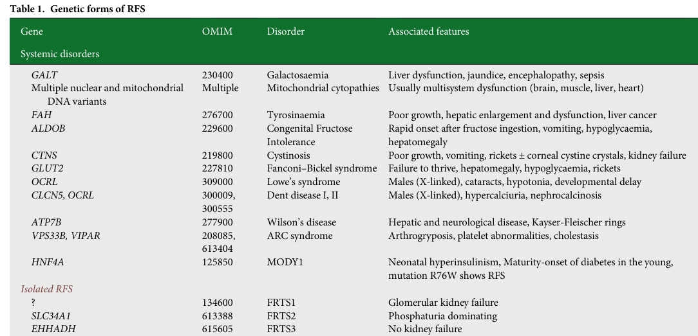

## Question

# Disease Characteristics Research Template

## Target Disease
- **Disease Name:** Fanconi Renotubular Syndrome
- **MONDO ID:**  (if available)
- **Category:** 

## Research Objectives

Please provide a comprehensive research report on **Fanconi Renotubular Syndrome** covering all of the
disease characteristics listed below. This report will be used to populate a disease knowledge
base entry. Be thorough and cite primary literature (PMID preferred) for all claims.

For each section, **suggested databases/resources** are listed. These are the first places
you should search for information on each topic.

---

### 1. Disease Information
> **Search first:** OMIM, Orphanet, ICD-10/ICD-11, MeSH, PubMed

- What is the disease? Provide a concise overview.
- What are the key identifiers? (OMIM, Orphanet, ICD-10/ICD-11, MeSH, Mondo)
- What are the common synonyms and alternative names?
- Is the information derived from individual patients (e.g., EHR) or aggregated disease-level resources?

### 2. Etiology

- **Disease Causal Factors**: What are the primary causes? (genetic, environmental, infectious, mechanistic)
- **Risk Factors**:
  > **Search first:** PubMed, Cochrane Library, UpToDate, clinical guidelines, ClinVar, ClinGen, GWAS Catalog, PheGenI, CTD, CDC, WHO, epidemiological databases
  - Genetic risk factors (causal variants, susceptibility loci, modifier genes)
  - Environmental risk factors (toxins, lifestyle, occupational exposures, age, sex, family history)
- **Protective Factors**:
  > **Search first:** PubMed, Cochrane Library, clinical trial databases, GWAS Catalog, gnomAD, WHO, CDC, nutrition databases
  - Genetic protective factors (protective variants, modifier alleles)
  - Environmental protective factors (diet, lifestyle, exposures that reduce risk)
- **Gene-Environment Interactions**: How do genetic and environmental factors interact to influence disease?
  > **Search first:** CTD, PubMed, PheGenI, GxE databases

### 3. Phenotypes
> **Search first:** HPO (Human Phenotype Ontology), OMIM, Orphanet, PubMed, clinicaltrials.gov, MedDRA, SNOMED CT, DECIPHER, LOINC

For each phenotype, provide:
- **Phenotype type**: symptoms, clinical signs, physical manifestations, behavioral changes, or laboratory abnormalities
  > For symptoms/signs: HPO, OMIM, Orphanet, PubMed
  > For behavioral changes: HPO, DSM, RDoC (Research Domain Criteria), PubMed
  > For laboratory abnormalities: LOINC, SNOMED CT, LabTests Online, PubMed
- **Phenotype characteristics**:
  > **Search first:** OMIM, Orphanet, HPO, PubMed
  - Age of symptom onset (neonatal, childhood, adult-onset, late-onset)
  - Symptom severity (mild, moderate, severe, variable)
  - Symptom progression (stable, progressive, episodic, fluctuating)
  - Frequency among affected individuals (percentage or qualitative)
- **Quality of life impact**: Effects on daily functioning and well-being (per-phenotype when possible)
  > **Search first:** EQ-5D database, SF-36, WHO QOL databases, PubMed
- Suggest HPO (Human Phenotype Ontology) terms for each phenotype

### 4. Genetic/Molecular Information

- **Causal Genes**: Gene mutations or chromosomal abnormalities responsible for disease (gene symbols, OMIM IDs)
  > **Search first:** OMIM, ClinVar, HGMD, Ensembl, NCBI Gene
- **Pathogenic Variants**:
  - Affected genes (gene symbols, HGNC IDs)
    > **Search first:** OMIM, NCBI Gene, Ensembl, HGNC, UniProt, GeneCards
  - Variant classification (pathogenic, likely pathogenic, VUS per ACMG/AMP guidelines)
    > **Search first:** ClinVar, ClinGen, ACMG/AMP guidelines, VarSome
  - Variant type/class (missense, frameshift, nonsense, splice-site, structural)
  - Allele frequency in population databases
    > **Search first:** gnomAD, 1000 Genomes, ExAC, TOPMed, dbSNP
  - Somatic vs germline origin
    > **Search first:** COSMIC (somatic), ClinVar, ICGC, TCGA
  - Functional consequences (loss of function, gain of function, dominant negative)
- **Modifier Genes**: Genes that modify disease severity or expression
- **Epigenetic Information**: DNA methylation, histone modifications, chromatin changes affecting disease
  > **Search first:** ENCODE, Roadmap Epigenomics, MethBase, DiseaseMeth
- **Chromosomal Abnormalities**: Large-scale genetic changes (aneuploidy, translocations, inversions)
  > **Search first:** DECIPHER, ClinVar, ECARUCA, UCSC Genome Browser

### 5. Environmental Information

- **Environmental Factors**: Non-genetic contributing factors (toxins, radiation, pollution, occupational exposure)
  > **Search first:** CTD (Comparative Toxicogenomics Database), TOXNET, PubMed, EPA databases
- **Lifestyle Factors**: Behavioral factors (smoking, diet, exercise, alcohol consumption)
  > **Search first:** CDC databases, WHO, PubMed, NHANES
- **Infectious Agents**: If applicable, pathogens causing or triggering disease (bacteria, viruses, fungi, parasites)
  > **Search first:** NCBI Taxonomy, ViPR, BV-BRC, MicrobeDB, GIDEON

### 6. Mechanism / Pathophysiology

- **Molecular Pathways**: Specific signaling cascades or biochemical pathways involved (Wnt, MAPK, mTOR, PI3K-AKT, etc.)
  > **Search first:** KEGG, Reactome, WikiPathways, PathBank, BioCyc
- **Cellular Processes**: Cell-level mechanisms (apoptosis, autophagy, cell cycle dysregulation, inflammation, etc.)
  > **Search first:** Gene Ontology (GO), Reactome, KEGG, PubMed
- **Protein Dysfunction**: How protein structure or function is altered (misfolding, aggregation, loss of function, gain of function)
  > **Search first:** UniProt, PDB (Protein Data Bank), InterPro, Pfam, AlphaFold
- **Metabolic Changes**: Alterations in metabolic processes (energy metabolism, lipid metabolism, amino acid metabolism)
  > **Search first:** KEGG, BioCyc, HMDB (Human Metabolome Database), BRENDA
- **Immune System Involvement**: Role of immune response (autoimmunity, immunodeficiency, chronic inflammation)
  > **Search first:** ImmPort, Immunome Database, IEDB, Gene Ontology
- **Tissue Damage Mechanisms**: How tissues/ are injured (oxidative stress, ischemia, fibrosis, necrosis)
  > **Search first:** PubMed, Gene Ontology, Reactome
- **Biochemical Abnormalities**: Specific molecular defects (enzyme deficiencies, receptor dysfunction, ion channel defects)
  > **Search first:** BRENDA, UniProt, KEGG, OMIM, PubMed
- **Epigenetic Changes**: DNA methylation, histone modifications affecting gene expression in disease
  > **Search first:** ENCODE, Roadmap Epigenomics, MethBase, DiseaseMeth
- **Molecular Profiling** (if available):
  - Transcriptomics/gene expression changes
    > **Search first:** GEO (Gene Expression Omnibus), ArrayExpress, GTEx, Human Cell Atlas, SRA
  - Proteomics findings
    > **Search first:** PRIDE, ProteomeXchange, Human Protein Atlas, STRING, BioGRID
  - Metabolomics signatures
    > **Search first:** MetaboLights, Metabolomics Workbench, HMDB, METLIN
  - Lipidomics alterations
    > **Search first:** LIPID MAPS, SwissLipids, LipidHome, Metabolomics Workbench
  - Genomic structural features
    > **Search first:** UCSC Genome Browser, Ensembl, NCBI, dbVar, DGV
- **Advanced Technologies** (if applicable):
  - Single-cell analysis findings (cell-type specific mechanisms, cellular heterogeneity)
    > **Search first:** Human Cell Atlas, Single Cell Portal, GEO, CELLxGENE
  - Spatial transcriptomics findings
    > **Search first:** GEO, Spatial Research, Vizgen, 10x Genomics data
  - Multi-omics integration results
    > **Search first:** TCGA, ICGC, cBioPortal, LinkedOmics, PubMed
  - Functional genomics screens (CRISPR, RNAi)
    > **Search first:** DepMap, GenomeRNAi, PubMed, BioGRID ORCS

For each mechanism, describe:
- The causal chain from initial trigger to clinical manifestation
- Which mechanisms are upstream vs downstream
- What cell types and biological processes are involved
- Suggest GO terms for biological processes and CL terms for cell types

### 7. Anatomical Structures Affected

- **Organ Level**:
  - Primary organs directly affected
  - Secondary organ involvement (complications, secondary effects)
  - Body systems involved (cardiovascular, nervous, digestive, respiratory, endocrine, etc.)
  > **Search first:** Uberon, FMA (Foundational Model of Anatomy), OMIM, HPO, ICD-11, MeSH, SNOMED CT
- **Tissue and Cell Level**:
  - Specific tissue types affected (epithelial, connective, muscle, nervous)
  - Specific cell populations targeted (with Cell Ontology terms)
  > **Search first:** Uberon, Human Protein Atlas, Cell Ontology, Human Cell Atlas, CellMarker, PanglaoDB
- **Subcellular Level**:
  - Cellular compartments involved (mitochondria, nucleus, ER, lysosomes) (with GO Cellular Component terms)
  > **Search first:** Gene Ontology (Cellular Component), UniProt, Human Protein Atlas
- **Localization**:
  - Specific anatomical sites (with UBERON terms)
    > **Search first:** FMA, Uberon, NeuroNames (for brain), SNOMED CT
  - Lateralization (unilateral, bilateral, asymmetric)
    > **Search first:** HPO, clinical literature, imaging databases

### 8. Temporal Development

- **Onset**:
  - Typical age of onset (congenital, pediatric, adult, geriatric)
  - Onset pattern (acute, subacute, chronic, insidious)
  > **Search first:** OMIM, Orphanet, HPO, PubMed
- **Progression**:
  - Disease stages (early, intermediate, advanced, end-stage)
    > **Search first:** Cancer Staging Manual (AJCC), WHO classifications, PubMed
  - Progression rate (rapid, slow, variable)
  - Disease course pattern (episodic, relapsing-remitting, progressive, stable)
  - Disease duration (self-limited, chronic lifelong)
  > **Search first:** Disease registries, longitudinal cohort databases, natural history studies, PubMed, Orphanet, OMIM
- **Patterns**:
  - Remission patterns (spontaneous, treatment-induced)
    > **Search first:** Clinical trial databases, disease registries, PubMed
  - Critical periods (time windows of vulnerability or opportunity for intervention)
    > **Search first:** PubMed, developmental biology databases, clinical guidelines

### 9. Inheritance and Population

- **Epidemiology**:
  - Prevalence (cases per 100,000 at given time)
  - Incidence (new cases per 100,000 per year)
  > **Search first:** Orphanet, CDC, WHO, GBD (Global Burden of Disease), national registries, SEER, disease registries
- **For Genetic Etiology**:
  - Inheritance pattern (AD, AR, X-linked, mitochondrial, multifactorial, polygenic)
    > **Search first:** OMIM, Orphanet, ClinVar, GTR (Genetic Testing Registry)
  - Penetrance (complete, incomplete, age-dependent)
    > **Search first:** ClinVar, OMIM, PubMed, ClinGen
  - Expressivity (variable, consistent)
    > **Search first:** OMIM, ClinVar, PubMed
  - Genetic anticipation (increasing severity in successive generations)
    > **Search first:** OMIM, PubMed (especially for repeat expansion disorders)
  - Germline mosaicism
    > **Search first:** ClinVar, OMIM, genetic counseling literature, PubMed
  - Founder effects (population-specific mutations)
    > **Search first:** gnomAD, population genetics databases, PubMed
  - Consanguinity role
    > **Search first:** OMIM, population studies, genetic counseling resources
  - Carrier frequency
    > **Search first:** gnomAD, carrier screening databases, GeneReviews, GTR
- **Population Demographics**:
  - Affected populations (ethnic or demographic groups with higher prevalence)
    > **Search first:** gnomAD, 1000 Genomes, PAGE Study, PubMed, population registries
  - Geographic distribution (endemic areas, regional variation)
    > **Search first:** WHO, CDC, GBD, Orphanet, geographic epidemiology databases
  - Geographic distribution of specific variants
  - Sex ratio (male:female)
    > **Search first:** Disease registries, OMIM, PubMed, epidemiological databases
  - Age distribution of affected individuals
    > **Search first:** CDC, disease registries, SEER, Orphanet

### 10. Diagnostics

- **Clinical Tests**:
  - Laboratory tests (blood, urine, tissue chemistry, specific enzyme assays)
    > **Search first:** LOINC, LabTests Online, PubMed
  - Biomarkers (proteins, metabolites, genetic markers, circulating biomarkers)
    > **Search first:** FDA Biomarker List, BEST (Biomarkers, EndpointS, and other Tools), PubMed
  - Imaging studies (X-ray, CT, MRI, PET, ultrasound)
    > **Search first:** RadLex, DICOM, Radiopaedia, imaging databases
  - Functional tests (pulmonary function, cardiac stress tests)
    > **Search first:** LOINC, clinical guidelines, PubMed
  - Electrophysiology (EEG, EMG, ECG, nerve conduction studies)
    > **Search first:** LOINC, clinical neurophysiology databases, PubMed
  - Biopsy findings (histopathology, immunohistochemistry)
    > **Search first:** SNOMED CT, College of American Pathologists resources, PubMed
  - Pathology findings (microscopic examination)
    > **Search first:** SNOMED CT, Digital Pathology databases, PubMed
- **Genetic Testing**:
  > **Search first:** GTR (Genetic Testing Registry), GeneReviews, ClinGen
  - Overview of recommended genetic testing approach
  - Whole genome sequencing (WGS) utility
    > **Search first:** GTR, ClinVar, GEL (Genomics England), gnomAD
  - Whole exome sequencing (WES) utility
    > **Search first:** GTR, ClinVar, OMIM, GeneMatcher
  - Gene panels (which panels, which genes)
    > **Search first:** GTR, ClinVar, laboratory-specific databases
  - Single gene testing
    > **Search first:** GTR, ClinVar, OMIM, GeneReviews
  - Chromosomal microarray (CMA)
    > **Search first:** DECIPHER, ClinVar, dbVar, ECARUCA
  - Karyotyping
    > **Search first:** Chromosome Abnormality Database, ClinVar, cytogenetics resources
  - FISH
    > **Search first:** ClinVar, cytogenetics databases, PubMed
  - Mitochondrial DNA testing
    > **Search first:** MITOMAP, MSeqDR, ClinVar, GTR
  - Repeat expansion testing
    > **Search first:** GTR, ClinVar, repeat expansion databases, PubMed
- **Omics-Based Diagnostics** (if applicable):
  - RNA sequencing / transcriptomics
    > **Search first:** GEO, ArrayExpress, GTEx, RNA-seq databases
  - Proteomics
    > **Search first:** PRIDE, ProteomeXchange, FDA Biomarker database
  - Metabolomics
    > **Search first:** MetaboLights, Metabolomics Workbench, HMDB
  - Epigenomics
    > **Search first:** GEO, ENCODE, Roadmap Epigenomics, MethBase
  - Liquid biopsy
    > **Search first:** COSMIC, ClinVar, liquid biopsy databases, PubMed
- **Clinical Criteria**:
  - Standardized diagnostic criteria (DSM, ICD, society guidelines)
    > **Search first:** DSM-5, ICD-11, clinical society guidelines, UpToDate
  - Differential diagnosis (other conditions to rule out, with distinguishing features)
    > **Search first:** DynaMed, UpToDate, clinical decision support systems
- **Screening**:
  - Screening methods for asymptomatic individuals (newborn screening, carrier screening, cascade screening)
    > **Search first:** ACMG recommendations, CDC newborn screening, GTR

### 11. Outcome/Prognosis

- **Survival and Mortality**:
  - Survival rate (5-year, 10-year, overall)
    > **Search first:** SEER, cancer registries, disease-specific registries, PubMed
  - Life expectancy (with and without treatment if applicable)
    > **Search first:** Orphanet, disease registries, actuarial databases, PubMed
  - Mortality rate
    > **Search first:** CDC, WHO, GBD, national mortality databases
  - Disease-specific mortality (deaths directly attributable to disease)
    > **Search first:** Disease registries, CDC Wonder, GBD, PubMed
- **Morbidity and Function**:
  - Morbidity (disease-related disability and health impacts)
    > **Search first:** GBD, WHO, disability databases, PubMed
  - Disability outcomes (long-term functional impairments)
    > **Search first:** ICF (International Classification of Functioning), disability registries
  - Quality of life measures (EQ-5D, SF-36, PROMIS, disease-specific tools)
    > **Search first:** EQ-5D database, SF-36, PROMIS, PubMed
- **Disease Course**:
  - Complications (secondary problems: infections, organ failure, etc.)
    > **Search first:** ICD codes, disease registries, clinical databases, PubMed
  - Recovery potential (likelihood and extent of recovery, with vs without treatment)
    > **Search first:** Natural history studies, rehabilitation databases, PubMed
- **Prediction**:
  - Prognostic factors (age, disease severity, biomarkers, treatment response)
    > **Search first:** Prognostic models databases, clinical calculators, PubMed
  - Prognostic biomarkers (molecular markers predicting disease course)
    > **Search first:** FDA Biomarker database, PubMed, cancer prognostic databases

### 12. Treatment

- **Pharmacotherapy**:
  - Pharmacological treatments (drug names, drug classes, mechanisms of action)
    > **Search first:** DrugBank, RxNorm, ATC classification, DailyMed, FDA databases
  - Pharmacogenomics (how genetic variants affect drug metabolism, efficacy, toxicity)
    > **Search first:** PharmGKB, CPIC (Clinical Pharmacogenetics), FDA Table of PGx Biomarkers
- **Advanced Therapeutics**:
  - Gene therapy (viral vectors, CRISPR, gene replacement, gene editing)
    > **Search first:** ClinicalTrials.gov, FDA gene therapy database, ASGCT resources
  - Cell therapy (stem cell transplant, CAR-T, cellular therapeutics)
    > **Search first:** ClinicalTrials.gov, FDA cell therapy database, FACT standards
  - RNA-based therapies (ASOs, siRNA, mRNA therapies)
    > **Search first:** ClinicalTrials.gov, FDA approvals, PubMed
  - Targeted therapies (treatments directed at specific molecular targets)
    > **Search first:** My Cancer Genome, OncoKB, ClinicalTrials.gov, FDA approvals
  - Immunotherapies (checkpoint inhibitors, monoclonal antibodies)
    > **Search first:** Cancer Immunotherapy Database, FDA approvals, ClinicalTrials.gov
- **Surgical and Interventional**:
  - Surgical interventions (types of surgery, timing, outcomes)
    > **Search first:** CPT codes, surgical registries, clinical guidelines, PubMed
- **Supportive and Rehabilitative**:
  - Supportive care (symptom management, pain control, nutrition)
    > **Search first:** Clinical guidelines, Cochrane Library, PubMed
  - Rehabilitation (physical therapy, occupational therapy, speech therapy)
    > **Search first:** Rehabilitation medicine databases, clinical guidelines, PubMed
- **Experimental**:
  - Experimental treatments in clinical trials (with NCT identifiers if available)
    > **Search first:** ClinicalTrials.gov, EU Clinical Trials Register, WHO ICTRP
- **Treatment Outcomes**:
  - Treatment response rates
    > **Search first:** Clinical trial databases, FDA reviews, systematic reviews, PubMed
  - Side effects and adverse events
    > **Search first:** FDA Adverse Event Reporting System (FAERS), MedWatch, PubMed
- **Treatment Strategy**:
  - Treatment algorithms (clinical pathways, decision trees)
    > **Search first:** Clinical practice guidelines, NCCN Guidelines, UpToDate
  - Combination therapies
    > **Search first:** ClinicalTrials.gov, treatment guidelines, PubMed
  - Personalized medicine approaches (genotype-guided treatment)
    > **Search first:** My Cancer Genome, CIViC, PharmGKB, precision medicine databases

For each treatment, suggest MAXO (Medical Action Ontology) terms where applicable.

### 13. Prevention

- **Prevention Levels**:
  - Primary prevention (preventing disease occurrence: vaccination, risk factor modification)
    > **Search first:** CDC, WHO, USPSTF recommendations, Cochrane Library
  - Secondary prevention (early detection and treatment: screening programs, early intervention)
    > **Search first:** USPSTF, CDC screening guidelines, WHO
  - Tertiary prevention (preventing complications in those with disease)
    > **Search first:** Clinical guidelines, disease management protocols, PubMed
- **Immunization**: Vaccine strategies (if applicable)
  > **Search first:** CDC vaccine schedules, WHO immunization, FDA vaccine database
- **Screening and Early Detection**:
  - Screening programs (population-based: newborn screening, cancer screening)
    > **Search first:** CDC screening programs, USPSTF, cancer screening databases
  - Genetic screening (carrier screening, preimplantation genetic diagnosis, prenatal testing)
    > **Search first:** ACMG recommendations, ACOG guidelines, GTR
  - Risk stratification (identifying high-risk individuals for targeted prevention)
    > **Search first:** Risk prediction models, clinical calculators, PubMed
- **Behavioral Interventions**: Lifestyle modifications to reduce risk
  > **Search first:** CDC, WHO, behavioral intervention databases, Cochrane Library
- **Counseling**: Genetic counseling (risk assessment, family planning guidance)
  > **Search first:** NSGC resources, ACMG guidelines, GeneReviews
- **Public Health**:
  - Public health interventions (sanitation, vector control, health education)
    > **Search first:** CDC, WHO, public health databases, PubMed
  - Environmental interventions (reducing environmental risk factors)
    > **Search first:** EPA databases, WHO environmental health, PubMed
- **Prophylaxis**: Preventive medications or procedures
  > **Search first:** Clinical guidelines, FDA approvals, PubMed

### 14. Other Species / Natural Disease

- **Taxonomy**: Species affected (with NCBI Taxon identifiers)
  > **Search first:** NCBI Taxonomy
- **Breed**: Specific breeds affected (with VBO identifiers if applicable)
  > **Search first:** VBO (Vertebrate Breed Ontology)
- **Gene**: Orthologous genes in other species (with NCBI Gene IDs)
  > **Search first:** NCBI Gene
- **Natural Disease**:
  - Naturally occurring disease in other species (companion animals, wildlife)
    > **Search first:** OMIA (Online Mendelian Inheritance in Animals), VetCompass, PubMed
  - Veterinary relevance and importance in animal health
    > **Search first:** OMIA, veterinary databases, PubMed
- **Comparative Biology**:
  - Comparative pathology (similarities and differences across species)
    > **Search first:** OMIA, comparative pathology databases, PubMed
  - Evolutionary conservation of disease mechanisms
    > **Search first:** HomoloGene, OrthoMCL, Alliance of Genome Resources
- **Transmission** (if applicable):
  - Zoonotic potential
    > **Search first:** CDC zoonotic diseases, WHO zoonoses, GIDEON
  - Cross-species susceptibility
    > **Search first:** NCBI Taxonomy, veterinary databases, PubMed

### 15. Model Organisms

- **Model Types**:
  - Model organism type (mammalian, invertebrate, cellular, in vitro)
    > **Search first:** Alliance of Genome Resources, model organism databases
  - Specific model systems (mouse, rat, zebrafish, Drosophila, C. elegans, yeast, cell lines, organoids, iPSCs)
    > **Search first:** MGI, RGD, ZFIN, FlyBase, WormBase, SGD, ATCC, Cellosaurus
  - Induced models (drug treatment, surgical intervention, environmental manipulation)
    > **Search first:** MGI, model organism databases, PubMed
- **Genetic Models**:
  - Types available (knockout, knock-in, transgenic, conditional, humanized)
    > **Search first:** MGI, IMPC, KOMP, EuMMCR, IMSR
- **Model Characteristics**:
  - Phenotype recapitulation (how well model reproduces human disease features)
    > **Search first:** Model organism databases, comparative studies, PubMed
  - Model limitations (aspects of human disease not captured)
    > **Search first:** Model organism databases, PubMed, review articles
- **Applications**:
  - Research applications (what aspects of disease can be studied)
    > **Search first:** Model organism databases, PubMed
- **Resources**:
  - Model databases
    > **Search first:** MGI, RGD, ZFIN, FlyBase, WormBase, IMSR, EMMA, MMRRC

---

## Citation Requirements

- Cite primary literature (PMID preferred) for all mechanistic and clinical claims
- Prioritize recent reviews and landmark papers
- Include direct quotes from abstracts where possible to support key statements
- Distinguish evidence source types: human clinical, model organism, in vitro, computational

## Output Format

Structure your response as a comprehensive narrative organized by the sections above.
For each section, provide:
- Factual content with specific details (numbers, percentages, gene names, variant nomenclature)
- Ontology term suggestions (HPO, GO, CL, UBERON, CHEBI, MAXO, MONDO) where applicable
- Evidence citations with PMIDs
- Direct quotes from abstracts to support key claims
- Clear indication when information is not available or not applicable for this disease

This report will be used to populate a disease knowledge base entry with:
- Pathophysiology descriptions with causal chains
- Gene/protein annotations (HGNC, GO terms)
- Phenotype associations (HP terms) with frequencies
- Cell type involvement (CL terms)
- Anatomical locations (UBERON terms)
- Chemical entities (CHEBI terms)
- Treatment annotations (MAXO terms)
- Evidence items with PMIDs and exact abstract quotes
- Epidemiology, prognosis, diagnostic, and prevention information
- Animal model descriptions with phenotype recapitulation details

## Output

Question: You are an expert researcher providing comprehensive, well-cited information.

Provide detailed information focusing on:
1. Key concepts and definitions with current understanding
2. Recent developments and latest research (prioritize 2023-2024 sources)
3. Current applications and real-world implementations
4. Expert opinions and analysis from authoritative sources
5. Relevant statistics and data from recent studies

Format as a comprehensive research report with proper citations. Include URLs and publication dates where available.
Always prioritize recent, authoritative sources and provide specific citations for all major claims.

# Disease Characteristics Research Template

## Target Disease
- **Disease Name:** Fanconi Renotubular Syndrome
- **MONDO ID:**  (if available)
- **Category:** 

## Research Objectives

Please provide a comprehensive research report on **Fanconi Renotubular Syndrome** covering all of the
disease characteristics listed below. This report will be used to populate a disease knowledge
base entry. Be thorough and cite primary literature (PMID preferred) for all claims.

For each section, **suggested databases/resources** are listed. These are the first places
you should search for information on each topic.

---

### 1. Disease Information
> **Search first:** OMIM, Orphanet, ICD-10/ICD-11, MeSH, PubMed

- What is the disease? Provide a concise overview.
- What are the key identifiers? (OMIM, Orphanet, ICD-10/ICD-11, MeSH, Mondo)
- What are the common synonyms and alternative names?
- Is the information derived from individual patients (e.g., EHR) or aggregated disease-level resources?

### 2. Etiology

- **Disease Causal Factors**: What are the primary causes? (genetic, environmental, infectious, mechanistic)
- **Risk Factors**:
  > **Search first:** PubMed, Cochrane Library, UpToDate, clinical guidelines, ClinVar, ClinGen, GWAS Catalog, PheGenI, CTD, CDC, WHO, epidemiological databases
  - Genetic risk factors (causal variants, susceptibility loci, modifier genes)
  - Environmental risk factors (toxins, lifestyle, occupational exposures, age, sex, family history)
- **Protective Factors**:
  > **Search first:** PubMed, Cochrane Library, clinical trial databases, GWAS Catalog, gnomAD, WHO, CDC, nutrition databases
  - Genetic protective factors (protective variants, modifier alleles)
  - Environmental protective factors (diet, lifestyle, exposures that reduce risk)
- **Gene-Environment Interactions**: How do genetic and environmental factors interact to influence disease?
  > **Search first:** CTD, PubMed, PheGenI, GxE databases

### 3. Phenotypes
> **Search first:** HPO (Human Phenotype Ontology), OMIM, Orphanet, PubMed, clinicaltrials.gov, MedDRA, SNOMED CT, DECIPHER, LOINC

For each phenotype, provide:
- **Phenotype type**: symptoms, clinical signs, physical manifestations, behavioral changes, or laboratory abnormalities
  > For symptoms/signs: HPO, OMIM, Orphanet, PubMed
  > For behavioral changes: HPO, DSM, RDoC (Research Domain Criteria), PubMed
  > For laboratory abnormalities: LOINC, SNOMED CT, LabTests Online, PubMed
- **Phenotype characteristics**:
  > **Search first:** OMIM, Orphanet, HPO, PubMed
  - Age of symptom onset (neonatal, childhood, adult-onset, late-onset)
  - Symptom severity (mild, moderate, severe, variable)
  - Symptom progression (stable, progressive, episodic, fluctuating)
  - Frequency among affected individuals (percentage or qualitative)
- **Quality of life impact**: Effects on daily functioning and well-being (per-phenotype when possible)
  > **Search first:** EQ-5D database, SF-36, WHO QOL databases, PubMed
- Suggest HPO (Human Phenotype Ontology) terms for each phenotype

### 4. Genetic/Molecular Information

- **Causal Genes**: Gene mutations or chromosomal abnormalities responsible for disease (gene symbols, OMIM IDs)
  > **Search first:** OMIM, ClinVar, HGMD, Ensembl, NCBI Gene
- **Pathogenic Variants**:
  - Affected genes (gene symbols, HGNC IDs)
    > **Search first:** OMIM, NCBI Gene, Ensembl, HGNC, UniProt, GeneCards
  - Variant classification (pathogenic, likely pathogenic, VUS per ACMG/AMP guidelines)
    > **Search first:** ClinVar, ClinGen, ACMG/AMP guidelines, VarSome
  - Variant type/class (missense, frameshift, nonsense, splice-site, structural)
  - Allele frequency in population databases
    > **Search first:** gnomAD, 1000 Genomes, ExAC, TOPMed, dbSNP
  - Somatic vs germline origin
    > **Search first:** COSMIC (somatic), ClinVar, ICGC, TCGA
  - Functional consequences (loss of function, gain of function, dominant negative)
- **Modifier Genes**: Genes that modify disease severity or expression
- **Epigenetic Information**: DNA methylation, histone modifications, chromatin changes affecting disease
  > **Search first:** ENCODE, Roadmap Epigenomics, MethBase, DiseaseMeth
- **Chromosomal Abnormalities**: Large-scale genetic changes (aneuploidy, translocations, inversions)
  > **Search first:** DECIPHER, ClinVar, ECARUCA, UCSC Genome Browser

### 5. Environmental Information

- **Environmental Factors**: Non-genetic contributing factors (toxins, radiation, pollution, occupational exposure)
  > **Search first:** CTD (Comparative Toxicogenomics Database), TOXNET, PubMed, EPA databases
- **Lifestyle Factors**: Behavioral factors (smoking, diet, exercise, alcohol consumption)
  > **Search first:** CDC databases, WHO, PubMed, NHANES
- **Infectious Agents**: If applicable, pathogens causing or triggering disease (bacteria, viruses, fungi, parasites)
  > **Search first:** NCBI Taxonomy, ViPR, BV-BRC, MicrobeDB, GIDEON

### 6. Mechanism / Pathophysiology

- **Molecular Pathways**: Specific signaling cascades or biochemical pathways involved (Wnt, MAPK, mTOR, PI3K-AKT, etc.)
  > **Search first:** KEGG, Reactome, WikiPathways, PathBank, BioCyc
- **Cellular Processes**: Cell-level mechanisms (apoptosis, autophagy, cell cycle dysregulation, inflammation, etc.)
  > **Search first:** Gene Ontology (GO), Reactome, KEGG, PubMed
- **Protein Dysfunction**: How protein structure or function is altered (misfolding, aggregation, loss of function, gain of function)
  > **Search first:** UniProt, PDB (Protein Data Bank), InterPro, Pfam, AlphaFold
- **Metabolic Changes**: Alterations in metabolic processes (energy metabolism, lipid metabolism, amino acid metabolism)
  > **Search first:** KEGG, BioCyc, HMDB (Human Metabolome Database), BRENDA
- **Immune System Involvement**: Role of immune response (autoimmunity, immunodeficiency, chronic inflammation)
  > **Search first:** ImmPort, Immunome Database, IEDB, Gene Ontology
- **Tissue Damage Mechanisms**: How tissues/ are injured (oxidative stress, ischemia, fibrosis, necrosis)
  > **Search first:** PubMed, Gene Ontology, Reactome
- **Biochemical Abnormalities**: Specific molecular defects (enzyme deficiencies, receptor dysfunction, ion channel defects)
  > **Search first:** BRENDA, UniProt, KEGG, OMIM, PubMed
- **Epigenetic Changes**: DNA methylation, histone modifications affecting gene expression in disease
  > **Search first:** ENCODE, Roadmap Epigenomics, MethBase, DiseaseMeth
- **Molecular Profiling** (if available):
  - Transcriptomics/gene expression changes
    > **Search first:** GEO (Gene Expression Omnibus), ArrayExpress, GTEx, Human Cell Atlas, SRA
  - Proteomics findings
    > **Search first:** PRIDE, ProteomeXchange, Human Protein Atlas, STRING, BioGRID
  - Metabolomics signatures
    > **Search first:** MetaboLights, Metabolomics Workbench, HMDB, METLIN
  - Lipidomics alterations
    > **Search first:** LIPID MAPS, SwissLipids, LipidHome, Metabolomics Workbench
  - Genomic structural features
    > **Search first:** UCSC Genome Browser, Ensembl, NCBI, dbVar, DGV
- **Advanced Technologies** (if applicable):
  - Single-cell analysis findings (cell-type specific mechanisms, cellular heterogeneity)
    > **Search first:** Human Cell Atlas, Single Cell Portal, GEO, CELLxGENE
  - Spatial transcriptomics findings
    > **Search first:** GEO, Spatial Research, Vizgen, 10x Genomics data
  - Multi-omics integration results
    > **Search first:** TCGA, ICGC, cBioPortal, LinkedOmics, PubMed
  - Functional genomics screens (CRISPR, RNAi)
    > **Search first:** DepMap, GenomeRNAi, PubMed, BioGRID ORCS

For each mechanism, describe:
- The causal chain from initial trigger to clinical manifestation
- Which mechanisms are upstream vs downstream
- What cell types and biological processes are involved
- Suggest GO terms for biological processes and CL terms for cell types

### 7. Anatomical Structures Affected

- **Organ Level**:
  - Primary organs directly affected
  - Secondary organ involvement (complications, secondary effects)
  - Body systems involved (cardiovascular, nervous, digestive, respiratory, endocrine, etc.)
  > **Search first:** Uberon, FMA (Foundational Model of Anatomy), OMIM, HPO, ICD-11, MeSH, SNOMED CT
- **Tissue and Cell Level**:
  - Specific tissue types affected (epithelial, connective, muscle, nervous)
  - Specific cell populations targeted (with Cell Ontology terms)
  > **Search first:** Uberon, Human Protein Atlas, Cell Ontology, Human Cell Atlas, CellMarker, PanglaoDB
- **Subcellular Level**:
  - Cellular compartments involved (mitochondria, nucleus, ER, lysosomes) (with GO Cellular Component terms)
  > **Search first:** Gene Ontology (Cellular Component), UniProt, Human Protein Atlas
- **Localization**:
  - Specific anatomical sites (with UBERON terms)
    > **Search first:** FMA, Uberon, NeuroNames (for brain), SNOMED CT
  - Lateralization (unilateral, bilateral, asymmetric)
    > **Search first:** HPO, clinical literature, imaging databases

### 8. Temporal Development

- **Onset**:
  - Typical age of onset (congenital, pediatric, adult, geriatric)
  - Onset pattern (acute, subacute, chronic, insidious)
  > **Search first:** OMIM, Orphanet, HPO, PubMed
- **Progression**:
  - Disease stages (early, intermediate, advanced, end-stage)
    > **Search first:** Cancer Staging Manual (AJCC), WHO classifications, PubMed
  - Progression rate (rapid, slow, variable)
  - Disease course pattern (episodic, relapsing-remitting, progressive, stable)
  - Disease duration (self-limited, chronic lifelong)
  > **Search first:** Disease registries, longitudinal cohort databases, natural history studies, PubMed, Orphanet, OMIM
- **Patterns**:
  - Remission patterns (spontaneous, treatment-induced)
    > **Search first:** Clinical trial databases, disease registries, PubMed
  - Critical periods (time windows of vulnerability or opportunity for intervention)
    > **Search first:** PubMed, developmental biology databases, clinical guidelines

### 9. Inheritance and Population

- **Epidemiology**:
  - Prevalence (cases per 100,000 at given time)
  - Incidence (new cases per 100,000 per year)
  > **Search first:** Orphanet, CDC, WHO, GBD (Global Burden of Disease), national registries, SEER, disease registries
- **For Genetic Etiology**:
  - Inheritance pattern (AD, AR, X-linked, mitochondrial, multifactorial, polygenic)
    > **Search first:** OMIM, Orphanet, ClinVar, GTR (Genetic Testing Registry)
  - Penetrance (complete, incomplete, age-dependent)
    > **Search first:** ClinVar, OMIM, PubMed, ClinGen
  - Expressivity (variable, consistent)
    > **Search first:** OMIM, ClinVar, PubMed
  - Genetic anticipation (increasing severity in successive generations)
    > **Search first:** OMIM, PubMed (especially for repeat expansion disorders)
  - Germline mosaicism
    > **Search first:** ClinVar, OMIM, genetic counseling literature, PubMed
  - Founder effects (population-specific mutations)
    > **Search first:** gnomAD, population genetics databases, PubMed
  - Consanguinity role
    > **Search first:** OMIM, population studies, genetic counseling resources
  - Carrier frequency
    > **Search first:** gnomAD, carrier screening databases, GeneReviews, GTR
- **Population Demographics**:
  - Affected populations (ethnic or demographic groups with higher prevalence)
    > **Search first:** gnomAD, 1000 Genomes, PAGE Study, PubMed, population registries
  - Geographic distribution (endemic areas, regional variation)
    > **Search first:** WHO, CDC, GBD, Orphanet, geographic epidemiology databases
  - Geographic distribution of specific variants
  - Sex ratio (male:female)
    > **Search first:** Disease registries, OMIM, PubMed, epidemiological databases
  - Age distribution of affected individuals
    > **Search first:** CDC, disease registries, SEER, Orphanet

### 10. Diagnostics

- **Clinical Tests**:
  - Laboratory tests (blood, urine, tissue chemistry, specific enzyme assays)
    > **Search first:** LOINC, LabTests Online, PubMed
  - Biomarkers (proteins, metabolites, genetic markers, circulating biomarkers)
    > **Search first:** FDA Biomarker List, BEST (Biomarkers, EndpointS, and other Tools), PubMed
  - Imaging studies (X-ray, CT, MRI, PET, ultrasound)
    > **Search first:** RadLex, DICOM, Radiopaedia, imaging databases
  - Functional tests (pulmonary function, cardiac stress tests)
    > **Search first:** LOINC, clinical guidelines, PubMed
  - Electrophysiology (EEG, EMG, ECG, nerve conduction studies)
    > **Search first:** LOINC, clinical neurophysiology databases, PubMed
  - Biopsy findings (histopathology, immunohistochemistry)
    > **Search first:** SNOMED CT, College of American Pathologists resources, PubMed
  - Pathology findings (microscopic examination)
    > **Search first:** SNOMED CT, Digital Pathology databases, PubMed
- **Genetic Testing**:
  > **Search first:** GTR (Genetic Testing Registry), GeneReviews, ClinGen
  - Overview of recommended genetic testing approach
  - Whole genome sequencing (WGS) utility
    > **Search first:** GTR, ClinVar, GEL (Genomics England), gnomAD
  - Whole exome sequencing (WES) utility
    > **Search first:** GTR, ClinVar, OMIM, GeneMatcher
  - Gene panels (which panels, which genes)
    > **Search first:** GTR, ClinVar, laboratory-specific databases
  - Single gene testing
    > **Search first:** GTR, ClinVar, OMIM, GeneReviews
  - Chromosomal microarray (CMA)
    > **Search first:** DECIPHER, ClinVar, dbVar, ECARUCA
  - Karyotyping
    > **Search first:** Chromosome Abnormality Database, ClinVar, cytogenetics resources
  - FISH
    > **Search first:** ClinVar, cytogenetics databases, PubMed
  - Mitochondrial DNA testing
    > **Search first:** MITOMAP, MSeqDR, ClinVar, GTR
  - Repeat expansion testing
    > **Search first:** GTR, ClinVar, repeat expansion databases, PubMed
- **Omics-Based Diagnostics** (if applicable):
  - RNA sequencing / transcriptomics
    > **Search first:** GEO, ArrayExpress, GTEx, RNA-seq databases
  - Proteomics
    > **Search first:** PRIDE, ProteomeXchange, FDA Biomarker database
  - Metabolomics
    > **Search first:** MetaboLights, Metabolomics Workbench, HMDB
  - Epigenomics
    > **Search first:** GEO, ENCODE, Roadmap Epigenomics, MethBase
  - Liquid biopsy
    > **Search first:** COSMIC, ClinVar, liquid biopsy databases, PubMed
- **Clinical Criteria**:
  - Standardized diagnostic criteria (DSM, ICD, society guidelines)
    > **Search first:** DSM-5, ICD-11, clinical society guidelines, UpToDate
  - Differential diagnosis (other conditions to rule out, with distinguishing features)
    > **Search first:** DynaMed, UpToDate, clinical decision support systems
- **Screening**:
  - Screening methods for asymptomatic individuals (newborn screening, carrier screening, cascade screening)
    > **Search first:** ACMG recommendations, CDC newborn screening, GTR

### 11. Outcome/Prognosis

- **Survival and Mortality**:
  - Survival rate (5-year, 10-year, overall)
    > **Search first:** SEER, cancer registries, disease-specific registries, PubMed
  - Life expectancy (with and without treatment if applicable)
    > **Search first:** Orphanet, disease registries, actuarial databases, PubMed
  - Mortality rate
    > **Search first:** CDC, WHO, GBD, national mortality databases
  - Disease-specific mortality (deaths directly attributable to disease)
    > **Search first:** Disease registries, CDC Wonder, GBD, PubMed
- **Morbidity and Function**:
  - Morbidity (disease-related disability and health impacts)
    > **Search first:** GBD, WHO, disability databases, PubMed
  - Disability outcomes (long-term functional impairments)
    > **Search first:** ICF (International Classification of Functioning), disability registries
  - Quality of life measures (EQ-5D, SF-36, PROMIS, disease-specific tools)
    > **Search first:** EQ-5D database, SF-36, PROMIS, PubMed
- **Disease Course**:
  - Complications (secondary problems: infections, organ failure, etc.)
    > **Search first:** ICD codes, disease registries, clinical databases, PubMed
  - Recovery potential (likelihood and extent of recovery, with vs without treatment)
    > **Search first:** Natural history studies, rehabilitation databases, PubMed
- **Prediction**:
  - Prognostic factors (age, disease severity, biomarkers, treatment response)
    > **Search first:** Prognostic models databases, clinical calculators, PubMed
  - Prognostic biomarkers (molecular markers predicting disease course)
    > **Search first:** FDA Biomarker database, PubMed, cancer prognostic databases

### 12. Treatment

- **Pharmacotherapy**:
  - Pharmacological treatments (drug names, drug classes, mechanisms of action)
    > **Search first:** DrugBank, RxNorm, ATC classification, DailyMed, FDA databases
  - Pharmacogenomics (how genetic variants affect drug metabolism, efficacy, toxicity)
    > **Search first:** PharmGKB, CPIC (Clinical Pharmacogenetics), FDA Table of PGx Biomarkers
- **Advanced Therapeutics**:
  - Gene therapy (viral vectors, CRISPR, gene replacement, gene editing)
    > **Search first:** ClinicalTrials.gov, FDA gene therapy database, ASGCT resources
  - Cell therapy (stem cell transplant, CAR-T, cellular therapeutics)
    > **Search first:** ClinicalTrials.gov, FDA cell therapy database, FACT standards
  - RNA-based therapies (ASOs, siRNA, mRNA therapies)
    > **Search first:** ClinicalTrials.gov, FDA approvals, PubMed
  - Targeted therapies (treatments directed at specific molecular targets)
    > **Search first:** My Cancer Genome, OncoKB, ClinicalTrials.gov, FDA approvals
  - Immunotherapies (checkpoint inhibitors, monoclonal antibodies)
    > **Search first:** Cancer Immunotherapy Database, FDA approvals, ClinicalTrials.gov
- **Surgical and Interventional**:
  - Surgical interventions (types of surgery, timing, outcomes)
    > **Search first:** CPT codes, surgical registries, clinical guidelines, PubMed
- **Supportive and Rehabilitative**:
  - Supportive care (symptom management, pain control, nutrition)
    > **Search first:** Clinical guidelines, Cochrane Library, PubMed
  - Rehabilitation (physical therapy, occupational therapy, speech therapy)
    > **Search first:** Rehabilitation medicine databases, clinical guidelines, PubMed
- **Experimental**:
  - Experimental treatments in clinical trials (with NCT identifiers if available)
    > **Search first:** ClinicalTrials.gov, EU Clinical Trials Register, WHO ICTRP
- **Treatment Outcomes**:
  - Treatment response rates
    > **Search first:** Clinical trial databases, FDA reviews, systematic reviews, PubMed
  - Side effects and adverse events
    > **Search first:** FDA Adverse Event Reporting System (FAERS), MedWatch, PubMed
- **Treatment Strategy**:
  - Treatment algorithms (clinical pathways, decision trees)
    > **Search first:** Clinical practice guidelines, NCCN Guidelines, UpToDate
  - Combination therapies
    > **Search first:** ClinicalTrials.gov, treatment guidelines, PubMed
  - Personalized medicine approaches (genotype-guided treatment)
    > **Search first:** My Cancer Genome, CIViC, PharmGKB, precision medicine databases

For each treatment, suggest MAXO (Medical Action Ontology) terms where applicable.

### 13. Prevention

- **Prevention Levels**:
  - Primary prevention (preventing disease occurrence: vaccination, risk factor modification)
    > **Search first:** CDC, WHO, USPSTF recommendations, Cochrane Library
  - Secondary prevention (early detection and treatment: screening programs, early intervention)
    > **Search first:** USPSTF, CDC screening guidelines, WHO
  - Tertiary prevention (preventing complications in those with disease)
    > **Search first:** Clinical guidelines, disease management protocols, PubMed
- **Immunization**: Vaccine strategies (if applicable)
  > **Search first:** CDC vaccine schedules, WHO immunization, FDA vaccine database
- **Screening and Early Detection**:
  - Screening programs (population-based: newborn screening, cancer screening)
    > **Search first:** CDC screening programs, USPSTF, cancer screening databases
  - Genetic screening (carrier screening, preimplantation genetic diagnosis, prenatal testing)
    > **Search first:** ACMG recommendations, ACOG guidelines, GTR
  - Risk stratification (identifying high-risk individuals for targeted prevention)
    > **Search first:** Risk prediction models, clinical calculators, PubMed
- **Behavioral Interventions**: Lifestyle modifications to reduce risk
  > **Search first:** CDC, WHO, behavioral intervention databases, Cochrane Library
- **Counseling**: Genetic counseling (risk assessment, family planning guidance)
  > **Search first:** NSGC resources, ACMG guidelines, GeneReviews
- **Public Health**:
  - Public health interventions (sanitation, vector control, health education)
    > **Search first:** CDC, WHO, public health databases, PubMed
  - Environmental interventions (reducing environmental risk factors)
    > **Search first:** EPA databases, WHO environmental health, PubMed
- **Prophylaxis**: Preventive medications or procedures
  > **Search first:** Clinical guidelines, FDA approvals, PubMed

### 14. Other Species / Natural Disease

- **Taxonomy**: Species affected (with NCBI Taxon identifiers)
  > **Search first:** NCBI Taxonomy
- **Breed**: Specific breeds affected (with VBO identifiers if applicable)
  > **Search first:** VBO (Vertebrate Breed Ontology)
- **Gene**: Orthologous genes in other species (with NCBI Gene IDs)
  > **Search first:** NCBI Gene
- **Natural Disease**:
  - Naturally occurring disease in other species (companion animals, wildlife)
    > **Search first:** OMIA (Online Mendelian Inheritance in Animals), VetCompass, PubMed
  - Veterinary relevance and importance in animal health
    > **Search first:** OMIA, veterinary databases, PubMed
- **Comparative Biology**:
  - Comparative pathology (similarities and differences across species)
    > **Search first:** OMIA, comparative pathology databases, PubMed
  - Evolutionary conservation of disease mechanisms
    > **Search first:** HomoloGene, OrthoMCL, Alliance of Genome Resources
- **Transmission** (if applicable):
  - Zoonotic potential
    > **Search first:** CDC zoonotic diseases, WHO zoonoses, GIDEON
  - Cross-species susceptibility
    > **Search first:** NCBI Taxonomy, veterinary databases, PubMed

### 15. Model Organisms

- **Model Types**:
  - Model organism type (mammalian, invertebrate, cellular, in vitro)
    > **Search first:** Alliance of Genome Resources, model organism databases
  - Specific model systems (mouse, rat, zebrafish, Drosophila, C. elegans, yeast, cell lines, organoids, iPSCs)
    > **Search first:** MGI, RGD, ZFIN, FlyBase, WormBase, SGD, ATCC, Cellosaurus
  - Induced models (drug treatment, surgical intervention, environmental manipulation)
    > **Search first:** MGI, model organism databases, PubMed
- **Genetic Models**:
  - Types available (knockout, knock-in, transgenic, conditional, humanized)
    > **Search first:** MGI, IMPC, KOMP, EuMMCR, IMSR
- **Model Characteristics**:
  - Phenotype recapitulation (how well model reproduces human disease features)
    > **Search first:** Model organism databases, comparative studies, PubMed
  - Model limitations (aspects of human disease not captured)
    > **Search first:** Model organism databases, PubMed, review articles
- **Applications**:
  - Research applications (what aspects of disease can be studied)
    > **Search first:** Model organism databases, PubMed
- **Resources**:
  - Model databases
    > **Search first:** MGI, RGD, ZFIN, FlyBase, WormBase, IMSR, EMMA, MMRRC

---

## Citation Requirements

- Cite primary literature (PMID preferred) for all mechanistic and clinical claims
- Prioritize recent reviews and landmark papers
- Include direct quotes from abstracts where possible to support key statements
- Distinguish evidence source types: human clinical, model organism, in vitro, computational

## Output Format

Structure your response as a comprehensive narrative organized by the sections above.
For each section, provide:
- Factual content with specific details (numbers, percentages, gene names, variant nomenclature)
- Ontology term suggestions (HPO, GO, CL, UBERON, CHEBI, MAXO, MONDO) where applicable
- Evidence citations with PMIDs
- Direct quotes from abstracts to support key claims
- Clear indication when information is not available or not applicable for this disease

This report will be used to populate a disease knowledge base entry with:
- Pathophysiology descriptions with causal chains
- Gene/protein annotations (HGNC, GO terms)
- Phenotype associations (HP terms) with frequencies
- Cell type involvement (CL terms)
- Anatomical locations (UBERON terms)
- Chemical entities (CHEBI terms)
- Treatment annotations (MAXO terms)
- Evidence items with PMIDs and exact abstract quotes
- Epidemiology, prognosis, diagnostic, and prevention information
- Animal model descriptions with phenotype recapitulation details

# Fanconi Renotubular Syndrome (FRTS): Disease Characteristics Research Report

## Target Disease
- **Disease name:** Fanconi renotubular syndrome (FRTS)
- **Category:** Inherited/monogenic proximal tubulopathy (renal Fanconi syndrome spectrum) (iancu2020inheritedrenaltubulopathies—challenges pages 3-5, klootwijk2015renalfanconisyndrome pages 2-3)
- **Key limitation for this report:** The retrieved full texts did **not** include ICD-10/ICD-11, MeSH, Orphanet, or MONDO codes, and most did **not** provide **PMIDs** or “PMID:” fields; however, DOIs/URLs and publication dates were available and are included. (shen2023denovo11q13.3q13.4 pages 1-2, klootwijk2015renalfanconisyndrome pages 1-2, marable2018hnf4adeletionin pages 1-2)

---

## 1. Disease Information

### 1.1 Concise overview
Fanconi renotubular syndrome (FRTS)—historically also called **Fanconi–Debré–de Toni syndrome**—is a disorder of the **renal proximal tubule** in which multiple reabsorptive functions are impaired, causing urinary loss of solutes normally reclaimed in the proximal nephron (e.g., glucose, phosphate, amino acids, bicarbonate, urate, and low-molecular-weight proteins). (shen2023denovo11q13.3q13.4 pages 7-8, iancu2020inheritedrenaltubulopathies—challenges pages 3-5)

### 1.2 Key identifiers (available in retrieved evidence)
A 2023 review/case report explicitly lists **five isolated FRTS subtypes** and their **OMIM subtype numbers** (note: OMIM subtype numbers are quoted as shown in the source):
- **FRTS1 – GATM – OMIM #134600** (shen2023denovo11q13.3q13.4 pages 7-8)
- **FRTS2 – SLC34A1 – OMIM #613388** (shen2023denovo11q13.3q13.4 pages 7-8)
- **FRTS3 – EHHADH – OMIM #615605** (shen2023denovo11q13.3q13.4 pages 7-8)
- **FRTS4 – HNF4A – OMIM #616026** (hudson2024denovohnf4aassociated pages 1-3, shen2023denovo11q13.3q13.4 pages 7-8)
- **FRTS5 – NDUFAF6 – OMIM #134600** (as printed in the source) (shen2023denovo11q13.3q13.4 pages 7-8)

Additional disease identifiers present in retrieved texts include multiple OMIM identifiers for differential diagnoses (e.g., cystinosis, tyrosinemia, galactosemia, Fanconi–Bickel syndrome), but **ICD-10/ICD-11, MeSH, Orphanet, MONDO** identifiers were not available in the retrieved excerpts. (klootwijk2015renalfanconisyndrome pages 2-3, iancu2020inheritedrenaltubulopathies—challenges pages 3-5)

### 1.3 Synonyms/alternative names
- Fanconi renotubular syndrome (FRTS) (shen2023denovo11q13.3q13.4 pages 7-8)
- Renal Fanconi syndrome (RFS) / Fanconi syndrome (FS) (klootwijk2015renalfanconisyndrome pages 2-3)
- Fanconi–Debré–de Toni syndrome (klootwijk2015renalfanconisyndrome pages 2-3, shen2023denovo11q13.3q13.4 pages 7-8)

### 1.4 Evidence source type
The evidence for FRTS is primarily derived from:
- **Familial human genetics / case reports** (e.g., EHHADH family; HNF4A de novo case) (klootwijk2014mistargetingofperoxisomal pages 1-2, hudson2024denovohnf4aassociated pages 1-3)
- **Mechanistic cellular studies and model organisms** (e.g., proximal tubule cells, Drosophila nephrocytes, knockout mice) (marchesin2019molecularbasisfor pages 1-3, klootwijk2014mistargetingofperoxisomal pages 1-2, marable2018hnf4adeletionin pages 5-7)
- **Aggregated disease-level reviews** (klootwijk2015renalfanconisyndrome pages 2-3, iancu2020inheritedrenaltubulopathies—challenges pages 3-5)

---

## 2. Etiology

### 2.1 Primary causal factors
FRTS may be **genetic** (monogenic, isolated forms) or **acquired** (secondary to systemic disease or nephrotoxins). (shen2023denovo11q13.3q13.4 pages 7-8)

**Genetic/monogenic (isolated FRTS types 1–5):**
- **GATM (FRTS1):** mutations promote aggregation and are linked to ROS/inflammation/cell death and renal fibrosis. (shen2023denovo11q13.3q13.4 pages 7-8)
- **SLC34A1 (FRTS2):** loss of NaPi-IIa phosphate transport → phosphate wasting; proposed to cause intracellular phosphate depletion and impaired ATP generation. (klootwijk2015renalfanconisyndrome pages 3-3, shen2023denovo11q13.3q13.4 pages 7-8)
- **EHHADH (FRTS3):** a heterozygous missense variant (p.E3K) introduces a mitochondrial targeting motif, mislocalizing a peroxisomal enzyme to mitochondria with downstream mitochondrial dysfunction and transport failure. (klootwijk2014mistargetingofperoxisomal pages 1-2)
- **HNF4A (FRTS4):** specific heterozygous variants (notably p.Arg85Trp; historically annotated R76W/R63W) cause an autosomal-dominant renal Fanconi phenotype with endocrine features (hyperinsulinism/MODY). (hudson2024denovohnf4aassociated pages 1-3, marchesin2019molecularbasisfor pages 1-3)
- **NDUFAF6 (FRTS5):** aberrant splicing/loss of mitochondria-localized isoform → complex I deficiency; “Acadian variant”. (shen2023denovo11q13.3q13.4 pages 7-8, shen2023denovo11q13.3q13.4 pages 9-9)

**Acquired causes (examples):**
- Secondary to **multiple myeloma** or **Sjögren’s syndrome** and/or exposure to drugs/toxins such as **cisplatin, ifosfamide, tenofovir, adefovir, sodium valproate**, and others. (shen2023denovo11q13.3q13.4 pages 7-8)

### 2.2 Risk factors
Within retrieved evidence, risk factors mainly relate to **acquired Fanconi syndrome**, including nephrotoxic drugs and systemic disorders (myeloma/Sjögren’s). (shen2023denovo11q13.3q13.4 pages 7-8, li2024fromraredisorders pages 2-4)

### 2.3 Protective factors
No specific protective genetic variants or environmental protective factors were identified in the retrieved texts.

### 2.4 Gene–environment interactions
The retrieved evidence highlights a practical interaction: nutritional **vitamin D deficiency** may produce a Fanconi-like syndrome that can reverse with repletion, which is clinically relevant when interpreting tubular phenotypes in genetically susceptible contexts (e.g., SLC34A1 variant carriers). (improda2025casereportreversible pages 1-2, improda2025casereportreversible pages 2-4)

---

## 3. Phenotypes

### 3.1 Core renal phenotype (clinical and lab)
Common proximal-tubule manifestations include:
- **Glycosuria** (often with normal serum glucose) (hudson2024denovohnf4aassociated pages 1-3)
- **Phosphaturia** → **hypophosphatemia** → rickets/osteomalacia risk (hudson2024denovohnf4aassociated pages 1-3, klootwijk2015renalfanconisyndrome pages 3-3)
- **Aminoaciduria** (hudson2024denovohnf4aassociated pages 1-3)
- **Low-molecular-weight proteinuria** (hudson2024denovohnf4aassociated pages 1-3, shen2023denovo11q13.3q13.4 pages 7-8)
- **Bicarbonate wasting / metabolic acidosis** (proximal RTA) (kashoor2019proximalrenaltubular pages 1-3, hudson2024denovohnf4aassociated pages 1-3)
- **Hypouricemia** (in classic definitions; may be absent in atypical cases) (hudson2024denovohnf4aassociated pages 1-3)
Additional electrolyte findings listed in a 2023 review include **hypokalemia** and **hyponatremia** and “carbonaturia.” (shen2023denovo11q13.3q13.4 pages 7-8)

### 3.2 Subtype-specific phenotype notes and progression
- **FRTS3 (EHHADH):** In an autosomal-dominant pedigree, lifelong proximal dysfunction with ~**1 g/day** protein loss was reported as compatible with **normal age-appropriate GFR** including a **74-year-old** affected individual; authors emphasize “no kidney failure” for this subtype. (klootwijk2015renalfanconisyndrome pages 3-4)
- **FRTS4 (HNF4A p.R85W):** case-level phenotype includes childhood **hypophosphataemic rickets**, **albuminuria 24 mg/mmol**, and **progressive CKD**, with proximal tubulopathy (phosphaturia, glycosuria, aminoaciduria) occurring **without renal tubular acidosis or hypouricaemia** in that individual. (hudson2024denovohnf4aassociated pages 1-3)
- **FRTS2 (SLC34A1, classic recessive):** described as **only two siblings** in the classic report summarized by Klootwijk et al.; phenotype dominated by phosphate wasting and rickets and was **ameliorated by phosphate supplementation**. (klootwijk2015renalfanconisyndrome pages 3-3)
- **FRTS5 (NDUFAF6, Acadian variant):** **congenital onset** proximal renotubular dysfunction, later **progressive kidney disease** and **pulmonary interstitial fibrosis**; reported as occurring in **Acadians**. (shen2023denovo11q13.3q13.4 pages 7-8)

### 3.3 Quality of life impact
Direct QoL instruments (EQ-5D/SF-36) were not reported in the retrieved texts; however, rickets/osteomalacia, growth delay, and CKD imply substantial functional impact. (iancu2020inheritedrenaltubulopathies—challenges pages 3-5, hudson2024denovohnf4aassociated pages 1-3)

### 3.4 Suggested HPO terms (non-exhaustive)
Based on phenotypes explicitly described in retrieved sources:
- Glycosuria (HP:0003074)
- Phosphaturia (HP:0003155)
- Hypophosphatemia (HP:0002148)
- Renal tubular acidosis (HP:0001947)
- Aminoaciduria (HP:0003355)
- Proteinuria / low-molecular-weight proteinuria (HP:0000093)
- Polyuria (HP:0000103) / Polydipsia (HP:0001959)
- Rickets (HP:0002748)
- Nephrocalcinosis (HP:0000129)
- Chronic kidney disease (HP:0012622)
(iancu2020inheritedrenaltubulopathies—challenges pages 3-5, hudson2024denovohnf4aassociated pages 1-3, klootwijk2015renalfanconisyndrome pages 3-4)

---

## 4. Genetic / Molecular Information

### 4.1 Causal genes (key set from retrieved evidence)
Isolated FRTS subtypes 1–5 are linked to **GATM, SLC34A1, EHHADH, HNF4A, NDUFAF6** as summarized above. (shen2023denovo11q13.3q13.4 pages 7-8)

### 4.2 Pathogenic variants and functional consequences (examples)
- **EHHADH p.E3K**: creates a new mitochondrial targeting motif; mislocalizes to mitochondria; causes impaired oxidative phosphorylation and transport defects in proximal tubular cells; knockout mice do not recapitulate phenotype, supporting a **dominant-negative** mechanism rather than haploinsufficiency. (klootwijk2014mistargetingofperoxisomal pages 1-2)
- **HNF4A p.R85W (aka R76W/R63W)**: Cell Reports mechanistic work supports a **dominant-negative** model, including nuclear depletion of wild-type protein and cytosolic aggregates with mitochondrial dysfunction and lipid droplet accumulation (nuclear depletion), and ER expansion/autophagy/cell death (aggregates). (marchesin2019molecularbasisfor pages 1-3)

### 4.3 Modifier genes / epigenetics
Not identified in retrieved evidence.

---

## 5. Environmental Information

Environmental/toxic contributors described are primarily relevant to **acquired** Fanconi syndrome: nephrotoxic drugs (cisplatin, ifosfamide, tenofovir, adefovir, valproate) and systemic disorders (myeloma, Sjögren’s). (shen2023denovo11q13.3q13.4 pages 7-8)

---

## 6. Mechanism / Pathophysiology

### 6.1 Mechanistic frameworks
A review categorizes renal Fanconi syndrome mechanisms into three broad classes:
1) toxic metabolite accumulation (e.g., cystinosis, tyrosinaemia, Fanconi–Bickel),
2) impaired energy provision (mitochondrial cytopathies),
3) disrupted endocytosis/intracellular transport (e.g., Lowe, Dent, ARC). (klootwijk2015renalfanconisyndrome pages 3-3)

### 6.2 Subtype-specific causal chains (examples)
- **EHHADH (FRTS3):** p.E3K → mitochondrial mistargeting of peroxisomal enzyme → impaired mitochondrial oxidative phosphorylation → reduced ATP supply for proximal tubular transport → generalized proximal transport defects (Fanconi phenotype). (klootwijk2014mistargetingofperoxisomal pages 1-2)
- **SLC34A1 (FRTS2):** NaPi-IIa loss → phosphate wasting → proposed intracellular phosphate depletion → insufficient ATP generation → proximal transport dysfunction; clinically phosphate wasting and rickets predominate and may improve with phosphate supplementation. (klootwijk2015renalfanconisyndrome pages 3-3)
- **HNF4A p.R85W (FRTS4):** dominant-negative perturbation of HNF4A localization/function → mitochondrial dysfunction and lipid droplet accumulation; ER stress/autophagy/cell death → proximal tubule dysfunction plus systemic endocrine/liver phenotypes. (marchesin2019molecularbasisfor pages 1-3, grassi2023expandingthep.(arg85trp) pages 13-14)
- **NDUFAF6 (FRTS5):** aberrant splicing → loss of mitochondria-localized isoform → complex I deficiency → congenital proximal tubulopathy with progressive renal disease and pulmonary fibrosis (Acadian variant). (shen2023denovo11q13.3q13.4 pages 7-8)

### 6.3 Suggested GO (biological process) terms
- Renal tubular transport (GO:0070293)
- Phosphate ion transport (GO:0006817)
- Fatty acid beta-oxidation (GO:0006635)
- Mitochondrial electron transport, NADH to ubiquinone (GO:0006120)
- Oxidative phosphorylation (GO:0006119)
- Autophagy (GO:0006914)
- ER stress response / unfolded protein response (GO:0030968; GO:0030968 is “endoplasmic reticulum unfolded protein response”)
(klootwijk2014mistargetingofperoxisomal pages 1-2, marchesin2019molecularbasisfor pages 1-3, shen2023denovo11q13.3q13.4 pages 7-8)

### 6.4 Suggested cell types (Cell Ontology, CL)
- Kidney proximal tubule epithelial cell (CL:0002306)
- Podocyte (CL:0000653) (as differential context for proteinuria mechanisms discussed in ANO1 studies) (shen2023denovo11q13.3q13.4 pages 7-8)

---

## 7. Anatomical Structures Affected

### 7.1 Organ/tissue
Primary site is the **kidney proximal tubule**. (klootwijk2015renalfanconisyndrome pages 2-3)

**UBERON suggestions (non-exhaustive):**
- Kidney (UBERON:0002113)
- Nephron (UBERON:0001285)
- Proximal convoluted tubule (UBERON:0001291)

### 7.2 Subcellular localization themes
Mitochondria are repeatedly implicated, particularly in EHHADH and HNF4A forms (mitochondrial morphological changes, oxidative phosphorylation defects). (klootwijk2014mistargetingofperoxisomal pages 1-2, hudson2024denovohnf4aassociated pages 1-3, marchesin2019molecularbasisfor pages 1-3)

**GO Cellular Component suggestions:**
- Mitochondrion (GO:0005739)
- Endoplasmic reticulum (GO:0005783)

---

## 8. Temporal Development

- **Onset:** often **childhood** diagnosis for Fanconi renal tubulopathy syndromes; some forms are **congenital** (FRTS5) or include neonatal features (HNF4A hyperinsulinism/macrosomia). (hudson2024denovohnf4aassociated pages 1-3, shen2023denovo11q13.3q13.4 pages 7-8)
- **Progression:** variable—EHHADH FRTS3 may be nonprogressive in reported families, while HNF4A p.R85W can show progressive CKD; FRTS5 includes progression to kidney disease and pulmonary fibrosis. (klootwijk2015renalfanconisyndrome pages 3-4, hudson2024denovohnf4aassociated pages 1-3, shen2023denovo11q13.3q13.4 pages 7-8)

---

## 9. Inheritance and Population

### 9.1 Inheritance patterns
- **Autosomal dominant:** FRTS1, FRTS3, FRTS4 (validated forms in one review). (iancu2020inheritedrenaltubulopathies—challenges pages 3-5)
- **Autosomal recessive:** FRTS2 reported but debated; classic description is extremely limited. (iancu2020inheritedrenaltubulopathies—challenges pages 3-5, klootwijk2015renalfanconisyndrome pages 3-3)
- **Population-restricted/founder:** FRTS5 “only occurs in Acadians” (Acadian variant of Fanconi syndrome). (shen2023denovo11q13.3q13.4 pages 7-8)

### 9.2 Epidemiology
No prevalence or incidence figures were available in the retrieved texts. The literature emphasizes rarity and limited case counts for several subtypes (e.g., classic recessive SLC34A1 FRTS2 reported in only two siblings). (klootwijk2015renalfanconisyndrome pages 3-3)

---

## 10. Diagnostics

### 10.1 Clinical tests and biomarkers
Diagnosis relies on demonstrating **generalized proximal tubular dysfunction**, including combinations of:
- hypophosphatemia with phosphaturia
- glycosuria (with normal serum glucose)
- aminoaciduria
- low-molecular-weight proteinuria
- metabolic acidosis / low bicarbonate
- hypouricemia (may be absent in atypical forms) (hudson2024denovohnf4aassociated pages 1-3)

### 10.2 Imaging
Renal imaging (e.g., ultrasound) is used to assess nephrocalcinosis/nephrocalcinosis absence/presence. (hudson2024denovohnf4aassociated pages 1-3)

### 10.3 Genetic testing
Real-world implementation examples:
- Targeted testing for common differentials (e.g., **CLCN5/OCRL**) followed by **trio whole-exome sequencing** to identify de novo HNF4A variants. (hudson2024denovohnf4aassociated pages 1-3)
- **CNV/microarray** approach for chromosomal deletions in complex phenotypes with FRTS (11q13.3–q13.4 microdeletion). (shen2023denovo11q13.3q13.4 pages 6-7, shen2023denovo11q13.3q13.4 pages 7-8)
- Linkage analysis and gene sequencing for familial dominant Fanconi (EHHADH). (klootwijk2014mistargetingofperoxisomal pages 1-2)

### 10.4 Functional/mechanistic adjuncts
- Urine **1H-NMR metabolomics** to detect elevated mitochondrial metabolites in EHHADH disease context. (klootwijk2014mistargetingofperoxisomal pages 1-2)
- Kidney biopsy and **electron microscopy** to assess tubular epithelial injury/mitochondrial morphology (used in HNF4A case). (hudson2024denovohnf4aassociated pages 1-3)

### 10.5 Differential diagnosis
Differentials explicitly listed include:
- Dent disease (CLCN5) and Lowe syndrome (OCRL) as common genetic causes of childhood FRTS-like presentations (hudson2024denovohnf4aassociated pages 1-3)
- cystinosis (CTNS), tyrosinemia (FAH), galactosemia (GALT), Fanconi–Bickel syndrome (SLC2A2/GLUT2), Wilson disease (ATP7B), mitochondrial disorders, ARC syndrome (klootwijk2014mistargetingofperoxisomal pages 1-2, shen2023denovo11q13.3q13.4 pages 6-7, klootwijk2015renalfanconisyndrome pages 2-3)
- acquired/toxic causes: myeloma, Sjögren’s, nephrotoxic drugs (shen2023denovo11q13.3q13.4 pages 7-8)

---

## 11. Outcome / Prognosis

- **EHHADH/FRTS3:** described as compatible with preserved kidney function into older age in one pedigree (normal age-appropriate GFR at 74 years), suggesting a more benign long-term renal course in that subtype. (klootwijk2015renalfanconisyndrome pages 3-4)
- **HNF4A/FRTS4 p.R85W:** can involve progressive CKD and later development of diabetes responsive to sulphonylurea (genotype-informed surveillance). (hudson2024denovohnf4aassociated pages 1-3)
- **FRTS5/NDUFAF6:** progressive kidney disease and pulmonary interstitial fibrosis are described. (shen2023denovo11q13.3q13.4 pages 7-8)

No survival curves or formal mortality statistics were identified in the retrieved texts.

---

## 12. Treatment

### 12.1 Supportive management principles (evidence-backed examples)
Because Fanconi phenotypes reflect solute wasting, management is typically supportive and tailored to the biochemical losses and subtype.

**Phosphate supplementation**
- In classic recessive SLC34A1 FRTS2 summarized by Klootwijk et al., phosphate wasting/rickets phenotype “could be ameliorated by phosphate supplementation.” (klootwijk2015renalfanconisyndrome pages 3-3)
- In a pediatric **SLC34A1-related cohort (n=11)**, oral phosphate supplementation **5–20 mg/kg/day** normalized urinary calcium excretion in **10/11** and improved linear growth in all but one; all had hypercalciuria and nephrocalcinosis at diagnosis. (turan2026targetinghypercalciuriain pages 1-2)

**Vitamin D / calcitriol and distinguishing nutritional vs genetic causes**
A 2025 case report describes a Fanconi-like syndrome in a child with severe vitamin D deficiency that reversed rapidly with supplementation; initial management included phosphate, calcitriol, and ergocalciferol with biochemical normalization in 2 weeks and radiographic healing by 6 months. (improda2025casereportreversible pages 1-2)

**Alkali and citrate (case evidence)**
In the same 2025 case report, treatment included **bicarbonates** and **potassium citrate**, illustrating common supportive measures when acidosis and nephrolithiasis risk are present. (improda2025casereportreversible pages 2-4)

### 12.2 MAXO term suggestions (non-exhaustive)
- Phosphate supplementation (MAXO:0000743; if different in your ontology version, map to “phosphate replacement therapy”)
- Vitamin D supplementation (MAXO:0000725)
- Calcitriol therapy (active vitamin D analog therapy)
- Alkali therapy / bicarbonate therapy (metabolic acidosis correction)
- Potassium citrate therapy (urinary alkalinization / stone prophylaxis)

### 12.3 Clinical trials
A clinicaltrials.gov search within this run did not retrieve relevant interventional trials specifically targeting genetic FRTS subtypes in the available result set. (klootwijk2015renalfanconisyndrome pages 3-4)

---

## 13. Prevention

No primary prevention strategies for inherited FRTS were described in retrieved texts beyond general genetic counseling implications.

Secondary/tertiary prevention examples supported by evidence:
- **Genetic diagnosis** (e.g., trio WES for de novo HNF4A) to anticipate endocrine sequelae (MODY) and ensure surveillance. (hudson2024denovohnf4aassociated pages 1-3)
- Avoid/monitor potential nephrotoxins that can induce Fanconi syndrome in susceptible patients. (shen2023denovo11q13.3q13.4 pages 7-8)
- Vitamin D supplementation in children at risk of deficiency (e.g., on enzyme-inducing antiepileptics) as a strategy to prevent nutritional rickets and potentially reversible Fanconi-like presentations. (improda2025casereportreversible pages 5-6)

---

## 14. Other Species / Natural Disease

No naturally occurring veterinary FRTS analogs were described in retrieved texts.

---

## 15. Model Organisms

### 15.1 Mouse models
- **Kidney Hnf4a deletion** in mice “phenocopies Fanconi renotubular syndrome,” showing polyuria/polydipsia, glycosuria, phosphaturia, proximal tubule dysgenesis, nephrocalcinosis, and downregulation of proximal tubule transporter genes (including Slc34a1/Slc34a3 and glucose transporters). (marable2018hnf4adeletionin pages 1-2, marable2018hnf4adeletionin pages 5-7)
- **Ehhadh knockout mice** showed no proximal tubular abnormality in the NEJM study, supporting a dominant-negative/mistargeting mechanism in human disease rather than simple loss-of-function. (klootwijk2014mistargetingofperoxisomal pages 1-2)

### 15.2 Cellular/in vitro and other models
- Proximal tubular cell systems were used to show mitochondrial impairment and transport defects for EHHADH mistargeting. (klootwijk2014mistargetingofperoxisomal pages 1-2)
- Drosophila nephrocytes and reprogrammed renal epithelial cells were used to dissect HNF4A dominant-negative mechanisms and organelle stress responses. (marchesin2019molecularbasisfor pages 1-3)

---

## Recent developments and latest research emphasis (2023–2024)

- **2024 (Hudson et al., published online 13 Jun 2023; journal year 2024):** Demonstrates that de novo **HNF4A p.R85W** can present as atypical FRTS without classic RTA/hypouricaemia and with progressive CKD; highlights real-world diagnostic pathway (CLCN5/OCRL testing → trio WES) and genotype-informed surveillance for MODY responsive to sulphonylurea. URL: https://doi.org/10.1007/s40620-023-01666-0 (hudson2024denovohnf4aassociated pages 1-3)
- **2023 (Grassi et al., Apr 2023):** Expands the **p.Arg85Trp** phenotype with liver cirrhosis/glycogen storage features and mitochondrial abnormalities plus glomerular changes. URL: https://doi.org/10.1159/000529306 (grassi2023expandingthep.(arg85trp) pages 13-14)
- **2023 (Shen et al., Apr 2023):** Proposes a potential CNV-related FRTS case (11q13.3–q13.4 deletion) and highlights **ANO1** as a candidate based on proximal-tubule endosomal reabsorption biology; provides consolidated subtype mapping (FRTS1–5). URL: https://doi.org/10.3389/fped.2023.1097062 (shen2023denovo11q13.3q13.4 pages 7-8)

---

## Evidence gaps vs. requested template
- **MONDO/Orphanet/ICD/MeSH identifiers:** not present in retrieved texts; would require direct database queries.
- **PMIDs and abstract quotes:** retrieved texts generally did not contain PMIDs or embedded abstract blocks; therefore direct abstract quotations and PMID-based citations could not be provided from available evidence. DOIs/URLs are supplied instead. (marable2018hnf4adeletionin pages 1-2, shen2023denovo11q13.3q13.4 pages 1-2, klootwijk2015renalfanconisyndrome pages 1-2)
- **Epidemiologic prevalence/incidence:** not available in retrieved set.

---

## Key table: FRTS subtypes overview

| Subtype | Causal gene(s) | Inheritance | Key mechanistic theme | Hallmark renal features | Notable extrarenal features | Key supporting citation |
|---|---|---|---|---|---|---|
| FRTS1 | **GATM** | Autosomal dominant | Mutant glycine amidinotransferase forms intracellular aggregates, increasing ROS, inflammatory signaling, cell death, and renal fibrosis; proximal-tubule mitochondrial pathology is emphasized in later mechanistic reviews (shen2023denovo11q13.3q13.4 pages 7-8, iancu2020inheritedrenaltubulopathies—challenges pages 3-5) | Generalized proximal tubular dysfunction/Fanconi syndrome; progressive CKD reported for FRTS1 kindreds (klootwijk2015renalfanconisyndrome pages 3-4, shen2023denovo11q13.3q13.4 pages 7-8) | No consistent syndromic extrarenal phenotype established in the gathered evidence | Shen 2023, Front Pediatr, https://doi.org/10.3389/fped.2023.1097062 (shen2023denovo11q13.3q13.4 pages 7-8) |
| FRTS2 | **SLC34A1** | Autosomal recessive (debated/very rare in classic FRTS2) | Loss of NaPi-IIa–mediated phosphate reabsorption causes phosphate wasting; proposed intracellular phosphate depletion leads to insufficient ATP generation in proximal tubule cells (klootwijk2015renalfanconisyndrome pages 3-3, shen2023denovo11q13.3q13.4 pages 7-8) | Phosphaturia-dominant Fanconi phenotype, hypophosphatemia/rickets, hyperphosphaturia; reported in only two siblings in classic recessive FRTS2 literature summarized by Klootwijk et al. (klootwijk2015renalfanconisyndrome pages 3-3) | Rickets/osteopenia predominate; broader SLC34A1 spectrum can include nephrolithiasis/nephrocalcinosis and infantile hypercalcemia phenotypes (klootwijk2015renalfanconisyndrome pages 3-3) | Klootwijk 2015, NDT, https://doi.org/10.1093/ndt/gfu377 (klootwijk2015renalfanconisyndrome pages 3-3) |
| FRTS3 | **EHHADH** | Autosomal dominant | p.E3K creates a de novo mitochondrial targeting motif in the peroxisomal enzyme EHHADH, causing mistargeting to mitochondria, impaired oxidative phosphorylation, and dominant-negative disruption of proximal-tubule energy metabolism (klootwijk2014mistargetingofperoxisomal pages 1-2, klootwijk2015renalfanconisyndrome pages 4-5) | Isolated Fanconi syndrome with lifelong proximal tubular solute loss; normal/age-appropriate GFR and “no kidney failure” emphasized in the family originally studied (klootwijk2015renalfanconisyndrome pages 3-4, klootwijk2015renalfanconisyndrome pages 3-3) | No major consistent extrarenal syndrome despite broader tissue expression of EHHADH (klootwijk2015renalfanconisyndrome pages 3-4, klootwijk2014mistargetingofperoxisomal pages 1-2) | Klootwijk 2014, N Engl J Med, https://doi.org/10.1056/NEJMoa1307581 (klootwijk2014mistargetingofperoxisomal pages 1-2) |
| FRTS4 | **HNF4A** | Autosomal dominant | Specific heterozygous HNF4A variants (especially p.Arg85Trp / historical p.R76W or p.R63W annotation differences) alter transcriptional control of proximal-tubule programs, reduce expression of proximal tubule-specific genes, and are linked to mitochondrial/lipid metabolic abnormalities (marchesin2019molecularbasisfor pages 1-3, marable2018hnf4adeletionin pages 1-2, shen2023denovo11q13.3q13.4 pages 7-8) | Fanconi renal tubulopathy with hypophosphatemia, phosphaturia, glycosuria, aminoaciduria; can include hypercalciuria, nephrocalcinosis, CKD, and sometimes absence of overt RTA/hypouricemia in atypical cases (hudson2024denovohnf4aassociated pages 1-3) | Neonatal hyperinsulinemic hypoglycemia, macrosomia, later MODY-1/diabetes; hypophosphatemic rickets/osteomalacia; liver involvement and occasional additional anomalies reported (hudson2024denovohnf4aassociated pages 1-3) | Hudson 2024, J Nephrol, https://doi.org/10.1007/s40620-023-01666-0 (hudson2024denovohnf4aassociated pages 1-3) |
| FRTS5 | **NDUFAF6** | Not clearly specified in gathered evidence; reported as the Acadian variant | Aberrant splicing/loss of the mitochondria-localized NDUFAF6 isoform causes mitochondrial respiratory chain complex I deficiency (shen2023denovo11q13.3q13.4 pages 7-8, shen2023denovo11q13.3q13.4 pages 9-9) | Proximal renotubular dysfunction from birth with progressive kidney disease (shen2023denovo11q13.3q13.4 pages 7-8) | Pulmonary interstitial fibrosis; reported in Acadians (shen2023denovo11q13.3q13.4 pages 7-8) | Shen 2023 citing Hartmannová 2016, Front Pediatr, https://doi.org/10.3389/fped.2023.1097062; underlying Acadian variant reference DOI https://doi.org/10.1093/hmg/ddw245 (shen2023denovo11q13.3q13.4 pages 7-8, shen2023denovo11q13.3q13.4 pages 9-9) |

*Table: This table summarizes Fanconi renotubular syndrome subtypes 1-5, highlighting causal genes, inheritance, mechanisms, and renal/extrarenal phenotypes. It is useful for quickly comparing subtype-defining features and the strongest supporting citations from the gathered evidence.*

(Associated primary-source table image for genetic forms is available from Klootwijk 2015 Table 1; see citation.) (klootwijk2015renalfanconisyndrome media c0534c9c)

References

1. (iancu2020inheritedrenaltubulopathies—challenges pages 3-5): Daniela Iancu and Emma Ashton. Inherited renal tubulopathies—challenges and controversies. Genes, 11:277, Mar 2020. URL: https://doi.org/10.3390/genes11030277, doi:10.3390/genes11030277. This article has 19 citations.

2. (klootwijk2015renalfanconisyndrome pages 2-3): Enriko D. Klootwijk, Markus Reichold, Robert J. Unwin, Robert Kleta, Richard Warth, and Detlef Bockenhauer. Renal fanconi syndrome: taking a proximal look at the nephron. Nephrology, dialysis, transplantation : official publication of the European Dialysis and Transplant Association - European Renal Association, 30 9:1456-60, Sep 2015. URL: https://doi.org/10.1093/ndt/gfu377, doi:10.1093/ndt/gfu377. This article has 132 citations.

3. (shen2023denovo11q13.3q13.4 pages 1-2): Yingxiao Shen, Xiaoqin Xu, Jiansong Chen, Jingjing Wang, Guanping Dong, Ke Huang, Junfen Fu, Dingwen Wu, and Wei Wu. De novo 11q13.3q13.4 deletion in a patient with fanconi renotubular syndrome and intellectual disability: case report and review of literature. Frontiers in Pediatrics, Apr 2023. URL: https://doi.org/10.3389/fped.2023.1097062, doi:10.3389/fped.2023.1097062. This article has 2 citations.

4. (klootwijk2015renalfanconisyndrome pages 1-2): Enriko D. Klootwijk, Markus Reichold, Robert J. Unwin, Robert Kleta, Richard Warth, and Detlef Bockenhauer. Renal fanconi syndrome: taking a proximal look at the nephron. Nephrology, dialysis, transplantation : official publication of the European Dialysis and Transplant Association - European Renal Association, 30 9:1456-60, Sep 2015. URL: https://doi.org/10.1093/ndt/gfu377, doi:10.1093/ndt/gfu377. This article has 132 citations.

5. (marable2018hnf4adeletionin pages 1-2): Sierra S. Marable, Eunah Chung, Mike Adam, S. Steven Potter, and Joo-Seop Park. Hnf4a deletion in the mouse kidney phenocopies fanconi renotubular syndrome. JCI insight, Jul 2018. URL: https://doi.org/10.1172/jci.insight.97497, doi:10.1172/jci.insight.97497. This article has 101 citations and is from a domain leading peer-reviewed journal.

6. (shen2023denovo11q13.3q13.4 pages 7-8): Yingxiao Shen, Xiaoqin Xu, Jiansong Chen, Jingjing Wang, Guanping Dong, Ke Huang, Junfen Fu, Dingwen Wu, and Wei Wu. De novo 11q13.3q13.4 deletion in a patient with fanconi renotubular syndrome and intellectual disability: case report and review of literature. Frontiers in Pediatrics, Apr 2023. URL: https://doi.org/10.3389/fped.2023.1097062, doi:10.3389/fped.2023.1097062. This article has 2 citations.

7. (hudson2024denovohnf4aassociated pages 1-3): Rebecca Hudson, Natasha Abeysekera, Penny Wolski, Cas Simons, Leo Francis, Elizabeth Farnsworth, Bruce Bennetts, Chirag Patel, Siebe Spijker, and Andrew Mallett. De novo hnf4a-associated atypical fanconi renal tubulopathy syndrome. Journal of Nephrology, 37:191-197, Jun 2024. URL: https://doi.org/10.1007/s40620-023-01666-0, doi:10.1007/s40620-023-01666-0. This article has 6 citations and is from a peer-reviewed journal.

8. (klootwijk2014mistargetingofperoxisomal pages 1-2): Enriko D. Klootwijk, Markus Reichold, Amanda Helip-Wooley, Asad Tolaymat, Carsten Broeker, Steven L. Robinette, Joerg Reinders, Dominika Peindl, Kathrin Renner, Karin Eberhart, Nadine Assmann, Peter J. Oefner, Katja Dettmer, Christina Sterner, Josef Schroeder, Niels Zorger, Ralph Witzgall, Stephan W. Reinhold, Horia C. Stanescu, Detlef Bockenhauer, Graciana Jaureguiberry, Holly Courtneidge, Andrew M. Hall, Anisha D. Wijeyesekera, Elaine Holmes, Jeremy K. Nicholson, Kevin O'Brien, Isa Bernardini, Donna M. Krasnewich, Mauricio Arcos-Burgos, Yuichiro Izumi, Hiroshi Nonoguchi, Yuzhi Jia, Janardan K. Reddy, Mohammad Ilyas, Robert J. Unwin, William A. Gahl, Richard Warth, and Robert Kleta. Mistargeting of peroxisomal ehhadh and inherited renal fanconi's syndrome. New England Journal of Medicine, 370:129-138, Jan 2014. URL: https://doi.org/10.1056/nejmoa1307581, doi:10.1056/nejmoa1307581. This article has 154 citations and is from a highest quality peer-reviewed journal.

9. (marchesin2019molecularbasisfor pages 1-3): Valentina Marchesin, Albert Pérez-Martí, Gwenn Le Meur, Roman Pichler, Kelli Grand, Enriko D. Klootwijk, Anne Kesselheim, Robert Kleta, Soeren Lienkamp, and Matias Simons. Molecular basis for autosomal-dominant renal fanconi syndrome caused by hnf4a. Cell Reports, 29:4407-4421.e5, Dec 2019. URL: https://doi.org/10.1016/j.celrep.2019.11.066, doi:10.1016/j.celrep.2019.11.066. This article has 47 citations and is from a highest quality peer-reviewed journal.

10. (marable2018hnf4adeletionin pages 5-7): Sierra S. Marable, Eunah Chung, Mike Adam, S. Steven Potter, and Joo-Seop Park. Hnf4a deletion in the mouse kidney phenocopies fanconi renotubular syndrome. JCI insight, Jul 2018. URL: https://doi.org/10.1172/jci.insight.97497, doi:10.1172/jci.insight.97497. This article has 101 citations and is from a domain leading peer-reviewed journal.

11. (klootwijk2015renalfanconisyndrome pages 3-3): Enriko D. Klootwijk, Markus Reichold, Robert J. Unwin, Robert Kleta, Richard Warth, and Detlef Bockenhauer. Renal fanconi syndrome: taking a proximal look at the nephron. Nephrology, dialysis, transplantation : official publication of the European Dialysis and Transplant Association - European Renal Association, 30 9:1456-60, Sep 2015. URL: https://doi.org/10.1093/ndt/gfu377, doi:10.1093/ndt/gfu377. This article has 132 citations.

12. (shen2023denovo11q13.3q13.4 pages 9-9): Yingxiao Shen, Xiaoqin Xu, Jiansong Chen, Jingjing Wang, Guanping Dong, Ke Huang, Junfen Fu, Dingwen Wu, and Wei Wu. De novo 11q13.3q13.4 deletion in a patient with fanconi renotubular syndrome and intellectual disability: case report and review of literature. Frontiers in Pediatrics, Apr 2023. URL: https://doi.org/10.3389/fped.2023.1097062, doi:10.3389/fped.2023.1097062. This article has 2 citations.

13. (li2024fromraredisorders pages 2-4): Jiaying Li, Fangxing Hou, Ning Lv, Ruohuan Zhao, Lei Zhang, Cai Yue, Min Nie, and Limeng Chen. From rare disorders of kidney tubules to acute renal injury: progress and prospective. Kidney Diseases, 10:153-166, Feb 2024. URL: https://doi.org/10.1159/000536423, doi:10.1159/000536423. This article has 9 citations and is from a peer-reviewed journal.

14. (improda2025casereportreversible pages 1-2): Nicola Improda, Francesco Maria Rosanio, Luigi Annicchiarico Petruzzelli, Gyusy Ambrosio, Gabriele Malgieri, Claudia Mandato, and Maria Rosaria Licenziati. Case report: reversible fanconi syndrome due to vitamin d deficiency in a patient with epilepsy harbouring a pathogenic variant in the slc34a1 gene. Frontiers in Endocrinology, Mar 2025. URL: https://doi.org/10.3389/fendo.2025.1553032, doi:10.3389/fendo.2025.1553032. This article has 2 citations.

15. (improda2025casereportreversible pages 2-4): Nicola Improda, Francesco Maria Rosanio, Luigi Annicchiarico Petruzzelli, Gyusy Ambrosio, Gabriele Malgieri, Claudia Mandato, and Maria Rosaria Licenziati. Case report: reversible fanconi syndrome due to vitamin d deficiency in a patient with epilepsy harbouring a pathogenic variant in the slc34a1 gene. Frontiers in Endocrinology, Mar 2025. URL: https://doi.org/10.3389/fendo.2025.1553032, doi:10.3389/fendo.2025.1553032. This article has 2 citations.

16. (kashoor2019proximalrenaltubular pages 1-3): Ibrahim Kashoor and Daniel Batlle. Proximal renal tubular acidosis with and without fanconi syndrome. Kidney Research and Clinical Practice, 38:267-281, Sep 2019. URL: https://doi.org/10.23876/j.krcp.19.056, doi:10.23876/j.krcp.19.056. This article has 85 citations.

17. (klootwijk2015renalfanconisyndrome pages 3-4): Enriko D. Klootwijk, Markus Reichold, Robert J. Unwin, Robert Kleta, Richard Warth, and Detlef Bockenhauer. Renal fanconi syndrome: taking a proximal look at the nephron. Nephrology, dialysis, transplantation : official publication of the European Dialysis and Transplant Association - European Renal Association, 30 9:1456-60, Sep 2015. URL: https://doi.org/10.1093/ndt/gfu377, doi:10.1093/ndt/gfu377. This article has 132 citations.

18. (grassi2023expandingthep.(arg85trp) pages 13-14): Mara Grassi, Bernard Laubscher, Amit V. Pandey, Sibylle Tschumi, Franziska Graber, André Schaller, Marco Janner, Daniel Aeberli, Ekkehard Hewer, Jean-Marc Nuoffer, and Matthias Gautschi. Expanding the p.(arg85trp) variant-specific phenotype of hnf4a: features of glycogen storage disease, liver cirrhosis, impaired mitochondrial function, and glomerular changes. Molecular Syndromology, 14:347-361, Apr 2023. URL: https://doi.org/10.1159/000529306, doi:10.1159/000529306. This article has 6 citations and is from a peer-reviewed journal.

19. (shen2023denovo11q13.3q13.4 pages 6-7): Yingxiao Shen, Xiaoqin Xu, Jiansong Chen, Jingjing Wang, Guanping Dong, Ke Huang, Junfen Fu, Dingwen Wu, and Wei Wu. De novo 11q13.3q13.4 deletion in a patient with fanconi renotubular syndrome and intellectual disability: case report and review of literature. Frontiers in Pediatrics, Apr 2023. URL: https://doi.org/10.3389/fped.2023.1097062, doi:10.3389/fped.2023.1097062. This article has 2 citations.

20. (turan2026targetinghypercalciuriain pages 1-2): Ihsan Turan, Muge Atar, Mehmet Eltan, Ahmet Anik, Eda Celebi Bitkin, Semine Ozdemir Dilek, Mevra Cay, Sevcan Tuğ Bozdogan, Hakan Döneray, Damla Kotan, Serap Turan, Bilgin Yüksel, and Ali Kemal Topaloglu. Targeting hypercalciuria in slc34a1-related disorders: impact of oral phosphate therapy and novel genetic insights in pediatric case series. Calcified Tissue International, Jan 2026. URL: https://doi.org/10.1007/s00223-025-01462-x, doi:10.1007/s00223-025-01462-x. This article has 0 citations and is from a peer-reviewed journal.

21. (improda2025casereportreversible pages 5-6): Nicola Improda, Francesco Maria Rosanio, Luigi Annicchiarico Petruzzelli, Gyusy Ambrosio, Gabriele Malgieri, Claudia Mandato, and Maria Rosaria Licenziati. Case report: reversible fanconi syndrome due to vitamin d deficiency in a patient with epilepsy harbouring a pathogenic variant in the slc34a1 gene. Frontiers in Endocrinology, Mar 2025. URL: https://doi.org/10.3389/fendo.2025.1553032, doi:10.3389/fendo.2025.1553032. This article has 2 citations.

22. (klootwijk2015renalfanconisyndrome pages 4-5): Enriko D. Klootwijk, Markus Reichold, Robert J. Unwin, Robert Kleta, Richard Warth, and Detlef Bockenhauer. Renal fanconi syndrome: taking a proximal look at the nephron. Nephrology, dialysis, transplantation : official publication of the European Dialysis and Transplant Association - European Renal Association, 30 9:1456-60, Sep 2015. URL: https://doi.org/10.1093/ndt/gfu377, doi:10.1093/ndt/gfu377. This article has 132 citations.

23. (klootwijk2015renalfanconisyndrome media c0534c9c): Enriko D. Klootwijk, Markus Reichold, Robert J. Unwin, Robert Kleta, Richard Warth, and Detlef Bockenhauer. Renal fanconi syndrome: taking a proximal look at the nephron. Nephrology, dialysis, transplantation : official publication of the European Dialysis and Transplant Association - European Renal Association, 30 9:1456-60, Sep 2015. URL: https://doi.org/10.1093/ndt/gfu377, doi:10.1093/ndt/gfu377. This article has 132 citations.

## Artifacts

- [Edison artifact artifact-00](Fanconi_Renotubular_Syndrome-deep-research-falcon_artifacts/artifact-00.md)
