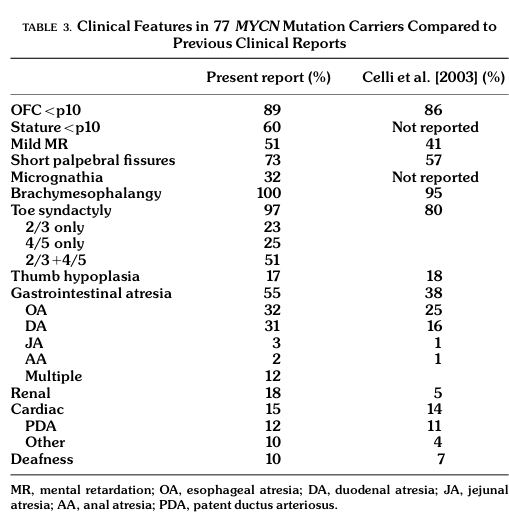

## Question

You are an expert researcher providing comprehensive, well-cited information.

Provide detailed information focusing on:
1. Key concepts and definitions with current understanding
2. Recent developments and latest research (prioritize 2023-2024 sources)
3. Current applications and real-world implementations
4. Expert opinions and analysis from authoritative sources
5. Relevant statistics and data from recent studies

Format as a comprehensive research report with proper citations. Include URLs and publication dates where available.
Always prioritize recent, authoritative sources and provide specific citations for all major claims.

# Disease Characteristics Research Template

## Target Disease
- **Disease Name:** Feingold Syndrome
- **MONDO ID:**  (if available)
- **Category:** Mendelian

## Research Objectives

Please provide a comprehensive research report on **Feingold Syndrome** covering all of the
disease characteristics listed below. This report will be used to populate a disease knowledge
base entry. Be thorough and cite primary literature (PMID preferred) for all claims.

For each section, **suggested databases/resources** are listed. These are the first places
you should search for information on each topic.

---

### 1. Disease Information
> **Search first:** OMIM, Orphanet, ICD-10/ICD-11, MeSH, PubMed

- What is the disease? Provide a concise overview.
- What are the key identifiers? (OMIM, Orphanet, ICD-10/ICD-11, MeSH, Mondo)
- What are the common synonyms and alternative names?
- Is the information derived from individual patients (e.g., EHR) or aggregated disease-level resources?

### 2. Etiology

- **Disease Causal Factors**: What are the primary causes? (genetic, environmental, infectious, mechanistic)
- **Risk Factors**:
  > **Search first:** PubMed, Cochrane Library, UpToDate, clinical guidelines, ClinVar, ClinGen, GWAS Catalog, PheGenI, CTD, CDC, WHO, epidemiological databases
  - Genetic risk factors (causal variants, susceptibility loci, modifier genes)
  - Environmental risk factors (toxins, lifestyle, occupational exposures, age, sex, family history)
- **Protective Factors**:
  > **Search first:** PubMed, Cochrane Library, clinical trial databases, GWAS Catalog, gnomAD, WHO, CDC, nutrition databases
  - Genetic protective factors (protective variants, modifier alleles)
  - Environmental protective factors (diet, lifestyle, exposures that reduce risk)
- **Gene-Environment Interactions**: How do genetic and environmental factors interact to influence disease?
  > **Search first:** CTD, PubMed, PheGenI, GxE databases

### 3. Phenotypes
> **Search first:** HPO (Human Phenotype Ontology), OMIM, Orphanet, PubMed, clinicaltrials.gov, MedDRA, SNOMED CT, DECIPHER, LOINC

For each phenotype, provide:
- **Phenotype type**: symptoms, clinical signs, physical manifestations, behavioral changes, or laboratory abnormalities
  > For symptoms/signs: HPO, OMIM, Orphanet, PubMed
  > For behavioral changes: HPO, DSM, RDoC (Research Domain Criteria), PubMed
  > For laboratory abnormalities: LOINC, SNOMED CT, LabTests Online, PubMed
- **Phenotype characteristics**:
  > **Search first:** OMIM, Orphanet, HPO, PubMed
  - Age of symptom onset (neonatal, childhood, adult-onset, late-onset)
  - Symptom severity (mild, moderate, severe, variable)
  - Symptom progression (stable, progressive, episodic, fluctuating)
  - Frequency among affected individuals (percentage or qualitative)
- **Quality of life impact**: Effects on daily functioning and well-being (per-phenotype when possible)
  > **Search first:** EQ-5D database, SF-36, WHO QOL databases, PubMed
- Suggest HPO (Human Phenotype Ontology) terms for each phenotype

### 4. Genetic/Molecular Information

- **Causal Genes**: Gene mutations or chromosomal abnormalities responsible for disease (gene symbols, OMIM IDs)
  > **Search first:** OMIM, ClinVar, HGMD, Ensembl, NCBI Gene
- **Pathogenic Variants**:
  - Affected genes (gene symbols, HGNC IDs)
    > **Search first:** OMIM, NCBI Gene, Ensembl, HGNC, UniProt, GeneCards
  - Variant classification (pathogenic, likely pathogenic, VUS per ACMG/AMP guidelines)
    > **Search first:** ClinVar, ClinGen, ACMG/AMP guidelines, VarSome
  - Variant type/class (missense, frameshift, nonsense, splice-site, structural)
  - Allele frequency in population databases
    > **Search first:** gnomAD, 1000 Genomes, ExAC, TOPMed, dbSNP
  - Somatic vs germline origin
    > **Search first:** COSMIC (somatic), ClinVar, ICGC, TCGA
  - Functional consequences (loss of function, gain of function, dominant negative)
- **Modifier Genes**: Genes that modify disease severity or expression
- **Epigenetic Information**: DNA methylation, histone modifications, chromatin changes affecting disease
  > **Search first:** ENCODE, Roadmap Epigenomics, MethBase, DiseaseMeth
- **Chromosomal Abnormalities**: Large-scale genetic changes (aneuploidy, translocations, inversions)
  > **Search first:** DECIPHER, ClinVar, ECARUCA, UCSC Genome Browser

### 5. Environmental Information

- **Environmental Factors**: Non-genetic contributing factors (toxins, radiation, pollution, occupational exposure)
  > **Search first:** CTD (Comparative Toxicogenomics Database), TOXNET, PubMed, EPA databases
- **Lifestyle Factors**: Behavioral factors (smoking, diet, exercise, alcohol consumption)
  > **Search first:** CDC databases, WHO, PubMed, NHANES
- **Infectious Agents**: If applicable, pathogens causing or triggering disease (bacteria, viruses, fungi, parasites)
  > **Search first:** NCBI Taxonomy, ViPR, BV-BRC, MicrobeDB, GIDEON

### 6. Mechanism / Pathophysiology

- **Molecular Pathways**: Specific signaling cascades or biochemical pathways involved (Wnt, MAPK, mTOR, PI3K-AKT, etc.)
  > **Search first:** KEGG, Reactome, WikiPathways, PathBank, BioCyc
- **Cellular Processes**: Cell-level mechanisms (apoptosis, autophagy, cell cycle dysregulation, inflammation, etc.)
  > **Search first:** Gene Ontology (GO), Reactome, KEGG, PubMed
- **Protein Dysfunction**: How protein structure or function is altered (misfolding, aggregation, loss of function, gain of function)
  > **Search first:** UniProt, PDB (Protein Data Bank), InterPro, Pfam, AlphaFold
- **Metabolic Changes**: Alterations in metabolic processes (energy metabolism, lipid metabolism, amino acid metabolism)
  > **Search first:** KEGG, BioCyc, HMDB (Human Metabolome Database), BRENDA
- **Immune System Involvement**: Role of immune response (autoimmunity, immunodeficiency, chronic inflammation)
  > **Search first:** ImmPort, Immunome Database, IEDB, Gene Ontology
- **Tissue Damage Mechanisms**: How tissues/ are injured (oxidative stress, ischemia, fibrosis, necrosis)
  > **Search first:** PubMed, Gene Ontology, Reactome
- **Biochemical Abnormalities**: Specific molecular defects (enzyme deficiencies, receptor dysfunction, ion channel defects)
  > **Search first:** BRENDA, UniProt, KEGG, OMIM, PubMed
- **Epigenetic Changes**: DNA methylation, histone modifications affecting gene expression in disease
  > **Search first:** ENCODE, Roadmap Epigenomics, MethBase, DiseaseMeth
- **Molecular Profiling** (if available):
  - Transcriptomics/gene expression changes
    > **Search first:** GEO (Gene Expression Omnibus), ArrayExpress, GTEx, Human Cell Atlas, SRA
  - Proteomics findings
    > **Search first:** PRIDE, ProteomeXchange, Human Protein Atlas, STRING, BioGRID
  - Metabolomics signatures
    > **Search first:** MetaboLights, Metabolomics Workbench, HMDB, METLIN
  - Lipidomics alterations
    > **Search first:** LIPID MAPS, SwissLipids, LipidHome, Metabolomics Workbench
  - Genomic structural features
    > **Search first:** UCSC Genome Browser, Ensembl, NCBI, dbVar, DGV
- **Advanced Technologies** (if applicable):
  - Single-cell analysis findings (cell-type specific mechanisms, cellular heterogeneity)
    > **Search first:** Human Cell Atlas, Single Cell Portal, GEO, CELLxGENE
  - Spatial transcriptomics findings
    > **Search first:** GEO, Spatial Research, Vizgen, 10x Genomics data
  - Multi-omics integration results
    > **Search first:** TCGA, ICGC, cBioPortal, LinkedOmics, PubMed
  - Functional genomics screens (CRISPR, RNAi)
    > **Search first:** DepMap, GenomeRNAi, PubMed, BioGRID ORCS

For each mechanism, describe:
- The causal chain from initial trigger to clinical manifestation
- Which mechanisms are upstream vs downstream
- What cell types and biological processes are involved
- Suggest GO terms for biological processes and CL terms for cell types

### 7. Anatomical Structures Affected

- **Organ Level**:
  - Primary organs directly affected
  - Secondary organ involvement (complications, secondary effects)
  - Body systems involved (cardiovascular, nervous, digestive, respiratory, endocrine, etc.)
  > **Search first:** Uberon, FMA (Foundational Model of Anatomy), OMIM, HPO, ICD-11, MeSH, SNOMED CT
- **Tissue and Cell Level**:
  - Specific tissue types affected (epithelial, connective, muscle, nervous)
  - Specific cell populations targeted (with Cell Ontology terms)
  > **Search first:** Uberon, Human Protein Atlas, Cell Ontology, Human Cell Atlas, CellMarker, PanglaoDB
- **Subcellular Level**:
  - Cellular compartments involved (mitochondria, nucleus, ER, lysosomes) (with GO Cellular Component terms)
  > **Search first:** Gene Ontology (Cellular Component), UniProt, Human Protein Atlas
- **Localization**:
  - Specific anatomical sites (with UBERON terms)
    > **Search first:** FMA, Uberon, NeuroNames (for brain), SNOMED CT
  - Lateralization (unilateral, bilateral, asymmetric)
    > **Search first:** HPO, clinical literature, imaging databases

### 8. Temporal Development

- **Onset**:
  - Typical age of onset (congenital, pediatric, adult, geriatric)
  - Onset pattern (acute, subacute, chronic, insidious)
  > **Search first:** OMIM, Orphanet, HPO, PubMed
- **Progression**:
  - Disease stages (early, intermediate, advanced, end-stage)
    > **Search first:** Cancer Staging Manual (AJCC), WHO classifications, PubMed
  - Progression rate (rapid, slow, variable)
  - Disease course pattern (episodic, relapsing-remitting, progressive, stable)
  - Disease duration (self-limited, chronic lifelong)
  > **Search first:** Disease registries, longitudinal cohort databases, natural history studies, PubMed, Orphanet, OMIM
- **Patterns**:
  - Remission patterns (spontaneous, treatment-induced)
    > **Search first:** Clinical trial databases, disease registries, PubMed
  - Critical periods (time windows of vulnerability or opportunity for intervention)
    > **Search first:** PubMed, developmental biology databases, clinical guidelines

### 9. Inheritance and Population

- **Epidemiology**:
  - Prevalence (cases per 100,000 at given time)
  - Incidence (new cases per 100,000 per year)
  > **Search first:** Orphanet, CDC, WHO, GBD (Global Burden of Disease), national registries, SEER, disease registries
- **For Genetic Etiology**:
  - Inheritance pattern (AD, AR, X-linked, mitochondrial, multifactorial, polygenic)
    > **Search first:** OMIM, Orphanet, ClinVar, GTR (Genetic Testing Registry)
  - Penetrance (complete, incomplete, age-dependent)
    > **Search first:** ClinVar, OMIM, PubMed, ClinGen
  - Expressivity (variable, consistent)
    > **Search first:** OMIM, ClinVar, PubMed
  - Genetic anticipation (increasing severity in successive generations)
    > **Search first:** OMIM, PubMed (especially for repeat expansion disorders)
  - Germline mosaicism
    > **Search first:** ClinVar, OMIM, genetic counseling literature, PubMed
  - Founder effects (population-specific mutations)
    > **Search first:** gnomAD, population genetics databases, PubMed
  - Consanguinity role
    > **Search first:** OMIM, population studies, genetic counseling resources
  - Carrier frequency
    > **Search first:** gnomAD, carrier screening databases, GeneReviews, GTR
- **Population Demographics**:
  - Affected populations (ethnic or demographic groups with higher prevalence)
    > **Search first:** gnomAD, 1000 Genomes, PAGE Study, PubMed, population registries
  - Geographic distribution (endemic areas, regional variation)
    > **Search first:** WHO, CDC, GBD, Orphanet, geographic epidemiology databases
  - Geographic distribution of specific variants
  - Sex ratio (male:female)
    > **Search first:** Disease registries, OMIM, PubMed, epidemiological databases
  - Age distribution of affected individuals
    > **Search first:** CDC, disease registries, SEER, Orphanet

### 10. Diagnostics

- **Clinical Tests**:
  - Laboratory tests (blood, urine, tissue chemistry, specific enzyme assays)
    > **Search first:** LOINC, LabTests Online, PubMed
  - Biomarkers (proteins, metabolites, genetic markers, circulating biomarkers)
    > **Search first:** FDA Biomarker List, BEST (Biomarkers, EndpointS, and other Tools), PubMed
  - Imaging studies (X-ray, CT, MRI, PET, ultrasound)
    > **Search first:** RadLex, DICOM, Radiopaedia, imaging databases
  - Functional tests (pulmonary function, cardiac stress tests)
    > **Search first:** LOINC, clinical guidelines, PubMed
  - Electrophysiology (EEG, EMG, ECG, nerve conduction studies)
    > **Search first:** LOINC, clinical neurophysiology databases, PubMed
  - Biopsy findings (histopathology, immunohistochemistry)
    > **Search first:** SNOMED CT, College of American Pathologists resources, PubMed
  - Pathology findings (microscopic examination)
    > **Search first:** SNOMED CT, Digital Pathology databases, PubMed
- **Genetic Testing**:
  > **Search first:** GTR (Genetic Testing Registry), GeneReviews, ClinGen
  - Overview of recommended genetic testing approach
  - Whole genome sequencing (WGS) utility
    > **Search first:** GTR, ClinVar, GEL (Genomics England), gnomAD
  - Whole exome sequencing (WES) utility
    > **Search first:** GTR, ClinVar, OMIM, GeneMatcher
  - Gene panels (which panels, which genes)
    > **Search first:** GTR, ClinVar, laboratory-specific databases
  - Single gene testing
    > **Search first:** GTR, ClinVar, OMIM, GeneReviews
  - Chromosomal microarray (CMA)
    > **Search first:** DECIPHER, ClinVar, dbVar, ECARUCA
  - Karyotyping
    > **Search first:** Chromosome Abnormality Database, ClinVar, cytogenetics resources
  - FISH
    > **Search first:** ClinVar, cytogenetics databases, PubMed
  - Mitochondrial DNA testing
    > **Search first:** MITOMAP, MSeqDR, ClinVar, GTR
  - Repeat expansion testing
    > **Search first:** GTR, ClinVar, repeat expansion databases, PubMed
- **Omics-Based Diagnostics** (if applicable):
  - RNA sequencing / transcriptomics
    > **Search first:** GEO, ArrayExpress, GTEx, RNA-seq databases
  - Proteomics
    > **Search first:** PRIDE, ProteomeXchange, FDA Biomarker database
  - Metabolomics
    > **Search first:** MetaboLights, Metabolomics Workbench, HMDB
  - Epigenomics
    > **Search first:** GEO, ENCODE, Roadmap Epigenomics, MethBase
  - Liquid biopsy
    > **Search first:** COSMIC, ClinVar, liquid biopsy databases, PubMed
- **Clinical Criteria**:
  - Standardized diagnostic criteria (DSM, ICD, society guidelines)
    > **Search first:** DSM-5, ICD-11, clinical society guidelines, UpToDate
  - Differential diagnosis (other conditions to rule out, with distinguishing features)
    > **Search first:** DynaMed, UpToDate, clinical decision support systems
- **Screening**:
  - Screening methods for asymptomatic individuals (newborn screening, carrier screening, cascade screening)
    > **Search first:** ACMG recommendations, CDC newborn screening, GTR

### 11. Outcome/Prognosis

- **Survival and Mortality**:
  - Survival rate (5-year, 10-year, overall)
    > **Search first:** SEER, cancer registries, disease-specific registries, PubMed
  - Life expectancy (with and without treatment if applicable)
    > **Search first:** Orphanet, disease registries, actuarial databases, PubMed
  - Mortality rate
    > **Search first:** CDC, WHO, GBD, national mortality databases
  - Disease-specific mortality (deaths directly attributable to disease)
    > **Search first:** Disease registries, CDC Wonder, GBD, PubMed
- **Morbidity and Function**:
  - Morbidity (disease-related disability and health impacts)
    > **Search first:** GBD, WHO, disability databases, PubMed
  - Disability outcomes (long-term functional impairments)
    > **Search first:** ICF (International Classification of Functioning), disability registries
  - Quality of life measures (EQ-5D, SF-36, PROMIS, disease-specific tools)
    > **Search first:** EQ-5D database, SF-36, PROMIS, PubMed
- **Disease Course**:
  - Complications (secondary problems: infections, organ failure, etc.)
    > **Search first:** ICD codes, disease registries, clinical databases, PubMed
  - Recovery potential (likelihood and extent of recovery, with vs without treatment)
    > **Search first:** Natural history studies, rehabilitation databases, PubMed
- **Prediction**:
  - Prognostic factors (age, disease severity, biomarkers, treatment response)
    > **Search first:** Prognostic models databases, clinical calculators, PubMed
  - Prognostic biomarkers (molecular markers predicting disease course)
    > **Search first:** FDA Biomarker database, PubMed, cancer prognostic databases

### 12. Treatment

- **Pharmacotherapy**:
  - Pharmacological treatments (drug names, drug classes, mechanisms of action)
    > **Search first:** DrugBank, RxNorm, ATC classification, DailyMed, FDA databases
  - Pharmacogenomics (how genetic variants affect drug metabolism, efficacy, toxicity)
    > **Search first:** PharmGKB, CPIC (Clinical Pharmacogenetics), FDA Table of PGx Biomarkers
- **Advanced Therapeutics**:
  - Gene therapy (viral vectors, CRISPR, gene replacement, gene editing)
    > **Search first:** ClinicalTrials.gov, FDA gene therapy database, ASGCT resources
  - Cell therapy (stem cell transplant, CAR-T, cellular therapeutics)
    > **Search first:** ClinicalTrials.gov, FDA cell therapy database, FACT standards
  - RNA-based therapies (ASOs, siRNA, mRNA therapies)
    > **Search first:** ClinicalTrials.gov, FDA approvals, PubMed
  - Targeted therapies (treatments directed at specific molecular targets)
    > **Search first:** My Cancer Genome, OncoKB, ClinicalTrials.gov, FDA approvals
  - Immunotherapies (checkpoint inhibitors, monoclonal antibodies)
    > **Search first:** Cancer Immunotherapy Database, FDA approvals, ClinicalTrials.gov
- **Surgical and Interventional**:
  - Surgical interventions (types of surgery, timing, outcomes)
    > **Search first:** CPT codes, surgical registries, clinical guidelines, PubMed
- **Supportive and Rehabilitative**:
  - Supportive care (symptom management, pain control, nutrition)
    > **Search first:** Clinical guidelines, Cochrane Library, PubMed
  - Rehabilitation (physical therapy, occupational therapy, speech therapy)
    > **Search first:** Rehabilitation medicine databases, clinical guidelines, PubMed
- **Experimental**:
  - Experimental treatments in clinical trials (with NCT identifiers if available)
    > **Search first:** ClinicalTrials.gov, EU Clinical Trials Register, WHO ICTRP
- **Treatment Outcomes**:
  - Treatment response rates
    > **Search first:** Clinical trial databases, FDA reviews, systematic reviews, PubMed
  - Side effects and adverse events
    > **Search first:** FDA Adverse Event Reporting System (FAERS), MedWatch, PubMed
- **Treatment Strategy**:
  - Treatment algorithms (clinical pathways, decision trees)
    > **Search first:** Clinical practice guidelines, NCCN Guidelines, UpToDate
  - Combination therapies
    > **Search first:** ClinicalTrials.gov, treatment guidelines, PubMed
  - Personalized medicine approaches (genotype-guided treatment)
    > **Search first:** My Cancer Genome, CIViC, PharmGKB, precision medicine databases

For each treatment, suggest MAXO (Medical Action Ontology) terms where applicable.

### 13. Prevention

- **Prevention Levels**:
  - Primary prevention (preventing disease occurrence: vaccination, risk factor modification)
    > **Search first:** CDC, WHO, USPSTF recommendations, Cochrane Library
  - Secondary prevention (early detection and treatment: screening programs, early intervention)
    > **Search first:** USPSTF, CDC screening guidelines, WHO
  - Tertiary prevention (preventing complications in those with disease)
    > **Search first:** Clinical guidelines, disease management protocols, PubMed
- **Immunization**: Vaccine strategies (if applicable)
  > **Search first:** CDC vaccine schedules, WHO immunization, FDA vaccine database
- **Screening and Early Detection**:
  - Screening programs (population-based: newborn screening, cancer screening)
    > **Search first:** CDC screening programs, USPSTF, cancer screening databases
  - Genetic screening (carrier screening, preimplantation genetic diagnosis, prenatal testing)
    > **Search first:** ACMG recommendations, ACOG guidelines, GTR
  - Risk stratification (identifying high-risk individuals for targeted prevention)
    > **Search first:** Risk prediction models, clinical calculators, PubMed
- **Behavioral Interventions**: Lifestyle modifications to reduce risk
  > **Search first:** CDC, WHO, behavioral intervention databases, Cochrane Library
- **Counseling**: Genetic counseling (risk assessment, family planning guidance)
  > **Search first:** NSGC resources, ACMG guidelines, GeneReviews
- **Public Health**:
  - Public health interventions (sanitation, vector control, health education)
    > **Search first:** CDC, WHO, public health databases, PubMed
  - Environmental interventions (reducing environmental risk factors)
    > **Search first:** EPA databases, WHO environmental health, PubMed
- **Prophylaxis**: Preventive medications or procedures
  > **Search first:** Clinical guidelines, FDA approvals, PubMed

### 14. Other Species / Natural Disease

- **Taxonomy**: Species affected (with NCBI Taxon identifiers)
  > **Search first:** NCBI Taxonomy
- **Breed**: Specific breeds affected (with VBO identifiers if applicable)
  > **Search first:** VBO (Vertebrate Breed Ontology)
- **Gene**: Orthologous genes in other species (with NCBI Gene IDs)
  > **Search first:** NCBI Gene
- **Natural Disease**:
  - Naturally occurring disease in other species (companion animals, wildlife)
    > **Search first:** OMIA (Online Mendelian Inheritance in Animals), VetCompass, PubMed
  - Veterinary relevance and importance in animal health
    > **Search first:** OMIA, veterinary databases, PubMed
- **Comparative Biology**:
  - Comparative pathology (similarities and differences across species)
    > **Search first:** OMIA, comparative pathology databases, PubMed
  - Evolutionary conservation of disease mechanisms
    > **Search first:** HomoloGene, OrthoMCL, Alliance of Genome Resources
- **Transmission** (if applicable):
  - Zoonotic potential
    > **Search first:** CDC zoonotic diseases, WHO zoonoses, GIDEON
  - Cross-species susceptibility
    > **Search first:** NCBI Taxonomy, veterinary databases, PubMed

### 15. Model Organisms

- **Model Types**:
  - Model organism type (mammalian, invertebrate, cellular, in vitro)
    > **Search first:** Alliance of Genome Resources, model organism databases
  - Specific model systems (mouse, rat, zebrafish, Drosophila, C. elegans, yeast, cell lines, organoids, iPSCs)
    > **Search first:** MGI, RGD, ZFIN, FlyBase, WormBase, SGD, ATCC, Cellosaurus
  - Induced models (drug treatment, surgical intervention, environmental manipulation)
    > **Search first:** MGI, model organism databases, PubMed
- **Genetic Models**:
  - Types available (knockout, knock-in, transgenic, conditional, humanized)
    > **Search first:** MGI, IMPC, KOMP, EuMMCR, IMSR
- **Model Characteristics**:
  - Phenotype recapitulation (how well model reproduces human disease features)
    > **Search first:** Model organism databases, comparative studies, PubMed
  - Model limitations (aspects of human disease not captured)
    > **Search first:** Model organism databases, PubMed, review articles
- **Applications**:
  - Research applications (what aspects of disease can be studied)
    > **Search first:** Model organism databases, PubMed
- **Resources**:
  - Model databases
    > **Search first:** MGI, RGD, ZFIN, FlyBase, WormBase, IMSR, EMMA, MMRRC

---

## Citation Requirements

- Cite primary literature (PMID preferred) for all mechanistic and clinical claims
- Prioritize recent reviews and landmark papers
- Include direct quotes from abstracts where possible to support key statements
- Distinguish evidence source types: human clinical, model organism, in vitro, computational

## Output Format

Structure your response as a comprehensive narrative organized by the sections above.
For each section, provide:
- Factual content with specific details (numbers, percentages, gene names, variant nomenclature)
- Ontology term suggestions (HPO, GO, CL, UBERON, CHEBI, MAXO, MONDO) where applicable
- Evidence citations with PMIDs
- Direct quotes from abstracts to support key claims
- Clear indication when information is not available or not applicable for this disease

This report will be used to populate a disease knowledge base entry with:
- Pathophysiology descriptions with causal chains
- Gene/protein annotations (HGNC, GO terms)
- Phenotype associations (HP terms) with frequencies
- Cell type involvement (CL terms)
- Anatomical locations (UBERON terms)
- Chemical entities (CHEBI terms)
- Treatment annotations (MAXO terms)
- Evidence items with PMIDs and exact abstract quotes
- Epidemiology, prognosis, diagnostic, and prevention information
- Animal model descriptions with phenotype recapitulation details

## Output

Question: You are an expert researcher providing comprehensive, well-cited information.

Provide detailed information focusing on:
1. Key concepts and definitions with current understanding
2. Recent developments and latest research (prioritize 2023-2024 sources)
3. Current applications and real-world implementations
4. Expert opinions and analysis from authoritative sources
5. Relevant statistics and data from recent studies

Format as a comprehensive research report with proper citations. Include URLs and publication dates where available.
Always prioritize recent, authoritative sources and provide specific citations for all major claims.

# Disease Characteristics Research Template

## Target Disease
- **Disease Name:** Feingold Syndrome
- **MONDO ID:**  (if available)
- **Category:** Mendelian

## Research Objectives

Please provide a comprehensive research report on **Feingold Syndrome** covering all of the
disease characteristics listed below. This report will be used to populate a disease knowledge
base entry. Be thorough and cite primary literature (PMID preferred) for all claims.

For each section, **suggested databases/resources** are listed. These are the first places
you should search for information on each topic.

---

### 1. Disease Information
> **Search first:** OMIM, Orphanet, ICD-10/ICD-11, MeSH, PubMed

- What is the disease? Provide a concise overview.
- What are the key identifiers? (OMIM, Orphanet, ICD-10/ICD-11, MeSH, Mondo)
- What are the common synonyms and alternative names?
- Is the information derived from individual patients (e.g., EHR) or aggregated disease-level resources?

### 2. Etiology

- **Disease Causal Factors**: What are the primary causes? (genetic, environmental, infectious, mechanistic)
- **Risk Factors**:
  > **Search first:** PubMed, Cochrane Library, UpToDate, clinical guidelines, ClinVar, ClinGen, GWAS Catalog, PheGenI, CTD, CDC, WHO, epidemiological databases
  - Genetic risk factors (causal variants, susceptibility loci, modifier genes)
  - Environmental risk factors (toxins, lifestyle, occupational exposures, age, sex, family history)
- **Protective Factors**:
  > **Search first:** PubMed, Cochrane Library, clinical trial databases, GWAS Catalog, gnomAD, WHO, CDC, nutrition databases
  - Genetic protective factors (protective variants, modifier alleles)
  - Environmental protective factors (diet, lifestyle, exposures that reduce risk)
- **Gene-Environment Interactions**: How do genetic and environmental factors interact to influence disease?
  > **Search first:** CTD, PubMed, PheGenI, GxE databases

### 3. Phenotypes
> **Search first:** HPO (Human Phenotype Ontology), OMIM, Orphanet, PubMed, clinicaltrials.gov, MedDRA, SNOMED CT, DECIPHER, LOINC

For each phenotype, provide:
- **Phenotype type**: symptoms, clinical signs, physical manifestations, behavioral changes, or laboratory abnormalities
  > For symptoms/signs: HPO, OMIM, Orphanet, PubMed
  > For behavioral changes: HPO, DSM, RDoC (Research Domain Criteria), PubMed
  > For laboratory abnormalities: LOINC, SNOMED CT, LabTests Online, PubMed
- **Phenotype characteristics**:
  > **Search first:** OMIM, Orphanet, HPO, PubMed
  - Age of symptom onset (neonatal, childhood, adult-onset, late-onset)
  - Symptom severity (mild, moderate, severe, variable)
  - Symptom progression (stable, progressive, episodic, fluctuating)
  - Frequency among affected individuals (percentage or qualitative)
- **Quality of life impact**: Effects on daily functioning and well-being (per-phenotype when possible)
  > **Search first:** EQ-5D database, SF-36, WHO QOL databases, PubMed
- Suggest HPO (Human Phenotype Ontology) terms for each phenotype

### 4. Genetic/Molecular Information

- **Causal Genes**: Gene mutations or chromosomal abnormalities responsible for disease (gene symbols, OMIM IDs)
  > **Search first:** OMIM, ClinVar, HGMD, Ensembl, NCBI Gene
- **Pathogenic Variants**:
  - Affected genes (gene symbols, HGNC IDs)
    > **Search first:** OMIM, NCBI Gene, Ensembl, HGNC, UniProt, GeneCards
  - Variant classification (pathogenic, likely pathogenic, VUS per ACMG/AMP guidelines)
    > **Search first:** ClinVar, ClinGen, ACMG/AMP guidelines, VarSome
  - Variant type/class (missense, frameshift, nonsense, splice-site, structural)
  - Allele frequency in population databases
    > **Search first:** gnomAD, 1000 Genomes, ExAC, TOPMed, dbSNP
  - Somatic vs germline origin
    > **Search first:** COSMIC (somatic), ClinVar, ICGC, TCGA
  - Functional consequences (loss of function, gain of function, dominant negative)
- **Modifier Genes**: Genes that modify disease severity or expression
- **Epigenetic Information**: DNA methylation, histone modifications, chromatin changes affecting disease
  > **Search first:** ENCODE, Roadmap Epigenomics, MethBase, DiseaseMeth
- **Chromosomal Abnormalities**: Large-scale genetic changes (aneuploidy, translocations, inversions)
  > **Search first:** DECIPHER, ClinVar, ECARUCA, UCSC Genome Browser

### 5. Environmental Information

- **Environmental Factors**: Non-genetic contributing factors (toxins, radiation, pollution, occupational exposure)
  > **Search first:** CTD (Comparative Toxicogenomics Database), TOXNET, PubMed, EPA databases
- **Lifestyle Factors**: Behavioral factors (smoking, diet, exercise, alcohol consumption)
  > **Search first:** CDC databases, WHO, PubMed, NHANES
- **Infectious Agents**: If applicable, pathogens causing or triggering disease (bacteria, viruses, fungi, parasites)
  > **Search first:** NCBI Taxonomy, ViPR, BV-BRC, MicrobeDB, GIDEON

### 6. Mechanism / Pathophysiology

- **Molecular Pathways**: Specific signaling cascades or biochemical pathways involved (Wnt, MAPK, mTOR, PI3K-AKT, etc.)
  > **Search first:** KEGG, Reactome, WikiPathways, PathBank, BioCyc
- **Cellular Processes**: Cell-level mechanisms (apoptosis, autophagy, cell cycle dysregulation, inflammation, etc.)
  > **Search first:** Gene Ontology (GO), Reactome, KEGG, PubMed
- **Protein Dysfunction**: How protein structure or function is altered (misfolding, aggregation, loss of function, gain of function)
  > **Search first:** UniProt, PDB (Protein Data Bank), InterPro, Pfam, AlphaFold
- **Metabolic Changes**: Alterations in metabolic processes (energy metabolism, lipid metabolism, amino acid metabolism)
  > **Search first:** KEGG, BioCyc, HMDB (Human Metabolome Database), BRENDA
- **Immune System Involvement**: Role of immune response (autoimmunity, immunodeficiency, chronic inflammation)
  > **Search first:** ImmPort, Immunome Database, IEDB, Gene Ontology
- **Tissue Damage Mechanisms**: How tissues/ are injured (oxidative stress, ischemia, fibrosis, necrosis)
  > **Search first:** PubMed, Gene Ontology, Reactome
- **Biochemical Abnormalities**: Specific molecular defects (enzyme deficiencies, receptor dysfunction, ion channel defects)
  > **Search first:** BRENDA, UniProt, KEGG, OMIM, PubMed
- **Epigenetic Changes**: DNA methylation, histone modifications affecting gene expression in disease
  > **Search first:** ENCODE, Roadmap Epigenomics, MethBase, DiseaseMeth
- **Molecular Profiling** (if available):
  - Transcriptomics/gene expression changes
    > **Search first:** GEO (Gene Expression Omnibus), ArrayExpress, GTEx, Human Cell Atlas, SRA
  - Proteomics findings
    > **Search first:** PRIDE, ProteomeXchange, Human Protein Atlas, STRING, BioGRID
  - Metabolomics signatures
    > **Search first:** MetaboLights, Metabolomics Workbench, HMDB, METLIN
  - Lipidomics alterations
    > **Search first:** LIPID MAPS, SwissLipids, LipidHome, Metabolomics Workbench
  - Genomic structural features
    > **Search first:** UCSC Genome Browser, Ensembl, NCBI, dbVar, DGV
- **Advanced Technologies** (if applicable):
  - Single-cell analysis findings (cell-type specific mechanisms, cellular heterogeneity)
    > **Search first:** Human Cell Atlas, Single Cell Portal, GEO, CELLxGENE
  - Spatial transcriptomics findings
    > **Search first:** GEO, Spatial Research, Vizgen, 10x Genomics data
  - Multi-omics integration results
    > **Search first:** TCGA, ICGC, cBioPortal, LinkedOmics, PubMed
  - Functional genomics screens (CRISPR, RNAi)
    > **Search first:** DepMap, GenomeRNAi, PubMed, BioGRID ORCS

For each mechanism, describe:
- The causal chain from initial trigger to clinical manifestation
- Which mechanisms are upstream vs downstream
- What cell types and biological processes are involved
- Suggest GO terms for biological processes and CL terms for cell types

### 7. Anatomical Structures Affected

- **Organ Level**:
  - Primary organs directly affected
  - Secondary organ involvement (complications, secondary effects)
  - Body systems involved (cardiovascular, nervous, digestive, respiratory, endocrine, etc.)
  > **Search first:** Uberon, FMA (Foundational Model of Anatomy), OMIM, HPO, ICD-11, MeSH, SNOMED CT
- **Tissue and Cell Level**:
  - Specific tissue types affected (epithelial, connective, muscle, nervous)
  - Specific cell populations targeted (with Cell Ontology terms)
  > **Search first:** Uberon, Human Protein Atlas, Cell Ontology, Human Cell Atlas, CellMarker, PanglaoDB
- **Subcellular Level**:
  - Cellular compartments involved (mitochondria, nucleus, ER, lysosomes) (with GO Cellular Component terms)
  > **Search first:** Gene Ontology (Cellular Component), UniProt, Human Protein Atlas
- **Localization**:
  - Specific anatomical sites (with UBERON terms)
    > **Search first:** FMA, Uberon, NeuroNames (for brain), SNOMED CT
  - Lateralization (unilateral, bilateral, asymmetric)
    > **Search first:** HPO, clinical literature, imaging databases

### 8. Temporal Development

- **Onset**:
  - Typical age of onset (congenital, pediatric, adult, geriatric)
  - Onset pattern (acute, subacute, chronic, insidious)
  > **Search first:** OMIM, Orphanet, HPO, PubMed
- **Progression**:
  - Disease stages (early, intermediate, advanced, end-stage)
    > **Search first:** Cancer Staging Manual (AJCC), WHO classifications, PubMed
  - Progression rate (rapid, slow, variable)
  - Disease course pattern (episodic, relapsing-remitting, progressive, stable)
  - Disease duration (self-limited, chronic lifelong)
  > **Search first:** Disease registries, longitudinal cohort databases, natural history studies, PubMed, Orphanet, OMIM
- **Patterns**:
  - Remission patterns (spontaneous, treatment-induced)
    > **Search first:** Clinical trial databases, disease registries, PubMed
  - Critical periods (time windows of vulnerability or opportunity for intervention)
    > **Search first:** PubMed, developmental biology databases, clinical guidelines

### 9. Inheritance and Population

- **Epidemiology**:
  - Prevalence (cases per 100,000 at given time)
  - Incidence (new cases per 100,000 per year)
  > **Search first:** Orphanet, CDC, WHO, GBD (Global Burden of Disease), national registries, SEER, disease registries
- **For Genetic Etiology**:
  - Inheritance pattern (AD, AR, X-linked, mitochondrial, multifactorial, polygenic)
    > **Search first:** OMIM, Orphanet, ClinVar, GTR (Genetic Testing Registry)
  - Penetrance (complete, incomplete, age-dependent)
    > **Search first:** ClinVar, OMIM, PubMed, ClinGen
  - Expressivity (variable, consistent)
    > **Search first:** OMIM, ClinVar, PubMed
  - Genetic anticipation (increasing severity in successive generations)
    > **Search first:** OMIM, PubMed (especially for repeat expansion disorders)
  - Germline mosaicism
    > **Search first:** ClinVar, OMIM, genetic counseling literature, PubMed
  - Founder effects (population-specific mutations)
    > **Search first:** gnomAD, population genetics databases, PubMed
  - Consanguinity role
    > **Search first:** OMIM, population studies, genetic counseling resources
  - Carrier frequency
    > **Search first:** gnomAD, carrier screening databases, GeneReviews, GTR
- **Population Demographics**:
  - Affected populations (ethnic or demographic groups with higher prevalence)
    > **Search first:** gnomAD, 1000 Genomes, PAGE Study, PubMed, population registries
  - Geographic distribution (endemic areas, regional variation)
    > **Search first:** WHO, CDC, GBD, Orphanet, geographic epidemiology databases
  - Geographic distribution of specific variants
  - Sex ratio (male:female)
    > **Search first:** Disease registries, OMIM, PubMed, epidemiological databases
  - Age distribution of affected individuals
    > **Search first:** CDC, disease registries, SEER, Orphanet

### 10. Diagnostics

- **Clinical Tests**:
  - Laboratory tests (blood, urine, tissue chemistry, specific enzyme assays)
    > **Search first:** LOINC, LabTests Online, PubMed
  - Biomarkers (proteins, metabolites, genetic markers, circulating biomarkers)
    > **Search first:** FDA Biomarker List, BEST (Biomarkers, EndpointS, and other Tools), PubMed
  - Imaging studies (X-ray, CT, MRI, PET, ultrasound)
    > **Search first:** RadLex, DICOM, Radiopaedia, imaging databases
  - Functional tests (pulmonary function, cardiac stress tests)
    > **Search first:** LOINC, clinical guidelines, PubMed
  - Electrophysiology (EEG, EMG, ECG, nerve conduction studies)
    > **Search first:** LOINC, clinical neurophysiology databases, PubMed
  - Biopsy findings (histopathology, immunohistochemistry)
    > **Search first:** SNOMED CT, College of American Pathologists resources, PubMed
  - Pathology findings (microscopic examination)
    > **Search first:** SNOMED CT, Digital Pathology databases, PubMed
- **Genetic Testing**:
  > **Search first:** GTR (Genetic Testing Registry), GeneReviews, ClinGen
  - Overview of recommended genetic testing approach
  - Whole genome sequencing (WGS) utility
    > **Search first:** GTR, ClinVar, GEL (Genomics England), gnomAD
  - Whole exome sequencing (WES) utility
    > **Search first:** GTR, ClinVar, OMIM, GeneMatcher
  - Gene panels (which panels, which genes)
    > **Search first:** GTR, ClinVar, laboratory-specific databases
  - Single gene testing
    > **Search first:** GTR, ClinVar, OMIM, GeneReviews
  - Chromosomal microarray (CMA)
    > **Search first:** DECIPHER, ClinVar, dbVar, ECARUCA
  - Karyotyping
    > **Search first:** Chromosome Abnormality Database, ClinVar, cytogenetics resources
  - FISH
    > **Search first:** ClinVar, cytogenetics databases, PubMed
  - Mitochondrial DNA testing
    > **Search first:** MITOMAP, MSeqDR, ClinVar, GTR
  - Repeat expansion testing
    > **Search first:** GTR, ClinVar, repeat expansion databases, PubMed
- **Omics-Based Diagnostics** (if applicable):
  - RNA sequencing / transcriptomics
    > **Search first:** GEO, ArrayExpress, GTEx, RNA-seq databases
  - Proteomics
    > **Search first:** PRIDE, ProteomeXchange, FDA Biomarker database
  - Metabolomics
    > **Search first:** MetaboLights, Metabolomics Workbench, HMDB
  - Epigenomics
    > **Search first:** GEO, ENCODE, Roadmap Epigenomics, MethBase
  - Liquid biopsy
    > **Search first:** COSMIC, ClinVar, liquid biopsy databases, PubMed
- **Clinical Criteria**:
  - Standardized diagnostic criteria (DSM, ICD, society guidelines)
    > **Search first:** DSM-5, ICD-11, clinical society guidelines, UpToDate
  - Differential diagnosis (other conditions to rule out, with distinguishing features)
    > **Search first:** DynaMed, UpToDate, clinical decision support systems
- **Screening**:
  - Screening methods for asymptomatic individuals (newborn screening, carrier screening, cascade screening)
    > **Search first:** ACMG recommendations, CDC newborn screening, GTR

### 11. Outcome/Prognosis

- **Survival and Mortality**:
  - Survival rate (5-year, 10-year, overall)
    > **Search first:** SEER, cancer registries, disease-specific registries, PubMed
  - Life expectancy (with and without treatment if applicable)
    > **Search first:** Orphanet, disease registries, actuarial databases, PubMed
  - Mortality rate
    > **Search first:** CDC, WHO, GBD, national mortality databases
  - Disease-specific mortality (deaths directly attributable to disease)
    > **Search first:** Disease registries, CDC Wonder, GBD, PubMed
- **Morbidity and Function**:
  - Morbidity (disease-related disability and health impacts)
    > **Search first:** GBD, WHO, disability databases, PubMed
  - Disability outcomes (long-term functional impairments)
    > **Search first:** ICF (International Classification of Functioning), disability registries
  - Quality of life measures (EQ-5D, SF-36, PROMIS, disease-specific tools)
    > **Search first:** EQ-5D database, SF-36, PROMIS, PubMed
- **Disease Course**:
  - Complications (secondary problems: infections, organ failure, etc.)
    > **Search first:** ICD codes, disease registries, clinical databases, PubMed
  - Recovery potential (likelihood and extent of recovery, with vs without treatment)
    > **Search first:** Natural history studies, rehabilitation databases, PubMed
- **Prediction**:
  - Prognostic factors (age, disease severity, biomarkers, treatment response)
    > **Search first:** Prognostic models databases, clinical calculators, PubMed
  - Prognostic biomarkers (molecular markers predicting disease course)
    > **Search first:** FDA Biomarker database, PubMed, cancer prognostic databases

### 12. Treatment

- **Pharmacotherapy**:
  - Pharmacological treatments (drug names, drug classes, mechanisms of action)
    > **Search first:** DrugBank, RxNorm, ATC classification, DailyMed, FDA databases
  - Pharmacogenomics (how genetic variants affect drug metabolism, efficacy, toxicity)
    > **Search first:** PharmGKB, CPIC (Clinical Pharmacogenetics), FDA Table of PGx Biomarkers
- **Advanced Therapeutics**:
  - Gene therapy (viral vectors, CRISPR, gene replacement, gene editing)
    > **Search first:** ClinicalTrials.gov, FDA gene therapy database, ASGCT resources
  - Cell therapy (stem cell transplant, CAR-T, cellular therapeutics)
    > **Search first:** ClinicalTrials.gov, FDA cell therapy database, FACT standards
  - RNA-based therapies (ASOs, siRNA, mRNA therapies)
    > **Search first:** ClinicalTrials.gov, FDA approvals, PubMed
  - Targeted therapies (treatments directed at specific molecular targets)
    > **Search first:** My Cancer Genome, OncoKB, ClinicalTrials.gov, FDA approvals
  - Immunotherapies (checkpoint inhibitors, monoclonal antibodies)
    > **Search first:** Cancer Immunotherapy Database, FDA approvals, ClinicalTrials.gov
- **Surgical and Interventional**:
  - Surgical interventions (types of surgery, timing, outcomes)
    > **Search first:** CPT codes, surgical registries, clinical guidelines, PubMed
- **Supportive and Rehabilitative**:
  - Supportive care (symptom management, pain control, nutrition)
    > **Search first:** Clinical guidelines, Cochrane Library, PubMed
  - Rehabilitation (physical therapy, occupational therapy, speech therapy)
    > **Search first:** Rehabilitation medicine databases, clinical guidelines, PubMed
- **Experimental**:
  - Experimental treatments in clinical trials (with NCT identifiers if available)
    > **Search first:** ClinicalTrials.gov, EU Clinical Trials Register, WHO ICTRP
- **Treatment Outcomes**:
  - Treatment response rates
    > **Search first:** Clinical trial databases, FDA reviews, systematic reviews, PubMed
  - Side effects and adverse events
    > **Search first:** FDA Adverse Event Reporting System (FAERS), MedWatch, PubMed
- **Treatment Strategy**:
  - Treatment algorithms (clinical pathways, decision trees)
    > **Search first:** Clinical practice guidelines, NCCN Guidelines, UpToDate
  - Combination therapies
    > **Search first:** ClinicalTrials.gov, treatment guidelines, PubMed
  - Personalized medicine approaches (genotype-guided treatment)
    > **Search first:** My Cancer Genome, CIViC, PharmGKB, precision medicine databases

For each treatment, suggest MAXO (Medical Action Ontology) terms where applicable.

### 13. Prevention

- **Prevention Levels**:
  - Primary prevention (preventing disease occurrence: vaccination, risk factor modification)
    > **Search first:** CDC, WHO, USPSTF recommendations, Cochrane Library
  - Secondary prevention (early detection and treatment: screening programs, early intervention)
    > **Search first:** USPSTF, CDC screening guidelines, WHO
  - Tertiary prevention (preventing complications in those with disease)
    > **Search first:** Clinical guidelines, disease management protocols, PubMed
- **Immunization**: Vaccine strategies (if applicable)
  > **Search first:** CDC vaccine schedules, WHO immunization, FDA vaccine database
- **Screening and Early Detection**:
  - Screening programs (population-based: newborn screening, cancer screening)
    > **Search first:** CDC screening programs, USPSTF, cancer screening databases
  - Genetic screening (carrier screening, preimplantation genetic diagnosis, prenatal testing)
    > **Search first:** ACMG recommendations, ACOG guidelines, GTR
  - Risk stratification (identifying high-risk individuals for targeted prevention)
    > **Search first:** Risk prediction models, clinical calculators, PubMed
- **Behavioral Interventions**: Lifestyle modifications to reduce risk
  > **Search first:** CDC, WHO, behavioral intervention databases, Cochrane Library
- **Counseling**: Genetic counseling (risk assessment, family planning guidance)
  > **Search first:** NSGC resources, ACMG guidelines, GeneReviews
- **Public Health**:
  - Public health interventions (sanitation, vector control, health education)
    > **Search first:** CDC, WHO, public health databases, PubMed
  - Environmental interventions (reducing environmental risk factors)
    > **Search first:** EPA databases, WHO environmental health, PubMed
- **Prophylaxis**: Preventive medications or procedures
  > **Search first:** Clinical guidelines, FDA approvals, PubMed

### 14. Other Species / Natural Disease

- **Taxonomy**: Species affected (with NCBI Taxon identifiers)
  > **Search first:** NCBI Taxonomy
- **Breed**: Specific breeds affected (with VBO identifiers if applicable)
  > **Search first:** VBO (Vertebrate Breed Ontology)
- **Gene**: Orthologous genes in other species (with NCBI Gene IDs)
  > **Search first:** NCBI Gene
- **Natural Disease**:
  - Naturally occurring disease in other species (companion animals, wildlife)
    > **Search first:** OMIA (Online Mendelian Inheritance in Animals), VetCompass, PubMed
  - Veterinary relevance and importance in animal health
    > **Search first:** OMIA, veterinary databases, PubMed
- **Comparative Biology**:
  - Comparative pathology (similarities and differences across species)
    > **Search first:** OMIA, comparative pathology databases, PubMed
  - Evolutionary conservation of disease mechanisms
    > **Search first:** HomoloGene, OrthoMCL, Alliance of Genome Resources
- **Transmission** (if applicable):
  - Zoonotic potential
    > **Search first:** CDC zoonotic diseases, WHO zoonoses, GIDEON
  - Cross-species susceptibility
    > **Search first:** NCBI Taxonomy, veterinary databases, PubMed

### 15. Model Organisms

- **Model Types**:
  - Model organism type (mammalian, invertebrate, cellular, in vitro)
    > **Search first:** Alliance of Genome Resources, model organism databases
  - Specific model systems (mouse, rat, zebrafish, Drosophila, C. elegans, yeast, cell lines, organoids, iPSCs)
    > **Search first:** MGI, RGD, ZFIN, FlyBase, WormBase, SGD, ATCC, Cellosaurus
  - Induced models (drug treatment, surgical intervention, environmental manipulation)
    > **Search first:** MGI, model organism databases, PubMed
- **Genetic Models**:
  - Types available (knockout, knock-in, transgenic, conditional, humanized)
    > **Search first:** MGI, IMPC, KOMP, EuMMCR, IMSR
- **Model Characteristics**:
  - Phenotype recapitulation (how well model reproduces human disease features)
    > **Search first:** Model organism databases, comparative studies, PubMed
  - Model limitations (aspects of human disease not captured)
    > **Search first:** Model organism databases, PubMed, review articles
- **Applications**:
  - Research applications (what aspects of disease can be studied)
    > **Search first:** Model organism databases, PubMed
- **Resources**:
  - Model databases
    > **Search first:** MGI, RGD, ZFIN, FlyBase, WormBase, IMSR, EMMA, MMRRC

---

## Citation Requirements

- Cite primary literature (PMID preferred) for all mechanistic and clinical claims
- Prioritize recent reviews and landmark papers
- Include direct quotes from abstracts where possible to support key statements
- Distinguish evidence source types: human clinical, model organism, in vitro, computational

## Output Format

Structure your response as a comprehensive narrative organized by the sections above.
For each section, provide:
- Factual content with specific details (numbers, percentages, gene names, variant nomenclature)
- Ontology term suggestions (HPO, GO, CL, UBERON, CHEBI, MAXO, MONDO) where applicable
- Evidence citations with PMIDs
- Direct quotes from abstracts to support key claims
- Clear indication when information is not available or not applicable for this disease

This report will be used to populate a disease knowledge base entry with:
- Pathophysiology descriptions with causal chains
- Gene/protein annotations (HGNC, GO terms)
- Phenotype associations (HP terms) with frequencies
- Cell type involvement (CL terms)
- Anatomical locations (UBERON terms)
- Chemical entities (CHEBI terms)
- Treatment annotations (MAXO terms)
- Evidence items with PMIDs and exact abstract quotes
- Epidemiology, prognosis, diagnostic, and prevention information
- Animal model descriptions with phenotype recapitulation details

# Feingold Syndrome (Mendelian disorder) — Disease Characteristics Research Report

## Target disease
- **Disease name:** Feingold syndrome (Feingold syndrome type 1; Feingold syndrome type 2)
- **Category:** Mendelian (autosomal dominant developmental syndrome)
- **MONDO ID:** Not confirmed from retrieved evidence in this tool run (not present in extracted sources).

## Executive overview
Feingold syndrome (FS) is an autosomal dominant congenital malformation syndrome defined by **microcephaly**, characteristic **digital anomalies** (classically brachymesophalangy of the 2nd and 5th fingers and toe syndactyly), variable **learning disability/intellectual disability**, and (for many patients) **gastrointestinal atresias**—especially esophageal and/or duodenal atresia. FS is genetically heterogeneous with two main molecular subtypes: **FS1 due to MYCN haploinsufficiency** and **FS2 due to MIR17HG/miR-17~92 haploinsufficiency**; phenotypic overlap is substantial, but **GI atresia is a key discriminator favoring FS1**. (marcelis2008genotype–phenotypecorrelationsin pages 1-3, nishio2024mycninhuman pages 7-8, nishio2024mycninhuman pages 1-2, grote2015expandingthephenotype pages 1-2)

---

## 1. Disease information
### 1.1 Definition and current understanding
- **Feingold syndrome (FS)** is described as a syndromic microcephaly condition characterized by **digital anomalies**, **microcephaly**, and **esophageal/duodenal atresia**, with variable intellectual disability (cognet2011dissectionofthe pages 1-2).
- In a large genotype–phenotype series of **MYCN**-positive individuals (n=77), the most common features were digital anomalies, microcephaly/small head size, and GI atresia (marcelis2008genotype–phenotypecorrelationsin pages 5-6, marcelis2008genotype–phenotypecorrelationsin media c1476c34).

### 1.2 Key identifiers (from retrieved literature)
- **OMIM disease:** **164280** (Feingold syndrome) (cognet2011dissectionofthe pages 1-2, marcelis2008genotype–phenotypecorrelationsin pages 1-3, klaniewska2021occurrenceofesophageal pages 1-2)
- **Orphanet:** **ORPHA:391641** (klaniewska2021occurrenceofesophageal pages 1-2)
- **FS2 / Feingold syndrome type 2:** **MIM 614326** referenced in MIR17HG-deletion reports (low2015tetralogyoffallot pages 1-2)
- **Causal gene OMIM (FS1):** **MYCN** (MIM **164840**) (cognet2011dissectionofthe pages 1-2, samara2026prenataldiagnosisof pages 2-5)

**Not found in retrieved evidence:** ICD-10/ICD-11 codes, MeSH descriptor, MONDO ID.

### 1.3 Synonyms / alternative names
- “Feingold syndrome”, “Feingold syndrome type 1 (FS1)”, “Feingold syndrome type 2 (FS2)” (samara2026prenataldiagnosisof pages 2-5, nishio2024mycninhuman pages 1-2, low2015tetralogyoffallot pages 1-2).

### 1.4 Evidence provenance
The information summarized here is derived primarily from **aggregated case series** and **gene-identified cohorts** (e.g., MYCN-positive series and locus studies) and secondarily from **individual case reports** (familial atresia presentations, prenatal diagnosis). (cognet2011dissectionofthe pages 1-2, marcelis2008genotype–phenotypecorrelationsin pages 5-6, huynh2023geneticscornerfamiliala pages 1-2)

---

## 2. Etiology
### 2.1 Disease causal factors
**Genetic causes (primary):**
- **FS1:** heterozygous **loss-of-function (LoF) variants or deletions in MYCN** leading to haploinsufficiency (nishio2024mycninhuman pages 1-2, samara2026prenataldiagnosisof pages 2-5).
- **FS2:** heterozygous deletions affecting **MIR17HG**, which encodes the **miR-17~92 microRNA cluster**, leading to haploinsufficiency (low2015tetralogyoffallot pages 1-2, grote2015expandingthephenotype pages 1-2).

### 2.2 Risk factors
- The main “risk factor” is **carrying a pathogenic variant** (familial autosomal dominant transmission), as illustrated by multigenerational families with MYCN frameshift variants and recurrent atresias (klaniewska2021occurrenceofesophageal pages 1-2, huynh2023geneticscornerfamiliala pages 1-2).

### 2.3 Protective factors
- No genetic or environmental protective factors were identified in the retrieved evidence.

### 2.4 Gene–environment interactions
- No gene–environment interaction data were identified in the retrieved evidence.

---

## 3. Phenotypes
### 3.1 Core phenotypes (with frequencies where available)
A major quantitative synthesis comes from a cohort of **77 patients with MYCN abnormalities** (FS1) (marcelis2008genotype–phenotypecorrelationsin pages 5-6, marcelis2008genotype–phenotypecorrelationsin media c1476c34).

**Key frequencies (FS1, MYCN-positive, n=77):**
- **Brachymesophalangy:** 100% (marcelis2008genotype–phenotypecorrelationsin pages 5-6, marcelis2008genotype–phenotypecorrelationsin media c1476c34)
- **Toe syndactyly:** 97% (marcelis2008genotype–phenotypecorrelationsin pages 5-6, marcelis2008genotype–phenotypecorrelationsin media c1476c34)
- **Microcephaly / small head size (OFC <10th percentile):** 89–90% (marcelis2008genotype–phenotypecorrelationsin pages 5-6, marcelis2008genotype–phenotypecorrelationsin media c1476c34)
- **GI atresia (any):** 55% (esophageal 32%; duodenal 31%; multiple atresias 12%) (marcelis2008genotype–phenotypecorrelationsin pages 5-6, marcelis2008genotype–phenotypecorrelationsin media c1476c34)
- **Short palpebral fissures:** 73% (marcelis2008genotype–phenotypecorrelationsin pages 5-6, marcelis2008genotype–phenotypecorrelationsin media c1476c34)
- **Learning disability / mild-to-moderate intellectual disability:** ~50% (marcelis2008genotype–phenotypecorrelationsin pages 5-6)
- **Renal anomalies:** 18% (marcelis2008genotype–phenotypecorrelationsin pages 5-6)
- **Cardiac anomalies:** 15% (marcelis2008genotype–phenotypecorrelationsin pages 5-6)

**FS2 phenotype summary (MIR17HG deletions):**
- A 2015 review/case report stated that by that time **10 individuals** with deletions involving MIR17HG had been described, and “those ten all had microcephaly, short stature, brachymesophalangy, and learning disabilities.” (grote2015expandingthephenotype pages 1-2)
- FS2 is often described as overlapping with FS1 but **generally lacking GI atresia** (grote2015expandingthephenotype pages 1-2, grote2015expandingthephenotype pages 6-7).

### 3.2 Age of onset and progression
- Phenotypes are typically **congenital** (microcephaly, digital anomalies, GI atresia). In one FS series, postnatal microcephaly was described as becoming constant after early childhood even if head circumference may be near-normal at birth in some (cognet2011dissectionofthe pages 1-2).

### 3.3 Quality-of-life and functional impact
- GI atresias can require **urgent neonatal surgery** and may drive morbidity (huynh2023geneticscornerfamilial pages 2-4, laymanpleet2007feingoldsyndomea pages 1-3).
- Children with repaired esophageal atresia may experience complications such as **anastomotic stricture requiring repeated dilations** and episodic feeding/swallowing issues, affecting daily functioning (klaniewska2021occurrenceofesophageal pages 1-2).

### 3.4 HPO term suggestions (non-exhaustive)
- **Microcephaly** (HP:0000252) (marcelis2008genotype–phenotypecorrelationsin pages 5-6)
- **Brachymesophalangy** (e.g., HP:0004100 / “Brachymesophalangy of fingers”) (cognet2011dissectionofthe pages 1-2, marcelis2008genotype–phenotypecorrelationsin pages 5-6)
- **2–3 toe syndactyly / 4–5 toe syndactyly** (HP:0004691 / HP:0004689 or related toe syndactyly terms) (marcelis2008genotype–phenotypecorrelationsin pages 5-6)
- **Esophageal atresia** (HP:0002032) (cognet2011dissectionofthe pages 1-2, marcelis2008genotype–phenotypecorrelationsin pages 5-6)
- **Duodenal atresia** (HP:0002249) (marcelis2008genotype–phenotypecorrelationsin pages 5-6, huynh2023geneticscornerfamilial pages 1-2)
- **Intellectual disability / learning disability** (HP:0001249 / HP:0001328) (marcelis2008genotype–phenotypecorrelationsin pages 5-6)
- **Short palpebral fissures** (HP:0000584) (marcelis2008genotype–phenotypecorrelationsin pages 5-6)
- **Short stature** (HP:0004322) (marcelis2008genotype–phenotypecorrelationsin pages 5-6)

---

## 4. Genetic / molecular information
### 4.1 Causal genes
- **MYCN** (FS1): LoF variants/deletions causing haploinsufficiency (nishio2024mycninhuman pages 1-2, marcelis2008genotype–phenotypecorrelationsin pages 1-3).
- **MIR17HG** (FS2): deletions affecting miR-17~92 cluster (low2015tetralogyoffallot pages 1-2, grote2015expandingthephenotype pages 1-2).

### 4.2 Variant spectrum (FS1)
In the MYCN-related genotype–phenotype analysis, pathogenic variation included premature termination codons/frameshifts and missense variants in the DNA-binding domain; deletions were also observed. (marcelis2008genotype–phenotypecorrelationsin pages 1-3, marcelis2008genotype–phenotypecorrelationsin pages 4-5, marcelis2008genotype–phenotypecorrelationsin pages 5-6)

### 4.3 Variant classification standards
- A recent (2026) MYCN case report explicitly referenced applying ACMG/AMP variant classification with ACGS 2024 refinements (useful as an implementation example for modern labs), but this is outside the user-prioritized 2023–2024 window (torre2026expandingthemycn pages 2-5).

### 4.4 Allele frequencies / population databases
- Specific gnomAD allele frequencies were not extractable from the retrieved evidence.

### 4.5 Somatic vs germline
- FS is a **germline** developmental disorder; MYCN is also a cancer gene somatically, but FS pathogenesis is described in the retrieved evidence as germline haploinsufficiency (nishio2024mycninhuman pages 1-2).

### 4.6 Modifier genes / dual diagnoses
- Severe or atypical phenotypes may reflect **additional genetic diagnoses** beyond MYCN; a 2021 series reported one FS1 patient with severe intellectual disability who had an MYCN variant plus a pathogenic GNAO1 variant, suggesting “further genetic testing” in severe cases (tedesco2021clinicalandmolecular pages 1-2).

### 4.7 Epigenetics / chromosomal abnormalities
- Not a primary feature in the retrieved evidence; however, chromosomal microarray detects pathogenic deletions encompassing MYCN (2p24.3) or MIR17HG (13q31.3) (samara2026prenataldiagnosisof pages 2-5, low2015tetralogyoffallot pages 1-2).

---

## 5. Environmental information
No specific environmental, lifestyle, or infectious contributors were identified in the retrieved evidence, consistent with FS being a primarily genetic disorder.

---

## 6. Mechanism / pathophysiology
### 6.1 High-level causal chain (current model)
**FS1 (MYCN haploinsufficiency):** reduced MYCN transcription-factor dosage perturbs embryonic proliferation/differentiation programs in developing brain and limb and may contribute to foregut/midgut developmental anomalies, yielding microcephaly, digital anomalies, and GI atresias (nishio2024mycninhuman pages 1-2, lim2023transcriptionfactorsin pages 10-11).

**FS2 (miR-17~92 haploinsufficiency):** reduced MIR17HG/miR-17~92 dosage disrupts developmental gene regulation in skeletal and growth pathways, producing overlapping skeletal/growth phenotypes (low2015tetralogyoffallot pages 1-2, grote2015expandingthephenotype pages 1-2).

### 6.2 Molecular pathways and cell processes (with model-system evidence)
A 2024 mechanistic review synthesized evidence that MYCN regulates miR-17~92 and that FS1 and FS2 can be mechanistically distinct despite overlap:
- “the expression of miR-17-92 … is controlled with transcriptional regulation by MYCN” (nishio2024mycninhuman pages 7-8).
- In limb mesenchymal cells, **Mir17-92 deficiency** leads to **upregulation of TGF-β signaling**, whereas **Mycn deficiency** induces **downregulation of PI3K signaling**; these differences explain differential rescue responses (nishio2024mycninhuman pages 7-8).

Neurodevelopmental mechanisms (mouse/functional evidence, summarized in a 2023 review of microcephaly transcription factors):
- Conditional MYCN loss in neuronal progenitors shows reduced proliferation and increased differentiation signatures; the review quotes: “Pathogenic variants of MYCN are found in ∼70% of the patients with FS1; 60% are point mutations, and 10% are chromosomal deletions encompassing the entire MYCN locus.” (lim2023transcriptionfactorsin pages 10-11)

### 6.3 GO/CL term suggestions (mechanism anchoring)
- **GO biological process:** regulation of cell proliferation / cell cycle (MYCN targets and CDK inhibitor dysregulation in MYCN loss models are discussed) (nishio2024mycninhuman pages 7-8, lim2023transcriptionfactorsin pages 10-11)
- **GO biological process:** TGF-β receptor signaling pathway (FS2 limb mesenchyme mechanism) (nishio2024mycninhuman pages 7-8)
- **GO biological process:** PI3K signaling (FS1 limb mesenchyme mechanism) (nishio2024mycninhuman pages 7-8)
- **CL cell types:** limb mesenchymal cells (cell type used in mechanism delineation) (nishio2024mycninhuman pages 7-8)

---

## 7. Anatomical structures affected
### 7.1 Organ/system level
- **Central nervous system:** microcephaly/small head size (marcelis2008genotype–phenotypecorrelationsin pages 5-6)
- **Limbs (hands/feet):** brachymesophalangy, toe syndactyly, clinodactyly, thumb hypoplasia (marcelis2008genotype–phenotypecorrelationsin pages 5-6)
- **Gastrointestinal tract:** esophageal and duodenal atresia (FS1 particularly) (marcelis2008genotype–phenotypecorrelationsin pages 5-6, huynh2023geneticscornerfamilial pages 1-2)
- **Cardiorenal:** congenital heart and renal anomalies occur in a minority (marcelis2008genotype–phenotypecorrelationsin pages 5-6)

### 7.2 UBERON term suggestions (non-exhaustive)
- **Brain** (UBERON:0000955) / **cerebrum** (UBERON:0000956)
- **Hand** (UBERON:0002387), **foot** (UBERON:0002389), **digit** (UBERON:0002544)
- **Esophagus** (UBERON:0001043), **duodenum** (UBERON:0002114)
- **Heart** (UBERON:0000948), **kidney** (UBERON:0002113)

---

## 8. Temporal development
- **Onset:** Congenital; atresias present neonatally; microcephaly and digital anomalies typically present at birth or early infancy (laymanpleet2007feingoldsyndomea pages 1-3, klaniewska2021occurrenceofesophageal pages 1-2).
- **Course:** Lifelong skeletal phenotype; developmental/learning issues may manifest in childhood; GI surgical sequelae may require repeated interventions (e.g., strictures/dilations) (klaniewska2021occurrenceofesophageal pages 1-2).

---

## 9. Inheritance and population
### 9.1 Inheritance pattern
- Autosomal dominant with variable expressivity is consistently described (laymanpleet2007feingoldsyndomea pages 1-3, klaniewska2021occurrenceofesophageal pages 1-2).

### 9.2 Penetrance and expressivity
- A surgical case report described FS as “fully penetrant” with variable expressivity (laymanpleet2007feingoldsyndomea pages 1-3). A 2023 genetics-focused case report also summarized penetrance as 100% with variable expression (huynh2023geneticscornerfamilial pages 2-4).

### 9.3 Epidemiology (prevalence/incidence)
- FS1 is described as rare (<1/1,000,000) in one 2023 clinical summary, but population-based prevalence/incidence estimates were not otherwise available in retrieved evidence (huynh2023geneticscornerfamilial pages 2-4).

---

## 10. Diagnostics
### 10.1 Clinical criteria / recognition
- One study used clinical ascertainment requiring **≥3 core features** (microcephaly; brachymesophalangy of 2nd/5th fingers; toe syndactyly; esophageal atresia) before molecular evaluation of MYCN (cognet2011dissectionofthe pages 1-2).

### 10.2 Genetic testing strategy (implementation evidence)
**Recommended approach supported by retrieved studies:**
1) **Phenotype-driven suspicion** using microcephaly + characteristic digital anomalies ± GI atresia (cognet2011dissectionofthe pages 1-2, marcelis2008genotype–phenotypecorrelationsin pages 5-6).
2) **MYCN sequencing** (Sanger/NGS) plus **copy-number assessment** (MLPA, targeted locus CGH, or chromosomal microarray) to capture point variants and deletions (marcelis2008genotype–phenotypecorrelationsin pages 1-3, cognet2011dissectionofthe pages 1-2, samara2026prenataldiagnosisof pages 2-5).
3) If MYCN-negative or phenotype severe/atypical, consider broader genomic testing (genome-wide array-CGH; WES) to capture other etiologies or dual diagnoses (cognet2011dissectionofthe pages 1-2, tedesco2021clinicalandmolecular pages 1-2, klaniewska2021occurrenceofesophageal pages 1-2).
4) For suspected FS2, evaluate for **13q31.3 deletions involving MIR17HG** by CMA/array-CGH (low2015tetralogyoffallot pages 1-2, grote2015expandingthephenotype pages 1-2).

**Prenatal implementation:** ultrasound features (microcephaly/clinodactyly) prompted amniocentesis and array-CGH identifying a pathogenic ~342 kb 2p24.3 deletion encompassing MYCN, followed by parental testing confirming inheritance (samara2026prenataldiagnosisof pages 2-5).

### 10.3 Differential diagnosis
- In neonates with EA/TEF, Feingold syndrome is discussed as a syndromic cause distinct from VACTERL association; chromosomal etiologies account for a non-trivial fraction of EA/TEF and should be considered (laymanpleet2007feingoldsyndomea pages 3-3).

---

## 11. Outcome / prognosis
- Prognosis is heavily influenced by the presence and severity of **GI atresia** and postoperative complications (klaniewska2021occurrenceofesophageal pages 1-2).
- In a Feingold familial EA/TEF report, postoperative course included strictures requiring three dilations and later food impaction, with acceptable growth and good cognitive development by age ~3 in one child (klaniewska2021occurrenceofesophageal pages 1-2).
- For the broader (not Feingold-specific) combined EA+DA population, a systematic review found high and variable mortality across historical reports (overall 41% across included series), underscoring the seriousness of combined atresias (miscia2021esophagealatresiaand pages 1-2).

---

## 12. Treatment
### 12.1 Pharmacotherapy
- No disease-modifying pharmacotherapy for FS was identified in retrieved evidence.

### 12.2 Surgical/interventional (real-world implementation)
- **Duodenal atresia:** duodenoduodenostomy is described with initiation of oral feeds by postoperative day 6 and good early weight gain in a familial FS case (huynh2023geneticscornerfamilial pages 1-2).
- **EA/TEF:** thoracoscopic repair and endoscopic dilations for strictures were required in a familial FS case (klaniewska2021occurrenceofesophageal pages 1-2).

### 12.3 Supportive/rehabilitative
- Ongoing developmental and hearing surveillance is recommended in older surgical/genetics discussions due to risk of developmental delay and hearing loss (laymanpleet2007feingoldsyndomea pages 3-3).

### 12.4 MAXO term suggestions (non-exhaustive)
- Surgical repair of esophageal atresia / tracheoesophageal fistula
- Surgical repair of duodenal atresia
- Endoscopic dilation of esophageal stricture
- Genetic counseling

---

## 13. Prevention
- Primary prevention is not established (genetic condition).
- **Secondary/tertiary prevention** centers on **early recognition**, prompt **surgical correction** of atresias, and long-term surveillance for feeding, growth, and developmental complications (laymanpleet2007feingoldsyndomea pages 1-3, klaniewska2021occurrenceofesophageal pages 1-2).
- **Genetic counseling and cascade testing** are key for families due to autosomal dominant inheritance and variable expressivity (huynh2023geneticscornerfamiliala pages 1-2, laymanpleet2007feingoldsyndomea pages 3-3).

---

## 14. Other species / natural disease
No naturally occurring non-human Feingold syndrome analogs were identified in the retrieved evidence.

---

## 15. Model organisms
Evidence supporting developmental mechanisms derives from animal and cell models summarized in recent reviews:
- MYCN loss-of-function models show impaired neural progenitor proliferation and microcephaly-like outcomes (review synthesis) (lim2023transcriptionfactorsin pages 10-11).
- In limb mesenchymal cells, mechanistic divergence between FS1 and FS2 is described: miR-17~92 deficiency → TGF-β upregulation; Mycn deficiency → PI3K downregulation (nishio2024mycninhuman pages 7-8).
- MYCN is described as transcriptionally regulating miR-17~92 (nishio2024mycninhuman pages 7-8, pontual2011germlinedeletionof pages 3-6).

---

## Key statistics snapshot (with visual evidence)
The table below summarizes FS1 vs FS2 at a glance and consolidates the most useful quantitative phenotype frequencies and molecular-diagnostic estimates.

| Subtype | Canonical disease label | Causal gene / locus | Inheritance | Core hallmark phenotypes | Distinguishing features | Key quantitative findings from extracted evidence |
|---|---|---|---|---|---|---|
| FS1 | Feingold syndrome type 1 | **MYCN** (2p24.3; OMIM gene 164840) | Autosomal dominant; complete/near-complete penetrance with variable expressivity reported (laymanpleet2007feingoldsyndomea pages 1-3, marcelis2008genotype–phenotypecorrelationsin pages 1-3) | Microcephaly; brachymesophalangy of 2nd/5th fingers; toe syndactyly; short palpebral fissures; short stature; learning disability/intellectual disability; esophageal and/or duodenal atresia (marcelis2008genotype–phenotypecorrelationsin pages 1-3, cognet2011dissectionofthe pages 1-2, marcelis2008genotype–phenotypecorrelationsin pages 5-6) | GI atresia is the major clinical discriminator from FS2; MYCN loss-of-function/haploinsufficiency is the established mechanism (samara2026prenataldiagnosisof pages 2-5, nishio2024mycninhuman pages 7-8, nishio2024mycninhuman pages 1-2) | In aggregated **MYCN**-positive series (n=77): brachymesophalangy **100%**, toe syndactyly **97%**, OFC <p10 / microcephaly **89–90%**, GI atresia **55%** (esophageal **32%**, duodenal **31%**), short palpebral fissures **73%**, mild MR/learning disability **51%**, renal anomalies **18%**, cardiac anomalies **15%** (marcelis2008genotype–phenotypecorrelationsin pages 1-3, marcelis2008genotype–phenotypecorrelationsin pages 5-6, marcelis2008genotype–phenotypecorrelationsin media c1476c34). Recent review/case-series estimate pathogenic **MYCN** variants in ~**70%** of FS1 patients; ~**60%** point variants and ~**10%** deletions (lim2023transcriptionfactorsin pages 10-11, tedesco2021clinicalandmolecular pages 1-2). In one clinically defined FS cohort, MYCN mutation/deletion detection was **47%** (7/15 evaluable cases), supporting genetic heterogeneity among clinically suspected patients (cognet2011dissectionofthe pages 1-2). |
| FS2 | Feingold syndrome type 2 | **MIR17HG** / miR-17~92 cluster (13q31.3; OMIM phenotype 614326 referenced) | Autosomal dominant due to heterozygous deletion / haploinsufficiency (low2015tetralogyoffallot pages 1-2, grote2015expandingthephenotype pages 1-2, pontual2011germlinedeletionof pages 3-6) | Overlapping skeletal/growth phenotype with FS1: microcephaly, short stature, brachymesophalangy, clinodactyly/toe syndactyly, learning/neurocognitive issues (grote2015expandingthephenotype pages 1-2, muriello2019growthhormonedeficiency pages 5-6, grote2015expandingthephenotype pages 6-7) | Usually **lacks gastrointestinal atresia**; some reports expand phenotype to congenital heart disease, hearing loss, growth hormone deficiency, aortic dilation, neurocognitive/psychiatric issues (grote2015expandingthephenotype pages 1-2, muriello2019growthhormonedeficiency pages 5-6, grote2015expandingthephenotype pages 6-7) | Reported literature up to 2015 described **10** individuals with deletions involving **MIR17HG**; those ten had microcephaly, short stature, brachymesophalangy, and learning disabilities (grote2015expandingthephenotype pages 1-2). Additional cited summary: brachymesophalangia **100% (16/16)**, short stature **81% (13/16)**, fifth-finger clinodactyly **68% (11/16)** (samara2026prenataldiagnosisof pages 5-6). Cardiac anomalies were reported in **50%** of FG2 patients in whom cardiac examination was described in one review of published cases/series (muriello2019growthhormonedeficiency pages 5-6). |
| Cross-subtype comparison | Feingold syndrome (disease-level summary; OMIM 164280, ORPHA 391641 reported for Feingold syndrome) | FS1 = **MYCN**; FS2 = **MIR17HG** | Mendelian, autosomal dominant | Shared syndrome core = microcephaly + characteristic digital anomalies + variable developmental issues; disease-level data come from aggregated case series/case reports rather than EHR-derived datasets (klaniewska2021occurrenceofesophageal pages 1-2, marcelis2008genotype–phenotypecorrelationsin pages 1-3, cognet2011dissectionofthe pages 1-2) | Mechanistically distinct despite phenotypic overlap: **MIR17HG/miR-17~92 deficiency upregulates TGF-β signaling**, whereas **MYCN deficiency downregulates PI3K signaling** in limb mesenchymal cells; MYCN also transcriptionally regulates miR-17~92 (nishio2024mycninhuman pages 7-8, pontual2011germlinedeletionof pages 3-6) | Historical/clinical summaries note Feingold syndrome is probably the most frequent single-gene cause of esophageal and duodenal atresia, with esophageal/duodenal atresia in about **1/3** of reported patients in older summaries (laymanpleet2007feingoldsyndomea pages 1-3), whereas larger aggregated MYCN datasets place GI atresia closer to **55%** among molecularly confirmed carriers (marcelis2008genotype–phenotypecorrelationsin pages 5-6). More than **120** patients/families with FS1 had been reported in the literature by recent case-series/reviews (klaniewska2021occurrenceofesophageal pages 1-2, tedesco2021clinicalandmolecular pages 1-2). |

*Table: This table summarizes the core knowledge-base facts for Feingold syndrome, contrasting FS1 and FS2 by causal gene, inheritance, hallmark phenotype pattern, and the most useful quantitative statistics extracted from the cited literature. It is designed for rapid disease-entry curation and genotype-phenotype comparison.*

A key primary source for these frequency estimates is the MYCN-positive cohort phenotype table (n=77) (marcelis2008genotype–phenotypecorrelationsin media c1476c34).

---

## Recent developments (2023–2024 prioritized)
- **Diagnostic yield framing for FS1 (2023):** A 2023 review of transcription factors in microcephaly provides a current synthesis that “Pathogenic variants of MYCN are found in ∼70% of the patients with FS1; 60% are point mutations, and 10% are chromosomal deletions encompassing the entire MYCN locus,” supporting modern diagnostic workflows that pair sequence and CNV analysis (lim2023transcriptionfactorsin pages 10-11).
- **Mechanistic refinement (2024):** A 2024 review integrates evidence that MYCN transcriptionally regulates miR-17~92 and argues that FS1 and FS2 have **distinct downstream signaling abnormalities** (PI3K vs TGF-β) despite shared skeletal phenotypes, highlighting subtype-specific biology that could matter for future targeted therapies (nishio2024mycninhuman pages 7-8).

---

## Limitations of this report (evidence availability)
- Many retrieved articles did not include PMIDs in the captured text snippets; therefore, PMID-preferred citations could not always be provided from this run’s evidence.
- MONDO/MeSH/ICD identifiers and robust population prevalence/incidence estimates were not present in retrieved sources and are not asserted here.

References

1. (marcelis2008genotype–phenotypecorrelationsin pages 1-3): Carlo L.M. Marcelis, Frans A. Hol, Gail E. Graham, Paul N.M.A. Rieu, Richard Kellermayer, Rowdy P.P. Meijer, Dorien Lugtenberg, Hans Scheffer, Hans van Bokhoven, Han G. Brunner, and Arjan P.M. de Brouwer. Genotype–phenotype correlations in mycn‐related feingold syndrome. Human Mutation, 29:1125-1132, Sep 2008. URL: https://doi.org/10.1002/humu.20750, doi:10.1002/humu.20750. This article has 105 citations and is from a domain leading peer-reviewed journal.

2. (nishio2024mycninhuman pages 7-8): Yosuke Nishio, Kohji Kato, Hisashi Oishi, Yoshiyuki Takahashi, and Shinji Saitoh. Mycn in human development and diseases. Frontiers in Oncology, May 2024. URL: https://doi.org/10.3389/fonc.2024.1417607, doi:10.3389/fonc.2024.1417607. This article has 8 citations.

3. (nishio2024mycninhuman pages 1-2): Yosuke Nishio, Kohji Kato, Hisashi Oishi, Yoshiyuki Takahashi, and Shinji Saitoh. Mycn in human development and diseases. Frontiers in Oncology, May 2024. URL: https://doi.org/10.3389/fonc.2024.1417607, doi:10.3389/fonc.2024.1417607. This article has 8 citations.

4. (grote2015expandingthephenotype pages 1-2): Lauren E. Grote, Elena A. Repnikova, and Shivarajan M. Amudhavalli. Expanding the phenotype of feingold syndrome‐2. American Journal of Medical Genetics Part A, 167:3219-3225, Dec 2015. URL: https://doi.org/10.1002/ajmg.a.37368, doi:10.1002/ajmg.a.37368. This article has 16 citations.

5. (cognet2011dissectionofthe pages 1-2): Marie Cognet, Agnés Nougayrede, Valérie Malan, Patrick Callier, Celia Cretolle, Laurence Faivre, David Genevieve, Alice Goldenberg, Delphine Heron, Sandra Mercier, Nicole Philip, Sabine Sigaudy, Alain Verloes, Sabine Sarnacki, Arnold Munnich, Michel Vekemans, Stanislas Lyonnet, Heather Etchevers, Jeanne Amiel, and Loïc de Pontual. Dissection of the mycn locus in feingold syndrome and isolated oesophageal atresia. European Journal of Human Genetics, 19:602-606, Jan 2011. URL: https://doi.org/10.1038/ejhg.2010.225, doi:10.1038/ejhg.2010.225. This article has 28 citations and is from a domain leading peer-reviewed journal.

6. (marcelis2008genotype–phenotypecorrelationsin pages 5-6): Carlo L.M. Marcelis, Frans A. Hol, Gail E. Graham, Paul N.M.A. Rieu, Richard Kellermayer, Rowdy P.P. Meijer, Dorien Lugtenberg, Hans Scheffer, Hans van Bokhoven, Han G. Brunner, and Arjan P.M. de Brouwer. Genotype–phenotype correlations in mycn‐related feingold syndrome. Human Mutation, 29:1125-1132, Sep 2008. URL: https://doi.org/10.1002/humu.20750, doi:10.1002/humu.20750. This article has 105 citations and is from a domain leading peer-reviewed journal.

7. (marcelis2008genotype–phenotypecorrelationsin media c1476c34): Carlo L.M. Marcelis, Frans A. Hol, Gail E. Graham, Paul N.M.A. Rieu, Richard Kellermayer, Rowdy P.P. Meijer, Dorien Lugtenberg, Hans Scheffer, Hans van Bokhoven, Han G. Brunner, and Arjan P.M. de Brouwer. Genotype–phenotype correlations in mycn‐related feingold syndrome. Human Mutation, 29:1125-1132, Sep 2008. URL: https://doi.org/10.1002/humu.20750, doi:10.1002/humu.20750. This article has 105 citations and is from a domain leading peer-reviewed journal.

8. (klaniewska2021occurrenceofesophageal pages 1-2): Magdalena Klaniewska, Krystian Toczewski, Anna Rozensztrauch, Michal Bloch, Agata Dzielendziak, Piotr Gasperowicz, Ryszard Slezak, Rafał Ploski, Małgorzata Rydzanicz, Robert Smigiel, and Dariusz Patkowski. Occurrence of esophageal atresia with tracheoesophageal fistula in siblings from three-generation family affected by variable expressivity mycn mutation: a case report. Frontiers in Pediatrics, Dec 2021. URL: https://doi.org/10.3389/fped.2021.783553, doi:10.3389/fped.2021.783553. This article has 6 citations.

9. (low2015tetralogyoffallot pages 1-2): Karen J. Low, Chris C. Buxton, and Ruth A. Newbury-Ecob. Tetralogy of fallot, microcephaly, short stature and brachymesophalangy is associated with hemizygous loss of noncoding mir17hg and coding gpc5. Clinical dysmorphology, 24 3:113-4, Jul 2015. URL: https://doi.org/10.1097/mcd.0000000000000069, doi:10.1097/mcd.0000000000000069. This article has 9 citations and is from a peer-reviewed journal.

10. (samara2026prenataldiagnosisof pages 2-5): Athina A. Samara, Paraskevas Perros, Antonios Koutras, Michel B. Janho, Emmanuil Manolakos, Nikoletta Daponte, Apostolos C. Ziogas, Antonios Garas, Chara Skentou, and Sotirios Sotiriou. Prenatal diagnosis of a feingold syndrome pregnancy complicated with severe preeclampsia: a report of a challenging case. Genes, 17:54, Jan 2026. URL: https://doi.org/10.3390/genes17010054, doi:10.3390/genes17010054. This article has 0 citations.

11. (huynh2023geneticscornerfamiliala pages 1-2): MC Huynh and RD Clark. Genetics corner: familial duodenal atresia due to feingold syndrome. Unknown journal, 2023.

12. (grote2015expandingthephenotype pages 6-7): Lauren E. Grote, Elena A. Repnikova, and Shivarajan M. Amudhavalli. Expanding the phenotype of feingold syndrome‐2. American Journal of Medical Genetics Part A, 167:3219-3225, Dec 2015. URL: https://doi.org/10.1002/ajmg.a.37368, doi:10.1002/ajmg.a.37368. This article has 16 citations.

13. (huynh2023geneticscornerfamilial pages 2-4): MC Huynh and RD Clark. Genetics corner: familial duodenal atresia due to feingold syndrome. Unknown journal, 2023.

14. (laymanpleet2007feingoldsyndomea pages 1-3): Leah Layman-Pleet, Carl-Christian A. Jackson, Shirley Chou, and Kym M. Boycott. Feingold syndome: a rare but important cause of syndromic tracheoesophageal fistula. Journal of pediatric surgery, 42 9:E1-3, Sep 2007. URL: https://doi.org/10.1016/j.jpedsurg.2007.06.005, doi:10.1016/j.jpedsurg.2007.06.005. This article has 6 citations and is from a peer-reviewed journal.

15. (huynh2023geneticscornerfamilial pages 1-2): MC Huynh and RD Clark. Genetics corner: familial duodenal atresia due to feingold syndrome. Unknown journal, 2023.

16. (marcelis2008genotype–phenotypecorrelationsin pages 4-5): Carlo L.M. Marcelis, Frans A. Hol, Gail E. Graham, Paul N.M.A. Rieu, Richard Kellermayer, Rowdy P.P. Meijer, Dorien Lugtenberg, Hans Scheffer, Hans van Bokhoven, Han G. Brunner, and Arjan P.M. de Brouwer. Genotype–phenotype correlations in mycn‐related feingold syndrome. Human Mutation, 29:1125-1132, Sep 2008. URL: https://doi.org/10.1002/humu.20750, doi:10.1002/humu.20750. This article has 105 citations and is from a domain leading peer-reviewed journal.

17. (torre2026expandingthemycn pages 2-5): Francisco Javier Mérida De la Torre, Javier Porta Pelayo, and Inmaculada Ortiz-Martín. Expanding the mycn variant spectrum in feingold syndrome type 1: a novel n-terminal missense variant segregating in an affected family. Genes, 17:552, May 2026. URL: https://doi.org/10.3390/genes17050552, doi:10.3390/genes17050552. This article has 0 citations.

18. (tedesco2021clinicalandmolecular pages 1-2): Maria Giovanna Tedesco, Fortunato Lonardo, Caterina Ceccarini, Carla Cesarano, Maria Cristina Digilio, Monia Magliozzi, Daniela Rogaia, Amedea Mencarelli, Chiara Leoni, Carmelo Piscopo, Valentina Imperatore, Maria Teresa Falco, Paolo Fontana, Anna Maria Nardone, Antonio Novelli, Stefania Troiani, Marco Seri, and Paolo Prontera. Clinical and molecular characterizations of 11 new patients with type 1 feingold syndrome: proposal for selecting diagnostic criteria and further genetic testing in patients with severe phenotype. American Journal of Medical Genetics Part A, 185:1204-1210, Jan 2021. URL: https://doi.org/10.1002/ajmg.a.62068, doi:10.1002/ajmg.a.62068. This article has 9 citations.

19. (lim2023transcriptionfactorsin pages 10-11): Youngshin Lim. Transcription factors in microcephaly. Frontiers in Neuroscience, Nov 2023. URL: https://doi.org/10.3389/fnins.2023.1302033, doi:10.3389/fnins.2023.1302033. This article has 13 citations and is from a peer-reviewed journal.

20. (laymanpleet2007feingoldsyndomea pages 3-3): Leah Layman-Pleet, Carl-Christian A. Jackson, Shirley Chou, and Kym M. Boycott. Feingold syndome: a rare but important cause of syndromic tracheoesophageal fistula. Journal of pediatric surgery, 42 9:E1-3, Sep 2007. URL: https://doi.org/10.1016/j.jpedsurg.2007.06.005, doi:10.1016/j.jpedsurg.2007.06.005. This article has 6 citations and is from a peer-reviewed journal.

21. (miscia2021esophagealatresiaand pages 1-2): Maria Enrica Miscia, Giuseppe Lauriti, Dacia Di Renzo, Angela Riccio, Gabriele Lisi, and Pierluigi Lelli Chiesa. Esophageal atresia and associated duodenal atresia: a cohort study and review of the literature. European Journal of Pediatric Surgery, 31:445-451, Sep 2021. URL: https://doi.org/10.1055/s-0040-1716884, doi:10.1055/s-0040-1716884. This article has 13 citations and is from a peer-reviewed journal.

22. (pontual2011germlinedeletionof pages 3-6): Loïc de Pontual, Evelyn Yao, Patrick Callier, Laurence Faivre, Valérie Drouin, Sandra Cariou, Arie Van Haeringen, David Geneviève, Alice Goldenberg, Myriam Oufadem, Sylvie Manouvrier, Arnold Munnich, Joana Alves Vidigal, Michel Vekemans, Stanislas Lyonnet, Alexandra Henrion-Caude, Andrea Ventura, and Jeanne Amiel. Germline deletion of the mir-17∼92 cluster causes skeletal and growth defects in humans. Nature Genetics, 43:1026-1030, Sep 2011. URL: https://doi.org/10.1038/ng.915, doi:10.1038/ng.915. This article has 385 citations and is from a highest quality peer-reviewed journal.

23. (muriello2019growthhormonedeficiency pages 5-6): Michael Muriello, Alexander Y. Kim, Krista Sondergaard Schatz, Natalie Beck, Meral Gunay‐Aygun, and Julie E. Hoover‐Fong. Growth hormone deficiency, aortic dilation, and neurocognitive issues in feingold syndrome 2. American Journal of Medical Genetics Part A, 179:410-416, Mar 2019. URL: https://doi.org/10.1002/ajmg.a.61037, doi:10.1002/ajmg.a.61037. This article has 16 citations.

24. (samara2026prenataldiagnosisof pages 5-6): Athina A. Samara, Paraskevas Perros, Antonios Koutras, Michel B. Janho, Emmanuil Manolakos, Nikoletta Daponte, Apostolos C. Ziogas, Antonios Garas, Chara Skentou, and Sotirios Sotiriou. Prenatal diagnosis of a feingold syndrome pregnancy complicated with severe preeclampsia: a report of a challenging case. Genes, 17:54, Jan 2026. URL: https://doi.org/10.3390/genes17010054, doi:10.3390/genes17010054. This article has 0 citations.

## Artifacts

- [Edison artifact artifact-00](Feingold_Syndrome-deep-research-falcon_artifacts/artifact-00.md)
