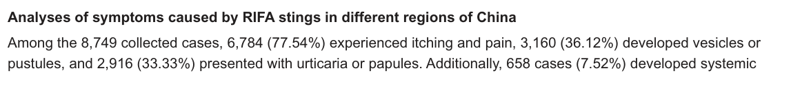

## Question

# Disease Characteristics Research Template

## Target Disease
- **Disease Name:** Fire Ant Poisoning
- **MONDO ID:** MONDO:0100341 (if available)
- **Category:** Injury

## Research Objectives

Please provide a comprehensive research report on **Fire Ant Poisoning** covering all of the
disease characteristics listed below. This report will be used to populate a disease knowledge
base entry. Be thorough and cite primary literature (PMID preferred) for all claims.

For each section, **suggested databases/resources** are listed. These are the first places
you should search for information on each topic.

---

### 1. Disease Information
> **Search first:** OMIM, Orphanet, ICD-10/ICD-11, MeSH, PubMed

- What is the disease? Provide a concise overview.
- What are the key identifiers? (OMIM, Orphanet, ICD-10/ICD-11, MeSH, Mondo)
- What are the common synonyms and alternative names?
- Is the information derived from individual patients (e.g., EHR) or aggregated disease-level resources?

### 2. Etiology

- **Disease Causal Factors**: What are the primary causes? (genetic, environmental, infectious, mechanistic)
- **Risk Factors**:
  > **Search first:** PubMed, Cochrane Library, UpToDate, clinical guidelines, ClinVar, ClinGen, GWAS Catalog, PheGenI, CTD, CDC, WHO, epidemiological databases
  - Genetic risk factors (causal variants, susceptibility loci, modifier genes)
  - Environmental risk factors (toxins, lifestyle, occupational exposures, age, sex, family history)
- **Protective Factors**:
  > **Search first:** PubMed, Cochrane Library, clinical trial databases, GWAS Catalog, gnomAD, WHO, CDC, nutrition databases
  - Genetic protective factors (protective variants, modifier alleles)
  - Environmental protective factors (diet, lifestyle, exposures that reduce risk)
- **Gene-Environment Interactions**: How do genetic and environmental factors interact to influence disease?
  > **Search first:** CTD, PubMed, PheGenI, GxE databases

### 3. Phenotypes
> **Search first:** HPO (Human Phenotype Ontology), OMIM, Orphanet, PubMed, clinicaltrials.gov, MedDRA, SNOMED CT, DECIPHER, LOINC

For each phenotype, provide:
- **Phenotype type**: symptoms, clinical signs, physical manifestations, behavioral changes, or laboratory abnormalities
  > For symptoms/signs: HPO, OMIM, Orphanet, PubMed
  > For behavioral changes: HPO, DSM, RDoC (Research Domain Criteria), PubMed
  > For laboratory abnormalities: LOINC, SNOMED CT, LabTests Online, PubMed
- **Phenotype characteristics**:
  > **Search first:** OMIM, Orphanet, HPO, PubMed
  - Age of symptom onset (neonatal, childhood, adult-onset, late-onset)
  - Symptom severity (mild, moderate, severe, variable)
  - Symptom progression (stable, progressive, episodic, fluctuating)
  - Frequency among affected individuals (percentage or qualitative)
- **Quality of life impact**: Effects on daily functioning and well-being (per-phenotype when possible)
  > **Search first:** EQ-5D database, SF-36, WHO QOL databases, PubMed
- Suggest HPO (Human Phenotype Ontology) terms for each phenotype

### 4. Genetic/Molecular Information

- **Causal Genes**: Gene mutations or chromosomal abnormalities responsible for disease (gene symbols, OMIM IDs)
  > **Search first:** OMIM, ClinVar, HGMD, Ensembl, NCBI Gene
- **Pathogenic Variants**:
  - Affected genes (gene symbols, HGNC IDs)
    > **Search first:** OMIM, NCBI Gene, Ensembl, HGNC, UniProt, GeneCards
  - Variant classification (pathogenic, likely pathogenic, VUS per ACMG/AMP guidelines)
    > **Search first:** ClinVar, ClinGen, ACMG/AMP guidelines, VarSome
  - Variant type/class (missense, frameshift, nonsense, splice-site, structural)
  - Allele frequency in population databases
    > **Search first:** gnomAD, 1000 Genomes, ExAC, TOPMed, dbSNP
  - Somatic vs germline origin
    > **Search first:** COSMIC (somatic), ClinVar, ICGC, TCGA
  - Functional consequences (loss of function, gain of function, dominant negative)
- **Modifier Genes**: Genes that modify disease severity or expression
- **Epigenetic Information**: DNA methylation, histone modifications, chromatin changes affecting disease
  > **Search first:** ENCODE, Roadmap Epigenomics, MethBase, DiseaseMeth
- **Chromosomal Abnormalities**: Large-scale genetic changes (aneuploidy, translocations, inversions)
  > **Search first:** DECIPHER, ClinVar, ECARUCA, UCSC Genome Browser

### 5. Environmental Information

- **Environmental Factors**: Non-genetic contributing factors (toxins, radiation, pollution, occupational exposure)
  > **Search first:** CTD (Comparative Toxicogenomics Database), TOXNET, PubMed, EPA databases
- **Lifestyle Factors**: Behavioral factors (smoking, diet, exercise, alcohol consumption)
  > **Search first:** CDC databases, WHO, PubMed, NHANES
- **Infectious Agents**: If applicable, pathogens causing or triggering disease (bacteria, viruses, fungi, parasites)
  > **Search first:** NCBI Taxonomy, ViPR, BV-BRC, MicrobeDB, GIDEON

### 6. Mechanism / Pathophysiology

**Present this section as an ordered causal chain first, then the detail below.**
Open with a numbered sequence of mechanistic steps running from the initiating
lesion (mutation, exposure, infection) to the clinical manifestation, one step per
line, each naming what it causes next. State the causal verb explicitly ("leads
to", "results in") and say where a step is inferred rather than demonstrated.
Where the mechanism branches, show the branch. The categories below are a
checklist of what to cover within those steps, not the organizing structure —
a step may draw on several of them, and a category may contribute to several
steps.

- **Molecular Pathways**: Specific signaling cascades or biochemical pathways involved (Wnt, MAPK, mTOR, PI3K-AKT, etc.)
  > **Search first:** KEGG, Reactome, WikiPathways, PathBank, BioCyc
- **Cellular Processes**: Cell-level mechanisms (apoptosis, autophagy, cell cycle dysregulation, inflammation, etc.)
  > **Search first:** Gene Ontology (GO), Reactome, KEGG, PubMed
- **Protein Dysfunction**: How protein structure or function is altered (misfolding, aggregation, loss of function, gain of function)
  > **Search first:** UniProt, PDB (Protein Data Bank), InterPro, Pfam, AlphaFold
- **Metabolic Changes**: Alterations in metabolic processes (energy metabolism, lipid metabolism, amino acid metabolism)
  > **Search first:** KEGG, BioCyc, HMDB (Human Metabolome Database), BRENDA
- **Immune System Involvement**: Role of immune response (autoimmunity, immunodeficiency, chronic inflammation)
  > **Search first:** ImmPort, Immunome Database, IEDB, Gene Ontology
- **Tissue Damage Mechanisms**: How tissues/ are injured (oxidative stress, ischemia, fibrosis, necrosis)
  > **Search first:** PubMed, Gene Ontology, Reactome
- **Biochemical Abnormalities**: Specific molecular defects (enzyme deficiencies, receptor dysfunction, ion channel defects)
  > **Search first:** BRENDA, UniProt, KEGG, OMIM, PubMed
- **Epigenetic Changes**: DNA methylation, histone modifications affecting gene expression in disease
  > **Search first:** ENCODE, Roadmap Epigenomics, MethBase, DiseaseMeth
- **Molecular Profiling** (if available):
  - Transcriptomics/gene expression changes
    > **Search first:** GEO (Gene Expression Omnibus), ArrayExpress, GTEx, Human Cell Atlas, SRA
  - Proteomics findings
    > **Search first:** PRIDE, ProteomeXchange, Human Protein Atlas, STRING, BioGRID
  - Metabolomics signatures
    > **Search first:** MetaboLights, Metabolomics Workbench, HMDB, METLIN
  - Lipidomics alterations
    > **Search first:** LIPID MAPS, SwissLipids, LipidHome, Metabolomics Workbench
  - Genomic structural features
    > **Search first:** UCSC Genome Browser, Ensembl, NCBI, dbVar, DGV
- **Advanced Technologies** (if applicable):
  - Single-cell analysis findings (cell-type specific mechanisms, cellular heterogeneity)
    > **Search first:** Human Cell Atlas, Single Cell Portal, GEO, CELLxGENE
  - Spatial transcriptomics findings
    > **Search first:** GEO, Spatial Research, Vizgen, 10x Genomics data
  - Multi-omics integration results
    > **Search first:** TCGA, ICGC, cBioPortal, LinkedOmics, PubMed
  - Functional genomics screens (CRISPR, RNAi)
    > **Search first:** DepMap, GenomeRNAi, PubMed, BioGRID ORCS

For each mechanism, describe:
- The causal chain from initial trigger to clinical manifestation
- Which mechanisms are upstream vs downstream
- What cell types and biological processes are involved
- Suggest GO terms for biological processes and CL terms for cell types

### 7. Anatomical Structures Affected

- **Organ Level**:
  - Primary organs directly affected
  - Secondary organ involvement (complications, secondary effects)
  - Body systems involved (cardiovascular, nervous, digestive, respiratory, endocrine, etc.)
  > **Search first:** Uberon, FMA (Foundational Model of Anatomy), OMIM, HPO, ICD-11, MeSH, SNOMED CT
- **Tissue and Cell Level**:
  - Specific tissue types affected (epithelial, connective, muscle, nervous)
  - Specific cell populations targeted (with Cell Ontology terms)
  > **Search first:** Uberon, Human Protein Atlas, Cell Ontology, Human Cell Atlas, CellMarker, PanglaoDB
- **Subcellular Level**:
  - Cellular compartments involved (mitochondria, nucleus, ER, lysosomes) (with GO Cellular Component terms)
  > **Search first:** Gene Ontology (Cellular Component), UniProt, Human Protein Atlas
- **Localization**:
  - Specific anatomical sites (with UBERON terms)
    > **Search first:** FMA, Uberon, NeuroNames (for brain), SNOMED CT
  - Lateralization (unilateral, bilateral, asymmetric)
    > **Search first:** HPO, clinical literature, imaging databases

### 8. Temporal Development

- **Onset**:
  - Typical age of onset (congenital, pediatric, adult, geriatric)
  - Onset pattern (acute, subacute, chronic, insidious)
  > **Search first:** OMIM, Orphanet, HPO, PubMed
- **Progression**:
  - Disease stages (early, intermediate, advanced, end-stage)
    > **Search first:** Cancer Staging Manual (AJCC), WHO classifications, PubMed
  - Progression rate (rapid, slow, variable)
  - Disease course pattern (episodic, relapsing-remitting, progressive, stable)
  - Disease duration (self-limited, chronic lifelong)
  > **Search first:** Disease registries, longitudinal cohort databases, natural history studies, PubMed, Orphanet, OMIM
- **Patterns**:
  - Remission patterns (spontaneous, treatment-induced)
    > **Search first:** Clinical trial databases, disease registries, PubMed
  - Critical periods (time windows of vulnerability or opportunity for intervention)
    > **Search first:** PubMed, developmental biology databases, clinical guidelines

### 9. Inheritance and Population

- **Epidemiology**:
  - Prevalence (cases per 100,000 at given time)
  - Incidence (new cases per 100,000 per year)
  > **Search first:** Orphanet, CDC, WHO, GBD (Global Burden of Disease), national registries, SEER, disease registries
- **For Genetic Etiology**:
  - Inheritance pattern (AD, AR, X-linked, mitochondrial, multifactorial, polygenic)
    > **Search first:** OMIM, Orphanet, ClinVar, GTR (Genetic Testing Registry)
  - Penetrance (complete, incomplete, age-dependent)
    > **Search first:** ClinVar, OMIM, PubMed, ClinGen
  - Expressivity (variable, consistent)
    > **Search first:** OMIM, ClinVar, PubMed
  - Genetic anticipation (increasing severity in successive generations)
    > **Search first:** OMIM, PubMed (especially for repeat expansion disorders)
  - Germline mosaicism
    > **Search first:** ClinVar, OMIM, genetic counseling literature, PubMed
  - Founder effects (population-specific mutations)
    > **Search first:** gnomAD, population genetics databases, PubMed
  - Consanguinity role
    > **Search first:** OMIM, population studies, genetic counseling resources
  - Carrier frequency
    > **Search first:** gnomAD, carrier screening databases, GeneReviews, GTR
- **Population Demographics**:
  - Affected populations (ethnic or demographic groups with higher prevalence)
    > **Search first:** gnomAD, 1000 Genomes, PAGE Study, PubMed, population registries
  - Geographic distribution (endemic areas, regional variation)
    > **Search first:** WHO, CDC, GBD, Orphanet, geographic epidemiology databases
  - Geographic distribution of specific variants
  - Sex ratio (male:female)
    > **Search first:** Disease registries, OMIM, PubMed, epidemiological databases
  - Age distribution of affected individuals
    > **Search first:** CDC, disease registries, SEER, Orphanet

### 10. Diagnostics

- **Clinical Tests**:
  - Laboratory tests (blood, urine, tissue chemistry, specific enzyme assays)
    > **Search first:** LOINC, LabTests Online, PubMed
  - Biomarkers (proteins, metabolites, genetic markers, circulating biomarkers)
    > **Search first:** FDA Biomarker List, BEST (Biomarkers, EndpointS, and other Tools), PubMed
  - Imaging studies (X-ray, CT, MRI, PET, ultrasound)
    > **Search first:** RadLex, DICOM, Radiopaedia, imaging databases
  - Functional tests (pulmonary function, cardiac stress tests)
    > **Search first:** LOINC, clinical guidelines, PubMed
  - Electrophysiology (EEG, EMG, ECG, nerve conduction studies)
    > **Search first:** LOINC, clinical neurophysiology databases, PubMed
  - Biopsy findings (histopathology, immunohistochemistry)
    > **Search first:** SNOMED CT, College of American Pathologists resources, PubMed
  - Pathology findings (microscopic examination)
    > **Search first:** SNOMED CT, Digital Pathology databases, PubMed
- **Genetic Testing**:
  > **Search first:** GTR (Genetic Testing Registry), GeneReviews, ClinGen
  - Overview of recommended genetic testing approach
  - Whole genome sequencing (WGS) utility
    > **Search first:** GTR, ClinVar, GEL (Genomics England), gnomAD
  - Whole exome sequencing (WES) utility
    > **Search first:** GTR, ClinVar, OMIM, GeneMatcher
  - Gene panels (which panels, which genes)
    > **Search first:** GTR, ClinVar, laboratory-specific databases
  - Single gene testing
    > **Search first:** GTR, ClinVar, OMIM, GeneReviews
  - Chromosomal microarray (CMA)
    > **Search first:** DECIPHER, ClinVar, dbVar, ECARUCA
  - Karyotyping
    > **Search first:** Chromosome Abnormality Database, ClinVar, cytogenetics resources
  - FISH
    > **Search first:** ClinVar, cytogenetics databases, PubMed
  - Mitochondrial DNA testing
    > **Search first:** MITOMAP, MSeqDR, ClinVar, GTR
  - Repeat expansion testing
    > **Search first:** GTR, ClinVar, repeat expansion databases, PubMed
- **Omics-Based Diagnostics** (if applicable):
  - RNA sequencing / transcriptomics
    > **Search first:** GEO, ArrayExpress, GTEx, RNA-seq databases
  - Proteomics
    > **Search first:** PRIDE, ProteomeXchange, FDA Biomarker database
  - Metabolomics
    > **Search first:** MetaboLights, Metabolomics Workbench, HMDB
  - Epigenomics
    > **Search first:** GEO, ENCODE, Roadmap Epigenomics, MethBase
  - Liquid biopsy
    > **Search first:** COSMIC, ClinVar, liquid biopsy databases, PubMed
- **Clinical Criteria**:
  - Standardized diagnostic criteria (DSM, ICD, society guidelines)
    > **Search first:** DSM-5, ICD-11, clinical society guidelines, UpToDate
  - Differential diagnosis (other conditions to rule out, with distinguishing features)
    > **Search first:** DynaMed, UpToDate, clinical decision support systems
- **Screening**:
  - Screening methods for asymptomatic individuals (newborn screening, carrier screening, cascade screening)
    > **Search first:** ACMG recommendations, CDC newborn screening, GTR

### 11. Outcome/Prognosis

- **Survival and Mortality**:
  - Survival rate (5-year, 10-year, overall)
    > **Search first:** SEER, cancer registries, disease-specific registries, PubMed
  - Life expectancy (with and without treatment if applicable)
    > **Search first:** Orphanet, disease registries, actuarial databases, PubMed
  - Mortality rate
    > **Search first:** CDC, WHO, GBD, national mortality databases
  - Disease-specific mortality (deaths directly attributable to disease)
    > **Search first:** Disease registries, CDC Wonder, GBD, PubMed
- **Morbidity and Function**:
  - Morbidity (disease-related disability and health impacts)
    > **Search first:** GBD, WHO, disability databases, PubMed
  - Disability outcomes (long-term functional impairments)
    > **Search first:** ICF (International Classification of Functioning), disability registries
  - Quality of life measures (EQ-5D, SF-36, PROMIS, disease-specific tools)
    > **Search first:** EQ-5D database, SF-36, PROMIS, PubMed
- **Disease Course**:
  - Complications (secondary problems: infections, organ failure, etc.)
    > **Search first:** ICD codes, disease registries, clinical databases, PubMed
  - Recovery potential (likelihood and extent of recovery, with vs without treatment)
    > **Search first:** Natural history studies, rehabilitation databases, PubMed
- **Prediction**:
  - Prognostic factors (age, disease severity, biomarkers, treatment response)
    > **Search first:** Prognostic models databases, clinical calculators, PubMed
  - Prognostic biomarkers (molecular markers predicting disease course)
    > **Search first:** FDA Biomarker database, PubMed, cancer prognostic databases

### 12. Treatment

- **Pharmacotherapy**:
  - Pharmacological treatments (drug names, drug classes, mechanisms of action)
    > **Search first:** DrugBank, RxNorm, ATC classification, DailyMed, FDA databases
  - Pharmacogenomics (how genetic variants affect drug metabolism, efficacy, toxicity)
    > **Search first:** PharmGKB, CPIC (Clinical Pharmacogenetics), FDA Table of PGx Biomarkers
- **Advanced Therapeutics**:
  - Gene therapy (viral vectors, CRISPR, gene replacement, gene editing)
    > **Search first:** ClinicalTrials.gov, FDA gene therapy database, ASGCT resources
  - Cell therapy (stem cell transplant, CAR-T, cellular therapeutics)
    > **Search first:** ClinicalTrials.gov, FDA cell therapy database, FACT standards
  - RNA-based therapies (ASOs, siRNA, mRNA therapies)
    > **Search first:** ClinicalTrials.gov, FDA approvals, PubMed
  - Targeted therapies (treatments directed at specific molecular targets)
    > **Search first:** My Cancer Genome, OncoKB, ClinicalTrials.gov, FDA approvals
  - Immunotherapies (checkpoint inhibitors, monoclonal antibodies)
    > **Search first:** Cancer Immunotherapy Database, FDA approvals, ClinicalTrials.gov
- **Surgical and Interventional**:
  - Surgical interventions (types of surgery, timing, outcomes)
    > **Search first:** CPT codes, surgical registries, clinical guidelines, PubMed
- **Supportive and Rehabilitative**:
  - Supportive care (symptom management, pain control, nutrition)
    > **Search first:** Clinical guidelines, Cochrane Library, PubMed
  - Rehabilitation (physical therapy, occupational therapy, speech therapy)
    > **Search first:** Rehabilitation medicine databases, clinical guidelines, PubMed
- **Experimental**:
  - Experimental treatments in clinical trials (with NCT identifiers if available)
    > **Search first:** ClinicalTrials.gov, EU Clinical Trials Register, WHO ICTRP
- **Treatment Outcomes**:
  - Treatment response rates
    > **Search first:** Clinical trial databases, FDA reviews, systematic reviews, PubMed
  - Side effects and adverse events
    > **Search first:** FDA Adverse Event Reporting System (FAERS), MedWatch, PubMed
- **Treatment Strategy**:
  - Treatment algorithms (clinical pathways, decision trees)
    > **Search first:** Clinical practice guidelines, NCCN Guidelines, UpToDate
  - Combination therapies
    > **Search first:** ClinicalTrials.gov, treatment guidelines, PubMed
  - Personalized medicine approaches (genotype-guided treatment)
    > **Search first:** My Cancer Genome, CIViC, PharmGKB, precision medicine databases

For each treatment, suggest NCIT (NCI Thesaurus) clinical-intervention terms where applicable.

### 13. Prevention

- **Prevention Levels**:
  - Primary prevention (preventing disease occurrence: vaccination, risk factor modification)
    > **Search first:** CDC, WHO, USPSTF recommendations, Cochrane Library
  - Secondary prevention (early detection and treatment: screening programs, early intervention)
    > **Search first:** USPSTF, CDC screening guidelines, WHO
  - Tertiary prevention (preventing complications in those with disease)
    > **Search first:** Clinical guidelines, disease management protocols, PubMed
- **Immunization**: Vaccine strategies (if applicable)
  > **Search first:** CDC vaccine schedules, WHO immunization, FDA vaccine database
- **Screening and Early Detection**:
  - Screening programs (population-based: newborn screening, cancer screening)
    > **Search first:** CDC screening programs, USPSTF, cancer screening databases
  - Genetic screening (carrier screening, preimplantation genetic diagnosis, prenatal testing)
    > **Search first:** ACMG recommendations, ACOG guidelines, GTR
  - Risk stratification (identifying high-risk individuals for targeted prevention)
    > **Search first:** Risk prediction models, clinical calculators, PubMed
- **Behavioral Interventions**: Lifestyle modifications to reduce risk
  > **Search first:** CDC, WHO, behavioral intervention databases, Cochrane Library
- **Counseling**: Genetic counseling (risk assessment, family planning guidance)
  > **Search first:** NSGC resources, ACMG guidelines, GeneReviews
- **Public Health**:
  - Public health interventions (sanitation, vector control, health education)
    > **Search first:** CDC, WHO, public health databases, PubMed
  - Environmental interventions (reducing environmental risk factors)
    > **Search first:** EPA databases, WHO environmental health, PubMed
- **Prophylaxis**: Preventive medications or procedures
  > **Search first:** Clinical guidelines, FDA approvals, PubMed

### 14. Other Species / Natural Disease

- **Taxonomy**: Species affected (with NCBI Taxon identifiers)
  > **Search first:** NCBI Taxonomy
- **Breed**: Specific breeds affected (with VBO identifiers if applicable)
  > **Search first:** VBO (Vertebrate Breed Ontology)
- **Gene**: Orthologous genes in other species (with NCBI Gene IDs)
  > **Search first:** NCBI Gene
- **Natural Disease**:
  - Naturally occurring disease in other species (companion animals, wildlife)
    > **Search first:** OMIA (Online Mendelian Inheritance in Animals), VetCompass, PubMed
  - Veterinary relevance and importance in animal health
    > **Search first:** OMIA, veterinary databases, PubMed
- **Comparative Biology**:
  - Comparative pathology (similarities and differences across species)
    > **Search first:** OMIA, comparative pathology databases, PubMed
  - Evolutionary conservation of disease mechanisms
    > **Search first:** HomoloGene, OrthoMCL, Alliance of Genome Resources
- **Transmission** (if applicable):
  - Zoonotic potential
    > **Search first:** CDC zoonotic diseases, WHO zoonoses, GIDEON
  - Cross-species susceptibility
    > **Search first:** NCBI Taxonomy, veterinary databases, PubMed

### 15. Model Organisms

- **Model Types**:
  - Model organism type (mammalian, invertebrate, cellular, in vitro)
    > **Search first:** Alliance of Genome Resources, model organism databases
  - Specific model systems (mouse, rat, zebrafish, Drosophila, C. elegans, yeast, cell lines, organoids, iPSCs)
    > **Search first:** MGI, RGD, ZFIN, FlyBase, WormBase, SGD, ATCC, Cellosaurus
  - Induced models (drug treatment, surgical intervention, environmental manipulation)
    > **Search first:** MGI, model organism databases, PubMed
- **Genetic Models**:
  - Types available (knockout, knock-in, transgenic, conditional, humanized)
    > **Search first:** MGI, IMPC, KOMP, EuMMCR, IMSR
- **Model Characteristics**:
  - Phenotype recapitulation (how well model reproduces human disease features)
    > **Search first:** Model organism databases, comparative studies, PubMed
  - Model limitations (aspects of human disease not captured)
    > **Search first:** Model organism databases, PubMed, review articles
- **Applications**:
  - Research applications (what aspects of disease can be studied)
    > **Search first:** Model organism databases, PubMed
- **Resources**:
  - Model databases
    > **Search first:** MGI, RGD, ZFIN, FlyBase, WormBase, IMSR, EMMA, MMRRC

---

## Citation Requirements

- Cite primary literature (PMID preferred) for all mechanistic and clinical claims
- Prioritize recent reviews and landmark papers
- Include direct quotes from abstracts where possible to support key statements
- Distinguish evidence source types: human clinical, model organism, in vitro, computational

## Output Format

Structure your response as a comprehensive narrative organized by the sections above.
For each section, provide:
- Factual content with specific details (numbers, percentages, gene names, variant nomenclature)
- Ontology term suggestions (HPO, GO, CL, UBERON, CHEBI, NCIT, MONDO) where applicable
- Evidence citations with PMIDs
- Direct quotes from abstracts to support key claims
- Clear indication when information is not available or not applicable for this disease

This report will be used to populate a disease knowledge base entry with:
- Pathophysiology descriptions with causal chains
- Gene/protein annotations (HGNC, GO terms)
- Phenotype associations (HP terms) with frequencies
- Cell type involvement (CL terms)
- Anatomical locations (UBERON terms)
- Chemical entities (CHEBI terms)
- Treatment annotations (NCIT terms)
- Evidence items with PMIDs and exact abstract quotes
- Epidemiology, prognosis, diagnostic, and prevention information
- Animal model descriptions with phenotype recapitulation details

## Output

Question: You are an expert researcher providing comprehensive, well-cited information.

Provide detailed information focusing on:
1. Key concepts and definitions with current understanding
2. Recent developments and latest research (prioritize 2023-2024 sources)
3. Current applications and real-world implementations
4. Expert opinions and analysis from authoritative sources
5. Relevant statistics and data from recent studies

Format as a comprehensive research report with proper citations. Include URLs and publication dates where available.
Always prioritize recent, authoritative sources and provide specific citations for all major claims.

# Disease Characteristics Research Template

## Target Disease
- **Disease Name:** Fire Ant Poisoning
- **MONDO ID:** MONDO:0100341 (if available)
- **Category:** Injury

## Research Objectives

Please provide a comprehensive research report on **Fire Ant Poisoning** covering all of the
disease characteristics listed below. This report will be used to populate a disease knowledge
base entry. Be thorough and cite primary literature (PMID preferred) for all claims.

For each section, **suggested databases/resources** are listed. These are the first places
you should search for information on each topic.

---

### 1. Disease Information
> **Search first:** OMIM, Orphanet, ICD-10/ICD-11, MeSH, PubMed

- What is the disease? Provide a concise overview.
- What are the key identifiers? (OMIM, Orphanet, ICD-10/ICD-11, MeSH, Mondo)
- What are the common synonyms and alternative names?
- Is the information derived from individual patients (e.g., EHR) or aggregated disease-level resources?

### 2. Etiology

- **Disease Causal Factors**: What are the primary causes? (genetic, environmental, infectious, mechanistic)
- **Risk Factors**:
  > **Search first:** PubMed, Cochrane Library, UpToDate, clinical guidelines, ClinVar, ClinGen, GWAS Catalog, PheGenI, CTD, CDC, WHO, epidemiological databases
  - Genetic risk factors (causal variants, susceptibility loci, modifier genes)
  - Environmental risk factors (toxins, lifestyle, occupational exposures, age, sex, family history)
- **Protective Factors**:
  > **Search first:** PubMed, Cochrane Library, clinical trial databases, GWAS Catalog, gnomAD, WHO, CDC, nutrition databases
  - Genetic protective factors (protective variants, modifier alleles)
  - Environmental protective factors (diet, lifestyle, exposures that reduce risk)
- **Gene-Environment Interactions**: How do genetic and environmental factors interact to influence disease?
  > **Search first:** CTD, PubMed, PheGenI, GxE databases

### 3. Phenotypes
> **Search first:** HPO (Human Phenotype Ontology), OMIM, Orphanet, PubMed, clinicaltrials.gov, MedDRA, SNOMED CT, DECIPHER, LOINC

For each phenotype, provide:
- **Phenotype type**: symptoms, clinical signs, physical manifestations, behavioral changes, or laboratory abnormalities
  > For symptoms/signs: HPO, OMIM, Orphanet, PubMed
  > For behavioral changes: HPO, DSM, RDoC (Research Domain Criteria), PubMed
  > For laboratory abnormalities: LOINC, SNOMED CT, LabTests Online, PubMed
- **Phenotype characteristics**:
  > **Search first:** OMIM, Orphanet, HPO, PubMed
  - Age of symptom onset (neonatal, childhood, adult-onset, late-onset)
  - Symptom severity (mild, moderate, severe, variable)
  - Symptom progression (stable, progressive, episodic, fluctuating)
  - Frequency among affected individuals (percentage or qualitative)
- **Quality of life impact**: Effects on daily functioning and well-being (per-phenotype when possible)
  > **Search first:** EQ-5D database, SF-36, WHO QOL databases, PubMed
- Suggest HPO (Human Phenotype Ontology) terms for each phenotype

### 4. Genetic/Molecular Information

- **Causal Genes**: Gene mutations or chromosomal abnormalities responsible for disease (gene symbols, OMIM IDs)
  > **Search first:** OMIM, ClinVar, HGMD, Ensembl, NCBI Gene
- **Pathogenic Variants**:
  - Affected genes (gene symbols, HGNC IDs)
    > **Search first:** OMIM, NCBI Gene, Ensembl, HGNC, UniProt, GeneCards
  - Variant classification (pathogenic, likely pathogenic, VUS per ACMG/AMP guidelines)
    > **Search first:** ClinVar, ClinGen, ACMG/AMP guidelines, VarSome
  - Variant type/class (missense, frameshift, nonsense, splice-site, structural)
  - Allele frequency in population databases
    > **Search first:** gnomAD, 1000 Genomes, ExAC, TOPMed, dbSNP
  - Somatic vs germline origin
    > **Search first:** COSMIC (somatic), ClinVar, ICGC, TCGA
  - Functional consequences (loss of function, gain of function, dominant negative)
- **Modifier Genes**: Genes that modify disease severity or expression
- **Epigenetic Information**: DNA methylation, histone modifications, chromatin changes affecting disease
  > **Search first:** ENCODE, Roadmap Epigenomics, MethBase, DiseaseMeth
- **Chromosomal Abnormalities**: Large-scale genetic changes (aneuploidy, translocations, inversions)
  > **Search first:** DECIPHER, ClinVar, ECARUCA, UCSC Genome Browser

### 5. Environmental Information

- **Environmental Factors**: Non-genetic contributing factors (toxins, radiation, pollution, occupational exposure)
  > **Search first:** CTD (Comparative Toxicogenomics Database), TOXNET, PubMed, EPA databases
- **Lifestyle Factors**: Behavioral factors (smoking, diet, exercise, alcohol consumption)
  > **Search first:** CDC databases, WHO, PubMed, NHANES
- **Infectious Agents**: If applicable, pathogens causing or triggering disease (bacteria, viruses, fungi, parasites)
  > **Search first:** NCBI Taxonomy, ViPR, BV-BRC, MicrobeDB, GIDEON

### 6. Mechanism / Pathophysiology

**Present this section as an ordered causal chain first, then the detail below.**
Open with a numbered sequence of mechanistic steps running from the initiating
lesion (mutation, exposure, infection) to the clinical manifestation, one step per
line, each naming what it causes next. State the causal verb explicitly ("leads
to", "results in") and say where a step is inferred rather than demonstrated.
Where the mechanism branches, show the branch. The categories below are a
checklist of what to cover within those steps, not the organizing structure —
a step may draw on several of them, and a category may contribute to several
steps.

- **Molecular Pathways**: Specific signaling cascades or biochemical pathways involved (Wnt, MAPK, mTOR, PI3K-AKT, etc.)
  > **Search first:** KEGG, Reactome, WikiPathways, PathBank, BioCyc
- **Cellular Processes**: Cell-level mechanisms (apoptosis, autophagy, cell cycle dysregulation, inflammation, etc.)
  > **Search first:** Gene Ontology (GO), Reactome, KEGG, PubMed
- **Protein Dysfunction**: How protein structure or function is altered (misfolding, aggregation, loss of function, gain of function)
  > **Search first:** UniProt, PDB (Protein Data Bank), InterPro, Pfam, AlphaFold
- **Metabolic Changes**: Alterations in metabolic processes (energy metabolism, lipid metabolism, amino acid metabolism)
  > **Search first:** KEGG, BioCyc, HMDB (Human Metabolome Database), BRENDA
- **Immune System Involvement**: Role of immune response (autoimmunity, immunodeficiency, chronic inflammation)
  > **Search first:** ImmPort, Immunome Database, IEDB, Gene Ontology
- **Tissue Damage Mechanisms**: How tissues/ are injured (oxidative stress, ischemia, fibrosis, necrosis)
  > **Search first:** PubMed, Gene Ontology, Reactome
- **Biochemical Abnormalities**: Specific molecular defects (enzyme deficiencies, receptor dysfunction, ion channel defects)
  > **Search first:** BRENDA, UniProt, KEGG, OMIM, PubMed
- **Epigenetic Changes**: DNA methylation, histone modifications affecting gene expression in disease
  > **Search first:** ENCODE, Roadmap Epigenomics, MethBase, DiseaseMeth
- **Molecular Profiling** (if available):
  - Transcriptomics/gene expression changes
    > **Search first:** GEO (Gene Expression Omnibus), ArrayExpress, GTEx, Human Cell Atlas, SRA
  - Proteomics findings
    > **Search first:** PRIDE, ProteomeXchange, Human Protein Atlas, STRING, BioGRID
  - Metabolomics signatures
    > **Search first:** MetaboLights, Metabolomics Workbench, HMDB, METLIN
  - Lipidomics alterations
    > **Search first:** LIPID MAPS, SwissLipids, LipidHome, Metabolomics Workbench
  - Genomic structural features
    > **Search first:** UCSC Genome Browser, Ensembl, NCBI, dbVar, DGV
- **Advanced Technologies** (if applicable):
  - Single-cell analysis findings (cell-type specific mechanisms, cellular heterogeneity)
    > **Search first:** Human Cell Atlas, Single Cell Portal, GEO, CELLxGENE
  - Spatial transcriptomics findings
    > **Search first:** GEO, Spatial Research, Vizgen, 10x Genomics data
  - Multi-omics integration results
    > **Search first:** TCGA, ICGC, cBioPortal, LinkedOmics, PubMed
  - Functional genomics screens (CRISPR, RNAi)
    > **Search first:** DepMap, GenomeRNAi, PubMed, BioGRID ORCS

For each mechanism, describe:
- The causal chain from initial trigger to clinical manifestation
- Which mechanisms are upstream vs downstream
- What cell types and biological processes are involved
- Suggest GO terms for biological processes and CL terms for cell types

### 7. Anatomical Structures Affected

- **Organ Level**:
  - Primary organs directly affected
  - Secondary organ involvement (complications, secondary effects)
  - Body systems involved (cardiovascular, nervous, digestive, respiratory, endocrine, etc.)
  > **Search first:** Uberon, FMA (Foundational Model of Anatomy), OMIM, HPO, ICD-11, MeSH, SNOMED CT
- **Tissue and Cell Level**:
  - Specific tissue types affected (epithelial, connective, muscle, nervous)
  - Specific cell populations targeted (with Cell Ontology terms)
  > **Search first:** Uberon, Human Protein Atlas, Cell Ontology, Human Cell Atlas, CellMarker, PanglaoDB
- **Subcellular Level**:
  - Cellular compartments involved (mitochondria, nucleus, ER, lysosomes) (with GO Cellular Component terms)
  > **Search first:** Gene Ontology (Cellular Component), UniProt, Human Protein Atlas
- **Localization**:
  - Specific anatomical sites (with UBERON terms)
    > **Search first:** FMA, Uberon, NeuroNames (for brain), SNOMED CT
  - Lateralization (unilateral, bilateral, asymmetric)
    > **Search first:** HPO, clinical literature, imaging databases

### 8. Temporal Development

- **Onset**:
  - Typical age of onset (congenital, pediatric, adult, geriatric)
  - Onset pattern (acute, subacute, chronic, insidious)
  > **Search first:** OMIM, Orphanet, HPO, PubMed
- **Progression**:
  - Disease stages (early, intermediate, advanced, end-stage)
    > **Search first:** Cancer Staging Manual (AJCC), WHO classifications, PubMed
  - Progression rate (rapid, slow, variable)
  - Disease course pattern (episodic, relapsing-remitting, progressive, stable)
  - Disease duration (self-limited, chronic lifelong)
  > **Search first:** Disease registries, longitudinal cohort databases, natural history studies, PubMed, Orphanet, OMIM
- **Patterns**:
  - Remission patterns (spontaneous, treatment-induced)
    > **Search first:** Clinical trial databases, disease registries, PubMed
  - Critical periods (time windows of vulnerability or opportunity for intervention)
    > **Search first:** PubMed, developmental biology databases, clinical guidelines

### 9. Inheritance and Population

- **Epidemiology**:
  - Prevalence (cases per 100,000 at given time)
  - Incidence (new cases per 100,000 per year)
  > **Search first:** Orphanet, CDC, WHO, GBD (Global Burden of Disease), national registries, SEER, disease registries
- **For Genetic Etiology**:
  - Inheritance pattern (AD, AR, X-linked, mitochondrial, multifactorial, polygenic)
    > **Search first:** OMIM, Orphanet, ClinVar, GTR (Genetic Testing Registry)
  - Penetrance (complete, incomplete, age-dependent)
    > **Search first:** ClinVar, OMIM, PubMed, ClinGen
  - Expressivity (variable, consistent)
    > **Search first:** OMIM, ClinVar, PubMed
  - Genetic anticipation (increasing severity in successive generations)
    > **Search first:** OMIM, PubMed (especially for repeat expansion disorders)
  - Germline mosaicism
    > **Search first:** ClinVar, OMIM, genetic counseling literature, PubMed
  - Founder effects (population-specific mutations)
    > **Search first:** gnomAD, population genetics databases, PubMed
  - Consanguinity role
    > **Search first:** OMIM, population studies, genetic counseling resources
  - Carrier frequency
    > **Search first:** gnomAD, carrier screening databases, GeneReviews, GTR
- **Population Demographics**:
  - Affected populations (ethnic or demographic groups with higher prevalence)
    > **Search first:** gnomAD, 1000 Genomes, PAGE Study, PubMed, population registries
  - Geographic distribution (endemic areas, regional variation)
    > **Search first:** WHO, CDC, GBD, Orphanet, geographic epidemiology databases
  - Geographic distribution of specific variants
  - Sex ratio (male:female)
    > **Search first:** Disease registries, OMIM, PubMed, epidemiological databases
  - Age distribution of affected individuals
    > **Search first:** CDC, disease registries, SEER, Orphanet

### 10. Diagnostics

- **Clinical Tests**:
  - Laboratory tests (blood, urine, tissue chemistry, specific enzyme assays)
    > **Search first:** LOINC, LabTests Online, PubMed
  - Biomarkers (proteins, metabolites, genetic markers, circulating biomarkers)
    > **Search first:** FDA Biomarker List, BEST (Biomarkers, EndpointS, and other Tools), PubMed
  - Imaging studies (X-ray, CT, MRI, PET, ultrasound)
    > **Search first:** RadLex, DICOM, Radiopaedia, imaging databases
  - Functional tests (pulmonary function, cardiac stress tests)
    > **Search first:** LOINC, clinical guidelines, PubMed
  - Electrophysiology (EEG, EMG, ECG, nerve conduction studies)
    > **Search first:** LOINC, clinical neurophysiology databases, PubMed
  - Biopsy findings (histopathology, immunohistochemistry)
    > **Search first:** SNOMED CT, College of American Pathologists resources, PubMed
  - Pathology findings (microscopic examination)
    > **Search first:** SNOMED CT, Digital Pathology databases, PubMed
- **Genetic Testing**:
  > **Search first:** GTR (Genetic Testing Registry), GeneReviews, ClinGen
  - Overview of recommended genetic testing approach
  - Whole genome sequencing (WGS) utility
    > **Search first:** GTR, ClinVar, GEL (Genomics England), gnomAD
  - Whole exome sequencing (WES) utility
    > **Search first:** GTR, ClinVar, OMIM, GeneMatcher
  - Gene panels (which panels, which genes)
    > **Search first:** GTR, ClinVar, laboratory-specific databases
  - Single gene testing
    > **Search first:** GTR, ClinVar, OMIM, GeneReviews
  - Chromosomal microarray (CMA)
    > **Search first:** DECIPHER, ClinVar, dbVar, ECARUCA
  - Karyotyping
    > **Search first:** Chromosome Abnormality Database, ClinVar, cytogenetics resources
  - FISH
    > **Search first:** ClinVar, cytogenetics databases, PubMed
  - Mitochondrial DNA testing
    > **Search first:** MITOMAP, MSeqDR, ClinVar, GTR
  - Repeat expansion testing
    > **Search first:** GTR, ClinVar, repeat expansion databases, PubMed
- **Omics-Based Diagnostics** (if applicable):
  - RNA sequencing / transcriptomics
    > **Search first:** GEO, ArrayExpress, GTEx, RNA-seq databases
  - Proteomics
    > **Search first:** PRIDE, ProteomeXchange, FDA Biomarker database
  - Metabolomics
    > **Search first:** MetaboLights, Metabolomics Workbench, HMDB
  - Epigenomics
    > **Search first:** GEO, ENCODE, Roadmap Epigenomics, MethBase
  - Liquid biopsy
    > **Search first:** COSMIC, ClinVar, liquid biopsy databases, PubMed
- **Clinical Criteria**:
  - Standardized diagnostic criteria (DSM, ICD, society guidelines)
    > **Search first:** DSM-5, ICD-11, clinical society guidelines, UpToDate
  - Differential diagnosis (other conditions to rule out, with distinguishing features)
    > **Search first:** DynaMed, UpToDate, clinical decision support systems
- **Screening**:
  - Screening methods for asymptomatic individuals (newborn screening, carrier screening, cascade screening)
    > **Search first:** ACMG recommendations, CDC newborn screening, GTR

### 11. Outcome/Prognosis

- **Survival and Mortality**:
  - Survival rate (5-year, 10-year, overall)
    > **Search first:** SEER, cancer registries, disease-specific registries, PubMed
  - Life expectancy (with and without treatment if applicable)
    > **Search first:** Orphanet, disease registries, actuarial databases, PubMed
  - Mortality rate
    > **Search first:** CDC, WHO, GBD, national mortality databases
  - Disease-specific mortality (deaths directly attributable to disease)
    > **Search first:** Disease registries, CDC Wonder, GBD, PubMed
- **Morbidity and Function**:
  - Morbidity (disease-related disability and health impacts)
    > **Search first:** GBD, WHO, disability databases, PubMed
  - Disability outcomes (long-term functional impairments)
    > **Search first:** ICF (International Classification of Functioning), disability registries
  - Quality of life measures (EQ-5D, SF-36, PROMIS, disease-specific tools)
    > **Search first:** EQ-5D database, SF-36, PROMIS, PubMed
- **Disease Course**:
  - Complications (secondary problems: infections, organ failure, etc.)
    > **Search first:** ICD codes, disease registries, clinical databases, PubMed
  - Recovery potential (likelihood and extent of recovery, with vs without treatment)
    > **Search first:** Natural history studies, rehabilitation databases, PubMed
- **Prediction**:
  - Prognostic factors (age, disease severity, biomarkers, treatment response)
    > **Search first:** Prognostic models databases, clinical calculators, PubMed
  - Prognostic biomarkers (molecular markers predicting disease course)
    > **Search first:** FDA Biomarker database, PubMed, cancer prognostic databases

### 12. Treatment

- **Pharmacotherapy**:
  - Pharmacological treatments (drug names, drug classes, mechanisms of action)
    > **Search first:** DrugBank, RxNorm, ATC classification, DailyMed, FDA databases
  - Pharmacogenomics (how genetic variants affect drug metabolism, efficacy, toxicity)
    > **Search first:** PharmGKB, CPIC (Clinical Pharmacogenetics), FDA Table of PGx Biomarkers
- **Advanced Therapeutics**:
  - Gene therapy (viral vectors, CRISPR, gene replacement, gene editing)
    > **Search first:** ClinicalTrials.gov, FDA gene therapy database, ASGCT resources
  - Cell therapy (stem cell transplant, CAR-T, cellular therapeutics)
    > **Search first:** ClinicalTrials.gov, FDA cell therapy database, FACT standards
  - RNA-based therapies (ASOs, siRNA, mRNA therapies)
    > **Search first:** ClinicalTrials.gov, FDA approvals, PubMed
  - Targeted therapies (treatments directed at specific molecular targets)
    > **Search first:** My Cancer Genome, OncoKB, ClinicalTrials.gov, FDA approvals
  - Immunotherapies (checkpoint inhibitors, monoclonal antibodies)
    > **Search first:** Cancer Immunotherapy Database, FDA approvals, ClinicalTrials.gov
- **Surgical and Interventional**:
  - Surgical interventions (types of surgery, timing, outcomes)
    > **Search first:** CPT codes, surgical registries, clinical guidelines, PubMed
- **Supportive and Rehabilitative**:
  - Supportive care (symptom management, pain control, nutrition)
    > **Search first:** Clinical guidelines, Cochrane Library, PubMed
  - Rehabilitation (physical therapy, occupational therapy, speech therapy)
    > **Search first:** Rehabilitation medicine databases, clinical guidelines, PubMed
- **Experimental**:
  - Experimental treatments in clinical trials (with NCT identifiers if available)
    > **Search first:** ClinicalTrials.gov, EU Clinical Trials Register, WHO ICTRP
- **Treatment Outcomes**:
  - Treatment response rates
    > **Search first:** Clinical trial databases, FDA reviews, systematic reviews, PubMed
  - Side effects and adverse events
    > **Search first:** FDA Adverse Event Reporting System (FAERS), MedWatch, PubMed
- **Treatment Strategy**:
  - Treatment algorithms (clinical pathways, decision trees)
    > **Search first:** Clinical practice guidelines, NCCN Guidelines, UpToDate
  - Combination therapies
    > **Search first:** ClinicalTrials.gov, treatment guidelines, PubMed
  - Personalized medicine approaches (genotype-guided treatment)
    > **Search first:** My Cancer Genome, CIViC, PharmGKB, precision medicine databases

For each treatment, suggest NCIT (NCI Thesaurus) clinical-intervention terms where applicable.

### 13. Prevention

- **Prevention Levels**:
  - Primary prevention (preventing disease occurrence: vaccination, risk factor modification)
    > **Search first:** CDC, WHO, USPSTF recommendations, Cochrane Library
  - Secondary prevention (early detection and treatment: screening programs, early intervention)
    > **Search first:** USPSTF, CDC screening guidelines, WHO
  - Tertiary prevention (preventing complications in those with disease)
    > **Search first:** Clinical guidelines, disease management protocols, PubMed
- **Immunization**: Vaccine strategies (if applicable)
  > **Search first:** CDC vaccine schedules, WHO immunization, FDA vaccine database
- **Screening and Early Detection**:
  - Screening programs (population-based: newborn screening, cancer screening)
    > **Search first:** CDC screening programs, USPSTF, cancer screening databases
  - Genetic screening (carrier screening, preimplantation genetic diagnosis, prenatal testing)
    > **Search first:** ACMG recommendations, ACOG guidelines, GTR
  - Risk stratification (identifying high-risk individuals for targeted prevention)
    > **Search first:** Risk prediction models, clinical calculators, PubMed
- **Behavioral Interventions**: Lifestyle modifications to reduce risk
  > **Search first:** CDC, WHO, behavioral intervention databases, Cochrane Library
- **Counseling**: Genetic counseling (risk assessment, family planning guidance)
  > **Search first:** NSGC resources, ACMG guidelines, GeneReviews
- **Public Health**:
  - Public health interventions (sanitation, vector control, health education)
    > **Search first:** CDC, WHO, public health databases, PubMed
  - Environmental interventions (reducing environmental risk factors)
    > **Search first:** EPA databases, WHO environmental health, PubMed
- **Prophylaxis**: Preventive medications or procedures
  > **Search first:** Clinical guidelines, FDA approvals, PubMed

### 14. Other Species / Natural Disease

- **Taxonomy**: Species affected (with NCBI Taxon identifiers)
  > **Search first:** NCBI Taxonomy
- **Breed**: Specific breeds affected (with VBO identifiers if applicable)
  > **Search first:** VBO (Vertebrate Breed Ontology)
- **Gene**: Orthologous genes in other species (with NCBI Gene IDs)
  > **Search first:** NCBI Gene
- **Natural Disease**:
  - Naturally occurring disease in other species (companion animals, wildlife)
    > **Search first:** OMIA (Online Mendelian Inheritance in Animals), VetCompass, PubMed
  - Veterinary relevance and importance in animal health
    > **Search first:** OMIA, veterinary databases, PubMed
- **Comparative Biology**:
  - Comparative pathology (similarities and differences across species)
    > **Search first:** OMIA, comparative pathology databases, PubMed
  - Evolutionary conservation of disease mechanisms
    > **Search first:** HomoloGene, OrthoMCL, Alliance of Genome Resources
- **Transmission** (if applicable):
  - Zoonotic potential
    > **Search first:** CDC zoonotic diseases, WHO zoonoses, GIDEON
  - Cross-species susceptibility
    > **Search first:** NCBI Taxonomy, veterinary databases, PubMed

### 15. Model Organisms

- **Model Types**:
  - Model organism type (mammalian, invertebrate, cellular, in vitro)
    > **Search first:** Alliance of Genome Resources, model organism databases
  - Specific model systems (mouse, rat, zebrafish, Drosophila, C. elegans, yeast, cell lines, organoids, iPSCs)
    > **Search first:** MGI, RGD, ZFIN, FlyBase, WormBase, SGD, ATCC, Cellosaurus
  - Induced models (drug treatment, surgical intervention, environmental manipulation)
    > **Search first:** MGI, model organism databases, PubMed
- **Genetic Models**:
  - Types available (knockout, knock-in, transgenic, conditional, humanized)
    > **Search first:** MGI, IMPC, KOMP, EuMMCR, IMSR
- **Model Characteristics**:
  - Phenotype recapitulation (how well model reproduces human disease features)
    > **Search first:** Model organism databases, comparative studies, PubMed
  - Model limitations (aspects of human disease not captured)
    > **Search first:** Model organism databases, PubMed, review articles
- **Applications**:
  - Research applications (what aspects of disease can be studied)
    > **Search first:** Model organism databases, PubMed
- **Resources**:
  - Model databases
    > **Search first:** MGI, RGD, ZFIN, FlyBase, WormBase, IMSR, EMMA, MMRRC

---

## Citation Requirements

- Cite primary literature (PMID preferred) for all mechanistic and clinical claims
- Prioritize recent reviews and landmark papers
- Include direct quotes from abstracts where possible to support key statements
- Distinguish evidence source types: human clinical, model organism, in vitro, computational

## Output Format

Structure your response as a comprehensive narrative organized by the sections above.
For each section, provide:
- Factual content with specific details (numbers, percentages, gene names, variant nomenclature)
- Ontology term suggestions (HPO, GO, CL, UBERON, CHEBI, NCIT, MONDO) where applicable
- Evidence citations with PMIDs
- Direct quotes from abstracts to support key claims
- Clear indication when information is not available or not applicable for this disease

This report will be used to populate a disease knowledge base entry with:
- Pathophysiology descriptions with causal chains
- Gene/protein annotations (HGNC, GO terms)
- Phenotype associations (HP terms) with frequencies
- Cell type involvement (CL terms)
- Anatomical locations (UBERON terms)
- Chemical entities (CHEBI terms)
- Treatment annotations (NCIT terms)
- Evidence items with PMIDs and exact abstract quotes
- Epidemiology, prognosis, diagnostic, and prevention information
- Animal model descriptions with phenotype recapitulation details

# Fire ant poisoning: disease-characteristics research report

**Scope and evidence standard (6 October 2026).** “Fire ant poisoning” is best treated as an **acute, exposure-dependent sting/envenomation injury**, not a single inherited disorder. The best-described agents are *Solenopsis invicta* (red imported fire ant), *S. richteri* (black imported fire ant), and, in some regions, *S. geminata*. Direct venom toxicity and allergic reactions can occur separately or together. Much of the precise human evidence concerns imported fire ants; findings for one species should not automatically be transferred to another. This synthesis prioritizes original human cohorts, an experimental mouse study, and 2023–2024 reviews; **DOIs are supplied where the retrieved sources did not verify PMIDs**. Suggested ontology *labels* below are mappings for curator verification, not assertions that a particular accession exists. (mcmurray2025fireantvenomanaphylaxis pages 2-3, sukprasert2012characterizationofthe pages 1-3, dioguardi2024therapeuticpotentialof pages 4-6)

## 1. Disease information and identifiers

A worker ant anchors itself with its jaws and injects venom with an abdominal stinger, potentially stinging repeatedly. The characteristic presentation is immediate local burning pain and erythema, followed by wheal, swelling and sometimes a sterile pustule. A susceptible person can instead, or also, develop a rapid systemic allergic reaction, including anaphylaxis. Appropriate synonyms include **fire-ant sting**, **fire-ant envenomation**, **imported-fire-ant sting reaction**, **red-imported-fire-ant envenomation** and, specifically for immune disease, **fire-ant venom allergy**; “bite” is common colloquial usage but is less precise for venom injection. (dioguardi2024therapeuticpotentialof pages 2-4, dioguardi2024therapeuticpotentialof pages 4-6, rodrigo2018immunotherapyinanaphylaxis pages 1-2)

**Identifiers:** The requested **MONDO:0100341** is a *candidate supplied by the requester*, not independently verified as a current MONDO record in the retrieved material. MeSH **D007299, “Insect Bites and Stings,”** is verified in a ClinicalTrials.gov record and is broader than fire-ant poisoning. An exact species-specific ICD-10-CM/ICD-11 code, OMIM entry, Orphanet entry, disease-specific MeSH descriptor, SNOMED CT concept and formal HPO association were **not independently verified**; do not fabricate them. One human prevalence study found that using nonspecific Hymenoptera allergy ICD-10 codes alone substantially misclassified patients: only 36 of 150 reviewed records documented actual venom anaphylaxis. (NCT00435552 chunk 1, mcmurray2025fireantvenomanaphylaxis pages 5-7)

**Data provenance:** This entry synthesizes *aggregated published cohorts, an individual-patient clinical cohort, experimental work and review literature*. It is **not** a claim to have accessed the knowledge-base user's EHRs. A TRICARE analysis used administrative records with sampled chart validation, whereas a Brazilian immunotherapy study followed 33 clinically identified patients. (mcmurray2025fireantvenomanaphylaxis pages 1-2, watanabe2022clinicalandlaboratory pages 1-4)

## 2. Etiology, risks and protective factors

**Necessary cause:** Contact with, and venom injection by, a stinging fire ant. *S. invicta* venom is predominantly water-insoluble piperidine alkaloids, particularly solenopsins; smaller protein fractions include the allergenic Sol i 1–4 components. Estimates of **approximately 95% alkaloids** and **10–100 ng protein per sting** come from compositional literature, not a measured dose for every patient. *S. geminata* has a related but nonidentical allergen, Sol gem 2. No infectious organism or primary human germline mutation is required. (sukprasert2012characterizationofthe pages 1-3, dioguardi2024therapeuticpotentialof pages 4-6)

**Exposure risk** rises with outdoor work, agriculture, infested urban green space, nest disturbance, repeated stings and expanding ant range. Immobility, very young or older age, cognitive impairment and flooding can increase opportunities for high-dose encounters; these are exposure/vulnerability factors, not proven fire-ant-specific genotype effects. **Systemic mastocytosis** is an important host condition to consider after severe reactions: among 97 persons with systemic mastocytosis or monoclonal mast-cell activation syndrome in a selected U.S. cohort, 14 had a fire-ant anaphylaxis history. This selected denominator must not be treated as risk among all stung persons. Existing sensitization permits IgE-mediated responses on subsequent exposure. (chen2026analysisofthe pages 2-4, mcmurray2025fireantvenomanaphylaxis pages 7-9, mcmurray2025fireantvenomanaphylaxis pages 9-10)

**Protection** is principally avoidance of occupied nests and repeated stings, rapid recognition and treatment of systemic reactions, ready access to prescribed epinephrine for people with prior anaphylaxis, and specialist whole-body-extract immunotherapy after an appropriate allergic evaluation. Evidence for a protective human allele, diet, supplement or established pharmacogenomic intervention specific to this injury was not retrieved. The plausible gene–environment interaction is that mast-cell disease alters the response to venom exposure; it does **not** turn envenomation into a Mendelian disorder. (watanabe2022clinicalandlaboratory pages 1-4, mcmurray2025fireantvenomanaphylaxis pages 7-9, rodrigo2018immunotherapyinanaphylaxis pages 4-5)

## 3. Phenotypes and quality-of-life impact

Clinical phenotypes occur at **any age after exposure**, with acute onset and highly variable severity. Immediate pain/wheal can evolve into local pruritus and a sterile pustule within approximately a day; large local reactions can last up to 72 hours. Systemic urticaria, respiratory compromise and cardiovascular shock require urgent assessment. Severe multi-sting toxicity, reported complications including rhabdomyolysis and acute kidney injury, and unusual eye injury should be documented separately from uncomplicated pustulation. Neither behavioral change nor a characteristic routine blood-test abnormality is an obligatory manifestation. (dioguardi2024therapeuticpotentialof pages 4-6, rodrigo2018immunotherapyinanaphylaxis pages 1-2, guillet2022partiinsect pages 3-4, chen2026analysisofthe pages 1-2)

The largest retrieved symptom compilation is a **2026 China analysis** combining published reports, news and hospital cases. Its categories overlap and describe recorded cases, **not the prevalence among all stung residents**. The paper's results text and inspected image support the following counts; suggested HPO labels require curatorial verification. (chen2026analysisofthe pages 2-4, chen2026analysisofthe pages 6-8, chen2026analysisofthe media 303ec5e0)

| Phenotype | Patients / 8,749 | Reported percent | Suggested HPO term label |
|---|---:|---:|---|
| Itching and pain | 6,784 | 77.54% | Pruritus; Pain |
| Vesicles or pustules | 3,160 | 36.12% | Vesicle; Pustule |
| Urticaria or papules | 2,916 | 33.33% | Urticaria; Papule |
| Systemic allergy | 658 | 7.52% | Systemic anaphylaxis |
| Fever | 232 | 2.65% | Fever |
| Dizziness or headache | 173 | 1.98% | Dizziness; Headache |
| Shock | 102 | 1.17% | Anaphylactic shock |
| Localized allergic lymphadenopathy | 82 | 0.94% | Lymphadenopathy |
| Transient speech loss | 66 | 0.75% | Loss of speech |
| Death | 3 | 0.03% | Death |
| **Ascertainment and interpretation** | **Mixed hospital records, published studies, and online news reports—not a population-based sample** | **Categories overlap; shock is nested within systemic allergy, so percentages are neither mutually exclusive nor population risks.** | **Chen et al., 2026** (chen2026analysisofthe pages 6-8, chen2026analysisofthe media 303ec5e0) |

*Table: Clinical phenotypes among 8,749 assembled fire-ant sting cases reported by Chen et al. (2026). These mixed-source frequencies are descriptive rather than population-based; the corrected projected systemic-allergy count is 52,600, not the abstract's erroneous 526,000.*

For knowledge-base annotation, classify itching/pain and dizziness/headache as **symptoms**; wheal, pustule, swelling, urticaria, fever, lymphadenopathy and speech impairment as **clinical manifestations**; hypotension/shock as **severe signs**; and, if clinically measured after massive envenomation, raised creatine kinase or renal dysfunction as **complication-associated laboratory abnormalities** rather than universal biomarkers. Candidate HPO labels additionally include *Edema*, *Erythema*, *Hypotension*, *Dyspnea* and *Bronchospasm*, where documented for the patient. Reliable age-stratified phenotype frequencies, quantitative EQ-5D/SF-36 scores and per-phenotype disability estimates were not established. Pain, itching and pustules may disrupt sleep or work; anaphylaxis can acutely interrupt normal function and creates a risk of future-exposure anxiety, but those quality-of-life effects should **not** be assigned invented fire-ant-specific numerical values. (watanabe2022clinicalandlaboratory pages 1-4, chen2026analysisofthe pages 1-2, dioguardi2024therapeuticpotentialof pages 4-6, chen2026analysisofthe pages 6-8)

## 4. Human genetics and molecular annotations

**Causal human genes, pathogenic variants, ACMG classifications, inheritance, penetrance, carrier frequency, founder effects and chromosomal abnormalities: not applicable as defining features** of this venom injury. The antigen names **Sol i 1, Sol i 2, Sol i 3 and Sol i 4 describe *ant venom proteins*, not HGNC symbols for human disease genes**. Sol i 1 has phospholipase activity, Sol i 3 is antigen-5-related, and Sol i 2 is an important allergen; *S. geminata* Sol gem 2 was characterized by electrophoresis and mass spectrometry as a native dimer. (mcmurray2025fireantvenomanaphylaxis pages 2-3, sukprasert2012characterizationofthe pages 1-3)

**Relevant host modifier, not the cause of a sting:** Acquired mast-cell disease frequently carries **somatic KIT p.D816V**. In the selected 97-person mastocytosis/monoclonal mast-cell activation cohort, 82/97 were KIT p.D816V-positive; **this is not a prevalence estimate for fire-ant poisoning, nor evidence that the variant predicts an individual's reaction**. Specific germline susceptibility loci, protective variants, epigenetic signatures and modifier allele frequencies for fire-ant poisoning were not established. Routine gene panels or genomic sequencing are therefore not disease diagnostics; investigation of mastocytosis, potentially including KIT testing, is a *separate clinically indicated evaluation* after concerning anaphylaxis. (mcmurray2025fireantvenomanaphylaxis pages 5-7, mcmurray2025fireantvenomanaphylaxis pages 7-9)

## 5. Environmental and lifestyle information

The pertinent environmental agent is **injected *Solenopsis* venom**, with risk strongly shaped by ant distribution, nest density and human contact. Farmland, lawns and green spaces, outdoor activities, and disturbance of mounds are more relevant than tobacco, alcohol, exercise or diet as putative causes. Neither ionizing radiation nor an infectious agent is part of the established causal definition. Invasion surveillance and ant control constitute exposure reduction rather than treatment of an already injected toxin. Suggested chemical-entity labels, **pending ChEBI accession verification**, are *solenopsin A*, *piperidine alkaloid*, *histamine* and *epinephrine*. (dioguardi2024therapeuticpotentialof pages 2-4, chen2026analysisofthe pages 2-4, dioguardi2024therapeuticpotentialof pages 4-6)

## 6. Mechanism and pathophysiology

**Ordered causal chain.** The two main downstream branches should remain distinct:

1. **Ant contact and sting leads to venom deposition** in skin; repeated stings lead to greater exposure. (dioguardi2024therapeuticpotentialof pages 2-4)
2. **Venom alkaloids lead to direct local cytotoxic and inflammatory injury**; this results in immediate burning, erythema and edema. The exact molecular target in *human sting lesions* is incompletely established. (sukprasert2012characterizationofthe pages 1-3, dioguardi2024therapeuticpotentialof pages 4-6)
3. **Local injury leads to neutrophil/eosinophil infiltration, fibrin deposition and basal tissue necrosis**, resulting in a characteristic, often sterile pustule; this is the **direct-toxicity branch** and does **not require prior IgE sensitization**. (sukprasert2012characterizationofthe pages 1-3, dioguardi2024therapeuticpotentialof pages 4-6)
4. **In parallel, venom proteins lead to antigen presentation and type-2 sensitization**; experimental mouse evidence demonstrates dendritic-cell activation, IL-4, eosinophil recruitment and eotaxin, whereas the full sequence to venom-specific IgE in a particular human is partly **inferred** from established allergy biology. (zamithmiranda2018theallergicresponse pages 6-7, zamithmiranda2018theallergicresponse pages 1-2)
5. **In a sensitized host, re-exposure leads to IgE-dependent mast-cell/basophil activation and mediator release**; this results in generalized skin symptoms and, when severe, airway obstruction, bronchospasm or circulatory collapse. Specific cellular intermediates and mediator concentrations have **not** been measured for every fire-ant clinical phenotype. (zamithmiranda2018theallergicresponse pages 1-2, chen2026analysisofthe pages 1-2, mcmurray2025fireantvenomanaphylaxis pages 7-9)
6. **Heavy multi-sting exposure may lead to systemic toxic injury**, resulting in reported muscle injury and kidney dysfunction; exact human dose–response, cellular target and contribution of allergy versus direct toxicity remain uncertain. (chen2026analysisofthe pages 1-2, guillet2022partiinsect pages 3-4)

**Experimental resolution:** In male BALB/c mice, venom-protein sensitization followed by challenge **14 days later** caused footpad swelling, IL-4 production and eosinophilic recruitment; coadministration of venom proteins with ovalbumin increased ovalbumin responses, whereas heat-treated venom lost this adjuvant activity. The authors measured dendritic-cell MHC-II/CD86 up-regulation. These findings establish a protein-associated type-2 mechanism **in an induced mouse model**, not a validated predictive molecular signature in patients. Do not claim that IL-5, IL-13 or venom-specific IgE were quantified in that study on the basis of the retrieved results. (zamithmiranda2018theallergicresponse pages 6-7, daniel2018theallergicresponse pages 6-9, zamithmiranda2018theallergicresponse pages 7-8)

**Annotation suggestions:** GO biological-process labels *inflammatory response*, *response to toxin*, *antigen processing and presentation*, *type-2 immune response*, *mast-cell activation*, *eosinophil chemotaxis* and *tissue necrosis*; CL cell-type labels *keratinocyte*, *neutrophil*, *eosinophil*, *dendritic cell*, *CD4-positive T cell*, *B cell*, *mast cell* and *basophil*. These describe implicated or biologically plausible participants; **not every cell type has been demonstrated in both human lesions and mouse models**. Do not assert Wnt, MAPK, mTOR or PI3K–AKT as the established causal signaling pathway of *clinical envenomation* merely because isolated solenopsin has been investigated as a pharmacologic lead in unrelated cell and cancer models. No validated patient-specific transcriptomic, proteomic, metabolomic, lipidomic, spatial, single-cell, CRISPR-screen or epigenomic disease signature was retrieved. (zamithmiranda2018theallergicresponse pages 6-7, dioguardi2024therapeuticpotentialof pages 6-8, dioguardi2024therapeuticpotentialof pages 4-6)

## 7. Anatomical structures

**Primary site:** skin at the sting site, involving epidermis and superficial dermis; local swelling and pustules can occur on any exposed surface. Proposed UBERON label *skin of body* and CL labels *keratinocyte*, *dermal immune cell*, *neutrophil* and *eosinophil* require exact accession validation. Anaphylaxis can affect **skin/mucosa, upper and lower airways and the cardiovascular circulation**; reported complications involve skeletal muscle and kidney. Rare direct corneal stings affect the ocular surface. The site depends on exposure rather than a disease-specific left–right preference: lesions may be unilateral, bilateral or multifocal. (chen2026analysisofthe pages 1-2, dioguardi2024therapeuticpotentialof pages 2-4, dioguardi2024therapeuticpotentialof pages 4-6)

At subcellular level, **secreted venom protein in extracellular tissue**, surface immunoglobulin-receptor signaling and antigen processing by immune cells are mechanistic concepts; no fire-ant-specific diagnostic mitochondrial, nuclear, lysosomal or ER lesion was verified. Candidate GO cellular-component labels *extracellular region*, *plasma membrane* and *antigen-processing compartment* should be curated against individual experiments rather than assigned indiscriminately. (zamithmiranda2018theallergicresponse pages 6-7, zamithmiranda2018theallergicresponse pages 1-2)

## 8. Temporal development

Onset is **acute after a sting at any life stage**, not congenital. Burning and wheal are immediate; pustulation commonly develops by approximately **24 hours**, while local pruritus and large local swelling can last up to **72 hours**. The potential for rapid anaphylaxis makes the period immediately after a systemic reaction critical for emergency treatment. Most uncomplicated localized injuries are self-limited; persistent lesions, secondary infection, ocular injury and recurrent reactions on later exposures change the course. There is no recognized early/intermediate/end-stage classification, genetic anticipation or permanent remission guarantee after allergy treatment. Longer-term outcomes and relapse rates after stopping imported-fire-ant immunotherapy remain less well quantified than short-term field-sting outcomes. (dioguardi2024therapeuticpotentialof pages 4-6, rodrigo2018immunotherapyinanaphylaxis pages 1-2, guillet2022partiinsect pages 3-4, watanabe2022clinicalandlaboratory pages 13-16)

## 9. Population, epidemiology and inheritance

In a U.S. **TRICARE direct-care** population of 2,835,948, investigators estimated **1,370 fire-ant-anaphylaxis cases, 0.048% or approximately 48 per 100,000**, and **0.085% or 85 per 100,000** within 14 states colonized by fire ants. These are estimates of *anaphylaxis prevalence in a particular administrative population*, **not all sting poisoning**, and are sensitive to coding, prescribing and military-associated exposure. In that cohort, **878 fire-ant immunotherapy prescriptions represented 45.9% of individual Hymenoptera immunotherapy prescriptions**. The selected mastocytosis cohort included 14/97 persons with fire-ant-anaphylaxis history; 14/43 among participants who had experienced any anaphylaxis. (mcmurray2025fireantvenomanaphylaxis pages 1-2, mcmurray2025fireantvenomanaphylaxis pages 5-7, mcmurray2025fireantvenomanaphylaxis pages 7-9, mcmurray2025fireantvenomanaphylaxis pages 9-10)

The China compilation counted **8,749 selected, documented cases from 2004–2024**, and *modeled* about **699,224 stung people annually, 8,181 with shock and 209 deaths**; these modeled totals must not be reported as observed surveillance counts or reliable national incidence. The paper's body estimates **52,600** systemic-allergy presentations annually (7.52% of approximately 699,224): its abstract incorrectly prints **526,000**, an approximately tenfold discrepancy. Its 120-million-person figure describes a broad population potentially threatened by invasion, not the denominator for the modeled annual sting estimate. Sex ratio, age-specific annual incidence and reliable global fire-ant-attributable mortality are not established by these datasets. Geographic exposure differs sharply: U.S. colonized states, mainland China, South America and recently established *S. invicta* in Sicily require separate interpretation. **Inheritance, penetrance, carrier frequency, consanguinity and founder effects are not applicable to the injury itself.** (chen2026analysisofthe pages 1-2, chen2026analysisofthe pages 2-4, mcmurray2025fireantvenomanaphylaxis pages 7-9, chen2026analysisofthe pages 6-8, dioguardi2024therapeuticpotentialof pages 2-4)

## 10. Diagnostics and differential diagnosis

**Acute diagnosis is clinical:** document the observed insect or mound, time and number of stings, stereotypical lesions, vital signs, respiratory symptoms and evidence of more than one organ system becoming involved. Treat suspected anaphylaxis on clinical grounds rather than waiting for test results. Following recovery from a systemic reaction, an allergist can correlate the history with **fire-ant whole-body-extract skin-prick/intradermal tests** and/or **Solenopsis-specific serum IgE**; an isolated positive sensitization test is not proof that the ant caused a past episode. In the Brazilian 33-patient study, entry required positive skin testing and positive **ImmunoCAP i70** specific IgE. That report recommends waiting approximately **3–4 weeks after the event** for allergy testing to reduce false negatives and measured basal tryptase as part of its assessment. Tryptase assists assessment of mast-cell disease but did not predict reaction grade in that selected cohort; two patients had values exceeding 11.4 µg/mL and systemic mastocytosis was ruled out. (watanabe2022clinicalandlaboratory pages 1-4, watanabe2022clinicalandlaboratory pages 4-7)

Consider other ant species, bees or wasps, nonvenomous insect bites, nonallergic local infection, cellulitis and alternative causes of sudden hypotension. A typical sterile pustule should **not** automatically be labeled bacterial infection. ECG, imaging, biopsy, renal testing or creatine kinase are **indication-driven**, not universal diagnostic requirements; consider renal/muscle testing after heavy stinging or suggestive symptoms. There is no established asymptomatic population, newborn, prenatal, carrier, WGS/WES, gene-panel, chromosomal-microarray, FISH, liquid-biopsy or omics screening test for fire-ant poisoning. For a concerning severe reaction, evaluation for an underlying clonal mast-cell disorder is distinct from diagnosing the sting itself. (chen2026analysisofthe pages 1-2, sukprasert2012characterizationofthe pages 1-3, mcmurray2025fireantvenomanaphylaxis pages 7-9, guillet2022partiinsect pages 4-5)

## 11. Outcomes and prognosis

Most local effects resolve without permanent injury, but a single systemic reaction can be life-threatening; heavy exposure may cause systemic complications. In the selected mast-cell-disease cohort, **20 fire-ant-anaphylaxis episodes** included **11 grade III and nine grade II** episodes; almost half initially went unrecognized as anaphylaxis or without epinephrine. These numbers describe severity in a high-risk referral cohort, **not** the prognosis after an arbitrary sting. In the China mixed-source series **three of 8,749 reported cases died**; this is a selected-case proportion and cannot be converted to a population case-fatality estimate. No defensible fire-ant-poisoning-specific five- or ten-year survival, life expectancy decrement, standardized disability score, or validated molecular prognostic marker was retrieved. Prognosis depends importantly on exposure burden, prompt treatment of systemic symptoms and host mast-cell disease; ocular injury and secondary infection can complicate recovery. (mcmurray2025fireantvenomanaphylaxis pages 7-9, mcmurray2025fireantvenomanaphylaxis pages 9-10, dioguardi2024therapeuticpotentialof pages 4-6, chen2026analysisofthe pages 6-8)

## 12. Treatment and real-world implementation

**Immediate algorithm:** remove the patient from the ants and assess airway, breathing, circulation and generalized symptoms. **Suspected anaphylaxis warrants prompt intramuscular epinephrine and emergency services**; airway/oxygen, positioning, intravenous fluids and repeated clinician-directed epinephrine as needed are supportive measures. Antihistamines or corticosteroids **must not replace epinephrine** for anaphylaxis. For uncomplicated local symptoms, cleanse the area and use cold compresses, analgesia and, as appropriate, a topical corticosteroid or antihistamine for itch; monitor for progressive swelling or infection. This combines fire-ant clinical literature with general sting/anaphylaxis management rather than claiming a fire-ant-specific randomized comparison of every supportive measure. Proposed NCIT intervention *labels*—**epinephrine administration**, **antihistamine therapy**, **topical corticosteroid therapy**, **supportive care** and **allergen immunotherapy**—require accession verification. (sukprasert2012characterizationofthe pages 1-3, rodrigo2018immunotherapyinanaphylaxis pages 5-6, rodrigo2018immunotherapyinanaphylaxis pages 4-5, shridhar2022insecttoxicityin pages 4-5, bowles2006fieldguideto pages 48-52)

**Future-exposure prevention in allergic patients:** Specialist-administered imported-fire-ant **whole-body-extract subcutaneous immunotherapy** is used following systemic sting allergy with convincing sensitization. This is a real-world service in U.S. TRICARE and was studied in Brazil with an *S. invicta/S. richteri* extract, escalating to **0.5 mL of 1:100 wt/vol** maintenance. In the Brazilian study, **20 patients sustained 35 accidental stings during treatment; three had urticaria only**. There were **two mild build-up systemic treatment reactions**, none during maintenance, and the fire-ant-specific **IgG4/IgE ratio rose**. The observed field-sting outcomes support effectiveness but are **not a placebo-controlled prevention percentage**; this cohort was small, selected for severe prior allergy and did not deliberately challenge all participants. Local injection reactions and occasional systemic immunotherapy reactions remain possible. The 2023 review identifies ongoing work on personalized venom-immunotherapy risk assessment and accelerated schedules; a distinct 2024 imported-fire-ant immunotherapy review is indexed but its full text was unavailable for verification here. (watanabe2022clinicalandlaboratory pages 10-13, watanabe2022clinicalandlaboratory pages 1-4, floyd2023updatesandrecent pages 15-17, mcmurray2025fireantvenomanaphylaxis pages 1-2)

**Experimental registry finding:** ClinicalTrials.gov **[NCT00435552](https://clinicaltrials.gov/study/NCT00435552)** describes a completed, double-masked phase-1 evaluation of an *Ease-it Spray* procedure for **sting pain**; the retrieved registry record supplies **no efficacy result**. It is not a trial demonstrating treatment of anaphylaxis. No validated fire-ant-specific antivenom, gene/cell/RNA therapy, surgical correction, genotype-guided medication, or established human therapeutic use of solenopsin was found. Anti-inflammatory/anticancer applications of isolated venom components remain predominantly preclinical and **must not be conflated with treating venom poisoning**. (NCT00435552 chunk 1, dioguardi2024therapeuticpotentialof pages 6-8)

## 13. Prevention

**Primary:** Avoid disturbing mounds, implement surveillance and professionally appropriate colony control in inhabited areas, protect workers and other people with recurrent outdoor exposure, and provide locally relevant education about recognizing ants and nests. **Secondary:** Identify anaphylaxis immediately, administer epinephrine, and refer survivors of systemic reactions for allergy evaluation; there is no population screening program for asymptomatic people. **Tertiary:** Provide an individual emergency plan, prescribed autoinjector when indicated, and specialist discussion of whole-body-extract immunotherapy to prevent severe responses to later stings. There is **no licensed vaccine**, no established prophylactic drug for the general population and no indication for genetic carrier or prenatal screening. (chen2026analysisofthe pages 2-4, mcmurray2025fireantvenomanaphylaxis pages 9-10, rodrigo2018immunotherapyinanaphylaxis pages 5-6, rodrigo2018immunotherapyinanaphylaxis pages 4-5)

## 14. Other species and naturally occurring disease

*Homo sapiens* is the subject of the human clinical data; *S. invicta*, *S. richteri* and *S. geminata* are **venom-producing exposure species**, not human-to-human-transmitted infectious agents. Fire ants can also sting livestock and companion/wild animals: a 2024 review reports that newborn, sick or weakened farm animals may suffer severe attacks, eye injury or disrupted feeding. This establishes veterinary relevance but **does not supply validated breed-specific incidence or companion-animal fire-ant case-fatality rates**. No zoonotic transmission cycle is involved; cross-species susceptibility reflects exposure to the same venom. NCBI Taxon, VBO and ortholog accessions were **not independently checked**, and no breed or orthologous causal human gene should be assigned on present evidence. (dioguardi2024therapeuticpotentialof pages 2-4, shridhar2022insecttoxicityin pages 4-5)

## 15. Model organisms and experimental systems

The most directly relevant induced model is **male BALB/c *Mus musculus***, aged **8–12 weeks** in the 2018 original experiment. Hind-footpad sensitization with **10 or 100 µg of fire-ant venom protein** and challenge **14 days later** reproduced swelling and a type-2 inflammatory component; a separate ovalbumin co-sensitization experiment showed protein-extract adjuvanticity and loss of that effect after heat treatment. This model is useful for venom-protein allergen biology and candidate prevention mechanisms but does **not** reproduce an unmanipulated human sting, the alkaloid-rich venom dose, a proven human anaphylaxis incidence or decades-long clinical outcomes. A separate *S. geminata* study generated anti-Sol-gem-2 antibody in mice and tested venom neutralization using **crickets**; its insect paralysis endpoint is **not a human anaphylaxis model**. No validated disease-specific knockout, knock-in, humanized model, organoid, single-cell atlas or MGI accession was established. (zamithmiranda2018theallergicresponse pages 6-7, daniel2018theallergicresponse pages 6-9, zamithmiranda2018theallergicresponse pages 7-8, sukprasert2012characterizationofthe pages 1-3)

### Primary-source quotations and publication links

- **Human epidemiology, 31 March 2025:** McMurray et al., *Frontiers in Allergy*, [doi:10.3389/falgy.2025.1570123](https://doi.org/10.3389/falgy.2025.1570123), abstract: “**Fire ant and flying Hymenoptera-venom anaphylaxis prevalence in the general population was 0.048% and 0.083%, respectively.**” This is an administrative-population estimate, not a sting incidence estimate. (mcmurray2025fireantvenomanaphylaxis pages 1-2)
- **Human immunotherapy, published 5 March 2022:** Watanabe et al., *SN Comprehensive Clinical Medicine*, [doi:10.1007/s42399-022-01150-z](https://doi.org/10.1007/s42399-022-01150-z); the accessible author preprint is [doi:10.21203/rs.3.rs-909581/v1](https://doi.org/10.21203/rs.3.rs-909581/v1). Its abstract states: “**Twenty patients had accidental stings during immunotherapy, with 3 presenting only urticaria.**” Reported findings above were checked against that preprint, not independently against the journal's final text. (watanabe2022clinicalandlaboratory pages 1-4, watanabe2022clinicalandlaboratory pages 10-13)
- **Animal mechanism, September 2018:** Zamith-Miranda et al., *Scientific Reports*, [doi:10.1038/s41598-018-32327-z](https://doi.org/10.1038/s41598-018-32327-z), abstract: “**fire ant proteins per se can lead to an allergic response**.” This is an experimental mouse finding. (zamithmiranda2018theallergicresponse pages 1-2, zamithmiranda2018theallergicresponse pages 7-8)
- **Human case compilation, 16 June 2026:** Chen et al., *PLOS ONE*, [doi:10.1371/journal.pone.0350501](https://doi.org/10.1371/journal.pone.0350501). The abstract states that symptoms were analyzed using “**8,749 representative cases with detailed symptom descriptions**”; the mixed-source ascertainment and abstract's systemic-allergy projection error require the qualifications given above. (chen2026analysisofthe pages 1-2, chen2026analysisofthe pages 2-4, chen2026analysisofthe pages 6-8)
- **Recent contextual review, November 2024:** Dioguardi et al., *Biomolecules*, [doi:10.3390/biom14121499](https://doi.org/10.3390/biom14121499), distinguishes bioactive venom constituents and preclinical drug discovery from demonstrated treatments for sting victims. **Clinical use of venom alkaloids has not been established.** (dioguardi2024therapeuticpotentialof pages 6-8, dioguardi2024therapeuticpotentialof pages 4-6)

**Curation priority:** Index this as an **environmental envenomation/injury** with separately annotated *direct alkaloid toxicity*, *IgE-mediated systemic allergy* and *massive-sting complications*. Preserve study-specific denominators and evidence types. Verify MONDO, HPO, GO, CL, UBERON, ChEBI, NCIT, taxon, ICD and PMID accessions against their source registries **before** entering exact database identifiers; none should be inferred merely from a plausible label. (NCT00435552 chunk 1, mcmurray2025fireantvenomanaphylaxis pages 5-7, sukprasert2012characterizationofthe pages 1-3, chen2026analysisofthe pages 6-8)

References

1. (mcmurray2025fireantvenomanaphylaxis pages 2-3): Jeremy C. McMurray, Brandon J. Schornack, Karla E. Adams, Robert L. McCoy, Amanda K. Marshall, Janet A. Brunader, Irina Maric, Dean D. Metcalfe, and Nathan A. Boggs. Fire ant-venom anaphylaxis prevalence in the general population and patients with systemic mastocytosis. Frontiers in Allergy, Mar 2025. URL: https://doi.org/10.3389/falgy.2025.1570123, doi:10.3389/falgy.2025.1570123. This article has 3 citations and is from a peer-reviewed journal.

2. (sukprasert2012characterizationofthe pages 1-3): Sophida Sukprasert, N. Uawonggul, T. Jamjanya, S. Thammasirirak, Jureerut Daduang, and S. Daduang. Characterization of the allergen sol gem 2 from the fire ant venom, solenopsis geminata. Journal of Venomous Animals and Toxins Including Tropical Diseases, 18:325-334, Jan 2012. URL: https://doi.org/10.1590/s1678-91992012000300010, doi:10.1590/s1678-91992012000300010. This article has 18 citations and is from a peer-reviewed journal.

3. (dioguardi2024therapeuticpotentialof pages 4-6): Mario Dioguardi, Stefania Cantore, Diego Sovereto, Lorenzo Sanesi, Angelo Martella, Lynn Almasri, Gennaro Musella, Lorenzo Lo Muzio, and Andrea Ballini. Therapeutic potential of solenopsis invicta venom: a scoping review of its bioactive molecules, biological aspects, and health applications. Biomolecules, 14:1499, Nov 2024. URL: https://doi.org/10.3390/biom14121499, doi:10.3390/biom14121499. This article has 9 citations.

4. (dioguardi2024therapeuticpotentialof pages 2-4): Mario Dioguardi, Stefania Cantore, Diego Sovereto, Lorenzo Sanesi, Angelo Martella, Lynn Almasri, Gennaro Musella, Lorenzo Lo Muzio, and Andrea Ballini. Therapeutic potential of solenopsis invicta venom: a scoping review of its bioactive molecules, biological aspects, and health applications. Biomolecules, 14:1499, Nov 2024. URL: https://doi.org/10.3390/biom14121499, doi:10.3390/biom14121499. This article has 9 citations.

5. (rodrigo2018immunotherapyinanaphylaxis pages 1-2): Collado Chagoya Rodrigo. Immunotherapy in anaphylaxis by tropical fire ant sting: a case report and literature review. ArXiv, 1:1-6, May 2018. URL: https://doi.org/10.31531/2581-5563.1000105, doi:10.31531/2581-5563.1000105. This article has 1 citations.

6. (NCT00435552 chunk 1):  Ease-it Spray for the Treatment of Fire Ant Stings. C.R.Darnall Army Medical Center. 2007. ClinicalTrials.gov Identifier: NCT00435552

7. (mcmurray2025fireantvenomanaphylaxis pages 5-7): Jeremy C. McMurray, Brandon J. Schornack, Karla E. Adams, Robert L. McCoy, Amanda K. Marshall, Janet A. Brunader, Irina Maric, Dean D. Metcalfe, and Nathan A. Boggs. Fire ant-venom anaphylaxis prevalence in the general population and patients with systemic mastocytosis. Frontiers in Allergy, Mar 2025. URL: https://doi.org/10.3389/falgy.2025.1570123, doi:10.3389/falgy.2025.1570123. This article has 3 citations and is from a peer-reviewed journal.

8. (mcmurray2025fireantvenomanaphylaxis pages 1-2): Jeremy C. McMurray, Brandon J. Schornack, Karla E. Adams, Robert L. McCoy, Amanda K. Marshall, Janet A. Brunader, Irina Maric, Dean D. Metcalfe, and Nathan A. Boggs. Fire ant-venom anaphylaxis prevalence in the general population and patients with systemic mastocytosis. Frontiers in Allergy, Mar 2025. URL: https://doi.org/10.3389/falgy.2025.1570123, doi:10.3389/falgy.2025.1570123. This article has 3 citations and is from a peer-reviewed journal.

9. (watanabe2022clinicalandlaboratory pages 1-4): Alexandra Sayuri Watanabe, Marcelo Alves Ferreira, Anne Karoline Rocha Medrado Ventura, Clóvis Eduardo Santos Galvão, Jorge Kalil, Keity Souza Santos, and Fabio Fernandes Morato Castro. Clinical and laboratory profile of patients with anaphylaxis to fire ant venom (solenopsis sp) under specific subcutaneous immunotherapy. Unknown journal, Jan 2022. URL: https://doi.org/10.21203/rs.3.rs-909581/v1, doi:10.21203/rs.3.rs-909581/v1.

10. (chen2026analysisofthe pages 2-4): Huimei Chen, Hong-Zhi Zhuang, Xiaojing Zhang, Yu-Ling Liang, Mingrong Liang, Yong-Yue Lu, and Lei Wang. Analysis of the human health threat caused by the red imported fire ant in mainland china. PLOS One, 21:e0350501, Jun 2026. URL: https://doi.org/10.1371/journal.pone.0350501, doi:10.1371/journal.pone.0350501. This article has 1 citations and is from a peer-reviewed journal.

11. (mcmurray2025fireantvenomanaphylaxis pages 7-9): Jeremy C. McMurray, Brandon J. Schornack, Karla E. Adams, Robert L. McCoy, Amanda K. Marshall, Janet A. Brunader, Irina Maric, Dean D. Metcalfe, and Nathan A. Boggs. Fire ant-venom anaphylaxis prevalence in the general population and patients with systemic mastocytosis. Frontiers in Allergy, Mar 2025. URL: https://doi.org/10.3389/falgy.2025.1570123, doi:10.3389/falgy.2025.1570123. This article has 3 citations and is from a peer-reviewed journal.

12. (mcmurray2025fireantvenomanaphylaxis pages 9-10): Jeremy C. McMurray, Brandon J. Schornack, Karla E. Adams, Robert L. McCoy, Amanda K. Marshall, Janet A. Brunader, Irina Maric, Dean D. Metcalfe, and Nathan A. Boggs. Fire ant-venom anaphylaxis prevalence in the general population and patients with systemic mastocytosis. Frontiers in Allergy, Mar 2025. URL: https://doi.org/10.3389/falgy.2025.1570123, doi:10.3389/falgy.2025.1570123. This article has 3 citations and is from a peer-reviewed journal.

13. (rodrigo2018immunotherapyinanaphylaxis pages 4-5): Collado Chagoya Rodrigo. Immunotherapy in anaphylaxis by tropical fire ant sting: a case report and literature review. ArXiv, 1:1-6, May 2018. URL: https://doi.org/10.31531/2581-5563.1000105, doi:10.31531/2581-5563.1000105. This article has 1 citations.

14. (guillet2022partiinsect pages 3-4): Carole Guillet, Oliver Yves Martin, Cordula Meincke, Lukas Joerg, and Peter Schmid-Grendelmeier. Part i: insect stings and bites—beyond the realm of bee and wasp allergies. Allergo Journal International, 31:183-193, Feb 2022. URL: https://doi.org/10.1007/s40629-022-00199-5, doi:10.1007/s40629-022-00199-5. This article has 9 citations and is from a peer-reviewed journal.

15. (chen2026analysisofthe pages 1-2): Huimei Chen, Hong-Zhi Zhuang, Xiaojing Zhang, Yu-Ling Liang, Mingrong Liang, Yong-Yue Lu, and Lei Wang. Analysis of the human health threat caused by the red imported fire ant in mainland china. PLOS One, 21:e0350501, Jun 2026. URL: https://doi.org/10.1371/journal.pone.0350501, doi:10.1371/journal.pone.0350501. This article has 1 citations and is from a peer-reviewed journal.

16. (chen2026analysisofthe pages 6-8): Huimei Chen, Hong-Zhi Zhuang, Xiaojing Zhang, Yu-Ling Liang, Mingrong Liang, Yong-Yue Lu, and Lei Wang. Analysis of the human health threat caused by the red imported fire ant in mainland china. PLOS One, 21:e0350501, Jun 2026. URL: https://doi.org/10.1371/journal.pone.0350501, doi:10.1371/journal.pone.0350501. This article has 1 citations and is from a peer-reviewed journal.

17. (chen2026analysisofthe media 303ec5e0): Huimei Chen, Hong-Zhi Zhuang, Xiaojing Zhang, Yu-Ling Liang, Mingrong Liang, Yong-Yue Lu, and Lei Wang. Analysis of the human health threat caused by the red imported fire ant in mainland china. PLOS One, 21:e0350501, Jun 2026. URL: https://doi.org/10.1371/journal.pone.0350501, doi:10.1371/journal.pone.0350501. This article has 1 citations and is from a peer-reviewed journal.

18. (zamithmiranda2018theallergicresponse pages 6-7): Daniel Zamith-Miranda, Eduardo G. P. Fox, Ana Paula Monteiro, Diogo Gama, Luiz E. Poublan, Almair Ferreira de Araujo, Maria F. C. Araujo, Georgia C. Atella, Ednildo A. Machado, and Bruno L. Diaz. The allergic response mediated by fire ant venom proteins. Scientific Reports, Sep 2018. URL: https://doi.org/10.1038/s41598-018-32327-z, doi:10.1038/s41598-018-32327-z. This article has 22 citations and is from a peer-reviewed journal.

19. (zamithmiranda2018theallergicresponse pages 1-2): Daniel Zamith-Miranda, Eduardo G. P. Fox, Ana Paula Monteiro, Diogo Gama, Luiz E. Poublan, Almair Ferreira de Araujo, Maria F. C. Araujo, Georgia C. Atella, Ednildo A. Machado, and Bruno L. Diaz. The allergic response mediated by fire ant venom proteins. Scientific Reports, Sep 2018. URL: https://doi.org/10.1038/s41598-018-32327-z, doi:10.1038/s41598-018-32327-z. This article has 22 citations and is from a peer-reviewed journal.

20. (daniel2018theallergicresponse pages 6-9): Zamith-Miranda Daniel, Eduardo G. P. Fox, Ana Paula Monteiro, Diogo Gama, Luiz E. Poublan, Almair Ferreira de Araujo, Maria F. C. Araujo, Georgia C. Atella, Ednildo A. Machado, and Bruno L. Diaz. The allergic response mediated by fire ant venom proteins. Scientific Reports, Aug 2018. URL: https://doi.org/10.1101/382697, doi:10.1101/382697. This article has 16 citations and is from a peer-reviewed journal.

21. (zamithmiranda2018theallergicresponse pages 7-8): Daniel Zamith-Miranda, Eduardo G. P. Fox, Ana Paula Monteiro, Diogo Gama, Luiz E. Poublan, Almair Ferreira de Araujo, Maria F. C. Araujo, Georgia C. Atella, Ednildo A. Machado, and Bruno L. Diaz. The allergic response mediated by fire ant venom proteins. Scientific Reports, Sep 2018. URL: https://doi.org/10.1038/s41598-018-32327-z, doi:10.1038/s41598-018-32327-z. This article has 22 citations and is from a peer-reviewed journal.

22. (dioguardi2024therapeuticpotentialof pages 6-8): Mario Dioguardi, Stefania Cantore, Diego Sovereto, Lorenzo Sanesi, Angelo Martella, Lynn Almasri, Gennaro Musella, Lorenzo Lo Muzio, and Andrea Ballini. Therapeutic potential of solenopsis invicta venom: a scoping review of its bioactive molecules, biological aspects, and health applications. Biomolecules, 14:1499, Nov 2024. URL: https://doi.org/10.3390/biom14121499, doi:10.3390/biom14121499. This article has 9 citations.

23. (watanabe2022clinicalandlaboratory pages 13-16): Alexandra Sayuri Watanabe, Marcelo Alves Ferreira, Anne Karoline Rocha Medrado Ventura, Clóvis Eduardo Santos Galvão, Jorge Kalil, Keity Souza Santos, and Fabio Fernandes Morato Castro. Clinical and laboratory profile of patients with anaphylaxis to fire ant venom (solenopsis sp) under specific subcutaneous immunotherapy. Unknown journal, Jan 2022. URL: https://doi.org/10.21203/rs.3.rs-909581/v1, doi:10.21203/rs.3.rs-909581/v1.

24. (watanabe2022clinicalandlaboratory pages 4-7): Alexandra Sayuri Watanabe, Marcelo Alves Ferreira, Anne Karoline Rocha Medrado Ventura, Clóvis Eduardo Santos Galvão, Jorge Kalil, Keity Souza Santos, and Fabio Fernandes Morato Castro. Clinical and laboratory profile of patients with anaphylaxis to fire ant venom (solenopsis sp) under specific subcutaneous immunotherapy. Unknown journal, Jan 2022. URL: https://doi.org/10.21203/rs.3.rs-909581/v1, doi:10.21203/rs.3.rs-909581/v1.

25. (guillet2022partiinsect pages 4-5): Carole Guillet, Oliver Yves Martin, Cordula Meincke, Lukas Joerg, and Peter Schmid-Grendelmeier. Part i: insect stings and bites—beyond the realm of bee and wasp allergies. Allergo Journal International, 31:183-193, Feb 2022. URL: https://doi.org/10.1007/s40629-022-00199-5, doi:10.1007/s40629-022-00199-5. This article has 9 citations and is from a peer-reviewed journal.

26. (rodrigo2018immunotherapyinanaphylaxis pages 5-6): Collado Chagoya Rodrigo. Immunotherapy in anaphylaxis by tropical fire ant sting: a case report and literature review. ArXiv, 1:1-6, May 2018. URL: https://doi.org/10.31531/2581-5563.1000105, doi:10.31531/2581-5563.1000105. This article has 1 citations.

27. (shridhar2022insecttoxicityin pages 4-5): NB Shridhar. Insect toxicity in domestic animals. Unknown journal, 2022.

28. (bowles2006fieldguideto pages 48-52): DE Bowles and JA Swaby. Field guide to venomous and medically important invertebrates affecting military operations: identification, biology, symptoms, treatment. Unknown journal, 2006.

29. (watanabe2022clinicalandlaboratory pages 10-13): Alexandra Sayuri Watanabe, Marcelo Alves Ferreira, Anne Karoline Rocha Medrado Ventura, Clóvis Eduardo Santos Galvão, Jorge Kalil, Keity Souza Santos, and Fabio Fernandes Morato Castro. Clinical and laboratory profile of patients with anaphylaxis to fire ant venom (solenopsis sp) under specific subcutaneous immunotherapy. Unknown journal, Jan 2022. URL: https://doi.org/10.21203/rs.3.rs-909581/v1, doi:10.21203/rs.3.rs-909581/v1.

30. (floyd2023updatesandrecent pages 15-17): Michelle L. Floyd, Karla E. Adams, and David B. K. Golden. Updates and recent advances on venom immunotherapy. Current Treatment Options in Allergy, 10:1-19, Apr 2023. URL: https://doi.org/10.1007/s40521-023-00336-7, doi:10.1007/s40521-023-00336-7. This article has 30 citations and is from a peer-reviewed journal.

## Artifacts

- [Edison artifact artifact-00](Fire_Ant_Poisoning-deep-research-falcon_artifacts/artifact-00.md)

## Reference Validation

Checked with `linkml-reference-validator` 0.3.0.

| Outcome | Count |
| --- | --- |
| References checked | 11 |
| Resolved | 11 |
| Unresolved (possible confabulation) | 0 |
| Unverifiable | 0 |
| References weighed for topical relevance | 11 |
| On topic | 4 |
| Off topic | 0 |

All extracted references resolved successfully.

## Term Validation

Checked with `linkml-term-validator` 0.4.5, through the `ols:` adapter.

| Outcome | Count |
| --- | --- |
| Terms checked | 1 |
| Resolved | 1 |
| Unresolved (possible confabulation) | 0 |
| Obsolete | 0 |
| Unverifiable | 0 |
| Terms whose name was checked | 1 |
| Terms named correctly | 0 |
| Terms named as a **different** term | 0 |
| Terms whose name is worth a second look | 1 |

### Terms whose name is worth a second look

The report's name for these is recognisably related to the term's own name without being one of them. A loose paraphrase reads the same way as a citation of the wrong sibling term - and so does a *related* synonym, which the ontology records precisely because it names something adjacent rather than the same thing - so these are listed rather than judged:

- `MONDO:0100341` (2 mentions) - the report calls it "if available"; MONDO calls it **fire ant poisoning**, and lists "fire ant allergy" among its other names

Every term resolved, and every label the report gave matched.