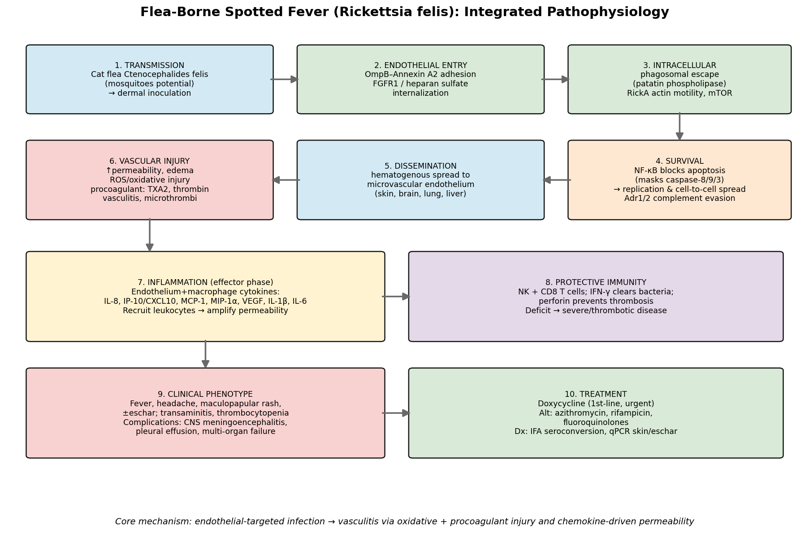

## Question

Pathophysiology and clinical mechanisms of Flea-Borne Spotted Fever. Core disease mechanisms, molecular and cellular pathways, involved genes and proteins, relevant metabolites or drugs, affected cell types and anatomical structures, disease progression, major clinical phenotypes and complications, and treatment-relevant mechanism papers.

## Output

# Pathophysiology and Clinical Mechanisms of Flea-Borne Spotted Fever

## 1. Summary (Answer to the Research Question)

Flea-Borne Spotted Fever (FBSF) is an emerging rickettsiosis caused by **_Rickettsia felis_**, an atypical, plasmid-bearing spotted-fever-group (SFG) obligate intracellular Gram-negative bacterium transmitted primarily by the **cat flea _Ctenocephalides felis_** (with mosquitoes such as _Anopheles gambiae_ as candidate vectors), and epidemiologically entangled with malaria in sub-Saharan Africa. Its **core disease mechanism is an endothelial-targeted vasculitis**: after dermal inoculation the bacterium adheres to and invades microvascular endothelial cells (OmpB–Annexin A2 adhesion; FGFR1/heparan-sulfate–dependent entry), escapes the phagosome and moves intracellularly by RickA-driven actin polymerization, and **subverts host death programs by activating NF-κB to block a masked caspase-8/9/3 apoptotic cascade**, allowing replication and cell-to-cell spread. Disseminated endothelial infection produces **increased vascular permeability, reactive-oxygen-species (ROS)–mediated oxidative injury, and a procoagulant/platelet-activated state** (thromboxane A2, thrombin, endothelin-1) that manifests clinically as fever, headache, maculopapular rash, and—when severe—CNS meningoencephalitis, pleural effusion, and multi-organ failure. A **Th1/cytotoxic immune axis (NK and CD8⁺ T cells via IFN-γ, with NK-derived perforin)** controls the infection and protects the vasculature, while chemokines (IL-8, IP-10, MCP-1, MIP-1α) and VEGF amplify inflammation and permeability. **Doxycycline** is the mechanism-based, life-saving first-line therapy.

## 2. Key Findings (with Statistical/Experimental Evidence)

### Etiology, vectors, and epidemiology
- _R. felis_ is a distinctive SFG rickettsia with a **conjugative plasmid (pRF)**, diverse-origin genes, and a low optimal growth temperature (<32 °C) [PMID 27155905]. The cat flea is the main reservoir/vector; ~26% of _C. felis_ in Sicily carried _R. felis_ DNA [PMID 25203839]. _An. gambiae_ mosquitoes acquire, maintain (qPCR-positive to day 15), and **transmit _R. felis_ by bite** (transient rickettsemia in mice) [PMID 26056256].
- In Africa, _R. felis_ is a common cause of "fever of unknown origin," with prevalence rising from ~1% (France/N. Africa) to ~15% (rural Senegal) and **strong geographic/seasonal correlation with malaria** [PMID 24188709].

### Molecular and cellular pathways of infection
- **Adhesion/invasion:** Endothelial surface **Annexin A2 is the adherence receptor; OmpB is the bacterial ligand** (AFM + in vivo) [PMID 31253864]. Internalization requires **FGFR1 and heparan-sulfate proteoglycans**; heparinase and the FGFR inhibitor AZD4547 reduce entry and lower pulmonary bacterial burden in vivo [PMID 28806774].
- **Intracellular lifestyle/virulence genes:** The genome encodes **RickA (Arp2/3 actin nucleator), patatin-like phospholipase, ankyrin/tetratricopeptide effectors, toxin–antitoxin systems**, and confirmed beta-lactamase, hemolytic, and actin-motility phenotypes [PMID 15984913, 16481487]; strain diversification tracks arthropod host [PMID 25477419]. **mTOR (mTORC1/mTORC2) is activated** in infected endothelium [PMID 33003310].
- **Survival switch:** Infection activates **NF-κB, which prevents apoptosis** of infected endothelium; NF-κB inhibition unmasks apical **caspases 8/9 and executioner caspase 3** (mitochondrial cytochrome-c/PARP pathway, peak 12 h), killing infected cells [PMID 9539792, 12819104]. **Adr1/Adr2 adhesins evade complement** via vitronectin/factor H [PMID 28662039].

### Vascular injury and inflammation (effector phase)
- Pathogenetic sequence: dermis → hematogenous dissemination → **vascular endothelial cells (brain, lung)** → increased permeability and edema [PMID 12860594].
- **Oxidative injury:** infected endothelium shows glutathione depletion and increased intracellular peroxide [PMID 9720025].
- **Procoagulant state:** MSF patients show TXA2-dependent platelet activation, thrombin generation, and endothelial dysfunction → vasculitis and microthrombi [PMID 8584998].
- **Human cytokine signature:** _R. felis_ mono-infection significantly elevates **IL-8, IP-10, MCP-1, MIP-1α, VEGF** [PMID 29736763]; infected macrophages add **IL-1β and IL-6** [PMID 11953398].

### Protective immunity and severity
- **NK and CD8⁺ T cells clear rickettsiae via IFN-γ; NK-derived perforin prevents infection-induced thrombosis.** NK-deficient mice show impaired clearance, low IFN-γ, and severe hepatic thrombosis [PMID 22617213].

### Clinical phenotypes, progression, diagnosis, and treatment
- **Phenotype:** fever, fatigue, headache, maculopapular rash (±eschar); labs show transaminitis, thrombocytopenia, elevated CRP/ESR, hypoalbuminemia [PMID 42715280, 33269795]. **Complications:** pleural effusion [PMID 42715280], CNS meningoencephalitis (usually >1 week; seizures, meningeal enhancement, pleocytosis) [PMID 39447222], neurological involvement/multi-organ failure [PMID 30419355].
- **Diagnosis:** IFA seroconversion (4-fold IgG rise); **skin/eschar qPCR (~48–55% positive) far outperforms whole-blood qPCR (~5–6%)** because rickettsemia is low-level [PMID 25706392, 32682398].
- **Treatment:** **Doxycycline first-line, given promptly** (severe prognosis if delayed) [PMID 30419355]; alternatives azithromycin, rifampicin, fluoroquinolones (documented _R. felis_ response) [PMID 42715280]; doxycycline malaria prophylaxis also protects against _R. felis_ [PMID 24188709].

## 3. Supported and Refuted Hypotheses

**Supported (evidence-backed):**
1. FBSF pathology is driven by **endothelial infection → vasculitis** rather than a secreted toxin.
2. Entry uses defined **host receptors (Annexin A2, FGFR1/HSPG)** — druggable interfaces.
3. **NF-κB anti-apoptosis** is essential for the pathogen to sustain its target cell.
4. Tissue damage arises from **oxidative + procoagulant** endothelial injury amplified by chemokines/VEGF.
5. **IFN-γ/perforin (NK, CD8)** immunity gates disease severity; deficits → thrombotic/severe disease.
6. **Doxycycline** efficacy reflects intracellular penetration + protein-synthesis inhibition.

**Refuted / not supported:** No evidence that FBSF causes damage via a classical exotoxin or via disseminated intravascular coagulation/thrombosis-mediated ischemia as the dominant mechanism (hemostatic mechanisms largely prevent major hemorrhage) [PMID 12860594].

## 4. Limitations and Future Directions
- Much mechanistic detail derives from **related SFG species** (_R. rickettsii_, _R. conorii_, _R. parkeri_) as models; _R. felis_-specific in vivo studies remain sparse.
- The role of **mosquitoes** in natural human transmission is unproven; ecology/epidemiology remain incompletely defined.
- **Eschar** frequency and the earliest dermal events for _R. felis_ specifically are under-characterized.
- **Host-directed therapy** (FGFR inhibition, calcium-channel/vascular-barrier modulation, antioxidant/antithrombotic adjuncts) is promising but unproven clinically; one candidate (benidipine) worsened outcomes in a model, underscoring caution.
- Future work: _R. felis_-specific animal models, prospective clinical cohorts distinguishing FBSF from murine typhus and malaria, and biomarker validation (IL-8/VEGF/IP-10) for severity.

*Figure:* `fbsf_pathophysiology_schematic.png` — integrated 10-stage mechanistic model.

## Artifacts

- [OpenScientist final report](Flea_Borne_Spotted_Fever-deep-research-openscientist_artifacts/final_report.html)
- [OpenScientist final report](Flea_Borne_Spotted_Fever-deep-research-openscientist_artifacts/final_report.pdf)
- [OpenScientist fbsf pathophysiology schematic](Flea_Borne_Spotted_Fever-deep-research-openscientist_artifacts/provenance_fbsf_pathophysiology_schematic.json)

## Reference Validation

Checked with `linkml-reference-validator` 0.3.0rc3.

| Outcome | Count |
| --- | --- |
| References checked | 21 |
| Resolved | 21 |
| Unresolved (possible confabulation) | 0 |
| Unverifiable | 0 |
| References weighed for topical relevance | 21 |
| On topic | 8 |
| Off topic | 0 |

All extracted references resolved successfully.

## Term Validation

No ontology term identifiers were found in this report.