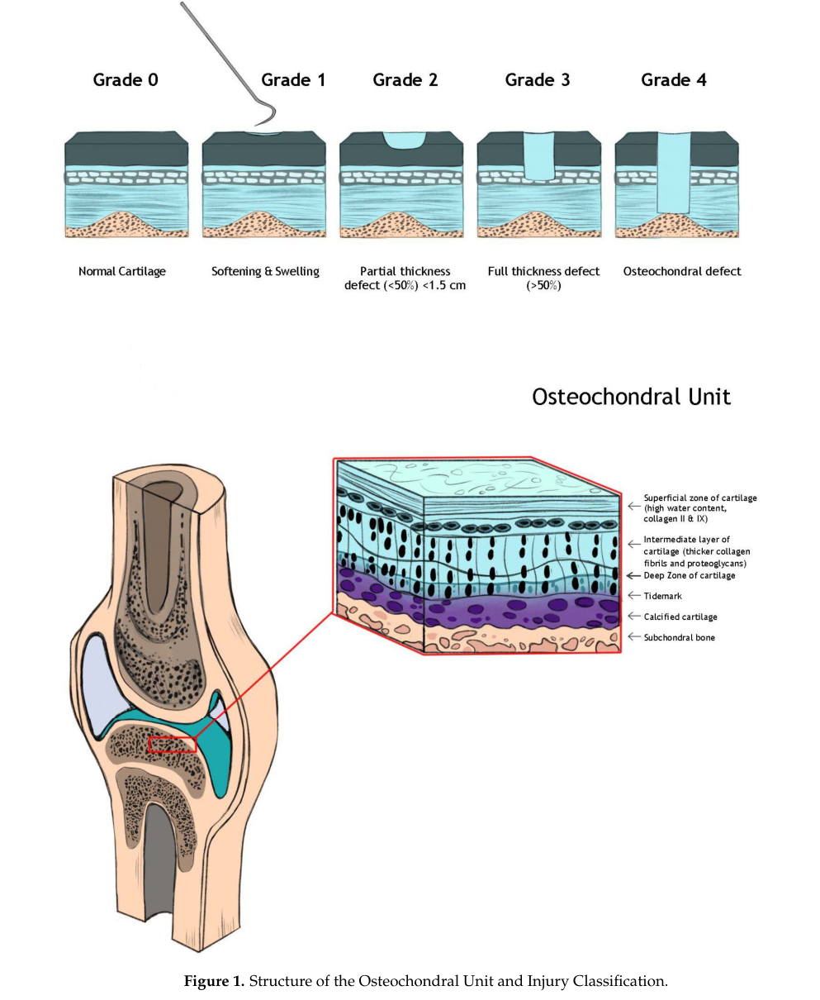

## Question

# Disease Characteristics Research Template

## Target Disease
- **Disease Name:** Focal Articular Cartilage Defect of the Knee
- **MONDO ID:**  (if available)
- **Category:** Acquired Musculoskeletal Disorder

## Research Objectives

Please provide a comprehensive research report on **Focal Articular Cartilage Defect of the Knee** covering all of the
disease characteristics listed below. This report will be used to populate a disease knowledge
base entry. Be thorough and cite primary literature (PMID preferred) for all claims.

For each section, **suggested databases/resources** are listed. These are the first places
you should search for information on each topic.

---

### 1. Disease Information
> **Search first:** OMIM, Orphanet, ICD-10/ICD-11, MeSH, PubMed

- What is the disease? Provide a concise overview.
- What are the key identifiers? (OMIM, Orphanet, ICD-10/ICD-11, MeSH, Mondo)
- What are the common synonyms and alternative names?
- Is the information derived from individual patients (e.g., EHR) or aggregated disease-level resources?

### 2. Etiology

- **Disease Causal Factors**: What are the primary causes? (genetic, environmental, infectious, mechanistic)
- **Risk Factors**:
  > **Search first:** PubMed, Cochrane Library, UpToDate, clinical guidelines, ClinVar, ClinGen, GWAS Catalog, PheGenI, CTD, CDC, WHO, epidemiological databases
  - Genetic risk factors (causal variants, susceptibility loci, modifier genes)
  - Environmental risk factors (toxins, lifestyle, occupational exposures, age, sex, family history)
- **Protective Factors**:
  > **Search first:** PubMed, Cochrane Library, clinical trial databases, GWAS Catalog, gnomAD, WHO, CDC, nutrition databases
  - Genetic protective factors (protective variants, modifier alleles)
  - Environmental protective factors (diet, lifestyle, exposures that reduce risk)
- **Gene-Environment Interactions**: How do genetic and environmental factors interact to influence disease?
  > **Search first:** CTD, PubMed, PheGenI, GxE databases

### 3. Phenotypes
> **Search first:** HPO (Human Phenotype Ontology), OMIM, Orphanet, PubMed, clinicaltrials.gov, MedDRA, SNOMED CT, DECIPHER, LOINC

For each phenotype, provide:
- **Phenotype type**: symptoms, clinical signs, physical manifestations, behavioral changes, or laboratory abnormalities
  > For symptoms/signs: HPO, OMIM, Orphanet, PubMed
  > For behavioral changes: HPO, DSM, RDoC (Research Domain Criteria), PubMed
  > For laboratory abnormalities: LOINC, SNOMED CT, LabTests Online, PubMed
- **Phenotype characteristics**:
  > **Search first:** OMIM, Orphanet, HPO, PubMed
  - Age of symptom onset (neonatal, childhood, adult-onset, late-onset)
  - Symptom severity (mild, moderate, severe, variable)
  - Symptom progression (stable, progressive, episodic, fluctuating)
  - Frequency among affected individuals (percentage or qualitative)
- **Quality of life impact**: Effects on daily functioning and well-being (per-phenotype when possible)
  > **Search first:** EQ-5D database, SF-36, WHO QOL databases, PubMed
- Suggest HPO (Human Phenotype Ontology) terms for each phenotype

### 4. Genetic/Molecular Information

- **Causal Genes**: Gene mutations or chromosomal abnormalities responsible for disease (gene symbols, OMIM IDs)
  > **Search first:** OMIM, ClinVar, HGMD, Ensembl, NCBI Gene
- **Pathogenic Variants**:
  - Affected genes (gene symbols, HGNC IDs)
    > **Search first:** OMIM, NCBI Gene, Ensembl, HGNC, UniProt, GeneCards
  - Variant classification (pathogenic, likely pathogenic, VUS per ACMG/AMP guidelines)
    > **Search first:** ClinVar, ClinGen, ACMG/AMP guidelines, VarSome
  - Variant type/class (missense, frameshift, nonsense, splice-site, structural)
  - Allele frequency in population databases
    > **Search first:** gnomAD, 1000 Genomes, ExAC, TOPMed, dbSNP
  - Somatic vs germline origin
    > **Search first:** COSMIC (somatic), ClinVar, ICGC, TCGA
  - Functional consequences (loss of function, gain of function, dominant negative)
- **Modifier Genes**: Genes that modify disease severity or expression
- **Epigenetic Information**: DNA methylation, histone modifications, chromatin changes affecting disease
  > **Search first:** ENCODE, Roadmap Epigenomics, MethBase, DiseaseMeth
- **Chromosomal Abnormalities**: Large-scale genetic changes (aneuploidy, translocations, inversions)
  > **Search first:** DECIPHER, ClinVar, ECARUCA, UCSC Genome Browser

### 5. Environmental Information

- **Environmental Factors**: Non-genetic contributing factors (toxins, radiation, pollution, occupational exposure)
  > **Search first:** CTD (Comparative Toxicogenomics Database), TOXNET, PubMed, EPA databases
- **Lifestyle Factors**: Behavioral factors (smoking, diet, exercise, alcohol consumption)
  > **Search first:** CDC databases, WHO, PubMed, NHANES
- **Infectious Agents**: If applicable, pathogens causing or triggering disease (bacteria, viruses, fungi, parasites)
  > **Search first:** NCBI Taxonomy, ViPR, BV-BRC, MicrobeDB, GIDEON

### 6. Mechanism / Pathophysiology

- **Molecular Pathways**: Specific signaling cascades or biochemical pathways involved (Wnt, MAPK, mTOR, PI3K-AKT, etc.)
  > **Search first:** KEGG, Reactome, WikiPathways, PathBank, BioCyc
- **Cellular Processes**: Cell-level mechanisms (apoptosis, autophagy, cell cycle dysregulation, inflammation, etc.)
  > **Search first:** Gene Ontology (GO), Reactome, KEGG, PubMed
- **Protein Dysfunction**: How protein structure or function is altered (misfolding, aggregation, loss of function, gain of function)
  > **Search first:** UniProt, PDB (Protein Data Bank), InterPro, Pfam, AlphaFold
- **Metabolic Changes**: Alterations in metabolic processes (energy metabolism, lipid metabolism, amino acid metabolism)
  > **Search first:** KEGG, BioCyc, HMDB (Human Metabolome Database), BRENDA
- **Immune System Involvement**: Role of immune response (autoimmunity, immunodeficiency, chronic inflammation)
  > **Search first:** ImmPort, Immunome Database, IEDB, Gene Ontology
- **Tissue Damage Mechanisms**: How tissues/ are injured (oxidative stress, ischemia, fibrosis, necrosis)
  > **Search first:** PubMed, Gene Ontology, Reactome
- **Biochemical Abnormalities**: Specific molecular defects (enzyme deficiencies, receptor dysfunction, ion channel defects)
  > **Search first:** BRENDA, UniProt, KEGG, OMIM, PubMed
- **Epigenetic Changes**: DNA methylation, histone modifications affecting gene expression in disease
  > **Search first:** ENCODE, Roadmap Epigenomics, MethBase, DiseaseMeth
- **Molecular Profiling** (if available):
  - Transcriptomics/gene expression changes
    > **Search first:** GEO (Gene Expression Omnibus), ArrayExpress, GTEx, Human Cell Atlas, SRA
  - Proteomics findings
    > **Search first:** PRIDE, ProteomeXchange, Human Protein Atlas, STRING, BioGRID
  - Metabolomics signatures
    > **Search first:** MetaboLights, Metabolomics Workbench, HMDB, METLIN
  - Lipidomics alterations
    > **Search first:** LIPID MAPS, SwissLipids, LipidHome, Metabolomics Workbench
  - Genomic structural features
    > **Search first:** UCSC Genome Browser, Ensembl, NCBI, dbVar, DGV
- **Advanced Technologies** (if applicable):
  - Single-cell analysis findings (cell-type specific mechanisms, cellular heterogeneity)
    > **Search first:** Human Cell Atlas, Single Cell Portal, GEO, CELLxGENE
  - Spatial transcriptomics findings
    > **Search first:** GEO, Spatial Research, Vizgen, 10x Genomics data
  - Multi-omics integration results
    > **Search first:** TCGA, ICGC, cBioPortal, LinkedOmics, PubMed
  - Functional genomics screens (CRISPR, RNAi)
    > **Search first:** DepMap, GenomeRNAi, PubMed, BioGRID ORCS

For each mechanism, describe:
- The causal chain from initial trigger to clinical manifestation
- Which mechanisms are upstream vs downstream
- What cell types and biological processes are involved
- Suggest GO terms for biological processes and CL terms for cell types

### 7. Anatomical Structures Affected

- **Organ Level**:
  - Primary organs directly affected
  - Secondary organ involvement (complications, secondary effects)
  - Body systems involved (cardiovascular, nervous, digestive, respiratory, endocrine, etc.)
  > **Search first:** Uberon, FMA (Foundational Model of Anatomy), OMIM, HPO, ICD-11, MeSH, SNOMED CT
- **Tissue and Cell Level**:
  - Specific tissue types affected (epithelial, connective, muscle, nervous)
  - Specific cell populations targeted (with Cell Ontology terms)
  > **Search first:** Uberon, Human Protein Atlas, Cell Ontology, Human Cell Atlas, CellMarker, PanglaoDB
- **Subcellular Level**:
  - Cellular compartments involved (mitochondria, nucleus, ER, lysosomes) (with GO Cellular Component terms)
  > **Search first:** Gene Ontology (Cellular Component), UniProt, Human Protein Atlas
- **Localization**:
  - Specific anatomical sites (with UBERON terms)
    > **Search first:** FMA, Uberon, NeuroNames (for brain), SNOMED CT
  - Lateralization (unilateral, bilateral, asymmetric)
    > **Search first:** HPO, clinical literature, imaging databases

### 8. Temporal Development

- **Onset**:
  - Typical age of onset (congenital, pediatric, adult, geriatric)
  - Onset pattern (acute, subacute, chronic, insidious)
  > **Search first:** OMIM, Orphanet, HPO, PubMed
- **Progression**:
  - Disease stages (early, intermediate, advanced, end-stage)
    > **Search first:** Cancer Staging Manual (AJCC), WHO classifications, PubMed
  - Progression rate (rapid, slow, variable)
  - Disease course pattern (episodic, relapsing-remitting, progressive, stable)
  - Disease duration (self-limited, chronic lifelong)
  > **Search first:** Disease registries, longitudinal cohort databases, natural history studies, PubMed, Orphanet, OMIM
- **Patterns**:
  - Remission patterns (spontaneous, treatment-induced)
    > **Search first:** Clinical trial databases, disease registries, PubMed
  - Critical periods (time windows of vulnerability or opportunity for intervention)
    > **Search first:** PubMed, developmental biology databases, clinical guidelines

### 9. Inheritance and Population

- **Epidemiology**:
  - Prevalence (cases per 100,000 at given time)
  - Incidence (new cases per 100,000 per year)
  > **Search first:** Orphanet, CDC, WHO, GBD (Global Burden of Disease), national registries, SEER, disease registries
- **For Genetic Etiology**:
  - Inheritance pattern (AD, AR, X-linked, mitochondrial, multifactorial, polygenic)
    > **Search first:** OMIM, Orphanet, ClinVar, GTR (Genetic Testing Registry)
  - Penetrance (complete, incomplete, age-dependent)
    > **Search first:** ClinVar, OMIM, PubMed, ClinGen
  - Expressivity (variable, consistent)
    > **Search first:** OMIM, ClinVar, PubMed
  - Genetic anticipation (increasing severity in successive generations)
    > **Search first:** OMIM, PubMed (especially for repeat expansion disorders)
  - Germline mosaicism
    > **Search first:** ClinVar, OMIM, genetic counseling literature, PubMed
  - Founder effects (population-specific mutations)
    > **Search first:** gnomAD, population genetics databases, PubMed
  - Consanguinity role
    > **Search first:** OMIM, population studies, genetic counseling resources
  - Carrier frequency
    > **Search first:** gnomAD, carrier screening databases, GeneReviews, GTR
- **Population Demographics**:
  - Affected populations (ethnic or demographic groups with higher prevalence)
    > **Search first:** gnomAD, 1000 Genomes, PAGE Study, PubMed, population registries
  - Geographic distribution (endemic areas, regional variation)
    > **Search first:** WHO, CDC, GBD, Orphanet, geographic epidemiology databases
  - Geographic distribution of specific variants
  - Sex ratio (male:female)
    > **Search first:** Disease registries, OMIM, PubMed, epidemiological databases
  - Age distribution of affected individuals
    > **Search first:** CDC, disease registries, SEER, Orphanet

### 10. Diagnostics

- **Clinical Tests**:
  - Laboratory tests (blood, urine, tissue chemistry, specific enzyme assays)
    > **Search first:** LOINC, LabTests Online, PubMed
  - Biomarkers (proteins, metabolites, genetic markers, circulating biomarkers)
    > **Search first:** FDA Biomarker List, BEST (Biomarkers, EndpointS, and other Tools), PubMed
  - Imaging studies (X-ray, CT, MRI, PET, ultrasound)
    > **Search first:** RadLex, DICOM, Radiopaedia, imaging databases
  - Functional tests (pulmonary function, cardiac stress tests)
    > **Search first:** LOINC, clinical guidelines, PubMed
  - Electrophysiology (EEG, EMG, ECG, nerve conduction studies)
    > **Search first:** LOINC, clinical neurophysiology databases, PubMed
  - Biopsy findings (histopathology, immunohistochemistry)
    > **Search first:** SNOMED CT, College of American Pathologists resources, PubMed
  - Pathology findings (microscopic examination)
    > **Search first:** SNOMED CT, Digital Pathology databases, PubMed
- **Genetic Testing**:
  > **Search first:** GTR (Genetic Testing Registry), GeneReviews, ClinGen
  - Overview of recommended genetic testing approach
  - Whole genome sequencing (WGS) utility
    > **Search first:** GTR, ClinVar, GEL (Genomics England), gnomAD
  - Whole exome sequencing (WES) utility
    > **Search first:** GTR, ClinVar, OMIM, GeneMatcher
  - Gene panels (which panels, which genes)
    > **Search first:** GTR, ClinVar, laboratory-specific databases
  - Single gene testing
    > **Search first:** GTR, ClinVar, OMIM, GeneReviews
  - Chromosomal microarray (CMA)
    > **Search first:** DECIPHER, ClinVar, dbVar, ECARUCA
  - Karyotyping
    > **Search first:** Chromosome Abnormality Database, ClinVar, cytogenetics resources
  - FISH
    > **Search first:** ClinVar, cytogenetics databases, PubMed
  - Mitochondrial DNA testing
    > **Search first:** MITOMAP, MSeqDR, ClinVar, GTR
  - Repeat expansion testing
    > **Search first:** GTR, ClinVar, repeat expansion databases, PubMed
- **Omics-Based Diagnostics** (if applicable):
  - RNA sequencing / transcriptomics
    > **Search first:** GEO, ArrayExpress, GTEx, RNA-seq databases
  - Proteomics
    > **Search first:** PRIDE, ProteomeXchange, FDA Biomarker database
  - Metabolomics
    > **Search first:** MetaboLights, Metabolomics Workbench, HMDB
  - Epigenomics
    > **Search first:** GEO, ENCODE, Roadmap Epigenomics, MethBase
  - Liquid biopsy
    > **Search first:** COSMIC, ClinVar, liquid biopsy databases, PubMed
- **Clinical Criteria**:
  - Standardized diagnostic criteria (DSM, ICD, society guidelines)
    > **Search first:** DSM-5, ICD-11, clinical society guidelines, UpToDate
  - Differential diagnosis (other conditions to rule out, with distinguishing features)
    > **Search first:** DynaMed, UpToDate, clinical decision support systems
- **Screening**:
  - Screening methods for asymptomatic individuals (newborn screening, carrier screening, cascade screening)
    > **Search first:** ACMG recommendations, CDC newborn screening, GTR

### 11. Outcome/Prognosis

- **Survival and Mortality**:
  - Survival rate (5-year, 10-year, overall)
    > **Search first:** SEER, cancer registries, disease-specific registries, PubMed
  - Life expectancy (with and without treatment if applicable)
    > **Search first:** Orphanet, disease registries, actuarial databases, PubMed
  - Mortality rate
    > **Search first:** CDC, WHO, GBD, national mortality databases
  - Disease-specific mortality (deaths directly attributable to disease)
    > **Search first:** Disease registries, CDC Wonder, GBD, PubMed
- **Morbidity and Function**:
  - Morbidity (disease-related disability and health impacts)
    > **Search first:** GBD, WHO, disability databases, PubMed
  - Disability outcomes (long-term functional impairments)
    > **Search first:** ICF (International Classification of Functioning), disability registries
  - Quality of life measures (EQ-5D, SF-36, PROMIS, disease-specific tools)
    > **Search first:** EQ-5D database, SF-36, PROMIS, PubMed
- **Disease Course**:
  - Complications (secondary problems: infections, organ failure, etc.)
    > **Search first:** ICD codes, disease registries, clinical databases, PubMed
  - Recovery potential (likelihood and extent of recovery, with vs without treatment)
    > **Search first:** Natural history studies, rehabilitation databases, PubMed
- **Prediction**:
  - Prognostic factors (age, disease severity, biomarkers, treatment response)
    > **Search first:** Prognostic models databases, clinical calculators, PubMed
  - Prognostic biomarkers (molecular markers predicting disease course)
    > **Search first:** FDA Biomarker database, PubMed, cancer prognostic databases

### 12. Treatment

- **Pharmacotherapy**:
  - Pharmacological treatments (drug names, drug classes, mechanisms of action)
    > **Search first:** DrugBank, RxNorm, ATC classification, DailyMed, FDA databases
  - Pharmacogenomics (how genetic variants affect drug metabolism, efficacy, toxicity)
    > **Search first:** PharmGKB, CPIC (Clinical Pharmacogenetics), FDA Table of PGx Biomarkers
- **Advanced Therapeutics**:
  - Gene therapy (viral vectors, CRISPR, gene replacement, gene editing)
    > **Search first:** ClinicalTrials.gov, FDA gene therapy database, ASGCT resources
  - Cell therapy (stem cell transplant, CAR-T, cellular therapeutics)
    > **Search first:** ClinicalTrials.gov, FDA cell therapy database, FACT standards
  - RNA-based therapies (ASOs, siRNA, mRNA therapies)
    > **Search first:** ClinicalTrials.gov, FDA approvals, PubMed
  - Targeted therapies (treatments directed at specific molecular targets)
    > **Search first:** My Cancer Genome, OncoKB, ClinicalTrials.gov, FDA approvals
  - Immunotherapies (checkpoint inhibitors, monoclonal antibodies)
    > **Search first:** Cancer Immunotherapy Database, FDA approvals, ClinicalTrials.gov
- **Surgical and Interventional**:
  - Surgical interventions (types of surgery, timing, outcomes)
    > **Search first:** CPT codes, surgical registries, clinical guidelines, PubMed
- **Supportive and Rehabilitative**:
  - Supportive care (symptom management, pain control, nutrition)
    > **Search first:** Clinical guidelines, Cochrane Library, PubMed
  - Rehabilitation (physical therapy, occupational therapy, speech therapy)
    > **Search first:** Rehabilitation medicine databases, clinical guidelines, PubMed
- **Experimental**:
  - Experimental treatments in clinical trials (with NCT identifiers if available)
    > **Search first:** ClinicalTrials.gov, EU Clinical Trials Register, WHO ICTRP
- **Treatment Outcomes**:
  - Treatment response rates
    > **Search first:** Clinical trial databases, FDA reviews, systematic reviews, PubMed
  - Side effects and adverse events
    > **Search first:** FDA Adverse Event Reporting System (FAERS), MedWatch, PubMed
- **Treatment Strategy**:
  - Treatment algorithms (clinical pathways, decision trees)
    > **Search first:** Clinical practice guidelines, NCCN Guidelines, UpToDate
  - Combination therapies
    > **Search first:** ClinicalTrials.gov, treatment guidelines, PubMed
  - Personalized medicine approaches (genotype-guided treatment)
    > **Search first:** My Cancer Genome, CIViC, PharmGKB, precision medicine databases

For each treatment, suggest MAXO (Medical Action Ontology) terms where applicable.

### 13. Prevention

- **Prevention Levels**:
  - Primary prevention (preventing disease occurrence: vaccination, risk factor modification)
    > **Search first:** CDC, WHO, USPSTF recommendations, Cochrane Library
  - Secondary prevention (early detection and treatment: screening programs, early intervention)
    > **Search first:** USPSTF, CDC screening guidelines, WHO
  - Tertiary prevention (preventing complications in those with disease)
    > **Search first:** Clinical guidelines, disease management protocols, PubMed
- **Immunization**: Vaccine strategies (if applicable)
  > **Search first:** CDC vaccine schedules, WHO immunization, FDA vaccine database
- **Screening and Early Detection**:
  - Screening programs (population-based: newborn screening, cancer screening)
    > **Search first:** CDC screening programs, USPSTF, cancer screening databases
  - Genetic screening (carrier screening, preimplantation genetic diagnosis, prenatal testing)
    > **Search first:** ACMG recommendations, ACOG guidelines, GTR
  - Risk stratification (identifying high-risk individuals for targeted prevention)
    > **Search first:** Risk prediction models, clinical calculators, PubMed
- **Behavioral Interventions**: Lifestyle modifications to reduce risk
  > **Search first:** CDC, WHO, behavioral intervention databases, Cochrane Library
- **Counseling**: Genetic counseling (risk assessment, family planning guidance)
  > **Search first:** NSGC resources, ACMG guidelines, GeneReviews
- **Public Health**:
  - Public health interventions (sanitation, vector control, health education)
    > **Search first:** CDC, WHO, public health databases, PubMed
  - Environmental interventions (reducing environmental risk factors)
    > **Search first:** EPA databases, WHO environmental health, PubMed
- **Prophylaxis**: Preventive medications or procedures
  > **Search first:** Clinical guidelines, FDA approvals, PubMed

### 14. Other Species / Natural Disease

- **Taxonomy**: Species affected (with NCBI Taxon identifiers)
  > **Search first:** NCBI Taxonomy
- **Breed**: Specific breeds affected (with VBO identifiers if applicable)
  > **Search first:** VBO (Vertebrate Breed Ontology)
- **Gene**: Orthologous genes in other species (with NCBI Gene IDs)
  > **Search first:** NCBI Gene
- **Natural Disease**:
  - Naturally occurring disease in other species (companion animals, wildlife)
    > **Search first:** OMIA (Online Mendelian Inheritance in Animals), VetCompass, PubMed
  - Veterinary relevance and importance in animal health
    > **Search first:** OMIA, veterinary databases, PubMed
- **Comparative Biology**:
  - Comparative pathology (similarities and differences across species)
    > **Search first:** OMIA, comparative pathology databases, PubMed
  - Evolutionary conservation of disease mechanisms
    > **Search first:** HomoloGene, OrthoMCL, Alliance of Genome Resources
- **Transmission** (if applicable):
  - Zoonotic potential
    > **Search first:** CDC zoonotic diseases, WHO zoonoses, GIDEON
  - Cross-species susceptibility
    > **Search first:** NCBI Taxonomy, veterinary databases, PubMed

### 15. Model Organisms

- **Model Types**:
  - Model organism type (mammalian, invertebrate, cellular, in vitro)
    > **Search first:** Alliance of Genome Resources, model organism databases
  - Specific model systems (mouse, rat, zebrafish, Drosophila, C. elegans, yeast, cell lines, organoids, iPSCs)
    > **Search first:** MGI, RGD, ZFIN, FlyBase, WormBase, SGD, ATCC, Cellosaurus
  - Induced models (drug treatment, surgical intervention, environmental manipulation)
    > **Search first:** MGI, model organism databases, PubMed
- **Genetic Models**:
  - Types available (knockout, knock-in, transgenic, conditional, humanized)
    > **Search first:** MGI, IMPC, KOMP, EuMMCR, IMSR
- **Model Characteristics**:
  - Phenotype recapitulation (how well model reproduces human disease features)
    > **Search first:** Model organism databases, comparative studies, PubMed
  - Model limitations (aspects of human disease not captured)
    > **Search first:** Model organism databases, PubMed, review articles
- **Applications**:
  - Research applications (what aspects of disease can be studied)
    > **Search first:** Model organism databases, PubMed
- **Resources**:
  - Model databases
    > **Search first:** MGI, RGD, ZFIN, FlyBase, WormBase, IMSR, EMMA, MMRRC

---

## Citation Requirements

- Cite primary literature (PMID preferred) for all mechanistic and clinical claims
- Prioritize recent reviews and landmark papers
- Include direct quotes from abstracts where possible to support key statements
- Distinguish evidence source types: human clinical, model organism, in vitro, computational

## Output Format

Structure your response as a comprehensive narrative organized by the sections above.
For each section, provide:
- Factual content with specific details (numbers, percentages, gene names, variant nomenclature)
- Ontology term suggestions (HPO, GO, CL, UBERON, CHEBI, MAXO, MONDO) where applicable
- Evidence citations with PMIDs
- Direct quotes from abstracts to support key claims
- Clear indication when information is not available or not applicable for this disease

This report will be used to populate a disease knowledge base entry with:
- Pathophysiology descriptions with causal chains
- Gene/protein annotations (HGNC, GO terms)
- Phenotype associations (HP terms) with frequencies
- Cell type involvement (CL terms)
- Anatomical locations (UBERON terms)
- Chemical entities (CHEBI terms)
- Treatment annotations (MAXO terms)
- Evidence items with PMIDs and exact abstract quotes
- Epidemiology, prognosis, diagnostic, and prevention information
- Animal model descriptions with phenotype recapitulation details

## Output

Question: You are an expert researcher providing comprehensive, well-cited information.

Provide detailed information focusing on:
1. Key concepts and definitions with current understanding
2. Recent developments and latest research (prioritize 2023-2024 sources)
3. Current applications and real-world implementations
4. Expert opinions and analysis from authoritative sources
5. Relevant statistics and data from recent studies

Format as a comprehensive research report with proper citations. Include URLs and publication dates where available.
Always prioritize recent, authoritative sources and provide specific citations for all major claims.

# Disease Characteristics Research Template

## Target Disease
- **Disease Name:** Focal Articular Cartilage Defect of the Knee
- **MONDO ID:**  (if available)
- **Category:** Acquired Musculoskeletal Disorder

## Research Objectives

Please provide a comprehensive research report on **Focal Articular Cartilage Defect of the Knee** covering all of the
disease characteristics listed below. This report will be used to populate a disease knowledge
base entry. Be thorough and cite primary literature (PMID preferred) for all claims.

For each section, **suggested databases/resources** are listed. These are the first places
you should search for information on each topic.

---

### 1. Disease Information
> **Search first:** OMIM, Orphanet, ICD-10/ICD-11, MeSH, PubMed

- What is the disease? Provide a concise overview.
- What are the key identifiers? (OMIM, Orphanet, ICD-10/ICD-11, MeSH, Mondo)
- What are the common synonyms and alternative names?
- Is the information derived from individual patients (e.g., EHR) or aggregated disease-level resources?

### 2. Etiology

- **Disease Causal Factors**: What are the primary causes? (genetic, environmental, infectious, mechanistic)
- **Risk Factors**:
  > **Search first:** PubMed, Cochrane Library, UpToDate, clinical guidelines, ClinVar, ClinGen, GWAS Catalog, PheGenI, CTD, CDC, WHO, epidemiological databases
  - Genetic risk factors (causal variants, susceptibility loci, modifier genes)
  - Environmental risk factors (toxins, lifestyle, occupational exposures, age, sex, family history)
- **Protective Factors**:
  > **Search first:** PubMed, Cochrane Library, clinical trial databases, GWAS Catalog, gnomAD, WHO, CDC, nutrition databases
  - Genetic protective factors (protective variants, modifier alleles)
  - Environmental protective factors (diet, lifestyle, exposures that reduce risk)
- **Gene-Environment Interactions**: How do genetic and environmental factors interact to influence disease?
  > **Search first:** CTD, PubMed, PheGenI, GxE databases

### 3. Phenotypes
> **Search first:** HPO (Human Phenotype Ontology), OMIM, Orphanet, PubMed, clinicaltrials.gov, MedDRA, SNOMED CT, DECIPHER, LOINC

For each phenotype, provide:
- **Phenotype type**: symptoms, clinical signs, physical manifestations, behavioral changes, or laboratory abnormalities
  > For symptoms/signs: HPO, OMIM, Orphanet, PubMed
  > For behavioral changes: HPO, DSM, RDoC (Research Domain Criteria), PubMed
  > For laboratory abnormalities: LOINC, SNOMED CT, LabTests Online, PubMed
- **Phenotype characteristics**:
  > **Search first:** OMIM, Orphanet, HPO, PubMed
  - Age of symptom onset (neonatal, childhood, adult-onset, late-onset)
  - Symptom severity (mild, moderate, severe, variable)
  - Symptom progression (stable, progressive, episodic, fluctuating)
  - Frequency among affected individuals (percentage or qualitative)
- **Quality of life impact**: Effects on daily functioning and well-being (per-phenotype when possible)
  > **Search first:** EQ-5D database, SF-36, WHO QOL databases, PubMed
- Suggest HPO (Human Phenotype Ontology) terms for each phenotype

### 4. Genetic/Molecular Information

- **Causal Genes**: Gene mutations or chromosomal abnormalities responsible for disease (gene symbols, OMIM IDs)
  > **Search first:** OMIM, ClinVar, HGMD, Ensembl, NCBI Gene
- **Pathogenic Variants**:
  - Affected genes (gene symbols, HGNC IDs)
    > **Search first:** OMIM, NCBI Gene, Ensembl, HGNC, UniProt, GeneCards
  - Variant classification (pathogenic, likely pathogenic, VUS per ACMG/AMP guidelines)
    > **Search first:** ClinVar, ClinGen, ACMG/AMP guidelines, VarSome
  - Variant type/class (missense, frameshift, nonsense, splice-site, structural)
  - Allele frequency in population databases
    > **Search first:** gnomAD, 1000 Genomes, ExAC, TOPMed, dbSNP
  - Somatic vs germline origin
    > **Search first:** COSMIC (somatic), ClinVar, ICGC, TCGA
  - Functional consequences (loss of function, gain of function, dominant negative)
- **Modifier Genes**: Genes that modify disease severity or expression
- **Epigenetic Information**: DNA methylation, histone modifications, chromatin changes affecting disease
  > **Search first:** ENCODE, Roadmap Epigenomics, MethBase, DiseaseMeth
- **Chromosomal Abnormalities**: Large-scale genetic changes (aneuploidy, translocations, inversions)
  > **Search first:** DECIPHER, ClinVar, ECARUCA, UCSC Genome Browser

### 5. Environmental Information

- **Environmental Factors**: Non-genetic contributing factors (toxins, radiation, pollution, occupational exposure)
  > **Search first:** CTD (Comparative Toxicogenomics Database), TOXNET, PubMed, EPA databases
- **Lifestyle Factors**: Behavioral factors (smoking, diet, exercise, alcohol consumption)
  > **Search first:** CDC databases, WHO, PubMed, NHANES
- **Infectious Agents**: If applicable, pathogens causing or triggering disease (bacteria, viruses, fungi, parasites)
  > **Search first:** NCBI Taxonomy, ViPR, BV-BRC, MicrobeDB, GIDEON

### 6. Mechanism / Pathophysiology

- **Molecular Pathways**: Specific signaling cascades or biochemical pathways involved (Wnt, MAPK, mTOR, PI3K-AKT, etc.)
  > **Search first:** KEGG, Reactome, WikiPathways, PathBank, BioCyc
- **Cellular Processes**: Cell-level mechanisms (apoptosis, autophagy, cell cycle dysregulation, inflammation, etc.)
  > **Search first:** Gene Ontology (GO), Reactome, KEGG, PubMed
- **Protein Dysfunction**: How protein structure or function is altered (misfolding, aggregation, loss of function, gain of function)
  > **Search first:** UniProt, PDB (Protein Data Bank), InterPro, Pfam, AlphaFold
- **Metabolic Changes**: Alterations in metabolic processes (energy metabolism, lipid metabolism, amino acid metabolism)
  > **Search first:** KEGG, BioCyc, HMDB (Human Metabolome Database), BRENDA
- **Immune System Involvement**: Role of immune response (autoimmunity, immunodeficiency, chronic inflammation)
  > **Search first:** ImmPort, Immunome Database, IEDB, Gene Ontology
- **Tissue Damage Mechanisms**: How tissues/ are injured (oxidative stress, ischemia, fibrosis, necrosis)
  > **Search first:** PubMed, Gene Ontology, Reactome
- **Biochemical Abnormalities**: Specific molecular defects (enzyme deficiencies, receptor dysfunction, ion channel defects)
  > **Search first:** BRENDA, UniProt, KEGG, OMIM, PubMed
- **Epigenetic Changes**: DNA methylation, histone modifications affecting gene expression in disease
  > **Search first:** ENCODE, Roadmap Epigenomics, MethBase, DiseaseMeth
- **Molecular Profiling** (if available):
  - Transcriptomics/gene expression changes
    > **Search first:** GEO (Gene Expression Omnibus), ArrayExpress, GTEx, Human Cell Atlas, SRA
  - Proteomics findings
    > **Search first:** PRIDE, ProteomeXchange, Human Protein Atlas, STRING, BioGRID
  - Metabolomics signatures
    > **Search first:** MetaboLights, Metabolomics Workbench, HMDB, METLIN
  - Lipidomics alterations
    > **Search first:** LIPID MAPS, SwissLipids, LipidHome, Metabolomics Workbench
  - Genomic structural features
    > **Search first:** UCSC Genome Browser, Ensembl, NCBI, dbVar, DGV
- **Advanced Technologies** (if applicable):
  - Single-cell analysis findings (cell-type specific mechanisms, cellular heterogeneity)
    > **Search first:** Human Cell Atlas, Single Cell Portal, GEO, CELLxGENE
  - Spatial transcriptomics findings
    > **Search first:** GEO, Spatial Research, Vizgen, 10x Genomics data
  - Multi-omics integration results
    > **Search first:** TCGA, ICGC, cBioPortal, LinkedOmics, PubMed
  - Functional genomics screens (CRISPR, RNAi)
    > **Search first:** DepMap, GenomeRNAi, PubMed, BioGRID ORCS

For each mechanism, describe:
- The causal chain from initial trigger to clinical manifestation
- Which mechanisms are upstream vs downstream
- What cell types and biological processes are involved
- Suggest GO terms for biological processes and CL terms for cell types

### 7. Anatomical Structures Affected

- **Organ Level**:
  - Primary organs directly affected
  - Secondary organ involvement (complications, secondary effects)
  - Body systems involved (cardiovascular, nervous, digestive, respiratory, endocrine, etc.)
  > **Search first:** Uberon, FMA (Foundational Model of Anatomy), OMIM, HPO, ICD-11, MeSH, SNOMED CT
- **Tissue and Cell Level**:
  - Specific tissue types affected (epithelial, connective, muscle, nervous)
  - Specific cell populations targeted (with Cell Ontology terms)
  > **Search first:** Uberon, Human Protein Atlas, Cell Ontology, Human Cell Atlas, CellMarker, PanglaoDB
- **Subcellular Level**:
  - Cellular compartments involved (mitochondria, nucleus, ER, lysosomes) (with GO Cellular Component terms)
  > **Search first:** Gene Ontology (Cellular Component), UniProt, Human Protein Atlas
- **Localization**:
  - Specific anatomical sites (with UBERON terms)
    > **Search first:** FMA, Uberon, NeuroNames (for brain), SNOMED CT
  - Lateralization (unilateral, bilateral, asymmetric)
    > **Search first:** HPO, clinical literature, imaging databases

### 8. Temporal Development

- **Onset**:
  - Typical age of onset (congenital, pediatric, adult, geriatric)
  - Onset pattern (acute, subacute, chronic, insidious)
  > **Search first:** OMIM, Orphanet, HPO, PubMed
- **Progression**:
  - Disease stages (early, intermediate, advanced, end-stage)
    > **Search first:** Cancer Staging Manual (AJCC), WHO classifications, PubMed
  - Progression rate (rapid, slow, variable)
  - Disease course pattern (episodic, relapsing-remitting, progressive, stable)
  - Disease duration (self-limited, chronic lifelong)
  > **Search first:** Disease registries, longitudinal cohort databases, natural history studies, PubMed, Orphanet, OMIM
- **Patterns**:
  - Remission patterns (spontaneous, treatment-induced)
    > **Search first:** Clinical trial databases, disease registries, PubMed
  - Critical periods (time windows of vulnerability or opportunity for intervention)
    > **Search first:** PubMed, developmental biology databases, clinical guidelines

### 9. Inheritance and Population

- **Epidemiology**:
  - Prevalence (cases per 100,000 at given time)
  - Incidence (new cases per 100,000 per year)
  > **Search first:** Orphanet, CDC, WHO, GBD (Global Burden of Disease), national registries, SEER, disease registries
- **For Genetic Etiology**:
  - Inheritance pattern (AD, AR, X-linked, mitochondrial, multifactorial, polygenic)
    > **Search first:** OMIM, Orphanet, ClinVar, GTR (Genetic Testing Registry)
  - Penetrance (complete, incomplete, age-dependent)
    > **Search first:** ClinVar, OMIM, PubMed, ClinGen
  - Expressivity (variable, consistent)
    > **Search first:** OMIM, ClinVar, PubMed
  - Genetic anticipation (increasing severity in successive generations)
    > **Search first:** OMIM, PubMed (especially for repeat expansion disorders)
  - Germline mosaicism
    > **Search first:** ClinVar, OMIM, genetic counseling literature, PubMed
  - Founder effects (population-specific mutations)
    > **Search first:** gnomAD, population genetics databases, PubMed
  - Consanguinity role
    > **Search first:** OMIM, population studies, genetic counseling resources
  - Carrier frequency
    > **Search first:** gnomAD, carrier screening databases, GeneReviews, GTR
- **Population Demographics**:
  - Affected populations (ethnic or demographic groups with higher prevalence)
    > **Search first:** gnomAD, 1000 Genomes, PAGE Study, PubMed, population registries
  - Geographic distribution (endemic areas, regional variation)
    > **Search first:** WHO, CDC, GBD, Orphanet, geographic epidemiology databases
  - Geographic distribution of specific variants
  - Sex ratio (male:female)
    > **Search first:** Disease registries, OMIM, PubMed, epidemiological databases
  - Age distribution of affected individuals
    > **Search first:** CDC, disease registries, SEER, Orphanet

### 10. Diagnostics

- **Clinical Tests**:
  - Laboratory tests (blood, urine, tissue chemistry, specific enzyme assays)
    > **Search first:** LOINC, LabTests Online, PubMed
  - Biomarkers (proteins, metabolites, genetic markers, circulating biomarkers)
    > **Search first:** FDA Biomarker List, BEST (Biomarkers, EndpointS, and other Tools), PubMed
  - Imaging studies (X-ray, CT, MRI, PET, ultrasound)
    > **Search first:** RadLex, DICOM, Radiopaedia, imaging databases
  - Functional tests (pulmonary function, cardiac stress tests)
    > **Search first:** LOINC, clinical guidelines, PubMed
  - Electrophysiology (EEG, EMG, ECG, nerve conduction studies)
    > **Search first:** LOINC, clinical neurophysiology databases, PubMed
  - Biopsy findings (histopathology, immunohistochemistry)
    > **Search first:** SNOMED CT, College of American Pathologists resources, PubMed
  - Pathology findings (microscopic examination)
    > **Search first:** SNOMED CT, Digital Pathology databases, PubMed
- **Genetic Testing**:
  > **Search first:** GTR (Genetic Testing Registry), GeneReviews, ClinGen
  - Overview of recommended genetic testing approach
  - Whole genome sequencing (WGS) utility
    > **Search first:** GTR, ClinVar, GEL (Genomics England), gnomAD
  - Whole exome sequencing (WES) utility
    > **Search first:** GTR, ClinVar, OMIM, GeneMatcher
  - Gene panels (which panels, which genes)
    > **Search first:** GTR, ClinVar, laboratory-specific databases
  - Single gene testing
    > **Search first:** GTR, ClinVar, OMIM, GeneReviews
  - Chromosomal microarray (CMA)
    > **Search first:** DECIPHER, ClinVar, dbVar, ECARUCA
  - Karyotyping
    > **Search first:** Chromosome Abnormality Database, ClinVar, cytogenetics resources
  - FISH
    > **Search first:** ClinVar, cytogenetics databases, PubMed
  - Mitochondrial DNA testing
    > **Search first:** MITOMAP, MSeqDR, ClinVar, GTR
  - Repeat expansion testing
    > **Search first:** GTR, ClinVar, repeat expansion databases, PubMed
- **Omics-Based Diagnostics** (if applicable):
  - RNA sequencing / transcriptomics
    > **Search first:** GEO, ArrayExpress, GTEx, RNA-seq databases
  - Proteomics
    > **Search first:** PRIDE, ProteomeXchange, FDA Biomarker database
  - Metabolomics
    > **Search first:** MetaboLights, Metabolomics Workbench, HMDB
  - Epigenomics
    > **Search first:** GEO, ENCODE, Roadmap Epigenomics, MethBase
  - Liquid biopsy
    > **Search first:** COSMIC, ClinVar, liquid biopsy databases, PubMed
- **Clinical Criteria**:
  - Standardized diagnostic criteria (DSM, ICD, society guidelines)
    > **Search first:** DSM-5, ICD-11, clinical society guidelines, UpToDate
  - Differential diagnosis (other conditions to rule out, with distinguishing features)
    > **Search first:** DynaMed, UpToDate, clinical decision support systems
- **Screening**:
  - Screening methods for asymptomatic individuals (newborn screening, carrier screening, cascade screening)
    > **Search first:** ACMG recommendations, CDC newborn screening, GTR

### 11. Outcome/Prognosis

- **Survival and Mortality**:
  - Survival rate (5-year, 10-year, overall)
    > **Search first:** SEER, cancer registries, disease-specific registries, PubMed
  - Life expectancy (with and without treatment if applicable)
    > **Search first:** Orphanet, disease registries, actuarial databases, PubMed
  - Mortality rate
    > **Search first:** CDC, WHO, GBD, national mortality databases
  - Disease-specific mortality (deaths directly attributable to disease)
    > **Search first:** Disease registries, CDC Wonder, GBD, PubMed
- **Morbidity and Function**:
  - Morbidity (disease-related disability and health impacts)
    > **Search first:** GBD, WHO, disability databases, PubMed
  - Disability outcomes (long-term functional impairments)
    > **Search first:** ICF (International Classification of Functioning), disability registries
  - Quality of life measures (EQ-5D, SF-36, PROMIS, disease-specific tools)
    > **Search first:** EQ-5D database, SF-36, PROMIS, PubMed
- **Disease Course**:
  - Complications (secondary problems: infections, organ failure, etc.)
    > **Search first:** ICD codes, disease registries, clinical databases, PubMed
  - Recovery potential (likelihood and extent of recovery, with vs without treatment)
    > **Search first:** Natural history studies, rehabilitation databases, PubMed
- **Prediction**:
  - Prognostic factors (age, disease severity, biomarkers, treatment response)
    > **Search first:** Prognostic models databases, clinical calculators, PubMed
  - Prognostic biomarkers (molecular markers predicting disease course)
    > **Search first:** FDA Biomarker database, PubMed, cancer prognostic databases

### 12. Treatment

- **Pharmacotherapy**:
  - Pharmacological treatments (drug names, drug classes, mechanisms of action)
    > **Search first:** DrugBank, RxNorm, ATC classification, DailyMed, FDA databases
  - Pharmacogenomics (how genetic variants affect drug metabolism, efficacy, toxicity)
    > **Search first:** PharmGKB, CPIC (Clinical Pharmacogenetics), FDA Table of PGx Biomarkers
- **Advanced Therapeutics**:
  - Gene therapy (viral vectors, CRISPR, gene replacement, gene editing)
    > **Search first:** ClinicalTrials.gov, FDA gene therapy database, ASGCT resources
  - Cell therapy (stem cell transplant, CAR-T, cellular therapeutics)
    > **Search first:** ClinicalTrials.gov, FDA cell therapy database, FACT standards
  - RNA-based therapies (ASOs, siRNA, mRNA therapies)
    > **Search first:** ClinicalTrials.gov, FDA approvals, PubMed
  - Targeted therapies (treatments directed at specific molecular targets)
    > **Search first:** My Cancer Genome, OncoKB, ClinicalTrials.gov, FDA approvals
  - Immunotherapies (checkpoint inhibitors, monoclonal antibodies)
    > **Search first:** Cancer Immunotherapy Database, FDA approvals, ClinicalTrials.gov
- **Surgical and Interventional**:
  - Surgical interventions (types of surgery, timing, outcomes)
    > **Search first:** CPT codes, surgical registries, clinical guidelines, PubMed
- **Supportive and Rehabilitative**:
  - Supportive care (symptom management, pain control, nutrition)
    > **Search first:** Clinical guidelines, Cochrane Library, PubMed
  - Rehabilitation (physical therapy, occupational therapy, speech therapy)
    > **Search first:** Rehabilitation medicine databases, clinical guidelines, PubMed
- **Experimental**:
  - Experimental treatments in clinical trials (with NCT identifiers if available)
    > **Search first:** ClinicalTrials.gov, EU Clinical Trials Register, WHO ICTRP
- **Treatment Outcomes**:
  - Treatment response rates
    > **Search first:** Clinical trial databases, FDA reviews, systematic reviews, PubMed
  - Side effects and adverse events
    > **Search first:** FDA Adverse Event Reporting System (FAERS), MedWatch, PubMed
- **Treatment Strategy**:
  - Treatment algorithms (clinical pathways, decision trees)
    > **Search first:** Clinical practice guidelines, NCCN Guidelines, UpToDate
  - Combination therapies
    > **Search first:** ClinicalTrials.gov, treatment guidelines, PubMed
  - Personalized medicine approaches (genotype-guided treatment)
    > **Search first:** My Cancer Genome, CIViC, PharmGKB, precision medicine databases

For each treatment, suggest MAXO (Medical Action Ontology) terms where applicable.

### 13. Prevention

- **Prevention Levels**:
  - Primary prevention (preventing disease occurrence: vaccination, risk factor modification)
    > **Search first:** CDC, WHO, USPSTF recommendations, Cochrane Library
  - Secondary prevention (early detection and treatment: screening programs, early intervention)
    > **Search first:** USPSTF, CDC screening guidelines, WHO
  - Tertiary prevention (preventing complications in those with disease)
    > **Search first:** Clinical guidelines, disease management protocols, PubMed
- **Immunization**: Vaccine strategies (if applicable)
  > **Search first:** CDC vaccine schedules, WHO immunization, FDA vaccine database
- **Screening and Early Detection**:
  - Screening programs (population-based: newborn screening, cancer screening)
    > **Search first:** CDC screening programs, USPSTF, cancer screening databases
  - Genetic screening (carrier screening, preimplantation genetic diagnosis, prenatal testing)
    > **Search first:** ACMG recommendations, ACOG guidelines, GTR
  - Risk stratification (identifying high-risk individuals for targeted prevention)
    > **Search first:** Risk prediction models, clinical calculators, PubMed
- **Behavioral Interventions**: Lifestyle modifications to reduce risk
  > **Search first:** CDC, WHO, behavioral intervention databases, Cochrane Library
- **Counseling**: Genetic counseling (risk assessment, family planning guidance)
  > **Search first:** NSGC resources, ACMG guidelines, GeneReviews
- **Public Health**:
  - Public health interventions (sanitation, vector control, health education)
    > **Search first:** CDC, WHO, public health databases, PubMed
  - Environmental interventions (reducing environmental risk factors)
    > **Search first:** EPA databases, WHO environmental health, PubMed
- **Prophylaxis**: Preventive medications or procedures
  > **Search first:** Clinical guidelines, FDA approvals, PubMed

### 14. Other Species / Natural Disease

- **Taxonomy**: Species affected (with NCBI Taxon identifiers)
  > **Search first:** NCBI Taxonomy
- **Breed**: Specific breeds affected (with VBO identifiers if applicable)
  > **Search first:** VBO (Vertebrate Breed Ontology)
- **Gene**: Orthologous genes in other species (with NCBI Gene IDs)
  > **Search first:** NCBI Gene
- **Natural Disease**:
  - Naturally occurring disease in other species (companion animals, wildlife)
    > **Search first:** OMIA (Online Mendelian Inheritance in Animals), VetCompass, PubMed
  - Veterinary relevance and importance in animal health
    > **Search first:** OMIA, veterinary databases, PubMed
- **Comparative Biology**:
  - Comparative pathology (similarities and differences across species)
    > **Search first:** OMIA, comparative pathology databases, PubMed
  - Evolutionary conservation of disease mechanisms
    > **Search first:** HomoloGene, OrthoMCL, Alliance of Genome Resources
- **Transmission** (if applicable):
  - Zoonotic potential
    > **Search first:** CDC zoonotic diseases, WHO zoonoses, GIDEON
  - Cross-species susceptibility
    > **Search first:** NCBI Taxonomy, veterinary databases, PubMed

### 15. Model Organisms

- **Model Types**:
  - Model organism type (mammalian, invertebrate, cellular, in vitro)
    > **Search first:** Alliance of Genome Resources, model organism databases
  - Specific model systems (mouse, rat, zebrafish, Drosophila, C. elegans, yeast, cell lines, organoids, iPSCs)
    > **Search first:** MGI, RGD, ZFIN, FlyBase, WormBase, SGD, ATCC, Cellosaurus
  - Induced models (drug treatment, surgical intervention, environmental manipulation)
    > **Search first:** MGI, model organism databases, PubMed
- **Genetic Models**:
  - Types available (knockout, knock-in, transgenic, conditional, humanized)
    > **Search first:** MGI, IMPC, KOMP, EuMMCR, IMSR
- **Model Characteristics**:
  - Phenotype recapitulation (how well model reproduces human disease features)
    > **Search first:** Model organism databases, comparative studies, PubMed
  - Model limitations (aspects of human disease not captured)
    > **Search first:** Model organism databases, PubMed, review articles
- **Applications**:
  - Research applications (what aspects of disease can be studied)
    > **Search first:** Model organism databases, PubMed
- **Resources**:
  - Model databases
    > **Search first:** MGI, RGD, ZFIN, FlyBase, WormBase, IMSR, EMMA, MMRRC

---

## Citation Requirements

- Cite primary literature (PMID preferred) for all mechanistic and clinical claims
- Prioritize recent reviews and landmark papers
- Include direct quotes from abstracts where possible to support key statements
- Distinguish evidence source types: human clinical, model organism, in vitro, computational

## Output Format

Structure your response as a comprehensive narrative organized by the sections above.
For each section, provide:
- Factual content with specific details (numbers, percentages, gene names, variant nomenclature)
- Ontology term suggestions (HPO, GO, CL, UBERON, CHEBI, MAXO, MONDO) where applicable
- Evidence citations with PMIDs
- Direct quotes from abstracts to support key claims
- Clear indication when information is not available or not applicable for this disease

This report will be used to populate a disease knowledge base entry with:
- Pathophysiology descriptions with causal chains
- Gene/protein annotations (HGNC, GO terms)
- Phenotype associations (HP terms) with frequencies
- Cell type involvement (CL terms)
- Anatomical locations (UBERON terms)
- Chemical entities (CHEBI terms)
- Treatment annotations (MAXO terms)
- Evidence items with PMIDs and exact abstract quotes
- Epidemiology, prognosis, diagnostic, and prevention information
- Animal model descriptions with phenotype recapitulation details

## Comprehensive Disease Characteristics Research Report
### Target disease: Focal articular cartilage defect of the knee (focal chondral/osteochondral defect)

### Executive summary (current understanding)
Focal articular cartilage defects (also termed focal chondral defects or osteochondral lesions/defects when subchondral bone is involved) are localized injuries of knee joint surface cartilage that can cause pain, swelling, and functional limitation and may predispose to accelerated degenerative change/osteoarthritis if untreated. These defects are common findings at arthroscopy, yet can be clinically “silent” with limited specific physical exam findings, making imaging and arthroscopic confirmation central to diagnosis and staging. Management is lesion- and patient-specific and spans nonoperative symptom control to reparative marrow stimulation and restorative cell- or graft-based procedures; recent work emphasizes the “osteochondral unit” and the prognostic importance of subchondral bone pathology on MRI. (chahla2023thelargefocal pages 1-2, chahla2023thelargefocal pages 2-3, cognetti2024kneejointpreservation pages 2-4)

---

## 1. Disease information
### 1.1 Definition and overview
- **Definition:** Localized damage/defect of knee articular cartilage; may be purely chondral or **osteochondral** (cartilage + subchondral bone involvement). Focal defects are clinically relevant sources of **knee pain and dysfunction**, especially in **young, active** individuals. (chahla2023thelargefocal pages 1-2, tseng2024biphasiccartilagerepair pages 1-2)
- **Clinical significance:** Cartilage has limited intrinsic healing capacity due to its avascular/aneural features and sparse resident chondrocytes; untreated lesions may progress toward degenerative osteoarthritis. (tseng2024biphasiccartilagerepair pages 1-2, cognetti2024kneejointpreservation pages 2-4)

### 1.2 Common synonyms / alternative names
- Focal chondral defect (FCD), focal cartilage lesion, focal full-thickness cartilage defect (often ICRS grade 3–4), articular cartilage defect of the knee, osteochondral lesion (OCL), osteochondral defect (OCD; also used for osteochondritis dissecans contexts). (chahla2023thelargefocal pages 1-2, chahla2023thelargefocal pages 2-3, NCT03588975 chunk 1, NCT00719576 chunk 1)

### 1.3 Key identifiers (availability in retrieved evidence)
**Important limitation:** In the retrieved primary/secondary literature and trial records available in this run, explicit ICD-10/ICD-11, SNOMED CT, and MONDO identifiers were generally **not provided**. Only partial ontology mapping could be extracted.

- **MeSH terms (examples appearing in evidence / trial-derived browse modules):**
  - *Cartilage, Articular* (injuries/pathology) and *Cartilage Diseases* appear in MEDLINE search strategies used for cartilage-defect literature retrieval. (fischer2016hash(0x55d594a8ca78) pages 65-66)
  - *Osteochondritis Dissecans* MeSH ID **D010008** appears in a trial record that includes osteochondral lesions of the knee. (NCT01409447 chunk 1)
  - *Osteochondritis* MeSH ID **D010007** appears in a cartilage-defect trial record. (NCT05651997 chunk 2)
- **ClinicalTrials.gov condition descriptors (examples):** “Articular Cartilage Defect”, “Chondral Defect”, “Osteochondral Defect”, “Articular Cartilage Disorder of Knee”. (NCT03588975 chunk 1, NCT06895889 chunk 1)

### 1.4 Evidence source type
- The characterization and management information here is derived from **aggregated disease-level resources** (narrative reviews, systematic reviews) plus **human clinical studies/trials** and **preclinical animal-model reviews**. (chahla2023thelargefocal pages 1-2, migliorini2023prognosticfactorsfor pages 1-2, tuijn2023prognosticfactorsfor pages 1-2, weishorn2024factorsinfluencinglongterm pages 1-2, song2023clinicalandmagnetic pages 1-2, meng2020animalmodelsof pages 1-2)

---

## 2. Etiology
### 2.1 Causal factors (mechanistic/clinical)
- **Traumatic mechanisms** (acute impaction/shear) and **repetitive microtrauma/overload** are common etiologic categories for focal defects, including patellofemoral instability-related damage in the PF joint. (familiari2024surgicalmanagementof pages 1-3)
- In the patellofemoral joint specifically, reported etiologies include **traumatic impaction**, **patellofemoral instability**, and **chronic overload** related to malalignment and obesity. (familiari2024surgicalmanagementof pages 1-3)

### 2.2 Risk factors and prognostic risk correlates
- **Higher age, larger lesion size, longer symptom duration, and prior ipsilateral knee surgery** (especially prior meniscectomy and ACL reconstruction) are frequently reported correlates of **less favorable outcomes after microfracture**. (tuijn2023prognosticfactorsfor pages 1-2)
- **Subchondral bone edema** on MRI is highlighted as predictive of **worse outcomes** and higher failure of surface-based restoration procedures, steering management toward osteochondral grafting approaches. (cognetti2024kneejointpreservation pages 2-4)
- **BMI and prior surgery burden** influence outcomes after MACI: long-term cohort modeling found BMI and number of previous knee surgeries associated with KOOS, and only 30% (2 prior surgeries) and 20% (3 prior surgeries) achieved PASS. (weishorn2024factorsinfluencinglongterm pages 1-2)

### 2.3 Protective factors
- **Weight loss** is discussed as potentially reducing progression of cartilage degeneration on MRI in an obese population over 48 months (context: cartilage degeneration), supporting weight management as a protective strategy. (cognetti2024kneejointpreservation pages 6-7)

### 2.4 Gene–environment interactions / genetics
- No convincing causal single-gene etiology or specific susceptibility loci for *focal* cartilage defects (distinct from generalized OA genetics) were identified in the retrieved evidence for this run.

---

## 3. Phenotypes
### 3.1 Core clinical phenotypes
- Symptoms commonly include **knee pain, swelling, and dysfunction** (functional limitation), with quality-of-life impact. (tseng2024biphasiccartilagerepair pages 1-2)
- Clinical exam can be **nonspecific**, and patients may have few specific physical findings; hence reliance on imaging and arthroscopy. (chahla2023thelargefocal pages 1-2)

### 3.2 Suggested HPO term mappings (examples)
(These are ontology suggestions for knowledge base encoding; they are not explicitly enumerated in the cited papers.)
- Knee pain: **HP:0002829**
- Joint swelling: **HP:0001386**
- Abnormal knee joint mobility/instability (when present): **HP:0003041**
- Abnormal gait / difficulty walking: **HP:0001288 / HP:0002355**
- Reduced ability to participate in sports / activity limitation: could be captured via functional outcome instruments rather than a single HPO term.

### 3.3 Patient-reported outcomes used in current research/implementation
- Common PROMs: **IKDC**, **KOOS**, **WOMAC**, **EQ-5D**, **VAS pain**, **Tegner**. (tseng2024biphasiccartilagerepair pages 1-2, song2023clinicalandmagnetic pages 1-2, weishorn2024factorsinfluencinglongterm pages 1-2)

---

## 4. Genetic / molecular information
### 4.1 Causal genes / pathogenic variants
- No disease-specific monogenic causal genes or recurrent pathogenic variants were identified for *focal articular cartilage defects of the knee* in the retrieved evidence.

### 4.2 Mechanistically relevant molecules (not disease-causal)
- Articular cartilage ECM key components highlighted include **aggrecan** and **collagen**; cartilage is largely ECM and water with sparse chondrocytes (~2% of cartilage volume). (cognetti2024kneejointpreservation pages 2-4)

### 4.3 Suggested GO and CL terms (mechanism-linked; see also Section 6)
- Example GO Biological Process terms:
  - **Extracellular matrix organization** (GO:0030198)
  - **Collagen fibril organization** (GO:0030199)
  - **Inflammatory response** (GO:0006954)
  - **Response to mechanical stimulus** (GO:0009612)
- Example Cell Ontology terms:
  - **Chondrocyte** (CL:0000138)
  - **Synoviocyte / synovial fibroblast** (often represented as fibroblast CL:0000057; synovial fibroblast more specific in some ontologies)
  - **Osteoblast** (CL:0000062), **osteoclast** (CL:0000092) for subchondral remodeling context

---

## 5. Environmental information
### 5.1 Lifestyle / mechanical loading
- Overload-related mechanisms (including obesity-associated malalignment/overload) are discussed as contributors to PF chondral pathology; weight loss is emphasized as a modifiable factor in management pathways. (familiari2024surgicalmanagementof pages 1-3, cognetti2024kneejointpreservation pages 6-7)
- Counseling on modifiable factors (weight loss, tobacco use, androgenic steroid use) is recommended in a tactical-athlete cartilage injury context. (cognetti2024kneejointpreservation pages 6-7)

### 5.2 Infectious agents
- Not applicable as a primary cause in the retrieved evidence.

---

## 6. Mechanism / pathophysiology
### 6.1 Tissue-level causal chain (conceptual)
1) **Trigger** (acute trauma or chronic overload/instability) → 2) **Cartilage surface disruption** (partial- to full-thickness) ± **subchondral bone involvement/edema** → 3) **Mechanical dysfunction** of the osteochondral unit and altered load transfer → 4) **Synovial inflammation and subchondral overload** drive pain and may promote progression → 5) **Progressive cartilage loss** and possible evolution toward osteoarthritis. Pain is emphasized as likely arising from synovial inflammation and subchondral overload rather than cartilage innervation. (chahla2023thelargefocal pages 2-3, cognetti2024kneejointpreservation pages 2-4)

### 6.2 Cartilage structure and healing constraints
- Articular cartilage is mostly ECM and water; **chondrocytes are sparse (~2%)** and have limited macroscopic regenerative capacity. (cognetti2024kneejointpreservation pages 2-4)
- The osteochondral unit includes superficial, middle/transitional, and deep cartilage zones, a tidemark, calcified cartilage, and subchondral bone; subchondral bone status is important for restoration outcomes. (cognetti2024kneejointpreservation pages 2-4, cognetti2024kneejointpreservation media 9b93a152)

### 6.3 Imaging-linked molecular/biochemical profiling (clinical MRI surrogates)
- Advanced MRI techniques used to evaluate biochemical cartilage composition include:
  - **T2 mapping** (collagen-related properties) and
  - **dGEMRIC** (glycosaminoglycan content/compressive stiffness). (chahla2023thelargefocal pages 2-3)

---

## 7. Anatomical structures affected
### 7.1 Primary structures (UBERON suggestions)
- **Knee joint** (UBERON:0001465)
- **Articular cartilage of knee** (can be represented as articular cartilage + knee location)
- Common lesion sites include femoral condyles, trochlea, patella, and (for osteochondral lesions) associated subchondral bone. (tseng2024biphasiccartilagerepair pages 2-4, familiari2024surgicalmanagementof pages 1-3, cognetti2024kneejointpreservation pages 2-4)

### 7.2 Substructure emphasis: osteochondral unit
- The osteochondral unit layering and injury grading schematic is illustrated in Cognetti et al. (Bioengineering 2024) (cognetti2024kneejointpreservation media 9b93a152).

---

## 8. Temporal development
### 8.1 Onset
- Often **adolescent to adult** onset in active individuals; PF lesions may be related to instability episodes or chronic overload patterns. (familiari2024surgicalmanagementof pages 1-3, chahla2023thelargefocal pages 1-2)

### 8.2 Progression and relationship to osteoarthritis
- Untreated focal defects are reported to be **more likely to experience progression of cartilage damage**, though radiographic OA may not be apparent within 2 years; long-term observational series cited in Chahla et al. describe substantial radiographic degenerative change over >10 years despite preserved function in some cohorts. (chahla2023thelargefocal pages 2-3)

---

## 9. Inheritance and population
### 9.1 Epidemiology (recently summarized in retrieved reviews)
- At arthroscopy, **articular cartilage injuries** are reported in **60–66%** of knees; focal **full-thickness defects** are reported in **4.2–6.2%** of arthroscopy patients and up to **36%** of athletes in summarized sources. (kutaish2025currenttrendsin pages 1-2)
- A 2023 narrative review reports focal chondral defects incidence **4.2–6.2%** in the general population and up to **36%** in athletes, and estimates **~200,000** surgical procedures annually for focal chondral defects. (chahla2023thelargefocal pages 1-2)
- Full-thickness cartilage lesions are reported in **5–10%** of knees undergoing arthroscopy in a prognostic systematic review. (migliorini2023prognosticfactorsfor pages 1-2)
- Patellofemoral joint: chondral defects are reported in **34–62%** of knee arthroscopies, with full-thickness focal lesions (≥1–2 cm²) in **4.2–6.2%** of arthroscopies in patients <40 years (PF-focused review). (familiari2024surgicalmanagementof pages 1-3)

### 9.2 Genetics/inheritance
- No Mendelian inheritance pattern is established for focal defects in the retrieved evidence.

---

## 10. Diagnostics
### 10.1 Classification systems (arthroscopy and MRI)
- **Outerbridge** and **ICRS** are described as the most common grading schemes; both grade 0–4, with grade 4 representing full-thickness loss with exposed subchondral bone. Outerbridge grade I: softening/swelling; grade II: partial thickness <50% and diameter <1.5 cm; grade III: deep fissuring >50% without exposed subchondral bone. (cognetti2024kneejointpreservation pages 2-4)
- A visual schematic of osteochondral unit structure and injury classification is available (cognetti2024kneejointpreservation media 9b93a152).

### 10.2 Imaging
- Non-contrast **MRI** is the primary imaging modality; lesion size can be underestimated compared with arthroscopy. Subchondral bone edema is evaluated on **T2/STIR** sequences and influences procedure selection (surface-based vs osteochondral approaches). (cognetti2024kneejointpreservation pages 2-4)
- Advanced MRI: **T2 mapping** and **dGEMRIC** for biochemical assessment (collagen and GAG-related properties). (chahla2023thelargefocal pages 2-3)

### 10.3 Arthroscopy
- Arthroscopy is described as the **gold standard** for diagnosing lesion size and depth, commonly graded by ICRS or Outerbridge, and allows concurrent debridement and evaluation of co-pathology. (chahla2023thelargefocal pages 2-3)

### 10.4 Differential diagnosis (high-level)
- Includes meniscal pathology, ligamentous instability, osteochondritis dissecans, early OA, and patellofemoral instability-related chondral injury; workup should include alignment and instability assessment. (cognetti2024kneejointpreservation pages 2-4)

---

## 11. Outcome / prognosis
### 11.1 Natural history
- Untreated focal defects show evidence of progression of cartilage damage over time; long-term series cited in Chahla et al. report high rates of radiographic degenerative joint disease progression despite sometimes preserved functional scores. (chahla2023thelargefocal pages 2-3)

### 11.2 Prognostic factors (surgical)
- After microfracture: worse outcomes most often associated with higher age, larger lesion size, longer preoperative symptom duration, and prior ipsilateral surgery (e.g., meniscectomy/ACL reconstruction); favorable factors include nondegenerative injury mechanism, single lesion, and non-patellofemoral/non-weightbearing locations. (tuijn2023prognosticfactorsfor pages 1-2)
- After MACI (long-term cohort): BMI, MOCART 2.0, and number of previous surgeries associated with KOOS; optimal BMI range 20–29 for favorable PROs at 96 months. (weishorn2024factorsinfluencinglongterm pages 1-2)
- After OCAT+MAT: older age and nonadherence to rehabilitation restrictions increased failure risk (OR 14 for nonadherence). (richards2024prospectiveassessmentof pages 1-2)

---

## 12. Treatment
### 12.1 Current applications and real-world implementation
Clinical practice typically follows an algorithm based on lesion size, depth, location, and subchondral bone status; a treatment algorithm is illustrated in Cognetti et al. (Bioengineering 2024). (cognetti2024kneejointpreservation media 9bfbdade)

| Intervention/approach | Typical lesion characteristics/indications (size, depth, location, subchondral bone involvement) | Evidence type | Key recent findings/statistics with follow-up | Example 2023-2024 source (DOI/URL) | Example ClinicalTrials.gov NCT | Notes/limitations |
|---|---|---|---|---|---|---|
| Microfracture (marrow stimulation) | Common first-line reparative option for smaller full-thickness chondral/osteochondral knee defects; used for ICRS grade 3-4 lesions; less favorable when lesions are larger, patellofemoral/trochlear, weightbearing, degenerative, or when prior ipsilateral surgery has occurred (tuijn2023prognosticfactorsfor pages 1-2, tseng2024biphasiccartilagerepair pages 1-2, chahla2023thelargefocal pages 4-5) | Systematic review; active comparator in RCTs | Prognostic review found worse outcomes associated with higher age, larger lesion size, longer symptom duration, and prior ipsilateral surgery; favorable factors included nondegenerative mechanism, single lesion, and non-patellofemoral/non-weightbearing location. In Tseng 2024, microfracture improved IKDC by 27.51 ± 23.65 at 12 months in the control arm (tuijn2023prognosticfactorsfor pages 1-2, tseng2024biphasiccartilagerepair pages 1-2) | van Tuijn 2023, *Cartilage* 14:5-16. DOI: 10.1177/19476035221147680. https://doi.org/10.1177/19476035221147680 (tuijn2023prognosticfactorsfor pages 1-2); Tseng 2024 DOI: 10.1186/s10195-024-00802-1 https://doi.org/10.1186/s10195-024-00802-1 (tseng2024biphasiccartilagerepair pages 1-2) | NCT00719576; NCT03588975 (NCT00719576 chunk 1, NCT03588975 chunk 1) | Produces fibrocartilaginous rather than hyaline cartilage; concerns include subchondral sclerosis/cysts and potential impairment of later restorative options; durability concerns in larger/high-demand lesions (tseng2024biphasiccartilagerepair pages 1-2, tuijn2023prognosticfactorsfor pages 1-2) |
| Biphasic cartilage repair implant (BiCRI; autologous minced cartilage-based biphasic osteochondral construct) | Symptomatic femoral condyle/trochlear lesions; age <55 years; single lesion; lesion size <23 mm × 12.5 mm; ICRS grade 3-4 / Outerbridge 4 / OCD grade 3-4; designed for focal chondral or osteochondral defects with subchondral support component (tseng2024biphasiccartilagerepair pages 2-4) | Prospective multicenter randomized non-inferiority trial | 92 randomized patients across 9 hospitals; 47 BiCRI and 45 microfracture completed follow-up. At 12 months, mean IKDC change was 25.56 ± 18.48 for BiCRI vs 27.51 ± 23.65 for microfracture; 95% CI for difference (BiCRI minus microfracture) −6.95, exceeding the non-inferiority margin of −12. Arthroscopy showed more fully regenerated cartilage in BiCRI group (tseng2024biphasiccartilagerepair pages 1-2) | Tseng 2024, *J Orthop Traumatol* 25:62. DOI: 10.1186/s10195-024-00802-1. https://doi.org/10.1186/s10195-024-00802-1 (tseng2024biphasiccartilagerepair pages 1-2) | NCT01477008 (tseng2024biphasiccartilagerepair pages 1-2) | Short-term data only in provided snippet; comparator outcomes were similar clinically at 12 months despite better arthroscopic regeneration with BiCRI (tseng2024biphasiccartilagerepair pages 1-2) |
| MACI / MACT (matrix-induced autologous chondrocyte implantation / matrix-assisted autologous chondrocyte transplantation) | Widely used for focal cartilage defects >2 cm²; large isolated lesions often >2.5 cm²; femorotibial and patellofemoral full-thickness ICRS grade 3-4 lesions; less suitable when marked subchondral edema is present; bone grafting may be needed if subchondral bone involvement >2 mm (weishorn2024factorsinfluencinglongterm pages 1-2, weishorn2024factorsinfluencinglongterm pages 2-3, chahla2023thelargefocal pages 4-5, cognetti2024kneejointpreservation pages 9-10) | Long-term case series; prior RCT referenced in trial registry; ongoing randomized trial | Weishorn 2024: 103 patients, mean defect size 4.8 cm², 66% femorotibial; Kaplan-Meier survival free of revision 97.2% ± 1.6% at 10 years; MOCART 2.0 peaked at 12 months (80.2 ± 15.3) and remained stable at 96 months (76.1 ± 19.5; P=.142). BMI, MOCART 2.0, and number of prior surgeries associated with KOOS; only 30% with 2 prior surgeries and 20% with 3 prior surgeries reached PASS (weishorn2024factorsinfluencinglongterm pages 1-2). Review snippet reports high satisfaction after MACI (98% at 5 years, 93% at 10 years) and >80% good-to-excellent infill at 5-10 years (cognetti2024kneejointpreservation pages 9-10) | Weishorn 2024, *Am J Sports Med* 52:2782-2791. DOI: 10.1177/03635465241270152. https://doi.org/10.1177/03635465241270152 (weishorn2024factorsinfluencinglongterm pages 1-2) | NCT00719576; NCT03588975; NCT05651997 (NCT00719576 chunk 1, NCT03588975 chunk 1, NCT05651997 chunk 1) | Two-stage procedure; requires cell harvest/culture and rehab adherence; outcomes influenced by BMI and prior surgery burden; subchondral edema may steer treatment toward osteochondral grafting (weishorn2024factorsinfluencinglongterm pages 1-2, cognetti2024kneejointpreservation pages 9-10) |
| Augmented microfracture / AMIC / AMT (microfracture + collagen membrane / ECM scaffold) | Moderate-to-large lesions, including patellofemoral defects; used to stabilize marrow clot and concentrate mesenchymal cells; clinical trial entry targets ICRS grade 3-4 lesions sized 2.5-15 cm² (NCT05651997 chunk 1, cognetti2024kneejointpreservation pages 9-10, familiari2024surgicalmanagementof pages 1-3) | Review; systematic comparison cited in review; planned randomized trial | Familiari 2024 PF review reported AMIC/aMFx effective for larger lesions (>2 cm²), with greater IKDC/Lysholm/Tegner improvement and lower VAS pain than microfracture and lower reported failure rates in reviewed cohorts. Cognetti 2024 review states a systematic comparison found AMIC had better Lysholm and IKDC scores and lower complication rates than ACI at ~40 months (familiari2024surgicalmanagementof pages 1-3, cognetti2024kneejointpreservation pages 9-10) | Cognetti 2024, *Bioengineering* 11:246. DOI: 10.3390/bioengineering11030246. https://doi.org/10.3390/bioengineering11030246 (cognetti2024kneejointpreservation pages 9-10) | NCT05651997 (NCT05651997 chunk 1) | Evidence in provided snippets is mostly review-level/heterogeneous; not all series are randomized; intended to improve on standard marrow stimulation rather than replace restorative options in all settings (familiari2024surgicalmanagementof pages 1-3, cognetti2024kneejointpreservation pages 9-10) |
| Osteochondral autograft transfer (OAT/OATS, mosaicplasty) | Best suited to smaller focal osteochondral lesions, especially when osteochondral unit restoration is needed; PF review favored for lesions <2 cm²; useful when subchondral bone is involved (familiari2024surgicalmanagementof pages 1-3, cognetti2024kneejointpreservation pages 9-10) | Review; RCT evidence cited in review; systematic review data cited in review | Cognetti 2024 review states OAT had RCT evidence showing superior return-to-sport vs marrow stimulation at mean 37 months; pooled long-term success in systematic review was 72%. PF review favored OAT for smaller lesions (<2 cm²) (cognetti2024kneejointpreservation pages 9-10, familiari2024surgicalmanagementof pages 1-3) | Cognetti 2024, *Bioengineering* 11:246. DOI: 10.3390/bioengineering11030246. https://doi.org/10.3390/bioengineering11030246 (cognetti2024kneejointpreservation pages 9-10) | — | Donor-site morbidity and limited graft volume are not detailed in the provided snippets, but lesion size limits applicability; generally used for smaller defects (familiari2024surgicalmanagementof pages 1-3, cognetti2024kneejointpreservation pages 9-10) |
| Osteochondral allograft transplantation (OCA/OCAT; with or without meniscus allograft transplantation) | Large/deep defects, revision cases, or lesions with significant subchondral bone disease/edema; indicated in symptomatic articular cartilage lesions ≥2 cm² and/or meniscal deficiency in registry study; often used for femoral condyle, trochlea, patella, or plateau lesions (chahla2023thelargefocal pages 4-5, richards2024prospectiveassessmentof pages 1-2, cognetti2024kneejointpreservation pages 2-4) | Prospective registry/case series; review | Richards 2024 OCAT+MAT registry: 23 patients, mean age 37.1 years, mean BMI 28, mean follow-up 51 months; initial success 78%, overall success 83% after successful revision OCAT; all failures in medial compartment; older age (42.2 vs 32.1 years, P=.046) and rehab nonadherence (OR 14, P=.033) were risk factors; all PROMs improved significantly and achieved MCID (richards2024prospectiveassessmentof pages 1-2) | Richards 2024, *Orthop J Sports Med* 12(9). DOI: 10.1177/23259671241256619. https://doi.org/10.1177/23259671241256619 (richards2024prospectiveassessmentof pages 1-2) | — | Evidence snippet specifically concerns OCAT + concomitant MAT rather than isolated OCA; outcomes depend on patient selection and strict rehabilitation adherence (richards2024prospectiveassessmentof pages 1-2) |
| Allogeneic umbilical cord blood-derived MSC implantation (UCB-MSC + sodium hyaluronate) | Older adults with larger focal lesions: age 40-70 years; medial femoral condyle; Outerbridge grade 3-4; defect size >4 cm²; intact ligaments; excluded if realignment osteotomy, meniscal deficiency, instability, or full-thickness lateral/PF lesion needed treatment (song2023clinicalandmagnetic pages 1-2, song2023clinicalandmagnetic pages 2-4) | Case series | 85 patients; mean age 56.8 ± 6.1 years; mean defect size 6.7 ± 2.0 cm². IKDC, VAS, and WOMAC improved significantly through short-term follow-up (1, 2, 3 years; P<.001). MRI at 1 year: hypertrophy grade 1 in 28, grade 2 in 41, grade 3 in 16; hypertrophy did not correlate with PROs (song2023clinicalandmagnetic pages 1-2) | Song 2023, *Orthop J Sports Med* 11(4). DOI: 10.1177/23259671231158391. https://doi.org/10.1177/23259671231158391 (song2023clinicalandmagnetic pages 1-2) | — | Non-randomized; all patients demonstrated repair tissue hypertrophy; evidence is short-term and focused on medial femoral condyle lesions in middle-aged/older adults (song2023clinicalandmagnetic pages 1-2) |
| Nonoperative/supportive care (PT, activity modification, weight loss, bracing, injections) | Usually first step for symptomatic focal lesions or as bridge to surgery; particularly relevant when symptoms are mild or surgery must be delayed; not curative for established focal defects (cognetti2024kneejointpreservation pages 6-7, chahla2023thelargefocal pages 2-3) | Review | Dedicated PT/rehab, activity modification/rest, and counseling on weight loss/tobacco use are recommended first-line. Review notes weight loss over 48 months was associated with lower MRI progression of cartilage degeneration; injections (HA, corticosteroids, PRP/biologics) may reduce symptoms but there is no evidence they reverse existing chondral damage (cognetti2024kneejointpreservation pages 6-7) | Cognetti 2024, *Bioengineering* 11:246. DOI: 10.3390/bioengineering11030246. https://doi.org/10.3390/bioengineering11030246 (cognetti2024kneejointpreservation pages 6-7) | — | Symptom-relieving rather than restorative; biologic injections remain debated and high-level evidence for focal defect repair is lacking in provided snippets (cognetti2024kneejointpreservation pages 6-7) |
| Emerging tissue-engineered osteochondral graft (EB-OC) | Up to two symptomatic full-thickness femoral condyle/trochlear defects, each 0.75-3 cm², ICRS grade 3-4, BMI ≤35, bone loss limits apply; comparator is abrasion chondroplasty (NCT06895889 chunk 1, NCT06895889 chunk 2) | First-in-human randomized phase I/IIb trial (planned) | Trial will assess safety and efficacy over 24 months; secondary endpoints include KOOS, IKDC, AMADEUS, MOCART, and CT-based integration. Product is a living tissue-engineered cartilage layer attached to a bone scaffold derived from allogeneic bone marrow MSCs (NCT06895889 chunk 1) | ClinicalTrials.gov entry updated 2025-03-26 (study planned from 2026): https://clinicaltrials.gov/study/NCT06895889 (NCT06895889 chunk 1) | NCT06895889 (NCT06895889 chunk 1) | Investigational only; no clinical outcomes yet in provided evidence; comparator is abrasion chondroplasty, not current restorative standard in many settings (NCT06895889 chunk 1) |

*Table: This table summarizes key operative and nonoperative interventions for focal chondral/osteochondral defects of the knee, emphasizing lesion selection, evidence type, recent outcomes, and active trial examples. It is designed as a quick-reference artifact for comparing current treatment strategies and evidence strength.*

### 12.2 Nonoperative management
- First-line often includes **rehabilitation/physical therapy**, activity modification/rest, weight management, bracing, and injections (HA, corticosteroids, biologics). A tactical-athlete review emphasizes injections as adjuncts for symptom relief/diagnostic support but states there is **no evidence** that injections reverse or fully repair existing chondral damage. (cognetti2024kneejointpreservation pages 6-7)

### 12.3 Surgical and biologic procedures (selected 2023–2024 highlights)
- **BiCRI vs microfracture (RCT, 2024):** 92-patient multicenter randomized non-inferiority trial; at 12 months, IKDC change was 25.56 ± 18.48 (BiCRI) vs 27.51 ± 23.65 (microfracture), meeting non-inferiority; arthroscopy showed more fully regenerated cartilage with BiCRI. (tseng2024biphasiccartilagerepair pages 1-2)
- **MACI long-term outcomes (2024 cohort):** 103 patients; Kaplan–Meier survival free of revision 97.2% ± 1.6% at 10 years; PROMs improved; MRI structural scores remained relatively stable over long-term follow-up. (weishorn2024factorsinfluencinglongterm pages 1-2)
- **Allogeneic UCB-MSC implantation (2023 case series):** 85 patients (mean age 56.8 years, defect size 6.7 cm²) with Outerbridge grade 3–4 medial femoral condyle lesions; significant improvement in IKDC/VAS/WOMAC; universal MRI hypertrophy at 1 year without correlation to PROs. (song2023clinicalandmagnetic pages 1-2)
- **OCAT + MAT (registry/case series, 2024):** 23 patients; overall success 83% at mean follow-up 51 months; PROMs improved and achieved MCID; age and rehab nonadherence predicted failure risk. (richards2024prospectiveassessmentof pages 1-2)

### 12.4 Suggested MAXO terms (examples)
(These are ontology suggestions.)
- Physical therapy: **MAXO:0000011** (rehabilitation therapy terms may vary)
- Microfracture / marrow stimulation: “subchondral microfracture of bone” conceptually aligns with procedure-level terms
- Autologous chondrocyte implantation (MACI/MACT): “autologous chondrocyte implantation”
- Osteochondral allograft transplantation: “osteochondral allograft transplantation”
- Meniscus allograft transplantation: “meniscus allograft transplantation”

---

## 13. Prevention
- **Primary/secondary prevention** focuses on modifiable load and risk exposures (weight management, alignment correction where relevant, rehabilitation and neuromuscular conditioning, instability management). Weight loss is highlighted as potentially reducing MRI-based progression of cartilage degeneration in obese populations. (cognetti2024kneejointpreservation pages 6-7)

---

## 14. Other species / natural disease
- Naturally occurring focal osteochondral lesions occur in multiple veterinary species; however, the retrieved evidence here is primarily oriented to experimental defect models and translational biomaterials testing rather than natural disease epidemiology. (meng2020animalmodelsof pages 1-2, wang2022osteoarthritisanimalmodels pages 1-2)

---

## 15. Model organisms (preclinical)
### 15.1 Commonly used species and rationale
- Frequently used species for osteochondral defect (OCD) / focal defect regeneration studies include **mice, rats, rabbits, dogs, pigs/mini-pigs, goats, sheep, horses, and nonhuman primates**; there is **no single gold-standard** model, and selection depends on cartilage thickness, joint size/load, healing potential, and translational goals. (meng2020animalmodelsof pages 1-2, wang2022osteoarthritisanimalmodels pages 1-2)

### 15.2 Typical defect locations and translational intent
- **Small animal models** are often used for proof-of-concept and biocompatibility; non-load-bearing regions (e.g., femoral condyle groove/trochlear groove) are commonly chosen. **Large animal models** more often use load-bearing regions (e.g., **medial femoral condyle**) to test durability under clinically relevant loading. (meng2020animalmodelsof pages 1-2)

### 15.3 Quantitative anatomical parameters informing model choice
- Large-animal cartilage thickness varies by species/site. In a comparative cadaver stifle study, goat MFC maximal mean thickness reached **1299 µm**, sheep **1096 µm**, mini-pig **604 µm**; trochlear thickness was ≥780 µm in goat/sheep but ≤500 µm in mini-pig regions. (ruediger2021thicknessofthe pages 1-2)
- Sheep MFC cartilage thickness in a defect-model review is cited at ~**0.45 mm** (≈450 µm) with critical defect size ~**7 mm**; goats have thicker cartilage and commonly reported critical defect size **6 mm**. (meng2020animalmodelsof pages 6-7)
- Rabbit cartilage is thin (e.g., ~0.44 mm at trochlear groove) and mature rabbits commonly accommodate defects ~3–4 mm; larger defects may be recommended to avoid spontaneous healing. (wang2022osteoarthritisanimalmodels pages 6-7)

### 15.4 Limitations and expert analysis
- Reviews emphasize that biomechanical differences, intrinsic healing capacity (greater in small animals), and subchondral bone density differences (e.g., dense hard bone in ovine/equine vs softer in caprine) can confound translation, especially for osteochondral lesions involving subchondral bone. (monaco2018stemcellsfor pages 3-5)

---

## Direct abstract-supported quotes (selected)
- Tseng et al. 2024 (BiCRI vs microfracture): “**BiCRI proved non-inferior to microfracture at 12 months**… while arthroscopic findings showed more complete cartilage regeneration in the BiCRI group.” (tseng2024biphasiccartilagerepair pages 1-2)
- Weishorn et al. 2024 (MACI 10-year): “**Kaplan-Meier survival rate of revision for any reason was 97.2% ± 1.6% at 10 years**.” (weishorn2024factorsinfluencinglongterm pages 1-2)
- Song et al. 2023 (UCB-MSC): “**Clinical outcomes improved significantly at short-term follow-up after UCB-MSC implantation**… [hypertrophy] did not correlate with clinical outcomes.” (song2023clinicalandmagnetic pages 1-2)

---

## Key URLs (publication or registry)
- Cognetti et al., Bioengineering (2024-03): https://doi.org/10.3390/bioengineering11030246 (cognetti2024kneejointpreservation pages 2-4)
- Chahla et al., J Knee Surg (2023-09): https://doi.org/10.1055/s-0041-1735278 (chahla2023thelargefocal pages 1-2)
- Tseng et al., J Orthop Traumatol (2024-11): https://doi.org/10.1186/s10195-024-00802-1 ; ClinicalTrials.gov: https://clinicaltrials.gov/study/NCT01477008 (tseng2024biphasiccartilagerepair pages 1-2)
- Weishorn et al., Am J Sports Med (2024-09): https://doi.org/10.1177/03635465241270152 (weishorn2024factorsinfluencinglongterm pages 1-2)
- Song et al., Orthop J Sports Med (2023-04): https://doi.org/10.1177/23259671231158391 (song2023clinicalandmagnetic pages 1-2)
- Richards et al., Orthop J Sports Med (2024-09): https://doi.org/10.1177/23259671241256619 (richards2024prospectiveassessmentof pages 1-2)
- Trial: PEAK pediatric MACI vs microfracture (updated 2024-12-02): https://clinicaltrials.gov/study/NCT03588975 (NCT03588975 chunk 1)
- Trial: SUMMIT MACI vs microfracture (completed; updated 2021-05-12): https://clinicaltrials.gov/study/NCT00719576 (NCT00719576 chunk 1)
- Trial: AMT/AMIC vs MACT (not yet recruiting; updated 2026-03-12): https://clinicaltrials.gov/study/NCT05651997 (NCT05651997 chunk 1)
- Trial: EB-OC tissue engineered graft (posted 2025-03-26): https://clinicaltrials.gov/study/NCT06895889 (NCT06895889 chunk 1)

---

## Evidence gaps and notes for knowledge-base population
- **Ontology IDs:** MONDO, SNOMED CT, and specific ICD-10/ICD-11 codes for “focal articular cartilage defect of knee” were **not present** in the retrieved evidence snippets; mapping will likely require dedicated ontology lookup outside the included documents.
- **Genetics:** No disease-specific causal genes/variants were identified in available sources; focal defects are primarily mechanical/traumatic/biomechanical entities.
- **Phenotype frequencies:** Apart from arthroscopy prevalence estimates and selected cohort demographics, symptom frequency distributions were not quantified in the retrieved evidence.

References

1. (chahla2023thelargefocal pages 1-2): Jorge Chahla, Brady T. Williams, Adam B. Yanke, and Jack Farr. The large focal isolated chondral lesion. The Journal of Knee Surgery, 36:368-381, Sep 2023. URL: https://doi.org/10.1055/s-0041-1735278, doi:10.1055/s-0041-1735278. This article has 22 citations.

2. (chahla2023thelargefocal pages 2-3): Jorge Chahla, Brady T. Williams, Adam B. Yanke, and Jack Farr. The large focal isolated chondral lesion. The Journal of Knee Surgery, 36:368-381, Sep 2023. URL: https://doi.org/10.1055/s-0041-1735278, doi:10.1055/s-0041-1735278. This article has 22 citations.

3. (cognetti2024kneejointpreservation pages 2-4): Daniel J. Cognetti, Mikalyn T. Defoor, Tony T. Yuan, and Andrew J. Sheean. Knee joint preservation in tactical athletes: a comprehensive approach based upon lesion location and restoration of the osteochondral unit. Bioengineering, 11:246, Mar 2024. URL: https://doi.org/10.3390/bioengineering11030246, doi:10.3390/bioengineering11030246. This article has 6 citations.

4. (tseng2024biphasiccartilagerepair pages 1-2): Tzu-Hao Tseng, Chao-Ping Chen, Ching-Chuan Jiang, Pei-Wei Weng, Yi-Sheng Chan, Horng-Chaung Hsu, and Hongsen Chiang. Biphasic cartilage repair implant versus microfracture in the treatment of focal chondral and osteochondral lesions of the knee: a prospective, multi-center, randomized clinical trial. Journal of Orthopaedics and Traumatology : Official Journal of the Italian Society of Orthopaedics and Traumatology, Nov 2024. URL: https://doi.org/10.1186/s10195-024-00802-1, doi:10.1186/s10195-024-00802-1. This article has 15 citations.

5. (NCT03588975 chunk 1):  A Study of MACI in Patients Aged 10 to 17 Years With Symptomatic Chondral or Osteochondral Defects of the Knee. Vericel Corporation. 2018. ClinicalTrials.gov Identifier: NCT03588975

6. (NCT00719576 chunk 1):  Superiority of MACI® Versus Microfracture Treatment in Patients With Symptomatic Articular Cartilage Defects in the Knee. Vericel Corporation. 2008. ClinicalTrials.gov Identifier: NCT00719576

7. (fischer2016hash(0x55d594a8ca78) pages 65-66): S Fischer. Hash (0x55d594a8ca78). Unknown journal, 2016.

8. (NCT01409447 chunk 1):  Repair of Articular Osteochondral Defect. National Taiwan University Hospital. 2009. ClinicalTrials.gov Identifier: NCT01409447

9. (NCT05651997 chunk 2): Dr. Robin Martin. Study Comparing Two Methods for the Treatment of Large Chondral and Osteochondral Defects of the Knee. Centre Hospitalier Universitaire Vaudois. 2026. ClinicalTrials.gov Identifier: NCT05651997

10. (NCT06895889 chunk 1):  EB-OC for the Treatment of Focal Chondral/Osteochondral Defects in the Knee. Epibone, Inc.. 2026. ClinicalTrials.gov Identifier: NCT06895889

11. (migliorini2023prognosticfactorsfor pages 1-2): Filippo Migliorini, Nicola Maffulli, Jörg Eschweiler, Christian Götze, Frank Hildebrand, and Marcel Betsch. Prognostic factors for the management of chondral defects of the knee and ankle joint: a systematic review. European Journal of Trauma and Emergency Surgery, 49:723-745, Nov 2023. URL: https://doi.org/10.1007/s00068-022-02155-y, doi:10.1007/s00068-022-02155-y. This article has 40 citations and is from a peer-reviewed journal.

12. (tuijn2023prognosticfactorsfor pages 1-2): Iris M. van Tuijn, Kaj S. Emanuel, Pieter P.W. van Hugten, Ralph Jeuken, and Pieter J. Emans. Prognostic factors for the clinical outcome after microfracture treatment of chondral and osteochondral defects in the knee joint: a systematic review. Cartilage, 14:5-16, Jan 2023. URL: https://doi.org/10.1177/19476035221147680, doi:10.1177/19476035221147680. This article has 38 citations and is from a peer-reviewed journal.

13. (weishorn2024factorsinfluencinglongterm pages 1-2): Johannes Weishorn, Johanna Wiegand, Severin Zietzschmann, Kevin-Arno Koch, Christoph Rehnitz, Tobias Renkawitz, Tilman Walker, and Yannic Bangert. Factors influencing long-term outcomes after matrix-induced autologous chondrocyte implantation: long-term results at 10 years. The American Journal of Sports Medicine, 52:2782-2791, Sep 2024. URL: https://doi.org/10.1177/03635465241270152, doi:10.1177/03635465241270152. This article has 15 citations.

14. (song2023clinicalandmagnetic pages 1-2): Jun-Seob Song, Ki-Taek Hong, Na-Min Kim, Byung-Hun Hwangbo, Bong-Seok Yang, Brian N. Victoroff, and Nam-Hong Choi. Clinical and magnetic resonance imaging outcomes after human cord blood–derived mesenchymal stem cell implantation for chondral defects of the knee. Orthopaedic Journal of Sports Medicine, Apr 2023. URL: https://doi.org/10.1177/23259671231158391, doi:10.1177/23259671231158391. This article has 8 citations and is from a peer-reviewed journal.

15. (meng2020animalmodelsof pages 1-2): Xiangbo Meng, Reihane Ziadlou, Sibylle Grad, Mauro Alini, Chunyi Wen, Yuxiao Lai, Ling Qin, Yanyan Zhao, and Xinluan Wang. Animal models of osteochondral defect for testing biomaterials. Biochemistry Research International, 2020:1-12, Jan 2020. URL: https://doi.org/10.1155/2020/9659412, doi:10.1155/2020/9659412. This article has 109 citations and is from a peer-reviewed journal.

16. (familiari2024surgicalmanagementof pages 1-3): F Familiari, P Ferrua, G Fedele, G Carlisi, and R Russo. Surgical management of chondral defects of the patellofemoral joint: a narrative review. Unknown journal, 2024.

17. (cognetti2024kneejointpreservation pages 6-7): Daniel J. Cognetti, Mikalyn T. Defoor, Tony T. Yuan, and Andrew J. Sheean. Knee joint preservation in tactical athletes: a comprehensive approach based upon lesion location and restoration of the osteochondral unit. Bioengineering, 11:246, Mar 2024. URL: https://doi.org/10.3390/bioengineering11030246, doi:10.3390/bioengineering11030246. This article has 6 citations.

18. (cognetti2024kneejointpreservation media 9b93a152): Daniel J. Cognetti, Mikalyn T. Defoor, Tony T. Yuan, and Andrew J. Sheean. Knee joint preservation in tactical athletes: a comprehensive approach based upon lesion location and restoration of the osteochondral unit. Bioengineering, 11:246, Mar 2024. URL: https://doi.org/10.3390/bioengineering11030246, doi:10.3390/bioengineering11030246. This article has 6 citations.

19. (tseng2024biphasiccartilagerepair pages 2-4): Tzu-Hao Tseng, Chao-Ping Chen, Ching-Chuan Jiang, Pei-Wei Weng, Yi-Sheng Chan, Horng-Chaung Hsu, and Hongsen Chiang. Biphasic cartilage repair implant versus microfracture in the treatment of focal chondral and osteochondral lesions of the knee: a prospective, multi-center, randomized clinical trial. Journal of Orthopaedics and Traumatology : Official Journal of the Italian Society of Orthopaedics and Traumatology, Nov 2024. URL: https://doi.org/10.1186/s10195-024-00802-1, doi:10.1186/s10195-024-00802-1. This article has 15 citations.

20. (kutaish2025currenttrendsin pages 1-2): Halah Kutaish, Arnaud Klopfenstein, Susan Nasif Obeid Adorisio, Philippe M Tscholl, and Sandro Fucentese. Current trends in the treatment of focal cartilage lesions: a comprehensive review. EFORT Open Reviews, 10:203-212, Apr 2025. URL: https://doi.org/10.1530/eor-2024-0083, doi:10.1530/eor-2024-0083. This article has 15 citations and is from a peer-reviewed journal.

21. (richards2024prospectiveassessmentof pages 1-2): Jarod A. Richards, Kylee Rucinski, James P. Stannard, Clayton W. Nuelle, and James L. Cook. Prospective assessment of outcomes after femoral condyle osteochondral allograft transplantation with concurrent meniscus allograft transplantation. Orthopaedic Journal of Sports Medicine, Sep 2024. URL: https://doi.org/10.1177/23259671241256619, doi:10.1177/23259671241256619. This article has 4 citations and is from a peer-reviewed journal.

22. (cognetti2024kneejointpreservation media 9bfbdade): Daniel J. Cognetti, Mikalyn T. Defoor, Tony T. Yuan, and Andrew J. Sheean. Knee joint preservation in tactical athletes: a comprehensive approach based upon lesion location and restoration of the osteochondral unit. Bioengineering, 11:246, Mar 2024. URL: https://doi.org/10.3390/bioengineering11030246, doi:10.3390/bioengineering11030246. This article has 6 citations.

23. (chahla2023thelargefocal pages 4-5): Jorge Chahla, Brady T. Williams, Adam B. Yanke, and Jack Farr. The large focal isolated chondral lesion. The Journal of Knee Surgery, 36:368-381, Sep 2023. URL: https://doi.org/10.1055/s-0041-1735278, doi:10.1055/s-0041-1735278. This article has 22 citations.

24. (weishorn2024factorsinfluencinglongterm pages 2-3): Johannes Weishorn, Johanna Wiegand, Severin Zietzschmann, Kevin-Arno Koch, Christoph Rehnitz, Tobias Renkawitz, Tilman Walker, and Yannic Bangert. Factors influencing long-term outcomes after matrix-induced autologous chondrocyte implantation: long-term results at 10 years. The American Journal of Sports Medicine, 52:2782-2791, Sep 2024. URL: https://doi.org/10.1177/03635465241270152, doi:10.1177/03635465241270152. This article has 15 citations.

25. (cognetti2024kneejointpreservation pages 9-10): Daniel J. Cognetti, Mikalyn T. Defoor, Tony T. Yuan, and Andrew J. Sheean. Knee joint preservation in tactical athletes: a comprehensive approach based upon lesion location and restoration of the osteochondral unit. Bioengineering, 11:246, Mar 2024. URL: https://doi.org/10.3390/bioengineering11030246, doi:10.3390/bioengineering11030246. This article has 6 citations.

26. (NCT05651997 chunk 1): Dr. Robin Martin. Study Comparing Two Methods for the Treatment of Large Chondral and Osteochondral Defects of the Knee. Centre Hospitalier Universitaire Vaudois. 2026. ClinicalTrials.gov Identifier: NCT05651997

27. (song2023clinicalandmagnetic pages 2-4): Jun-Seob Song, Ki-Taek Hong, Na-Min Kim, Byung-Hun Hwangbo, Bong-Seok Yang, Brian N. Victoroff, and Nam-Hong Choi. Clinical and magnetic resonance imaging outcomes after human cord blood–derived mesenchymal stem cell implantation for chondral defects of the knee. Orthopaedic Journal of Sports Medicine, Apr 2023. URL: https://doi.org/10.1177/23259671231158391, doi:10.1177/23259671231158391. This article has 8 citations and is from a peer-reviewed journal.

28. (NCT06895889 chunk 2):  EB-OC for the Treatment of Focal Chondral/Osteochondral Defects in the Knee. Epibone, Inc.. 2026. ClinicalTrials.gov Identifier: NCT06895889

29. (wang2022osteoarthritisanimalmodels pages 1-2): Yi Wang, Yangyang Chen, and Yulong Wei. Osteoarthritis animal models for biomaterial-assisted osteochondral regeneration. Biomaterials Translational, 3:264-279, Dec 2022. URL: https://doi.org/10.12336/biomatertransl.2022.04.006, doi:10.12336/biomatertransl.2022.04.006. This article has 45 citations.

30. (ruediger2021thicknessofthe pages 1-2): Tina Ruediger, Victoria Horbert, Anne Reuther, Pavan Kumar Kalla, Rainer H. Burgkart, Mario Walther, Raimund W. Kinne, and Joerg Mika. Thickness of the stifle joint articular cartilage in different large animal models of cartilage repair and regeneration. Cartilage, 13:438S-452S, Dec 2021. URL: https://doi.org/10.1177/1947603520976763, doi:10.1177/1947603520976763. This article has 19 citations and is from a peer-reviewed journal.

31. (meng2020animalmodelsof pages 6-7): Xiangbo Meng, Reihane Ziadlou, Sibylle Grad, Mauro Alini, Chunyi Wen, Yuxiao Lai, Ling Qin, Yanyan Zhao, and Xinluan Wang. Animal models of osteochondral defect for testing biomaterials. Biochemistry Research International, 2020:1-12, Jan 2020. URL: https://doi.org/10.1155/2020/9659412, doi:10.1155/2020/9659412. This article has 109 citations and is from a peer-reviewed journal.

32. (wang2022osteoarthritisanimalmodels pages 6-7): Yi Wang, Yangyang Chen, and Yulong Wei. Osteoarthritis animal models for biomaterial-assisted osteochondral regeneration. Biomaterials Translational, 3:264-279, Dec 2022. URL: https://doi.org/10.12336/biomatertransl.2022.04.006, doi:10.12336/biomatertransl.2022.04.006. This article has 45 citations.

33. (monaco2018stemcellsfor pages 3-5): Melissa Lo Monaco, Greet Merckx, Jessica Ratajczak, Pascal Gervois, Petra Hilkens, Peter Clegg, Annelies Bronckaers, Jean-Michel Vandeweerd, and Ivo Lambrichts. Stem cells for cartilage repair: preclinical studies and insights in translational animal models and outcome measures. Stem Cells International, 2018:1-22, Feb 2018. URL: https://doi.org/10.1155/2018/9079538, doi:10.1155/2018/9079538. This article has 114 citations and is from a peer-reviewed journal.

## Artifacts

- [Edison artifact artifact-00](Focal_Articular_Cartilage_Defect_of_the_Knee-deep-research-falcon_artifacts/artifact-00.md)
