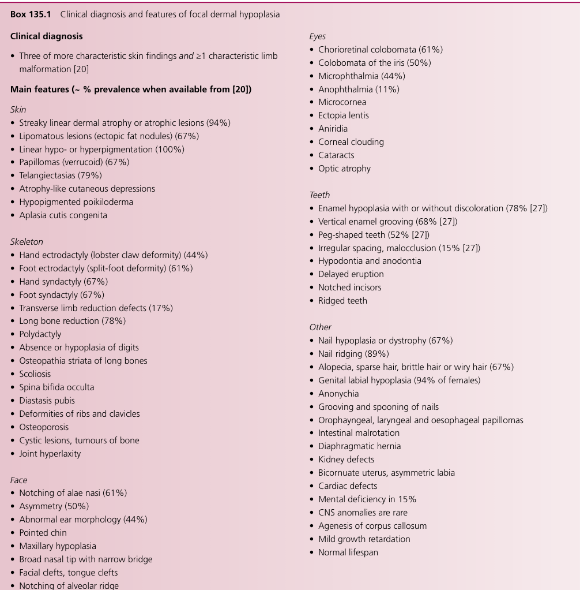

## Question

# Disease Characteristics Research Template

## Target Disease
- **Disease Name:** Focal Dermal Hypoplasia
- **MONDO ID:**  (if available)
- **Category:** Mendelian

## Research Objectives

Please provide a comprehensive research report on **Focal Dermal Hypoplasia** covering all of the
disease characteristics listed below. This report will be used to populate a disease knowledge
base entry. Be thorough and cite primary literature (PMID preferred) for all claims.

For each section, **suggested databases/resources** are listed. These are the first places
you should search for information on each topic.

---

### 1. Disease Information
> **Search first:** OMIM, Orphanet, ICD-10/ICD-11, MeSH, PubMed

- What is the disease? Provide a concise overview.
- What are the key identifiers? (OMIM, Orphanet, ICD-10/ICD-11, MeSH, Mondo)
- What are the common synonyms and alternative names?
- Is the information derived from individual patients (e.g., EHR) or aggregated disease-level resources?

### 2. Etiology

- **Disease Causal Factors**: What are the primary causes? (genetic, environmental, infectious, mechanistic)
- **Risk Factors**:
  > **Search first:** PubMed, Cochrane Library, UpToDate, clinical guidelines, ClinVar, ClinGen, GWAS Catalog, PheGenI, CTD, CDC, WHO, epidemiological databases
  - Genetic risk factors (causal variants, susceptibility loci, modifier genes)
  - Environmental risk factors (toxins, lifestyle, occupational exposures, age, sex, family history)
- **Protective Factors**:
  > **Search first:** PubMed, Cochrane Library, clinical trial databases, GWAS Catalog, gnomAD, WHO, CDC, nutrition databases
  - Genetic protective factors (protective variants, modifier alleles)
  - Environmental protective factors (diet, lifestyle, exposures that reduce risk)
- **Gene-Environment Interactions**: How do genetic and environmental factors interact to influence disease?
  > **Search first:** CTD, PubMed, PheGenI, GxE databases

### 3. Phenotypes
> **Search first:** HPO (Human Phenotype Ontology), OMIM, Orphanet, PubMed, clinicaltrials.gov, MedDRA, SNOMED CT, DECIPHER, LOINC

For each phenotype, provide:
- **Phenotype type**: symptoms, clinical signs, physical manifestations, behavioral changes, or laboratory abnormalities
  > For symptoms/signs: HPO, OMIM, Orphanet, PubMed
  > For behavioral changes: HPO, DSM, RDoC (Research Domain Criteria), PubMed
  > For laboratory abnormalities: LOINC, SNOMED CT, LabTests Online, PubMed
- **Phenotype characteristics**:
  > **Search first:** OMIM, Orphanet, HPO, PubMed
  - Age of symptom onset (neonatal, childhood, adult-onset, late-onset)
  - Symptom severity (mild, moderate, severe, variable)
  - Symptom progression (stable, progressive, episodic, fluctuating)
  - Frequency among affected individuals (percentage or qualitative)
- **Quality of life impact**: Effects on daily functioning and well-being (per-phenotype when possible)
  > **Search first:** EQ-5D database, SF-36, WHO QOL databases, PubMed
- Suggest HPO (Human Phenotype Ontology) terms for each phenotype

### 4. Genetic/Molecular Information

- **Causal Genes**: Gene mutations or chromosomal abnormalities responsible for disease (gene symbols, OMIM IDs)
  > **Search first:** OMIM, ClinVar, HGMD, Ensembl, NCBI Gene
- **Pathogenic Variants**:
  - Affected genes (gene symbols, HGNC IDs)
    > **Search first:** OMIM, NCBI Gene, Ensembl, HGNC, UniProt, GeneCards
  - Variant classification (pathogenic, likely pathogenic, VUS per ACMG/AMP guidelines)
    > **Search first:** ClinVar, ClinGen, ACMG/AMP guidelines, VarSome
  - Variant type/class (missense, frameshift, nonsense, splice-site, structural)
  - Allele frequency in population databases
    > **Search first:** gnomAD, 1000 Genomes, ExAC, TOPMed, dbSNP
  - Somatic vs germline origin
    > **Search first:** COSMIC (somatic), ClinVar, ICGC, TCGA
  - Functional consequences (loss of function, gain of function, dominant negative)
- **Modifier Genes**: Genes that modify disease severity or expression
- **Epigenetic Information**: DNA methylation, histone modifications, chromatin changes affecting disease
  > **Search first:** ENCODE, Roadmap Epigenomics, MethBase, DiseaseMeth
- **Chromosomal Abnormalities**: Large-scale genetic changes (aneuploidy, translocations, inversions)
  > **Search first:** DECIPHER, ClinVar, ECARUCA, UCSC Genome Browser

### 5. Environmental Information

- **Environmental Factors**: Non-genetic contributing factors (toxins, radiation, pollution, occupational exposure)
  > **Search first:** CTD (Comparative Toxicogenomics Database), TOXNET, PubMed, EPA databases
- **Lifestyle Factors**: Behavioral factors (smoking, diet, exercise, alcohol consumption)
  > **Search first:** CDC databases, WHO, PubMed, NHANES
- **Infectious Agents**: If applicable, pathogens causing or triggering disease (bacteria, viruses, fungi, parasites)
  > **Search first:** NCBI Taxonomy, ViPR, BV-BRC, MicrobeDB, GIDEON

### 6. Mechanism / Pathophysiology

- **Molecular Pathways**: Specific signaling cascades or biochemical pathways involved (Wnt, MAPK, mTOR, PI3K-AKT, etc.)
  > **Search first:** KEGG, Reactome, WikiPathways, PathBank, BioCyc
- **Cellular Processes**: Cell-level mechanisms (apoptosis, autophagy, cell cycle dysregulation, inflammation, etc.)
  > **Search first:** Gene Ontology (GO), Reactome, KEGG, PubMed
- **Protein Dysfunction**: How protein structure or function is altered (misfolding, aggregation, loss of function, gain of function)
  > **Search first:** UniProt, PDB (Protein Data Bank), InterPro, Pfam, AlphaFold
- **Metabolic Changes**: Alterations in metabolic processes (energy metabolism, lipid metabolism, amino acid metabolism)
  > **Search first:** KEGG, BioCyc, HMDB (Human Metabolome Database), BRENDA
- **Immune System Involvement**: Role of immune response (autoimmunity, immunodeficiency, chronic inflammation)
  > **Search first:** ImmPort, Immunome Database, IEDB, Gene Ontology
- **Tissue Damage Mechanisms**: How tissues/ are injured (oxidative stress, ischemia, fibrosis, necrosis)
  > **Search first:** PubMed, Gene Ontology, Reactome
- **Biochemical Abnormalities**: Specific molecular defects (enzyme deficiencies, receptor dysfunction, ion channel defects)
  > **Search first:** BRENDA, UniProt, KEGG, OMIM, PubMed
- **Epigenetic Changes**: DNA methylation, histone modifications affecting gene expression in disease
  > **Search first:** ENCODE, Roadmap Epigenomics, MethBase, DiseaseMeth
- **Molecular Profiling** (if available):
  - Transcriptomics/gene expression changes
    > **Search first:** GEO (Gene Expression Omnibus), ArrayExpress, GTEx, Human Cell Atlas, SRA
  - Proteomics findings
    > **Search first:** PRIDE, ProteomeXchange, Human Protein Atlas, STRING, BioGRID
  - Metabolomics signatures
    > **Search first:** MetaboLights, Metabolomics Workbench, HMDB, METLIN
  - Lipidomics alterations
    > **Search first:** LIPID MAPS, SwissLipids, LipidHome, Metabolomics Workbench
  - Genomic structural features
    > **Search first:** UCSC Genome Browser, Ensembl, NCBI, dbVar, DGV
- **Advanced Technologies** (if applicable):
  - Single-cell analysis findings (cell-type specific mechanisms, cellular heterogeneity)
    > **Search first:** Human Cell Atlas, Single Cell Portal, GEO, CELLxGENE
  - Spatial transcriptomics findings
    > **Search first:** GEO, Spatial Research, Vizgen, 10x Genomics data
  - Multi-omics integration results
    > **Search first:** TCGA, ICGC, cBioPortal, LinkedOmics, PubMed
  - Functional genomics screens (CRISPR, RNAi)
    > **Search first:** DepMap, GenomeRNAi, PubMed, BioGRID ORCS

For each mechanism, describe:
- The causal chain from initial trigger to clinical manifestation
- Which mechanisms are upstream vs downstream
- What cell types and biological processes are involved
- Suggest GO terms for biological processes and CL terms for cell types

### 7. Anatomical Structures Affected

- **Organ Level**:
  - Primary organs directly affected
  - Secondary organ involvement (complications, secondary effects)
  - Body systems involved (cardiovascular, nervous, digestive, respiratory, endocrine, etc.)
  > **Search first:** Uberon, FMA (Foundational Model of Anatomy), OMIM, HPO, ICD-11, MeSH, SNOMED CT
- **Tissue and Cell Level**:
  - Specific tissue types affected (epithelial, connective, muscle, nervous)
  - Specific cell populations targeted (with Cell Ontology terms)
  > **Search first:** Uberon, Human Protein Atlas, Cell Ontology, Human Cell Atlas, CellMarker, PanglaoDB
- **Subcellular Level**:
  - Cellular compartments involved (mitochondria, nucleus, ER, lysosomes) (with GO Cellular Component terms)
  > **Search first:** Gene Ontology (Cellular Component), UniProt, Human Protein Atlas
- **Localization**:
  - Specific anatomical sites (with UBERON terms)
    > **Search first:** FMA, Uberon, NeuroNames (for brain), SNOMED CT
  - Lateralization (unilateral, bilateral, asymmetric)
    > **Search first:** HPO, clinical literature, imaging databases

### 8. Temporal Development

- **Onset**:
  - Typical age of onset (congenital, pediatric, adult, geriatric)
  - Onset pattern (acute, subacute, chronic, insidious)
  > **Search first:** OMIM, Orphanet, HPO, PubMed
- **Progression**:
  - Disease stages (early, intermediate, advanced, end-stage)
    > **Search first:** Cancer Staging Manual (AJCC), WHO classifications, PubMed
  - Progression rate (rapid, slow, variable)
  - Disease course pattern (episodic, relapsing-remitting, progressive, stable)
  - Disease duration (self-limited, chronic lifelong)
  > **Search first:** Disease registries, longitudinal cohort databases, natural history studies, PubMed, Orphanet, OMIM
- **Patterns**:
  - Remission patterns (spontaneous, treatment-induced)
    > **Search first:** Clinical trial databases, disease registries, PubMed
  - Critical periods (time windows of vulnerability or opportunity for intervention)
    > **Search first:** PubMed, developmental biology databases, clinical guidelines

### 9. Inheritance and Population

- **Epidemiology**:
  - Prevalence (cases per 100,000 at given time)
  - Incidence (new cases per 100,000 per year)
  > **Search first:** Orphanet, CDC, WHO, GBD (Global Burden of Disease), national registries, SEER, disease registries
- **For Genetic Etiology**:
  - Inheritance pattern (AD, AR, X-linked, mitochondrial, multifactorial, polygenic)
    > **Search first:** OMIM, Orphanet, ClinVar, GTR (Genetic Testing Registry)
  - Penetrance (complete, incomplete, age-dependent)
    > **Search first:** ClinVar, OMIM, PubMed, ClinGen
  - Expressivity (variable, consistent)
    > **Search first:** OMIM, ClinVar, PubMed
  - Genetic anticipation (increasing severity in successive generations)
    > **Search first:** OMIM, PubMed (especially for repeat expansion disorders)
  - Germline mosaicism
    > **Search first:** ClinVar, OMIM, genetic counseling literature, PubMed
  - Founder effects (population-specific mutations)
    > **Search first:** gnomAD, population genetics databases, PubMed
  - Consanguinity role
    > **Search first:** OMIM, population studies, genetic counseling resources
  - Carrier frequency
    > **Search first:** gnomAD, carrier screening databases, GeneReviews, GTR
- **Population Demographics**:
  - Affected populations (ethnic or demographic groups with higher prevalence)
    > **Search first:** gnomAD, 1000 Genomes, PAGE Study, PubMed, population registries
  - Geographic distribution (endemic areas, regional variation)
    > **Search first:** WHO, CDC, GBD, Orphanet, geographic epidemiology databases
  - Geographic distribution of specific variants
  - Sex ratio (male:female)
    > **Search first:** Disease registries, OMIM, PubMed, epidemiological databases
  - Age distribution of affected individuals
    > **Search first:** CDC, disease registries, SEER, Orphanet

### 10. Diagnostics

- **Clinical Tests**:
  - Laboratory tests (blood, urine, tissue chemistry, specific enzyme assays)
    > **Search first:** LOINC, LabTests Online, PubMed
  - Biomarkers (proteins, metabolites, genetic markers, circulating biomarkers)
    > **Search first:** FDA Biomarker List, BEST (Biomarkers, EndpointS, and other Tools), PubMed
  - Imaging studies (X-ray, CT, MRI, PET, ultrasound)
    > **Search first:** RadLex, DICOM, Radiopaedia, imaging databases
  - Functional tests (pulmonary function, cardiac stress tests)
    > **Search first:** LOINC, clinical guidelines, PubMed
  - Electrophysiology (EEG, EMG, ECG, nerve conduction studies)
    > **Search first:** LOINC, clinical neurophysiology databases, PubMed
  - Biopsy findings (histopathology, immunohistochemistry)
    > **Search first:** SNOMED CT, College of American Pathologists resources, PubMed
  - Pathology findings (microscopic examination)
    > **Search first:** SNOMED CT, Digital Pathology databases, PubMed
- **Genetic Testing**:
  > **Search first:** GTR (Genetic Testing Registry), GeneReviews, ClinGen
  - Overview of recommended genetic testing approach
  - Whole genome sequencing (WGS) utility
    > **Search first:** GTR, ClinVar, GEL (Genomics England), gnomAD
  - Whole exome sequencing (WES) utility
    > **Search first:** GTR, ClinVar, OMIM, GeneMatcher
  - Gene panels (which panels, which genes)
    > **Search first:** GTR, ClinVar, laboratory-specific databases
  - Single gene testing
    > **Search first:** GTR, ClinVar, OMIM, GeneReviews
  - Chromosomal microarray (CMA)
    > **Search first:** DECIPHER, ClinVar, dbVar, ECARUCA
  - Karyotyping
    > **Search first:** Chromosome Abnormality Database, ClinVar, cytogenetics resources
  - FISH
    > **Search first:** ClinVar, cytogenetics databases, PubMed
  - Mitochondrial DNA testing
    > **Search first:** MITOMAP, MSeqDR, ClinVar, GTR
  - Repeat expansion testing
    > **Search first:** GTR, ClinVar, repeat expansion databases, PubMed
- **Omics-Based Diagnostics** (if applicable):
  - RNA sequencing / transcriptomics
    > **Search first:** GEO, ArrayExpress, GTEx, RNA-seq databases
  - Proteomics
    > **Search first:** PRIDE, ProteomeXchange, FDA Biomarker database
  - Metabolomics
    > **Search first:** MetaboLights, Metabolomics Workbench, HMDB
  - Epigenomics
    > **Search first:** GEO, ENCODE, Roadmap Epigenomics, MethBase
  - Liquid biopsy
    > **Search first:** COSMIC, ClinVar, liquid biopsy databases, PubMed
- **Clinical Criteria**:
  - Standardized diagnostic criteria (DSM, ICD, society guidelines)
    > **Search first:** DSM-5, ICD-11, clinical society guidelines, UpToDate
  - Differential diagnosis (other conditions to rule out, with distinguishing features)
    > **Search first:** DynaMed, UpToDate, clinical decision support systems
- **Screening**:
  - Screening methods for asymptomatic individuals (newborn screening, carrier screening, cascade screening)
    > **Search first:** ACMG recommendations, CDC newborn screening, GTR

### 11. Outcome/Prognosis

- **Survival and Mortality**:
  - Survival rate (5-year, 10-year, overall)
    > **Search first:** SEER, cancer registries, disease-specific registries, PubMed
  - Life expectancy (with and without treatment if applicable)
    > **Search first:** Orphanet, disease registries, actuarial databases, PubMed
  - Mortality rate
    > **Search first:** CDC, WHO, GBD, national mortality databases
  - Disease-specific mortality (deaths directly attributable to disease)
    > **Search first:** Disease registries, CDC Wonder, GBD, PubMed
- **Morbidity and Function**:
  - Morbidity (disease-related disability and health impacts)
    > **Search first:** GBD, WHO, disability databases, PubMed
  - Disability outcomes (long-term functional impairments)
    > **Search first:** ICF (International Classification of Functioning), disability registries
  - Quality of life measures (EQ-5D, SF-36, PROMIS, disease-specific tools)
    > **Search first:** EQ-5D database, SF-36, PROMIS, PubMed
- **Disease Course**:
  - Complications (secondary problems: infections, organ failure, etc.)
    > **Search first:** ICD codes, disease registries, clinical databases, PubMed
  - Recovery potential (likelihood and extent of recovery, with vs without treatment)
    > **Search first:** Natural history studies, rehabilitation databases, PubMed
- **Prediction**:
  - Prognostic factors (age, disease severity, biomarkers, treatment response)
    > **Search first:** Prognostic models databases, clinical calculators, PubMed
  - Prognostic biomarkers (molecular markers predicting disease course)
    > **Search first:** FDA Biomarker database, PubMed, cancer prognostic databases

### 12. Treatment

- **Pharmacotherapy**:
  - Pharmacological treatments (drug names, drug classes, mechanisms of action)
    > **Search first:** DrugBank, RxNorm, ATC classification, DailyMed, FDA databases
  - Pharmacogenomics (how genetic variants affect drug metabolism, efficacy, toxicity)
    > **Search first:** PharmGKB, CPIC (Clinical Pharmacogenetics), FDA Table of PGx Biomarkers
- **Advanced Therapeutics**:
  - Gene therapy (viral vectors, CRISPR, gene replacement, gene editing)
    > **Search first:** ClinicalTrials.gov, FDA gene therapy database, ASGCT resources
  - Cell therapy (stem cell transplant, CAR-T, cellular therapeutics)
    > **Search first:** ClinicalTrials.gov, FDA cell therapy database, FACT standards
  - RNA-based therapies (ASOs, siRNA, mRNA therapies)
    > **Search first:** ClinicalTrials.gov, FDA approvals, PubMed
  - Targeted therapies (treatments directed at specific molecular targets)
    > **Search first:** My Cancer Genome, OncoKB, ClinicalTrials.gov, FDA approvals
  - Immunotherapies (checkpoint inhibitors, monoclonal antibodies)
    > **Search first:** Cancer Immunotherapy Database, FDA approvals, ClinicalTrials.gov
- **Surgical and Interventional**:
  - Surgical interventions (types of surgery, timing, outcomes)
    > **Search first:** CPT codes, surgical registries, clinical guidelines, PubMed
- **Supportive and Rehabilitative**:
  - Supportive care (symptom management, pain control, nutrition)
    > **Search first:** Clinical guidelines, Cochrane Library, PubMed
  - Rehabilitation (physical therapy, occupational therapy, speech therapy)
    > **Search first:** Rehabilitation medicine databases, clinical guidelines, PubMed
- **Experimental**:
  - Experimental treatments in clinical trials (with NCT identifiers if available)
    > **Search first:** ClinicalTrials.gov, EU Clinical Trials Register, WHO ICTRP
- **Treatment Outcomes**:
  - Treatment response rates
    > **Search first:** Clinical trial databases, FDA reviews, systematic reviews, PubMed
  - Side effects and adverse events
    > **Search first:** FDA Adverse Event Reporting System (FAERS), MedWatch, PubMed
- **Treatment Strategy**:
  - Treatment algorithms (clinical pathways, decision trees)
    > **Search first:** Clinical practice guidelines, NCCN Guidelines, UpToDate
  - Combination therapies
    > **Search first:** ClinicalTrials.gov, treatment guidelines, PubMed
  - Personalized medicine approaches (genotype-guided treatment)
    > **Search first:** My Cancer Genome, CIViC, PharmGKB, precision medicine databases

For each treatment, suggest MAXO (Medical Action Ontology) terms where applicable.

### 13. Prevention

- **Prevention Levels**:
  - Primary prevention (preventing disease occurrence: vaccination, risk factor modification)
    > **Search first:** CDC, WHO, USPSTF recommendations, Cochrane Library
  - Secondary prevention (early detection and treatment: screening programs, early intervention)
    > **Search first:** USPSTF, CDC screening guidelines, WHO
  - Tertiary prevention (preventing complications in those with disease)
    > **Search first:** Clinical guidelines, disease management protocols, PubMed
- **Immunization**: Vaccine strategies (if applicable)
  > **Search first:** CDC vaccine schedules, WHO immunization, FDA vaccine database
- **Screening and Early Detection**:
  - Screening programs (population-based: newborn screening, cancer screening)
    > **Search first:** CDC screening programs, USPSTF, cancer screening databases
  - Genetic screening (carrier screening, preimplantation genetic diagnosis, prenatal testing)
    > **Search first:** ACMG recommendations, ACOG guidelines, GTR
  - Risk stratification (identifying high-risk individuals for targeted prevention)
    > **Search first:** Risk prediction models, clinical calculators, PubMed
- **Behavioral Interventions**: Lifestyle modifications to reduce risk
  > **Search first:** CDC, WHO, behavioral intervention databases, Cochrane Library
- **Counseling**: Genetic counseling (risk assessment, family planning guidance)
  > **Search first:** NSGC resources, ACMG guidelines, GeneReviews
- **Public Health**:
  - Public health interventions (sanitation, vector control, health education)
    > **Search first:** CDC, WHO, public health databases, PubMed
  - Environmental interventions (reducing environmental risk factors)
    > **Search first:** EPA databases, WHO environmental health, PubMed
- **Prophylaxis**: Preventive medications or procedures
  > **Search first:** Clinical guidelines, FDA approvals, PubMed

### 14. Other Species / Natural Disease

- **Taxonomy**: Species affected (with NCBI Taxon identifiers)
  > **Search first:** NCBI Taxonomy
- **Breed**: Specific breeds affected (with VBO identifiers if applicable)
  > **Search first:** VBO (Vertebrate Breed Ontology)
- **Gene**: Orthologous genes in other species (with NCBI Gene IDs)
  > **Search first:** NCBI Gene
- **Natural Disease**:
  - Naturally occurring disease in other species (companion animals, wildlife)
    > **Search first:** OMIA (Online Mendelian Inheritance in Animals), VetCompass, PubMed
  - Veterinary relevance and importance in animal health
    > **Search first:** OMIA, veterinary databases, PubMed
- **Comparative Biology**:
  - Comparative pathology (similarities and differences across species)
    > **Search first:** OMIA, comparative pathology databases, PubMed
  - Evolutionary conservation of disease mechanisms
    > **Search first:** HomoloGene, OrthoMCL, Alliance of Genome Resources
- **Transmission** (if applicable):
  - Zoonotic potential
    > **Search first:** CDC zoonotic diseases, WHO zoonoses, GIDEON
  - Cross-species susceptibility
    > **Search first:** NCBI Taxonomy, veterinary databases, PubMed

### 15. Model Organisms

- **Model Types**:
  - Model organism type (mammalian, invertebrate, cellular, in vitro)
    > **Search first:** Alliance of Genome Resources, model organism databases
  - Specific model systems (mouse, rat, zebrafish, Drosophila, C. elegans, yeast, cell lines, organoids, iPSCs)
    > **Search first:** MGI, RGD, ZFIN, FlyBase, WormBase, SGD, ATCC, Cellosaurus
  - Induced models (drug treatment, surgical intervention, environmental manipulation)
    > **Search first:** MGI, model organism databases, PubMed
- **Genetic Models**:
  - Types available (knockout, knock-in, transgenic, conditional, humanized)
    > **Search first:** MGI, IMPC, KOMP, EuMMCR, IMSR
- **Model Characteristics**:
  - Phenotype recapitulation (how well model reproduces human disease features)
    > **Search first:** Model organism databases, comparative studies, PubMed
  - Model limitations (aspects of human disease not captured)
    > **Search first:** Model organism databases, PubMed, review articles
- **Applications**:
  - Research applications (what aspects of disease can be studied)
    > **Search first:** Model organism databases, PubMed
- **Resources**:
  - Model databases
    > **Search first:** MGI, RGD, ZFIN, FlyBase, WormBase, IMSR, EMMA, MMRRC

---

## Citation Requirements

- Cite primary literature (PMID preferred) for all mechanistic and clinical claims
- Prioritize recent reviews and landmark papers
- Include direct quotes from abstracts where possible to support key statements
- Distinguish evidence source types: human clinical, model organism, in vitro, computational

## Output Format

Structure your response as a comprehensive narrative organized by the sections above.
For each section, provide:
- Factual content with specific details (numbers, percentages, gene names, variant nomenclature)
- Ontology term suggestions (HPO, GO, CL, UBERON, CHEBI, MAXO, MONDO) where applicable
- Evidence citations with PMIDs
- Direct quotes from abstracts to support key claims
- Clear indication when information is not available or not applicable for this disease

This report will be used to populate a disease knowledge base entry with:
- Pathophysiology descriptions with causal chains
- Gene/protein annotations (HGNC, GO terms)
- Phenotype associations (HP terms) with frequencies
- Cell type involvement (CL terms)
- Anatomical locations (UBERON terms)
- Chemical entities (CHEBI terms)
- Treatment annotations (MAXO terms)
- Evidence items with PMIDs and exact abstract quotes
- Epidemiology, prognosis, diagnostic, and prevention information
- Animal model descriptions with phenotype recapitulation details

## Output

Question: You are an expert researcher providing comprehensive, well-cited information.

Provide detailed information focusing on:
1. Key concepts and definitions with current understanding
2. Recent developments and latest research (prioritize 2023-2024 sources)
3. Current applications and real-world implementations
4. Expert opinions and analysis from authoritative sources
5. Relevant statistics and data from recent studies

Format as a comprehensive research report with proper citations. Include URLs and publication dates where available.
Always prioritize recent, authoritative sources and provide specific citations for all major claims.

# Disease Characteristics Research Template

## Target Disease
- **Disease Name:** Focal Dermal Hypoplasia
- **MONDO ID:**  (if available)
- **Category:** Mendelian

## Research Objectives

Please provide a comprehensive research report on **Focal Dermal Hypoplasia** covering all of the
disease characteristics listed below. This report will be used to populate a disease knowledge
base entry. Be thorough and cite primary literature (PMID preferred) for all claims.

For each section, **suggested databases/resources** are listed. These are the first places
you should search for information on each topic.

---

### 1. Disease Information
> **Search first:** OMIM, Orphanet, ICD-10/ICD-11, MeSH, PubMed

- What is the disease? Provide a concise overview.
- What are the key identifiers? (OMIM, Orphanet, ICD-10/ICD-11, MeSH, Mondo)
- What are the common synonyms and alternative names?
- Is the information derived from individual patients (e.g., EHR) or aggregated disease-level resources?

### 2. Etiology

- **Disease Causal Factors**: What are the primary causes? (genetic, environmental, infectious, mechanistic)
- **Risk Factors**:
  > **Search first:** PubMed, Cochrane Library, UpToDate, clinical guidelines, ClinVar, ClinGen, GWAS Catalog, PheGenI, CTD, CDC, WHO, epidemiological databases
  - Genetic risk factors (causal variants, susceptibility loci, modifier genes)
  - Environmental risk factors (toxins, lifestyle, occupational exposures, age, sex, family history)
- **Protective Factors**:
  > **Search first:** PubMed, Cochrane Library, clinical trial databases, GWAS Catalog, gnomAD, WHO, CDC, nutrition databases
  - Genetic protective factors (protective variants, modifier alleles)
  - Environmental protective factors (diet, lifestyle, exposures that reduce risk)
- **Gene-Environment Interactions**: How do genetic and environmental factors interact to influence disease?
  > **Search first:** CTD, PubMed, PheGenI, GxE databases

### 3. Phenotypes
> **Search first:** HPO (Human Phenotype Ontology), OMIM, Orphanet, PubMed, clinicaltrials.gov, MedDRA, SNOMED CT, DECIPHER, LOINC

For each phenotype, provide:
- **Phenotype type**: symptoms, clinical signs, physical manifestations, behavioral changes, or laboratory abnormalities
  > For symptoms/signs: HPO, OMIM, Orphanet, PubMed
  > For behavioral changes: HPO, DSM, RDoC (Research Domain Criteria), PubMed
  > For laboratory abnormalities: LOINC, SNOMED CT, LabTests Online, PubMed
- **Phenotype characteristics**:
  > **Search first:** OMIM, Orphanet, HPO, PubMed
  - Age of symptom onset (neonatal, childhood, adult-onset, late-onset)
  - Symptom severity (mild, moderate, severe, variable)
  - Symptom progression (stable, progressive, episodic, fluctuating)
  - Frequency among affected individuals (percentage or qualitative)
- **Quality of life impact**: Effects on daily functioning and well-being (per-phenotype when possible)
  > **Search first:** EQ-5D database, SF-36, WHO QOL databases, PubMed
- Suggest HPO (Human Phenotype Ontology) terms for each phenotype

### 4. Genetic/Molecular Information

- **Causal Genes**: Gene mutations or chromosomal abnormalities responsible for disease (gene symbols, OMIM IDs)
  > **Search first:** OMIM, ClinVar, HGMD, Ensembl, NCBI Gene
- **Pathogenic Variants**:
  - Affected genes (gene symbols, HGNC IDs)
    > **Search first:** OMIM, NCBI Gene, Ensembl, HGNC, UniProt, GeneCards
  - Variant classification (pathogenic, likely pathogenic, VUS per ACMG/AMP guidelines)
    > **Search first:** ClinVar, ClinGen, ACMG/AMP guidelines, VarSome
  - Variant type/class (missense, frameshift, nonsense, splice-site, structural)
  - Allele frequency in population databases
    > **Search first:** gnomAD, 1000 Genomes, ExAC, TOPMed, dbSNP
  - Somatic vs germline origin
    > **Search first:** COSMIC (somatic), ClinVar, ICGC, TCGA
  - Functional consequences (loss of function, gain of function, dominant negative)
- **Modifier Genes**: Genes that modify disease severity or expression
- **Epigenetic Information**: DNA methylation, histone modifications, chromatin changes affecting disease
  > **Search first:** ENCODE, Roadmap Epigenomics, MethBase, DiseaseMeth
- **Chromosomal Abnormalities**: Large-scale genetic changes (aneuploidy, translocations, inversions)
  > **Search first:** DECIPHER, ClinVar, ECARUCA, UCSC Genome Browser

### 5. Environmental Information

- **Environmental Factors**: Non-genetic contributing factors (toxins, radiation, pollution, occupational exposure)
  > **Search first:** CTD (Comparative Toxicogenomics Database), TOXNET, PubMed, EPA databases
- **Lifestyle Factors**: Behavioral factors (smoking, diet, exercise, alcohol consumption)
  > **Search first:** CDC databases, WHO, PubMed, NHANES
- **Infectious Agents**: If applicable, pathogens causing or triggering disease (bacteria, viruses, fungi, parasites)
  > **Search first:** NCBI Taxonomy, ViPR, BV-BRC, MicrobeDB, GIDEON

### 6. Mechanism / Pathophysiology

- **Molecular Pathways**: Specific signaling cascades or biochemical pathways involved (Wnt, MAPK, mTOR, PI3K-AKT, etc.)
  > **Search first:** KEGG, Reactome, WikiPathways, PathBank, BioCyc
- **Cellular Processes**: Cell-level mechanisms (apoptosis, autophagy, cell cycle dysregulation, inflammation, etc.)
  > **Search first:** Gene Ontology (GO), Reactome, KEGG, PubMed
- **Protein Dysfunction**: How protein structure or function is altered (misfolding, aggregation, loss of function, gain of function)
  > **Search first:** UniProt, PDB (Protein Data Bank), InterPro, Pfam, AlphaFold
- **Metabolic Changes**: Alterations in metabolic processes (energy metabolism, lipid metabolism, amino acid metabolism)
  > **Search first:** KEGG, BioCyc, HMDB (Human Metabolome Database), BRENDA
- **Immune System Involvement**: Role of immune response (autoimmunity, immunodeficiency, chronic inflammation)
  > **Search first:** ImmPort, Immunome Database, IEDB, Gene Ontology
- **Tissue Damage Mechanisms**: How tissues/ are injured (oxidative stress, ischemia, fibrosis, necrosis)
  > **Search first:** PubMed, Gene Ontology, Reactome
- **Biochemical Abnormalities**: Specific molecular defects (enzyme deficiencies, receptor dysfunction, ion channel defects)
  > **Search first:** BRENDA, UniProt, KEGG, OMIM, PubMed
- **Epigenetic Changes**: DNA methylation, histone modifications affecting gene expression in disease
  > **Search first:** ENCODE, Roadmap Epigenomics, MethBase, DiseaseMeth
- **Molecular Profiling** (if available):
  - Transcriptomics/gene expression changes
    > **Search first:** GEO (Gene Expression Omnibus), ArrayExpress, GTEx, Human Cell Atlas, SRA
  - Proteomics findings
    > **Search first:** PRIDE, ProteomeXchange, Human Protein Atlas, STRING, BioGRID
  - Metabolomics signatures
    > **Search first:** MetaboLights, Metabolomics Workbench, HMDB, METLIN
  - Lipidomics alterations
    > **Search first:** LIPID MAPS, SwissLipids, LipidHome, Metabolomics Workbench
  - Genomic structural features
    > **Search first:** UCSC Genome Browser, Ensembl, NCBI, dbVar, DGV
- **Advanced Technologies** (if applicable):
  - Single-cell analysis findings (cell-type specific mechanisms, cellular heterogeneity)
    > **Search first:** Human Cell Atlas, Single Cell Portal, GEO, CELLxGENE
  - Spatial transcriptomics findings
    > **Search first:** GEO, Spatial Research, Vizgen, 10x Genomics data
  - Multi-omics integration results
    > **Search first:** TCGA, ICGC, cBioPortal, LinkedOmics, PubMed
  - Functional genomics screens (CRISPR, RNAi)
    > **Search first:** DepMap, GenomeRNAi, PubMed, BioGRID ORCS

For each mechanism, describe:
- The causal chain from initial trigger to clinical manifestation
- Which mechanisms are upstream vs downstream
- What cell types and biological processes are involved
- Suggest GO terms for biological processes and CL terms for cell types

### 7. Anatomical Structures Affected

- **Organ Level**:
  - Primary organs directly affected
  - Secondary organ involvement (complications, secondary effects)
  - Body systems involved (cardiovascular, nervous, digestive, respiratory, endocrine, etc.)
  > **Search first:** Uberon, FMA (Foundational Model of Anatomy), OMIM, HPO, ICD-11, MeSH, SNOMED CT
- **Tissue and Cell Level**:
  - Specific tissue types affected (epithelial, connective, muscle, nervous)
  - Specific cell populations targeted (with Cell Ontology terms)
  > **Search first:** Uberon, Human Protein Atlas, Cell Ontology, Human Cell Atlas, CellMarker, PanglaoDB
- **Subcellular Level**:
  - Cellular compartments involved (mitochondria, nucleus, ER, lysosomes) (with GO Cellular Component terms)
  > **Search first:** Gene Ontology (Cellular Component), UniProt, Human Protein Atlas
- **Localization**:
  - Specific anatomical sites (with UBERON terms)
    > **Search first:** FMA, Uberon, NeuroNames (for brain), SNOMED CT
  - Lateralization (unilateral, bilateral, asymmetric)
    > **Search first:** HPO, clinical literature, imaging databases

### 8. Temporal Development

- **Onset**:
  - Typical age of onset (congenital, pediatric, adult, geriatric)
  - Onset pattern (acute, subacute, chronic, insidious)
  > **Search first:** OMIM, Orphanet, HPO, PubMed
- **Progression**:
  - Disease stages (early, intermediate, advanced, end-stage)
    > **Search first:** Cancer Staging Manual (AJCC), WHO classifications, PubMed
  - Progression rate (rapid, slow, variable)
  - Disease course pattern (episodic, relapsing-remitting, progressive, stable)
  - Disease duration (self-limited, chronic lifelong)
  > **Search first:** Disease registries, longitudinal cohort databases, natural history studies, PubMed, Orphanet, OMIM
- **Patterns**:
  - Remission patterns (spontaneous, treatment-induced)
    > **Search first:** Clinical trial databases, disease registries, PubMed
  - Critical periods (time windows of vulnerability or opportunity for intervention)
    > **Search first:** PubMed, developmental biology databases, clinical guidelines

### 9. Inheritance and Population

- **Epidemiology**:
  - Prevalence (cases per 100,000 at given time)
  - Incidence (new cases per 100,000 per year)
  > **Search first:** Orphanet, CDC, WHO, GBD (Global Burden of Disease), national registries, SEER, disease registries
- **For Genetic Etiology**:
  - Inheritance pattern (AD, AR, X-linked, mitochondrial, multifactorial, polygenic)
    > **Search first:** OMIM, Orphanet, ClinVar, GTR (Genetic Testing Registry)
  - Penetrance (complete, incomplete, age-dependent)
    > **Search first:** ClinVar, OMIM, PubMed, ClinGen
  - Expressivity (variable, consistent)
    > **Search first:** OMIM, ClinVar, PubMed
  - Genetic anticipation (increasing severity in successive generations)
    > **Search first:** OMIM, PubMed (especially for repeat expansion disorders)
  - Germline mosaicism
    > **Search first:** ClinVar, OMIM, genetic counseling literature, PubMed
  - Founder effects (population-specific mutations)
    > **Search first:** gnomAD, population genetics databases, PubMed
  - Consanguinity role
    > **Search first:** OMIM, population studies, genetic counseling resources
  - Carrier frequency
    > **Search first:** gnomAD, carrier screening databases, GeneReviews, GTR
- **Population Demographics**:
  - Affected populations (ethnic or demographic groups with higher prevalence)
    > **Search first:** gnomAD, 1000 Genomes, PAGE Study, PubMed, population registries
  - Geographic distribution (endemic areas, regional variation)
    > **Search first:** WHO, CDC, GBD, Orphanet, geographic epidemiology databases
  - Geographic distribution of specific variants
  - Sex ratio (male:female)
    > **Search first:** Disease registries, OMIM, PubMed, epidemiological databases
  - Age distribution of affected individuals
    > **Search first:** CDC, disease registries, SEER, Orphanet

### 10. Diagnostics

- **Clinical Tests**:
  - Laboratory tests (blood, urine, tissue chemistry, specific enzyme assays)
    > **Search first:** LOINC, LabTests Online, PubMed
  - Biomarkers (proteins, metabolites, genetic markers, circulating biomarkers)
    > **Search first:** FDA Biomarker List, BEST (Biomarkers, EndpointS, and other Tools), PubMed
  - Imaging studies (X-ray, CT, MRI, PET, ultrasound)
    > **Search first:** RadLex, DICOM, Radiopaedia, imaging databases
  - Functional tests (pulmonary function, cardiac stress tests)
    > **Search first:** LOINC, clinical guidelines, PubMed
  - Electrophysiology (EEG, EMG, ECG, nerve conduction studies)
    > **Search first:** LOINC, clinical neurophysiology databases, PubMed
  - Biopsy findings (histopathology, immunohistochemistry)
    > **Search first:** SNOMED CT, College of American Pathologists resources, PubMed
  - Pathology findings (microscopic examination)
    > **Search first:** SNOMED CT, Digital Pathology databases, PubMed
- **Genetic Testing**:
  > **Search first:** GTR (Genetic Testing Registry), GeneReviews, ClinGen
  - Overview of recommended genetic testing approach
  - Whole genome sequencing (WGS) utility
    > **Search first:** GTR, ClinVar, GEL (Genomics England), gnomAD
  - Whole exome sequencing (WES) utility
    > **Search first:** GTR, ClinVar, OMIM, GeneMatcher
  - Gene panels (which panels, which genes)
    > **Search first:** GTR, ClinVar, laboratory-specific databases
  - Single gene testing
    > **Search first:** GTR, ClinVar, OMIM, GeneReviews
  - Chromosomal microarray (CMA)
    > **Search first:** DECIPHER, ClinVar, dbVar, ECARUCA
  - Karyotyping
    > **Search first:** Chromosome Abnormality Database, ClinVar, cytogenetics resources
  - FISH
    > **Search first:** ClinVar, cytogenetics databases, PubMed
  - Mitochondrial DNA testing
    > **Search first:** MITOMAP, MSeqDR, ClinVar, GTR
  - Repeat expansion testing
    > **Search first:** GTR, ClinVar, repeat expansion databases, PubMed
- **Omics-Based Diagnostics** (if applicable):
  - RNA sequencing / transcriptomics
    > **Search first:** GEO, ArrayExpress, GTEx, RNA-seq databases
  - Proteomics
    > **Search first:** PRIDE, ProteomeXchange, FDA Biomarker database
  - Metabolomics
    > **Search first:** MetaboLights, Metabolomics Workbench, HMDB
  - Epigenomics
    > **Search first:** GEO, ENCODE, Roadmap Epigenomics, MethBase
  - Liquid biopsy
    > **Search first:** COSMIC, ClinVar, liquid biopsy databases, PubMed
- **Clinical Criteria**:
  - Standardized diagnostic criteria (DSM, ICD, society guidelines)
    > **Search first:** DSM-5, ICD-11, clinical society guidelines, UpToDate
  - Differential diagnosis (other conditions to rule out, with distinguishing features)
    > **Search first:** DynaMed, UpToDate, clinical decision support systems
- **Screening**:
  - Screening methods for asymptomatic individuals (newborn screening, carrier screening, cascade screening)
    > **Search first:** ACMG recommendations, CDC newborn screening, GTR

### 11. Outcome/Prognosis

- **Survival and Mortality**:
  - Survival rate (5-year, 10-year, overall)
    > **Search first:** SEER, cancer registries, disease-specific registries, PubMed
  - Life expectancy (with and without treatment if applicable)
    > **Search first:** Orphanet, disease registries, actuarial databases, PubMed
  - Mortality rate
    > **Search first:** CDC, WHO, GBD, national mortality databases
  - Disease-specific mortality (deaths directly attributable to disease)
    > **Search first:** Disease registries, CDC Wonder, GBD, PubMed
- **Morbidity and Function**:
  - Morbidity (disease-related disability and health impacts)
    > **Search first:** GBD, WHO, disability databases, PubMed
  - Disability outcomes (long-term functional impairments)
    > **Search first:** ICF (International Classification of Functioning), disability registries
  - Quality of life measures (EQ-5D, SF-36, PROMIS, disease-specific tools)
    > **Search first:** EQ-5D database, SF-36, PROMIS, PubMed
- **Disease Course**:
  - Complications (secondary problems: infections, organ failure, etc.)
    > **Search first:** ICD codes, disease registries, clinical databases, PubMed
  - Recovery potential (likelihood and extent of recovery, with vs without treatment)
    > **Search first:** Natural history studies, rehabilitation databases, PubMed
- **Prediction**:
  - Prognostic factors (age, disease severity, biomarkers, treatment response)
    > **Search first:** Prognostic models databases, clinical calculators, PubMed
  - Prognostic biomarkers (molecular markers predicting disease course)
    > **Search first:** FDA Biomarker database, PubMed, cancer prognostic databases

### 12. Treatment

- **Pharmacotherapy**:
  - Pharmacological treatments (drug names, drug classes, mechanisms of action)
    > **Search first:** DrugBank, RxNorm, ATC classification, DailyMed, FDA databases
  - Pharmacogenomics (how genetic variants affect drug metabolism, efficacy, toxicity)
    > **Search first:** PharmGKB, CPIC (Clinical Pharmacogenetics), FDA Table of PGx Biomarkers
- **Advanced Therapeutics**:
  - Gene therapy (viral vectors, CRISPR, gene replacement, gene editing)
    > **Search first:** ClinicalTrials.gov, FDA gene therapy database, ASGCT resources
  - Cell therapy (stem cell transplant, CAR-T, cellular therapeutics)
    > **Search first:** ClinicalTrials.gov, FDA cell therapy database, FACT standards
  - RNA-based therapies (ASOs, siRNA, mRNA therapies)
    > **Search first:** ClinicalTrials.gov, FDA approvals, PubMed
  - Targeted therapies (treatments directed at specific molecular targets)
    > **Search first:** My Cancer Genome, OncoKB, ClinicalTrials.gov, FDA approvals
  - Immunotherapies (checkpoint inhibitors, monoclonal antibodies)
    > **Search first:** Cancer Immunotherapy Database, FDA approvals, ClinicalTrials.gov
- **Surgical and Interventional**:
  - Surgical interventions (types of surgery, timing, outcomes)
    > **Search first:** CPT codes, surgical registries, clinical guidelines, PubMed
- **Supportive and Rehabilitative**:
  - Supportive care (symptom management, pain control, nutrition)
    > **Search first:** Clinical guidelines, Cochrane Library, PubMed
  - Rehabilitation (physical therapy, occupational therapy, speech therapy)
    > **Search first:** Rehabilitation medicine databases, clinical guidelines, PubMed
- **Experimental**:
  - Experimental treatments in clinical trials (with NCT identifiers if available)
    > **Search first:** ClinicalTrials.gov, EU Clinical Trials Register, WHO ICTRP
- **Treatment Outcomes**:
  - Treatment response rates
    > **Search first:** Clinical trial databases, FDA reviews, systematic reviews, PubMed
  - Side effects and adverse events
    > **Search first:** FDA Adverse Event Reporting System (FAERS), MedWatch, PubMed
- **Treatment Strategy**:
  - Treatment algorithms (clinical pathways, decision trees)
    > **Search first:** Clinical practice guidelines, NCCN Guidelines, UpToDate
  - Combination therapies
    > **Search first:** ClinicalTrials.gov, treatment guidelines, PubMed
  - Personalized medicine approaches (genotype-guided treatment)
    > **Search first:** My Cancer Genome, CIViC, PharmGKB, precision medicine databases

For each treatment, suggest MAXO (Medical Action Ontology) terms where applicable.

### 13. Prevention

- **Prevention Levels**:
  - Primary prevention (preventing disease occurrence: vaccination, risk factor modification)
    > **Search first:** CDC, WHO, USPSTF recommendations, Cochrane Library
  - Secondary prevention (early detection and treatment: screening programs, early intervention)
    > **Search first:** USPSTF, CDC screening guidelines, WHO
  - Tertiary prevention (preventing complications in those with disease)
    > **Search first:** Clinical guidelines, disease management protocols, PubMed
- **Immunization**: Vaccine strategies (if applicable)
  > **Search first:** CDC vaccine schedules, WHO immunization, FDA vaccine database
- **Screening and Early Detection**:
  - Screening programs (population-based: newborn screening, cancer screening)
    > **Search first:** CDC screening programs, USPSTF, cancer screening databases
  - Genetic screening (carrier screening, preimplantation genetic diagnosis, prenatal testing)
    > **Search first:** ACMG recommendations, ACOG guidelines, GTR
  - Risk stratification (identifying high-risk individuals for targeted prevention)
    > **Search first:** Risk prediction models, clinical calculators, PubMed
- **Behavioral Interventions**: Lifestyle modifications to reduce risk
  > **Search first:** CDC, WHO, behavioral intervention databases, Cochrane Library
- **Counseling**: Genetic counseling (risk assessment, family planning guidance)
  > **Search first:** NSGC resources, ACMG guidelines, GeneReviews
- **Public Health**:
  - Public health interventions (sanitation, vector control, health education)
    > **Search first:** CDC, WHO, public health databases, PubMed
  - Environmental interventions (reducing environmental risk factors)
    > **Search first:** EPA databases, WHO environmental health, PubMed
- **Prophylaxis**: Preventive medications or procedures
  > **Search first:** Clinical guidelines, FDA approvals, PubMed

### 14. Other Species / Natural Disease

- **Taxonomy**: Species affected (with NCBI Taxon identifiers)
  > **Search first:** NCBI Taxonomy
- **Breed**: Specific breeds affected (with VBO identifiers if applicable)
  > **Search first:** VBO (Vertebrate Breed Ontology)
- **Gene**: Orthologous genes in other species (with NCBI Gene IDs)
  > **Search first:** NCBI Gene
- **Natural Disease**:
  - Naturally occurring disease in other species (companion animals, wildlife)
    > **Search first:** OMIA (Online Mendelian Inheritance in Animals), VetCompass, PubMed
  - Veterinary relevance and importance in animal health
    > **Search first:** OMIA, veterinary databases, PubMed
- **Comparative Biology**:
  - Comparative pathology (similarities and differences across species)
    > **Search first:** OMIA, comparative pathology databases, PubMed
  - Evolutionary conservation of disease mechanisms
    > **Search first:** HomoloGene, OrthoMCL, Alliance of Genome Resources
- **Transmission** (if applicable):
  - Zoonotic potential
    > **Search first:** CDC zoonotic diseases, WHO zoonoses, GIDEON
  - Cross-species susceptibility
    > **Search first:** NCBI Taxonomy, veterinary databases, PubMed

### 15. Model Organisms

- **Model Types**:
  - Model organism type (mammalian, invertebrate, cellular, in vitro)
    > **Search first:** Alliance of Genome Resources, model organism databases
  - Specific model systems (mouse, rat, zebrafish, Drosophila, C. elegans, yeast, cell lines, organoids, iPSCs)
    > **Search first:** MGI, RGD, ZFIN, FlyBase, WormBase, SGD, ATCC, Cellosaurus
  - Induced models (drug treatment, surgical intervention, environmental manipulation)
    > **Search first:** MGI, model organism databases, PubMed
- **Genetic Models**:
  - Types available (knockout, knock-in, transgenic, conditional, humanized)
    > **Search first:** MGI, IMPC, KOMP, EuMMCR, IMSR
- **Model Characteristics**:
  - Phenotype recapitulation (how well model reproduces human disease features)
    > **Search first:** Model organism databases, comparative studies, PubMed
  - Model limitations (aspects of human disease not captured)
    > **Search first:** Model organism databases, PubMed, review articles
- **Applications**:
  - Research applications (what aspects of disease can be studied)
    > **Search first:** Model organism databases, PubMed
- **Resources**:
  - Model databases
    > **Search first:** MGI, RGD, ZFIN, FlyBase, WormBase, IMSR, EMMA, MMRRC

---

## Citation Requirements

- Cite primary literature (PMID preferred) for all mechanistic and clinical claims
- Prioritize recent reviews and landmark papers
- Include direct quotes from abstracts where possible to support key statements
- Distinguish evidence source types: human clinical, model organism, in vitro, computational

## Output Format

Structure your response as a comprehensive narrative organized by the sections above.
For each section, provide:
- Factual content with specific details (numbers, percentages, gene names, variant nomenclature)
- Ontology term suggestions (HPO, GO, CL, UBERON, CHEBI, MAXO, MONDO) where applicable
- Evidence citations with PMIDs
- Direct quotes from abstracts to support key claims
- Clear indication when information is not available or not applicable for this disease

This report will be used to populate a disease knowledge base entry with:
- Pathophysiology descriptions with causal chains
- Gene/protein annotations (HGNC, GO terms)
- Phenotype associations (HP terms) with frequencies
- Cell type involvement (CL terms)
- Anatomical locations (UBERON terms)
- Chemical entities (CHEBI terms)
- Treatment annotations (MAXO terms)
- Evidence items with PMIDs and exact abstract quotes
- Epidemiology, prognosis, diagnostic, and prevention information
- Animal model descriptions with phenotype recapitulation details

## Comprehensive Disease Characteristics Report: Focal Dermal Hypoplasia (FDH; Goltz syndrome)

### Executive summary
Focal dermal hypoplasia (FDH), also known as Goltz syndrome (and sometimes Goltz–Gorlin syndrome), is a rare, congenital multisystem disorder characterized by patterned skin atrophy with fat herniation, limb malformations, and frequent ocular and dental anomalies. FDH is caused by pathogenic variants in the X‑linked gene **PORCN**, which encodes an endoplasmic reticulum (ER) O‑acyltransferase essential for Wnt ligand lipidation and secretion; downstream disruption of Wnt signaling during development is considered the central disease mechanism. The disorder is classically X‑linked dominant with marked female predominance and frequent male lethality, with surviving males typically mosaic. (clements2009porcngenemutations pages 1-3, bostwick2019focaldermalhypoplasia pages 2-4, bostwick2019focaldermalhypoplasia pages 1-2)

| Category | Summary | Evidence/Citation |
|---|---|---|
| Disease name / synonyms | **Focal dermal hypoplasia (FDH)**; also called **Goltz syndrome** and **Goltz-Gorlin syndrome**. Described as a rare multisystem disorder affecting ectodermal- and mesodermal-derived tissues. | (NCT00691223 chunk 1, aoyama2008caseofunilateral pages 1-3, tejani2006focaldermalhypoplasia pages 1-1, maymi2007focaldermalhypoplasia pages 1-3) |
| Core molecular cause | Caused by pathogenic variants in **PORCN**, an X-linked gene encoding an ER-resident **membrane-bound O-acyltransferase** required for Wnt ligand acylation/processing and secretion. Loss of PORCN disrupts Wnt signaling during development. | (clements2009porcngenemutations pages 6-7, clements2009porcngenemutations pages 4-6, clements2009porcngenemutations pages 1-3, costanza2023casereportpapillary pages 6-7) |
| Inheritance / male lethality / mosaicism | **X-linked dominant** inheritance. Most affected individuals are female; most male conceptuses are not viable in utero. Surviving males are often explained by **postzygotic mosaicism**; phenotype variability in females is also influenced by **X-chromosome inactivation**. Rare non-mosaic surviving males have been reported. | (clements2009porcngenemutations pages 4-6, arlt2022novelinsightsinto pages 2-4, clements2009porcngenemutations pages 1-3, arlt2022novelinsightsinto pages 17-18) |
| Hallmark phenotypes: skin | Characteristic **atrophic linear lesions following Blaschko lines**, pigmentary change, telangiectasias, **fat herniation/yellow nodules**, papillomas, sparse brittle hair/alopecia, and nail dystrophy or agenesis. Histology supports diagnosis with **thinned dermis** and extension of fat into superficial dermis. | (aoyama2008caseofunilateral pages 1-3, maymi2007focaldermalhypoplasia pages 1-3) |
| Hallmark phenotypes: skeletal / limb | Frequent limb and skeletal anomalies including **syndactyly, polydactyly, ectrodactyly/split hand-foot (lobster-claw), oligodactyly, absent or hypoplastic digits, facial asymmetry, vertebral/long-bone anomalies, short stature**, and reduced bone density/osteoporosis in some reports. | (maymi2007focaldermalhypoplasia pages 1-3, tejani2006focaldermalhypoplasia pages 1-2, maymi2007focaldermalhypoplasia pages 3-4, aoyama2008caseofunilateral pages 1-3) |
| Hallmark phenotypes: ocular | Ocular involvement includes **coloboma, microphthalmia, cataract, strabismus, nystagmus, photophobia**, and defects of the iris/retina/choroid/optic nerve; vision loss can occur. | (maymi2007focaldermalhypoplasia pages 1-3, tejani2006focaldermalhypoplasia pages 1-2, aoyama2008caseofunilateral pages 1-3) |
| Hallmark phenotypes: oral / dental | Oral and dental findings include **enamel hypoplasia** (commonly emphasized), microdontia, hypodontia/oligodontia, abnormal roots, taurodontism, delayed/ectopic eruption, cleft lip/palate, high-arched palate, gingival/intraoral papillomas, and gingivitis/caries risk due to enamel defects and hand-function limitations. | (tejani2006focaldermalhypoplasia pages 1-2, tejani2006focaldermalhypoplasia pages 4-5, tejani2006focaldermalhypoplasia pages 1-1, tejani2006focaldermalhypoplasia pages 2-3) |
| Hallmark phenotypes: CNS / other systems | CNS findings are variable: most patients have normal cognition, but **developmental delay/intellectual impairment, epilepsy, microcephaly, thin corpus callosum, hydrocephalus, and hearing loss** have been reported. Other organ systems that may be involved include urinary, gastrointestinal, cardiovascular, endocrine, and thyroid/neoplastic manifestations. | (NCT00691223 chunk 1, arlt2022novelinsightsinto pages 2-4, tejani2006focaldermalhypoplasia pages 1-2, maymi2007focaldermalhypoplasia pages 3-4, costanza2023casereportpapillary pages 6-7) |
| Key epidemiologic statistics reported in evidence | Reported figures in available evidence: **~90% female**, **~95% of all cases de novo**, **100% of male cases de novo**, **cognitive impairment ~15%**, and literature/case-based sources note **~300 cases reported** worldwide/in the literature. These are literature-based estimates rather than population incidence/prevalence rates. | (NCT00691223 chunk 1, costanza2023casereportpapillary pages 6-7) |
| Clinical diagnosis | Diagnosis is primarily **clinical**, based on the characteristic constellation of cutaneous, limb, ocular, and dental findings; some sources reference use of **Bostwick et al. clinical criteria**. Histopathology of skin lesions and skeletal imaging can provide supportive evidence. Differential diagnoses include **incontinentia pigmenti, MIDAS syndrome, EEC syndrome, aplasia cutis congenita, Rothmund-Thomson syndrome**, and others depending on presentation. | (martinez‐saucedo2020implementationofhigh‐resolution pages 1-2, tejani2006focaldermalhypoplasia pages 4-5, maymi2007focaldermalhypoplasia pages 1-3, aoyama2008caseofunilateral pages 1-3, maymi2007focaldermalhypoplasia pages 3-4) |
| Genetic / molecular diagnostics | Contemporary molecular confirmation centers on **PORCN testing**. Reported approaches include **PCR/Sanger sequencing** of coding exons, testing for **copy-number changes/deletions** when indicated, and consideration of **multiple tissues** if mosaicism is suspected. | (martinez‐saucedo2020implementationofhigh‐resolution pages 4-6, martinez‐saucedo2020implementationofhigh‐resolution pages 1-2, martinez‐saucedo2020implementationofhigh‐resolution pages 6-7, clements2009porcngenemutations pages 1-3, arlt2022novelinsightsinto pages 13-15) |
| HRM screening | **High-resolution melting (HRM)** has been reported as a rapid, low-cost screening assay for **PORCN** exons in clinically suspected FDH, with **Sanger sequencing** used for confirmation and **ARMS** used for validation in the reported workflow. Limitation: HRM may miss some larger deletions. | (martinez‐saucedo2020implementationofhigh‐resolution pages 4-6, martinez‐saucedo2020implementationofhigh‐resolution pages 1-2, martinez‐saucedo2020implementationofhigh‐resolution pages 6-7) |
| Management: multidisciplinary care | Management is **multidisciplinary and supportive**, involving dermatology, genetics, dentistry, orthopedics/plastic surgery, ophthalmology, and other specialties as needed. Goals include improving function/appearance, surveillance for complications, and **genetic counseling**. | (maymi2007focaldermalhypoplasia pages 3-4, tejani2006focaldermalhypoplasia pages 4-5, tejani2006focaldermalhypoplasia pages 1-1) |
| Management: surgery / dental / endocrine examples | Reported interventions include **orthopedic/plastic surgery** for limb malformations (e.g., syndactyly correction), **preventive dental care** (dietary advice, fluoride, fissure sealants, plaque control, restorative treatment), and a recent case of **long-acting growth hormone** for documented GH deficiency/short stature with improved growth and no side effects during follow-up. | (tejani2006focaldermalhypoplasia pages 4-5, tejani2006focaldermalhypoplasia pages 3-4, zhang2025treatmentofa pages 1-2, zhang2025treatmentofa pages 2-4) |

*Table: This table condenses the most decision-relevant facts on focal dermal hypoplasia/Goltz syndrome: terminology, PORCN genetics, hallmark phenotypes, reported epidemiologic figures, and current diagnostic and management approaches. It is useful as a quick-reference artifact for disease knowledge base curation.*

---

## 1. Disease Information

### 1.1 Definition/overview
FDH is an X‑linked dominant ectodermal dysplasia with prominent involvement of structures derived from ectoderm and mesoderm, including skin, skeleton/limbs, eyes, teeth, hair, and nails. Clinically, patients often have congenital linear/blaschkoid atrophic skin lesions with pigmentary change and fat herniation, plus variable limb defects (e.g., ectrodactyly/syndactyly) and ocular and dental anomalies. (aoyama2008caseofunilateral pages 1-3, bostwick2019focaldermalhypoplasia pages 1-2)

### 1.2 Key identifiers
* **MeSH:** *Focal Dermal Hypoplasia* (MeSH ID **D005489**) (ClinicalTrials.gov condition coding). (NCT00691223 chunk 1, NCT00691223 chunk 2)
* **OMIM/Orphanet/ICD-10/ICD-11/MONDO:** Not available in the retrieved full texts and therefore cannot be cited from the current evidence set.

### 1.3 Synonyms / alternative names
* Focal dermal hypoplasia (FDH) (aoyama2008caseofunilateral pages 1-3)
* Goltz syndrome (aoyama2008caseofunilateral pages 1-3)
* Goltz–Gorlin syndrome (costanza2023casereportpapillary pages 6-7)
* Historical name: *atrophoderma linearis maculosa et papillomatosis congenitalis* (maymi2007focaldermalhypoplasia pages 1-3)

### 1.4 Evidence source type
The information summarized here is primarily derived from aggregated disease-level resources (e.g., a clinical reference chapter and ClinicalTrials.gov record) and peer-reviewed primary literature (case reports, genetics papers, and mouse model studies), rather than EHR-only individual patient datasets. (NCT00691223 chunk 1, bostwick2019focaldermalhypoplasia pages 2-4, bostwick2019focaldermalhypoplasia pages 1-2)

---

## 2. Etiology

### 2.1 Disease causal factors
**Primary cause:** Germline or postzygotic pathogenic variants in **PORCN** (X‑linked). PORCN encodes a membrane-bound O‑acyltransferase that lipidates Wnt ligands in the ER; loss of function disrupts Wnt secretion/signaling and embryonic development of ectodermal and mesenchymal tissues. (clements2009porcngenemutations pages 1-3, barrott2011deletionofmouse pages 3-4)

**Direct quote (abstract support, mouse model):** Liu et al. state: “FDH is caused by dominant loss-of-function mutations in X-linked PORCN” and Porcn orthologues are “required for secretion and function of Wnt proteins.” (liu2012deletionofporcn pages 1-2)

### 2.2 Risk factors
* **Sex:** Strong female predominance; in one aggregated summary, ~90% of affected individuals are female. (NCT00691223 chunk 1, bostwick2019focaldermalhypoplasia pages 1-2)
* **De novo occurrence:** Many cases arise de novo; a ClinicalTrials.gov record summarizes “95% percent of all cases and 100% of male cases appear de novo.” (NCT00691223 chunk 1)

### 2.3 Protective factors
No protective genetic or environmental factors were identified in the retrieved evidence set.

### 2.4 Gene–environment interactions
No validated gene–environment interactions specific to FDH were identified in the retrieved evidence set.

---

## 3. Phenotypes

### 3.1 Core clinical features (with frequencies where available)
A curated clinical reference chapter provides quantitative phenotype frequencies (Box 135.1) and emphasizes that diagnosis can be made clinically. (bostwick2019focaldermalhypoplasia pages 2-4, bostwick2019focaldermalhypoplasia media 3094c59b)

**Cutaneous (often congenital; Blaschko-linear/segmental):**
* Linear hypo-/hyperpigmentation (reported 100%). (bostwick2019focaldermalhypoplasia pages 2-4, bostwick2019focaldermalhypoplasia media 3094c59b)
* Streaky linear dermal atrophy (94%). (bostwick2019focaldermalhypoplasia pages 2-4, bostwick2019focaldermalhypoplasia media 3094c59b)
* Lipomatous lesions/fat herniation (67%). (bostwick2019focaldermalhypoplasia pages 2-4, bostwick2019focaldermalhypoplasia media 3094c59b)
Representative histopathology: a thinned dermis with fat extending into superficial dermis. (maymi2007focaldermalhypoplasia pages 1-3)

**Limb/skeletal:**
Common malformations include ectrodactyly/split hand-foot (lobster-claw), oligodactyly, syndactyly, polydactyly, limb asymmetry, and scoliosis. (maymi2007focaldermalhypoplasia pages 1-3, tejani2006focaldermalhypoplasia pages 1-2, bostwick2019focaldermalhypoplasia pages 6-8)
* Scoliosis reported ~15–20% in the reference chapter. (bostwick2019focaldermalhypoplasia pages 6-8)
* Osteopathia striata on radiographs ~20%. (bostwick2019focaldermalhypoplasia pages 6-8)

**Ocular:**
* Chorioretinal coloboma (61%) and iris coloboma (50%) were reported in the reference chapter diagnostic box. (bostwick2019focaldermalhypoplasia pages 2-4, bostwick2019focaldermalhypoplasia media 3094c59b)
Broader ocular phenotype includes microphthalmia, strabismus, cataract, and other defects potentially causing vision loss. (tejani2006focaldermalhypoplasia pages 1-2, aoyama2008caseofunilateral pages 1-3)

**Oral/dental:**
Oral/dental involvement is common and can include enamel hypoplasia, hypodontia/oligodontia, microdontia, taurodontism, delayed/ectopic eruption, oral papillomas, cleft lip/palate, and gingivitis/caries risk. (tejani2006focaldermalhypoplasia pages 1-2, tejani2006focaldermalhypoplasia pages 2-3, bostwick2019focaldermalhypoplasia pages 6-8)
* Dental abnormalities are reported ~40% in the reference chapter. (bostwick2019focaldermalhypoplasia pages 6-8)

**CNS/neurodevelopment:**
Neurodevelopment is often normal but can include developmental delay/intellectual disability and seizures; one aggregated record estimates intellectual disability in ~15%. (arlt2022novelinsightsinto pages 2-4, NCT00691223 chunk 1, bostwick2019focaldermalhypoplasia pages 6-8)

### 3.2 Phenotype characteristics
* **Age of onset:** Frequently congenital/birth onset for cutaneous and limb findings. (bostwick2019focaldermalhypoplasia pages 2-4, aoyama2008caseofunilateral pages 1-3)
* **Severity/expressivity:** Highly variable; linear/asymmetric distribution is consistent with mosaicism/X-inactivation. (clements2009porcngenemutations pages 1-3, bostwick2019focaldermalhypoplasia pages 2-4)

### 3.3 Quality-of-life impact
No formal EQ‑5D/SF‑36/PROMIS quality-of-life statistics were identified in the retrieved evidence. However, multiple sources emphasize the need for multidisciplinary care and dental/functional rehabilitation, implying substantial functional and psychosocial impacts, particularly from limb malformations and visible cutaneous/dental differences. (tejani2006focaldermalhypoplasia pages 4-5, tejani2006focaldermalhypoplasia pages 1-1)

### 3.4 Suggested HPO terms (examples; non-exhaustive)
* Skin atrophy (HP:0008066)
* Blaschko lines / pigmentary mosaicism (HP:0007400, conceptual)
* Fat herniation / subcutaneous fat protrusion (phenotype concept supported; map may vary)
* Ectrodactyly (HP:0001171)
* Syndactyly (HP:0001159)
* Oligodactyly (HP:0005768)
* Coloboma (HP:0000589)
* Microphthalmia (HP:0000568)
* Enamel hypoplasia (HP:0006297)
* Hypodontia (HP:0000668)
* Intellectual disability (HP:0001249)

(maymi2007focaldermalhypoplasia pages 1-3, tejani2006focaldermalhypoplasia pages 1-2, bostwick2019focaldermalhypoplasia pages 2-4)

---

## 4. Genetic/Molecular Information

### 4.1 Causal gene
* **PORCN** (porcupine O‑acyltransferase), located on Xp11.2; described as the sole established disease gene for classic FDH in the retrieved clinical reference. (bostwick2019focaldermalhypoplasia pages 1-2)

### 4.2 Variant spectrum and pathogenic mechanisms
* Pathogenic variants include nonsense, frameshift, missense and deletions; clinical variability reflects mosaicism and X‑inactivation. (clements2009porcngenemutations pages 4-6, clements2009porcngenemutations pages 1-3, bostwick2019focaldermalhypoplasia pages 2-4)
* PORCN is postulated to transfer palmitoleic acid to Wnt proteins in the ER; loss blocks Wnt export and signaling. (clements2009porcngenemutations pages 4-6, barrott2011deletionofmouse pages 3-4)

**Abstract quote (mechanism):** Porcupine (PORCN) “catalyses the addition of monounsaturated palmitate to Wnt proteins and is required for Wnt gradient formation and signalling.” (arlt2022novelinsightsinto pages 2-4)

### 4.3 Modifier genes / epigenetics
* **X-chromosome inactivation (lyonization)** is repeatedly implicated as a modifier of phenotypic severity/distribution. (clements2009porcngenemutations pages 1-3, bostwick2019focaldermalhypoplasia pages 2-4)
* No validated non-PORCN modifier genes or epigenetic biomarkers were identified in the retrieved evidence.

### 4.4 Suggested GO terms (mechanism-relevant)
* Wnt protein acylation / lipid modification (GO concept supported by PORCN function) (barrott2011deletionofmouse pages 3-4)
* Wnt secretion (barrott2011deletionofmouse pages 3-4)
* Wnt signaling pathway (GO:0016055)

---

## 5. Environmental Information
No established environmental, lifestyle, or infectious contributors were identified in the retrieved evidence set; FDH is primarily genetic (PORCN-related). (clements2009porcngenemutations pages 1-3, bostwick2019focaldermalhypoplasia pages 1-2)

---

## 6. Mechanism / Pathophysiology

### 6.1 Core causal chain (current understanding)
1. **Upstream trigger:** Germline or postzygotic loss-of-function variant/deletion in **PORCN**. (clements2009porcngenemutations pages 1-3, bostwick2019focaldermalhypoplasia pages 2-4)
2. **Molecular defect:** Impaired PORCN-mediated lipidation of Wnt ligands in the ER, preventing proper **Wnt secretion** and reducing downstream signaling. (clements2009porcngenemutations pages 4-6, barrott2011deletionofmouse pages 3-4)
3. **Developmental consequence:** Defective Wnt signaling in **ectodermal and mesenchymal lineages** disrupts skin/appendage formation, limb patterning, and organ development, producing congenital, often mosaic/segmental malformations. (liu2012deletionofporcn pages 7-8, liu2012deletionofporcn pages 5-7)

### 6.2 Cellular processes implicated
* ER/proteostasis and secretion abnormalities have been reported in patient-derived fibroblasts with specific PORCN variants, suggesting additional downstream stress/secretory pathway contributions in some genotypes. (arlt2022novelinsightsinto pages 9-11)

### 6.3 Suggested Cell Ontology (CL) terms (mechanism-relevant)
* Fibroblast (CL:0000057) (patient fibroblast functional studies). (arlt2022novelinsightsinto pages 2-4, arlt2022novelinsightsinto pages 9-11)
* Keratinocyte / basal keratinocyte (CL concepts; ectodermal Krt14‑Cre evidence in mouse). (liu2012deletionofporcn pages 7-8)
* Limb mesenchymal cell / mesenchymal progenitor (CL concepts; Prx‑Cre evidence). (liu2012deletionofporcn pages 1-2)

---

## 7. Anatomical Structures Affected

### 7.1 Organ and system involvement
* **Skin** (primary) (maymi2007focaldermalhypoplasia pages 1-3)
* **Musculoskeletal/limbs** (hands/feet; spine) (bostwick2019focaldermalhypoplasia pages 6-8)
* **Eye** (colobomas, microphthalmia, etc.) (bostwick2019focaldermalhypoplasia pages 2-4)
* **Oral cavity/teeth** (enamel defects, tooth number anomalies, papillomas) (tejani2006focaldermalhypoplasia pages 1-2)
* Additional reported involvement can include genitourinary, gastrointestinal, respiratory and cardiac malformations (variably). (bostwick2019focaldermalhypoplasia pages 6-8)

### 7.2 Suggested UBERON terms (examples)
* Skin of body (UBERON:0002097)
* Hand (UBERON:0002398) / Foot (UBERON:0002399)
* Eye (UBERON:0000970)
* Tooth (UBERON:0001091)

(bostwick2019focaldermalhypoplasia pages 6-8, tejani2006focaldermalhypoplasia pages 1-2)

---

## 8. Temporal Development

### 8.1 Onset
Typically congenital with skin and limb findings present at birth; skin lesions may evolve with age. (aoyama2008caseofunilateral pages 1-3, bostwick2019focaldermalhypoplasia pages 2-4)

### 8.2 Progression/course
Variable course; skin lesions may persist and/or progress, and papillomas can occur on mucosal sites. Overall lifespan is usually normal in the reference chapter. (bostwick2019focaldermalhypoplasia pages 6-8)

---

## 9. Inheritance and Population

### 9.1 Inheritance
* **X‑linked dominant**. (clements2009porcngenemutations pages 1-3, bostwick2019focaldermalhypoplasia pages 1-2)
* **Male lethality** is common in non-mosaic states; surviving males are typically **postzygotic mosaic**. (clements2009porcngenemutations pages 1-3, arlt2022novelinsightsinto pages 2-4)

### 9.2 Epidemiology (statistics available in retrieved evidence)
* **Sex ratio:** ~90% female. (NCT00691223 chunk 1)
* **De novo:** ~95% of all cases and 100% of male cases de novo (aggregated estimate). (NCT00691223 chunk 1)
* **Intellectual disability:** ~15% (aggregated estimate). (NCT00691223 chunk 1, bostwick2019focaldermalhypoplasia pages 6-8)
* **Reported case count:** approximately **300 cases** described in the literature (as stated in a 2023 report). (costanza2023casereportpapillary pages 6-7)

**Population prevalence/incidence (cases per population):** Not available in the retrieved evidence set.

---

## 10. Diagnostics

### 10.1 Clinical criteria and supportive pathology/imaging
* A widely used clinical diagnostic rule in the clinical reference chapter is: **“Three or more characteristic skin findings and ≥1 characteristic limb malformation.”** (bostwick2019focaldermalhypoplasia pages 2-4, bostwick2019focaldermalhypoplasia media 3094c59b)
* Histopathology: thinned dermis with fat extension into superficial dermis. (maymi2007focaldermalhypoplasia pages 1-3)
* Radiographic clues: osteopathia striata (~20%) and other skeletal anomalies. (bostwick2019focaldermalhypoplasia pages 6-8)

### 10.2 Genetic testing strategy (current practice)
* **PORCN sequencing** plus **deletion/CNV testing** for genomic deletions including PORCN; ~80% of well-characterized cases have an identifiable PORCN variant/deletion, and larger deletions can account for up to ~20% of cases. (bostwick2019focaldermalhypoplasia pages 2-4)
* Consider mosaicism: testing more than one tissue may be needed in suspected mosaic cases. (clements2009porcngenemutations pages 1-3)

### 10.3 Molecular diagnostic assays (example implementation)
Martínez‑Saucedo et al. describe a low-cost targeted workflow:
* High‑resolution melting (HRM) scanning of PORCN exons, followed by Sanger sequencing of abnormal amplicons and ARMS validation. (martinez‐saucedo2020implementationofhigh‐resolution pages 1-2, martinez‐saucedo2020implementationofhigh‐resolution pages 4-6)

### 10.4 Differential diagnosis
Reported differentials include incontinentia pigmenti and MIDAS syndrome, among other ectodermal dysplasias/congenital malformation syndromes. (aoyama2008caseofunilateral pages 1-3, tejani2006focaldermalhypoplasia pages 4-5)

---

## 11. Outcome/Prognosis

* **Life expectancy:** Usually normal (clinical reference chapter). (bostwick2019focaldermalhypoplasia pages 6-8)
* **Morbidity:** Driven by severity/location of limb malformations, ocular disease (potential vision loss), mucosal papillomas, dental anomalies and rare CNS involvement. (bostwick2019focaldermalhypoplasia pages 6-8, tejani2006focaldermalhypoplasia pages 1-2)

No registry-based survival curves or mortality rates were identified in the retrieved evidence.

---

## 12. Treatment

### 12.1 Current applications / real-world implementations (multidisciplinary care)
Management is supportive and tailored to manifestations:
* **Dermatology/skin care:** occlusive dressings, topical antibiotics/moisturizers; local destructive or surgical therapies for papillomas/lesions (excision, cautery, cryotherapy, CO2 laser, pulsed‑dye laser, photodynamic therapy). (bostwick2019focaldermalhypoplasia pages 9-11)
* **ENT/anesthesia precautions:** airway evaluation may be needed given mucosal/airway papillomas; fiberoptic intubation may be considered. (bostwick2019focaldermalhypoplasia pages 9-11)
* **Orthopedic/plastic surgery:** correction of limb malformations such as syndactyly. (zhang2025treatmentofa pages 1-2)
* **Dental prevention and restoration:** fluoride supplementation, fissure sealants, plaque control strategies; restorative/prosthodontic interventions. (tejani2006focaldermalhypoplasia pages 4-5, tejani2006focaldermalhypoplasia pages 3-4)

### 12.2 Endocrine management example
A 2025 case report described **growth hormone deficiency** in a child with FDH and reported treatment with **long‑acting growth hormone** (0.2 mg/kg/week) for 2 years 9 months with an average annual growth of 9.4 cm and no reported side effects during follow-up. (zhang2025treatmentofa pages 2-4)

### 12.3 Emerging therapies / expert commentary
Mouse models are explicitly cited as enabling investigation of “potential therapies” for postnatal features (e.g., skin defects, papillomas), but no validated disease-modifying therapies were identified in the retrieved evidence set. (liu2012deletionofporcn pages 8-10, bostwick2019focaldermalhypoplasia pages 1-2)

### 12.4 Suggested MAXO terms (examples)
* Surgical repair of syndactyly (MAXO concept)
* Dental restoration / preventive dentistry (MAXO concept)
* Laser ablation therapy (MAXO concept)
* Growth hormone therapy (MAXO concept)

---

## 13. Prevention

Because FDH is genetic, prevention focuses on **genetic counseling** and reproductive options.
* Molecular diagnosis is emphasized as enabling genetic counseling and (when desired) preimplantation/prenatal diagnosis. (martinez‐saucedo2020implementationofhigh‐resolution pages 4-6)

No primary prevention through environmental modification is established.

---

## 14. Other Species / Natural Disease

No naturally occurring FDH-like disease in non-human species was identified in the retrieved evidence set.

---

## 15. Model Organisms

### 15.1 Mouse models (Porcn deletion/inactivation)
Multiple studies show Porcn disruption recapitulates FDH-like phenotypes and maps phenotypes to lineages:
* **Ectodermal Porcn loss (Krt14‑Cre):** thin skin, alopecia/absence of hair follicles, and abnormal dentition. (liu2012deletionofporcn pages 1-2, liu2012deletionofporcn pages 5-7)
* **Mesenchymal Porcn loss (Prx‑Cre):** limb/digit patterning defects resembling severe FDH limb malformations. (liu2012deletionofporcn pages 1-2, liu2012deletionofporcn pages 5-7)
* **Mechanistic readout:** Porcn deletion blocks Wnt ligand secretion and abolishes LEF/TCF reporter activation in cell assays. (barrott2011deletionofmouse pages 3-4)

### 15.2 Model limitations
Mouse models capture major developmental manifestations but are limited for assessing lifelong outcomes; in one PNAS study, perinatal lethality limited postnatal analysis for some genotypes. (barrott2011deletionofmouse pages 3-4)

---

## Recent developments (prioritizing 2023–2024)

* **2023:** A Frontiers in Endocrinology case report notes that only “approximately 300 cases” have been described and reports a papillary thyroid carcinoma in an adolescent with genetically confirmed FDH, raising discussion about possible tumor susceptibility via Wnt/PORCN biology. Publication date: **Oct 2023**. URL: https://doi.org/10.3389/fendo.2023.1243540 (costanza2023casereportpapillary pages 6-7)
* **2024:** A genodermatoses therapeutics review included a summary table for FDH management and speculative future directions; however, the pathophysiology entry appears inconsistent with the PORCN/Wnt consensus in primary sources, so it should be used cautiously. Publication date: **Aug 2024**. URL: https://doi.org/10.46889/jcmr.2024.5212 (klepper2024genodermatosesandtherapeutics pages 28-30)

(Important limitation: a potentially key 2024 single-center prevalence/phenotype report was cited in a secondary reference list but was not obtainable in this tool context, so its prevalence estimates cannot be extracted here.) (torreUnknownyeardentalfindingsin pages 7-8)

---

## Clinical trials and real-world studies

* **NCT00691223 (Baylor College of Medicine)**: “Study of Selected X-linked Disorders: Goltz Syndrome” (observational; Active, not recruiting; enrollment 84). First posted 2007. URL: https://clinicaltrials.gov/study/NCT00691223 (NCT00691223 chunk 1)

---

## Evidence gaps (important for knowledge base curation)
1. **OMIM/Orphanet/ICD-10/ICD-11/MONDO codes** were not extractable from the retrieved full texts; additional targeted database retrieval is required for those identifiers.
2. **Population prevalence/incidence** (per 100,000) was not available in the retrieved evidence; the current statistics are case-series/literature-based.
3. **Formal QoL instrument results** (EQ‑5D/SF‑36/PROMIS) were not found in the retrieved evidence set.

---

## Key URLs (from retrieved sources)
* ClinicalTrials.gov NCT00691223: https://clinicaltrials.gov/study/NCT00691223 (first posted 2007) (NCT00691223 chunk 1)
* Bostwick et al. clinical chapter (2019-11): https://doi.org/10.1002/9781119142812.ch135 (bostwick2019focaldermalhypoplasia pages 1-2)
* Clements et al. (2009-05): https://doi.org/10.1111/j.1365-2133.2009.09048.x (clements2009porcngenemutations pages 1-3)
* Barrott et al. PNAS (2011-07): https://doi.org/10.1073/pnas.1006437108 (barrott2011deletionofmouse pages 3-4)
* Liu et al. PLoS ONE (2012-03): https://doi.org/10.1371/journal.pone.0032331 (liu2012deletionofporcn pages 1-2)
* Martínez-Saucedo et al. (2020-02): https://doi.org/10.1002/jgm.3165 (martinez‐saucedo2020implementationofhigh‐resolution pages 1-2)
* Costanza et al. (2023-10): https://doi.org/10.3389/fendo.2023.1243540 (costanza2023casereportpapillary pages 6-7)

References

1. (clements2009porcngenemutations pages 1-3): S.E. Clements, J.E. Mellerio, S.T. Holden, J. McCauley, and J.A. McGrath. Porcn gene mutations and the protean nature of focal dermal hypoplasia. British Journal of Dermatology, 160:1103-1109, May 2009. URL: https://doi.org/10.1111/j.1365-2133.2009.09048.x, doi:10.1111/j.1365-2133.2009.09048.x. This article has 49 citations and is from a highest quality peer-reviewed journal.

2. (bostwick2019focaldermalhypoplasia pages 2-4): MD Bret Bostwick, MD Ignatia B Van den Veyver, and MD Reid Sutton. Focal dermal hypoplasia. Definitions, pages 1706-1717, Nov 2019. URL: https://doi.org/10.1002/9781119142812.ch135, doi:10.1002/9781119142812.ch135. This article has 5 citations.

3. (bostwick2019focaldermalhypoplasia pages 1-2): MD Bret Bostwick, MD Ignatia B Van den Veyver, and MD Reid Sutton. Focal dermal hypoplasia. Definitions, pages 1706-1717, Nov 2019. URL: https://doi.org/10.1002/9781119142812.ch135, doi:10.1002/9781119142812.ch135. This article has 5 citations.

4. (NCT00691223 chunk 1): Ignatia Van den Veyver. Study of Selected X-linked Disorders: Goltz Syndrome. Baylor College of Medicine. 2007. ClinicalTrials.gov Identifier: NCT00691223

5. (aoyama2008caseofunilateral pages 1-3): Masako AOYAMA, Hiroo SAWADA, Yoichi SHINTANI, Iwao ISOMURA, and Akimichi MORITA. Case of unilateral focal dermal hypoplasia (goltz syndrome). The Journal of Dermatology, 35:33-35, Dec 2008. URL: https://doi.org/10.1111/j.1346-8138.2007.00408.x, doi:10.1111/j.1346-8138.2007.00408.x. This article has 23 citations.

6. (tejani2006focaldermalhypoplasia pages 1-1): Zahra Tejani, Puneet Batra, Carol Mason, and David Atherton. Focal dermal hypoplasia: oral and dental findings. The Journal of clinical pediatric dentistry, 30 1:67-72, Sep 2006. URL: https://doi.org/10.17796/jcpd.30.1.q737147154231251, doi:10.17796/jcpd.30.1.q737147154231251. This article has 33 citations.

7. (maymi2007focaldermalhypoplasia pages 1-3): María A. Maymí and Rafael F. Martín‐García. Focal dermal hypoplasia with unusual cutaneous features. Pediatric Dermatology, 24:387-390, Jul 2007. URL: https://doi.org/10.1111/j.1525-1470.2007.00455.x, doi:10.1111/j.1525-1470.2007.00455.x. This article has 12 citations and is from a peer-reviewed journal.

8. (clements2009porcngenemutations pages 6-7): S.E. Clements, J.E. Mellerio, S.T. Holden, J. McCauley, and J.A. McGrath. Porcn gene mutations and the protean nature of focal dermal hypoplasia. British Journal of Dermatology, 160:1103-1109, May 2009. URL: https://doi.org/10.1111/j.1365-2133.2009.09048.x, doi:10.1111/j.1365-2133.2009.09048.x. This article has 49 citations and is from a highest quality peer-reviewed journal.

9. (clements2009porcngenemutations pages 4-6): S.E. Clements, J.E. Mellerio, S.T. Holden, J. McCauley, and J.A. McGrath. Porcn gene mutations and the protean nature of focal dermal hypoplasia. British Journal of Dermatology, 160:1103-1109, May 2009. URL: https://doi.org/10.1111/j.1365-2133.2009.09048.x, doi:10.1111/j.1365-2133.2009.09048.x. This article has 49 citations and is from a highest quality peer-reviewed journal.

10. (costanza2023casereportpapillary pages 6-7): Flavia Costanza, Giampaolo Papi, Stefania Corrado, and Alfredo Pontecorvi. Case report: papillary thyroid carcinoma in goltz–gorlin syndrome. Frontiers in Endocrinology, Oct 2023. URL: https://doi.org/10.3389/fendo.2023.1243540, doi:10.3389/fendo.2023.1243540. This article has 4 citations.

11. (arlt2022novelinsightsinto pages 2-4): Annabelle Arlt, Nicolai Kohlschmidt, Andreas Hentschel, Enrika Bartels, Claudia Groß, Ana Töpf, Pınar Edem, Nora Szabo, Albert Sickmann, Nancy Meyer, Ulrike Schara-Schmidt, Jarred Lau, Hanns Lochmüller, Rita Horvath, Yavuz Oktay, Andreas Roos, and Semra Hiz. Novel insights into porcn mutations, associated phenotypes and pathophysiological aspects. Orphanet Journal of Rare Diseases, Jan 2022. URL: https://doi.org/10.1186/s13023-021-02068-w, doi:10.1186/s13023-021-02068-w. This article has 17 citations and is from a peer-reviewed journal.

12. (arlt2022novelinsightsinto pages 17-18): Annabelle Arlt, Nicolai Kohlschmidt, Andreas Hentschel, Enrika Bartels, Claudia Groß, Ana Töpf, Pınar Edem, Nora Szabo, Albert Sickmann, Nancy Meyer, Ulrike Schara-Schmidt, Jarred Lau, Hanns Lochmüller, Rita Horvath, Yavuz Oktay, Andreas Roos, and Semra Hiz. Novel insights into porcn mutations, associated phenotypes and pathophysiological aspects. Orphanet Journal of Rare Diseases, Jan 2022. URL: https://doi.org/10.1186/s13023-021-02068-w, doi:10.1186/s13023-021-02068-w. This article has 17 citations and is from a peer-reviewed journal.

13. (tejani2006focaldermalhypoplasia pages 1-2): Zahra Tejani, Puneet Batra, Carol Mason, and David Atherton. Focal dermal hypoplasia: oral and dental findings. The Journal of clinical pediatric dentistry, 30 1:67-72, Sep 2006. URL: https://doi.org/10.17796/jcpd.30.1.q737147154231251, doi:10.17796/jcpd.30.1.q737147154231251. This article has 33 citations.

14. (maymi2007focaldermalhypoplasia pages 3-4): María A. Maymí and Rafael F. Martín‐García. Focal dermal hypoplasia with unusual cutaneous features. Pediatric Dermatology, 24:387-390, Jul 2007. URL: https://doi.org/10.1111/j.1525-1470.2007.00455.x, doi:10.1111/j.1525-1470.2007.00455.x. This article has 12 citations and is from a peer-reviewed journal.

15. (tejani2006focaldermalhypoplasia pages 4-5): Zahra Tejani, Puneet Batra, Carol Mason, and David Atherton. Focal dermal hypoplasia: oral and dental findings. The Journal of clinical pediatric dentistry, 30 1:67-72, Sep 2006. URL: https://doi.org/10.17796/jcpd.30.1.q737147154231251, doi:10.17796/jcpd.30.1.q737147154231251. This article has 33 citations.

16. (tejani2006focaldermalhypoplasia pages 2-3): Zahra Tejani, Puneet Batra, Carol Mason, and David Atherton. Focal dermal hypoplasia: oral and dental findings. The Journal of clinical pediatric dentistry, 30 1:67-72, Sep 2006. URL: https://doi.org/10.17796/jcpd.30.1.q737147154231251, doi:10.17796/jcpd.30.1.q737147154231251. This article has 33 citations.

17. (martinez‐saucedo2020implementationofhigh‐resolution pages 1-2): Mirna Martínez‐Saucedo, Carolina Ornelas‐Fuentes, Mark Dedden, Rocío Sánchez‐Urbina, Héctor Díaz‐García, Guillermo Aquino‐Jarquin, Rodrigo Moreno‐Salgado, and Javier T. Granados‐Riveron. Implementation of high‐resolution melting analysis of the porcupine (<i>porcn)</i> gene for molecular diagnosis of focal dermal hypoplasia: identification of a novel mutation. The Journal of Gene Medicine, Feb 2020. URL: https://doi.org/10.1002/jgm.3165, doi:10.1002/jgm.3165. This article has 2 citations.

18. (martinez‐saucedo2020implementationofhigh‐resolution pages 4-6): Mirna Martínez‐Saucedo, Carolina Ornelas‐Fuentes, Mark Dedden, Rocío Sánchez‐Urbina, Héctor Díaz‐García, Guillermo Aquino‐Jarquin, Rodrigo Moreno‐Salgado, and Javier T. Granados‐Riveron. Implementation of high‐resolution melting analysis of the porcupine (<i>porcn)</i> gene for molecular diagnosis of focal dermal hypoplasia: identification of a novel mutation. The Journal of Gene Medicine, Feb 2020. URL: https://doi.org/10.1002/jgm.3165, doi:10.1002/jgm.3165. This article has 2 citations.

19. (martinez‐saucedo2020implementationofhigh‐resolution pages 6-7): Mirna Martínez‐Saucedo, Carolina Ornelas‐Fuentes, Mark Dedden, Rocío Sánchez‐Urbina, Héctor Díaz‐García, Guillermo Aquino‐Jarquin, Rodrigo Moreno‐Salgado, and Javier T. Granados‐Riveron. Implementation of high‐resolution melting analysis of the porcupine (<i>porcn)</i> gene for molecular diagnosis of focal dermal hypoplasia: identification of a novel mutation. The Journal of Gene Medicine, Feb 2020. URL: https://doi.org/10.1002/jgm.3165, doi:10.1002/jgm.3165. This article has 2 citations.

20. (arlt2022novelinsightsinto pages 13-15): Annabelle Arlt, Nicolai Kohlschmidt, Andreas Hentschel, Enrika Bartels, Claudia Groß, Ana Töpf, Pınar Edem, Nora Szabo, Albert Sickmann, Nancy Meyer, Ulrike Schara-Schmidt, Jarred Lau, Hanns Lochmüller, Rita Horvath, Yavuz Oktay, Andreas Roos, and Semra Hiz. Novel insights into porcn mutations, associated phenotypes and pathophysiological aspects. Orphanet Journal of Rare Diseases, Jan 2022. URL: https://doi.org/10.1186/s13023-021-02068-w, doi:10.1186/s13023-021-02068-w. This article has 17 citations and is from a peer-reviewed journal.

21. (tejani2006focaldermalhypoplasia pages 3-4): Zahra Tejani, Puneet Batra, Carol Mason, and David Atherton. Focal dermal hypoplasia: oral and dental findings. The Journal of clinical pediatric dentistry, 30 1:67-72, Sep 2006. URL: https://doi.org/10.17796/jcpd.30.1.q737147154231251, doi:10.17796/jcpd.30.1.q737147154231251. This article has 33 citations.

22. (zhang2025treatmentofa pages 1-2): Jinghui Zhang, Nana Qiao, and Xiaochun Li. Treatment of a case with short stature and goltz syndrome with long-acting growth hormone: a case report and follow-up. BMC Pediatrics, Oct 2025. URL: https://doi.org/10.1186/s12887-025-06129-y, doi:10.1186/s12887-025-06129-y. This article has 0 citations and is from a peer-reviewed journal.

23. (zhang2025treatmentofa pages 2-4): Jinghui Zhang, Nana Qiao, and Xiaochun Li. Treatment of a case with short stature and goltz syndrome with long-acting growth hormone: a case report and follow-up. BMC Pediatrics, Oct 2025. URL: https://doi.org/10.1186/s12887-025-06129-y, doi:10.1186/s12887-025-06129-y. This article has 0 citations and is from a peer-reviewed journal.

24. (NCT00691223 chunk 2): Ignatia Van den Veyver. Study of Selected X-linked Disorders: Goltz Syndrome. Baylor College of Medicine. 2007. ClinicalTrials.gov Identifier: NCT00691223

25. (barrott2011deletionofmouse pages 3-4): Jared J. Barrott, Gabriela M. Cash, Aaron P. Smith, Jeffery R. Barrow, and L. Charles Murtaugh. Deletion of mouse porcn blocks wnt ligand secretion and reveals an ectodermal etiology of human focal dermal hypoplasia/goltz syndrome. Proceedings of the National Academy of Sciences, 108:12752-12757, Jul 2011. URL: https://doi.org/10.1073/pnas.1006437108, doi:10.1073/pnas.1006437108. This article has 231 citations and is from a highest quality peer-reviewed journal.

26. (liu2012deletionofporcn pages 1-2): Wei Liu, Timothy M. Shaver, Alfred Balasa, M. Cecilia Ljungberg, Xiaoling Wang, Shu Wen, Hoang Nguyen, and Ignatia B. Van den Veyver. Deletion of porcn in mice leads to multiple developmental defects and models human focal dermal hypoplasia (goltz syndrome). PLoS ONE, 7:e32331, Mar 2012. URL: https://doi.org/10.1371/journal.pone.0032331, doi:10.1371/journal.pone.0032331. This article has 77 citations and is from a peer-reviewed journal.

27. (bostwick2019focaldermalhypoplasia media 3094c59b): MD Bret Bostwick, MD Ignatia B Van den Veyver, and MD Reid Sutton. Focal dermal hypoplasia. Definitions, pages 1706-1717, Nov 2019. URL: https://doi.org/10.1002/9781119142812.ch135, doi:10.1002/9781119142812.ch135. This article has 5 citations.

28. (bostwick2019focaldermalhypoplasia pages 6-8): MD Bret Bostwick, MD Ignatia B Van den Veyver, and MD Reid Sutton. Focal dermal hypoplasia. Definitions, pages 1706-1717, Nov 2019. URL: https://doi.org/10.1002/9781119142812.ch135, doi:10.1002/9781119142812.ch135. This article has 5 citations.

29. (liu2012deletionofporcn pages 7-8): Wei Liu, Timothy M. Shaver, Alfred Balasa, M. Cecilia Ljungberg, Xiaoling Wang, Shu Wen, Hoang Nguyen, and Ignatia B. Van den Veyver. Deletion of porcn in mice leads to multiple developmental defects and models human focal dermal hypoplasia (goltz syndrome). PLoS ONE, 7:e32331, Mar 2012. URL: https://doi.org/10.1371/journal.pone.0032331, doi:10.1371/journal.pone.0032331. This article has 77 citations and is from a peer-reviewed journal.

30. (liu2012deletionofporcn pages 5-7): Wei Liu, Timothy M. Shaver, Alfred Balasa, M. Cecilia Ljungberg, Xiaoling Wang, Shu Wen, Hoang Nguyen, and Ignatia B. Van den Veyver. Deletion of porcn in mice leads to multiple developmental defects and models human focal dermal hypoplasia (goltz syndrome). PLoS ONE, 7:e32331, Mar 2012. URL: https://doi.org/10.1371/journal.pone.0032331, doi:10.1371/journal.pone.0032331. This article has 77 citations and is from a peer-reviewed journal.

31. (arlt2022novelinsightsinto pages 9-11): Annabelle Arlt, Nicolai Kohlschmidt, Andreas Hentschel, Enrika Bartels, Claudia Groß, Ana Töpf, Pınar Edem, Nora Szabo, Albert Sickmann, Nancy Meyer, Ulrike Schara-Schmidt, Jarred Lau, Hanns Lochmüller, Rita Horvath, Yavuz Oktay, Andreas Roos, and Semra Hiz. Novel insights into porcn mutations, associated phenotypes and pathophysiological aspects. Orphanet Journal of Rare Diseases, Jan 2022. URL: https://doi.org/10.1186/s13023-021-02068-w, doi:10.1186/s13023-021-02068-w. This article has 17 citations and is from a peer-reviewed journal.

32. (bostwick2019focaldermalhypoplasia pages 9-11): MD Bret Bostwick, MD Ignatia B Van den Veyver, and MD Reid Sutton. Focal dermal hypoplasia. Definitions, pages 1706-1717, Nov 2019. URL: https://doi.org/10.1002/9781119142812.ch135, doi:10.1002/9781119142812.ch135. This article has 5 citations.

33. (liu2012deletionofporcn pages 8-10): Wei Liu, Timothy M. Shaver, Alfred Balasa, M. Cecilia Ljungberg, Xiaoling Wang, Shu Wen, Hoang Nguyen, and Ignatia B. Van den Veyver. Deletion of porcn in mice leads to multiple developmental defects and models human focal dermal hypoplasia (goltz syndrome). PLoS ONE, 7:e32331, Mar 2012. URL: https://doi.org/10.1371/journal.pone.0032331, doi:10.1371/journal.pone.0032331. This article has 77 citations and is from a peer-reviewed journal.

34. (klepper2024genodermatosesandtherapeutics pages 28-30): EM Klepper, ML Andrzejewski, AM Sikder, and KE Clark. Genodermatoses and therapeutics on the horizon: a review and table summary. Journal of Clinical Medical Research, pages 1-39, Aug 2024. URL: https://doi.org/10.46889/jcmr.2024.5212, doi:10.46889/jcmr.2024.5212. This article has 1 citations.

35. (torreUnknownyeardentalfindingsin pages 7-8): A De la Torre. Dental findings in goltz syndrome: a case report and literature review. odovtos . 2026, vol. 28, n. 1. Unknown journal, Unknown year.

## Artifacts

- [Edison artifact artifact-00](Focal_Dermal_Hypoplasia-deep-research-falcon_artifacts/artifact-00.md)
