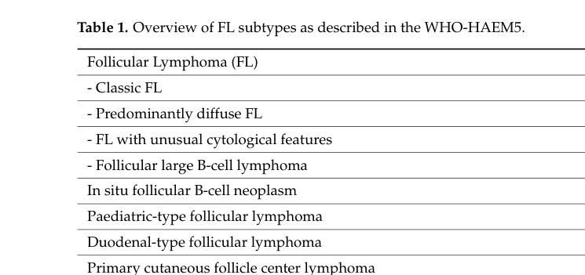

## Question

# Disease Characteristics Research Template

## Target Disease
- **Disease Name:** Follicular Lymphoma
- **MONDO ID:**  (if available)
- **Category:** 

## Research Objectives

Please provide a comprehensive research report on **Follicular Lymphoma** covering all of the
disease characteristics listed below. This report will be used to populate a disease knowledge
base entry. Be thorough and cite primary literature (PMID preferred) for all claims.

For each section, **suggested databases/resources** are listed. These are the first places
you should search for information on each topic.

---

### 1. Disease Information
> **Search first:** OMIM, Orphanet, ICD-10/ICD-11, MeSH, PubMed

- What is the disease? Provide a concise overview.
- What are the key identifiers? (OMIM, Orphanet, ICD-10/ICD-11, MeSH, Mondo)
- What are the common synonyms and alternative names?
- Is the information derived from individual patients (e.g., EHR) or aggregated disease-level resources?

### 2. Etiology

- **Disease Causal Factors**: What are the primary causes? (genetic, environmental, infectious, mechanistic)
- **Risk Factors**:
  > **Search first:** PubMed, Cochrane Library, UpToDate, clinical guidelines, ClinVar, ClinGen, GWAS Catalog, PheGenI, CTD, CDC, WHO, epidemiological databases
  - Genetic risk factors (causal variants, susceptibility loci, modifier genes)
  - Environmental risk factors (toxins, lifestyle, occupational exposures, age, sex, family history)
- **Protective Factors**:
  > **Search first:** PubMed, Cochrane Library, clinical trial databases, GWAS Catalog, gnomAD, WHO, CDC, nutrition databases
  - Genetic protective factors (protective variants, modifier alleles)
  - Environmental protective factors (diet, lifestyle, exposures that reduce risk)
- **Gene-Environment Interactions**: How do genetic and environmental factors interact to influence disease?
  > **Search first:** CTD, PubMed, PheGenI, GxE databases

### 3. Phenotypes
> **Search first:** HPO (Human Phenotype Ontology), OMIM, Orphanet, PubMed, clinicaltrials.gov, MedDRA, SNOMED CT, DECIPHER, LOINC

For each phenotype, provide:
- **Phenotype type**: symptoms, clinical signs, physical manifestations, behavioral changes, or laboratory abnormalities
  > For symptoms/signs: HPO, OMIM, Orphanet, PubMed
  > For behavioral changes: HPO, DSM, RDoC (Research Domain Criteria), PubMed
  > For laboratory abnormalities: LOINC, SNOMED CT, LabTests Online, PubMed
- **Phenotype characteristics**:
  > **Search first:** OMIM, Orphanet, HPO, PubMed
  - Age of symptom onset (neonatal, childhood, adult-onset, late-onset)
  - Symptom severity (mild, moderate, severe, variable)
  - Symptom progression (stable, progressive, episodic, fluctuating)
  - Frequency among affected individuals (percentage or qualitative)
- **Quality of life impact**: Effects on daily functioning and well-being (per-phenotype when possible)
  > **Search first:** EQ-5D database, SF-36, WHO QOL databases, PubMed
- Suggest HPO (Human Phenotype Ontology) terms for each phenotype

### 4. Genetic/Molecular Information

- **Causal Genes**: Gene mutations or chromosomal abnormalities responsible for disease (gene symbols, OMIM IDs)
  > **Search first:** OMIM, ClinVar, HGMD, Ensembl, NCBI Gene
- **Pathogenic Variants**:
  - Affected genes (gene symbols, HGNC IDs)
    > **Search first:** OMIM, NCBI Gene, Ensembl, HGNC, UniProt, GeneCards
  - Variant classification (pathogenic, likely pathogenic, VUS per ACMG/AMP guidelines)
    > **Search first:** ClinVar, ClinGen, ACMG/AMP guidelines, VarSome
  - Variant type/class (missense, frameshift, nonsense, splice-site, structural)
  - Allele frequency in population databases
    > **Search first:** gnomAD, 1000 Genomes, ExAC, TOPMed, dbSNP
  - Somatic vs germline origin
    > **Search first:** COSMIC (somatic), ClinVar, ICGC, TCGA
  - Functional consequences (loss of function, gain of function, dominant negative)
- **Modifier Genes**: Genes that modify disease severity or expression
- **Epigenetic Information**: DNA methylation, histone modifications, chromatin changes affecting disease
  > **Search first:** ENCODE, Roadmap Epigenomics, MethBase, DiseaseMeth
- **Chromosomal Abnormalities**: Large-scale genetic changes (aneuploidy, translocations, inversions)
  > **Search first:** DECIPHER, ClinVar, ECARUCA, UCSC Genome Browser

### 5. Environmental Information

- **Environmental Factors**: Non-genetic contributing factors (toxins, radiation, pollution, occupational exposure)
  > **Search first:** CTD (Comparative Toxicogenomics Database), TOXNET, PubMed, EPA databases
- **Lifestyle Factors**: Behavioral factors (smoking, diet, exercise, alcohol consumption)
  > **Search first:** CDC databases, WHO, PubMed, NHANES
- **Infectious Agents**: If applicable, pathogens causing or triggering disease (bacteria, viruses, fungi, parasites)
  > **Search first:** NCBI Taxonomy, ViPR, BV-BRC, MicrobeDB, GIDEON

### 6. Mechanism / Pathophysiology

- **Molecular Pathways**: Specific signaling cascades or biochemical pathways involved (Wnt, MAPK, mTOR, PI3K-AKT, etc.)
  > **Search first:** KEGG, Reactome, WikiPathways, PathBank, BioCyc
- **Cellular Processes**: Cell-level mechanisms (apoptosis, autophagy, cell cycle dysregulation, inflammation, etc.)
  > **Search first:** Gene Ontology (GO), Reactome, KEGG, PubMed
- **Protein Dysfunction**: How protein structure or function is altered (misfolding, aggregation, loss of function, gain of function)
  > **Search first:** UniProt, PDB (Protein Data Bank), InterPro, Pfam, AlphaFold
- **Metabolic Changes**: Alterations in metabolic processes (energy metabolism, lipid metabolism, amino acid metabolism)
  > **Search first:** KEGG, BioCyc, HMDB (Human Metabolome Database), BRENDA
- **Immune System Involvement**: Role of immune response (autoimmunity, immunodeficiency, chronic inflammation)
  > **Search first:** ImmPort, Immunome Database, IEDB, Gene Ontology
- **Tissue Damage Mechanisms**: How tissues/ are injured (oxidative stress, ischemia, fibrosis, necrosis)
  > **Search first:** PubMed, Gene Ontology, Reactome
- **Biochemical Abnormalities**: Specific molecular defects (enzyme deficiencies, receptor dysfunction, ion channel defects)
  > **Search first:** BRENDA, UniProt, KEGG, OMIM, PubMed
- **Epigenetic Changes**: DNA methylation, histone modifications affecting gene expression in disease
  > **Search first:** ENCODE, Roadmap Epigenomics, MethBase, DiseaseMeth
- **Molecular Profiling** (if available):
  - Transcriptomics/gene expression changes
    > **Search first:** GEO (Gene Expression Omnibus), ArrayExpress, GTEx, Human Cell Atlas, SRA
  - Proteomics findings
    > **Search first:** PRIDE, ProteomeXchange, Human Protein Atlas, STRING, BioGRID
  - Metabolomics signatures
    > **Search first:** MetaboLights, Metabolomics Workbench, HMDB, METLIN
  - Lipidomics alterations
    > **Search first:** LIPID MAPS, SwissLipids, LipidHome, Metabolomics Workbench
  - Genomic structural features
    > **Search first:** UCSC Genome Browser, Ensembl, NCBI, dbVar, DGV
- **Advanced Technologies** (if applicable):
  - Single-cell analysis findings (cell-type specific mechanisms, cellular heterogeneity)
    > **Search first:** Human Cell Atlas, Single Cell Portal, GEO, CELLxGENE
  - Spatial transcriptomics findings
    > **Search first:** GEO, Spatial Research, Vizgen, 10x Genomics data
  - Multi-omics integration results
    > **Search first:** TCGA, ICGC, cBioPortal, LinkedOmics, PubMed
  - Functional genomics screens (CRISPR, RNAi)
    > **Search first:** DepMap, GenomeRNAi, PubMed, BioGRID ORCS

For each mechanism, describe:
- The causal chain from initial trigger to clinical manifestation
- Which mechanisms are upstream vs downstream
- What cell types and biological processes are involved
- Suggest GO terms for biological processes and CL terms for cell types

### 7. Anatomical Structures Affected

- **Organ Level**:
  - Primary organs directly affected
  - Secondary organ involvement (complications, secondary effects)
  - Body systems involved (cardiovascular, nervous, digestive, respiratory, endocrine, etc.)
  > **Search first:** Uberon, FMA (Foundational Model of Anatomy), OMIM, HPO, ICD-11, MeSH, SNOMED CT
- **Tissue and Cell Level**:
  - Specific tissue types affected (epithelial, connective, muscle, nervous)
  - Specific cell populations targeted (with Cell Ontology terms)
  > **Search first:** Uberon, Human Protein Atlas, Cell Ontology, Human Cell Atlas, CellMarker, PanglaoDB
- **Subcellular Level**:
  - Cellular compartments involved (mitochondria, nucleus, ER, lysosomes) (with GO Cellular Component terms)
  > **Search first:** Gene Ontology (Cellular Component), UniProt, Human Protein Atlas
- **Localization**:
  - Specific anatomical sites (with UBERON terms)
    > **Search first:** FMA, Uberon, NeuroNames (for brain), SNOMED CT
  - Lateralization (unilateral, bilateral, asymmetric)
    > **Search first:** HPO, clinical literature, imaging databases

### 8. Temporal Development

- **Onset**:
  - Typical age of onset (congenital, pediatric, adult, geriatric)
  - Onset pattern (acute, subacute, chronic, insidious)
  > **Search first:** OMIM, Orphanet, HPO, PubMed
- **Progression**:
  - Disease stages (early, intermediate, advanced, end-stage)
    > **Search first:** Cancer Staging Manual (AJCC), WHO classifications, PubMed
  - Progression rate (rapid, slow, variable)
  - Disease course pattern (episodic, relapsing-remitting, progressive, stable)
  - Disease duration (self-limited, chronic lifelong)
  > **Search first:** Disease registries, longitudinal cohort databases, natural history studies, PubMed, Orphanet, OMIM
- **Patterns**:
  - Remission patterns (spontaneous, treatment-induced)
    > **Search first:** Clinical trial databases, disease registries, PubMed
  - Critical periods (time windows of vulnerability or opportunity for intervention)
    > **Search first:** PubMed, developmental biology databases, clinical guidelines

### 9. Inheritance and Population

- **Epidemiology**:
  - Prevalence (cases per 100,000 at given time)
  - Incidence (new cases per 100,000 per year)
  > **Search first:** Orphanet, CDC, WHO, GBD (Global Burden of Disease), national registries, SEER, disease registries
- **For Genetic Etiology**:
  - Inheritance pattern (AD, AR, X-linked, mitochondrial, multifactorial, polygenic)
    > **Search first:** OMIM, Orphanet, ClinVar, GTR (Genetic Testing Registry)
  - Penetrance (complete, incomplete, age-dependent)
    > **Search first:** ClinVar, OMIM, PubMed, ClinGen
  - Expressivity (variable, consistent)
    > **Search first:** OMIM, ClinVar, PubMed
  - Genetic anticipation (increasing severity in successive generations)
    > **Search first:** OMIM, PubMed (especially for repeat expansion disorders)
  - Germline mosaicism
    > **Search first:** ClinVar, OMIM, genetic counseling literature, PubMed
  - Founder effects (population-specific mutations)
    > **Search first:** gnomAD, population genetics databases, PubMed
  - Consanguinity role
    > **Search first:** OMIM, population studies, genetic counseling resources
  - Carrier frequency
    > **Search first:** gnomAD, carrier screening databases, GeneReviews, GTR
- **Population Demographics**:
  - Affected populations (ethnic or demographic groups with higher prevalence)
    > **Search first:** gnomAD, 1000 Genomes, PAGE Study, PubMed, population registries
  - Geographic distribution (endemic areas, regional variation)
    > **Search first:** WHO, CDC, GBD, Orphanet, geographic epidemiology databases
  - Geographic distribution of specific variants
  - Sex ratio (male:female)
    > **Search first:** Disease registries, OMIM, PubMed, epidemiological databases
  - Age distribution of affected individuals
    > **Search first:** CDC, disease registries, SEER, Orphanet

### 10. Diagnostics

- **Clinical Tests**:
  - Laboratory tests (blood, urine, tissue chemistry, specific enzyme assays)
    > **Search first:** LOINC, LabTests Online, PubMed
  - Biomarkers (proteins, metabolites, genetic markers, circulating biomarkers)
    > **Search first:** FDA Biomarker List, BEST (Biomarkers, EndpointS, and other Tools), PubMed
  - Imaging studies (X-ray, CT, MRI, PET, ultrasound)
    > **Search first:** RadLex, DICOM, Radiopaedia, imaging databases
  - Functional tests (pulmonary function, cardiac stress tests)
    > **Search first:** LOINC, clinical guidelines, PubMed
  - Electrophysiology (EEG, EMG, ECG, nerve conduction studies)
    > **Search first:** LOINC, clinical neurophysiology databases, PubMed
  - Biopsy findings (histopathology, immunohistochemistry)
    > **Search first:** SNOMED CT, College of American Pathologists resources, PubMed
  - Pathology findings (microscopic examination)
    > **Search first:** SNOMED CT, Digital Pathology databases, PubMed
- **Genetic Testing**:
  > **Search first:** GTR (Genetic Testing Registry), GeneReviews, ClinGen
  - Overview of recommended genetic testing approach
  - Whole genome sequencing (WGS) utility
    > **Search first:** GTR, ClinVar, GEL (Genomics England), gnomAD
  - Whole exome sequencing (WES) utility
    > **Search first:** GTR, ClinVar, OMIM, GeneMatcher
  - Gene panels (which panels, which genes)
    > **Search first:** GTR, ClinVar, laboratory-specific databases
  - Single gene testing
    > **Search first:** GTR, ClinVar, OMIM, GeneReviews
  - Chromosomal microarray (CMA)
    > **Search first:** DECIPHER, ClinVar, dbVar, ECARUCA
  - Karyotyping
    > **Search first:** Chromosome Abnormality Database, ClinVar, cytogenetics resources
  - FISH
    > **Search first:** ClinVar, cytogenetics databases, PubMed
  - Mitochondrial DNA testing
    > **Search first:** MITOMAP, MSeqDR, ClinVar, GTR
  - Repeat expansion testing
    > **Search first:** GTR, ClinVar, repeat expansion databases, PubMed
- **Omics-Based Diagnostics** (if applicable):
  - RNA sequencing / transcriptomics
    > **Search first:** GEO, ArrayExpress, GTEx, RNA-seq databases
  - Proteomics
    > **Search first:** PRIDE, ProteomeXchange, FDA Biomarker database
  - Metabolomics
    > **Search first:** MetaboLights, Metabolomics Workbench, HMDB
  - Epigenomics
    > **Search first:** GEO, ENCODE, Roadmap Epigenomics, MethBase
  - Liquid biopsy
    > **Search first:** COSMIC, ClinVar, liquid biopsy databases, PubMed
- **Clinical Criteria**:
  - Standardized diagnostic criteria (DSM, ICD, society guidelines)
    > **Search first:** DSM-5, ICD-11, clinical society guidelines, UpToDate
  - Differential diagnosis (other conditions to rule out, with distinguishing features)
    > **Search first:** DynaMed, UpToDate, clinical decision support systems
- **Screening**:
  - Screening methods for asymptomatic individuals (newborn screening, carrier screening, cascade screening)
    > **Search first:** ACMG recommendations, CDC newborn screening, GTR

### 11. Outcome/Prognosis

- **Survival and Mortality**:
  - Survival rate (5-year, 10-year, overall)
    > **Search first:** SEER, cancer registries, disease-specific registries, PubMed
  - Life expectancy (with and without treatment if applicable)
    > **Search first:** Orphanet, disease registries, actuarial databases, PubMed
  - Mortality rate
    > **Search first:** CDC, WHO, GBD, national mortality databases
  - Disease-specific mortality (deaths directly attributable to disease)
    > **Search first:** Disease registries, CDC Wonder, GBD, PubMed
- **Morbidity and Function**:
  - Morbidity (disease-related disability and health impacts)
    > **Search first:** GBD, WHO, disability databases, PubMed
  - Disability outcomes (long-term functional impairments)
    > **Search first:** ICF (International Classification of Functioning), disability registries
  - Quality of life measures (EQ-5D, SF-36, PROMIS, disease-specific tools)
    > **Search first:** EQ-5D database, SF-36, PROMIS, PubMed
- **Disease Course**:
  - Complications (secondary problems: infections, organ failure, etc.)
    > **Search first:** ICD codes, disease registries, clinical databases, PubMed
  - Recovery potential (likelihood and extent of recovery, with vs without treatment)
    > **Search first:** Natural history studies, rehabilitation databases, PubMed
- **Prediction**:
  - Prognostic factors (age, disease severity, biomarkers, treatment response)
    > **Search first:** Prognostic models databases, clinical calculators, PubMed
  - Prognostic biomarkers (molecular markers predicting disease course)
    > **Search first:** FDA Biomarker database, PubMed, cancer prognostic databases

### 12. Treatment

- **Pharmacotherapy**:
  - Pharmacological treatments (drug names, drug classes, mechanisms of action)
    > **Search first:** DrugBank, RxNorm, ATC classification, DailyMed, FDA databases
  - Pharmacogenomics (how genetic variants affect drug metabolism, efficacy, toxicity)
    > **Search first:** PharmGKB, CPIC (Clinical Pharmacogenetics), FDA Table of PGx Biomarkers
- **Advanced Therapeutics**:
  - Gene therapy (viral vectors, CRISPR, gene replacement, gene editing)
    > **Search first:** ClinicalTrials.gov, FDA gene therapy database, ASGCT resources
  - Cell therapy (stem cell transplant, CAR-T, cellular therapeutics)
    > **Search first:** ClinicalTrials.gov, FDA cell therapy database, FACT standards
  - RNA-based therapies (ASOs, siRNA, mRNA therapies)
    > **Search first:** ClinicalTrials.gov, FDA approvals, PubMed
  - Targeted therapies (treatments directed at specific molecular targets)
    > **Search first:** My Cancer Genome, OncoKB, ClinicalTrials.gov, FDA approvals
  - Immunotherapies (checkpoint inhibitors, monoclonal antibodies)
    > **Search first:** Cancer Immunotherapy Database, FDA approvals, ClinicalTrials.gov
- **Surgical and Interventional**:
  - Surgical interventions (types of surgery, timing, outcomes)
    > **Search first:** CPT codes, surgical registries, clinical guidelines, PubMed
- **Supportive and Rehabilitative**:
  - Supportive care (symptom management, pain control, nutrition)
    > **Search first:** Clinical guidelines, Cochrane Library, PubMed
  - Rehabilitation (physical therapy, occupational therapy, speech therapy)
    > **Search first:** Rehabilitation medicine databases, clinical guidelines, PubMed
- **Experimental**:
  - Experimental treatments in clinical trials (with NCT identifiers if available)
    > **Search first:** ClinicalTrials.gov, EU Clinical Trials Register, WHO ICTRP
- **Treatment Outcomes**:
  - Treatment response rates
    > **Search first:** Clinical trial databases, FDA reviews, systematic reviews, PubMed
  - Side effects and adverse events
    > **Search first:** FDA Adverse Event Reporting System (FAERS), MedWatch, PubMed
- **Treatment Strategy**:
  - Treatment algorithms (clinical pathways, decision trees)
    > **Search first:** Clinical practice guidelines, NCCN Guidelines, UpToDate
  - Combination therapies
    > **Search first:** ClinicalTrials.gov, treatment guidelines, PubMed
  - Personalized medicine approaches (genotype-guided treatment)
    > **Search first:** My Cancer Genome, CIViC, PharmGKB, precision medicine databases

For each treatment, suggest MAXO (Medical Action Ontology) terms where applicable.

### 13. Prevention

- **Prevention Levels**:
  - Primary prevention (preventing disease occurrence: vaccination, risk factor modification)
    > **Search first:** CDC, WHO, USPSTF recommendations, Cochrane Library
  - Secondary prevention (early detection and treatment: screening programs, early intervention)
    > **Search first:** USPSTF, CDC screening guidelines, WHO
  - Tertiary prevention (preventing complications in those with disease)
    > **Search first:** Clinical guidelines, disease management protocols, PubMed
- **Immunization**: Vaccine strategies (if applicable)
  > **Search first:** CDC vaccine schedules, WHO immunization, FDA vaccine database
- **Screening and Early Detection**:
  - Screening programs (population-based: newborn screening, cancer screening)
    > **Search first:** CDC screening programs, USPSTF, cancer screening databases
  - Genetic screening (carrier screening, preimplantation genetic diagnosis, prenatal testing)
    > **Search first:** ACMG recommendations, ACOG guidelines, GTR
  - Risk stratification (identifying high-risk individuals for targeted prevention)
    > **Search first:** Risk prediction models, clinical calculators, PubMed
- **Behavioral Interventions**: Lifestyle modifications to reduce risk
  > **Search first:** CDC, WHO, behavioral intervention databases, Cochrane Library
- **Counseling**: Genetic counseling (risk assessment, family planning guidance)
  > **Search first:** NSGC resources, ACMG guidelines, GeneReviews
- **Public Health**:
  - Public health interventions (sanitation, vector control, health education)
    > **Search first:** CDC, WHO, public health databases, PubMed
  - Environmental interventions (reducing environmental risk factors)
    > **Search first:** EPA databases, WHO environmental health, PubMed
- **Prophylaxis**: Preventive medications or procedures
  > **Search first:** Clinical guidelines, FDA approvals, PubMed

### 14. Other Species / Natural Disease

- **Taxonomy**: Species affected (with NCBI Taxon identifiers)
  > **Search first:** NCBI Taxonomy
- **Breed**: Specific breeds affected (with VBO identifiers if applicable)
  > **Search first:** VBO (Vertebrate Breed Ontology)
- **Gene**: Orthologous genes in other species (with NCBI Gene IDs)
  > **Search first:** NCBI Gene
- **Natural Disease**:
  - Naturally occurring disease in other species (companion animals, wildlife)
    > **Search first:** OMIA (Online Mendelian Inheritance in Animals), VetCompass, PubMed
  - Veterinary relevance and importance in animal health
    > **Search first:** OMIA, veterinary databases, PubMed
- **Comparative Biology**:
  - Comparative pathology (similarities and differences across species)
    > **Search first:** OMIA, comparative pathology databases, PubMed
  - Evolutionary conservation of disease mechanisms
    > **Search first:** HomoloGene, OrthoMCL, Alliance of Genome Resources
- **Transmission** (if applicable):
  - Zoonotic potential
    > **Search first:** CDC zoonotic diseases, WHO zoonoses, GIDEON
  - Cross-species susceptibility
    > **Search first:** NCBI Taxonomy, veterinary databases, PubMed

### 15. Model Organisms

- **Model Types**:
  - Model organism type (mammalian, invertebrate, cellular, in vitro)
    > **Search first:** Alliance of Genome Resources, model organism databases
  - Specific model systems (mouse, rat, zebrafish, Drosophila, C. elegans, yeast, cell lines, organoids, iPSCs)
    > **Search first:** MGI, RGD, ZFIN, FlyBase, WormBase, SGD, ATCC, Cellosaurus
  - Induced models (drug treatment, surgical intervention, environmental manipulation)
    > **Search first:** MGI, model organism databases, PubMed
- **Genetic Models**:
  - Types available (knockout, knock-in, transgenic, conditional, humanized)
    > **Search first:** MGI, IMPC, KOMP, EuMMCR, IMSR
- **Model Characteristics**:
  - Phenotype recapitulation (how well model reproduces human disease features)
    > **Search first:** Model organism databases, comparative studies, PubMed
  - Model limitations (aspects of human disease not captured)
    > **Search first:** Model organism databases, PubMed, review articles
- **Applications**:
  - Research applications (what aspects of disease can be studied)
    > **Search first:** Model organism databases, PubMed
- **Resources**:
  - Model databases
    > **Search first:** MGI, RGD, ZFIN, FlyBase, WormBase, IMSR, EMMA, MMRRC

---

## Citation Requirements

- Cite primary literature (PMID preferred) for all mechanistic and clinical claims
- Prioritize recent reviews and landmark papers
- Include direct quotes from abstracts where possible to support key statements
- Distinguish evidence source types: human clinical, model organism, in vitro, computational

## Output Format

Structure your response as a comprehensive narrative organized by the sections above.
For each section, provide:
- Factual content with specific details (numbers, percentages, gene names, variant nomenclature)
- Ontology term suggestions (HPO, GO, CL, UBERON, CHEBI, MAXO, MONDO) where applicable
- Evidence citations with PMIDs
- Direct quotes from abstracts to support key claims
- Clear indication when information is not available or not applicable for this disease

This report will be used to populate a disease knowledge base entry with:
- Pathophysiology descriptions with causal chains
- Gene/protein annotations (HGNC, GO terms)
- Phenotype associations (HP terms) with frequencies
- Cell type involvement (CL terms)
- Anatomical locations (UBERON terms)
- Chemical entities (CHEBI terms)
- Treatment annotations (MAXO terms)
- Evidence items with PMIDs and exact abstract quotes
- Epidemiology, prognosis, diagnostic, and prevention information
- Animal model descriptions with phenotype recapitulation details

## Output

Question: You are an expert researcher providing comprehensive, well-cited information.

Provide detailed information focusing on:
1. Key concepts and definitions with current understanding
2. Recent developments and latest research (prioritize 2023-2024 sources)
3. Current applications and real-world implementations
4. Expert opinions and analysis from authoritative sources
5. Relevant statistics and data from recent studies

Format as a comprehensive research report with proper citations. Include URLs and publication dates where available.
Always prioritize recent, authoritative sources and provide specific citations for all major claims.

# Disease Characteristics Research Template

## Target Disease
- **Disease Name:** Follicular Lymphoma
- **MONDO ID:**  (if available)
- **Category:** 

## Research Objectives

Please provide a comprehensive research report on **Follicular Lymphoma** covering all of the
disease characteristics listed below. This report will be used to populate a disease knowledge
base entry. Be thorough and cite primary literature (PMID preferred) for all claims.

For each section, **suggested databases/resources** are listed. These are the first places
you should search for information on each topic.

---

### 1. Disease Information
> **Search first:** OMIM, Orphanet, ICD-10/ICD-11, MeSH, PubMed

- What is the disease? Provide a concise overview.
- What are the key identifiers? (OMIM, Orphanet, ICD-10/ICD-11, MeSH, Mondo)
- What are the common synonyms and alternative names?
- Is the information derived from individual patients (e.g., EHR) or aggregated disease-level resources?

### 2. Etiology

- **Disease Causal Factors**: What are the primary causes? (genetic, environmental, infectious, mechanistic)
- **Risk Factors**:
  > **Search first:** PubMed, Cochrane Library, UpToDate, clinical guidelines, ClinVar, ClinGen, GWAS Catalog, PheGenI, CTD, CDC, WHO, epidemiological databases
  - Genetic risk factors (causal variants, susceptibility loci, modifier genes)
  - Environmental risk factors (toxins, lifestyle, occupational exposures, age, sex, family history)
- **Protective Factors**:
  > **Search first:** PubMed, Cochrane Library, clinical trial databases, GWAS Catalog, gnomAD, WHO, CDC, nutrition databases
  - Genetic protective factors (protective variants, modifier alleles)
  - Environmental protective factors (diet, lifestyle, exposures that reduce risk)
- **Gene-Environment Interactions**: How do genetic and environmental factors interact to influence disease?
  > **Search first:** CTD, PubMed, PheGenI, GxE databases

### 3. Phenotypes
> **Search first:** HPO (Human Phenotype Ontology), OMIM, Orphanet, PubMed, clinicaltrials.gov, MedDRA, SNOMED CT, DECIPHER, LOINC

For each phenotype, provide:
- **Phenotype type**: symptoms, clinical signs, physical manifestations, behavioral changes, or laboratory abnormalities
  > For symptoms/signs: HPO, OMIM, Orphanet, PubMed
  > For behavioral changes: HPO, DSM, RDoC (Research Domain Criteria), PubMed
  > For laboratory abnormalities: LOINC, SNOMED CT, LabTests Online, PubMed
- **Phenotype characteristics**:
  > **Search first:** OMIM, Orphanet, HPO, PubMed
  - Age of symptom onset (neonatal, childhood, adult-onset, late-onset)
  - Symptom severity (mild, moderate, severe, variable)
  - Symptom progression (stable, progressive, episodic, fluctuating)
  - Frequency among affected individuals (percentage or qualitative)
- **Quality of life impact**: Effects on daily functioning and well-being (per-phenotype when possible)
  > **Search first:** EQ-5D database, SF-36, WHO QOL databases, PubMed
- Suggest HPO (Human Phenotype Ontology) terms for each phenotype

### 4. Genetic/Molecular Information

- **Causal Genes**: Gene mutations or chromosomal abnormalities responsible for disease (gene symbols, OMIM IDs)
  > **Search first:** OMIM, ClinVar, HGMD, Ensembl, NCBI Gene
- **Pathogenic Variants**:
  - Affected genes (gene symbols, HGNC IDs)
    > **Search first:** OMIM, NCBI Gene, Ensembl, HGNC, UniProt, GeneCards
  - Variant classification (pathogenic, likely pathogenic, VUS per ACMG/AMP guidelines)
    > **Search first:** ClinVar, ClinGen, ACMG/AMP guidelines, VarSome
  - Variant type/class (missense, frameshift, nonsense, splice-site, structural)
  - Allele frequency in population databases
    > **Search first:** gnomAD, 1000 Genomes, ExAC, TOPMed, dbSNP
  - Somatic vs germline origin
    > **Search first:** COSMIC (somatic), ClinVar, ICGC, TCGA
  - Functional consequences (loss of function, gain of function, dominant negative)
- **Modifier Genes**: Genes that modify disease severity or expression
- **Epigenetic Information**: DNA methylation, histone modifications, chromatin changes affecting disease
  > **Search first:** ENCODE, Roadmap Epigenomics, MethBase, DiseaseMeth
- **Chromosomal Abnormalities**: Large-scale genetic changes (aneuploidy, translocations, inversions)
  > **Search first:** DECIPHER, ClinVar, ECARUCA, UCSC Genome Browser

### 5. Environmental Information

- **Environmental Factors**: Non-genetic contributing factors (toxins, radiation, pollution, occupational exposure)
  > **Search first:** CTD (Comparative Toxicogenomics Database), TOXNET, PubMed, EPA databases
- **Lifestyle Factors**: Behavioral factors (smoking, diet, exercise, alcohol consumption)
  > **Search first:** CDC databases, WHO, PubMed, NHANES
- **Infectious Agents**: If applicable, pathogens causing or triggering disease (bacteria, viruses, fungi, parasites)
  > **Search first:** NCBI Taxonomy, ViPR, BV-BRC, MicrobeDB, GIDEON

### 6. Mechanism / Pathophysiology

- **Molecular Pathways**: Specific signaling cascades or biochemical pathways involved (Wnt, MAPK, mTOR, PI3K-AKT, etc.)
  > **Search first:** KEGG, Reactome, WikiPathways, PathBank, BioCyc
- **Cellular Processes**: Cell-level mechanisms (apoptosis, autophagy, cell cycle dysregulation, inflammation, etc.)
  > **Search first:** Gene Ontology (GO), Reactome, KEGG, PubMed
- **Protein Dysfunction**: How protein structure or function is altered (misfolding, aggregation, loss of function, gain of function)
  > **Search first:** UniProt, PDB (Protein Data Bank), InterPro, Pfam, AlphaFold
- **Metabolic Changes**: Alterations in metabolic processes (energy metabolism, lipid metabolism, amino acid metabolism)
  > **Search first:** KEGG, BioCyc, HMDB (Human Metabolome Database), BRENDA
- **Immune System Involvement**: Role of immune response (autoimmunity, immunodeficiency, chronic inflammation)
  > **Search first:** ImmPort, Immunome Database, IEDB, Gene Ontology
- **Tissue Damage Mechanisms**: How tissues/ are injured (oxidative stress, ischemia, fibrosis, necrosis)
  > **Search first:** PubMed, Gene Ontology, Reactome
- **Biochemical Abnormalities**: Specific molecular defects (enzyme deficiencies, receptor dysfunction, ion channel defects)
  > **Search first:** BRENDA, UniProt, KEGG, OMIM, PubMed
- **Epigenetic Changes**: DNA methylation, histone modifications affecting gene expression in disease
  > **Search first:** ENCODE, Roadmap Epigenomics, MethBase, DiseaseMeth
- **Molecular Profiling** (if available):
  - Transcriptomics/gene expression changes
    > **Search first:** GEO (Gene Expression Omnibus), ArrayExpress, GTEx, Human Cell Atlas, SRA
  - Proteomics findings
    > **Search first:** PRIDE, ProteomeXchange, Human Protein Atlas, STRING, BioGRID
  - Metabolomics signatures
    > **Search first:** MetaboLights, Metabolomics Workbench, HMDB, METLIN
  - Lipidomics alterations
    > **Search first:** LIPID MAPS, SwissLipids, LipidHome, Metabolomics Workbench
  - Genomic structural features
    > **Search first:** UCSC Genome Browser, Ensembl, NCBI, dbVar, DGV
- **Advanced Technologies** (if applicable):
  - Single-cell analysis findings (cell-type specific mechanisms, cellular heterogeneity)
    > **Search first:** Human Cell Atlas, Single Cell Portal, GEO, CELLxGENE
  - Spatial transcriptomics findings
    > **Search first:** GEO, Spatial Research, Vizgen, 10x Genomics data
  - Multi-omics integration results
    > **Search first:** TCGA, ICGC, cBioPortal, LinkedOmics, PubMed
  - Functional genomics screens (CRISPR, RNAi)
    > **Search first:** DepMap, GenomeRNAi, PubMed, BioGRID ORCS

For each mechanism, describe:
- The causal chain from initial trigger to clinical manifestation
- Which mechanisms are upstream vs downstream
- What cell types and biological processes are involved
- Suggest GO terms for biological processes and CL terms for cell types

### 7. Anatomical Structures Affected

- **Organ Level**:
  - Primary organs directly affected
  - Secondary organ involvement (complications, secondary effects)
  - Body systems involved (cardiovascular, nervous, digestive, respiratory, endocrine, etc.)
  > **Search first:** Uberon, FMA (Foundational Model of Anatomy), OMIM, HPO, ICD-11, MeSH, SNOMED CT
- **Tissue and Cell Level**:
  - Specific tissue types affected (epithelial, connective, muscle, nervous)
  - Specific cell populations targeted (with Cell Ontology terms)
  > **Search first:** Uberon, Human Protein Atlas, Cell Ontology, Human Cell Atlas, CellMarker, PanglaoDB
- **Subcellular Level**:
  - Cellular compartments involved (mitochondria, nucleus, ER, lysosomes) (with GO Cellular Component terms)
  > **Search first:** Gene Ontology (Cellular Component), UniProt, Human Protein Atlas
- **Localization**:
  - Specific anatomical sites (with UBERON terms)
    > **Search first:** FMA, Uberon, NeuroNames (for brain), SNOMED CT
  - Lateralization (unilateral, bilateral, asymmetric)
    > **Search first:** HPO, clinical literature, imaging databases

### 8. Temporal Development

- **Onset**:
  - Typical age of onset (congenital, pediatric, adult, geriatric)
  - Onset pattern (acute, subacute, chronic, insidious)
  > **Search first:** OMIM, Orphanet, HPO, PubMed
- **Progression**:
  - Disease stages (early, intermediate, advanced, end-stage)
    > **Search first:** Cancer Staging Manual (AJCC), WHO classifications, PubMed
  - Progression rate (rapid, slow, variable)
  - Disease course pattern (episodic, relapsing-remitting, progressive, stable)
  - Disease duration (self-limited, chronic lifelong)
  > **Search first:** Disease registries, longitudinal cohort databases, natural history studies, PubMed, Orphanet, OMIM
- **Patterns**:
  - Remission patterns (spontaneous, treatment-induced)
    > **Search first:** Clinical trial databases, disease registries, PubMed
  - Critical periods (time windows of vulnerability or opportunity for intervention)
    > **Search first:** PubMed, developmental biology databases, clinical guidelines

### 9. Inheritance and Population

- **Epidemiology**:
  - Prevalence (cases per 100,000 at given time)
  - Incidence (new cases per 100,000 per year)
  > **Search first:** Orphanet, CDC, WHO, GBD (Global Burden of Disease), national registries, SEER, disease registries
- **For Genetic Etiology**:
  - Inheritance pattern (AD, AR, X-linked, mitochondrial, multifactorial, polygenic)
    > **Search first:** OMIM, Orphanet, ClinVar, GTR (Genetic Testing Registry)
  - Penetrance (complete, incomplete, age-dependent)
    > **Search first:** ClinVar, OMIM, PubMed, ClinGen
  - Expressivity (variable, consistent)
    > **Search first:** OMIM, ClinVar, PubMed
  - Genetic anticipation (increasing severity in successive generations)
    > **Search first:** OMIM, PubMed (especially for repeat expansion disorders)
  - Germline mosaicism
    > **Search first:** ClinVar, OMIM, genetic counseling literature, PubMed
  - Founder effects (population-specific mutations)
    > **Search first:** gnomAD, population genetics databases, PubMed
  - Consanguinity role
    > **Search first:** OMIM, population studies, genetic counseling resources
  - Carrier frequency
    > **Search first:** gnomAD, carrier screening databases, GeneReviews, GTR
- **Population Demographics**:
  - Affected populations (ethnic or demographic groups with higher prevalence)
    > **Search first:** gnomAD, 1000 Genomes, PAGE Study, PubMed, population registries
  - Geographic distribution (endemic areas, regional variation)
    > **Search first:** WHO, CDC, GBD, Orphanet, geographic epidemiology databases
  - Geographic distribution of specific variants
  - Sex ratio (male:female)
    > **Search first:** Disease registries, OMIM, PubMed, epidemiological databases
  - Age distribution of affected individuals
    > **Search first:** CDC, disease registries, SEER, Orphanet

### 10. Diagnostics

- **Clinical Tests**:
  - Laboratory tests (blood, urine, tissue chemistry, specific enzyme assays)
    > **Search first:** LOINC, LabTests Online, PubMed
  - Biomarkers (proteins, metabolites, genetic markers, circulating biomarkers)
    > **Search first:** FDA Biomarker List, BEST (Biomarkers, EndpointS, and other Tools), PubMed
  - Imaging studies (X-ray, CT, MRI, PET, ultrasound)
    > **Search first:** RadLex, DICOM, Radiopaedia, imaging databases
  - Functional tests (pulmonary function, cardiac stress tests)
    > **Search first:** LOINC, clinical guidelines, PubMed
  - Electrophysiology (EEG, EMG, ECG, nerve conduction studies)
    > **Search first:** LOINC, clinical neurophysiology databases, PubMed
  - Biopsy findings (histopathology, immunohistochemistry)
    > **Search first:** SNOMED CT, College of American Pathologists resources, PubMed
  - Pathology findings (microscopic examination)
    > **Search first:** SNOMED CT, Digital Pathology databases, PubMed
- **Genetic Testing**:
  > **Search first:** GTR (Genetic Testing Registry), GeneReviews, ClinGen
  - Overview of recommended genetic testing approach
  - Whole genome sequencing (WGS) utility
    > **Search first:** GTR, ClinVar, GEL (Genomics England), gnomAD
  - Whole exome sequencing (WES) utility
    > **Search first:** GTR, ClinVar, OMIM, GeneMatcher
  - Gene panels (which panels, which genes)
    > **Search first:** GTR, ClinVar, laboratory-specific databases
  - Single gene testing
    > **Search first:** GTR, ClinVar, OMIM, GeneReviews
  - Chromosomal microarray (CMA)
    > **Search first:** DECIPHER, ClinVar, dbVar, ECARUCA
  - Karyotyping
    > **Search first:** Chromosome Abnormality Database, ClinVar, cytogenetics resources
  - FISH
    > **Search first:** ClinVar, cytogenetics databases, PubMed
  - Mitochondrial DNA testing
    > **Search first:** MITOMAP, MSeqDR, ClinVar, GTR
  - Repeat expansion testing
    > **Search first:** GTR, ClinVar, repeat expansion databases, PubMed
- **Omics-Based Diagnostics** (if applicable):
  - RNA sequencing / transcriptomics
    > **Search first:** GEO, ArrayExpress, GTEx, RNA-seq databases
  - Proteomics
    > **Search first:** PRIDE, ProteomeXchange, FDA Biomarker database
  - Metabolomics
    > **Search first:** MetaboLights, Metabolomics Workbench, HMDB
  - Epigenomics
    > **Search first:** GEO, ENCODE, Roadmap Epigenomics, MethBase
  - Liquid biopsy
    > **Search first:** COSMIC, ClinVar, liquid biopsy databases, PubMed
- **Clinical Criteria**:
  - Standardized diagnostic criteria (DSM, ICD, society guidelines)
    > **Search first:** DSM-5, ICD-11, clinical society guidelines, UpToDate
  - Differential diagnosis (other conditions to rule out, with distinguishing features)
    > **Search first:** DynaMed, UpToDate, clinical decision support systems
- **Screening**:
  - Screening methods for asymptomatic individuals (newborn screening, carrier screening, cascade screening)
    > **Search first:** ACMG recommendations, CDC newborn screening, GTR

### 11. Outcome/Prognosis

- **Survival and Mortality**:
  - Survival rate (5-year, 10-year, overall)
    > **Search first:** SEER, cancer registries, disease-specific registries, PubMed
  - Life expectancy (with and without treatment if applicable)
    > **Search first:** Orphanet, disease registries, actuarial databases, PubMed
  - Mortality rate
    > **Search first:** CDC, WHO, GBD, national mortality databases
  - Disease-specific mortality (deaths directly attributable to disease)
    > **Search first:** Disease registries, CDC Wonder, GBD, PubMed
- **Morbidity and Function**:
  - Morbidity (disease-related disability and health impacts)
    > **Search first:** GBD, WHO, disability databases, PubMed
  - Disability outcomes (long-term functional impairments)
    > **Search first:** ICF (International Classification of Functioning), disability registries
  - Quality of life measures (EQ-5D, SF-36, PROMIS, disease-specific tools)
    > **Search first:** EQ-5D database, SF-36, PROMIS, PubMed
- **Disease Course**:
  - Complications (secondary problems: infections, organ failure, etc.)
    > **Search first:** ICD codes, disease registries, clinical databases, PubMed
  - Recovery potential (likelihood and extent of recovery, with vs without treatment)
    > **Search first:** Natural history studies, rehabilitation databases, PubMed
- **Prediction**:
  - Prognostic factors (age, disease severity, biomarkers, treatment response)
    > **Search first:** Prognostic models databases, clinical calculators, PubMed
  - Prognostic biomarkers (molecular markers predicting disease course)
    > **Search first:** FDA Biomarker database, PubMed, cancer prognostic databases

### 12. Treatment

- **Pharmacotherapy**:
  - Pharmacological treatments (drug names, drug classes, mechanisms of action)
    > **Search first:** DrugBank, RxNorm, ATC classification, DailyMed, FDA databases
  - Pharmacogenomics (how genetic variants affect drug metabolism, efficacy, toxicity)
    > **Search first:** PharmGKB, CPIC (Clinical Pharmacogenetics), FDA Table of PGx Biomarkers
- **Advanced Therapeutics**:
  - Gene therapy (viral vectors, CRISPR, gene replacement, gene editing)
    > **Search first:** ClinicalTrials.gov, FDA gene therapy database, ASGCT resources
  - Cell therapy (stem cell transplant, CAR-T, cellular therapeutics)
    > **Search first:** ClinicalTrials.gov, FDA cell therapy database, FACT standards
  - RNA-based therapies (ASOs, siRNA, mRNA therapies)
    > **Search first:** ClinicalTrials.gov, FDA approvals, PubMed
  - Targeted therapies (treatments directed at specific molecular targets)
    > **Search first:** My Cancer Genome, OncoKB, ClinicalTrials.gov, FDA approvals
  - Immunotherapies (checkpoint inhibitors, monoclonal antibodies)
    > **Search first:** Cancer Immunotherapy Database, FDA approvals, ClinicalTrials.gov
- **Surgical and Interventional**:
  - Surgical interventions (types of surgery, timing, outcomes)
    > **Search first:** CPT codes, surgical registries, clinical guidelines, PubMed
- **Supportive and Rehabilitative**:
  - Supportive care (symptom management, pain control, nutrition)
    > **Search first:** Clinical guidelines, Cochrane Library, PubMed
  - Rehabilitation (physical therapy, occupational therapy, speech therapy)
    > **Search first:** Rehabilitation medicine databases, clinical guidelines, PubMed
- **Experimental**:
  - Experimental treatments in clinical trials (with NCT identifiers if available)
    > **Search first:** ClinicalTrials.gov, EU Clinical Trials Register, WHO ICTRP
- **Treatment Outcomes**:
  - Treatment response rates
    > **Search first:** Clinical trial databases, FDA reviews, systematic reviews, PubMed
  - Side effects and adverse events
    > **Search first:** FDA Adverse Event Reporting System (FAERS), MedWatch, PubMed
- **Treatment Strategy**:
  - Treatment algorithms (clinical pathways, decision trees)
    > **Search first:** Clinical practice guidelines, NCCN Guidelines, UpToDate
  - Combination therapies
    > **Search first:** ClinicalTrials.gov, treatment guidelines, PubMed
  - Personalized medicine approaches (genotype-guided treatment)
    > **Search first:** My Cancer Genome, CIViC, PharmGKB, precision medicine databases

For each treatment, suggest MAXO (Medical Action Ontology) terms where applicable.

### 13. Prevention

- **Prevention Levels**:
  - Primary prevention (preventing disease occurrence: vaccination, risk factor modification)
    > **Search first:** CDC, WHO, USPSTF recommendations, Cochrane Library
  - Secondary prevention (early detection and treatment: screening programs, early intervention)
    > **Search first:** USPSTF, CDC screening guidelines, WHO
  - Tertiary prevention (preventing complications in those with disease)
    > **Search first:** Clinical guidelines, disease management protocols, PubMed
- **Immunization**: Vaccine strategies (if applicable)
  > **Search first:** CDC vaccine schedules, WHO immunization, FDA vaccine database
- **Screening and Early Detection**:
  - Screening programs (population-based: newborn screening, cancer screening)
    > **Search first:** CDC screening programs, USPSTF, cancer screening databases
  - Genetic screening (carrier screening, preimplantation genetic diagnosis, prenatal testing)
    > **Search first:** ACMG recommendations, ACOG guidelines, GTR
  - Risk stratification (identifying high-risk individuals for targeted prevention)
    > **Search first:** Risk prediction models, clinical calculators, PubMed
- **Behavioral Interventions**: Lifestyle modifications to reduce risk
  > **Search first:** CDC, WHO, behavioral intervention databases, Cochrane Library
- **Counseling**: Genetic counseling (risk assessment, family planning guidance)
  > **Search first:** NSGC resources, ACMG guidelines, GeneReviews
- **Public Health**:
  - Public health interventions (sanitation, vector control, health education)
    > **Search first:** CDC, WHO, public health databases, PubMed
  - Environmental interventions (reducing environmental risk factors)
    > **Search first:** EPA databases, WHO environmental health, PubMed
- **Prophylaxis**: Preventive medications or procedures
  > **Search first:** Clinical guidelines, FDA approvals, PubMed

### 14. Other Species / Natural Disease

- **Taxonomy**: Species affected (with NCBI Taxon identifiers)
  > **Search first:** NCBI Taxonomy
- **Breed**: Specific breeds affected (with VBO identifiers if applicable)
  > **Search first:** VBO (Vertebrate Breed Ontology)
- **Gene**: Orthologous genes in other species (with NCBI Gene IDs)
  > **Search first:** NCBI Gene
- **Natural Disease**:
  - Naturally occurring disease in other species (companion animals, wildlife)
    > **Search first:** OMIA (Online Mendelian Inheritance in Animals), VetCompass, PubMed
  - Veterinary relevance and importance in animal health
    > **Search first:** OMIA, veterinary databases, PubMed
- **Comparative Biology**:
  - Comparative pathology (similarities and differences across species)
    > **Search first:** OMIA, comparative pathology databases, PubMed
  - Evolutionary conservation of disease mechanisms
    > **Search first:** HomoloGene, OrthoMCL, Alliance of Genome Resources
- **Transmission** (if applicable):
  - Zoonotic potential
    > **Search first:** CDC zoonotic diseases, WHO zoonoses, GIDEON
  - Cross-species susceptibility
    > **Search first:** NCBI Taxonomy, veterinary databases, PubMed

### 15. Model Organisms

- **Model Types**:
  - Model organism type (mammalian, invertebrate, cellular, in vitro)
    > **Search first:** Alliance of Genome Resources, model organism databases
  - Specific model systems (mouse, rat, zebrafish, Drosophila, C. elegans, yeast, cell lines, organoids, iPSCs)
    > **Search first:** MGI, RGD, ZFIN, FlyBase, WormBase, SGD, ATCC, Cellosaurus
  - Induced models (drug treatment, surgical intervention, environmental manipulation)
    > **Search first:** MGI, model organism databases, PubMed
- **Genetic Models**:
  - Types available (knockout, knock-in, transgenic, conditional, humanized)
    > **Search first:** MGI, IMPC, KOMP, EuMMCR, IMSR
- **Model Characteristics**:
  - Phenotype recapitulation (how well model reproduces human disease features)
    > **Search first:** Model organism databases, comparative studies, PubMed
  - Model limitations (aspects of human disease not captured)
    > **Search first:** Model organism databases, PubMed, review articles
- **Applications**:
  - Research applications (what aspects of disease can be studied)
    > **Search first:** Model organism databases, PubMed
- **Resources**:
  - Model databases
    > **Search first:** MGI, RGD, ZFIN, FlyBase, WormBase, IMSR, EMMA, MMRRC

---

## Citation Requirements

- Cite primary literature (PMID preferred) for all mechanistic and clinical claims
- Prioritize recent reviews and landmark papers
- Include direct quotes from abstracts where possible to support key statements
- Distinguish evidence source types: human clinical, model organism, in vitro, computational

## Output Format

Structure your response as a comprehensive narrative organized by the sections above.
For each section, provide:
- Factual content with specific details (numbers, percentages, gene names, variant nomenclature)
- Ontology term suggestions (HPO, GO, CL, UBERON, CHEBI, MAXO, MONDO) where applicable
- Evidence citations with PMIDs
- Direct quotes from abstracts to support key claims
- Clear indication when information is not available or not applicable for this disease

This report will be used to populate a disease knowledge base entry with:
- Pathophysiology descriptions with causal chains
- Gene/protein annotations (HGNC, GO terms)
- Phenotype associations (HP terms) with frequencies
- Cell type involvement (CL terms)
- Anatomical locations (UBERON terms)
- Chemical entities (CHEBI terms)
- Treatment annotations (MAXO terms)
- Evidence items with PMIDs and exact abstract quotes
- Epidemiology, prognosis, diagnostic, and prevention information
- Animal model descriptions with phenotype recapitulation details

## Follicular Lymphoma (FL) — Comprehensive Disease Characteristics Report (2023–2024 prioritized)

### Target Disease
- **Disease name:** Follicular lymphoma
- **MONDO ID:** **MONDO:0018906** (OpenTargets disease ID for follicular lymphoma) (OpenTargets Search: follicular lymphoma)
- **Category:** Indolent mature B‑cell non‑Hodgkin lymphoma; germinal‑center (GC) B‑cell–derived neoplasm (jacobsen2022follicularlymphoma2023 pages 1-2, kurz2023follicularlymphomain pages 1-2)

---

## 1. Disease Information

### 1.1 Concise overview
Follicular lymphoma is an indolent GC B‑cell lymphoproliferative disorder that commonly presents with diffuse lymphadenopathy and frequent bone marrow involvement and splenomegaly (jacobsen2022follicularlymphoma2023 pages 1-2). A defining biological feature in most cases is dysregulated anti‑apoptotic signaling driven by **IGH::BCL2** rearrangement (t(14;18)), but FL is clinically and biologically heterogeneous, with a subset showing early progression, repeated relapse, or histologic transformation to diffuse large B‑cell lymphoma (DLBCL) (jacobsen2022follicularlymphoma2023 pages 1-2, kurz2023follicularlymphomain pages 2-4).

**Direct abstract quote (definition/clinical):** Jacobsen’s “2023 update on diagnosis and management” describes FL as “**generally an indolent B cell lymphoproliferative disorder of transformed follicular center B cells**” and notes it is characterized by “**diffuse lymphadenopathy, bone marrow involvement, and splenomegaly**” (jacobsen2022follicularlymphoma2023 pages 1-2).

### 1.2 Key identifiers (available in current evidence)
- **MONDO:** MONDO:0018906 (OpenTargets Search: follicular lymphoma)
- **Other identifiers requested (ICD‑10/11, MeSH, OMIM, Orphanet):** not retrieved in the current evidence set; would require additional ontology-specific queries beyond the papers/records gathered here.

### 1.3 Common synonyms / alternative names
- “Classic follicular lymphoma (cFL)” (WHO‑HAEM5 term for the predominant entity) (kurz2023follicularlymphomain pages 1-2)
- “Follicular large B‑cell lymphoma (FLBCL)” (WHO‑HAEM5 term corresponding to former FL grade 3B) (kurz2023follicularlymphomain pages 1-2)

### 1.4 Evidence source type
The synthesis here uses **aggregated disease-level resources** (WHO‑HAEM5 classification review; therapy reviews; registry/SEER analyses; meta-analyses) and **clinical trial reports**, rather than individual patient EHR data (nizamuddin2024bispecificantibodiesin pages 2-4, testa2024cartcelltherapy pages 1-2, kurz2023follicularlymphomain pages 1-2, odutola2020lifestyleandrisk pages 1-2, xie2022analysisandprediction pages 1-2).

---

## 2. Etiology

### 2.1 Disease causal factors (current understanding)
**Multistep lymphomagenesis from GC B cells** is a dominant model: early acquisition of t(14;18) and subsequent accumulation of cooperating lesions (particularly in chromatin/epigenetic regulators) in the GC context, with selection pressures from the tumor microenvironment (TME) (kurz2023follicularlymphomain pages 2-4, carreras2023thepathobiologyof pages 3-4).

A key concept from pathology literature is that **t(14;18) alone is not sufficient**: the t(14;18) can be detectable in healthy individuals, supporting the need for additional alterations for malignant FL (randall2020pathologyanddiagnosis pages 1-2).

### 2.2 Risk factors
#### 2.2.1 Genetic susceptibility (population-level)
Within the retrieved evidence, we did not capture GWAS/ClinVar/ClinGen-specific loci; however, strong somatic genetic drivers are consistently reported (Section 4).

#### 2.2.2 Environmental/occupational exposures
- **Glyphosate exposure and FL subtype risk:** An updated meta-analysis reported a subtype estimate for FL of **meta‑RR 0.84 (95% CI 0.61–1.17)** (odutola2020lifestyleandrisk pages 1-2).

*(Note: this is subtype-specific and does not support increased FL risk in that synthesis; additional pesticide classes/solvents specific to FL were not extracted in the current evidence set.)*

#### 2.2.3 Lifestyle factors
A systematic review/meta-analysis focused on FL reported:
- **Alcohol intake:** inverse association, **meta‑RR 0.87 (95% CI 0.81–0.94)** with dose–response (p‑trend reported) (odutola2020lifestyleandrisk pages 1-2).
- **Smoking (current):** **meta‑RR 1.11 (95% CI 0.92–1.35)** (odutola2020lifestyleandrisk pages 1-2).
- **Hair dye use before 1980:** **meta‑RR 1.66 (95% CI 1.22–2.25)**; no association after 1980 (odutola2020lifestyleandrisk pages 1-2).

### 2.3 Protective factors
Evidence for a statistically protective association is present for **alcohol intake** in the FL-specific meta-analysis (meta‑RR < 1), though causality is uncertain in observational syntheses (odutola2020lifestyleandrisk pages 1-2).

### 2.4 Gene–environment interactions
No explicit gene–environment interaction results were retrieved in the current evidence set.

---

## 3. Phenotypes

### 3.1 Core clinical phenotypes (with HPO suggestions)
**Clinical presentation (systemic FL):**
- Diffuse lymphadenopathy (HPO: **HP:0002716 Lymphadenopathy**) (jacobsen2022follicularlymphoma2023 pages 1-2)
- Bone marrow involvement; cytopenias can occur (HPO: **HP:0001875 Neutropenia**, **HP:0001903 Anemia**, depending on cytopenia type) (jacobsen2022follicularlymphoma2023 pages 1-2)
- Splenomegaly (HPO: **HP:0001744 Splenomegaly**) (jacobsen2022follicularlymphoma2023 pages 1-2)
- “B symptoms” are uncommon without transformation (HPO: **HP:0001945 Fever**, **HP:0004375 Night sweats**, **HP:0004322 Weight loss**) (jacobsen2022follicularlymphoma2023 pages 1-2)

**Transformation-associated phenotype (clinical suspicion):** rapid lymph node growth, more systemic symptoms; transformation risk ~2%/year is cited in WHO‑HAEM5 review context (kurz2023follicularlymphomain pages 2-4).

### 3.2 Age of onset / course
- Typical diagnosis occurs in older adults; median age reported **~63–65 years** (jacobsen2022follicularlymphoma2023 pages 1-2, randall2020pathologyanddiagnosis pages 1-2, odutola2020lifestyleandrisk pages 1-2).
- Disease course is often long/indolent, but relapsing and at risk of transformation (jacobsen2022follicularlymphoma2023 pages 1-2, kurz2023follicularlymphomain pages 2-4).

### 3.3 Pathology phenotype (with HPO suggestions)
- Follicular/nodular growth pattern composed of centrocytes/centroblasts (morphology feature; map to pathology descriptors rather than HPO in many KBs) (kurz2023follicularlymphomain pages 1-2).

### 3.4 Quality of life impact
QoL instruments were not captured in the current evidence set; however, chronic relapsing disease and treatment sequencing imply long-term burden (jacobsen2022follicularlymphoma2023 pages 1-2, russlergermain2024sequencingbispecificantibodies pages 1-2).

---

## 4. Genetic / Molecular Information

### 4.1 Hallmark lesions
**IGH::BCL2 translocation (t(14;18)(q32;q21))** is the central hallmark in the majority of cases:
- WHO‑HAEM5 review: cFL typically harbors t(14;18) in ~**85%** of cases (kurz2023follicularlymphomain pages 1-2).
- Clinical review: BCL2 overexpression driven by t(14;18) present in ~**85%** (jacobsen2022follicularlymphoma2023 pages 1-2).

### 4.2 Recurrent somatic mutations (frequencies captured in evidence)
From a 2023 pathobiology review:
- **KMT2D**: **80–90%**
- **CREBBP**: **33–70%**
- **EZH2**: **7–30%**
- Additional recurrent lesions include **TNFRSF14**, **BCL6**, **RRAGC** (carreras2023thepathobiologyof pages 3-4).

### 4.3 Epigenetic information
Epigenetic dysregulation is repeatedly emphasized through frequent alterations of chromatin regulators (KMT2D, CREBBP, EZH2) (jacobsen2022follicularlymphoma2023 pages 1-2, carreras2023thepathobiologyof pages 3-4). Mechanistic in vivo evidence shows cooperative effects of chromatin modifier perturbation on immune microenvironment states (cancemi2025singleagentandassociated pages 4-5).

### 4.4 Chromosomal abnormalities and subtype-associated genetics (WHO‑HAEM5)
WHO‑HAEM5 recognizes related subtypes beyond cFL; for example, a predominantly diffuse subtype is associated with **absence of IGH::BCL2 fusion**, frequent **STAT6** mutations, and **1p36 deletion or TNFRSF14** mutation (kurz2023follicularlymphomain pages 1-2). Table evidence for the subtype schema is captured in Kurz et al. (kurz2023follicularlymphomain media dfd5fc5e).

### 4.5 Suggested GO and CL terms (mechanism-linked)
- **GO (biological process):**
  - Regulation of apoptotic process (BCL2-driven survival)
  - Chromatin organization / histone modification (KMT2D/CREBBP/EZH2)
  - Germinal center formation / B‑cell activation
- **CL (cell types):**
  - Germinal center B cell (central malignant population)
  - T follicular helper cell and follicular dendritic cell as key microenvironmental partners (supported conceptually by microenvironment dependence noted in FL reviews) (russlergermain2024sequencingbispecificantibodies pages 1-2)

*(These ontology suggestions are consistent with the mechanistic themes explicitly described in the retrieved reviews; they are not exhaustive.)*

---

## 5. Environmental Information

### 5.1 Environmental / occupational factors
Evidence retrieved here is limited to a glyphosate meta-analysis subtype estimate for FL (meta‑RR 0.84, 95% CI 0.61–1.17) (odutola2020lifestyleandrisk pages 1-2). Broader pesticide class associations were not extracted specifically for FL subtype in the current evidence.

### 5.2 Lifestyle factors
See Section 2.2.3 for quantitative meta-analytic associations (odutola2020lifestyleandrisk pages 1-2).

### 5.3 Infectious agents
No infectious etiology evidence was retrieved in the current evidence set.

---

## 6. Mechanism / Pathophysiology

### 6.1 Causal chain (integrated)
1) **Initiation:** early acquisition of **IGH::BCL2** translocation in B cells leading to BCL2 overexpression and survival advantage (jacobsen2022follicularlymphoma2023 pages 1-2, kurz2023follicularlymphomain pages 1-2).
2) **GC evolution:** accumulation of recurrent **epigenetic/chromatin regulator mutations** (KMT2D/CREBBP/EZH2) shaping transcriptional programs and differentiation states (carreras2023thepathobiologyof pages 3-4).
3) **TME dependence:** FL survival and progression are supported by immune microenvironment interactions (notably emphasized in T‑cell engager landscape reviews) (russlergermain2024sequencingbispecificantibodies pages 1-2).
4) **Progression/relapse/transformation:** clonal evolution over time contributes to relapse and risk of transformation to aggressive lymphoma, associated with inferior outcomes (kurz2023follicularlymphomain pages 2-4, carreras2023thepathobiologyof pages 3-4).

### 6.2 Recent mechanistic developments (2024)
- **Longitudinal multi‑omics profiling:** a 2024 report analyzed longitudinal biopsies and “confirmed recurrent mutations in genes encoding epigenetic regulators (CREBBP, KMT2D, EZH2, EP300)” and identified CREBBP/KMT2D as early events (cancemi2025singleagentandassociated pages 4-5).
- **Epigenetic cooperation shaping immune evasion:** a 2024 Nature Communications study reports that combined CREBBP/KMT2D haploinsufficiency in mouse models “confers an immune evasive microenvironment manifesting as CD8+ T-cell exhaustion and reduced infiltration” (cancemi2025singleagentandassociated pages 4-5).

---

## 7. Anatomical Structures Affected

### 7.1 Organ/tissue involvement (UBERON suggestions)
- Lymph nodes (UBERON: **UBERON:0000029**) (jacobsen2022follicularlymphoma2023 pages 1-2)
- Bone marrow (UBERON: **UBERON:0002371**) (jacobsen2022follicularlymphoma2023 pages 1-2)
- Spleen (UBERON: **UBERON:0002106**) (jacobsen2022follicularlymphoma2023 pages 1-2)

### 7.2 Cell level (CL suggestions)
- Germinal center B cell (primary malignant cell type) (jacobsen2022follicularlymphoma2023 pages 1-2, kurz2023follicularlymphomain pages 1-2)
- Tumor-infiltrating T cells (therapeutic target of CD3×CD20 bispecifics) (nizamuddin2024bispecificantibodiesin pages 2-4)

---

## 8. Temporal Development

- **Onset pattern:** typically insidious; older adult onset (median ~63–65 years) (randall2020pathologyanddiagnosis pages 1-2, odutola2020lifestyleandrisk pages 1-2).
- **Course:** prolonged/relapsing; transformation risk cited ~2% per year in WHO‑HAEM5 review context (kurz2023follicularlymphomain pages 2-4).

---

## 9. Inheritance and Population

### 9.1 Epidemiology (recent registry/meta-analytic data captured)
- **US SEER-based 5‑year relative survival:** **91.6%** for FL (period analysis; SEER 2004–2018; prediction 2019–2023) (xie2022analysisandprediction pages 1-2).
- **Pathology review survival estimate:** **5‑year survival 88.4%** (randall2020pathologyanddiagnosis pages 1-2).
- **Sex ratio:** slight male predominance reported (≈1.2:1) (odutola2020lifestyleandrisk pages 1-2).
- **Incidence variation:** substantial geographic variation; US age-standardized rates reported around ~3–4 per 100,000 in some periods vs ~0.2–0.3 per 100,000 in Korea; race/ethnicity gradients were reported within the US (odutola2020lifestyleandrisk pages 1-2).

### 9.2 Genetics and heritability
No inheritance mode (Mendelian) applies for typical FL as a somatic malignancy in the retrieved evidence.

---

## 10. Diagnostics

### 10.1 Core diagnostic approach
Diagnosis generally integrates morphology plus immunophenotype and, when needed, cytogenetics/molecular profiling (cancemi2025singleagentandassociated pages 4-5).

**Immunophenotype features captured:**
- Positive: **CD19, CD20, CD22, CD79a** (nearly all cases), **CD10 ~60%**, **BCL2 strongly expressed** in most grade 1–2 tumors (cancemi2025singleagentandassociated pages 4-5).
- Negative/typically absent: **CD5**, **CD43**, **CD11c**; **CD23 variable/generally negative** (cancemi2025singleagentandassociated pages 4-5).

**Hallmark cytogenetics:**
- **t(14;18)(q32;q21)** leading to constitutive BCL2 overexpression is present in “most cases (80–90%)” in a pathology review (randall2020pathologyanddiagnosis pages 1-2).

### 10.2 Pathology and classification updates (WHO‑HAEM5)
WHO‑HAEM5 classifies the predominant entity as **classic FL (cFL)** and makes **grading no longer mandatory**; related subtypes include predominantly diffuse FL, unusual cytology FL, and FLBCL (former grade 3B) (kurz2023follicularlymphomain pages 1-2). A tabular summary of WHO‑HAEM5 subtypes is available in Kurz et al. Table 1 (image evidence) (kurz2023follicularlymphomain media dfd5fc5e).

---

## 11. Outcome / Prognosis

### 11.1 Transformation outcomes
Transformation to aggressive lymphoma is a key adverse event; transformed FL shows inferior survival compared with de novo DLBCL in registry comparisons (concept captured in disease reviews; transformation risk ~2%/year cited) (kurz2023follicularlymphomain pages 2-4).

### 11.2 Early progression as a prognostic discriminator
A review excerpt reports that among R‑CHOP–treated patients, 5‑year OS was markedly worse with early progression versus without early progression (50% vs 90%) (cancemi2025singleagentandassociated pages 4-5).

### 11.3 Survival benchmarks
- 5‑year relative survival for FL in US SEER period analysis: **91.6%** (xie2022analysisandprediction pages 1-2).
- 5‑year survival estimate from pathology review: **88.4%** (randall2020pathologyanddiagnosis pages 1-2).

---

## 12. Treatment

### 12.1 Standard frontline and early-stage options (context)
Clinical review notes frontline strategies include observation for asymptomatic advanced-stage patients, radiotherapy for limited-stage disease (curative in a subset), and anti‑CD20–based therapy alone or with chemotherapy (jacobsen2022follicularlymphoma2023 pages 9-9, jacobsen2022follicularlymphoma2023 pages 1-2).

### 12.2 Recent developments (2023–2024 prioritized): bispecific antibodies and CAR‑T

#### CD20×CD3 bispecific antibodies (off‑the‑shelf T‑cell engagers)
- **Mosunetuzumab (GO29781):** ORR **80%**, CR **60%**, median follow‑up **37 months**; **36‑month PFS 43.2%**, **36‑month OS 82.9%**, median duration of response **35.9 months** (nizamuddin2024bispecificantibodiesin pages 2-4).
- **Epcoritamab (EPCORE NHL‑1):** ORR **82%**, CR **63%**; follow‑up reported, with median duration of response ~**15.4 months** in the review excerpt (nizamuddin2024bispecificantibodiesin pages 2-4).

**Expert opinion (sequencing):** An ASH Hematology 2024 review states that, given emerging durability and feasibility, they “generally favor BsAbs before CAR T as the standard-of-care third-line treatment for the typical patient with R/R FL without concern for aggressive histologic transformation” (russlergermain2024sequencingbispecificantibodies pages 1-2).

#### CAR‑T cell therapy (anti‑CD19)
- **Axicabtagene ciloleucel (axi‑cel), ZUMA‑5:** ORR **94%**, CR **79%** after a single infusion; 3‑year follow‑up indicates durable remissions with median duration of response **~38.6 months** and median PFS **~40.2 months** (testa2024cartcelltherapy pages 1-2).

#### EZH2 inhibitor (epigenetic therapy)
- **Tazemetostat (EZH2‑mutant R/R FL; Japan phase II follow‑up):** ORR **70.6%**; **24‑month PFS 72.1%** and **36‑month PFS 64.1%**; no unexpected grade ≥3 treatment-related AEs on long follow‑up (cao2025efficacyandsafety pages 12-12).

### 12.3 Treatment ontology suggestions
- **MAXO (examples):** anti‑CD20 monoclonal antibody therapy; chemoimmunotherapy; radiotherapy; CAR‑T cell therapy; bispecific antibody therapy; epigenetic therapy (EZH2 inhibition).
- **CHEBI (examples):** lenalidomide (immunomodulatory drug, target context); tazemetostat (EZH2 inhibitor) (jacobsen2022follicularlymphoma2023 pages 9-9, cao2025efficacyandsafety pages 12-12).

---

## 13. Prevention

No established primary prevention or population screening strategy for FL was retrieved in this evidence set. Risk-factor evidence exists from observational syntheses (e.g., alcohol intake associations, hair dye before 1980), but these are not actionable clinical prevention guidelines within the retrieved materials (odutola2020lifestyleandrisk pages 1-2).

---

## 14. Other Species / Natural Disease

Not directly retrieved in the current evidence set.

---

## 15. Model Organisms

Mechanistic model organism evidence supports GC-context initiation and epigenetic cooperation:
- A 2024 Nature Communications study used mouse genetics to show combined CREBBP/KMT2D haploinsufficiency accelerates lymphoma phenotypes and shapes immune evasion (cancemi2025singleagentandassociated pages 4-5).

---

## Evidence summary table
| Domain | Key points | Key sources | URLs |
|---|---|---|---|
| Classification | WHO-HAEM5: most FL with follicular growth are **classic FL (cFL)** (~85%), composed of centrocytes/centroblasts; **grading of cFL is no longer mandatory**; FLBCL corresponds to prior grade 3B (kurz2023follicularlymphomain pages 1-2) | Kurz 2023 | https://doi.org/10.3390/cancers15030785 |
| Genetics | Hallmark lesion: **t(14;18)(q32;q21)/IGH::BCL2** in ~**85%** of cFL/manifest FL; considered an initiating event (kurz2023follicularlymphomain pages 2-4, kurz2023follicularlymphomain pages 1-2) | Kurz 2023 | https://doi.org/10.3390/cancers15030785 |
| Genetics | Recurrent mutation frequencies reported in FL: **KMT2D 80–90%**, **CREBBP 33–70%**, **EZH2 7–30%**; other recurrent lesions include TNFRSF14, BCL6, RRAGC (carreras2023thepathobiologyof pages 3-4) | Carreras 2023 | https://doi.org/10.3960/jslrt.23014 |
| Clinical | Typical presentation: **diffuse lymphadenopathy**, frequent **bone marrow involvement** and **splenomegaly**; extranodal involvement less common; cytopenias relatively common, B symptoms uncommon without transformation (jacobsen2022follicularlymphoma2023 pages 1-2) | Jacobsen 2022 | https://doi.org/10.1002/ajh.26737 |
| Epidemiology/Outcome | FL is the **second most common lymphoma** in the US/Western Europe; median diagnosis age ~**65 years**; rituximab-era registry data cited **10-year OS ~80% overall** (age-stratified ~92% to 64%); transformation risk about **2%/year** (jacobsen2022follicularlymphoma2023 pages 1-2, kurz2023follicularlymphomain pages 2-4) | Jacobsen 2022; Kurz 2023 | https://doi.org/10.1002/ajh.26737; https://doi.org/10.3390/cancers15030785 |
| Treatment | **Mosunetuzumab** (GO29781): ORR **80%**, CR **60%**; median follow-up **37 months**; median PFS **24 months**; **36-month PFS 43.2%**; median OS not reached; **36-month OS 82.9%**; median DOR **35.9 months** (nizamuddin2024bispecificantibodiesin pages 2-4) | Nizamuddin 2024 | https://doi.org/10.3324/haematol.2024.285245 |
| Treatment | **Epcoritamab** (EPCORE NHL-1): ORR **82%**, CR **63%**; median follow-up **27 months**; median DOR about **15.4 months** (nizamuddin2024bispecificantibodiesin pages 2-4) | Nizamuddin 2024 | https://doi.org/10.3324/haematol.2024.285245 |
| Treatment | **Axicabtagene ciloleucel (axi-cel)**, ZUMA-5: ORR **94%**, CR **79%** after single infusion; updated ~**40.5-month** follow-up with median DOR **38.6 months**, median PFS **40.2 months**, and **62%** of CRs maintained at **36 months** (testa2024cartcelltherapy pages 1-2) | Testa 2024 | https://doi.org/10.4084/mjhid.2024.012 |
| Treatment | **Tazemetostat** in Japanese EZH2-mutant R/R FL: ORR **70.6%**; **24-month PFS 72.1%**; **36-month PFS 64.1%**; long-term median follow-up **35.0 months**; no unexpected grade ≥3 treatment-related AEs in follow-up (cao2025efficacyandsafety pages 12-12) | Izutsu 2024 | https://doi.org/10.1007/s12185-024-03834-9 |

*Table: This table condenses the most relevant classification, molecular, clinical, epidemiologic, and 2023–2024 therapy outcome findings for follicular lymphoma from the gathered evidence. It is useful as a quick-reference summary for building a disease knowledge-base entry.*

---

## Key WHO‑HAEM5 classification visual evidence
Kurz et al. Table 1 (WHO‑HAEM5 subtype overview, including optional grading of cFL and renamed entities) is available as an extracted image (kurz2023follicularlymphomain media dfd5fc5e).

---

## Limitations of the current evidence set
- Formal cross-ontology identifiers (MeSH, ICD‑10/11, Orphanet, OMIM) were not retrieved in the current tool calls.
- Some requested content areas (explicit gene–environment interaction studies; infectious triggers; QoL instrument statistics; comprehensive differential diagnosis tables) were not captured in the current extracted excerpts.
- PMID-level citation mapping is incomplete in these excerpts; several sources provide DOIs/URLs, but PMIDs were not consistently available in the retrieved text segments.

References

1. (OpenTargets Search: follicular lymphoma): Open Targets Query (follicular lymphoma, 42 results). Buniello, A. et al. (2025). Open Targets Platform: facilitating therapeutic hypotheses building in drug discovery. Nucleic Acids Research.

2. (jacobsen2022follicularlymphoma2023 pages 1-2): Eric Jacobsen. Follicular lymphoma: 2023 update on diagnosis and management. American Journal of Hematology, 97:1638-1651, Oct 2022. URL: https://doi.org/10.1002/ajh.26737, doi:10.1002/ajh.26737. This article has 163 citations and is from a domain leading peer-reviewed journal.

3. (kurz2023follicularlymphomain pages 1-2): Katrin S. Kurz, Sabrina Kalmbach, Michaela Ott, Annette M. Staiger, German Ott, and Heike Horn. Follicular lymphoma in the 5th edition of the who-classification of haematolymphoid neoplasms—updated classification and new biological data. Cancers, 15:785, Jan 2023. URL: https://doi.org/10.3390/cancers15030785, doi:10.3390/cancers15030785. This article has 55 citations.

4. (kurz2023follicularlymphomain pages 2-4): Katrin S. Kurz, Sabrina Kalmbach, Michaela Ott, Annette M. Staiger, German Ott, and Heike Horn. Follicular lymphoma in the 5th edition of the who-classification of haematolymphoid neoplasms—updated classification and new biological data. Cancers, 15:785, Jan 2023. URL: https://doi.org/10.3390/cancers15030785, doi:10.3390/cancers15030785. This article has 55 citations.

5. (nizamuddin2024bispecificantibodiesin pages 2-4): Imran A. Nizamuddin and Nancy L. Bartlett. Bispecific antibodies in follicular lymphoma. Haematologica, 110:1472-1482, Oct 2024. URL: https://doi.org/10.3324/haematol.2024.285245, doi:10.3324/haematol.2024.285245. This article has 17 citations.

6. (testa2024cartcelltherapy pages 1-2): Ugo Testa, Francesco D'Alò, Elvira Pelosi, Germana Castelli, and Giuseppe Leone. Car-t cell therapy for follicular lymphomas. Mediterranean Journal of Hematology and Infectious Diseases, 16:e2024012, Jan 2024. URL: https://doi.org/10.4084/mjhid.2024.012, doi:10.4084/mjhid.2024.012. This article has 12 citations.

7. (odutola2020lifestyleandrisk pages 1-2): Michael K. Odutola, Eriobu Nnakelu, Graham G. Giles, Marina T. van Leeuwen, and Claire M. Vajdic. Lifestyle and risk of follicular lymphoma: a systematic review and meta-analysis of observational studies. Cancer Causes & Control, 31:979-1000, Aug 2020. URL: https://doi.org/10.1007/s10552-020-01342-9, doi:10.1007/s10552-020-01342-9. This article has 12 citations and is from a peer-reviewed journal.

8. (xie2022analysisandprediction pages 1-2): Shuping Xie, Zhongjie Yu, Aozi Feng, Shuai Zheng, Yunmei Li, You Zeng, and J. Lyu. Analysis and prediction of relative survival trends in patients with non-hodgkin lymphoma in the united states using a model-based period analysis method. Frontiers in Oncology, Sep 2022. URL: https://doi.org/10.3389/fonc.2022.942122, doi:10.3389/fonc.2022.942122. This article has 34 citations.

9. (carreras2023thepathobiologyof pages 3-4): Joaquim Carreras. The pathobiology of follicular lymphoma. Journal of Clinical and Experimental Hematopathology : JCEH, 63:152-163, Jul 2023. URL: https://doi.org/10.3960/jslrt.23014, doi:10.3960/jslrt.23014. This article has 17 citations.

10. (randall2020pathologyanddiagnosis pages 1-2): Cara Randall and Yuri Fedoriw. Pathology and diagnosis of follicular lymphoma and related entities. Jan 2020. URL: https://doi.org/10.1016/j.pathol.2019.09.010, doi:10.1016/j.pathol.2019.09.010. This article has 34 citations and is from a peer-reviewed journal.

11. (russlergermain2024sequencingbispecificantibodies pages 1-2): David A. Russler-Germain and Nancy L. Bartlett. Sequencing bispecific antibodies and car t cells for fl. Hematology, 2024:310-317, Dec 2024. URL: https://doi.org/10.1182/hematology.2024000667, doi:10.1182/hematology.2024000667. This article has 8 citations and is from a peer-reviewed journal.

12. (cancemi2025singleagentandassociated pages 4-5): Gabriella Cancemi, Chiara Campo, Santino Caserta, Iolanda Rizzotti, and Donato Mannina. Single-agent and associated therapies with monoclonal antibodies: what about follicular lymphoma? Cancers, 17:1602, May 2025. URL: https://doi.org/10.3390/cancers17101602, doi:10.3390/cancers17101602. This article has 11 citations.

13. (kurz2023follicularlymphomain media dfd5fc5e): Katrin S. Kurz, Sabrina Kalmbach, Michaela Ott, Annette M. Staiger, German Ott, and Heike Horn. Follicular lymphoma in the 5th edition of the who-classification of haematolymphoid neoplasms—updated classification and new biological data. Cancers, 15:785, Jan 2023. URL: https://doi.org/10.3390/cancers15030785, doi:10.3390/cancers15030785. This article has 55 citations.

14. (jacobsen2022follicularlymphoma2023 pages 9-9): Eric Jacobsen. Follicular lymphoma: 2023 update on diagnosis and management. American Journal of Hematology, 97:1638-1651, Oct 2022. URL: https://doi.org/10.1002/ajh.26737, doi:10.1002/ajh.26737. This article has 163 citations and is from a domain leading peer-reviewed journal.

15. (cao2025efficacyandsafety pages 12-12): Junning Cao, Guangliang Chen, Lihua Qiu, Liling Zhang, Ming Jiang, Ying Cheng, Qiaohua Zhang, Lihong Liu, Ping Li, Yuerong Shuang, Huaqing Wang, Hongwei Xue, Huijing Wu, Meifang Zheng, Keshu Zhou, Zhiming Li, Hongmei Jing, Wei Yang, Zunmin Zhu, Wenyu Li, Jiaxuan Wangwu, Heyu Huang, Qiantao Jia, Dongmei Chen, Songhua Fan, M. Ming Shi, and Weiguo Su. Efficacy and safety of tazemetostat, an ezh2 inhibitor, in chinese patients with relapsed/refractory follicular lymphoma: a multicentre, single-arm, phase 2 study. Sep 2025. URL: https://doi.org/10.1016/j.eclinm.2025.103399, doi:10.1016/j.eclinm.2025.103399. This article has 5 citations and is from a peer-reviewed journal.

## Artifacts

- [Edison artifact artifact-00](Follicular_Lymphoma-deep-research-falcon_artifacts/artifact-00.md)
