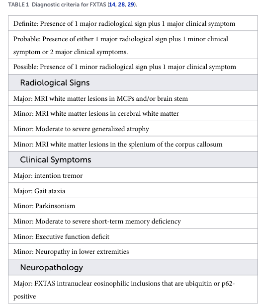

## Question

# Disease Characteristics Research Template

## Target Disease
- **Disease Name:** Fragile X-Associated Tremor Ataxia Syndrome
- **MONDO ID:**  (if available)
- **Category:** Mendelian

## Research Objectives

Please provide a comprehensive research report on **Fragile X-Associated Tremor Ataxia Syndrome** covering all of the
disease characteristics listed below. This report will be used to populate a disease knowledge
base entry. Be thorough and cite primary literature (PMID preferred) for all claims.

For each section, **suggested databases/resources** are listed. These are the first places
you should search for information on each topic.

---

### 1. Disease Information
> **Search first:** OMIM, Orphanet, ICD-10/ICD-11, MeSH, PubMed

- What is the disease? Provide a concise overview.
- What are the key identifiers? (OMIM, Orphanet, ICD-10/ICD-11, MeSH, Mondo)
- What are the common synonyms and alternative names?
- Is the information derived from individual patients (e.g., EHR) or aggregated disease-level resources?

### 2. Etiology

- **Disease Causal Factors**: What are the primary causes? (genetic, environmental, infectious, mechanistic)
- **Risk Factors**:
  > **Search first:** PubMed, Cochrane Library, UpToDate, clinical guidelines, ClinVar, ClinGen, GWAS Catalog, PheGenI, CTD, CDC, WHO, epidemiological databases
  - Genetic risk factors (causal variants, susceptibility loci, modifier genes)
  - Environmental risk factors (toxins, lifestyle, occupational exposures, age, sex, family history)
- **Protective Factors**:
  > **Search first:** PubMed, Cochrane Library, clinical trial databases, GWAS Catalog, gnomAD, WHO, CDC, nutrition databases
  - Genetic protective factors (protective variants, modifier alleles)
  - Environmental protective factors (diet, lifestyle, exposures that reduce risk)
- **Gene-Environment Interactions**: How do genetic and environmental factors interact to influence disease?
  > **Search first:** CTD, PubMed, PheGenI, GxE databases

### 3. Phenotypes
> **Search first:** HPO (Human Phenotype Ontology), OMIM, Orphanet, PubMed, clinicaltrials.gov, MedDRA, SNOMED CT, DECIPHER, LOINC

For each phenotype, provide:
- **Phenotype type**: symptoms, clinical signs, physical manifestations, behavioral changes, or laboratory abnormalities
  > For symptoms/signs: HPO, OMIM, Orphanet, PubMed
  > For behavioral changes: HPO, DSM, RDoC (Research Domain Criteria), PubMed
  > For laboratory abnormalities: LOINC, SNOMED CT, LabTests Online, PubMed
- **Phenotype characteristics**:
  > **Search first:** OMIM, Orphanet, HPO, PubMed
  - Age of symptom onset (neonatal, childhood, adult-onset, late-onset)
  - Symptom severity (mild, moderate, severe, variable)
  - Symptom progression (stable, progressive, episodic, fluctuating)
  - Frequency among affected individuals (percentage or qualitative)
- **Quality of life impact**: Effects on daily functioning and well-being (per-phenotype when possible)
  > **Search first:** EQ-5D database, SF-36, WHO QOL databases, PubMed
- Suggest HPO (Human Phenotype Ontology) terms for each phenotype

### 4. Genetic/Molecular Information

- **Causal Genes**: Gene mutations or chromosomal abnormalities responsible for disease (gene symbols, OMIM IDs)
  > **Search first:** OMIM, ClinVar, HGMD, Ensembl, NCBI Gene
- **Pathogenic Variants**:
  - Affected genes (gene symbols, HGNC IDs)
    > **Search first:** OMIM, NCBI Gene, Ensembl, HGNC, UniProt, GeneCards
  - Variant classification (pathogenic, likely pathogenic, VUS per ACMG/AMP guidelines)
    > **Search first:** ClinVar, ClinGen, ACMG/AMP guidelines, VarSome
  - Variant type/class (missense, frameshift, nonsense, splice-site, structural)
  - Allele frequency in population databases
    > **Search first:** gnomAD, 1000 Genomes, ExAC, TOPMed, dbSNP
  - Somatic vs germline origin
    > **Search first:** COSMIC (somatic), ClinVar, ICGC, TCGA
  - Functional consequences (loss of function, gain of function, dominant negative)
- **Modifier Genes**: Genes that modify disease severity or expression
- **Epigenetic Information**: DNA methylation, histone modifications, chromatin changes affecting disease
  > **Search first:** ENCODE, Roadmap Epigenomics, MethBase, DiseaseMeth
- **Chromosomal Abnormalities**: Large-scale genetic changes (aneuploidy, translocations, inversions)
  > **Search first:** DECIPHER, ClinVar, ECARUCA, UCSC Genome Browser

### 5. Environmental Information

- **Environmental Factors**: Non-genetic contributing factors (toxins, radiation, pollution, occupational exposure)
  > **Search first:** CTD (Comparative Toxicogenomics Database), TOXNET, PubMed, EPA databases
- **Lifestyle Factors**: Behavioral factors (smoking, diet, exercise, alcohol consumption)
  > **Search first:** CDC databases, WHO, PubMed, NHANES
- **Infectious Agents**: If applicable, pathogens causing or triggering disease (bacteria, viruses, fungi, parasites)
  > **Search first:** NCBI Taxonomy, ViPR, BV-BRC, MicrobeDB, GIDEON

### 6. Mechanism / Pathophysiology

- **Molecular Pathways**: Specific signaling cascades or biochemical pathways involved (Wnt, MAPK, mTOR, PI3K-AKT, etc.)
  > **Search first:** KEGG, Reactome, WikiPathways, PathBank, BioCyc
- **Cellular Processes**: Cell-level mechanisms (apoptosis, autophagy, cell cycle dysregulation, inflammation, etc.)
  > **Search first:** Gene Ontology (GO), Reactome, KEGG, PubMed
- **Protein Dysfunction**: How protein structure or function is altered (misfolding, aggregation, loss of function, gain of function)
  > **Search first:** UniProt, PDB (Protein Data Bank), InterPro, Pfam, AlphaFold
- **Metabolic Changes**: Alterations in metabolic processes (energy metabolism, lipid metabolism, amino acid metabolism)
  > **Search first:** KEGG, BioCyc, HMDB (Human Metabolome Database), BRENDA
- **Immune System Involvement**: Role of immune response (autoimmunity, immunodeficiency, chronic inflammation)
  > **Search first:** ImmPort, Immunome Database, IEDB, Gene Ontology
- **Tissue Damage Mechanisms**: How tissues/ are injured (oxidative stress, ischemia, fibrosis, necrosis)
  > **Search first:** PubMed, Gene Ontology, Reactome
- **Biochemical Abnormalities**: Specific molecular defects (enzyme deficiencies, receptor dysfunction, ion channel defects)
  > **Search first:** BRENDA, UniProt, KEGG, OMIM, PubMed
- **Epigenetic Changes**: DNA methylation, histone modifications affecting gene expression in disease
  > **Search first:** ENCODE, Roadmap Epigenomics, MethBase, DiseaseMeth
- **Molecular Profiling** (if available):
  - Transcriptomics/gene expression changes
    > **Search first:** GEO (Gene Expression Omnibus), ArrayExpress, GTEx, Human Cell Atlas, SRA
  - Proteomics findings
    > **Search first:** PRIDE, ProteomeXchange, Human Protein Atlas, STRING, BioGRID
  - Metabolomics signatures
    > **Search first:** MetaboLights, Metabolomics Workbench, HMDB, METLIN
  - Lipidomics alterations
    > **Search first:** LIPID MAPS, SwissLipids, LipidHome, Metabolomics Workbench
  - Genomic structural features
    > **Search first:** UCSC Genome Browser, Ensembl, NCBI, dbVar, DGV
- **Advanced Technologies** (if applicable):
  - Single-cell analysis findings (cell-type specific mechanisms, cellular heterogeneity)
    > **Search first:** Human Cell Atlas, Single Cell Portal, GEO, CELLxGENE
  - Spatial transcriptomics findings
    > **Search first:** GEO, Spatial Research, Vizgen, 10x Genomics data
  - Multi-omics integration results
    > **Search first:** TCGA, ICGC, cBioPortal, LinkedOmics, PubMed
  - Functional genomics screens (CRISPR, RNAi)
    > **Search first:** DepMap, GenomeRNAi, PubMed, BioGRID ORCS

For each mechanism, describe:
- The causal chain from initial trigger to clinical manifestation
- Which mechanisms are upstream vs downstream
- What cell types and biological processes are involved
- Suggest GO terms for biological processes and CL terms for cell types

### 7. Anatomical Structures Affected

- **Organ Level**:
  - Primary organs directly affected
  - Secondary organ involvement (complications, secondary effects)
  - Body systems involved (cardiovascular, nervous, digestive, respiratory, endocrine, etc.)
  > **Search first:** Uberon, FMA (Foundational Model of Anatomy), OMIM, HPO, ICD-11, MeSH, SNOMED CT
- **Tissue and Cell Level**:
  - Specific tissue types affected (epithelial, connective, muscle, nervous)
  - Specific cell populations targeted (with Cell Ontology terms)
  > **Search first:** Uberon, Human Protein Atlas, Cell Ontology, Human Cell Atlas, CellMarker, PanglaoDB
- **Subcellular Level**:
  - Cellular compartments involved (mitochondria, nucleus, ER, lysosomes) (with GO Cellular Component terms)
  > **Search first:** Gene Ontology (Cellular Component), UniProt, Human Protein Atlas
- **Localization**:
  - Specific anatomical sites (with UBERON terms)
    > **Search first:** FMA, Uberon, NeuroNames (for brain), SNOMED CT
  - Lateralization (unilateral, bilateral, asymmetric)
    > **Search first:** HPO, clinical literature, imaging databases

### 8. Temporal Development

- **Onset**:
  - Typical age of onset (congenital, pediatric, adult, geriatric)
  - Onset pattern (acute, subacute, chronic, insidious)
  > **Search first:** OMIM, Orphanet, HPO, PubMed
- **Progression**:
  - Disease stages (early, intermediate, advanced, end-stage)
    > **Search first:** Cancer Staging Manual (AJCC), WHO classifications, PubMed
  - Progression rate (rapid, slow, variable)
  - Disease course pattern (episodic, relapsing-remitting, progressive, stable)
  - Disease duration (self-limited, chronic lifelong)
  > **Search first:** Disease registries, longitudinal cohort databases, natural history studies, PubMed, Orphanet, OMIM
- **Patterns**:
  - Remission patterns (spontaneous, treatment-induced)
    > **Search first:** Clinical trial databases, disease registries, PubMed
  - Critical periods (time windows of vulnerability or opportunity for intervention)
    > **Search first:** PubMed, developmental biology databases, clinical guidelines

### 9. Inheritance and Population

- **Epidemiology**:
  - Prevalence (cases per 100,000 at given time)
  - Incidence (new cases per 100,000 per year)
  > **Search first:** Orphanet, CDC, WHO, GBD (Global Burden of Disease), national registries, SEER, disease registries
- **For Genetic Etiology**:
  - Inheritance pattern (AD, AR, X-linked, mitochondrial, multifactorial, polygenic)
    > **Search first:** OMIM, Orphanet, ClinVar, GTR (Genetic Testing Registry)
  - Penetrance (complete, incomplete, age-dependent)
    > **Search first:** ClinVar, OMIM, PubMed, ClinGen
  - Expressivity (variable, consistent)
    > **Search first:** OMIM, ClinVar, PubMed
  - Genetic anticipation (increasing severity in successive generations)
    > **Search first:** OMIM, PubMed (especially for repeat expansion disorders)
  - Germline mosaicism
    > **Search first:** ClinVar, OMIM, genetic counseling literature, PubMed
  - Founder effects (population-specific mutations)
    > **Search first:** gnomAD, population genetics databases, PubMed
  - Consanguinity role
    > **Search first:** OMIM, population studies, genetic counseling resources
  - Carrier frequency
    > **Search first:** gnomAD, carrier screening databases, GeneReviews, GTR
- **Population Demographics**:
  - Affected populations (ethnic or demographic groups with higher prevalence)
    > **Search first:** gnomAD, 1000 Genomes, PAGE Study, PubMed, population registries
  - Geographic distribution (endemic areas, regional variation)
    > **Search first:** WHO, CDC, GBD, Orphanet, geographic epidemiology databases
  - Geographic distribution of specific variants
  - Sex ratio (male:female)
    > **Search first:** Disease registries, OMIM, PubMed, epidemiological databases
  - Age distribution of affected individuals
    > **Search first:** CDC, disease registries, SEER, Orphanet

### 10. Diagnostics

- **Clinical Tests**:
  - Laboratory tests (blood, urine, tissue chemistry, specific enzyme assays)
    > **Search first:** LOINC, LabTests Online, PubMed
  - Biomarkers (proteins, metabolites, genetic markers, circulating biomarkers)
    > **Search first:** FDA Biomarker List, BEST (Biomarkers, EndpointS, and other Tools), PubMed
  - Imaging studies (X-ray, CT, MRI, PET, ultrasound)
    > **Search first:** RadLex, DICOM, Radiopaedia, imaging databases
  - Functional tests (pulmonary function, cardiac stress tests)
    > **Search first:** LOINC, clinical guidelines, PubMed
  - Electrophysiology (EEG, EMG, ECG, nerve conduction studies)
    > **Search first:** LOINC, clinical neurophysiology databases, PubMed
  - Biopsy findings (histopathology, immunohistochemistry)
    > **Search first:** SNOMED CT, College of American Pathologists resources, PubMed
  - Pathology findings (microscopic examination)
    > **Search first:** SNOMED CT, Digital Pathology databases, PubMed
- **Genetic Testing**:
  > **Search first:** GTR (Genetic Testing Registry), GeneReviews, ClinGen
  - Overview of recommended genetic testing approach
  - Whole genome sequencing (WGS) utility
    > **Search first:** GTR, ClinVar, GEL (Genomics England), gnomAD
  - Whole exome sequencing (WES) utility
    > **Search first:** GTR, ClinVar, OMIM, GeneMatcher
  - Gene panels (which panels, which genes)
    > **Search first:** GTR, ClinVar, laboratory-specific databases
  - Single gene testing
    > **Search first:** GTR, ClinVar, OMIM, GeneReviews
  - Chromosomal microarray (CMA)
    > **Search first:** DECIPHER, ClinVar, dbVar, ECARUCA
  - Karyotyping
    > **Search first:** Chromosome Abnormality Database, ClinVar, cytogenetics resources
  - FISH
    > **Search first:** ClinVar, cytogenetics databases, PubMed
  - Mitochondrial DNA testing
    > **Search first:** MITOMAP, MSeqDR, ClinVar, GTR
  - Repeat expansion testing
    > **Search first:** GTR, ClinVar, repeat expansion databases, PubMed
- **Omics-Based Diagnostics** (if applicable):
  - RNA sequencing / transcriptomics
    > **Search first:** GEO, ArrayExpress, GTEx, RNA-seq databases
  - Proteomics
    > **Search first:** PRIDE, ProteomeXchange, FDA Biomarker database
  - Metabolomics
    > **Search first:** MetaboLights, Metabolomics Workbench, HMDB
  - Epigenomics
    > **Search first:** GEO, ENCODE, Roadmap Epigenomics, MethBase
  - Liquid biopsy
    > **Search first:** COSMIC, ClinVar, liquid biopsy databases, PubMed
- **Clinical Criteria**:
  - Standardized diagnostic criteria (DSM, ICD, society guidelines)
    > **Search first:** DSM-5, ICD-11, clinical society guidelines, UpToDate
  - Differential diagnosis (other conditions to rule out, with distinguishing features)
    > **Search first:** DynaMed, UpToDate, clinical decision support systems
- **Screening**:
  - Screening methods for asymptomatic individuals (newborn screening, carrier screening, cascade screening)
    > **Search first:** ACMG recommendations, CDC newborn screening, GTR

### 11. Outcome/Prognosis

- **Survival and Mortality**:
  - Survival rate (5-year, 10-year, overall)
    > **Search first:** SEER, cancer registries, disease-specific registries, PubMed
  - Life expectancy (with and without treatment if applicable)
    > **Search first:** Orphanet, disease registries, actuarial databases, PubMed
  - Mortality rate
    > **Search first:** CDC, WHO, GBD, national mortality databases
  - Disease-specific mortality (deaths directly attributable to disease)
    > **Search first:** Disease registries, CDC Wonder, GBD, PubMed
- **Morbidity and Function**:
  - Morbidity (disease-related disability and health impacts)
    > **Search first:** GBD, WHO, disability databases, PubMed
  - Disability outcomes (long-term functional impairments)
    > **Search first:** ICF (International Classification of Functioning), disability registries
  - Quality of life measures (EQ-5D, SF-36, PROMIS, disease-specific tools)
    > **Search first:** EQ-5D database, SF-36, PROMIS, PubMed
- **Disease Course**:
  - Complications (secondary problems: infections, organ failure, etc.)
    > **Search first:** ICD codes, disease registries, clinical databases, PubMed
  - Recovery potential (likelihood and extent of recovery, with vs without treatment)
    > **Search first:** Natural history studies, rehabilitation databases, PubMed
- **Prediction**:
  - Prognostic factors (age, disease severity, biomarkers, treatment response)
    > **Search first:** Prognostic models databases, clinical calculators, PubMed
  - Prognostic biomarkers (molecular markers predicting disease course)
    > **Search first:** FDA Biomarker database, PubMed, cancer prognostic databases

### 12. Treatment

- **Pharmacotherapy**:
  - Pharmacological treatments (drug names, drug classes, mechanisms of action)
    > **Search first:** DrugBank, RxNorm, ATC classification, DailyMed, FDA databases
  - Pharmacogenomics (how genetic variants affect drug metabolism, efficacy, toxicity)
    > **Search first:** PharmGKB, CPIC (Clinical Pharmacogenetics), FDA Table of PGx Biomarkers
- **Advanced Therapeutics**:
  - Gene therapy (viral vectors, CRISPR, gene replacement, gene editing)
    > **Search first:** ClinicalTrials.gov, FDA gene therapy database, ASGCT resources
  - Cell therapy (stem cell transplant, CAR-T, cellular therapeutics)
    > **Search first:** ClinicalTrials.gov, FDA cell therapy database, FACT standards
  - RNA-based therapies (ASOs, siRNA, mRNA therapies)
    > **Search first:** ClinicalTrials.gov, FDA approvals, PubMed
  - Targeted therapies (treatments directed at specific molecular targets)
    > **Search first:** My Cancer Genome, OncoKB, ClinicalTrials.gov, FDA approvals
  - Immunotherapies (checkpoint inhibitors, monoclonal antibodies)
    > **Search first:** Cancer Immunotherapy Database, FDA approvals, ClinicalTrials.gov
- **Surgical and Interventional**:
  - Surgical interventions (types of surgery, timing, outcomes)
    > **Search first:** CPT codes, surgical registries, clinical guidelines, PubMed
- **Supportive and Rehabilitative**:
  - Supportive care (symptom management, pain control, nutrition)
    > **Search first:** Clinical guidelines, Cochrane Library, PubMed
  - Rehabilitation (physical therapy, occupational therapy, speech therapy)
    > **Search first:** Rehabilitation medicine databases, clinical guidelines, PubMed
- **Experimental**:
  - Experimental treatments in clinical trials (with NCT identifiers if available)
    > **Search first:** ClinicalTrials.gov, EU Clinical Trials Register, WHO ICTRP
- **Treatment Outcomes**:
  - Treatment response rates
    > **Search first:** Clinical trial databases, FDA reviews, systematic reviews, PubMed
  - Side effects and adverse events
    > **Search first:** FDA Adverse Event Reporting System (FAERS), MedWatch, PubMed
- **Treatment Strategy**:
  - Treatment algorithms (clinical pathways, decision trees)
    > **Search first:** Clinical practice guidelines, NCCN Guidelines, UpToDate
  - Combination therapies
    > **Search first:** ClinicalTrials.gov, treatment guidelines, PubMed
  - Personalized medicine approaches (genotype-guided treatment)
    > **Search first:** My Cancer Genome, CIViC, PharmGKB, precision medicine databases

For each treatment, suggest MAXO (Medical Action Ontology) terms where applicable.

### 13. Prevention

- **Prevention Levels**:
  - Primary prevention (preventing disease occurrence: vaccination, risk factor modification)
    > **Search first:** CDC, WHO, USPSTF recommendations, Cochrane Library
  - Secondary prevention (early detection and treatment: screening programs, early intervention)
    > **Search first:** USPSTF, CDC screening guidelines, WHO
  - Tertiary prevention (preventing complications in those with disease)
    > **Search first:** Clinical guidelines, disease management protocols, PubMed
- **Immunization**: Vaccine strategies (if applicable)
  > **Search first:** CDC vaccine schedules, WHO immunization, FDA vaccine database
- **Screening and Early Detection**:
  - Screening programs (population-based: newborn screening, cancer screening)
    > **Search first:** CDC screening programs, USPSTF, cancer screening databases
  - Genetic screening (carrier screening, preimplantation genetic diagnosis, prenatal testing)
    > **Search first:** ACMG recommendations, ACOG guidelines, GTR
  - Risk stratification (identifying high-risk individuals for targeted prevention)
    > **Search first:** Risk prediction models, clinical calculators, PubMed
- **Behavioral Interventions**: Lifestyle modifications to reduce risk
  > **Search first:** CDC, WHO, behavioral intervention databases, Cochrane Library
- **Counseling**: Genetic counseling (risk assessment, family planning guidance)
  > **Search first:** NSGC resources, ACMG guidelines, GeneReviews
- **Public Health**:
  - Public health interventions (sanitation, vector control, health education)
    > **Search first:** CDC, WHO, public health databases, PubMed
  - Environmental interventions (reducing environmental risk factors)
    > **Search first:** EPA databases, WHO environmental health, PubMed
- **Prophylaxis**: Preventive medications or procedures
  > **Search first:** Clinical guidelines, FDA approvals, PubMed

### 14. Other Species / Natural Disease

- **Taxonomy**: Species affected (with NCBI Taxon identifiers)
  > **Search first:** NCBI Taxonomy
- **Breed**: Specific breeds affected (with VBO identifiers if applicable)
  > **Search first:** VBO (Vertebrate Breed Ontology)
- **Gene**: Orthologous genes in other species (with NCBI Gene IDs)
  > **Search first:** NCBI Gene
- **Natural Disease**:
  - Naturally occurring disease in other species (companion animals, wildlife)
    > **Search first:** OMIA (Online Mendelian Inheritance in Animals), VetCompass, PubMed
  - Veterinary relevance and importance in animal health
    > **Search first:** OMIA, veterinary databases, PubMed
- **Comparative Biology**:
  - Comparative pathology (similarities and differences across species)
    > **Search first:** OMIA, comparative pathology databases, PubMed
  - Evolutionary conservation of disease mechanisms
    > **Search first:** HomoloGene, OrthoMCL, Alliance of Genome Resources
- **Transmission** (if applicable):
  - Zoonotic potential
    > **Search first:** CDC zoonotic diseases, WHO zoonoses, GIDEON
  - Cross-species susceptibility
    > **Search first:** NCBI Taxonomy, veterinary databases, PubMed

### 15. Model Organisms

- **Model Types**:
  - Model organism type (mammalian, invertebrate, cellular, in vitro)
    > **Search first:** Alliance of Genome Resources, model organism databases
  - Specific model systems (mouse, rat, zebrafish, Drosophila, C. elegans, yeast, cell lines, organoids, iPSCs)
    > **Search first:** MGI, RGD, ZFIN, FlyBase, WormBase, SGD, ATCC, Cellosaurus
  - Induced models (drug treatment, surgical intervention, environmental manipulation)
    > **Search first:** MGI, model organism databases, PubMed
- **Genetic Models**:
  - Types available (knockout, knock-in, transgenic, conditional, humanized)
    > **Search first:** MGI, IMPC, KOMP, EuMMCR, IMSR
- **Model Characteristics**:
  - Phenotype recapitulation (how well model reproduces human disease features)
    > **Search first:** Model organism databases, comparative studies, PubMed
  - Model limitations (aspects of human disease not captured)
    > **Search first:** Model organism databases, PubMed, review articles
- **Applications**:
  - Research applications (what aspects of disease can be studied)
    > **Search first:** Model organism databases, PubMed
- **Resources**:
  - Model databases
    > **Search first:** MGI, RGD, ZFIN, FlyBase, WormBase, IMSR, EMMA, MMRRC

---

## Citation Requirements

- Cite primary literature (PMID preferred) for all mechanistic and clinical claims
- Prioritize recent reviews and landmark papers
- Include direct quotes from abstracts where possible to support key statements
- Distinguish evidence source types: human clinical, model organism, in vitro, computational

## Output Format

Structure your response as a comprehensive narrative organized by the sections above.
For each section, provide:
- Factual content with specific details (numbers, percentages, gene names, variant nomenclature)
- Ontology term suggestions (HPO, GO, CL, UBERON, CHEBI, MAXO, MONDO) where applicable
- Evidence citations with PMIDs
- Direct quotes from abstracts to support key claims
- Clear indication when information is not available or not applicable for this disease

This report will be used to populate a disease knowledge base entry with:
- Pathophysiology descriptions with causal chains
- Gene/protein annotations (HGNC, GO terms)
- Phenotype associations (HP terms) with frequencies
- Cell type involvement (CL terms)
- Anatomical locations (UBERON terms)
- Chemical entities (CHEBI terms)
- Treatment annotations (MAXO terms)
- Evidence items with PMIDs and exact abstract quotes
- Epidemiology, prognosis, diagnostic, and prevention information
- Animal model descriptions with phenotype recapitulation details

## Output

Question: You are an expert researcher providing comprehensive, well-cited information.

Provide detailed information focusing on:
1. Key concepts and definitions with current understanding
2. Recent developments and latest research (prioritize 2023-2024 sources)
3. Current applications and real-world implementations
4. Expert opinions and analysis from authoritative sources
5. Relevant statistics and data from recent studies

Format as a comprehensive research report with proper citations. Include URLs and publication dates where available.
Always prioritize recent, authoritative sources and provide specific citations for all major claims.

# Disease Characteristics Research Template

## Target Disease
- **Disease Name:** Fragile X-Associated Tremor Ataxia Syndrome
- **MONDO ID:**  (if available)
- **Category:** Mendelian

## Research Objectives

Please provide a comprehensive research report on **Fragile X-Associated Tremor Ataxia Syndrome** covering all of the
disease characteristics listed below. This report will be used to populate a disease knowledge
base entry. Be thorough and cite primary literature (PMID preferred) for all claims.

For each section, **suggested databases/resources** are listed. These are the first places
you should search for information on each topic.

---

### 1. Disease Information
> **Search first:** OMIM, Orphanet, ICD-10/ICD-11, MeSH, PubMed

- What is the disease? Provide a concise overview.
- What are the key identifiers? (OMIM, Orphanet, ICD-10/ICD-11, MeSH, Mondo)
- What are the common synonyms and alternative names?
- Is the information derived from individual patients (e.g., EHR) or aggregated disease-level resources?

### 2. Etiology

- **Disease Causal Factors**: What are the primary causes? (genetic, environmental, infectious, mechanistic)
- **Risk Factors**:
  > **Search first:** PubMed, Cochrane Library, UpToDate, clinical guidelines, ClinVar, ClinGen, GWAS Catalog, PheGenI, CTD, CDC, WHO, epidemiological databases
  - Genetic risk factors (causal variants, susceptibility loci, modifier genes)
  - Environmental risk factors (toxins, lifestyle, occupational exposures, age, sex, family history)
- **Protective Factors**:
  > **Search first:** PubMed, Cochrane Library, clinical trial databases, GWAS Catalog, gnomAD, WHO, CDC, nutrition databases
  - Genetic protective factors (protective variants, modifier alleles)
  - Environmental protective factors (diet, lifestyle, exposures that reduce risk)
- **Gene-Environment Interactions**: How do genetic and environmental factors interact to influence disease?
  > **Search first:** CTD, PubMed, PheGenI, GxE databases

### 3. Phenotypes
> **Search first:** HPO (Human Phenotype Ontology), OMIM, Orphanet, PubMed, clinicaltrials.gov, MedDRA, SNOMED CT, DECIPHER, LOINC

For each phenotype, provide:
- **Phenotype type**: symptoms, clinical signs, physical manifestations, behavioral changes, or laboratory abnormalities
  > For symptoms/signs: HPO, OMIM, Orphanet, PubMed
  > For behavioral changes: HPO, DSM, RDoC (Research Domain Criteria), PubMed
  > For laboratory abnormalities: LOINC, SNOMED CT, LabTests Online, PubMed
- **Phenotype characteristics**:
  > **Search first:** OMIM, Orphanet, HPO, PubMed
  - Age of symptom onset (neonatal, childhood, adult-onset, late-onset)
  - Symptom severity (mild, moderate, severe, variable)
  - Symptom progression (stable, progressive, episodic, fluctuating)
  - Frequency among affected individuals (percentage or qualitative)
- **Quality of life impact**: Effects on daily functioning and well-being (per-phenotype when possible)
  > **Search first:** EQ-5D database, SF-36, WHO QOL databases, PubMed
- Suggest HPO (Human Phenotype Ontology) terms for each phenotype

### 4. Genetic/Molecular Information

- **Causal Genes**: Gene mutations or chromosomal abnormalities responsible for disease (gene symbols, OMIM IDs)
  > **Search first:** OMIM, ClinVar, HGMD, Ensembl, NCBI Gene
- **Pathogenic Variants**:
  - Affected genes (gene symbols, HGNC IDs)
    > **Search first:** OMIM, NCBI Gene, Ensembl, HGNC, UniProt, GeneCards
  - Variant classification (pathogenic, likely pathogenic, VUS per ACMG/AMP guidelines)
    > **Search first:** ClinVar, ClinGen, ACMG/AMP guidelines, VarSome
  - Variant type/class (missense, frameshift, nonsense, splice-site, structural)
  - Allele frequency in population databases
    > **Search first:** gnomAD, 1000 Genomes, ExAC, TOPMed, dbSNP
  - Somatic vs germline origin
    > **Search first:** COSMIC (somatic), ClinVar, ICGC, TCGA
  - Functional consequences (loss of function, gain of function, dominant negative)
- **Modifier Genes**: Genes that modify disease severity or expression
- **Epigenetic Information**: DNA methylation, histone modifications, chromatin changes affecting disease
  > **Search first:** ENCODE, Roadmap Epigenomics, MethBase, DiseaseMeth
- **Chromosomal Abnormalities**: Large-scale genetic changes (aneuploidy, translocations, inversions)
  > **Search first:** DECIPHER, ClinVar, ECARUCA, UCSC Genome Browser

### 5. Environmental Information

- **Environmental Factors**: Non-genetic contributing factors (toxins, radiation, pollution, occupational exposure)
  > **Search first:** CTD (Comparative Toxicogenomics Database), TOXNET, PubMed, EPA databases
- **Lifestyle Factors**: Behavioral factors (smoking, diet, exercise, alcohol consumption)
  > **Search first:** CDC databases, WHO, PubMed, NHANES
- **Infectious Agents**: If applicable, pathogens causing or triggering disease (bacteria, viruses, fungi, parasites)
  > **Search first:** NCBI Taxonomy, ViPR, BV-BRC, MicrobeDB, GIDEON

### 6. Mechanism / Pathophysiology

- **Molecular Pathways**: Specific signaling cascades or biochemical pathways involved (Wnt, MAPK, mTOR, PI3K-AKT, etc.)
  > **Search first:** KEGG, Reactome, WikiPathways, PathBank, BioCyc
- **Cellular Processes**: Cell-level mechanisms (apoptosis, autophagy, cell cycle dysregulation, inflammation, etc.)
  > **Search first:** Gene Ontology (GO), Reactome, KEGG, PubMed
- **Protein Dysfunction**: How protein structure or function is altered (misfolding, aggregation, loss of function, gain of function)
  > **Search first:** UniProt, PDB (Protein Data Bank), InterPro, Pfam, AlphaFold
- **Metabolic Changes**: Alterations in metabolic processes (energy metabolism, lipid metabolism, amino acid metabolism)
  > **Search first:** KEGG, BioCyc, HMDB (Human Metabolome Database), BRENDA
- **Immune System Involvement**: Role of immune response (autoimmunity, immunodeficiency, chronic inflammation)
  > **Search first:** ImmPort, Immunome Database, IEDB, Gene Ontology
- **Tissue Damage Mechanisms**: How tissues/ are injured (oxidative stress, ischemia, fibrosis, necrosis)
  > **Search first:** PubMed, Gene Ontology, Reactome
- **Biochemical Abnormalities**: Specific molecular defects (enzyme deficiencies, receptor dysfunction, ion channel defects)
  > **Search first:** BRENDA, UniProt, KEGG, OMIM, PubMed
- **Epigenetic Changes**: DNA methylation, histone modifications affecting gene expression in disease
  > **Search first:** ENCODE, Roadmap Epigenomics, MethBase, DiseaseMeth
- **Molecular Profiling** (if available):
  - Transcriptomics/gene expression changes
    > **Search first:** GEO (Gene Expression Omnibus), ArrayExpress, GTEx, Human Cell Atlas, SRA
  - Proteomics findings
    > **Search first:** PRIDE, ProteomeXchange, Human Protein Atlas, STRING, BioGRID
  - Metabolomics signatures
    > **Search first:** MetaboLights, Metabolomics Workbench, HMDB, METLIN
  - Lipidomics alterations
    > **Search first:** LIPID MAPS, SwissLipids, LipidHome, Metabolomics Workbench
  - Genomic structural features
    > **Search first:** UCSC Genome Browser, Ensembl, NCBI, dbVar, DGV
- **Advanced Technologies** (if applicable):
  - Single-cell analysis findings (cell-type specific mechanisms, cellular heterogeneity)
    > **Search first:** Human Cell Atlas, Single Cell Portal, GEO, CELLxGENE
  - Spatial transcriptomics findings
    > **Search first:** GEO, Spatial Research, Vizgen, 10x Genomics data
  - Multi-omics integration results
    > **Search first:** TCGA, ICGC, cBioPortal, LinkedOmics, PubMed
  - Functional genomics screens (CRISPR, RNAi)
    > **Search first:** DepMap, GenomeRNAi, PubMed, BioGRID ORCS

For each mechanism, describe:
- The causal chain from initial trigger to clinical manifestation
- Which mechanisms are upstream vs downstream
- What cell types and biological processes are involved
- Suggest GO terms for biological processes and CL terms for cell types

### 7. Anatomical Structures Affected

- **Organ Level**:
  - Primary organs directly affected
  - Secondary organ involvement (complications, secondary effects)
  - Body systems involved (cardiovascular, nervous, digestive, respiratory, endocrine, etc.)
  > **Search first:** Uberon, FMA (Foundational Model of Anatomy), OMIM, HPO, ICD-11, MeSH, SNOMED CT
- **Tissue and Cell Level**:
  - Specific tissue types affected (epithelial, connective, muscle, nervous)
  - Specific cell populations targeted (with Cell Ontology terms)
  > **Search first:** Uberon, Human Protein Atlas, Cell Ontology, Human Cell Atlas, CellMarker, PanglaoDB
- **Subcellular Level**:
  - Cellular compartments involved (mitochondria, nucleus, ER, lysosomes) (with GO Cellular Component terms)
  > **Search first:** Gene Ontology (Cellular Component), UniProt, Human Protein Atlas
- **Localization**:
  - Specific anatomical sites (with UBERON terms)
    > **Search first:** FMA, Uberon, NeuroNames (for brain), SNOMED CT
  - Lateralization (unilateral, bilateral, asymmetric)
    > **Search first:** HPO, clinical literature, imaging databases

### 8. Temporal Development

- **Onset**:
  - Typical age of onset (congenital, pediatric, adult, geriatric)
  - Onset pattern (acute, subacute, chronic, insidious)
  > **Search first:** OMIM, Orphanet, HPO, PubMed
- **Progression**:
  - Disease stages (early, intermediate, advanced, end-stage)
    > **Search first:** Cancer Staging Manual (AJCC), WHO classifications, PubMed
  - Progression rate (rapid, slow, variable)
  - Disease course pattern (episodic, relapsing-remitting, progressive, stable)
  - Disease duration (self-limited, chronic lifelong)
  > **Search first:** Disease registries, longitudinal cohort databases, natural history studies, PubMed, Orphanet, OMIM
- **Patterns**:
  - Remission patterns (spontaneous, treatment-induced)
    > **Search first:** Clinical trial databases, disease registries, PubMed
  - Critical periods (time windows of vulnerability or opportunity for intervention)
    > **Search first:** PubMed, developmental biology databases, clinical guidelines

### 9. Inheritance and Population

- **Epidemiology**:
  - Prevalence (cases per 100,000 at given time)
  - Incidence (new cases per 100,000 per year)
  > **Search first:** Orphanet, CDC, WHO, GBD (Global Burden of Disease), national registries, SEER, disease registries
- **For Genetic Etiology**:
  - Inheritance pattern (AD, AR, X-linked, mitochondrial, multifactorial, polygenic)
    > **Search first:** OMIM, Orphanet, ClinVar, GTR (Genetic Testing Registry)
  - Penetrance (complete, incomplete, age-dependent)
    > **Search first:** ClinVar, OMIM, PubMed, ClinGen
  - Expressivity (variable, consistent)
    > **Search first:** OMIM, ClinVar, PubMed
  - Genetic anticipation (increasing severity in successive generations)
    > **Search first:** OMIM, PubMed (especially for repeat expansion disorders)
  - Germline mosaicism
    > **Search first:** ClinVar, OMIM, genetic counseling literature, PubMed
  - Founder effects (population-specific mutations)
    > **Search first:** gnomAD, population genetics databases, PubMed
  - Consanguinity role
    > **Search first:** OMIM, population studies, genetic counseling resources
  - Carrier frequency
    > **Search first:** gnomAD, carrier screening databases, GeneReviews, GTR
- **Population Demographics**:
  - Affected populations (ethnic or demographic groups with higher prevalence)
    > **Search first:** gnomAD, 1000 Genomes, PAGE Study, PubMed, population registries
  - Geographic distribution (endemic areas, regional variation)
    > **Search first:** WHO, CDC, GBD, Orphanet, geographic epidemiology databases
  - Geographic distribution of specific variants
  - Sex ratio (male:female)
    > **Search first:** Disease registries, OMIM, PubMed, epidemiological databases
  - Age distribution of affected individuals
    > **Search first:** CDC, disease registries, SEER, Orphanet

### 10. Diagnostics

- **Clinical Tests**:
  - Laboratory tests (blood, urine, tissue chemistry, specific enzyme assays)
    > **Search first:** LOINC, LabTests Online, PubMed
  - Biomarkers (proteins, metabolites, genetic markers, circulating biomarkers)
    > **Search first:** FDA Biomarker List, BEST (Biomarkers, EndpointS, and other Tools), PubMed
  - Imaging studies (X-ray, CT, MRI, PET, ultrasound)
    > **Search first:** RadLex, DICOM, Radiopaedia, imaging databases
  - Functional tests (pulmonary function, cardiac stress tests)
    > **Search first:** LOINC, clinical guidelines, PubMed
  - Electrophysiology (EEG, EMG, ECG, nerve conduction studies)
    > **Search first:** LOINC, clinical neurophysiology databases, PubMed
  - Biopsy findings (histopathology, immunohistochemistry)
    > **Search first:** SNOMED CT, College of American Pathologists resources, PubMed
  - Pathology findings (microscopic examination)
    > **Search first:** SNOMED CT, Digital Pathology databases, PubMed
- **Genetic Testing**:
  > **Search first:** GTR (Genetic Testing Registry), GeneReviews, ClinGen
  - Overview of recommended genetic testing approach
  - Whole genome sequencing (WGS) utility
    > **Search first:** GTR, ClinVar, GEL (Genomics England), gnomAD
  - Whole exome sequencing (WES) utility
    > **Search first:** GTR, ClinVar, OMIM, GeneMatcher
  - Gene panels (which panels, which genes)
    > **Search first:** GTR, ClinVar, laboratory-specific databases
  - Single gene testing
    > **Search first:** GTR, ClinVar, OMIM, GeneReviews
  - Chromosomal microarray (CMA)
    > **Search first:** DECIPHER, ClinVar, dbVar, ECARUCA
  - Karyotyping
    > **Search first:** Chromosome Abnormality Database, ClinVar, cytogenetics resources
  - FISH
    > **Search first:** ClinVar, cytogenetics databases, PubMed
  - Mitochondrial DNA testing
    > **Search first:** MITOMAP, MSeqDR, ClinVar, GTR
  - Repeat expansion testing
    > **Search first:** GTR, ClinVar, repeat expansion databases, PubMed
- **Omics-Based Diagnostics** (if applicable):
  - RNA sequencing / transcriptomics
    > **Search first:** GEO, ArrayExpress, GTEx, RNA-seq databases
  - Proteomics
    > **Search first:** PRIDE, ProteomeXchange, FDA Biomarker database
  - Metabolomics
    > **Search first:** MetaboLights, Metabolomics Workbench, HMDB
  - Epigenomics
    > **Search first:** GEO, ENCODE, Roadmap Epigenomics, MethBase
  - Liquid biopsy
    > **Search first:** COSMIC, ClinVar, liquid biopsy databases, PubMed
- **Clinical Criteria**:
  - Standardized diagnostic criteria (DSM, ICD, society guidelines)
    > **Search first:** DSM-5, ICD-11, clinical society guidelines, UpToDate
  - Differential diagnosis (other conditions to rule out, with distinguishing features)
    > **Search first:** DynaMed, UpToDate, clinical decision support systems
- **Screening**:
  - Screening methods for asymptomatic individuals (newborn screening, carrier screening, cascade screening)
    > **Search first:** ACMG recommendations, CDC newborn screening, GTR

### 11. Outcome/Prognosis

- **Survival and Mortality**:
  - Survival rate (5-year, 10-year, overall)
    > **Search first:** SEER, cancer registries, disease-specific registries, PubMed
  - Life expectancy (with and without treatment if applicable)
    > **Search first:** Orphanet, disease registries, actuarial databases, PubMed
  - Mortality rate
    > **Search first:** CDC, WHO, GBD, national mortality databases
  - Disease-specific mortality (deaths directly attributable to disease)
    > **Search first:** Disease registries, CDC Wonder, GBD, PubMed
- **Morbidity and Function**:
  - Morbidity (disease-related disability and health impacts)
    > **Search first:** GBD, WHO, disability databases, PubMed
  - Disability outcomes (long-term functional impairments)
    > **Search first:** ICF (International Classification of Functioning), disability registries
  - Quality of life measures (EQ-5D, SF-36, PROMIS, disease-specific tools)
    > **Search first:** EQ-5D database, SF-36, PROMIS, PubMed
- **Disease Course**:
  - Complications (secondary problems: infections, organ failure, etc.)
    > **Search first:** ICD codes, disease registries, clinical databases, PubMed
  - Recovery potential (likelihood and extent of recovery, with vs without treatment)
    > **Search first:** Natural history studies, rehabilitation databases, PubMed
- **Prediction**:
  - Prognostic factors (age, disease severity, biomarkers, treatment response)
    > **Search first:** Prognostic models databases, clinical calculators, PubMed
  - Prognostic biomarkers (molecular markers predicting disease course)
    > **Search first:** FDA Biomarker database, PubMed, cancer prognostic databases

### 12. Treatment

- **Pharmacotherapy**:
  - Pharmacological treatments (drug names, drug classes, mechanisms of action)
    > **Search first:** DrugBank, RxNorm, ATC classification, DailyMed, FDA databases
  - Pharmacogenomics (how genetic variants affect drug metabolism, efficacy, toxicity)
    > **Search first:** PharmGKB, CPIC (Clinical Pharmacogenetics), FDA Table of PGx Biomarkers
- **Advanced Therapeutics**:
  - Gene therapy (viral vectors, CRISPR, gene replacement, gene editing)
    > **Search first:** ClinicalTrials.gov, FDA gene therapy database, ASGCT resources
  - Cell therapy (stem cell transplant, CAR-T, cellular therapeutics)
    > **Search first:** ClinicalTrials.gov, FDA cell therapy database, FACT standards
  - RNA-based therapies (ASOs, siRNA, mRNA therapies)
    > **Search first:** ClinicalTrials.gov, FDA approvals, PubMed
  - Targeted therapies (treatments directed at specific molecular targets)
    > **Search first:** My Cancer Genome, OncoKB, ClinicalTrials.gov, FDA approvals
  - Immunotherapies (checkpoint inhibitors, monoclonal antibodies)
    > **Search first:** Cancer Immunotherapy Database, FDA approvals, ClinicalTrials.gov
- **Surgical and Interventional**:
  - Surgical interventions (types of surgery, timing, outcomes)
    > **Search first:** CPT codes, surgical registries, clinical guidelines, PubMed
- **Supportive and Rehabilitative**:
  - Supportive care (symptom management, pain control, nutrition)
    > **Search first:** Clinical guidelines, Cochrane Library, PubMed
  - Rehabilitation (physical therapy, occupational therapy, speech therapy)
    > **Search first:** Rehabilitation medicine databases, clinical guidelines, PubMed
- **Experimental**:
  - Experimental treatments in clinical trials (with NCT identifiers if available)
    > **Search first:** ClinicalTrials.gov, EU Clinical Trials Register, WHO ICTRP
- **Treatment Outcomes**:
  - Treatment response rates
    > **Search first:** Clinical trial databases, FDA reviews, systematic reviews, PubMed
  - Side effects and adverse events
    > **Search first:** FDA Adverse Event Reporting System (FAERS), MedWatch, PubMed
- **Treatment Strategy**:
  - Treatment algorithms (clinical pathways, decision trees)
    > **Search first:** Clinical practice guidelines, NCCN Guidelines, UpToDate
  - Combination therapies
    > **Search first:** ClinicalTrials.gov, treatment guidelines, PubMed
  - Personalized medicine approaches (genotype-guided treatment)
    > **Search first:** My Cancer Genome, CIViC, PharmGKB, precision medicine databases

For each treatment, suggest MAXO (Medical Action Ontology) terms where applicable.

### 13. Prevention

- **Prevention Levels**:
  - Primary prevention (preventing disease occurrence: vaccination, risk factor modification)
    > **Search first:** CDC, WHO, USPSTF recommendations, Cochrane Library
  - Secondary prevention (early detection and treatment: screening programs, early intervention)
    > **Search first:** USPSTF, CDC screening guidelines, WHO
  - Tertiary prevention (preventing complications in those with disease)
    > **Search first:** Clinical guidelines, disease management protocols, PubMed
- **Immunization**: Vaccine strategies (if applicable)
  > **Search first:** CDC vaccine schedules, WHO immunization, FDA vaccine database
- **Screening and Early Detection**:
  - Screening programs (population-based: newborn screening, cancer screening)
    > **Search first:** CDC screening programs, USPSTF, cancer screening databases
  - Genetic screening (carrier screening, preimplantation genetic diagnosis, prenatal testing)
    > **Search first:** ACMG recommendations, ACOG guidelines, GTR
  - Risk stratification (identifying high-risk individuals for targeted prevention)
    > **Search first:** Risk prediction models, clinical calculators, PubMed
- **Behavioral Interventions**: Lifestyle modifications to reduce risk
  > **Search first:** CDC, WHO, behavioral intervention databases, Cochrane Library
- **Counseling**: Genetic counseling (risk assessment, family planning guidance)
  > **Search first:** NSGC resources, ACMG guidelines, GeneReviews
- **Public Health**:
  - Public health interventions (sanitation, vector control, health education)
    > **Search first:** CDC, WHO, public health databases, PubMed
  - Environmental interventions (reducing environmental risk factors)
    > **Search first:** EPA databases, WHO environmental health, PubMed
- **Prophylaxis**: Preventive medications or procedures
  > **Search first:** Clinical guidelines, FDA approvals, PubMed

### 14. Other Species / Natural Disease

- **Taxonomy**: Species affected (with NCBI Taxon identifiers)
  > **Search first:** NCBI Taxonomy
- **Breed**: Specific breeds affected (with VBO identifiers if applicable)
  > **Search first:** VBO (Vertebrate Breed Ontology)
- **Gene**: Orthologous genes in other species (with NCBI Gene IDs)
  > **Search first:** NCBI Gene
- **Natural Disease**:
  - Naturally occurring disease in other species (companion animals, wildlife)
    > **Search first:** OMIA (Online Mendelian Inheritance in Animals), VetCompass, PubMed
  - Veterinary relevance and importance in animal health
    > **Search first:** OMIA, veterinary databases, PubMed
- **Comparative Biology**:
  - Comparative pathology (similarities and differences across species)
    > **Search first:** OMIA, comparative pathology databases, PubMed
  - Evolutionary conservation of disease mechanisms
    > **Search first:** HomoloGene, OrthoMCL, Alliance of Genome Resources
- **Transmission** (if applicable):
  - Zoonotic potential
    > **Search first:** CDC zoonotic diseases, WHO zoonoses, GIDEON
  - Cross-species susceptibility
    > **Search first:** NCBI Taxonomy, veterinary databases, PubMed

### 15. Model Organisms

- **Model Types**:
  - Model organism type (mammalian, invertebrate, cellular, in vitro)
    > **Search first:** Alliance of Genome Resources, model organism databases
  - Specific model systems (mouse, rat, zebrafish, Drosophila, C. elegans, yeast, cell lines, organoids, iPSCs)
    > **Search first:** MGI, RGD, ZFIN, FlyBase, WormBase, SGD, ATCC, Cellosaurus
  - Induced models (drug treatment, surgical intervention, environmental manipulation)
    > **Search first:** MGI, model organism databases, PubMed
- **Genetic Models**:
  - Types available (knockout, knock-in, transgenic, conditional, humanized)
    > **Search first:** MGI, IMPC, KOMP, EuMMCR, IMSR
- **Model Characteristics**:
  - Phenotype recapitulation (how well model reproduces human disease features)
    > **Search first:** Model organism databases, comparative studies, PubMed
  - Model limitations (aspects of human disease not captured)
    > **Search first:** Model organism databases, PubMed, review articles
- **Applications**:
  - Research applications (what aspects of disease can be studied)
    > **Search first:** Model organism databases, PubMed
- **Resources**:
  - Model databases
    > **Search first:** MGI, RGD, ZFIN, FlyBase, WormBase, IMSR, EMMA, MMRRC

---

## Citation Requirements

- Cite primary literature (PMID preferred) for all mechanistic and clinical claims
- Prioritize recent reviews and landmark papers
- Include direct quotes from abstracts where possible to support key statements
- Distinguish evidence source types: human clinical, model organism, in vitro, computational

## Output Format

Structure your response as a comprehensive narrative organized by the sections above.
For each section, provide:
- Factual content with specific details (numbers, percentages, gene names, variant nomenclature)
- Ontology term suggestions (HPO, GO, CL, UBERON, CHEBI, MAXO, MONDO) where applicable
- Evidence citations with PMIDs
- Direct quotes from abstracts to support key claims
- Clear indication when information is not available or not applicable for this disease

This report will be used to populate a disease knowledge base entry with:
- Pathophysiology descriptions with causal chains
- Gene/protein annotations (HGNC, GO terms)
- Phenotype associations (HP terms) with frequencies
- Cell type involvement (CL terms)
- Anatomical locations (UBERON terms)
- Chemical entities (CHEBI terms)
- Treatment annotations (MAXO terms)
- Evidence items with PMIDs and exact abstract quotes
- Epidemiology, prognosis, diagnostic, and prevention information
- Animal model descriptions with phenotype recapitulation details

# Fragile X–Associated Tremor/Ataxia Syndrome (FXTAS) — Disease Characteristics Research Report

## Target Disease
- **Disease name:** Fragile X–associated tremor/ataxia syndrome (FXTAS)
- **Category:** Mendelian / repeat-expansion disorder (X-linked; FMR1 premutation)
- **MONDO ID:** **MONDO:0010382** (OpenTargets) (OpenTargets Search: Fragile X-associated tremor/ataxia syndrome,fragile X-associated tremor ataxia syndrome,FXTAS)

## Executive overview (current understanding)
FXTAS is a late-onset, progressive neurodegenerative disorder that occurs in carriers of **FMR1** premutation alleles and is classically characterized by **action/intention tremor** and **cerebellar gait ataxia**, with frequent cognitive decline and neuropsychiatric symptoms. The canonical genetic definition used in clinical trials and reviews is **55–200 CGG repeats** in the **5′ untranslated region** (5′UTR) of **FMR1**, with pathogenesis primarily attributed to **toxic gain-of-function of elevated FMR1 mRNA** and additional contributions from **repeat-associated non-AUG (RAN) translation** (e.g., **FMRpolyG**) and downstream **proteostasis**, **mitochondrial**, and **glial/white-matter** dysfunction (berry‐kravis2007fragilex‐associatedtremorataxia pages 1-2, bourgeois2026comprehensivemultidisciplinarycare pages 1-2, tassone2023insightandrecommendations pages 6-8).

## 1. Disease information
### 1.1 Definition / overview
- Landmark clinical/genetic testing guidance describes FXTAS as **“a neurodegenerative disorder with core features of action tremor and cerebellar gait ataxia”** with frequent associated parkinsonism and executive dysfunction/dementia; MRI often shows the **middle cerebellar peduncle (MCP) sign**; neuropathology shows **ubiquitin-positive intranuclear inclusions** in neurons and astrocytes (Berry-Kravis et al., 2007; DOI: https://doi.org/10.1002/mds.21493; Oct 2007) (berry‐kravis2007fragilex‐associatedtremorataxia pages 1-2, berry‐kravis2007fragilex‐associatedtremorataxia pages 7-8).

### 1.2 Key identifiers
A structured identifier summary is provided here:

| Identifier system | Identifier/code | Preferred name | Synonyms/aliases | Source URL | Publication date (if source is a paper) | Notes |
|---|---|---|---|---|---|---|
| MONDO | MONDO_0010382 | fragile X-associated tremor/ataxia syndrome | FXTAS; fragile X-associated tremor ataxia syndrome; fragile X tremor ataxia syndrome | https://platform.opentargets.org/disease/MONDO_0010382 | — | Disease identifier and FMR1 association retrieved via OpenTargets disease-target evidence; useful for ontology mapping in knowledge bases (OpenTargets Search: Fragile X-associated tremor/ataxia syndrome,fragile X-associated tremor ataxia syndrome,FXTAS) |
| OMIM | OMIM #300623 | Fragile X-associated tremor/ataxia syndrome | FXTAS | https://omim.org/entry/300623 | 2023 (paper citing OMIM) | OMIM number explicitly stated in 2023 FXTAS papers/reviews: “FXTAS, OMIM# 300623” (eliasmas2023evaluationofaqp4 pages 1-2, alvarezmora2023explorationofsumo23 pages 1-2) |
| MeSH / registry labeling | “Fragile X Tremor Ataxia Syndrome” | Fragile X Tremor Ataxia Syndrome | FXTAS | https://clinicaltrials.gov/study/NCT02936531 | 2016 | MeSH-style disease label present in ClinicalTrials.gov record for BNA/gait-posture study; included as a practical nomenclature source rather than a definitive MeSH browser record (NCT02936531 chunk 2, NCT02936531 chunk 1) |
| Gene (causal) | FMR1 | fragile X messenger ribonucleoprotein 1 | fragile X mental retardation 1; FMR1 premutation gene context | https://platform.opentargets.org/target/ENSG00000102081 | — | Only disease-associated target returned by OpenTargets for FXTAS; premutation range in FXTAS is 55–200 CGG repeats in the 5′ UTR (OpenTargets Search: Fragile X-associated tremor/ataxia syndrome,fragile X-associated tremor ataxia syndrome,FXTAS, berry‐kravis2007fragilex‐associatedtremorataxia pages 1-2, bourgeois2026comprehensivemultidisciplinarycare pages 1-2) |
| Variant class | FMR1 premutation, 55–200 CGG repeats | FMR1 premutation-associated FXTAS | premutation carrier state | https://doi.org/10.1002/mds.21493 | 2007 | Canonical molecular definition from landmark review; still used in recent reviews and trial records for diagnosis/testing guidance (berry‐kravis2007fragilex‐associatedtremorataxia pages 1-2, NCT02936531 chunk 1, bourgeois2026comprehensivemultidisciplinarycare pages 1-2) |
| Disease name (preferred clinical usage) | — | Fragile X-associated tremor/ataxia syndrome | FXTAS | https://doi.org/10.3389/fnagi.2022.1073258 | 2023 | Modern preferred disease name used in recent primary literature and reviews; adult-onset neurodegenerative disorder of FMR1 premutation carriers (eliasmas2023evaluationofaqp4 pages 1-2, dias2023glialdysregulationin pages 1-2) |
| Alternate spelling | — | Fragile-X-associated tremor/ataxia syndrome | Fragile-X associated tremor/ataxia syndrome | https://doi.org/10.3390/ijms26062825 | 2025 | Hyphenated form appears in recent literature; nomenclature variant only, same disease concept (liani2025premutationfemaleswith pages 4-6) |
| Historical/abbreviated disease label | FXTAS | FXTAS | fragile X-associated tremor/ataxia syndrome | https://doi.org/10.3389/fneur.2026.1746002 | 2026 | Widely used abbreviation across clinical reviews, management papers, and trials; recommended to store as exact synonym (bourgeois2026comprehensivemultidisciplinarycare pages 1-2, bourgeois2026comprehensivemultidisciplinarycare pages 6-7) |

*Table: This table summarizes key identifiers and naming conventions for fragile X-associated tremor/ataxia syndrome, including ontology and OMIM references plus the causal gene. It is useful for harmonizing disease records across clinical, genomic, and knowledge-base resources.*

**Notes on missing codes:** Orphanet, ICD-10/ICD-11, and an authoritative MeSH-browser identifier were not retrievable from the full-text/trial-record evidence available in this run; these should be added from dedicated ontology services in a separate curation step.

### 1.3 Synonyms / alternative names
Common synonyms used in the scientific and clinical-trial literature include:
- *Fragile X tremor ataxia syndrome*
- *Fragile X-associated tremor ataxia syndrome*
- *FXTAS* (OpenTargets Search: Fragile X-associated tremor/ataxia syndrome,fragile X-associated tremor ataxia syndrome,FXTAS, NCT02936531 chunk 2).

### 1.4 Evidence sources (patient-level vs aggregated)
- **Aggregated disease resources / reviews:** e.g., Movement Disorders testing guidelines (2007) and later expert reviews/consensus statements (berry‐kravis2007fragilex‐associatedtremorataxia pages 1-2, tassone2023insightandrecommendations pages 6-8).
- **Primary human data:** postmortem molecular profiling (snRNA-seq) (dias2023glialdysregulationin pages 1-2), postmortem pathology/biochemistry (alvarezmora2023explorationofsumo23 pages 1-2).
- **Clinical trial registry records:** interventional and observational trial metadata (NCT records) (NCT00584948 chunk 1, NCT02603926 chunk 1).

## 2. Etiology
### 2.1 Primary causal factors
- **Genetic cause:** FXTAS occurs in **FMR1 premutation carriers**, typically defined as **55–200 CGG repeats** in the 5′UTR of **FMR1** (Berry-Kravis et al., 2007; DOI: https://doi.org/10.1002/mds.21493) (berry‐kravis2007fragilex‐associatedtremorataxia pages 1-2) and reiterated in clinical trial descriptions (NCT02936531 chunk 1).
- **Core mechanistic etiology:** an early synthesis states **“The pathogenic mechanism is related to overexpression and toxicity of the FMR1 mRNA per se.”** (Berry-Kravis et al., 2007; DOI: https://doi.org/10.1002/mds.21493) (berry‐kravis2007fragilex‐associatedtremorataxia pages 1-2).

### 2.2 Risk factors
**Non-modifiable**
- **Age:** typical onset ~60 years in males, later in females; male penetrance rises steeply with age (berry‐kravis2007fragilex‐associatedtremorataxia pages 1-2, bourgeois2026comprehensivemultidisciplinarycare pages 1-2).
- **Sex:** males are more frequently and more severely affected (bourgeois2026comprehensivemultidisciplinarycare pages 1-2).
- **Repeat size:** higher CGG repeat number is associated with earlier onset in classic clinical synthesis (berry‐kravis2007fragilex‐associatedtremorataxia pages 1-2).

**Potential genetic modifiers**
- **AQP4 variants:** a 2023 case-control modifier study found **no significant association** between common AQP4 SNPs/haplotypes and FXTAS development in **95 FXTAS vs 65 no-FXTAS** premutation carriers (Frontiers in Aging Neuroscience; Jan 2023; DOI: https://doi.org/10.3389/fnagi.2022.1073258) (eliasmas2023evaluationofaqp4 pages 1-2).
- **Somatic instability / DNA repair genes:** A 2023 premutation consensus report highlights somatic expansion processes and notes DNA repair genes such as **FAN1** and **MSH3** can modify expansion risk in premutation-associated conditions, contributing to phenotypic variability and informing counseling (Cells; Sep 2023; DOI: https://doi.org/10.3390/cells12182330) (tassone2023insightandrecommendations pages 6-8).

**Environmental / exposure modifiers (limited evidence in retrieved set)**
- A multidisciplinary review notes exposures such as **excessive alcohol and/or opioids** can worsen white-matter hyperintensities (WMH) (bourgeois2026comprehensivemultidisciplinarycare pages 3-4).

### 2.3 Protective factors
Robust protective factors are not established in the retrieved primary literature. Some experimental/early therapeutic approaches aim to mitigate downstream oxidative/mitochondrial stress (see Treatment section), but these are not proven protective factors at the population level (pagano2024mitochondrialdysfunctionin pages 1-2).

### 2.4 Gene–environment interactions
Direct gene–environment interaction studies were not present in the retrieved evidence. The available review-level evidence suggests that toxic exposures may exacerbate white matter injury in genetically susceptible premutation carriers (bourgeois2026comprehensivemultidisciplinarycare pages 3-4).

## 3. Phenotypes
A structured phenotype table with **HPO suggestions**, onset/course, and numeric notes is provided here:

| Phenotype | HPO term suggestion(s) | Typical onset | Course | Frequency/notes with numeric estimates | Key evidence citation IDs |
|---|---|---|---|---|---|
| Intention/action tremor | HP:0002080 Tremor; HP:0002068 Action tremor; HP:0002345 Intention tremor | Usually adult-onset after age 50; mean onset ~60.2 years in males | Progressive; often first major motor symptom | Core feature of FXTAS; male premutation-carrier penetrance rises with age: 17% (50–59), 38% (60–69), 47% (70–79), 75% (80+); overall ~40% of male carriers >50 affected; female risk lower (~16–20%) (berry‐kravis2007fragilex‐associatedtremorataxia pages 1-2, NCT02936531 chunk 1, bourgeois2026comprehensivemultidisciplinarycare pages 1-2, berry‐kravis2007fragilex‐associatedtremorataxia pages 7-8) | (berry‐kravis2007fragilex‐associatedtremorataxia pages 1-2, NCT02936531 chunk 1, bourgeois2026comprehensivemultidisciplinarycare pages 1-2, berry‐kravis2007fragilex‐associatedtremorataxia pages 7-8) |
| Gait ataxia | HP:0002066 Ataxia; HP:0001288 Gait disturbance; HP:0002317 Unsteady gait | Usually begins after tremor in later adulthood; often around the 60s | Progressive; balance impairment worsens, leading to falls and walking-aid dependence | Major clinical sign in diagnostic criteria; family-based natural history reported median delay from tremor to ataxia of 2 years and to falls of 6 years; progression to walking-aid dependence around 15 years after onset (bourgeois2026comprehensivemultidisciplinarycare pages 3-4, berry‐kravis2007fragilex‐associatedtremorataxia pages 7-8) | (bourgeois2026comprehensivemultidisciplinarycare pages 3-4, berry‐kravis2007fragilex‐associatedtremorataxia pages 7-8) |
| Parkinsonism | HP:0001300 Parkinsonism; HP:0001336 Bradykinesia; HP:0000736 Rigidity | Later adult onset, usually after tremor/ataxia emerge | Progressive, variable severity | Approximately 30% of FXTAS patients have parkinsonian symptoms; considered a minor clinical criterion and relevant differential with Parkinson disease/MSA-C (bourgeois2026comprehensivemultidisciplinarycare pages 3-4, bourgeois2026comprehensivemultidisciplinarycare pages 4-6) | (bourgeois2026comprehensivemultidisciplinarycare pages 3-4, bourgeois2026comprehensivemultidisciplinarycare pages 4-6) |
| Peripheral neuropathy | HP:0009830 Peripheral neuropathy; HP:0003443 Decreased vibratory sense; HP:0002528 Areflexia | Adult onset, often after or alongside motor syndrome | Progressive sensory and reflex abnormalities | Frequent associated finding; includes distal sensory loss, decreased reflexes, impaired vibration sense; lower-extremity neuropathy is a minor clinical diagnostic criterion (bourgeois2026comprehensivemultidisciplinarycare pages 3-4, berry‐kravis2007fragilex‐associatedtremorataxia pages 2-4) | (bourgeois2026comprehensivemultidisciplinarycare pages 3-4, berry‐kravis2007fragilex‐associatedtremorataxia pages 2-4) |
| Cognitive/executive dysfunction / dementia | HP:0002185 Neurocognitive decline; HP:0000734 Executive dysfunction; HP:0001268 Dementia; HP:0002354 Memory impairment | Usually later than motor onset, often in the 60s–70s | Progressive fronto-subcortical pattern; may advance to major neurocognitive disorder | Executive dysfunction and short-term memory deficiency are minor diagnostic criteria; ~50% of males with FXTAS may develop frontal-subcortical dementia/MNCD; cognitive impairment correlates with MCP sign and disease progression (bourgeois2026comprehensivemultidisciplinarycare pages 2-3, bourgeois2026comprehensivemultidisciplinarycare pages 3-4, berry‐kravis2007fragilex‐associatedtremorataxia pages 2-4, bourgeois2026comprehensivemultidisciplinarycare pages 4-6) | (bourgeois2026comprehensivemultidisciplinarycare pages 2-3, bourgeois2026comprehensivemultidisciplinarycare pages 3-4, berry‐kravis2007fragilex‐associatedtremorataxia pages 2-4, bourgeois2026comprehensivemultidisciplinarycare pages 4-6) |
| Psychiatric symptoms (depression/anxiety/apathy) | HP:0000716 Depression; HP:0000739 Anxiety; HP:0000741 Apathy | Can precede or accompany motor symptoms; often prominent in females/preFXTAS | Chronic/progressive with disease burden; may worsen with cognitive decline | Common comorbidities include depression, anxiety, irritability, and apathy; female premutation carriers may show earlier neuropsychiatric manifestations than overt motor syndrome (bourgeois2026comprehensivemultidisciplinarycare pages 2-3, NCT02936531 chunk 1, liani2025premutationfemaleswith pages 4-6) | (bourgeois2026comprehensivemultidisciplinarycare pages 2-3, NCT02936531 chunk 1, liani2025premutationfemaleswith pages 4-6) |
| Autonomic dysfunction | HP:0001284 Orthostatic hypotension; HP:0000011 Neurogenic bladder; HP:0000047 Urinary incontinence; HP:0004383 Erectile dysfunction | Adult onset, usually after established neurologic disease | Progressive, contributes to disability and complications | Frequent associated finding; reported manifestations include orthostatic hypotension, impotence, and progressive bowel/bladder dysfunction (berry‐kravis2007fragilex‐associatedtremorataxia pages 1-2, berry‐kravis2007fragilex‐associatedtremorataxia pages 2-4) | (berry‐kravis2007fragilex‐associatedtremorataxia pages 1-2, berry‐kravis2007fragilex‐associatedtremorataxia pages 2-4) |
| White matter lesions / MCP sign (imaging phenotype) | HP:0012707 Abnormality of cerebral white matter; HP:0002500 Abnormal cerebral MRI white matter signal intensity; HP:0025437 Middle cerebellar peduncle hyperintensity | Usually detected in symptomatic adults; may occasionally precede overt tremor/ataxia | Progressive radiologic white matter disease and atrophy | Major radiologic hallmark; MCP sign = increased T2/FLAIR signal in middle cerebellar peduncles. Observed only in premutation carriers in one cohort and present in 52% of carriers aged ≥45 vs 0% controls; recent review notes MCP hyperintensities in ~60% of male FXTAS patients; asymptomatic carriers with MCP sign have been reported (bourgeois2026comprehensivemultidisciplinarycare pages 3-4, berry‐kravis2007fragilex‐associatedtremorataxia pages 7-8, bourgeois2026comprehensivemultidisciplinarycare pages 4-6, bourgeois2026comprehensivemultidisciplinarycare media 7c781a75) | (bourgeois2026comprehensivemultidisciplinarycare pages 3-4, berry‐kravis2007fragilex‐associatedtremorataxia pages 7-8, bourgeois2026comprehensivemultidisciplinarycare pages 4-6, bourgeois2026comprehensivemultidisciplinarycare media 7c781a75) |

*Table: This table summarizes the main clinical and imaging phenotypes of fragile X-associated tremor/ataxia syndrome, with suggested HPO mappings, typical onset and progression, and key numeric estimates useful for knowledge-base curation.*

### 3.1 Natural history and progression (key data)
A cohort analysis reported the typical progression sequence and timing (male premutation carriers with FXTAS), with **median times from first motor symptom**: **ataxia 2 years**, **falls 6 years**, **walking-aid dependence 15 years**, **death 21 years** (Leehey et al., Movement Disorders; Jan 2007; DOI: https://doi.org/10.1002/mds.21252) (leehey2007progressionoftremor pages 2-4). The same progression metrics are reiterated in testing-guideline synthesis (berry‐kravis2007fragilex‐associatedtremorataxia pages 7-8).

### 3.2 Quality-of-life impact (high-level)
FXTAS progression leads to increasing gait instability, falls, need for assistive devices, and frequent evolution to major neurocognitive disorder/dementia in a substantial proportion of males, implying major impacts on independence and caregiver burden (bourgeois2026comprehensivemultidisciplinarycare pages 2-3, berry‐kravis2007fragilex‐associatedtremorataxia pages 7-8).

## 4. Genetic / molecular information
### 4.1 Causal gene
- **FMR1** (fragile X messenger ribonucleoprotein 1) is the primary and essentially exclusive established disease gene for FXTAS in OpenTargets disease-target evidence (OpenTargets Search: Fragile X-associated tremor/ataxia syndrome,fragile X-associated tremor ataxia syndrome,FXTAS).

### 4.2 Pathogenic variant class
- **Repeat expansion (trinucleotide):** premutation **55–200 CGG** repeats in the 5′UTR (berry‐kravis2007fragilex‐associatedtremorataxia pages 1-2, NCT02936531 chunk 1).
- **Mechanistic consequence:** increased FMR1 mRNA with toxic gain-of-function; inclusions in neurons and astrocytes (berry‐kravis2007fragilex‐associatedtremorataxia pages 1-2, bourgeois2026comprehensivemultidisciplinarycare pages 3-4).

### 4.3 Epigenetics / chromatin effects (selected primary/model evidence)
A Drosophila and patient-cell study reported increased histone acetylation at the FMR1 locus in premutation carriers and showed that chromatin-modifying interventions can suppress CGG-repeat induced neurodegeneration in models: **“overexpressing any of three histone deacetylases (HDACs 3, 6, or 11) suppresses CGG repeat–induced neurodegeneration”** and **HAT inhibitors** repressed FMR1 mRNA and extended fly lifespan (PLoS Genet; Dec 2010; DOI: https://doi.org/10.1371/journal.pgen.1001240) (todd2010histonedeacetylasessuppress pages 1-2).

### 4.4 Modifier genes
- **Negative evidence:** AQP4 common variants not associated with FXTAS development (eliasmas2023evaluationofaqp4 pages 1-2).
- **Premutation consensus:** DNA repair genes (e.g., FAN1, MSH3) may influence somatic repeat instability and thereby modulate phenotype variability (tassone2023insightandrecommendations pages 6-8).

## 5. Environmental information
FXTAS is not infectious and has no known infectious trigger in the retrieved evidence. Potential exposure-related worsening of white matter changes is noted in review-level evidence (excessive alcohol/opioids) (bourgeois2026comprehensivemultidisciplinarycare pages 3-4). More systematic environmental epidemiology for FXTAS was not available in the retrieved corpus.

## 6. Mechanism / pathophysiology
A structured mechanism table with **GO/CL/UBERON suggestions** is provided here:

| Mechanism | Key molecular players | Evidence type | Key findings/statistics | Suggested GO biological process terms | Suggested cell type (CL) and anatomical (UBERON) terms | Key citation IDs |
|---|---|---|---|---|---|---|
| RNA toxicity | **FMR1** premutation RNA (55–200 CGG repeats), RNA-binding proteins, reduced **FMRP** | Human clinical/review; human postmortem transcriptomics | FXTAS is driven in part by elevated **FMR1** mRNA with toxic gain-of-function; early foundational review states the mechanism is related to “overexpression and toxicity of the FMR1 mRNA per se.” In human brain snRNA-seq, **FMR1** upregulation was modest in some glial populations (~**1.3-fold** rather than 4–8-fold reported in blood), supporting tissue- and cell-type-specific RNA toxicity; study analyzed **7 premutation carriers vs 6 controls** and **>120,000 nuclei** from frontal cortex and cerebellum (berry‐kravis2007fragilex‐associatedtremorataxia pages 1-2, dias2023glialdysregulationin pages 1-2, bourgeois2026comprehensivemultidisciplinarycare pages 1-2) | GO:0006396 RNA processing; GO:0009451 RNA modification; GO:0034645 cellular macromolecule biosynthetic process; GO:0010467 gene expression | CL:0000125 glial cell; CL:0000630 neuron; UBERON:0001870 frontal lobe; UBERON:0002037 cerebellum | (berry‐kravis2007fragilex‐associatedtremorataxia pages 1-2, dias2023glialdysregulationin pages 1-2, bourgeois2026comprehensivemultidisciplinarycare pages 1-2) |
| RAN translation / FMRpolyG toxicity | Expanded CGG repeat, **FMRpolyG**, translational machinery, sequestered proteins | Review/human disease synthesis | Recent multidisciplinary review lists production of toxic **FMRpolyG** among major pathogenic mechanisms, alongside RNA toxicity, reduced FMRP, oxidative stress, and calcium dysregulation. Evidence in the retrieved context is primarily review-level rather than quantitative primary clinical statistics (bourgeois2026comprehensivemultidisciplinarycare pages 1-2) | GO:0006412 translation; GO:0031126 cytoplasmic translational initiation; GO:0031047 gene silencing by RNA; GO:0061684 chaperone-mediated autophagy | CL:0000630 neuron; CL:0000127 astrocyte; UBERON:0000955 brain; UBERON:0002037 cerebellum | (bourgeois2026comprehensivemultidisciplinarycare pages 1-2) |
| Inclusion formation / SUMOylation–autophagy dysfunction | **SUMO2/3**, ubiquitin, **p62/SQSTM1**, autophagosomes, proteostasis machinery | Human postmortem brain; patient-derived skin fibroblasts; RNA-seq/gene-set analysis | Neuropathologic hallmark is intranuclear inclusions in neurons and astrocytes. Nearly **200 proteins** have been identified in FXTAS inclusions, with **SUMO2**, ubiquitin, and **p62** among the most abundant. 2023 study found FXTAS postmortem brains positive for **SUMO2/3** conjugates; RNA-seq indicated **SUMOylation upregulated**; fibroblasts showed **p62 accumulation** and autophagosome accumulation; gene-set analysis showed **downregulation of autophagy-related GO terms** (alvarezmora2023explorationofsumo23 pages 1-2, bourgeois2026comprehensivemultidisciplinarycare pages 3-4) | GO:0016567 protein ubiquitination; GO:0016925 protein sumoylation; GO:0006914 autophagy; GO:0006511 ubiquitin-dependent protein catabolic process | CL:0000630 neuron; CL:0000127 astrocyte; UBERON:0000955 brain; UBERON:0002037 cerebellum | (alvarezmora2023explorationofsumo23 pages 1-2, bourgeois2026comprehensivemultidisciplinarycare pages 3-4) |
| Mitochondrial dysfunction / oxidative stress | Mitochondria, **VDAC**, ER-mitochondria contact sites, ROS, respiratory-chain complexes, calcium homeostasis | Review of human/model/cell evidence; small open-label therapeutic signal | 2024 review links FXTAS to impaired mitochondrial protein import/transport, altered mitochondrial morphology, disrupted calcium handling, reduced respiratory-chain activity, elevated ROS/lipid peroxidation/protein carbonylation, and impaired antioxidant defenses. A small **12-week** open-label allopregnanolone study in **6 males** reportedly reduced oxidative stress and improved mitochondrial function (pagano2024mitochondrialdysfunctionin pages 1-2) | GO:0005739 mitochondrion; GO:0006979 response to oxidative stress; GO:0007005 mitochondrion organization; GO:0006874 cellular calcium ion homeostasis; GO:0006119 oxidative phosphorylation | CL:0000127 astrocyte; CL:0000630 neuron; UBERON:0000955 brain; UBERON:0002037 cerebellum | (pagano2024mitochondrialdysfunctionin pages 1-2) |
| Glial / oligodendrocyte dysregulation | **FMR1/FMRP** networks, oligodendrocyte-lineage genes, glial transcriptional programs | Human postmortem single-nucleus RNA-seq | PNAS 2023 identified cell type–, disease type–, and region-specific transcriptional perturbations, with notable network dysregulation in the **cortical oligodendrocyte lineage**. Pseudotime analyses suggested altered **early oligodendrocyte** gene expression, implicating glial dysfunction as an upstream contributor to white-matter pathology. Dataset: **7 premutation carriers**, **6 controls**, **>120,000 nuclei** from frontal cortex and cerebellum (dias2023glialdysregulationin pages 1-2) | GO:0042552 myelination; GO:0048709 oligodendrocyte differentiation; GO:0007268 synaptic transmission; GO:0014003 oligodendrocyte development | CL:0000128 oligodendrocyte; CL:0000127 astrocyte; UBERON:0001870 frontal lobe; UBERON:0002037 cerebellum | (dias2023glialdysregulationin pages 1-2) |
| White matter disease / cerebellar peduncle pathology | Middle cerebellar peduncles (MCP), corpus callosum splenium, dentate nucleus, iron dysregulation, CGG repeat size | MRI biomarker studies; clinical-radiologic correlation; review | MRI hallmark is the **MCP sign** (T2 hyperintensity in middle cerebellar peduncles). Among premutation carriers aged ≥45 years, MCP sign was seen in **52%** of carriers and **0%** of controls; it associated with impaired motor and executive function. Review evidence notes MCP hyperintensities in about **60% of male FXTAS** cases and progressive white-matter lesion burden/atrophy correlating with stage and cognition. MCP width may be an early biomarker and was reduced in premutation carriers who later converted to FXTAS (bourgeois2026comprehensivemultidisciplinarycare pages 4-6, berry‐kravis2007fragilex‐associatedtremorataxia pages 7-8, berry‐kravis2007fragilex‐associatedtremorataxia pages 1-2) | GO:0042552 myelination; GO:0007417 central nervous system development; GO:0007601 visual perception; GO:0051962 positive regulation of nervous system development | CL:0000128 oligodendrocyte; CL:0000540 neuron of cerebellum; UBERON:0001950 middle cerebellar peduncle; UBERON:0002037 cerebellum; UBERON:0001885 corpus callosum | (bourgeois2026comprehensivemultidisciplinarycare pages 4-6, berry‐kravis2007fragilex‐associatedtremorataxia pages 7-8, berry‐kravis2007fragilex‐associatedtremorataxia pages 1-2) |

*Table: This table summarizes the main proposed pathophysiologic mechanisms in fragile X-associated tremor/ataxia syndrome, linking molecular players to evidence type, quantitative findings, and suggested ontology terms. It is useful for building structured disease knowledge-base entries across mechanism, cell type, and anatomy fields.*

### 6.1 Recent developments (prioritizing 2023–2024)
**Human brain cell-type evidence (2023):**
- A PNAS study performed **single-nucleus RNA-seq** of **>120,000 nuclei** from **frontal cortex and cerebellum** in **7 premutation carriers vs 6 controls**, identifying cell-type-, region-, and disease-specific transcriptional perturbations with notable dysregulation in the **cortical oligodendrocyte lineage** (May 2023; DOI: https://doi.org/10.1073/pnas.2300052120) (dias2023glialdysregulationin pages 1-2).

**Proteostasis/autophagy and inclusion biology (2023):**
- A Cells study examined human postmortem brain and patient fibroblasts, reporting SUMO2/3 conjugate positivity in FXTAS brains and findings consistent with impaired autophagic flux (p62/autophagosome accumulation) and downregulated autophagy-related GO terms (Sep 2023; DOI: https://doi.org/10.3390/cells12192364) (alvarezmora2023explorationofsumo23 pages 1-2).

**Mitochondrial dysfunction / oxidative stress (2024):**
- A 2024 minireview highlights mitochondrial dysfunction as a convergent mechanism in FXTAS and discusses antioxidants/mitochondrial nutrients (ALA, carnitine, CoQ10) as therapeutic candidates; it notes a small open-label allopregnanolone study in six males showing reduced oxidative stress and improved mitochondrial function (Apr 2024; DOI: https://doi.org/10.1007/s11033-024-09415-7) (pagano2024mitochondrialdysfunctionin pages 1-2).

**Consensus mechanistic framework (2023 conference synthesis):**
- A 2023 conference consensus article summarizes three nonexclusive upstream mechanisms for premutation-associated conditions: **R-loops**, **RNA gain-of-function (RNA foci/gelation and sequestration of CGG-binding proteins)**, and **RAN translation** yielding potentially toxic proteins; it states these “contribute to subsequent consequences, including mitochondrial dysfunction and neuronal death” (Sep 2023; DOI: https://doi.org/10.3390/cells12182330) (tassone2023insightandrecommendations pages 6-8).

### 6.2 Causal chain (high-level)
A coherent causal chain supported by the retrieved evidence is:
1) **FMR1 CGG premutation expansion** → 2) **elevated/abnormal FMR1 mRNA** and/or **RAN translation products (FMRpolyG)** → 3) **protein sequestration, nuclear inclusions, UPS/autophagy impairment, mitochondrial dysfunction/oxidative stress** and **glial/white-matter disruption** → 4) **cerebellar and fronto-subcortical circuit dysfunction** → 5) clinical syndrome of **tremor, ataxia, executive dysfunction/dementia, neuropsychiatric symptoms, neuropathy/autonomic dysfunction** (berry‐kravis2007fragilex‐associatedtremorataxia pages 1-2, alvarezmora2023explorationofsumo23 pages 1-2, dias2023glialdysregulationin pages 1-2, todd2010histonedeacetylasessuppress pages 1-2).

## 7. Anatomical structures affected
**Primary system:** nervous system (brain; cerebellar and white-matter tracts).
- **Key neuroanatomy / UBERON suggestions:**
  - **Cerebellum** (UBERON:0002037)
  - **Middle cerebellar peduncle** (UBERON:0001950)
  - **Corpus callosum** (UBERON:0001885)
  - **Frontal lobe/cortex** (UBERON:0001870)

Imaging and neuropathology emphasize white matter disease and the MCP sign, with broad distribution of neuronal and astrocytic inclusions (berry‐kravis2007fragilex‐associatedtremorataxia pages 7-8, bourgeois2026comprehensivemultidisciplinarycare media 7c781a75).

## 8. Temporal development
- **Typical onset:** after age 50, commonly around ~60 years in males (berry‐kravis2007fragilex‐associatedtremorataxia pages 1-2, NCT02936531 chunk 1).
- **Course:** progressive; cohort-based milestone progression includes falls and eventual dependence and death over a multi-year to multi-decade course (leehey2007progressionoftremor pages 2-4).
- **Staging:** A six-stage framework (from subtle symptoms to profound disability) is presented in the multidisciplinary review’s staging table (Table 2), with diagnostic categorization in Table 1 (bourgeois2026comprehensivemultidisciplinarycare media 7c781a75, bourgeois2026comprehensivemultidisciplinarycare media 4ec0dbb2).

## 9. Inheritance and population
### 9.1 Inheritance pattern
- **X-linked** via FMR1 premutation alleles; FXTAS manifests in premutation carriers with **reduced penetrance**, especially in females (bourgeois2026comprehensivemultidisciplinarycare pages 1-2).

### 9.2 Epidemiology and penetrance (statistics)
**Premutation carrier frequency (population):**
- Estimated premutation prevalence reported as approximately **1 in 148–200 females** and **1 in 290–855 males** (Frontiers in Neurology review; Mar 2026; DOI: https://doi.org/10.3389/fneur.2026.1746002) (bourgeois2026comprehensivemultidisciplinarycare pages 1-2).
- Earlier clinical synthesis reported carrier frequencies around **1/259 females and 1/813 males** (Movement Disorders 2007) (berry‐kravis2007fragilex‐associatedtremorataxia pages 1-2).

**FXTAS penetrance among premutation carriers:**
- A widely cited estimate: about **40% of male carriers >50** develop FXTAS; age-stratified male penetrance reported as **17% (50–59), 38% (60–69), 47% (70–79), 75% (80+)** (berry‐kravis2007fragilex‐associatedtremorataxia pages 1-2).
- Female penetrance is lower (often cited ~14–20% depending on cohort/source) (bourgeois2026comprehensivemultidisciplinarycare pages 1-2, tassone2023insightandrecommendationsa pages 18-20).

**Disease prevalence in general population:**
- FXTAS prevalence has been estimated at **~2–4 per 100,000**, based on cohort synthesis (leehey2007progressionoftremor pages 1-2).

## 10. Diagnostics
### 10.1 Genetic testing
- Diagnosis relies on **DNA-based FMR1 CGG repeat sizing**; the same fragile X DNA test is used in FXS and FXTAS evaluation (berry‐kravis2007fragilex‐associatedtremorataxia pages 7-8).

### 10.2 Clinical criteria (radiologic + clinical)
- A commonly used scheme defines **Definite / Probable / Possible FXTAS** based on combinations of **major/minor radiologic signs** (notably MCP/brainstem white-matter lesions) and clinical signs (notably intention tremor and gait ataxia). The multidisciplinary review reproduces these criteria in Table 1 (bourgeois2026comprehensivemultidisciplinarycare media 7c781a75).

### 10.3 Imaging
- **MCP sign:** “increased T2 signal intensity in the middle cerebellar peduncles” is a key radiologic hallmark (berry‐kravis2007fragilex‐associatedtremorataxia pages 7-8) and illustrated in the review’s MRI figure (bourgeois2026comprehensivemultidisciplinarycare media d690cd70).

### 10.4 Differential diagnosis
FXTAS is frequently mistaken for essential tremor, Parkinson disease, multiple system atrophy-cerebellar type (MSA-C), or spinocerebellar ataxias; testing guidelines recommend considering FMR1 testing in unexplained adult-onset tremor/ataxia or suggestive MRI findings (berry‐kravis2007fragilex‐associatedtremorataxia pages 7-8, eliasmas2023evaluationofaqp4 pages 1-2).

## 11. Outcomes / prognosis
- **Progression milestones:** median **2y** to ataxia, **6y** to falls, **15y** to walking aid dependence, and **21y** to death from initial motor symptom in cohort analysis (leehey2007progressionoftremor pages 2-4).
- **Survival variability:** survival after onset reported as variable (5–25 years) in the same synthesis (leehey2007progressionoftremor pages 2-4).

Complications include recurrent falls, progressive disability, and cognitive decline/dementia in a substantial fraction of males (bourgeois2026comprehensivemultidisciplinarycare pages 2-3, leehey2007progressionoftremor pages 2-4).

## 12. Treatment
### 12.1 Current clinical management (real-world implementation)
There is no established disease-modifying therapy in the retrieved evidence; care is largely **symptom- and function-focused** with multidisciplinary involvement. A multidisciplinary care review lists commonly used symptomatic agents (e.g., **primidone**, **gabapentin/pregabalin**, **beta blockers** for tremor; **carbidopa/levodopa** for parkinsonism; **acetylcholinesterase inhibitors** or **memantine** for cognitive symptoms) and emphasizes PT/OT/SLP, exercise, delirium-risk minimization, and caregiver support (Frontiers in Neurology; Mar 2026; DOI: https://doi.org/10.3389/fneur.2026.1746002) (bourgeois2026comprehensivemultidisciplinarycare pages 6-7).

**MAXO suggestions (examples):**
- MAXO:0000004 *pharmacotherapy*
- MAXO:0000015 *physical therapy*
- MAXO:0000016 *occupational therapy*
- MAXO:0000017 *speech therapy*
- MAXO:0000757 *genetic counseling*

### 12.2 Clinical trials / experimental interventions
A structured trial table is provided here:

| Intervention | NCT ID | Phase | Design | Status | Enrollment | Population | Primary outcomes | Key notes (e.g., timepoints) | Source citation IDs |
|---|---|---|---|---|---:|---|---|---|---|
| Memantine | NCT00584948 | NA | Randomized, parallel, quadruple-masked, placebo-controlled | Completed | 94 | FMR1 premutation carriers (55–200 CGG repeats) with FXTAS stage 1–5 | Change from baseline in executive function (BDS-II) over 1 year; change in intention tremor by CATSYS at 1 year | Dosing titrated from 5 mg to 10 mg twice daily by week 4; started Sep 2007, completed Sep 2012; derived publication cited as Seritan et al. 2014 (PMID 24345444) | (NCT00584948 chunk 1) |
| Allopregnanolone | NCT02603926 | Phase 2 | Single-group, open-label interventional trial | Completed | 6 | Fragile X premutation carriers (55–200 CGG repeats) with FXTAS | CVLT-II Trial 1–5 raw score; secondary outcomes included BDS-2, CATSYS Dot-to-Dot Tremor Intensity, hippocampal volume MRI | Weekly IV infusions for 12 total infusions; dose escalation 2.0 → 4.0 → 6.0 mg, highest tolerated dose maintained; outcomes measured baseline and 14 weeks/post-treatment | (NCT02603926 chunk 1) |
| Sulforaphane | NCT05233579 | NA | Open-label interventional trial | Completed | 15 | Adults age 50–85 with diagnosed FXTAS and FMR1 premutation (55–200 CGG repeats) | FXTAS-RS clinical stage; structural MRI volumetrics; FLAIR hyperintensity volume; multiple cognitive, gait, motor, and QoL measures | Scheduled assessments at baseline and 6 months; measures included Neuro-QoL, MoCA, MMSE, BDS-2, COWAT, CANTAB, GAITRite, Purdue Pegboard, Kinesia One; preclinical rationale cited from Napoli et al. 2021 | (NCT05233579 chunk 2) |
| Citicoline | NCT02197104 | Phase 2 | Interventional trial | Completed | 10 | FXTAS participants | Not available in current context | Trial listed in ClinicalTrials.gov search results, but detailed outcome fields were not retrieved in the available context | (OpenTargets Search: Fragile X-associated tremor/ataxia syndrome,fragile X-associated tremor ataxia syndrome,FXTAS) |
| Diaphragmatic breathing and heart-rate variability training | NCT03816540 | Phase 3 | Interventional trial | Completed | 20 | Individuals with fragile X-associated tremor/ataxia | Not available in current context | Trial listed in ClinicalTrials.gov search results as targeting hypertension in FXTAS; detailed outcome fields not retrieved in available context | (OpenTargets Search: Fragile X-associated tremor/ataxia syndrome,fragile X-associated tremor ataxia syndrome,FXTAS) |
| Treadmill training | NCT04428567 | NA | Interventional rehabilitation trial | Terminated | 3 | Adults age ≥50 with FXTAS able to stand and walk without support for 2 minutes | Cognitive outcomes (MoCA, SDMT, COWAT, STROOP, Digit Span); QoL (Neuro-QoL); mood/sleep/anxiety (CES-D, PSQI, BAI); physical activity and exertion | Time frames included 6 weeks and 6 months; site at Rush University Medical Center; exclusion criteria included dementia and major neurologic/musculoskeletal disease | (NCT04428567 chunk 2, OpenTargets Search: Fragile X-associated tremor/ataxia syndrome,fragile X-associated tremor ataxia syndrome,FXTAS) |
| Brain network activation and gait/posture biomarkers | NCT02936531 | Not provided | Observational | Unknown | 150 | FXTAS participants age 50–80 | Biomarker-oriented study of electrophysiological BNA/ERP with gait/posture phenotyping | Trial background notes FXTAS features and MRI findings; not a treatment study but relevant real-world biomarker implementation | (NCT02936531 chunk 1) |
| Symptomatic multidisciplinary care (real-world implementation) | Not applicable | Not applicable | Clinical management approach | In clinical use/recommended | Not applicable | Patients with FXTAS, especially multisystem disease and caregiver burden | Not trial-based; symptom control and function-focused management | Recommended agents include primidone, levetiracetam, gabapentin/pregabalin, beta-blockers, carbidopa/levodopa; cognitive agents such as acetylcholinesterase inhibitors or memantine may be tried; PT/OT/SLP, cardiovascular exercise, delirium-risk minimization emphasized | (bourgeois2026comprehensivemultidisciplinarycare pages 6-7) |

*Table: This table summarizes the main FXTAS interventional and observational studies available in the retrieved ClinicalTrials.gov context, along with a real-world multidisciplinary management row. It is useful for quickly comparing study design, enrollment, outcomes, and implementation details across current FXTAS interventions.*

Key trials with retrievable registry details include:
- **Memantine RCT** (NCT00584948; completed; n=94; primary outcomes BDS-II executive function and CATSYS tremor) (NCT00584948 chunk 1).
- **Allopregnanolone** (NCT02603926; open-label phase 2; completed; n=6; cognitive/tremor/MRI outcomes) (NCT02603926 chunk 1).
- **Sulforaphane** (NCT05233579; open-label; completed; n=15; includes MRI lesion volumetrics and functional outcomes) (NCT05233579 chunk 2).

## 13. Prevention
Primary prevention of FXTAS is not currently possible in premutation carriers, but **secondary/tertiary prevention** strategies include:
- **Genetic counseling and cascade testing** when FXTAS or other fragile X–associated conditions are identified in a family (berry‐kravis2007fragilex‐associatedtremorataxia pages 7-8).
- **Risk factor mitigation** for complications (e.g., fall prevention, management of psychiatric symptoms, and avoidance of exposures that may worsen white-matter disease per expert review) (bourgeois2026comprehensivemultidisciplinarycare pages 3-4).

## 14. Other species / natural disease
Naturally occurring FXTAS as a spontaneous veterinary condition was not identified in the retrieved evidence.

## 15. Model organisms (key systems)
FXTAS is extensively studied in **Drosophila**, **mouse** (CGG knock-in and inducible CGG-expression models), and **cell-based systems**.

### 15.1 Drosophila models
- A Neuron study reported that **“transcribed premutation repeats alone are sufficient to cause neurodegeneration”** and that **Purα** overexpression **“could suppress rCGG-mediated neurodegeneration in a dose-dependent manner”** (Aug 2007; DOI: https://doi.org/10.1016/j.neuron.2007.07.020) (jin2007purαbinds pages 1-2).
- Epigenetic modulation in flies: overexpressing HDAC3/6/11 suppresses CGG-repeat neurodegeneration and HAT inhibitors reduce FMR1 mRNA in premutation cells and extend fly lifespan (Dec 2010; DOI: https://doi.org/10.1371/journal.pgen.1001240) (todd2010histonedeacetylasessuppress pages 1-2).

### 15.2 Mouse models
- A 2014 review summarizes that mouse models recapitulate elevated Fmr1 mRNA, reduced FMRP, ubiquitin-positive intranuclear inclusions, dendritic abnormalities, memory and motor deficits, and RAN-translation-related pathology; it provides population-frequency and penetrance estimates for context (Jul 2014; DOI: https://doi.org/10.1186/1866-1955-6-25) (berman2014mousemodelsof pages 1-3).
- An inducible mouse model study reported that stopping expanded-CGG expression early could reverse inclusion formation and ameliorate motor phenotypes; it also reports inclusions stain for FMRpolyG (Jun 2015; DOI: https://doi.org/10.1093/hmg/ddv216) (hukema2015reversibilityofneuropathology pages 1-2).

### 15.3 Cell-based / iPSC-derived systems
- A mechanistic study in models links **RAN translation → FMRpolyG → UPS impairment**, with suppression by HSP70 and attenuation by preventing RAN translation (May/Aug 2015; DOI: https://doi.org/10.1093/hmg/ddv165) (oh2015rantranslationat pages 1-2).

## Evidence gaps and curation notes
1. **ICD-10/ICD-11, Orphanet (ORPHA), and authoritative MeSH ID**: not retrievable from the current evidence set; should be added via dedicated ontology services.
2. **2023–2024 interventional outcomes**: ClinicalTrials.gov records in this run provide trial structure but not full numeric efficacy results; linking to results publications (e.g., Seritan et al. 2014 for memantine) is recommended for outcome extraction (NCT00584948 chunk 1).

## Key figure/table evidence used
- Diagnostic criteria and staging tables, and MRI example of MCP sign were retrieved from the multidisciplinary review (bourgeois2026comprehensivemultidisciplinarycare media 7c781a75, bourgeois2026comprehensivemultidisciplinarycare media 4ec0dbb2, bourgeois2026comprehensivemultidisciplinarycare media d690cd70).

References

1. (OpenTargets Search: Fragile X-associated tremor/ataxia syndrome,fragile X-associated tremor ataxia syndrome,FXTAS): Open Targets Query (Fragile X-associated tremor/ataxia syndrome,fragile X-associated tremor ataxia syndrome,FXTAS, 3 results). Buniello, A. et al. (2025). Open Targets Platform: facilitating therapeutic hypotheses building in drug discovery. Nucleic Acids Research.

2. (berry‐kravis2007fragilex‐associatedtremorataxia pages 1-2): Elizabeth Berry‐Kravis, Liane Abrams, Sarah M. Coffey, Deborah A. Hall, Claudia Greco, Louise W. Gane, Jim Grigsby, James A. Bourgeois, Brenda Finucane, Sebastien Jacquemont, James A. Brunberg, Lin Zhang, Janet Lin, Flora Tassone, Paul J. Hagerman, Randi J. Hagerman, and Maureen A. Leehey. Fragile x‐associated tremor/ataxia syndrome: clinical features, genetics, and testing guidelines. Movement Disorders, 22:2018-2030, Oct 2007. URL: https://doi.org/10.1002/mds.21493, doi:10.1002/mds.21493. This article has 399 citations and is from a highest quality peer-reviewed journal.

3. (bourgeois2026comprehensivemultidisciplinarycare pages 1-2): James A. Bourgeois, Andrea Schneider, Jessica Klusek, Thomas R. Christensen, Ellie Levin, Kendall Gardner, Ariel A. Jacobi, and Randi J. Hagerman. Comprehensive, multidisciplinary care for fragile x-associated tremor/ataxia syndrome. Frontiers in Neurology, Mar 2026. URL: https://doi.org/10.3389/fneur.2026.1746002, doi:10.3389/fneur.2026.1746002. This article has 0 citations and is from a peer-reviewed journal.

4. (tassone2023insightandrecommendations pages 6-8): Flora Tassone, Dragana Protic, Emily Graves Allen, Alison D Archibald, Anna Baud, Ted W Brown, Dejan B Budimirovic, Jonathan Cohen, Brett Dufour, Rachel Eiges, Nicola Elvassore, Lidia V Gabis, Samantha J Grudzien, Deborah A Hall, David Hessl, Abigail Hogan, Jessica Ezzell Hunter, Peng Jin, Poonnada Jiraanont, Jessica Klusek, R Frank Kooy, Claudine M Kraan, Cecilia Laterza, Andrea Lee, Karen Lipworth, Molly Losh, Danuta Loesch-Mdzewska, Reymundo Lozano, Marsha R Mailick, Apostolos Manolopoulos, Veronica Martinez-Cerdeno, Yingratana McLennan, Robert M Miller, Federica Alice Maria Montanaro, Matthew W Mosconi, Sarah Nelson Potter, Melissa Raspa, Susan M Rivera, Katharine Shelly, Peter K Todd, Katarzyna Tutak, Jun Yi Wang, Anne Wheeler, Tri Indah Winarni, Marwa Zafarullah, and Randi J Hagerman. Insight and recommendations for fragile x-premutation-associated conditions from the fifth international conference on fmr1 premutation. Cells, Sep 2023. URL: https://doi.org/10.3390/cells12182330, doi:10.3390/cells12182330. This article has 81 citations.

5. (berry‐kravis2007fragilex‐associatedtremorataxia pages 7-8): Elizabeth Berry‐Kravis, Liane Abrams, Sarah M. Coffey, Deborah A. Hall, Claudia Greco, Louise W. Gane, Jim Grigsby, James A. Bourgeois, Brenda Finucane, Sebastien Jacquemont, James A. Brunberg, Lin Zhang, Janet Lin, Flora Tassone, Paul J. Hagerman, Randi J. Hagerman, and Maureen A. Leehey. Fragile x‐associated tremor/ataxia syndrome: clinical features, genetics, and testing guidelines. Movement Disorders, 22:2018-2030, Oct 2007. URL: https://doi.org/10.1002/mds.21493, doi:10.1002/mds.21493. This article has 399 citations and is from a highest quality peer-reviewed journal.

6. (eliasmas2023evaluationofaqp4 pages 1-2): Andrea Elias-Mas, Miriam Potrony, Jaume Bague, David J. Cutler, Maria Isabel Alvarez-Mora, Teresa Torres, Tamara Barcos, Joan Anton Puig-Butille, Marta Rubio, Irene Madrigal, Susana Puig, Emily G. Allen, and Laia Rodriguez-Revenga. Evaluation of aqp4 functional variants and its association with fragile x-associated tremor/ataxia syndrome. Frontiers in Aging Neuroscience, Jan 2023. URL: https://doi.org/10.3389/fnagi.2022.1073258, doi:10.3389/fnagi.2022.1073258. This article has 6 citations and is from a peer-reviewed journal.

7. (alvarezmora2023explorationofsumo23 pages 1-2): Maria Isabel Alvarez-Mora, Glòria Garrabou, Laura Molina-Porcel, Ruben Grillo-Risco, Francisco Garcia-Garcia, Tamara Barcos, Judith Cantó-Santos, and Laia Rodriguez-Revenga. Exploration of sumo2/3 expression levels and autophagy process in fragile x-associated tremor/ataxia syndrome: addressing study limitations and insights for future research. Cells, 12:2364, Sep 2023. URL: https://doi.org/10.3390/cells12192364, doi:10.3390/cells12192364. This article has 4 citations.

8. (NCT02936531 chunk 2): Dr. Sharon Hassin. Brain Network Activation and Gait and Posture in FXTAS. Sheba Medical Center. 2016. ClinicalTrials.gov Identifier: NCT02936531

9. (NCT02936531 chunk 1): Dr. Sharon Hassin. Brain Network Activation and Gait and Posture in FXTAS. Sheba Medical Center. 2016. ClinicalTrials.gov Identifier: NCT02936531

10. (dias2023glialdysregulationin pages 1-2): Caroline M. Dias, Biju Issac, Liang Sun, Abigail Lukowicz, Maya Talukdar, Shyam K. Akula, Michael B. Miller, Katherine Walsh, Shira Rockowitz, and Christopher A. Walsh. Glial dysregulation in the human brain in fragile x-associated tremor/ataxia syndrome. Proceedings of the National Academy of Sciences of the United States of America, May 2023. URL: https://doi.org/10.1073/pnas.2300052120, doi:10.1073/pnas.2300052120. This article has 26 citations and is from a highest quality peer-reviewed journal.

11. (liani2025premutationfemaleswith pages 4-6): Valentina Liani, Carme Torrents, Elisa Rolleri, Nor Azyati Yusoff, Narueporn Likhitweerawong, Sydney Moore, Flora Tassone, Andrea Schneider, Ellery Santos, Hazel M. B. Biag, James A. Bourgeois, Kathryn E. Unruh, Matthew W. Mosconi, and Randi J. Hagerman. Premutation females with prefxtas. International Journal of Molecular Sciences, 26:2825, Mar 2025. URL: https://doi.org/10.3390/ijms26062825, doi:10.3390/ijms26062825. This article has 10 citations.

12. (bourgeois2026comprehensivemultidisciplinarycare pages 6-7): James A. Bourgeois, Andrea Schneider, Jessica Klusek, Thomas R. Christensen, Ellie Levin, Kendall Gardner, Ariel A. Jacobi, and Randi J. Hagerman. Comprehensive, multidisciplinary care for fragile x-associated tremor/ataxia syndrome. Frontiers in Neurology, Mar 2026. URL: https://doi.org/10.3389/fneur.2026.1746002, doi:10.3389/fneur.2026.1746002. This article has 0 citations and is from a peer-reviewed journal.

13. (NCT00584948 chunk 1):  Memantine Treatment in Fragile X-Associated Tremor/Ataxia Syndrome. University of California, Davis. 2007. ClinicalTrials.gov Identifier: NCT00584948

14. (NCT02603926 chunk 1): Randi J. Hagerman, MD. Treatment of Fragile-X Associated Tremor/Ataxia Syndrome (FXTAS) With Allopregnanolone. Randi J. Hagerman, MD. 2015. ClinicalTrials.gov Identifier: NCT02603926

15. (bourgeois2026comprehensivemultidisciplinarycare pages 3-4): James A. Bourgeois, Andrea Schneider, Jessica Klusek, Thomas R. Christensen, Ellie Levin, Kendall Gardner, Ariel A. Jacobi, and Randi J. Hagerman. Comprehensive, multidisciplinary care for fragile x-associated tremor/ataxia syndrome. Frontiers in Neurology, Mar 2026. URL: https://doi.org/10.3389/fneur.2026.1746002, doi:10.3389/fneur.2026.1746002. This article has 0 citations and is from a peer-reviewed journal.

16. (pagano2024mitochondrialdysfunctionin pages 1-2): Giovanni Pagano, Alex Lyakhovich, Federico V. Pallardó, Luca Tiano, Adriana Zatterale, and Marco Trifuoggi. Mitochondrial dysfunction in fragile x syndrome and fragile x-associated tremor/ataxia syndrome: prospect use of antioxidants and mitochondrial nutrients. Molecular Biology Reports, Apr 2024. URL: https://doi.org/10.1007/s11033-024-09415-7, doi:10.1007/s11033-024-09415-7. This article has 12 citations and is from a peer-reviewed journal.

17. (bourgeois2026comprehensivemultidisciplinarycare pages 4-6): James A. Bourgeois, Andrea Schneider, Jessica Klusek, Thomas R. Christensen, Ellie Levin, Kendall Gardner, Ariel A. Jacobi, and Randi J. Hagerman. Comprehensive, multidisciplinary care for fragile x-associated tremor/ataxia syndrome. Frontiers in Neurology, Mar 2026. URL: https://doi.org/10.3389/fneur.2026.1746002, doi:10.3389/fneur.2026.1746002. This article has 0 citations and is from a peer-reviewed journal.

18. (berry‐kravis2007fragilex‐associatedtremorataxia pages 2-4): Elizabeth Berry‐Kravis, Liane Abrams, Sarah M. Coffey, Deborah A. Hall, Claudia Greco, Louise W. Gane, Jim Grigsby, James A. Bourgeois, Brenda Finucane, Sebastien Jacquemont, James A. Brunberg, Lin Zhang, Janet Lin, Flora Tassone, Paul J. Hagerman, Randi J. Hagerman, and Maureen A. Leehey. Fragile x‐associated tremor/ataxia syndrome: clinical features, genetics, and testing guidelines. Movement Disorders, 22:2018-2030, Oct 2007. URL: https://doi.org/10.1002/mds.21493, doi:10.1002/mds.21493. This article has 399 citations and is from a highest quality peer-reviewed journal.

19. (bourgeois2026comprehensivemultidisciplinarycare pages 2-3): James A. Bourgeois, Andrea Schneider, Jessica Klusek, Thomas R. Christensen, Ellie Levin, Kendall Gardner, Ariel A. Jacobi, and Randi J. Hagerman. Comprehensive, multidisciplinary care for fragile x-associated tremor/ataxia syndrome. Frontiers in Neurology, Mar 2026. URL: https://doi.org/10.3389/fneur.2026.1746002, doi:10.3389/fneur.2026.1746002. This article has 0 citations and is from a peer-reviewed journal.

20. (bourgeois2026comprehensivemultidisciplinarycare media 7c781a75): James A. Bourgeois, Andrea Schneider, Jessica Klusek, Thomas R. Christensen, Ellie Levin, Kendall Gardner, Ariel A. Jacobi, and Randi J. Hagerman. Comprehensive, multidisciplinary care for fragile x-associated tremor/ataxia syndrome. Frontiers in Neurology, Mar 2026. URL: https://doi.org/10.3389/fneur.2026.1746002, doi:10.3389/fneur.2026.1746002. This article has 0 citations and is from a peer-reviewed journal.

21. (leehey2007progressionoftremor pages 2-4): Maureen A. Leehey, Elizabeth Berry‐Kravis, Sung‐Joon Min, Deborah A. Hall, Cathlin D. Rice, Lin Zhang, Jim Grigsby, Claudia M. Greco, Ann Reynolds, Rebecca Lara, Jennifer Cogswell, Sebastien Jacquemont, David R. Hessl, Flora Tassone, Randi Hagerman, and Paul J. Hagerman. Progression of tremor and ataxia in male carriers of the fmr1 premutation. Movement Disorders, 22:203-206, Jan 2007. URL: https://doi.org/10.1002/mds.21252, doi:10.1002/mds.21252. This article has 171 citations and is from a highest quality peer-reviewed journal.

22. (todd2010histonedeacetylasessuppress pages 1-2): Peter K. Todd, Seok Yoon Oh, Amy Krans, Udai B. Pandey, Nicholas A. Di Prospero, Kyung-Tai Min, J. Paul Taylor, and Henry L. Paulson. Histone deacetylases suppress cgg repeat–induced neurodegeneration via transcriptional silencing in models of fragile x tremor ataxia syndrome. PLoS Genetics, 6:e1001240, Dec 2010. URL: https://doi.org/10.1371/journal.pgen.1001240, doi:10.1371/journal.pgen.1001240. This article has 114 citations and is from a domain leading peer-reviewed journal.

23. (bourgeois2026comprehensivemultidisciplinarycare media 4ec0dbb2): James A. Bourgeois, Andrea Schneider, Jessica Klusek, Thomas R. Christensen, Ellie Levin, Kendall Gardner, Ariel A. Jacobi, and Randi J. Hagerman. Comprehensive, multidisciplinary care for fragile x-associated tremor/ataxia syndrome. Frontiers in Neurology, Mar 2026. URL: https://doi.org/10.3389/fneur.2026.1746002, doi:10.3389/fneur.2026.1746002. This article has 0 citations and is from a peer-reviewed journal.

24. (tassone2023insightandrecommendationsa pages 18-20): F Tassone, D Protic, E Allen, AD Archibald, and A Baud. Insight and recommendations for fragile x premutation associated conditions from the 5th international conference on fmr1 premutation. Unknown journal, 2023.

25. (leehey2007progressionoftremor pages 1-2): Maureen A. Leehey, Elizabeth Berry‐Kravis, Sung‐Joon Min, Deborah A. Hall, Cathlin D. Rice, Lin Zhang, Jim Grigsby, Claudia M. Greco, Ann Reynolds, Rebecca Lara, Jennifer Cogswell, Sebastien Jacquemont, David R. Hessl, Flora Tassone, Randi Hagerman, and Paul J. Hagerman. Progression of tremor and ataxia in male carriers of the fmr1 premutation. Movement Disorders, 22:203-206, Jan 2007. URL: https://doi.org/10.1002/mds.21252, doi:10.1002/mds.21252. This article has 171 citations and is from a highest quality peer-reviewed journal.

26. (bourgeois2026comprehensivemultidisciplinarycare media d690cd70): James A. Bourgeois, Andrea Schneider, Jessica Klusek, Thomas R. Christensen, Ellie Levin, Kendall Gardner, Ariel A. Jacobi, and Randi J. Hagerman. Comprehensive, multidisciplinary care for fragile x-associated tremor/ataxia syndrome. Frontiers in Neurology, Mar 2026. URL: https://doi.org/10.3389/fneur.2026.1746002, doi:10.3389/fneur.2026.1746002. This article has 0 citations and is from a peer-reviewed journal.

27. (NCT05233579 chunk 2):  Open-Label Trial of Sulforaphane in Premutation Carriers With FXTAS. University of California, Davis. 2021. ClinicalTrials.gov Identifier: NCT05233579

28. (NCT04428567 chunk 2):  Treadmill Training in Fragile X-associated Tremor/Ataxia Syndrome. Rush University Medical Center. 2019. ClinicalTrials.gov Identifier: NCT04428567

29. (jin2007purαbinds pages 1-2): Peng Jin, Ranhui Duan, Abrar Qurashi, Yunlong Qin, Donghua Tian, Tracie C. Rosser, Huijie Liu, Yue Feng, and Stephen T. Warren. Pur α binds to rcgg repeats and modulates repeat-mediated neurodegeneration in a drosophila model of fragile x tremor/ataxia syndrome. Neuron, 55:556-564, Aug 2007. URL: https://doi.org/10.1016/j.neuron.2007.07.020, doi:10.1016/j.neuron.2007.07.020. This article has 363 citations and is from a highest quality peer-reviewed journal.

30. (berman2014mousemodelsof pages 1-3): Robert F Berman, Ronald AM Buijsen, Karen Usdin, Elizabeth Pintado, Frank Kooy, Dalyir Pretto, Isaac N Pessah, David L Nelson, Zachary Zalewski, Nicholas Charlet-Bergeurand, Rob Willemsen, and Renate K Hukema. Mouse models of the fragile x premutation and fragile x-associated tremor/ataxia syndrome. Journal of Neurodevelopmental Disorders, Jul 2014. URL: https://doi.org/10.1186/1866-1955-6-25, doi:10.1186/1866-1955-6-25. This article has 87 citations and is from a peer-reviewed journal.

31. (hukema2015reversibilityofneuropathology pages 1-2): Renate K. Hukema, Ronald A.M. Buijsen, Martijn Schonewille, Chris Raske, Lies-Anne W.F.M. Severijnen, Ingeborg Nieuwenhuizen-Bakker, Rob F.M. Verhagen, Lisanne van Dessel, Alex Maas, Nicolas Charlet-Berguerand, Chris I. De Zeeuw, Paul J. Hagerman, Robert F. Berman, and Rob Willemsen. Reversibility of neuropathology and motor deficits in an inducible mouse model for fxtas. Human molecular genetics, 24 17:4948-57, Jun 2015. URL: https://doi.org/10.1093/hmg/ddv216, doi:10.1093/hmg/ddv216. This article has 61 citations and is from a domain leading peer-reviewed journal.

32. (oh2015rantranslationat pages 1-2): Seok Yoon Oh, Fang He, Amy Krans, Michelle Frazer, J. Paul Taylor, Henry L. Paulson, and Peter K. Todd. Ran translation at cgg repeats induces ubiquitin proteasome system impairment in models of fragile x-associated tremor ataxia syndrome. Human molecular genetics, 24 15:4317-26, Aug 2015. URL: https://doi.org/10.1093/hmg/ddv165, doi:10.1093/hmg/ddv165. This article has 112 citations and is from a domain leading peer-reviewed journal.

## Artifacts

- [Edison artifact artifact-00](Fragile_X-Associated_Tremor_Ataxia_Syndrome-deep-research-falcon_artifacts/artifact-00.md)
- [Edison artifact artifact-01](Fragile_X-Associated_Tremor_Ataxia_Syndrome-deep-research-falcon_artifacts/artifact-01.md)
- [Edison artifact artifact-02](Fragile_X-Associated_Tremor_Ataxia_Syndrome-deep-research-falcon_artifacts/artifact-02.md)
- [Edison artifact artifact-03](Fragile_X-Associated_Tremor_Ataxia_Syndrome-deep-research-falcon_artifacts/artifact-03.md)
