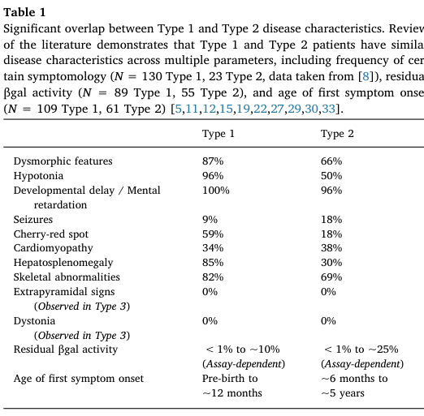

## Question

# Disease Characteristics Research Template

## Target Disease
- **Disease Name:** GM1 Gangliosidosis Type 1
- **MONDO ID:**  (if available)
- **Category:** Mendelian

## Research Objectives

Please provide a comprehensive research report on **GM1 Gangliosidosis Type 1** covering all of the
disease characteristics listed below. This report will be used to populate a disease knowledge
base entry. Be thorough and cite primary literature (PMID preferred) for all claims.

For each section, **suggested databases/resources** are listed. These are the first places
you should search for information on each topic.

---

### 1. Disease Information
> **Search first:** OMIM, Orphanet, ICD-10/ICD-11, MeSH, PubMed

- What is the disease? Provide a concise overview.
- What are the key identifiers? (OMIM, Orphanet, ICD-10/ICD-11, MeSH, Mondo)
- What are the common synonyms and alternative names?
- Is the information derived from individual patients (e.g., EHR) or aggregated disease-level resources?

### 2. Etiology

- **Disease Causal Factors**: What are the primary causes? (genetic, environmental, infectious, mechanistic)
- **Risk Factors**:
  > **Search first:** PubMed, Cochrane Library, UpToDate, clinical guidelines, ClinVar, ClinGen, GWAS Catalog, PheGenI, CTD, CDC, WHO, epidemiological databases
  - Genetic risk factors (causal variants, susceptibility loci, modifier genes)
  - Environmental risk factors (toxins, lifestyle, occupational exposures, age, sex, family history)
- **Protective Factors**:
  > **Search first:** PubMed, Cochrane Library, clinical trial databases, GWAS Catalog, gnomAD, WHO, CDC, nutrition databases
  - Genetic protective factors (protective variants, modifier alleles)
  - Environmental protective factors (diet, lifestyle, exposures that reduce risk)
- **Gene-Environment Interactions**: How do genetic and environmental factors interact to influence disease?
  > **Search first:** CTD, PubMed, PheGenI, GxE databases

### 3. Phenotypes
> **Search first:** HPO (Human Phenotype Ontology), OMIM, Orphanet, PubMed, clinicaltrials.gov, MedDRA, SNOMED CT, DECIPHER, LOINC

For each phenotype, provide:
- **Phenotype type**: symptoms, clinical signs, physical manifestations, behavioral changes, or laboratory abnormalities
  > For symptoms/signs: HPO, OMIM, Orphanet, PubMed
  > For behavioral changes: HPO, DSM, RDoC (Research Domain Criteria), PubMed
  > For laboratory abnormalities: LOINC, SNOMED CT, LabTests Online, PubMed
- **Phenotype characteristics**:
  > **Search first:** OMIM, Orphanet, HPO, PubMed
  - Age of symptom onset (neonatal, childhood, adult-onset, late-onset)
  - Symptom severity (mild, moderate, severe, variable)
  - Symptom progression (stable, progressive, episodic, fluctuating)
  - Frequency among affected individuals (percentage or qualitative)
- **Quality of life impact**: Effects on daily functioning and well-being (per-phenotype when possible)
  > **Search first:** EQ-5D database, SF-36, WHO QOL databases, PubMed
- Suggest HPO (Human Phenotype Ontology) terms for each phenotype

### 4. Genetic/Molecular Information

- **Causal Genes**: Gene mutations or chromosomal abnormalities responsible for disease (gene symbols, OMIM IDs)
  > **Search first:** OMIM, ClinVar, HGMD, Ensembl, NCBI Gene
- **Pathogenic Variants**:
  - Affected genes (gene symbols, HGNC IDs)
    > **Search first:** OMIM, NCBI Gene, Ensembl, HGNC, UniProt, GeneCards
  - Variant classification (pathogenic, likely pathogenic, VUS per ACMG/AMP guidelines)
    > **Search first:** ClinVar, ClinGen, ACMG/AMP guidelines, VarSome
  - Variant type/class (missense, frameshift, nonsense, splice-site, structural)
  - Allele frequency in population databases
    > **Search first:** gnomAD, 1000 Genomes, ExAC, TOPMed, dbSNP
  - Somatic vs germline origin
    > **Search first:** COSMIC (somatic), ClinVar, ICGC, TCGA
  - Functional consequences (loss of function, gain of function, dominant negative)
- **Modifier Genes**: Genes that modify disease severity or expression
- **Epigenetic Information**: DNA methylation, histone modifications, chromatin changes affecting disease
  > **Search first:** ENCODE, Roadmap Epigenomics, MethBase, DiseaseMeth
- **Chromosomal Abnormalities**: Large-scale genetic changes (aneuploidy, translocations, inversions)
  > **Search first:** DECIPHER, ClinVar, ECARUCA, UCSC Genome Browser

### 5. Environmental Information

- **Environmental Factors**: Non-genetic contributing factors (toxins, radiation, pollution, occupational exposure)
  > **Search first:** CTD (Comparative Toxicogenomics Database), TOXNET, PubMed, EPA databases
- **Lifestyle Factors**: Behavioral factors (smoking, diet, exercise, alcohol consumption)
  > **Search first:** CDC databases, WHO, PubMed, NHANES
- **Infectious Agents**: If applicable, pathogens causing or triggering disease (bacteria, viruses, fungi, parasites)
  > **Search first:** NCBI Taxonomy, ViPR, BV-BRC, MicrobeDB, GIDEON

### 6. Mechanism / Pathophysiology

- **Molecular Pathways**: Specific signaling cascades or biochemical pathways involved (Wnt, MAPK, mTOR, PI3K-AKT, etc.)
  > **Search first:** KEGG, Reactome, WikiPathways, PathBank, BioCyc
- **Cellular Processes**: Cell-level mechanisms (apoptosis, autophagy, cell cycle dysregulation, inflammation, etc.)
  > **Search first:** Gene Ontology (GO), Reactome, KEGG, PubMed
- **Protein Dysfunction**: How protein structure or function is altered (misfolding, aggregation, loss of function, gain of function)
  > **Search first:** UniProt, PDB (Protein Data Bank), InterPro, Pfam, AlphaFold
- **Metabolic Changes**: Alterations in metabolic processes (energy metabolism, lipid metabolism, amino acid metabolism)
  > **Search first:** KEGG, BioCyc, HMDB (Human Metabolome Database), BRENDA
- **Immune System Involvement**: Role of immune response (autoimmunity, immunodeficiency, chronic inflammation)
  > **Search first:** ImmPort, Immunome Database, IEDB, Gene Ontology
- **Tissue Damage Mechanisms**: How tissues/ are injured (oxidative stress, ischemia, fibrosis, necrosis)
  > **Search first:** PubMed, Gene Ontology, Reactome
- **Biochemical Abnormalities**: Specific molecular defects (enzyme deficiencies, receptor dysfunction, ion channel defects)
  > **Search first:** BRENDA, UniProt, KEGG, OMIM, PubMed
- **Epigenetic Changes**: DNA methylation, histone modifications affecting gene expression in disease
  > **Search first:** ENCODE, Roadmap Epigenomics, MethBase, DiseaseMeth
- **Molecular Profiling** (if available):
  - Transcriptomics/gene expression changes
    > **Search first:** GEO (Gene Expression Omnibus), ArrayExpress, GTEx, Human Cell Atlas, SRA
  - Proteomics findings
    > **Search first:** PRIDE, ProteomeXchange, Human Protein Atlas, STRING, BioGRID
  - Metabolomics signatures
    > **Search first:** MetaboLights, Metabolomics Workbench, HMDB, METLIN
  - Lipidomics alterations
    > **Search first:** LIPID MAPS, SwissLipids, LipidHome, Metabolomics Workbench
  - Genomic structural features
    > **Search first:** UCSC Genome Browser, Ensembl, NCBI, dbVar, DGV
- **Advanced Technologies** (if applicable):
  - Single-cell analysis findings (cell-type specific mechanisms, cellular heterogeneity)
    > **Search first:** Human Cell Atlas, Single Cell Portal, GEO, CELLxGENE
  - Spatial transcriptomics findings
    > **Search first:** GEO, Spatial Research, Vizgen, 10x Genomics data
  - Multi-omics integration results
    > **Search first:** TCGA, ICGC, cBioPortal, LinkedOmics, PubMed
  - Functional genomics screens (CRISPR, RNAi)
    > **Search first:** DepMap, GenomeRNAi, PubMed, BioGRID ORCS

For each mechanism, describe:
- The causal chain from initial trigger to clinical manifestation
- Which mechanisms are upstream vs downstream
- What cell types and biological processes are involved
- Suggest GO terms for biological processes and CL terms for cell types

### 7. Anatomical Structures Affected

- **Organ Level**:
  - Primary organs directly affected
  - Secondary organ involvement (complications, secondary effects)
  - Body systems involved (cardiovascular, nervous, digestive, respiratory, endocrine, etc.)
  > **Search first:** Uberon, FMA (Foundational Model of Anatomy), OMIM, HPO, ICD-11, MeSH, SNOMED CT
- **Tissue and Cell Level**:
  - Specific tissue types affected (epithelial, connective, muscle, nervous)
  - Specific cell populations targeted (with Cell Ontology terms)
  > **Search first:** Uberon, Human Protein Atlas, Cell Ontology, Human Cell Atlas, CellMarker, PanglaoDB
- **Subcellular Level**:
  - Cellular compartments involved (mitochondria, nucleus, ER, lysosomes) (with GO Cellular Component terms)
  > **Search first:** Gene Ontology (Cellular Component), UniProt, Human Protein Atlas
- **Localization**:
  - Specific anatomical sites (with UBERON terms)
    > **Search first:** FMA, Uberon, NeuroNames (for brain), SNOMED CT
  - Lateralization (unilateral, bilateral, asymmetric)
    > **Search first:** HPO, clinical literature, imaging databases

### 8. Temporal Development

- **Onset**:
  - Typical age of onset (congenital, pediatric, adult, geriatric)
  - Onset pattern (acute, subacute, chronic, insidious)
  > **Search first:** OMIM, Orphanet, HPO, PubMed
- **Progression**:
  - Disease stages (early, intermediate, advanced, end-stage)
    > **Search first:** Cancer Staging Manual (AJCC), WHO classifications, PubMed
  - Progression rate (rapid, slow, variable)
  - Disease course pattern (episodic, relapsing-remitting, progressive, stable)
  - Disease duration (self-limited, chronic lifelong)
  > **Search first:** Disease registries, longitudinal cohort databases, natural history studies, PubMed, Orphanet, OMIM
- **Patterns**:
  - Remission patterns (spontaneous, treatment-induced)
    > **Search first:** Clinical trial databases, disease registries, PubMed
  - Critical periods (time windows of vulnerability or opportunity for intervention)
    > **Search first:** PubMed, developmental biology databases, clinical guidelines

### 9. Inheritance and Population

- **Epidemiology**:
  - Prevalence (cases per 100,000 at given time)
  - Incidence (new cases per 100,000 per year)
  > **Search first:** Orphanet, CDC, WHO, GBD (Global Burden of Disease), national registries, SEER, disease registries
- **For Genetic Etiology**:
  - Inheritance pattern (AD, AR, X-linked, mitochondrial, multifactorial, polygenic)
    > **Search first:** OMIM, Orphanet, ClinVar, GTR (Genetic Testing Registry)
  - Penetrance (complete, incomplete, age-dependent)
    > **Search first:** ClinVar, OMIM, PubMed, ClinGen
  - Expressivity (variable, consistent)
    > **Search first:** OMIM, ClinVar, PubMed
  - Genetic anticipation (increasing severity in successive generations)
    > **Search first:** OMIM, PubMed (especially for repeat expansion disorders)
  - Germline mosaicism
    > **Search first:** ClinVar, OMIM, genetic counseling literature, PubMed
  - Founder effects (population-specific mutations)
    > **Search first:** gnomAD, population genetics databases, PubMed
  - Consanguinity role
    > **Search first:** OMIM, population studies, genetic counseling resources
  - Carrier frequency
    > **Search first:** gnomAD, carrier screening databases, GeneReviews, GTR
- **Population Demographics**:
  - Affected populations (ethnic or demographic groups with higher prevalence)
    > **Search first:** gnomAD, 1000 Genomes, PAGE Study, PubMed, population registries
  - Geographic distribution (endemic areas, regional variation)
    > **Search first:** WHO, CDC, GBD, Orphanet, geographic epidemiology databases
  - Geographic distribution of specific variants
  - Sex ratio (male:female)
    > **Search first:** Disease registries, OMIM, PubMed, epidemiological databases
  - Age distribution of affected individuals
    > **Search first:** CDC, disease registries, SEER, Orphanet

### 10. Diagnostics

- **Clinical Tests**:
  - Laboratory tests (blood, urine, tissue chemistry, specific enzyme assays)
    > **Search first:** LOINC, LabTests Online, PubMed
  - Biomarkers (proteins, metabolites, genetic markers, circulating biomarkers)
    > **Search first:** FDA Biomarker List, BEST (Biomarkers, EndpointS, and other Tools), PubMed
  - Imaging studies (X-ray, CT, MRI, PET, ultrasound)
    > **Search first:** RadLex, DICOM, Radiopaedia, imaging databases
  - Functional tests (pulmonary function, cardiac stress tests)
    > **Search first:** LOINC, clinical guidelines, PubMed
  - Electrophysiology (EEG, EMG, ECG, nerve conduction studies)
    > **Search first:** LOINC, clinical neurophysiology databases, PubMed
  - Biopsy findings (histopathology, immunohistochemistry)
    > **Search first:** SNOMED CT, College of American Pathologists resources, PubMed
  - Pathology findings (microscopic examination)
    > **Search first:** SNOMED CT, Digital Pathology databases, PubMed
- **Genetic Testing**:
  > **Search first:** GTR (Genetic Testing Registry), GeneReviews, ClinGen
  - Overview of recommended genetic testing approach
  - Whole genome sequencing (WGS) utility
    > **Search first:** GTR, ClinVar, GEL (Genomics England), gnomAD
  - Whole exome sequencing (WES) utility
    > **Search first:** GTR, ClinVar, OMIM, GeneMatcher
  - Gene panels (which panels, which genes)
    > **Search first:** GTR, ClinVar, laboratory-specific databases
  - Single gene testing
    > **Search first:** GTR, ClinVar, OMIM, GeneReviews
  - Chromosomal microarray (CMA)
    > **Search first:** DECIPHER, ClinVar, dbVar, ECARUCA
  - Karyotyping
    > **Search first:** Chromosome Abnormality Database, ClinVar, cytogenetics resources
  - FISH
    > **Search first:** ClinVar, cytogenetics databases, PubMed
  - Mitochondrial DNA testing
    > **Search first:** MITOMAP, MSeqDR, ClinVar, GTR
  - Repeat expansion testing
    > **Search first:** GTR, ClinVar, repeat expansion databases, PubMed
- **Omics-Based Diagnostics** (if applicable):
  - RNA sequencing / transcriptomics
    > **Search first:** GEO, ArrayExpress, GTEx, RNA-seq databases
  - Proteomics
    > **Search first:** PRIDE, ProteomeXchange, FDA Biomarker database
  - Metabolomics
    > **Search first:** MetaboLights, Metabolomics Workbench, HMDB
  - Epigenomics
    > **Search first:** GEO, ENCODE, Roadmap Epigenomics, MethBase
  - Liquid biopsy
    > **Search first:** COSMIC, ClinVar, liquid biopsy databases, PubMed
- **Clinical Criteria**:
  - Standardized diagnostic criteria (DSM, ICD, society guidelines)
    > **Search first:** DSM-5, ICD-11, clinical society guidelines, UpToDate
  - Differential diagnosis (other conditions to rule out, with distinguishing features)
    > **Search first:** DynaMed, UpToDate, clinical decision support systems
- **Screening**:
  - Screening methods for asymptomatic individuals (newborn screening, carrier screening, cascade screening)
    > **Search first:** ACMG recommendations, CDC newborn screening, GTR

### 11. Outcome/Prognosis

- **Survival and Mortality**:
  - Survival rate (5-year, 10-year, overall)
    > **Search first:** SEER, cancer registries, disease-specific registries, PubMed
  - Life expectancy (with and without treatment if applicable)
    > **Search first:** Orphanet, disease registries, actuarial databases, PubMed
  - Mortality rate
    > **Search first:** CDC, WHO, GBD, national mortality databases
  - Disease-specific mortality (deaths directly attributable to disease)
    > **Search first:** Disease registries, CDC Wonder, GBD, PubMed
- **Morbidity and Function**:
  - Morbidity (disease-related disability and health impacts)
    > **Search first:** GBD, WHO, disability databases, PubMed
  - Disability outcomes (long-term functional impairments)
    > **Search first:** ICF (International Classification of Functioning), disability registries
  - Quality of life measures (EQ-5D, SF-36, PROMIS, disease-specific tools)
    > **Search first:** EQ-5D database, SF-36, PROMIS, PubMed
- **Disease Course**:
  - Complications (secondary problems: infections, organ failure, etc.)
    > **Search first:** ICD codes, disease registries, clinical databases, PubMed
  - Recovery potential (likelihood and extent of recovery, with vs without treatment)
    > **Search first:** Natural history studies, rehabilitation databases, PubMed
- **Prediction**:
  - Prognostic factors (age, disease severity, biomarkers, treatment response)
    > **Search first:** Prognostic models databases, clinical calculators, PubMed
  - Prognostic biomarkers (molecular markers predicting disease course)
    > **Search first:** FDA Biomarker database, PubMed, cancer prognostic databases

### 12. Treatment

- **Pharmacotherapy**:
  - Pharmacological treatments (drug names, drug classes, mechanisms of action)
    > **Search first:** DrugBank, RxNorm, ATC classification, DailyMed, FDA databases
  - Pharmacogenomics (how genetic variants affect drug metabolism, efficacy, toxicity)
    > **Search first:** PharmGKB, CPIC (Clinical Pharmacogenetics), FDA Table of PGx Biomarkers
- **Advanced Therapeutics**:
  - Gene therapy (viral vectors, CRISPR, gene replacement, gene editing)
    > **Search first:** ClinicalTrials.gov, FDA gene therapy database, ASGCT resources
  - Cell therapy (stem cell transplant, CAR-T, cellular therapeutics)
    > **Search first:** ClinicalTrials.gov, FDA cell therapy database, FACT standards
  - RNA-based therapies (ASOs, siRNA, mRNA therapies)
    > **Search first:** ClinicalTrials.gov, FDA approvals, PubMed
  - Targeted therapies (treatments directed at specific molecular targets)
    > **Search first:** My Cancer Genome, OncoKB, ClinicalTrials.gov, FDA approvals
  - Immunotherapies (checkpoint inhibitors, monoclonal antibodies)
    > **Search first:** Cancer Immunotherapy Database, FDA approvals, ClinicalTrials.gov
- **Surgical and Interventional**:
  - Surgical interventions (types of surgery, timing, outcomes)
    > **Search first:** CPT codes, surgical registries, clinical guidelines, PubMed
- **Supportive and Rehabilitative**:
  - Supportive care (symptom management, pain control, nutrition)
    > **Search first:** Clinical guidelines, Cochrane Library, PubMed
  - Rehabilitation (physical therapy, occupational therapy, speech therapy)
    > **Search first:** Rehabilitation medicine databases, clinical guidelines, PubMed
- **Experimental**:
  - Experimental treatments in clinical trials (with NCT identifiers if available)
    > **Search first:** ClinicalTrials.gov, EU Clinical Trials Register, WHO ICTRP
- **Treatment Outcomes**:
  - Treatment response rates
    > **Search first:** Clinical trial databases, FDA reviews, systematic reviews, PubMed
  - Side effects and adverse events
    > **Search first:** FDA Adverse Event Reporting System (FAERS), MedWatch, PubMed
- **Treatment Strategy**:
  - Treatment algorithms (clinical pathways, decision trees)
    > **Search first:** Clinical practice guidelines, NCCN Guidelines, UpToDate
  - Combination therapies
    > **Search first:** ClinicalTrials.gov, treatment guidelines, PubMed
  - Personalized medicine approaches (genotype-guided treatment)
    > **Search first:** My Cancer Genome, CIViC, PharmGKB, precision medicine databases

For each treatment, suggest MAXO (Medical Action Ontology) terms where applicable.

### 13. Prevention

- **Prevention Levels**:
  - Primary prevention (preventing disease occurrence: vaccination, risk factor modification)
    > **Search first:** CDC, WHO, USPSTF recommendations, Cochrane Library
  - Secondary prevention (early detection and treatment: screening programs, early intervention)
    > **Search first:** USPSTF, CDC screening guidelines, WHO
  - Tertiary prevention (preventing complications in those with disease)
    > **Search first:** Clinical guidelines, disease management protocols, PubMed
- **Immunization**: Vaccine strategies (if applicable)
  > **Search first:** CDC vaccine schedules, WHO immunization, FDA vaccine database
- **Screening and Early Detection**:
  - Screening programs (population-based: newborn screening, cancer screening)
    > **Search first:** CDC screening programs, USPSTF, cancer screening databases
  - Genetic screening (carrier screening, preimplantation genetic diagnosis, prenatal testing)
    > **Search first:** ACMG recommendations, ACOG guidelines, GTR
  - Risk stratification (identifying high-risk individuals for targeted prevention)
    > **Search first:** Risk prediction models, clinical calculators, PubMed
- **Behavioral Interventions**: Lifestyle modifications to reduce risk
  > **Search first:** CDC, WHO, behavioral intervention databases, Cochrane Library
- **Counseling**: Genetic counseling (risk assessment, family planning guidance)
  > **Search first:** NSGC resources, ACMG guidelines, GeneReviews
- **Public Health**:
  - Public health interventions (sanitation, vector control, health education)
    > **Search first:** CDC, WHO, public health databases, PubMed
  - Environmental interventions (reducing environmental risk factors)
    > **Search first:** EPA databases, WHO environmental health, PubMed
- **Prophylaxis**: Preventive medications or procedures
  > **Search first:** Clinical guidelines, FDA approvals, PubMed

### 14. Other Species / Natural Disease

- **Taxonomy**: Species affected (with NCBI Taxon identifiers)
  > **Search first:** NCBI Taxonomy
- **Breed**: Specific breeds affected (with VBO identifiers if applicable)
  > **Search first:** VBO (Vertebrate Breed Ontology)
- **Gene**: Orthologous genes in other species (with NCBI Gene IDs)
  > **Search first:** NCBI Gene
- **Natural Disease**:
  - Naturally occurring disease in other species (companion animals, wildlife)
    > **Search first:** OMIA (Online Mendelian Inheritance in Animals), VetCompass, PubMed
  - Veterinary relevance and importance in animal health
    > **Search first:** OMIA, veterinary databases, PubMed
- **Comparative Biology**:
  - Comparative pathology (similarities and differences across species)
    > **Search first:** OMIA, comparative pathology databases, PubMed
  - Evolutionary conservation of disease mechanisms
    > **Search first:** HomoloGene, OrthoMCL, Alliance of Genome Resources
- **Transmission** (if applicable):
  - Zoonotic potential
    > **Search first:** CDC zoonotic diseases, WHO zoonoses, GIDEON
  - Cross-species susceptibility
    > **Search first:** NCBI Taxonomy, veterinary databases, PubMed

### 15. Model Organisms

- **Model Types**:
  - Model organism type (mammalian, invertebrate, cellular, in vitro)
    > **Search first:** Alliance of Genome Resources, model organism databases
  - Specific model systems (mouse, rat, zebrafish, Drosophila, C. elegans, yeast, cell lines, organoids, iPSCs)
    > **Search first:** MGI, RGD, ZFIN, FlyBase, WormBase, SGD, ATCC, Cellosaurus
  - Induced models (drug treatment, surgical intervention, environmental manipulation)
    > **Search first:** MGI, model organism databases, PubMed
- **Genetic Models**:
  - Types available (knockout, knock-in, transgenic, conditional, humanized)
    > **Search first:** MGI, IMPC, KOMP, EuMMCR, IMSR
- **Model Characteristics**:
  - Phenotype recapitulation (how well model reproduces human disease features)
    > **Search first:** Model organism databases, comparative studies, PubMed
  - Model limitations (aspects of human disease not captured)
    > **Search first:** Model organism databases, PubMed, review articles
- **Applications**:
  - Research applications (what aspects of disease can be studied)
    > **Search first:** Model organism databases, PubMed
- **Resources**:
  - Model databases
    > **Search first:** MGI, RGD, ZFIN, FlyBase, WormBase, IMSR, EMMA, MMRRC

---

## Citation Requirements

- Cite primary literature (PMID preferred) for all mechanistic and clinical claims
- Prioritize recent reviews and landmark papers
- Include direct quotes from abstracts where possible to support key statements
- Distinguish evidence source types: human clinical, model organism, in vitro, computational

## Output Format

Structure your response as a comprehensive narrative organized by the sections above.
For each section, provide:
- Factual content with specific details (numbers, percentages, gene names, variant nomenclature)
- Ontology term suggestions (HPO, GO, CL, UBERON, CHEBI, MAXO, MONDO) where applicable
- Evidence citations with PMIDs
- Direct quotes from abstracts to support key claims
- Clear indication when information is not available or not applicable for this disease

This report will be used to populate a disease knowledge base entry with:
- Pathophysiology descriptions with causal chains
- Gene/protein annotations (HGNC, GO terms)
- Phenotype associations (HP terms) with frequencies
- Cell type involvement (CL terms)
- Anatomical locations (UBERON terms)
- Chemical entities (CHEBI terms)
- Treatment annotations (MAXO terms)
- Evidence items with PMIDs and exact abstract quotes
- Epidemiology, prognosis, diagnostic, and prevention information
- Animal model descriptions with phenotype recapitulation details

## Output

Question: You are an expert researcher providing comprehensive, well-cited information.

Provide detailed information focusing on:
1. Key concepts and definitions with current understanding
2. Recent developments and latest research (prioritize 2023-2024 sources)
3. Current applications and real-world implementations
4. Expert opinions and analysis from authoritative sources
5. Relevant statistics and data from recent studies

Format as a comprehensive research report with proper citations. Include URLs and publication dates where available.
Always prioritize recent, authoritative sources and provide specific citations for all major claims.

# Disease Characteristics Research Template

## Target Disease
- **Disease Name:** GM1 Gangliosidosis Type 1
- **MONDO ID:**  (if available)
- **Category:** Mendelian

## Research Objectives

Please provide a comprehensive research report on **GM1 Gangliosidosis Type 1** covering all of the
disease characteristics listed below. This report will be used to populate a disease knowledge
base entry. Be thorough and cite primary literature (PMID preferred) for all claims.

For each section, **suggested databases/resources** are listed. These are the first places
you should search for information on each topic.

---

### 1. Disease Information
> **Search first:** OMIM, Orphanet, ICD-10/ICD-11, MeSH, PubMed

- What is the disease? Provide a concise overview.
- What are the key identifiers? (OMIM, Orphanet, ICD-10/ICD-11, MeSH, Mondo)
- What are the common synonyms and alternative names?
- Is the information derived from individual patients (e.g., EHR) or aggregated disease-level resources?

### 2. Etiology

- **Disease Causal Factors**: What are the primary causes? (genetic, environmental, infectious, mechanistic)
- **Risk Factors**:
  > **Search first:** PubMed, Cochrane Library, UpToDate, clinical guidelines, ClinVar, ClinGen, GWAS Catalog, PheGenI, CTD, CDC, WHO, epidemiological databases
  - Genetic risk factors (causal variants, susceptibility loci, modifier genes)
  - Environmental risk factors (toxins, lifestyle, occupational exposures, age, sex, family history)
- **Protective Factors**:
  > **Search first:** PubMed, Cochrane Library, clinical trial databases, GWAS Catalog, gnomAD, WHO, CDC, nutrition databases
  - Genetic protective factors (protective variants, modifier alleles)
  - Environmental protective factors (diet, lifestyle, exposures that reduce risk)
- **Gene-Environment Interactions**: How do genetic and environmental factors interact to influence disease?
  > **Search first:** CTD, PubMed, PheGenI, GxE databases

### 3. Phenotypes
> **Search first:** HPO (Human Phenotype Ontology), OMIM, Orphanet, PubMed, clinicaltrials.gov, MedDRA, SNOMED CT, DECIPHER, LOINC

For each phenotype, provide:
- **Phenotype type**: symptoms, clinical signs, physical manifestations, behavioral changes, or laboratory abnormalities
  > For symptoms/signs: HPO, OMIM, Orphanet, PubMed
  > For behavioral changes: HPO, DSM, RDoC (Research Domain Criteria), PubMed
  > For laboratory abnormalities: LOINC, SNOMED CT, LabTests Online, PubMed
- **Phenotype characteristics**:
  > **Search first:** OMIM, Orphanet, HPO, PubMed
  - Age of symptom onset (neonatal, childhood, adult-onset, late-onset)
  - Symptom severity (mild, moderate, severe, variable)
  - Symptom progression (stable, progressive, episodic, fluctuating)
  - Frequency among affected individuals (percentage or qualitative)
- **Quality of life impact**: Effects on daily functioning and well-being (per-phenotype when possible)
  > **Search first:** EQ-5D database, SF-36, WHO QOL databases, PubMed
- Suggest HPO (Human Phenotype Ontology) terms for each phenotype

### 4. Genetic/Molecular Information

- **Causal Genes**: Gene mutations or chromosomal abnormalities responsible for disease (gene symbols, OMIM IDs)
  > **Search first:** OMIM, ClinVar, HGMD, Ensembl, NCBI Gene
- **Pathogenic Variants**:
  - Affected genes (gene symbols, HGNC IDs)
    > **Search first:** OMIM, NCBI Gene, Ensembl, HGNC, UniProt, GeneCards
  - Variant classification (pathogenic, likely pathogenic, VUS per ACMG/AMP guidelines)
    > **Search first:** ClinVar, ClinGen, ACMG/AMP guidelines, VarSome
  - Variant type/class (missense, frameshift, nonsense, splice-site, structural)
  - Allele frequency in population databases
    > **Search first:** gnomAD, 1000 Genomes, ExAC, TOPMed, dbSNP
  - Somatic vs germline origin
    > **Search first:** COSMIC (somatic), ClinVar, ICGC, TCGA
  - Functional consequences (loss of function, gain of function, dominant negative)
- **Modifier Genes**: Genes that modify disease severity or expression
- **Epigenetic Information**: DNA methylation, histone modifications, chromatin changes affecting disease
  > **Search first:** ENCODE, Roadmap Epigenomics, MethBase, DiseaseMeth
- **Chromosomal Abnormalities**: Large-scale genetic changes (aneuploidy, translocations, inversions)
  > **Search first:** DECIPHER, ClinVar, ECARUCA, UCSC Genome Browser

### 5. Environmental Information

- **Environmental Factors**: Non-genetic contributing factors (toxins, radiation, pollution, occupational exposure)
  > **Search first:** CTD (Comparative Toxicogenomics Database), TOXNET, PubMed, EPA databases
- **Lifestyle Factors**: Behavioral factors (smoking, diet, exercise, alcohol consumption)
  > **Search first:** CDC databases, WHO, PubMed, NHANES
- **Infectious Agents**: If applicable, pathogens causing or triggering disease (bacteria, viruses, fungi, parasites)
  > **Search first:** NCBI Taxonomy, ViPR, BV-BRC, MicrobeDB, GIDEON

### 6. Mechanism / Pathophysiology

- **Molecular Pathways**: Specific signaling cascades or biochemical pathways involved (Wnt, MAPK, mTOR, PI3K-AKT, etc.)
  > **Search first:** KEGG, Reactome, WikiPathways, PathBank, BioCyc
- **Cellular Processes**: Cell-level mechanisms (apoptosis, autophagy, cell cycle dysregulation, inflammation, etc.)
  > **Search first:** Gene Ontology (GO), Reactome, KEGG, PubMed
- **Protein Dysfunction**: How protein structure or function is altered (misfolding, aggregation, loss of function, gain of function)
  > **Search first:** UniProt, PDB (Protein Data Bank), InterPro, Pfam, AlphaFold
- **Metabolic Changes**: Alterations in metabolic processes (energy metabolism, lipid metabolism, amino acid metabolism)
  > **Search first:** KEGG, BioCyc, HMDB (Human Metabolome Database), BRENDA
- **Immune System Involvement**: Role of immune response (autoimmunity, immunodeficiency, chronic inflammation)
  > **Search first:** ImmPort, Immunome Database, IEDB, Gene Ontology
- **Tissue Damage Mechanisms**: How tissues/ are injured (oxidative stress, ischemia, fibrosis, necrosis)
  > **Search first:** PubMed, Gene Ontology, Reactome
- **Biochemical Abnormalities**: Specific molecular defects (enzyme deficiencies, receptor dysfunction, ion channel defects)
  > **Search first:** BRENDA, UniProt, KEGG, OMIM, PubMed
- **Epigenetic Changes**: DNA methylation, histone modifications affecting gene expression in disease
  > **Search first:** ENCODE, Roadmap Epigenomics, MethBase, DiseaseMeth
- **Molecular Profiling** (if available):
  - Transcriptomics/gene expression changes
    > **Search first:** GEO (Gene Expression Omnibus), ArrayExpress, GTEx, Human Cell Atlas, SRA
  - Proteomics findings
    > **Search first:** PRIDE, ProteomeXchange, Human Protein Atlas, STRING, BioGRID
  - Metabolomics signatures
    > **Search first:** MetaboLights, Metabolomics Workbench, HMDB, METLIN
  - Lipidomics alterations
    > **Search first:** LIPID MAPS, SwissLipids, LipidHome, Metabolomics Workbench
  - Genomic structural features
    > **Search first:** UCSC Genome Browser, Ensembl, NCBI, dbVar, DGV
- **Advanced Technologies** (if applicable):
  - Single-cell analysis findings (cell-type specific mechanisms, cellular heterogeneity)
    > **Search first:** Human Cell Atlas, Single Cell Portal, GEO, CELLxGENE
  - Spatial transcriptomics findings
    > **Search first:** GEO, Spatial Research, Vizgen, 10x Genomics data
  - Multi-omics integration results
    > **Search first:** TCGA, ICGC, cBioPortal, LinkedOmics, PubMed
  - Functional genomics screens (CRISPR, RNAi)
    > **Search first:** DepMap, GenomeRNAi, PubMed, BioGRID ORCS

For each mechanism, describe:
- The causal chain from initial trigger to clinical manifestation
- Which mechanisms are upstream vs downstream
- What cell types and biological processes are involved
- Suggest GO terms for biological processes and CL terms for cell types

### 7. Anatomical Structures Affected

- **Organ Level**:
  - Primary organs directly affected
  - Secondary organ involvement (complications, secondary effects)
  - Body systems involved (cardiovascular, nervous, digestive, respiratory, endocrine, etc.)
  > **Search first:** Uberon, FMA (Foundational Model of Anatomy), OMIM, HPO, ICD-11, MeSH, SNOMED CT
- **Tissue and Cell Level**:
  - Specific tissue types affected (epithelial, connective, muscle, nervous)
  - Specific cell populations targeted (with Cell Ontology terms)
  > **Search first:** Uberon, Human Protein Atlas, Cell Ontology, Human Cell Atlas, CellMarker, PanglaoDB
- **Subcellular Level**:
  - Cellular compartments involved (mitochondria, nucleus, ER, lysosomes) (with GO Cellular Component terms)
  > **Search first:** Gene Ontology (Cellular Component), UniProt, Human Protein Atlas
- **Localization**:
  - Specific anatomical sites (with UBERON terms)
    > **Search first:** FMA, Uberon, NeuroNames (for brain), SNOMED CT
  - Lateralization (unilateral, bilateral, asymmetric)
    > **Search first:** HPO, clinical literature, imaging databases

### 8. Temporal Development

- **Onset**:
  - Typical age of onset (congenital, pediatric, adult, geriatric)
  - Onset pattern (acute, subacute, chronic, insidious)
  > **Search first:** OMIM, Orphanet, HPO, PubMed
- **Progression**:
  - Disease stages (early, intermediate, advanced, end-stage)
    > **Search first:** Cancer Staging Manual (AJCC), WHO classifications, PubMed
  - Progression rate (rapid, slow, variable)
  - Disease course pattern (episodic, relapsing-remitting, progressive, stable)
  - Disease duration (self-limited, chronic lifelong)
  > **Search first:** Disease registries, longitudinal cohort databases, natural history studies, PubMed, Orphanet, OMIM
- **Patterns**:
  - Remission patterns (spontaneous, treatment-induced)
    > **Search first:** Clinical trial databases, disease registries, PubMed
  - Critical periods (time windows of vulnerability or opportunity for intervention)
    > **Search first:** PubMed, developmental biology databases, clinical guidelines

### 9. Inheritance and Population

- **Epidemiology**:
  - Prevalence (cases per 100,000 at given time)
  - Incidence (new cases per 100,000 per year)
  > **Search first:** Orphanet, CDC, WHO, GBD (Global Burden of Disease), national registries, SEER, disease registries
- **For Genetic Etiology**:
  - Inheritance pattern (AD, AR, X-linked, mitochondrial, multifactorial, polygenic)
    > **Search first:** OMIM, Orphanet, ClinVar, GTR (Genetic Testing Registry)
  - Penetrance (complete, incomplete, age-dependent)
    > **Search first:** ClinVar, OMIM, PubMed, ClinGen
  - Expressivity (variable, consistent)
    > **Search first:** OMIM, ClinVar, PubMed
  - Genetic anticipation (increasing severity in successive generations)
    > **Search first:** OMIM, PubMed (especially for repeat expansion disorders)
  - Germline mosaicism
    > **Search first:** ClinVar, OMIM, genetic counseling literature, PubMed
  - Founder effects (population-specific mutations)
    > **Search first:** gnomAD, population genetics databases, PubMed
  - Consanguinity role
    > **Search first:** OMIM, population studies, genetic counseling resources
  - Carrier frequency
    > **Search first:** gnomAD, carrier screening databases, GeneReviews, GTR
- **Population Demographics**:
  - Affected populations (ethnic or demographic groups with higher prevalence)
    > **Search first:** gnomAD, 1000 Genomes, PAGE Study, PubMed, population registries
  - Geographic distribution (endemic areas, regional variation)
    > **Search first:** WHO, CDC, GBD, Orphanet, geographic epidemiology databases
  - Geographic distribution of specific variants
  - Sex ratio (male:female)
    > **Search first:** Disease registries, OMIM, PubMed, epidemiological databases
  - Age distribution of affected individuals
    > **Search first:** CDC, disease registries, SEER, Orphanet

### 10. Diagnostics

- **Clinical Tests**:
  - Laboratory tests (blood, urine, tissue chemistry, specific enzyme assays)
    > **Search first:** LOINC, LabTests Online, PubMed
  - Biomarkers (proteins, metabolites, genetic markers, circulating biomarkers)
    > **Search first:** FDA Biomarker List, BEST (Biomarkers, EndpointS, and other Tools), PubMed
  - Imaging studies (X-ray, CT, MRI, PET, ultrasound)
    > **Search first:** RadLex, DICOM, Radiopaedia, imaging databases
  - Functional tests (pulmonary function, cardiac stress tests)
    > **Search first:** LOINC, clinical guidelines, PubMed
  - Electrophysiology (EEG, EMG, ECG, nerve conduction studies)
    > **Search first:** LOINC, clinical neurophysiology databases, PubMed
  - Biopsy findings (histopathology, immunohistochemistry)
    > **Search first:** SNOMED CT, College of American Pathologists resources, PubMed
  - Pathology findings (microscopic examination)
    > **Search first:** SNOMED CT, Digital Pathology databases, PubMed
- **Genetic Testing**:
  > **Search first:** GTR (Genetic Testing Registry), GeneReviews, ClinGen
  - Overview of recommended genetic testing approach
  - Whole genome sequencing (WGS) utility
    > **Search first:** GTR, ClinVar, GEL (Genomics England), gnomAD
  - Whole exome sequencing (WES) utility
    > **Search first:** GTR, ClinVar, OMIM, GeneMatcher
  - Gene panels (which panels, which genes)
    > **Search first:** GTR, ClinVar, laboratory-specific databases
  - Single gene testing
    > **Search first:** GTR, ClinVar, OMIM, GeneReviews
  - Chromosomal microarray (CMA)
    > **Search first:** DECIPHER, ClinVar, dbVar, ECARUCA
  - Karyotyping
    > **Search first:** Chromosome Abnormality Database, ClinVar, cytogenetics resources
  - FISH
    > **Search first:** ClinVar, cytogenetics databases, PubMed
  - Mitochondrial DNA testing
    > **Search first:** MITOMAP, MSeqDR, ClinVar, GTR
  - Repeat expansion testing
    > **Search first:** GTR, ClinVar, repeat expansion databases, PubMed
- **Omics-Based Diagnostics** (if applicable):
  - RNA sequencing / transcriptomics
    > **Search first:** GEO, ArrayExpress, GTEx, RNA-seq databases
  - Proteomics
    > **Search first:** PRIDE, ProteomeXchange, FDA Biomarker database
  - Metabolomics
    > **Search first:** MetaboLights, Metabolomics Workbench, HMDB
  - Epigenomics
    > **Search first:** GEO, ENCODE, Roadmap Epigenomics, MethBase
  - Liquid biopsy
    > **Search first:** COSMIC, ClinVar, liquid biopsy databases, PubMed
- **Clinical Criteria**:
  - Standardized diagnostic criteria (DSM, ICD, society guidelines)
    > **Search first:** DSM-5, ICD-11, clinical society guidelines, UpToDate
  - Differential diagnosis (other conditions to rule out, with distinguishing features)
    > **Search first:** DynaMed, UpToDate, clinical decision support systems
- **Screening**:
  - Screening methods for asymptomatic individuals (newborn screening, carrier screening, cascade screening)
    > **Search first:** ACMG recommendations, CDC newborn screening, GTR

### 11. Outcome/Prognosis

- **Survival and Mortality**:
  - Survival rate (5-year, 10-year, overall)
    > **Search first:** SEER, cancer registries, disease-specific registries, PubMed
  - Life expectancy (with and without treatment if applicable)
    > **Search first:** Orphanet, disease registries, actuarial databases, PubMed
  - Mortality rate
    > **Search first:** CDC, WHO, GBD, national mortality databases
  - Disease-specific mortality (deaths directly attributable to disease)
    > **Search first:** Disease registries, CDC Wonder, GBD, PubMed
- **Morbidity and Function**:
  - Morbidity (disease-related disability and health impacts)
    > **Search first:** GBD, WHO, disability databases, PubMed
  - Disability outcomes (long-term functional impairments)
    > **Search first:** ICF (International Classification of Functioning), disability registries
  - Quality of life measures (EQ-5D, SF-36, PROMIS, disease-specific tools)
    > **Search first:** EQ-5D database, SF-36, PROMIS, PubMed
- **Disease Course**:
  - Complications (secondary problems: infections, organ failure, etc.)
    > **Search first:** ICD codes, disease registries, clinical databases, PubMed
  - Recovery potential (likelihood and extent of recovery, with vs without treatment)
    > **Search first:** Natural history studies, rehabilitation databases, PubMed
- **Prediction**:
  - Prognostic factors (age, disease severity, biomarkers, treatment response)
    > **Search first:** Prognostic models databases, clinical calculators, PubMed
  - Prognostic biomarkers (molecular markers predicting disease course)
    > **Search first:** FDA Biomarker database, PubMed, cancer prognostic databases

### 12. Treatment

- **Pharmacotherapy**:
  - Pharmacological treatments (drug names, drug classes, mechanisms of action)
    > **Search first:** DrugBank, RxNorm, ATC classification, DailyMed, FDA databases
  - Pharmacogenomics (how genetic variants affect drug metabolism, efficacy, toxicity)
    > **Search first:** PharmGKB, CPIC (Clinical Pharmacogenetics), FDA Table of PGx Biomarkers
- **Advanced Therapeutics**:
  - Gene therapy (viral vectors, CRISPR, gene replacement, gene editing)
    > **Search first:** ClinicalTrials.gov, FDA gene therapy database, ASGCT resources
  - Cell therapy (stem cell transplant, CAR-T, cellular therapeutics)
    > **Search first:** ClinicalTrials.gov, FDA cell therapy database, FACT standards
  - RNA-based therapies (ASOs, siRNA, mRNA therapies)
    > **Search first:** ClinicalTrials.gov, FDA approvals, PubMed
  - Targeted therapies (treatments directed at specific molecular targets)
    > **Search first:** My Cancer Genome, OncoKB, ClinicalTrials.gov, FDA approvals
  - Immunotherapies (checkpoint inhibitors, monoclonal antibodies)
    > **Search first:** Cancer Immunotherapy Database, FDA approvals, ClinicalTrials.gov
- **Surgical and Interventional**:
  - Surgical interventions (types of surgery, timing, outcomes)
    > **Search first:** CPT codes, surgical registries, clinical guidelines, PubMed
- **Supportive and Rehabilitative**:
  - Supportive care (symptom management, pain control, nutrition)
    > **Search first:** Clinical guidelines, Cochrane Library, PubMed
  - Rehabilitation (physical therapy, occupational therapy, speech therapy)
    > **Search first:** Rehabilitation medicine databases, clinical guidelines, PubMed
- **Experimental**:
  - Experimental treatments in clinical trials (with NCT identifiers if available)
    > **Search first:** ClinicalTrials.gov, EU Clinical Trials Register, WHO ICTRP
- **Treatment Outcomes**:
  - Treatment response rates
    > **Search first:** Clinical trial databases, FDA reviews, systematic reviews, PubMed
  - Side effects and adverse events
    > **Search first:** FDA Adverse Event Reporting System (FAERS), MedWatch, PubMed
- **Treatment Strategy**:
  - Treatment algorithms (clinical pathways, decision trees)
    > **Search first:** Clinical practice guidelines, NCCN Guidelines, UpToDate
  - Combination therapies
    > **Search first:** ClinicalTrials.gov, treatment guidelines, PubMed
  - Personalized medicine approaches (genotype-guided treatment)
    > **Search first:** My Cancer Genome, CIViC, PharmGKB, precision medicine databases

For each treatment, suggest MAXO (Medical Action Ontology) terms where applicable.

### 13. Prevention

- **Prevention Levels**:
  - Primary prevention (preventing disease occurrence: vaccination, risk factor modification)
    > **Search first:** CDC, WHO, USPSTF recommendations, Cochrane Library
  - Secondary prevention (early detection and treatment: screening programs, early intervention)
    > **Search first:** USPSTF, CDC screening guidelines, WHO
  - Tertiary prevention (preventing complications in those with disease)
    > **Search first:** Clinical guidelines, disease management protocols, PubMed
- **Immunization**: Vaccine strategies (if applicable)
  > **Search first:** CDC vaccine schedules, WHO immunization, FDA vaccine database
- **Screening and Early Detection**:
  - Screening programs (population-based: newborn screening, cancer screening)
    > **Search first:** CDC screening programs, USPSTF, cancer screening databases
  - Genetic screening (carrier screening, preimplantation genetic diagnosis, prenatal testing)
    > **Search first:** ACMG recommendations, ACOG guidelines, GTR
  - Risk stratification (identifying high-risk individuals for targeted prevention)
    > **Search first:** Risk prediction models, clinical calculators, PubMed
- **Behavioral Interventions**: Lifestyle modifications to reduce risk
  > **Search first:** CDC, WHO, behavioral intervention databases, Cochrane Library
- **Counseling**: Genetic counseling (risk assessment, family planning guidance)
  > **Search first:** NSGC resources, ACMG guidelines, GeneReviews
- **Public Health**:
  - Public health interventions (sanitation, vector control, health education)
    > **Search first:** CDC, WHO, public health databases, PubMed
  - Environmental interventions (reducing environmental risk factors)
    > **Search first:** EPA databases, WHO environmental health, PubMed
- **Prophylaxis**: Preventive medications or procedures
  > **Search first:** Clinical guidelines, FDA approvals, PubMed

### 14. Other Species / Natural Disease

- **Taxonomy**: Species affected (with NCBI Taxon identifiers)
  > **Search first:** NCBI Taxonomy
- **Breed**: Specific breeds affected (with VBO identifiers if applicable)
  > **Search first:** VBO (Vertebrate Breed Ontology)
- **Gene**: Orthologous genes in other species (with NCBI Gene IDs)
  > **Search first:** NCBI Gene
- **Natural Disease**:
  - Naturally occurring disease in other species (companion animals, wildlife)
    > **Search first:** OMIA (Online Mendelian Inheritance in Animals), VetCompass, PubMed
  - Veterinary relevance and importance in animal health
    > **Search first:** OMIA, veterinary databases, PubMed
- **Comparative Biology**:
  - Comparative pathology (similarities and differences across species)
    > **Search first:** OMIA, comparative pathology databases, PubMed
  - Evolutionary conservation of disease mechanisms
    > **Search first:** HomoloGene, OrthoMCL, Alliance of Genome Resources
- **Transmission** (if applicable):
  - Zoonotic potential
    > **Search first:** CDC zoonotic diseases, WHO zoonoses, GIDEON
  - Cross-species susceptibility
    > **Search first:** NCBI Taxonomy, veterinary databases, PubMed

### 15. Model Organisms

- **Model Types**:
  - Model organism type (mammalian, invertebrate, cellular, in vitro)
    > **Search first:** Alliance of Genome Resources, model organism databases
  - Specific model systems (mouse, rat, zebrafish, Drosophila, C. elegans, yeast, cell lines, organoids, iPSCs)
    > **Search first:** MGI, RGD, ZFIN, FlyBase, WormBase, SGD, ATCC, Cellosaurus
  - Induced models (drug treatment, surgical intervention, environmental manipulation)
    > **Search first:** MGI, model organism databases, PubMed
- **Genetic Models**:
  - Types available (knockout, knock-in, transgenic, conditional, humanized)
    > **Search first:** MGI, IMPC, KOMP, EuMMCR, IMSR
- **Model Characteristics**:
  - Phenotype recapitulation (how well model reproduces human disease features)
    > **Search first:** Model organism databases, comparative studies, PubMed
  - Model limitations (aspects of human disease not captured)
    > **Search first:** Model organism databases, PubMed, review articles
- **Applications**:
  - Research applications (what aspects of disease can be studied)
    > **Search first:** Model organism databases, PubMed
- **Resources**:
  - Model databases
    > **Search first:** MGI, RGD, ZFIN, FlyBase, WormBase, IMSR, EMMA, MMRRC

---

## Citation Requirements

- Cite primary literature (PMID preferred) for all mechanistic and clinical claims
- Prioritize recent reviews and landmark papers
- Include direct quotes from abstracts where possible to support key statements
- Distinguish evidence source types: human clinical, model organism, in vitro, computational

## Output Format

Structure your response as a comprehensive narrative organized by the sections above.
For each section, provide:
- Factual content with specific details (numbers, percentages, gene names, variant nomenclature)
- Ontology term suggestions (HPO, GO, CL, UBERON, CHEBI, MAXO, MONDO) where applicable
- Evidence citations with PMIDs
- Direct quotes from abstracts to support key claims
- Clear indication when information is not available or not applicable for this disease

This report will be used to populate a disease knowledge base entry with:
- Pathophysiology descriptions with causal chains
- Gene/protein annotations (HGNC, GO terms)
- Phenotype associations (HP terms) with frequencies
- Cell type involvement (CL terms)
- Anatomical locations (UBERON terms)
- Chemical entities (CHEBI terms)
- Treatment annotations (MAXO terms)
- Evidence items with PMIDs and exact abstract quotes
- Epidemiology, prognosis, diagnostic, and prevention information
- Animal model descriptions with phenotype recapitulation details

# GM1 Gangliosidosis Type 1 (Infantile) — Disease Characteristics Research Report

## Executive summary
GM1 gangliosidosis type 1 (infantile GM1) is an ultra-rare, rapidly progressive, neuronopathic lysosomal storage disorder caused by biallelic pathogenic variants in **GLB1**, resulting in **β-galactosidase deficiency** and accumulation of GM1 ganglioside and other terminal β-galactose–containing glycoconjugates in the CNS and peripheral tissues. Natural history data indicate symptom onset typically in early infancy, diagnosis around late infancy, and death commonly in the second year of life, supporting a narrow therapeutic window for disease-modifying therapies (notably AAV gene therapy) and for newborn screening strategies. (lang2020thenaturalhistory pages 1-2, lang2020thenaturalhistory pages 3-4, lang2020thenaturalhistory pages 6-7)

---

## 1. Disease information

### 1.1 What is the disease?
Type 1 GM1 gangliosidosis is described as an “ultra-rare, rapidly fatal lysosomal storage disorder” with “life expectancy of < 3 years of age.” (Lang et al., *Molecular Genetics and Metabolism*, available online 30 Dec 2019; publication Mar 2020; URL: https://doi.org/10.1016/j.ymgme.2019.12.012) (lang2020thenaturalhistory pages 1-2)

A mechanistic definition from a 2021 review states: “Mutation of the **GLB1** gene, which codes for β-gal, prevents cleavage of the terminal β-1,4-linked galactose residue from GM1 ganglioside. Subsequent accumulation of GM1 ganglioside and other substrates in the lysosome impairs cell physiology and precipitates dysfunction of the nervous system.” (Rha et al., *The Application of Clinical Genetics*, Apr 2021; URL: https://doi.org/10.2147/TACG.S206076) (rha2021gm1gangliosidosismechanisms pages 1-2)

### 1.2 Key identifiers (and whether available from tool-retrieved sources)
* **MONDO (disease-level resource):** GM1 gangliosidosis type 1 **MONDO:0009260** (OpenTargets evidence context). (OpenTargets Search: GM1 gangliosidosis)
* **MONDO (parent disease):** GM1 gangliosidosis **MONDO:0018149** (OpenTargets evidence context). (OpenTargets Search: GM1 gangliosidosis)
* **OMIM / MIM:** **MIM#230500** for GM1 gangliosidosis (as used in Lang et al.). (lang2020thenaturalhistory pages 1-2)
* **Orphanet, ICD-10/ICD-11, MeSH:** Not directly retrievable from the provided tool evidence in this run; thus not asserted here.

### 1.3 Synonyms and alternative names
Commonly used synonyms across the literature and ClinicalTrials.gov records include:
* **Infantile GM1 gangliosidosis / Type I GM1 gangliosidosis / early-onset infantile GM1** (arashkaps2019theclinicaland pages 1-2, lang2020thenaturalhistory pages 1-2, NCT04713475 chunk 1)
* **β-galactosidase-1 (GLB1) deficiency / GLB1 deficiency** (NCT04713475 chunk 1)

### 1.4 Evidence source type
Most disease information here is derived from **aggregated disease-level resources and cohorts** (meta-analysis and registry-style natural history studies), supplemented by **clinical trial registry protocols** describing inclusion criteria and endpoints. (lang2020thenaturalhistory pages 1-2, heron2024anaturalhistory pages 1-2, NCT04713475 chunk 1)

---

## 2. Etiology

### 2.1 Disease causal factors
**Primary cause (genetic):** biallelic pathogenic variants in **GLB1** encoding lysosomal **β-galactosidase** (β-gal; EC 3.2.1.23), causing β-gal deficiency. (lang2020thenaturalhistory pages 1-2, nicoli2021gm1gangliosidosis—aminireview pages 1-2, rha2021gm1gangliosidosismechanisms pages 1-2)

**Biochemical consequence:** accumulation of **GM1 ganglioside**, **GA1**, **oligosaccharides**, and **keratan sulfate** due to impaired degradation. (lang2020thenaturalhistory pages 1-2, rha2021gm1gangliosidosismechanisms pages 1-2)

**Abstract quote (mechanism):** “Absent or reduced β-galactosidase activity leads to the accumulation of β-linked galactose-containing glycoconjugates including the glycosphingolipid (GSL) GM1-ganglioside in neuronal tissue.” (Nicoli et al., *Frontiers in Genetics*, published 03 Sep 2021; URL: https://doi.org/10.3389/fgene.2021.734878) (nicoli2021gm1gangliosidosis—aminireview pages 1-2)

### 2.2 Risk factors
For Mendelian infantile GM1, the principal risk factor is **inheriting two pathogenic GLB1 alleles** (autosomal recessive). Founder effects can increase local incidence. (lang2020thenaturalhistory pages 1-2, rha2021gm1gangliosidosismechanisms pages 1-2)

### 2.3 Protective factors / gene–environment interaction
No protective environmental factors or gene–environment interactions were directly supported by the retrieved sources in this run; none are asserted.

---

## 3. Phenotypes

### 3.1 Core phenotype (type I) and frequencies
A large literature-based cohort (N=154 type 1) provides frequencies (Table 1). (lang2020thenaturalhistory pages 2-3, lang2020thenaturalhistory media 45298dc3)

Key high-frequency features (Type 1):
* **Developmental delay / intellectual disability** (100%) (lang2020thenaturalhistory pages 2-3, lang2020thenaturalhistory media 45298dc3)
* **Hypotonia** (96%) (lang2020thenaturalhistory pages 2-3, lang2020thenaturalhistory media 45298dc3)
* **Dysmorphic/coarse facial features** (87%) (lang2020thenaturalhistory pages 2-3, lang2020thenaturalhistory media 45298dc3)
* **Hepatosplenomegaly** (85%) (lang2020thenaturalhistory pages 2-3, lang2020thenaturalhistory media 45298dc3)
* **Skeletal abnormalities (dysostosis multiplex/skeletal dysplasia)** (82%) (lang2020thenaturalhistory pages 2-3, lang2020thenaturalhistory media 45298dc3)
* **Cherry-red spot** (59%) (lang2020thenaturalhistory pages 2-3, lang2020thenaturalhistory media 45298dc3)
* **Seizures** (9%; described as later onset, ~10–12 months in the meta-analysis narrative) (lang2020thenaturalhistory pages 2-3, lang2020thenaturalhistory pages 3-4)

Additional phenotypes noted in summaries include Mongolian spots and cardiomyopathy in some infants. (lang2020thenaturalhistory pages 3-4, lang2020thenaturalhistory pages 1-2)

### 3.2 Age of onset, severity, progression
Type 1 is the most severe subtype, “traditionally… characterized by an age of first symptom onset between birth and 6 months” and death “often before 3 years.” (lang2020thenaturalhistory pages 1-2)

The meta-analysis reports that a “first symptom onset was often before 3 months of age” and identifies **6–18 months** as a period of “significant neurodevelopmental regression and multi-organ system deterioration.” (lang2020thenaturalhistory pages 6-7)

### 3.3 Quality of life impact
Direct quantitative QoL metrics in type 1 were not found in the retrieved primary texts; however, GM1 type 1 is described as rapidly neurodegenerative with loss/failure to acquire major motor milestones (e.g., crawling/standing/walking), strongly implying profound impact on daily function and caregiving burden. (lang2020thenaturalhistory pages 6-7)

### 3.4 Suggested HPO terms (examples)
Based on the phenotypes above (frequency-supported where available):
* Hypotonia — **HP:0001252** (lang2020thenaturalhistory pages 2-3)
* Global developmental delay — **HP:0001263** (lang2020thenaturalhistory pages 2-3)
* Hepatosplenomegaly — **HP:0001433** (lang2020thenaturalhistory pages 2-3)
* Coarse facial features — **HP:0000280** (lang2020thenaturalhistory pages 2-3)
* Cherry red spot of the macula — **HP:0010729** (lang2020thenaturalhistory pages 2-3)
* Seizures — **HP:0001250** (lang2020thenaturalhistory pages 2-3)
* Skeletal dysplasia / dysostosis multiplex — **HP:0002652** (lang2020thenaturalhistory pages 2-3)

---

## 4. Genetic / molecular information

### 4.1 Causal gene(s)
* **GLB1** (galactosidase beta 1; β-galactosidase) is the primary causal gene for GM1 gangliosidosis across subtypes. (lang2020thenaturalhistory pages 1-2, nicoli2021gm1gangliosidosis—aminireview pages 1-2, OpenTargets Search: GM1 gangliosidosis)

### 4.2 Pathogenic variants and variant spectrum
Lang et al. note “Over 165 mutations… reported in the GLB1 gene (ClinVar Database)” and provide type-associated examples: “Common pathogenic mutations associated with Type 1 disease, including **p.R59H** and **c.1622-1627insG**…” (lang2020thenaturalhistory pages 1-2)

Nicoli et al. report: “So far **261 pathogenic variants** have been described, missense/nonsense mutations being the most prevalent,” with clustering “in exons 2, 6, 15, and 16.” (nicoli2021gm1gangliosidosis—aminireview pages 1-2)

### 4.3 Functional consequences
The dominant mechanism is **loss of function** (little or no residual β-gal activity), leading to lysosomal substrate accumulation and downstream neuronal dysfunction/neurodegeneration. (lang2020thenaturalhistory pages 1-2, rha2021gm1gangliosidosismechanisms pages 1-2)

### 4.4 Modifier genes / epigenetics / chromosomal abnormalities
No specific modifier genes, epigenetic signatures, or chromosomal abnormalities were supported by the retrieved evidence in this run.

### 4.5 Suggested ontology terms
* **GO (biological process):** lysosomal catabolic process (GO:0007040), sphingolipid metabolic process (GO:0006665), glycosaminoglycan catabolic process (GO:0006027)
* **GO (cellular component):** lysosome (GO:0005764)

(These are suggested based on the described lysosomal enzyme deficiency and substrate accumulation; the sources establish lysosomal dysfunction and substrate buildup but do not explicitly list GO terms.) (rha2021gm1gangliosidosismechanisms pages 1-2, lang2020thenaturalhistory pages 1-2)

---

## 5. Environmental information
No environmental, lifestyle, or infectious etiologies were supported by the retrieved evidence for this Mendelian disorder.

---

## 6. Mechanism / pathophysiology

### 6.1 Causal chain (upstream → downstream)
1) **Biallelic GLB1 pathogenic variants** → 2) **β-galactosidase deficiency** → 3) accumulation of **GM1 ganglioside/GA1 and other β-galactose–terminal substrates** in lysosomes (especially in neurons) → 4) impaired cellular physiology and neurodegeneration, with multisystem involvement (liver/spleen, skeleton, heart). (rha2021gm1gangliosidosismechanisms pages 1-2, lang2020thenaturalhistory pages 1-2)

### 6.2 Pathways / processes implicated
* **Lysosomal glycosphingolipid degradation** (GM1/GA1) and **keratan sulfate** catabolism are central biochemical pathways. (lang2020thenaturalhistory pages 1-2, NCT04713475 chunk 1)
* Pathophysiology is constrained by the **blood–brain barrier** for therapies (important for treatment design). (foster2024therapeuticdevelopmentsfor pages 2-4)

### 6.3 Suggested GO and CL terms (examples)
* **GO processes:** lysosomal lumen acid hydrolase activity–related pathways; neuronal cell death (GO:0070997) (suggested; neurodegeneration is supported but specific GO annotations not directly extracted). (lang2020thenaturalhistory pages 1-2)
* **CL cell types (suggested):** neuron (CL:0000540), astrocyte (CL:0000127), microglial cell (CL:0000129), based on CNS storage/neurodegeneration framing. (lang2020thenaturalhistory pages 1-2, rha2021gm1gangliosidosismechanisms pages 1-2)

---

## 7. Anatomical structures affected

### 7.1 Organ and system involvement
Type 1 involves:
* **Central nervous system** (neuronopathic neurodegeneration) (lang2020thenaturalhistory pages 1-2)
* **Hepatosplenomegaly** (liver/spleen involvement) (lang2020thenaturalhistory pages 2-3)
* **Skeletal system** (skeletal dysplasia/dysostosis multiplex) (lang2020thenaturalhistory pages 2-3)
* **Eye** (cherry-red maculae) (lang2020thenaturalhistory pages 2-3)
* **Heart** (cardiomyopathy noted as frequent accompanying sign in infants) (lang2020thenaturalhistory pages 1-2)

### 7.2 Suggested UBERON terms (examples)
* Brain — **UBERON:0000955** (lang2020thenaturalhistory pages 1-2)
* Liver — **UBERON:0002107** (lang2020thenaturalhistory pages 2-3)
* Spleen — **UBERON:0002106** (lang2020thenaturalhistory pages 2-3)
* Skeleton/bone — **UBERON:0002481** (lang2020thenaturalhistory pages 2-3)
* Retina/macula — **UBERON:0000966** (for macular cherry-red spot phenotype) (lang2020thenaturalhistory pages 2-3)

---

## 8. Temporal development

### 8.1 Onset
In a type 1 cohort (N=154), mean age of first symptom onset was **2.8 months** (median 2.5; range 0–11). (lang2020thenaturalhistory pages 3-4)

### 8.2 Progression and milestones
The meta-analysis highlights a “predictable clinical course,” with marked regression/deterioration in **6–18 months**, and failure to attain later milestones (crawling/standing/walking). (lang2020thenaturalhistory pages 6-7)

### 8.3 Duration
Mean age at death in the meta-analysis was **18.9 months** (median 20.0; range 2–35). (lang2020thenaturalhistory pages 3-4)

---

## 9. Inheritance and population

### 9.1 Inheritance
Autosomal recessive inheritance is consistently described (biallelic GLB1 mutations). (lang2020thenaturalhistory pages 1-2, NCT04713475 chunk 1)

### 9.2 Epidemiology (statistics)
* Incidence estimates: “reported to be **1 in 100,000–200,000 live births**,” with higher incidence in founder populations. (lang2020thenaturalhistory pages 1-2)
* A 2019 clinical series similarly states: “The overall incidence… is estimated to be **1:100 000–1:200 000 live births worldwide**.” (Arash-Kaps et al., *J Pediatr*, Dec 2019; URL: https://doi.org/10.1016/j.jpeds.2019.08.016) (arashkaps2019theclinicaland pages 1-2)

### 9.3 Founder effects and high-incidence populations
A 2021 review reports markedly elevated incidence/carrier rates in specific populations (e.g., Malta; Roma; Cyprus/Pelendri). (rha2021gm1gangliosidosismechanisms pages 1-2)

---

## 10. Diagnostics

### 10.1 Clinical/biochemical tests
**Enzyme assay:** In a 22-patient cohort, “Residual β-galactosidase activity was measured in leucocytes… and in fibroblasts… using the artificial **4-methylumbelliferyl-β-galactopyranoside** as substrate.” (Arash-Kaps et al., Dec 2019; URL: https://doi.org/10.1016/j.jpeds.2019.08.016) (arashkaps2019theclinicaland pages 1-2)

**Supportive screening labs (reported abnormal proportions in that cohort):** increased ASAT (13/20), chitotriosidase (12/15), pathologic urinary oligosaccharides (10/19). (arashkaps2019theclinicaland pages 1-2)

### 10.2 Genetic testing
Sanger sequencing of GLB1 was used in the 2019 cohort: “In 20 of 22 patients, molecular analysis of the GLB1 gene was performed… by Sanger sequencing.” (arashkaps2019theclinicaland pages 1-2)

Clinical trials specify diagnosis confirmation via **genotyping (biallelic GLB1 mutations)** and **documented β-gal deficiency** in a CLIA-certified laboratory for eligibility. (NCT03952637 chunk 1, NCT04713475 chunk 1)

### 10.3 Biomarkers (including recent 2023–2024 developments)
**Pentasaccharide H3N2b (pharmacodynamic biomarker; 2023):**
* Abstract quote: “We identified two pentasaccharide biomarkers, H3N2a and H3N2b, that were elevated **more than 18-fold** in patient plasma, cerebrospinal fluid (CSF), and urine.” (Kell et al., *eBioMedicine*, published online 31 May 2023; Jun 2023; URL: https://doi.org/10.1016/j.ebiom.2023.104627) (kell2023apentasaccharidefor pages 1-2)
* Abstract quote (treatment monitoring): “Following intravenous (IV) AAV9 gene therapy treatment, reduction of H3N2b was observed…” and “Reduction of H3N2b accurately reflected normalization of neuropathology… and improvement of clinical outcomes…” (kell2023apentasaccharidefor pages 1-2)

**Trial-integrated biomarkers (gene therapy trials):** ClinicalTrials.gov endpoints for PBGM01 include **NfL in plasma/CSF**, MRI measures, and ventilator-free survival (vs natural history). (NCT04713475 chunk 1)

### 10.4 Neuroimaging and functional testing (trial-based implementation)
The NIH AAV9-GLB1 trial protocol includes baseline and longitudinal testing: MRI/MRS/fMRI, EEG, skeletal survey, ophthalmology exam, modified barium swallow, echocardiogram/EKG, and others. (NCT03952637 chunk 1)

### 10.5 Newborn screening
The type 1 meta-analysis explicitly suggests improved diagnostic timing via “Implementation of newborn screening and increased use of whole exome sequencing.” (lang2020thenaturalhistory pages 6-7)

---

## 11. Outcome / prognosis

### 11.1 Natural history timing and survival (key statistics)
From the type 1 meta-analysis (N=154):
* Mean age at diagnosis **8.7 months** (lang2020thenaturalhistory pages 1-2)
* Mean age at death **18.9 months** (lang2020thenaturalhistory pages 1-2)
* Survival distribution: “96% of patients are alive before 12 months” and “more than half of patients die between 12 and 24 months.” (lang2020thenaturalhistory pages 6-7)

From the large RETRIEVE natural history study (early-onset GM1; includes infantile presentations):
* “In Group A, median (95% CI) survival was **19.0 (18.0, 22.0) months** in patients with GM1.” (Héron et al., *Orphanet J Rare Dis*, Dec 2024; URL: https://doi.org/10.1186/s13023-024-03409-1) (heron2024anaturalhistory pages 1-2)

### 11.2 Prognostic factors
Earlier onset is associated with more rapid progression (concept supported in type I definition and natural history patterns), but specific quantitative prognostic models were not extracted from retrieved texts in this run. (lang2020thenaturalhistory pages 1-2, lang2020thenaturalhistory pages 6-7)

---

## 12. Treatment

### 12.1 Current standard of care (real-world implementation)
No approved disease-modifying therapy is documented in the retrieved sources; care is “limited to symptomatic supportive care.” (lang2020thenaturalhistory pages 1-2)

Supportive approaches referenced include seizure control and feeding/airway interventions. (rha2021gm1gangliosidosismechanisms pages 1-2)

**Suggested MAXO terms (examples):**
* Supportive care — MAXO:0000147 (suggested)
* Anticonvulsant therapy — MAXO term for antiseizure medication (suggested)
* Gastrostomy tube feeding — MAXO:0000647 (suggested)

### 12.2 Advanced therapeutics / clinical trials (with NCT identifiers)

#### AAV9-GLB1 (intravenous) — NIH Phase 1/2
* ClinicalTrials.gov: “A Phase 1/2 Study of Intravenous Gene Transfer With an AAV9 Vector Expressing Human Beta-galactosidase in Type I and Type II GM1 Gangliosidosis” — **NCT03952637**. Start date 2019-08-19; status Recruiting (as of 2025-12 update). (NCT03952637 chunk 1)
* Route: **intravenous infusion**; vector: **AAV9/GLB1**. (NCT03952637 chunk 1)

#### PBGM01 (AAVhu68-GLB1; cisterna magna) — Imagine-1
* ClinicalTrials.gov: “Phase 1/2… PBGM01 delivered into the cisterna magna… Type 1 and Type 2a infantile GM1” — **NCT04713475**. Start date 2021-03-17; status Active not recruiting (as of 2025-05 update). (NCT04713475 chunk 1)
* Primary outcomes include treatment-related AEs/SAEs (CTCAE v5.0) up to 5 years and Bayley developmental milestones change through 2 years. (NCT04713475 chunk 1)
* Secondary outcomes include biomarkers of β-gal activity/substrates, **NfL**, MRI, QoL scales, and ventilator-free survival compared with natural history. (NCT04713475 chunk 1)

#### LYS-GM101 (AAVrh.10-GLB1; intracisternal)
* ClinicalTrials.gov: **NCT04273269**; status Terminated (closure not due to safety; cessation of activities). (NCT04273269 chunk 1)
* Intervention: AAVrh.10 carrying human β-galactosidase cDNA; single intracisternal injection; secondary outcomes included motor function, MRI, developmental scales, and β-gal/GM1 biomarkers in blood and CSF. (NCT04273269 chunk 1)

### 12.3 Substrate reduction therapy (SRT)
A 2024 review summarizes limited clinical experience with **miglustat** and notes a U.S. infantile GM1 trial (NCT02030015) was unsuccessful with high mortality; efficacy for type 1 remains unproven in the retrieved text. (foster2024therapeuticdevelopmentsfor pages 5-6)

A mini-review notes that a trial using a glucosylceramide synthase inhibitor **venglustat** is recruiting type II and III patients (not type I). (nicoli2021gm1gangliosidosis—aminireview pages 1-2)

### 12.4 Recent research developments (prioritizing 2023–2024)
**Biomarker advancement (2023):** H3N2b pentasaccharide validated as a pharmacodynamic biomarker for monitoring response to gene therapy, including evidence of reduction in treated cats and a treated patient. (kell2023apentasaccharidefor pages 1-2)

**Natural history dataset expansion (2024):** RETRIEVE provides one of the larger early-onset GM1 survival datasets with median survival and a multi-country cohort design, intended to support future trials and historical controls. (heron2024anaturalhistory pages 1-2)

---

## 13. Prevention

### 13.1 Primary prevention
For an autosomal recessive disorder, prevention primarily involves **carrier screening, reproductive counseling**, and prenatal/preimplantation testing, but specific guideline documents were not retrieved in this run.

### 13.2 Secondary prevention (early detection)
The type 1 natural history meta-analysis explicitly argues for improved public awareness/screening and mentions “Implementation of newborn screening.” (lang2020thenaturalhistory pages 6-7)

---

## 14. Other species / natural disease
Naturally occurring GM1 has been documented in multiple species, particularly as translational large-animal models:
* Feline GM1 gangliosidosis (natural model used extensively for AAV gene therapy and biomarker work) (rha2021gm1gangliosidosismechanisms pages 21-21)
* Ovine (sheep) GM1 (natural model) (rha2021gm1gangliosidosismechanisms pages 21-21)
* Additional species reported in a model-focused source include dogs, calves, and sheep. (gross2020minimallyinvasiveroutes pages 16-20)

---

## 15. Model organisms

### 15.1 Mouse models
A mini-review states: “There are five mouse models of GM1-gangliosidosis… [that] share the major abnormalities and neurological symptoms that are characteristic of the most severe forms of GM1-gangliosidosis,” and have been used “to study pathogenic mechanisms, to identify biomarkers, and to evaluate therapeutic strategies.” (nicoli2021gm1gangliosidosis—aminireview pages 1-2)

### 15.2 Feline (cat) model
A 2021 review notes feline GM1 has been used for intracranial gene therapy with “sustained normalization of neurological disease” and for identifying “novel biomarkers… [that] reflect the clinical efficacy of gene therapy.” (rha2021gm1gangliosidosismechanisms pages 21-21)

### 15.3 Model limitations
A model-focused source argues murine models are invaluable but do not fully recapitulate human disease because of differences in lifespan, body/brain size, and cerebral complexity. (gross2020minimallyinvasiveroutes pages 16-20)

---

## Evidence tables and compact reference
The following artifact consolidates key identifiers, natural history statistics, and phenotype frequencies.

| Item | Value | Evidence/source (with citation IDs) | URL (if in evidence) |
|---|---|---|---|
| Disease name | GM1 gangliosidosis type 1 | OpenTargets disease association lists “GM1 gangliosidosis type 1” with MONDO_0009260; clinical literature describes Type 1 as the infantile form (OpenTargets Search: GM1 gangliosidosis, nicoli2021gm1gangliosidosis—aminireview pages 1-2, lang2020thenaturalhistory pages 1-2) | https://platform.opentargets.org |
| MONDO ID | MONDO:0009260 | OpenTargets context for “GM1 gangliosidosis type 1” (OpenTargets Search: GM1 gangliosidosis) | https://platform.opentargets.org |
| OMIM / MIM | MIM #230500 | Lang 2020 introduction: “GM1 gangliosidosis (MIM# 230500)” (lang2020thenaturalhistory pages 1-2) | https://doi.org/10.1016/j.ymgme.2019.12.012 |
| Key causal gene | GLB1 (galactosidase beta 1) | GM1 is caused by biallelic GLB1 mutations causing β-galactosidase deficiency (nicoli2021gm1gangliosidosis—aminireview pages 1-2, lang2020thenaturalhistory pages 1-2, rha2021gm1gangliosidosismechanisms pages 1-2) | https://doi.org/10.3389/fgene.2021.734878 |
| Common synonyms | Infantile GM1 gangliosidosis; Type I GM1 gangliosidosis; early onset infantile GM1 gangliosidosis; GLB1 deficiency | Sources classify disease as Type I/infantile and note “GLB1 deficiency” as a condition label (NCT04713475 chunk 1, nicoli2021gm1gangliosidosis—aminireview pages 1-2, arashkaps2019theclinicaland pages 1-2) | https://clinicaltrials.gov/study/NCT04713475 |
| Short definition | Progressive neuronopathic lysosomal storage disorder caused by β-galactosidase deficiency, leading to accumulation of GM1 ganglioside and other β-linked galactose-containing substrates; infantile/type I is the most severe form | Review and mini-review definitions (nicoli2021gm1gangliosidosis—aminireview pages 1-2, lang2020thenaturalhistory pages 1-2, rha2021gm1gangliosidosismechanisms pages 1-2) | https://doi.org/10.2147/TACG.S206076 |
| Mean age at first symptom onset | 2.8 months (median 2.5; range 0–11) | Literature-based meta-analysis of 154 Type 1 cases (lang2020thenaturalhistory pages 3-4) | https://doi.org/10.1016/j.ymgme.2019.12.012 |
| Mean age at first hospital admission | 6.3 months (median 6.0; range 0–24) | Lang 2020 natural history meta-analysis (lang2020thenaturalhistory pages 3-4) | https://doi.org/10.1016/j.ymgme.2019.12.012 |
| Mean age at diagnosis | 8.7 months (median 8.0; range 0–30) | Lang 2020 reports “average age of diagnosis was 8.7 months” (lang2020thenaturalhistory pages 1-2, lang2020thenaturalhistory pages 3-4) | https://doi.org/10.1016/j.ymgme.2019.12.012 |
| Diagnostic delay from first symptoms | 5.9 months | Lang 2020 meta-analysis (lang2020thenaturalhistory pages 3-4) | https://doi.org/10.1016/j.ymgme.2019.12.012 |
| Mean age at death | 18.9 months (median 20.0; range 2–35) | Lang 2020 reports “average age of death was 18.9 months” (lang2020thenaturalhistory pages 1-2, lang2020thenaturalhistory pages 3-4) | https://doi.org/10.1016/j.ymgme.2019.12.012 |
| Survival pattern | 96% alive before 12 months; >50% die between 12 and 24 months; life expectancy <3 years | Lang 2020 and review summary (lang2020thenaturalhistory pages 6-7, lang2020thenaturalhistory pages 1-2) | https://doi.org/10.1016/j.ymgme.2019.12.012 |
| Median survival in early-onset GM1 cohort | 19.0 months (95% CI 18.0–22.0) | RETRIEVE natural history study, Group A, 60 GM1 patients (heron2024anaturalhistory pages 1-2) | https://doi.org/10.1186/s13023-024-03409-1 |
| Developmental delay / mental retardation frequency | 100% | Lang 2020 Table 1, Type 1 frequency summary (lang2020thenaturalhistory pages 2-3, lang2020thenaturalhistory media 45298dc3) | https://doi.org/10.1016/j.ymgme.2019.12.012 |
| Hypotonia frequency | 96% | Lang 2020 Table 1, Type 1 frequency summary (lang2020thenaturalhistory pages 2-3, lang2020thenaturalhistory media 45298dc3) | https://doi.org/10.1016/j.ymgme.2019.12.012 |
| Dysmorphic / coarse facial features frequency | 87% | Lang 2020 Table 1, Type 1 frequency summary (lang2020thenaturalhistory pages 2-3, lang2020thenaturalhistory media 45298dc3) | https://doi.org/10.1016/j.ymgme.2019.12.012 |
| Hepatosplenomegaly frequency | 85% | Lang 2020 Table 1, Type 1 frequency summary (lang2020thenaturalhistory pages 2-3, lang2020thenaturalhistory media 45298dc3) | https://doi.org/10.1016/j.ymgme.2019.12.012 |
| Skeletal abnormalities frequency | 82% | Lang 2020 Table 1, Type 1 frequency summary (lang2020thenaturalhistory pages 2-3, lang2020thenaturalhistory media 45298dc3) | https://doi.org/10.1016/j.ymgme.2019.12.012 |
| Cherry-red spot frequency | 59% | Lang 2020 Table 1, Type 1 frequency summary (lang2020thenaturalhistory pages 2-3, lang2020thenaturalhistory media 45298dc3) | https://doi.org/10.1016/j.ymgme.2019.12.012 |
| Seizure frequency | 9% | Lang 2020 Table 1, Type 1 frequency summary; later onset around 10–12 months noted in meta-analysis (lang2020thenaturalhistory pages 2-3, lang2020thenaturalhistory pages 3-4) | https://doi.org/10.1016/j.ymgme.2019.12.012 |

*Table: This table condenses identifiers, nomenclature, core definition, key natural-history statistics, and major phenotype frequencies for GM1 gangliosidosis type 1 (infantile). It is useful as a compact evidence-backed reference for disease knowledge base population.*

---

## Notes on gaps vs requested template
* **ICD-10/ICD-11, Orphanet IDs, and MeSH terms** were not available in the retrieved evidence and thus are not reported.
* Some requested elements (e.g., formal diagnostic criteria, validated QoL instruments in type 1 cohorts, modifier genes, epigenetics) were not supported by tool-retrieved primary sources in this run.

References

1. (lang2020thenaturalhistory pages 1-2): Frederick M. Lang, Paul Korner, Mark Harnett, Ajith Karunakara, and Cynthia J. Tifft. The natural history of type 1 infantile gm1 gangliosidosis: a literature-based meta-analysis. Mar 2020. URL: https://doi.org/10.1016/j.ymgme.2019.12.012, doi:10.1016/j.ymgme.2019.12.012. This article has 54 citations and is from a peer-reviewed journal.

2. (lang2020thenaturalhistory pages 3-4): Frederick M. Lang, Paul Korner, Mark Harnett, Ajith Karunakara, and Cynthia J. Tifft. The natural history of type 1 infantile gm1 gangliosidosis: a literature-based meta-analysis. Mar 2020. URL: https://doi.org/10.1016/j.ymgme.2019.12.012, doi:10.1016/j.ymgme.2019.12.012. This article has 54 citations and is from a peer-reviewed journal.

3. (lang2020thenaturalhistory pages 6-7): Frederick M. Lang, Paul Korner, Mark Harnett, Ajith Karunakara, and Cynthia J. Tifft. The natural history of type 1 infantile gm1 gangliosidosis: a literature-based meta-analysis. Mar 2020. URL: https://doi.org/10.1016/j.ymgme.2019.12.012, doi:10.1016/j.ymgme.2019.12.012. This article has 54 citations and is from a peer-reviewed journal.

4. (rha2021gm1gangliosidosismechanisms pages 1-2): Allisandra K. Rha, Anne S. Maguire, and Douglas R. Martin. Gm1 gangliosidosis: mechanisms and management. The Application of Clinical Genetics, 14:209-233, Apr 2021. URL: https://doi.org/10.2147/tacg.s206076, doi:10.2147/tacg.s206076. This article has 96 citations.

5. (OpenTargets Search: GM1 gangliosidosis): Open Targets Query (GM1 gangliosidosis, 9 results). Buniello, A. et al. (2025). Open Targets Platform: facilitating therapeutic hypotheses building in drug discovery. Nucleic Acids Research.

6. (arashkaps2019theclinicaland pages 1-2): Laila Arash-Kaps, Katalin Komlosi, Marlene Seegräber, Stefan Diederich, Eduard Paschke, Yasmina Amraoui, Skadi Beblo, Andrea Dieckmann, Martin Smitka, and Julia B. Hennermann. The clinical and molecular spectrum of gm1 gangliosidosis. The Journal of Pediatrics, 215:152-157.e3, Dec 2019. URL: https://doi.org/10.1016/j.jpeds.2019.08.016, doi:10.1016/j.jpeds.2019.08.016. This article has 49 citations.

7. (NCT04713475 chunk 1):  Study of Safety, Tolerability and Efficacy of PBGM01 in Pediatric Participants With GM1 Gangliosidosis. Gemma Biotherapeutics. 2021. ClinicalTrials.gov Identifier: NCT04713475

8. (heron2024anaturalhistory pages 1-2): Bénédicte Héron, Spyros Batzios, Eugen Mengel, Roberto Giugliani, Marc Patterson, Matthias Gautschi, Peter Cornelisse, Luba Trokan, Barbara Schwierin, and Marianne Rohrbach. A natural history study of pediatric patients with early onset of gm1 gangliosidosis, gm2 gangliosidoses, or gaucher disease type 2 (retrieve). Orphanet Journal of Rare Diseases, Dec 2024. URL: https://doi.org/10.1186/s13023-024-03409-1, doi:10.1186/s13023-024-03409-1. This article has 2 citations and is from a peer-reviewed journal.

9. (nicoli2021gm1gangliosidosis—aminireview pages 1-2): Elena-Raluca Nicoli, Ida Annunziata, Alessandra d’Azzo, Frances M. Platt, Cynthia J. Tifft, and Karolina M. Stepien. Gm1 gangliosidosis—a mini-review. Frontiers in Genetics, Sep 2021. URL: https://doi.org/10.3389/fgene.2021.734878, doi:10.3389/fgene.2021.734878. This article has 107 citations and is from a peer-reviewed journal.

10. (lang2020thenaturalhistory pages 2-3): Frederick M. Lang, Paul Korner, Mark Harnett, Ajith Karunakara, and Cynthia J. Tifft. The natural history of type 1 infantile gm1 gangliosidosis: a literature-based meta-analysis. Mar 2020. URL: https://doi.org/10.1016/j.ymgme.2019.12.012, doi:10.1016/j.ymgme.2019.12.012. This article has 54 citations and is from a peer-reviewed journal.

11. (lang2020thenaturalhistory media 45298dc3): Frederick M. Lang, Paul Korner, Mark Harnett, Ajith Karunakara, and Cynthia J. Tifft. The natural history of type 1 infantile gm1 gangliosidosis: a literature-based meta-analysis. Mar 2020. URL: https://doi.org/10.1016/j.ymgme.2019.12.012, doi:10.1016/j.ymgme.2019.12.012. This article has 54 citations and is from a peer-reviewed journal.

12. (foster2024therapeuticdevelopmentsfor pages 2-4): Dorian Foster, Lucian Williams, Noah Arnold, and Jessica Larsen. Therapeutic developments for neurodegenerative gm1 gangliosidosis. Frontiers in Neuroscience, Apr 2024. URL: https://doi.org/10.3389/fnins.2024.1392683, doi:10.3389/fnins.2024.1392683. This article has 21 citations and is from a peer-reviewed journal.

13. (NCT03952637 chunk 1):  A Phase 1/2 Study of Intravenous Gene Transfer With an AAV9 Vector Expressing Human Beta-galactosidase in Type I and Type II GM1 Gangliosidosis. National Human Genome Research Institute (NHGRI). 2019. ClinicalTrials.gov Identifier: NCT03952637

14. (kell2023apentasaccharidefor pages 1-2): Pamela Kell, Rohini Sidhu, Mingxing Qian, Sonali Mishra, Elena-Raluca Nicoli, Precilla D'Souza, Cynthia J. Tifft, Amanda L. Gross, Heather L. Gray-Edwards, Douglas R. Martin, Miguel Sena- Esteves, Dennis J. Dietzen, Manmilan Singh, Jingqin Luo, Jean E. Schaffer, Daniel S. Ory, and Xuntian Jiang. A pentasaccharide for monitoring pharmacodynamic response to gene therapy in gm1 gangliosidosis. Jun 2023. URL: https://doi.org/10.1016/j.ebiom.2023.104627, doi:10.1016/j.ebiom.2023.104627. This article has 19 citations and is from a peer-reviewed journal.

15. (NCT04273269 chunk 1):  A Safety and Efficacy Study of LYS-GM101 Gene Therapy in Patients With GM1 Gangliosidosis. LYSOGENE. 2021. ClinicalTrials.gov Identifier: NCT04273269

16. (foster2024therapeuticdevelopmentsfor pages 5-6): Dorian Foster, Lucian Williams, Noah Arnold, and Jessica Larsen. Therapeutic developments for neurodegenerative gm1 gangliosidosis. Frontiers in Neuroscience, Apr 2024. URL: https://doi.org/10.3389/fnins.2024.1392683, doi:10.3389/fnins.2024.1392683. This article has 21 citations and is from a peer-reviewed journal.

17. (rha2021gm1gangliosidosismechanisms pages 21-21): Allisandra K. Rha, Anne S. Maguire, and Douglas R. Martin. Gm1 gangliosidosis: mechanisms and management. The Application of Clinical Genetics, 14:209-233, Apr 2021. URL: https://doi.org/10.2147/tacg.s206076, doi:10.2147/tacg.s206076. This article has 96 citations.

18. (gross2020minimallyinvasiveroutes pages 16-20): AL Gross. Minimally invasive routes ok aav administration to treat gm1 gangliosidosis. Unknown journal, 2020.

## Artifacts

- [Edison artifact artifact-00](GM1_Gangliosidosis_Type_1-deep-research-falcon_artifacts/artifact-00.md)
