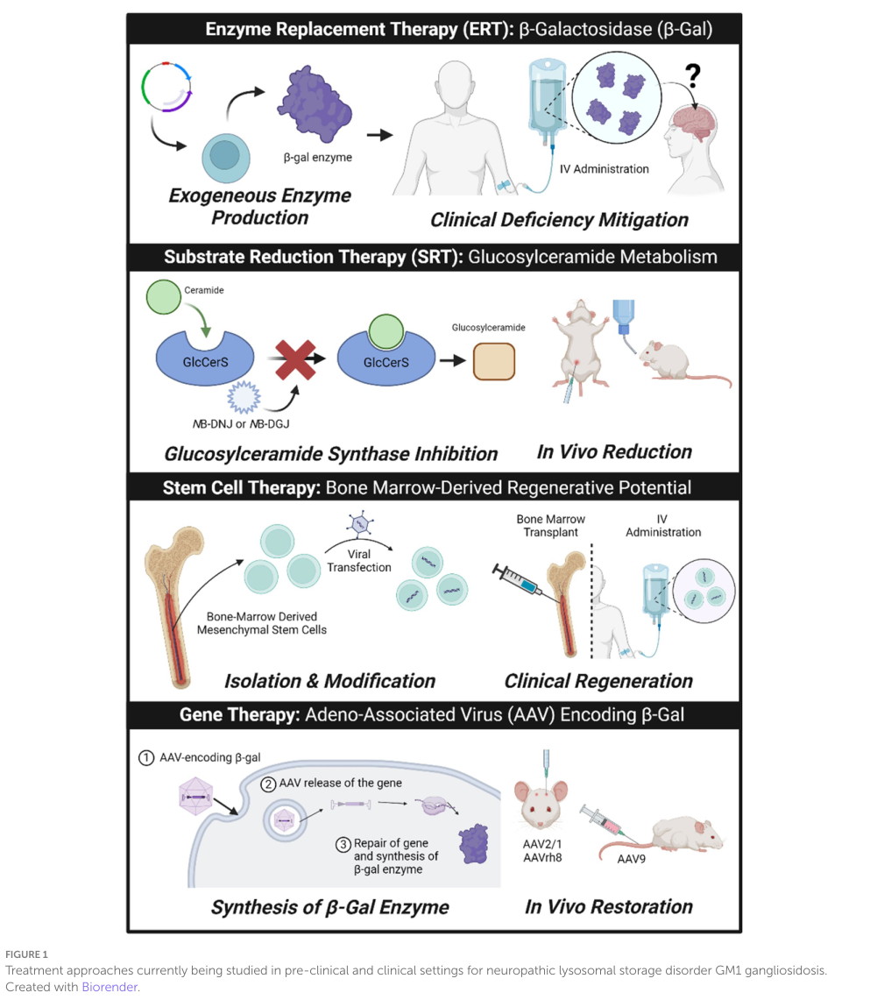

## Question

# Disease Characteristics Research Template

## Target Disease
- **Disease Name:** GM1 Gangliosidosis Type 2
- **MONDO ID:**  (if available)
- **Category:** Mendelian

## Research Objectives

Please provide a comprehensive research report on **GM1 Gangliosidosis Type 2** covering all of the
disease characteristics listed below. This report will be used to populate a disease knowledge
base entry. Be thorough and cite primary literature (PMID preferred) for all claims.

For each section, **suggested databases/resources** are listed. These are the first places
you should search for information on each topic.

---

### 1. Disease Information
> **Search first:** OMIM, Orphanet, ICD-10/ICD-11, MeSH, PubMed

- What is the disease? Provide a concise overview.
- What are the key identifiers? (OMIM, Orphanet, ICD-10/ICD-11, MeSH, Mondo)
- What are the common synonyms and alternative names?
- Is the information derived from individual patients (e.g., EHR) or aggregated disease-level resources?

### 2. Etiology

- **Disease Causal Factors**: What are the primary causes? (genetic, environmental, infectious, mechanistic)
- **Risk Factors**:
  > **Search first:** PubMed, Cochrane Library, UpToDate, clinical guidelines, ClinVar, ClinGen, GWAS Catalog, PheGenI, CTD, CDC, WHO, epidemiological databases
  - Genetic risk factors (causal variants, susceptibility loci, modifier genes)
  - Environmental risk factors (toxins, lifestyle, occupational exposures, age, sex, family history)
- **Protective Factors**:
  > **Search first:** PubMed, Cochrane Library, clinical trial databases, GWAS Catalog, gnomAD, WHO, CDC, nutrition databases
  - Genetic protective factors (protective variants, modifier alleles)
  - Environmental protective factors (diet, lifestyle, exposures that reduce risk)
- **Gene-Environment Interactions**: How do genetic and environmental factors interact to influence disease?
  > **Search first:** CTD, PubMed, PheGenI, GxE databases

### 3. Phenotypes
> **Search first:** HPO (Human Phenotype Ontology), OMIM, Orphanet, PubMed, clinicaltrials.gov, MedDRA, SNOMED CT, DECIPHER, LOINC

For each phenotype, provide:
- **Phenotype type**: symptoms, clinical signs, physical manifestations, behavioral changes, or laboratory abnormalities
  > For symptoms/signs: HPO, OMIM, Orphanet, PubMed
  > For behavioral changes: HPO, DSM, RDoC (Research Domain Criteria), PubMed
  > For laboratory abnormalities: LOINC, SNOMED CT, LabTests Online, PubMed
- **Phenotype characteristics**:
  > **Search first:** OMIM, Orphanet, HPO, PubMed
  - Age of symptom onset (neonatal, childhood, adult-onset, late-onset)
  - Symptom severity (mild, moderate, severe, variable)
  - Symptom progression (stable, progressive, episodic, fluctuating)
  - Frequency among affected individuals (percentage or qualitative)
- **Quality of life impact**: Effects on daily functioning and well-being (per-phenotype when possible)
  > **Search first:** EQ-5D database, SF-36, WHO QOL databases, PubMed
- Suggest HPO (Human Phenotype Ontology) terms for each phenotype

### 4. Genetic/Molecular Information

- **Causal Genes**: Gene mutations or chromosomal abnormalities responsible for disease (gene symbols, OMIM IDs)
  > **Search first:** OMIM, ClinVar, HGMD, Ensembl, NCBI Gene
- **Pathogenic Variants**:
  - Affected genes (gene symbols, HGNC IDs)
    > **Search first:** OMIM, NCBI Gene, Ensembl, HGNC, UniProt, GeneCards
  - Variant classification (pathogenic, likely pathogenic, VUS per ACMG/AMP guidelines)
    > **Search first:** ClinVar, ClinGen, ACMG/AMP guidelines, VarSome
  - Variant type/class (missense, frameshift, nonsense, splice-site, structural)
  - Allele frequency in population databases
    > **Search first:** gnomAD, 1000 Genomes, ExAC, TOPMed, dbSNP
  - Somatic vs germline origin
    > **Search first:** COSMIC (somatic), ClinVar, ICGC, TCGA
  - Functional consequences (loss of function, gain of function, dominant negative)
- **Modifier Genes**: Genes that modify disease severity or expression
- **Epigenetic Information**: DNA methylation, histone modifications, chromatin changes affecting disease
  > **Search first:** ENCODE, Roadmap Epigenomics, MethBase, DiseaseMeth
- **Chromosomal Abnormalities**: Large-scale genetic changes (aneuploidy, translocations, inversions)
  > **Search first:** DECIPHER, ClinVar, ECARUCA, UCSC Genome Browser

### 5. Environmental Information

- **Environmental Factors**: Non-genetic contributing factors (toxins, radiation, pollution, occupational exposure)
  > **Search first:** CTD (Comparative Toxicogenomics Database), TOXNET, PubMed, EPA databases
- **Lifestyle Factors**: Behavioral factors (smoking, diet, exercise, alcohol consumption)
  > **Search first:** CDC databases, WHO, PubMed, NHANES
- **Infectious Agents**: If applicable, pathogens causing or triggering disease (bacteria, viruses, fungi, parasites)
  > **Search first:** NCBI Taxonomy, ViPR, BV-BRC, MicrobeDB, GIDEON

### 6. Mechanism / Pathophysiology

- **Molecular Pathways**: Specific signaling cascades or biochemical pathways involved (Wnt, MAPK, mTOR, PI3K-AKT, etc.)
  > **Search first:** KEGG, Reactome, WikiPathways, PathBank, BioCyc
- **Cellular Processes**: Cell-level mechanisms (apoptosis, autophagy, cell cycle dysregulation, inflammation, etc.)
  > **Search first:** Gene Ontology (GO), Reactome, KEGG, PubMed
- **Protein Dysfunction**: How protein structure or function is altered (misfolding, aggregation, loss of function, gain of function)
  > **Search first:** UniProt, PDB (Protein Data Bank), InterPro, Pfam, AlphaFold
- **Metabolic Changes**: Alterations in metabolic processes (energy metabolism, lipid metabolism, amino acid metabolism)
  > **Search first:** KEGG, BioCyc, HMDB (Human Metabolome Database), BRENDA
- **Immune System Involvement**: Role of immune response (autoimmunity, immunodeficiency, chronic inflammation)
  > **Search first:** ImmPort, Immunome Database, IEDB, Gene Ontology
- **Tissue Damage Mechanisms**: How tissues/ are injured (oxidative stress, ischemia, fibrosis, necrosis)
  > **Search first:** PubMed, Gene Ontology, Reactome
- **Biochemical Abnormalities**: Specific molecular defects (enzyme deficiencies, receptor dysfunction, ion channel defects)
  > **Search first:** BRENDA, UniProt, KEGG, OMIM, PubMed
- **Epigenetic Changes**: DNA methylation, histone modifications affecting gene expression in disease
  > **Search first:** ENCODE, Roadmap Epigenomics, MethBase, DiseaseMeth
- **Molecular Profiling** (if available):
  - Transcriptomics/gene expression changes
    > **Search first:** GEO (Gene Expression Omnibus), ArrayExpress, GTEx, Human Cell Atlas, SRA
  - Proteomics findings
    > **Search first:** PRIDE, ProteomeXchange, Human Protein Atlas, STRING, BioGRID
  - Metabolomics signatures
    > **Search first:** MetaboLights, Metabolomics Workbench, HMDB, METLIN
  - Lipidomics alterations
    > **Search first:** LIPID MAPS, SwissLipids, LipidHome, Metabolomics Workbench
  - Genomic structural features
    > **Search first:** UCSC Genome Browser, Ensembl, NCBI, dbVar, DGV
- **Advanced Technologies** (if applicable):
  - Single-cell analysis findings (cell-type specific mechanisms, cellular heterogeneity)
    > **Search first:** Human Cell Atlas, Single Cell Portal, GEO, CELLxGENE
  - Spatial transcriptomics findings
    > **Search first:** GEO, Spatial Research, Vizgen, 10x Genomics data
  - Multi-omics integration results
    > **Search first:** TCGA, ICGC, cBioPortal, LinkedOmics, PubMed
  - Functional genomics screens (CRISPR, RNAi)
    > **Search first:** DepMap, GenomeRNAi, PubMed, BioGRID ORCS

For each mechanism, describe:
- The causal chain from initial trigger to clinical manifestation
- Which mechanisms are upstream vs downstream
- What cell types and biological processes are involved
- Suggest GO terms for biological processes and CL terms for cell types

### 7. Anatomical Structures Affected

- **Organ Level**:
  - Primary organs directly affected
  - Secondary organ involvement (complications, secondary effects)
  - Body systems involved (cardiovascular, nervous, digestive, respiratory, endocrine, etc.)
  > **Search first:** Uberon, FMA (Foundational Model of Anatomy), OMIM, HPO, ICD-11, MeSH, SNOMED CT
- **Tissue and Cell Level**:
  - Specific tissue types affected (epithelial, connective, muscle, nervous)
  - Specific cell populations targeted (with Cell Ontology terms)
  > **Search first:** Uberon, Human Protein Atlas, Cell Ontology, Human Cell Atlas, CellMarker, PanglaoDB
- **Subcellular Level**:
  - Cellular compartments involved (mitochondria, nucleus, ER, lysosomes) (with GO Cellular Component terms)
  > **Search first:** Gene Ontology (Cellular Component), UniProt, Human Protein Atlas
- **Localization**:
  - Specific anatomical sites (with UBERON terms)
    > **Search first:** FMA, Uberon, NeuroNames (for brain), SNOMED CT
  - Lateralization (unilateral, bilateral, asymmetric)
    > **Search first:** HPO, clinical literature, imaging databases

### 8. Temporal Development

- **Onset**:
  - Typical age of onset (congenital, pediatric, adult, geriatric)
  - Onset pattern (acute, subacute, chronic, insidious)
  > **Search first:** OMIM, Orphanet, HPO, PubMed
- **Progression**:
  - Disease stages (early, intermediate, advanced, end-stage)
    > **Search first:** Cancer Staging Manual (AJCC), WHO classifications, PubMed
  - Progression rate (rapid, slow, variable)
  - Disease course pattern (episodic, relapsing-remitting, progressive, stable)
  - Disease duration (self-limited, chronic lifelong)
  > **Search first:** Disease registries, longitudinal cohort databases, natural history studies, PubMed, Orphanet, OMIM
- **Patterns**:
  - Remission patterns (spontaneous, treatment-induced)
    > **Search first:** Clinical trial databases, disease registries, PubMed
  - Critical periods (time windows of vulnerability or opportunity for intervention)
    > **Search first:** PubMed, developmental biology databases, clinical guidelines

### 9. Inheritance and Population

- **Epidemiology**:
  - Prevalence (cases per 100,000 at given time)
  - Incidence (new cases per 100,000 per year)
  > **Search first:** Orphanet, CDC, WHO, GBD (Global Burden of Disease), national registries, SEER, disease registries
- **For Genetic Etiology**:
  - Inheritance pattern (AD, AR, X-linked, mitochondrial, multifactorial, polygenic)
    > **Search first:** OMIM, Orphanet, ClinVar, GTR (Genetic Testing Registry)
  - Penetrance (complete, incomplete, age-dependent)
    > **Search first:** ClinVar, OMIM, PubMed, ClinGen
  - Expressivity (variable, consistent)
    > **Search first:** OMIM, ClinVar, PubMed
  - Genetic anticipation (increasing severity in successive generations)
    > **Search first:** OMIM, PubMed (especially for repeat expansion disorders)
  - Germline mosaicism
    > **Search first:** ClinVar, OMIM, genetic counseling literature, PubMed
  - Founder effects (population-specific mutations)
    > **Search first:** gnomAD, population genetics databases, PubMed
  - Consanguinity role
    > **Search first:** OMIM, population studies, genetic counseling resources
  - Carrier frequency
    > **Search first:** gnomAD, carrier screening databases, GeneReviews, GTR
- **Population Demographics**:
  - Affected populations (ethnic or demographic groups with higher prevalence)
    > **Search first:** gnomAD, 1000 Genomes, PAGE Study, PubMed, population registries
  - Geographic distribution (endemic areas, regional variation)
    > **Search first:** WHO, CDC, GBD, Orphanet, geographic epidemiology databases
  - Geographic distribution of specific variants
  - Sex ratio (male:female)
    > **Search first:** Disease registries, OMIM, PubMed, epidemiological databases
  - Age distribution of affected individuals
    > **Search first:** CDC, disease registries, SEER, Orphanet

### 10. Diagnostics

- **Clinical Tests**:
  - Laboratory tests (blood, urine, tissue chemistry, specific enzyme assays)
    > **Search first:** LOINC, LabTests Online, PubMed
  - Biomarkers (proteins, metabolites, genetic markers, circulating biomarkers)
    > **Search first:** FDA Biomarker List, BEST (Biomarkers, EndpointS, and other Tools), PubMed
  - Imaging studies (X-ray, CT, MRI, PET, ultrasound)
    > **Search first:** RadLex, DICOM, Radiopaedia, imaging databases
  - Functional tests (pulmonary function, cardiac stress tests)
    > **Search first:** LOINC, clinical guidelines, PubMed
  - Electrophysiology (EEG, EMG, ECG, nerve conduction studies)
    > **Search first:** LOINC, clinical neurophysiology databases, PubMed
  - Biopsy findings (histopathology, immunohistochemistry)
    > **Search first:** SNOMED CT, College of American Pathologists resources, PubMed
  - Pathology findings (microscopic examination)
    > **Search first:** SNOMED CT, Digital Pathology databases, PubMed
- **Genetic Testing**:
  > **Search first:** GTR (Genetic Testing Registry), GeneReviews, ClinGen
  - Overview of recommended genetic testing approach
  - Whole genome sequencing (WGS) utility
    > **Search first:** GTR, ClinVar, GEL (Genomics England), gnomAD
  - Whole exome sequencing (WES) utility
    > **Search first:** GTR, ClinVar, OMIM, GeneMatcher
  - Gene panels (which panels, which genes)
    > **Search first:** GTR, ClinVar, laboratory-specific databases
  - Single gene testing
    > **Search first:** GTR, ClinVar, OMIM, GeneReviews
  - Chromosomal microarray (CMA)
    > **Search first:** DECIPHER, ClinVar, dbVar, ECARUCA
  - Karyotyping
    > **Search first:** Chromosome Abnormality Database, ClinVar, cytogenetics resources
  - FISH
    > **Search first:** ClinVar, cytogenetics databases, PubMed
  - Mitochondrial DNA testing
    > **Search first:** MITOMAP, MSeqDR, ClinVar, GTR
  - Repeat expansion testing
    > **Search first:** GTR, ClinVar, repeat expansion databases, PubMed
- **Omics-Based Diagnostics** (if applicable):
  - RNA sequencing / transcriptomics
    > **Search first:** GEO, ArrayExpress, GTEx, RNA-seq databases
  - Proteomics
    > **Search first:** PRIDE, ProteomeXchange, FDA Biomarker database
  - Metabolomics
    > **Search first:** MetaboLights, Metabolomics Workbench, HMDB
  - Epigenomics
    > **Search first:** GEO, ENCODE, Roadmap Epigenomics, MethBase
  - Liquid biopsy
    > **Search first:** COSMIC, ClinVar, liquid biopsy databases, PubMed
- **Clinical Criteria**:
  - Standardized diagnostic criteria (DSM, ICD, society guidelines)
    > **Search first:** DSM-5, ICD-11, clinical society guidelines, UpToDate
  - Differential diagnosis (other conditions to rule out, with distinguishing features)
    > **Search first:** DynaMed, UpToDate, clinical decision support systems
- **Screening**:
  - Screening methods for asymptomatic individuals (newborn screening, carrier screening, cascade screening)
    > **Search first:** ACMG recommendations, CDC newborn screening, GTR

### 11. Outcome/Prognosis

- **Survival and Mortality**:
  - Survival rate (5-year, 10-year, overall)
    > **Search first:** SEER, cancer registries, disease-specific registries, PubMed
  - Life expectancy (with and without treatment if applicable)
    > **Search first:** Orphanet, disease registries, actuarial databases, PubMed
  - Mortality rate
    > **Search first:** CDC, WHO, GBD, national mortality databases
  - Disease-specific mortality (deaths directly attributable to disease)
    > **Search first:** Disease registries, CDC Wonder, GBD, PubMed
- **Morbidity and Function**:
  - Morbidity (disease-related disability and health impacts)
    > **Search first:** GBD, WHO, disability databases, PubMed
  - Disability outcomes (long-term functional impairments)
    > **Search first:** ICF (International Classification of Functioning), disability registries
  - Quality of life measures (EQ-5D, SF-36, PROMIS, disease-specific tools)
    > **Search first:** EQ-5D database, SF-36, PROMIS, PubMed
- **Disease Course**:
  - Complications (secondary problems: infections, organ failure, etc.)
    > **Search first:** ICD codes, disease registries, clinical databases, PubMed
  - Recovery potential (likelihood and extent of recovery, with vs without treatment)
    > **Search first:** Natural history studies, rehabilitation databases, PubMed
- **Prediction**:
  - Prognostic factors (age, disease severity, biomarkers, treatment response)
    > **Search first:** Prognostic models databases, clinical calculators, PubMed
  - Prognostic biomarkers (molecular markers predicting disease course)
    > **Search first:** FDA Biomarker database, PubMed, cancer prognostic databases

### 12. Treatment

- **Pharmacotherapy**:
  - Pharmacological treatments (drug names, drug classes, mechanisms of action)
    > **Search first:** DrugBank, RxNorm, ATC classification, DailyMed, FDA databases
  - Pharmacogenomics (how genetic variants affect drug metabolism, efficacy, toxicity)
    > **Search first:** PharmGKB, CPIC (Clinical Pharmacogenetics), FDA Table of PGx Biomarkers
- **Advanced Therapeutics**:
  - Gene therapy (viral vectors, CRISPR, gene replacement, gene editing)
    > **Search first:** ClinicalTrials.gov, FDA gene therapy database, ASGCT resources
  - Cell therapy (stem cell transplant, CAR-T, cellular therapeutics)
    > **Search first:** ClinicalTrials.gov, FDA cell therapy database, FACT standards
  - RNA-based therapies (ASOs, siRNA, mRNA therapies)
    > **Search first:** ClinicalTrials.gov, FDA approvals, PubMed
  - Targeted therapies (treatments directed at specific molecular targets)
    > **Search first:** My Cancer Genome, OncoKB, ClinicalTrials.gov, FDA approvals
  - Immunotherapies (checkpoint inhibitors, monoclonal antibodies)
    > **Search first:** Cancer Immunotherapy Database, FDA approvals, ClinicalTrials.gov
- **Surgical and Interventional**:
  - Surgical interventions (types of surgery, timing, outcomes)
    > **Search first:** CPT codes, surgical registries, clinical guidelines, PubMed
- **Supportive and Rehabilitative**:
  - Supportive care (symptom management, pain control, nutrition)
    > **Search first:** Clinical guidelines, Cochrane Library, PubMed
  - Rehabilitation (physical therapy, occupational therapy, speech therapy)
    > **Search first:** Rehabilitation medicine databases, clinical guidelines, PubMed
- **Experimental**:
  - Experimental treatments in clinical trials (with NCT identifiers if available)
    > **Search first:** ClinicalTrials.gov, EU Clinical Trials Register, WHO ICTRP
- **Treatment Outcomes**:
  - Treatment response rates
    > **Search first:** Clinical trial databases, FDA reviews, systematic reviews, PubMed
  - Side effects and adverse events
    > **Search first:** FDA Adverse Event Reporting System (FAERS), MedWatch, PubMed
- **Treatment Strategy**:
  - Treatment algorithms (clinical pathways, decision trees)
    > **Search first:** Clinical practice guidelines, NCCN Guidelines, UpToDate
  - Combination therapies
    > **Search first:** ClinicalTrials.gov, treatment guidelines, PubMed
  - Personalized medicine approaches (genotype-guided treatment)
    > **Search first:** My Cancer Genome, CIViC, PharmGKB, precision medicine databases

For each treatment, suggest MAXO (Medical Action Ontology) terms where applicable.

### 13. Prevention

- **Prevention Levels**:
  - Primary prevention (preventing disease occurrence: vaccination, risk factor modification)
    > **Search first:** CDC, WHO, USPSTF recommendations, Cochrane Library
  - Secondary prevention (early detection and treatment: screening programs, early intervention)
    > **Search first:** USPSTF, CDC screening guidelines, WHO
  - Tertiary prevention (preventing complications in those with disease)
    > **Search first:** Clinical guidelines, disease management protocols, PubMed
- **Immunization**: Vaccine strategies (if applicable)
  > **Search first:** CDC vaccine schedules, WHO immunization, FDA vaccine database
- **Screening and Early Detection**:
  - Screening programs (population-based: newborn screening, cancer screening)
    > **Search first:** CDC screening programs, USPSTF, cancer screening databases
  - Genetic screening (carrier screening, preimplantation genetic diagnosis, prenatal testing)
    > **Search first:** ACMG recommendations, ACOG guidelines, GTR
  - Risk stratification (identifying high-risk individuals for targeted prevention)
    > **Search first:** Risk prediction models, clinical calculators, PubMed
- **Behavioral Interventions**: Lifestyle modifications to reduce risk
  > **Search first:** CDC, WHO, behavioral intervention databases, Cochrane Library
- **Counseling**: Genetic counseling (risk assessment, family planning guidance)
  > **Search first:** NSGC resources, ACMG guidelines, GeneReviews
- **Public Health**:
  - Public health interventions (sanitation, vector control, health education)
    > **Search first:** CDC, WHO, public health databases, PubMed
  - Environmental interventions (reducing environmental risk factors)
    > **Search first:** EPA databases, WHO environmental health, PubMed
- **Prophylaxis**: Preventive medications or procedures
  > **Search first:** Clinical guidelines, FDA approvals, PubMed

### 14. Other Species / Natural Disease

- **Taxonomy**: Species affected (with NCBI Taxon identifiers)
  > **Search first:** NCBI Taxonomy
- **Breed**: Specific breeds affected (with VBO identifiers if applicable)
  > **Search first:** VBO (Vertebrate Breed Ontology)
- **Gene**: Orthologous genes in other species (with NCBI Gene IDs)
  > **Search first:** NCBI Gene
- **Natural Disease**:
  - Naturally occurring disease in other species (companion animals, wildlife)
    > **Search first:** OMIA (Online Mendelian Inheritance in Animals), VetCompass, PubMed
  - Veterinary relevance and importance in animal health
    > **Search first:** OMIA, veterinary databases, PubMed
- **Comparative Biology**:
  - Comparative pathology (similarities and differences across species)
    > **Search first:** OMIA, comparative pathology databases, PubMed
  - Evolutionary conservation of disease mechanisms
    > **Search first:** HomoloGene, OrthoMCL, Alliance of Genome Resources
- **Transmission** (if applicable):
  - Zoonotic potential
    > **Search first:** CDC zoonotic diseases, WHO zoonoses, GIDEON
  - Cross-species susceptibility
    > **Search first:** NCBI Taxonomy, veterinary databases, PubMed

### 15. Model Organisms

- **Model Types**:
  - Model organism type (mammalian, invertebrate, cellular, in vitro)
    > **Search first:** Alliance of Genome Resources, model organism databases
  - Specific model systems (mouse, rat, zebrafish, Drosophila, C. elegans, yeast, cell lines, organoids, iPSCs)
    > **Search first:** MGI, RGD, ZFIN, FlyBase, WormBase, SGD, ATCC, Cellosaurus
  - Induced models (drug treatment, surgical intervention, environmental manipulation)
    > **Search first:** MGI, model organism databases, PubMed
- **Genetic Models**:
  - Types available (knockout, knock-in, transgenic, conditional, humanized)
    > **Search first:** MGI, IMPC, KOMP, EuMMCR, IMSR
- **Model Characteristics**:
  - Phenotype recapitulation (how well model reproduces human disease features)
    > **Search first:** Model organism databases, comparative studies, PubMed
  - Model limitations (aspects of human disease not captured)
    > **Search first:** Model organism databases, PubMed, review articles
- **Applications**:
  - Research applications (what aspects of disease can be studied)
    > **Search first:** Model organism databases, PubMed
- **Resources**:
  - Model databases
    > **Search first:** MGI, RGD, ZFIN, FlyBase, WormBase, IMSR, EMMA, MMRRC

---

## Citation Requirements

- Cite primary literature (PMID preferred) for all mechanistic and clinical claims
- Prioritize recent reviews and landmark papers
- Include direct quotes from abstracts where possible to support key statements
- Distinguish evidence source types: human clinical, model organism, in vitro, computational

## Output Format

Structure your response as a comprehensive narrative organized by the sections above.
For each section, provide:
- Factual content with specific details (numbers, percentages, gene names, variant nomenclature)
- Ontology term suggestions (HPO, GO, CL, UBERON, CHEBI, MAXO, MONDO) where applicable
- Evidence citations with PMIDs
- Direct quotes from abstracts to support key claims
- Clear indication when information is not available or not applicable for this disease

This report will be used to populate a disease knowledge base entry with:
- Pathophysiology descriptions with causal chains
- Gene/protein annotations (HGNC, GO terms)
- Phenotype associations (HP terms) with frequencies
- Cell type involvement (CL terms)
- Anatomical locations (UBERON terms)
- Chemical entities (CHEBI terms)
- Treatment annotations (MAXO terms)
- Evidence items with PMIDs and exact abstract quotes
- Epidemiology, prognosis, diagnostic, and prevention information
- Animal model descriptions with phenotype recapitulation details

## Output

Question: You are an expert researcher providing comprehensive, well-cited information.

Provide detailed information focusing on:
1. Key concepts and definitions with current understanding
2. Recent developments and latest research (prioritize 2023-2024 sources)
3. Current applications and real-world implementations
4. Expert opinions and analysis from authoritative sources
5. Relevant statistics and data from recent studies

Format as a comprehensive research report with proper citations. Include URLs and publication dates where available.
Always prioritize recent, authoritative sources and provide specific citations for all major claims.

# Disease Characteristics Research Template

## Target Disease
- **Disease Name:** GM1 Gangliosidosis Type 2
- **MONDO ID:**  (if available)
- **Category:** Mendelian

## Research Objectives

Please provide a comprehensive research report on **GM1 Gangliosidosis Type 2** covering all of the
disease characteristics listed below. This report will be used to populate a disease knowledge
base entry. Be thorough and cite primary literature (PMID preferred) for all claims.

For each section, **suggested databases/resources** are listed. These are the first places
you should search for information on each topic.

---

### 1. Disease Information
> **Search first:** OMIM, Orphanet, ICD-10/ICD-11, MeSH, PubMed

- What is the disease? Provide a concise overview.
- What are the key identifiers? (OMIM, Orphanet, ICD-10/ICD-11, MeSH, Mondo)
- What are the common synonyms and alternative names?
- Is the information derived from individual patients (e.g., EHR) or aggregated disease-level resources?

### 2. Etiology

- **Disease Causal Factors**: What are the primary causes? (genetic, environmental, infectious, mechanistic)
- **Risk Factors**:
  > **Search first:** PubMed, Cochrane Library, UpToDate, clinical guidelines, ClinVar, ClinGen, GWAS Catalog, PheGenI, CTD, CDC, WHO, epidemiological databases
  - Genetic risk factors (causal variants, susceptibility loci, modifier genes)
  - Environmental risk factors (toxins, lifestyle, occupational exposures, age, sex, family history)
- **Protective Factors**:
  > **Search first:** PubMed, Cochrane Library, clinical trial databases, GWAS Catalog, gnomAD, WHO, CDC, nutrition databases
  - Genetic protective factors (protective variants, modifier alleles)
  - Environmental protective factors (diet, lifestyle, exposures that reduce risk)
- **Gene-Environment Interactions**: How do genetic and environmental factors interact to influence disease?
  > **Search first:** CTD, PubMed, PheGenI, GxE databases

### 3. Phenotypes
> **Search first:** HPO (Human Phenotype Ontology), OMIM, Orphanet, PubMed, clinicaltrials.gov, MedDRA, SNOMED CT, DECIPHER, LOINC

For each phenotype, provide:
- **Phenotype type**: symptoms, clinical signs, physical manifestations, behavioral changes, or laboratory abnormalities
  > For symptoms/signs: HPO, OMIM, Orphanet, PubMed
  > For behavioral changes: HPO, DSM, RDoC (Research Domain Criteria), PubMed
  > For laboratory abnormalities: LOINC, SNOMED CT, LabTests Online, PubMed
- **Phenotype characteristics**:
  > **Search first:** OMIM, Orphanet, HPO, PubMed
  - Age of symptom onset (neonatal, childhood, adult-onset, late-onset)
  - Symptom severity (mild, moderate, severe, variable)
  - Symptom progression (stable, progressive, episodic, fluctuating)
  - Frequency among affected individuals (percentage or qualitative)
- **Quality of life impact**: Effects on daily functioning and well-being (per-phenotype when possible)
  > **Search first:** EQ-5D database, SF-36, WHO QOL databases, PubMed
- Suggest HPO (Human Phenotype Ontology) terms for each phenotype

### 4. Genetic/Molecular Information

- **Causal Genes**: Gene mutations or chromosomal abnormalities responsible for disease (gene symbols, OMIM IDs)
  > **Search first:** OMIM, ClinVar, HGMD, Ensembl, NCBI Gene
- **Pathogenic Variants**:
  - Affected genes (gene symbols, HGNC IDs)
    > **Search first:** OMIM, NCBI Gene, Ensembl, HGNC, UniProt, GeneCards
  - Variant classification (pathogenic, likely pathogenic, VUS per ACMG/AMP guidelines)
    > **Search first:** ClinVar, ClinGen, ACMG/AMP guidelines, VarSome
  - Variant type/class (missense, frameshift, nonsense, splice-site, structural)
  - Allele frequency in population databases
    > **Search first:** gnomAD, 1000 Genomes, ExAC, TOPMed, dbSNP
  - Somatic vs germline origin
    > **Search first:** COSMIC (somatic), ClinVar, ICGC, TCGA
  - Functional consequences (loss of function, gain of function, dominant negative)
- **Modifier Genes**: Genes that modify disease severity or expression
- **Epigenetic Information**: DNA methylation, histone modifications, chromatin changes affecting disease
  > **Search first:** ENCODE, Roadmap Epigenomics, MethBase, DiseaseMeth
- **Chromosomal Abnormalities**: Large-scale genetic changes (aneuploidy, translocations, inversions)
  > **Search first:** DECIPHER, ClinVar, ECARUCA, UCSC Genome Browser

### 5. Environmental Information

- **Environmental Factors**: Non-genetic contributing factors (toxins, radiation, pollution, occupational exposure)
  > **Search first:** CTD (Comparative Toxicogenomics Database), TOXNET, PubMed, EPA databases
- **Lifestyle Factors**: Behavioral factors (smoking, diet, exercise, alcohol consumption)
  > **Search first:** CDC databases, WHO, PubMed, NHANES
- **Infectious Agents**: If applicable, pathogens causing or triggering disease (bacteria, viruses, fungi, parasites)
  > **Search first:** NCBI Taxonomy, ViPR, BV-BRC, MicrobeDB, GIDEON

### 6. Mechanism / Pathophysiology

- **Molecular Pathways**: Specific signaling cascades or biochemical pathways involved (Wnt, MAPK, mTOR, PI3K-AKT, etc.)
  > **Search first:** KEGG, Reactome, WikiPathways, PathBank, BioCyc
- **Cellular Processes**: Cell-level mechanisms (apoptosis, autophagy, cell cycle dysregulation, inflammation, etc.)
  > **Search first:** Gene Ontology (GO), Reactome, KEGG, PubMed
- **Protein Dysfunction**: How protein structure or function is altered (misfolding, aggregation, loss of function, gain of function)
  > **Search first:** UniProt, PDB (Protein Data Bank), InterPro, Pfam, AlphaFold
- **Metabolic Changes**: Alterations in metabolic processes (energy metabolism, lipid metabolism, amino acid metabolism)
  > **Search first:** KEGG, BioCyc, HMDB (Human Metabolome Database), BRENDA
- **Immune System Involvement**: Role of immune response (autoimmunity, immunodeficiency, chronic inflammation)
  > **Search first:** ImmPort, Immunome Database, IEDB, Gene Ontology
- **Tissue Damage Mechanisms**: How tissues/ are injured (oxidative stress, ischemia, fibrosis, necrosis)
  > **Search first:** PubMed, Gene Ontology, Reactome
- **Biochemical Abnormalities**: Specific molecular defects (enzyme deficiencies, receptor dysfunction, ion channel defects)
  > **Search first:** BRENDA, UniProt, KEGG, OMIM, PubMed
- **Epigenetic Changes**: DNA methylation, histone modifications affecting gene expression in disease
  > **Search first:** ENCODE, Roadmap Epigenomics, MethBase, DiseaseMeth
- **Molecular Profiling** (if available):
  - Transcriptomics/gene expression changes
    > **Search first:** GEO (Gene Expression Omnibus), ArrayExpress, GTEx, Human Cell Atlas, SRA
  - Proteomics findings
    > **Search first:** PRIDE, ProteomeXchange, Human Protein Atlas, STRING, BioGRID
  - Metabolomics signatures
    > **Search first:** MetaboLights, Metabolomics Workbench, HMDB, METLIN
  - Lipidomics alterations
    > **Search first:** LIPID MAPS, SwissLipids, LipidHome, Metabolomics Workbench
  - Genomic structural features
    > **Search first:** UCSC Genome Browser, Ensembl, NCBI, dbVar, DGV
- **Advanced Technologies** (if applicable):
  - Single-cell analysis findings (cell-type specific mechanisms, cellular heterogeneity)
    > **Search first:** Human Cell Atlas, Single Cell Portal, GEO, CELLxGENE
  - Spatial transcriptomics findings
    > **Search first:** GEO, Spatial Research, Vizgen, 10x Genomics data
  - Multi-omics integration results
    > **Search first:** TCGA, ICGC, cBioPortal, LinkedOmics, PubMed
  - Functional genomics screens (CRISPR, RNAi)
    > **Search first:** DepMap, GenomeRNAi, PubMed, BioGRID ORCS

For each mechanism, describe:
- The causal chain from initial trigger to clinical manifestation
- Which mechanisms are upstream vs downstream
- What cell types and biological processes are involved
- Suggest GO terms for biological processes and CL terms for cell types

### 7. Anatomical Structures Affected

- **Organ Level**:
  - Primary organs directly affected
  - Secondary organ involvement (complications, secondary effects)
  - Body systems involved (cardiovascular, nervous, digestive, respiratory, endocrine, etc.)
  > **Search first:** Uberon, FMA (Foundational Model of Anatomy), OMIM, HPO, ICD-11, MeSH, SNOMED CT
- **Tissue and Cell Level**:
  - Specific tissue types affected (epithelial, connective, muscle, nervous)
  - Specific cell populations targeted (with Cell Ontology terms)
  > **Search first:** Uberon, Human Protein Atlas, Cell Ontology, Human Cell Atlas, CellMarker, PanglaoDB
- **Subcellular Level**:
  - Cellular compartments involved (mitochondria, nucleus, ER, lysosomes) (with GO Cellular Component terms)
  > **Search first:** Gene Ontology (Cellular Component), UniProt, Human Protein Atlas
- **Localization**:
  - Specific anatomical sites (with UBERON terms)
    > **Search first:** FMA, Uberon, NeuroNames (for brain), SNOMED CT
  - Lateralization (unilateral, bilateral, asymmetric)
    > **Search first:** HPO, clinical literature, imaging databases

### 8. Temporal Development

- **Onset**:
  - Typical age of onset (congenital, pediatric, adult, geriatric)
  - Onset pattern (acute, subacute, chronic, insidious)
  > **Search first:** OMIM, Orphanet, HPO, PubMed
- **Progression**:
  - Disease stages (early, intermediate, advanced, end-stage)
    > **Search first:** Cancer Staging Manual (AJCC), WHO classifications, PubMed
  - Progression rate (rapid, slow, variable)
  - Disease course pattern (episodic, relapsing-remitting, progressive, stable)
  - Disease duration (self-limited, chronic lifelong)
  > **Search first:** Disease registries, longitudinal cohort databases, natural history studies, PubMed, Orphanet, OMIM
- **Patterns**:
  - Remission patterns (spontaneous, treatment-induced)
    > **Search first:** Clinical trial databases, disease registries, PubMed
  - Critical periods (time windows of vulnerability or opportunity for intervention)
    > **Search first:** PubMed, developmental biology databases, clinical guidelines

### 9. Inheritance and Population

- **Epidemiology**:
  - Prevalence (cases per 100,000 at given time)
  - Incidence (new cases per 100,000 per year)
  > **Search first:** Orphanet, CDC, WHO, GBD (Global Burden of Disease), national registries, SEER, disease registries
- **For Genetic Etiology**:
  - Inheritance pattern (AD, AR, X-linked, mitochondrial, multifactorial, polygenic)
    > **Search first:** OMIM, Orphanet, ClinVar, GTR (Genetic Testing Registry)
  - Penetrance (complete, incomplete, age-dependent)
    > **Search first:** ClinVar, OMIM, PubMed, ClinGen
  - Expressivity (variable, consistent)
    > **Search first:** OMIM, ClinVar, PubMed
  - Genetic anticipation (increasing severity in successive generations)
    > **Search first:** OMIM, PubMed (especially for repeat expansion disorders)
  - Germline mosaicism
    > **Search first:** ClinVar, OMIM, genetic counseling literature, PubMed
  - Founder effects (population-specific mutations)
    > **Search first:** gnomAD, population genetics databases, PubMed
  - Consanguinity role
    > **Search first:** OMIM, population studies, genetic counseling resources
  - Carrier frequency
    > **Search first:** gnomAD, carrier screening databases, GeneReviews, GTR
- **Population Demographics**:
  - Affected populations (ethnic or demographic groups with higher prevalence)
    > **Search first:** gnomAD, 1000 Genomes, PAGE Study, PubMed, population registries
  - Geographic distribution (endemic areas, regional variation)
    > **Search first:** WHO, CDC, GBD, Orphanet, geographic epidemiology databases
  - Geographic distribution of specific variants
  - Sex ratio (male:female)
    > **Search first:** Disease registries, OMIM, PubMed, epidemiological databases
  - Age distribution of affected individuals
    > **Search first:** CDC, disease registries, SEER, Orphanet

### 10. Diagnostics

- **Clinical Tests**:
  - Laboratory tests (blood, urine, tissue chemistry, specific enzyme assays)
    > **Search first:** LOINC, LabTests Online, PubMed
  - Biomarkers (proteins, metabolites, genetic markers, circulating biomarkers)
    > **Search first:** FDA Biomarker List, BEST (Biomarkers, EndpointS, and other Tools), PubMed
  - Imaging studies (X-ray, CT, MRI, PET, ultrasound)
    > **Search first:** RadLex, DICOM, Radiopaedia, imaging databases
  - Functional tests (pulmonary function, cardiac stress tests)
    > **Search first:** LOINC, clinical guidelines, PubMed
  - Electrophysiology (EEG, EMG, ECG, nerve conduction studies)
    > **Search first:** LOINC, clinical neurophysiology databases, PubMed
  - Biopsy findings (histopathology, immunohistochemistry)
    > **Search first:** SNOMED CT, College of American Pathologists resources, PubMed
  - Pathology findings (microscopic examination)
    > **Search first:** SNOMED CT, Digital Pathology databases, PubMed
- **Genetic Testing**:
  > **Search first:** GTR (Genetic Testing Registry), GeneReviews, ClinGen
  - Overview of recommended genetic testing approach
  - Whole genome sequencing (WGS) utility
    > **Search first:** GTR, ClinVar, GEL (Genomics England), gnomAD
  - Whole exome sequencing (WES) utility
    > **Search first:** GTR, ClinVar, OMIM, GeneMatcher
  - Gene panels (which panels, which genes)
    > **Search first:** GTR, ClinVar, laboratory-specific databases
  - Single gene testing
    > **Search first:** GTR, ClinVar, OMIM, GeneReviews
  - Chromosomal microarray (CMA)
    > **Search first:** DECIPHER, ClinVar, dbVar, ECARUCA
  - Karyotyping
    > **Search first:** Chromosome Abnormality Database, ClinVar, cytogenetics resources
  - FISH
    > **Search first:** ClinVar, cytogenetics databases, PubMed
  - Mitochondrial DNA testing
    > **Search first:** MITOMAP, MSeqDR, ClinVar, GTR
  - Repeat expansion testing
    > **Search first:** GTR, ClinVar, repeat expansion databases, PubMed
- **Omics-Based Diagnostics** (if applicable):
  - RNA sequencing / transcriptomics
    > **Search first:** GEO, ArrayExpress, GTEx, RNA-seq databases
  - Proteomics
    > **Search first:** PRIDE, ProteomeXchange, FDA Biomarker database
  - Metabolomics
    > **Search first:** MetaboLights, Metabolomics Workbench, HMDB
  - Epigenomics
    > **Search first:** GEO, ENCODE, Roadmap Epigenomics, MethBase
  - Liquid biopsy
    > **Search first:** COSMIC, ClinVar, liquid biopsy databases, PubMed
- **Clinical Criteria**:
  - Standardized diagnostic criteria (DSM, ICD, society guidelines)
    > **Search first:** DSM-5, ICD-11, clinical society guidelines, UpToDate
  - Differential diagnosis (other conditions to rule out, with distinguishing features)
    > **Search first:** DynaMed, UpToDate, clinical decision support systems
- **Screening**:
  - Screening methods for asymptomatic individuals (newborn screening, carrier screening, cascade screening)
    > **Search first:** ACMG recommendations, CDC newborn screening, GTR

### 11. Outcome/Prognosis

- **Survival and Mortality**:
  - Survival rate (5-year, 10-year, overall)
    > **Search first:** SEER, cancer registries, disease-specific registries, PubMed
  - Life expectancy (with and without treatment if applicable)
    > **Search first:** Orphanet, disease registries, actuarial databases, PubMed
  - Mortality rate
    > **Search first:** CDC, WHO, GBD, national mortality databases
  - Disease-specific mortality (deaths directly attributable to disease)
    > **Search first:** Disease registries, CDC Wonder, GBD, PubMed
- **Morbidity and Function**:
  - Morbidity (disease-related disability and health impacts)
    > **Search first:** GBD, WHO, disability databases, PubMed
  - Disability outcomes (long-term functional impairments)
    > **Search first:** ICF (International Classification of Functioning), disability registries
  - Quality of life measures (EQ-5D, SF-36, PROMIS, disease-specific tools)
    > **Search first:** EQ-5D database, SF-36, PROMIS, PubMed
- **Disease Course**:
  - Complications (secondary problems: infections, organ failure, etc.)
    > **Search first:** ICD codes, disease registries, clinical databases, PubMed
  - Recovery potential (likelihood and extent of recovery, with vs without treatment)
    > **Search first:** Natural history studies, rehabilitation databases, PubMed
- **Prediction**:
  - Prognostic factors (age, disease severity, biomarkers, treatment response)
    > **Search first:** Prognostic models databases, clinical calculators, PubMed
  - Prognostic biomarkers (molecular markers predicting disease course)
    > **Search first:** FDA Biomarker database, PubMed, cancer prognostic databases

### 12. Treatment

- **Pharmacotherapy**:
  - Pharmacological treatments (drug names, drug classes, mechanisms of action)
    > **Search first:** DrugBank, RxNorm, ATC classification, DailyMed, FDA databases
  - Pharmacogenomics (how genetic variants affect drug metabolism, efficacy, toxicity)
    > **Search first:** PharmGKB, CPIC (Clinical Pharmacogenetics), FDA Table of PGx Biomarkers
- **Advanced Therapeutics**:
  - Gene therapy (viral vectors, CRISPR, gene replacement, gene editing)
    > **Search first:** ClinicalTrials.gov, FDA gene therapy database, ASGCT resources
  - Cell therapy (stem cell transplant, CAR-T, cellular therapeutics)
    > **Search first:** ClinicalTrials.gov, FDA cell therapy database, FACT standards
  - RNA-based therapies (ASOs, siRNA, mRNA therapies)
    > **Search first:** ClinicalTrials.gov, FDA approvals, PubMed
  - Targeted therapies (treatments directed at specific molecular targets)
    > **Search first:** My Cancer Genome, OncoKB, ClinicalTrials.gov, FDA approvals
  - Immunotherapies (checkpoint inhibitors, monoclonal antibodies)
    > **Search first:** Cancer Immunotherapy Database, FDA approvals, ClinicalTrials.gov
- **Surgical and Interventional**:
  - Surgical interventions (types of surgery, timing, outcomes)
    > **Search first:** CPT codes, surgical registries, clinical guidelines, PubMed
- **Supportive and Rehabilitative**:
  - Supportive care (symptom management, pain control, nutrition)
    > **Search first:** Clinical guidelines, Cochrane Library, PubMed
  - Rehabilitation (physical therapy, occupational therapy, speech therapy)
    > **Search first:** Rehabilitation medicine databases, clinical guidelines, PubMed
- **Experimental**:
  - Experimental treatments in clinical trials (with NCT identifiers if available)
    > **Search first:** ClinicalTrials.gov, EU Clinical Trials Register, WHO ICTRP
- **Treatment Outcomes**:
  - Treatment response rates
    > **Search first:** Clinical trial databases, FDA reviews, systematic reviews, PubMed
  - Side effects and adverse events
    > **Search first:** FDA Adverse Event Reporting System (FAERS), MedWatch, PubMed
- **Treatment Strategy**:
  - Treatment algorithms (clinical pathways, decision trees)
    > **Search first:** Clinical practice guidelines, NCCN Guidelines, UpToDate
  - Combination therapies
    > **Search first:** ClinicalTrials.gov, treatment guidelines, PubMed
  - Personalized medicine approaches (genotype-guided treatment)
    > **Search first:** My Cancer Genome, CIViC, PharmGKB, precision medicine databases

For each treatment, suggest MAXO (Medical Action Ontology) terms where applicable.

### 13. Prevention

- **Prevention Levels**:
  - Primary prevention (preventing disease occurrence: vaccination, risk factor modification)
    > **Search first:** CDC, WHO, USPSTF recommendations, Cochrane Library
  - Secondary prevention (early detection and treatment: screening programs, early intervention)
    > **Search first:** USPSTF, CDC screening guidelines, WHO
  - Tertiary prevention (preventing complications in those with disease)
    > **Search first:** Clinical guidelines, disease management protocols, PubMed
- **Immunization**: Vaccine strategies (if applicable)
  > **Search first:** CDC vaccine schedules, WHO immunization, FDA vaccine database
- **Screening and Early Detection**:
  - Screening programs (population-based: newborn screening, cancer screening)
    > **Search first:** CDC screening programs, USPSTF, cancer screening databases
  - Genetic screening (carrier screening, preimplantation genetic diagnosis, prenatal testing)
    > **Search first:** ACMG recommendations, ACOG guidelines, GTR
  - Risk stratification (identifying high-risk individuals for targeted prevention)
    > **Search first:** Risk prediction models, clinical calculators, PubMed
- **Behavioral Interventions**: Lifestyle modifications to reduce risk
  > **Search first:** CDC, WHO, behavioral intervention databases, Cochrane Library
- **Counseling**: Genetic counseling (risk assessment, family planning guidance)
  > **Search first:** NSGC resources, ACMG guidelines, GeneReviews
- **Public Health**:
  - Public health interventions (sanitation, vector control, health education)
    > **Search first:** CDC, WHO, public health databases, PubMed
  - Environmental interventions (reducing environmental risk factors)
    > **Search first:** EPA databases, WHO environmental health, PubMed
- **Prophylaxis**: Preventive medications or procedures
  > **Search first:** Clinical guidelines, FDA approvals, PubMed

### 14. Other Species / Natural Disease

- **Taxonomy**: Species affected (with NCBI Taxon identifiers)
  > **Search first:** NCBI Taxonomy
- **Breed**: Specific breeds affected (with VBO identifiers if applicable)
  > **Search first:** VBO (Vertebrate Breed Ontology)
- **Gene**: Orthologous genes in other species (with NCBI Gene IDs)
  > **Search first:** NCBI Gene
- **Natural Disease**:
  - Naturally occurring disease in other species (companion animals, wildlife)
    > **Search first:** OMIA (Online Mendelian Inheritance in Animals), VetCompass, PubMed
  - Veterinary relevance and importance in animal health
    > **Search first:** OMIA, veterinary databases, PubMed
- **Comparative Biology**:
  - Comparative pathology (similarities and differences across species)
    > **Search first:** OMIA, comparative pathology databases, PubMed
  - Evolutionary conservation of disease mechanisms
    > **Search first:** HomoloGene, OrthoMCL, Alliance of Genome Resources
- **Transmission** (if applicable):
  - Zoonotic potential
    > **Search first:** CDC zoonotic diseases, WHO zoonoses, GIDEON
  - Cross-species susceptibility
    > **Search first:** NCBI Taxonomy, veterinary databases, PubMed

### 15. Model Organisms

- **Model Types**:
  - Model organism type (mammalian, invertebrate, cellular, in vitro)
    > **Search first:** Alliance of Genome Resources, model organism databases
  - Specific model systems (mouse, rat, zebrafish, Drosophila, C. elegans, yeast, cell lines, organoids, iPSCs)
    > **Search first:** MGI, RGD, ZFIN, FlyBase, WormBase, SGD, ATCC, Cellosaurus
  - Induced models (drug treatment, surgical intervention, environmental manipulation)
    > **Search first:** MGI, model organism databases, PubMed
- **Genetic Models**:
  - Types available (knockout, knock-in, transgenic, conditional, humanized)
    > **Search first:** MGI, IMPC, KOMP, EuMMCR, IMSR
- **Model Characteristics**:
  - Phenotype recapitulation (how well model reproduces human disease features)
    > **Search first:** Model organism databases, comparative studies, PubMed
  - Model limitations (aspects of human disease not captured)
    > **Search first:** Model organism databases, PubMed, review articles
- **Applications**:
  - Research applications (what aspects of disease can be studied)
    > **Search first:** Model organism databases, PubMed
- **Resources**:
  - Model databases
    > **Search first:** MGI, RGD, ZFIN, FlyBase, WormBase, IMSR, EMMA, MMRRC

---

## Citation Requirements

- Cite primary literature (PMID preferred) for all mechanistic and clinical claims
- Prioritize recent reviews and landmark papers
- Include direct quotes from abstracts where possible to support key statements
- Distinguish evidence source types: human clinical, model organism, in vitro, computational

## Output Format

Structure your response as a comprehensive narrative organized by the sections above.
For each section, provide:
- Factual content with specific details (numbers, percentages, gene names, variant nomenclature)
- Ontology term suggestions (HPO, GO, CL, UBERON, CHEBI, MAXO, MONDO) where applicable
- Evidence citations with PMIDs
- Direct quotes from abstracts to support key claims
- Clear indication when information is not available or not applicable for this disease

This report will be used to populate a disease knowledge base entry with:
- Pathophysiology descriptions with causal chains
- Gene/protein annotations (HGNC, GO terms)
- Phenotype associations (HP terms) with frequencies
- Cell type involvement (CL terms)
- Anatomical locations (UBERON terms)
- Chemical entities (CHEBI terms)
- Treatment annotations (MAXO terms)
- Evidence items with PMIDs and exact abstract quotes
- Epidemiology, prognosis, diagnostic, and prevention information
- Animal model descriptions with phenotype recapitulation details

# GM1 Gangliosidosis Type 2 (late-infantile/juvenile): Disease Characteristics Research Report

**Target disease:** GM1 gangliosidosis type 2 (Type II; late-infantile and juvenile)  
**Category:** Mendelian (autosomal recessive lysosomal storage disorder)  
**Core ontology IDs:** MONDO:0009261 (type 2) and MONDO:0018149 (general GM1 gangliosidosis) (OpenTargets Search: GM1 gangliosidosis)

| Category | Item | Value | Source type | URL | Evidence |
|---|---|---|---|---|---|
| Disease identifier | MONDO (general) | MONDO:0018149 — GM1 gangliosidosis | OpenTargets | https://platform.opentargets.org/disease/MONDO_0018149 | (OpenTargets Search: GM1 gangliosidosis) |
| Disease identifier | MONDO (type II) | MONDO:0009261 — GM1 gangliosidosis type 2 | OpenTargets | https://platform.opentargets.org/disease/MONDO_0009261 | (OpenTargets Search: GM1 gangliosidosis) |
| Disease identifier | ICD-10 | E75.1 | Paper | https://doi.org/10.3389/fgene.2024.1344051 | (zagaynova2024casereportpreimplantation pages 1-2) |
| Disease identifier | OMIM (type I / type II / type III series) | 230500 / 230600 / 230650 | Paper | https://doi.org/10.3389/fgene.2024.1344051 | (zagaynova2024casereportpreimplantation pages 1-2) |
| Disease identifier | OMIM (type II specific) | 230600 | Paper | https://doi.org/10.1007/8904_2015_451 | (ferreira2020theskeletalphenotype pages 1-6) |
| Classification | MeSH term | Gangliosidosis, GM1 | Clinical trial metadata | https://clinicaltrials.gov/study/NCT04041102 | (NCT04041102 chunk 2, NCT04041102 chunk 3) |
| Classification | Broader category | Lysosomal storage disease; sphingolipidosis; nervous system lysosomal storage disease | Clinical trial metadata | https://clinicaltrials.gov/study/NCT04041102 | (NCT04041102 chunk 2, NCT04041102 chunk 3) |
| Causal gene | HGNC gene symbol | GLB1 | OpenTargets / papers | https://platform.opentargets.org/target/ENSG00000170266 | (OpenTargets Search: GM1 gangliosidosis, rha2021gm1gangliosidosismechanisms pages 1-2) |
| Gene product | Enzyme | Lysosomal acid β-galactosidase; beta-galactosidase | Papers | https://doi.org/10.2147/TACG.S206076 | (rha2021gm1gangliosidosismechanisms pages 1-2, rha2021gm1gangliosidosismechanisms pages 2-3) |
| Synonym | Common disease name | GM1 gangliosidosis type II | Papers | https://doi.org/10.1016/j.gim.2024.101144 | (d’souza2024gm1gangliosidosistype pages 1-3) |
| Synonym | Common disease name | Intermediate GM1 gangliosidosis | Paper | https://doi.org/10.1016/j.bone.2019.115142 | (ferreira2020theskeletalphenotype pages 1-6) |
| Synonym | Common disease name | Juvenile GM1 gangliosidosis | Papers / trial | https://doi.org/10.1186/s12881-017-0417-4 | (karimzadeh2017casereportsof pages 1-2, NCT04041102 chunk 2) |
| Synonym | Common disease name | Late-infantile GM1 gangliosidosis | Paper | https://doi.org/10.1016/j.jpeds.2019.08.016 | (arashkaps2019theclinicaland pages 1-2) |
| Synonym | Combined subtype label | Late-infantile/juvenile GM1 gangliosidosis | Paper | https://doi.org/10.3389/fgene.2024.1344051 | (zagaynova2024casereportpreimplantation pages 1-2) |
| Synonym | Alternative subtype notation | Type 2a (late-infantile) / Type 2b (juvenile) | Papers | https://doi.org/10.1016/j.jpeds.2019.08.016 | (arashkaps2019theclinicaland pages 1-2, lang2020thenaturalhistory pages 1-2) |
| Distinguishing description | Spectrum concept | GM1 gangliosidosis is a clinical continuum; type II comprises the late-infantile and juvenile forms | Papers | https://doi.org/10.3389/fgene.2021.734878 | (nicoli2021gm1gangliosidosis—aminireview pages 1-2, arashkaps2019theclinicaland pages 1-2) |

*Table: This table compiles the main disease identifiers, molecular anchors, and commonly used names for GM1 gangliosidosis type II. It is useful as a normalization aid for mapping literature, ontology terms, and trial records to the same disease concept.*

## 1. Disease Information

### 1.1 Concise overview
GM1 gangliosidosis is a progressive, neurosomatic lysosomal storage disorder caused by pathogenic variants in **GLB1**, resulting in deficiency of lysosomal **acid β-galactosidase (β-gal)** and accumulation of GM1 ganglioside and related glycoconjugates. Clinical severity spans a continuum but is commonly categorized by age of onset into infantile (type I), **late-infantile/juvenile (type II)**, and adult/chronic (type III). Type II is generally less rapidly progressive than type I but remains neurodegenerative and life-limiting. (rha2021gm1gangliosidosismechanisms pages 1-2, nicoli2021gm1gangliosidosis—aminireview pages 1-2)

### 1.2 Key identifiers and synonyms
* **MONDO:** type II GM1 gangliosidosis = **MONDO:0009261**; GM1 gangliosidosis (general) = **MONDO:0018149** (OpenTargets Search: GM1 gangliosidosis).  
* **ICD-10:** **E75.1** (reported in a 2024 clinical genetics case report) (zagaynova2024casereportpreimplantation pages 1-2).  
* **OMIM:** Type I 230500; **Type II 230600**; Type III 230650 (zagaynova2024casereportpreimplantation pages 1-2).  
* **MeSH term:** “Gangliosidosis, GM1” (as used in ClinicalTrials.gov condition-browse metadata) (NCT04041102 chunk 2, NCT04041102 chunk 3).

Common synonyms used in the literature include **“late-infantile GM1 gangliosidosis,” “juvenile GM1 gangliosidosis,” “intermediate GM1 gangliosidosis,”** and subtype labels **type IIa (late infantile) / type IIb (juvenile)** (arashkaps2019theclinicaland pages 1-2, lang2020thenaturalhistory pages 1-2, ferreira2020theskeletalphenotype pages 1-6).

**Orphanet (ORPHA) ID and ICD-11 code:** not found in the retrieved full-text evidence; would require direct lookup in Orphanet/WHO ICD-11 resources (gap).

### 1.3 Evidence source type
This report is derived from: (i) aggregated disease-level reviews and cohort studies, (ii) prospective natural history observational cohorts, (iii) clinical-trial registry records, and (iv) translational biomarker and model-organism studies.

## 2. Etiology

### 2.1 Disease causal factors
**Primary cause:** biallelic pathogenic variants in **GLB1** encoding β-galactosidase → deficient lysosomal β-gal activity → lysosomal storage of GM1 ganglioside and other β-linked galactose-containing substrates (including keratan sulfate–related glycoconjugates) (arashkaps2019theclinicaland pages 1-2, rha2021gm1gangliosidosismechanisms pages 1-2).

**Inheritance:** autosomal recessive (karimzadeh2017casereportsof pages 1-2, rha2021gm1gangliosidosismechanisms pages 1-2).

### 2.2 Risk factors
For a Mendelian disorder, the dominant “risk factors” are genetic:
* **Carrier status** in parents (autosomal recessive) and **consanguinity** (illustrated in juvenile type II case series from consanguineous families) (karimzadeh2017casereportsof pages 1-2).  
* **Founder effects / high carrier frequency** in specific populations (Roma and Cypriot village example; see §9) (rha2021gm1gangliosidosismechanisms pages 1-2).

### 2.3 Protective factors and gene–environment interactions
No robust protective genetic variants or gene–environment interactions were identified in the retrieved evidence. Some genotype–phenotype association concepts are noted (e.g., type II/III often retaining residual β-gal activity), but these reflect allelic severity rather than protective modifiers (lang2020thenaturalhistory pages 1-2, lang2020thenaturalhistory pages 2-3).

## 3. Phenotypes (Type II: late-infantile and juvenile)

Large, systematically phenotyped type II cohorts now exist. A key 2024 **10-year prospective observational study** enrolled **41 individuals** with type II GM1 (late infantile ~17; juvenile ~24), providing multi-system assessments including MRI/MRS and adaptive behavior measures (d’souza2024gm1gangliosidosistype pages 1-3).

The table below consolidates key phenotypes and suggested HPO terms.

| Phenotype (plain language) | Suggested HPO term(s) | Typical onset/subtype | Frequency / statistics if available | Progression notes | Key source (PMID if known, else DOI) | Evidence citation ids |
|---|---|---|---|---|---|---|
| Developmental plateau/regression and loss of acquired milestones | HP:0002376 Developmental regression; HP:0012758 Neurodevelopmental delay | Late-infantile typically after normal early milestones to ~12 months; juvenile often after initially normal development at 3–5 years | Late-infantile patients “usually exhibited delay or non-acquisition of major milestones”; juvenile patients “usually attained these milestones on time” before later decline | Progressive; late-infantile loses skills earlier and faster, juvenile shows slower decline | D’Souza et al., 2024, DOI:10.1016/j.gim.2024.101144; Ferreira et al., 2020, DOI:10.1016/j.bone.2019.115142 | (d’souza2024gm1gangliosidosistype pages 6-9, ferreira2020theskeletalphenotype pages 1-6) |
| Impaired walking / loss of ambulation | HP:0002355 Difficulty walking; HP:0002505 Ataxia; HP:0001288 Gait disturbance | Late-infantile: 12–18 months onward; juvenile: often first recognized at 3–5 years | Late-infantile: by age 2 most are non-ambulatory; juvenile: many remain ambulatory for years but most are wheelchair-bound by mid-teens | Worsens over time; within-person mobility decline documented longitudinally | Ferreira et al., 2020, DOI:10.1016/j.bone.2019.115142; D’Souza et al., 2024, DOI:10.1016/j.gim.2024.101144 | (ferreira2020theskeletalphenotype pages 1-6, d’souza2024gm1gangliosidosistype pages 9-12) |
| Ataxia / coordination problems | HP:0001251 Ataxia | Common presenting feature, especially juvenile/type 2b | No cohort percentage reported in extracted text; repeatedly described as an early manifestation | Progressive and often followed by dystonia/spasticity | Karimzadeh et al., 2017, DOI:10.1186/s12881-017-0417-4; D’Souza et al., 2024, DOI:10.1016/j.gim.2024.101144 | (karimzadeh2017casereportsof pages 1-2, d’souza2024gm1gangliosidosistype pages 3-6) |
| Dystonia / abnormal movements | HP:0001332 Dystonia | More typical in juvenile and later type II course, but can occur in both late-infantile and juvenile | No cohort percentage reported in extracted text | Progressive movement disorder; often follows gait/ataxia symptoms | Karimzadeh et al., 2017, DOI:10.1186/s12881-017-0417-4; Arash-Kaps et al., 2019, DOI:10.1016/j.jpeds.2019.08.016 | (karimzadeh2017casereportsof pages 1-2, arashkaps2019theclinicaland pages 1-2) |
| Spasticity / hyperreflexia | HP:0001257 Spasticity; HP:0001347 Hyperreflexia | Variable, often later in type II | No percentage in extracted text | Progressive upper motor neuron features in a subset | Rha et al., 2021, DOI:10.2147/TACG.S206076 | (rha2021gm1gangliosidosismechanisms pages 2-3) |
| Speech disorder / dysarthria / loss of speech | HP:0001260 Dysarthria; HP:0002167 Delayed speech and language development; HP:0001344 Progressive neurologic deterioration | Late-infantile: limited expressive language and progressive anarthria; juvenile: often normal speech first, early “stuttering” then dysarthria | Juvenile speech scores decline with age (rho = -0.60); language rho = -0.53 | Progressive communication loss, more severe/earlier in late-infantile | Ferreira et al., 2020, DOI:10.1016/j.bone.2019.115142; D’Souza et al., 2024, DOI:10.1016/j.gim.2024.101144 | (ferreira2020theskeletalphenotype pages 1-6, d’souza2024gm1gangliosidosistype pages 12-15) |
| Swallowing difficulty / dysphagia | HP:0002015 Dysphagia | Seen in both; often clinically important in later childhood | VFSS performed in 82% late-infantile (14/17) and 96% juvenile (23/24); juvenile dietary restriction score worsened with age (rho = -0.68) | Generally progressive feeding/swallow impairment; aspiration risk variable | D’Souza et al., 2024, DOI:10.1016/j.gim.2024.101144 | (d’souza2024gm1gangliosidosistype pages 6-9, d’souza2024gm1gangliosidosistype pages 9-12) |
| Seizures / epileptiform EEG abnormalities | HP:0001250 Seizure; HP:0002353 EEG abnormality | Variable; can emerge during childhood in both subtypes | At enrollment, seizure treatment in 65% (11/17) late-infantile and 29% (7/24) juvenile; epileptiform EEG activity in 40% (4/10) of abnormal late-infantile EEGs | Progressive neurologic disease; EEG abnormalities common, especially late-infantile | D’Souza et al., 2024, DOI:10.1016/j.gim.2024.101144 | (d’souza2024gm1gangliosidosistype pages 12-15, d’souza2024gm1gangliosidosistype pages 37-41) |
| Cerebral and cerebellar atrophy on MRI | HP:0002059 Cerebral atrophy; HP:0001272 Cerebellar atrophy | Both subtypes, more severe/rapid in late-infantile | Late-infantile: cerebellar atrophy 11/14 (79%), cerebral cortical atrophy 11/14 (79%); juvenile: cerebral cortical atrophy 17/21 (81%), cerebellar atrophy 6/21 (29%) | Progressive; serial MRI shows faster progression in late-infantile | D’Souza et al., 2024, DOI:10.1016/j.gim.2024.101144 | (d’souza2024gm1gangliosidosistype pages 12-15, d’souza2024gm1gangliosidosistype pages 1-3) |
| White matter / myelination abnormalities | HP:0002500 Abnormal cerebral white matter morphology; HP:0012447 Delayed myelination | Both; especially notable in late-infantile | Late-infantile: all 8 assessed for myelination abnormal; juvenile white matter injury 13/19 (68%) | Progressive imaging abnormality; used as a biomarker in natural history and trials | D’Souza et al., 2024, DOI:10.1016/j.gim.2024.101144 | (d’souza2024gm1gangliosidosistype pages 12-15) |
| Visual impairment with strabismus / nystagmus | HP:0000505 Visual impairment; HP:0000486 Strabismus; HP:0000639 Nystagmus | More severe in late-infantile; can occur in juvenile | Late-infantile: strabismus 17/17 (100%), nystagmus 9/17 (53%), cortical visual impairment 12/17 (71%); juvenile average visual acuity better and less cortical visual impairment | Progressive visual dysfunction; unlike type I, cherry-red spots typically absent | D’Souza et al., 2024, DOI:10.1016/j.gim.2024.101144; Rha et al., 2021, DOI:10.2147/TACG.S206076 | (d’souza2024gm1gangliosidosistype pages 6-9, rha2021gm1gangliosidosismechanisms pages 2-3) |
| Hearing usually normal or near-normal | HP:0000365 Hearing impairment (typically absent); HP:0010788 Abnormal auditory brainstem response | Both subtypes | Peripheral hearing normal in 88% (15/17) late-infantile and 92% (22/24) juvenile; ABR normal in 53% late-infantile and 64% juvenile | Auditory phenotype relatively preserved versus infantile GM1, though ABR abnormalities may occur | D’Souza et al., 2024, DOI:10.1016/j.gim.2024.101144 | (d’souza2024gm1gangliosidosistype pages 6-9, d’souza2024gm1gangliosidosistype pages 9-12) |
| Skeletal dysplasia / low bone mineral density / odontoid hypoplasia | HP:0002652 Skeletal dysplasia; HP:0000939 Osteopenia; HP:0003307 Odontoid hypoplasia; HP:0100923 Avascular necrosis of the femoral head | Both; odontoid hypoplasia especially late-infantile, hip AVN in some juvenile patients | Lumbar spine, femoral neck, total hip BMD Z-scores about -2.1, -2.2, -1.8; all late-infantile patients had odontoid hypoplasia in the cited cohort | Chronic orthopedic burden; contributes to disability and wheelchair dependence | Ferreira et al., 2020, DOI:10.1016/j.bone.2019.115142 | (ferreira2020theskeletalphenotype pages 1-6) |
| Cardiac valvular thickening/regurgitation | HP:0001654 Cardiac valvular defect; HP:0001644 Dilated ascending aorta not established here; HP:0006682 Mitral regurgitation; HP:0001653 Aortic regurgitation | More often older juvenile patients | Juvenile ECHO abnormalities in 3/13 with aortic leaflet thickening/regurgitation; one late-infantile patient had mitral valve prolapse | Appears later and is not universal | D’Souza et al., 2024, DOI:10.1016/j.gim.2024.101144 | (d’souza2024gm1gangliosidosistype pages 1-3, d’souza2024gm1gangliosidosistype pages 9-12) |
| Low β-galactosidase activity (laboratory abnormality) | HP:0012379 Abnormal enzyme/coenzyme activity (suggested broad term) | Present in both subtypes from diagnosis | Serum β-gal 0–5% of pediatric controls (median 0.028); CSF 2–8% (median 0.05) of controls | Stable underlying biochemical defect; central to diagnosis and trial pharmacodynamics | D’Souza et al., 2024, DOI:10.1016/j.gim.2024.101144 | (d’souza2024gm1gangliosidosistype pages 9-12) |
| Elevated AST / mild liver chemistry abnormality | HP:0031964 Elevated circulating aspartate aminotransferase concentration | Both, more common in late-infantile | AST elevated in 76% late-infantile and 29% juvenile | Usually mild; part of multisystem monitoring rather than dominant clinical phenotype | D’Souza et al., 2024, DOI:10.1016/j.gim.2024.101144 | (d’souza2024gm1gangliosidosistype pages 9-12) |

*Table: This table summarizes the main clinical, imaging, and laboratory phenotypes reported for GM1 gangliosidosis type II, split where possible between late-infantile and juvenile presentations. It is useful for mapping disease features to HPO terms and for distinguishing common progression patterns and frequencies from recent natural-history studies.*

### 3.1 Phenotype highlights with quantitative data (recent)
* **Diagnostic delay:** median time from symptom onset to diagnosis in probands was **1.53 years** (late infantile) vs **5.5 years** (juvenile) in the 2024 prospective cohort—consistent with milder/atypical presentations in juvenile type II (d’souza2024gm1gangliosidosistype pages 6-9). In a skeletal-focused cohort, average time from symptom onset to diagnosis was **1.9 years** (late infantile) vs **6.3 years** (juvenile) (ferreira2020theskeletalphenotype pages 1-6).
* **Preserved hearing compared with type I:** peripheral hearing was normal in **88% (15/17)** late-infantile and **92% (22/24)** juvenile participants; abnormal auditory brainstem responses occurred in a subset (d’souza2024gm1gangliosidosistype pages 9-12).
* **Neuroimaging biomarkers:** MRI showed high prevalence of atrophy and white matter abnormalities with subtype differences (e.g., late infantile cerebellar atrophy 79% vs juvenile 29%) and age correlations for some atrophy ratings (ρage up to 0.79) (d’souza2024gm1gangliosidosistype pages 12-15).
* **MRS biomarkers:** both groups had **elevated myo-inositol** and **decreased N-acetylaspartate (NAA)** with age correlations (juvenile NAA ρ=-0.74; late infantile NAA ρ=-0.59) (d’souza2024gm1gangliosidosistype pages 12-15).

### 3.2 Quality of life (QoL) impact
Direct patient QoL instruments were not extracted from the type II natural history texts; however, caregiving burden data from the U.S. indicate high functional dependence in juvenile/late-onset GM1/GM2: caregivers reported frequent **mobility aid** use and **speech difficulties**, plus substantial psychological and financial burden (qualitative; not subtype-specific) (rodriguez2025burdenofcaregiving pages 1-2).

## 4. Genetic / Molecular Information

### 4.1 Causal gene
* **GLB1** (galactosidase beta 1) is the primary causal gene for GM1 gangliosidosis and is strongly supported in disease–target resources (OpenTargets) and clinical literature (OpenTargets Search: GM1 gangliosidosis, rha2021gm1gangliosidosismechanisms pages 1-2).

### 4.2 Pathogenic variants and genotype–phenotype themes
* **Allelic heterogeneity is extensive**: a review notes “more than 200 pathogenic GLB1 mutations” and very large numbers of possible allele combinations, complicating molecular interpretation (rha2021gm1gangliosidosismechanisms pages 2-3).  
* Type II/III patients frequently show **residual enzyme activity** and are often **compound heterozygotes** (e.g., one null and one missense allele), consistent with attenuated severity compared with type I (lang2020thenaturalhistory pages 1-2, lang2020thenaturalhistory pages 2-3).  
* In the 2024 prospective type II cohort, classification of **37 distinct variants** resulted in upgrades and new pathogenic/likely pathogenic submissions, underscoring ongoing variant reclassification work in clinically followed cohorts (d’souza2024gm1gangliosidosistype pages 1-3).

### 4.3 Modifier genes / epigenetics / chromosomal abnormalities
No validated modifier genes, epigenetic drivers, or chromosomal abnormalities specific to type II GM1 were identified in the retrieved evidence.

## 5. Environmental Information

GM1 type II is fundamentally genetic; no consistent environmental or lifestyle contributors were identified in the retrieved literature.

## 6. Mechanism / Pathophysiology

### 6.1 Causal chain (current understanding)
1. **GLB1 loss-of-function** → deficient lysosomal β-galactosidase activity (rha2021gm1gangliosidosismechanisms pages 1-2).  
2. **Substrate accumulation** (GM1 ganglioside and other β-gal substrates) in lysosomes and internal membranes (rha2021gm1gangliosidosismechanisms pages 1-2).  
3. **ER stress and Ca2+ dysregulation:** GM1 enrichment in the ER increases ER Ca2+ efflux and activates the unfolded protein response (UPR). GM1-enriched microdomains increase ER–mitochondria contact sites (MAMs), promoting abnormal Ca2+ transfer into mitochondria and **mitochondrial Ca2+ overload**, triggering apoptosis (nicoli2021gm1gangliosidosis—aminireview pages 4-5, rha2021gm1gangliosidosismechanisms pages 3-5).  
4. **Synaptic dysfunction / neurotransmission changes:** model data indicate Ca2+ influx/efflux abnormalities and impaired neurotransmitter uptake associated with stored lipids, contributing to circuit dysfunction and neurodegeneration (rha2021gm1gangliosidosismechanisms pages 5-6).  
5. **Downstream tissue injury:** progressive neuronal dysfunction and loss, with varying degrees of gliosis/neuroinflammation depending on stage/model (nicoli2021gm1gangliosidosis—aminireview pages 4-5, eikelberg2020axonopathyandreduction pages 1-3).

### 6.2 Recent developments (2023–2024): single-nucleus transcriptomics
A 2024 single-nucleus RNA-seq study in a GM1 mouse model highlighted cell-type–specific changes and pathway enrichments consistent with neurodegeneration and synaptic dysfunction. The authors reported that affected pathways included **oxidative phosphorylation** and **neuroactive ligand–receptor interactions**, and suggested neurotransmitter/circuit disruption may be more prominent than early inflammatory activation at the studied stage (16 weeks), with **no detected microglial/astrocyte activation or innate immunity gene upregulation** at that time point (Sep 2024; https://doi.org/10.3390/ijms25179712) (liu2024insightsintothe pages 1-2, liu2024insightsintothe pages 13-15).

### 6.3 Suggested ontology terms
* **GO biological processes (examples):** lysosomal catabolic process; unfolded protein response; regulation of intracellular calcium ion homeostasis; mitochondrion-mediated apoptotic signaling; synaptic transmission. Supported mechanistic themes include UPR-mediated apoptosis and synaptic dysfunction (rha2021gm1gangliosidosismechanisms pages 3-5, liu2024insightsintothe pages 13-15).
* **Cell types (CL, examples):** neuron; astrocyte; microglial cell; oligodendrocyte; oligodendrocyte precursor cell. Cell-type-specific transcriptomic changes were reported across neurons and glia (liu2024insightsintothe pages 1-2, liu2024insightsintothe pages 13-15).

## 7. Anatomical Structures Affected

### 7.1 Organ/system level
* **Central nervous system (primary):** progressive neurodegeneration, brain atrophy, white matter abnormalities (d’souza2024gm1gangliosidosistype pages 12-15).  
* **Eye/visual system:** strabismus, nystagmus, cortical/neurologic visual impairment in a substantial fraction of late-infantile patients (d’souza2024gm1gangliosidosistype pages 6-9).  
* **Skeletal system:** dysostosis multiplex spectrum, odontoid hypoplasia, low bone mineral density, avascular necrosis in some juvenile patients (ferreira2020theskeletalphenotype pages 1-6).  
* **Cardiac valves (subset, more in older juveniles):** aortic/mitral valve thickening with regurgitation (d’souza2024gm1gangliosidosistype pages 1-3, d’souza2024gm1gangliosidosistype pages 9-12).

### 7.2 Tissue/cell level and subcellular localization
* **Cellular compartment:** lysosome (primary storage) and **ER/MAM** involvement (mechanistic) (nicoli2021gm1gangliosidosis—aminireview pages 4-5, rha2021gm1gangliosidosismechanisms pages 3-5).  
* **Affected CNS cell populations:** neurons and glia (microglia/astrocytes/oligodendrocyte lineage) show transcriptional alterations in model systems (liu2024insightsintothe pages 1-2, liu2024insightsintothe pages 13-15).

## 8. Temporal Development (Type II)

### 8.1 Onset
Type II is commonly subdivided by onset age:
* **Late-infantile (type IIa):** onset roughly **1–3 years** (and more narrowly 7 months–2 years in some summaries) (arashkaps2019theclinicaland pages 1-2, lang2020thenaturalhistory pages 1-2).  
* **Juvenile (type IIb):** onset roughly **3–10 years** (often described as 3–5 years in clinical cohorts) (arashkaps2019theclinicaland pages 1-2, ferreira2020theskeletalphenotype pages 1-6).

### 8.2 Progression and staging proxies
* Late-infantile type II often reaches ~12 months with typical milestones, then plateaus and loses skills between **12–18 months**, with many becoming non-ambulatory by age 2 in one cohort (ferreira2020theskeletalphenotype pages 1-6).  
* Juvenile type II often begins with subtle gait/speech changes (“stuttering” → dysarthria), later progressing to wheelchair dependence in many by mid-teens (ferreira2020theskeletalphenotype pages 1-6).

Quantitative longitudinal staging is increasingly supported by MRI/MRS and adaptive behavior scales (Vineland) in prospective cohorts (d’souza2024gm1gangliosidosistype pages 12-15).

## 9. Inheritance and Population

### 9.1 Epidemiology
Across multiple sources, GM1 gangliosidosis incidence is commonly cited as **~1 in 100,000–200,000 live births** (rha2021gm1gangliosidosismechanisms pages 1-2, arashkaps2019theclinicaland pages 1-2). Higher regional incidence has been reported, e.g. **southern Brazil ~1:17,000 live births** (kannebley2015clinicalfindingsand pages 1-2) and **Malta ~1:3,700 live births** (rha2021gm1gangliosidosismechanisms pages 1-2). These figures are for GM1 overall rather than type II specifically.

### 9.2 Population genetics (founder effects / carrier frequency)
Carrier-frequency enrichment has been reported in some populations, including **Roma (~1 in 50 overall; up to 1 in 10 in the Rudari sub-isolate)** and a Cypriot village where **~1 in 12 residents are carriers** (rha2021gm1gangliosidosismechanisms pages 1-2). Such data support targeted genetic counseling and cascade screening in high-risk groups.

## 10. Diagnostics

### 10.1 Core diagnostic workflow
* **Biochemical testing:** assay of **β-galactosidase activity** remains a common first-line test (rha2021gm1gangliosidosismechanisms pages 2-3). In the 2024 type II cohort, serum β-gal was **0–5% of controls** (median 0.028) and CSF β-gal **2–8% of controls** (median 0.05), illustrating the severe enzymatic deficit even in type II (d’souza2024gm1gangliosidosistype pages 9-12).  
* **Molecular confirmation:** **GLB1 sequencing** (single gene, panels, exome/genome) to identify biallelic pathogenic variants (rha2021gm1gangliosidosismechanisms pages 2-3).

### 10.2 Biomarkers and monitoring (major recent advance: 2023)
A 2023 eBioMedicine biomarker paper developed/validated LC-MS/MS assays for glycan biomarkers and reported **H3N2b** as a high-dynamic-range pharmacodynamic biomarker:
* Abstract-supported core claim (from retrieved evidence text): two pentasaccharides were “**>18-fold elevated**” in patient plasma/CSF/urine, and **H3N2b** was “**negatively correlated with β-galactosidase activity**” and decreased after AAV gene therapy in a cat model and in a treated patient (Jun 2023; https://doi.org/10.1016/j.ebiom.2023.104627) (kell2023apentasaccharidefor pages 1-2, kell2023apentasaccharidefor pages 2-3).

### 10.3 Imaging and electrophysiology
MRI/MRS abnormalities are common and quantifiable in type II GM1 and can serve as trial endpoints (e.g., atrophy, white matter injury, elevated myo-inositol, reduced NAA) (d’souza2024gm1gangliosidosistype pages 12-15). EEG abnormalities were frequent, particularly in late-infantile type II (d’souza2024gm1gangliosidosistype pages 12-15).

### 10.4 Differential diagnosis
Because juvenile type II may lack classic infantile signs (e.g., cherry-red maculae, hepatosplenomegaly), it can be mistaken for other ataxic or primarily neurologic disorders; clinicians are advised to consider GM1 in progressive neurodegeneration with spastic-dystonic movement disorders even without visceral findings (arashkaps2019theclinicaland pages 1-2, karimzadeh2017casereportsof pages 1-2).

## 11. Outcome / Prognosis

Type II GM1 is progressive and life-limiting. A 2021 review summarizes type II as typically presenting between ~7 months and 5 years and leading to death “in mid-childhood to early adulthood,” with variability related to residual β-gal activity (rha2021gm1gangliosidosismechanisms pages 1-2). Detailed type II survival distributions were not extracted from the retrieved type II natural history text excerpts (gap).

## 12. Treatment

### 12.1 Current real-world management
No globally approved disease-modifying therapy was identified in the retrieved evidence for GM1 (including type II); care is largely supportive and multidisciplinary (rha2021gm1gangliosidosismechanisms pages 1-2, d’souza2024gm1gangliosidosistype pages 1-3).

### 12.2 Advanced therapeutics and clinical trials (emphasis 2023–2024)

| Modality | Agent / program | Mechanism | Route | Key trial(s) | Phase / status | Key endpoints | Published results / evidence | Notes |
|---|---|---|---|---|---|---|---|---|
| Supportive care | Multidisciplinary symptomatic management | Seizure control, nutrition/swallow support, PT/OT/ST, orthopedic and cardiac monitoring, respiratory care | Standard clinical care | Natural-history studies used as comparator rather than interventional trial | Standard of care; no disease-modifying approval | Function, safety, quality of life, complication prevention | 10-year prospective type II cohort documented common use of antiseizure therapy, swallow studies, mobility assessment, and multisystem monitoring; no approved disease-modifying therapy as of 2024 (2024, DOI:10.1016/j.gim.2024.101144; 2021, DOI:10.2147/TACG.S206076) (d’souza2024gm1gangliosidosistype pages 37-41, d’souza2024gm1gangliosidosistype pages 1-3, rha2021gm1gangliosidosismechanisms pages 1-2) | Remains the real-world baseline for type II GM1; important for tertiary prevention and trial contextualization |
| Substrate reduction therapy (SRT) | Miglustat | Inhibits glycosphingolipid synthesis to reduce upstream substrate load | Oral | Historical case series/small studies; not a current pivotal GM1 type II registration trial in retrieved context | Off-label / exploratory; mixed evidence | Neurologic function, symptom stabilization | Review summarizing small Italian experience reported gradual neurologic improvements in very small cohorts; separate infantile gangliosidoses U.S. miglustat study was terminated (2024, DOI:10.3389/fnins.2024.1392683) (foster2024therapeuticdevelopmentsfor pages 5-6, foster2024therapeuticdevelopmentsfor media 704a7e6f, foster2024therapeuticdevelopmentsfor media 3fd6f6a9) | Evidence base is weak and heterogeneous; not established as standard disease-modifying therapy for type II GM1 |
| Substrate reduction therapy (SRT) | Venglustat | Brain-penetrant glucosylceramide synthase inhibitor intended to reduce glycosphingolipid biosynthesis | Oral | NCT04221451 | Phase 3; TERMINATED | Efficacy, pharmacodynamics, PK, safety | Trial record retrieved as a multinational randomized placebo-controlled study; review literature notes venglustat as an investigational small molecule for gangliosidoses/related disorders, but no GM1 type II efficacy results were available in retrieved 2023-2024 sources (ClinicalTrials.gov; 2025 biomarker review mentions investigational role) (foster2024therapeuticdevelopmentsfor pages 4-5, OpenTargets Search: GM1 gangliosidosis) | Important to mention because natural-history paper cites ongoing small-molecule substrate inhibitor development, but retrieved registry title is late-onset GM2-focused and status is terminated; relevance to GM1 type II appears indirect/in basket-program context rather than proven benefit |
| Gene therapy | Intravenous AAV9-GLB1 (NHGRI/Sio program; often described as AAV9/GLB1) | Gene replacement delivering human GLB1 to increase lysosomal β-galactosidase and reduce GM1 storage | Single IV infusion | NCT03952637 | Phase 1/2; RECRUITING | Primary: safety; secondary/exploratory: biomarkers, neurologic development, motor function, brain volume/myelination, immune tolerance | Trial design published in registry; review notes dosing cohorts up to 1.5E13, 4.5E13, 7.5E13 vg/kg for type II and 3-year follow-up (2024 review). Early clinical results became available later: first 9 type II participants showed increased CSF β-gal, decreased CSF GM1, imaging improvement signals, and relative stabilization in some Vineland domains, with one vector-attributed SAE and transient transaminase elevations (2025 preprint, DOI:10.1101/2025.07.28.25332074) (NCT03952637 chunk 1, foster2024therapeuticdevelopmentsfor pages 4-5, lewis2025aav9genetherapy pages 1-4) | Most directly relevant current systemic gene-therapy program for GM1 type II; 2023-2024 context supports active development though peer-reviewed efficacy data were not yet mature in 2024 |
| Gene therapy | PBGM01 (AAVhu68-GLB1; Imagine-1) | CNS-directed GLB1 gene replacement using AAVhu68 | Single injection into cisterna magna | NCT04713475 | Phase 1/2; ACTIVE_NOT_RECRUITING | Primary: safety / treatment-related AEs/SAEs and developmental milestone change; secondary: Vineland-II, β-gal activity, GM1 substrate levels, NfL, MRI, QoL, ventilator-free survival | Registry details include dose-escalation and expansion cohorts for Type 1 and Type 2a patients; 2-year efficacy assessment with 3-year safety extension. Reviews in 2023-2024 identify PBGM01 as one of the leading active GM1 gene-therapy programs, but no peer-reviewed efficacy data were available in the retrieved 2024 literature (ClinicalTrials.gov; 2024 review DOI:10.3389/fnins.2024.1392683) (NCT04713475 chunk 1, foster2024therapeuticdevelopmentsfor pages 5-6, shaimardanova2023genetherapyof pages 4-6) | Key CNS-targeted alternative to IV AAV9; specifically includes late-onset infantile/type 2a patients |
| Gene therapy | LYS-GM101 (AAVrh10-GLB1; Lysogene) | CNS-directed GLB1 gene replacement | Intracisternal / CNS-directed administration | NCT04273269 | Phase 1/2; TERMINATED | Safety, dose finding, feasibility | 2023 gene-therapy review lists this as one of three clinical AAV programs entering trials; no positive clinical efficacy data retrieved, and the registry status is terminated (shaimardanova2023genetherapyof pages 12-13, shaimardanova2023genetherapyof pages 4-6) | Relevant as part of the competitive clinical landscape, but not a current active front-runner based on retrieved status |
| Biomarker-enabled monitoring | H3N2b pentasaccharide biomarker | Natural β-gal substrate glycan used as pharmacodynamic biomarker for treatment response | Measured in urine, plasma/serum, CSF | Embedded in gene-therapy translational studies; used alongside AAV programs | Preclinical-to-clinical translational biomarker; not a therapy itself | Reduction in H3N2b as evidence of biochemical response; assay development and validation | 2023 eBioMedicine study showed H3N2b was >18-fold elevated in patient plasma/CSF/urine, negatively correlated with β-gal activity, and fell after AAV gene therapy in cats and in a treated patient; proposed as a non-invasive pharmacodynamic biomarker (2023, DOI:10.1016/j.ebiom.2023.104627) (kell2023apentasaccharidefor pages 1-2, kell2023apentasaccharidefor pages 2-3, kell2023apentasaccharidefor pages 16-16) | Especially important for type II trials because slow disease progression makes conventional clinical endpoints difficult; useful adjunct to CSF GM1, β-gal, MRI/MRS |
| Experimental / preclinical | Pharmacological chaperones (e.g., iminosugar compound 12) | Stabilize residual mutant β-galactosidase to enhance lysosomal trafficking/activity | Oral/small-molecule concept; preclinical | No GM1 type II clinical trial in retrieved context | Preclinical | Enzyme activity rescue in variant-specific cells | 2022 medicinal chemistry study reported ~40% β-gal activity enhancement in patient leukocytes with p.Ile51Asn/p.Arg201His using a candidate chaperone (2022, DOI:10.3390/molecules27134008) (srivastava2026novelgalactosidasebeta1variant pages 1-3) | Precision-medicine potential for residual-activity type II genotypes, but far from clinical implementation |
| Experimental / preclinical | Base editing / gene editing of GLB1 | Correct pathogenic GLB1 SNVs in patient-derived cells | Ex vivo / in vitro | No registered human interventional GM1 type II gene-editing trial retrieved | Preclinical | Editing efficiency, β-gal restoration, off-target profile | 2023 CRISPR Journal study reported that 41% of pathogenic GLB1 SNVs may be targetable by adenine base editors and demonstrated restoration of therapeutic β-gal levels in patient fibroblasts (2023, DOI:10.1089/crispr.2022.0045) (shaimardanova2023genetherapyof pages 12-13) | Important emerging direction but not yet clinically implemented for type II GM1 |
| Experimental / future | Prenatal AAV9-GLB1 gene transfer | Very-early gene replacement before advanced neurodegeneration | Prenatal IV fetal administration | NCT07479953 | Phase 1; NOT_YET_RECRUITING | Feasibility, safety, prenatal delivery outcomes | Trial registry indicates fetal enrollment at 28-35+6 weeks with genetically confirmed type I or II GM1 and extensive prenatal genetic confirmation requirements (ClinicalTrials.gov) (NCT07479953 chunk 1) | Highly experimental; conceptually important because earlier intervention is widely viewed as critical in neuronopathic lysosomal disease |

*Table: This table summarizes the main current and emerging therapeutic approaches and clinical trials relevant to GM1 gangliosidosis type II, with emphasis on 2023-2024 developments. It highlights active gene-therapy programs, SRT efforts, and the H3N2b biomarker that is increasingly important for monitoring treatment response in slow-progressing disease.*

Key active programs for type II include:
* **Intravenous AAV9-GLB1 gene transfer** (NCT03952637; recruiting): primary objective safety; exploratory endpoints include biomarkers, neurodevelopment/motor outcomes, and MRI measures (ClinicalTrials.gov record 2019; https://clinicaltrials.gov/study/NCT03952637) (NCT03952637 chunk 1).  
* **Cisterna magna AAVhu68-GLB1 (PBGM01)** (NCT04713475; active not recruiting): endpoints include safety, Bayley developmental milestones, Vineland, β-gal and substrate levels (including GM1), NfL, MRI, QoL, and ventilator-free survival vs natural history (ClinicalTrials.gov record 2021; https://clinicaltrials.gov/study/NCT04713475) (NCT04713475 chunk 1).

**Biomarker-enabled implementation:** H3N2b is increasingly used as a pharmacodynamic marker in translational pipelines, aligning with the need for sensitive endpoints in slowly progressive type II disease (kell2023apentasaccharidefor pages 1-2).

### 12.3 MAXO term suggestions (examples)
* Gene therapy (in vivo AAV-mediated gene transfer)  
* Substrate reduction therapy  
* Symptomatic treatment; physical therapy; occupational therapy; speech therapy; anticonvulsant therapy  
(These are suggested for knowledge base mapping; specific MAXO IDs not retrieved in evidence.)

## 13. Prevention

Primary prevention is feasible only through reproductive/genetic strategies:
* **Carrier testing and genetic counseling** in families and high-risk populations (rha2021gm1gangliosidosismechanisms pages 1-2).  
* **Prenatal diagnosis** (e.g., amniocentesis or CVS) is described as an option when parents are carriers (rha2021gm1gangliosidosismechanisms pages 2-3).  
* **Preimplantation genetic testing (PGT-M)** can prevent affected births in carrier couples. A 2024 case report describes ART with PGT-M using direct mutation testing plus STR haplotyping around GLB1, followed by prenatal confirmation and birth of an unaffected infant (Feb 2024; https://doi.org/10.3389/fgene.2024.1344051) (zagaynova2024casereportpreimplantation pages 1-2).

Secondary prevention (early detection) is conceptually enabled by newborn screening approaches that combine enzyme and biomarker assays on dried blood spots, but the retrieved evidence does not document routine population-scale NBS implementation for GM1 type II (kell2023apentasaccharidefor pages 16-16, rha2021gm1gangliosidosismechanisms pages 2-3).

## 14. Other Species / Natural Disease

Naturally occurring GM1-like disease has been described in multiple species including **cats, dogs, cattle, sheep, and others**, and these have been used for biomarker and therapy studies (eikelberg2020axonopathyandreduction pages 1-3, rha2021gm1gangliosidosismechanisms pages 2-3). Large-animal models are particularly important for CNS-directed delivery and biomarker development relevant to human trials (rha2021gm1gangliosidosismechanisms pages 21-21).

## 15. Model Organisms

Commonly used models span mouse, large-animal, and human in vitro systems:
* **Mouse (Glb1−/− knockouts and engineered models):** develop CNS lesions and later motor deficits (ataxia/tremor), with neuronal storage pathology and gliosis; used for mechanistic and gene-therapy testing (eikelberg2020axonopathyandreduction pages 1-3, rha2021gm1gangliosidosismechanisms pages 2-3).  
* **Feline models (naturally occurring):** closely recapitulate late-infantile/juvenile neurologic disease and have supported AAV gene-therapy studies and biomarker development (rha2021gm1gangliosidosismechanisms pages 2-3, foster2024therapeuticdevelopmentsfor pages 4-5).  
* **Human GLB1-knockout cerebral organoids:** derived from isogenic GLB1 knockout iPSCs with <5% β-gal activity; show progressive GM1 accumulation and contain CNS-relevant structures and cell types, enabling human-tissue testing of AAV9-GLB1 (Dec 2019; https://doi.org/10.1016/j.ymgmr.2019.100513) (latour2019humanglb1knockout pages 1-2).

## Visual evidence (treatment landscape)
A 2024 Frontiers in Neuroscience review includes a schematic of major therapeutic modalities (ERT, SRT, stem cell therapy, gene therapy) and a table summarizing human clinical trials for GM1 gangliosidosis; these provide a concise visual overview for knowledge base curation and trial tracking (foster2024therapeuticdevelopmentsfor media 704a7e6f, foster2024therapeuticdevelopmentsfor media 3fd6f6a9).

## Notes on evidence gaps and reliability
* Several requested identifier types (Orphanet/ICD-11/MeSH tree numbers) were not directly retrievable from the available full-text evidence in this run; they should be added via direct database queries.
* Some emerging clinical gene-therapy outcomes were retrieved as a 2025 preprint (medRxiv) rather than peer-reviewed 2023–2024 publications; therefore, 2023–2024 treatment “latest research” is best represented here by trial activity plus biomarker development (H3N2b) and mechanistic multi-omics work (snRNA-seq) (lewis2025aav9genetherapy pages 1-4, kell2023apentasaccharidefor pages 1-2, liu2024insightsintothe pages 1-2).

References

1. (OpenTargets Search: GM1 gangliosidosis): Open Targets Query (GM1 gangliosidosis, 9 results). Buniello, A. et al. (2025). Open Targets Platform: facilitating therapeutic hypotheses building in drug discovery. Nucleic Acids Research.

2. (zagaynova2024casereportpreimplantation pages 1-2): Valeria A. Zagaynova, Yulia A. Nasykhova, Ziravard N. Tonyan, Maria M. Danilova, Natalya M. Dvoynova, Tatyana E. Lazareva, Tatyana E. Ivashchenko, Elena S. Shabanova, Inna O. Krikheli, Elena A. Lesik, Olesya N. Bespalova, Igor Yu. Kogan, and Andrey S. Glotov. Case report: preimplantation genetic testing for infantile gm1 gangliosidosis. Frontiers in Genetics, Feb 2024. URL: https://doi.org/10.3389/fgene.2024.1344051, doi:10.3389/fgene.2024.1344051. This article has 0 citations and is from a peer-reviewed journal.

3. (ferreira2020theskeletalphenotype pages 1-6): Carlos R. Ferreira, Debra S. Regier, Robin Yoon, Kristen S. Pan, Jean M. Johnston, Sandra Yang, Jürgen W. Spranger, and Cynthia J. Tifft. The skeletal phenotype of intermediate gm1 gangliosidosis: clinical, radiographic and densitometric features, and implications for clinical monitoring and intervention. Feb 2020. URL: https://doi.org/10.1016/j.bone.2019.115142, doi:10.1016/j.bone.2019.115142. This article has 21 citations and is from a domain leading peer-reviewed journal.

4. (NCT04041102 chunk 2):  Natural History Study of Infantile and Juvenile GM1 Gangliosidosis (GM1) Patients. University of Pennsylvania. 2020. ClinicalTrials.gov Identifier: NCT04041102

5. (NCT04041102 chunk 3):  Natural History Study of Infantile and Juvenile GM1 Gangliosidosis (GM1) Patients. University of Pennsylvania. 2020. ClinicalTrials.gov Identifier: NCT04041102

6. (rha2021gm1gangliosidosismechanisms pages 1-2): Allisandra K. Rha, Anne S. Maguire, and Douglas R. Martin. Gm1 gangliosidosis: mechanisms and management. The Application of Clinical Genetics, 14:209-233, Apr 2021. URL: https://doi.org/10.2147/tacg.s206076, doi:10.2147/tacg.s206076. This article has 96 citations.

7. (rha2021gm1gangliosidosismechanisms pages 2-3): Allisandra K. Rha, Anne S. Maguire, and Douglas R. Martin. Gm1 gangliosidosis: mechanisms and management. The Application of Clinical Genetics, 14:209-233, Apr 2021. URL: https://doi.org/10.2147/tacg.s206076, doi:10.2147/tacg.s206076. This article has 96 citations.

8. (d’souza2024gm1gangliosidosistype pages 1-3): Precilla D’Souza, Cristan Farmer, Jean M. Johnston, Sangwoo T. Han, David Adams, Adam L. Hartman, Wadih Zein, Laryssa A. Huryn, Beth Solomon, Kelly King, Christopher P. Jordan, Jennifer G. Myles, Elena-Raluca Nicoli, C. Rothermel, Yoliann Mojica Algarin, Reyna L Huang, Rachel Quimby, Mosufa Zainab, Sarah Bowden, Anna Crowell, A. Buckley, Carmen Brewer, Debra S Regier, Brian P. Brooks, M. Acosta, Eva H Baker, Gilbert Vezina, Audrey Thurm, and C. Tifft. Gm1 gangliosidosis type ii: results of a 10-year prospective study. Genetics in medicine : official journal of the American College of Medical Genetics, 26:101144-101144, Apr 2024. URL: https://doi.org/10.1016/j.gim.2024.101144, doi:10.1016/j.gim.2024.101144. This article has 23 citations.

9. (karimzadeh2017casereportsof pages 1-2): Parvaneh Karimzadeh, Samaneh Naderi, Farzaneh Modarresi, Hassan Dastsooz, Hamid Nemati, Tayebeh Farokhashtiani, Bibi Shahin Shamsian, Soroor Inaloo, and Mohammad Ali Faghihi. Case reports of juvenile gm1 gangliosidosisis type ii caused by mutation in glb1 gene. BMC Medical Genetics, Jul 2017. URL: https://doi.org/10.1186/s12881-017-0417-4, doi:10.1186/s12881-017-0417-4. This article has 28 citations and is from a peer-reviewed journal.

10. (arashkaps2019theclinicaland pages 1-2): Laila Arash-Kaps, Katalin Komlosi, Marlene Seegräber, Stefan Diederich, Eduard Paschke, Yasmina Amraoui, Skadi Beblo, Andrea Dieckmann, Martin Smitka, and Julia B. Hennermann. The clinical and molecular spectrum of gm1 gangliosidosis. The Journal of Pediatrics, 215:152-157.e3, Dec 2019. URL: https://doi.org/10.1016/j.jpeds.2019.08.016, doi:10.1016/j.jpeds.2019.08.016. This article has 49 citations.

11. (lang2020thenaturalhistory pages 1-2): Frederick M. Lang, Paul Korner, Mark Harnett, Ajith Karunakara, and Cynthia J. Tifft. The natural history of type 1 infantile gm1 gangliosidosis: a literature-based meta-analysis. Mar 2020. URL: https://doi.org/10.1016/j.ymgme.2019.12.012, doi:10.1016/j.ymgme.2019.12.012. This article has 54 citations and is from a peer-reviewed journal.

12. (nicoli2021gm1gangliosidosis—aminireview pages 1-2): Elena-Raluca Nicoli, Ida Annunziata, Alessandra d’Azzo, Frances M. Platt, Cynthia J. Tifft, and Karolina M. Stepien. Gm1 gangliosidosis—a mini-review. Frontiers in Genetics, Sep 2021. URL: https://doi.org/10.3389/fgene.2021.734878, doi:10.3389/fgene.2021.734878. This article has 107 citations and is from a peer-reviewed journal.

13. (lang2020thenaturalhistory pages 2-3): Frederick M. Lang, Paul Korner, Mark Harnett, Ajith Karunakara, and Cynthia J. Tifft. The natural history of type 1 infantile gm1 gangliosidosis: a literature-based meta-analysis. Mar 2020. URL: https://doi.org/10.1016/j.ymgme.2019.12.012, doi:10.1016/j.ymgme.2019.12.012. This article has 54 citations and is from a peer-reviewed journal.

14. (d’souza2024gm1gangliosidosistype pages 6-9): Precilla D’Souza, Cristan Farmer, Jean M. Johnston, Sangwoo T. Han, David Adams, Adam L. Hartman, Wadih Zein, Laryssa A. Huryn, Beth Solomon, Kelly King, Christopher P. Jordan, Jennifer G. Myles, Elena-Raluca Nicoli, C. Rothermel, Yoliann Mojica Algarin, Reyna L Huang, Rachel Quimby, Mosufa Zainab, Sarah Bowden, Anna Crowell, A. Buckley, Carmen Brewer, Debra S Regier, Brian P. Brooks, M. Acosta, Eva H Baker, Gilbert Vezina, Audrey Thurm, and C. Tifft. Gm1 gangliosidosis type ii: results of a 10-year prospective study. Genetics in medicine : official journal of the American College of Medical Genetics, 26:101144-101144, Apr 2024. URL: https://doi.org/10.1016/j.gim.2024.101144, doi:10.1016/j.gim.2024.101144. This article has 23 citations.

15. (d’souza2024gm1gangliosidosistype pages 9-12): Precilla D’Souza, Cristan Farmer, Jean M. Johnston, Sangwoo T. Han, David Adams, Adam L. Hartman, Wadih Zein, Laryssa A. Huryn, Beth Solomon, Kelly King, Christopher P. Jordan, Jennifer G. Myles, Elena-Raluca Nicoli, C. Rothermel, Yoliann Mojica Algarin, Reyna L Huang, Rachel Quimby, Mosufa Zainab, Sarah Bowden, Anna Crowell, A. Buckley, Carmen Brewer, Debra S Regier, Brian P. Brooks, M. Acosta, Eva H Baker, Gilbert Vezina, Audrey Thurm, and C. Tifft. Gm1 gangliosidosis type ii: results of a 10-year prospective study. Genetics in medicine : official journal of the American College of Medical Genetics, 26:101144-101144, Apr 2024. URL: https://doi.org/10.1016/j.gim.2024.101144, doi:10.1016/j.gim.2024.101144. This article has 23 citations.

16. (d’souza2024gm1gangliosidosistype pages 3-6): Precilla D’Souza, Cristan Farmer, Jean M. Johnston, Sangwoo T. Han, David Adams, Adam L. Hartman, Wadih Zein, Laryssa A. Huryn, Beth Solomon, Kelly King, Christopher P. Jordan, Jennifer G. Myles, Elena-Raluca Nicoli, C. Rothermel, Yoliann Mojica Algarin, Reyna L Huang, Rachel Quimby, Mosufa Zainab, Sarah Bowden, Anna Crowell, A. Buckley, Carmen Brewer, Debra S Regier, Brian P. Brooks, M. Acosta, Eva H Baker, Gilbert Vezina, Audrey Thurm, and C. Tifft. Gm1 gangliosidosis type ii: results of a 10-year prospective study. Genetics in medicine : official journal of the American College of Medical Genetics, 26:101144-101144, Apr 2024. URL: https://doi.org/10.1016/j.gim.2024.101144, doi:10.1016/j.gim.2024.101144. This article has 23 citations.

17. (d’souza2024gm1gangliosidosistype pages 12-15): Precilla D’Souza, Cristan Farmer, Jean M. Johnston, Sangwoo T. Han, David Adams, Adam L. Hartman, Wadih Zein, Laryssa A. Huryn, Beth Solomon, Kelly King, Christopher P. Jordan, Jennifer G. Myles, Elena-Raluca Nicoli, C. Rothermel, Yoliann Mojica Algarin, Reyna L Huang, Rachel Quimby, Mosufa Zainab, Sarah Bowden, Anna Crowell, A. Buckley, Carmen Brewer, Debra S Regier, Brian P. Brooks, M. Acosta, Eva H Baker, Gilbert Vezina, Audrey Thurm, and C. Tifft. Gm1 gangliosidosis type ii: results of a 10-year prospective study. Genetics in medicine : official journal of the American College of Medical Genetics, 26:101144-101144, Apr 2024. URL: https://doi.org/10.1016/j.gim.2024.101144, doi:10.1016/j.gim.2024.101144. This article has 23 citations.

18. (d’souza2024gm1gangliosidosistype pages 37-41): Precilla D’Souza, Cristan Farmer, Jean M. Johnston, Sangwoo T. Han, David Adams, Adam L. Hartman, Wadih Zein, Laryssa A. Huryn, Beth Solomon, Kelly King, Christopher P. Jordan, Jennifer G. Myles, Elena-Raluca Nicoli, C. Rothermel, Yoliann Mojica Algarin, Reyna L Huang, Rachel Quimby, Mosufa Zainab, Sarah Bowden, Anna Crowell, A. Buckley, Carmen Brewer, Debra S Regier, Brian P. Brooks, M. Acosta, Eva H Baker, Gilbert Vezina, Audrey Thurm, and C. Tifft. Gm1 gangliosidosis type ii: results of a 10-year prospective study. Genetics in medicine : official journal of the American College of Medical Genetics, 26:101144-101144, Apr 2024. URL: https://doi.org/10.1016/j.gim.2024.101144, doi:10.1016/j.gim.2024.101144. This article has 23 citations.

19. (rodriguez2025burdenofcaregiving pages 1-2): Maria Belen Rodriguez, Ruth Pulikottil-Jacob, Karli Heuer, Nancy Gabriela Perez, Christine Waggoner, Diana Jussila, Chad Gwaltney, Robert Krupnick, and Daisy Ng-Mak. Burden of caregiving of individuals with gm1 and gm2 gangliosidoses in the united states: a qualitative study. Orphanet Journal of Rare Diseases, Nov 2025. URL: https://doi.org/10.1186/s13023-025-04030-6, doi:10.1186/s13023-025-04030-6. This article has 0 citations and is from a peer-reviewed journal.

20. (nicoli2021gm1gangliosidosis—aminireview pages 4-5): Elena-Raluca Nicoli, Ida Annunziata, Alessandra d’Azzo, Frances M. Platt, Cynthia J. Tifft, and Karolina M. Stepien. Gm1 gangliosidosis—a mini-review. Frontiers in Genetics, Sep 2021. URL: https://doi.org/10.3389/fgene.2021.734878, doi:10.3389/fgene.2021.734878. This article has 107 citations and is from a peer-reviewed journal.

21. (rha2021gm1gangliosidosismechanisms pages 3-5): Allisandra K. Rha, Anne S. Maguire, and Douglas R. Martin. Gm1 gangliosidosis: mechanisms and management. The Application of Clinical Genetics, 14:209-233, Apr 2021. URL: https://doi.org/10.2147/tacg.s206076, doi:10.2147/tacg.s206076. This article has 96 citations.

22. (rha2021gm1gangliosidosismechanisms pages 5-6): Allisandra K. Rha, Anne S. Maguire, and Douglas R. Martin. Gm1 gangliosidosis: mechanisms and management. The Application of Clinical Genetics, 14:209-233, Apr 2021. URL: https://doi.org/10.2147/tacg.s206076, doi:10.2147/tacg.s206076. This article has 96 citations.

23. (eikelberg2020axonopathyandreduction pages 1-3): Deborah Eikelberg, Annika Lehmbecker, Graham Brogden, Witchaya Tongtako, Kerstin Hahn, Andre Habierski, Julia B. Hennermann, Hassan Y. Naim, Felix Felmy, Wolfgang Baumgärtner, and Ingo Gerhauser. Axonopathy and reduction of membrane resistance: key features in a new murine model of human gm1-gangliosidosis. Journal of Clinical Medicine, 9:1004, Apr 2020. URL: https://doi.org/10.3390/jcm9041004, doi:10.3390/jcm9041004. This article has 24 citations.

24. (liu2024insightsintothe pages 1-2): Sichi Liu, Ting Xie, and Yonglan Huang. Insights into the pathobiology of gm1 gangliosidosis from single-nucleus transcriptomic analysis of cns cells in a mouse model. International Journal of Molecular Sciences, 25:9712, Sep 2024. URL: https://doi.org/10.3390/ijms25179712, doi:10.3390/ijms25179712. This article has 4 citations.

25. (liu2024insightsintothe pages 13-15): Sichi Liu, Ting Xie, and Yonglan Huang. Insights into the pathobiology of gm1 gangliosidosis from single-nucleus transcriptomic analysis of cns cells in a mouse model. International Journal of Molecular Sciences, 25:9712, Sep 2024. URL: https://doi.org/10.3390/ijms25179712, doi:10.3390/ijms25179712. This article has 4 citations.

26. (kannebley2015clinicalfindingsand pages 1-2): João Stein Kannebley, Laura Silveira-Moriyama, Laís Orrico Donnabella Bastos, and Carlos Eduardo Steiner. Clinical findings and natural history in ten unrelated families with juvenile and adult gm1 gangliosidosis. JIMD reports, 24:115-22, Jan 2015. URL: https://doi.org/10.1007/8904\_2015\_451, doi:10.1007/8904\_2015\_451. This article has 30 citations and is from a peer-reviewed journal.

27. (kell2023apentasaccharidefor pages 1-2): Pamela Kell, Rohini Sidhu, Mingxing Qian, Sonali Mishra, Elena-Raluca Nicoli, Precilla D'Souza, Cynthia J. Tifft, Amanda L. Gross, Heather L. Gray-Edwards, Douglas R. Martin, Miguel Sena- Esteves, Dennis J. Dietzen, Manmilan Singh, Jingqin Luo, Jean E. Schaffer, Daniel S. Ory, and Xuntian Jiang. A pentasaccharide for monitoring pharmacodynamic response to gene therapy in gm1 gangliosidosis. Jun 2023. URL: https://doi.org/10.1016/j.ebiom.2023.104627, doi:10.1016/j.ebiom.2023.104627. This article has 19 citations and is from a peer-reviewed journal.

28. (kell2023apentasaccharidefor pages 2-3): Pamela Kell, Rohini Sidhu, Mingxing Qian, Sonali Mishra, Elena-Raluca Nicoli, Precilla D'Souza, Cynthia J. Tifft, Amanda L. Gross, Heather L. Gray-Edwards, Douglas R. Martin, Miguel Sena- Esteves, Dennis J. Dietzen, Manmilan Singh, Jingqin Luo, Jean E. Schaffer, Daniel S. Ory, and Xuntian Jiang. A pentasaccharide for monitoring pharmacodynamic response to gene therapy in gm1 gangliosidosis. Jun 2023. URL: https://doi.org/10.1016/j.ebiom.2023.104627, doi:10.1016/j.ebiom.2023.104627. This article has 19 citations and is from a peer-reviewed journal.

29. (foster2024therapeuticdevelopmentsfor pages 5-6): Dorian Foster, Lucian Williams, Noah Arnold, and Jessica Larsen. Therapeutic developments for neurodegenerative gm1 gangliosidosis. Frontiers in Neuroscience, Apr 2024. URL: https://doi.org/10.3389/fnins.2024.1392683, doi:10.3389/fnins.2024.1392683. This article has 21 citations and is from a peer-reviewed journal.

30. (foster2024therapeuticdevelopmentsfor media 704a7e6f): Dorian Foster, Lucian Williams, Noah Arnold, and Jessica Larsen. Therapeutic developments for neurodegenerative gm1 gangliosidosis. Frontiers in Neuroscience, Apr 2024. URL: https://doi.org/10.3389/fnins.2024.1392683, doi:10.3389/fnins.2024.1392683. This article has 21 citations and is from a peer-reviewed journal.

31. (foster2024therapeuticdevelopmentsfor media 3fd6f6a9): Dorian Foster, Lucian Williams, Noah Arnold, and Jessica Larsen. Therapeutic developments for neurodegenerative gm1 gangliosidosis. Frontiers in Neuroscience, Apr 2024. URL: https://doi.org/10.3389/fnins.2024.1392683, doi:10.3389/fnins.2024.1392683. This article has 21 citations and is from a peer-reviewed journal.

32. (foster2024therapeuticdevelopmentsfor pages 4-5): Dorian Foster, Lucian Williams, Noah Arnold, and Jessica Larsen. Therapeutic developments for neurodegenerative gm1 gangliosidosis. Frontiers in Neuroscience, Apr 2024. URL: https://doi.org/10.3389/fnins.2024.1392683, doi:10.3389/fnins.2024.1392683. This article has 21 citations and is from a peer-reviewed journal.

33. (NCT03952637 chunk 1):  A Phase 1/2 Study of Intravenous Gene Transfer With an AAV9 Vector Expressing Human Beta-galactosidase in Type I and Type II GM1 Gangliosidosis. National Human Genome Research Institute (NHGRI). 2019. ClinicalTrials.gov Identifier: NCT03952637

34. (lewis2025aav9genetherapy pages 1-4): Connor J. Lewis, Precilla D’Souza, Jean M. Johnston, Maria T. Acosta, Cristan Farmer, Eva H. Baker, Anna Crowell, Yoliann Mojica, Sumaiya Rahman, Lisa Joseph, Adam Hartman, Gilbert Vézina, Zenaide Quezado, Muhammad H. Yousef, Amelia Luckett, Zeynep Vardar, Mohammad Salman Shazeeb, Manuela Corti, Meghan Blackwood, Kirsten Coleman, Audrey Thurm, Erika De Boever, William A. Gahl, Barry J. Byrne, Terence R. Flotte, Xuntian Jiang, Amanda L. Gross, Allison M. Keeler, Heather Gray-Edwards, Douglas R. Martin, Miguel Sena-Esteves, and Cynthia J. Tifft. Aav9 gene therapy in gm1 gangliosidosis type ii: a phase 1/2 trial. medRxiv, Jul 2025. URL: https://doi.org/10.1101/2025.07.28.25332074, doi:10.1101/2025.07.28.25332074. This article has 3 citations.

35. (NCT04713475 chunk 1):  Study of Safety, Tolerability and Efficacy of PBGM01 in Pediatric Participants With GM1 Gangliosidosis. Gemma Biotherapeutics. 2021. ClinicalTrials.gov Identifier: NCT04713475

36. (shaimardanova2023genetherapyof pages 4-6): Alisa A. Shaimardanova, Valeriya V. Solovyeva, Shaza S. Issa, and Albert A. Rizvanov. Gene therapy of sphingolipid metabolic disorders. International Journal of Molecular Sciences, 24:3627, Feb 2023. URL: https://doi.org/10.3390/ijms24043627, doi:10.3390/ijms24043627. This article has 34 citations.

37. (shaimardanova2023genetherapyof pages 12-13): Alisa A. Shaimardanova, Valeriya V. Solovyeva, Shaza S. Issa, and Albert A. Rizvanov. Gene therapy of sphingolipid metabolic disorders. International Journal of Molecular Sciences, 24:3627, Feb 2023. URL: https://doi.org/10.3390/ijms24043627, doi:10.3390/ijms24043627. This article has 34 citations.

38. (kell2023apentasaccharidefor pages 16-16): Pamela Kell, Rohini Sidhu, Mingxing Qian, Sonali Mishra, Elena-Raluca Nicoli, Precilla D'Souza, Cynthia J. Tifft, Amanda L. Gross, Heather L. Gray-Edwards, Douglas R. Martin, Miguel Sena- Esteves, Dennis J. Dietzen, Manmilan Singh, Jingqin Luo, Jean E. Schaffer, Daniel S. Ory, and Xuntian Jiang. A pentasaccharide for monitoring pharmacodynamic response to gene therapy in gm1 gangliosidosis. Jun 2023. URL: https://doi.org/10.1016/j.ebiom.2023.104627, doi:10.1016/j.ebiom.2023.104627. This article has 19 citations and is from a peer-reviewed journal.

39. (srivastava2026novelgalactosidasebeta1variant pages 1-3): Preeti Srivastava, Abhishek Kumar, Shikhar Deep Jain, Ratan Kumar, Shikha Swaroop, and Tapas Sarangi. Novel galactosidase-beta-1 variant in infantile gm1 gangliosidosis: a case report. Cureus, 18 1:e102121, Jan 2026. URL: https://doi.org/10.7759/cureus.102121, doi:10.7759/cureus.102121. This article has 0 citations.

40. (NCT07479953 chunk 1): Tippi Mackenzie. Prenatal Intravenous Gene Transfer With an AAV9 Vector Expressing Human Beta-galactosidase in Type I and Type II GM1 Gangliosidosis Clinical Trial. Tippi Mackenzie. 2026. ClinicalTrials.gov Identifier: NCT07479953

41. (rha2021gm1gangliosidosismechanisms pages 21-21): Allisandra K. Rha, Anne S. Maguire, and Douglas R. Martin. Gm1 gangliosidosis: mechanisms and management. The Application of Clinical Genetics, 14:209-233, Apr 2021. URL: https://doi.org/10.2147/tacg.s206076, doi:10.2147/tacg.s206076. This article has 96 citations.

42. (latour2019humanglb1knockout pages 1-2): Yvonne L. Latour, Robin Yoon, Sarah E. Thomas, Christina Grant, Cuiling Li, Miguel Sena-Esteves, Maria L. Allende, Richard L. Proia, and Cynthia J. Tifft. Human glb1 knockout cerebral organoids: a model system for testing aav9-mediated glb1 gene therapy for reducing gm1 ganglioside storage in gm1 gangliosidosis. Molecular Genetics and Metabolism Reports, 21:100513, Dec 2019. URL: https://doi.org/10.1016/j.ymgmr.2019.100513, doi:10.1016/j.ymgmr.2019.100513. This article has 64 citations.

## Artifacts

- [Edison artifact artifact-00](GM1_Gangliosidosis_Type_2-deep-research-falcon_artifacts/artifact-00.md)
- [Edison artifact artifact-01](GM1_Gangliosidosis_Type_2-deep-research-falcon_artifacts/artifact-01.md)
- [Edison artifact artifact-02](GM1_Gangliosidosis_Type_2-deep-research-falcon_artifacts/artifact-02.md)
