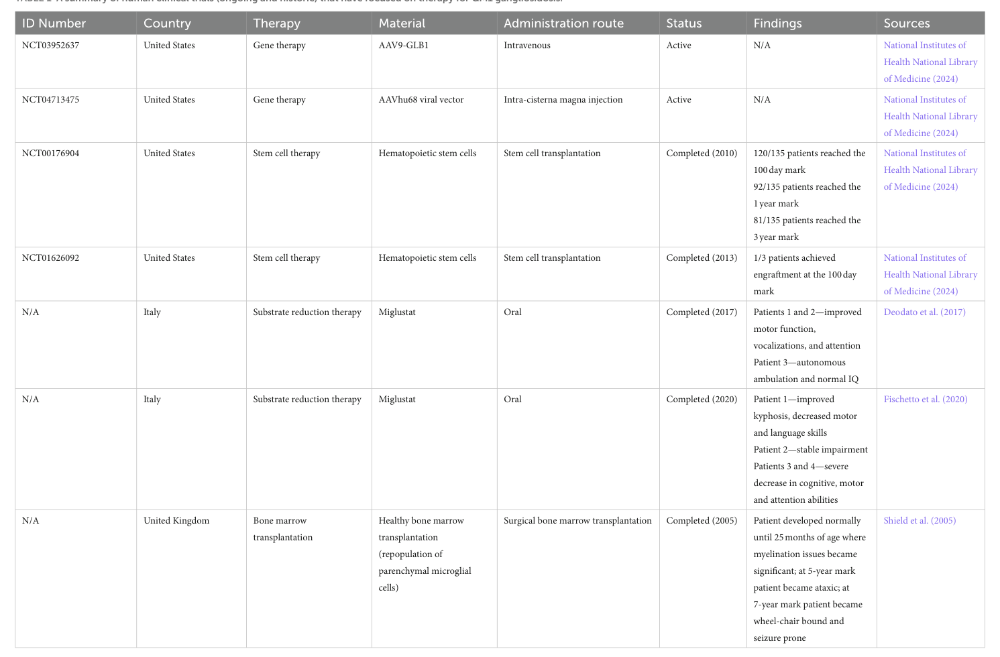

## Question

# Disease Characteristics Research Template

## Target Disease
- **Disease Name:** GM1 Gangliosidosis Type 3
- **MONDO ID:**  (if available)
- **Category:** Mendelian

## Research Objectives

Please provide a comprehensive research report on **GM1 Gangliosidosis Type 3** covering all of the
disease characteristics listed below. This report will be used to populate a disease knowledge
base entry. Be thorough and cite primary literature (PMID preferred) for all claims.

For each section, **suggested databases/resources** are listed. These are the first places
you should search for information on each topic.

---

### 1. Disease Information
> **Search first:** OMIM, Orphanet, ICD-10/ICD-11, MeSH, PubMed

- What is the disease? Provide a concise overview.
- What are the key identifiers? (OMIM, Orphanet, ICD-10/ICD-11, MeSH, Mondo)
- What are the common synonyms and alternative names?
- Is the information derived from individual patients (e.g., EHR) or aggregated disease-level resources?

### 2. Etiology

- **Disease Causal Factors**: What are the primary causes? (genetic, environmental, infectious, mechanistic)
- **Risk Factors**:
  > **Search first:** PubMed, Cochrane Library, UpToDate, clinical guidelines, ClinVar, ClinGen, GWAS Catalog, PheGenI, CTD, CDC, WHO, epidemiological databases
  - Genetic risk factors (causal variants, susceptibility loci, modifier genes)
  - Environmental risk factors (toxins, lifestyle, occupational exposures, age, sex, family history)
- **Protective Factors**:
  > **Search first:** PubMed, Cochrane Library, clinical trial databases, GWAS Catalog, gnomAD, WHO, CDC, nutrition databases
  - Genetic protective factors (protective variants, modifier alleles)
  - Environmental protective factors (diet, lifestyle, exposures that reduce risk)
- **Gene-Environment Interactions**: How do genetic and environmental factors interact to influence disease?
  > **Search first:** CTD, PubMed, PheGenI, GxE databases

### 3. Phenotypes
> **Search first:** HPO (Human Phenotype Ontology), OMIM, Orphanet, PubMed, clinicaltrials.gov, MedDRA, SNOMED CT, DECIPHER, LOINC

For each phenotype, provide:
- **Phenotype type**: symptoms, clinical signs, physical manifestations, behavioral changes, or laboratory abnormalities
  > For symptoms/signs: HPO, OMIM, Orphanet, PubMed
  > For behavioral changes: HPO, DSM, RDoC (Research Domain Criteria), PubMed
  > For laboratory abnormalities: LOINC, SNOMED CT, LabTests Online, PubMed
- **Phenotype characteristics**:
  > **Search first:** OMIM, Orphanet, HPO, PubMed
  - Age of symptom onset (neonatal, childhood, adult-onset, late-onset)
  - Symptom severity (mild, moderate, severe, variable)
  - Symptom progression (stable, progressive, episodic, fluctuating)
  - Frequency among affected individuals (percentage or qualitative)
- **Quality of life impact**: Effects on daily functioning and well-being (per-phenotype when possible)
  > **Search first:** EQ-5D database, SF-36, WHO QOL databases, PubMed
- Suggest HPO (Human Phenotype Ontology) terms for each phenotype

### 4. Genetic/Molecular Information

- **Causal Genes**: Gene mutations or chromosomal abnormalities responsible for disease (gene symbols, OMIM IDs)
  > **Search first:** OMIM, ClinVar, HGMD, Ensembl, NCBI Gene
- **Pathogenic Variants**:
  - Affected genes (gene symbols, HGNC IDs)
    > **Search first:** OMIM, NCBI Gene, Ensembl, HGNC, UniProt, GeneCards
  - Variant classification (pathogenic, likely pathogenic, VUS per ACMG/AMP guidelines)
    > **Search first:** ClinVar, ClinGen, ACMG/AMP guidelines, VarSome
  - Variant type/class (missense, frameshift, nonsense, splice-site, structural)
  - Allele frequency in population databases
    > **Search first:** gnomAD, 1000 Genomes, ExAC, TOPMed, dbSNP
  - Somatic vs germline origin
    > **Search first:** COSMIC (somatic), ClinVar, ICGC, TCGA
  - Functional consequences (loss of function, gain of function, dominant negative)
- **Modifier Genes**: Genes that modify disease severity or expression
- **Epigenetic Information**: DNA methylation, histone modifications, chromatin changes affecting disease
  > **Search first:** ENCODE, Roadmap Epigenomics, MethBase, DiseaseMeth
- **Chromosomal Abnormalities**: Large-scale genetic changes (aneuploidy, translocations, inversions)
  > **Search first:** DECIPHER, ClinVar, ECARUCA, UCSC Genome Browser

### 5. Environmental Information

- **Environmental Factors**: Non-genetic contributing factors (toxins, radiation, pollution, occupational exposure)
  > **Search first:** CTD (Comparative Toxicogenomics Database), TOXNET, PubMed, EPA databases
- **Lifestyle Factors**: Behavioral factors (smoking, diet, exercise, alcohol consumption)
  > **Search first:** CDC databases, WHO, PubMed, NHANES
- **Infectious Agents**: If applicable, pathogens causing or triggering disease (bacteria, viruses, fungi, parasites)
  > **Search first:** NCBI Taxonomy, ViPR, BV-BRC, MicrobeDB, GIDEON

### 6. Mechanism / Pathophysiology

- **Molecular Pathways**: Specific signaling cascades or biochemical pathways involved (Wnt, MAPK, mTOR, PI3K-AKT, etc.)
  > **Search first:** KEGG, Reactome, WikiPathways, PathBank, BioCyc
- **Cellular Processes**: Cell-level mechanisms (apoptosis, autophagy, cell cycle dysregulation, inflammation, etc.)
  > **Search first:** Gene Ontology (GO), Reactome, KEGG, PubMed
- **Protein Dysfunction**: How protein structure or function is altered (misfolding, aggregation, loss of function, gain of function)
  > **Search first:** UniProt, PDB (Protein Data Bank), InterPro, Pfam, AlphaFold
- **Metabolic Changes**: Alterations in metabolic processes (energy metabolism, lipid metabolism, amino acid metabolism)
  > **Search first:** KEGG, BioCyc, HMDB (Human Metabolome Database), BRENDA
- **Immune System Involvement**: Role of immune response (autoimmunity, immunodeficiency, chronic inflammation)
  > **Search first:** ImmPort, Immunome Database, IEDB, Gene Ontology
- **Tissue Damage Mechanisms**: How tissues/ are injured (oxidative stress, ischemia, fibrosis, necrosis)
  > **Search first:** PubMed, Gene Ontology, Reactome
- **Biochemical Abnormalities**: Specific molecular defects (enzyme deficiencies, receptor dysfunction, ion channel defects)
  > **Search first:** BRENDA, UniProt, KEGG, OMIM, PubMed
- **Epigenetic Changes**: DNA methylation, histone modifications affecting gene expression in disease
  > **Search first:** ENCODE, Roadmap Epigenomics, MethBase, DiseaseMeth
- **Molecular Profiling** (if available):
  - Transcriptomics/gene expression changes
    > **Search first:** GEO (Gene Expression Omnibus), ArrayExpress, GTEx, Human Cell Atlas, SRA
  - Proteomics findings
    > **Search first:** PRIDE, ProteomeXchange, Human Protein Atlas, STRING, BioGRID
  - Metabolomics signatures
    > **Search first:** MetaboLights, Metabolomics Workbench, HMDB, METLIN
  - Lipidomics alterations
    > **Search first:** LIPID MAPS, SwissLipids, LipidHome, Metabolomics Workbench
  - Genomic structural features
    > **Search first:** UCSC Genome Browser, Ensembl, NCBI, dbVar, DGV
- **Advanced Technologies** (if applicable):
  - Single-cell analysis findings (cell-type specific mechanisms, cellular heterogeneity)
    > **Search first:** Human Cell Atlas, Single Cell Portal, GEO, CELLxGENE
  - Spatial transcriptomics findings
    > **Search first:** GEO, Spatial Research, Vizgen, 10x Genomics data
  - Multi-omics integration results
    > **Search first:** TCGA, ICGC, cBioPortal, LinkedOmics, PubMed
  - Functional genomics screens (CRISPR, RNAi)
    > **Search first:** DepMap, GenomeRNAi, PubMed, BioGRID ORCS

For each mechanism, describe:
- The causal chain from initial trigger to clinical manifestation
- Which mechanisms are upstream vs downstream
- What cell types and biological processes are involved
- Suggest GO terms for biological processes and CL terms for cell types

### 7. Anatomical Structures Affected

- **Organ Level**:
  - Primary organs directly affected
  - Secondary organ involvement (complications, secondary effects)
  - Body systems involved (cardiovascular, nervous, digestive, respiratory, endocrine, etc.)
  > **Search first:** Uberon, FMA (Foundational Model of Anatomy), OMIM, HPO, ICD-11, MeSH, SNOMED CT
- **Tissue and Cell Level**:
  - Specific tissue types affected (epithelial, connective, muscle, nervous)
  - Specific cell populations targeted (with Cell Ontology terms)
  > **Search first:** Uberon, Human Protein Atlas, Cell Ontology, Human Cell Atlas, CellMarker, PanglaoDB
- **Subcellular Level**:
  - Cellular compartments involved (mitochondria, nucleus, ER, lysosomes) (with GO Cellular Component terms)
  > **Search first:** Gene Ontology (Cellular Component), UniProt, Human Protein Atlas
- **Localization**:
  - Specific anatomical sites (with UBERON terms)
    > **Search first:** FMA, Uberon, NeuroNames (for brain), SNOMED CT
  - Lateralization (unilateral, bilateral, asymmetric)
    > **Search first:** HPO, clinical literature, imaging databases

### 8. Temporal Development

- **Onset**:
  - Typical age of onset (congenital, pediatric, adult, geriatric)
  - Onset pattern (acute, subacute, chronic, insidious)
  > **Search first:** OMIM, Orphanet, HPO, PubMed
- **Progression**:
  - Disease stages (early, intermediate, advanced, end-stage)
    > **Search first:** Cancer Staging Manual (AJCC), WHO classifications, PubMed
  - Progression rate (rapid, slow, variable)
  - Disease course pattern (episodic, relapsing-remitting, progressive, stable)
  - Disease duration (self-limited, chronic lifelong)
  > **Search first:** Disease registries, longitudinal cohort databases, natural history studies, PubMed, Orphanet, OMIM
- **Patterns**:
  - Remission patterns (spontaneous, treatment-induced)
    > **Search first:** Clinical trial databases, disease registries, PubMed
  - Critical periods (time windows of vulnerability or opportunity for intervention)
    > **Search first:** PubMed, developmental biology databases, clinical guidelines

### 9. Inheritance and Population

- **Epidemiology**:
  - Prevalence (cases per 100,000 at given time)
  - Incidence (new cases per 100,000 per year)
  > **Search first:** Orphanet, CDC, WHO, GBD (Global Burden of Disease), national registries, SEER, disease registries
- **For Genetic Etiology**:
  - Inheritance pattern (AD, AR, X-linked, mitochondrial, multifactorial, polygenic)
    > **Search first:** OMIM, Orphanet, ClinVar, GTR (Genetic Testing Registry)
  - Penetrance (complete, incomplete, age-dependent)
    > **Search first:** ClinVar, OMIM, PubMed, ClinGen
  - Expressivity (variable, consistent)
    > **Search first:** OMIM, ClinVar, PubMed
  - Genetic anticipation (increasing severity in successive generations)
    > **Search first:** OMIM, PubMed (especially for repeat expansion disorders)
  - Germline mosaicism
    > **Search first:** ClinVar, OMIM, genetic counseling literature, PubMed
  - Founder effects (population-specific mutations)
    > **Search first:** gnomAD, population genetics databases, PubMed
  - Consanguinity role
    > **Search first:** OMIM, population studies, genetic counseling resources
  - Carrier frequency
    > **Search first:** gnomAD, carrier screening databases, GeneReviews, GTR
- **Population Demographics**:
  - Affected populations (ethnic or demographic groups with higher prevalence)
    > **Search first:** gnomAD, 1000 Genomes, PAGE Study, PubMed, population registries
  - Geographic distribution (endemic areas, regional variation)
    > **Search first:** WHO, CDC, GBD, Orphanet, geographic epidemiology databases
  - Geographic distribution of specific variants
  - Sex ratio (male:female)
    > **Search first:** Disease registries, OMIM, PubMed, epidemiological databases
  - Age distribution of affected individuals
    > **Search first:** CDC, disease registries, SEER, Orphanet

### 10. Diagnostics

- **Clinical Tests**:
  - Laboratory tests (blood, urine, tissue chemistry, specific enzyme assays)
    > **Search first:** LOINC, LabTests Online, PubMed
  - Biomarkers (proteins, metabolites, genetic markers, circulating biomarkers)
    > **Search first:** FDA Biomarker List, BEST (Biomarkers, EndpointS, and other Tools), PubMed
  - Imaging studies (X-ray, CT, MRI, PET, ultrasound)
    > **Search first:** RadLex, DICOM, Radiopaedia, imaging databases
  - Functional tests (pulmonary function, cardiac stress tests)
    > **Search first:** LOINC, clinical guidelines, PubMed
  - Electrophysiology (EEG, EMG, ECG, nerve conduction studies)
    > **Search first:** LOINC, clinical neurophysiology databases, PubMed
  - Biopsy findings (histopathology, immunohistochemistry)
    > **Search first:** SNOMED CT, College of American Pathologists resources, PubMed
  - Pathology findings (microscopic examination)
    > **Search first:** SNOMED CT, Digital Pathology databases, PubMed
- **Genetic Testing**:
  > **Search first:** GTR (Genetic Testing Registry), GeneReviews, ClinGen
  - Overview of recommended genetic testing approach
  - Whole genome sequencing (WGS) utility
    > **Search first:** GTR, ClinVar, GEL (Genomics England), gnomAD
  - Whole exome sequencing (WES) utility
    > **Search first:** GTR, ClinVar, OMIM, GeneMatcher
  - Gene panels (which panels, which genes)
    > **Search first:** GTR, ClinVar, laboratory-specific databases
  - Single gene testing
    > **Search first:** GTR, ClinVar, OMIM, GeneReviews
  - Chromosomal microarray (CMA)
    > **Search first:** DECIPHER, ClinVar, dbVar, ECARUCA
  - Karyotyping
    > **Search first:** Chromosome Abnormality Database, ClinVar, cytogenetics resources
  - FISH
    > **Search first:** ClinVar, cytogenetics databases, PubMed
  - Mitochondrial DNA testing
    > **Search first:** MITOMAP, MSeqDR, ClinVar, GTR
  - Repeat expansion testing
    > **Search first:** GTR, ClinVar, repeat expansion databases, PubMed
- **Omics-Based Diagnostics** (if applicable):
  - RNA sequencing / transcriptomics
    > **Search first:** GEO, ArrayExpress, GTEx, RNA-seq databases
  - Proteomics
    > **Search first:** PRIDE, ProteomeXchange, FDA Biomarker database
  - Metabolomics
    > **Search first:** MetaboLights, Metabolomics Workbench, HMDB
  - Epigenomics
    > **Search first:** GEO, ENCODE, Roadmap Epigenomics, MethBase
  - Liquid biopsy
    > **Search first:** COSMIC, ClinVar, liquid biopsy databases, PubMed
- **Clinical Criteria**:
  - Standardized diagnostic criteria (DSM, ICD, society guidelines)
    > **Search first:** DSM-5, ICD-11, clinical society guidelines, UpToDate
  - Differential diagnosis (other conditions to rule out, with distinguishing features)
    > **Search first:** DynaMed, UpToDate, clinical decision support systems
- **Screening**:
  - Screening methods for asymptomatic individuals (newborn screening, carrier screening, cascade screening)
    > **Search first:** ACMG recommendations, CDC newborn screening, GTR

### 11. Outcome/Prognosis

- **Survival and Mortality**:
  - Survival rate (5-year, 10-year, overall)
    > **Search first:** SEER, cancer registries, disease-specific registries, PubMed
  - Life expectancy (with and without treatment if applicable)
    > **Search first:** Orphanet, disease registries, actuarial databases, PubMed
  - Mortality rate
    > **Search first:** CDC, WHO, GBD, national mortality databases
  - Disease-specific mortality (deaths directly attributable to disease)
    > **Search first:** Disease registries, CDC Wonder, GBD, PubMed
- **Morbidity and Function**:
  - Morbidity (disease-related disability and health impacts)
    > **Search first:** GBD, WHO, disability databases, PubMed
  - Disability outcomes (long-term functional impairments)
    > **Search first:** ICF (International Classification of Functioning), disability registries
  - Quality of life measures (EQ-5D, SF-36, PROMIS, disease-specific tools)
    > **Search first:** EQ-5D database, SF-36, PROMIS, PubMed
- **Disease Course**:
  - Complications (secondary problems: infections, organ failure, etc.)
    > **Search first:** ICD codes, disease registries, clinical databases, PubMed
  - Recovery potential (likelihood and extent of recovery, with vs without treatment)
    > **Search first:** Natural history studies, rehabilitation databases, PubMed
- **Prediction**:
  - Prognostic factors (age, disease severity, biomarkers, treatment response)
    > **Search first:** Prognostic models databases, clinical calculators, PubMed
  - Prognostic biomarkers (molecular markers predicting disease course)
    > **Search first:** FDA Biomarker database, PubMed, cancer prognostic databases

### 12. Treatment

- **Pharmacotherapy**:
  - Pharmacological treatments (drug names, drug classes, mechanisms of action)
    > **Search first:** DrugBank, RxNorm, ATC classification, DailyMed, FDA databases
  - Pharmacogenomics (how genetic variants affect drug metabolism, efficacy, toxicity)
    > **Search first:** PharmGKB, CPIC (Clinical Pharmacogenetics), FDA Table of PGx Biomarkers
- **Advanced Therapeutics**:
  - Gene therapy (viral vectors, CRISPR, gene replacement, gene editing)
    > **Search first:** ClinicalTrials.gov, FDA gene therapy database, ASGCT resources
  - Cell therapy (stem cell transplant, CAR-T, cellular therapeutics)
    > **Search first:** ClinicalTrials.gov, FDA cell therapy database, FACT standards
  - RNA-based therapies (ASOs, siRNA, mRNA therapies)
    > **Search first:** ClinicalTrials.gov, FDA approvals, PubMed
  - Targeted therapies (treatments directed at specific molecular targets)
    > **Search first:** My Cancer Genome, OncoKB, ClinicalTrials.gov, FDA approvals
  - Immunotherapies (checkpoint inhibitors, monoclonal antibodies)
    > **Search first:** Cancer Immunotherapy Database, FDA approvals, ClinicalTrials.gov
- **Surgical and Interventional**:
  - Surgical interventions (types of surgery, timing, outcomes)
    > **Search first:** CPT codes, surgical registries, clinical guidelines, PubMed
- **Supportive and Rehabilitative**:
  - Supportive care (symptom management, pain control, nutrition)
    > **Search first:** Clinical guidelines, Cochrane Library, PubMed
  - Rehabilitation (physical therapy, occupational therapy, speech therapy)
    > **Search first:** Rehabilitation medicine databases, clinical guidelines, PubMed
- **Experimental**:
  - Experimental treatments in clinical trials (with NCT identifiers if available)
    > **Search first:** ClinicalTrials.gov, EU Clinical Trials Register, WHO ICTRP
- **Treatment Outcomes**:
  - Treatment response rates
    > **Search first:** Clinical trial databases, FDA reviews, systematic reviews, PubMed
  - Side effects and adverse events
    > **Search first:** FDA Adverse Event Reporting System (FAERS), MedWatch, PubMed
- **Treatment Strategy**:
  - Treatment algorithms (clinical pathways, decision trees)
    > **Search first:** Clinical practice guidelines, NCCN Guidelines, UpToDate
  - Combination therapies
    > **Search first:** ClinicalTrials.gov, treatment guidelines, PubMed
  - Personalized medicine approaches (genotype-guided treatment)
    > **Search first:** My Cancer Genome, CIViC, PharmGKB, precision medicine databases

For each treatment, suggest MAXO (Medical Action Ontology) terms where applicable.

### 13. Prevention

- **Prevention Levels**:
  - Primary prevention (preventing disease occurrence: vaccination, risk factor modification)
    > **Search first:** CDC, WHO, USPSTF recommendations, Cochrane Library
  - Secondary prevention (early detection and treatment: screening programs, early intervention)
    > **Search first:** USPSTF, CDC screening guidelines, WHO
  - Tertiary prevention (preventing complications in those with disease)
    > **Search first:** Clinical guidelines, disease management protocols, PubMed
- **Immunization**: Vaccine strategies (if applicable)
  > **Search first:** CDC vaccine schedules, WHO immunization, FDA vaccine database
- **Screening and Early Detection**:
  - Screening programs (population-based: newborn screening, cancer screening)
    > **Search first:** CDC screening programs, USPSTF, cancer screening databases
  - Genetic screening (carrier screening, preimplantation genetic diagnosis, prenatal testing)
    > **Search first:** ACMG recommendations, ACOG guidelines, GTR
  - Risk stratification (identifying high-risk individuals for targeted prevention)
    > **Search first:** Risk prediction models, clinical calculators, PubMed
- **Behavioral Interventions**: Lifestyle modifications to reduce risk
  > **Search first:** CDC, WHO, behavioral intervention databases, Cochrane Library
- **Counseling**: Genetic counseling (risk assessment, family planning guidance)
  > **Search first:** NSGC resources, ACMG guidelines, GeneReviews
- **Public Health**:
  - Public health interventions (sanitation, vector control, health education)
    > **Search first:** CDC, WHO, public health databases, PubMed
  - Environmental interventions (reducing environmental risk factors)
    > **Search first:** EPA databases, WHO environmental health, PubMed
- **Prophylaxis**: Preventive medications or procedures
  > **Search first:** Clinical guidelines, FDA approvals, PubMed

### 14. Other Species / Natural Disease

- **Taxonomy**: Species affected (with NCBI Taxon identifiers)
  > **Search first:** NCBI Taxonomy
- **Breed**: Specific breeds affected (with VBO identifiers if applicable)
  > **Search first:** VBO (Vertebrate Breed Ontology)
- **Gene**: Orthologous genes in other species (with NCBI Gene IDs)
  > **Search first:** NCBI Gene
- **Natural Disease**:
  - Naturally occurring disease in other species (companion animals, wildlife)
    > **Search first:** OMIA (Online Mendelian Inheritance in Animals), VetCompass, PubMed
  - Veterinary relevance and importance in animal health
    > **Search first:** OMIA, veterinary databases, PubMed
- **Comparative Biology**:
  - Comparative pathology (similarities and differences across species)
    > **Search first:** OMIA, comparative pathology databases, PubMed
  - Evolutionary conservation of disease mechanisms
    > **Search first:** HomoloGene, OrthoMCL, Alliance of Genome Resources
- **Transmission** (if applicable):
  - Zoonotic potential
    > **Search first:** CDC zoonotic diseases, WHO zoonoses, GIDEON
  - Cross-species susceptibility
    > **Search first:** NCBI Taxonomy, veterinary databases, PubMed

### 15. Model Organisms

- **Model Types**:
  - Model organism type (mammalian, invertebrate, cellular, in vitro)
    > **Search first:** Alliance of Genome Resources, model organism databases
  - Specific model systems (mouse, rat, zebrafish, Drosophila, C. elegans, yeast, cell lines, organoids, iPSCs)
    > **Search first:** MGI, RGD, ZFIN, FlyBase, WormBase, SGD, ATCC, Cellosaurus
  - Induced models (drug treatment, surgical intervention, environmental manipulation)
    > **Search first:** MGI, model organism databases, PubMed
- **Genetic Models**:
  - Types available (knockout, knock-in, transgenic, conditional, humanized)
    > **Search first:** MGI, IMPC, KOMP, EuMMCR, IMSR
- **Model Characteristics**:
  - Phenotype recapitulation (how well model reproduces human disease features)
    > **Search first:** Model organism databases, comparative studies, PubMed
  - Model limitations (aspects of human disease not captured)
    > **Search first:** Model organism databases, PubMed, review articles
- **Applications**:
  - Research applications (what aspects of disease can be studied)
    > **Search first:** Model organism databases, PubMed
- **Resources**:
  - Model databases
    > **Search first:** MGI, RGD, ZFIN, FlyBase, WormBase, IMSR, EMMA, MMRRC

---

## Citation Requirements

- Cite primary literature (PMID preferred) for all mechanistic and clinical claims
- Prioritize recent reviews and landmark papers
- Include direct quotes from abstracts where possible to support key statements
- Distinguish evidence source types: human clinical, model organism, in vitro, computational

## Output Format

Structure your response as a comprehensive narrative organized by the sections above.
For each section, provide:
- Factual content with specific details (numbers, percentages, gene names, variant nomenclature)
- Ontology term suggestions (HPO, GO, CL, UBERON, CHEBI, MAXO, MONDO) where applicable
- Evidence citations with PMIDs
- Direct quotes from abstracts to support key claims
- Clear indication when information is not available or not applicable for this disease

This report will be used to populate a disease knowledge base entry with:
- Pathophysiology descriptions with causal chains
- Gene/protein annotations (HGNC, GO terms)
- Phenotype associations (HP terms) with frequencies
- Cell type involvement (CL terms)
- Anatomical locations (UBERON terms)
- Chemical entities (CHEBI terms)
- Treatment annotations (MAXO terms)
- Evidence items with PMIDs and exact abstract quotes
- Epidemiology, prognosis, diagnostic, and prevention information
- Animal model descriptions with phenotype recapitulation details

## Output

Question: You are an expert researcher providing comprehensive, well-cited information.

Provide detailed information focusing on:
1. Key concepts and definitions with current understanding
2. Recent developments and latest research (prioritize 2023-2024 sources)
3. Current applications and real-world implementations
4. Expert opinions and analysis from authoritative sources
5. Relevant statistics and data from recent studies

Format as a comprehensive research report with proper citations. Include URLs and publication dates where available.
Always prioritize recent, authoritative sources and provide specific citations for all major claims.

# Disease Characteristics Research Template

## Target Disease
- **Disease Name:** GM1 Gangliosidosis Type 3
- **MONDO ID:**  (if available)
- **Category:** Mendelian

## Research Objectives

Please provide a comprehensive research report on **GM1 Gangliosidosis Type 3** covering all of the
disease characteristics listed below. This report will be used to populate a disease knowledge
base entry. Be thorough and cite primary literature (PMID preferred) for all claims.

For each section, **suggested databases/resources** are listed. These are the first places
you should search for information on each topic.

---

### 1. Disease Information
> **Search first:** OMIM, Orphanet, ICD-10/ICD-11, MeSH, PubMed

- What is the disease? Provide a concise overview.
- What are the key identifiers? (OMIM, Orphanet, ICD-10/ICD-11, MeSH, Mondo)
- What are the common synonyms and alternative names?
- Is the information derived from individual patients (e.g., EHR) or aggregated disease-level resources?

### 2. Etiology

- **Disease Causal Factors**: What are the primary causes? (genetic, environmental, infectious, mechanistic)
- **Risk Factors**:
  > **Search first:** PubMed, Cochrane Library, UpToDate, clinical guidelines, ClinVar, ClinGen, GWAS Catalog, PheGenI, CTD, CDC, WHO, epidemiological databases
  - Genetic risk factors (causal variants, susceptibility loci, modifier genes)
  - Environmental risk factors (toxins, lifestyle, occupational exposures, age, sex, family history)
- **Protective Factors**:
  > **Search first:** PubMed, Cochrane Library, clinical trial databases, GWAS Catalog, gnomAD, WHO, CDC, nutrition databases
  - Genetic protective factors (protective variants, modifier alleles)
  - Environmental protective factors (diet, lifestyle, exposures that reduce risk)
- **Gene-Environment Interactions**: How do genetic and environmental factors interact to influence disease?
  > **Search first:** CTD, PubMed, PheGenI, GxE databases

### 3. Phenotypes
> **Search first:** HPO (Human Phenotype Ontology), OMIM, Orphanet, PubMed, clinicaltrials.gov, MedDRA, SNOMED CT, DECIPHER, LOINC

For each phenotype, provide:
- **Phenotype type**: symptoms, clinical signs, physical manifestations, behavioral changes, or laboratory abnormalities
  > For symptoms/signs: HPO, OMIM, Orphanet, PubMed
  > For behavioral changes: HPO, DSM, RDoC (Research Domain Criteria), PubMed
  > For laboratory abnormalities: LOINC, SNOMED CT, LabTests Online, PubMed
- **Phenotype characteristics**:
  > **Search first:** OMIM, Orphanet, HPO, PubMed
  - Age of symptom onset (neonatal, childhood, adult-onset, late-onset)
  - Symptom severity (mild, moderate, severe, variable)
  - Symptom progression (stable, progressive, episodic, fluctuating)
  - Frequency among affected individuals (percentage or qualitative)
- **Quality of life impact**: Effects on daily functioning and well-being (per-phenotype when possible)
  > **Search first:** EQ-5D database, SF-36, WHO QOL databases, PubMed
- Suggest HPO (Human Phenotype Ontology) terms for each phenotype

### 4. Genetic/Molecular Information

- **Causal Genes**: Gene mutations or chromosomal abnormalities responsible for disease (gene symbols, OMIM IDs)
  > **Search first:** OMIM, ClinVar, HGMD, Ensembl, NCBI Gene
- **Pathogenic Variants**:
  - Affected genes (gene symbols, HGNC IDs)
    > **Search first:** OMIM, NCBI Gene, Ensembl, HGNC, UniProt, GeneCards
  - Variant classification (pathogenic, likely pathogenic, VUS per ACMG/AMP guidelines)
    > **Search first:** ClinVar, ClinGen, ACMG/AMP guidelines, VarSome
  - Variant type/class (missense, frameshift, nonsense, splice-site, structural)
  - Allele frequency in population databases
    > **Search first:** gnomAD, 1000 Genomes, ExAC, TOPMed, dbSNP
  - Somatic vs germline origin
    > **Search first:** COSMIC (somatic), ClinVar, ICGC, TCGA
  - Functional consequences (loss of function, gain of function, dominant negative)
- **Modifier Genes**: Genes that modify disease severity or expression
- **Epigenetic Information**: DNA methylation, histone modifications, chromatin changes affecting disease
  > **Search first:** ENCODE, Roadmap Epigenomics, MethBase, DiseaseMeth
- **Chromosomal Abnormalities**: Large-scale genetic changes (aneuploidy, translocations, inversions)
  > **Search first:** DECIPHER, ClinVar, ECARUCA, UCSC Genome Browser

### 5. Environmental Information

- **Environmental Factors**: Non-genetic contributing factors (toxins, radiation, pollution, occupational exposure)
  > **Search first:** CTD (Comparative Toxicogenomics Database), TOXNET, PubMed, EPA databases
- **Lifestyle Factors**: Behavioral factors (smoking, diet, exercise, alcohol consumption)
  > **Search first:** CDC databases, WHO, PubMed, NHANES
- **Infectious Agents**: If applicable, pathogens causing or triggering disease (bacteria, viruses, fungi, parasites)
  > **Search first:** NCBI Taxonomy, ViPR, BV-BRC, MicrobeDB, GIDEON

### 6. Mechanism / Pathophysiology

- **Molecular Pathways**: Specific signaling cascades or biochemical pathways involved (Wnt, MAPK, mTOR, PI3K-AKT, etc.)
  > **Search first:** KEGG, Reactome, WikiPathways, PathBank, BioCyc
- **Cellular Processes**: Cell-level mechanisms (apoptosis, autophagy, cell cycle dysregulation, inflammation, etc.)
  > **Search first:** Gene Ontology (GO), Reactome, KEGG, PubMed
- **Protein Dysfunction**: How protein structure or function is altered (misfolding, aggregation, loss of function, gain of function)
  > **Search first:** UniProt, PDB (Protein Data Bank), InterPro, Pfam, AlphaFold
- **Metabolic Changes**: Alterations in metabolic processes (energy metabolism, lipid metabolism, amino acid metabolism)
  > **Search first:** KEGG, BioCyc, HMDB (Human Metabolome Database), BRENDA
- **Immune System Involvement**: Role of immune response (autoimmunity, immunodeficiency, chronic inflammation)
  > **Search first:** ImmPort, Immunome Database, IEDB, Gene Ontology
- **Tissue Damage Mechanisms**: How tissues/ are injured (oxidative stress, ischemia, fibrosis, necrosis)
  > **Search first:** PubMed, Gene Ontology, Reactome
- **Biochemical Abnormalities**: Specific molecular defects (enzyme deficiencies, receptor dysfunction, ion channel defects)
  > **Search first:** BRENDA, UniProt, KEGG, OMIM, PubMed
- **Epigenetic Changes**: DNA methylation, histone modifications affecting gene expression in disease
  > **Search first:** ENCODE, Roadmap Epigenomics, MethBase, DiseaseMeth
- **Molecular Profiling** (if available):
  - Transcriptomics/gene expression changes
    > **Search first:** GEO (Gene Expression Omnibus), ArrayExpress, GTEx, Human Cell Atlas, SRA
  - Proteomics findings
    > **Search first:** PRIDE, ProteomeXchange, Human Protein Atlas, STRING, BioGRID
  - Metabolomics signatures
    > **Search first:** MetaboLights, Metabolomics Workbench, HMDB, METLIN
  - Lipidomics alterations
    > **Search first:** LIPID MAPS, SwissLipids, LipidHome, Metabolomics Workbench
  - Genomic structural features
    > **Search first:** UCSC Genome Browser, Ensembl, NCBI, dbVar, DGV
- **Advanced Technologies** (if applicable):
  - Single-cell analysis findings (cell-type specific mechanisms, cellular heterogeneity)
    > **Search first:** Human Cell Atlas, Single Cell Portal, GEO, CELLxGENE
  - Spatial transcriptomics findings
    > **Search first:** GEO, Spatial Research, Vizgen, 10x Genomics data
  - Multi-omics integration results
    > **Search first:** TCGA, ICGC, cBioPortal, LinkedOmics, PubMed
  - Functional genomics screens (CRISPR, RNAi)
    > **Search first:** DepMap, GenomeRNAi, PubMed, BioGRID ORCS

For each mechanism, describe:
- The causal chain from initial trigger to clinical manifestation
- Which mechanisms are upstream vs downstream
- What cell types and biological processes are involved
- Suggest GO terms for biological processes and CL terms for cell types

### 7. Anatomical Structures Affected

- **Organ Level**:
  - Primary organs directly affected
  - Secondary organ involvement (complications, secondary effects)
  - Body systems involved (cardiovascular, nervous, digestive, respiratory, endocrine, etc.)
  > **Search first:** Uberon, FMA (Foundational Model of Anatomy), OMIM, HPO, ICD-11, MeSH, SNOMED CT
- **Tissue and Cell Level**:
  - Specific tissue types affected (epithelial, connective, muscle, nervous)
  - Specific cell populations targeted (with Cell Ontology terms)
  > **Search first:** Uberon, Human Protein Atlas, Cell Ontology, Human Cell Atlas, CellMarker, PanglaoDB
- **Subcellular Level**:
  - Cellular compartments involved (mitochondria, nucleus, ER, lysosomes) (with GO Cellular Component terms)
  > **Search first:** Gene Ontology (Cellular Component), UniProt, Human Protein Atlas
- **Localization**:
  - Specific anatomical sites (with UBERON terms)
    > **Search first:** FMA, Uberon, NeuroNames (for brain), SNOMED CT
  - Lateralization (unilateral, bilateral, asymmetric)
    > **Search first:** HPO, clinical literature, imaging databases

### 8. Temporal Development

- **Onset**:
  - Typical age of onset (congenital, pediatric, adult, geriatric)
  - Onset pattern (acute, subacute, chronic, insidious)
  > **Search first:** OMIM, Orphanet, HPO, PubMed
- **Progression**:
  - Disease stages (early, intermediate, advanced, end-stage)
    > **Search first:** Cancer Staging Manual (AJCC), WHO classifications, PubMed
  - Progression rate (rapid, slow, variable)
  - Disease course pattern (episodic, relapsing-remitting, progressive, stable)
  - Disease duration (self-limited, chronic lifelong)
  > **Search first:** Disease registries, longitudinal cohort databases, natural history studies, PubMed, Orphanet, OMIM
- **Patterns**:
  - Remission patterns (spontaneous, treatment-induced)
    > **Search first:** Clinical trial databases, disease registries, PubMed
  - Critical periods (time windows of vulnerability or opportunity for intervention)
    > **Search first:** PubMed, developmental biology databases, clinical guidelines

### 9. Inheritance and Population

- **Epidemiology**:
  - Prevalence (cases per 100,000 at given time)
  - Incidence (new cases per 100,000 per year)
  > **Search first:** Orphanet, CDC, WHO, GBD (Global Burden of Disease), national registries, SEER, disease registries
- **For Genetic Etiology**:
  - Inheritance pattern (AD, AR, X-linked, mitochondrial, multifactorial, polygenic)
    > **Search first:** OMIM, Orphanet, ClinVar, GTR (Genetic Testing Registry)
  - Penetrance (complete, incomplete, age-dependent)
    > **Search first:** ClinVar, OMIM, PubMed, ClinGen
  - Expressivity (variable, consistent)
    > **Search first:** OMIM, ClinVar, PubMed
  - Genetic anticipation (increasing severity in successive generations)
    > **Search first:** OMIM, PubMed (especially for repeat expansion disorders)
  - Germline mosaicism
    > **Search first:** ClinVar, OMIM, genetic counseling literature, PubMed
  - Founder effects (population-specific mutations)
    > **Search first:** gnomAD, population genetics databases, PubMed
  - Consanguinity role
    > **Search first:** OMIM, population studies, genetic counseling resources
  - Carrier frequency
    > **Search first:** gnomAD, carrier screening databases, GeneReviews, GTR
- **Population Demographics**:
  - Affected populations (ethnic or demographic groups with higher prevalence)
    > **Search first:** gnomAD, 1000 Genomes, PAGE Study, PubMed, population registries
  - Geographic distribution (endemic areas, regional variation)
    > **Search first:** WHO, CDC, GBD, Orphanet, geographic epidemiology databases
  - Geographic distribution of specific variants
  - Sex ratio (male:female)
    > **Search first:** Disease registries, OMIM, PubMed, epidemiological databases
  - Age distribution of affected individuals
    > **Search first:** CDC, disease registries, SEER, Orphanet

### 10. Diagnostics

- **Clinical Tests**:
  - Laboratory tests (blood, urine, tissue chemistry, specific enzyme assays)
    > **Search first:** LOINC, LabTests Online, PubMed
  - Biomarkers (proteins, metabolites, genetic markers, circulating biomarkers)
    > **Search first:** FDA Biomarker List, BEST (Biomarkers, EndpointS, and other Tools), PubMed
  - Imaging studies (X-ray, CT, MRI, PET, ultrasound)
    > **Search first:** RadLex, DICOM, Radiopaedia, imaging databases
  - Functional tests (pulmonary function, cardiac stress tests)
    > **Search first:** LOINC, clinical guidelines, PubMed
  - Electrophysiology (EEG, EMG, ECG, nerve conduction studies)
    > **Search first:** LOINC, clinical neurophysiology databases, PubMed
  - Biopsy findings (histopathology, immunohistochemistry)
    > **Search first:** SNOMED CT, College of American Pathologists resources, PubMed
  - Pathology findings (microscopic examination)
    > **Search first:** SNOMED CT, Digital Pathology databases, PubMed
- **Genetic Testing**:
  > **Search first:** GTR (Genetic Testing Registry), GeneReviews, ClinGen
  - Overview of recommended genetic testing approach
  - Whole genome sequencing (WGS) utility
    > **Search first:** GTR, ClinVar, GEL (Genomics England), gnomAD
  - Whole exome sequencing (WES) utility
    > **Search first:** GTR, ClinVar, OMIM, GeneMatcher
  - Gene panels (which panels, which genes)
    > **Search first:** GTR, ClinVar, laboratory-specific databases
  - Single gene testing
    > **Search first:** GTR, ClinVar, OMIM, GeneReviews
  - Chromosomal microarray (CMA)
    > **Search first:** DECIPHER, ClinVar, dbVar, ECARUCA
  - Karyotyping
    > **Search first:** Chromosome Abnormality Database, ClinVar, cytogenetics resources
  - FISH
    > **Search first:** ClinVar, cytogenetics databases, PubMed
  - Mitochondrial DNA testing
    > **Search first:** MITOMAP, MSeqDR, ClinVar, GTR
  - Repeat expansion testing
    > **Search first:** GTR, ClinVar, repeat expansion databases, PubMed
- **Omics-Based Diagnostics** (if applicable):
  - RNA sequencing / transcriptomics
    > **Search first:** GEO, ArrayExpress, GTEx, RNA-seq databases
  - Proteomics
    > **Search first:** PRIDE, ProteomeXchange, FDA Biomarker database
  - Metabolomics
    > **Search first:** MetaboLights, Metabolomics Workbench, HMDB
  - Epigenomics
    > **Search first:** GEO, ENCODE, Roadmap Epigenomics, MethBase
  - Liquid biopsy
    > **Search first:** COSMIC, ClinVar, liquid biopsy databases, PubMed
- **Clinical Criteria**:
  - Standardized diagnostic criteria (DSM, ICD, society guidelines)
    > **Search first:** DSM-5, ICD-11, clinical society guidelines, UpToDate
  - Differential diagnosis (other conditions to rule out, with distinguishing features)
    > **Search first:** DynaMed, UpToDate, clinical decision support systems
- **Screening**:
  - Screening methods for asymptomatic individuals (newborn screening, carrier screening, cascade screening)
    > **Search first:** ACMG recommendations, CDC newborn screening, GTR

### 11. Outcome/Prognosis

- **Survival and Mortality**:
  - Survival rate (5-year, 10-year, overall)
    > **Search first:** SEER, cancer registries, disease-specific registries, PubMed
  - Life expectancy (with and without treatment if applicable)
    > **Search first:** Orphanet, disease registries, actuarial databases, PubMed
  - Mortality rate
    > **Search first:** CDC, WHO, GBD, national mortality databases
  - Disease-specific mortality (deaths directly attributable to disease)
    > **Search first:** Disease registries, CDC Wonder, GBD, PubMed
- **Morbidity and Function**:
  - Morbidity (disease-related disability and health impacts)
    > **Search first:** GBD, WHO, disability databases, PubMed
  - Disability outcomes (long-term functional impairments)
    > **Search first:** ICF (International Classification of Functioning), disability registries
  - Quality of life measures (EQ-5D, SF-36, PROMIS, disease-specific tools)
    > **Search first:** EQ-5D database, SF-36, PROMIS, PubMed
- **Disease Course**:
  - Complications (secondary problems: infections, organ failure, etc.)
    > **Search first:** ICD codes, disease registries, clinical databases, PubMed
  - Recovery potential (likelihood and extent of recovery, with vs without treatment)
    > **Search first:** Natural history studies, rehabilitation databases, PubMed
- **Prediction**:
  - Prognostic factors (age, disease severity, biomarkers, treatment response)
    > **Search first:** Prognostic models databases, clinical calculators, PubMed
  - Prognostic biomarkers (molecular markers predicting disease course)
    > **Search first:** FDA Biomarker database, PubMed, cancer prognostic databases

### 12. Treatment

- **Pharmacotherapy**:
  - Pharmacological treatments (drug names, drug classes, mechanisms of action)
    > **Search first:** DrugBank, RxNorm, ATC classification, DailyMed, FDA databases
  - Pharmacogenomics (how genetic variants affect drug metabolism, efficacy, toxicity)
    > **Search first:** PharmGKB, CPIC (Clinical Pharmacogenetics), FDA Table of PGx Biomarkers
- **Advanced Therapeutics**:
  - Gene therapy (viral vectors, CRISPR, gene replacement, gene editing)
    > **Search first:** ClinicalTrials.gov, FDA gene therapy database, ASGCT resources
  - Cell therapy (stem cell transplant, CAR-T, cellular therapeutics)
    > **Search first:** ClinicalTrials.gov, FDA cell therapy database, FACT standards
  - RNA-based therapies (ASOs, siRNA, mRNA therapies)
    > **Search first:** ClinicalTrials.gov, FDA approvals, PubMed
  - Targeted therapies (treatments directed at specific molecular targets)
    > **Search first:** My Cancer Genome, OncoKB, ClinicalTrials.gov, FDA approvals
  - Immunotherapies (checkpoint inhibitors, monoclonal antibodies)
    > **Search first:** Cancer Immunotherapy Database, FDA approvals, ClinicalTrials.gov
- **Surgical and Interventional**:
  - Surgical interventions (types of surgery, timing, outcomes)
    > **Search first:** CPT codes, surgical registries, clinical guidelines, PubMed
- **Supportive and Rehabilitative**:
  - Supportive care (symptom management, pain control, nutrition)
    > **Search first:** Clinical guidelines, Cochrane Library, PubMed
  - Rehabilitation (physical therapy, occupational therapy, speech therapy)
    > **Search first:** Rehabilitation medicine databases, clinical guidelines, PubMed
- **Experimental**:
  - Experimental treatments in clinical trials (with NCT identifiers if available)
    > **Search first:** ClinicalTrials.gov, EU Clinical Trials Register, WHO ICTRP
- **Treatment Outcomes**:
  - Treatment response rates
    > **Search first:** Clinical trial databases, FDA reviews, systematic reviews, PubMed
  - Side effects and adverse events
    > **Search first:** FDA Adverse Event Reporting System (FAERS), MedWatch, PubMed
- **Treatment Strategy**:
  - Treatment algorithms (clinical pathways, decision trees)
    > **Search first:** Clinical practice guidelines, NCCN Guidelines, UpToDate
  - Combination therapies
    > **Search first:** ClinicalTrials.gov, treatment guidelines, PubMed
  - Personalized medicine approaches (genotype-guided treatment)
    > **Search first:** My Cancer Genome, CIViC, PharmGKB, precision medicine databases

For each treatment, suggest MAXO (Medical Action Ontology) terms where applicable.

### 13. Prevention

- **Prevention Levels**:
  - Primary prevention (preventing disease occurrence: vaccination, risk factor modification)
    > **Search first:** CDC, WHO, USPSTF recommendations, Cochrane Library
  - Secondary prevention (early detection and treatment: screening programs, early intervention)
    > **Search first:** USPSTF, CDC screening guidelines, WHO
  - Tertiary prevention (preventing complications in those with disease)
    > **Search first:** Clinical guidelines, disease management protocols, PubMed
- **Immunization**: Vaccine strategies (if applicable)
  > **Search first:** CDC vaccine schedules, WHO immunization, FDA vaccine database
- **Screening and Early Detection**:
  - Screening programs (population-based: newborn screening, cancer screening)
    > **Search first:** CDC screening programs, USPSTF, cancer screening databases
  - Genetic screening (carrier screening, preimplantation genetic diagnosis, prenatal testing)
    > **Search first:** ACMG recommendations, ACOG guidelines, GTR
  - Risk stratification (identifying high-risk individuals for targeted prevention)
    > **Search first:** Risk prediction models, clinical calculators, PubMed
- **Behavioral Interventions**: Lifestyle modifications to reduce risk
  > **Search first:** CDC, WHO, behavioral intervention databases, Cochrane Library
- **Counseling**: Genetic counseling (risk assessment, family planning guidance)
  > **Search first:** NSGC resources, ACMG guidelines, GeneReviews
- **Public Health**:
  - Public health interventions (sanitation, vector control, health education)
    > **Search first:** CDC, WHO, public health databases, PubMed
  - Environmental interventions (reducing environmental risk factors)
    > **Search first:** EPA databases, WHO environmental health, PubMed
- **Prophylaxis**: Preventive medications or procedures
  > **Search first:** Clinical guidelines, FDA approvals, PubMed

### 14. Other Species / Natural Disease

- **Taxonomy**: Species affected (with NCBI Taxon identifiers)
  > **Search first:** NCBI Taxonomy
- **Breed**: Specific breeds affected (with VBO identifiers if applicable)
  > **Search first:** VBO (Vertebrate Breed Ontology)
- **Gene**: Orthologous genes in other species (with NCBI Gene IDs)
  > **Search first:** NCBI Gene
- **Natural Disease**:
  - Naturally occurring disease in other species (companion animals, wildlife)
    > **Search first:** OMIA (Online Mendelian Inheritance in Animals), VetCompass, PubMed
  - Veterinary relevance and importance in animal health
    > **Search first:** OMIA, veterinary databases, PubMed
- **Comparative Biology**:
  - Comparative pathology (similarities and differences across species)
    > **Search first:** OMIA, comparative pathology databases, PubMed
  - Evolutionary conservation of disease mechanisms
    > **Search first:** HomoloGene, OrthoMCL, Alliance of Genome Resources
- **Transmission** (if applicable):
  - Zoonotic potential
    > **Search first:** CDC zoonotic diseases, WHO zoonoses, GIDEON
  - Cross-species susceptibility
    > **Search first:** NCBI Taxonomy, veterinary databases, PubMed

### 15. Model Organisms

- **Model Types**:
  - Model organism type (mammalian, invertebrate, cellular, in vitro)
    > **Search first:** Alliance of Genome Resources, model organism databases
  - Specific model systems (mouse, rat, zebrafish, Drosophila, C. elegans, yeast, cell lines, organoids, iPSCs)
    > **Search first:** MGI, RGD, ZFIN, FlyBase, WormBase, SGD, ATCC, Cellosaurus
  - Induced models (drug treatment, surgical intervention, environmental manipulation)
    > **Search first:** MGI, model organism databases, PubMed
- **Genetic Models**:
  - Types available (knockout, knock-in, transgenic, conditional, humanized)
    > **Search first:** MGI, IMPC, KOMP, EuMMCR, IMSR
- **Model Characteristics**:
  - Phenotype recapitulation (how well model reproduces human disease features)
    > **Search first:** Model organism databases, comparative studies, PubMed
  - Model limitations (aspects of human disease not captured)
    > **Search first:** Model organism databases, PubMed, review articles
- **Applications**:
  - Research applications (what aspects of disease can be studied)
    > **Search first:** Model organism databases, PubMed
- **Resources**:
  - Model databases
    > **Search first:** MGI, RGD, ZFIN, FlyBase, WormBase, IMSR, EMMA, MMRRC

---

## Citation Requirements

- Cite primary literature (PMID preferred) for all mechanistic and clinical claims
- Prioritize recent reviews and landmark papers
- Include direct quotes from abstracts where possible to support key statements
- Distinguish evidence source types: human clinical, model organism, in vitro, computational

## Output Format

Structure your response as a comprehensive narrative organized by the sections above.
For each section, provide:
- Factual content with specific details (numbers, percentages, gene names, variant nomenclature)
- Ontology term suggestions (HPO, GO, CL, UBERON, CHEBI, MAXO, MONDO) where applicable
- Evidence citations with PMIDs
- Direct quotes from abstracts to support key claims
- Clear indication when information is not available or not applicable for this disease

This report will be used to populate a disease knowledge base entry with:
- Pathophysiology descriptions with causal chains
- Gene/protein annotations (HGNC, GO terms)
- Phenotype associations (HP terms) with frequencies
- Cell type involvement (CL terms)
- Anatomical locations (UBERON terms)
- Chemical entities (CHEBI terms)
- Treatment annotations (MAXO terms)
- Evidence items with PMIDs and exact abstract quotes
- Epidemiology, prognosis, diagnostic, and prevention information
- Animal model descriptions with phenotype recapitulation details

# GM1 Gangliosidosis Type 3 (Adult/Chronic GM1): Disease Characteristics Research Report

## Executive summary
GM1 gangliosidosis type 3 (also termed **adult-onset**, **late-onset**, or **chronic GM1 gangliosidosis**) is the mildest end of the GLB1-related GM1 gangliosidosis spectrum and is classically distinguished by later onset and slower progression, often with survival into adulthood. It is caused by biallelic pathogenic variants in **GLB1**, leading to reduced lysosomal **β-galactosidase** activity and accumulation of GM1 ganglioside and related substrates, with prominent neurological involvement and heterogeneous movement-disorder presentations (notably dystonia). (d’souza2024gm1gangliosidosistype pages 3-6, roy2026clinicalradiologicaland pages 1-2, casazza2026frommoleculeto pages 1-2)

| Topic | Key details | Evidence (citation id) | Publication (year; journal) | URL |
|---|---|---|---|---|
| Definition/classification | GM1 gangliosidosis type III is the adult/chronic, least severe form of GM1 gangliosidosis, a lysosomal storage disorder due to β-galactosidase deficiency; the phenotype spectrum is divided into infantile (type I), late-infantile/juvenile (type II), and adult/chronic (type III). | (d’souza2024gm1gangliosidosistype pages 3-6, sezer2021chapternineglycolipid pages 24-28, casazza2026frommoleculeto pages 1-2) | 2024; Genetics in Medicine; 2021; chapter source; 2026; Journal of Inherited Metabolic Disease | https://doi.org/10.1016/j.gim.2024.101144 |
| Identifiers | ICD-10: E75.1 for GM1 gangliosidosis; OMIM/MIM: 230650 for type III adult form; related subtype OMIMs: 230500 (type I infantile) and 230600 (type II late-infantile/juvenile). MeSH mapping available for GM1 gangliosidosis: D016537. | (zagaynova2024casereportpreimplantation pages 1-2, jubran2025novelinsightsinto pages 1-3, d’souza2024gm1gangliosidosistype pages 3-6, NCT04624789 chunk 2) | 2024; Frontiers in Genetics; 2025; Scientific Reports; 2024; Genetics in Medicine; 2020; ClinicalTrials.gov registry | https://doi.org/10.3389/fgene.2024.1344051 |
| Inheritance/causal gene | Autosomal recessive disease caused by biallelic pathogenic variants in GLB1 (chromosome 3p21.33), encoding lysosomal β-galactosidase required for degradation of GM1 ganglioside and related glycoconjugates. | (roy2026clinicalradiologicaland pages 1-2, d’souza2024gm1gangliosidosistype pages 3-6) | 2026; Tremor and Other Hyperkinetic Movements; 2024; Genetics in Medicine | https://doi.org/10.5334/tohm.1152 |
| Typical onset | Adult/chronic type III is classically described as beginning in the 2nd–3rd decade, but published ranges extend from about 3–30 years; one recent series reported median onset at 6 years (range 3–18), illustrating marked heterogeneity. | (d’souza2024gm1gangliosidosistype pages 3-6, zhang2025clinicalandgenetic pages 1-2, roy2026clinicalradiologicaland pages 1-2) | 2024; Genetics in Medicine; 2025; Frontiers in Pediatrics; 2026; Tremor and Other Hyperkinetic Movements | https://doi.org/10.1016/j.gim.2024.101144 |
| Residual enzyme activity | Type III patients typically retain approximately 5–10% residual β-galactosidase activity; severity across GM1 correlates inversely with residual enzyme activity. | (roy2026clinicalradiologicaland pages 1-2, sezer2021chapternineglycolipid pages 24-28) | 2026; Tremor and Other Hyperkinetic Movements; 2021; chapter source | https://doi.org/10.5334/tohm.1152 |
| Hallmark clinical features | Progressive movement-disorder phenotype dominated by generalized dystonia, often with prominent oromandibular/lingual/cranio-cervical involvement; dysarthria is frequent/universal in reported series; corticospinal signs are common. Adult/chronic disease may also show vertebral abnormalities, while skeletal findings can be subtle overall. | (roy2026clinicalradiologicaland pages 1-2, roy2026clinicalradiologicaland pages 2-3, sezer2021chapternineglycolipid pages 24-28, casazza2026frommoleculeto pages 1-2) | 2026; Tremor and Other Hyperkinetic Movements; 2026; Tremor and Other Hyperkinetic Movements; 2021; chapter source; 2026; Journal of Inherited Metabolic Disease | https://doi.org/10.5334/tohm.1152 |
| Imaging | Reported neuroimaging signature in type III includes bilateral posterior putaminal T2/FLAIR abnormalities and a pallidal susceptibility-weighted imaging (SWI) “wishbone” sign; broader GM1 imaging features include basal ganglia/thalamic signal changes and progressive white-matter/cerebellar/cortical involvement. | (roy2026clinicalradiologicaland pages 1-2, casazza2026frommoleculeto pages 1-2) | 2026; Tremor and Other Hyperkinetic Movements; 2026; Journal of Inherited Metabolic Disease; 2026; Journal of Inherited Metabolic Disease | https://doi.org/10.5334/tohm.1152 |
| Heterogeneity and prognosis | Type III is the mildest, slowest-progressing GM1 phenotype and is the form in which survival into adulthood is typical. Clinical expression is heterogeneous, with variable cognitive involvement and overlap with Morquio B/skeletal-predominant GLB1 disease depending on variant location/effect. | (casazza2026frommoleculeto pages 1-2, roy2026clinicalradiologicaland pages 1-2) | 2026; Journal of Inherited Metabolic Disease; 2026; Tremor and Other Hyperkinetic Movements; 2026; Journal of Inherited Metabolic Disease | https://doi.org/10.1002/jimd.70134 |

*Table: This table summarizes core disease-definition, genetics, phenotype, imaging, and identifier facts for GM1 gangliosidosis type III. It is useful as a compact reference for a disease knowledge base entry and highlights both canonical adult-onset descriptions and the marked clinical heterogeneity reported in recent literature.*

## 1. Disease information

### 1.1 What is the disease?
GM1 gangliosidosis is an ultra-rare, inherited lysosomal storage disorder due to deficient lysosomal **β-galactosidase** activity from pathogenic **GLB1** variants, producing progressive neurodegeneration with marked clinical heterogeneity. Type 3 is described as the **adult/chronic** (least severe) form, typically presenting later than infantile and juvenile forms. (d’souza2024gm1gangliosidosistype pages 3-6, casazza2026frommoleculeto pages 1-2)

### 1.2 Key identifiers and codes
* **ICD-10:** **E75.1** (GM1 gangliosidosis) (zagaynova2024casereportpreimplantation pages 1-2)
* **OMIM/MIM:** **230650** (GM1 gangliosidosis, adult/chronic; type III), with related subtype OMIMs **230500** (type I infantile) and **230600** (type II late-infantile/juvenile) (jubran2025novelinsightsinto pages 1-3, d’souza2024gm1gangliosidosistype pages 3-6)
* **MeSH:** “Gangliosidosis, GM1” (MeSH identifier shown in a GM1/gangliosidoses registry record; mapping provided) (NCT04624789 chunk 2)
* **MONDO:** Not found in the retrieved evidence corpus; requires external ontology lookup.
* **Orphanet:** Not found in the retrieved evidence corpus; requires external Orphanet lookup.

### 1.3 Synonyms and alternative names
Synonyms used in recent sources include **“adult form”**, **“adult-onset”**, **“late-onset”**, and **“adult/chronic”** GM1 gangliosidosis. (d’souza2024gm1gangliosidosistype pages 3-6, sezer2021chapternineglycolipid pages 24-28, casazza2026frommoleculeto pages 1-2, zagaynova2024casereportpreimplantation pages 1-2)

### 1.4 Evidence provenance (individual vs aggregated)
The available information in this report comes from:
* **Aggregated** disease-level resources/reviews and natural history studies (e.g., prospective GM1 studies; biomarker reviews; therapy reviews). (d’souza2024gm1gangliosidosistype pages 3-6, casazza2026frommoleculeto pages 1-2, foster2024therapeuticdevelopmentsfor pages 5-6)
* **Individual patient** evidence (e.g., case series describing type III dystonia-dominant phenotypes). (roy2026clinicalradiologicaland pages 1-2, roy2026clinicalradiologicaland pages 2-3)
* **Preclinical** evidence from mouse models and other translational work. (eikelberg2020axonopathyandreduction pages 1-3, liu2024insightsintothe pages 2-5)

## 2. Etiology

### 2.1 Disease causal factors
**Primary cause (genetic):** biallelic pathogenic variants in **GLB1** (chromosome 3p21.33), encoding lysosomal **β-galactosidase**, leading to insufficient enzyme activity and lysosomal substrate accumulation. (roy2026clinicalradiologicaland pages 1-2, d’souza2024gm1gangliosidosistype pages 3-6)

**Inheritance:** autosomal recessive is explicitly stated in type-III case series and other GM1 descriptions in the retrieved corpus. (roy2026clinicalradiologicaland pages 1-2, sezer2021chapternineglycolipid pages 24-28)

### 2.2 Risk factors
* **Genetic risk factor:** presence of biallelic pathogenic GLB1 variants (causal). (roy2026clinicalradiologicaland pages 1-2, d’souza2024gm1gangliosidosistype pages 3-6)
* No environmental or infectious risk factors are described in the retrieved evidence for type III; this is expected for a Mendelian lysosomal disease.

### 2.3 Protective factors
No validated protective genetic or environmental factors for GM1 type III were identified in the retrieved evidence.

### 2.4 Gene–environment interactions
No gene–environment interaction evidence specific to GM1 type III was identified in the retrieved corpus.

## 3. Phenotypes (Type III focus)

### 3.1 Core phenotype concepts
Type III is described as the mildest and slowest-progressing GM1 phenotype and the form in which survival into adulthood is typical. (casazza2026frommoleculeto pages 1-2)

### 3.2 Age of onset, severity, progression
* Type III is classically described as presenting in the **2nd–3rd decade**. (d’souza2024gm1gangliosidosistype pages 3-6)
* However, multiple sources emphasize heterogeneity; one GLB1-focused type III series described type III as later onset roughly **3–30 years** with residual activity, and an Indian video case series reported median onset **6 years (range 3–18)** with adult presentations in the 2nd–3rd decade. (roy2026clinicalradiologicaland pages 1-2, zhang2025clinicalandgenetic pages 1-2)

### 3.3 Common clinical manifestations (with suggested HPO terms)
**Movement disorder (dominant phenotype)**
* Generalized dystonia with prominent **oromandibular/lingual/cranio-cervical** involvement and universal dysarthria in one series. (roy2026clinicalradiologicaland pages 1-2, roy2026clinicalradiologicaland pages 2-3)
  * Suggested HPO: **Dystonia (HP:0001332)**; **Oromandibular dystonia (HP:0002516)**; **Dysarthria (HP:0001260)**; **Abnormal gait (HP:0001288)**.

**Pyramidal/corticospinal involvement**
* Corticospinal signs reported in 6/8 in one series. (roy2026clinicalradiologicaland pages 1-2)
  * Suggested HPO: **Spasticity (HP:0001257)**; **Hyperreflexia (HP:0001347)**.

**Parkinsonism (subset)**
* Parkinsonism reported in 2/8 in one type III series; broader GLB1 movement-disorder systematic review indicates frequent parkinsonism in reported GLB1 cases, though not restricted to type III. (roy2026clinicalradiologicaland pages 1-2, rodriguezantiguedad2025genotype–phenotyperelationsfor pages 9-10)
  * Suggested HPO: **Parkinsonism (HP:0001300)**; **Bradykinesia (HP:0002067)**.

**Cognition/development (variable)**
* Cognitive dysfunction may be absent early; one series reported global developmental delay in 1 patient and intellectual disability in 4/8. (roy2026clinicalradiologicaland pages 2-3)
  * Suggested HPO: **Intellectual disability (HP:0001249)**; **Global developmental delay (HP:0001263)**.

**Skeletal/vertebral involvement**
* Adult/chronic type III described with dystonia and **vertebral abnormalities** in a glycolipid disorders chapter; type III series noted no skeletal abnormalities in their cohort, illustrating variability and overlap with Morquio B depending on variant. (sezer2021chapternineglycolipid pages 24-28, roy2026clinicalradiologicaland pages 2-3)
  * Suggested HPO: **Abnormality of the vertebral column (HP:0003468)**; **Kyphoscoliosis (HP:0002751)**.

### 3.4 Imaging features (type III and broader GM1)
* Type III series described bilateral **posterior putaminal** T2/FLAIR abnormalities and pallidal SWI “**wishbone**” sign. (roy2026clinicalradiologicaland pages 1-2)
* Reviews note broader GM1 neuroimaging patterns: diffuse white-matter abnormalities, thalamic/basal ganglia signal changes, cortical/cerebellar atrophy, ventriculomegaly, and diffusion-based evidence of progressive white-matter microstructure loss. (casazza2026frommoleculeto pages 1-2)
  * Suggested HPO: **Abnormality of the basal ganglia (HP:0002134)**; **Cerebellar atrophy (HP:0001272)**; **Cerebral atrophy (HP:0002059)**; **Ventriculomegaly (HP:0002119)**.

### 3.5 Quality of life and caregiver burden
A qualitative US caregiver study (patients with juvenile/late-onset GM1 and GM2) reported high rates of **speech difficulties (83.3%)** and **mobility aid use (64.3%)** among affected individuals and substantial caregiver psychological/physical/financial burden; while not limited to type III only, it reflects real-world impact of chronic/late-onset gangliosidoses. (kell2023apentasaccharidefor pages 1-2)

## 4. Genetic / molecular information

### 4.1 Causal gene
* **GLB1** encodes lysosomal β-galactosidase required for GM1 ganglioside degradation; pathogenic variants cause GM1 gangliosidosis and can overlap phenotypically with Morquio B depending on residual function and substrate specificity. (roy2026clinicalradiologicaland pages 1-2, sezer2021chapternineglycolipid pages 24-28)

### 4.2 Pathogenic variants and genotype–phenotype correlations (type III-relevant)
* Residual β-galactosidase activity is higher in later-onset phenotypes and correlates inversely with severity and earlier onset. (d’souza2024gm1gangliosidosistype pages 3-6, sezer2021chapternineglycolipid pages 24-28)
* A type III case series notes typical residual activity of **~5–10%** and provides variant examples including recurrent **c.1325G>A (p.Arg442Gln)** and a novel **c.1022G>T (p.Gly341Val)** in their cohort (n=8). (roy2026clinicalradiologicaland pages 1-2)
* A Chinese family report summarizes that GLB1 has 16 exons and that many ClinVar-listed variants are missense and frequently compound heterozygous; it describes the adult/late-onset form as generally milder and variable, with broad onset ranges reported (3–30 years). (zhang2025clinicalandgenetic pages 1-2)

**Variant classification notes:** one case report illustrates ACMG challenges (a homozygous GLB1 variant classified as VUS despite a consistent phenotype), emphasizing the need for enzymatic and phenotypic correlation. (srivastava2026novelgalactosidasebeta1variant pages 1-3)

### 4.3 Modifier genes / epigenetics / chromosomal abnormalities
No validated modifier genes, epigenetic mechanisms, or chromosomal structural abnormalities specific to GM1 type III were identified in the retrieved evidence.

## 5. Environmental information
No non-genetic environmental or infectious contributors were identified in the retrieved evidence; GM1 type III is a Mendelian lysosomal disorder driven by GLB1 dysfunction. (roy2026clinicalradiologicaland pages 1-2)

## 6. Mechanism / pathophysiology

### 6.1 Core biochemical defect and causal chain
**GLB1 deficiency → lysosomal storage → neuronal/glial dysfunction → neurodegeneration/motor phenotype.**
* GM1 gangliosidosis is mechanistically linked to reduced/absent lysosomal β-galactosidase, causing lysosomal accumulation of GM1 ganglioside (and related derivatives). (casazza2026frommoleculeto pages 3-4, liu2024insightsintothe pages 1-2)
* In a Glb1−/− mouse model, substrates elevated in brain include GM1 and GA1 and other lipids; storage extends into axons, with amyloid precursor protein–positive spheroids, altered axonal transport markers, and prominent gliosis. (eikelberg2020axonopathyandreduction pages 1-3)

### 6.2 Cellular processes and pathways implicated (recent multi-omic insight)
A 2024 single-nucleus RNA-seq study in a Glb1G455R/G455R mouse model found cell-type-specific transcriptomic changes across neurons and glia and implicated disrupted **oxidative phosphorylation** and **neuroactive ligand–receptor interaction** pathways; the authors argue neurotransmitter/circuit dysfunction may contribute more than canonical neuroinflammatory activation at the examined timepoint. (liu2024insightsintothe pages 1-2, liu2024insightsintothe pages 2-5)

### 6.3 Cell types and tissues (with suggested CL/UBERON/GO terms)
**Key cell types (supported by snRNA-seq cell annotations):** neurons, microglia, astrocytes, oligodendrocytes, OPCs, pericytes. (liu2024insightsintothe pages 2-5)
* Suggested CL terms: **Neuron (CL:0000540)**; **Microglial cell (CL:0000129)**; **Astrocyte (CL:0000127)**; **Oligodendrocyte (CL:0000128)**; **Oligodendrocyte precursor cell (CL:0002453)**; **Pericyte (CL:0000669)**.

**Primary anatomical system:** CNS (brain; basal ganglia involvement prominent in imaging and phenotype). (roy2026clinicalradiologicaland pages 1-2, casazza2026frommoleculeto pages 1-2)
* Suggested UBERON terms: **Brain (UBERON:0000955)**; **Basal ganglion (UBERON:0002420)**; **Putamen (UBERON:0001874)**.

**Suggested GO biological processes (inferred from described enrichments and mechanisms):**
* **Synapse organization (GO:0050808)**; **Axonogenesis (GO:0007409)**; **Oxidative phosphorylation (GO:0006119)**; **Autophagy (GO:0006914)**; **Neuron projection development (GO:0031175)**. (liu2024insightsintothe pages 13-15, liu2024insightsintothe pages 2-5)

### 6.4 Biochemical abnormalities and related substrates
* GM1 and related derivatives accumulate; GA1 may increase in mouse brain via alternative pathways. (eikelberg2020axonopathyandreduction pages 1-3)
* Keratan sulfate is discussed as relevant to GLB1-related phenotypic overlap (Morquio B) and appears as a urinary biomarker in infantile disease; late-onset/type III-specific keratan sulfate behavior was not established in retrieved sources. (casazza2026frommoleculeto pages 3-4, menkovic2025persistentelevationsof pages 1-2)

## 7. Anatomical structures affected

### 7.1 Organ/system level
* Predominant involvement is neurological (CNS) with movement disorder phenotype and neuroimaging changes affecting basal ganglia and white matter. (roy2026clinicalradiologicaland pages 1-2, casazza2026frommoleculeto pages 1-2)
* Some juvenile/type II sources note potential cardiac valvular thickening; type III-specific rates were not identified in retrieved evidence. (d’souza2024gm1gangliosidosistype pages 3-6)

### 7.2 Tissue/cellular/subcellular level
* Lysosomal storage within neurons and axons, with glial activation/gliosis in some models. (eikelberg2020axonopathyandreduction pages 1-3)
* Subcellular compartment: lysosome (implied throughout and supported by lysosomal storage descriptions and LAMP1 use in preclinical studies). (eikelberg2020axonopathyandreduction pages 1-3, matsushima2025adenoassociatedvirusexpressing pages 17-22)
  * Suggested GO-CC: **Lysosome (GO:0005764)**.

## 8. Temporal development

### 8.1 Onset pattern
Type III is generally late childhood through adulthood with slow progression, but the clinical onset window is heterogeneous and can include childhood onset with adult presentation later. (d’souza2024gm1gangliosidosistype pages 3-6, roy2026clinicalradiologicaland pages 1-2, casazza2026frommoleculeto pages 1-2)

### 8.2 Progression patterns
Type III is characterized as slow/protracted; detailed staging schemas specific to type III were not identified in the retrieved corpus. (casazza2026frommoleculeto pages 1-2)

## 9. Inheritance and population

### 9.1 Epidemiology
Direct incidence/prevalence for **type III specifically** was not available in retrieved evidence.
* A 2025 Chinese family report provides a general GM1 incidence estimate of **~1:100,000–1:200,000 newborns** (not subtype-specific). (zhang2025clinicalandgenetic pages 1-2)

### 9.2 Population demographics / founder effects
No subtype III-specific founder variants or carrier frequencies were identified in the retrieved evidence. A type III series reported recurrent variant c.1325G>A (p.Arg442Gln) in 7/8 patients in their cohort, which may suggest local enrichment but does not establish a founder effect without population genetics analysis. (roy2026clinicalradiologicaland pages 1-2)

## 10. Diagnostics

### 10.1 Clinical tests and genetic testing (real-world implementation)
**Core confirmatory approach** consists of:
1) **β-galactosidase enzyme assay** (e.g., leukocytes/fibroblasts/DBS), and/or 
2) **GLB1 sequencing** (molecular confirmation). (casazza2026frommoleculeto pages 1-2, d’souza2024gm1gangliosidosistype pages 3-6)

A prospective GM1 study notes diagnosis by enzyme and/or biallelic pathogenic GLB1 variants in a CLIA-certified lab. (d’souza2024gm1gangliosidosistype pages 3-6)

**Newborn screening context:** A biomarker review notes DBS enzymatic assays as preferred first-tier NBS method for GM1 and discusses tandem MS/MS and digital microfluidics platforms (implementation details, but not type III-specific). (casazza2026frommoleculeto pages 4-5)

### 10.2 Biomarkers and imaging
**Fluid biomarkers (recent synthesis):**
* CSF GM1 ganglioside and related lysosphingolipids are described as primary substrate markers; **NfL** is described as “consistently elevated” and promising (disease monitoring). (casazza2026frommoleculeto pages 1-2)
* A 2023 eBioMedicine paper describes a glycan/pentasaccharide biomarker **H3N2b** that was **“more than 18-fold”** elevated in patient CSF/plasma/urine and decreased following AAV gene therapy in animals and a treated patient, supporting pharmacodynamic monitoring. (kell2023apentasaccharidefor pages 2-3, kell2023apentasaccharidefor pages 1-2)

**Neuroimaging biomarkers:** structural MRI, MRS, and diffusion-based measures track tissue loss and microstructural deterioration; severe anatomical distortion can limit atlas-based segmentation and motivate manual/semi-automated approaches. (casazza2026frommoleculeto pages 1-2)

### 10.3 Differential diagnosis
Not systematically extractable for type III from the retrieved evidence corpus; however, the dominant dystonia/parkinsonism phenotype overlaps with other genetic movement disorders and lysosomal disorders (inferred by GLB1 inclusion in movement-disorder gene reviews). (rodriguezantiguedad2025genotype–phenotyperelationsfor pages 9-10)

## 11. Outcomes / prognosis
Type III is described as slow-progressing with survival into adulthood. (casazza2026frommoleculeto pages 1-2)

Subtype-specific survival curves and mortality statistics for type III were not identified in the retrieved evidence corpus.

## 12. Treatment

### 12.1 Current standard of care
No disease-modifying therapy is established/approved in the retrieved evidence; management is primarily supportive and symptomatic, with trial readiness emphasizing biomarkers and standardized endpoints. (casazza2026frommoleculeto pages 1-2, foster2024therapeuticdevelopmentsfor pages 5-6)

### 12.2 Recent developments (2023–2024 prioritized)
**Gene therapy clinical trials (AAV-based GLB1 delivery):**
* A prospective GM1 type II study explicitly notes ongoing trials using gene therapy and small-molecule substrate inhibitors, citing NCT IDs **NCT03952637**, **NCT04713475**, and **NCT04221451** (the latter is a substrate inhibitor trial referenced in that context). (d’souza2024gm1gangliosidosistype pages 3-6)
* A 2023 review of sphingolipid disorder gene therapy lists three GM1 AAV trials and provides NCT IDs and key design features: 
  * **NCT03952637**: Phase 1/2, IV **AAV9-GLB1** (Type I/II). 
  * **NCT04273269**: **intracisternal** AAVrh.10-GLB1 (listed as GM1 program; terminated per registry evidence). 
  * **NCT04713475**: cisterna magna AAVhu68-GLB1 (**PBGM01**) (Type I/IIa). (shaimardanova2023genetherapyof pages 4-6)

**ClinicalTrials.gov registry evidence (real-world implementation/status):**
* **NCT03952637** (AAV9 IV gene transfer): recruiting (registry snapshot in retrieved trials list). (NCT04624789 chunk 2)
* **NCT04713475** (PBGM01 cisterna magna): active not recruiting. (NCT04624789 chunk 2)
* **NCT04273269** (LYSOGENE LYS-GM101): terminated. (NCT04624789 chunk 2)
* **NCT04320329**: natural history of Morquio B and late-onset GM1 gangliosidosis (directly relevant to type III/late onset). (NCT04624789 chunk 2)

**Substrate reduction therapy (SRT):**
A 2024 therapy review (Frontiers in Neuroscience; 2024-04-xx; https://doi.org/10.3389/fnins.2024.1392683) notes clinical investigation of oral **miglustat** in small cohorts and in a US infantile GM1 trial (**NCT02030015**) that was unsuccessful, illustrating limits of SRT as studied to date. (foster2024therapeuticdevelopmentsfor pages 5-6, casazza2026frommoleculeto pages 17-17)

**Pharmacological chaperones and small molecules:**
A biomarker-focused review lists chaperone-like small molecules (e.g., NOEV/NOV) and discusses iPSC-enabled drug screening that identified autophagy-activating compounds reducing GM1 accumulation in vitro and in vivo (preclinical; not type III-specific). (casazza2026frommoleculeto pages 17-17)

**Gene editing (research-stage):**
A 2023 CRISPR Journal study reports base-editing correction of GLB1 pathogenic SNVs in patient-derived fibroblasts, restoring β-galactosidase activity to therapeutic levels in vitro, supporting gene editing as a potential future strategy. (kell2023apentasaccharidefor pages 2-3)

### 12.3 MAXO (Medical Action Ontology) suggestions
* Supportive care / symptom management: **MAXO:0000005 (medical care)** (suggested)
* Enzyme activity assay / biochemical testing: **MAXO:0000056 (laboratory test)** (suggested)
* Gene therapy: **MAXO:0001001 (gene therapy)** (suggested)
* Substrate reduction therapy: **MAXO:0000753 (substrate reduction therapy)** (suggested)
* Genetic counseling / reproductive planning: **MAXO:0000015 (genetic counseling)** (suggested)

## 13. Prevention
Primary prevention is not applicable in the traditional sense for an autosomal recessive Mendelian disorder, but **reproductive options** and **screening** can reduce affected births in at-risk families.

* A 2024 case report describes **preimplantation genetic testing for monogenic disease (PGT-M)** for GLB1 variants in a family with GM1 gangliosidosis, resulting in selection/transfer of an embryo without disease-causing alleles and prenatal confirmation. (zagaynova2024casereportpreimplantation pages 1-2)

## 14. Other species / natural disease
Direct “natural disease” descriptions in non-human species were not extracted in detail for GM1 type III from the retrieved evidence.

However, translational biomarker and therapy work uses animal models (including cats) to evaluate biomarkers and AAV responses; the pentasaccharide biomarker H3N2b was elevated in GM1 cats and decreased after IV AAV9 treatment. (kell2023apentasaccharidefor pages 2-3)

## 15. Model organisms

### 15.1 Mouse models (mechanism and multi-omics)
* Glb1−/− mice show CNS storage, axonopathy, and gliosis with lipid elevations (GM1, GA1, sphingomyelin, phosphatidylcholine, phosphatidylserine), enabling mechanistic studies and therapy testing. (eikelberg2020axonopathyandreduction pages 1-3)
* A 2024 snRNA-seq study in a Glb1G455R/G455R mouse model provides cell-type-resolved transcriptomic changes implicating synaptic/circuit disruption and metabolic pathway perturbations. (liu2024insightsintothe pages 2-5, liu2024insightsintothe pages 1-2)

### 15.2 Ocular/retinal pathology model
A 2025 Scientific Reports study in Glb1−/− mice describes retinal neuronal degeneration and reactive gliosis in a murine model, supporting use for ocular manifestations and glial activation studies. (jubran2025novelinsightsinto pages 1-3)

## Recent developments (2023–2024) and expert analysis highlights
* **Biomarker maturation for trials:** Recent reviews emphasize multimodal endpoints (CSF gangliosides/lysosphingolipids, glycans, NfL, quantitative MRI/MRS/diffusion imaging) and the need for standardized methods and genotype-stratified natural history datasets. (casazza2026frommoleculeto pages 1-2)
* **Trial landscape is rapidly evolving:** A 2024 therapy review summarizes active clinical-trial approaches including gene therapy and miglustat, with a consolidated trial table (Table 1) that is widely used by clinicians/researchers to track GM1 programs. (foster2024therapeuticdevelopmentsfor media 70a6c6d4)

## Notable data gaps specific to GM1 type III (adult/chronic)
Despite strong mechanistic understanding of GLB1 deficiency, **type III-specific** epidemiology (incidence/prevalence), survival statistics, and validated biomarker cutoffs remain limited in the retrieved corpus; many robust longitudinal datasets and trial-readiness measures are focused on infantile/juvenile disease. (casazza2026frommoleculeto pages 1-2, zhang2025clinicalandgenetic pages 1-2)

## URLs and publication dates (for key 2023–2024 sources cited)
* D’Souza et al., “GM1 Gangliosidosis Type II: Results of a 10-Year Prospective Study,” Genetics in Medicine, **2024-04**. https://doi.org/10.1016/j.gim.2024.101144 (d’souza2024gm1gangliosidosistype pages 3-6)
* Foster et al., “Therapeutic developments for neurodegenerative GM1 gangliosidosis,” Frontiers in Neuroscience, **2024-04**. https://doi.org/10.3389/fnins.2024.1392683 (foster2024therapeuticdevelopmentsfor pages 5-6)
* Liu et al., “Insights into the Pathobiology of GM1 Gangliosidosis from Single-Nucleus Transcriptomic Analysis…,” Int J Mol Sci, **2024-09**. https://doi.org/10.3390/ijms25179712 (liu2024insightsintothe pages 1-2)
* Kell et al., “A pentasaccharide for monitoring pharmacodynamic response to gene therapy in GM1 gangliosidosis,” eBioMedicine, **2023-06**. https://doi.org/10.1016/j.ebiom.2023.104627 (kell2023apentasaccharidefor pages 2-3)
* Kido et al., “Gene therapy for lysosomal storage diseases: Current clinical trial prospects,” Frontiers in Genetics, **2023-01**. https://doi.org/10.3389/fgene.2023.1064924 (kido2023genetherapyfor pages 3-4)
* Zagaynova et al., “Case report: Preimplantation genetic testing for infantile GM1 gangliosidosis,” Frontiers in Genetics, **2024-02**. https://doi.org/10.3389/fgene.2024.1344051 (zagaynova2024casereportpreimplantation pages 1-2)

## Figure/Table evidence note
A therapy-trial summary table for GM1 gangliosidosis (Table 1) was directly inspected from the 2024 Frontiers in Neuroscience review and is cited here as visual evidence of the clinical trial landscape. (foster2024therapeuticdevelopmentsfor media 70a6c6d4)

References

1. (d’souza2024gm1gangliosidosistype pages 3-6): Precilla D’Souza, Cristan Farmer, Jean M. Johnston, Sangwoo T. Han, David Adams, Adam L. Hartman, Wadih Zein, Laryssa A. Huryn, Beth Solomon, Kelly King, Christopher P. Jordan, Jennifer G. Myles, Elena-Raluca Nicoli, C. Rothermel, Yoliann Mojica Algarin, Reyna L Huang, Rachel Quimby, Mosufa Zainab, Sarah Bowden, Anna Crowell, A. Buckley, Carmen Brewer, Debra S Regier, Brian P. Brooks, M. Acosta, Eva H Baker, Gilbert Vezina, Audrey Thurm, and C. Tifft. Gm1 gangliosidosis type ii: results of a 10-year prospective study. Genetics in medicine : official journal of the American College of Medical Genetics, 26:101144-101144, Apr 2024. URL: https://doi.org/10.1016/j.gim.2024.101144, doi:10.1016/j.gim.2024.101144. This article has 23 citations.

2. (roy2026clinicalradiologicaland pages 1-2): Subhajit Roy, Cheshta Arora, Vikram V. Holla, Shweta Prasad, Prashant Phulpagar, Nitish Kamble, Babylakshmi Muthusamy, Jitender Saini, Ravi Yadav, and Pramod Kumar Pal. Clinical, radiological, and genetic profiles of eight patients with combined dystonic manifestation of type-iii gm1 gangliosidosis: a video case series from india. Tremor and Other Hyperkinetic Movements, Feb 2026. URL: https://doi.org/10.5334/tohm.1152, doi:10.5334/tohm.1152. This article has 0 citations and is from a peer-reviewed journal.

3. (casazza2026frommoleculeto pages 1-2): Krista Casazza, Roberto Giugliani, Debra S. Regier, and Jeanine Jarnes. From molecule to meaning: neuronopathic biomarkers and clinical relevance in <scp>gm1</scp>. Journal of Inherited Metabolic Disease, Jan 2026. URL: https://doi.org/10.1002/jimd.70134, doi:10.1002/jimd.70134. This article has 3 citations and is from a peer-reviewed journal.

4. (sezer2021chapternineglycolipid pages 24-28): Ö SEZER. Chapter nine glycolipid disorders. Unknown journal, 2021.

5. (zagaynova2024casereportpreimplantation pages 1-2): Valeria A. Zagaynova, Yulia A. Nasykhova, Ziravard N. Tonyan, Maria M. Danilova, Natalya M. Dvoynova, Tatyana E. Lazareva, Tatyana E. Ivashchenko, Elena S. Shabanova, Inna O. Krikheli, Elena A. Lesik, Olesya N. Bespalova, Igor Yu. Kogan, and Andrey S. Glotov. Case report: preimplantation genetic testing for infantile gm1 gangliosidosis. Frontiers in Genetics, Feb 2024. URL: https://doi.org/10.3389/fgene.2024.1344051, doi:10.3389/fgene.2024.1344051. This article has 0 citations and is from a peer-reviewed journal.

6. (jubran2025novelinsightsinto pages 1-3): L. Jubran, R. Wannemacher, Anastasiia Ulianytska, Ingo Gerhauser, Wolfgang Baumgärtner, and E. Leitzen. Novel insights into pathomechanisms of retinal neuronal degeneration and reactive gliosis in a murine model of gm1-gangliosidosis. Scientific Reports, Aug 2025. URL: https://doi.org/10.1038/s41598-025-15639-9, doi:10.1038/s41598-025-15639-9. This article has 2 citations and is from a peer-reviewed journal.

7. (NCT04624789 chunk 2):  Registry Gangliosidoses. SphinCS Lyso Gemeinnutzige UG (Haftungsbeschrankt). 2020. ClinicalTrials.gov Identifier: NCT04624789

8. (zhang2025clinicalandgenetic pages 1-2): Biao Zhang, Xiao-li Huang, Xin-xin Lu, Heng-bin Huang, and Yan-an Wu. Clinical and genetic analysis of a chinese family with gm1 gangliosidosis caused by a novel mutation in glb1 gene. Frontiers in Pediatrics, Jan 2025. URL: https://doi.org/10.3389/fped.2025.1507098, doi:10.3389/fped.2025.1507098. This article has 2 citations.

9. (roy2026clinicalradiologicaland pages 2-3): Subhajit Roy, Cheshta Arora, Vikram V. Holla, Shweta Prasad, Prashant Phulpagar, Nitish Kamble, Babylakshmi Muthusamy, Jitender Saini, Ravi Yadav, and Pramod Kumar Pal. Clinical, radiological, and genetic profiles of eight patients with combined dystonic manifestation of type-iii gm1 gangliosidosis: a video case series from india. Tremor and Other Hyperkinetic Movements, Feb 2026. URL: https://doi.org/10.5334/tohm.1152, doi:10.5334/tohm.1152. This article has 0 citations and is from a peer-reviewed journal.

10. (foster2024therapeuticdevelopmentsfor pages 5-6): Dorian Foster, Lucian Williams, Noah Arnold, and Jessica Larsen. Therapeutic developments for neurodegenerative gm1 gangliosidosis. Frontiers in Neuroscience, Apr 2024. URL: https://doi.org/10.3389/fnins.2024.1392683, doi:10.3389/fnins.2024.1392683. This article has 21 citations and is from a peer-reviewed journal.

11. (eikelberg2020axonopathyandreduction pages 1-3): Deborah Eikelberg, Annika Lehmbecker, Graham Brogden, Witchaya Tongtako, Kerstin Hahn, Andre Habierski, Julia B. Hennermann, Hassan Y. Naim, Felix Felmy, Wolfgang Baumgärtner, and Ingo Gerhauser. Axonopathy and reduction of membrane resistance: key features in a new murine model of human gm1-gangliosidosis. Journal of Clinical Medicine, 9:1004, Apr 2020. URL: https://doi.org/10.3390/jcm9041004, doi:10.3390/jcm9041004. This article has 24 citations.

12. (liu2024insightsintothe pages 2-5): Sichi Liu, Ting Xie, and Yonglan Huang. Insights into the pathobiology of gm1 gangliosidosis from single-nucleus transcriptomic analysis of cns cells in a mouse model. International Journal of Molecular Sciences, 25:9712, Sep 2024. URL: https://doi.org/10.3390/ijms25179712, doi:10.3390/ijms25179712. This article has 4 citations.

13. (rodriguezantiguedad2025genotype–phenotyperelationsfor pages 9-10): Jon Rodriguez-Antiguedad, Rajasumi Rajalingam, Clara Krüger, Daniel Teixeira-dos-Santos, Christine Sun, Elias Fernandez-Toledo, Alexia Duarte, Paula Saffie-Awad, Matthew J. Barrett, Joseph L. Flanigan, Maziar Emamikhah, Neepa Patel, Marta San Luciano, Christine Cooper, Natascha Bahr, Odinachi Oguh, Alissa Buhrmann, Merle Vater, Rabea Fuchshofen, Franca Vulinovic, Maik-Iven Parreidt, Anne Weissbach, Katja Lohmann, Christine Klein, Connie Marras, and Sarah Camargos. Genotype–phenotype relations for the dystonia-parkinsonism genes glb1, slc6a3, slc30a10, slc39a14, and pla2g6: mdsgene systematic review. International Journal of Molecular Sciences, 26:4074, Apr 2025. URL: https://doi.org/10.3390/ijms26094074, doi:10.3390/ijms26094074. This article has 1 citations.

14. (kell2023apentasaccharidefor pages 1-2): Pamela Kell, Rohini Sidhu, Mingxing Qian, Sonali Mishra, Elena-Raluca Nicoli, Precilla D'Souza, Cynthia J. Tifft, Amanda L. Gross, Heather L. Gray-Edwards, Douglas R. Martin, Miguel Sena- Esteves, Dennis J. Dietzen, Manmilan Singh, Jingqin Luo, Jean E. Schaffer, Daniel S. Ory, and Xuntian Jiang. A pentasaccharide for monitoring pharmacodynamic response to gene therapy in gm1 gangliosidosis. Jun 2023. URL: https://doi.org/10.1016/j.ebiom.2023.104627, doi:10.1016/j.ebiom.2023.104627. This article has 19 citations and is from a peer-reviewed journal.

15. (srivastava2026novelgalactosidasebeta1variant pages 1-3): Preeti Srivastava, Abhishek Kumar, Shikhar Deep Jain, Ratan Kumar, Shikha Swaroop, and Tapas Sarangi. Novel galactosidase-beta-1 variant in infantile gm1 gangliosidosis: a case report. Cureus, 18 1:e102121, Jan 2026. URL: https://doi.org/10.7759/cureus.102121, doi:10.7759/cureus.102121. This article has 0 citations.

16. (casazza2026frommoleculeto pages 3-4): Krista Casazza, Roberto Giugliani, Debra S. Regier, and Jeanine Jarnes. From molecule to meaning: neuronopathic biomarkers and clinical relevance in <scp>gm1</scp>. Journal of Inherited Metabolic Disease, Jan 2026. URL: https://doi.org/10.1002/jimd.70134, doi:10.1002/jimd.70134. This article has 3 citations and is from a peer-reviewed journal.

17. (liu2024insightsintothe pages 1-2): Sichi Liu, Ting Xie, and Yonglan Huang. Insights into the pathobiology of gm1 gangliosidosis from single-nucleus transcriptomic analysis of cns cells in a mouse model. International Journal of Molecular Sciences, 25:9712, Sep 2024. URL: https://doi.org/10.3390/ijms25179712, doi:10.3390/ijms25179712. This article has 4 citations.

18. (liu2024insightsintothe pages 13-15): Sichi Liu, Ting Xie, and Yonglan Huang. Insights into the pathobiology of gm1 gangliosidosis from single-nucleus transcriptomic analysis of cns cells in a mouse model. International Journal of Molecular Sciences, 25:9712, Sep 2024. URL: https://doi.org/10.3390/ijms25179712, doi:10.3390/ijms25179712. This article has 4 citations.

19. (menkovic2025persistentelevationsof pages 1-2): Iskren Menkovic, Monika Williams, Neelam Makhijani, Ruhan Wei, Sarah P. Young, Areeg El-Gharbawy, and Ashlee R. Stiles. Persistent elevations of alkaline phosphatase as an early indicator of gm1 gangliosidosis. Mar 2025. URL: https://doi.org/10.1016/j.ymgmr.2025.101191, doi:10.1016/j.ymgmr.2025.101191. This article has 2 citations.

20. (matsushima2025adenoassociatedvirusexpressing pages 17-22): Saki Kondo Matsushima, Yohta Shimada, Masafumi Kinoshita, Takashi Nagashima, Shinichiro Okamoto, Sayoko Iizuka, Haruna Takagi, Shunsuke Iizuka, Takashi Higuchi, Hiroyuki Hioki, Ayako M. Watabe, Hiroyuki Sonoda, Toya Ohashi, and Hiroshi Kobayashi. Adeno-associated virus expressing a blood-brain barrier–penetrating enzyme improves gm1 gangliosidosis in a preclinical model. The Journal of Clinical Investigation, Apr 2025. URL: https://doi.org/10.1172/jci180724, doi:10.1172/jci180724. This article has 1 citations.

21. (casazza2026frommoleculeto pages 4-5): Krista Casazza, Roberto Giugliani, Debra S. Regier, and Jeanine Jarnes. From molecule to meaning: neuronopathic biomarkers and clinical relevance in <scp>gm1</scp>. Journal of Inherited Metabolic Disease, Jan 2026. URL: https://doi.org/10.1002/jimd.70134, doi:10.1002/jimd.70134. This article has 3 citations and is from a peer-reviewed journal.

22. (kell2023apentasaccharidefor pages 2-3): Pamela Kell, Rohini Sidhu, Mingxing Qian, Sonali Mishra, Elena-Raluca Nicoli, Precilla D'Souza, Cynthia J. Tifft, Amanda L. Gross, Heather L. Gray-Edwards, Douglas R. Martin, Miguel Sena- Esteves, Dennis J. Dietzen, Manmilan Singh, Jingqin Luo, Jean E. Schaffer, Daniel S. Ory, and Xuntian Jiang. A pentasaccharide for monitoring pharmacodynamic response to gene therapy in gm1 gangliosidosis. Jun 2023. URL: https://doi.org/10.1016/j.ebiom.2023.104627, doi:10.1016/j.ebiom.2023.104627. This article has 19 citations and is from a peer-reviewed journal.

23. (shaimardanova2023genetherapyof pages 4-6): Alisa A. Shaimardanova, Valeriya V. Solovyeva, Shaza S. Issa, and Albert A. Rizvanov. Gene therapy of sphingolipid metabolic disorders. International Journal of Molecular Sciences, 24:3627, Feb 2023. URL: https://doi.org/10.3390/ijms24043627, doi:10.3390/ijms24043627. This article has 34 citations.

24. (casazza2026frommoleculeto pages 17-17): Krista Casazza, Roberto Giugliani, Debra S. Regier, and Jeanine Jarnes. From molecule to meaning: neuronopathic biomarkers and clinical relevance in <scp>gm1</scp>. Journal of Inherited Metabolic Disease, Jan 2026. URL: https://doi.org/10.1002/jimd.70134, doi:10.1002/jimd.70134. This article has 3 citations and is from a peer-reviewed journal.

25. (foster2024therapeuticdevelopmentsfor media 70a6c6d4): Dorian Foster, Lucian Williams, Noah Arnold, and Jessica Larsen. Therapeutic developments for neurodegenerative gm1 gangliosidosis. Frontiers in Neuroscience, Apr 2024. URL: https://doi.org/10.3389/fnins.2024.1392683, doi:10.3389/fnins.2024.1392683. This article has 21 citations and is from a peer-reviewed journal.

26. (kido2023genetherapyfor pages 3-4): Jun Kido, Keishin Sugawara, and Kimitoshi Nakamura. Gene therapy for lysosomal storage diseases: current clinical trial prospects. Frontiers in Genetics, Jan 2023. URL: https://doi.org/10.3389/fgene.2023.1064924, doi:10.3389/fgene.2023.1064924. This article has 46 citations and is from a peer-reviewed journal.

## Artifacts

- [Edison artifact artifact-00](GM1_Gangliosidosis_Type_3-deep-research-falcon_artifacts/artifact-00.md)
