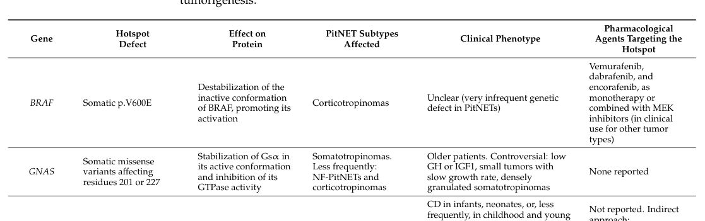

## Question

# Disease Characteristics Research Template

## Target Disease
- **Disease Name:** GNAS-related pituitary adenoma 3
- **MONDO ID:**  (if available)
- **Category:** Neoplastic

## Research Objectives

Please provide a comprehensive research report on **GNAS-related pituitary adenoma 3** covering all of the
disease characteristics listed below. This report will be used to populate a disease knowledge
base entry. Be thorough and cite primary literature (PMID preferred) for all claims.

For each section, **suggested databases/resources** are listed. These are the first places
you should search for information on each topic.

---

### 1. Disease Information
> **Search first:** OMIM, Orphanet, ICD-10/ICD-11, MeSH, PubMed

- What is the disease? Provide a concise overview.
- What are the key identifiers? (OMIM, Orphanet, ICD-10/ICD-11, MeSH, Mondo)
- What are the common synonyms and alternative names?
- Is the information derived from individual patients (e.g., EHR) or aggregated disease-level resources?

### 2. Etiology

- **Disease Causal Factors**: What are the primary causes? (genetic, environmental, infectious, mechanistic)
- **Risk Factors**:
  > **Search first:** PubMed, Cochrane Library, UpToDate, clinical guidelines, ClinVar, ClinGen, GWAS Catalog, PheGenI, CTD, CDC, WHO, epidemiological databases
  - Genetic risk factors (causal variants, susceptibility loci, modifier genes)
  - Environmental risk factors (toxins, lifestyle, occupational exposures, age, sex, family history)
- **Protective Factors**:
  > **Search first:** PubMed, Cochrane Library, clinical trial databases, GWAS Catalog, gnomAD, WHO, CDC, nutrition databases
  - Genetic protective factors (protective variants, modifier alleles)
  - Environmental protective factors (diet, lifestyle, exposures that reduce risk)
- **Gene-Environment Interactions**: How do genetic and environmental factors interact to influence disease?
  > **Search first:** CTD, PubMed, PheGenI, GxE databases

### 3. Phenotypes
> **Search first:** HPO (Human Phenotype Ontology), OMIM, Orphanet, PubMed, clinicaltrials.gov, MedDRA, SNOMED CT, DECIPHER, LOINC

For each phenotype, provide:
- **Phenotype type**: symptoms, clinical signs, physical manifestations, behavioral changes, or laboratory abnormalities
  > For symptoms/signs: HPO, OMIM, Orphanet, PubMed
  > For behavioral changes: HPO, DSM, RDoC (Research Domain Criteria), PubMed
  > For laboratory abnormalities: LOINC, SNOMED CT, LabTests Online, PubMed
- **Phenotype characteristics**:
  > **Search first:** OMIM, Orphanet, HPO, PubMed
  - Age of symptom onset (neonatal, childhood, adult-onset, late-onset)
  - Symptom severity (mild, moderate, severe, variable)
  - Symptom progression (stable, progressive, episodic, fluctuating)
  - Frequency among affected individuals (percentage or qualitative)
- **Quality of life impact**: Effects on daily functioning and well-being (per-phenotype when possible)
  > **Search first:** EQ-5D database, SF-36, WHO QOL databases, PubMed
- Suggest HPO (Human Phenotype Ontology) terms for each phenotype

### 4. Genetic/Molecular Information

- **Causal Genes**: Gene mutations or chromosomal abnormalities responsible for disease (gene symbols, OMIM IDs)
  > **Search first:** OMIM, ClinVar, HGMD, Ensembl, NCBI Gene
- **Pathogenic Variants**:
  - Affected genes (gene symbols, HGNC IDs)
    > **Search first:** OMIM, NCBI Gene, Ensembl, HGNC, UniProt, GeneCards
  - Variant classification (pathogenic, likely pathogenic, VUS per ACMG/AMP guidelines)
    > **Search first:** ClinVar, ClinGen, ACMG/AMP guidelines, VarSome
  - Variant type/class (missense, frameshift, nonsense, splice-site, structural)
  - Allele frequency in population databases
    > **Search first:** gnomAD, 1000 Genomes, ExAC, TOPMed, dbSNP
  - Somatic vs germline origin
    > **Search first:** COSMIC (somatic), ClinVar, ICGC, TCGA
  - Functional consequences (loss of function, gain of function, dominant negative)
- **Modifier Genes**: Genes that modify disease severity or expression
- **Epigenetic Information**: DNA methylation, histone modifications, chromatin changes affecting disease
  > **Search first:** ENCODE, Roadmap Epigenomics, MethBase, DiseaseMeth
- **Chromosomal Abnormalities**: Large-scale genetic changes (aneuploidy, translocations, inversions)
  > **Search first:** DECIPHER, ClinVar, ECARUCA, UCSC Genome Browser

### 5. Environmental Information

- **Environmental Factors**: Non-genetic contributing factors (toxins, radiation, pollution, occupational exposure)
  > **Search first:** CTD (Comparative Toxicogenomics Database), TOXNET, PubMed, EPA databases
- **Lifestyle Factors**: Behavioral factors (smoking, diet, exercise, alcohol consumption)
  > **Search first:** CDC databases, WHO, PubMed, NHANES
- **Infectious Agents**: If applicable, pathogens causing or triggering disease (bacteria, viruses, fungi, parasites)
  > **Search first:** NCBI Taxonomy, ViPR, BV-BRC, MicrobeDB, GIDEON

### 6. Mechanism / Pathophysiology

- **Molecular Pathways**: Specific signaling cascades or biochemical pathways involved (Wnt, MAPK, mTOR, PI3K-AKT, etc.)
  > **Search first:** KEGG, Reactome, WikiPathways, PathBank, BioCyc
- **Cellular Processes**: Cell-level mechanisms (apoptosis, autophagy, cell cycle dysregulation, inflammation, etc.)
  > **Search first:** Gene Ontology (GO), Reactome, KEGG, PubMed
- **Protein Dysfunction**: How protein structure or function is altered (misfolding, aggregation, loss of function, gain of function)
  > **Search first:** UniProt, PDB (Protein Data Bank), InterPro, Pfam, AlphaFold
- **Metabolic Changes**: Alterations in metabolic processes (energy metabolism, lipid metabolism, amino acid metabolism)
  > **Search first:** KEGG, BioCyc, HMDB (Human Metabolome Database), BRENDA
- **Immune System Involvement**: Role of immune response (autoimmunity, immunodeficiency, chronic inflammation)
  > **Search first:** ImmPort, Immunome Database, IEDB, Gene Ontology
- **Tissue Damage Mechanisms**: How tissues/ are injured (oxidative stress, ischemia, fibrosis, necrosis)
  > **Search first:** PubMed, Gene Ontology, Reactome
- **Biochemical Abnormalities**: Specific molecular defects (enzyme deficiencies, receptor dysfunction, ion channel defects)
  > **Search first:** BRENDA, UniProt, KEGG, OMIM, PubMed
- **Epigenetic Changes**: DNA methylation, histone modifications affecting gene expression in disease
  > **Search first:** ENCODE, Roadmap Epigenomics, MethBase, DiseaseMeth
- **Molecular Profiling** (if available):
  - Transcriptomics/gene expression changes
    > **Search first:** GEO (Gene Expression Omnibus), ArrayExpress, GTEx, Human Cell Atlas, SRA
  - Proteomics findings
    > **Search first:** PRIDE, ProteomeXchange, Human Protein Atlas, STRING, BioGRID
  - Metabolomics signatures
    > **Search first:** MetaboLights, Metabolomics Workbench, HMDB, METLIN
  - Lipidomics alterations
    > **Search first:** LIPID MAPS, SwissLipids, LipidHome, Metabolomics Workbench
  - Genomic structural features
    > **Search first:** UCSC Genome Browser, Ensembl, NCBI, dbVar, DGV
- **Advanced Technologies** (if applicable):
  - Single-cell analysis findings (cell-type specific mechanisms, cellular heterogeneity)
    > **Search first:** Human Cell Atlas, Single Cell Portal, GEO, CELLxGENE
  - Spatial transcriptomics findings
    > **Search first:** GEO, Spatial Research, Vizgen, 10x Genomics data
  - Multi-omics integration results
    > **Search first:** TCGA, ICGC, cBioPortal, LinkedOmics, PubMed
  - Functional genomics screens (CRISPR, RNAi)
    > **Search first:** DepMap, GenomeRNAi, PubMed, BioGRID ORCS

For each mechanism, describe:
- The causal chain from initial trigger to clinical manifestation
- Which mechanisms are upstream vs downstream
- What cell types and biological processes are involved
- Suggest GO terms for biological processes and CL terms for cell types

### 7. Anatomical Structures Affected

- **Organ Level**:
  - Primary organs directly affected
  - Secondary organ involvement (complications, secondary effects)
  - Body systems involved (cardiovascular, nervous, digestive, respiratory, endocrine, etc.)
  > **Search first:** Uberon, FMA (Foundational Model of Anatomy), OMIM, HPO, ICD-11, MeSH, SNOMED CT
- **Tissue and Cell Level**:
  - Specific tissue types affected (epithelial, connective, muscle, nervous)
  - Specific cell populations targeted (with Cell Ontology terms)
  > **Search first:** Uberon, Human Protein Atlas, Cell Ontology, Human Cell Atlas, CellMarker, PanglaoDB
- **Subcellular Level**:
  - Cellular compartments involved (mitochondria, nucleus, ER, lysosomes) (with GO Cellular Component terms)
  > **Search first:** Gene Ontology (Cellular Component), UniProt, Human Protein Atlas
- **Localization**:
  - Specific anatomical sites (with UBERON terms)
    > **Search first:** FMA, Uberon, NeuroNames (for brain), SNOMED CT
  - Lateralization (unilateral, bilateral, asymmetric)
    > **Search first:** HPO, clinical literature, imaging databases

### 8. Temporal Development

- **Onset**:
  - Typical age of onset (congenital, pediatric, adult, geriatric)
  - Onset pattern (acute, subacute, chronic, insidious)
  > **Search first:** OMIM, Orphanet, HPO, PubMed
- **Progression**:
  - Disease stages (early, intermediate, advanced, end-stage)
    > **Search first:** Cancer Staging Manual (AJCC), WHO classifications, PubMed
  - Progression rate (rapid, slow, variable)
  - Disease course pattern (episodic, relapsing-remitting, progressive, stable)
  - Disease duration (self-limited, chronic lifelong)
  > **Search first:** Disease registries, longitudinal cohort databases, natural history studies, PubMed, Orphanet, OMIM
- **Patterns**:
  - Remission patterns (spontaneous, treatment-induced)
    > **Search first:** Clinical trial databases, disease registries, PubMed
  - Critical periods (time windows of vulnerability or opportunity for intervention)
    > **Search first:** PubMed, developmental biology databases, clinical guidelines

### 9. Inheritance and Population

- **Epidemiology**:
  - Prevalence (cases per 100,000 at given time)
  - Incidence (new cases per 100,000 per year)
  > **Search first:** Orphanet, CDC, WHO, GBD (Global Burden of Disease), national registries, SEER, disease registries
- **For Genetic Etiology**:
  - Inheritance pattern (AD, AR, X-linked, mitochondrial, multifactorial, polygenic)
    > **Search first:** OMIM, Orphanet, ClinVar, GTR (Genetic Testing Registry)
  - Penetrance (complete, incomplete, age-dependent)
    > **Search first:** ClinVar, OMIM, PubMed, ClinGen
  - Expressivity (variable, consistent)
    > **Search first:** OMIM, ClinVar, PubMed
  - Genetic anticipation (increasing severity in successive generations)
    > **Search first:** OMIM, PubMed (especially for repeat expansion disorders)
  - Germline mosaicism
    > **Search first:** ClinVar, OMIM, genetic counseling literature, PubMed
  - Founder effects (population-specific mutations)
    > **Search first:** gnomAD, population genetics databases, PubMed
  - Consanguinity role
    > **Search first:** OMIM, population studies, genetic counseling resources
  - Carrier frequency
    > **Search first:** gnomAD, carrier screening databases, GeneReviews, GTR
- **Population Demographics**:
  - Affected populations (ethnic or demographic groups with higher prevalence)
    > **Search first:** gnomAD, 1000 Genomes, PAGE Study, PubMed, population registries
  - Geographic distribution (endemic areas, regional variation)
    > **Search first:** WHO, CDC, GBD, Orphanet, geographic epidemiology databases
  - Geographic distribution of specific variants
  - Sex ratio (male:female)
    > **Search first:** Disease registries, OMIM, PubMed, epidemiological databases
  - Age distribution of affected individuals
    > **Search first:** CDC, disease registries, SEER, Orphanet

### 10. Diagnostics

- **Clinical Tests**:
  - Laboratory tests (blood, urine, tissue chemistry, specific enzyme assays)
    > **Search first:** LOINC, LabTests Online, PubMed
  - Biomarkers (proteins, metabolites, genetic markers, circulating biomarkers)
    > **Search first:** FDA Biomarker List, BEST (Biomarkers, EndpointS, and other Tools), PubMed
  - Imaging studies (X-ray, CT, MRI, PET, ultrasound)
    > **Search first:** RadLex, DICOM, Radiopaedia, imaging databases
  - Functional tests (pulmonary function, cardiac stress tests)
    > **Search first:** LOINC, clinical guidelines, PubMed
  - Electrophysiology (EEG, EMG, ECG, nerve conduction studies)
    > **Search first:** LOINC, clinical neurophysiology databases, PubMed
  - Biopsy findings (histopathology, immunohistochemistry)
    > **Search first:** SNOMED CT, College of American Pathologists resources, PubMed
  - Pathology findings (microscopic examination)
    > **Search first:** SNOMED CT, Digital Pathology databases, PubMed
- **Genetic Testing**:
  > **Search first:** GTR (Genetic Testing Registry), GeneReviews, ClinGen
  - Overview of recommended genetic testing approach
  - Whole genome sequencing (WGS) utility
    > **Search first:** GTR, ClinVar, GEL (Genomics England), gnomAD
  - Whole exome sequencing (WES) utility
    > **Search first:** GTR, ClinVar, OMIM, GeneMatcher
  - Gene panels (which panels, which genes)
    > **Search first:** GTR, ClinVar, laboratory-specific databases
  - Single gene testing
    > **Search first:** GTR, ClinVar, OMIM, GeneReviews
  - Chromosomal microarray (CMA)
    > **Search first:** DECIPHER, ClinVar, dbVar, ECARUCA
  - Karyotyping
    > **Search first:** Chromosome Abnormality Database, ClinVar, cytogenetics resources
  - FISH
    > **Search first:** ClinVar, cytogenetics databases, PubMed
  - Mitochondrial DNA testing
    > **Search first:** MITOMAP, MSeqDR, ClinVar, GTR
  - Repeat expansion testing
    > **Search first:** GTR, ClinVar, repeat expansion databases, PubMed
- **Omics-Based Diagnostics** (if applicable):
  - RNA sequencing / transcriptomics
    > **Search first:** GEO, ArrayExpress, GTEx, RNA-seq databases
  - Proteomics
    > **Search first:** PRIDE, ProteomeXchange, FDA Biomarker database
  - Metabolomics
    > **Search first:** MetaboLights, Metabolomics Workbench, HMDB
  - Epigenomics
    > **Search first:** GEO, ENCODE, Roadmap Epigenomics, MethBase
  - Liquid biopsy
    > **Search first:** COSMIC, ClinVar, liquid biopsy databases, PubMed
- **Clinical Criteria**:
  - Standardized diagnostic criteria (DSM, ICD, society guidelines)
    > **Search first:** DSM-5, ICD-11, clinical society guidelines, UpToDate
  - Differential diagnosis (other conditions to rule out, with distinguishing features)
    > **Search first:** DynaMed, UpToDate, clinical decision support systems
- **Screening**:
  - Screening methods for asymptomatic individuals (newborn screening, carrier screening, cascade screening)
    > **Search first:** ACMG recommendations, CDC newborn screening, GTR

### 11. Outcome/Prognosis

- **Survival and Mortality**:
  - Survival rate (5-year, 10-year, overall)
    > **Search first:** SEER, cancer registries, disease-specific registries, PubMed
  - Life expectancy (with and without treatment if applicable)
    > **Search first:** Orphanet, disease registries, actuarial databases, PubMed
  - Mortality rate
    > **Search first:** CDC, WHO, GBD, national mortality databases
  - Disease-specific mortality (deaths directly attributable to disease)
    > **Search first:** Disease registries, CDC Wonder, GBD, PubMed
- **Morbidity and Function**:
  - Morbidity (disease-related disability and health impacts)
    > **Search first:** GBD, WHO, disability databases, PubMed
  - Disability outcomes (long-term functional impairments)
    > **Search first:** ICF (International Classification of Functioning), disability registries
  - Quality of life measures (EQ-5D, SF-36, PROMIS, disease-specific tools)
    > **Search first:** EQ-5D database, SF-36, PROMIS, PubMed
- **Disease Course**:
  - Complications (secondary problems: infections, organ failure, etc.)
    > **Search first:** ICD codes, disease registries, clinical databases, PubMed
  - Recovery potential (likelihood and extent of recovery, with vs without treatment)
    > **Search first:** Natural history studies, rehabilitation databases, PubMed
- **Prediction**:
  - Prognostic factors (age, disease severity, biomarkers, treatment response)
    > **Search first:** Prognostic models databases, clinical calculators, PubMed
  - Prognostic biomarkers (molecular markers predicting disease course)
    > **Search first:** FDA Biomarker database, PubMed, cancer prognostic databases

### 12. Treatment

- **Pharmacotherapy**:
  - Pharmacological treatments (drug names, drug classes, mechanisms of action)
    > **Search first:** DrugBank, RxNorm, ATC classification, DailyMed, FDA databases
  - Pharmacogenomics (how genetic variants affect drug metabolism, efficacy, toxicity)
    > **Search first:** PharmGKB, CPIC (Clinical Pharmacogenetics), FDA Table of PGx Biomarkers
- **Advanced Therapeutics**:
  - Gene therapy (viral vectors, CRISPR, gene replacement, gene editing)
    > **Search first:** ClinicalTrials.gov, FDA gene therapy database, ASGCT resources
  - Cell therapy (stem cell transplant, CAR-T, cellular therapeutics)
    > **Search first:** ClinicalTrials.gov, FDA cell therapy database, FACT standards
  - RNA-based therapies (ASOs, siRNA, mRNA therapies)
    > **Search first:** ClinicalTrials.gov, FDA approvals, PubMed
  - Targeted therapies (treatments directed at specific molecular targets)
    > **Search first:** My Cancer Genome, OncoKB, ClinicalTrials.gov, FDA approvals
  - Immunotherapies (checkpoint inhibitors, monoclonal antibodies)
    > **Search first:** Cancer Immunotherapy Database, FDA approvals, ClinicalTrials.gov
- **Surgical and Interventional**:
  - Surgical interventions (types of surgery, timing, outcomes)
    > **Search first:** CPT codes, surgical registries, clinical guidelines, PubMed
- **Supportive and Rehabilitative**:
  - Supportive care (symptom management, pain control, nutrition)
    > **Search first:** Clinical guidelines, Cochrane Library, PubMed
  - Rehabilitation (physical therapy, occupational therapy, speech therapy)
    > **Search first:** Rehabilitation medicine databases, clinical guidelines, PubMed
- **Experimental**:
  - Experimental treatments in clinical trials (with NCT identifiers if available)
    > **Search first:** ClinicalTrials.gov, EU Clinical Trials Register, WHO ICTRP
- **Treatment Outcomes**:
  - Treatment response rates
    > **Search first:** Clinical trial databases, FDA reviews, systematic reviews, PubMed
  - Side effects and adverse events
    > **Search first:** FDA Adverse Event Reporting System (FAERS), MedWatch, PubMed
- **Treatment Strategy**:
  - Treatment algorithms (clinical pathways, decision trees)
    > **Search first:** Clinical practice guidelines, NCCN Guidelines, UpToDate
  - Combination therapies
    > **Search first:** ClinicalTrials.gov, treatment guidelines, PubMed
  - Personalized medicine approaches (genotype-guided treatment)
    > **Search first:** My Cancer Genome, CIViC, PharmGKB, precision medicine databases

For each treatment, suggest MAXO (Medical Action Ontology) terms where applicable.

### 13. Prevention

- **Prevention Levels**:
  - Primary prevention (preventing disease occurrence: vaccination, risk factor modification)
    > **Search first:** CDC, WHO, USPSTF recommendations, Cochrane Library
  - Secondary prevention (early detection and treatment: screening programs, early intervention)
    > **Search first:** USPSTF, CDC screening guidelines, WHO
  - Tertiary prevention (preventing complications in those with disease)
    > **Search first:** Clinical guidelines, disease management protocols, PubMed
- **Immunization**: Vaccine strategies (if applicable)
  > **Search first:** CDC vaccine schedules, WHO immunization, FDA vaccine database
- **Screening and Early Detection**:
  - Screening programs (population-based: newborn screening, cancer screening)
    > **Search first:** CDC screening programs, USPSTF, cancer screening databases
  - Genetic screening (carrier screening, preimplantation genetic diagnosis, prenatal testing)
    > **Search first:** ACMG recommendations, ACOG guidelines, GTR
  - Risk stratification (identifying high-risk individuals for targeted prevention)
    > **Search first:** Risk prediction models, clinical calculators, PubMed
- **Behavioral Interventions**: Lifestyle modifications to reduce risk
  > **Search first:** CDC, WHO, behavioral intervention databases, Cochrane Library
- **Counseling**: Genetic counseling (risk assessment, family planning guidance)
  > **Search first:** NSGC resources, ACMG guidelines, GeneReviews
- **Public Health**:
  - Public health interventions (sanitation, vector control, health education)
    > **Search first:** CDC, WHO, public health databases, PubMed
  - Environmental interventions (reducing environmental risk factors)
    > **Search first:** EPA databases, WHO environmental health, PubMed
- **Prophylaxis**: Preventive medications or procedures
  > **Search first:** Clinical guidelines, FDA approvals, PubMed

### 14. Other Species / Natural Disease

- **Taxonomy**: Species affected (with NCBI Taxon identifiers)
  > **Search first:** NCBI Taxonomy
- **Breed**: Specific breeds affected (with VBO identifiers if applicable)
  > **Search first:** VBO (Vertebrate Breed Ontology)
- **Gene**: Orthologous genes in other species (with NCBI Gene IDs)
  > **Search first:** NCBI Gene
- **Natural Disease**:
  - Naturally occurring disease in other species (companion animals, wildlife)
    > **Search first:** OMIA (Online Mendelian Inheritance in Animals), VetCompass, PubMed
  - Veterinary relevance and importance in animal health
    > **Search first:** OMIA, veterinary databases, PubMed
- **Comparative Biology**:
  - Comparative pathology (similarities and differences across species)
    > **Search first:** OMIA, comparative pathology databases, PubMed
  - Evolutionary conservation of disease mechanisms
    > **Search first:** HomoloGene, OrthoMCL, Alliance of Genome Resources
- **Transmission** (if applicable):
  - Zoonotic potential
    > **Search first:** CDC zoonotic diseases, WHO zoonoses, GIDEON
  - Cross-species susceptibility
    > **Search first:** NCBI Taxonomy, veterinary databases, PubMed

### 15. Model Organisms

- **Model Types**:
  - Model organism type (mammalian, invertebrate, cellular, in vitro)
    > **Search first:** Alliance of Genome Resources, model organism databases
  - Specific model systems (mouse, rat, zebrafish, Drosophila, C. elegans, yeast, cell lines, organoids, iPSCs)
    > **Search first:** MGI, RGD, ZFIN, FlyBase, WormBase, SGD, ATCC, Cellosaurus
  - Induced models (drug treatment, surgical intervention, environmental manipulation)
    > **Search first:** MGI, model organism databases, PubMed
- **Genetic Models**:
  - Types available (knockout, knock-in, transgenic, conditional, humanized)
    > **Search first:** MGI, IMPC, KOMP, EuMMCR, IMSR
- **Model Characteristics**:
  - Phenotype recapitulation (how well model reproduces human disease features)
    > **Search first:** Model organism databases, comparative studies, PubMed
  - Model limitations (aspects of human disease not captured)
    > **Search first:** Model organism databases, PubMed, review articles
- **Applications**:
  - Research applications (what aspects of disease can be studied)
    > **Search first:** Model organism databases, PubMed
- **Resources**:
  - Model databases
    > **Search first:** MGI, RGD, ZFIN, FlyBase, WormBase, IMSR, EMMA, MMRRC

---

## Citation Requirements

- Cite primary literature (PMID preferred) for all mechanistic and clinical claims
- Prioritize recent reviews and landmark papers
- Include direct quotes from abstracts where possible to support key statements
- Distinguish evidence source types: human clinical, model organism, in vitro, computational

## Output Format

Structure your response as a comprehensive narrative organized by the sections above.
For each section, provide:
- Factual content with specific details (numbers, percentages, gene names, variant nomenclature)
- Ontology term suggestions (HPO, GO, CL, UBERON, CHEBI, MAXO, MONDO) where applicable
- Evidence citations with PMIDs
- Direct quotes from abstracts to support key claims
- Clear indication when information is not available or not applicable for this disease

This report will be used to populate a disease knowledge base entry with:
- Pathophysiology descriptions with causal chains
- Gene/protein annotations (HGNC, GO terms)
- Phenotype associations (HP terms) with frequencies
- Cell type involvement (CL terms)
- Anatomical locations (UBERON terms)
- Chemical entities (CHEBI terms)
- Treatment annotations (MAXO terms)
- Evidence items with PMIDs and exact abstract quotes
- Epidemiology, prognosis, diagnostic, and prevention information
- Animal model descriptions with phenotype recapitulation details

## Output

Question: You are an expert researcher providing comprehensive, well-cited information.

Provide detailed information focusing on:
1. Key concepts and definitions with current understanding
2. Recent developments and latest research (prioritize 2023-2024 sources)
3. Current applications and real-world implementations
4. Expert opinions and analysis from authoritative sources
5. Relevant statistics and data from recent studies

Format as a comprehensive research report with proper citations. Include URLs and publication dates where available.
Always prioritize recent, authoritative sources and provide specific citations for all major claims.

# Disease Characteristics Research Template

## Target Disease
- **Disease Name:** GNAS-related pituitary adenoma 3
- **MONDO ID:**  (if available)
- **Category:** Neoplastic

## Research Objectives

Please provide a comprehensive research report on **GNAS-related pituitary adenoma 3** covering all of the
disease characteristics listed below. This report will be used to populate a disease knowledge
base entry. Be thorough and cite primary literature (PMID preferred) for all claims.

For each section, **suggested databases/resources** are listed. These are the first places
you should search for information on each topic.

---

### 1. Disease Information
> **Search first:** OMIM, Orphanet, ICD-10/ICD-11, MeSH, PubMed

- What is the disease? Provide a concise overview.
- What are the key identifiers? (OMIM, Orphanet, ICD-10/ICD-11, MeSH, Mondo)
- What are the common synonyms and alternative names?
- Is the information derived from individual patients (e.g., EHR) or aggregated disease-level resources?

### 2. Etiology

- **Disease Causal Factors**: What are the primary causes? (genetic, environmental, infectious, mechanistic)
- **Risk Factors**:
  > **Search first:** PubMed, Cochrane Library, UpToDate, clinical guidelines, ClinVar, ClinGen, GWAS Catalog, PheGenI, CTD, CDC, WHO, epidemiological databases
  - Genetic risk factors (causal variants, susceptibility loci, modifier genes)
  - Environmental risk factors (toxins, lifestyle, occupational exposures, age, sex, family history)
- **Protective Factors**:
  > **Search first:** PubMed, Cochrane Library, clinical trial databases, GWAS Catalog, gnomAD, WHO, CDC, nutrition databases
  - Genetic protective factors (protective variants, modifier alleles)
  - Environmental protective factors (diet, lifestyle, exposures that reduce risk)
- **Gene-Environment Interactions**: How do genetic and environmental factors interact to influence disease?
  > **Search first:** CTD, PubMed, PheGenI, GxE databases

### 3. Phenotypes
> **Search first:** HPO (Human Phenotype Ontology), OMIM, Orphanet, PubMed, clinicaltrials.gov, MedDRA, SNOMED CT, DECIPHER, LOINC

For each phenotype, provide:
- **Phenotype type**: symptoms, clinical signs, physical manifestations, behavioral changes, or laboratory abnormalities
  > For symptoms/signs: HPO, OMIM, Orphanet, PubMed
  > For behavioral changes: HPO, DSM, RDoC (Research Domain Criteria), PubMed
  > For laboratory abnormalities: LOINC, SNOMED CT, LabTests Online, PubMed
- **Phenotype characteristics**:
  > **Search first:** OMIM, Orphanet, HPO, PubMed
  - Age of symptom onset (neonatal, childhood, adult-onset, late-onset)
  - Symptom severity (mild, moderate, severe, variable)
  - Symptom progression (stable, progressive, episodic, fluctuating)
  - Frequency among affected individuals (percentage or qualitative)
- **Quality of life impact**: Effects on daily functioning and well-being (per-phenotype when possible)
  > **Search first:** EQ-5D database, SF-36, WHO QOL databases, PubMed
- Suggest HPO (Human Phenotype Ontology) terms for each phenotype

### 4. Genetic/Molecular Information

- **Causal Genes**: Gene mutations or chromosomal abnormalities responsible for disease (gene symbols, OMIM IDs)
  > **Search first:** OMIM, ClinVar, HGMD, Ensembl, NCBI Gene
- **Pathogenic Variants**:
  - Affected genes (gene symbols, HGNC IDs)
    > **Search first:** OMIM, NCBI Gene, Ensembl, HGNC, UniProt, GeneCards
  - Variant classification (pathogenic, likely pathogenic, VUS per ACMG/AMP guidelines)
    > **Search first:** ClinVar, ClinGen, ACMG/AMP guidelines, VarSome
  - Variant type/class (missense, frameshift, nonsense, splice-site, structural)
  - Allele frequency in population databases
    > **Search first:** gnomAD, 1000 Genomes, ExAC, TOPMed, dbSNP
  - Somatic vs germline origin
    > **Search first:** COSMIC (somatic), ClinVar, ICGC, TCGA
  - Functional consequences (loss of function, gain of function, dominant negative)
- **Modifier Genes**: Genes that modify disease severity or expression
- **Epigenetic Information**: DNA methylation, histone modifications, chromatin changes affecting disease
  > **Search first:** ENCODE, Roadmap Epigenomics, MethBase, DiseaseMeth
- **Chromosomal Abnormalities**: Large-scale genetic changes (aneuploidy, translocations, inversions)
  > **Search first:** DECIPHER, ClinVar, ECARUCA, UCSC Genome Browser

### 5. Environmental Information

- **Environmental Factors**: Non-genetic contributing factors (toxins, radiation, pollution, occupational exposure)
  > **Search first:** CTD (Comparative Toxicogenomics Database), TOXNET, PubMed, EPA databases
- **Lifestyle Factors**: Behavioral factors (smoking, diet, exercise, alcohol consumption)
  > **Search first:** CDC databases, WHO, PubMed, NHANES
- **Infectious Agents**: If applicable, pathogens causing or triggering disease (bacteria, viruses, fungi, parasites)
  > **Search first:** NCBI Taxonomy, ViPR, BV-BRC, MicrobeDB, GIDEON

### 6. Mechanism / Pathophysiology

- **Molecular Pathways**: Specific signaling cascades or biochemical pathways involved (Wnt, MAPK, mTOR, PI3K-AKT, etc.)
  > **Search first:** KEGG, Reactome, WikiPathways, PathBank, BioCyc
- **Cellular Processes**: Cell-level mechanisms (apoptosis, autophagy, cell cycle dysregulation, inflammation, etc.)
  > **Search first:** Gene Ontology (GO), Reactome, KEGG, PubMed
- **Protein Dysfunction**: How protein structure or function is altered (misfolding, aggregation, loss of function, gain of function)
  > **Search first:** UniProt, PDB (Protein Data Bank), InterPro, Pfam, AlphaFold
- **Metabolic Changes**: Alterations in metabolic processes (energy metabolism, lipid metabolism, amino acid metabolism)
  > **Search first:** KEGG, BioCyc, HMDB (Human Metabolome Database), BRENDA
- **Immune System Involvement**: Role of immune response (autoimmunity, immunodeficiency, chronic inflammation)
  > **Search first:** ImmPort, Immunome Database, IEDB, Gene Ontology
- **Tissue Damage Mechanisms**: How tissues/ are injured (oxidative stress, ischemia, fibrosis, necrosis)
  > **Search first:** PubMed, Gene Ontology, Reactome
- **Biochemical Abnormalities**: Specific molecular defects (enzyme deficiencies, receptor dysfunction, ion channel defects)
  > **Search first:** BRENDA, UniProt, KEGG, OMIM, PubMed
- **Epigenetic Changes**: DNA methylation, histone modifications affecting gene expression in disease
  > **Search first:** ENCODE, Roadmap Epigenomics, MethBase, DiseaseMeth
- **Molecular Profiling** (if available):
  - Transcriptomics/gene expression changes
    > **Search first:** GEO (Gene Expression Omnibus), ArrayExpress, GTEx, Human Cell Atlas, SRA
  - Proteomics findings
    > **Search first:** PRIDE, ProteomeXchange, Human Protein Atlas, STRING, BioGRID
  - Metabolomics signatures
    > **Search first:** MetaboLights, Metabolomics Workbench, HMDB, METLIN
  - Lipidomics alterations
    > **Search first:** LIPID MAPS, SwissLipids, LipidHome, Metabolomics Workbench
  - Genomic structural features
    > **Search first:** UCSC Genome Browser, Ensembl, NCBI, dbVar, DGV
- **Advanced Technologies** (if applicable):
  - Single-cell analysis findings (cell-type specific mechanisms, cellular heterogeneity)
    > **Search first:** Human Cell Atlas, Single Cell Portal, GEO, CELLxGENE
  - Spatial transcriptomics findings
    > **Search first:** GEO, Spatial Research, Vizgen, 10x Genomics data
  - Multi-omics integration results
    > **Search first:** TCGA, ICGC, cBioPortal, LinkedOmics, PubMed
  - Functional genomics screens (CRISPR, RNAi)
    > **Search first:** DepMap, GenomeRNAi, PubMed, BioGRID ORCS

For each mechanism, describe:
- The causal chain from initial trigger to clinical manifestation
- Which mechanisms are upstream vs downstream
- What cell types and biological processes are involved
- Suggest GO terms for biological processes and CL terms for cell types

### 7. Anatomical Structures Affected

- **Organ Level**:
  - Primary organs directly affected
  - Secondary organ involvement (complications, secondary effects)
  - Body systems involved (cardiovascular, nervous, digestive, respiratory, endocrine, etc.)
  > **Search first:** Uberon, FMA (Foundational Model of Anatomy), OMIM, HPO, ICD-11, MeSH, SNOMED CT
- **Tissue and Cell Level**:
  - Specific tissue types affected (epithelial, connective, muscle, nervous)
  - Specific cell populations targeted (with Cell Ontology terms)
  > **Search first:** Uberon, Human Protein Atlas, Cell Ontology, Human Cell Atlas, CellMarker, PanglaoDB
- **Subcellular Level**:
  - Cellular compartments involved (mitochondria, nucleus, ER, lysosomes) (with GO Cellular Component terms)
  > **Search first:** Gene Ontology (Cellular Component), UniProt, Human Protein Atlas
- **Localization**:
  - Specific anatomical sites (with UBERON terms)
    > **Search first:** FMA, Uberon, NeuroNames (for brain), SNOMED CT
  - Lateralization (unilateral, bilateral, asymmetric)
    > **Search first:** HPO, clinical literature, imaging databases

### 8. Temporal Development

- **Onset**:
  - Typical age of onset (congenital, pediatric, adult, geriatric)
  - Onset pattern (acute, subacute, chronic, insidious)
  > **Search first:** OMIM, Orphanet, HPO, PubMed
- **Progression**:
  - Disease stages (early, intermediate, advanced, end-stage)
    > **Search first:** Cancer Staging Manual (AJCC), WHO classifications, PubMed
  - Progression rate (rapid, slow, variable)
  - Disease course pattern (episodic, relapsing-remitting, progressive, stable)
  - Disease duration (self-limited, chronic lifelong)
  > **Search first:** Disease registries, longitudinal cohort databases, natural history studies, PubMed, Orphanet, OMIM
- **Patterns**:
  - Remission patterns (spontaneous, treatment-induced)
    > **Search first:** Clinical trial databases, disease registries, PubMed
  - Critical periods (time windows of vulnerability or opportunity for intervention)
    > **Search first:** PubMed, developmental biology databases, clinical guidelines

### 9. Inheritance and Population

- **Epidemiology**:
  - Prevalence (cases per 100,000 at given time)
  - Incidence (new cases per 100,000 per year)
  > **Search first:** Orphanet, CDC, WHO, GBD (Global Burden of Disease), national registries, SEER, disease registries
- **For Genetic Etiology**:
  - Inheritance pattern (AD, AR, X-linked, mitochondrial, multifactorial, polygenic)
    > **Search first:** OMIM, Orphanet, ClinVar, GTR (Genetic Testing Registry)
  - Penetrance (complete, incomplete, age-dependent)
    > **Search first:** ClinVar, OMIM, PubMed, ClinGen
  - Expressivity (variable, consistent)
    > **Search first:** OMIM, ClinVar, PubMed
  - Genetic anticipation (increasing severity in successive generations)
    > **Search first:** OMIM, PubMed (especially for repeat expansion disorders)
  - Germline mosaicism
    > **Search first:** ClinVar, OMIM, genetic counseling literature, PubMed
  - Founder effects (population-specific mutations)
    > **Search first:** gnomAD, population genetics databases, PubMed
  - Consanguinity role
    > **Search first:** OMIM, population studies, genetic counseling resources
  - Carrier frequency
    > **Search first:** gnomAD, carrier screening databases, GeneReviews, GTR
- **Population Demographics**:
  - Affected populations (ethnic or demographic groups with higher prevalence)
    > **Search first:** gnomAD, 1000 Genomes, PAGE Study, PubMed, population registries
  - Geographic distribution (endemic areas, regional variation)
    > **Search first:** WHO, CDC, GBD, Orphanet, geographic epidemiology databases
  - Geographic distribution of specific variants
  - Sex ratio (male:female)
    > **Search first:** Disease registries, OMIM, PubMed, epidemiological databases
  - Age distribution of affected individuals
    > **Search first:** CDC, disease registries, SEER, Orphanet

### 10. Diagnostics

- **Clinical Tests**:
  - Laboratory tests (blood, urine, tissue chemistry, specific enzyme assays)
    > **Search first:** LOINC, LabTests Online, PubMed
  - Biomarkers (proteins, metabolites, genetic markers, circulating biomarkers)
    > **Search first:** FDA Biomarker List, BEST (Biomarkers, EndpointS, and other Tools), PubMed
  - Imaging studies (X-ray, CT, MRI, PET, ultrasound)
    > **Search first:** RadLex, DICOM, Radiopaedia, imaging databases
  - Functional tests (pulmonary function, cardiac stress tests)
    > **Search first:** LOINC, clinical guidelines, PubMed
  - Electrophysiology (EEG, EMG, ECG, nerve conduction studies)
    > **Search first:** LOINC, clinical neurophysiology databases, PubMed
  - Biopsy findings (histopathology, immunohistochemistry)
    > **Search first:** SNOMED CT, College of American Pathologists resources, PubMed
  - Pathology findings (microscopic examination)
    > **Search first:** SNOMED CT, Digital Pathology databases, PubMed
- **Genetic Testing**:
  > **Search first:** GTR (Genetic Testing Registry), GeneReviews, ClinGen
  - Overview of recommended genetic testing approach
  - Whole genome sequencing (WGS) utility
    > **Search first:** GTR, ClinVar, GEL (Genomics England), gnomAD
  - Whole exome sequencing (WES) utility
    > **Search first:** GTR, ClinVar, OMIM, GeneMatcher
  - Gene panels (which panels, which genes)
    > **Search first:** GTR, ClinVar, laboratory-specific databases
  - Single gene testing
    > **Search first:** GTR, ClinVar, OMIM, GeneReviews
  - Chromosomal microarray (CMA)
    > **Search first:** DECIPHER, ClinVar, dbVar, ECARUCA
  - Karyotyping
    > **Search first:** Chromosome Abnormality Database, ClinVar, cytogenetics resources
  - FISH
    > **Search first:** ClinVar, cytogenetics databases, PubMed
  - Mitochondrial DNA testing
    > **Search first:** MITOMAP, MSeqDR, ClinVar, GTR
  - Repeat expansion testing
    > **Search first:** GTR, ClinVar, repeat expansion databases, PubMed
- **Omics-Based Diagnostics** (if applicable):
  - RNA sequencing / transcriptomics
    > **Search first:** GEO, ArrayExpress, GTEx, RNA-seq databases
  - Proteomics
    > **Search first:** PRIDE, ProteomeXchange, FDA Biomarker database
  - Metabolomics
    > **Search first:** MetaboLights, Metabolomics Workbench, HMDB
  - Epigenomics
    > **Search first:** GEO, ENCODE, Roadmap Epigenomics, MethBase
  - Liquid biopsy
    > **Search first:** COSMIC, ClinVar, liquid biopsy databases, PubMed
- **Clinical Criteria**:
  - Standardized diagnostic criteria (DSM, ICD, society guidelines)
    > **Search first:** DSM-5, ICD-11, clinical society guidelines, UpToDate
  - Differential diagnosis (other conditions to rule out, with distinguishing features)
    > **Search first:** DynaMed, UpToDate, clinical decision support systems
- **Screening**:
  - Screening methods for asymptomatic individuals (newborn screening, carrier screening, cascade screening)
    > **Search first:** ACMG recommendations, CDC newborn screening, GTR

### 11. Outcome/Prognosis

- **Survival and Mortality**:
  - Survival rate (5-year, 10-year, overall)
    > **Search first:** SEER, cancer registries, disease-specific registries, PubMed
  - Life expectancy (with and without treatment if applicable)
    > **Search first:** Orphanet, disease registries, actuarial databases, PubMed
  - Mortality rate
    > **Search first:** CDC, WHO, GBD, national mortality databases
  - Disease-specific mortality (deaths directly attributable to disease)
    > **Search first:** Disease registries, CDC Wonder, GBD, PubMed
- **Morbidity and Function**:
  - Morbidity (disease-related disability and health impacts)
    > **Search first:** GBD, WHO, disability databases, PubMed
  - Disability outcomes (long-term functional impairments)
    > **Search first:** ICF (International Classification of Functioning), disability registries
  - Quality of life measures (EQ-5D, SF-36, PROMIS, disease-specific tools)
    > **Search first:** EQ-5D database, SF-36, PROMIS, PubMed
- **Disease Course**:
  - Complications (secondary problems: infections, organ failure, etc.)
    > **Search first:** ICD codes, disease registries, clinical databases, PubMed
  - Recovery potential (likelihood and extent of recovery, with vs without treatment)
    > **Search first:** Natural history studies, rehabilitation databases, PubMed
- **Prediction**:
  - Prognostic factors (age, disease severity, biomarkers, treatment response)
    > **Search first:** Prognostic models databases, clinical calculators, PubMed
  - Prognostic biomarkers (molecular markers predicting disease course)
    > **Search first:** FDA Biomarker database, PubMed, cancer prognostic databases

### 12. Treatment

- **Pharmacotherapy**:
  - Pharmacological treatments (drug names, drug classes, mechanisms of action)
    > **Search first:** DrugBank, RxNorm, ATC classification, DailyMed, FDA databases
  - Pharmacogenomics (how genetic variants affect drug metabolism, efficacy, toxicity)
    > **Search first:** PharmGKB, CPIC (Clinical Pharmacogenetics), FDA Table of PGx Biomarkers
- **Advanced Therapeutics**:
  - Gene therapy (viral vectors, CRISPR, gene replacement, gene editing)
    > **Search first:** ClinicalTrials.gov, FDA gene therapy database, ASGCT resources
  - Cell therapy (stem cell transplant, CAR-T, cellular therapeutics)
    > **Search first:** ClinicalTrials.gov, FDA cell therapy database, FACT standards
  - RNA-based therapies (ASOs, siRNA, mRNA therapies)
    > **Search first:** ClinicalTrials.gov, FDA approvals, PubMed
  - Targeted therapies (treatments directed at specific molecular targets)
    > **Search first:** My Cancer Genome, OncoKB, ClinicalTrials.gov, FDA approvals
  - Immunotherapies (checkpoint inhibitors, monoclonal antibodies)
    > **Search first:** Cancer Immunotherapy Database, FDA approvals, ClinicalTrials.gov
- **Surgical and Interventional**:
  - Surgical interventions (types of surgery, timing, outcomes)
    > **Search first:** CPT codes, surgical registries, clinical guidelines, PubMed
- **Supportive and Rehabilitative**:
  - Supportive care (symptom management, pain control, nutrition)
    > **Search first:** Clinical guidelines, Cochrane Library, PubMed
  - Rehabilitation (physical therapy, occupational therapy, speech therapy)
    > **Search first:** Rehabilitation medicine databases, clinical guidelines, PubMed
- **Experimental**:
  - Experimental treatments in clinical trials (with NCT identifiers if available)
    > **Search first:** ClinicalTrials.gov, EU Clinical Trials Register, WHO ICTRP
- **Treatment Outcomes**:
  - Treatment response rates
    > **Search first:** Clinical trial databases, FDA reviews, systematic reviews, PubMed
  - Side effects and adverse events
    > **Search first:** FDA Adverse Event Reporting System (FAERS), MedWatch, PubMed
- **Treatment Strategy**:
  - Treatment algorithms (clinical pathways, decision trees)
    > **Search first:** Clinical practice guidelines, NCCN Guidelines, UpToDate
  - Combination therapies
    > **Search first:** ClinicalTrials.gov, treatment guidelines, PubMed
  - Personalized medicine approaches (genotype-guided treatment)
    > **Search first:** My Cancer Genome, CIViC, PharmGKB, precision medicine databases

For each treatment, suggest MAXO (Medical Action Ontology) terms where applicable.

### 13. Prevention

- **Prevention Levels**:
  - Primary prevention (preventing disease occurrence: vaccination, risk factor modification)
    > **Search first:** CDC, WHO, USPSTF recommendations, Cochrane Library
  - Secondary prevention (early detection and treatment: screening programs, early intervention)
    > **Search first:** USPSTF, CDC screening guidelines, WHO
  - Tertiary prevention (preventing complications in those with disease)
    > **Search first:** Clinical guidelines, disease management protocols, PubMed
- **Immunization**: Vaccine strategies (if applicable)
  > **Search first:** CDC vaccine schedules, WHO immunization, FDA vaccine database
- **Screening and Early Detection**:
  - Screening programs (population-based: newborn screening, cancer screening)
    > **Search first:** CDC screening programs, USPSTF, cancer screening databases
  - Genetic screening (carrier screening, preimplantation genetic diagnosis, prenatal testing)
    > **Search first:** ACMG recommendations, ACOG guidelines, GTR
  - Risk stratification (identifying high-risk individuals for targeted prevention)
    > **Search first:** Risk prediction models, clinical calculators, PubMed
- **Behavioral Interventions**: Lifestyle modifications to reduce risk
  > **Search first:** CDC, WHO, behavioral intervention databases, Cochrane Library
- **Counseling**: Genetic counseling (risk assessment, family planning guidance)
  > **Search first:** NSGC resources, ACMG guidelines, GeneReviews
- **Public Health**:
  - Public health interventions (sanitation, vector control, health education)
    > **Search first:** CDC, WHO, public health databases, PubMed
  - Environmental interventions (reducing environmental risk factors)
    > **Search first:** EPA databases, WHO environmental health, PubMed
- **Prophylaxis**: Preventive medications or procedures
  > **Search first:** Clinical guidelines, FDA approvals, PubMed

### 14. Other Species / Natural Disease

- **Taxonomy**: Species affected (with NCBI Taxon identifiers)
  > **Search first:** NCBI Taxonomy
- **Breed**: Specific breeds affected (with VBO identifiers if applicable)
  > **Search first:** VBO (Vertebrate Breed Ontology)
- **Gene**: Orthologous genes in other species (with NCBI Gene IDs)
  > **Search first:** NCBI Gene
- **Natural Disease**:
  - Naturally occurring disease in other species (companion animals, wildlife)
    > **Search first:** OMIA (Online Mendelian Inheritance in Animals), VetCompass, PubMed
  - Veterinary relevance and importance in animal health
    > **Search first:** OMIA, veterinary databases, PubMed
- **Comparative Biology**:
  - Comparative pathology (similarities and differences across species)
    > **Search first:** OMIA, comparative pathology databases, PubMed
  - Evolutionary conservation of disease mechanisms
    > **Search first:** HomoloGene, OrthoMCL, Alliance of Genome Resources
- **Transmission** (if applicable):
  - Zoonotic potential
    > **Search first:** CDC zoonotic diseases, WHO zoonoses, GIDEON
  - Cross-species susceptibility
    > **Search first:** NCBI Taxonomy, veterinary databases, PubMed

### 15. Model Organisms

- **Model Types**:
  - Model organism type (mammalian, invertebrate, cellular, in vitro)
    > **Search first:** Alliance of Genome Resources, model organism databases
  - Specific model systems (mouse, rat, zebrafish, Drosophila, C. elegans, yeast, cell lines, organoids, iPSCs)
    > **Search first:** MGI, RGD, ZFIN, FlyBase, WormBase, SGD, ATCC, Cellosaurus
  - Induced models (drug treatment, surgical intervention, environmental manipulation)
    > **Search first:** MGI, model organism databases, PubMed
- **Genetic Models**:
  - Types available (knockout, knock-in, transgenic, conditional, humanized)
    > **Search first:** MGI, IMPC, KOMP, EuMMCR, IMSR
- **Model Characteristics**:
  - Phenotype recapitulation (how well model reproduces human disease features)
    > **Search first:** Model organism databases, comparative studies, PubMed
  - Model limitations (aspects of human disease not captured)
    > **Search first:** Model organism databases, PubMed, review articles
- **Applications**:
  - Research applications (what aspects of disease can be studied)
    > **Search first:** Model organism databases, PubMed
- **Resources**:
  - Model databases
    > **Search first:** MGI, RGD, ZFIN, FlyBase, WormBase, IMSR, EMMA, MMRRC

---

## Citation Requirements

- Cite primary literature (PMID preferred) for all mechanistic and clinical claims
- Prioritize recent reviews and landmark papers
- Include direct quotes from abstracts where possible to support key statements
- Distinguish evidence source types: human clinical, model organism, in vitro, computational

## Output Format

Structure your response as a comprehensive narrative organized by the sections above.
For each section, provide:
- Factual content with specific details (numbers, percentages, gene names, variant nomenclature)
- Ontology term suggestions (HPO, GO, CL, UBERON, CHEBI, MAXO, MONDO) where applicable
- Evidence citations with PMIDs
- Direct quotes from abstracts to support key claims
- Clear indication when information is not available or not applicable for this disease

This report will be used to populate a disease knowledge base entry with:
- Pathophysiology descriptions with causal chains
- Gene/protein annotations (HGNC, GO terms)
- Phenotype associations (HP terms) with frequencies
- Cell type involvement (CL terms)
- Anatomical locations (UBERON terms)
- Chemical entities (CHEBI terms)
- Treatment annotations (MAXO terms)
- Evidence items with PMIDs and exact abstract quotes
- Epidemiology, prognosis, diagnostic, and prevention information
- Animal model descriptions with phenotype recapitulation details

## Comprehensive Disease Characteristics Report: GNAS-related pituitary adenoma 3 (Neoplastic)

### Executive summary
“GNAS-related pituitary adenoma 3” is not a widely standardized label in the contemporary pituitary tumor literature; based on genetics and phenotype, the best-supported mapping is to **somatotroph-lineage pituitary neuroendocrine tumors (PitNETs)** (somatotroph or mammosomatotroph PitNETs) harboring **activating somatic hotspot variants in GNAS**, a major molecular driver of **acromegaly**. (OpenTargets Search: pituitary adenoma,acromegaly-GNAS, dillon2026clinicalcharacteristicsassociated pages 1-2, vamvoukaki2023pituitarytumorigenesis—implicationsfor pages 6-8, torresmoran2023hotspotsofsomatic pages 1-2)

| Topic | Key finding | Evidence type (review/primary/human/in vitro/model) | PMID if present in text (otherwise DOI) | Publication year | URL | PaperQA citation id |
|---|---|---|---|---|---|---|
| Entity mapping | GNAS-related pituitary adenoma is best mapped to a somatotroph or mammosomatotroph pituitary neuroendocrine tumor (PitNET) with activating somatic GNAS mutation; these tumors are a major molecular cause of acromegaly rather than a distinct broadly used clinicopathologic name (dillon2026clinicalcharacteristicsassociated pages 1-2, torresmoran2023hotspotsofsomatic pages 1-2) | Review; human clinical/genetic synthesis | 10.3389/fendo.2026.1736208 | 2026 | https://doi.org/10.3389/fendo.2026.1736208 | pqac-00000002 |
| Disease-target mapping | Open Targets links GNAS to pituitary gland adenoma, growth hormone-producing pituitary gland adenoma, and mixed somatotroph-lactotroph pituitary gland adenoma, supporting entity alignment with GH-lineage PitNETs (OpenTargets Search: pituitary adenoma,acromegaly-GNAS) | Database association; human literature-backed | N/A | N/A | https://platform.opentargets.org/ | pqac-00000000 |
| Gene/function | GNAS encodes the stimulatory G-protein alpha subunit (Gsα); activating variants impair intrinsic GTPase activity, constitutively activating adenylyl cyclase/cAMP signaling that promotes GH secretion and cell proliferation (dillon2026clinicalcharacteristicsassociated pages 1-2, torresmoran2023hotspotsofsomatic pages 4-6) | Review; mechanistic; human/genetic | 10.3389/fendo.2026.1736208 | 2026 | https://doi.org/10.3389/fendo.2026.1736208 | pqac-00000002 |
| Hotspot variants | Recurrent somatic hotspot mutations primarily affect residues R201 and Q227; these stabilize Gsα in its active conformation and inhibit GTPase activity (vamvoukaki2023pituitarytumorigenesis—implicationsfor pages 6-8, torresmoran2023hotspotsofsomatic media 804a8a89) | Review; mechanistic; human tumor genetics | 10.3390/medicina59040812 | 2023 | https://doi.org/10.3390/medicina59040812 | pqac-00000003 |
| Variant examples | Explicit hotspot examples include p.R201C and p.R201S in GNAS; table/figure evidence also identifies R201 and Q227 as the key mutational hotspots in PitNETs (torresmoran2023hotspotsofsomatic pages 4-6, torresmoran2023hotspotsofsomatic media 804a8a89) | Review; human tumor genetics | 10.3390/cancers15235685 | 2023 | https://doi.org/10.3390/cancers15235685 | pqac-00000007 |
| Prevalence in acromegaly cohorts | Aggregate prevalence of somatic GNAS mutations in acromegaly was 38% in a structured review and 41% in one institutional series (dillon2026clinicalcharacteristicsassociated pages 1-2) | Systematic review of observational human studies | 10.3389/fendo.2026.1736208 | 2026 | https://doi.org/10.3389/fendo.2026.1736208 | pqac-00000002 |
| Prevalence in GH-secreting tumors | Multiple reviews report somatic GNAS mutations in ~30–40% or ~35–40% of sporadic GH-secreting/somatotroph pituitary tumors (vamvoukaki2023pituitarytumorigenesis—implicationsfor pages 6-8, tang2024gnasmutationssuppress pages 1-2, rymuza2024highlevelof pages 1-2) | Review and primary-supported summary; human | 10.3390/medicina59040812 | 2023 | https://doi.org/10.3390/medicina59040812 | pqac-00000003 |
| Current cohort statistic | In a Chinese surgical acromegaly cohort, 44.3% (43/97) of tumors had somatic GNAS hotspot mutations (balinisteanu2024unlockingthegenetic pages 9-11) | Human cohort study | 10.1530/ec-24-0266 | 2025 | https://doi.org/10.1530/ec-24-0266 | pqac-00000001 |
| Core phenotype | GNAS-mutant pituitary tumors are typically GH-secreting somatotroph PitNETs causing acromegaly, with elevated IGF-1 and failure of GH suppression on oral glucose testing (tang2024gnasmutationssuppress pages 1-2, rymuza2024highlevelof pages 1-2) | Primary and review; human clinical | 10.1186/s12967-024-05736-0 | 2024 | https://doi.org/10.1186/s12967-024-05736-0 | pqac-00000006 |
| Histopathology association | GNAS-positive tumors are frequently densely granulated and, in some institutional series, often classified as mammosomatotroph adenomas (balinisteanu2024unlockingthegenetic pages 9-11, dillon2026clinicalcharacteristicsassociated pages 1-2, balinisteanu2024unlockingthegenetic pages 3-4) | Review; human pathology correlation | 10.3390/cimb46080538 | 2024 | https://doi.org/10.3390/cimb46080538 | pqac-00000005 |
| Tumor size/invasion | Across studies, GNAS-mutant tumors are more consistently reported to be smaller and possibly less invasive than GNAS-wild-type tumors (dillon2026clinicalcharacteristicsassociated pages 1-2, tang2024gnasmutationssuppress pages 1-2) | Systematic review and primary; human/model | 10.3389/fendo.2026.1736208 | 2026 | https://doi.org/10.3389/fendo.2026.1736208 | pqac-00000002 |
| Clinical behavior in cohort | In one cohort, mutation-positive patients had smaller tumors (1.75 ± 0.83 vs 2.23 ± 0.89 cm) and higher GH secretion per unit tumor volume than mutation-negative patients (balinisteanu2024unlockingthegenetic pages 9-11) | Human cohort study | 10.1530/ec-24-0266 | 2025 | https://doi.org/10.1530/ec-24-0266 | pqac-00000001 |
| Secretory phenotype | GNAS-mutant tumors may show greater GH secretory capacity and higher IGF-1 at diagnosis, although not all studies agree (balinisteanu2024unlockingthegenetic pages 9-11, balinisteanu2024unlockingthegenetic pages 3-4) | Human cohort/review | 10.1530/ec-24-0266 | 2025 | https://doi.org/10.1530/ec-24-0266 | pqac-00000001 |
| Treatment-response signal | Several reports note greater acute GH suppression with octreotide and sometimes better somatostatin analogue responsiveness in GNAS-mutant tumors, but long-term biochemical control with SRLs is not consistently improved across studies (dillon2026clinicalcharacteristicsassociated pages 1-2, vamvoukaki2023pituitarytumorigenesis—implicationsfor pages 6-8) | Systematic review; human therapeutic correlation | 10.3389/fendo.2026.1736208 | 2026 | https://doi.org/10.3389/fendo.2026.1736208 | pqac-00000002 |
| Diagnostics | Hotspot variants are readily detectable in clinical samples by Sanger sequencing or NGS; PCR sequencing is also used in GH-producing pituitary adenoma studies (torresmoran2023hotspotsofsomatic pages 1-2, tang2024gnasmutationssuppress pages 1-2) | Review and primary; human molecular diagnostics | 10.3390/cancers15235685 | 2023 | https://doi.org/10.3390/cancers15235685 | pqac-00000008 |
| Mechanistic downstream biology | A 2024 primary study found MEG3 upregulation in GNAS-mutant GH pituitary adenomas; MEG3 reduced invasion via inhibition of EMT and Wnt/β-catenin signaling, supporting a mechanistic explanation for lower invasiveness (tang2024gnasmutationssuppress pages 1-2) | Primary; human tumors, in vitro GH3 cells, mouse xenograft model | 10.32604/or.2024.046007 | 2024 | https://doi.org/10.32604/or.2024.046007 | pqac-00000004 |
| Syndromic relationship | Postzygotic activating GNAS mutations also cause McCune-Albright syndrome, which can include pituitary GH excess; this is related biology but distinct from the usual sporadic somatic tumor setting (vamvoukaki2023pituitarytumorigenesis—implicationsfor pages 6-8, balinisteanu2024unlockingthegenetic pages 9-11) | Review; human syndromic genetics | 10.3390/medicina59040812 | 2023 | https://doi.org/10.3390/medicina59040812 | pqac-00000003 |

*Table: This table summarizes the main evidence linking activating GNAS hotspot mutations to GH-lineage pituitary adenomas/PitNETs, especially somatotroph and mammosomatotroph tumors causing acromegaly. It highlights entity mapping, recurrent variants, mutation frequencies, phenotype associations, and the current state of treatment-response evidence.*

---

## 1. Disease Information

### 1.1 Definition / overview
Pituitary neuroendocrine tumors (PitNETs; historically “pituitary adenomas”) are common intracranial neoplasms; clinically relevant pituitary adenomas occur at an estimated prevalence of **~1 in 1000**. (torresmoran2023hotspotsofsomatic pages 1-2)

In this context, **GNAS-related pituitary adenomas** most commonly refer to **growth hormone (GH)-secreting somatotroph PitNETs** (and often **mammosomatotroph** tumors with GH±prolactin co-secretion) that cause **acromegaly** and harbor **somatic activating hotspot mutations** in **GNAS** (also referred to historically as the **gsp oncogene**). (dillon2026clinicalcharacteristicsassociated pages 1-2, vamvoukaki2023pituitarytumorigenesis—implicationsfor pages 6-8, torresmoran2023hotspotsofsomatic pages 1-2)

**Direct abstract support (review):** Sousa et al. (2023) states: “The vast majority of pituitary tumours are pituitary adenomas, also recently referred to as pituitary neuroendocrine tumours (PitNET)… In addition, we discuss McCune-Albright syndrome… [where] causative GNAS mutations are postzygotic…” and contrasts this with “somatic GNAS mutations [that] contribute to sporadic acromegaly.” (torresmoran2023hotspotsofsomatic pages 1-2)

### 1.2 Key identifiers (and gaps)
* **MONDO / OMIM / Orphanet / MeSH / ICD-10/11:** A specific identifier for the exact phrase “GNAS-related pituitary adenoma 3” was **not found in the retrieved evidence set**.
* **Best practical mapping using retrieved disease ontologies:** Open Targets disease associations link **GNAS** to:
  * “Pituitary Gland Adenoma” (EFO_1000478)
  * “Growth Hormone-Producing Pituitary Gland Adenoma” (EFO_1000287)
  * “Mixed Somatotroph-Lactotroph Pituitary Gland Adenoma” (EFO_1000383)
  supporting that this entity corresponds to GH-lineage PitNETs. (OpenTargets Search: pituitary adenoma,acromegaly-GNAS)

### 1.3 Synonyms / alternative names
* Pituitary adenoma (historical)
* Pituitary neuroendocrine tumor (PitNET) (current WHO-aligned terminology in much of recent literature) (torresmoran2023hotspotsofsomatic pages 1-2)
* Somatotroph PitNET / somatotropinoma / GH-secreting pituitary adenoma (rymuza2024highlevelof pages 1-2)
* Mammosomatotroph adenoma/PitNET (GH+PRL) (dillon2026clinicalcharacteristicsassociated pages 1-2)
* “gsp” oncogene-positive somatotroph tumor (historical term for GNAS-activating variants) (vamvoukaki2023pituitarytumorigenesis—implicationsfor pages 6-8)

### 1.4 Evidence source type for disease information
The disease characterization here is derived from **aggregated disease-level resources and cohort/review literature**, not individual EHR-derived entities. (OpenTargets Search: pituitary adenoma,acromegaly-GNAS, dillon2026clinicalcharacteristicsassociated pages 1-2, vamvoukaki2023pituitarytumorigenesis—implicationsfor pages 6-8, torresmoran2023hotspotsofsomatic pages 1-2)

---

## 2. Etiology

### 2.1 Disease causal factors
**Primary causal factor (molecular):** Somatic gain-of-function GNAS variants (hotspots at residues **R201** and **Q227**) cause constitutive Gsα activation, driving cAMP/PKA signaling in somatotroph-lineage pituitary cells and contributing to tumorigenesis and GH hypersecretion. (vamvoukaki2023pituitarytumorigenesis—implicationsfor pages 6-8, torresmoran2023hotspotsofsomatic media 804a8a89, torresmoran2023hotspotsofsomatic media 493c647d)

### 2.2 Risk factors
* **Genetic (somatic) risk factor:** Presence of **tumor somatic GNAS hotspot mutations** in somatotroph PitNETs; cohort-level prevalence is commonly ~30–40% and varies by series. (balinisteanu2024unlockingthegenetic pages 9-11, vamvoukaki2023pituitarytumorigenesis—implicationsfor pages 6-8, tang2024gnasmutationssuppress pages 1-2, rymuza2024highlevelof pages 1-2)
* **Syndromic / mosaic genetic context:** **Postzygotic** activating GNAS variants cause **McCune–Albright syndrome (MAS)**, which can include GH excess and pituitary involvement; this is a related mechanism but distinct from most sporadic acromegaly-associated somatotroph tumors. (vamvoukaki2023pituitarytumorigenesis—implicationsfor pages 6-8, torresmoran2023hotspotsofsomatic pages 1-2)

**Environmental, infectious, and lifestyle risk factors:** Not identified in the retrieved evidence set specific to GNAS-driven pituitary adenomas.

### 2.3 Protective factors
No robust genetic or environmental protective factors specific to this entity were identified in the retrieved evidence set.

### 2.4 Gene–environment interactions
No specific gene–environment interaction evidence was identified in the retrieved evidence set.

---

## 3. Phenotypes

### 3.1 Core clinical phenotype: GH excess / acromegaly
Somatotroph PitNETs cause **acromegaly**, classically characterized biochemically by elevated **IGF-1** and **failure of GH suppression** after oral glucose tolerance testing (OGTT). (rymuza2024highlevelof pages 1-2)

**HPO suggestions (common in acromegaly; map for knowledge base use):**
* Elevated insulin-like growth factor 1: **HP:0033688** (suggested)
* Elevated growth hormone: **HP:0011745** (suggested)
* Enlarged hands/feet: **HP:0001197**, **HP:0001833** (suggested)
* Prognathism: **HP:0000303** (suggested)
* Headache: **HP:0002315** (suggested; pituitary mass effect)
* Visual field defect (e.g., bitemporal hemianopia): **HP:0000580** (suggested; mass effect)

(These HPO mappings are ontology suggestions; the retrieved evidence directly supports acromegaly/GH excess and tumor behavior rather than listing individual HPO-coded symptoms.) (dillon2026clinicalcharacteristicsassociated pages 1-2, rymuza2024highlevelof pages 1-2)

### 3.2 Tumor phenotype: size and invasion
Across studies, GNAS-mutant acromegaly tumors are frequently reported to be **smaller** and **possibly less invasive** than GNAS-wild-type tumors. (dillon2026clinicalcharacteristicsassociated pages 1-2, tang2024gnasmutationssuppress pages 1-2)

**Recent cohort statistic:** In a Chinese surgical cohort (n=97), patients with GNAS-mutant tumors had smaller maximum tumor diameters (mean **1.75 ± 0.83 cm vs 2.23 ± 0.89 cm**, P=0.008). (balinisteanu2024unlockingthegenetic pages 9-11)

**HPO suggestions (tumor invasion/mass effect):**
* Pituitary adenoma: **HP:0007009** (suggested)
* Visual field defect: **HP:0000580** (suggested)
* Headache: **HP:0002315** (suggested)

### 3.3 Histopathology phenotype (tumor subtype associations)
Reviews and clinical series commonly associate GNAS-mutant tumors with **densely granulated somatotroph histology** and, in some series, mammosomatotroph classification. (balinisteanu2024unlockingthegenetic pages 9-11, dillon2026clinicalcharacteristicsassociated pages 1-2, balinisteanu2024unlockingthegenetic pages 3-4)

---

## 4. Genetic / Molecular Information

### 4.1 Causal gene
* **GNAS** (HGNC symbol: GNAS; “GNAS complex locus”) encodes **Gsα**, the α subunit of a stimulatory heterotrimeric G protein coupling GPCRs to adenylyl cyclase. (torresmoran2023hotspotsofsomatic pages 4-6, torresmoran2023hotspotsofsomatic media 493c647d)

### 4.2 Pathogenic variants (somatic hotspots)
* **Hotspot residues:** **R201** and **Q227** are recurrently mutated in PitNETs, especially somatotroph tumors. (vamvoukaki2023pituitarytumorigenesis—implicationsfor pages 6-8, torresmoran2023hotspotsofsomatic media 804a8a89)
* **Mechanistic consequence:** Hotspot variants stabilize Gsα in an active state and inhibit its intrinsic GTPase activity, resulting in constitutive cAMP signaling. (vamvoukaki2023pituitarytumorigenesis—implicationsfor pages 6-8, torresmoran2023hotspotsofsomatic media 804a8a89, torresmoran2023hotspotsofsomatic media 493c647d)

**Variant examples (from review text):** p.R201C, p.R201S are explicitly mentioned as hotspot examples in the PitNET hotspot review. (torresmoran2023hotspotsofsomatic pages 4-6)

**Somatic vs germline:** The driver context for most GNAS-related pituitary adenomas is **somatic tumor mutation**; MAS reflects **postzygotic mosaic** (not inherited) activating variants. (vamvoukaki2023pituitarytumorigenesis—implicationsfor pages 6-8, torresmoran2023hotspotsofsomatic pages 1-2)

**ACMG/AMP classification & population allele frequency:** Not directly retrievable from the current evidence set (ClinVar/gnomAD were not queried within the tool outputs).

### 4.3 Modifier genes / additional genomic features
A 2024 multi-omics study of somatotroph PitNETs emphasized heterogeneous copy number alteration (CNA) patterns and described recurrent chromosome 11 loss with reduced MEN1 and AIP, and a highly aneuploid subgroup that was largely GNAS-wild-type. (rymuza2024highlevelof pages 1-2)

### 4.4 Epigenetic information
Not specifically extracted for GNAS-mutant tumors in the current evidence set; however, CNA-associated methylation/transcriptome differences were reported in somatotroph PitNETs at the cohort level. (rymuza2024highlevelof pages 1-2)

---

## 5. Environmental Information
No disease-specific environmental, lifestyle, or infectious contributors were identified in the retrieved evidence set for GNAS-driven pituitary adenomas.

---

## 6. Mechanism / Pathophysiology

### 6.1 Canonical pathway: GPCR–Gsα–adenylyl cyclase–cAMP–PKA
A recent hotspot-focused review outlines the normal Gsα cycle (GPCR-triggered GDP→GTP exchange, adenylyl cyclase activation, cAMP production, termination by intrinsic GTPase) and explains that GNAS hotspot variants disable termination, driving persistent signaling. (torresmoran2023hotspotsofsomatic pages 4-6, torresmoran2023hotspotsofsomatic media 493c647d)

**Causal chain (mechanistic):**
1. **Somatic activating GNAS hotspot mutation** in somatotroph-lineage pituitary cell (upstream trigger). (vamvoukaki2023pituitarytumorigenesis—implicationsfor pages 6-8, torresmoran2023hotspotsofsomatic media 804a8a89)
2. **Constitutive activation of adenylyl cyclase** → **increased cAMP** → increased **PKA activity** and downstream transcriptional programs (e.g., via CREB). (vamvoukaki2023pituitarytumorigenesis—implicationsfor pages 6-8, torresmoran2023hotspotsofsomatic media 493c647d)
3. Increased **GH transcription and secretion** and enhanced somatotroph proliferation → formation of GH-secreting PitNET. (vamvoukaki2023pituitarytumorigenesis—implicationsfor pages 6-8, torresmoran2023hotspotsofsomatic media 493c647d)
4. Systemic GH/IGF-1 excess → clinical **acromegaly**. (rymuza2024highlevelof pages 1-2)

**Ontology suggestions (GO / pathways):**
* GO: cAMP-mediated signaling: **GO:0019933** (suggested)
* GO: adenylate cyclase-activating GPCR signaling: **GO:0007189** (suggested)
* GO: protein kinase A signaling: **GO:0010737** (suggested)
* GO: regulation of hormone secretion: **GO:0046883** (suggested)

### 6.2 Invasion biology (recent 2024 development): MEG3–EMT–Wnt/β-catenin
A 2024 experimental study reported that GNAS-mutant GH pituitary adenomas show increased MEG3 (lncRNA) expression and that MEG3 suppresses invasion by inhibiting EMT and Wnt/β-catenin signaling; the authors conclude “GNAS mutations may suppress cell invasion… through the activation of the MEG3/Wnt/β-catenin signaling pathway.” (tang2024gnasmutationssuppress pages 1-2)

**Direct abstract support (primary):** Tang et al. (2024) states: “Approximately 30%–40% of growth hormone–secreting pituitary adenomas (GHPAs) harbor somatic activating mutations in GNAS…” and describes MEG3-associated suppression of invasion. (tang2024gnasmutationssuppress pages 1-2)

**Ontology suggestions:**
* GO: epithelial to mesenchymal transition: **GO:0001837** (suggested)
* GO: Wnt signaling pathway: **GO:0016055** (suggested)

### 6.3 Cell types involved (Cell Ontology suggestions)
* Pituitary somatotroph: **CL:0002371** (suggested)
* Pituitary lactotroph: **CL:0002370** (suggested; relevant to mammosomatotroph phenotype)

---

## 7. Anatomical Structures Affected

### 7.1 Organ/tissue
* Primary site: **Anterior pituitary (adenohypophysis)** (UBERON suggestion: **UBERON:0000007** pituitary gland; adenohypophysis **UBERON:0000005**).

### 7.2 Secondary systemic involvement (via hormone excess)
Systemic morbidity is mediated largely by GH/IGF-1 excess (acromegaly), rather than metastatic spread (PitNETs are generally benign). (torresmoran2023hotspotsofsomatic pages 1-2)

---

## 8. Temporal Development

### 8.1 Onset and diagnostic delay
Acromegaly is described as an “insidious” disease in systematic review synthesis, consistent with delayed diagnosis. (dillon2026clinicalcharacteristicsassociated pages 1-2)

A recent cohort reported longer diagnosis delays in GNAS-mutant patients (median **72 vs 36 months**) in one series. (balinisteanu2024unlockingthegenetic pages 9-11)

### 8.2 Course / progression
GNAS-mutant tumors are often described as **smaller** and **less invasive**, suggesting a comparatively less aggressive local course in many series, though prognostic utility remains insufficient for clinical decision-making. (dillon2026clinicalcharacteristicsassociated pages 1-2, tang2024gnasmutationssuppress pages 1-2)

---

## 9. Inheritance and Population

### 9.1 Epidemiology
* Clinically relevant pituitary adenomas overall: ~**1/1000** prevalence (review). (torresmoran2023hotspotsofsomatic pages 1-2)
* GNAS mutation frequency in somatotroph (GH-secreting) PitNETs: commonly **~35–40%** in reviews. (vamvoukaki2023pituitarytumorigenesis—implicationsfor pages 6-8, tang2024gnasmutationssuppress pages 1-2, rymuza2024highlevelof pages 1-2)

### 9.2 Population demographics (recent cohort-level observations)
A systematic review found that while some studies report older age or male predominance among GNAS+ tumors, “most did not find this association,” indicating inconsistent demographic correlation. (dillon2026clinicalcharacteristicsassociated pages 1-2)

---

## 10. Diagnostics

### 10.1 Clinical / biochemical
* IGF-1 elevation and lack of GH suppression on OGTT are used in somatotroph PitNET characterization (study background/definition). (rymuza2024highlevelof pages 1-2)

### 10.2 Imaging
Pituitary MRI is used to assess tumor size and invasion; in the 2024 mechanistic study, invasiveness was operationalized by MRI-based Knosp grading. (tang2024gnasmutationssuppress pages 1-2)

### 10.3 Pathology
Somatotroph tumors are classified by granulation patterns (dense vs sparse) and lineage markers (e.g., PIT-1, GH). (rymuza2024highlevelof pages 1-2)

### 10.4 Molecular testing (real-world implementation)
Hotspot driver mutations “are easily detectable in clinical samples via Sanger or next-generation sequencing (NGS).” (torresmoran2023hotspotsofsomatic pages 1-2)

**Implementation note:** Routine clinical adoption of GNAS testing varies by center; the systematic review concludes that GNAS status cannot yet be used reliably to guide prognosis and treatment in acromegaly, implying limited decision-impact in current practice. (dillon2026clinicalcharacteristicsassociated pages 1-2)

---

## 11. Outcome / Prognosis
GNAS+ somatotroph tumors are more consistently associated with **smaller size and possibly less invasiveness**, but systematic review synthesis concludes that GNAS mutation status “cannot reliably inform prognosis and treatment… based on findings to date.” (dillon2026clinicalcharacteristicsassociated pages 1-2)

No overall survival statistics specific to GNAS-mutant somatotroph tumors were identified in the retrieved evidence set.

---

## 12. Treatment

### 12.1 Standard-of-care modalities (real-world)
* **Transsphenoidal surgery** is a mainstay (noted as treatment context in recent cohorts). (balinisteanu2024unlockingthegenetic pages 9-11, rymuza2024highlevelof pages 1-2)
* **Somatostatin receptor ligands (SRLs)** such as **octreotide** and **lanreotide** are used preoperatively and/or as medical therapy. (rymuza2024highlevelof pages 1-2)

### 12.2 Relationship of GNAS status to treatment response (expert synthesis)
* A systematic review reports greater acute GH suppression after octreotide is “frequently” observed, but long-term biochemical control with SRLs is **not consistently associated** with GNAS mutation status. (dillon2026clinicalcharacteristicsassociated pages 1-2)
* A management-focused review notes better response to somatostatin analogues has been reported in some studies, but results are “controversial” across cohorts. (vamvoukaki2023pituitarytumorigenesis—implicationsfor pages 6-8)

### 12.3 MAXO suggestions
* Transsphenoidal hypophysectomy / pituitary tumor resection: **MAXO:0001088** (suggested)
* Somatostatin analog therapy: **MAXO:0000574** (suggested)
* MRI of pituitary: **MAXO:0000910** (suggested; if used for diagnostic action)

(These MAXO terms are suggestions; the retrieved evidence supports these interventions but does not provide MAXO annotations.) (dillon2026clinicalcharacteristicsassociated pages 1-2, rymuza2024highlevelof pages 1-2)

---

## 13. Prevention
No primary prevention strategies specific to GNAS-driven pituitary adenoma formation were identified in the retrieved evidence set. Secondary prevention in practice is generally earlier recognition of acromegaly and pituitary mass effects, but no guideline-level screening recommendations were retrieved here.

---

## 14. Other Species / Natural Disease
No naturally occurring veterinary analogs specific to GNAS-mutant pituitary adenomas were identified in the retrieved evidence set.

---

## 15. Model Organisms
A 2024 mechanistic study used:
* **GH3 pituitary cell line** (rat somatotroph/lactotroph lineage model) with mutant GNAS expression (in vitro) and
* a **mouse xenograft model** to test effects on tumor invasiveness (in vivo). (tang2024gnasmutationssuppress pages 1-2)

**Model limitations (inferred from study design):** GH3/xenograft systems model invasion biology but do not fully capture human pituitary microenvironment, endocrine feedback loops, or long-term treatment response heterogeneity. (tang2024gnasmutationssuppress pages 1-2)

---

## Visual evidence (figure/table)
A hotspot-variant review includes a table and pathway figure summarizing **GNAS hotspots (R201, Q227)** and the **cAMP pathway in somatotroph cells**, supporting the mechanistic chain and hotspot definition. (torresmoran2023hotspotsofsomatic media 804a8a89, torresmoran2023hotspotsofsomatic media 493c647d)

---

## Notes on evidence coverage and gaps
* The specific label “GNAS-related pituitary adenoma 3” did not appear as a standardized entity name within the retrieved papers; therefore, this report uses **genotype+phenotype mapping** to GH-lineage PitNETs with somatic activating GNAS variants, supported by reviews, systematic synthesis, and disease-target ontology resources. (OpenTargets Search: pituitary adenoma,acromegaly-GNAS, dillon2026clinicalcharacteristicsassociated pages 1-2, vamvoukaki2023pituitarytumorigenesis—implicationsfor pages 6-8)
* Some requested elements (e.g., formal MONDO/ICD/MeSH identifiers for the exact label; ClinVar classifications; population allele frequencies from gnomAD; dedicated QoL instruments) were not available in the retrieved evidence set.

References

1. (OpenTargets Search: pituitary adenoma,acromegaly-GNAS): Open Targets Query (pituitary adenoma,acromegaly-GNAS, 5 results). Buniello, A. et al. (2025). Open Targets Platform: facilitating therapeutic hypotheses building in drug discovery. Nucleic Acids Research.

2. (dillon2026clinicalcharacteristicsassociated pages 1-2): Brendan R. Dillon, Margaret Ruddy, Emily C. McQuade, Shruti N. Shah, Alberta Twi-Yeboah, Benjamin A. Levinson, and Nidhi Agrawal. Clinical characteristics associated with somatic gnas mutations in acromegaly: a systematic review and institutional experience. Frontiers in Endocrinology, Jan 2026. URL: https://doi.org/10.3389/fendo.2026.1736208, doi:10.3389/fendo.2026.1736208. This article has 2 citations.

3. (vamvoukaki2023pituitarytumorigenesis—implicationsfor pages 6-8): Rodanthi Vamvoukaki, Maria Chrysoulaki, Grigoria Betsi, and Paraskevi Xekouki. Pituitary tumorigenesis—implications for management. Medicina, 59:812, Apr 2023. URL: https://doi.org/10.3390/medicina59040812, doi:10.3390/medicina59040812. This article has 15 citations.

4. (torresmoran2023hotspotsofsomatic pages 1-2): Mariana Torres-Morán, Alexa L. Franco-Álvarez, Rosa G. Rebollar-Vega, and Laura C. Hernández-Ramírez. Hotspots of somatic genetic variation in pituitary neuroendocrine tumors. Cancers, 15:5685, Dec 2023. URL: https://doi.org/10.3390/cancers15235685, doi:10.3390/cancers15235685. This article has 9 citations.

5. (torresmoran2023hotspotsofsomatic pages 4-6): Mariana Torres-Morán, Alexa L. Franco-Álvarez, Rosa G. Rebollar-Vega, and Laura C. Hernández-Ramírez. Hotspots of somatic genetic variation in pituitary neuroendocrine tumors. Cancers, 15:5685, Dec 2023. URL: https://doi.org/10.3390/cancers15235685, doi:10.3390/cancers15235685. This article has 9 citations.

6. (torresmoran2023hotspotsofsomatic media 804a8a89): Mariana Torres-Morán, Alexa L. Franco-Álvarez, Rosa G. Rebollar-Vega, and Laura C. Hernández-Ramírez. Hotspots of somatic genetic variation in pituitary neuroendocrine tumors. Cancers, 15:5685, Dec 2023. URL: https://doi.org/10.3390/cancers15235685, doi:10.3390/cancers15235685. This article has 9 citations.

7. (tang2024gnasmutationssuppress pages 1-2): Chao Tang, Chunyu Zhong, Junhao Zhu, Feng Yuan, Jin Yang, Yong Xu, and Chiyuan Ma. Gnas mutations suppress cell invasion by activating meg3 in growth hormone–secreting pituitary adenoma. Oncology Research, 32:1079-1091, May 2024. URL: https://doi.org/10.32604/or.2024.046007, doi:10.32604/or.2024.046007. This article has 5 citations and is from a peer-reviewed journal.

8. (rymuza2024highlevelof pages 1-2): Julia Rymuza, Paulina Kober, Maria Maksymowicz, Aleksandra Nyc, Beata J. Mossakowska, Renata Woroniecka, Natalia Maławska, Beata Grygalewicz, Szymon Baluszek, Grzegorz Zieliński, Jacek Kunicki, and Mateusz Bujko. High level of aneuploidy and recurrent loss of chromosome 11 as relevant features of somatotroph pituitary tumors. Journal of Translational Medicine, Nov 2024. URL: https://doi.org/10.1186/s12967-024-05736-0, doi:10.1186/s12967-024-05736-0. This article has 8 citations and is from a peer-reviewed journal.

9. (balinisteanu2024unlockingthegenetic pages 9-11): Ioana Balinisteanu, Lavinia Caba, Andreea Florea, Roxana Popescu, Laura Florea, Maria-Christina Ungureanu, Letitia Leustean, Eusebiu Vlad Gorduza, and Cristina Preda. Unlocking the genetic secrets of acromegaly: exploring the role of genetics in a rare disorder. Current Issues in Molecular Biology, 46:9093-9121, Aug 2024. URL: https://doi.org/10.3390/cimb46080538, doi:10.3390/cimb46080538. This article has 8 citations.

10. (balinisteanu2024unlockingthegenetic pages 3-4): Ioana Balinisteanu, Lavinia Caba, Andreea Florea, Roxana Popescu, Laura Florea, Maria-Christina Ungureanu, Letitia Leustean, Eusebiu Vlad Gorduza, and Cristina Preda. Unlocking the genetic secrets of acromegaly: exploring the role of genetics in a rare disorder. Current Issues in Molecular Biology, 46:9093-9121, Aug 2024. URL: https://doi.org/10.3390/cimb46080538, doi:10.3390/cimb46080538. This article has 8 citations.

11. (torresmoran2023hotspotsofsomatic media 493c647d): Mariana Torres-Morán, Alexa L. Franco-Álvarez, Rosa G. Rebollar-Vega, and Laura C. Hernández-Ramírez. Hotspots of somatic genetic variation in pituitary neuroendocrine tumors. Cancers, 15:5685, Dec 2023. URL: https://doi.org/10.3390/cancers15235685, doi:10.3390/cancers15235685. This article has 9 citations.

## Artifacts

- [Edison artifact artifact-00](GNAS-related_pituitary_adenoma_3-deep-research-falcon_artifacts/artifact-00.md)

