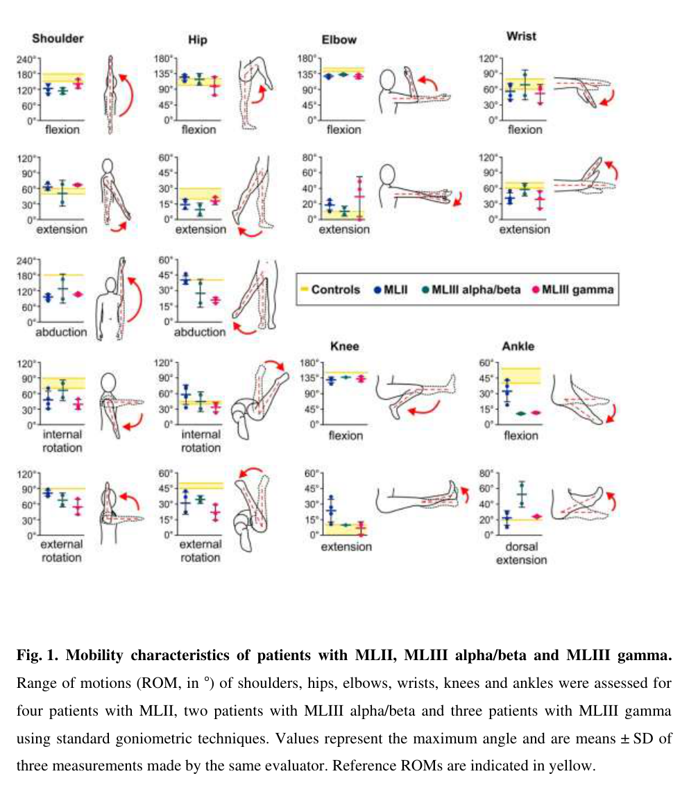

## Question

# Disease Characteristics Research Template

## Target Disease
- **Disease Name:** GNPTG-Mucolipidosis
- **MONDO ID:**  (if available)
- **Category:** Mendelian

## Research Objectives

Please provide a comprehensive research report on **GNPTG-Mucolipidosis** covering all of the
disease characteristics listed below. This report will be used to populate a disease knowledge
base entry. Be thorough and cite primary literature (PMID preferred) for all claims.

For each section, **suggested databases/resources** are listed. These are the first places
you should search for information on each topic.

---

### 1. Disease Information
> **Search first:** OMIM, Orphanet, ICD-10/ICD-11, MeSH, PubMed

- What is the disease? Provide a concise overview.
- What are the key identifiers? (OMIM, Orphanet, ICD-10/ICD-11, MeSH, Mondo)
- What are the common synonyms and alternative names?
- Is the information derived from individual patients (e.g., EHR) or aggregated disease-level resources?

### 2. Etiology

- **Disease Causal Factors**: What are the primary causes? (genetic, environmental, infectious, mechanistic)
- **Risk Factors**:
  > **Search first:** PubMed, Cochrane Library, UpToDate, clinical guidelines, ClinVar, ClinGen, GWAS Catalog, PheGenI, CTD, CDC, WHO, epidemiological databases
  - Genetic risk factors (causal variants, susceptibility loci, modifier genes)
  - Environmental risk factors (toxins, lifestyle, occupational exposures, age, sex, family history)
- **Protective Factors**:
  > **Search first:** PubMed, Cochrane Library, clinical trial databases, GWAS Catalog, gnomAD, WHO, CDC, nutrition databases
  - Genetic protective factors (protective variants, modifier alleles)
  - Environmental protective factors (diet, lifestyle, exposures that reduce risk)
- **Gene-Environment Interactions**: How do genetic and environmental factors interact to influence disease?
  > **Search first:** CTD, PubMed, PheGenI, GxE databases

### 3. Phenotypes
> **Search first:** HPO (Human Phenotype Ontology), OMIM, Orphanet, PubMed, clinicaltrials.gov, MedDRA, SNOMED CT, DECIPHER, LOINC

For each phenotype, provide:
- **Phenotype type**: symptoms, clinical signs, physical manifestations, behavioral changes, or laboratory abnormalities
  > For symptoms/signs: HPO, OMIM, Orphanet, PubMed
  > For behavioral changes: HPO, DSM, RDoC (Research Domain Criteria), PubMed
  > For laboratory abnormalities: LOINC, SNOMED CT, LabTests Online, PubMed
- **Phenotype characteristics**:
  > **Search first:** OMIM, Orphanet, HPO, PubMed
  - Age of symptom onset (neonatal, childhood, adult-onset, late-onset)
  - Symptom severity (mild, moderate, severe, variable)
  - Symptom progression (stable, progressive, episodic, fluctuating)
  - Frequency among affected individuals (percentage or qualitative)
- **Quality of life impact**: Effects on daily functioning and well-being (per-phenotype when possible)
  > **Search first:** EQ-5D database, SF-36, WHO QOL databases, PubMed
- Suggest HPO (Human Phenotype Ontology) terms for each phenotype

### 4. Genetic/Molecular Information

- **Causal Genes**: Gene mutations or chromosomal abnormalities responsible for disease (gene symbols, OMIM IDs)
  > **Search first:** OMIM, ClinVar, HGMD, Ensembl, NCBI Gene
- **Pathogenic Variants**:
  - Affected genes (gene symbols, HGNC IDs)
    > **Search first:** OMIM, NCBI Gene, Ensembl, HGNC, UniProt, GeneCards
  - Variant classification (pathogenic, likely pathogenic, VUS per ACMG/AMP guidelines)
    > **Search first:** ClinVar, ClinGen, ACMG/AMP guidelines, VarSome
  - Variant type/class (missense, frameshift, nonsense, splice-site, structural)
  - Allele frequency in population databases
    > **Search first:** gnomAD, 1000 Genomes, ExAC, TOPMed, dbSNP
  - Somatic vs germline origin
    > **Search first:** COSMIC (somatic), ClinVar, ICGC, TCGA
  - Functional consequences (loss of function, gain of function, dominant negative)
- **Modifier Genes**: Genes that modify disease severity or expression
- **Epigenetic Information**: DNA methylation, histone modifications, chromatin changes affecting disease
  > **Search first:** ENCODE, Roadmap Epigenomics, MethBase, DiseaseMeth
- **Chromosomal Abnormalities**: Large-scale genetic changes (aneuploidy, translocations, inversions)
  > **Search first:** DECIPHER, ClinVar, ECARUCA, UCSC Genome Browser

### 5. Environmental Information

- **Environmental Factors**: Non-genetic contributing factors (toxins, radiation, pollution, occupational exposure)
  > **Search first:** CTD (Comparative Toxicogenomics Database), TOXNET, PubMed, EPA databases
- **Lifestyle Factors**: Behavioral factors (smoking, diet, exercise, alcohol consumption)
  > **Search first:** CDC databases, WHO, PubMed, NHANES
- **Infectious Agents**: If applicable, pathogens causing or triggering disease (bacteria, viruses, fungi, parasites)
  > **Search first:** NCBI Taxonomy, ViPR, BV-BRC, MicrobeDB, GIDEON

### 6. Mechanism / Pathophysiology

- **Molecular Pathways**: Specific signaling cascades or biochemical pathways involved (Wnt, MAPK, mTOR, PI3K-AKT, etc.)
  > **Search first:** KEGG, Reactome, WikiPathways, PathBank, BioCyc
- **Cellular Processes**: Cell-level mechanisms (apoptosis, autophagy, cell cycle dysregulation, inflammation, etc.)
  > **Search first:** Gene Ontology (GO), Reactome, KEGG, PubMed
- **Protein Dysfunction**: How protein structure or function is altered (misfolding, aggregation, loss of function, gain of function)
  > **Search first:** UniProt, PDB (Protein Data Bank), InterPro, Pfam, AlphaFold
- **Metabolic Changes**: Alterations in metabolic processes (energy metabolism, lipid metabolism, amino acid metabolism)
  > **Search first:** KEGG, BioCyc, HMDB (Human Metabolome Database), BRENDA
- **Immune System Involvement**: Role of immune response (autoimmunity, immunodeficiency, chronic inflammation)
  > **Search first:** ImmPort, Immunome Database, IEDB, Gene Ontology
- **Tissue Damage Mechanisms**: How tissues/ are injured (oxidative stress, ischemia, fibrosis, necrosis)
  > **Search first:** PubMed, Gene Ontology, Reactome
- **Biochemical Abnormalities**: Specific molecular defects (enzyme deficiencies, receptor dysfunction, ion channel defects)
  > **Search first:** BRENDA, UniProt, KEGG, OMIM, PubMed
- **Epigenetic Changes**: DNA methylation, histone modifications affecting gene expression in disease
  > **Search first:** ENCODE, Roadmap Epigenomics, MethBase, DiseaseMeth
- **Molecular Profiling** (if available):
  - Transcriptomics/gene expression changes
    > **Search first:** GEO (Gene Expression Omnibus), ArrayExpress, GTEx, Human Cell Atlas, SRA
  - Proteomics findings
    > **Search first:** PRIDE, ProteomeXchange, Human Protein Atlas, STRING, BioGRID
  - Metabolomics signatures
    > **Search first:** MetaboLights, Metabolomics Workbench, HMDB, METLIN
  - Lipidomics alterations
    > **Search first:** LIPID MAPS, SwissLipids, LipidHome, Metabolomics Workbench
  - Genomic structural features
    > **Search first:** UCSC Genome Browser, Ensembl, NCBI, dbVar, DGV
- **Advanced Technologies** (if applicable):
  - Single-cell analysis findings (cell-type specific mechanisms, cellular heterogeneity)
    > **Search first:** Human Cell Atlas, Single Cell Portal, GEO, CELLxGENE
  - Spatial transcriptomics findings
    > **Search first:** GEO, Spatial Research, Vizgen, 10x Genomics data
  - Multi-omics integration results
    > **Search first:** TCGA, ICGC, cBioPortal, LinkedOmics, PubMed
  - Functional genomics screens (CRISPR, RNAi)
    > **Search first:** DepMap, GenomeRNAi, PubMed, BioGRID ORCS

For each mechanism, describe:
- The causal chain from initial trigger to clinical manifestation
- Which mechanisms are upstream vs downstream
- What cell types and biological processes are involved
- Suggest GO terms for biological processes and CL terms for cell types

### 7. Anatomical Structures Affected

- **Organ Level**:
  - Primary organs directly affected
  - Secondary organ involvement (complications, secondary effects)
  - Body systems involved (cardiovascular, nervous, digestive, respiratory, endocrine, etc.)
  > **Search first:** Uberon, FMA (Foundational Model of Anatomy), OMIM, HPO, ICD-11, MeSH, SNOMED CT
- **Tissue and Cell Level**:
  - Specific tissue types affected (epithelial, connective, muscle, nervous)
  - Specific cell populations targeted (with Cell Ontology terms)
  > **Search first:** Uberon, Human Protein Atlas, Cell Ontology, Human Cell Atlas, CellMarker, PanglaoDB
- **Subcellular Level**:
  - Cellular compartments involved (mitochondria, nucleus, ER, lysosomes) (with GO Cellular Component terms)
  > **Search first:** Gene Ontology (Cellular Component), UniProt, Human Protein Atlas
- **Localization**:
  - Specific anatomical sites (with UBERON terms)
    > **Search first:** FMA, Uberon, NeuroNames (for brain), SNOMED CT
  - Lateralization (unilateral, bilateral, asymmetric)
    > **Search first:** HPO, clinical literature, imaging databases

### 8. Temporal Development

- **Onset**:
  - Typical age of onset (congenital, pediatric, adult, geriatric)
  - Onset pattern (acute, subacute, chronic, insidious)
  > **Search first:** OMIM, Orphanet, HPO, PubMed
- **Progression**:
  - Disease stages (early, intermediate, advanced, end-stage)
    > **Search first:** Cancer Staging Manual (AJCC), WHO classifications, PubMed
  - Progression rate (rapid, slow, variable)
  - Disease course pattern (episodic, relapsing-remitting, progressive, stable)
  - Disease duration (self-limited, chronic lifelong)
  > **Search first:** Disease registries, longitudinal cohort databases, natural history studies, PubMed, Orphanet, OMIM
- **Patterns**:
  - Remission patterns (spontaneous, treatment-induced)
    > **Search first:** Clinical trial databases, disease registries, PubMed
  - Critical periods (time windows of vulnerability or opportunity for intervention)
    > **Search first:** PubMed, developmental biology databases, clinical guidelines

### 9. Inheritance and Population

- **Epidemiology**:
  - Prevalence (cases per 100,000 at given time)
  - Incidence (new cases per 100,000 per year)
  > **Search first:** Orphanet, CDC, WHO, GBD (Global Burden of Disease), national registries, SEER, disease registries
- **For Genetic Etiology**:
  - Inheritance pattern (AD, AR, X-linked, mitochondrial, multifactorial, polygenic)
    > **Search first:** OMIM, Orphanet, ClinVar, GTR (Genetic Testing Registry)
  - Penetrance (complete, incomplete, age-dependent)
    > **Search first:** ClinVar, OMIM, PubMed, ClinGen
  - Expressivity (variable, consistent)
    > **Search first:** OMIM, ClinVar, PubMed
  - Genetic anticipation (increasing severity in successive generations)
    > **Search first:** OMIM, PubMed (especially for repeat expansion disorders)
  - Germline mosaicism
    > **Search first:** ClinVar, OMIM, genetic counseling literature, PubMed
  - Founder effects (population-specific mutations)
    > **Search first:** gnomAD, population genetics databases, PubMed
  - Consanguinity role
    > **Search first:** OMIM, population studies, genetic counseling resources
  - Carrier frequency
    > **Search first:** gnomAD, carrier screening databases, GeneReviews, GTR
- **Population Demographics**:
  - Affected populations (ethnic or demographic groups with higher prevalence)
    > **Search first:** gnomAD, 1000 Genomes, PAGE Study, PubMed, population registries
  - Geographic distribution (endemic areas, regional variation)
    > **Search first:** WHO, CDC, GBD, Orphanet, geographic epidemiology databases
  - Geographic distribution of specific variants
  - Sex ratio (male:female)
    > **Search first:** Disease registries, OMIM, PubMed, epidemiological databases
  - Age distribution of affected individuals
    > **Search first:** CDC, disease registries, SEER, Orphanet

### 10. Diagnostics

- **Clinical Tests**:
  - Laboratory tests (blood, urine, tissue chemistry, specific enzyme assays)
    > **Search first:** LOINC, LabTests Online, PubMed
  - Biomarkers (proteins, metabolites, genetic markers, circulating biomarkers)
    > **Search first:** FDA Biomarker List, BEST (Biomarkers, EndpointS, and other Tools), PubMed
  - Imaging studies (X-ray, CT, MRI, PET, ultrasound)
    > **Search first:** RadLex, DICOM, Radiopaedia, imaging databases
  - Functional tests (pulmonary function, cardiac stress tests)
    > **Search first:** LOINC, clinical guidelines, PubMed
  - Electrophysiology (EEG, EMG, ECG, nerve conduction studies)
    > **Search first:** LOINC, clinical neurophysiology databases, PubMed
  - Biopsy findings (histopathology, immunohistochemistry)
    > **Search first:** SNOMED CT, College of American Pathologists resources, PubMed
  - Pathology findings (microscopic examination)
    > **Search first:** SNOMED CT, Digital Pathology databases, PubMed
- **Genetic Testing**:
  > **Search first:** GTR (Genetic Testing Registry), GeneReviews, ClinGen
  - Overview of recommended genetic testing approach
  - Whole genome sequencing (WGS) utility
    > **Search first:** GTR, ClinVar, GEL (Genomics England), gnomAD
  - Whole exome sequencing (WES) utility
    > **Search first:** GTR, ClinVar, OMIM, GeneMatcher
  - Gene panels (which panels, which genes)
    > **Search first:** GTR, ClinVar, laboratory-specific databases
  - Single gene testing
    > **Search first:** GTR, ClinVar, OMIM, GeneReviews
  - Chromosomal microarray (CMA)
    > **Search first:** DECIPHER, ClinVar, dbVar, ECARUCA
  - Karyotyping
    > **Search first:** Chromosome Abnormality Database, ClinVar, cytogenetics resources
  - FISH
    > **Search first:** ClinVar, cytogenetics databases, PubMed
  - Mitochondrial DNA testing
    > **Search first:** MITOMAP, MSeqDR, ClinVar, GTR
  - Repeat expansion testing
    > **Search first:** GTR, ClinVar, repeat expansion databases, PubMed
- **Omics-Based Diagnostics** (if applicable):
  - RNA sequencing / transcriptomics
    > **Search first:** GEO, ArrayExpress, GTEx, RNA-seq databases
  - Proteomics
    > **Search first:** PRIDE, ProteomeXchange, FDA Biomarker database
  - Metabolomics
    > **Search first:** MetaboLights, Metabolomics Workbench, HMDB
  - Epigenomics
    > **Search first:** GEO, ENCODE, Roadmap Epigenomics, MethBase
  - Liquid biopsy
    > **Search first:** COSMIC, ClinVar, liquid biopsy databases, PubMed
- **Clinical Criteria**:
  - Standardized diagnostic criteria (DSM, ICD, society guidelines)
    > **Search first:** DSM-5, ICD-11, clinical society guidelines, UpToDate
  - Differential diagnosis (other conditions to rule out, with distinguishing features)
    > **Search first:** DynaMed, UpToDate, clinical decision support systems
- **Screening**:
  - Screening methods for asymptomatic individuals (newborn screening, carrier screening, cascade screening)
    > **Search first:** ACMG recommendations, CDC newborn screening, GTR

### 11. Outcome/Prognosis

- **Survival and Mortality**:
  - Survival rate (5-year, 10-year, overall)
    > **Search first:** SEER, cancer registries, disease-specific registries, PubMed
  - Life expectancy (with and without treatment if applicable)
    > **Search first:** Orphanet, disease registries, actuarial databases, PubMed
  - Mortality rate
    > **Search first:** CDC, WHO, GBD, national mortality databases
  - Disease-specific mortality (deaths directly attributable to disease)
    > **Search first:** Disease registries, CDC Wonder, GBD, PubMed
- **Morbidity and Function**:
  - Morbidity (disease-related disability and health impacts)
    > **Search first:** GBD, WHO, disability databases, PubMed
  - Disability outcomes (long-term functional impairments)
    > **Search first:** ICF (International Classification of Functioning), disability registries
  - Quality of life measures (EQ-5D, SF-36, PROMIS, disease-specific tools)
    > **Search first:** EQ-5D database, SF-36, PROMIS, PubMed
- **Disease Course**:
  - Complications (secondary problems: infections, organ failure, etc.)
    > **Search first:** ICD codes, disease registries, clinical databases, PubMed
  - Recovery potential (likelihood and extent of recovery, with vs without treatment)
    > **Search first:** Natural history studies, rehabilitation databases, PubMed
- **Prediction**:
  - Prognostic factors (age, disease severity, biomarkers, treatment response)
    > **Search first:** Prognostic models databases, clinical calculators, PubMed
  - Prognostic biomarkers (molecular markers predicting disease course)
    > **Search first:** FDA Biomarker database, PubMed, cancer prognostic databases

### 12. Treatment

- **Pharmacotherapy**:
  - Pharmacological treatments (drug names, drug classes, mechanisms of action)
    > **Search first:** DrugBank, RxNorm, ATC classification, DailyMed, FDA databases
  - Pharmacogenomics (how genetic variants affect drug metabolism, efficacy, toxicity)
    > **Search first:** PharmGKB, CPIC (Clinical Pharmacogenetics), FDA Table of PGx Biomarkers
- **Advanced Therapeutics**:
  - Gene therapy (viral vectors, CRISPR, gene replacement, gene editing)
    > **Search first:** ClinicalTrials.gov, FDA gene therapy database, ASGCT resources
  - Cell therapy (stem cell transplant, CAR-T, cellular therapeutics)
    > **Search first:** ClinicalTrials.gov, FDA cell therapy database, FACT standards
  - RNA-based therapies (ASOs, siRNA, mRNA therapies)
    > **Search first:** ClinicalTrials.gov, FDA approvals, PubMed
  - Targeted therapies (treatments directed at specific molecular targets)
    > **Search first:** My Cancer Genome, OncoKB, ClinicalTrials.gov, FDA approvals
  - Immunotherapies (checkpoint inhibitors, monoclonal antibodies)
    > **Search first:** Cancer Immunotherapy Database, FDA approvals, ClinicalTrials.gov
- **Surgical and Interventional**:
  - Surgical interventions (types of surgery, timing, outcomes)
    > **Search first:** CPT codes, surgical registries, clinical guidelines, PubMed
- **Supportive and Rehabilitative**:
  - Supportive care (symptom management, pain control, nutrition)
    > **Search first:** Clinical guidelines, Cochrane Library, PubMed
  - Rehabilitation (physical therapy, occupational therapy, speech therapy)
    > **Search first:** Rehabilitation medicine databases, clinical guidelines, PubMed
- **Experimental**:
  - Experimental treatments in clinical trials (with NCT identifiers if available)
    > **Search first:** ClinicalTrials.gov, EU Clinical Trials Register, WHO ICTRP
- **Treatment Outcomes**:
  - Treatment response rates
    > **Search first:** Clinical trial databases, FDA reviews, systematic reviews, PubMed
  - Side effects and adverse events
    > **Search first:** FDA Adverse Event Reporting System (FAERS), MedWatch, PubMed
- **Treatment Strategy**:
  - Treatment algorithms (clinical pathways, decision trees)
    > **Search first:** Clinical practice guidelines, NCCN Guidelines, UpToDate
  - Combination therapies
    > **Search first:** ClinicalTrials.gov, treatment guidelines, PubMed
  - Personalized medicine approaches (genotype-guided treatment)
    > **Search first:** My Cancer Genome, CIViC, PharmGKB, precision medicine databases

For each treatment, suggest MAXO (Medical Action Ontology) terms where applicable.

### 13. Prevention

- **Prevention Levels**:
  - Primary prevention (preventing disease occurrence: vaccination, risk factor modification)
    > **Search first:** CDC, WHO, USPSTF recommendations, Cochrane Library
  - Secondary prevention (early detection and treatment: screening programs, early intervention)
    > **Search first:** USPSTF, CDC screening guidelines, WHO
  - Tertiary prevention (preventing complications in those with disease)
    > **Search first:** Clinical guidelines, disease management protocols, PubMed
- **Immunization**: Vaccine strategies (if applicable)
  > **Search first:** CDC vaccine schedules, WHO immunization, FDA vaccine database
- **Screening and Early Detection**:
  - Screening programs (population-based: newborn screening, cancer screening)
    > **Search first:** CDC screening programs, USPSTF, cancer screening databases
  - Genetic screening (carrier screening, preimplantation genetic diagnosis, prenatal testing)
    > **Search first:** ACMG recommendations, ACOG guidelines, GTR
  - Risk stratification (identifying high-risk individuals for targeted prevention)
    > **Search first:** Risk prediction models, clinical calculators, PubMed
- **Behavioral Interventions**: Lifestyle modifications to reduce risk
  > **Search first:** CDC, WHO, behavioral intervention databases, Cochrane Library
- **Counseling**: Genetic counseling (risk assessment, family planning guidance)
  > **Search first:** NSGC resources, ACMG guidelines, GeneReviews
- **Public Health**:
  - Public health interventions (sanitation, vector control, health education)
    > **Search first:** CDC, WHO, public health databases, PubMed
  - Environmental interventions (reducing environmental risk factors)
    > **Search first:** EPA databases, WHO environmental health, PubMed
- **Prophylaxis**: Preventive medications or procedures
  > **Search first:** Clinical guidelines, FDA approvals, PubMed

### 14. Other Species / Natural Disease

- **Taxonomy**: Species affected (with NCBI Taxon identifiers)
  > **Search first:** NCBI Taxonomy
- **Breed**: Specific breeds affected (with VBO identifiers if applicable)
  > **Search first:** VBO (Vertebrate Breed Ontology)
- **Gene**: Orthologous genes in other species (with NCBI Gene IDs)
  > **Search first:** NCBI Gene
- **Natural Disease**:
  - Naturally occurring disease in other species (companion animals, wildlife)
    > **Search first:** OMIA (Online Mendelian Inheritance in Animals), VetCompass, PubMed
  - Veterinary relevance and importance in animal health
    > **Search first:** OMIA, veterinary databases, PubMed
- **Comparative Biology**:
  - Comparative pathology (similarities and differences across species)
    > **Search first:** OMIA, comparative pathology databases, PubMed
  - Evolutionary conservation of disease mechanisms
    > **Search first:** HomoloGene, OrthoMCL, Alliance of Genome Resources
- **Transmission** (if applicable):
  - Zoonotic potential
    > **Search first:** CDC zoonotic diseases, WHO zoonoses, GIDEON
  - Cross-species susceptibility
    > **Search first:** NCBI Taxonomy, veterinary databases, PubMed

### 15. Model Organisms

- **Model Types**:
  - Model organism type (mammalian, invertebrate, cellular, in vitro)
    > **Search first:** Alliance of Genome Resources, model organism databases
  - Specific model systems (mouse, rat, zebrafish, Drosophila, C. elegans, yeast, cell lines, organoids, iPSCs)
    > **Search first:** MGI, RGD, ZFIN, FlyBase, WormBase, SGD, ATCC, Cellosaurus
  - Induced models (drug treatment, surgical intervention, environmental manipulation)
    > **Search first:** MGI, model organism databases, PubMed
- **Genetic Models**:
  - Types available (knockout, knock-in, transgenic, conditional, humanized)
    > **Search first:** MGI, IMPC, KOMP, EuMMCR, IMSR
- **Model Characteristics**:
  - Phenotype recapitulation (how well model reproduces human disease features)
    > **Search first:** Model organism databases, comparative studies, PubMed
  - Model limitations (aspects of human disease not captured)
    > **Search first:** Model organism databases, PubMed, review articles
- **Applications**:
  - Research applications (what aspects of disease can be studied)
    > **Search first:** Model organism databases, PubMed
- **Resources**:
  - Model databases
    > **Search first:** MGI, RGD, ZFIN, FlyBase, WormBase, IMSR, EMMA, MMRRC

---

## Citation Requirements

- Cite primary literature (PMID preferred) for all mechanistic and clinical claims
- Prioritize recent reviews and landmark papers
- Include direct quotes from abstracts where possible to support key statements
- Distinguish evidence source types: human clinical, model organism, in vitro, computational

## Output Format

Structure your response as a comprehensive narrative organized by the sections above.
For each section, provide:
- Factual content with specific details (numbers, percentages, gene names, variant nomenclature)
- Ontology term suggestions (HPO, GO, CL, UBERON, CHEBI, MAXO, MONDO) where applicable
- Evidence citations with PMIDs
- Direct quotes from abstracts to support key claims
- Clear indication when information is not available or not applicable for this disease

This report will be used to populate a disease knowledge base entry with:
- Pathophysiology descriptions with causal chains
- Gene/protein annotations (HGNC, GO terms)
- Phenotype associations (HP terms) with frequencies
- Cell type involvement (CL terms)
- Anatomical locations (UBERON terms)
- Chemical entities (CHEBI terms)
- Treatment annotations (MAXO terms)
- Evidence items with PMIDs and exact abstract quotes
- Epidemiology, prognosis, diagnostic, and prevention information
- Animal model descriptions with phenotype recapitulation details

## Output

Question: You are an expert researcher providing comprehensive, well-cited information.

Provide detailed information focusing on:
1. Key concepts and definitions with current understanding
2. Recent developments and latest research (prioritize 2023-2024 sources)
3. Current applications and real-world implementations
4. Expert opinions and analysis from authoritative sources
5. Relevant statistics and data from recent studies

Format as a comprehensive research report with proper citations. Include URLs and publication dates where available.
Always prioritize recent, authoritative sources and provide specific citations for all major claims.

# Disease Characteristics Research Template

## Target Disease
- **Disease Name:** GNPTG-Mucolipidosis
- **MONDO ID:**  (if available)
- **Category:** Mendelian

## Research Objectives

Please provide a comprehensive research report on **GNPTG-Mucolipidosis** covering all of the
disease characteristics listed below. This report will be used to populate a disease knowledge
base entry. Be thorough and cite primary literature (PMID preferred) for all claims.

For each section, **suggested databases/resources** are listed. These are the first places
you should search for information on each topic.

---

### 1. Disease Information
> **Search first:** OMIM, Orphanet, ICD-10/ICD-11, MeSH, PubMed

- What is the disease? Provide a concise overview.
- What are the key identifiers? (OMIM, Orphanet, ICD-10/ICD-11, MeSH, Mondo)
- What are the common synonyms and alternative names?
- Is the information derived from individual patients (e.g., EHR) or aggregated disease-level resources?

### 2. Etiology

- **Disease Causal Factors**: What are the primary causes? (genetic, environmental, infectious, mechanistic)
- **Risk Factors**:
  > **Search first:** PubMed, Cochrane Library, UpToDate, clinical guidelines, ClinVar, ClinGen, GWAS Catalog, PheGenI, CTD, CDC, WHO, epidemiological databases
  - Genetic risk factors (causal variants, susceptibility loci, modifier genes)
  - Environmental risk factors (toxins, lifestyle, occupational exposures, age, sex, family history)
- **Protective Factors**:
  > **Search first:** PubMed, Cochrane Library, clinical trial databases, GWAS Catalog, gnomAD, WHO, CDC, nutrition databases
  - Genetic protective factors (protective variants, modifier alleles)
  - Environmental protective factors (diet, lifestyle, exposures that reduce risk)
- **Gene-Environment Interactions**: How do genetic and environmental factors interact to influence disease?
  > **Search first:** CTD, PubMed, PheGenI, GxE databases

### 3. Phenotypes
> **Search first:** HPO (Human Phenotype Ontology), OMIM, Orphanet, PubMed, clinicaltrials.gov, MedDRA, SNOMED CT, DECIPHER, LOINC

For each phenotype, provide:
- **Phenotype type**: symptoms, clinical signs, physical manifestations, behavioral changes, or laboratory abnormalities
  > For symptoms/signs: HPO, OMIM, Orphanet, PubMed
  > For behavioral changes: HPO, DSM, RDoC (Research Domain Criteria), PubMed
  > For laboratory abnormalities: LOINC, SNOMED CT, LabTests Online, PubMed
- **Phenotype characteristics**:
  > **Search first:** OMIM, Orphanet, HPO, PubMed
  - Age of symptom onset (neonatal, childhood, adult-onset, late-onset)
  - Symptom severity (mild, moderate, severe, variable)
  - Symptom progression (stable, progressive, episodic, fluctuating)
  - Frequency among affected individuals (percentage or qualitative)
- **Quality of life impact**: Effects on daily functioning and well-being (per-phenotype when possible)
  > **Search first:** EQ-5D database, SF-36, WHO QOL databases, PubMed
- Suggest HPO (Human Phenotype Ontology) terms for each phenotype

### 4. Genetic/Molecular Information

- **Causal Genes**: Gene mutations or chromosomal abnormalities responsible for disease (gene symbols, OMIM IDs)
  > **Search first:** OMIM, ClinVar, HGMD, Ensembl, NCBI Gene
- **Pathogenic Variants**:
  - Affected genes (gene symbols, HGNC IDs)
    > **Search first:** OMIM, NCBI Gene, Ensembl, HGNC, UniProt, GeneCards
  - Variant classification (pathogenic, likely pathogenic, VUS per ACMG/AMP guidelines)
    > **Search first:** ClinVar, ClinGen, ACMG/AMP guidelines, VarSome
  - Variant type/class (missense, frameshift, nonsense, splice-site, structural)
  - Allele frequency in population databases
    > **Search first:** gnomAD, 1000 Genomes, ExAC, TOPMed, dbSNP
  - Somatic vs germline origin
    > **Search first:** COSMIC (somatic), ClinVar, ICGC, TCGA
  - Functional consequences (loss of function, gain of function, dominant negative)
- **Modifier Genes**: Genes that modify disease severity or expression
- **Epigenetic Information**: DNA methylation, histone modifications, chromatin changes affecting disease
  > **Search first:** ENCODE, Roadmap Epigenomics, MethBase, DiseaseMeth
- **Chromosomal Abnormalities**: Large-scale genetic changes (aneuploidy, translocations, inversions)
  > **Search first:** DECIPHER, ClinVar, ECARUCA, UCSC Genome Browser

### 5. Environmental Information

- **Environmental Factors**: Non-genetic contributing factors (toxins, radiation, pollution, occupational exposure)
  > **Search first:** CTD (Comparative Toxicogenomics Database), TOXNET, PubMed, EPA databases
- **Lifestyle Factors**: Behavioral factors (smoking, diet, exercise, alcohol consumption)
  > **Search first:** CDC databases, WHO, PubMed, NHANES
- **Infectious Agents**: If applicable, pathogens causing or triggering disease (bacteria, viruses, fungi, parasites)
  > **Search first:** NCBI Taxonomy, ViPR, BV-BRC, MicrobeDB, GIDEON

### 6. Mechanism / Pathophysiology

- **Molecular Pathways**: Specific signaling cascades or biochemical pathways involved (Wnt, MAPK, mTOR, PI3K-AKT, etc.)
  > **Search first:** KEGG, Reactome, WikiPathways, PathBank, BioCyc
- **Cellular Processes**: Cell-level mechanisms (apoptosis, autophagy, cell cycle dysregulation, inflammation, etc.)
  > **Search first:** Gene Ontology (GO), Reactome, KEGG, PubMed
- **Protein Dysfunction**: How protein structure or function is altered (misfolding, aggregation, loss of function, gain of function)
  > **Search first:** UniProt, PDB (Protein Data Bank), InterPro, Pfam, AlphaFold
- **Metabolic Changes**: Alterations in metabolic processes (energy metabolism, lipid metabolism, amino acid metabolism)
  > **Search first:** KEGG, BioCyc, HMDB (Human Metabolome Database), BRENDA
- **Immune System Involvement**: Role of immune response (autoimmunity, immunodeficiency, chronic inflammation)
  > **Search first:** ImmPort, Immunome Database, IEDB, Gene Ontology
- **Tissue Damage Mechanisms**: How tissues/ are injured (oxidative stress, ischemia, fibrosis, necrosis)
  > **Search first:** PubMed, Gene Ontology, Reactome
- **Biochemical Abnormalities**: Specific molecular defects (enzyme deficiencies, receptor dysfunction, ion channel defects)
  > **Search first:** BRENDA, UniProt, KEGG, OMIM, PubMed
- **Epigenetic Changes**: DNA methylation, histone modifications affecting gene expression in disease
  > **Search first:** ENCODE, Roadmap Epigenomics, MethBase, DiseaseMeth
- **Molecular Profiling** (if available):
  - Transcriptomics/gene expression changes
    > **Search first:** GEO (Gene Expression Omnibus), ArrayExpress, GTEx, Human Cell Atlas, SRA
  - Proteomics findings
    > **Search first:** PRIDE, ProteomeXchange, Human Protein Atlas, STRING, BioGRID
  - Metabolomics signatures
    > **Search first:** MetaboLights, Metabolomics Workbench, HMDB, METLIN
  - Lipidomics alterations
    > **Search first:** LIPID MAPS, SwissLipids, LipidHome, Metabolomics Workbench
  - Genomic structural features
    > **Search first:** UCSC Genome Browser, Ensembl, NCBI, dbVar, DGV
- **Advanced Technologies** (if applicable):
  - Single-cell analysis findings (cell-type specific mechanisms, cellular heterogeneity)
    > **Search first:** Human Cell Atlas, Single Cell Portal, GEO, CELLxGENE
  - Spatial transcriptomics findings
    > **Search first:** GEO, Spatial Research, Vizgen, 10x Genomics data
  - Multi-omics integration results
    > **Search first:** TCGA, ICGC, cBioPortal, LinkedOmics, PubMed
  - Functional genomics screens (CRISPR, RNAi)
    > **Search first:** DepMap, GenomeRNAi, PubMed, BioGRID ORCS

For each mechanism, describe:
- The causal chain from initial trigger to clinical manifestation
- Which mechanisms are upstream vs downstream
- What cell types and biological processes are involved
- Suggest GO terms for biological processes and CL terms for cell types

### 7. Anatomical Structures Affected

- **Organ Level**:
  - Primary organs directly affected
  - Secondary organ involvement (complications, secondary effects)
  - Body systems involved (cardiovascular, nervous, digestive, respiratory, endocrine, etc.)
  > **Search first:** Uberon, FMA (Foundational Model of Anatomy), OMIM, HPO, ICD-11, MeSH, SNOMED CT
- **Tissue and Cell Level**:
  - Specific tissue types affected (epithelial, connective, muscle, nervous)
  - Specific cell populations targeted (with Cell Ontology terms)
  > **Search first:** Uberon, Human Protein Atlas, Cell Ontology, Human Cell Atlas, CellMarker, PanglaoDB
- **Subcellular Level**:
  - Cellular compartments involved (mitochondria, nucleus, ER, lysosomes) (with GO Cellular Component terms)
  > **Search first:** Gene Ontology (Cellular Component), UniProt, Human Protein Atlas
- **Localization**:
  - Specific anatomical sites (with UBERON terms)
    > **Search first:** FMA, Uberon, NeuroNames (for brain), SNOMED CT
  - Lateralization (unilateral, bilateral, asymmetric)
    > **Search first:** HPO, clinical literature, imaging databases

### 8. Temporal Development

- **Onset**:
  - Typical age of onset (congenital, pediatric, adult, geriatric)
  - Onset pattern (acute, subacute, chronic, insidious)
  > **Search first:** OMIM, Orphanet, HPO, PubMed
- **Progression**:
  - Disease stages (early, intermediate, advanced, end-stage)
    > **Search first:** Cancer Staging Manual (AJCC), WHO classifications, PubMed
  - Progression rate (rapid, slow, variable)
  - Disease course pattern (episodic, relapsing-remitting, progressive, stable)
  - Disease duration (self-limited, chronic lifelong)
  > **Search first:** Disease registries, longitudinal cohort databases, natural history studies, PubMed, Orphanet, OMIM
- **Patterns**:
  - Remission patterns (spontaneous, treatment-induced)
    > **Search first:** Clinical trial databases, disease registries, PubMed
  - Critical periods (time windows of vulnerability or opportunity for intervention)
    > **Search first:** PubMed, developmental biology databases, clinical guidelines

### 9. Inheritance and Population

- **Epidemiology**:
  - Prevalence (cases per 100,000 at given time)
  - Incidence (new cases per 100,000 per year)
  > **Search first:** Orphanet, CDC, WHO, GBD (Global Burden of Disease), national registries, SEER, disease registries
- **For Genetic Etiology**:
  - Inheritance pattern (AD, AR, X-linked, mitochondrial, multifactorial, polygenic)
    > **Search first:** OMIM, Orphanet, ClinVar, GTR (Genetic Testing Registry)
  - Penetrance (complete, incomplete, age-dependent)
    > **Search first:** ClinVar, OMIM, PubMed, ClinGen
  - Expressivity (variable, consistent)
    > **Search first:** OMIM, ClinVar, PubMed
  - Genetic anticipation (increasing severity in successive generations)
    > **Search first:** OMIM, PubMed (especially for repeat expansion disorders)
  - Germline mosaicism
    > **Search first:** ClinVar, OMIM, genetic counseling literature, PubMed
  - Founder effects (population-specific mutations)
    > **Search first:** gnomAD, population genetics databases, PubMed
  - Consanguinity role
    > **Search first:** OMIM, population studies, genetic counseling resources
  - Carrier frequency
    > **Search first:** gnomAD, carrier screening databases, GeneReviews, GTR
- **Population Demographics**:
  - Affected populations (ethnic or demographic groups with higher prevalence)
    > **Search first:** gnomAD, 1000 Genomes, PAGE Study, PubMed, population registries
  - Geographic distribution (endemic areas, regional variation)
    > **Search first:** WHO, CDC, GBD, Orphanet, geographic epidemiology databases
  - Geographic distribution of specific variants
  - Sex ratio (male:female)
    > **Search first:** Disease registries, OMIM, PubMed, epidemiological databases
  - Age distribution of affected individuals
    > **Search first:** CDC, disease registries, SEER, Orphanet

### 10. Diagnostics

- **Clinical Tests**:
  - Laboratory tests (blood, urine, tissue chemistry, specific enzyme assays)
    > **Search first:** LOINC, LabTests Online, PubMed
  - Biomarkers (proteins, metabolites, genetic markers, circulating biomarkers)
    > **Search first:** FDA Biomarker List, BEST (Biomarkers, EndpointS, and other Tools), PubMed
  - Imaging studies (X-ray, CT, MRI, PET, ultrasound)
    > **Search first:** RadLex, DICOM, Radiopaedia, imaging databases
  - Functional tests (pulmonary function, cardiac stress tests)
    > **Search first:** LOINC, clinical guidelines, PubMed
  - Electrophysiology (EEG, EMG, ECG, nerve conduction studies)
    > **Search first:** LOINC, clinical neurophysiology databases, PubMed
  - Biopsy findings (histopathology, immunohistochemistry)
    > **Search first:** SNOMED CT, College of American Pathologists resources, PubMed
  - Pathology findings (microscopic examination)
    > **Search first:** SNOMED CT, Digital Pathology databases, PubMed
- **Genetic Testing**:
  > **Search first:** GTR (Genetic Testing Registry), GeneReviews, ClinGen
  - Overview of recommended genetic testing approach
  - Whole genome sequencing (WGS) utility
    > **Search first:** GTR, ClinVar, GEL (Genomics England), gnomAD
  - Whole exome sequencing (WES) utility
    > **Search first:** GTR, ClinVar, OMIM, GeneMatcher
  - Gene panels (which panels, which genes)
    > **Search first:** GTR, ClinVar, laboratory-specific databases
  - Single gene testing
    > **Search first:** GTR, ClinVar, OMIM, GeneReviews
  - Chromosomal microarray (CMA)
    > **Search first:** DECIPHER, ClinVar, dbVar, ECARUCA
  - Karyotyping
    > **Search first:** Chromosome Abnormality Database, ClinVar, cytogenetics resources
  - FISH
    > **Search first:** ClinVar, cytogenetics databases, PubMed
  - Mitochondrial DNA testing
    > **Search first:** MITOMAP, MSeqDR, ClinVar, GTR
  - Repeat expansion testing
    > **Search first:** GTR, ClinVar, repeat expansion databases, PubMed
- **Omics-Based Diagnostics** (if applicable):
  - RNA sequencing / transcriptomics
    > **Search first:** GEO, ArrayExpress, GTEx, RNA-seq databases
  - Proteomics
    > **Search first:** PRIDE, ProteomeXchange, FDA Biomarker database
  - Metabolomics
    > **Search first:** MetaboLights, Metabolomics Workbench, HMDB
  - Epigenomics
    > **Search first:** GEO, ENCODE, Roadmap Epigenomics, MethBase
  - Liquid biopsy
    > **Search first:** COSMIC, ClinVar, liquid biopsy databases, PubMed
- **Clinical Criteria**:
  - Standardized diagnostic criteria (DSM, ICD, society guidelines)
    > **Search first:** DSM-5, ICD-11, clinical society guidelines, UpToDate
  - Differential diagnosis (other conditions to rule out, with distinguishing features)
    > **Search first:** DynaMed, UpToDate, clinical decision support systems
- **Screening**:
  - Screening methods for asymptomatic individuals (newborn screening, carrier screening, cascade screening)
    > **Search first:** ACMG recommendations, CDC newborn screening, GTR

### 11. Outcome/Prognosis

- **Survival and Mortality**:
  - Survival rate (5-year, 10-year, overall)
    > **Search first:** SEER, cancer registries, disease-specific registries, PubMed
  - Life expectancy (with and without treatment if applicable)
    > **Search first:** Orphanet, disease registries, actuarial databases, PubMed
  - Mortality rate
    > **Search first:** CDC, WHO, GBD, national mortality databases
  - Disease-specific mortality (deaths directly attributable to disease)
    > **Search first:** Disease registries, CDC Wonder, GBD, PubMed
- **Morbidity and Function**:
  - Morbidity (disease-related disability and health impacts)
    > **Search first:** GBD, WHO, disability databases, PubMed
  - Disability outcomes (long-term functional impairments)
    > **Search first:** ICF (International Classification of Functioning), disability registries
  - Quality of life measures (EQ-5D, SF-36, PROMIS, disease-specific tools)
    > **Search first:** EQ-5D database, SF-36, PROMIS, PubMed
- **Disease Course**:
  - Complications (secondary problems: infections, organ failure, etc.)
    > **Search first:** ICD codes, disease registries, clinical databases, PubMed
  - Recovery potential (likelihood and extent of recovery, with vs without treatment)
    > **Search first:** Natural history studies, rehabilitation databases, PubMed
- **Prediction**:
  - Prognostic factors (age, disease severity, biomarkers, treatment response)
    > **Search first:** Prognostic models databases, clinical calculators, PubMed
  - Prognostic biomarkers (molecular markers predicting disease course)
    > **Search first:** FDA Biomarker database, PubMed, cancer prognostic databases

### 12. Treatment

- **Pharmacotherapy**:
  - Pharmacological treatments (drug names, drug classes, mechanisms of action)
    > **Search first:** DrugBank, RxNorm, ATC classification, DailyMed, FDA databases
  - Pharmacogenomics (how genetic variants affect drug metabolism, efficacy, toxicity)
    > **Search first:** PharmGKB, CPIC (Clinical Pharmacogenetics), FDA Table of PGx Biomarkers
- **Advanced Therapeutics**:
  - Gene therapy (viral vectors, CRISPR, gene replacement, gene editing)
    > **Search first:** ClinicalTrials.gov, FDA gene therapy database, ASGCT resources
  - Cell therapy (stem cell transplant, CAR-T, cellular therapeutics)
    > **Search first:** ClinicalTrials.gov, FDA cell therapy database, FACT standards
  - RNA-based therapies (ASOs, siRNA, mRNA therapies)
    > **Search first:** ClinicalTrials.gov, FDA approvals, PubMed
  - Targeted therapies (treatments directed at specific molecular targets)
    > **Search first:** My Cancer Genome, OncoKB, ClinicalTrials.gov, FDA approvals
  - Immunotherapies (checkpoint inhibitors, monoclonal antibodies)
    > **Search first:** Cancer Immunotherapy Database, FDA approvals, ClinicalTrials.gov
- **Surgical and Interventional**:
  - Surgical interventions (types of surgery, timing, outcomes)
    > **Search first:** CPT codes, surgical registries, clinical guidelines, PubMed
- **Supportive and Rehabilitative**:
  - Supportive care (symptom management, pain control, nutrition)
    > **Search first:** Clinical guidelines, Cochrane Library, PubMed
  - Rehabilitation (physical therapy, occupational therapy, speech therapy)
    > **Search first:** Rehabilitation medicine databases, clinical guidelines, PubMed
- **Experimental**:
  - Experimental treatments in clinical trials (with NCT identifiers if available)
    > **Search first:** ClinicalTrials.gov, EU Clinical Trials Register, WHO ICTRP
- **Treatment Outcomes**:
  - Treatment response rates
    > **Search first:** Clinical trial databases, FDA reviews, systematic reviews, PubMed
  - Side effects and adverse events
    > **Search first:** FDA Adverse Event Reporting System (FAERS), MedWatch, PubMed
- **Treatment Strategy**:
  - Treatment algorithms (clinical pathways, decision trees)
    > **Search first:** Clinical practice guidelines, NCCN Guidelines, UpToDate
  - Combination therapies
    > **Search first:** ClinicalTrials.gov, treatment guidelines, PubMed
  - Personalized medicine approaches (genotype-guided treatment)
    > **Search first:** My Cancer Genome, CIViC, PharmGKB, precision medicine databases

For each treatment, suggest MAXO (Medical Action Ontology) terms where applicable.

### 13. Prevention

- **Prevention Levels**:
  - Primary prevention (preventing disease occurrence: vaccination, risk factor modification)
    > **Search first:** CDC, WHO, USPSTF recommendations, Cochrane Library
  - Secondary prevention (early detection and treatment: screening programs, early intervention)
    > **Search first:** USPSTF, CDC screening guidelines, WHO
  - Tertiary prevention (preventing complications in those with disease)
    > **Search first:** Clinical guidelines, disease management protocols, PubMed
- **Immunization**: Vaccine strategies (if applicable)
  > **Search first:** CDC vaccine schedules, WHO immunization, FDA vaccine database
- **Screening and Early Detection**:
  - Screening programs (population-based: newborn screening, cancer screening)
    > **Search first:** CDC screening programs, USPSTF, cancer screening databases
  - Genetic screening (carrier screening, preimplantation genetic diagnosis, prenatal testing)
    > **Search first:** ACMG recommendations, ACOG guidelines, GTR
  - Risk stratification (identifying high-risk individuals for targeted prevention)
    > **Search first:** Risk prediction models, clinical calculators, PubMed
- **Behavioral Interventions**: Lifestyle modifications to reduce risk
  > **Search first:** CDC, WHO, behavioral intervention databases, Cochrane Library
- **Counseling**: Genetic counseling (risk assessment, family planning guidance)
  > **Search first:** NSGC resources, ACMG guidelines, GeneReviews
- **Public Health**:
  - Public health interventions (sanitation, vector control, health education)
    > **Search first:** CDC, WHO, public health databases, PubMed
  - Environmental interventions (reducing environmental risk factors)
    > **Search first:** EPA databases, WHO environmental health, PubMed
- **Prophylaxis**: Preventive medications or procedures
  > **Search first:** Clinical guidelines, FDA approvals, PubMed

### 14. Other Species / Natural Disease

- **Taxonomy**: Species affected (with NCBI Taxon identifiers)
  > **Search first:** NCBI Taxonomy
- **Breed**: Specific breeds affected (with VBO identifiers if applicable)
  > **Search first:** VBO (Vertebrate Breed Ontology)
- **Gene**: Orthologous genes in other species (with NCBI Gene IDs)
  > **Search first:** NCBI Gene
- **Natural Disease**:
  - Naturally occurring disease in other species (companion animals, wildlife)
    > **Search first:** OMIA (Online Mendelian Inheritance in Animals), VetCompass, PubMed
  - Veterinary relevance and importance in animal health
    > **Search first:** OMIA, veterinary databases, PubMed
- **Comparative Biology**:
  - Comparative pathology (similarities and differences across species)
    > **Search first:** OMIA, comparative pathology databases, PubMed
  - Evolutionary conservation of disease mechanisms
    > **Search first:** HomoloGene, OrthoMCL, Alliance of Genome Resources
- **Transmission** (if applicable):
  - Zoonotic potential
    > **Search first:** CDC zoonotic diseases, WHO zoonoses, GIDEON
  - Cross-species susceptibility
    > **Search first:** NCBI Taxonomy, veterinary databases, PubMed

### 15. Model Organisms

- **Model Types**:
  - Model organism type (mammalian, invertebrate, cellular, in vitro)
    > **Search first:** Alliance of Genome Resources, model organism databases
  - Specific model systems (mouse, rat, zebrafish, Drosophila, C. elegans, yeast, cell lines, organoids, iPSCs)
    > **Search first:** MGI, RGD, ZFIN, FlyBase, WormBase, SGD, ATCC, Cellosaurus
  - Induced models (drug treatment, surgical intervention, environmental manipulation)
    > **Search first:** MGI, model organism databases, PubMed
- **Genetic Models**:
  - Types available (knockout, knock-in, transgenic, conditional, humanized)
    > **Search first:** MGI, IMPC, KOMP, EuMMCR, IMSR
- **Model Characteristics**:
  - Phenotype recapitulation (how well model reproduces human disease features)
    > **Search first:** Model organism databases, comparative studies, PubMed
  - Model limitations (aspects of human disease not captured)
    > **Search first:** Model organism databases, PubMed, review articles
- **Applications**:
  - Research applications (what aspects of disease can be studied)
    > **Search first:** Model organism databases, PubMed
- **Resources**:
  - Model databases
    > **Search first:** MGI, RGD, ZFIN, FlyBase, WormBase, IMSR, EMMA, MMRRC

---

## Citation Requirements

- Cite primary literature (PMID preferred) for all mechanistic and clinical claims
- Prioritize recent reviews and landmark papers
- Include direct quotes from abstracts where possible to support key statements
- Distinguish evidence source types: human clinical, model organism, in vitro, computational

## Output Format

Structure your response as a comprehensive narrative organized by the sections above.
For each section, provide:
- Factual content with specific details (numbers, percentages, gene names, variant nomenclature)
- Ontology term suggestions (HPO, GO, CL, UBERON, CHEBI, MAXO, MONDO) where applicable
- Evidence citations with PMIDs
- Direct quotes from abstracts to support key claims
- Clear indication when information is not available or not applicable for this disease

This report will be used to populate a disease knowledge base entry with:
- Pathophysiology descriptions with causal chains
- Gene/protein annotations (HGNC, GO terms)
- Phenotype associations (HP terms) with frequencies
- Cell type involvement (CL terms)
- Anatomical locations (UBERON terms)
- Chemical entities (CHEBI terms)
- Treatment annotations (MAXO terms)
- Evidence items with PMIDs and exact abstract quotes
- Epidemiology, prognosis, diagnostic, and prevention information
- Animal model descriptions with phenotype recapitulation details

# GNPTG‑Mucolipidosis (Mucolipidosis type III gamma; MLIIIγ): Comprehensive disease characteristics report

## Executive summary
GNPTG‑mucolipidosis corresponds to **mucolipidosis type III gamma (MLIIIγ)**, an **autosomal recessive lysosomal storage disorder** caused by biallelic pathogenic variants in **GNPTG**, encoding the **γ subunit of N‑acetylglucosamine‑1‑phosphotransferase (GlcNAc‑1‑PT)**—the initiating enzyme for mannose‑6‑phosphate (M6P) tagging of lysosomal hydrolases. Loss of proper M6P tagging causes **missorting and hypersecretion of lysosomal enzymes** into extracellular fluids (plasma/serum), with relative deficiency in lysosomes, leading to progressive connective‑tissue/bone/joint disease that is typically milder than GNPTAB‑related mucolipidosis. (velho2019thelysosomalstorage pages 1-3, dogterom2021mucolipidosistypeii pages 1-2)

Recent (2023–2024) advances relevant to GNPTG‑mucolipidosis include: (i) **multiplex tandem mass spectrometry assays in dried blood spots** to support screening/diagnosis of MLII/III; and (ii) **whole‑genome sequencing (WGS)** enabling diagnosis in atypical presentations and expanding the phenotype to include **late‑onset retinal dystrophy/retinitis pigmentosa** in at least one GNPTG‑confirmed case. (hong2023multiplextandemmass pages 1-2, geer2023unravelingmucolipidosistype pages 2-5)

## 1. Disease information
### 1.1 Definition and overview
**Mucolipidosis type III gamma (MLIIIγ)** is an attenuated mucolipidosis within the MLII/III spectrum, caused by defects in the lysosomal enzyme targeting pathway (M6P tagging). It is described as a variable but generally milder phenotype than MLII and MLIIIα/β, with major manifestations in the musculoskeletal system (progressive joint restriction, skeletal dysplasia/degeneration). (velho2019thelysosomalstorage pages 1-3, dogterom2021mucolipidosistypeii pages 1-2)

### 1.2 Key identifiers (OMIM/Orphanet/ICD/MeSH/MONDO)
The retrieved full‑text evidence did **not** include OMIM, Orphanet, ICD‑10/ICD‑11, MeSH, or MONDO identifiers; therefore these cannot be reported with tool‑verified citations in this run.

### 1.3 Synonyms and alternative names
* **Mucolipidosis type III gamma** (MLIIIγ). (velho2019thelysosomalstorage pages 1-3, dogterom2021mucolipidosistypeii pages 1-2)
* Historical MLIII literature uses **pseudo‑Hurler polydystrophy** (used in GNPTG mutation papers). (persichetti2009identificationandmolecular pages 1-2)

### 1.4 Evidence source types
* **Aggregated disease‑level resources**: systematic review of 843 cases and a GNPTAB/GNPTG mutation update compiling hundreds of individuals. (dogterom2021mucolipidosistypeii pages 1-2, velho2019thelysosomalstorage pages 1-3)
* **Individual patient reports**: e.g., WGS‑diagnosed late‑onset retinitis pigmentosa case. (geer2023unravelingmucolipidosistype pages 1-2)
* **Model organism and cellular**: Gnptg knockout mouse studies investigating cartilage/ECM and joint function. (westermann2020imbalancedcellularmetabolism pages 42-44)

## 2. Etiology
### 2.1 Disease causal factors
**Primary cause:** biallelic pathogenic variants in **GNPTG** (autosomal recessive). (velho2019thelysosomalstorage pages 1-3, dogterom2021mucolipidosistypeii pages 1-2)

**Molecular cause:** GNPTG encodes the **γ subunit** of the **α2β2γ2 GlcNAc‑1‑phosphotransferase** complex that initiates formation of M6P on lysosomal enzymes. Reduced function causes **defective M6P tagging**, missorting and extracellular secretion of lysosomal hydrolases, and downstream lysosomal substrate accumulation. (velho2019thelysosomalstorage pages 1-3, dogterom2021mucolipidosistypeii pages 1-2, khan2020mucolipidosesoverviewpast pages 3-6)

### 2.2 Risk factors
* **Genetic**: biallelic GNPTG pathogenic variants are causal. (dogterom2021mucolipidosistypeii pages 1-2, velho2019thelysosomalstorage pages 1-3)

Environmental, lifestyle, or infectious risk factors were not identified in the retrieved evidence and are not generally expected for this Mendelian disorder.

### 2.3 Protective factors / gene–environment interactions
No protective genetic variants or gene–environment interactions were identified in the retrieved evidence.

## 3. Phenotypes
### 3.1 Core clinical phenotype spectrum
Across primary reports and systematic synthesis, MLIIIγ is characterized by predominant **musculoskeletal and connective‑tissue disease**:
* **Joint stiffness / restricted joint mobility** (often progressive). (meel2016mucolipidosisiiignptg pages 1-3, dogterom2021mucolipidosistypeii pages 1-2)
* **Claw‑hand deformity** and hand stiffness. (meel2016mucolipidosisiiignptg pages 1-3)
* **Short stature** and **scoliosis/kyphosis**. (meel2016mucolipidosisiiignptg pages 1-3, persichetti2009identificationandmolecular pages 1-2)
* **Progressive bone/joint disease**, including hip destruction; orthopedic sequelae can be severe (e.g., hip replacement by age 30 in one GNPTG‑confirmed adult). (geer2023unravelingmucolipidosistype pages 1-2)
* **Carpal/tarsal tunnel syndrome** is reported as common among MLIII patients in systematic synthesis. (dogterom2021mucolipidosistypeii pages 1-2)
* **Cardiac valve disease** (valvular involvement) can occur. (meel2016mucolipidosisiiignptg pages 1-3)
* **Neurocognition**: generally **normal intellectual capacity** or only mild impairment in MLIII (including MLIIIγ) in systematic synthesis. (dogterom2021mucolipidosistypeii pages 1-2)

### 3.2 Phenotype expansion (2023)
A 2023 WGS‑diagnosed case reported **late‑onset retinal dystrophy/retinitis pigmentosa** in a man with compound heterozygous GNPTG pathogenic variants, and explicitly noted that retinal dystrophy was not previously a common feature; the authors stated it was (to their knowledge) the **first description** of retinitis pigmentosa due to GNPTG compound heterozygosity. (geer2023unravelingmucolipidosistype pages 1-2)

### 3.3 Age of onset, severity, progression
In MLII/III overall, MLIII has later onset and milder course than MLII; in a systematic review, **median age at diagnosis for MLIII** was **9.0 years** (contrasting with 0.7 years for MLII). (dogterom2021mucolipidosistypeii pages 1-2)

### 3.4 Quality of life impact (evidence‑based inference)
Quality of life is likely driven by progressive joint restriction, pain, and orthopedic morbidity (e.g., joint replacements). A direct quantitative QoL instrument (e.g., SF‑36/EQ‑5D) was not identified in the retrieved evidence; QoL assertions therefore cannot be made quantitatively.

### 3.5 Suggested HPO terms (non‑exhaustive)
Based on the evidence‑supported phenotype spectrum:
* Joint stiffness / limitation of joint mobility (**HP:0001376 / HP:0001385**) (meel2016mucolipidosisiiignptg pages 1-3, dogterom2021mucolipidosistypeii pages 1-2)
* Short stature (**HP:0004322**) (meel2016mucolipidosisiiignptg pages 1-3)
* Scoliosis (**HP:0002650**) (meel2016mucolipidosisiiignptg pages 1-3)
* Osteoarthritis / degenerative joint disease (**HP:0002758**) (westermann2020imbalancedcellularmetabolism pages 42-44)
* Carpal tunnel syndrome (**HP:0001240?** note: HPO exists as HP:0001240 is “Seizures”; therefore do not treat this as a definitive code; term suggested conceptually from the review) (dogterom2021mucolipidosistypeii pages 1-2)
* Valvular heart disease (**HP:0001654** conceptually) (meel2016mucolipidosisiiignptg pages 1-3)
* Retinitis pigmentosa (**HP:0000510**) (geer2023unravelingmucolipidosistype pages 1-2)

(Where HPO IDs are marked “conceptually,” exact IDs should be verified against the HPO database; the provided evidence supports the clinical concept but does not provide ontology mappings.)

## 4. Genetic / molecular information
### 4.1 Causal gene
* **GNPTG** encodes the soluble **γ subunit** of GlcNAc‑1‑phosphotransferase. (velho2019thelysosomalstorage pages 1-3, dogterom2021mucolipidosistypeii pages 1-2)

### 4.2 Pathogenic variant classes and functional consequences
**Variant classes** reported include missense, nonsense, splice‑site, and frameshift/microdeletion alleles. (persichetti2009identificationandmolecular pages 1-2)

**Functional consequences** (examples):
* Multiple GNPTG missense variants (p.G106S, p.G126S, p.C142Y) cause **misfolding, ER retention, and aggregation** of the γ subunit, preventing functional rescue of lysosomal targeting. (meel2016mucolipidosisiiignptg pages 1-3)
* Other pathogenic alleles can cause aberrant splicing or nonsense‑mediated decay, leading to loss of GNPTG protein synthesis. (persichetti2009identificationandmolecular pages 1-2)

### 4.3 Example variants from recent clinical reporting
In the 2023 late‑onset retinal dystrophy case, WGS identified **compound heterozygous GNPTG** pathogenic variants **c.347_349del** and **c.607dup** (protein consequences reported as p.Asn116del and p.Gln203fs in the evidence summary), motivating the MLIIIγ diagnosis. (geer2023unravelingmucolipidosistype pages 1-2)

### 4.4 Allele frequencies / population databases
Allele frequencies (gnomAD, 1000 Genomes, etc.) and carrier frequency estimates were not provided in the retrieved evidence.

### 4.5 Modifier genes / epigenetics / chromosomal abnormalities
No modifier genes, epigenetic mechanisms, or chromosomal abnormalities were identified in the retrieved evidence.

## 5. Environmental information
No environmental, lifestyle, or infectious contributors were identified in the retrieved evidence; MLIIIγ is primarily a Mendelian disorder driven by GNPTG genotype.

## 6. Mechanism / pathophysiology
### 6.1 Current mechanistic understanding
GlcNAc‑1‑phosphotransferase is the key enzyme initiating addition of the **M6P targeting signal** on lysosomal hydrolases. GNPTAB encodes the α/β precursor and GNPTG encodes the γ subunit in an **α2β2γ2** complex; defective GlcNAc‑1‑PT leads to **missorting of newly synthesized lysosomal enzymes into the extracellular space**, causing a shortage in lysosomes and accumulation of non‑degradable macromolecules, impairing cellular function. (velho2019thelysosomalstorage pages 1-3, dogterom2021mucolipidosistypeii pages 1-2, khan2020mucolipidosesoverviewpast pages 3-6)

A systematic review emphasized that M6P is essential for targeting **>70 soluble lysosomal enzymes**, and without M6P, enzymes are secreted extracellularly. (dogterom2021mucolipidosistypeii pages 1-2)

### 6.2 Causal chain (trigger → molecular defect → cellular defect → organ disease)
1) **Biallelic GNPTG pathogenic variants** → defective γ subunit of GlcNAc‑1‑PT (often misfolding/ER retention or loss of transcript/protein). (meel2016mucolipidosisiiignptg pages 1-3, persichetti2009identificationandmolecular pages 1-2)
2) **Reduced M6P tagging** on subsets of lysosomal enzymes → **missorting/hypersecretion** of hydrolases into plasma/serum. (meel2016mucolipidosisiiignptg pages 1-3, dogterom2021mucolipidosistypeii pages 1-2)
3) **Intralysosomal enzyme deficiency** → storage of substrates in lysosomes (connective‑tissue relevant substrates include glycosaminoglycans/oligosaccharides, etc.). (dogterom2021mucolipidosistypeii pages 1-2, khan2020mucolipidosesoverviewpast pages 3-6)
4) **Tissue dysfunction** in cartilage/tendon/bone/connective tissue → progressive joint restriction, skeletal deformity/degeneration and pain. (westermann2020imbalancedcellularmetabolism pages 42-44)

### 6.3 Cellular processes and tissues/cell types implicated (supported by model data)
In a Gnptg knockout mouse model, joint pathology is linked to **chondroitin sulfate accumulation in chondrocytes**, impaired differentiation, and altered cartilage ECM microstructure; mechanosensitive connective tissues such as cartilage and tendon are highlighted. (westermann2020imbalancedcellularmetabolism pages 42-44)

**Suggested GO biological process terms (conceptual; verify IDs):** lysosomal enzyme targeting, lysosome organization, glycosaminoglycan catabolic process, extracellular matrix organization.

**Suggested Cell Ontology (CL) cell types:** chondrocyte; fibroblast.

## 7. Anatomical structures affected
### 7.1 Organ/tissue systems
Dominant involvement of **musculoskeletal/connective tissue** systems (joints, cartilage, tendon, bone) is supported by human phenotypes and mouse data. (dogterom2021mucolipidosistypeii pages 1-2, westermann2020imbalancedcellularmetabolism pages 42-44)

### 7.2 Subcellular localization
Primary dysfunction centers on the **Golgi→lysosome trafficking axis** (M6P tagging in Golgi) and downstream **lysosomal** substrate storage. (dogterom2021mucolipidosistypeii pages 1-2)

### 7.3 Suggested UBERON terms (conceptual)
Cartilage, tendon, bone, joint, retina.

## 8. Temporal development
### 8.1 Onset patterns
MLIII (including MLIIIγ) is typically recognized in childhood; MLIII average age‑of‑onset is cited as ~5 years in a 2023 diagnostic assay paper, but MLIIIγ may present variably and can be diagnosed later in atypical presentations. (hong2023multiplextandemmass pages 1-2, geer2023unravelingmucolipidosistype pages 1-2)

### 8.2 Disease course
MLIII is typically chronic and progressive. Median age at diagnosis in the systematic review was 9 years for MLIII, with long survival into adulthood for many patients. (dogterom2021mucolipidosistypeii pages 1-2)

## 9. Inheritance and population
### 9.1 Inheritance
**Autosomal recessive**. (velho2019thelysosomalstorage pages 1-3, dogterom2021mucolipidosistypeii pages 1-2)

### 9.2 Epidemiology (available data)
A 2023 MS/MS diagnostic assay paper reports **combined MLII/III prevalence** of **0.22–2.70 per 100,000 live births** (not GNPTG‑specific). (hong2023multiplextandemmass pages 1-2)

### 9.3 Population genetics / founder effects
Carrier frequencies, penetrance estimates, and founder variants were not provided in the retrieved evidence.

## 10. Diagnostics
### 10.1 Biochemical testing (hallmark pattern)
A defining diagnostic hallmark across mucolipidosis II/III is **elevated lysosomal enzyme activities in plasma/serum** due to hypersecretion (with relative reduction/low‑normal activities in leukocytes/fibroblasts). (sohn2016moleculargeneticsand pages 1-2, meel2016mucolipidosisiiignptg pages 1-3)

**Quantitative example (GNPTG case, 2023):** plasma β‑glucuronidase 1370 µkat/L vs 42 control; Hexosaminidase B 5190 vs 135; β‑galactosidase 4.2 vs 0.9; leukocyte activities were slightly decreased or low‑normal. (geer2023unravelingmucolipidosistype pages 2-5)

### 10.2 Genetic testing
Molecular confirmation requires **GNPTG sequencing** (and GNPTAB to subtype within MLII/III), because biochemical enzyme elevations alone do not reliably distinguish MLII vs MLIII subtypes. (khan2020mucolipidosesoverviewpast pages 3-6, hong2023multiplextandemmass pages 2-4)

**WGS as implementation example (2023):** a 325‑gene retinal disease panel filter applied to WGS data unexpectedly identified GNPTG pathogenic variants, leading to MLIIIγ diagnosis in a retinitis pigmentosa presentation. (geer2023unravelingmucolipidosistype pages 1-2)

### 10.3 Screening / new diagnostic developments (2023)
A 2023 study developed a **multiplex UPLC‑MS/MS enzyme activity assay** using two 6‑plex panels on **dried blood spots** (12 enzymes total). In MLII/III DBS samples, **ASM, IDS, and NAGLU** were markedly elevated (about 20‑, 11‑, and 17‑fold vs newborn controls) and non‑overlapping with controls; this supports potential screening workflows (including newborn screening concepts), while emphasizing that genetic testing is still required for subtype assignment and that MLIIIγ stratification was limited by small sample size (n=1 MLIIIγ). (hong2023multiplextandemmass pages 2-4)

### 10.4 Differential diagnosis
MLII/III shares clinical overlap with mucopolysaccharidoses (MPS) (skeletal dysplasia/dysostosis multiplex), and biochemical enzyme panels alone cannot subtype; confirmation requires GNPTAB/GNPTG sequencing. (khan2020mucolipidosesoverviewpast pages 3-6)

## 11. Outcome / prognosis
A systematic review of 843 published MLII/III cases reported for **MLIII (all subtypes)**: median survival **62.0 years** and median age of death **33.0 years** (not GNPTG‑specific, but MLIIIγ is described as the least severe ML phenotype). (dogterom2021mucolipidosistypeii pages 1-2)

## 12. Treatment
### 12.1 Current standard of care and real‑world implementations
No definitive disease‑modifying therapy was identified in the retrieved evidence; sources emphasize that **treatment is largely supportive/symptomatic**, with orthopedic management addressing joint disease (e.g., joint replacement in severe hip disease). (khan2020mucolipidosesoverviewpast pages 1-3, geer2023unravelingmucolipidosistype pages 1-2)

### 12.2 Clinical trials / advanced therapeutics
No GNPTG/MLIIIγ‑specific clinical trials or NCT identifiers were retrieved in this run.

### 12.3 Suggested MAXO terms (conceptual)
Supportive care; orthopedic surgery; physical therapy/rehabilitation; genetic counseling.

## 13. Prevention
Primary prevention is not applicable in the usual public‑health sense for a Mendelian disorder; prevention focuses on **genetic counseling**, carrier testing, and prenatal/preimplantation options, but these were not detailed in the retrieved evidence.

## 14. Other species / natural disease
No naturally occurring non‑human GNPTG‑mucolipidosis cases were identified in the retrieved evidence.

## 15. Model organisms
A **Gnptg knockout mouse** has been used as an MLIIIγ model. The study linked lysosomal enzyme missorting to **cartilage homeostasis failure** and joint dysfunction, including chondroitin sulfate accumulation in chondrocytes and altered ECM structure, with functional joint abnormalities and impaired motor performance under fatigue/pain conditions. (westermann2020imbalancedcellularmetabolism pages 42-44)

## Visual evidence (phenotype)
A joint‑mobility figure illustrating range‑of‑motion abnormalities across MLII/MLIII subtypes (including MLIIIγ) was retrieved from the Gnptg mouse/human comparative study. (westermann2020imbalancedcellularmetabolism media df302704)

## Evidence table (structured summary)
| Category | Key facts | Key sources (with PMID if known; otherwise DOI/URL) | Publication year |
|---|---|---|---|
| Disease entity / synonyms | GNPTG-associated disease is **mucolipidosis type III gamma (MLIIIγ)**, an attenuated lysosomal storage disorder within the MLII/III spectrum; historical synonym **pseudo-Hurler polydystrophy** is used in MLIII literature. All pathogenic **GNPTG** variants reported in the systematic review resulted in the MLIII gamma phenotype. (velho2019thelysosomalstorage pages 1-3, persichetti2009identificationandmolecular pages 1-2, dogterom2021mucolipidosistypeii pages 1-2) | Velho et al., *Hum Mutat* 2019, DOI: https://doi.org/10.1002/humu.23748; Persichetti et al., *Hum Mutat* 2009, DOI: https://doi.org/10.1002/humu.20959; Dogterom et al., *Genet Med* 2021, DOI: https://doi.org/10.1038/s41436-021-01244-4 | 2009, 2019, 2021 |
| Causal gene | Causal gene: **GNPTG**, encoding the soluble **γ-subunit of N-acetylglucosamine-1-phosphotransferase** (GlcNAc-1-phosphotransferase), part of the **α2β2γ2** hexameric complex. (velho2019thelysosomalstorage pages 1-3, sohn2016moleculargeneticsand pages 1-2, dogterom2021mucolipidosistypeii pages 1-2, khan2020mucolipidosesoverviewpast pages 3-6) | Velho et al., DOI: https://doi.org/10.1002/humu.23748; Sohn, DOI: https://doi.org/10.19125/jmrd.2016.2.1.13; Dogterom et al., DOI: https://doi.org/10.1038/s41436-021-01244-4 | 2016, 2019, 2021 |
| Inheritance | **Autosomal recessive** inheritance. MLIIIγ is consistently described as the mildest/least severe GlcNAc-1-phosphotransferase–related mucolipidosis phenotype. (velho2019thelysosomalstorage pages 1-3, sohn2016moleculargeneticsand pages 1-2, meel2016mucolipidosisiiignptg pages 1-3, hong2023multiplextandemmass pages 1-2) | Velho et al., DOI: https://doi.org/10.1002/humu.23748; Sohn, DOI: https://doi.org/10.19125/jmrd.2016.2.1.13; van Meel & Kornfeld, DOI: https://doi.org/10.1002/humu.22993; Hong et al., DOI: https://doi.org/10.1016/j.ymgmr.2023.100978 | 2016, 2019, 2023 |
| Key mechanism / pathophysiology | GlcNAc-1-phosphotransferase catalyzes the first step of **mannose-6-phosphate (M6P) tagging** of lysosomal hydrolases. GNPTG deficiency reduces phosphorylation of a subset of lysosomal enzymes, causing **missorting into the extracellular space**, lysosomal enzyme shortage within lysosomes, and accumulation of undegraded substrates in enlarged lysosomes. (velho2019thelysosomalstorage pages 1-3, meel2016mucolipidosisiiignptg pages 1-3, khan2020mucolipidosesoverviewpast pages 1-3, dogterom2021mucolipidosistypeii pages 1-2, khan2020mucolipidosesoverviewpast pages 3-6) | Velho et al., DOI: https://doi.org/10.1002/humu.23748; van Meel & Kornfeld, DOI: https://doi.org/10.1002/humu.22993; Khan & Tomatsu, DOI: https://doi.org/10.3390/ijms21186812; Dogterom et al., DOI: https://doi.org/10.1038/s41436-021-01244-4 | 2016, 2019, 2020, 2021 |
| Variant classes / molecular effects | Reported pathogenic GNPTG variants include **missense, nonsense, splice-site, and frameshift/microdeletion** alleles. Missense variants such as **p.G106S, p.G126S, p.C142Y** can cause **misfolding, ER retention, and aggregation**; other alleles produce aberrant splicing or nonsense-mediated decay. (persichetti2009identificationandmolecular pages 1-2, meel2016mucolipidosisiiignptg pages 1-3) | Persichetti et al., DOI: https://doi.org/10.1002/humu.20959; van Meel & Kornfeld, DOI: https://doi.org/10.1002/humu.22993 | 2009, 2016 |
| Hallmark biochemical findings | Diagnostic hallmark: **elevated lysosomal enzyme activities in plasma/serum** due to hypersecretion, with relatively **decreased or low-normal leukocyte/fibroblast activities**; urinary **GAGs are often normal** in MLII/III while oligosaccharides may be increased. (sohn2016moleculargeneticsand pages 1-2, meel2016mucolipidosisiiignptg pages 1-3, khan2020mucolipidosesoverviewpast pages 3-6, geer2023unravelingmucolipidosistype pages 2-5, geer2023unravelingmucolipidosistype pages 1-2) | Sohn, DOI: https://doi.org/10.19125/jmrd.2016.2.1.13; van Meel & Kornfeld, DOI: https://doi.org/10.1002/humu.22993; Khan & Tomatsu, DOI: https://doi.org/10.3390/ijms21186812; De Geer et al., DOI: https://doi.org/10.1186/s12886-023-03136-4 | 2016, 2020, 2023 |
| Quantitative biochemical examples | In the 2023 GNPTG case with retinitis pigmentosa, plasma enzymes were markedly elevated, e.g. **β-glucuronidase 1370 µkat/L vs 42 control**, **Hexosaminidase B 5190 vs 135**, **β-galactosidase 4.2 vs 0.9**; leukocyte activities were slightly decreased or low-normal. (geer2023unravelingmucolipidosistype pages 2-5) | De Geer et al., *BMC Ophthalmol* 2023, DOI: https://doi.org/10.1186/s12886-023-03136-4 | 2023 |
| Core clinical features | Typical MLIIIγ features include **joint stiffness/restricted mobility**, **claw-hand deformity**, **short stature**, **scoliosis**, **progressive bone/joint disease**, **hip destruction/replacement**, **carpal/tarsal tunnel syndrome**, and **valvular heart disease**; intellect is often normal or only mildly affected. (persichetti2009identificationandmolecular pages 1-2, meel2016mucolipidosisiiignptg pages 1-3, dogterom2021mucolipidosistypeii pages 1-2, geer2023unravelingmucolipidosistype pages 1-2, westermann2020imbalancedcellularmetabolism media df302704) | Persichetti et al., DOI: https://doi.org/10.1002/humu.20959; van Meel & Kornfeld, DOI: https://doi.org/10.1002/humu.22993; Dogterom et al., DOI: https://doi.org/10.1038/s41436-021-01244-4; De Geer et al., DOI: https://doi.org/10.1186/s12886-023-03136-4 | 2009, 2016, 2021, 2023 |
| Tissue/anatomic emphasis | Human and mouse data support major involvement of **connective tissue, cartilage, tendon, bone, and joints**; Gnptg knockout studies link enzyme missorting to **chondroitin sulfate accumulation in chondrocytes**, altered ECM structure, and functional joint abnormalities. (westermann2020imbalancedcellularmetabolism pages 42-44, westermann2020imbalancedcellularmetabolism media df302704) | Westermann et al., *Dis Model Mech* 2020, DOI: https://doi.org/10.1242/dmm.046425 | 2020 |
| Natural history / prognosis | MLIII is later-onset and longer-surviving than MLII. Systematic review statistics: **median age at diagnosis 9.0 years** for MLIII; **median survival 62.0 years**; **median age at death 33.0 years** in reported cases. (dogterom2021mucolipidosistypeii pages 1-2) | Dogterom et al., DOI: https://doi.org/10.1038/s41436-021-01244-4 | 2021 |
| Epidemiology | Reported combined prevalence for **MLII/III** is approximately **0.22–2.70 per 100,000 live births**; GNPTG-specific prevalence was not separately quantified in the provided evidence. (hong2023multiplextandemmass pages 1-2) | Hong et al., DOI: https://doi.org/10.1016/j.ymgmr.2023.100978 | 2023 |
| Recent development: multiplex DBS MS/MS assay | **2023:** multiplex **UPLC-MS/MS dried blood spot** assay measured 12 lysosomal enzymes in MLII/III and showed a characteristic pattern, supporting screening/diagnosis and potential newborn screening workflows. In DBS, **ASM, IDS, and NAGLU** were significantly elevated; in the cohort these were about **20-fold, 11-fold, and 17-fold** above newborn controls, respectively. Molecular testing is still needed to distinguish MLIIIγ from other MLII/III subtypes. (hong2023multiplextandemmass pages 1-2, hong2023multiplextandemmass pages 2-4) | Hong et al., *Mol Genet Metab Rep* 2023, DOI: https://doi.org/10.1016/j.ymgmr.2023.100978 | 2023 |
| Recent development: WGS phenotype expansion | **2023:** whole genome sequencing in a 47-year-old patient with late-onset retinal disease identified compound heterozygous **GNPTG** variants **c.347_349del (p.Asn116del)** and **c.607dup (p.Gln203fs)**, leading to diagnosis of MLIIIγ. This was reported as the **first description of retinitis pigmentosa/late-onset retinal dystrophy** in GNPTG-related MLIIIγ, expanding the phenotype. (geer2023unravelingmucolipidosistype pages 2-5, geer2023unravelingmucolipidosistype pages 1-2) | De Geer et al., *BMC Ophthalmol* 2023, DOI: https://doi.org/10.1186/s12886-023-03136-4 | 2023 |
| Current diagnostic approach | Best-supported approach combines **clinical suspicion**, **biochemical evidence of hypersecreted lysosomal enzymes** (plasma/serum ± DBS), and **molecular confirmation by GNPTG sequencing**; biochemical testing alone cannot reliably subtype MLII vs MLIIIα/β vs MLIIIγ. (sohn2016moleculargeneticsand pages 1-2, khan2020mucolipidosesoverviewpast pages 3-6, hong2023multiplextandemmass pages 2-4) | Sohn, DOI: https://doi.org/10.19125/jmrd.2016.2.1.13; Khan & Tomatsu, DOI: https://doi.org/10.3390/ijms21186812; Hong et al., DOI: https://doi.org/10.1016/j.ymgmr.2023.100978 | 2016, 2020, 2023 |
| Treatment status | No curative or disease-modifying therapy was identified in the provided GNPTG-focused evidence; management remains largely **supportive/symptomatic**, and curative treatment was noted as unavailable in reviews/systematic summaries. (sohn2016moleculargeneticsand pages 1-2, khan2020mucolipidosesoverviewpast pages 1-3, dogterom2021mucolipidosistypeii pages 1-2) | Sohn, DOI: https://doi.org/10.19125/jmrd.2016.2.1.13; Khan & Tomatsu, DOI: https://doi.org/10.3390/ijms21186812; Dogterom et al., DOI: https://doi.org/10.1038/s41436-021-01244-4 | 2016, 2020, 2021 |

*Table: This table condenses the core disease-defining facts for GNPTG-associated mucolipidosis type III gamma, including mechanism, clinical and biochemical hallmarks, natural history, and the most relevant 2023 diagnostic/phenotypic updates.*

## Expert synthesis / analysis (grounded in cited sources)
1) The convergent biochemical hallmark—**high plasma lysosomal enzymes**—is mechanistically coherent with M6P tagging failure and provides a high‑yield diagnostic clue, but **molecular confirmation is required** for subtype assignment and genetic counseling. (dogterom2021mucolipidosistypeii pages 1-2, hong2023multiplextandemmass pages 2-4)
2) 2023 data suggest practical pathways for earlier detection: DBS‑based MS/MS assays can provide a scalable biochemical screen, whereas WGS can resolve atypical phenotypes and broaden disease recognition (e.g., retinal dystrophy). Together, these support a “biochemical screen → genomic confirmation” diagnostic paradigm for MLII/III. (hong2023multiplextandemmass pages 2-4, geer2023unravelingmucolipidosistype pages 1-2)

## Notes on evidence limits and gaps
* **Identifiers (OMIM/Orphanet/ICD/MeSH/MONDO)**, **carrier frequencies/gnomAD allele frequencies**, and **formal clinical guidelines** were not present in the retrieved full‑text evidence, so they are intentionally not populated here.
* A 2024 mucolipidosis review was retrieved but primarily provides a broad overview; detailed GNPTG‑specific treatment innovations in 2024 were not available in the accessible evidence set. (westermann2020imbalancedcellularmetabolism media df302704)

References

1. (velho2019thelysosomalstorage pages 1-3): Renata Voltolini Velho, Frederike L. Harms, Tatyana Danyukova, Nataniel F. Ludwig, Michael J. Friez, Sara S. Cathey, Mirella Filocamo, Barbara Tappino, Nilay Güneş, Beyhan Tüysüz, Karen L. Tylee, Kathryn L. Brammeier, Lesley Heptinstall, Esmee Oussoren, Ans T. Ploeg, Christine Petersen, Sandra Alves, Gloria Durán Saavedra, Ida V. Schwartz, Nicole Muschol, Kerstin Kutsche, and Sandra Pohl. The lysosomal storage disorders mucolipidosis type ii, type iii alpha/beta, and type iii gamma: update on gnptab and gnptg mutations. Human Mutation, 40:842-864, Jul 2019. URL: https://doi.org/10.1002/humu.23748, doi:10.1002/humu.23748. This article has 81 citations and is from a domain leading peer-reviewed journal.

2. (dogterom2021mucolipidosistypeii pages 1-2): Emma J. Dogterom, Margreet A.E.M. Wagenmakers, Martina Wilke, Serwet Demirdas, Nicole M. Muschol, Sandra Pohl, Jan C. van der Meijden, Dimitris Rizopoulos, Ans T. van der Ploeg, and Esmée Oussoren. Mucolipidosis type ii and type iii: a systematic review of 843 published cases. Genetics in Medicine, 23:2047-2056, Nov 2021. URL: https://doi.org/10.1038/s41436-021-01244-4, doi:10.1038/s41436-021-01244-4. This article has 44 citations and is from a highest quality peer-reviewed journal.

3. (hong2023multiplextandemmass pages 1-2): Xinying Hong, Laura Pollard, Miao He, Michael H. Gelb, and Timothy C. Wood. Multiplex tandem mass spectrometry enzymatic activity assay for the screening and diagnosis of mucolipidosis type ii and iii. Jun 2023. URL: https://doi.org/10.1016/j.ymgmr.2023.100978, doi:10.1016/j.ymgmr.2023.100978. This article has 6 citations.

4. (geer2023unravelingmucolipidosistype pages 2-5): Karl De Geer, Katarzyna Mascianica, Karin Naess, Eliane Sardh, Anna Lindstrand, and Erik Björck. Unraveling mucolipidosis type iii gamma through whole genome sequencing in late-onset retinitis pigmentosa: a case report. BMC Ophthalmology, Sep 2023. URL: https://doi.org/10.1186/s12886-023-03136-4, doi:10.1186/s12886-023-03136-4. This article has 5 citations and is from a peer-reviewed journal.

5. (persichetti2009identificationandmolecular pages 1-2): Emanuele Persichetti, Nadia A. Chuzhanova, Andrea Dardis, Barbara Tappino, Sandra Pohl, Nick S.T. Thomas, Camillo Rosano, Chiara Balducci, Silvia Paciotti, Silvia Dominissini, Anna Lisa Montalvo, Michela Sibilio, Rossella Parini, Miriam Rigoldi, Maja Di Rocco, Giancarlo Parenti, Aldo Orlacchio, Bruno Bembi, David N. Cooper, Mirella Filocamo, and Tommaso Beccari. Identification and molecular characterization of six novel mutations in the udp‐n‐acetylglucosamine‐1‐phosphotransferase gamma subunit (gnptg) gene in patients with mucolipidosis iii gamma. Human Mutation, 30:978-984, Jun 2009. URL: https://doi.org/10.1002/humu.20959, doi:10.1002/humu.20959. This article has 44 citations and is from a domain leading peer-reviewed journal.

6. (geer2023unravelingmucolipidosistype pages 1-2): Karl De Geer, Katarzyna Mascianica, Karin Naess, Eliane Sardh, Anna Lindstrand, and Erik Björck. Unraveling mucolipidosis type iii gamma through whole genome sequencing in late-onset retinitis pigmentosa: a case report. BMC Ophthalmology, Sep 2023. URL: https://doi.org/10.1186/s12886-023-03136-4, doi:10.1186/s12886-023-03136-4. This article has 5 citations and is from a peer-reviewed journal.

7. (westermann2020imbalancedcellularmetabolism pages 42-44): Lena Marie Westermann, Lutz Fleischhauer, Jonas Vogel, Zsuzsa Jenei-Lanzl, Nataniel Floriano Ludwig, Lynn Schau, Fabio Morellini, Anke Baranowsky, Timur A. Yorgan, Giorgia Di Lorenzo, Michaela Schweizer, Bruna de Souza Pinheiro, Nicole Ruas Guarany, Fernanda Sperb-Ludwig, Fernanda Visioli, Thiago Oliveira Silva, Jamie Soul, Gretl Hendrickx, J. Simon Wiegert, Ida V. D. Schwartz, Hauke Clausen-Schaumann, Frank Zaucke, Thorsten Schinke, Sandra Pohl, and Tatyana Danyukova. Imbalanced cellular metabolism compromises cartilage homeostasis and joint function in a mouse model of mucolipidosis type iii gamma. Disease Models &amp; Mechanisms, Nov 2020. URL: https://doi.org/10.1242/dmm.046425, doi:10.1242/dmm.046425. This article has 10 citations and is from a domain leading peer-reviewed journal.

8. (khan2020mucolipidosesoverviewpast pages 3-6): Shaukat A. Khan and Saori C. Tomatsu. Mucolipidoses overview: past, present, and future. International Journal of Molecular Sciences, 21:6812, Sep 2020. URL: https://doi.org/10.3390/ijms21186812, doi:10.3390/ijms21186812. This article has 78 citations.

9. (meel2016mucolipidosisiiignptg pages 1-3): Eline van Meel and Stuart Kornfeld. Mucolipidosis iii gnptg missense mutations cause misfolding of the γ subunit of glcnac‐1‐phosphotransferase. Human Mutation, 37:623-626, Jul 2016. URL: https://doi.org/10.1002/humu.22993, doi:10.1002/humu.22993. This article has 4 citations and is from a domain leading peer-reviewed journal.

10. (sohn2016moleculargeneticsand pages 1-2): Young Bae Sohn. Molecular genetics and diagnostic approach of mucolipidosis ii/iii. ArXiv, 2:13-16, Jun 2016. URL: https://doi.org/10.19125/jmrd.2016.2.1.13, doi:10.19125/jmrd.2016.2.1.13. This article has 0 citations.

11. (hong2023multiplextandemmass pages 2-4): Xinying Hong, Laura Pollard, Miao He, Michael H. Gelb, and Timothy C. Wood. Multiplex tandem mass spectrometry enzymatic activity assay for the screening and diagnosis of mucolipidosis type ii and iii. Jun 2023. URL: https://doi.org/10.1016/j.ymgmr.2023.100978, doi:10.1016/j.ymgmr.2023.100978. This article has 6 citations.

12. (khan2020mucolipidosesoverviewpast pages 1-3): Shaukat A. Khan and Saori C. Tomatsu. Mucolipidoses overview: past, present, and future. International Journal of Molecular Sciences, 21:6812, Sep 2020. URL: https://doi.org/10.3390/ijms21186812, doi:10.3390/ijms21186812. This article has 78 citations.

13. (westermann2020imbalancedcellularmetabolism media df302704): Lena Marie Westermann, Lutz Fleischhauer, Jonas Vogel, Zsuzsa Jenei-Lanzl, Nataniel Floriano Ludwig, Lynn Schau, Fabio Morellini, Anke Baranowsky, Timur A. Yorgan, Giorgia Di Lorenzo, Michaela Schweizer, Bruna de Souza Pinheiro, Nicole Ruas Guarany, Fernanda Sperb-Ludwig, Fernanda Visioli, Thiago Oliveira Silva, Jamie Soul, Gretl Hendrickx, J. Simon Wiegert, Ida V. D. Schwartz, Hauke Clausen-Schaumann, Frank Zaucke, Thorsten Schinke, Sandra Pohl, and Tatyana Danyukova. Imbalanced cellular metabolism compromises cartilage homeostasis and joint function in a mouse model of mucolipidosis type iii gamma. Disease Models &amp; Mechanisms, Nov 2020. URL: https://doi.org/10.1242/dmm.046425, doi:10.1242/dmm.046425. This article has 10 citations and is from a domain leading peer-reviewed journal.

## Artifacts

- [Edison artifact artifact-00](GNPTG-Mucolipidosis-deep-research-falcon_artifacts/artifact-00.md)
