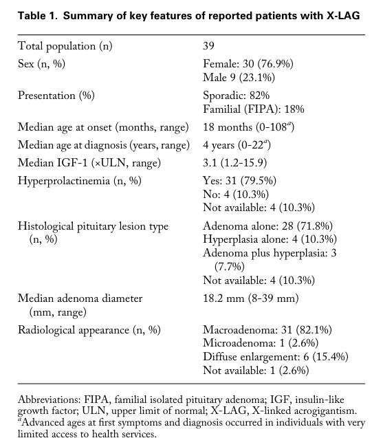

## Question

# Disease Characteristics Research Template

## Target Disease
- **Disease Name:** GPR101-related pituitary adenoma 2
- **MONDO ID:**  (if available)
- **Category:** Genetic

## Research Objectives

Please provide a comprehensive research report on **GPR101-related pituitary adenoma 2** covering all of the
disease characteristics listed below. This report will be used to populate a disease knowledge
base entry. Be thorough and cite primary literature (PMID preferred) for all claims.

For each section, **suggested databases/resources** are listed. These are the first places
you should search for information on each topic.

---

### 1. Disease Information
> **Search first:** OMIM, Orphanet, ICD-10/ICD-11, MeSH, PubMed

- What is the disease? Provide a concise overview.
- What are the key identifiers? (OMIM, Orphanet, ICD-10/ICD-11, MeSH, Mondo)
- What are the common synonyms and alternative names?
- Is the information derived from individual patients (e.g., EHR) or aggregated disease-level resources?

### 2. Etiology

- **Disease Causal Factors**: What are the primary causes? (genetic, environmental, infectious, mechanistic)
- **Risk Factors**:
  > **Search first:** PubMed, Cochrane Library, UpToDate, clinical guidelines, ClinVar, ClinGen, GWAS Catalog, PheGenI, CTD, CDC, WHO, epidemiological databases
  - Genetic risk factors (causal variants, susceptibility loci, modifier genes)
  - Environmental risk factors (toxins, lifestyle, occupational exposures, age, sex, family history)
- **Protective Factors**:
  > **Search first:** PubMed, Cochrane Library, clinical trial databases, GWAS Catalog, gnomAD, WHO, CDC, nutrition databases
  - Genetic protective factors (protective variants, modifier alleles)
  - Environmental protective factors (diet, lifestyle, exposures that reduce risk)
- **Gene-Environment Interactions**: How do genetic and environmental factors interact to influence disease?
  > **Search first:** CTD, PubMed, PheGenI, GxE databases

### 3. Phenotypes
> **Search first:** HPO (Human Phenotype Ontology), OMIM, Orphanet, PubMed, clinicaltrials.gov, MedDRA, SNOMED CT, DECIPHER, LOINC

For each phenotype, provide:
- **Phenotype type**: symptoms, clinical signs, physical manifestations, behavioral changes, or laboratory abnormalities
  > For symptoms/signs: HPO, OMIM, Orphanet, PubMed
  > For behavioral changes: HPO, DSM, RDoC (Research Domain Criteria), PubMed
  > For laboratory abnormalities: LOINC, SNOMED CT, LabTests Online, PubMed
- **Phenotype characteristics**:
  > **Search first:** OMIM, Orphanet, HPO, PubMed
  - Age of symptom onset (neonatal, childhood, adult-onset, late-onset)
  - Symptom severity (mild, moderate, severe, variable)
  - Symptom progression (stable, progressive, episodic, fluctuating)
  - Frequency among affected individuals (percentage or qualitative)
- **Quality of life impact**: Effects on daily functioning and well-being (per-phenotype when possible)
  > **Search first:** EQ-5D database, SF-36, WHO QOL databases, PubMed
- Suggest HPO (Human Phenotype Ontology) terms for each phenotype

### 4. Genetic/Molecular Information

- **Causal Genes**: Gene mutations or chromosomal abnormalities responsible for disease (gene symbols, OMIM IDs)
  > **Search first:** OMIM, ClinVar, HGMD, Ensembl, NCBI Gene
- **Pathogenic Variants**:
  - Affected genes (gene symbols, HGNC IDs)
    > **Search first:** OMIM, NCBI Gene, Ensembl, HGNC, UniProt, GeneCards
  - Variant classification (pathogenic, likely pathogenic, VUS per ACMG/AMP guidelines)
    > **Search first:** ClinVar, ClinGen, ACMG/AMP guidelines, VarSome
  - Variant type/class (missense, frameshift, nonsense, splice-site, structural)
  - Allele frequency in population databases
    > **Search first:** gnomAD, 1000 Genomes, ExAC, TOPMed, dbSNP
  - Somatic vs germline origin
    > **Search first:** COSMIC (somatic), ClinVar, ICGC, TCGA
  - Functional consequences (loss of function, gain of function, dominant negative)
- **Modifier Genes**: Genes that modify disease severity or expression
- **Epigenetic Information**: DNA methylation, histone modifications, chromatin changes affecting disease
  > **Search first:** ENCODE, Roadmap Epigenomics, MethBase, DiseaseMeth
- **Chromosomal Abnormalities**: Large-scale genetic changes (aneuploidy, translocations, inversions)
  > **Search first:** DECIPHER, ClinVar, ECARUCA, UCSC Genome Browser

### 5. Environmental Information

- **Environmental Factors**: Non-genetic contributing factors (toxins, radiation, pollution, occupational exposure)
  > **Search first:** CTD (Comparative Toxicogenomics Database), TOXNET, PubMed, EPA databases
- **Lifestyle Factors**: Behavioral factors (smoking, diet, exercise, alcohol consumption)
  > **Search first:** CDC databases, WHO, PubMed, NHANES
- **Infectious Agents**: If applicable, pathogens causing or triggering disease (bacteria, viruses, fungi, parasites)
  > **Search first:** NCBI Taxonomy, ViPR, BV-BRC, MicrobeDB, GIDEON

### 6. Mechanism / Pathophysiology

- **Molecular Pathways**: Specific signaling cascades or biochemical pathways involved (Wnt, MAPK, mTOR, PI3K-AKT, etc.)
  > **Search first:** KEGG, Reactome, WikiPathways, PathBank, BioCyc
- **Cellular Processes**: Cell-level mechanisms (apoptosis, autophagy, cell cycle dysregulation, inflammation, etc.)
  > **Search first:** Gene Ontology (GO), Reactome, KEGG, PubMed
- **Protein Dysfunction**: How protein structure or function is altered (misfolding, aggregation, loss of function, gain of function)
  > **Search first:** UniProt, PDB (Protein Data Bank), InterPro, Pfam, AlphaFold
- **Metabolic Changes**: Alterations in metabolic processes (energy metabolism, lipid metabolism, amino acid metabolism)
  > **Search first:** KEGG, BioCyc, HMDB (Human Metabolome Database), BRENDA
- **Immune System Involvement**: Role of immune response (autoimmunity, immunodeficiency, chronic inflammation)
  > **Search first:** ImmPort, Immunome Database, IEDB, Gene Ontology
- **Tissue Damage Mechanisms**: How tissues/ are injured (oxidative stress, ischemia, fibrosis, necrosis)
  > **Search first:** PubMed, Gene Ontology, Reactome
- **Biochemical Abnormalities**: Specific molecular defects (enzyme deficiencies, receptor dysfunction, ion channel defects)
  > **Search first:** BRENDA, UniProt, KEGG, OMIM, PubMed
- **Epigenetic Changes**: DNA methylation, histone modifications affecting gene expression in disease
  > **Search first:** ENCODE, Roadmap Epigenomics, MethBase, DiseaseMeth
- **Molecular Profiling** (if available):
  - Transcriptomics/gene expression changes
    > **Search first:** GEO (Gene Expression Omnibus), ArrayExpress, GTEx, Human Cell Atlas, SRA
  - Proteomics findings
    > **Search first:** PRIDE, ProteomeXchange, Human Protein Atlas, STRING, BioGRID
  - Metabolomics signatures
    > **Search first:** MetaboLights, Metabolomics Workbench, HMDB, METLIN
  - Lipidomics alterations
    > **Search first:** LIPID MAPS, SwissLipids, LipidHome, Metabolomics Workbench
  - Genomic structural features
    > **Search first:** UCSC Genome Browser, Ensembl, NCBI, dbVar, DGV
- **Advanced Technologies** (if applicable):
  - Single-cell analysis findings (cell-type specific mechanisms, cellular heterogeneity)
    > **Search first:** Human Cell Atlas, Single Cell Portal, GEO, CELLxGENE
  - Spatial transcriptomics findings
    > **Search first:** GEO, Spatial Research, Vizgen, 10x Genomics data
  - Multi-omics integration results
    > **Search first:** TCGA, ICGC, cBioPortal, LinkedOmics, PubMed
  - Functional genomics screens (CRISPR, RNAi)
    > **Search first:** DepMap, GenomeRNAi, PubMed, BioGRID ORCS

For each mechanism, describe:
- The causal chain from initial trigger to clinical manifestation
- Which mechanisms are upstream vs downstream
- What cell types and biological processes are involved
- Suggest GO terms for biological processes and CL terms for cell types

### 7. Anatomical Structures Affected

- **Organ Level**:
  - Primary organs directly affected
  - Secondary organ involvement (complications, secondary effects)
  - Body systems involved (cardiovascular, nervous, digestive, respiratory, endocrine, etc.)
  > **Search first:** Uberon, FMA (Foundational Model of Anatomy), OMIM, HPO, ICD-11, MeSH, SNOMED CT
- **Tissue and Cell Level**:
  - Specific tissue types affected (epithelial, connective, muscle, nervous)
  - Specific cell populations targeted (with Cell Ontology terms)
  > **Search first:** Uberon, Human Protein Atlas, Cell Ontology, Human Cell Atlas, CellMarker, PanglaoDB
- **Subcellular Level**:
  - Cellular compartments involved (mitochondria, nucleus, ER, lysosomes) (with GO Cellular Component terms)
  > **Search first:** Gene Ontology (Cellular Component), UniProt, Human Protein Atlas
- **Localization**:
  - Specific anatomical sites (with UBERON terms)
    > **Search first:** FMA, Uberon, NeuroNames (for brain), SNOMED CT
  - Lateralization (unilateral, bilateral, asymmetric)
    > **Search first:** HPO, clinical literature, imaging databases

### 8. Temporal Development

- **Onset**:
  - Typical age of onset (congenital, pediatric, adult, geriatric)
  - Onset pattern (acute, subacute, chronic, insidious)
  > **Search first:** OMIM, Orphanet, HPO, PubMed
- **Progression**:
  - Disease stages (early, intermediate, advanced, end-stage)
    > **Search first:** Cancer Staging Manual (AJCC), WHO classifications, PubMed
  - Progression rate (rapid, slow, variable)
  - Disease course pattern (episodic, relapsing-remitting, progressive, stable)
  - Disease duration (self-limited, chronic lifelong)
  > **Search first:** Disease registries, longitudinal cohort databases, natural history studies, PubMed, Orphanet, OMIM
- **Patterns**:
  - Remission patterns (spontaneous, treatment-induced)
    > **Search first:** Clinical trial databases, disease registries, PubMed
  - Critical periods (time windows of vulnerability or opportunity for intervention)
    > **Search first:** PubMed, developmental biology databases, clinical guidelines

### 9. Inheritance and Population

- **Epidemiology**:
  - Prevalence (cases per 100,000 at given time)
  - Incidence (new cases per 100,000 per year)
  > **Search first:** Orphanet, CDC, WHO, GBD (Global Burden of Disease), national registries, SEER, disease registries
- **For Genetic Etiology**:
  - Inheritance pattern (AD, AR, X-linked, mitochondrial, multifactorial, polygenic)
    > **Search first:** OMIM, Orphanet, ClinVar, GTR (Genetic Testing Registry)
  - Penetrance (complete, incomplete, age-dependent)
    > **Search first:** ClinVar, OMIM, PubMed, ClinGen
  - Expressivity (variable, consistent)
    > **Search first:** OMIM, ClinVar, PubMed
  - Genetic anticipation (increasing severity in successive generations)
    > **Search first:** OMIM, PubMed (especially for repeat expansion disorders)
  - Germline mosaicism
    > **Search first:** ClinVar, OMIM, genetic counseling literature, PubMed
  - Founder effects (population-specific mutations)
    > **Search first:** gnomAD, population genetics databases, PubMed
  - Consanguinity role
    > **Search first:** OMIM, population studies, genetic counseling resources
  - Carrier frequency
    > **Search first:** gnomAD, carrier screening databases, GeneReviews, GTR
- **Population Demographics**:
  - Affected populations (ethnic or demographic groups with higher prevalence)
    > **Search first:** gnomAD, 1000 Genomes, PAGE Study, PubMed, population registries
  - Geographic distribution (endemic areas, regional variation)
    > **Search first:** WHO, CDC, GBD, Orphanet, geographic epidemiology databases
  - Geographic distribution of specific variants
  - Sex ratio (male:female)
    > **Search first:** Disease registries, OMIM, PubMed, epidemiological databases
  - Age distribution of affected individuals
    > **Search first:** CDC, disease registries, SEER, Orphanet

### 10. Diagnostics

- **Clinical Tests**:
  - Laboratory tests (blood, urine, tissue chemistry, specific enzyme assays)
    > **Search first:** LOINC, LabTests Online, PubMed
  - Biomarkers (proteins, metabolites, genetic markers, circulating biomarkers)
    > **Search first:** FDA Biomarker List, BEST (Biomarkers, EndpointS, and other Tools), PubMed
  - Imaging studies (X-ray, CT, MRI, PET, ultrasound)
    > **Search first:** RadLex, DICOM, Radiopaedia, imaging databases
  - Functional tests (pulmonary function, cardiac stress tests)
    > **Search first:** LOINC, clinical guidelines, PubMed
  - Electrophysiology (EEG, EMG, ECG, nerve conduction studies)
    > **Search first:** LOINC, clinical neurophysiology databases, PubMed
  - Biopsy findings (histopathology, immunohistochemistry)
    > **Search first:** SNOMED CT, College of American Pathologists resources, PubMed
  - Pathology findings (microscopic examination)
    > **Search first:** SNOMED CT, Digital Pathology databases, PubMed
- **Genetic Testing**:
  > **Search first:** GTR (Genetic Testing Registry), GeneReviews, ClinGen
  - Overview of recommended genetic testing approach
  - Whole genome sequencing (WGS) utility
    > **Search first:** GTR, ClinVar, GEL (Genomics England), gnomAD
  - Whole exome sequencing (WES) utility
    > **Search first:** GTR, ClinVar, OMIM, GeneMatcher
  - Gene panels (which panels, which genes)
    > **Search first:** GTR, ClinVar, laboratory-specific databases
  - Single gene testing
    > **Search first:** GTR, ClinVar, OMIM, GeneReviews
  - Chromosomal microarray (CMA)
    > **Search first:** DECIPHER, ClinVar, dbVar, ECARUCA
  - Karyotyping
    > **Search first:** Chromosome Abnormality Database, ClinVar, cytogenetics resources
  - FISH
    > **Search first:** ClinVar, cytogenetics databases, PubMed
  - Mitochondrial DNA testing
    > **Search first:** MITOMAP, MSeqDR, ClinVar, GTR
  - Repeat expansion testing
    > **Search first:** GTR, ClinVar, repeat expansion databases, PubMed
- **Omics-Based Diagnostics** (if applicable):
  - RNA sequencing / transcriptomics
    > **Search first:** GEO, ArrayExpress, GTEx, RNA-seq databases
  - Proteomics
    > **Search first:** PRIDE, ProteomeXchange, FDA Biomarker database
  - Metabolomics
    > **Search first:** MetaboLights, Metabolomics Workbench, HMDB
  - Epigenomics
    > **Search first:** GEO, ENCODE, Roadmap Epigenomics, MethBase
  - Liquid biopsy
    > **Search first:** COSMIC, ClinVar, liquid biopsy databases, PubMed
- **Clinical Criteria**:
  - Standardized diagnostic criteria (DSM, ICD, society guidelines)
    > **Search first:** DSM-5, ICD-11, clinical society guidelines, UpToDate
  - Differential diagnosis (other conditions to rule out, with distinguishing features)
    > **Search first:** DynaMed, UpToDate, clinical decision support systems
- **Screening**:
  - Screening methods for asymptomatic individuals (newborn screening, carrier screening, cascade screening)
    > **Search first:** ACMG recommendations, CDC newborn screening, GTR

### 11. Outcome/Prognosis

- **Survival and Mortality**:
  - Survival rate (5-year, 10-year, overall)
    > **Search first:** SEER, cancer registries, disease-specific registries, PubMed
  - Life expectancy (with and without treatment if applicable)
    > **Search first:** Orphanet, disease registries, actuarial databases, PubMed
  - Mortality rate
    > **Search first:** CDC, WHO, GBD, national mortality databases
  - Disease-specific mortality (deaths directly attributable to disease)
    > **Search first:** Disease registries, CDC Wonder, GBD, PubMed
- **Morbidity and Function**:
  - Morbidity (disease-related disability and health impacts)
    > **Search first:** GBD, WHO, disability databases, PubMed
  - Disability outcomes (long-term functional impairments)
    > **Search first:** ICF (International Classification of Functioning), disability registries
  - Quality of life measures (EQ-5D, SF-36, PROMIS, disease-specific tools)
    > **Search first:** EQ-5D database, SF-36, PROMIS, PubMed
- **Disease Course**:
  - Complications (secondary problems: infections, organ failure, etc.)
    > **Search first:** ICD codes, disease registries, clinical databases, PubMed
  - Recovery potential (likelihood and extent of recovery, with vs without treatment)
    > **Search first:** Natural history studies, rehabilitation databases, PubMed
- **Prediction**:
  - Prognostic factors (age, disease severity, biomarkers, treatment response)
    > **Search first:** Prognostic models databases, clinical calculators, PubMed
  - Prognostic biomarkers (molecular markers predicting disease course)
    > **Search first:** FDA Biomarker database, PubMed, cancer prognostic databases

### 12. Treatment

- **Pharmacotherapy**:
  - Pharmacological treatments (drug names, drug classes, mechanisms of action)
    > **Search first:** DrugBank, RxNorm, ATC classification, DailyMed, FDA databases
  - Pharmacogenomics (how genetic variants affect drug metabolism, efficacy, toxicity)
    > **Search first:** PharmGKB, CPIC (Clinical Pharmacogenetics), FDA Table of PGx Biomarkers
- **Advanced Therapeutics**:
  - Gene therapy (viral vectors, CRISPR, gene replacement, gene editing)
    > **Search first:** ClinicalTrials.gov, FDA gene therapy database, ASGCT resources
  - Cell therapy (stem cell transplant, CAR-T, cellular therapeutics)
    > **Search first:** ClinicalTrials.gov, FDA cell therapy database, FACT standards
  - RNA-based therapies (ASOs, siRNA, mRNA therapies)
    > **Search first:** ClinicalTrials.gov, FDA approvals, PubMed
  - Targeted therapies (treatments directed at specific molecular targets)
    > **Search first:** My Cancer Genome, OncoKB, ClinicalTrials.gov, FDA approvals
  - Immunotherapies (checkpoint inhibitors, monoclonal antibodies)
    > **Search first:** Cancer Immunotherapy Database, FDA approvals, ClinicalTrials.gov
- **Surgical and Interventional**:
  - Surgical interventions (types of surgery, timing, outcomes)
    > **Search first:** CPT codes, surgical registries, clinical guidelines, PubMed
- **Supportive and Rehabilitative**:
  - Supportive care (symptom management, pain control, nutrition)
    > **Search first:** Clinical guidelines, Cochrane Library, PubMed
  - Rehabilitation (physical therapy, occupational therapy, speech therapy)
    > **Search first:** Rehabilitation medicine databases, clinical guidelines, PubMed
- **Experimental**:
  - Experimental treatments in clinical trials (with NCT identifiers if available)
    > **Search first:** ClinicalTrials.gov, EU Clinical Trials Register, WHO ICTRP
- **Treatment Outcomes**:
  - Treatment response rates
    > **Search first:** Clinical trial databases, FDA reviews, systematic reviews, PubMed
  - Side effects and adverse events
    > **Search first:** FDA Adverse Event Reporting System (FAERS), MedWatch, PubMed
- **Treatment Strategy**:
  - Treatment algorithms (clinical pathways, decision trees)
    > **Search first:** Clinical practice guidelines, NCCN Guidelines, UpToDate
  - Combination therapies
    > **Search first:** ClinicalTrials.gov, treatment guidelines, PubMed
  - Personalized medicine approaches (genotype-guided treatment)
    > **Search first:** My Cancer Genome, CIViC, PharmGKB, precision medicine databases

For each treatment, suggest MAXO (Medical Action Ontology) terms where applicable.

### 13. Prevention

- **Prevention Levels**:
  - Primary prevention (preventing disease occurrence: vaccination, risk factor modification)
    > **Search first:** CDC, WHO, USPSTF recommendations, Cochrane Library
  - Secondary prevention (early detection and treatment: screening programs, early intervention)
    > **Search first:** USPSTF, CDC screening guidelines, WHO
  - Tertiary prevention (preventing complications in those with disease)
    > **Search first:** Clinical guidelines, disease management protocols, PubMed
- **Immunization**: Vaccine strategies (if applicable)
  > **Search first:** CDC vaccine schedules, WHO immunization, FDA vaccine database
- **Screening and Early Detection**:
  - Screening programs (population-based: newborn screening, cancer screening)
    > **Search first:** CDC screening programs, USPSTF, cancer screening databases
  - Genetic screening (carrier screening, preimplantation genetic diagnosis, prenatal testing)
    > **Search first:** ACMG recommendations, ACOG guidelines, GTR
  - Risk stratification (identifying high-risk individuals for targeted prevention)
    > **Search first:** Risk prediction models, clinical calculators, PubMed
- **Behavioral Interventions**: Lifestyle modifications to reduce risk
  > **Search first:** CDC, WHO, behavioral intervention databases, Cochrane Library
- **Counseling**: Genetic counseling (risk assessment, family planning guidance)
  > **Search first:** NSGC resources, ACMG guidelines, GeneReviews
- **Public Health**:
  - Public health interventions (sanitation, vector control, health education)
    > **Search first:** CDC, WHO, public health databases, PubMed
  - Environmental interventions (reducing environmental risk factors)
    > **Search first:** EPA databases, WHO environmental health, PubMed
- **Prophylaxis**: Preventive medications or procedures
  > **Search first:** Clinical guidelines, FDA approvals, PubMed

### 14. Other Species / Natural Disease

- **Taxonomy**: Species affected (with NCBI Taxon identifiers)
  > **Search first:** NCBI Taxonomy
- **Breed**: Specific breeds affected (with VBO identifiers if applicable)
  > **Search first:** VBO (Vertebrate Breed Ontology)
- **Gene**: Orthologous genes in other species (with NCBI Gene IDs)
  > **Search first:** NCBI Gene
- **Natural Disease**:
  - Naturally occurring disease in other species (companion animals, wildlife)
    > **Search first:** OMIA (Online Mendelian Inheritance in Animals), VetCompass, PubMed
  - Veterinary relevance and importance in animal health
    > **Search first:** OMIA, veterinary databases, PubMed
- **Comparative Biology**:
  - Comparative pathology (similarities and differences across species)
    > **Search first:** OMIA, comparative pathology databases, PubMed
  - Evolutionary conservation of disease mechanisms
    > **Search first:** HomoloGene, OrthoMCL, Alliance of Genome Resources
- **Transmission** (if applicable):
  - Zoonotic potential
    > **Search first:** CDC zoonotic diseases, WHO zoonoses, GIDEON
  - Cross-species susceptibility
    > **Search first:** NCBI Taxonomy, veterinary databases, PubMed

### 15. Model Organisms

- **Model Types**:
  - Model organism type (mammalian, invertebrate, cellular, in vitro)
    > **Search first:** Alliance of Genome Resources, model organism databases
  - Specific model systems (mouse, rat, zebrafish, Drosophila, C. elegans, yeast, cell lines, organoids, iPSCs)
    > **Search first:** MGI, RGD, ZFIN, FlyBase, WormBase, SGD, ATCC, Cellosaurus
  - Induced models (drug treatment, surgical intervention, environmental manipulation)
    > **Search first:** MGI, model organism databases, PubMed
- **Genetic Models**:
  - Types available (knockout, knock-in, transgenic, conditional, humanized)
    > **Search first:** MGI, IMPC, KOMP, EuMMCR, IMSR
- **Model Characteristics**:
  - Phenotype recapitulation (how well model reproduces human disease features)
    > **Search first:** Model organism databases, comparative studies, PubMed
  - Model limitations (aspects of human disease not captured)
    > **Search first:** Model organism databases, PubMed, review articles
- **Applications**:
  - Research applications (what aspects of disease can be studied)
    > **Search first:** Model organism databases, PubMed
- **Resources**:
  - Model databases
    > **Search first:** MGI, RGD, ZFIN, FlyBase, WormBase, IMSR, EMMA, MMRRC

---

## Citation Requirements

- Cite primary literature (PMID preferred) for all mechanistic and clinical claims
- Prioritize recent reviews and landmark papers
- Include direct quotes from abstracts where possible to support key statements
- Distinguish evidence source types: human clinical, model organism, in vitro, computational

## Output Format

Structure your response as a comprehensive narrative organized by the sections above.
For each section, provide:
- Factual content with specific details (numbers, percentages, gene names, variant nomenclature)
- Ontology term suggestions (HPO, GO, CL, UBERON, CHEBI, MAXO, MONDO) where applicable
- Evidence citations with PMIDs
- Direct quotes from abstracts to support key claims
- Clear indication when information is not available or not applicable for this disease

This report will be used to populate a disease knowledge base entry with:
- Pathophysiology descriptions with causal chains
- Gene/protein annotations (HGNC, GO terms)
- Phenotype associations (HP terms) with frequencies
- Cell type involvement (CL terms)
- Anatomical locations (UBERON terms)
- Chemical entities (CHEBI terms)
- Treatment annotations (MAXO terms)
- Evidence items with PMIDs and exact abstract quotes
- Epidemiology, prognosis, diagnostic, and prevention information
- Animal model descriptions with phenotype recapitulation details

## Output

Question: You are an expert researcher providing comprehensive, well-cited information.

Provide detailed information focusing on:
1. Key concepts and definitions with current understanding
2. Recent developments and latest research (prioritize 2023-2024 sources)
3. Current applications and real-world implementations
4. Expert opinions and analysis from authoritative sources
5. Relevant statistics and data from recent studies

Format as a comprehensive research report with proper citations. Include URLs and publication dates where available.
Always prioritize recent, authoritative sources and provide specific citations for all major claims.

# Disease Characteristics Research Template

## Target Disease
- **Disease Name:** GPR101-related pituitary adenoma 2
- **MONDO ID:**  (if available)
- **Category:** Genetic

## Research Objectives

Please provide a comprehensive research report on **GPR101-related pituitary adenoma 2** covering all of the
disease characteristics listed below. This report will be used to populate a disease knowledge
base entry. Be thorough and cite primary literature (PMID preferred) for all claims.

For each section, **suggested databases/resources** are listed. These are the first places
you should search for information on each topic.

---

### 1. Disease Information
> **Search first:** OMIM, Orphanet, ICD-10/ICD-11, MeSH, PubMed

- What is the disease? Provide a concise overview.
- What are the key identifiers? (OMIM, Orphanet, ICD-10/ICD-11, MeSH, Mondo)
- What are the common synonyms and alternative names?
- Is the information derived from individual patients (e.g., EHR) or aggregated disease-level resources?

### 2. Etiology

- **Disease Causal Factors**: What are the primary causes? (genetic, environmental, infectious, mechanistic)
- **Risk Factors**:
  > **Search first:** PubMed, Cochrane Library, UpToDate, clinical guidelines, ClinVar, ClinGen, GWAS Catalog, PheGenI, CTD, CDC, WHO, epidemiological databases
  - Genetic risk factors (causal variants, susceptibility loci, modifier genes)
  - Environmental risk factors (toxins, lifestyle, occupational exposures, age, sex, family history)
- **Protective Factors**:
  > **Search first:** PubMed, Cochrane Library, clinical trial databases, GWAS Catalog, gnomAD, WHO, CDC, nutrition databases
  - Genetic protective factors (protective variants, modifier alleles)
  - Environmental protective factors (diet, lifestyle, exposures that reduce risk)
- **Gene-Environment Interactions**: How do genetic and environmental factors interact to influence disease?
  > **Search first:** CTD, PubMed, PheGenI, GxE databases

### 3. Phenotypes
> **Search first:** HPO (Human Phenotype Ontology), OMIM, Orphanet, PubMed, clinicaltrials.gov, MedDRA, SNOMED CT, DECIPHER, LOINC

For each phenotype, provide:
- **Phenotype type**: symptoms, clinical signs, physical manifestations, behavioral changes, or laboratory abnormalities
  > For symptoms/signs: HPO, OMIM, Orphanet, PubMed
  > For behavioral changes: HPO, DSM, RDoC (Research Domain Criteria), PubMed
  > For laboratory abnormalities: LOINC, SNOMED CT, LabTests Online, PubMed
- **Phenotype characteristics**:
  > **Search first:** OMIM, Orphanet, HPO, PubMed
  - Age of symptom onset (neonatal, childhood, adult-onset, late-onset)
  - Symptom severity (mild, moderate, severe, variable)
  - Symptom progression (stable, progressive, episodic, fluctuating)
  - Frequency among affected individuals (percentage or qualitative)
- **Quality of life impact**: Effects on daily functioning and well-being (per-phenotype when possible)
  > **Search first:** EQ-5D database, SF-36, WHO QOL databases, PubMed
- Suggest HPO (Human Phenotype Ontology) terms for each phenotype

### 4. Genetic/Molecular Information

- **Causal Genes**: Gene mutations or chromosomal abnormalities responsible for disease (gene symbols, OMIM IDs)
  > **Search first:** OMIM, ClinVar, HGMD, Ensembl, NCBI Gene
- **Pathogenic Variants**:
  - Affected genes (gene symbols, HGNC IDs)
    > **Search first:** OMIM, NCBI Gene, Ensembl, HGNC, UniProt, GeneCards
  - Variant classification (pathogenic, likely pathogenic, VUS per ACMG/AMP guidelines)
    > **Search first:** ClinVar, ClinGen, ACMG/AMP guidelines, VarSome
  - Variant type/class (missense, frameshift, nonsense, splice-site, structural)
  - Allele frequency in population databases
    > **Search first:** gnomAD, 1000 Genomes, ExAC, TOPMed, dbSNP
  - Somatic vs germline origin
    > **Search first:** COSMIC (somatic), ClinVar, ICGC, TCGA
  - Functional consequences (loss of function, gain of function, dominant negative)
- **Modifier Genes**: Genes that modify disease severity or expression
- **Epigenetic Information**: DNA methylation, histone modifications, chromatin changes affecting disease
  > **Search first:** ENCODE, Roadmap Epigenomics, MethBase, DiseaseMeth
- **Chromosomal Abnormalities**: Large-scale genetic changes (aneuploidy, translocations, inversions)
  > **Search first:** DECIPHER, ClinVar, ECARUCA, UCSC Genome Browser

### 5. Environmental Information

- **Environmental Factors**: Non-genetic contributing factors (toxins, radiation, pollution, occupational exposure)
  > **Search first:** CTD (Comparative Toxicogenomics Database), TOXNET, PubMed, EPA databases
- **Lifestyle Factors**: Behavioral factors (smoking, diet, exercise, alcohol consumption)
  > **Search first:** CDC databases, WHO, PubMed, NHANES
- **Infectious Agents**: If applicable, pathogens causing or triggering disease (bacteria, viruses, fungi, parasites)
  > **Search first:** NCBI Taxonomy, ViPR, BV-BRC, MicrobeDB, GIDEON

### 6. Mechanism / Pathophysiology

- **Molecular Pathways**: Specific signaling cascades or biochemical pathways involved (Wnt, MAPK, mTOR, PI3K-AKT, etc.)
  > **Search first:** KEGG, Reactome, WikiPathways, PathBank, BioCyc
- **Cellular Processes**: Cell-level mechanisms (apoptosis, autophagy, cell cycle dysregulation, inflammation, etc.)
  > **Search first:** Gene Ontology (GO), Reactome, KEGG, PubMed
- **Protein Dysfunction**: How protein structure or function is altered (misfolding, aggregation, loss of function, gain of function)
  > **Search first:** UniProt, PDB (Protein Data Bank), InterPro, Pfam, AlphaFold
- **Metabolic Changes**: Alterations in metabolic processes (energy metabolism, lipid metabolism, amino acid metabolism)
  > **Search first:** KEGG, BioCyc, HMDB (Human Metabolome Database), BRENDA
- **Immune System Involvement**: Role of immune response (autoimmunity, immunodeficiency, chronic inflammation)
  > **Search first:** ImmPort, Immunome Database, IEDB, Gene Ontology
- **Tissue Damage Mechanisms**: How tissues/ are injured (oxidative stress, ischemia, fibrosis, necrosis)
  > **Search first:** PubMed, Gene Ontology, Reactome
- **Biochemical Abnormalities**: Specific molecular defects (enzyme deficiencies, receptor dysfunction, ion channel defects)
  > **Search first:** BRENDA, UniProt, KEGG, OMIM, PubMed
- **Epigenetic Changes**: DNA methylation, histone modifications affecting gene expression in disease
  > **Search first:** ENCODE, Roadmap Epigenomics, MethBase, DiseaseMeth
- **Molecular Profiling** (if available):
  - Transcriptomics/gene expression changes
    > **Search first:** GEO (Gene Expression Omnibus), ArrayExpress, GTEx, Human Cell Atlas, SRA
  - Proteomics findings
    > **Search first:** PRIDE, ProteomeXchange, Human Protein Atlas, STRING, BioGRID
  - Metabolomics signatures
    > **Search first:** MetaboLights, Metabolomics Workbench, HMDB, METLIN
  - Lipidomics alterations
    > **Search first:** LIPID MAPS, SwissLipids, LipidHome, Metabolomics Workbench
  - Genomic structural features
    > **Search first:** UCSC Genome Browser, Ensembl, NCBI, dbVar, DGV
- **Advanced Technologies** (if applicable):
  - Single-cell analysis findings (cell-type specific mechanisms, cellular heterogeneity)
    > **Search first:** Human Cell Atlas, Single Cell Portal, GEO, CELLxGENE
  - Spatial transcriptomics findings
    > **Search first:** GEO, Spatial Research, Vizgen, 10x Genomics data
  - Multi-omics integration results
    > **Search first:** TCGA, ICGC, cBioPortal, LinkedOmics, PubMed
  - Functional genomics screens (CRISPR, RNAi)
    > **Search first:** DepMap, GenomeRNAi, PubMed, BioGRID ORCS

For each mechanism, describe:
- The causal chain from initial trigger to clinical manifestation
- Which mechanisms are upstream vs downstream
- What cell types and biological processes are involved
- Suggest GO terms for biological processes and CL terms for cell types

### 7. Anatomical Structures Affected

- **Organ Level**:
  - Primary organs directly affected
  - Secondary organ involvement (complications, secondary effects)
  - Body systems involved (cardiovascular, nervous, digestive, respiratory, endocrine, etc.)
  > **Search first:** Uberon, FMA (Foundational Model of Anatomy), OMIM, HPO, ICD-11, MeSH, SNOMED CT
- **Tissue and Cell Level**:
  - Specific tissue types affected (epithelial, connective, muscle, nervous)
  - Specific cell populations targeted (with Cell Ontology terms)
  > **Search first:** Uberon, Human Protein Atlas, Cell Ontology, Human Cell Atlas, CellMarker, PanglaoDB
- **Subcellular Level**:
  - Cellular compartments involved (mitochondria, nucleus, ER, lysosomes) (with GO Cellular Component terms)
  > **Search first:** Gene Ontology (Cellular Component), UniProt, Human Protein Atlas
- **Localization**:
  - Specific anatomical sites (with UBERON terms)
    > **Search first:** FMA, Uberon, NeuroNames (for brain), SNOMED CT
  - Lateralization (unilateral, bilateral, asymmetric)
    > **Search first:** HPO, clinical literature, imaging databases

### 8. Temporal Development

- **Onset**:
  - Typical age of onset (congenital, pediatric, adult, geriatric)
  - Onset pattern (acute, subacute, chronic, insidious)
  > **Search first:** OMIM, Orphanet, HPO, PubMed
- **Progression**:
  - Disease stages (early, intermediate, advanced, end-stage)
    > **Search first:** Cancer Staging Manual (AJCC), WHO classifications, PubMed
  - Progression rate (rapid, slow, variable)
  - Disease course pattern (episodic, relapsing-remitting, progressive, stable)
  - Disease duration (self-limited, chronic lifelong)
  > **Search first:** Disease registries, longitudinal cohort databases, natural history studies, PubMed, Orphanet, OMIM
- **Patterns**:
  - Remission patterns (spontaneous, treatment-induced)
    > **Search first:** Clinical trial databases, disease registries, PubMed
  - Critical periods (time windows of vulnerability or opportunity for intervention)
    > **Search first:** PubMed, developmental biology databases, clinical guidelines

### 9. Inheritance and Population

- **Epidemiology**:
  - Prevalence (cases per 100,000 at given time)
  - Incidence (new cases per 100,000 per year)
  > **Search first:** Orphanet, CDC, WHO, GBD (Global Burden of Disease), national registries, SEER, disease registries
- **For Genetic Etiology**:
  - Inheritance pattern (AD, AR, X-linked, mitochondrial, multifactorial, polygenic)
    > **Search first:** OMIM, Orphanet, ClinVar, GTR (Genetic Testing Registry)
  - Penetrance (complete, incomplete, age-dependent)
    > **Search first:** ClinVar, OMIM, PubMed, ClinGen
  - Expressivity (variable, consistent)
    > **Search first:** OMIM, ClinVar, PubMed
  - Genetic anticipation (increasing severity in successive generations)
    > **Search first:** OMIM, PubMed (especially for repeat expansion disorders)
  - Germline mosaicism
    > **Search first:** ClinVar, OMIM, genetic counseling literature, PubMed
  - Founder effects (population-specific mutations)
    > **Search first:** gnomAD, population genetics databases, PubMed
  - Consanguinity role
    > **Search first:** OMIM, population studies, genetic counseling resources
  - Carrier frequency
    > **Search first:** gnomAD, carrier screening databases, GeneReviews, GTR
- **Population Demographics**:
  - Affected populations (ethnic or demographic groups with higher prevalence)
    > **Search first:** gnomAD, 1000 Genomes, PAGE Study, PubMed, population registries
  - Geographic distribution (endemic areas, regional variation)
    > **Search first:** WHO, CDC, GBD, Orphanet, geographic epidemiology databases
  - Geographic distribution of specific variants
  - Sex ratio (male:female)
    > **Search first:** Disease registries, OMIM, PubMed, epidemiological databases
  - Age distribution of affected individuals
    > **Search first:** CDC, disease registries, SEER, Orphanet

### 10. Diagnostics

- **Clinical Tests**:
  - Laboratory tests (blood, urine, tissue chemistry, specific enzyme assays)
    > **Search first:** LOINC, LabTests Online, PubMed
  - Biomarkers (proteins, metabolites, genetic markers, circulating biomarkers)
    > **Search first:** FDA Biomarker List, BEST (Biomarkers, EndpointS, and other Tools), PubMed
  - Imaging studies (X-ray, CT, MRI, PET, ultrasound)
    > **Search first:** RadLex, DICOM, Radiopaedia, imaging databases
  - Functional tests (pulmonary function, cardiac stress tests)
    > **Search first:** LOINC, clinical guidelines, PubMed
  - Electrophysiology (EEG, EMG, ECG, nerve conduction studies)
    > **Search first:** LOINC, clinical neurophysiology databases, PubMed
  - Biopsy findings (histopathology, immunohistochemistry)
    > **Search first:** SNOMED CT, College of American Pathologists resources, PubMed
  - Pathology findings (microscopic examination)
    > **Search first:** SNOMED CT, Digital Pathology databases, PubMed
- **Genetic Testing**:
  > **Search first:** GTR (Genetic Testing Registry), GeneReviews, ClinGen
  - Overview of recommended genetic testing approach
  - Whole genome sequencing (WGS) utility
    > **Search first:** GTR, ClinVar, GEL (Genomics England), gnomAD
  - Whole exome sequencing (WES) utility
    > **Search first:** GTR, ClinVar, OMIM, GeneMatcher
  - Gene panels (which panels, which genes)
    > **Search first:** GTR, ClinVar, laboratory-specific databases
  - Single gene testing
    > **Search first:** GTR, ClinVar, OMIM, GeneReviews
  - Chromosomal microarray (CMA)
    > **Search first:** DECIPHER, ClinVar, dbVar, ECARUCA
  - Karyotyping
    > **Search first:** Chromosome Abnormality Database, ClinVar, cytogenetics resources
  - FISH
    > **Search first:** ClinVar, cytogenetics databases, PubMed
  - Mitochondrial DNA testing
    > **Search first:** MITOMAP, MSeqDR, ClinVar, GTR
  - Repeat expansion testing
    > **Search first:** GTR, ClinVar, repeat expansion databases, PubMed
- **Omics-Based Diagnostics** (if applicable):
  - RNA sequencing / transcriptomics
    > **Search first:** GEO, ArrayExpress, GTEx, RNA-seq databases
  - Proteomics
    > **Search first:** PRIDE, ProteomeXchange, FDA Biomarker database
  - Metabolomics
    > **Search first:** MetaboLights, Metabolomics Workbench, HMDB
  - Epigenomics
    > **Search first:** GEO, ENCODE, Roadmap Epigenomics, MethBase
  - Liquid biopsy
    > **Search first:** COSMIC, ClinVar, liquid biopsy databases, PubMed
- **Clinical Criteria**:
  - Standardized diagnostic criteria (DSM, ICD, society guidelines)
    > **Search first:** DSM-5, ICD-11, clinical society guidelines, UpToDate
  - Differential diagnosis (other conditions to rule out, with distinguishing features)
    > **Search first:** DynaMed, UpToDate, clinical decision support systems
- **Screening**:
  - Screening methods for asymptomatic individuals (newborn screening, carrier screening, cascade screening)
    > **Search first:** ACMG recommendations, CDC newborn screening, GTR

### 11. Outcome/Prognosis

- **Survival and Mortality**:
  - Survival rate (5-year, 10-year, overall)
    > **Search first:** SEER, cancer registries, disease-specific registries, PubMed
  - Life expectancy (with and without treatment if applicable)
    > **Search first:** Orphanet, disease registries, actuarial databases, PubMed
  - Mortality rate
    > **Search first:** CDC, WHO, GBD, national mortality databases
  - Disease-specific mortality (deaths directly attributable to disease)
    > **Search first:** Disease registries, CDC Wonder, GBD, PubMed
- **Morbidity and Function**:
  - Morbidity (disease-related disability and health impacts)
    > **Search first:** GBD, WHO, disability databases, PubMed
  - Disability outcomes (long-term functional impairments)
    > **Search first:** ICF (International Classification of Functioning), disability registries
  - Quality of life measures (EQ-5D, SF-36, PROMIS, disease-specific tools)
    > **Search first:** EQ-5D database, SF-36, PROMIS, PubMed
- **Disease Course**:
  - Complications (secondary problems: infections, organ failure, etc.)
    > **Search first:** ICD codes, disease registries, clinical databases, PubMed
  - Recovery potential (likelihood and extent of recovery, with vs without treatment)
    > **Search first:** Natural history studies, rehabilitation databases, PubMed
- **Prediction**:
  - Prognostic factors (age, disease severity, biomarkers, treatment response)
    > **Search first:** Prognostic models databases, clinical calculators, PubMed
  - Prognostic biomarkers (molecular markers predicting disease course)
    > **Search first:** FDA Biomarker database, PubMed, cancer prognostic databases

### 12. Treatment

- **Pharmacotherapy**:
  - Pharmacological treatments (drug names, drug classes, mechanisms of action)
    > **Search first:** DrugBank, RxNorm, ATC classification, DailyMed, FDA databases
  - Pharmacogenomics (how genetic variants affect drug metabolism, efficacy, toxicity)
    > **Search first:** PharmGKB, CPIC (Clinical Pharmacogenetics), FDA Table of PGx Biomarkers
- **Advanced Therapeutics**:
  - Gene therapy (viral vectors, CRISPR, gene replacement, gene editing)
    > **Search first:** ClinicalTrials.gov, FDA gene therapy database, ASGCT resources
  - Cell therapy (stem cell transplant, CAR-T, cellular therapeutics)
    > **Search first:** ClinicalTrials.gov, FDA cell therapy database, FACT standards
  - RNA-based therapies (ASOs, siRNA, mRNA therapies)
    > **Search first:** ClinicalTrials.gov, FDA approvals, PubMed
  - Targeted therapies (treatments directed at specific molecular targets)
    > **Search first:** My Cancer Genome, OncoKB, ClinicalTrials.gov, FDA approvals
  - Immunotherapies (checkpoint inhibitors, monoclonal antibodies)
    > **Search first:** Cancer Immunotherapy Database, FDA approvals, ClinicalTrials.gov
- **Surgical and Interventional**:
  - Surgical interventions (types of surgery, timing, outcomes)
    > **Search first:** CPT codes, surgical registries, clinical guidelines, PubMed
- **Supportive and Rehabilitative**:
  - Supportive care (symptom management, pain control, nutrition)
    > **Search first:** Clinical guidelines, Cochrane Library, PubMed
  - Rehabilitation (physical therapy, occupational therapy, speech therapy)
    > **Search first:** Rehabilitation medicine databases, clinical guidelines, PubMed
- **Experimental**:
  - Experimental treatments in clinical trials (with NCT identifiers if available)
    > **Search first:** ClinicalTrials.gov, EU Clinical Trials Register, WHO ICTRP
- **Treatment Outcomes**:
  - Treatment response rates
    > **Search first:** Clinical trial databases, FDA reviews, systematic reviews, PubMed
  - Side effects and adverse events
    > **Search first:** FDA Adverse Event Reporting System (FAERS), MedWatch, PubMed
- **Treatment Strategy**:
  - Treatment algorithms (clinical pathways, decision trees)
    > **Search first:** Clinical practice guidelines, NCCN Guidelines, UpToDate
  - Combination therapies
    > **Search first:** ClinicalTrials.gov, treatment guidelines, PubMed
  - Personalized medicine approaches (genotype-guided treatment)
    > **Search first:** My Cancer Genome, CIViC, PharmGKB, precision medicine databases

For each treatment, suggest MAXO (Medical Action Ontology) terms where applicable.

### 13. Prevention

- **Prevention Levels**:
  - Primary prevention (preventing disease occurrence: vaccination, risk factor modification)
    > **Search first:** CDC, WHO, USPSTF recommendations, Cochrane Library
  - Secondary prevention (early detection and treatment: screening programs, early intervention)
    > **Search first:** USPSTF, CDC screening guidelines, WHO
  - Tertiary prevention (preventing complications in those with disease)
    > **Search first:** Clinical guidelines, disease management protocols, PubMed
- **Immunization**: Vaccine strategies (if applicable)
  > **Search first:** CDC vaccine schedules, WHO immunization, FDA vaccine database
- **Screening and Early Detection**:
  - Screening programs (population-based: newborn screening, cancer screening)
    > **Search first:** CDC screening programs, USPSTF, cancer screening databases
  - Genetic screening (carrier screening, preimplantation genetic diagnosis, prenatal testing)
    > **Search first:** ACMG recommendations, ACOG guidelines, GTR
  - Risk stratification (identifying high-risk individuals for targeted prevention)
    > **Search first:** Risk prediction models, clinical calculators, PubMed
- **Behavioral Interventions**: Lifestyle modifications to reduce risk
  > **Search first:** CDC, WHO, behavioral intervention databases, Cochrane Library
- **Counseling**: Genetic counseling (risk assessment, family planning guidance)
  > **Search first:** NSGC resources, ACMG guidelines, GeneReviews
- **Public Health**:
  - Public health interventions (sanitation, vector control, health education)
    > **Search first:** CDC, WHO, public health databases, PubMed
  - Environmental interventions (reducing environmental risk factors)
    > **Search first:** EPA databases, WHO environmental health, PubMed
- **Prophylaxis**: Preventive medications or procedures
  > **Search first:** Clinical guidelines, FDA approvals, PubMed

### 14. Other Species / Natural Disease

- **Taxonomy**: Species affected (with NCBI Taxon identifiers)
  > **Search first:** NCBI Taxonomy
- **Breed**: Specific breeds affected (with VBO identifiers if applicable)
  > **Search first:** VBO (Vertebrate Breed Ontology)
- **Gene**: Orthologous genes in other species (with NCBI Gene IDs)
  > **Search first:** NCBI Gene
- **Natural Disease**:
  - Naturally occurring disease in other species (companion animals, wildlife)
    > **Search first:** OMIA (Online Mendelian Inheritance in Animals), VetCompass, PubMed
  - Veterinary relevance and importance in animal health
    > **Search first:** OMIA, veterinary databases, PubMed
- **Comparative Biology**:
  - Comparative pathology (similarities and differences across species)
    > **Search first:** OMIA, comparative pathology databases, PubMed
  - Evolutionary conservation of disease mechanisms
    > **Search first:** HomoloGene, OrthoMCL, Alliance of Genome Resources
- **Transmission** (if applicable):
  - Zoonotic potential
    > **Search first:** CDC zoonotic diseases, WHO zoonoses, GIDEON
  - Cross-species susceptibility
    > **Search first:** NCBI Taxonomy, veterinary databases, PubMed

### 15. Model Organisms

- **Model Types**:
  - Model organism type (mammalian, invertebrate, cellular, in vitro)
    > **Search first:** Alliance of Genome Resources, model organism databases
  - Specific model systems (mouse, rat, zebrafish, Drosophila, C. elegans, yeast, cell lines, organoids, iPSCs)
    > **Search first:** MGI, RGD, ZFIN, FlyBase, WormBase, SGD, ATCC, Cellosaurus
  - Induced models (drug treatment, surgical intervention, environmental manipulation)
    > **Search first:** MGI, model organism databases, PubMed
- **Genetic Models**:
  - Types available (knockout, knock-in, transgenic, conditional, humanized)
    > **Search first:** MGI, IMPC, KOMP, EuMMCR, IMSR
- **Model Characteristics**:
  - Phenotype recapitulation (how well model reproduces human disease features)
    > **Search first:** Model organism databases, comparative studies, PubMed
  - Model limitations (aspects of human disease not captured)
    > **Search first:** Model organism databases, PubMed, review articles
- **Applications**:
  - Research applications (what aspects of disease can be studied)
    > **Search first:** Model organism databases, PubMed
- **Resources**:
  - Model databases
    > **Search first:** MGI, RGD, ZFIN, FlyBase, WormBase, IMSR, EMMA, MMRRC

---

## Citation Requirements

- Cite primary literature (PMID preferred) for all mechanistic and clinical claims
- Prioritize recent reviews and landmark papers
- Include direct quotes from abstracts where possible to support key statements
- Distinguish evidence source types: human clinical, model organism, in vitro, computational

## Output Format

Structure your response as a comprehensive narrative organized by the sections above.
For each section, provide:
- Factual content with specific details (numbers, percentages, gene names, variant nomenclature)
- Ontology term suggestions (HPO, GO, CL, UBERON, CHEBI, MAXO, MONDO) where applicable
- Evidence citations with PMIDs
- Direct quotes from abstracts to support key claims
- Clear indication when information is not available or not applicable for this disease

This report will be used to populate a disease knowledge base entry with:
- Pathophysiology descriptions with causal chains
- Gene/protein annotations (HGNC, GO terms)
- Phenotype associations (HP terms) with frequencies
- Cell type involvement (CL terms)
- Anatomical locations (UBERON terms)
- Chemical entities (CHEBI terms)
- Treatment annotations (MAXO terms)
- Evidence items with PMIDs and exact abstract quotes
- Epidemiology, prognosis, diagnostic, and prevention information
- Animal model descriptions with phenotype recapitulation details

## Comprehensive research report: GPR101-related pituitary adenoma 2 (X-linked acrogigantism, X‑LAG)

### Scope note (ontology alignment)
The term **“GPR101-related pituitary adenoma 2”** is not a widely used clinical label in the retrieved primary literature; the closest well-defined and extensively characterized entity is **X-linked acrogigantism (X‑LAG)** caused by **Xq26.3 duplications involving GPR101**, producing infant-onset GH (often GH+PRL) hypersecretion with pituitary adenoma and/or hyperplasia. Accordingly, this report uses X‑LAG as the operational disease entity for “GPR101-related pituitary adenoma 2.” (daly2024thegeneticpathophysiology pages 1-1, iacovazzo2016germlineorsomatic pages 1-2)

---

## 1. Disease Information

### 1.1 Definition and overview
**X‑linked acrogigantism (X‑LAG)** is a rare genetic form of **pituitary gigantism** in which **growth hormone (GH) excess begins before epiphyseal fusion**, usually during infancy, and is driven by **GPR101 overexpression** in pituitary tissue due to **Xq26.3 duplications**. It commonly presents with **mixed GH–prolactin pituitary neuroendocrine tumors (PitNETs; historically “adenomas”)** and/or **pituitary hyperplasia**, resulting in rapid linear growth and markedly elevated GH/IGF‑1 (often with hyperprolactinemia). (daly2024thegeneticpathophysiology pages 1-1, daly2024thegeneticpathophysiology pages 1-2)

**Key abstract quote (expert review, 2024):** “**X-LAG is caused by constitutive or sporadic mosaic duplications at chromosome Xq26.3… around… GPR101…**” and “**GPR101 is a constitutively active receptor… to promote GH/prolactin hypersecretion**.” (daly2024thegeneticpathophysiology pages 1-1)

### 1.2 Key identifiers (best available from retrieved sources)
- **OMIM (MIM):** X‑linked acrogigantism **MIM: 300942** (daly2024chromatinconformationcapture pages 7-9)
- **Gene:** **GPR101** (ENSG00000165370) (OpenTargets Search: pituitary adenoma,gigantism,acromegaly-GPR101)
- **Pituitary tumor class:** Pituitary adenoma / Pituitary neuroendocrine tumor (PitNET) (caruso2024casereportmanagement pages 2-4, daly2024thegeneticpathophysiology pages 1-2)

*Not retrieved in current tool context:* MONDO, Orphanet, ICD-10/ICD-11, MeSH identifiers.

### 1.3 Synonyms / alternative names
- **X-linked acrogigantism (X‑LAG)** (daly2024thegeneticpathophysiology pages 1-1)
- **GPR101 duplication–associated pituitary gigantism** (iacovazzo2016germlineorsomatic pages 1-2)
- **Xq26.3 microduplication gigantism** (iacovazzo2016germlineorsomatic pages 2-5)

### 1.4 Evidence sources
Most evidence comes from **aggregated disease-level resources** (reviews and cohorts) plus **individual case reports** with molecular and pathological detail. (daly2024thegeneticpathophysiology pages 1-1, iacovazzo2016germlineorsomatic pages 2-5, caruso2024casereportmanagement pages 2-4)

---

## 2. Etiology

### 2.1 Primary causal factors
**Causal lesion:** tandem **duplications at Xq26.3** involving **GPR101** that lead to **marked pituitary overexpression of GPR101**. (daly2024thegeneticpathophysiology pages 1-2, iacovazzo2016germlineorsomatic pages 2-5)

**Dosage sufficiency (primary cohort evidence):** a smallest-region case demonstrated that **duplication of GPR101 alone is sufficient** to cause the disease phenotype. (iacovazzo2016germlineorsomatic pages 2-5, iacovazzo2016germlineorsomatic pages 1-2)

### 2.2 Risk factors
- **Genetic risk factor:** presence of a pathogenic **Xq26.3 duplication** producing **neo‑TAD formation** and ectopic enhancer adoption leading to pituitary GPR101 misexpression (mechanistic risk). (daly2024chromatinconformationcapture pages 1-2, daly2024chromatinconformationcapture pages 6-7)
- **Sex/biological context:** strong **female predominance** in reported cohorts; sporadic males often have **somatic mosaicism**, affecting detection and possibly apparent frequency. (daly2024thegeneticpathophysiology pages 8-9, daly2024thegeneticpathophysiology pages 3-3)

No credible environmental/lifestyle risk factors were identified in the retrieved evidence.

### 2.3 Protective factors
No genetic or environmental protective factors were identified in the retrieved evidence.

### 2.4 Gene–environment interactions
No gene–environment interactions were identified in the retrieved evidence.

---

## 3. Phenotypes (clinical features)

### 3.1 Core phenotype domain and onset
- **Primary phenotype:** pituitary gigantism due to **GH excess** beginning in infancy (median onset ~18 months; diagnosis ~4 years). (daly2024thegeneticpathophysiology pages 1-2, daly2024thegeneticpathophysiology pages 8-9)
- In a large gigantism cohort, onset can be as early as **7 months**. (iacovazzo2016germlineorsomatic pages 2-5)

### 3.2 Endocrine laboratory abnormalities
- **GH:** basal GH elevated in all patients in a 12‑patient X‑LAG cohort. (iacovazzo2016germlineorsomatic pages 2-5)
- **IGF‑1:** median ~**2.9× ULN** in the 2016 cohort; 2024 synthesis reports median **3.1× ULN** with values up to **15.9× ULN**. (iacovazzo2016germlineorsomatic pages 2-5, daly2024thegeneticpathophysiology pages 9-10)
- **Prolactin:** hyperprolactinemia common—**10/12 (83.3%)** in one cohort; **31/39 (79.5%)** in a review cohort. (iacovazzo2016germlineorsomatic pages 7-9, daly2024thegeneticpathophysiology pages 9-10)

**Representative pediatric case values:** random GH **62 ng/mL**, IGF‑1 **752.1 ng/mL**, prolactin **2,656 mIU/L** with a pituitary mass **17×12 mm**. (caruso2024casereportmanagement pages 2-4)

### 3.3 Imaging (pituitary MRI)
- **Macroadenoma predominance:** 75% macroadenomas in the 2016 cohort; 2024 review reports **82.1% macroadenomas** and only **2.6% microadenomas**; **suprasellar extension** typical, carotid sinus invasion infrequent. (iacovazzo2016germlineorsomatic pages 2-5, daly2024thegeneticpathophysiology pages 10-11)
- **Pituitary hyperplasia:** ~25% in the 2016 cohort; 2024 synthesis reports hyperplasia alone in **10.3%** and adenoma+hyperplasia in **7.7%**. (iacovazzo2016germlineorsomatic pages 2-5, daly2024thegeneticpathophysiology pages 13-14)

### 3.4 Pathology/histology and immunophenotype
Common findings include a **mixed somatotroph–lactotroph** lesion with **sinusoidal/lobular architecture** and low proliferative indices in most sporadic cases. (iacovazzo2016germlineorsomatic pages 5-7, caruso2024casereportmanagement pages 4-6)

- **Lineage/TF:** PIT‑1 positive in >90% tumor cells in a cohort; Pit‑1 positivity is described as 90–100% in synthesis. (iacovazzo2016germlineorsomatic pages 5-7, daly2024thegeneticpathophysiology pages 11-12)
- **Ki‑67:** typically **<3%** in cohort tumors; familial mother–infant pair had higher indices (**5.6%** and **8.5%**). (iacovazzo2016germlineorsomatic pages 5-7, wiseoringer2019familialxlinkedacrogigantism pages 1-2)
- **SSTR2/5:** variable SSTR2a/SSTR5 staining reported in cohort tumors; a severe case showed strong SSTR2/5 expression. (iacovazzo2016germlineorsomatic pages 5-7, naves2016aggressivetumorgrowth pages 2-5)
- **Other features:** follicle-like structures, calcifications, fibrous bodies (CAM5.2). (iacovazzo2016germlineorsomatic pages 5-7, caruso2024casereportmanagement pages 4-6)

### 3.5 Quality of life impact
Direct QoL outcome data specific to X‑LAG were not retrieved; however, trials in acromegaly and GH excess commonly assess QoL and symptoms, and pediatric GH excess trials include symptom and QoL measures as endpoints. (NCT03882034 chunk 1, NCT02354508 chunk 2)

### 3.6 Suggested HPO terms (non-exhaustive)
- **Excessive growth / gigantism:** *Abnormality of body height* (HP:0000002), *Tall stature* (HP:0000098)
- **Endocrine labs:** *Increased circulating growth hormone level* (HP:0000848), *Increased circulating insulin-like growth factor 1 level* (HP:0030305), *Hyperprolactinemia* (HP:0000871)
- **Tumor/anatomy:** *Pituitary adenoma* (HP:0002893), *Pituitary hyperplasia* (HPO term availability varies)
- **Hypopituitarism as treatment consequence:** *Hypopituitarism* (HP:0000871 is prolactin; hypopituitarism is HP:0000863)

---

## 4. Genetic / Molecular Information

### 4.1 Causal gene
- **GPR101** (G protein-coupled receptor 101), orphan GPCR implicated through dosage increase from duplications. (daly2024thegeneticpathophysiology pages 1-1, iacovazzo2016germlineorsomatic pages 2-5)

### 4.2 Pathogenic variant class and origin
- **Primary pathogenic mechanism:** **copy-number gain (duplication)** at **Xq26.3** that is functionally pathogenic when it **disrupts local TAD architecture** (a “TADopathy”), enabling ectopic enhancer–promoter contacts and GPR101 misexpression. (daly2024chromatinconformationcapture pages 1-2, daly2024chromatinconformationcapture pages 6-7)
- **Germline vs somatic:** in a cohort of 12 X‑LAG patients, **females had germline duplications** while **males had mosaic duplications**. (iacovazzo2016germlineorsomatic pages 2-5)

### 4.3 Functional consequence
GPR101 is described as **constitutively active** and capable of stimulating GH (and often prolactin) hypersecretion. (daly2024thegeneticpathophysiology pages 1-1, daly2024thegeneticpathophysiology pages 5-6)

### 4.4 Modifier genes / epigenetics / chromosomal abnormalities
No validated modifier genes or epigenetic signatures specific to X‑LAG were identified in the retrieved evidence.

---

## 5. Environmental Information
No specific environmental, lifestyle, or infectious contributors were identified in the retrieved evidence; the condition is primarily a **structural-variant driven genetic endocrine tumor syndrome**. (daly2024thegeneticpathophysiology pages 1-1, iacovazzo2016germlineorsomatic pages 2-5)

---

## 6. Mechanism / Pathophysiology

### 6.1 Causal chain (gene → molecular → cellular → clinical)
1) **Xq26.3 duplication** reorganizes chromatin and can create a **neo‑TAD** that places the **GPR101 promoter** under the influence of **ectopic pituitary enhancers**, causing **massive pituitary GPR101 overexpression**. (daly2024chromatinconformationcapture pages 1-2, daly2024chromatinconformationcapture pages 6-7)
2) **GPR101 constitutive activity** signals through multiple G proteins including **Gs** and **Gq/11**, increasing **cAMP/PKA** and **PLCβ/PKC** pathway activity, which increases **GH secretion** (and often PRL). (abboud2020gpr101drivesgrowth pages 8-8, daly2024thegeneticpathophysiology pages 5-6)
3) Resulting **chronic GH/IGF‑1 excess** in infancy causes **rapid linear growth** and pituitary adenoma/hyperplasia phenotypes in humans. (daly2024thegeneticpathophysiology pages 1-2, daly2024thegeneticpathophysiology pages 9-10)

### 6.2 Upstream vs downstream
- **Upstream:** 3D genome/TAD disruption (structural variant effect) and GPR101 overexpression (daly2024chromatinconformationcapture pages 6-7)
- **Downstream:** PKA/PKC signaling, GH secretion, systemic IGF‑1 elevation, somatic overgrowth (abboud2020gpr101drivesgrowth pages 8-8, abboud2020gpr101drivesgrowth pages 2-3)

### 6.3 Cell types and tissues
- **Primary tissue:** anterior pituitary (adenohypophysis), particularly **somatotroph and lactotroph lineages** (Pit‑1 lineage). (iacovazzo2016germlineorsomatic pages 5-7, daly2024thegeneticpathophysiology pages 11-12)

**Suggested Cell Ontology (CL) terms:**
- Somatotroph (CL:0002395)
- Lactotroph (CL:0002400)

**Suggested UBERON terms:**
- Pituitary gland (UBERON:0000007)
- Anterior pituitary gland (UBERON:0002196)

### 6.4 Pathway and ontology suggestions
**Suggested GO Biological Process terms (examples):**
- Regulation of hormone secretion
- Growth hormone secretion
- cAMP-mediated signaling
- Protein kinase C-activating signaling pathway

**Molecular pathway concepts:** Gs/adenylyl cyclase/cAMP/PKA and Gq/PLCβ/PKC axes in pituitary secretory control (abboud2020gpr101drivesgrowth pages 8-8, abboud2020gpr101drivesgrowth pages 2-3)

### 6.5 Model-organism evidence
- **Mouse:** pituitary-targeted Gpr101 overexpression causes elevated GH/IGF‑1/PRL and overgrowth **without pituitary adenoma or hyperplasia**, implying GPR101 is strongly secretagogue but not sufficient for tumorigenesis in that model. (abboud2020gpr101drivesgrowth pages 2-3, abboud2020gpr101drivesgrowth pages 10-11)

---

## 7. Anatomical Structures Affected
- **Primary organ:** pituitary gland (macroadenoma/hyperplasia). (daly2024thegeneticpathophysiology pages 10-11)
- **Secondary structures:** suprasellar region/optic chiasm risk due to extension; cavernous sinus invasion can occur in severe cases. (naves2016aggressivetumorgrowth pages 2-5)

---

## 8. Temporal Development
- **Onset:** typically **infancy**, with clinical overgrowth apparent in the first 1–3 years; median onset ~18 months. (daly2024thegeneticpathophysiology pages 8-9, daly2024thegeneticpathophysiology pages 1-2)
- **Course:** progressive overgrowth until GH/IGF‑1 controlled; diagnostic delay of **~2–3 years** is described. (daly2024thegeneticpathophysiology pages 10-11)

---

## 9. Inheritance and Population

### 9.1 Epidemiology (best available)
- X‑LAG accounts for **~10%** of pituitary gigantism cases in reviews. (daly2024thegeneticpathophysiology pages 1-1, daly2024thegeneticpathophysiology pages 3-3)
- In a 153‑patient pituitary gigantism cohort, X‑LAG was **7.8%** overall. (iacovazzo2016germlineorsomatic pages 1-2)
- Case counts: ~**39–40** reported cases in the first decade after discovery (as of 2024 reviews). (daly2024thegeneticpathophysiology pages 1-1, daly2024thegeneticpathophysiology pages 8-9)

Population-level **incidence/prevalence per 100,000** were not retrieved.

### 9.2 Inheritance pattern and penetrance
- **X-linked dominant**; familial transmission observed from affected mothers to sons (daly2024thegeneticpathophysiology pages 1-1, daly2024thegeneticpathophysiology pages 3-3)
- **Penetrance:** full penetrance described in familial cases in synthesis literature. (nadhamuni2020novelinsightsinto pages 10-11)

### 9.3 Sex ratio and mosaicism
- Female predominance (**~77% female** in a 39-patient compilation). (daly2024thegeneticpathophysiology pages 8-9)
- Sporadic males often have **somatic mosaic duplication**, complicating detection from blood. (daly2024thegeneticpathophysiology pages 3-3)

---

## 10. Diagnostics

### 10.1 Clinical tests
- **Biochemical:** GH suppression testing after oral glucose load (OGTT) and **IGF‑1** vs age/sex norms are emphasized for suspected pituitary gigantism. (daly2024thegeneticpathophysiology pages 3-3)
- **Imaging:** low threshold for pituitary **MRI** when IGF‑1 is elevated or GH is not suppressed. (daly2024thegeneticpathophysiology pages 3-3)

### 10.2 Pathology
IHC/histology supportive features include GH/PRL expression patterns, Pit‑1 lineage, variable SSTR2/5, and typical low Ki‑67 in most cases. (iacovazzo2016germlineorsomatic pages 5-7)

### 10.3 Genetic testing strategy and mosaicism considerations
- **First-line CNV detection:** array/HD‑aCGH/CMA; ddPCR CNV assays can improve sensitivity. (daly2024thegeneticpathophysiology pages 3-3, iacovazzo2016germlineorsomatic pages 1-2)
- **Mosaicism:** blood/saliva/buccal arrays can be negative in mosaic males; ddPCR and testing other tissues (skin, pituitary tumor) can be required. (daly2024thegeneticpathophysiology pages 3-3, iacovazzo2016germlineorsomatic pages 1-2)
- **Breakpoint/TAD interpretation:** 4C‑seq/Hi‑C can classify duplications as pathogenic vs neutral based on whether they create a neo‑TAD and adopt ectopic enhancers. (daly2024chromatinconformationcapture pages 1-2, daly2024chromatinconformationcapture pages 7-9)

### 10.4 Differential diagnosis (key items)
- **AIP-related pituitary gigantism**
- **McCune–Albright syndrome (postzygotic GNAS)**
- **MEN1 and Carney complex** (excluded in a cohort via clinical/genetic data) (iacovazzo2016germlineorsomatic pages 1-2)

---

## 11. Outcome / Prognosis

### 11.1 Disease control and long-term outcomes
In a 39-patient compilation, **hormonal control at last follow-up** was reported in **31/39 (79.5%)**, but control often requires multiple modalities and comes with high endocrine morbidity. (daly2024thegeneticpathophysiology pages 13-13)

### 11.2 Treatment-related morbidity
- **Hypopituitarism:** any axis in **26/39 (66.7%)**; only **8/39 (20.5%)** achieved control without hypopituitarism. (daly2024thegeneticpathophysiology pages 13-14)
- **Radiotherapy use:** **15/39 (38.5%)**. (daly2024thegeneticpathophysiology pages 13-14)

### 11.3 Aggressiveness spectrum
Although carotid sinus invasion is described as infrequent in synthesis cohorts, severe aggressive cases with cavernous sinus invasion and hydrocephalus have been reported. (daly2024thegeneticpathophysiology pages 11-12, naves2016aggressivetumorgrowth pages 2-5)

---

## 12. Treatment

### 12.1 Real-world treatment strategy (current understanding)
X‑LAG often requires **multimodal therapy** because of early age at presentation, high secretory burden, and relative resistance to first-generation somatostatin analogs. (daly2024thegeneticpathophysiology pages 13-13, daly2024thegeneticpathophysiology pages 12-13)

- **Surgery (MAXO suggestion):** transsphenoidal pituitary tumor resection / debulking; performed in **35/39 (89.7%)** in a compilation. (daly2024thegeneticpathophysiology pages 13-13)
- **Somatostatin analogs (MAXO):** often inadequate for GH/IGF‑1 control; postoperative responsiveness may improve after debulking in some cases. (daly2024thegeneticpathophysiology pages 12-13)
- **Dopamine agonists (MAXO):** may help prolactin but little GH impact. (daly2024thegeneticpathophysiology pages 12-13)
- **Pegvisomant (GH receptor antagonist; MAXO):** highlighted as effective for **IGF‑1 control** in X‑LAG management. (daly2024thegeneticpathophysiology pages 13-14, daly2024thegeneticpathophysiology pages 12-13)
- **Radiotherapy (MAXO):** used in a subset (38.5%). (daly2024thegeneticpathophysiology pages 13-14)

**Real-world implementation example:** in a 2024 pediatric case, somatostatin analogs and cabergoline did not normalize GH/IGF‑1; pegvisomant reduced IGF‑1 but was complicated by inconsistent control and lipohypertrophy at injection sites. (caruso2024casereportmanagement pages 2-4)

### 12.2 Clinical trials (selected)
- **Pegvisomant in pediatric GH excess:** **NCT03882034** (ClinicalTrials.gov, 2019) Phase 3, open-label single group, n=12, ages 2–<18; primary endpoint is % change in IGF‑1 z‑score at 12 months with efficacy target >50% decrease. URL: https://clinicaltrials.gov/study/NCT03882034 (NCT03882034 chunk 1, NCT03882034 chunk 2)

(Trials are not X‑LAG-specific but relevant to pediatric GH excess management.)

---

## 13. Prevention
No established primary prevention exists because the disorder is driven by structural variants. Prevention is primarily **secondary/tertiary**:
- **Secondary prevention:** early recognition of accelerated growth in infancy/toddlerhood and rapid biochemical/MRI evaluation. (daly2024thegeneticpathophysiology pages 3-3)
- **Genetic counseling/prenatal context:** incidentally detected GPR101 duplications require careful interpretation; 4C/Hi‑C (or validated predictors) can distinguish neutral vs pathogenic duplications to prevent unnecessary surveillance and anxiety. (daly2024chromatinconformationcapture pages 1-2, daly2024chromatinconformationcapture pages 7-9)

---

## 14. Other species / natural disease
No naturally occurring veterinary disease associations were retrieved.

---

## 15. Model organisms
- **Mouse model:** pituitary somatotroph-targeted Gpr101 overexpression causes GH/IGF‑1/PRL excess and overgrowth without adenoma/hyperplasia—useful for studying secretion/signaling but limited for tumorigenesis modeling. (abboud2020gpr101drivesgrowth pages 2-3, abboud2020gpr101drivesgrowth pages 10-11)

---

## 2023–2024 highlights (recent developments and expert analysis)
1) **X‑LAG reframed as a “TADopathy”**: 2024 Endocrine Reviews synthesizes 10 years of X‑LAG research, emphasizing chromatin architecture disruption and management challenges. Publication date: May 2024. URL: https://doi.org/10.1210/endrev/bnae014 (daly2024thegeneticpathophysiology pages 1-1)
2) **Clinical chromatin conformation capture for CNV interpretation**: 2024 Genome Medicine demonstrates 4C‑seq/Hi‑C can distinguish pathogenic vs neutral GPR101 duplications for counseling and prenatal interpretation. Publication date: Sep 2024. URL: https://doi.org/10.1186/s13073-024-01378-5 (daly2024chromatinconformationcapture pages 1-2, daly2024chromatinconformationcapture pages 7-9)
3) **Detailed pediatric management pathway**: 2024 Frontiers in Endocrinology case report provides end-to-end diagnostic and multimodal management, including 4C‑seq evidence of neo‑TAD and medical therapy challenges. Publication date: Feb 2024. URL: https://doi.org/10.3389/fendo.2024.1345363 (caruso2024casereportmanagement pages 2-4)

---

## Data tables and visual evidence
A quantitative summary table is provided below.

| Topic | Specific data point | Value(s) with units or percentages | Source (first author year, journal) | PMID if known | URL | Evidence type |
|---|---|---|---|---|---|---|
| Genetics/Epidemiology | Proportion of pituitary gigantism cohort with GPR101 duplication/X-LAG | 12/153 patients = 7.8%; females 10/58 = 17.2% of female gigantism cases | Iacovazzo 2016, *Acta Neuropathologica Communications* (iacovazzo2016germlineorsomatic pages 2-5, iacovazzo2016germlineorsomatic pages 1-2) |  | https://doi.org/10.1186/s40478-016-0328-1 | Human cohort |
| Epidemiology | Share of pituitary gigantism attributable to X-LAG | ~10% of pituitary gigantism cases | Daly 2024, *Endocrine Reviews* (daly2024thegeneticpathophysiology pages 1-1, daly2024thegeneticpathophysiology pages 3-3) |  | https://doi.org/10.1210/endrev/bnae014 | Review of human cohorts |
| Epidemiology | Total reported X-LAG cases in review cohort | 39 reported patients; ~40 cases over first 10 years since discovery | Daly 2024, *Endocrine Reviews* (daly2024thegeneticpathophysiology pages 1-1, daly2024thegeneticpathophysiology pages 8-9) |  | https://doi.org/10.1210/endrev/bnae014 | Review of human cohorts |
| Epidemiology | Sex distribution | Female 30/39 (76.9%); male 9/39 (23.1%) | Daly 2024, *Endocrine Reviews* (daly2024thegeneticpathophysiology pages 8-9, daly2024thegeneticpathophysiology pages 1-2, daly2024thegeneticpathophysiology media 4af4c0f4) |  | https://doi.org/10.1210/endrev/bnae014 | Review of human cohorts |
| Genetics | Germline vs mosaic pattern | Females: germline duplications; sporadic males: often somatic mosaic duplications; familial maternal transmission reported | Iacovazzo 2016, *Acta Neuropathologica Communications*; Daly 2016, *Endocrine-Related Cancer*; Daly 2024, *Endocrine Reviews* (iacovazzo2016germlineorsomatic pages 2-5, daly2024thegeneticpathophysiology pages 3-3) |  | https://doi.org/10.1186/s40478-016-0328-1 | Human cohort |
| Genetics | Inheritance/penetrance summary | X-linked dominant; familial cases reported; full penetrance reported in familial X-LAG | Daly 2024, *Endocrine Reviews*; Nadhamuni 2020, *Endocrine Reviews* (daly2024thegeneticpathophysiology pages 13-14, nadhamuni2020novelinsightsinto pages 10-11) |  | https://doi.org/10.1210/endrev/bnae014 | Review of human cohorts |
| Phenotype | Median age at onset | 18 months in review cohort; 1.9 years in 2016 cohort | Daly 2024, *Endocrine Reviews*; Iacovazzo 2016, *Acta Neuropathologica Communications* (daly2024thegeneticpathophysiology pages 8-9, iacovazzo2016germlineorsomatic pages 2-5) |  | https://doi.org/10.1210/endrev/bnae014 | Human cohort/review |
| Phenotype | Median age at diagnosis | ~4 years in review cohort; 4.4 years in 2016 cohort | Daly 2024, *Endocrine Reviews*; Iacovazzo 2016, *Acta Neuropathologica Communications* (daly2024thegeneticpathophysiology pages 1-2, iacovazzo2016germlineorsomatic pages 2-5) |  | https://doi.org/10.1210/endrev/bnae014 | Human cohort/review |
| Phenotype | Height excess at presentation | Median height SDS +5.4 in XLAG cohort | Iacovazzo 2016, *Acta Neuropathologica Communications* (iacovazzo2016germlineorsomatic pages 2-5) |  | https://doi.org/10.1186/s40478-016-0328-1 | Human cohort |
| Phenotype | GH/IGF-1 excess | Basal GH elevated in all patients; median IGF-1 ~2.9× upper limit of normal | Iacovazzo 2016, *Acta Neuropathologica Communications* (iacovazzo2016germlineorsomatic pages 2-5) |  | https://doi.org/10.1186/s40478-016-0328-1 | Human cohort |
| Tumor pathology | Macroadenoma frequency | 9/12 = 75% macroadenomas in 2016 cohort; 82.1% macroadenomas in 2024 review cohort | Iacovazzo 2016, *Acta Neuropathologica Communications*; Daly 2024, *Endocrine Reviews* (iacovazzo2016germlineorsomatic pages 2-5, daly2024thegeneticpathophysiology pages 10-11) |  | https://doi.org/10.1186/s40478-016-0328-1 | Human cohort/review |
| Tumor pathology | Hyperplasia frequency | 3/12 = 25% diffuse pituitary hyperplasia in 2016 cohort; 10.3% hyperplasia and 7.7% adenoma + hyperplasia in 2024 review table | Iacovazzo 2016, *Acta Neuropathologica Communications*; Daly 2024, *Endocrine Reviews* (iacovazzo2016germlineorsomatic pages 2-5, daly2024thegeneticpathophysiology pages 13-14, daly2024thegeneticpathophysiology media 4af4c0f4) |  | https://doi.org/10.1186/s40478-016-0328-1 | Human cohort/review |
| Tumor pathology | Typical tumor lineage | Mixed GH–prolactin adenoma common; mixed GH/PRL lesions 72% in review table | Daly 2024, *Endocrine Reviews* (daly2024thegeneticpathophysiology pages 13-14, daly2024thegeneticpathophysiology media 4af4c0f4) |  | https://doi.org/10.1210/endrev/bnae014 | Review of human cohorts |
| Tumor pathology | Prolactin co-secretion / hyperprolactinemia | PRL elevated in 10/12 patients (83.3%) in 2016 cohort; prolactin co-secretion 77% in 2024 review | Iacovazzo 2016, *Acta Neuropathologica Communications*; Daly 2024, *Endocrine Reviews* (iacovazzo2016germlineorsomatic pages 2-5, daly2024thegeneticpathophysiology pages 13-14, iacovazzo2016germlineorsomatic pages 7-9) |  | https://doi.org/10.1186/s40478-016-0328-1 | Human cohort/review |
| Tumor pathology | Histologic architecture | Sinusoidal/lobular architecture; mixed densely granulated somatotrophs and lactotrophs; Ki-67 usually <3% in cohort cases | Iacovazzo 2016, *Acta Neuropathologica Communications* (iacovazzo2016germlineorsomatic pages 5-7, iacovazzo2016germlineorsomatic pages 7-9) |  | https://doi.org/10.1186/s40478-016-0328-1 | Human pathology cohort |
| Treatment outcomes | Any pituitary axis hypopituitarism after treatment | 26/39 = 66.7% had hypopituitarism affecting any axis | Daly 2024, *Endocrine Reviews* (daly2024thegeneticpathophysiology pages 13-14, daly2024thegeneticpathophysiology media 4af4c0f4) |  | https://doi.org/10.1210/endrev/bnae014 | Review of human cohorts |
| Treatment outcomes | Radiotherapy use | 15/39 = 38.5% received radiotherapy | Daly 2024, *Endocrine Reviews* (daly2024thegeneticpathophysiology pages 13-14, daly2024thegeneticpathophysiology media 4af4c0f4) |  | https://doi.org/10.1210/endrev/bnae014 | Review of human cohorts |
| Treatment outcomes | Control without hypopituitarism | 8/39 = 20.5% achieved control without hypopituitarism | Daly 2024, *Endocrine Reviews* (daly2024thegeneticpathophysiology pages 13-14, daly2024thegeneticpathophysiology media 4af4c0f4) |  | https://doi.org/10.1210/endrev/bnae014 | Review of human cohorts |
| Treatment outcomes | General medical therapy response | First-generation SSA resistance common; pegvisomant often effective for IGF-1 control | Daly 2024, *Endocrine Reviews* (daly2024thegeneticpathophysiology pages 13-14, daly2024thegeneticpathophysiology pages 1-2) |  | https://doi.org/10.1210/endrev/bnae014 | Review/expert analysis |
| Treatment outcomes | Example of real-world pediatric case | Octreotide/lanreotide and cabergoline did not normalize GH/IGF-1; pegvisomant lowered IGF-1 but control remained inconsistent and lipohypertrophy occurred | Caruso 2024, *Frontiers in Endocrinology* (caruso2024casereportmanagement pages 2-4) |  | https://doi.org/10.3389/fendo.2024.1345363 | Human case report |
| Diagnostics | Example baseline pediatric biochemical values | Random GH 62 ng/mL; IGF-1 752.1 ng/mL; prolactin 2,656 mIU/L; pituitary mass 17 × 12 mm | Caruso 2024, *Frontiers in Endocrinology* (caruso2024casereportmanagement pages 2-4) |  | https://doi.org/10.3389/fendo.2024.1345363 | Human case report |
| Diagnostics | Pathogenic structural criterion at GPR101 locus | Pathogenic duplications disrupt the invariant centromeric TAD boundary and create a neo-TAD enabling ectopic enhancer adoption; duplications preserving the boundary are neutral/non-pathogenic | Daly 2024, *Genome Medicine* (daly2024chromatinconformationcapture pages 7-9, daly2024chromatinconformationcapture pages 1-2, daly2024chromatinconformationcapture pages 6-7, daly2024chromatinconformationcapture pages 9-10) |  | https://doi.org/10.1186/s13073-024-01378-5 | Human genomic mechanism/clinical translational study |
| Diagnostics | Clinical utility of 4C-seq/Hi-C | 4C-seq/Hi-C used to reclassify suspected X-LAG CNVs and discontinue unnecessary endocrine surveillance in neutral cases | Daly 2024, *Genome Medicine* (daly2024chromatinconformationcapture pages 7-9, daly2024chromatinconformationcapture pages 4-6) |  | https://doi.org/10.1186/s13073-024-01378-5 | Human translational diagnostics study |
| Mechanism | Primary molecular lesion | Xq26.3 tandem duplication involving GPR101 with topological domain disruption and pituitary GPR101 misexpression (>1000-fold overexpression reported) | Daly 2024, *Endocrine Reviews*; Daly 2024, *Genome Medicine* (daly2024thegeneticpathophysiology pages 8-9, daly2024chromatinconformationcapture pages 1-2) |  | https://doi.org/10.1210/endrev/bnae014 | Human molecular/review |
| Mechanism | Receptor signaling partners | Constitutive coupling to Gs, Gq/11, and G12/13; increases cAMP, IP1/IP3, and Rho signaling | Abboud 2020, *Nature Communications*; Daly 2024, *Endocrine Reviews* (abboud2020gpr101drivesgrowth pages 10-11, abboud2020gpr101drivesgrowth pages 1-2, daly2024thegeneticpathophysiology pages 5-6) |  | https://doi.org/10.1038/s41467-020-18500-x | Animal model/in vitro |
| Mechanism | Downstream pathways | PKA and PKC activation drive GH secretion; phospho-PKC increased in mouse pituitary and human tumors with high GPR101 expression | Abboud 2020, *Nature Communications* (abboud2020gpr101drivesgrowth pages 10-11, abboud2020gpr101drivesgrowth pages 8-8, abboud2020gpr101drivesgrowth pages 8-9, abboud2020gpr101drivesgrowth pages 2-3) |  | https://doi.org/10.1038/s41467-020-18500-x | Animal model/in vitro/human tumor validation |
| Mechanism | Secretory vs proliferative effect in model | Ghrhr-Gpr101 transgenic mice developed elevated GH, IGF-1, PRL and gigantism but no pituitary adenoma or hyperplasia | Abboud 2020, *Nature Communications* (abboud2020gpr101drivesgrowth pages 10-11, abboud2020gpr101drivesgrowth pages 1-2, abboud2020gpr101drivesgrowth pages 2-3) |  | https://doi.org/10.1038/s41467-020-18500-x | Animal model |
| Clinical trial | Pediatric pegvisomant trial design | NCT03882034; Phase 3; open-label single-group; n=12; ages 2 to <18 years; 10 mg SC daily with dose adjustment | ClinicalTrials.gov/NICHD 2019 (NCT03882034 chunk 1, NCT03882034 chunk 2) |  | https://clinicaltrials.gov/study/NCT03882034 | Clinical trial |
| Clinical trial | Pediatric pegvisomant primary endpoints | Percent change in IGF-1 z-score from baseline to 12 months; efficacy target: >50% decrease in IGF-1 z-score; safety/tolerability co-primary | ClinicalTrials.gov/NICHD 2019 (NCT03882034 chunk 1, NCT03882034 chunk 2) |  | https://clinicaltrials.gov/study/NCT03882034 | Clinical trial |
| Clinical trial | Pediatric pegvisomant secondary endpoints | Normalization of age/sex-adjusted IGF-1, change in growth velocity, symptom/QoL measures, cardiac structure/function, PK studies | ClinicalTrials.gov/NICHD 2019 (NCT03882034 chunk 1, NCT03882034 chunk 2) |  | https://clinicaltrials.gov/study/NCT03882034 | Clinical trial |

*Table: This table summarizes key quantitative and mechanistic findings for GPR101/X-linked acrogigantism, used here as the closest evidence base for GPR101-related pituitary adenoma 2. It consolidates cohort statistics, pathology, mechanism, diagnostic interpretation, and relevant pediatric trial endpoints into a structured format for downstream knowledge-base use.*

Cohort summary table from Daly & Beckers 2024 (Endocrine Reviews) was retrieved as an image (Table 1). (daly2024thegeneticpathophysiology media 4af4c0f4)

---

## Key limitations of this report
- MONDO/Orphanet/ICD/MeSH identifiers were not retrieved in the current tool context; filling those would require dedicated ontology database queries.
- Some requested elements (environmental factors, QoL instruments specifically in X‑LAG, population prevalence/incidence rates) are not well established or not present in the retrieved evidence.

References

1. (daly2024thegeneticpathophysiology pages 1-1): Adrian F. Daly and Albert Beckers. The genetic pathophysiology and clinical management of the tadopathy, x-linked acrogigantism. Endocrine reviews, 45:737-754, May 2024. URL: https://doi.org/10.1210/endrev/bnae014, doi:10.1210/endrev/bnae014. This article has 16 citations and is from a domain leading peer-reviewed journal.

2. (iacovazzo2016germlineorsomatic pages 1-2): Donato Iacovazzo, Richard Caswell, Benjamin Bunce, Sian Jose, Bo Yuan, Laura C. Hernández-Ramírez, Sonal Kapur, Francisca Caimari, Jane Evanson, Francesco Ferraù, Mary N. Dang, Plamena Gabrovska, Sarah J. Larkin, Olaf Ansorge, Celia Rodd, Mary L. Vance, Claudia Ramírez-Renteria, Moisés Mercado, Anthony P. Goldstone, Michael Buchfelder, Christine P. Burren, Alper Gurlek, Pinaki Dutta, Catherine S. Choong, Timothy Cheetham, Giampaolo Trivellin, Constantine A. Stratakis, Maria-Beatriz Lopes, Ashley B. Grossman, Jacqueline Trouillas, James R. Lupski, Sian Ellard, Julian R. Sampson, Federico Roncaroli, and Márta Korbonits. Germline or somatic gpr101 duplication leads to x-linked acrogigantism: a clinico-pathological and genetic study. Acta Neuropathologica Communications, Jun 2016. URL: https://doi.org/10.1186/s40478-016-0328-1, doi:10.1186/s40478-016-0328-1. This article has 161 citations and is from a peer-reviewed journal.

3. (daly2024thegeneticpathophysiology pages 1-2): Adrian F. Daly and Albert Beckers. The genetic pathophysiology and clinical management of the tadopathy, x-linked acrogigantism. Endocrine reviews, 45:737-754, May 2024. URL: https://doi.org/10.1210/endrev/bnae014, doi:10.1210/endrev/bnae014. This article has 16 citations and is from a domain leading peer-reviewed journal.

4. (daly2024chromatinconformationcapture pages 7-9): Adrian F. Daly, Leslie A. Dunnington, David F. Rodriguez-Buritica, Erica Spiegel, Francesco Brancati, Giovanna Mantovani, Vandana M. Rawal, Fabio Rueda Faucz, Hadia Hijazi, Jean-Hubert Caberg, Anna Maria Nardone, Mario Bengala, Paola Fortugno, Giulia Del Sindaco, Marta Ragonese, Helen Gould, Salvatore Cannavò, Patrick Pétrossians, Andrea Lania, James R. Lupski, Albert Beckers, Constantine A. Stratakis, Brynn Levy, Giampaolo Trivellin, and Martin Franke. Chromatin conformation capture in the clinic: 4c-seq/hic distinguishes pathogenic from neutral duplications at the gpr101 locus. Genome Medicine, Sep 2024. URL: https://doi.org/10.1186/s13073-024-01378-5, doi:10.1186/s13073-024-01378-5. This article has 12 citations and is from a highest quality peer-reviewed journal.

5. (OpenTargets Search: pituitary adenoma,gigantism,acromegaly-GPR101): Open Targets Query (pituitary adenoma,gigantism,acromegaly-GPR101, 3 results). Buniello, A. et al. (2025). Open Targets Platform: facilitating therapeutic hypotheses building in drug discovery. Nucleic Acids Research.

6. (caruso2024casereportmanagement pages 2-4): Manuela Caruso, Diego Mazzatenta, Sofia Asioli, Giuseppe Costanza, Giampaolo Trivellin, Martin Franke, Dayana Abboud, Julien Hanson, Véronique Raverot, Patrick Pétrossians, Albert Beckers, Marco Cappa, and Adrian F. Daly. Case report: management of pediatric gigantism caused by the tadopathy, x-linked acrogigantism. Frontiers in Endocrinology, Feb 2024. URL: https://doi.org/10.3389/fendo.2024.1345363, doi:10.3389/fendo.2024.1345363. This article has 7 citations.

7. (iacovazzo2016germlineorsomatic pages 2-5): Donato Iacovazzo, Richard Caswell, Benjamin Bunce, Sian Jose, Bo Yuan, Laura C. Hernández-Ramírez, Sonal Kapur, Francisca Caimari, Jane Evanson, Francesco Ferraù, Mary N. Dang, Plamena Gabrovska, Sarah J. Larkin, Olaf Ansorge, Celia Rodd, Mary L. Vance, Claudia Ramírez-Renteria, Moisés Mercado, Anthony P. Goldstone, Michael Buchfelder, Christine P. Burren, Alper Gurlek, Pinaki Dutta, Catherine S. Choong, Timothy Cheetham, Giampaolo Trivellin, Constantine A. Stratakis, Maria-Beatriz Lopes, Ashley B. Grossman, Jacqueline Trouillas, James R. Lupski, Sian Ellard, Julian R. Sampson, Federico Roncaroli, and Márta Korbonits. Germline or somatic gpr101 duplication leads to x-linked acrogigantism: a clinico-pathological and genetic study. Acta Neuropathologica Communications, Jun 2016. URL: https://doi.org/10.1186/s40478-016-0328-1, doi:10.1186/s40478-016-0328-1. This article has 161 citations and is from a peer-reviewed journal.

8. (daly2024chromatinconformationcapture pages 1-2): Adrian F. Daly, Leslie A. Dunnington, David F. Rodriguez-Buritica, Erica Spiegel, Francesco Brancati, Giovanna Mantovani, Vandana M. Rawal, Fabio Rueda Faucz, Hadia Hijazi, Jean-Hubert Caberg, Anna Maria Nardone, Mario Bengala, Paola Fortugno, Giulia Del Sindaco, Marta Ragonese, Helen Gould, Salvatore Cannavò, Patrick Pétrossians, Andrea Lania, James R. Lupski, Albert Beckers, Constantine A. Stratakis, Brynn Levy, Giampaolo Trivellin, and Martin Franke. Chromatin conformation capture in the clinic: 4c-seq/hic distinguishes pathogenic from neutral duplications at the gpr101 locus. Genome Medicine, Sep 2024. URL: https://doi.org/10.1186/s13073-024-01378-5, doi:10.1186/s13073-024-01378-5. This article has 12 citations and is from a highest quality peer-reviewed journal.

9. (daly2024chromatinconformationcapture pages 6-7): Adrian F. Daly, Leslie A. Dunnington, David F. Rodriguez-Buritica, Erica Spiegel, Francesco Brancati, Giovanna Mantovani, Vandana M. Rawal, Fabio Rueda Faucz, Hadia Hijazi, Jean-Hubert Caberg, Anna Maria Nardone, Mario Bengala, Paola Fortugno, Giulia Del Sindaco, Marta Ragonese, Helen Gould, Salvatore Cannavò, Patrick Pétrossians, Andrea Lania, James R. Lupski, Albert Beckers, Constantine A. Stratakis, Brynn Levy, Giampaolo Trivellin, and Martin Franke. Chromatin conformation capture in the clinic: 4c-seq/hic distinguishes pathogenic from neutral duplications at the gpr101 locus. Genome Medicine, Sep 2024. URL: https://doi.org/10.1186/s13073-024-01378-5, doi:10.1186/s13073-024-01378-5. This article has 12 citations and is from a highest quality peer-reviewed journal.

10. (daly2024thegeneticpathophysiology pages 8-9): Adrian F. Daly and Albert Beckers. The genetic pathophysiology and clinical management of the tadopathy, x-linked acrogigantism. Endocrine reviews, 45:737-754, May 2024. URL: https://doi.org/10.1210/endrev/bnae014, doi:10.1210/endrev/bnae014. This article has 16 citations and is from a domain leading peer-reviewed journal.

11. (daly2024thegeneticpathophysiology pages 3-3): Adrian F. Daly and Albert Beckers. The genetic pathophysiology and clinical management of the tadopathy, x-linked acrogigantism. Endocrine reviews, 45:737-754, May 2024. URL: https://doi.org/10.1210/endrev/bnae014, doi:10.1210/endrev/bnae014. This article has 16 citations and is from a domain leading peer-reviewed journal.

12. (daly2024thegeneticpathophysiology pages 9-10): Adrian F. Daly and Albert Beckers. The genetic pathophysiology and clinical management of the tadopathy, x-linked acrogigantism. Endocrine reviews, 45:737-754, May 2024. URL: https://doi.org/10.1210/endrev/bnae014, doi:10.1210/endrev/bnae014. This article has 16 citations and is from a domain leading peer-reviewed journal.

13. (iacovazzo2016germlineorsomatic pages 7-9): Donato Iacovazzo, Richard Caswell, Benjamin Bunce, Sian Jose, Bo Yuan, Laura C. Hernández-Ramírez, Sonal Kapur, Francisca Caimari, Jane Evanson, Francesco Ferraù, Mary N. Dang, Plamena Gabrovska, Sarah J. Larkin, Olaf Ansorge, Celia Rodd, Mary L. Vance, Claudia Ramírez-Renteria, Moisés Mercado, Anthony P. Goldstone, Michael Buchfelder, Christine P. Burren, Alper Gurlek, Pinaki Dutta, Catherine S. Choong, Timothy Cheetham, Giampaolo Trivellin, Constantine A. Stratakis, Maria-Beatriz Lopes, Ashley B. Grossman, Jacqueline Trouillas, James R. Lupski, Sian Ellard, Julian R. Sampson, Federico Roncaroli, and Márta Korbonits. Germline or somatic gpr101 duplication leads to x-linked acrogigantism: a clinico-pathological and genetic study. Acta Neuropathologica Communications, Jun 2016. URL: https://doi.org/10.1186/s40478-016-0328-1, doi:10.1186/s40478-016-0328-1. This article has 161 citations and is from a peer-reviewed journal.

14. (daly2024thegeneticpathophysiology pages 10-11): Adrian F. Daly and Albert Beckers. The genetic pathophysiology and clinical management of the tadopathy, x-linked acrogigantism. Endocrine reviews, 45:737-754, May 2024. URL: https://doi.org/10.1210/endrev/bnae014, doi:10.1210/endrev/bnae014. This article has 16 citations and is from a domain leading peer-reviewed journal.

15. (daly2024thegeneticpathophysiology pages 13-14): Adrian F. Daly and Albert Beckers. The genetic pathophysiology and clinical management of the tadopathy, x-linked acrogigantism. Endocrine reviews, 45:737-754, May 2024. URL: https://doi.org/10.1210/endrev/bnae014, doi:10.1210/endrev/bnae014. This article has 16 citations and is from a domain leading peer-reviewed journal.

16. (iacovazzo2016germlineorsomatic pages 5-7): Donato Iacovazzo, Richard Caswell, Benjamin Bunce, Sian Jose, Bo Yuan, Laura C. Hernández-Ramírez, Sonal Kapur, Francisca Caimari, Jane Evanson, Francesco Ferraù, Mary N. Dang, Plamena Gabrovska, Sarah J. Larkin, Olaf Ansorge, Celia Rodd, Mary L. Vance, Claudia Ramírez-Renteria, Moisés Mercado, Anthony P. Goldstone, Michael Buchfelder, Christine P. Burren, Alper Gurlek, Pinaki Dutta, Catherine S. Choong, Timothy Cheetham, Giampaolo Trivellin, Constantine A. Stratakis, Maria-Beatriz Lopes, Ashley B. Grossman, Jacqueline Trouillas, James R. Lupski, Sian Ellard, Julian R. Sampson, Federico Roncaroli, and Márta Korbonits. Germline or somatic gpr101 duplication leads to x-linked acrogigantism: a clinico-pathological and genetic study. Acta Neuropathologica Communications, Jun 2016. URL: https://doi.org/10.1186/s40478-016-0328-1, doi:10.1186/s40478-016-0328-1. This article has 161 citations and is from a peer-reviewed journal.

17. (caruso2024casereportmanagement pages 4-6): Manuela Caruso, Diego Mazzatenta, Sofia Asioli, Giuseppe Costanza, Giampaolo Trivellin, Martin Franke, Dayana Abboud, Julien Hanson, Véronique Raverot, Patrick Pétrossians, Albert Beckers, Marco Cappa, and Adrian F. Daly. Case report: management of pediatric gigantism caused by the tadopathy, x-linked acrogigantism. Frontiers in Endocrinology, Feb 2024. URL: https://doi.org/10.3389/fendo.2024.1345363, doi:10.3389/fendo.2024.1345363. This article has 7 citations.

18. (daly2024thegeneticpathophysiology pages 11-12): Adrian F. Daly and Albert Beckers. The genetic pathophysiology and clinical management of the tadopathy, x-linked acrogigantism. Endocrine reviews, 45:737-754, May 2024. URL: https://doi.org/10.1210/endrev/bnae014, doi:10.1210/endrev/bnae014. This article has 16 citations and is from a domain leading peer-reviewed journal.

19. (wiseoringer2019familialxlinkedacrogigantism pages 1-2): Brittany K Wise-Oringer, George J Zanazzi, Rebecca J Gordon, Sharon L Wardlaw, Christopher William, Kwame Anyane-Yeboa, Wendy K Chung, Brenda Kohn, Jeffrey H Wisoff, Raphael David, and Sharon E Oberfield. Familial x-linked acrogigantism: postnatal outcomes and tumor pathology in a prenatally diagnosed infant and his mother. The Journal of clinical endocrinology and metabolism, 104:4667-4675, Oct 2019. URL: https://doi.org/10.1210/jc.2019-00817, doi:10.1210/jc.2019-00817. This article has 31 citations.

20. (naves2016aggressivetumorgrowth pages 2-5): Luciana A. Naves, Adrian F. Daly, Luiz Augusto Dias, Bo Yuan, Juliano Coelho Oliveira Zakir, Gustavo Barcellos Barra, Leonor Palmeira, Chiara Villa, Giampaolo Trivellin, Armindo Jreige Júnior, Florêncio Figueiredo Cavalcante Neto, Pengfei Liu, Natalia S. Pellegata, Constantine A. Stratakis, James R. Lupski, and Albert Beckers. Aggressive tumor growth and clinical evolution in a patient with x-linked acro-gigantism syndrome. Endocrine, 51:236-244, Feb 2016. URL: https://doi.org/10.1007/s12020-015-0804-6, doi:10.1007/s12020-015-0804-6. This article has 71 citations and is from a peer-reviewed journal.

21. (NCT03882034 chunk 1):  Safety and Efficacy of Pegvisomant in Children With Growth Hormone Excess. Eunice Kennedy Shriver National Institute of Child Health and Human Development (NICHD). 2019. ClinicalTrials.gov Identifier: NCT03882034

22. (NCT02354508 chunk 2):  Pasireotide in Patients With Acromegaly Inadequately Controlled With First Generation Somatostatin Analogues. Novartis Pharmaceuticals. 2015. ClinicalTrials.gov Identifier: NCT02354508

23. (daly2024thegeneticpathophysiology pages 5-6): Adrian F. Daly and Albert Beckers. The genetic pathophysiology and clinical management of the tadopathy, x-linked acrogigantism. Endocrine reviews, 45:737-754, May 2024. URL: https://doi.org/10.1210/endrev/bnae014, doi:10.1210/endrev/bnae014. This article has 16 citations and is from a domain leading peer-reviewed journal.

24. (abboud2020gpr101drivesgrowth pages 8-8): Dayana Abboud, Adrian F. Daly, Nadine Dupuis, Mohamed Ali Bahri, Asuka Inoue, Andy Chevigné, Fabien Ectors, Alain Plenevaux, Bernard Pirotte, Albert Beckers, and Julien Hanson. Gpr101 drives growth hormone hypersecretion and gigantism in mice via constitutive activation of gs and gq/11. Nature Communications, Sep 2020. URL: https://doi.org/10.1038/s41467-020-18500-x, doi:10.1038/s41467-020-18500-x. This article has 71 citations and is from a highest quality peer-reviewed journal.

25. (abboud2020gpr101drivesgrowth pages 2-3): Dayana Abboud, Adrian F. Daly, Nadine Dupuis, Mohamed Ali Bahri, Asuka Inoue, Andy Chevigné, Fabien Ectors, Alain Plenevaux, Bernard Pirotte, Albert Beckers, and Julien Hanson. Gpr101 drives growth hormone hypersecretion and gigantism in mice via constitutive activation of gs and gq/11. Nature Communications, Sep 2020. URL: https://doi.org/10.1038/s41467-020-18500-x, doi:10.1038/s41467-020-18500-x. This article has 71 citations and is from a highest quality peer-reviewed journal.

26. (abboud2020gpr101drivesgrowth pages 10-11): Dayana Abboud, Adrian F. Daly, Nadine Dupuis, Mohamed Ali Bahri, Asuka Inoue, Andy Chevigné, Fabien Ectors, Alain Plenevaux, Bernard Pirotte, Albert Beckers, and Julien Hanson. Gpr101 drives growth hormone hypersecretion and gigantism in mice via constitutive activation of gs and gq/11. Nature Communications, Sep 2020. URL: https://doi.org/10.1038/s41467-020-18500-x, doi:10.1038/s41467-020-18500-x. This article has 71 citations and is from a highest quality peer-reviewed journal.

27. (nadhamuni2020novelinsightsinto pages 10-11): Vinaya Srirangam Nadhamuni and Márta Korbonits. Novel insights into pituitary tumorigenesis: genetic and epigenetic mechanisms. Endocrine Reviews, 41:821-846, Mar 2020. URL: https://doi.org/10.1210/endrev/bnaa006, doi:10.1210/endrev/bnaa006. This article has 127 citations and is from a domain leading peer-reviewed journal.

28. (daly2024thegeneticpathophysiology pages 13-13): Adrian F. Daly and Albert Beckers. The genetic pathophysiology and clinical management of the tadopathy, x-linked acrogigantism. Endocrine reviews, 45:737-754, May 2024. URL: https://doi.org/10.1210/endrev/bnae014, doi:10.1210/endrev/bnae014. This article has 16 citations and is from a domain leading peer-reviewed journal.

29. (daly2024thegeneticpathophysiology pages 12-13): Adrian F. Daly and Albert Beckers. The genetic pathophysiology and clinical management of the tadopathy, x-linked acrogigantism. Endocrine reviews, 45:737-754, May 2024. URL: https://doi.org/10.1210/endrev/bnae014, doi:10.1210/endrev/bnae014. This article has 16 citations and is from a domain leading peer-reviewed journal.

30. (NCT03882034 chunk 2):  Safety and Efficacy of Pegvisomant in Children With Growth Hormone Excess. Eunice Kennedy Shriver National Institute of Child Health and Human Development (NICHD). 2019. ClinicalTrials.gov Identifier: NCT03882034

31. (daly2024thegeneticpathophysiology media 4af4c0f4): Adrian F. Daly and Albert Beckers. The genetic pathophysiology and clinical management of the tadopathy, x-linked acrogigantism. Endocrine reviews, 45:737-754, May 2024. URL: https://doi.org/10.1210/endrev/bnae014, doi:10.1210/endrev/bnae014. This article has 16 citations and is from a domain leading peer-reviewed journal.

32. (daly2024chromatinconformationcapture pages 9-10): Adrian F. Daly, Leslie A. Dunnington, David F. Rodriguez-Buritica, Erica Spiegel, Francesco Brancati, Giovanna Mantovani, Vandana M. Rawal, Fabio Rueda Faucz, Hadia Hijazi, Jean-Hubert Caberg, Anna Maria Nardone, Mario Bengala, Paola Fortugno, Giulia Del Sindaco, Marta Ragonese, Helen Gould, Salvatore Cannavò, Patrick Pétrossians, Andrea Lania, James R. Lupski, Albert Beckers, Constantine A. Stratakis, Brynn Levy, Giampaolo Trivellin, and Martin Franke. Chromatin conformation capture in the clinic: 4c-seq/hic distinguishes pathogenic from neutral duplications at the gpr101 locus. Genome Medicine, Sep 2024. URL: https://doi.org/10.1186/s13073-024-01378-5, doi:10.1186/s13073-024-01378-5. This article has 12 citations and is from a highest quality peer-reviewed journal.

33. (daly2024chromatinconformationcapture pages 4-6): Adrian F. Daly, Leslie A. Dunnington, David F. Rodriguez-Buritica, Erica Spiegel, Francesco Brancati, Giovanna Mantovani, Vandana M. Rawal, Fabio Rueda Faucz, Hadia Hijazi, Jean-Hubert Caberg, Anna Maria Nardone, Mario Bengala, Paola Fortugno, Giulia Del Sindaco, Marta Ragonese, Helen Gould, Salvatore Cannavò, Patrick Pétrossians, Andrea Lania, James R. Lupski, Albert Beckers, Constantine A. Stratakis, Brynn Levy, Giampaolo Trivellin, and Martin Franke. Chromatin conformation capture in the clinic: 4c-seq/hic distinguishes pathogenic from neutral duplications at the gpr101 locus. Genome Medicine, Sep 2024. URL: https://doi.org/10.1186/s13073-024-01378-5, doi:10.1186/s13073-024-01378-5. This article has 12 citations and is from a highest quality peer-reviewed journal.

34. (abboud2020gpr101drivesgrowth pages 1-2): Dayana Abboud, Adrian F. Daly, Nadine Dupuis, Mohamed Ali Bahri, Asuka Inoue, Andy Chevigné, Fabien Ectors, Alain Plenevaux, Bernard Pirotte, Albert Beckers, and Julien Hanson. Gpr101 drives growth hormone hypersecretion and gigantism in mice via constitutive activation of gs and gq/11. Nature Communications, Sep 2020. URL: https://doi.org/10.1038/s41467-020-18500-x, doi:10.1038/s41467-020-18500-x. This article has 71 citations and is from a highest quality peer-reviewed journal.

35. (abboud2020gpr101drivesgrowth pages 8-9): Dayana Abboud, Adrian F. Daly, Nadine Dupuis, Mohamed Ali Bahri, Asuka Inoue, Andy Chevigné, Fabien Ectors, Alain Plenevaux, Bernard Pirotte, Albert Beckers, and Julien Hanson. Gpr101 drives growth hormone hypersecretion and gigantism in mice via constitutive activation of gs and gq/11. Nature Communications, Sep 2020. URL: https://doi.org/10.1038/s41467-020-18500-x, doi:10.1038/s41467-020-18500-x. This article has 71 citations and is from a highest quality peer-reviewed journal.

## Artifacts

- [Edison artifact artifact-00](GPR101-related_pituitary_adenoma_2-deep-research-falcon_artifacts/artifact-00.md)

