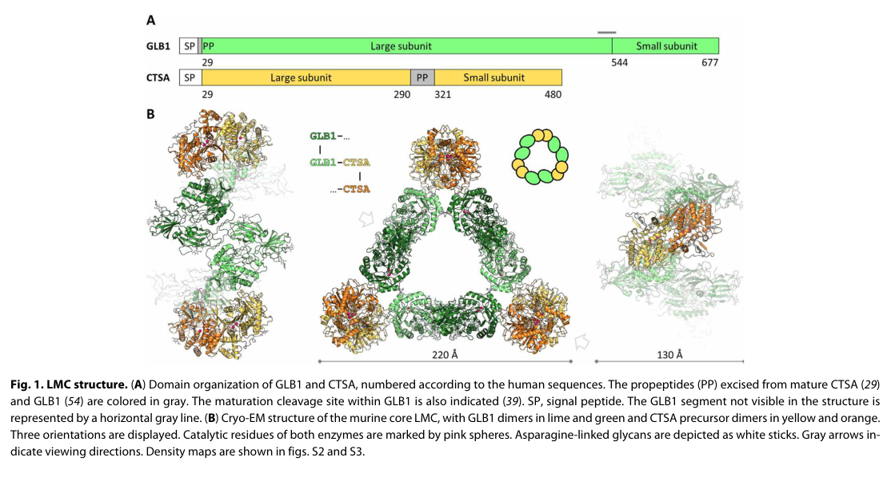

## Question

# Disease Characteristics Research Template

## Target Disease
- **Disease Name:** Galactosialidosis
- **MONDO ID:**  (if available)
- **Category:** Mendelian

## Research Objectives

Please provide a comprehensive research report on **Galactosialidosis** covering all of the
disease characteristics listed below. This report will be used to populate a disease knowledge
base entry. Be thorough and cite primary literature (PMID preferred) for all claims.

For each section, **suggested databases/resources** are listed. These are the first places
you should search for information on each topic.

---

### 1. Disease Information
> **Search first:** OMIM, Orphanet, ICD-10/ICD-11, MeSH, PubMed

- What is the disease? Provide a concise overview.
- What are the key identifiers? (OMIM, Orphanet, ICD-10/ICD-11, MeSH, Mondo)
- What are the common synonyms and alternative names?
- Is the information derived from individual patients (e.g., EHR) or aggregated disease-level resources?

### 2. Etiology

- **Disease Causal Factors**: What are the primary causes? (genetic, environmental, infectious, mechanistic)
- **Risk Factors**:
  > **Search first:** PubMed, Cochrane Library, UpToDate, clinical guidelines, ClinVar, ClinGen, GWAS Catalog, PheGenI, CTD, CDC, WHO, epidemiological databases
  - Genetic risk factors (causal variants, susceptibility loci, modifier genes)
  - Environmental risk factors (toxins, lifestyle, occupational exposures, age, sex, family history)
- **Protective Factors**:
  > **Search first:** PubMed, Cochrane Library, clinical trial databases, GWAS Catalog, gnomAD, WHO, CDC, nutrition databases
  - Genetic protective factors (protective variants, modifier alleles)
  - Environmental protective factors (diet, lifestyle, exposures that reduce risk)
- **Gene-Environment Interactions**: How do genetic and environmental factors interact to influence disease?
  > **Search first:** CTD, PubMed, PheGenI, GxE databases

### 3. Phenotypes
> **Search first:** HPO (Human Phenotype Ontology), OMIM, Orphanet, PubMed, clinicaltrials.gov, MedDRA, SNOMED CT, DECIPHER, LOINC

For each phenotype, provide:
- **Phenotype type**: symptoms, clinical signs, physical manifestations, behavioral changes, or laboratory abnormalities
  > For symptoms/signs: HPO, OMIM, Orphanet, PubMed
  > For behavioral changes: HPO, DSM, RDoC (Research Domain Criteria), PubMed
  > For laboratory abnormalities: LOINC, SNOMED CT, LabTests Online, PubMed
- **Phenotype characteristics**:
  > **Search first:** OMIM, Orphanet, HPO, PubMed
  - Age of symptom onset (neonatal, childhood, adult-onset, late-onset)
  - Symptom severity (mild, moderate, severe, variable)
  - Symptom progression (stable, progressive, episodic, fluctuating)
  - Frequency among affected individuals (percentage or qualitative)
- **Quality of life impact**: Effects on daily functioning and well-being (per-phenotype when possible)
  > **Search first:** EQ-5D database, SF-36, WHO QOL databases, PubMed
- Suggest HPO (Human Phenotype Ontology) terms for each phenotype

### 4. Genetic/Molecular Information

- **Causal Genes**: Gene mutations or chromosomal abnormalities responsible for disease (gene symbols, OMIM IDs)
  > **Search first:** OMIM, ClinVar, HGMD, Ensembl, NCBI Gene
- **Pathogenic Variants**:
  - Affected genes (gene symbols, HGNC IDs)
    > **Search first:** OMIM, NCBI Gene, Ensembl, HGNC, UniProt, GeneCards
  - Variant classification (pathogenic, likely pathogenic, VUS per ACMG/AMP guidelines)
    > **Search first:** ClinVar, ClinGen, ACMG/AMP guidelines, VarSome
  - Variant type/class (missense, frameshift, nonsense, splice-site, structural)
  - Allele frequency in population databases
    > **Search first:** gnomAD, 1000 Genomes, ExAC, TOPMed, dbSNP
  - Somatic vs germline origin
    > **Search first:** COSMIC (somatic), ClinVar, ICGC, TCGA
  - Functional consequences (loss of function, gain of function, dominant negative)
- **Modifier Genes**: Genes that modify disease severity or expression
- **Epigenetic Information**: DNA methylation, histone modifications, chromatin changes affecting disease
  > **Search first:** ENCODE, Roadmap Epigenomics, MethBase, DiseaseMeth
- **Chromosomal Abnormalities**: Large-scale genetic changes (aneuploidy, translocations, inversions)
  > **Search first:** DECIPHER, ClinVar, ECARUCA, UCSC Genome Browser

### 5. Environmental Information

- **Environmental Factors**: Non-genetic contributing factors (toxins, radiation, pollution, occupational exposure)
  > **Search first:** CTD (Comparative Toxicogenomics Database), TOXNET, PubMed, EPA databases
- **Lifestyle Factors**: Behavioral factors (smoking, diet, exercise, alcohol consumption)
  > **Search first:** CDC databases, WHO, PubMed, NHANES
- **Infectious Agents**: If applicable, pathogens causing or triggering disease (bacteria, viruses, fungi, parasites)
  > **Search first:** NCBI Taxonomy, ViPR, BV-BRC, MicrobeDB, GIDEON

### 6. Mechanism / Pathophysiology

- **Molecular Pathways**: Specific signaling cascades or biochemical pathways involved (Wnt, MAPK, mTOR, PI3K-AKT, etc.)
  > **Search first:** KEGG, Reactome, WikiPathways, PathBank, BioCyc
- **Cellular Processes**: Cell-level mechanisms (apoptosis, autophagy, cell cycle dysregulation, inflammation, etc.)
  > **Search first:** Gene Ontology (GO), Reactome, KEGG, PubMed
- **Protein Dysfunction**: How protein structure or function is altered (misfolding, aggregation, loss of function, gain of function)
  > **Search first:** UniProt, PDB (Protein Data Bank), InterPro, Pfam, AlphaFold
- **Metabolic Changes**: Alterations in metabolic processes (energy metabolism, lipid metabolism, amino acid metabolism)
  > **Search first:** KEGG, BioCyc, HMDB (Human Metabolome Database), BRENDA
- **Immune System Involvement**: Role of immune response (autoimmunity, immunodeficiency, chronic inflammation)
  > **Search first:** ImmPort, Immunome Database, IEDB, Gene Ontology
- **Tissue Damage Mechanisms**: How tissues/ are injured (oxidative stress, ischemia, fibrosis, necrosis)
  > **Search first:** PubMed, Gene Ontology, Reactome
- **Biochemical Abnormalities**: Specific molecular defects (enzyme deficiencies, receptor dysfunction, ion channel defects)
  > **Search first:** BRENDA, UniProt, KEGG, OMIM, PubMed
- **Epigenetic Changes**: DNA methylation, histone modifications affecting gene expression in disease
  > **Search first:** ENCODE, Roadmap Epigenomics, MethBase, DiseaseMeth
- **Molecular Profiling** (if available):
  - Transcriptomics/gene expression changes
    > **Search first:** GEO (Gene Expression Omnibus), ArrayExpress, GTEx, Human Cell Atlas, SRA
  - Proteomics findings
    > **Search first:** PRIDE, ProteomeXchange, Human Protein Atlas, STRING, BioGRID
  - Metabolomics signatures
    > **Search first:** MetaboLights, Metabolomics Workbench, HMDB, METLIN
  - Lipidomics alterations
    > **Search first:** LIPID MAPS, SwissLipids, LipidHome, Metabolomics Workbench
  - Genomic structural features
    > **Search first:** UCSC Genome Browser, Ensembl, NCBI, dbVar, DGV
- **Advanced Technologies** (if applicable):
  - Single-cell analysis findings (cell-type specific mechanisms, cellular heterogeneity)
    > **Search first:** Human Cell Atlas, Single Cell Portal, GEO, CELLxGENE
  - Spatial transcriptomics findings
    > **Search first:** GEO, Spatial Research, Vizgen, 10x Genomics data
  - Multi-omics integration results
    > **Search first:** TCGA, ICGC, cBioPortal, LinkedOmics, PubMed
  - Functional genomics screens (CRISPR, RNAi)
    > **Search first:** DepMap, GenomeRNAi, PubMed, BioGRID ORCS

For each mechanism, describe:
- The causal chain from initial trigger to clinical manifestation
- Which mechanisms are upstream vs downstream
- What cell types and biological processes are involved
- Suggest GO terms for biological processes and CL terms for cell types

### 7. Anatomical Structures Affected

- **Organ Level**:
  - Primary organs directly affected
  - Secondary organ involvement (complications, secondary effects)
  - Body systems involved (cardiovascular, nervous, digestive, respiratory, endocrine, etc.)
  > **Search first:** Uberon, FMA (Foundational Model of Anatomy), OMIM, HPO, ICD-11, MeSH, SNOMED CT
- **Tissue and Cell Level**:
  - Specific tissue types affected (epithelial, connective, muscle, nervous)
  - Specific cell populations targeted (with Cell Ontology terms)
  > **Search first:** Uberon, Human Protein Atlas, Cell Ontology, Human Cell Atlas, CellMarker, PanglaoDB
- **Subcellular Level**:
  - Cellular compartments involved (mitochondria, nucleus, ER, lysosomes) (with GO Cellular Component terms)
  > **Search first:** Gene Ontology (Cellular Component), UniProt, Human Protein Atlas
- **Localization**:
  - Specific anatomical sites (with UBERON terms)
    > **Search first:** FMA, Uberon, NeuroNames (for brain), SNOMED CT
  - Lateralization (unilateral, bilateral, asymmetric)
    > **Search first:** HPO, clinical literature, imaging databases

### 8. Temporal Development

- **Onset**:
  - Typical age of onset (congenital, pediatric, adult, geriatric)
  - Onset pattern (acute, subacute, chronic, insidious)
  > **Search first:** OMIM, Orphanet, HPO, PubMed
- **Progression**:
  - Disease stages (early, intermediate, advanced, end-stage)
    > **Search first:** Cancer Staging Manual (AJCC), WHO classifications, PubMed
  - Progression rate (rapid, slow, variable)
  - Disease course pattern (episodic, relapsing-remitting, progressive, stable)
  - Disease duration (self-limited, chronic lifelong)
  > **Search first:** Disease registries, longitudinal cohort databases, natural history studies, PubMed, Orphanet, OMIM
- **Patterns**:
  - Remission patterns (spontaneous, treatment-induced)
    > **Search first:** Clinical trial databases, disease registries, PubMed
  - Critical periods (time windows of vulnerability or opportunity for intervention)
    > **Search first:** PubMed, developmental biology databases, clinical guidelines

### 9. Inheritance and Population

- **Epidemiology**:
  - Prevalence (cases per 100,000 at given time)
  - Incidence (new cases per 100,000 per year)
  > **Search first:** Orphanet, CDC, WHO, GBD (Global Burden of Disease), national registries, SEER, disease registries
- **For Genetic Etiology**:
  - Inheritance pattern (AD, AR, X-linked, mitochondrial, multifactorial, polygenic)
    > **Search first:** OMIM, Orphanet, ClinVar, GTR (Genetic Testing Registry)
  - Penetrance (complete, incomplete, age-dependent)
    > **Search first:** ClinVar, OMIM, PubMed, ClinGen
  - Expressivity (variable, consistent)
    > **Search first:** OMIM, ClinVar, PubMed
  - Genetic anticipation (increasing severity in successive generations)
    > **Search first:** OMIM, PubMed (especially for repeat expansion disorders)
  - Germline mosaicism
    > **Search first:** ClinVar, OMIM, genetic counseling literature, PubMed
  - Founder effects (population-specific mutations)
    > **Search first:** gnomAD, population genetics databases, PubMed
  - Consanguinity role
    > **Search first:** OMIM, population studies, genetic counseling resources
  - Carrier frequency
    > **Search first:** gnomAD, carrier screening databases, GeneReviews, GTR
- **Population Demographics**:
  - Affected populations (ethnic or demographic groups with higher prevalence)
    > **Search first:** gnomAD, 1000 Genomes, PAGE Study, PubMed, population registries
  - Geographic distribution (endemic areas, regional variation)
    > **Search first:** WHO, CDC, GBD, Orphanet, geographic epidemiology databases
  - Geographic distribution of specific variants
  - Sex ratio (male:female)
    > **Search first:** Disease registries, OMIM, PubMed, epidemiological databases
  - Age distribution of affected individuals
    > **Search first:** CDC, disease registries, SEER, Orphanet

### 10. Diagnostics

- **Clinical Tests**:
  - Laboratory tests (blood, urine, tissue chemistry, specific enzyme assays)
    > **Search first:** LOINC, LabTests Online, PubMed
  - Biomarkers (proteins, metabolites, genetic markers, circulating biomarkers)
    > **Search first:** FDA Biomarker List, BEST (Biomarkers, EndpointS, and other Tools), PubMed
  - Imaging studies (X-ray, CT, MRI, PET, ultrasound)
    > **Search first:** RadLex, DICOM, Radiopaedia, imaging databases
  - Functional tests (pulmonary function, cardiac stress tests)
    > **Search first:** LOINC, clinical guidelines, PubMed
  - Electrophysiology (EEG, EMG, ECG, nerve conduction studies)
    > **Search first:** LOINC, clinical neurophysiology databases, PubMed
  - Biopsy findings (histopathology, immunohistochemistry)
    > **Search first:** SNOMED CT, College of American Pathologists resources, PubMed
  - Pathology findings (microscopic examination)
    > **Search first:** SNOMED CT, Digital Pathology databases, PubMed
- **Genetic Testing**:
  > **Search first:** GTR (Genetic Testing Registry), GeneReviews, ClinGen
  - Overview of recommended genetic testing approach
  - Whole genome sequencing (WGS) utility
    > **Search first:** GTR, ClinVar, GEL (Genomics England), gnomAD
  - Whole exome sequencing (WES) utility
    > **Search first:** GTR, ClinVar, OMIM, GeneMatcher
  - Gene panels (which panels, which genes)
    > **Search first:** GTR, ClinVar, laboratory-specific databases
  - Single gene testing
    > **Search first:** GTR, ClinVar, OMIM, GeneReviews
  - Chromosomal microarray (CMA)
    > **Search first:** DECIPHER, ClinVar, dbVar, ECARUCA
  - Karyotyping
    > **Search first:** Chromosome Abnormality Database, ClinVar, cytogenetics resources
  - FISH
    > **Search first:** ClinVar, cytogenetics databases, PubMed
  - Mitochondrial DNA testing
    > **Search first:** MITOMAP, MSeqDR, ClinVar, GTR
  - Repeat expansion testing
    > **Search first:** GTR, ClinVar, repeat expansion databases, PubMed
- **Omics-Based Diagnostics** (if applicable):
  - RNA sequencing / transcriptomics
    > **Search first:** GEO, ArrayExpress, GTEx, RNA-seq databases
  - Proteomics
    > **Search first:** PRIDE, ProteomeXchange, FDA Biomarker database
  - Metabolomics
    > **Search first:** MetaboLights, Metabolomics Workbench, HMDB
  - Epigenomics
    > **Search first:** GEO, ENCODE, Roadmap Epigenomics, MethBase
  - Liquid biopsy
    > **Search first:** COSMIC, ClinVar, liquid biopsy databases, PubMed
- **Clinical Criteria**:
  - Standardized diagnostic criteria (DSM, ICD, society guidelines)
    > **Search first:** DSM-5, ICD-11, clinical society guidelines, UpToDate
  - Differential diagnosis (other conditions to rule out, with distinguishing features)
    > **Search first:** DynaMed, UpToDate, clinical decision support systems
- **Screening**:
  - Screening methods for asymptomatic individuals (newborn screening, carrier screening, cascade screening)
    > **Search first:** ACMG recommendations, CDC newborn screening, GTR

### 11. Outcome/Prognosis

- **Survival and Mortality**:
  - Survival rate (5-year, 10-year, overall)
    > **Search first:** SEER, cancer registries, disease-specific registries, PubMed
  - Life expectancy (with and without treatment if applicable)
    > **Search first:** Orphanet, disease registries, actuarial databases, PubMed
  - Mortality rate
    > **Search first:** CDC, WHO, GBD, national mortality databases
  - Disease-specific mortality (deaths directly attributable to disease)
    > **Search first:** Disease registries, CDC Wonder, GBD, PubMed
- **Morbidity and Function**:
  - Morbidity (disease-related disability and health impacts)
    > **Search first:** GBD, WHO, disability databases, PubMed
  - Disability outcomes (long-term functional impairments)
    > **Search first:** ICF (International Classification of Functioning), disability registries
  - Quality of life measures (EQ-5D, SF-36, PROMIS, disease-specific tools)
    > **Search first:** EQ-5D database, SF-36, PROMIS, PubMed
- **Disease Course**:
  - Complications (secondary problems: infections, organ failure, etc.)
    > **Search first:** ICD codes, disease registries, clinical databases, PubMed
  - Recovery potential (likelihood and extent of recovery, with vs without treatment)
    > **Search first:** Natural history studies, rehabilitation databases, PubMed
- **Prediction**:
  - Prognostic factors (age, disease severity, biomarkers, treatment response)
    > **Search first:** Prognostic models databases, clinical calculators, PubMed
  - Prognostic biomarkers (molecular markers predicting disease course)
    > **Search first:** FDA Biomarker database, PubMed, cancer prognostic databases

### 12. Treatment

- **Pharmacotherapy**:
  - Pharmacological treatments (drug names, drug classes, mechanisms of action)
    > **Search first:** DrugBank, RxNorm, ATC classification, DailyMed, FDA databases
  - Pharmacogenomics (how genetic variants affect drug metabolism, efficacy, toxicity)
    > **Search first:** PharmGKB, CPIC (Clinical Pharmacogenetics), FDA Table of PGx Biomarkers
- **Advanced Therapeutics**:
  - Gene therapy (viral vectors, CRISPR, gene replacement, gene editing)
    > **Search first:** ClinicalTrials.gov, FDA gene therapy database, ASGCT resources
  - Cell therapy (stem cell transplant, CAR-T, cellular therapeutics)
    > **Search first:** ClinicalTrials.gov, FDA cell therapy database, FACT standards
  - RNA-based therapies (ASOs, siRNA, mRNA therapies)
    > **Search first:** ClinicalTrials.gov, FDA approvals, PubMed
  - Targeted therapies (treatments directed at specific molecular targets)
    > **Search first:** My Cancer Genome, OncoKB, ClinicalTrials.gov, FDA approvals
  - Immunotherapies (checkpoint inhibitors, monoclonal antibodies)
    > **Search first:** Cancer Immunotherapy Database, FDA approvals, ClinicalTrials.gov
- **Surgical and Interventional**:
  - Surgical interventions (types of surgery, timing, outcomes)
    > **Search first:** CPT codes, surgical registries, clinical guidelines, PubMed
- **Supportive and Rehabilitative**:
  - Supportive care (symptom management, pain control, nutrition)
    > **Search first:** Clinical guidelines, Cochrane Library, PubMed
  - Rehabilitation (physical therapy, occupational therapy, speech therapy)
    > **Search first:** Rehabilitation medicine databases, clinical guidelines, PubMed
- **Experimental**:
  - Experimental treatments in clinical trials (with NCT identifiers if available)
    > **Search first:** ClinicalTrials.gov, EU Clinical Trials Register, WHO ICTRP
- **Treatment Outcomes**:
  - Treatment response rates
    > **Search first:** Clinical trial databases, FDA reviews, systematic reviews, PubMed
  - Side effects and adverse events
    > **Search first:** FDA Adverse Event Reporting System (FAERS), MedWatch, PubMed
- **Treatment Strategy**:
  - Treatment algorithms (clinical pathways, decision trees)
    > **Search first:** Clinical practice guidelines, NCCN Guidelines, UpToDate
  - Combination therapies
    > **Search first:** ClinicalTrials.gov, treatment guidelines, PubMed
  - Personalized medicine approaches (genotype-guided treatment)
    > **Search first:** My Cancer Genome, CIViC, PharmGKB, precision medicine databases

For each treatment, suggest MAXO (Medical Action Ontology) terms where applicable.

### 13. Prevention

- **Prevention Levels**:
  - Primary prevention (preventing disease occurrence: vaccination, risk factor modification)
    > **Search first:** CDC, WHO, USPSTF recommendations, Cochrane Library
  - Secondary prevention (early detection and treatment: screening programs, early intervention)
    > **Search first:** USPSTF, CDC screening guidelines, WHO
  - Tertiary prevention (preventing complications in those with disease)
    > **Search first:** Clinical guidelines, disease management protocols, PubMed
- **Immunization**: Vaccine strategies (if applicable)
  > **Search first:** CDC vaccine schedules, WHO immunization, FDA vaccine database
- **Screening and Early Detection**:
  - Screening programs (population-based: newborn screening, cancer screening)
    > **Search first:** CDC screening programs, USPSTF, cancer screening databases
  - Genetic screening (carrier screening, preimplantation genetic diagnosis, prenatal testing)
    > **Search first:** ACMG recommendations, ACOG guidelines, GTR
  - Risk stratification (identifying high-risk individuals for targeted prevention)
    > **Search first:** Risk prediction models, clinical calculators, PubMed
- **Behavioral Interventions**: Lifestyle modifications to reduce risk
  > **Search first:** CDC, WHO, behavioral intervention databases, Cochrane Library
- **Counseling**: Genetic counseling (risk assessment, family planning guidance)
  > **Search first:** NSGC resources, ACMG guidelines, GeneReviews
- **Public Health**:
  - Public health interventions (sanitation, vector control, health education)
    > **Search first:** CDC, WHO, public health databases, PubMed
  - Environmental interventions (reducing environmental risk factors)
    > **Search first:** EPA databases, WHO environmental health, PubMed
- **Prophylaxis**: Preventive medications or procedures
  > **Search first:** Clinical guidelines, FDA approvals, PubMed

### 14. Other Species / Natural Disease

- **Taxonomy**: Species affected (with NCBI Taxon identifiers)
  > **Search first:** NCBI Taxonomy
- **Breed**: Specific breeds affected (with VBO identifiers if applicable)
  > **Search first:** VBO (Vertebrate Breed Ontology)
- **Gene**: Orthologous genes in other species (with NCBI Gene IDs)
  > **Search first:** NCBI Gene
- **Natural Disease**:
  - Naturally occurring disease in other species (companion animals, wildlife)
    > **Search first:** OMIA (Online Mendelian Inheritance in Animals), VetCompass, PubMed
  - Veterinary relevance and importance in animal health
    > **Search first:** OMIA, veterinary databases, PubMed
- **Comparative Biology**:
  - Comparative pathology (similarities and differences across species)
    > **Search first:** OMIA, comparative pathology databases, PubMed
  - Evolutionary conservation of disease mechanisms
    > **Search first:** HomoloGene, OrthoMCL, Alliance of Genome Resources
- **Transmission** (if applicable):
  - Zoonotic potential
    > **Search first:** CDC zoonotic diseases, WHO zoonoses, GIDEON
  - Cross-species susceptibility
    > **Search first:** NCBI Taxonomy, veterinary databases, PubMed

### 15. Model Organisms

- **Model Types**:
  - Model organism type (mammalian, invertebrate, cellular, in vitro)
    > **Search first:** Alliance of Genome Resources, model organism databases
  - Specific model systems (mouse, rat, zebrafish, Drosophila, C. elegans, yeast, cell lines, organoids, iPSCs)
    > **Search first:** MGI, RGD, ZFIN, FlyBase, WormBase, SGD, ATCC, Cellosaurus
  - Induced models (drug treatment, surgical intervention, environmental manipulation)
    > **Search first:** MGI, model organism databases, PubMed
- **Genetic Models**:
  - Types available (knockout, knock-in, transgenic, conditional, humanized)
    > **Search first:** MGI, IMPC, KOMP, EuMMCR, IMSR
- **Model Characteristics**:
  - Phenotype recapitulation (how well model reproduces human disease features)
    > **Search first:** Model organism databases, comparative studies, PubMed
  - Model limitations (aspects of human disease not captured)
    > **Search first:** Model organism databases, PubMed, review articles
- **Applications**:
  - Research applications (what aspects of disease can be studied)
    > **Search first:** Model organism databases, PubMed
- **Resources**:
  - Model databases
    > **Search first:** MGI, RGD, ZFIN, FlyBase, WormBase, IMSR, EMMA, MMRRC

---

## Citation Requirements

- Cite primary literature (PMID preferred) for all mechanistic and clinical claims
- Prioritize recent reviews and landmark papers
- Include direct quotes from abstracts where possible to support key statements
- Distinguish evidence source types: human clinical, model organism, in vitro, computational

## Output Format

Structure your response as a comprehensive narrative organized by the sections above.
For each section, provide:
- Factual content with specific details (numbers, percentages, gene names, variant nomenclature)
- Ontology term suggestions (HPO, GO, CL, UBERON, CHEBI, MAXO, MONDO) where applicable
- Evidence citations with PMIDs
- Direct quotes from abstracts to support key claims
- Clear indication when information is not available or not applicable for this disease

This report will be used to populate a disease knowledge base entry with:
- Pathophysiology descriptions with causal chains
- Gene/protein annotations (HGNC, GO terms)
- Phenotype associations (HP terms) with frequencies
- Cell type involvement (CL terms)
- Anatomical locations (UBERON terms)
- Chemical entities (CHEBI terms)
- Treatment annotations (MAXO terms)
- Evidence items with PMIDs and exact abstract quotes
- Epidemiology, prognosis, diagnostic, and prevention information
- Animal model descriptions with phenotype recapitulation details

## Output

Question: You are an expert researcher providing comprehensive, well-cited information.

Provide detailed information focusing on:
1. Key concepts and definitions with current understanding
2. Recent developments and latest research (prioritize 2023-2024 sources)
3. Current applications and real-world implementations
4. Expert opinions and analysis from authoritative sources
5. Relevant statistics and data from recent studies

Format as a comprehensive research report with proper citations. Include URLs and publication dates where available.
Always prioritize recent, authoritative sources and provide specific citations for all major claims.

# Disease Characteristics Research Template

## Target Disease
- **Disease Name:** Galactosialidosis
- **MONDO ID:**  (if available)
- **Category:** Mendelian

## Research Objectives

Please provide a comprehensive research report on **Galactosialidosis** covering all of the
disease characteristics listed below. This report will be used to populate a disease knowledge
base entry. Be thorough and cite primary literature (PMID preferred) for all claims.

For each section, **suggested databases/resources** are listed. These are the first places
you should search for information on each topic.

---

### 1. Disease Information
> **Search first:** OMIM, Orphanet, ICD-10/ICD-11, MeSH, PubMed

- What is the disease? Provide a concise overview.
- What are the key identifiers? (OMIM, Orphanet, ICD-10/ICD-11, MeSH, Mondo)
- What are the common synonyms and alternative names?
- Is the information derived from individual patients (e.g., EHR) or aggregated disease-level resources?

### 2. Etiology

- **Disease Causal Factors**: What are the primary causes? (genetic, environmental, infectious, mechanistic)
- **Risk Factors**:
  > **Search first:** PubMed, Cochrane Library, UpToDate, clinical guidelines, ClinVar, ClinGen, GWAS Catalog, PheGenI, CTD, CDC, WHO, epidemiological databases
  - Genetic risk factors (causal variants, susceptibility loci, modifier genes)
  - Environmental risk factors (toxins, lifestyle, occupational exposures, age, sex, family history)
- **Protective Factors**:
  > **Search first:** PubMed, Cochrane Library, clinical trial databases, GWAS Catalog, gnomAD, WHO, CDC, nutrition databases
  - Genetic protective factors (protective variants, modifier alleles)
  - Environmental protective factors (diet, lifestyle, exposures that reduce risk)
- **Gene-Environment Interactions**: How do genetic and environmental factors interact to influence disease?
  > **Search first:** CTD, PubMed, PheGenI, GxE databases

### 3. Phenotypes
> **Search first:** HPO (Human Phenotype Ontology), OMIM, Orphanet, PubMed, clinicaltrials.gov, MedDRA, SNOMED CT, DECIPHER, LOINC

For each phenotype, provide:
- **Phenotype type**: symptoms, clinical signs, physical manifestations, behavioral changes, or laboratory abnormalities
  > For symptoms/signs: HPO, OMIM, Orphanet, PubMed
  > For behavioral changes: HPO, DSM, RDoC (Research Domain Criteria), PubMed
  > For laboratory abnormalities: LOINC, SNOMED CT, LabTests Online, PubMed
- **Phenotype characteristics**:
  > **Search first:** OMIM, Orphanet, HPO, PubMed
  - Age of symptom onset (neonatal, childhood, adult-onset, late-onset)
  - Symptom severity (mild, moderate, severe, variable)
  - Symptom progression (stable, progressive, episodic, fluctuating)
  - Frequency among affected individuals (percentage or qualitative)
- **Quality of life impact**: Effects on daily functioning and well-being (per-phenotype when possible)
  > **Search first:** EQ-5D database, SF-36, WHO QOL databases, PubMed
- Suggest HPO (Human Phenotype Ontology) terms for each phenotype

### 4. Genetic/Molecular Information

- **Causal Genes**: Gene mutations or chromosomal abnormalities responsible for disease (gene symbols, OMIM IDs)
  > **Search first:** OMIM, ClinVar, HGMD, Ensembl, NCBI Gene
- **Pathogenic Variants**:
  - Affected genes (gene symbols, HGNC IDs)
    > **Search first:** OMIM, NCBI Gene, Ensembl, HGNC, UniProt, GeneCards
  - Variant classification (pathogenic, likely pathogenic, VUS per ACMG/AMP guidelines)
    > **Search first:** ClinVar, ClinGen, ACMG/AMP guidelines, VarSome
  - Variant type/class (missense, frameshift, nonsense, splice-site, structural)
  - Allele frequency in population databases
    > **Search first:** gnomAD, 1000 Genomes, ExAC, TOPMed, dbSNP
  - Somatic vs germline origin
    > **Search first:** COSMIC (somatic), ClinVar, ICGC, TCGA
  - Functional consequences (loss of function, gain of function, dominant negative)
- **Modifier Genes**: Genes that modify disease severity or expression
- **Epigenetic Information**: DNA methylation, histone modifications, chromatin changes affecting disease
  > **Search first:** ENCODE, Roadmap Epigenomics, MethBase, DiseaseMeth
- **Chromosomal Abnormalities**: Large-scale genetic changes (aneuploidy, translocations, inversions)
  > **Search first:** DECIPHER, ClinVar, ECARUCA, UCSC Genome Browser

### 5. Environmental Information

- **Environmental Factors**: Non-genetic contributing factors (toxins, radiation, pollution, occupational exposure)
  > **Search first:** CTD (Comparative Toxicogenomics Database), TOXNET, PubMed, EPA databases
- **Lifestyle Factors**: Behavioral factors (smoking, diet, exercise, alcohol consumption)
  > **Search first:** CDC databases, WHO, PubMed, NHANES
- **Infectious Agents**: If applicable, pathogens causing or triggering disease (bacteria, viruses, fungi, parasites)
  > **Search first:** NCBI Taxonomy, ViPR, BV-BRC, MicrobeDB, GIDEON

### 6. Mechanism / Pathophysiology

- **Molecular Pathways**: Specific signaling cascades or biochemical pathways involved (Wnt, MAPK, mTOR, PI3K-AKT, etc.)
  > **Search first:** KEGG, Reactome, WikiPathways, PathBank, BioCyc
- **Cellular Processes**: Cell-level mechanisms (apoptosis, autophagy, cell cycle dysregulation, inflammation, etc.)
  > **Search first:** Gene Ontology (GO), Reactome, KEGG, PubMed
- **Protein Dysfunction**: How protein structure or function is altered (misfolding, aggregation, loss of function, gain of function)
  > **Search first:** UniProt, PDB (Protein Data Bank), InterPro, Pfam, AlphaFold
- **Metabolic Changes**: Alterations in metabolic processes (energy metabolism, lipid metabolism, amino acid metabolism)
  > **Search first:** KEGG, BioCyc, HMDB (Human Metabolome Database), BRENDA
- **Immune System Involvement**: Role of immune response (autoimmunity, immunodeficiency, chronic inflammation)
  > **Search first:** ImmPort, Immunome Database, IEDB, Gene Ontology
- **Tissue Damage Mechanisms**: How tissues/ are injured (oxidative stress, ischemia, fibrosis, necrosis)
  > **Search first:** PubMed, Gene Ontology, Reactome
- **Biochemical Abnormalities**: Specific molecular defects (enzyme deficiencies, receptor dysfunction, ion channel defects)
  > **Search first:** BRENDA, UniProt, KEGG, OMIM, PubMed
- **Epigenetic Changes**: DNA methylation, histone modifications affecting gene expression in disease
  > **Search first:** ENCODE, Roadmap Epigenomics, MethBase, DiseaseMeth
- **Molecular Profiling** (if available):
  - Transcriptomics/gene expression changes
    > **Search first:** GEO (Gene Expression Omnibus), ArrayExpress, GTEx, Human Cell Atlas, SRA
  - Proteomics findings
    > **Search first:** PRIDE, ProteomeXchange, Human Protein Atlas, STRING, BioGRID
  - Metabolomics signatures
    > **Search first:** MetaboLights, Metabolomics Workbench, HMDB, METLIN
  - Lipidomics alterations
    > **Search first:** LIPID MAPS, SwissLipids, LipidHome, Metabolomics Workbench
  - Genomic structural features
    > **Search first:** UCSC Genome Browser, Ensembl, NCBI, dbVar, DGV
- **Advanced Technologies** (if applicable):
  - Single-cell analysis findings (cell-type specific mechanisms, cellular heterogeneity)
    > **Search first:** Human Cell Atlas, Single Cell Portal, GEO, CELLxGENE
  - Spatial transcriptomics findings
    > **Search first:** GEO, Spatial Research, Vizgen, 10x Genomics data
  - Multi-omics integration results
    > **Search first:** TCGA, ICGC, cBioPortal, LinkedOmics, PubMed
  - Functional genomics screens (CRISPR, RNAi)
    > **Search first:** DepMap, GenomeRNAi, PubMed, BioGRID ORCS

For each mechanism, describe:
- The causal chain from initial trigger to clinical manifestation
- Which mechanisms are upstream vs downstream
- What cell types and biological processes are involved
- Suggest GO terms for biological processes and CL terms for cell types

### 7. Anatomical Structures Affected

- **Organ Level**:
  - Primary organs directly affected
  - Secondary organ involvement (complications, secondary effects)
  - Body systems involved (cardiovascular, nervous, digestive, respiratory, endocrine, etc.)
  > **Search first:** Uberon, FMA (Foundational Model of Anatomy), OMIM, HPO, ICD-11, MeSH, SNOMED CT
- **Tissue and Cell Level**:
  - Specific tissue types affected (epithelial, connective, muscle, nervous)
  - Specific cell populations targeted (with Cell Ontology terms)
  > **Search first:** Uberon, Human Protein Atlas, Cell Ontology, Human Cell Atlas, CellMarker, PanglaoDB
- **Subcellular Level**:
  - Cellular compartments involved (mitochondria, nucleus, ER, lysosomes) (with GO Cellular Component terms)
  > **Search first:** Gene Ontology (Cellular Component), UniProt, Human Protein Atlas
- **Localization**:
  - Specific anatomical sites (with UBERON terms)
    > **Search first:** FMA, Uberon, NeuroNames (for brain), SNOMED CT
  - Lateralization (unilateral, bilateral, asymmetric)
    > **Search first:** HPO, clinical literature, imaging databases

### 8. Temporal Development

- **Onset**:
  - Typical age of onset (congenital, pediatric, adult, geriatric)
  - Onset pattern (acute, subacute, chronic, insidious)
  > **Search first:** OMIM, Orphanet, HPO, PubMed
- **Progression**:
  - Disease stages (early, intermediate, advanced, end-stage)
    > **Search first:** Cancer Staging Manual (AJCC), WHO classifications, PubMed
  - Progression rate (rapid, slow, variable)
  - Disease course pattern (episodic, relapsing-remitting, progressive, stable)
  - Disease duration (self-limited, chronic lifelong)
  > **Search first:** Disease registries, longitudinal cohort databases, natural history studies, PubMed, Orphanet, OMIM
- **Patterns**:
  - Remission patterns (spontaneous, treatment-induced)
    > **Search first:** Clinical trial databases, disease registries, PubMed
  - Critical periods (time windows of vulnerability or opportunity for intervention)
    > **Search first:** PubMed, developmental biology databases, clinical guidelines

### 9. Inheritance and Population

- **Epidemiology**:
  - Prevalence (cases per 100,000 at given time)
  - Incidence (new cases per 100,000 per year)
  > **Search first:** Orphanet, CDC, WHO, GBD (Global Burden of Disease), national registries, SEER, disease registries
- **For Genetic Etiology**:
  - Inheritance pattern (AD, AR, X-linked, mitochondrial, multifactorial, polygenic)
    > **Search first:** OMIM, Orphanet, ClinVar, GTR (Genetic Testing Registry)
  - Penetrance (complete, incomplete, age-dependent)
    > **Search first:** ClinVar, OMIM, PubMed, ClinGen
  - Expressivity (variable, consistent)
    > **Search first:** OMIM, ClinVar, PubMed
  - Genetic anticipation (increasing severity in successive generations)
    > **Search first:** OMIM, PubMed (especially for repeat expansion disorders)
  - Germline mosaicism
    > **Search first:** ClinVar, OMIM, genetic counseling literature, PubMed
  - Founder effects (population-specific mutations)
    > **Search first:** gnomAD, population genetics databases, PubMed
  - Consanguinity role
    > **Search first:** OMIM, population studies, genetic counseling resources
  - Carrier frequency
    > **Search first:** gnomAD, carrier screening databases, GeneReviews, GTR
- **Population Demographics**:
  - Affected populations (ethnic or demographic groups with higher prevalence)
    > **Search first:** gnomAD, 1000 Genomes, PAGE Study, PubMed, population registries
  - Geographic distribution (endemic areas, regional variation)
    > **Search first:** WHO, CDC, GBD, Orphanet, geographic epidemiology databases
  - Geographic distribution of specific variants
  - Sex ratio (male:female)
    > **Search first:** Disease registries, OMIM, PubMed, epidemiological databases
  - Age distribution of affected individuals
    > **Search first:** CDC, disease registries, SEER, Orphanet

### 10. Diagnostics

- **Clinical Tests**:
  - Laboratory tests (blood, urine, tissue chemistry, specific enzyme assays)
    > **Search first:** LOINC, LabTests Online, PubMed
  - Biomarkers (proteins, metabolites, genetic markers, circulating biomarkers)
    > **Search first:** FDA Biomarker List, BEST (Biomarkers, EndpointS, and other Tools), PubMed
  - Imaging studies (X-ray, CT, MRI, PET, ultrasound)
    > **Search first:** RadLex, DICOM, Radiopaedia, imaging databases
  - Functional tests (pulmonary function, cardiac stress tests)
    > **Search first:** LOINC, clinical guidelines, PubMed
  - Electrophysiology (EEG, EMG, ECG, nerve conduction studies)
    > **Search first:** LOINC, clinical neurophysiology databases, PubMed
  - Biopsy findings (histopathology, immunohistochemistry)
    > **Search first:** SNOMED CT, College of American Pathologists resources, PubMed
  - Pathology findings (microscopic examination)
    > **Search first:** SNOMED CT, Digital Pathology databases, PubMed
- **Genetic Testing**:
  > **Search first:** GTR (Genetic Testing Registry), GeneReviews, ClinGen
  - Overview of recommended genetic testing approach
  - Whole genome sequencing (WGS) utility
    > **Search first:** GTR, ClinVar, GEL (Genomics England), gnomAD
  - Whole exome sequencing (WES) utility
    > **Search first:** GTR, ClinVar, OMIM, GeneMatcher
  - Gene panels (which panels, which genes)
    > **Search first:** GTR, ClinVar, laboratory-specific databases
  - Single gene testing
    > **Search first:** GTR, ClinVar, OMIM, GeneReviews
  - Chromosomal microarray (CMA)
    > **Search first:** DECIPHER, ClinVar, dbVar, ECARUCA
  - Karyotyping
    > **Search first:** Chromosome Abnormality Database, ClinVar, cytogenetics resources
  - FISH
    > **Search first:** ClinVar, cytogenetics databases, PubMed
  - Mitochondrial DNA testing
    > **Search first:** MITOMAP, MSeqDR, ClinVar, GTR
  - Repeat expansion testing
    > **Search first:** GTR, ClinVar, repeat expansion databases, PubMed
- **Omics-Based Diagnostics** (if applicable):
  - RNA sequencing / transcriptomics
    > **Search first:** GEO, ArrayExpress, GTEx, RNA-seq databases
  - Proteomics
    > **Search first:** PRIDE, ProteomeXchange, FDA Biomarker database
  - Metabolomics
    > **Search first:** MetaboLights, Metabolomics Workbench, HMDB
  - Epigenomics
    > **Search first:** GEO, ENCODE, Roadmap Epigenomics, MethBase
  - Liquid biopsy
    > **Search first:** COSMIC, ClinVar, liquid biopsy databases, PubMed
- **Clinical Criteria**:
  - Standardized diagnostic criteria (DSM, ICD, society guidelines)
    > **Search first:** DSM-5, ICD-11, clinical society guidelines, UpToDate
  - Differential diagnosis (other conditions to rule out, with distinguishing features)
    > **Search first:** DynaMed, UpToDate, clinical decision support systems
- **Screening**:
  - Screening methods for asymptomatic individuals (newborn screening, carrier screening, cascade screening)
    > **Search first:** ACMG recommendations, CDC newborn screening, GTR

### 11. Outcome/Prognosis

- **Survival and Mortality**:
  - Survival rate (5-year, 10-year, overall)
    > **Search first:** SEER, cancer registries, disease-specific registries, PubMed
  - Life expectancy (with and without treatment if applicable)
    > **Search first:** Orphanet, disease registries, actuarial databases, PubMed
  - Mortality rate
    > **Search first:** CDC, WHO, GBD, national mortality databases
  - Disease-specific mortality (deaths directly attributable to disease)
    > **Search first:** Disease registries, CDC Wonder, GBD, PubMed
- **Morbidity and Function**:
  - Morbidity (disease-related disability and health impacts)
    > **Search first:** GBD, WHO, disability databases, PubMed
  - Disability outcomes (long-term functional impairments)
    > **Search first:** ICF (International Classification of Functioning), disability registries
  - Quality of life measures (EQ-5D, SF-36, PROMIS, disease-specific tools)
    > **Search first:** EQ-5D database, SF-36, PROMIS, PubMed
- **Disease Course**:
  - Complications (secondary problems: infections, organ failure, etc.)
    > **Search first:** ICD codes, disease registries, clinical databases, PubMed
  - Recovery potential (likelihood and extent of recovery, with vs without treatment)
    > **Search first:** Natural history studies, rehabilitation databases, PubMed
- **Prediction**:
  - Prognostic factors (age, disease severity, biomarkers, treatment response)
    > **Search first:** Prognostic models databases, clinical calculators, PubMed
  - Prognostic biomarkers (molecular markers predicting disease course)
    > **Search first:** FDA Biomarker database, PubMed, cancer prognostic databases

### 12. Treatment

- **Pharmacotherapy**:
  - Pharmacological treatments (drug names, drug classes, mechanisms of action)
    > **Search first:** DrugBank, RxNorm, ATC classification, DailyMed, FDA databases
  - Pharmacogenomics (how genetic variants affect drug metabolism, efficacy, toxicity)
    > **Search first:** PharmGKB, CPIC (Clinical Pharmacogenetics), FDA Table of PGx Biomarkers
- **Advanced Therapeutics**:
  - Gene therapy (viral vectors, CRISPR, gene replacement, gene editing)
    > **Search first:** ClinicalTrials.gov, FDA gene therapy database, ASGCT resources
  - Cell therapy (stem cell transplant, CAR-T, cellular therapeutics)
    > **Search first:** ClinicalTrials.gov, FDA cell therapy database, FACT standards
  - RNA-based therapies (ASOs, siRNA, mRNA therapies)
    > **Search first:** ClinicalTrials.gov, FDA approvals, PubMed
  - Targeted therapies (treatments directed at specific molecular targets)
    > **Search first:** My Cancer Genome, OncoKB, ClinicalTrials.gov, FDA approvals
  - Immunotherapies (checkpoint inhibitors, monoclonal antibodies)
    > **Search first:** Cancer Immunotherapy Database, FDA approvals, ClinicalTrials.gov
- **Surgical and Interventional**:
  - Surgical interventions (types of surgery, timing, outcomes)
    > **Search first:** CPT codes, surgical registries, clinical guidelines, PubMed
- **Supportive and Rehabilitative**:
  - Supportive care (symptom management, pain control, nutrition)
    > **Search first:** Clinical guidelines, Cochrane Library, PubMed
  - Rehabilitation (physical therapy, occupational therapy, speech therapy)
    > **Search first:** Rehabilitation medicine databases, clinical guidelines, PubMed
- **Experimental**:
  - Experimental treatments in clinical trials (with NCT identifiers if available)
    > **Search first:** ClinicalTrials.gov, EU Clinical Trials Register, WHO ICTRP
- **Treatment Outcomes**:
  - Treatment response rates
    > **Search first:** Clinical trial databases, FDA reviews, systematic reviews, PubMed
  - Side effects and adverse events
    > **Search first:** FDA Adverse Event Reporting System (FAERS), MedWatch, PubMed
- **Treatment Strategy**:
  - Treatment algorithms (clinical pathways, decision trees)
    > **Search first:** Clinical practice guidelines, NCCN Guidelines, UpToDate
  - Combination therapies
    > **Search first:** ClinicalTrials.gov, treatment guidelines, PubMed
  - Personalized medicine approaches (genotype-guided treatment)
    > **Search first:** My Cancer Genome, CIViC, PharmGKB, precision medicine databases

For each treatment, suggest MAXO (Medical Action Ontology) terms where applicable.

### 13. Prevention

- **Prevention Levels**:
  - Primary prevention (preventing disease occurrence: vaccination, risk factor modification)
    > **Search first:** CDC, WHO, USPSTF recommendations, Cochrane Library
  - Secondary prevention (early detection and treatment: screening programs, early intervention)
    > **Search first:** USPSTF, CDC screening guidelines, WHO
  - Tertiary prevention (preventing complications in those with disease)
    > **Search first:** Clinical guidelines, disease management protocols, PubMed
- **Immunization**: Vaccine strategies (if applicable)
  > **Search first:** CDC vaccine schedules, WHO immunization, FDA vaccine database
- **Screening and Early Detection**:
  - Screening programs (population-based: newborn screening, cancer screening)
    > **Search first:** CDC screening programs, USPSTF, cancer screening databases
  - Genetic screening (carrier screening, preimplantation genetic diagnosis, prenatal testing)
    > **Search first:** ACMG recommendations, ACOG guidelines, GTR
  - Risk stratification (identifying high-risk individuals for targeted prevention)
    > **Search first:** Risk prediction models, clinical calculators, PubMed
- **Behavioral Interventions**: Lifestyle modifications to reduce risk
  > **Search first:** CDC, WHO, behavioral intervention databases, Cochrane Library
- **Counseling**: Genetic counseling (risk assessment, family planning guidance)
  > **Search first:** NSGC resources, ACMG guidelines, GeneReviews
- **Public Health**:
  - Public health interventions (sanitation, vector control, health education)
    > **Search first:** CDC, WHO, public health databases, PubMed
  - Environmental interventions (reducing environmental risk factors)
    > **Search first:** EPA databases, WHO environmental health, PubMed
- **Prophylaxis**: Preventive medications or procedures
  > **Search first:** Clinical guidelines, FDA approvals, PubMed

### 14. Other Species / Natural Disease

- **Taxonomy**: Species affected (with NCBI Taxon identifiers)
  > **Search first:** NCBI Taxonomy
- **Breed**: Specific breeds affected (with VBO identifiers if applicable)
  > **Search first:** VBO (Vertebrate Breed Ontology)
- **Gene**: Orthologous genes in other species (with NCBI Gene IDs)
  > **Search first:** NCBI Gene
- **Natural Disease**:
  - Naturally occurring disease in other species (companion animals, wildlife)
    > **Search first:** OMIA (Online Mendelian Inheritance in Animals), VetCompass, PubMed
  - Veterinary relevance and importance in animal health
    > **Search first:** OMIA, veterinary databases, PubMed
- **Comparative Biology**:
  - Comparative pathology (similarities and differences across species)
    > **Search first:** OMIA, comparative pathology databases, PubMed
  - Evolutionary conservation of disease mechanisms
    > **Search first:** HomoloGene, OrthoMCL, Alliance of Genome Resources
- **Transmission** (if applicable):
  - Zoonotic potential
    > **Search first:** CDC zoonotic diseases, WHO zoonoses, GIDEON
  - Cross-species susceptibility
    > **Search first:** NCBI Taxonomy, veterinary databases, PubMed

### 15. Model Organisms

- **Model Types**:
  - Model organism type (mammalian, invertebrate, cellular, in vitro)
    > **Search first:** Alliance of Genome Resources, model organism databases
  - Specific model systems (mouse, rat, zebrafish, Drosophila, C. elegans, yeast, cell lines, organoids, iPSCs)
    > **Search first:** MGI, RGD, ZFIN, FlyBase, WormBase, SGD, ATCC, Cellosaurus
  - Induced models (drug treatment, surgical intervention, environmental manipulation)
    > **Search first:** MGI, model organism databases, PubMed
- **Genetic Models**:
  - Types available (knockout, knock-in, transgenic, conditional, humanized)
    > **Search first:** MGI, IMPC, KOMP, EuMMCR, IMSR
- **Model Characteristics**:
  - Phenotype recapitulation (how well model reproduces human disease features)
    > **Search first:** Model organism databases, comparative studies, PubMed
  - Model limitations (aspects of human disease not captured)
    > **Search first:** Model organism databases, PubMed, review articles
- **Applications**:
  - Research applications (what aspects of disease can be studied)
    > **Search first:** Model organism databases, PubMed
- **Resources**:
  - Model databases
    > **Search first:** MGI, RGD, ZFIN, FlyBase, WormBase, IMSR, EMMA, MMRRC

---

## Citation Requirements

- Cite primary literature (PMID preferred) for all mechanistic and clinical claims
- Prioritize recent reviews and landmark papers
- Include direct quotes from abstracts where possible to support key statements
- Distinguish evidence source types: human clinical, model organism, in vitro, computational

## Output Format

Structure your response as a comprehensive narrative organized by the sections above.
For each section, provide:
- Factual content with specific details (numbers, percentages, gene names, variant nomenclature)
- Ontology term suggestions (HPO, GO, CL, UBERON, CHEBI, MAXO, MONDO) where applicable
- Evidence citations with PMIDs
- Direct quotes from abstracts to support key claims
- Clear indication when information is not available or not applicable for this disease

This report will be used to populate a disease knowledge base entry with:
- Pathophysiology descriptions with causal chains
- Gene/protein annotations (HGNC, GO terms)
- Phenotype associations (HP terms) with frequencies
- Cell type involvement (CL terms)
- Anatomical locations (UBERON terms)
- Chemical entities (CHEBI terms)
- Treatment annotations (MAXO terms)
- Evidence items with PMIDs and exact abstract quotes
- Epidemiology, prognosis, diagnostic, and prevention information
- Animal model descriptions with phenotype recapitulation details

# Galactosialidosis (GS) — Comprehensive Disease Characteristics Report

## Executive summary
Galactosialidosis (GS) is an ultra-rare, autosomal recessive lysosomal storage disorder caused by biallelic loss-of-function variants in **CTSA** (cathepsin A), which encodes the lysosomal **protective protein/cathepsin A (PPCA)**. PPCA is required for proper lysosomal trafficking, stability, and activation of **neuraminidase-1 (NEU1)** and stabilization of **β-galactosidase (GLB1)** within a lysosomal multienzyme complex (LMC); therefore, CTSA deficiency produces a characteristic **combined secondary deficiency of NEU1 and GLB1** and intralysosomal accumulation/excretion of sialylated glycoconjugates. Clinically, GS is classically partitioned into **early-infantile, late-infantile, and juvenile/adult** subtypes with systemic, skeletal, ocular, cardiac, renal, and neurologic involvement; there is no disease-modifying therapy in routine clinical use, but preclinical enzyme replacement and CNS-directed delivery studies show proof-of-concept biochemical and histopathologic correction in mouse models. (caciotti2013galactosialidosisreviewand pages 1-2, spoel1998transportofhuman pages 1-2, cadaoas2021galactosialidosispreclinicalenzyme pages 9-12)

## 1. Disease information
### 1.1 Definition and overview
GS is a lysosomal glycoprotein storage disease due to primary PPCA (CTSA) deficiency with secondary combined deficiency of **NEU1** and **GLB1**, leading to impaired glycoprotein/glycolipid catabolism and storage of sialylated oligosaccharides/glycopeptides. (caciotti2013galactosialidosisreviewand pages 1-2, alsahlawi2025galactosialidosisareport pages 1-2)

**Abstract quote (mechanistic anchor):** “Genetic defects in NEU1 or in its protective protein cathepsin A (PPCA, CTSA) cause the lysosomal storage diseases sialidosis and galactosialidosis.” (Gorelik et al., *Science Advances*, 2023-05-19; https://doi.org/10.1126/sciadv.adf8169) (gorelik2023structureofthe pages 1-2)

### 1.2 Key identifiers and synonyms
A normalized identifier set supported by retrieved evidence is summarized in the table below.

| Disease | MONDO ID | OMIM | Orphanet | ICD-10 / ICD-11 | Key synonyms | Causal gene | Inheritance | Core biochemical hallmark |
|---|---|---|---|---|---|---|---|---|
| Galactosialidosis | MONDO:0009737 (OpenTargets Search: Galactosialidosis) | OMIM: 256540 (prada2014clinicalutilityof pages 1-3, conte2023metaboliccardiomyopathiesand pages 22-23, alsahlawi2025galactosialidosisareport pages 1-2) | Unknown in gathered evidence | Unknown in gathered evidence | GS; Goldberg syndrome; protective protein/cathepsin A deficiency (conte2023metaboliccardiomyopathiesand pages 22-23, alsahlawi2025galactosialidosisareport pages 1-2) | **CTSA** (cathepsin A), encoding protective protein/cathepsin A, PPCA (caciotti2013galactosialidosisreviewand pages 1-2, conte2023metaboliccardiomyopathiesand pages 22-23, alsahlawi2025galactosialidosisareport pages 1-2) | Autosomal recessive (prada2014clinicalutilityof pages 1-3, conte2023metaboliccardiomyopathiesand pages 22-23, alsahlawi2025galactosialidosisareport pages 1-2) | Primary CTSA/PPCA deficiency causing **secondary combined deficiency of NEU1 (neuraminidase-1) and GLB1 (β-galactosidase)**, with intralysosomal accumulation of sialyloligosaccharides and glycopeptides (caciotti2013galactosialidosisreviewand pages 1-2, alsahlawi2025galactosialidosisareport pages 1-2, spoel1998transportofhuman pages 1-2) |

*Table: This table condenses the key nomenclature and normalized identifiers for galactosialidosis, along with its causal gene, inheritance pattern, and defining biochemical defect. It is useful as a quick-reference artifact for a disease knowledge base entry.*

**Notes on missing identifiers:** Orphanet, ICD-10/ICD-11, and MeSH identifiers were not present in the retrieved full-text evidence and are therefore not asserted here. (artifact-00)

### 1.3 Evidence provenance (patient-level vs aggregated)
Most clinical characterization in the retrieved corpus derives from (i) aggregated literature reviews and case series/reports (e.g., Orphanet J Rare Dis review) and (ii) small observational natural-history characterization via ClinicalTrials.gov (NCT01416467). (caciotti2013galactosialidosisreviewand pages 1-2, NCT01416467 chunk 1)

## 2. Etiology
### 2.1 Disease causal factors
**Primary cause:** biallelic pathogenic variants in **CTSA** (PPCA/cathepsin A). (caciotti2013galactosialidosisreviewand pages 1-2, prada2014clinicalutilityof pages 1-3, conte2023metaboliccardiomyopathiesand pages 22-23)

**Biochemical consequence:** CTSA deficiency causes **secondary deficiency of NEU1 and GLB1** (combined neuraminidase and β-galactosidase deficiency). (caciotti2013galactosialidosisreviewand pages 1-2, spoel1998transportofhuman pages 1-2)

### 2.2 Risk factors
- **Genetic:** autosomal recessive inheritance; consanguinity can increase recurrence risk in families/populations (noted explicitly in Bahraini families). (alsahlawi2025galactosialidosisareport pages 2-4)
- **Environmental/lifestyle:** no evidence in the retrieved corpus supports environmental causation or modifiable lifestyle risk.

### 2.3 Protective factors / gene–environment interactions
No protective genetic alleles, protective environmental exposures, or gene–environment interactions were identified in the retrieved evidence.

## 3. Phenotypes
### 3.1 Clinical spectrum and subtype definitions
GS is traditionally classified into **early infantile**, **late infantile**, and **juvenile/adult** subtypes defined by onset and severity. (caciotti2013galactosialidosisreviewand pages 1-2, prada2014clinicalutilityof pages 1-3)

A structured summary with suggested HPO terms is provided below.

| Subtype | Typical onset window | Hallmark clinical features | Common complications (cardiac/renal/neuro/ocular) | Example case data with quantitative values if available | Suggested HPO terms |
|---|---|---|---|---|---|
| Early infantile | Prenatal/in utero or within first 3 months of life; often perinatal presentation (alsahlawi2025galactosialidosisareport pages 1-2, prada2014clinicalutilityof pages 1-3, caciotti2013galactosialidosisreviewand pages 2-3) | Hydrops fetalis/non-immune hydrops, coarse facies, hepatosplenomegaly/visceromegaly, psychomotor delay, hypotonia, skeletal dysplasia/dysostosis multiplex, edema/ascites, respiratory distress; cherry-red spots may occur (alsahlawi2025galactosialidosisareport pages 1-2, caciotti2013galactosialidosisreviewand pages 1-2, sharma2022galactosialidosispresentingas pages 1-2, caciotti2013galactosialidosisreviewand pages 2-3) | Cardiac: cardiomyopathy, reduced cardiac contractility, severe biventricular dysfunction, possible heart failure; Renal: nephrocalcinosis, possible renal failure; Neuro: developmental delay, hypotonia, periventricular calcifications/brain MRI changes; Ocular: cherry-red spot, lens/corneal clouding, disk pallor (alsahlawi2025galactosialidosisareport pages 1-2, caciotti2013galactosialidosisreviewand pages 3-5, sharma2022galactosialidosispresentingas pages 1-2, caciotti2013galactosialidosisreviewand pages 2-3) | Review of 4 EI cases: fetal hydrops 2/4, edema 3/4, psychomotor delay 4/4, hypotonia 3/4, coarse facies 4/4, hepatosplenomegaly 2/4, cardiac involvement 2/4; fibroblast GLB1 example 27 nmol/mg/h (normal 391-2397), NEU1 0.1 nmol/mg/h (normal 5.1-48); one newborn case progressed to LVEF 25% and died on day 47 (caciotti2013galactosialidosisreviewand pages 2-3, sharma2022galactosialidosispresentingas pages 1-2) | HP:0001789 Hydrops fetalis, HP:0000175 Cleft/abnormal face-coarse facies surrogate coarse facial features, HP:0002240 Hepatosplenomegaly, HP:0001263 Global developmental delay, HP:0001252 Hypotonia, HP:0002652 Skeletal dysplasia, HP:0001638 Cardiomyopathy, HP:0000518 Cataract/lens opacity surrogate for lens clouding, HP:0000529 Cherry red spot of the macula |
| Late infantile | After 6 months to first years of life; within first year in some summaries; around ~2 years in one recent review/case summary (alsahlawi2025galactosialidosisareport pages 1-2, toki2025juvenileadulttypegalactosialidosiswith pages 1-2, prada2014clinicalutilityof pages 1-3) | Short stature/growth retardation, coarse facial features, dysostosis multiplex, hepatosplenomegaly/visceromegaly, cardiac involvement, hearing loss, decreased visual acuity; corneal clouding and cherry-red spots may occur; neurological signs are less prominent and seizures/myoclonus/ataxia are rare (alsahlawi2025galactosialidosisareport pages 1-2, caciotti2013galactosialidosisreviewand pages 1-2, prada2014clinicalutilityof pages 1-3) | Cardiac: valvular disease, hypertrophy/regurgitation/stenosis; Renal: renal findings reported in some cases; Neuro: occasional psychomotor retardation/intellectual disability, generally less severe than juvenile/adult neurologic disease; Ocular: corneal clouding, cherry-red spots, poor vision (alsahlawi2025galactosialidosisareport pages 1-2, caciotti2013galactosialidosisreviewand pages 3-5, toki2025juvenileadulttypegalactosialidosiswith pages 1-2) | Bahraini founder-variant cases: short stature, coarse facies, poor vision, skeletal deformities; Patient 3 had mild LVH with aortic and mitral regurgitation plus diffuse angiokeratomas; review example late-infantile case had coarse facies, hepatosplenomegaly, growth retardation, renal findings with preserved neurological development (alsahlawi2025galactosialidosisareport pages 1-2, alsahlawi2025galactosialidosisareport pages 2-4, caciotti2013galactosialidosisreviewand pages 3-5) | HP:0004322 Short stature, HP:0000280 Coarse facial features, HP:0002650 Spondylodysplasia/dysostosis multiplex related skeletal anomaly, HP:0002240 Hepatosplenomegaly, HP:0001631 Abnormality of cardiac valves, HP:0000365 Hearing impairment, HP:0000505 Visual impairment, HP:0000520 Corneal opacity, HP:0000529 Cherry red spot of the macula |
| Juvenile/adult | Usually adolescence; average onset about 16 years in one review (alsahlawi2025galactosialidosisareport pages 1-2, toki2025juvenileadulttypegalactosialidosiswith pages 1-2, prada2014clinicalutilityof pages 1-3) | Myoclonus, cerebellar ataxia, seizures, progressive intellectual disability/neurological deterioration, angiokeratoma, coarse facies, vertebral/skeletal changes, cherry-red spots, vision and hearing loss; visceromegaly usually absent (alsahlawi2025galactosialidosisareport pages 1-2, caciotti2013galactosialidosisreviewand pages 1-2, prada2014clinicalutilityof pages 1-3) | Cardiac: valvular regurgitation can occur; Renal: not a dominant feature in retrieved evidence; Neuro: action myoclonus, ataxia, cognitive impairment, cerebral/cerebellar atrophy; Ocular: cherry-red spot, night blindness/vision loss, corneal clouding in some summaries; Hearing loss common (alsahlawi2025galactosialidosisareport pages 1-2, nakajima2019anewheterozygous pages 1-3, toki2025juvenileadulttypegalactosialidosiswith pages 1-2) | Japanese adult case: WAIS-III IQ 64 (VIQ 83, PIQ 52), MMSE 27/30; fibroblast β-galactosidase 111.2 nmol/mg protein/h (normal ~401 ± 184.8), neuraminidase 0 (normal ~25.0 ± 17.0); MRI showed mild cerebral/cerebellar cortical atrophy; echocardiography showed moderate aortic and mitral regurgitations (nakajima2019anewheterozygous pages 1-3) | HP:0001336 Myoclonus, HP:0001251 Ataxia, HP:0001250 Seizure, HP:0001249 Intellectual disability, HP:0000988 Angiokeratoma, HP:0000529 Cherry red spot of the macula, HP:0000505 Visual impairment, HP:0000365 Hearing impairment, HP:0002650 Vertebral anomaly/skeletal dysplasia surrogate |

*Table: This table summarizes the clinical phenotype spectrum of galactosialidosis by subtype, including onset windows, hallmark findings, complications, quantitative examples, and suggested HPO mappings. It is useful for disease curation, differential diagnosis, and structured phenotype annotation.*

### 3.2 Quantitative phenotype and laboratory statistics (from recent/available studies)
- In a review including four early-infantile cases, **fetal hydrops occurred in 2/4**, **psychomotor delay in 4/4**, and **cardiac involvement in 2/4**; enzyme measurements in fibroblasts included example GLB1 **27 nmol/mg/h** (normal 391–2397) and NEU1 **0.1 nmol/mg/h** (normal 5.1–48). (caciotti2013galactosialidosisreviewand pages 2-3)
- A neonatal early-infantile case with non-immune hydrops developed severe biventricular dysfunction with **LVEF 25%** and died at day 47. (sharma2022galactosialidosispresentingas pages 1-2)
- A juvenile/adult case showed markedly reduced fibroblast **β-galactosidase 111.2 nmol/mg protein/h** (normal ~401 ± 184.8) and absent **neuraminidase 0** (normal ~25.0 ± 17.0). (nakajima2019anewheterozygous pages 1-3)

### 3.3 Quality-of-life impact (evidence-limited)
The retrieved clinical reports describe substantial functional impairment due to progressive neurologic disease (myoclonus/ataxia), orthopedic complications (avascular necrosis/arthritis), sensory loss (vision/hearing), and cardiorespiratory compromise in infantile disease, but validated QoL instruments (e.g., EQ-5D, SF-36) were not reported in the retrieved texts. (alsahlawi2025galactosialidosisareport pages 2-4, nakajima2019anewheterozygous pages 1-3)

## 4. Genetic / molecular information
### 4.1 Causal gene(s)
- **CTSA (cathepsin A; PPCA)** is the established causal gene for GS. (caciotti2013galactosialidosisreviewand pages 1-2, conte2023metaboliccardiomyopathiesand pages 22-23)

### 4.2 Pathogenic variant spectrum (examples from retrieved evidence)
- Variant classes include missense, deletions/frameshifts, splice-site variants, and nonsense variants. (caciotti2013galactosialidosisreviewand pages 1-2)
- Examples:
  - **c.1216C>T (p.Gln406\*)** reported as the first stop-codon (nonsense) variant described in GS in that review. (Caciotti et al., 2013-08; https://doi.org/10.1186/1750-1172-8-114) (caciotti2013galactosialidosisreviewand pages 1-2)
  - **c.114delG**: suggested Italian founder effect (multiple patients of Italian origin). (caciotti2013galactosialidosisreviewand pages 1-2)
  - **c.607C>A (p.Pro203Thr)**: reported founder variant in Bahrain (identified across nine Bahraini patients; additional cases reported). (alsahlawi2025galactosialidosisareport pages 1-2, alsahlawi2025galactosialidosisareport pages 2-4)
  - **c.319A>C (p.Ser107Arg)**: novel homozygous missense variant in an early-infantile neonatal NIHF case. (sharma2022galactosialidosispresentingas pages 1-2)
  - **c.746+3A>G** and **c.655-1G>A**: compound heterozygous splice-region variants in a juvenile/adult case (predicted splicing abnormalities). (Nakajima et al., 2019-04; https://doi.org/10.1038/s41439-019-0054-x) (nakajima2019anewheterozygous pages 1-3)

### 4.3 Functional consequences (current understanding)
CTSA variants that impair PPCA folding/processing/trafficking or disrupt LMC assembly lead to reduced lysosomal NEU1 activity (dependent on CTSA) and destabilization/reduced half-life of GLB1, producing the combined enzymatic deficiency and storage. (spoel1998transportofhuman pages 1-2, gorelik2021structureofthe pages 1-2)

### 4.4 Modifier genes / epigenetics / chromosomal abnormalities
No validated modifier genes, epigenetic signatures, or recurrent chromosomal abnormalities were identified in the retrieved evidence.

## 5. Environmental information
No environmental toxins, lifestyle factors, or infectious triggers were identified as causal or modifying factors in the retrieved evidence.

## 6. Mechanism / pathophysiology
### 6.1 Causal chain (upstream → downstream)
1. **Biallelic CTSA loss-of-function** → deficiency of lysosomal PPCA. (caciotti2013galactosialidosisreviewand pages 1-2, prada2014clinicalutilityof pages 1-3)
2. PPCA deficiency disrupts the **lysosomal multienzyme complex** and prevents NEU1’s effective lysosomal transport/activation/stability; GLB1 is destabilized (shortened half-life) and vulnerable to proteolysis. (spoel1998transportofhuman pages 1-2)
3. Resultant **secondary combined deficiency** of **NEU1** and **GLB1** → defective degradation of sialylated glycoproteins/glycolipids → lysosomal storage, tissue dysfunction, and multi-system clinical manifestations (organomegaly, dysostosis, cardiomyopathy/valvular disease, neurodegeneration, ocular findings). (alsahlawi2025galactosialidosisareport pages 1-2, caciotti2013galactosialidosisreviewand pages 3-5)

### 6.2 Recent mechanistic developments (priority 2023–2024)
- **NEU1 structural mechanism of CTSA-dependent activation (2023):** the murine NEU1 structure shows a catalytic loop in an inactive conformation, and the authors propose activation via a conformational change upon binding to its protective protein (CTSA). (Gorelik et al., *Science Advances*, 2023-05-19; https://doi.org/10.1126/sciadv.adf8169) (gorelik2023structureofthe pages 1-2)
- **LMC architecture (cryo-EM, 2021; foundational for current models):** the LMC core was solved as a triangular 0.8-MDa assembly of three GLB1 dimers and three CTSA dimers; mutations at the interface can prevent complex formation, informing disease mechanism and therapy design constraints. (Gorelik et al., *Science Advances*, 2021-05; https://doi.org/10.1126/sciadv.abf4155) (gorelik2021structureofthe pages 1-2)

**Retrieved figure (LMC core architecture):** A representative cryo-EM figure showing the LMC core structure (GLB1–CTSA triangular architecture) is available from the LMC structure paper. (gorelik2021structureofthe media 8c925047)

### 6.3 Ontology suggestions (mechanism annotation)
- **GO biological processes:** lysosomal organization; glycoprotein catabolic process (GO:0006517); sialic acid metabolic process (GO:0006119); autophagy-related processes are plausible given PPCA’s interactions with lysosomal proteins, but were not directly substantiated as disease drivers in the retrieved excerpts. (caciotti2013galactosialidosisreviewand pages 1-2)
- **GO cellular components:** lysosome (GO:0005764); lysosomal lumen (GO:0043202). (spoel1998transportofhuman pages 1-2)
- **Cell types (Cell Ontology):** macrophage (CL:0000235), microglia (CL:0000129) as key storage/inflammation-associated cell types, supported by neuroinflammation reversal in a mouse model following CNS-directed enzyme delivery. (horii2022reversalofneuroinflammation pages 1-2)

## 7. Anatomical structures affected
### 7.1 Organ systems (from clinical evidence)
- **Hepatosplenic:** hepatosplenomegaly/visceromegaly common in infantile forms. (alsahlawi2025galactosialidosisareport pages 1-2, caciotti2013galactosialidosisreviewand pages 2-3)
- **Cardiac:** cardiomyopathy/heart failure in early-infantile cases; valvular disease and hypertrophy/regurgitation described in later-onset cases. (sharma2022galactosialidosispresentingas pages 1-2, nakajima2019anewheterozygous pages 1-3)
- **Skeletal:** dysostosis multiplex, vertebral deformities, hip osteoarthritis/avascular necrosis. (alsahlawi2025galactosialidosisareport pages 2-4, prada2014clinicalutilityof pages 1-3)
- **Neurologic:** myoclonus, ataxia, seizures, cognitive impairment; brain atrophy on MRI in a juvenile/adult case. (nakajima2019anewheterozygous pages 1-3, prada2014clinicalutilityof pages 1-3)
- **Ocular/auditory:** cherry-red spot, corneal/lens clouding, vision loss; hearing impairment. (alsahlawi2025galactosialidosisareport pages 1-2, nakajima2019anewheterozygous pages 1-3)

### 7.2 Ontology suggestions (UBERON)
Heart (UBERON:0000948), liver (UBERON:0002107), spleen (UBERON:0002106), kidney (UBERON:0002113), brain (UBERON:0000955), retina/macula (UBERON:0000966). Supported by systemic organ correction/uptake patterns in mouse ERT and clinical organ involvement. (cadaoas2021galactosialidosispreclinicalenzyme pages 9-12, sharma2022galactosialidosispresentingas pages 1-2)

## 8. Temporal development
- **Early-infantile:** prenatal/perinatal onset, rapid progression, early death is common. (alsahlawi2025galactosialidosisareport pages 1-2, sharma2022galactosialidosispresentingas pages 1-2)
- **Late-infantile:** onset in infancy/early childhood with slower progression into adulthood; neurologic symptoms may be rare compared with juvenile/adult. (alsahlawi2025galactosialidosisareport pages 1-2, prada2014clinicalutilityof pages 1-3)
- **Juvenile/adult:** onset typically adolescence (~16 years average in one review); progressive neurologic phenotype dominates. (prada2014clinicalutilityof pages 1-3)

## 9. Inheritance and population
### 9.1 Inheritance
Autosomal recessive inheritance is consistently described; case reports demonstrate homozygosity in consanguineous families and compound heterozygosity in outbred contexts. (alsahlawi2025galactosialidosisareport pages 1-2, nakajima2019anewheterozygous pages 1-3)

### 9.2 Epidemiology and population clusters (best-available; prevalence not established)
- The disease is considered **extremely rare** and **no prevalence is known** in the retrieved literature. (prada2014clinicalutilityof pages 1-3)
- A 2025 case series notes ~**157 cases reported worldwide** and **nine cases from Bahrain**, supporting strong ascertainment bias and reliance on published case aggregation rather than population surveillance. (alsahlawi2025galactosialidosisareport pages 2-4)
- Multiple sources note that **>60%** of reported cases are juvenile/adult and that many affected individuals are of **Japanese descent**, suggesting population clustering and/or diagnostic ascertainment differences. (prada2014clinicalutilityof pages 1-3, alsahlawi2025galactosialidosisareport pages 1-2)

### 9.3 Founder effects and consanguinity
- **Italy:** c.114delG suggested as a founder allele in Italian patients. (caciotti2013galactosialidosisreviewand pages 1-2)
- **Bahrain:** c.607C>A (p.Pro203Thr) reported as a founder mutation (nine identified patients) with consanguinity documented in families. (alsahlawi2025galactosialidosisareport pages 2-4)

**Carrier frequency:** not available in retrieved evidence (no gnomAD-derived estimates in corpus).

## 10. Diagnostics
### 10.1 Core biochemical testing
- Enzyme activity assays in cultured fibroblasts/leukocytes show **combined deficiency** of **NEU1 and GLB1** with low/absent CTSA activity, consistent with GS. (nakajima2019anewheterozygous pages 1-3, caciotti2013galactosialidosisreviewand pages 2-3)
- In the juvenile/adult case report, a panel of 10 lysosomal enzymes in fibroblasts showed β-galactosidase markedly reduced and neuraminidase absent with other lysosomal enzymes normal, supporting a targeted biochemical signature. (nakajima2019anewheterozygous pages 1-3)

### 10.2 Biomarkers
- **Urinary sialylated oligosaccharides / sialyloligosacchariduria** are used as a diagnostic clue and are responsive to preclinical enzyme replacement in mice. (cadaoas2021galactosialidosispreclinicalenzyme pages 1-6, cadaoas2021galactosialidosispreclinicalenzyme pages 9-12)

### 10.3 Genetic testing approaches
- Sanger sequencing of CTSA splice sites/exons and NGS (gene panels/WES) have established utility for diagnosis, including in neonatal presentations where phenotype overlaps other causes of hydrops. (sharma2022galactosialidosispresentingas pages 1-2, nakajima2019anewheterozygous pages 1-3)

### 10.4 Differential diagnosis (evidence-supported overlap)
PPCA deficiency yields a combined phenotype resembling **GM1 gangliosidosis** (GLB1-related) and **sialidosis** (NEU1-related), reflecting enzyme interdependence within the LMC. (prada2014clinicalutilityof pages 1-3)

### 10.5 Screening
No newborn screening program evidence for GS was present in the retrieved texts.

## 11. Outcome / prognosis
- **Early-infantile GS** has very poor prognosis with death often in infancy; a NIHF case died at day 47 from cardiac failure. (sharma2022galactosialidosispresentingas pages 1-2)
- **Late-infantile** may progress slowly into adulthood (review-level statements). (alsahlawi2025galactosialidosisareport pages 1-2)
- **Juvenile/adult** may have variable severity and is described as often having normal life expectancy in one summary, but progressive neurologic disability is prominent. (alsahlawi2025galactosialidosisareport pages 1-2)

Formal survival curves, mortality rates, and validated prognostic biomarkers were not available in the retrieved evidence.

## 12. Treatment
### 12.1 Current real-world management
Clinical case series describe **supportive, multidisciplinary care** addressing orthopedic complications, cardiac monitoring, vision/hearing management, and symptomatic treatment of neurologic manifestations. (alsahlawi2025galactosialidosisareport pages 1-2, alsahlawi2025galactosialidosisareport pages 2-4)

**MAXO suggestions (supportive care):** MAXO:0000001 “medical care” (general), physical therapy/rehabilitation, surgical intervention for complications (e.g., carpal tunnel release), cardiac surveillance/valvular management.

### 12.2 Enzyme replacement therapy (ERT) — preclinical (key data)
- **Systemic rhPPCA ERT in PPCA−/− mice (Cadaoas et al., 2021-03; https://doi.org/10.1016/j.omtm.2020.11.012):** dose-dependent restoration of cathepsin A activity with high restoration in liver/spleen/heart (e.g., at 20 mg/kg: **147%**, **222%**, **84%** of WT, respectively) and limited brain restoration (**~14%** of WT). Urinary sialylated oligosaccharides decreased dose- and duration-dependently, and systemic histopathology improved substantially; CNS neuronal/glial correction remained limited (choroid plexus responsiveness only). (cadaoas2021galactosialidosispreclinicalenzyme pages 9-12)
- **CNS-directed i.c.v. proCTSA in GS mice (Horii et al., 2022-06; https://doi.org/10.1016/j.omtm.2022.04.001):** uptake into fibroblasts was M6P-receptor dependent, and a single intracerebroventricular dose distributed in brain, restored Neu1 activity, reduced sialylglycan accumulation, and suppressed neuroinflammation (activated microglia/macrophage markers). (horii2022reversalofneuroinflammation pages 1-2)

**MAXO suggestions (preclinical disease-modifying):** enzyme replacement therapy; intracerebroventricular drug administration.

### 12.3 Gene therapy (clinical translation status)
No interventional gene-therapy trials specific to GS were identified in the retrieved ClinicalTrials.gov records; however, an observational characterization study explicitly discussed future eligibility for AAV-based approaches and collected AAV2/AAV8 antibody titers (see below). (NCT01416467 chunk 1)

### 12.4 Clinical trials and real-world implementations
- **NCT01416467 (St. Jude; actual start 2012-02-08; completion 2012-04-12; enrollment 3; COMPLETED):** observational characterization aimed to define demographics and clinical characteristics to support future therapeutic protocols; methods included telephone interviews, medical record collection, blood for PPCA mutation analysis, and **AAV2/AAV8 antibody titers** relevant to gene therapy eligibility. (https://clinicaltrials.gov/study/NCT01416467) (NCT01416467 chunk 1)

## 13. Prevention
Primary prevention relies on genetic counseling and reproductive options.
- **Cascade testing / prenatal diagnosis:** recommended in case reports due to recurrence risk in autosomal recessive families and severe early-infantile presentations (NIHF). (sharma2022galactosialidosispresentingas pages 1-2)

**MAXO suggestions:** genetic counseling; prenatal genetic testing.

## 14. Other species / natural disease
The retrieved evidence did not provide extractable primary data on naturally occurring GS in non-human species; one review excerpt mentions that feline studies are cited in the literature, but details were not present in retrieved full text. (ngiwsara2025novelctsavariant pages 6-6)

## 15. Model organisms
### 15.1 Mouse models and applications
- **PPCA−/− (CTSA-null) mouse model:** recapitulates severe early-onset phenotype with nephropathy, splenomegaly, progressive ataxia, early death, widespread lysosomal vacuolation, absent cathepsin A activity, and low/undetectable NEU1; used for evaluating BMT, gene therapy concepts, and ERT. (cadaoas2021galactosialidosispreclinicalenzyme pages 1-6)
- **Therapy testing:** systemic rhPPCA ERT demonstrates strong peripheral correction with limited brain penetration; CNS-directed i.c.v. enzyme delivery shows mechanistic feasibility for neuroinflammatory and substrate reduction endpoints. (cadaoas2021galactosialidosispreclinicalenzyme pages 9-12, horii2022reversalofneuroinflammation pages 1-2)

## Expert interpretation and synthesis (authoritative-source grounded)
1. **Interdependence within the LMC is the central therapeutic constraint:** CTSA is not merely a catabolic enzyme but a stabilizing/activating partner required for NEU1/GLB1 function; thus, therapies must restore PPCA folding/trafficking and complex formation, not only catalytic activity. (spoel1998transportofhuman pages 1-2, galjart1991humanlysosomalprotective pages 1-2)
2. **CNS delivery remains the major unmet need:** systemic ERT can normalize peripheral organs and urine biomarkers in mice but shows limited neuronal/glial correction, consistent with blood–brain barrier limitations; i.c.v. delivery provides proof-of-concept for CNS target engagement. (cadaoas2021galactosialidosispreclinicalenzyme pages 9-12, horii2022reversalofneuroinflammation pages 1-2)
3. **Population clusters and founder variants create opportunities for targeted molecular diagnosis:** Bahrain (p.Pro203Thr) and Italy (c.114delG) founder effects support region-specific testing strategies, while the high fraction of Japanese cases suggests additional population-specific alleles and/or ascertainment patterns. (alsahlawi2025galactosialidosisareport pages 2-4, caciotti2013galactosialidosisreviewand pages 1-2, prada2014clinicalutilityof pages 1-3)

## Key evidence gaps (not found in retrieved corpus)
- Orphanet / ICD-10 / ICD-11 / MeSH identifiers.
- Population-based prevalence/incidence, carrier frequencies (e.g., gnomAD), penetrance estimates.
- Validated QoL metrics and standardized disease staging.
- Completed interventional clinical trials demonstrating efficacy in humans.

---

## Source list (URLs and publication dates)
- Caciotti A et al. *Orphanet J Rare Dis* (2013-08). “Galactosialidosis: review and analysis of CTSA gene mutations.” https://doi.org/10.1186/1750-1172-8-114 (caciotti2013galactosialidosisreviewand pages 1-2)
- Prada CE et al. *Eur J Med Genet* (2014-07). “Clinical utility of whole-exome sequencing in rare diseases: Galactosialidosis.” https://doi.org/10.1016/j.ejmg.2014.04.005 (prada2014clinicalutilityof pages 1-3)
- Gorelik A et al. *Science Advances* (2021-05). “Structure of the murine lysosomal multienzyme complex core.” https://doi.org/10.1126/sciadv.abf4155 (gorelik2021structureofthe pages 1-2)
- Gorelik A et al. *Science Advances* (2023-05-19). “Structure of the immunoregulatory sialidase NEU1.” https://doi.org/10.1126/sciadv.adf8169 (gorelik2023structureofthe pages 1-2)
- van der Spoel AC et al. *EMBO J* (1998-03). “Transport of human lysosomal neuraminidase to mature lysosomes requires protective protein/cathepsin A.” https://doi.org/10.1093/emboj/17.6.1588 (spoel1998transportofhuman pages 1-2)
- Cadaoas J et al. *Mol Ther Methods Clin Dev* (2021-03). “Galactosialidosis: preclinical enzyme replacement therapy in a mouse model…” https://doi.org/10.1016/j.omtm.2020.11.012 (cadaoas2021galactosialidosispreclinicalenzyme pages 9-12)
- Horii Y et al. *Mol Ther Methods Clin Dev* (2022-06). “Reversal of neuroinflammation… by single i.c.v. administration of… rhCTSA precursor protein.” https://doi.org/10.1016/j.omtm.2022.04.001 (horii2022reversalofneuroinflammation pages 1-2)
- Nakajima H et al. *Hum Genome Var* (2019-04). “A new heterozygous compound mutation in the CTSA gene in galactosialidosis.” https://doi.org/10.1038/s41439-019-0054-x (nakajima2019anewheterozygous pages 1-3)
- Sharma A et al. *Indian J Child Health* (2022-08). “Galactosialidosis presenting as non-immune hydrops in a newborn.” https://doi.org/10.32677/ijch.v9i8.3568 (sharma2022galactosialidosispresentingas pages 1-2)
- Alsahlawi Z et al. *Cureus* (2025-01). “Galactosialidosis: A Report of Three Cases… Bahraini Population.” https://doi.org/10.7759/cureus.77750 (alsahlawi2025galactosialidosisareport pages 2-4)
- ClinicalTrials.gov (record verified 2018-10; trial dates 2012-02-08 to 2012-04-12). NCT01416467: https://clinicaltrials.gov/study/NCT01416467 (NCT01416467 chunk 1)

References

1. (caciotti2013galactosialidosisreviewand pages 1-2): Anna Caciotti, Serena Catarzi, Rodolfo Tonin, Licia Lugli, Carmen Rodriguez Perez, Helen Michelakakis, Irene Mavridou, Maria Alice Donati, Renzo Guerrini, Alessandra d’Azzo, and Amelia Morrone. Galactosialidosis: review and analysis of ctsa gene mutations. Orphanet Journal of Rare Diseases, 8:114-114, Aug 2013. URL: https://doi.org/10.1186/1750-1172-8-114, doi:10.1186/1750-1172-8-114. This article has 92 citations and is from a peer-reviewed journal.

2. (spoel1998transportofhuman pages 1-2): A. C. van der Spoel, E. Bonten, and A. d’Azzo. Transport of human lysosomal neuraminidase to mature lysosomes requires protective protein/cathepsin a. The EMBO Journal, 17:1588-1597, Mar 1998. URL: https://doi.org/10.1093/emboj/17.6.1588, doi:10.1093/emboj/17.6.1588. This article has 163 citations.

3. (cadaoas2021galactosialidosispreclinicalenzyme pages 9-12): Jaclyn Cadaoas, Huimin Hu, Gabrielle Boyle, Elida Gomero, Rosario Mosca, Kartika Jayashankar, Mike Machado, Sean Cullen, Belle Guzman, Diantha van de Vlekkert, Ida Annunziata, Michel Vellard, Emil Kakkis, Vish Koppaka, and Alessandra d’Azzo. Galactosialidosis: preclinical enzyme replacement therapy in a mouse model of the disease, a proof of concept. Molecular Therapy - Methods &amp; Clinical Development, 20:191-203, Mar 2021. URL: https://doi.org/10.1016/j.omtm.2020.11.012, doi:10.1016/j.omtm.2020.11.012. This article has 25 citations.

4. (alsahlawi2025galactosialidosisareport pages 1-2): Zahra Alsahlawi, Zahraa J Alhadi, Eman A Abdulla, Sara H Ebrahim, Manal M Alshehab, and Walaa R Sanad. Galactosialidosis: a report of three cases diagnosed with a founder genetic mutation in the bahraini population. Cureus, Jan 2025. URL: https://doi.org/10.7759/cureus.77750, doi:10.7759/cureus.77750. This article has 2 citations.

5. (gorelik2023structureofthe pages 1-2): Alexei Gorelik, Katalin Illes, Mohammad T. Mazhab-Jafari, and Bhushan Nagar. Structure of the immunoregulatory sialidase neu1. Science Advances, May 2023. URL: https://doi.org/10.1126/sciadv.adf8169, doi:10.1126/sciadv.adf8169. This article has 33 citations and is from a highest quality peer-reviewed journal.

6. (OpenTargets Search: Galactosialidosis): Open Targets Query (Galactosialidosis, 1 results). Buniello, A. et al. (2025). Open Targets Platform: facilitating therapeutic hypotheses building in drug discovery. Nucleic Acids Research.

7. (prada2014clinicalutilityof pages 1-3): Carlos E. Prada, Claudia Gonzaga-Jauregui, Rebecca Tannenbaum, Samantha Penney, James R. Lupski, Robert J. Hopkin, and V. Reid Sutton. Clinical utility of whole-exome sequencing in rare diseases: galactosialidosis. European journal of medical genetics, 57 7:339-344, Jul 2014. URL: https://doi.org/10.1016/j.ejmg.2014.04.005, doi:10.1016/j.ejmg.2014.04.005. This article has 37 citations and is from a peer-reviewed journal.

8. (conte2023metaboliccardiomyopathiesand pages 22-23): F. Conte, Juda-El Sam, D. Lefeber, and R. Passier. Metabolic cardiomyopathies and cardiac defects in inherited disorders of carbohydrate metabolism: a systematic review. International Journal of Molecular Sciences, May 2023. URL: https://doi.org/10.3390/ijms24108632, doi:10.3390/ijms24108632. This article has 32 citations.

9. (NCT01416467 chunk 1):  Characterization of the Patient Population With Galactosialidosis. St. Jude Children's Research Hospital. 2012. ClinicalTrials.gov Identifier: NCT01416467

10. (alsahlawi2025galactosialidosisareport pages 2-4): Zahra Alsahlawi, Zahraa J Alhadi, Eman A Abdulla, Sara H Ebrahim, Manal M Alshehab, and Walaa R Sanad. Galactosialidosis: a report of three cases diagnosed with a founder genetic mutation in the bahraini population. Cureus, Jan 2025. URL: https://doi.org/10.7759/cureus.77750, doi:10.7759/cureus.77750. This article has 2 citations.

11. (caciotti2013galactosialidosisreviewand pages 2-3): Anna Caciotti, Serena Catarzi, Rodolfo Tonin, Licia Lugli, Carmen Rodriguez Perez, Helen Michelakakis, Irene Mavridou, Maria Alice Donati, Renzo Guerrini, Alessandra d’Azzo, and Amelia Morrone. Galactosialidosis: review and analysis of ctsa gene mutations. Orphanet Journal of Rare Diseases, 8:114-114, Aug 2013. URL: https://doi.org/10.1186/1750-1172-8-114, doi:10.1186/1750-1172-8-114. This article has 92 citations and is from a peer-reviewed journal.

12. (sharma2022galactosialidosispresentingas pages 1-2): Anu Sharma, Radhika Sujatha, Sankar V H, Krishna Neisseril, and Akash Nair. Galactosialidosis presenting as non-immune hydrops in a newborn: a case report. Indian Journal of Child Health, 9:145-147, Aug 2022. URL: https://doi.org/10.32677/ijch.v9i8.3568, doi:10.32677/ijch.v9i8.3568. This article has 1 citations.

13. (caciotti2013galactosialidosisreviewand pages 3-5): Anna Caciotti, Serena Catarzi, Rodolfo Tonin, Licia Lugli, Carmen Rodriguez Perez, Helen Michelakakis, Irene Mavridou, Maria Alice Donati, Renzo Guerrini, Alessandra d’Azzo, and Amelia Morrone. Galactosialidosis: review and analysis of ctsa gene mutations. Orphanet Journal of Rare Diseases, 8:114-114, Aug 2013. URL: https://doi.org/10.1186/1750-1172-8-114, doi:10.1186/1750-1172-8-114. This article has 92 citations and is from a peer-reviewed journal.

14. (toki2025juvenileadulttypegalactosialidosiswith pages 1-2): Machiko Toki, Kazushige Tsunoda, Tetsumin So, Motomichi Kosuga, Torayuki Okuyama, Masashi Miharu, Tomonobu Hasegawa, and Kazuki Yamazawa. Juvenile/adult-type galactosialidosis with a homozygous ctsa variant without consanguinity. Human Genome Variation, Sep 2025. URL: https://doi.org/10.1038/s41439-025-00324-0, doi:10.1038/s41439-025-00324-0. This article has 1 citations.

15. (nakajima2019anewheterozygous pages 1-3): Hideki Nakajima, Miki Ueno, Kaori Adachi, Eiji Nanba, Aya Narita, Jun Tsukimoto, Kohji Itoh, and Atushi Kawakami. A new heterozygous compound mutation in the ctsa gene in galactosialidosis. Human Genome Variation, Apr 2019. URL: https://doi.org/10.1038/s41439-019-0054-x, doi:10.1038/s41439-019-0054-x. This article has 19 citations.

16. (gorelik2021structureofthe pages 1-2): Alexei Gorelik, Katalin Illes, S. M. Naimul Hasan, Bhushan Nagar, and Mohammad T. Mazhab-Jafari. Structure of the murine lysosomal multienzyme complex core. Science Advances, May 2021. URL: https://doi.org/10.1126/sciadv.abf4155, doi:10.1126/sciadv.abf4155. This article has 27 citations and is from a highest quality peer-reviewed journal.

17. (gorelik2021structureofthe media 8c925047): Alexei Gorelik, Katalin Illes, S. M. Naimul Hasan, Bhushan Nagar, and Mohammad T. Mazhab-Jafari. Structure of the murine lysosomal multienzyme complex core. Science Advances, May 2021. URL: https://doi.org/10.1126/sciadv.abf4155, doi:10.1126/sciadv.abf4155. This article has 27 citations and is from a highest quality peer-reviewed journal.

18. (horii2022reversalofneuroinflammation pages 1-2): Yuto Horii, Toshiki Iniwa, Masayoshi Onitsuka, Jun Tsukimoto, Yuki Tanaka, Hironobu Ike, Yuri Fukushi, Haruna Ando, Yoshie Takeuchi, So-ichiro Nishioka, Daisuke Tsuji, Mariko Ikuo, Naoshi Yamazaki, Yoshiharu Takiguchi, Naozumi Ishimaru, and Kohji Itoh. Reversal of neuroinflammation in novel gs model mice by single i.c.v. administration of cho-derived rhctsa precursor protein. Molecular Therapy - Methods &amp; Clinical Development, 25:297-310, Jun 2022. URL: https://doi.org/10.1016/j.omtm.2022.04.001, doi:10.1016/j.omtm.2022.04.001. This article has 11 citations.

19. (cadaoas2021galactosialidosispreclinicalenzyme pages 1-6): Jaclyn Cadaoas, Huimin Hu, Gabrielle Boyle, Elida Gomero, Rosario Mosca, Kartika Jayashankar, Mike Machado, Sean Cullen, Belle Guzman, Diantha van de Vlekkert, Ida Annunziata, Michel Vellard, Emil Kakkis, Vish Koppaka, and Alessandra d’Azzo. Galactosialidosis: preclinical enzyme replacement therapy in a mouse model of the disease, a proof of concept. Molecular Therapy - Methods &amp; Clinical Development, 20:191-203, Mar 2021. URL: https://doi.org/10.1016/j.omtm.2020.11.012, doi:10.1016/j.omtm.2020.11.012. This article has 25 citations.

20. (ngiwsara2025novelctsavariant pages 6-6): Lukana Ngiwsara, Dhachdanai Dhachpramuk, Phannee Sawangareetrakul, Sherry Vongphit, Punchama Pacharn, Jisnuson Svasti, and Nithiwat Vatanavicharn. Novel ctsa variant identified in a thai family with late‐infantile galactosialidosis. Annals of Human Genetics, 89:126-131, Apr 2025. URL: https://doi.org/10.1111/ahg.12595, doi:10.1111/ahg.12595. This article has 1 citations and is from a peer-reviewed journal.

21. (galjart1991humanlysosomalprotective pages 1-2): Niels J. Galjart, Hans Morreau, Rob Willemsen, N. Gillemans, E. Bonten, and A. d’Azzo. Human lysosomal protective protein has cathepsin a-like activity distinct from its protective function. The Journal of biological chemistry, 266 22:14754-62, Aug 1991. URL: https://doi.org/10.1016/s0021-9258(18)98751-x, doi:10.1016/s0021-9258(18)98751-x. This article has 188 citations.

## Artifacts

- [Edison artifact artifact-00](Galactosialidosis-deep-research-falcon_artifacts/artifact-00.md)
- [Edison artifact artifact-01](Galactosialidosis-deep-research-falcon_artifacts/artifact-01.md)
