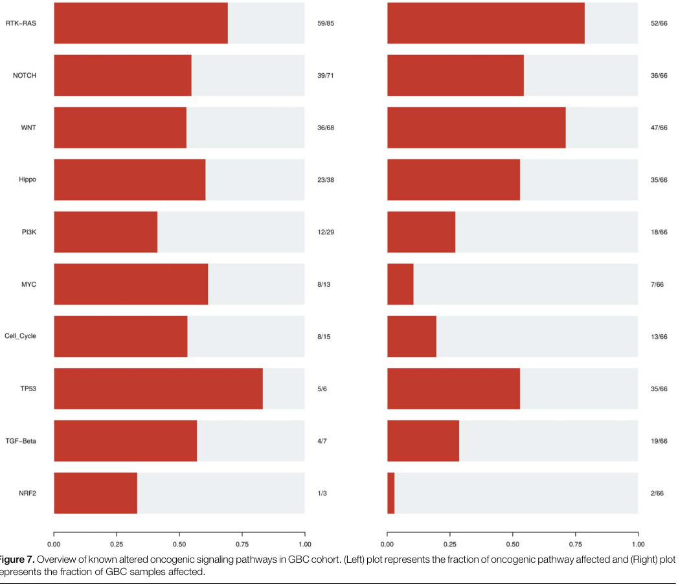

## Question

# Disease Characteristics Research Template

## Target Disease
- **Disease Name:** Gallbladder Cancer
- **MONDO ID:**  (if available)
- **Category:** 

## Research Objectives

Please provide a comprehensive research report on **Gallbladder Cancer** covering all of the
disease characteristics listed below. This report will be used to populate a disease knowledge
base entry. Be thorough and cite primary literature (PMID preferred) for all claims.

For each section, **suggested databases/resources** are listed. These are the first places
you should search for information on each topic.

---

### 1. Disease Information
> **Search first:** OMIM, Orphanet, ICD-10/ICD-11, MeSH, PubMed

- What is the disease? Provide a concise overview.
- What are the key identifiers? (OMIM, Orphanet, ICD-10/ICD-11, MeSH, Mondo)
- What are the common synonyms and alternative names?
- Is the information derived from individual patients (e.g., EHR) or aggregated disease-level resources?

### 2. Etiology

- **Disease Causal Factors**: What are the primary causes? (genetic, environmental, infectious, mechanistic)
- **Risk Factors**:
  > **Search first:** PubMed, Cochrane Library, UpToDate, clinical guidelines, ClinVar, ClinGen, GWAS Catalog, PheGenI, CTD, CDC, WHO, epidemiological databases
  - Genetic risk factors (causal variants, susceptibility loci, modifier genes)
  - Environmental risk factors (toxins, lifestyle, occupational exposures, age, sex, family history)
- **Protective Factors**:
  > **Search first:** PubMed, Cochrane Library, clinical trial databases, GWAS Catalog, gnomAD, WHO, CDC, nutrition databases
  - Genetic protective factors (protective variants, modifier alleles)
  - Environmental protective factors (diet, lifestyle, exposures that reduce risk)
- **Gene-Environment Interactions**: How do genetic and environmental factors interact to influence disease?
  > **Search first:** CTD, PubMed, PheGenI, GxE databases

### 3. Phenotypes
> **Search first:** HPO (Human Phenotype Ontology), OMIM, Orphanet, PubMed, clinicaltrials.gov, MedDRA, SNOMED CT, DECIPHER, LOINC

For each phenotype, provide:
- **Phenotype type**: symptoms, clinical signs, physical manifestations, behavioral changes, or laboratory abnormalities
  > For symptoms/signs: HPO, OMIM, Orphanet, PubMed
  > For behavioral changes: HPO, DSM, RDoC (Research Domain Criteria), PubMed
  > For laboratory abnormalities: LOINC, SNOMED CT, LabTests Online, PubMed
- **Phenotype characteristics**:
  > **Search first:** OMIM, Orphanet, HPO, PubMed
  - Age of symptom onset (neonatal, childhood, adult-onset, late-onset)
  - Symptom severity (mild, moderate, severe, variable)
  - Symptom progression (stable, progressive, episodic, fluctuating)
  - Frequency among affected individuals (percentage or qualitative)
- **Quality of life impact**: Effects on daily functioning and well-being (per-phenotype when possible)
  > **Search first:** EQ-5D database, SF-36, WHO QOL databases, PubMed
- Suggest HPO (Human Phenotype Ontology) terms for each phenotype

### 4. Genetic/Molecular Information

- **Causal Genes**: Gene mutations or chromosomal abnormalities responsible for disease (gene symbols, OMIM IDs)
  > **Search first:** OMIM, ClinVar, HGMD, Ensembl, NCBI Gene
- **Pathogenic Variants**:
  - Affected genes (gene symbols, HGNC IDs)
    > **Search first:** OMIM, NCBI Gene, Ensembl, HGNC, UniProt, GeneCards
  - Variant classification (pathogenic, likely pathogenic, VUS per ACMG/AMP guidelines)
    > **Search first:** ClinVar, ClinGen, ACMG/AMP guidelines, VarSome
  - Variant type/class (missense, frameshift, nonsense, splice-site, structural)
  - Allele frequency in population databases
    > **Search first:** gnomAD, 1000 Genomes, ExAC, TOPMed, dbSNP
  - Somatic vs germline origin
    > **Search first:** COSMIC (somatic), ClinVar, ICGC, TCGA
  - Functional consequences (loss of function, gain of function, dominant negative)
- **Modifier Genes**: Genes that modify disease severity or expression
- **Epigenetic Information**: DNA methylation, histone modifications, chromatin changes affecting disease
  > **Search first:** ENCODE, Roadmap Epigenomics, MethBase, DiseaseMeth
- **Chromosomal Abnormalities**: Large-scale genetic changes (aneuploidy, translocations, inversions)
  > **Search first:** DECIPHER, ClinVar, ECARUCA, UCSC Genome Browser

### 5. Environmental Information

- **Environmental Factors**: Non-genetic contributing factors (toxins, radiation, pollution, occupational exposure)
  > **Search first:** CTD (Comparative Toxicogenomics Database), TOXNET, PubMed, EPA databases
- **Lifestyle Factors**: Behavioral factors (smoking, diet, exercise, alcohol consumption)
  > **Search first:** CDC databases, WHO, PubMed, NHANES
- **Infectious Agents**: If applicable, pathogens causing or triggering disease (bacteria, viruses, fungi, parasites)
  > **Search first:** NCBI Taxonomy, ViPR, BV-BRC, MicrobeDB, GIDEON

### 6. Mechanism / Pathophysiology

- **Molecular Pathways**: Specific signaling cascades or biochemical pathways involved (Wnt, MAPK, mTOR, PI3K-AKT, etc.)
  > **Search first:** KEGG, Reactome, WikiPathways, PathBank, BioCyc
- **Cellular Processes**: Cell-level mechanisms (apoptosis, autophagy, cell cycle dysregulation, inflammation, etc.)
  > **Search first:** Gene Ontology (GO), Reactome, KEGG, PubMed
- **Protein Dysfunction**: How protein structure or function is altered (misfolding, aggregation, loss of function, gain of function)
  > **Search first:** UniProt, PDB (Protein Data Bank), InterPro, Pfam, AlphaFold
- **Metabolic Changes**: Alterations in metabolic processes (energy metabolism, lipid metabolism, amino acid metabolism)
  > **Search first:** KEGG, BioCyc, HMDB (Human Metabolome Database), BRENDA
- **Immune System Involvement**: Role of immune response (autoimmunity, immunodeficiency, chronic inflammation)
  > **Search first:** ImmPort, Immunome Database, IEDB, Gene Ontology
- **Tissue Damage Mechanisms**: How tissues/ are injured (oxidative stress, ischemia, fibrosis, necrosis)
  > **Search first:** PubMed, Gene Ontology, Reactome
- **Biochemical Abnormalities**: Specific molecular defects (enzyme deficiencies, receptor dysfunction, ion channel defects)
  > **Search first:** BRENDA, UniProt, KEGG, OMIM, PubMed
- **Epigenetic Changes**: DNA methylation, histone modifications affecting gene expression in disease
  > **Search first:** ENCODE, Roadmap Epigenomics, MethBase, DiseaseMeth
- **Molecular Profiling** (if available):
  - Transcriptomics/gene expression changes
    > **Search first:** GEO (Gene Expression Omnibus), ArrayExpress, GTEx, Human Cell Atlas, SRA
  - Proteomics findings
    > **Search first:** PRIDE, ProteomeXchange, Human Protein Atlas, STRING, BioGRID
  - Metabolomics signatures
    > **Search first:** MetaboLights, Metabolomics Workbench, HMDB, METLIN
  - Lipidomics alterations
    > **Search first:** LIPID MAPS, SwissLipids, LipidHome, Metabolomics Workbench
  - Genomic structural features
    > **Search first:** UCSC Genome Browser, Ensembl, NCBI, dbVar, DGV
- **Advanced Technologies** (if applicable):
  - Single-cell analysis findings (cell-type specific mechanisms, cellular heterogeneity)
    > **Search first:** Human Cell Atlas, Single Cell Portal, GEO, CELLxGENE
  - Spatial transcriptomics findings
    > **Search first:** GEO, Spatial Research, Vizgen, 10x Genomics data
  - Multi-omics integration results
    > **Search first:** TCGA, ICGC, cBioPortal, LinkedOmics, PubMed
  - Functional genomics screens (CRISPR, RNAi)
    > **Search first:** DepMap, GenomeRNAi, PubMed, BioGRID ORCS

For each mechanism, describe:
- The causal chain from initial trigger to clinical manifestation
- Which mechanisms are upstream vs downstream
- What cell types and biological processes are involved
- Suggest GO terms for biological processes and CL terms for cell types

### 7. Anatomical Structures Affected

- **Organ Level**:
  - Primary organs directly affected
  - Secondary organ involvement (complications, secondary effects)
  - Body systems involved (cardiovascular, nervous, digestive, respiratory, endocrine, etc.)
  > **Search first:** Uberon, FMA (Foundational Model of Anatomy), OMIM, HPO, ICD-11, MeSH, SNOMED CT
- **Tissue and Cell Level**:
  - Specific tissue types affected (epithelial, connective, muscle, nervous)
  - Specific cell populations targeted (with Cell Ontology terms)
  > **Search first:** Uberon, Human Protein Atlas, Cell Ontology, Human Cell Atlas, CellMarker, PanglaoDB
- **Subcellular Level**:
  - Cellular compartments involved (mitochondria, nucleus, ER, lysosomes) (with GO Cellular Component terms)
  > **Search first:** Gene Ontology (Cellular Component), UniProt, Human Protein Atlas
- **Localization**:
  - Specific anatomical sites (with UBERON terms)
    > **Search first:** FMA, Uberon, NeuroNames (for brain), SNOMED CT
  - Lateralization (unilateral, bilateral, asymmetric)
    > **Search first:** HPO, clinical literature, imaging databases

### 8. Temporal Development

- **Onset**:
  - Typical age of onset (congenital, pediatric, adult, geriatric)
  - Onset pattern (acute, subacute, chronic, insidious)
  > **Search first:** OMIM, Orphanet, HPO, PubMed
- **Progression**:
  - Disease stages (early, intermediate, advanced, end-stage)
    > **Search first:** Cancer Staging Manual (AJCC), WHO classifications, PubMed
  - Progression rate (rapid, slow, variable)
  - Disease course pattern (episodic, relapsing-remitting, progressive, stable)
  - Disease duration (self-limited, chronic lifelong)
  > **Search first:** Disease registries, longitudinal cohort databases, natural history studies, PubMed, Orphanet, OMIM
- **Patterns**:
  - Remission patterns (spontaneous, treatment-induced)
    > **Search first:** Clinical trial databases, disease registries, PubMed
  - Critical periods (time windows of vulnerability or opportunity for intervention)
    > **Search first:** PubMed, developmental biology databases, clinical guidelines

### 9. Inheritance and Population

- **Epidemiology**:
  - Prevalence (cases per 100,000 at given time)
  - Incidence (new cases per 100,000 per year)
  > **Search first:** Orphanet, CDC, WHO, GBD (Global Burden of Disease), national registries, SEER, disease registries
- **For Genetic Etiology**:
  - Inheritance pattern (AD, AR, X-linked, mitochondrial, multifactorial, polygenic)
    > **Search first:** OMIM, Orphanet, ClinVar, GTR (Genetic Testing Registry)
  - Penetrance (complete, incomplete, age-dependent)
    > **Search first:** ClinVar, OMIM, PubMed, ClinGen
  - Expressivity (variable, consistent)
    > **Search first:** OMIM, ClinVar, PubMed
  - Genetic anticipation (increasing severity in successive generations)
    > **Search first:** OMIM, PubMed (especially for repeat expansion disorders)
  - Germline mosaicism
    > **Search first:** ClinVar, OMIM, genetic counseling literature, PubMed
  - Founder effects (population-specific mutations)
    > **Search first:** gnomAD, population genetics databases, PubMed
  - Consanguinity role
    > **Search first:** OMIM, population studies, genetic counseling resources
  - Carrier frequency
    > **Search first:** gnomAD, carrier screening databases, GeneReviews, GTR
- **Population Demographics**:
  - Affected populations (ethnic or demographic groups with higher prevalence)
    > **Search first:** gnomAD, 1000 Genomes, PAGE Study, PubMed, population registries
  - Geographic distribution (endemic areas, regional variation)
    > **Search first:** WHO, CDC, GBD, Orphanet, geographic epidemiology databases
  - Geographic distribution of specific variants
  - Sex ratio (male:female)
    > **Search first:** Disease registries, OMIM, PubMed, epidemiological databases
  - Age distribution of affected individuals
    > **Search first:** CDC, disease registries, SEER, Orphanet

### 10. Diagnostics

- **Clinical Tests**:
  - Laboratory tests (blood, urine, tissue chemistry, specific enzyme assays)
    > **Search first:** LOINC, LabTests Online, PubMed
  - Biomarkers (proteins, metabolites, genetic markers, circulating biomarkers)
    > **Search first:** FDA Biomarker List, BEST (Biomarkers, EndpointS, and other Tools), PubMed
  - Imaging studies (X-ray, CT, MRI, PET, ultrasound)
    > **Search first:** RadLex, DICOM, Radiopaedia, imaging databases
  - Functional tests (pulmonary function, cardiac stress tests)
    > **Search first:** LOINC, clinical guidelines, PubMed
  - Electrophysiology (EEG, EMG, ECG, nerve conduction studies)
    > **Search first:** LOINC, clinical neurophysiology databases, PubMed
  - Biopsy findings (histopathology, immunohistochemistry)
    > **Search first:** SNOMED CT, College of American Pathologists resources, PubMed
  - Pathology findings (microscopic examination)
    > **Search first:** SNOMED CT, Digital Pathology databases, PubMed
- **Genetic Testing**:
  > **Search first:** GTR (Genetic Testing Registry), GeneReviews, ClinGen
  - Overview of recommended genetic testing approach
  - Whole genome sequencing (WGS) utility
    > **Search first:** GTR, ClinVar, GEL (Genomics England), gnomAD
  - Whole exome sequencing (WES) utility
    > **Search first:** GTR, ClinVar, OMIM, GeneMatcher
  - Gene panels (which panels, which genes)
    > **Search first:** GTR, ClinVar, laboratory-specific databases
  - Single gene testing
    > **Search first:** GTR, ClinVar, OMIM, GeneReviews
  - Chromosomal microarray (CMA)
    > **Search first:** DECIPHER, ClinVar, dbVar, ECARUCA
  - Karyotyping
    > **Search first:** Chromosome Abnormality Database, ClinVar, cytogenetics resources
  - FISH
    > **Search first:** ClinVar, cytogenetics databases, PubMed
  - Mitochondrial DNA testing
    > **Search first:** MITOMAP, MSeqDR, ClinVar, GTR
  - Repeat expansion testing
    > **Search first:** GTR, ClinVar, repeat expansion databases, PubMed
- **Omics-Based Diagnostics** (if applicable):
  - RNA sequencing / transcriptomics
    > **Search first:** GEO, ArrayExpress, GTEx, RNA-seq databases
  - Proteomics
    > **Search first:** PRIDE, ProteomeXchange, FDA Biomarker database
  - Metabolomics
    > **Search first:** MetaboLights, Metabolomics Workbench, HMDB
  - Epigenomics
    > **Search first:** GEO, ENCODE, Roadmap Epigenomics, MethBase
  - Liquid biopsy
    > **Search first:** COSMIC, ClinVar, liquid biopsy databases, PubMed
- **Clinical Criteria**:
  - Standardized diagnostic criteria (DSM, ICD, society guidelines)
    > **Search first:** DSM-5, ICD-11, clinical society guidelines, UpToDate
  - Differential diagnosis (other conditions to rule out, with distinguishing features)
    > **Search first:** DynaMed, UpToDate, clinical decision support systems
- **Screening**:
  - Screening methods for asymptomatic individuals (newborn screening, carrier screening, cascade screening)
    > **Search first:** ACMG recommendations, CDC newborn screening, GTR

### 11. Outcome/Prognosis

- **Survival and Mortality**:
  - Survival rate (5-year, 10-year, overall)
    > **Search first:** SEER, cancer registries, disease-specific registries, PubMed
  - Life expectancy (with and without treatment if applicable)
    > **Search first:** Orphanet, disease registries, actuarial databases, PubMed
  - Mortality rate
    > **Search first:** CDC, WHO, GBD, national mortality databases
  - Disease-specific mortality (deaths directly attributable to disease)
    > **Search first:** Disease registries, CDC Wonder, GBD, PubMed
- **Morbidity and Function**:
  - Morbidity (disease-related disability and health impacts)
    > **Search first:** GBD, WHO, disability databases, PubMed
  - Disability outcomes (long-term functional impairments)
    > **Search first:** ICF (International Classification of Functioning), disability registries
  - Quality of life measures (EQ-5D, SF-36, PROMIS, disease-specific tools)
    > **Search first:** EQ-5D database, SF-36, PROMIS, PubMed
- **Disease Course**:
  - Complications (secondary problems: infections, organ failure, etc.)
    > **Search first:** ICD codes, disease registries, clinical databases, PubMed
  - Recovery potential (likelihood and extent of recovery, with vs without treatment)
    > **Search first:** Natural history studies, rehabilitation databases, PubMed
- **Prediction**:
  - Prognostic factors (age, disease severity, biomarkers, treatment response)
    > **Search first:** Prognostic models databases, clinical calculators, PubMed
  - Prognostic biomarkers (molecular markers predicting disease course)
    > **Search first:** FDA Biomarker database, PubMed, cancer prognostic databases

### 12. Treatment

- **Pharmacotherapy**:
  - Pharmacological treatments (drug names, drug classes, mechanisms of action)
    > **Search first:** DrugBank, RxNorm, ATC classification, DailyMed, FDA databases
  - Pharmacogenomics (how genetic variants affect drug metabolism, efficacy, toxicity)
    > **Search first:** PharmGKB, CPIC (Clinical Pharmacogenetics), FDA Table of PGx Biomarkers
- **Advanced Therapeutics**:
  - Gene therapy (viral vectors, CRISPR, gene replacement, gene editing)
    > **Search first:** ClinicalTrials.gov, FDA gene therapy database, ASGCT resources
  - Cell therapy (stem cell transplant, CAR-T, cellular therapeutics)
    > **Search first:** ClinicalTrials.gov, FDA cell therapy database, FACT standards
  - RNA-based therapies (ASOs, siRNA, mRNA therapies)
    > **Search first:** ClinicalTrials.gov, FDA approvals, PubMed
  - Targeted therapies (treatments directed at specific molecular targets)
    > **Search first:** My Cancer Genome, OncoKB, ClinicalTrials.gov, FDA approvals
  - Immunotherapies (checkpoint inhibitors, monoclonal antibodies)
    > **Search first:** Cancer Immunotherapy Database, FDA approvals, ClinicalTrials.gov
- **Surgical and Interventional**:
  - Surgical interventions (types of surgery, timing, outcomes)
    > **Search first:** CPT codes, surgical registries, clinical guidelines, PubMed
- **Supportive and Rehabilitative**:
  - Supportive care (symptom management, pain control, nutrition)
    > **Search first:** Clinical guidelines, Cochrane Library, PubMed
  - Rehabilitation (physical therapy, occupational therapy, speech therapy)
    > **Search first:** Rehabilitation medicine databases, clinical guidelines, PubMed
- **Experimental**:
  - Experimental treatments in clinical trials (with NCT identifiers if available)
    > **Search first:** ClinicalTrials.gov, EU Clinical Trials Register, WHO ICTRP
- **Treatment Outcomes**:
  - Treatment response rates
    > **Search first:** Clinical trial databases, FDA reviews, systematic reviews, PubMed
  - Side effects and adverse events
    > **Search first:** FDA Adverse Event Reporting System (FAERS), MedWatch, PubMed
- **Treatment Strategy**:
  - Treatment algorithms (clinical pathways, decision trees)
    > **Search first:** Clinical practice guidelines, NCCN Guidelines, UpToDate
  - Combination therapies
    > **Search first:** ClinicalTrials.gov, treatment guidelines, PubMed
  - Personalized medicine approaches (genotype-guided treatment)
    > **Search first:** My Cancer Genome, CIViC, PharmGKB, precision medicine databases

For each treatment, suggest MAXO (Medical Action Ontology) terms where applicable.

### 13. Prevention

- **Prevention Levels**:
  - Primary prevention (preventing disease occurrence: vaccination, risk factor modification)
    > **Search first:** CDC, WHO, USPSTF recommendations, Cochrane Library
  - Secondary prevention (early detection and treatment: screening programs, early intervention)
    > **Search first:** USPSTF, CDC screening guidelines, WHO
  - Tertiary prevention (preventing complications in those with disease)
    > **Search first:** Clinical guidelines, disease management protocols, PubMed
- **Immunization**: Vaccine strategies (if applicable)
  > **Search first:** CDC vaccine schedules, WHO immunization, FDA vaccine database
- **Screening and Early Detection**:
  - Screening programs (population-based: newborn screening, cancer screening)
    > **Search first:** CDC screening programs, USPSTF, cancer screening databases
  - Genetic screening (carrier screening, preimplantation genetic diagnosis, prenatal testing)
    > **Search first:** ACMG recommendations, ACOG guidelines, GTR
  - Risk stratification (identifying high-risk individuals for targeted prevention)
    > **Search first:** Risk prediction models, clinical calculators, PubMed
- **Behavioral Interventions**: Lifestyle modifications to reduce risk
  > **Search first:** CDC, WHO, behavioral intervention databases, Cochrane Library
- **Counseling**: Genetic counseling (risk assessment, family planning guidance)
  > **Search first:** NSGC resources, ACMG guidelines, GeneReviews
- **Public Health**:
  - Public health interventions (sanitation, vector control, health education)
    > **Search first:** CDC, WHO, public health databases, PubMed
  - Environmental interventions (reducing environmental risk factors)
    > **Search first:** EPA databases, WHO environmental health, PubMed
- **Prophylaxis**: Preventive medications or procedures
  > **Search first:** Clinical guidelines, FDA approvals, PubMed

### 14. Other Species / Natural Disease

- **Taxonomy**: Species affected (with NCBI Taxon identifiers)
  > **Search first:** NCBI Taxonomy
- **Breed**: Specific breeds affected (with VBO identifiers if applicable)
  > **Search first:** VBO (Vertebrate Breed Ontology)
- **Gene**: Orthologous genes in other species (with NCBI Gene IDs)
  > **Search first:** NCBI Gene
- **Natural Disease**:
  - Naturally occurring disease in other species (companion animals, wildlife)
    > **Search first:** OMIA (Online Mendelian Inheritance in Animals), VetCompass, PubMed
  - Veterinary relevance and importance in animal health
    > **Search first:** OMIA, veterinary databases, PubMed
- **Comparative Biology**:
  - Comparative pathology (similarities and differences across species)
    > **Search first:** OMIA, comparative pathology databases, PubMed
  - Evolutionary conservation of disease mechanisms
    > **Search first:** HomoloGene, OrthoMCL, Alliance of Genome Resources
- **Transmission** (if applicable):
  - Zoonotic potential
    > **Search first:** CDC zoonotic diseases, WHO zoonoses, GIDEON
  - Cross-species susceptibility
    > **Search first:** NCBI Taxonomy, veterinary databases, PubMed

### 15. Model Organisms

- **Model Types**:
  - Model organism type (mammalian, invertebrate, cellular, in vitro)
    > **Search first:** Alliance of Genome Resources, model organism databases
  - Specific model systems (mouse, rat, zebrafish, Drosophila, C. elegans, yeast, cell lines, organoids, iPSCs)
    > **Search first:** MGI, RGD, ZFIN, FlyBase, WormBase, SGD, ATCC, Cellosaurus
  - Induced models (drug treatment, surgical intervention, environmental manipulation)
    > **Search first:** MGI, model organism databases, PubMed
- **Genetic Models**:
  - Types available (knockout, knock-in, transgenic, conditional, humanized)
    > **Search first:** MGI, IMPC, KOMP, EuMMCR, IMSR
- **Model Characteristics**:
  - Phenotype recapitulation (how well model reproduces human disease features)
    > **Search first:** Model organism databases, comparative studies, PubMed
  - Model limitations (aspects of human disease not captured)
    > **Search first:** Model organism databases, PubMed, review articles
- **Applications**:
  - Research applications (what aspects of disease can be studied)
    > **Search first:** Model organism databases, PubMed
- **Resources**:
  - Model databases
    > **Search first:** MGI, RGD, ZFIN, FlyBase, WormBase, IMSR, EMMA, MMRRC

---

## Citation Requirements

- Cite primary literature (PMID preferred) for all mechanistic and clinical claims
- Prioritize recent reviews and landmark papers
- Include direct quotes from abstracts where possible to support key statements
- Distinguish evidence source types: human clinical, model organism, in vitro, computational

## Output Format

Structure your response as a comprehensive narrative organized by the sections above.
For each section, provide:
- Factual content with specific details (numbers, percentages, gene names, variant nomenclature)
- Ontology term suggestions (HPO, GO, CL, UBERON, CHEBI, MAXO, MONDO) where applicable
- Evidence citations with PMIDs
- Direct quotes from abstracts to support key claims
- Clear indication when information is not available or not applicable for this disease

This report will be used to populate a disease knowledge base entry with:
- Pathophysiology descriptions with causal chains
- Gene/protein annotations (HGNC, GO terms)
- Phenotype associations (HP terms) with frequencies
- Cell type involvement (CL terms)
- Anatomical locations (UBERON terms)
- Chemical entities (CHEBI terms)
- Treatment annotations (MAXO terms)
- Evidence items with PMIDs and exact abstract quotes
- Epidemiology, prognosis, diagnostic, and prevention information
- Animal model descriptions with phenotype recapitulation details

## Output

Question: You are an expert researcher providing comprehensive, well-cited information.

Provide detailed information focusing on:
1. Key concepts and definitions with current understanding
2. Recent developments and latest research (prioritize 2023-2024 sources)
3. Current applications and real-world implementations
4. Expert opinions and analysis from authoritative sources
5. Relevant statistics and data from recent studies

Format as a comprehensive research report with proper citations. Include URLs and publication dates where available.
Always prioritize recent, authoritative sources and provide specific citations for all major claims.

# Disease Characteristics Research Template

## Target Disease
- **Disease Name:** Gallbladder Cancer
- **MONDO ID:**  (if available)
- **Category:** 

## Research Objectives

Please provide a comprehensive research report on **Gallbladder Cancer** covering all of the
disease characteristics listed below. This report will be used to populate a disease knowledge
base entry. Be thorough and cite primary literature (PMID preferred) for all claims.

For each section, **suggested databases/resources** are listed. These are the first places
you should search for information on each topic.

---

### 1. Disease Information
> **Search first:** OMIM, Orphanet, ICD-10/ICD-11, MeSH, PubMed

- What is the disease? Provide a concise overview.
- What are the key identifiers? (OMIM, Orphanet, ICD-10/ICD-11, MeSH, Mondo)
- What are the common synonyms and alternative names?
- Is the information derived from individual patients (e.g., EHR) or aggregated disease-level resources?

### 2. Etiology

- **Disease Causal Factors**: What are the primary causes? (genetic, environmental, infectious, mechanistic)
- **Risk Factors**:
  > **Search first:** PubMed, Cochrane Library, UpToDate, clinical guidelines, ClinVar, ClinGen, GWAS Catalog, PheGenI, CTD, CDC, WHO, epidemiological databases
  - Genetic risk factors (causal variants, susceptibility loci, modifier genes)
  - Environmental risk factors (toxins, lifestyle, occupational exposures, age, sex, family history)
- **Protective Factors**:
  > **Search first:** PubMed, Cochrane Library, clinical trial databases, GWAS Catalog, gnomAD, WHO, CDC, nutrition databases
  - Genetic protective factors (protective variants, modifier alleles)
  - Environmental protective factors (diet, lifestyle, exposures that reduce risk)
- **Gene-Environment Interactions**: How do genetic and environmental factors interact to influence disease?
  > **Search first:** CTD, PubMed, PheGenI, GxE databases

### 3. Phenotypes
> **Search first:** HPO (Human Phenotype Ontology), OMIM, Orphanet, PubMed, clinicaltrials.gov, MedDRA, SNOMED CT, DECIPHER, LOINC

For each phenotype, provide:
- **Phenotype type**: symptoms, clinical signs, physical manifestations, behavioral changes, or laboratory abnormalities
  > For symptoms/signs: HPO, OMIM, Orphanet, PubMed
  > For behavioral changes: HPO, DSM, RDoC (Research Domain Criteria), PubMed
  > For laboratory abnormalities: LOINC, SNOMED CT, LabTests Online, PubMed
- **Phenotype characteristics**:
  > **Search first:** OMIM, Orphanet, HPO, PubMed
  - Age of symptom onset (neonatal, childhood, adult-onset, late-onset)
  - Symptom severity (mild, moderate, severe, variable)
  - Symptom progression (stable, progressive, episodic, fluctuating)
  - Frequency among affected individuals (percentage or qualitative)
- **Quality of life impact**: Effects on daily functioning and well-being (per-phenotype when possible)
  > **Search first:** EQ-5D database, SF-36, WHO QOL databases, PubMed
- Suggest HPO (Human Phenotype Ontology) terms for each phenotype

### 4. Genetic/Molecular Information

- **Causal Genes**: Gene mutations or chromosomal abnormalities responsible for disease (gene symbols, OMIM IDs)
  > **Search first:** OMIM, ClinVar, HGMD, Ensembl, NCBI Gene
- **Pathogenic Variants**:
  - Affected genes (gene symbols, HGNC IDs)
    > **Search first:** OMIM, NCBI Gene, Ensembl, HGNC, UniProt, GeneCards
  - Variant classification (pathogenic, likely pathogenic, VUS per ACMG/AMP guidelines)
    > **Search first:** ClinVar, ClinGen, ACMG/AMP guidelines, VarSome
  - Variant type/class (missense, frameshift, nonsense, splice-site, structural)
  - Allele frequency in population databases
    > **Search first:** gnomAD, 1000 Genomes, ExAC, TOPMed, dbSNP
  - Somatic vs germline origin
    > **Search first:** COSMIC (somatic), ClinVar, ICGC, TCGA
  - Functional consequences (loss of function, gain of function, dominant negative)
- **Modifier Genes**: Genes that modify disease severity or expression
- **Epigenetic Information**: DNA methylation, histone modifications, chromatin changes affecting disease
  > **Search first:** ENCODE, Roadmap Epigenomics, MethBase, DiseaseMeth
- **Chromosomal Abnormalities**: Large-scale genetic changes (aneuploidy, translocations, inversions)
  > **Search first:** DECIPHER, ClinVar, ECARUCA, UCSC Genome Browser

### 5. Environmental Information

- **Environmental Factors**: Non-genetic contributing factors (toxins, radiation, pollution, occupational exposure)
  > **Search first:** CTD (Comparative Toxicogenomics Database), TOXNET, PubMed, EPA databases
- **Lifestyle Factors**: Behavioral factors (smoking, diet, exercise, alcohol consumption)
  > **Search first:** CDC databases, WHO, PubMed, NHANES
- **Infectious Agents**: If applicable, pathogens causing or triggering disease (bacteria, viruses, fungi, parasites)
  > **Search first:** NCBI Taxonomy, ViPR, BV-BRC, MicrobeDB, GIDEON

### 6. Mechanism / Pathophysiology

- **Molecular Pathways**: Specific signaling cascades or biochemical pathways involved (Wnt, MAPK, mTOR, PI3K-AKT, etc.)
  > **Search first:** KEGG, Reactome, WikiPathways, PathBank, BioCyc
- **Cellular Processes**: Cell-level mechanisms (apoptosis, autophagy, cell cycle dysregulation, inflammation, etc.)
  > **Search first:** Gene Ontology (GO), Reactome, KEGG, PubMed
- **Protein Dysfunction**: How protein structure or function is altered (misfolding, aggregation, loss of function, gain of function)
  > **Search first:** UniProt, PDB (Protein Data Bank), InterPro, Pfam, AlphaFold
- **Metabolic Changes**: Alterations in metabolic processes (energy metabolism, lipid metabolism, amino acid metabolism)
  > **Search first:** KEGG, BioCyc, HMDB (Human Metabolome Database), BRENDA
- **Immune System Involvement**: Role of immune response (autoimmunity, immunodeficiency, chronic inflammation)
  > **Search first:** ImmPort, Immunome Database, IEDB, Gene Ontology
- **Tissue Damage Mechanisms**: How tissues/ are injured (oxidative stress, ischemia, fibrosis, necrosis)
  > **Search first:** PubMed, Gene Ontology, Reactome
- **Biochemical Abnormalities**: Specific molecular defects (enzyme deficiencies, receptor dysfunction, ion channel defects)
  > **Search first:** BRENDA, UniProt, KEGG, OMIM, PubMed
- **Epigenetic Changes**: DNA methylation, histone modifications affecting gene expression in disease
  > **Search first:** ENCODE, Roadmap Epigenomics, MethBase, DiseaseMeth
- **Molecular Profiling** (if available):
  - Transcriptomics/gene expression changes
    > **Search first:** GEO (Gene Expression Omnibus), ArrayExpress, GTEx, Human Cell Atlas, SRA
  - Proteomics findings
    > **Search first:** PRIDE, ProteomeXchange, Human Protein Atlas, STRING, BioGRID
  - Metabolomics signatures
    > **Search first:** MetaboLights, Metabolomics Workbench, HMDB, METLIN
  - Lipidomics alterations
    > **Search first:** LIPID MAPS, SwissLipids, LipidHome, Metabolomics Workbench
  - Genomic structural features
    > **Search first:** UCSC Genome Browser, Ensembl, NCBI, dbVar, DGV
- **Advanced Technologies** (if applicable):
  - Single-cell analysis findings (cell-type specific mechanisms, cellular heterogeneity)
    > **Search first:** Human Cell Atlas, Single Cell Portal, GEO, CELLxGENE
  - Spatial transcriptomics findings
    > **Search first:** GEO, Spatial Research, Vizgen, 10x Genomics data
  - Multi-omics integration results
    > **Search first:** TCGA, ICGC, cBioPortal, LinkedOmics, PubMed
  - Functional genomics screens (CRISPR, RNAi)
    > **Search first:** DepMap, GenomeRNAi, PubMed, BioGRID ORCS

For each mechanism, describe:
- The causal chain from initial trigger to clinical manifestation
- Which mechanisms are upstream vs downstream
- What cell types and biological processes are involved
- Suggest GO terms for biological processes and CL terms for cell types

### 7. Anatomical Structures Affected

- **Organ Level**:
  - Primary organs directly affected
  - Secondary organ involvement (complications, secondary effects)
  - Body systems involved (cardiovascular, nervous, digestive, respiratory, endocrine, etc.)
  > **Search first:** Uberon, FMA (Foundational Model of Anatomy), OMIM, HPO, ICD-11, MeSH, SNOMED CT
- **Tissue and Cell Level**:
  - Specific tissue types affected (epithelial, connective, muscle, nervous)
  - Specific cell populations targeted (with Cell Ontology terms)
  > **Search first:** Uberon, Human Protein Atlas, Cell Ontology, Human Cell Atlas, CellMarker, PanglaoDB
- **Subcellular Level**:
  - Cellular compartments involved (mitochondria, nucleus, ER, lysosomes) (with GO Cellular Component terms)
  > **Search first:** Gene Ontology (Cellular Component), UniProt, Human Protein Atlas
- **Localization**:
  - Specific anatomical sites (with UBERON terms)
    > **Search first:** FMA, Uberon, NeuroNames (for brain), SNOMED CT
  - Lateralization (unilateral, bilateral, asymmetric)
    > **Search first:** HPO, clinical literature, imaging databases

### 8. Temporal Development

- **Onset**:
  - Typical age of onset (congenital, pediatric, adult, geriatric)
  - Onset pattern (acute, subacute, chronic, insidious)
  > **Search first:** OMIM, Orphanet, HPO, PubMed
- **Progression**:
  - Disease stages (early, intermediate, advanced, end-stage)
    > **Search first:** Cancer Staging Manual (AJCC), WHO classifications, PubMed
  - Progression rate (rapid, slow, variable)
  - Disease course pattern (episodic, relapsing-remitting, progressive, stable)
  - Disease duration (self-limited, chronic lifelong)
  > **Search first:** Disease registries, longitudinal cohort databases, natural history studies, PubMed, Orphanet, OMIM
- **Patterns**:
  - Remission patterns (spontaneous, treatment-induced)
    > **Search first:** Clinical trial databases, disease registries, PubMed
  - Critical periods (time windows of vulnerability or opportunity for intervention)
    > **Search first:** PubMed, developmental biology databases, clinical guidelines

### 9. Inheritance and Population

- **Epidemiology**:
  - Prevalence (cases per 100,000 at given time)
  - Incidence (new cases per 100,000 per year)
  > **Search first:** Orphanet, CDC, WHO, GBD (Global Burden of Disease), national registries, SEER, disease registries
- **For Genetic Etiology**:
  - Inheritance pattern (AD, AR, X-linked, mitochondrial, multifactorial, polygenic)
    > **Search first:** OMIM, Orphanet, ClinVar, GTR (Genetic Testing Registry)
  - Penetrance (complete, incomplete, age-dependent)
    > **Search first:** ClinVar, OMIM, PubMed, ClinGen
  - Expressivity (variable, consistent)
    > **Search first:** OMIM, ClinVar, PubMed
  - Genetic anticipation (increasing severity in successive generations)
    > **Search first:** OMIM, PubMed (especially for repeat expansion disorders)
  - Germline mosaicism
    > **Search first:** ClinVar, OMIM, genetic counseling literature, PubMed
  - Founder effects (population-specific mutations)
    > **Search first:** gnomAD, population genetics databases, PubMed
  - Consanguinity role
    > **Search first:** OMIM, population studies, genetic counseling resources
  - Carrier frequency
    > **Search first:** gnomAD, carrier screening databases, GeneReviews, GTR
- **Population Demographics**:
  - Affected populations (ethnic or demographic groups with higher prevalence)
    > **Search first:** gnomAD, 1000 Genomes, PAGE Study, PubMed, population registries
  - Geographic distribution (endemic areas, regional variation)
    > **Search first:** WHO, CDC, GBD, Orphanet, geographic epidemiology databases
  - Geographic distribution of specific variants
  - Sex ratio (male:female)
    > **Search first:** Disease registries, OMIM, PubMed, epidemiological databases
  - Age distribution of affected individuals
    > **Search first:** CDC, disease registries, SEER, Orphanet

### 10. Diagnostics

- **Clinical Tests**:
  - Laboratory tests (blood, urine, tissue chemistry, specific enzyme assays)
    > **Search first:** LOINC, LabTests Online, PubMed
  - Biomarkers (proteins, metabolites, genetic markers, circulating biomarkers)
    > **Search first:** FDA Biomarker List, BEST (Biomarkers, EndpointS, and other Tools), PubMed
  - Imaging studies (X-ray, CT, MRI, PET, ultrasound)
    > **Search first:** RadLex, DICOM, Radiopaedia, imaging databases
  - Functional tests (pulmonary function, cardiac stress tests)
    > **Search first:** LOINC, clinical guidelines, PubMed
  - Electrophysiology (EEG, EMG, ECG, nerve conduction studies)
    > **Search first:** LOINC, clinical neurophysiology databases, PubMed
  - Biopsy findings (histopathology, immunohistochemistry)
    > **Search first:** SNOMED CT, College of American Pathologists resources, PubMed
  - Pathology findings (microscopic examination)
    > **Search first:** SNOMED CT, Digital Pathology databases, PubMed
- **Genetic Testing**:
  > **Search first:** GTR (Genetic Testing Registry), GeneReviews, ClinGen
  - Overview of recommended genetic testing approach
  - Whole genome sequencing (WGS) utility
    > **Search first:** GTR, ClinVar, GEL (Genomics England), gnomAD
  - Whole exome sequencing (WES) utility
    > **Search first:** GTR, ClinVar, OMIM, GeneMatcher
  - Gene panels (which panels, which genes)
    > **Search first:** GTR, ClinVar, laboratory-specific databases
  - Single gene testing
    > **Search first:** GTR, ClinVar, OMIM, GeneReviews
  - Chromosomal microarray (CMA)
    > **Search first:** DECIPHER, ClinVar, dbVar, ECARUCA
  - Karyotyping
    > **Search first:** Chromosome Abnormality Database, ClinVar, cytogenetics resources
  - FISH
    > **Search first:** ClinVar, cytogenetics databases, PubMed
  - Mitochondrial DNA testing
    > **Search first:** MITOMAP, MSeqDR, ClinVar, GTR
  - Repeat expansion testing
    > **Search first:** GTR, ClinVar, repeat expansion databases, PubMed
- **Omics-Based Diagnostics** (if applicable):
  - RNA sequencing / transcriptomics
    > **Search first:** GEO, ArrayExpress, GTEx, RNA-seq databases
  - Proteomics
    > **Search first:** PRIDE, ProteomeXchange, FDA Biomarker database
  - Metabolomics
    > **Search first:** MetaboLights, Metabolomics Workbench, HMDB
  - Epigenomics
    > **Search first:** GEO, ENCODE, Roadmap Epigenomics, MethBase
  - Liquid biopsy
    > **Search first:** COSMIC, ClinVar, liquid biopsy databases, PubMed
- **Clinical Criteria**:
  - Standardized diagnostic criteria (DSM, ICD, society guidelines)
    > **Search first:** DSM-5, ICD-11, clinical society guidelines, UpToDate
  - Differential diagnosis (other conditions to rule out, with distinguishing features)
    > **Search first:** DynaMed, UpToDate, clinical decision support systems
- **Screening**:
  - Screening methods for asymptomatic individuals (newborn screening, carrier screening, cascade screening)
    > **Search first:** ACMG recommendations, CDC newborn screening, GTR

### 11. Outcome/Prognosis

- **Survival and Mortality**:
  - Survival rate (5-year, 10-year, overall)
    > **Search first:** SEER, cancer registries, disease-specific registries, PubMed
  - Life expectancy (with and without treatment if applicable)
    > **Search first:** Orphanet, disease registries, actuarial databases, PubMed
  - Mortality rate
    > **Search first:** CDC, WHO, GBD, national mortality databases
  - Disease-specific mortality (deaths directly attributable to disease)
    > **Search first:** Disease registries, CDC Wonder, GBD, PubMed
- **Morbidity and Function**:
  - Morbidity (disease-related disability and health impacts)
    > **Search first:** GBD, WHO, disability databases, PubMed
  - Disability outcomes (long-term functional impairments)
    > **Search first:** ICF (International Classification of Functioning), disability registries
  - Quality of life measures (EQ-5D, SF-36, PROMIS, disease-specific tools)
    > **Search first:** EQ-5D database, SF-36, PROMIS, PubMed
- **Disease Course**:
  - Complications (secondary problems: infections, organ failure, etc.)
    > **Search first:** ICD codes, disease registries, clinical databases, PubMed
  - Recovery potential (likelihood and extent of recovery, with vs without treatment)
    > **Search first:** Natural history studies, rehabilitation databases, PubMed
- **Prediction**:
  - Prognostic factors (age, disease severity, biomarkers, treatment response)
    > **Search first:** Prognostic models databases, clinical calculators, PubMed
  - Prognostic biomarkers (molecular markers predicting disease course)
    > **Search first:** FDA Biomarker database, PubMed, cancer prognostic databases

### 12. Treatment

- **Pharmacotherapy**:
  - Pharmacological treatments (drug names, drug classes, mechanisms of action)
    > **Search first:** DrugBank, RxNorm, ATC classification, DailyMed, FDA databases
  - Pharmacogenomics (how genetic variants affect drug metabolism, efficacy, toxicity)
    > **Search first:** PharmGKB, CPIC (Clinical Pharmacogenetics), FDA Table of PGx Biomarkers
- **Advanced Therapeutics**:
  - Gene therapy (viral vectors, CRISPR, gene replacement, gene editing)
    > **Search first:** ClinicalTrials.gov, FDA gene therapy database, ASGCT resources
  - Cell therapy (stem cell transplant, CAR-T, cellular therapeutics)
    > **Search first:** ClinicalTrials.gov, FDA cell therapy database, FACT standards
  - RNA-based therapies (ASOs, siRNA, mRNA therapies)
    > **Search first:** ClinicalTrials.gov, FDA approvals, PubMed
  - Targeted therapies (treatments directed at specific molecular targets)
    > **Search first:** My Cancer Genome, OncoKB, ClinicalTrials.gov, FDA approvals
  - Immunotherapies (checkpoint inhibitors, monoclonal antibodies)
    > **Search first:** Cancer Immunotherapy Database, FDA approvals, ClinicalTrials.gov
- **Surgical and Interventional**:
  - Surgical interventions (types of surgery, timing, outcomes)
    > **Search first:** CPT codes, surgical registries, clinical guidelines, PubMed
- **Supportive and Rehabilitative**:
  - Supportive care (symptom management, pain control, nutrition)
    > **Search first:** Clinical guidelines, Cochrane Library, PubMed
  - Rehabilitation (physical therapy, occupational therapy, speech therapy)
    > **Search first:** Rehabilitation medicine databases, clinical guidelines, PubMed
- **Experimental**:
  - Experimental treatments in clinical trials (with NCT identifiers if available)
    > **Search first:** ClinicalTrials.gov, EU Clinical Trials Register, WHO ICTRP
- **Treatment Outcomes**:
  - Treatment response rates
    > **Search first:** Clinical trial databases, FDA reviews, systematic reviews, PubMed
  - Side effects and adverse events
    > **Search first:** FDA Adverse Event Reporting System (FAERS), MedWatch, PubMed
- **Treatment Strategy**:
  - Treatment algorithms (clinical pathways, decision trees)
    > **Search first:** Clinical practice guidelines, NCCN Guidelines, UpToDate
  - Combination therapies
    > **Search first:** ClinicalTrials.gov, treatment guidelines, PubMed
  - Personalized medicine approaches (genotype-guided treatment)
    > **Search first:** My Cancer Genome, CIViC, PharmGKB, precision medicine databases

For each treatment, suggest MAXO (Medical Action Ontology) terms where applicable.

### 13. Prevention

- **Prevention Levels**:
  - Primary prevention (preventing disease occurrence: vaccination, risk factor modification)
    > **Search first:** CDC, WHO, USPSTF recommendations, Cochrane Library
  - Secondary prevention (early detection and treatment: screening programs, early intervention)
    > **Search first:** USPSTF, CDC screening guidelines, WHO
  - Tertiary prevention (preventing complications in those with disease)
    > **Search first:** Clinical guidelines, disease management protocols, PubMed
- **Immunization**: Vaccine strategies (if applicable)
  > **Search first:** CDC vaccine schedules, WHO immunization, FDA vaccine database
- **Screening and Early Detection**:
  - Screening programs (population-based: newborn screening, cancer screening)
    > **Search first:** CDC screening programs, USPSTF, cancer screening databases
  - Genetic screening (carrier screening, preimplantation genetic diagnosis, prenatal testing)
    > **Search first:** ACMG recommendations, ACOG guidelines, GTR
  - Risk stratification (identifying high-risk individuals for targeted prevention)
    > **Search first:** Risk prediction models, clinical calculators, PubMed
- **Behavioral Interventions**: Lifestyle modifications to reduce risk
  > **Search first:** CDC, WHO, behavioral intervention databases, Cochrane Library
- **Counseling**: Genetic counseling (risk assessment, family planning guidance)
  > **Search first:** NSGC resources, ACMG guidelines, GeneReviews
- **Public Health**:
  - Public health interventions (sanitation, vector control, health education)
    > **Search first:** CDC, WHO, public health databases, PubMed
  - Environmental interventions (reducing environmental risk factors)
    > **Search first:** EPA databases, WHO environmental health, PubMed
- **Prophylaxis**: Preventive medications or procedures
  > **Search first:** Clinical guidelines, FDA approvals, PubMed

### 14. Other Species / Natural Disease

- **Taxonomy**: Species affected (with NCBI Taxon identifiers)
  > **Search first:** NCBI Taxonomy
- **Breed**: Specific breeds affected (with VBO identifiers if applicable)
  > **Search first:** VBO (Vertebrate Breed Ontology)
- **Gene**: Orthologous genes in other species (with NCBI Gene IDs)
  > **Search first:** NCBI Gene
- **Natural Disease**:
  - Naturally occurring disease in other species (companion animals, wildlife)
    > **Search first:** OMIA (Online Mendelian Inheritance in Animals), VetCompass, PubMed
  - Veterinary relevance and importance in animal health
    > **Search first:** OMIA, veterinary databases, PubMed
- **Comparative Biology**:
  - Comparative pathology (similarities and differences across species)
    > **Search first:** OMIA, comparative pathology databases, PubMed
  - Evolutionary conservation of disease mechanisms
    > **Search first:** HomoloGene, OrthoMCL, Alliance of Genome Resources
- **Transmission** (if applicable):
  - Zoonotic potential
    > **Search first:** CDC zoonotic diseases, WHO zoonoses, GIDEON
  - Cross-species susceptibility
    > **Search first:** NCBI Taxonomy, veterinary databases, PubMed

### 15. Model Organisms

- **Model Types**:
  - Model organism type (mammalian, invertebrate, cellular, in vitro)
    > **Search first:** Alliance of Genome Resources, model organism databases
  - Specific model systems (mouse, rat, zebrafish, Drosophila, C. elegans, yeast, cell lines, organoids, iPSCs)
    > **Search first:** MGI, RGD, ZFIN, FlyBase, WormBase, SGD, ATCC, Cellosaurus
  - Induced models (drug treatment, surgical intervention, environmental manipulation)
    > **Search first:** MGI, model organism databases, PubMed
- **Genetic Models**:
  - Types available (knockout, knock-in, transgenic, conditional, humanized)
    > **Search first:** MGI, IMPC, KOMP, EuMMCR, IMSR
- **Model Characteristics**:
  - Phenotype recapitulation (how well model reproduces human disease features)
    > **Search first:** Model organism databases, comparative studies, PubMed
  - Model limitations (aspects of human disease not captured)
    > **Search first:** Model organism databases, PubMed, review articles
- **Applications**:
  - Research applications (what aspects of disease can be studied)
    > **Search first:** Model organism databases, PubMed
- **Resources**:
  - Model databases
    > **Search first:** MGI, RGD, ZFIN, FlyBase, WormBase, IMSR, EMMA, MMRRC

---

## Citation Requirements

- Cite primary literature (PMID preferred) for all mechanistic and clinical claims
- Prioritize recent reviews and landmark papers
- Include direct quotes from abstracts where possible to support key statements
- Distinguish evidence source types: human clinical, model organism, in vitro, computational

## Output Format

Structure your response as a comprehensive narrative organized by the sections above.
For each section, provide:
- Factual content with specific details (numbers, percentages, gene names, variant nomenclature)
- Ontology term suggestions (HPO, GO, CL, UBERON, CHEBI, MAXO, MONDO) where applicable
- Evidence citations with PMIDs
- Direct quotes from abstracts to support key claims
- Clear indication when information is not available or not applicable for this disease

This report will be used to populate a disease knowledge base entry with:
- Pathophysiology descriptions with causal chains
- Gene/protein annotations (HGNC, GO terms)
- Phenotype associations (HP terms) with frequencies
- Cell type involvement (CL terms)
- Anatomical locations (UBERON terms)
- Chemical entities (CHEBI terms)
- Treatment annotations (MAXO terms)
- Evidence items with PMIDs and exact abstract quotes
- Epidemiology, prognosis, diagnostic, and prevention information
- Animal model descriptions with phenotype recapitulation details

# Gallbladder Cancer (Gallbladder Carcinoma): Disease Characteristics Research Report (2023–2024 prioritized)

## Target Disease
- **Disease name:** Gallbladder cancer (GBC) / gallbladder carcinoma
- **Ontology IDs captured in this tool run:**
  - **Open Targets disease:** *gallbladder carcinoma* (**EFO_1001956**) (OpenTargets Search: Gallbladder carcinoma,Gallbladder cancer)
  - **Related MONDO term (broader BTC grouping):** *carcinoma of gallbladder and extrahepatic biliary tract* (**MONDO_0018918**) (OpenTargets Search: Gallbladder carcinoma,Gallbladder cancer)
- **Category:** Malignant epithelial neoplasm of the biliary system (biliary tract cancer subtype) (reuver2023clinicopathologicalandmolecular pages 2-3, casak2024fdaapprovalsummary pages 1-3)

**Note on missing identifiers:** ICD-10/ICD-11, MeSH, OMIM, and Orphanet identifiers were not present in the retrieved full-text excerpts available to cite in this run; therefore, they are not asserted here (to avoid uncited/guessed identifiers).

## 1. Disease Information

### 1.1 Concise overview / current understanding
Gallbladder cancer is an aggressive malignancy of the biliary tract; it is frequently detected late because early-stage disease is often asymptomatic or nonspecific, contributing to poor outcomes and limited curative options (reuver2023clinicopathologicalandmolecular pages 2-3, kumar2024gallbladdercancerprogress pages 5-7). Contemporary expert synthesis emphasizes that GBC is clinically lethal and *molecularly heterogeneous*, and that improving outcomes requires high-quality pathology, centralized multidisciplinary care, and routine molecular testing to enable genome-guided therapy and trial enrollment (reuver2023clinicopathologicalandmolecular pages 2-3).

### 1.2 Synonyms and alternative names
- Gallbladder carcinoma; carcinoma of the gallbladder; GBC; gall bladder cancer (terminology varies across studies and registries) (reuver2023clinicopathologicalandmolecular pages 2-3, su2024globalregionaland pages 2-3).

### 1.3 Data provenance (individual vs aggregated)
Evidence in this report derives from:
- **Aggregated disease-level resources** (Global Burden of Disease analyses via GBD 2019/2021; large registry studies) (su2024globalregionaland pages 1-2, su2024globalregionaland pages 2-3, zhang2024gallbladdercancerincidence pages 1-2, hu2024ananalysisof pages 1-2).
- **Human clinical cohorts** including multicenter real-world treatment cohorts and surgical cohorts (mitzlaff2024efficacysafetyand pages 1-2, hu2024prognosticfactorsin pages 19-21).
- **Primary tumor molecular profiling** (whole-exome sequencing; single-cell transcriptomics with validation) (awasthi2024genomiclandscapeof pages 1-2, he2024comprehensivesinglecellanalysis pages 1-2).

## 2. Etiology

### 2.1 Disease causal factors (mechanistic framing)
GBC etiology is multifactorial, with strong contributions from chronic biliary inflammation and metabolic risk, and with regionally heterogeneous exposures (e.g., gallstones, obesity/high BMI, chronic infections) shaping incidence patterns (su2024globalregionaland pages 17-18, su2024globalregionaland pages 18-19).

### 2.2 Risk factors (human epidemiology)
**Gallstones / cholelithiasis**
- A GBD-derived synthesis describes gallstones as the “primary risk factor” for gallbladder and biliary tract cancer (su2024globalregionaland pages 17-18).
- In imaging series summarized from the Indian subcontinent, gallstones co-occur with gallbladder masses in **~60–90%** of cases (sonographic observation; not necessarily causal proof) (kumar2024gallbladdercancerprogress pages 7-8).

**Obesity / high body mass index (BMI)**
- In a GBD 2019-based analysis, **high BMI accounted for 15.2% of deaths and 15.7% of DALYs globally in 2019** for gallbladder and biliary tract cancer (su2024globalregionaland pages 1-2).
- A GBD 2021-based analysis similarly reports that although age-standardized rates attributable to high BMI decreased from 1990–2021, **absolute deaths and DALYs more than doubled**, with projected continuation without intervention (hu2024ananalysisof pages 1-2).

**Diabetes/metabolic disease**
- Obesity and diabetes are highlighted among major attributable risks in the GBD-oriented narrative synthesis (su2024globalregionaland pages 17-18).

**Infectious exposures (contextual; varies by anatomical subtype)**
- A GBD-derived synthesis lists chronic infections including **HBV, parasites, and Aspergillus flavus** among major attributable risks, noting strong geographic clustering of HBV prevalence (su2024globalregionaland pages 17-18). (These statements refer to “gallbladder and biliary tract cancer” and may apply differentially across anatomical subsites.)

### 2.3 Protective factors
In the retrieved citable excerpts, explicit protective factors (dietary, pharmacologic, or genetic) were not quantified with effect sizes for GBC specifically. The strongest prevention-relevant signal captured here is the **population-level impact of lowering BMI**, inferred from attributable burden estimates (su2024globalregionaland pages 1-2, hu2024ananalysisof pages 1-2).

### 2.4 Gene–environment interactions
Direct, statistically tested gene–environment interaction estimates were not provided in the retrieved excerpts. However, tumor mutational signature patterns consistent with tobacco-related mutagen exposure were reported in a 2024 whole-exome cohort (see Section 4/6), providing mechanistic plausibility for exposure–genome coupling (awasthi2024genomiclandscapeof pages 8-11, awasthi2024genomiclandscapeof pages 6-8).

## 3. Phenotypes

### 3.1 Typical clinical presentation (human)
In a large Indian series summarized in a 2024 review, common presenting features included:
- **Weight loss:** 201/203 (**99%**)
- **Loss of appetite/anorexia:** 197/203 (**97%**)
- **Right hypochondrial pain:** **70%**
- **Palpable mass:** **53%**
- **Jaundice:** **39%**
- **Nausea/vomiting:** **10%** (kumar2024gallbladdercancerprogress pages 5-7)

### 3.2 Suggested HPO terms (examples)
- Abdominal pain (HP:0002027)
- Weight loss (HP:0001824)
- Anorexia (HP:0002039)
- Jaundice (HP:0000952)
- Vomiting (HP:0002013)
- Palpable abdominal mass (HP:0001450)

**Note:** HPO IDs are suggested mappings for phenotypes described in cited clinical series; HPO identifiers themselves were not explicitly listed in the sources and should be validated against the HPO database.

### 3.3 Phenotype progression / course
GBC often has nonspecific early symptoms and presents later with advanced disease signs (including jaundice, adjacent organ invasion, nodal involvement), consistent with poor resectability rates in many settings (kumar2024gallbladdercancerprogress pages 5-7, hu2024prognosticfactorsin pages 1-2).

## 4. Genetic/Molecular Information

### 4.1 Somatic genomic landscape (2024 primary WES evidence)
A 2024 whole-exome sequencing study of **66** tumor–matched blood pairs (India) identified recurrent pathogenic/oncogenic alterations and pathway-level enrichment:
- **Eight most altered genes:** **TP53, SMAD4, ERBB3, KRAS, ARID1A, PIK3CA, RB1, AXIN1** (awasthi2024genomiclandscapeof pages 1-2).
- Recurrent mutation proportions in this cohort included **TP53 21%, SMAD4 16%, ERBB3 11%, KRAS 8%, PIK3CA 7%, ARID1A 5%, RB1 5%, AXIN1 3%** (awasthi2024genomiclandscapeof pages 6-8).

**Pathway alteration frequencies (Figure evidence)**
A pathway summary figure from the same WES study reports the fraction of tumors altered in major oncogenic pathways:
- **RTK–RAS:** 52/66
- **WNT:** 47/66
- **TP53 pathway:** 35/66 (awasthi2024genomiclandscapeof media 83e87e83)

**Selected pathway component frequencies (WES cohort)**
- RTK–RAS included **ERBB2 26.92%, ERBB3 23.07%, ERBB4 11.53%, KRAS 13.46%** (awasthi2024genomiclandscapeof pages 8-11).
- WNT included **CTNNB1 38.29%** and **AXIN1 14.89%** (awasthi2024genomiclandscapeof pages 8-11).
- PI3K-related alterations included **PIK3CA**, **MTOR**, and **PTEN** among affected cases (awasthi2024genomiclandscapeof pages 8-11, awasthi2024genomiclandscapeof pages 11-12).

### 4.2 Mutational signatures / exposure links (2024 WES)
Mutational signature analysis linked COSMIC signatures to clinical characteristics including **age** and **tobacco smoking/chewing** (awasthi2024genomiclandscapeof pages 1-2, awasthi2024genomiclandscapeof pages 8-11). APOBEC enrichment (score >2) was observed in **24%** of samples and overall tumor mutational burden was low (median **1.6 muts/Mb**) (awasthi2024genomiclandscapeof pages 8-11, awasthi2024genomiclandscapeof pages 6-8).

### 4.3 Tumor microenvironment and immune regulation (2024 single-cell + functional)
A 2024 Gut study profiled **230,737 cells** across gallbladder cancer and benign gallbladder disease states and identified **OLFM4** as elevated in epithelial cells and associated with worse prognosis. Mechanistically, OLFM4 was reported to upregulate **PD-L1** via the **MAPK–AP1 axis**, facilitating immune evasion (he2024comprehensivesinglecellanalysis pages 1-2).

### 4.4 Suggested ontology terms (GO / CL)
**Candidate GO Biological Process terms (examples):**
- MAPK cascade (GO:0000165)
- Regulation of programmed cell death (GO:0043067)
- Cell cycle regulation (GO:0051726)
- Wnt signaling pathway (GO:0016055)
- DNA damage response (GO:0006974)
- Immune evasion / regulation of immune response (broad; specific GO selection should match annotated mechanisms)

**Candidate Cell Ontology (CL) terms (examples):**
- Epithelial cell (CL:0000066)
- Macrophage (CL:0000235)
- T cell (CL:0000084)
- Fibroblast (CL:0000057)
- Endothelial cell (CL:0000115)

(These are suggested mappings aligned with the single-cell microenvironmental analysis; CL/GO IDs should be validated against the ontologies.)

### 4.5 Disease–target associations (Open Targets; PMIDs)
Open Targets lists multiple target associations for **gallbladder carcinoma**, including **TP53, KRAS, PIK3CA, ERBB2, SMAD4, CDKN2A, RB1** with supporting PubMed citations (e.g., PMIDs **33115932, 32487254, 34036234, 33563892, 38215750**, among others) (OpenTargets Search: Gallbladder carcinoma,Gallbladder cancer).

## 5. Environmental Information

### 5.1 Environmental/lifestyle factors captured in current excerpts
- **Obesity/high BMI** is the dominant quantified modifiable exposure in the retrieved burden analyses (su2024globalregionaland pages 1-2, hu2024ananalysisof pages 1-2).
- **Tobacco exposure** is implicated indirectly via tobacco-associated mutational signatures in tumor genomes (awasthi2024genomiclandscapeof pages 8-11).

### 5.2 Infectious agents
Broad BTC risk syntheses mention HBV and parasitic exposures as geographically patterned risks (su2024globalregionaland pages 17-18). Specific gallbladder-carcinoma–specific attributable fractions for infection were not provided in the available excerpts.

## 6. Mechanism / Pathophysiology

### 6.1 Causal chain (integrated, evidence-grounded)
1. **Chronic biliary inflammation/metabolic stress** (e.g., gallstones; obesity-driven metabolic milieu) contributes to tissue injury and carcinogenic selection pressure (su2024globalregionaland pages 17-18, kumar2024gallbladdercancerprogress pages 7-8).
2. **Accumulation of somatic driver alterations** in major oncogenic programs (RTK–RAS, WNT, TP53; PI3K pathway; cell-cycle dysregulation) promotes malignant transformation and progression (awasthi2024genomiclandscapeof pages 8-11, awasthi2024genomiclandscapeof media 83e87e83).
3. **Tumor–immune microenvironment remodeling** generates immune suppressive states; single-cell analysis implicates OLFM4-driven **PD-L1 upregulation via MAPK–AP1** as a mechanism of immune evasion and poor prognosis (he2024comprehensivesinglecellanalysis pages 1-2).

### 6.2 Key pathways (supported by 2024 WES + figure)
- RTK–RAS (including ERBB2/ERBB3/KRAS) (awasthi2024genomiclandscapeof pages 8-11, awasthi2024genomiclandscapeof media 83e87e83)
- WNT/β-catenin signaling (CTNNB1, AXIN1; APC in precursor lesions) (awasthi2024genomiclandscapeof pages 8-11, he2024comprehensivesinglecellanalysis pages 1-2)
- TP53 pathway / DNA damage response (TP53 LOF; ATM, CHEK2 context) (awasthi2024genomiclandscapeof pages 8-11)
- PI3K–AKT–mTOR (PIK3CA, PTEN, MTOR) (awasthi2024genomiclandscapeof pages 8-11, awasthi2024genomiclandscapeof pages 11-12)
- Immune checkpoint regulation (PD-L1 induction) (he2024comprehensivesinglecellanalysis pages 1-2)

## 7. Anatomical Structures Affected

### 7.1 Primary and secondary anatomy (suggested mappings)
- **Primary organ:** Gallbladder (UBERON:0005033; suggested mapping)
- **Adjacent structures commonly involved in advanced disease:** Liver segments adjacent to gallbladder fossa; regional lymph nodes (context for staging and invasion referenced in imaging/staging summaries) (kumar2024gallbladdercancerprogress pages 8-10).

(UBERON IDs are suggested; they were not explicitly listed in sources.)

## 8. Temporal Development

### 8.1 Onset
Population data show peak incidence in older age; for example, registry-based analysis in China reported incidence increasing with age and peaking at **70–79 years** (zhang2024gallbladdercancerincidence pages 1-2).

### 8.2 Progression and staging
Advanced-stage presentation is common; a 2024 meta-analysis notes that **fewer than 35%** of cases are resectable at presentation, recurrence after radical resection is **46–61%**, and 5-year overall survival is often **<15%** (hu2024prognosticfactorsin pages 1-2).

## 9. Inheritance and Population

### 9.1 Epidemiology (recent quantified estimates)
**Global burden (GBD 2019; all gallbladder and biliary tract cancers)**
- **2019:** 199,211 incident cases; 172,441 deaths; 3,621,473 DALYs (su2024globalregionaland pages 2-3).
- **Trend 1990→2019:** incident cases increased 84.8%, but age-standardized incidence declined ~0.48%/year (su2024globalregionaland pages 2-3).

**Sex differences**
- Age-standardized incidence in 2019 was ~2× higher in females than males (14.0 vs 7.5 per 100,000) (su2024globalregionaland pages 17-18).

**Geographic heterogeneity**
- Higher burden reported in Asia and South America compared with Europe/North America in the GBD synthesis (su2024globalregionaland pages 2-3).

**Country-level trend example (China registry)**
- Age-standardized incidence and mortality decreased from 2005–2017 with AAPC **−2.023% (incidence)** and **−1.603% (mortality)** (zhang2024gallbladdercancerincidence pages 1-2).

### 9.2 Genetic inheritance
GBC is primarily a **sporadic** cancer driven by somatic alterations; no Mendelian inheritance pattern is established in the evidence retrieved here.

## 10. Diagnostics

### 10.1 Cytology/biopsy
- Fine-needle aspiration cytology (FNAC): **sensitivity 90.63%**, **specificity 94.74%** in one cited series; ultrasound-guided FNAC diagnostic accuracy reported as **~95%** (kumar2024gallbladdercancerprogress pages 5-7).

### 10.2 Imaging performance (selected statistics)
- **MDCT for resectability:** sensitivity **72.7%**, specificity **100%**, accuracy **85%** (kumar2024gallbladdercancerprogress pages 8-10).
- **CT staging accuracy:** **93.3%**; high correlation for hepatic/vascular invasion (kumar2024gallbladdercancerprogress pages 8-10).
- **Multiparametric MRI (thickened wall):** sensitivity **90%**, specificity **88%** for malignant thickened wall (kumar2024gallbladdercancerprogress pages 8-10).
- **PET-CT:** detected occult metastases **46.6%**; changed management ~**25%** (resectable) and **30–35%** (locally advanced); recurrence sensitivity/specificity **97.6%/90%** (kumar2024gallbladdercancerprogress pages 8-10).

### 10.3 Biomarkers
Tumor markers including **CA19-9, CEA, CA125, CA242** were reported to associate with GBC and may help predict resectability/prognosis in some series (kumar2024gallbladdercancerprogress pages 8-10, hu2024prognosticfactorsin pages 19-21).

### 10.4 Differential diagnosis / mimics
**Xanthogranulomatous cholecystitis (XGC)** is a recognized mimic; cytologic features include foam cells, histiocytes, bile, multinucleate giant cells, and mixed inflammatory infiltrate (kumar2024gallbladdercancerprogress pages 5-7).

## 11. Outcome / Prognosis

### 11.1 Survival statistics (recent summaries)
- A 2024 prognostic meta-analysis reports 5-year overall survival often **<15%**, with **46–61% recurrence** after radical resection (hu2024prognosticfactorsin pages 1-2).
- A GBD 2021-derived high-BMI burden analysis states curative resection is possible in **<30%** and 5-year overall survival is **<10%** (hu2024ananalysisof pages 1-2).

### 11.2 Prognostic factors (meta-analysis)
A 2024 systematic review/meta-analysis (52 studies; 23,174 patients) identified significant factors associated with overall survival:
- **T stage:** HR **2.37**
- **Lymph node stage:** HR **2.03**
- **Positive/close margins:** HR **2.66**
- **CEA elevated:** HR **1.81**
- **CA19-9 elevated:** HR **1.56**
- **Low LMR:** HR **2.17**
- **Adjuvant chemotherapy:** HR **0.75** (benefit)
- **Radiotherapy:** HR **0.56** (benefit) (hu2024prognosticfactorsin pages 1-2)

## 12. Treatment

### 12.1 Standard systemic therapy for unresectable/metastatic disease (2023–2024 developments)
**Regulatory approvals and pivotal trials (FDA; 2024 summary)**
- **Durvalumab + gemcitabine/cisplatin** approved **2022-09-02**; TOPAZ-1 median OS **12.8 vs 11.5 months** (HR **0.80**, 95% CI 0.66–0.97) (casak2024fdaapprovalsummary pages 1-3).
- **Pembrolizumab + gemcitabine/cisplatin** approved **2023-10-31**; KEYNOTE-966 median OS **12.7 vs 10.9 months** (HR **0.83**, 95% CI 0.72–0.95) (casak2024fdaapprovalsummary pages 1-3).

**Gallbladder-specific subgroup considerations**
Exploratory subgroup analyses suggest smaller or absent benefit in the gallbladder cancer subgroup in TOPAZ-1/KEYNOTE-966; one review reports TOPAZ-1 gallbladder subgroup median OS **10.7 vs 11.0 months** (HR **0.94**, 95% CI 0.65–1.37) (wilbur2024immunotherapyforthe pages 8-9), and the FDA approval summary reports a smaller effect estimate in the gallbladder subgroup (OS HR **0.96**) (casak2024fdaapprovalsummary pages 3-4).

### 12.2 Real-world implementation (2024)
A German multicenter cohort (2021–2024) evaluating **gemcitabine/cisplatin/durvalumab** (n=165) reported:
- Median OS **14 months**, median PFS **8 months**, ORR **28.5%**, DCR **65.5%**.
- Gallbladder cancer subgroup median OS **9 months** and gallbladder cancer was an independent adverse prognostic factor (mitzlaff2024efficacysafetyand pages 1-2).

### 12.3 Surgery and multimodality therapy
Surgical resection remains the only potentially curative intervention; multiple series emphasize improved survival with resection and the role of adjuvant therapy in selected settings (kumar2024gallbladdercancerprogress pages 13-14, hu2024prognosticfactorsin pages 19-21). Expert commentary supports centralization of care and multidisciplinary decision-making, including consideration of surveillance for very early tumors versus radical re-resection when residual disease is suspected (reuver2023clinicopathologicalandmolecular pages 2-3).

### 12.4 Suggested MAXO terms (examples)
- Surgical excision (MAXO:0001116; suggested)
- Chemotherapy (MAXO:0000647; suggested)
- Radiotherapy (MAXO:0000008; suggested)
- Immune checkpoint inhibitor therapy (MAXO term mapping should be verified)

(MAXO IDs are suggested; they were not explicitly present in sources.)

## 13. Prevention

### 13.1 Primary prevention (evidence captured here)
Because high BMI contributes a substantial attributable fraction of deaths/DALYs, population-level BMI reduction is supported as a prevention strategy (su2024globalregionaland pages 1-2, hu2024ananalysisof pages 1-2). Gallstones are repeatedly emphasized as a major risk factor; however, the retrieved excerpts did not provide evidence-based thresholds for prophylactic cholecystectomy in specific high-risk groups (su2024globalregionaland pages 17-18).

### 13.2 Secondary prevention (screening/early detection)
A 2024 registry analysis in China recommends exploring “long-term, standardized gallbladder cancer screening programs,” reflecting ongoing uncertainty and need for evidence-based risk stratification (zhang2024gallbladdercancerincidence pages 1-2).

## 14. Other Species / Natural Disease
The retrieved, citable sources in this run did not provide specific veterinary/natural-disease evidence for gallbladder cancer across other species.

## 15. Model Organisms
The retrieved, citable excerpts did not enumerate standardized GBC model organism systems (e.g., GEMMs, organoids) in a way that could be cited with specificity here. Mechanistic studies in 2024 include **in vitro and in vivo** validation linked to single-cell findings (OLFM4 → PD-L1 via MAPK–AP1) (he2024comprehensivesinglecellanalysis pages 1-2), and proteomic studies used functional assays including mouse models to probe invasion/migration programs (sugiyanto2024proteomicprofilingreveals pages 14-14).

## Expert opinions / authoritative analysis (2023–2024)
- Expert review recommends **synoptic pathology reporting**, **centralized specialist care**, and **molecular tumor testing for every GBC patient** to enable genome-guided therapy and clinical trial inclusion (reuver2023clinicopathologicalandmolecular pages 2-3).
- Real-world datasets in 2024 demonstrate feasibility and safety of immuno-chemotherapy in routine practice while highlighting that gallbladder primary may have worse outcomes than other BTC sites under similar regimens (mitzlaff2024efficacysafetyand pages 1-2).

---

## Structured evidence summary table
| Domain | Item | Key findings / numeric values | Citations |
|---|---|---|---|
| Epidemiology / burden | Global 2019 burden | 199,211 incident cases (95% UI 166,769–219,615); 256,340 prevalent cases (215,699–282,004); 172,441 deaths (144,899–188,615); 3,621,473 DALYs (3,102,423–3,969,071) worldwide in 2019 | (su2024globalregionaland pages 2-3) |
| Epidemiology / burden | 1990–2019 trends | Incident cases increased 84.8% from 107,787 to 199,211; age-standardized incidence declined by 0.48%/year; age-standardized prevalence declined by 0.27%/year; absolute counts rose 1.85-fold (incidence), 1.92-fold (prevalence), 1.82-fold (deaths), 1.68-fold (DALYs) | (su2024globalregionaland pages 1-2, su2024globalregionaland pages 2-3) |
| Epidemiology / burden | Sex and age patterns | Females had nearly double age-standardized incidence vs males in 2019: 14.0 vs 7.5 per 100,000; older adults and females are more susceptible overall; early-onset burden rose 52.4% from 1990–2019, especially in low-SDI regions | (su2024globalregionaland pages 6-13, su2024globalregionaland pages 17-18, su2024globalregionaland pages 18-19) |
| Epidemiology / burden | High-BMI attributable burden | High BMI accounted for 15.2% of deaths and 15.7% of DALYs globally in 2019; high-BMI-attributable absolute deaths and DALYs more than doubled from 1990–2021 despite declining age-standardized rates | (su2024globalregionaland pages 1-2, hu2024ananalysisof pages 1-2) |
| Risk factors | Gallstones | Gallstones are described as the primary risk factor; gallstones accompanied gallbladder mass in 60–90% of sonographic series | (su2024globalregionaland pages 17-18, kumar2024gallbladdercancerprogress pages 7-8) |
| Risk factors | Obesity / high BMI | Obesity/high BMI is a major attributable risk; burden is higher in high-SDI regions due to obesity prevalence, while low-SDI regions show higher EAPCs | (su2024globalregionaland pages 1-2, su2024globalregionaland pages 18-19, hu2024ananalysisof pages 1-2) |
| Risk factors | Diabetes / metabolic disease | Obesity and diabetes are highlighted among major attributable risks for gallbladder/biliary tract cancer | (su2024globalregionaland pages 17-18) |
| Risk factors | Infectious associations | Chronic infections noted as relevant risks include HBV, parasites, and Aspergillus flavus; HBV prevalence exceeds 8% in parts of Asia/Africa and accounts for nearly 70% of all HBV-infected persons worldwide | (su2024globalregionaland pages 17-18) |
| Genomics / pathways | Top recurrent genes (WES 2024) | Recurrently mutated genes in 66 tumors: TP53 21%, SMAD4 16%, ERBB3 11%, KRAS 8%, PIK3CA 7%, ARID1A 5%, RB1 5%, AXIN1 3% | (awasthi2024genomiclandscapeof pages 1-2, awasthi2024genomiclandscapeof pages 6-8) |
| Genomics / pathways | Most altered genes / drivers | Eight most altered genes highlighted: TP53, SMAD4, ERBB3, KRAS, ARID1A, PIK3CA, RB1, AXIN1; driver genes also included CTNNB1, ELF3, ERBB2 | (awasthi2024genomiclandscapeof pages 1-2, awasthi2024genomiclandscapeof pages 11-12) |
| Genomics / pathways | Pathway frequencies | Figure-based summary in 66 tumors: RTK-RAS 52/66 (78.8%), WNT 47/66 (71.2%), TP53 35/66 (53.0%); other pathways included Notch 54.5%, Hippo ~53%, TGF-β 28.8% | (awasthi2024genomiclandscapeof pages 8-11, awasthi2024genomiclandscapeof media 83e87e83) |
| Genomics / pathways | ERBB family | RTK-RAS pathway included ERBB2 26.92%, ERBB3 23.07%, ERBB4 11.53%, KRAS 13.46%; ERBB2/ERBB3 alterations are repeatedly highlighted as actionable/immune-relevant | (awasthi2024genomiclandscapeof pages 8-11, he2024comprehensivesinglecellanalysis pages 14-14) |
| Genomics / pathways | PI3K / PTEN | PI3K pathway altered in 27% overall; among pathway-altered cases PIK3CA 33.3%, MTOR 27.8%, PTEN 22.2%; PIK3CA gain-of-function and PTEN loss emphasized as therapeutically relevant | (awasthi2024genomiclandscapeof pages 8-11, awasthi2024genomiclandscapeof pages 12-13, awasthi2024genomiclandscapeof pages 11-12) |
| Genomics / pathways | WNT / CTNNB1 / AXIN1 | WNT pathway altered in 71.2%; CTNNB1 38.29%, AXIN1 14.89%; APC mutations noted in adenomas in single-cell/WGS progression analysis | (awasthi2024genomiclandscapeof pages 8-11, he2024comprehensivesinglecellanalysis pages 1-2) |
| Genomics / pathways | TP53 / SMAD4 / LOF | TP53 pathway altered in 53% with TP53 mutated in 86.11% of TP53-pathway–altered cases; all observed TP53 variants were loss-of-function; SMAD4/TGF-β alterations are prominent after TP53 | (awasthi2024genomiclandscapeof pages 8-11, awasthi2024genomiclandscapeof pages 11-12) |
| Genomics / pathways | Mutational signatures / exposures | COSMIC 1, 6, 18, 29 linked to age and tobacco smoking/chewing; Signature 4 linked to tobacco mutagens; APOBEC enrichment score >2 in 24% of samples; median TMB 1.6 muts/Mb | (awasthi2024genomiclandscapeof pages 1-2, awasthi2024genomiclandscapeof pages 8-11, awasthi2024genomiclandscapeof pages 11-12, awasthi2024genomiclandscapeof pages 6-8) |
| Genomics / microenvironment | Single-cell / immune escape | scRNA-seq atlas of 230,737 cells from 15 GBCs and benign lesions identified OLFM4 as elevated; OLFM4 upregulated PD-L1 through MAPK-AP1 axis, linking epithelial programs to immune evasion | (he2024comprehensivesinglecellanalysis pages 14-14, he2024comprehensivesinglecellanalysis pages 1-2) |
| Treatment / standard of care | Historical chemotherapy backbone | Cisplatin + gemcitabine remained SOC for >10 years based on ABC-02: median OS 11.7 vs 8.1 months; HR 0.64 | (casak2024fdaapprovalsummary pages 1-3, wilbur2024immunotherapyforthe pages 1-2) |
| Treatment / pivotal trial | TOPAZ-1 | Durvalumab + gemcitabine/cisplatin: median OS 12.8 vs 11.5 months; OS HR 0.80 (95% CI 0.66–0.97); median PFS 7.2 vs 5.7 months; PFS HR 0.75 (0.63–0.89) | (casak2024fdaapprovalsummary pages 3-4, casak2024fdaapprovalsummary pages 1-3) |
| Treatment / pivotal trial | KEYNOTE-966 | Pembrolizumab + gemcitabine/cisplatin: median OS 12.7 vs 10.9 months; OS HR 0.83 (95% CI 0.72–0.95); median PFS 6.5 vs 5.6 months; BICR PFS HR 0.86 (0.75–1.00) | (casak2024fdaapprovalsummary pages 3-4, casak2024fdaapprovalsummary pages 1-3, storandt2024evaluatingthetherapeutic pages 4-6) |
| Treatment / approvals | FDA approval dates | Durvalumab approved 2022-09-02; pembrolizumab approved 2023-10-31 for unresectable/metastatic biliary tract cancer with gemcitabine/cisplatin | (casak2024fdaapprovalsummary pages 1-3) |
| Treatment / subgroup note | Gallbladder cancer subgroup | Exploratory subgroup analyses suggested smaller benefit in gallbladder cancer: OS HR 0.96 in GBC in FDA review; another review reported GBC subgroup median OS 10.7 vs 11.0 months, HR 0.94 (95% CI 0.65–1.37) | (casak2024fdaapprovalsummary pages 3-4, wilbur2024immunotherapyforthe pages 8-9) |
| Treatment / real-world | Durvalumab + GemCis real-world cohort | German multicenter cohort (n=165): median OS 14.0 months (95% CI 10.3–17.7), PFS 8.0 months (6.8–9.2), ORR 28.5%, DCR 65.5%; gallbladder cancer subgroup median OS 9.0 months (5.5–12.4) and was an independent adverse prognostic factor | (mitzlaff2024efficacysafetyand pages 1-2) |
| Treatment / safety | Durvalumab combination safety | In TOPAZ-1, any-grade AEs 99.4% vs 98.8%; grade 3–4 AEs 75.7% vs 77.8%; immune-related AEs 12.7% vs 4.7% with durvalumab vs placebo | (wilbur2024immunotherapyforthe pages 8-9, storandt2024evaluatingthetherapeutic pages 4-6) |
| Diagnostics | FNAC / cytology | FNAC sensitivity 90.63%, specificity 94.74%; USG-guided FNAC diagnostic accuracy ~95% for confirming diagnosis, especially in locally advanced/metastatic disease | (kumar2024gallbladdercancerprogress pages 5-7) |
| Diagnostics | Ultrasound / sonography | Common sonographic patterns: mass lesion in 87%; intraluminal 59% vs infiltrative 41%; mass replacing gallbladder in 73%; gallstone with mass in 54% in one series | (kumar2024gallbladdercancerprogress pages 7-8) |
| Diagnostics | CT / MRI resectability and staging | MDCT sensitivity 72.7%, specificity 100%, accuracy 85% for resectability; CT staging accuracy 93.3%; multiparametric MRI sensitivity 90% and specificity 88% for malignant thickened wall | (kumar2024gallbladdercancerprogress pages 8-10) |
| Diagnostics | PET-CT / recurrence | PET-CT detected occult metastases in 46.6%; changed management in ~25% of resectable and 30–35% of locally advanced cases; PET/CT sensitivity/specificity for recurrence 97.6% / 90% | (kumar2024gallbladdercancerprogress pages 8-10) |
| Differential diagnosis | Xanthogranulomatous cholecystitis mimic | XGC can mimic malignancy; characteristic cytology includes foam cells, histiocytes, bile, multinucleate giant cells, and mixed inflammatory infiltrate | (kumar2024gallbladdercancerprogress pages 5-7) |

*Table: This table condenses high-yield, quantitatively anchored evidence on gallbladder cancer epidemiology, risk factors, molecular landscape, current systemic therapy, and diagnostic performance. It is designed as a reusable reference for a disease knowledge base entry and cites the specific available context IDs supporting each row.*

## Key visual evidence
A 2024 WES study figure summarizes pathway alteration frequencies in GBC (RTK–RAS 52/66; WNT 47/66; TP53 35/66), supporting statements about dominant oncogenic programs (awasthi2024genomiclandscapeof media 83e87e83).

## URLs and publication dates (where available in sources)
- Su et al., *Frontiers in Medicine* — **Apr 2024** — https://doi.org/10.3389/fmed.2024.1384314 (su2024globalregionaland pages 1-2)
- Casak et al., *Clinical Cancer Research* — **Jun 2024** — https://doi.org/10.1158/1078-0432.CCR-24-0517 (casak2024fdaapprovalsummary pages 1-3)
- Awasthi et al., *International Journal of Surgery* — **Aug 2024** — https://doi.org/10.1097/JS9.0000000000002031 (awasthi2024genomiclandscapeof pages 1-2)
- He et al., *Gut* — **May 2024** — https://doi.org/10.1136/gutjnl-2023-331773 (he2024comprehensivesinglecellanalysis pages 1-2)
- Mitzlaff et al., *United European Gastroenterology Journal* — **Sep 2024** — https://doi.org/10.1002/ueg2.12656 (mitzlaff2024efficacysafetyand pages 1-2)
- Kumar et al., *World Journal of Clinical Oncology* — **Jun 2024** — https://doi.org/10.5306/wjco.v15.i6.695 (kumar2024gallbladdercancerprogress pages 5-7)
- Hu et al., *Hepatobiliary Surgery and Nutrition* — **Jan 2024** — https://doi.org/10.21037/hbsn-23-502 (hu2024prognosticfactorsin pages 1-2)
- Zhang et al., *BMC Public Health* — **Nov 2024** — https://doi.org/10.1186/s12889-024-20584-9 (zhang2024gallbladdercancerincidence pages 1-2)

## Evidence limitations (important for knowledge base curation)
- The tool-accessible excerpts did not include citable ICD/MeSH/Orphanet IDs, nor many primary PMIDs for 2023–2024 studies (except via Open Targets’ embedded PubMed IDs). Identifier fields should therefore be verified using the relevant terminologies before database population (OpenTargets Search: Gallbladder carcinoma,Gallbladder cancer).
- Many epidemiology estimates in this run are for **combined gallbladder and biliary tract cancers** (GBD aggregated cause), not gallbladder-only; they still provide useful burden framing but should be labeled accordingly in a knowledge base (su2024globalregionaland pages 1-2, su2024globalregionaland pages 2-3).

References

1. (OpenTargets Search: Gallbladder carcinoma,Gallbladder cancer): Open Targets Query (Gallbladder carcinoma,Gallbladder cancer, 30 results). Buniello, A. et al. (2025). Open Targets Platform: facilitating therapeutic hypotheses building in drug discovery. Nucleic Acids Research.

2. (reuver2023clinicopathologicalandmolecular pages 2-3): Philip R. de Reuver and Rachel S. van der Post. Clinicopathological and molecular insights into gallbladder cancer. Cancers, 15:2728, May 2023. URL: https://doi.org/10.3390/cancers15102728, doi:10.3390/cancers15102728. This article has 5 citations.

3. (casak2024fdaapprovalsummary pages 1-3): Sandra J. Casak, Vaibhav Kumar, Chi Song, Mengdie Yuan, Anup K. Amatya, Joyce Cheng, Pallavi S. Mishra-Kalyani, Shenghui Tang, Steven J. Lemery, Doris Auth, Gina Davis, Paul G. Kluetz, Richard Pazdur, and Lola A. Fashoyin-Aje. Fda approval summary: durvalumab and pembrolizumab, immune checkpoint inhibitors for the treatment of biliary tract cancer. Clinical cancer research : an official journal of the American Association for Cancer Research, 30:3371-3377, Jun 2024. URL: https://doi.org/10.1158/1078-0432.ccr-24-0517, doi:10.1158/1078-0432.ccr-24-0517. This article has 25 citations.

4. (kumar2024gallbladdercancerprogress pages 5-7): Ashok Kumar, Yajnadatta Sarangi, Annapurna Gupta, and Aarti Sharma. Gallbladder cancer: progress in the indian subcontinent. World Journal of Clinical Oncology, 15:695-716, Jun 2024. URL: https://doi.org/10.5306/wjco.v15.i6.695, doi:10.5306/wjco.v15.i6.695. This article has 25 citations.

5. (su2024globalregionaland pages 2-3): Jiao Su, Yuanhao Liang, and Xiaofeng He. Global, regional, and national burden and trends analysis of gallbladder and biliary tract cancer from 1990 to 2019 and predictions to 2030: a systematic analysis for the global burden of disease study 2019. Frontiers in Medicine, Apr 2024. URL: https://doi.org/10.3389/fmed.2024.1384314, doi:10.3389/fmed.2024.1384314. This article has 42 citations.

6. (su2024globalregionaland pages 1-2): Jiao Su, Yuanhao Liang, and Xiaofeng He. Global, regional, and national burden and trends analysis of gallbladder and biliary tract cancer from 1990 to 2019 and predictions to 2030: a systematic analysis for the global burden of disease study 2019. Frontiers in Medicine, Apr 2024. URL: https://doi.org/10.3389/fmed.2024.1384314, doi:10.3389/fmed.2024.1384314. This article has 42 citations.

7. (zhang2024gallbladdercancerincidence pages 1-2): Xinzhou Zhang, Chenyun Xu, Han Zhang, Xinxin Du, Quanyu Zhang, Manman Lu, Yanrong Ma, and Wenjun Ma. Gallbladder cancer incidence and mortality rate trends in china: analysis of data from the population-based cancer registry. BMC Public Health, Nov 2024. URL: https://doi.org/10.1186/s12889-024-20584-9, doi:10.1186/s12889-024-20584-9. This article has 8 citations and is from a peer-reviewed journal.

8. (hu2024ananalysisof pages 1-2): Zhuowen Hu, Xue Wang, Xin Zhang, Wuping Sun, and Jun Mao. An analysis of the global burden of gallbladder and biliary tract cancer attributable to high bmi in 204 countries and territories: 1990–2021. Frontiers in Nutrition, Dec 2024. URL: https://doi.org/10.3389/fnut.2024.1521770, doi:10.3389/fnut.2024.1521770. This article has 17 citations.

9. (mitzlaff2024efficacysafetyand pages 1-2): Katharina Mitzlaff, Martha M. Kirstein, Christian Müller, Marino Venerito, Alexander Olkus, Michael T. Dill, Arndt Weinmann, Lorenz Kocheise, Alina Busch, Kornelius Schulze, Gabriel Allo, Dirk‐Thomas Waldschmidt, Maryam Barsch, Bertram Bengsch, Michael Quante, Maria A. Gonzalez‐Carmona, Vera Himmelsbach, Fabian Finkelmeier, Roman Kloeckner, Peter Schirmacher, Jens U. Marquardt, and Carolin Zimpel. Efficacy, safety and differential outcomes of immune‐chemotherapy with gemcitabine, cisplatin and durvalumab in patients with biliary tract cancers: a multicenter real world cohort. United European Gastroenterology Journal, 12:1230-1242, Sep 2024. URL: https://doi.org/10.1002/ueg2.12656, doi:10.1002/ueg2.12656. This article has 17 citations and is from a peer-reviewed journal.

10. (hu2024prognosticfactorsin pages 19-21): Xiaoqian Hu, Di Zeng, Ningyuan Wen, Yaoqun Wang, Jiong Lu, and Bei Li. Prognostic factors in gallbladder cancer: a comprehensive systematic review and meta-analysis. Hepatobiliary Surgery and Nutrition, 14:374-397, Jan 2024. URL: https://doi.org/10.21037/hbsn-23-502, doi:10.21037/hbsn-23-502. This article has 4 citations and is from a peer-reviewed journal.

11. (awasthi2024genomiclandscapeof pages 1-2): Supriya Awasthi, Rahul Kumar, Dibyabhaba Pradhan, Neetu Rawal, Harsh Goel, Parameswar Sahu, Sandeep Sisodiya, Rashmi Rana, Sunil Kumar, Nihar Ranjan Dash, Prasenjit Das, Usha Agrawal, GK Rath, Tanvir Kaur, RS Dhaliwal, Showket Hussain, Sundeep Singh Saluja, and Pranay Tanwar. Genomic landscape of gallbladder cancer: insights from whole exome sequencing. International Journal of Surgery (London, England), 110:6883-6897, Aug 2024. URL: https://doi.org/10.1097/js9.0000000000002031, doi:10.1097/js9.0000000000002031. This article has 15 citations.

12. (he2024comprehensivesinglecellanalysis pages 1-2): Huisi He, Shuzhen Chen, Yong Yu, Zhecai Fan, Youwen Qian, Yaping Dong, Yuting Song, Caiming Zhong, Xiaojuan Sun, Qiqi Cao, Shiyao Li, Weihan Huang, Wenxin Li, Mingzhu Zhuang, Jinxian Yang, Xianming Wang, Jiaqian Wang, Dongfang Wu, Hongyang Wang, and Wen Wen. Comprehensive single-cell analysis deciphered microenvironmental dynamics and immune regulator olfactomedin 4 in pathogenesis of gallbladder cancer. Gut, 73:1529-1542, May 2024. URL: https://doi.org/10.1136/gutjnl-2023-331773, doi:10.1136/gutjnl-2023-331773. This article has 30 citations and is from a highest quality peer-reviewed journal.

13. (su2024globalregionaland pages 17-18): Jiao Su, Yuanhao Liang, and Xiaofeng He. Global, regional, and national burden and trends analysis of gallbladder and biliary tract cancer from 1990 to 2019 and predictions to 2030: a systematic analysis for the global burden of disease study 2019. Frontiers in Medicine, Apr 2024. URL: https://doi.org/10.3389/fmed.2024.1384314, doi:10.3389/fmed.2024.1384314. This article has 42 citations.

14. (su2024globalregionaland pages 18-19): Jiao Su, Yuanhao Liang, and Xiaofeng He. Global, regional, and national burden and trends analysis of gallbladder and biliary tract cancer from 1990 to 2019 and predictions to 2030: a systematic analysis for the global burden of disease study 2019. Frontiers in Medicine, Apr 2024. URL: https://doi.org/10.3389/fmed.2024.1384314, doi:10.3389/fmed.2024.1384314. This article has 42 citations.

15. (kumar2024gallbladdercancerprogress pages 7-8): Ashok Kumar, Yajnadatta Sarangi, Annapurna Gupta, and Aarti Sharma. Gallbladder cancer: progress in the indian subcontinent. World Journal of Clinical Oncology, 15:695-716, Jun 2024. URL: https://doi.org/10.5306/wjco.v15.i6.695, doi:10.5306/wjco.v15.i6.695. This article has 25 citations.

16. (awasthi2024genomiclandscapeof pages 8-11): Supriya Awasthi, Rahul Kumar, Dibyabhaba Pradhan, Neetu Rawal, Harsh Goel, Parameswar Sahu, Sandeep Sisodiya, Rashmi Rana, Sunil Kumar, Nihar Ranjan Dash, Prasenjit Das, Usha Agrawal, GK Rath, Tanvir Kaur, RS Dhaliwal, Showket Hussain, Sundeep Singh Saluja, and Pranay Tanwar. Genomic landscape of gallbladder cancer: insights from whole exome sequencing. International Journal of Surgery (London, England), 110:6883-6897, Aug 2024. URL: https://doi.org/10.1097/js9.0000000000002031, doi:10.1097/js9.0000000000002031. This article has 15 citations.

17. (awasthi2024genomiclandscapeof pages 6-8): Supriya Awasthi, Rahul Kumar, Dibyabhaba Pradhan, Neetu Rawal, Harsh Goel, Parameswar Sahu, Sandeep Sisodiya, Rashmi Rana, Sunil Kumar, Nihar Ranjan Dash, Prasenjit Das, Usha Agrawal, GK Rath, Tanvir Kaur, RS Dhaliwal, Showket Hussain, Sundeep Singh Saluja, and Pranay Tanwar. Genomic landscape of gallbladder cancer: insights from whole exome sequencing. International Journal of Surgery (London, England), 110:6883-6897, Aug 2024. URL: https://doi.org/10.1097/js9.0000000000002031, doi:10.1097/js9.0000000000002031. This article has 15 citations.

18. (hu2024prognosticfactorsin pages 1-2): Xiaoqian Hu, Di Zeng, Ningyuan Wen, Yaoqun Wang, Jiong Lu, and Bei Li. Prognostic factors in gallbladder cancer: a comprehensive systematic review and meta-analysis. Hepatobiliary Surgery and Nutrition, 14:374-397, Jan 2024. URL: https://doi.org/10.21037/hbsn-23-502, doi:10.21037/hbsn-23-502. This article has 4 citations and is from a peer-reviewed journal.

19. (awasthi2024genomiclandscapeof media 83e87e83): Supriya Awasthi, Rahul Kumar, Dibyabhaba Pradhan, Neetu Rawal, Harsh Goel, Parameswar Sahu, Sandeep Sisodiya, Rashmi Rana, Sunil Kumar, Nihar Ranjan Dash, Prasenjit Das, Usha Agrawal, GK Rath, Tanvir Kaur, RS Dhaliwal, Showket Hussain, Sundeep Singh Saluja, and Pranay Tanwar. Genomic landscape of gallbladder cancer: insights from whole exome sequencing. International Journal of Surgery (London, England), 110:6883-6897, Aug 2024. URL: https://doi.org/10.1097/js9.0000000000002031, doi:10.1097/js9.0000000000002031. This article has 15 citations.

20. (awasthi2024genomiclandscapeof pages 11-12): Supriya Awasthi, Rahul Kumar, Dibyabhaba Pradhan, Neetu Rawal, Harsh Goel, Parameswar Sahu, Sandeep Sisodiya, Rashmi Rana, Sunil Kumar, Nihar Ranjan Dash, Prasenjit Das, Usha Agrawal, GK Rath, Tanvir Kaur, RS Dhaliwal, Showket Hussain, Sundeep Singh Saluja, and Pranay Tanwar. Genomic landscape of gallbladder cancer: insights from whole exome sequencing. International Journal of Surgery (London, England), 110:6883-6897, Aug 2024. URL: https://doi.org/10.1097/js9.0000000000002031, doi:10.1097/js9.0000000000002031. This article has 15 citations.

21. (kumar2024gallbladdercancerprogress pages 8-10): Ashok Kumar, Yajnadatta Sarangi, Annapurna Gupta, and Aarti Sharma. Gallbladder cancer: progress in the indian subcontinent. World Journal of Clinical Oncology, 15:695-716, Jun 2024. URL: https://doi.org/10.5306/wjco.v15.i6.695, doi:10.5306/wjco.v15.i6.695. This article has 25 citations.

22. (wilbur2024immunotherapyforthe pages 8-9): Helen Catherine Wilbur and Nilofer S. Azad. Immunotherapy for the treatment of biliary tract cancer: an evolving landscape. Therapeutic Advances in Medical Oncology, Jan 2024. URL: https://doi.org/10.1177/17588359241235799, doi:10.1177/17588359241235799. This article has 8 citations and is from a peer-reviewed journal.

23. (casak2024fdaapprovalsummary pages 3-4): Sandra J. Casak, Vaibhav Kumar, Chi Song, Mengdie Yuan, Anup K. Amatya, Joyce Cheng, Pallavi S. Mishra-Kalyani, Shenghui Tang, Steven J. Lemery, Doris Auth, Gina Davis, Paul G. Kluetz, Richard Pazdur, and Lola A. Fashoyin-Aje. Fda approval summary: durvalumab and pembrolizumab, immune checkpoint inhibitors for the treatment of biliary tract cancer. Clinical cancer research : an official journal of the American Association for Cancer Research, 30:3371-3377, Jun 2024. URL: https://doi.org/10.1158/1078-0432.ccr-24-0517, doi:10.1158/1078-0432.ccr-24-0517. This article has 25 citations.

24. (kumar2024gallbladdercancerprogress pages 13-14): Ashok Kumar, Yajnadatta Sarangi, Annapurna Gupta, and Aarti Sharma. Gallbladder cancer: progress in the indian subcontinent. World Journal of Clinical Oncology, 15:695-716, Jun 2024. URL: https://doi.org/10.5306/wjco.v15.i6.695, doi:10.5306/wjco.v15.i6.695. This article has 25 citations.

25. (sugiyanto2024proteomicprofilingreveals pages 14-14): Raisatun Nisa Sugiyanto, Carmen Metzger, Aslihan Inal, Felicia Truckenmueller, Kira Gür, Eva Eiteneuer, Thorben Huth, Angelika Fraas, Ivonne Heinze, Joanna Kirkpatrick, Carsten Sticht, Thomas Albrecht, Benjamin Goeppert, Tanja Poth, Stefan Pusch, Arianeb Mehrabi, Peter Schirmacher, Junfang Ji, Alessandro Ori, and Stephanie Roessler. Proteomic profiling reveals ceacam6 function in driving gallbladder cancer aggressiveness through integrin receptor, prkcd and akt/erk signaling. Cell Death &amp; Disease, Oct 2024. URL: https://doi.org/10.1038/s41419-024-07171-x, doi:10.1038/s41419-024-07171-x. This article has 9 citations and is from a peer-reviewed journal.

26. (su2024globalregionaland pages 6-13): Jiao Su, Yuanhao Liang, and Xiaofeng He. Global, regional, and national burden and trends analysis of gallbladder and biliary tract cancer from 1990 to 2019 and predictions to 2030: a systematic analysis for the global burden of disease study 2019. Frontiers in Medicine, Apr 2024. URL: https://doi.org/10.3389/fmed.2024.1384314, doi:10.3389/fmed.2024.1384314. This article has 42 citations.

27. (he2024comprehensivesinglecellanalysis pages 14-14): Huisi He, Shuzhen Chen, Yong Yu, Zhecai Fan, Youwen Qian, Yaping Dong, Yuting Song, Caiming Zhong, Xiaojuan Sun, Qiqi Cao, Shiyao Li, Weihan Huang, Wenxin Li, Mingzhu Zhuang, Jinxian Yang, Xianming Wang, Jiaqian Wang, Dongfang Wu, Hongyang Wang, and Wen Wen. Comprehensive single-cell analysis deciphered microenvironmental dynamics and immune regulator olfactomedin 4 in pathogenesis of gallbladder cancer. Gut, 73:1529-1542, May 2024. URL: https://doi.org/10.1136/gutjnl-2023-331773, doi:10.1136/gutjnl-2023-331773. This article has 30 citations and is from a highest quality peer-reviewed journal.

28. (awasthi2024genomiclandscapeof pages 12-13): Supriya Awasthi, Rahul Kumar, Dibyabhaba Pradhan, Neetu Rawal, Harsh Goel, Parameswar Sahu, Sandeep Sisodiya, Rashmi Rana, Sunil Kumar, Nihar Ranjan Dash, Prasenjit Das, Usha Agrawal, GK Rath, Tanvir Kaur, RS Dhaliwal, Showket Hussain, Sundeep Singh Saluja, and Pranay Tanwar. Genomic landscape of gallbladder cancer: insights from whole exome sequencing. International Journal of Surgery (London, England), 110:6883-6897, Aug 2024. URL: https://doi.org/10.1097/js9.0000000000002031, doi:10.1097/js9.0000000000002031. This article has 15 citations.

29. (wilbur2024immunotherapyforthe pages 1-2): Helen Catherine Wilbur and Nilofer S. Azad. Immunotherapy for the treatment of biliary tract cancer: an evolving landscape. Therapeutic Advances in Medical Oncology, Jan 2024. URL: https://doi.org/10.1177/17588359241235799, doi:10.1177/17588359241235799. This article has 8 citations and is from a peer-reviewed journal.

30. (storandt2024evaluatingthetherapeutic pages 4-6): Michael Storandt, Zhaohui Jin, and Amit Mahipal. Evaluating the therapeutic potential of durvalumab in adults with locally advanced or metastatic biliary tract cancer: evidence to date. OncoTargets and Therapy, 17:383-394, May 2024. URL: https://doi.org/10.2147/ott.s391707, doi:10.2147/ott.s391707. This article has 3 citations.

## Artifacts

- [Edison artifact artifact-00](Gallbladder_Cancer-deep-research-falcon_artifacts/artifact-00.md)
