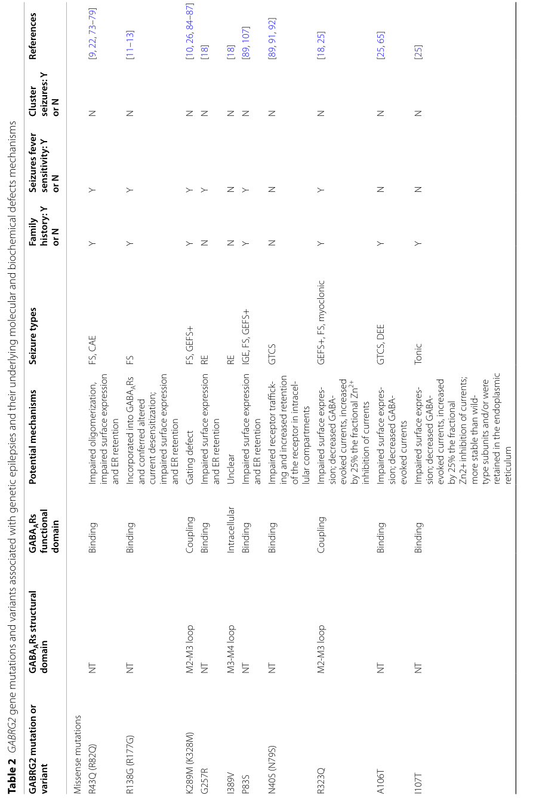

## Question

# Disease Characteristics Research Template

## Target Disease
- **Disease Name:** Generalized Epilepsy with Febrile Seizures Plus
- **MONDO ID:**  (if available)
- **Category:** Mendelian

## Research Objectives

Please provide a comprehensive research report on **Generalized Epilepsy with Febrile Seizures Plus** covering all of the
disease characteristics listed below. This report will be used to populate a disease knowledge
base entry. Be thorough and cite primary literature (PMID preferred) for all claims.

For each section, **suggested databases/resources** are listed. These are the first places
you should search for information on each topic.

---

### 1. Disease Information
> **Search first:** OMIM, Orphanet, ICD-10/ICD-11, MeSH, PubMed

- What is the disease? Provide a concise overview.
- What are the key identifiers? (OMIM, Orphanet, ICD-10/ICD-11, MeSH, Mondo)
- What are the common synonyms and alternative names?
- Is the information derived from individual patients (e.g., EHR) or aggregated disease-level resources?

### 2. Etiology

- **Disease Causal Factors**: What are the primary causes? (genetic, environmental, infectious, mechanistic)
- **Risk Factors**:
  > **Search first:** PubMed, Cochrane Library, UpToDate, clinical guidelines, ClinVar, ClinGen, GWAS Catalog, PheGenI, CTD, CDC, WHO, epidemiological databases
  - Genetic risk factors (causal variants, susceptibility loci, modifier genes)
  - Environmental risk factors (toxins, lifestyle, occupational exposures, age, sex, family history)
- **Protective Factors**:
  > **Search first:** PubMed, Cochrane Library, clinical trial databases, GWAS Catalog, gnomAD, WHO, CDC, nutrition databases
  - Genetic protective factors (protective variants, modifier alleles)
  - Environmental protective factors (diet, lifestyle, exposures that reduce risk)
- **Gene-Environment Interactions**: How do genetic and environmental factors interact to influence disease?
  > **Search first:** CTD, PubMed, PheGenI, GxE databases

### 3. Phenotypes
> **Search first:** HPO (Human Phenotype Ontology), OMIM, Orphanet, PubMed, clinicaltrials.gov, MedDRA, SNOMED CT, DECIPHER, LOINC

For each phenotype, provide:
- **Phenotype type**: symptoms, clinical signs, physical manifestations, behavioral changes, or laboratory abnormalities
  > For symptoms/signs: HPO, OMIM, Orphanet, PubMed
  > For behavioral changes: HPO, DSM, RDoC (Research Domain Criteria), PubMed
  > For laboratory abnormalities: LOINC, SNOMED CT, LabTests Online, PubMed
- **Phenotype characteristics**:
  > **Search first:** OMIM, Orphanet, HPO, PubMed
  - Age of symptom onset (neonatal, childhood, adult-onset, late-onset)
  - Symptom severity (mild, moderate, severe, variable)
  - Symptom progression (stable, progressive, episodic, fluctuating)
  - Frequency among affected individuals (percentage or qualitative)
- **Quality of life impact**: Effects on daily functioning and well-being (per-phenotype when possible)
  > **Search first:** EQ-5D database, SF-36, WHO QOL databases, PubMed
- Suggest HPO (Human Phenotype Ontology) terms for each phenotype

### 4. Genetic/Molecular Information

- **Causal Genes**: Gene mutations or chromosomal abnormalities responsible for disease (gene symbols, OMIM IDs)
  > **Search first:** OMIM, ClinVar, HGMD, Ensembl, NCBI Gene
- **Pathogenic Variants**:
  - Affected genes (gene symbols, HGNC IDs)
    > **Search first:** OMIM, NCBI Gene, Ensembl, HGNC, UniProt, GeneCards
  - Variant classification (pathogenic, likely pathogenic, VUS per ACMG/AMP guidelines)
    > **Search first:** ClinVar, ClinGen, ACMG/AMP guidelines, VarSome
  - Variant type/class (missense, frameshift, nonsense, splice-site, structural)
  - Allele frequency in population databases
    > **Search first:** gnomAD, 1000 Genomes, ExAC, TOPMed, dbSNP
  - Somatic vs germline origin
    > **Search first:** COSMIC (somatic), ClinVar, ICGC, TCGA
  - Functional consequences (loss of function, gain of function, dominant negative)
- **Modifier Genes**: Genes that modify disease severity or expression
- **Epigenetic Information**: DNA methylation, histone modifications, chromatin changes affecting disease
  > **Search first:** ENCODE, Roadmap Epigenomics, MethBase, DiseaseMeth
- **Chromosomal Abnormalities**: Large-scale genetic changes (aneuploidy, translocations, inversions)
  > **Search first:** DECIPHER, ClinVar, ECARUCA, UCSC Genome Browser

### 5. Environmental Information

- **Environmental Factors**: Non-genetic contributing factors (toxins, radiation, pollution, occupational exposure)
  > **Search first:** CTD (Comparative Toxicogenomics Database), TOXNET, PubMed, EPA databases
- **Lifestyle Factors**: Behavioral factors (smoking, diet, exercise, alcohol consumption)
  > **Search first:** CDC databases, WHO, PubMed, NHANES
- **Infectious Agents**: If applicable, pathogens causing or triggering disease (bacteria, viruses, fungi, parasites)
  > **Search first:** NCBI Taxonomy, ViPR, BV-BRC, MicrobeDB, GIDEON

### 6. Mechanism / Pathophysiology

- **Molecular Pathways**: Specific signaling cascades or biochemical pathways involved (Wnt, MAPK, mTOR, PI3K-AKT, etc.)
  > **Search first:** KEGG, Reactome, WikiPathways, PathBank, BioCyc
- **Cellular Processes**: Cell-level mechanisms (apoptosis, autophagy, cell cycle dysregulation, inflammation, etc.)
  > **Search first:** Gene Ontology (GO), Reactome, KEGG, PubMed
- **Protein Dysfunction**: How protein structure or function is altered (misfolding, aggregation, loss of function, gain of function)
  > **Search first:** UniProt, PDB (Protein Data Bank), InterPro, Pfam, AlphaFold
- **Metabolic Changes**: Alterations in metabolic processes (energy metabolism, lipid metabolism, amino acid metabolism)
  > **Search first:** KEGG, BioCyc, HMDB (Human Metabolome Database), BRENDA
- **Immune System Involvement**: Role of immune response (autoimmunity, immunodeficiency, chronic inflammation)
  > **Search first:** ImmPort, Immunome Database, IEDB, Gene Ontology
- **Tissue Damage Mechanisms**: How tissues/ are injured (oxidative stress, ischemia, fibrosis, necrosis)
  > **Search first:** PubMed, Gene Ontology, Reactome
- **Biochemical Abnormalities**: Specific molecular defects (enzyme deficiencies, receptor dysfunction, ion channel defects)
  > **Search first:** BRENDA, UniProt, KEGG, OMIM, PubMed
- **Epigenetic Changes**: DNA methylation, histone modifications affecting gene expression in disease
  > **Search first:** ENCODE, Roadmap Epigenomics, MethBase, DiseaseMeth
- **Molecular Profiling** (if available):
  - Transcriptomics/gene expression changes
    > **Search first:** GEO (Gene Expression Omnibus), ArrayExpress, GTEx, Human Cell Atlas, SRA
  - Proteomics findings
    > **Search first:** PRIDE, ProteomeXchange, Human Protein Atlas, STRING, BioGRID
  - Metabolomics signatures
    > **Search first:** MetaboLights, Metabolomics Workbench, HMDB, METLIN
  - Lipidomics alterations
    > **Search first:** LIPID MAPS, SwissLipids, LipidHome, Metabolomics Workbench
  - Genomic structural features
    > **Search first:** UCSC Genome Browser, Ensembl, NCBI, dbVar, DGV
- **Advanced Technologies** (if applicable):
  - Single-cell analysis findings (cell-type specific mechanisms, cellular heterogeneity)
    > **Search first:** Human Cell Atlas, Single Cell Portal, GEO, CELLxGENE
  - Spatial transcriptomics findings
    > **Search first:** GEO, Spatial Research, Vizgen, 10x Genomics data
  - Multi-omics integration results
    > **Search first:** TCGA, ICGC, cBioPortal, LinkedOmics, PubMed
  - Functional genomics screens (CRISPR, RNAi)
    > **Search first:** DepMap, GenomeRNAi, PubMed, BioGRID ORCS

For each mechanism, describe:
- The causal chain from initial trigger to clinical manifestation
- Which mechanisms are upstream vs downstream
- What cell types and biological processes are involved
- Suggest GO terms for biological processes and CL terms for cell types

### 7. Anatomical Structures Affected

- **Organ Level**:
  - Primary organs directly affected
  - Secondary organ involvement (complications, secondary effects)
  - Body systems involved (cardiovascular, nervous, digestive, respiratory, endocrine, etc.)
  > **Search first:** Uberon, FMA (Foundational Model of Anatomy), OMIM, HPO, ICD-11, MeSH, SNOMED CT
- **Tissue and Cell Level**:
  - Specific tissue types affected (epithelial, connective, muscle, nervous)
  - Specific cell populations targeted (with Cell Ontology terms)
  > **Search first:** Uberon, Human Protein Atlas, Cell Ontology, Human Cell Atlas, CellMarker, PanglaoDB
- **Subcellular Level**:
  - Cellular compartments involved (mitochondria, nucleus, ER, lysosomes) (with GO Cellular Component terms)
  > **Search first:** Gene Ontology (Cellular Component), UniProt, Human Protein Atlas
- **Localization**:
  - Specific anatomical sites (with UBERON terms)
    > **Search first:** FMA, Uberon, NeuroNames (for brain), SNOMED CT
  - Lateralization (unilateral, bilateral, asymmetric)
    > **Search first:** HPO, clinical literature, imaging databases

### 8. Temporal Development

- **Onset**:
  - Typical age of onset (congenital, pediatric, adult, geriatric)
  - Onset pattern (acute, subacute, chronic, insidious)
  > **Search first:** OMIM, Orphanet, HPO, PubMed
- **Progression**:
  - Disease stages (early, intermediate, advanced, end-stage)
    > **Search first:** Cancer Staging Manual (AJCC), WHO classifications, PubMed
  - Progression rate (rapid, slow, variable)
  - Disease course pattern (episodic, relapsing-remitting, progressive, stable)
  - Disease duration (self-limited, chronic lifelong)
  > **Search first:** Disease registries, longitudinal cohort databases, natural history studies, PubMed, Orphanet, OMIM
- **Patterns**:
  - Remission patterns (spontaneous, treatment-induced)
    > **Search first:** Clinical trial databases, disease registries, PubMed
  - Critical periods (time windows of vulnerability or opportunity for intervention)
    > **Search first:** PubMed, developmental biology databases, clinical guidelines

### 9. Inheritance and Population

- **Epidemiology**:
  - Prevalence (cases per 100,000 at given time)
  - Incidence (new cases per 100,000 per year)
  > **Search first:** Orphanet, CDC, WHO, GBD (Global Burden of Disease), national registries, SEER, disease registries
- **For Genetic Etiology**:
  - Inheritance pattern (AD, AR, X-linked, mitochondrial, multifactorial, polygenic)
    > **Search first:** OMIM, Orphanet, ClinVar, GTR (Genetic Testing Registry)
  - Penetrance (complete, incomplete, age-dependent)
    > **Search first:** ClinVar, OMIM, PubMed, ClinGen
  - Expressivity (variable, consistent)
    > **Search first:** OMIM, ClinVar, PubMed
  - Genetic anticipation (increasing severity in successive generations)
    > **Search first:** OMIM, PubMed (especially for repeat expansion disorders)
  - Germline mosaicism
    > **Search first:** ClinVar, OMIM, genetic counseling literature, PubMed
  - Founder effects (population-specific mutations)
    > **Search first:** gnomAD, population genetics databases, PubMed
  - Consanguinity role
    > **Search first:** OMIM, population studies, genetic counseling resources
  - Carrier frequency
    > **Search first:** gnomAD, carrier screening databases, GeneReviews, GTR
- **Population Demographics**:
  - Affected populations (ethnic or demographic groups with higher prevalence)
    > **Search first:** gnomAD, 1000 Genomes, PAGE Study, PubMed, population registries
  - Geographic distribution (endemic areas, regional variation)
    > **Search first:** WHO, CDC, GBD, Orphanet, geographic epidemiology databases
  - Geographic distribution of specific variants
  - Sex ratio (male:female)
    > **Search first:** Disease registries, OMIM, PubMed, epidemiological databases
  - Age distribution of affected individuals
    > **Search first:** CDC, disease registries, SEER, Orphanet

### 10. Diagnostics

- **Clinical Tests**:
  - Laboratory tests (blood, urine, tissue chemistry, specific enzyme assays)
    > **Search first:** LOINC, LabTests Online, PubMed
  - Biomarkers (proteins, metabolites, genetic markers, circulating biomarkers)
    > **Search first:** FDA Biomarker List, BEST (Biomarkers, EndpointS, and other Tools), PubMed
  - Imaging studies (X-ray, CT, MRI, PET, ultrasound)
    > **Search first:** RadLex, DICOM, Radiopaedia, imaging databases
  - Functional tests (pulmonary function, cardiac stress tests)
    > **Search first:** LOINC, clinical guidelines, PubMed
  - Electrophysiology (EEG, EMG, ECG, nerve conduction studies)
    > **Search first:** LOINC, clinical neurophysiology databases, PubMed
  - Biopsy findings (histopathology, immunohistochemistry)
    > **Search first:** SNOMED CT, College of American Pathologists resources, PubMed
  - Pathology findings (microscopic examination)
    > **Search first:** SNOMED CT, Digital Pathology databases, PubMed
- **Genetic Testing**:
  > **Search first:** GTR (Genetic Testing Registry), GeneReviews, ClinGen
  - Overview of recommended genetic testing approach
  - Whole genome sequencing (WGS) utility
    > **Search first:** GTR, ClinVar, GEL (Genomics England), gnomAD
  - Whole exome sequencing (WES) utility
    > **Search first:** GTR, ClinVar, OMIM, GeneMatcher
  - Gene panels (which panels, which genes)
    > **Search first:** GTR, ClinVar, laboratory-specific databases
  - Single gene testing
    > **Search first:** GTR, ClinVar, OMIM, GeneReviews
  - Chromosomal microarray (CMA)
    > **Search first:** DECIPHER, ClinVar, dbVar, ECARUCA
  - Karyotyping
    > **Search first:** Chromosome Abnormality Database, ClinVar, cytogenetics resources
  - FISH
    > **Search first:** ClinVar, cytogenetics databases, PubMed
  - Mitochondrial DNA testing
    > **Search first:** MITOMAP, MSeqDR, ClinVar, GTR
  - Repeat expansion testing
    > **Search first:** GTR, ClinVar, repeat expansion databases, PubMed
- **Omics-Based Diagnostics** (if applicable):
  - RNA sequencing / transcriptomics
    > **Search first:** GEO, ArrayExpress, GTEx, RNA-seq databases
  - Proteomics
    > **Search first:** PRIDE, ProteomeXchange, FDA Biomarker database
  - Metabolomics
    > **Search first:** MetaboLights, Metabolomics Workbench, HMDB
  - Epigenomics
    > **Search first:** GEO, ENCODE, Roadmap Epigenomics, MethBase
  - Liquid biopsy
    > **Search first:** COSMIC, ClinVar, liquid biopsy databases, PubMed
- **Clinical Criteria**:
  - Standardized diagnostic criteria (DSM, ICD, society guidelines)
    > **Search first:** DSM-5, ICD-11, clinical society guidelines, UpToDate
  - Differential diagnosis (other conditions to rule out, with distinguishing features)
    > **Search first:** DynaMed, UpToDate, clinical decision support systems
- **Screening**:
  - Screening methods for asymptomatic individuals (newborn screening, carrier screening, cascade screening)
    > **Search first:** ACMG recommendations, CDC newborn screening, GTR

### 11. Outcome/Prognosis

- **Survival and Mortality**:
  - Survival rate (5-year, 10-year, overall)
    > **Search first:** SEER, cancer registries, disease-specific registries, PubMed
  - Life expectancy (with and without treatment if applicable)
    > **Search first:** Orphanet, disease registries, actuarial databases, PubMed
  - Mortality rate
    > **Search first:** CDC, WHO, GBD, national mortality databases
  - Disease-specific mortality (deaths directly attributable to disease)
    > **Search first:** Disease registries, CDC Wonder, GBD, PubMed
- **Morbidity and Function**:
  - Morbidity (disease-related disability and health impacts)
    > **Search first:** GBD, WHO, disability databases, PubMed
  - Disability outcomes (long-term functional impairments)
    > **Search first:** ICF (International Classification of Functioning), disability registries
  - Quality of life measures (EQ-5D, SF-36, PROMIS, disease-specific tools)
    > **Search first:** EQ-5D database, SF-36, PROMIS, PubMed
- **Disease Course**:
  - Complications (secondary problems: infections, organ failure, etc.)
    > **Search first:** ICD codes, disease registries, clinical databases, PubMed
  - Recovery potential (likelihood and extent of recovery, with vs without treatment)
    > **Search first:** Natural history studies, rehabilitation databases, PubMed
- **Prediction**:
  - Prognostic factors (age, disease severity, biomarkers, treatment response)
    > **Search first:** Prognostic models databases, clinical calculators, PubMed
  - Prognostic biomarkers (molecular markers predicting disease course)
    > **Search first:** FDA Biomarker database, PubMed, cancer prognostic databases

### 12. Treatment

- **Pharmacotherapy**:
  - Pharmacological treatments (drug names, drug classes, mechanisms of action)
    > **Search first:** DrugBank, RxNorm, ATC classification, DailyMed, FDA databases
  - Pharmacogenomics (how genetic variants affect drug metabolism, efficacy, toxicity)
    > **Search first:** PharmGKB, CPIC (Clinical Pharmacogenetics), FDA Table of PGx Biomarkers
- **Advanced Therapeutics**:
  - Gene therapy (viral vectors, CRISPR, gene replacement, gene editing)
    > **Search first:** ClinicalTrials.gov, FDA gene therapy database, ASGCT resources
  - Cell therapy (stem cell transplant, CAR-T, cellular therapeutics)
    > **Search first:** ClinicalTrials.gov, FDA cell therapy database, FACT standards
  - RNA-based therapies (ASOs, siRNA, mRNA therapies)
    > **Search first:** ClinicalTrials.gov, FDA approvals, PubMed
  - Targeted therapies (treatments directed at specific molecular targets)
    > **Search first:** My Cancer Genome, OncoKB, ClinicalTrials.gov, FDA approvals
  - Immunotherapies (checkpoint inhibitors, monoclonal antibodies)
    > **Search first:** Cancer Immunotherapy Database, FDA approvals, ClinicalTrials.gov
- **Surgical and Interventional**:
  - Surgical interventions (types of surgery, timing, outcomes)
    > **Search first:** CPT codes, surgical registries, clinical guidelines, PubMed
- **Supportive and Rehabilitative**:
  - Supportive care (symptom management, pain control, nutrition)
    > **Search first:** Clinical guidelines, Cochrane Library, PubMed
  - Rehabilitation (physical therapy, occupational therapy, speech therapy)
    > **Search first:** Rehabilitation medicine databases, clinical guidelines, PubMed
- **Experimental**:
  - Experimental treatments in clinical trials (with NCT identifiers if available)
    > **Search first:** ClinicalTrials.gov, EU Clinical Trials Register, WHO ICTRP
- **Treatment Outcomes**:
  - Treatment response rates
    > **Search first:** Clinical trial databases, FDA reviews, systematic reviews, PubMed
  - Side effects and adverse events
    > **Search first:** FDA Adverse Event Reporting System (FAERS), MedWatch, PubMed
- **Treatment Strategy**:
  - Treatment algorithms (clinical pathways, decision trees)
    > **Search first:** Clinical practice guidelines, NCCN Guidelines, UpToDate
  - Combination therapies
    > **Search first:** ClinicalTrials.gov, treatment guidelines, PubMed
  - Personalized medicine approaches (genotype-guided treatment)
    > **Search first:** My Cancer Genome, CIViC, PharmGKB, precision medicine databases

For each treatment, suggest MAXO (Medical Action Ontology) terms where applicable.

### 13. Prevention

- **Prevention Levels**:
  - Primary prevention (preventing disease occurrence: vaccination, risk factor modification)
    > **Search first:** CDC, WHO, USPSTF recommendations, Cochrane Library
  - Secondary prevention (early detection and treatment: screening programs, early intervention)
    > **Search first:** USPSTF, CDC screening guidelines, WHO
  - Tertiary prevention (preventing complications in those with disease)
    > **Search first:** Clinical guidelines, disease management protocols, PubMed
- **Immunization**: Vaccine strategies (if applicable)
  > **Search first:** CDC vaccine schedules, WHO immunization, FDA vaccine database
- **Screening and Early Detection**:
  - Screening programs (population-based: newborn screening, cancer screening)
    > **Search first:** CDC screening programs, USPSTF, cancer screening databases
  - Genetic screening (carrier screening, preimplantation genetic diagnosis, prenatal testing)
    > **Search first:** ACMG recommendations, ACOG guidelines, GTR
  - Risk stratification (identifying high-risk individuals for targeted prevention)
    > **Search first:** Risk prediction models, clinical calculators, PubMed
- **Behavioral Interventions**: Lifestyle modifications to reduce risk
  > **Search first:** CDC, WHO, behavioral intervention databases, Cochrane Library
- **Counseling**: Genetic counseling (risk assessment, family planning guidance)
  > **Search first:** NSGC resources, ACMG guidelines, GeneReviews
- **Public Health**:
  - Public health interventions (sanitation, vector control, health education)
    > **Search first:** CDC, WHO, public health databases, PubMed
  - Environmental interventions (reducing environmental risk factors)
    > **Search first:** EPA databases, WHO environmental health, PubMed
- **Prophylaxis**: Preventive medications or procedures
  > **Search first:** Clinical guidelines, FDA approvals, PubMed

### 14. Other Species / Natural Disease

- **Taxonomy**: Species affected (with NCBI Taxon identifiers)
  > **Search first:** NCBI Taxonomy
- **Breed**: Specific breeds affected (with VBO identifiers if applicable)
  > **Search first:** VBO (Vertebrate Breed Ontology)
- **Gene**: Orthologous genes in other species (with NCBI Gene IDs)
  > **Search first:** NCBI Gene
- **Natural Disease**:
  - Naturally occurring disease in other species (companion animals, wildlife)
    > **Search first:** OMIA (Online Mendelian Inheritance in Animals), VetCompass, PubMed
  - Veterinary relevance and importance in animal health
    > **Search first:** OMIA, veterinary databases, PubMed
- **Comparative Biology**:
  - Comparative pathology (similarities and differences across species)
    > **Search first:** OMIA, comparative pathology databases, PubMed
  - Evolutionary conservation of disease mechanisms
    > **Search first:** HomoloGene, OrthoMCL, Alliance of Genome Resources
- **Transmission** (if applicable):
  - Zoonotic potential
    > **Search first:** CDC zoonotic diseases, WHO zoonoses, GIDEON
  - Cross-species susceptibility
    > **Search first:** NCBI Taxonomy, veterinary databases, PubMed

### 15. Model Organisms

- **Model Types**:
  - Model organism type (mammalian, invertebrate, cellular, in vitro)
    > **Search first:** Alliance of Genome Resources, model organism databases
  - Specific model systems (mouse, rat, zebrafish, Drosophila, C. elegans, yeast, cell lines, organoids, iPSCs)
    > **Search first:** MGI, RGD, ZFIN, FlyBase, WormBase, SGD, ATCC, Cellosaurus
  - Induced models (drug treatment, surgical intervention, environmental manipulation)
    > **Search first:** MGI, model organism databases, PubMed
- **Genetic Models**:
  - Types available (knockout, knock-in, transgenic, conditional, humanized)
    > **Search first:** MGI, IMPC, KOMP, EuMMCR, IMSR
- **Model Characteristics**:
  - Phenotype recapitulation (how well model reproduces human disease features)
    > **Search first:** Model organism databases, comparative studies, PubMed
  - Model limitations (aspects of human disease not captured)
    > **Search first:** Model organism databases, PubMed, review articles
- **Applications**:
  - Research applications (what aspects of disease can be studied)
    > **Search first:** Model organism databases, PubMed
- **Resources**:
  - Model databases
    > **Search first:** MGI, RGD, ZFIN, FlyBase, WormBase, IMSR, EMMA, MMRRC

---

## Citation Requirements

- Cite primary literature (PMID preferred) for all mechanistic and clinical claims
- Prioritize recent reviews and landmark papers
- Include direct quotes from abstracts where possible to support key statements
- Distinguish evidence source types: human clinical, model organism, in vitro, computational

## Output Format

Structure your response as a comprehensive narrative organized by the sections above.
For each section, provide:
- Factual content with specific details (numbers, percentages, gene names, variant nomenclature)
- Ontology term suggestions (HPO, GO, CL, UBERON, CHEBI, MAXO, MONDO) where applicable
- Evidence citations with PMIDs
- Direct quotes from abstracts to support key claims
- Clear indication when information is not available or not applicable for this disease

This report will be used to populate a disease knowledge base entry with:
- Pathophysiology descriptions with causal chains
- Gene/protein annotations (HGNC, GO terms)
- Phenotype associations (HP terms) with frequencies
- Cell type involvement (CL terms)
- Anatomical locations (UBERON terms)
- Chemical entities (CHEBI terms)
- Treatment annotations (MAXO terms)
- Evidence items with PMIDs and exact abstract quotes
- Epidemiology, prognosis, diagnostic, and prevention information
- Animal model descriptions with phenotype recapitulation details

## Output

Question: You are an expert researcher providing comprehensive, well-cited information.

Provide detailed information focusing on:
1. Key concepts and definitions with current understanding
2. Recent developments and latest research (prioritize 2023-2024 sources)
3. Current applications and real-world implementations
4. Expert opinions and analysis from authoritative sources
5. Relevant statistics and data from recent studies

Format as a comprehensive research report with proper citations. Include URLs and publication dates where available.
Always prioritize recent, authoritative sources and provide specific citations for all major claims.

# Disease Characteristics Research Template

## Target Disease
- **Disease Name:** Generalized Epilepsy with Febrile Seizures Plus
- **MONDO ID:**  (if available)
- **Category:** Mendelian

## Research Objectives

Please provide a comprehensive research report on **Generalized Epilepsy with Febrile Seizures Plus** covering all of the
disease characteristics listed below. This report will be used to populate a disease knowledge
base entry. Be thorough and cite primary literature (PMID preferred) for all claims.

For each section, **suggested databases/resources** are listed. These are the first places
you should search for information on each topic.

---

### 1. Disease Information
> **Search first:** OMIM, Orphanet, ICD-10/ICD-11, MeSH, PubMed

- What is the disease? Provide a concise overview.
- What are the key identifiers? (OMIM, Orphanet, ICD-10/ICD-11, MeSH, Mondo)
- What are the common synonyms and alternative names?
- Is the information derived from individual patients (e.g., EHR) or aggregated disease-level resources?

### 2. Etiology

- **Disease Causal Factors**: What are the primary causes? (genetic, environmental, infectious, mechanistic)
- **Risk Factors**:
  > **Search first:** PubMed, Cochrane Library, UpToDate, clinical guidelines, ClinVar, ClinGen, GWAS Catalog, PheGenI, CTD, CDC, WHO, epidemiological databases
  - Genetic risk factors (causal variants, susceptibility loci, modifier genes)
  - Environmental risk factors (toxins, lifestyle, occupational exposures, age, sex, family history)
- **Protective Factors**:
  > **Search first:** PubMed, Cochrane Library, clinical trial databases, GWAS Catalog, gnomAD, WHO, CDC, nutrition databases
  - Genetic protective factors (protective variants, modifier alleles)
  - Environmental protective factors (diet, lifestyle, exposures that reduce risk)
- **Gene-Environment Interactions**: How do genetic and environmental factors interact to influence disease?
  > **Search first:** CTD, PubMed, PheGenI, GxE databases

### 3. Phenotypes
> **Search first:** HPO (Human Phenotype Ontology), OMIM, Orphanet, PubMed, clinicaltrials.gov, MedDRA, SNOMED CT, DECIPHER, LOINC

For each phenotype, provide:
- **Phenotype type**: symptoms, clinical signs, physical manifestations, behavioral changes, or laboratory abnormalities
  > For symptoms/signs: HPO, OMIM, Orphanet, PubMed
  > For behavioral changes: HPO, DSM, RDoC (Research Domain Criteria), PubMed
  > For laboratory abnormalities: LOINC, SNOMED CT, LabTests Online, PubMed
- **Phenotype characteristics**:
  > **Search first:** OMIM, Orphanet, HPO, PubMed
  - Age of symptom onset (neonatal, childhood, adult-onset, late-onset)
  - Symptom severity (mild, moderate, severe, variable)
  - Symptom progression (stable, progressive, episodic, fluctuating)
  - Frequency among affected individuals (percentage or qualitative)
- **Quality of life impact**: Effects on daily functioning and well-being (per-phenotype when possible)
  > **Search first:** EQ-5D database, SF-36, WHO QOL databases, PubMed
- Suggest HPO (Human Phenotype Ontology) terms for each phenotype

### 4. Genetic/Molecular Information

- **Causal Genes**: Gene mutations or chromosomal abnormalities responsible for disease (gene symbols, OMIM IDs)
  > **Search first:** OMIM, ClinVar, HGMD, Ensembl, NCBI Gene
- **Pathogenic Variants**:
  - Affected genes (gene symbols, HGNC IDs)
    > **Search first:** OMIM, NCBI Gene, Ensembl, HGNC, UniProt, GeneCards
  - Variant classification (pathogenic, likely pathogenic, VUS per ACMG/AMP guidelines)
    > **Search first:** ClinVar, ClinGen, ACMG/AMP guidelines, VarSome
  - Variant type/class (missense, frameshift, nonsense, splice-site, structural)
  - Allele frequency in population databases
    > **Search first:** gnomAD, 1000 Genomes, ExAC, TOPMed, dbSNP
  - Somatic vs germline origin
    > **Search first:** COSMIC (somatic), ClinVar, ICGC, TCGA
  - Functional consequences (loss of function, gain of function, dominant negative)
- **Modifier Genes**: Genes that modify disease severity or expression
- **Epigenetic Information**: DNA methylation, histone modifications, chromatin changes affecting disease
  > **Search first:** ENCODE, Roadmap Epigenomics, MethBase, DiseaseMeth
- **Chromosomal Abnormalities**: Large-scale genetic changes (aneuploidy, translocations, inversions)
  > **Search first:** DECIPHER, ClinVar, ECARUCA, UCSC Genome Browser

### 5. Environmental Information

- **Environmental Factors**: Non-genetic contributing factors (toxins, radiation, pollution, occupational exposure)
  > **Search first:** CTD (Comparative Toxicogenomics Database), TOXNET, PubMed, EPA databases
- **Lifestyle Factors**: Behavioral factors (smoking, diet, exercise, alcohol consumption)
  > **Search first:** CDC databases, WHO, PubMed, NHANES
- **Infectious Agents**: If applicable, pathogens causing or triggering disease (bacteria, viruses, fungi, parasites)
  > **Search first:** NCBI Taxonomy, ViPR, BV-BRC, MicrobeDB, GIDEON

### 6. Mechanism / Pathophysiology

- **Molecular Pathways**: Specific signaling cascades or biochemical pathways involved (Wnt, MAPK, mTOR, PI3K-AKT, etc.)
  > **Search first:** KEGG, Reactome, WikiPathways, PathBank, BioCyc
- **Cellular Processes**: Cell-level mechanisms (apoptosis, autophagy, cell cycle dysregulation, inflammation, etc.)
  > **Search first:** Gene Ontology (GO), Reactome, KEGG, PubMed
- **Protein Dysfunction**: How protein structure or function is altered (misfolding, aggregation, loss of function, gain of function)
  > **Search first:** UniProt, PDB (Protein Data Bank), InterPro, Pfam, AlphaFold
- **Metabolic Changes**: Alterations in metabolic processes (energy metabolism, lipid metabolism, amino acid metabolism)
  > **Search first:** KEGG, BioCyc, HMDB (Human Metabolome Database), BRENDA
- **Immune System Involvement**: Role of immune response (autoimmunity, immunodeficiency, chronic inflammation)
  > **Search first:** ImmPort, Immunome Database, IEDB, Gene Ontology
- **Tissue Damage Mechanisms**: How tissues/ are injured (oxidative stress, ischemia, fibrosis, necrosis)
  > **Search first:** PubMed, Gene Ontology, Reactome
- **Biochemical Abnormalities**: Specific molecular defects (enzyme deficiencies, receptor dysfunction, ion channel defects)
  > **Search first:** BRENDA, UniProt, KEGG, OMIM, PubMed
- **Epigenetic Changes**: DNA methylation, histone modifications affecting gene expression in disease
  > **Search first:** ENCODE, Roadmap Epigenomics, MethBase, DiseaseMeth
- **Molecular Profiling** (if available):
  - Transcriptomics/gene expression changes
    > **Search first:** GEO (Gene Expression Omnibus), ArrayExpress, GTEx, Human Cell Atlas, SRA
  - Proteomics findings
    > **Search first:** PRIDE, ProteomeXchange, Human Protein Atlas, STRING, BioGRID
  - Metabolomics signatures
    > **Search first:** MetaboLights, Metabolomics Workbench, HMDB, METLIN
  - Lipidomics alterations
    > **Search first:** LIPID MAPS, SwissLipids, LipidHome, Metabolomics Workbench
  - Genomic structural features
    > **Search first:** UCSC Genome Browser, Ensembl, NCBI, dbVar, DGV
- **Advanced Technologies** (if applicable):
  - Single-cell analysis findings (cell-type specific mechanisms, cellular heterogeneity)
    > **Search first:** Human Cell Atlas, Single Cell Portal, GEO, CELLxGENE
  - Spatial transcriptomics findings
    > **Search first:** GEO, Spatial Research, Vizgen, 10x Genomics data
  - Multi-omics integration results
    > **Search first:** TCGA, ICGC, cBioPortal, LinkedOmics, PubMed
  - Functional genomics screens (CRISPR, RNAi)
    > **Search first:** DepMap, GenomeRNAi, PubMed, BioGRID ORCS

For each mechanism, describe:
- The causal chain from initial trigger to clinical manifestation
- Which mechanisms are upstream vs downstream
- What cell types and biological processes are involved
- Suggest GO terms for biological processes and CL terms for cell types

### 7. Anatomical Structures Affected

- **Organ Level**:
  - Primary organs directly affected
  - Secondary organ involvement (complications, secondary effects)
  - Body systems involved (cardiovascular, nervous, digestive, respiratory, endocrine, etc.)
  > **Search first:** Uberon, FMA (Foundational Model of Anatomy), OMIM, HPO, ICD-11, MeSH, SNOMED CT
- **Tissue and Cell Level**:
  - Specific tissue types affected (epithelial, connective, muscle, nervous)
  - Specific cell populations targeted (with Cell Ontology terms)
  > **Search first:** Uberon, Human Protein Atlas, Cell Ontology, Human Cell Atlas, CellMarker, PanglaoDB
- **Subcellular Level**:
  - Cellular compartments involved (mitochondria, nucleus, ER, lysosomes) (with GO Cellular Component terms)
  > **Search first:** Gene Ontology (Cellular Component), UniProt, Human Protein Atlas
- **Localization**:
  - Specific anatomical sites (with UBERON terms)
    > **Search first:** FMA, Uberon, NeuroNames (for brain), SNOMED CT
  - Lateralization (unilateral, bilateral, asymmetric)
    > **Search first:** HPO, clinical literature, imaging databases

### 8. Temporal Development

- **Onset**:
  - Typical age of onset (congenital, pediatric, adult, geriatric)
  - Onset pattern (acute, subacute, chronic, insidious)
  > **Search first:** OMIM, Orphanet, HPO, PubMed
- **Progression**:
  - Disease stages (early, intermediate, advanced, end-stage)
    > **Search first:** Cancer Staging Manual (AJCC), WHO classifications, PubMed
  - Progression rate (rapid, slow, variable)
  - Disease course pattern (episodic, relapsing-remitting, progressive, stable)
  - Disease duration (self-limited, chronic lifelong)
  > **Search first:** Disease registries, longitudinal cohort databases, natural history studies, PubMed, Orphanet, OMIM
- **Patterns**:
  - Remission patterns (spontaneous, treatment-induced)
    > **Search first:** Clinical trial databases, disease registries, PubMed
  - Critical periods (time windows of vulnerability or opportunity for intervention)
    > **Search first:** PubMed, developmental biology databases, clinical guidelines

### 9. Inheritance and Population

- **Epidemiology**:
  - Prevalence (cases per 100,000 at given time)
  - Incidence (new cases per 100,000 per year)
  > **Search first:** Orphanet, CDC, WHO, GBD (Global Burden of Disease), national registries, SEER, disease registries
- **For Genetic Etiology**:
  - Inheritance pattern (AD, AR, X-linked, mitochondrial, multifactorial, polygenic)
    > **Search first:** OMIM, Orphanet, ClinVar, GTR (Genetic Testing Registry)
  - Penetrance (complete, incomplete, age-dependent)
    > **Search first:** ClinVar, OMIM, PubMed, ClinGen
  - Expressivity (variable, consistent)
    > **Search first:** OMIM, ClinVar, PubMed
  - Genetic anticipation (increasing severity in successive generations)
    > **Search first:** OMIM, PubMed (especially for repeat expansion disorders)
  - Germline mosaicism
    > **Search first:** ClinVar, OMIM, genetic counseling literature, PubMed
  - Founder effects (population-specific mutations)
    > **Search first:** gnomAD, population genetics databases, PubMed
  - Consanguinity role
    > **Search first:** OMIM, population studies, genetic counseling resources
  - Carrier frequency
    > **Search first:** gnomAD, carrier screening databases, GeneReviews, GTR
- **Population Demographics**:
  - Affected populations (ethnic or demographic groups with higher prevalence)
    > **Search first:** gnomAD, 1000 Genomes, PAGE Study, PubMed, population registries
  - Geographic distribution (endemic areas, regional variation)
    > **Search first:** WHO, CDC, GBD, Orphanet, geographic epidemiology databases
  - Geographic distribution of specific variants
  - Sex ratio (male:female)
    > **Search first:** Disease registries, OMIM, PubMed, epidemiological databases
  - Age distribution of affected individuals
    > **Search first:** CDC, disease registries, SEER, Orphanet

### 10. Diagnostics

- **Clinical Tests**:
  - Laboratory tests (blood, urine, tissue chemistry, specific enzyme assays)
    > **Search first:** LOINC, LabTests Online, PubMed
  - Biomarkers (proteins, metabolites, genetic markers, circulating biomarkers)
    > **Search first:** FDA Biomarker List, BEST (Biomarkers, EndpointS, and other Tools), PubMed
  - Imaging studies (X-ray, CT, MRI, PET, ultrasound)
    > **Search first:** RadLex, DICOM, Radiopaedia, imaging databases
  - Functional tests (pulmonary function, cardiac stress tests)
    > **Search first:** LOINC, clinical guidelines, PubMed
  - Electrophysiology (EEG, EMG, ECG, nerve conduction studies)
    > **Search first:** LOINC, clinical neurophysiology databases, PubMed
  - Biopsy findings (histopathology, immunohistochemistry)
    > **Search first:** SNOMED CT, College of American Pathologists resources, PubMed
  - Pathology findings (microscopic examination)
    > **Search first:** SNOMED CT, Digital Pathology databases, PubMed
- **Genetic Testing**:
  > **Search first:** GTR (Genetic Testing Registry), GeneReviews, ClinGen
  - Overview of recommended genetic testing approach
  - Whole genome sequencing (WGS) utility
    > **Search first:** GTR, ClinVar, GEL (Genomics England), gnomAD
  - Whole exome sequencing (WES) utility
    > **Search first:** GTR, ClinVar, OMIM, GeneMatcher
  - Gene panels (which panels, which genes)
    > **Search first:** GTR, ClinVar, laboratory-specific databases
  - Single gene testing
    > **Search first:** GTR, ClinVar, OMIM, GeneReviews
  - Chromosomal microarray (CMA)
    > **Search first:** DECIPHER, ClinVar, dbVar, ECARUCA
  - Karyotyping
    > **Search first:** Chromosome Abnormality Database, ClinVar, cytogenetics resources
  - FISH
    > **Search first:** ClinVar, cytogenetics databases, PubMed
  - Mitochondrial DNA testing
    > **Search first:** MITOMAP, MSeqDR, ClinVar, GTR
  - Repeat expansion testing
    > **Search first:** GTR, ClinVar, repeat expansion databases, PubMed
- **Omics-Based Diagnostics** (if applicable):
  - RNA sequencing / transcriptomics
    > **Search first:** GEO, ArrayExpress, GTEx, RNA-seq databases
  - Proteomics
    > **Search first:** PRIDE, ProteomeXchange, FDA Biomarker database
  - Metabolomics
    > **Search first:** MetaboLights, Metabolomics Workbench, HMDB
  - Epigenomics
    > **Search first:** GEO, ENCODE, Roadmap Epigenomics, MethBase
  - Liquid biopsy
    > **Search first:** COSMIC, ClinVar, liquid biopsy databases, PubMed
- **Clinical Criteria**:
  - Standardized diagnostic criteria (DSM, ICD, society guidelines)
    > **Search first:** DSM-5, ICD-11, clinical society guidelines, UpToDate
  - Differential diagnosis (other conditions to rule out, with distinguishing features)
    > **Search first:** DynaMed, UpToDate, clinical decision support systems
- **Screening**:
  - Screening methods for asymptomatic individuals (newborn screening, carrier screening, cascade screening)
    > **Search first:** ACMG recommendations, CDC newborn screening, GTR

### 11. Outcome/Prognosis

- **Survival and Mortality**:
  - Survival rate (5-year, 10-year, overall)
    > **Search first:** SEER, cancer registries, disease-specific registries, PubMed
  - Life expectancy (with and without treatment if applicable)
    > **Search first:** Orphanet, disease registries, actuarial databases, PubMed
  - Mortality rate
    > **Search first:** CDC, WHO, GBD, national mortality databases
  - Disease-specific mortality (deaths directly attributable to disease)
    > **Search first:** Disease registries, CDC Wonder, GBD, PubMed
- **Morbidity and Function**:
  - Morbidity (disease-related disability and health impacts)
    > **Search first:** GBD, WHO, disability databases, PubMed
  - Disability outcomes (long-term functional impairments)
    > **Search first:** ICF (International Classification of Functioning), disability registries
  - Quality of life measures (EQ-5D, SF-36, PROMIS, disease-specific tools)
    > **Search first:** EQ-5D database, SF-36, PROMIS, PubMed
- **Disease Course**:
  - Complications (secondary problems: infections, organ failure, etc.)
    > **Search first:** ICD codes, disease registries, clinical databases, PubMed
  - Recovery potential (likelihood and extent of recovery, with vs without treatment)
    > **Search first:** Natural history studies, rehabilitation databases, PubMed
- **Prediction**:
  - Prognostic factors (age, disease severity, biomarkers, treatment response)
    > **Search first:** Prognostic models databases, clinical calculators, PubMed
  - Prognostic biomarkers (molecular markers predicting disease course)
    > **Search first:** FDA Biomarker database, PubMed, cancer prognostic databases

### 12. Treatment

- **Pharmacotherapy**:
  - Pharmacological treatments (drug names, drug classes, mechanisms of action)
    > **Search first:** DrugBank, RxNorm, ATC classification, DailyMed, FDA databases
  - Pharmacogenomics (how genetic variants affect drug metabolism, efficacy, toxicity)
    > **Search first:** PharmGKB, CPIC (Clinical Pharmacogenetics), FDA Table of PGx Biomarkers
- **Advanced Therapeutics**:
  - Gene therapy (viral vectors, CRISPR, gene replacement, gene editing)
    > **Search first:** ClinicalTrials.gov, FDA gene therapy database, ASGCT resources
  - Cell therapy (stem cell transplant, CAR-T, cellular therapeutics)
    > **Search first:** ClinicalTrials.gov, FDA cell therapy database, FACT standards
  - RNA-based therapies (ASOs, siRNA, mRNA therapies)
    > **Search first:** ClinicalTrials.gov, FDA approvals, PubMed
  - Targeted therapies (treatments directed at specific molecular targets)
    > **Search first:** My Cancer Genome, OncoKB, ClinicalTrials.gov, FDA approvals
  - Immunotherapies (checkpoint inhibitors, monoclonal antibodies)
    > **Search first:** Cancer Immunotherapy Database, FDA approvals, ClinicalTrials.gov
- **Surgical and Interventional**:
  - Surgical interventions (types of surgery, timing, outcomes)
    > **Search first:** CPT codes, surgical registries, clinical guidelines, PubMed
- **Supportive and Rehabilitative**:
  - Supportive care (symptom management, pain control, nutrition)
    > **Search first:** Clinical guidelines, Cochrane Library, PubMed
  - Rehabilitation (physical therapy, occupational therapy, speech therapy)
    > **Search first:** Rehabilitation medicine databases, clinical guidelines, PubMed
- **Experimental**:
  - Experimental treatments in clinical trials (with NCT identifiers if available)
    > **Search first:** ClinicalTrials.gov, EU Clinical Trials Register, WHO ICTRP
- **Treatment Outcomes**:
  - Treatment response rates
    > **Search first:** Clinical trial databases, FDA reviews, systematic reviews, PubMed
  - Side effects and adverse events
    > **Search first:** FDA Adverse Event Reporting System (FAERS), MedWatch, PubMed
- **Treatment Strategy**:
  - Treatment algorithms (clinical pathways, decision trees)
    > **Search first:** Clinical practice guidelines, NCCN Guidelines, UpToDate
  - Combination therapies
    > **Search first:** ClinicalTrials.gov, treatment guidelines, PubMed
  - Personalized medicine approaches (genotype-guided treatment)
    > **Search first:** My Cancer Genome, CIViC, PharmGKB, precision medicine databases

For each treatment, suggest MAXO (Medical Action Ontology) terms where applicable.

### 13. Prevention

- **Prevention Levels**:
  - Primary prevention (preventing disease occurrence: vaccination, risk factor modification)
    > **Search first:** CDC, WHO, USPSTF recommendations, Cochrane Library
  - Secondary prevention (early detection and treatment: screening programs, early intervention)
    > **Search first:** USPSTF, CDC screening guidelines, WHO
  - Tertiary prevention (preventing complications in those with disease)
    > **Search first:** Clinical guidelines, disease management protocols, PubMed
- **Immunization**: Vaccine strategies (if applicable)
  > **Search first:** CDC vaccine schedules, WHO immunization, FDA vaccine database
- **Screening and Early Detection**:
  - Screening programs (population-based: newborn screening, cancer screening)
    > **Search first:** CDC screening programs, USPSTF, cancer screening databases
  - Genetic screening (carrier screening, preimplantation genetic diagnosis, prenatal testing)
    > **Search first:** ACMG recommendations, ACOG guidelines, GTR
  - Risk stratification (identifying high-risk individuals for targeted prevention)
    > **Search first:** Risk prediction models, clinical calculators, PubMed
- **Behavioral Interventions**: Lifestyle modifications to reduce risk
  > **Search first:** CDC, WHO, behavioral intervention databases, Cochrane Library
- **Counseling**: Genetic counseling (risk assessment, family planning guidance)
  > **Search first:** NSGC resources, ACMG guidelines, GeneReviews
- **Public Health**:
  - Public health interventions (sanitation, vector control, health education)
    > **Search first:** CDC, WHO, public health databases, PubMed
  - Environmental interventions (reducing environmental risk factors)
    > **Search first:** EPA databases, WHO environmental health, PubMed
- **Prophylaxis**: Preventive medications or procedures
  > **Search first:** Clinical guidelines, FDA approvals, PubMed

### 14. Other Species / Natural Disease

- **Taxonomy**: Species affected (with NCBI Taxon identifiers)
  > **Search first:** NCBI Taxonomy
- **Breed**: Specific breeds affected (with VBO identifiers if applicable)
  > **Search first:** VBO (Vertebrate Breed Ontology)
- **Gene**: Orthologous genes in other species (with NCBI Gene IDs)
  > **Search first:** NCBI Gene
- **Natural Disease**:
  - Naturally occurring disease in other species (companion animals, wildlife)
    > **Search first:** OMIA (Online Mendelian Inheritance in Animals), VetCompass, PubMed
  - Veterinary relevance and importance in animal health
    > **Search first:** OMIA, veterinary databases, PubMed
- **Comparative Biology**:
  - Comparative pathology (similarities and differences across species)
    > **Search first:** OMIA, comparative pathology databases, PubMed
  - Evolutionary conservation of disease mechanisms
    > **Search first:** HomoloGene, OrthoMCL, Alliance of Genome Resources
- **Transmission** (if applicable):
  - Zoonotic potential
    > **Search first:** CDC zoonotic diseases, WHO zoonoses, GIDEON
  - Cross-species susceptibility
    > **Search first:** NCBI Taxonomy, veterinary databases, PubMed

### 15. Model Organisms

- **Model Types**:
  - Model organism type (mammalian, invertebrate, cellular, in vitro)
    > **Search first:** Alliance of Genome Resources, model organism databases
  - Specific model systems (mouse, rat, zebrafish, Drosophila, C. elegans, yeast, cell lines, organoids, iPSCs)
    > **Search first:** MGI, RGD, ZFIN, FlyBase, WormBase, SGD, ATCC, Cellosaurus
  - Induced models (drug treatment, surgical intervention, environmental manipulation)
    > **Search first:** MGI, model organism databases, PubMed
- **Genetic Models**:
  - Types available (knockout, knock-in, transgenic, conditional, humanized)
    > **Search first:** MGI, IMPC, KOMP, EuMMCR, IMSR
- **Model Characteristics**:
  - Phenotype recapitulation (how well model reproduces human disease features)
    > **Search first:** Model organism databases, comparative studies, PubMed
  - Model limitations (aspects of human disease not captured)
    > **Search first:** Model organism databases, PubMed, review articles
- **Applications**:
  - Research applications (what aspects of disease can be studied)
    > **Search first:** Model organism databases, PubMed
- **Resources**:
  - Model databases
    > **Search first:** MGI, RGD, ZFIN, FlyBase, WormBase, IMSR, EMMA, MMRRC

---

## Citation Requirements

- Cite primary literature (PMID preferred) for all mechanistic and clinical claims
- Prioritize recent reviews and landmark papers
- Include direct quotes from abstracts where possible to support key statements
- Distinguish evidence source types: human clinical, model organism, in vitro, computational

## Output Format

Structure your response as a comprehensive narrative organized by the sections above.
For each section, provide:
- Factual content with specific details (numbers, percentages, gene names, variant nomenclature)
- Ontology term suggestions (HPO, GO, CL, UBERON, CHEBI, MAXO, MONDO) where applicable
- Evidence citations with PMIDs
- Direct quotes from abstracts to support key claims
- Clear indication when information is not available or not applicable for this disease

This report will be used to populate a disease knowledge base entry with:
- Pathophysiology descriptions with causal chains
- Gene/protein annotations (HGNC, GO terms)
- Phenotype associations (HP terms) with frequencies
- Cell type involvement (CL terms)
- Anatomical locations (UBERON terms)
- Chemical entities (CHEBI terms)
- Treatment annotations (MAXO terms)
- Evidence items with PMIDs and exact abstract quotes
- Epidemiology, prognosis, diagnostic, and prevention information
- Animal model descriptions with phenotype recapitulation details

# Generalized Epilepsy with Febrile Seizures Plus (GEFS+): Comprehensive Disease Characteristics Report

## Target Disease
- **Disease name:** Generalized epilepsy with febrile seizures plus (GEFS+)
- **Category:** Mendelian (classically autosomal dominant), with evidence for modifier/polygenic contributions
- **MONDO ID:** **MONDO:0018214** (via Open Targets disease mapping) (OpenTargets Search: Genetic epilepsy with febrile seizures plus,Generalized epilepsy with febrile seizures plus,GEFS+)

## 1. Disease information

### 1.1 Concise overview
GEFS+ is a familial epilepsy syndrome characterized by febrile seizures (FS) and “febrile seizures plus” (FS+) with variable occurrence of afebrile seizures (generalized and/or focal), showing incomplete penetrance and variable expressivity across affected relatives. (agathe2025polygenicriskscore pages 1-2, wallace2001neuronalsodiumchannelalpha1subunit pages 1-2)

A core operational definition for FS+ used in classic and modern sources is persistence of fever-triggered seizures beyond age 6 years and/or association with afebrile generalized tonic-clonic seizures. (wallace2001neuronalsodiumchannelalpha1subunit pages 1-2, agathe2025polygenicriskscore pages 1-2)

### 1.2 Key identifiers (available in retrieved evidence)
| Disease name | Main synonyms | MONDO ID | Orphanet ID | OMIM/MIM IDs mentioned in evidence | ICD-10 | ICD-11 | MeSH | Notes |
|---|---|---|---|---|---|---|---|---|
| Generalized epilepsy with febrile seizures plus | GEFS+; genetic epilepsy with febrile seizures plus; epilepsy with febrile seizures plus | MONDO:0018214 | Orphanet:36387 | GEFS+ [MIM 604236]; GEFS+ type 1 [OMIM 604233]; GEFS+ type 2 [MIM 604236 referenced in retrieved evidence] | not retrieved in current evidence | not retrieved in current evidence | not retrieved in current evidence | MONDO and Orphanet IDs supported by Open Targets disease mapping; syndrome name/synonyms supported by recent review and classic papers; OMIM/MIM identifiers reported in classic GEFS+ literature excerpts (OpenTargets Search: Genetic epilepsy with febrile seizures plus,Generalized epilepsy with febrile seizures plus,GEFS+, escayg2001anovelscn1a pages 8-8, li2024gabrg2mutationsin pages 1-2, wallace2001neuronalsodiumchannelalpha1subunit pages 1-2, wallace1998febrileseizuresand pages 1-2) |

*Table: This table summarizes the key identifiers and commonly used synonyms for generalized epilepsy with febrile seizures plus. It is useful for harmonizing disease terminology across knowledge-base, ontology, and literature sources.*

**Notes on identifier gaps:** ICD-10/ICD-11 and MeSH identifiers were not retrieved in the current evidence corpus; they are therefore not reported here to avoid speculation. (escayg2001anovelscn1a pages 8-8, OpenTargets Search: Genetic epilepsy with febrile seizures plus,Generalized epilepsy with febrile seizures plus,GEFS+)

### 1.3 Common synonyms / alternative names
Frequently used synonyms include **“genetic epilepsy with febrile seizures plus”** and **“epilepsy with febrile seizures plus.”** (agathe2025polygenicriskscore pages 1-2, li2024gabrg2mutationsin pages 1-2)

### 1.4 Evidence provenance (individual-level vs aggregated)
- **Aggregated syndrome-level resources and reviews:** 2024 disease-focused review of *GABRG2* in GEFS+ (Journal of Translational Medicine) provides consolidated definitions, variant classes, and mechanistic hypotheses. (li2024gabrg2mutationsin pages 1-2)
- **Individual/family-level primary genetic studies:** large pedigrees and linkage/functional studies (e.g., *SCN1B* in 1998 and *SCN1A* in 2001) define inheritance and establish causal variants. (wallace1998febrileseizuresand pages 1-2, wallace2001neuronalsodiumchannelalpha1subunit pages 1-2)

## 2. Etiology

### 2.1 Disease causal factors (primary)
GEFS+ is primarily a **genetic epilepsy syndrome** with prominent contributions from ion channel and synaptic genes, particularly **voltage-gated sodium channel genes** and **GABA-A receptor subunit genes**. (li2024gabrg2mutationsin pages 1-2, wallace1998febrileseizuresand pages 1-2)

Classic genetic evidence established *SCN1B* (Nav β1 subunit) as a GEFS+ gene through linkage to 19q13.1 and a co-segregating missense variant with functional loss of β1 modulation. (wallace1998febrileseizuresand pages 1-2)

Subsequently, *SCN1A* (Nav1.1 α subunit) was established as a major locus (GEFS2/2q) with multiple missense mutations identified in familial cases, and estimates of mutation frequencies in familial cohorts. (wallace2001neuronalsodiumchannelalpha1subunit pages 1-2)

### 2.2 Risk factors
#### Genetic risk factors (causal genes)
Core genes consistently highlighted as causative/major contributors include **SCN1A, SCN1B, and GABRG2**. (agathe2025polygenicriskscore pages 1-2, li2024gabrg2mutationsin pages 1-2)

Additional genes supported in aggregated disease–target evidence include *STX1B, SLC32A1, HCN1/HCN2, SCN9A, PRRT2,* and *GABRD* (evidence anchored to PubMed IDs listed in Open Targets). (OpenTargets Search: Genetic epilepsy with febrile seizures plus,Generalized epilepsy with febrile seizures plus,GEFS+)

#### Environmental/physiologic triggers
Fever and temperature elevation are key triggers (by definition), and temperature-dependence has been discussed since early family-based work (“possible temperature dependence” noted in classic *SCN1B* family) and is consistent with later model-system literature emphasizing heat-induced seizures in related channelopathies. (wallace1998febrileseizuresand pages 1-2, gyamfi2025voltagegatedsodiumchannel pages 14-16)

### 2.3 Protective factors
Protective genetic or environmental factors were not explicitly identified in the retrieved evidence corpus; current evidence emphasizes **modifier effects** rather than clearly protective alleles. (agathe2025polygenicriskscore pages 1-2, wallace2001neuronalsodiumchannelalpha1subunit pages 1-2)

### 2.4 Gene–environment interactions
Modern commentary explicitly frames GEFS+ as an **autosomal dominant disease with incomplete penetrance and variable expressivity**, where outcome variability may reflect **interactions between a pathogenic variant and other genetic factors** (and potentially environmental factors). (agathe2025polygenicriskscore pages 1-2)

A 2025 eBioMedicine commentary on a 2024 GEFS+ family study reports that relatives with more severe phenotypes had higher polygenic risk scores, supporting a model where **polygenic background modifies expressivity of rare pathogenic variants**. (agathe2025polygenicriskscore pages 1-2)

## 3. Phenotypes (with HPO suggestions)

| Phenotype category | Description (with key age ranges) | Suggested HPO terms | Frequency/statistics if available | Evidence source context IDs |
|---|---|---|---|---|
| Febrile seizures (FS) | Typical febrile seizures in otherwise neurologically normal children; usually occur from 6 months to 5 years, and in GEFS+ families may cease by 6 years; one review notes GTCS with fever commonly occur between 3 months and 6 years, with many patients having seizure termination in mid-childhood (average ~11 years). | HP:0002373 Febrile seizures; HP:0002069 Generalized tonic-clonic seizure | FS occurred in 41% of 201 individuals from 31 GEFS+ families; median onset 12 months; remission reported at 2 years in one study; febrile seizures affect ~3% of all children and 2–4% in another summary; GEFS+ pedigrees show penetrance ~60%, and one family 89% / another report ~80% (li2024gabrg2mutationsin pages 6-7, li2024gabrg2mutationsin pages 1-2, wallace1998febrileseizuresand pages 1-2, meyer2024characterizationsofa pages 9-12, lerche2001generalizedepilepsywith pages 1-2) | (li2024gabrg2mutationsin pages 1-2, li2024gabrg2mutationsin pages 6-7, wallace1998febrileseizuresand pages 1-2, meyer2024characterizationsofa pages 9-12, lerche2001generalizedepilepsywith pages 1-2) |
| Febrile seizures plus (FS+) | FS+ differs from typical FS because febrile attacks continue beyond age 6 years and/or include afebrile tonic-clonic seizures; can include: (1) FS lasting >6 years, (2) GTCS beyond FS, or (3) only FS after age 6. | HP:0011172 Febrile seizures plus; HP:0002069 Generalized tonic-clonic seizure | FS+ occurred in 20% of 201 individuals from 31 GEFS+ families; median onset 14 months; remission reported from 6 to 34 years; GEFS+ severity category 3 in a 2025 commentary defined as FS persisting after 6 years or associated with afebrile generalized seizures (li2024gabrg2mutationsin pages 6-7, wallace2001neuronalsodiumchannelalpha1subunit pages 1-2, agathe2025polygenicriskscore pages 1-2) | (li2024gabrg2mutationsin pages 6-7, wallace2001neuronalsodiumchannelalpha1subunit pages 1-2, agathe2025polygenicriskscore pages 1-2) |
| Afebrile generalized seizures | GEFS+ includes afebrile seizures in addition to fever-associated seizures; generalized seizure phenotypes reported include tonic-clonic, myoclonic, absence, and atonic seizures, and more severe phenotypes such as myoclonic-astatic epilepsy. | HP:0002069 Generalized tonic-clonic seizure; HP:0002123 Myoclonic seizure; HP:0002121 Absence seizure; HP:0002120 Atonic seizure | About one-third of affected individuals in one classic family series had additional seizure types beyond FS/FS+; GEFS+ combined SCN1A/SCN1B mutation frequency in familial cases was 17% in one 2001 cohort, illustrating genetic heterogeneity rather than phenotype frequency (lerche2001generalizedepilepsywith pages 1-2, wallace2001neuronalsodiumchannelalpha1subunit pages 1-2, wallace1998febrileseizuresand pages 1-2) | (lerche2001generalizedepilepsywith pages 1-2, wallace2001neuronalsodiumchannelalpha1subunit pages 1-2, wallace1998febrileseizuresand pages 1-2) |
| Afebrile focal seizures | Later nomenclature shifted from “generalized” because many patients experience focal seizures; recent review states FS+ may occur with or without focal seizures. | HP:0007359 Focal-onset seizure | No robust phenotype frequency retrieved in current evidence; focal seizures are part of the accepted spectrum (li2024gabrg2mutationsin pages 1-2, agathe2025polygenicriskscore pages 1-2) | (li2024gabrg2mutationsin pages 1-2, agathe2025polygenicriskscore pages 1-2) |
| Mixed/complex seizure presentations | GEFS+ may present as FS/FS+ with absence, myoclonic, focal, or dystonic seizures; severe end of spectrum can include myoclonic sudden epilepsy, severe myoclonic epilepsy in infants/Dravet syndrome, and myoclonic-atonic epilepsy. | HP:0002123 Myoclonic seizure; HP:0002121 Absence seizure; HP:0007359 Focal-onset seizure; HP:0001250 Seizures | Phenotypic severity in one 2025 analysis was classified into 5 categories from no seizures to developmental and epileptic encephalopathy; GEFS+ is generally considered benign but includes severe spectrum disorders (li2024gabrg2mutationsin pages 6-7, agathe2025polygenicriskscore pages 1-2) | (li2024gabrg2mutationsin pages 6-7, agathe2025polygenicriskscore pages 1-2) |
| Developmental / behavioral features | GEFS+ classically often does not affect development, but mild intellectual impairment can occur in some affected individuals; severe spectrum disorders overlapping with GEFS+ may include developmental and epileptic encephalopathies. | HP:0001249 Intellectual disability; HP:0001263 Global developmental delay | Most affected subjects in one classic report had normal or superior intellect except one mildly intellectually impaired proband; no GEFS+-wide developmental prevalence estimate retrieved (li2024gabrg2mutationsin pages 1-2, wallace2001neuronalsodiumchannelalpha1subunit pages 1-2, agathe2025polygenicriskscore pages 1-2) | (li2024gabrg2mutationsin pages 1-2, wallace2001neuronalsodiumchannelalpha1subunit pages 1-2, agathe2025polygenicriskscore pages 1-2) |

*Table: This table summarizes the supported GEFS+ phenotypic spectrum, onset/remission timing, and available frequencies from classic and recent evidence. It is useful for mapping clinical features to HPO terms and capturing temporal disease characteristics for a knowledge base.*

Key spectrum concepts include:
- FS and FS+ at the mild end, with variable additional afebrile seizure types (absence, myoclonic, atonic). (lerche2001generalizedepilepsywith pages 1-2, wallace2001neuronalsodiumchannelalpha1subunit pages 1-2)
- A spectrum extending to more severe developmental and epileptic encephalopathy (DEE) phenotypes such as Dravet syndrome and myoclonic-atonic epilepsy. (agathe2025polygenicriskscore pages 1-2)

## 4. Genetic / molecular information

### 4.1 Causal genes (supported in retrieved evidence)
A gene-centric synthesis of major and additional supported genes is provided below.

| Gene (HGNC symbol) | Protein/role (ion channel/synaptic) | Evidence for association (classic paper/review + context IDs) | Example pathogenic variants or mutation classes (as reported) | Inheritance notes/penetrance if available | Mechanistic theme |
|---|---|---|---|---|---|
| SCN1B | Voltage-gated sodium channel β1 subunit; channel modulatory subunit | First GEFS+ gene discovery in a large family: Wallace et al. 1998; also summarized in Wallace et al. 2001 and later commentary/review (wallace1998febrileseizuresand pages 1-2, wallace2001neuronalsodiumchannelalpha1subunit pages 1-2, agathe2025polygenicriskscore pages 1-2) | C121W / p.Cys121Trp; coding mutation at nt 387 C>G; loss-of-function β1 modulation reported (wallace1998febrileseizuresand pages 2-3, wallace2001neuronalsodiumchannelalpha1subunit pages 1-2, agathe2025polygenicriskscore pages 1-2) | Major autosomal dominant gene in GEFS+ pedigrees; classic pedigree analysis estimated ~60% penetrance for GEFS+ families, with incomplete penetrance/variable expressivity emphasized in later reviews (wallace1998febrileseizuresand pages 1-2, agathe2025polygenicriskscore pages 1-2) | Impaired β1 modulation of Na+ channel gating/inactivation leading to increased sodium influx, membrane depolarization, and neuronal hyperexcitability (wallace1998febrileseizuresand pages 2-3, wallace2001neuronalsodiumchannelalpha1subunit pages 1-2) |
| SCN1A | Voltage-gated sodium channel α1 / Nav1.1 pore-forming subunit | GEFS2 locus and SCN1A association established in 2000–2001 papers; frequency and phenotype spectrum reviewed in 2001 and 2024 papers (wallace2001neuronalsodiumchannelalpha1subunit pages 1-2, escayg2001anovelscn1a pages 1-2, li2024gabrg2mutationsin pages 1-2) | T875M, R1648H; D188V, V1353L, I1656M; W1204R; missense variants enriched in GEFS+; truncating variants more often associated with Dravet syndrome (wallace2001neuronalsodiumchannelalpha1subunit pages 1-2, escayg2001anovelscn1a pages 1-2, meyer2024characterizationsofa pages 9-12) | Familial GEFS+ is typically autosomal dominant with incomplete penetrance and phenotypic heterogeneity; SCN1A mutations accounted for ~5.6% of 53 unrelated GEFS+ index cases and combined SCN1A/SCN1B mutations for ~17% of familial cases in one 2001 series (wallace2001neuronalsodiumchannelalpha1subunit pages 1-2) | Altered channel gating/inactivation, especially S4 voltage-sensor effects; reduced inhibitory interneuron excitability is emphasized in modern Nav1.1 literature (wallace2001neuronalsodiumchannelalpha1subunit pages 1-2, gyamfi2025voltagegatedsodiumchannel pages 14-16) |
| GABRG2 | GABA-A receptor γ2 subunit; ligand-gated chloride channel subunit | Major GEFS+ gene in recent review; listed among main causative genes in 2025 commentary and Open Targets evidence (li2024gabrg2mutationsin pages 1-2, agathe2025polygenicriskscore pages 1-2, OpenTargets Search: Genetic epilepsy with febrile seizures plus,Generalized epilepsy with febrile seizures plus,GEFS+) | Missense (c.983A>T, c.245G>A, p.Met199Val), nonsense (R136*, Q390*, W429*), frameshift (c.1329delC, p.Val462fs*33, p.Pro59fs*12), point (P83S), splice-site (IVS6+2T>G); p.Arg82Gln highlighted in polygenic modifier study (li2024gabrg2mutationsin pages 1-2, agathe2025polygenicriskscore pages 1-2, li2024gabrg2mutationsin media a0660f7d) | Often segregates in large autosomal dominant GEFS+ families; variable expressivity and incomplete/Mendelian complexity discussed, with environmental and modifier effects noted (li2024gabrg2mutationsin pages 1-2, li2024gabrg2mutationsin pages 6-7, agathe2025polygenicriskscore pages 1-2) | Reduced GABA-A receptor function via impaired receptor trafficking, altered surface expression, ER stress/endocytosis-related defects, and diminished inhibitory synaptic transmission (li2024gabrg2mutationsin pages 1-2, li2024gabrg2mutationsin pages 6-7, li2024gabrg2mutationsin media a0660f7d) |
| STX1B | Syntaxin-1B; synaptic vesicle exocytosis / presynaptic release machinery | Supported in Open Targets/ClinGen-linked evidence and 2024 mouse-model work for fever-associated epilepsy/GEFS+ spectrum (OpenTargets Search: Genetic epilepsy with febrile seizures plus,Generalized epilepsy with febrile seizures plus,GEFS+, meyer2024characterizationsofa pages 9-12) | Specific human variant examples not retrieved in current evidence set; heterozygous knockout/model evidence available (meyer2024characterizationsofa pages 9-12) | Familial cases with variable expressivity are reported in the broader literature, but penetrance figures were not retrieved in current evidence | Synaptic transmission defect affecting vesicle release and network excitability; fever sensitivity supported by Stx1b model work (meyer2024characterizationsofa pages 9-12) |
| SLC32A1 | Vesicular inhibitory amino acid transporter (VIAAT/VGAT); loads GABA/glycine into synaptic vesicles | Supported by Open Targets disease-target evidence and cited literature for GEFS+ association (OpenTargets Search: Genetic epilepsy with febrile seizures plus,Generalized epilepsy with febrile seizures plus,GEFS+) | Specific variants not detailed in retrieved full-text evidence; association supported by PMID-linked target evidence (PMID 34038384 in Open Targets evidence row) (OpenTargets Search: Genetic epilepsy with febrile seizures plus,Generalized epilepsy with febrile seizures plus,GEFS+) | Inheritance/penetrance not retrieved in current evidence | Impaired vesicular loading of inhibitory neurotransmitters, reducing inhibitory synaptic transmission (OpenTargets Search: Genetic epilepsy with febrile seizures plus,Generalized epilepsy with febrile seizures plus,GEFS+) |
| HCN1 | Hyperpolarization-activated cyclic nucleotide-gated channel 1; pacemaker cation channel | Supported by Open Targets disease-target evidence and cited literature for GEFS+ (OpenTargets Search: Genetic epilepsy with febrile seizures plus,Generalized epilepsy with febrile seizures plus,GEFS+) | Specific variants not described in retrieved excerpts; literature support includes PMID-linked evidence (e.g., 30351409 in Open Targets) (OpenTargets Search: Genetic epilepsy with febrile seizures plus,Generalized epilepsy with febrile seizures plus,GEFS+) | Inheritance/penetrance not retrieved in current evidence | Altered Ih/pacemaker conductance and neuronal excitability (OpenTargets Search: Genetic epilepsy with febrile seizures plus,Generalized epilepsy with febrile seizures plus,GEFS+) |
| HCN2 | Hyperpolarization-activated cyclic nucleotide-gated channel 2; pacemaker cation channel | Supported by Open Targets disease-target evidence and cited literature for GEFS+ (OpenTargets Search: Genetic epilepsy with febrile seizures plus,Generalized epilepsy with febrile seizures plus,GEFS+) | Specific variants not described in retrieved excerpts; literature support includes PMID-linked evidence in Open Targets row (OpenTargets Search: Genetic epilepsy with febrile seizures plus,Generalized epilepsy with febrile seizures plus,GEFS+) | Inheritance/penetrance not retrieved in current evidence | Altered Ih-mediated rhythmicity/excitability contributing to seizure susceptibility (OpenTargets Search: Genetic epilepsy with febrile seizures plus,Generalized epilepsy with febrile seizures plus,GEFS+) |
| SCN9A | Voltage-gated sodium channel α subunit Nav1.7 | Supported by Open Targets disease-target evidence; also listed among additional implicated genes in commentary/review (OpenTargets Search: Genetic epilepsy with febrile seizures plus,Generalized epilepsy with febrile seizures plus,GEFS+, agathe2025polygenicriskscore pages 1-2) | Specific GEFS+-causal variants not detailed in retrieved excerpts (OpenTargets Search: Genetic epilepsy with febrile seizures plus,Generalized epilepsy with febrile seizures plus,GEFS+) | Inheritance/penetrance not retrieved in current evidence | Sodium channel dysfunction increasing neuronal excitability; exact GEFS+-specific mechanism not detailed in retrieved excerpts (OpenTargets Search: Genetic epilepsy with febrile seizures plus,Generalized epilepsy with febrile seizures plus,GEFS+, agathe2025polygenicriskscore pages 1-2) |
| PRRT2 | Proline-rich transmembrane protein 2; synaptic/exocytosis-associated protein | Supported by Open Targets disease-target evidence for GEFS+ (OpenTargets Search: Genetic epilepsy with febrile seizures plus,Generalized epilepsy with febrile seizures plus,GEFS+) | Specific variants not detailed in retrieved excerpts; literature support includes PMIDs 25522171 and 28007585 in Open Targets evidence (OpenTargets Search: Genetic epilepsy with febrile seizures plus,Generalized epilepsy with febrile seizures plus,GEFS+) | Inheritance/penetrance not retrieved in current evidence | Likely synaptic release/exocytosis dysfunction affecting neuronal network stability (OpenTargets Search: Genetic epilepsy with febrile seizures plus,Generalized epilepsy with febrile seizures plus,GEFS+) |
| GABRD | GABA-A receptor δ subunit; extrasynaptic inhibitory receptor subunit | Supported by Open Targets disease-target evidence for Orphanet GEFS+ and cited literature (OpenTargets Search: Genetic epilepsy with febrile seizures plus,Generalized epilepsy with febrile seizures plus,GEFS+) | Specific variants not detailed in retrieved excerpts; literature support includes PMIDs 15115768, 29785705, 34633442 in Open Targets evidence (OpenTargets Search: Genetic epilepsy with febrile seizures plus,Generalized epilepsy with febrile seizures plus,GEFS+) | Inheritance/penetrance not retrieved in current evidence | Reduced tonic GABAergic inhibition via δ-subunit dysfunction, promoting hyperexcitability (OpenTargets Search: Genetic epilepsy with febrile seizures plus,Generalized epilepsy with febrile seizures plus,GEFS+) |

*Table: This table summarizes the principal genes currently supported in the retrieved evidence for GEFS+ and the main mechanistic themes linking them to disease. It combines classic discovery papers with recent reviews and target-association evidence to show how sodium-channel, GABAergic, and synaptic genes converge on neuronal hyperexcitability.*

### 4.2 Pathogenic variant classes and examples
- **SCN1B:** *C121W / p.Cys121Trp* is the classic co-segregating familial GEFS+ variant, absent in controls and shown to impair β1 function in a Xenopus oocyte co-expression system. (wallace1998febrileseizuresand pages 1-2, wallace2001neuronalsodiumchannelalpha1subunit pages 1-2)
- **SCN1A:** multiple missense variants, including variants in conserved S4 segments (e.g., *T875M, R1648H*) and additional familial variants (*D188V, V1353L, I1656M*) with reported frequency estimates in familial cohorts. (wallace2001neuronalsodiumchannelalpha1subunit pages 1-2)
- **GABRG2:** the 2024 review summarizes **missense, nonsense, frameshift, point, and splice-site** variants, with example nomenclature including *p.Met199Val*, *R136\**, *Q390\**, *W429\**, *p.Val462fs\*33*, and *IVS6+2T>G*. (li2024gabrg2mutationsin pages 1-2)

#### Visual evidence (variant catalog)
Cropped regions of **Li et al. (2024) Table 2** summarize *GABRG2* variant types and associated phenotypes/mechanisms. (li2024gabrg2mutationsin media a0660f7d, li2024gabrg2mutationsin media 969b1bdb, li2024gabrg2mutationsin media 78a53eaa, li2024gabrg2mutationsin media 591accf4)

### 4.3 Modifier genes / polygenic background
A 2025 eBioMedicine commentary summarizes evidence that polygenic risk score (PRS) can stratify severity among relatives carrying pathogenic variants in GEFS+ families, consistent with **polygenic modification of a primarily Mendelian syndrome**. (agathe2025polygenicriskscore pages 1-2)

### 4.4 Epigenetic information / chromosomal abnormalities
No GEFS+-specific epigenetic signatures or recurrent chromosomal abnormalities were retrieved in the current evidence corpus. (li2024gabrg2mutationsin pages 1-2)

## 5. Environmental information

Beyond fever/temperature as a key physiologic trigger, additional environmental contributors (toxins, lifestyle) were not systematically addressed in the retrieved GEFS+-focused sources. (wallace2001neuronalsodiumchannelalpha1subunit pages 1-2, li2024gabrg2mutationsin pages 1-2)

## 6. Mechanism / pathophysiology

### 6.1 Causal chain (genotype → cellular dysfunction → network hyperexcitability → seizures)
**SCN1B:** A β1-subunit loss-of-function variant disrupts modulation of sodium-channel gating/inactivation, which is hypothesized to increase sodium influx, depolarize membranes, and promote hyperexcitability. (wallace2001neuronalsodiumchannelalpha1subunit pages 1-2, wallace1998febrileseizuresand pages 1-2)

**SCN1A:** Missense variants in conserved channel domains (including S4 voltage-sensor segments) are proposed to alter gating/inactivation, contributing to seizure susceptibility and fever sensitivity in the GEFS+/SCN1A spectrum. (wallace2001neuronalsodiumchannelalpha1subunit pages 1-2)

**GABRG2:** GEFS+ variants reduce GABA-A receptor function at the cell membrane and implicate receptor trafficking as a central mechanism (“γ2 subunit plays a special role in receptor trafficking”). (li2024gabrg2mutationsin pages 1-2)

### 6.2 Immune / inflammatory contributions (emerging, preclinical)
A recent therapeutics-oriented review highlights inflammatory mediators (e.g., IL-6, TNFα) as associated with seizure recurrence and describes suppression of seizures in model systems by blocking the **STAT3–IL-6 pathway** or using anti-IL-6 monoclonal antibody approaches, supporting immune-modulatory hypotheses relevant to fever-triggered epilepsies. (gyamfi2025voltagegatedsodiumchannel pages 14-16)

### 6.3 Ontology suggestions
**GO biological process (suggestions):**
- regulation of membrane depolarization / action potential firing
- synaptic transmission, GABAergic
- ion transmembrane transport
- regulation of synaptic vesicle exocytosis

**Cell Ontology (CL) cell types (suggestions):**
- GABAergic interneuron
- glutamatergic pyramidal neuron
- microglial cell (given inflammatory pathway discussions)

(These are ontology suggestions consistent with mechanisms described in the cited evidence; they are not asserted as direct annotations unless formally demonstrated in the cited studies.) (wallace2001neuronalsodiumchannelalpha1subunit pages 1-2, li2024gabrg2mutationsin pages 1-2, gyamfi2025voltagegatedsodiumchannel pages 14-16)

## 7. Anatomical structures affected

Primary involvement is the **central nervous system**, particularly neuronal networks mediating excitation/inhibition balance.

**UBERON suggestions:**
- UBERON:0000955 brain
- UBERON:0001017 central nervous system

Relevant cellular compartments include ion-channel/receptor localization at the plasma membrane and receptor trafficking pathways. (li2024gabrg2mutationsin pages 1-2, wallace2001neuronalsodiumchannelalpha1subunit pages 1-2)

## 8. Temporal development

Typical temporal features include:
- **Onset:** fever-associated generalized tonic–clonic seizures commonly reported from **3 months to 6 years** in a recent review, and febrile seizures are classically concentrated in early childhood. (li2024gabrg2mutationsin pages 1-2, wallace1998febrileseizuresand pages 1-2)
- **Course:** many cases remit in childhood (one early family average seizure termination ~11 years), but FS+ may persist longer (remission reported up to adulthood in cohort summaries). (li2024gabrg2mutationsin pages 1-2, li2024gabrg2mutationsin pages 6-7)

## 9. Inheritance and population

### 9.1 Inheritance
GEFS+ is classically **autosomal dominant** with **incomplete penetrance** and **variable expressivity**. (agathe2025polygenicriskscore pages 1-2, li2024gabrg2mutationsin pages 1-2)

Quantitative penetrance estimates reported in classic studies include ~**60% penetrance** in some pedigrees and ~**80%** penetrance in one family-based report. (wallace1998febrileseizuresand pages 1-2, lerche2001generalizedepilepsywith pages 1-2)

### 9.2 Epidemiology
Robust GEFS+-specific prevalence/incidence estimates were not retrieved in the current evidence corpus.

However, febrile seizures in the general pediatric population are common, reported as approximately **3%** of children in a classic genetics paper and **2–4%** in another summary source. (wallace1998febrileseizuresand pages 1-2, meyer2024characterizationsofa pages 9-12)

## 10. Diagnostics

### 10.1 Clinical evaluation
Clinical work-up commonly includes:
- **Seizure semiology and history** (including fever association, persistence beyond age 6)
- **EEG** and **neuroimaging (CT/MRI)** as part of syndrome characterization (no GEFS+-specific performance metrics were retrieved). (meyer2024characterizationsofa pages 9-12)

### 10.2 Genetic testing
A practical diagnostic pathway supported by a large clinical cohort:
- **Targeted next-generation sequencing (TNGS) epilepsy panels** as a first step in syndromes with major genes (explicitly including GEFS+), with a reported **16% yield in GEFS+ (62 patients)** in a 1000-patient pediatric epilepsy cohort. (barcia2025geneticetiologieswith pages 2-4)
- **WES/WGS** as second-tier testing when panel testing is negative in likely Mendelian syndromes; broader pediatric epilepsy practice shows WGS/WES can deliver substantial yield (example: 37.9% molecular diagnosis rate in a 733-family cohort, not GEFS+-specific). (barcia2025geneticetiologieswith pages 1-2)

## 11. Outcomes / prognosis

GEFS+ is often described as relatively benign in many families but spans a spectrum that includes severe epilepsies (DEE/Dravet/myoclonic-atonic epilepsy). (agathe2025polygenicriskscore pages 1-2)

Natural history data retrieved include:
- seizure cessation in mid-childhood in one classic family (average ~11 years), but FS+ remission can extend into adulthood in cohort summaries (6–34 years). (li2024gabrg2mutationsin pages 1-2, li2024gabrg2mutationsin pages 6-7)

**SUDEP risk:** SUDEP-specific statistics were not retrieved in the current evidence corpus and are not reported here. (agathe2025polygenicriskscore pages 1-2)

## 12. Treatment

### 12.1 Current clinical management (anti-seizure medications; supportive care)
GEFS+ treatment largely follows general epilepsy standards (anti-seizure medications, rescue plans, and avoidance/management of fever triggers), but a recent GEFS+ review notes that “there are no particularly effective antiepileptic drugs for the minority of GEFS+ families,” reflecting heterogeneity and treatment-refractory subsets. (li2024gabrg2mutationsin pages 6-7)

### 12.2 Precision medicine and real-world implementation
A precision-diagnostics study of pediatric epilepsy demonstrates that molecular diagnoses can drive **gene-directed therapy decisions** (11/55 children), including children with *SCN1A* variants, illustrating real-world clinical implementation of genotype-informed care even when GEFS+ itself is not uniformly treated with a single gene-specific therapy. (andjelkovic2024characterizationof13 pages 1-2)

### 12.3 Advanced therapeutics (latest research; 2023–2024 priority)
A major 2024–initiated gene therapy clinical program for the SCN1A spectrum:
- **ETX101 (Encoded Therapeutics)** Phase 1/2 trial **NCT05419492** (Recruiting; start **2024-05-14**) uses an rAAV9-delivered engineered transcription factor intended to increase **SCN1A** transcription in inhibitory neurons; primary efficacy endpoint is percent change in monthly countable seizure frequency from baseline to Weeks 5–52; **estimated enrollment 47** with age-stratified cohorts. (NCT05419492 chunk 1)

### 12.4 Structured intervention summary (with MAXO suggestions)
| Intervention (drug/device/gene therapy) | Indication within GEFS+ spectrum | Mechanism/rationale | Evidence type | Key quantitative details (enrollment, endpoints, yields) | MAXO term suggestions | Source (context IDs) |
|---|---|---|---|---|---|---|
| ETX101 (rAAV9-delivered gene therapy; one-time ICV administration) | SCN1A-positive Dravet syndrome within the SCN1A/GEFS+ spectrum; ClinicalTrials.gov indexing includes “Generalized Epilepsy With Febrile Seizures Plus, Type 2” | Engineered transcription factor (eTFSCN1A) under a GABAergic regulatory element (reGABA) designed to increase SCN1A transcription in inhibitory neurons | Interventional clinical trial, Phase 1/2 | NCT05419492; recruiting; estimated enrollment 47; age cohorts include ≥6 to <36 months, ≥48 months to <18 years, and ≥6 to <48 months; primary efficacy endpoint is percent change in monthly countable seizure frequency from pre-dose baseline to Weeks 5–52; safety endpoints include DLTs, AEs/SAEs, Grade ≥3 AEs, hospitalizations, and overall survival; start date 2024-05-14; primary completion estimated 2028-01 (NCT05419492 chunk 1, NCT05419492 chunk 2) | MAXO:gene therapy; MAXO:intracerebroventricular administration; MAXO:seizure monitoring | (NCT05419492 chunk 1, NCT05419492 chunk 2) |
| ETX101 (Australia-only study) | SCN1A-positive Dravet syndrome within the broader GEFS+/SCN1A spectrum | Same SCN1A upregulation strategy as above; regional safety/efficacy implementation | Interventional clinical trial, Phase 1/2 | NCT06112275; ACTIVE_NOT_RECRUITING; enrollment 4 participants reported in trial search output; Australian study arm/site implementation (clinical-trial retrieval output) | MAXO:gene therapy; MAXO:intracerebroventricular administration | (NCT05419492 chunk 1) |
| Targeted next-generation sequencing (TNGS) epilepsy panel | GEFS+ as a Mendelian pediatric epilepsy syndrome with a limited set of recurrent major genes | First-step molecular diagnosis to identify pathogenic/likely pathogenic variants in major epilepsy genes and support syndrome-specific management | Observational cohort / diagnostic implementation study | In a monocentric cohort of 1000 pediatric-onset epilepsies, overall panel yield was 31%; GEFS+ subgroup (n=62) had 16% diagnostic yield; authors conclude TNGS is an effective first-step screen for syndromes associated with one or a few major genes and explicitly include GEFS+ (barcia2025geneticetiologieswith pages 2-4, barcia2025geneticetiologieswith pages 1-2) | MAXO:genetic testing; MAXO:targeted gene panel sequencing; MAXO:molecular diagnosis | (barcia2025geneticetiologieswith pages 2-4, barcia2025geneticetiologieswith pages 1-2) |
| Whole-exome sequencing / whole-genome sequencing (WES/WGS) | GEFS+ or unresolved SCN1A-spectrum epilepsies after negative panel testing; broader pediatric epilepsy diagnostics | Second-tier or first-tier genomic testing to improve diagnosis when targeted panels are negative or phenotype is genetically heterogeneous | Observational cohort / diagnostic strategy study | Barcia et al. recommend WES/WGS as a second step for groups with likely Mendelian inheritance including GEFS+ after panel testing; in a separate pediatric epilepsy cohort of 733 families, WGS/WES achieved a molecular diagnosis in 278/733 (37.9%), demonstrating utility of genome-scale testing in clinical epilepsy practice (barcia2025geneticetiologieswith pages 2-4) | MAXO:whole exome sequencing; MAXO:whole genome sequencing; MAXO:molecular diagnosis | (barcia2025geneticetiologieswith pages 2-4) |
| Gene-directed therapy decisions after NGS | SCN1A-related epilepsy phenotypes overlapping GEFS+/Dravet spectrum | Molecular diagnosis can alter treatment choices and counseling even when intervention is not syndrome-exclusive | Observational precision-medicine study | In a 55-child epilepsy cohort analyzed by clinical-exome/WES, diagnostic yield was 50.9% (28/55); 46.4% of diagnosed cases had novel variants; gene-directed therapy decisions were made for 11 children, including 4 carrying novel SCN1A variants (andjelkovic2024characterizationof13 pages 1-2) | MAXO:precision medicine intervention; MAXO:genetic testing; MAXO:treatment planning | (andjelkovic2024characterizationof13 pages 1-2) |
| Cannabidiol add-on therapy | Severe pediatric epilepsies at the severe end of the GEFS+ spectrum (especially Dravet syndrome rather than typical uncomplicated GEFS+) | Broad antiseizure and neuromodulatory effects; cited in GEFS+-focused translational review as part of current therapeutic landscape | Review summarizing randomized and real-world clinical evidence | Recent GEFS+/GABRG2 review cites randomized and real-world data for cannabidiol in severe pediatric epilepsy, but no GEFS+-specific quantitative efficacy estimate was retrieved in current evidence (li2024gabrg2mutationsin pages 20-21) | MAXO:cannabidiol therapy; MAXO:antiseizure medication administration | (li2024gabrg2mutationsin pages 20-21) |
| SAHA/vorinostat (HDAC inhibitor) | Experimental GABRG2-related GEFS+ / inhibitory synaptic dysfunction | Corrects inhibitory synaptic deficits associated with γ2 missense mutation effects in preclinical systems; mechanistically targets receptor trafficking/synaptic dysfunction | Preclinical / translational review | GEFS+/GABRG2 review reports that SAHA corrected inhibitory synaptic deficits from γ2 missense mutations in vitro/experimental models; no human trial data retrieved for GEFS+ (li2024gabrg2mutationsin pages 20-21) | MAXO:histone deacetylase inhibitor therapy; MAXO:experimental therapy | (li2024gabrg2mutationsin pages 20-21) |
| Dimethyl fumarate repurposing | Experimental disease-modification concept for genetic epilepsy/GEFS+ mechanisms | Repurposing strategy proposed for pathway modulation in genetic epilepsies | Preclinical/translational review | Mentioned as a repurposing approach in the 2024 GABRG2/GEFS+ review; no GEFS+-specific clinical efficacy metrics retrieved (li2024gabrg2mutationsin pages 20-21) | MAXO:drug repurposing; MAXO:experimental therapy | (li2024gabrg2mutationsin pages 20-21) |
| Hyperthermia seizure-model screening with TRPV4 or NMDA antagonists | Experimental fever-triggered SCN1A/GEFS+ mechanisms | Preclinical screening platform for heat-induced seizures relevant to GEFS+; targets fever-provoked excitability | Preclinical zebrafish/mouse-model review | Hyperthermia-induced zebrafish seizure model is rapid, reversible, and non-lethal; TRPV4 antagonists and NMDA receptor antagonists prevented seizures in the model, while GABA reuptake inhibitors did not; supports mechanism-based drug discovery rather than current standard care (gyamfi2025voltagegatedsodiumchannel pages 14-16) | MAXO:preclinical drug screening; MAXO:temperature-trigger avoidance not applicable; MAXO:experimental therapy | (gyamfi2025voltagegatedsodiumchannel pages 14-16) |
| Anti-IL-6 / STAT3–IL-6 pathway inhibition | Experimental inflammatory modulation for GEFS+-like febrile seizure susceptibility | Seizures activate glia and inflammatory pathways; IL-6 pathway blockade suppressed seizures in model systems | Preclinical review | Intranasal IL-6 increased seizure severity in GEFS+ mice, whereas STAT3-IL-6 pathway inhibition (Stattic) or anti-IL-6 monoclonal antibody significantly suppressed seizures; no human GEFS+ trial data retrieved (gyamfi2025voltagegatedsodiumchannel pages 14-16) | MAXO:anti-inflammatory therapy; MAXO:monoclonal antibody therapy; MAXO:experimental therapy | (gyamfi2025voltagegatedsodiumchannel pages 14-16) |

*Table: This table summarizes current clinical and translational applications relevant to GEFS+ and the SCN1A-related epilepsy spectrum, including diagnostic strategies, emerging gene therapy trials, and preclinical mechanism-based treatments. It is useful for linking interventions to evidence type, quantitative details, and MAXO-style action annotations.*

## 13. Prevention

No GEFS+-specific primary prevention strategy was retrieved beyond general epilepsy/febrile seizure best practices (fever management, seizure action plans) and **genetic counseling** for autosomal dominant familial risk with incomplete penetrance. (agathe2025polygenicriskscore pages 1-2, wallace1998febrileseizuresand pages 1-2)

## 14. Other species / natural disease

Naturally occurring GEFS+-analog diseases in non-human species were not retrieved in the current evidence corpus. (gyamfi2025voltagegatedsodiumchannel pages 14-16)

## 15. Model organisms

Evidence in the retrieved corpus supports several model systems relevant to GEFS+ mechanisms:
- **Xenopus oocyte co-expression electrophysiology** used to show impaired SCN1B β1-subunit function for the classic GEFS+ variant. (wallace1998febrileseizuresand pages 1-2)
- **Mouse models** referenced in the context of fever-associated epilepsy and synaptic/threshold changes after complex febrile seizures; and STX1B-related fever-associated epilepsy models. (meyer2024characterizationsofa pages 9-12)
- **Zebrafish hyperthermia-induced seizure models** highlighted as rapid screening tools for fever-triggered seizure mechanisms, with mechanistic intervention testing (e.g., TRPV4 and NMDA antagonists). (gyamfi2025voltagegatedsodiumchannel pages 14-16)

## Expert opinion / analysis (evidence-based)
1. **Syndrome definition has evolved**: renaming away from “generalized” reflects recognition of focal seizures within the GEFS+ spectrum; this impacts clinical classification and gene-panel design. (li2024gabrg2mutationsin pages 1-2)
2. **GEFS+ is best conceptualized as a spectrum** rather than a single phenotype, spanning from FS/FS+ to DEE (e.g., Dravet), and is influenced by both rare variants and background genetic risk. (agathe2025polygenicriskscore pages 1-2)
3. **Clinical implementation trend (2023–2024)**: expanding use of gene panels followed by WES/WGS in pediatric epilepsy and active development of **gene-specific therapies** in the SCN1A spectrum signal a near-term shift toward precision medicine in fever-triggered genetic epilepsies. (barcia2025geneticetiologieswith pages 2-4, NCT05419492 chunk 1)

## Statistics and recent data points (explicitly retrieved)
- **TNGS panel diagnostic yield in GEFS+: 16% (62 patients)** in a 1000-patient pediatric epilepsy cohort. (barcia2025geneticetiologieswith pages 2-4)
- **Cohort phenotype frequencies:** FS 41% and FS+ 20% in a 201-person/31-family GEFS+ cohort summary. (li2024gabrg2mutationsin pages 6-7)
- **Penetrance estimates:** ~60% penetrance in GEFS+ pedigrees (with higher penetrance in some families; ~80% cited in a classic family analysis). (wallace1998febrileseizuresand pages 1-2, lerche2001generalizedepilepsywith pages 1-2)
- **General pediatric febrile seizure frequency:** ~3% in one classic genetics paper; 2–4% in another summary. (wallace1998febrileseizuresand pages 1-2, meyer2024characterizationsofa pages 9-12)

## Direct abstract quotes (as required; from retrieved abstracts)
- **Li et al., 2024 (Journal of Translational Medicine; Aug 2024; URL https://doi.org/10.1186/s12967-024-05387-1):** “Genetic epilepsy with febrile seizures plus (GEFS+) is a genetic epilepsy syndrome characterized by a marked hereditary tendency inherited as an autosomal dominant trait.” (li2024gabrg2mutationsin pages 1-2)
- **Barcia et al., 2025 (Epilepsia Open; May 2025; URL https://doi.org/10.1002/epi4.70057):** “Patients with GEFS+ had a yield of 16%.” (barcia2025geneticetiologieswith pages 2-4)

## Limitations of this report (evidence availability)
- **PMID coverage:** Several classic and review sources were retrieved with DOIs and full text but without explicit PMIDs in the extracted text segments; PubMed IDs are available for some gene–disease links via Open Targets, but a comprehensive PMID-mapped bibliography was not fully recoverable from the current corpus. (OpenTargets Search: Genetic epilepsy with febrile seizures plus,Generalized epilepsy with febrile seizures plus,GEFS+, wallace1998febrileseizuresand pages 1-2, li2024gabrg2mutationsin pages 1-2)
- **ICD-10/ICD-11/MeSH identifiers** were not retrieved and are therefore not reported. (escayg2001anovelscn1a pages 8-8)
- **GEFS+-specific prevalence/incidence** and **SUDEP risk** were not retrieved; only febrile-seizure general-population frequencies and familial penetrance/natural history statistics were available. (meyer2024characterizationsofa pages 9-12, wallace1998febrileseizuresand pages 1-2)

References

1. (OpenTargets Search: Genetic epilepsy with febrile seizures plus,Generalized epilepsy with febrile seizures plus,GEFS+): Open Targets Query (Genetic epilepsy with febrile seizures plus,Generalized epilepsy with febrile seizures plus,GEFS+, 32 results). Buniello, A. et al. (2025). Open Targets Platform: facilitating therapeutic hypotheses building in drug discovery. Nucleic Acids Research.

2. (agathe2025polygenicriskscore pages 1-2): Jean-Madeleine De Sainte Agathe and Eric Leguern. Polygenic risk score to the rescue of monogenic diseases? the case of epilepsy. Jan 2025. URL: https://doi.org/10.1016/j.ebiom.2024.105505, doi:10.1016/j.ebiom.2024.105505. This article has 0 citations and is from a peer-reviewed journal.

3. (wallace2001neuronalsodiumchannelalpha1subunit pages 1-2): R. Wallace, R. Wallace, I. Scheffer, Scott A. Barnett, M. C. Richards, L. Dibbens, L. Dibbens, R. Desai, T. Lerman-Sagie, D. Lev, A. Mazarib, N. Brand, B. Ben-Zeev, I. Goikhman, Rita Singh, G. Kremmidiotis, G. Kremmidiotis, A. Gardner, G. Sutherland, G. Sutherland, A. George, J. Mulley, J. Mulley, and S. Berkovic. Neuronal sodium-channel alpha1-subunit mutations in generalized epilepsy with febrile seizures plus. American journal of human genetics, 68 4:859-65, Apr 2001. URL: https://doi.org/10.1086/319516, doi:10.1086/319516. This article has 519 citations and is from a highest quality peer-reviewed journal.

4. (escayg2001anovelscn1a pages 8-8): Andrew Escayg, Armin Heils, Bryan T. MacDonald, Karsten Haug, Thomas Sander, and Miriam H. Meisler. A novel scn1a mutation associated with generalized epilepsy with febrile seizures plus–and prevalence of variants in patients with epilepsy. American journal of human genetics, 68 4:866-73, Apr 2001. URL: https://doi.org/10.1086/319524, doi:10.1086/319524. This article has 411 citations and is from a highest quality peer-reviewed journal.

5. (li2024gabrg2mutationsin pages 1-2): Xinxiao Li, Shengnan Guo, Yangyang Sun, Jiangwei Ding, Chao Chen, Yue-hui Wu, Peidong Li, Tao Sun, and Xinjun Wang. Gabrg2 mutations in genetic epilepsy with febrile seizures plus: structure, roles, and molecular genetics. Journal of Translational Medicine, Aug 2024. URL: https://doi.org/10.1186/s12967-024-05387-1, doi:10.1186/s12967-024-05387-1. This article has 11 citations and is from a peer-reviewed journal.

6. (wallace1998febrileseizuresand pages 1-2): Robyn H. Wallace, Dao W. Wang, Rita Singh, Ingrid E. Scheffer, Alfred L. George, Hilary A. Phillips, Kathrin Saar, Andre Reis, Eric W. Johnson, Grant R. Sutherland, Samuel F. Berkovic, and John C. Mulley. Febrile seizures and generalized epilepsy associated with a mutation in the na+-channel ß1 subunit gene scn1b. Nature Genetics, 19:366-370, Aug 1998. URL: https://doi.org/10.1038/1252, doi:10.1038/1252. This article has 1474 citations and is from a highest quality peer-reviewed journal.

7. (gyamfi2025voltagegatedsodiumchannel pages 14-16): Angela Gyamfi, Priyadharshini Manikandan, William A. Cisneros, Theodore R. Cummins, and James A. Marrs. Voltage-gated sodium channel dysfunction in epilepsy: zebrafish models for therapeutics. Biomedicines, 13:2078, Aug 2025. URL: https://doi.org/10.3390/biomedicines13092078, doi:10.3390/biomedicines13092078. This article has 1 citations.

8. (li2024gabrg2mutationsin pages 6-7): Xinxiao Li, Shengnan Guo, Yangyang Sun, Jiangwei Ding, Chao Chen, Yue-hui Wu, Peidong Li, Tao Sun, and Xinjun Wang. Gabrg2 mutations in genetic epilepsy with febrile seizures plus: structure, roles, and molecular genetics. Journal of Translational Medicine, Aug 2024. URL: https://doi.org/10.1186/s12967-024-05387-1, doi:10.1186/s12967-024-05387-1. This article has 11 citations and is from a peer-reviewed journal.

9. (meyer2024characterizationsofa pages 9-12): Anjela Catherine Meyer. Characterizations of a heterozygous stx1b-knockout mouse model with fever associated epilepsy. Mar 2024. URL: https://doi.org/10.15496/publikation-92758, doi:10.15496/publikation-92758. This article has 0 citations.

10. (lerche2001generalizedepilepsywith pages 1-2): H. Lerche, Y. G. Weber, H. Baier, K. Jurkat–Rott, O. Kraus de Camargo, A. C. Ludolph, H. Bode, and F. Lehmann–Horn. Generalized epilepsy with febrile seizures plus. Neurology, 57:1191-1198, Oct 2001. URL: https://doi.org/10.1212/wnl.57.7.1191, doi:10.1212/wnl.57.7.1191. This article has 70 citations and is from a highest quality peer-reviewed journal.

11. (wallace1998febrileseizuresand pages 2-3): Robyn H. Wallace, Dao W. Wang, Rita Singh, Ingrid E. Scheffer, Alfred L. George, Hilary A. Phillips, Kathrin Saar, Andre Reis, Eric W. Johnson, Grant R. Sutherland, Samuel F. Berkovic, and John C. Mulley. Febrile seizures and generalized epilepsy associated with a mutation in the na+-channel ß1 subunit gene scn1b. Nature Genetics, 19:366-370, Aug 1998. URL: https://doi.org/10.1038/1252, doi:10.1038/1252. This article has 1474 citations and is from a highest quality peer-reviewed journal.

12. (escayg2001anovelscn1a pages 1-2): Andrew Escayg, Armin Heils, Bryan T. MacDonald, Karsten Haug, Thomas Sander, and Miriam H. Meisler. A novel scn1a mutation associated with generalized epilepsy with febrile seizures plus–and prevalence of variants in patients with epilepsy. American journal of human genetics, 68 4:866-73, Apr 2001. URL: https://doi.org/10.1086/319524, doi:10.1086/319524. This article has 411 citations and is from a highest quality peer-reviewed journal.

13. (li2024gabrg2mutationsin media a0660f7d): Xinxiao Li, Shengnan Guo, Yangyang Sun, Jiangwei Ding, Chao Chen, Yue-hui Wu, Peidong Li, Tao Sun, and Xinjun Wang. Gabrg2 mutations in genetic epilepsy with febrile seizures plus: structure, roles, and molecular genetics. Journal of Translational Medicine, Aug 2024. URL: https://doi.org/10.1186/s12967-024-05387-1, doi:10.1186/s12967-024-05387-1. This article has 11 citations and is from a peer-reviewed journal.

14. (li2024gabrg2mutationsin media 969b1bdb): Xinxiao Li, Shengnan Guo, Yangyang Sun, Jiangwei Ding, Chao Chen, Yue-hui Wu, Peidong Li, Tao Sun, and Xinjun Wang. Gabrg2 mutations in genetic epilepsy with febrile seizures plus: structure, roles, and molecular genetics. Journal of Translational Medicine, Aug 2024. URL: https://doi.org/10.1186/s12967-024-05387-1, doi:10.1186/s12967-024-05387-1. This article has 11 citations and is from a peer-reviewed journal.

15. (li2024gabrg2mutationsin media 78a53eaa): Xinxiao Li, Shengnan Guo, Yangyang Sun, Jiangwei Ding, Chao Chen, Yue-hui Wu, Peidong Li, Tao Sun, and Xinjun Wang. Gabrg2 mutations in genetic epilepsy with febrile seizures plus: structure, roles, and molecular genetics. Journal of Translational Medicine, Aug 2024. URL: https://doi.org/10.1186/s12967-024-05387-1, doi:10.1186/s12967-024-05387-1. This article has 11 citations and is from a peer-reviewed journal.

16. (li2024gabrg2mutationsin media 591accf4): Xinxiao Li, Shengnan Guo, Yangyang Sun, Jiangwei Ding, Chao Chen, Yue-hui Wu, Peidong Li, Tao Sun, and Xinjun Wang. Gabrg2 mutations in genetic epilepsy with febrile seizures plus: structure, roles, and molecular genetics. Journal of Translational Medicine, Aug 2024. URL: https://doi.org/10.1186/s12967-024-05387-1, doi:10.1186/s12967-024-05387-1. This article has 11 citations and is from a peer-reviewed journal.

17. (barcia2025geneticetiologieswith pages 2-4): Giulia Barcia, Nicole Chemaly, Stéphanie Gobin‐Limballe, Emma Losito, Mélodie Aubart, Eugénie Sarda, Zahra Assouline, Pauline Plante‐Bordeneuve, Marie Hully, Remi Barrois, Christine Barnerias, Doxa Sareidaki, Delphine Coste Zeitoun, Monika Eisermann, Cécile Fourrage, Sylvain Hanein, Marlène Rio, Nathalie Boddaert, Isabelle Desguerre, Anna Kaminska, Julie Steffann, and Rima Nabbout. Genetic etiologies with a large <scp>ngs</scp> panel in a monocentric cohort of 1000 patients with pediatric onset epilepsies. Epilepsia Open, 10:1065-1073, May 2025. URL: https://doi.org/10.1002/epi4.70057, doi:10.1002/epi4.70057. This article has 9 citations and is from a peer-reviewed journal.

18. (barcia2025geneticetiologieswith pages 1-2): Giulia Barcia, Nicole Chemaly, Stéphanie Gobin‐Limballe, Emma Losito, Mélodie Aubart, Eugénie Sarda, Zahra Assouline, Pauline Plante‐Bordeneuve, Marie Hully, Remi Barrois, Christine Barnerias, Doxa Sareidaki, Delphine Coste Zeitoun, Monika Eisermann, Cécile Fourrage, Sylvain Hanein, Marlène Rio, Nathalie Boddaert, Isabelle Desguerre, Anna Kaminska, Julie Steffann, and Rima Nabbout. Genetic etiologies with a large <scp>ngs</scp> panel in a monocentric cohort of 1000 patients with pediatric onset epilepsies. Epilepsia Open, 10:1065-1073, May 2025. URL: https://doi.org/10.1002/epi4.70057, doi:10.1002/epi4.70057. This article has 9 citations and is from a peer-reviewed journal.

19. (andjelkovic2024characterizationof13 pages 1-2): Marina Andjelkovic, Kristel Klaassen, Anita Skakic, Irena Marjanovic, Ruzica Kravljanac, Maja Djordjevic, Biljana Vucetic Tadic, Bozica Kecman, Sonja Pavlovic, and Maja Stojiljkovic. Characterization of 13 novel genetic variants in genes associated with epilepsy: implications for targeted therapeutic strategies. Molecular Diagnosis & Therapy, 28:645-663, Jul 2024. URL: https://doi.org/10.1007/s40291-024-00720-2, doi:10.1007/s40291-024-00720-2. This article has 12 citations and is from a peer-reviewed journal.

20. (NCT05419492 chunk 1):  A Clinical Study to Evaluate the Safety and Efficacy of ETX101 in Infants and Children With SCN1A-Positive Dravet Syndrome. Encoded Therapeutics. 2024. ClinicalTrials.gov Identifier: NCT05419492

21. (NCT05419492 chunk 2):  A Clinical Study to Evaluate the Safety and Efficacy of ETX101 in Infants and Children With SCN1A-Positive Dravet Syndrome. Encoded Therapeutics. 2024. ClinicalTrials.gov Identifier: NCT05419492

22. (li2024gabrg2mutationsin pages 20-21): Xinxiao Li, Shengnan Guo, Yangyang Sun, Jiangwei Ding, Chao Chen, Yue-hui Wu, Peidong Li, Tao Sun, and Xinjun Wang. Gabrg2 mutations in genetic epilepsy with febrile seizures plus: structure, roles, and molecular genetics. Journal of Translational Medicine, Aug 2024. URL: https://doi.org/10.1186/s12967-024-05387-1, doi:10.1186/s12967-024-05387-1. This article has 11 citations and is from a peer-reviewed journal.

## Artifacts

- [Edison artifact artifact-00](Generalized_Epilepsy_with_Febrile_Seizures_Plus-deep-research-falcon_artifacts/artifact-00.md)
- [Edison artifact artifact-01](Generalized_Epilepsy_with_Febrile_Seizures_Plus-deep-research-falcon_artifacts/artifact-01.md)
- [Edison artifact artifact-02](Generalized_Epilepsy_with_Febrile_Seizures_Plus-deep-research-falcon_artifacts/artifact-02.md)
- [Edison artifact artifact-03](Generalized_Epilepsy_with_Febrile_Seizures_Plus-deep-research-falcon_artifacts/artifact-03.md)
