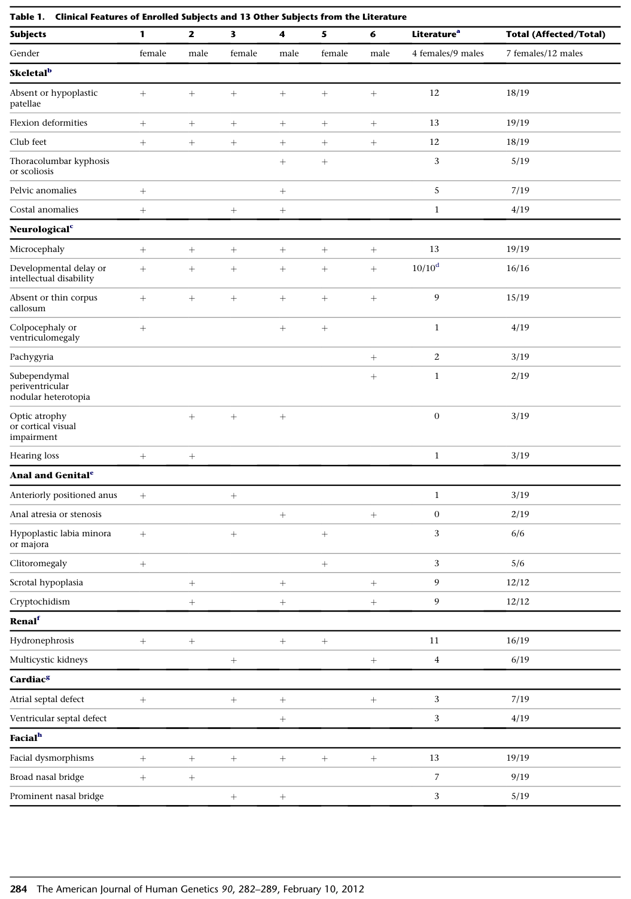

## Question

# Disease Characteristics Research Template

## Target Disease
- **Disease Name:** Genitopatellar Syndrome
- **MONDO ID:**  (if available)
- **Category:** Mendelian

## Research Objectives

Please provide a comprehensive research report on **Genitopatellar Syndrome** covering all of the
disease characteristics listed below. This report will be used to populate a disease knowledge
base entry. Be thorough and cite primary literature (PMID preferred) for all claims.

For each section, **suggested databases/resources** are listed. These are the first places
you should search for information on each topic.

---

### 1. Disease Information
> **Search first:** OMIM, Orphanet, ICD-10/ICD-11, MeSH, PubMed

- What is the disease? Provide a concise overview.
- What are the key identifiers? (OMIM, Orphanet, ICD-10/ICD-11, MeSH, Mondo)
- What are the common synonyms and alternative names?
- Is the information derived from individual patients (e.g., EHR) or aggregated disease-level resources?

### 2. Etiology

- **Disease Causal Factors**: What are the primary causes? (genetic, environmental, infectious, mechanistic)
- **Risk Factors**:
  > **Search first:** PubMed, Cochrane Library, UpToDate, clinical guidelines, ClinVar, ClinGen, GWAS Catalog, PheGenI, CTD, CDC, WHO, epidemiological databases
  - Genetic risk factors (causal variants, susceptibility loci, modifier genes)
  - Environmental risk factors (toxins, lifestyle, occupational exposures, age, sex, family history)
- **Protective Factors**:
  > **Search first:** PubMed, Cochrane Library, clinical trial databases, GWAS Catalog, gnomAD, WHO, CDC, nutrition databases
  - Genetic protective factors (protective variants, modifier alleles)
  - Environmental protective factors (diet, lifestyle, exposures that reduce risk)
- **Gene-Environment Interactions**: How do genetic and environmental factors interact to influence disease?
  > **Search first:** CTD, PubMed, PheGenI, GxE databases

### 3. Phenotypes
> **Search first:** HPO (Human Phenotype Ontology), OMIM, Orphanet, PubMed, clinicaltrials.gov, MedDRA, SNOMED CT, DECIPHER, LOINC

For each phenotype, provide:
- **Phenotype type**: symptoms, clinical signs, physical manifestations, behavioral changes, or laboratory abnormalities
  > For symptoms/signs: HPO, OMIM, Orphanet, PubMed
  > For behavioral changes: HPO, DSM, RDoC (Research Domain Criteria), PubMed
  > For laboratory abnormalities: LOINC, SNOMED CT, LabTests Online, PubMed
- **Phenotype characteristics**:
  > **Search first:** OMIM, Orphanet, HPO, PubMed
  - Age of symptom onset (neonatal, childhood, adult-onset, late-onset)
  - Symptom severity (mild, moderate, severe, variable)
  - Symptom progression (stable, progressive, episodic, fluctuating)
  - Frequency among affected individuals (percentage or qualitative)
- **Quality of life impact**: Effects on daily functioning and well-being (per-phenotype when possible)
  > **Search first:** EQ-5D database, SF-36, WHO QOL databases, PubMed
- Suggest HPO (Human Phenotype Ontology) terms for each phenotype

### 4. Genetic/Molecular Information

- **Causal Genes**: Gene mutations or chromosomal abnormalities responsible for disease (gene symbols, OMIM IDs)
  > **Search first:** OMIM, ClinVar, HGMD, Ensembl, NCBI Gene
- **Pathogenic Variants**:
  - Affected genes (gene symbols, HGNC IDs)
    > **Search first:** OMIM, NCBI Gene, Ensembl, HGNC, UniProt, GeneCards
  - Variant classification (pathogenic, likely pathogenic, VUS per ACMG/AMP guidelines)
    > **Search first:** ClinVar, ClinGen, ACMG/AMP guidelines, VarSome
  - Variant type/class (missense, frameshift, nonsense, splice-site, structural)
  - Allele frequency in population databases
    > **Search first:** gnomAD, 1000 Genomes, ExAC, TOPMed, dbSNP
  - Somatic vs germline origin
    > **Search first:** COSMIC (somatic), ClinVar, ICGC, TCGA
  - Functional consequences (loss of function, gain of function, dominant negative)
- **Modifier Genes**: Genes that modify disease severity or expression
- **Epigenetic Information**: DNA methylation, histone modifications, chromatin changes affecting disease
  > **Search first:** ENCODE, Roadmap Epigenomics, MethBase, DiseaseMeth
- **Chromosomal Abnormalities**: Large-scale genetic changes (aneuploidy, translocations, inversions)
  > **Search first:** DECIPHER, ClinVar, ECARUCA, UCSC Genome Browser

### 5. Environmental Information

- **Environmental Factors**: Non-genetic contributing factors (toxins, radiation, pollution, occupational exposure)
  > **Search first:** CTD (Comparative Toxicogenomics Database), TOXNET, PubMed, EPA databases
- **Lifestyle Factors**: Behavioral factors (smoking, diet, exercise, alcohol consumption)
  > **Search first:** CDC databases, WHO, PubMed, NHANES
- **Infectious Agents**: If applicable, pathogens causing or triggering disease (bacteria, viruses, fungi, parasites)
  > **Search first:** NCBI Taxonomy, ViPR, BV-BRC, MicrobeDB, GIDEON

### 6. Mechanism / Pathophysiology

- **Molecular Pathways**: Specific signaling cascades or biochemical pathways involved (Wnt, MAPK, mTOR, PI3K-AKT, etc.)
  > **Search first:** KEGG, Reactome, WikiPathways, PathBank, BioCyc
- **Cellular Processes**: Cell-level mechanisms (apoptosis, autophagy, cell cycle dysregulation, inflammation, etc.)
  > **Search first:** Gene Ontology (GO), Reactome, KEGG, PubMed
- **Protein Dysfunction**: How protein structure or function is altered (misfolding, aggregation, loss of function, gain of function)
  > **Search first:** UniProt, PDB (Protein Data Bank), InterPro, Pfam, AlphaFold
- **Metabolic Changes**: Alterations in metabolic processes (energy metabolism, lipid metabolism, amino acid metabolism)
  > **Search first:** KEGG, BioCyc, HMDB (Human Metabolome Database), BRENDA
- **Immune System Involvement**: Role of immune response (autoimmunity, immunodeficiency, chronic inflammation)
  > **Search first:** ImmPort, Immunome Database, IEDB, Gene Ontology
- **Tissue Damage Mechanisms**: How tissues/ are injured (oxidative stress, ischemia, fibrosis, necrosis)
  > **Search first:** PubMed, Gene Ontology, Reactome
- **Biochemical Abnormalities**: Specific molecular defects (enzyme deficiencies, receptor dysfunction, ion channel defects)
  > **Search first:** BRENDA, UniProt, KEGG, OMIM, PubMed
- **Epigenetic Changes**: DNA methylation, histone modifications affecting gene expression in disease
  > **Search first:** ENCODE, Roadmap Epigenomics, MethBase, DiseaseMeth
- **Molecular Profiling** (if available):
  - Transcriptomics/gene expression changes
    > **Search first:** GEO (Gene Expression Omnibus), ArrayExpress, GTEx, Human Cell Atlas, SRA
  - Proteomics findings
    > **Search first:** PRIDE, ProteomeXchange, Human Protein Atlas, STRING, BioGRID
  - Metabolomics signatures
    > **Search first:** MetaboLights, Metabolomics Workbench, HMDB, METLIN
  - Lipidomics alterations
    > **Search first:** LIPID MAPS, SwissLipids, LipidHome, Metabolomics Workbench
  - Genomic structural features
    > **Search first:** UCSC Genome Browser, Ensembl, NCBI, dbVar, DGV
- **Advanced Technologies** (if applicable):
  - Single-cell analysis findings (cell-type specific mechanisms, cellular heterogeneity)
    > **Search first:** Human Cell Atlas, Single Cell Portal, GEO, CELLxGENE
  - Spatial transcriptomics findings
    > **Search first:** GEO, Spatial Research, Vizgen, 10x Genomics data
  - Multi-omics integration results
    > **Search first:** TCGA, ICGC, cBioPortal, LinkedOmics, PubMed
  - Functional genomics screens (CRISPR, RNAi)
    > **Search first:** DepMap, GenomeRNAi, PubMed, BioGRID ORCS

For each mechanism, describe:
- The causal chain from initial trigger to clinical manifestation
- Which mechanisms are upstream vs downstream
- What cell types and biological processes are involved
- Suggest GO terms for biological processes and CL terms for cell types

### 7. Anatomical Structures Affected

- **Organ Level**:
  - Primary organs directly affected
  - Secondary organ involvement (complications, secondary effects)
  - Body systems involved (cardiovascular, nervous, digestive, respiratory, endocrine, etc.)
  > **Search first:** Uberon, FMA (Foundational Model of Anatomy), OMIM, HPO, ICD-11, MeSH, SNOMED CT
- **Tissue and Cell Level**:
  - Specific tissue types affected (epithelial, connective, muscle, nervous)
  - Specific cell populations targeted (with Cell Ontology terms)
  > **Search first:** Uberon, Human Protein Atlas, Cell Ontology, Human Cell Atlas, CellMarker, PanglaoDB
- **Subcellular Level**:
  - Cellular compartments involved (mitochondria, nucleus, ER, lysosomes) (with GO Cellular Component terms)
  > **Search first:** Gene Ontology (Cellular Component), UniProt, Human Protein Atlas
- **Localization**:
  - Specific anatomical sites (with UBERON terms)
    > **Search first:** FMA, Uberon, NeuroNames (for brain), SNOMED CT
  - Lateralization (unilateral, bilateral, asymmetric)
    > **Search first:** HPO, clinical literature, imaging databases

### 8. Temporal Development

- **Onset**:
  - Typical age of onset (congenital, pediatric, adult, geriatric)
  - Onset pattern (acute, subacute, chronic, insidious)
  > **Search first:** OMIM, Orphanet, HPO, PubMed
- **Progression**:
  - Disease stages (early, intermediate, advanced, end-stage)
    > **Search first:** Cancer Staging Manual (AJCC), WHO classifications, PubMed
  - Progression rate (rapid, slow, variable)
  - Disease course pattern (episodic, relapsing-remitting, progressive, stable)
  - Disease duration (self-limited, chronic lifelong)
  > **Search first:** Disease registries, longitudinal cohort databases, natural history studies, PubMed, Orphanet, OMIM
- **Patterns**:
  - Remission patterns (spontaneous, treatment-induced)
    > **Search first:** Clinical trial databases, disease registries, PubMed
  - Critical periods (time windows of vulnerability or opportunity for intervention)
    > **Search first:** PubMed, developmental biology databases, clinical guidelines

### 9. Inheritance and Population

- **Epidemiology**:
  - Prevalence (cases per 100,000 at given time)
  - Incidence (new cases per 100,000 per year)
  > **Search first:** Orphanet, CDC, WHO, GBD (Global Burden of Disease), national registries, SEER, disease registries
- **For Genetic Etiology**:
  - Inheritance pattern (AD, AR, X-linked, mitochondrial, multifactorial, polygenic)
    > **Search first:** OMIM, Orphanet, ClinVar, GTR (Genetic Testing Registry)
  - Penetrance (complete, incomplete, age-dependent)
    > **Search first:** ClinVar, OMIM, PubMed, ClinGen
  - Expressivity (variable, consistent)
    > **Search first:** OMIM, ClinVar, PubMed
  - Genetic anticipation (increasing severity in successive generations)
    > **Search first:** OMIM, PubMed (especially for repeat expansion disorders)
  - Germline mosaicism
    > **Search first:** ClinVar, OMIM, genetic counseling literature, PubMed
  - Founder effects (population-specific mutations)
    > **Search first:** gnomAD, population genetics databases, PubMed
  - Consanguinity role
    > **Search first:** OMIM, population studies, genetic counseling resources
  - Carrier frequency
    > **Search first:** gnomAD, carrier screening databases, GeneReviews, GTR
- **Population Demographics**:
  - Affected populations (ethnic or demographic groups with higher prevalence)
    > **Search first:** gnomAD, 1000 Genomes, PAGE Study, PubMed, population registries
  - Geographic distribution (endemic areas, regional variation)
    > **Search first:** WHO, CDC, GBD, Orphanet, geographic epidemiology databases
  - Geographic distribution of specific variants
  - Sex ratio (male:female)
    > **Search first:** Disease registries, OMIM, PubMed, epidemiological databases
  - Age distribution of affected individuals
    > **Search first:** CDC, disease registries, SEER, Orphanet

### 10. Diagnostics

- **Clinical Tests**:
  - Laboratory tests (blood, urine, tissue chemistry, specific enzyme assays)
    > **Search first:** LOINC, LabTests Online, PubMed
  - Biomarkers (proteins, metabolites, genetic markers, circulating biomarkers)
    > **Search first:** FDA Biomarker List, BEST (Biomarkers, EndpointS, and other Tools), PubMed
  - Imaging studies (X-ray, CT, MRI, PET, ultrasound)
    > **Search first:** RadLex, DICOM, Radiopaedia, imaging databases
  - Functional tests (pulmonary function, cardiac stress tests)
    > **Search first:** LOINC, clinical guidelines, PubMed
  - Electrophysiology (EEG, EMG, ECG, nerve conduction studies)
    > **Search first:** LOINC, clinical neurophysiology databases, PubMed
  - Biopsy findings (histopathology, immunohistochemistry)
    > **Search first:** SNOMED CT, College of American Pathologists resources, PubMed
  - Pathology findings (microscopic examination)
    > **Search first:** SNOMED CT, Digital Pathology databases, PubMed
- **Genetic Testing**:
  > **Search first:** GTR (Genetic Testing Registry), GeneReviews, ClinGen
  - Overview of recommended genetic testing approach
  - Whole genome sequencing (WGS) utility
    > **Search first:** GTR, ClinVar, GEL (Genomics England), gnomAD
  - Whole exome sequencing (WES) utility
    > **Search first:** GTR, ClinVar, OMIM, GeneMatcher
  - Gene panels (which panels, which genes)
    > **Search first:** GTR, ClinVar, laboratory-specific databases
  - Single gene testing
    > **Search first:** GTR, ClinVar, OMIM, GeneReviews
  - Chromosomal microarray (CMA)
    > **Search first:** DECIPHER, ClinVar, dbVar, ECARUCA
  - Karyotyping
    > **Search first:** Chromosome Abnormality Database, ClinVar, cytogenetics resources
  - FISH
    > **Search first:** ClinVar, cytogenetics databases, PubMed
  - Mitochondrial DNA testing
    > **Search first:** MITOMAP, MSeqDR, ClinVar, GTR
  - Repeat expansion testing
    > **Search first:** GTR, ClinVar, repeat expansion databases, PubMed
- **Omics-Based Diagnostics** (if applicable):
  - RNA sequencing / transcriptomics
    > **Search first:** GEO, ArrayExpress, GTEx, RNA-seq databases
  - Proteomics
    > **Search first:** PRIDE, ProteomeXchange, FDA Biomarker database
  - Metabolomics
    > **Search first:** MetaboLights, Metabolomics Workbench, HMDB
  - Epigenomics
    > **Search first:** GEO, ENCODE, Roadmap Epigenomics, MethBase
  - Liquid biopsy
    > **Search first:** COSMIC, ClinVar, liquid biopsy databases, PubMed
- **Clinical Criteria**:
  - Standardized diagnostic criteria (DSM, ICD, society guidelines)
    > **Search first:** DSM-5, ICD-11, clinical society guidelines, UpToDate
  - Differential diagnosis (other conditions to rule out, with distinguishing features)
    > **Search first:** DynaMed, UpToDate, clinical decision support systems
- **Screening**:
  - Screening methods for asymptomatic individuals (newborn screening, carrier screening, cascade screening)
    > **Search first:** ACMG recommendations, CDC newborn screening, GTR

### 11. Outcome/Prognosis

- **Survival and Mortality**:
  - Survival rate (5-year, 10-year, overall)
    > **Search first:** SEER, cancer registries, disease-specific registries, PubMed
  - Life expectancy (with and without treatment if applicable)
    > **Search first:** Orphanet, disease registries, actuarial databases, PubMed
  - Mortality rate
    > **Search first:** CDC, WHO, GBD, national mortality databases
  - Disease-specific mortality (deaths directly attributable to disease)
    > **Search first:** Disease registries, CDC Wonder, GBD, PubMed
- **Morbidity and Function**:
  - Morbidity (disease-related disability and health impacts)
    > **Search first:** GBD, WHO, disability databases, PubMed
  - Disability outcomes (long-term functional impairments)
    > **Search first:** ICF (International Classification of Functioning), disability registries
  - Quality of life measures (EQ-5D, SF-36, PROMIS, disease-specific tools)
    > **Search first:** EQ-5D database, SF-36, PROMIS, PubMed
- **Disease Course**:
  - Complications (secondary problems: infections, organ failure, etc.)
    > **Search first:** ICD codes, disease registries, clinical databases, PubMed
  - Recovery potential (likelihood and extent of recovery, with vs without treatment)
    > **Search first:** Natural history studies, rehabilitation databases, PubMed
- **Prediction**:
  - Prognostic factors (age, disease severity, biomarkers, treatment response)
    > **Search first:** Prognostic models databases, clinical calculators, PubMed
  - Prognostic biomarkers (molecular markers predicting disease course)
    > **Search first:** FDA Biomarker database, PubMed, cancer prognostic databases

### 12. Treatment

- **Pharmacotherapy**:
  - Pharmacological treatments (drug names, drug classes, mechanisms of action)
    > **Search first:** DrugBank, RxNorm, ATC classification, DailyMed, FDA databases
  - Pharmacogenomics (how genetic variants affect drug metabolism, efficacy, toxicity)
    > **Search first:** PharmGKB, CPIC (Clinical Pharmacogenetics), FDA Table of PGx Biomarkers
- **Advanced Therapeutics**:
  - Gene therapy (viral vectors, CRISPR, gene replacement, gene editing)
    > **Search first:** ClinicalTrials.gov, FDA gene therapy database, ASGCT resources
  - Cell therapy (stem cell transplant, CAR-T, cellular therapeutics)
    > **Search first:** ClinicalTrials.gov, FDA cell therapy database, FACT standards
  - RNA-based therapies (ASOs, siRNA, mRNA therapies)
    > **Search first:** ClinicalTrials.gov, FDA approvals, PubMed
  - Targeted therapies (treatments directed at specific molecular targets)
    > **Search first:** My Cancer Genome, OncoKB, ClinicalTrials.gov, FDA approvals
  - Immunotherapies (checkpoint inhibitors, monoclonal antibodies)
    > **Search first:** Cancer Immunotherapy Database, FDA approvals, ClinicalTrials.gov
- **Surgical and Interventional**:
  - Surgical interventions (types of surgery, timing, outcomes)
    > **Search first:** CPT codes, surgical registries, clinical guidelines, PubMed
- **Supportive and Rehabilitative**:
  - Supportive care (symptom management, pain control, nutrition)
    > **Search first:** Clinical guidelines, Cochrane Library, PubMed
  - Rehabilitation (physical therapy, occupational therapy, speech therapy)
    > **Search first:** Rehabilitation medicine databases, clinical guidelines, PubMed
- **Experimental**:
  - Experimental treatments in clinical trials (with NCT identifiers if available)
    > **Search first:** ClinicalTrials.gov, EU Clinical Trials Register, WHO ICTRP
- **Treatment Outcomes**:
  - Treatment response rates
    > **Search first:** Clinical trial databases, FDA reviews, systematic reviews, PubMed
  - Side effects and adverse events
    > **Search first:** FDA Adverse Event Reporting System (FAERS), MedWatch, PubMed
- **Treatment Strategy**:
  - Treatment algorithms (clinical pathways, decision trees)
    > **Search first:** Clinical practice guidelines, NCCN Guidelines, UpToDate
  - Combination therapies
    > **Search first:** ClinicalTrials.gov, treatment guidelines, PubMed
  - Personalized medicine approaches (genotype-guided treatment)
    > **Search first:** My Cancer Genome, CIViC, PharmGKB, precision medicine databases

For each treatment, suggest MAXO (Medical Action Ontology) terms where applicable.

### 13. Prevention

- **Prevention Levels**:
  - Primary prevention (preventing disease occurrence: vaccination, risk factor modification)
    > **Search first:** CDC, WHO, USPSTF recommendations, Cochrane Library
  - Secondary prevention (early detection and treatment: screening programs, early intervention)
    > **Search first:** USPSTF, CDC screening guidelines, WHO
  - Tertiary prevention (preventing complications in those with disease)
    > **Search first:** Clinical guidelines, disease management protocols, PubMed
- **Immunization**: Vaccine strategies (if applicable)
  > **Search first:** CDC vaccine schedules, WHO immunization, FDA vaccine database
- **Screening and Early Detection**:
  - Screening programs (population-based: newborn screening, cancer screening)
    > **Search first:** CDC screening programs, USPSTF, cancer screening databases
  - Genetic screening (carrier screening, preimplantation genetic diagnosis, prenatal testing)
    > **Search first:** ACMG recommendations, ACOG guidelines, GTR
  - Risk stratification (identifying high-risk individuals for targeted prevention)
    > **Search first:** Risk prediction models, clinical calculators, PubMed
- **Behavioral Interventions**: Lifestyle modifications to reduce risk
  > **Search first:** CDC, WHO, behavioral intervention databases, Cochrane Library
- **Counseling**: Genetic counseling (risk assessment, family planning guidance)
  > **Search first:** NSGC resources, ACMG guidelines, GeneReviews
- **Public Health**:
  - Public health interventions (sanitation, vector control, health education)
    > **Search first:** CDC, WHO, public health databases, PubMed
  - Environmental interventions (reducing environmental risk factors)
    > **Search first:** EPA databases, WHO environmental health, PubMed
- **Prophylaxis**: Preventive medications or procedures
  > **Search first:** Clinical guidelines, FDA approvals, PubMed

### 14. Other Species / Natural Disease

- **Taxonomy**: Species affected (with NCBI Taxon identifiers)
  > **Search first:** NCBI Taxonomy
- **Breed**: Specific breeds affected (with VBO identifiers if applicable)
  > **Search first:** VBO (Vertebrate Breed Ontology)
- **Gene**: Orthologous genes in other species (with NCBI Gene IDs)
  > **Search first:** NCBI Gene
- **Natural Disease**:
  - Naturally occurring disease in other species (companion animals, wildlife)
    > **Search first:** OMIA (Online Mendelian Inheritance in Animals), VetCompass, PubMed
  - Veterinary relevance and importance in animal health
    > **Search first:** OMIA, veterinary databases, PubMed
- **Comparative Biology**:
  - Comparative pathology (similarities and differences across species)
    > **Search first:** OMIA, comparative pathology databases, PubMed
  - Evolutionary conservation of disease mechanisms
    > **Search first:** HomoloGene, OrthoMCL, Alliance of Genome Resources
- **Transmission** (if applicable):
  - Zoonotic potential
    > **Search first:** CDC zoonotic diseases, WHO zoonoses, GIDEON
  - Cross-species susceptibility
    > **Search first:** NCBI Taxonomy, veterinary databases, PubMed

### 15. Model Organisms

- **Model Types**:
  - Model organism type (mammalian, invertebrate, cellular, in vitro)
    > **Search first:** Alliance of Genome Resources, model organism databases
  - Specific model systems (mouse, rat, zebrafish, Drosophila, C. elegans, yeast, cell lines, organoids, iPSCs)
    > **Search first:** MGI, RGD, ZFIN, FlyBase, WormBase, SGD, ATCC, Cellosaurus
  - Induced models (drug treatment, surgical intervention, environmental manipulation)
    > **Search first:** MGI, model organism databases, PubMed
- **Genetic Models**:
  - Types available (knockout, knock-in, transgenic, conditional, humanized)
    > **Search first:** MGI, IMPC, KOMP, EuMMCR, IMSR
- **Model Characteristics**:
  - Phenotype recapitulation (how well model reproduces human disease features)
    > **Search first:** Model organism databases, comparative studies, PubMed
  - Model limitations (aspects of human disease not captured)
    > **Search first:** Model organism databases, PubMed, review articles
- **Applications**:
  - Research applications (what aspects of disease can be studied)
    > **Search first:** Model organism databases, PubMed
- **Resources**:
  - Model databases
    > **Search first:** MGI, RGD, ZFIN, FlyBase, WormBase, IMSR, EMMA, MMRRC

---

## Citation Requirements

- Cite primary literature (PMID preferred) for all mechanistic and clinical claims
- Prioritize recent reviews and landmark papers
- Include direct quotes from abstracts where possible to support key statements
- Distinguish evidence source types: human clinical, model organism, in vitro, computational

## Output Format

Structure your response as a comprehensive narrative organized by the sections above.
For each section, provide:
- Factual content with specific details (numbers, percentages, gene names, variant nomenclature)
- Ontology term suggestions (HPO, GO, CL, UBERON, CHEBI, MAXO, MONDO) where applicable
- Evidence citations with PMIDs
- Direct quotes from abstracts to support key claims
- Clear indication when information is not available or not applicable for this disease

This report will be used to populate a disease knowledge base entry with:
- Pathophysiology descriptions with causal chains
- Gene/protein annotations (HGNC, GO terms)
- Phenotype associations (HP terms) with frequencies
- Cell type involvement (CL terms)
- Anatomical locations (UBERON terms)
- Chemical entities (CHEBI terms)
- Treatment annotations (MAXO terms)
- Evidence items with PMIDs and exact abstract quotes
- Epidemiology, prognosis, diagnostic, and prevention information
- Animal model descriptions with phenotype recapitulation details

## Output

Question: You are an expert researcher providing comprehensive, well-cited information.

Provide detailed information focusing on:
1. Key concepts and definitions with current understanding
2. Recent developments and latest research (prioritize 2023-2024 sources)
3. Current applications and real-world implementations
4. Expert opinions and analysis from authoritative sources
5. Relevant statistics and data from recent studies

Format as a comprehensive research report with proper citations. Include URLs and publication dates where available.
Always prioritize recent, authoritative sources and provide specific citations for all major claims.

# Disease Characteristics Research Template

## Target Disease
- **Disease Name:** Genitopatellar Syndrome
- **MONDO ID:**  (if available)
- **Category:** Mendelian

## Research Objectives

Please provide a comprehensive research report on **Genitopatellar Syndrome** covering all of the
disease characteristics listed below. This report will be used to populate a disease knowledge
base entry. Be thorough and cite primary literature (PMID preferred) for all claims.

For each section, **suggested databases/resources** are listed. These are the first places
you should search for information on each topic.

---

### 1. Disease Information
> **Search first:** OMIM, Orphanet, ICD-10/ICD-11, MeSH, PubMed

- What is the disease? Provide a concise overview.
- What are the key identifiers? (OMIM, Orphanet, ICD-10/ICD-11, MeSH, Mondo)
- What are the common synonyms and alternative names?
- Is the information derived from individual patients (e.g., EHR) or aggregated disease-level resources?

### 2. Etiology

- **Disease Causal Factors**: What are the primary causes? (genetic, environmental, infectious, mechanistic)
- **Risk Factors**:
  > **Search first:** PubMed, Cochrane Library, UpToDate, clinical guidelines, ClinVar, ClinGen, GWAS Catalog, PheGenI, CTD, CDC, WHO, epidemiological databases
  - Genetic risk factors (causal variants, susceptibility loci, modifier genes)
  - Environmental risk factors (toxins, lifestyle, occupational exposures, age, sex, family history)
- **Protective Factors**:
  > **Search first:** PubMed, Cochrane Library, clinical trial databases, GWAS Catalog, gnomAD, WHO, CDC, nutrition databases
  - Genetic protective factors (protective variants, modifier alleles)
  - Environmental protective factors (diet, lifestyle, exposures that reduce risk)
- **Gene-Environment Interactions**: How do genetic and environmental factors interact to influence disease?
  > **Search first:** CTD, PubMed, PheGenI, GxE databases

### 3. Phenotypes
> **Search first:** HPO (Human Phenotype Ontology), OMIM, Orphanet, PubMed, clinicaltrials.gov, MedDRA, SNOMED CT, DECIPHER, LOINC

For each phenotype, provide:
- **Phenotype type**: symptoms, clinical signs, physical manifestations, behavioral changes, or laboratory abnormalities
  > For symptoms/signs: HPO, OMIM, Orphanet, PubMed
  > For behavioral changes: HPO, DSM, RDoC (Research Domain Criteria), PubMed
  > For laboratory abnormalities: LOINC, SNOMED CT, LabTests Online, PubMed
- **Phenotype characteristics**:
  > **Search first:** OMIM, Orphanet, HPO, PubMed
  - Age of symptom onset (neonatal, childhood, adult-onset, late-onset)
  - Symptom severity (mild, moderate, severe, variable)
  - Symptom progression (stable, progressive, episodic, fluctuating)
  - Frequency among affected individuals (percentage or qualitative)
- **Quality of life impact**: Effects on daily functioning and well-being (per-phenotype when possible)
  > **Search first:** EQ-5D database, SF-36, WHO QOL databases, PubMed
- Suggest HPO (Human Phenotype Ontology) terms for each phenotype

### 4. Genetic/Molecular Information

- **Causal Genes**: Gene mutations or chromosomal abnormalities responsible for disease (gene symbols, OMIM IDs)
  > **Search first:** OMIM, ClinVar, HGMD, Ensembl, NCBI Gene
- **Pathogenic Variants**:
  - Affected genes (gene symbols, HGNC IDs)
    > **Search first:** OMIM, NCBI Gene, Ensembl, HGNC, UniProt, GeneCards
  - Variant classification (pathogenic, likely pathogenic, VUS per ACMG/AMP guidelines)
    > **Search first:** ClinVar, ClinGen, ACMG/AMP guidelines, VarSome
  - Variant type/class (missense, frameshift, nonsense, splice-site, structural)
  - Allele frequency in population databases
    > **Search first:** gnomAD, 1000 Genomes, ExAC, TOPMed, dbSNP
  - Somatic vs germline origin
    > **Search first:** COSMIC (somatic), ClinVar, ICGC, TCGA
  - Functional consequences (loss of function, gain of function, dominant negative)
- **Modifier Genes**: Genes that modify disease severity or expression
- **Epigenetic Information**: DNA methylation, histone modifications, chromatin changes affecting disease
  > **Search first:** ENCODE, Roadmap Epigenomics, MethBase, DiseaseMeth
- **Chromosomal Abnormalities**: Large-scale genetic changes (aneuploidy, translocations, inversions)
  > **Search first:** DECIPHER, ClinVar, ECARUCA, UCSC Genome Browser

### 5. Environmental Information

- **Environmental Factors**: Non-genetic contributing factors (toxins, radiation, pollution, occupational exposure)
  > **Search first:** CTD (Comparative Toxicogenomics Database), TOXNET, PubMed, EPA databases
- **Lifestyle Factors**: Behavioral factors (smoking, diet, exercise, alcohol consumption)
  > **Search first:** CDC databases, WHO, PubMed, NHANES
- **Infectious Agents**: If applicable, pathogens causing or triggering disease (bacteria, viruses, fungi, parasites)
  > **Search first:** NCBI Taxonomy, ViPR, BV-BRC, MicrobeDB, GIDEON

### 6. Mechanism / Pathophysiology

- **Molecular Pathways**: Specific signaling cascades or biochemical pathways involved (Wnt, MAPK, mTOR, PI3K-AKT, etc.)
  > **Search first:** KEGG, Reactome, WikiPathways, PathBank, BioCyc
- **Cellular Processes**: Cell-level mechanisms (apoptosis, autophagy, cell cycle dysregulation, inflammation, etc.)
  > **Search first:** Gene Ontology (GO), Reactome, KEGG, PubMed
- **Protein Dysfunction**: How protein structure or function is altered (misfolding, aggregation, loss of function, gain of function)
  > **Search first:** UniProt, PDB (Protein Data Bank), InterPro, Pfam, AlphaFold
- **Metabolic Changes**: Alterations in metabolic processes (energy metabolism, lipid metabolism, amino acid metabolism)
  > **Search first:** KEGG, BioCyc, HMDB (Human Metabolome Database), BRENDA
- **Immune System Involvement**: Role of immune response (autoimmunity, immunodeficiency, chronic inflammation)
  > **Search first:** ImmPort, Immunome Database, IEDB, Gene Ontology
- **Tissue Damage Mechanisms**: How tissues/ are injured (oxidative stress, ischemia, fibrosis, necrosis)
  > **Search first:** PubMed, Gene Ontology, Reactome
- **Biochemical Abnormalities**: Specific molecular defects (enzyme deficiencies, receptor dysfunction, ion channel defects)
  > **Search first:** BRENDA, UniProt, KEGG, OMIM, PubMed
- **Epigenetic Changes**: DNA methylation, histone modifications affecting gene expression in disease
  > **Search first:** ENCODE, Roadmap Epigenomics, MethBase, DiseaseMeth
- **Molecular Profiling** (if available):
  - Transcriptomics/gene expression changes
    > **Search first:** GEO (Gene Expression Omnibus), ArrayExpress, GTEx, Human Cell Atlas, SRA
  - Proteomics findings
    > **Search first:** PRIDE, ProteomeXchange, Human Protein Atlas, STRING, BioGRID
  - Metabolomics signatures
    > **Search first:** MetaboLights, Metabolomics Workbench, HMDB, METLIN
  - Lipidomics alterations
    > **Search first:** LIPID MAPS, SwissLipids, LipidHome, Metabolomics Workbench
  - Genomic structural features
    > **Search first:** UCSC Genome Browser, Ensembl, NCBI, dbVar, DGV
- **Advanced Technologies** (if applicable):
  - Single-cell analysis findings (cell-type specific mechanisms, cellular heterogeneity)
    > **Search first:** Human Cell Atlas, Single Cell Portal, GEO, CELLxGENE
  - Spatial transcriptomics findings
    > **Search first:** GEO, Spatial Research, Vizgen, 10x Genomics data
  - Multi-omics integration results
    > **Search first:** TCGA, ICGC, cBioPortal, LinkedOmics, PubMed
  - Functional genomics screens (CRISPR, RNAi)
    > **Search first:** DepMap, GenomeRNAi, PubMed, BioGRID ORCS

For each mechanism, describe:
- The causal chain from initial trigger to clinical manifestation
- Which mechanisms are upstream vs downstream
- What cell types and biological processes are involved
- Suggest GO terms for biological processes and CL terms for cell types

### 7. Anatomical Structures Affected

- **Organ Level**:
  - Primary organs directly affected
  - Secondary organ involvement (complications, secondary effects)
  - Body systems involved (cardiovascular, nervous, digestive, respiratory, endocrine, etc.)
  > **Search first:** Uberon, FMA (Foundational Model of Anatomy), OMIM, HPO, ICD-11, MeSH, SNOMED CT
- **Tissue and Cell Level**:
  - Specific tissue types affected (epithelial, connective, muscle, nervous)
  - Specific cell populations targeted (with Cell Ontology terms)
  > **Search first:** Uberon, Human Protein Atlas, Cell Ontology, Human Cell Atlas, CellMarker, PanglaoDB
- **Subcellular Level**:
  - Cellular compartments involved (mitochondria, nucleus, ER, lysosomes) (with GO Cellular Component terms)
  > **Search first:** Gene Ontology (Cellular Component), UniProt, Human Protein Atlas
- **Localization**:
  - Specific anatomical sites (with UBERON terms)
    > **Search first:** FMA, Uberon, NeuroNames (for brain), SNOMED CT
  - Lateralization (unilateral, bilateral, asymmetric)
    > **Search first:** HPO, clinical literature, imaging databases

### 8. Temporal Development

- **Onset**:
  - Typical age of onset (congenital, pediatric, adult, geriatric)
  - Onset pattern (acute, subacute, chronic, insidious)
  > **Search first:** OMIM, Orphanet, HPO, PubMed
- **Progression**:
  - Disease stages (early, intermediate, advanced, end-stage)
    > **Search first:** Cancer Staging Manual (AJCC), WHO classifications, PubMed
  - Progression rate (rapid, slow, variable)
  - Disease course pattern (episodic, relapsing-remitting, progressive, stable)
  - Disease duration (self-limited, chronic lifelong)
  > **Search first:** Disease registries, longitudinal cohort databases, natural history studies, PubMed, Orphanet, OMIM
- **Patterns**:
  - Remission patterns (spontaneous, treatment-induced)
    > **Search first:** Clinical trial databases, disease registries, PubMed
  - Critical periods (time windows of vulnerability or opportunity for intervention)
    > **Search first:** PubMed, developmental biology databases, clinical guidelines

### 9. Inheritance and Population

- **Epidemiology**:
  - Prevalence (cases per 100,000 at given time)
  - Incidence (new cases per 100,000 per year)
  > **Search first:** Orphanet, CDC, WHO, GBD (Global Burden of Disease), national registries, SEER, disease registries
- **For Genetic Etiology**:
  - Inheritance pattern (AD, AR, X-linked, mitochondrial, multifactorial, polygenic)
    > **Search first:** OMIM, Orphanet, ClinVar, GTR (Genetic Testing Registry)
  - Penetrance (complete, incomplete, age-dependent)
    > **Search first:** ClinVar, OMIM, PubMed, ClinGen
  - Expressivity (variable, consistent)
    > **Search first:** OMIM, ClinVar, PubMed
  - Genetic anticipation (increasing severity in successive generations)
    > **Search first:** OMIM, PubMed (especially for repeat expansion disorders)
  - Germline mosaicism
    > **Search first:** ClinVar, OMIM, genetic counseling literature, PubMed
  - Founder effects (population-specific mutations)
    > **Search first:** gnomAD, population genetics databases, PubMed
  - Consanguinity role
    > **Search first:** OMIM, population studies, genetic counseling resources
  - Carrier frequency
    > **Search first:** gnomAD, carrier screening databases, GeneReviews, GTR
- **Population Demographics**:
  - Affected populations (ethnic or demographic groups with higher prevalence)
    > **Search first:** gnomAD, 1000 Genomes, PAGE Study, PubMed, population registries
  - Geographic distribution (endemic areas, regional variation)
    > **Search first:** WHO, CDC, GBD, Orphanet, geographic epidemiology databases
  - Geographic distribution of specific variants
  - Sex ratio (male:female)
    > **Search first:** Disease registries, OMIM, PubMed, epidemiological databases
  - Age distribution of affected individuals
    > **Search first:** CDC, disease registries, SEER, Orphanet

### 10. Diagnostics

- **Clinical Tests**:
  - Laboratory tests (blood, urine, tissue chemistry, specific enzyme assays)
    > **Search first:** LOINC, LabTests Online, PubMed
  - Biomarkers (proteins, metabolites, genetic markers, circulating biomarkers)
    > **Search first:** FDA Biomarker List, BEST (Biomarkers, EndpointS, and other Tools), PubMed
  - Imaging studies (X-ray, CT, MRI, PET, ultrasound)
    > **Search first:** RadLex, DICOM, Radiopaedia, imaging databases
  - Functional tests (pulmonary function, cardiac stress tests)
    > **Search first:** LOINC, clinical guidelines, PubMed
  - Electrophysiology (EEG, EMG, ECG, nerve conduction studies)
    > **Search first:** LOINC, clinical neurophysiology databases, PubMed
  - Biopsy findings (histopathology, immunohistochemistry)
    > **Search first:** SNOMED CT, College of American Pathologists resources, PubMed
  - Pathology findings (microscopic examination)
    > **Search first:** SNOMED CT, Digital Pathology databases, PubMed
- **Genetic Testing**:
  > **Search first:** GTR (Genetic Testing Registry), GeneReviews, ClinGen
  - Overview of recommended genetic testing approach
  - Whole genome sequencing (WGS) utility
    > **Search first:** GTR, ClinVar, GEL (Genomics England), gnomAD
  - Whole exome sequencing (WES) utility
    > **Search first:** GTR, ClinVar, OMIM, GeneMatcher
  - Gene panels (which panels, which genes)
    > **Search first:** GTR, ClinVar, laboratory-specific databases
  - Single gene testing
    > **Search first:** GTR, ClinVar, OMIM, GeneReviews
  - Chromosomal microarray (CMA)
    > **Search first:** DECIPHER, ClinVar, dbVar, ECARUCA
  - Karyotyping
    > **Search first:** Chromosome Abnormality Database, ClinVar, cytogenetics resources
  - FISH
    > **Search first:** ClinVar, cytogenetics databases, PubMed
  - Mitochondrial DNA testing
    > **Search first:** MITOMAP, MSeqDR, ClinVar, GTR
  - Repeat expansion testing
    > **Search first:** GTR, ClinVar, repeat expansion databases, PubMed
- **Omics-Based Diagnostics** (if applicable):
  - RNA sequencing / transcriptomics
    > **Search first:** GEO, ArrayExpress, GTEx, RNA-seq databases
  - Proteomics
    > **Search first:** PRIDE, ProteomeXchange, FDA Biomarker database
  - Metabolomics
    > **Search first:** MetaboLights, Metabolomics Workbench, HMDB
  - Epigenomics
    > **Search first:** GEO, ENCODE, Roadmap Epigenomics, MethBase
  - Liquid biopsy
    > **Search first:** COSMIC, ClinVar, liquid biopsy databases, PubMed
- **Clinical Criteria**:
  - Standardized diagnostic criteria (DSM, ICD, society guidelines)
    > **Search first:** DSM-5, ICD-11, clinical society guidelines, UpToDate
  - Differential diagnosis (other conditions to rule out, with distinguishing features)
    > **Search first:** DynaMed, UpToDate, clinical decision support systems
- **Screening**:
  - Screening methods for asymptomatic individuals (newborn screening, carrier screening, cascade screening)
    > **Search first:** ACMG recommendations, CDC newborn screening, GTR

### 11. Outcome/Prognosis

- **Survival and Mortality**:
  - Survival rate (5-year, 10-year, overall)
    > **Search first:** SEER, cancer registries, disease-specific registries, PubMed
  - Life expectancy (with and without treatment if applicable)
    > **Search first:** Orphanet, disease registries, actuarial databases, PubMed
  - Mortality rate
    > **Search first:** CDC, WHO, GBD, national mortality databases
  - Disease-specific mortality (deaths directly attributable to disease)
    > **Search first:** Disease registries, CDC Wonder, GBD, PubMed
- **Morbidity and Function**:
  - Morbidity (disease-related disability and health impacts)
    > **Search first:** GBD, WHO, disability databases, PubMed
  - Disability outcomes (long-term functional impairments)
    > **Search first:** ICF (International Classification of Functioning), disability registries
  - Quality of life measures (EQ-5D, SF-36, PROMIS, disease-specific tools)
    > **Search first:** EQ-5D database, SF-36, PROMIS, PubMed
- **Disease Course**:
  - Complications (secondary problems: infections, organ failure, etc.)
    > **Search first:** ICD codes, disease registries, clinical databases, PubMed
  - Recovery potential (likelihood and extent of recovery, with vs without treatment)
    > **Search first:** Natural history studies, rehabilitation databases, PubMed
- **Prediction**:
  - Prognostic factors (age, disease severity, biomarkers, treatment response)
    > **Search first:** Prognostic models databases, clinical calculators, PubMed
  - Prognostic biomarkers (molecular markers predicting disease course)
    > **Search first:** FDA Biomarker database, PubMed, cancer prognostic databases

### 12. Treatment

- **Pharmacotherapy**:
  - Pharmacological treatments (drug names, drug classes, mechanisms of action)
    > **Search first:** DrugBank, RxNorm, ATC classification, DailyMed, FDA databases
  - Pharmacogenomics (how genetic variants affect drug metabolism, efficacy, toxicity)
    > **Search first:** PharmGKB, CPIC (Clinical Pharmacogenetics), FDA Table of PGx Biomarkers
- **Advanced Therapeutics**:
  - Gene therapy (viral vectors, CRISPR, gene replacement, gene editing)
    > **Search first:** ClinicalTrials.gov, FDA gene therapy database, ASGCT resources
  - Cell therapy (stem cell transplant, CAR-T, cellular therapeutics)
    > **Search first:** ClinicalTrials.gov, FDA cell therapy database, FACT standards
  - RNA-based therapies (ASOs, siRNA, mRNA therapies)
    > **Search first:** ClinicalTrials.gov, FDA approvals, PubMed
  - Targeted therapies (treatments directed at specific molecular targets)
    > **Search first:** My Cancer Genome, OncoKB, ClinicalTrials.gov, FDA approvals
  - Immunotherapies (checkpoint inhibitors, monoclonal antibodies)
    > **Search first:** Cancer Immunotherapy Database, FDA approvals, ClinicalTrials.gov
- **Surgical and Interventional**:
  - Surgical interventions (types of surgery, timing, outcomes)
    > **Search first:** CPT codes, surgical registries, clinical guidelines, PubMed
- **Supportive and Rehabilitative**:
  - Supportive care (symptom management, pain control, nutrition)
    > **Search first:** Clinical guidelines, Cochrane Library, PubMed
  - Rehabilitation (physical therapy, occupational therapy, speech therapy)
    > **Search first:** Rehabilitation medicine databases, clinical guidelines, PubMed
- **Experimental**:
  - Experimental treatments in clinical trials (with NCT identifiers if available)
    > **Search first:** ClinicalTrials.gov, EU Clinical Trials Register, WHO ICTRP
- **Treatment Outcomes**:
  - Treatment response rates
    > **Search first:** Clinical trial databases, FDA reviews, systematic reviews, PubMed
  - Side effects and adverse events
    > **Search first:** FDA Adverse Event Reporting System (FAERS), MedWatch, PubMed
- **Treatment Strategy**:
  - Treatment algorithms (clinical pathways, decision trees)
    > **Search first:** Clinical practice guidelines, NCCN Guidelines, UpToDate
  - Combination therapies
    > **Search first:** ClinicalTrials.gov, treatment guidelines, PubMed
  - Personalized medicine approaches (genotype-guided treatment)
    > **Search first:** My Cancer Genome, CIViC, PharmGKB, precision medicine databases

For each treatment, suggest MAXO (Medical Action Ontology) terms where applicable.

### 13. Prevention

- **Prevention Levels**:
  - Primary prevention (preventing disease occurrence: vaccination, risk factor modification)
    > **Search first:** CDC, WHO, USPSTF recommendations, Cochrane Library
  - Secondary prevention (early detection and treatment: screening programs, early intervention)
    > **Search first:** USPSTF, CDC screening guidelines, WHO
  - Tertiary prevention (preventing complications in those with disease)
    > **Search first:** Clinical guidelines, disease management protocols, PubMed
- **Immunization**: Vaccine strategies (if applicable)
  > **Search first:** CDC vaccine schedules, WHO immunization, FDA vaccine database
- **Screening and Early Detection**:
  - Screening programs (population-based: newborn screening, cancer screening)
    > **Search first:** CDC screening programs, USPSTF, cancer screening databases
  - Genetic screening (carrier screening, preimplantation genetic diagnosis, prenatal testing)
    > **Search first:** ACMG recommendations, ACOG guidelines, GTR
  - Risk stratification (identifying high-risk individuals for targeted prevention)
    > **Search first:** Risk prediction models, clinical calculators, PubMed
- **Behavioral Interventions**: Lifestyle modifications to reduce risk
  > **Search first:** CDC, WHO, behavioral intervention databases, Cochrane Library
- **Counseling**: Genetic counseling (risk assessment, family planning guidance)
  > **Search first:** NSGC resources, ACMG guidelines, GeneReviews
- **Public Health**:
  - Public health interventions (sanitation, vector control, health education)
    > **Search first:** CDC, WHO, public health databases, PubMed
  - Environmental interventions (reducing environmental risk factors)
    > **Search first:** EPA databases, WHO environmental health, PubMed
- **Prophylaxis**: Preventive medications or procedures
  > **Search first:** Clinical guidelines, FDA approvals, PubMed

### 14. Other Species / Natural Disease

- **Taxonomy**: Species affected (with NCBI Taxon identifiers)
  > **Search first:** NCBI Taxonomy
- **Breed**: Specific breeds affected (with VBO identifiers if applicable)
  > **Search first:** VBO (Vertebrate Breed Ontology)
- **Gene**: Orthologous genes in other species (with NCBI Gene IDs)
  > **Search first:** NCBI Gene
- **Natural Disease**:
  - Naturally occurring disease in other species (companion animals, wildlife)
    > **Search first:** OMIA (Online Mendelian Inheritance in Animals), VetCompass, PubMed
  - Veterinary relevance and importance in animal health
    > **Search first:** OMIA, veterinary databases, PubMed
- **Comparative Biology**:
  - Comparative pathology (similarities and differences across species)
    > **Search first:** OMIA, comparative pathology databases, PubMed
  - Evolutionary conservation of disease mechanisms
    > **Search first:** HomoloGene, OrthoMCL, Alliance of Genome Resources
- **Transmission** (if applicable):
  - Zoonotic potential
    > **Search first:** CDC zoonotic diseases, WHO zoonoses, GIDEON
  - Cross-species susceptibility
    > **Search first:** NCBI Taxonomy, veterinary databases, PubMed

### 15. Model Organisms

- **Model Types**:
  - Model organism type (mammalian, invertebrate, cellular, in vitro)
    > **Search first:** Alliance of Genome Resources, model organism databases
  - Specific model systems (mouse, rat, zebrafish, Drosophila, C. elegans, yeast, cell lines, organoids, iPSCs)
    > **Search first:** MGI, RGD, ZFIN, FlyBase, WormBase, SGD, ATCC, Cellosaurus
  - Induced models (drug treatment, surgical intervention, environmental manipulation)
    > **Search first:** MGI, model organism databases, PubMed
- **Genetic Models**:
  - Types available (knockout, knock-in, transgenic, conditional, humanized)
    > **Search first:** MGI, IMPC, KOMP, EuMMCR, IMSR
- **Model Characteristics**:
  - Phenotype recapitulation (how well model reproduces human disease features)
    > **Search first:** Model organism databases, comparative studies, PubMed
  - Model limitations (aspects of human disease not captured)
    > **Search first:** Model organism databases, PubMed, review articles
- **Applications**:
  - Research applications (what aspects of disease can be studied)
    > **Search first:** Model organism databases, PubMed
- **Resources**:
  - Model databases
    > **Search first:** MGI, RGD, ZFIN, FlyBase, WormBase, IMSR, EMMA, MMRRC

---

## Citation Requirements

- Cite primary literature (PMID preferred) for all mechanistic and clinical claims
- Prioritize recent reviews and landmark papers
- Include direct quotes from abstracts where possible to support key statements
- Distinguish evidence source types: human clinical, model organism, in vitro, computational

## Output Format

Structure your response as a comprehensive narrative organized by the sections above.
For each section, provide:
- Factual content with specific details (numbers, percentages, gene names, variant nomenclature)
- Ontology term suggestions (HPO, GO, CL, UBERON, CHEBI, MAXO, MONDO) where applicable
- Evidence citations with PMIDs
- Direct quotes from abstracts to support key claims
- Clear indication when information is not available or not applicable for this disease

This report will be used to populate a disease knowledge base entry with:
- Pathophysiology descriptions with causal chains
- Gene/protein annotations (HGNC, GO terms)
- Phenotype associations (HP terms) with frequencies
- Cell type involvement (CL terms)
- Anatomical locations (UBERON terms)
- Chemical entities (CHEBI terms)
- Treatment annotations (MAXO terms)
- Evidence items with PMIDs and exact abstract quotes
- Epidemiology, prognosis, diagnostic, and prevention information
- Animal model descriptions with phenotype recapitulation details

# Genitopatellar Syndrome (GPS) — Disease Characteristics Research Report

## Target Disease
- **Disease name:** Genitopatellar syndrome (GPS)
- **Category:** Mendelian (monogenic; KAT6B-related)
- **MONDO ID:** Not retrievable from tool-accessed sources in this run.

## Executive overview
Genitopatellar syndrome (GPS; **OMIM/MIM #606170**) is a rare, congenital malformation and neurodevelopmental disorder classically defined by **patellar aplasia/hypoplasia** together with **genital anomalies**, frequent **renal anomalies**, and severe **neurodevelopmental impairment**. It is caused by **heterozygous pathogenic variants in KAT6B**, usually **de novo** and typically truncating variants in the terminal exon (exon 18). GPS and the allelic condition Say–Barber–Biesecker–Young–Simpson syndrome (SBBYSS; **OMIM #603736**) are often grouped as a **KAT6B-related disorder spectrum** with overlapping/intermediate phenotypes. (campeau2012mutationsinkat6b pages 1-2, simpson2012denovomutations pages 1-2, magdalena2023clinicalheterogeneityof pages 1-2, maglione2025phenotypiccharacterizationof pages 1-2)

## 1. Disease information
### 1.1 What is the disease?
Early primary descriptions define GPS as a disorder where **“patellar aplasia or hypoplasia is associated with external genital anomalies and severe intellectual disability”** (2012 AJHG) and highlight renal anomalies and corpus callosum agenesis as common associated findings. (simpson2012denovomutations pages 1-2, simpson2012denovomutations pages 2-4)

### 1.2 Key identifiers
- **OMIM/MIM (disease):** GPS **606170** (simpson2012denovomutations pages 1-2)
- **OMIM/MIM (allelic disorder):** SBBYSS **603736** (davarnia2024denovokat6b pages 1-2, maglione2025phenotypiccharacterizationof pages 1-2)
- **Gene:** **KAT6B** (lysine/histone acetyltransferase) (magdalena2023clinicalheterogeneityof pages 1-2, sun2023clinicalfeaturesand pages 2-4)
- **Genomic locus:** **10q22.2** (magdalena2023clinicalheterogeneityof pages 1-2)
- **Orphanet / MeSH / ICD-10/11 / MONDO:** Not explicitly present in the tool-retrieved evidence in this run; therefore not provided.

### 1.3 Synonyms and alternative names
- **GTPTS** (abbreviation used in later KAT6B literature) (niida2017asay‐barber‐biesecker‐young‐simpsonvariant pages 6-9)
- “KAT6B-related disorders” / “KAT6B spectrum disorders” (umbrella category frequently used for GPS and SBBYSS) (magdalena2023clinicalheterogeneityof pages 1-2, maglione2025phenotypiccharacterizationof pages 1-2)

### 1.4 Evidence source types
Most GPS knowledge is derived from **aggregated disease-level resources built from case reports and case series**, including landmark exome-discovery cohorts (2012) and subsequent multi-center cohorts and literature reviews. (campeau2012mutationsinkat6b pages 1-2, campeau2012mutationsinkat6b pages 2-4, yabumoto2021novelvariantsin pages 16-18)

## 2. Etiology
### 2.1 Primary causes
GPS is a **monogenic** disorder caused by **heterozygous pathogenic variants in KAT6B**, most often truncating variants in the terminal exons (especially exon 18). Primary evidence comes from exome sequencing discovery studies showing de novo truncating variants. (simpson2012denovomutations pages 1-2, campeau2012mutationsinkat6b pages 1-2)

Key discovery abstract quote (Simpson et al., 2012 AJHG): **“Using an exome-sequencing approach, we identified de novo mutations of KAT6B in five individuals with GPS.”** (simpson2012denovomutations pages 1-2)

### 2.2 Risk factors
- **Genetic:** The core “risk factor” is carrying a pathogenic KAT6B variant; most arise **de novo** (autosomal dominant) based on parental testing. (campeau2012mutationsinkat6b pages 1-2, simpson2012denovomutations pages 1-2)
- **Environmental:** No environmental risk factors were identified in the tool-retrieved GPS-specific literature.

### 2.3 Protective factors / gene–environment interactions
No protective factors or gene–environment interactions were identified in the tool-retrieved GPS-specific sources.

## 3. Phenotypes (clinical features)
### 3.1 Core phenotype spectrum and frequencies
GPS presents **congenitally** with multisystem malformations. The strongest frequency data in the tool-retrieved evidence come from (i) **Campeau et al., 2012** aggregated GPS cohort and (ii) **Yabumoto et al., 2021** GPS subset (n=7) within a KAT6B spectrum cohort.

Visual evidence: Campeau et al. Table 1 summarizes GPS clinical feature frequencies and is provided in cropped form here. (campeau2012mutationsinkat6b media 6fcb6bbc, campeau2012mutationsinkat6b media d2fd0246, campeau2012mutationsinkat6b media 698f1663)

| Phenotype | HPO term(s) | Frequency (Campeau 2012) | Frequency (Yabumoto 2021 GPS) | Notes |
|---|---|---|---|---|
| Patellar aplasia/hypoplasia | HP:0006498 Absent patella; HP:0006388 Hypoplastic patella | 18/19 absent or hypoplastic patellae | 6/6 abnormal patella | Cardinal skeletal feature of GPS; often absent or severely hypoplastic rather than mildly small (campeau2012mutationsinkat6b pages 2-4, yabumoto2021novelvariantsin pages 8-9) |
| Flexion contractures / contractures | HP:0001371 Flexion contracture; HP:0002804 Hip flexion contracture; HP:0005047 Knee flexion contracture | 19/19 flexion deformities | 6/6 contractures | Major diagnostic feature; often involves hips and knees and may contribute to impaired mobility (campeau2012mutationsinkat6b pages 2-4, yabumoto2021novelvariantsin pages 8-9) |
| Clubfoot | HP:0001762 Talipes equinovarus | ~18/19 | Not separately quantified in extracted GPS subset | Often grouped with lower-limb contractures in GPS descriptions (campeau2012mutationsinkat6b pages 2-4, back2024genitopatellarsyndromewith pages 5-7) |
| Microcephaly | HP:0000252 Microcephaly | 19/19 | 7/7 | Highly consistent neurodevelopmental feature across cohorts (campeau2012mutationsinkat6b pages 2-4, yabumoto2021novelvariantsin pages 8-9) |
| Corpus callosum abnormality | HP:0001274 Agenesis of corpus callosum; HP:0002079 Hypoplasia of corpus callosum | 15/19 absent or thin corpus callosum | Not explicitly tabulated in extracted GPS subset | Core CNS malformation in GPS and a key differential feature versus some milder KAT6B phenotypes (campeau2012mutationsinkat6b pages 2-4, back2024genitopatellarsyndromewith pages 5-7) |
| Developmental delay / intellectual disability | HP:0001263 Global developmental delay; HP:0001249 Intellectual disability | 16/16 developmental delay/intellectual disability | 7/7 developmental delay/intellectual disability | Universal or near-universal; severe psychomotor impairment is characteristic of classic GPS (campeau2012mutationsinkat6b pages 2-4, yabumoto2021novelvariantsin pages 8-9) |
| Severe language impairment | HP:0001344 Severe global developmental delay; HP:0000750 Delayed speech and language development | Not separately quantified | 7/7 profound/severe language impairment | Prominent functional/QoL impact; extracted as a distinct frequency only in the GPS subset table (yabumoto2021novelvariantsin pages 8-9) |
| Delayed mobility / non-ambulatory status | HP:0001270 Motor delay; HP:0002505 Poor head control; HP:0002540 Delayed ability to walk | Not separately quantified | 7/7 delayed mobility/non-ambulatory | Reflects major functional burden from neurologic and orthopedic disease (yabumoto2021novelvariantsin pages 8-9) |
| Hypotonia | HP:0001252 Hypotonia | Reported, but not quantified in extracted Campeau frequencies | 7/7 | Common across KAT6B-related disorders; contributes to feeding and motor delay (campeau2012mutationsinkat6b pages 4-5, yabumoto2021novelvariantsin pages 8-9) |
| Hydronephrosis | HP:0000126 Hydronephrosis | 11/16 or 11/19 reported in extracted table summary | 7/7 | Renal/urinary tract involvement is a classic GPS feature; denominator uncertainty reflects extracted summary wording from Table 1 (campeau2012mutationsinkat6b pages 2-4, yabumoto2021novelvariantsin pages 8-9) |
| Multicystic kidneys / renal cysts | HP:0000107 Renal cyst; HP:0000003 Multicystic kidney dysplasia | 6/19 multicystic kidneys | Not separately quantified | Supports frequent congenital renal involvement, though not universal (campeau2012mutationsinkat6b pages 2-4, campeau2012mutationsinkat6b pages 4-5) |
| Congenital heart defect (overall) | HP:0001627 Abnormal heart morphology; HP:0001631 Atrial septal defect; HP:0001629 Ventricular septal defect | ASD 7/19; VSD 4/19 | 6/7 ASD/VSD | Cardiac screening is important because septal defects are common in both cohorts (campeau2012mutationsinkat6b pages 2-4, yabumoto2021novelvariantsin pages 8-9) |
| Genital anomalies (overall) | HP:0000078 Abnormality of the genital system | Reported as defining feature, but not frequency-extracted from Campeau table here | Not frequency-tabulated in Yabumoto GPS subset table excerpt | Larger review found genital anomalies in 94% of GPS, supporting this as a hallmark feature (maglione2025phenotypiccharacterizationof pages 8-9) |
| Prenatal imaging abnormalities | HP:0000112 Abnormality of the genitourinary system; HP:0012443 Abnormal prenatal development or birth finding | Not available | 6/6 prenatal anatomy scan findings | Suggests many GPS cases are detectable prenatally by structural anomalies, though the specific anomalies vary (yabumoto2021novelvariantsin pages 8-9, back2024genitopatellarsyndromewith pages 1-5) |
| Low-set / dysplastic ears | HP:0000369 Low-set ears; HP:0000377 Abnormal pinna morphology | Facial dysmorphism frequent (19/19 overall facial dysmorphism) | 6/6 low-set/posteriorly rotated/dysplastic ears | Facial findings are common but vary in specific expression across reports (campeau2012mutationsinkat6b pages 2-4, yabumoto2021novelvariantsin pages 8-9) |
| Bulbous nose | HP:0000414 Bulbous nose | Included within facial dysmorphism, not individually quantified | 6/6 | Helpful craniofacial clue, though not specific to GPS (campeau2012mutationsinkat6b pages 2-4, yabumoto2021novelvariantsin pages 8-9) |
| Long thumbs / great toes | HP:0011304 Broad thumb?; HP:0001177 Abnormal thumb morphology; HP:0001831 Broad hallux / abnormal great toe morphology | Not extracted as a Campeau GPS frequency | 5/6 | More classically emphasized in SBBYSS, but can also occur in GPS-spectrum patients (yabumoto2021novelvariantsin pages 8-9, maglione2025phenotypiccharacterizationof pages 1-2) |
| Ptosis | HP:0000508 Ptosis | Facial dysmorphism frequent, but not individually quantified | 4/5 | Less specific for GPS than for SBBYSS, but still observed in some GPS cases (yabumoto2021novelvariantsin pages 8-9, maglione2025phenotypiccharacterizationof pages 1-2) |
| Feeding difficulties | HP:0011968 Feeding difficulties | Reported clinically, not frequency-extracted from Campeau table here | 7/7 | Strong contributor to neonatal/infant morbidity and multidisciplinary care needs (campeau2012mutationsinkat6b pages 2-4, yabumoto2021novelvariantsin pages 8-9) |

*Table: This table summarizes key Genitopatellar syndrome clinical features with suggested HPO mappings and compares frequencies reported in the original Campeau 2012 cohort versus the GPS subset in Yabumoto 2021. It is useful for structured phenotype curation and for identifying high-consistency hallmark findings.*

Notable GPS-associated findings (examples; see artifact table for frequencies):
- **Musculoskeletal:** absent/hypoplastic patellae; lower-limb flexion contractures; clubfoot; hip dysplasia/contractures. (campeau2012mutationsinkat6b pages 2-4, yabumoto2021novelvariantsin pages 8-9)
- **Neurodevelopment/CNS:** microcephaly; agenesis/hypoplasia of corpus callosum; severe developmental delay/intellectual disability; profound language impairment; impaired mobility/non-ambulatory. (simpson2012denovomutations pages 2-4, yabumoto2021novelvariantsin pages 8-9)
- **Renal/urinary:** hydronephrosis and/or renal cystic anomalies are frequent. (campeau2012mutationsinkat6b pages 2-4, yabumoto2021novelvariantsin pages 8-9)
- **Cardiac:** septal defects (ASD/VSD) are common in cohorts. (campeau2012mutationsinkat6b pages 2-4, yabumoto2021novelvariantsin pages 8-9)
- **Genital:** hallmark genital anomalies; one large review reports **genital anomalies in 94% of GPS** (vs 43% in SBBYSS). (maglione2025phenotypiccharacterizationof pages 8-9)

### 3.2 Phenotype characteristics: onset, severity, progression
- **Onset:** Typically **congenital**; many features are detected prenatally by ultrasound (structural anomalies) or at birth. (back2024genitopatellarsyndromewith pages 1-5, yabumoto2021novelvariantsin pages 8-9)
- **Severity/variability:** Severe developmental impairment is typical of classic GPS, though intermediate phenotypes exist across the KAT6B spectrum. (maglione2025phenotypiccharacterizationof pages 1-2, magdalena2023clinicalheterogeneityof pages 1-2)

### 3.3 Quality of life and functional impact
Direct QoL instrument data (EQ-5D/SF-36) were not identified in tool-retrieved GPS sources. However, functional burden is strongly implied by:
- **Profound/severe language impairment (100% in one GPS subset)** and **delayed mobility/non-ambulatory status (100% in the same subset)**. (yabumoto2021novelvariantsin pages 8-9)
- Frequent feeding problems and multisystem complications that require multidisciplinary care. (campeau2012mutationsinkat6b pages 2-4, yabumoto2021novelvariantsin pages 16-18)

### 3.4 Suggested HPO term set (examples)
A curated HPO mapping is included in the phenotype-frequency artifact; key terms include **Absent patella (HP:0006498)**, **Flexion contracture (HP:0001371)**, **Microcephaly (HP:0000252)**, **Agenesis of corpus callosum (HP:0001274)**, **Hydronephrosis (HP:0000126)**, **Global developmental delay (HP:0001263)**, and **Intellectual disability (HP:0001249)**. (campeau2012mutationsinkat6b pages 2-4, yabumoto2021novelvariantsin pages 8-9)

## 4. Genetic / molecular information
### 4.1 Causal gene
- **KAT6B** encodes a conserved **MYST-family histone acetyltransferase** implicated in chromatin regulation during development. (magdalena2023clinicalheterogeneityof pages 1-2, sun2023clinicalfeaturesand pages 2-4)

### 4.2 Pathogenic variant classes and architecture
Primary discovery studies found that GPS is most often caused by **de novo heterozygous truncating variants** clustered in **exon 18**, predicted to truncate the protein before specific C-terminal domains.

Key discovery cohort statements:
- Variants cluster in terminal exon and are truncating; mutant transcripts can be present (escape NMD). (simpson2012denovomutations pages 2-4, simpson2012denovomutations pages 1-2)
- Campeau et al. concluded the truncations remove the transcriptional activation domain and that the mutant is impaired in transcriptional activation. (campeau2012mutationsinkat6b pages 4-5)

Variant-type statistics from a 2023 synthesis of reported KAT6B disease variants: **33 frameshift, 19 nonsense, 2 missense, and 2 splicing defects** at the protein level, with enrichment in exon 18. (sun2023clinicalfeaturesand pages 1-2)

### 4.3 Inheritance, penetrance, and expressivity
- **Inheritance:** Autosomal dominant; predominantly **de novo** in reported cases, supported by parental testing in discovery and later cohorts. (campeau2012mutationsinkat6b pages 1-2, simpson2012denovomutations pages 1-2)
- **Penetrance/expressivity:** Quantitative penetrance estimates were not available in retrieved sources; **variable expressivity** and intermediate phenotypes are widely described across KAT6B-related disorders. (maglione2025phenotypiccharacterizationof pages 1-2, magdalena2023clinicalheterogeneityof pages 1-2)

### 4.4 Genotype–phenotype correlations
A 2023 Polish cohort review notes approximate codon ranges where variants more often correlate with SBBYSS vs GPS (with intermediate ranges) and emphasizes that the molecular mechanism (escape vs induction of nonsense-mediated decay) can influence phenotype. (magdalena2023clinicalheterogeneityof pages 1-2)

## 5. Environmental information
GPS is fundamentally a **genetic developmental disorder**; no consistent non-genetic environmental contributors were identified in the tool-retrieved GPS literature.

## 6. Mechanism / pathophysiology
### 6.1 Current mechanistic understanding
GPS is a chromatin-regulatory disorder linked to altered histone acetylation and downstream developmental gene dysregulation.

- Patient-derived cells in a discovery paper show altered acetylation: **“We demonstrate a reduced level of both histone H3 and H4 acetylation in patient-derived cells.”** (simpson2012denovomutations pages 1-2)
- GPS-associated truncations often escape nonsense-mediated decay and produce truncated proteins lacking C-terminal domains; Campeau et al. hypothesize **dominant-negative or gain-of-function effects** on cellular signaling. (campeau2012mutationsinkat6b pages 4-5, simpson2012denovomutations pages 2-4)

### 6.2 Pathways and downstream programs (omics)
In a KAT6B spectrum cohort with engineered cell models, transcriptome analysis identified **differentially expressed genes** enriched for processes aligned with the phenotype (skeletal ossification, urogenital development, axonal development). (yabumoto2021novelvariantsin pages 16-18)

### 6.3 Model systems and recent preclinical therapeutics (2024)
A 2024 Journal of Clinical Investigation study developed mechanistic and therapeutic proof-of-principle in **Kat6b+/– mice** and human cells with SBBYSS mutations:
- Kat6b haploinsufficiency reduces Kat6b mRNA (e.g., ~48% reduction in adult cortex) and reduces histone acetylation marks including **H3K9ac**. (bergamasco2024increasinghistoneacetylation pages 1-2, bergamasco2024increasinghistoneacetylation pages 2-4)
- Postnatal treatment strategies increasing histone acetylation were tested: an HDAC inhibitor (**valproic acid**) and an acetyl donor (**acetyl-carnitine**). Both improved sociability; ALCAR restored learning and memory in the mouse model. (bergamasco2024increasinghistoneacetylation pages 1-2)
- Quantitative effects include VPA-induced increases in histone acetylation (e.g., cortical H3K9/H3K14/H3K23 acetylation increased 1.2–1.4-fold with strong P-values) and measurable behavioral changes, with potential adverse effects (motor coordination). (bergamasco2024increasinghistoneacetylation pages 6-8)

Interpretation: these results support a mechanism where a component of the neurobehavioral phenotype may be modifiable by altering acetylation balance; however, evidence is **preclinical** and was performed in SBBYSS-oriented models, not GPS-specific clinical trials. (bergamasco2024increasinghistoneacetylation pages 1-2, bergamasco2024increasinghistoneacetylation pages 6-8)

### 6.4 Suggested ontology terms (mechanism-related)
- **GO Biological Process (examples):** chromatin organization; histone acetylation; regulation of transcription; skeletal system development; urogenital system development; nervous system development (supported by omics enrichment statements). (yabumoto2021novelvariantsin pages 16-18, simpson2012denovomutations pages 1-2)
- **GO Cellular Component (examples):** nucleus; chromatin.
- **CL Cell types (examples):** neural progenitor cells / cortical neurons (supported by the KAT6B neurodevelopment model context in 2024 JCI). (bergamasco2024increasinghistoneacetylation pages 1-2)

## 7. Anatomical structures affected
GPS affects multiple organ systems:
- **Skeletal system:** patellae, hips, long bones, feet (contractures/clubfoot). (campeau2012mutationsinkat6b pages 2-4)
- **CNS:** corpus callosum and brain development (microcephaly/ACC). (simpson2012denovomutations pages 2-4, campeau2012mutationsinkat6b pages 2-4)
- **Genitourinary system:** genital anomalies; kidneys/urinary tract (hydronephrosis/renal cysts). (campeau2012mutationsinkat6b pages 2-4, maglione2025phenotypiccharacterizationof pages 8-9)
- **Cardiovascular:** congenital heart defects (ASD/VSD). (campeau2012mutationsinkat6b pages 2-4, yabumoto2021novelvariantsin pages 8-9)

Suggested UBERON examples: patella; kidney; corpus callosum; gonad/external genitalia; heart.

## 8. Temporal development
- **Prenatal/Neonatal:** Many cases have prenatal ultrasound anomalies; neonatal intensive care may be required depending on airway/GI/genitourinary malformations. (back2024genitopatellarsyndromewith pages 1-5, back2024genitopatellarsyndromewith pages 5-7)
- **Childhood:** Persistent severe neurodevelopmental impairment, orthopedic limitations, and ongoing multispecialty needs; radiographs may show persistent patellar non-ossification. (niida2017asay‐barber‐biesecker‐young‐simpsonvariant pages 6-9)

## 9. Inheritance and population
### 9.1 Epidemiology
- **Prevalence/incidence:** Not established in tool-retrieved sources; one 2023 report explicitly states that prevalence is unknown for KAT6B disease. (sun2023clinicalfeaturesand pages 1-2)
- **Case-count based indicators (not population prevalence):**
  - A 2023 summary noted that among **89 published KAT6B cases**, **18** were GPS, **58** SBBYSS, and **13** intermediate. (sun2023clinicalfeaturesand pages 1-2)
  - A 2024 GPS case report, summarizing newer literature, reported ~**157** total KAT6B mutation patients and **37** GPS patients (as of that report’s synthesis). (back2024genitopatellarsyndromewith pages 5-7)

### 9.2 Inheritance pattern
- **Autosomal dominant, usually de novo.** (simpson2012denovomutations pages 1-2, campeau2012mutationsinkat6b pages 1-2)

Sex ratio, founder effects, and carrier frequency were not reported in the tool-retrieved evidence.

## 10. Diagnostics
### 10.1 Recommended diagnostic approach (current practice)
GPS diagnosis is based on a combination of characteristic clinical findings and molecular confirmation of a pathogenic KAT6B variant.

Molecular testing evidence:
- Exome sequencing was a successful discovery and diagnostic approach: **“Using an exome-sequencing approach…”** with subsequent Sanger confirmation and parental testing to establish de novo status. (simpson2012denovomutations pages 1-2)

Clinical workup examples in retrieved reports include:
- **Brain MRI** for corpus callosum agenesis and other malformations. (back2024genitopatellarsyndromewith pages 1-5)
- **Skeletal imaging** (knee/lower limb radiographs; skeletal survey). (burgo2025skeletalsurveyof pages 4-7, niida2017asay‐barber‐biesecker‐young‐simpsonvariant pages 6-9)
- **Renal imaging** for hydronephrosis/cysts. (back2024genitopatellarsyndromewith pages 5-7)

Emerging diagnostics:
- A 2023 KAT6B cohort cites the broader clinical epigenomics literature on DNA methylation episignatures as diagnostic tools for Mendelian disorders, but KAT6B/GPS-specific episignature implementation is not detailed in the extracted text. (magdalena2023clinicalheterogeneityof pages 10-10)

### 10.2 Differential diagnosis (high-level)
- **SBBYSS (KAT6B allelic):** overlaps with GPS but is often described with more prominent facial/ocular features (mask-like face, blepharophimosis), lacrimal duct anomalies, and long thumbs/great toes; GPS is distinguished by more severe developmental delay and prominent genital/renal anomalies with contractures. (maglione2025phenotypiccharacterizationof pages 1-2, niida2017asay‐barber‐biesecker‐young‐simpsonvariant pages 6-9)

## 11. Outcome / prognosis
Formal survival curves and life expectancy estimates were not identified in tool-retrieved sources. However, natural history data indicate possible neonatal mortality with substantial survival beyond the neonatal period:
- Campeau et al. report: **“Ten out of thirteen children survived beyond neonatal period and were included.”** (campeau2012mutationsinkat6b pages 4-5)

Major morbidity drivers include congenital malformations (renal/cardiac/airway/GI), severe developmental impairment, and orthopedic disability. (campeau2012mutationsinkat6b pages 2-4, yabumoto2021novelvariantsin pages 8-9)

## 12. Treatment
### 12.1 Current standard-of-care (real-world implementation)
No disease-modifying therapy is established for GPS; care is supportive and surgical when indicated.

Examples of real-world implementations from recent GPS case reports:
- Neonatal surgical correction (e.g., anal atresia; airway surgery for laryngomalacia) and prophylactic management for hydronephrosis (antibiotic prophylaxis). (back2024genitopatellarsyndromewith pages 5-7)
- Surgeries in KAT6B-related disorders such as cryptorchidism repair and cardiac defect repair were reported in individual cases. (sun2023clinicalfeaturesand pages 2-4)

A structured set of monitoring and supportive-management recommendations (including MAXO suggestions) is summarized below.

| Domain | Recommendation | MAXO term suggestion(s) | Evidence/notes |
|---|---|---|---|
| Molecular diagnosis | Perform next-generation sequencing with **WES or broad NGS** as first-line molecular testing when GPS/KAT6B-related disorder is suspected; confirm candidate variants by **Sanger sequencing** and test parents to determine de novo status | MAXO: genetic testing; next-generation sequencing; whole-exome sequencing; Sanger sequencing; familial variant testing | GPS was molecularly solved by WES in the 2012 discovery studies, with Sanger confirmation and parental testing showing de novo heterozygous truncating **KAT6B** variants; later series also used NGS/exome sequencing as routine diagnostics (campeau2012mutationsinkat6b pages 1-2, simpson2012denovomutations pages 1-2, magdalena2023clinicalheterogeneityof pages 1-2) |
| Variant interpretation | Pay particular attention to **truncating variants in exon 18/C-terminal region** and assess predicted escape from nonsense-mediated decay because this can inform GPS-vs-SBBYSS interpretation | MAXO: sequence variant interpretation; genotype-phenotype correlation assessment | GPS-associated variants often cluster in proximal exon 18 and may escape NMD, producing truncated proteins; careful interpretation is clinically relevant (magdalena2023clinicalheterogeneityof pages 1-2, maglione2025phenotypiccharacterizationof pages 8-9) |
| Prenatal detection | If structural anomalies are seen prenatally, consider **prenatal genetic testing** for KAT6B-related disorder and targeted fetal imaging review | MAXO: prenatal diagnostic testing; prenatal ultrasonography | Prenatal anatomy scan abnormalities were frequent in GPS subsets, and recent case reports describe prenatal detection of corpus callosum/genitourinary/skeletal anomalies before molecular confirmation (back2024genitopatellarsyndromewith pages 1-5, yabumoto2021novelvariantsin pages 8-9) |
| Neuroimaging | Obtain **brain MRI** to evaluate agenesis/hypoplasia of the corpus callosum and other CNS malformations | MAXO: magnetic resonance imaging; neurologic evaluation | Corpus callosum abnormalities are a core GPS feature; postnatal MRI was central to diagnosis in recent GPS cases (campeau2012mutationsinkat6b pages 2-4, back2024genitopatellarsyndromewith pages 5-7, back2024genitopatellarsyndromewith pages 1-5) |
| Skeletal/orthopedic workup | Perform **skeletal survey and focused knee/limb imaging** to document patellar aplasia/hypoplasia, contractures, clubfoot, hip dysplasia, and other skeletal defects | MAXO: radiographic imaging; skeletal survey; orthopedic evaluation | Patellar abnormalities and flexion deformities are hallmark findings; skeletal survey and radiographs are recommended in case-based literature (campeau2012mutationsinkat6b pages 2-4, burgo2025skeletalsurveyof pages 4-7, niida2017asay‐barber‐biesecker‐young‐simpsonvariant pages 6-9) |
| Renal/urologic workup | Perform **renal ultrasound / urinary tract imaging** and nephrology-urology assessment to detect hydronephrosis, renal cysts, or structural anomalies | MAXO: renal imaging; nephrology referral; urologic evaluation | Hydronephrosis and renal anomalies are common in GPS; recent neonatal GPS management included surveillance and prophylaxis for hydronephrosis (campeau2012mutationsinkat6b pages 2-4, back2024genitopatellarsyndromewith pages 5-7, yabumoto2021novelvariantsin pages 8-9) |
| Cardiac workup | Obtain **baseline ECG and echocardiogram** at diagnosis | MAXO: electrocardiography; echocardiography; cardiology referral | Congenital heart defects are common across KAT6B disorders; Yabumoto et al. recommend baseline ECG/echo, and GPS cohorts show frequent ASD/VSD (campeau2012mutationsinkat6b pages 2-4, yabumoto2021novelvariantsin pages 16-18) |
| Endocrine assessment | Check **thyroid function** (including TSH) early after diagnosis and follow clinically | MAXO: thyroid function test; endocrinology referral | Thyroid abnormalities/hypothyroidism have been reported in KAT6B-related disorders, prompting recommendation for TSH testing soon after diagnosis (yabumoto2021novelvariantsin pages 16-18, magdalena2023clinicalheterogeneityof pages 1-2) |
| Ophthalmology/hearing | Arrange **ophthalmologic** assessment and **hearing evaluation** where clinically indicated | MAXO: ophthalmologic examination; hearing assessment | Ocular and hearing anomalies occur across the spectrum; Yabumoto et al. recommend regular visual assessments and ophthalmology referral (magdalena2023clinicalheterogeneityof pages 1-2, yabumoto2021novelvariantsin pages 16-18) |
| Feeding/airway evaluation | Assess for **feeding difficulty, aspiration/airway issues, and abnormal breathing**; consider swallow/feeding support and **sleep study** if breathing is abnormal | MAXO: feeding support; sleep study; respiratory evaluation | Feeding difficulties and airway problems such as laryngomalacia/tracheomalacia are recurrent; sleep study is suggested for abnormal breathing (campeau2012mutationsinkat6b pages 2-4, back2024genitopatellarsyndromewith pages 5-7, niida2017asay‐barber‐biesecker‐young‐simpsonvariant pages 6-9, yabumoto2021novelvariantsin pages 16-18) |
| Developmental management | Initiate **multidisciplinary developmental care** including physical, occupational, and speech-language therapy | MAXO: physical therapy; occupational therapy; speech therapy; developmental assessment | Severe developmental delay, profound language impairment, hypotonia, and mobility limitations are common and drive supportive therapy needs (campeau2012mutationsinkat6b pages 2-4, yabumoto2021novelvariantsin pages 8-9, yabumoto2021novelvariantsin pages 16-18) |
| Orthopedic intervention | Refer early for **orthopedic management** of clubfoot, contractures, hip dysplasia, and patellar problems; use casting/splinting and surgery as indicated | MAXO: orthopedic management; casting; corrective surgery | Real-world neonatal GPS care included clubfoot casting; contractures and lower-limb malformations are major morbidity drivers (back2024genitopatellarsyndromewith pages 5-7, yabumoto2021novelvariantsin pages 8-9) |
| Surgical management of congenital anomalies | Correct major structural anomalies such as **anal atresia, genital anomalies, airway lesions, cryptorchidism, or selected cardiac defects** when indicated | MAXO: surgical repair; orchiopexy; reconstructive surgery | Recent and prior case reports document successful surgery for anal atresia, laryngomalacia, cryptorchidism, and genital reconstruction in KAT6B-related disorders (back2024genitopatellarsyndromewith pages 5-7, sun2023clinicalfeaturesand pages 2-4, maglione2025phenotypiccharacterizationof pages 8-9) |
| Bone health monitoring | Consider **bone densitometry** and fracture surveillance in patients with fractures or low bone health concern | MAXO: bone density assessment; fracture monitoring | Fractures were noted in expanded KAT6B cohorts; Yabumoto et al. recommend bone densitometry when clinically relevant (yabumoto2021novelvariantsin pages 16-18) |
| Biomarker/advanced diagnostics | **DNA methylation episignature testing** may be useful as an emerging adjunct in unresolved Mendelian neurodevelopmental disorders, but KAT6B-specific routine use remains investigational in the extracted evidence | MAXO: DNA methylation profiling | Recent KAT6B literature cites diagnostic DNA methylation episignature work and clinical epigenomics resources, but no extracted GPS-specific implementation standard was provided (magdalena2023clinicalheterogeneityof pages 10-10) |
| Genetic counseling | Provide **genetic counseling** regarding usually **autosomal dominant, de novo** causation, recurrence risk, and family planning; consider prenatal testing in future pregnancies if a familial variant is known | MAXO: genetic counseling; reproductive counseling; prenatal counseling | Most GPS cases arise from de novo heterozygous KAT6B variants; multiple reports emphasize counseling as part of management (davarnia2024denovokat6b pages 1-2, campeau2012mutationsinkat6b pages 1-2, yabumoto2021novelvariantsin pages 1-3) |
| Ongoing follow-up | Use a **multidisciplinary longitudinal surveillance** model involving genetics, neurology, orthopedics, cardiology, nephrology/urology, developmental pediatrics, ophthalmology, and other specialties as needed | MAXO: multidisciplinary care; longitudinal monitoring | Recent case reports and cohort studies consistently describe multispecialty follow-up as the practical standard of care because complications are multisystemic and evolve over time (back2024genitopatellarsyndromewith pages 5-7, burgo2025skeletalsurveyof pages 4-7, yabumoto2021novelvariantsin pages 16-18) |

*Table: This table summarizes practical diagnostic, monitoring, and supportive-management recommendations for genitopatellar syndrome and related KAT6B disorders, with suggested MAXO-style action labels. It is useful for translating case-series and cohort evidence into structured knowledge-base actions.*

### 12.2 Experimental / preclinical therapeutics
A 2024 JCI study provides proof-of-principle that increasing histone acetylation (valproic acid, acetyl-carnitine) can partially rescue behavioral phenotypes in a Kat6b haploinsufficiency model and in human-engineered cell lines. This is not yet evidence of clinical efficacy in GPS patients, but it is a significant research development in 2023–2024 for KAT6B disorders broadly. (bergamasco2024increasinghistoneacetylation pages 1-2, bergamasco2024increasinghistoneacetylation pages 6-8)

### 12.3 Clinical trials
A tool-based clinical trial search did not identify GPS-specific interventional trials in the retrieved set; one retrieved Phase 1 oncology trial (OP-3136) is not GPS-directed. Therefore, no GPS-targeted trial landscape can be claimed from the retrieved evidence. (clinical trial retrieval summary in tool state; no citeable trial-context ID was produced for GPS relevance)

## 13. Prevention
No primary prevention exists for de novo GPS. Prevention focuses on **genetic counseling**, recurrence-risk counseling, and prenatal testing options when a familial variant is known.
- GPS is predominantly de novo autosomal dominant; multiple reports emphasize counseling after molecular diagnosis. (campeau2012mutationsinkat6b pages 1-2, yabumoto2021novelvariantsin pages 1-3)

## 14. Other species / natural disease
No naturally occurring GPS orthologous disease in other species was identified in the tool-retrieved evidence.

## 15. Model organisms
- **Mouse (Kat6b+/–):** Used to model KAT6B haploinsufficiency and neurobehavioral phenotypes; supports therapeutic proof-of-principle targeting histone acetylation. (bergamasco2024increasinghistoneacetylation pages 1-2, bergamasco2024increasinghistoneacetylation pages 6-8)
- **Engineered human cell lines (CRISPR):** Used to introduce truncating KAT6B variants and study histone acetylation and gene expression effects. (bergamasco2024increasinghistoneacetylation pages 1-2, yabumoto2021novelvariantsin pages 1-3)

## Key recent developments (prioritizing 2023–2024)
1. **2024 preclinical therapeutic proof-of-principle:** postnatal interventions (valproic acid; acetyl-carnitine) increased histone acetylation and improved sociability and cognition in Kat6b+/– mice, suggesting potential modifiability of downstream chromatin state. (bergamasco2024increasinghistoneacetylation pages 1-2, bergamasco2024increasinghistoneacetylation pages 6-8)
2. **2023–2024 continued case ascertainment and variant expansion:** new de novo truncating variants and detailed neonatal care pathways continue to be reported, increasing cumulative case counts and refining genotype–phenotype discussions. (back2024genitopatellarsyndromewith pages 5-7, sun2023clinicalfeaturesand pages 2-4, magdalena2023clinicalheterogeneityof pages 1-2)

## Identifier/genetics summary table
| Item | Value | Notes |
|---|---|---|
| Disease name | Genitopatellar syndrome (GPS) | Rare KAT6B-related developmental disorder; original discovery papers describe GPS as a disorder with patellar aplasia/hypoplasia plus genital and neurodevelopmental anomalies (campeau2012mutationsinkat6b pages 1-2, simpson2012denovomutations pages 1-2) |
| Primary identifier | OMIM/MIM #606170 | Reported consistently in primary and recent literature as the canonical identifier for GPS (davarnia2024denovokat6b pages 1-2, back2024genitopatellarsyndromewith pages 1-5, simpson2012denovomutations pages 1-2) |
| Common synonym | GTPTS | Used in later KAT6B literature as abbreviation for genitopatellar syndrome (niida2017asay‐barber‐biesecker‐young‐simpsonvariant pages 6-9) |
| Related disease group | KAT6B-related disorders / KAT6B spectrum disorders | GPS and SBBYSS are now often framed as allelic disorders on a phenotypic spectrum with overlapping/intermediate presentations (magdalena2023clinicalheterogeneityof pages 1-2, maglione2025phenotypiccharacterizationof pages 1-2) |
| Allelic disorder | Say-Barber-Biesecker-Young-Simpson syndrome (SBBYSS), OMIM #603736 | Closely related allelic KAT6B disorder with overlapping but distinguishable features; frequently discussed together with GPS (davarnia2024denovokat6b pages 1-2, magdalena2023clinicalheterogeneityof pages 1-2, maglione2025phenotypiccharacterizationof pages 1-2) |
| Causal gene | KAT6B | Encodes a highly conserved MYST-family histone acetyltransferase implicated in chromatin regulation and development (magdalena2023clinicalheterogeneityof pages 1-2, back2024genitopatellarsyndromewith pages 1-5, sun2023clinicalfeaturesand pages 2-4) |
| Gene locus | Chromosome 10q22.2 | Explicitly stated in recent KAT6B-related disorder literature (magdalena2023clinicalheterogeneityof pages 1-2) |
| Molecular function | Histone acetyltransferase / lysine acetyltransferase | Patient-derived cells show reduced histone H3/H4 acetylation; KAT6B deficiency is linked to reduced H3K9 acetylation (back2024genitopatellarsyndromewith pages 1-5, bergamasco2024increasinghistoneacetylation pages 1-2, bergamasco2024increasinghistoneacetylation pages 2-4) |
| Inheritance | Autosomal dominant, usually de novo | Most reported GPS-causing variants are heterozygous and de novo; parental testing in discovery studies supported de novo occurrence (davarnia2024denovokat6b pages 1-2, campeau2012mutationsinkat6b pages 1-2, simpson2012denovomutations pages 1-2) |
| Typical variant class | Truncating variants: frameshift and nonsense predominate | Discovery and follow-up studies found mainly truncating alleles; one review summarized 33 frameshift, 19 nonsense, 2 missense, and 2 splice variants among reported KAT6B disease variants (sun2023clinicalfeaturesand pages 1-2, campeau2012mutationsinkat6b pages 4-5, simpson2012denovomutations pages 1-2) |
| Typical variant location | Exon 18, especially proximal/mid terminal exon region | GPS variants cluster strongly in exon 18; original GPS alleles localized to a 66-bp region of exon 18, and newer reports continue to identify exon 18 enrichment (campeau2012mutationsinkat6b pages 4-5, simpson2012denovomutations pages 1-2, maglione2025phenotypiccharacterizationof pages 8-9) |
| Functional consequence | Truncated transcripts often escape nonsense-mediated decay; likely dominant-negative/gain-of-function or altered function in GPS | Discovery studies showed mutant mRNAs are expressed and do not undergo NMD; GPS-associated truncations may retain N-terminal/HAT domains while losing the transcriptional activation domain (campeau2012mutationsinkat6b pages 4-5, simpson2012denovomutations pages 2-4, campeau2012mutationsinkat6b pages 1-2) |
| Example recent GPS variant | c.4066del, p.Glu1356Argfs*23 | 2024 case report described a novel de novo heterozygous pathogenic variant in exon 18 associated with classic GPS features (back2024genitopatellarsyndromewith pages 5-7, back2024genitopatellarsyndromewith pages 1-5) |

*Table: This table summarizes the main disease identifiers, synonyms, and core genetic facts for Genitopatellar syndrome from the gathered primary and recent literature. It is useful as a compact reference for knowledge-base fields covering disease naming, allelic relationships, inheritance, and variant architecture.*

## Limitations of this report (due to tool-accessible sources)
- Orphanet, MONDO, MeSH, and ICD identifiers were not explicitly present in the retrieved texts; they are therefore not provided here.
- Population prevalence/incidence is not established in the retrieved evidence and is explicitly described as unknown in at least one recent summary. (sun2023clinicalfeaturesand pages 1-2)
- QoL instruments and long-term survival statistics were not available in the retrieved GPS-specific evidence.

References

1. (campeau2012mutationsinkat6b pages 1-2): Philippe M. Campeau, Jaeseung C. Kim, James T. Lu, Jeremy A. Schwartzentruber, Omar A. Abdul-Rahman, Silke Schlaubitz, David M. Murdock, Ming-Ming Jiang, Edward J. Lammer, Gregory M. Enns, William J. Rhead, Jon Rowland, Stephen P. Robertson, Valérie Cormier-Daire, Matthew N. Bainbridge, Xiang-Jiao Yang, Marie-Claude Gingras, Richard A. Gibbs, David S. Rosenblatt, Jacek Majewski, and Brendan H. Lee. Mutations in kat6b, encoding a histone acetyltransferase, cause genitopatellar syndrome. American journal of human genetics, 90 2:282-9, Feb 2012. URL: https://doi.org/10.1016/j.ajhg.2011.11.023, doi:10.1016/j.ajhg.2011.11.023. This article has 163 citations and is from a highest quality peer-reviewed journal.

2. (simpson2012denovomutations pages 1-2): Michael A. Simpson, Charu Deshpande, Dimitra Dafou, Lisenka E.L.M. Vissers, Wesley J. Woollard, Susan E. Holder, Gabriele Gillessen-Kaesbach, Ronny Derks, Susan M. White, Ruthy Cohen-Snuijf, Sarina G. Kant, Lies H. Hoefsloot, Willie Reardon, Han G. Brunner, Ernie M.H.F. Bongers, and Richard C. Trembath. De novo mutations of the gene encoding the histone acetyltransferase kat6b cause genitopatellar syndrome. American journal of human genetics, 90 2:290-4, Feb 2012. URL: https://doi.org/10.1016/j.ajhg.2011.11.024, doi:10.1016/j.ajhg.2011.11.024. This article has 125 citations and is from a highest quality peer-reviewed journal.

3. (magdalena2023clinicalheterogeneityof pages 1-2): Klaniewska Magdalena, Bolanowska‐Tyszko Anna, Latos‐Bielenska Anna, Jezela‐Stanek Aleksandra, Szczaluba Krzysztof, Krajewska‐Walasek Malgorzata, Ciara Elzbieta, Pelc Magdalena, Jurkiewicz Dorota, Stawinski Piotr, Zubkiewicz‐Kucharska Agnieszka, Rydzanicz Małgorzata, Ploski Rafal, and Smigiel Robert. Clinical heterogeneity of polish patients with kat6b–related disorder. Molecular Genetics & Genomic Medicine, Sep 2023. URL: https://doi.org/10.1002/mgg3.2265, doi:10.1002/mgg3.2265. This article has 6 citations and is from a peer-reviewed journal.

4. (maglione2025phenotypiccharacterizationof pages 1-2): Vittorio Maglione, Antonio Pizzuti, Gioia Mastromoro, Eleonora Cresta, Paola Favata, Maria Cristina Digilio, Rossella Capolino, Maria Lisa Dentici, Lorenzo Sinibaldi, Antonio Novelli, Marco Tartaglia, Gianluca Terrin, and Viviana Cardilli. Phenotypic characterization of seven pediatric patients diagnosed with kat6b-related disorders: case series and review of the literature. American journal of medical genetics. Part A, pages e64100, Apr 2025. URL: https://doi.org/10.1002/ajmg.a.64100, doi:10.1002/ajmg.a.64100. This article has 1 citations and is from a peer-reviewed journal.

5. (simpson2012denovomutations pages 2-4): Michael A. Simpson, Charu Deshpande, Dimitra Dafou, Lisenka E.L.M. Vissers, Wesley J. Woollard, Susan E. Holder, Gabriele Gillessen-Kaesbach, Ronny Derks, Susan M. White, Ruthy Cohen-Snuijf, Sarina G. Kant, Lies H. Hoefsloot, Willie Reardon, Han G. Brunner, Ernie M.H.F. Bongers, and Richard C. Trembath. De novo mutations of the gene encoding the histone acetyltransferase kat6b cause genitopatellar syndrome. American journal of human genetics, 90 2:290-4, Feb 2012. URL: https://doi.org/10.1016/j.ajhg.2011.11.024, doi:10.1016/j.ajhg.2011.11.024. This article has 125 citations and is from a highest quality peer-reviewed journal.

6. (davarnia2024denovokat6b pages 1-2): Behzad Davarnia, Mohammad Panahi, Bahareh Rahimi, Hassan Anari, Reza Farajollahi, Ehsan Abbaspour Rodbaneh, and Farhad Jeddi. De novo kat6b mutation causes say–barber–biesecker–young–simpson variant of ohdo syndrome in an iranian boy: a case report. Journal of Medical Case Reports, Jan 2024. URL: https://doi.org/10.1186/s13256-023-04237-w, doi:10.1186/s13256-023-04237-w. This article has 7 citations and is from a peer-reviewed journal.

7. (sun2023clinicalfeaturesand pages 2-4): Xiaoang Sun, Xiaona Luo, Longlong Lin, Simei Wang, Chunmei Wang, Fang Yuan, Xiaoping Lan, Jingbin Yan, and Yucai Chen. Clinical features and underlying mechanisms of kat6b disease in a chinese boy. Molecular Genetics & Genomic Medicine, Jun 2023. URL: https://doi.org/10.1002/mgg3.2202, doi:10.1002/mgg3.2202. This article has 3 citations and is from a peer-reviewed journal.

8. (niida2017asay‐barber‐biesecker‐young‐simpsonvariant pages 6-9): Yo Niida, Yusuke Mitani, Mondo Kuroda, Ayano Yokoi, Hiroyasu Nakagawa, and Akiko Kato. A say‐barber‐biesecker‐young‐simpson variant of ohdo syndrome with a kat6b 10‐base pair palindromic duplication: a recurrent mutation causing a severe phenotype mixed with genitopatellar syndrome. Congenital Anomalies, 57:86-88, May 2017. URL: https://doi.org/10.1111/cga.12196, doi:10.1111/cga.12196. This article has 22 citations and is from a peer-reviewed journal.

9. (campeau2012mutationsinkat6b pages 2-4): Philippe M. Campeau, Jaeseung C. Kim, James T. Lu, Jeremy A. Schwartzentruber, Omar A. Abdul-Rahman, Silke Schlaubitz, David M. Murdock, Ming-Ming Jiang, Edward J. Lammer, Gregory M. Enns, William J. Rhead, Jon Rowland, Stephen P. Robertson, Valérie Cormier-Daire, Matthew N. Bainbridge, Xiang-Jiao Yang, Marie-Claude Gingras, Richard A. Gibbs, David S. Rosenblatt, Jacek Majewski, and Brendan H. Lee. Mutations in kat6b, encoding a histone acetyltransferase, cause genitopatellar syndrome. American journal of human genetics, 90 2:282-9, Feb 2012. URL: https://doi.org/10.1016/j.ajhg.2011.11.023, doi:10.1016/j.ajhg.2011.11.023. This article has 163 citations and is from a highest quality peer-reviewed journal.

10. (yabumoto2021novelvariantsin pages 16-18): Megan Yabumoto, Jessica Kianmahd, Meghna Singh, Maria F. Palafox, Angela Wei, Kathryn Elliott, Dana H. Goodloe, S. Joy Dean, Catherine Gooch, Brianna K. Murray, Erin Swartz, Samantha A. Schrier Vergano, Meghan C. Towne, Kimberly Nugent, Elizabeth R. Roeder, Christina Kresge, Beth A. Pletcher, Katheryn Grand, John M. Graham, Ryan Gates, Natalia Gomez‐Ospina, Subhadra Ramanathan, Robin Dawn Clark, Kimberly Glaser, Paul J. Benke, Julie S. Cohen, Ali Fatemi, Weiyi Mu, Kristin W. Baranano, Jill A. Madden, Cynthia S. Gubbels, Timothy W. Yu, Pankaj B. Agrawal, Mary‐Kathryn Chambers, Chanika Phornphutkul, John A. Pugh, Kate A. Tauber, Svetlana Azova, Jessica R. Smith, Anne O’Donnell‐Luria, Hannah Medsker, Siddharth Srivastava, Deborah Krakow, Daniela N. Schweitzer, and Valerie A. Arboleda. Novel variants in kat6b spectrum of disorders expand our knowledge of clinical manifestations and molecular mechanisms. Molecular Genetics & Genomic Medicine, Sep 2021. URL: https://doi.org/10.1002/mgg3.1809, doi:10.1002/mgg3.1809. This article has 15 citations and is from a peer-reviewed journal.

11. (campeau2012mutationsinkat6b media 6fcb6bbc): Philippe M. Campeau, Jaeseung C. Kim, James T. Lu, Jeremy A. Schwartzentruber, Omar A. Abdul-Rahman, Silke Schlaubitz, David M. Murdock, Ming-Ming Jiang, Edward J. Lammer, Gregory M. Enns, William J. Rhead, Jon Rowland, Stephen P. Robertson, Valérie Cormier-Daire, Matthew N. Bainbridge, Xiang-Jiao Yang, Marie-Claude Gingras, Richard A. Gibbs, David S. Rosenblatt, Jacek Majewski, and Brendan H. Lee. Mutations in kat6b, encoding a histone acetyltransferase, cause genitopatellar syndrome. American journal of human genetics, 90 2:282-9, Feb 2012. URL: https://doi.org/10.1016/j.ajhg.2011.11.023, doi:10.1016/j.ajhg.2011.11.023. This article has 163 citations and is from a highest quality peer-reviewed journal.

12. (campeau2012mutationsinkat6b media d2fd0246): Philippe M. Campeau, Jaeseung C. Kim, James T. Lu, Jeremy A. Schwartzentruber, Omar A. Abdul-Rahman, Silke Schlaubitz, David M. Murdock, Ming-Ming Jiang, Edward J. Lammer, Gregory M. Enns, William J. Rhead, Jon Rowland, Stephen P. Robertson, Valérie Cormier-Daire, Matthew N. Bainbridge, Xiang-Jiao Yang, Marie-Claude Gingras, Richard A. Gibbs, David S. Rosenblatt, Jacek Majewski, and Brendan H. Lee. Mutations in kat6b, encoding a histone acetyltransferase, cause genitopatellar syndrome. American journal of human genetics, 90 2:282-9, Feb 2012. URL: https://doi.org/10.1016/j.ajhg.2011.11.023, doi:10.1016/j.ajhg.2011.11.023. This article has 163 citations and is from a highest quality peer-reviewed journal.

13. (campeau2012mutationsinkat6b media 698f1663): Philippe M. Campeau, Jaeseung C. Kim, James T. Lu, Jeremy A. Schwartzentruber, Omar A. Abdul-Rahman, Silke Schlaubitz, David M. Murdock, Ming-Ming Jiang, Edward J. Lammer, Gregory M. Enns, William J. Rhead, Jon Rowland, Stephen P. Robertson, Valérie Cormier-Daire, Matthew N. Bainbridge, Xiang-Jiao Yang, Marie-Claude Gingras, Richard A. Gibbs, David S. Rosenblatt, Jacek Majewski, and Brendan H. Lee. Mutations in kat6b, encoding a histone acetyltransferase, cause genitopatellar syndrome. American journal of human genetics, 90 2:282-9, Feb 2012. URL: https://doi.org/10.1016/j.ajhg.2011.11.023, doi:10.1016/j.ajhg.2011.11.023. This article has 163 citations and is from a highest quality peer-reviewed journal.

14. (yabumoto2021novelvariantsin pages 8-9): Megan Yabumoto, Jessica Kianmahd, Meghna Singh, Maria F. Palafox, Angela Wei, Kathryn Elliott, Dana H. Goodloe, S. Joy Dean, Catherine Gooch, Brianna K. Murray, Erin Swartz, Samantha A. Schrier Vergano, Meghan C. Towne, Kimberly Nugent, Elizabeth R. Roeder, Christina Kresge, Beth A. Pletcher, Katheryn Grand, John M. Graham, Ryan Gates, Natalia Gomez‐Ospina, Subhadra Ramanathan, Robin Dawn Clark, Kimberly Glaser, Paul J. Benke, Julie S. Cohen, Ali Fatemi, Weiyi Mu, Kristin W. Baranano, Jill A. Madden, Cynthia S. Gubbels, Timothy W. Yu, Pankaj B. Agrawal, Mary‐Kathryn Chambers, Chanika Phornphutkul, John A. Pugh, Kate A. Tauber, Svetlana Azova, Jessica R. Smith, Anne O’Donnell‐Luria, Hannah Medsker, Siddharth Srivastava, Deborah Krakow, Daniela N. Schweitzer, and Valerie A. Arboleda. Novel variants in kat6b spectrum of disorders expand our knowledge of clinical manifestations and molecular mechanisms. Molecular Genetics & Genomic Medicine, Sep 2021. URL: https://doi.org/10.1002/mgg3.1809, doi:10.1002/mgg3.1809. This article has 15 citations and is from a peer-reviewed journal.

15. (back2024genitopatellarsyndromewith pages 5-7): Warren Back, Adam Mierzwa, and Naeem Mahfooz. Genitopatellar syndrome with a novel variant in the kat6b gene: supporting spectrum delineation. Cureus, Sep 2024. URL: https://doi.org/10.7759/cureus.69989, doi:10.7759/cureus.69989. This article has 1 citations.

16. (campeau2012mutationsinkat6b pages 4-5): Philippe M. Campeau, Jaeseung C. Kim, James T. Lu, Jeremy A. Schwartzentruber, Omar A. Abdul-Rahman, Silke Schlaubitz, David M. Murdock, Ming-Ming Jiang, Edward J. Lammer, Gregory M. Enns, William J. Rhead, Jon Rowland, Stephen P. Robertson, Valérie Cormier-Daire, Matthew N. Bainbridge, Xiang-Jiao Yang, Marie-Claude Gingras, Richard A. Gibbs, David S. Rosenblatt, Jacek Majewski, and Brendan H. Lee. Mutations in kat6b, encoding a histone acetyltransferase, cause genitopatellar syndrome. American journal of human genetics, 90 2:282-9, Feb 2012. URL: https://doi.org/10.1016/j.ajhg.2011.11.023, doi:10.1016/j.ajhg.2011.11.023. This article has 163 citations and is from a highest quality peer-reviewed journal.

17. (maglione2025phenotypiccharacterizationof pages 8-9): Vittorio Maglione, Antonio Pizzuti, Gioia Mastromoro, Eleonora Cresta, Paola Favata, Maria Cristina Digilio, Rossella Capolino, Maria Lisa Dentici, Lorenzo Sinibaldi, Antonio Novelli, Marco Tartaglia, Gianluca Terrin, and Viviana Cardilli. Phenotypic characterization of seven pediatric patients diagnosed with kat6b-related disorders: case series and review of the literature. American journal of medical genetics. Part A, pages e64100, Apr 2025. URL: https://doi.org/10.1002/ajmg.a.64100, doi:10.1002/ajmg.a.64100. This article has 1 citations and is from a peer-reviewed journal.

18. (back2024genitopatellarsyndromewith pages 1-5): Warren Back, Adam Mierzwa, and Naeem Mahfooz. Genitopatellar syndrome with a novel variant in the kat6b gene: supporting spectrum delineation. Cureus, Sep 2024. URL: https://doi.org/10.7759/cureus.69989, doi:10.7759/cureus.69989. This article has 1 citations.

19. (sun2023clinicalfeaturesand pages 1-2): Xiaoang Sun, Xiaona Luo, Longlong Lin, Simei Wang, Chunmei Wang, Fang Yuan, Xiaoping Lan, Jingbin Yan, and Yucai Chen. Clinical features and underlying mechanisms of kat6b disease in a chinese boy. Molecular Genetics & Genomic Medicine, Jun 2023. URL: https://doi.org/10.1002/mgg3.2202, doi:10.1002/mgg3.2202. This article has 3 citations and is from a peer-reviewed journal.

20. (bergamasco2024increasinghistoneacetylation pages 1-2): Maria I. Bergamasco, Hannah K. Vanyai, Alexandra L. Garnham, Niall D. Geoghegan, Adam P. Vogel, Samantha Eccles, Kelly L. Rogers, Gordon K. Smyth, Marnie E. Blewitt, Anthony J. Hannan, Tim Thomas, and Anne K. Voss. Increasing histone acetylation improves sociability and restores learning and memory in kat6b-haploinsufficient mice. The Journal of Clinical Investigation, Apr 2024. URL: https://doi.org/10.1172/jci167672, doi:10.1172/jci167672. This article has 19 citations.

21. (bergamasco2024increasinghistoneacetylation pages 2-4): Maria I. Bergamasco, Hannah K. Vanyai, Alexandra L. Garnham, Niall D. Geoghegan, Adam P. Vogel, Samantha Eccles, Kelly L. Rogers, Gordon K. Smyth, Marnie E. Blewitt, Anthony J. Hannan, Tim Thomas, and Anne K. Voss. Increasing histone acetylation improves sociability and restores learning and memory in kat6b-haploinsufficient mice. The Journal of Clinical Investigation, Apr 2024. URL: https://doi.org/10.1172/jci167672, doi:10.1172/jci167672. This article has 19 citations.

22. (bergamasco2024increasinghistoneacetylation pages 6-8): Maria I. Bergamasco, Hannah K. Vanyai, Alexandra L. Garnham, Niall D. Geoghegan, Adam P. Vogel, Samantha Eccles, Kelly L. Rogers, Gordon K. Smyth, Marnie E. Blewitt, Anthony J. Hannan, Tim Thomas, and Anne K. Voss. Increasing histone acetylation improves sociability and restores learning and memory in kat6b-haploinsufficient mice. The Journal of Clinical Investigation, Apr 2024. URL: https://doi.org/10.1172/jci167672, doi:10.1172/jci167672. This article has 19 citations.

23. (burgo2025skeletalsurveyof pages 4-7): Terence Burgo and Brian Andrich Pollo. Skeletal survey of a filipino teenage female with ohdo syndrome: case report. Unknown journal, Jul 2025. URL: https://doi.org/10.1590/scielopreprints.12720, doi:10.1590/scielopreprints.12720.

24. (magdalena2023clinicalheterogeneityof pages 10-10): Klaniewska Magdalena, Bolanowska‐Tyszko Anna, Latos‐Bielenska Anna, Jezela‐Stanek Aleksandra, Szczaluba Krzysztof, Krajewska‐Walasek Malgorzata, Ciara Elzbieta, Pelc Magdalena, Jurkiewicz Dorota, Stawinski Piotr, Zubkiewicz‐Kucharska Agnieszka, Rydzanicz Małgorzata, Ploski Rafal, and Smigiel Robert. Clinical heterogeneity of polish patients with kat6b–related disorder. Molecular Genetics & Genomic Medicine, Sep 2023. URL: https://doi.org/10.1002/mgg3.2265, doi:10.1002/mgg3.2265. This article has 6 citations and is from a peer-reviewed journal.

25. (yabumoto2021novelvariantsin pages 1-3): Megan Yabumoto, Jessica Kianmahd, Meghna Singh, Maria F. Palafox, Angela Wei, Kathryn Elliott, Dana H. Goodloe, S. Joy Dean, Catherine Gooch, Brianna K. Murray, Erin Swartz, Samantha A. Schrier Vergano, Meghan C. Towne, Kimberly Nugent, Elizabeth R. Roeder, Christina Kresge, Beth A. Pletcher, Katheryn Grand, John M. Graham, Ryan Gates, Natalia Gomez‐Ospina, Subhadra Ramanathan, Robin Dawn Clark, Kimberly Glaser, Paul J. Benke, Julie S. Cohen, Ali Fatemi, Weiyi Mu, Kristin W. Baranano, Jill A. Madden, Cynthia S. Gubbels, Timothy W. Yu, Pankaj B. Agrawal, Mary‐Kathryn Chambers, Chanika Phornphutkul, John A. Pugh, Kate A. Tauber, Svetlana Azova, Jessica R. Smith, Anne O’Donnell‐Luria, Hannah Medsker, Siddharth Srivastava, Deborah Krakow, Daniela N. Schweitzer, and Valerie A. Arboleda. Novel variants in kat6b spectrum of disorders expand our knowledge of clinical manifestations and molecular mechanisms. Molecular Genetics & Genomic Medicine, Sep 2021. URL: https://doi.org/10.1002/mgg3.1809, doi:10.1002/mgg3.1809. This article has 15 citations and is from a peer-reviewed journal.

## Artifacts

- [Edison artifact artifact-00](Genitopatellar_Syndrome-deep-research-falcon_artifacts/artifact-00.md)
- [Edison artifact artifact-01](Genitopatellar_Syndrome-deep-research-falcon_artifacts/artifact-01.md)
- [Edison artifact artifact-02](Genitopatellar_Syndrome-deep-research-falcon_artifacts/artifact-02.md)
