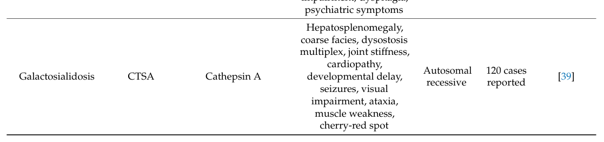

## Question

# Disease Characteristics Research Template

## Target Disease
- **Disease Name:** Glycoprotein Storage Disease
- **MONDO ID:**  (if available)
- **Category:** Mendelian

## Research Objectives

Please provide a comprehensive research report on **Glycoprotein Storage Disease** covering all of the
disease characteristics listed below. This report will be used to populate a disease knowledge
base entry. Be thorough and cite primary literature (PMID preferred) for all claims.

For each section, **suggested databases/resources** are listed. These are the first places
you should search for information on each topic.

---

### 1. Disease Information
> **Search first:** OMIM, Orphanet, ICD-10/ICD-11, MeSH, PubMed

- What is the disease? Provide a concise overview.
- What are the key identifiers? (OMIM, Orphanet, ICD-10/ICD-11, MeSH, Mondo)
- What are the common synonyms and alternative names?
- Is the information derived from individual patients (e.g., EHR) or aggregated disease-level resources?

### 2. Etiology

- **Disease Causal Factors**: What are the primary causes? (genetic, environmental, infectious, mechanistic)
- **Risk Factors**:
  > **Search first:** PubMed, Cochrane Library, UpToDate, clinical guidelines, ClinVar, ClinGen, GWAS Catalog, PheGenI, CTD, CDC, WHO, epidemiological databases
  - Genetic risk factors (causal variants, susceptibility loci, modifier genes)
  - Environmental risk factors (toxins, lifestyle, occupational exposures, age, sex, family history)
- **Protective Factors**:
  > **Search first:** PubMed, Cochrane Library, clinical trial databases, GWAS Catalog, gnomAD, WHO, CDC, nutrition databases
  - Genetic protective factors (protective variants, modifier alleles)
  - Environmental protective factors (diet, lifestyle, exposures that reduce risk)
- **Gene-Environment Interactions**: How do genetic and environmental factors interact to influence disease?
  > **Search first:** CTD, PubMed, PheGenI, GxE databases

### 3. Phenotypes
> **Search first:** HPO (Human Phenotype Ontology), OMIM, Orphanet, PubMed, clinicaltrials.gov, MedDRA, SNOMED CT, DECIPHER, LOINC

For each phenotype, provide:
- **Phenotype type**: symptoms, clinical signs, physical manifestations, behavioral changes, or laboratory abnormalities
  > For symptoms/signs: HPO, OMIM, Orphanet, PubMed
  > For behavioral changes: HPO, DSM, RDoC (Research Domain Criteria), PubMed
  > For laboratory abnormalities: LOINC, SNOMED CT, LabTests Online, PubMed
- **Phenotype characteristics**:
  > **Search first:** OMIM, Orphanet, HPO, PubMed
  - Age of symptom onset (neonatal, childhood, adult-onset, late-onset)
  - Symptom severity (mild, moderate, severe, variable)
  - Symptom progression (stable, progressive, episodic, fluctuating)
  - Frequency among affected individuals (percentage or qualitative)
- **Quality of life impact**: Effects on daily functioning and well-being (per-phenotype when possible)
  > **Search first:** EQ-5D database, SF-36, WHO QOL databases, PubMed
- Suggest HPO (Human Phenotype Ontology) terms for each phenotype

### 4. Genetic/Molecular Information

- **Causal Genes**: Gene mutations or chromosomal abnormalities responsible for disease (gene symbols, OMIM IDs)
  > **Search first:** OMIM, ClinVar, HGMD, Ensembl, NCBI Gene
- **Pathogenic Variants**:
  - Affected genes (gene symbols, HGNC IDs)
    > **Search first:** OMIM, NCBI Gene, Ensembl, HGNC, UniProt, GeneCards
  - Variant classification (pathogenic, likely pathogenic, VUS per ACMG/AMP guidelines)
    > **Search first:** ClinVar, ClinGen, ACMG/AMP guidelines, VarSome
  - Variant type/class (missense, frameshift, nonsense, splice-site, structural)
  - Allele frequency in population databases
    > **Search first:** gnomAD, 1000 Genomes, ExAC, TOPMed, dbSNP
  - Somatic vs germline origin
    > **Search first:** COSMIC (somatic), ClinVar, ICGC, TCGA
  - Functional consequences (loss of function, gain of function, dominant negative)
- **Modifier Genes**: Genes that modify disease severity or expression
- **Epigenetic Information**: DNA methylation, histone modifications, chromatin changes affecting disease
  > **Search first:** ENCODE, Roadmap Epigenomics, MethBase, DiseaseMeth
- **Chromosomal Abnormalities**: Large-scale genetic changes (aneuploidy, translocations, inversions)
  > **Search first:** DECIPHER, ClinVar, ECARUCA, UCSC Genome Browser

### 5. Environmental Information

- **Environmental Factors**: Non-genetic contributing factors (toxins, radiation, pollution, occupational exposure)
  > **Search first:** CTD (Comparative Toxicogenomics Database), TOXNET, PubMed, EPA databases
- **Lifestyle Factors**: Behavioral factors (smoking, diet, exercise, alcohol consumption)
  > **Search first:** CDC databases, WHO, PubMed, NHANES
- **Infectious Agents**: If applicable, pathogens causing or triggering disease (bacteria, viruses, fungi, parasites)
  > **Search first:** NCBI Taxonomy, ViPR, BV-BRC, MicrobeDB, GIDEON

### 6. Mechanism / Pathophysiology

- **Molecular Pathways**: Specific signaling cascades or biochemical pathways involved (Wnt, MAPK, mTOR, PI3K-AKT, etc.)
  > **Search first:** KEGG, Reactome, WikiPathways, PathBank, BioCyc
- **Cellular Processes**: Cell-level mechanisms (apoptosis, autophagy, cell cycle dysregulation, inflammation, etc.)
  > **Search first:** Gene Ontology (GO), Reactome, KEGG, PubMed
- **Protein Dysfunction**: How protein structure or function is altered (misfolding, aggregation, loss of function, gain of function)
  > **Search first:** UniProt, PDB (Protein Data Bank), InterPro, Pfam, AlphaFold
- **Metabolic Changes**: Alterations in metabolic processes (energy metabolism, lipid metabolism, amino acid metabolism)
  > **Search first:** KEGG, BioCyc, HMDB (Human Metabolome Database), BRENDA
- **Immune System Involvement**: Role of immune response (autoimmunity, immunodeficiency, chronic inflammation)
  > **Search first:** ImmPort, Immunome Database, IEDB, Gene Ontology
- **Tissue Damage Mechanisms**: How tissues/ are injured (oxidative stress, ischemia, fibrosis, necrosis)
  > **Search first:** PubMed, Gene Ontology, Reactome
- **Biochemical Abnormalities**: Specific molecular defects (enzyme deficiencies, receptor dysfunction, ion channel defects)
  > **Search first:** BRENDA, UniProt, KEGG, OMIM, PubMed
- **Epigenetic Changes**: DNA methylation, histone modifications affecting gene expression in disease
  > **Search first:** ENCODE, Roadmap Epigenomics, MethBase, DiseaseMeth
- **Molecular Profiling** (if available):
  - Transcriptomics/gene expression changes
    > **Search first:** GEO (Gene Expression Omnibus), ArrayExpress, GTEx, Human Cell Atlas, SRA
  - Proteomics findings
    > **Search first:** PRIDE, ProteomeXchange, Human Protein Atlas, STRING, BioGRID
  - Metabolomics signatures
    > **Search first:** MetaboLights, Metabolomics Workbench, HMDB, METLIN
  - Lipidomics alterations
    > **Search first:** LIPID MAPS, SwissLipids, LipidHome, Metabolomics Workbench
  - Genomic structural features
    > **Search first:** UCSC Genome Browser, Ensembl, NCBI, dbVar, DGV
- **Advanced Technologies** (if applicable):
  - Single-cell analysis findings (cell-type specific mechanisms, cellular heterogeneity)
    > **Search first:** Human Cell Atlas, Single Cell Portal, GEO, CELLxGENE
  - Spatial transcriptomics findings
    > **Search first:** GEO, Spatial Research, Vizgen, 10x Genomics data
  - Multi-omics integration results
    > **Search first:** TCGA, ICGC, cBioPortal, LinkedOmics, PubMed
  - Functional genomics screens (CRISPR, RNAi)
    > **Search first:** DepMap, GenomeRNAi, PubMed, BioGRID ORCS

For each mechanism, describe:
- The causal chain from initial trigger to clinical manifestation
- Which mechanisms are upstream vs downstream
- What cell types and biological processes are involved
- Suggest GO terms for biological processes and CL terms for cell types

### 7. Anatomical Structures Affected

- **Organ Level**:
  - Primary organs directly affected
  - Secondary organ involvement (complications, secondary effects)
  - Body systems involved (cardiovascular, nervous, digestive, respiratory, endocrine, etc.)
  > **Search first:** Uberon, FMA (Foundational Model of Anatomy), OMIM, HPO, ICD-11, MeSH, SNOMED CT
- **Tissue and Cell Level**:
  - Specific tissue types affected (epithelial, connective, muscle, nervous)
  - Specific cell populations targeted (with Cell Ontology terms)
  > **Search first:** Uberon, Human Protein Atlas, Cell Ontology, Human Cell Atlas, CellMarker, PanglaoDB
- **Subcellular Level**:
  - Cellular compartments involved (mitochondria, nucleus, ER, lysosomes) (with GO Cellular Component terms)
  > **Search first:** Gene Ontology (Cellular Component), UniProt, Human Protein Atlas
- **Localization**:
  - Specific anatomical sites (with UBERON terms)
    > **Search first:** FMA, Uberon, NeuroNames (for brain), SNOMED CT
  - Lateralization (unilateral, bilateral, asymmetric)
    > **Search first:** HPO, clinical literature, imaging databases

### 8. Temporal Development

- **Onset**:
  - Typical age of onset (congenital, pediatric, adult, geriatric)
  - Onset pattern (acute, subacute, chronic, insidious)
  > **Search first:** OMIM, Orphanet, HPO, PubMed
- **Progression**:
  - Disease stages (early, intermediate, advanced, end-stage)
    > **Search first:** Cancer Staging Manual (AJCC), WHO classifications, PubMed
  - Progression rate (rapid, slow, variable)
  - Disease course pattern (episodic, relapsing-remitting, progressive, stable)
  - Disease duration (self-limited, chronic lifelong)
  > **Search first:** Disease registries, longitudinal cohort databases, natural history studies, PubMed, Orphanet, OMIM
- **Patterns**:
  - Remission patterns (spontaneous, treatment-induced)
    > **Search first:** Clinical trial databases, disease registries, PubMed
  - Critical periods (time windows of vulnerability or opportunity for intervention)
    > **Search first:** PubMed, developmental biology databases, clinical guidelines

### 9. Inheritance and Population

- **Epidemiology**:
  - Prevalence (cases per 100,000 at given time)
  - Incidence (new cases per 100,000 per year)
  > **Search first:** Orphanet, CDC, WHO, GBD (Global Burden of Disease), national registries, SEER, disease registries
- **For Genetic Etiology**:
  - Inheritance pattern (AD, AR, X-linked, mitochondrial, multifactorial, polygenic)
    > **Search first:** OMIM, Orphanet, ClinVar, GTR (Genetic Testing Registry)
  - Penetrance (complete, incomplete, age-dependent)
    > **Search first:** ClinVar, OMIM, PubMed, ClinGen
  - Expressivity (variable, consistent)
    > **Search first:** OMIM, ClinVar, PubMed
  - Genetic anticipation (increasing severity in successive generations)
    > **Search first:** OMIM, PubMed (especially for repeat expansion disorders)
  - Germline mosaicism
    > **Search first:** ClinVar, OMIM, genetic counseling literature, PubMed
  - Founder effects (population-specific mutations)
    > **Search first:** gnomAD, population genetics databases, PubMed
  - Consanguinity role
    > **Search first:** OMIM, population studies, genetic counseling resources
  - Carrier frequency
    > **Search first:** gnomAD, carrier screening databases, GeneReviews, GTR
- **Population Demographics**:
  - Affected populations (ethnic or demographic groups with higher prevalence)
    > **Search first:** gnomAD, 1000 Genomes, PAGE Study, PubMed, population registries
  - Geographic distribution (endemic areas, regional variation)
    > **Search first:** WHO, CDC, GBD, Orphanet, geographic epidemiology databases
  - Geographic distribution of specific variants
  - Sex ratio (male:female)
    > **Search first:** Disease registries, OMIM, PubMed, epidemiological databases
  - Age distribution of affected individuals
    > **Search first:** CDC, disease registries, SEER, Orphanet

### 10. Diagnostics

- **Clinical Tests**:
  - Laboratory tests (blood, urine, tissue chemistry, specific enzyme assays)
    > **Search first:** LOINC, LabTests Online, PubMed
  - Biomarkers (proteins, metabolites, genetic markers, circulating biomarkers)
    > **Search first:** FDA Biomarker List, BEST (Biomarkers, EndpointS, and other Tools), PubMed
  - Imaging studies (X-ray, CT, MRI, PET, ultrasound)
    > **Search first:** RadLex, DICOM, Radiopaedia, imaging databases
  - Functional tests (pulmonary function, cardiac stress tests)
    > **Search first:** LOINC, clinical guidelines, PubMed
  - Electrophysiology (EEG, EMG, ECG, nerve conduction studies)
    > **Search first:** LOINC, clinical neurophysiology databases, PubMed
  - Biopsy findings (histopathology, immunohistochemistry)
    > **Search first:** SNOMED CT, College of American Pathologists resources, PubMed
  - Pathology findings (microscopic examination)
    > **Search first:** SNOMED CT, Digital Pathology databases, PubMed
- **Genetic Testing**:
  > **Search first:** GTR (Genetic Testing Registry), GeneReviews, ClinGen
  - Overview of recommended genetic testing approach
  - Whole genome sequencing (WGS) utility
    > **Search first:** GTR, ClinVar, GEL (Genomics England), gnomAD
  - Whole exome sequencing (WES) utility
    > **Search first:** GTR, ClinVar, OMIM, GeneMatcher
  - Gene panels (which panels, which genes)
    > **Search first:** GTR, ClinVar, laboratory-specific databases
  - Single gene testing
    > **Search first:** GTR, ClinVar, OMIM, GeneReviews
  - Chromosomal microarray (CMA)
    > **Search first:** DECIPHER, ClinVar, dbVar, ECARUCA
  - Karyotyping
    > **Search first:** Chromosome Abnormality Database, ClinVar, cytogenetics resources
  - FISH
    > **Search first:** ClinVar, cytogenetics databases, PubMed
  - Mitochondrial DNA testing
    > **Search first:** MITOMAP, MSeqDR, ClinVar, GTR
  - Repeat expansion testing
    > **Search first:** GTR, ClinVar, repeat expansion databases, PubMed
- **Omics-Based Diagnostics** (if applicable):
  - RNA sequencing / transcriptomics
    > **Search first:** GEO, ArrayExpress, GTEx, RNA-seq databases
  - Proteomics
    > **Search first:** PRIDE, ProteomeXchange, FDA Biomarker database
  - Metabolomics
    > **Search first:** MetaboLights, Metabolomics Workbench, HMDB
  - Epigenomics
    > **Search first:** GEO, ENCODE, Roadmap Epigenomics, MethBase
  - Liquid biopsy
    > **Search first:** COSMIC, ClinVar, liquid biopsy databases, PubMed
- **Clinical Criteria**:
  - Standardized diagnostic criteria (DSM, ICD, society guidelines)
    > **Search first:** DSM-5, ICD-11, clinical society guidelines, UpToDate
  - Differential diagnosis (other conditions to rule out, with distinguishing features)
    > **Search first:** DynaMed, UpToDate, clinical decision support systems
- **Screening**:
  - Screening methods for asymptomatic individuals (newborn screening, carrier screening, cascade screening)
    > **Search first:** ACMG recommendations, CDC newborn screening, GTR

### 11. Outcome/Prognosis

- **Survival and Mortality**:
  - Survival rate (5-year, 10-year, overall)
    > **Search first:** SEER, cancer registries, disease-specific registries, PubMed
  - Life expectancy (with and without treatment if applicable)
    > **Search first:** Orphanet, disease registries, actuarial databases, PubMed
  - Mortality rate
    > **Search first:** CDC, WHO, GBD, national mortality databases
  - Disease-specific mortality (deaths directly attributable to disease)
    > **Search first:** Disease registries, CDC Wonder, GBD, PubMed
- **Morbidity and Function**:
  - Morbidity (disease-related disability and health impacts)
    > **Search first:** GBD, WHO, disability databases, PubMed
  - Disability outcomes (long-term functional impairments)
    > **Search first:** ICF (International Classification of Functioning), disability registries
  - Quality of life measures (EQ-5D, SF-36, PROMIS, disease-specific tools)
    > **Search first:** EQ-5D database, SF-36, PROMIS, PubMed
- **Disease Course**:
  - Complications (secondary problems: infections, organ failure, etc.)
    > **Search first:** ICD codes, disease registries, clinical databases, PubMed
  - Recovery potential (likelihood and extent of recovery, with vs without treatment)
    > **Search first:** Natural history studies, rehabilitation databases, PubMed
- **Prediction**:
  - Prognostic factors (age, disease severity, biomarkers, treatment response)
    > **Search first:** Prognostic models databases, clinical calculators, PubMed
  - Prognostic biomarkers (molecular markers predicting disease course)
    > **Search first:** FDA Biomarker database, PubMed, cancer prognostic databases

### 12. Treatment

- **Pharmacotherapy**:
  - Pharmacological treatments (drug names, drug classes, mechanisms of action)
    > **Search first:** DrugBank, RxNorm, ATC classification, DailyMed, FDA databases
  - Pharmacogenomics (how genetic variants affect drug metabolism, efficacy, toxicity)
    > **Search first:** PharmGKB, CPIC (Clinical Pharmacogenetics), FDA Table of PGx Biomarkers
- **Advanced Therapeutics**:
  - Gene therapy (viral vectors, CRISPR, gene replacement, gene editing)
    > **Search first:** ClinicalTrials.gov, FDA gene therapy database, ASGCT resources
  - Cell therapy (stem cell transplant, CAR-T, cellular therapeutics)
    > **Search first:** ClinicalTrials.gov, FDA cell therapy database, FACT standards
  - RNA-based therapies (ASOs, siRNA, mRNA therapies)
    > **Search first:** ClinicalTrials.gov, FDA approvals, PubMed
  - Targeted therapies (treatments directed at specific molecular targets)
    > **Search first:** My Cancer Genome, OncoKB, ClinicalTrials.gov, FDA approvals
  - Immunotherapies (checkpoint inhibitors, monoclonal antibodies)
    > **Search first:** Cancer Immunotherapy Database, FDA approvals, ClinicalTrials.gov
- **Surgical and Interventional**:
  - Surgical interventions (types of surgery, timing, outcomes)
    > **Search first:** CPT codes, surgical registries, clinical guidelines, PubMed
- **Supportive and Rehabilitative**:
  - Supportive care (symptom management, pain control, nutrition)
    > **Search first:** Clinical guidelines, Cochrane Library, PubMed
  - Rehabilitation (physical therapy, occupational therapy, speech therapy)
    > **Search first:** Rehabilitation medicine databases, clinical guidelines, PubMed
- **Experimental**:
  - Experimental treatments in clinical trials (with NCT identifiers if available)
    > **Search first:** ClinicalTrials.gov, EU Clinical Trials Register, WHO ICTRP
- **Treatment Outcomes**:
  - Treatment response rates
    > **Search first:** Clinical trial databases, FDA reviews, systematic reviews, PubMed
  - Side effects and adverse events
    > **Search first:** FDA Adverse Event Reporting System (FAERS), MedWatch, PubMed
- **Treatment Strategy**:
  - Treatment algorithms (clinical pathways, decision trees)
    > **Search first:** Clinical practice guidelines, NCCN Guidelines, UpToDate
  - Combination therapies
    > **Search first:** ClinicalTrials.gov, treatment guidelines, PubMed
  - Personalized medicine approaches (genotype-guided treatment)
    > **Search first:** My Cancer Genome, CIViC, PharmGKB, precision medicine databases

For each treatment, suggest MAXO (Medical Action Ontology) terms where applicable.

### 13. Prevention

- **Prevention Levels**:
  - Primary prevention (preventing disease occurrence: vaccination, risk factor modification)
    > **Search first:** CDC, WHO, USPSTF recommendations, Cochrane Library
  - Secondary prevention (early detection and treatment: screening programs, early intervention)
    > **Search first:** USPSTF, CDC screening guidelines, WHO
  - Tertiary prevention (preventing complications in those with disease)
    > **Search first:** Clinical guidelines, disease management protocols, PubMed
- **Immunization**: Vaccine strategies (if applicable)
  > **Search first:** CDC vaccine schedules, WHO immunization, FDA vaccine database
- **Screening and Early Detection**:
  - Screening programs (population-based: newborn screening, cancer screening)
    > **Search first:** CDC screening programs, USPSTF, cancer screening databases
  - Genetic screening (carrier screening, preimplantation genetic diagnosis, prenatal testing)
    > **Search first:** ACMG recommendations, ACOG guidelines, GTR
  - Risk stratification (identifying high-risk individuals for targeted prevention)
    > **Search first:** Risk prediction models, clinical calculators, PubMed
- **Behavioral Interventions**: Lifestyle modifications to reduce risk
  > **Search first:** CDC, WHO, behavioral intervention databases, Cochrane Library
- **Counseling**: Genetic counseling (risk assessment, family planning guidance)
  > **Search first:** NSGC resources, ACMG guidelines, GeneReviews
- **Public Health**:
  - Public health interventions (sanitation, vector control, health education)
    > **Search first:** CDC, WHO, public health databases, PubMed
  - Environmental interventions (reducing environmental risk factors)
    > **Search first:** EPA databases, WHO environmental health, PubMed
- **Prophylaxis**: Preventive medications or procedures
  > **Search first:** Clinical guidelines, FDA approvals, PubMed

### 14. Other Species / Natural Disease

- **Taxonomy**: Species affected (with NCBI Taxon identifiers)
  > **Search first:** NCBI Taxonomy
- **Breed**: Specific breeds affected (with VBO identifiers if applicable)
  > **Search first:** VBO (Vertebrate Breed Ontology)
- **Gene**: Orthologous genes in other species (with NCBI Gene IDs)
  > **Search first:** NCBI Gene
- **Natural Disease**:
  - Naturally occurring disease in other species (companion animals, wildlife)
    > **Search first:** OMIA (Online Mendelian Inheritance in Animals), VetCompass, PubMed
  - Veterinary relevance and importance in animal health
    > **Search first:** OMIA, veterinary databases, PubMed
- **Comparative Biology**:
  - Comparative pathology (similarities and differences across species)
    > **Search first:** OMIA, comparative pathology databases, PubMed
  - Evolutionary conservation of disease mechanisms
    > **Search first:** HomoloGene, OrthoMCL, Alliance of Genome Resources
- **Transmission** (if applicable):
  - Zoonotic potential
    > **Search first:** CDC zoonotic diseases, WHO zoonoses, GIDEON
  - Cross-species susceptibility
    > **Search first:** NCBI Taxonomy, veterinary databases, PubMed

### 15. Model Organisms

- **Model Types**:
  - Model organism type (mammalian, invertebrate, cellular, in vitro)
    > **Search first:** Alliance of Genome Resources, model organism databases
  - Specific model systems (mouse, rat, zebrafish, Drosophila, C. elegans, yeast, cell lines, organoids, iPSCs)
    > **Search first:** MGI, RGD, ZFIN, FlyBase, WormBase, SGD, ATCC, Cellosaurus
  - Induced models (drug treatment, surgical intervention, environmental manipulation)
    > **Search first:** MGI, model organism databases, PubMed
- **Genetic Models**:
  - Types available (knockout, knock-in, transgenic, conditional, humanized)
    > **Search first:** MGI, IMPC, KOMP, EuMMCR, IMSR
- **Model Characteristics**:
  - Phenotype recapitulation (how well model reproduces human disease features)
    > **Search first:** Model organism databases, comparative studies, PubMed
  - Model limitations (aspects of human disease not captured)
    > **Search first:** Model organism databases, PubMed, review articles
- **Applications**:
  - Research applications (what aspects of disease can be studied)
    > **Search first:** Model organism databases, PubMed
- **Resources**:
  - Model databases
    > **Search first:** MGI, RGD, ZFIN, FlyBase, WormBase, IMSR, EMMA, MMRRC

---

## Citation Requirements

- Cite primary literature (PMID preferred) for all mechanistic and clinical claims
- Prioritize recent reviews and landmark papers
- Include direct quotes from abstracts where possible to support key statements
- Distinguish evidence source types: human clinical, model organism, in vitro, computational

## Output Format

Structure your response as a comprehensive narrative organized by the sections above.
For each section, provide:
- Factual content with specific details (numbers, percentages, gene names, variant nomenclature)
- Ontology term suggestions (HPO, GO, CL, UBERON, CHEBI, MAXO, MONDO) where applicable
- Evidence citations with PMIDs
- Direct quotes from abstracts to support key claims
- Clear indication when information is not available or not applicable for this disease

This report will be used to populate a disease knowledge base entry with:
- Pathophysiology descriptions with causal chains
- Gene/protein annotations (HGNC, GO terms)
- Phenotype associations (HP terms) with frequencies
- Cell type involvement (CL terms)
- Anatomical locations (UBERON terms)
- Chemical entities (CHEBI terms)
- Treatment annotations (MAXO terms)
- Evidence items with PMIDs and exact abstract quotes
- Epidemiology, prognosis, diagnostic, and prevention information
- Animal model descriptions with phenotype recapitulation details

## Output

Question: You are an expert researcher providing comprehensive, well-cited information.

Provide detailed information focusing on:
1. Key concepts and definitions with current understanding
2. Recent developments and latest research (prioritize 2023-2024 sources)
3. Current applications and real-world implementations
4. Expert opinions and analysis from authoritative sources
5. Relevant statistics and data from recent studies

Format as a comprehensive research report with proper citations. Include URLs and publication dates where available.
Always prioritize recent, authoritative sources and provide specific citations for all major claims.

# Disease Characteristics Research Template

## Target Disease
- **Disease Name:** Glycoprotein Storage Disease
- **MONDO ID:**  (if available)
- **Category:** Mendelian

## Research Objectives

Please provide a comprehensive research report on **Glycoprotein Storage Disease** covering all of the
disease characteristics listed below. This report will be used to populate a disease knowledge
base entry. Be thorough and cite primary literature (PMID preferred) for all claims.

For each section, **suggested databases/resources** are listed. These are the first places
you should search for information on each topic.

---

### 1. Disease Information
> **Search first:** OMIM, Orphanet, ICD-10/ICD-11, MeSH, PubMed

- What is the disease? Provide a concise overview.
- What are the key identifiers? (OMIM, Orphanet, ICD-10/ICD-11, MeSH, Mondo)
- What are the common synonyms and alternative names?
- Is the information derived from individual patients (e.g., EHR) or aggregated disease-level resources?

### 2. Etiology

- **Disease Causal Factors**: What are the primary causes? (genetic, environmental, infectious, mechanistic)
- **Risk Factors**:
  > **Search first:** PubMed, Cochrane Library, UpToDate, clinical guidelines, ClinVar, ClinGen, GWAS Catalog, PheGenI, CTD, CDC, WHO, epidemiological databases
  - Genetic risk factors (causal variants, susceptibility loci, modifier genes)
  - Environmental risk factors (toxins, lifestyle, occupational exposures, age, sex, family history)
- **Protective Factors**:
  > **Search first:** PubMed, Cochrane Library, clinical trial databases, GWAS Catalog, gnomAD, WHO, CDC, nutrition databases
  - Genetic protective factors (protective variants, modifier alleles)
  - Environmental protective factors (diet, lifestyle, exposures that reduce risk)
- **Gene-Environment Interactions**: How do genetic and environmental factors interact to influence disease?
  > **Search first:** CTD, PubMed, PheGenI, GxE databases

### 3. Phenotypes
> **Search first:** HPO (Human Phenotype Ontology), OMIM, Orphanet, PubMed, clinicaltrials.gov, MedDRA, SNOMED CT, DECIPHER, LOINC

For each phenotype, provide:
- **Phenotype type**: symptoms, clinical signs, physical manifestations, behavioral changes, or laboratory abnormalities
  > For symptoms/signs: HPO, OMIM, Orphanet, PubMed
  > For behavioral changes: HPO, DSM, RDoC (Research Domain Criteria), PubMed
  > For laboratory abnormalities: LOINC, SNOMED CT, LabTests Online, PubMed
- **Phenotype characteristics**:
  > **Search first:** OMIM, Orphanet, HPO, PubMed
  - Age of symptom onset (neonatal, childhood, adult-onset, late-onset)
  - Symptom severity (mild, moderate, severe, variable)
  - Symptom progression (stable, progressive, episodic, fluctuating)
  - Frequency among affected individuals (percentage or qualitative)
- **Quality of life impact**: Effects on daily functioning and well-being (per-phenotype when possible)
  > **Search first:** EQ-5D database, SF-36, WHO QOL databases, PubMed
- Suggest HPO (Human Phenotype Ontology) terms for each phenotype

### 4. Genetic/Molecular Information

- **Causal Genes**: Gene mutations or chromosomal abnormalities responsible for disease (gene symbols, OMIM IDs)
  > **Search first:** OMIM, ClinVar, HGMD, Ensembl, NCBI Gene
- **Pathogenic Variants**:
  - Affected genes (gene symbols, HGNC IDs)
    > **Search first:** OMIM, NCBI Gene, Ensembl, HGNC, UniProt, GeneCards
  - Variant classification (pathogenic, likely pathogenic, VUS per ACMG/AMP guidelines)
    > **Search first:** ClinVar, ClinGen, ACMG/AMP guidelines, VarSome
  - Variant type/class (missense, frameshift, nonsense, splice-site, structural)
  - Allele frequency in population databases
    > **Search first:** gnomAD, 1000 Genomes, ExAC, TOPMed, dbSNP
  - Somatic vs germline origin
    > **Search first:** COSMIC (somatic), ClinVar, ICGC, TCGA
  - Functional consequences (loss of function, gain of function, dominant negative)
- **Modifier Genes**: Genes that modify disease severity or expression
- **Epigenetic Information**: DNA methylation, histone modifications, chromatin changes affecting disease
  > **Search first:** ENCODE, Roadmap Epigenomics, MethBase, DiseaseMeth
- **Chromosomal Abnormalities**: Large-scale genetic changes (aneuploidy, translocations, inversions)
  > **Search first:** DECIPHER, ClinVar, ECARUCA, UCSC Genome Browser

### 5. Environmental Information

- **Environmental Factors**: Non-genetic contributing factors (toxins, radiation, pollution, occupational exposure)
  > **Search first:** CTD (Comparative Toxicogenomics Database), TOXNET, PubMed, EPA databases
- **Lifestyle Factors**: Behavioral factors (smoking, diet, exercise, alcohol consumption)
  > **Search first:** CDC databases, WHO, PubMed, NHANES
- **Infectious Agents**: If applicable, pathogens causing or triggering disease (bacteria, viruses, fungi, parasites)
  > **Search first:** NCBI Taxonomy, ViPR, BV-BRC, MicrobeDB, GIDEON

### 6. Mechanism / Pathophysiology

- **Molecular Pathways**: Specific signaling cascades or biochemical pathways involved (Wnt, MAPK, mTOR, PI3K-AKT, etc.)
  > **Search first:** KEGG, Reactome, WikiPathways, PathBank, BioCyc
- **Cellular Processes**: Cell-level mechanisms (apoptosis, autophagy, cell cycle dysregulation, inflammation, etc.)
  > **Search first:** Gene Ontology (GO), Reactome, KEGG, PubMed
- **Protein Dysfunction**: How protein structure or function is altered (misfolding, aggregation, loss of function, gain of function)
  > **Search first:** UniProt, PDB (Protein Data Bank), InterPro, Pfam, AlphaFold
- **Metabolic Changes**: Alterations in metabolic processes (energy metabolism, lipid metabolism, amino acid metabolism)
  > **Search first:** KEGG, BioCyc, HMDB (Human Metabolome Database), BRENDA
- **Immune System Involvement**: Role of immune response (autoimmunity, immunodeficiency, chronic inflammation)
  > **Search first:** ImmPort, Immunome Database, IEDB, Gene Ontology
- **Tissue Damage Mechanisms**: How tissues/ are injured (oxidative stress, ischemia, fibrosis, necrosis)
  > **Search first:** PubMed, Gene Ontology, Reactome
- **Biochemical Abnormalities**: Specific molecular defects (enzyme deficiencies, receptor dysfunction, ion channel defects)
  > **Search first:** BRENDA, UniProt, KEGG, OMIM, PubMed
- **Epigenetic Changes**: DNA methylation, histone modifications affecting gene expression in disease
  > **Search first:** ENCODE, Roadmap Epigenomics, MethBase, DiseaseMeth
- **Molecular Profiling** (if available):
  - Transcriptomics/gene expression changes
    > **Search first:** GEO (Gene Expression Omnibus), ArrayExpress, GTEx, Human Cell Atlas, SRA
  - Proteomics findings
    > **Search first:** PRIDE, ProteomeXchange, Human Protein Atlas, STRING, BioGRID
  - Metabolomics signatures
    > **Search first:** MetaboLights, Metabolomics Workbench, HMDB, METLIN
  - Lipidomics alterations
    > **Search first:** LIPID MAPS, SwissLipids, LipidHome, Metabolomics Workbench
  - Genomic structural features
    > **Search first:** UCSC Genome Browser, Ensembl, NCBI, dbVar, DGV
- **Advanced Technologies** (if applicable):
  - Single-cell analysis findings (cell-type specific mechanisms, cellular heterogeneity)
    > **Search first:** Human Cell Atlas, Single Cell Portal, GEO, CELLxGENE
  - Spatial transcriptomics findings
    > **Search first:** GEO, Spatial Research, Vizgen, 10x Genomics data
  - Multi-omics integration results
    > **Search first:** TCGA, ICGC, cBioPortal, LinkedOmics, PubMed
  - Functional genomics screens (CRISPR, RNAi)
    > **Search first:** DepMap, GenomeRNAi, PubMed, BioGRID ORCS

For each mechanism, describe:
- The causal chain from initial trigger to clinical manifestation
- Which mechanisms are upstream vs downstream
- What cell types and biological processes are involved
- Suggest GO terms for biological processes and CL terms for cell types

### 7. Anatomical Structures Affected

- **Organ Level**:
  - Primary organs directly affected
  - Secondary organ involvement (complications, secondary effects)
  - Body systems involved (cardiovascular, nervous, digestive, respiratory, endocrine, etc.)
  > **Search first:** Uberon, FMA (Foundational Model of Anatomy), OMIM, HPO, ICD-11, MeSH, SNOMED CT
- **Tissue and Cell Level**:
  - Specific tissue types affected (epithelial, connective, muscle, nervous)
  - Specific cell populations targeted (with Cell Ontology terms)
  > **Search first:** Uberon, Human Protein Atlas, Cell Ontology, Human Cell Atlas, CellMarker, PanglaoDB
- **Subcellular Level**:
  - Cellular compartments involved (mitochondria, nucleus, ER, lysosomes) (with GO Cellular Component terms)
  > **Search first:** Gene Ontology (Cellular Component), UniProt, Human Protein Atlas
- **Localization**:
  - Specific anatomical sites (with UBERON terms)
    > **Search first:** FMA, Uberon, NeuroNames (for brain), SNOMED CT
  - Lateralization (unilateral, bilateral, asymmetric)
    > **Search first:** HPO, clinical literature, imaging databases

### 8. Temporal Development

- **Onset**:
  - Typical age of onset (congenital, pediatric, adult, geriatric)
  - Onset pattern (acute, subacute, chronic, insidious)
  > **Search first:** OMIM, Orphanet, HPO, PubMed
- **Progression**:
  - Disease stages (early, intermediate, advanced, end-stage)
    > **Search first:** Cancer Staging Manual (AJCC), WHO classifications, PubMed
  - Progression rate (rapid, slow, variable)
  - Disease course pattern (episodic, relapsing-remitting, progressive, stable)
  - Disease duration (self-limited, chronic lifelong)
  > **Search first:** Disease registries, longitudinal cohort databases, natural history studies, PubMed, Orphanet, OMIM
- **Patterns**:
  - Remission patterns (spontaneous, treatment-induced)
    > **Search first:** Clinical trial databases, disease registries, PubMed
  - Critical periods (time windows of vulnerability or opportunity for intervention)
    > **Search first:** PubMed, developmental biology databases, clinical guidelines

### 9. Inheritance and Population

- **Epidemiology**:
  - Prevalence (cases per 100,000 at given time)
  - Incidence (new cases per 100,000 per year)
  > **Search first:** Orphanet, CDC, WHO, GBD (Global Burden of Disease), national registries, SEER, disease registries
- **For Genetic Etiology**:
  - Inheritance pattern (AD, AR, X-linked, mitochondrial, multifactorial, polygenic)
    > **Search first:** OMIM, Orphanet, ClinVar, GTR (Genetic Testing Registry)
  - Penetrance (complete, incomplete, age-dependent)
    > **Search first:** ClinVar, OMIM, PubMed, ClinGen
  - Expressivity (variable, consistent)
    > **Search first:** OMIM, ClinVar, PubMed
  - Genetic anticipation (increasing severity in successive generations)
    > **Search first:** OMIM, PubMed (especially for repeat expansion disorders)
  - Germline mosaicism
    > **Search first:** ClinVar, OMIM, genetic counseling literature, PubMed
  - Founder effects (population-specific mutations)
    > **Search first:** gnomAD, population genetics databases, PubMed
  - Consanguinity role
    > **Search first:** OMIM, population studies, genetic counseling resources
  - Carrier frequency
    > **Search first:** gnomAD, carrier screening databases, GeneReviews, GTR
- **Population Demographics**:
  - Affected populations (ethnic or demographic groups with higher prevalence)
    > **Search first:** gnomAD, 1000 Genomes, PAGE Study, PubMed, population registries
  - Geographic distribution (endemic areas, regional variation)
    > **Search first:** WHO, CDC, GBD, Orphanet, geographic epidemiology databases
  - Geographic distribution of specific variants
  - Sex ratio (male:female)
    > **Search first:** Disease registries, OMIM, PubMed, epidemiological databases
  - Age distribution of affected individuals
    > **Search first:** CDC, disease registries, SEER, Orphanet

### 10. Diagnostics

- **Clinical Tests**:
  - Laboratory tests (blood, urine, tissue chemistry, specific enzyme assays)
    > **Search first:** LOINC, LabTests Online, PubMed
  - Biomarkers (proteins, metabolites, genetic markers, circulating biomarkers)
    > **Search first:** FDA Biomarker List, BEST (Biomarkers, EndpointS, and other Tools), PubMed
  - Imaging studies (X-ray, CT, MRI, PET, ultrasound)
    > **Search first:** RadLex, DICOM, Radiopaedia, imaging databases
  - Functional tests (pulmonary function, cardiac stress tests)
    > **Search first:** LOINC, clinical guidelines, PubMed
  - Electrophysiology (EEG, EMG, ECG, nerve conduction studies)
    > **Search first:** LOINC, clinical neurophysiology databases, PubMed
  - Biopsy findings (histopathology, immunohistochemistry)
    > **Search first:** SNOMED CT, College of American Pathologists resources, PubMed
  - Pathology findings (microscopic examination)
    > **Search first:** SNOMED CT, Digital Pathology databases, PubMed
- **Genetic Testing**:
  > **Search first:** GTR (Genetic Testing Registry), GeneReviews, ClinGen
  - Overview of recommended genetic testing approach
  - Whole genome sequencing (WGS) utility
    > **Search first:** GTR, ClinVar, GEL (Genomics England), gnomAD
  - Whole exome sequencing (WES) utility
    > **Search first:** GTR, ClinVar, OMIM, GeneMatcher
  - Gene panels (which panels, which genes)
    > **Search first:** GTR, ClinVar, laboratory-specific databases
  - Single gene testing
    > **Search first:** GTR, ClinVar, OMIM, GeneReviews
  - Chromosomal microarray (CMA)
    > **Search first:** DECIPHER, ClinVar, dbVar, ECARUCA
  - Karyotyping
    > **Search first:** Chromosome Abnormality Database, ClinVar, cytogenetics resources
  - FISH
    > **Search first:** ClinVar, cytogenetics databases, PubMed
  - Mitochondrial DNA testing
    > **Search first:** MITOMAP, MSeqDR, ClinVar, GTR
  - Repeat expansion testing
    > **Search first:** GTR, ClinVar, repeat expansion databases, PubMed
- **Omics-Based Diagnostics** (if applicable):
  - RNA sequencing / transcriptomics
    > **Search first:** GEO, ArrayExpress, GTEx, RNA-seq databases
  - Proteomics
    > **Search first:** PRIDE, ProteomeXchange, FDA Biomarker database
  - Metabolomics
    > **Search first:** MetaboLights, Metabolomics Workbench, HMDB
  - Epigenomics
    > **Search first:** GEO, ENCODE, Roadmap Epigenomics, MethBase
  - Liquid biopsy
    > **Search first:** COSMIC, ClinVar, liquid biopsy databases, PubMed
- **Clinical Criteria**:
  - Standardized diagnostic criteria (DSM, ICD, society guidelines)
    > **Search first:** DSM-5, ICD-11, clinical society guidelines, UpToDate
  - Differential diagnosis (other conditions to rule out, with distinguishing features)
    > **Search first:** DynaMed, UpToDate, clinical decision support systems
- **Screening**:
  - Screening methods for asymptomatic individuals (newborn screening, carrier screening, cascade screening)
    > **Search first:** ACMG recommendations, CDC newborn screening, GTR

### 11. Outcome/Prognosis

- **Survival and Mortality**:
  - Survival rate (5-year, 10-year, overall)
    > **Search first:** SEER, cancer registries, disease-specific registries, PubMed
  - Life expectancy (with and without treatment if applicable)
    > **Search first:** Orphanet, disease registries, actuarial databases, PubMed
  - Mortality rate
    > **Search first:** CDC, WHO, GBD, national mortality databases
  - Disease-specific mortality (deaths directly attributable to disease)
    > **Search first:** Disease registries, CDC Wonder, GBD, PubMed
- **Morbidity and Function**:
  - Morbidity (disease-related disability and health impacts)
    > **Search first:** GBD, WHO, disability databases, PubMed
  - Disability outcomes (long-term functional impairments)
    > **Search first:** ICF (International Classification of Functioning), disability registries
  - Quality of life measures (EQ-5D, SF-36, PROMIS, disease-specific tools)
    > **Search first:** EQ-5D database, SF-36, PROMIS, PubMed
- **Disease Course**:
  - Complications (secondary problems: infections, organ failure, etc.)
    > **Search first:** ICD codes, disease registries, clinical databases, PubMed
  - Recovery potential (likelihood and extent of recovery, with vs without treatment)
    > **Search first:** Natural history studies, rehabilitation databases, PubMed
- **Prediction**:
  - Prognostic factors (age, disease severity, biomarkers, treatment response)
    > **Search first:** Prognostic models databases, clinical calculators, PubMed
  - Prognostic biomarkers (molecular markers predicting disease course)
    > **Search first:** FDA Biomarker database, PubMed, cancer prognostic databases

### 12. Treatment

- **Pharmacotherapy**:
  - Pharmacological treatments (drug names, drug classes, mechanisms of action)
    > **Search first:** DrugBank, RxNorm, ATC classification, DailyMed, FDA databases
  - Pharmacogenomics (how genetic variants affect drug metabolism, efficacy, toxicity)
    > **Search first:** PharmGKB, CPIC (Clinical Pharmacogenetics), FDA Table of PGx Biomarkers
- **Advanced Therapeutics**:
  - Gene therapy (viral vectors, CRISPR, gene replacement, gene editing)
    > **Search first:** ClinicalTrials.gov, FDA gene therapy database, ASGCT resources
  - Cell therapy (stem cell transplant, CAR-T, cellular therapeutics)
    > **Search first:** ClinicalTrials.gov, FDA cell therapy database, FACT standards
  - RNA-based therapies (ASOs, siRNA, mRNA therapies)
    > **Search first:** ClinicalTrials.gov, FDA approvals, PubMed
  - Targeted therapies (treatments directed at specific molecular targets)
    > **Search first:** My Cancer Genome, OncoKB, ClinicalTrials.gov, FDA approvals
  - Immunotherapies (checkpoint inhibitors, monoclonal antibodies)
    > **Search first:** Cancer Immunotherapy Database, FDA approvals, ClinicalTrials.gov
- **Surgical and Interventional**:
  - Surgical interventions (types of surgery, timing, outcomes)
    > **Search first:** CPT codes, surgical registries, clinical guidelines, PubMed
- **Supportive and Rehabilitative**:
  - Supportive care (symptom management, pain control, nutrition)
    > **Search first:** Clinical guidelines, Cochrane Library, PubMed
  - Rehabilitation (physical therapy, occupational therapy, speech therapy)
    > **Search first:** Rehabilitation medicine databases, clinical guidelines, PubMed
- **Experimental**:
  - Experimental treatments in clinical trials (with NCT identifiers if available)
    > **Search first:** ClinicalTrials.gov, EU Clinical Trials Register, WHO ICTRP
- **Treatment Outcomes**:
  - Treatment response rates
    > **Search first:** Clinical trial databases, FDA reviews, systematic reviews, PubMed
  - Side effects and adverse events
    > **Search first:** FDA Adverse Event Reporting System (FAERS), MedWatch, PubMed
- **Treatment Strategy**:
  - Treatment algorithms (clinical pathways, decision trees)
    > **Search first:** Clinical practice guidelines, NCCN Guidelines, UpToDate
  - Combination therapies
    > **Search first:** ClinicalTrials.gov, treatment guidelines, PubMed
  - Personalized medicine approaches (genotype-guided treatment)
    > **Search first:** My Cancer Genome, CIViC, PharmGKB, precision medicine databases

For each treatment, suggest MAXO (Medical Action Ontology) terms where applicable.

### 13. Prevention

- **Prevention Levels**:
  - Primary prevention (preventing disease occurrence: vaccination, risk factor modification)
    > **Search first:** CDC, WHO, USPSTF recommendations, Cochrane Library
  - Secondary prevention (early detection and treatment: screening programs, early intervention)
    > **Search first:** USPSTF, CDC screening guidelines, WHO
  - Tertiary prevention (preventing complications in those with disease)
    > **Search first:** Clinical guidelines, disease management protocols, PubMed
- **Immunization**: Vaccine strategies (if applicable)
  > **Search first:** CDC vaccine schedules, WHO immunization, FDA vaccine database
- **Screening and Early Detection**:
  - Screening programs (population-based: newborn screening, cancer screening)
    > **Search first:** CDC screening programs, USPSTF, cancer screening databases
  - Genetic screening (carrier screening, preimplantation genetic diagnosis, prenatal testing)
    > **Search first:** ACMG recommendations, ACOG guidelines, GTR
  - Risk stratification (identifying high-risk individuals for targeted prevention)
    > **Search first:** Risk prediction models, clinical calculators, PubMed
- **Behavioral Interventions**: Lifestyle modifications to reduce risk
  > **Search first:** CDC, WHO, behavioral intervention databases, Cochrane Library
- **Counseling**: Genetic counseling (risk assessment, family planning guidance)
  > **Search first:** NSGC resources, ACMG guidelines, GeneReviews
- **Public Health**:
  - Public health interventions (sanitation, vector control, health education)
    > **Search first:** CDC, WHO, public health databases, PubMed
  - Environmental interventions (reducing environmental risk factors)
    > **Search first:** EPA databases, WHO environmental health, PubMed
- **Prophylaxis**: Preventive medications or procedures
  > **Search first:** Clinical guidelines, FDA approvals, PubMed

### 14. Other Species / Natural Disease

- **Taxonomy**: Species affected (with NCBI Taxon identifiers)
  > **Search first:** NCBI Taxonomy
- **Breed**: Specific breeds affected (with VBO identifiers if applicable)
  > **Search first:** VBO (Vertebrate Breed Ontology)
- **Gene**: Orthologous genes in other species (with NCBI Gene IDs)
  > **Search first:** NCBI Gene
- **Natural Disease**:
  - Naturally occurring disease in other species (companion animals, wildlife)
    > **Search first:** OMIA (Online Mendelian Inheritance in Animals), VetCompass, PubMed
  - Veterinary relevance and importance in animal health
    > **Search first:** OMIA, veterinary databases, PubMed
- **Comparative Biology**:
  - Comparative pathology (similarities and differences across species)
    > **Search first:** OMIA, comparative pathology databases, PubMed
  - Evolutionary conservation of disease mechanisms
    > **Search first:** HomoloGene, OrthoMCL, Alliance of Genome Resources
- **Transmission** (if applicable):
  - Zoonotic potential
    > **Search first:** CDC zoonotic diseases, WHO zoonoses, GIDEON
  - Cross-species susceptibility
    > **Search first:** NCBI Taxonomy, veterinary databases, PubMed

### 15. Model Organisms

- **Model Types**:
  - Model organism type (mammalian, invertebrate, cellular, in vitro)
    > **Search first:** Alliance of Genome Resources, model organism databases
  - Specific model systems (mouse, rat, zebrafish, Drosophila, C. elegans, yeast, cell lines, organoids, iPSCs)
    > **Search first:** MGI, RGD, ZFIN, FlyBase, WormBase, SGD, ATCC, Cellosaurus
  - Induced models (drug treatment, surgical intervention, environmental manipulation)
    > **Search first:** MGI, model organism databases, PubMed
- **Genetic Models**:
  - Types available (knockout, knock-in, transgenic, conditional, humanized)
    > **Search first:** MGI, IMPC, KOMP, EuMMCR, IMSR
- **Model Characteristics**:
  - Phenotype recapitulation (how well model reproduces human disease features)
    > **Search first:** Model organism databases, comparative studies, PubMed
  - Model limitations (aspects of human disease not captured)
    > **Search first:** Model organism databases, PubMed, review articles
- **Applications**:
  - Research applications (what aspects of disease can be studied)
    > **Search first:** Model organism databases, PubMed
- **Resources**:
  - Model databases
    > **Search first:** MGI, RGD, ZFIN, FlyBase, WormBase, IMSR, EMMA, MMRRC

---

## Citation Requirements

- Cite primary literature (PMID preferred) for all mechanistic and clinical claims
- Prioritize recent reviews and landmark papers
- Include direct quotes from abstracts where possible to support key statements
- Distinguish evidence source types: human clinical, model organism, in vitro, computational

## Output Format

Structure your response as a comprehensive narrative organized by the sections above.
For each section, provide:
- Factual content with specific details (numbers, percentages, gene names, variant nomenclature)
- Ontology term suggestions (HPO, GO, CL, UBERON, CHEBI, MAXO, MONDO) where applicable
- Evidence citations with PMIDs
- Direct quotes from abstracts to support key claims
- Clear indication when information is not available or not applicable for this disease

This report will be used to populate a disease knowledge base entry with:
- Pathophysiology descriptions with causal chains
- Gene/protein annotations (HGNC, GO terms)
- Phenotype associations (HP terms) with frequencies
- Cell type involvement (CL terms)
- Anatomical locations (UBERON terms)
- Chemical entities (CHEBI terms)
- Treatment annotations (MAXO terms)
- Evidence items with PMIDs and exact abstract quotes
- Epidemiology, prognosis, diagnostic, and prevention information
- Animal model descriptions with phenotype recapitulation details

# Glycoprotein Storage Disease (Glycoproteinoses/Oligosaccharidoses): Disease Characteristics Research Report

**Target disease name used in request:** “Glycoprotein Storage Disease” (Mendelian).

## Executive summary (current understanding)
In current clinical-biochemical usage, **“glycoprotein storage diseases” most closely corresponds to the lysosomal glycoproteinoses/oligosaccharidoses**: inherited disorders caused by **deficiency of lysosomal hydrolases (or related trafficking factors)** needed for glycoprotein/oligosaccharide catabolism, leading to **lysosomal accumulation and characteristic urinary oligosacchariduria/glyco‑conjugate biomarkers**. This group includes (among others) **aspartylglucosaminuria (AGA), fucosidosis (FUCA1), α‑mannosidosis (MAN2B1), sialidosis (NEU1), galactosialidosis (CTSA)** and **mucolipidosis II/III (GNPTAB/GNPTG)**, as enumerated in a recent pathway-oriented lysosomal disorder mapping table (makridou2025mappinglysosomalstorage pages 13-14, makridou2025mappinglysosomalstorage media 116d92e3, makridou2025mappinglysosomalstorage media 684000a4).

A modern classification example: **mucolipidoses types I–III are classified as glycoproteinoses**, while mucolipidosis IV is classified separately as a gangliosidosis (gorbunova2024lysosomalstoragediseases. pages 1-3). A broader mechanistic framework classifies these conditions as **“enzymatic hydrolytic defects”** within lysosomal storage disorders (LSDs) (makridou2025mappinglysosomalstorage pages 2-4).

## Evidence type key
- **Human clinical**: case series, cohorts, and case reports.
- **Clinical trials/real-world access**: ClinicalTrials.gov records.
- **Reviews/expert synthesis**: narrative/systematic reviews.
- **Model systems**: iPSC/cellular or animal-model papers.

---

## 1. Disease information

### 1.1 What is the disease?
Because “glycoprotein storage disease” is not consistently used as a single OMIM entity, the most defensible approach for a knowledge base entry is to treat it as a **disease family (glycoproteinoses/oligosaccharidoses)** within LSDs.

- **Definitional framing (expert synthesis):** glycoproteinoses are treated as lysosomal disorders caused by **deficiency of specific lysosomal hydrolases (or cofactors)**, preventing macromolecule degradation and producing lysosomal accumulation of partially degraded substrates (makridou2025mappinglysosomalstorage pages 2-4). 
- **Clinical classification statement (mucolipidosis within glycoproteinoses):** mucolipidoses are presented as autosomal-recessive LSDs with storage of multiple macromolecules; “types I–III mucolipidoses are classified as glycoproteinoses” in “modern classification” (gorbunova2024lysosomalstoragediseases. pages 1-3).

### 1.2 Key identifiers (availability in retrieved evidence)
The retrieved evidence strongly supports **subtype-level identifiers**, but **does not provide MONDO IDs**.

Subtype-level identifiers explicitly present:
- **Aspartylglucosaminuria (AGU)**: OMIM **#208400** (kouhashi2024a37yearoldman pages 1-2)
- **Fucosidosis**: OMIM **#230000** is mentioned in a related recent case report abstract (not central here) (pekdemir2025fucosidosisareview pages 15-16)
- **Galactosialidosis**: OMIM **#256540** (makridou2025mappinglysosomalstorage pages 10-12)
- **Mucolipidosis II (ML II)**: MIM **#252500** (monteagudovilavedra2025novelphenotypicaland pages 1-2)

**Note:** ICD/MeSH/Orphanet/MONDO identifiers were **not extractable from the retrieved texts** in this run; therefore, they cannot be asserted with tool-backed evidence.

### 1.3 Synonyms and alternative names
- Family-level: **glycoproteinoses** / **oligosaccharidoses** (used in diagnostic context as a group causing “oligosacchariduria”) (kouhashi2024a37yearoldman pages 4-5, serrano2024hepatomegalyandsplenomegaly pages 5-7)
- Fucosidosis historical synonym: **“mucopolysaccharidosis F”** (pekdemir2025fucosidosisareview pages 2-4)
- Sialidosis type I synonym: **“cherry-red spot myoclonus syndrome”** (ding2024twocasesof pages 1-2)
- Mucolipidosis II synonym: **“I-cell disease”** (moutinho2025establishmentofa pages 1-2)

### 1.4 Evidence sources: patient-level vs aggregated
The current evidence is **primarily aggregated disease-level resources** (reviews, cohort studies) with some **patient-level case reports** (e.g., AGU adult diagnostic odyssey) (kouhashi2024a37yearoldman pages 1-2).

---

## 2. Etiology

### 2.1 Disease causal factors
**Primary cause:** germline pathogenic variants causing loss of function or impaired trafficking of lysosomal proteins involved in glycoprotein/oligosaccharide catabolism (makridou2025mappinglysosomalstorage pages 2-4).

Representative causal gene–enzyme relationships (visual table evidence):
- **AGA → aspartylglucosaminidase → AGU**
- **FUCA1 → α‑L‑fucosidase → fucosidosis**
- **MAN2B1 → lysosomal α‑mannosidase → α‑mannosidosis**
- **NEU1 → neuraminidase‑1 → sialidosis**
- **CTSA → protective protein/cathepsin A → galactosialidosis** (makridou2025mappinglysosomalstorage media 116d92e3, makridou2025mappinglysosomalstorage media 684000a4)

### 2.2 Risk factors
For Mendelian LSDs, the main “risk factors” are genetic:
- **Autosomal recessive inheritance** for the above disorders is repeatedly stated (e.g., fucosidosis and α‑mannosidosis) (bhattacherjee2023genotypefirstapproach pages 1-3, ficicioglu2024alphamannosidosis pages 1-3).
- **Consanguinity/founder effects** can strongly increase local prevalence (e.g., fucosidosis in Cuba/Holguín with founder mutation Q427X) (chang2024epidemiologicalandpopulation pages 1-3).

### 2.3 Protective factors / gene–environment interactions
No evidence in retrieved texts supports environmental protective factors or gene–environment interactions for this disease family.

---

## 3. Phenotypes (human)
Because this is a **disease family**, phenotypes are best represented by common cross-cutting manifestations plus subtype-specific high-yield features.

### 3.1 Cross-cutting phenotypic domains
- **Neurodevelopmental/neurodegenerative**: developmental delay, progressive deterioration, seizures, ataxia, spasticity (multiple disorders) (ding2024twocasesof pages 1-2, pekdemir2025fucosidosisareview pages 7-9, kouhashi2024a37yearoldman pages 1-2).
- **Skeletal/dysostosis multiplex and coarse facies**: prominent in mucolipidosis II/III and fucosidosis; also reported in α‑mannosidosis (feng2024clinicalandmolecular pages 1-2, pekdemir2025fucosidosisareview pages 7-9, marins2024αmannosidosisdiagnosisin pages 1-2).
- **Organomegaly and hepatosplenomegaly**: part of the differential approach to LSD-related hepatosplenomegaly, including glycoproteinoses (serrano2024hepatomegalyandsplenomegaly pages 3-5, serrano2024hepatomegalyandsplenomegaly pages 2-3).

### 3.2 Subtype phenotype statistics (recent data)

#### Sialidosis type I (NEU1): pooled 71 cases up to 2023
A 2024 Orphanet Journal of Rare Diseases review pooled **71 genetically confirmed** type I cases (69 literature + 2 new) (ding2024twocasesof pages 4-6).
- Mean onset age **15.7 years** (range **5–33**); mean diagnosis age **24.1 years** (range **8–51**) (ding2024twocasesof pages 4-6).
- Most frequent features: **muscle spasms 91.5%**, **ataxia 75%**, **seizures 63.6%** (ding2024twocasesof pages 4-6, ding2024twocasesof pages 1-2).
- Additional reported frequencies: **visual symptoms 66.2%**, **intellectual impairment 22.9% (11/48)**, **abnormal EEG 50.0% (30/60)**, **brain MRI abnormalities 41.4% (24/58)** (ding2024twocasesof pages 8-9).

Suggested HPO terms (non-exhaustive):
- Myoclonus / muscle spasms (e.g., HP:0001336), ataxia (HP:0001251), seizures (HP:0001250), cherry-red spot of the macula (HP:0012047), visual impairment (HP:0000505).

#### Mucolipidosis II/III (GNPTAB/GNPTG): phenotype and survival
- Chinese cohort (20 probands): common manifestations included **joint stiffness, skeletal deformity, intellectual disability, short stature**, and elevated plasma lysosomal enzymes with **normal urinary GAGs** (feng2024clinicalandmolecular pages 1-2).
- Pediatric cohort (n=19) reported **median survival in ML II α/β of 28 months**, “mainly due to respiratory failure” (erdem2025mucolipidosistypeii pages 1-2).

Suggested HPO terms: joint contractures (HP:0001374), gingival hypertrophy (HP:0000212), dysostosis multiplex (HP:0000943), cardiomyopathy/valve disease (HP:0001638).

#### Alpha-mannosidosis (MAN2B1)
Phenotypic core includes **hearing loss**, recurrent infections/immunodeficiency, skeletal abnormalities, developmental delay/intellectual disability, ataxia, hypotonia, psychiatric features, and variable disease severity (ficicioglu2024alphamannosidosis pages 1-3, hashmi2024exomesequenceanalysis pages 1-2).

Suggested HPO terms: hearing impairment (HP:0000365), immunodeficiency (HP:0002721), intellectual disability (HP:0001249), ataxia (HP:0001251).

#### Fucosidosis (FUCA1)
Clinical spectrum includes type I (early, severe) and type II (later, milder) with neurodegeneration, coarse facies, angiokeratomas, organomegaly and dysostosis multiplex (pekdemir2025fucosidosisareview pages 7-9, pekdemir2025fucosidosisareview pages 15-16).

Suggested HPO terms: coarse facies (HP:0000280), angiokeratoma (HP:0001025), hepatosplenomegaly (HP:0001433), seizures (HP:0001250).

#### Aspartylglucosaminuria (AGA)
An adult diagnostic-odyssey case emphasized developmental delay and later regression with epilepsy and coarse facies; it states: “Such a developmental delay is often observed as the first neurologic sign of aspartylglucosaminuria (AGU)” and notes characteristic diarrhea (kouhashi2024a37yearoldman pages 1-2).

---

## 4. Genetic / molecular information

### 4.1 Causal genes (core set supported by visual evidence)
The hydrolytic-defect table explicitly lists glycoprotein storage diseases and corresponding genes (makridou2025mappinglysosomalstorage media 116d92e3, makridou2025mappinglysosomalstorage media 684000a4):
- **AGA** (AGU), **FUCA1** (fucosidosis), **MAN2B1** (α‑mannosidosis), **NEU1** (sialidosis), **CTSA** (galactosialidosis).

Mucolipidosis II/III (trafficking defect; still classed among glycoproteinoses in modern classification):
- **GNPTAB** (ML II; ML III α/β) and **GNPTG** (ML III γ) (gorbunova2024lysosomalstoragediseases. pages 1-3, feng2024clinicalandmolecular pages 1-2).

### 4.2 Pathogenic variants and variant classes (examples)
- **AGU (AGA):** homozygous donor splice-site variant **c.698+1G>T** identified by trio-WES (kouhashi2024a37yearoldman pages 1-2).
- **α‑mannosidosis (MAN2B1):** nonsense **p.Ser899Ter** in Brazilian families (marins2024αmannosidosisdiagnosisin pages 1-2); frameshift **c.2402dupG (p.S802fs*129)** reported in Saudi families (hashmi2024exomesequenceanalysis pages 1-2).
- **ML II/III (GNPTAB):** in one cohort, mutations found in **35/40 alleles (87.5%)**, with frequent variants **c.2715+1G>A (14.3%)** and **c.2404C>T (p.Gln802Ter) (11.4%)** and multiple novel variants (feng2024clinicalandmolecular pages 1-2).
- **Fucosidosis (FUCA1):** ClinVar catalog referenced as **160 variants** with **23 pathogenic** and **125 VUS** (bhattacherjee2023genotypefirstapproach pages 1-3); HGMD catalog referenced as **36 biallelic pathogenic variants** with multiple variant classes (pekdemir2025fucosidosisareview pages 9-10).

### 4.3 Functional consequences (mechanistic anchors)
- **Sialidosis:** NEU1 is a lysosomal enzyme hydrolyzing terminal sialic acid residues; loss causes accumulation of sialylated compounds (peng2025geneticinsightsand pages 1-2).
- **ML II:** failure to generate mannose‑6‑phosphate targeting leads to **mis‑trafficking and secretion of lysosomal hydrolases**, causing lysosomal substrate accumulation (moutinho2025establishmentofa pages 1-2).

### 4.4 Modifier genes / epigenetics / chromosomal abnormalities
No tool-retrieved evidence supported modifier genes or epigenetic mechanisms for this disease family.

---

## 5. Environmental information
No non-genetic environmental causal factors were supported by retrieved evidence; these are primarily Mendelian disorders.

---

## 6. Mechanism / pathophysiology

### 6.1 Causal chain (general)
1) **Biallelic pathogenic variants** in a lysosomal enzyme gene (e.g., NEU1, AGA, FUCA1, MAN2B1) or trafficking gene (GNPTAB/GNPTG) →
2) **Reduced/absent enzyme activity or mis-targeting** →
3) **Accumulation of undegraded glycoprotein/oligosaccharide substrates** in lysosomes and often in urine (oligosacchariduria) →
4) Secondary lysosomal dysfunction, multi-system tissue injury, and (in many subtypes) **progressive CNS involvement** (makridou2025mappinglysosomalstorage pages 2-4, kouhashi2024a37yearoldman pages 4-5).

### 6.2 CNS disease and the blood–brain barrier (BBB) as a central therapeutic constraint (expert opinions)
A 2023 Molecular Therapy review explicitly states: “**neither enzymes, stem cells, nor viral vectors efficiently cross the blood–brain barrier**” (critchley2023targetingthecentral pages 1-2). This frames why systemic ERT often fails to address neurodegeneration in many glycoproteinoses.

Mechanistic/therapeutic implications:
- HSCT/HSC gene therapy can provide CNS benefit via engraftment and enzyme cross-correction (critchley2023targetingthecentral pages 8-9, critchley2023targetingthecentral pages 11-12).
- rAAV approaches can be delivered systemically or directly into CSF/brain; higher systemic dosing may increase CNS exposure but raises toxicity risk (critchley2023targetingthecentral pages 9-11).

Suggested GO/CL terms (cross-cutting):
- GO BP: lysosomal catabolic process; glycoprotein catabolic process; lysosomal enzyme targeting.
- GO CC: lysosome; lysosomal lumen.
- CL: microglial cell; neuron; oligodendrocyte.

---

## 7. Anatomical structures affected
Across the glycoproteinoses, affected structures frequently include:
- **CNS / brain** (developmental delay, regression, seizures, ataxia) (pekdemir2025fucosidosisareview pages 7-9, ding2024twocasesof pages 4-6).
- **Retina/macula** (sialidosis/galactosialidosis: cherry‑red spot) (ding2024twocasesof pages 1-2, gorbunova2024lysosomalstoragediseases. pages 1-3).
- **Skeletal system** (dysostosis multiplex, joint stiffness/contractures; particularly ML II/III) (feng2024clinicalandmolecular pages 1-2, erdem2025mucolipidosistypeii pages 2-3).
- **Liver/spleen** (hepatosplenomegaly and lysosomal-disease differential) (serrano2024hepatomegalyandsplenomegaly pages 2-3).

Suggested UBERON terms (examples): brain; retina; liver; spleen; skeleton.

---

## 8. Temporal development

- **Sialidosis type I:** typically later-onset in adolescence/young adulthood; pooled mean onset 15.7 years and diagnosis 24.1 years (ding2024twocasesof pages 4-6).
- **ML II α/β:** typically presents in the first year; severe course with markedly reduced survival (median 28 months in one cohort) (erdem2025mucolipidosistypeii pages 1-2).
- **AGU:** early developmental delay (around 12–15 months) is described as a typical first neurologic sign, with later progressive course (kouhashi2024a37yearoldman pages 4-5).

---

## 9. Inheritance and population

### 9.1 LSD overall incidence statistic (context)
A 2024 hepatosplenomegaly-focused review states LSDs have an “**approximate collective incidence of 1 in 5000 live births**” (serrano2024hepatomegalyandsplenomegaly pages 1-2).

### 9.2 Fucosidosis population genetics and founder effects (recent 2024 data)
A Cuban case-series/population-genetics study (1985–2023) reported:
- **19 diagnosed patients** in 13 families.
- **Case fatality 0.84** and **parental consanguinity 0.53**.
- Estimated **heterozygous carrier genotype frequency 0.0113887**, interpreted as ~11,660 carriers in Holguín province.
- High local prevalence attributed to founder effect and isolation (chang2024epidemiologicalandpopulation pages 1-3).

### 9.3 Newborn screening (AGU example)
The AGU diagnostic-odyssey paper notes: “**AGU is included in newborn screening in Finland**” (kouhashi2024a37yearoldman pages 5-6).

---

## 10. Diagnostics

### 10.1 Recommended diagnostic strategy (expert guidance for LSDs)
In the context of hepatosplenomegaly, a 2024 review states molecular testing is preferred as confirmatory testing “**(over biopsy)**” and should be paired with enzymatic testing when feasible (serrano2024hepatomegalyandsplenomegaly pages 1-2). It also emphasizes that some assays still require fibroblasts, e.g., neuraminidase in sialidosis/galactosialidosis (serrano2024hepatomegalyandsplenomegaly pages 7-8).

### 10.2 Key tests for glycoproteinoses/oligosaccharidoses (examples)
- **Urine oligosaccharide/glyco‑conjugate screening**: AGU paper recommends urinary analysis by UHPLC/HRAM MS to “screen for oligosaccharidoses” (kouhashi2024a37yearoldman pages 4-5).
- **Subtype-specific enzyme assays**: e.g., α‑L‑fucosidase deficiency in fucosidosis (bhattacherjee2023genotypefirstapproach pages 1-3, pekdemir2025fucosidosisareview pages 9-10), α‑mannosidase deficiency in α‑mannosidosis (marins2024αmannosidosisdiagnosisin pages 1-2), neuraminidase deficiency in sialidosis (peng2025geneticinsightsand pages 1-2).
- **Genetic testing**: trio-WES for undiagnosed intellectual disability with regression/epilepsy is presented as powerful (kouhashi2024a37yearoldman pages 1-2).

### 10.3 Quantitative biomarker example (AGU)
The AGU case report documents urinary elevation: **“increased excretion of undegraded aspartyl-glucosamine (208 mmol/mol creatinine)”** (kouhashi2024a37yearoldman pages 2-4).

---

## 11. Outcome / prognosis

- **ML II α/β:** poor survival (median 28 months in one cohort) (erdem2025mucolipidosistypeii pages 1-2); a separate review notes median survival ~5 years (monteagudovilavedra2025novelphenotypicaland pages 2-4).
- **Fucosidosis:** type I has early severe course with death often in childhood; type II has slower progression and can reach adulthood (pekdemir2025fucosidosisareview pages 7-9, pekdemir2025fucosidosisareview pages 15-16).
- **Sialidosis type I:** later-onset; progressive movement disorder with substantial disability, and later stages often requiring wheelchair use per review narrative (ding2024twocasesof pages 8-9).

For α‑mannosidosis, HSCT series summary in an authoritative clinical resource: “**overall survival rate was 88%**” in a reported set of 17 transplanted individuals with median follow-up 5.5 years (ficicioglu2024alphamannosidosis pages 12-14).

---

## 12. Treatment

### 12.1 Approved / real-world implementations (alpha-mannosidosis)
- **Velmanase alfa (Lamzede®/Lamazym)** is described as standard therapy for non-CNS manifestations in α‑mannosidosis (ficicioglu2024alphamannosidosis pages 12-14). 
- ClinicalTrials.gov Phase 3 record (rhLAMAN-05; **NCT01681953**) provides trial design and endpoints: weekly IV 1 mg/kg; co‑primary endpoints included serum oligosaccharide reduction and change in 3‑minute stair climb test (NCT01681953 chunk 1).
- **Expanded access** program is available (NCT04959240), with updates through 2023-09-25 and language indicating access “prior to local regulatory approval” (NCT04959240 chunk 1).
- A **real-world pediatric (<3 years) pharmacodynamic study** is recruiting (NCT06184503) using GlcNAc(Man)2 as a disease marker and incorporating registry/compassionate-use data sources (NCT06184503 chunk 1).

MAXO suggestions: enzyme replacement therapy; expanded access/compassionate use; hematopoietic stem cell transplantation.

### 12.2 HSCT (alpha-mannosidosis and broader LSD context)
HSCT is cited as potentially preserving neurocognitive function in α‑mannosidosis and is supported by survival data (ficicioglu2024alphamannosidosis pages 12-14). For CNS LSDs, HSCT/HSC gene therapy is discussed mechanistically as enabling microglia-like engraftment and enzyme cross-correction (critchley2023targetingthecentral pages 8-9, critchley2023targetingthecentral pages 11-12).

### 12.3 Experimental/early-stage gene therapy (AGU)
A planned intrathecal AAV gene therapy trial:
- **NCT07530796** (ClinicalTrials.gov; sponsor Rare Trait Hope) is an open-label Phase 1/2 trial of **Danagalex (scAAV9/AGA)** intrathecal single-dose gene therapy; **NOT_YET_RECRUITING** with estimated start 2026-05-01; primary endpoint safety through Day 720; secondary endpoints include change in glycoasparagine biomarker and AGA activity, and NIH Toolbox Motor Function outcomes (NCT07530796 chunk 1).

### 12.4 Supportive care (core across glycoproteinoses)
- Sialidosis type I: antiseizure medication is used but may not prevent recurrent seizures (ding2024twocasesof pages 4-6).
- Fucosidosis: supportive multidisciplinary care; disease-modifying approaches remain investigational (pekdemir2025fucosidosisareview pages 15-16).

---

## 13. Prevention
For Mendelian glycoproteinoses, prevention is largely genetic/public-health:
- **Newborn screening**: AGU is included in Finland newborn screening (kouhashi2024a37yearoldman pages 5-6).
- **Genetic counseling**: emphasized in diagnostic reviews and in subtype reports (e.g., sialidosis review emphasizes NEU1 guidance for counseling/prenatal diagnosis) (ding2024twocasesof pages 1-2).

---

## 14. Other species / natural disease
No tool-retrieved evidence in this run addressed naturally occurring veterinary glycoproteinoses.

---

## 15. Model organisms / model systems
Evidence for model systems is strongest for mucolipidosis II:
- A 2025 paper reports a **GNPTAB-mutant ML II iPSC line** recapitulating key hallmarks (reduced intracellular M6P-dependent hydrolase activity with increased secretion; free cholesterol accumulation), explicitly positioned as a resource for mechanistic and therapeutic studies (moutinho2025establishmentofa pages 1-2).

Suggested model-relevant ontology:
- CL: fibroblast; iPSC; neuron (for derived models).

---

## Visual evidence: subtype-to-gene mapping
Makridou et al. provide a table segment listing key glycoproteinoses and causal genes (CTSA, NEU1, FUCA1, AGA, MAN2B1), supporting the disease-family mapping requested (makridou2025mappinglysosomalstorage media 116d92e3, makridou2025mappinglysosomalstorage media 684000a4).

---

## Structured summary table (for knowledge base ingestion)
| Disorder (key synonyms) | Causal gene(s) and enzyme/protein | Inheritance | Key stored substrate / biomarker | Core phenotypes (1 line) | Diagnostics (1 line) | Disease-modifying treatments (approved/experimental) | Suggested ontology terms |
|---|---|---|---|---|---|---|---|
| Aspartylglucosaminuria (AGU; aspartylglycosaminuria) | **AGA**; aspartylglucosaminidase / glycosylasparaginase | AR | Aspartylglucosamine and other **glycoasparagines** in urine; aberrant urinary oligosaccharides (kouhashi2024a37yearoldman pages 1-2, kouhashi2024a37yearoldman pages 2-4, kouhashi2024a37yearoldman pages 4-5) | Developmental delay from ~12–15 months, later regression, ID, epilepsy, coarse facies, recurrent diarrhea/infections, MRI abnormalities (kouhashi2024a37yearoldman pages 1-2, kouhashi2024a37yearoldman pages 2-4, kouhashi2024a37yearoldman pages 4-5) | Trio-WES or other molecular testing for **AGA** plus urine UHPLC/HRAM mass spectrometry oligosaccharide profiling (kouhashi2024a37yearoldman pages 1-2, kouhashi2024a37yearoldman pages 4-5) | No approved disease-modifying therapy identified here; **intrathecal scAAV9/AGA gene therapy** trial planned (NCT07530796); pharmacologic chaperone/betaine reported in later prepublication evidence (NCT07530796 chunk 1) | MONDO: n/a; HPO: HP:0001249, HP:0001250, HP:0001263; GO BP/CC: glycoprotein catabolic process, lysosome; CL: neuron, oligodendrocyte; UBERON: brain; MAXO: gene therapy, urine metabolite measurement |
| Fucosidosis (historically mucopolysaccharidosis F) | **FUCA1**; α-L-fucosidase | AR | Fucose-containing glycoproteins/glycolipids/oligosaccharides; absent or very low α-L-fucosidase activity; urinary fucose-rich glycoconjugates/glycopeptides (pekdemir2025fucosidosisareview pages 9-10, pekdemir2025fucosidosisareview pages 7-9, bhattacherjee2023genotypefirstapproach pages 1-3, pekdemir2025fucosidosisareview pages 1-2) | Infantile/childhood psychomotor regression, seizures, spasticity/hypotonia, coarse facies, angiokeratoma/telangiectasia, hepatosplenomegaly, dysostosis multiplex, recurrent infections (pekdemir2025fucosidosisareview pages 9-10, pekdemir2025fucosidosisareview pages 7-9, chang2024epidemiologicalandpopulation pages 1-3, pekdemir2025fucosidosisareview pages 15-16) | Enzyme assay in leukocytes/fibroblasts/plasma, urinary oligosaccharide/glycopeptide studies, confirmatory **FUCA1** sequencing; MRI may show hypomyelination/basal ganglia signal change (pekdemir2025fucosidosisareview pages 9-10, chang2024epidemiologicalandpopulation pages 1-3, rosario2023extendedanalysisof pages 4-7) | No definitive approved therapy identified; supportive care standard; **HSCT/HCT**, gene therapy and ERT remain investigational or limited-case approaches (pekdemir2025fucosidosisareview pages 15-16, pekdemir2025fucosidosisareview pages 1-2) | MONDO: n/a; HPO: HP:0002376, HP:0001250, HP:0000953, HP:0001433; GO BP/CC: fucose-containing compound catabolic process, lysosome; CL: neuron, microglial cell; UBERON: brain, liver, spleen; MAXO: hematopoietic stem cell transplantation, seizure management |
| Alpha-mannosidosis (α-mannosidosis) | **MAN2B1**; lysosomal acid α-mannosidase | AR | Mannose-rich oligosaccharides in serum/urine; low leukocyte α-mannosidase activity (~5–15% or less of normal in reports) (marins2024αmannosidosisdiagnosisin pages 1-2, ficicioglu2024alphamannosidosis pages 1-3, ficicioglu2024alphamannosidosis pages 5-8) | Hearing loss, recurrent infections/immunodeficiency, skeletal/facial abnormalities, ataxia, hypotonia, developmental delay/ID, psychiatric features; variable severity (marins2024αmannosidosisdiagnosisin pages 1-2, ficicioglu2024alphamannosidosis pages 1-3, hashmi2024exomesequenceanalysis pages 1-2, ficicioglu2024alphamannosidosis pages 5-8) | Enzyme assay plus **MAN2B1** molecular testing; urinary mannose-rich oligosaccharides as screen; functional monitoring includes 6MWT/3MSCT, hearing, imaging (marins2024αmannosidosisdiagnosisin pages 1-2, ficicioglu2024alphamannosidosis pages 1-3, ficicioglu2024alphamannosidosis pages 12-14, ficicioglu2024alphamannosidosis pages 5-8) | **Velmanase alfa** approved for non-CNS manifestations (EU 2018; US 2023 in cited evidence); **HSCT** used in selected severe cases; expanded access/real-world pediatric studies ongoing (stepien2025evolutionofmobility pages 1-2, ficicioglu2024alphamannosidosis pages 12-14, NCT04959240 chunk 1, NCT01681953 chunk 1, NCT06184503 chunk 1, NCT02998879 chunk 1) | MONDO: n/a; HPO: HP:0000365, HP:0002719, HP:0001251, HP:0001252; GO BP/CC: N-glycan catabolic process, lysosome; CL: neuron, immune cell; UBERON: ear, skeleton, brain; MAXO: enzyme replacement therapy, HSCT |
| Sialidosis type I (cherry-red spot myoclonus syndrome; neuraminidase deficiency type I) | **NEU1**; neuraminidase-1 / lysosomal sialidase | AR | Accumulation of sialylated compounds; reduced leukocyte/fibroblast NEU1 activity; urinary sialic acid may be increased but can be variable (li2024clinicalandstructural pages 1-2, peng2025geneticinsightsand pages 4-6, peng2025geneticinsightsand pages 1-2) | Usually adolescent/young-adult onset progressive myoclonus, ataxia, seizures, visual impairment, bilateral macular cherry-red spots; pooled frequencies: muscle spasms 91.5%, ataxia 75%, seizures 63.6% (ding2024twocasesof pages 1-2, ding2024twocasesof pages 4-6, ding2024twocasesof pages 8-9) | **NEU1** sequencing with enzyme assay, ophthalmic exam/OCT, EEG, VEP/SEP, brain MRI; mean onset ~15.7 y and diagnosis ~24.1 y in pooled review (li2024clinicalandstructural pages 1-2, ding2024twocasesof pages 1-2, ding2024twocasesof pages 4-6) | No approved disease-modifying therapy identified here; supportive antiseizure care standard; **AAV-mediated gene therapy** is preclinical/experimental and natural-history study is recruiting (peng2025geneticinsightsand pages 1-2, critchley2023targetingthecentral pages 11-12) | MONDO: n/a; HPO: HP:0001336, HP:0001250, HP:0002066, HP:0012047; GO BP/CC: sialylated glycoprotein catabolic process, lysosomal lumen; CL: neuron, retinal cell; UBERON: cerebellum, retina; MAXO: antiseizure medication, genetic testing |
| Galactosialidosis (GS; protective protein/cathepsin A deficiency) | **CTSA**; protective protein/cathepsin A (PPCA), with secondary NEU1 and β-galactosidase deficiency | AR | Sialyloligosaccharides and glycopeptides; absent/undetectable PPCA activity; secondary neuraminidase deficiency (gorbunova2024lysosomalstoragediseases. pages 1-3, makridou2025mappinglysosomalstorage pages 7-9) | Variable infantile/late-infantile/juvenile-adult disease with developmental delay, coarse facies, cherry-red macula, visceromegaly, skeletal deformity, cardiac disease, hearing loss; T-cell defects reported in a family (gorbunova2024lysosomalstoragediseases. pages 1-3, makridou2025mappinglysosomalstorage pages 7-9) | Lysosomal enzyme assays showing PPCA deficiency with confirmatory **CTSA** sequencing; ophthalmic and multisystem assessment (makridou2025mappinglysosomalstorage pages 7-9, gorbunova2024lysosomalstoragediseases. pages 1-3) | No approved disease-modifying therapy identified in retrieved evidence; supportive multidisciplinary care standard; preclinical ERT/chaperone/gene therapy discussed in reviews (gorbunova2024lysosomalstoragediseases. pages 1-3) | MONDO: n/a; HPO: HP:0001249, HP:0001083, HP:0001433, HP:0002650; GO BP/CC: lysosomal multienzyme complex assembly, lysosome; CL: neuron, T cell; UBERON: eye, liver, spleen, heart; MAXO: supportive care, enzyme assay |
| Mucolipidosis II/III (ML II/I-cell disease; ML III alpha/beta; ML III gamma; pseudo-Hurler polydystrophy) | **GNPTAB** (ML II, ML III α/β); **GNPTG** (ML III γ); UDP-GlcNAc:lysosomal-enzyme N-acetylglucosamine-1-phosphotransferase subunits | AR | Defective mannose-6-phosphate tagging; elevated extracellular/plasma lysosomal enzymes (e.g., hexosaminidase, arylsulfatase A, α-L-fucosidase, α-D-mannosidase); urine GAGs often normal (feng2024clinicalandmolecular pages 1-2, erdem2025mucolipidosistypeii pages 2-3, monteagudovilavedra2025novelphenotypicaland pages 1-2, moutinho2025establishmentofa pages 1-2) | ML II: neonatal/infantile severe skeletal disease, coarse facies, gingival hypertrophy, contractures, cardiopulmonary disease, hepatosplenomegaly, developmental delay, poor survival; ML III: later-onset milder skeletal/joint disease with survival into adulthood/mid-adulthood (erdem2025mucolipidosistypeii pages 1-2, feng2024clinicalandmolecular pages 1-2, feng2024clinicalandmolecular pages 2-3, erdem2025mucolipidosistypeii pages 7-8, monteagudovilavedra2025novelphenotypicaland pages 2-4, moutinho2025establishmentofa pages 1-2) | Molecular testing (**GNPTAB/GNPTG**) plus characteristic enzyme pattern in plasma/DBS/fibroblasts; skeletal radiographs and multisystem evaluation; DBS may support minimally invasive screening (erdem2025mucolipidosistypeii pages 1-2, feng2024clinicalandmolecular pages 1-2, erdem2025mucolipidosistypeii pages 2-3, monteagudovilavedra2025novelphenotypicaland pages 1-2) | No approved disease-modifying therapy identified in current evidence; supportive care standard; experimental biomarker and model-system work ongoing (monteagudovilavedra2025novelphenotypicaland pages 1-2, monteagudovilavedra2025novelphenotypicaland pages 2-4, moutinho2025establishmentofa pages 1-2) | MONDO: n/a; HPO: HP:0002758, HP:0001387, HP:0000175, HP:0001638; GO BP/CC: lysosomal enzyme targeting, mannose-6-phosphate biosynthetic process, Golgi/lysosome; CL: chondrocyte, fibroblast; UBERON: skeleton, heart, lung; MAXO: supportive orthopedic/cardiac care, dried blood spot screening |

*Table: This table summarizes the main glycoprotein storage diseases discussed in the evidence base, aligning subtype names, causal genes, biomarkers, phenotypes, diagnostics, treatments, and concise ontology suggestions. It is useful as a compact disease-knowledge-base scaffold for comparing the major glycoproteinoses/oligosaccharidoses.*

---

## Key limitations of this evidence package
- **MONDO / Orphanet / ICD / MeSH identifiers** for the umbrella term “glycoprotein storage disease” were not present in the retrieved sources; thus, they cannot be asserted with tool-backed citations.
- Many sources retrieved are **2025** (still recent and relevant), but the report prioritizes **2023–2024** where available (e.g., Ding 2024; Serrano 2024; Marins 2024; Kouhashi 2024; Critchley 2023).

References

1. (makridou2025mappinglysosomalstorage pages 13-14): Anna Makridou, Evangelie Sintou, Sofia Chatzianagnosti, Sofia Gargani, Maria Eleni Manthou, Iasonas Dermitzakis, and Paschalis Theotokis. Mapping lysosomal storage disorders with neurological features by cellular pathways: towards precision medicine. Current Issues in Molecular Biology, 47:1009, Dec 2025. URL: https://doi.org/10.3390/cimb47121009, doi:10.3390/cimb47121009. This article has 0 citations.

2. (makridou2025mappinglysosomalstorage media 116d92e3): Anna Makridou, Evangelie Sintou, Sofia Chatzianagnosti, Sofia Gargani, Maria Eleni Manthou, Iasonas Dermitzakis, and Paschalis Theotokis. Mapping lysosomal storage disorders with neurological features by cellular pathways: towards precision medicine. Current Issues in Molecular Biology, 47:1009, Dec 2025. URL: https://doi.org/10.3390/cimb47121009, doi:10.3390/cimb47121009. This article has 0 citations.

3. (makridou2025mappinglysosomalstorage media 684000a4): Anna Makridou, Evangelie Sintou, Sofia Chatzianagnosti, Sofia Gargani, Maria Eleni Manthou, Iasonas Dermitzakis, and Paschalis Theotokis. Mapping lysosomal storage disorders with neurological features by cellular pathways: towards precision medicine. Current Issues in Molecular Biology, 47:1009, Dec 2025. URL: https://doi.org/10.3390/cimb47121009, doi:10.3390/cimb47121009. This article has 0 citations.

4. (gorbunova2024lysosomalstoragediseases. pages 1-3): Viktoria N. Gorbunova, Nataliya V. Buchinskaia, and Anastasia O. Vechkasova. Lysosomal storage diseases. mucolipidosis. Pediatrician (St. Petersburg), 15:81-98, Nov 2024. URL: https://doi.org/10.17816/ped15581-98, doi:10.17816/ped15581-98. This article has 1 citations.

5. (makridou2025mappinglysosomalstorage pages 2-4): Anna Makridou, Evangelie Sintou, Sofia Chatzianagnosti, Sofia Gargani, Maria Eleni Manthou, Iasonas Dermitzakis, and Paschalis Theotokis. Mapping lysosomal storage disorders with neurological features by cellular pathways: towards precision medicine. Current Issues in Molecular Biology, 47:1009, Dec 2025. URL: https://doi.org/10.3390/cimb47121009, doi:10.3390/cimb47121009. This article has 0 citations.

6. (kouhashi2024a37yearoldman pages 1-2): Mutsuo Kouhashi, Kayoko Yukawa, Naoko Yano, Marne C. Hagemeijer, Shinya Hirata, Daisuke Kambe, Atsushi Yokoyama, Akira Yoshida, Kengo Kora, Corline J. de Ronde, Sandrien Vrieswijk, Eric van der Meijden, Takeshi Yoshida, and Hirofumi Yamashita. A 37-year-old man with intellectual disability discovered to have aspartylglucosaminuria. Jun 2024. URL: https://doi.org/10.1212/nxg.0000000000200161, doi:10.1212/nxg.0000000000200161. This article has 2 citations.

7. (pekdemir2025fucosidosisareview pages 15-16): Burcu Pekdemir, Mikhael Bechelany, and Sercan Karav. Fucosidosis: a review of a rare disease. International Journal of Molecular Sciences, 26:353, Jan 2025. URL: https://doi.org/10.3390/ijms26010353, doi:10.3390/ijms26010353. This article has 12 citations.

8. (makridou2025mappinglysosomalstorage pages 10-12): Anna Makridou, Evangelie Sintou, Sofia Chatzianagnosti, Sofia Gargani, Maria Eleni Manthou, Iasonas Dermitzakis, and Paschalis Theotokis. Mapping lysosomal storage disorders with neurological features by cellular pathways: towards precision medicine. Current Issues in Molecular Biology, 47:1009, Dec 2025. URL: https://doi.org/10.3390/cimb47121009, doi:10.3390/cimb47121009. This article has 0 citations.

9. (monteagudovilavedra2025novelphenotypicaland pages 1-2): Eines Monteagudo-Vilavedra, Daniel Rodrigues, Giorgia Vella, Susana B. Bravo, Carmen Pena, Laura Lopez-Valverde, Cristobal Colon, Paula Sanchez-Pintos, Francisco J. Otero Espinar, Maria L. Couce, and J. Victor Alvarez. Novel phenotypical and biochemical findings in mucolipidosis type ii. International Journal of Molecular Sciences, 26:2408, Mar 2025. URL: https://doi.org/10.3390/ijms26062408, doi:10.3390/ijms26062408. This article has 2 citations.

10. (kouhashi2024a37yearoldman pages 4-5): Mutsuo Kouhashi, Kayoko Yukawa, Naoko Yano, Marne C. Hagemeijer, Shinya Hirata, Daisuke Kambe, Atsushi Yokoyama, Akira Yoshida, Kengo Kora, Corline J. de Ronde, Sandrien Vrieswijk, Eric van der Meijden, Takeshi Yoshida, and Hirofumi Yamashita. A 37-year-old man with intellectual disability discovered to have aspartylglucosaminuria. Jun 2024. URL: https://doi.org/10.1212/nxg.0000000000200161, doi:10.1212/nxg.0000000000200161. This article has 2 citations.

11. (serrano2024hepatomegalyandsplenomegaly pages 5-7): Teodoro Jerves Serrano, Jessica Gold, James A. Cooper, Heather J. Church, Karen L. Tylee, Hoi Yee Wu, Sun Young Kim, and Karolina M. Stepien. Hepatomegaly and splenomegaly: an approach to the diagnosis of lysosomal storage diseases. Journal of Clinical Medicine, 13:1465, Mar 2024. URL: https://doi.org/10.3390/jcm13051465, doi:10.3390/jcm13051465. This article has 17 citations.

12. (pekdemir2025fucosidosisareview pages 2-4): Burcu Pekdemir, Mikhael Bechelany, and Sercan Karav. Fucosidosis: a review of a rare disease. International Journal of Molecular Sciences, 26:353, Jan 2025. URL: https://doi.org/10.3390/ijms26010353, doi:10.3390/ijms26010353. This article has 12 citations.

13. (ding2024twocasesof pages 1-2): Yuan Ding, Ming Cheng, and Chunxiu Gong. Two cases of type i sialidosis and a literature review. Orphanet Journal of Rare Diseases, Nov 2024. URL: https://doi.org/10.1186/s13023-024-03431-3, doi:10.1186/s13023-024-03431-3. This article has 8 citations and is from a peer-reviewed journal.

14. (moutinho2025establishmentofa pages 1-2): Maria Eduarda Moutinho, Mariana Gonçalves, Ana Joana Duarte, Marisa Encarnação, Maria Francisca Coutinho, Liliana Matos, Juliana Inês Santos, Diogo Ribeiro, Olga Amaral, Paulo Gaspar, Sandra Alves, and Luciana Vaz Moreira. Establishment of a human ipsc line from mucolipidosis type ii that expresses the key markers of the disease. International Journal of Molecular Sciences, 26:3871, Apr 2025. URL: https://doi.org/10.3390/ijms26083871, doi:10.3390/ijms26083871. This article has 1 citations.

15. (bhattacherjee2023genotypefirstapproach pages 1-3): Amrita Bhattacherjee, Elyska Desa, Kaisar Ahmad Lone, Arjita Jaiswal, Shweta Tyagi, and Ashwin Dalal. Genotype first approach & familial segregation analysis help in the elucidation of disease-causing variant for fucosidosis. The Indian Journal of Medical Research, 157:363-366, Apr 2023. URL: https://doi.org/10.4103/ijmr.ijmr\_3568\_20, doi:10.4103/ijmr.ijmr\_3568\_20. This article has 4 citations.

16. (ficicioglu2024alphamannosidosis pages 1-3): C Ficicioglu and KM Stepien. Alpha-mannosidosis. Definitions, Feb 2024. URL: https://doi.org/10.32388/p4ubcw, doi:10.32388/p4ubcw. This article has 84 citations.

17. (chang2024epidemiologicalandpopulation pages 1-3): Víctor Jesús Tamayo Chang, Estela Morales Peralta, Paulina Araceli Lantigua Cruz, Teresa Collazo Mesa, Elayne Esther Santana Hernández, and Roberto Lardoeyt Ferrer. Epidemiological and population genetic characterization of fucosidosis in holguin province, cuba. Salud, Ciencia y Tecnología - Serie de Conferencias, 3:978, Jul 2024. URL: https://doi.org/10.56294/sctconf2024978, doi:10.56294/sctconf2024978. This article has 1 citations.

18. (pekdemir2025fucosidosisareview pages 7-9): Burcu Pekdemir, Mikhael Bechelany, and Sercan Karav. Fucosidosis: a review of a rare disease. International Journal of Molecular Sciences, 26:353, Jan 2025. URL: https://doi.org/10.3390/ijms26010353, doi:10.3390/ijms26010353. This article has 12 citations.

19. (feng2024clinicalandmolecular pages 1-2): Yuyu Feng, Yonglan Huang, Xiaoyuan Zhao, Huiying Sheng, Xueying Su, Xi Yin, Liu Li, and Wen Zhang. Clinical and molecular characteristics of 20 chinese probands with mucolipidosis type ii and iii alpha/beta. BMC Pediatrics, Dec 2024. URL: https://doi.org/10.1186/s12887-024-05223-x, doi:10.1186/s12887-024-05223-x. This article has 2 citations and is from a peer-reviewed journal.

20. (marins2024αmannosidosisdiagnosisin pages 1-2): Maryana Marins, Marco Antonio Curiati, Caio Perez Gomes, Renan Paulo Martin, Priscila Nicolicht-Amorim, Joyce Umbelino da Silva Yamamoto, Vânia D’Almeida, Ana Maria Martins, and João Bosco Pesquero. Α-mannosidosis diagnosis in brazilian patients with mps-like symptoms. Orphanet Journal of Rare Diseases, Nov 2024. URL: https://doi.org/10.1186/s13023-024-03419-z, doi:10.1186/s13023-024-03419-z. This article has 3 citations and is from a peer-reviewed journal.

21. (serrano2024hepatomegalyandsplenomegaly pages 3-5): Teodoro Jerves Serrano, Jessica Gold, James A. Cooper, Heather J. Church, Karen L. Tylee, Hoi Yee Wu, Sun Young Kim, and Karolina M. Stepien. Hepatomegaly and splenomegaly: an approach to the diagnosis of lysosomal storage diseases. Journal of Clinical Medicine, 13:1465, Mar 2024. URL: https://doi.org/10.3390/jcm13051465, doi:10.3390/jcm13051465. This article has 17 citations.

22. (serrano2024hepatomegalyandsplenomegaly pages 2-3): Teodoro Jerves Serrano, Jessica Gold, James A. Cooper, Heather J. Church, Karen L. Tylee, Hoi Yee Wu, Sun Young Kim, and Karolina M. Stepien. Hepatomegaly and splenomegaly: an approach to the diagnosis of lysosomal storage diseases. Journal of Clinical Medicine, 13:1465, Mar 2024. URL: https://doi.org/10.3390/jcm13051465, doi:10.3390/jcm13051465. This article has 17 citations.

23. (ding2024twocasesof pages 4-6): Yuan Ding, Ming Cheng, and Chunxiu Gong. Two cases of type i sialidosis and a literature review. Orphanet Journal of Rare Diseases, Nov 2024. URL: https://doi.org/10.1186/s13023-024-03431-3, doi:10.1186/s13023-024-03431-3. This article has 8 citations and is from a peer-reviewed journal.

24. (ding2024twocasesof pages 8-9): Yuan Ding, Ming Cheng, and Chunxiu Gong. Two cases of type i sialidosis and a literature review. Orphanet Journal of Rare Diseases, Nov 2024. URL: https://doi.org/10.1186/s13023-024-03431-3, doi:10.1186/s13023-024-03431-3. This article has 8 citations and is from a peer-reviewed journal.

25. (erdem2025mucolipidosistypeii pages 1-2): Fehime Erdem, Ebru Canda, Havva Yazıcı, Rabia Eser, Merve Yoldaş Çelik, Selcan Keşan, Merve Saka Güvenç, Tahir Atik, İpek Tamsel, Hüseyin Onay, Sema Kalkan Uçar, Eser Yıldırım Sözmen, and Mahmut Çoker. Mucolipidosis type ii and iii: clinical spectrum, genetic landscape, and longitudinal outcomes in a pediatric cohort with six novel mutations. Journal of Pediatric Endocrinology and Metabolism, 38(12):1286-1298, Oct 2025. URL: https://doi.org/10.1515/jpem-2025-0352, doi:10.1515/jpem-2025-0352. This article has 1 citations and is from a peer-reviewed journal.

26. (hashmi2024exomesequenceanalysis pages 1-2): Jamil Amjad Hashmi, Muhammad Latif, Reham M. Balahmar, Muhammad Zeeshan Ali, Fatima Alfadhli, Muzammil Ahmad Khan, and Sulman Basit. Exome sequence analysis identifies a homozygous, pathogenic, frameshift variant in the man2b1 gene underlying clinical variant of α-mannosidosis. Frontiers in Genetics, Aug 2024. URL: https://doi.org/10.3389/fgene.2024.1421943, doi:10.3389/fgene.2024.1421943. This article has 1 citations and is from a peer-reviewed journal.

27. (pekdemir2025fucosidosisareview pages 9-10): Burcu Pekdemir, Mikhael Bechelany, and Sercan Karav. Fucosidosis: a review of a rare disease. International Journal of Molecular Sciences, 26:353, Jan 2025. URL: https://doi.org/10.3390/ijms26010353, doi:10.3390/ijms26010353. This article has 12 citations.

28. (peng2025geneticinsightsand pages 1-2): Mei-Ling Peng, Siu-Fung Chau, Jia-Ying Chien, Peng-Yeong Woon, Yu-Chen Chen, Wai-Man Cheang, Hsien-Yang Tsai, and Shun-Ping Huang. Genetic insights and clinical implications of neu1 mutations in sialidosis. Genes, 16:151, Jan 2025. URL: https://doi.org/10.3390/genes16020151, doi:10.3390/genes16020151. This article has 10 citations.

29. (critchley2023targetingthecentral pages 1-2): Bethan J. Critchley, H. Bobby Gaspar, and Sara Benedetti. Targeting the central nervous system in lysosomal storage diseases: strategies to deliver therapeutics across the blood-brain barrier. Molecular Therapy, 31:657-675, Mar 2023. URL: https://doi.org/10.1016/j.ymthe.2022.11.015, doi:10.1016/j.ymthe.2022.11.015. This article has 22 citations and is from a highest quality peer-reviewed journal.

30. (critchley2023targetingthecentral pages 8-9): Bethan J. Critchley, H. Bobby Gaspar, and Sara Benedetti. Targeting the central nervous system in lysosomal storage diseases: strategies to deliver therapeutics across the blood-brain barrier. Molecular Therapy, 31:657-675, Mar 2023. URL: https://doi.org/10.1016/j.ymthe.2022.11.015, doi:10.1016/j.ymthe.2022.11.015. This article has 22 citations and is from a highest quality peer-reviewed journal.

31. (critchley2023targetingthecentral pages 11-12): Bethan J. Critchley, H. Bobby Gaspar, and Sara Benedetti. Targeting the central nervous system in lysosomal storage diseases: strategies to deliver therapeutics across the blood-brain barrier. Molecular Therapy, 31:657-675, Mar 2023. URL: https://doi.org/10.1016/j.ymthe.2022.11.015, doi:10.1016/j.ymthe.2022.11.015. This article has 22 citations and is from a highest quality peer-reviewed journal.

32. (critchley2023targetingthecentral pages 9-11): Bethan J. Critchley, H. Bobby Gaspar, and Sara Benedetti. Targeting the central nervous system in lysosomal storage diseases: strategies to deliver therapeutics across the blood-brain barrier. Molecular Therapy, 31:657-675, Mar 2023. URL: https://doi.org/10.1016/j.ymthe.2022.11.015, doi:10.1016/j.ymthe.2022.11.015. This article has 22 citations and is from a highest quality peer-reviewed journal.

33. (erdem2025mucolipidosistypeii pages 2-3): Fehime Erdem, Ebru Canda, Havva Yazıcı, Rabia Eser, Merve Yoldaş Çelik, Selcan Keşan, Merve Saka Güvenç, Tahir Atik, İpek Tamsel, Hüseyin Onay, Sema Kalkan Uçar, Eser Yıldırım Sözmen, and Mahmut Çoker. Mucolipidosis type ii and iii: clinical spectrum, genetic landscape, and longitudinal outcomes in a pediatric cohort with six novel mutations. Journal of Pediatric Endocrinology and Metabolism, 38(12):1286-1298, Oct 2025. URL: https://doi.org/10.1515/jpem-2025-0352, doi:10.1515/jpem-2025-0352. This article has 1 citations and is from a peer-reviewed journal.

34. (serrano2024hepatomegalyandsplenomegaly pages 1-2): Teodoro Jerves Serrano, Jessica Gold, James A. Cooper, Heather J. Church, Karen L. Tylee, Hoi Yee Wu, Sun Young Kim, and Karolina M. Stepien. Hepatomegaly and splenomegaly: an approach to the diagnosis of lysosomal storage diseases. Journal of Clinical Medicine, 13:1465, Mar 2024. URL: https://doi.org/10.3390/jcm13051465, doi:10.3390/jcm13051465. This article has 17 citations.

35. (kouhashi2024a37yearoldman pages 5-6): Mutsuo Kouhashi, Kayoko Yukawa, Naoko Yano, Marne C. Hagemeijer, Shinya Hirata, Daisuke Kambe, Atsushi Yokoyama, Akira Yoshida, Kengo Kora, Corline J. de Ronde, Sandrien Vrieswijk, Eric van der Meijden, Takeshi Yoshida, and Hirofumi Yamashita. A 37-year-old man with intellectual disability discovered to have aspartylglucosaminuria. Jun 2024. URL: https://doi.org/10.1212/nxg.0000000000200161, doi:10.1212/nxg.0000000000200161. This article has 2 citations.

36. (serrano2024hepatomegalyandsplenomegaly pages 7-8): Teodoro Jerves Serrano, Jessica Gold, James A. Cooper, Heather J. Church, Karen L. Tylee, Hoi Yee Wu, Sun Young Kim, and Karolina M. Stepien. Hepatomegaly and splenomegaly: an approach to the diagnosis of lysosomal storage diseases. Journal of Clinical Medicine, 13:1465, Mar 2024. URL: https://doi.org/10.3390/jcm13051465, doi:10.3390/jcm13051465. This article has 17 citations.

37. (kouhashi2024a37yearoldman pages 2-4): Mutsuo Kouhashi, Kayoko Yukawa, Naoko Yano, Marne C. Hagemeijer, Shinya Hirata, Daisuke Kambe, Atsushi Yokoyama, Akira Yoshida, Kengo Kora, Corline J. de Ronde, Sandrien Vrieswijk, Eric van der Meijden, Takeshi Yoshida, and Hirofumi Yamashita. A 37-year-old man with intellectual disability discovered to have aspartylglucosaminuria. Jun 2024. URL: https://doi.org/10.1212/nxg.0000000000200161, doi:10.1212/nxg.0000000000200161. This article has 2 citations.

38. (monteagudovilavedra2025novelphenotypicaland pages 2-4): Eines Monteagudo-Vilavedra, Daniel Rodrigues, Giorgia Vella, Susana B. Bravo, Carmen Pena, Laura Lopez-Valverde, Cristobal Colon, Paula Sanchez-Pintos, Francisco J. Otero Espinar, Maria L. Couce, and J. Victor Alvarez. Novel phenotypical and biochemical findings in mucolipidosis type ii. International Journal of Molecular Sciences, 26:2408, Mar 2025. URL: https://doi.org/10.3390/ijms26062408, doi:10.3390/ijms26062408. This article has 2 citations.

39. (ficicioglu2024alphamannosidosis pages 12-14): C Ficicioglu and KM Stepien. Alpha-mannosidosis. Definitions, Feb 2024. URL: https://doi.org/10.32388/p4ubcw, doi:10.32388/p4ubcw. This article has 84 citations.

40. (NCT01681953 chunk 1):  A Placebo-Controlled Phase 3 Trial of Repeated Lamazym Treatment of Subjects With Alpha-Mannosidosis. Zymenex A/S. 2012. ClinicalTrials.gov Identifier: NCT01681953

41. (NCT04959240 chunk 1):  Expanded Access to Velmanase Alfa. Chiesi Farmaceutici S.p.A.. ClinicalTrials.gov Identifier: NCT04959240

42. (NCT06184503 chunk 1):  Analysis of Velmanase Alfa (Lamzede®)'s Effects in the Body of Children With Alpha-Mannosidosis Under the Age 3. Chiesi Farmaceutici S.p.A.. 2025. ClinicalTrials.gov Identifier: NCT06184503

43. (NCT07530796 chunk 1):  Safety and Efficacy of scAAV9/AGA Gene Therapy in Participants With Aspartylglucosaminuria (AGU). Rare Trait Hope. 2026. ClinicalTrials.gov Identifier: NCT07530796

44. (pekdemir2025fucosidosisareview pages 1-2): Burcu Pekdemir, Mikhael Bechelany, and Sercan Karav. Fucosidosis: a review of a rare disease. International Journal of Molecular Sciences, 26:353, Jan 2025. URL: https://doi.org/10.3390/ijms26010353, doi:10.3390/ijms26010353. This article has 12 citations.

45. (rosario2023extendedanalysisof pages 4-7): Michelle C. do Rosario, Greeshma Purushothama, Dhanya Lakshmi Narayanan, Shahyan Siddiqui, Katta Mohan Girisha, and Anju Shukla. Extended analysis of exome sequencing data reveals a novel homozygous deletion of exons 3 and 4 in fuca1 gene causing fucosidosis in an indian family. Clinical Dysmorphology, 32:112-115, Feb 2023. URL: https://doi.org/10.1097/mcd.0000000000000452, doi:10.1097/mcd.0000000000000452. This article has 8 citations and is from a peer-reviewed journal.

46. (ficicioglu2024alphamannosidosis pages 5-8): C Ficicioglu and KM Stepien. Alpha-mannosidosis. Definitions, Feb 2024. URL: https://doi.org/10.32388/p4ubcw, doi:10.32388/p4ubcw. This article has 84 citations.

47. (stepien2025evolutionofmobility pages 1-2): Karolina M. Stepien, Sophie Thomas, Julia B. Hennermann, Christina Lampe, Nicole M. Muschol, Maria Juliana Ballesta-Martínez, Jordi Cruz, Mónica López-Rodríguez, Anneliese Barth, Martin Magner, Allan M. Lund, Vasilica Plaiasu, Andrea Ballabeni, Francesca Donà, Heather M. Morgan, and Nathalie Guffon. Evolution of mobility, pain/discomfort, self-care, and mental health in patients with alpha-mannosidosis: an international caregiver and patient survey. Orphanet Journal of Rare Diseases, May 2025. URL: https://doi.org/10.1186/s13023-025-03694-4, doi:10.1186/s13023-025-03694-4. This article has 2 citations and is from a peer-reviewed journal.

48. (NCT02998879 chunk 1):  Trial on Safety and Efficacy of Velmanase Alfa Treatment in Pediatric Patients With Alpha-Mannosidosis. Chiesi Farmaceutici S.p.A.. 2016. ClinicalTrials.gov Identifier: NCT02998879

49. (li2024clinicalandstructural pages 1-2): Yingji Li, Yang Liu, Rongfei Wang, Ran Ao, Feng Xiang, Xu Zhang, Xiangqing Wang, and Shengyuan Yu. Clinical and structural characteristics of neu1 variants causing sialidosis type 1. Journal of Movement Disorders, 17:282-293, Jul 2024. URL: https://doi.org/10.14802/jmd.23145, doi:10.14802/jmd.23145. This article has 6 citations and is from a peer-reviewed journal.

50. (peng2025geneticinsightsand pages 4-6): Mei-Ling Peng, Siu-Fung Chau, Jia-Ying Chien, Peng-Yeong Woon, Yu-Chen Chen, Wai-Man Cheang, Hsien-Yang Tsai, and Shun-Ping Huang. Genetic insights and clinical implications of neu1 mutations in sialidosis. Genes, 16:151, Jan 2025. URL: https://doi.org/10.3390/genes16020151, doi:10.3390/genes16020151. This article has 10 citations.

51. (makridou2025mappinglysosomalstorage pages 7-9): Anna Makridou, Evangelie Sintou, Sofia Chatzianagnosti, Sofia Gargani, Maria Eleni Manthou, Iasonas Dermitzakis, and Paschalis Theotokis. Mapping lysosomal storage disorders with neurological features by cellular pathways: towards precision medicine. Current Issues in Molecular Biology, 47:1009, Dec 2025. URL: https://doi.org/10.3390/cimb47121009, doi:10.3390/cimb47121009. This article has 0 citations.

52. (feng2024clinicalandmolecular pages 2-3): Yuyu Feng, Yonglan Huang, Xiaoyuan Zhao, Huiying Sheng, Xueying Su, Xi Yin, Liu Li, and Wen Zhang. Clinical and molecular characteristics of 20 chinese probands with mucolipidosis type ii and iii alpha/beta. BMC Pediatrics, Dec 2024. URL: https://doi.org/10.1186/s12887-024-05223-x, doi:10.1186/s12887-024-05223-x. This article has 2 citations and is from a peer-reviewed journal.

53. (erdem2025mucolipidosistypeii pages 7-8): Fehime Erdem, Ebru Canda, Havva Yazıcı, Rabia Eser, Merve Yoldaş Çelik, Selcan Keşan, Merve Saka Güvenç, Tahir Atik, İpek Tamsel, Hüseyin Onay, Sema Kalkan Uçar, Eser Yıldırım Sözmen, and Mahmut Çoker. Mucolipidosis type ii and iii: clinical spectrum, genetic landscape, and longitudinal outcomes in a pediatric cohort with six novel mutations. Journal of Pediatric Endocrinology and Metabolism, 38(12):1286-1298, Oct 2025. URL: https://doi.org/10.1515/jpem-2025-0352, doi:10.1515/jpem-2025-0352. This article has 1 citations and is from a peer-reviewed journal.

## Artifacts

- [Edison artifact artifact-00](Glycoprotein_Storage_Disease-deep-research-falcon_artifacts/artifact-00.md)
