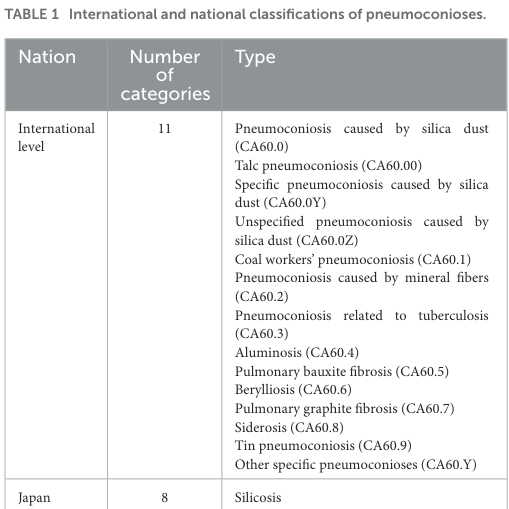
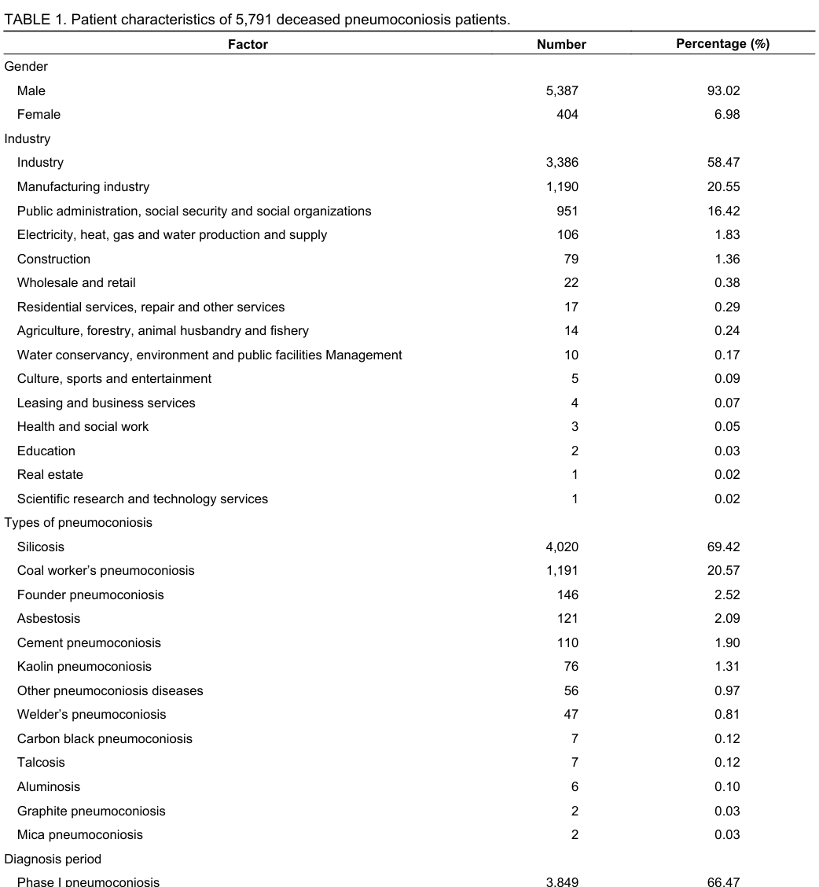

## Question

# Disease Characteristics Research Template

## Target Disease
- **Disease Name:** Graphite Pneumoconiosis
- **MONDO ID:** MONDO:0023286 (if available)
- **Category:** Environmental

## Research Objectives

Please provide a comprehensive research report on **Graphite Pneumoconiosis** covering all of the
disease characteristics listed below. This report will be used to populate a disease knowledge
base entry. Be thorough and cite primary literature (PMID preferred) for all claims.

For each section, **suggested databases/resources** are listed. These are the first places
you should search for information on each topic.

---

### 1. Disease Information
> **Search first:** OMIM, Orphanet, ICD-10/ICD-11, MeSH, PubMed

- What is the disease? Provide a concise overview.
- What are the key identifiers? (OMIM, Orphanet, ICD-10/ICD-11, MeSH, Mondo)
- What are the common synonyms and alternative names?
- Is the information derived from individual patients (e.g., EHR) or aggregated disease-level resources?

### 2. Etiology

- **Disease Causal Factors**: What are the primary causes? (genetic, environmental, infectious, mechanistic)
- **Risk Factors**:
  > **Search first:** PubMed, Cochrane Library, UpToDate, clinical guidelines, ClinVar, ClinGen, GWAS Catalog, PheGenI, CTD, CDC, WHO, epidemiological databases
  - Genetic risk factors (causal variants, susceptibility loci, modifier genes)
  - Environmental risk factors (toxins, lifestyle, occupational exposures, age, sex, family history)
- **Protective Factors**:
  > **Search first:** PubMed, Cochrane Library, clinical trial databases, GWAS Catalog, gnomAD, WHO, CDC, nutrition databases
  - Genetic protective factors (protective variants, modifier alleles)
  - Environmental protective factors (diet, lifestyle, exposures that reduce risk)
- **Gene-Environment Interactions**: How do genetic and environmental factors interact to influence disease?
  > **Search first:** CTD, PubMed, PheGenI, GxE databases

### 3. Phenotypes
> **Search first:** HPO (Human Phenotype Ontology), OMIM, Orphanet, PubMed, clinicaltrials.gov, MedDRA, SNOMED CT, DECIPHER, LOINC

For each phenotype, provide:
- **Phenotype type**: symptoms, clinical signs, physical manifestations, behavioral changes, or laboratory abnormalities
  > For symptoms/signs: HPO, OMIM, Orphanet, PubMed
  > For behavioral changes: HPO, DSM, RDoC (Research Domain Criteria), PubMed
  > For laboratory abnormalities: LOINC, SNOMED CT, LabTests Online, PubMed
- **Phenotype characteristics**:
  > **Search first:** OMIM, Orphanet, HPO, PubMed
  - Age of symptom onset (neonatal, childhood, adult-onset, late-onset)
  - Symptom severity (mild, moderate, severe, variable)
  - Symptom progression (stable, progressive, episodic, fluctuating)
  - Frequency among affected individuals (percentage or qualitative)
- **Quality of life impact**: Effects on daily functioning and well-being (per-phenotype when possible)
  > **Search first:** EQ-5D database, SF-36, WHO QOL databases, PubMed
- Suggest HPO (Human Phenotype Ontology) terms for each phenotype

### 4. Genetic/Molecular Information

- **Causal Genes**: Gene mutations or chromosomal abnormalities responsible for disease (gene symbols, OMIM IDs)
  > **Search first:** OMIM, ClinVar, HGMD, Ensembl, NCBI Gene
- **Pathogenic Variants**:
  - Affected genes (gene symbols, HGNC IDs)
    > **Search first:** OMIM, NCBI Gene, Ensembl, HGNC, UniProt, GeneCards
  - Variant classification (pathogenic, likely pathogenic, VUS per ACMG/AMP guidelines)
    > **Search first:** ClinVar, ClinGen, ACMG/AMP guidelines, VarSome
  - Variant type/class (missense, frameshift, nonsense, splice-site, structural)
  - Allele frequency in population databases
    > **Search first:** gnomAD, 1000 Genomes, ExAC, TOPMed, dbSNP
  - Somatic vs germline origin
    > **Search first:** COSMIC (somatic), ClinVar, ICGC, TCGA
  - Functional consequences (loss of function, gain of function, dominant negative)
- **Modifier Genes**: Genes that modify disease severity or expression
- **Epigenetic Information**: DNA methylation, histone modifications, chromatin changes affecting disease
  > **Search first:** ENCODE, Roadmap Epigenomics, MethBase, DiseaseMeth
- **Chromosomal Abnormalities**: Large-scale genetic changes (aneuploidy, translocations, inversions)
  > **Search first:** DECIPHER, ClinVar, ECARUCA, UCSC Genome Browser

### 5. Environmental Information

- **Environmental Factors**: Non-genetic contributing factors (toxins, radiation, pollution, occupational exposure)
  > **Search first:** CTD (Comparative Toxicogenomics Database), TOXNET, PubMed, EPA databases
- **Lifestyle Factors**: Behavioral factors (smoking, diet, exercise, alcohol consumption)
  > **Search first:** CDC databases, WHO, PubMed, NHANES
- **Infectious Agents**: If applicable, pathogens causing or triggering disease (bacteria, viruses, fungi, parasites)
  > **Search first:** NCBI Taxonomy, ViPR, BV-BRC, MicrobeDB, GIDEON

### 6. Mechanism / Pathophysiology

**Present this section as an ordered causal chain first, then the detail below.**
Open with a numbered sequence of mechanistic steps running from the initiating
lesion (mutation, exposure, infection) to the clinical manifestation, one step per
line, each naming what it causes next. State the causal verb explicitly ("leads
to", "results in") and say where a step is inferred rather than demonstrated.
Where the mechanism branches, show the branch. The categories below are a
checklist of what to cover within those steps, not the organizing structure —
a step may draw on several of them, and a category may contribute to several
steps.

- **Molecular Pathways**: Specific signaling cascades or biochemical pathways involved (Wnt, MAPK, mTOR, PI3K-AKT, etc.)
  > **Search first:** KEGG, Reactome, WikiPathways, PathBank, BioCyc
- **Cellular Processes**: Cell-level mechanisms (apoptosis, autophagy, cell cycle dysregulation, inflammation, etc.)
  > **Search first:** Gene Ontology (GO), Reactome, KEGG, PubMed
- **Protein Dysfunction**: How protein structure or function is altered (misfolding, aggregation, loss of function, gain of function)
  > **Search first:** UniProt, PDB (Protein Data Bank), InterPro, Pfam, AlphaFold
- **Metabolic Changes**: Alterations in metabolic processes (energy metabolism, lipid metabolism, amino acid metabolism)
  > **Search first:** KEGG, BioCyc, HMDB (Human Metabolome Database), BRENDA
- **Immune System Involvement**: Role of immune response (autoimmunity, immunodeficiency, chronic inflammation)
  > **Search first:** ImmPort, Immunome Database, IEDB, Gene Ontology
- **Tissue Damage Mechanisms**: How tissues/ are injured (oxidative stress, ischemia, fibrosis, necrosis)
  > **Search first:** PubMed, Gene Ontology, Reactome
- **Biochemical Abnormalities**: Specific molecular defects (enzyme deficiencies, receptor dysfunction, ion channel defects)
  > **Search first:** BRENDA, UniProt, KEGG, OMIM, PubMed
- **Epigenetic Changes**: DNA methylation, histone modifications affecting gene expression in disease
  > **Search first:** ENCODE, Roadmap Epigenomics, MethBase, DiseaseMeth
- **Molecular Profiling** (if available):
  - Transcriptomics/gene expression changes
    > **Search first:** GEO (Gene Expression Omnibus), ArrayExpress, GTEx, Human Cell Atlas, SRA
  - Proteomics findings
    > **Search first:** PRIDE, ProteomeXchange, Human Protein Atlas, STRING, BioGRID
  - Metabolomics signatures
    > **Search first:** MetaboLights, Metabolomics Workbench, HMDB, METLIN
  - Lipidomics alterations
    > **Search first:** LIPID MAPS, SwissLipids, LipidHome, Metabolomics Workbench
  - Genomic structural features
    > **Search first:** UCSC Genome Browser, Ensembl, NCBI, dbVar, DGV
- **Advanced Technologies** (if applicable):
  - Single-cell analysis findings (cell-type specific mechanisms, cellular heterogeneity)
    > **Search first:** Human Cell Atlas, Single Cell Portal, GEO, CELLxGENE
  - Spatial transcriptomics findings
    > **Search first:** GEO, Spatial Research, Vizgen, 10x Genomics data
  - Multi-omics integration results
    > **Search first:** TCGA, ICGC, cBioPortal, LinkedOmics, PubMed
  - Functional genomics screens (CRISPR, RNAi)
    > **Search first:** DepMap, GenomeRNAi, PubMed, BioGRID ORCS

For each mechanism, describe:
- The causal chain from initial trigger to clinical manifestation
- Which mechanisms are upstream vs downstream
- What cell types and biological processes are involved
- Suggest GO terms for biological processes and CL terms for cell types

### 7. Anatomical Structures Affected

- **Organ Level**:
  - Primary organs directly affected
  - Secondary organ involvement (complications, secondary effects)
  - Body systems involved (cardiovascular, nervous, digestive, respiratory, endocrine, etc.)
  > **Search first:** Uberon, FMA (Foundational Model of Anatomy), OMIM, HPO, ICD-11, MeSH, SNOMED CT
- **Tissue and Cell Level**:
  - Specific tissue types affected (epithelial, connective, muscle, nervous)
  - Specific cell populations targeted (with Cell Ontology terms)
  > **Search first:** Uberon, Human Protein Atlas, Cell Ontology, Human Cell Atlas, CellMarker, PanglaoDB
- **Subcellular Level**:
  - Cellular compartments involved (mitochondria, nucleus, ER, lysosomes) (with GO Cellular Component terms)
  > **Search first:** Gene Ontology (Cellular Component), UniProt, Human Protein Atlas
- **Localization**:
  - Specific anatomical sites (with UBERON terms)
    > **Search first:** FMA, Uberon, NeuroNames (for brain), SNOMED CT
  - Lateralization (unilateral, bilateral, asymmetric)
    > **Search first:** HPO, clinical literature, imaging databases

### 8. Temporal Development

- **Onset**:
  - Typical age of onset (congenital, pediatric, adult, geriatric)
  - Onset pattern (acute, subacute, chronic, insidious)
  > **Search first:** OMIM, Orphanet, HPO, PubMed
- **Progression**:
  - Disease stages (early, intermediate, advanced, end-stage)
    > **Search first:** Cancer Staging Manual (AJCC), WHO classifications, PubMed
  - Progression rate (rapid, slow, variable)
  - Disease course pattern (episodic, relapsing-remitting, progressive, stable)
  - Disease duration (self-limited, chronic lifelong)
  > **Search first:** Disease registries, longitudinal cohort databases, natural history studies, PubMed, Orphanet, OMIM
- **Patterns**:
  - Remission patterns (spontaneous, treatment-induced)
    > **Search first:** Clinical trial databases, disease registries, PubMed
  - Critical periods (time windows of vulnerability or opportunity for intervention)
    > **Search first:** PubMed, developmental biology databases, clinical guidelines

### 9. Inheritance and Population

- **Epidemiology**:
  - Prevalence (cases per 100,000 at given time)
  - Incidence (new cases per 100,000 per year)
  > **Search first:** Orphanet, CDC, WHO, GBD (Global Burden of Disease), national registries, SEER, disease registries
- **For Genetic Etiology**:
  - Inheritance pattern (AD, AR, X-linked, mitochondrial, multifactorial, polygenic)
    > **Search first:** OMIM, Orphanet, ClinVar, GTR (Genetic Testing Registry)
  - Penetrance (complete, incomplete, age-dependent)
    > **Search first:** ClinVar, OMIM, PubMed, ClinGen
  - Expressivity (variable, consistent)
    > **Search first:** OMIM, ClinVar, PubMed
  - Genetic anticipation (increasing severity in successive generations)
    > **Search first:** OMIM, PubMed (especially for repeat expansion disorders)
  - Germline mosaicism
    > **Search first:** ClinVar, OMIM, genetic counseling literature, PubMed
  - Founder effects (population-specific mutations)
    > **Search first:** gnomAD, population genetics databases, PubMed
  - Consanguinity role
    > **Search first:** OMIM, population studies, genetic counseling resources
  - Carrier frequency
    > **Search first:** gnomAD, carrier screening databases, GeneReviews, GTR
- **Population Demographics**:
  - Affected populations (ethnic or demographic groups with higher prevalence)
    > **Search first:** gnomAD, 1000 Genomes, PAGE Study, PubMed, population registries
  - Geographic distribution (endemic areas, regional variation)
    > **Search first:** WHO, CDC, GBD, Orphanet, geographic epidemiology databases
  - Geographic distribution of specific variants
  - Sex ratio (male:female)
    > **Search first:** Disease registries, OMIM, PubMed, epidemiological databases
  - Age distribution of affected individuals
    > **Search first:** CDC, disease registries, SEER, Orphanet

### 10. Diagnostics

- **Clinical Tests**:
  - Laboratory tests (blood, urine, tissue chemistry, specific enzyme assays)
    > **Search first:** LOINC, LabTests Online, PubMed
  - Biomarkers (proteins, metabolites, genetic markers, circulating biomarkers)
    > **Search first:** FDA Biomarker List, BEST (Biomarkers, EndpointS, and other Tools), PubMed
  - Imaging studies (X-ray, CT, MRI, PET, ultrasound)
    > **Search first:** RadLex, DICOM, Radiopaedia, imaging databases
  - Functional tests (pulmonary function, cardiac stress tests)
    > **Search first:** LOINC, clinical guidelines, PubMed
  - Electrophysiology (EEG, EMG, ECG, nerve conduction studies)
    > **Search first:** LOINC, clinical neurophysiology databases, PubMed
  - Biopsy findings (histopathology, immunohistochemistry)
    > **Search first:** SNOMED CT, College of American Pathologists resources, PubMed
  - Pathology findings (microscopic examination)
    > **Search first:** SNOMED CT, Digital Pathology databases, PubMed
- **Genetic Testing**:
  > **Search first:** GTR (Genetic Testing Registry), GeneReviews, ClinGen
  - Overview of recommended genetic testing approach
  - Whole genome sequencing (WGS) utility
    > **Search first:** GTR, ClinVar, GEL (Genomics England), gnomAD
  - Whole exome sequencing (WES) utility
    > **Search first:** GTR, ClinVar, OMIM, GeneMatcher
  - Gene panels (which panels, which genes)
    > **Search first:** GTR, ClinVar, laboratory-specific databases
  - Single gene testing
    > **Search first:** GTR, ClinVar, OMIM, GeneReviews
  - Chromosomal microarray (CMA)
    > **Search first:** DECIPHER, ClinVar, dbVar, ECARUCA
  - Karyotyping
    > **Search first:** Chromosome Abnormality Database, ClinVar, cytogenetics resources
  - FISH
    > **Search first:** ClinVar, cytogenetics databases, PubMed
  - Mitochondrial DNA testing
    > **Search first:** MITOMAP, MSeqDR, ClinVar, GTR
  - Repeat expansion testing
    > **Search first:** GTR, ClinVar, repeat expansion databases, PubMed
- **Omics-Based Diagnostics** (if applicable):
  - RNA sequencing / transcriptomics
    > **Search first:** GEO, ArrayExpress, GTEx, RNA-seq databases
  - Proteomics
    > **Search first:** PRIDE, ProteomeXchange, FDA Biomarker database
  - Metabolomics
    > **Search first:** MetaboLights, Metabolomics Workbench, HMDB
  - Epigenomics
    > **Search first:** GEO, ENCODE, Roadmap Epigenomics, MethBase
  - Liquid biopsy
    > **Search first:** COSMIC, ClinVar, liquid biopsy databases, PubMed
- **Clinical Criteria**:
  - Standardized diagnostic criteria (DSM, ICD, society guidelines)
    > **Search first:** DSM-5, ICD-11, clinical society guidelines, UpToDate
  - Differential diagnosis (other conditions to rule out, with distinguishing features)
    > **Search first:** DynaMed, UpToDate, clinical decision support systems
- **Screening**:
  - Screening methods for asymptomatic individuals (newborn screening, carrier screening, cascade screening)
    > **Search first:** ACMG recommendations, CDC newborn screening, GTR

### 11. Outcome/Prognosis

- **Survival and Mortality**:
  - Survival rate (5-year, 10-year, overall)
    > **Search first:** SEER, cancer registries, disease-specific registries, PubMed
  - Life expectancy (with and without treatment if applicable)
    > **Search first:** Orphanet, disease registries, actuarial databases, PubMed
  - Mortality rate
    > **Search first:** CDC, WHO, GBD, national mortality databases
  - Disease-specific mortality (deaths directly attributable to disease)
    > **Search first:** Disease registries, CDC Wonder, GBD, PubMed
- **Morbidity and Function**:
  - Morbidity (disease-related disability and health impacts)
    > **Search first:** GBD, WHO, disability databases, PubMed
  - Disability outcomes (long-term functional impairments)
    > **Search first:** ICF (International Classification of Functioning), disability registries
  - Quality of life measures (EQ-5D, SF-36, PROMIS, disease-specific tools)
    > **Search first:** EQ-5D database, SF-36, PROMIS, PubMed
- **Disease Course**:
  - Complications (secondary problems: infections, organ failure, etc.)
    > **Search first:** ICD codes, disease registries, clinical databases, PubMed
  - Recovery potential (likelihood and extent of recovery, with vs without treatment)
    > **Search first:** Natural history studies, rehabilitation databases, PubMed
- **Prediction**:
  - Prognostic factors (age, disease severity, biomarkers, treatment response)
    > **Search first:** Prognostic models databases, clinical calculators, PubMed
  - Prognostic biomarkers (molecular markers predicting disease course)
    > **Search first:** FDA Biomarker database, PubMed, cancer prognostic databases

### 12. Treatment

- **Pharmacotherapy**:
  - Pharmacological treatments (drug names, drug classes, mechanisms of action)
    > **Search first:** DrugBank, RxNorm, ATC classification, DailyMed, FDA databases
  - Pharmacogenomics (how genetic variants affect drug metabolism, efficacy, toxicity)
    > **Search first:** PharmGKB, CPIC (Clinical Pharmacogenetics), FDA Table of PGx Biomarkers
- **Advanced Therapeutics**:
  - Gene therapy (viral vectors, CRISPR, gene replacement, gene editing)
    > **Search first:** ClinicalTrials.gov, FDA gene therapy database, ASGCT resources
  - Cell therapy (stem cell transplant, CAR-T, cellular therapeutics)
    > **Search first:** ClinicalTrials.gov, FDA cell therapy database, FACT standards
  - RNA-based therapies (ASOs, siRNA, mRNA therapies)
    > **Search first:** ClinicalTrials.gov, FDA approvals, PubMed
  - Targeted therapies (treatments directed at specific molecular targets)
    > **Search first:** My Cancer Genome, OncoKB, ClinicalTrials.gov, FDA approvals
  - Immunotherapies (checkpoint inhibitors, monoclonal antibodies)
    > **Search first:** Cancer Immunotherapy Database, FDA approvals, ClinicalTrials.gov
- **Surgical and Interventional**:
  - Surgical interventions (types of surgery, timing, outcomes)
    > **Search first:** CPT codes, surgical registries, clinical guidelines, PubMed
- **Supportive and Rehabilitative**:
  - Supportive care (symptom management, pain control, nutrition)
    > **Search first:** Clinical guidelines, Cochrane Library, PubMed
  - Rehabilitation (physical therapy, occupational therapy, speech therapy)
    > **Search first:** Rehabilitation medicine databases, clinical guidelines, PubMed
- **Experimental**:
  - Experimental treatments in clinical trials (with NCT identifiers if available)
    > **Search first:** ClinicalTrials.gov, EU Clinical Trials Register, WHO ICTRP
- **Treatment Outcomes**:
  - Treatment response rates
    > **Search first:** Clinical trial databases, FDA reviews, systematic reviews, PubMed
  - Side effects and adverse events
    > **Search first:** FDA Adverse Event Reporting System (FAERS), MedWatch, PubMed
- **Treatment Strategy**:
  - Treatment algorithms (clinical pathways, decision trees)
    > **Search first:** Clinical practice guidelines, NCCN Guidelines, UpToDate
  - Combination therapies
    > **Search first:** ClinicalTrials.gov, treatment guidelines, PubMed
  - Personalized medicine approaches (genotype-guided treatment)
    > **Search first:** My Cancer Genome, CIViC, PharmGKB, precision medicine databases

For each treatment, suggest NCIT (NCI Thesaurus) clinical-intervention terms where applicable.

### 13. Prevention

- **Prevention Levels**:
  - Primary prevention (preventing disease occurrence: vaccination, risk factor modification)
    > **Search first:** CDC, WHO, USPSTF recommendations, Cochrane Library
  - Secondary prevention (early detection and treatment: screening programs, early intervention)
    > **Search first:** USPSTF, CDC screening guidelines, WHO
  - Tertiary prevention (preventing complications in those with disease)
    > **Search first:** Clinical guidelines, disease management protocols, PubMed
- **Immunization**: Vaccine strategies (if applicable)
  > **Search first:** CDC vaccine schedules, WHO immunization, FDA vaccine database
- **Screening and Early Detection**:
  - Screening programs (population-based: newborn screening, cancer screening)
    > **Search first:** CDC screening programs, USPSTF, cancer screening databases
  - Genetic screening (carrier screening, preimplantation genetic diagnosis, prenatal testing)
    > **Search first:** ACMG recommendations, ACOG guidelines, GTR
  - Risk stratification (identifying high-risk individuals for targeted prevention)
    > **Search first:** Risk prediction models, clinical calculators, PubMed
- **Behavioral Interventions**: Lifestyle modifications to reduce risk
  > **Search first:** CDC, WHO, behavioral intervention databases, Cochrane Library
- **Counseling**: Genetic counseling (risk assessment, family planning guidance)
  > **Search first:** NSGC resources, ACMG guidelines, GeneReviews
- **Public Health**:
  - Public health interventions (sanitation, vector control, health education)
    > **Search first:** CDC, WHO, public health databases, PubMed
  - Environmental interventions (reducing environmental risk factors)
    > **Search first:** EPA databases, WHO environmental health, PubMed
- **Prophylaxis**: Preventive medications or procedures
  > **Search first:** Clinical guidelines, FDA approvals, PubMed

### 14. Other Species / Natural Disease

- **Taxonomy**: Species affected (with NCBI Taxon identifiers)
  > **Search first:** NCBI Taxonomy
- **Breed**: Specific breeds affected (with VBO identifiers if applicable)
  > **Search first:** VBO (Vertebrate Breed Ontology)
- **Gene**: Orthologous genes in other species (with NCBI Gene IDs)
  > **Search first:** NCBI Gene
- **Natural Disease**:
  - Naturally occurring disease in other species (companion animals, wildlife)
    > **Search first:** OMIA (Online Mendelian Inheritance in Animals), VetCompass, PubMed
  - Veterinary relevance and importance in animal health
    > **Search first:** OMIA, veterinary databases, PubMed
- **Comparative Biology**:
  - Comparative pathology (similarities and differences across species)
    > **Search first:** OMIA, comparative pathology databases, PubMed
  - Evolutionary conservation of disease mechanisms
    > **Search first:** HomoloGene, OrthoMCL, Alliance of Genome Resources
- **Transmission** (if applicable):
  - Zoonotic potential
    > **Search first:** CDC zoonotic diseases, WHO zoonoses, GIDEON
  - Cross-species susceptibility
    > **Search first:** NCBI Taxonomy, veterinary databases, PubMed

### 15. Model Organisms

- **Model Types**:
  - Model organism type (mammalian, invertebrate, cellular, in vitro)
    > **Search first:** Alliance of Genome Resources, model organism databases
  - Specific model systems (mouse, rat, zebrafish, Drosophila, C. elegans, yeast, cell lines, organoids, iPSCs)
    > **Search first:** MGI, RGD, ZFIN, FlyBase, WormBase, SGD, ATCC, Cellosaurus
  - Induced models (drug treatment, surgical intervention, environmental manipulation)
    > **Search first:** MGI, model organism databases, PubMed
- **Genetic Models**:
  - Types available (knockout, knock-in, transgenic, conditional, humanized)
    > **Search first:** MGI, IMPC, KOMP, EuMMCR, IMSR
- **Model Characteristics**:
  - Phenotype recapitulation (how well model reproduces human disease features)
    > **Search first:** Model organism databases, comparative studies, PubMed
  - Model limitations (aspects of human disease not captured)
    > **Search first:** Model organism databases, PubMed, review articles
- **Applications**:
  - Research applications (what aspects of disease can be studied)
    > **Search first:** Model organism databases, PubMed
- **Resources**:
  - Model databases
    > **Search first:** MGI, RGD, ZFIN, FlyBase, WormBase, IMSR, EMMA, MMRRC

---

## Citation Requirements

- Cite primary literature (PMID preferred) for all mechanistic and clinical claims
- Prioritize recent reviews and landmark papers
- Include direct quotes from abstracts where possible to support key statements
- Distinguish evidence source types: human clinical, model organism, in vitro, computational

## Output Format

Structure your response as a comprehensive narrative organized by the sections above.
For each section, provide:
- Factual content with specific details (numbers, percentages, gene names, variant nomenclature)
- Ontology term suggestions (HPO, GO, CL, UBERON, CHEBI, NCIT, MONDO) where applicable
- Evidence citations with PMIDs
- Direct quotes from abstracts to support key claims
- Clear indication when information is not available or not applicable for this disease

This report will be used to populate a disease knowledge base entry with:
- Pathophysiology descriptions with causal chains
- Gene/protein annotations (HGNC, GO terms)
- Phenotype associations (HP terms) with frequencies
- Cell type involvement (CL terms)
- Anatomical locations (UBERON terms)
- Chemical entities (CHEBI terms)
- Treatment annotations (NCIT terms)
- Evidence items with PMIDs and exact abstract quotes
- Epidemiology, prognosis, diagnostic, and prevention information
- Animal model descriptions with phenotype recapitulation details

## Output

Question: You are an expert researcher providing comprehensive, well-cited information.

Provide detailed information focusing on:
1. Key concepts and definitions with current understanding
2. Recent developments and latest research (prioritize 2023-2024 sources)
3. Current applications and real-world implementations
4. Expert opinions and analysis from authoritative sources
5. Relevant statistics and data from recent studies

Format as a comprehensive research report with proper citations. Include URLs and publication dates where available.
Always prioritize recent, authoritative sources and provide specific citations for all major claims.

# Disease Characteristics Research Template

## Target Disease
- **Disease Name:** Graphite Pneumoconiosis
- **MONDO ID:** MONDO:0023286 (if available)
- **Category:** Environmental

## Research Objectives

Please provide a comprehensive research report on **Graphite Pneumoconiosis** covering all of the
disease characteristics listed below. This report will be used to populate a disease knowledge
base entry. Be thorough and cite primary literature (PMID preferred) for all claims.

For each section, **suggested databases/resources** are listed. These are the first places
you should search for information on each topic.

---

### 1. Disease Information
> **Search first:** OMIM, Orphanet, ICD-10/ICD-11, MeSH, PubMed

- What is the disease? Provide a concise overview.
- What are the key identifiers? (OMIM, Orphanet, ICD-10/ICD-11, MeSH, Mondo)
- What are the common synonyms and alternative names?
- Is the information derived from individual patients (e.g., EHR) or aggregated disease-level resources?

### 2. Etiology

- **Disease Causal Factors**: What are the primary causes? (genetic, environmental, infectious, mechanistic)
- **Risk Factors**:
  > **Search first:** PubMed, Cochrane Library, UpToDate, clinical guidelines, ClinVar, ClinGen, GWAS Catalog, PheGenI, CTD, CDC, WHO, epidemiological databases
  - Genetic risk factors (causal variants, susceptibility loci, modifier genes)
  - Environmental risk factors (toxins, lifestyle, occupational exposures, age, sex, family history)
- **Protective Factors**:
  > **Search first:** PubMed, Cochrane Library, clinical trial databases, GWAS Catalog, gnomAD, WHO, CDC, nutrition databases
  - Genetic protective factors (protective variants, modifier alleles)
  - Environmental protective factors (diet, lifestyle, exposures that reduce risk)
- **Gene-Environment Interactions**: How do genetic and environmental factors interact to influence disease?
  > **Search first:** CTD, PubMed, PheGenI, GxE databases

### 3. Phenotypes
> **Search first:** HPO (Human Phenotype Ontology), OMIM, Orphanet, PubMed, clinicaltrials.gov, MedDRA, SNOMED CT, DECIPHER, LOINC

For each phenotype, provide:
- **Phenotype type**: symptoms, clinical signs, physical manifestations, behavioral changes, or laboratory abnormalities
  > For symptoms/signs: HPO, OMIM, Orphanet, PubMed
  > For behavioral changes: HPO, DSM, RDoC (Research Domain Criteria), PubMed
  > For laboratory abnormalities: LOINC, SNOMED CT, LabTests Online, PubMed
- **Phenotype characteristics**:
  > **Search first:** OMIM, Orphanet, HPO, PubMed
  - Age of symptom onset (neonatal, childhood, adult-onset, late-onset)
  - Symptom severity (mild, moderate, severe, variable)
  - Symptom progression (stable, progressive, episodic, fluctuating)
  - Frequency among affected individuals (percentage or qualitative)
- **Quality of life impact**: Effects on daily functioning and well-being (per-phenotype when possible)
  > **Search first:** EQ-5D database, SF-36, WHO QOL databases, PubMed
- Suggest HPO (Human Phenotype Ontology) terms for each phenotype

### 4. Genetic/Molecular Information

- **Causal Genes**: Gene mutations or chromosomal abnormalities responsible for disease (gene symbols, OMIM IDs)
  > **Search first:** OMIM, ClinVar, HGMD, Ensembl, NCBI Gene
- **Pathogenic Variants**:
  - Affected genes (gene symbols, HGNC IDs)
    > **Search first:** OMIM, NCBI Gene, Ensembl, HGNC, UniProt, GeneCards
  - Variant classification (pathogenic, likely pathogenic, VUS per ACMG/AMP guidelines)
    > **Search first:** ClinVar, ClinGen, ACMG/AMP guidelines, VarSome
  - Variant type/class (missense, frameshift, nonsense, splice-site, structural)
  - Allele frequency in population databases
    > **Search first:** gnomAD, 1000 Genomes, ExAC, TOPMed, dbSNP
  - Somatic vs germline origin
    > **Search first:** COSMIC (somatic), ClinVar, ICGC, TCGA
  - Functional consequences (loss of function, gain of function, dominant negative)
- **Modifier Genes**: Genes that modify disease severity or expression
- **Epigenetic Information**: DNA methylation, histone modifications, chromatin changes affecting disease
  > **Search first:** ENCODE, Roadmap Epigenomics, MethBase, DiseaseMeth
- **Chromosomal Abnormalities**: Large-scale genetic changes (aneuploidy, translocations, inversions)
  > **Search first:** DECIPHER, ClinVar, ECARUCA, UCSC Genome Browser

### 5. Environmental Information

- **Environmental Factors**: Non-genetic contributing factors (toxins, radiation, pollution, occupational exposure)
  > **Search first:** CTD (Comparative Toxicogenomics Database), TOXNET, PubMed, EPA databases
- **Lifestyle Factors**: Behavioral factors (smoking, diet, exercise, alcohol consumption)
  > **Search first:** CDC databases, WHO, PubMed, NHANES
- **Infectious Agents**: If applicable, pathogens causing or triggering disease (bacteria, viruses, fungi, parasites)
  > **Search first:** NCBI Taxonomy, ViPR, BV-BRC, MicrobeDB, GIDEON

### 6. Mechanism / Pathophysiology

**Present this section as an ordered causal chain first, then the detail below.**
Open with a numbered sequence of mechanistic steps running from the initiating
lesion (mutation, exposure, infection) to the clinical manifestation, one step per
line, each naming what it causes next. State the causal verb explicitly ("leads
to", "results in") and say where a step is inferred rather than demonstrated.
Where the mechanism branches, show the branch. The categories below are a
checklist of what to cover within those steps, not the organizing structure —
a step may draw on several of them, and a category may contribute to several
steps.

- **Molecular Pathways**: Specific signaling cascades or biochemical pathways involved (Wnt, MAPK, mTOR, PI3K-AKT, etc.)
  > **Search first:** KEGG, Reactome, WikiPathways, PathBank, BioCyc
- **Cellular Processes**: Cell-level mechanisms (apoptosis, autophagy, cell cycle dysregulation, inflammation, etc.)
  > **Search first:** Gene Ontology (GO), Reactome, KEGG, PubMed
- **Protein Dysfunction**: How protein structure or function is altered (misfolding, aggregation, loss of function, gain of function)
  > **Search first:** UniProt, PDB (Protein Data Bank), InterPro, Pfam, AlphaFold
- **Metabolic Changes**: Alterations in metabolic processes (energy metabolism, lipid metabolism, amino acid metabolism)
  > **Search first:** KEGG, BioCyc, HMDB (Human Metabolome Database), BRENDA
- **Immune System Involvement**: Role of immune response (autoimmunity, immunodeficiency, chronic inflammation)
  > **Search first:** ImmPort, Immunome Database, IEDB, Gene Ontology
- **Tissue Damage Mechanisms**: How tissues/ are injured (oxidative stress, ischemia, fibrosis, necrosis)
  > **Search first:** PubMed, Gene Ontology, Reactome
- **Biochemical Abnormalities**: Specific molecular defects (enzyme deficiencies, receptor dysfunction, ion channel defects)
  > **Search first:** BRENDA, UniProt, KEGG, OMIM, PubMed
- **Epigenetic Changes**: DNA methylation, histone modifications affecting gene expression in disease
  > **Search first:** ENCODE, Roadmap Epigenomics, MethBase, DiseaseMeth
- **Molecular Profiling** (if available):
  - Transcriptomics/gene expression changes
    > **Search first:** GEO (Gene Expression Omnibus), ArrayExpress, GTEx, Human Cell Atlas, SRA
  - Proteomics findings
    > **Search first:** PRIDE, ProteomeXchange, Human Protein Atlas, STRING, BioGRID
  - Metabolomics signatures
    > **Search first:** MetaboLights, Metabolomics Workbench, HMDB, METLIN
  - Lipidomics alterations
    > **Search first:** LIPID MAPS, SwissLipids, LipidHome, Metabolomics Workbench
  - Genomic structural features
    > **Search first:** UCSC Genome Browser, Ensembl, NCBI, dbVar, DGV
- **Advanced Technologies** (if applicable):
  - Single-cell analysis findings (cell-type specific mechanisms, cellular heterogeneity)
    > **Search first:** Human Cell Atlas, Single Cell Portal, GEO, CELLxGENE
  - Spatial transcriptomics findings
    > **Search first:** GEO, Spatial Research, Vizgen, 10x Genomics data
  - Multi-omics integration results
    > **Search first:** TCGA, ICGC, cBioPortal, LinkedOmics, PubMed
  - Functional genomics screens (CRISPR, RNAi)
    > **Search first:** DepMap, GenomeRNAi, PubMed, BioGRID ORCS

For each mechanism, describe:
- The causal chain from initial trigger to clinical manifestation
- Which mechanisms are upstream vs downstream
- What cell types and biological processes are involved
- Suggest GO terms for biological processes and CL terms for cell types

### 7. Anatomical Structures Affected

- **Organ Level**:
  - Primary organs directly affected
  - Secondary organ involvement (complications, secondary effects)
  - Body systems involved (cardiovascular, nervous, digestive, respiratory, endocrine, etc.)
  > **Search first:** Uberon, FMA (Foundational Model of Anatomy), OMIM, HPO, ICD-11, MeSH, SNOMED CT
- **Tissue and Cell Level**:
  - Specific tissue types affected (epithelial, connective, muscle, nervous)
  - Specific cell populations targeted (with Cell Ontology terms)
  > **Search first:** Uberon, Human Protein Atlas, Cell Ontology, Human Cell Atlas, CellMarker, PanglaoDB
- **Subcellular Level**:
  - Cellular compartments involved (mitochondria, nucleus, ER, lysosomes) (with GO Cellular Component terms)
  > **Search first:** Gene Ontology (Cellular Component), UniProt, Human Protein Atlas
- **Localization**:
  - Specific anatomical sites (with UBERON terms)
    > **Search first:** FMA, Uberon, NeuroNames (for brain), SNOMED CT
  - Lateralization (unilateral, bilateral, asymmetric)
    > **Search first:** HPO, clinical literature, imaging databases

### 8. Temporal Development

- **Onset**:
  - Typical age of onset (congenital, pediatric, adult, geriatric)
  - Onset pattern (acute, subacute, chronic, insidious)
  > **Search first:** OMIM, Orphanet, HPO, PubMed
- **Progression**:
  - Disease stages (early, intermediate, advanced, end-stage)
    > **Search first:** Cancer Staging Manual (AJCC), WHO classifications, PubMed
  - Progression rate (rapid, slow, variable)
  - Disease course pattern (episodic, relapsing-remitting, progressive, stable)
  - Disease duration (self-limited, chronic lifelong)
  > **Search first:** Disease registries, longitudinal cohort databases, natural history studies, PubMed, Orphanet, OMIM
- **Patterns**:
  - Remission patterns (spontaneous, treatment-induced)
    > **Search first:** Clinical trial databases, disease registries, PubMed
  - Critical periods (time windows of vulnerability or opportunity for intervention)
    > **Search first:** PubMed, developmental biology databases, clinical guidelines

### 9. Inheritance and Population

- **Epidemiology**:
  - Prevalence (cases per 100,000 at given time)
  - Incidence (new cases per 100,000 per year)
  > **Search first:** Orphanet, CDC, WHO, GBD (Global Burden of Disease), national registries, SEER, disease registries
- **For Genetic Etiology**:
  - Inheritance pattern (AD, AR, X-linked, mitochondrial, multifactorial, polygenic)
    > **Search first:** OMIM, Orphanet, ClinVar, GTR (Genetic Testing Registry)
  - Penetrance (complete, incomplete, age-dependent)
    > **Search first:** ClinVar, OMIM, PubMed, ClinGen
  - Expressivity (variable, consistent)
    > **Search first:** OMIM, ClinVar, PubMed
  - Genetic anticipation (increasing severity in successive generations)
    > **Search first:** OMIM, PubMed (especially for repeat expansion disorders)
  - Germline mosaicism
    > **Search first:** ClinVar, OMIM, genetic counseling literature, PubMed
  - Founder effects (population-specific mutations)
    > **Search first:** gnomAD, population genetics databases, PubMed
  - Consanguinity role
    > **Search first:** OMIM, population studies, genetic counseling resources
  - Carrier frequency
    > **Search first:** gnomAD, carrier screening databases, GeneReviews, GTR
- **Population Demographics**:
  - Affected populations (ethnic or demographic groups with higher prevalence)
    > **Search first:** gnomAD, 1000 Genomes, PAGE Study, PubMed, population registries
  - Geographic distribution (endemic areas, regional variation)
    > **Search first:** WHO, CDC, GBD, Orphanet, geographic epidemiology databases
  - Geographic distribution of specific variants
  - Sex ratio (male:female)
    > **Search first:** Disease registries, OMIM, PubMed, epidemiological databases
  - Age distribution of affected individuals
    > **Search first:** CDC, disease registries, SEER, Orphanet

### 10. Diagnostics

- **Clinical Tests**:
  - Laboratory tests (blood, urine, tissue chemistry, specific enzyme assays)
    > **Search first:** LOINC, LabTests Online, PubMed
  - Biomarkers (proteins, metabolites, genetic markers, circulating biomarkers)
    > **Search first:** FDA Biomarker List, BEST (Biomarkers, EndpointS, and other Tools), PubMed
  - Imaging studies (X-ray, CT, MRI, PET, ultrasound)
    > **Search first:** RadLex, DICOM, Radiopaedia, imaging databases
  - Functional tests (pulmonary function, cardiac stress tests)
    > **Search first:** LOINC, clinical guidelines, PubMed
  - Electrophysiology (EEG, EMG, ECG, nerve conduction studies)
    > **Search first:** LOINC, clinical neurophysiology databases, PubMed
  - Biopsy findings (histopathology, immunohistochemistry)
    > **Search first:** SNOMED CT, College of American Pathologists resources, PubMed
  - Pathology findings (microscopic examination)
    > **Search first:** SNOMED CT, Digital Pathology databases, PubMed
- **Genetic Testing**:
  > **Search first:** GTR (Genetic Testing Registry), GeneReviews, ClinGen
  - Overview of recommended genetic testing approach
  - Whole genome sequencing (WGS) utility
    > **Search first:** GTR, ClinVar, GEL (Genomics England), gnomAD
  - Whole exome sequencing (WES) utility
    > **Search first:** GTR, ClinVar, OMIM, GeneMatcher
  - Gene panels (which panels, which genes)
    > **Search first:** GTR, ClinVar, laboratory-specific databases
  - Single gene testing
    > **Search first:** GTR, ClinVar, OMIM, GeneReviews
  - Chromosomal microarray (CMA)
    > **Search first:** DECIPHER, ClinVar, dbVar, ECARUCA
  - Karyotyping
    > **Search first:** Chromosome Abnormality Database, ClinVar, cytogenetics resources
  - FISH
    > **Search first:** ClinVar, cytogenetics databases, PubMed
  - Mitochondrial DNA testing
    > **Search first:** MITOMAP, MSeqDR, ClinVar, GTR
  - Repeat expansion testing
    > **Search first:** GTR, ClinVar, repeat expansion databases, PubMed
- **Omics-Based Diagnostics** (if applicable):
  - RNA sequencing / transcriptomics
    > **Search first:** GEO, ArrayExpress, GTEx, RNA-seq databases
  - Proteomics
    > **Search first:** PRIDE, ProteomeXchange, FDA Biomarker database
  - Metabolomics
    > **Search first:** MetaboLights, Metabolomics Workbench, HMDB
  - Epigenomics
    > **Search first:** GEO, ENCODE, Roadmap Epigenomics, MethBase
  - Liquid biopsy
    > **Search first:** COSMIC, ClinVar, liquid biopsy databases, PubMed
- **Clinical Criteria**:
  - Standardized diagnostic criteria (DSM, ICD, society guidelines)
    > **Search first:** DSM-5, ICD-11, clinical society guidelines, UpToDate
  - Differential diagnosis (other conditions to rule out, with distinguishing features)
    > **Search first:** DynaMed, UpToDate, clinical decision support systems
- **Screening**:
  - Screening methods for asymptomatic individuals (newborn screening, carrier screening, cascade screening)
    > **Search first:** ACMG recommendations, CDC newborn screening, GTR

### 11. Outcome/Prognosis

- **Survival and Mortality**:
  - Survival rate (5-year, 10-year, overall)
    > **Search first:** SEER, cancer registries, disease-specific registries, PubMed
  - Life expectancy (with and without treatment if applicable)
    > **Search first:** Orphanet, disease registries, actuarial databases, PubMed
  - Mortality rate
    > **Search first:** CDC, WHO, GBD, national mortality databases
  - Disease-specific mortality (deaths directly attributable to disease)
    > **Search first:** Disease registries, CDC Wonder, GBD, PubMed
- **Morbidity and Function**:
  - Morbidity (disease-related disability and health impacts)
    > **Search first:** GBD, WHO, disability databases, PubMed
  - Disability outcomes (long-term functional impairments)
    > **Search first:** ICF (International Classification of Functioning), disability registries
  - Quality of life measures (EQ-5D, SF-36, PROMIS, disease-specific tools)
    > **Search first:** EQ-5D database, SF-36, PROMIS, PubMed
- **Disease Course**:
  - Complications (secondary problems: infections, organ failure, etc.)
    > **Search first:** ICD codes, disease registries, clinical databases, PubMed
  - Recovery potential (likelihood and extent of recovery, with vs without treatment)
    > **Search first:** Natural history studies, rehabilitation databases, PubMed
- **Prediction**:
  - Prognostic factors (age, disease severity, biomarkers, treatment response)
    > **Search first:** Prognostic models databases, clinical calculators, PubMed
  - Prognostic biomarkers (molecular markers predicting disease course)
    > **Search first:** FDA Biomarker database, PubMed, cancer prognostic databases

### 12. Treatment

- **Pharmacotherapy**:
  - Pharmacological treatments (drug names, drug classes, mechanisms of action)
    > **Search first:** DrugBank, RxNorm, ATC classification, DailyMed, FDA databases
  - Pharmacogenomics (how genetic variants affect drug metabolism, efficacy, toxicity)
    > **Search first:** PharmGKB, CPIC (Clinical Pharmacogenetics), FDA Table of PGx Biomarkers
- **Advanced Therapeutics**:
  - Gene therapy (viral vectors, CRISPR, gene replacement, gene editing)
    > **Search first:** ClinicalTrials.gov, FDA gene therapy database, ASGCT resources
  - Cell therapy (stem cell transplant, CAR-T, cellular therapeutics)
    > **Search first:** ClinicalTrials.gov, FDA cell therapy database, FACT standards
  - RNA-based therapies (ASOs, siRNA, mRNA therapies)
    > **Search first:** ClinicalTrials.gov, FDA approvals, PubMed
  - Targeted therapies (treatments directed at specific molecular targets)
    > **Search first:** My Cancer Genome, OncoKB, ClinicalTrials.gov, FDA approvals
  - Immunotherapies (checkpoint inhibitors, monoclonal antibodies)
    > **Search first:** Cancer Immunotherapy Database, FDA approvals, ClinicalTrials.gov
- **Surgical and Interventional**:
  - Surgical interventions (types of surgery, timing, outcomes)
    > **Search first:** CPT codes, surgical registries, clinical guidelines, PubMed
- **Supportive and Rehabilitative**:
  - Supportive care (symptom management, pain control, nutrition)
    > **Search first:** Clinical guidelines, Cochrane Library, PubMed
  - Rehabilitation (physical therapy, occupational therapy, speech therapy)
    > **Search first:** Rehabilitation medicine databases, clinical guidelines, PubMed
- **Experimental**:
  - Experimental treatments in clinical trials (with NCT identifiers if available)
    > **Search first:** ClinicalTrials.gov, EU Clinical Trials Register, WHO ICTRP
- **Treatment Outcomes**:
  - Treatment response rates
    > **Search first:** Clinical trial databases, FDA reviews, systematic reviews, PubMed
  - Side effects and adverse events
    > **Search first:** FDA Adverse Event Reporting System (FAERS), MedWatch, PubMed
- **Treatment Strategy**:
  - Treatment algorithms (clinical pathways, decision trees)
    > **Search first:** Clinical practice guidelines, NCCN Guidelines, UpToDate
  - Combination therapies
    > **Search first:** ClinicalTrials.gov, treatment guidelines, PubMed
  - Personalized medicine approaches (genotype-guided treatment)
    > **Search first:** My Cancer Genome, CIViC, PharmGKB, precision medicine databases

For each treatment, suggest NCIT (NCI Thesaurus) clinical-intervention terms where applicable.

### 13. Prevention

- **Prevention Levels**:
  - Primary prevention (preventing disease occurrence: vaccination, risk factor modification)
    > **Search first:** CDC, WHO, USPSTF recommendations, Cochrane Library
  - Secondary prevention (early detection and treatment: screening programs, early intervention)
    > **Search first:** USPSTF, CDC screening guidelines, WHO
  - Tertiary prevention (preventing complications in those with disease)
    > **Search first:** Clinical guidelines, disease management protocols, PubMed
- **Immunization**: Vaccine strategies (if applicable)
  > **Search first:** CDC vaccine schedules, WHO immunization, FDA vaccine database
- **Screening and Early Detection**:
  - Screening programs (population-based: newborn screening, cancer screening)
    > **Search first:** CDC screening programs, USPSTF, cancer screening databases
  - Genetic screening (carrier screening, preimplantation genetic diagnosis, prenatal testing)
    > **Search first:** ACMG recommendations, ACOG guidelines, GTR
  - Risk stratification (identifying high-risk individuals for targeted prevention)
    > **Search first:** Risk prediction models, clinical calculators, PubMed
- **Behavioral Interventions**: Lifestyle modifications to reduce risk
  > **Search first:** CDC, WHO, behavioral intervention databases, Cochrane Library
- **Counseling**: Genetic counseling (risk assessment, family planning guidance)
  > **Search first:** NSGC resources, ACMG guidelines, GeneReviews
- **Public Health**:
  - Public health interventions (sanitation, vector control, health education)
    > **Search first:** CDC, WHO, public health databases, PubMed
  - Environmental interventions (reducing environmental risk factors)
    > **Search first:** EPA databases, WHO environmental health, PubMed
- **Prophylaxis**: Preventive medications or procedures
  > **Search first:** Clinical guidelines, FDA approvals, PubMed

### 14. Other Species / Natural Disease

- **Taxonomy**: Species affected (with NCBI Taxon identifiers)
  > **Search first:** NCBI Taxonomy
- **Breed**: Specific breeds affected (with VBO identifiers if applicable)
  > **Search first:** VBO (Vertebrate Breed Ontology)
- **Gene**: Orthologous genes in other species (with NCBI Gene IDs)
  > **Search first:** NCBI Gene
- **Natural Disease**:
  - Naturally occurring disease in other species (companion animals, wildlife)
    > **Search first:** OMIA (Online Mendelian Inheritance in Animals), VetCompass, PubMed
  - Veterinary relevance and importance in animal health
    > **Search first:** OMIA, veterinary databases, PubMed
- **Comparative Biology**:
  - Comparative pathology (similarities and differences across species)
    > **Search first:** OMIA, comparative pathology databases, PubMed
  - Evolutionary conservation of disease mechanisms
    > **Search first:** HomoloGene, OrthoMCL, Alliance of Genome Resources
- **Transmission** (if applicable):
  - Zoonotic potential
    > **Search first:** CDC zoonotic diseases, WHO zoonoses, GIDEON
  - Cross-species susceptibility
    > **Search first:** NCBI Taxonomy, veterinary databases, PubMed

### 15. Model Organisms

- **Model Types**:
  - Model organism type (mammalian, invertebrate, cellular, in vitro)
    > **Search first:** Alliance of Genome Resources, model organism databases
  - Specific model systems (mouse, rat, zebrafish, Drosophila, C. elegans, yeast, cell lines, organoids, iPSCs)
    > **Search first:** MGI, RGD, ZFIN, FlyBase, WormBase, SGD, ATCC, Cellosaurus
  - Induced models (drug treatment, surgical intervention, environmental manipulation)
    > **Search first:** MGI, model organism databases, PubMed
- **Genetic Models**:
  - Types available (knockout, knock-in, transgenic, conditional, humanized)
    > **Search first:** MGI, IMPC, KOMP, EuMMCR, IMSR
- **Model Characteristics**:
  - Phenotype recapitulation (how well model reproduces human disease features)
    > **Search first:** Model organism databases, comparative studies, PubMed
  - Model limitations (aspects of human disease not captured)
    > **Search first:** Model organism databases, PubMed, review articles
- **Applications**:
  - Research applications (what aspects of disease can be studied)
    > **Search first:** Model organism databases, PubMed
- **Resources**:
  - Model databases
    > **Search first:** MGI, RGD, ZFIN, FlyBase, WormBase, IMSR, EMMA, MMRRC

---

## Citation Requirements

- Cite primary literature (PMID preferred) for all mechanistic and clinical claims
- Prioritize recent reviews and landmark papers
- Include direct quotes from abstracts where possible to support key statements
- Distinguish evidence source types: human clinical, model organism, in vitro, computational

## Output Format

Structure your response as a comprehensive narrative organized by the sections above.
For each section, provide:
- Factual content with specific details (numbers, percentages, gene names, variant nomenclature)
- Ontology term suggestions (HPO, GO, CL, UBERON, CHEBI, NCIT, MONDO) where applicable
- Evidence citations with PMIDs
- Direct quotes from abstracts to support key claims
- Clear indication when information is not available or not applicable for this disease

This report will be used to populate a disease knowledge base entry with:
- Pathophysiology descriptions with causal chains
- Gene/protein annotations (HGNC, GO terms)
- Phenotype associations (HP terms) with frequencies
- Cell type involvement (CL terms)
- Anatomical locations (UBERON terms)
- Chemical entities (CHEBI terms)
- Treatment annotations (NCIT terms)
- Evidence items with PMIDs and exact abstract quotes
- Epidemiology, prognosis, diagnostic, and prevention information
- Animal model descriptions with phenotype recapitulation details

# Graphite pneumoconiosis: disease-characteristics research report

**Scope and evidence standard.** Graphite pneumoconiosis is a rare, acquired occupational lung disease associated with inhalation of respirable graphite-containing dust. The evidence is predominantly historical human workplace studies and case reports, supported by short-duration rat inhalation experiments. Natural graphite may contain quartz and other minerals; consequently, disease observed in graphite workers cannot automatically be attributed to chemically pure graphite. Recent, graphite-specific clinical or molecular studies are scarce. The data below describe **aggregated publications and occupational surveys**, not access to individual electronic health records; the small historical case descriptions cited by those publications are patient-level reports. (antao2006lungdiseasesassociateda pages 7-8, anderson1989comparativeeffectsof pages 1-2, jennison1994healthhazardevaluation pages 1-3)

For orientation, the following evidence table distinguishes observed findings from what each study can establish.

| Evidence population/year | Observation | Interpretation and limitations | Sources |
|---|---|---|---|
| Jiangsu pneumoconiosis registry, China, 2011–2023; analysis published 2024 | Graphite pneumoconiosis accounted for 2 of 5,791 deceased pneumoconiosis patients (0.03%). | This is the graphite-diagnosis share **among registered deceased pneumoconiosis patients**, not population prevalence, incidence, case-fatality, or graphite-specific mortality. The two cases are too few for disease-specific survival inference. | (zhu2024analysisofmortality pages 2-4, zhu2024analysisofmortality pages 1-2, zhu2024analysisofmortality media fb024ce4) |
| NIOSH survey, Asbury Graphite Mills, United States, 1993; report published December 1994 | Among 47 current workers, 3 (6.4%) had chest radiographs consistent with simple pneumoconiosis; 8 (17.0%) had below-normal spirometry—6 mild obstructive and 2 mild restrictive patterns. | Cross-sectional, small, all-male workforce; no unexposed control group and former workers did not participate. Silica measurement was analytically unsuccessful, but graphite feedstock contained silica and potential silica overexposure was demonstrated, preventing attribution to graphite alone. | (jennison1994healthhazardevaluation pages 15-17, jennison1994healthhazardevaluation pages 1-3) |
| Historic CT series of 19 graphite workers, reported in a 2006 review | CT showed small nodular hyperattenuating areas in 17/19 (89.5%), interlobular septal thickening in 11/19 (57.9%), and large hyperattenuating areas in 10/19 (52.6%). | Small selected series rather than a screening population; findings resemble coal-workers’ pneumoconiosis and are not specific for graphite. Exposure composition and frequencies among all graphite-exposed workers were not established. | (antao2006lungdiseasesassociateda pages 7-8, antao2006lungdiseasesassociated pages 7-8) |
| Historic review of 639 reported graphite-pneumoconiosis cases, published 1983 | Histopathology or autopsy material confirmed only 39/639 reported cases (6.1%); detailed dust-exposure information was available for only 14 cases. | The evidence base was dominated by radiographic reports with limited pathological and exposure verification. The reviewer judged most adequately described cases to be mixed-dust reactions, commonly involving mineral impurities such as quartz or mica. | (antao2006lungdiseasesassociateda pages 7-8) |
| Fischer-344 rat acute inhalation study, published 1989 | After one 4-hour exposure, synthetic graphite containing <0.1% quartz at 1–100 mg/m³ did not produce the persistent inflammatory and macrophage changes seen with 100 mg/m³ silica. At 500 mg/m³, graphite produced transient inflammation and macrophage activation lasting about 24–48 hours; particles remained in macrophages for up to 3 months without reduced lavage-cell viability. | Animal, acute, very high-concentration exposure; it demonstrates macrophage uptake and a dose-dependent transient response, not chronic human pneumoconiosis. It neither excludes delayed effects of prolonged exposure nor resolves the contributions of graphite, silica impurities, and particle overload in workers. | (anderson1989comparativeeffectsof pages 1-2, anderson1989comparativeeffectsof pages 3-5) |

*Table: Compact evidence table separating human registry, workplace, imaging, pathology, and experimental findings. It highlights denominator constraints, silica confounding, and the limits of extrapolating acute rat responses to chronic occupational disease.*

## 1. Disease information and identifiers

Graphite pneumoconiosis—also described as **graphite lung** or **pulmonary graphite fibrosis**—is a pneumoconiosis associated with retained inhaled graphite dust and, in advanced cases, pulmonary fibrosis. **Plumbago** is a synonym for the *material* graphite, not necessarily the preferred disease name. Clinically and radiologically, the condition can resemble coal workers’ pneumoconiosis. ICD-11 explicitly lists **pulmonary graphite fibrosis, CA60.7**. The requested **MONDO:0023286** is retained as a *user-supplied identifier*, not independently verified against MONDO in the retrieved material. A graphite-specific ICD-10, OMIM, Orphanet, or MeSH identifier was not established by the sources inspected; none should be inferred from a broader pneumoconiosis code. (antao2006lungdiseasesassociateda pages 7-8, hou2025acomprehensiveretrospect pages 2-3, hou2025acomprehensiveretrospect media 640894df)

**Current classification context.** A review published in January 2025 places graphite-associated disease among carbon pneumoconioses in a Chinese classification, while its ICD-11 table distinguishes pulmonary graphite fibrosis from coal workers’ pneumoconiosis and other dust diseases. Classification is therefore not evidence that all carbon dusts have identical toxicity or pathogenesis. [Hou et al., *Frontiers in Public Health*, January 2025; DOI: 10.3389/fpubh.2024.1435840](https://doi.org/10.3389/fpubh.2024.1435840). (hou2025acomprehensiveretrospect pages 2-3, hou2025acomprehensiveretrospect media 640894df)

## 2. Etiology, risks, protection, and gene–environment interactions

**Established exposure:** prolonged inhalation of airborne dust during graphite mining, milling, grinding, screening, transfer, bagging, and electrode manufacture. Natural graphite may carry quartz and mica; silica-containing mixed dust is an important potential cause of fibrosis. Synthetic graphite can have fewer mineral inclusions, but an individual material’s composition must be measured. A historical worker with rapidly progressive massive fibrosis was described after exposure to graphite containing **99.6% carbon and <0.1% free silica**, which argues against treating silica as a *necessary* component of every case; a single case does not quantify the independent fibrogenicity of graphite. In a review of 639 reported cases, only 39 had pathological or autopsy confirmation and only 14 of those had exposure details, leading the reviewer to regard many as mixed-dust reactions. (antao2006lungdiseasesassociateda pages 7-8, bergmann1990comparativeinhalationhazardsa pages 1-2, driver1993environmentalandhealth pages 23-25)

**Workplace exposure example, not a general risk threshold:** a NIOSH evaluation of an American graphite mill, conducted in July 1993 and published in **December 1994**, sampled 35 workers for respirable graphite. Personal results ranged from **0.01 to 2.46 mg/m³**, with one exceeding the evaluation’s then-used **2 mg/m³ ACGIH threshold limit value**. Quartz could not be quantified in NIOSH samples because of analytical interference; earlier samples indicated quartz in the process dust. The report therefore described **potential silica overexposure**, not proof that graphite alone caused its workers’ abnormalities. Historical exposure limits quoted in this report are not substitutes for current jurisdiction-specific legal requirements. [Jennison and Piacitelli, NIOSH Health Hazard Evaluation HETA-93-0494-2478, December 1994](https://www.cdc.gov/niosh/hhe/reports/). (jennison1994healthhazardevaluation pages 9-12, jennison1994healthhazardevaluation pages 6-9, jennison1994healthhazardevaluation pages 1-3)

**Modifiers and protective factors:** increasing cumulative respirable-dust exposure, inadequately controlled dusty work, and concomitant crystalline silica are biologically and occupationally relevant; smoking can independently affect cough and lung function and confound interpretation. In the NIOSH survey, all workers were men, reflecting that particular workforce rather than demonstrating a biological sex susceptibility. The supported protection is **reducing inhaled dust**, especially through containment, effective local exhaust, verified air monitoring, and appropriate respirators where engineering controls are insufficient. No graphite-pneumoconiosis-specific protective dietary factor, allele, susceptibility locus, or demonstrated gene–environment interaction was identified. (jennison1994healthhazardevaluation pages 15-17, jennison1994healthhazardevaluation pages 17-20, hou2025acomprehensiveretrospect pages 3-4)

## 3. Phenotypes and quality of life

**Manifestations vary with disease stage; the percentages below belong to particular studied samples, not all affected patients.**

| Phenotype and type | Observed characteristics and suggested HPO label | Frequency or functional implication |
|---|---|---|
| Radiographic pulmonary opacities — clinical sign | Small rounded/nodular lung opacities; suggest **Abnormality of the pulmonary interstitium** or **Pulmonary fibrosis**, as appropriate to confirmed imaging. | Three of **47** current workers in the 1993 NIOSH mill survey had films consistent with simple pneumoconiosis. This is a workplace-sample proportion, not population prevalence. (jennison1994healthhazardevaluation pages 15-17, jennison1994healthhazardevaluation pages 1-3) |
| Exertional breathlessness — symptom | **Dyspnea**; usually a more salient complaint with complicated fibrosis. Adult occupational onset and variable severity; no graphite-specific lifetime frequency established. | Can limit walking, exertion, and work capacity; no graphite-specific EQ-5D or SF-36 estimate established. (antao2006lungdiseasesassociateda pages 7-8, jennison1994healthhazardevaluation pages 6-9) |
| Chronic cough and sputum — symptoms | **Chronic cough** and **sputum production**, proposed HPO label mappings requiring ontology validation. | Reported more often in higher-exposure jobs in the NIOSH survey; the report did not provide a reliable disease-specific frequency or isolate smoking effects. (jennison1994healthhazardevaluation pages 15-17, jennison1994healthhazardevaluation pages 1-3) |
| Abnormal pulmonary function — physiological finding | **Obstructive ventilatory defect** or **restrictive ventilatory defect**, proposed HPO labels; characterize with FEV1, FVC, and FEV1/FVC. | Eight of **47** NIOSH participants had below-normal spirometry: six mild obstructive and two mild restrictive patterns. These results are *not* proof that all eight had graphite pneumoconiosis. (jennison1994healthhazardevaluation pages 15-17) |
| Progressive massive fibrosis — structural complication | **Pulmonary fibrosis**, potentially severe, progressive and associated with respiratory impairment. | Occurs in some reported cases, but no reliable overall frequency, severity distribution, or graphite-specific quality-of-life score is available. (antao2006lungdiseasesassociateda pages 7-8, driver1993environmentalandhealth pages 23-25) |

A historical CT series of **19 graphite workers** reported small hyperattenuating nodules in **17**, septal thickening in **11**, and large hyperattenuating areas in **10**. These frequencies describe a selected imaging series, **not phenotype penetrance** in all people with graphite exposure or confirmed graphite pneumoconiosis. Suggested HPO labels above are conceptual mappings; exact HP accession numbers and disease-specific HPO annotation frequencies were not verified. [Akira, *Radiology*, 1995; DOI: 10.1148/radiology.197.2.7480684](https://doi.org/10.1148/radiology.197.2.7480684), findings summarized in Antao et al., 2006. (antao2006lungdiseasesassociateda pages 7-8, antao2006lungdiseasesassociateda pages 16-16)

## 4. Genetic and molecular information

This is an **environmentally acquired**, not an established Mendelian, condition. No causal gene, HGNC-linked pathogenic variant, ClinVar classification, population allele frequency, somatic/germline distinction, penetrance, inheritance pattern, founder allele, disease-specific modifier gene, chromosome abnormality, epigenetic signature, or pharmacogenomic predictor was established by the graphite-specific evidence. Genes and pathways reported in studies of **silicosis or other pneumoconioses must not be transferred as demonstrated graphite-pneumoconiosis genes**. For knowledge-base purposes, mark these fields *not established*, rather than assigning an unsupported variant or gene. (anderson1989comparativeeffectsof pages 1-2, hou2025acomprehensiveretrospect pages 11-13, hou2025acomprehensiveretrospect pages 13-14)

## 5. Environmental, lifestyle, and infectious information

The decisive environmental agent is **respirable graphite-containing particulate**, with independent evaluation of **crystalline silica/quartz** and other mineral contaminants. Candidate chemical annotations are **graphite/carbon** and **silicon dioxide/quartz**; validate exact ChEBI identifiers and material-form distinctions before import. Graphite-related work settings span mines, mills, foundries, refractory products and electrodes. Smoking is relevant to the differential and respiratory health but has **not** been shown in the retrieved evidence to cause graphite pneumoconiosis. Tuberculosis occurred alongside pneumoconiosis in a Sri Lankan graphite-miner cohort; it is **not** its infectious cause, and coincident infection or silica exposure requires separate assessment. No disease-specific evidence identifies diet, alcohol, or exercise as causal exposures. (antao2006lungdiseasesassociateda pages 7-8, driver1993environmentalandhealth pages 23-25, jennison1994healthhazardevaluation pages 1-3)

## 6. Mechanism and pathophysiology

### Ordered causal chain

1. **Repeated occupational aerosolization and inhalation of respirable graphite-containing dust leads to** deposition of particles in small airways and alveolar regions; quartz or other mineral impurities form a possible **parallel initiating branch**. Deposition is physically plausible from particle-size observations, whereas each worker’s actual deposited dose requires measurement. (driver1993environmentalandhealth pages 23-25, jennison1994healthhazardevaluation pages 1-3)
2. **Deposited particles lead to** uptake and retention by alveolar macrophages. This cellular uptake was directly observed after synthetic-graphite exposure in rats; focal dust-laden macrophages were described in human graphite-associated pneumoconiosis pathology. (anderson1989comparativeeffectsof pages 1-2, driver1993environmentalandhealth pages 23-25)
3. **High particle burden leads to** inflammatory-cell recruitment and macrophage activation in short-term rat experiments. **Inferred chronic branch:** repeated retention and/or impaired clearance may sustain inflammation; this has not been causally proved as a graphite-specific human pathway. **Impurity branch:** quartz-containing dust may intensify fibrotic injury, but not every reported case had substantial detectable quartz. (bergmann1990comparativeinhalationhazardsa pages 1-2, anderson1989comparativeeffectsof pages 1-2, driver1993environmentalandhealth pages 23-25)
4. **Persistent tissue reaction is inferred to lead to** peribronchiolar dust macules, reticulin deposition, and nodules; in a subset, remodeling **results in** confluent/progressive massive fibrosis. These are observed pathological patterns, but the molecular intermediates connecting pure graphite exposure to chronic fibrosis are unconfirmed. (antao2006lungdiseasesassociateda pages 7-8, driver1993environmentalandhealth pages 23-25)
5. **Airway and interstitial injury leads to** radiographic nodules and, with extensive disease, reduced pulmonary function and breathlessness; severe reported pathology **may lead to** emphysema, vascular changes, cor pulmonale, or respiratory failure. These downstream risks are not quantified specifically for graphite pneumoconiosis. (jennison1994healthhazardevaluation pages 15-17, antao2006lungdiseasesassociateda pages 7-8, driver1993environmentalandhealth pages 23-25)

**Experimental constraint.** In a 1989 primary study, Fischer-344 rats inhaled synthetic graphite containing **<0.1% quartz** once for four hours. The authors’ abstract states: **“Following inhalation of 1-100 mg/m³ synthetic graphite the above-mentioned effects were not seen”** and **“Exposure to 500 mg/m³ graphite produced transient inflammation and AM activation for about 24-48 hr.”** The silica comparator at 100 mg/m³ caused persistent inflammatory/macrophage changes; graphite particles remained in macrophages through the study’s approximately three-month observation. These unusually high, acute doses **do not model decades of workplace exposure**. [Anderson, Thomson and Gutshall, *Archives of Environmental Contamination and Toxicology*, November 1989; DOI: 10.1007/BF01160299](https://doi.org/10.1007/BF01160299). (anderson1989comparativeeffectsof pages 1-2)

A separate short-term Fischer-344 rat comparison administered **100 mg/m³ for four hours/day over four days**: synthetic graphite contained **<1% silica** and natural graphite **1.85% silica**. The abstract reported reversible bronchoalveolar-lavage effects for the natural material similar to the synthetic material and titanium dioxide. Its proposal that high dust burden and impaired clearance **“may”** contribute is a hypothesis, not demonstration of the human fibrosis pathway. (bergmann1990comparativeinhalationhazardsa pages 1-2)

**Annotation suggestions:** GO biological processes *phagocytosis*, *inflammatory response*, *response to particulate substance*, and *extracellular-matrix organization*; CL cell-type concepts *alveolar macrophage*, *neutrophil*, and—**inferred**, rather than graphite-specific experimentally demonstrated—*lung fibroblast*. Relevant GO cellular components include *phagosome* and *extracellular matrix*. Exact GO and CL accessions should be validated against their ontologies before import. **Not established for this disease:** a specific Wnt/MAPK/mTOR/PI3K–AKT causal cascade; causal protein dysfunction, enzyme defect, receptor defect, or metabolic signature; graphite-specific transcriptomics, proteomics, metabolomics, lipidomics, single-cell or spatial analyses, multi-omics, CRISPR screens, and epigenetic findings. Silica-model hypotheses about NLRP3, TGF-β, or autophagy are not disease-specific evidence. (anderson1989comparativeeffectsof pages 1-2, hou2025acomprehensiveretrospect pages 11-13, driver1993environmentalandhealth pages 23-25)

## 7. Anatomical structures affected

**Primary:** lung, particularly respiratory bronchioles, adjacent alveolar/parenchymal tissue and pulmonary interstitium. Human pathology descriptions include dust-laden macrophages at respiratory-bronchiole divisions, reticulin deposits, focal emphysema, and, in progressive disease, larger fibrotic masses. **Secondary:** pulmonary vessels and right heart in reported advanced disease with vascular sclerosis/cor pulmonale; these should not be annotated as obligatory involvement. CT abnormalities in series of workers are described in plural lung fields, but there is no established obligatory unilateral or bilateral distribution for every case. Suggested UBERON concepts: *lung*, *respiratory bronchiole*, *pulmonary alveolus*, *pulmonary interstitium*, *pulmonary artery*, and *heart*; verify accession-level mappings before import. At the cellular level, macrophages are directly supported; nuclear, mitochondrial, or ER-specific disease lesions are not. (antao2006lungdiseasesassociateda pages 7-8, driver1993environmentalandhealth pages 23-25)

## 8. Temporal development

Onset is typically **acquired in occupationally exposed adults** and often insidious after cumulative exposure. A NIOSH mill sample had median employment tenure **11 years**; its three radiograph-positive current workers had worked there for **more than 15 years**, with two exceeding 20 years. These observations do **not** establish a universal minimum latency: a historical highly carbon-rich electrode case reportedly developed relatively early and progressed over **four years**. A useful *descriptive* course is dust retention/early small opacities → symptomatic or physiological impairment in some workers → occasionally complicated/massive fibrosis; graphite-specific stage-specific transition rates, remission probability, and critical intervention windows have not been measured. Early exposure control matters because established fibrosis is difficult to reverse. (jennison1994healthhazardevaluation pages 15-17, antao2006lungdiseasesassociateda pages 7-8, zhu2024analysisofmortality pages 1-2)

## 9. Inheritance, epidemiology, and populations

**Inheritance:** none established; genetic counseling, carrier frequencies, mosaicism, founder effects, consanguinity, anticipation, and reproductive genetic screening are **not applicable to this occupational etiology**. Susceptibility to a dust exposure can vary without implying Mendelian transmission. (antao2006lungdiseasesassociateda pages 7-8, jennison1994healthhazardevaluation pages 6-9)

**Disease-specific prevalence and incidence per 100,000:** not reliably established. The 1994 NIOSH mill survey detected radiographs consistent with pneumoconiosis in **3/47 current employees, 6.4%**, but its former workers did not participate and silica was a coexposure. A historical review reported **43.8% radiographic abnormalities among 256 electrode workers**; those abnormalities are not equivalent to a population-based, pathology-confirmed graphite-specific prevalence. Sri Lankan miner follow-up reported radiographic-lesion prevalences of **8.5%, 8.9%, and 4.1%** in 1987, 1990, and 1993, respectively, plus 18 pneumoconiosis diagnoses and seven tuberculosis cases across 1987–1993; changing denominators and mixed exposures limit extrapolation. (jennison1994healthhazardevaluation pages 15-17, antao2006lungdiseasesassociateda pages 7-8, jennison1994healthhazardevaluation pages 1-3)

**Recent surveillance, properly interpreted:** a study published **December 2024** classified **2 of 5,791 deceased** pneumoconiosis patients in Jiangsu, China, during 2011–2023 as having graphite pneumoconiosis (**0.03% of decedents**). That number is **neither the incidence nor the mortality rate** for graphite pneumoconiosis. The overall cohort was **93.02% male**, but no graphite-specific sex ratio or age distribution can be derived from its two graphite cases. [Zhu et al., *China CDC Weekly* 6:1417–1424, December 2024; DOI: 10.46234/ccdcw2024.280](https://doi.org/10.46234/ccdcw2024.280). (zhu2024analysisofmortality pages 2-4, zhu2024analysisofmortality pages 1-2, zhu2024analysisofmortality media fb024ce4)

## 10. Diagnostics and screening

**Practical assessment:** establish the detailed occupational timeline, tasks, dust-control history, product composition, silica/other mineral coexposures, previous dusty trades and smoking; assess respiratory symptoms; obtain a chest radiograph interpreted by an appropriately trained reader using the **ILO pneumoconiosis classification**, plus spirometry (**FVC, FEV1 and FEV1/FVC**). The NIOSH evaluation defined a positive pneumoconiosis film as an ILO small-opacity profusion **≥1/0** on concordant expert readings. High-resolution CT can further define nodules, septal thickening and fibrotic masses when indicated, but CT appearance alone does not prove graphite rather than silica or another dust. (antao2006lungdiseasesassociateda pages 7-8, jennison1994healthhazardevaluation pages 6-9, jennison1994healthhazardevaluation pages 1-3)

Biopsy is **not demonstrated to be routinely necessary** for a compatible occupational pneumoconiosis presentation. Where the differential remains unresolved, tissue examination may reveal dust-bearing macrophages and fibrosis, while mineralogical assessment and exposure records may help separate graphite-associated from quartz-associated or mixed-dust disease; histopathologic verification was uncommon in the historical literature. Consider coal workers’ pneumoconiosis, silicosis, other mixed-dust pneumoconioses, tuberculosis, sarcoidosis, and malignancy as clinically indicated. There is **no validated disease-specific blood, urine, circulating, or molecular biomarker** in the retrieved evidence; electrophysiology, liquid biopsy, WES/WGS, gene panels, CMA, karyotype, FISH, mitochondrial and repeat-expansion tests are not routine diagnostic tests for this disease. No disease-specific omics diagnostic is validated. (antao2006lungdiseasesassociateda pages 7-8, driver1993environmentalandhealth pages 23-25, hou2025acomprehensiveretrospect pages 2-3)

**Exposed-worker surveillance:** the 1994 *site-specific* NIOSH recommendation was a baseline examination and examination **at least every three years**, covering occupational/medical history, ILO-classified chest radiograph, FVC, and FEV1; it advised specialist evaluation for radiographic disease, distress, or impairment. It explicitly noted that a graphite-specific medical-surveillance requirement did not exist **at that time**. This is occupational surveillance, **not newborn, carrier, or population-wide screening**. (jennison1994healthhazardevaluation pages 17-20)

## 11. Outcome and prognosis

Simple disease can be radiographic with limited symptoms, whereas progressive massive fibrosis can substantially impair breathing and work capacity. A historical pathology synthesis reports emphysema, vascular sclerosis and cor pulmonale in advanced forms. **Graphite-specific** five- or ten-year survival, life expectancy, disability-adjusted life years, standardized quality-of-life scores, cause-specific death rate and validated prognostic biomarker are unavailable. The 2024 Jiangsu study’s average post-diagnosis survival of **18.12 years** describes **all 5,791 deceased pneumoconiosis patients**, overwhelmingly silicosis and coal workers’ disease; it must not be assigned to the two graphite cases. Similarly, a 2024 Huangshi study’s survival hazard ratios for pneumoconiosis overall are **not graphite-specific**. Disease severity, ongoing dust exposure, lung-function impairment and infection/comorbidity merit clinical assessment, but no validated graphite-specific risk calculator exists. (zhu2024analysisofmortality pages 2-4, zhu2024analysisofmortality pages 1-2, chen2024survivalanddisease pages 1-2, driver1993environmentalandhealth pages 23-25)

## 12. Treatment and real-world implementation

**Established disease-specific drug or reversal of graphite-related scarring: none demonstrated.** The main actionable strategy is stop or reduce further harmful exposure and evaluate any worker with abnormal radiography, symptoms or function for continued dusty work. Manage concurrent conditions according to their own diagnoses. In symptomatic advanced fibrotic disease, general interstitial-lung-disease care may include pulmonary rehabilitation, smoking cessation, indicated vaccination, oxygen for documented hypoxemia, symptom-focused care and transplant assessment for carefully selected end-stage patients; these are **extrapolated supportive options, not graphite-specific response-rate evidence**. Suggested NCI Thesaurus intervention concepts are *occupational exposure reduction*, *respiratory protective device*, *pulmonary rehabilitation*, *oxygen therapy*, and *lung transplantation*; exact NCIT identifiers require validation. (jennison1994healthhazardevaluation pages 17-20, chen2024survivalanddisease pages 1-2, althobiani2024interstitiallungdisease pages 9-11)

**Not established for graphite pneumoconiosis:** efficacy, dosing, response rates or adverse-event rates of corticosteroids, tetrandrine, pirfenidone, nintedanib, whole-lung lavage, cell/gene/RNA therapy, immunotherapy, or genotype-guided treatment. Antifibrotics studied in *other* progressive fibrotic ILDs and experimental agents studied in **silicosis** should not be listed as proven graphite therapies. Whole-lung lavage discussed for other indications is not validated as routine treatment to remove graphite dust. Searches of the available trial index identified **no graphite-pneumoconiosis-specific interventional trial/NCT identifier**; absence in this search is not proof that none exists anywhere. [Althobiani et al., *Frontiers in Medicine*, April 2024; DOI: 10.3389/fmed.2024.1296890](https://doi.org/10.3389/fmed.2024.1296890). (hou2025acomprehensiveretrospect pages 11-13, althobiani2024interstitiallungdisease pages 9-11, hou2025acomprehensiveretrospect pages 13-14)

## 13. Prevention

**Primary prevention:** characterize respirable graphite **and** respirable crystalline silica separately; enclose and ventilate dust-generating processes, maintain effective local exhaust at transfer and bagging points, verify controls by personal air sampling, and provide an appropriately selected/fitted respirator while engineering controls are insufficient. NIOSH observed inadequate or disabled local exhaust at the evaluated mill and recommended repairs, a formal respiratory-protection program and repeat monitoring. **Secondary prevention:** targeted surveillance of exposed workers and prompt evaluation when radiographs, spirometry or symptoms become abnormal. **Tertiary prevention:** avoid further dust exposure and manage impairment and comorbid respiratory infection. Vaccination against common respiratory pathogens is general preventive care in chronic lung disease; **there is no vaccine or medication preventing graphite pneumoconiosis itself**. Genetic counseling and carrier screening do not apply. (jennison1994healthhazardevaluation pages 17-20, althobiani2024interstitiallungdisease pages 9-11, hou2025acomprehensiveretrospect pages 3-4, jennison1994healthhazardevaluation pages 1-3)

## 14. Other species and naturally occurring disease

The documented clinical disease concerns **humans (*Homo sapiens*; NCBI Taxon 9606)**. No convincing evidence in the retrieved sources establishes naturally occurring graphite pneumoconiosis in companion animals, livestock, or wildlife, a breed-specific risk, animal-to-human transmission, or zoonosis. As an exposure-associated noninfectious condition, it has no known orthologous causal disease gene. Pulmonary particulate uptake is comparative biology, **not evidence of natural cross-species disease**. (antao2006lungdiseasesassociateda pages 7-8, anderson1989comparativeeffectsof pages 1-2)

## 15. Model organisms and applications

**Induced mammalian model:** Fischer-344 rat (*Rattus norvegicus*; NCBI Taxon 10116) inhalation of characterized natural or synthetic graphite. The 1989 acute synthetic-graphite experiment measured bronchoalveolar macrophage uptake, inflammatory cells, phagocytic function and persistence; the comparative experiment assessed lavage, physiology and histology after four days of natural-versus-synthetic exposure. Such studies help examine deposition, clearance and the contribution of quartz contamination. They **do not reproduce decades of human exposure or reliably recapitulate progressive massive fibrosis**. Neither study establishes a graphite-specific knockout, knock-in, transgenic, humanized, cellular-organoid or patient-derived iPSC disease model; no disease-specific mouse, zebrafish, fly or worm model was verified. In particular, **graphene, reduced graphene oxide and carbon nanotubes are distinct materials**, and their toxicology should not be substituted for graphite-dust disease. (bergmann1990comparativeinhalationhazardsa pages 1-2, anderson1989comparativeeffectsof pages 1-2, anderson1989comparativeeffectsof pages 3-5)

### Evidence and annotation cautions

**Human clinical/occupational:** the NIOSH mill investigation and the Jiangsu registry provide directly observed workers and diagnostic categories, respectively, but differ in exposure verification and denominator. **Secondary synthesis:** the 2006 review relays older graphite-worker CT, electrode-worker and Sri Lankan cohort results; its cited originals should be obtained before importing case-level assertions. **Animal experimental:** rat data establish limited short-term cellular responses, not chronic human mechanism. **Inferred:** signaling, a specific fibrosis cascade, and the efficacy of general ILD therapies for graphite remain unconfirmed. Direct abstract quotations above come from the accessible **1989 experimental abstract**; quotations from unavailable historical human-study abstracts are deliberately not invented. The retrieved bibliographic records did **not** independently verify PMIDs for the principal sources, so DOI and report URLs are provided instead of fabricated PMID identifiers. (antao2006lungdiseasesassociateda pages 7-8, anderson1989comparativeeffectsof pages 1-2, zhu2024analysisofmortality pages 1-2, jennison1994healthhazardevaluation pages 1-3)

References

1. (antao2006lungdiseasesassociateda pages 7-8): VC Antao, JE Parker, and GA Pinheiro. Lung diseases associated with silicates and other dusts. Unknown journal, 2006.

2. (anderson1989comparativeeffectsof pages 1-2): Robert S. Anderson, Sandra M. Thomson, and Lester L. Gutshall. Comparative effects of inhaled silica or synthetic graphite dusts on rat alveolar cells. Archives of Environmental Contamination and Toxicology, 18:844-849, Nov 1989. URL: https://doi.org/10.1007/bf01160299, doi:10.1007/bf01160299. This article has 14 citations and is from a peer-reviewed journal.

3. (jennison1994healthhazardevaluation pages 1-3): EA Jennison and CA Piacitelli. Health hazard evaluation report: heta-93-0494-2478: asbury graphite mills, inc.; asbury, new jersey. Unknown journal, 1994.

4. (zhu2024analysisofmortality pages 2-4): Hangju Zhu, Lang Zhou, Jin-Yi Zhou, Lei Han, and Ming Wu. Analysis of mortality and life expectancy determinants among 5,791 deceased pneumoconiosis patients — jiangsu province, china, 2011–2023. China CDC Weekly, 6:1417-1424, Dec 2024. URL: https://doi.org/10.46234/ccdcw2024.280, doi:10.46234/ccdcw2024.280. This article has 7 citations.

5. (zhu2024analysisofmortality pages 1-2): Hangju Zhu, Lang Zhou, Jin-Yi Zhou, Lei Han, and Ming Wu. Analysis of mortality and life expectancy determinants among 5,791 deceased pneumoconiosis patients — jiangsu province, china, 2011–2023. China CDC Weekly, 6:1417-1424, Dec 2024. URL: https://doi.org/10.46234/ccdcw2024.280, doi:10.46234/ccdcw2024.280. This article has 7 citations.

6. (zhu2024analysisofmortality media fb024ce4): Hangju Zhu, Lang Zhou, Jin-Yi Zhou, Lei Han, and Ming Wu. Analysis of mortality and life expectancy determinants among 5,791 deceased pneumoconiosis patients — jiangsu province, china, 2011–2023. China CDC Weekly, 6:1417-1424, Dec 2024. URL: https://doi.org/10.46234/ccdcw2024.280, doi:10.46234/ccdcw2024.280. This article has 7 citations.

7. (jennison1994healthhazardevaluation pages 15-17): EA Jennison and CA Piacitelli. Health hazard evaluation report: heta-93-0494-2478: asbury graphite mills, inc.; asbury, new jersey. Unknown journal, 1994.

8. (antao2006lungdiseasesassociated pages 7-8): VC Antao, JE Parker, and GA Pinheiro. Lung diseases associated with silicates and other dusts. Unknown journal, 2006.

9. (anderson1989comparativeeffectsof pages 3-5): Robert S. Anderson, Sandra M. Thomson, and Lester L. Gutshall. Comparative effects of inhaled silica or synthetic graphite dusts on rat alveolar cells. Archives of Environmental Contamination and Toxicology, 18:844-849, Nov 1989. URL: https://doi.org/10.1007/bf01160299, doi:10.1007/bf01160299. This article has 14 citations and is from a peer-reviewed journal.

10. (hou2025acomprehensiveretrospect pages 2-3): Xiaomin Hou, Zhengqian Wei, Xuelu Jiang, Chengjie Wei, Lin Dong, Yanhua Li, Ruifeng Liang, Jisheng Nie, Yiwei Shi, and Xiaojiang Qin. A comprehensive retrospect on the current perspectives and future prospects of pneumoconiosis. Frontiers in Public Health, Jan 2025. URL: https://doi.org/10.3389/fpubh.2024.1435840, doi:10.3389/fpubh.2024.1435840. This article has 32 citations.

11. (hou2025acomprehensiveretrospect media 640894df): Xiaomin Hou, Zhengqian Wei, Xuelu Jiang, Chengjie Wei, Lin Dong, Yanhua Li, Ruifeng Liang, Jisheng Nie, Yiwei Shi, and Xiaojiang Qin. A comprehensive retrospect on the current perspectives and future prospects of pneumoconiosis. Frontiers in Public Health, Jan 2025. URL: https://doi.org/10.3389/fpubh.2024.1435840, doi:10.3389/fpubh.2024.1435840. This article has 32 citations.

12. (bergmann1990comparativeinhalationhazardsa pages 1-2): JD Bergmann, DC Burnett, JC Carpin, and RJ Hilaaki. Comparative inhalation hazards of titanium dioxide, synthetic and natural graphite. Unknown journal, 1990.

13. (driver1993environmentalandhealth pages 23-25): C.J. Driver, M.W. Ligotke, W.G. Landis, J.L. Downs, B.L. Tiller, E.B. Jr. Moore, and D.A. Cataldo. Environmental and health effects review for obscurant graphite flakes. final report, 1991 july–1993 may. ArXiv, Jul 1993. URL: https://doi.org/10.2172/10182257, doi:10.2172/10182257. This article has 5 citations.

14. (jennison1994healthhazardevaluation pages 9-12): EA Jennison and CA Piacitelli. Health hazard evaluation report: heta-93-0494-2478: asbury graphite mills, inc.; asbury, new jersey. Unknown journal, 1994.

15. (jennison1994healthhazardevaluation pages 6-9): EA Jennison and CA Piacitelli. Health hazard evaluation report: heta-93-0494-2478: asbury graphite mills, inc.; asbury, new jersey. Unknown journal, 1994.

16. (jennison1994healthhazardevaluation pages 17-20): EA Jennison and CA Piacitelli. Health hazard evaluation report: heta-93-0494-2478: asbury graphite mills, inc.; asbury, new jersey. Unknown journal, 1994.

17. (hou2025acomprehensiveretrospect pages 3-4): Xiaomin Hou, Zhengqian Wei, Xuelu Jiang, Chengjie Wei, Lin Dong, Yanhua Li, Ruifeng Liang, Jisheng Nie, Yiwei Shi, and Xiaojiang Qin. A comprehensive retrospect on the current perspectives and future prospects of pneumoconiosis. Frontiers in Public Health, Jan 2025. URL: https://doi.org/10.3389/fpubh.2024.1435840, doi:10.3389/fpubh.2024.1435840. This article has 32 citations.

18. (antao2006lungdiseasesassociateda pages 16-16): VC Antao, JE Parker, and GA Pinheiro. Lung diseases associated with silicates and other dusts. Unknown journal, 2006.

19. (hou2025acomprehensiveretrospect pages 11-13): Xiaomin Hou, Zhengqian Wei, Xuelu Jiang, Chengjie Wei, Lin Dong, Yanhua Li, Ruifeng Liang, Jisheng Nie, Yiwei Shi, and Xiaojiang Qin. A comprehensive retrospect on the current perspectives and future prospects of pneumoconiosis. Frontiers in Public Health, Jan 2025. URL: https://doi.org/10.3389/fpubh.2024.1435840, doi:10.3389/fpubh.2024.1435840. This article has 32 citations.

20. (hou2025acomprehensiveretrospect pages 13-14): Xiaomin Hou, Zhengqian Wei, Xuelu Jiang, Chengjie Wei, Lin Dong, Yanhua Li, Ruifeng Liang, Jisheng Nie, Yiwei Shi, and Xiaojiang Qin. A comprehensive retrospect on the current perspectives and future prospects of pneumoconiosis. Frontiers in Public Health, Jan 2025. URL: https://doi.org/10.3389/fpubh.2024.1435840, doi:10.3389/fpubh.2024.1435840. This article has 32 citations.

21. (chen2024survivalanddisease pages 1-2): Hai-Lian Chen, Chun-Hu Li, Pei-Yao Zhai, Xun Zhuang, Yu-Long Lian, Xue Qiao, Jian Feng, Zu-Shu Qian, and Gang Qin. Survival and disease burden analyses of occupational pneumoconiosis during 1958–2021 in huangshi city, china: a retrospective cohort study. BMC Public Health, May 2024. URL: https://doi.org/10.1186/s12889-024-18847-6, doi:10.1186/s12889-024-18847-6. This article has 16 citations and is from a peer-reviewed journal.

22. (althobiani2024interstitiallungdisease pages 9-11): Malik A. Althobiani, Anne-Marie Russell, Joseph Jacob, Yatharth Ranjan, Amos A. Folarin, John R. Hurst, and Joanna C. Porter. Interstitial lung disease: a review of classification, etiology, epidemiology, clinical diagnosis, pharmacological and non-pharmacological treatment. Frontiers in Medicine, Apr 2024. URL: https://doi.org/10.3389/fmed.2024.1296890, doi:10.3389/fmed.2024.1296890. This article has 159 citations.

## Artifacts

- [Edison artifact artifact-00](Graphite_Pneumoconiosis-deep-research-falcon_artifacts/artifact-00.md)

## Reference Validation

Checked with `linkml-reference-validator` 0.3.0.

| Outcome | Count |
| --- | --- |
| References checked | 8 |
| Resolved | 7 |
| Unresolved (possible confabulation) | 1 |
| Unverifiable | 0 |
| References weighed for topical relevance | 7 |
| On topic | 1 |
| Off topic | 0 |

### Unresolved references

These identifiers did not resolve to a record and may be fabricated. A lookup that failed for transport reasons is indistinguishable from one that failed because the record does not exist, so spot-check before acting on them:

- `DOI:10.46234/ccdcw2024.280` (8 mentions) - Identifier did not resolve to a record
