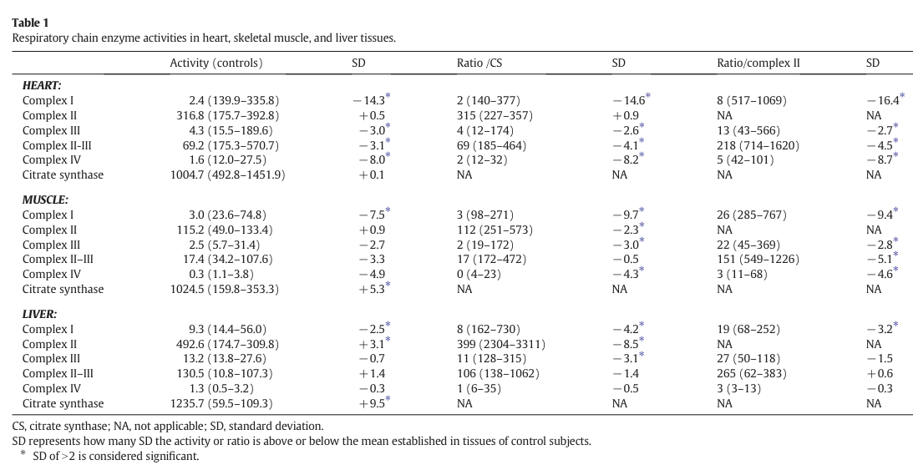

## Question

# Disease Characteristics Research Template

## Target Disease
- **Disease Name:** HSD10 Mitochondrial Disease
- **MONDO ID:**  (if available)
- **Category:** Mendelian

## Research Objectives

Please provide a comprehensive research report on **HSD10 Mitochondrial Disease** covering all of the
disease characteristics listed below. This report will be used to populate a disease knowledge
base entry. Be thorough and cite primary literature (PMID preferred) for all claims.

For each section, **suggested databases/resources** are listed. These are the first places
you should search for information on each topic.

---

### 1. Disease Information
> **Search first:** OMIM, Orphanet, ICD-10/ICD-11, MeSH, PubMed

- What is the disease? Provide a concise overview.
- What are the key identifiers? (OMIM, Orphanet, ICD-10/ICD-11, MeSH, Mondo)
- What are the common synonyms and alternative names?
- Is the information derived from individual patients (e.g., EHR) or aggregated disease-level resources?

### 2. Etiology

- **Disease Causal Factors**: What are the primary causes? (genetic, environmental, infectious, mechanistic)
- **Risk Factors**:
  > **Search first:** PubMed, Cochrane Library, UpToDate, clinical guidelines, ClinVar, ClinGen, GWAS Catalog, PheGenI, CTD, CDC, WHO, epidemiological databases
  - Genetic risk factors (causal variants, susceptibility loci, modifier genes)
  - Environmental risk factors (toxins, lifestyle, occupational exposures, age, sex, family history)
- **Protective Factors**:
  > **Search first:** PubMed, Cochrane Library, clinical trial databases, GWAS Catalog, gnomAD, WHO, CDC, nutrition databases
  - Genetic protective factors (protective variants, modifier alleles)
  - Environmental protective factors (diet, lifestyle, exposures that reduce risk)
- **Gene-Environment Interactions**: How do genetic and environmental factors interact to influence disease?
  > **Search first:** CTD, PubMed, PheGenI, GxE databases

### 3. Phenotypes
> **Search first:** HPO (Human Phenotype Ontology), OMIM, Orphanet, PubMed, clinicaltrials.gov, MedDRA, SNOMED CT, DECIPHER, LOINC

For each phenotype, provide:
- **Phenotype type**: symptoms, clinical signs, physical manifestations, behavioral changes, or laboratory abnormalities
  > For symptoms/signs: HPO, OMIM, Orphanet, PubMed
  > For behavioral changes: HPO, DSM, RDoC (Research Domain Criteria), PubMed
  > For laboratory abnormalities: LOINC, SNOMED CT, LabTests Online, PubMed
- **Phenotype characteristics**:
  > **Search first:** OMIM, Orphanet, HPO, PubMed
  - Age of symptom onset (neonatal, childhood, adult-onset, late-onset)
  - Symptom severity (mild, moderate, severe, variable)
  - Symptom progression (stable, progressive, episodic, fluctuating)
  - Frequency among affected individuals (percentage or qualitative)
- **Quality of life impact**: Effects on daily functioning and well-being (per-phenotype when possible)
  > **Search first:** EQ-5D database, SF-36, WHO QOL databases, PubMed
- Suggest HPO (Human Phenotype Ontology) terms for each phenotype

### 4. Genetic/Molecular Information

- **Causal Genes**: Gene mutations or chromosomal abnormalities responsible for disease (gene symbols, OMIM IDs)
  > **Search first:** OMIM, ClinVar, HGMD, Ensembl, NCBI Gene
- **Pathogenic Variants**:
  - Affected genes (gene symbols, HGNC IDs)
    > **Search first:** OMIM, NCBI Gene, Ensembl, HGNC, UniProt, GeneCards
  - Variant classification (pathogenic, likely pathogenic, VUS per ACMG/AMP guidelines)
    > **Search first:** ClinVar, ClinGen, ACMG/AMP guidelines, VarSome
  - Variant type/class (missense, frameshift, nonsense, splice-site, structural)
  - Allele frequency in population databases
    > **Search first:** gnomAD, 1000 Genomes, ExAC, TOPMed, dbSNP
  - Somatic vs germline origin
    > **Search first:** COSMIC (somatic), ClinVar, ICGC, TCGA
  - Functional consequences (loss of function, gain of function, dominant negative)
- **Modifier Genes**: Genes that modify disease severity or expression
- **Epigenetic Information**: DNA methylation, histone modifications, chromatin changes affecting disease
  > **Search first:** ENCODE, Roadmap Epigenomics, MethBase, DiseaseMeth
- **Chromosomal Abnormalities**: Large-scale genetic changes (aneuploidy, translocations, inversions)
  > **Search first:** DECIPHER, ClinVar, ECARUCA, UCSC Genome Browser

### 5. Environmental Information

- **Environmental Factors**: Non-genetic contributing factors (toxins, radiation, pollution, occupational exposure)
  > **Search first:** CTD (Comparative Toxicogenomics Database), TOXNET, PubMed, EPA databases
- **Lifestyle Factors**: Behavioral factors (smoking, diet, exercise, alcohol consumption)
  > **Search first:** CDC databases, WHO, PubMed, NHANES
- **Infectious Agents**: If applicable, pathogens causing or triggering disease (bacteria, viruses, fungi, parasites)
  > **Search first:** NCBI Taxonomy, ViPR, BV-BRC, MicrobeDB, GIDEON

### 6. Mechanism / Pathophysiology

- **Molecular Pathways**: Specific signaling cascades or biochemical pathways involved (Wnt, MAPK, mTOR, PI3K-AKT, etc.)
  > **Search first:** KEGG, Reactome, WikiPathways, PathBank, BioCyc
- **Cellular Processes**: Cell-level mechanisms (apoptosis, autophagy, cell cycle dysregulation, inflammation, etc.)
  > **Search first:** Gene Ontology (GO), Reactome, KEGG, PubMed
- **Protein Dysfunction**: How protein structure or function is altered (misfolding, aggregation, loss of function, gain of function)
  > **Search first:** UniProt, PDB (Protein Data Bank), InterPro, Pfam, AlphaFold
- **Metabolic Changes**: Alterations in metabolic processes (energy metabolism, lipid metabolism, amino acid metabolism)
  > **Search first:** KEGG, BioCyc, HMDB (Human Metabolome Database), BRENDA
- **Immune System Involvement**: Role of immune response (autoimmunity, immunodeficiency, chronic inflammation)
  > **Search first:** ImmPort, Immunome Database, IEDB, Gene Ontology
- **Tissue Damage Mechanisms**: How tissues/ are injured (oxidative stress, ischemia, fibrosis, necrosis)
  > **Search first:** PubMed, Gene Ontology, Reactome
- **Biochemical Abnormalities**: Specific molecular defects (enzyme deficiencies, receptor dysfunction, ion channel defects)
  > **Search first:** BRENDA, UniProt, KEGG, OMIM, PubMed
- **Epigenetic Changes**: DNA methylation, histone modifications affecting gene expression in disease
  > **Search first:** ENCODE, Roadmap Epigenomics, MethBase, DiseaseMeth
- **Molecular Profiling** (if available):
  - Transcriptomics/gene expression changes
    > **Search first:** GEO (Gene Expression Omnibus), ArrayExpress, GTEx, Human Cell Atlas, SRA
  - Proteomics findings
    > **Search first:** PRIDE, ProteomeXchange, Human Protein Atlas, STRING, BioGRID
  - Metabolomics signatures
    > **Search first:** MetaboLights, Metabolomics Workbench, HMDB, METLIN
  - Lipidomics alterations
    > **Search first:** LIPID MAPS, SwissLipids, LipidHome, Metabolomics Workbench
  - Genomic structural features
    > **Search first:** UCSC Genome Browser, Ensembl, NCBI, dbVar, DGV
- **Advanced Technologies** (if applicable):
  - Single-cell analysis findings (cell-type specific mechanisms, cellular heterogeneity)
    > **Search first:** Human Cell Atlas, Single Cell Portal, GEO, CELLxGENE
  - Spatial transcriptomics findings
    > **Search first:** GEO, Spatial Research, Vizgen, 10x Genomics data
  - Multi-omics integration results
    > **Search first:** TCGA, ICGC, cBioPortal, LinkedOmics, PubMed
  - Functional genomics screens (CRISPR, RNAi)
    > **Search first:** DepMap, GenomeRNAi, PubMed, BioGRID ORCS

For each mechanism, describe:
- The causal chain from initial trigger to clinical manifestation
- Which mechanisms are upstream vs downstream
- What cell types and biological processes are involved
- Suggest GO terms for biological processes and CL terms for cell types

### 7. Anatomical Structures Affected

- **Organ Level**:
  - Primary organs directly affected
  - Secondary organ involvement (complications, secondary effects)
  - Body systems involved (cardiovascular, nervous, digestive, respiratory, endocrine, etc.)
  > **Search first:** Uberon, FMA (Foundational Model of Anatomy), OMIM, HPO, ICD-11, MeSH, SNOMED CT
- **Tissue and Cell Level**:
  - Specific tissue types affected (epithelial, connective, muscle, nervous)
  - Specific cell populations targeted (with Cell Ontology terms)
  > **Search first:** Uberon, Human Protein Atlas, Cell Ontology, Human Cell Atlas, CellMarker, PanglaoDB
- **Subcellular Level**:
  - Cellular compartments involved (mitochondria, nucleus, ER, lysosomes) (with GO Cellular Component terms)
  > **Search first:** Gene Ontology (Cellular Component), UniProt, Human Protein Atlas
- **Localization**:
  - Specific anatomical sites (with UBERON terms)
    > **Search first:** FMA, Uberon, NeuroNames (for brain), SNOMED CT
  - Lateralization (unilateral, bilateral, asymmetric)
    > **Search first:** HPO, clinical literature, imaging databases

### 8. Temporal Development

- **Onset**:
  - Typical age of onset (congenital, pediatric, adult, geriatric)
  - Onset pattern (acute, subacute, chronic, insidious)
  > **Search first:** OMIM, Orphanet, HPO, PubMed
- **Progression**:
  - Disease stages (early, intermediate, advanced, end-stage)
    > **Search first:** Cancer Staging Manual (AJCC), WHO classifications, PubMed
  - Progression rate (rapid, slow, variable)
  - Disease course pattern (episodic, relapsing-remitting, progressive, stable)
  - Disease duration (self-limited, chronic lifelong)
  > **Search first:** Disease registries, longitudinal cohort databases, natural history studies, PubMed, Orphanet, OMIM
- **Patterns**:
  - Remission patterns (spontaneous, treatment-induced)
    > **Search first:** Clinical trial databases, disease registries, PubMed
  - Critical periods (time windows of vulnerability or opportunity for intervention)
    > **Search first:** PubMed, developmental biology databases, clinical guidelines

### 9. Inheritance and Population

- **Epidemiology**:
  - Prevalence (cases per 100,000 at given time)
  - Incidence (new cases per 100,000 per year)
  > **Search first:** Orphanet, CDC, WHO, GBD (Global Burden of Disease), national registries, SEER, disease registries
- **For Genetic Etiology**:
  - Inheritance pattern (AD, AR, X-linked, mitochondrial, multifactorial, polygenic)
    > **Search first:** OMIM, Orphanet, ClinVar, GTR (Genetic Testing Registry)
  - Penetrance (complete, incomplete, age-dependent)
    > **Search first:** ClinVar, OMIM, PubMed, ClinGen
  - Expressivity (variable, consistent)
    > **Search first:** OMIM, ClinVar, PubMed
  - Genetic anticipation (increasing severity in successive generations)
    > **Search first:** OMIM, PubMed (especially for repeat expansion disorders)
  - Germline mosaicism
    > **Search first:** ClinVar, OMIM, genetic counseling literature, PubMed
  - Founder effects (population-specific mutations)
    > **Search first:** gnomAD, population genetics databases, PubMed
  - Consanguinity role
    > **Search first:** OMIM, population studies, genetic counseling resources
  - Carrier frequency
    > **Search first:** gnomAD, carrier screening databases, GeneReviews, GTR
- **Population Demographics**:
  - Affected populations (ethnic or demographic groups with higher prevalence)
    > **Search first:** gnomAD, 1000 Genomes, PAGE Study, PubMed, population registries
  - Geographic distribution (endemic areas, regional variation)
    > **Search first:** WHO, CDC, GBD, Orphanet, geographic epidemiology databases
  - Geographic distribution of specific variants
  - Sex ratio (male:female)
    > **Search first:** Disease registries, OMIM, PubMed, epidemiological databases
  - Age distribution of affected individuals
    > **Search first:** CDC, disease registries, SEER, Orphanet

### 10. Diagnostics

- **Clinical Tests**:
  - Laboratory tests (blood, urine, tissue chemistry, specific enzyme assays)
    > **Search first:** LOINC, LabTests Online, PubMed
  - Biomarkers (proteins, metabolites, genetic markers, circulating biomarkers)
    > **Search first:** FDA Biomarker List, BEST (Biomarkers, EndpointS, and other Tools), PubMed
  - Imaging studies (X-ray, CT, MRI, PET, ultrasound)
    > **Search first:** RadLex, DICOM, Radiopaedia, imaging databases
  - Functional tests (pulmonary function, cardiac stress tests)
    > **Search first:** LOINC, clinical guidelines, PubMed
  - Electrophysiology (EEG, EMG, ECG, nerve conduction studies)
    > **Search first:** LOINC, clinical neurophysiology databases, PubMed
  - Biopsy findings (histopathology, immunohistochemistry)
    > **Search first:** SNOMED CT, College of American Pathologists resources, PubMed
  - Pathology findings (microscopic examination)
    > **Search first:** SNOMED CT, Digital Pathology databases, PubMed
- **Genetic Testing**:
  > **Search first:** GTR (Genetic Testing Registry), GeneReviews, ClinGen
  - Overview of recommended genetic testing approach
  - Whole genome sequencing (WGS) utility
    > **Search first:** GTR, ClinVar, GEL (Genomics England), gnomAD
  - Whole exome sequencing (WES) utility
    > **Search first:** GTR, ClinVar, OMIM, GeneMatcher
  - Gene panels (which panels, which genes)
    > **Search first:** GTR, ClinVar, laboratory-specific databases
  - Single gene testing
    > **Search first:** GTR, ClinVar, OMIM, GeneReviews
  - Chromosomal microarray (CMA)
    > **Search first:** DECIPHER, ClinVar, dbVar, ECARUCA
  - Karyotyping
    > **Search first:** Chromosome Abnormality Database, ClinVar, cytogenetics resources
  - FISH
    > **Search first:** ClinVar, cytogenetics databases, PubMed
  - Mitochondrial DNA testing
    > **Search first:** MITOMAP, MSeqDR, ClinVar, GTR
  - Repeat expansion testing
    > **Search first:** GTR, ClinVar, repeat expansion databases, PubMed
- **Omics-Based Diagnostics** (if applicable):
  - RNA sequencing / transcriptomics
    > **Search first:** GEO, ArrayExpress, GTEx, RNA-seq databases
  - Proteomics
    > **Search first:** PRIDE, ProteomeXchange, FDA Biomarker database
  - Metabolomics
    > **Search first:** MetaboLights, Metabolomics Workbench, HMDB
  - Epigenomics
    > **Search first:** GEO, ENCODE, Roadmap Epigenomics, MethBase
  - Liquid biopsy
    > **Search first:** COSMIC, ClinVar, liquid biopsy databases, PubMed
- **Clinical Criteria**:
  - Standardized diagnostic criteria (DSM, ICD, society guidelines)
    > **Search first:** DSM-5, ICD-11, clinical society guidelines, UpToDate
  - Differential diagnosis (other conditions to rule out, with distinguishing features)
    > **Search first:** DynaMed, UpToDate, clinical decision support systems
- **Screening**:
  - Screening methods for asymptomatic individuals (newborn screening, carrier screening, cascade screening)
    > **Search first:** ACMG recommendations, CDC newborn screening, GTR

### 11. Outcome/Prognosis

- **Survival and Mortality**:
  - Survival rate (5-year, 10-year, overall)
    > **Search first:** SEER, cancer registries, disease-specific registries, PubMed
  - Life expectancy (with and without treatment if applicable)
    > **Search first:** Orphanet, disease registries, actuarial databases, PubMed
  - Mortality rate
    > **Search first:** CDC, WHO, GBD, national mortality databases
  - Disease-specific mortality (deaths directly attributable to disease)
    > **Search first:** Disease registries, CDC Wonder, GBD, PubMed
- **Morbidity and Function**:
  - Morbidity (disease-related disability and health impacts)
    > **Search first:** GBD, WHO, disability databases, PubMed
  - Disability outcomes (long-term functional impairments)
    > **Search first:** ICF (International Classification of Functioning), disability registries
  - Quality of life measures (EQ-5D, SF-36, PROMIS, disease-specific tools)
    > **Search first:** EQ-5D database, SF-36, PROMIS, PubMed
- **Disease Course**:
  - Complications (secondary problems: infections, organ failure, etc.)
    > **Search first:** ICD codes, disease registries, clinical databases, PubMed
  - Recovery potential (likelihood and extent of recovery, with vs without treatment)
    > **Search first:** Natural history studies, rehabilitation databases, PubMed
- **Prediction**:
  - Prognostic factors (age, disease severity, biomarkers, treatment response)
    > **Search first:** Prognostic models databases, clinical calculators, PubMed
  - Prognostic biomarkers (molecular markers predicting disease course)
    > **Search first:** FDA Biomarker database, PubMed, cancer prognostic databases

### 12. Treatment

- **Pharmacotherapy**:
  - Pharmacological treatments (drug names, drug classes, mechanisms of action)
    > **Search first:** DrugBank, RxNorm, ATC classification, DailyMed, FDA databases
  - Pharmacogenomics (how genetic variants affect drug metabolism, efficacy, toxicity)
    > **Search first:** PharmGKB, CPIC (Clinical Pharmacogenetics), FDA Table of PGx Biomarkers
- **Advanced Therapeutics**:
  - Gene therapy (viral vectors, CRISPR, gene replacement, gene editing)
    > **Search first:** ClinicalTrials.gov, FDA gene therapy database, ASGCT resources
  - Cell therapy (stem cell transplant, CAR-T, cellular therapeutics)
    > **Search first:** ClinicalTrials.gov, FDA cell therapy database, FACT standards
  - RNA-based therapies (ASOs, siRNA, mRNA therapies)
    > **Search first:** ClinicalTrials.gov, FDA approvals, PubMed
  - Targeted therapies (treatments directed at specific molecular targets)
    > **Search first:** My Cancer Genome, OncoKB, ClinicalTrials.gov, FDA approvals
  - Immunotherapies (checkpoint inhibitors, monoclonal antibodies)
    > **Search first:** Cancer Immunotherapy Database, FDA approvals, ClinicalTrials.gov
- **Surgical and Interventional**:
  - Surgical interventions (types of surgery, timing, outcomes)
    > **Search first:** CPT codes, surgical registries, clinical guidelines, PubMed
- **Supportive and Rehabilitative**:
  - Supportive care (symptom management, pain control, nutrition)
    > **Search first:** Clinical guidelines, Cochrane Library, PubMed
  - Rehabilitation (physical therapy, occupational therapy, speech therapy)
    > **Search first:** Rehabilitation medicine databases, clinical guidelines, PubMed
- **Experimental**:
  - Experimental treatments in clinical trials (with NCT identifiers if available)
    > **Search first:** ClinicalTrials.gov, EU Clinical Trials Register, WHO ICTRP
- **Treatment Outcomes**:
  - Treatment response rates
    > **Search first:** Clinical trial databases, FDA reviews, systematic reviews, PubMed
  - Side effects and adverse events
    > **Search first:** FDA Adverse Event Reporting System (FAERS), MedWatch, PubMed
- **Treatment Strategy**:
  - Treatment algorithms (clinical pathways, decision trees)
    > **Search first:** Clinical practice guidelines, NCCN Guidelines, UpToDate
  - Combination therapies
    > **Search first:** ClinicalTrials.gov, treatment guidelines, PubMed
  - Personalized medicine approaches (genotype-guided treatment)
    > **Search first:** My Cancer Genome, CIViC, PharmGKB, precision medicine databases

For each treatment, suggest MAXO (Medical Action Ontology) terms where applicable.

### 13. Prevention

- **Prevention Levels**:
  - Primary prevention (preventing disease occurrence: vaccination, risk factor modification)
    > **Search first:** CDC, WHO, USPSTF recommendations, Cochrane Library
  - Secondary prevention (early detection and treatment: screening programs, early intervention)
    > **Search first:** USPSTF, CDC screening guidelines, WHO
  - Tertiary prevention (preventing complications in those with disease)
    > **Search first:** Clinical guidelines, disease management protocols, PubMed
- **Immunization**: Vaccine strategies (if applicable)
  > **Search first:** CDC vaccine schedules, WHO immunization, FDA vaccine database
- **Screening and Early Detection**:
  - Screening programs (population-based: newborn screening, cancer screening)
    > **Search first:** CDC screening programs, USPSTF, cancer screening databases
  - Genetic screening (carrier screening, preimplantation genetic diagnosis, prenatal testing)
    > **Search first:** ACMG recommendations, ACOG guidelines, GTR
  - Risk stratification (identifying high-risk individuals for targeted prevention)
    > **Search first:** Risk prediction models, clinical calculators, PubMed
- **Behavioral Interventions**: Lifestyle modifications to reduce risk
  > **Search first:** CDC, WHO, behavioral intervention databases, Cochrane Library
- **Counseling**: Genetic counseling (risk assessment, family planning guidance)
  > **Search first:** NSGC resources, ACMG guidelines, GeneReviews
- **Public Health**:
  - Public health interventions (sanitation, vector control, health education)
    > **Search first:** CDC, WHO, public health databases, PubMed
  - Environmental interventions (reducing environmental risk factors)
    > **Search first:** EPA databases, WHO environmental health, PubMed
- **Prophylaxis**: Preventive medications or procedures
  > **Search first:** Clinical guidelines, FDA approvals, PubMed

### 14. Other Species / Natural Disease

- **Taxonomy**: Species affected (with NCBI Taxon identifiers)
  > **Search first:** NCBI Taxonomy
- **Breed**: Specific breeds affected (with VBO identifiers if applicable)
  > **Search first:** VBO (Vertebrate Breed Ontology)
- **Gene**: Orthologous genes in other species (with NCBI Gene IDs)
  > **Search first:** NCBI Gene
- **Natural Disease**:
  - Naturally occurring disease in other species (companion animals, wildlife)
    > **Search first:** OMIA (Online Mendelian Inheritance in Animals), VetCompass, PubMed
  - Veterinary relevance and importance in animal health
    > **Search first:** OMIA, veterinary databases, PubMed
- **Comparative Biology**:
  - Comparative pathology (similarities and differences across species)
    > **Search first:** OMIA, comparative pathology databases, PubMed
  - Evolutionary conservation of disease mechanisms
    > **Search first:** HomoloGene, OrthoMCL, Alliance of Genome Resources
- **Transmission** (if applicable):
  - Zoonotic potential
    > **Search first:** CDC zoonotic diseases, WHO zoonoses, GIDEON
  - Cross-species susceptibility
    > **Search first:** NCBI Taxonomy, veterinary databases, PubMed

### 15. Model Organisms

- **Model Types**:
  - Model organism type (mammalian, invertebrate, cellular, in vitro)
    > **Search first:** Alliance of Genome Resources, model organism databases
  - Specific model systems (mouse, rat, zebrafish, Drosophila, C. elegans, yeast, cell lines, organoids, iPSCs)
    > **Search first:** MGI, RGD, ZFIN, FlyBase, WormBase, SGD, ATCC, Cellosaurus
  - Induced models (drug treatment, surgical intervention, environmental manipulation)
    > **Search first:** MGI, model organism databases, PubMed
- **Genetic Models**:
  - Types available (knockout, knock-in, transgenic, conditional, humanized)
    > **Search first:** MGI, IMPC, KOMP, EuMMCR, IMSR
- **Model Characteristics**:
  - Phenotype recapitulation (how well model reproduces human disease features)
    > **Search first:** Model organism databases, comparative studies, PubMed
  - Model limitations (aspects of human disease not captured)
    > **Search first:** Model organism databases, PubMed, review articles
- **Applications**:
  - Research applications (what aspects of disease can be studied)
    > **Search first:** Model organism databases, PubMed
- **Resources**:
  - Model databases
    > **Search first:** MGI, RGD, ZFIN, FlyBase, WormBase, IMSR, EMMA, MMRRC

---

## Citation Requirements

- Cite primary literature (PMID preferred) for all mechanistic and clinical claims
- Prioritize recent reviews and landmark papers
- Include direct quotes from abstracts where possible to support key statements
- Distinguish evidence source types: human clinical, model organism, in vitro, computational

## Output Format

Structure your response as a comprehensive narrative organized by the sections above.
For each section, provide:
- Factual content with specific details (numbers, percentages, gene names, variant nomenclature)
- Ontology term suggestions (HPO, GO, CL, UBERON, CHEBI, MAXO, MONDO) where applicable
- Evidence citations with PMIDs
- Direct quotes from abstracts to support key claims
- Clear indication when information is not available or not applicable for this disease

This report will be used to populate a disease knowledge base entry with:
- Pathophysiology descriptions with causal chains
- Gene/protein annotations (HGNC, GO terms)
- Phenotype associations (HP terms) with frequencies
- Cell type involvement (CL terms)
- Anatomical locations (UBERON terms)
- Chemical entities (CHEBI terms)
- Treatment annotations (MAXO terms)
- Evidence items with PMIDs and exact abstract quotes
- Epidemiology, prognosis, diagnostic, and prevention information
- Animal model descriptions with phenotype recapitulation details

## Output

Question: You are an expert researcher providing comprehensive, well-cited information.

Provide detailed information focusing on:
1. Key concepts and definitions with current understanding
2. Recent developments and latest research (prioritize 2023-2024 sources)
3. Current applications and real-world implementations
4. Expert opinions and analysis from authoritative sources
5. Relevant statistics and data from recent studies

Format as a comprehensive research report with proper citations. Include URLs and publication dates where available.
Always prioritize recent, authoritative sources and provide specific citations for all major claims.

# Disease Characteristics Research Template

## Target Disease
- **Disease Name:** HSD10 Mitochondrial Disease
- **MONDO ID:**  (if available)
- **Category:** Mendelian

## Research Objectives

Please provide a comprehensive research report on **HSD10 Mitochondrial Disease** covering all of the
disease characteristics listed below. This report will be used to populate a disease knowledge
base entry. Be thorough and cite primary literature (PMID preferred) for all claims.

For each section, **suggested databases/resources** are listed. These are the first places
you should search for information on each topic.

---

### 1. Disease Information
> **Search first:** OMIM, Orphanet, ICD-10/ICD-11, MeSH, PubMed

- What is the disease? Provide a concise overview.
- What are the key identifiers? (OMIM, Orphanet, ICD-10/ICD-11, MeSH, Mondo)
- What are the common synonyms and alternative names?
- Is the information derived from individual patients (e.g., EHR) or aggregated disease-level resources?

### 2. Etiology

- **Disease Causal Factors**: What are the primary causes? (genetic, environmental, infectious, mechanistic)
- **Risk Factors**:
  > **Search first:** PubMed, Cochrane Library, UpToDate, clinical guidelines, ClinVar, ClinGen, GWAS Catalog, PheGenI, CTD, CDC, WHO, epidemiological databases
  - Genetic risk factors (causal variants, susceptibility loci, modifier genes)
  - Environmental risk factors (toxins, lifestyle, occupational exposures, age, sex, family history)
- **Protective Factors**:
  > **Search first:** PubMed, Cochrane Library, clinical trial databases, GWAS Catalog, gnomAD, WHO, CDC, nutrition databases
  - Genetic protective factors (protective variants, modifier alleles)
  - Environmental protective factors (diet, lifestyle, exposures that reduce risk)
- **Gene-Environment Interactions**: How do genetic and environmental factors interact to influence disease?
  > **Search first:** CTD, PubMed, PheGenI, GxE databases

### 3. Phenotypes
> **Search first:** HPO (Human Phenotype Ontology), OMIM, Orphanet, PubMed, clinicaltrials.gov, MedDRA, SNOMED CT, DECIPHER, LOINC

For each phenotype, provide:
- **Phenotype type**: symptoms, clinical signs, physical manifestations, behavioral changes, or laboratory abnormalities
  > For symptoms/signs: HPO, OMIM, Orphanet, PubMed
  > For behavioral changes: HPO, DSM, RDoC (Research Domain Criteria), PubMed
  > For laboratory abnormalities: LOINC, SNOMED CT, LabTests Online, PubMed
- **Phenotype characteristics**:
  > **Search first:** OMIM, Orphanet, HPO, PubMed
  - Age of symptom onset (neonatal, childhood, adult-onset, late-onset)
  - Symptom severity (mild, moderate, severe, variable)
  - Symptom progression (stable, progressive, episodic, fluctuating)
  - Frequency among affected individuals (percentage or qualitative)
- **Quality of life impact**: Effects on daily functioning and well-being (per-phenotype when possible)
  > **Search first:** EQ-5D database, SF-36, WHO QOL databases, PubMed
- Suggest HPO (Human Phenotype Ontology) terms for each phenotype

### 4. Genetic/Molecular Information

- **Causal Genes**: Gene mutations or chromosomal abnormalities responsible for disease (gene symbols, OMIM IDs)
  > **Search first:** OMIM, ClinVar, HGMD, Ensembl, NCBI Gene
- **Pathogenic Variants**:
  - Affected genes (gene symbols, HGNC IDs)
    > **Search first:** OMIM, NCBI Gene, Ensembl, HGNC, UniProt, GeneCards
  - Variant classification (pathogenic, likely pathogenic, VUS per ACMG/AMP guidelines)
    > **Search first:** ClinVar, ClinGen, ACMG/AMP guidelines, VarSome
  - Variant type/class (missense, frameshift, nonsense, splice-site, structural)
  - Allele frequency in population databases
    > **Search first:** gnomAD, 1000 Genomes, ExAC, TOPMed, dbSNP
  - Somatic vs germline origin
    > **Search first:** COSMIC (somatic), ClinVar, ICGC, TCGA
  - Functional consequences (loss of function, gain of function, dominant negative)
- **Modifier Genes**: Genes that modify disease severity or expression
- **Epigenetic Information**: DNA methylation, histone modifications, chromatin changes affecting disease
  > **Search first:** ENCODE, Roadmap Epigenomics, MethBase, DiseaseMeth
- **Chromosomal Abnormalities**: Large-scale genetic changes (aneuploidy, translocations, inversions)
  > **Search first:** DECIPHER, ClinVar, ECARUCA, UCSC Genome Browser

### 5. Environmental Information

- **Environmental Factors**: Non-genetic contributing factors (toxins, radiation, pollution, occupational exposure)
  > **Search first:** CTD (Comparative Toxicogenomics Database), TOXNET, PubMed, EPA databases
- **Lifestyle Factors**: Behavioral factors (smoking, diet, exercise, alcohol consumption)
  > **Search first:** CDC databases, WHO, PubMed, NHANES
- **Infectious Agents**: If applicable, pathogens causing or triggering disease (bacteria, viruses, fungi, parasites)
  > **Search first:** NCBI Taxonomy, ViPR, BV-BRC, MicrobeDB, GIDEON

### 6. Mechanism / Pathophysiology

- **Molecular Pathways**: Specific signaling cascades or biochemical pathways involved (Wnt, MAPK, mTOR, PI3K-AKT, etc.)
  > **Search first:** KEGG, Reactome, WikiPathways, PathBank, BioCyc
- **Cellular Processes**: Cell-level mechanisms (apoptosis, autophagy, cell cycle dysregulation, inflammation, etc.)
  > **Search first:** Gene Ontology (GO), Reactome, KEGG, PubMed
- **Protein Dysfunction**: How protein structure or function is altered (misfolding, aggregation, loss of function, gain of function)
  > **Search first:** UniProt, PDB (Protein Data Bank), InterPro, Pfam, AlphaFold
- **Metabolic Changes**: Alterations in metabolic processes (energy metabolism, lipid metabolism, amino acid metabolism)
  > **Search first:** KEGG, BioCyc, HMDB (Human Metabolome Database), BRENDA
- **Immune System Involvement**: Role of immune response (autoimmunity, immunodeficiency, chronic inflammation)
  > **Search first:** ImmPort, Immunome Database, IEDB, Gene Ontology
- **Tissue Damage Mechanisms**: How tissues/ are injured (oxidative stress, ischemia, fibrosis, necrosis)
  > **Search first:** PubMed, Gene Ontology, Reactome
- **Biochemical Abnormalities**: Specific molecular defects (enzyme deficiencies, receptor dysfunction, ion channel defects)
  > **Search first:** BRENDA, UniProt, KEGG, OMIM, PubMed
- **Epigenetic Changes**: DNA methylation, histone modifications affecting gene expression in disease
  > **Search first:** ENCODE, Roadmap Epigenomics, MethBase, DiseaseMeth
- **Molecular Profiling** (if available):
  - Transcriptomics/gene expression changes
    > **Search first:** GEO (Gene Expression Omnibus), ArrayExpress, GTEx, Human Cell Atlas, SRA
  - Proteomics findings
    > **Search first:** PRIDE, ProteomeXchange, Human Protein Atlas, STRING, BioGRID
  - Metabolomics signatures
    > **Search first:** MetaboLights, Metabolomics Workbench, HMDB, METLIN
  - Lipidomics alterations
    > **Search first:** LIPID MAPS, SwissLipids, LipidHome, Metabolomics Workbench
  - Genomic structural features
    > **Search first:** UCSC Genome Browser, Ensembl, NCBI, dbVar, DGV
- **Advanced Technologies** (if applicable):
  - Single-cell analysis findings (cell-type specific mechanisms, cellular heterogeneity)
    > **Search first:** Human Cell Atlas, Single Cell Portal, GEO, CELLxGENE
  - Spatial transcriptomics findings
    > **Search first:** GEO, Spatial Research, Vizgen, 10x Genomics data
  - Multi-omics integration results
    > **Search first:** TCGA, ICGC, cBioPortal, LinkedOmics, PubMed
  - Functional genomics screens (CRISPR, RNAi)
    > **Search first:** DepMap, GenomeRNAi, PubMed, BioGRID ORCS

For each mechanism, describe:
- The causal chain from initial trigger to clinical manifestation
- Which mechanisms are upstream vs downstream
- What cell types and biological processes are involved
- Suggest GO terms for biological processes and CL terms for cell types

### 7. Anatomical Structures Affected

- **Organ Level**:
  - Primary organs directly affected
  - Secondary organ involvement (complications, secondary effects)
  - Body systems involved (cardiovascular, nervous, digestive, respiratory, endocrine, etc.)
  > **Search first:** Uberon, FMA (Foundational Model of Anatomy), OMIM, HPO, ICD-11, MeSH, SNOMED CT
- **Tissue and Cell Level**:
  - Specific tissue types affected (epithelial, connective, muscle, nervous)
  - Specific cell populations targeted (with Cell Ontology terms)
  > **Search first:** Uberon, Human Protein Atlas, Cell Ontology, Human Cell Atlas, CellMarker, PanglaoDB
- **Subcellular Level**:
  - Cellular compartments involved (mitochondria, nucleus, ER, lysosomes) (with GO Cellular Component terms)
  > **Search first:** Gene Ontology (Cellular Component), UniProt, Human Protein Atlas
- **Localization**:
  - Specific anatomical sites (with UBERON terms)
    > **Search first:** FMA, Uberon, NeuroNames (for brain), SNOMED CT
  - Lateralization (unilateral, bilateral, asymmetric)
    > **Search first:** HPO, clinical literature, imaging databases

### 8. Temporal Development

- **Onset**:
  - Typical age of onset (congenital, pediatric, adult, geriatric)
  - Onset pattern (acute, subacute, chronic, insidious)
  > **Search first:** OMIM, Orphanet, HPO, PubMed
- **Progression**:
  - Disease stages (early, intermediate, advanced, end-stage)
    > **Search first:** Cancer Staging Manual (AJCC), WHO classifications, PubMed
  - Progression rate (rapid, slow, variable)
  - Disease course pattern (episodic, relapsing-remitting, progressive, stable)
  - Disease duration (self-limited, chronic lifelong)
  > **Search first:** Disease registries, longitudinal cohort databases, natural history studies, PubMed, Orphanet, OMIM
- **Patterns**:
  - Remission patterns (spontaneous, treatment-induced)
    > **Search first:** Clinical trial databases, disease registries, PubMed
  - Critical periods (time windows of vulnerability or opportunity for intervention)
    > **Search first:** PubMed, developmental biology databases, clinical guidelines

### 9. Inheritance and Population

- **Epidemiology**:
  - Prevalence (cases per 100,000 at given time)
  - Incidence (new cases per 100,000 per year)
  > **Search first:** Orphanet, CDC, WHO, GBD (Global Burden of Disease), national registries, SEER, disease registries
- **For Genetic Etiology**:
  - Inheritance pattern (AD, AR, X-linked, mitochondrial, multifactorial, polygenic)
    > **Search first:** OMIM, Orphanet, ClinVar, GTR (Genetic Testing Registry)
  - Penetrance (complete, incomplete, age-dependent)
    > **Search first:** ClinVar, OMIM, PubMed, ClinGen
  - Expressivity (variable, consistent)
    > **Search first:** OMIM, ClinVar, PubMed
  - Genetic anticipation (increasing severity in successive generations)
    > **Search first:** OMIM, PubMed (especially for repeat expansion disorders)
  - Germline mosaicism
    > **Search first:** ClinVar, OMIM, genetic counseling literature, PubMed
  - Founder effects (population-specific mutations)
    > **Search first:** gnomAD, population genetics databases, PubMed
  - Consanguinity role
    > **Search first:** OMIM, population studies, genetic counseling resources
  - Carrier frequency
    > **Search first:** gnomAD, carrier screening databases, GeneReviews, GTR
- **Population Demographics**:
  - Affected populations (ethnic or demographic groups with higher prevalence)
    > **Search first:** gnomAD, 1000 Genomes, PAGE Study, PubMed, population registries
  - Geographic distribution (endemic areas, regional variation)
    > **Search first:** WHO, CDC, GBD, Orphanet, geographic epidemiology databases
  - Geographic distribution of specific variants
  - Sex ratio (male:female)
    > **Search first:** Disease registries, OMIM, PubMed, epidemiological databases
  - Age distribution of affected individuals
    > **Search first:** CDC, disease registries, SEER, Orphanet

### 10. Diagnostics

- **Clinical Tests**:
  - Laboratory tests (blood, urine, tissue chemistry, specific enzyme assays)
    > **Search first:** LOINC, LabTests Online, PubMed
  - Biomarkers (proteins, metabolites, genetic markers, circulating biomarkers)
    > **Search first:** FDA Biomarker List, BEST (Biomarkers, EndpointS, and other Tools), PubMed
  - Imaging studies (X-ray, CT, MRI, PET, ultrasound)
    > **Search first:** RadLex, DICOM, Radiopaedia, imaging databases
  - Functional tests (pulmonary function, cardiac stress tests)
    > **Search first:** LOINC, clinical guidelines, PubMed
  - Electrophysiology (EEG, EMG, ECG, nerve conduction studies)
    > **Search first:** LOINC, clinical neurophysiology databases, PubMed
  - Biopsy findings (histopathology, immunohistochemistry)
    > **Search first:** SNOMED CT, College of American Pathologists resources, PubMed
  - Pathology findings (microscopic examination)
    > **Search first:** SNOMED CT, Digital Pathology databases, PubMed
- **Genetic Testing**:
  > **Search first:** GTR (Genetic Testing Registry), GeneReviews, ClinGen
  - Overview of recommended genetic testing approach
  - Whole genome sequencing (WGS) utility
    > **Search first:** GTR, ClinVar, GEL (Genomics England), gnomAD
  - Whole exome sequencing (WES) utility
    > **Search first:** GTR, ClinVar, OMIM, GeneMatcher
  - Gene panels (which panels, which genes)
    > **Search first:** GTR, ClinVar, laboratory-specific databases
  - Single gene testing
    > **Search first:** GTR, ClinVar, OMIM, GeneReviews
  - Chromosomal microarray (CMA)
    > **Search first:** DECIPHER, ClinVar, dbVar, ECARUCA
  - Karyotyping
    > **Search first:** Chromosome Abnormality Database, ClinVar, cytogenetics resources
  - FISH
    > **Search first:** ClinVar, cytogenetics databases, PubMed
  - Mitochondrial DNA testing
    > **Search first:** MITOMAP, MSeqDR, ClinVar, GTR
  - Repeat expansion testing
    > **Search first:** GTR, ClinVar, repeat expansion databases, PubMed
- **Omics-Based Diagnostics** (if applicable):
  - RNA sequencing / transcriptomics
    > **Search first:** GEO, ArrayExpress, GTEx, RNA-seq databases
  - Proteomics
    > **Search first:** PRIDE, ProteomeXchange, FDA Biomarker database
  - Metabolomics
    > **Search first:** MetaboLights, Metabolomics Workbench, HMDB
  - Epigenomics
    > **Search first:** GEO, ENCODE, Roadmap Epigenomics, MethBase
  - Liquid biopsy
    > **Search first:** COSMIC, ClinVar, liquid biopsy databases, PubMed
- **Clinical Criteria**:
  - Standardized diagnostic criteria (DSM, ICD, society guidelines)
    > **Search first:** DSM-5, ICD-11, clinical society guidelines, UpToDate
  - Differential diagnosis (other conditions to rule out, with distinguishing features)
    > **Search first:** DynaMed, UpToDate, clinical decision support systems
- **Screening**:
  - Screening methods for asymptomatic individuals (newborn screening, carrier screening, cascade screening)
    > **Search first:** ACMG recommendations, CDC newborn screening, GTR

### 11. Outcome/Prognosis

- **Survival and Mortality**:
  - Survival rate (5-year, 10-year, overall)
    > **Search first:** SEER, cancer registries, disease-specific registries, PubMed
  - Life expectancy (with and without treatment if applicable)
    > **Search first:** Orphanet, disease registries, actuarial databases, PubMed
  - Mortality rate
    > **Search first:** CDC, WHO, GBD, national mortality databases
  - Disease-specific mortality (deaths directly attributable to disease)
    > **Search first:** Disease registries, CDC Wonder, GBD, PubMed
- **Morbidity and Function**:
  - Morbidity (disease-related disability and health impacts)
    > **Search first:** GBD, WHO, disability databases, PubMed
  - Disability outcomes (long-term functional impairments)
    > **Search first:** ICF (International Classification of Functioning), disability registries
  - Quality of life measures (EQ-5D, SF-36, PROMIS, disease-specific tools)
    > **Search first:** EQ-5D database, SF-36, PROMIS, PubMed
- **Disease Course**:
  - Complications (secondary problems: infections, organ failure, etc.)
    > **Search first:** ICD codes, disease registries, clinical databases, PubMed
  - Recovery potential (likelihood and extent of recovery, with vs without treatment)
    > **Search first:** Natural history studies, rehabilitation databases, PubMed
- **Prediction**:
  - Prognostic factors (age, disease severity, biomarkers, treatment response)
    > **Search first:** Prognostic models databases, clinical calculators, PubMed
  - Prognostic biomarkers (molecular markers predicting disease course)
    > **Search first:** FDA Biomarker database, PubMed, cancer prognostic databases

### 12. Treatment

- **Pharmacotherapy**:
  - Pharmacological treatments (drug names, drug classes, mechanisms of action)
    > **Search first:** DrugBank, RxNorm, ATC classification, DailyMed, FDA databases
  - Pharmacogenomics (how genetic variants affect drug metabolism, efficacy, toxicity)
    > **Search first:** PharmGKB, CPIC (Clinical Pharmacogenetics), FDA Table of PGx Biomarkers
- **Advanced Therapeutics**:
  - Gene therapy (viral vectors, CRISPR, gene replacement, gene editing)
    > **Search first:** ClinicalTrials.gov, FDA gene therapy database, ASGCT resources
  - Cell therapy (stem cell transplant, CAR-T, cellular therapeutics)
    > **Search first:** ClinicalTrials.gov, FDA cell therapy database, FACT standards
  - RNA-based therapies (ASOs, siRNA, mRNA therapies)
    > **Search first:** ClinicalTrials.gov, FDA approvals, PubMed
  - Targeted therapies (treatments directed at specific molecular targets)
    > **Search first:** My Cancer Genome, OncoKB, ClinicalTrials.gov, FDA approvals
  - Immunotherapies (checkpoint inhibitors, monoclonal antibodies)
    > **Search first:** Cancer Immunotherapy Database, FDA approvals, ClinicalTrials.gov
- **Surgical and Interventional**:
  - Surgical interventions (types of surgery, timing, outcomes)
    > **Search first:** CPT codes, surgical registries, clinical guidelines, PubMed
- **Supportive and Rehabilitative**:
  - Supportive care (symptom management, pain control, nutrition)
    > **Search first:** Clinical guidelines, Cochrane Library, PubMed
  - Rehabilitation (physical therapy, occupational therapy, speech therapy)
    > **Search first:** Rehabilitation medicine databases, clinical guidelines, PubMed
- **Experimental**:
  - Experimental treatments in clinical trials (with NCT identifiers if available)
    > **Search first:** ClinicalTrials.gov, EU Clinical Trials Register, WHO ICTRP
- **Treatment Outcomes**:
  - Treatment response rates
    > **Search first:** Clinical trial databases, FDA reviews, systematic reviews, PubMed
  - Side effects and adverse events
    > **Search first:** FDA Adverse Event Reporting System (FAERS), MedWatch, PubMed
- **Treatment Strategy**:
  - Treatment algorithms (clinical pathways, decision trees)
    > **Search first:** Clinical practice guidelines, NCCN Guidelines, UpToDate
  - Combination therapies
    > **Search first:** ClinicalTrials.gov, treatment guidelines, PubMed
  - Personalized medicine approaches (genotype-guided treatment)
    > **Search first:** My Cancer Genome, CIViC, PharmGKB, precision medicine databases

For each treatment, suggest MAXO (Medical Action Ontology) terms where applicable.

### 13. Prevention

- **Prevention Levels**:
  - Primary prevention (preventing disease occurrence: vaccination, risk factor modification)
    > **Search first:** CDC, WHO, USPSTF recommendations, Cochrane Library
  - Secondary prevention (early detection and treatment: screening programs, early intervention)
    > **Search first:** USPSTF, CDC screening guidelines, WHO
  - Tertiary prevention (preventing complications in those with disease)
    > **Search first:** Clinical guidelines, disease management protocols, PubMed
- **Immunization**: Vaccine strategies (if applicable)
  > **Search first:** CDC vaccine schedules, WHO immunization, FDA vaccine database
- **Screening and Early Detection**:
  - Screening programs (population-based: newborn screening, cancer screening)
    > **Search first:** CDC screening programs, USPSTF, cancer screening databases
  - Genetic screening (carrier screening, preimplantation genetic diagnosis, prenatal testing)
    > **Search first:** ACMG recommendations, ACOG guidelines, GTR
  - Risk stratification (identifying high-risk individuals for targeted prevention)
    > **Search first:** Risk prediction models, clinical calculators, PubMed
- **Behavioral Interventions**: Lifestyle modifications to reduce risk
  > **Search first:** CDC, WHO, behavioral intervention databases, Cochrane Library
- **Counseling**: Genetic counseling (risk assessment, family planning guidance)
  > **Search first:** NSGC resources, ACMG guidelines, GeneReviews
- **Public Health**:
  - Public health interventions (sanitation, vector control, health education)
    > **Search first:** CDC, WHO, public health databases, PubMed
  - Environmental interventions (reducing environmental risk factors)
    > **Search first:** EPA databases, WHO environmental health, PubMed
- **Prophylaxis**: Preventive medications or procedures
  > **Search first:** Clinical guidelines, FDA approvals, PubMed

### 14. Other Species / Natural Disease

- **Taxonomy**: Species affected (with NCBI Taxon identifiers)
  > **Search first:** NCBI Taxonomy
- **Breed**: Specific breeds affected (with VBO identifiers if applicable)
  > **Search first:** VBO (Vertebrate Breed Ontology)
- **Gene**: Orthologous genes in other species (with NCBI Gene IDs)
  > **Search first:** NCBI Gene
- **Natural Disease**:
  - Naturally occurring disease in other species (companion animals, wildlife)
    > **Search first:** OMIA (Online Mendelian Inheritance in Animals), VetCompass, PubMed
  - Veterinary relevance and importance in animal health
    > **Search first:** OMIA, veterinary databases, PubMed
- **Comparative Biology**:
  - Comparative pathology (similarities and differences across species)
    > **Search first:** OMIA, comparative pathology databases, PubMed
  - Evolutionary conservation of disease mechanisms
    > **Search first:** HomoloGene, OrthoMCL, Alliance of Genome Resources
- **Transmission** (if applicable):
  - Zoonotic potential
    > **Search first:** CDC zoonotic diseases, WHO zoonoses, GIDEON
  - Cross-species susceptibility
    > **Search first:** NCBI Taxonomy, veterinary databases, PubMed

### 15. Model Organisms

- **Model Types**:
  - Model organism type (mammalian, invertebrate, cellular, in vitro)
    > **Search first:** Alliance of Genome Resources, model organism databases
  - Specific model systems (mouse, rat, zebrafish, Drosophila, C. elegans, yeast, cell lines, organoids, iPSCs)
    > **Search first:** MGI, RGD, ZFIN, FlyBase, WormBase, SGD, ATCC, Cellosaurus
  - Induced models (drug treatment, surgical intervention, environmental manipulation)
    > **Search first:** MGI, model organism databases, PubMed
- **Genetic Models**:
  - Types available (knockout, knock-in, transgenic, conditional, humanized)
    > **Search first:** MGI, IMPC, KOMP, EuMMCR, IMSR
- **Model Characteristics**:
  - Phenotype recapitulation (how well model reproduces human disease features)
    > **Search first:** Model organism databases, comparative studies, PubMed
  - Model limitations (aspects of human disease not captured)
    > **Search first:** Model organism databases, PubMed, review articles
- **Applications**:
  - Research applications (what aspects of disease can be studied)
    > **Search first:** Model organism databases, PubMed
- **Resources**:
  - Model databases
    > **Search first:** MGI, RGD, ZFIN, FlyBase, WormBase, IMSR, EMMA, MMRRC

---

## Citation Requirements

- Cite primary literature (PMID preferred) for all mechanistic and clinical claims
- Prioritize recent reviews and landmark papers
- Include direct quotes from abstracts where possible to support key statements
- Distinguish evidence source types: human clinical, model organism, in vitro, computational

## Output Format

Structure your response as a comprehensive narrative organized by the sections above.
For each section, provide:
- Factual content with specific details (numbers, percentages, gene names, variant nomenclature)
- Ontology term suggestions (HPO, GO, CL, UBERON, CHEBI, MAXO, MONDO) where applicable
- Evidence citations with PMIDs
- Direct quotes from abstracts to support key claims
- Clear indication when information is not available or not applicable for this disease

This report will be used to populate a disease knowledge base entry with:
- Pathophysiology descriptions with causal chains
- Gene/protein annotations (HGNC, GO terms)
- Phenotype associations (HP terms) with frequencies
- Cell type involvement (CL terms)
- Anatomical locations (UBERON terms)
- Chemical entities (CHEBI terms)
- Treatment annotations (MAXO terms)
- Evidence items with PMIDs and exact abstract quotes
- Epidemiology, prognosis, diagnostic, and prevention information
- Animal model descriptions with phenotype recapitulation details

# Comprehensive Disease Characteristics Report: HSD10 Mitochondrial Disease (HSD17B10-related)

## Executive summary
HSD10 mitochondrial disease (also called HSD10 disease) is an ultra-rare X-linked mitochondrial disorder caused by pathogenic missense variants in **HSD17B10**, encoding the multifunctional mitochondrial protein **17β-HSD10** (aliases: **SDR5C1**, **MRPP2**). While historically framed as an inborn error of isoleucine degradation (MHBD deficiency), multiple lines of evidence indicate that the dominant disease mechanism is disruption of **mitochondrial RNA processing (mtRNase P / tRNA maturation)** and other non-enzymatic (“moonlighting”) functions, causing downstream respiratory chain defects and energy failure, particularly in brain and heart. (zschocke2012hsd10diseaseclinical pages 1-2, chatfield2015mitochondrialenergyfailure pages 1-2, rauschenberger2010anonenzymaticfunction pages 1-2)

| Item type | Specific data | Evidence note with cited source short name + year |
|---|---|---|
| Identifier | **MONDO:** MONDO_0010327 (HSD10 mitochondrial disease) | OpenTargets disease mapping (OpenTargets Search: HSD10 mitochondrial disease,HSD10 disease,2-methyl-3-hydroxybutyryl-CoA dehydrogenase deficiency-HSD17B10) |
| Identifier | **Orphanet:** Orphanet_391417 (HSD10 disease) | OpenTargets disease mapping (OpenTargets Search: HSD10 mitochondrial disease,HSD10 disease,2-methyl-3-hydroxybutyryl-CoA dehydrogenase deficiency-HSD17B10) |
| Identifier | **Orphanet subtype:** Orphanet_85295 (HSD10 disease, atypical type) | OpenTargets disease mapping (OpenTargets Search: HSD10 mitochondrial disease,HSD10 disease,2-methyl-3-hydroxybutyryl-CoA dehydrogenase deficiency-HSD17B10) |
| Synonym | HSD10 disease | Standard disease name in clinical review and recent case literature (zschocke2012hsd10diseaseclinical pages 5-6, ciki2024novelmutationin pages 1-2) |
| Synonym | HSD10 mitochondrial disease; HSD10MD | Used in modern clinical genetics literature (waters2019hsd10mitochondrialdisease pages 1-2, he2023infantileneurodegenerationresults pages 5-8) |
| Synonym | 2-methyl-3-hydroxybutyryl-CoA dehydrogenase deficiency; MHBD deficiency; 2-methyl-3-hydroxybutyric aciduria | Historical/biochemical names; older nomenclature emphasized isoleucine pathway defect (zschocke2012hsd10diseaseclinical pages 1-2, ciki2024novelmutationin pages 1-2) |
| Gene-Protein | **Gene:** HSD17B10 (Xp11.2, X-linked); **protein aliases:** 17β-HSD10, SDR5C1, MRPP2; multifunctional mitochondrial matrix protein and mtRNase P component | Zschocke 2012 and mechanistic studies (zschocke2012hsd10diseaseclinical pages 1-2, chatfield2015mitochondrialenergyfailure pages 1-2, he2023involvementoftype pages 2-5) |
| Inheritance | **X-linked**; affected males usually hemizygous and more severe; heterozygous females show variable expressivity due to X-inactivation/skewing, ranging from asymptomatic to developmental delay/intellectual disability | Clinical review and female case reports (zschocke2012hsd10diseaseclinical pages 1-2, ciki2024novelmutationin pages 2-3, ciki2024novelmutationin pages 1-2) |
| Key phenotypes | Core spectrum: infantile neurodegeneration, developmental delay/regression, intellectual disability, epilepsy/refractory seizures, choreoathetosis or movement disorder, microcephaly, retinopathy/vision loss, hearing impairment, cardiomyopathy | Summarized across review and 2023–2024 sources (zschocke2012hsd10diseaseclinical pages 1-2, he2023infantileneurodegenerationresults pages 5-8, he2023involvementoftype pages 1-2) |
| Key phenotypes | Distinct forms reported: **neonatal** severe encephalopathic/cardiomyopathic form; **classical infantile** form with normal early development then regression at 6–18 months; **juvenile/late** and **atypical/nonprogressive** forms | Natural history synthesis from Zschocke 2012 and recent reports (zschocke2012hsd10diseaseclinical pages 1-2, zschocke2012hsd10diseaseclinical pages 4-5, zschocke2012hsd10diseaseclinical pages 5-6) |
| Key biomarkers-Dx | Urine organic acids: elevated **3-hydroxy-2-methylbutyrate / 2-methyl-3-hydroxybutyrate** and **tiglylglycine**; often no elevation of 2-methylacetoacetate | Hallmark biochemical screen (zschocke2012hsd10diseaseclinical pages 5-6, seaver2011anovelmutation pages 2-3, akagawa2016japanesemalesiblings pages 1-2) |
| Key biomarkers-Dx | Supportive markers/tests: lactic acidosis or elevated plasma/CSF lactate; occasional elevated urinary C5:1/tiglylcarnitine; MHBD/HSD10 enzyme assay in fibroblasts or leukocytes; confirm by **HSD17B10 sequencing/WES** | Biochemical and molecular diagnostic approach (zschocke2012hsd10diseaseclinical pages 5-6, zschocke2012hsd10diseaseclinical pages 6-8, ciki2024novelmutationin pages 1-2) |
| Key biomarkers-Dx | Imaging can be normal in some patients, but reported abnormalities include mild cerebral atrophy, ventricular dilatation, thin corpus callosum, globus pallidus T2 hyperintensity; MRS may show cerebral lactate | Imaging variability across cases (seaver2011anovelmutation pages 2-3, ciki2024novelmutationin pages 1-2, zschocke2012hsd10diseaseclinical pages 5-6) |
| Key mechanisms | Disease mechanism is **not explained solely by MHBD enzymatic deficiency**; HSD10 is a moonlighting protein whose non-enzymatic functions are central to pathogenesis | Clinical-pathophysiologic reinterpretation in reviews and functional studies (zschocke2012hsd10diseaseclinical pages 5-6, zschocke2012hsd10diseaseclinical pages 1-2, rauschenberger2010anonenzymaticfunction pages 1-2) |
| Key mechanisms | HSD10/MRPP2 is an essential subunit of **mitochondrial RNase P** and required for mt-tRNA 5′ processing and m1R9 methylation; pathogenic variants impair mtRNA processing | Mechanistic core from Chatfield 2015, Vilardo 2015, Rauschenberger work (chatfield2015mitochondrialenergyfailure pages 1-2, vilardo2015molecularinsightsinto pages 1-1, rauschenberger2011analysisofdehydrogenaseindependent pages 71-75) |
| Key mechanisms | Downstream cascade: defective mtDNA transcript processing → impaired mitochondrial translation/respiratory-chain assembly (complexes I, III, IV, V) → reduced ATP/mitochondrial energy failure → neurodegeneration and cardiomyopathy | Human tissue studies and mechanistic synthesis (chatfield2015mitochondrialenergyfailure pages 1-2) |
| Variants-GenotypePhenotype | **p.Arg130Cys (c.388C>T)** is the recurrent major allele, present in ~half of reported families/cases and strongly associated with the classical infantile phenotype; often **de novo** | Recurrent hotspot summarized in reviews (zschocke2012hsd10diseaseclinical pages 1-2, zschocke2012hsd10diseaseclinical pages 4-5, he2023infantileneurodegenerationresults pages 1-2) |
| Variants-GenotypePhenotype | Reported genotype-phenotype groupings: **infantile** p.L122V, p.R130C, p.P210S; **neonatal** p.D86G, p.R226Q, p.N247S; **juvenile** p.E249Q; atypical presentations with p.Q165H and c.574C>A splicing-efficiency variant | Variant spectrum and clinical form associations (zschocke2012hsd10diseaseclinical pages 5-6) |
| Variants-GenotypePhenotype | **p.Leu122Val (c.364C>G)**: mild/attenuated nonprogressive phenotype, including an asymptomatic hemizygote; identified in 4 unrelated French-Canadian Quebec families with **founder effect**; gnomAD allele frequency **1/183,336**; currently treated cautiously as VUS in that report | Waters et al. 2019 founder-effect study (waters2019hsd10mitochondrialdisease pages 1-2) |
| Treatments & evidence gaps | No proven disease-modifying therapy. **Isoleucine restriction** and **mitochondrial cocktail** (CoQ10, lipoic acid, vitamins C/E, magnesium, selenium) have been tried, but published evidence shows **no measurable benefit** or only anecdotal use without outcome data | Zschocke 2012 and recent case reports (zschocke2012hsd10diseaseclinical pages 6-8, zschocke2012hsd10diseaseclinical pages 8-9, ciki2024novelmutationin pages 2-3) |
| Treatments & evidence gaps | Current practical management is supportive: balanced diet, avoid catabolic stress, rapid treatment during illness, symptomatic neurologic/cardiac care; avoid mitochondrial-toxic drugs such as **valproate/valproic acid** when possible | Supportive-care recommendations from review/case literature (zschocke2012hsd10diseaseclinical pages 8-9, seaver2011anovelmutation pages 1-2) |
| Epidemiology | Ultra-rare disorder. Earlier review reported mutations in **19 families**; recent 2024 report states **fewer than 40 index cases** reported overall, with female index cases especially rare | Case-count statistics from review and 2024 case report (zschocke2012hsd10diseaseclinical pages 1-2, ciki2024novelmutationin pages 1-2) |
| Epidemiology | Robust population **prevalence/incidence not available** in gathered evidence; disease knowledge is based mainly on case reports/series and aggregated disease resources rather than EHR-scale datasets | Evidence-gap statement from available literature base (zschocke2012hsd10diseaseclinical pages 1-2, ciki2024novelmutationin pages 1-2) |

*Table: This table condenses the main identifiers, nomenclature, genetics, phenotype spectrum, diagnostics, mechanisms, variant correlations, treatment evidence gaps, and epidemiology for HSD10 mitochondrial disease. It is designed as a compact knowledge-base summary anchored to the cited evidence contexts.*

## Target disease
- **Disease name:** HSD10 mitochondrial disease / HSD10 disease (zschocke2012hsd10diseaseclinical pages 1-2, waters2019hsd10mitochondrialdisease pages 1-2)
- **Category:** Mendelian, X-linked (zschocke2012hsd10diseaseclinical pages 1-2)
- **MONDO:** **MONDO_0010327** (OpenTargets) (OpenTargets Search: HSD10 mitochondrial disease,HSD10 disease,2-methyl-3-hydroxybutyryl-CoA dehydrogenase deficiency-HSD17B10)
- **Orphanet:** **Orphanet_391417** (HSD10 disease), **Orphanet_85295** (atypical type) (OpenTargets Search: HSD10 mitochondrial disease,HSD10 disease,2-methyl-3-hydroxybutyryl-CoA dehydrogenase deficiency-HSD17B10)
- **OMIM / ICD-10/ICD-11 / MeSH:** Not explicitly provided in the retrieved full texts; therefore not asserted here from primary evidence (zschocke2012hsd10diseaseclinical pages 1-2, ciki2024novelmutationin pages 1-2)

## 1. Disease information
### 1.1 Overview / definition
HSD10 disease is a rare X-linked mitochondrial disorder due to **HSD17B10** variants, with phenotypes ranging from severe neonatal-onset encephalopathy/cardiomyopathy to classical infantile-onset progressive neurodegeneration and milder/atypical presentations. (zschocke2012hsd10diseaseclinical pages 1-2, zschocke2012hsd10diseaseclinical pages 4-5)

### 1.2 Synonyms and alternative names
Commonly used synonyms in the clinical and biochemical literature include:
- **HSD10 disease**, **HSD10 mitochondrial disease (HSD10MD)** (waters2019hsd10mitochondrialdisease pages 1-2)
- **2-methyl-3-hydroxybutyryl-CoA dehydrogenase deficiency (MHBD deficiency)** / **2-methyl-3-hydroxybutyric aciduria** (zschocke2012hsd10diseaseclinical pages 1-2, ciki2024novelmutationin pages 1-2)
- Protein/gene alias-driven names: **17β-HSD10 deficiency**, **SDR5C1-related disorder**, **MRPP2-related disorder** (chatfield2015mitochondrialenergyfailure pages 1-2, he2023involvementoftype pages 2-5)

### 1.3 Evidence source type
The disease knowledge base is still dominated by **case reports/series and mechanistic studies**, rather than large EHR-linked cohorts or registry-level epidemiology. (zschocke2012hsd10diseaseclinical pages 1-2, ciki2024novelmutationin pages 1-2)

## 2. Etiology
### 2.1 Disease causal factors
- **Primary cause:** Germline **HSD17B10** pathogenic variants (most reported are missense) on Xp11.2, leading to impaired mitochondrial function. (zschocke2012hsd10diseaseclinical pages 1-2, zschocke2012hsd10diseaseclinical pages 5-6)
- **Mechanistic cause (current understanding):** disruption of mtRNA processing via **mitochondrial RNase P** functions (MRPP2) and other non-enzymatic roles, rather than a simple block in isoleucine catabolism. (chatfield2015mitochondrialenergyfailure pages 1-2, rauschenberger2010anonenzymaticfunction pages 1-2)

### 2.2 Risk factors
- **Genetic:** Hemizygous males are typically more severely affected; heterozygous females show variable expression (often milder) due to X-inactivation/lyonization. (zschocke2012hsd10diseaseclinical pages 1-2, ciki2024novelmutationin pages 2-3)
- **Environmental/physiologic triggers:** Intercurrent infections or catabolic stress can precipitate deterioration/regression in some cases (e.g., infection-triggered rapid progression noted in clinical review). (zschocke2012hsd10diseaseclinical pages 4-5)

### 2.3 Protective factors
No specific genetic “protective variants” or environmental protective factors were identified in the gathered evidence.

### 2.4 Gene–environment interactions
Evidence is limited; however, clinical descriptions suggest **metabolic stressors (infection, catabolism)** can unmask/worsen neurological regression in vulnerable individuals. (zschocke2012hsd10diseaseclinical pages 4-5)

## 3. Phenotypes (clinical features)
### 3.1 Core phenotype spectrum
Across reviews and recent case literature, reported phenotypes include:
- **Neurodevelopmental impairment**: developmental delay, intellectual disability, regression (zschocke2012hsd10diseaseclinical pages 1-2, he2023infantileneurodegenerationresults pages 5-8)
- **Epilepsy** (including refractory epilepsy) and abnormal EEG (seaver2011anovelmutation pages 2-3)
- **Movement disorder** (e.g., choreoathetosis) (seaver2011anovelmutation pages 2-3)
- **Microcephaly** (he2023infantileneurodegenerationresults pages 5-8)
- **Cardiomyopathy** (hypertrophic or dilated), often severe in neonatal/classical forms (zschocke2012hsd10diseaseclinical pages 4-5, chatfield2015mitochondrialenergyfailure pages 1-2)
- **Retinopathy / progressive vision loss** (classical infantile form) (zschocke2012hsd10diseaseclinical pages 1-2)
- **Hearing impairment** reported in some relatives/females (zschocke2012hsd10diseaseclinical pages 4-5)
- **Dysmorphic features** particularly reported in some females (e.g., synophrys, epicanthus, strabismus, clinodactyly) (ciki2024novelmutationin pages 1-2)

### 3.2 Natural history and temporal development
Recognizable clinical forms include:
- **Neonatal severe form:** early metabolic/lactic acidosis, seizures, progressive cardiomyopathy, early death (zschocke2012hsd10diseaseclinical pages 4-5)
- **Classical infantile form:** normal early development for ~6–18 months followed by progressive neurodegeneration often with retinopathy and cardiomyopathy; death often reported by 2–4 years in severe cases (zschocke2012hsd10diseaseclinical pages 1-2)
- **Juvenile/late-onset and atypical/nonprogressive forms** also reported (zschocke2012hsd10diseaseclinical pages 1-2, zschocke2012hsd10diseaseclinical pages 5-6)

### 3.3 Phenotype ontology suggestions (HPO)
(Representative, non-exhaustive; to be used for knowledge-base mapping)
- Developmental delay **HP:0001263**
- Intellectual disability **HP:0001249**
- Developmental regression **HP:0002376**
- Seizures **HP:0001250**; Refractory seizures **HP:0006849**
- Choreoathetosis **HP:0001266**
- Microcephaly **HP:0000252**
- Cardiomyopathy **HP:0001638**; Hypertrophic cardiomyopathy **HP:0001639**; Dilated cardiomyopathy **HP:0001644**
- Lactic acidosis **HP:0003128**
- Cerebral atrophy **HP:0002059** (reported on MRI) (ciki2024novelmutationin pages 1-2)
- Thin corpus callosum **HP:0002079** (ciki2024novelmutationin pages 1-2)

## 4. Genetic / molecular information
### 4.1 Causal gene
- **HSD17B10** (Xp11.2), encoding mitochondrial **17β-HSD10 / SDR5C1 / MRPP2** (zschocke2012hsd10diseaseclinical pages 1-2, he2023involvementoftype pages 2-5)

### 4.2 Pathogenic variant spectrum and genotype–phenotype
- **Recurrent hotspot:** **p.Arg130Cys (c.388C>T)**, described as accounting for ~half of cases/families, strongly linked to classical infantile form. (he2023infantileneurodegenerationresults pages 1-2, zschocke2012hsd10diseaseclinical pages 1-2)
- **Variant-to-form associations** summarized in the clinical review:
  - Infantile: p.L122V, p.R130C, p.P210S
  - Neonatal: p.D86G, p.R226Q, p.N247S
  - Juvenile: p.E249Q
  - Atypical: p.Q165H and c.574C>A (splicing efficiency) (zschocke2012hsd10diseaseclinical pages 5-6)
- **Founder effect / attenuated phenotype:** p.Leu122Val in Quebec French-Canadian families; allele frequency reported as **1/183,336 in gnomAD** with haplotype evidence for a founder effect; associated with attenuated/nonprogressive phenotype and even asymptomatic hemizygote in that report. (waters2019hsd10mitochondrialdisease pages 1-2)

### 4.3 Functional consequences
A key modern concept is that clinical severity often **does not correlate** with residual MHBD dehydrogenase activity, supporting disease mechanisms beyond the MHBD step in isoleucine catabolism. (zschocke2012hsd10diseaseclinical pages 5-6, rauschenberger2010anonenzymaticfunction pages 1-2)

### 4.4 Modifier genes / epigenetics / chromosomal abnormalities
- No validated modifier genes or epigenetic signatures were identified in the gathered evidence.
- In females, phenotype variability is discussed in context of X-inactivation/skewing; one female case also had additional CNVs on array-CGH, but causality for HSD10 phenotype remains centered on HSD17B10 variant. (ciki2024novelmutationin pages 2-3)

## 5. Environmental information
No disease-specific toxins/lifestyle factors were identified. Clinically, deterioration can occur with infection/catabolic stress (see §2.2, §8). (zschocke2012hsd10diseaseclinical pages 4-5)

## 6. Mechanism / pathophysiology
### 6.1 Key concept: “moonlighting protein” and mtRNA processing
Current understanding emphasizes that HSD10 is a **multifunctional** protein, and that its **non-enzymatic functions are essential for mitochondrial integrity and survival**. (rauschenberger2010anonenzymaticfunction pages 1-2, zschocke2012hsd10diseaseclinical pages 1-2)

A major mechanistic axis is its role as **MRPP2**, a core component of the **protein-only mitochondrial RNase P** complex required for mitochondrial tRNA 5′ processing and (with MRPP1) tRNA m1R9 methylation. (chatfield2015mitochondrialenergyfailure pages 1-2, rauschenberger2011analysisofdehydrogenaseindependent pages 30-33)

### 6.2 Causal chain (upstream → downstream)
1. **HSD17B10 missense variant** alters protein stability/complex assembly and/or catalytic and non-catalytic functions. (vilardo2015molecularinsightsinto pages 1-1, zschocke2012hsd10diseaseclinical pages 5-6)
2. **Defective mtRNase P function** → accumulation of unprocessed mitochondrial tRNA precursors (shown by siRNA knockdown producing ~7–91× precursor accumulation). (rauschenberger2011analysisofdehydrogenaseindependent pages 71-75)
3. **Impaired mitochondrial transcript processing and translation** → reduced assembly/activity of respiratory chain complexes I, III, IV, V (human tissue evidence). (chatfield2015mitochondrialenergyfailure pages 1-2)
4. **Bioenergetic failure (ATP deficit) and mitochondrial dysfunction** → tissue-selective vulnerability (brain and heart) → progressive neurodegeneration and cardiomyopathy. (chatfield2015mitochondrialenergyfailure pages 1-2)

### 6.3 Key experimental evidence and real-world implementation relevance
- Human post-mortem tissue analysis shows respiratory chain assembly/activity defects and mtRNA processing defects in affected tissues (chatfield2015mitochondrialenergyfailure pages 1-2).
- The retrieved figure/table crops from Chatfield et al. visually document:
  - respiratory chain complex defects (BN-PAGE / complex assembly)
  - accumulation of unprocessed mitochondrial tRNA transcripts (pre-tRNA) (chatfield2015mitochondrialenergyfailure media 388d6460, chatfield2015mitochondrialenergyfailure media 93e8b1fb, chatfield2015mitochondrialenergyfailure media 68c84f8f, chatfield2015mitochondrialenergyfailure media 3f89f4d4)

### 6.4 Mechanism ontology suggestions
- **GO Biological Process (representative):**
  - mitochondrial tRNA processing (e.g., mitochondrial tRNA 5′-end processing)
  - mitochondrial gene expression
  - oxidative phosphorylation
  - mitochondrial translation
- **GO Cellular Component:** mitochondrial matrix; mitochondrial inner membrane; mitochondrial ribonuclease P complex
- **Cell Ontology (CL) candidate cell types relevant to pathology:** cardiomyocyte; neuron (central nervous system neuron)

## 7. Anatomical structures affected
### 7.1 Organ/system level
- **Central nervous system**: progressive neurodegeneration, seizures, movement disorder (zschocke2012hsd10diseaseclinical pages 1-2, seaver2011anovelmutation pages 2-3)
- **Heart**: cardiomyopathy and bioenergetic failure demonstrated by respiratory chain defects in tissue (chatfield2015mitochondrialenergyfailure pages 1-2)
- **Eye/retina**: retinopathy/vision loss in classical form (zschocke2012hsd10diseaseclinical pages 1-2)

### 7.2 UBERON suggestions
- Heart **UBERON:0000948**
- Brain **UBERON:0000955**
- Retina **UBERON:0000966**
- Mitochondrion (subcellular; GO CC): mitochondrion **GO:0005739**

## 8. Temporal development
- **Onset:** ranges from **neonatal** to infantile and juvenile/late-onset; classical infantile form often has normal early development followed by regression at 6–18 months. (zschocke2012hsd10diseaseclinical pages 1-2)
- **Course:** frequently progressive in affected males (neurodegeneration ± cardiomyopathy), but **nonprogressive/attenuated** phenotypes exist for some variants. (waters2019hsd10mitochondrialdisease pages 1-2)

## 9. Inheritance and population
### 9.1 Inheritance
- **X-linked**; hemizygous males typically severe; heterozygous females variable (zschocke2012hsd10diseaseclinical pages 1-2, ciki2024novelmutationin pages 2-3).

### 9.2 Epidemiology
- Quantitative prevalence/incidence was not identified in the gathered evidence.
- Case-count statistics from publications: mutations reported in **19 families** in a 2012 review, and “**fewer than 40 index cases**” reported in a 2024 case report. (zschocke2012hsd10diseaseclinical pages 1-2, ciki2024novelmutationin pages 1-2)

## 10. Diagnostics
### 10.1 Clinical and laboratory tests (current practice)
**First-line biochemical screening** typically relies on urine metabolites:
- Elevated **2-methyl-3-hydroxybutyrate / 3-hydroxy-2-methylbutyrate** and **tiglylglycine**, often without elevation of 2-methylacetoacetate. (zschocke2012hsd10diseaseclinical pages 5-6, seaver2011anovelmutation pages 2-3)
- Urine metabolite levels can increase with higher isoleucine intake (provocation described). (zschocke2012hsd10diseaseclinical pages 5-6)

Supportive findings may include:
- Elevated lactate / lactic acidosis; MR spectroscopy may show cerebral lactate. (zschocke2012hsd10diseaseclinical pages 5-6)
- Urine acylcarnitines: sometimes elevated **C5:1 (tiglylcarnitine)** and/or **C5-OH**. (zschocke2012hsd10diseaseclinical pages 6-8, akagawa2016japanesemalesiblings pages 1-2)

**Enzymology**:
- MHBD/HSD10 activity assays in fibroblasts/leukocytes can be confirmatory, but residual activity may not correlate with severity and does not exclude disease. (zschocke2012hsd10diseaseclinical pages 5-6)

**Genetic testing**:
- HSD17B10 sequencing / WES is central to confirmation, especially when biochemical results are equivocal. (zschocke2012hsd10diseaseclinical pages 6-8, ciki2024novelmutationin pages 1-2)

### 10.2 Imaging
- Can be normal in some patients (seaver2011anovelmutation pages 2-3).
- Reported abnormalities include cerebral atrophy, ventricular dilation, thin corpus callosum, and globus pallidus T2 signal changes. (ciki2024novelmutationin pages 1-2)

### 10.3 Differential diagnosis (examples)
- Other disorders in branched-chain amino acid metabolism / isoleucine catabolism (e.g., β-ketothiolase deficiency) may be considered; normal thiolase activity with absent MHBD activity supports HSD10 disease in reported cases. (fukao2014thefirstcase pages 1-2)

### 10.4 Ontology suggestions for diagnostics
- **LOINC** (suggestions; exact local codes vary): urine organic acids panel; acylcarnitine profile; plasma lactate; CSF lactate.
- **MAXO** (diagnostic actions): exome sequencing; targeted gene sequencing; urine organic acid analysis; acylcarnitine analysis; echocardiography; brain MRI.

## 11. Outcome / prognosis
- Prognosis is highly dependent on clinical form and variant.
- Severe neonatal/classical infantile forms are frequently associated with early mortality (often by early childhood in classical severe cases) and progressive cardiomyopathy/neurodegeneration. (zschocke2012hsd10diseaseclinical pages 1-2, zschocke2012hsd10diseaseclinical pages 4-5)
- Attenuated/nonprogressive phenotypes are described for some variants (e.g., p.Leu122Val). (waters2019hsd10mitochondrialdisease pages 1-2)

## 12. Treatment
### 12.1 Disease-modifying therapy
No proven effective disease-modifying therapy was identified.

A clinical review reports:
- Isoleucine restriction “**did not prevent progression**” in the first reported patient.
- A mitochondrial “cocktail” (coenzyme Q10, lipoic acid, vitamins E and C, magnesium, selenium) had “**no measurable benefit**.” (zschocke2012hsd10diseaseclinical pages 6-8)

### 12.2 Supportive / symptomatic care
Recommended practical management is supportive:
- balanced diet, avoidance of catabolic states, rapid intervention during illness (zschocke2012hsd10diseaseclinical pages 8-9)
- avoid drugs that impair mitochondrial energy metabolism (valproic acid specifically highlighted) (zschocke2012hsd10diseaseclinical pages 8-9)
- symptomatic seizure management per standard epilepsy care; case literature includes carbamazepine/oxcarbazepine/lamotrigine and valproate use, but without evidence of disease-modifying benefit. (seaver2011anovelmutation pages 1-2)

### 12.3 Experimental therapies and clinical trials
A clinicaltrials.gov search did not identify interventional trials specific to HSD10 disease in the retrieved trial set (zschocke2012hsd10diseaseclinical pages 8-9).

### 12.4 MAXO suggestions (treatment actions)
- Dietary protein or isoleucine restriction (trialed historically)
- Mitochondrial supplement therapy (CoQ10, antioxidants) (trialed)
- Supportive metabolic management during illness
- Antiseizure therapy
- Cardiac management for cardiomyopathy

## 13. Prevention
- **Primary prevention:** not applicable in the conventional sense for an inherited disorder.
- **Secondary/tertiary prevention:** early diagnosis to implement supportive care and avoid catabolic crises; avoid mitochondrial-toxic medications where possible. (zschocke2012hsd10diseaseclinical pages 8-9)
- **Genetic counseling:** carrier testing in families; prenatal diagnosis by targeted mutation testing is described. (zschocke2012hsd10diseaseclinical pages 6-8)

## 14. Other species / natural disease
No naturally occurring veterinary cases were identified in the gathered evidence.

## 15. Model organisms
The retrieved evidence supports mechanistic insights from animal and cellular models:
- In vivo and in vitro evidence across species indicates that complete loss of HSD10 is incompatible with life and that non-enzymatic functions are required for mitochondrial integrity and cell survival. (rauschenberger2010anonenzymaticfunction pages 1-2)
- Cellular knockdown models demonstrate accumulation of mt-tRNA precursors consistent with mtRNase P impairment. (rauschenberger2011analysisofdehydrogenaseindependent pages 71-75)

## Recent developments (prioritizing 2023–2024)
### 2023: mechanistic consolidation and nomenclature clarification
A 2023 review emphasizes the centrality of HSD17B10 missense mutants to infantile neurodegeneration and states that a recurrent hotspot “accounts for roughly half of cases.” (he2023infantileneurodegenerationresults pages 1-2)

Direct abstract quote (2023): “**Missense mutations result in infantile neurodegeneration**…” (he2023infantileneurodegenerationresults pages 1-2)

### 2024: expanding phenotype in females and continued reliance on genomics
A 2024 female case report highlights that “**Less than 40 index cases have been reported so far**” and describes dysmorphism and MRI findings, with diagnosis via WES and urine metabolite screening. (ciki2024novelmutationin pages 1-2)

Direct abstract quote (2024): “**Less than 40 index cases have been reported so far. A female patient is even rarer because of X-linked transmission.**” (ciki2024novelmutationin pages 1-2)

## Current applications and real-world implementations
- **Clinical genetics practice:** WES/gene panels increasingly identify HSD17B10 variants, including in females with atypical presentations. (ciki2024novelmutationin pages 1-2)
- **Metabolic screening workflows:** urine organic acids and acylcarnitines remain key entry points for suspicion; newborn screening may detect elevated C5:1 retrospectively in some cases, though routine screening is debated due to lack of effective therapy. (akagawa2016japanesemalesiblings pages 1-2, zschocke2012hsd10diseaseclinical pages 6-8)
- **Mitochondrial medicine:** recognition that mtRNA processing defects (not only metabolite accumulation) drive pathology informs diagnostic interpretation and future therapy directions. (chatfield2015mitochondrialenergyfailure pages 1-2, rauschenberger2010anonenzymaticfunction pages 1-2)

## Expert opinion and analysis (authoritative sources)
- A major clinical review concludes that clinical severity is not explained by MHBD enzyme deficiency and notes there is no effective therapy, implying that future treatments must target the underlying mitochondrial pathomechanism rather than only dietary metabolite reduction. (zschocke2012hsd10diseaseclinical pages 5-6, zschocke2012hsd10diseaseclinical pages 6-8)
- A high-impact mechanistic paper (EMBO Mol Med) provides strong experimental evidence that **non-enzymatic functions** of HSD10 are essential for mitochondrial integrity and survival, reframing the disorder as a mitochondrial maintenance defect. (rauschenberger2010anonenzymaticfunction pages 1-2)

## Key statistics and data points (from retrieved studies)
- **Case counts:** mutations reported in **19 families** (2012 review) (zschocke2012hsd10diseaseclinical pages 1-2); “**<40 index cases**” reported (2024 case report) (ciki2024novelmutationin pages 1-2).
- **Variant frequency within cases:** p.R130C reported as ~half of cases/families (he2023infantileneurodegenerationresults pages 1-2, zschocke2012hsd10diseaseclinical pages 1-2).
- **Population allele frequency for a mild-associated variant:** p.Leu122Val reported at **1/183,336** in gnomAD (waters2019hsd10mitochondrialdisease pages 1-2).
- **Functional knockdown effect size:** HSD10 (MRPP2) knockdown caused **~7–91×** peaks in pre-tRNA accumulation in HeLa cells (rauschenberger2011analysisofdehydrogenaseindependent pages 71-75).

## Evidence gaps and limitations
- Formal OMIM/ICD/MeSH identifiers and population prevalence/incidence estimates were not present in the retrieved full texts and are therefore not asserted here.
- Many clinical assertions remain driven by small numbers of case reports and a limited number of mechanistic tissue studies.

## Primary literature URLs and dates (selected)
- Zschocke J. *J Inherit Metab Dis.* **2012-01**. https://doi.org/10.1007/s10545-011-9415-4 (zschocke2012hsd10diseaseclinical pages 1-2)
- Rauschenberger K. et al. *EMBO Mol Med.* **2010-02**. https://doi.org/10.1002/emmm.200900055 (rauschenberger2010anonenzymaticfunction pages 1-2)
- Chatfield KC. et al. *Mitochondrion.* **2015-03**. https://doi.org/10.1016/j.mito.2014.12.005 (chatfield2015mitochondrialenergyfailure pages 1-2)
- He X-Y. et al. *Int J Mol Sci.* **2023-05**. https://doi.org/10.3390/ijms24108487 (he2023infantileneurodegenerationresults pages 1-2)
- He X-Y. et al. *Int J Mol Sci.* **2023-12**. https://doi.org/10.3390/ijms242417604 (he2023involvementoftype pages 1-2)
- Ciki K. et al. *Molecular Syndromology.* **2024-01**. https://doi.org/10.1159/000535589 (ciki2024novelmutationin pages 1-2)

References

1. (zschocke2012hsd10diseaseclinical pages 1-2): Johannes Zschocke. Hsd10 disease: clinical consequences of mutations in the hsd17b10 gene. Journal of Inherited Metabolic Disease, 35:81-89, Jan 2012. URL: https://doi.org/10.1007/s10545-011-9415-4, doi:10.1007/s10545-011-9415-4. This article has 104 citations and is from a peer-reviewed journal.

2. (chatfield2015mitochondrialenergyfailure pages 1-2): Kathryn C. Chatfield, Curtis R. Coughlin, Marisa W. Friederich, Renata C. Gallagher, Jay R. Hesselberth, Mark A. Lovell, Rob Ofman, Michael A. Swanson, Janet A. Thomas, Ronald J.A. Wanders, Eric P. Wartchow, and Johan L.K. Van Hove. Mitochondrial energy failure in hsd10 disease is due to defective mtdna transcript processing. Mitochondrion, 21:1-10, Mar 2015. URL: https://doi.org/10.1016/j.mito.2014.12.005, doi:10.1016/j.mito.2014.12.005. This article has 74 citations and is from a peer-reviewed journal.

3. (rauschenberger2010anonenzymaticfunction pages 1-2): Katharina Rauschenberger, Katja Schöler, Jörn Oliver Sass, Sven Sauer, Zdenka Djuric, Cordula Rumig, Nicole I. Wolf, Jürgen G. Okun, Stefan Kölker, Heinz Schwarz, Christine Fischer, Beate Grziwa, Heiko Runz, Astrid Nümann, Naeem Shafqat, Kathryn L. Kavanagh, Günter Hämmerling, Ronald J. A. Wanders, Julian P. H. Shield, Udo Wendel, David Stern, Peter Nawroth, Georg F. Hoffmann, Claus R. Bartram, Bernd Arnold, Angelika Bierhaus, Udo Oppermann, Herbert Steinbeisser, and Johannes Zschocke. A non-enzymatic function of 17β-hydroxysteroid dehydrogenase type 10 is required for mitochondrial integrity and cell survival. EMBO Molecular Medicine, 2:51-62, Feb 2010. URL: https://doi.org/10.1002/emmm.200900055, doi:10.1002/emmm.200900055. This article has 83 citations and is from a highest quality peer-reviewed journal.

4. (OpenTargets Search: HSD10 mitochondrial disease,HSD10 disease,2-methyl-3-hydroxybutyryl-CoA dehydrogenase deficiency-HSD17B10): Open Targets Query (HSD10 mitochondrial disease,HSD10 disease,2-methyl-3-hydroxybutyryl-CoA dehydrogenase deficiency-HSD17B10, 7 results). Buniello, A. et al. (2025). Open Targets Platform: facilitating therapeutic hypotheses building in drug discovery. Nucleic Acids Research.

5. (zschocke2012hsd10diseaseclinical pages 5-6): Johannes Zschocke. Hsd10 disease: clinical consequences of mutations in the hsd17b10 gene. Journal of Inherited Metabolic Disease, 35:81-89, Jan 2012. URL: https://doi.org/10.1007/s10545-011-9415-4, doi:10.1007/s10545-011-9415-4. This article has 104 citations and is from a peer-reviewed journal.

6. (ciki2024novelmutationin pages 1-2): Kismet Ciki, Ceren Alavanda, and Murat Kara. Novel mutation in the hsd17b10 gene accompanied by dysmorphic findings in female patients. Molecular Syndromology, 15:211-216, Jan 2024. URL: https://doi.org/10.1159/000535589, doi:10.1159/000535589. This article has 4 citations and is from a peer-reviewed journal.

7. (waters2019hsd10mitochondrialdisease pages 1-2): Paula J. Waters, Baiba Lace, Daniela Buhas, Serge Gravel, Denis Cyr, Renée‐Myriam Boucher, Geneviève Bernard, Sébastien Lévesque, and Bruno Maranda. Hsd10 mitochondrial disease: p.leu122val variant, mild clinical phenotype, and founder effect in french‐canadian patients from quebec. Molecular Genetics & Genomic Medicine, Oct 2019. URL: https://doi.org/10.1002/mgg3.1000, doi:10.1002/mgg3.1000. This article has 11 citations and is from a peer-reviewed journal.

8. (he2023infantileneurodegenerationresults pages 5-8): Xue-Ying He, Carl Dobkin, William Ted Brown, and Song-Yu Yang. Infantile neurodegeneration results from mutants of 17β-hydroxysteroid dehydrogenase type 10 rather than aβ-binding alcohol dehydrogenase. International Journal of Molecular Sciences, 24:8487, May 2023. URL: https://doi.org/10.3390/ijms24108487, doi:10.3390/ijms24108487. This article has 7 citations.

9. (he2023involvementoftype pages 2-5): Xue-Ying He, Jannusz Frackowiak, Carl Dobkin, William Ted Brown, and Song-Yu Yang. Involvement of type 10 17β-hydroxysteroid dehydrogenase in the pathogenesis of infantile neurodegeneration and alzheimer’s disease. International Journal of Molecular Sciences, 24:17604, Dec 2023. URL: https://doi.org/10.3390/ijms242417604, doi:10.3390/ijms242417604. This article has 11 citations.

10. (ciki2024novelmutationin pages 2-3): Kismet Ciki, Ceren Alavanda, and Murat Kara. Novel mutation in the hsd17b10 gene accompanied by dysmorphic findings in female patients. Molecular Syndromology, 15:211-216, Jan 2024. URL: https://doi.org/10.1159/000535589, doi:10.1159/000535589. This article has 4 citations and is from a peer-reviewed journal.

11. (he2023involvementoftype pages 1-2): Xue-Ying He, Jannusz Frackowiak, Carl Dobkin, William Ted Brown, and Song-Yu Yang. Involvement of type 10 17β-hydroxysteroid dehydrogenase in the pathogenesis of infantile neurodegeneration and alzheimer’s disease. International Journal of Molecular Sciences, 24:17604, Dec 2023. URL: https://doi.org/10.3390/ijms242417604, doi:10.3390/ijms242417604. This article has 11 citations.

12. (zschocke2012hsd10diseaseclinical pages 4-5): Johannes Zschocke. Hsd10 disease: clinical consequences of mutations in the hsd17b10 gene. Journal of Inherited Metabolic Disease, 35:81-89, Jan 2012. URL: https://doi.org/10.1007/s10545-011-9415-4, doi:10.1007/s10545-011-9415-4. This article has 104 citations and is from a peer-reviewed journal.

13. (seaver2011anovelmutation pages 2-3): Laurie H. Seaver, Xue-Ying He, Keith Abe, Tina Cowan, Gregory M. Enns, Lawrence Sweetman, Manfred Philipp, Sansan Lee, Mazhar Malik, and Song-Yu Yang. A novel mutation in the hsd17b10 gene of a 10-year-old boy with refractory epilepsy, choreoathetosis and learning disability. PLoS ONE, 6:e27348, Nov 2011. URL: https://doi.org/10.1371/journal.pone.0027348, doi:10.1371/journal.pone.0027348. This article has 32 citations and is from a peer-reviewed journal.

14. (akagawa2016japanesemalesiblings pages 1-2): Shohei Akagawa, Toshiyuki Fukao, Yuko Akagawa, Hideo Sasai, Urara Kohdera, Minoru Kino, Yosuke Shigematsu, Yuka Aoyama, and Kazunari Kaneko. Japanese male siblings with 2-methyl-3-hydroxybutyryl-coa dehydrogenase deficiency (hsd10 disease) without neurological regression. JIMD reports, 32:81-85, Jun 2016. URL: https://doi.org/10.1007/8904\_2016\_570, doi:10.1007/8904\_2016\_570. This article has 19 citations and is from a peer-reviewed journal.

15. (zschocke2012hsd10diseaseclinical pages 6-8): Johannes Zschocke. Hsd10 disease: clinical consequences of mutations in the hsd17b10 gene. Journal of Inherited Metabolic Disease, 35:81-89, Jan 2012. URL: https://doi.org/10.1007/s10545-011-9415-4, doi:10.1007/s10545-011-9415-4. This article has 104 citations and is from a peer-reviewed journal.

16. (vilardo2015molecularinsightsinto pages 1-1): Elisa Vilardo and Walter Rossmanith. Molecular insights into hsd10 disease: impact of sdr5c1 mutations on the human mitochondrial rnase p complex. Nucleic Acids Research, 43:6649-6649, Jun 2015. URL: https://doi.org/10.1093/nar/gkv658, doi:10.1093/nar/gkv658. This article has 93 citations and is from a highest quality peer-reviewed journal.

17. (rauschenberger2011analysisofdehydrogenaseindependent pages 71-75): Katharina Rauschenberger. Analysis of dehydrogenase-independent functions of hsd17b10 in humans and animal models. Text, Jan 2011. URL: https://doi.org/10.11588/heidok.00011826, doi:10.11588/heidok.00011826. This article has 1 citations and is from a peer-reviewed journal.

18. (he2023infantileneurodegenerationresults pages 1-2): Xue-Ying He, Carl Dobkin, William Ted Brown, and Song-Yu Yang. Infantile neurodegeneration results from mutants of 17β-hydroxysteroid dehydrogenase type 10 rather than aβ-binding alcohol dehydrogenase. International Journal of Molecular Sciences, 24:8487, May 2023. URL: https://doi.org/10.3390/ijms24108487, doi:10.3390/ijms24108487. This article has 7 citations.

19. (zschocke2012hsd10diseaseclinical pages 8-9): Johannes Zschocke. Hsd10 disease: clinical consequences of mutations in the hsd17b10 gene. Journal of Inherited Metabolic Disease, 35:81-89, Jan 2012. URL: https://doi.org/10.1007/s10545-011-9415-4, doi:10.1007/s10545-011-9415-4. This article has 104 citations and is from a peer-reviewed journal.

20. (seaver2011anovelmutation pages 1-2): Laurie H. Seaver, Xue-Ying He, Keith Abe, Tina Cowan, Gregory M. Enns, Lawrence Sweetman, Manfred Philipp, Sansan Lee, Mazhar Malik, and Song-Yu Yang. A novel mutation in the hsd17b10 gene of a 10-year-old boy with refractory epilepsy, choreoathetosis and learning disability. PLoS ONE, 6:e27348, Nov 2011. URL: https://doi.org/10.1371/journal.pone.0027348, doi:10.1371/journal.pone.0027348. This article has 32 citations and is from a peer-reviewed journal.

21. (rauschenberger2011analysisofdehydrogenaseindependent pages 30-33): Katharina Rauschenberger. Analysis of dehydrogenase-independent functions of hsd17b10 in humans and animal models. Text, Jan 2011. URL: https://doi.org/10.11588/heidok.00011826, doi:10.11588/heidok.00011826. This article has 1 citations and is from a peer-reviewed journal.

22. (chatfield2015mitochondrialenergyfailure media 388d6460): Kathryn C. Chatfield, Curtis R. Coughlin, Marisa W. Friederich, Renata C. Gallagher, Jay R. Hesselberth, Mark A. Lovell, Rob Ofman, Michael A. Swanson, Janet A. Thomas, Ronald J.A. Wanders, Eric P. Wartchow, and Johan L.K. Van Hove. Mitochondrial energy failure in hsd10 disease is due to defective mtdna transcript processing. Mitochondrion, 21:1-10, Mar 2015. URL: https://doi.org/10.1016/j.mito.2014.12.005, doi:10.1016/j.mito.2014.12.005. This article has 74 citations and is from a peer-reviewed journal.

23. (chatfield2015mitochondrialenergyfailure media 93e8b1fb): Kathryn C. Chatfield, Curtis R. Coughlin, Marisa W. Friederich, Renata C. Gallagher, Jay R. Hesselberth, Mark A. Lovell, Rob Ofman, Michael A. Swanson, Janet A. Thomas, Ronald J.A. Wanders, Eric P. Wartchow, and Johan L.K. Van Hove. Mitochondrial energy failure in hsd10 disease is due to defective mtdna transcript processing. Mitochondrion, 21:1-10, Mar 2015. URL: https://doi.org/10.1016/j.mito.2014.12.005, doi:10.1016/j.mito.2014.12.005. This article has 74 citations and is from a peer-reviewed journal.

24. (chatfield2015mitochondrialenergyfailure media 68c84f8f): Kathryn C. Chatfield, Curtis R. Coughlin, Marisa W. Friederich, Renata C. Gallagher, Jay R. Hesselberth, Mark A. Lovell, Rob Ofman, Michael A. Swanson, Janet A. Thomas, Ronald J.A. Wanders, Eric P. Wartchow, and Johan L.K. Van Hove. Mitochondrial energy failure in hsd10 disease is due to defective mtdna transcript processing. Mitochondrion, 21:1-10, Mar 2015. URL: https://doi.org/10.1016/j.mito.2014.12.005, doi:10.1016/j.mito.2014.12.005. This article has 74 citations and is from a peer-reviewed journal.

25. (chatfield2015mitochondrialenergyfailure media 3f89f4d4): Kathryn C. Chatfield, Curtis R. Coughlin, Marisa W. Friederich, Renata C. Gallagher, Jay R. Hesselberth, Mark A. Lovell, Rob Ofman, Michael A. Swanson, Janet A. Thomas, Ronald J.A. Wanders, Eric P. Wartchow, and Johan L.K. Van Hove. Mitochondrial energy failure in hsd10 disease is due to defective mtdna transcript processing. Mitochondrion, 21:1-10, Mar 2015. URL: https://doi.org/10.1016/j.mito.2014.12.005, doi:10.1016/j.mito.2014.12.005. This article has 74 citations and is from a peer-reviewed journal.

26. (fukao2014thefirstcase pages 1-2): Toshiyuki Fukao, Kazuhisa Akiba, Masahiro Goto, Nobuki Kuwayama, Mikiko Morita, Tomohiro Hori, Yuka Aoyama, Rajaram Venkatesan, Rik Wierenga, Yohsuke Moriyama, Takashi Hashimoto, Nobuteru Usuda, Kei Murayama, Akira Ohtake, Yuki Hasegawa, Yosuke Shigematsu, and Yukihiro Hasegawa. The first case in asia of 2-methyl-3-hydroxybutyryl-coa dehydrogenase deficiency (hsd10 disease) with atypical presentation. Journal of Human Genetics, 59:609-614, Sep 2014. URL: https://doi.org/10.1038/jhg.2014.79, doi:10.1038/jhg.2014.79. This article has 29 citations and is from a peer-reviewed journal.

## Artifacts

- [Edison artifact artifact-00](HSD10_Mitochondrial_Disease-deep-research-falcon_artifacts/artifact-00.md)
