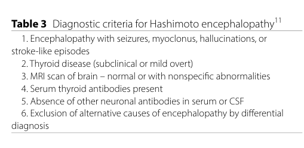

## Question

# Disease Characteristics Research Template

## Target Disease
- **Disease Name:** Hashimoto Encephalopathy
- **MONDO ID:**  (if available)
- **Category:** Autoimmune

## Research Objectives

Please provide a comprehensive research report on **Hashimoto Encephalopathy** covering all of the
disease characteristics listed below. This report will be used to populate a disease knowledge
base entry. Be thorough and cite primary literature (PMID preferred) for all claims.

For each section, **suggested databases/resources** are listed. These are the first places
you should search for information on each topic.

---

### 1. Disease Information
> **Search first:** OMIM, Orphanet, ICD-10/ICD-11, MeSH, PubMed

- What is the disease? Provide a concise overview.
- What are the key identifiers? (OMIM, Orphanet, ICD-10/ICD-11, MeSH, Mondo)
- What are the common synonyms and alternative names?
- Is the information derived from individual patients (e.g., EHR) or aggregated disease-level resources?

### 2. Etiology

- **Disease Causal Factors**: What are the primary causes? (genetic, environmental, infectious, mechanistic)
- **Risk Factors**:
  > **Search first:** PubMed, Cochrane Library, UpToDate, clinical guidelines, ClinVar, ClinGen, GWAS Catalog, PheGenI, CTD, CDC, WHO, epidemiological databases
  - Genetic risk factors (causal variants, susceptibility loci, modifier genes)
  - Environmental risk factors (toxins, lifestyle, occupational exposures, age, sex, family history)
- **Protective Factors**:
  > **Search first:** PubMed, Cochrane Library, clinical trial databases, GWAS Catalog, gnomAD, WHO, CDC, nutrition databases
  - Genetic protective factors (protective variants, modifier alleles)
  - Environmental protective factors (diet, lifestyle, exposures that reduce risk)
- **Gene-Environment Interactions**: How do genetic and environmental factors interact to influence disease?
  > **Search first:** CTD, PubMed, PheGenI, GxE databases

### 3. Phenotypes
> **Search first:** HPO (Human Phenotype Ontology), OMIM, Orphanet, PubMed, clinicaltrials.gov, MedDRA, SNOMED CT, DECIPHER, LOINC

For each phenotype, provide:
- **Phenotype type**: symptoms, clinical signs, physical manifestations, behavioral changes, or laboratory abnormalities
  > For symptoms/signs: HPO, OMIM, Orphanet, PubMed
  > For behavioral changes: HPO, DSM, RDoC (Research Domain Criteria), PubMed
  > For laboratory abnormalities: LOINC, SNOMED CT, LabTests Online, PubMed
- **Phenotype characteristics**:
  > **Search first:** OMIM, Orphanet, HPO, PubMed
  - Age of symptom onset (neonatal, childhood, adult-onset, late-onset)
  - Symptom severity (mild, moderate, severe, variable)
  - Symptom progression (stable, progressive, episodic, fluctuating)
  - Frequency among affected individuals (percentage or qualitative)
- **Quality of life impact**: Effects on daily functioning and well-being (per-phenotype when possible)
  > **Search first:** EQ-5D database, SF-36, WHO QOL databases, PubMed
- Suggest HPO (Human Phenotype Ontology) terms for each phenotype

### 4. Genetic/Molecular Information

- **Causal Genes**: Gene mutations or chromosomal abnormalities responsible for disease (gene symbols, OMIM IDs)
  > **Search first:** OMIM, ClinVar, HGMD, Ensembl, NCBI Gene
- **Pathogenic Variants**:
  - Affected genes (gene symbols, HGNC IDs)
    > **Search first:** OMIM, NCBI Gene, Ensembl, HGNC, UniProt, GeneCards
  - Variant classification (pathogenic, likely pathogenic, VUS per ACMG/AMP guidelines)
    > **Search first:** ClinVar, ClinGen, ACMG/AMP guidelines, VarSome
  - Variant type/class (missense, frameshift, nonsense, splice-site, structural)
  - Allele frequency in population databases
    > **Search first:** gnomAD, 1000 Genomes, ExAC, TOPMed, dbSNP
  - Somatic vs germline origin
    > **Search first:** COSMIC (somatic), ClinVar, ICGC, TCGA
  - Functional consequences (loss of function, gain of function, dominant negative)
- **Modifier Genes**: Genes that modify disease severity or expression
- **Epigenetic Information**: DNA methylation, histone modifications, chromatin changes affecting disease
  > **Search first:** ENCODE, Roadmap Epigenomics, MethBase, DiseaseMeth
- **Chromosomal Abnormalities**: Large-scale genetic changes (aneuploidy, translocations, inversions)
  > **Search first:** DECIPHER, ClinVar, ECARUCA, UCSC Genome Browser

### 5. Environmental Information

- **Environmental Factors**: Non-genetic contributing factors (toxins, radiation, pollution, occupational exposure)
  > **Search first:** CTD (Comparative Toxicogenomics Database), TOXNET, PubMed, EPA databases
- **Lifestyle Factors**: Behavioral factors (smoking, diet, exercise, alcohol consumption)
  > **Search first:** CDC databases, WHO, PubMed, NHANES
- **Infectious Agents**: If applicable, pathogens causing or triggering disease (bacteria, viruses, fungi, parasites)
  > **Search first:** NCBI Taxonomy, ViPR, BV-BRC, MicrobeDB, GIDEON

### 6. Mechanism / Pathophysiology

- **Molecular Pathways**: Specific signaling cascades or biochemical pathways involved (Wnt, MAPK, mTOR, PI3K-AKT, etc.)
  > **Search first:** KEGG, Reactome, WikiPathways, PathBank, BioCyc
- **Cellular Processes**: Cell-level mechanisms (apoptosis, autophagy, cell cycle dysregulation, inflammation, etc.)
  > **Search first:** Gene Ontology (GO), Reactome, KEGG, PubMed
- **Protein Dysfunction**: How protein structure or function is altered (misfolding, aggregation, loss of function, gain of function)
  > **Search first:** UniProt, PDB (Protein Data Bank), InterPro, Pfam, AlphaFold
- **Metabolic Changes**: Alterations in metabolic processes (energy metabolism, lipid metabolism, amino acid metabolism)
  > **Search first:** KEGG, BioCyc, HMDB (Human Metabolome Database), BRENDA
- **Immune System Involvement**: Role of immune response (autoimmunity, immunodeficiency, chronic inflammation)
  > **Search first:** ImmPort, Immunome Database, IEDB, Gene Ontology
- **Tissue Damage Mechanisms**: How tissues/ are injured (oxidative stress, ischemia, fibrosis, necrosis)
  > **Search first:** PubMed, Gene Ontology, Reactome
- **Biochemical Abnormalities**: Specific molecular defects (enzyme deficiencies, receptor dysfunction, ion channel defects)
  > **Search first:** BRENDA, UniProt, KEGG, OMIM, PubMed
- **Epigenetic Changes**: DNA methylation, histone modifications affecting gene expression in disease
  > **Search first:** ENCODE, Roadmap Epigenomics, MethBase, DiseaseMeth
- **Molecular Profiling** (if available):
  - Transcriptomics/gene expression changes
    > **Search first:** GEO (Gene Expression Omnibus), ArrayExpress, GTEx, Human Cell Atlas, SRA
  - Proteomics findings
    > **Search first:** PRIDE, ProteomeXchange, Human Protein Atlas, STRING, BioGRID
  - Metabolomics signatures
    > **Search first:** MetaboLights, Metabolomics Workbench, HMDB, METLIN
  - Lipidomics alterations
    > **Search first:** LIPID MAPS, SwissLipids, LipidHome, Metabolomics Workbench
  - Genomic structural features
    > **Search first:** UCSC Genome Browser, Ensembl, NCBI, dbVar, DGV
- **Advanced Technologies** (if applicable):
  - Single-cell analysis findings (cell-type specific mechanisms, cellular heterogeneity)
    > **Search first:** Human Cell Atlas, Single Cell Portal, GEO, CELLxGENE
  - Spatial transcriptomics findings
    > **Search first:** GEO, Spatial Research, Vizgen, 10x Genomics data
  - Multi-omics integration results
    > **Search first:** TCGA, ICGC, cBioPortal, LinkedOmics, PubMed
  - Functional genomics screens (CRISPR, RNAi)
    > **Search first:** DepMap, GenomeRNAi, PubMed, BioGRID ORCS

For each mechanism, describe:
- The causal chain from initial trigger to clinical manifestation
- Which mechanisms are upstream vs downstream
- What cell types and biological processes are involved
- Suggest GO terms for biological processes and CL terms for cell types

### 7. Anatomical Structures Affected

- **Organ Level**:
  - Primary organs directly affected
  - Secondary organ involvement (complications, secondary effects)
  - Body systems involved (cardiovascular, nervous, digestive, respiratory, endocrine, etc.)
  > **Search first:** Uberon, FMA (Foundational Model of Anatomy), OMIM, HPO, ICD-11, MeSH, SNOMED CT
- **Tissue and Cell Level**:
  - Specific tissue types affected (epithelial, connective, muscle, nervous)
  - Specific cell populations targeted (with Cell Ontology terms)
  > **Search first:** Uberon, Human Protein Atlas, Cell Ontology, Human Cell Atlas, CellMarker, PanglaoDB
- **Subcellular Level**:
  - Cellular compartments involved (mitochondria, nucleus, ER, lysosomes) (with GO Cellular Component terms)
  > **Search first:** Gene Ontology (Cellular Component), UniProt, Human Protein Atlas
- **Localization**:
  - Specific anatomical sites (with UBERON terms)
    > **Search first:** FMA, Uberon, NeuroNames (for brain), SNOMED CT
  - Lateralization (unilateral, bilateral, asymmetric)
    > **Search first:** HPO, clinical literature, imaging databases

### 8. Temporal Development

- **Onset**:
  - Typical age of onset (congenital, pediatric, adult, geriatric)
  - Onset pattern (acute, subacute, chronic, insidious)
  > **Search first:** OMIM, Orphanet, HPO, PubMed
- **Progression**:
  - Disease stages (early, intermediate, advanced, end-stage)
    > **Search first:** Cancer Staging Manual (AJCC), WHO classifications, PubMed
  - Progression rate (rapid, slow, variable)
  - Disease course pattern (episodic, relapsing-remitting, progressive, stable)
  - Disease duration (self-limited, chronic lifelong)
  > **Search first:** Disease registries, longitudinal cohort databases, natural history studies, PubMed, Orphanet, OMIM
- **Patterns**:
  - Remission patterns (spontaneous, treatment-induced)
    > **Search first:** Clinical trial databases, disease registries, PubMed
  - Critical periods (time windows of vulnerability or opportunity for intervention)
    > **Search first:** PubMed, developmental biology databases, clinical guidelines

### 9. Inheritance and Population

- **Epidemiology**:
  - Prevalence (cases per 100,000 at given time)
  - Incidence (new cases per 100,000 per year)
  > **Search first:** Orphanet, CDC, WHO, GBD (Global Burden of Disease), national registries, SEER, disease registries
- **For Genetic Etiology**:
  - Inheritance pattern (AD, AR, X-linked, mitochondrial, multifactorial, polygenic)
    > **Search first:** OMIM, Orphanet, ClinVar, GTR (Genetic Testing Registry)
  - Penetrance (complete, incomplete, age-dependent)
    > **Search first:** ClinVar, OMIM, PubMed, ClinGen
  - Expressivity (variable, consistent)
    > **Search first:** OMIM, ClinVar, PubMed
  - Genetic anticipation (increasing severity in successive generations)
    > **Search first:** OMIM, PubMed (especially for repeat expansion disorders)
  - Germline mosaicism
    > **Search first:** ClinVar, OMIM, genetic counseling literature, PubMed
  - Founder effects (population-specific mutations)
    > **Search first:** gnomAD, population genetics databases, PubMed
  - Consanguinity role
    > **Search first:** OMIM, population studies, genetic counseling resources
  - Carrier frequency
    > **Search first:** gnomAD, carrier screening databases, GeneReviews, GTR
- **Population Demographics**:
  - Affected populations (ethnic or demographic groups with higher prevalence)
    > **Search first:** gnomAD, 1000 Genomes, PAGE Study, PubMed, population registries
  - Geographic distribution (endemic areas, regional variation)
    > **Search first:** WHO, CDC, GBD, Orphanet, geographic epidemiology databases
  - Geographic distribution of specific variants
  - Sex ratio (male:female)
    > **Search first:** Disease registries, OMIM, PubMed, epidemiological databases
  - Age distribution of affected individuals
    > **Search first:** CDC, disease registries, SEER, Orphanet

### 10. Diagnostics

- **Clinical Tests**:
  - Laboratory tests (blood, urine, tissue chemistry, specific enzyme assays)
    > **Search first:** LOINC, LabTests Online, PubMed
  - Biomarkers (proteins, metabolites, genetic markers, circulating biomarkers)
    > **Search first:** FDA Biomarker List, BEST (Biomarkers, EndpointS, and other Tools), PubMed
  - Imaging studies (X-ray, CT, MRI, PET, ultrasound)
    > **Search first:** RadLex, DICOM, Radiopaedia, imaging databases
  - Functional tests (pulmonary function, cardiac stress tests)
    > **Search first:** LOINC, clinical guidelines, PubMed
  - Electrophysiology (EEG, EMG, ECG, nerve conduction studies)
    > **Search first:** LOINC, clinical neurophysiology databases, PubMed
  - Biopsy findings (histopathology, immunohistochemistry)
    > **Search first:** SNOMED CT, College of American Pathologists resources, PubMed
  - Pathology findings (microscopic examination)
    > **Search first:** SNOMED CT, Digital Pathology databases, PubMed
- **Genetic Testing**:
  > **Search first:** GTR (Genetic Testing Registry), GeneReviews, ClinGen
  - Overview of recommended genetic testing approach
  - Whole genome sequencing (WGS) utility
    > **Search first:** GTR, ClinVar, GEL (Genomics England), gnomAD
  - Whole exome sequencing (WES) utility
    > **Search first:** GTR, ClinVar, OMIM, GeneMatcher
  - Gene panels (which panels, which genes)
    > **Search first:** GTR, ClinVar, laboratory-specific databases
  - Single gene testing
    > **Search first:** GTR, ClinVar, OMIM, GeneReviews
  - Chromosomal microarray (CMA)
    > **Search first:** DECIPHER, ClinVar, dbVar, ECARUCA
  - Karyotyping
    > **Search first:** Chromosome Abnormality Database, ClinVar, cytogenetics resources
  - FISH
    > **Search first:** ClinVar, cytogenetics databases, PubMed
  - Mitochondrial DNA testing
    > **Search first:** MITOMAP, MSeqDR, ClinVar, GTR
  - Repeat expansion testing
    > **Search first:** GTR, ClinVar, repeat expansion databases, PubMed
- **Omics-Based Diagnostics** (if applicable):
  - RNA sequencing / transcriptomics
    > **Search first:** GEO, ArrayExpress, GTEx, RNA-seq databases
  - Proteomics
    > **Search first:** PRIDE, ProteomeXchange, FDA Biomarker database
  - Metabolomics
    > **Search first:** MetaboLights, Metabolomics Workbench, HMDB
  - Epigenomics
    > **Search first:** GEO, ENCODE, Roadmap Epigenomics, MethBase
  - Liquid biopsy
    > **Search first:** COSMIC, ClinVar, liquid biopsy databases, PubMed
- **Clinical Criteria**:
  - Standardized diagnostic criteria (DSM, ICD, society guidelines)
    > **Search first:** DSM-5, ICD-11, clinical society guidelines, UpToDate
  - Differential diagnosis (other conditions to rule out, with distinguishing features)
    > **Search first:** DynaMed, UpToDate, clinical decision support systems
- **Screening**:
  - Screening methods for asymptomatic individuals (newborn screening, carrier screening, cascade screening)
    > **Search first:** ACMG recommendations, CDC newborn screening, GTR

### 11. Outcome/Prognosis

- **Survival and Mortality**:
  - Survival rate (5-year, 10-year, overall)
    > **Search first:** SEER, cancer registries, disease-specific registries, PubMed
  - Life expectancy (with and without treatment if applicable)
    > **Search first:** Orphanet, disease registries, actuarial databases, PubMed
  - Mortality rate
    > **Search first:** CDC, WHO, GBD, national mortality databases
  - Disease-specific mortality (deaths directly attributable to disease)
    > **Search first:** Disease registries, CDC Wonder, GBD, PubMed
- **Morbidity and Function**:
  - Morbidity (disease-related disability and health impacts)
    > **Search first:** GBD, WHO, disability databases, PubMed
  - Disability outcomes (long-term functional impairments)
    > **Search first:** ICF (International Classification of Functioning), disability registries
  - Quality of life measures (EQ-5D, SF-36, PROMIS, disease-specific tools)
    > **Search first:** EQ-5D database, SF-36, PROMIS, PubMed
- **Disease Course**:
  - Complications (secondary problems: infections, organ failure, etc.)
    > **Search first:** ICD codes, disease registries, clinical databases, PubMed
  - Recovery potential (likelihood and extent of recovery, with vs without treatment)
    > **Search first:** Natural history studies, rehabilitation databases, PubMed
- **Prediction**:
  - Prognostic factors (age, disease severity, biomarkers, treatment response)
    > **Search first:** Prognostic models databases, clinical calculators, PubMed
  - Prognostic biomarkers (molecular markers predicting disease course)
    > **Search first:** FDA Biomarker database, PubMed, cancer prognostic databases

### 12. Treatment

- **Pharmacotherapy**:
  - Pharmacological treatments (drug names, drug classes, mechanisms of action)
    > **Search first:** DrugBank, RxNorm, ATC classification, DailyMed, FDA databases
  - Pharmacogenomics (how genetic variants affect drug metabolism, efficacy, toxicity)
    > **Search first:** PharmGKB, CPIC (Clinical Pharmacogenetics), FDA Table of PGx Biomarkers
- **Advanced Therapeutics**:
  - Gene therapy (viral vectors, CRISPR, gene replacement, gene editing)
    > **Search first:** ClinicalTrials.gov, FDA gene therapy database, ASGCT resources
  - Cell therapy (stem cell transplant, CAR-T, cellular therapeutics)
    > **Search first:** ClinicalTrials.gov, FDA cell therapy database, FACT standards
  - RNA-based therapies (ASOs, siRNA, mRNA therapies)
    > **Search first:** ClinicalTrials.gov, FDA approvals, PubMed
  - Targeted therapies (treatments directed at specific molecular targets)
    > **Search first:** My Cancer Genome, OncoKB, ClinicalTrials.gov, FDA approvals
  - Immunotherapies (checkpoint inhibitors, monoclonal antibodies)
    > **Search first:** Cancer Immunotherapy Database, FDA approvals, ClinicalTrials.gov
- **Surgical and Interventional**:
  - Surgical interventions (types of surgery, timing, outcomes)
    > **Search first:** CPT codes, surgical registries, clinical guidelines, PubMed
- **Supportive and Rehabilitative**:
  - Supportive care (symptom management, pain control, nutrition)
    > **Search first:** Clinical guidelines, Cochrane Library, PubMed
  - Rehabilitation (physical therapy, occupational therapy, speech therapy)
    > **Search first:** Rehabilitation medicine databases, clinical guidelines, PubMed
- **Experimental**:
  - Experimental treatments in clinical trials (with NCT identifiers if available)
    > **Search first:** ClinicalTrials.gov, EU Clinical Trials Register, WHO ICTRP
- **Treatment Outcomes**:
  - Treatment response rates
    > **Search first:** Clinical trial databases, FDA reviews, systematic reviews, PubMed
  - Side effects and adverse events
    > **Search first:** FDA Adverse Event Reporting System (FAERS), MedWatch, PubMed
- **Treatment Strategy**:
  - Treatment algorithms (clinical pathways, decision trees)
    > **Search first:** Clinical practice guidelines, NCCN Guidelines, UpToDate
  - Combination therapies
    > **Search first:** ClinicalTrials.gov, treatment guidelines, PubMed
  - Personalized medicine approaches (genotype-guided treatment)
    > **Search first:** My Cancer Genome, CIViC, PharmGKB, precision medicine databases

For each treatment, suggest MAXO (Medical Action Ontology) terms where applicable.

### 13. Prevention

- **Prevention Levels**:
  - Primary prevention (preventing disease occurrence: vaccination, risk factor modification)
    > **Search first:** CDC, WHO, USPSTF recommendations, Cochrane Library
  - Secondary prevention (early detection and treatment: screening programs, early intervention)
    > **Search first:** USPSTF, CDC screening guidelines, WHO
  - Tertiary prevention (preventing complications in those with disease)
    > **Search first:** Clinical guidelines, disease management protocols, PubMed
- **Immunization**: Vaccine strategies (if applicable)
  > **Search first:** CDC vaccine schedules, WHO immunization, FDA vaccine database
- **Screening and Early Detection**:
  - Screening programs (population-based: newborn screening, cancer screening)
    > **Search first:** CDC screening programs, USPSTF, cancer screening databases
  - Genetic screening (carrier screening, preimplantation genetic diagnosis, prenatal testing)
    > **Search first:** ACMG recommendations, ACOG guidelines, GTR
  - Risk stratification (identifying high-risk individuals for targeted prevention)
    > **Search first:** Risk prediction models, clinical calculators, PubMed
- **Behavioral Interventions**: Lifestyle modifications to reduce risk
  > **Search first:** CDC, WHO, behavioral intervention databases, Cochrane Library
- **Counseling**: Genetic counseling (risk assessment, family planning guidance)
  > **Search first:** NSGC resources, ACMG guidelines, GeneReviews
- **Public Health**:
  - Public health interventions (sanitation, vector control, health education)
    > **Search first:** CDC, WHO, public health databases, PubMed
  - Environmental interventions (reducing environmental risk factors)
    > **Search first:** EPA databases, WHO environmental health, PubMed
- **Prophylaxis**: Preventive medications or procedures
  > **Search first:** Clinical guidelines, FDA approvals, PubMed

### 14. Other Species / Natural Disease

- **Taxonomy**: Species affected (with NCBI Taxon identifiers)
  > **Search first:** NCBI Taxonomy
- **Breed**: Specific breeds affected (with VBO identifiers if applicable)
  > **Search first:** VBO (Vertebrate Breed Ontology)
- **Gene**: Orthologous genes in other species (with NCBI Gene IDs)
  > **Search first:** NCBI Gene
- **Natural Disease**:
  - Naturally occurring disease in other species (companion animals, wildlife)
    > **Search first:** OMIA (Online Mendelian Inheritance in Animals), VetCompass, PubMed
  - Veterinary relevance and importance in animal health
    > **Search first:** OMIA, veterinary databases, PubMed
- **Comparative Biology**:
  - Comparative pathology (similarities and differences across species)
    > **Search first:** OMIA, comparative pathology databases, PubMed
  - Evolutionary conservation of disease mechanisms
    > **Search first:** HomoloGene, OrthoMCL, Alliance of Genome Resources
- **Transmission** (if applicable):
  - Zoonotic potential
    > **Search first:** CDC zoonotic diseases, WHO zoonoses, GIDEON
  - Cross-species susceptibility
    > **Search first:** NCBI Taxonomy, veterinary databases, PubMed

### 15. Model Organisms

- **Model Types**:
  - Model organism type (mammalian, invertebrate, cellular, in vitro)
    > **Search first:** Alliance of Genome Resources, model organism databases
  - Specific model systems (mouse, rat, zebrafish, Drosophila, C. elegans, yeast, cell lines, organoids, iPSCs)
    > **Search first:** MGI, RGD, ZFIN, FlyBase, WormBase, SGD, ATCC, Cellosaurus
  - Induced models (drug treatment, surgical intervention, environmental manipulation)
    > **Search first:** MGI, model organism databases, PubMed
- **Genetic Models**:
  - Types available (knockout, knock-in, transgenic, conditional, humanized)
    > **Search first:** MGI, IMPC, KOMP, EuMMCR, IMSR
- **Model Characteristics**:
  - Phenotype recapitulation (how well model reproduces human disease features)
    > **Search first:** Model organism databases, comparative studies, PubMed
  - Model limitations (aspects of human disease not captured)
    > **Search first:** Model organism databases, PubMed, review articles
- **Applications**:
  - Research applications (what aspects of disease can be studied)
    > **Search first:** Model organism databases, PubMed
- **Resources**:
  - Model databases
    > **Search first:** MGI, RGD, ZFIN, FlyBase, WormBase, IMSR, EMMA, MMRRC

---

## Citation Requirements

- Cite primary literature (PMID preferred) for all mechanistic and clinical claims
- Prioritize recent reviews and landmark papers
- Include direct quotes from abstracts where possible to support key statements
- Distinguish evidence source types: human clinical, model organism, in vitro, computational

## Output Format

Structure your response as a comprehensive narrative organized by the sections above.
For each section, provide:
- Factual content with specific details (numbers, percentages, gene names, variant nomenclature)
- Ontology term suggestions (HPO, GO, CL, UBERON, CHEBI, MAXO, MONDO) where applicable
- Evidence citations with PMIDs
- Direct quotes from abstracts to support key claims
- Clear indication when information is not available or not applicable for this disease

This report will be used to populate a disease knowledge base entry with:
- Pathophysiology descriptions with causal chains
- Gene/protein annotations (HGNC, GO terms)
- Phenotype associations (HP terms) with frequencies
- Cell type involvement (CL terms)
- Anatomical locations (UBERON terms)
- Chemical entities (CHEBI terms)
- Treatment annotations (MAXO terms)
- Evidence items with PMIDs and exact abstract quotes
- Epidemiology, prognosis, diagnostic, and prevention information
- Animal model descriptions with phenotype recapitulation details

## Output

Question: You are an expert researcher providing comprehensive, well-cited information.

Provide detailed information focusing on:
1. Key concepts and definitions with current understanding
2. Recent developments and latest research (prioritize 2023-2024 sources)
3. Current applications and real-world implementations
4. Expert opinions and analysis from authoritative sources
5. Relevant statistics and data from recent studies

Format as a comprehensive research report with proper citations. Include URLs and publication dates where available.
Always prioritize recent, authoritative sources and provide specific citations for all major claims.

# Disease Characteristics Research Template

## Target Disease
- **Disease Name:** Hashimoto Encephalopathy
- **MONDO ID:**  (if available)
- **Category:** Autoimmune

## Research Objectives

Please provide a comprehensive research report on **Hashimoto Encephalopathy** covering all of the
disease characteristics listed below. This report will be used to populate a disease knowledge
base entry. Be thorough and cite primary literature (PMID preferred) for all claims.

For each section, **suggested databases/resources** are listed. These are the first places
you should search for information on each topic.

---

### 1. Disease Information
> **Search first:** OMIM, Orphanet, ICD-10/ICD-11, MeSH, PubMed

- What is the disease? Provide a concise overview.
- What are the key identifiers? (OMIM, Orphanet, ICD-10/ICD-11, MeSH, Mondo)
- What are the common synonyms and alternative names?
- Is the information derived from individual patients (e.g., EHR) or aggregated disease-level resources?

### 2. Etiology

- **Disease Causal Factors**: What are the primary causes? (genetic, environmental, infectious, mechanistic)
- **Risk Factors**:
  > **Search first:** PubMed, Cochrane Library, UpToDate, clinical guidelines, ClinVar, ClinGen, GWAS Catalog, PheGenI, CTD, CDC, WHO, epidemiological databases
  - Genetic risk factors (causal variants, susceptibility loci, modifier genes)
  - Environmental risk factors (toxins, lifestyle, occupational exposures, age, sex, family history)
- **Protective Factors**:
  > **Search first:** PubMed, Cochrane Library, clinical trial databases, GWAS Catalog, gnomAD, WHO, CDC, nutrition databases
  - Genetic protective factors (protective variants, modifier alleles)
  - Environmental protective factors (diet, lifestyle, exposures that reduce risk)
- **Gene-Environment Interactions**: How do genetic and environmental factors interact to influence disease?
  > **Search first:** CTD, PubMed, PheGenI, GxE databases

### 3. Phenotypes
> **Search first:** HPO (Human Phenotype Ontology), OMIM, Orphanet, PubMed, clinicaltrials.gov, MedDRA, SNOMED CT, DECIPHER, LOINC

For each phenotype, provide:
- **Phenotype type**: symptoms, clinical signs, physical manifestations, behavioral changes, or laboratory abnormalities
  > For symptoms/signs: HPO, OMIM, Orphanet, PubMed
  > For behavioral changes: HPO, DSM, RDoC (Research Domain Criteria), PubMed
  > For laboratory abnormalities: LOINC, SNOMED CT, LabTests Online, PubMed
- **Phenotype characteristics**:
  > **Search first:** OMIM, Orphanet, HPO, PubMed
  - Age of symptom onset (neonatal, childhood, adult-onset, late-onset)
  - Symptom severity (mild, moderate, severe, variable)
  - Symptom progression (stable, progressive, episodic, fluctuating)
  - Frequency among affected individuals (percentage or qualitative)
- **Quality of life impact**: Effects on daily functioning and well-being (per-phenotype when possible)
  > **Search first:** EQ-5D database, SF-36, WHO QOL databases, PubMed
- Suggest HPO (Human Phenotype Ontology) terms for each phenotype

### 4. Genetic/Molecular Information

- **Causal Genes**: Gene mutations or chromosomal abnormalities responsible for disease (gene symbols, OMIM IDs)
  > **Search first:** OMIM, ClinVar, HGMD, Ensembl, NCBI Gene
- **Pathogenic Variants**:
  - Affected genes (gene symbols, HGNC IDs)
    > **Search first:** OMIM, NCBI Gene, Ensembl, HGNC, UniProt, GeneCards
  - Variant classification (pathogenic, likely pathogenic, VUS per ACMG/AMP guidelines)
    > **Search first:** ClinVar, ClinGen, ACMG/AMP guidelines, VarSome
  - Variant type/class (missense, frameshift, nonsense, splice-site, structural)
  - Allele frequency in population databases
    > **Search first:** gnomAD, 1000 Genomes, ExAC, TOPMed, dbSNP
  - Somatic vs germline origin
    > **Search first:** COSMIC (somatic), ClinVar, ICGC, TCGA
  - Functional consequences (loss of function, gain of function, dominant negative)
- **Modifier Genes**: Genes that modify disease severity or expression
- **Epigenetic Information**: DNA methylation, histone modifications, chromatin changes affecting disease
  > **Search first:** ENCODE, Roadmap Epigenomics, MethBase, DiseaseMeth
- **Chromosomal Abnormalities**: Large-scale genetic changes (aneuploidy, translocations, inversions)
  > **Search first:** DECIPHER, ClinVar, ECARUCA, UCSC Genome Browser

### 5. Environmental Information

- **Environmental Factors**: Non-genetic contributing factors (toxins, radiation, pollution, occupational exposure)
  > **Search first:** CTD (Comparative Toxicogenomics Database), TOXNET, PubMed, EPA databases
- **Lifestyle Factors**: Behavioral factors (smoking, diet, exercise, alcohol consumption)
  > **Search first:** CDC databases, WHO, PubMed, NHANES
- **Infectious Agents**: If applicable, pathogens causing or triggering disease (bacteria, viruses, fungi, parasites)
  > **Search first:** NCBI Taxonomy, ViPR, BV-BRC, MicrobeDB, GIDEON

### 6. Mechanism / Pathophysiology

- **Molecular Pathways**: Specific signaling cascades or biochemical pathways involved (Wnt, MAPK, mTOR, PI3K-AKT, etc.)
  > **Search first:** KEGG, Reactome, WikiPathways, PathBank, BioCyc
- **Cellular Processes**: Cell-level mechanisms (apoptosis, autophagy, cell cycle dysregulation, inflammation, etc.)
  > **Search first:** Gene Ontology (GO), Reactome, KEGG, PubMed
- **Protein Dysfunction**: How protein structure or function is altered (misfolding, aggregation, loss of function, gain of function)
  > **Search first:** UniProt, PDB (Protein Data Bank), InterPro, Pfam, AlphaFold
- **Metabolic Changes**: Alterations in metabolic processes (energy metabolism, lipid metabolism, amino acid metabolism)
  > **Search first:** KEGG, BioCyc, HMDB (Human Metabolome Database), BRENDA
- **Immune System Involvement**: Role of immune response (autoimmunity, immunodeficiency, chronic inflammation)
  > **Search first:** ImmPort, Immunome Database, IEDB, Gene Ontology
- **Tissue Damage Mechanisms**: How tissues/ are injured (oxidative stress, ischemia, fibrosis, necrosis)
  > **Search first:** PubMed, Gene Ontology, Reactome
- **Biochemical Abnormalities**: Specific molecular defects (enzyme deficiencies, receptor dysfunction, ion channel defects)
  > **Search first:** BRENDA, UniProt, KEGG, OMIM, PubMed
- **Epigenetic Changes**: DNA methylation, histone modifications affecting gene expression in disease
  > **Search first:** ENCODE, Roadmap Epigenomics, MethBase, DiseaseMeth
- **Molecular Profiling** (if available):
  - Transcriptomics/gene expression changes
    > **Search first:** GEO (Gene Expression Omnibus), ArrayExpress, GTEx, Human Cell Atlas, SRA
  - Proteomics findings
    > **Search first:** PRIDE, ProteomeXchange, Human Protein Atlas, STRING, BioGRID
  - Metabolomics signatures
    > **Search first:** MetaboLights, Metabolomics Workbench, HMDB, METLIN
  - Lipidomics alterations
    > **Search first:** LIPID MAPS, SwissLipids, LipidHome, Metabolomics Workbench
  - Genomic structural features
    > **Search first:** UCSC Genome Browser, Ensembl, NCBI, dbVar, DGV
- **Advanced Technologies** (if applicable):
  - Single-cell analysis findings (cell-type specific mechanisms, cellular heterogeneity)
    > **Search first:** Human Cell Atlas, Single Cell Portal, GEO, CELLxGENE
  - Spatial transcriptomics findings
    > **Search first:** GEO, Spatial Research, Vizgen, 10x Genomics data
  - Multi-omics integration results
    > **Search first:** TCGA, ICGC, cBioPortal, LinkedOmics, PubMed
  - Functional genomics screens (CRISPR, RNAi)
    > **Search first:** DepMap, GenomeRNAi, PubMed, BioGRID ORCS

For each mechanism, describe:
- The causal chain from initial trigger to clinical manifestation
- Which mechanisms are upstream vs downstream
- What cell types and biological processes are involved
- Suggest GO terms for biological processes and CL terms for cell types

### 7. Anatomical Structures Affected

- **Organ Level**:
  - Primary organs directly affected
  - Secondary organ involvement (complications, secondary effects)
  - Body systems involved (cardiovascular, nervous, digestive, respiratory, endocrine, etc.)
  > **Search first:** Uberon, FMA (Foundational Model of Anatomy), OMIM, HPO, ICD-11, MeSH, SNOMED CT
- **Tissue and Cell Level**:
  - Specific tissue types affected (epithelial, connective, muscle, nervous)
  - Specific cell populations targeted (with Cell Ontology terms)
  > **Search first:** Uberon, Human Protein Atlas, Cell Ontology, Human Cell Atlas, CellMarker, PanglaoDB
- **Subcellular Level**:
  - Cellular compartments involved (mitochondria, nucleus, ER, lysosomes) (with GO Cellular Component terms)
  > **Search first:** Gene Ontology (Cellular Component), UniProt, Human Protein Atlas
- **Localization**:
  - Specific anatomical sites (with UBERON terms)
    > **Search first:** FMA, Uberon, NeuroNames (for brain), SNOMED CT
  - Lateralization (unilateral, bilateral, asymmetric)
    > **Search first:** HPO, clinical literature, imaging databases

### 8. Temporal Development

- **Onset**:
  - Typical age of onset (congenital, pediatric, adult, geriatric)
  - Onset pattern (acute, subacute, chronic, insidious)
  > **Search first:** OMIM, Orphanet, HPO, PubMed
- **Progression**:
  - Disease stages (early, intermediate, advanced, end-stage)
    > **Search first:** Cancer Staging Manual (AJCC), WHO classifications, PubMed
  - Progression rate (rapid, slow, variable)
  - Disease course pattern (episodic, relapsing-remitting, progressive, stable)
  - Disease duration (self-limited, chronic lifelong)
  > **Search first:** Disease registries, longitudinal cohort databases, natural history studies, PubMed, Orphanet, OMIM
- **Patterns**:
  - Remission patterns (spontaneous, treatment-induced)
    > **Search first:** Clinical trial databases, disease registries, PubMed
  - Critical periods (time windows of vulnerability or opportunity for intervention)
    > **Search first:** PubMed, developmental biology databases, clinical guidelines

### 9. Inheritance and Population

- **Epidemiology**:
  - Prevalence (cases per 100,000 at given time)
  - Incidence (new cases per 100,000 per year)
  > **Search first:** Orphanet, CDC, WHO, GBD (Global Burden of Disease), national registries, SEER, disease registries
- **For Genetic Etiology**:
  - Inheritance pattern (AD, AR, X-linked, mitochondrial, multifactorial, polygenic)
    > **Search first:** OMIM, Orphanet, ClinVar, GTR (Genetic Testing Registry)
  - Penetrance (complete, incomplete, age-dependent)
    > **Search first:** ClinVar, OMIM, PubMed, ClinGen
  - Expressivity (variable, consistent)
    > **Search first:** OMIM, ClinVar, PubMed
  - Genetic anticipation (increasing severity in successive generations)
    > **Search first:** OMIM, PubMed (especially for repeat expansion disorders)
  - Germline mosaicism
    > **Search first:** ClinVar, OMIM, genetic counseling literature, PubMed
  - Founder effects (population-specific mutations)
    > **Search first:** gnomAD, population genetics databases, PubMed
  - Consanguinity role
    > **Search first:** OMIM, population studies, genetic counseling resources
  - Carrier frequency
    > **Search first:** gnomAD, carrier screening databases, GeneReviews, GTR
- **Population Demographics**:
  - Affected populations (ethnic or demographic groups with higher prevalence)
    > **Search first:** gnomAD, 1000 Genomes, PAGE Study, PubMed, population registries
  - Geographic distribution (endemic areas, regional variation)
    > **Search first:** WHO, CDC, GBD, Orphanet, geographic epidemiology databases
  - Geographic distribution of specific variants
  - Sex ratio (male:female)
    > **Search first:** Disease registries, OMIM, PubMed, epidemiological databases
  - Age distribution of affected individuals
    > **Search first:** CDC, disease registries, SEER, Orphanet

### 10. Diagnostics

- **Clinical Tests**:
  - Laboratory tests (blood, urine, tissue chemistry, specific enzyme assays)
    > **Search first:** LOINC, LabTests Online, PubMed
  - Biomarkers (proteins, metabolites, genetic markers, circulating biomarkers)
    > **Search first:** FDA Biomarker List, BEST (Biomarkers, EndpointS, and other Tools), PubMed
  - Imaging studies (X-ray, CT, MRI, PET, ultrasound)
    > **Search first:** RadLex, DICOM, Radiopaedia, imaging databases
  - Functional tests (pulmonary function, cardiac stress tests)
    > **Search first:** LOINC, clinical guidelines, PubMed
  - Electrophysiology (EEG, EMG, ECG, nerve conduction studies)
    > **Search first:** LOINC, clinical neurophysiology databases, PubMed
  - Biopsy findings (histopathology, immunohistochemistry)
    > **Search first:** SNOMED CT, College of American Pathologists resources, PubMed
  - Pathology findings (microscopic examination)
    > **Search first:** SNOMED CT, Digital Pathology databases, PubMed
- **Genetic Testing**:
  > **Search first:** GTR (Genetic Testing Registry), GeneReviews, ClinGen
  - Overview of recommended genetic testing approach
  - Whole genome sequencing (WGS) utility
    > **Search first:** GTR, ClinVar, GEL (Genomics England), gnomAD
  - Whole exome sequencing (WES) utility
    > **Search first:** GTR, ClinVar, OMIM, GeneMatcher
  - Gene panels (which panels, which genes)
    > **Search first:** GTR, ClinVar, laboratory-specific databases
  - Single gene testing
    > **Search first:** GTR, ClinVar, OMIM, GeneReviews
  - Chromosomal microarray (CMA)
    > **Search first:** DECIPHER, ClinVar, dbVar, ECARUCA
  - Karyotyping
    > **Search first:** Chromosome Abnormality Database, ClinVar, cytogenetics resources
  - FISH
    > **Search first:** ClinVar, cytogenetics databases, PubMed
  - Mitochondrial DNA testing
    > **Search first:** MITOMAP, MSeqDR, ClinVar, GTR
  - Repeat expansion testing
    > **Search first:** GTR, ClinVar, repeat expansion databases, PubMed
- **Omics-Based Diagnostics** (if applicable):
  - RNA sequencing / transcriptomics
    > **Search first:** GEO, ArrayExpress, GTEx, RNA-seq databases
  - Proteomics
    > **Search first:** PRIDE, ProteomeXchange, FDA Biomarker database
  - Metabolomics
    > **Search first:** MetaboLights, Metabolomics Workbench, HMDB
  - Epigenomics
    > **Search first:** GEO, ENCODE, Roadmap Epigenomics, MethBase
  - Liquid biopsy
    > **Search first:** COSMIC, ClinVar, liquid biopsy databases, PubMed
- **Clinical Criteria**:
  - Standardized diagnostic criteria (DSM, ICD, society guidelines)
    > **Search first:** DSM-5, ICD-11, clinical society guidelines, UpToDate
  - Differential diagnosis (other conditions to rule out, with distinguishing features)
    > **Search first:** DynaMed, UpToDate, clinical decision support systems
- **Screening**:
  - Screening methods for asymptomatic individuals (newborn screening, carrier screening, cascade screening)
    > **Search first:** ACMG recommendations, CDC newborn screening, GTR

### 11. Outcome/Prognosis

- **Survival and Mortality**:
  - Survival rate (5-year, 10-year, overall)
    > **Search first:** SEER, cancer registries, disease-specific registries, PubMed
  - Life expectancy (with and without treatment if applicable)
    > **Search first:** Orphanet, disease registries, actuarial databases, PubMed
  - Mortality rate
    > **Search first:** CDC, WHO, GBD, national mortality databases
  - Disease-specific mortality (deaths directly attributable to disease)
    > **Search first:** Disease registries, CDC Wonder, GBD, PubMed
- **Morbidity and Function**:
  - Morbidity (disease-related disability and health impacts)
    > **Search first:** GBD, WHO, disability databases, PubMed
  - Disability outcomes (long-term functional impairments)
    > **Search first:** ICF (International Classification of Functioning), disability registries
  - Quality of life measures (EQ-5D, SF-36, PROMIS, disease-specific tools)
    > **Search first:** EQ-5D database, SF-36, PROMIS, PubMed
- **Disease Course**:
  - Complications (secondary problems: infections, organ failure, etc.)
    > **Search first:** ICD codes, disease registries, clinical databases, PubMed
  - Recovery potential (likelihood and extent of recovery, with vs without treatment)
    > **Search first:** Natural history studies, rehabilitation databases, PubMed
- **Prediction**:
  - Prognostic factors (age, disease severity, biomarkers, treatment response)
    > **Search first:** Prognostic models databases, clinical calculators, PubMed
  - Prognostic biomarkers (molecular markers predicting disease course)
    > **Search first:** FDA Biomarker database, PubMed, cancer prognostic databases

### 12. Treatment

- **Pharmacotherapy**:
  - Pharmacological treatments (drug names, drug classes, mechanisms of action)
    > **Search first:** DrugBank, RxNorm, ATC classification, DailyMed, FDA databases
  - Pharmacogenomics (how genetic variants affect drug metabolism, efficacy, toxicity)
    > **Search first:** PharmGKB, CPIC (Clinical Pharmacogenetics), FDA Table of PGx Biomarkers
- **Advanced Therapeutics**:
  - Gene therapy (viral vectors, CRISPR, gene replacement, gene editing)
    > **Search first:** ClinicalTrials.gov, FDA gene therapy database, ASGCT resources
  - Cell therapy (stem cell transplant, CAR-T, cellular therapeutics)
    > **Search first:** ClinicalTrials.gov, FDA cell therapy database, FACT standards
  - RNA-based therapies (ASOs, siRNA, mRNA therapies)
    > **Search first:** ClinicalTrials.gov, FDA approvals, PubMed
  - Targeted therapies (treatments directed at specific molecular targets)
    > **Search first:** My Cancer Genome, OncoKB, ClinicalTrials.gov, FDA approvals
  - Immunotherapies (checkpoint inhibitors, monoclonal antibodies)
    > **Search first:** Cancer Immunotherapy Database, FDA approvals, ClinicalTrials.gov
- **Surgical and Interventional**:
  - Surgical interventions (types of surgery, timing, outcomes)
    > **Search first:** CPT codes, surgical registries, clinical guidelines, PubMed
- **Supportive and Rehabilitative**:
  - Supportive care (symptom management, pain control, nutrition)
    > **Search first:** Clinical guidelines, Cochrane Library, PubMed
  - Rehabilitation (physical therapy, occupational therapy, speech therapy)
    > **Search first:** Rehabilitation medicine databases, clinical guidelines, PubMed
- **Experimental**:
  - Experimental treatments in clinical trials (with NCT identifiers if available)
    > **Search first:** ClinicalTrials.gov, EU Clinical Trials Register, WHO ICTRP
- **Treatment Outcomes**:
  - Treatment response rates
    > **Search first:** Clinical trial databases, FDA reviews, systematic reviews, PubMed
  - Side effects and adverse events
    > **Search first:** FDA Adverse Event Reporting System (FAERS), MedWatch, PubMed
- **Treatment Strategy**:
  - Treatment algorithms (clinical pathways, decision trees)
    > **Search first:** Clinical practice guidelines, NCCN Guidelines, UpToDate
  - Combination therapies
    > **Search first:** ClinicalTrials.gov, treatment guidelines, PubMed
  - Personalized medicine approaches (genotype-guided treatment)
    > **Search first:** My Cancer Genome, CIViC, PharmGKB, precision medicine databases

For each treatment, suggest MAXO (Medical Action Ontology) terms where applicable.

### 13. Prevention

- **Prevention Levels**:
  - Primary prevention (preventing disease occurrence: vaccination, risk factor modification)
    > **Search first:** CDC, WHO, USPSTF recommendations, Cochrane Library
  - Secondary prevention (early detection and treatment: screening programs, early intervention)
    > **Search first:** USPSTF, CDC screening guidelines, WHO
  - Tertiary prevention (preventing complications in those with disease)
    > **Search first:** Clinical guidelines, disease management protocols, PubMed
- **Immunization**: Vaccine strategies (if applicable)
  > **Search first:** CDC vaccine schedules, WHO immunization, FDA vaccine database
- **Screening and Early Detection**:
  - Screening programs (population-based: newborn screening, cancer screening)
    > **Search first:** CDC screening programs, USPSTF, cancer screening databases
  - Genetic screening (carrier screening, preimplantation genetic diagnosis, prenatal testing)
    > **Search first:** ACMG recommendations, ACOG guidelines, GTR
  - Risk stratification (identifying high-risk individuals for targeted prevention)
    > **Search first:** Risk prediction models, clinical calculators, PubMed
- **Behavioral Interventions**: Lifestyle modifications to reduce risk
  > **Search first:** CDC, WHO, behavioral intervention databases, Cochrane Library
- **Counseling**: Genetic counseling (risk assessment, family planning guidance)
  > **Search first:** NSGC resources, ACMG guidelines, GeneReviews
- **Public Health**:
  - Public health interventions (sanitation, vector control, health education)
    > **Search first:** CDC, WHO, public health databases, PubMed
  - Environmental interventions (reducing environmental risk factors)
    > **Search first:** EPA databases, WHO environmental health, PubMed
- **Prophylaxis**: Preventive medications or procedures
  > **Search first:** Clinical guidelines, FDA approvals, PubMed

### 14. Other Species / Natural Disease

- **Taxonomy**: Species affected (with NCBI Taxon identifiers)
  > **Search first:** NCBI Taxonomy
- **Breed**: Specific breeds affected (with VBO identifiers if applicable)
  > **Search first:** VBO (Vertebrate Breed Ontology)
- **Gene**: Orthologous genes in other species (with NCBI Gene IDs)
  > **Search first:** NCBI Gene
- **Natural Disease**:
  - Naturally occurring disease in other species (companion animals, wildlife)
    > **Search first:** OMIA (Online Mendelian Inheritance in Animals), VetCompass, PubMed
  - Veterinary relevance and importance in animal health
    > **Search first:** OMIA, veterinary databases, PubMed
- **Comparative Biology**:
  - Comparative pathology (similarities and differences across species)
    > **Search first:** OMIA, comparative pathology databases, PubMed
  - Evolutionary conservation of disease mechanisms
    > **Search first:** HomoloGene, OrthoMCL, Alliance of Genome Resources
- **Transmission** (if applicable):
  - Zoonotic potential
    > **Search first:** CDC zoonotic diseases, WHO zoonoses, GIDEON
  - Cross-species susceptibility
    > **Search first:** NCBI Taxonomy, veterinary databases, PubMed

### 15. Model Organisms

- **Model Types**:
  - Model organism type (mammalian, invertebrate, cellular, in vitro)
    > **Search first:** Alliance of Genome Resources, model organism databases
  - Specific model systems (mouse, rat, zebrafish, Drosophila, C. elegans, yeast, cell lines, organoids, iPSCs)
    > **Search first:** MGI, RGD, ZFIN, FlyBase, WormBase, SGD, ATCC, Cellosaurus
  - Induced models (drug treatment, surgical intervention, environmental manipulation)
    > **Search first:** MGI, model organism databases, PubMed
- **Genetic Models**:
  - Types available (knockout, knock-in, transgenic, conditional, humanized)
    > **Search first:** MGI, IMPC, KOMP, EuMMCR, IMSR
- **Model Characteristics**:
  - Phenotype recapitulation (how well model reproduces human disease features)
    > **Search first:** Model organism databases, comparative studies, PubMed
  - Model limitations (aspects of human disease not captured)
    > **Search first:** Model organism databases, PubMed, review articles
- **Applications**:
  - Research applications (what aspects of disease can be studied)
    > **Search first:** Model organism databases, PubMed
- **Resources**:
  - Model databases
    > **Search first:** MGI, RGD, ZFIN, FlyBase, WormBase, IMSR, EMMA, MMRRC

---

## Citation Requirements

- Cite primary literature (PMID preferred) for all mechanistic and clinical claims
- Prioritize recent reviews and landmark papers
- Include direct quotes from abstracts where possible to support key statements
- Distinguish evidence source types: human clinical, model organism, in vitro, computational

## Output Format

Structure your response as a comprehensive narrative organized by the sections above.
For each section, provide:
- Factual content with specific details (numbers, percentages, gene names, variant nomenclature)
- Ontology term suggestions (HPO, GO, CL, UBERON, CHEBI, MAXO, MONDO) where applicable
- Evidence citations with PMIDs
- Direct quotes from abstracts to support key claims
- Clear indication when information is not available or not applicable for this disease

This report will be used to populate a disease knowledge base entry with:
- Pathophysiology descriptions with causal chains
- Gene/protein annotations (HGNC, GO terms)
- Phenotype associations (HP terms) with frequencies
- Cell type involvement (CL terms)
- Anatomical locations (UBERON terms)
- Chemical entities (CHEBI terms)
- Treatment annotations (MAXO terms)
- Evidence items with PMIDs and exact abstract quotes
- Epidemiology, prognosis, diagnostic, and prevention information
- Animal model descriptions with phenotype recapitulation details

# Hashimoto Encephalopathy (HE) / Steroid‑Responsive Encephalopathy Associated with Autoimmune Thyroiditis (SREAT)

## Executive summary
Hashimoto encephalopathy (HE), also called steroid‑responsive encephalopathy associated with autoimmune thyroiditis (SREAT), is a controversial, exclusion-based syndrome characterized by subacute encephalopathy with neuropsychiatric and/or seizure manifestations in the context of thyroid autoantibodies and frequent—but not universal—immunotherapy responsiveness. Modern expert frameworks stress that thyroid antibodies are common in the population and *not disease-specific*, so diagnosis requires careful exclusion of mimics and evaluation for neuronal autoantibodies and objective CNS inflammation. In a large tertiary referral series of 144 thyroid-antibody–positive patients referred as suspected HE/SREAT, 73% ultimately had an alternative diagnosis, underscoring a major real-world risk of misdiagnosis. (valenciasanchez2021braindysfunctionand pages 1-2, valenciasanchez2021braindysfunctionand pages 14-15)

## 1. Disease information
### 1.1 Definition and overview
Graus et al. (Lancet Neurology, Apr 2016) position Hashimoto’s encephalopathy/SREAT as an entity that should be classified as *probable autoimmune encephalitis* only when a structured set of criteria are met and alternative causes are reasonably excluded. Their Panel 6 includes encephalopathy with seizures/myoclonus/hallucinations/stroke‑like episodes, thyroid disease, normal/nonspecific MRI, serum thyroid antibodies, absence of well-characterized neuronal antibodies, and exclusion of alternative causes. (graus2016aclinicalapproach pages 15-17)

A 2023 review describes HE/SREAT as a syndrome of “altered mental status, confusion, hallucinations, delusions and sometimes seizures” associated with elevated anti‑thyroid antibodies and usual steroid responsiveness, while emphasizing uncertain pathogenesis and the need to exclude other encephalitides. (chaudhuri2023hashimoto’sencephalopathycase pages 1-2)

**Evidence source type:** predominantly human case reports/series and retrospective cohorts; limited high-quality prospective data and no disease‑specific biomarker. (pempera2024difficultiesinthe pages 1-2)

### 1.2 Synonyms / alternative names
- Hashimoto encephalopathy (HE) (chaudhuri2023hashimoto’sencephalopathycase pages 1-2)
- Steroid‑responsive encephalopathy associated with autoimmune thyroiditis (SREAT) (graus2016aclinicalapproach pages 15-17)
- (Sometimes used) “steroid‑responsive autoimmune encephalopathies” concept to avoid thyroid‑centric over-attribution (review perspective). (manocchio2025hashimoto’sencephalopathyclinical pages 11-13)

### 1.3 Key identifiers (knowledge-base mapping)
The retrieved full-text evidence did **not** provide explicit mappings to MONDO, Orphanet (ORPHAcode), OMIM, MeSH, ICD‑10, or ICD‑11 for HE/SREAT. Therefore these identifiers cannot be asserted from the current tool evidence set and should be populated from external terminologies (e.g., MONDO/Orphanet browsers) outside this run.

## 2. Etiology
### 2.1 Primary causal factors
**Current understanding:** HE/SREAT is presumed autoimmune but remains mechanistically uncertain.
- A 2024 systematic and critical review states HE is “poorly understood,” lacks a specific marker, and its pathogenesis remains unclear; multiple controversies argue against simple antibody causality (e.g., no correlation between antibody levels and symptom severity). (pempera2024difficultiesinthe pages 1-2)
- Graus et al. emphasize thyroid antibodies lack disease specificity and are present in a substantial fraction of healthy individuals. (graus2016aclinicalapproach pages 15-17)

### 2.2 Risk factors (evidence-limited)
- **Sex/age:** prior compiled series show female predominance (e.g., 73% female in a 251-case literature synthesis). (laurent2016steroidresponsiveencephalopathyassociated pages 2-2)
- **Autoimmune background:** suspected/true autoimmune CNS cases more often had other autoimmune disorders in a large referral cohort. (valenciasanchez2021braindysfunctionand pages 4-5)
- **Thyroid autoimmunity:** thyroid antibody positivity is necessary in most proposed criteria, but is not specific for HE/SREAT. (graus2016aclinicalapproach pages 15-17, valenciasanchez2021braindysfunctionand pages 14-15)

### 2.3 Protective factors
No specific protective genetic or environmental factors were identified in the retrieved evidence.

### 2.4 Gene–environment interactions
Not established in the retrieved evidence.

## 3. Phenotypes (clinical features)
### 3.1 Core phenotype spectrum
In a Thailand tertiary center cohort of 13 HE patients (BMC Neurology, Sep 2023), frequencies illustrate typical manifestations: cognitive impairment (76.9%), clouding of consciousness (46.2%), ataxia (46.2%), seizures (38.5%) including status epilepticus (23.1%), sleep disturbance (38.5%), behavior change (30.8%), and neuropsychiatric symptoms such as visual hallucinations (30.8%) and mood disturbance (23.1%). (dumrikarnlert2023clinicalpresentationsand pages 2-4)

A large literature synthesis of 251 cases (Autoimmunity Reviews, Dec 2016) reports common presentations: seizures (47%), confusion (46%), memory impairment (43%), speech disorder (37%), gait disturbance (27%), persecutory delusions (25%), myoclonus (22%), coma (15%), and depression (12%). (laurent2016steroidresponsiveencephalopathyassociated pages 2-2)

### 3.2 Course and onset
- Subacute onset is common and often operationalized as <3 months in autoimmune encephalitis criteria frameworks. (graus2016aclinicalapproach pages 4-6)
- In the Mayo referral cohort, subacute onset strongly distinguished autoimmune CNS disorders from alternative diagnoses (82.1% vs 27.6%). (valenciasanchez2021braindysfunctionand pages 4-5)

### 3.3 Quality of life / functional impact
Functional impairment is substantial in true autoimmune CNS cases and may be misattributed in others; clinical outcomes in Dumrikarnlert et al. were evaluated with modified Rankin Scale (mRS)–based definitions of improvement. (dumrikarnlert2023clinicalpresentationsand pages 1-2)

### 3.4 Suggested HPO terms (examples)
(Provided as ontology suggestions for knowledge-base use; not asserted as exclusive)
- Encephalopathy (HP:0001298)
- Cognitive impairment (HP:0100543)
- Confusion (HP:0001289)
- Seizure (HP:0001250)
- Status epilepticus (HP:0002133)
- Ataxia (HP:0001251)
- Myoclonus (HP:0001336)
- Hallucinations (HP:0000738)
- Delusions (HP:0000746)
- Sleep disturbance / insomnia (HP:0100785 / HP:0002360)

## 4. Genetic / molecular information
### 4.1 Causal genes and variants
No monogenic causal genes or pathogenic germline variants for HE/SREAT were identified in the retrieved evidence; major criteria and modern series conceptualize HE/SREAT as an autoimmune encephalopathy associated with thyroid autoimmunity rather than a Mendelian disorder. (graus2016aclinicalapproach pages 15-17, pempera2024difficultiesinthe pages 1-2)

### 4.2 Proposed autoantibodies and molecular markers
- **Thyroid antibodies:** anti‑TPO and anti‑thyroglobulin antibodies are part of diagnostic criteria but are *poorly specific* and may indicate general autoimmunity rather than causality. (graus2016aclinicalapproach pages 15-17, valenciasanchez2021braindysfunctionand pages 14-15)
- **Anti‑NH2‑terminal α‑enolase (anti‑NAE):** proposed but reported as non‑specific (and not useful in at least one modern series; also highlighted as non‑specific in a 2024 systematic review). (pempera2024difficultiesinthe pages 1-2, graus2016aclinicalapproach pages 15-17)

## 5. Environmental information
No specific environmental toxins/exposures or infectious triggers were established in the retrieved evidence. Because HE/SREAT is operationally a diagnosis of exclusion, infection-triggered encephalitis and toxic-metabolic encephalopathies are key differentials to rule out rather than established triggers. (graus2016aclinicalapproach pages 4-6, graus2016aclinicalapproach pages 15-17)

## 6. Mechanism / pathophysiology
### 6.1 Current hypotheses
Mechanisms remain uncertain; proposed contributors include autoimmune inflammation, possible vasculitis, cerebral hypoperfusion, and edema.
- A 2024 systematic review underscores controversy: no correlation between antibody levels and symptom severity; anti‑TPO may help rule out HE if negative but cannot confirm it; anti‑NAE is non-specific. (pempera2024difficultiesinthe pages 1-2)
- A 2023 review states available evidence points to autoimmune etiology via vasculitis or inflammatory processes, but thyroid antibodies are non-specific and may act as markers rather than pathogenic effectors. (chaudhuri2023hashimoto’sencephalopathycase pages 1-2)

### 6.2 Causal chain (working model)
1) Background thyroid autoimmunity and systemic autoimmune propensity (marker: anti‑TPO/anti‑Tg) (graus2016aclinicalapproach pages 15-17)
2) CNS immune activation (subset show CSF inflammatory changes, EEG/MRI abnormalities) (valenciasanchez2021braindysfunctionand pages 7-9)
3) Network dysfunction manifesting as encephalopathy, seizures/NCSE, neuropsychiatric symptoms (dumrikarnlert2023clinicalpresentationsand pages 2-4, lee2024clinicalanddiagnostic pages 1-2)
4) Clinical improvement in many patients after immunotherapy (steroids ± other therapies), supporting immune mediation in true cases (dumrikarnlert2023clinicalpresentationsand pages 2-4, lee2024clinicalanddiagnostic pages 1-2)

### 6.3 Suggested GO and Cell Ontology (CL) terms
(Heuristic mapping for knowledge-base representation)
- GO:0006954 inflammatory response
- GO:0002376 immune system process
- GO:0006955 immune response
- GO:0002682 regulation of immune system process
- CL:0000540 neuron (end-organ affected)
- CL:0000129 microglial cell (candidate CNS immune effector)
- CL:0000084 T cell (systemic autoimmune contributor)
- CL:0000236 B cell / plasma cell (autoantibody production)

## 7. Anatomical structures affected
Primary system: central nervous system.
- Brain dysfunction/encephalopathy is the defining manifestation. (graus2016aclinicalapproach pages 15-17)
- Nonspecific white‑matter MRI changes are reported in cohorts. (dumrikarnlert2023clinicalpresentationsand pages 4-6)

Suggested UBERON terms:
- UBERON:0000955 brain
- UBERON:0001017 central nervous system

## 8. Temporal development
- **Onset pattern:** commonly subacute; in Dumrikarnlert et al. most patients had onset within <3 months. (dumrikarnlert2023clinicalpresentationsand pages 1-2)
- **Course:** relapsing course is reported. A 2024 systematic review estimated relapse after glucocorticoids at 31.67%. (pempera2024difficultiesinthe pages 1-2)

## 9. Inheritance and population
### 9.1 Epidemiology
Reliable population incidence/prevalence is limited; many publications are case reports/series.
- The 2024 systematic review cites an estimated adult prevalence around 2.1 per 100,000 (secondary estimate) and emphasizes limited high-quality evidence. (pempera2024difficultiesinthe pages 1-2)

### 9.2 Sex ratio and demographics
- A 251-case literature synthesis reported 73% female and median age 52 years. (laurent2016steroidresponsiveencephalopathyassociated pages 2-2)

## 10. Diagnostics
### 10.1 Diagnostic criteria (expert framework)
**Graus et al. Panel 6 (2016)** diagnostic elements for Hashimoto’s encephalopathy/SREAT (probable autoimmune encephalitis classification) include:
1) Encephalopathy with seizures/myoclonus/hallucinations/stroke‑like episodes
2) Subclinical or mild thyroid disease (usually hypothyroidism)
3) Normal or nonspecific brain MRI
4) Serum thyroid antibodies (TPO/Tg)
5) Absence of well‑characterised neuronal antibodies in serum and CSF
6) Reasonable exclusion of alternative causes (graus2016aclinicalapproach pages 15-17)

**Visual evidence:** Dumrikarnlert et al. provide exclusion-based HE diagnostic criteria in Table 3 (cropped table image). (dumrikarnlert2023clinicalpresentationsand media d790e71b)

### 10.2 Laboratory tests / biomarkers
- **Thyroid antibodies:** anti‑TPO/anti‑Tg positive in HE criteria but not specific; thyroid antibodies occur in ~13% of healthy individuals (and more with age/sex effects), limiting confirmatory value. (graus2016aclinicalapproach pages 15-17, valenciasanchez2021braindysfunctionand pages 14-15)
- **CSF:** in Dumrikarnlert et al., CSF protein elevation occurred in 46.2% and pleocytosis in 15.4%. (dumrikarnlert2023clinicalpresentationsand pages 4-6)
- **EEG:** often abnormal in true autoimmune CNS cases; in Lee et al. 2024, NCSE was identified in 6 patients and was intractable to antiepileptic drugs. (lee2024clinicalanddiagnostic pages 1-2)

### 10.3 Imaging
- MRI is frequently normal or nonspecific; Dumrikarnlert et al. reported nonspecific white matter changes in all cases (by criteria) and note that many reported cases can have normal MRI. (dumrikarnlert2023clinicalpresentationsand pages 4-6)

### 10.4 Differential diagnosis and misdiagnosis risk (real-world implementation)
A key modern practice point is that many patients referred as “HE/SREAT” have other diagnoses.
- In a Mayo Clinic series of 144 thyroid‑antibody–positive referrals for suspected HE/SREAT, only 27% were diagnosed with an autoimmune CNS disorder; 73% had alternative diagnoses (functional neurological disorder, neurodegeneration, primary psychiatric disease, etc.). (valenciasanchez2021braindysfunctionand pages 1-2)
- Objective abnormalities (MRI/EEG/CSF inflammation) were more frequent in autoimmune CNS cases than in alternative diagnoses. (valenciasanchez2021braindysfunctionand pages 7-9)

## 11. Outcomes / prognosis
- Many true cases improve with immunotherapy, but non-response and relapse are common.
- Systematic review estimate: glucocorticoid effectiveness 60.94% with relapse 31.67%. (pempera2024difficultiesinthe pages 1-2)
- In Dumrikarnlert et al. (2023), among 12 treated with corticosteroids, 75% had marked improvement; 1 untreated patient died. (dumrikarnlert2023clinicalpresentationsand pages 2-4)

## 12. Treatment
### 12.1 First-line immunotherapy (current practice)
- **Corticosteroids** are widely considered first-line and are embedded in the historical concept of “steroid responsiveness.” (graus2016aclinicalapproach pages 15-17)
- Real-world cohort data: Dumrikarnlert et al. show marked improvement in 75% after corticosteroids among treated patients. (dumrikarnlert2023clinicalpresentationsand pages 2-4)
- Lee et al. report 90.5% good outcomes in immunosuppressant-treated probable HE patients. (lee2024clinicalanddiagnostic pages 1-2)

### 12.2 Steroid-sparing / second-line therapies
Evidence in the retrieved set is mainly review-level; IVIG and plasmapheresis are discussed as alternatives for non-responders in contemporary reviews. (manocchio2025hashimoto’sencephalopathyclinical pages 1-2)

### 12.3 Suggested MAXO terms (examples)
- Glucocorticoid therapy (MAXO:0000064)
- Intravenous immunoglobulin therapy (MAXO:0000747)
- Therapeutic plasmapheresis (MAXO:0000127)
- Immunosuppressive agent therapy (MAXO:0000106)
- Antiseizure medication therapy (MAXO:0000177)

## 13. Prevention
No established primary prevention exists in the retrieved evidence. The most evidence-supported “preventive” strategy is **preventing morbidity from diagnostic delay/misdiagnosis** by applying rigorous autoimmune encephalitis criteria, performing neuronal antibody testing, and requiring objective CNS inflammatory evidence when possible. (valenciasanchez2021braindysfunctionand pages 1-2, graus2016aclinicalapproach pages 15-17)

## 14. Other species / natural disease
No naturally occurring veterinary analogs were identified in the retrieved evidence.

## 15. Model organisms
No validated model organism systems specific to HE/SREAT were identified in the retrieved evidence.

---

## Recent developments (2023–2024 focus)

| Source (first author year, journal) | Study type/setting | N | Key diagnostic criteria/definition highlights | Key clinical features with frequencies | Key diagnostic test findings (CSF/EEG/MRI/PET) | Treatment(s) and response/relapse statistics | Notes/controversies | PMID | DOI/URL | Publication date |
|---|---|---:|---|---|---|---|---|---|---|---|
| Dumrikarnlert 2023, *BMC Neurology* | Retrospective tertiary-center cohort, Siriraj Hospital (Thailand), acute encephalopathy referrals | 204 screened; 31 thyroid Ab+; 13 met HE criteria | Required encephalopathy with neuropsychiatric features, serum anti-TPO and/or anti-Tg positivity, negative neuronal antibodies in serum/CSF, thyroid disease typically euthyroid/subclinical, normal or nonspecific MRI, and exclusion of alternative causes (Table 3). HE should be considered in unexplained subacute cognitive impairment or cerebellar ataxia. (dumrikarnlert2023clinicalpresentationsand pages 6-7, dumrikarnlert2023clinicalpresentationsand pages 1-2, dumrikarnlert2023clinicalpresentationsand pages 2-4, dumrikarnlert2023clinicalpresentationsand media d790e71b) | Cognitive impairment 76.9%; clouding of consciousness 46.2%; ataxia 46.2%; seizures 38.5% with status epilepticus 23.1%; sleep disturbance 38.5%; behavior change 30.8%; visual hallucinations 30.8%; mood disturbance 23.1%; abnormal movement 23.1%; stroke-like episodes 15.4%. (dumrikarnlert2023clinicalpresentationsand pages 1-2, dumrikarnlert2023clinicalpresentationsand pages 2-4) | CSF pleocytosis 15.4%; elevated CSF protein 46.2%; MRI generally nonspecific white-matter changes; autoimmune/paraneoplastic panels negative by inclusion; authors note MRI and labs are nonspecific. (dumrikarnlert2023clinicalpresentationsand pages 6-7, dumrikarnlert2023clinicalpresentationsand pages 4-6, dumrikarnlert2023clinicalpresentationsand pages 2-4) | Corticosteroids in 12/13: marked improvement 75%, slight improvement 8.3%, no improvement 16.6%; 1 untreated patient died. (dumrikarnlert2023clinicalpresentationsand pages 6-7, dumrikarnlert2023clinicalpresentationsand pages 1-2, dumrikarnlert2023clinicalpresentationsand pages 2-4) | Identifiable among acute encephalopathy presentations, but remains diagnosis of exclusion; MRI and CSF lack specificity. (dumrikarnlert2023clinicalpresentationsand pages 6-7, dumrikarnlert2023clinicalpresentationsand pages 1-2) |  | 10.1186/s12883-023-03305-4; https://doi.org/10.1186/s12883-023-03305-4 | Sep 2023 |
| Lee 2024, *Acta Neurologica Belgica* | Single-center retrospective study of unexplained mental dysfunction | 198 total; 86 tested for ATA; 22 probable HE | Proposed probable HE criteria: altered mentation, rapid cognitive impairment, or myoclonus of unknown cause; ATA positivity; no significant free T4 abnormality or overt thyroid symptoms; no other definite autoimmune disorder; no paraneoplastic or ALE antibodies; CSF not mandatory. (lee2024clinicalanddiagnostic pages 1-2) | Clinical seizures in 7 patients; cohort selected from altered mentation, rapidly progressive cognitive decline, or myoclonus. ATA positivity 29.1%; probable HE rate 25.6% among tested patients. (lee2024clinicalanddiagnostic pages 1-2) | EEG showed NCSE in 6 patients, often intractable to antiepileptic drugs; neuroimaging may show vasogenic or cytotoxic edema patterns and vascular enhancement responding to steroids; elevated 14-3-3 may complicate distinction from CJD. (lee2024clinicalanddiagnostic pages 6-8, lee2024clinicalanddiagnostic pages 1-2) | Immunosuppressants and steroids were first-line; 19/21 treated patients had good outcomes (90.5%); lack of immunosuppression correlated with poorer outcomes. (lee2024clinicalanddiagnostic pages 6-8, lee2024clinicalanddiagnostic pages 1-2) | Suggests possible under-recognition; broader criteria than Graus may increase probable HE classification. (lee2024clinicalanddiagnostic pages 6-8, lee2024clinicalanddiagnostic pages 1-2) |  | 10.1007/s13760-024-02520-1; https://doi.org/10.1007/s13760-024-02520-1 | Jun 2024 |
| Pempera 2024, *International Journal of Molecular Sciences* | Systematic and critical review through Feb 2024 | 6 included studies after screening 2,443 records | HE or SREAT is rare, poorly understood, and lacks a specific marker. Negative anti-TPO may help rule out HE, but positive anti-TPO cannot confirm it; anti-NAE is non-specific. (pempera2024difficultiesinthe pages 1-2) | Review-level summary includes recurrent cognitive disorders, impaired mental status, hallucinations, stroke-like events, and mixed psychiatric-neurologic phenotypes. (pempera2024difficultiesinthe pages 1-2) | No specific biomarker identified; anti-thyroid titers do not correlate with severity; antithyroid antibodies not demonstrated in CNS tissue at autopsy; available diagnostic test data were heterogeneous. (pempera2024difficultiesinthe pages 1-2) | Pooled glucocorticoid effectiveness 60.94%; relapse after treatment 31.67%. (pempera2024difficultiesinthe pages 1-2) | Emphasizes limited high-quality evidence and overreliance on nonspecific thyroid antibodies. (pempera2024difficultiesinthe pages 1-2) |  | 10.3390/ijms25137101; https://doi.org/10.3390/ijms25137101 | Jun 2024 |
| Chaudhuri 2023, *Current Neurology and Neuroscience Reports* | Narrative review with case series and literature synthesis | Not stated | Defines HE or SREAT as altered mental status, confusion, hallucinations, delusions, and sometimes seizures with high serum antithyroid antibodies and usual steroid responsiveness; diagnosis requires exclusion of autoimmune encephalitis including anti-IgLON5 and paraneoplastic causes. (chaudhuri2023hashimoto’sencephalopathycase pages 6-7, chaudhuri2023hashimoto’sencephalopathycase pages 1-2) | Core manifestations include subacute encephalopathy, neuropsychiatric symptoms, seizures, status epilepticus or NCSE, fluctuating consciousness, and rapidly progressive dementia; psychiatric misdiagnosis is common. (chaudhuri2023hashimoto’sencephalopathycase pages 6-7, chaudhuri2023hashimoto’sencephalopathycase pages 1-2) | MRI and CSF are often normal or nonspecific; CSF may show raised protein and mild lymphocytic pleocytosis; EEG commonly shows generalized slowing without epileptiform discharges. (chaudhuri2023hashimoto’sencephalopathycase pages 1-2) | Corticosteroids remain mainstay; some clinicians use early oral steroids or IVIG plus steroids; no standardized steroid dose or duration guidelines. (chaudhuri2023hashimoto’sencephalopathycase pages 6-7, chaudhuri2023hashimoto’sencephalopathycase pages 1-2) | Stresses thyroid antibodies are nonspecific and may be markers rather than pathogenic; discusses possible IgG4-related aggressive phenotype. (chaudhuri2023hashimoto’sencephalopathycase pages 6-7, chaudhuri2023hashimoto’sencephalopathycase pages 1-2) |  | 10.1007/s11910-023-01255-5; https://doi.org/10.1007/s11910-023-01255-5 | Feb 2023 |
| Valencia-Sanchez 2021, *Brain Communications* | Mayo Clinic retrospective referral series for suspected HE or SREAT | 144 referred thyroid Ab-positive patients | Evaluated suspected HE using objective neurologic workup and Graus-based autoimmune encephalitis criteria. Thyroid antibody positivity alone had little diagnostic value; all but 3 autoimmune CNS cases met Graus criteria, whereas none of the non-autoimmune group did when full exclusion criteria were applied. (valenciasanchez2021braindysfunctionand pages 1-2, valenciasanchez2021braindysfunctionand pages 4-5, valenciasanchez2021braindysfunctionand pages 14-15) | 39/144 or 27% had autoimmune CNS disorders; 105/144 or 73% had alternative diagnoses. Features favoring autoimmune CNS disease included subacute onset 82.1% vs 27.6%, seizures, stroke-like episodes, aphasia, ataxia, and prior autoimmune history. (valenciasanchez2021braindysfunctionand pages 1-2, valenciasanchez2021braindysfunctionand pages 4-5, valenciasanchez2021braindysfunctionand pages 7-9) | MRI abnormalities 20.5% vs 3.8%; abnormal EEG 42.4% vs 16.5%; inflammatory CSF 51.3% vs 22.7%; CSF WBC greater than 5 cells per µL 23.1% vs 1.1%; oligoclonal bands 13.3% vs 0%; TPO titers did not differ between groups. (valenciasanchez2021braindysfunctionand pages 1-2, valenciasanchez2021braindysfunctionand pages 7-9) | Responders more often had inflammatory CSF; subjective improvement also occurred in some alternative diagnoses; relapse occurred in 6/11 with at least 6 months follow-up. (valenciasanchez2021braindysfunctionand pages 13-14, valenciasanchez2021braindysfunctionand pages 14-15, valenciasanchez2021braindysfunctionand pages 15-16) | Strong evidence for overdiagnosis and misdiagnosis; thyroid antibodies are common and of little value beyond autoimmune thyroid disease. (valenciasanchez2021braindysfunctionand pages 1-2, valenciasanchez2021braindysfunctionand pages 14-15) |  | 10.1093/braincomms/fcaa233; https://doi.org/10.1093/braincomms/fcaa233 | Jan 2021 |
| Graus 2016, *The Lancet Neurology* | International expert clinical diagnostic framework for autoimmune encephalitis | Not applicable | Positions Hashimoto encephalopathy or SREAT as a controversial entity to be diagnosed cautiously as probable autoimmune encephalitis only after rigorous exclusion. Panel 6 criteria: encephalopathy with seizures, myoclonus, hallucinations, or stroke-like episodes; subclinical or mild thyroid disease; normal or nonspecific MRI; serum thyroid antibodies; absence of well-characterized neuronal antibodies in serum and CSF; reasonable exclusion of alternatives. (graus2016aclinicalapproach pages 15-17, graus2016aclinicalapproach pages 4-6) | Not a frequency study; focuses on syndrome definition and differential diagnosis. (graus2016aclinicalapproach pages 15-17, graus2016aclinicalapproach pages 4-6) | Framework uses history and examination plus CSF, MRI, and EEG; notes thyroid antibodies lack specificity and occur in about 13% of healthy people, more often in older women; alpha-enolase antibodies not reliable. (graus2016aclinicalapproach pages 15-17) | Steroid responsiveness historically informed the entity, but immunotherapy should follow comprehensive exclusion of mimics. (graus2016aclinicalapproach pages 15-17) | Foundational criteria paper used to avoid misclassification of thyroid-antibody-positive encephalopathy. (graus2016aclinicalapproach pages 15-17, graus2016aclinicalapproach pages 4-6) |  | 10.1016/S1474-4422(15)00401-9; https://doi.org/10.1016/S1474-4422(15)00401-9 | Apr 2016 |
| Laurent 2016, *Autoimmunity Reviews* | Literature review and systematic compilation of reported SREAT cases | 251 cases | Defined SREAT or HE as encephalopathy with anti-thyroid antibodies and no alternative cause; controversy remained whether it is antibody-mediated encephalitis or nonspecific encephalopathy linked to thyroid autoimmunity. (laurent2016steroidresponsiveencephalopathyassociated pages 2-2) | Median age 52; 73% female. Seizures 47%; confusion 46%; memory impairment 43%; speech disorder 37%; gait disturbance 27%; persecutory delusions 25%; myoclonus 22%; headaches 16%; coma 15%; depression 12%; isolated progressive memory impairment 11%; isolated psychiatric disorder 10%. (laurent2016steroidresponsiveencephalopathyassociated pages 2-2) | All had elevated anti-thyroid antibodies; 69% both anti-TPO and anti-Tg, 34% only anti-TPO, 7% only anti-Tg; median TSH normal at 2 UI/mL; 32% had known thyroid disease. Aggregated CSF, EEG, and MRI details were not provided in the excerpt. (laurent2016steroidresponsiveencephalopathyassociated pages 2-2) | Steroids were usually first-line; dose, duration, and predictors of failure remained unresolved; steroid dependence and relapses occurred. (laurent2016steroidresponsiveencephalopathyassociated pages 2-2) | Important historical benchmark for symptom frequencies, but many included reports predated modern neuronal antibody testing. (laurent2016steroidresponsiveencephalopathyassociated pages 2-2) |  | 10.1016/j.autrev.2016.09.008; https://doi.org/10.1016/j.autrev.2016.09.008 | Dec 2016 |

*Table: This table summarizes the most informative recent and landmark studies on Hashimoto encephalopathy or SREAT, emphasizing diagnostic criteria, test findings, treatment outcomes, and controversies. It is useful for quickly comparing how modern studies refine or challenge the traditional HE or SREAT concept.*

Key advances in 2023–2024 center on (i) quantifying real-world presentation and response in modern tertiary cohorts and (ii) emphasizing diagnostic stringency to avoid thyroid-antibody–driven overdiagnosis. Dumrikarnlert et al. (Sep 2023) provide detailed phenotype frequencies and steroid response in a screened encephalopathy cohort, while Lee et al. (Jun 2024) report high rates of probable HE among antithyroid-antibody–tested unexplained encephalopathy presentations and highlight NCSE refractory to antiseizure medications as an important treatable manifestation. A 2024 systematic review (Pempera et al.) provides pooled estimates of glucocorticoid effectiveness and relapse, but also underscores limited high-quality evidence and lack of specific biomarkers. (dumrikarnlert2023clinicalpresentationsand pages 2-4, lee2024clinicalanddiagnostic pages 1-2, pempera2024difficultiesinthe pages 1-2)

## Direct abstract-supported quotes (for knowledge-base evidence items)
- Pempera et al. (IJMS, Jun 2024) conclude: “there is no specific HE marker” and report “The effectiveness of glucocorticoid therapy is 60.94%, although relapse occurs in 31.67% of patients following the treatment.” (pempera2024difficultiesinthe pages 1-2)
- Dumrikarnlert et al. (BMC Neurology, Sep 2023) report common presentations and outcomes including: “Clinical presentations included cognitive impairment (76.9%)…” and among steroid-treated patients “9 (75%) had marked improvement…” (dumrikarnlert2023clinicalpresentationsand pages 1-2)
- Valencia-Sanchez et al. (Brain Communications, 2021) report: “73% of the patients referred with suspected Hashimoto encephalopathy had an alternative non-immune-mediated diagnosis” and that thyroid antibodies are common and “of little value” for diagnosing autoimmune encephalopathy without objective findings. (valenciasanchez2021braindysfunctionand pages 1-2)

## URLs and publication dates (selected)
- Graus et al., Apr 2016, *The Lancet Neurology*: https://doi.org/10.1016/S1474-4422(15)00401-9 (graus2016aclinicalapproach pages 15-17)
- Laurent et al., Dec 2016, *Autoimmunity Reviews*: https://doi.org/10.1016/j.autrev.2016.09.008 (laurent2016steroidresponsiveencephalopathyassociated pages 2-2)
- Valencia-Sanchez et al., Jan 2021, *Brain Communications*: https://doi.org/10.1093/braincomms/fcaa233 (valenciasanchez2021braindysfunctionand pages 1-2)
- Chaudhuri et al., Feb 2023, *Current Neurology and Neuroscience Reports*: https://doi.org/10.1007/s11910-023-01255-5 (chaudhuri2023hashimoto’sencephalopathycase pages 1-2)
- Dumrikarnlert et al., Sep 2023, *BMC Neurology*: https://doi.org/10.1186/s12883-023-03305-4 (dumrikarnlert2023clinicalpresentationsand pages 1-2)
- Lee et al., Jun 2024, *Acta Neurologica Belgica*: https://doi.org/10.1007/s13760-024-02520-1 (lee2024clinicalanddiagnostic pages 1-2)
- Pempera et al., Jun 2024, *International Journal of Molecular Sciences*: https://doi.org/10.3390/ijms25137101 (pempera2024difficultiesinthe pages 1-2)

References

1. (valenciasanchez2021braindysfunctionand pages 1-2): Cristina Valencia-Sanchez, Sean J Pittock, Carolyn Mead-Harvey, Divyanshu Dubey, Eoin P Flanagan, Sebastian Lopez-Chiriboga, Max R Trenerry, Nicholas L Zalewski, Anastasia Zekeridou, and Andrew McKeon. Brain dysfunction and thyroid antibodies: autoimmune diagnosis and misdiagnosis. Brain Communications, Jan 2021. URL: https://doi.org/10.1093/braincomms/fcaa233, doi:10.1093/braincomms/fcaa233. This article has 59 citations and is from a peer-reviewed journal.

2. (valenciasanchez2021braindysfunctionand pages 14-15): Cristina Valencia-Sanchez, Sean J Pittock, Carolyn Mead-Harvey, Divyanshu Dubey, Eoin P Flanagan, Sebastian Lopez-Chiriboga, Max R Trenerry, Nicholas L Zalewski, Anastasia Zekeridou, and Andrew McKeon. Brain dysfunction and thyroid antibodies: autoimmune diagnosis and misdiagnosis. Brain Communications, Jan 2021. URL: https://doi.org/10.1093/braincomms/fcaa233, doi:10.1093/braincomms/fcaa233. This article has 59 citations and is from a peer-reviewed journal.

3. (graus2016aclinicalapproach pages 15-17): Francesc Graus, Maarten J Titulaer, Ramani Balu, Susanne Benseler, Christian G Bien, Tania Cellucci, Irene Cortese, Russell C Dale, Jeffrey M Gelfand, Michael Geschwind, Carol A Glaser, Jerome Honnorat, Romana Höftberger, Takahiro Iizuka, Sarosh R Irani, Eric Lancaster, Frank Leypoldt, Harald Prüss, Alexander Rae-Grant, Markus Reindl, Myrna R Rosenfeld, Kevin Rostásy, Albert Saiz, Arun Venkatesan, Angela Vincent, Klaus-Peter Wandinger, Patrick Waters, and Josep Dalmau. A clinical approach to diagnosis of autoimmune encephalitis. The Lancet Neurology, 15:391-404, Apr 2016. URL: https://doi.org/10.1016/s1474-4422(15)00401-9, doi:10.1016/s1474-4422(15)00401-9. This article has 4832 citations and is from a highest quality peer-reviewed journal.

4. (chaudhuri2023hashimoto’sencephalopathycase pages 1-2): Jasodhara Chaudhuri, Angshuman Mukherjee, and Ambar Chakravarty. Hashimoto’s encephalopathy: case series and literature review. Current Neurology and Neuroscience Reports, 23:167-175, Feb 2023. URL: https://doi.org/10.1007/s11910-023-01255-5, doi:10.1007/s11910-023-01255-5. This article has 78 citations and is from a domain leading peer-reviewed journal.

5. (pempera2024difficultiesinthe pages 1-2): Nikola Pempera, Miłosz Miedziaszczyk, and Katarzyna Lacka. Difficulties in the diagnostics and treatment of hashimoto’s encephalopathy—a systematic and critical review. International Journal of Molecular Sciences, 25:7101, Jun 2024. URL: https://doi.org/10.3390/ijms25137101, doi:10.3390/ijms25137101. This article has 13 citations.

6. (manocchio2025hashimoto’sencephalopathyclinical pages 11-13): Nicola Manocchio, Valerio Massimo Magro, Livio Massaro, Andrea Sorbino, Concetta Ljoka, and Calogero Foti. Hashimoto’s encephalopathy: clinical features, therapeutic strategies, and rehabilitation approaches. Biomedicines, 13:726, Mar 2025. URL: https://doi.org/10.3390/biomedicines13030726, doi:10.3390/biomedicines13030726. This article has 12 citations.

7. (laurent2016steroidresponsiveencephalopathyassociated pages 2-2): Charlotte Laurent, Jean Capron, Bluenn Quillerou, Guy Thomas, Sonia Alamowitch, Olivier Fain, and Arsène Mekinian. Steroid-responsive encephalopathy associated with autoimmune thyroiditis (sreat): characteristics, treatment and outcome in 251 cases from the literature. Autoimmunity reviews, 15 12:1129-1133, Dec 2016. URL: https://doi.org/10.1016/j.autrev.2016.09.008, doi:10.1016/j.autrev.2016.09.008. This article has 243 citations and is from a peer-reviewed journal.

8. (valenciasanchez2021braindysfunctionand pages 4-5): Cristina Valencia-Sanchez, Sean J Pittock, Carolyn Mead-Harvey, Divyanshu Dubey, Eoin P Flanagan, Sebastian Lopez-Chiriboga, Max R Trenerry, Nicholas L Zalewski, Anastasia Zekeridou, and Andrew McKeon. Brain dysfunction and thyroid antibodies: autoimmune diagnosis and misdiagnosis. Brain Communications, Jan 2021. URL: https://doi.org/10.1093/braincomms/fcaa233, doi:10.1093/braincomms/fcaa233. This article has 59 citations and is from a peer-reviewed journal.

9. (dumrikarnlert2023clinicalpresentationsand pages 2-4): Chaisak Dumrikarnlert, Smathorn Thakolwiboon, and Vorapun Senanarong. Clinical presentations and treatment outcomes of hashimoto encephalopathy at siriraj hospital – thailand’s largest national tertiary referral center. BMC Neurology, Sep 2023. URL: https://doi.org/10.1186/s12883-023-03305-4, doi:10.1186/s12883-023-03305-4. This article has 14 citations and is from a peer-reviewed journal.

10. (graus2016aclinicalapproach pages 4-6): Francesc Graus, Maarten J Titulaer, Ramani Balu, Susanne Benseler, Christian G Bien, Tania Cellucci, Irene Cortese, Russell C Dale, Jeffrey M Gelfand, Michael Geschwind, Carol A Glaser, Jerome Honnorat, Romana Höftberger, Takahiro Iizuka, Sarosh R Irani, Eric Lancaster, Frank Leypoldt, Harald Prüss, Alexander Rae-Grant, Markus Reindl, Myrna R Rosenfeld, Kevin Rostásy, Albert Saiz, Arun Venkatesan, Angela Vincent, Klaus-Peter Wandinger, Patrick Waters, and Josep Dalmau. A clinical approach to diagnosis of autoimmune encephalitis. The Lancet Neurology, 15:391-404, Apr 2016. URL: https://doi.org/10.1016/s1474-4422(15)00401-9, doi:10.1016/s1474-4422(15)00401-9. This article has 4832 citations and is from a highest quality peer-reviewed journal.

11. (dumrikarnlert2023clinicalpresentationsand pages 1-2): Chaisak Dumrikarnlert, Smathorn Thakolwiboon, and Vorapun Senanarong. Clinical presentations and treatment outcomes of hashimoto encephalopathy at siriraj hospital – thailand’s largest national tertiary referral center. BMC Neurology, Sep 2023. URL: https://doi.org/10.1186/s12883-023-03305-4, doi:10.1186/s12883-023-03305-4. This article has 14 citations and is from a peer-reviewed journal.

12. (valenciasanchez2021braindysfunctionand pages 7-9): Cristina Valencia-Sanchez, Sean J Pittock, Carolyn Mead-Harvey, Divyanshu Dubey, Eoin P Flanagan, Sebastian Lopez-Chiriboga, Max R Trenerry, Nicholas L Zalewski, Anastasia Zekeridou, and Andrew McKeon. Brain dysfunction and thyroid antibodies: autoimmune diagnosis and misdiagnosis. Brain Communications, Jan 2021. URL: https://doi.org/10.1093/braincomms/fcaa233, doi:10.1093/braincomms/fcaa233. This article has 59 citations and is from a peer-reviewed journal.

13. (lee2024clinicalanddiagnostic pages 1-2): Jung-Ju Lee, Soo-Min Park, Kyung-Il Park, Kyusik Kang, Woong Woo Lee, Byung Kun Kim, Yong Soo Kim, and Ilhan Yoo. Clinical and diagnostic characteristics of hashimoto’s encephalopathy: a single-center, retrospective study. Acta Neurologica Belgica, 124:1839-1846, Jun 2024. URL: https://doi.org/10.1007/s13760-024-02520-1, doi:10.1007/s13760-024-02520-1. This article has 2 citations and is from a peer-reviewed journal.

14. (dumrikarnlert2023clinicalpresentationsand pages 4-6): Chaisak Dumrikarnlert, Smathorn Thakolwiboon, and Vorapun Senanarong. Clinical presentations and treatment outcomes of hashimoto encephalopathy at siriraj hospital – thailand’s largest national tertiary referral center. BMC Neurology, Sep 2023. URL: https://doi.org/10.1186/s12883-023-03305-4, doi:10.1186/s12883-023-03305-4. This article has 14 citations and is from a peer-reviewed journal.

15. (dumrikarnlert2023clinicalpresentationsand media d790e71b): Chaisak Dumrikarnlert, Smathorn Thakolwiboon, and Vorapun Senanarong. Clinical presentations and treatment outcomes of hashimoto encephalopathy at siriraj hospital – thailand’s largest national tertiary referral center. BMC Neurology, Sep 2023. URL: https://doi.org/10.1186/s12883-023-03305-4, doi:10.1186/s12883-023-03305-4. This article has 14 citations and is from a peer-reviewed journal.

16. (manocchio2025hashimoto’sencephalopathyclinical pages 1-2): Nicola Manocchio, Valerio Massimo Magro, Livio Massaro, Andrea Sorbino, Concetta Ljoka, and Calogero Foti. Hashimoto’s encephalopathy: clinical features, therapeutic strategies, and rehabilitation approaches. Biomedicines, 13:726, Mar 2025. URL: https://doi.org/10.3390/biomedicines13030726, doi:10.3390/biomedicines13030726. This article has 12 citations.

17. (dumrikarnlert2023clinicalpresentationsand pages 6-7): Chaisak Dumrikarnlert, Smathorn Thakolwiboon, and Vorapun Senanarong. Clinical presentations and treatment outcomes of hashimoto encephalopathy at siriraj hospital – thailand’s largest national tertiary referral center. BMC Neurology, Sep 2023. URL: https://doi.org/10.1186/s12883-023-03305-4, doi:10.1186/s12883-023-03305-4. This article has 14 citations and is from a peer-reviewed journal.

18. (lee2024clinicalanddiagnostic pages 6-8): Jung-Ju Lee, Soo-Min Park, Kyung-Il Park, Kyusik Kang, Woong Woo Lee, Byung Kun Kim, Yong Soo Kim, and Ilhan Yoo. Clinical and diagnostic characteristics of hashimoto’s encephalopathy: a single-center, retrospective study. Acta Neurologica Belgica, 124:1839-1846, Jun 2024. URL: https://doi.org/10.1007/s13760-024-02520-1, doi:10.1007/s13760-024-02520-1. This article has 2 citations and is from a peer-reviewed journal.

19. (chaudhuri2023hashimoto’sencephalopathycase pages 6-7): Jasodhara Chaudhuri, Angshuman Mukherjee, and Ambar Chakravarty. Hashimoto’s encephalopathy: case series and literature review. Current Neurology and Neuroscience Reports, 23:167-175, Feb 2023. URL: https://doi.org/10.1007/s11910-023-01255-5, doi:10.1007/s11910-023-01255-5. This article has 78 citations and is from a domain leading peer-reviewed journal.

20. (valenciasanchez2021braindysfunctionand pages 13-14): Cristina Valencia-Sanchez, Sean J Pittock, Carolyn Mead-Harvey, Divyanshu Dubey, Eoin P Flanagan, Sebastian Lopez-Chiriboga, Max R Trenerry, Nicholas L Zalewski, Anastasia Zekeridou, and Andrew McKeon. Brain dysfunction and thyroid antibodies: autoimmune diagnosis and misdiagnosis. Brain Communications, Jan 2021. URL: https://doi.org/10.1093/braincomms/fcaa233, doi:10.1093/braincomms/fcaa233. This article has 59 citations and is from a peer-reviewed journal.

21. (valenciasanchez2021braindysfunctionand pages 15-16): Cristina Valencia-Sanchez, Sean J Pittock, Carolyn Mead-Harvey, Divyanshu Dubey, Eoin P Flanagan, Sebastian Lopez-Chiriboga, Max R Trenerry, Nicholas L Zalewski, Anastasia Zekeridou, and Andrew McKeon. Brain dysfunction and thyroid antibodies: autoimmune diagnosis and misdiagnosis. Brain Communications, Jan 2021. URL: https://doi.org/10.1093/braincomms/fcaa233, doi:10.1093/braincomms/fcaa233. This article has 59 citations and is from a peer-reviewed journal.

## Artifacts

- [Edison artifact artifact-00](Hashimoto_Encephalopathy-deep-research-falcon_artifacts/artifact-00.md)
