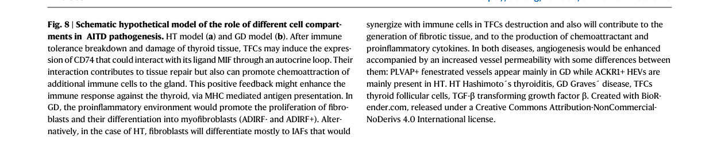

## Question

# Disease Characteristics Research Template

## Target Disease
- **Disease Name:** Hashimoto's Thyroiditis
- **MONDO ID:**  (if available)
- **Category:** Complex

## Research Objectives

Please provide a comprehensive research report on **Hashimoto's Thyroiditis** covering all of the
disease characteristics listed below. This report will be used to populate a disease knowledge
base entry. Be thorough and cite primary literature (PMID preferred) for all claims.

For each section, **suggested databases/resources** are listed. These are the first places
you should search for information on each topic.

---

### 1. Disease Information
> **Search first:** OMIM, Orphanet, ICD-10/ICD-11, MeSH, PubMed

- What is the disease? Provide a concise overview.
- What are the key identifiers? (OMIM, Orphanet, ICD-10/ICD-11, MeSH, Mondo)
- What are the common synonyms and alternative names?
- Is the information derived from individual patients (e.g., EHR) or aggregated disease-level resources?

### 2. Etiology

- **Disease Causal Factors**: What are the primary causes? (genetic, environmental, infectious, mechanistic)
- **Risk Factors**:
  > **Search first:** PubMed, Cochrane Library, UpToDate, clinical guidelines, ClinVar, ClinGen, GWAS Catalog, PheGenI, CTD, CDC, WHO, epidemiological databases
  - Genetic risk factors (causal variants, susceptibility loci, modifier genes)
  - Environmental risk factors (toxins, lifestyle, occupational exposures, age, sex, family history)
- **Protective Factors**:
  > **Search first:** PubMed, Cochrane Library, clinical trial databases, GWAS Catalog, gnomAD, WHO, CDC, nutrition databases
  - Genetic protective factors (protective variants, modifier alleles)
  - Environmental protective factors (diet, lifestyle, exposures that reduce risk)
- **Gene-Environment Interactions**: How do genetic and environmental factors interact to influence disease?
  > **Search first:** CTD, PubMed, PheGenI, GxE databases

### 3. Phenotypes
> **Search first:** HPO (Human Phenotype Ontology), OMIM, Orphanet, PubMed, clinicaltrials.gov, MedDRA, SNOMED CT, DECIPHER, LOINC

For each phenotype, provide:
- **Phenotype type**: symptoms, clinical signs, physical manifestations, behavioral changes, or laboratory abnormalities
  > For symptoms/signs: HPO, OMIM, Orphanet, PubMed
  > For behavioral changes: HPO, DSM, RDoC (Research Domain Criteria), PubMed
  > For laboratory abnormalities: LOINC, SNOMED CT, LabTests Online, PubMed
- **Phenotype characteristics**:
  > **Search first:** OMIM, Orphanet, HPO, PubMed
  - Age of symptom onset (neonatal, childhood, adult-onset, late-onset)
  - Symptom severity (mild, moderate, severe, variable)
  - Symptom progression (stable, progressive, episodic, fluctuating)
  - Frequency among affected individuals (percentage or qualitative)
- **Quality of life impact**: Effects on daily functioning and well-being (per-phenotype when possible)
  > **Search first:** EQ-5D database, SF-36, WHO QOL databases, PubMed
- Suggest HPO (Human Phenotype Ontology) terms for each phenotype

### 4. Genetic/Molecular Information

- **Causal Genes**: Gene mutations or chromosomal abnormalities responsible for disease (gene symbols, OMIM IDs)
  > **Search first:** OMIM, ClinVar, HGMD, Ensembl, NCBI Gene
- **Pathogenic Variants**:
  - Affected genes (gene symbols, HGNC IDs)
    > **Search first:** OMIM, NCBI Gene, Ensembl, HGNC, UniProt, GeneCards
  - Variant classification (pathogenic, likely pathogenic, VUS per ACMG/AMP guidelines)
    > **Search first:** ClinVar, ClinGen, ACMG/AMP guidelines, VarSome
  - Variant type/class (missense, frameshift, nonsense, splice-site, structural)
  - Allele frequency in population databases
    > **Search first:** gnomAD, 1000 Genomes, ExAC, TOPMed, dbSNP
  - Somatic vs germline origin
    > **Search first:** COSMIC (somatic), ClinVar, ICGC, TCGA
  - Functional consequences (loss of function, gain of function, dominant negative)
- **Modifier Genes**: Genes that modify disease severity or expression
- **Epigenetic Information**: DNA methylation, histone modifications, chromatin changes affecting disease
  > **Search first:** ENCODE, Roadmap Epigenomics, MethBase, DiseaseMeth
- **Chromosomal Abnormalities**: Large-scale genetic changes (aneuploidy, translocations, inversions)
  > **Search first:** DECIPHER, ClinVar, ECARUCA, UCSC Genome Browser

### 5. Environmental Information

- **Environmental Factors**: Non-genetic contributing factors (toxins, radiation, pollution, occupational exposure)
  > **Search first:** CTD (Comparative Toxicogenomics Database), TOXNET, PubMed, EPA databases
- **Lifestyle Factors**: Behavioral factors (smoking, diet, exercise, alcohol consumption)
  > **Search first:** CDC databases, WHO, PubMed, NHANES
- **Infectious Agents**: If applicable, pathogens causing or triggering disease (bacteria, viruses, fungi, parasites)
  > **Search first:** NCBI Taxonomy, ViPR, BV-BRC, MicrobeDB, GIDEON

### 6. Mechanism / Pathophysiology

- **Molecular Pathways**: Specific signaling cascades or biochemical pathways involved (Wnt, MAPK, mTOR, PI3K-AKT, etc.)
  > **Search first:** KEGG, Reactome, WikiPathways, PathBank, BioCyc
- **Cellular Processes**: Cell-level mechanisms (apoptosis, autophagy, cell cycle dysregulation, inflammation, etc.)
  > **Search first:** Gene Ontology (GO), Reactome, KEGG, PubMed
- **Protein Dysfunction**: How protein structure or function is altered (misfolding, aggregation, loss of function, gain of function)
  > **Search first:** UniProt, PDB (Protein Data Bank), InterPro, Pfam, AlphaFold
- **Metabolic Changes**: Alterations in metabolic processes (energy metabolism, lipid metabolism, amino acid metabolism)
  > **Search first:** KEGG, BioCyc, HMDB (Human Metabolome Database), BRENDA
- **Immune System Involvement**: Role of immune response (autoimmunity, immunodeficiency, chronic inflammation)
  > **Search first:** ImmPort, Immunome Database, IEDB, Gene Ontology
- **Tissue Damage Mechanisms**: How tissues/ are injured (oxidative stress, ischemia, fibrosis, necrosis)
  > **Search first:** PubMed, Gene Ontology, Reactome
- **Biochemical Abnormalities**: Specific molecular defects (enzyme deficiencies, receptor dysfunction, ion channel defects)
  > **Search first:** BRENDA, UniProt, KEGG, OMIM, PubMed
- **Epigenetic Changes**: DNA methylation, histone modifications affecting gene expression in disease
  > **Search first:** ENCODE, Roadmap Epigenomics, MethBase, DiseaseMeth
- **Molecular Profiling** (if available):
  - Transcriptomics/gene expression changes
    > **Search first:** GEO (Gene Expression Omnibus), ArrayExpress, GTEx, Human Cell Atlas, SRA
  - Proteomics findings
    > **Search first:** PRIDE, ProteomeXchange, Human Protein Atlas, STRING, BioGRID
  - Metabolomics signatures
    > **Search first:** MetaboLights, Metabolomics Workbench, HMDB, METLIN
  - Lipidomics alterations
    > **Search first:** LIPID MAPS, SwissLipids, LipidHome, Metabolomics Workbench
  - Genomic structural features
    > **Search first:** UCSC Genome Browser, Ensembl, NCBI, dbVar, DGV
- **Advanced Technologies** (if applicable):
  - Single-cell analysis findings (cell-type specific mechanisms, cellular heterogeneity)
    > **Search first:** Human Cell Atlas, Single Cell Portal, GEO, CELLxGENE
  - Spatial transcriptomics findings
    > **Search first:** GEO, Spatial Research, Vizgen, 10x Genomics data
  - Multi-omics integration results
    > **Search first:** TCGA, ICGC, cBioPortal, LinkedOmics, PubMed
  - Functional genomics screens (CRISPR, RNAi)
    > **Search first:** DepMap, GenomeRNAi, PubMed, BioGRID ORCS

For each mechanism, describe:
- The causal chain from initial trigger to clinical manifestation
- Which mechanisms are upstream vs downstream
- What cell types and biological processes are involved
- Suggest GO terms for biological processes and CL terms for cell types

### 7. Anatomical Structures Affected

- **Organ Level**:
  - Primary organs directly affected
  - Secondary organ involvement (complications, secondary effects)
  - Body systems involved (cardiovascular, nervous, digestive, respiratory, endocrine, etc.)
  > **Search first:** Uberon, FMA (Foundational Model of Anatomy), OMIM, HPO, ICD-11, MeSH, SNOMED CT
- **Tissue and Cell Level**:
  - Specific tissue types affected (epithelial, connective, muscle, nervous)
  - Specific cell populations targeted (with Cell Ontology terms)
  > **Search first:** Uberon, Human Protein Atlas, Cell Ontology, Human Cell Atlas, CellMarker, PanglaoDB
- **Subcellular Level**:
  - Cellular compartments involved (mitochondria, nucleus, ER, lysosomes) (with GO Cellular Component terms)
  > **Search first:** Gene Ontology (Cellular Component), UniProt, Human Protein Atlas
- **Localization**:
  - Specific anatomical sites (with UBERON terms)
    > **Search first:** FMA, Uberon, NeuroNames (for brain), SNOMED CT
  - Lateralization (unilateral, bilateral, asymmetric)
    > **Search first:** HPO, clinical literature, imaging databases

### 8. Temporal Development

- **Onset**:
  - Typical age of onset (congenital, pediatric, adult, geriatric)
  - Onset pattern (acute, subacute, chronic, insidious)
  > **Search first:** OMIM, Orphanet, HPO, PubMed
- **Progression**:
  - Disease stages (early, intermediate, advanced, end-stage)
    > **Search first:** Cancer Staging Manual (AJCC), WHO classifications, PubMed
  - Progression rate (rapid, slow, variable)
  - Disease course pattern (episodic, relapsing-remitting, progressive, stable)
  - Disease duration (self-limited, chronic lifelong)
  > **Search first:** Disease registries, longitudinal cohort databases, natural history studies, PubMed, Orphanet, OMIM
- **Patterns**:
  - Remission patterns (spontaneous, treatment-induced)
    > **Search first:** Clinical trial databases, disease registries, PubMed
  - Critical periods (time windows of vulnerability or opportunity for intervention)
    > **Search first:** PubMed, developmental biology databases, clinical guidelines

### 9. Inheritance and Population

- **Epidemiology**:
  - Prevalence (cases per 100,000 at given time)
  - Incidence (new cases per 100,000 per year)
  > **Search first:** Orphanet, CDC, WHO, GBD (Global Burden of Disease), national registries, SEER, disease registries
- **For Genetic Etiology**:
  - Inheritance pattern (AD, AR, X-linked, mitochondrial, multifactorial, polygenic)
    > **Search first:** OMIM, Orphanet, ClinVar, GTR (Genetic Testing Registry)
  - Penetrance (complete, incomplete, age-dependent)
    > **Search first:** ClinVar, OMIM, PubMed, ClinGen
  - Expressivity (variable, consistent)
    > **Search first:** OMIM, ClinVar, PubMed
  - Genetic anticipation (increasing severity in successive generations)
    > **Search first:** OMIM, PubMed (especially for repeat expansion disorders)
  - Germline mosaicism
    > **Search first:** ClinVar, OMIM, genetic counseling literature, PubMed
  - Founder effects (population-specific mutations)
    > **Search first:** gnomAD, population genetics databases, PubMed
  - Consanguinity role
    > **Search first:** OMIM, population studies, genetic counseling resources
  - Carrier frequency
    > **Search first:** gnomAD, carrier screening databases, GeneReviews, GTR
- **Population Demographics**:
  - Affected populations (ethnic or demographic groups with higher prevalence)
    > **Search first:** gnomAD, 1000 Genomes, PAGE Study, PubMed, population registries
  - Geographic distribution (endemic areas, regional variation)
    > **Search first:** WHO, CDC, GBD, Orphanet, geographic epidemiology databases
  - Geographic distribution of specific variants
  - Sex ratio (male:female)
    > **Search first:** Disease registries, OMIM, PubMed, epidemiological databases
  - Age distribution of affected individuals
    > **Search first:** CDC, disease registries, SEER, Orphanet

### 10. Diagnostics

- **Clinical Tests**:
  - Laboratory tests (blood, urine, tissue chemistry, specific enzyme assays)
    > **Search first:** LOINC, LabTests Online, PubMed
  - Biomarkers (proteins, metabolites, genetic markers, circulating biomarkers)
    > **Search first:** FDA Biomarker List, BEST (Biomarkers, EndpointS, and other Tools), PubMed
  - Imaging studies (X-ray, CT, MRI, PET, ultrasound)
    > **Search first:** RadLex, DICOM, Radiopaedia, imaging databases
  - Functional tests (pulmonary function, cardiac stress tests)
    > **Search first:** LOINC, clinical guidelines, PubMed
  - Electrophysiology (EEG, EMG, ECG, nerve conduction studies)
    > **Search first:** LOINC, clinical neurophysiology databases, PubMed
  - Biopsy findings (histopathology, immunohistochemistry)
    > **Search first:** SNOMED CT, College of American Pathologists resources, PubMed
  - Pathology findings (microscopic examination)
    > **Search first:** SNOMED CT, Digital Pathology databases, PubMed
- **Genetic Testing**:
  > **Search first:** GTR (Genetic Testing Registry), GeneReviews, ClinGen
  - Overview of recommended genetic testing approach
  - Whole genome sequencing (WGS) utility
    > **Search first:** GTR, ClinVar, GEL (Genomics England), gnomAD
  - Whole exome sequencing (WES) utility
    > **Search first:** GTR, ClinVar, OMIM, GeneMatcher
  - Gene panels (which panels, which genes)
    > **Search first:** GTR, ClinVar, laboratory-specific databases
  - Single gene testing
    > **Search first:** GTR, ClinVar, OMIM, GeneReviews
  - Chromosomal microarray (CMA)
    > **Search first:** DECIPHER, ClinVar, dbVar, ECARUCA
  - Karyotyping
    > **Search first:** Chromosome Abnormality Database, ClinVar, cytogenetics resources
  - FISH
    > **Search first:** ClinVar, cytogenetics databases, PubMed
  - Mitochondrial DNA testing
    > **Search first:** MITOMAP, MSeqDR, ClinVar, GTR
  - Repeat expansion testing
    > **Search first:** GTR, ClinVar, repeat expansion databases, PubMed
- **Omics-Based Diagnostics** (if applicable):
  - RNA sequencing / transcriptomics
    > **Search first:** GEO, ArrayExpress, GTEx, RNA-seq databases
  - Proteomics
    > **Search first:** PRIDE, ProteomeXchange, FDA Biomarker database
  - Metabolomics
    > **Search first:** MetaboLights, Metabolomics Workbench, HMDB
  - Epigenomics
    > **Search first:** GEO, ENCODE, Roadmap Epigenomics, MethBase
  - Liquid biopsy
    > **Search first:** COSMIC, ClinVar, liquid biopsy databases, PubMed
- **Clinical Criteria**:
  - Standardized diagnostic criteria (DSM, ICD, society guidelines)
    > **Search first:** DSM-5, ICD-11, clinical society guidelines, UpToDate
  - Differential diagnosis (other conditions to rule out, with distinguishing features)
    > **Search first:** DynaMed, UpToDate, clinical decision support systems
- **Screening**:
  - Screening methods for asymptomatic individuals (newborn screening, carrier screening, cascade screening)
    > **Search first:** ACMG recommendations, CDC newborn screening, GTR

### 11. Outcome/Prognosis

- **Survival and Mortality**:
  - Survival rate (5-year, 10-year, overall)
    > **Search first:** SEER, cancer registries, disease-specific registries, PubMed
  - Life expectancy (with and without treatment if applicable)
    > **Search first:** Orphanet, disease registries, actuarial databases, PubMed
  - Mortality rate
    > **Search first:** CDC, WHO, GBD, national mortality databases
  - Disease-specific mortality (deaths directly attributable to disease)
    > **Search first:** Disease registries, CDC Wonder, GBD, PubMed
- **Morbidity and Function**:
  - Morbidity (disease-related disability and health impacts)
    > **Search first:** GBD, WHO, disability databases, PubMed
  - Disability outcomes (long-term functional impairments)
    > **Search first:** ICF (International Classification of Functioning), disability registries
  - Quality of life measures (EQ-5D, SF-36, PROMIS, disease-specific tools)
    > **Search first:** EQ-5D database, SF-36, PROMIS, PubMed
- **Disease Course**:
  - Complications (secondary problems: infections, organ failure, etc.)
    > **Search first:** ICD codes, disease registries, clinical databases, PubMed
  - Recovery potential (likelihood and extent of recovery, with vs without treatment)
    > **Search first:** Natural history studies, rehabilitation databases, PubMed
- **Prediction**:
  - Prognostic factors (age, disease severity, biomarkers, treatment response)
    > **Search first:** Prognostic models databases, clinical calculators, PubMed
  - Prognostic biomarkers (molecular markers predicting disease course)
    > **Search first:** FDA Biomarker database, PubMed, cancer prognostic databases

### 12. Treatment

- **Pharmacotherapy**:
  - Pharmacological treatments (drug names, drug classes, mechanisms of action)
    > **Search first:** DrugBank, RxNorm, ATC classification, DailyMed, FDA databases
  - Pharmacogenomics (how genetic variants affect drug metabolism, efficacy, toxicity)
    > **Search first:** PharmGKB, CPIC (Clinical Pharmacogenetics), FDA Table of PGx Biomarkers
- **Advanced Therapeutics**:
  - Gene therapy (viral vectors, CRISPR, gene replacement, gene editing)
    > **Search first:** ClinicalTrials.gov, FDA gene therapy database, ASGCT resources
  - Cell therapy (stem cell transplant, CAR-T, cellular therapeutics)
    > **Search first:** ClinicalTrials.gov, FDA cell therapy database, FACT standards
  - RNA-based therapies (ASOs, siRNA, mRNA therapies)
    > **Search first:** ClinicalTrials.gov, FDA approvals, PubMed
  - Targeted therapies (treatments directed at specific molecular targets)
    > **Search first:** My Cancer Genome, OncoKB, ClinicalTrials.gov, FDA approvals
  - Immunotherapies (checkpoint inhibitors, monoclonal antibodies)
    > **Search first:** Cancer Immunotherapy Database, FDA approvals, ClinicalTrials.gov
- **Surgical and Interventional**:
  - Surgical interventions (types of surgery, timing, outcomes)
    > **Search first:** CPT codes, surgical registries, clinical guidelines, PubMed
- **Supportive and Rehabilitative**:
  - Supportive care (symptom management, pain control, nutrition)
    > **Search first:** Clinical guidelines, Cochrane Library, PubMed
  - Rehabilitation (physical therapy, occupational therapy, speech therapy)
    > **Search first:** Rehabilitation medicine databases, clinical guidelines, PubMed
- **Experimental**:
  - Experimental treatments in clinical trials (with NCT identifiers if available)
    > **Search first:** ClinicalTrials.gov, EU Clinical Trials Register, WHO ICTRP
- **Treatment Outcomes**:
  - Treatment response rates
    > **Search first:** Clinical trial databases, FDA reviews, systematic reviews, PubMed
  - Side effects and adverse events
    > **Search first:** FDA Adverse Event Reporting System (FAERS), MedWatch, PubMed
- **Treatment Strategy**:
  - Treatment algorithms (clinical pathways, decision trees)
    > **Search first:** Clinical practice guidelines, NCCN Guidelines, UpToDate
  - Combination therapies
    > **Search first:** ClinicalTrials.gov, treatment guidelines, PubMed
  - Personalized medicine approaches (genotype-guided treatment)
    > **Search first:** My Cancer Genome, CIViC, PharmGKB, precision medicine databases

For each treatment, suggest MAXO (Medical Action Ontology) terms where applicable.

### 13. Prevention

- **Prevention Levels**:
  - Primary prevention (preventing disease occurrence: vaccination, risk factor modification)
    > **Search first:** CDC, WHO, USPSTF recommendations, Cochrane Library
  - Secondary prevention (early detection and treatment: screening programs, early intervention)
    > **Search first:** USPSTF, CDC screening guidelines, WHO
  - Tertiary prevention (preventing complications in those with disease)
    > **Search first:** Clinical guidelines, disease management protocols, PubMed
- **Immunization**: Vaccine strategies (if applicable)
  > **Search first:** CDC vaccine schedules, WHO immunization, FDA vaccine database
- **Screening and Early Detection**:
  - Screening programs (population-based: newborn screening, cancer screening)
    > **Search first:** CDC screening programs, USPSTF, cancer screening databases
  - Genetic screening (carrier screening, preimplantation genetic diagnosis, prenatal testing)
    > **Search first:** ACMG recommendations, ACOG guidelines, GTR
  - Risk stratification (identifying high-risk individuals for targeted prevention)
    > **Search first:** Risk prediction models, clinical calculators, PubMed
- **Behavioral Interventions**: Lifestyle modifications to reduce risk
  > **Search first:** CDC, WHO, behavioral intervention databases, Cochrane Library
- **Counseling**: Genetic counseling (risk assessment, family planning guidance)
  > **Search first:** NSGC resources, ACMG guidelines, GeneReviews
- **Public Health**:
  - Public health interventions (sanitation, vector control, health education)
    > **Search first:** CDC, WHO, public health databases, PubMed
  - Environmental interventions (reducing environmental risk factors)
    > **Search first:** EPA databases, WHO environmental health, PubMed
- **Prophylaxis**: Preventive medications or procedures
  > **Search first:** Clinical guidelines, FDA approvals, PubMed

### 14. Other Species / Natural Disease

- **Taxonomy**: Species affected (with NCBI Taxon identifiers)
  > **Search first:** NCBI Taxonomy
- **Breed**: Specific breeds affected (with VBO identifiers if applicable)
  > **Search first:** VBO (Vertebrate Breed Ontology)
- **Gene**: Orthologous genes in other species (with NCBI Gene IDs)
  > **Search first:** NCBI Gene
- **Natural Disease**:
  - Naturally occurring disease in other species (companion animals, wildlife)
    > **Search first:** OMIA (Online Mendelian Inheritance in Animals), VetCompass, PubMed
  - Veterinary relevance and importance in animal health
    > **Search first:** OMIA, veterinary databases, PubMed
- **Comparative Biology**:
  - Comparative pathology (similarities and differences across species)
    > **Search first:** OMIA, comparative pathology databases, PubMed
  - Evolutionary conservation of disease mechanisms
    > **Search first:** HomoloGene, OrthoMCL, Alliance of Genome Resources
- **Transmission** (if applicable):
  - Zoonotic potential
    > **Search first:** CDC zoonotic diseases, WHO zoonoses, GIDEON
  - Cross-species susceptibility
    > **Search first:** NCBI Taxonomy, veterinary databases, PubMed

### 15. Model Organisms

- **Model Types**:
  - Model organism type (mammalian, invertebrate, cellular, in vitro)
    > **Search first:** Alliance of Genome Resources, model organism databases
  - Specific model systems (mouse, rat, zebrafish, Drosophila, C. elegans, yeast, cell lines, organoids, iPSCs)
    > **Search first:** MGI, RGD, ZFIN, FlyBase, WormBase, SGD, ATCC, Cellosaurus
  - Induced models (drug treatment, surgical intervention, environmental manipulation)
    > **Search first:** MGI, model organism databases, PubMed
- **Genetic Models**:
  - Types available (knockout, knock-in, transgenic, conditional, humanized)
    > **Search first:** MGI, IMPC, KOMP, EuMMCR, IMSR
- **Model Characteristics**:
  - Phenotype recapitulation (how well model reproduces human disease features)
    > **Search first:** Model organism databases, comparative studies, PubMed
  - Model limitations (aspects of human disease not captured)
    > **Search first:** Model organism databases, PubMed, review articles
- **Applications**:
  - Research applications (what aspects of disease can be studied)
    > **Search first:** Model organism databases, PubMed
- **Resources**:
  - Model databases
    > **Search first:** MGI, RGD, ZFIN, FlyBase, WormBase, IMSR, EMMA, MMRRC

---

## Citation Requirements

- Cite primary literature (PMID preferred) for all mechanistic and clinical claims
- Prioritize recent reviews and landmark papers
- Include direct quotes from abstracts where possible to support key statements
- Distinguish evidence source types: human clinical, model organism, in vitro, computational

## Output Format

Structure your response as a comprehensive narrative organized by the sections above.
For each section, provide:
- Factual content with specific details (numbers, percentages, gene names, variant nomenclature)
- Ontology term suggestions (HPO, GO, CL, UBERON, CHEBI, MAXO, MONDO) where applicable
- Evidence citations with PMIDs
- Direct quotes from abstracts to support key claims
- Clear indication when information is not available or not applicable for this disease

This report will be used to populate a disease knowledge base entry with:
- Pathophysiology descriptions with causal chains
- Gene/protein annotations (HGNC, GO terms)
- Phenotype associations (HP terms) with frequencies
- Cell type involvement (CL terms)
- Anatomical locations (UBERON terms)
- Chemical entities (CHEBI terms)
- Treatment annotations (MAXO terms)
- Evidence items with PMIDs and exact abstract quotes
- Epidemiology, prognosis, diagnostic, and prevention information
- Animal model descriptions with phenotype recapitulation details

## Output

Question: You are an expert researcher providing comprehensive, well-cited information.

Provide detailed information focusing on:
1. Key concepts and definitions with current understanding
2. Recent developments and latest research (prioritize 2023-2024 sources)
3. Current applications and real-world implementations
4. Expert opinions and analysis from authoritative sources
5. Relevant statistics and data from recent studies

Format as a comprehensive research report with proper citations. Include URLs and publication dates where available.
Always prioritize recent, authoritative sources and provide specific citations for all major claims.

# Disease Characteristics Research Template

## Target Disease
- **Disease Name:** Hashimoto's Thyroiditis
- **MONDO ID:**  (if available)
- **Category:** Complex

## Research Objectives

Please provide a comprehensive research report on **Hashimoto's Thyroiditis** covering all of the
disease characteristics listed below. This report will be used to populate a disease knowledge
base entry. Be thorough and cite primary literature (PMID preferred) for all claims.

For each section, **suggested databases/resources** are listed. These are the first places
you should search for information on each topic.

---

### 1. Disease Information
> **Search first:** OMIM, Orphanet, ICD-10/ICD-11, MeSH, PubMed

- What is the disease? Provide a concise overview.
- What are the key identifiers? (OMIM, Orphanet, ICD-10/ICD-11, MeSH, Mondo)
- What are the common synonyms and alternative names?
- Is the information derived from individual patients (e.g., EHR) or aggregated disease-level resources?

### 2. Etiology

- **Disease Causal Factors**: What are the primary causes? (genetic, environmental, infectious, mechanistic)
- **Risk Factors**:
  > **Search first:** PubMed, Cochrane Library, UpToDate, clinical guidelines, ClinVar, ClinGen, GWAS Catalog, PheGenI, CTD, CDC, WHO, epidemiological databases
  - Genetic risk factors (causal variants, susceptibility loci, modifier genes)
  - Environmental risk factors (toxins, lifestyle, occupational exposures, age, sex, family history)
- **Protective Factors**:
  > **Search first:** PubMed, Cochrane Library, clinical trial databases, GWAS Catalog, gnomAD, WHO, CDC, nutrition databases
  - Genetic protective factors (protective variants, modifier alleles)
  - Environmental protective factors (diet, lifestyle, exposures that reduce risk)
- **Gene-Environment Interactions**: How do genetic and environmental factors interact to influence disease?
  > **Search first:** CTD, PubMed, PheGenI, GxE databases

### 3. Phenotypes
> **Search first:** HPO (Human Phenotype Ontology), OMIM, Orphanet, PubMed, clinicaltrials.gov, MedDRA, SNOMED CT, DECIPHER, LOINC

For each phenotype, provide:
- **Phenotype type**: symptoms, clinical signs, physical manifestations, behavioral changes, or laboratory abnormalities
  > For symptoms/signs: HPO, OMIM, Orphanet, PubMed
  > For behavioral changes: HPO, DSM, RDoC (Research Domain Criteria), PubMed
  > For laboratory abnormalities: LOINC, SNOMED CT, LabTests Online, PubMed
- **Phenotype characteristics**:
  > **Search first:** OMIM, Orphanet, HPO, PubMed
  - Age of symptom onset (neonatal, childhood, adult-onset, late-onset)
  - Symptom severity (mild, moderate, severe, variable)
  - Symptom progression (stable, progressive, episodic, fluctuating)
  - Frequency among affected individuals (percentage or qualitative)
- **Quality of life impact**: Effects on daily functioning and well-being (per-phenotype when possible)
  > **Search first:** EQ-5D database, SF-36, WHO QOL databases, PubMed
- Suggest HPO (Human Phenotype Ontology) terms for each phenotype

### 4. Genetic/Molecular Information

- **Causal Genes**: Gene mutations or chromosomal abnormalities responsible for disease (gene symbols, OMIM IDs)
  > **Search first:** OMIM, ClinVar, HGMD, Ensembl, NCBI Gene
- **Pathogenic Variants**:
  - Affected genes (gene symbols, HGNC IDs)
    > **Search first:** OMIM, NCBI Gene, Ensembl, HGNC, UniProt, GeneCards
  - Variant classification (pathogenic, likely pathogenic, VUS per ACMG/AMP guidelines)
    > **Search first:** ClinVar, ClinGen, ACMG/AMP guidelines, VarSome
  - Variant type/class (missense, frameshift, nonsense, splice-site, structural)
  - Allele frequency in population databases
    > **Search first:** gnomAD, 1000 Genomes, ExAC, TOPMed, dbSNP
  - Somatic vs germline origin
    > **Search first:** COSMIC (somatic), ClinVar, ICGC, TCGA
  - Functional consequences (loss of function, gain of function, dominant negative)
- **Modifier Genes**: Genes that modify disease severity or expression
- **Epigenetic Information**: DNA methylation, histone modifications, chromatin changes affecting disease
  > **Search first:** ENCODE, Roadmap Epigenomics, MethBase, DiseaseMeth
- **Chromosomal Abnormalities**: Large-scale genetic changes (aneuploidy, translocations, inversions)
  > **Search first:** DECIPHER, ClinVar, ECARUCA, UCSC Genome Browser

### 5. Environmental Information

- **Environmental Factors**: Non-genetic contributing factors (toxins, radiation, pollution, occupational exposure)
  > **Search first:** CTD (Comparative Toxicogenomics Database), TOXNET, PubMed, EPA databases
- **Lifestyle Factors**: Behavioral factors (smoking, diet, exercise, alcohol consumption)
  > **Search first:** CDC databases, WHO, PubMed, NHANES
- **Infectious Agents**: If applicable, pathogens causing or triggering disease (bacteria, viruses, fungi, parasites)
  > **Search first:** NCBI Taxonomy, ViPR, BV-BRC, MicrobeDB, GIDEON

### 6. Mechanism / Pathophysiology

- **Molecular Pathways**: Specific signaling cascades or biochemical pathways involved (Wnt, MAPK, mTOR, PI3K-AKT, etc.)
  > **Search first:** KEGG, Reactome, WikiPathways, PathBank, BioCyc
- **Cellular Processes**: Cell-level mechanisms (apoptosis, autophagy, cell cycle dysregulation, inflammation, etc.)
  > **Search first:** Gene Ontology (GO), Reactome, KEGG, PubMed
- **Protein Dysfunction**: How protein structure or function is altered (misfolding, aggregation, loss of function, gain of function)
  > **Search first:** UniProt, PDB (Protein Data Bank), InterPro, Pfam, AlphaFold
- **Metabolic Changes**: Alterations in metabolic processes (energy metabolism, lipid metabolism, amino acid metabolism)
  > **Search first:** KEGG, BioCyc, HMDB (Human Metabolome Database), BRENDA
- **Immune System Involvement**: Role of immune response (autoimmunity, immunodeficiency, chronic inflammation)
  > **Search first:** ImmPort, Immunome Database, IEDB, Gene Ontology
- **Tissue Damage Mechanisms**: How tissues/ are injured (oxidative stress, ischemia, fibrosis, necrosis)
  > **Search first:** PubMed, Gene Ontology, Reactome
- **Biochemical Abnormalities**: Specific molecular defects (enzyme deficiencies, receptor dysfunction, ion channel defects)
  > **Search first:** BRENDA, UniProt, KEGG, OMIM, PubMed
- **Epigenetic Changes**: DNA methylation, histone modifications affecting gene expression in disease
  > **Search first:** ENCODE, Roadmap Epigenomics, MethBase, DiseaseMeth
- **Molecular Profiling** (if available):
  - Transcriptomics/gene expression changes
    > **Search first:** GEO (Gene Expression Omnibus), ArrayExpress, GTEx, Human Cell Atlas, SRA
  - Proteomics findings
    > **Search first:** PRIDE, ProteomeXchange, Human Protein Atlas, STRING, BioGRID
  - Metabolomics signatures
    > **Search first:** MetaboLights, Metabolomics Workbench, HMDB, METLIN
  - Lipidomics alterations
    > **Search first:** LIPID MAPS, SwissLipids, LipidHome, Metabolomics Workbench
  - Genomic structural features
    > **Search first:** UCSC Genome Browser, Ensembl, NCBI, dbVar, DGV
- **Advanced Technologies** (if applicable):
  - Single-cell analysis findings (cell-type specific mechanisms, cellular heterogeneity)
    > **Search first:** Human Cell Atlas, Single Cell Portal, GEO, CELLxGENE
  - Spatial transcriptomics findings
    > **Search first:** GEO, Spatial Research, Vizgen, 10x Genomics data
  - Multi-omics integration results
    > **Search first:** TCGA, ICGC, cBioPortal, LinkedOmics, PubMed
  - Functional genomics screens (CRISPR, RNAi)
    > **Search first:** DepMap, GenomeRNAi, PubMed, BioGRID ORCS

For each mechanism, describe:
- The causal chain from initial trigger to clinical manifestation
- Which mechanisms are upstream vs downstream
- What cell types and biological processes are involved
- Suggest GO terms for biological processes and CL terms for cell types

### 7. Anatomical Structures Affected

- **Organ Level**:
  - Primary organs directly affected
  - Secondary organ involvement (complications, secondary effects)
  - Body systems involved (cardiovascular, nervous, digestive, respiratory, endocrine, etc.)
  > **Search first:** Uberon, FMA (Foundational Model of Anatomy), OMIM, HPO, ICD-11, MeSH, SNOMED CT
- **Tissue and Cell Level**:
  - Specific tissue types affected (epithelial, connective, muscle, nervous)
  - Specific cell populations targeted (with Cell Ontology terms)
  > **Search first:** Uberon, Human Protein Atlas, Cell Ontology, Human Cell Atlas, CellMarker, PanglaoDB
- **Subcellular Level**:
  - Cellular compartments involved (mitochondria, nucleus, ER, lysosomes) (with GO Cellular Component terms)
  > **Search first:** Gene Ontology (Cellular Component), UniProt, Human Protein Atlas
- **Localization**:
  - Specific anatomical sites (with UBERON terms)
    > **Search first:** FMA, Uberon, NeuroNames (for brain), SNOMED CT
  - Lateralization (unilateral, bilateral, asymmetric)
    > **Search first:** HPO, clinical literature, imaging databases

### 8. Temporal Development

- **Onset**:
  - Typical age of onset (congenital, pediatric, adult, geriatric)
  - Onset pattern (acute, subacute, chronic, insidious)
  > **Search first:** OMIM, Orphanet, HPO, PubMed
- **Progression**:
  - Disease stages (early, intermediate, advanced, end-stage)
    > **Search first:** Cancer Staging Manual (AJCC), WHO classifications, PubMed
  - Progression rate (rapid, slow, variable)
  - Disease course pattern (episodic, relapsing-remitting, progressive, stable)
  - Disease duration (self-limited, chronic lifelong)
  > **Search first:** Disease registries, longitudinal cohort databases, natural history studies, PubMed, Orphanet, OMIM
- **Patterns**:
  - Remission patterns (spontaneous, treatment-induced)
    > **Search first:** Clinical trial databases, disease registries, PubMed
  - Critical periods (time windows of vulnerability or opportunity for intervention)
    > **Search first:** PubMed, developmental biology databases, clinical guidelines

### 9. Inheritance and Population

- **Epidemiology**:
  - Prevalence (cases per 100,000 at given time)
  - Incidence (new cases per 100,000 per year)
  > **Search first:** Orphanet, CDC, WHO, GBD (Global Burden of Disease), national registries, SEER, disease registries
- **For Genetic Etiology**:
  - Inheritance pattern (AD, AR, X-linked, mitochondrial, multifactorial, polygenic)
    > **Search first:** OMIM, Orphanet, ClinVar, GTR (Genetic Testing Registry)
  - Penetrance (complete, incomplete, age-dependent)
    > **Search first:** ClinVar, OMIM, PubMed, ClinGen
  - Expressivity (variable, consistent)
    > **Search first:** OMIM, ClinVar, PubMed
  - Genetic anticipation (increasing severity in successive generations)
    > **Search first:** OMIM, PubMed (especially for repeat expansion disorders)
  - Germline mosaicism
    > **Search first:** ClinVar, OMIM, genetic counseling literature, PubMed
  - Founder effects (population-specific mutations)
    > **Search first:** gnomAD, population genetics databases, PubMed
  - Consanguinity role
    > **Search first:** OMIM, population studies, genetic counseling resources
  - Carrier frequency
    > **Search first:** gnomAD, carrier screening databases, GeneReviews, GTR
- **Population Demographics**:
  - Affected populations (ethnic or demographic groups with higher prevalence)
    > **Search first:** gnomAD, 1000 Genomes, PAGE Study, PubMed, population registries
  - Geographic distribution (endemic areas, regional variation)
    > **Search first:** WHO, CDC, GBD, Orphanet, geographic epidemiology databases
  - Geographic distribution of specific variants
  - Sex ratio (male:female)
    > **Search first:** Disease registries, OMIM, PubMed, epidemiological databases
  - Age distribution of affected individuals
    > **Search first:** CDC, disease registries, SEER, Orphanet

### 10. Diagnostics

- **Clinical Tests**:
  - Laboratory tests (blood, urine, tissue chemistry, specific enzyme assays)
    > **Search first:** LOINC, LabTests Online, PubMed
  - Biomarkers (proteins, metabolites, genetic markers, circulating biomarkers)
    > **Search first:** FDA Biomarker List, BEST (Biomarkers, EndpointS, and other Tools), PubMed
  - Imaging studies (X-ray, CT, MRI, PET, ultrasound)
    > **Search first:** RadLex, DICOM, Radiopaedia, imaging databases
  - Functional tests (pulmonary function, cardiac stress tests)
    > **Search first:** LOINC, clinical guidelines, PubMed
  - Electrophysiology (EEG, EMG, ECG, nerve conduction studies)
    > **Search first:** LOINC, clinical neurophysiology databases, PubMed
  - Biopsy findings (histopathology, immunohistochemistry)
    > **Search first:** SNOMED CT, College of American Pathologists resources, PubMed
  - Pathology findings (microscopic examination)
    > **Search first:** SNOMED CT, Digital Pathology databases, PubMed
- **Genetic Testing**:
  > **Search first:** GTR (Genetic Testing Registry), GeneReviews, ClinGen
  - Overview of recommended genetic testing approach
  - Whole genome sequencing (WGS) utility
    > **Search first:** GTR, ClinVar, GEL (Genomics England), gnomAD
  - Whole exome sequencing (WES) utility
    > **Search first:** GTR, ClinVar, OMIM, GeneMatcher
  - Gene panels (which panels, which genes)
    > **Search first:** GTR, ClinVar, laboratory-specific databases
  - Single gene testing
    > **Search first:** GTR, ClinVar, OMIM, GeneReviews
  - Chromosomal microarray (CMA)
    > **Search first:** DECIPHER, ClinVar, dbVar, ECARUCA
  - Karyotyping
    > **Search first:** Chromosome Abnormality Database, ClinVar, cytogenetics resources
  - FISH
    > **Search first:** ClinVar, cytogenetics databases, PubMed
  - Mitochondrial DNA testing
    > **Search first:** MITOMAP, MSeqDR, ClinVar, GTR
  - Repeat expansion testing
    > **Search first:** GTR, ClinVar, repeat expansion databases, PubMed
- **Omics-Based Diagnostics** (if applicable):
  - RNA sequencing / transcriptomics
    > **Search first:** GEO, ArrayExpress, GTEx, RNA-seq databases
  - Proteomics
    > **Search first:** PRIDE, ProteomeXchange, FDA Biomarker database
  - Metabolomics
    > **Search first:** MetaboLights, Metabolomics Workbench, HMDB
  - Epigenomics
    > **Search first:** GEO, ENCODE, Roadmap Epigenomics, MethBase
  - Liquid biopsy
    > **Search first:** COSMIC, ClinVar, liquid biopsy databases, PubMed
- **Clinical Criteria**:
  - Standardized diagnostic criteria (DSM, ICD, society guidelines)
    > **Search first:** DSM-5, ICD-11, clinical society guidelines, UpToDate
  - Differential diagnosis (other conditions to rule out, with distinguishing features)
    > **Search first:** DynaMed, UpToDate, clinical decision support systems
- **Screening**:
  - Screening methods for asymptomatic individuals (newborn screening, carrier screening, cascade screening)
    > **Search first:** ACMG recommendations, CDC newborn screening, GTR

### 11. Outcome/Prognosis

- **Survival and Mortality**:
  - Survival rate (5-year, 10-year, overall)
    > **Search first:** SEER, cancer registries, disease-specific registries, PubMed
  - Life expectancy (with and without treatment if applicable)
    > **Search first:** Orphanet, disease registries, actuarial databases, PubMed
  - Mortality rate
    > **Search first:** CDC, WHO, GBD, national mortality databases
  - Disease-specific mortality (deaths directly attributable to disease)
    > **Search first:** Disease registries, CDC Wonder, GBD, PubMed
- **Morbidity and Function**:
  - Morbidity (disease-related disability and health impacts)
    > **Search first:** GBD, WHO, disability databases, PubMed
  - Disability outcomes (long-term functional impairments)
    > **Search first:** ICF (International Classification of Functioning), disability registries
  - Quality of life measures (EQ-5D, SF-36, PROMIS, disease-specific tools)
    > **Search first:** EQ-5D database, SF-36, PROMIS, PubMed
- **Disease Course**:
  - Complications (secondary problems: infections, organ failure, etc.)
    > **Search first:** ICD codes, disease registries, clinical databases, PubMed
  - Recovery potential (likelihood and extent of recovery, with vs without treatment)
    > **Search first:** Natural history studies, rehabilitation databases, PubMed
- **Prediction**:
  - Prognostic factors (age, disease severity, biomarkers, treatment response)
    > **Search first:** Prognostic models databases, clinical calculators, PubMed
  - Prognostic biomarkers (molecular markers predicting disease course)
    > **Search first:** FDA Biomarker database, PubMed, cancer prognostic databases

### 12. Treatment

- **Pharmacotherapy**:
  - Pharmacological treatments (drug names, drug classes, mechanisms of action)
    > **Search first:** DrugBank, RxNorm, ATC classification, DailyMed, FDA databases
  - Pharmacogenomics (how genetic variants affect drug metabolism, efficacy, toxicity)
    > **Search first:** PharmGKB, CPIC (Clinical Pharmacogenetics), FDA Table of PGx Biomarkers
- **Advanced Therapeutics**:
  - Gene therapy (viral vectors, CRISPR, gene replacement, gene editing)
    > **Search first:** ClinicalTrials.gov, FDA gene therapy database, ASGCT resources
  - Cell therapy (stem cell transplant, CAR-T, cellular therapeutics)
    > **Search first:** ClinicalTrials.gov, FDA cell therapy database, FACT standards
  - RNA-based therapies (ASOs, siRNA, mRNA therapies)
    > **Search first:** ClinicalTrials.gov, FDA approvals, PubMed
  - Targeted therapies (treatments directed at specific molecular targets)
    > **Search first:** My Cancer Genome, OncoKB, ClinicalTrials.gov, FDA approvals
  - Immunotherapies (checkpoint inhibitors, monoclonal antibodies)
    > **Search first:** Cancer Immunotherapy Database, FDA approvals, ClinicalTrials.gov
- **Surgical and Interventional**:
  - Surgical interventions (types of surgery, timing, outcomes)
    > **Search first:** CPT codes, surgical registries, clinical guidelines, PubMed
- **Supportive and Rehabilitative**:
  - Supportive care (symptom management, pain control, nutrition)
    > **Search first:** Clinical guidelines, Cochrane Library, PubMed
  - Rehabilitation (physical therapy, occupational therapy, speech therapy)
    > **Search first:** Rehabilitation medicine databases, clinical guidelines, PubMed
- **Experimental**:
  - Experimental treatments in clinical trials (with NCT identifiers if available)
    > **Search first:** ClinicalTrials.gov, EU Clinical Trials Register, WHO ICTRP
- **Treatment Outcomes**:
  - Treatment response rates
    > **Search first:** Clinical trial databases, FDA reviews, systematic reviews, PubMed
  - Side effects and adverse events
    > **Search first:** FDA Adverse Event Reporting System (FAERS), MedWatch, PubMed
- **Treatment Strategy**:
  - Treatment algorithms (clinical pathways, decision trees)
    > **Search first:** Clinical practice guidelines, NCCN Guidelines, UpToDate
  - Combination therapies
    > **Search first:** ClinicalTrials.gov, treatment guidelines, PubMed
  - Personalized medicine approaches (genotype-guided treatment)
    > **Search first:** My Cancer Genome, CIViC, PharmGKB, precision medicine databases

For each treatment, suggest MAXO (Medical Action Ontology) terms where applicable.

### 13. Prevention

- **Prevention Levels**:
  - Primary prevention (preventing disease occurrence: vaccination, risk factor modification)
    > **Search first:** CDC, WHO, USPSTF recommendations, Cochrane Library
  - Secondary prevention (early detection and treatment: screening programs, early intervention)
    > **Search first:** USPSTF, CDC screening guidelines, WHO
  - Tertiary prevention (preventing complications in those with disease)
    > **Search first:** Clinical guidelines, disease management protocols, PubMed
- **Immunization**: Vaccine strategies (if applicable)
  > **Search first:** CDC vaccine schedules, WHO immunization, FDA vaccine database
- **Screening and Early Detection**:
  - Screening programs (population-based: newborn screening, cancer screening)
    > **Search first:** CDC screening programs, USPSTF, cancer screening databases
  - Genetic screening (carrier screening, preimplantation genetic diagnosis, prenatal testing)
    > **Search first:** ACMG recommendations, ACOG guidelines, GTR
  - Risk stratification (identifying high-risk individuals for targeted prevention)
    > **Search first:** Risk prediction models, clinical calculators, PubMed
- **Behavioral Interventions**: Lifestyle modifications to reduce risk
  > **Search first:** CDC, WHO, behavioral intervention databases, Cochrane Library
- **Counseling**: Genetic counseling (risk assessment, family planning guidance)
  > **Search first:** NSGC resources, ACMG guidelines, GeneReviews
- **Public Health**:
  - Public health interventions (sanitation, vector control, health education)
    > **Search first:** CDC, WHO, public health databases, PubMed
  - Environmental interventions (reducing environmental risk factors)
    > **Search first:** EPA databases, WHO environmental health, PubMed
- **Prophylaxis**: Preventive medications or procedures
  > **Search first:** Clinical guidelines, FDA approvals, PubMed

### 14. Other Species / Natural Disease

- **Taxonomy**: Species affected (with NCBI Taxon identifiers)
  > **Search first:** NCBI Taxonomy
- **Breed**: Specific breeds affected (with VBO identifiers if applicable)
  > **Search first:** VBO (Vertebrate Breed Ontology)
- **Gene**: Orthologous genes in other species (with NCBI Gene IDs)
  > **Search first:** NCBI Gene
- **Natural Disease**:
  - Naturally occurring disease in other species (companion animals, wildlife)
    > **Search first:** OMIA (Online Mendelian Inheritance in Animals), VetCompass, PubMed
  - Veterinary relevance and importance in animal health
    > **Search first:** OMIA, veterinary databases, PubMed
- **Comparative Biology**:
  - Comparative pathology (similarities and differences across species)
    > **Search first:** OMIA, comparative pathology databases, PubMed
  - Evolutionary conservation of disease mechanisms
    > **Search first:** HomoloGene, OrthoMCL, Alliance of Genome Resources
- **Transmission** (if applicable):
  - Zoonotic potential
    > **Search first:** CDC zoonotic diseases, WHO zoonoses, GIDEON
  - Cross-species susceptibility
    > **Search first:** NCBI Taxonomy, veterinary databases, PubMed

### 15. Model Organisms

- **Model Types**:
  - Model organism type (mammalian, invertebrate, cellular, in vitro)
    > **Search first:** Alliance of Genome Resources, model organism databases
  - Specific model systems (mouse, rat, zebrafish, Drosophila, C. elegans, yeast, cell lines, organoids, iPSCs)
    > **Search first:** MGI, RGD, ZFIN, FlyBase, WormBase, SGD, ATCC, Cellosaurus
  - Induced models (drug treatment, surgical intervention, environmental manipulation)
    > **Search first:** MGI, model organism databases, PubMed
- **Genetic Models**:
  - Types available (knockout, knock-in, transgenic, conditional, humanized)
    > **Search first:** MGI, IMPC, KOMP, EuMMCR, IMSR
- **Model Characteristics**:
  - Phenotype recapitulation (how well model reproduces human disease features)
    > **Search first:** Model organism databases, comparative studies, PubMed
  - Model limitations (aspects of human disease not captured)
    > **Search first:** Model organism databases, PubMed, review articles
- **Applications**:
  - Research applications (what aspects of disease can be studied)
    > **Search first:** Model organism databases, PubMed
- **Resources**:
  - Model databases
    > **Search first:** MGI, RGD, ZFIN, FlyBase, WormBase, IMSR, EMMA, MMRRC

---

## Citation Requirements

- Cite primary literature (PMID preferred) for all mechanistic and clinical claims
- Prioritize recent reviews and landmark papers
- Include direct quotes from abstracts where possible to support key statements
- Distinguish evidence source types: human clinical, model organism, in vitro, computational

## Output Format

Structure your response as a comprehensive narrative organized by the sections above.
For each section, provide:
- Factual content with specific details (numbers, percentages, gene names, variant nomenclature)
- Ontology term suggestions (HPO, GO, CL, UBERON, CHEBI, MAXO, MONDO) where applicable
- Evidence citations with PMIDs
- Direct quotes from abstracts to support key claims
- Clear indication when information is not available or not applicable for this disease

This report will be used to populate a disease knowledge base entry with:
- Pathophysiology descriptions with causal chains
- Gene/protein annotations (HGNC, GO terms)
- Phenotype associations (HP terms) with frequencies
- Cell type involvement (CL terms)
- Anatomical locations (UBERON terms)
- Chemical entities (CHEBI terms)
- Treatment annotations (MAXO terms)
- Evidence items with PMIDs and exact abstract quotes
- Epidemiology, prognosis, diagnostic, and prevention information
- Animal model descriptions with phenotype recapitulation details

# Hashimoto’s Thyroiditis (HT): Comprehensive Disease Characteristics Report (2023–2024 emphasis)

## Target disease
- **Disease name:** Hashimoto’s thyroiditis (HT)
- **Category:** Complex / polygenic autoimmune disease
- **MONDO ID:** Not confirmed from the retrieved evidence in this run (should be programmatically looked up in MONDO; not inferred here).

## Executive overview
Hashimoto’s thyroiditis is a chronic organ-specific autoimmune disease characterized by lymphocytic inflammation of the thyroid gland, circulating autoantibodies against thyroid antigens (notably thyroid peroxidase and thyroglobulin), characteristic ultrasound patterns, and a progressive course that commonly culminates in hypothyroidism requiring lifelong thyroid hormone replacement therapy (levothyroxine). (huwiler2024seleniumsupplementationin pages 1-2, kolanu2024fromantibodiesto pages 2-3)

A large 2024 GWAS meta-analysis in autoimmune thyroid disease (AITD; encompassing HT and related phenotypes) underscores extensive polygenicity and highlights genes involved in T-cell regulation; it identifies a rare start-codon/5′UTR LAG3 variant with a large effect size and functional evidence of reduced inhibitory checkpoint expression. (saevarsdottir2024startcodonvariant pages 7-8)

A 2024 Nature Communications spatial transcriptomics study provides high-resolution mechanistic insight into HT tissue architecture, emphasizing aberrant antigen presentation by thyroid follicular cells (CD74/MIF axis), immune infiltration (T cells, B cells, macrophages), inflammatory fibroblast programs, and vascular remodeling facilitating immune trafficking. (martinezhernandez2024unravelingthemolecular pages 1-2, martinezhernandez2024unravelingthemolecular pages 9-12, martinezhernandez2024unravelingthemolecular pages 13-14)

## 1. Disease information
### 1.1 What is the disease?
HT (also referred to as chronic autoimmune/lymphocytic thyroiditis) is described as a chronic autoimmune condition affecting the thyroid, driven by dysregulated T- and B-cell immune responses with thyroid infiltration by autoreactive lymphocytes and antibody production. (kolanu2024fromantibodiesto pages 2-3, huwiler2024seleniumsupplementationin pages 1-2)

### 1.2 Key identifiers and terminology
- **Synonyms:** chronic autoimmune thyroiditis; chronic lymphocytic thyroiditis; autoimmune thyroiditis; Hashimoto disease. (huwiler2024seleniumsupplementationin pages 1-2, kolanu2024fromantibodiesto pages 1-2)
- **ICD-10 (suggested):** E06.3 (autoimmune thyroiditis). (Not directly evidenced in retrieved texts; included as a standard clinical code suggestion—verify against ICD tables in implementation.)
- **MeSH (suggested):** Hashimoto Disease. (Not directly evidenced in retrieved texts; verify via MeSH lookup in implementation.)

### 1.3 Evidence source type
The information in this report is derived from aggregated evidence sources (systematic reviews/meta-analyses, narrative reviews, human genetics studies, and spatial transcriptomics of human thyroid tissue), plus clinical trial registry entries (ClinicalTrials.gov). (huwiler2024seleniumsupplementationin pages 1-2, saevarsdottir2024startcodonvariant pages 7-8, martinezhernandez2024unravelingthemolecular pages 1-2, NCT05871957 chunk 1)

## 2. Etiology
### 2.1 Disease causal factors (current understanding)
HT etiology is multifactorial, involving genetic susceptibility and environmental triggers leading to breakdown of immune tolerance, lymphocytic infiltration, and thyroid tissue destruction. Reviews highlight genetic factors (e.g., HLA-DR, CTLA4) and environmental triggers such as excess dietary iodine and toxicant exposures. (kolanu2024fromantibodiesto pages 2-3)

### 2.2 Risk factors
- **Sex:** Multiple sources emphasize a strong female predominance (reported as women being **4–10×** more susceptible than men). (huwiler2024seleniumsupplementationin pages 1-2)
- **Micronutrient status:** A 2024 review emphasizes that vitamin D levels are significantly lower in HT patients than controls and discusses supplementation as potentially antibody-lowering in deficient individuals. (duratrave2024autoimmunethyroiditisand pages 1-2)

### 2.3 Protective factors
Within the retrieved evidence, clear protective genetic variants or protective environmental exposures specific to HT were not explicitly identified; the main genetic evidence emphasizes risk loci and risk-increasing variants in immune regulatory genes. (saevarsdottir2024startcodonvariant pages 7-8)

### 2.4 Gene–environment interactions
The retrieved evidence supports the general framework of interaction among **genetic influences, environmental triggers, and epigenetic effects** in HT pathogenesis, but does not provide a specific, quantified gene–environment interaction effect size within the accessed texts. (duratrave2024autoimmunethyroiditisand pages 1-2)

## 3. Phenotypes
### 3.1 Core phenotypes and HPO suggestions
A diagnostic review describes common hypothyroid-associated symptoms including fatigue, weight gain, cold sensitivity, dry skin, and constipation. (kolanu2024fromantibodiesto pages 2-3)

Suggested **HPO terms** (examples) for knowledge base population:
- Fatigue; Weight gain; Cold intolerance; Dry skin; Constipation; Hypothyroidism. (kolanu2024fromantibodiesto pages 2-3)

### 3.2 Laboratory abnormalities
Key laboratory features used in diagnosis include elevated TSH with decreased FT4/FT3 in overt hypothyroidism and detection of anti-TPO and anti-thyroglobulin antibodies as autoimmune markers. (kolanu2024fromantibodiesto pages 2-3)

### 3.3 Imaging and pathology phenotypes
- **Ultrasound:** heterogeneous echotexture and diffuse hypoechogenicity. (kolanu2024fromantibodiesto pages 2-3)
- **Histopathology:** lymphocytic infiltrates and germinal centers can be observed on fine-needle aspiration/biopsy; spatial transcriptomics corroborates immune-rich infiltrates with T cells, B cells, and inflammatory macrophages. (kolanu2024fromantibodiesto pages 2-3, martinezhernandez2024unravelingthemolecular pages 1-2)

### 3.4 Quality of life impact
HT can have persistent quality-of-life (QoL) burden even when biochemical targets are met; a 2024 review highlights that some patients report suboptimal HRQoL despite normalized TSH/T4. (huang2024traditionalchinesemedicine pages 4-5)

## 4. Genetic/molecular information
### 4.1 Genetic architecture (polygenic susceptibility)
A 2024 Nature Communications GWAS meta-analysis in AITD reports **110,945 cases and 1,084,290 controls**, identifying **290 sequence variants at 225 loci** (including **115 previously unreported**), and emphasizes genes involved in **T-cell regulation**. (saevarsdottir2024startcodonvariant pages 7-8)

**Abstract quote (genetics scale):** “In a GWAS meta-analysis of 110,945 cases and 1,084,290 controls, 290 sequence variants at 225 loci are associated with AITD.” (saevarsdottir2024startcodonvariant pages 7-8)

### 4.2 Notable high-effect variant (LAG3)
The same study highlights a rare LAG3 variant (rs781745126-T) that creates a novel upstream start codon and is associated with increased AITD risk and functional reduction of LAG-3 expression.
- **Effect size:** OR **3.42** with **P = 2.2×10⁻¹⁶** (as reported in the abstract snippet). (saevarsdottir2024startcodonvariant pages 7-8)
- **Functional evidence:** reduced LAG3 mRNA and surface expression on activated lymphocyte subsets and ~half plasma LAG-3 in heterozygotes; all three homozygous carriers had AITD. (saevarsdottir2024startcodonvariant pages 7-8)

### 4.3 Candidate genes outside MHC and immune regulation
The genetics evidence points to immune checkpoint and T-cell receptor signaling genes (e.g., LAG3 and ZAP70) as biologically coherent candidates linking inherited variation to immune dysregulation in AITD/HT-relevant phenotypes. (saevarsdottir2024startcodonvariant pages 7-8)

### 4.4 Epigenetic information
The accessed evidence notes epigenetic effects as part of the causal framework but does not provide specific methylation loci/histone marks within retrieved texts in this run. (duratrave2024autoimmunethyroiditisand pages 1-2)

## 5. Environmental information
### 5.1 Environmental and lifestyle contributors
A diagnostic-focused review lists environmental triggers including **excess dietary iodine** and **toxicants** as influences on disease development in susceptible individuals. (kolanu2024fromantibodiesto pages 2-3)

### 5.2 Infectious agents
No specific pathogen with causal attribution was supported by the retrieved evidence snippets in this run.

## 6. Mechanism / pathophysiology
### 6.1 Causal chain (immune dysregulation → tissue injury → hypothyroidism)
Across sources, a coherent mechanism emerges:
1) Genetic susceptibility and environmental triggers contribute to loss of tolerance and immune activation. (kolanu2024fromantibodiesto pages 2-3, duratrave2024autoimmunethyroiditisand pages 1-2, saevarsdottir2024startcodonvariant pages 7-8)
2) Thyroid-resident and infiltrating immune cells participate in antigen presentation and inflammatory amplification, including aberrant antigen presentation signatures in thyroid follicular cells. (martinezhernandez2024unravelingthemolecular pages 1-2, martinezhernandez2024unravelingthemolecular pages 9-12)
3) Chronic immune-mediated follicular injury and tissue remodeling progressively impair hormone synthesis, leading to hypothyroidism requiring replacement therapy. (huwiler2024seleniumsupplementationin pages 1-2, huang2024traditionalchinesemedicine pages 4-5)

### 6.2 Spatial transcriptomics (2024) and cell-type resolved mechanisms (high-authority primary research)
A 2024 Nature Communications study used spatial transcriptomics to resolve thyroid tissue architecture in AITD, including HT.

Key mechanistic findings relevant to HT:
- **Damaged thyroid follicular cells (TFCs) and antigen presentation:** TFCs show upregulated **CD74** and **MIF**, consistent with aberrant antigen presentation and immune communication. (martinezhernandez2024unravelingthemolecular pages 1-2, martinezhernandez2024unravelingthemolecular pages 12-13)
- **Immune infiltration:** HT tissue demonstrates rich lymphocytic infiltrates (T cells, B cells) and inflammatory macrophages; borderline infiltrate zones show T-cell gene expression (e.g., TRAC/TRBC1/CD3D) and B-cell markers (MS4A1/CR2). (martinezhernandez2024unravelingthemolecular pages 1-2, martinezhernandez2024unravelingthemolecular pages 9-12)
- **Fibroblast programs and remodeling:** inflammatory-associated fibroblasts (e.g., CXCL12+ and IGFBP6+ programs) are enriched in HT and linked to chemotaxis and extracellular matrix remodeling/destruction. (martinezhernandez2024unravelingthemolecular pages 13-14)
- **Vascular remodeling:** endothelial features that facilitate immune trafficking are described, including specialized vessels (ACKR1+ high endothelial venules in infiltrated regions). (martinezhernandez2024unravelingthemolecular pages 9-12)
- **Cytokine amplification:** IFN-γ and TNF-α can upregulate CD74 in TFCs and infiltrating immune cells, potentially amplifying ligand–receptor interactions and antigen-presentation pathways. (martinezhernandez2024unravelingthemolecular pages 9-12, martinezhernandez2024unravelingthemolecular pages 12-13)

#### Visual evidence (mechanistic schematic)
Figure 8 from Martínez-Hernández et al. summarizes an HT model with damaged CD74-high TFCs, a CD74/MIF loop, inflammatory fibroblast subtypes, and vascular/immune infiltration mechanisms. (martinezhernandez2024unravelingthemolecular media c4e4de12, martinezhernandez2024unravelingthemolecular media b04d5261)

### 6.3 Suggested ontology mappings for mechanisms
Examples aligned to evidence:
- **GO Biological Process (suggested):** antigen processing and presentation via MHC class II; T cell activation; lymphocyte chemotaxis; extracellular matrix organization; regulation of vascular permeability. (martinezhernandez2024unravelingthemolecular pages 9-12, martinezhernandez2024unravelingthemolecular pages 13-14)
- **Cell Ontology (CL; suggested):** thyroid follicular cell; T cell; B cell; macrophage; dendritic cell; fibroblast; endothelial cell. (martinezhernandez2024unravelingthemolecular pages 1-2, martinezhernandez2024unravelingthemolecular pages 9-12, martinezhernandez2024unravelingthemolecular pages 13-14)

## 7. Anatomical structures affected
### 7.1 Primary organ
- **Thyroid gland** (primary site of inflammation, immune infiltration, tissue remodeling, and follicular injury). (huwiler2024seleniumsupplementationin pages 1-2, martinezhernandez2024unravelingthemolecular pages 1-2)

### 7.2 Tissue and cell level
Key implicated compartments/cell types in HT thyroid tissue include thyroid follicular epithelial cells, stromal fibroblast subtypes, endothelial cells, and infiltrating lymphocytes and macrophages. (martinezhernandez2024unravelingthemolecular pages 1-2, martinezhernandez2024unravelingthemolecular pages 13-14)

## 8. Temporal development
HT is typically chronic and insidious with variable progression, often culminating in hypothyroidism over time. (kolanu2024fromantibodiesto pages 1-2, huwiler2024seleniumsupplementationin pages 1-2)

## 9. Inheritance and population
### 9.1 Inheritance pattern
Evidence supports a **polygenic/multifactorial** inheritance architecture rather than single-gene Mendelian inheritance, based on large-scale GWAS results with many loci. (saevarsdottir2024startcodonvariant pages 7-8)

### 9.2 Epidemiology (statistics)
- **Global burden:** HT has been described as affecting approximately **160 million** people globally and is characterized as the most common cause of hypothyroidism in iodine-sufficient regions. (huwiler2024seleniumsupplementationin pages 1-2)
- **Sex ratio:** women **4–10×** more susceptible than men. (huwiler2024seleniumsupplementationin pages 1-2)
- **Incidence:** approximately **0.3–1.5 per 1,000 persons** reported in a 2024 review. (duratrave2024autoimmunethyroiditisand pages 1-2)
- **Prevalence:** a 2024 diagnostic review reports global prevalence of **7.5%**, rising to **11.4% in low- and middle-income countries** (note: these are review-level estimates; confirm with population-based epidemiology during KB curation). (kolanu2024fromantibodiesto pages 1-2)

## 10. Diagnostics
### 10.1 Standard diagnostic elements
Evidence supports a multi-component approach:
- **Laboratory:** elevated TSH and low FT4/FT3 in overt hypothyroidism; **anti-TPO** and **anti-thyroglobulin** antibodies as key autoimmune markers. (kolanu2024fromantibodiesto pages 2-3)
- **Seronegative HT:** antibody-negative disease can occur (~5–10% reported), complicating diagnosis. (kolanu2024fromantibodiesto pages 1-2)
- **Ultrasound:** heterogeneous echotexture and diffuse hypoechogenicity. (kolanu2024fromantibodiesto pages 2-3)
- **Histology/cytology:** lymphocytic infiltrates and germinal centers may be observed; spatial transcriptomics confirms compartmentalized immune infiltration. (kolanu2024fromantibodiesto pages 2-3, martinezhernandez2024unravelingthemolecular pages 1-2)

### 10.2 Emerging diagnostics and technology
A 2024 diagnostic review describes emerging modalities (microRNA profiling, genetic markers, artificial intelligence approaches) as potential tools to improve diagnostic precision, particularly in complex or seronegative cases. (kolanu2024fromantibodiesto pages 5-6)

## 11. Outcome / prognosis
The retrieved evidence emphasizes chronicity and progression to hypothyroidism requiring lifelong therapy, but does not provide direct survival/mortality metrics or long-term disability statistics within accessed excerpts. (huwiler2024seleniumsupplementationin pages 1-2)

QoL: Persistent symptoms can occur despite biochemical normalization, motivating research into adjunctive strategies and patient-reported outcomes. (huang2024traditionalchinesemedicine pages 4-5)

## 12. Treatment
### 12.1 Standard-of-care pharmacotherapy
**Levothyroxine (LT4) replacement** is standard once hypothyroidism develops, typically lifelong, aiming to normalize serum TSH. (huwiler2024seleniumsupplementationin pages 1-2, huang2024traditionalchinesemedicine pages 4-5)

**Clinical/therapeutic gap:** LT4 corrects hormone deficiency but does not directly address upstream autoimmunity, inflammation, or oxidative stress; some patients report ongoing symptoms/HRQoL impairment despite normalized thyroid labs. (huang2024traditionalchinesemedicine pages 4-5)

### 12.2 Selenium supplementation (evidence synthesis + RCT)
**2024 systematic review/meta-analysis (Thyroid; DOI:10.1089/thy.2023.0556; searched through Jan 2023; published Mar 2024):**
- TSH reduction in patients **not** on thyroid hormone replacement: SMD **−0.21** (95% CI **−0.43 to −0.02**; 7 cohorts; n=869). (huwiler2024seleniumsupplementationin pages 1-2)
- TPOAb reduction: SMD **−0.96** (95% CI **−1.36 to −0.56**; 29 cohorts; n=2,358). (huwiler2024seleniumsupplementationin pages 1-2)
- Adverse effects: OR **0.89** (95% CI **0.46 to 1.75**; 16 cohorts; n=1,339), suggesting no clear increase in adverse events vs controls. (huwiler2024seleniumsupplementationin pages 1-2)

**Abstract quote (meta-analysis results):** “Our meta-analysis found that selenium supplementation decreased TSH in patients without THRT (SMD −0.21 …) [and] TPOAb (SMD −0.96 …) … Adverse effects were comparable between the intervention and control groups (OR 0.89 …).” (huwiler2024seleniumsupplementationin pages 1-2)

**2024 multicenter double-blind RCT (European Thyroid Journal; Jan 2024; DOI:10.1530/etj-23-0175):**
- Population: 412 adults with autoimmune thyroiditis on LT4; 200 μg selenium/day vs placebo; 332 (81%) completed intervention. (larsen2024seleniumsupplementationand pages 1-2)
- QoL: no between-group difference (ThyPRO-39 composite score 28.8 vs 28.0; P=0.602). (larsen2024seleniumsupplementationand pages 1-2)
- Antibodies: lower TPOAb at 12 months in selenium group (1995 vs 2344 kIU/L; P=0.016). (larsen2024seleniumsupplementationand pages 1-2)

**Interpretation (expert synthesis from evidence):** Selenium supplementation appears to consistently lower antibody titers (biochemical effect), but high-quality RCT evidence indicates this does not necessarily translate to QoL benefit in LT4-treated hypothyroid autoimmune thyroiditis over 12 months, highlighting a biomarker–outcome dissociation relevant to clinical implementation. (larsen2024seleniumsupplementationand pages 1-2, huwiler2024seleniumsupplementationin pages 1-2)

### 12.3 Vitamin D (risk association and supplementation rationale)
A 2024 narrative review emphasizes vitamin D’s immunomodulatory role and reports that vitamin D levels are “significantly lower” in HT patients and that antibody titers “decreased significantly” after cholecalciferol supplementation in deficient patients, while calling for more randomized, placebo-controlled trials. (duratrave2024autoimmunethyroiditisand pages 1-2)

**Abstract quote:** “There is extensive literature confirming that vitamin D levels are significantly lower in HT patients compared to healthy people. On the other hand, after the supplementation with cholecalciferol in patients with HT and vitamin D deficiency, thyroid autoantibody titers decreased significantly.” (duratrave2024autoimmunethyroiditisand pages 1-2)

### 12.4 Experimental/registry-listed interventional strategies (ClinicalTrials.gov)
- **Vitamin D as adjuvant (observational):** NCT05871957; 30 female participants; vitamin D 2000 IU/day for 1 month; primary outcome TPOAb; secondary outcomes TgAb, FT3/FT4/TSH; registry indicates not-yet-recruiting at time of record. (NCT05871957 chunk 1)
- **Hydroxychloroquine (immunomodulation):** NCT01760421; single-group interventional; 40 euthyroid adults; hydroxychloroquine 200 mg twice daily for 6 months; primary outcomes anti-TPO and anti-thyroglobulin antibodies; secondary outcomes include elastography and cytokines (IL-1/IL-6/TNF-α). (NCT01760421 chunk 1)
- **Dietary intervention:** NCT05949671; compares gluten-free and Mediterranean dietary approaches over 12 weeks with dietitian support; enrollment reported as 40 in registry retrieval; primary outcome relates to autoimmune system effects. (NCT05949671 chunk 2)
- **Photobiomodulation therapy:** NCT06735040; interventional study in HT patients on LT4; enrollment reported as 60; outcomes include depression/anxiety/fatigue measures over ~3 months. (NCT06735040 chunk 2)

## 13. Prevention
The retrieved evidence does not define an established primary prevention strategy for HT. Secondary prevention in practice centers on early detection of thyroid dysfunction and autoimmunity (TSH/FT4 and thyroid antibody testing) and timely management of hypothyroidism to prevent complications; this is implied by standard diagnostic/treatment paradigms rather than explicitly quantified in accessed excerpts. (kolanu2024fromantibodiesto pages 2-3, huwiler2024seleniumsupplementationin pages 1-2)

## 14. Other species / natural disease
No cross-species naturally occurring HT evidence was available in the retrieved excerpts for this run.

## 15. Model organisms
The retrieved excerpts did not provide specific model organism systems for HT, though mechanistic frameworks (immune tolerance breakdown, oxidative stress) are compatible with commonly used experimental autoimmune thyroiditis models (not evidenced here; do not infer without retrieval).

---

## High-yield structured summary table (for knowledge base ingestion)
| Category | Item | Details (include quantitative stats where available) | Ontology/Identifier suggestions | Key supporting sources |
|---|---|---|---|---|
| Disease overview / identifiers / synonyms | Definition | Autoimmune thyroid disease characterized by chronic lymphocytic inflammation of the thyroid, thyroid autoantibodies, progressive follicular damage, and frequent progression to hypothyroidism; standard treatment after hypothyroidism develops is lifelong levothyroxine replacement (huwiler2024seleniumsupplementationin pages 1-2, kolanu2024fromantibodiesto pages 2-3, huang2024traditionalchinesemedicine pages 4-5) | MeSH: **Hashimoto Disease**; ICD-10: **E06.3 Autoimmune thyroiditis**; ICD-11: autoimmune thyroiditis; MONDO: Hashimoto thyroiditis if mapped in KB; UBERON: **thyroid gland** | Huwiler 2024, DOI: 10.1089/thy.2023.0556; Kolanu 2024, DOI: 10.7759/cureus.54393; Huang 2024, DOI: 10.3390/antiox13070868 |
| Disease overview / identifiers / synonyms | Synonyms | Common synonyms: **chronic autoimmune thyroiditis**, **chronic lymphocytic thyroiditis**, **autoimmune thyroiditis**, **Hashimoto disease** (huwiler2024seleniumsupplementationin pages 1-2, kolanu2024fromantibodiesto pages 1-2) | MeSH synonym set; SNOMED/ICD cross-map as available | Huwiler 2024, DOI: 10.1089/thy.2023.0556; Kolanu 2024, DOI: 10.7759/cureus.54393 |
| Epidemiology | Prevalence / incidence / sex | Review sources report global prevalence about **7.5%**, rising to **11.4% in LMICs**; incidence about **0.3–1.5 per 1,000 persons**; women affected **4–10×** more often than men (kolanu2024fromantibodiesto pages 1-2, duratrave2024autoimmunethyroiditisand pages 1-2, huwiler2024seleniumsupplementationin pages 1-2) | HPO modifier: female predominance; epidemiology fields in KB | Kolanu 2024, DOI: 10.7759/cureus.54393; Durá-Travé 2024, DOI: 10.3390/ijms25063154; Huwiler 2024, DOI: 10.1089/thy.2023.0556 |
| Epidemiology | Age / natural history | Often insidious, chronic, and progressive; incidence rises after childhood and commonly presents in adolescents/adults, with hypothyroidism emerging over time (kolanu2024fromantibodiesto pages 1-2, duratrave2024autoimmunethyroiditisand pages 1-2) | HPO onset modifiers: adult onset / childhood onset variable | Kolanu 2024, DOI: 10.7759/cureus.54393; Durá-Travé 2024, DOI: 10.3390/ijms25063154 |
| Core diagnostic biomarkers | Thyroid autoantibodies | **Anti-TPO (TPOAb)** and **anti-thyroglobulin (TgAb)** are core serologic markers; seronegative disease occurs in about **5–10%** of cases (kolanu2024fromantibodiesto pages 2-3, kolanu2024fromantibodiesto pages 1-2) | LOINC/SNOMED for TPOAb and TgAb; HPO: **Positive circulating thyroid autoantibody level** | Kolanu 2024, DOI: 10.7759/cureus.54393 |
| Core diagnostic biomarkers | Thyroid function tests | Typical biochemical pattern: **elevated TSH** with **low FT4/FT3** in overt hypothyroid disease; TSH/FT4 central to diagnosis and follow-up (kolanu2024fromantibodiesto pages 2-3, huang2024traditionalchinesemedicine pages 4-5) | LOINC: TSH, free T4, free T3; HPO: **Hypothyroidism**, **Abnormal thyroid-stimulating hormone level** | Kolanu 2024, DOI: 10.7759/cureus.54393; Huang 2024, DOI: 10.3390/antiox13070868 |
| Core diagnostic biomarkers | Common symptoms / phenotype anchors | Frequent symptoms include fatigue, weight gain, cold intolerance, dry skin, constipation; reflect hypothyroid physiology rather than disease-specific autoimmunity (kolanu2024fromantibodiesto pages 2-3) | HPO: **Fatigue**, **Weight gain**, **Cold intolerance**, **Dry skin**, **Constipation**, **Hypothyroidism** | Kolanu 2024, DOI: 10.7759/cureus.54393 |
| Imaging / histopathology | Ultrasound | Typical ultrasonography: **heterogeneous echotexture** and **diffuse hypoechogenicity**; characteristic but not fully specific (kolanu2024fromantibodiesto pages 2-3, huwiler2024seleniumsupplementationin pages 1-2) | RadLex/SNOMED thyroid US findings; HPO: **Abnormality of the thyroid gland** | Kolanu 2024, DOI: 10.7759/cureus.54393; Huwiler 2024, DOI: 10.1089/thy.2023.0556 |
| Imaging / histopathology | Histopathology | Fine-needle aspiration / pathology may show **dense lymphocytic infiltrates** and **germinal centers**; thyroid tissue in HT contains T cells, B cells, macrophages around follicles (kolanu2024fromantibodiesto pages 2-3, martinezhernandez2024unravelingthemolecular pages 1-2) | GO: **lymphocyte activation**, **germinal center formation**; CL: **T cell**, **B cell**, **macrophage** | Kolanu 2024, DOI: 10.7759/cureus.54393; Martínez-Hernández 2024, DOI: 10.1038/s41467-024-50192-5 |
| Genetics | GWAS scale / susceptibility architecture | Large AITD GWAS meta-analysis included **110,945 cases** and **1,084,290 controls** and identified **290 variants at 225 loci**, including **115 previously unreported**; highlights T-cell regulatory genes outside MHC (saevarsdottir2024startcodonvariant pages 7-8) | GWAS Catalog entries; genes to prioritize: **LAG3, ZAP70**, HLA-region; disease inheritance: multifactorial/polygenic | Saevarsdottir 2024, DOI: 10.1038/s41467-024-50007-7 |
| Genetics | High-impact variant | Rare **LAG3 5′UTR/start-codon variant rs781745126-T** had the largest reported effect, **OR 3.42**, **P = 2.2×10⁻¹⁶**; carrier effect linked to reduced LAG-3 mRNA/surface expression and ~**half** plasma LAG-3 in heterozygotes; all **3 homozygotes** had AITD (saevarsdottir2024startcodonvariant pages 7-8) | HGNC: **LAG3**; variant: **rs781745126-T**; GO: **negative regulation of T cell activation** | Saevarsdottir 2024, DOI: 10.1038/s41467-024-50007-7 |
| Genetics | Classic susceptibility genes | Reviews also cite **HLA-DR** and **CTLA4** among established susceptibility factors in HT/AITD (kolanu2024fromantibodiesto pages 2-3) | HGNC: **HLA-DR**, **CTLA4** | Kolanu 2024, DOI: 10.7759/cureus.54393 |
| Mechanisms / cell types | Core immune mechanism | HT is a **T-cell-mediated** autoimmune process with B-cell autoantibody production, thyroid lymphocytic infiltration, and progressive follicular injury leading to hypothyroidism (kolanu2024fromantibodiesto pages 2-3, duratrave2024autoimmunethyroiditisand pages 1-2) | GO: **immune response**, **antigen processing and presentation**, **T cell activation**; CL: **CD4-positive T cell**, **B cell** | Kolanu 2024, DOI: 10.7759/cureus.54393; Durá-Travé 2024, DOI: 10.3390/ijms25063154 |
| Mechanisms / cell types | Thyroid follicular cells / antigen presentation | Spatial transcriptomics identified damaged, de-differentiated **thyroid follicular cells (TFCs)** with increased **CD74** and **MIF** expression, consistent with aberrant MHC-II antigen presentation and a **CD74/MIF autocrine loop** promoting immune recruitment/repair signaling (martinezhernandez2024unravelingthemolecular pages 12-13, martinezhernandez2024unravelingthemolecular pages 1-2, martinezhernandez2024unravelingthemolecular pages 13-14) | CL: **thyroid follicular cell**; GO: **antigen processing and presentation of peptide antigen via MHC class II**, **response to interferon-gamma** | Martínez-Hernández 2024, DOI: 10.1038/s41467-024-50192-5 |
| Mechanisms / cell types | Immune infiltrates | HT tissue showed rich infiltrates with **T cells, B lymphocytes, inflammatory macrophages**, and myeloid cells; T-cell genes (**TRAC, TRBC1, CD3D**) and B-cell markers (**MS4A1, CR2**) were enriched in infiltrated zones (martinezhernandez2024unravelingthemolecular pages 1-2, martinezhernandez2024unravelingthemolecular pages 9-12) | CL: **T cell**, **B cell**, **macrophage**, **dendritic cell**; GO: **lymphocyte chemotaxis** | Martínez-Hernández 2024, DOI: 10.1038/s41467-024-50192-5 |
| Mechanisms / cell types | Fibroblast subtypes | Two fibroblast programs were emphasized: inflammatory-associated fibroblasts, including **CXCL12+** and **IGFBP6+** populations linked to immune chemotaxis/ECM remodeling, and myofibroblast-like populations in interfollicular areas (martinezhernandez2024unravelingthemolecular pages 12-13, martinezhernandez2024unravelingthemolecular pages 13-14) | CL: **fibroblast**, **myofibroblast**; GO: **extracellular matrix organization**, **chemokine-mediated signaling pathway** | Martínez-Hernández 2024, DOI: 10.1038/s41467-024-50192-5 |
| Mechanisms / cell types | Endothelial / vascular changes | Spatial data showed increased vascular permeability and specialized endothelial structures, including **ACKR1+ high endothelial venules** in HT infiltrates; broader AITD work also noted **PLVAP+ fenestrated vessels** (martinezhernandez2024unravelingthemolecular pages 9-12, martinezhernandez2024unravelingthemolecular pages 13-14) | CL: **endothelial cell**; GO: **angiogenesis**, **regulation of vascular permeability**; UBERON: **thyroid vasculature** | Martínez-Hernández 2024, DOI: 10.1038/s41467-024-50192-5 |
| Mechanisms / cell types | Cytokine context | **IFN-γ** and **TNF-α** upregulate CD74 in TFCs and infiltrating immune cells, amplifying receptor-ligand interactions and antigen-presentation signaling (martinezhernandez2024unravelingthemolecular pages 12-13, martinezhernandez2024unravelingthemolecular pages 9-12) | CHEBI: interferon gamma, tumor necrosis factor alpha; GO: **cellular response to interferon-gamma**, **inflammatory response** | Martínez-Hernández 2024, DOI: 10.1038/s41467-024-50192-5 |
| Environmental / risk factors | Environment and micronutrients | Reviews cite environmental triggers including **excess dietary iodine** and possible toxicant exposures; vitamin D deficiency is repeatedly associated with HT, though causality/intervention evidence remains incomplete (kolanu2024fromantibodiesto pages 2-3, duratrave2024autoimmunethyroiditisand pages 1-2) | CHEBI: iodine, cholecalciferol; exposure ontology terms as available | Kolanu 2024, DOI: 10.7759/cureus.54393; Durá-Travé 2024, DOI: 10.3390/ijms25063154 |
| Standard treatment | Levothyroxine replacement | Standard of care for overt hypothyroidism due to HT is **lifelong oral levothyroxine (LT4)** to normalize TSH; therapy addresses hormone deficiency but not the upstream autoimmune process, inflammation, or oxidative stress (huwiler2024seleniumsupplementationin pages 1-2, huang2024traditionalchinesemedicine pages 4-5) | MAXO: **thyroid hormone replacement therapy**, **administration of levothyroxine**; CHEBI: **levothyroxine** | Huwiler 2024, DOI: 10.1089/thy.2023.0556; Huang 2024, DOI: 10.3390/antiox13070868 |
| Adjunct / disease-modifying | Selenium meta-analysis | 2024 systematic review/meta-analysis of **35 studies** found selenium lowered **TSH** in patients **without** thyroid hormone replacement (**SMD −0.21, 95% CI −0.43 to −0.02; 7 cohorts, n=869**), lowered **TPOAb** (**SMD −0.96, 95% CI −1.36 to −0.56; 29 cohorts, n=2,358**), lowered **MDA** (**SMD −1.16; 3 cohorts, n=248**), with adverse events similar to control (**OR 0.89, 95% CI 0.46–1.75; 16 cohorts, n=1,339**) (huwiler2024seleniumsupplementationin pages 1-2, huwiler2024seleniumsupplementationin pages 8-9, huwiler2024seleniumsupplementationin pages 11-12) | MAXO: **selenium supplementation**; CHEBI: **selenium**, **selenium-enriched yeast** | Huwiler 2024, DOI: 10.1089/thy.2023.0556 |
| Adjunct / disease-modifying | Selenium QoL RCT | CATALYST RCT: **412** patients with autoimmune thyroiditis on LT4, **332 (81%)** completed 12 months; **200 μg/day selenium** vs placebo improved QoL similarly in both groups with **no between-group difference** in ThyPRO-39 composite score (**28.8 vs 28.0, P=0.602**). TPOAb was lower with selenium after 12 months (**1995 vs 2344 kIU/L, P=0.016**); no meaningful TSH difference (**P=0.688**) and no serious safety signal (larsen2024seleniumsupplementationand pages 1-2, larsen2024seleniumsupplementationand pages 6-8, larsen2024seleniumsupplementationand pages 8-10) | MAXO: **selenium supplementation**, **patient-reported outcome assessment** | Larsen 2024, DOI: 10.1530/etj-23-0175 |
| Adjunct / disease-modifying | Vitamin D | Review-level evidence: HT patients often have lower vitamin D levels; some studies show reduced thyroid autoantibody titers after cholecalciferol in vitamin D-deficient HT, but authors stress need for more randomized double-blind placebo-controlled trials (duratrave2024autoimmunethyroiditisand pages 1-2) | MAXO: **vitamin D supplementation**; CHEBI: **cholecalciferol** | Durá-Travé 2024, DOI: 10.3390/ijms25063154 |
| Experimental / ongoing trials | Vitamin D adjuvant trial | **NCT05871957**: prospective observational cohort; **30** female participants (18–60 years) with HT and hypothyroidism; **vitamin D drops 2000 IU/day for 1 month**; primary outcome **TPOAb**, secondary **TgAb, FT3, FT4, TSH**; status in registry chunk: **not yet recruiting** (NCT05871957 chunk 1, NCT05871957 chunk 2) | NCT: **NCT05871957**; MAXO: **vitamin D supplementation** | ClinicalTrials.gov, NCT05871957 |
| Experimental / ongoing trials | Hydroxychloroquine trial | **NCT01760421**: completed single-group interventional study; **40** euthyroid adults; **hydroxychloroquine 200 mg twice daily for 6 months**; primary outcomes **anti-TPO** and **anti-thyroglobulin**; secondary outcomes included **elastography**, **FT4/TSH**, and inflammatory cytokines (**IL-1, IL-6, TNF-α**) (NCT01760421 chunk 1) | NCT: **NCT01760421**; MAXO: **hydroxychloroquine therapy** | ClinicalTrials.gov, NCT01760421 |
| Experimental / ongoing trials | Dietary intervention trial | **NCT05949671**: interventional diet study in women with confirmed HT; total registry search reported **40 participants**; compares **gluten-free** and **Mediterranean diet** approaches over **12 weeks** with personalized dietitian support; primary focus is effect on the autoimmune system (NCT05949671 chunk 2) | NCT: **NCT05949671**; MAXO: **dietary modification**, **gluten-free diet**, **Mediterranean diet** | ClinicalTrials.gov, NCT05949671 |
| Experimental / ongoing trials | Photobiomodulation trial | **NCT06735040**: interventional study in HT patients on LT4; registry search reported **60 participants**; outcomes over about **3 months** included **depression, anxiety, and fatigue** measures, reflecting symptom-focused adjunctive management (NCT06735040 chunk 2) | NCT: **NCT06735040**; MAXO: **photobiomodulation therapy** | ClinicalTrials.gov, NCT06735040 |
| Visual / reference resource | Mechanistic figure | Figure 8 from the 2024 spatial transcriptomics study provides a concise mechanistic map of HT: damaged CD74-high TFCs, CD74/MIF loop, inflammatory fibroblasts, endothelial remodeling, and immune infiltration (martinezhernandez2024unravelingthemolecular media c4e4de12, martinezhernandez2024unravelingthemolecular media b04d5261) | Evidence figure linkable in KB; GO/CL mapping support | Martínez-Hernández 2024, DOI: 10.1038/s41467-024-50192-5 |

*Table: This table summarizes high-yield disease-characteristic facts for a Hashimoto’s thyroiditis knowledge-base entry, emphasizing 2023–2024 evidence, ontology suggestions, quantitative findings, and trial identifiers.*

---

## URLs, publication dates, and authority notes (key 2024 sources used)
- Martínez-Hernández et al., **Nature Communications**, **July 2024**. Spatial transcriptomics of AITD at tissue resolution. https://doi.org/10.1038/s41467-024-50192-5 (martinezhernandez2024unravelingthemolecular pages 1-2)
- Saevarsdottir et al., **Nature Communications**, **July 2024**. AITD GWAS meta-analysis + functional multiomics; LAG3 variant. https://doi.org/10.1038/s41467-024-50007-7 (saevarsdottir2024startcodonvariant pages 7-8)
- Huwiler et al., **Thyroid**, **March 2024**. Selenium systematic review/meta-analysis. https://doi.org/10.1089/thy.2023.0556 (huwiler2024seleniumsupplementationin pages 1-2)
- Larsen et al., **European Thyroid Journal**, **January 2024**. Selenium RCT (CATALYST) in autoimmune thyroiditis on LT4. https://doi.org/10.1530/etj-23-0175 (larsen2024seleniumsupplementationand pages 1-2)
- Durá-Travé & Gallinas-Victoriano, **International Journal of Molecular Sciences**, **March 2024**. Vitamin D and autoimmune thyroiditis. https://doi.org/10.3390/ijms25063154 (duratrave2024autoimmunethyroiditisand pages 1-2)
- Kolanu et al., **Cureus**, **February 2024**. Diagnostic challenges and emerging AI. https://doi.org/10.7759/cureus.54393 (kolanu2024fromantibodiesto pages 2-3)
- ClinicalTrials.gov entries: NCT05871957; NCT01760421; NCT05949671; NCT06735040. (NCT05871957 chunk 1, NCT01760421 chunk 1, NCT05949671 chunk 2, NCT06735040 chunk 2)

References

1. (huwiler2024seleniumsupplementationin pages 1-2): Valentina V. Huwiler, Stephanie Maissen-Abgottspon, Zeno Stanga, Stefan Mühlebach, Roman Trepp, Lia Bally, and Arjola Bano. Selenium supplementation in patients with hashimoto thyroiditis: a systematic review and meta-analysis of randomized clinical trials. Mar 2024. URL: https://doi.org/10.1089/thy.2023.0556, doi:10.1089/thy.2023.0556. This article has 132 citations.

2. (kolanu2024fromantibodiesto pages 2-3): Nikhil Deep Kolanu, Naimel Ansar Awan, Ayesha Imran Butt, Taufiqa Reza, Mohammed Khaleel I.KH. Almadhoun, Taher Janoowala, Syed Faqeer Hussain Bokhari, Zukhruf Zain, Tanzila Sharif, Lokesh Chauhan, and Jinal Choudhari. From antibodies to artificial intelligence: a comprehensive review of diagnostic challenges in hashimoto’s thyroiditis. Cureus, Feb 2024. URL: https://doi.org/10.7759/cureus.54393, doi:10.7759/cureus.54393. This article has 19 citations.

3. (saevarsdottir2024startcodonvariant pages 7-8): Saedis Saevarsdottir, Kristbjörg Bjarnadottir, Thorsteinn Markusson, Jonas Berglund, Thorunn A. Olafsdottir, Gisli H. Halldorsson, Gudrun Rutsdottir, Kristbjorg Gunnarsdottir, Asgeir Orn Arnthorsson, Sigrun H. Lund, Lilja Stefansdottir, Julius Gudmundsson, Ari J. Johannesson, Arni Sturluson, Asmundur Oddsson, Bjarni Halldorsson, Björn R. Ludviksson, Egil Ferkingstad, Erna V. Ivarsdottir, Gardar Sveinbjornsson, Gerdur Grondal, Gisli Masson, Grimur Hjorleifsson Eldjarn, Gudmundur A. Thorisson, Katla Kristjansdottir, Kirk U. Knowlton, Kristjan H. S. Moore, Sigurjon A. Gudjonsson, Solvi Rognvaldsson, Stacey Knight, Lincoln D. Nadauld, Hilma Holm, Olafur T. Magnusson, Patrick Sulem, Daniel F. Gudbjartsson, Thorunn Rafnar, Gudmar Thorleifsson, Pall Melsted, Gudmundur L. Norddahl, Ingileif Jonsdottir, and Kari Stefansson. Start codon variant in lag3 is associated with decreased lag-3 expression and increased risk of autoimmune thyroid disease. Nature Communications, Jul 2024. URL: https://doi.org/10.1038/s41467-024-50007-7, doi:10.1038/s41467-024-50007-7. This article has 14 citations and is from a highest quality peer-reviewed journal.

4. (martinezhernandez2024unravelingthemolecular pages 1-2): Rebeca Martínez-Hernández, Nuria Sánchez de la Blanca, Pablo Sacristán-Gómez, Ana Serrano-Somavilla, José Luis Muñoz De Nova, Fátima Sánchez Cabo, Holger Heyn, Miguel Sampedro-Núñez, and Mónica Marazuela. Unraveling the molecular architecture of autoimmune thyroid diseases at spatial resolution. Nature Communications, Jul 2024. URL: https://doi.org/10.1038/s41467-024-50192-5, doi:10.1038/s41467-024-50192-5. This article has 35 citations and is from a highest quality peer-reviewed journal.

5. (martinezhernandez2024unravelingthemolecular pages 9-12): Rebeca Martínez-Hernández, Nuria Sánchez de la Blanca, Pablo Sacristán-Gómez, Ana Serrano-Somavilla, José Luis Muñoz De Nova, Fátima Sánchez Cabo, Holger Heyn, Miguel Sampedro-Núñez, and Mónica Marazuela. Unraveling the molecular architecture of autoimmune thyroid diseases at spatial resolution. Nature Communications, Jul 2024. URL: https://doi.org/10.1038/s41467-024-50192-5, doi:10.1038/s41467-024-50192-5. This article has 35 citations and is from a highest quality peer-reviewed journal.

6. (martinezhernandez2024unravelingthemolecular pages 13-14): Rebeca Martínez-Hernández, Nuria Sánchez de la Blanca, Pablo Sacristán-Gómez, Ana Serrano-Somavilla, José Luis Muñoz De Nova, Fátima Sánchez Cabo, Holger Heyn, Miguel Sampedro-Núñez, and Mónica Marazuela. Unraveling the molecular architecture of autoimmune thyroid diseases at spatial resolution. Nature Communications, Jul 2024. URL: https://doi.org/10.1038/s41467-024-50192-5, doi:10.1038/s41467-024-50192-5. This article has 35 citations and is from a highest quality peer-reviewed journal.

7. (kolanu2024fromantibodiesto pages 1-2): Nikhil Deep Kolanu, Naimel Ansar Awan, Ayesha Imran Butt, Taufiqa Reza, Mohammed Khaleel I.KH. Almadhoun, Taher Janoowala, Syed Faqeer Hussain Bokhari, Zukhruf Zain, Tanzila Sharif, Lokesh Chauhan, and Jinal Choudhari. From antibodies to artificial intelligence: a comprehensive review of diagnostic challenges in hashimoto’s thyroiditis. Cureus, Feb 2024. URL: https://doi.org/10.7759/cureus.54393, doi:10.7759/cureus.54393. This article has 19 citations.

8. (NCT05871957 chunk 1):  Adjuvant Therapeutic Effect of Vitamin D on Hashimoto's Thyroiditis. Qianfoshan Hospital. 2023. ClinicalTrials.gov Identifier: NCT05871957

9. (duratrave2024autoimmunethyroiditisand pages 1-2): Teodoro Durá-Travé and Fidel Gallinas-Victoriano. Autoimmune thyroiditis and vitamin d. International Journal of Molecular Sciences, 25:3154, Mar 2024. URL: https://doi.org/10.3390/ijms25063154, doi:10.3390/ijms25063154. This article has 78 citations.

10. (huang2024traditionalchinesemedicine pages 4-5): Sheng Huang, Panos G. Ziros, Dionysios V. Chartoumpekis, Georgios Psarias, Leonidas Duntas, Xinhe Zuo, Xinyi Li, Zhiguo Ding, and Gerasimos P. Sykiotis. Traditional chinese medicine for hashimoto’s thyroiditis: focus on selenium and antioxidant phytochemicals. Antioxidants, 13:868, Jul 2024. URL: https://doi.org/10.3390/antiox13070868, doi:10.3390/antiox13070868. This article has 14 citations.

11. (martinezhernandez2024unravelingthemolecular pages 12-13): Rebeca Martínez-Hernández, Nuria Sánchez de la Blanca, Pablo Sacristán-Gómez, Ana Serrano-Somavilla, José Luis Muñoz De Nova, Fátima Sánchez Cabo, Holger Heyn, Miguel Sampedro-Núñez, and Mónica Marazuela. Unraveling the molecular architecture of autoimmune thyroid diseases at spatial resolution. Nature Communications, Jul 2024. URL: https://doi.org/10.1038/s41467-024-50192-5, doi:10.1038/s41467-024-50192-5. This article has 35 citations and is from a highest quality peer-reviewed journal.

12. (martinezhernandez2024unravelingthemolecular media c4e4de12): Rebeca Martínez-Hernández, Nuria Sánchez de la Blanca, Pablo Sacristán-Gómez, Ana Serrano-Somavilla, José Luis Muñoz De Nova, Fátima Sánchez Cabo, Holger Heyn, Miguel Sampedro-Núñez, and Mónica Marazuela. Unraveling the molecular architecture of autoimmune thyroid diseases at spatial resolution. Nature Communications, Jul 2024. URL: https://doi.org/10.1038/s41467-024-50192-5, doi:10.1038/s41467-024-50192-5. This article has 35 citations and is from a highest quality peer-reviewed journal.

13. (martinezhernandez2024unravelingthemolecular media b04d5261): Rebeca Martínez-Hernández, Nuria Sánchez de la Blanca, Pablo Sacristán-Gómez, Ana Serrano-Somavilla, José Luis Muñoz De Nova, Fátima Sánchez Cabo, Holger Heyn, Miguel Sampedro-Núñez, and Mónica Marazuela. Unraveling the molecular architecture of autoimmune thyroid diseases at spatial resolution. Nature Communications, Jul 2024. URL: https://doi.org/10.1038/s41467-024-50192-5, doi:10.1038/s41467-024-50192-5. This article has 35 citations and is from a highest quality peer-reviewed journal.

14. (kolanu2024fromantibodiesto pages 5-6): Nikhil Deep Kolanu, Naimel Ansar Awan, Ayesha Imran Butt, Taufiqa Reza, Mohammed Khaleel I.KH. Almadhoun, Taher Janoowala, Syed Faqeer Hussain Bokhari, Zukhruf Zain, Tanzila Sharif, Lokesh Chauhan, and Jinal Choudhari. From antibodies to artificial intelligence: a comprehensive review of diagnostic challenges in hashimoto’s thyroiditis. Cureus, Feb 2024. URL: https://doi.org/10.7759/cureus.54393, doi:10.7759/cureus.54393. This article has 19 citations.

15. (larsen2024seleniumsupplementationand pages 1-2): Camilla Bøgelund Larsen, Kristian Hillert Winther, Per Karkov Cramon, Åse Krogh Rasmussen, Ulla Feldt-Rasmussen, Nils Jakob Knudsen, Jakob Bue Bjorner, Lutz Schomburg, Kamil Demircan, Thilo Samson Chillon, Jeppe Gram, Stinus Gadegaard Hansen, Frans Brandt, Birte Nygaard, Torquil Watt, Laszlo Hegedüs, and Steen Joop Bonnema. Selenium supplementation and placebo are equally effective in improving quality of life in patients with hypothyroidism. European Thyroid Journal, Jan 2024. URL: https://doi.org/10.1530/etj-23-0175, doi:10.1530/etj-23-0175. This article has 40 citations and is from a peer-reviewed journal.

16. (NCT01760421 chunk 1):  The Effect of Hydroxychloroquine Treatment in Hashimoto's Thyroiditis. National Taiwan University Hospital. 2011. ClinicalTrials.gov Identifier: NCT01760421

17. (NCT05949671 chunk 2):  Evaluation of the Effect of Gluten-Free Diet and Mediterranean Diet. Acibadem University. 2021. ClinicalTrials.gov Identifier: NCT05949671

18. (NCT06735040 chunk 2): Sümeyye TUNÇ. Effect of Photobiomodulation Therapy in Patients With Hashimoto's Thyroiditis. Istanbul Medipol University Hospital. 2021. ClinicalTrials.gov Identifier: NCT06735040

19. (huwiler2024seleniumsupplementationin pages 8-9): Valentina V. Huwiler, Stephanie Maissen-Abgottspon, Zeno Stanga, Stefan Mühlebach, Roman Trepp, Lia Bally, and Arjola Bano. Selenium supplementation in patients with hashimoto thyroiditis: a systematic review and meta-analysis of randomized clinical trials. Mar 2024. URL: https://doi.org/10.1089/thy.2023.0556, doi:10.1089/thy.2023.0556. This article has 132 citations.

20. (huwiler2024seleniumsupplementationin pages 11-12): Valentina V. Huwiler, Stephanie Maissen-Abgottspon, Zeno Stanga, Stefan Mühlebach, Roman Trepp, Lia Bally, and Arjola Bano. Selenium supplementation in patients with hashimoto thyroiditis: a systematic review and meta-analysis of randomized clinical trials. Mar 2024. URL: https://doi.org/10.1089/thy.2023.0556, doi:10.1089/thy.2023.0556. This article has 132 citations.

21. (larsen2024seleniumsupplementationand pages 6-8): Camilla Bøgelund Larsen, Kristian Hillert Winther, Per Karkov Cramon, Åse Krogh Rasmussen, Ulla Feldt-Rasmussen, Nils Jakob Knudsen, Jakob Bue Bjorner, Lutz Schomburg, Kamil Demircan, Thilo Samson Chillon, Jeppe Gram, Stinus Gadegaard Hansen, Frans Brandt, Birte Nygaard, Torquil Watt, Laszlo Hegedüs, and Steen Joop Bonnema. Selenium supplementation and placebo are equally effective in improving quality of life in patients with hypothyroidism. European Thyroid Journal, Jan 2024. URL: https://doi.org/10.1530/etj-23-0175, doi:10.1530/etj-23-0175. This article has 40 citations and is from a peer-reviewed journal.

22. (larsen2024seleniumsupplementationand pages 8-10): Camilla Bøgelund Larsen, Kristian Hillert Winther, Per Karkov Cramon, Åse Krogh Rasmussen, Ulla Feldt-Rasmussen, Nils Jakob Knudsen, Jakob Bue Bjorner, Lutz Schomburg, Kamil Demircan, Thilo Samson Chillon, Jeppe Gram, Stinus Gadegaard Hansen, Frans Brandt, Birte Nygaard, Torquil Watt, Laszlo Hegedüs, and Steen Joop Bonnema. Selenium supplementation and placebo are equally effective in improving quality of life in patients with hypothyroidism. European Thyroid Journal, Jan 2024. URL: https://doi.org/10.1530/etj-23-0175, doi:10.1530/etj-23-0175. This article has 40 citations and is from a peer-reviewed journal.

23. (NCT05871957 chunk 2):  Adjuvant Therapeutic Effect of Vitamin D on Hashimoto's Thyroiditis. Qianfoshan Hospital. 2023. ClinicalTrials.gov Identifier: NCT05871957

## Artifacts

- [Edison artifact artifact-00](Hashimotos_Thyroiditis-deep-research-falcon_artifacts/artifact-00.md)
