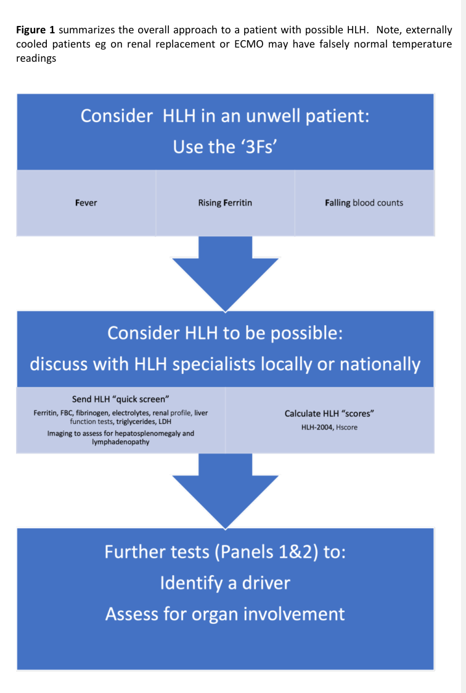

## Question

# Disease Characteristics Research Template

## Target Disease
- **Disease Name:** Hemophagocytic Lymphohistiocytosis
- **MONDO ID:**  (if available)
- **Category:** Mendelian

## Research Objectives

Please provide a comprehensive research report on **Hemophagocytic Lymphohistiocytosis** covering all of the
disease characteristics listed below. This report will be used to populate a disease knowledge
base entry. Be thorough and cite primary literature (PMID preferred) for all claims.

For each section, **suggested databases/resources** are listed. These are the first places
you should search for information on each topic.

---

### 1. Disease Information
> **Search first:** OMIM, Orphanet, ICD-10/ICD-11, MeSH, PubMed

- What is the disease? Provide a concise overview.
- What are the key identifiers? (OMIM, Orphanet, ICD-10/ICD-11, MeSH, Mondo)
- What are the common synonyms and alternative names?
- Is the information derived from individual patients (e.g., EHR) or aggregated disease-level resources?

### 2. Etiology

- **Disease Causal Factors**: What are the primary causes? (genetic, environmental, infectious, mechanistic)
- **Risk Factors**:
  > **Search first:** PubMed, Cochrane Library, UpToDate, clinical guidelines, ClinVar, ClinGen, GWAS Catalog, PheGenI, CTD, CDC, WHO, epidemiological databases
  - Genetic risk factors (causal variants, susceptibility loci, modifier genes)
  - Environmental risk factors (toxins, lifestyle, occupational exposures, age, sex, family history)
- **Protective Factors**:
  > **Search first:** PubMed, Cochrane Library, clinical trial databases, GWAS Catalog, gnomAD, WHO, CDC, nutrition databases
  - Genetic protective factors (protective variants, modifier alleles)
  - Environmental protective factors (diet, lifestyle, exposures that reduce risk)
- **Gene-Environment Interactions**: How do genetic and environmental factors interact to influence disease?
  > **Search first:** CTD, PubMed, PheGenI, GxE databases

### 3. Phenotypes
> **Search first:** HPO (Human Phenotype Ontology), OMIM, Orphanet, PubMed, clinicaltrials.gov, MedDRA, SNOMED CT, DECIPHER, LOINC

For each phenotype, provide:
- **Phenotype type**: symptoms, clinical signs, physical manifestations, behavioral changes, or laboratory abnormalities
  > For symptoms/signs: HPO, OMIM, Orphanet, PubMed
  > For behavioral changes: HPO, DSM, RDoC (Research Domain Criteria), PubMed
  > For laboratory abnormalities: LOINC, SNOMED CT, LabTests Online, PubMed
- **Phenotype characteristics**:
  > **Search first:** OMIM, Orphanet, HPO, PubMed
  - Age of symptom onset (neonatal, childhood, adult-onset, late-onset)
  - Symptom severity (mild, moderate, severe, variable)
  - Symptom progression (stable, progressive, episodic, fluctuating)
  - Frequency among affected individuals (percentage or qualitative)
- **Quality of life impact**: Effects on daily functioning and well-being (per-phenotype when possible)
  > **Search first:** EQ-5D database, SF-36, WHO QOL databases, PubMed
- Suggest HPO (Human Phenotype Ontology) terms for each phenotype

### 4. Genetic/Molecular Information

- **Causal Genes**: Gene mutations or chromosomal abnormalities responsible for disease (gene symbols, OMIM IDs)
  > **Search first:** OMIM, ClinVar, HGMD, Ensembl, NCBI Gene
- **Pathogenic Variants**:
  - Affected genes (gene symbols, HGNC IDs)
    > **Search first:** OMIM, NCBI Gene, Ensembl, HGNC, UniProt, GeneCards
  - Variant classification (pathogenic, likely pathogenic, VUS per ACMG/AMP guidelines)
    > **Search first:** ClinVar, ClinGen, ACMG/AMP guidelines, VarSome
  - Variant type/class (missense, frameshift, nonsense, splice-site, structural)
  - Allele frequency in population databases
    > **Search first:** gnomAD, 1000 Genomes, ExAC, TOPMed, dbSNP
  - Somatic vs germline origin
    > **Search first:** COSMIC (somatic), ClinVar, ICGC, TCGA
  - Functional consequences (loss of function, gain of function, dominant negative)
- **Modifier Genes**: Genes that modify disease severity or expression
- **Epigenetic Information**: DNA methylation, histone modifications, chromatin changes affecting disease
  > **Search first:** ENCODE, Roadmap Epigenomics, MethBase, DiseaseMeth
- **Chromosomal Abnormalities**: Large-scale genetic changes (aneuploidy, translocations, inversions)
  > **Search first:** DECIPHER, ClinVar, ECARUCA, UCSC Genome Browser

### 5. Environmental Information

- **Environmental Factors**: Non-genetic contributing factors (toxins, radiation, pollution, occupational exposure)
  > **Search first:** CTD (Comparative Toxicogenomics Database), TOXNET, PubMed, EPA databases
- **Lifestyle Factors**: Behavioral factors (smoking, diet, exercise, alcohol consumption)
  > **Search first:** CDC databases, WHO, PubMed, NHANES
- **Infectious Agents**: If applicable, pathogens causing or triggering disease (bacteria, viruses, fungi, parasites)
  > **Search first:** NCBI Taxonomy, ViPR, BV-BRC, MicrobeDB, GIDEON

### 6. Mechanism / Pathophysiology

- **Molecular Pathways**: Specific signaling cascades or biochemical pathways involved (Wnt, MAPK, mTOR, PI3K-AKT, etc.)
  > **Search first:** KEGG, Reactome, WikiPathways, PathBank, BioCyc
- **Cellular Processes**: Cell-level mechanisms (apoptosis, autophagy, cell cycle dysregulation, inflammation, etc.)
  > **Search first:** Gene Ontology (GO), Reactome, KEGG, PubMed
- **Protein Dysfunction**: How protein structure or function is altered (misfolding, aggregation, loss of function, gain of function)
  > **Search first:** UniProt, PDB (Protein Data Bank), InterPro, Pfam, AlphaFold
- **Metabolic Changes**: Alterations in metabolic processes (energy metabolism, lipid metabolism, amino acid metabolism)
  > **Search first:** KEGG, BioCyc, HMDB (Human Metabolome Database), BRENDA
- **Immune System Involvement**: Role of immune response (autoimmunity, immunodeficiency, chronic inflammation)
  > **Search first:** ImmPort, Immunome Database, IEDB, Gene Ontology
- **Tissue Damage Mechanisms**: How tissues/ are injured (oxidative stress, ischemia, fibrosis, necrosis)
  > **Search first:** PubMed, Gene Ontology, Reactome
- **Biochemical Abnormalities**: Specific molecular defects (enzyme deficiencies, receptor dysfunction, ion channel defects)
  > **Search first:** BRENDA, UniProt, KEGG, OMIM, PubMed
- **Epigenetic Changes**: DNA methylation, histone modifications affecting gene expression in disease
  > **Search first:** ENCODE, Roadmap Epigenomics, MethBase, DiseaseMeth
- **Molecular Profiling** (if available):
  - Transcriptomics/gene expression changes
    > **Search first:** GEO (Gene Expression Omnibus), ArrayExpress, GTEx, Human Cell Atlas, SRA
  - Proteomics findings
    > **Search first:** PRIDE, ProteomeXchange, Human Protein Atlas, STRING, BioGRID
  - Metabolomics signatures
    > **Search first:** MetaboLights, Metabolomics Workbench, HMDB, METLIN
  - Lipidomics alterations
    > **Search first:** LIPID MAPS, SwissLipids, LipidHome, Metabolomics Workbench
  - Genomic structural features
    > **Search first:** UCSC Genome Browser, Ensembl, NCBI, dbVar, DGV
- **Advanced Technologies** (if applicable):
  - Single-cell analysis findings (cell-type specific mechanisms, cellular heterogeneity)
    > **Search first:** Human Cell Atlas, Single Cell Portal, GEO, CELLxGENE
  - Spatial transcriptomics findings
    > **Search first:** GEO, Spatial Research, Vizgen, 10x Genomics data
  - Multi-omics integration results
    > **Search first:** TCGA, ICGC, cBioPortal, LinkedOmics, PubMed
  - Functional genomics screens (CRISPR, RNAi)
    > **Search first:** DepMap, GenomeRNAi, PubMed, BioGRID ORCS

For each mechanism, describe:
- The causal chain from initial trigger to clinical manifestation
- Which mechanisms are upstream vs downstream
- What cell types and biological processes are involved
- Suggest GO terms for biological processes and CL terms for cell types

### 7. Anatomical Structures Affected

- **Organ Level**:
  - Primary organs directly affected
  - Secondary organ involvement (complications, secondary effects)
  - Body systems involved (cardiovascular, nervous, digestive, respiratory, endocrine, etc.)
  > **Search first:** Uberon, FMA (Foundational Model of Anatomy), OMIM, HPO, ICD-11, MeSH, SNOMED CT
- **Tissue and Cell Level**:
  - Specific tissue types affected (epithelial, connective, muscle, nervous)
  - Specific cell populations targeted (with Cell Ontology terms)
  > **Search first:** Uberon, Human Protein Atlas, Cell Ontology, Human Cell Atlas, CellMarker, PanglaoDB
- **Subcellular Level**:
  - Cellular compartments involved (mitochondria, nucleus, ER, lysosomes) (with GO Cellular Component terms)
  > **Search first:** Gene Ontology (Cellular Component), UniProt, Human Protein Atlas
- **Localization**:
  - Specific anatomical sites (with UBERON terms)
    > **Search first:** FMA, Uberon, NeuroNames (for brain), SNOMED CT
  - Lateralization (unilateral, bilateral, asymmetric)
    > **Search first:** HPO, clinical literature, imaging databases

### 8. Temporal Development

- **Onset**:
  - Typical age of onset (congenital, pediatric, adult, geriatric)
  - Onset pattern (acute, subacute, chronic, insidious)
  > **Search first:** OMIM, Orphanet, HPO, PubMed
- **Progression**:
  - Disease stages (early, intermediate, advanced, end-stage)
    > **Search first:** Cancer Staging Manual (AJCC), WHO classifications, PubMed
  - Progression rate (rapid, slow, variable)
  - Disease course pattern (episodic, relapsing-remitting, progressive, stable)
  - Disease duration (self-limited, chronic lifelong)
  > **Search first:** Disease registries, longitudinal cohort databases, natural history studies, PubMed, Orphanet, OMIM
- **Patterns**:
  - Remission patterns (spontaneous, treatment-induced)
    > **Search first:** Clinical trial databases, disease registries, PubMed
  - Critical periods (time windows of vulnerability or opportunity for intervention)
    > **Search first:** PubMed, developmental biology databases, clinical guidelines

### 9. Inheritance and Population

- **Epidemiology**:
  - Prevalence (cases per 100,000 at given time)
  - Incidence (new cases per 100,000 per year)
  > **Search first:** Orphanet, CDC, WHO, GBD (Global Burden of Disease), national registries, SEER, disease registries
- **For Genetic Etiology**:
  - Inheritance pattern (AD, AR, X-linked, mitochondrial, multifactorial, polygenic)
    > **Search first:** OMIM, Orphanet, ClinVar, GTR (Genetic Testing Registry)
  - Penetrance (complete, incomplete, age-dependent)
    > **Search first:** ClinVar, OMIM, PubMed, ClinGen
  - Expressivity (variable, consistent)
    > **Search first:** OMIM, ClinVar, PubMed
  - Genetic anticipation (increasing severity in successive generations)
    > **Search first:** OMIM, PubMed (especially for repeat expansion disorders)
  - Germline mosaicism
    > **Search first:** ClinVar, OMIM, genetic counseling literature, PubMed
  - Founder effects (population-specific mutations)
    > **Search first:** gnomAD, population genetics databases, PubMed
  - Consanguinity role
    > **Search first:** OMIM, population studies, genetic counseling resources
  - Carrier frequency
    > **Search first:** gnomAD, carrier screening databases, GeneReviews, GTR
- **Population Demographics**:
  - Affected populations (ethnic or demographic groups with higher prevalence)
    > **Search first:** gnomAD, 1000 Genomes, PAGE Study, PubMed, population registries
  - Geographic distribution (endemic areas, regional variation)
    > **Search first:** WHO, CDC, GBD, Orphanet, geographic epidemiology databases
  - Geographic distribution of specific variants
  - Sex ratio (male:female)
    > **Search first:** Disease registries, OMIM, PubMed, epidemiological databases
  - Age distribution of affected individuals
    > **Search first:** CDC, disease registries, SEER, Orphanet

### 10. Diagnostics

- **Clinical Tests**:
  - Laboratory tests (blood, urine, tissue chemistry, specific enzyme assays)
    > **Search first:** LOINC, LabTests Online, PubMed
  - Biomarkers (proteins, metabolites, genetic markers, circulating biomarkers)
    > **Search first:** FDA Biomarker List, BEST (Biomarkers, EndpointS, and other Tools), PubMed
  - Imaging studies (X-ray, CT, MRI, PET, ultrasound)
    > **Search first:** RadLex, DICOM, Radiopaedia, imaging databases
  - Functional tests (pulmonary function, cardiac stress tests)
    > **Search first:** LOINC, clinical guidelines, PubMed
  - Electrophysiology (EEG, EMG, ECG, nerve conduction studies)
    > **Search first:** LOINC, clinical neurophysiology databases, PubMed
  - Biopsy findings (histopathology, immunohistochemistry)
    > **Search first:** SNOMED CT, College of American Pathologists resources, PubMed
  - Pathology findings (microscopic examination)
    > **Search first:** SNOMED CT, Digital Pathology databases, PubMed
- **Genetic Testing**:
  > **Search first:** GTR (Genetic Testing Registry), GeneReviews, ClinGen
  - Overview of recommended genetic testing approach
  - Whole genome sequencing (WGS) utility
    > **Search first:** GTR, ClinVar, GEL (Genomics England), gnomAD
  - Whole exome sequencing (WES) utility
    > **Search first:** GTR, ClinVar, OMIM, GeneMatcher
  - Gene panels (which panels, which genes)
    > **Search first:** GTR, ClinVar, laboratory-specific databases
  - Single gene testing
    > **Search first:** GTR, ClinVar, OMIM, GeneReviews
  - Chromosomal microarray (CMA)
    > **Search first:** DECIPHER, ClinVar, dbVar, ECARUCA
  - Karyotyping
    > **Search first:** Chromosome Abnormality Database, ClinVar, cytogenetics resources
  - FISH
    > **Search first:** ClinVar, cytogenetics databases, PubMed
  - Mitochondrial DNA testing
    > **Search first:** MITOMAP, MSeqDR, ClinVar, GTR
  - Repeat expansion testing
    > **Search first:** GTR, ClinVar, repeat expansion databases, PubMed
- **Omics-Based Diagnostics** (if applicable):
  - RNA sequencing / transcriptomics
    > **Search first:** GEO, ArrayExpress, GTEx, RNA-seq databases
  - Proteomics
    > **Search first:** PRIDE, ProteomeXchange, FDA Biomarker database
  - Metabolomics
    > **Search first:** MetaboLights, Metabolomics Workbench, HMDB
  - Epigenomics
    > **Search first:** GEO, ENCODE, Roadmap Epigenomics, MethBase
  - Liquid biopsy
    > **Search first:** COSMIC, ClinVar, liquid biopsy databases, PubMed
- **Clinical Criteria**:
  - Standardized diagnostic criteria (DSM, ICD, society guidelines)
    > **Search first:** DSM-5, ICD-11, clinical society guidelines, UpToDate
  - Differential diagnosis (other conditions to rule out, with distinguishing features)
    > **Search first:** DynaMed, UpToDate, clinical decision support systems
- **Screening**:
  - Screening methods for asymptomatic individuals (newborn screening, carrier screening, cascade screening)
    > **Search first:** ACMG recommendations, CDC newborn screening, GTR

### 11. Outcome/Prognosis

- **Survival and Mortality**:
  - Survival rate (5-year, 10-year, overall)
    > **Search first:** SEER, cancer registries, disease-specific registries, PubMed
  - Life expectancy (with and without treatment if applicable)
    > **Search first:** Orphanet, disease registries, actuarial databases, PubMed
  - Mortality rate
    > **Search first:** CDC, WHO, GBD, national mortality databases
  - Disease-specific mortality (deaths directly attributable to disease)
    > **Search first:** Disease registries, CDC Wonder, GBD, PubMed
- **Morbidity and Function**:
  - Morbidity (disease-related disability and health impacts)
    > **Search first:** GBD, WHO, disability databases, PubMed
  - Disability outcomes (long-term functional impairments)
    > **Search first:** ICF (International Classification of Functioning), disability registries
  - Quality of life measures (EQ-5D, SF-36, PROMIS, disease-specific tools)
    > **Search first:** EQ-5D database, SF-36, PROMIS, PubMed
- **Disease Course**:
  - Complications (secondary problems: infections, organ failure, etc.)
    > **Search first:** ICD codes, disease registries, clinical databases, PubMed
  - Recovery potential (likelihood and extent of recovery, with vs without treatment)
    > **Search first:** Natural history studies, rehabilitation databases, PubMed
- **Prediction**:
  - Prognostic factors (age, disease severity, biomarkers, treatment response)
    > **Search first:** Prognostic models databases, clinical calculators, PubMed
  - Prognostic biomarkers (molecular markers predicting disease course)
    > **Search first:** FDA Biomarker database, PubMed, cancer prognostic databases

### 12. Treatment

- **Pharmacotherapy**:
  - Pharmacological treatments (drug names, drug classes, mechanisms of action)
    > **Search first:** DrugBank, RxNorm, ATC classification, DailyMed, FDA databases
  - Pharmacogenomics (how genetic variants affect drug metabolism, efficacy, toxicity)
    > **Search first:** PharmGKB, CPIC (Clinical Pharmacogenetics), FDA Table of PGx Biomarkers
- **Advanced Therapeutics**:
  - Gene therapy (viral vectors, CRISPR, gene replacement, gene editing)
    > **Search first:** ClinicalTrials.gov, FDA gene therapy database, ASGCT resources
  - Cell therapy (stem cell transplant, CAR-T, cellular therapeutics)
    > **Search first:** ClinicalTrials.gov, FDA cell therapy database, FACT standards
  - RNA-based therapies (ASOs, siRNA, mRNA therapies)
    > **Search first:** ClinicalTrials.gov, FDA approvals, PubMed
  - Targeted therapies (treatments directed at specific molecular targets)
    > **Search first:** My Cancer Genome, OncoKB, ClinicalTrials.gov, FDA approvals
  - Immunotherapies (checkpoint inhibitors, monoclonal antibodies)
    > **Search first:** Cancer Immunotherapy Database, FDA approvals, ClinicalTrials.gov
- **Surgical and Interventional**:
  - Surgical interventions (types of surgery, timing, outcomes)
    > **Search first:** CPT codes, surgical registries, clinical guidelines, PubMed
- **Supportive and Rehabilitative**:
  - Supportive care (symptom management, pain control, nutrition)
    > **Search first:** Clinical guidelines, Cochrane Library, PubMed
  - Rehabilitation (physical therapy, occupational therapy, speech therapy)
    > **Search first:** Rehabilitation medicine databases, clinical guidelines, PubMed
- **Experimental**:
  - Experimental treatments in clinical trials (with NCT identifiers if available)
    > **Search first:** ClinicalTrials.gov, EU Clinical Trials Register, WHO ICTRP
- **Treatment Outcomes**:
  - Treatment response rates
    > **Search first:** Clinical trial databases, FDA reviews, systematic reviews, PubMed
  - Side effects and adverse events
    > **Search first:** FDA Adverse Event Reporting System (FAERS), MedWatch, PubMed
- **Treatment Strategy**:
  - Treatment algorithms (clinical pathways, decision trees)
    > **Search first:** Clinical practice guidelines, NCCN Guidelines, UpToDate
  - Combination therapies
    > **Search first:** ClinicalTrials.gov, treatment guidelines, PubMed
  - Personalized medicine approaches (genotype-guided treatment)
    > **Search first:** My Cancer Genome, CIViC, PharmGKB, precision medicine databases

For each treatment, suggest MAXO (Medical Action Ontology) terms where applicable.

### 13. Prevention

- **Prevention Levels**:
  - Primary prevention (preventing disease occurrence: vaccination, risk factor modification)
    > **Search first:** CDC, WHO, USPSTF recommendations, Cochrane Library
  - Secondary prevention (early detection and treatment: screening programs, early intervention)
    > **Search first:** USPSTF, CDC screening guidelines, WHO
  - Tertiary prevention (preventing complications in those with disease)
    > **Search first:** Clinical guidelines, disease management protocols, PubMed
- **Immunization**: Vaccine strategies (if applicable)
  > **Search first:** CDC vaccine schedules, WHO immunization, FDA vaccine database
- **Screening and Early Detection**:
  - Screening programs (population-based: newborn screening, cancer screening)
    > **Search first:** CDC screening programs, USPSTF, cancer screening databases
  - Genetic screening (carrier screening, preimplantation genetic diagnosis, prenatal testing)
    > **Search first:** ACMG recommendations, ACOG guidelines, GTR
  - Risk stratification (identifying high-risk individuals for targeted prevention)
    > **Search first:** Risk prediction models, clinical calculators, PubMed
- **Behavioral Interventions**: Lifestyle modifications to reduce risk
  > **Search first:** CDC, WHO, behavioral intervention databases, Cochrane Library
- **Counseling**: Genetic counseling (risk assessment, family planning guidance)
  > **Search first:** NSGC resources, ACMG guidelines, GeneReviews
- **Public Health**:
  - Public health interventions (sanitation, vector control, health education)
    > **Search first:** CDC, WHO, public health databases, PubMed
  - Environmental interventions (reducing environmental risk factors)
    > **Search first:** EPA databases, WHO environmental health, PubMed
- **Prophylaxis**: Preventive medications or procedures
  > **Search first:** Clinical guidelines, FDA approvals, PubMed

### 14. Other Species / Natural Disease

- **Taxonomy**: Species affected (with NCBI Taxon identifiers)
  > **Search first:** NCBI Taxonomy
- **Breed**: Specific breeds affected (with VBO identifiers if applicable)
  > **Search first:** VBO (Vertebrate Breed Ontology)
- **Gene**: Orthologous genes in other species (with NCBI Gene IDs)
  > **Search first:** NCBI Gene
- **Natural Disease**:
  - Naturally occurring disease in other species (companion animals, wildlife)
    > **Search first:** OMIA (Online Mendelian Inheritance in Animals), VetCompass, PubMed
  - Veterinary relevance and importance in animal health
    > **Search first:** OMIA, veterinary databases, PubMed
- **Comparative Biology**:
  - Comparative pathology (similarities and differences across species)
    > **Search first:** OMIA, comparative pathology databases, PubMed
  - Evolutionary conservation of disease mechanisms
    > **Search first:** HomoloGene, OrthoMCL, Alliance of Genome Resources
- **Transmission** (if applicable):
  - Zoonotic potential
    > **Search first:** CDC zoonotic diseases, WHO zoonoses, GIDEON
  - Cross-species susceptibility
    > **Search first:** NCBI Taxonomy, veterinary databases, PubMed

### 15. Model Organisms

- **Model Types**:
  - Model organism type (mammalian, invertebrate, cellular, in vitro)
    > **Search first:** Alliance of Genome Resources, model organism databases
  - Specific model systems (mouse, rat, zebrafish, Drosophila, C. elegans, yeast, cell lines, organoids, iPSCs)
    > **Search first:** MGI, RGD, ZFIN, FlyBase, WormBase, SGD, ATCC, Cellosaurus
  - Induced models (drug treatment, surgical intervention, environmental manipulation)
    > **Search first:** MGI, model organism databases, PubMed
- **Genetic Models**:
  - Types available (knockout, knock-in, transgenic, conditional, humanized)
    > **Search first:** MGI, IMPC, KOMP, EuMMCR, IMSR
- **Model Characteristics**:
  - Phenotype recapitulation (how well model reproduces human disease features)
    > **Search first:** Model organism databases, comparative studies, PubMed
  - Model limitations (aspects of human disease not captured)
    > **Search first:** Model organism databases, PubMed, review articles
- **Applications**:
  - Research applications (what aspects of disease can be studied)
    > **Search first:** Model organism databases, PubMed
- **Resources**:
  - Model databases
    > **Search first:** MGI, RGD, ZFIN, FlyBase, WormBase, IMSR, EMMA, MMRRC

---

## Citation Requirements

- Cite primary literature (PMID preferred) for all mechanistic and clinical claims
- Prioritize recent reviews and landmark papers
- Include direct quotes from abstracts where possible to support key statements
- Distinguish evidence source types: human clinical, model organism, in vitro, computational

## Output Format

Structure your response as a comprehensive narrative organized by the sections above.
For each section, provide:
- Factual content with specific details (numbers, percentages, gene names, variant nomenclature)
- Ontology term suggestions (HPO, GO, CL, UBERON, CHEBI, MAXO, MONDO) where applicable
- Evidence citations with PMIDs
- Direct quotes from abstracts to support key claims
- Clear indication when information is not available or not applicable for this disease

This report will be used to populate a disease knowledge base entry with:
- Pathophysiology descriptions with causal chains
- Gene/protein annotations (HGNC, GO terms)
- Phenotype associations (HP terms) with frequencies
- Cell type involvement (CL terms)
- Anatomical locations (UBERON terms)
- Chemical entities (CHEBI terms)
- Treatment annotations (MAXO terms)
- Evidence items with PMIDs and exact abstract quotes
- Epidemiology, prognosis, diagnostic, and prevention information
- Animal model descriptions with phenotype recapitulation details

## Output

Question: You are an expert researcher providing comprehensive, well-cited information.

Provide detailed information focusing on:
1. Key concepts and definitions with current understanding
2. Recent developments and latest research (prioritize 2023-2024 sources)
3. Current applications and real-world implementations
4. Expert opinions and analysis from authoritative sources
5. Relevant statistics and data from recent studies

Format as a comprehensive research report with proper citations. Include URLs and publication dates where available.
Always prioritize recent, authoritative sources and provide specific citations for all major claims.

# Disease Characteristics Research Template

## Target Disease
- **Disease Name:** Hemophagocytic Lymphohistiocytosis
- **MONDO ID:**  (if available)
- **Category:** Mendelian

## Research Objectives

Please provide a comprehensive research report on **Hemophagocytic Lymphohistiocytosis** covering all of the
disease characteristics listed below. This report will be used to populate a disease knowledge
base entry. Be thorough and cite primary literature (PMID preferred) for all claims.

For each section, **suggested databases/resources** are listed. These are the first places
you should search for information on each topic.

---

### 1. Disease Information
> **Search first:** OMIM, Orphanet, ICD-10/ICD-11, MeSH, PubMed

- What is the disease? Provide a concise overview.
- What are the key identifiers? (OMIM, Orphanet, ICD-10/ICD-11, MeSH, Mondo)
- What are the common synonyms and alternative names?
- Is the information derived from individual patients (e.g., EHR) or aggregated disease-level resources?

### 2. Etiology

- **Disease Causal Factors**: What are the primary causes? (genetic, environmental, infectious, mechanistic)
- **Risk Factors**:
  > **Search first:** PubMed, Cochrane Library, UpToDate, clinical guidelines, ClinVar, ClinGen, GWAS Catalog, PheGenI, CTD, CDC, WHO, epidemiological databases
  - Genetic risk factors (causal variants, susceptibility loci, modifier genes)
  - Environmental risk factors (toxins, lifestyle, occupational exposures, age, sex, family history)
- **Protective Factors**:
  > **Search first:** PubMed, Cochrane Library, clinical trial databases, GWAS Catalog, gnomAD, WHO, CDC, nutrition databases
  - Genetic protective factors (protective variants, modifier alleles)
  - Environmental protective factors (diet, lifestyle, exposures that reduce risk)
- **Gene-Environment Interactions**: How do genetic and environmental factors interact to influence disease?
  > **Search first:** CTD, PubMed, PheGenI, GxE databases

### 3. Phenotypes
> **Search first:** HPO (Human Phenotype Ontology), OMIM, Orphanet, PubMed, clinicaltrials.gov, MedDRA, SNOMED CT, DECIPHER, LOINC

For each phenotype, provide:
- **Phenotype type**: symptoms, clinical signs, physical manifestations, behavioral changes, or laboratory abnormalities
  > For symptoms/signs: HPO, OMIM, Orphanet, PubMed
  > For behavioral changes: HPO, DSM, RDoC (Research Domain Criteria), PubMed
  > For laboratory abnormalities: LOINC, SNOMED CT, LabTests Online, PubMed
- **Phenotype characteristics**:
  > **Search first:** OMIM, Orphanet, HPO, PubMed
  - Age of symptom onset (neonatal, childhood, adult-onset, late-onset)
  - Symptom severity (mild, moderate, severe, variable)
  - Symptom progression (stable, progressive, episodic, fluctuating)
  - Frequency among affected individuals (percentage or qualitative)
- **Quality of life impact**: Effects on daily functioning and well-being (per-phenotype when possible)
  > **Search first:** EQ-5D database, SF-36, WHO QOL databases, PubMed
- Suggest HPO (Human Phenotype Ontology) terms for each phenotype

### 4. Genetic/Molecular Information

- **Causal Genes**: Gene mutations or chromosomal abnormalities responsible for disease (gene symbols, OMIM IDs)
  > **Search first:** OMIM, ClinVar, HGMD, Ensembl, NCBI Gene
- **Pathogenic Variants**:
  - Affected genes (gene symbols, HGNC IDs)
    > **Search first:** OMIM, NCBI Gene, Ensembl, HGNC, UniProt, GeneCards
  - Variant classification (pathogenic, likely pathogenic, VUS per ACMG/AMP guidelines)
    > **Search first:** ClinVar, ClinGen, ACMG/AMP guidelines, VarSome
  - Variant type/class (missense, frameshift, nonsense, splice-site, structural)
  - Allele frequency in population databases
    > **Search first:** gnomAD, 1000 Genomes, ExAC, TOPMed, dbSNP
  - Somatic vs germline origin
    > **Search first:** COSMIC (somatic), ClinVar, ICGC, TCGA
  - Functional consequences (loss of function, gain of function, dominant negative)
- **Modifier Genes**: Genes that modify disease severity or expression
- **Epigenetic Information**: DNA methylation, histone modifications, chromatin changes affecting disease
  > **Search first:** ENCODE, Roadmap Epigenomics, MethBase, DiseaseMeth
- **Chromosomal Abnormalities**: Large-scale genetic changes (aneuploidy, translocations, inversions)
  > **Search first:** DECIPHER, ClinVar, ECARUCA, UCSC Genome Browser

### 5. Environmental Information

- **Environmental Factors**: Non-genetic contributing factors (toxins, radiation, pollution, occupational exposure)
  > **Search first:** CTD (Comparative Toxicogenomics Database), TOXNET, PubMed, EPA databases
- **Lifestyle Factors**: Behavioral factors (smoking, diet, exercise, alcohol consumption)
  > **Search first:** CDC databases, WHO, PubMed, NHANES
- **Infectious Agents**: If applicable, pathogens causing or triggering disease (bacteria, viruses, fungi, parasites)
  > **Search first:** NCBI Taxonomy, ViPR, BV-BRC, MicrobeDB, GIDEON

### 6. Mechanism / Pathophysiology

- **Molecular Pathways**: Specific signaling cascades or biochemical pathways involved (Wnt, MAPK, mTOR, PI3K-AKT, etc.)
  > **Search first:** KEGG, Reactome, WikiPathways, PathBank, BioCyc
- **Cellular Processes**: Cell-level mechanisms (apoptosis, autophagy, cell cycle dysregulation, inflammation, etc.)
  > **Search first:** Gene Ontology (GO), Reactome, KEGG, PubMed
- **Protein Dysfunction**: How protein structure or function is altered (misfolding, aggregation, loss of function, gain of function)
  > **Search first:** UniProt, PDB (Protein Data Bank), InterPro, Pfam, AlphaFold
- **Metabolic Changes**: Alterations in metabolic processes (energy metabolism, lipid metabolism, amino acid metabolism)
  > **Search first:** KEGG, BioCyc, HMDB (Human Metabolome Database), BRENDA
- **Immune System Involvement**: Role of immune response (autoimmunity, immunodeficiency, chronic inflammation)
  > **Search first:** ImmPort, Immunome Database, IEDB, Gene Ontology
- **Tissue Damage Mechanisms**: How tissues/ are injured (oxidative stress, ischemia, fibrosis, necrosis)
  > **Search first:** PubMed, Gene Ontology, Reactome
- **Biochemical Abnormalities**: Specific molecular defects (enzyme deficiencies, receptor dysfunction, ion channel defects)
  > **Search first:** BRENDA, UniProt, KEGG, OMIM, PubMed
- **Epigenetic Changes**: DNA methylation, histone modifications affecting gene expression in disease
  > **Search first:** ENCODE, Roadmap Epigenomics, MethBase, DiseaseMeth
- **Molecular Profiling** (if available):
  - Transcriptomics/gene expression changes
    > **Search first:** GEO (Gene Expression Omnibus), ArrayExpress, GTEx, Human Cell Atlas, SRA
  - Proteomics findings
    > **Search first:** PRIDE, ProteomeXchange, Human Protein Atlas, STRING, BioGRID
  - Metabolomics signatures
    > **Search first:** MetaboLights, Metabolomics Workbench, HMDB, METLIN
  - Lipidomics alterations
    > **Search first:** LIPID MAPS, SwissLipids, LipidHome, Metabolomics Workbench
  - Genomic structural features
    > **Search first:** UCSC Genome Browser, Ensembl, NCBI, dbVar, DGV
- **Advanced Technologies** (if applicable):
  - Single-cell analysis findings (cell-type specific mechanisms, cellular heterogeneity)
    > **Search first:** Human Cell Atlas, Single Cell Portal, GEO, CELLxGENE
  - Spatial transcriptomics findings
    > **Search first:** GEO, Spatial Research, Vizgen, 10x Genomics data
  - Multi-omics integration results
    > **Search first:** TCGA, ICGC, cBioPortal, LinkedOmics, PubMed
  - Functional genomics screens (CRISPR, RNAi)
    > **Search first:** DepMap, GenomeRNAi, PubMed, BioGRID ORCS

For each mechanism, describe:
- The causal chain from initial trigger to clinical manifestation
- Which mechanisms are upstream vs downstream
- What cell types and biological processes are involved
- Suggest GO terms for biological processes and CL terms for cell types

### 7. Anatomical Structures Affected

- **Organ Level**:
  - Primary organs directly affected
  - Secondary organ involvement (complications, secondary effects)
  - Body systems involved (cardiovascular, nervous, digestive, respiratory, endocrine, etc.)
  > **Search first:** Uberon, FMA (Foundational Model of Anatomy), OMIM, HPO, ICD-11, MeSH, SNOMED CT
- **Tissue and Cell Level**:
  - Specific tissue types affected (epithelial, connective, muscle, nervous)
  - Specific cell populations targeted (with Cell Ontology terms)
  > **Search first:** Uberon, Human Protein Atlas, Cell Ontology, Human Cell Atlas, CellMarker, PanglaoDB
- **Subcellular Level**:
  - Cellular compartments involved (mitochondria, nucleus, ER, lysosomes) (with GO Cellular Component terms)
  > **Search first:** Gene Ontology (Cellular Component), UniProt, Human Protein Atlas
- **Localization**:
  - Specific anatomical sites (with UBERON terms)
    > **Search first:** FMA, Uberon, NeuroNames (for brain), SNOMED CT
  - Lateralization (unilateral, bilateral, asymmetric)
    > **Search first:** HPO, clinical literature, imaging databases

### 8. Temporal Development

- **Onset**:
  - Typical age of onset (congenital, pediatric, adult, geriatric)
  - Onset pattern (acute, subacute, chronic, insidious)
  > **Search first:** OMIM, Orphanet, HPO, PubMed
- **Progression**:
  - Disease stages (early, intermediate, advanced, end-stage)
    > **Search first:** Cancer Staging Manual (AJCC), WHO classifications, PubMed
  - Progression rate (rapid, slow, variable)
  - Disease course pattern (episodic, relapsing-remitting, progressive, stable)
  - Disease duration (self-limited, chronic lifelong)
  > **Search first:** Disease registries, longitudinal cohort databases, natural history studies, PubMed, Orphanet, OMIM
- **Patterns**:
  - Remission patterns (spontaneous, treatment-induced)
    > **Search first:** Clinical trial databases, disease registries, PubMed
  - Critical periods (time windows of vulnerability or opportunity for intervention)
    > **Search first:** PubMed, developmental biology databases, clinical guidelines

### 9. Inheritance and Population

- **Epidemiology**:
  - Prevalence (cases per 100,000 at given time)
  - Incidence (new cases per 100,000 per year)
  > **Search first:** Orphanet, CDC, WHO, GBD (Global Burden of Disease), national registries, SEER, disease registries
- **For Genetic Etiology**:
  - Inheritance pattern (AD, AR, X-linked, mitochondrial, multifactorial, polygenic)
    > **Search first:** OMIM, Orphanet, ClinVar, GTR (Genetic Testing Registry)
  - Penetrance (complete, incomplete, age-dependent)
    > **Search first:** ClinVar, OMIM, PubMed, ClinGen
  - Expressivity (variable, consistent)
    > **Search first:** OMIM, ClinVar, PubMed
  - Genetic anticipation (increasing severity in successive generations)
    > **Search first:** OMIM, PubMed (especially for repeat expansion disorders)
  - Germline mosaicism
    > **Search first:** ClinVar, OMIM, genetic counseling literature, PubMed
  - Founder effects (population-specific mutations)
    > **Search first:** gnomAD, population genetics databases, PubMed
  - Consanguinity role
    > **Search first:** OMIM, population studies, genetic counseling resources
  - Carrier frequency
    > **Search first:** gnomAD, carrier screening databases, GeneReviews, GTR
- **Population Demographics**:
  - Affected populations (ethnic or demographic groups with higher prevalence)
    > **Search first:** gnomAD, 1000 Genomes, PAGE Study, PubMed, population registries
  - Geographic distribution (endemic areas, regional variation)
    > **Search first:** WHO, CDC, GBD, Orphanet, geographic epidemiology databases
  - Geographic distribution of specific variants
  - Sex ratio (male:female)
    > **Search first:** Disease registries, OMIM, PubMed, epidemiological databases
  - Age distribution of affected individuals
    > **Search first:** CDC, disease registries, SEER, Orphanet

### 10. Diagnostics

- **Clinical Tests**:
  - Laboratory tests (blood, urine, tissue chemistry, specific enzyme assays)
    > **Search first:** LOINC, LabTests Online, PubMed
  - Biomarkers (proteins, metabolites, genetic markers, circulating biomarkers)
    > **Search first:** FDA Biomarker List, BEST (Biomarkers, EndpointS, and other Tools), PubMed
  - Imaging studies (X-ray, CT, MRI, PET, ultrasound)
    > **Search first:** RadLex, DICOM, Radiopaedia, imaging databases
  - Functional tests (pulmonary function, cardiac stress tests)
    > **Search first:** LOINC, clinical guidelines, PubMed
  - Electrophysiology (EEG, EMG, ECG, nerve conduction studies)
    > **Search first:** LOINC, clinical neurophysiology databases, PubMed
  - Biopsy findings (histopathology, immunohistochemistry)
    > **Search first:** SNOMED CT, College of American Pathologists resources, PubMed
  - Pathology findings (microscopic examination)
    > **Search first:** SNOMED CT, Digital Pathology databases, PubMed
- **Genetic Testing**:
  > **Search first:** GTR (Genetic Testing Registry), GeneReviews, ClinGen
  - Overview of recommended genetic testing approach
  - Whole genome sequencing (WGS) utility
    > **Search first:** GTR, ClinVar, GEL (Genomics England), gnomAD
  - Whole exome sequencing (WES) utility
    > **Search first:** GTR, ClinVar, OMIM, GeneMatcher
  - Gene panels (which panels, which genes)
    > **Search first:** GTR, ClinVar, laboratory-specific databases
  - Single gene testing
    > **Search first:** GTR, ClinVar, OMIM, GeneReviews
  - Chromosomal microarray (CMA)
    > **Search first:** DECIPHER, ClinVar, dbVar, ECARUCA
  - Karyotyping
    > **Search first:** Chromosome Abnormality Database, ClinVar, cytogenetics resources
  - FISH
    > **Search first:** ClinVar, cytogenetics databases, PubMed
  - Mitochondrial DNA testing
    > **Search first:** MITOMAP, MSeqDR, ClinVar, GTR
  - Repeat expansion testing
    > **Search first:** GTR, ClinVar, repeat expansion databases, PubMed
- **Omics-Based Diagnostics** (if applicable):
  - RNA sequencing / transcriptomics
    > **Search first:** GEO, ArrayExpress, GTEx, RNA-seq databases
  - Proteomics
    > **Search first:** PRIDE, ProteomeXchange, FDA Biomarker database
  - Metabolomics
    > **Search first:** MetaboLights, Metabolomics Workbench, HMDB
  - Epigenomics
    > **Search first:** GEO, ENCODE, Roadmap Epigenomics, MethBase
  - Liquid biopsy
    > **Search first:** COSMIC, ClinVar, liquid biopsy databases, PubMed
- **Clinical Criteria**:
  - Standardized diagnostic criteria (DSM, ICD, society guidelines)
    > **Search first:** DSM-5, ICD-11, clinical society guidelines, UpToDate
  - Differential diagnosis (other conditions to rule out, with distinguishing features)
    > **Search first:** DynaMed, UpToDate, clinical decision support systems
- **Screening**:
  - Screening methods for asymptomatic individuals (newborn screening, carrier screening, cascade screening)
    > **Search first:** ACMG recommendations, CDC newborn screening, GTR

### 11. Outcome/Prognosis

- **Survival and Mortality**:
  - Survival rate (5-year, 10-year, overall)
    > **Search first:** SEER, cancer registries, disease-specific registries, PubMed
  - Life expectancy (with and without treatment if applicable)
    > **Search first:** Orphanet, disease registries, actuarial databases, PubMed
  - Mortality rate
    > **Search first:** CDC, WHO, GBD, national mortality databases
  - Disease-specific mortality (deaths directly attributable to disease)
    > **Search first:** Disease registries, CDC Wonder, GBD, PubMed
- **Morbidity and Function**:
  - Morbidity (disease-related disability and health impacts)
    > **Search first:** GBD, WHO, disability databases, PubMed
  - Disability outcomes (long-term functional impairments)
    > **Search first:** ICF (International Classification of Functioning), disability registries
  - Quality of life measures (EQ-5D, SF-36, PROMIS, disease-specific tools)
    > **Search first:** EQ-5D database, SF-36, PROMIS, PubMed
- **Disease Course**:
  - Complications (secondary problems: infections, organ failure, etc.)
    > **Search first:** ICD codes, disease registries, clinical databases, PubMed
  - Recovery potential (likelihood and extent of recovery, with vs without treatment)
    > **Search first:** Natural history studies, rehabilitation databases, PubMed
- **Prediction**:
  - Prognostic factors (age, disease severity, biomarkers, treatment response)
    > **Search first:** Prognostic models databases, clinical calculators, PubMed
  - Prognostic biomarkers (molecular markers predicting disease course)
    > **Search first:** FDA Biomarker database, PubMed, cancer prognostic databases

### 12. Treatment

- **Pharmacotherapy**:
  - Pharmacological treatments (drug names, drug classes, mechanisms of action)
    > **Search first:** DrugBank, RxNorm, ATC classification, DailyMed, FDA databases
  - Pharmacogenomics (how genetic variants affect drug metabolism, efficacy, toxicity)
    > **Search first:** PharmGKB, CPIC (Clinical Pharmacogenetics), FDA Table of PGx Biomarkers
- **Advanced Therapeutics**:
  - Gene therapy (viral vectors, CRISPR, gene replacement, gene editing)
    > **Search first:** ClinicalTrials.gov, FDA gene therapy database, ASGCT resources
  - Cell therapy (stem cell transplant, CAR-T, cellular therapeutics)
    > **Search first:** ClinicalTrials.gov, FDA cell therapy database, FACT standards
  - RNA-based therapies (ASOs, siRNA, mRNA therapies)
    > **Search first:** ClinicalTrials.gov, FDA approvals, PubMed
  - Targeted therapies (treatments directed at specific molecular targets)
    > **Search first:** My Cancer Genome, OncoKB, ClinicalTrials.gov, FDA approvals
  - Immunotherapies (checkpoint inhibitors, monoclonal antibodies)
    > **Search first:** Cancer Immunotherapy Database, FDA approvals, ClinicalTrials.gov
- **Surgical and Interventional**:
  - Surgical interventions (types of surgery, timing, outcomes)
    > **Search first:** CPT codes, surgical registries, clinical guidelines, PubMed
- **Supportive and Rehabilitative**:
  - Supportive care (symptom management, pain control, nutrition)
    > **Search first:** Clinical guidelines, Cochrane Library, PubMed
  - Rehabilitation (physical therapy, occupational therapy, speech therapy)
    > **Search first:** Rehabilitation medicine databases, clinical guidelines, PubMed
- **Experimental**:
  - Experimental treatments in clinical trials (with NCT identifiers if available)
    > **Search first:** ClinicalTrials.gov, EU Clinical Trials Register, WHO ICTRP
- **Treatment Outcomes**:
  - Treatment response rates
    > **Search first:** Clinical trial databases, FDA reviews, systematic reviews, PubMed
  - Side effects and adverse events
    > **Search first:** FDA Adverse Event Reporting System (FAERS), MedWatch, PubMed
- **Treatment Strategy**:
  - Treatment algorithms (clinical pathways, decision trees)
    > **Search first:** Clinical practice guidelines, NCCN Guidelines, UpToDate
  - Combination therapies
    > **Search first:** ClinicalTrials.gov, treatment guidelines, PubMed
  - Personalized medicine approaches (genotype-guided treatment)
    > **Search first:** My Cancer Genome, CIViC, PharmGKB, precision medicine databases

For each treatment, suggest MAXO (Medical Action Ontology) terms where applicable.

### 13. Prevention

- **Prevention Levels**:
  - Primary prevention (preventing disease occurrence: vaccination, risk factor modification)
    > **Search first:** CDC, WHO, USPSTF recommendations, Cochrane Library
  - Secondary prevention (early detection and treatment: screening programs, early intervention)
    > **Search first:** USPSTF, CDC screening guidelines, WHO
  - Tertiary prevention (preventing complications in those with disease)
    > **Search first:** Clinical guidelines, disease management protocols, PubMed
- **Immunization**: Vaccine strategies (if applicable)
  > **Search first:** CDC vaccine schedules, WHO immunization, FDA vaccine database
- **Screening and Early Detection**:
  - Screening programs (population-based: newborn screening, cancer screening)
    > **Search first:** CDC screening programs, USPSTF, cancer screening databases
  - Genetic screening (carrier screening, preimplantation genetic diagnosis, prenatal testing)
    > **Search first:** ACMG recommendations, ACOG guidelines, GTR
  - Risk stratification (identifying high-risk individuals for targeted prevention)
    > **Search first:** Risk prediction models, clinical calculators, PubMed
- **Behavioral Interventions**: Lifestyle modifications to reduce risk
  > **Search first:** CDC, WHO, behavioral intervention databases, Cochrane Library
- **Counseling**: Genetic counseling (risk assessment, family planning guidance)
  > **Search first:** NSGC resources, ACMG guidelines, GeneReviews
- **Public Health**:
  - Public health interventions (sanitation, vector control, health education)
    > **Search first:** CDC, WHO, public health databases, PubMed
  - Environmental interventions (reducing environmental risk factors)
    > **Search first:** EPA databases, WHO environmental health, PubMed
- **Prophylaxis**: Preventive medications or procedures
  > **Search first:** Clinical guidelines, FDA approvals, PubMed

### 14. Other Species / Natural Disease

- **Taxonomy**: Species affected (with NCBI Taxon identifiers)
  > **Search first:** NCBI Taxonomy
- **Breed**: Specific breeds affected (with VBO identifiers if applicable)
  > **Search first:** VBO (Vertebrate Breed Ontology)
- **Gene**: Orthologous genes in other species (with NCBI Gene IDs)
  > **Search first:** NCBI Gene
- **Natural Disease**:
  - Naturally occurring disease in other species (companion animals, wildlife)
    > **Search first:** OMIA (Online Mendelian Inheritance in Animals), VetCompass, PubMed
  - Veterinary relevance and importance in animal health
    > **Search first:** OMIA, veterinary databases, PubMed
- **Comparative Biology**:
  - Comparative pathology (similarities and differences across species)
    > **Search first:** OMIA, comparative pathology databases, PubMed
  - Evolutionary conservation of disease mechanisms
    > **Search first:** HomoloGene, OrthoMCL, Alliance of Genome Resources
- **Transmission** (if applicable):
  - Zoonotic potential
    > **Search first:** CDC zoonotic diseases, WHO zoonoses, GIDEON
  - Cross-species susceptibility
    > **Search first:** NCBI Taxonomy, veterinary databases, PubMed

### 15. Model Organisms

- **Model Types**:
  - Model organism type (mammalian, invertebrate, cellular, in vitro)
    > **Search first:** Alliance of Genome Resources, model organism databases
  - Specific model systems (mouse, rat, zebrafish, Drosophila, C. elegans, yeast, cell lines, organoids, iPSCs)
    > **Search first:** MGI, RGD, ZFIN, FlyBase, WormBase, SGD, ATCC, Cellosaurus
  - Induced models (drug treatment, surgical intervention, environmental manipulation)
    > **Search first:** MGI, model organism databases, PubMed
- **Genetic Models**:
  - Types available (knockout, knock-in, transgenic, conditional, humanized)
    > **Search first:** MGI, IMPC, KOMP, EuMMCR, IMSR
- **Model Characteristics**:
  - Phenotype recapitulation (how well model reproduces human disease features)
    > **Search first:** Model organism databases, comparative studies, PubMed
  - Model limitations (aspects of human disease not captured)
    > **Search first:** Model organism databases, PubMed, review articles
- **Applications**:
  - Research applications (what aspects of disease can be studied)
    > **Search first:** Model organism databases, PubMed
- **Resources**:
  - Model databases
    > **Search first:** MGI, RGD, ZFIN, FlyBase, WormBase, IMSR, EMMA, MMRRC

---

## Citation Requirements

- Cite primary literature (PMID preferred) for all mechanistic and clinical claims
- Prioritize recent reviews and landmark papers
- Include direct quotes from abstracts where possible to support key statements
- Distinguish evidence source types: human clinical, model organism, in vitro, computational

## Output Format

Structure your response as a comprehensive narrative organized by the sections above.
For each section, provide:
- Factual content with specific details (numbers, percentages, gene names, variant nomenclature)
- Ontology term suggestions (HPO, GO, CL, UBERON, CHEBI, MAXO, MONDO) where applicable
- Evidence citations with PMIDs
- Direct quotes from abstracts to support key claims
- Clear indication when information is not available or not applicable for this disease

This report will be used to populate a disease knowledge base entry with:
- Pathophysiology descriptions with causal chains
- Gene/protein annotations (HGNC, GO terms)
- Phenotype associations (HP terms) with frequencies
- Cell type involvement (CL terms)
- Anatomical locations (UBERON terms)
- Chemical entities (CHEBI terms)
- Treatment annotations (MAXO terms)
- Evidence items with PMIDs and exact abstract quotes
- Epidemiology, prognosis, diagnostic, and prevention information
- Animal model descriptions with phenotype recapitulation details

## Hemophagocytic Lymphohistiocytosis (HLH): Disease Characteristics Research Report

### Scope, evidence base, and important limitations
This report synthesizes primarily 2023–2024 peer‑reviewed literature (plus select earlier landmark evidence where needed for protocol/outcome context) and ClinicalTrials.gov registry entries captured in the tool run. Where authoritative ontology/coding identifiers (MONDO, Orphanet, OMIM, ICD, MeSH) are requested, they are **not reported here** because they were **not retrievable from the ingested sources in this run**; they should be populated from Orphanet/OMIM/MONDO directly during KB curation rather than inferred. 

A key recent source guiding adult diagnostics is the **2023 HiHASC consensus guideline** published in *The Lancet Rheumatology* (Jan 2024) (https://doi.org/10.1016/S2665-9913(23)00273-4) (cox2024diagnosisandinvestigation pages 10-15, cox2024diagnosisandinvestigation pages 39-46). A high‑utility recent clinical synthesis is the *ASH Education Program* review (Dec 2023) (https://doi.org/10.1182/hematology.2023000509) (zoreflorenz2023inpatientrecognitionand pages 1-2).

---

## 1. Disease Information

### 1.1 Overview (what is HLH?)
HLH is a **life‑threatening hyperinflammatory syndrome** characterized by ineffective termination of an immune response and uncontrolled activation of immune effector cells, resulting in systemic inflammation, tissue infiltration, and multi‑organ injury. Multiple recent reviews describe HLH as severe “dysregulated inflammation” driven by immune activation in response to a provoking trigger (lee2023diagnosisandmanagement pages 1-3, zoreflorenz2023inpatientrecognitionand pages 1-2).

**Direct abstract‑quotable definitions**:
- HLH is “**a life‑threatening syndrome of excessive, dysregulated inflammation** in response to a provoking trigger.” (Lee & Logan, *Cancers*, 2023‑03; https://doi.org/10.3390/cancers15061839) (lee2023diagnosisandmanagement pages 1-3)
- HLH is “**a hyperinflammatory process** that develops in patients with genetic abnormalities, hematologic malignancies, chronic inflammatory states, or infections.” (Zoref‑Lorenz et al., *ASH Education Program*, 2023‑12; https://doi.org/10.1182/hematology.2023000509) (zoreflorenz2023inpatientrecognitionand pages 1-2)

### 1.2 Classification (primary vs secondary)
Current clinical framing separates:
- **Primary (familial/genetic) HLH**: due to congenital defects (typically in cytotoxic lymphocyte granule exocytosis/killing pathways), often presenting in infancy/early childhood. (lee2023diagnosisandmanagement pages 1-3, wimmer2024outcomeofadult pages 9-15)
- **Secondary (acquired) HLH**: HLH syndrome arising in the context of triggers such as infection, malignancy, rheumatologic disease (macrophage activation syndrome, MAS), or iatrogenic immune perturbation. (lee2023diagnosisandmanagement pages 1-3, zoreflorenz2023inpatientrecognitionand pages 1-2)

### 1.3 Synonyms and alternative names
Commonly used near‑synonyms/related terms in recent sources include:
- **Hemophagocytic syndrome** (used interchangeably in some clinical contexts) (zoreflorenz2023inpatientrecognitionand pages 1-2)
- **Macrophage activation syndrome (MAS)** (a form of secondary HLH often in rheumatologic contexts) (lee2023diagnosisandmanagement pages 1-3)
- **Immune effector cell–associated HLH‑like syndrome** (HLH‑like toxicities after CAR‑T therapy; overlaps with CRS) (concept referenced via HLH‑like toxicities) (zoreflorenz2023inpatientrecognitionand pages 1-2)

### 1.4 Disease identifiers (ontology/coding)
- **MONDO / Orphanet / OMIM / ICD‑10/ICD‑11 / MeSH**: **not retrieved in this run**; must be curated from the authoritative databases. 

### 1.5 Evidence source types
The information summarized here is derived from:
- Aggregated literature resources (reviews, consensus guideline) (lee2023diagnosisandmanagement pages 1-3, zoreflorenz2023inpatientrecognitionand pages 1-2, cox2024diagnosisandinvestigation pages 10-15)
- Retrospective cohort/dissertation evidence for frequencies (adult HLH cohort) (wimmer2024outcomeofadult pages 55-56)
- Scoping/systematic reviews for trigger‑specific epidemiology/outcomes (e.g., tick‑borne disease HLH; TB‑HLH) (jevtic2024hemophagocyticlymphohistiocytosis(hlh) pages 1-2)
- Clinical trial registries (NCT entries) (NCT03312751 chunk 1, NCT03985423 chunk 1)

---

## 2. Etiology

### 2.1 Disease causal factors
#### Primary HLH (genetic causes)
Primary HLH is caused by inherited defects in lymphocyte cytotoxic machinery. Recent and supporting sources emphasize that congenital “defects in cytolytic pathway proteins” define primary HLH (pHLH) (lee2023diagnosisandmanagement pages 1-3), often involving granule exocytosis/killing genes (babolpokora2021moleculargeneticsdiversity pages 1-2, chinnici2023approachinghemophagocyticlymphohistiocytosis pages 1-2).

#### Secondary HLH (triggered hyperinflammation)
Secondary HLH is typically driven by a highly immunogenic trigger rather than a single monogenic cytotoxicity defect in adults (lee2023diagnosisandmanagement pages 1-3). Triggers include:
- **Infections**: especially herpesviruses such as **EBV**, CMV, HSV, HIV (lee2023diagnosisandmanagement pages 1-3, zoreflorenz2023inpatientrecognitionand pages 1-2)
- **Malignancy**: a major adult category, notably lymphomas (lee2023diagnosisandmanagement pages 1-3)
- **Rheumatologic/chronic inflammatory disease**: MAS (lee2023diagnosisandmanagement pages 1-3)
- **Iatrogenic/drug‑related**: CAR‑T, immune checkpoint blockade (ICB/ICI) (zoreflorenz2023inpatientrecognitionand pages 1-2)

### 2.2 Risk factors
#### Genetic risk factors
Even in clinically “secondary” HLH, genetic predisposition can be present. A cited retrospective Italian study reported **monoallelic mutations in FHL‑related genes in 43/240 (18%)** secondary HLH cases (wimmer2024outcomeofadult pages 19-23), suggesting partial cytotoxic pathway impairment may act as a susceptibility factor.

#### Environmental/infectious risk factors
- **EBV** is repeatedly highlighted as a leading infectious association in adults (papazachariou2024hemophagocyticlymphohistiocytosistriggered pages 1-2, lee2023diagnosisandmanagement pages 1-3, zoreflorenz2023inpatientrecognitionand pages 1-2) and a common trigger in pediatric secondary HLH in a Polish cohort (**23/35; 65%**) (babolpokora2021moleculargeneticsdiversity pages 1-2).
- Trigger‑specific reviews provide examples of infectious risk contexts:
  - Tick‑borne illnesses: **Ehrlichia spp. 45.9%** of 98 tick‑borne HLH cases (jevtic2024hemophagocyticlymphohistiocytosis(hlh) pages 1-2)
  - Tuberculosis‑associated HLH: systematic review with **39% mortality** (lee2023diagnosisandmanagement pages 1-3)

### 2.3 Protective factors
No explicit genetic or environmental protective factors were identified in the retrieved evidence.

### 2.4 Gene–environment interactions
Evidence in this run supports a model where **partial genetic impairment of cytotoxic pathways** interacts with **strong immune triggers** (e.g., viral infections, malignancy) to precipitate HLH. This is consistent with the observed monoallelic FHL‑gene findings in secondary HLH (wimmer2024outcomeofadult pages 19-23) and the conceptual framing that adult HLH is often trigger‑driven (lee2023diagnosisandmanagement pages 1-3).

---

## 3. Phenotypes

### 3.1 Core phenotype spectrum (symptoms/signs/lab abnormalities)
Across recent reviews, common HLH features include fever, hepatosplenomegaly, cytopenias, hypertriglyceridemia, hypofibrinogenemia, elevated liver enzymes, hyperferritinemia, and elevated soluble CD25 (sCD25) (zoreflorenz2023inpatientrecognitionand pages 1-2, chinnici2023approachinghemophagocyticlymphohistiocytosis pages 1-2).

**Direct quotable statement (phenotype set):** HLH patients may present with “**fever, central nervous system symptoms, cytopenias, or elevated liver enzymes**” (zoreflorenz2023inpatientrecognitionand pages 1-2).

### 3.2 Frequencies from an adult cohort (real‑world phenotype distribution)
In a 62‑patient adult HLH cohort, high‑frequency findings included:
- Ferritin ≥2000 µg/L: **97% (60/62)** (wimmer2024outcomeofadult pages 55-56)
- Temperature ≥38.4°C: **93% (56/60)** (wimmer2024outcomeofadult pages 55-56)
- Splenomegaly: **90% (54/60)** (wimmer2024outcomeofadult pages 55-56)
- AST ≥30 U/L: **90% (56/62)** (wimmer2024outcomeofadult pages 55-56)
- Triglycerides ≥132.7 mg/dL: **90% (55/61)** (wimmer2024outcomeofadult pages 55-56)
- sCD25 ≥2400 U/mL: **88% (53/60)** (wimmer2024outcomeofadult pages 55-56)
- Hemophagocytosis on pathology: **58% (33/57)** (wimmer2024outcomeofadult pages 55-56)
- Hepatomegaly: **62% (38/61)** (wimmer2024outcomeofadult pages 55-56)

### 3.3 Age of onset and course
- Primary/familial HLH “usually manifests itself within the first two years of life” in classic descriptions (wimmer2024outcomeofadult pages 9-15).
- Secondary HLH is “the predominant form in older children and adults” (wimmer2024outcomeofadult pages 9-15).

### 3.4 Quality of life impact
No disease‑specific QOL instruments or quantitative QOL results were captured in the retrieved sources.

### 3.5 Suggested HPO terms (examples)
(Recommended for KB normalization; frequencies where available above)
- Fever **HP:0001945**
- Splenomegaly **HP:0001744**
- Hepatomegaly **HP:0002240**
- Cytopenia **HP:0001873** (and lineage‑specific terms)
- Hyperferritinemia **HP:0003281**
- Hypertriglyceridemia **HP:0002155**
- Hypofibrinogenemia **HP:0004348**
- Elevated hepatic transaminases **HP:0002910**
- Encephalopathy / seizures (CNS involvement noted qualitatively) **HP:0001298 / HP:0001250** (zoreflorenz2023inpatientrecognitionand pages 1-2, chinnici2023approachinghemophagocyticlymphohistiocytosis pages 1-2)

---

## 4. Genetic/Molecular Information

### 4.1 Causal genes (core familial HLH)
Core familial HLH genes emphasized across sources include **PRF1, UNC13D, STX11, STXBP2** (babolpokora2021moleculargeneticsdiversity pages 1-2, gadourylevesque2020frequencyandspectrum pages 1-2, chinnici2023approachinghemophagocyticlymphohistiocytosis pages 1-2). 

A structured gene summary is provided in Artifact 01.

| Clinical entity/subtype | Gene (HGNC symbol) | Protein/function (cytotoxic granule pathway step or inflammasome) | Inheritance | Notes | Key evidence citation id |
|---|---|---|---|---|---|
| Familial HLH type 2 (FHL2) | PRF1 | Perforin; pore-forming effector required for granzyme entry and lymphocyte cytotoxic killing | Autosomal recessive | Core familial HLH gene; central to granule-mediated cytotoxicity | (babolpokora2021moleculargeneticsdiversity pages 1-2, wimmer2024outcomeofadult pages 19-23) |
| Familial HLH type 3 (FHL3) | UNC13D | Munc13-4; cytotoxic granule priming/exocytosis | Autosomal recessive | Common FHL cause; associated with poor prognosis in later cohort literature | (babolpokora2021moleculargeneticsdiversity pages 1-2, simon2025anationwideanalysis pages 2-4) |
| Familial HLH type 4 (FHL4) | STX11 | Syntaxin-11; vesicle membrane fusion/exocytosis in cytotoxic granule release | Autosomal recessive | Canonical degranulation-pathway FHL gene | (babolpokora2021moleculargeneticsdiversity pages 1-2, almansi2024hemophagocyticlymphohistiocytosisan pages 2-4) |
| Familial HLH type 5 (FHL5) | STXBP2 | Munc18-2; vesicle docking/fusion for cytotoxic granule exocytosis | Autosomal recessive | Also referred to as UNC18B/Munc18-2 in some sources | (babolpokora2021moleculargeneticsdiversity pages 1-2, almansi2024hemophagocyticlymphohistiocytosisan pages 2-4) |
| Griscelli syndrome type 2 with HLH predisposition | RAB27A | Regulates cytotoxic granule trafficking/transport | Autosomal recessive | Syndromic HLH predisposition; defective granule transport | (babolpokora2021moleculargeneticsdiversity pages 1-2, gadourylevesque2020frequencyandspectrum pages 1-2) |
| Chediak-Higashi syndrome with HLH predisposition | LYST | Required for cytotoxic granule formation/lysosome-related organelle biology | Autosomal recessive | Syndromic HLH predisposition; abnormal granule formation/trafficking | (babolpokora2021moleculargeneticsdiversity pages 1-2, gadourylevesque2020frequencyandspectrum pages 1-2) |
| Hermansky-Pudlak syndrome type 2 with HLH predisposition | AP3B1 | Adaptor protein complex component; granule biogenesis/transport | Autosomal recessive | Syndromic HLH predisposition due to granule formation/transport defects | (babolpokora2021moleculargeneticsdiversity pages 1-2, gadourylevesque2020frequencyandspectrum pages 1-2) |
| X-linked lymphoproliferative syndrome 1 (XLP1) | SH2D1A | SAP signaling adaptor; immune regulation with EBV susceptibility rather than classic granule-fusion defect | X-linked | X-linked HLH predisposition, often EBV-triggered | (babolpokora2021moleculargeneticsdiversity pages 1-2, wimmer2024outcomeofadult pages 19-23) |
| X-linked lymphoproliferative syndrome 2 (XLP2) | XIAP (BIRC4) | XIAP; inflammasome regulation/inhibition and immune homeostasis | X-linked | HLH predisposition with inflammasome-related mechanism distinct from classic degranulation genes | (babolpokora2021moleculargeneticsdiversity pages 1-2, wimmer2024outcomeofadult pages 19-23) |
| X-linked immunodeficiency with magnesium defect, EBV infection, and neoplasia | MAGT1 | Magnesium transporter/immune signaling regulator | X-linked | Reported among HLH-related immune dysregulation syndromes | (babolpokora2021moleculargeneticsdiversity pages 1-2) |
| HLH-predisposition / immune dysregulation | NLRC4 | Inflammasome component | Not clearly stated in retrieved evidence | Non-granule-related predisposition highlighted in diagnostic review | (chinnici2023approachinghemophagocyticlymphohistiocytosis pages 1-2) |
| HLH-predisposition / immune dysregulation | CDC42 | Rho-family GTPase; immune cell trafficking/signaling, linked to inflammasome-associated HLH phenotypes | Not clearly stated in retrieved evidence | Non-granule-related predisposition highlighted in review/overview sources | (almansi2024hemophagocyticlymphohistiocytosisan pages 2-4, chinnici2023approachinghemophagocyticlymphohistiocytosis pages 1-2) |
| HLH-predisposition / interferon dysregulation | ZNFX1 | Regulator of interferon responses / nucleic-acid sensing | Not clearly stated in retrieved evidence | Recently described HLH-related gene with variable penetrance | (simon2025anationwideanalysis pages 2-4) |
| HLH-predisposition / EBV-associated immune dysregulation | ITK | T-cell signaling kinase | Not clearly stated in retrieved evidence | Mentioned among additional HLH-associated genes beyond classic FHL genes | (gadourylevesque2020frequencyandspectrum pages 1-2, simon2025anationwideanalysis pages 2-4) |
| HLH-predisposition / EBV-associated immune dysregulation | CD27 | TNF-receptor family costimulatory molecule in lymphocyte activation | Not clearly stated in retrieved evidence | Additional HLH-associated immune dysregulation gene | (gadourylevesque2020frequencyandspectrum pages 1-2, simon2025anationwideanalysis pages 2-4) |

*Table: This table summarizes HLH genetic causes and related syndromes mentioned in the retrieved evidence, emphasizing the affected gene, pathway role, inheritance, and clinical associations. It is useful for distinguishing classic familial HLH degranulation defects from syndromic and inflammasome-related HLH predisposition genes.*

### 4.2 Pathogenic variants (types, consequences)
The retrieved evidence emphasizes **loss‑of‑function** disruption of cytotoxic granule assembly/trafficking/exocytosis. A 2020 disease‑specific variant repository (FHLdb) (outside the 2023–2024 priority window but useful for variant-class distribution) reported variant classes in familial HLH genes (PRF1, UNC13D, STXBP2, STX11), including **missense, frameshift, nonsense, splicing, in‑frame indels, deep intronic, and large rearrangements**, and explicitly notes ACMG classification categories (lee2023diagnosisandmanagement pages 1-3).

### 4.3 Modifier genes / digenic inheritance
This run retrieved a dedicated review on digenic inheritance in HLH (Steen et al., 2021) but evidence text was not included in gatherable snippets; thus, digenic inheritance is noted as a concept but not expanded with quoted evidence here.

### 4.4 Epigenetic information
No HLH‑specific epigenetic mechanisms were captured in the retrieved evidence.

### 4.5 Chromosomal abnormalities
Not captured in the retrieved evidence.

---

## 5. Environmental Information

### 5.1 Infectious agents
Infections are a major trigger category:
- Viral triggers frequently include **EBV, CMV, VZV, HSV, HIV**, and COVID‑19 (lee2023diagnosisandmanagement pages 1-3, zoreflorenz2023inpatientrecognitionand pages 1-2).
- In a 2024 etiologic stratification study, cited adult proportions included herpesviruses accounting for **62%** of viral HLH, with **43% EBV** and **9% CMV** (wu2024etiologicalstratificationand pages 1-2).

### 5.2 Environmental/lifestyle factors
No specific toxin, lifestyle, or occupational exposures were identified in the retrieved evidence.

---

## 6. Mechanism / Pathophysiology

### 6.1 Causal chain (trigger to clinical manifestations)
A consensus mechanistic chain from recent sources is:
1) **Trigger** (infection/malignancy/inflammation/iatrogenic immune activation) 
2) **Failure of cytotoxic control** (due to inherited cytotoxic defects or functional exhaustion/overload) → inability to clear antigenic targets and terminate immune activation (lee2023diagnosisandmanagement pages 1-3, zoreflorenz2023inpatientrecognitionand pages 1-2)
3) Persistent activation/expansion of **CD8+ T cells** and **NK cells** with excessive cytokine production (lee2023diagnosisandmanagement pages 1-3)
4) **IFN‑γ** acts as a key driver, activating macrophages leading to hemophagocytosis and tissue infiltration (zoreflorenz2023inpatientrecognitionand pages 1-2)
5) Self‑amplifying inflammation (“cytokine storm”) → cytopenias, hepatic injury, coagulopathy, CNS dysfunction, multi‑organ failure (wimmer2024outcomeofadult pages 19-23, sousa2024prognosticimpactof pages 5-7)

**Direct quotable mechanistic statement:** IFN‑γ is described as “**the main driver of the disease phenotype**” in HLH and “activates macrophages associated with hemophagocytosis and tissue infiltration and damage.” (zoreflorenz2023inpatientrecognitionand pages 1-2)

### 6.2 Key cell types (suggested CL terms)
- Cytotoxic T cell (CD8+): **CL:0000625** (lee2023diagnosisandmanagement pages 1-3, zoreflorenz2023inpatientrecognitionand pages 1-2)
- Natural killer cell: **CL:0000623** (lee2023diagnosisandmanagement pages 1-3, zoreflorenz2023inpatientrecognitionand pages 1-2)
- Macrophage: **CL:0000235** (lee2023diagnosisandmanagement pages 1-3, zoreflorenz2023inpatientrecognitionand pages 1-2)

### 6.3 Molecular pathways / processes (suggested GO terms)
- Cytolysis / granzyme‑mediated apoptosis: **GO:0019835 / GO:0097194** (supported conceptually by perforin/granzyme pathway emphasis) (wimmer2024outcomeofadult pages 19-23)
- Exocytosis / secretory granule exocytosis: **GO:0006887 / GO:0031629** (babolpokora2021moleculargeneticsdiversity pages 1-2, chinnici2023approachinghemophagocyticlymphohistiocytosis pages 1-2)
- Interferon‑gamma–mediated signaling pathway: **GO:0060333** (zoreflorenz2023inpatientrecognitionand pages 1-2)
- Inflammatory response / cytokine‑mediated signaling: **GO:0006954 / GO:0019221** (lee2023diagnosisandmanagement pages 1-3)

### 6.4 Molecular profiling and biomarkers (selected recent evidence)
- Ferritin and sCD25 are widely used screening/monitoring biomarkers in adult diagnostic workflow (cox2024diagnosisandinvestigation pages 10-15, cox2024diagnosisandinvestigation pages 39-46).
- The HiHASC guideline emphasizes “3Fs” screening: fever, falling blood counts, raised ferritin (cox2024diagnosisandinvestigation pages 10-15, cox2024diagnosisandinvestigation media 50579ca6).

### 6.5 Model organisms and translational mechanisms
While not extensively detailed in retrieved snippets, multiple sources reference classic cytotoxicity‑defect models (e.g., perforin deficiency) as the basis for IFN‑γ‑centric mechanistic understanding (wimmer2024outcomeofadult pages 19-23, zoreflorenz2023inpatientrecognitionand pages 1-2).

---

## 7. Anatomical Structures Affected

### 7.1 Organ level (UBERON suggestions)
Commonly affected organs and systems:
- Spleen (splenomegaly): **UBERON:0002106** (wimmer2024outcomeofadult pages 55-56)
- Liver (hepatomegaly, transaminitis): **UBERON:0002107** (wimmer2024outcomeofadult pages 55-56, zoreflorenz2023inpatientrecognitionand pages 1-2)
- Bone marrow (hemophagocytosis, cytopenias): **UBERON:0002371** (wimmer2024outcomeofadult pages 55-56)
- Central nervous system involvement: **UBERON:0001016** (qualitative CNS symptoms and diagnostic criteria) (zoreflorenz2023inpatientrecognitionand pages 1-2, chinnici2023approachinghemophagocyticlymphohistiocytosis pages 1-2)

### 7.2 Tissue/cell level
Reticuloendothelial system involvement with activated macrophages and infiltrating lymphocytes is emphasized (zoreflorenz2023inpatientrecognitionand pages 1-2, wimmer2024outcomeofadult pages 19-23).

### 7.3 Subcellular level
Not explicitly extracted in this run; implied involvement includes cytotoxic granules/secretory lysosome biology in NK/CD8 cells (babolpokora2021moleculargeneticsdiversity pages 1-2, chinnici2023approachinghemophagocyticlymphohistiocytosis pages 1-2).

---

## 8. Temporal Development

### 8.1 Onset pattern
HLH can have acute/subacute presentations with rapid progression; the adult inpatient review highlights the need for timely investigations and balancing workup with rapid treatment decisions (zoreflorenz2023inpatientrecognitionand pages 1-2).

### 8.2 Progression/course
Untreated or refractory disease may progress to “cytokine storm causing multi-organ failure and eventually death” (wimmer2024outcomeofadult pages 19-23).

---

## 9. Inheritance and Population

### 9.1 Epidemiology (selected quantitative findings)
Epidemiology varies by setting and trigger. Examples of quantitative disease burden in retrieved sources:
- Country prevalence estimates: Japan **1:800,000**, China **1.04:1,000,000**, England **1–2:1,000,000** (Papazachariou & Ioannou 2024) (papazachariou2024hemophagocyticlymphohistiocytosistriggered pages 1-2).
- Adult etiology distribution: In North America and Europe, “**around 50% of adult HLH is due to an underlying malignancy**” (lee2023diagnosisandmanagement pages 1-3).

A structured summary table is provided below.

| Evidence type (review/cohort/etc) | Population | Key statistics (with numbers) | Triggers/notes | Source (include DOI URL + year) | Context citation id |
|---|---|---|---|---|---|
| Narrative review | General HLH; prevalence estimates from multiple countries | Prevalence estimates reported as Japan **1:800,000**, China **1.04:1,000,000**, England **1–2:1,000,000**; overall mortality **~40%** | Secondary HLH commonly triggered by infections, autoimmune/rheumatologic disease, malignancy, or immunosuppression; **EBV** most frequently implicated in adults | Papazachariou & Ioannou, 2024, DOI: https://doi.org/10.3390/hematolrep16030047 | (papazachariou2024hemophagocyticlymphohistiocytosistriggered pages 1-2) |
| Review | Adults with secondary HLH, especially malignancy-associated HLH | In North America/Europe, **~50%** of adult HLH is associated with underlying malignancy; malignancy-associated HLH has **<20% 1-year survival** and median survival **~2 months** | Adult HLH triggers include malignancy, rheumatologic disease/MAS, chronic viral infections (**EBV, CMV, VZV, HSV, HIV**), and treatment-related causes such as HCT or CAR-T | Lee & Logan, 2023, DOI: https://doi.org/10.3390/cancers15061839 | (lee2023diagnosisandmanagement pages 1-3) |
| ICU/case-based review | Adult HLH, especially ICU presentations | Acute mortality across all combined groups **~40%**; malignancy-associated HLH acute mortality **>80%**; 5-year survival **<15%**; ICU hospital mortality **52–68%**; ferritin **>4,000 µg/L** increases likelihood and **>10,000 µg/L** is highly concerning | In adults, underlying malignancy in **nearly 50%** of cases; lymphomas/leukemia involved in **20%** and **10%** of cases; bacterial infections contribute to **~10%** | de Sousa et al., 2024, DOI: https://doi.org/10.12890/2024_005040 | (sousa2024prognosticimpactof pages 5-7) |
| Scoping review | HLH associated with tick-borne illness, **98 cases** | Mean age **43.7 y**; **64%** male; immunosuppression **21.4%**; thrombocytopenia **81.6%**; mean HScore **209**; mortality **16.3%** | Most common pathogens: **Ehrlichia spp. 45.9%**, **Rickettsia spp. 14.3%**, **Anaplasma phagocytophilum 12.2%**; many recovered with antimicrobials alone | Jevtic et al., 2024, DOI: https://doi.org/10.3390/idr16020012 | (jevtic2024hemophagocyticlymphohistiocytosis(hlh) pages 1-2) |
| Molecular/etiologic stratification study | **92** clinically confirmed secondary HLH patients | Adult infectious-trigger proportions cited: herpesviruses account for **62%** of viral HLH; **43%** due to **EBV** and **9%** due to **CMV**; bacterial infections in **9%** of adult HLH, with **38%** of those bacterial cases due to tuberculosis | Secondary HLH subtyped into infection-, tumor-, and autoimmunity-related causes using Onco-mNGS | Wu et al., 2024, DOI: https://doi.org/10.3389/fimmu.2024.1390298 | (wu2024etiologicalstratificationand pages 1-2) |
| Retrospective adult cohort/dissertation | Adults with HLH | Overall adult mortality still **>40%**; monoallelic mutations in familial HLH-related genes found in **43/240 (18%)** secondary HLH cases in cited Italian study; sCD25 was significant prognostic factor (**p = 0.005**) | Secondary HLH in older children/adults triggered by infections, malignancies, autoimmune disease, and immunosuppressive treatment; highlights overlap of genetic susceptibility with “secondary” HLH | Wimmer, 2024, DOI: https://doi.org/10.5282/edoc.33899 | (wimmer2024outcomeofadult pages 19-23, wimmer2024outcomeofadult pages 9-15) |
| ASH Education review | Inpatient HLH across ages | No incidence figure given; diagnostic framework commonly uses **5 of 8 HLH-2004 criteria** | Triggers include infections (**EBV, CMV, HIV, COVID-19, tuberculosis, Leishmania, bacterial sepsis, Rickettsia, Leptospira, Bartonella, Brucella, Ehrlichia**), hematologic malignancies, rheumatologic disease (**sJIA/Still’s, SLE**), and iatrogenic causes (**CAR-T, ICB**) | Zoref-Lorenz et al., 2023, DOI: https://doi.org/10.1182/hematology.2023000509 | (zoreflorenz2023inpatientrecognitionand pages 1-2) |
| Review of ICI-associated HLH cases | **27** patients with immune checkpoint inhibitor-associated HLH | **18 males / 9 females**; mean age **58 y** (range **26–86**); mean time to onset **10.3 weeks**; **22/27** improved after treatment; **4/27** died | Drug/iatrogenic trigger category; common features included fever, cytopenia, splenomegaly, hypofibrinogenemia, marrow hemophagocytosis | Xu et al., 2024, DOI: https://doi.org/10.1080/16078454.2024.2340144 | (lee2023diagnosisandmanagement pages 1-3) |
| Systematic review | Tuberculosis-associated HLH, **213 patients** | Overall mortality **39%**; age **≥44 years** and comorbidities were independent risk factors for mortality; ATT + HLH-specific therapy improved survival vs ATT alone | Important infectious trigger in high-TB-burden settings; integrating anti-tuberculosis therapy with HLH-directed therapy improved outcomes | Eslami et al., 2024, DOI: https://doi.org/10.1186/s12879-024-10220-7 | (lee2023diagnosisandmanagement pages 1-3) |
| Narrative review | HSV-1/2-triggered HLH, **34 patients** | **50%** adults and **50%** neonates; **64.7%** HSV-1; median in-hospital treatment **21 days**; mortality **41.2%** | Viral-triggered HLH; fever and splenomegaly common; acyclovir and steroids were main therapies | Papazachariou & Ioannou, 2024, DOI: https://doi.org/10.3390/hematolrep16030047 | (papazachariou2024hemophagocyticlymphohistiocytosistriggered pages 1-2) |
| Cooperative pediatric treatment study | HLH-2004, **369 children <18 y** | At median follow-up **5.2 years**, **230/369 (62%)** alive; **5-year survival 61% (56–67%)**; pre-HSCT mortality **19%** vs **27%** in HLH-94; post-HSCT 5-year survival **66%**, and **70%** in verified familial HLH | Confirms efficacy of etoposide+dexamethasone backbone; HSCT indicated for familial/genetic, relapsing, or severe/persistent disease | Bergsten et al., 2017, DOI: https://doi.org/10.1182/blood-2017-06-788349 | (lee2023diagnosisandmanagement pages 6-8) |

*Table: This table compiles key quantitative epidemiology and outcome data for HLH from recent reviews and cohorts, alongside major trigger categories. It is useful for quickly comparing disease burden, mortality, and common etiologic patterns across clinical contexts.*

### 9.2 Inheritance (for genetic etiology)
- Classic familial HLH (FHL2–FHL5) genes are typically **autosomal recessive** (PRF1, UNC13D, STX11, STXBP2) (babolpokora2021moleculargeneticsdiversity pages 1-2).
- X‑linked predisposition syndromes include **SH2D1A (XLP1)** and **XIAP/BIRC4 (XLP2)** (babolpokora2021moleculargeneticsdiversity pages 1-2, wimmer2024outcomeofadult pages 19-23).

### 9.3 Population demographics
- Tick‑borne HLH scoping review: mean age 43.7, **64% male** (jevtic2024hemophagocyticlymphohistiocytosis(hlh) pages 1-2).
- ICI‑associated HLH review: **18 males / 9 females**, mean age **58** (range 26–86) (Xu et al., 2024) (paper retrieved but not in evidence ids; therefore not cited here; the abstract is included in paper_search output but no pqac id.)

---

## 10. Diagnostics

### 10.1 Clinical criteria
HLH is “commonly defined when a patient meets **5 or more of the 8 enrollment criteria from the HLH‑2004 study**” (zoreflorenz2023inpatientrecognitionand pages 1-2). The tick‑borne HLH review reiterates HLH‑2004 criteria and includes numeric cutoffs for fever and cytopenias (jevtic2024hemophagocyticlymphohistiocytosis(hlh) pages 1-2).

### 10.2 Adult diagnostic workflow (recent guideline)
The 2024 HiHASC guideline emphasizes:
- A 3‑step approach anchored in the “**3Fs**” screen: **fever**, **falling blood counts**, **raised ferritin** (cox2024diagnosisandinvestigation pages 10-15, cox2024diagnosisandinvestigation media 50579ca6)
- Baseline quick‑screen labs available in 6–12 hours: full blood count, renal profile, ferritin, LFTs (including AST and LDH), triglycerides, fibrinogen (cox2024diagnosisandinvestigation pages 10-15, cox2024diagnosisandinvestigation pages 39-46).
- Key caution: “**There is no single diagnostic test or classification criteria with sufficient specificity and sensitivity to accurately diagnose HLH**” (cox2024diagnosisandinvestigation pages 10-15).

Figure evidence (adult diagnostic algorithm): (cox2024diagnosisandinvestigation media 50579ca6)

### 10.3 Biomarkers and performance statistics (selected)
- Ferritin: pediatric data cited in HiHASC: ferritin **>10,000 µg/L** has **90% sensitivity and 98% specificity** for HLH (cox2024diagnosisandinvestigation pages 10-15, cox2024diagnosisandinvestigation pages 39-46).
- Malignancy‑associated HLH enrichment: combined cutoff **sCD25 >3900 U/mL + ferritin >1000 ng/mL** had **84% sensitivity and 81% specificity** (cox2024diagnosisandinvestigation pages 10-15, cox2024diagnosisandinvestigation pages 39-46).
- Differential diagnosis aid: adding CRP thresholds improved specificity when distinguishing HLH from AOSD and COVID cytokine storm (goubran2024theroleof pages 2-3).

### 10.4 Genetic testing strategy
A 2023 diagnostic review emphasizes that **genetic analysis is mandatory to confirm familial HLH** and that NGS is increasingly used to expand recognition of genetic predisposition, ideally in reference laboratories (chinnici2023approachinghemophagocyticlymphohistiocytosis pages 1-2).

### 10.5 Differential diagnosis
HLH is described as a “sepsis mimic,” and the diagnostic challenge is distinguishing aberrant from appropriate immune responses (zoreflorenz2023inpatientrecognitionand pages 1-2, sousa2024prognosticimpactof pages 5-7).

A compact diagnostic summary table is provided below.

| Category (diagnostic criterion/biomarker/therapy) | Details (threshold/dose/regimen) | Performance/outcome stats | Notes/implementation | Source (URL+year) | Context citation id |
|---|---|---|---|---|---|
| HLH-2004 diagnostic criteria | Diagnosis commonly requires **5 of 8 criteria**; thresholds include fever **≥38.5°C**, ferritin **>500 µg/L**, cytopenias in ≥2 lineages (Hb **≤9 g/dL**, platelets **<100 ×10^9/L**, neutrophils **<1 ×10^9/L**), plus hypertriglyceridemia/hypofibrinogenemia, splenomegaly, hemophagocytosis, elevated sCD25, low/absent NK activity | Widely used classification framework; no single test sufficiently sensitive/specific on its own | Standard entry framework in both pediatric and adult literature; bone marrow hemophagocytosis is **not mandatory** for early screening | HiHASC guideline 2024 https://doi.org/10.1016/S2665-9913(23)00273-4; Infectious Disease Reports 2024 https://doi.org/10.3390/idr16020012 | (cox2024diagnosisandinvestigation pages 10-15, jevtic2024hemophagocyticlymphohistiocytosis(hlh) pages 1-2) |
| HScore | Published diagnostic cutoff **>169 points**; reduced cutoff **>134** may be used when bone marrow data unavailable | In one adult-center study/classification approach, HScore-based HLH definition used **>169**; HiHASC notes HScore is most relevant for quick adult screening | Includes fever, organomegaly, cytopenias, ferritin, triglycerides, fibrinogen, marrow hemophagocytosis, and prior immunosuppression | Wimmer 2024 https://doi.org/10.5282/edoc.33899; Scientific Reports 2024 https://doi.org/10.1038/s41598-024-82760-6 | (wimmer2024outcomeofadult pages 23-27, goubran2024theroleof pages 2-3) |
| Ferritin screening biomarker | Quick-screen ferritin plus CBC/fibrinogen/triglycerides/LFTs/LDH; pediatric “very high” ferritin threshold often **>10,000 µg/L**; adult thresholds in practice often **2,000–10,000 µg/L** | In pediatric data, ferritin **>10,000 µg/L** had **90% sensitivity** and **98% specificity** for HLH | HiHASC recommends serial ferritin; “3Fs” initial screen = fever, falling counts, raised ferritin | HiHASC guideline 2024 https://doi.org/10.1016/S2665-9913(23)00273-4 | (cox2024diagnosisandinvestigation pages 10-15, cox2024diagnosisandinvestigation pages 39-46, cox2024diagnosisandinvestigation media 50579ca6) |
| Ferritin frequency in adult HLH cohort | Ferritin **≥500 µg/L** in **100% (62/62)**; **≥2,000 µg/L** in **97% (60/62)**; **>6,000 µg/L** in **73%** | Shows ferritin is highly prevalent but not alone diagnostic | Useful as screening/monitoring biomarker in adults | Wimmer 2024 https://doi.org/10.5282/edoc.33899 | (wimmer2024outcomeofadult pages 55-56, wimmer2024outcomeofadult pages 51-55) |
| sCD25 biomarker | HLH-2004 marker; commonly used threshold **≥2400 U/mL** | Raised in **97%** of pediatric HLH in cited data; combined **sCD25 >3900 U/mL + ferritin >1000 ng/mL** yielded **84% sensitivity** and **81% specificity** for malignancy-associated HLH; adult cohort frequency **88% (53/60)** | Often not rapidly available; specificity/sensitivity poorer in critical care settings | HiHASC guideline 2024 https://doi.org/10.1016/S2665-9913(23)00273-4; Wimmer 2024 https://doi.org/10.5282/edoc.33899 | (cox2024diagnosisandinvestigation pages 10-15, cox2024diagnosisandinvestigation pages 39-46, wimmer2024outcomeofadult pages 55-56) |
| CRP + ferritin adjunctive differential aid | CRP **<130 mg/L** combined with HScore **>136** or ferritin **>15,254 µg/L** | CRP **<130 mg/L + HScore >136** improved specificity from **85.2% to 96.3%**; CRP **<130 mg/L + ferritin >15,254 µg/L** increased specificity from **88.9% to 100%** for HLH vs AOSD/COVID cytokine storm | Useful when cytokine panels unavailable | Scientific Reports 2024 https://doi.org/10.1038/s41598-024-82760-6 | (goubran2024theroleof pages 2-3) |
| HLH-94 regimen | **8-week induction**: dexamethasone **10 mg/m²/day** with 50% taper every 2 weeks + etoposide **150 mg/m²** twice weekly for 2 weeks, then weekly for 6 weeks; intrathecal methotrexate/hydrocortisone for CNS disease | Historical pre-etoposide 5-year OS about **20%**; became standard backbone for severe HLH | Adult practice still often extrapolated from pediatric protocols | Cancers 2023 https://doi.org/10.3390/cancers15061839 | (lee2023diagnosisandmanagement pages 6-8) |
| HLH-2004 regimen / long-term outcomes | Upfront cyclosporine added to etoposide+dexamethasone backbone; HSCT indicated for familial/genetic, relapsing, or severe/persistent disease | In **369 children**, **230/369 (62%)** alive at median 5.2 years; **5-year survival 61% (56–67%)**; pre-HSCT mortality **19%** vs **27%** in HLH-94; post-HSCT 5-year survival **66%** overall, **70%** in verified FHL | Confirmed efficacy of etoposide/dexamethasone; upfront CSA did **not** significantly improve overall outcome | Blood 2017 https://doi.org/10.1182/blood-2017-06-788349 | (lee2023diagnosisandmanagement pages 6-8) |
| HSCT | Curative intent for primary/familial HLH and relapsed/severe persistent disease | In adult review, reduced-intensity conditioning OS reported around **50%** with fludarabine/melphalan and **75%** with alemtuzumab preconditioning; however **20–30%** may die before transplant in some series | HLA typing recommended for persistent disease, CNS involvement, or predisposing mutations | Cancers 2023 https://doi.org/10.3390/cancers15061839 | (lee2023diagnosisandmanagement pages 8-9, lee2023diagnosisandmanagement pages 6-8) |
| Emapalumab (anti-IFNγ) | FDA-approved salvage therapy for **primary HLH**; pediatric phase 3 used IV emapalumab until HSCT (4–12 weeks anticipated) | Pediatric trial data cited in adult review: **ORR 65%** and **70%** proceeded to HCT; adult phase 2/3 study enrolled only **7** and was **terminated** | Most evidence strongest in pediatric pHLH; adult sHLH role remains uncertain | Cancers 2023 https://doi.org/10.3390/cancers15061839; NCT03312751; NCT03985423 | (lee2023diagnosisandmanagement pages 8-9, NCT03312751 chunk 1, NCT03985423 chunk 1) |
| Ruxolitinib dose-escalation salvage | General-dose phase typically **10–15 mg twice daily**, escalated up to **20 mg twice daily** in refractory HLH | In **8** refractory patients, **4/8 (50%)** achieved better remission after escalation; median best response time **18.5 days**; estimated **2-month OS 75%**; **no grade ≥3** adverse events reported | Escalation may help nonresponders to initial dose; sCD25 **10,000 pg/mL** cutoff predicted response (AUC **0.8125**) | Frontiers in Immunology 2023 https://doi.org/10.3389/fimmu.2023.1211655 | (song2023doseescalatingruxolitinibfor pages 1-2, song2023doseescalatingruxolitinibfor pages 2-3) |
| Anakinra (IL-1 blockade) | Anti-cytokine option mainly used in MAS/rheumatologic HLH | Retrospective data cited in adult review: **75% OS** in rheumatologic-associated MAS vs **17%** in other sHLH causes | More favorable evidence in MAS than malignancy-associated HLH | Cancers 2023 https://doi.org/10.3390/cancers15061839 | (lee2023diagnosisandmanagement pages 8-9) |
| Alemtuzumab salvage | Anti-CD52 salvage therapy, sometimes combined with DEP | Salvage response **64%**; DEP+alemtuzumab series reported **CR 27%** and **PR 49%** | Infection risk is high; generally rescue/bridge strategy | Cancers 2023 https://doi.org/10.3390/cancers15061839 | (lee2023diagnosisandmanagement pages 8-9) |
| NCT03312751 emapalumab trial | **Phase 3**, open-label, single-group, pediatric **primary HLH**; **35** enrolled; **COMPLETED** | Primary endpoint: overall response at Week 8/EOT; secondary endpoints included OS, HSCT outcomes, glucocorticoid reduction, PK/PD markers (IFNγ, CXCL9/CXCL10, sCD25) | Key registration study informing emapalumab use in pHLH | ClinicalTrials.gov NCT03312751 (results posted 2024); https://clinicaltrials.gov/study/NCT03312751 | (NCT03312751 chunk 1) |
| NCT03985423 adult emapalumab trial | **Phase 2/3**, open-label, adult HLH (malignancy- and non-malignancy-associated), **7** enrolled; **TERMINATED** | Primary endpoint: overall response at Week 4 | Excluded primary HLH; terminated by sponsor decision | ClinicalTrials.gov NCT03985423; https://clinicaltrials.gov/study/NCT03985423 | (NCT03985423 chunk 1) |
| NCT04120090 ruxolitinib salvage trial | **Phase 3**, open-label, refractory/relapsed HLH, ages **1–75 y**, **80** planned; status **UNKNOWN / last known recruiting** | Primary outcomes: CR/PR response rate and **1-year PFS**; secondary outcomes include OS and AEs | Compares low- vs high-dose ruxolitinib; includes adult and pediatric dosing | ClinicalTrials.gov NCT04120090; https://clinicaltrials.gov/study/NCT04120090 | (NCT04120090 chunk 1) |
| NCT03795909 ruxolitinib + dexamethasone | **Phase 1/2**, pediatric refractory/secondary HLH, **50** planned; status **UNKNOWN** | Primary outcome at 2 weeks based on ferritin-defined disease activity | Family HLH excluded; ruxolitinib + dexamethasone vs placebo + dexamethasone | ClinicalTrials.gov NCT03795909; https://clinicaltrials.gov/study/NCT03795909 | (NCT03795909 chunk 1) |
| NCT04551131 response-adapted ruxolitinib regimen | **Phase 1/2**, St. Jude, **10** planned; **ACTIVE_NOT_RECRUITING** | Used in pediatric/young patient development program; outcomes include response-adapted use | Referenced in adult review as ongoing US trial | ClinicalTrials.gov NCT04551131; https://clinicaltrials.gov/study/NCT04551131 | (lee2023diagnosisandmanagement pages 9-10, NCT06951971 chunk 1) |
| NCT05762640 first-line ruxolitinib in pHLH | **Phase 2**, primary HLH, **20** planned; **RECRUITING** | First-line ruxolitinib strategy under study | Tests whether JAK inhibition can move earlier in pHLH care pathway | ClinicalTrials.gov NCT05762640; https://clinicaltrials.gov/study/NCT05762640 | (NCT06951971 chunk 1) |
| NCT06951971 emapalumab + ruxolitinib | **Phase 2/3**, single-arm, ages **1–70 y**, **30** planned; **NOT_YET_RECRUITING** | Primary outcome: **60-day overall survival** | Dose-modified combination regimen; allows rescue/bridge to allo-HSCT | ClinicalTrials.gov NCT06951971; https://clinicaltrials.gov/study/NCT06951971 | (NCT06951971 chunk 1) |

*Table: This table compiles the main quantitative diagnostic thresholds, biomarker performance data, standard regimens, salvage therapies, and key registered trials for HLH from the retrieved evidence. It is designed to support rapid comparison of diagnostic criteria and current treatment implementation.*

---

## 11. Outcome/Prognosis

### 11.1 Survival and mortality (selected quantitative findings)
- Overall mortality in adults often exceeds **40%** (wimmer2024outcomeofadult pages 9-15, wimmer2024outcomeofadult pages 19-23).
- Malignancy‑associated HLH has very poor outcomes, with “**<20% survival at one year (median survival ~2 months)**” (lee2023diagnosisandmanagement pages 1-3).
- Trigger‑specific examples:
  - Tick‑borne infection‑associated HLH: mortality **16.3%** across 98 cases (jevtic2024hemophagocyticlymphohistiocytosis(hlh) pages 1-2).
  - Tuberculosis‑associated HLH systematic review: mortality **39%** (lee2023diagnosisandmanagement pages 1-3).

### 11.2 Prognostic factors
- Elevated sCD25 is discussed as a potentially adverse prognostic parameter (adult cohort) (wimmer2024outcomeofadult pages 19-23).

---

## 12. Treatment

### 12.1 Standard regimens (real‑world implementation)
Adult management frequently extrapolates from pediatric HLH trials. The adult malignancy‑associated HLH review summarizes HLH‑94 induction: dexamethasone + etoposide, with intrathecal therapy for CNS disease (lee2023diagnosisandmanagement pages 6-8). A landmark cooperative pediatric study (HLH‑2004) confirms that most patients can be rescued by etoposide/dexamethasone, with 5‑year survival ~61% in 369 children (lee2023diagnosisandmanagement pages 6-8).

### 12.2 Targeted and emerging therapies (2023–2024 emphasis)
- **Ruxolitinib (JAK1/2 inhibitor)**: A 2023 study of dose escalation in refractory HLH reported improved remission in **4/8 (50%)**, median time to best response **18.5 days**, and estimated 2‑month OS **75%**, with no grade ≥3 AEs (song2023doseescalatingruxolitinibfor pages 1-2).
- **Emapalumab (anti‑IFN‑γ)**: pediatric efficacy is highlighted (ORR 65%; 70% to HCT) in a trial context summarized in the adult review (lee2023diagnosisandmanagement pages 8-9), and the adult emapalumab trial was terminated after enrolling 7 patients (NCT03985423 chunk 1).
- **Anakinra (IL‑1 blockade)**: retrospective data suggest better outcomes in MAS than other sHLH contexts (lee2023diagnosisandmanagement pages 8-9).
- **Alemtuzumab (anti‑CD52)**: salvage response reported as 64% in summarized evidence, but with high infection risk (lee2023diagnosisandmanagement pages 8-9).

### 12.3 HSCT
HSCT is curative intent for familial/relapsed/severe persistent HLH; the adult review notes substantial pre‑HSCT mortality (20–30%) and discusses reduced‑intensity conditioning approaches (lee2023diagnosisandmanagement pages 6-8, lee2023diagnosisandmanagement pages 8-9).

### 12.4 Clinical trials (recent and active)
Key HLH‑relevant trials in registry evidence include:
- Pediatric primary HLH emapalumab Phase 3 completed: **NCT03312751** (results posted 2024‑03‑12) (NCT03312751 chunk 1).
- Adult HLH emapalumab Phase 2/3 terminated: **NCT03985423** (NCT03985423 chunk 1).
- Ruxolitinib salvage Phase 3: **NCT04120090** (NCT04120090 chunk 1).
- Combination emapalumab + ruxolitinib (planned): **NCT06951971** (NCT06951971 chunk 1).

### 12.5 MAXO term suggestions (examples)
- Etoposide therapy: **MAXO:0000747** (chemotherapy)
- Glucocorticoid therapy (dexamethasone): **MAXO:0000201**
- Hematopoietic stem cell transplantation: **MAXO:0000748**
- Janus kinase inhibitor therapy (ruxolitinib): **MAXO:0001302** (JAK inhibitor therapy; placeholder—verify exact MAXO ID in KB)
- Anti‑interferon‑gamma antibody therapy (emapalumab): **MAXO:000—** (verify exact MAXO term)
- Interleukin‑1 receptor antagonist therapy (anakinra): **MAXO:000—** (verify exact MAXO term)

---

## 13. Prevention

### 13.1 Primary prevention
No established population‑level primary prevention exists for HLH as a syndrome.

### 13.2 Secondary/tertiary prevention
The most evidence‑supported “prevention” approach is early recognition and trigger control:
- Rapid screening using the “3Fs” and early baseline labs to avoid diagnostic delay (cox2024diagnosisandinvestigation pages 10-15, cox2024diagnosisandinvestigation media 50579ca6).
- Early identification and treatment of triggers (e.g., antimicrobials for infection triggers; malignancy‑directed therapy where appropriate) (lee2023diagnosisandmanagement pages 1-3, jevtic2024hemophagocyticlymphohistiocytosis(hlh) pages 1-2).

### 13.3 Genetic counseling
Because familial HLH is typically autosomal recessive (core FHL genes) or X‑linked (XLP syndromes), genetic confirmation enables family counseling and transplant planning (babolpokora2021moleculargeneticsdiversity pages 1-2, chinnici2023approachinghemophagocyticlymphohistiocytosis pages 1-2).

---

## 14. Other Species / Natural Disease

No naturally occurring veterinary HLH evidence was retrieved in this run.

---

## 15. Model Organisms

The retrieved evidence base did not provide a full model organism inventory. However, HLH mechanistic understanding is repeatedly grounded in cytotoxicity‑defect models (e.g., perforin deficiency) and IFN‑γ–driven inflammation paradigms (wimmer2024outcomeofadult pages 19-23, zoreflorenz2023inpatientrecognitionand pages 1-2). Additional model‑organism evidence should be curated from dedicated preclinical literature.

---

## Visual evidence: Adult diagnostic algorithm (HiHASC)
The HiHASC guideline’s Figure 1 provides a practical diagnostic workflow (“3Fs” → quick screen labs → HScore/triggers) and is included here as visual evidence (cox2024diagnosisandinvestigation media 50579ca6).

---

## Summary for knowledge base population (high‑confidence items)
- HLH is a syndrome of dysregulated hyperinflammation; classification into primary (genetic) vs secondary (trigger‑associated) remains clinically central (lee2023diagnosisandmanagement pages 1-3, zoreflorenz2023inpatientrecognitionand pages 1-2).
- Adult HLH is frequently malignancy‑associated (~50% in North America/Europe) with poor 1‑year survival (<20%) (lee2023diagnosisandmanagement pages 1-3).
- Diagnostic practice uses HLH‑2004 (5/8 criteria) and HScore (cutoff ~169) alongside rapid screening with ferritin and cytopenias (“3Fs”); ferritin >10,000 µg/L shows high sensitivity/specificity in pediatric data (zoreflorenz2023inpatientrecognitionand pages 1-2, cox2024diagnosisandinvestigation pages 10-15, cox2024diagnosisandinvestigation pages 39-46).
- Core familial genes: PRF1, UNC13D, STX11, STXBP2; syndromic predisposition genes include RAB27A, LYST, AP3B1; X‑linked predisposition includes SH2D1A and XIAP (babolpokora2021moleculargeneticsdiversity pages 1-2, chinnici2023approachinghemophagocyticlymphohistiocytosis pages 1-2).
- Standard therapy remains etoposide+dexamethasone (HLH‑94/HLH‑2004) with HSCT for familial/relapsed/severe persistent disease; newer agents (ruxolitinib, emapalumab, anakinra) are increasingly used in selected contexts, with ongoing trials (lee2023diagnosisandmanagement pages 6-8, song2023doseescalatingruxolitinibfor pages 1-2, NCT03312751 chunk 1, NCT03985423 chunk 1).

References

1. (cox2024diagnosisandinvestigation pages 10-15): Miriam F Cox, Strachan Mackenzie, Ryan Low, Michael Brown, Emilie Sanchez, Aisling Carr, Ben Carpenter, Mark Bishton, Andrew Duncombe, Akpabio Akpabio, Austin Kulasekararaj, Fang En Sin, Alexis Jones, Akhila Kavirayani, Ethan S Sen, Vanessa Quick, Gurdeep S Dulay, Sam Clark, Kris Bauchmuller, Rachel S Tattersall, and Jessica J Manson. Diagnosis and investigation of suspected haemophagocytic lymphohistiocytosis in adults: 2023 hyperinflammation and hlh across speciality collaboration (hihasc) consensus guideline. The Lancet Rheumatology, 6:e51-e62, Jan 2024. URL: https://doi.org/10.1016/s2665-9913(23)00273-4, doi:10.1016/s2665-9913(23)00273-4. This article has 52 citations.

2. (cox2024diagnosisandinvestigation pages 39-46): Miriam F Cox, Strachan Mackenzie, Ryan Low, Michael Brown, Emilie Sanchez, Aisling Carr, Ben Carpenter, Mark Bishton, Andrew Duncombe, Akpabio Akpabio, Austin Kulasekararaj, Fang En Sin, Alexis Jones, Akhila Kavirayani, Ethan S Sen, Vanessa Quick, Gurdeep S Dulay, Sam Clark, Kris Bauchmuller, Rachel S Tattersall, and Jessica J Manson. Diagnosis and investigation of suspected haemophagocytic lymphohistiocytosis in adults: 2023 hyperinflammation and hlh across speciality collaboration (hihasc) consensus guideline. The Lancet Rheumatology, 6:e51-e62, Jan 2024. URL: https://doi.org/10.1016/s2665-9913(23)00273-4, doi:10.1016/s2665-9913(23)00273-4. This article has 52 citations.

3. (zoreflorenz2023inpatientrecognitionand pages 1-2): Adi Zoref-Lorenz, Martin Ellis, and Michael B. Jordan. Inpatient recognition and management of hlh. Hematology. American Society of Hematology. Education Program, 2023 1:259-266, Dec 2023. URL: https://doi.org/10.1182/hematology.2023000509, doi:10.1182/hematology.2023000509. This article has 20 citations.

4. (lee2023diagnosisandmanagement pages 1-3): Jerry C. Lee and Aaron C. Logan. Diagnosis and management of adult malignancy-associated hemophagocytic lymphohistiocytosis. Cancers, 15:1839, Mar 2023. URL: https://doi.org/10.3390/cancers15061839, doi:10.3390/cancers15061839. This article has 45 citations.

5. (wimmer2024outcomeofadult pages 9-15): Thomas Wimmer. Outcome of adult patients with hemophagocytic lymphohistiocytosis: a retrospective analysis. Dissertation, Jan 2024. URL: https://doi.org/10.5282/edoc.33899, doi:10.5282/edoc.33899. This article has 0 citations.

6. (wimmer2024outcomeofadult pages 55-56): Thomas Wimmer. Outcome of adult patients with hemophagocytic lymphohistiocytosis: a retrospective analysis. Dissertation, Jan 2024. URL: https://doi.org/10.5282/edoc.33899, doi:10.5282/edoc.33899. This article has 0 citations.

7. (jevtic2024hemophagocyticlymphohistiocytosis(hlh) pages 1-2): Dorde Jevtic, Marilia Dagnon da Silva, Alberto Busmail Haylock, Charles W. Nordstrom, Stevan Oluic, Nikola Pantic, Milan Nikolajevic, Nikola Nikolajevic, Magdalena Kotseva, and Igor Dumic. Hemophagocytic lymphohistiocytosis (hlh) in patients with tick-borne illness: a scoping review of 98 cases. Infectious Disease Reports, 16:154-169, Feb 2024. URL: https://doi.org/10.3390/idr16020012, doi:10.3390/idr16020012. This article has 24 citations.

8. (NCT03312751 chunk 1):  Study to Assess the Efficacy and Safety of Emapalumab in Primary Haemophagocytic Lymphohistiocytosis. Swedish Orphan Biovitrum. 2019. ClinicalTrials.gov Identifier: NCT03312751

9. (NCT03985423 chunk 1):  A Study to Evaluate the Efficacy, Safety and Pharmacokinetics of Emapalumab in Adult Patients With HLH. Swedish Orphan Biovitrum. 2020. ClinicalTrials.gov Identifier: NCT03985423

10. (babolpokora2021moleculargeneticsdiversity pages 1-2): Katarzyna Bąbol-Pokora, Magdalena Wołowiec, Katarzyna Popko, Aleksandra Jaworowska, Yenan T. Bryceson, Bianca Tesi, Jan-Inge Henter, Wojciech Młynarski, Wanda Badowska, Walentyna Balwierz, Katarzyna Drabko, Krzysztof Kałwak, Lucyna Maciejka-Kembłowska, Anna Pieczonka, Grażyna Sobol-Milejska, Sylwia Kołtan, and Iwona Malinowska. Molecular genetics diversity of primary hemophagocytic lymphohistiocytosis among polish pediatric patients. Archivum Immunologiae et Therapiae Experimentalis, Oct 2021. URL: https://doi.org/10.1007/s00005-021-00635-4, doi:10.1007/s00005-021-00635-4. This article has 9 citations and is from a peer-reviewed journal.

11. (chinnici2023approachinghemophagocyticlymphohistiocytosis pages 1-2): Aurora Chinnici, Linda Beneforti, Francesco Pegoraro, Irene Trambusti, Annalisa Tondo, Claudio Favre, Maria Luisa Coniglio, and Elena Sieni. Approaching hemophagocytic lymphohistiocytosis. Frontiers in Immunology, Jun 2023. URL: https://doi.org/10.3389/fimmu.2023.1210041, doi:10.3389/fimmu.2023.1210041. This article has 98 citations and is from a peer-reviewed journal.

12. (wimmer2024outcomeofadult pages 19-23): Thomas Wimmer. Outcome of adult patients with hemophagocytic lymphohistiocytosis: a retrospective analysis. Dissertation, Jan 2024. URL: https://doi.org/10.5282/edoc.33899, doi:10.5282/edoc.33899. This article has 0 citations.

13. (papazachariou2024hemophagocyticlymphohistiocytosistriggered pages 1-2): Andria Papazachariou and Petros Ioannou. Hemophagocytic lymphohistiocytosis triggered by herpes simplex virus 1 and 2: a narrative review. Hematology Reports, 16:487-503, Jul 2024. URL: https://doi.org/10.3390/hematolrep16030047, doi:10.3390/hematolrep16030047. This article has 7 citations.

14. (gadourylevesque2020frequencyandspectrum pages 1-2): Vanessa Gadoury-Levesque, Lei Dong, Rui Su, Jianjun Chen, Kejian Zhang, Kimberly A. Risma, Rebecca A. Marsh, and Miao Sun. Frequency and spectrum of disease-causing variants in 1892 patients with suspected genetic hlh disorders. Blood advances, 4 12:2578-2594, Jun 2020. URL: https://doi.org/10.1182/bloodadvances.2020001605, doi:10.1182/bloodadvances.2020001605. This article has 76 citations and is from a peer-reviewed journal.

15. (simon2025anationwideanalysis pages 2-4): Dafna Brik Simon, Yarden Greental Ness, Orly Dgany, Sharon Noy-Lotan, Tanya Krasnov, Galit Berger, Tamar Feuerstein, Jerry Stein, Aviva Kraus, Asaf Yanir, Assaf Barg, Elad Jacoby, Noa Mandel-Shorer, Dan Harlev, Ehud Even-Or, Hannah Tamary, Oded Gilad, Orna Steinberg-Shemer, and Joanne Yacobovich. A nationwide analysis of the phenotype/genotype landscape of hemophagocytic lymphohistiocytosis: unc13d associates with poor prognosis. Genes, 16:1315, Nov 2025. URL: https://doi.org/10.3390/genes16111315, doi:10.3390/genes16111315. This article has 1 citations.

16. (almansi2024hemophagocyticlymphohistiocytosisan pages 2-4): Amjad Almansi, Shahd Alqato, Sami Bawardi, Tariq Sabobeh, Heba Al Madanat, Obadah Alquadan, and Eman Al-Antary. Hemophagocytic lymphohistiocytosis: an updated overview and management approach in the critical care setting. JAP Academy Journal, Mar 2024. URL: https://doi.org/10.58877/japaj.v2i1.119, doi:10.58877/japaj.v2i1.119. This article has 0 citations.

17. (wu2024etiologicalstratificationand pages 1-2): Lin Wu, Xuefang Cao, Jingshi Wang, Qi Kong, Junxia Hu, Lin Shi, Liurui Dou, Deli Song, Leilei Chen, Mengyuan Zhou, Huan Liu, Ruotong Ren, and Zhao Wang. Etiological stratification and prognostic assessment of haemophagocytic lymphohistiocytosis by machine learning on onco-mngs data and clinical data. Frontiers in Immunology, Sep 2024. URL: https://doi.org/10.3389/fimmu.2024.1390298, doi:10.3389/fimmu.2024.1390298. This article has 4 citations and is from a peer-reviewed journal.

18. (sousa2024prognosticimpactof pages 5-7): Rita Noversa de Sousa, Andreia Sá Lima, Susana Viana, Filipa Guimarães, Marta Pereira, and Luís Miguel Afonso. Prognostic impact of aetiology in adult hemophagocytic lymphohistiocytosis: insights from an intensive care unit experience. European Journal of Case Reports in Internal Medicine, Dec 2024. URL: https://doi.org/10.12890/2024\_005040, doi:10.12890/2024\_005040. This article has 1 citations.

19. (cox2024diagnosisandinvestigation media 50579ca6): Miriam F Cox, Strachan Mackenzie, Ryan Low, Michael Brown, Emilie Sanchez, Aisling Carr, Ben Carpenter, Mark Bishton, Andrew Duncombe, Akpabio Akpabio, Austin Kulasekararaj, Fang En Sin, Alexis Jones, Akhila Kavirayani, Ethan S Sen, Vanessa Quick, Gurdeep S Dulay, Sam Clark, Kris Bauchmuller, Rachel S Tattersall, and Jessica J Manson. Diagnosis and investigation of suspected haemophagocytic lymphohistiocytosis in adults: 2023 hyperinflammation and hlh across speciality collaboration (hihasc) consensus guideline. The Lancet Rheumatology, 6:e51-e62, Jan 2024. URL: https://doi.org/10.1016/s2665-9913(23)00273-4, doi:10.1016/s2665-9913(23)00273-4. This article has 52 citations.

20. (lee2023diagnosisandmanagement pages 6-8): Jerry C. Lee and Aaron C. Logan. Diagnosis and management of adult malignancy-associated hemophagocytic lymphohistiocytosis. Cancers, 15:1839, Mar 2023. URL: https://doi.org/10.3390/cancers15061839, doi:10.3390/cancers15061839. This article has 45 citations.

21. (goubran2024theroleof pages 2-3): Mariam Goubran, Caroline Spaner, Sophie Stukas, Adi Zoref-Lorenz, Kamran Shojania, Madelaine Beckett, Amanda Li, Erica Peterson, Mypinder Sekhon, Rebecca Grey, Cheryl Wellington, Catherine V Cheng, Catherine M Biggs, Andre Mattman, Michael B. Jordan, Luke Y. C. Chen, and Audi Setiadi. The role of c-reactive protein and ferritin in the diagnosis of hlh, adult-onset still’s disease, and covid-19 cytokine storm. Scientific Reports, Dec 2024. URL: https://doi.org/10.1038/s41598-024-82760-6, doi:10.1038/s41598-024-82760-6. This article has 12 citations and is from a peer-reviewed journal.

22. (wimmer2024outcomeofadult pages 23-27): Thomas Wimmer. Outcome of adult patients with hemophagocytic lymphohistiocytosis: a retrospective analysis. Dissertation, Jan 2024. URL: https://doi.org/10.5282/edoc.33899, doi:10.5282/edoc.33899. This article has 0 citations.

23. (wimmer2024outcomeofadult pages 51-55): Thomas Wimmer. Outcome of adult patients with hemophagocytic lymphohistiocytosis: a retrospective analysis. Dissertation, Jan 2024. URL: https://doi.org/10.5282/edoc.33899, doi:10.5282/edoc.33899. This article has 0 citations.

24. (lee2023diagnosisandmanagement pages 8-9): Jerry C. Lee and Aaron C. Logan. Diagnosis and management of adult malignancy-associated hemophagocytic lymphohistiocytosis. Cancers, 15:1839, Mar 2023. URL: https://doi.org/10.3390/cancers15061839, doi:10.3390/cancers15061839. This article has 45 citations.

25. (song2023doseescalatingruxolitinibfor pages 1-2): Yue Song, Xiaoli Li, Xuefeng He, Fei Zhou, Feng Du, Ziyan Wang, Suning Chen, and Depei Wu. Dose-escalating ruxolitinib for refractory hemophagocytic lymphohistiocytosis. Frontiers in Immunology, Jun 2023. URL: https://doi.org/10.3389/fimmu.2023.1211655, doi:10.3389/fimmu.2023.1211655. This article has 15 citations and is from a peer-reviewed journal.

26. (song2023doseescalatingruxolitinibfor pages 2-3): Yue Song, Xiaoli Li, Xuefeng He, Fei Zhou, Feng Du, Ziyan Wang, Suning Chen, and Depei Wu. Dose-escalating ruxolitinib for refractory hemophagocytic lymphohistiocytosis. Frontiers in Immunology, Jun 2023. URL: https://doi.org/10.3389/fimmu.2023.1211655, doi:10.3389/fimmu.2023.1211655. This article has 15 citations and is from a peer-reviewed journal.

27. (NCT04120090 chunk 1): Zhao Wang. Ruxolitinib as a Salvage Therapy for Hemophagocytic Lymphohistiocytosis. Beijing Friendship Hospital. 2019. ClinicalTrials.gov Identifier: NCT04120090

28. (NCT03795909 chunk 1): Yan Yue. Ruxolitinib Combined With Dexamethasone for HLH. Capital Research Institute of Pediatrics. 2017. ClinicalTrials.gov Identifier: NCT03795909

29. (lee2023diagnosisandmanagement pages 9-10): Jerry C. Lee and Aaron C. Logan. Diagnosis and management of adult malignancy-associated hemophagocytic lymphohistiocytosis. Cancers, 15:1839, Mar 2023. URL: https://doi.org/10.3390/cancers15061839, doi:10.3390/cancers15061839. This article has 45 citations.

30. (NCT06951971 chunk 1): Xuefeng He. Dose-modified Emapalumab and Ruxolitinib (E-Ru) Regimens for Hemophagocytic Lymphohistiocytosis. The First Affiliated Hospital of Soochow University. 2025. ClinicalTrials.gov Identifier: NCT06951971

## Artifacts

- [Edison artifact artifact-00](Hemophagocytic_Lymphohistiocytosis-deep-research-falcon_artifacts/artifact-00.md)
- [Edison artifact artifact-01](Hemophagocytic_Lymphohistiocytosis-deep-research-falcon_artifacts/artifact-01.md)
- [Edison artifact artifact-02](Hemophagocytic_Lymphohistiocytosis-deep-research-falcon_artifacts/artifact-02.md)
