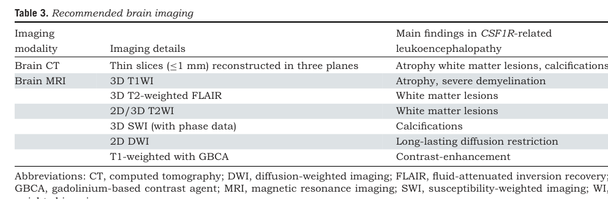

## Question

# Disease Characteristics Research Template

## Target Disease
- **Disease Name:** Hereditary Diffuse Leukoencephalopathy with Spheroids
- **MONDO ID:**  (if available)
- **Category:** Mendelian

## Research Objectives

Please provide a comprehensive research report on **Hereditary Diffuse Leukoencephalopathy with Spheroids** covering all of the
disease characteristics listed below. This report will be used to populate a disease knowledge
base entry. Be thorough and cite primary literature (PMID preferred) for all claims.

For each section, **suggested databases/resources** are listed. These are the first places
you should search for information on each topic.

---

### 1. Disease Information
> **Search first:** OMIM, Orphanet, ICD-10/ICD-11, MeSH, PubMed

- What is the disease? Provide a concise overview.
- What are the key identifiers? (OMIM, Orphanet, ICD-10/ICD-11, MeSH, Mondo)
- What are the common synonyms and alternative names?
- Is the information derived from individual patients (e.g., EHR) or aggregated disease-level resources?

### 2. Etiology

- **Disease Causal Factors**: What are the primary causes? (genetic, environmental, infectious, mechanistic)
- **Risk Factors**:
  > **Search first:** PubMed, Cochrane Library, UpToDate, clinical guidelines, ClinVar, ClinGen, GWAS Catalog, PheGenI, CTD, CDC, WHO, epidemiological databases
  - Genetic risk factors (causal variants, susceptibility loci, modifier genes)
  - Environmental risk factors (toxins, lifestyle, occupational exposures, age, sex, family history)
- **Protective Factors**:
  > **Search first:** PubMed, Cochrane Library, clinical trial databases, GWAS Catalog, gnomAD, WHO, CDC, nutrition databases
  - Genetic protective factors (protective variants, modifier alleles)
  - Environmental protective factors (diet, lifestyle, exposures that reduce risk)
- **Gene-Environment Interactions**: How do genetic and environmental factors interact to influence disease?
  > **Search first:** CTD, PubMed, PheGenI, GxE databases

### 3. Phenotypes
> **Search first:** HPO (Human Phenotype Ontology), OMIM, Orphanet, PubMed, clinicaltrials.gov, MedDRA, SNOMED CT, DECIPHER, LOINC

For each phenotype, provide:
- **Phenotype type**: symptoms, clinical signs, physical manifestations, behavioral changes, or laboratory abnormalities
  > For symptoms/signs: HPO, OMIM, Orphanet, PubMed
  > For behavioral changes: HPO, DSM, RDoC (Research Domain Criteria), PubMed
  > For laboratory abnormalities: LOINC, SNOMED CT, LabTests Online, PubMed
- **Phenotype characteristics**:
  > **Search first:** OMIM, Orphanet, HPO, PubMed
  - Age of symptom onset (neonatal, childhood, adult-onset, late-onset)
  - Symptom severity (mild, moderate, severe, variable)
  - Symptom progression (stable, progressive, episodic, fluctuating)
  - Frequency among affected individuals (percentage or qualitative)
- **Quality of life impact**: Effects on daily functioning and well-being (per-phenotype when possible)
  > **Search first:** EQ-5D database, SF-36, WHO QOL databases, PubMed
- Suggest HPO (Human Phenotype Ontology) terms for each phenotype

### 4. Genetic/Molecular Information

- **Causal Genes**: Gene mutations or chromosomal abnormalities responsible for disease (gene symbols, OMIM IDs)
  > **Search first:** OMIM, ClinVar, HGMD, Ensembl, NCBI Gene
- **Pathogenic Variants**:
  - Affected genes (gene symbols, HGNC IDs)
    > **Search first:** OMIM, NCBI Gene, Ensembl, HGNC, UniProt, GeneCards
  - Variant classification (pathogenic, likely pathogenic, VUS per ACMG/AMP guidelines)
    > **Search first:** ClinVar, ClinGen, ACMG/AMP guidelines, VarSome
  - Variant type/class (missense, frameshift, nonsense, splice-site, structural)
  - Allele frequency in population databases
    > **Search first:** gnomAD, 1000 Genomes, ExAC, TOPMed, dbSNP
  - Somatic vs germline origin
    > **Search first:** COSMIC (somatic), ClinVar, ICGC, TCGA
  - Functional consequences (loss of function, gain of function, dominant negative)
- **Modifier Genes**: Genes that modify disease severity or expression
- **Epigenetic Information**: DNA methylation, histone modifications, chromatin changes affecting disease
  > **Search first:** ENCODE, Roadmap Epigenomics, MethBase, DiseaseMeth
- **Chromosomal Abnormalities**: Large-scale genetic changes (aneuploidy, translocations, inversions)
  > **Search first:** DECIPHER, ClinVar, ECARUCA, UCSC Genome Browser

### 5. Environmental Information

- **Environmental Factors**: Non-genetic contributing factors (toxins, radiation, pollution, occupational exposure)
  > **Search first:** CTD (Comparative Toxicogenomics Database), TOXNET, PubMed, EPA databases
- **Lifestyle Factors**: Behavioral factors (smoking, diet, exercise, alcohol consumption)
  > **Search first:** CDC databases, WHO, PubMed, NHANES
- **Infectious Agents**: If applicable, pathogens causing or triggering disease (bacteria, viruses, fungi, parasites)
  > **Search first:** NCBI Taxonomy, ViPR, BV-BRC, MicrobeDB, GIDEON

### 6. Mechanism / Pathophysiology

- **Molecular Pathways**: Specific signaling cascades or biochemical pathways involved (Wnt, MAPK, mTOR, PI3K-AKT, etc.)
  > **Search first:** KEGG, Reactome, WikiPathways, PathBank, BioCyc
- **Cellular Processes**: Cell-level mechanisms (apoptosis, autophagy, cell cycle dysregulation, inflammation, etc.)
  > **Search first:** Gene Ontology (GO), Reactome, KEGG, PubMed
- **Protein Dysfunction**: How protein structure or function is altered (misfolding, aggregation, loss of function, gain of function)
  > **Search first:** UniProt, PDB (Protein Data Bank), InterPro, Pfam, AlphaFold
- **Metabolic Changes**: Alterations in metabolic processes (energy metabolism, lipid metabolism, amino acid metabolism)
  > **Search first:** KEGG, BioCyc, HMDB (Human Metabolome Database), BRENDA
- **Immune System Involvement**: Role of immune response (autoimmunity, immunodeficiency, chronic inflammation)
  > **Search first:** ImmPort, Immunome Database, IEDB, Gene Ontology
- **Tissue Damage Mechanisms**: How tissues/ are injured (oxidative stress, ischemia, fibrosis, necrosis)
  > **Search first:** PubMed, Gene Ontology, Reactome
- **Biochemical Abnormalities**: Specific molecular defects (enzyme deficiencies, receptor dysfunction, ion channel defects)
  > **Search first:** BRENDA, UniProt, KEGG, OMIM, PubMed
- **Epigenetic Changes**: DNA methylation, histone modifications affecting gene expression in disease
  > **Search first:** ENCODE, Roadmap Epigenomics, MethBase, DiseaseMeth
- **Molecular Profiling** (if available):
  - Transcriptomics/gene expression changes
    > **Search first:** GEO (Gene Expression Omnibus), ArrayExpress, GTEx, Human Cell Atlas, SRA
  - Proteomics findings
    > **Search first:** PRIDE, ProteomeXchange, Human Protein Atlas, STRING, BioGRID
  - Metabolomics signatures
    > **Search first:** MetaboLights, Metabolomics Workbench, HMDB, METLIN
  - Lipidomics alterations
    > **Search first:** LIPID MAPS, SwissLipids, LipidHome, Metabolomics Workbench
  - Genomic structural features
    > **Search first:** UCSC Genome Browser, Ensembl, NCBI, dbVar, DGV
- **Advanced Technologies** (if applicable):
  - Single-cell analysis findings (cell-type specific mechanisms, cellular heterogeneity)
    > **Search first:** Human Cell Atlas, Single Cell Portal, GEO, CELLxGENE
  - Spatial transcriptomics findings
    > **Search first:** GEO, Spatial Research, Vizgen, 10x Genomics data
  - Multi-omics integration results
    > **Search first:** TCGA, ICGC, cBioPortal, LinkedOmics, PubMed
  - Functional genomics screens (CRISPR, RNAi)
    > **Search first:** DepMap, GenomeRNAi, PubMed, BioGRID ORCS

For each mechanism, describe:
- The causal chain from initial trigger to clinical manifestation
- Which mechanisms are upstream vs downstream
- What cell types and biological processes are involved
- Suggest GO terms for biological processes and CL terms for cell types

### 7. Anatomical Structures Affected

- **Organ Level**:
  - Primary organs directly affected
  - Secondary organ involvement (complications, secondary effects)
  - Body systems involved (cardiovascular, nervous, digestive, respiratory, endocrine, etc.)
  > **Search first:** Uberon, FMA (Foundational Model of Anatomy), OMIM, HPO, ICD-11, MeSH, SNOMED CT
- **Tissue and Cell Level**:
  - Specific tissue types affected (epithelial, connective, muscle, nervous)
  - Specific cell populations targeted (with Cell Ontology terms)
  > **Search first:** Uberon, Human Protein Atlas, Cell Ontology, Human Cell Atlas, CellMarker, PanglaoDB
- **Subcellular Level**:
  - Cellular compartments involved (mitochondria, nucleus, ER, lysosomes) (with GO Cellular Component terms)
  > **Search first:** Gene Ontology (Cellular Component), UniProt, Human Protein Atlas
- **Localization**:
  - Specific anatomical sites (with UBERON terms)
    > **Search first:** FMA, Uberon, NeuroNames (for brain), SNOMED CT
  - Lateralization (unilateral, bilateral, asymmetric)
    > **Search first:** HPO, clinical literature, imaging databases

### 8. Temporal Development

- **Onset**:
  - Typical age of onset (congenital, pediatric, adult, geriatric)
  - Onset pattern (acute, subacute, chronic, insidious)
  > **Search first:** OMIM, Orphanet, HPO, PubMed
- **Progression**:
  - Disease stages (early, intermediate, advanced, end-stage)
    > **Search first:** Cancer Staging Manual (AJCC), WHO classifications, PubMed
  - Progression rate (rapid, slow, variable)
  - Disease course pattern (episodic, relapsing-remitting, progressive, stable)
  - Disease duration (self-limited, chronic lifelong)
  > **Search first:** Disease registries, longitudinal cohort databases, natural history studies, PubMed, Orphanet, OMIM
- **Patterns**:
  - Remission patterns (spontaneous, treatment-induced)
    > **Search first:** Clinical trial databases, disease registries, PubMed
  - Critical periods (time windows of vulnerability or opportunity for intervention)
    > **Search first:** PubMed, developmental biology databases, clinical guidelines

### 9. Inheritance and Population

- **Epidemiology**:
  - Prevalence (cases per 100,000 at given time)
  - Incidence (new cases per 100,000 per year)
  > **Search first:** Orphanet, CDC, WHO, GBD (Global Burden of Disease), national registries, SEER, disease registries
- **For Genetic Etiology**:
  - Inheritance pattern (AD, AR, X-linked, mitochondrial, multifactorial, polygenic)
    > **Search first:** OMIM, Orphanet, ClinVar, GTR (Genetic Testing Registry)
  - Penetrance (complete, incomplete, age-dependent)
    > **Search first:** ClinVar, OMIM, PubMed, ClinGen
  - Expressivity (variable, consistent)
    > **Search first:** OMIM, ClinVar, PubMed
  - Genetic anticipation (increasing severity in successive generations)
    > **Search first:** OMIM, PubMed (especially for repeat expansion disorders)
  - Germline mosaicism
    > **Search first:** ClinVar, OMIM, genetic counseling literature, PubMed
  - Founder effects (population-specific mutations)
    > **Search first:** gnomAD, population genetics databases, PubMed
  - Consanguinity role
    > **Search first:** OMIM, population studies, genetic counseling resources
  - Carrier frequency
    > **Search first:** gnomAD, carrier screening databases, GeneReviews, GTR
- **Population Demographics**:
  - Affected populations (ethnic or demographic groups with higher prevalence)
    > **Search first:** gnomAD, 1000 Genomes, PAGE Study, PubMed, population registries
  - Geographic distribution (endemic areas, regional variation)
    > **Search first:** WHO, CDC, GBD, Orphanet, geographic epidemiology databases
  - Geographic distribution of specific variants
  - Sex ratio (male:female)
    > **Search first:** Disease registries, OMIM, PubMed, epidemiological databases
  - Age distribution of affected individuals
    > **Search first:** CDC, disease registries, SEER, Orphanet

### 10. Diagnostics

- **Clinical Tests**:
  - Laboratory tests (blood, urine, tissue chemistry, specific enzyme assays)
    > **Search first:** LOINC, LabTests Online, PubMed
  - Biomarkers (proteins, metabolites, genetic markers, circulating biomarkers)
    > **Search first:** FDA Biomarker List, BEST (Biomarkers, EndpointS, and other Tools), PubMed
  - Imaging studies (X-ray, CT, MRI, PET, ultrasound)
    > **Search first:** RadLex, DICOM, Radiopaedia, imaging databases
  - Functional tests (pulmonary function, cardiac stress tests)
    > **Search first:** LOINC, clinical guidelines, PubMed
  - Electrophysiology (EEG, EMG, ECG, nerve conduction studies)
    > **Search first:** LOINC, clinical neurophysiology databases, PubMed
  - Biopsy findings (histopathology, immunohistochemistry)
    > **Search first:** SNOMED CT, College of American Pathologists resources, PubMed
  - Pathology findings (microscopic examination)
    > **Search first:** SNOMED CT, Digital Pathology databases, PubMed
- **Genetic Testing**:
  > **Search first:** GTR (Genetic Testing Registry), GeneReviews, ClinGen
  - Overview of recommended genetic testing approach
  - Whole genome sequencing (WGS) utility
    > **Search first:** GTR, ClinVar, GEL (Genomics England), gnomAD
  - Whole exome sequencing (WES) utility
    > **Search first:** GTR, ClinVar, OMIM, GeneMatcher
  - Gene panels (which panels, which genes)
    > **Search first:** GTR, ClinVar, laboratory-specific databases
  - Single gene testing
    > **Search first:** GTR, ClinVar, OMIM, GeneReviews
  - Chromosomal microarray (CMA)
    > **Search first:** DECIPHER, ClinVar, dbVar, ECARUCA
  - Karyotyping
    > **Search first:** Chromosome Abnormality Database, ClinVar, cytogenetics resources
  - FISH
    > **Search first:** ClinVar, cytogenetics databases, PubMed
  - Mitochondrial DNA testing
    > **Search first:** MITOMAP, MSeqDR, ClinVar, GTR
  - Repeat expansion testing
    > **Search first:** GTR, ClinVar, repeat expansion databases, PubMed
- **Omics-Based Diagnostics** (if applicable):
  - RNA sequencing / transcriptomics
    > **Search first:** GEO, ArrayExpress, GTEx, RNA-seq databases
  - Proteomics
    > **Search first:** PRIDE, ProteomeXchange, FDA Biomarker database
  - Metabolomics
    > **Search first:** MetaboLights, Metabolomics Workbench, HMDB
  - Epigenomics
    > **Search first:** GEO, ENCODE, Roadmap Epigenomics, MethBase
  - Liquid biopsy
    > **Search first:** COSMIC, ClinVar, liquid biopsy databases, PubMed
- **Clinical Criteria**:
  - Standardized diagnostic criteria (DSM, ICD, society guidelines)
    > **Search first:** DSM-5, ICD-11, clinical society guidelines, UpToDate
  - Differential diagnosis (other conditions to rule out, with distinguishing features)
    > **Search first:** DynaMed, UpToDate, clinical decision support systems
- **Screening**:
  - Screening methods for asymptomatic individuals (newborn screening, carrier screening, cascade screening)
    > **Search first:** ACMG recommendations, CDC newborn screening, GTR

### 11. Outcome/Prognosis

- **Survival and Mortality**:
  - Survival rate (5-year, 10-year, overall)
    > **Search first:** SEER, cancer registries, disease-specific registries, PubMed
  - Life expectancy (with and without treatment if applicable)
    > **Search first:** Orphanet, disease registries, actuarial databases, PubMed
  - Mortality rate
    > **Search first:** CDC, WHO, GBD, national mortality databases
  - Disease-specific mortality (deaths directly attributable to disease)
    > **Search first:** Disease registries, CDC Wonder, GBD, PubMed
- **Morbidity and Function**:
  - Morbidity (disease-related disability and health impacts)
    > **Search first:** GBD, WHO, disability databases, PubMed
  - Disability outcomes (long-term functional impairments)
    > **Search first:** ICF (International Classification of Functioning), disability registries
  - Quality of life measures (EQ-5D, SF-36, PROMIS, disease-specific tools)
    > **Search first:** EQ-5D database, SF-36, PROMIS, PubMed
- **Disease Course**:
  - Complications (secondary problems: infections, organ failure, etc.)
    > **Search first:** ICD codes, disease registries, clinical databases, PubMed
  - Recovery potential (likelihood and extent of recovery, with vs without treatment)
    > **Search first:** Natural history studies, rehabilitation databases, PubMed
- **Prediction**:
  - Prognostic factors (age, disease severity, biomarkers, treatment response)
    > **Search first:** Prognostic models databases, clinical calculators, PubMed
  - Prognostic biomarkers (molecular markers predicting disease course)
    > **Search first:** FDA Biomarker database, PubMed, cancer prognostic databases

### 12. Treatment

- **Pharmacotherapy**:
  - Pharmacological treatments (drug names, drug classes, mechanisms of action)
    > **Search first:** DrugBank, RxNorm, ATC classification, DailyMed, FDA databases
  - Pharmacogenomics (how genetic variants affect drug metabolism, efficacy, toxicity)
    > **Search first:** PharmGKB, CPIC (Clinical Pharmacogenetics), FDA Table of PGx Biomarkers
- **Advanced Therapeutics**:
  - Gene therapy (viral vectors, CRISPR, gene replacement, gene editing)
    > **Search first:** ClinicalTrials.gov, FDA gene therapy database, ASGCT resources
  - Cell therapy (stem cell transplant, CAR-T, cellular therapeutics)
    > **Search first:** ClinicalTrials.gov, FDA cell therapy database, FACT standards
  - RNA-based therapies (ASOs, siRNA, mRNA therapies)
    > **Search first:** ClinicalTrials.gov, FDA approvals, PubMed
  - Targeted therapies (treatments directed at specific molecular targets)
    > **Search first:** My Cancer Genome, OncoKB, ClinicalTrials.gov, FDA approvals
  - Immunotherapies (checkpoint inhibitors, monoclonal antibodies)
    > **Search first:** Cancer Immunotherapy Database, FDA approvals, ClinicalTrials.gov
- **Surgical and Interventional**:
  - Surgical interventions (types of surgery, timing, outcomes)
    > **Search first:** CPT codes, surgical registries, clinical guidelines, PubMed
- **Supportive and Rehabilitative**:
  - Supportive care (symptom management, pain control, nutrition)
    > **Search first:** Clinical guidelines, Cochrane Library, PubMed
  - Rehabilitation (physical therapy, occupational therapy, speech therapy)
    > **Search first:** Rehabilitation medicine databases, clinical guidelines, PubMed
- **Experimental**:
  - Experimental treatments in clinical trials (with NCT identifiers if available)
    > **Search first:** ClinicalTrials.gov, EU Clinical Trials Register, WHO ICTRP
- **Treatment Outcomes**:
  - Treatment response rates
    > **Search first:** Clinical trial databases, FDA reviews, systematic reviews, PubMed
  - Side effects and adverse events
    > **Search first:** FDA Adverse Event Reporting System (FAERS), MedWatch, PubMed
- **Treatment Strategy**:
  - Treatment algorithms (clinical pathways, decision trees)
    > **Search first:** Clinical practice guidelines, NCCN Guidelines, UpToDate
  - Combination therapies
    > **Search first:** ClinicalTrials.gov, treatment guidelines, PubMed
  - Personalized medicine approaches (genotype-guided treatment)
    > **Search first:** My Cancer Genome, CIViC, PharmGKB, precision medicine databases

For each treatment, suggest MAXO (Medical Action Ontology) terms where applicable.

### 13. Prevention

- **Prevention Levels**:
  - Primary prevention (preventing disease occurrence: vaccination, risk factor modification)
    > **Search first:** CDC, WHO, USPSTF recommendations, Cochrane Library
  - Secondary prevention (early detection and treatment: screening programs, early intervention)
    > **Search first:** USPSTF, CDC screening guidelines, WHO
  - Tertiary prevention (preventing complications in those with disease)
    > **Search first:** Clinical guidelines, disease management protocols, PubMed
- **Immunization**: Vaccine strategies (if applicable)
  > **Search first:** CDC vaccine schedules, WHO immunization, FDA vaccine database
- **Screening and Early Detection**:
  - Screening programs (population-based: newborn screening, cancer screening)
    > **Search first:** CDC screening programs, USPSTF, cancer screening databases
  - Genetic screening (carrier screening, preimplantation genetic diagnosis, prenatal testing)
    > **Search first:** ACMG recommendations, ACOG guidelines, GTR
  - Risk stratification (identifying high-risk individuals for targeted prevention)
    > **Search first:** Risk prediction models, clinical calculators, PubMed
- **Behavioral Interventions**: Lifestyle modifications to reduce risk
  > **Search first:** CDC, WHO, behavioral intervention databases, Cochrane Library
- **Counseling**: Genetic counseling (risk assessment, family planning guidance)
  > **Search first:** NSGC resources, ACMG guidelines, GeneReviews
- **Public Health**:
  - Public health interventions (sanitation, vector control, health education)
    > **Search first:** CDC, WHO, public health databases, PubMed
  - Environmental interventions (reducing environmental risk factors)
    > **Search first:** EPA databases, WHO environmental health, PubMed
- **Prophylaxis**: Preventive medications or procedures
  > **Search first:** Clinical guidelines, FDA approvals, PubMed

### 14. Other Species / Natural Disease

- **Taxonomy**: Species affected (with NCBI Taxon identifiers)
  > **Search first:** NCBI Taxonomy
- **Breed**: Specific breeds affected (with VBO identifiers if applicable)
  > **Search first:** VBO (Vertebrate Breed Ontology)
- **Gene**: Orthologous genes in other species (with NCBI Gene IDs)
  > **Search first:** NCBI Gene
- **Natural Disease**:
  - Naturally occurring disease in other species (companion animals, wildlife)
    > **Search first:** OMIA (Online Mendelian Inheritance in Animals), VetCompass, PubMed
  - Veterinary relevance and importance in animal health
    > **Search first:** OMIA, veterinary databases, PubMed
- **Comparative Biology**:
  - Comparative pathology (similarities and differences across species)
    > **Search first:** OMIA, comparative pathology databases, PubMed
  - Evolutionary conservation of disease mechanisms
    > **Search first:** HomoloGene, OrthoMCL, Alliance of Genome Resources
- **Transmission** (if applicable):
  - Zoonotic potential
    > **Search first:** CDC zoonotic diseases, WHO zoonoses, GIDEON
  - Cross-species susceptibility
    > **Search first:** NCBI Taxonomy, veterinary databases, PubMed

### 15. Model Organisms

- **Model Types**:
  - Model organism type (mammalian, invertebrate, cellular, in vitro)
    > **Search first:** Alliance of Genome Resources, model organism databases
  - Specific model systems (mouse, rat, zebrafish, Drosophila, C. elegans, yeast, cell lines, organoids, iPSCs)
    > **Search first:** MGI, RGD, ZFIN, FlyBase, WormBase, SGD, ATCC, Cellosaurus
  - Induced models (drug treatment, surgical intervention, environmental manipulation)
    > **Search first:** MGI, model organism databases, PubMed
- **Genetic Models**:
  - Types available (knockout, knock-in, transgenic, conditional, humanized)
    > **Search first:** MGI, IMPC, KOMP, EuMMCR, IMSR
- **Model Characteristics**:
  - Phenotype recapitulation (how well model reproduces human disease features)
    > **Search first:** Model organism databases, comparative studies, PubMed
  - Model limitations (aspects of human disease not captured)
    > **Search first:** Model organism databases, PubMed, review articles
- **Applications**:
  - Research applications (what aspects of disease can be studied)
    > **Search first:** Model organism databases, PubMed
- **Resources**:
  - Model databases
    > **Search first:** MGI, RGD, ZFIN, FlyBase, WormBase, IMSR, EMMA, MMRRC

---

## Citation Requirements

- Cite primary literature (PMID preferred) for all mechanistic and clinical claims
- Prioritize recent reviews and landmark papers
- Include direct quotes from abstracts where possible to support key statements
- Distinguish evidence source types: human clinical, model organism, in vitro, computational

## Output Format

Structure your response as a comprehensive narrative organized by the sections above.
For each section, provide:
- Factual content with specific details (numbers, percentages, gene names, variant nomenclature)
- Ontology term suggestions (HPO, GO, CL, UBERON, CHEBI, MAXO, MONDO) where applicable
- Evidence citations with PMIDs
- Direct quotes from abstracts to support key claims
- Clear indication when information is not available or not applicable for this disease

This report will be used to populate a disease knowledge base entry with:
- Pathophysiology descriptions with causal chains
- Gene/protein annotations (HGNC, GO terms)
- Phenotype associations (HP terms) with frequencies
- Cell type involvement (CL terms)
- Anatomical locations (UBERON terms)
- Chemical entities (CHEBI terms)
- Treatment annotations (MAXO terms)
- Evidence items with PMIDs and exact abstract quotes
- Epidemiology, prognosis, diagnostic, and prevention information
- Animal model descriptions with phenotype recapitulation details

## Output

Question: You are an expert researcher providing comprehensive, well-cited information.

Provide detailed information focusing on:
1. Key concepts and definitions with current understanding
2. Recent developments and latest research (prioritize 2023-2024 sources)
3. Current applications and real-world implementations
4. Expert opinions and analysis from authoritative sources
5. Relevant statistics and data from recent studies

Format as a comprehensive research report with proper citations. Include URLs and publication dates where available.
Always prioritize recent, authoritative sources and provide specific citations for all major claims.

# Disease Characteristics Research Template

## Target Disease
- **Disease Name:** Hereditary Diffuse Leukoencephalopathy with Spheroids
- **MONDO ID:**  (if available)
- **Category:** Mendelian

## Research Objectives

Please provide a comprehensive research report on **Hereditary Diffuse Leukoencephalopathy with Spheroids** covering all of the
disease characteristics listed below. This report will be used to populate a disease knowledge
base entry. Be thorough and cite primary literature (PMID preferred) for all claims.

For each section, **suggested databases/resources** are listed. These are the first places
you should search for information on each topic.

---

### 1. Disease Information
> **Search first:** OMIM, Orphanet, ICD-10/ICD-11, MeSH, PubMed

- What is the disease? Provide a concise overview.
- What are the key identifiers? (OMIM, Orphanet, ICD-10/ICD-11, MeSH, Mondo)
- What are the common synonyms and alternative names?
- Is the information derived from individual patients (e.g., EHR) or aggregated disease-level resources?

### 2. Etiology

- **Disease Causal Factors**: What are the primary causes? (genetic, environmental, infectious, mechanistic)
- **Risk Factors**:
  > **Search first:** PubMed, Cochrane Library, UpToDate, clinical guidelines, ClinVar, ClinGen, GWAS Catalog, PheGenI, CTD, CDC, WHO, epidemiological databases
  - Genetic risk factors (causal variants, susceptibility loci, modifier genes)
  - Environmental risk factors (toxins, lifestyle, occupational exposures, age, sex, family history)
- **Protective Factors**:
  > **Search first:** PubMed, Cochrane Library, clinical trial databases, GWAS Catalog, gnomAD, WHO, CDC, nutrition databases
  - Genetic protective factors (protective variants, modifier alleles)
  - Environmental protective factors (diet, lifestyle, exposures that reduce risk)
- **Gene-Environment Interactions**: How do genetic and environmental factors interact to influence disease?
  > **Search first:** CTD, PubMed, PheGenI, GxE databases

### 3. Phenotypes
> **Search first:** HPO (Human Phenotype Ontology), OMIM, Orphanet, PubMed, clinicaltrials.gov, MedDRA, SNOMED CT, DECIPHER, LOINC

For each phenotype, provide:
- **Phenotype type**: symptoms, clinical signs, physical manifestations, behavioral changes, or laboratory abnormalities
  > For symptoms/signs: HPO, OMIM, Orphanet, PubMed
  > For behavioral changes: HPO, DSM, RDoC (Research Domain Criteria), PubMed
  > For laboratory abnormalities: LOINC, SNOMED CT, LabTests Online, PubMed
- **Phenotype characteristics**:
  > **Search first:** OMIM, Orphanet, HPO, PubMed
  - Age of symptom onset (neonatal, childhood, adult-onset, late-onset)
  - Symptom severity (mild, moderate, severe, variable)
  - Symptom progression (stable, progressive, episodic, fluctuating)
  - Frequency among affected individuals (percentage or qualitative)
- **Quality of life impact**: Effects on daily functioning and well-being (per-phenotype when possible)
  > **Search first:** EQ-5D database, SF-36, WHO QOL databases, PubMed
- Suggest HPO (Human Phenotype Ontology) terms for each phenotype

### 4. Genetic/Molecular Information

- **Causal Genes**: Gene mutations or chromosomal abnormalities responsible for disease (gene symbols, OMIM IDs)
  > **Search first:** OMIM, ClinVar, HGMD, Ensembl, NCBI Gene
- **Pathogenic Variants**:
  - Affected genes (gene symbols, HGNC IDs)
    > **Search first:** OMIM, NCBI Gene, Ensembl, HGNC, UniProt, GeneCards
  - Variant classification (pathogenic, likely pathogenic, VUS per ACMG/AMP guidelines)
    > **Search first:** ClinVar, ClinGen, ACMG/AMP guidelines, VarSome
  - Variant type/class (missense, frameshift, nonsense, splice-site, structural)
  - Allele frequency in population databases
    > **Search first:** gnomAD, 1000 Genomes, ExAC, TOPMed, dbSNP
  - Somatic vs germline origin
    > **Search first:** COSMIC (somatic), ClinVar, ICGC, TCGA
  - Functional consequences (loss of function, gain of function, dominant negative)
- **Modifier Genes**: Genes that modify disease severity or expression
- **Epigenetic Information**: DNA methylation, histone modifications, chromatin changes affecting disease
  > **Search first:** ENCODE, Roadmap Epigenomics, MethBase, DiseaseMeth
- **Chromosomal Abnormalities**: Large-scale genetic changes (aneuploidy, translocations, inversions)
  > **Search first:** DECIPHER, ClinVar, ECARUCA, UCSC Genome Browser

### 5. Environmental Information

- **Environmental Factors**: Non-genetic contributing factors (toxins, radiation, pollution, occupational exposure)
  > **Search first:** CTD (Comparative Toxicogenomics Database), TOXNET, PubMed, EPA databases
- **Lifestyle Factors**: Behavioral factors (smoking, diet, exercise, alcohol consumption)
  > **Search first:** CDC databases, WHO, PubMed, NHANES
- **Infectious Agents**: If applicable, pathogens causing or triggering disease (bacteria, viruses, fungi, parasites)
  > **Search first:** NCBI Taxonomy, ViPR, BV-BRC, MicrobeDB, GIDEON

### 6. Mechanism / Pathophysiology

- **Molecular Pathways**: Specific signaling cascades or biochemical pathways involved (Wnt, MAPK, mTOR, PI3K-AKT, etc.)
  > **Search first:** KEGG, Reactome, WikiPathways, PathBank, BioCyc
- **Cellular Processes**: Cell-level mechanisms (apoptosis, autophagy, cell cycle dysregulation, inflammation, etc.)
  > **Search first:** Gene Ontology (GO), Reactome, KEGG, PubMed
- **Protein Dysfunction**: How protein structure or function is altered (misfolding, aggregation, loss of function, gain of function)
  > **Search first:** UniProt, PDB (Protein Data Bank), InterPro, Pfam, AlphaFold
- **Metabolic Changes**: Alterations in metabolic processes (energy metabolism, lipid metabolism, amino acid metabolism)
  > **Search first:** KEGG, BioCyc, HMDB (Human Metabolome Database), BRENDA
- **Immune System Involvement**: Role of immune response (autoimmunity, immunodeficiency, chronic inflammation)
  > **Search first:** ImmPort, Immunome Database, IEDB, Gene Ontology
- **Tissue Damage Mechanisms**: How tissues/ are injured (oxidative stress, ischemia, fibrosis, necrosis)
  > **Search first:** PubMed, Gene Ontology, Reactome
- **Biochemical Abnormalities**: Specific molecular defects (enzyme deficiencies, receptor dysfunction, ion channel defects)
  > **Search first:** BRENDA, UniProt, KEGG, OMIM, PubMed
- **Epigenetic Changes**: DNA methylation, histone modifications affecting gene expression in disease
  > **Search first:** ENCODE, Roadmap Epigenomics, MethBase, DiseaseMeth
- **Molecular Profiling** (if available):
  - Transcriptomics/gene expression changes
    > **Search first:** GEO (Gene Expression Omnibus), ArrayExpress, GTEx, Human Cell Atlas, SRA
  - Proteomics findings
    > **Search first:** PRIDE, ProteomeXchange, Human Protein Atlas, STRING, BioGRID
  - Metabolomics signatures
    > **Search first:** MetaboLights, Metabolomics Workbench, HMDB, METLIN
  - Lipidomics alterations
    > **Search first:** LIPID MAPS, SwissLipids, LipidHome, Metabolomics Workbench
  - Genomic structural features
    > **Search first:** UCSC Genome Browser, Ensembl, NCBI, dbVar, DGV
- **Advanced Technologies** (if applicable):
  - Single-cell analysis findings (cell-type specific mechanisms, cellular heterogeneity)
    > **Search first:** Human Cell Atlas, Single Cell Portal, GEO, CELLxGENE
  - Spatial transcriptomics findings
    > **Search first:** GEO, Spatial Research, Vizgen, 10x Genomics data
  - Multi-omics integration results
    > **Search first:** TCGA, ICGC, cBioPortal, LinkedOmics, PubMed
  - Functional genomics screens (CRISPR, RNAi)
    > **Search first:** DepMap, GenomeRNAi, PubMed, BioGRID ORCS

For each mechanism, describe:
- The causal chain from initial trigger to clinical manifestation
- Which mechanisms are upstream vs downstream
- What cell types and biological processes are involved
- Suggest GO terms for biological processes and CL terms for cell types

### 7. Anatomical Structures Affected

- **Organ Level**:
  - Primary organs directly affected
  - Secondary organ involvement (complications, secondary effects)
  - Body systems involved (cardiovascular, nervous, digestive, respiratory, endocrine, etc.)
  > **Search first:** Uberon, FMA (Foundational Model of Anatomy), OMIM, HPO, ICD-11, MeSH, SNOMED CT
- **Tissue and Cell Level**:
  - Specific tissue types affected (epithelial, connective, muscle, nervous)
  - Specific cell populations targeted (with Cell Ontology terms)
  > **Search first:** Uberon, Human Protein Atlas, Cell Ontology, Human Cell Atlas, CellMarker, PanglaoDB
- **Subcellular Level**:
  - Cellular compartments involved (mitochondria, nucleus, ER, lysosomes) (with GO Cellular Component terms)
  > **Search first:** Gene Ontology (Cellular Component), UniProt, Human Protein Atlas
- **Localization**:
  - Specific anatomical sites (with UBERON terms)
    > **Search first:** FMA, Uberon, NeuroNames (for brain), SNOMED CT
  - Lateralization (unilateral, bilateral, asymmetric)
    > **Search first:** HPO, clinical literature, imaging databases

### 8. Temporal Development

- **Onset**:
  - Typical age of onset (congenital, pediatric, adult, geriatric)
  - Onset pattern (acute, subacute, chronic, insidious)
  > **Search first:** OMIM, Orphanet, HPO, PubMed
- **Progression**:
  - Disease stages (early, intermediate, advanced, end-stage)
    > **Search first:** Cancer Staging Manual (AJCC), WHO classifications, PubMed
  - Progression rate (rapid, slow, variable)
  - Disease course pattern (episodic, relapsing-remitting, progressive, stable)
  - Disease duration (self-limited, chronic lifelong)
  > **Search first:** Disease registries, longitudinal cohort databases, natural history studies, PubMed, Orphanet, OMIM
- **Patterns**:
  - Remission patterns (spontaneous, treatment-induced)
    > **Search first:** Clinical trial databases, disease registries, PubMed
  - Critical periods (time windows of vulnerability or opportunity for intervention)
    > **Search first:** PubMed, developmental biology databases, clinical guidelines

### 9. Inheritance and Population

- **Epidemiology**:
  - Prevalence (cases per 100,000 at given time)
  - Incidence (new cases per 100,000 per year)
  > **Search first:** Orphanet, CDC, WHO, GBD (Global Burden of Disease), national registries, SEER, disease registries
- **For Genetic Etiology**:
  - Inheritance pattern (AD, AR, X-linked, mitochondrial, multifactorial, polygenic)
    > **Search first:** OMIM, Orphanet, ClinVar, GTR (Genetic Testing Registry)
  - Penetrance (complete, incomplete, age-dependent)
    > **Search first:** ClinVar, OMIM, PubMed, ClinGen
  - Expressivity (variable, consistent)
    > **Search first:** OMIM, ClinVar, PubMed
  - Genetic anticipation (increasing severity in successive generations)
    > **Search first:** OMIM, PubMed (especially for repeat expansion disorders)
  - Germline mosaicism
    > **Search first:** ClinVar, OMIM, genetic counseling literature, PubMed
  - Founder effects (population-specific mutations)
    > **Search first:** gnomAD, population genetics databases, PubMed
  - Consanguinity role
    > **Search first:** OMIM, population studies, genetic counseling resources
  - Carrier frequency
    > **Search first:** gnomAD, carrier screening databases, GeneReviews, GTR
- **Population Demographics**:
  - Affected populations (ethnic or demographic groups with higher prevalence)
    > **Search first:** gnomAD, 1000 Genomes, PAGE Study, PubMed, population registries
  - Geographic distribution (endemic areas, regional variation)
    > **Search first:** WHO, CDC, GBD, Orphanet, geographic epidemiology databases
  - Geographic distribution of specific variants
  - Sex ratio (male:female)
    > **Search first:** Disease registries, OMIM, PubMed, epidemiological databases
  - Age distribution of affected individuals
    > **Search first:** CDC, disease registries, SEER, Orphanet

### 10. Diagnostics

- **Clinical Tests**:
  - Laboratory tests (blood, urine, tissue chemistry, specific enzyme assays)
    > **Search first:** LOINC, LabTests Online, PubMed
  - Biomarkers (proteins, metabolites, genetic markers, circulating biomarkers)
    > **Search first:** FDA Biomarker List, BEST (Biomarkers, EndpointS, and other Tools), PubMed
  - Imaging studies (X-ray, CT, MRI, PET, ultrasound)
    > **Search first:** RadLex, DICOM, Radiopaedia, imaging databases
  - Functional tests (pulmonary function, cardiac stress tests)
    > **Search first:** LOINC, clinical guidelines, PubMed
  - Electrophysiology (EEG, EMG, ECG, nerve conduction studies)
    > **Search first:** LOINC, clinical neurophysiology databases, PubMed
  - Biopsy findings (histopathology, immunohistochemistry)
    > **Search first:** SNOMED CT, College of American Pathologists resources, PubMed
  - Pathology findings (microscopic examination)
    > **Search first:** SNOMED CT, Digital Pathology databases, PubMed
- **Genetic Testing**:
  > **Search first:** GTR (Genetic Testing Registry), GeneReviews, ClinGen
  - Overview of recommended genetic testing approach
  - Whole genome sequencing (WGS) utility
    > **Search first:** GTR, ClinVar, GEL (Genomics England), gnomAD
  - Whole exome sequencing (WES) utility
    > **Search first:** GTR, ClinVar, OMIM, GeneMatcher
  - Gene panels (which panels, which genes)
    > **Search first:** GTR, ClinVar, laboratory-specific databases
  - Single gene testing
    > **Search first:** GTR, ClinVar, OMIM, GeneReviews
  - Chromosomal microarray (CMA)
    > **Search first:** DECIPHER, ClinVar, dbVar, ECARUCA
  - Karyotyping
    > **Search first:** Chromosome Abnormality Database, ClinVar, cytogenetics resources
  - FISH
    > **Search first:** ClinVar, cytogenetics databases, PubMed
  - Mitochondrial DNA testing
    > **Search first:** MITOMAP, MSeqDR, ClinVar, GTR
  - Repeat expansion testing
    > **Search first:** GTR, ClinVar, repeat expansion databases, PubMed
- **Omics-Based Diagnostics** (if applicable):
  - RNA sequencing / transcriptomics
    > **Search first:** GEO, ArrayExpress, GTEx, RNA-seq databases
  - Proteomics
    > **Search first:** PRIDE, ProteomeXchange, FDA Biomarker database
  - Metabolomics
    > **Search first:** MetaboLights, Metabolomics Workbench, HMDB
  - Epigenomics
    > **Search first:** GEO, ENCODE, Roadmap Epigenomics, MethBase
  - Liquid biopsy
    > **Search first:** COSMIC, ClinVar, liquid biopsy databases, PubMed
- **Clinical Criteria**:
  - Standardized diagnostic criteria (DSM, ICD, society guidelines)
    > **Search first:** DSM-5, ICD-11, clinical society guidelines, UpToDate
  - Differential diagnosis (other conditions to rule out, with distinguishing features)
    > **Search first:** DynaMed, UpToDate, clinical decision support systems
- **Screening**:
  - Screening methods for asymptomatic individuals (newborn screening, carrier screening, cascade screening)
    > **Search first:** ACMG recommendations, CDC newborn screening, GTR

### 11. Outcome/Prognosis

- **Survival and Mortality**:
  - Survival rate (5-year, 10-year, overall)
    > **Search first:** SEER, cancer registries, disease-specific registries, PubMed
  - Life expectancy (with and without treatment if applicable)
    > **Search first:** Orphanet, disease registries, actuarial databases, PubMed
  - Mortality rate
    > **Search first:** CDC, WHO, GBD, national mortality databases
  - Disease-specific mortality (deaths directly attributable to disease)
    > **Search first:** Disease registries, CDC Wonder, GBD, PubMed
- **Morbidity and Function**:
  - Morbidity (disease-related disability and health impacts)
    > **Search first:** GBD, WHO, disability databases, PubMed
  - Disability outcomes (long-term functional impairments)
    > **Search first:** ICF (International Classification of Functioning), disability registries
  - Quality of life measures (EQ-5D, SF-36, PROMIS, disease-specific tools)
    > **Search first:** EQ-5D database, SF-36, PROMIS, PubMed
- **Disease Course**:
  - Complications (secondary problems: infections, organ failure, etc.)
    > **Search first:** ICD codes, disease registries, clinical databases, PubMed
  - Recovery potential (likelihood and extent of recovery, with vs without treatment)
    > **Search first:** Natural history studies, rehabilitation databases, PubMed
- **Prediction**:
  - Prognostic factors (age, disease severity, biomarkers, treatment response)
    > **Search first:** Prognostic models databases, clinical calculators, PubMed
  - Prognostic biomarkers (molecular markers predicting disease course)
    > **Search first:** FDA Biomarker database, PubMed, cancer prognostic databases

### 12. Treatment

- **Pharmacotherapy**:
  - Pharmacological treatments (drug names, drug classes, mechanisms of action)
    > **Search first:** DrugBank, RxNorm, ATC classification, DailyMed, FDA databases
  - Pharmacogenomics (how genetic variants affect drug metabolism, efficacy, toxicity)
    > **Search first:** PharmGKB, CPIC (Clinical Pharmacogenetics), FDA Table of PGx Biomarkers
- **Advanced Therapeutics**:
  - Gene therapy (viral vectors, CRISPR, gene replacement, gene editing)
    > **Search first:** ClinicalTrials.gov, FDA gene therapy database, ASGCT resources
  - Cell therapy (stem cell transplant, CAR-T, cellular therapeutics)
    > **Search first:** ClinicalTrials.gov, FDA cell therapy database, FACT standards
  - RNA-based therapies (ASOs, siRNA, mRNA therapies)
    > **Search first:** ClinicalTrials.gov, FDA approvals, PubMed
  - Targeted therapies (treatments directed at specific molecular targets)
    > **Search first:** My Cancer Genome, OncoKB, ClinicalTrials.gov, FDA approvals
  - Immunotherapies (checkpoint inhibitors, monoclonal antibodies)
    > **Search first:** Cancer Immunotherapy Database, FDA approvals, ClinicalTrials.gov
- **Surgical and Interventional**:
  - Surgical interventions (types of surgery, timing, outcomes)
    > **Search first:** CPT codes, surgical registries, clinical guidelines, PubMed
- **Supportive and Rehabilitative**:
  - Supportive care (symptom management, pain control, nutrition)
    > **Search first:** Clinical guidelines, Cochrane Library, PubMed
  - Rehabilitation (physical therapy, occupational therapy, speech therapy)
    > **Search first:** Rehabilitation medicine databases, clinical guidelines, PubMed
- **Experimental**:
  - Experimental treatments in clinical trials (with NCT identifiers if available)
    > **Search first:** ClinicalTrials.gov, EU Clinical Trials Register, WHO ICTRP
- **Treatment Outcomes**:
  - Treatment response rates
    > **Search first:** Clinical trial databases, FDA reviews, systematic reviews, PubMed
  - Side effects and adverse events
    > **Search first:** FDA Adverse Event Reporting System (FAERS), MedWatch, PubMed
- **Treatment Strategy**:
  - Treatment algorithms (clinical pathways, decision trees)
    > **Search first:** Clinical practice guidelines, NCCN Guidelines, UpToDate
  - Combination therapies
    > **Search first:** ClinicalTrials.gov, treatment guidelines, PubMed
  - Personalized medicine approaches (genotype-guided treatment)
    > **Search first:** My Cancer Genome, CIViC, PharmGKB, precision medicine databases

For each treatment, suggest MAXO (Medical Action Ontology) terms where applicable.

### 13. Prevention

- **Prevention Levels**:
  - Primary prevention (preventing disease occurrence: vaccination, risk factor modification)
    > **Search first:** CDC, WHO, USPSTF recommendations, Cochrane Library
  - Secondary prevention (early detection and treatment: screening programs, early intervention)
    > **Search first:** USPSTF, CDC screening guidelines, WHO
  - Tertiary prevention (preventing complications in those with disease)
    > **Search first:** Clinical guidelines, disease management protocols, PubMed
- **Immunization**: Vaccine strategies (if applicable)
  > **Search first:** CDC vaccine schedules, WHO immunization, FDA vaccine database
- **Screening and Early Detection**:
  - Screening programs (population-based: newborn screening, cancer screening)
    > **Search first:** CDC screening programs, USPSTF, cancer screening databases
  - Genetic screening (carrier screening, preimplantation genetic diagnosis, prenatal testing)
    > **Search first:** ACMG recommendations, ACOG guidelines, GTR
  - Risk stratification (identifying high-risk individuals for targeted prevention)
    > **Search first:** Risk prediction models, clinical calculators, PubMed
- **Behavioral Interventions**: Lifestyle modifications to reduce risk
  > **Search first:** CDC, WHO, behavioral intervention databases, Cochrane Library
- **Counseling**: Genetic counseling (risk assessment, family planning guidance)
  > **Search first:** NSGC resources, ACMG guidelines, GeneReviews
- **Public Health**:
  - Public health interventions (sanitation, vector control, health education)
    > **Search first:** CDC, WHO, public health databases, PubMed
  - Environmental interventions (reducing environmental risk factors)
    > **Search first:** EPA databases, WHO environmental health, PubMed
- **Prophylaxis**: Preventive medications or procedures
  > **Search first:** Clinical guidelines, FDA approvals, PubMed

### 14. Other Species / Natural Disease

- **Taxonomy**: Species affected (with NCBI Taxon identifiers)
  > **Search first:** NCBI Taxonomy
- **Breed**: Specific breeds affected (with VBO identifiers if applicable)
  > **Search first:** VBO (Vertebrate Breed Ontology)
- **Gene**: Orthologous genes in other species (with NCBI Gene IDs)
  > **Search first:** NCBI Gene
- **Natural Disease**:
  - Naturally occurring disease in other species (companion animals, wildlife)
    > **Search first:** OMIA (Online Mendelian Inheritance in Animals), VetCompass, PubMed
  - Veterinary relevance and importance in animal health
    > **Search first:** OMIA, veterinary databases, PubMed
- **Comparative Biology**:
  - Comparative pathology (similarities and differences across species)
    > **Search first:** OMIA, comparative pathology databases, PubMed
  - Evolutionary conservation of disease mechanisms
    > **Search first:** HomoloGene, OrthoMCL, Alliance of Genome Resources
- **Transmission** (if applicable):
  - Zoonotic potential
    > **Search first:** CDC zoonotic diseases, WHO zoonoses, GIDEON
  - Cross-species susceptibility
    > **Search first:** NCBI Taxonomy, veterinary databases, PubMed

### 15. Model Organisms

- **Model Types**:
  - Model organism type (mammalian, invertebrate, cellular, in vitro)
    > **Search first:** Alliance of Genome Resources, model organism databases
  - Specific model systems (mouse, rat, zebrafish, Drosophila, C. elegans, yeast, cell lines, organoids, iPSCs)
    > **Search first:** MGI, RGD, ZFIN, FlyBase, WormBase, SGD, ATCC, Cellosaurus
  - Induced models (drug treatment, surgical intervention, environmental manipulation)
    > **Search first:** MGI, model organism databases, PubMed
- **Genetic Models**:
  - Types available (knockout, knock-in, transgenic, conditional, humanized)
    > **Search first:** MGI, IMPC, KOMP, EuMMCR, IMSR
- **Model Characteristics**:
  - Phenotype recapitulation (how well model reproduces human disease features)
    > **Search first:** Model organism databases, comparative studies, PubMed
  - Model limitations (aspects of human disease not captured)
    > **Search first:** Model organism databases, PubMed, review articles
- **Applications**:
  - Research applications (what aspects of disease can be studied)
    > **Search first:** Model organism databases, PubMed
- **Resources**:
  - Model databases
    > **Search first:** MGI, RGD, ZFIN, FlyBase, WormBase, IMSR, EMMA, MMRRC

---

## Citation Requirements

- Cite primary literature (PMID preferred) for all mechanistic and clinical claims
- Prioritize recent reviews and landmark papers
- Include direct quotes from abstracts where possible to support key statements
- Distinguish evidence source types: human clinical, model organism, in vitro, computational

## Output Format

Structure your response as a comprehensive narrative organized by the sections above.
For each section, provide:
- Factual content with specific details (numbers, percentages, gene names, variant nomenclature)
- Ontology term suggestions (HPO, GO, CL, UBERON, CHEBI, MAXO, MONDO) where applicable
- Evidence citations with PMIDs
- Direct quotes from abstracts to support key claims
- Clear indication when information is not available or not applicable for this disease

This report will be used to populate a disease knowledge base entry with:
- Pathophysiology descriptions with causal chains
- Gene/protein annotations (HGNC, GO terms)
- Phenotype associations (HP terms) with frequencies
- Cell type involvement (CL terms)
- Anatomical locations (UBERON terms)
- Chemical entities (CHEBI terms)
- Treatment annotations (MAXO terms)
- Evidence items with PMIDs and exact abstract quotes
- Epidemiology, prognosis, diagnostic, and prevention information
- Animal model descriptions with phenotype recapitulation details

## Disease Characteristics Research Report: Hereditary Diffuse Leukoencephalopathy with Spheroids (HDLS) / CSF1R-related Leukoencephalopathy / ALSP

### Executive summary
Hereditary diffuse leukoencephalopathy with spheroids (HDLS) is now generally considered part of the same clinicopathologic/genetic entity as adult-onset leukoencephalopathy with axonal spheroids and pigmented glia (ALSP) and historical “pigmentary orthochromatic leukodystrophy” (POLD), most commonly caused by autosomal-dominant pathogenic variants in **CSF1R**, a receptor tyrosine kinase essential for microglial differentiation and survival. (gelfand2020allogeneichsctfor pages 1-2, mickeviciute2022neuroimagingphenotypesof pages 2-2)
The disorder typically begins in the 40s, presents with cognitive and psychiatric/behavioral changes and progressive motor dysfunction, is frequently misdiagnosed, and progresses to severe disability and death over ~6–8 years on average. (papapetropoulos2024clinicalpresentationand pages 1-2, gelfand2020allogeneichsctfor pages 2-2)
Hematopoietic stem cell transplantation (HSCT) is the principal disease-modifying approach in real-world clinical practice, with observational evidence for stabilization in selected patients when performed early enough; emerging translational work in 2024 provides strong preclinical evidence for microglia replacement (human iPSC-derived microglia transplantation) as a future therapeutic strategy. (dulski2022hematopoieticstemcell pages 1-2, chadarevian2024therapeuticpotentialof pages 1-3)

### Summary table of key facts
| Topic | Key facts | Sources / URLs |
|---|---|---|
| Disease names / synonyms | Preferred modern umbrella terms include **adult-onset leukoencephalopathy with axonal spheroids and pigmented glia (ALSP)** and **CSF1R-related leukoencephalopathy**. Historical synonyms include **hereditary diffuse leukoencephalopathy with spheroids (HDLS)** and **pigmentary orthochromatic leukodystrophy (POLD)**; these are now considered part of the same CSF1R-related disease spectrum. (gelfand2020allogeneichsctfor pages 8-9, gelfand2020allogeneichsctfor pages 1-2, mickeviciute2022neuroimagingphenotypesof pages 2-2, kim2025clinicalspectrumof pages 7-8) | Gelfand et al., 2020, *Brain*, https://doi.org/10.1093/brain/awz390; Mickeviciute et al., 2022, *J Intern Med*, https://doi.org/10.1111/joim.13420; Papapetropoulos et al., 2024, *Front Neurol*, https://doi.org/10.3389/fneur.2024.1320663 |
| Causal gene | The principal causal gene is **CSF1R** (*colony-stimulating factor 1 receptor*). Most pathogenic variants cluster in the **tyrosine kinase domain**; one review/meta-analysis noted **96 CSF1R mutations** in ~200 families, while a 2025 Korean report cited **at least 106 CSF1R mutations** reported worldwide. (kim2025clinicalspectrumof pages 6-7, mickeviciute2022neuroimagingphenotypesof pages 2-2, kim2025clinicalspectrumof pages 2-3) | Mickeviciute et al., 2022, https://doi.org/10.1111/joim.13420; Kim et al., 2025, https://doi.org/10.1038/s41598-024-84665-w |
| Inheritance | Usually **autosomal dominant**. Disease is typically caused by **loss-of-function** CSF1R variants, although mechanistic debate remains regarding haploinsufficiency vs dominant-negative effects for some alleles. (papapetropoulos2024clinicalpresentationand pages 1-2, mickeviciute2022neuroimagingphenotypesof pages 2-2, chadarevian2024therapeuticpotentialof pages 13-15) | Papapetropoulos et al., 2024, https://doi.org/10.3389/fneur.2024.1320663; Mickeviciute et al., 2022, https://doi.org/10.1111/joim.13420; Chadarevian et al., 2024, https://doi.org/10.1016/j.neuron.2024.05.023 |
| Typical age of onset | Mean age at symptom onset in a literature cohort of **291 patients** was **43.2 ± 11.6 years**; reported range **18–78 years**. In a 2025 Korean cohort, mean onset was **47.5 years** (range **37–63**); CSF1R-mutation carriers had median onset **45.0** vs **63.0 years** in non-carriers. Women showed slightly earlier onset (**40 vs 43 years**, p=0.041) in imaging meta-analysis. (papapetropoulos2024clinicalpresentationand pages 1-2, kim2025clinicalspectrumof pages 6-7, kim2025clinicalspectrumof pages 2-3, mickeviciute2022neuroimagingphenotypesof pages 1-1) | Papapetropoulos et al., 2024, https://doi.org/10.3389/fneur.2024.1320663; Kim et al., 2025, https://doi.org/10.1038/s41598-024-84665-w; Mickeviciute et al., 2022, https://doi.org/10.1111/joim.13420 |
| Most common presenting symptoms | In the 291-case literature analysis, the most frequent **initial** symptoms were **cognitive impairment 47.1%** and **behavioral/psychiatric abnormalities 26.8%**. In the 2025 Korean cohort, overall clinical features included **cognitive impairment 90%**, **psychiatric symptoms 70%**, **pyramidal signs 50%**, **parkinsonism 50%**, and **epilepsy 20%**. (papapetropoulos2024clinicalpresentationand pages 1-2, kim2025clinicalspectrumof pages 2-3) | Papapetropoulos et al., 2024, https://doi.org/10.3389/fneur.2024.1320663; Kim et al., 2025, https://doi.org/10.1038/s41598-024-84665-w |
| Misdiagnosis | In the 291-case literature analysis, only **24.7%** were accurately diagnosed initially; **75.3%** were initially mis- or undiagnosed. Frequent initial misdiagnoses included **frontotemporal dementia 9.6%** and **multiple sclerosis 7.2%**. Mean delay between symptom onset and neuroimaging was **2.3 years** in an imaging meta-analysis. (papapetropoulos2024clinicalpresentationand pages 1-2, mickeviciute2022neuroimagingphenotypesof pages 1-1) | Papapetropoulos et al., 2024, https://doi.org/10.3389/fneur.2024.1320663; Mickeviciute et al., 2022, https://doi.org/10.1111/joim.13420 |
| Key MRI / CT findings | Hallmark neuroimaging features include **frontoparietal confluent white-matter lesions**, **corpus callosum thinning/atrophy**, and **persistent foci of restricted diffusion** on DWI/ADC. CT often shows **white-matter/parenchymal calcifications**, sometimes with a **stepping-stone** appearance along the corpus callosum. Additional findings include corticospinal tract involvement, ventricular enlargement, brain atrophy, and occasional contrast enhancement. In the Korean cohort, bilateral white-matter hyperintensities were seen in **100%**, corpus callosum thinning in **77.8%**, splenial involvement in **80%**, and DWI restriction in **62.5%** of mutation carriers. (kim2025clinicalspectrumof pages 6-7, mickeviciute2022neuroimagingphenotypesof pages 1-1, mickeviciute2022neuroimagingphenotypesof pages 9-10, mickeviciute2022neuroimagingphenotypesof pages 8-8, mickeviciute2022neuroimagingphenotypesof pages 9-9) | Mickeviciute et al., 2022, https://doi.org/10.1111/joim.13420; Kim et al., 2025, https://doi.org/10.1038/s41598-024-84665-w |
| Survival / disease duration | ALSP/HDLS is a **rapidly progressive, fatal** disease. Literature synthesis cited death occurring at a median of about **6–8 years** from symptom onset. Untreated disease is described as typically rapidly fatal in about **~7 years** in the HSCT case-report literature. A 2026 retrospective cohort reported disease duration ranging **2–15 years**. (papapetropoulos2024clinicalpresentationand pages 1-2, hayer2026naturalhistoryof pages 1-2, bergner2023casereporttreatment pages 2-4) | Papapetropoulos et al., 2024, https://doi.org/10.3389/fneur.2024.1320663; Bergner et al., 2023, https://doi.org/10.3389/fneur.2023.1163107; Hayer et al., 2026, https://doi.org/10.1007/s40120-026-00916-0 |
| Treatment approach: HSCT | **Allogeneic hematopoietic stem cell transplantation (HSCT)** is the leading disease-modifying approach used clinically, aiming to replace defective microglia with donor-derived myeloid cells. In a 15-patient retrospective HSCT study, **6/15 (40.0%)** had a “good” outcome; better outcomes were associated with **gait-predominant onset**, **younger age at HSCT**, and absence of cognitive-first presentation. In a 7-patient cohort, **6/7** trended toward stabilization, though **1** died periprocedurally. Two UCSF cases were alive at **26–28 months** post-HSCT with stabilization of several domains and MRI diffusion abnormalities resolving after 2 years. (gelfand2020allogeneichsctfor pages 1-1, dulski2022hematopoieticstemcell pages 1-2, dulski2022hematopoieticstemcell pages 2-4, dulski2022hematopoieticstemcell pages 6-7, tipton2021treatmentofcsf1r‐related pages 1-2, bergner2023casereporttreatment pages 2-4) | Gelfand et al., 2020, https://doi.org/10.1093/brain/awz390; Dulski et al., 2022, https://doi.org/10.3390/pharmaceutics14122778; Tipton et al., 2021, https://doi.org/10.1002/mds.28734; Bergner et al., 2023, https://doi.org/10.3389/fneur.2023.1163107 |
| Treatment approach: microglia transplantation (preclinical) | A major **2024 Neuron** study showed that transplantation of human iPSC-derived microglial progenitors in an ALSP mouse model **prevented** axonal spheroids, white-matter abnormalities, reactive astrocytosis, and calcifications, while **CRISPR-corrected patient-derived microglia** **reversed pre-existing** spheroids, astrogliosis, and calcification. This is **preclinical**, not yet standard clinical care, but is one of the most important recent translational advances. (chadarevian2024therapeuticpotentialof pages 1-3, chadarevian2024therapeuticpotentialof pages 5-7, chadarevian2024therapeuticpotentialof pages 11-13, chadarevian2024therapeuticpotentialof pages 7-8) | Chadarevian et al., 2024, *Neuron*, https://doi.org/10.1016/j.neuron.2024.05.023 |
| Clinical trial: NCT05677659 | **NCT05677659** — *A Study of VGL101 in Patients With ALSP*; sponsor **Vigil Neuroscience, Inc.**; **Phase 2**, open-label, single-group; **20 participants**; intervention **VGL101/iluzanebart IV every ~4 weeks for 1 year**. **Status: TERMINATED**. Termination reason: **“No beneficial effects on biomarker or clinical efficacy endpoints.”** (NCT05677659 chunk 1, NCT05677659 chunk 2) | ClinicalTrials.gov, 2022, https://clinicaltrials.gov/study/NCT05677659 |
| Clinical trial: NCT05020743 | **NCT05020743** — *Natural History Study in ALSP*; sponsor **Vigil Neuroscience, Inc.**; **observational prospective cohort**; **56 participants**; no intervention. **Status: TERMINATED**; record links termination to lack of benefit in associated VGL101 program. Primary outcome emphasized **MRI ventricular volume change** over serial follow-up. (NCT05020743 chunk 1) | ClinicalTrials.gov, 2021, https://clinicaltrials.gov/study/NCT05020743 |
| Clinical trial: NCT04503213 | **NCT04503213** — *A Study to Assess CSF1R-related Leukoencephalopathy After Stem Cell Transplantation*; sponsor **Mayo Clinic**; **observational prospective** study; estimated **20 participants**. **Status: ENROLLING BY INVITATION**. Primary outcome: stability/improvement in **cognitive and motor function** and radiographic markers over about **5 years** after HSCT. (NCT04503213 chunk 1) | ClinicalTrials.gov, 2020, https://clinicaltrials.gov/study/NCT04503213 |

*Table: This table summarizes the main clinical, genetic, imaging, prognostic, and therapeutic facts for hereditary diffuse leukoencephalopathy with spheroids / ALSP from the provided evidence. It also highlights the most relevant current clinical trials and recent preclinical therapeutic advances.*

---

## 1. Disease information

### 1.1 What is the disease?
HDLS/ALSP is a rare, adult-onset, progressive, fatal leukoencephalopathy characterized neuropathologically by axonal spheroids and pigmented glia, and genetically most often by CSF1R pathogenic variants. ALSP is described as an autosomal dominant leukoencephalopathy caused by CSF1R mutations and unifies the spectrum previously labeled HDLS and familial POLD. (gelfand2020allogeneichsctfor pages 1-2)

### 1.2 Key identifiers (OMIM, Orphanet, ICD-10/ICD-11, MeSH, MONDO)
The retrieved full-text evidence did **not** include explicit OMIM/Orphanet/ICD/MeSH/MONDO identifiers. Synonymy and preferred terminology are well supported in the primary literature and systematic reviews, but ontology IDs should be obtained directly from curated resources (OMIM/Orphanet/MONDO/MeSH/ICD) for database population. (gelfand2020allogeneichsctfor pages 1-2, mickeviciute2022neuroimagingphenotypesof pages 2-2)

### 1.3 Synonyms and alternative names
Supported synonyms and related terms include:
- Adult-onset leukoencephalopathy with axonal spheroids and pigmented glia (**ALSP**) (gelfand2020allogeneichsctfor pages 1-2)
- Hereditary diffuse leukoencephalopathy with spheroids (**HDLS**) (gelfand2020allogeneichsctfor pages 1-2)
- Pigmentary orthochromatic leukodystrophy (**POLD**) (gelfand2020allogeneichsctfor pages 1-2)
- CSF1R-related leukoencephalopathy (gene-based umbrella term) (mickeviciute2022neuroimagingphenotypesof pages 2-2)

### 1.4 Evidence source type
The clinical picture and natural history are derived largely from aggregated disease-level resources (systematic reviews of case reports/series) and retrospective cohorts; disease-modifying therapy evidence is observational (case series/cohorts), and newest mechanism-focused advances are from preclinical model systems. (papapetropoulos2024clinicalpresentationand pages 1-2, dulski2022hematopoieticstemcell pages 1-2, chadarevian2024therapeuticpotentialof pages 1-3)

---

## 2. Etiology

### 2.1 Disease causal factors
**Primary cause:** heterozygous pathogenic variants in **CSF1R** (colony-stimulating factor 1 receptor). CSF1R is a transmembrane receptor tyrosine kinase regulating proliferation/differentiation/survival of monocytes/macrophages and **microglia**. (kraya2019functionalcharacterizationof pages 1-2)
Most pathogenic variants cluster in the intracellular tyrosine kinase domain and abrogate kinase activity/autophosphorylation, impairing CSF1 responsiveness and microglial maintenance. (chadarevian2024therapeuticpotentialof pages 3-5, kraya2019functionalcharacterizationof pages 5-8)

### 2.2 Risk factors
**Genetic risk factor:** carrying a pathogenic/likely pathogenic CSF1R variant in an autosomal dominant context. (papapetropoulos2024clinicalpresentationand pages 1-2, mickeviciute2022neuroimagingphenotypesof pages 2-2)
**Environmental/lifestyle risk factors:** none were supported by the retrieved evidence; the disease is primarily a monogenic microgliopathy. 

### 2.3 Protective factors
Evidence for protective factors is limited and hypothesis-generating.
- **Pre-symptomatic immunosuppression/glucocorticoids (hypothesis + case observation):** A 2021 report described an asymptomatic CSF1R mutation carrier whose long-term immunosuppression (including prednisone) was hypothesized to be protective despite “high age-related penetrance (~95% by age 60)” cited by the authors, proposing glucocorticoids might correct maladaptive microglial phenotypes through downregulation of pro-inflammatory cytokines and modulation of CSF-2/GM-CSF signaling. This is not definitive clinical evidence. (tipton2021ispresymptomaticimmunosuppression pages 3-4, tipton2021ispresymptomaticimmunosuppression pages 1-3)

### 2.4 Gene–environment interactions
No robust gene–environment interaction evidence was identified in the retrieved sources.

---

## 3. Phenotypes

### 3.1 Core phenotype spectrum (with example HPO suggestions)
ALSP/HDLS affects cognition, behavior/psychiatric status, speech, and motor systems.

**Common presenting domains (systematic case literature):**
- Cognitive impairment as an initial symptom (47.1%). **HPO:** Cognitive impairment (HP:0100543), Dementia (HP:0000726). (papapetropoulos2024clinicalpresentationand pages 1-2)
- Behavioral/psychiatric abnormalities as initial symptoms (26.8%). **HPO:** Behavioral abnormality (HP:0000708), Abnormality of mood (HP:0000712), Apathy (HP:0000741). (papapetropoulos2024clinicalpresentationand pages 1-2)

**Cohort-level frequencies (Korean series of definite ALSP):**
- Cognitive impairment (90% overall). **HPO:** Cognitive impairment (HP:0100543). (kim2025clinicalspectrumof pages 2-3)
- Psychiatric symptoms (70%; abulia/depression/irritability). **HPO:** Depression (HP:0000716), Irritability (HP:0000737), Apathy (HP:0000741). (kim2025clinicalspectrumof pages 2-3)
- Pyramidal signs (50%). **HPO:** Spasticity (HP:0001257), Hyperreflexia (HP:0001347), Babinski sign (HP:0003487). (kim2025clinicalspectrumof pages 2-3)
- Parkinsonism/extrapyramidal signs (50%). **HPO:** Bradykinesia (HP:0002067), Parkinsonism (HP:0001300), Rigidity (HP:0002063), Tremor (HP:0001337). (kim2025clinicalspectrumof pages 2-3)
- Epilepsy (20%). **HPO:** Seizure (HP:0001250). (kim2025clinicalspectrumof pages 2-3)

**Speech/language:**
- Aphasia is common (62.5% in a retrospective cohort; 63% reported at presentation). **HPO:** Aphasia (HP:0002381). (hayer2026naturalhistoryof pages 1-2, hayer2026naturalhistoryof pages 9-12)

### 3.2 Age of onset, severity, progression
- Typical onset: mean ~43 years in a 291-case analysis (range 18–78). (papapetropoulos2024clinicalpresentationand pages 1-2)
- In a natural-history compilation of 122 cases, mean time to incapacitation was 3.9 years and mean time to death was 6.8 years. (gelfand2020allogeneichsctfor pages 2-2)
- Rapid progression is common; in a Korean cohort 90% became bedridden within 5 years. (kim2025clinicalspectrumof pages 2-3)

### 3.3 Quality-of-life / function impact
Severe functional decline is a hallmark: a 2026 retrospective cohort quantified loss of functional independence using the Barthel Index with significant annual decline, and found that by 24 months most patients had moderate/severe gait impairment and all had moderate/severe aphasia. (hayer2026naturalhistoryof pages 9-12)

---

## 4. Genetic / molecular information

### 4.1 Causal gene(s)
- **CSF1R** is the primary causal gene for the HDLS/ALSP spectrum. (mickeviciute2022neuroimagingphenotypesof pages 2-2, kraya2019functionalcharacterizationof pages 1-2)

### 4.2 Variant types and functional consequences
- Variants frequently affect the **tyrosine kinase domain**; mechanistically they can ablate kinase activity and impair CSF1 signaling, often interpreted as loss-of-function with possible dominant-negative effects depending on allele. (chadarevian2024therapeuticpotentialof pages 3-5, chadarevian2024therapeuticpotentialof pages 13-15)
- A systematic review/meta-analysis reported “96 CSF1R mutations … around 200 families.” (mickeviciute2022neuroimagingphenotypesof pages 2-2)
- A Korean referral series noted variants clustered in exons 12–21 and included pathogenic/likely pathogenic variants in the tyrosine kinase domain. (kim2025clinicalspectrumof pages 2-3)

### 4.3 Modifier genes / epigenetics / chromosomal abnormalities
No strong modifier-gene, epigenetic signature, or chromosomal abnormality evidence was identified in the retrieved sources.

### 4.4 Suggested molecular ontology annotations
- **GO (biological process):** microglial cell differentiation; regulation of microglial cell activation; phagocytosis; myelination; axonogenesis/axon maintenance; regulation of inflammatory response; lipid metabolic process. (Supported mechanistically by microglial depletion/dysfunction and myelin/lipid abnormalities described in ALSP models.) (chadarevian2024therapeuticpotentialof pages 3-5, chadarevian2024therapeuticpotentialof pages 13-15)

---

## 5. Environmental information
No consistent non-genetic environmental factors (toxins, lifestyle, infections) were supported by the retrieved evidence. Case literature may include triggers/diagnostic confounders, but causal environmental contributions were not established in the sources gathered here.

---

## 6. Mechanism / pathophysiology

### 6.1 Current causal chain (upstream → downstream)
**Upstream trigger:** CSF1R tyrosine-kinase dysfunction (typically dominant CSF1R variants) reduces CSF1R signaling required for microglial differentiation/survival. (chadarevian2024therapeuticpotentialof pages 3-5)
**Primary cellular pathology:** microglial depletion and/or loss of homeostatic microglial programs, with chronically activated phenotypes. (chadarevian2024therapeuticpotentialof pages 3-5, chadarevian2024therapeuticpotentialof pages 13-15)
**Downstream tissue pathology:** progressive white-matter degeneration with myelin disruption, axonal spheroids, reactive astrocytosis, lipid accumulation/dysregulation, brain calcifications, and blood–brain barrier dysfunction described in model systems and referenced in human disease context. (chadarevian2024therapeuticpotentialof pages 3-5)
**Clinical manifestations:** cognitive/behavioral decline, aphasia, gait disorder, pyramidal/extrapyramidal signs, seizures, and loss of independence. (hayer2026naturalhistoryof pages 1-2, kim2025clinicalspectrumof pages 2-3)

### 6.2 2023–2024 advances (prioritized)
**Microglia transplantation (preclinical, 2024):** A 2024 *Neuron* study reported that transplantation of human iPSC-derived microglial progenitors into a microglia-deficient model prevented key ALSP-like pathologies, including axonal spheroids, white matter abnormalities, reactive astrocytosis, and calcifications, and that CRISPR-corrected patient-derived microglia reversed pre-existing spheroids, astrogliosis, and calcification. (chadarevian2024therapeuticpotentialof pages 1-3, chadarevian2024therapeuticpotentialof pages 11-13)
Quantitative pathology measures (example): in hFIRE mice, axonal spheroids in hippocampus/fornix were quantified (e.g., ~54±7.9 LAMP1+ and ~34±3.4 APP+ spheroids per hippocampal field of view; engraftment returned spheroids to wild-type levels). (chadarevian2024therapeuticpotentialof pages 7-8)

### 6.3 Suggested cell-type ontology annotations (CL)
- **CL:** microglial cell (dominant implicated CNS-resident macrophage population) (chadarevian2024therapeuticpotentialof pages 3-5)
- Additional involved cells/tissues (downstream): astrocytes (reactive astrocytosis), oligodendrocytes/myelin (white-matter myelin disruption). (chadarevian2024therapeuticpotentialof pages 3-5)

---

## 7. Anatomical structures affected

### 7.1 Organ/system level
Primary involvement is the **central nervous system**, particularly cerebral white matter, with prominent frontoparietal involvement and corpus callosum atrophy/thinning. (mickeviciute2022neuroimagingphenotypesof pages 1-1, mickeviciute2022neuroimagingphenotypesof pages 9-10)

### 7.2 Tissue/cell level (UBERON + CL suggestions)
- **UBERON:** cerebral white matter; corpus callosum; corticospinal tract; pons (lesion extension along corticospinal tracts has been described in pictorial examples). (mickeviciute2022neuroimagingphenotypesof pages 9-10, mickeviciute2022neuroimagingphenotypesof pages 9-9)
- **CL:** microglial cell; macrophage/microglia lineage involvement is highlighted pathologically by CD68+ pigmented macrophages/microglia in biopsy/autopsy material. (kim2025clinicalspectrumof pages 6-7)

### 7.3 Subcellular (GO cellular component) suggestions
- plasma membrane / receptor complex (CSF1R is a transmembrane receptor tyrosine kinase) (kraya2019functionalcharacterizationof pages 1-2)

---

## 8. Temporal development

### 8.1 Onset and course
- Typically insidious adult-onset with symptom onset around early-to-mid 40s. (papapetropoulos2024clinicalpresentationand pages 1-2)
- Rapidly progressive disease course with mean ~3.9 years to incapacitation and mean ~6.8 years to death (compiled case series). (gelfand2020allogeneichsctfor pages 2-2)

### 8.2 Staging and progression measures
Recent natural-history work emphasizes quantitative outcomes:
- Cognitive decline: MoCA annual decline estimates and significant annual percent decrease (~−28.5% reported in a retrospective cohort model). (hayer2026naturalhistoryof pages 9-12)
- Functional decline: Barthel Index annual decline (~−25% in sensitivity/Tobit models). (hayer2026naturalhistoryof pages 9-12)
- Imaging progression: increasing ventricular volume and worsening MRI severity scores correlate with clinical decline. (hayer2026naturalhistoryof pages 1-2, hayer2026naturalhistoryof pages 17-19)

---

## 9. Inheritance and population

### 9.1 Inheritance
- Autosomal dominant inheritance is consistently reported. (papapetropoulos2024clinicalpresentationand pages 1-2, mickeviciute2022neuroimagingphenotypesof pages 2-2)

### 9.2 Epidemiology and population distribution
Population prevalence/incidence remains poorly defined, but several proportional estimates are available:
- In published European cohorts, ALSP accounts for ~10% of adult-onset leukodystrophies. (gelfand2020allogeneichsctfor pages 1-2)
- A Korean report cited overall adult-onset leukodystrophy prevalence ~300 per million and estimated 10–25% attributable to CSF1R-related ALSP. (kim2025clinicalspectrumof pages 6-7)

### 9.3 Prognosis
Median/mean survival estimates cluster around 6–8 years from symptom onset. (papapetropoulos2024clinicalpresentationand pages 1-2, gelfand2020allogeneichsctfor pages 2-2)

---

## 10. Diagnostics

### 10.1 Clinical suspicion and differential diagnosis
ALSP is frequently misdiagnosed: in a 291-case literature analysis, only 24.7% were initially diagnosed correctly; frequent misdiagnoses included frontotemporal dementia (9.6%) and multiple sclerosis (7.2%). (papapetropoulos2024clinicalpresentationand pages 1-2)

### 10.2 Imaging (real-world implementation)
Imaging is a key driver of diagnostic suspicion and subsequent CSF1R testing.
- Systematic review/meta-analysis highlights typical MRI findings: **frontoparietal white matter lesions**, **callosal thinning**, and **restricted diffusion foci**; CT hallmark is **white matter calcifications**. (mickeviciute2022neuroimagingphenotypesof pages 1-1)
- Recommended workup includes native brain CT and brain MRI with and without contrast; diffusion-weighted imaging is emphasized due to long-lasting diffusion restriction that can be relatively specific. (mickeviciute2022neuroimagingphenotypesof pages 1-2, mickeviciute2022neuroimagingphenotypesof pages 8-8)
- Figure/Table evidence: pictorial examples show diffusion restriction and “stepping-stone” calcifications along the corpus callosum, and Table 3 provides a recommended imaging protocol. (mickeviciute2022neuroimagingphenotypesof media a5bf8aca, mickeviciute2022neuroimagingphenotypesof media eb5e78cb)

### 10.3 Genetic testing
Definitive diagnosis relies on detecting a pathogenic CSF1R variant; multiple cohorts recommend CSF1R sequencing when imaging and clinical criteria suggest ALSP/HDLS. (kim2025clinicalspectrumof pages 2-3, mickeviciute2022neuroimagingphenotypesof pages 1-1)

### 10.4 Biomarkers
Natural-history cohorts are beginning to collect fluid biomarkers such as neurofilament light chain (NfL) and chitotriosidase; in small samples, correlations with clinical scales were not significant, indicating need for larger studies and standardization. (hayer2026naturalhistoryof pages 17-19)

---

## 11. Outcome / prognosis
ALSP/HDLS is typically rapidly progressive with severe disability and death within ~6–8 years on average. (papapetropoulos2024clinicalpresentationand pages 1-2, gelfand2020allogeneichsctfor pages 2-2)
Clinical trajectories can be quantified by cognitive and functional measures (MoCA, Barthel Index) and MRI severity/volumetric progression, which correlate with clinical decline. (hayer2026naturalhistoryof pages 9-12, hayer2026naturalhistoryof pages 17-19)

---

## 12. Treatment

### 12.1 Pharmacotherapy
No FDA-approved disease-modifying pharmacotherapy is established in the retrieved evidence. (chadarevian2024therapeuticpotentialof pages 3-5)

### 12.2 HSCT (current real-world disease-modifying implementation)
Multiple observational studies support HSCT as a disease-modifying option for selected patients:
- Retrospective predictor analysis (15 patients): 6/15 (40%) “good” outcomes; gait-predominant onset and younger age at HSCT predicted better outcomes; cognitive-first presentation predicted poor outcomes and cognitive worsening post-HSCT. (dulski2022hematopoieticstemcell pages 2-4, dulski2022hematopoieticstemcell pages 6-7)
- Cohort report (7 patients): 6/7 trended toward stabilization; 1 periprocedural death. (tipton2021treatmentofcsf1r‐related pages 1-2)
- Two-patient series with >2-year follow-up: stabilization of T2/FLAIR abnormalities within 1 year and resolution of reduced diffusion after 2 years; partial clinical stabilization despite continued parkinsonism progression. (gelfand2020allogeneichsctfor pages 1-1)

**MAXO suggestions:** hematopoietic stem cell transplantation; allogeneic hematopoietic stem cell transplantation; supportive physical therapy; speech therapy; seizure management. (Clinical support for HSCT and multi-domain impairment is provided by the above cohorts.) (dulski2022hematopoieticstemcell pages 1-2, kim2025clinicalspectrumof pages 2-3)

### 12.3 Emerging/experimental therapeutics
- **Microglia transplantation / microglia replacement (preclinical):** strong 2024 *Neuron* evidence for prevention and reversal of pathology in a chimeric model. (chadarevian2024therapeuticpotentialof pages 1-3, chadarevian2024therapeuticpotentialof pages 11-13)

### 12.4 Clinical trials
- **NCT05677659 (VGL101/iluzanebart; Vigil Neuroscience; Phase 2; started 2022-12-14):** terminated due to “No beneficial effects on biomarker or clinical efficacy endpoints.” (NCT05677659 chunk 1)
- **NCT05020743 (Vigil natural history; started 2021-09-13):** terminated; primary outcome emphasized MRI ventricular volume change. (NCT05020743 chunk 1)
- **NCT04503213 (Mayo Clinic; started 2020-07-21):** observational longitudinal assessment after HSCT; enrolling by invitation, estimated primary completion 2027-12. (NCT04503213 chunk 1)

---

## 13. Prevention
Given autosomal dominant inheritance, primary prevention is not established; practical prevention focuses on genetic counseling and cascade testing.
- **Secondary prevention concept:** earlier recognition through characteristic imaging and prompt CSF1R genetic testing may enable earlier HSCT consideration. Misdiagnosis is common, so awareness is a prevention-like strategy for avoidable diagnostic delay. (papapetropoulos2024clinicalpresentationand pages 1-2, mickeviciute2022neuroimagingphenotypesof pages 1-1)

**MAXO suggestions:** genetic counseling; cascade genetic testing; surveillance MRI/CT in at-risk carriers (not formally validated in retrieved sources).

---

## 14. Other species / natural disease
No naturally occurring HDLS/ALSP-like disease in non-human species was evidenced in the retrieved sources.

---

## 15. Model organisms
Key experimental models used for mechanistic and translational research include:
- Csf1r haploinsufficient and kinase-dead mouse models (reduced microglia with partial phenotypes). (chadarevian2024therapeuticpotentialof pages 3-5)
- Microglia-deficient models via deletion of the Csf1r FIRE enhancer; these develop ALSP-like pathologies with aging and were used in 2024 for human microglia transplantation experiments (including humanized immunodeficient hFIRE). (chadarevian2024therapeuticpotentialof pages 3-5, chadarevian2024therapeuticpotentialof pages 5-7)

---

## Notes on evidence limitations (important for knowledge-base curation)
1. **Ontology identifiers (OMIM/Orphanet/MONDO/MeSH/ICD):** not present in the retrieved excerpts; should be programmatically fetched from the relevant ontologies. (gelfand2020allogeneichsctfor pages 1-2)
2. **Environmental risk factors and GxE:** not supported in retrieved evidence.
3. **Protective factors (steroids/immunosuppression):** currently hypothesis-generating and based on limited human data (case observation) plus mechanistic rationale; should be stored with low evidence strength. (tipton2021ispresymptomaticimmunosuppression pages 3-4)

References

1. (gelfand2020allogeneichsctfor pages 1-2): Jeffrey M Gelfand, Ariele L Greenfield, Matthew Barkovich, Bryce A Mendelsohn, Keith Van Haren, Christopher P Hess, and Gabriel N Mannis. Allogeneic hsct for adult-onset leukoencephalopathy with spheroids and pigmented glia. Brain : a journal of neurology, 143:503-511, Dec 2020. URL: https://doi.org/10.1093/brain/awz390, doi:10.1093/brain/awz390. This article has 66 citations.

2. (mickeviciute2022neuroimagingphenotypesof pages 2-2): Goda‐Camille Mickeviciute, Monika Valiuskyte, Michael Plattén, Zbigniew K. Wszolek, Oluf Andersen, Virginija Danylaité Karrenbauer, Benjamin V. Ineichen, and Tobias Granberg. Neuroimaging phenotypes of <i>csf1r</i>‐related leukoencephalopathy: systematic review, meta‐analysis, and imaging recommendations. Journal of Internal Medicine, 291:269-282, Dec 2022. URL: https://doi.org/10.1111/joim.13420, doi:10.1111/joim.13420. This article has 34 citations and is from a domain leading peer-reviewed journal.

3. (papapetropoulos2024clinicalpresentationand pages 1-2): Spyros Papapetropoulos, Jeffrey M. Gelfand, Takuya Konno, Takeshi Ikeuchi, Angela Pontius, Andreas Meier, Farid Foroutan, and Zbigniew K. Wszolek. Clinical presentation and diagnosis of adult-onset leukoencephalopathy with axonal spheroids and pigmented glia: a literature analysis of case studies. Frontiers in Neurology, Mar 2024. URL: https://doi.org/10.3389/fneur.2024.1320663, doi:10.3389/fneur.2024.1320663. This article has 33 citations and is from a peer-reviewed journal.

4. (gelfand2020allogeneichsctfor pages 2-2): Jeffrey M Gelfand, Ariele L Greenfield, Matthew Barkovich, Bryce A Mendelsohn, Keith Van Haren, Christopher P Hess, and Gabriel N Mannis. Allogeneic hsct for adult-onset leukoencephalopathy with spheroids and pigmented glia. Brain : a journal of neurology, 143:503-511, Dec 2020. URL: https://doi.org/10.1093/brain/awz390, doi:10.1093/brain/awz390. This article has 66 citations.

5. (dulski2022hematopoieticstemcell pages 1-2): Jarosław Dulski, Michael G. Heckman, Launia J. White, Kamila Żur-Wyrozumska, Troy C. Lund, and Zbigniew K. Wszolek. Hematopoietic stem cell transplantation in csf1r-related leukoencephalopathy: retrospective study on predictors of outcomes. Pharmaceutics, 14:2778, Dec 2022. URL: https://doi.org/10.3390/pharmaceutics14122778, doi:10.3390/pharmaceutics14122778. This article has 51 citations.

6. (chadarevian2024therapeuticpotentialof pages 1-3): Jean Paul Chadarevian, Jonathan Hasselmann, Alina Lahian, Joia K. Capocchi, Adrian Escobar, Tau En Lim, Lauren Le, Christina Tu, Jasmine Nguyen, Sepideh Kiani Shabestari, William Carlen-Jones, Sunil Gandhi, Guojun Bu, David A. Hume, Clare Pridans, Zbigniew K. Wszolek, Robert C. Spitale, Hayk Davtyan, and Mathew Blurton-Jones. Therapeutic potential of human microglia transplantation in a chimeric model of csf1r-related leukoencephalopathy. Neuron, 112:2686-2707.e8, Aug 2024. URL: https://doi.org/10.1016/j.neuron.2024.05.023, doi:10.1016/j.neuron.2024.05.023. This article has 78 citations and is from a highest quality peer-reviewed journal.

7. (gelfand2020allogeneichsctfor pages 8-9): Jeffrey M Gelfand, Ariele L Greenfield, Matthew Barkovich, Bryce A Mendelsohn, Keith Van Haren, Christopher P Hess, and Gabriel N Mannis. Allogeneic hsct for adult-onset leukoencephalopathy with spheroids and pigmented glia. Brain : a journal of neurology, 143:503-511, Dec 2020. URL: https://doi.org/10.1093/brain/awz390, doi:10.1093/brain/awz390. This article has 66 citations.

8. (kim2025clinicalspectrumof pages 7-8): Jae Rim Kim, Suin Lee, Sang Won Seo, Ja-Hyun Jang, Yeon Lim Suh, Jeong Ho Park, Seung-yeon Lee, Hyo Jin Son, Hee Jung Kwon, Eun-Joo Kim, Duk L. Na, Hyemin Jang, and Hee Jin Kim. Clinical spectrum of adult-onset leukoencephalopathy with axonal spheroids and pigmented glia in individuals of korean ancestry. Scientific Reports, Jan 2025. URL: https://doi.org/10.1038/s41598-024-84665-w, doi:10.1038/s41598-024-84665-w. This article has 2 citations and is from a peer-reviewed journal.

9. (kim2025clinicalspectrumof pages 6-7): Jae Rim Kim, Suin Lee, Sang Won Seo, Ja-Hyun Jang, Yeon Lim Suh, Jeong Ho Park, Seung-yeon Lee, Hyo Jin Son, Hee Jung Kwon, Eun-Joo Kim, Duk L. Na, Hyemin Jang, and Hee Jin Kim. Clinical spectrum of adult-onset leukoencephalopathy with axonal spheroids and pigmented glia in individuals of korean ancestry. Scientific Reports, Jan 2025. URL: https://doi.org/10.1038/s41598-024-84665-w, doi:10.1038/s41598-024-84665-w. This article has 2 citations and is from a peer-reviewed journal.

10. (kim2025clinicalspectrumof pages 2-3): Jae Rim Kim, Suin Lee, Sang Won Seo, Ja-Hyun Jang, Yeon Lim Suh, Jeong Ho Park, Seung-yeon Lee, Hyo Jin Son, Hee Jung Kwon, Eun-Joo Kim, Duk L. Na, Hyemin Jang, and Hee Jin Kim. Clinical spectrum of adult-onset leukoencephalopathy with axonal spheroids and pigmented glia in individuals of korean ancestry. Scientific Reports, Jan 2025. URL: https://doi.org/10.1038/s41598-024-84665-w, doi:10.1038/s41598-024-84665-w. This article has 2 citations and is from a peer-reviewed journal.

11. (chadarevian2024therapeuticpotentialof pages 13-15): Jean Paul Chadarevian, Jonathan Hasselmann, Alina Lahian, Joia K. Capocchi, Adrian Escobar, Tau En Lim, Lauren Le, Christina Tu, Jasmine Nguyen, Sepideh Kiani Shabestari, William Carlen-Jones, Sunil Gandhi, Guojun Bu, David A. Hume, Clare Pridans, Zbigniew K. Wszolek, Robert C. Spitale, Hayk Davtyan, and Mathew Blurton-Jones. Therapeutic potential of human microglia transplantation in a chimeric model of csf1r-related leukoencephalopathy. Neuron, 112:2686-2707.e8, Aug 2024. URL: https://doi.org/10.1016/j.neuron.2024.05.023, doi:10.1016/j.neuron.2024.05.023. This article has 78 citations and is from a highest quality peer-reviewed journal.

12. (mickeviciute2022neuroimagingphenotypesof pages 1-1): Goda‐Camille Mickeviciute, Monika Valiuskyte, Michael Plattén, Zbigniew K. Wszolek, Oluf Andersen, Virginija Danylaité Karrenbauer, Benjamin V. Ineichen, and Tobias Granberg. Neuroimaging phenotypes of <i>csf1r</i>‐related leukoencephalopathy: systematic review, meta‐analysis, and imaging recommendations. Journal of Internal Medicine, 291:269-282, Dec 2022. URL: https://doi.org/10.1111/joim.13420, doi:10.1111/joim.13420. This article has 34 citations and is from a domain leading peer-reviewed journal.

13. (mickeviciute2022neuroimagingphenotypesof pages 9-10): Goda‐Camille Mickeviciute, Monika Valiuskyte, Michael Plattén, Zbigniew K. Wszolek, Oluf Andersen, Virginija Danylaité Karrenbauer, Benjamin V. Ineichen, and Tobias Granberg. Neuroimaging phenotypes of <i>csf1r</i>‐related leukoencephalopathy: systematic review, meta‐analysis, and imaging recommendations. Journal of Internal Medicine, 291:269-282, Dec 2022. URL: https://doi.org/10.1111/joim.13420, doi:10.1111/joim.13420. This article has 34 citations and is from a domain leading peer-reviewed journal.

14. (mickeviciute2022neuroimagingphenotypesof pages 8-8): Goda‐Camille Mickeviciute, Monika Valiuskyte, Michael Plattén, Zbigniew K. Wszolek, Oluf Andersen, Virginija Danylaité Karrenbauer, Benjamin V. Ineichen, and Tobias Granberg. Neuroimaging phenotypes of <i>csf1r</i>‐related leukoencephalopathy: systematic review, meta‐analysis, and imaging recommendations. Journal of Internal Medicine, 291:269-282, Dec 2022. URL: https://doi.org/10.1111/joim.13420, doi:10.1111/joim.13420. This article has 34 citations and is from a domain leading peer-reviewed journal.

15. (mickeviciute2022neuroimagingphenotypesof pages 9-9): Goda‐Camille Mickeviciute, Monika Valiuskyte, Michael Plattén, Zbigniew K. Wszolek, Oluf Andersen, Virginija Danylaité Karrenbauer, Benjamin V. Ineichen, and Tobias Granberg. Neuroimaging phenotypes of <i>csf1r</i>‐related leukoencephalopathy: systematic review, meta‐analysis, and imaging recommendations. Journal of Internal Medicine, 291:269-282, Dec 2022. URL: https://doi.org/10.1111/joim.13420, doi:10.1111/joim.13420. This article has 34 citations and is from a domain leading peer-reviewed journal.

16. (hayer2026naturalhistoryof pages 1-2): Stefanie N. Hayer, Donald G. McLaren, Robin M. Nance, Holger Hengel, Benjamin Röben, Melanie Kellner, Eva Bürkle, Ludger Schöls, and Benjamin Bender. Natural history of adult-onset leukoencephalopathy with axonal spheroids and pigmented glia (alsp): a retrospective patient cohort study. Neurology and Therapy, 15:1269-1292, Mar 2026. URL: https://doi.org/10.1007/s40120-026-00916-0, doi:10.1007/s40120-026-00916-0. This article has 0 citations and is from a domain leading peer-reviewed journal.

17. (bergner2023casereporttreatment pages 2-4): Caroline G. Bergner, Lisa Schäfer, Vladan Vucinic, Birthe Schetschorke, Julia Lier, Cordula Scherlach, Michael Rullmann, Osama Sabri, Joseph Classen, Uwe Platzbecker, Jörn-Sven Kühl, Henryk Barthel, Wolfgang Köhler, and Georg-Nikolaus Franke. Case report: treatment of advanced csf1-receptor associated leukoencephalopathy with hematopoietic stem cell transplant. Frontiers in Neurology, May 2023. URL: https://doi.org/10.3389/fneur.2023.1163107, doi:10.3389/fneur.2023.1163107. This article has 4 citations and is from a peer-reviewed journal.

18. (gelfand2020allogeneichsctfor pages 1-1): Jeffrey M Gelfand, Ariele L Greenfield, Matthew Barkovich, Bryce A Mendelsohn, Keith Van Haren, Christopher P Hess, and Gabriel N Mannis. Allogeneic hsct for adult-onset leukoencephalopathy with spheroids and pigmented glia. Brain : a journal of neurology, 143:503-511, Dec 2020. URL: https://doi.org/10.1093/brain/awz390, doi:10.1093/brain/awz390. This article has 66 citations.

19. (dulski2022hematopoieticstemcell pages 2-4): Jarosław Dulski, Michael G. Heckman, Launia J. White, Kamila Żur-Wyrozumska, Troy C. Lund, and Zbigniew K. Wszolek. Hematopoietic stem cell transplantation in csf1r-related leukoencephalopathy: retrospective study on predictors of outcomes. Pharmaceutics, 14:2778, Dec 2022. URL: https://doi.org/10.3390/pharmaceutics14122778, doi:10.3390/pharmaceutics14122778. This article has 51 citations.

20. (dulski2022hematopoieticstemcell pages 6-7): Jarosław Dulski, Michael G. Heckman, Launia J. White, Kamila Żur-Wyrozumska, Troy C. Lund, and Zbigniew K. Wszolek. Hematopoietic stem cell transplantation in csf1r-related leukoencephalopathy: retrospective study on predictors of outcomes. Pharmaceutics, 14:2778, Dec 2022. URL: https://doi.org/10.3390/pharmaceutics14122778, doi:10.3390/pharmaceutics14122778. This article has 51 citations.

21. (tipton2021treatmentofcsf1r‐related pages 1-2): Philip W. Tipton, Daniel Kenney‐Jung, Beth K. Rush, Erik H. Middlebrooks, David Nascene, Balvindar Singh, Shernan Holtan, Ernesto Ayala, Daniel F. Broderick, Troy Lund, and Zbigniew K. Wszolek. Treatment of csf1r‐related leukoencephalopathy: breaking new ground. Movement Disorders, 36:2901-2909, Jul 2021. URL: https://doi.org/10.1002/mds.28734, doi:10.1002/mds.28734. This article has 58 citations and is from a highest quality peer-reviewed journal.

22. (chadarevian2024therapeuticpotentialof pages 5-7): Jean Paul Chadarevian, Jonathan Hasselmann, Alina Lahian, Joia K. Capocchi, Adrian Escobar, Tau En Lim, Lauren Le, Christina Tu, Jasmine Nguyen, Sepideh Kiani Shabestari, William Carlen-Jones, Sunil Gandhi, Guojun Bu, David A. Hume, Clare Pridans, Zbigniew K. Wszolek, Robert C. Spitale, Hayk Davtyan, and Mathew Blurton-Jones. Therapeutic potential of human microglia transplantation in a chimeric model of csf1r-related leukoencephalopathy. Neuron, 112:2686-2707.e8, Aug 2024. URL: https://doi.org/10.1016/j.neuron.2024.05.023, doi:10.1016/j.neuron.2024.05.023. This article has 78 citations and is from a highest quality peer-reviewed journal.

23. (chadarevian2024therapeuticpotentialof pages 11-13): Jean Paul Chadarevian, Jonathan Hasselmann, Alina Lahian, Joia K. Capocchi, Adrian Escobar, Tau En Lim, Lauren Le, Christina Tu, Jasmine Nguyen, Sepideh Kiani Shabestari, William Carlen-Jones, Sunil Gandhi, Guojun Bu, David A. Hume, Clare Pridans, Zbigniew K. Wszolek, Robert C. Spitale, Hayk Davtyan, and Mathew Blurton-Jones. Therapeutic potential of human microglia transplantation in a chimeric model of csf1r-related leukoencephalopathy. Neuron, 112:2686-2707.e8, Aug 2024. URL: https://doi.org/10.1016/j.neuron.2024.05.023, doi:10.1016/j.neuron.2024.05.023. This article has 78 citations and is from a highest quality peer-reviewed journal.

24. (chadarevian2024therapeuticpotentialof pages 7-8): Jean Paul Chadarevian, Jonathan Hasselmann, Alina Lahian, Joia K. Capocchi, Adrian Escobar, Tau En Lim, Lauren Le, Christina Tu, Jasmine Nguyen, Sepideh Kiani Shabestari, William Carlen-Jones, Sunil Gandhi, Guojun Bu, David A. Hume, Clare Pridans, Zbigniew K. Wszolek, Robert C. Spitale, Hayk Davtyan, and Mathew Blurton-Jones. Therapeutic potential of human microglia transplantation in a chimeric model of csf1r-related leukoencephalopathy. Neuron, 112:2686-2707.e8, Aug 2024. URL: https://doi.org/10.1016/j.neuron.2024.05.023, doi:10.1016/j.neuron.2024.05.023. This article has 78 citations and is from a highest quality peer-reviewed journal.

25. (NCT05677659 chunk 1):  A Study of VGL101 in Patients With Adult-Onset Leukoencephalopathy With Axonal Spheroids and Pigmented Glia. Vigil Neuroscience, Inc.. 2022. ClinicalTrials.gov Identifier: NCT05677659

26. (NCT05677659 chunk 2):  A Study of VGL101 in Patients With Adult-Onset Leukoencephalopathy With Axonal Spheroids and Pigmented Glia. Vigil Neuroscience, Inc.. 2022. ClinicalTrials.gov Identifier: NCT05677659

27. (NCT05020743 chunk 1):  Natural History Study in Adult-Onset Leukoencephalopathy With Axonal Spheroids and Pigmented Glia. Vigil Neuroscience, Inc.. 2021. ClinicalTrials.gov Identifier: NCT05020743

28. (NCT04503213 chunk 1): Zbigniew K. Wszolek. A Study to Assess CSF1R-related Leukoencephalopathy After Stem Cell Transplantation. Mayo Clinic. 2020. ClinicalTrials.gov Identifier: NCT04503213

29. (kraya2019functionalcharacterizationof pages 1-2): Torsten Kraya, Dagmar Quandt, Thorsten Pfirrmann, Andrea Kindermann, Leonie Lampe, Matthias L. Schroeter, Jürgen Kohlhase, Dietrich Stoevesandt, Katrin Hoffmann, and Pablo Villavicencio‐Lorini. Functional characterization of a novel csf1r mutation causing hereditary diffuse leukoencephalopathy with spheroids. Molecular Genetics & Genomic Medicine, Feb 2019. URL: https://doi.org/10.1002/mgg3.595, doi:10.1002/mgg3.595. This article has 19 citations and is from a peer-reviewed journal.

30. (chadarevian2024therapeuticpotentialof pages 3-5): Jean Paul Chadarevian, Jonathan Hasselmann, Alina Lahian, Joia K. Capocchi, Adrian Escobar, Tau En Lim, Lauren Le, Christina Tu, Jasmine Nguyen, Sepideh Kiani Shabestari, William Carlen-Jones, Sunil Gandhi, Guojun Bu, David A. Hume, Clare Pridans, Zbigniew K. Wszolek, Robert C. Spitale, Hayk Davtyan, and Mathew Blurton-Jones. Therapeutic potential of human microglia transplantation in a chimeric model of csf1r-related leukoencephalopathy. Neuron, 112:2686-2707.e8, Aug 2024. URL: https://doi.org/10.1016/j.neuron.2024.05.023, doi:10.1016/j.neuron.2024.05.023. This article has 78 citations and is from a highest quality peer-reviewed journal.

31. (kraya2019functionalcharacterizationof pages 5-8): Torsten Kraya, Dagmar Quandt, Thorsten Pfirrmann, Andrea Kindermann, Leonie Lampe, Matthias L. Schroeter, Jürgen Kohlhase, Dietrich Stoevesandt, Katrin Hoffmann, and Pablo Villavicencio‐Lorini. Functional characterization of a novel csf1r mutation causing hereditary diffuse leukoencephalopathy with spheroids. Molecular Genetics & Genomic Medicine, Feb 2019. URL: https://doi.org/10.1002/mgg3.595, doi:10.1002/mgg3.595. This article has 19 citations and is from a peer-reviewed journal.

32. (tipton2021ispresymptomaticimmunosuppression pages 3-4): P. Tipton, E. Stanley, V. Chitu, and Z. Wszolek. Is pre-symptomatic immunosuppression protective in csf1r-related leukoencephalopathy? Movement disorders : official journal of the Movement Disorder Society, 36:852-856, Feb 2021. URL: https://doi.org/10.1002/mds.28515, doi:10.1002/mds.28515. This article has 28 citations.

33. (tipton2021ispresymptomaticimmunosuppression pages 1-3): P. Tipton, E. Stanley, V. Chitu, and Z. Wszolek. Is pre-symptomatic immunosuppression protective in csf1r-related leukoencephalopathy? Movement disorders : official journal of the Movement Disorder Society, 36:852-856, Feb 2021. URL: https://doi.org/10.1002/mds.28515, doi:10.1002/mds.28515. This article has 28 citations.

34. (hayer2026naturalhistoryof pages 9-12): Stefanie N. Hayer, Donald G. McLaren, Robin M. Nance, Holger Hengel, Benjamin Röben, Melanie Kellner, Eva Bürkle, Ludger Schöls, and Benjamin Bender. Natural history of adult-onset leukoencephalopathy with axonal spheroids and pigmented glia (alsp): a retrospective patient cohort study. Neurology and Therapy, 15:1269-1292, Mar 2026. URL: https://doi.org/10.1007/s40120-026-00916-0, doi:10.1007/s40120-026-00916-0. This article has 0 citations and is from a domain leading peer-reviewed journal.

35. (hayer2026naturalhistoryof pages 17-19): Stefanie N. Hayer, Donald G. McLaren, Robin M. Nance, Holger Hengel, Benjamin Röben, Melanie Kellner, Eva Bürkle, Ludger Schöls, and Benjamin Bender. Natural history of adult-onset leukoencephalopathy with axonal spheroids and pigmented glia (alsp): a retrospective patient cohort study. Neurology and Therapy, 15:1269-1292, Mar 2026. URL: https://doi.org/10.1007/s40120-026-00916-0, doi:10.1007/s40120-026-00916-0. This article has 0 citations and is from a domain leading peer-reviewed journal.

36. (mickeviciute2022neuroimagingphenotypesof pages 1-2): Goda‐Camille Mickeviciute, Monika Valiuskyte, Michael Plattén, Zbigniew K. Wszolek, Oluf Andersen, Virginija Danylaité Karrenbauer, Benjamin V. Ineichen, and Tobias Granberg. Neuroimaging phenotypes of <i>csf1r</i>‐related leukoencephalopathy: systematic review, meta‐analysis, and imaging recommendations. Journal of Internal Medicine, 291:269-282, Dec 2022. URL: https://doi.org/10.1111/joim.13420, doi:10.1111/joim.13420. This article has 34 citations and is from a domain leading peer-reviewed journal.

37. (mickeviciute2022neuroimagingphenotypesof media a5bf8aca): Goda‐Camille Mickeviciute, Monika Valiuskyte, Michael Plattén, Zbigniew K. Wszolek, Oluf Andersen, Virginija Danylaité Karrenbauer, Benjamin V. Ineichen, and Tobias Granberg. Neuroimaging phenotypes of <i>csf1r</i>‐related leukoencephalopathy: systematic review, meta‐analysis, and imaging recommendations. Journal of Internal Medicine, 291:269-282, Dec 2022. URL: https://doi.org/10.1111/joim.13420, doi:10.1111/joim.13420. This article has 34 citations and is from a domain leading peer-reviewed journal.

38. (mickeviciute2022neuroimagingphenotypesof media eb5e78cb): Goda‐Camille Mickeviciute, Monika Valiuskyte, Michael Plattén, Zbigniew K. Wszolek, Oluf Andersen, Virginija Danylaité Karrenbauer, Benjamin V. Ineichen, and Tobias Granberg. Neuroimaging phenotypes of <i>csf1r</i>‐related leukoencephalopathy: systematic review, meta‐analysis, and imaging recommendations. Journal of Internal Medicine, 291:269-282, Dec 2022. URL: https://doi.org/10.1111/joim.13420, doi:10.1111/joim.13420. This article has 34 citations and is from a domain leading peer-reviewed journal.

## Artifacts

- [Edison artifact artifact-00](Hereditary_Diffuse_Leukoencephalopathy_with_Spheroids-deep-research-falcon_artifacts/artifact-00.md)
