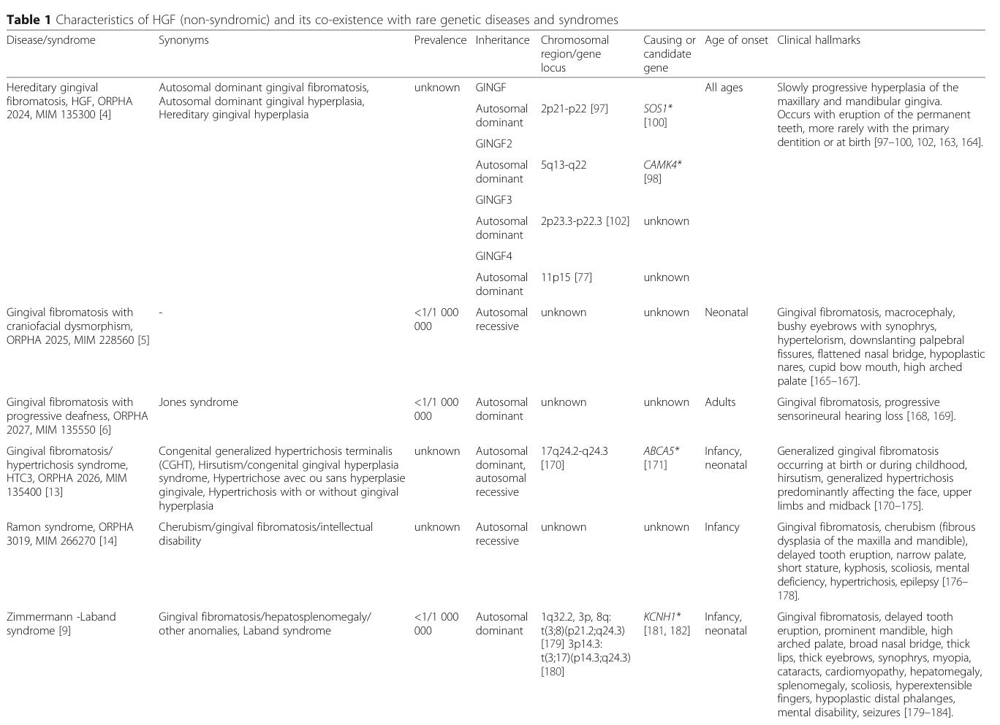

## Question

# Disease Characteristics Research Template

## Target Disease
- **Disease Name:** Hereditary Gingival Fibromatosis
- **MONDO ID:**  (if available)
- **Category:** Mendelian

## Research Objectives

Please provide a comprehensive research report on **Hereditary Gingival Fibromatosis** covering all of the
disease characteristics listed below. This report will be used to populate a disease knowledge
base entry. Be thorough and cite primary literature (PMID preferred) for all claims.

For each section, **suggested databases/resources** are listed. These are the first places
you should search for information on each topic.

---

### 1. Disease Information
> **Search first:** OMIM, Orphanet, ICD-10/ICD-11, MeSH, PubMed

- What is the disease? Provide a concise overview.
- What are the key identifiers? (OMIM, Orphanet, ICD-10/ICD-11, MeSH, Mondo)
- What are the common synonyms and alternative names?
- Is the information derived from individual patients (e.g., EHR) or aggregated disease-level resources?

### 2. Etiology

- **Disease Causal Factors**: What are the primary causes? (genetic, environmental, infectious, mechanistic)
- **Risk Factors**:
  > **Search first:** PubMed, Cochrane Library, UpToDate, clinical guidelines, ClinVar, ClinGen, GWAS Catalog, PheGenI, CTD, CDC, WHO, epidemiological databases
  - Genetic risk factors (causal variants, susceptibility loci, modifier genes)
  - Environmental risk factors (toxins, lifestyle, occupational exposures, age, sex, family history)
- **Protective Factors**:
  > **Search first:** PubMed, Cochrane Library, clinical trial databases, GWAS Catalog, gnomAD, WHO, CDC, nutrition databases
  - Genetic protective factors (protective variants, modifier alleles)
  - Environmental protective factors (diet, lifestyle, exposures that reduce risk)
- **Gene-Environment Interactions**: How do genetic and environmental factors interact to influence disease?
  > **Search first:** CTD, PubMed, PheGenI, GxE databases

### 3. Phenotypes
> **Search first:** HPO (Human Phenotype Ontology), OMIM, Orphanet, PubMed, clinicaltrials.gov, MedDRA, SNOMED CT, DECIPHER, LOINC

For each phenotype, provide:
- **Phenotype type**: symptoms, clinical signs, physical manifestations, behavioral changes, or laboratory abnormalities
  > For symptoms/signs: HPO, OMIM, Orphanet, PubMed
  > For behavioral changes: HPO, DSM, RDoC (Research Domain Criteria), PubMed
  > For laboratory abnormalities: LOINC, SNOMED CT, LabTests Online, PubMed
- **Phenotype characteristics**:
  > **Search first:** OMIM, Orphanet, HPO, PubMed
  - Age of symptom onset (neonatal, childhood, adult-onset, late-onset)
  - Symptom severity (mild, moderate, severe, variable)
  - Symptom progression (stable, progressive, episodic, fluctuating)
  - Frequency among affected individuals (percentage or qualitative)
- **Quality of life impact**: Effects on daily functioning and well-being (per-phenotype when possible)
  > **Search first:** EQ-5D database, SF-36, WHO QOL databases, PubMed
- Suggest HPO (Human Phenotype Ontology) terms for each phenotype

### 4. Genetic/Molecular Information

- **Causal Genes**: Gene mutations or chromosomal abnormalities responsible for disease (gene symbols, OMIM IDs)
  > **Search first:** OMIM, ClinVar, HGMD, Ensembl, NCBI Gene
- **Pathogenic Variants**:
  - Affected genes (gene symbols, HGNC IDs)
    > **Search first:** OMIM, NCBI Gene, Ensembl, HGNC, UniProt, GeneCards
  - Variant classification (pathogenic, likely pathogenic, VUS per ACMG/AMP guidelines)
    > **Search first:** ClinVar, ClinGen, ACMG/AMP guidelines, VarSome
  - Variant type/class (missense, frameshift, nonsense, splice-site, structural)
  - Allele frequency in population databases
    > **Search first:** gnomAD, 1000 Genomes, ExAC, TOPMed, dbSNP
  - Somatic vs germline origin
    > **Search first:** COSMIC (somatic), ClinVar, ICGC, TCGA
  - Functional consequences (loss of function, gain of function, dominant negative)
- **Modifier Genes**: Genes that modify disease severity or expression
- **Epigenetic Information**: DNA methylation, histone modifications, chromatin changes affecting disease
  > **Search first:** ENCODE, Roadmap Epigenomics, MethBase, DiseaseMeth
- **Chromosomal Abnormalities**: Large-scale genetic changes (aneuploidy, translocations, inversions)
  > **Search first:** DECIPHER, ClinVar, ECARUCA, UCSC Genome Browser

### 5. Environmental Information

- **Environmental Factors**: Non-genetic contributing factors (toxins, radiation, pollution, occupational exposure)
  > **Search first:** CTD (Comparative Toxicogenomics Database), TOXNET, PubMed, EPA databases
- **Lifestyle Factors**: Behavioral factors (smoking, diet, exercise, alcohol consumption)
  > **Search first:** CDC databases, WHO, PubMed, NHANES
- **Infectious Agents**: If applicable, pathogens causing or triggering disease (bacteria, viruses, fungi, parasites)
  > **Search first:** NCBI Taxonomy, ViPR, BV-BRC, MicrobeDB, GIDEON

### 6. Mechanism / Pathophysiology

- **Molecular Pathways**: Specific signaling cascades or biochemical pathways involved (Wnt, MAPK, mTOR, PI3K-AKT, etc.)
  > **Search first:** KEGG, Reactome, WikiPathways, PathBank, BioCyc
- **Cellular Processes**: Cell-level mechanisms (apoptosis, autophagy, cell cycle dysregulation, inflammation, etc.)
  > **Search first:** Gene Ontology (GO), Reactome, KEGG, PubMed
- **Protein Dysfunction**: How protein structure or function is altered (misfolding, aggregation, loss of function, gain of function)
  > **Search first:** UniProt, PDB (Protein Data Bank), InterPro, Pfam, AlphaFold
- **Metabolic Changes**: Alterations in metabolic processes (energy metabolism, lipid metabolism, amino acid metabolism)
  > **Search first:** KEGG, BioCyc, HMDB (Human Metabolome Database), BRENDA
- **Immune System Involvement**: Role of immune response (autoimmunity, immunodeficiency, chronic inflammation)
  > **Search first:** ImmPort, Immunome Database, IEDB, Gene Ontology
- **Tissue Damage Mechanisms**: How tissues/ are injured (oxidative stress, ischemia, fibrosis, necrosis)
  > **Search first:** PubMed, Gene Ontology, Reactome
- **Biochemical Abnormalities**: Specific molecular defects (enzyme deficiencies, receptor dysfunction, ion channel defects)
  > **Search first:** BRENDA, UniProt, KEGG, OMIM, PubMed
- **Epigenetic Changes**: DNA methylation, histone modifications affecting gene expression in disease
  > **Search first:** ENCODE, Roadmap Epigenomics, MethBase, DiseaseMeth
- **Molecular Profiling** (if available):
  - Transcriptomics/gene expression changes
    > **Search first:** GEO (Gene Expression Omnibus), ArrayExpress, GTEx, Human Cell Atlas, SRA
  - Proteomics findings
    > **Search first:** PRIDE, ProteomeXchange, Human Protein Atlas, STRING, BioGRID
  - Metabolomics signatures
    > **Search first:** MetaboLights, Metabolomics Workbench, HMDB, METLIN
  - Lipidomics alterations
    > **Search first:** LIPID MAPS, SwissLipids, LipidHome, Metabolomics Workbench
  - Genomic structural features
    > **Search first:** UCSC Genome Browser, Ensembl, NCBI, dbVar, DGV
- **Advanced Technologies** (if applicable):
  - Single-cell analysis findings (cell-type specific mechanisms, cellular heterogeneity)
    > **Search first:** Human Cell Atlas, Single Cell Portal, GEO, CELLxGENE
  - Spatial transcriptomics findings
    > **Search first:** GEO, Spatial Research, Vizgen, 10x Genomics data
  - Multi-omics integration results
    > **Search first:** TCGA, ICGC, cBioPortal, LinkedOmics, PubMed
  - Functional genomics screens (CRISPR, RNAi)
    > **Search first:** DepMap, GenomeRNAi, PubMed, BioGRID ORCS

For each mechanism, describe:
- The causal chain from initial trigger to clinical manifestation
- Which mechanisms are upstream vs downstream
- What cell types and biological processes are involved
- Suggest GO terms for biological processes and CL terms for cell types

### 7. Anatomical Structures Affected

- **Organ Level**:
  - Primary organs directly affected
  - Secondary organ involvement (complications, secondary effects)
  - Body systems involved (cardiovascular, nervous, digestive, respiratory, endocrine, etc.)
  > **Search first:** Uberon, FMA (Foundational Model of Anatomy), OMIM, HPO, ICD-11, MeSH, SNOMED CT
- **Tissue and Cell Level**:
  - Specific tissue types affected (epithelial, connective, muscle, nervous)
  - Specific cell populations targeted (with Cell Ontology terms)
  > **Search first:** Uberon, Human Protein Atlas, Cell Ontology, Human Cell Atlas, CellMarker, PanglaoDB
- **Subcellular Level**:
  - Cellular compartments involved (mitochondria, nucleus, ER, lysosomes) (with GO Cellular Component terms)
  > **Search first:** Gene Ontology (Cellular Component), UniProt, Human Protein Atlas
- **Localization**:
  - Specific anatomical sites (with UBERON terms)
    > **Search first:** FMA, Uberon, NeuroNames (for brain), SNOMED CT
  - Lateralization (unilateral, bilateral, asymmetric)
    > **Search first:** HPO, clinical literature, imaging databases

### 8. Temporal Development

- **Onset**:
  - Typical age of onset (congenital, pediatric, adult, geriatric)
  - Onset pattern (acute, subacute, chronic, insidious)
  > **Search first:** OMIM, Orphanet, HPO, PubMed
- **Progression**:
  - Disease stages (early, intermediate, advanced, end-stage)
    > **Search first:** Cancer Staging Manual (AJCC), WHO classifications, PubMed
  - Progression rate (rapid, slow, variable)
  - Disease course pattern (episodic, relapsing-remitting, progressive, stable)
  - Disease duration (self-limited, chronic lifelong)
  > **Search first:** Disease registries, longitudinal cohort databases, natural history studies, PubMed, Orphanet, OMIM
- **Patterns**:
  - Remission patterns (spontaneous, treatment-induced)
    > **Search first:** Clinical trial databases, disease registries, PubMed
  - Critical periods (time windows of vulnerability or opportunity for intervention)
    > **Search first:** PubMed, developmental biology databases, clinical guidelines

### 9. Inheritance and Population

- **Epidemiology**:
  - Prevalence (cases per 100,000 at given time)
  - Incidence (new cases per 100,000 per year)
  > **Search first:** Orphanet, CDC, WHO, GBD (Global Burden of Disease), national registries, SEER, disease registries
- **For Genetic Etiology**:
  - Inheritance pattern (AD, AR, X-linked, mitochondrial, multifactorial, polygenic)
    > **Search first:** OMIM, Orphanet, ClinVar, GTR (Genetic Testing Registry)
  - Penetrance (complete, incomplete, age-dependent)
    > **Search first:** ClinVar, OMIM, PubMed, ClinGen
  - Expressivity (variable, consistent)
    > **Search first:** OMIM, ClinVar, PubMed
  - Genetic anticipation (increasing severity in successive generations)
    > **Search first:** OMIM, PubMed (especially for repeat expansion disorders)
  - Germline mosaicism
    > **Search first:** ClinVar, OMIM, genetic counseling literature, PubMed
  - Founder effects (population-specific mutations)
    > **Search first:** gnomAD, population genetics databases, PubMed
  - Consanguinity role
    > **Search first:** OMIM, population studies, genetic counseling resources
  - Carrier frequency
    > **Search first:** gnomAD, carrier screening databases, GeneReviews, GTR
- **Population Demographics**:
  - Affected populations (ethnic or demographic groups with higher prevalence)
    > **Search first:** gnomAD, 1000 Genomes, PAGE Study, PubMed, population registries
  - Geographic distribution (endemic areas, regional variation)
    > **Search first:** WHO, CDC, GBD, Orphanet, geographic epidemiology databases
  - Geographic distribution of specific variants
  - Sex ratio (male:female)
    > **Search first:** Disease registries, OMIM, PubMed, epidemiological databases
  - Age distribution of affected individuals
    > **Search first:** CDC, disease registries, SEER, Orphanet

### 10. Diagnostics

- **Clinical Tests**:
  - Laboratory tests (blood, urine, tissue chemistry, specific enzyme assays)
    > **Search first:** LOINC, LabTests Online, PubMed
  - Biomarkers (proteins, metabolites, genetic markers, circulating biomarkers)
    > **Search first:** FDA Biomarker List, BEST (Biomarkers, EndpointS, and other Tools), PubMed
  - Imaging studies (X-ray, CT, MRI, PET, ultrasound)
    > **Search first:** RadLex, DICOM, Radiopaedia, imaging databases
  - Functional tests (pulmonary function, cardiac stress tests)
    > **Search first:** LOINC, clinical guidelines, PubMed
  - Electrophysiology (EEG, EMG, ECG, nerve conduction studies)
    > **Search first:** LOINC, clinical neurophysiology databases, PubMed
  - Biopsy findings (histopathology, immunohistochemistry)
    > **Search first:** SNOMED CT, College of American Pathologists resources, PubMed
  - Pathology findings (microscopic examination)
    > **Search first:** SNOMED CT, Digital Pathology databases, PubMed
- **Genetic Testing**:
  > **Search first:** GTR (Genetic Testing Registry), GeneReviews, ClinGen
  - Overview of recommended genetic testing approach
  - Whole genome sequencing (WGS) utility
    > **Search first:** GTR, ClinVar, GEL (Genomics England), gnomAD
  - Whole exome sequencing (WES) utility
    > **Search first:** GTR, ClinVar, OMIM, GeneMatcher
  - Gene panels (which panels, which genes)
    > **Search first:** GTR, ClinVar, laboratory-specific databases
  - Single gene testing
    > **Search first:** GTR, ClinVar, OMIM, GeneReviews
  - Chromosomal microarray (CMA)
    > **Search first:** DECIPHER, ClinVar, dbVar, ECARUCA
  - Karyotyping
    > **Search first:** Chromosome Abnormality Database, ClinVar, cytogenetics resources
  - FISH
    > **Search first:** ClinVar, cytogenetics databases, PubMed
  - Mitochondrial DNA testing
    > **Search first:** MITOMAP, MSeqDR, ClinVar, GTR
  - Repeat expansion testing
    > **Search first:** GTR, ClinVar, repeat expansion databases, PubMed
- **Omics-Based Diagnostics** (if applicable):
  - RNA sequencing / transcriptomics
    > **Search first:** GEO, ArrayExpress, GTEx, RNA-seq databases
  - Proteomics
    > **Search first:** PRIDE, ProteomeXchange, FDA Biomarker database
  - Metabolomics
    > **Search first:** MetaboLights, Metabolomics Workbench, HMDB
  - Epigenomics
    > **Search first:** GEO, ENCODE, Roadmap Epigenomics, MethBase
  - Liquid biopsy
    > **Search first:** COSMIC, ClinVar, liquid biopsy databases, PubMed
- **Clinical Criteria**:
  - Standardized diagnostic criteria (DSM, ICD, society guidelines)
    > **Search first:** DSM-5, ICD-11, clinical society guidelines, UpToDate
  - Differential diagnosis (other conditions to rule out, with distinguishing features)
    > **Search first:** DynaMed, UpToDate, clinical decision support systems
- **Screening**:
  - Screening methods for asymptomatic individuals (newborn screening, carrier screening, cascade screening)
    > **Search first:** ACMG recommendations, CDC newborn screening, GTR

### 11. Outcome/Prognosis

- **Survival and Mortality**:
  - Survival rate (5-year, 10-year, overall)
    > **Search first:** SEER, cancer registries, disease-specific registries, PubMed
  - Life expectancy (with and without treatment if applicable)
    > **Search first:** Orphanet, disease registries, actuarial databases, PubMed
  - Mortality rate
    > **Search first:** CDC, WHO, GBD, national mortality databases
  - Disease-specific mortality (deaths directly attributable to disease)
    > **Search first:** Disease registries, CDC Wonder, GBD, PubMed
- **Morbidity and Function**:
  - Morbidity (disease-related disability and health impacts)
    > **Search first:** GBD, WHO, disability databases, PubMed
  - Disability outcomes (long-term functional impairments)
    > **Search first:** ICF (International Classification of Functioning), disability registries
  - Quality of life measures (EQ-5D, SF-36, PROMIS, disease-specific tools)
    > **Search first:** EQ-5D database, SF-36, PROMIS, PubMed
- **Disease Course**:
  - Complications (secondary problems: infections, organ failure, etc.)
    > **Search first:** ICD codes, disease registries, clinical databases, PubMed
  - Recovery potential (likelihood and extent of recovery, with vs without treatment)
    > **Search first:** Natural history studies, rehabilitation databases, PubMed
- **Prediction**:
  - Prognostic factors (age, disease severity, biomarkers, treatment response)
    > **Search first:** Prognostic models databases, clinical calculators, PubMed
  - Prognostic biomarkers (molecular markers predicting disease course)
    > **Search first:** FDA Biomarker database, PubMed, cancer prognostic databases

### 12. Treatment

- **Pharmacotherapy**:
  - Pharmacological treatments (drug names, drug classes, mechanisms of action)
    > **Search first:** DrugBank, RxNorm, ATC classification, DailyMed, FDA databases
  - Pharmacogenomics (how genetic variants affect drug metabolism, efficacy, toxicity)
    > **Search first:** PharmGKB, CPIC (Clinical Pharmacogenetics), FDA Table of PGx Biomarkers
- **Advanced Therapeutics**:
  - Gene therapy (viral vectors, CRISPR, gene replacement, gene editing)
    > **Search first:** ClinicalTrials.gov, FDA gene therapy database, ASGCT resources
  - Cell therapy (stem cell transplant, CAR-T, cellular therapeutics)
    > **Search first:** ClinicalTrials.gov, FDA cell therapy database, FACT standards
  - RNA-based therapies (ASOs, siRNA, mRNA therapies)
    > **Search first:** ClinicalTrials.gov, FDA approvals, PubMed
  - Targeted therapies (treatments directed at specific molecular targets)
    > **Search first:** My Cancer Genome, OncoKB, ClinicalTrials.gov, FDA approvals
  - Immunotherapies (checkpoint inhibitors, monoclonal antibodies)
    > **Search first:** Cancer Immunotherapy Database, FDA approvals, ClinicalTrials.gov
- **Surgical and Interventional**:
  - Surgical interventions (types of surgery, timing, outcomes)
    > **Search first:** CPT codes, surgical registries, clinical guidelines, PubMed
- **Supportive and Rehabilitative**:
  - Supportive care (symptom management, pain control, nutrition)
    > **Search first:** Clinical guidelines, Cochrane Library, PubMed
  - Rehabilitation (physical therapy, occupational therapy, speech therapy)
    > **Search first:** Rehabilitation medicine databases, clinical guidelines, PubMed
- **Experimental**:
  - Experimental treatments in clinical trials (with NCT identifiers if available)
    > **Search first:** ClinicalTrials.gov, EU Clinical Trials Register, WHO ICTRP
- **Treatment Outcomes**:
  - Treatment response rates
    > **Search first:** Clinical trial databases, FDA reviews, systematic reviews, PubMed
  - Side effects and adverse events
    > **Search first:** FDA Adverse Event Reporting System (FAERS), MedWatch, PubMed
- **Treatment Strategy**:
  - Treatment algorithms (clinical pathways, decision trees)
    > **Search first:** Clinical practice guidelines, NCCN Guidelines, UpToDate
  - Combination therapies
    > **Search first:** ClinicalTrials.gov, treatment guidelines, PubMed
  - Personalized medicine approaches (genotype-guided treatment)
    > **Search first:** My Cancer Genome, CIViC, PharmGKB, precision medicine databases

For each treatment, suggest MAXO (Medical Action Ontology) terms where applicable.

### 13. Prevention

- **Prevention Levels**:
  - Primary prevention (preventing disease occurrence: vaccination, risk factor modification)
    > **Search first:** CDC, WHO, USPSTF recommendations, Cochrane Library
  - Secondary prevention (early detection and treatment: screening programs, early intervention)
    > **Search first:** USPSTF, CDC screening guidelines, WHO
  - Tertiary prevention (preventing complications in those with disease)
    > **Search first:** Clinical guidelines, disease management protocols, PubMed
- **Immunization**: Vaccine strategies (if applicable)
  > **Search first:** CDC vaccine schedules, WHO immunization, FDA vaccine database
- **Screening and Early Detection**:
  - Screening programs (population-based: newborn screening, cancer screening)
    > **Search first:** CDC screening programs, USPSTF, cancer screening databases
  - Genetic screening (carrier screening, preimplantation genetic diagnosis, prenatal testing)
    > **Search first:** ACMG recommendations, ACOG guidelines, GTR
  - Risk stratification (identifying high-risk individuals for targeted prevention)
    > **Search first:** Risk prediction models, clinical calculators, PubMed
- **Behavioral Interventions**: Lifestyle modifications to reduce risk
  > **Search first:** CDC, WHO, behavioral intervention databases, Cochrane Library
- **Counseling**: Genetic counseling (risk assessment, family planning guidance)
  > **Search first:** NSGC resources, ACMG guidelines, GeneReviews
- **Public Health**:
  - Public health interventions (sanitation, vector control, health education)
    > **Search first:** CDC, WHO, public health databases, PubMed
  - Environmental interventions (reducing environmental risk factors)
    > **Search first:** EPA databases, WHO environmental health, PubMed
- **Prophylaxis**: Preventive medications or procedures
  > **Search first:** Clinical guidelines, FDA approvals, PubMed

### 14. Other Species / Natural Disease

- **Taxonomy**: Species affected (with NCBI Taxon identifiers)
  > **Search first:** NCBI Taxonomy
- **Breed**: Specific breeds affected (with VBO identifiers if applicable)
  > **Search first:** VBO (Vertebrate Breed Ontology)
- **Gene**: Orthologous genes in other species (with NCBI Gene IDs)
  > **Search first:** NCBI Gene
- **Natural Disease**:
  - Naturally occurring disease in other species (companion animals, wildlife)
    > **Search first:** OMIA (Online Mendelian Inheritance in Animals), VetCompass, PubMed
  - Veterinary relevance and importance in animal health
    > **Search first:** OMIA, veterinary databases, PubMed
- **Comparative Biology**:
  - Comparative pathology (similarities and differences across species)
    > **Search first:** OMIA, comparative pathology databases, PubMed
  - Evolutionary conservation of disease mechanisms
    > **Search first:** HomoloGene, OrthoMCL, Alliance of Genome Resources
- **Transmission** (if applicable):
  - Zoonotic potential
    > **Search first:** CDC zoonotic diseases, WHO zoonoses, GIDEON
  - Cross-species susceptibility
    > **Search first:** NCBI Taxonomy, veterinary databases, PubMed

### 15. Model Organisms

- **Model Types**:
  - Model organism type (mammalian, invertebrate, cellular, in vitro)
    > **Search first:** Alliance of Genome Resources, model organism databases
  - Specific model systems (mouse, rat, zebrafish, Drosophila, C. elegans, yeast, cell lines, organoids, iPSCs)
    > **Search first:** MGI, RGD, ZFIN, FlyBase, WormBase, SGD, ATCC, Cellosaurus
  - Induced models (drug treatment, surgical intervention, environmental manipulation)
    > **Search first:** MGI, model organism databases, PubMed
- **Genetic Models**:
  - Types available (knockout, knock-in, transgenic, conditional, humanized)
    > **Search first:** MGI, IMPC, KOMP, EuMMCR, IMSR
- **Model Characteristics**:
  - Phenotype recapitulation (how well model reproduces human disease features)
    > **Search first:** Model organism databases, comparative studies, PubMed
  - Model limitations (aspects of human disease not captured)
    > **Search first:** Model organism databases, PubMed, review articles
- **Applications**:
  - Research applications (what aspects of disease can be studied)
    > **Search first:** Model organism databases, PubMed
- **Resources**:
  - Model databases
    > **Search first:** MGI, RGD, ZFIN, FlyBase, WormBase, IMSR, EMMA, MMRRC

---

## Citation Requirements

- Cite primary literature (PMID preferred) for all mechanistic and clinical claims
- Prioritize recent reviews and landmark papers
- Include direct quotes from abstracts where possible to support key statements
- Distinguish evidence source types: human clinical, model organism, in vitro, computational

## Output Format

Structure your response as a comprehensive narrative organized by the sections above.
For each section, provide:
- Factual content with specific details (numbers, percentages, gene names, variant nomenclature)
- Ontology term suggestions (HPO, GO, CL, UBERON, CHEBI, MAXO, MONDO) where applicable
- Evidence citations with PMIDs
- Direct quotes from abstracts to support key claims
- Clear indication when information is not available or not applicable for this disease

This report will be used to populate a disease knowledge base entry with:
- Pathophysiology descriptions with causal chains
- Gene/protein annotations (HGNC, GO terms)
- Phenotype associations (HP terms) with frequencies
- Cell type involvement (CL terms)
- Anatomical locations (UBERON terms)
- Chemical entities (CHEBI terms)
- Treatment annotations (MAXO terms)
- Evidence items with PMIDs and exact abstract quotes
- Epidemiology, prognosis, diagnostic, and prevention information
- Animal model descriptions with phenotype recapitulation details

## Output

Question: You are an expert researcher providing comprehensive, well-cited information.

Provide detailed information focusing on:
1. Key concepts and definitions with current understanding
2. Recent developments and latest research (prioritize 2023-2024 sources)
3. Current applications and real-world implementations
4. Expert opinions and analysis from authoritative sources
5. Relevant statistics and data from recent studies

Format as a comprehensive research report with proper citations. Include URLs and publication dates where available.
Always prioritize recent, authoritative sources and provide specific citations for all major claims.

# Disease Characteristics Research Template

## Target Disease
- **Disease Name:** Hereditary Gingival Fibromatosis
- **MONDO ID:**  (if available)
- **Category:** Mendelian

## Research Objectives

Please provide a comprehensive research report on **Hereditary Gingival Fibromatosis** covering all of the
disease characteristics listed below. This report will be used to populate a disease knowledge
base entry. Be thorough and cite primary literature (PMID preferred) for all claims.

For each section, **suggested databases/resources** are listed. These are the first places
you should search for information on each topic.

---

### 1. Disease Information
> **Search first:** OMIM, Orphanet, ICD-10/ICD-11, MeSH, PubMed

- What is the disease? Provide a concise overview.
- What are the key identifiers? (OMIM, Orphanet, ICD-10/ICD-11, MeSH, Mondo)
- What are the common synonyms and alternative names?
- Is the information derived from individual patients (e.g., EHR) or aggregated disease-level resources?

### 2. Etiology

- **Disease Causal Factors**: What are the primary causes? (genetic, environmental, infectious, mechanistic)
- **Risk Factors**:
  > **Search first:** PubMed, Cochrane Library, UpToDate, clinical guidelines, ClinVar, ClinGen, GWAS Catalog, PheGenI, CTD, CDC, WHO, epidemiological databases
  - Genetic risk factors (causal variants, susceptibility loci, modifier genes)
  - Environmental risk factors (toxins, lifestyle, occupational exposures, age, sex, family history)
- **Protective Factors**:
  > **Search first:** PubMed, Cochrane Library, clinical trial databases, GWAS Catalog, gnomAD, WHO, CDC, nutrition databases
  - Genetic protective factors (protective variants, modifier alleles)
  - Environmental protective factors (diet, lifestyle, exposures that reduce risk)
- **Gene-Environment Interactions**: How do genetic and environmental factors interact to influence disease?
  > **Search first:** CTD, PubMed, PheGenI, GxE databases

### 3. Phenotypes
> **Search first:** HPO (Human Phenotype Ontology), OMIM, Orphanet, PubMed, clinicaltrials.gov, MedDRA, SNOMED CT, DECIPHER, LOINC

For each phenotype, provide:
- **Phenotype type**: symptoms, clinical signs, physical manifestations, behavioral changes, or laboratory abnormalities
  > For symptoms/signs: HPO, OMIM, Orphanet, PubMed
  > For behavioral changes: HPO, DSM, RDoC (Research Domain Criteria), PubMed
  > For laboratory abnormalities: LOINC, SNOMED CT, LabTests Online, PubMed
- **Phenotype characteristics**:
  > **Search first:** OMIM, Orphanet, HPO, PubMed
  - Age of symptom onset (neonatal, childhood, adult-onset, late-onset)
  - Symptom severity (mild, moderate, severe, variable)
  - Symptom progression (stable, progressive, episodic, fluctuating)
  - Frequency among affected individuals (percentage or qualitative)
- **Quality of life impact**: Effects on daily functioning and well-being (per-phenotype when possible)
  > **Search first:** EQ-5D database, SF-36, WHO QOL databases, PubMed
- Suggest HPO (Human Phenotype Ontology) terms for each phenotype

### 4. Genetic/Molecular Information

- **Causal Genes**: Gene mutations or chromosomal abnormalities responsible for disease (gene symbols, OMIM IDs)
  > **Search first:** OMIM, ClinVar, HGMD, Ensembl, NCBI Gene
- **Pathogenic Variants**:
  - Affected genes (gene symbols, HGNC IDs)
    > **Search first:** OMIM, NCBI Gene, Ensembl, HGNC, UniProt, GeneCards
  - Variant classification (pathogenic, likely pathogenic, VUS per ACMG/AMP guidelines)
    > **Search first:** ClinVar, ClinGen, ACMG/AMP guidelines, VarSome
  - Variant type/class (missense, frameshift, nonsense, splice-site, structural)
  - Allele frequency in population databases
    > **Search first:** gnomAD, 1000 Genomes, ExAC, TOPMed, dbSNP
  - Somatic vs germline origin
    > **Search first:** COSMIC (somatic), ClinVar, ICGC, TCGA
  - Functional consequences (loss of function, gain of function, dominant negative)
- **Modifier Genes**: Genes that modify disease severity or expression
- **Epigenetic Information**: DNA methylation, histone modifications, chromatin changes affecting disease
  > **Search first:** ENCODE, Roadmap Epigenomics, MethBase, DiseaseMeth
- **Chromosomal Abnormalities**: Large-scale genetic changes (aneuploidy, translocations, inversions)
  > **Search first:** DECIPHER, ClinVar, ECARUCA, UCSC Genome Browser

### 5. Environmental Information

- **Environmental Factors**: Non-genetic contributing factors (toxins, radiation, pollution, occupational exposure)
  > **Search first:** CTD (Comparative Toxicogenomics Database), TOXNET, PubMed, EPA databases
- **Lifestyle Factors**: Behavioral factors (smoking, diet, exercise, alcohol consumption)
  > **Search first:** CDC databases, WHO, PubMed, NHANES
- **Infectious Agents**: If applicable, pathogens causing or triggering disease (bacteria, viruses, fungi, parasites)
  > **Search first:** NCBI Taxonomy, ViPR, BV-BRC, MicrobeDB, GIDEON

### 6. Mechanism / Pathophysiology

- **Molecular Pathways**: Specific signaling cascades or biochemical pathways involved (Wnt, MAPK, mTOR, PI3K-AKT, etc.)
  > **Search first:** KEGG, Reactome, WikiPathways, PathBank, BioCyc
- **Cellular Processes**: Cell-level mechanisms (apoptosis, autophagy, cell cycle dysregulation, inflammation, etc.)
  > **Search first:** Gene Ontology (GO), Reactome, KEGG, PubMed
- **Protein Dysfunction**: How protein structure or function is altered (misfolding, aggregation, loss of function, gain of function)
  > **Search first:** UniProt, PDB (Protein Data Bank), InterPro, Pfam, AlphaFold
- **Metabolic Changes**: Alterations in metabolic processes (energy metabolism, lipid metabolism, amino acid metabolism)
  > **Search first:** KEGG, BioCyc, HMDB (Human Metabolome Database), BRENDA
- **Immune System Involvement**: Role of immune response (autoimmunity, immunodeficiency, chronic inflammation)
  > **Search first:** ImmPort, Immunome Database, IEDB, Gene Ontology
- **Tissue Damage Mechanisms**: How tissues/ are injured (oxidative stress, ischemia, fibrosis, necrosis)
  > **Search first:** PubMed, Gene Ontology, Reactome
- **Biochemical Abnormalities**: Specific molecular defects (enzyme deficiencies, receptor dysfunction, ion channel defects)
  > **Search first:** BRENDA, UniProt, KEGG, OMIM, PubMed
- **Epigenetic Changes**: DNA methylation, histone modifications affecting gene expression in disease
  > **Search first:** ENCODE, Roadmap Epigenomics, MethBase, DiseaseMeth
- **Molecular Profiling** (if available):
  - Transcriptomics/gene expression changes
    > **Search first:** GEO (Gene Expression Omnibus), ArrayExpress, GTEx, Human Cell Atlas, SRA
  - Proteomics findings
    > **Search first:** PRIDE, ProteomeXchange, Human Protein Atlas, STRING, BioGRID
  - Metabolomics signatures
    > **Search first:** MetaboLights, Metabolomics Workbench, HMDB, METLIN
  - Lipidomics alterations
    > **Search first:** LIPID MAPS, SwissLipids, LipidHome, Metabolomics Workbench
  - Genomic structural features
    > **Search first:** UCSC Genome Browser, Ensembl, NCBI, dbVar, DGV
- **Advanced Technologies** (if applicable):
  - Single-cell analysis findings (cell-type specific mechanisms, cellular heterogeneity)
    > **Search first:** Human Cell Atlas, Single Cell Portal, GEO, CELLxGENE
  - Spatial transcriptomics findings
    > **Search first:** GEO, Spatial Research, Vizgen, 10x Genomics data
  - Multi-omics integration results
    > **Search first:** TCGA, ICGC, cBioPortal, LinkedOmics, PubMed
  - Functional genomics screens (CRISPR, RNAi)
    > **Search first:** DepMap, GenomeRNAi, PubMed, BioGRID ORCS

For each mechanism, describe:
- The causal chain from initial trigger to clinical manifestation
- Which mechanisms are upstream vs downstream
- What cell types and biological processes are involved
- Suggest GO terms for biological processes and CL terms for cell types

### 7. Anatomical Structures Affected

- **Organ Level**:
  - Primary organs directly affected
  - Secondary organ involvement (complications, secondary effects)
  - Body systems involved (cardiovascular, nervous, digestive, respiratory, endocrine, etc.)
  > **Search first:** Uberon, FMA (Foundational Model of Anatomy), OMIM, HPO, ICD-11, MeSH, SNOMED CT
- **Tissue and Cell Level**:
  - Specific tissue types affected (epithelial, connective, muscle, nervous)
  - Specific cell populations targeted (with Cell Ontology terms)
  > **Search first:** Uberon, Human Protein Atlas, Cell Ontology, Human Cell Atlas, CellMarker, PanglaoDB
- **Subcellular Level**:
  - Cellular compartments involved (mitochondria, nucleus, ER, lysosomes) (with GO Cellular Component terms)
  > **Search first:** Gene Ontology (Cellular Component), UniProt, Human Protein Atlas
- **Localization**:
  - Specific anatomical sites (with UBERON terms)
    > **Search first:** FMA, Uberon, NeuroNames (for brain), SNOMED CT
  - Lateralization (unilateral, bilateral, asymmetric)
    > **Search first:** HPO, clinical literature, imaging databases

### 8. Temporal Development

- **Onset**:
  - Typical age of onset (congenital, pediatric, adult, geriatric)
  - Onset pattern (acute, subacute, chronic, insidious)
  > **Search first:** OMIM, Orphanet, HPO, PubMed
- **Progression**:
  - Disease stages (early, intermediate, advanced, end-stage)
    > **Search first:** Cancer Staging Manual (AJCC), WHO classifications, PubMed
  - Progression rate (rapid, slow, variable)
  - Disease course pattern (episodic, relapsing-remitting, progressive, stable)
  - Disease duration (self-limited, chronic lifelong)
  > **Search first:** Disease registries, longitudinal cohort databases, natural history studies, PubMed, Orphanet, OMIM
- **Patterns**:
  - Remission patterns (spontaneous, treatment-induced)
    > **Search first:** Clinical trial databases, disease registries, PubMed
  - Critical periods (time windows of vulnerability or opportunity for intervention)
    > **Search first:** PubMed, developmental biology databases, clinical guidelines

### 9. Inheritance and Population

- **Epidemiology**:
  - Prevalence (cases per 100,000 at given time)
  - Incidence (new cases per 100,000 per year)
  > **Search first:** Orphanet, CDC, WHO, GBD (Global Burden of Disease), national registries, SEER, disease registries
- **For Genetic Etiology**:
  - Inheritance pattern (AD, AR, X-linked, mitochondrial, multifactorial, polygenic)
    > **Search first:** OMIM, Orphanet, ClinVar, GTR (Genetic Testing Registry)
  - Penetrance (complete, incomplete, age-dependent)
    > **Search first:** ClinVar, OMIM, PubMed, ClinGen
  - Expressivity (variable, consistent)
    > **Search first:** OMIM, ClinVar, PubMed
  - Genetic anticipation (increasing severity in successive generations)
    > **Search first:** OMIM, PubMed (especially for repeat expansion disorders)
  - Germline mosaicism
    > **Search first:** ClinVar, OMIM, genetic counseling literature, PubMed
  - Founder effects (population-specific mutations)
    > **Search first:** gnomAD, population genetics databases, PubMed
  - Consanguinity role
    > **Search first:** OMIM, population studies, genetic counseling resources
  - Carrier frequency
    > **Search first:** gnomAD, carrier screening databases, GeneReviews, GTR
- **Population Demographics**:
  - Affected populations (ethnic or demographic groups with higher prevalence)
    > **Search first:** gnomAD, 1000 Genomes, PAGE Study, PubMed, population registries
  - Geographic distribution (endemic areas, regional variation)
    > **Search first:** WHO, CDC, GBD, Orphanet, geographic epidemiology databases
  - Geographic distribution of specific variants
  - Sex ratio (male:female)
    > **Search first:** Disease registries, OMIM, PubMed, epidemiological databases
  - Age distribution of affected individuals
    > **Search first:** CDC, disease registries, SEER, Orphanet

### 10. Diagnostics

- **Clinical Tests**:
  - Laboratory tests (blood, urine, tissue chemistry, specific enzyme assays)
    > **Search first:** LOINC, LabTests Online, PubMed
  - Biomarkers (proteins, metabolites, genetic markers, circulating biomarkers)
    > **Search first:** FDA Biomarker List, BEST (Biomarkers, EndpointS, and other Tools), PubMed
  - Imaging studies (X-ray, CT, MRI, PET, ultrasound)
    > **Search first:** RadLex, DICOM, Radiopaedia, imaging databases
  - Functional tests (pulmonary function, cardiac stress tests)
    > **Search first:** LOINC, clinical guidelines, PubMed
  - Electrophysiology (EEG, EMG, ECG, nerve conduction studies)
    > **Search first:** LOINC, clinical neurophysiology databases, PubMed
  - Biopsy findings (histopathology, immunohistochemistry)
    > **Search first:** SNOMED CT, College of American Pathologists resources, PubMed
  - Pathology findings (microscopic examination)
    > **Search first:** SNOMED CT, Digital Pathology databases, PubMed
- **Genetic Testing**:
  > **Search first:** GTR (Genetic Testing Registry), GeneReviews, ClinGen
  - Overview of recommended genetic testing approach
  - Whole genome sequencing (WGS) utility
    > **Search first:** GTR, ClinVar, GEL (Genomics England), gnomAD
  - Whole exome sequencing (WES) utility
    > **Search first:** GTR, ClinVar, OMIM, GeneMatcher
  - Gene panels (which panels, which genes)
    > **Search first:** GTR, ClinVar, laboratory-specific databases
  - Single gene testing
    > **Search first:** GTR, ClinVar, OMIM, GeneReviews
  - Chromosomal microarray (CMA)
    > **Search first:** DECIPHER, ClinVar, dbVar, ECARUCA
  - Karyotyping
    > **Search first:** Chromosome Abnormality Database, ClinVar, cytogenetics resources
  - FISH
    > **Search first:** ClinVar, cytogenetics databases, PubMed
  - Mitochondrial DNA testing
    > **Search first:** MITOMAP, MSeqDR, ClinVar, GTR
  - Repeat expansion testing
    > **Search first:** GTR, ClinVar, repeat expansion databases, PubMed
- **Omics-Based Diagnostics** (if applicable):
  - RNA sequencing / transcriptomics
    > **Search first:** GEO, ArrayExpress, GTEx, RNA-seq databases
  - Proteomics
    > **Search first:** PRIDE, ProteomeXchange, FDA Biomarker database
  - Metabolomics
    > **Search first:** MetaboLights, Metabolomics Workbench, HMDB
  - Epigenomics
    > **Search first:** GEO, ENCODE, Roadmap Epigenomics, MethBase
  - Liquid biopsy
    > **Search first:** COSMIC, ClinVar, liquid biopsy databases, PubMed
- **Clinical Criteria**:
  - Standardized diagnostic criteria (DSM, ICD, society guidelines)
    > **Search first:** DSM-5, ICD-11, clinical society guidelines, UpToDate
  - Differential diagnosis (other conditions to rule out, with distinguishing features)
    > **Search first:** DynaMed, UpToDate, clinical decision support systems
- **Screening**:
  - Screening methods for asymptomatic individuals (newborn screening, carrier screening, cascade screening)
    > **Search first:** ACMG recommendations, CDC newborn screening, GTR

### 11. Outcome/Prognosis

- **Survival and Mortality**:
  - Survival rate (5-year, 10-year, overall)
    > **Search first:** SEER, cancer registries, disease-specific registries, PubMed
  - Life expectancy (with and without treatment if applicable)
    > **Search first:** Orphanet, disease registries, actuarial databases, PubMed
  - Mortality rate
    > **Search first:** CDC, WHO, GBD, national mortality databases
  - Disease-specific mortality (deaths directly attributable to disease)
    > **Search first:** Disease registries, CDC Wonder, GBD, PubMed
- **Morbidity and Function**:
  - Morbidity (disease-related disability and health impacts)
    > **Search first:** GBD, WHO, disability databases, PubMed
  - Disability outcomes (long-term functional impairments)
    > **Search first:** ICF (International Classification of Functioning), disability registries
  - Quality of life measures (EQ-5D, SF-36, PROMIS, disease-specific tools)
    > **Search first:** EQ-5D database, SF-36, PROMIS, PubMed
- **Disease Course**:
  - Complications (secondary problems: infections, organ failure, etc.)
    > **Search first:** ICD codes, disease registries, clinical databases, PubMed
  - Recovery potential (likelihood and extent of recovery, with vs without treatment)
    > **Search first:** Natural history studies, rehabilitation databases, PubMed
- **Prediction**:
  - Prognostic factors (age, disease severity, biomarkers, treatment response)
    > **Search first:** Prognostic models databases, clinical calculators, PubMed
  - Prognostic biomarkers (molecular markers predicting disease course)
    > **Search first:** FDA Biomarker database, PubMed, cancer prognostic databases

### 12. Treatment

- **Pharmacotherapy**:
  - Pharmacological treatments (drug names, drug classes, mechanisms of action)
    > **Search first:** DrugBank, RxNorm, ATC classification, DailyMed, FDA databases
  - Pharmacogenomics (how genetic variants affect drug metabolism, efficacy, toxicity)
    > **Search first:** PharmGKB, CPIC (Clinical Pharmacogenetics), FDA Table of PGx Biomarkers
- **Advanced Therapeutics**:
  - Gene therapy (viral vectors, CRISPR, gene replacement, gene editing)
    > **Search first:** ClinicalTrials.gov, FDA gene therapy database, ASGCT resources
  - Cell therapy (stem cell transplant, CAR-T, cellular therapeutics)
    > **Search first:** ClinicalTrials.gov, FDA cell therapy database, FACT standards
  - RNA-based therapies (ASOs, siRNA, mRNA therapies)
    > **Search first:** ClinicalTrials.gov, FDA approvals, PubMed
  - Targeted therapies (treatments directed at specific molecular targets)
    > **Search first:** My Cancer Genome, OncoKB, ClinicalTrials.gov, FDA approvals
  - Immunotherapies (checkpoint inhibitors, monoclonal antibodies)
    > **Search first:** Cancer Immunotherapy Database, FDA approvals, ClinicalTrials.gov
- **Surgical and Interventional**:
  - Surgical interventions (types of surgery, timing, outcomes)
    > **Search first:** CPT codes, surgical registries, clinical guidelines, PubMed
- **Supportive and Rehabilitative**:
  - Supportive care (symptom management, pain control, nutrition)
    > **Search first:** Clinical guidelines, Cochrane Library, PubMed
  - Rehabilitation (physical therapy, occupational therapy, speech therapy)
    > **Search first:** Rehabilitation medicine databases, clinical guidelines, PubMed
- **Experimental**:
  - Experimental treatments in clinical trials (with NCT identifiers if available)
    > **Search first:** ClinicalTrials.gov, EU Clinical Trials Register, WHO ICTRP
- **Treatment Outcomes**:
  - Treatment response rates
    > **Search first:** Clinical trial databases, FDA reviews, systematic reviews, PubMed
  - Side effects and adverse events
    > **Search first:** FDA Adverse Event Reporting System (FAERS), MedWatch, PubMed
- **Treatment Strategy**:
  - Treatment algorithms (clinical pathways, decision trees)
    > **Search first:** Clinical practice guidelines, NCCN Guidelines, UpToDate
  - Combination therapies
    > **Search first:** ClinicalTrials.gov, treatment guidelines, PubMed
  - Personalized medicine approaches (genotype-guided treatment)
    > **Search first:** My Cancer Genome, CIViC, PharmGKB, precision medicine databases

For each treatment, suggest MAXO (Medical Action Ontology) terms where applicable.

### 13. Prevention

- **Prevention Levels**:
  - Primary prevention (preventing disease occurrence: vaccination, risk factor modification)
    > **Search first:** CDC, WHO, USPSTF recommendations, Cochrane Library
  - Secondary prevention (early detection and treatment: screening programs, early intervention)
    > **Search first:** USPSTF, CDC screening guidelines, WHO
  - Tertiary prevention (preventing complications in those with disease)
    > **Search first:** Clinical guidelines, disease management protocols, PubMed
- **Immunization**: Vaccine strategies (if applicable)
  > **Search first:** CDC vaccine schedules, WHO immunization, FDA vaccine database
- **Screening and Early Detection**:
  - Screening programs (population-based: newborn screening, cancer screening)
    > **Search first:** CDC screening programs, USPSTF, cancer screening databases
  - Genetic screening (carrier screening, preimplantation genetic diagnosis, prenatal testing)
    > **Search first:** ACMG recommendations, ACOG guidelines, GTR
  - Risk stratification (identifying high-risk individuals for targeted prevention)
    > **Search first:** Risk prediction models, clinical calculators, PubMed
- **Behavioral Interventions**: Lifestyle modifications to reduce risk
  > **Search first:** CDC, WHO, behavioral intervention databases, Cochrane Library
- **Counseling**: Genetic counseling (risk assessment, family planning guidance)
  > **Search first:** NSGC resources, ACMG guidelines, GeneReviews
- **Public Health**:
  - Public health interventions (sanitation, vector control, health education)
    > **Search first:** CDC, WHO, public health databases, PubMed
  - Environmental interventions (reducing environmental risk factors)
    > **Search first:** EPA databases, WHO environmental health, PubMed
- **Prophylaxis**: Preventive medications or procedures
  > **Search first:** Clinical guidelines, FDA approvals, PubMed

### 14. Other Species / Natural Disease

- **Taxonomy**: Species affected (with NCBI Taxon identifiers)
  > **Search first:** NCBI Taxonomy
- **Breed**: Specific breeds affected (with VBO identifiers if applicable)
  > **Search first:** VBO (Vertebrate Breed Ontology)
- **Gene**: Orthologous genes in other species (with NCBI Gene IDs)
  > **Search first:** NCBI Gene
- **Natural Disease**:
  - Naturally occurring disease in other species (companion animals, wildlife)
    > **Search first:** OMIA (Online Mendelian Inheritance in Animals), VetCompass, PubMed
  - Veterinary relevance and importance in animal health
    > **Search first:** OMIA, veterinary databases, PubMed
- **Comparative Biology**:
  - Comparative pathology (similarities and differences across species)
    > **Search first:** OMIA, comparative pathology databases, PubMed
  - Evolutionary conservation of disease mechanisms
    > **Search first:** HomoloGene, OrthoMCL, Alliance of Genome Resources
- **Transmission** (if applicable):
  - Zoonotic potential
    > **Search first:** CDC zoonotic diseases, WHO zoonoses, GIDEON
  - Cross-species susceptibility
    > **Search first:** NCBI Taxonomy, veterinary databases, PubMed

### 15. Model Organisms

- **Model Types**:
  - Model organism type (mammalian, invertebrate, cellular, in vitro)
    > **Search first:** Alliance of Genome Resources, model organism databases
  - Specific model systems (mouse, rat, zebrafish, Drosophila, C. elegans, yeast, cell lines, organoids, iPSCs)
    > **Search first:** MGI, RGD, ZFIN, FlyBase, WormBase, SGD, ATCC, Cellosaurus
  - Induced models (drug treatment, surgical intervention, environmental manipulation)
    > **Search first:** MGI, model organism databases, PubMed
- **Genetic Models**:
  - Types available (knockout, knock-in, transgenic, conditional, humanized)
    > **Search first:** MGI, IMPC, KOMP, EuMMCR, IMSR
- **Model Characteristics**:
  - Phenotype recapitulation (how well model reproduces human disease features)
    > **Search first:** Model organism databases, comparative studies, PubMed
  - Model limitations (aspects of human disease not captured)
    > **Search first:** Model organism databases, PubMed, review articles
- **Applications**:
  - Research applications (what aspects of disease can be studied)
    > **Search first:** Model organism databases, PubMed
- **Resources**:
  - Model databases
    > **Search first:** MGI, RGD, ZFIN, FlyBase, WormBase, IMSR, EMMA, MMRRC

---

## Citation Requirements

- Cite primary literature (PMID preferred) for all mechanistic and clinical claims
- Prioritize recent reviews and landmark papers
- Include direct quotes from abstracts where possible to support key statements
- Distinguish evidence source types: human clinical, model organism, in vitro, computational

## Output Format

Structure your response as a comprehensive narrative organized by the sections above.
For each section, provide:
- Factual content with specific details (numbers, percentages, gene names, variant nomenclature)
- Ontology term suggestions (HPO, GO, CL, UBERON, CHEBI, MAXO, MONDO) where applicable
- Evidence citations with PMIDs
- Direct quotes from abstracts to support key claims
- Clear indication when information is not available or not applicable for this disease

This report will be used to populate a disease knowledge base entry with:
- Pathophysiology descriptions with causal chains
- Gene/protein annotations (HGNC, GO terms)
- Phenotype associations (HP terms) with frequencies
- Cell type involvement (CL terms)
- Anatomical locations (UBERON terms)
- Chemical entities (CHEBI terms)
- Treatment annotations (MAXO terms)
- Evidence items with PMIDs and exact abstract quotes
- Epidemiology, prognosis, diagnostic, and prevention information
- Animal model descriptions with phenotype recapitulation details

# Comprehensive Disease Characteristics Report: Hereditary Gingival Fibromatosis (HGF)

**Target disease:** Hereditary Gingival Fibromatosis (HGF)  
**Category:** Mendelian  
**MONDO ID:** Not identified in the retrieved evidence set (limitation).  

## Executive summary
Hereditary gingival fibromatosis (HGF) is a rare, genetically heterogeneous condition characterized by slowly progressive, benign, fibrous gingival overgrowth that is usually non-hemorrhagic and may be isolated (non-syndromic) or syndromic. Key curated identifiers include **ORPHA 2024** and **OMIM/MIM 135300**. Recent genetic discoveries (2022–2023) expanded beyond classic SOS1/REST to implicate **ZNF862** (dominant, pedigree-based) and a **digenic ZNF513 + KIF3C** mechanism with functional and knock-in mouse support, pointing to convergent profibrotic signaling involving **TGF-β/SMAD**, **Wnt/β-catenin (CTNNB1)**, **Ras/MAPK**, and **PI3K/AKT/mTOR** in gingival fibroblasts. Clinically, management is largely surgical (gingivectomy/gingivoplasty ± flap and osseous resection) plus rigorous plaque control; recurrence is common, particularly in children. (gawron2016gingivalfibromatosisclinical pages 2-3, bayram2017restfinalexontruncatingmutations pages 1-3, wu2022anovelgene pages 2-4, wu2022periodontaldiseaseassociated pages 5-9, shadab2024surgicalmanagementof pages 10-11)

---

## 1. Disease information

### 1.1 What is the disease?
HGF is part of the broader entity “gingival fibromatosis,” defined as slowly progressive local or diffuse gingival enlargements involving marginal/attached gingiva and interdental papillae. The most common form presents as **benign, slowly progressive, non-hemorrhagic enlargement** of gingiva, often beginning around tooth eruption. (gawron2016gingivalfibromatosisclinical pages 1-2, gawron2016gingivalfibromatosisclinical pages 2-3)

HGF may occur as an **isolated (non-syndromic) disorder** or as part of syndromes (e.g., Jones syndrome; Zimmermann–Laband syndrome; enamel-renal/amelogenesis imperfecta–gingival fibromatosis syndromes), motivating evaluation for systemic features when present. (strzelec2021clinicsandgenetic pages 1-2, strzelec2021clinicsandgenetic pages 2-4, gawron2016gingivalfibromatosisclinical pages 3-4)

### 1.2 Key identifiers and ontology mappings (available from evidence)
* **Orphanet:** **ORPHA 2024** (Hereditary gingival fibromatosis) (gawron2016gingivalfibromatosisclinical pages 2-3, gawron2016gingivalfibromatosisclinical media 93678d84)
* **OMIM/MIM:** **MIM 135300** (HGF / GINGF locus context) (strzelec2021clinicsandgenetic pages 2-4, gawron2016gingivalfibromatosisclinical pages 2-3)

**Not found in retrieved full texts (limitation):** ICD-10/ICD-11 codes, MeSH descriptor ID, and MONDO ID. This report therefore cannot provide those identifiers with tool-backed citations.

### 1.3 Synonyms / alternative names
For “gingival fibromatosis” broadly, synonyms include **gingivomatosis, gingival enlargement, gingival hyperplasia, gingival overgrowth (GO), elephantiasis gingivae, familial elephantiasis, gigantism of the gingiva, congenital macrogingivae**. (gawron2016gingivalfibromatosisclinical pages 1-2)

For HGF specifically, synonyms listed include **autosomal dominant gingival fibromatosis**, **autosomal dominant gingival hyperplasia**, and **hereditary gingival hyperplasia**. (gawron2016gingivalfibromatosisclinical pages 2-3)

### 1.4 Data source type
The evidence base used here is predominantly **aggregated disease-level reviews** and **family-based genetic studies/case series** rather than EHR-scale cohort studies. (gawron2016gingivalfibromatosisclinical pages 2-3, bayram2017restfinalexontruncatingmutations pages 1-3, shadab2024surgicalmanagementof pages 1-2)

---

## 2. Etiology

### 2.1 Disease causal factors
HGF is primarily **genetic (Mendelian)** with notable **locus heterogeneity**. Multiple loci for non-syndromic HGF have been mapped across chromosomes 2, 4, 5, and 11, and causal genes include **SOS1** and **REST** in classic loci, with newer evidence for **ZNF862** and a digenic **ZNF513 + KIF3C** model in at least one pedigree. (strzelec2021clinicsandgenetic pages 1-2, chen2023doubleheterozygouspathogenic pages 1-2, wu2022anovelgene pages 2-4, strzelec2021clinicsandgenetic pages 4-6)

### 2.2 Risk factors
* **Genetic:** Autosomal dominant inheritance is most common; autosomal recessive inheritance and sporadic/simplex cases are reported. (strzelec2021clinicsandgenetic pages 2-4, wu2022periodontaldiseaseassociated pages 5-9, bayram2017restfinalexontruncatingmutations pages 1-3)
* **Local/environmental modifiers:** Local factors such as plaque and other oral irritants can exacerbate clinical outcomes (especially via pseudopockets and hygiene difficulty), although this represents worsening of disease expression/complications rather than primary causation. (NCT07043985 chunk 1, gawron2016gingivalfibromatosisclinical pages 2-3)

### 2.3 Protective factors
No protective genetic variants or environmental protective factors were identified in the retrieved evidence set.

### 2.4 Gene–environment interactions
One review discusses genetic susceptibility in gingival overgrowth and highlights local factors (plaque, calculus, orthodontic appliances, trauma) as exacerbating factors; however, direct gene-by-environment interaction studies specific to HGF were not identified in the retrieved evidence set. (NCT07043985 chunk 1)

---

## 3. Phenotypes

HGF phenotypes are summarized in | Phenotype (plain language) | Suggested HPO term(s) | Onset/progression notes | Evidence details (include any numeric thresholds/recurrence) | Key citation IDs |
|---|---|---|---|---|
| Gingival fibromatosis / gingival enlargement | HP: Gingival overgrowth; HP: Gingival fibromatosis | Usually begins with eruption of primary or permanent teeth; slow, progressive; rarely present at birth | Benign, fibrous, non-hemorrhagic enlargement affecting marginal/attached gingiva and interdental papillae; may cover part or all of tooth crowns; one clinical threshold used in a linkage study was enlargement covering at least one-third of the clinical crowns of 5 or more teeth | (gawron2016gingivalfibromatosisclinical pages 1-2, strzelec2021clinicsandgenetic pages 1-2, pampel2010refinementofthe pages 1-2, gawron2016gingivalfibromatosisclinical pages 2-3) |
| Non-hemorrhagic, firm, fibrotic gingiva | HP: Abnormality of gingiva; HP: Gingival overgrowth | Chronic/insidious; typically stable-to-progressive rather than episodic | Gingiva described as pale pink, firm, leathery/dense, fibrotic, often nodular, and not bleeding easily; in severe cases may feel hard on palpation | (wu2022periodontaldiseaseassociated pages 5-9, shadab2024surgicalmanagementof pages 1-2) |
| Generalized versus localized/nodular overgrowth | HP: Gingival overgrowth | Variable extent; can be diffuse in both jaws, part-diffuse in one jaw, or localized nodular | Reported phenotypes range from localized nodules to generalized enlargement of maxilla and mandible; upper gingiva may predominate in some reports | (strzelec2021clinicsandgenetic pages 1-2, pampel2010refinementofthe pages 1-2, shadab2024surgicalmanagementof pages 6-10) |
| Broad/excess keratinized gingiva | HP: Abnormality of gingiva | Often evident in childhood/primary dentition period | Review describes an “extremely wide zone of keratinized gingiva” early in the course; lesions confined to masticatory mucosa and typically do not extend beyond the mucogingival junction | (strzelec2021clinicsandgenetic pages 1-2) |
| Pseudopocket formation | HP: Abnormality of gingiva | Develops as tissue enlarges and covers crowns | Excess tissue can create pseudopockets; these predispose to plaque retention, bleeding, and periodontal complications | (wu2022periodontaldiseaseassociated pages 5-9, gawron2016gingivalfibromatosisclinical pages 1-2, shadab2024surgicalmanagementof pages 6-10) |
| Plaque accumulation / impaired oral hygiene | HP: Abnormality of the periodontium | Secondary consequence of progressive tissue excess | Pseudopockets create niches for microorganisms and plaque accumulation; daily oral hygiene becomes difficult in severe disease | (wu2022periodontaldiseaseassociated pages 5-9, pampel2010refinementofthe pages 1-2, gawron2016gingivalfibromatosisclinical pages 2-3) |
| Periodontal complications | HP: Periodontitis; HP: Abnormality of the periodontium | Secondary/downstream manifestation; worsens with poor hygiene and plaque retention | Reported complications include bleeding, periodontal problems, bone loss, and risk of progressive periodontal disease if untreated | (gawron2016gingivalfibromatosisclinical pages 1-2, shadab2024surgicalmanagementof pages 1-2, gawron2016gingivalfibromatosisclinical pages 2-3) |
| Delayed tooth eruption / retained teeth / impaction | HP: Delayed eruption of teeth; HP: Retained primary teeth; HP: Impacted teeth | Often recognized around tooth eruption; may obstruct eruption of permanent teeth | Reported findings include retention of primary or permanent teeth, delayed eruption, impacted teeth, and permanent teeth lying beneath gingival tissue on radiographs | (gawron2016gingivalfibromatosisclinical pages 1-2, strzelec2021clinicsandgenetic pages 1-2, shadab2024surgicalmanagementof pages 1-2, shadab2024surgicalmanagementof pages 6-10) |
| Diastema / spaced teeth | HP: Diastema | May emerge with progression as tissue excess displaces teeth | Diastemas and spaced teeth are repeatedly described, especially in more severe generalized disease | (gawron2016gingivalfibromatosisclinical pages 1-2, strzelec2021clinicsandgenetic pages 1-2, gawron2016gingivalfibromatosisclinical pages 4-6) |
| Malocclusion / tooth displacement / malposition | HP: Malocclusion; HP: Dental malposition | Progressive; often becomes evident during mixed/permanent dentition | Tooth displacement, malposition, crossbite/open bite, and facial asymmetry may occur due to overgrowth and eruption disturbance | (wu2022periodontaldiseaseassociated pages 5-9, strzelec2021clinicsandgenetic pages 1-2, shadab2024surgicalmanagementof pages 6-10) |
| Speech difficulty | HP: Dysarthria; HP: Abnormal speech articulation | More common in moderate-severe generalized disease | Review and case-series evidence describe phonetic/articulation difficulties caused by bulky gingiva and altered occlusion | (strzelec2021clinicsandgenetic pages 1-2, shadab2024surgicalmanagementof pages 1-2) |
| Mastication/chewing difficulty | HP: Abnormality of chewing; HP: Feeding difficulties | More prominent when crowns are largely covered or teeth eruption is impaired | Patients can have chewing difficulty, impaired occlusion, and functional limitations; surgery often improves masticatory function | (wu2022periodontaldiseaseassociated pages 5-9, strzelec2021clinicsandgenetic pages 1-2, shadab2024surgicalmanagementof pages 6-10) |
| Psychosocial / aesthetic impact | HP: Psychological distress | Chronic impact that increases with visible overgrowth during childhood/adolescence | Aesthetic concerns, psychosocial effects, and reduced quality of life are commonly described, especially in younger patients | (gawron2016gingivalfibromatosisclinical pages 1-2, strzelec2021clinicsandgenetic pages 1-2, shadab2024surgicalmanagementof pages 1-2, afonso2022hereditarygingivalfibromatosis pages 4-4) |
| Histopathology: dense collagenized stroma | HP: Abnormal oral mucosa morphology | Structural hallmark rather than temporal feature | Histology shows markedly increased submucosal connective tissue, densely collagenized/cell-poor stroma, excessive ECM/collagen bundles, and relatively few blood vessels | (wu2022periodontaldiseaseassociated pages 5-9, gawron2016gingivalfibromatosisclinical pages 4-6, gawron2016gingivalfibromatosisclinical pages 2-3) |
| Histopathology: elongated rete pegs / epithelial hyperplasia | HP: Abnormality of oral epithelium | Persistent microscopic feature | Epithelium is hyperkeratotic/hyperplastic with elongated rete ridges/pegs; pseudoepitheliomatous hyperplasia may occur in severe cases | (pampel2010refinementofthe pages 1-2, gawron2016gingivalfibromatosisclinical pages 2-3, wu2022periodontaldiseaseassociated pages 5-9) |
| Histopathology: scant inflammation | HP: Abnormal inflammatory response | Usually minimal unless secondary plaque-related inflammation develops | Classic HGF tissue has scant or minimal inflammatory infiltrate; inflammation increases secondarily with plaque retention and pseudopockets | (wu2022periodontaldiseaseassociated pages 5-9, gawron2016gingivalfibromatosisclinical pages 2-3) |
| Recurrence after surgery | HP: Recurrent oral soft tissue lesion | Recurrence risk persists long term; higher in children/adolescents | Reported recurrence commonly occurs within 3-10 years after surgery; one 2024 surgical review cites recurrence around 35%; recurrence at 1 year has also been documented, and performing surgery after eruption of permanent teeth may reduce recurrence | (wu2022periodontaldiseaseassociated pages 5-9, gawron2016gingivalfibromatosisclinical pages 4-6, shadab2024surgicalmanagementof pages 10-11, afonso2022hereditarygingivalfibromatosis pages 4-4) |

*Table: This table summarizes the core clinical phenotype, diagnostic features, and histopathology of hereditary gingival fibromatosis, with suggested HPO mappings and practical notes on onset, progression, and recurrence. It is useful for structured disease knowledge-base curation and phenotype annotation.*.

### Key clinical manifestations (core phenotype)
* **Gingival overgrowth/fibromatosis** that is typically **firm, fibrotic, pale pink, and non-hemorrhagic**, involving marginal and attached gingiva and interdental papillae. (wu2022periodontaldiseaseassociated pages 5-9, strzelec2021clinicsandgenetic pages 1-2, shadab2024surgicalmanagementof pages 1-2)
* **Distribution:** can be diffuse/generalized or localized/nodular; confined to masticatory mucosa and typically does not extend beyond mucogingival junction. (strzelec2021clinicsandgenetic pages 1-2, pampel2010refinementofthe pages 1-2)

### Dental and functional complications
* **Delayed eruption / retained primary teeth / impaction** due to tissue overgrowth covering crowns. (wu2022periodontaldiseaseassociated pages 5-9, shadab2024surgicalmanagementof pages 6-10)
* **Diastemas** and **tooth displacement/malposition**, sometimes leading to **malocclusion** (including open bite/crossbite). (wu2022periodontaldiseaseassociated pages 5-9, strzelec2021clinicsandgenetic pages 1-2)
* **Speech and mastication difficulties** and **psychosocial/aesthetic impact**, particularly in children/adolescents. (wu2022periodontaldiseaseassociated pages 5-9, strzelec2021clinicsandgenetic pages 1-2, shadab2024surgicalmanagementof pages 1-2)

### Histopathology (diagnostic phenotype)
Classic features include densely collagenized connective tissue (ECM accumulation), relative paucity of blood vessels and inflammation, and epithelial hyperplasia with elongated rete ridges/pegs. (wu2022periodontaldiseaseassociated pages 5-9, gawron2016gingivalfibromatosisclinical pages 2-3)

### Recurrence and natural history
Recurrence after surgery is common; recurrence is often described within **3–10 years** and appears more frequent in children/adolescents than adults. (wu2022periodontaldiseaseassociated pages 5-9)

---

## 4. Genetic / molecular information

A structured genetics summary is provided in | Entity (disease/locus/gene) | Identifier(s) (ORPHA, OMIM/MIM, locus name) | Inheritance/notes | Key evidence/variant(s) (HGVS where given) | Key mechanism/pathway note | Key citation ID(s) |
|---|---|---|---|---|---|
| Hereditary gingival fibromatosis (HGF) | ORPHA 2024; MIM 135300; GINGF/HGF | Rare Mendelian gingival overgrowth; usually autosomal dominant, less often autosomal recessive; isolated or syndromic; prevalence estimates in literature include ~1:175,000 and ~1:750,000 depending on phenotype definition/source | Disease-level entity; no single universal causal variant | Core pathology is excessive extracellular matrix accumulation, especially collagen type I; slow progressive fibrotic gingival overgrowth | (gawron2016gingivalfibromatosisclinical pages 2-3, gawron2016gingivalfibromatosisclinical pages 1-2, bayram2017restfinalexontruncatingmutations pages 1-3, wu2022periodontaldiseaseassociated pages 5-9) |
| GINGF1 locus | 2p21-p22; OMIM/MIM 135300; GINGF1/GINGF | Typically autosomal dominant non-syndromic HGF locus | Linked to SOS1 exon 21 insertion in one Brazilian family | Ras/MAPK-related signaling implicated through SOS1 activation | (pampel2010refinementofthe pages 1-2, strzelec2021clinicsandgenetic pages 2-4, strzelec2021clinicsandgenetic pages 4-6) |
| GINGF2 locus | 5q13-q22; OMIM/MIM 605544; GINGF2 | Autosomal dominant locus; causative gene not firmly established in retrieved evidence; CAMK4 proposed as candidate in reviews | No definitive pathogenic HGVS variant in retrieved evidence | Candidate calcium-signaling contribution; less resolved than SOS1/REST loci | (pampel2010refinementofthe pages 1-2, strzelec2021clinicsandgenetic pages 4-6, gawron2016gingivalfibromatosisclinical media 93678d84) |
| GINGF3 locus | 2p23.3-p22.3; OMIM/MIM 609955; GINGF3 | Autosomal dominant locus refined in linkage studies; major locus in some families; later digenic evidence reported within this region | No single classic causal variant from early linkage work; later ZNF513 + KIF3C digenic variants reported | Fibroblast proliferation/fibrosis signaling later tied to PI3K/AKT/mTOR and Ras/Raf/MEK/ERK | (pampel2010refinementofthe pages 1-2, chen2023doubleheterozygouspathogenic pages 1-2, li2023bioinformaticsbasedapproachto pages 12-15) |
| GINGF4 locus | 11p15; OMIM/MIM 611010; GINGF4 | Maternally inherited locus reported; gene unresolved in retrieved evidence | No pathogenic HGVS variant retrieved | Suggests additional locus heterogeneity beyond SOS1 and REST | (gawron2016gingivalfibromatosisclinical pages 2-3, li2023bioinformaticsbasedapproachto pages 12-15, strzelec2021clinicsandgenetic pages 4-6) |
| GINGF5 locus | 4q12; OMIM/MIM 617626; GINGF5 | Autosomal dominant locus associated with REST | Multiple heterozygous truncating REST alleles identified | Likely altered REST repressor activity with downstream profibrotic/TGF-β effects | (strzelec2021clinicsandgenetic pages 1-2, strzelec2021clinicsandgenetic pages 4-6, strzelec2021clinicsandgenetic pages 6-7) |
| SOS1 | MIM 182530; gene at GINGF1 locus | Established causal gene for isolated non-syndromic HGF in a subset of families; autosomal dominant | g.126,142-126,143insC; c.3248-3249insC; chimeric/truncated protein p.K1084fsX1105 | C-terminal truncation removes regulatory domain, producing constitutive/gain-of-function SOS1 activity with increased MAPK signaling; associated with increased fibroblast proliferation and collagen type I synthesis | (strzelec2021clinicsandgenetic pages 2-4, strzelec2021clinicsandgenetic pages 4-6) |
| REST | MIM 600571; gene at GINGF5 locus | Established causal gene; autosomal dominant; de novo case and possible parental mosaicism reported | c.2865_2866delAA p.Asn958Serfs*9; c.1310T>A p.Leu437*; c.2413delC p.Leu805Phefs*38 | Final-exon truncating alleles in transcriptional repressor REST; proposed dominant-negative or neomorphic/gain-of-function-like effect rather than simple haploinsufficiency; linked to increased ECM/collagen and TGF-β dysregulation | (bayram2017restfinalexontruncatingmutations pages 1-3, strzelec2021clinicsandgenetic pages 6-7) |
| ZNF862 | Gene on chr7q36.1 | Proposed autosomal dominant HGF gene from a large multigeneration family; not mapped to classic GINGF loci | c.2812G>A; p.A938T; absent from gnomAD/ExAC/1000 Genomes in report | Putative transcriptional regulator; associated with increased COL1A1, TIMP1, TGF-β1 and IL-6 signatures and RNA-seq evidence of TGF-β/SMAD involvement | (wu2022anovelgene pages 1-2, wu2022anovelgene pages 2-4) |
| ZNF513 + KIF3C | Reported within GINGF3 locus context | Digenic/combined requirement in one family; double heterozygosity required for phenotype in knock-in mouse model | ZNF513 c.C748T p.R250W + KIF3C c.G1229A p.R410H | ZNF513 positively regulates KIF3C and SOS1; KIF3C variant activates PI3K and KCNQ1; combined effect drives gingival fibroblast proliferation, migration, and fibrosis via PI3K/AKT/mTOR and Ras/Raf/MEK/ERK | (chen2023doubleheterozygouspathogenic pages 1-2) |

*Table: This table summarizes the main identifiers, mapped loci, and currently reported genes and variants for hereditary gingival fibromatosis. It highlights locus heterogeneity, established versus emerging gene evidence, and the main profibrotic signaling mechanisms implicated in HGF.*.

### 4.1 Causal genes and key pathogenic variants (examples from evidence)

**SOS1 (GINGF1 / chr2p21–p22)**
* A recurrently discussed causal lesion is an exon 21 single-cytosine insertion (e.g., **g.126,142-126,143insC; c.3248-3249insC; chimera p.K1084fsX1105**), interpreted as producing a truncated SOS1 lacking the C-terminal regulatory domain and described as constitutively activated/gain-of-function with increased MAPK signaling and increased fibroblast proliferation/collagen synthesis. (strzelec2021clinicsandgenetic pages 2-4, strzelec2021clinicsandgenetic pages 4-6)

**REST (GINGF5 / chr4q12)**
* Heterozygous truncating variants identified by exome sequencing include **c.2865_2866delAA (p.Asn958Serfs*9)**, **c.1310T>A (p.Leu437*)**, and **c.2413delC (p.Leu805Phefs*38)**. Proposed mechanisms include dominant-negative or neomorphic effects rather than simple haploinsufficiency, potentially via reduced repressor function and downstream profibrotic signaling (e.g., TGF-β pathway upregulation). (strzelec2021clinicsandgenetic pages 6-7, bayram2017restfinalexontruncatingmutations pages 1-3)

**ZNF862 (chr7q36.1; new gene evidence)**
* A heterozygous missense variant **c.2812G>A (p.A938T)** co-segregated with autosomal dominant, non-syndromic HGF in a large multi-generation family and was reported absent in population databases in that study. (wu2022anovelgene pages 2-4)

**ZNF513 + KIF3C (digenic/combined requirement; 2023)**
* Double heterozygous variants **ZNF513 c.C748T (p.R250W)** and **KIF3C c.G1229A (p.R410H)** were reported to cause HGF in a pedigree. Functional evidence supports that ZNF513 positively regulates KIF3C and SOS1 expression in gingival fibroblasts and that KIF3C p.R410H can activate PI3K and KCNQ1 channels, with downstream PI3K/AKT/mTOR and Ras/Raf/MEK/ERK signaling. (chen2023doubleheterozygouspathogenic pages 1-2)

### 4.2 Variant classification frameworks
The ZNF862 study explicitly references ACMG/AMP standards for variant interpretation, supporting use of standard clinical variant classification frameworks for HGF molecular diagnostics. (wu2022anovelgene pages 12-13)

### 4.3 Modifier genes / epigenetics
No validated modifier genes or epigenetic signatures were identified in the retrieved evidence set; several bioinformatics analyses propose networks and candidate genes but require validation. (li2023bioinformaticsbasedapproachto pages 9-12, han2019exomicandtranscriptomic pages 1-2)

---

## 5. Environmental information
HGF is primarily genetic. Environmental contributors in the retrieved evidence are largely **modifiers of severity/complications**, including plaque accumulation, local irritants, and potentially orthodontic appliances (as aggravating local factors). (NCT07043985 chunk 1, gawron2016gingivalfibromatosisclinical pages 2-3)

No infectious etiology is supported in the retrieved evidence.

---

## 6. Mechanism / pathophysiology

### 6.1 Core pathology and causal chain (current understanding)
A convergent model from multiple sources is:
1) **Genetic lesion** (e.g., SOS1 GOF truncation; REST truncation; ZNF862 variant; ZNF513+KIF3C digenic variants) (strzelec2021clinicsandgenetic pages 4-6, strzelec2021clinicsandgenetic pages 6-7, wu2022anovelgene pages 2-4, chen2023doubleheterozygouspathogenic pages 1-2)
2) **Perturbed profibrotic signaling** in gingival tissues—prominent pathways include:
   * **TGF-β1 → SMAD-dependent and SMAD-independent pathways** (including β-catenin), driving fibroblast activation and ECM synthesis (gao2019antifibroticpotentialof pages 2-3)
   * **Wnt/β-catenin (CTNNB1)** as a co-required axis for TGF-β1-mediated fibrosis (gao2019antifibroticpotentialof pages 2-3)
   * **Ras/MAPK** (SOS1 as Ras GEF) and, in the digenic model, explicit **Ras/Raf/MEK/ERK** signaling (strzelec2021clinicsandgenetic pages 4-6, chen2023doubleheterozygouspathogenic pages 1-2)
   * **PI3K/AKT/mTOR** (explicit in ZNF513+KIF3C mechanism) (chen2023doubleheterozygouspathogenic pages 1-2)
3) **Cellular effector**: gingival fibroblast proliferation/migration and fibrogenic activity leading to **excess ECM accumulation** (collagen I and fibronectin among key markers) (chen2023doubleheterozygouspathogenic pages 1-2, gawron2016gingivalfibromatosisclinical pages 1-2)
4) **Tissue-level manifestation**: thick, fibrotic gingiva (pseudopockets, delayed eruption, malocclusion, hygiene difficulty), with secondary inflammation/periodontal disease risk due to plaque retention. (wu2022periodontaldiseaseassociated pages 5-9, gawron2016gingivalfibromatosisclinical pages 2-3)

### 6.2 Key cell types and ontology suggestions
* **Cell Ontology (CL) suggestions:** gingival fibroblast (primary effector cell type in multiple mechanistic studies), keratinocytes (mentioned in epithelial–mesenchymal transition hypotheses for drug-induced gingival overgrowth; relevance to HGF itself is less directly evidenced in the retrieved mechanistic text). (gawron2016gingivalfibromatosisclinical pages 1-2, gao2019antifibroticpotentialof pages 2-3)

### 6.3 Tissue/anatomy ontology suggestions
* **UBERON suggestions:** gingiva (marginal/attached gingiva, interdental papillae), oral mucosa/masticatory mucosa. (strzelec2021clinicsandgenetic pages 1-2, gawron2016gingivalfibromatosisclinical pages 2-3)

### 6.4 Molecular profiling and omics evidence
* **miRNA/functional genomics:** A mechanistic study nominated **miR-335-3p** as an antifibrotic candidate; it is reported downregulated in HGF gingival fibroblasts and to directly target **SOS1**, **SMAD2/3**, and **CTNNB1**, reducing fibrogenic activity when ectopically expressed. (gao2019antifibroticpotentialof pages 1-2)
* **Transcriptomics:** The ZNF862 study reports RNA-seq of primary gingival fibroblasts from patients vs controls and implicates the **TGF-β/SMAD regulatory network** and collagen/ECM dysregulation. (wu2022anovelgene pages 2-4, wu2022anovelgene pages 10-12)
* **Bioinformatics (hypothesis-generating):** A ceRNA network analysis (preprint) identified candidate hub genes (e.g., IL6) and noncoding regulators potentially linking HGF and periodontitis; it explicitly cautions about small HGF sample size (e.g., GSE4250 with n=4). (li2023bioinformaticsbasedapproachto pages 4-7, li2023bioinformaticsbasedapproachto pages 9-12)

**Direct abstract quote examples (as available in evidence excerpts):**
* Bayram et al. (2017) title itself provides a concise claim: “**REST Final-Exon-Truncating Mutations Cause Hereditary Gingival Fibromatosis**.” (bayram2017restfinalexontruncatingmutations pages 1-3)

---

## 7. Anatomical structures affected

### Organ/tissue level
Primary affected tissue is gingiva (masticatory mucosa), including marginal and attached gingiva and interdental papillae. (strzelec2021clinicsandgenetic pages 1-2)

### Tissue and cell level
Connective tissue compartment is prominently involved (dense collagenized stroma) with gingival fibroblasts as key effector cells. (gawron2016gingivalfibromatosisclinical pages 2-3, gao2019antifibroticpotentialof pages 2-3)

### Subcellular/ECM
Extracellular matrix accumulation (collagen type I as a prominent component) is a hallmark. (gawron2016gingivalfibromatosisclinical pages 1-2)

---

## 8. Temporal development

* **Onset:** most often coincides with eruption of primary or permanent dentition; rarely at birth. (gawron2016gingivalfibromatosisclinical pages 1-2, gawron2016gingivalfibromatosisclinical pages 2-3)
* **Course:** slowly progressive and chronic; severity varies across individuals and families. (strzelec2021clinicsandgenetic pages 1-2)
* **Recurrence:** following surgery commonly within 3–10 years; children/adolescents show higher recurrence risk. (wu2022periodontaldiseaseassociated pages 5-9)

---

## 9. Inheritance and population

### 9.1 Epidemiology and demographics
Across multiple sources, HGF is described as rare with unknown prevalence in many contexts, but several estimates are reported:
* Incidence estimates reported include **~1:175,000 by phenotype** and **~1:350,000 by genotype**, with **equal sex distribution**. (wu2022periodontaldiseaseassociated pages 5-9)
* A separate 2024 surgical case series cites prevalence of **~1 in 175,000** and also notes equal sex distribution. (shadab2024surgicalmanagementof pages 1-2)
* A genetics paper similarly states an estimated frequency **1:175,000** and that it “equally affect[s] males and females.” (bayram2017restfinalexontruncatingmutations pages 1-3)

**Geographic distribution / population-specific variants:** not systematically reported in the retrieved evidence; multiple pedigrees reported from diverse populations (e.g., Chinese family for ZNF862), but no founder-effect statistics are provided. (wu2022anovelgene pages 2-4)

### 9.2 Inheritance
Autosomal dominant is typical; autosomal recessive and simplex cases occur. (strzelec2021clinicsandgenetic pages 2-4, bayram2017restfinalexontruncatingmutations pages 1-3)

Penetrance/expressivity are variable (clinical severity varies within families), but quantitative penetrance was not extractable from retrieved texts. (strzelec2021clinicsandgenetic pages 1-2)

---

## 10. Diagnostics

### 10.1 Clinical diagnosis and differential
Diagnosis is largely clinical, supported by family history, and requires exclusion of drug-induced gingival overgrowth and syndromic/systemic causes. Key medication differentials include phenytoin, cyclosporine, and calcium channel blockers. (wu2022periodontaldiseaseassociated pages 5-9, gawron2016gingivalfibromatosisclinical pages 1-2)

Drug-induced gingival overgrowth has reported high incidences for certain drugs (e.g., phenytoin up to 70%; nifedipine 15–83%; cyclosporine A 8–70%), underlining the importance of medication history. (gawron2016gingivalfibromatosisclinical pages 2-3)

If a syndromic presentation is suspected, referral to a geneticist for additional examination and specialized tests is recommended. (gawron2016gingivalfibromatosisclinical pages 1-2)

### 10.2 Histopathology
Characteristic histology includes epithelial hyperplasia with elongated rete ridges, with underlying dense collagenous connective tissue, low vascularity, and minimal inflammation (unless secondary plaque-related inflammation occurs). (wu2022periodontaldiseaseassociated pages 5-9, gawron2016gingivalfibromatosisclinical pages 2-3)

### 10.3 Genetic testing approaches (evidence-informed)
The retrieved evidence supports a pragmatic, heterogeneity-aware approach:
* **Targeted testing** can be considered when a clear familial non-syndromic presentation suggests classic genes (SOS1, REST), although heterogeneity is substantial. (strzelec2021clinicsandgenetic pages 4-6, strzelec2021clinicsandgenetic pages 6-7)
* **Whole-exome sequencing (WES)** has been pivotal to discovery of REST truncations and ZNF862 in families, supporting WES when targeted testing is negative or when syndromic/atypical features exist. (strzelec2021clinicsandgenetic pages 6-7, wu2022periodontaldiseaseassociated pages 5-9)
* **Variant confirmation:** exome/genome indels should be confirmed by orthogonal methods (e.g., Sanger) due to indel-calling challenges. (strzelec2021clinicsandgenetic pages 6-7)

**Evidence gap:** explicit stepwise clinical testing guidelines (e.g., panel contents, WGS utility statements, formal society recommendations) were not present in the retrieved set.

### 10.4 ClinicalTrials.gov evidence relevant to diagnostics
* **NCT00104026 (NIDCR; observational; posted 2005-02-21; completed 2011-04-19)** studied genes associated with hereditary and drug-induced gingival overgrowth, including clinical exam, radiographs, blood/DNA extraction, with optional biopsy or gingivectomy. URL: https://clinicaltrials.gov/study/NCT00104026 (NCT00104026 chunk 1)

---

## 11. Outcome / prognosis
HGF is benign but can significantly impair function and quality of life (speech, mastication, aesthetics) and complicate oral hygiene, increasing risk of periodontal complications. Recurrence after surgical treatment is common, and long-term follow-up is recommended. (wu2022periodontaldiseaseassociated pages 5-9, shadab2024surgicalmanagementof pages 10-11)

No mortality signal or survival statistics were identified in the retrieved evidence.

---

## 12. Treatment

### 12.1 Current applications and real-world implementations
Treatment is primarily procedural with supportive periodontal care:
* **Supportive periodontal therapy / plaque control:** fundamental; 3‑month maintenance intervals suggested for mild disease. (wu2022periodontaldiseaseassociated pages 5-9)
* **Surgical reduction:** gingivectomy/gingivoplasty (scalpel), flap surgery (apically positioned flap; split-thickness flaps), and in severe cases osseous resection (osteoplasty/osteotomy/ostectomy) and occasional extractions. (shadab2024surgicalmanagementof pages 10-11, wu2022periodontaldiseaseassociated pages 5-9)
* **Laser/electrosurgery:** CO2/diode lasers and electrosurgery reported as useful alternatives with reduced bleeding and discomfort; scalpel surgery remains effective when technology limited. (shadab2024surgicalmanagementof pages 10-11, wu2022periodontaldiseaseassociated pages 5-9)
* **Adjunctive topical antisepsis:** chlorhexidine mouthwash is used postoperatively in some protocols (e.g., 0.2% for 2 weeks in one case series; 10 ml twice daily for 10 days in a gingival fibromatosis case report). (shadab2024surgicalmanagementof pages 10-11, abiraami2024idiopathicgingivalfibromatosis pages 2-6)
* **Downstream care:** orthodontic/prosthetic/implant planning after gingival reduction is commonly required in practice; some case series explicitly note surgery creates favorable conditions for orthodontic/implant/prosthetic treatment. (shadab2024surgicalmanagementof pages 1-2, shadab2024surgicalmanagementof pages 6-10)

### 12.2 Treatment outcomes and recurrence statistics
* A 2024 case series reports a recurrence rate around **~35%**, influenced by age, technique, location, genetics, and oral hygiene; recurrence timing ranges from months to years. (shadab2024surgicalmanagementof pages 10-11)
* Recurrence windows of **3–10 years** after surgery are reported, with greater recurrence risk in children/adolescents. (wu2022periodontaldiseaseassociated pages 5-9)
* Performing surgery after eruption of permanent teeth may reduce recurrence, and both short- and long-term follow-up are recommended. (afonso2022hereditarygingivalfibromatosis pages 2-4)

### 12.3 Experimental/clinical trials
* **NCT07043985** (Badr University; interventional; completed; first posted 2025-06-29; primary completion 2024-11-05) is a histopathological study comparing vitamin C injection–induced tissue modification to fibrotic non-syndromic HGF, including semi-quantitative collagen/connective tissue measures. URL: https://clinicaltrials.gov/study/NCT07043985 (NCT07043985 chunk 1)

### 12.4 MAXO (Medical Action Ontology) term suggestions
* Gingivectomy; Gingivoplasty; Periodontal flap surgery (apically positioned flap); Osteoplasty/Osteotomy/Ostectomy; Tooth extraction; Laser ablation; Electrosurgery; Supportive periodontal therapy; Oral hygiene instruction; Chlorhexidine mouth rinse; Genetic counseling/referral (if syndromic suspicion). (shadab2024surgicalmanagementof pages 10-11, wu2022periodontaldiseaseassociated pages 5-9, gawron2016gingivalfibromatosisclinical pages 1-2)

---

## 13. Prevention
Primary prevention of genetically determined HGF is not established; however, secondary/tertiary prevention focuses on:
* **Early recognition** and exclusion of drug-induced gingival overgrowth through medication history. (gawron2016gingivalfibromatosisclinical pages 1-2)
* **Plaque control and supportive periodontal therapy** to reduce secondary inflammation/periodontitis risk and potentially reduce recurrence severity. (wu2022periodontaldiseaseassociated pages 5-9)
* **Genetic counseling / family cascade evaluation** is implied by familial inheritance and referral to genetics when syndromic disease suspected. (gawron2016gingivalfibromatosisclinical pages 1-2)

---

## 14. Other species / natural disease
No naturally occurring non-human hereditary gingival fibromatosis examples were identified in the retrieved evidence set.

---

## 15. Model organisms
A key recent development is an engineered mouse model:
* **Knock-in mice** carrying orthologous variants showed that single Zfp513 or Kif3c variants alone did not produce clear gingival phenotypes, while combined (double) mutations produced gingival hyperplasia, supporting a digenic/interaction model for that pedigree. (chen2023doubleheterozygouspathogenic pages 1-2)

An earlier study noted a lack of established animal models historically, motivating computational cross-validation strategies. (han2019exomicandtranscriptomic pages 1-2)

---

## Recent developments (prioritizing 2023–2024)
1) **Digenic genetic mechanism with functional validation (2023):** ZNF513 p.R250W + KIF3C p.R410H double heterozygosity with pathway-level mechanistic links (PI3K/AKT/mTOR; Ras/Raf/MEK/ERK) and knock-in mouse support. (chen2023doubleheterozygouspathogenic pages 1-2)
2) **Real-world surgical management updates (2024):** contemporary case series detailing combined periodontal plastic surgery + osseous resection workflows, postoperative care, and recurrence determinants, including a cited ~35% recurrence estimate. (shadab2024surgicalmanagementof pages 10-11)

---

## Expert opinions / authoritative analysis
High-citation rare-disease review articles emphasize:
* Diagnostic reliance on clinical phenotype plus histopathology; early diagnosis to exclude malignancy; and the need to rule out drug-induced gingival overgrowth. (gawron2016gingivalfibromatosisclinical pages 1-2)
* Genetic heterogeneity (SOS1 plus additional genes likely) and a management approach ranging from scaling in mild cases to surgery in severe disease, with recurrence risk. (gawron2016gingivalfibromatosisclinical pages 1-2)

---

## Key statistics extracted from recent/authoritative sources
* Incidence/frequency estimates: **1:175,000** (phenotype) and **1:350,000** (genotype) reported in an authoritative chapter-style review; equal sex distribution. (wu2022periodontaldiseaseassociated pages 5-9)
* Recurrence: observed within **3–10 years**; higher risk in children/adolescents. (wu2022periodontaldiseaseassociated pages 5-9)
* Surgical recurrence estimate: **~35%** cited in a 2024 surgical case series review. (shadab2024surgicalmanagementof pages 10-11)

---

## Embedded evidence artifacts

| Entity (disease/locus/gene) | Identifier(s) (ORPHA, OMIM/MIM, locus name) | Inheritance/notes | Key evidence/variant(s) (HGVS where given) | Key mechanism/pathway note | Key citation ID(s) |
|---|---|---|---|---|---|
| Hereditary gingival fibromatosis (HGF) | ORPHA 2024; MIM 135300; GINGF/HGF | Rare Mendelian gingival overgrowth; usually autosomal dominant, less often autosomal recessive; isolated or syndromic; prevalence estimates in literature include ~1:175,000 and ~1:750,000 depending on phenotype definition/source | Disease-level entity; no single universal causal variant | Core pathology is excessive extracellular matrix accumulation, especially collagen type I; slow progressive fibrotic gingival overgrowth | (gawron2016gingivalfibromatosisclinical pages 2-3, gawron2016gingivalfibromatosisclinical pages 1-2, bayram2017restfinalexontruncatingmutations pages 1-3, wu2022periodontaldiseaseassociated pages 5-9) |
| GINGF1 locus | 2p21-p22; OMIM/MIM 135300; GINGF1/GINGF | Typically autosomal dominant non-syndromic HGF locus | Linked to SOS1 exon 21 insertion in one Brazilian family | Ras/MAPK-related signaling implicated through SOS1 activation | (pampel2010refinementofthe pages 1-2, strzelec2021clinicsandgenetic pages 2-4, strzelec2021clinicsandgenetic pages 4-6) |
| GINGF2 locus | 5q13-q22; OMIM/MIM 605544; GINGF2 | Autosomal dominant locus; causative gene not firmly established in retrieved evidence; CAMK4 proposed as candidate in reviews | No definitive pathogenic HGVS variant in retrieved evidence | Candidate calcium-signaling contribution; less resolved than SOS1/REST loci | (pampel2010refinementofthe pages 1-2, strzelec2021clinicsandgenetic pages 4-6, gawron2016gingivalfibromatosisclinical media 93678d84) |
| GINGF3 locus | 2p23.3-p22.3; OMIM/MIM 609955; GINGF3 | Autosomal dominant locus refined in linkage studies; major locus in some families; later digenic evidence reported within this region | No single classic causal variant from early linkage work; later ZNF513 + KIF3C digenic variants reported | Fibroblast proliferation/fibrosis signaling later tied to PI3K/AKT/mTOR and Ras/Raf/MEK/ERK | (pampel2010refinementofthe pages 1-2, chen2023doubleheterozygouspathogenic pages 1-2, li2023bioinformaticsbasedapproachto pages 12-15) |
| GINGF4 locus | 11p15; OMIM/MIM 611010; GINGF4 | Maternally inherited locus reported; gene unresolved in retrieved evidence | No pathogenic HGVS variant retrieved | Suggests additional locus heterogeneity beyond SOS1 and REST | (gawron2016gingivalfibromatosisclinical pages 2-3, li2023bioinformaticsbasedapproachto pages 12-15, strzelec2021clinicsandgenetic pages 4-6) |
| GINGF5 locus | 4q12; OMIM/MIM 617626; GINGF5 | Autosomal dominant locus associated with REST | Multiple heterozygous truncating REST alleles identified | Likely altered REST repressor activity with downstream profibrotic/TGF-β effects | (strzelec2021clinicsandgenetic pages 1-2, strzelec2021clinicsandgenetic pages 4-6, strzelec2021clinicsandgenetic pages 6-7) |
| SOS1 | MIM 182530; gene at GINGF1 locus | Established causal gene for isolated non-syndromic HGF in a subset of families; autosomal dominant | g.126,142-126,143insC; c.3248-3249insC; chimeric/truncated protein p.K1084fsX1105 | C-terminal truncation removes regulatory domain, producing constitutive/gain-of-function SOS1 activity with increased MAPK signaling; associated with increased fibroblast proliferation and collagen type I synthesis | (strzelec2021clinicsandgenetic pages 2-4, strzelec2021clinicsandgenetic pages 4-6) |
| REST | MIM 600571; gene at GINGF5 locus | Established causal gene; autosomal dominant; de novo case and possible parental mosaicism reported | c.2865_2866delAA p.Asn958Serfs*9; c.1310T>A p.Leu437*; c.2413delC p.Leu805Phefs*38 | Final-exon truncating alleles in transcriptional repressor REST; proposed dominant-negative or neomorphic/gain-of-function-like effect rather than simple haploinsufficiency; linked to increased ECM/collagen and TGF-β dysregulation | (bayram2017restfinalexontruncatingmutations pages 1-3, strzelec2021clinicsandgenetic pages 6-7) |
| ZNF862 | Gene on chr7q36.1 | Proposed autosomal dominant HGF gene from a large multigeneration family; not mapped to classic GINGF loci | c.2812G>A; p.A938T; absent from gnomAD/ExAC/1000 Genomes in report | Putative transcriptional regulator; associated with increased COL1A1, TIMP1, TGF-β1 and IL-6 signatures and RNA-seq evidence of TGF-β/SMAD involvement | (wu2022anovelgene pages 1-2, wu2022anovelgene pages 2-4) |
| ZNF513 + KIF3C | Reported within GINGF3 locus context | Digenic/combined requirement in one family; double heterozygosity required for phenotype in knock-in mouse model | ZNF513 c.C748T p.R250W + KIF3C c.G1229A p.R410H | ZNF513 positively regulates KIF3C and SOS1; KIF3C variant activates PI3K and KCNQ1; combined effect drives gingival fibroblast proliferation, migration, and fibrosis via PI3K/AKT/mTOR and Ras/Raf/MEK/ERK | (chen2023doubleheterozygouspathogenic pages 1-2) |

*Table: This table summarizes the main identifiers, mapped loci, and currently reported genes and variants for hereditary gingival fibromatosis. It highlights locus heterogeneity, established versus emerging gene evidence, and the main profibrotic signaling mechanisms implicated in HGF.*

| Phenotype (plain language) | Suggested HPO term(s) | Onset/progression notes | Evidence details (include any numeric thresholds/recurrence) | Key citation IDs |
|---|---|---|---|---|
| Gingival fibromatosis / gingival enlargement | HP: Gingival overgrowth; HP: Gingival fibromatosis | Usually begins with eruption of primary or permanent teeth; slow, progressive; rarely present at birth | Benign, fibrous, non-hemorrhagic enlargement affecting marginal/attached gingiva and interdental papillae; may cover part or all of tooth crowns; one clinical threshold used in a linkage study was enlargement covering at least one-third of the clinical crowns of 5 or more teeth | (gawron2016gingivalfibromatosisclinical pages 1-2, strzelec2021clinicsandgenetic pages 1-2, pampel2010refinementofthe pages 1-2, gawron2016gingivalfibromatosisclinical pages 2-3) |
| Non-hemorrhagic, firm, fibrotic gingiva | HP: Abnormality of gingiva; HP: Gingival overgrowth | Chronic/insidious; typically stable-to-progressive rather than episodic | Gingiva described as pale pink, firm, leathery/dense, fibrotic, often nodular, and not bleeding easily; in severe cases may feel hard on palpation | (wu2022periodontaldiseaseassociated pages 5-9, shadab2024surgicalmanagementof pages 1-2) |
| Generalized versus localized/nodular overgrowth | HP: Gingival overgrowth | Variable extent; can be diffuse in both jaws, part-diffuse in one jaw, or localized nodular | Reported phenotypes range from localized nodules to generalized enlargement of maxilla and mandible; upper gingiva may predominate in some reports | (strzelec2021clinicsandgenetic pages 1-2, pampel2010refinementofthe pages 1-2, shadab2024surgicalmanagementof pages 6-10) |
| Broad/excess keratinized gingiva | HP: Abnormality of gingiva | Often evident in childhood/primary dentition period | Review describes an “extremely wide zone of keratinized gingiva” early in the course; lesions confined to masticatory mucosa and typically do not extend beyond the mucogingival junction | (strzelec2021clinicsandgenetic pages 1-2) |
| Pseudopocket formation | HP: Abnormality of gingiva | Develops as tissue enlarges and covers crowns | Excess tissue can create pseudopockets; these predispose to plaque retention, bleeding, and periodontal complications | (wu2022periodontaldiseaseassociated pages 5-9, gawron2016gingivalfibromatosisclinical pages 1-2, shadab2024surgicalmanagementof pages 6-10) |
| Plaque accumulation / impaired oral hygiene | HP: Abnormality of the periodontium | Secondary consequence of progressive tissue excess | Pseudopockets create niches for microorganisms and plaque accumulation; daily oral hygiene becomes difficult in severe disease | (wu2022periodontaldiseaseassociated pages 5-9, pampel2010refinementofthe pages 1-2, gawron2016gingivalfibromatosisclinical pages 2-3) |
| Periodontal complications | HP: Periodontitis; HP: Abnormality of the periodontium | Secondary/downstream manifestation; worsens with poor hygiene and plaque retention | Reported complications include bleeding, periodontal problems, bone loss, and risk of progressive periodontal disease if untreated | (gawron2016gingivalfibromatosisclinical pages 1-2, shadab2024surgicalmanagementof pages 1-2, gawron2016gingivalfibromatosisclinical pages 2-3) |
| Delayed tooth eruption / retained teeth / impaction | HP: Delayed eruption of teeth; HP: Retained primary teeth; HP: Impacted teeth | Often recognized around tooth eruption; may obstruct eruption of permanent teeth | Reported findings include retention of primary or permanent teeth, delayed eruption, impacted teeth, and permanent teeth lying beneath gingival tissue on radiographs | (gawron2016gingivalfibromatosisclinical pages 1-2, strzelec2021clinicsandgenetic pages 1-2, shadab2024surgicalmanagementof pages 1-2, shadab2024surgicalmanagementof pages 6-10) |
| Diastema / spaced teeth | HP: Diastema | May emerge with progression as tissue excess displaces teeth | Diastemas and spaced teeth are repeatedly described, especially in more severe generalized disease | (gawron2016gingivalfibromatosisclinical pages 1-2, strzelec2021clinicsandgenetic pages 1-2, gawron2016gingivalfibromatosisclinical pages 4-6) |
| Malocclusion / tooth displacement / malposition | HP: Malocclusion; HP: Dental malposition | Progressive; often becomes evident during mixed/permanent dentition | Tooth displacement, malposition, crossbite/open bite, and facial asymmetry may occur due to overgrowth and eruption disturbance | (wu2022periodontaldiseaseassociated pages 5-9, strzelec2021clinicsandgenetic pages 1-2, shadab2024surgicalmanagementof pages 6-10) |
| Speech difficulty | HP: Dysarthria; HP: Abnormal speech articulation | More common in moderate-severe generalized disease | Review and case-series evidence describe phonetic/articulation difficulties caused by bulky gingiva and altered occlusion | (strzelec2021clinicsandgenetic pages 1-2, shadab2024surgicalmanagementof pages 1-2) |
| Mastication/chewing difficulty | HP: Abnormality of chewing; HP: Feeding difficulties | More prominent when crowns are largely covered or teeth eruption is impaired | Patients can have chewing difficulty, impaired occlusion, and functional limitations; surgery often improves masticatory function | (wu2022periodontaldiseaseassociated pages 5-9, strzelec2021clinicsandgenetic pages 1-2, shadab2024surgicalmanagementof pages 6-10) |
| Psychosocial / aesthetic impact | HP: Psychological distress | Chronic impact that increases with visible overgrowth during childhood/adolescence | Aesthetic concerns, psychosocial effects, and reduced quality of life are commonly described, especially in younger patients | (gawron2016gingivalfibromatosisclinical pages 1-2, strzelec2021clinicsandgenetic pages 1-2, shadab2024surgicalmanagementof pages 1-2, afonso2022hereditarygingivalfibromatosis pages 4-4) |
| Histopathology: dense collagenized stroma | HP: Abnormal oral mucosa morphology | Structural hallmark rather than temporal feature | Histology shows markedly increased submucosal connective tissue, densely collagenized/cell-poor stroma, excessive ECM/collagen bundles, and relatively few blood vessels | (wu2022periodontaldiseaseassociated pages 5-9, gawron2016gingivalfibromatosisclinical pages 4-6, gawron2016gingivalfibromatosisclinical pages 2-3) |
| Histopathology: elongated rete pegs / epithelial hyperplasia | HP: Abnormality of oral epithelium | Persistent microscopic feature | Epithelium is hyperkeratotic/hyperplastic with elongated rete ridges/pegs; pseudoepitheliomatous hyperplasia may occur in severe cases | (pampel2010refinementofthe pages 1-2, gawron2016gingivalfibromatosisclinical pages 2-3, wu2022periodontaldiseaseassociated pages 5-9) |
| Histopathology: scant inflammation | HP: Abnormal inflammatory response | Usually minimal unless secondary plaque-related inflammation develops | Classic HGF tissue has scant or minimal inflammatory infiltrate; inflammation increases secondarily with plaque retention and pseudopockets | (wu2022periodontaldiseaseassociated pages 5-9, gawron2016gingivalfibromatosisclinical pages 2-3) |
| Recurrence after surgery | HP: Recurrent oral soft tissue lesion | Recurrence risk persists long term; higher in children/adolescents | Reported recurrence commonly occurs within 3-10 years after surgery; one 2024 surgical review cites recurrence around 35%; recurrence at 1 year has also been documented, and performing surgery after eruption of permanent teeth may reduce recurrence | (wu2022periodontaldiseaseassociated pages 5-9, gawron2016gingivalfibromatosisclinical pages 4-6, shadab2024surgicalmanagementof pages 10-11, afonso2022hereditarygingivalfibromatosis pages 4-4) |

*Table: This table summarizes the core clinical phenotype, diagnostic features, and histopathology of hereditary gingival fibromatosis, with suggested HPO mappings and practical notes on onset, progression, and recurrence. It is useful for structured disease knowledge-base curation and phenotype annotation.*

---

## Evidence limitations (important for knowledge-base curation)
1) ICD-10/ICD-11, MeSH, and MONDO identifiers were not captured in the retrieved full-text evidence and therefore are not provided with tool-backed citations.
2) Quantitative penetrance, carrier frequency, population founder effects, and robust prevalence/incidence estimates from epidemiologic registries were not available in the retrieved evidence set; frequency numbers reported are secondary-source estimates.
3) Some bioinformatics studies are preprints and explicitly note small HGF sample sizes; these should be treated as hypothesis-generating. (li2023bioinformaticsbasedapproachto pages 9-12)

References

1. (gawron2016gingivalfibromatosisclinical pages 2-3): Katarzyna Gawron, Katarzyna Łazarz-Bartyzel, Jan Potempa, and Maria Chomyszyn-Gajewska. Gingival fibromatosis: clinical, molecular and therapeutic issues. Orphanet Journal of Rare Diseases, Jan 2016. URL: https://doi.org/10.1186/s13023-016-0395-1, doi:10.1186/s13023-016-0395-1. This article has 152 citations and is from a peer-reviewed journal.

2. (bayram2017restfinalexontruncatingmutations pages 1-3): Yavuz Bayram, Janson J. White, Nursel Elcioglu, Megan T. Cho, Neda Zadeh, Asuman Gedikbasi, Sukru Palanduz, Sukru Ozturk, Kivanc Cefle, Ozgur Kasapcopur, Zeynep Coban Akdemir, Davut Pehlivan, Amber Begtrup, Claudia M.B. Carvalho, Ingrid Sophie Paine, Ali Mentes, Kivanc Bektas-Kayhan, Ender Karaca, Shalini N. Jhangiani, Donna M. Muzny, Richard A. Gibbs, and James R. Lupski. Rest final-exon-truncating mutations cause hereditary gingival fibromatosis. American journal of human genetics, 101 1:149-156, Jul 2017. URL: https://doi.org/10.1016/j.ajhg.2017.06.006, doi:10.1016/j.ajhg.2017.06.006. This article has 64 citations and is from a highest quality peer-reviewed journal.

3. (wu2022anovelgene pages 2-4): Juan Wu, Dongna Chen, Hui Huang, Ning Luo, Huishuang Chen, Junjie Zhao, Yanyan Wang, Tian Zhao, Siyuan Huang, Yang Ren, Teng Zhai, Weibin Sun, Houxuan Li, and Wei Li. A novel gene znf862 causes hereditary gingival fibromatosis. eLife, May 2022. URL: https://doi.org/10.7554/elife.66646, doi:10.7554/elife.66646. This article has 17 citations and is from a domain leading peer-reviewed journal.

4. (wu2022periodontaldiseaseassociated pages 5-9): Juan Wu, Wai Keung Leung, and Weibin Sun. Periodontal disease associated with genetic disorders. Dentistry, Feb 2022. URL: https://doi.org/10.5772/intechopen.97497, doi:10.5772/intechopen.97497. This article has 1 citations.

5. (shadab2024surgicalmanagementof pages 10-11): Hassina Shadab, Aisha Nawabi, Abdurrahman Anwari, Mohammad Bashir Nejabi, Elaha Ghafari, Sajeya Karimi, and Mohammad Ahmadi. Surgical management of hereditary gingival fibromatosis: case series. Clinical, Cosmetic and Investigational Dentistry, 16:307-319, Sep 2024. URL: https://doi.org/10.2147/ccide.s480490, doi:10.2147/ccide.s480490. This article has 3 citations.

6. (gawron2016gingivalfibromatosisclinical pages 1-2): Katarzyna Gawron, Katarzyna Łazarz-Bartyzel, Jan Potempa, and Maria Chomyszyn-Gajewska. Gingival fibromatosis: clinical, molecular and therapeutic issues. Orphanet Journal of Rare Diseases, Jan 2016. URL: https://doi.org/10.1186/s13023-016-0395-1, doi:10.1186/s13023-016-0395-1. This article has 152 citations and is from a peer-reviewed journal.

7. (strzelec2021clinicsandgenetic pages 1-2): Karolina Strzelec, Agata Dziedzic, Katarzyna Łazarz-Bartyzel, Aleksander M. Grabiec, Ewa Gutmajster, Tomasz Kaczmarzyk, Paweł Plakwicz, and Katarzyna Gawron. Clinics and genetic background of hereditary gingival fibromatosis. Orphanet Journal of Rare Diseases, Nov 2021. URL: https://doi.org/10.1186/s13023-021-02104-9, doi:10.1186/s13023-021-02104-9. This article has 33 citations and is from a peer-reviewed journal.

8. (strzelec2021clinicsandgenetic pages 2-4): Karolina Strzelec, Agata Dziedzic, Katarzyna Łazarz-Bartyzel, Aleksander M. Grabiec, Ewa Gutmajster, Tomasz Kaczmarzyk, Paweł Plakwicz, and Katarzyna Gawron. Clinics and genetic background of hereditary gingival fibromatosis. Orphanet Journal of Rare Diseases, Nov 2021. URL: https://doi.org/10.1186/s13023-021-02104-9, doi:10.1186/s13023-021-02104-9. This article has 33 citations and is from a peer-reviewed journal.

9. (gawron2016gingivalfibromatosisclinical pages 3-4): Katarzyna Gawron, Katarzyna Łazarz-Bartyzel, Jan Potempa, and Maria Chomyszyn-Gajewska. Gingival fibromatosis: clinical, molecular and therapeutic issues. Orphanet Journal of Rare Diseases, Jan 2016. URL: https://doi.org/10.1186/s13023-016-0395-1, doi:10.1186/s13023-016-0395-1. This article has 152 citations and is from a peer-reviewed journal.

10. (gawron2016gingivalfibromatosisclinical media 93678d84): Katarzyna Gawron, Katarzyna Łazarz-Bartyzel, Jan Potempa, and Maria Chomyszyn-Gajewska. Gingival fibromatosis: clinical, molecular and therapeutic issues. Orphanet Journal of Rare Diseases, Jan 2016. URL: https://doi.org/10.1186/s13023-016-0395-1, doi:10.1186/s13023-016-0395-1. This article has 152 citations and is from a peer-reviewed journal.

11. (shadab2024surgicalmanagementof pages 1-2): Hassina Shadab, Aisha Nawabi, Abdurrahman Anwari, Mohammad Bashir Nejabi, Elaha Ghafari, Sajeya Karimi, and Mohammad Ahmadi. Surgical management of hereditary gingival fibromatosis: case series. Clinical, Cosmetic and Investigational Dentistry, 16:307-319, Sep 2024. URL: https://doi.org/10.2147/ccide.s480490, doi:10.2147/ccide.s480490. This article has 3 citations.

12. (chen2023doubleheterozygouspathogenic pages 1-2): Jianfan Chen, Xueqing Xu, Song Chen, Ting Lu, Yingchun Zheng, Zhongzhi Gan, Zongrui Shen, Shunfei Ma, Duocai Wang, Leyi Su, Fei He, Xuan Shang, Huiyong Xu, Dong Chen, Leitao Zhang, and Fu Xiong. Double heterozygous pathogenic mutations in kif3c and znf513 cause hereditary gingival fibromatosis. International Journal of Oral Science, Sep 2023. URL: https://doi.org/10.1038/s41368-023-00244-1, doi:10.1038/s41368-023-00244-1. This article has 13 citations and is from a highest quality peer-reviewed journal.

13. (strzelec2021clinicsandgenetic pages 4-6): Karolina Strzelec, Agata Dziedzic, Katarzyna Łazarz-Bartyzel, Aleksander M. Grabiec, Ewa Gutmajster, Tomasz Kaczmarzyk, Paweł Plakwicz, and Katarzyna Gawron. Clinics and genetic background of hereditary gingival fibromatosis. Orphanet Journal of Rare Diseases, Nov 2021. URL: https://doi.org/10.1186/s13023-021-02104-9, doi:10.1186/s13023-021-02104-9. This article has 33 citations and is from a peer-reviewed journal.

14. (NCT07043985 chunk 1): Rasha Wagih. Effect of Vitamin C on Collagen Production in Comparison to Hereditary Gingival Fibromatosis: Histopathological Study. Badr University. 2018. ClinicalTrials.gov Identifier: NCT07043985

15. (pampel2010refinementofthe pages 1-2): Michael Pampel, Sandra Maier, Alfons Kreczy, Helga Weirich-Schwaiger, Gerd Utermann, and Andreas R. Janecke. Refinement of the gingf3 locus for hereditary gingival fibromatosis. European Journal of Pediatrics, 169:327-332, Jul 2010. URL: https://doi.org/10.1007/s00431-009-1034-9, doi:10.1007/s00431-009-1034-9. This article has 19 citations and is from a peer-reviewed journal.

16. (shadab2024surgicalmanagementof pages 6-10): Hassina Shadab, Aisha Nawabi, Abdurrahman Anwari, Mohammad Bashir Nejabi, Elaha Ghafari, Sajeya Karimi, and Mohammad Ahmadi. Surgical management of hereditary gingival fibromatosis: case series. Clinical, Cosmetic and Investigational Dentistry, 16:307-319, Sep 2024. URL: https://doi.org/10.2147/ccide.s480490, doi:10.2147/ccide.s480490. This article has 3 citations.

17. (gawron2016gingivalfibromatosisclinical pages 4-6): Katarzyna Gawron, Katarzyna Łazarz-Bartyzel, Jan Potempa, and Maria Chomyszyn-Gajewska. Gingival fibromatosis: clinical, molecular and therapeutic issues. Orphanet Journal of Rare Diseases, Jan 2016. URL: https://doi.org/10.1186/s13023-016-0395-1, doi:10.1186/s13023-016-0395-1. This article has 152 citations and is from a peer-reviewed journal.

18. (afonso2022hereditarygingivalfibromatosis pages 4-4): Rhaina A Afonso, Géssica V Godinho, Cristhiane A Silva, Everton J Silva, and Luiz E Volpato. Hereditary gingival fibromatosis and developmental anomalies: a case report. Cureus, Apr 2022. URL: https://doi.org/10.7759/cureus.24219, doi:10.7759/cureus.24219. This article has 5 citations.

19. (li2023bioinformaticsbasedapproachto pages 12-15): Shanshan li, Ningli Li, Jingyuan Ma, and Yuankun Zhai. Bioinformatics-based approach to construct a cerna network between periodontitis and hereditary gingival fibroplasia. Unknown journal, May 2023. URL: https://doi.org/10.21203/rs.3.rs-2905836/v1, doi:10.21203/rs.3.rs-2905836/v1.

20. (strzelec2021clinicsandgenetic pages 6-7): Karolina Strzelec, Agata Dziedzic, Katarzyna Łazarz-Bartyzel, Aleksander M. Grabiec, Ewa Gutmajster, Tomasz Kaczmarzyk, Paweł Plakwicz, and Katarzyna Gawron. Clinics and genetic background of hereditary gingival fibromatosis. Orphanet Journal of Rare Diseases, Nov 2021. URL: https://doi.org/10.1186/s13023-021-02104-9, doi:10.1186/s13023-021-02104-9. This article has 33 citations and is from a peer-reviewed journal.

21. (wu2022anovelgene pages 1-2): Juan Wu, Dongna Chen, Hui Huang, Ning Luo, Huishuang Chen, Junjie Zhao, Yanyan Wang, Tian Zhao, Siyuan Huang, Yang Ren, Teng Zhai, Weibin Sun, Houxuan Li, and Wei Li. A novel gene znf862 causes hereditary gingival fibromatosis. eLife, May 2022. URL: https://doi.org/10.7554/elife.66646, doi:10.7554/elife.66646. This article has 17 citations and is from a domain leading peer-reviewed journal.

22. (wu2022anovelgene pages 12-13): Juan Wu, Dongna Chen, Hui Huang, Ning Luo, Huishuang Chen, Junjie Zhao, Yanyan Wang, Tian Zhao, Siyuan Huang, Yang Ren, Teng Zhai, Weibin Sun, Houxuan Li, and Wei Li. A novel gene znf862 causes hereditary gingival fibromatosis. eLife, May 2022. URL: https://doi.org/10.7554/elife.66646, doi:10.7554/elife.66646. This article has 17 citations and is from a domain leading peer-reviewed journal.

23. (li2023bioinformaticsbasedapproachto pages 9-12): Shanshan li, Ningli Li, Jingyuan Ma, and Yuankun Zhai. Bioinformatics-based approach to construct a cerna network between periodontitis and hereditary gingival fibroplasia. Unknown journal, May 2023. URL: https://doi.org/10.21203/rs.3.rs-2905836/v1, doi:10.21203/rs.3.rs-2905836/v1.

24. (han2019exomicandtranscriptomic pages 1-2): Seong Kyu Han, Jungho Kong, Sanguk Kim, Jae‐Hoon Lee, and Dong‐Hoo Han. Exomic and transcriptomic alterations of hereditary gingival fibromatosis. Apr 2019. URL: https://doi.org/10.1111/odi.13093, doi:10.1111/odi.13093. This article has 9 citations and is from a domain leading peer-reviewed journal.

25. (gao2019antifibroticpotentialof pages 2-3): Q. Gao, K. Yang, D. Chen, Yaling Song, W. Qiao, X. Sun, L. Meng, and Z. Bian. Antifibrotic potential of mir-335-3p in hereditary gingival fibromatosis. Journal of Dental Research, 98:1140-1149, Jul 2019. URL: https://doi.org/10.1177/0022034519863300, doi:10.1177/0022034519863300. This article has 17 citations and is from a highest quality peer-reviewed journal.

26. (gao2019antifibroticpotentialof pages 1-2): Q. Gao, K. Yang, D. Chen, Yaling Song, W. Qiao, X. Sun, L. Meng, and Z. Bian. Antifibrotic potential of mir-335-3p in hereditary gingival fibromatosis. Journal of Dental Research, 98:1140-1149, Jul 2019. URL: https://doi.org/10.1177/0022034519863300, doi:10.1177/0022034519863300. This article has 17 citations and is from a highest quality peer-reviewed journal.

27. (wu2022anovelgene pages 10-12): Juan Wu, Dongna Chen, Hui Huang, Ning Luo, Huishuang Chen, Junjie Zhao, Yanyan Wang, Tian Zhao, Siyuan Huang, Yang Ren, Teng Zhai, Weibin Sun, Houxuan Li, and Wei Li. A novel gene znf862 causes hereditary gingival fibromatosis. eLife, May 2022. URL: https://doi.org/10.7554/elife.66646, doi:10.7554/elife.66646. This article has 17 citations and is from a domain leading peer-reviewed journal.

28. (li2023bioinformaticsbasedapproachto pages 4-7): Shanshan li, Ningli Li, Jingyuan Ma, and Yuankun Zhai. Bioinformatics-based approach to construct a cerna network between periodontitis and hereditary gingival fibroplasia. Unknown journal, May 2023. URL: https://doi.org/10.21203/rs.3.rs-2905836/v1, doi:10.21203/rs.3.rs-2905836/v1.

29. (NCT00104026 chunk 1):  Genes Associated With Hereditary and Drug-Induced Gingival Overgrowth. National Institute of Dental and Craniofacial Research (NIDCR). 2005. ClinicalTrials.gov Identifier: NCT00104026

30. (abiraami2024idiopathicgingivalfibromatosis pages 2-6): N.S. Shree Abiraami, T.N. Umamaheswari, Karthikeyan Ramalingam, and Devika S Pillai. Idiopathic gingival fibromatosis: report of a rare case. Cureus, Aug 2024. URL: https://doi.org/10.7759/cureus.67448, doi:10.7759/cureus.67448. This article has 0 citations.

31. (afonso2022hereditarygingivalfibromatosis pages 2-4): Rhaina A Afonso, Géssica V Godinho, Cristhiane A Silva, Everton J Silva, and Luiz E Volpato. Hereditary gingival fibromatosis and developmental anomalies: a case report. Cureus, Apr 2022. URL: https://doi.org/10.7759/cureus.24219, doi:10.7759/cureus.24219. This article has 5 citations.

## Artifacts

- [Edison artifact artifact-00](Hereditary_Gingival_Fibromatosis-deep-research-falcon_artifacts/artifact-00.md)
- [Edison artifact artifact-01](Hereditary_Gingival_Fibromatosis-deep-research-falcon_artifacts/artifact-01.md)
